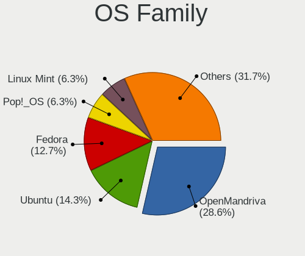
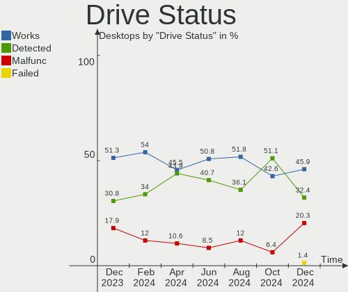
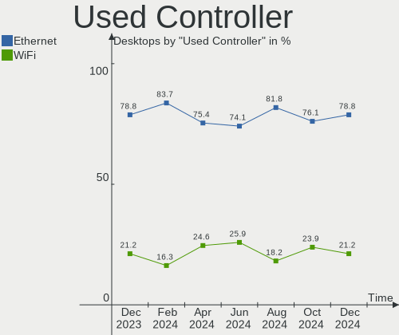
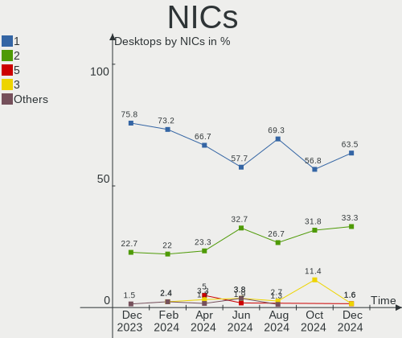

Linux in Poland - Hardware Trends (Desktops)
--------------------------------------------

A project to identify most popular hardware characteristics and track their change
over time based on data collected by Linux users at https://Linux-Hardware.org.

Anyone can contribute to this report by the [hw-probe](https://github.com/linuxhw/hw-probe) tool:

    sudo -E hw-probe -all -upload

Period: Sep, 2023.

Contents
--------

* [ System ](#system)
  - [ OS                       ](#os)
  - [ OS Family                ](#os-family)
  - [ Kernel                   ](#kernel)
  - [ Kernel Family            ](#kernel-family)
  - [ Kernel Major Ver.        ](#kernel-major-ver)
  - [ Arch                     ](#arch)
  - [ DE                       ](#de)
  - [ Display Server           ](#display-server)
  - [ Display Manager          ](#display-manager)
  - [ OS Lang                  ](#os-lang)
  - [ Boot Mode                ](#boot-mode)
  - [ Filesystem               ](#filesystem)
  - [ Part. scheme             ](#part-scheme)
  - [ Dual Boot with Linux/BSD ](#dual-boot-with-linuxbsd)
  - [ Dual Boot (Win)          ](#dual-boot-win)

* [ Board ](#board)
  - [ Vendor                   ](#vendor)
  - [ Model                    ](#model)
  - [ Model Family             ](#model-family)
  - [ MFG Year                 ](#mfg-year)
  - [ Form Factor              ](#form-factor)
  - [ Secure Boot              ](#secure-boot)
  - [ Coreboot                 ](#coreboot)
  - [ RAM Size                 ](#ram-size)
  - [ RAM Used                 ](#ram-used)
  - [ Total Drives             ](#total-drives)
  - [ Has CD-ROM               ](#has-cd-rom)
  - [ Has Ethernet             ](#has-ethernet)
  - [ Has WiFi                 ](#has-wifi)
  - [ Has Bluetooth            ](#has-bluetooth)

* [ Location ](#location)
  - [ Country                  ](#country)
  - [ City                     ](#city)

* [ Drives ](#drives)
  - [ Drive Vendor             ](#drive-vendor)
  - [ Drive Model              ](#drive-model)
  - [ HDD Vendor               ](#hdd-vendor)
  - [ SSD Vendor               ](#ssd-vendor)
  - [ Drive Kind               ](#drive-kind)
  - [ Drive Connector          ](#drive-connector)
  - [ Drive Size               ](#drive-size)
  - [ Space Total              ](#space-total)
  - [ Space Used               ](#space-used)
  - [ Malfunc. Drives          ](#malfunc-drives)
  - [ Malfunc. Drive Vendor    ](#malfunc-drive-vendor)
  - [ Malfunc. HDD Vendor      ](#malfunc-hdd-vendor)
  - [ Malfunc. Drive Kind      ](#malfunc-drive-kind)
  - [ Failed Drives            ](#failed-drives)
  - [ Failed Drive Vendor      ](#failed-drive-vendor)
  - [ Drive Status             ](#drive-status)

* [ Storage controller ](#storage-controller)
  - [ Storage Vendor           ](#storage-vendor)
  - [ Storage Model            ](#storage-model)
  - [ Storage Kind             ](#storage-kind)

* [ Processor ](#processor)
  - [ CPU Vendor               ](#cpu-vendor)
  - [ CPU Model                ](#cpu-model)
  - [ CPU Model Family         ](#cpu-model-family)
  - [ CPU Cores                ](#cpu-cores)
  - [ CPU Sockets              ](#cpu-sockets)
  - [ CPU Threads              ](#cpu-threads)
  - [ CPU Op-Modes             ](#cpu-op-modes)
  - [ CPU Microcode            ](#cpu-microcode)
  - [ CPU Microarch            ](#cpu-microarch)

* [ Graphics ](#graphics)
  - [ GPU Vendor               ](#gpu-vendor)
  - [ GPU Model                ](#gpu-model)
  - [ GPU Combo                ](#gpu-combo)
  - [ GPU Driver               ](#gpu-driver)
  - [ GPU Memory               ](#gpu-memory)

* [ Monitor ](#monitor)
  - [ Monitor Vendor           ](#monitor-vendor)
  - [ Monitor Model            ](#monitor-model)
  - [ Monitor Resolution       ](#monitor-resolution)
  - [ Monitor Diagonal         ](#monitor-diagonal)
  - [ Monitor Width            ](#monitor-width)
  - [ Aspect Ratio             ](#aspect-ratio)
  - [ Monitor Area             ](#monitor-area)
  - [ Pixel Density            ](#pixel-density)
  - [ Multiple Monitors        ](#multiple-monitors)

* [ Network ](#network)
  - [ Net Controller Vendor    ](#net-controller-vendor)
  - [ Net Controller Model     ](#net-controller-model)
  - [ Wireless Vendor          ](#wireless-vendor)
  - [ Wireless Model           ](#wireless-model)
  - [ Ethernet Vendor          ](#ethernet-vendor)
  - [ Ethernet Model           ](#ethernet-model)
  - [ Net Controller Kind      ](#net-controller-kind)
  - [ Used Controller          ](#used-controller)
  - [ NICs                     ](#nics)
  - [ IPv6                     ](#ipv6)

* [ Bluetooth ](#bluetooth)
  - [ Bluetooth Vendor         ](#bluetooth-vendor)
  - [ Bluetooth Model          ](#bluetooth-model)

* [ Sound ](#sound)
  - [ Sound Vendor             ](#sound-vendor)
  - [ Sound Model              ](#sound-model)

* [ Memory ](#memory)
  - [ Memory Vendor            ](#memory-vendor)
  - [ Memory Model             ](#memory-model)
  - [ Memory Kind              ](#memory-kind)
  - [ Memory Form Factor       ](#memory-form-factor)
  - [ Memory Size              ](#memory-size)
  - [ Memory Speed             ](#memory-speed)

* [ Printers & scanners ](#printers--scanners)
  - [ Printer Vendor           ](#printer-vendor)
  - [ Printer Model            ](#printer-model)
  - [ Scanner Vendor           ](#scanner-vendor)
  - [ Scanner Model            ](#scanner-model)

* [ Camera ](#camera)
  - [ Camera Vendor            ](#camera-vendor)
  - [ Camera Model             ](#camera-model)

* [ Security ](#security)
  - [ Fingerprint Vendor       ](#fingerprint-vendor)
  - [ Fingerprint Model        ](#fingerprint-model)
  - [ Chipcard Vendor          ](#chipcard-vendor)
  - [ Chipcard Model           ](#chipcard-model)

* [ Unsupported ](#unsupported)
  - [ Unsupported Devices      ](#unsupported-devices)
  - [ Unsupported Device Types ](#unsupported-device-types)

System
------

OS
--

Installed operating systems

| Name                      | Desktops | Percent |
|---------------------------|----------|---------|
| OpenMandriva 23.08        | 9        | 16.98%  |
| Linux Mint 21.2           | 5        | 9.43%   |
| Gentoo 2.14               | 4        | 7.55%   |
| Fedora 38                 | 4        | 7.55%   |
| Ubuntu 22.04              | 3        | 5.66%   |
| Debian 12                 | 3        | 5.66%   |
| Ubuntu 23.04              | 2        | 3.77%   |
| Ubuntu 20.04              | 2        | 3.77%   |
| OpenMandriva 23.09        | 2        | 3.77%   |
| OpenMandriva 23.03        | 2        | 3.77%   |
| Arch Rolling              | 2        | 3.77%   |
| Zorin 16                  | 1        | 1.89%   |
| Xero Rolling              | 1        | 1.89%   |
| SLED 15.5                 | 1        | 1.89%   |
| Pop!_OS 22.04             | 1        | 1.89%   |
| openSUSE Microos-XXXXXXXX | 1        | 1.89%   |
| openSUSE Leap-15.5        | 1        | 1.89%   |
| OpenMandriva 4.3          | 1        | 1.89%   |
| OpenMandriva 23.01        | 1        | 1.89%   |
| MX 23                     | 1        | 1.89%   |
| Manjaro 18.0              | 1        | 1.89%   |
| Manjaro                   | 1        | 1.89%   |
| Lubuntu 22.04             | 1        | 1.89%   |
| Kubuntu 23.04             | 1        | 1.89%   |
| Kali 2023.3               | 1        | 1.89%   |
| EndeavourOS Rolling       | 1        | 1.89%   |

OS Family
---------

OS without a version

| Name         | Desktops | Percent |
|--------------|----------|---------|
| OpenMandriva | 15       | 28.3%   |
| Ubuntu       | 7        | 13.21%  |
| Linux Mint   | 5        | 9.43%   |
| Gentoo       | 4        | 7.55%   |
| Fedora       | 4        | 7.55%   |
| Debian       | 3        | 5.66%   |
| openSUSE     | 2        | 3.77%   |
| Manjaro      | 2        | 3.77%   |
| Arch         | 2        | 3.77%   |
| Zorin        | 1        | 1.89%   |
| Xero         | 1        | 1.89%   |
| SLED         | 1        | 1.89%   |
| Pop!_OS      | 1        | 1.89%   |
| MX           | 1        | 1.89%   |
| Lubuntu      | 1        | 1.89%   |
| Kubuntu      | 1        | 1.89%   |
| Kali         | 1        | 1.89%   |
| EndeavourOS  | 1        | 1.89%   |

Kernel
------

Version of the Linux kernel

| Version                      | Desktops | Percent |
|------------------------------|----------|---------|
| 6.4.11-desktop-1omv2390      | 8        | 15.09%  |
| 6.2.0-33-generic             | 4        | 7.55%   |
| 5.15.0-83-generic            | 4        | 7.55%   |
| 6.4.0-0.deb12.2-amd64        | 3        | 5.66%   |
| 6.1.46-gentoo                | 3        | 5.66%   |
| 5.15.0-84-generic            | 3        | 5.66%   |
| 6.5.3-desktop-1omv2390       | 2        | 3.77%   |
| 6.4.15-200.fc38.x86_64       | 2        | 3.77%   |
| 6.4.12-arch1-1               | 2        | 3.77%   |
| 6.2.6-desktop-1omv2390       | 2        | 3.77%   |
| 5.15.0-82-generic            | 2        | 3.77%   |
| 6.5.5-200.fc38.x86_64        | 1        | 1.89%   |
| 6.5.3-arch1-1                | 1        | 1.89%   |
| 6.4.8-desktop-2omv2390       | 1        | 1.89%   |
| 6.4.6-76060406-generic       | 1        | 1.89%   |
| 6.4.4-1-default              | 1        | 1.89%   |
| 6.4.0-kali3-amd64            | 1        | 1.89%   |
| 6.2.9-300.fc38.x86_64        | 1        | 1.89%   |
| 6.2.0-32-generic             | 1        | 1.89%   |
| 6.1.50-gentoo                | 1        | 1.89%   |
| 6.1.47-1-lts                 | 1        | 1.89%   |
| 6.1.1-desktop-1omv2290       | 1        | 1.89%   |
| 6.1.0-11-amd64               | 1        | 1.89%   |
| 5.4.0-162-generic            | 1        | 1.89%   |
| 5.16.7-desktop-1omv4003      | 1        | 1.89%   |
| 5.15.131-1-MANJARO           | 1        | 1.89%   |
| 5.14.21-150500.55.19-default | 1        | 1.89%   |
| 5.14.21-150500.40-default    | 1        | 1.89%   |
| 4.19.0-3-MANJARO             | 1        | 1.89%   |

Kernel Family
-------------

Linux kernel without a distro release

| Version  | Desktops | Percent |
|----------|----------|---------|
| 5.15.0   | 9        | 16.98%  |
| 6.4.11   | 8        | 15.09%  |
| 6.2.0    | 5        | 9.43%   |
| 6.4.0    | 4        | 7.55%   |
| 6.5.3    | 3        | 5.66%   |
| 6.1.46   | 3        | 5.66%   |
| 6.4.15   | 2        | 3.77%   |
| 6.4.12   | 2        | 3.77%   |
| 6.2.6    | 2        | 3.77%   |
| 5.14.21  | 2        | 3.77%   |
| 6.5.5    | 1        | 1.89%   |
| 6.4.8    | 1        | 1.89%   |
| 6.4.6    | 1        | 1.89%   |
| 6.4.4    | 1        | 1.89%   |
| 6.2.9    | 1        | 1.89%   |
| 6.1.50   | 1        | 1.89%   |
| 6.1.47   | 1        | 1.89%   |
| 6.1.1    | 1        | 1.89%   |
| 6.1.0    | 1        | 1.89%   |
| 5.4.0    | 1        | 1.89%   |
| 5.16.7   | 1        | 1.89%   |
| 5.15.131 | 1        | 1.89%   |
| 4.19.0   | 1        | 1.89%   |

Kernel Major Ver.
-----------------

Linux kernel major version

| Version | Desktops | Percent |
|---------|----------|---------|
| 6.4     | 19       | 35.85%  |
| 5.15    | 10       | 18.87%  |
| 6.2     | 8        | 15.09%  |
| 6.1     | 7        | 13.21%  |
| 6.5     | 4        | 7.55%   |
| 5.14    | 2        | 3.77%   |
| 5.4     | 1        | 1.89%   |
| 5.16    | 1        | 1.89%   |
| 4.19    | 1        | 1.89%   |

Arch
----

OS architecture (x86_64, i586, etc.)

| Name   | Desktops | Percent |
|--------|----------|---------|
| x86_64 | 53       | 100%    |

DE
--

Desktop Environment

| Name       | Desktops | Percent |
|------------|----------|---------|
| GNOME      | 18       | 33.96%  |
| KDE5       | 16       | 30.19%  |
| XFCE       | 5        | 9.43%   |
| Unknown    | 5        | 9.43%   |
| X-Cinnamon | 3        | 5.66%   |
| MATE       | 3        | 5.66%   |
| LXQt       | 2        | 3.77%   |
| LXDE       | 1        | 1.89%   |

Display Server
--------------

X11 or Wayland

| Name    | Desktops | Percent |
|---------|----------|---------|
| X11     | 29       | 54.72%  |
| Wayland | 21       | 39.62%  |
| Unknown | 2        | 3.77%   |
| Tty     | 1        | 1.89%   |

Display Manager
---------------

SDDM, LightDM, etc.

| Name    | Desktops | Percent |
|---------|----------|---------|
| Unknown | 16       | 30.19%  |
| SDDM    | 15       | 28.3%   |
| LightDM | 11       | 20.75%  |
| GDM     | 7        | 13.21%  |
| GDM3    | 4        | 7.55%   |

OS Lang
-------

Language

| Lang  | Desktops | Percent |
|-------|----------|---------|
| pl_PL | 40       | 75.47%  |
| en_US | 9        | 16.98%  |
| POSIX | 2        | 3.77%   |
| en_GB | 1        | 1.89%   |
| C     | 1        | 1.89%   |

Boot Mode
---------

EFI or BIOS

| Mode | Desktops | Percent |
|------|----------|---------|
| BIOS | 27       | 50.94%  |
| EFI  | 26       | 49.06%  |

Filesystem
----------

Type of filesystem

| Type    | Desktops | Percent |
|---------|----------|---------|
| Ext4    | 26       | 49.06%  |
| Overlay | 11       | 20.75%  |
| Btrfs   | 8        | 15.09%  |
| Tmpfs   | 4        | 7.55%   |
| F2fs    | 3        | 5.66%   |
| Zfs     | 1        | 1.89%   |

Part. scheme
------------

Scheme of partitioning

| Type    | Desktops | Percent |
|---------|----------|---------|
| GPT     | 31       | 58.49%  |
| MBR     | 12       | 22.64%  |
| Unknown | 10       | 18.87%  |

Dual Boot with Linux/BSD
------------------------

Hosting more than one Linux/BSD

| Dual boot | Desktops | Percent |
|-----------|----------|---------|
| No        | 41       | 77.36%  |
| Yes       | 12       | 22.64%  |

Dual Boot (Win)
---------------

Hosting Linux and Windows

| Dual boot | Desktops | Percent |
|-----------|----------|---------|
| No        | 37       | 69.81%  |
| Yes       | 16       | 30.19%  |

Board
-----

Vendor
------

Motherboard manufacturer

| Name                | Desktops | Percent |
|---------------------|----------|---------|
| ASUSTek Computer    | 16       | 30.19%  |
| Gigabyte Technology | 12       | 22.64%  |
| MSI                 | 5        | 9.43%   |
| Hewlett-Packard     | 4        | 7.55%   |
| ASRock              | 4        | 7.55%   |
| Dell                | 3        | 5.66%   |
| Fujitsu             | 2        | 3.77%   |
| Acer                | 2        | 3.77%   |
| Medion              | 1        | 1.89%   |
| Lenovo              | 1        | 1.89%   |
| Huanan              | 1        | 1.89%   |
| Apple               | 1        | 1.89%   |
| Unknown             | 1        | 1.89%   |

Model
-----

Motherboard model

| Name                              | Desktops | Percent |
|-----------------------------------|----------|---------|
| Gigabyte X570 GAMING X            | 2        | 3.77%   |
| MSI MS-7D77                       | 1        | 1.89%   |
| MSI MS-7B79                       | 1        | 1.89%   |
| MSI MS-7B10                       | 1        | 1.89%   |
| MSI MS-7966                       | 1        | 1.89%   |
| MSI MS-7583                       | 1        | 1.89%   |
| Medion MS-7848                    | 1        | 1.89%   |
| Lenovo ThinkCentre M83 10AHS0X60C | 1        | 1.89%   |
| Huanan X99-TF                     | 1        | 1.89%   |
| HP Z420 Workstation               | 1        | 1.89%   |
| HP Compaq Pro 6300 MT             | 1        | 1.89%   |
| HP Compaq Elite 8300 SFF          | 1        | 1.89%   |
| HP Compaq 6005 Pro SFF PC         | 1        | 1.89%   |
| Gigabyte Z97M-DS3H                | 1        | 1.89%   |
| Gigabyte PH67A-D3-B3              | 1        | 1.89%   |
| Gigabyte P35-DS3                  | 1        | 1.89%   |
| Gigabyte GA-MA770T-UD3            | 1        | 1.89%   |
| Gigabyte G41M-Combo               | 1        | 1.89%   |
| Gigabyte B85M-D3H                 | 1        | 1.89%   |
| Gigabyte B450M DS3H V2            | 1        | 1.89%   |
| Gigabyte B365M DS3H               | 1        | 1.89%   |
| Gigabyte AB350-Gaming             | 1        | 1.89%   |
| Gigabyte A520 AORUS ELITE         | 1        | 1.89%   |
| Fujitsu FUTRO S720                | 1        | 1.89%   |
| Fujitsu ESPRIMO Q920              | 1        | 1.89%   |
| Dell PowerEdge T30                | 1        | 1.89%   |
| Dell OptiPlex 790                 | 1        | 1.89%   |
| Dell OptiPlex 3010                | 1        | 1.89%   |
| ASUS TUF Gaming B550-PLUS         | 1        | 1.89%   |
| ASUS PRIME Z370-P                 | 1        | 1.89%   |
| ASUS PRIME X370-PRO               | 1        | 1.89%   |
| ASUS PRIME H770-PLUS              | 1        | 1.89%   |
| ASUS PRIME B460-PLUS              | 1        | 1.89%   |
| ASUS PRIME B450M-A II             | 1        | 1.89%   |
| ASUS PRIME B450-PLUS              | 1        | 1.89%   |
| ASUS P8P67 PRO                    | 1        | 1.89%   |
| ASUS P8H77-M PRO                  | 1        | 1.89%   |
| ASUS P5K                          | 1        | 1.89%   |
| ASUS P5G41T-M LX3                 | 1        | 1.89%   |
| ASUS Maximus IX FORMULA           | 1        | 1.89%   |

Model Family
------------

Motherboard model prefix

| Name                   | Desktops | Percent |
|------------------------|----------|---------|
| ASUS PRIME             | 6        | 11.32%  |
| HP Compaq              | 3        | 5.66%   |
| Gigabyte X570          | 2        | 3.77%   |
| Dell OptiPlex          | 2        | 3.77%   |
| MSI MS-7D77            | 1        | 1.89%   |
| MSI MS-7B79            | 1        | 1.89%   |
| MSI MS-7B10            | 1        | 1.89%   |
| MSI MS-7966            | 1        | 1.89%   |
| MSI MS-7583            | 1        | 1.89%   |
| Medion MS-7848         | 1        | 1.89%   |
| Lenovo ThinkCentre     | 1        | 1.89%   |
| Huanan X99-TF          | 1        | 1.89%   |
| HP Z420                | 1        | 1.89%   |
| Gigabyte Z97M-DS3H     | 1        | 1.89%   |
| Gigabyte PH67A-D3-B3   | 1        | 1.89%   |
| Gigabyte P35-DS3       | 1        | 1.89%   |
| Gigabyte GA-MA770T-UD3 | 1        | 1.89%   |
| Gigabyte G41M-Combo    | 1        | 1.89%   |
| Gigabyte B85M-D3H      | 1        | 1.89%   |
| Gigabyte B450M         | 1        | 1.89%   |
| Gigabyte B365M         | 1        | 1.89%   |
| Gigabyte AB350-Gaming  | 1        | 1.89%   |
| Gigabyte A520          | 1        | 1.89%   |
| Fujitsu FUTRO          | 1        | 1.89%   |
| Fujitsu ESPRIMO        | 1        | 1.89%   |
| Dell PowerEdge         | 1        | 1.89%   |
| ASUS TUF               | 1        | 1.89%   |
| ASUS P8P67             | 1        | 1.89%   |
| ASUS P8H77-M           | 1        | 1.89%   |
| ASUS P5K               | 1        | 1.89%   |
| ASUS P5G41T-M          | 1        | 1.89%   |
| ASUS Maximus           | 1        | 1.89%   |
| ASUS M3A78-CM          | 1        | 1.89%   |
| ASUS H110M-D           | 1        | 1.89%   |
| ASUS All               | 1        | 1.89%   |
| ASUS A88XM-E           | 1        | 1.89%   |
| ASRock H97M            | 1        | 1.89%   |
| ASRock B450M           | 1        | 1.89%   |
| ASRock B450            | 1        | 1.89%   |
| ASRock 970             | 1        | 1.89%   |

MFG Year
--------

Motherboard manufacture year

| Year | Desktops | Percent |
|------|----------|---------|
| 2020 | 6        | 11.32%  |
| 2018 | 6        | 11.32%  |
| 2014 | 6        | 11.32%  |
| 2012 | 6        | 11.32%  |
| 2017 | 5        | 9.43%   |
| 2019 | 4        | 7.55%   |
| 2015 | 3        | 5.66%   |
| 2010 | 3        | 5.66%   |
| 2009 | 3        | 5.66%   |
| 2023 | 2        | 3.77%   |
| 2013 | 2        | 3.77%   |
| 2011 | 2        | 3.77%   |
| 2007 | 2        | 3.77%   |
| 2022 | 1        | 1.89%   |
| 2021 | 1        | 1.89%   |
| 2008 | 1        | 1.89%   |

Form Factor
-----------

Physical design of the computer

| Name    | Desktops | Percent |
|---------|----------|---------|
| Desktop | 53       | 100%    |

Secure Boot
-----------

Enabled or disabled

| State    | Desktops | Percent |
|----------|----------|---------|
| Disabled | 52       | 98.11%  |
| Enabled  | 1        | 1.89%   |

Coreboot
--------

Have coreboot on board

| Used | Desktops | Percent |
|------|----------|---------|
| No   | 53       | 100%    |

RAM Size
--------

Total RAM memory

| Size in GB  | Desktops | Percent |
|-------------|----------|---------|
| 32.01-64.0  | 13       | 24.53%  |
| 16.01-24.0  | 11       | 20.75%  |
| 4.01-8.0    | 9        | 16.98%  |
| 8.01-16.0   | 9        | 16.98%  |
| 64.01-256.0 | 5        | 9.43%   |
| 3.01-4.0    | 4        | 7.55%   |
| 24.01-32.0  | 1        | 1.89%   |
| 1.01-2.0    | 1        | 1.89%   |

RAM Used
--------

Used RAM memory

| Used GB    | Desktops | Percent |
|------------|----------|---------|
| 1.01-2.0   | 19       | 35.85%  |
| 2.01-3.0   | 14       | 26.42%  |
| 4.01-8.0   | 8        | 15.09%  |
| 3.01-4.0   | 5        | 9.43%   |
| 8.01-16.0  | 3        | 5.66%   |
| 0.51-1.0   | 3        | 5.66%   |
| 16.01-24.0 | 1        | 1.89%   |

Total Drives
------------

Number of drives on board

| Drives | Desktops | Percent |
|--------|----------|---------|
| 1      | 18       | 33.96%  |
| 3      | 13       | 24.53%  |
| 2      | 11       | 20.75%  |
| 5      | 4        | 7.55%   |
| 4      | 4        | 7.55%   |
| 0      | 2        | 3.77%   |
| 6      | 1        | 1.89%   |

Has CD-ROM
----------

Has CD-ROM on board

| Presented | Desktops | Percent |
|-----------|----------|---------|
| No        | 28       | 52.83%  |
| Yes       | 25       | 47.17%  |

Has Ethernet
------------

Has Ethernet on board

| Presented | Desktops | Percent |
|-----------|----------|---------|
| Yes       | 52       | 98.11%  |
| No        | 1        | 1.89%   |

Has WiFi
--------

Has WiFi module

| Presented | Desktops | Percent |
|-----------|----------|---------|
| No        | 39       | 73.58%  |
| Yes       | 14       | 26.42%  |

Has Bluetooth
-------------

Has Bluetooth module

| Presented | Desktops | Percent |
|-----------|----------|---------|
| No        | 40       | 75.47%  |
| Yes       | 13       | 24.53%  |

Location
--------

Country
-------

Geographic location (country)

| Country | Desktops | Percent |
|---------|----------|---------|
| Poland  | 53       | 100%    |

City
----

Geographic location (city)

| City            | Desktops | Percent |
|-----------------|----------|---------|
| Warsaw          | 11       | 20.75%  |
| Wroclaw         | 4        | 7.55%   |
| Ruda Śląska   | 4        | 7.55%   |
| Torun           | 2        | 3.77%   |
| Lublin          | 2        | 3.77%   |
| Krakow          | 2        | 3.77%   |
| Katowice        | 2        | 3.77%   |
| Gdansk          | 2        | 3.77%   |
| Zukowo          | 1        | 1.89%   |
| Zagorz          | 1        | 1.89%   |
| Tychy           | 1        | 1.89%   |
| Trzcianka       | 1        | 1.89%   |
| Tarnów         | 1        | 1.89%   |
| Słupsk         | 1        | 1.89%   |
| Szczecin        | 1        | 1.89%   |
| Stary Sacz      | 1        | 1.89%   |
| Skierniewice    | 1        | 1.89%   |
| Radom           | 1        | 1.89%   |
| Otwock          | 1        | 1.89%   |
| Opole           | 1        | 1.89%   |
| Mysłowice      | 1        | 1.89%   |
| Lubon           | 1        | 1.89%   |
| Lubaczow        | 1        | 1.89%   |
| Lodz            | 1        | 1.89%   |
| Krotoszyn       | 1        | 1.89%   |
| Gdynia          | 1        | 1.89%   |
| Elblag          | 1        | 1.89%   |
| Cieszyn         | 1        | 1.89%   |
| Bytom           | 1        | 1.89%   |
| Busko-Zdrój    | 1        | 1.89%   |
| Biała Podlaska | 1        | 1.89%   |
| Biale Blota     | 1        | 1.89%   |

Drives
------

Drive Vendor
------------

Hard drive vendors

| Vendor                    | Desktops | Drives | Percent |
|---------------------------|----------|--------|---------|
| WDC                       | 14       | 17     | 14.58%  |
| Samsung Electronics       | 13       | 17     | 13.54%  |
| Seagate                   | 11       | 15     | 11.46%  |
| GOODRAM                   | 11       | 18     | 11.46%  |
| Toshiba                   | 7        | 7      | 7.29%   |
| Crucial                   | 6        | 6      | 6.25%   |
| A-DATA Technology         | 6        | 6      | 6.25%   |
| SPCC                      | 4        | 5      | 4.17%   |
| Hitachi                   | 3        | 5      | 3.13%   |
| China                     | 3        | 4      | 3.13%   |
| ADATA Technology          | 3        | 3      | 3.13%   |
| Phison Electronics        | 2        | 3      | 2.08%   |
| XPG                       | 1        | 1      | 1.04%   |
| Unknown                   | 1        | 1      | 1.04%   |
| SK hynix                  | 1        | 1      | 1.04%   |
| SanDisk                   | 1        | 1      | 1.04%   |
| POLION                    | 1        | 1      | 1.04%   |
| PNY                       | 1        | 1      | 1.04%   |
| Patriot                   | 1        | 1      | 1.04%   |
| Micron/Crucial Technology | 1        | 1      | 1.04%   |
| Kingston                  | 1        | 1      | 1.04%   |
| Kingchuxing               | 1        | 1      | 1.04%   |
| Innodisk                  | 1        | 1      | 1.04%   |
| HGST                      | 1        | 1      | 1.04%   |
| Unknown                   | 1        | 1      | 1.04%   |

Drive Model
-----------

Hard drive models

| Model                                              | Desktops | Percent |
|----------------------------------------------------|----------|---------|
| SPCC Solid State Disk 512GB                        | 3        | 2.65%   |
| Samsung SSD 980 500GB                              | 3        | 2.65%   |
| Samsung SSD 850 EVO 250GB                          | 3        | 2.65%   |
| GOODRAM IRP-SSDPR-S25C-256 256GB                   | 3        | 2.65%   |
| WDC WD1001FALS-00J7B0 1TB                          | 2        | 1.77%   |
| Toshiba HDWD110 1TB                                | 2        | 1.77%   |
| Toshiba DT01ACA100 1TB                             | 2        | 1.77%   |
| Samsung SSD 870 EVO 250GB                          | 2        | 1.77%   |
| Samsung NVMe SSD Controller PM9A1/PM9A3/980PRO 1TB | 2        | 1.77%   |
| Phison E12 NVMe Controller 2TB                     | 2        | 1.77%   |
| GOODRAM SSDPR-CL100-480-G2 480GB                   | 2        | 1.77%   |
| GOODRAM IR-SSDPR-P34B-02T-80 2TB                   | 2        | 1.77%   |
| Crucial CT500MX500SSD1 500GB                       | 2        | 1.77%   |
| XPG GAMMIX S5 256GB                                | 1        | 0.88%   |
| WDC WD5002AALX-32Z3A0 500GB                        | 1        | 0.88%   |
| WDC WD5000BEVT-22A0RT0 500GB                       | 1        | 0.88%   |
| WDC WD30EFRX-68EUZN0 3TB                           | 1        | 0.88%   |
| WDC WD2500AAKX-00ERMA0 250GB                       | 1        | 0.88%   |
| WDC WD20NPVX-00EA4T0 2TB                           | 1        | 0.88%   |
| WDC WD20EZRZ-00Z5HB0 2TB                           | 1        | 0.88%   |
| WDC WD20EZRX-00DC0B0 2TB                           | 1        | 0.88%   |
| WDC WD20EZRX-00D8PB0 2TB                           | 1        | 0.88%   |
| WDC WD20EFRX-68AX9N0 2TB                           | 1        | 0.88%   |
| WDC WD20EARS-00MVWB0 2TB                           | 1        | 0.88%   |
| WDC WD10EZEX-00ZF5A0 1TB                           | 1        | 0.88%   |
| WDC WD10EZEX-00WN4A0 1TB                           | 1        | 0.88%   |
| WDC WD10EZEX-00BN5A0 1TB                           | 1        | 0.88%   |
| WDC WD10EARS-00Y5B1 1TB                            | 1        | 0.88%   |
| WDC WD10 JPVX-00JC3T0 1TB                          | 1        | 0.88%   |
| Unknown SD/MMC/MS PRO 128GB                        | 1        | 0.88%   |
| Toshiba KXG50ZNV256G 256GB                         | 1        | 0.88%   |
| Toshiba HDWE150 5TB                                | 1        | 0.88%   |
| Toshiba HDWD120 2TB                                | 1        | 0.88%   |
| SPCC Solid State Disk 240GB                        | 1        | 0.88%   |
| SPCC M.2 PCIe SSD 512GB                            | 1        | 0.88%   |
| SK hynix SC401 SATA 512GB SSD                      | 1        | 0.88%   |
| Seagate ST9160827AS 160GB                          | 1        | 0.88%   |
| Seagate ST9160314AS 160GB                          | 1        | 0.88%   |
| Seagate ST6000VN0033-2EE110 6TB                    | 1        | 0.88%   |
| Seagate ST500DM002-1SB10A 500GB                    | 1        | 0.88%   |

HDD Vendor
----------

Hard disk drive vendors

| Vendor  | Desktops | Drives | Percent |
|---------|----------|--------|---------|
| WDC     | 14       | 17     | 38.89%  |
| Seagate | 11       | 15     | 30.56%  |
| Toshiba | 6        | 6      | 16.67%  |
| Hitachi | 3        | 5      | 8.33%   |
| Unknown | 1        | 1      | 2.78%   |
| HGST    | 1        | 1      | 2.78%   |

SSD Vendor
----------

Solid state drive vendors

| Vendor              | Desktops | Drives | Percent |
|---------------------|----------|--------|---------|
| GOODRAM             | 11       | 14     | 25.58%  |
| Samsung Electronics | 8        | 9      | 18.6%   |
| Crucial             | 6        | 6      | 13.95%  |
| A-DATA Technology   | 4        | 4      | 9.3%    |
| SPCC                | 3        | 4      | 6.98%   |
| China               | 3        | 4      | 6.98%   |
| SK hynix            | 1        | 1      | 2.33%   |
| SanDisk             | 1        | 1      | 2.33%   |
| POLION              | 1        | 1      | 2.33%   |
| PNY                 | 1        | 1      | 2.33%   |
| Patriot             | 1        | 1      | 2.33%   |
| Kingchuxing         | 1        | 1      | 2.33%   |
| Innodisk            | 1        | 1      | 2.33%   |
| Unknown             | 1        | 1      | 2.33%   |

Drive Kind
----------

HDD or SSD

| Kind | Desktops | Drives | Percent |
|------|----------|--------|---------|
| SSD  | 37       | 49     | 45.68%  |
| HDD  | 25       | 45     | 30.86%  |
| NVMe | 19       | 25     | 23.46%  |

Drive Connector
---------------

SATA, SAS, NVMe, etc.

| Type | Desktops | Drives | Percent |
|------|----------|--------|---------|
| SATA | 44       | 89     | 65.67%  |
| NVMe | 19       | 25     | 28.36%  |
| SAS  | 4        | 5      | 5.97%   |

Drive Size
----------

Size of hard drive

| Size in TB | Desktops | Drives | Percent |
|------------|----------|--------|---------|
| 0.01-0.5   | 31       | 39     | 42.47%  |
| 0.51-1.0   | 26       | 34     | 35.62%  |
| 1.01-2.0   | 8        | 10     | 10.96%  |
| 3.01-4.0   | 2        | 2      | 2.74%   |
| 2.01-3.0   | 2        | 4      | 2.74%   |
| 10.01-20.0 | 2        | 3      | 2.74%   |
| 4.01-10.0  | 2        | 2      | 2.74%   |

Space Total
-----------

Amount of disk space available on the file system

| Size in GB     | Desktops | Percent |
|----------------|----------|---------|
| 501-1000       | 11       | 20.75%  |
| 251-500        | 10       | 18.87%  |
| 101-250        | 9        | 16.98%  |
| More than 3000 | 6        | 11.32%  |
| 1-20           | 6        | 11.32%  |
| 1001-2000      | 5        | 9.43%   |
| Unknown        | 4        | 7.55%   |
| 21-50          | 1        | 1.89%   |
| 2001-3000      | 1        | 1.89%   |

Space Used
----------

Amount of used disk space

| Used GB        | Desktops | Percent |
|----------------|----------|---------|
| 1-20           | 18       | 33.96%  |
| 101-250        | 11       | 20.75%  |
| 251-500        | 6        | 11.32%  |
| 21-50          | 4        | 7.55%   |
| Unknown        | 4        | 7.55%   |
| More than 3000 | 3        | 5.66%   |
| 1001-2000      | 2        | 3.77%   |
| 501-1000       | 2        | 3.77%   |
| 51-100         | 2        | 3.77%   |
| 2001-3000      | 1        | 1.89%   |

Malfunc. Drives
---------------

Drive models with a malfunction

| Model                               | Desktops | Drives | Percent |
|-------------------------------------|----------|--------|---------|
| WDC WD20NPVX-00EA4T0 2TB            | 1        | 1      | 10%     |
| WDC WD20EARS-00MVWB0 2TB            | 1        | 1      | 10%     |
| WDC WD10EARS-00Y5B1 1TB             | 1        | 1      | 10%     |
| SPCC M.2 PCIe SSD 512GB             | 1        | 1      | 10%     |
| Seagate ST9160827AS 160GB           | 1        | 1      | 10%     |
| Seagate ST6000VN0033-2EE110 6TB     | 1        | 1      | 10%     |
| Samsung Electronics SSD 870 EVO 1TB | 1        | 1      | 10%     |
| Crucial CT250BX100SSD1 250GB        | 1        | 1      | 10%     |
| China SSD 120GB                     | 1        | 1      | 10%     |
| A-DATA Technology SU800 512GB SSD   | 1        | 1      | 10%     |

Malfunc. Drive Vendor
---------------------

Vendors of faulty drives

| Vendor              | Desktops | Drives | Percent |
|---------------------|----------|--------|---------|
| WDC                 | 2        | 3      | 22.22%  |
| Seagate             | 2        | 2      | 22.22%  |
| SPCC                | 1        | 1      | 11.11%  |
| Samsung Electronics | 1        | 1      | 11.11%  |
| Crucial             | 1        | 1      | 11.11%  |
| China               | 1        | 1      | 11.11%  |
| A-DATA Technology   | 1        | 1      | 11.11%  |

Malfunc. HDD Vendor
-------------------

Vendors of faulty HDD drives

| Vendor  | Desktops | Drives | Percent |
|---------|----------|--------|---------|
| WDC     | 2        | 3      | 50%     |
| Seagate | 2        | 2      | 50%     |

Malfunc. Drive Kind
-------------------

Kinds of faulty drives

| Kind | Desktops | Drives | Percent |
|------|----------|--------|---------|
| SSD  | 4        | 4      | 44.44%  |
| HDD  | 4        | 5      | 44.44%  |
| NVMe | 1        | 1      | 11.11%  |

Failed Drives
-------------

Failed drive models

Zero info for selected period =(

Failed Drive Vendor
-------------------

Failed drive vendors

Zero info for selected period =(

Drive Status
------------

Number of failed and malfunc. drives

| Status   | Desktops | Drives | Percent |
|----------|----------|--------|---------|
| Works    | 35       | 70     | 57.38%  |
| Detected | 17       | 39     | 27.87%  |
| Malfunc  | 9        | 10     | 14.75%  |

Storage controller
------------------

Storage Vendor
--------------

Storage controller vendors

| Vendor                       | Desktops | Percent |
|------------------------------|----------|---------|
| Intel                        | 33       | 41.25%  |
| AMD                          | 19       | 23.75%  |
| Samsung Electronics          | 6        | 7.5%    |
| ADATA Technology             | 6        | 7.5%    |
| Phison Electronics           | 4        | 5%      |
| JMicron Technology           | 4        | 5%      |
| Marvell Technology Group     | 2        | 2.5%    |
| ASMedia Technology           | 2        | 2.5%    |
| Toshiba America Info Systems | 1        | 1.25%   |
| Realtek Semiconductor        | 1        | 1.25%   |
| Micron/Crucial Technology    | 1        | 1.25%   |
| Kingston Technology Company  | 1        | 1.25%   |

Storage Model
-------------

Storage controller models

| Model                                                                          | Desktops | Percent |
|--------------------------------------------------------------------------------|----------|---------|
| AMD FCH SATA Controller [AHCI mode]                                            | 10       | 10.31%  |
| AMD 400 Series Chipset SATA Controller                                         | 5        | 5.15%   |
| Phison E12 NVMe Controller                                                     | 4        | 4.12%   |
| Intel Q170/Q150/B150/H170/H110/Z170/CM236 Chipset SATA Controller [AHCI Mode]  | 4        | 4.12%   |
| Intel 8 Series/C220 Series Chipset Family 6-port SATA Controller 1 [AHCI mode] | 4        | 4.12%   |
| Samsung NVMe SSD Controller 980                                                | 3        | 3.09%   |
| JMicron JMB363 SATA/IDE Controller                                             | 3        | 3.09%   |
| Intel 6 Series/C200 Series Chipset Family 6 port Desktop SATA AHCI Controller  | 3        | 3.09%   |
| Intel 200 Series PCH SATA controller [AHCI mode]                               | 3        | 3.09%   |
| AMD SB7x0/SB8x0/SB9x0 IDE Controller                                           | 3        | 3.09%   |
| ADATA XPG SX8200 Pro PCIe Gen3x4 M.2 2280 Solid State Drive                    | 3        | 3.09%   |
| ADATA ADATA XPG GAMMIXS1 1L Media (256 GB SSD)                                 | 3        | 3.09%   |
| Samsung NVMe SSD Controller SM981/PM981/PM983                                  | 2        | 2.06%   |
| Samsung NVMe SSD Controller PM9A1/PM9A3/980PRO                                 | 2        | 2.06%   |
| Intel NM10/ICH7 Family SATA Controller [IDE mode]                              | 2        | 2.06%   |
| Intel 9 Series Chipset Family SATA Controller [AHCI Mode]                      | 2        | 2.06%   |
| Intel 7 Series/C210 Series Chipset Family 6-port SATA Controller [AHCI mode]   | 2        | 2.06%   |
| AMD SB7x0/SB8x0/SB9x0 SATA Controller [IDE mode]                               | 2        | 2.06%   |
| AMD 500 Series Chipset SATA Controller                                         | 2        | 2.06%   |
| Toshiba America Info Systems XG5 NVMe SSD Controller                           | 1        | 1.03%   |
| Realtek RTS5763DL NVMe SSD Controller                                          | 1        | 1.03%   |
| Micron/Crucial P2 [Nick P2] / P3 / P3 Plus NVMe PCIe SSD (DRAM-less)           | 1        | 1.03%   |
| Marvell Group 88SE9172 SATA III 6Gb/s RAID Controller                          | 1        | 1.03%   |
| Marvell Group 88SE9172 SATA 6Gb/s Controller                                   | 1        | 1.03%   |
| Kingston Company KC3000/Renegade NVMe SSD                                      | 1        | 1.03%   |
| JMicron JMB362 SATA Controller                                                 | 1        | 1.03%   |
| Intel Volume Management Device NVMe RAID Controller Intel Corporation          | 1        | 1.03%   |
| Intel SATA Controller [RAID mode]                                              | 1        | 1.03%   |
| Intel SATA controller                                                          | 1        | 1.03%   |
| Intel Cannon Lake PCH SATA AHCI Controller                                     | 1        | 1.03%   |
| Intel C610/X99 series chipset sSATA Controller [AHCI mode]                     | 1        | 1.03%   |
| Intel C610/X99 series chipset 6-Port SATA Controller [AHCI mode]               | 1        | 1.03%   |
| Intel C602 chipset 4-Port SATA Storage Control Unit                            | 1        | 1.03%   |
| Intel C600/X79 series chipset IDE-r Controller                                 | 1        | 1.03%   |
| Intel C600/X79 series chipset 6-Port SATA AHCI Controller                      | 1        | 1.03%   |
| Intel 82801JI (ICH10 Family) SATA AHCI Controller                              | 1        | 1.03%   |
| Intel 82801IB (ICH9) 4 port SATA Controller [AHCI mode]                        | 1        | 1.03%   |
| Intel 82801IB (ICH9) 2 port SATA Controller [IDE mode]                         | 1        | 1.03%   |
| Intel 82801I (ICH9 Family) 2 port SATA Controller [IDE mode]                   | 1        | 1.03%   |
| Intel 82801G (ICH7 Family) IDE Controller                                      | 1        | 1.03%   |

Storage Kind
------------

Kind of storage controller (IDE, SATA, NVMe, SAS, ...)

| Kind | Desktops | Percent |
|------|----------|---------|
| SATA | 44       | 56.41%  |
| NVMe | 19       | 24.36%  |
| IDE  | 11       | 14.1%   |
| RAID | 3        | 3.85%   |
| SAS  | 1        | 1.28%   |

Processor
---------

CPU Vendor
----------

Processor vendors

| Vendor | Desktops | Percent |
|--------|----------|---------|
| Intel  | 34       | 64.15%  |
| AMD    | 19       | 35.85%  |

CPU Model
---------

Processor models

| Model                                  | Desktops | Percent |
|----------------------------------------|----------|---------|
| Intel Core i3-3220 CPU @ 3.30GHz       | 2        | 3.77%   |
| AMD Ryzen 7 3700X 8-Core Processor     | 2        | 3.77%   |
| AMD Ryzen 5 2600 Six-Core Processor    | 2        | 3.77%   |
| Intel Xeon CPU X5680 @ 3.33GHz         | 1        | 1.89%   |
| Intel Xeon CPU E5-2678 v3 @ 2.50GHz    | 1        | 1.89%   |
| Intel Xeon CPU E5-1680 v2 @ 3.00GHz    | 1        | 1.89%   |
| Intel Xeon CPU E3-1225 v5 @ 3.30GHz    | 1        | 1.89%   |
| Intel Pentium D CPU 3.40GHz            | 1        | 1.89%   |
| Intel Pentium CPU G3220 @ 3.00GHz      | 1        | 1.89%   |
| Intel N100                             | 1        | 1.89%   |
| Intel Core i7-8700K CPU @ 3.70GHz      | 1        | 1.89%   |
| Intel Core i7-8086K CPU @ 4.00GHz      | 1        | 1.89%   |
| Intel Core i7-6700K CPU @ 4.00GHz      | 1        | 1.89%   |
| Intel Core i7-6700 CPU @ 3.40GHz       | 1        | 1.89%   |
| Intel Core i7-5930K CPU @ 3.50GHz      | 1        | 1.89%   |
| Intel Core i7-4790 CPU @ 3.60GHz       | 1        | 1.89%   |
| Intel Core i7-2600K CPU @ 3.40GHz      | 1        | 1.89%   |
| Intel Core i7-2600 CPU @ 3.40GHz       | 1        | 1.89%   |
| Intel Core i7 CPU 870 @ 2.93GHz        | 1        | 1.89%   |
| Intel Core i5-9400F CPU @ 2.90GHz      | 1        | 1.89%   |
| Intel Core i5-7400 CPU @ 3.00GHz       | 1        | 1.89%   |
| Intel Core i5-6600K CPU @ 3.50GHz      | 1        | 1.89%   |
| Intel Core i5-4690 CPU @ 3.50GHz       | 1        | 1.89%   |
| Intel Core i5-4590T CPU @ 2.00GHz      | 1        | 1.89%   |
| Intel Core i5-3470S CPU @ 2.90GHz      | 1        | 1.89%   |
| Intel Core i5-3470 CPU @ 3.20GHz       | 1        | 1.89%   |
| Intel Core i5-2500 CPU @ 3.30GHz       | 1        | 1.89%   |
| Intel Core i3-6100T CPU @ 3.20GHz      | 1        | 1.89%   |
| Intel Core i3-4160 CPU @ 3.60GHz       | 1        | 1.89%   |
| Intel Core i3-4150 CPU @ 3.50GHz       | 1        | 1.89%   |
| Intel Core i3-10100 CPU @ 3.60GHz      | 1        | 1.89%   |
| Intel Core 2 Quad CPU Q9650 @ 3.00GHz  | 1        | 1.89%   |
| Intel Core 2 Quad CPU Q9550 @ 2.83GHz  | 1        | 1.89%   |
| Intel Core 2 Quad CPU Q6600 @ 2.40GHz  | 1        | 1.89%   |
| Intel 13th Gen Core i7-13700KF         | 1        | 1.89%   |
| AMD Ryzen 9 3900X 12-Core Processor    | 1        | 1.89%   |
| AMD Ryzen 9 3900 12-Core Processor     | 1        | 1.89%   |
| AMD Ryzen 7 5800X 8-Core Processor     | 1        | 1.89%   |
| AMD Ryzen 7 5700G with Radeon Graphics | 1        | 1.89%   |
| AMD Ryzen 7 2700X Eight-Core Processor | 1        | 1.89%   |

CPU Model Family
----------------

Processor model prefix

| Model             | Desktops | Percent |
|-------------------|----------|---------|
| Intel Core i7     | 9        | 16.98%  |
| Intel Core i5     | 8        | 15.09%  |
| Intel Core i3     | 6        | 11.32%  |
| AMD Ryzen 5       | 6        | 11.32%  |
| AMD Ryzen 7       | 5        | 9.43%   |
| Intel Xeon        | 4        | 7.55%   |
| Intel Core 2 Quad | 3        | 5.66%   |
| Other             | 2        | 3.77%   |
| AMD Ryzen 9       | 2        | 3.77%   |
| Intel Pentium D   | 1        | 1.89%   |
| Intel Pentium     | 1        | 1.89%   |
| AMD Phenom II X4  | 1        | 1.89%   |
| AMD Phenom II X2  | 1        | 1.89%   |
| AMD GX            | 1        | 1.89%   |
| AMD FX            | 1        | 1.89%   |
| AMD Athlon II X4  | 1        | 1.89%   |
| AMD A8            | 1        | 1.89%   |

CPU Cores
---------

Number of processor cores

| Number | Desktops | Percent |
|--------|----------|---------|
| 4      | 23       | 43.4%   |
| 2      | 10       | 18.87%  |
| 6      | 9        | 16.98%  |
| 8      | 6        | 11.32%  |
| 12     | 4        | 7.55%   |
| 16     | 1        | 1.89%   |

CPU Sockets
-----------

Number of sockets

| Number | Desktops | Percent |
|--------|----------|---------|
| 1      | 52       | 98.11%  |
| 2      | 1        | 1.89%   |

CPU Threads
-----------

Threads per core (Hyper-Threading)

| Number | Desktops | Percent |
|--------|----------|---------|
| 2      | 34       | 64.15%  |
| 1      | 19       | 35.85%  |

CPU Op-Modes
------------

CPU Operation Modes (32-bit, 64-bit)

| Op mode        | Desktops | Percent |
|----------------|----------|---------|
| 32-bit, 64-bit | 53       | 100%    |

CPU Microcode
-------------

Microcode number

| Number     | Desktops | Percent |
|------------|----------|---------|
| Unknown    | 27       | 50.94%  |
| 0x306c3    | 3        | 5.66%   |
| 0x206a7    | 3        | 5.66%   |
| 0x0a50000d | 2        | 3.77%   |
| 0x0800820d | 2        | 3.77%   |
| 0xa0653    | 1        | 1.89%   |
| 0x906ea    | 1        | 1.89%   |
| 0x906e9    | 1        | 1.89%   |
| 0x506e3    | 1        | 1.89%   |
| 0x306e4    | 1        | 1.89%   |
| 0x306a9    | 1        | 1.89%   |
| 0x106e5    | 1        | 1.89%   |
| 0x0a601203 | 1        | 1.89%   |
| 0x0a201016 | 1        | 1.89%   |
| 0x08701030 | 1        | 1.89%   |
| 0x08701021 | 1        | 1.89%   |
| 0x08701013 | 1        | 1.89%   |
| 0x08108109 | 1        | 1.89%   |
| 0x0700010b | 1        | 1.89%   |
| 0x06000817 | 1        | 1.89%   |
| 0x010000c8 | 1        | 1.89%   |

CPU Microarch
-------------

Microarchitecture

| Name             | Desktops | Percent |
|------------------|----------|---------|
| Haswell          | 8        | 15.09%  |
| Zen 2            | 5        | 9.43%   |
| Skylake          | 5        | 9.43%   |
| IvyBridge        | 5        | 9.43%   |
| Zen+             | 4        | 7.55%   |
| KabyLake         | 4        | 7.55%   |
| Zen 3            | 3        | 5.66%   |
| SandyBridge      | 3        | 5.66%   |
| K10              | 3        | 5.66%   |
| Piledriver       | 2        | 3.77%   |
| Penryn           | 2        | 3.77%   |
| Westmere         | 1        | 1.89%   |
| NetBurst         | 1        | 1.89%   |
| Nehalem          | 1        | 1.89%   |
| Jaguar           | 1        | 1.89%   |
| Gracemont        | 1        | 1.89%   |
| Core             | 1        | 1.89%   |
| CometLake        | 1        | 1.89%   |
| Alderlake Hybrid | 1        | 1.89%   |
| Unknown          | 1        | 1.89%   |

Graphics
--------

GPU Vendor
----------

Vendors of graphics cards

| Vendor | Desktops | Percent |
|--------|----------|---------|
| Nvidia | 23       | 42.59%  |
| AMD    | 17       | 31.48%  |
| Intel  | 14       | 25.93%  |

GPU Model
---------

Graphics card models

| Model                                                                       | Desktops | Percent |
|-----------------------------------------------------------------------------|----------|---------|
| AMD Ellesmere [Radeon RX 470/480/570/570X/580/580X/590]                     | 4        | 7.27%   |
| Intel Xeon E3-1200 v3/4th Gen Core Processor Integrated Graphics Controller | 3        | 5.45%   |
| Intel Xeon E3-1200 v2/3rd Gen Core processor Graphics Controller            | 3        | 5.45%   |
| Nvidia TU116 [GeForce GTX 1660]                                             | 2        | 3.64%   |
| Nvidia GP108 [GeForce GT 1030]                                              | 2        | 3.64%   |
| Nvidia GK208B [GeForce GT 710]                                              | 2        | 3.64%   |
| Intel HD Graphics 530                                                       | 2        | 3.64%   |
| Intel 4th Generation Core Processor Family Integrated Graphics Controller   | 2        | 3.64%   |
| AMD Cedar [Radeon HD 5000/6000/7350/8350 Series]                            | 2        | 3.64%   |
| Nvidia TU116 [GeForce GTX 1660 SUPER]                                       | 1        | 1.82%   |
| Nvidia TU104 [GeForce RTX 2080 Rev. A]                                      | 1        | 1.82%   |
| Nvidia TU102 [GeForce RTX 2080 Ti Rev. A]                                   | 1        | 1.82%   |
| Nvidia GP106 [GeForce GTX 1060 6GB]                                         | 1        | 1.82%   |
| Nvidia GP106 [GeForce GTX 1060 3GB]                                         | 1        | 1.82%   |
| Nvidia GM206 [GeForce GTX 950]                                              | 1        | 1.82%   |
| Nvidia GM107 [GeForce GTX 750 Ti]                                           | 1        | 1.82%   |
| Nvidia GK208B [GeForce GT 730]                                              | 1        | 1.82%   |
| Nvidia GK110 [GeForce GTX 780]                                              | 1        | 1.82%   |
| Nvidia GK107 [NVS 510]                                                      | 1        | 1.82%   |
| Nvidia GK104 [GeForce GTX 660 Ti]                                           | 1        | 1.82%   |
| Nvidia GF114 [GeForce GTX 560]                                              | 1        | 1.82%   |
| Nvidia GF114 [GeForce GTX 560 Ti]                                           | 1        | 1.82%   |
| Nvidia GA106 [GeForce RTX 3060 Lite Hash Rate]                              | 1        | 1.82%   |
| Nvidia GA104 [GeForce RTX 3060]                                             | 1        | 1.82%   |
| Nvidia G96C [GeForce 9500 GT]                                               | 1        | 1.82%   |
| Nvidia AD104 [GeForce RTX 4070]                                             | 1        | 1.82%   |
| Intel HD Graphics P530                                                      | 1        | 1.82%   |
| Intel CometLake-S GT2 [UHD Graphics 630]                                    | 1        | 1.82%   |
| Intel Alder Lake-N [UHD Graphics]                                           | 1        | 1.82%   |
| Intel 2nd Generation Core Processor Family Integrated Graphics Controller   | 1        | 1.82%   |
| AMD VGA compatible controller                                               | 1        | 1.82%   |
| AMD RS780C [Radeon 3100]                                                    | 1        | 1.82%   |
| AMD Richland [Radeon HD 8570D]                                              | 1        | 1.82%   |
| AMD Redwood PRO [Radeon HD 5550/5570/5630/6510/6610/7570]                   | 1        | 1.82%   |
| AMD Raphael                                                                 | 1        | 1.82%   |
| AMD Picasso/Raven 2 [Radeon Vega Series / Radeon Vega Mobile Series]        | 1        | 1.82%   |
| AMD Oland LE [Radeon R7 240]                                                | 1        | 1.82%   |
| AMD Navi 33 [Radeon RX 7700S/7600/7600S/7600M XT/PRO W7600]                 | 1        | 1.82%   |
| AMD Kabini [Radeon HD 8280E]                                                | 1        | 1.82%   |
| AMD Cezanne [Radeon Vega Series / Radeon Vega Mobile Series]                | 1        | 1.82%   |

GPU Combo
---------

Combinations of graphics cards

| Name         | Desktops | Percent |
|--------------|----------|---------|
| 1 x Nvidia   | 22       | 41.51%  |
| 1 x AMD      | 16       | 30.19%  |
| 1 x Intel    | 14       | 26.42%  |
| AMD + Nvidia | 1        | 1.89%   |

GPU Driver
----------

Free vs proprietary

| Driver      | Desktops | Percent |
|-------------|----------|---------|
| Free        | 37       | 69.81%  |
| Proprietary | 13       | 24.53%  |
| Unknown     | 3        | 5.66%   |

GPU Memory
----------

Total video memory

| Size in GB | Desktops | Percent |
|------------|----------|---------|
| Unknown    | 25       | 47.17%  |
| 1.01-2.0   | 6        | 11.32%  |
| 0.51-1.0   | 5        | 9.43%   |
| 0.01-0.5   | 4        | 7.55%   |
| 7.01-8.0   | 3        | 5.66%   |
| 5.01-6.0   | 3        | 5.66%   |
| 3.01-4.0   | 3        | 5.66%   |
| 2.01-3.0   | 2        | 3.77%   |
| 8.01-16.0  | 2        | 3.77%   |

Monitor
-------

Monitor Vendor
--------------

Monitor vendors

| Vendor              | Desktops | Percent |
|---------------------|----------|---------|
| Samsung Electronics | 12       | 20%     |
| Goldstar            | 9        | 15%     |
| Hewlett-Packard     | 5        | 8.33%   |
| Dell                | 5        | 8.33%   |
| AOC                 | 5        | 8.33%   |
| BenQ                | 4        | 6.67%   |
| Philips             | 3        | 5%      |
| Sony                | 2        | 3.33%   |
| LG Electronics      | 2        | 3.33%   |
| Iiyama              | 2        | 3.33%   |
| Fujitsu Siemens     | 2        | 3.33%   |
| Eizo                | 2        | 3.33%   |
| Unknown             | 1        | 1.67%   |
| OEM                 | 1        | 1.67%   |
| NEC Computers       | 1        | 1.67%   |
| Lenovo              | 1        | 1.67%   |
| HannStar            | 1        | 1.67%   |
| Belinea             | 1        | 1.67%   |
| Acer                | 1        | 1.67%   |

Monitor Model
-------------

Monitor models

| Model                                                                  | Desktops | Percent |
|------------------------------------------------------------------------|----------|---------|
| Samsung Electronics SyncMaster SAM059A 1920x1080 477x268mm 21.5-inch   | 2        | 3.33%   |
| Goldstar LG ULTRAGEAR GSM5BD3 2560x1440 700x390mm 31.5-inch            | 2        | 3.33%   |
| BenQ GL2460 BNQ78CE 1920x1080 531x299mm 24.0-inch                      | 2        | 3.33%   |
| AOC 24V2W1G5 AOC2402 1920x1080 527x296mm 23.8-inch                     | 2        | 3.33%   |
| AOC 2460G4 AOC2460 1920x1080 531x299mm 24.0-inch                       | 2        | 3.33%   |
| Unknown LCD Monitor FFFF 2288x1287 2550x2550mm 142.0-inch              | 1        | 1.67%   |
| Sony TV SNY3002 1920x1080 710x400mm 32.1-inch                          | 1        | 1.67%   |
| Sony LCD Monitor TV                                                    | 1        | 1.67%   |
| Samsung Electronics SyncMaster SAM0302 1680x1050 459x296mm 21.5-inch   | 1        | 1.67%   |
| Samsung Electronics SyncMaster SAM027D 1680x1050 430x270mm 20.0-inch   | 1        | 1.67%   |
| Samsung Electronics SyncMaster SAM0259 1280x1024 376x301mm 19.0-inch   | 1        | 1.67%   |
| Samsung Electronics SyncMaster SAM01D0 1600x1200 432x324mm 21.3-inch   | 1        | 1.67%   |
| Samsung Electronics S24C36x SAM7314 1920x1080 521x293mm 23.5-inch      | 1        | 1.67%   |
| Samsung Electronics S22B300 SAM08C8 1920x1080 477x268mm 21.5-inch      | 1        | 1.67%   |
| Samsung Electronics LCD Monitor SAM0A7D 1920x1080 1060x626mm 48.5-inch | 1        | 1.67%   |
| Samsung Electronics LCD Monitor SAM0669 1920x1080                      | 1        | 1.67%   |
| Samsung Electronics LCD Monitor SAM04FB 1920x1080                      | 1        | 1.67%   |
| Samsung Electronics C24F390 SAM0D2C 1920x1080 521x293mm 23.5-inch      | 1        | 1.67%   |
| Philips FTV PHL01EA 1920x1080 1440x810mm 65.0-inch                     | 1        | 1.67%   |
| Philips 226VL PHLC081 1920x1080 480x268mm 21.6-inch                    | 1        | 1.67%   |
| Philips 170C PHL0848 1280x1024 338x270mm 17.0-inch                     | 1        | 1.67%   |
| OEM 22_LCD_TV OEM3700 1920x540                                         | 1        | 1.67%   |
| NEC Computers EA223WM NEC6890 1680x1050 474x296mm 22.0-inch            | 1        | 1.67%   |
| LG Electronics LCD Monitor M2394D 3840x1080                            | 1        | 1.67%   |
| LG Electronics LCD Monitor LG TV SSCR2 1920x1080                       | 1        | 1.67%   |
| Lenovo LEN P27q-10 LEN61A8 2560x1440 597x336mm 27.0-inch               | 1        | 1.67%   |
| Iiyama PL3461WQ IVM7615 3440x1440 800x330mm 34.1-inch                  | 1        | 1.67%   |
| Iiyama PL2770H IVM665E 1920x1080 598x336mm 27.0-inch                   | 1        | 1.67%   |
| Hewlett-Packard ZR2440w HWP2956 1920x1200 518x324mm 24.1-inch          | 1        | 1.67%   |
| Hewlett-Packard LP1965 HWP2693 1280x1024 380x300mm 19.1-inch           | 1        | 1.67%   |
| Hewlett-Packard LA1951 HWP285B 1280x1024 380x300mm 19.1-inch           | 1        | 1.67%   |
| Hewlett-Packard E243i HPN3462 1920x1200 518x324mm 24.1-inch            | 1        | 1.67%   |
| Hewlett-Packard E231 HWP3065 1920x1080 509x286mm 23.0-inch             | 1        | 1.67%   |
| HannStar HW191D HSD8991 1440x900 408x255mm 18.9-inch                   | 1        | 1.67%   |
| Goldstar ULTRAWIDE GSM59F1 2560x1080 673x284mm 28.8-inch               | 1        | 1.67%   |
| Goldstar TV SSCR2 GSM8080 3840x2160                                    | 1        | 1.67%   |
| Goldstar MP59G GSM5B34 1920x1080 480x270mm 21.7-inch                   | 1        | 1.67%   |
| Goldstar M2394D GSM56C4 1920x1080 509x286mm 23.0-inch                  | 1        | 1.67%   |
| Goldstar IPS FULLHD GSM5AB7 1920x1080 480x270mm 21.7-inch              | 1        | 1.67%   |
| Goldstar FULL HD GSM5BDF 1920x1080 480x270mm 21.7-inch                 | 1        | 1.67%   |

Monitor Resolution
------------------

Monitor screen resolution

| Resolution         | Desktops | Percent |
|--------------------|----------|---------|
| 1920x1080 (FHD)    | 25       | 47.17%  |
| 2560x1440 (QHD)    | 7        | 13.21%  |
| 1680x1050 (WSXGA+) | 4        | 7.55%   |
| 1280x1024 (SXGA)   | 3        | 5.66%   |
| 1440x900 (WXGA+)   | 2        | 3.77%   |
| 3840x2160 (4K)     | 1        | 1.89%   |
| 3840x1080          | 1        | 1.89%   |
| 3440x1440          | 1        | 1.89%   |
| 2560x1080          | 1        | 1.89%   |
| 2288x1287          | 1        | 1.89%   |
| 1920x540           | 1        | 1.89%   |
| 1920x1200 (WUXGA)  | 1        | 1.89%   |
| 1600x1200          | 1        | 1.89%   |
| 1366x768 (WXGA)    | 1        | 1.89%   |
| 1280x960           | 1        | 1.89%   |
| 1024x768 (XGA)     | 1        | 1.89%   |
| Unknown            | 1        | 1.89%   |

Monitor Diagonal
----------------

Diagonal size in inches

| Inches  | Desktops | Percent |
|---------|----------|---------|
| 24      | 11       | 20.37%  |
| 21      | 10       | 18.52%  |
| 23      | 5        | 9.26%   |
| Unknown | 5        | 9.26%   |
| 19      | 4        | 7.41%   |
| 27      | 3        | 5.56%   |
| 34      | 2        | 3.7%    |
| 31      | 2        | 3.7%    |
| 22      | 2        | 3.7%    |
| 142     | 1        | 1.85%   |
| 72      | 1        | 1.85%   |
| 65      | 1        | 1.85%   |
| 48      | 1        | 1.85%   |
| 46      | 1        | 1.85%   |
| 25      | 1        | 1.85%   |
| 20      | 1        | 1.85%   |
| 18      | 1        | 1.85%   |
| 17      | 1        | 1.85%   |
| 15      | 1        | 1.85%   |

Monitor Width
-------------

Physical width

| Width in mm    | Desktops | Percent |
|----------------|----------|---------|
| 501-600        | 20       | 37.74%  |
| 401-500        | 14       | 26.42%  |
| Unknown        | 5        | 9.43%   |
| 351-400        | 3        | 5.66%   |
| 1001-1500      | 3        | 5.66%   |
| 701-800        | 2        | 3.77%   |
| 601-700        | 2        | 3.77%   |
| 301-350        | 2        | 3.77%   |
| More than 2000 | 1        | 1.89%   |
| 1501-2000      | 1        | 1.89%   |

Aspect Ratio
------------

Proportional relationship between the width and the height

| Ratio   | Desktops | Percent |
|---------|----------|---------|
| 16/9    | 28       | 54.9%   |
| 16/10   | 10       | 19.61%  |
| 5/4     | 4        | 7.84%   |
| Unknown | 3        | 5.88%   |
| 4/3     | 2        | 3.92%   |
| 21/9    | 2        | 3.92%   |
| 3/2     | 1        | 1.96%   |
| 1.00    | 1        | 1.96%   |

Monitor Area
------------

Area in inch²

| Area in inch² | Desktops | Percent |
|----------------|----------|---------|
| 201-250        | 19       | 36.54%  |
| 251-300        | 7        | 13.46%  |
| 151-200        | 6        | 11.54%  |
| Unknown        | 5        | 9.62%   |
| More than 1000 | 4        | 7.69%   |
| 351-500        | 4        | 7.69%   |
| 301-350        | 3        | 5.77%   |
| 141-150        | 2        | 3.85%   |
| 101-110        | 1        | 1.92%   |
| 501-1000       | 1        | 1.92%   |

Pixel Density
-------------

Pixels per inch

| Density | Desktops | Percent |
|---------|----------|---------|
| 51-100  | 30       | 57.69%  |
| 101-120 | 13       | 25%     |
| Unknown | 5        | 9.62%   |
| 1-50    | 4        | 7.69%   |

Multiple Monitors
-----------------

Total monitors connected

| Total | Desktops | Percent |
|-------|----------|---------|
| 1     | 40       | 75.47%  |
| 2     | 8        | 15.09%  |
| 0     | 3        | 5.66%   |
| 4     | 1        | 1.89%   |
| 3     | 1        | 1.89%   |

Network
-------

Net Controller Vendor
---------------------

Controller vendors

| Vendor                | Desktops | Percent |
|-----------------------|----------|---------|
| Realtek Semiconductor | 37       | 52.86%  |
| Intel                 | 15       | 21.43%  |
| Qualcomm Atheros      | 5        | 7.14%   |
| Broadcom              | 3        | 4.29%   |
| Ralink Technology     | 2        | 2.86%   |
| Xiaomi                | 1        | 1.43%   |
| TP-Link               | 1        | 1.43%   |
| Ralink                | 1        | 1.43%   |
| QinHeng Electronics   | 1        | 1.43%   |
| PEAK-System Technik   | 1        | 1.43%   |
| MediaTek              | 1        | 1.43%   |
| Broadcom Limited      | 1        | 1.43%   |
| ASUSTek Computer      | 1        | 1.43%   |

Net Controller Model
--------------------

Controller models

| Model                                                                         | Desktops | Percent |
|-------------------------------------------------------------------------------|----------|---------|
| Realtek RTL8111/8168/8411 PCI Express Gigabit Ethernet Controller             | 33       | 43.42%  |
| Intel 82579LM Gigabit Network Connection (Lewisville)                         | 4        | 5.26%   |
| Realtek RTL8125 2.5GbE Controller                                             | 3        | 3.95%   |
| Qualcomm Atheros QCA6174 802.11ac Wireless Network Adapter                    | 2        | 2.63%   |
| Intel Ethernet Connection I217-LM                                             | 2        | 2.63%   |
| Xiaomi Mi/Redmi series (RNDIS)                                                | 1        | 1.32%   |
| TP-Link Archer T4U ver.3                                                      | 1        | 1.32%   |
| Realtek RTL8821CE 802.11ac PCIe Wireless Network Adapter                      | 1        | 1.32%   |
| Realtek RTL8192EE PCIe Wireless Network Adapter                               | 1        | 1.32%   |
| Realtek RTL8188FTV 802.11b/g/n 1T1R 2.4G WLAN Adapter                         | 1        | 1.32%   |
| Realtek RTL8169 PCI Gigabit Ethernet Controller                               | 1        | 1.32%   |
| Realtek 802.11ac NIC                                                          | 1        | 1.32%   |
| Ralink RT5370 Wireless Adapter                                                | 1        | 1.32%   |
| Ralink RT2870/RT3070 Wireless Adapter                                         | 1        | 1.32%   |
| Ralink RT2561/RT61 802.11g PCI                                                | 1        | 1.32%   |
| Qualcomm Atheros Killer E2500 Gigabit Ethernet Controller                     | 1        | 1.32%   |
| Qualcomm Atheros Killer E2400 Gigabit Ethernet Controller                     | 1        | 1.32%   |
| Qualcomm Atheros Attansic L1 Gigabit Ethernet                                 | 1        | 1.32%   |
| Qualcomm Atheros AR8151 v2.0 Gigabit Ethernet                                 | 1        | 1.32%   |
| QinHeng UsbMonitor                                                            | 1        | 1.32%   |
| PEAK-System Technik Network controller                                        | 1        | 1.32%   |
| MediaTek MT7922 802.11ax PCI Express Wireless Network Adapter                 | 1        | 1.32%   |
| Intel Wireless-AC 9260                                                        | 1        | 1.32%   |
| Intel Wireless 7265                                                           | 1        | 1.32%   |
| Intel I211 Gigabit Network Connection                                         | 1        | 1.32%   |
| Intel Ethernet Connection (2) I219-V                                          | 1        | 1.32%   |
| Intel Ethernet Connection (2) I219-LM                                         | 1        | 1.32%   |
| Intel Ethernet Connection (2) I218-V                                          | 1        | 1.32%   |
| Intel 82599ES 10-Gigabit SFI/SFP+ Network Connection                          | 1        | 1.32%   |
| Intel 82579V Gigabit Network Connection                                       | 1        | 1.32%   |
| Intel 82574L Gigabit Network Connection                                       | 1        | 1.32%   |
| Intel 82571EB/82571GB Gigabit Ethernet Controller D0/D1 (copper applications) | 1        | 1.32%   |
| Broadcom NetXtreme BCM5761 Gigabit Ethernet PCIe                              | 1        | 1.32%   |
| Broadcom NetXtreme BCM5715 Gigabit Ethernet                                   | 1        | 1.32%   |
| Broadcom Limited NetXtreme BCM5751 Gigabit Ethernet PCI Express               | 1        | 1.32%   |
| Broadcom BCM43602 802.11ac Wireless LAN SoC                                   | 1        | 1.32%   |
| ASUS AC51 802.11a/b/g/n/ac Wireless Adapter [Mediatek MT7610U]                | 1        | 1.32%   |

Wireless Vendor
---------------

Wireless vendors

| Vendor                | Desktops | Percent |
|-----------------------|----------|---------|
| Realtek Semiconductor | 3        | 21.43%  |
| Ralink Technology     | 2        | 14.29%  |
| Qualcomm Atheros      | 2        | 14.29%  |
| Intel                 | 2        | 14.29%  |
| TP-Link               | 1        | 7.14%   |
| Ralink                | 1        | 7.14%   |
| MediaTek              | 1        | 7.14%   |
| Broadcom              | 1        | 7.14%   |
| ASUSTek Computer      | 1        | 7.14%   |

Wireless Model
--------------

Wireless models

| Model                                                          | Desktops | Percent |
|----------------------------------------------------------------|----------|---------|
| Qualcomm Atheros QCA6174 802.11ac Wireless Network Adapter     | 2        | 13.33%  |
| TP-Link Archer T4U ver.3                                       | 1        | 6.67%   |
| Realtek RTL8821CE 802.11ac PCIe Wireless Network Adapter       | 1        | 6.67%   |
| Realtek RTL8192EE PCIe Wireless Network Adapter                | 1        | 6.67%   |
| Realtek RTL8188FTV 802.11b/g/n 1T1R 2.4G WLAN Adapter          | 1        | 6.67%   |
| Realtek 802.11ac NIC                                           | 1        | 6.67%   |
| Ralink RT5370 Wireless Adapter                                 | 1        | 6.67%   |
| Ralink RT2870/RT3070 Wireless Adapter                          | 1        | 6.67%   |
| Ralink RT2561/RT61 802.11g PCI                                 | 1        | 6.67%   |
| MediaTek MT7922 802.11ax PCI Express Wireless Network Adapter  | 1        | 6.67%   |
| Intel Wireless-AC 9260                                         | 1        | 6.67%   |
| Intel Wireless 7265                                            | 1        | 6.67%   |
| Broadcom BCM43602 802.11ac Wireless LAN SoC                    | 1        | 6.67%   |
| ASUS AC51 802.11a/b/g/n/ac Wireless Adapter [Mediatek MT7610U] | 1        | 6.67%   |

Ethernet Vendor
---------------

Ethernet vendors

| Vendor                | Desktops | Percent |
|-----------------------|----------|---------|
| Realtek Semiconductor | 37       | 63.79%  |
| Intel                 | 13       | 22.41%  |
| Qualcomm Atheros      | 4        | 6.9%    |
| Broadcom              | 2        | 3.45%   |
| Xiaomi                | 1        | 1.72%   |
| Broadcom Limited      | 1        | 1.72%   |

Ethernet Model
--------------

Ethernet models

| Model                                                                         | Desktops | Percent |
|-------------------------------------------------------------------------------|----------|---------|
| Realtek RTL8111/8168/8411 PCI Express Gigabit Ethernet Controller             | 33       | 55.93%  |
| Intel 82579LM Gigabit Network Connection (Lewisville)                         | 4        | 6.78%   |
| Realtek RTL8125 2.5GbE Controller                                             | 3        | 5.08%   |
| Intel Ethernet Connection I217-LM                                             | 2        | 3.39%   |
| Xiaomi Mi/Redmi series (RNDIS)                                                | 1        | 1.69%   |
| Realtek RTL8169 PCI Gigabit Ethernet Controller                               | 1        | 1.69%   |
| Qualcomm Atheros Killer E2500 Gigabit Ethernet Controller                     | 1        | 1.69%   |
| Qualcomm Atheros Killer E2400 Gigabit Ethernet Controller                     | 1        | 1.69%   |
| Qualcomm Atheros Attansic L1 Gigabit Ethernet                                 | 1        | 1.69%   |
| Qualcomm Atheros AR8151 v2.0 Gigabit Ethernet                                 | 1        | 1.69%   |
| Intel I211 Gigabit Network Connection                                         | 1        | 1.69%   |
| Intel Ethernet Connection (2) I219-V                                          | 1        | 1.69%   |
| Intel Ethernet Connection (2) I219-LM                                         | 1        | 1.69%   |
| Intel Ethernet Connection (2) I218-V                                          | 1        | 1.69%   |
| Intel 82599ES 10-Gigabit SFI/SFP+ Network Connection                          | 1        | 1.69%   |
| Intel 82579V Gigabit Network Connection                                       | 1        | 1.69%   |
| Intel 82574L Gigabit Network Connection                                       | 1        | 1.69%   |
| Intel 82571EB/82571GB Gigabit Ethernet Controller D0/D1 (copper applications) | 1        | 1.69%   |
| Broadcom NetXtreme BCM5761 Gigabit Ethernet PCIe                              | 1        | 1.69%   |
| Broadcom NetXtreme BCM5715 Gigabit Ethernet                                   | 1        | 1.69%   |
| Broadcom Limited NetXtreme BCM5751 Gigabit Ethernet PCI Express               | 1        | 1.69%   |

Net Controller Kind
-------------------

Ethernet, WiFi or modem

| Kind     | Desktops | Percent |
|----------|----------|---------|
| Ethernet | 52       | 76.47%  |
| WiFi     | 14       | 20.59%  |
| Modem    | 1        | 1.47%   |
| Unknown  | 1        | 1.47%   |

Used Controller
---------------

Currently used network controller

| Kind     | Desktops | Percent |
|----------|----------|---------|
| Ethernet | 45       | 83.33%  |
| WiFi     | 9        | 16.67%  |

NICs
----

Total network controllers on board

| Total | Desktops | Percent |
|-------|----------|---------|
| 1     | 38       | 71.7%   |
| 2     | 9        | 16.98%  |
| 3     | 3        | 5.66%   |
| 7     | 1        | 1.89%   |
| 6     | 1        | 1.89%   |
| 4     | 1        | 1.89%   |

IPv6
----

IPv6 vs IPv4

| Used | Desktops | Percent |
|------|----------|---------|
| No   | 51       | 96.23%  |
| Yes  | 2        | 3.77%   |

Bluetooth
---------

Bluetooth Vendor
----------------

Controller vendors

| Vendor                          | Desktops | Percent |
|---------------------------------|----------|---------|
| TP-Link                         | 2        | 15.38%  |
| Realtek                         | 2        | 15.38%  |
| Intel                           | 2        | 15.38%  |
| Cambridge Silicon Radio         | 2        | 15.38%  |
| Realtek Semiconductor           | 1        | 7.69%   |
| Qualcomm Atheros Communications | 1        | 7.69%   |
| Lite-On Technology              | 1        | 7.69%   |
| ASUSTek Computer                | 1        | 7.69%   |
| Apple                           | 1        | 7.69%   |

Bluetooth Model
---------------

Controller models

| Model                                               | Desktops | Percent |
|-----------------------------------------------------|----------|---------|
| TP-Link UB5A Adapter                                | 2        | 15.38%  |
| Realtek Bluetooth Radio                             | 2        | 15.38%  |
| Cambridge Silicon Radio Bluetooth Dongle (HCI mode) | 2        | 15.38%  |
| Realtek Bluetooth Radio                             | 1        | 7.69%   |
| Qualcomm Atheros QCA61x4 Bluetooth 4.0              | 1        | 7.69%   |
| Lite-On Bluetooth Device                            | 1        | 7.69%   |
| Intel Wireless-AC 9260 Bluetooth Adapter            | 1        | 7.69%   |
| Intel Bluetooth wireless interface                  | 1        | 7.69%   |
| ASUS Qualcomm Bluetooth 4.1                         | 1        | 7.69%   |
| Apple Built-in Bluetooth 2.0+EDR HCI                | 1        | 7.69%   |

Sound
-----

Sound Vendor
------------

Sound card vendors

| Vendor                                       | Desktops | Percent |
|----------------------------------------------|----------|---------|
| Intel                                        | 33       | 35.11%  |
| AMD                                          | 25       | 26.6%   |
| Nvidia                                       | 22       | 23.4%   |
| Creative Labs                                | 3        | 3.19%   |
| C-Media Electronics                          | 3        | 3.19%   |
| SteelSeries ApS                              | 2        | 2.13%   |
| Zoran Co. Personal Media Division (Nogatech) | 1        | 1.06%   |
| Thesycon Systemsoftware & Consulting         | 1        | 1.06%   |
| Solid State System                           | 1        | 1.06%   |
| Micro Star International                     | 1        | 1.06%   |
| Logitech                                     | 1        | 1.06%   |
| Creative Technology                          | 1        | 1.06%   |

Sound Model
-----------

Sound card models

| Model                                                                      | Desktops | Percent |
|----------------------------------------------------------------------------|----------|---------|
| AMD Starship/Matisse HD Audio Controller                                   | 6        | 5.45%   |
| Intel Xeon E3-1200 v3/4th Gen Core Processor HD Audio Controller           | 5        | 4.55%   |
| Intel 100 Series/C230 Series Chipset Family HD Audio Controller            | 5        | 4.55%   |
| Intel 6 Series/C200 Series Chipset Family High Definition Audio Controller | 4        | 3.64%   |
| AMD SBx00 Azalia (Intel HDA)                                               | 4        | 3.64%   |
| AMD Family 17h/19h HD Audio Controller                                     | 4        | 3.64%   |
| AMD Ellesmere HDMI Audio [Radeon RX 470/480 / 570/580/590]                 | 4        | 3.64%   |
| Nvidia TU116 High Definition Audio Controller                              | 3        | 2.73%   |
| Nvidia GK208 HDMI/DP Audio Controller                                      | 3        | 2.73%   |
| Intel 8 Series/C220 Series Chipset High Definition Audio Controller        | 3        | 2.73%   |
| Intel 7 Series/C216 Chipset Family High Definition Audio Controller        | 3        | 2.73%   |
| Intel 200 Series PCH HD Audio                                              | 3        | 2.73%   |
| AMD Family 17h (Models 00h-0fh) HD Audio Controller                        | 3        | 2.73%   |
| Nvidia GP108 High Definition Audio Controller                              | 2        | 1.82%   |
| Nvidia GP106 High Definition Audio Controller                              | 2        | 1.82%   |
| Nvidia GF114 HDMI Audio Controller                                         | 2        | 1.82%   |
| Intel NM10/ICH7 Family High Definition Audio Controller                    | 2        | 1.82%   |
| Intel C610/X99 series chipset HD Audio Controller                          | 2        | 1.82%   |
| Intel 9 Series Chipset Family HD Audio Controller                          | 2        | 1.82%   |
| AMD Renoir Radeon High Definition Audio Controller                         | 2        | 1.82%   |
| AMD Oland/Hainan/Cape Verde/Pitcairn HDMI Audio [Radeon HD 7000 Series]    | 2        | 1.82%   |
| AMD Navi 31 HDMI/DP Audio                                                  | 2        | 1.82%   |
| AMD FCH Azalia Controller                                                  | 2        | 1.82%   |
| AMD Cedar HDMI Audio [Radeon HD 5400/6300/7300 Series]                     | 2        | 1.82%   |
| Zoran Co. Personal Media Division (Nogatech) USB Audio and HID             | 1        | 0.91%   |
| Thesycon Systemsoftware & Consulting SABAJ USB AUDIO                       | 1        | 0.91%   |
| SteelSeries ApS SteelSeries Arctis 7                                       | 1        | 0.91%   |
| SteelSeries ApS SteelSeries Arctis 5                                       | 1        | 0.91%   |
| Solid State System VIRO Plus                                               | 1        | 0.91%   |
| Nvidia TU104 HD Audio Controller                                           | 1        | 0.91%   |
| Nvidia TU102 High Definition Audio Controller                              | 1        | 0.91%   |
| Nvidia GM206 High Definition Audio Controller                              | 1        | 0.91%   |
| Nvidia GM107 High Definition Audio Controller [GeForce 940MX]              | 1        | 0.91%   |
| Nvidia GK110 High Definition Audio Controller                              | 1        | 0.91%   |
| Nvidia GK107 HDMI Audio Controller                                         | 1        | 0.91%   |
| Nvidia GK104 HDMI Audio Controller                                         | 1        | 0.91%   |
| Nvidia GA106 High Definition Audio Controller                              | 1        | 0.91%   |
| Nvidia GA104 High Definition Audio Controller                              | 1        | 0.91%   |
| Nvidia Audio device                                                        | 1        | 0.91%   |
| Micro Star International Xtreme Audio DAC                                  | 1        | 0.91%   |

Memory
------

Memory Vendor
-------------

Memory module vendors

| Vendor              | Desktops | Percent |
|---------------------|----------|---------|
| G.Skill             | 8        | 19.05%  |
| Unknown             | 6        | 14.29%  |
| Kingston            | 6        | 14.29%  |
| Corsair             | 5        | 11.9%   |
| SK hynix            | 3        | 7.14%   |
| Samsung Electronics | 3        | 7.14%   |
| GOODRAM             | 3        | 7.14%   |
| Micron Technology   | 2        | 4.76%   |
| Unknown (0x0E9D)    | 1        | 2.38%   |
| Silicon Power       | 1        | 2.38%   |
| Nanya Technology    | 1        | 2.38%   |
| KingFast            | 1        | 2.38%   |
| Elpida              | 1        | 2.38%   |
| A-DATA Technology   | 1        | 2.38%   |

Memory Model
------------

Memory module models

| Model                                                              | Desktops | Percent |
|--------------------------------------------------------------------|----------|---------|
| Kingston RAM KHX3200C16D4/8GX 8GB DIMM DDR4 3600MT/s               | 2        | 4.17%   |
| G.Skill RAM F4-3600C18-32GVK 32GB DIMM DDR4 3600MT/s               | 2        | 4.17%   |
| G.Skill RAM F4-3200C16-8GVKB 8GB DIMM DDR4 3866MT/s                | 2        | 4.17%   |
| Unknown RAM Module 4GB DIMM 400MT/s                                | 1        | 2.08%   |
| Unknown RAM Module 4GB DIMM 1333MT/s                               | 1        | 2.08%   |
| Unknown RAM Module 2GB DIMM DDR2 800MT/s                           | 1        | 2.08%   |
| Unknown RAM Module 2GB DIMM DDR2 667MT/s                           | 1        | 2.08%   |
| Unknown RAM Module 2GB DIMM 800MT/s                                | 1        | 2.08%   |
| Unknown RAM Module 2GB DIMM 1333MT/s                               | 1        | 2.08%   |
| Unknown (0x0E9D) RAM KINSOTIN16GB2666MHZ 16GB SODIMM DDR4 2667MT/s | 1        | 2.08%   |
| SK hynix RAM HMT325U6EFR8C-PB 2GB DIMM DDR3 1600MT/s               | 1        | 2.08%   |
| SK hynix RAM HMT125U6DFR8C-H9 2GB DIMM DDR3 1333MT/s               | 1        | 2.08%   |
| SK hynix RAM HMA851S6AFR6N-UH 4GB SODIMM DDR4 2667MT/s             | 1        | 2.08%   |
| Silicon Power RAM SP016GXLZU320BSA 16384MB DIMM DDR4 2666MT/s      | 1        | 2.08%   |
| Samsung RAM M471B5674QH0-YK0 2GB SODIMM DDR3 1600MT/s              | 1        | 2.08%   |
| Samsung RAM M378B5773CH0-CK0 2GB DIMM DDR3 1600MT/s                | 1        | 2.08%   |
| Samsung RAM M378B5173QH0-CK0 4GB DIMM DDR3 1600MT/s                | 1        | 2.08%   |
| Nanya RAM M2F8G64CB8HB5N-DI 8GB DIMM DDR3 1600MT/s                 | 1        | 2.08%   |
| Micron RAM 8JTF25664AZ-1G6M1 2GB DIMM DDR3 1600MT/s                | 1        | 2.08%   |
| Micron RAM 36JSF2G72PZ-1G9N1 16GB DIMM DDR3 1866MT/s               | 1        | 2.08%   |
| Micron RAM 36JSF2G72PZ-1G9E1 16GB DIMM DDR3 1866MT/s               | 1        | 2.08%   |
| Micron RAM 16JTF51264AZ-1G4M1 4GB DIMM DDR3 1333MT/s               | 1        | 2.08%   |
| Kingston RAM KF3600C17D4/8GX 8GB DIMM DDR4 3600MT/s                | 1        | 2.08%   |
| Kingston RAM KF3200C16D4/8GX 8GB DIMM DDR4 3600MT/s                | 1        | 2.08%   |
| Kingston RAM ACR512X64D3S1333C 4GB DIMM DDR3 1333MT/s              | 1        | 2.08%   |
| Kingston RAM 9905471-009.A00LF 4GB DIMM DDR3 1600MT/s              | 1        | 2.08%   |
| KingFast RAM KF3000C15D4/8GX 8GB DIMM DDR4 2400MT/s                | 1        | 2.08%   |
| GOODRAM RAM GY1600D364L9/4G 4GB DIMM DDR3 1333MT/s                 | 1        | 2.08%   |
| GOODRAM RAM GR2400D464L17S/4G 4GB DIMM DDR4 2866MT/s               | 1        | 2.08%   |
| GOODRAM RAM GR1600D364L11/4G 4GB DIMM DDR3 1600MT/s                | 1        | 2.08%   |
| GOODRAM RAM GR1333D364L9/8G 8GB DIMM DDR3 1333MT/s                 | 1        | 2.08%   |
| G.Skill RAM F4-4400C19-16GVK 16GB DIMM DDR4 4000MT/s               | 1        | 2.08%   |
| G.Skill RAM F4-3600C19-16GVRB 16GB DIMM DDR4 3600MT/s              | 1        | 2.08%   |
| G.Skill RAM F4-3200C16-16GVK 16GB DIMM DDR4 3600MT/s               | 1        | 2.08%   |
| G.Skill RAM F4-3200C16-16GIS 16GB DIMM DDR4 3600MT/s               | 1        | 2.08%   |
| G.Skill RAM F4-3000C15-16GVR 16GB DIMM DDR4 3200MT/s               | 1        | 2.08%   |
| Elpida RAM EBJ21UE8BDF0-DJ-F 2GB DIMM DDR3 1333MT/s                | 1        | 2.08%   |
| Corsair RAM CMZ8GX3M2A1600C9 4GB DIMM DDR3 1800MT/s                | 1        | 2.08%   |
| Corsair RAM CMX32GX3M4A1600C11 8GB DIMM DDR3 1600MT/s              | 1        | 2.08%   |
| Corsair RAM CML8GX3M2A1600C9 4GB DIMM DDR3 1867MT/s                | 1        | 2.08%   |

Memory Kind
-----------

Memory module kinds

| Kind    | Desktops | Percent |
|---------|----------|---------|
| DDR4    | 18       | 42.86%  |
| DDR3    | 13       | 30.95%  |
| Unknown | 4        | 9.52%   |
| SDRAM   | 2        | 4.76%   |
| DDR5    | 2        | 4.76%   |
| DDR2    | 2        | 4.76%   |
| LPDDR4  | 1        | 2.38%   |

Memory Form Factor
------------------

Physical design of the memory module

| Name   | Desktops | Percent |
|--------|----------|---------|
| DIMM   | 37       | 92.5%   |
| SODIMM | 3        | 7.5%    |

Memory Size
-----------

Memory module size

| Size  | Desktops | Percent |
|-------|----------|---------|
| 8192  | 12       | 27.91%  |
| 16384 | 11       | 25.58%  |
| 4096  | 9        | 20.93%  |
| 2048  | 8        | 18.6%   |
| 32768 | 3        | 6.98%   |

Memory Speed
------------

Memory module speed

| Speed | Desktops | Percent |
|-------|----------|---------|
| 3600  | 10       | 22.22%  |
| 1600  | 9        | 20%     |
| 1333  | 6        | 13.33%  |
| 3866  | 2        | 4.44%   |
| 2667  | 2        | 4.44%   |
| 1866  | 2        | 4.44%   |
| 800   | 2        | 4.44%   |
| 6000  | 1        | 2.22%   |
| 4800  | 1        | 2.22%   |
| 4000  | 1        | 2.22%   |
| 3200  | 1        | 2.22%   |
| 2866  | 1        | 2.22%   |
| 2666  | 1        | 2.22%   |
| 2400  | 1        | 2.22%   |
| 2133  | 1        | 2.22%   |
| 1867  | 1        | 2.22%   |
| 1800  | 1        | 2.22%   |
| 667   | 1        | 2.22%   |
| 400   | 1        | 2.22%   |

Printers & scanners
-------------------

Printer Vendor
--------------

Printer device vendors

| Vendor          | Desktops | Percent |
|-----------------|----------|---------|
| Hewlett-Packard | 1        | 100%    |

Printer Model
-------------

Printer device models

| Model               | Desktops | Percent |
|---------------------|----------|---------|
| HP LaserJet M14-M17 | 1        | 100%    |

Scanner Vendor
--------------

Scanner device vendors

Zero info for selected period =(

Scanner Model
-------------

Scanner device models

Zero info for selected period =(

Camera
------

Camera Vendor
-------------

Camera device vendors

| Vendor           | Desktops | Percent |
|------------------|----------|---------|
| Microdia         | 3        | 30%     |
| Logitech         | 3        | 30%     |
| Trust            | 1        | 10%     |
| MacroSilicon     | 1        | 10%     |
| Jieli Technology | 1        | 10%     |
| Hewlett-Packard  | 1        | 10%     |

Camera Model
------------

Camera device models

| Model                        | Desktops | Percent |
|------------------------------|----------|---------|
| Microdia USB 2.0 Camera      | 2        | 20%     |
| Logitech Webcam C270         | 2        | 20%     |
| Trust USB Camera             | 1        | 10%     |
| Microdia Camera              | 1        | 10%     |
| MacroSilicon USB3. 0 capture | 1        | 10%     |
| Logitech Webcam C170         | 1        | 10%     |
| Jieli USB PHY 2.0            | 1        | 10%     |
| HP Webcam HD 2300            | 1        | 10%     |

Security
--------

Fingerprint Vendor
------------------

Fingerprint sensor vendors

Zero info for selected period =(

Fingerprint Model
-----------------

Fingerprint sensor models

Zero info for selected period =(

Chipcard Vendor
---------------

Chipcard module vendors

Zero info for selected period =(

Chipcard Model
--------------

Chipcard module models

Zero info for selected period =(

Unsupported
-----------

Unsupported Devices
-------------------

Total unsupported devices on board

| Total | Desktops | Percent |
|-------|----------|---------|
| 0     | 44       | 83.02%  |
| 1     | 8        | 15.09%  |
| 5     | 1        | 1.89%   |

Unsupported Device Types
------------------------

Types of unsupported devices

| Type                     | Desktops | Percent |
|--------------------------|----------|---------|
| Graphics card            | 5        | 41.67%  |
| Unassigned class         | 2        | 16.67%  |
| Storage/ide              | 1        | 8.33%   |
| Network                  | 1        | 8.33%   |
| Multimedia controller    | 1        | 8.33%   |
| Firewire controller      | 1        | 8.33%   |
| Communication controller | 1        | 8.33%   |

