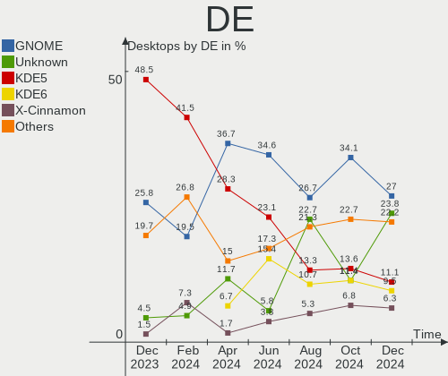
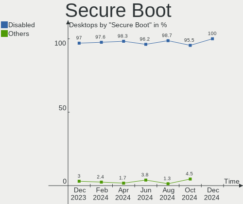
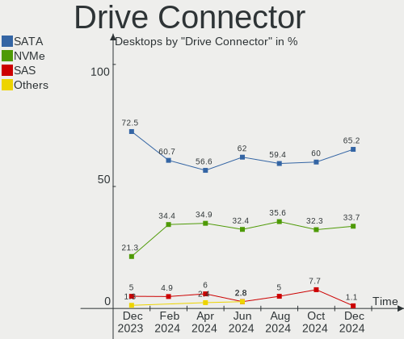
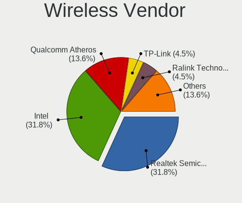
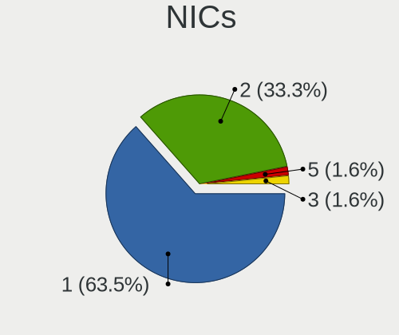
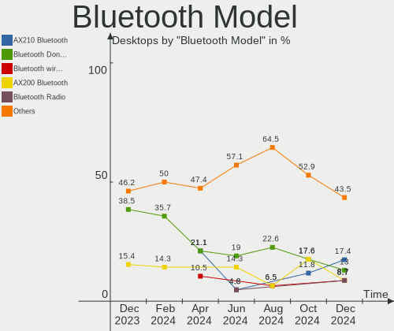

Linux in Poland - Hardware Trends (Desktops)
--------------------------------------------

A project to identify most popular hardware characteristics and track their change
over time based on data collected by Linux users at https://Linux-Hardware.org.

Anyone can contribute to this report by the [hw-probe](https://github.com/linuxhw/hw-probe) tool:

    sudo -E hw-probe -all -upload

Period: Apr, 2024.

Contents
--------

* [ System ](#system)
  - [ OS                       ](#os)
  - [ OS Family                ](#os-family)
  - [ Kernel                   ](#kernel)
  - [ Kernel Family            ](#kernel-family)
  - [ Kernel Major Ver.        ](#kernel-major-ver)
  - [ Arch                     ](#arch)
  - [ DE                       ](#de)
  - [ Display Server           ](#display-server)
  - [ Display Manager          ](#display-manager)
  - [ OS Lang                  ](#os-lang)
  - [ Boot Mode                ](#boot-mode)
  - [ Filesystem               ](#filesystem)
  - [ Part. scheme             ](#part-scheme)
  - [ Dual Boot with Linux/BSD ](#dual-boot-with-linuxbsd)
  - [ Dual Boot (Win)          ](#dual-boot-win)

* [ Board ](#board)
  - [ Vendor                   ](#vendor)
  - [ Model                    ](#model)
  - [ Model Family             ](#model-family)
  - [ MFG Year                 ](#mfg-year)
  - [ Form Factor              ](#form-factor)
  - [ Secure Boot              ](#secure-boot)
  - [ Coreboot                 ](#coreboot)
  - [ RAM Size                 ](#ram-size)
  - [ RAM Used                 ](#ram-used)
  - [ Total Drives             ](#total-drives)
  - [ Has CD-ROM               ](#has-cd-rom)
  - [ Has Ethernet             ](#has-ethernet)
  - [ Has WiFi                 ](#has-wifi)
  - [ Has Bluetooth            ](#has-bluetooth)

* [ Location ](#location)
  - [ Country                  ](#country)
  - [ City                     ](#city)

* [ Drives ](#drives)
  - [ Drive Vendor             ](#drive-vendor)
  - [ Drive Model              ](#drive-model)
  - [ HDD Vendor               ](#hdd-vendor)
  - [ SSD Vendor               ](#ssd-vendor)
  - [ Drive Kind               ](#drive-kind)
  - [ Drive Connector          ](#drive-connector)
  - [ Drive Size               ](#drive-size)
  - [ Space Total              ](#space-total)
  - [ Space Used               ](#space-used)
  - [ Malfunc. Drives          ](#malfunc-drives)
  - [ Malfunc. Drive Vendor    ](#malfunc-drive-vendor)
  - [ Malfunc. HDD Vendor      ](#malfunc-hdd-vendor)
  - [ Malfunc. Drive Kind      ](#malfunc-drive-kind)
  - [ Failed Drives            ](#failed-drives)
  - [ Failed Drive Vendor      ](#failed-drive-vendor)
  - [ Drive Status             ](#drive-status)

* [ Storage controller ](#storage-controller)
  - [ Storage Vendor           ](#storage-vendor)
  - [ Storage Model            ](#storage-model)
  - [ Storage Kind             ](#storage-kind)

* [ Processor ](#processor)
  - [ CPU Vendor               ](#cpu-vendor)
  - [ CPU Model                ](#cpu-model)
  - [ CPU Model Family         ](#cpu-model-family)
  - [ CPU Cores                ](#cpu-cores)
  - [ CPU Sockets              ](#cpu-sockets)
  - [ CPU Threads              ](#cpu-threads)
  - [ CPU Op-Modes             ](#cpu-op-modes)
  - [ CPU Microcode            ](#cpu-microcode)
  - [ CPU Microarch            ](#cpu-microarch)

* [ Graphics ](#graphics)
  - [ GPU Vendor               ](#gpu-vendor)
  - [ GPU Model                ](#gpu-model)
  - [ GPU Combo                ](#gpu-combo)
  - [ GPU Driver               ](#gpu-driver)
  - [ GPU Memory               ](#gpu-memory)

* [ Monitor ](#monitor)
  - [ Monitor Vendor           ](#monitor-vendor)
  - [ Monitor Model            ](#monitor-model)
  - [ Monitor Resolution       ](#monitor-resolution)
  - [ Monitor Diagonal         ](#monitor-diagonal)
  - [ Monitor Width            ](#monitor-width)
  - [ Aspect Ratio             ](#aspect-ratio)
  - [ Monitor Area             ](#monitor-area)
  - [ Pixel Density            ](#pixel-density)
  - [ Multiple Monitors        ](#multiple-monitors)

* [ Network ](#network)
  - [ Net Controller Vendor    ](#net-controller-vendor)
  - [ Net Controller Model     ](#net-controller-model)
  - [ Wireless Vendor          ](#wireless-vendor)
  - [ Wireless Model           ](#wireless-model)
  - [ Ethernet Vendor          ](#ethernet-vendor)
  - [ Ethernet Model           ](#ethernet-model)
  - [ Net Controller Kind      ](#net-controller-kind)
  - [ Used Controller          ](#used-controller)
  - [ NICs                     ](#nics)
  - [ IPv6                     ](#ipv6)

* [ Bluetooth ](#bluetooth)
  - [ Bluetooth Vendor         ](#bluetooth-vendor)
  - [ Bluetooth Model          ](#bluetooth-model)

* [ Sound ](#sound)
  - [ Sound Vendor             ](#sound-vendor)
  - [ Sound Model              ](#sound-model)

* [ Memory ](#memory)
  - [ Memory Vendor            ](#memory-vendor)
  - [ Memory Model             ](#memory-model)
  - [ Memory Kind              ](#memory-kind)
  - [ Memory Form Factor       ](#memory-form-factor)
  - [ Memory Size              ](#memory-size)
  - [ Memory Speed             ](#memory-speed)

* [ Printers & scanners ](#printers--scanners)
  - [ Printer Vendor           ](#printer-vendor)
  - [ Printer Model            ](#printer-model)
  - [ Scanner Vendor           ](#scanner-vendor)
  - [ Scanner Model            ](#scanner-model)

* [ Camera ](#camera)
  - [ Camera Vendor            ](#camera-vendor)
  - [ Camera Model             ](#camera-model)

* [ Security ](#security)
  - [ Fingerprint Vendor       ](#fingerprint-vendor)
  - [ Fingerprint Model        ](#fingerprint-model)
  - [ Chipcard Vendor          ](#chipcard-vendor)
  - [ Chipcard Model           ](#chipcard-model)

* [ Unsupported ](#unsupported)
  - [ Unsupported Devices      ](#unsupported-devices)
  - [ Unsupported Device Types ](#unsupported-device-types)

System
------

OS
--

Installed operating systems

| Name                | Desktops | Percent |
|---------------------|----------|---------|
| Ubuntu 22.04        | 8        | 13.33%  |
| Debian 12           | 8        | 13.33%  |
| Arch Rolling        | 5        | 8.33%   |
| OpenMandriva 5.0    | 4        | 6.67%   |
| Ubuntu 23.10        | 3        | 5%      |
| OpenMandriva 23.08  | 3        | 5%      |
| Gentoo 2.14         | 3        | 5%      |
| Fedora 39           | 3        | 5%      |
| Ubuntu 24.04        | 2        | 3.33%   |
| ROSA 12.5           | 2        | 3.33%   |
| Nobara 39           | 2        | 3.33%   |
| Manjaro             | 2        | 3.33%   |
| Debian 11           | 2        | 3.33%   |
| Ubuntu 20.04        | 1        | 1.67%   |
| Pop!_OS 22.04       | 1        | 1.67%   |
| Parrot 6.0          | 1        | 1.67%   |
| OpenMandriva 4.3    | 1        | 1.67%   |
| OpenMandriva 24.01  | 1        | 1.67%   |
| Manjaro 23.1.4      | 1        | 1.67%   |
| Linux Mint 21.2     | 1        | 1.67%   |
| Linux Mint 20.2     | 1        | 1.67%   |
| KDE neon 22.04      | 1        | 1.67%   |
| Fedora 40           | 1        | 1.67%   |
| EndeavourOS Rolling | 1        | 1.67%   |
| Debian              | 1        | 1.67%   |
| antiX 23.1          | 1        | 1.67%   |

OS Family
---------

OS without a version

| Name         | Desktops | Percent |
|--------------|----------|---------|
| Ubuntu       | 14       | 23.33%  |
| Debian       | 11       | 18.33%  |
| OpenMandriva | 9        | 15%     |
| Arch         | 5        | 8.33%   |
| Fedora       | 4        | 6.67%   |
| Manjaro      | 3        | 5%      |
| Gentoo       | 3        | 5%      |
| ROSA         | 2        | 3.33%   |
| Nobara       | 2        | 3.33%   |
| Linux Mint   | 2        | 3.33%   |
| Pop!_OS      | 1        | 1.67%   |
| Parrot       | 1        | 1.67%   |
| KDE neon     | 1        | 1.67%   |
| EndeavourOS  | 1        | 1.67%   |
| antiX        | 1        | 1.67%   |

Kernel
------

Version of the Linux kernel

| Version                             | Desktops | Percent |
|-------------------------------------|----------|---------|
| 6.6.2-desktop-1omv2390              | 5        | 8.33%   |
| 6.5.0-26-generic                    | 5        | 8.33%   |
| 6.5.13-5-pve                        | 3        | 5%      |
| 6.5.0-27-generic                    | 3        | 5%      |
| 6.4.11-desktop-1omv2390             | 3        | 5%      |
| 6.1.0-18-amd64                      | 3        | 5%      |
| 6.8.4-arch1-1                       | 2        | 3.33%   |
| 6.6.21-gentoo                       | 2        | 3.33%   |
| 6.5.0-18-generic                    | 2        | 3.33%   |
| 6.1.0-20-amd64                      | 2        | 3.33%   |
| 6.8.7-300.fc40.x86_64               | 1        | 1.67%   |
| 6.8.7-200.fsync.fc39.x86_64         | 1        | 1.67%   |
| 6.8.7-1-MANJARO                     | 1        | 1.67%   |
| 6.8.6-arch1-1                       | 1        | 1.67%   |
| 6.8.6-200.fc39.x86_64               | 1        | 1.67%   |
| 6.8.4-lqx1-2-lqx                    | 1        | 1.67%   |
| 6.8.0-76060800daily20240311-generic | 1        | 1.67%   |
| 6.8.0-31-generic                    | 1        | 1.67%   |
| 6.8.0-28-generic                    | 1        | 1.67%   |
| 6.7.9-arch1-1                       | 1        | 1.67%   |
| 6.7.9-207.fsync.fc39.x86_64         | 1        | 1.67%   |
| 6.7.6-201.fsync.fc39.x86_64         | 1        | 1.67%   |
| 6.7.12-lqx1-1-lqx                   | 1        | 1.67%   |
| 6.6.28-1-lts                        | 1        | 1.67%   |
| 6.6.26-1-MANJARO                    | 1        | 1.67%   |
| 6.6.21-generic-8rosa2021.1-x86_64   | 1        | 1.67%   |
| 6.6.15-amd64                        | 1        | 1.67%   |
| 6.6.13-gentoo                       | 1        | 1.67%   |
| 6.5.6-300.fc39.x86_64               | 1        | 1.67%   |
| 6.5.0-9-generic                     | 1        | 1.67%   |
| 6.5.0-13parrot1-amd64               | 1        | 1.67%   |
| 6.1.60-antix.1-amd64-smp            | 1        | 1.67%   |
| 5.4.0-170-generic                   | 1        | 1.67%   |
| 5.16.7-desktop-1omv4003             | 1        | 1.67%   |
| 5.15.127-generic-1rosa2021.1-x86_64 | 1        | 1.67%   |
| 5.15.0-91-generic                   | 1        | 1.67%   |
| 5.15.0-76-generic                   | 1        | 1.67%   |
| 5.15.0-101-generic                  | 1        | 1.67%   |
| 5.10.0-28-amd64                     | 1        | 1.67%   |
| 5.10.0-20-amd64                     | 1        | 1.67%   |

Kernel Family
-------------

Linux kernel without a distro release

| Version  | Desktops | Percent |
|----------|----------|---------|
| 6.5.0    | 12       | 20%     |
| 6.6.2    | 5        | 8.33%   |
| 6.1.0    | 5        | 8.33%   |
| 6.8.7    | 3        | 5%      |
| 6.8.4    | 3        | 5%      |
| 6.8.0    | 3        | 5%      |
| 6.6.21   | 3        | 5%      |
| 6.5.13   | 3        | 5%      |
| 6.4.11   | 3        | 5%      |
| 5.15.0   | 3        | 5%      |
| 6.8.6    | 2        | 3.33%   |
| 6.7.9    | 2        | 3.33%   |
| 5.10.0   | 2        | 3.33%   |
| 6.7.6    | 1        | 1.67%   |
| 6.7.12   | 1        | 1.67%   |
| 6.6.28   | 1        | 1.67%   |
| 6.6.26   | 1        | 1.67%   |
| 6.6.15   | 1        | 1.67%   |
| 6.6.13   | 1        | 1.67%   |
| 6.5.6    | 1        | 1.67%   |
| 6.1.60   | 1        | 1.67%   |
| 5.4.0    | 1        | 1.67%   |
| 5.16.7   | 1        | 1.67%   |
| 5.15.127 | 1        | 1.67%   |

Kernel Major Ver.
-----------------

Linux kernel major version

| Version | Desktops | Percent |
|---------|----------|---------|
| 6.5     | 16       | 26.67%  |
| 6.6     | 12       | 20%     |
| 6.8     | 11       | 18.33%  |
| 6.1     | 6        | 10%     |
| 6.7     | 4        | 6.67%   |
| 5.15    | 4        | 6.67%   |
| 6.4     | 3        | 5%      |
| 5.10    | 2        | 3.33%   |
| 5.4     | 1        | 1.67%   |
| 5.16    | 1        | 1.67%   |

Arch
----

OS architecture (x86_64, i586, etc.)

| Name   | Desktops | Percent |
|--------|----------|---------|
| x86_64 | 60       | 100%    |

DE
--

Desktop Environment

| Name       | Desktops | Percent |
|------------|----------|---------|
| GNOME      | 22       | 36.67%  |
| KDE5       | 17       | 28.33%  |
| Unknown    | 7        | 11.67%  |
| MATE       | 4        | 6.67%   |
| KDE6       | 4        | 6.67%   |
| XFCE       | 1        | 1.67%   |
| X-Cinnamon | 1        | 1.67%   |
| icewm      | 1        | 1.67%   |
| i3         | 1        | 1.67%   |
| Hyprland   | 1        | 1.67%   |
| Cinnamon   | 1        | 1.67%   |

Display Server
--------------

X11 or Wayland

| Name    | Desktops | Percent |
|---------|----------|---------|
| Wayland | 31       | 51.67%  |
| X11     | 21       | 35%     |
| Tty     | 4        | 6.67%   |
| Unknown | 4        | 6.67%   |

Display Manager
---------------

SDDM, LightDM, etc.

| Name    | Desktops | Percent |
|---------|----------|---------|
| Unknown | 19       | 31.67%  |
| SDDM    | 17       | 28.33%  |
| GDM3    | 11       | 18.33%  |
| LightDM | 6        | 10%     |
| GDM     | 5        | 8.33%   |
| SLIMSKI | 1        | 1.67%   |
| SLiM    | 1        | 1.67%   |

OS Lang
-------

Language

| Lang  | Desktops | Percent |
|-------|----------|---------|
| pl_PL | 37       | 61.67%  |
| en_US | 20       | 33.33%  |
| C     | 2        | 3.33%   |
| ru_RU | 1        | 1.67%   |

Boot Mode
---------

EFI or BIOS

| Mode | Desktops | Percent |
|------|----------|---------|
| BIOS | 35       | 58.33%  |
| EFI  | 25       | 41.67%  |

Filesystem
----------

Type of filesystem

| Type    | Desktops | Percent |
|---------|----------|---------|
| Ext4    | 35       | 58.33%  |
| Tmpfs   | 10       | 16.67%  |
| Btrfs   | 6        | 10%     |
| F2fs    | 4        | 6.67%   |
| Overlay | 3        | 5%      |
| XXX     | 1        | 1.67%   |
| Ext3    | 1        | 1.67%   |

Part. scheme
------------

Scheme of partitioning

| Type    | Desktops | Percent |
|---------|----------|---------|
| GPT     | 35       | 58.33%  |
| Unknown | 13       | 21.67%  |
| MBR     | 12       | 20%     |

Dual Boot with Linux/BSD
------------------------

Hosting more than one Linux/BSD

| Dual boot | Desktops | Percent |
|-----------|----------|---------|
| No        | 52       | 86.67%  |
| Yes       | 8        | 13.33%  |

Dual Boot (Win)
---------------

Hosting Linux and Windows

| Dual boot | Desktops | Percent |
|-----------|----------|---------|
| No        | 40       | 66.67%  |
| Yes       | 20       | 33.33%  |

Board
-----

Vendor
------

Motherboard manufacturer

| Name                | Desktops | Percent |
|---------------------|----------|---------|
| Gigabyte Technology | 16       | 26.67%  |
| MSI                 | 12       | 20%     |
| ASRock              | 9        | 15%     |
| ASUSTek Computer    | 8        | 13.33%  |
| Hewlett-Packard     | 3        | 5%      |
| Dell                | 3        | 5%      |
| Fujitsu             | 2        | 3.33%   |
| WeiBu               | 1        | 1.67%   |
| Prestigio           | 1        | 1.67%   |
| Lenovo              | 1        | 1.67%   |
| Inventec            | 1        | 1.67%   |
| Intel               | 1        | 1.67%   |
| AMI                 | 1        | 1.67%   |
| Unknown             | 1        | 1.67%   |

Model
-----

Motherboard model

| Name                                | Desktops | Percent |
|-------------------------------------|----------|---------|
| MSI MS-7C56                         | 2        | 3.33%   |
| HP EliteDesk 705 G2 MINI            | 2        | 3.33%   |
| Gigabyte X570 GAMING X              | 2        | 3.33%   |
| ASRock B650M-HDV/M.2                | 2        | 3.33%   |
| WeiBu ADL-N                         | 1        | 1.67%   |
| Prestigio Smartbook PSB116A         | 1        | 1.67%   |
| MSI OPTIMUS                         | 1        | 1.67%   |
| MSI MS-7D09                         | 1        | 1.67%   |
| MSI MS-7C81                         | 1        | 1.67%   |
| MSI MS-7B51                         | 1        | 1.67%   |
| MSI MS-7A67                         | 1        | 1.67%   |
| MSI MS-7A38                         | 1        | 1.67%   |
| MSI MS-7996                         | 1        | 1.67%   |
| MSI MS-7977                         | 1        | 1.67%   |
| MSI MS-7823                         | 1        | 1.67%   |
| MSI MS-7235                         | 1        | 1.67%   |
| Lenovo 70UB001NEA ThinkServer TS150 | 1        | 1.67%   |
| Inventec DQ Class                   | 1        | 1.67%   |
| Intel UNLOCK INSTALL                | 1        | 1.67%   |
| HP EliteDesk 705 G3 Desktop Mini    | 1        | 1.67%   |
| Gigabyte Z370 AORUS Gaming K3       | 1        | 1.67%   |
| Gigabyte Z170X-Gaming 5             | 1        | 1.67%   |
| Gigabyte EX58-UD3R                  | 1        | 1.67%   |
| Gigabyte B85M-HD3                   | 1        | 1.67%   |
| Gigabyte B760M GAMING X AX DDR4     | 1        | 1.67%   |
| Gigabyte B550 AORUS ELITE V2        | 1        | 1.67%   |
| Gigabyte B450M K                    | 1        | 1.67%   |
| Gigabyte B450M DS3H                 | 1        | 1.67%   |
| Gigabyte B450 AORUS ELITE V2        | 1        | 1.67%   |
| Gigabyte B365M DS3H                 | 1        | 1.67%   |
| Gigabyte B360M-D3H                  | 1        | 1.67%   |
| Gigabyte B250M-DS3H                 | 1        | 1.67%   |
| Gigabyte AB350-Gaming               | 1        | 1.67%   |
| Gigabyte A520 AORUS ELITE           | 1        | 1.67%   |
| Fujitsu FUTRO S720                  | 1        | 1.67%   |
| Fujitsu CELSIUS M470                | 1        | 1.67%   |
| Dell Vostro 3900                    | 1        | 1.67%   |
| Dell PowerEdge T40                  | 1        | 1.67%   |
| Dell OptiPlex 9020                  | 1        | 1.67%   |
| ASUS TUF Gaming B550M-PLUS WIFI II  | 1        | 1.67%   |

Model Family
------------

Motherboard model prefix

| Name                  | Desktops | Percent |
|-----------------------|----------|---------|
| HP EliteDesk          | 3        | 5%      |
| MSI MS-7C56           | 2        | 3.33%   |
| Gigabyte X570         | 2        | 3.33%   |
| Gigabyte B450M        | 2        | 3.33%   |
| ASRock B650M-HDV      | 2        | 3.33%   |
| WeiBu ADL-N           | 1        | 1.67%   |
| Prestigio Smartbook   | 1        | 1.67%   |
| MSI OPTIMUS           | 1        | 1.67%   |
| MSI MS-7D09           | 1        | 1.67%   |
| MSI MS-7C81           | 1        | 1.67%   |
| MSI MS-7B51           | 1        | 1.67%   |
| MSI MS-7A67           | 1        | 1.67%   |
| MSI MS-7A38           | 1        | 1.67%   |
| MSI MS-7996           | 1        | 1.67%   |
| MSI MS-7977           | 1        | 1.67%   |
| MSI MS-7823           | 1        | 1.67%   |
| MSI MS-7235           | 1        | 1.67%   |
| Lenovo 70UB001NEA     | 1        | 1.67%   |
| Inventec DQ           | 1        | 1.67%   |
| Intel UNLOCK          | 1        | 1.67%   |
| Gigabyte Z370         | 1        | 1.67%   |
| Gigabyte Z170X-Gaming | 1        | 1.67%   |
| Gigabyte EX58-UD3R    | 1        | 1.67%   |
| Gigabyte B85M-HD3     | 1        | 1.67%   |
| Gigabyte B760M        | 1        | 1.67%   |
| Gigabyte B550         | 1        | 1.67%   |
| Gigabyte B450         | 1        | 1.67%   |
| Gigabyte B365M        | 1        | 1.67%   |
| Gigabyte B360M-D3H    | 1        | 1.67%   |
| Gigabyte B250M-DS3H   | 1        | 1.67%   |
| Gigabyte AB350-Gaming | 1        | 1.67%   |
| Gigabyte A520         | 1        | 1.67%   |
| Fujitsu FUTRO         | 1        | 1.67%   |
| Fujitsu CELSIUS       | 1        | 1.67%   |
| Dell Vostro           | 1        | 1.67%   |
| Dell PowerEdge        | 1        | 1.67%   |
| Dell OptiPlex         | 1        | 1.67%   |
| ASUS TUF              | 1        | 1.67%   |
| ASUS ProArt           | 1        | 1.67%   |
| ASUS P7P55D-E         | 1        | 1.67%   |

MFG Year
--------

Motherboard manufacture year

| Year | Desktops | Percent |
|------|----------|---------|
| 2020 | 7        | 11.67%  |
| 2018 | 7        | 11.67%  |
| 2016 | 6        | 10%     |
| 2013 | 6        | 10%     |
| 2023 | 5        | 8.33%   |
| 2019 | 5        | 8.33%   |
| 2017 | 5        | 8.33%   |
| 2014 | 4        | 6.67%   |
| 2011 | 3        | 5%      |
| 2022 | 2        | 3.33%   |
| 2021 | 2        | 3.33%   |
| 2015 | 2        | 3.33%   |
| 2012 | 2        | 3.33%   |
| 2008 | 2        | 3.33%   |
| 2024 | 1        | 1.67%   |
| 2006 | 1        | 1.67%   |

Form Factor
-----------

Physical design of the computer

| Name    | Desktops | Percent |
|---------|----------|---------|
| Desktop | 60       | 100%    |

Secure Boot
-----------

Enabled or disabled

| State    | Desktops | Percent |
|----------|----------|---------|
| Disabled | 59       | 98.33%  |
| Enabled  | 1        | 1.67%   |

Coreboot
--------

Have coreboot on board

| Used | Desktops | Percent |
|------|----------|---------|
| No   | 60       | 100%    |

RAM Size
--------

Total RAM memory

| Size in GB  | Desktops | Percent |
|-------------|----------|---------|
| 4.01-8.0    | 14       | 23.33%  |
| 32.01-64.0  | 12       | 20%     |
| 16.01-24.0  | 12       | 20%     |
| 8.01-16.0   | 10       | 16.67%  |
| 64.01-256.0 | 6        | 10%     |
| 3.01-4.0    | 2        | 3.33%   |
| 24.01-32.0  | 2        | 3.33%   |
| 1.01-2.0    | 2        | 3.33%   |

RAM Used
--------

Used RAM memory

| Used GB    | Desktops | Percent |
|------------|----------|---------|
| 1.01-2.0   | 19       | 31.67%  |
| 4.01-8.0   | 14       | 23.33%  |
| 2.01-3.0   | 9        | 15%     |
| 3.01-4.0   | 8        | 13.33%  |
| 8.01-16.0  | 4        | 6.67%   |
| 0.51-1.0   | 3        | 5%      |
| 32.01-64.0 | 1        | 1.67%   |
| 24.01-32.0 | 1        | 1.67%   |
| 16.01-24.0 | 1        | 1.67%   |

Total Drives
------------

Number of drives on board

| Drives | Desktops | Percent |
|--------|----------|---------|
| 2      | 21       | 35%     |
| 1      | 18       | 30%     |
| 3      | 13       | 21.67%  |
| 4      | 4        | 6.67%   |
| 5      | 3        | 5%      |
| 6      | 1        | 1.67%   |

Has CD-ROM
----------

Has CD-ROM on board

| Presented | Desktops | Percent |
|-----------|----------|---------|
| No        | 38       | 63.33%  |
| Yes       | 22       | 36.67%  |

Has Ethernet
------------

Has Ethernet on board

| Presented | Desktops | Percent |
|-----------|----------|---------|
| Yes       | 59       | 98.33%  |
| No        | 1        | 1.67%   |

Has WiFi
--------

Has WiFi module

| Presented | Desktops | Percent |
|-----------|----------|---------|
| No        | 35       | 58.33%  |
| Yes       | 25       | 41.67%  |

Has Bluetooth
-------------

Has Bluetooth module

| Presented | Desktops | Percent |
|-----------|----------|---------|
| No        | 41       | 68.33%  |
| Yes       | 19       | 31.67%  |

Location
--------

Country
-------

Geographic location (country)

| Country | Desktops | Percent |
|---------|----------|---------|
| Poland  | 60       | 100%    |

City
----

Geographic location (city)

| City                 | Desktops | Percent |
|----------------------|----------|---------|
| Warsaw               | 12       | 20%     |
| Poznan               | 6        | 10%     |
| Krakow               | 4        | 6.67%   |
| Ruda Śląska        | 3        | 5%      |
| Bialystok            | 3        | 5%      |
| Wroclaw              | 2        | 3.33%   |
| Sosnowiec            | 2        | 3.33%   |
| Jaworzno             | 2        | 3.33%   |
| Gdansk               | 2        | 3.33%   |
| Zukowo               | 1        | 1.67%   |
| Zabrze               | 1        | 1.67%   |
| Wałbrzych           | 1        | 1.67%   |
| Trzcianka            | 1        | 1.67%   |
| Tenczynek            | 1        | 1.67%   |
| Swidnica             | 1        | 1.67%   |
| Środa Śląska      | 1        | 1.67%   |
| Sandomierz           | 1        | 1.67%   |
| Reda                 | 1        | 1.67%   |
| Przemysl             | 1        | 1.67%   |
| Pogwizdow            | 1        | 1.67%   |
| Piotrkow Trybunalski | 1        | 1.67%   |
| Olkusz               | 1        | 1.67%   |
| Olesno               | 1        | 1.67%   |
| Myslenice            | 1        | 1.67%   |
| Magdalenka           | 1        | 1.67%   |
| Lodz                 | 1        | 1.67%   |
| Kołobrzeg           | 1        | 1.67%   |
| Kościan             | 1        | 1.67%   |
| Kielce               | 1        | 1.67%   |
| Kety                 | 1        | 1.67%   |
| Katowice             | 1        | 1.67%   |
| Grudziądz           | 1        | 1.67%   |
| Brzesko              | 1        | 1.67%   |

Drives
------

Drive Vendor
------------

Hard drive vendors

| Vendor                       | Desktops | Drives | Percent |
|------------------------------|----------|--------|---------|
| Samsung Electronics          | 17       | 21     | 15.45%  |
| Seagate                      | 16       | 18     | 14.55%  |
| GOODRAM                      | 13       | 22     | 11.82%  |
| WDC                          | 12       | 16     | 10.91%  |
| Toshiba                      | 11       | 12     | 10%     |
| Kingston                     | 6        | 6      | 5.45%   |
| SanDisk                      | 5        | 6      | 4.55%   |
| Shenzhen Longsys Electronics | 4        | 4      | 3.64%   |
| Phison Electronics           | 4        | 4      | 3.64%   |
| Crucial                      | 4        | 4      | 3.64%   |
| SPCC                         | 3        | 3      | 2.73%   |
| Unknown                      | 2        | 2      | 1.82%   |
| Kingston Technology Company  | 2        | 2      | 1.82%   |
| Hitachi                      | 2        | 4      | 1.82%   |
| Realtek                      | 1        | 1      | 0.91%   |
| MAXIO Technology (Hangzhou)  | 1        | 1      | 0.91%   |
| Lexar                        | 1        | 2      | 0.91%   |
| Lenovo                       | 1        | 2      | 0.91%   |
| Innodisk                     | 1        | 1      | 0.91%   |
| HGST                         | 1        | 1      | 0.91%   |
| Fujitsu                      | 1        | 1      | 0.91%   |
| AOSENKE                      | 1        | 1      | 0.91%   |
| A-DATA Technology            | 1        | 1      | 0.91%   |

Drive Model
-----------

Hard drive models

| Model                                              | Desktops | Percent |
|----------------------------------------------------|----------|---------|
| Toshiba HDWD110 1TB                                | 3        | 2.38%   |
| Samsung NVMe SSD Controller PM9A1/PM9A3/980PRO 1TB | 3        | 2.38%   |
| Toshiba HDWD120 2TB                                | 2        | 1.59%   |
| Shenzhen Longsys Lexar SSD NM800PRO 1TB            | 2        | 1.59%   |
| Seagate ST1000DM010-2EP102 1TB                     | 2        | 1.59%   |
| Sandisk WD Blue SN570 1TB                          | 2        | 1.59%   |
| Samsung SSD 980 500GB                              | 2        | 1.59%   |
| Samsung SSD 850 EVO 500GB                          | 2        | 1.59%   |
| Samsung NVMe SSD Controller SM951/PM951 256GB      | 2        | 1.59%   |
| Phison E12 NVMe Controller 2TB                     | 2        | 1.59%   |
| Hitachi HUS724030ALE641 3TB                        | 2        | 1.59%   |
| GOODRAM SSDPR-CX400-256-G2 256GB                   | 2        | 1.59%   |
| GOODRAM SSDPR-CX400-128 128GB                      | 2        | 1.59%   |
| GOODRAM SSDPR-CL100-480-G2 480GB                   | 2        | 1.59%   |
| GOODRAM IRP-SSDPR-S25C-256 256GB                   | 2        | 1.59%   |
| GOODRAM IRP-SSDPR-P44A-4K0-80 4TB                  | 2        | 1.59%   |
| Crucial CT240BX500SSD1 240GB                       | 2        | 1.59%   |
| WDC WDS240G2G0A-00JH30 240GB SSD                   | 1        | 0.79%   |
| WDC WD5000AAKX-60U6AA0 500GB                       | 1        | 0.79%   |
| WDC WD5000AAKX-001CA0 500GB                        | 1        | 0.79%   |
| WDC WD5000AAKS-00V1A0 500GB                        | 1        | 0.79%   |
| WDC WD5000AAKS-00UU3A0 500GB                       | 1        | 0.79%   |
| WDC WD40EZRZ-00GXCB0 4TB                           | 1        | 0.79%   |
| WDC WD3200LPVT-00G33T0 320GB                       | 1        | 0.79%   |
| WDC WD3200AUDX-56WNHY0 320GB                       | 1        | 0.79%   |
| WDC WD2500AAJS-60Z0A0 250GB                        | 1        | 0.79%   |
| WDC WD20EZRZ-00Z5HB0 2TB                           | 1        | 0.79%   |
| WDC WD10PURX-64E5EY0 1TB                           | 1        | 0.79%   |
| WDC WD10EZEX-21WN4A0 1TB                           | 1        | 0.79%   |
| WDC WD10EZEX-08WN4A0 1TB                           | 1        | 0.79%   |
| WDC WD10EZEX-00WN4A0 1TB                           | 1        | 0.79%   |
| WDC WD1001FAES-75W7A0 1TB                          | 1        | 0.79%   |
| Unknown SU04G  4GB                                 | 1        | 0.79%   |
| Unknown NCard  32GB                                | 1        | 0.79%   |
| Toshiba MQ04ABF100 1TB                             | 1        | 0.79%   |
| Toshiba MK6461GSY 640GB                            | 1        | 0.79%   |
| Toshiba MK2576GSX HR 160GB                         | 1        | 0.79%   |
| Toshiba HDWE150 5TB                                | 1        | 0.79%   |
| Toshiba HDWD130 3TB                                | 1        | 0.79%   |
| Toshiba DT01ACA100 1TB                             | 1        | 0.79%   |

HDD Vendor
----------

Hard disk drive vendors

| Vendor  | Desktops | Drives | Percent |
|---------|----------|--------|---------|
| Seagate | 16       | 18     | 38.1%   |
| WDC     | 11       | 15     | 26.19%  |
| Toshiba | 10       | 11     | 23.81%  |
| Hitachi | 2        | 4      | 4.76%   |
| Lenovo  | 1        | 2      | 2.38%   |
| HGST    | 1        | 1      | 2.38%   |
| Fujitsu | 1        | 1      | 2.38%   |

SSD Vendor
----------

Solid state drive vendors

| Vendor              | Desktops | Drives | Percent |
|---------------------|----------|--------|---------|
| GOODRAM             | 11       | 13     | 32.35%  |
| Samsung Electronics | 5        | 7      | 14.71%  |
| Kingston            | 5        | 5      | 14.71%  |
| Crucial             | 4        | 4      | 11.76%  |
| SPCC                | 3        | 3      | 8.82%   |
| WDC                 | 1        | 1      | 2.94%   |
| Toshiba             | 1        | 1      | 2.94%   |
| SanDisk             | 1        | 1      | 2.94%   |
| Innodisk            | 1        | 1      | 2.94%   |
| AOSENKE             | 1        | 1      | 2.94%   |
| A-DATA Technology   | 1        | 1      | 2.94%   |

Drive Kind
----------

HDD or SSD

| Kind | Desktops | Drives | Percent |
|------|----------|--------|---------|
| HDD  | 34       | 52     | 34.69%  |
| SSD  | 33       | 38     | 33.67%  |
| NVMe | 29       | 42     | 29.59%  |
| MMC  | 2        | 3      | 2.04%   |

Drive Connector
---------------

SATA, SAS, NVMe, etc.

| Type | Desktops | Drives | Percent |
|------|----------|--------|---------|
| SATA | 47       | 86     | 56.63%  |
| NVMe | 29       | 41     | 34.94%  |
| SAS  | 5        | 5      | 6.02%   |
| MMC  | 2        | 3      | 2.41%   |

Drive Size
----------

Size of hard drive

| Size in TB | Desktops | Drives | Percent |
|------------|----------|--------|---------|
| 0.01-0.5   | 31       | 46     | 46.27%  |
| 0.51-1.0   | 21       | 26     | 31.34%  |
| 1.01-2.0   | 6        | 6      | 8.96%   |
| 3.01-4.0   | 4        | 5      | 5.97%   |
| 2.01-3.0   | 3        | 5      | 4.48%   |
| 10.01-20.0 | 1        | 1      | 1.49%   |
| 4.01-10.0  | 1        | 1      | 1.49%   |

Space Total
-----------

Amount of disk space available on the file system

| Size in GB     | Desktops | Percent |
|----------------|----------|---------|
| 251-500        | 10       | 16.67%  |
| 101-250        | 10       | 16.67%  |
| 1001-2000      | 8        | 13.33%  |
| More than 3000 | 7        | 11.67%  |
| 2001-3000      | 6        | 10%     |
| 501-1000       | 6        | 10%     |
| 21-50          | 4        | 6.67%   |
| 51-100         | 4        | 6.67%   |
| Unknown        | 3        | 5%      |
| 1-20           | 2        | 3.33%   |

Space Used
----------

Amount of used disk space

| Used GB        | Desktops | Percent |
|----------------|----------|---------|
| 1-20           | 18       | 30%     |
| 51-100         | 8        | 13.33%  |
| 21-50          | 7        | 11.67%  |
| 101-250        | 7        | 11.67%  |
| 1001-2000      | 6        | 10%     |
| More than 3000 | 4        | 6.67%   |
| 501-1000       | 4        | 6.67%   |
| Unknown        | 3        | 5%      |
| 251-500        | 2        | 3.33%   |
| 2001-3000      | 1        | 1.67%   |

Malfunc. Drives
---------------

Drive models with a malfunction

| Model                           | Desktops | Drives | Percent |
|---------------------------------|----------|--------|---------|
| WDC WD2500AAJS-60Z0A0 250GB     | 1        | 1      | 14.29%  |
| WDC WD20EZRZ-00Z5HB0 2TB        | 1        | 1      | 14.29%  |
| WDC WD10PURX-64E5EY0 1TB        | 1        | 1      | 14.29%  |
| Toshiba HDWD110 1TB             | 1        | 1      | 14.29%  |
| Seagate ST500LT012-9WS142 500GB | 1        | 1      | 14.29%  |
| Seagate ST3500418AS 500GB       | 1        | 1      | 14.29%  |
| Seagate ST3120813AS 120GB       | 1        | 1      | 14.29%  |

Malfunc. Drive Vendor
---------------------

Vendors of faulty drives

| Vendor  | Desktops | Drives | Percent |
|---------|----------|--------|---------|
| WDC     | 3        | 3      | 42.86%  |
| Seagate | 3        | 3      | 42.86%  |
| Toshiba | 1        | 1      | 14.29%  |

Malfunc. HDD Vendor
-------------------

Vendors of faulty HDD drives

| Vendor  | Desktops | Drives | Percent |
|---------|----------|--------|---------|
| WDC     | 3        | 3      | 42.86%  |
| Seagate | 3        | 3      | 42.86%  |
| Toshiba | 1        | 1      | 14.29%  |

Malfunc. Drive Kind
-------------------

Kinds of faulty drives

| Kind | Desktops | Drives | Percent |
|------|----------|--------|---------|
| HDD  | 7        | 7      | 100%    |

Failed Drives
-------------

Failed drive models

Zero info for selected period =(

Failed Drive Vendor
-------------------

Failed drive vendors

Zero info for selected period =(

Drive Status
------------

Number of failed and malfunc. drives

| Status   | Desktops | Drives | Percent |
|----------|----------|--------|---------|
| Works    | 30       | 60     | 45.45%  |
| Detected | 29       | 68     | 43.94%  |
| Malfunc  | 7        | 7      | 10.61%  |

Storage controller
------------------

Storage Vendor
--------------

Storage controller vendors

| Vendor                       | Desktops | Percent |
|------------------------------|----------|---------|
| Intel                        | 31       | 31.63%  |
| AMD                          | 25       | 25.51%  |
| Samsung Electronics          | 13       | 13.27%  |
| Phison Electronics           | 8        | 8.16%   |
| Shenzhen Longsys Electronics | 5        | 5.1%    |
| SanDisk                      | 3        | 3.06%   |
| Kingston Technology Company  | 3        | 3.06%   |
| JMicron Technology           | 3        | 3.06%   |
| MAXIO Technology (Hangzhou)  | 2        | 2.04%   |
| Marvell Technology Group     | 2        | 2.04%   |
| ASMedia Technology           | 2        | 2.04%   |
| Silicon Motion               | 1        | 1.02%   |

Storage Model
-------------

Storage controller models

| Model                                                                          | Desktops | Percent |
|--------------------------------------------------------------------------------|----------|---------|
| AMD FCH SATA Controller [AHCI mode]                                            | 13       | 11.5%   |
| AMD 500 Series Chipset SATA Controller                                         | 6        | 5.31%   |
| Samsung NVMe SSD Controller PM9A1/PM9A3/980PRO                                 | 5        | 4.42%   |
| Intel SATA Controller [RAID mode]                                              | 5        | 4.42%   |
| Intel Q170/Q150/B150/H170/H110/Z170/CM236 Chipset SATA Controller [AHCI Mode]  | 5        | 4.42%   |
| AMD 400 Series Chipset SATA Controller                                         | 4        | 3.54%   |
| Samsung NVMe SSD Controller 980 (DRAM-less)                                    | 3        | 2.65%   |
| Phison E18 PCIe4 NVMe Controller                                               | 3        | 2.65%   |
| Intel Raptor Lake SATA AHCI Controller                                         | 3        | 2.65%   |
| Intel Cannon Lake PCH SATA AHCI Controller                                     | 3        | 2.65%   |
| Intel 8 Series/C220 Series Chipset Family 6-port SATA Controller 1 [AHCI mode] | 3        | 2.65%   |
| AMD 600 Series Chipset SATA Controller                                         | 3        | 2.65%   |
| Shenzhen Longsys Lexar NM800 PRO NVME SSD                                      | 2        | 1.77%   |
| Shenzhen Longsys Lexar NM790 NVME SSD (DRAM-less)                              | 2        | 1.77%   |
| SanDisk Ultra 3D / WD Blue SN570 NVMe SSD (DRAM-less)                          | 2        | 1.77%   |
| Samsung NVMe SSD Controller SM951/PM951                                        | 2        | 1.77%   |
| Phison PS5013-E13 PCIe3 NVMe Controller (DRAM-less)                            | 2        | 1.77%   |
| Phison E12 NVMe Controller                                                     | 2        | 1.77%   |
| MAXIO (Hangzhou) NVMe SSD Controller MAP1202 (DRAM-less)                       | 2        | 1.77%   |
| JMicron JMB363 SATA/IDE Controller                                             | 2        | 1.77%   |
| Intel 200 Series PCH SATA controller [AHCI mode]                               | 2        | 1.77%   |
| ASMedia ASM1061/ASM1062 Serial ATA Controller                                  | 2        | 1.77%   |
| Silicon Motion SM2263EN/SM2263XT (DRAM-less) NVMe SSD Controllers              | 1        | 0.88%   |
| Shenzhen Longsys SM2263EN/SM2263XT-based OEM NVME SSD (DRAM-less)              | 1        | 0.88%   |
| SanDisk WD Green SN350 240GB (DRAM-less) / SN560E NVMe SSD                     | 1        | 0.88%   |
| Samsung NVMe SSD Controller SM981/PM981/PM983                                  | 1        | 0.88%   |
| Samsung NVMe SSD Controller SM961/PM961/SM963                                  | 1        | 0.88%   |
| Samsung NVMe SSD Controller PM9C1a                                             | 1        | 0.88%   |
| Samsung NVMe SSD Controller 172Xa/172Xb                                        | 1        | 0.88%   |
| Phison E8 PCIe3 x2 NVMe Controller                                             | 1        | 0.88%   |
| Marvell Group 88SS9183 PCIe SSD Controller                                     | 1        | 0.88%   |
| Marvell Group 88SE9123 PCIe SATA 6.0 Gb/s controller                           | 1        | 0.88%   |
| Kingston Company NV2 NVMe SSD SM2267XT (DRAM-less)                             | 1        | 0.88%   |
| Kingston Company KC3000/FURY Renegade NVMe SSD E18                             | 1        | 0.88%   |
| Kingston Company A2000 NVMe SSD SM2263EN                                       | 1        | 0.88%   |
| JMicron JMB361 AHCI/IDE                                                        | 1        | 0.88%   |
| Intel Volume Management Device NVMe RAID Controller Intel Corporation          | 1        | 0.88%   |
| Intel SATA controller                                                          | 1        | 0.88%   |
| Intel 82801JI (ICH10 Family) 4 port SATA IDE Controller #1                     | 1        | 0.88%   |
| Intel 82801JI (ICH10 Family) 2 port SATA IDE Controller #2                     | 1        | 0.88%   |

Storage Kind
------------

Kind of storage controller (IDE, SATA, NVMe, SAS, ...)

| Kind | Desktops | Percent |
|------|----------|---------|
| SATA | 47       | 52.22%  |
| NVMe | 29       | 32.22%  |
| IDE  | 8        | 8.89%   |
| RAID | 6        | 6.67%   |

Processor
---------

CPU Vendor
----------

Processor vendors

| Vendor | Desktops | Percent |
|--------|----------|---------|
| Intel  | 34       | 56.67%  |
| AMD    | 26       | 43.33%  |

CPU Model
---------

Processor models

| Model                                        | Desktops | Percent |
|----------------------------------------------|----------|---------|
| Intel Core i7-6700K CPU @ 4.00GHz            | 2        | 3.33%   |
| Intel Core i5-7400 CPU @ 3.00GHz             | 2        | 3.33%   |
| AMD Ryzen 7 5800X 8-Core Processor           | 2        | 3.33%   |
| AMD Ryzen 5 5600G with Radeon Graphics       | 2        | 3.33%   |
| AMD Ryzen 5 5500                             | 2        | 3.33%   |
| AMD Ryzen 5 3600 6-Core Processor            | 2        | 3.33%   |
| AMD PRO A12-8800B R7, 12 Compute Cores 4C+8G | 2        | 3.33%   |
| Intel Xeon E-2224G CPU @ 3.50GHz             | 1        | 1.67%   |
| Intel Xeon CPU X5675 @ 3.07GHz               | 1        | 1.67%   |
| Intel Xeon CPU E5-2637 v3 @ 3.50GHz          | 1        | 1.67%   |
| Intel Xeon CPU E3-1225 v6 @ 3.30GHz          | 1        | 1.67%   |
| Intel Pentium CPU G4400 @ 3.30GHz            | 1        | 1.67%   |
| Intel Pentium CPU G3220 @ 3.00GHz            | 1        | 1.67%   |
| Intel N100                                   | 1        | 1.67%   |
| Intel Core i9-14900KF                        | 1        | 1.67%   |
| Intel Core i7-9700K CPU @ 3.60GHz            | 1        | 1.67%   |
| Intel Core i7-8086K CPU @ 4.00GHz            | 1        | 1.67%   |
| Intel Core i7-14700K                         | 1        | 1.67%   |
| Intel Core i7-10700K CPU @ 3.80GHz           | 1        | 1.67%   |
| Intel Core i7 CPU 950 @ 3.07GHz              | 1        | 1.67%   |
| Intel Core i7 CPU 880 @ 3.07GHz              | 1        | 1.67%   |
| Intel Core i5-9600K CPU @ 3.70GHz            | 1        | 1.67%   |
| Intel Core i5-9400F CPU @ 2.90GHz            | 1        | 1.67%   |
| Intel Core i5-8400 CPU @ 2.80GHz             | 1        | 1.67%   |
| Intel Core i5-7600 CPU @ 3.50GHz             | 1        | 1.67%   |
| Intel Core i5-4570 CPU @ 3.20GHz             | 1        | 1.67%   |
| Intel Core i5-4430 CPU @ 3.00GHz             | 1        | 1.67%   |
| Intel Core i5-3350P CPU @ 3.10GHz            | 1        | 1.67%   |
| Intel Core i5 CPU 750 @ 2.67GHz              | 1        | 1.67%   |
| Intel Core i3-4170 CPU @ 3.70GHz             | 1        | 1.67%   |
| Intel Core 2 Quad CPU Q9550 @ 2.83GHz        | 1        | 1.67%   |
| Intel Core 2 CPU 6600 @ 2.40GHz              | 1        | 1.67%   |
| Intel Celeron CPU G540 @ 2.50GHz             | 1        | 1.67%   |
| Intel Atom x5-Z8350 CPU @ 1.44GHz            | 1        | 1.67%   |
| Intel Atom CPU Z3735F @ 1.33GHz              | 1        | 1.67%   |
| Intel 13th Gen Core i5-13600KF               | 1        | 1.67%   |
| Intel 11th Gen Core i7-11700K @ 3.60GHz      | 1        | 1.67%   |
| AMD Ryzen 9 7950X3D 16-Core Processor        | 1        | 1.67%   |
| AMD Ryzen 7 7800X3D 8-Core Processor         | 1        | 1.67%   |
| AMD Ryzen 7 5700G with Radeon Graphics       | 1        | 1.67%   |

CPU Model Family
----------------

Processor model prefix

| Model             | Desktops | Percent |
|-------------------|----------|---------|
| AMD Ryzen 5       | 12       | 20%     |
| Intel Core i5     | 10       | 16.67%  |
| Intel Core i7     | 8        | 13.33%  |
| Other             | 5        | 8.33%   |
| Intel Xeon        | 4        | 6.67%   |
| AMD Ryzen 7       | 4        | 6.67%   |
| Intel Pentium     | 2        | 3.33%   |
| Intel Atom        | 2        | 3.33%   |
| AMD GX            | 2        | 3.33%   |
| Intel Core i9     | 1        | 1.67%   |
| Intel Core i3     | 1        | 1.67%   |
| Intel Core 2 Quad | 1        | 1.67%   |
| Intel Core 2      | 1        | 1.67%   |
| Intel Celeron     | 1        | 1.67%   |
| AMD Ryzen 9       | 1        | 1.67%   |
| AMD Ryzen 3       | 1        | 1.67%   |
| AMD PRO A10       | 1        | 1.67%   |
| AMD Phenom II X4  | 1        | 1.67%   |
| AMD A8            | 1        | 1.67%   |
| AMD A10           | 1        | 1.67%   |

CPU Cores
---------

Number of processor cores

| Number | Desktops | Percent |
|--------|----------|---------|
| 4      | 22       | 36.67%  |
| 6      | 16       | 26.67%  |
| 2      | 11       | 18.33%  |
| 8      | 7        | 11.67%  |
| 24     | 1        | 1.67%   |
| 20     | 1        | 1.67%   |
| 16     | 1        | 1.67%   |
| 14     | 1        | 1.67%   |

CPU Sockets
-----------

Number of sockets

| Number | Desktops | Percent |
|--------|----------|---------|
| 1      | 60       | 100%    |

CPU Threads
-----------

Threads per core (Hyper-Threading)

| Number | Desktops | Percent |
|--------|----------|---------|
| 2      | 34       | 56.67%  |
| 1      | 26       | 43.33%  |

CPU Op-Modes
------------

CPU Operation Modes (32-bit, 64-bit)

| Op mode        | Desktops | Percent |
|----------------|----------|---------|
| 32-bit, 64-bit | 60       | 100%    |

CPU Microcode
-------------

Microcode number

| Number     | Desktops | Percent |
|------------|----------|---------|
| Unknown    | 38       | 63.33%  |
| 0x906e9    | 2        | 3.33%   |
| 0x0a601206 | 2        | 3.33%   |
| 0x06003106 | 2        | 3.33%   |
| 0x906ea    | 1        | 1.67%   |
| 0x506e3    | 1        | 1.67%   |
| 0x406c4    | 1        | 1.67%   |
| 0x306f2    | 1        | 1.67%   |
| 0x306c3    | 1        | 1.67%   |
| 0x30678    | 1        | 1.67%   |
| 0x0a50000f | 1        | 1.67%   |
| 0x0a50000d | 1        | 1.67%   |
| 0x0a20120e | 1        | 1.67%   |
| 0x0a20102b | 1        | 1.67%   |
| 0x08701021 | 1        | 1.67%   |
| 0x08101016 | 1        | 1.67%   |
| 0x0800820d | 1        | 1.67%   |
| 0x0700010f | 1        | 1.67%   |
| 0x0700010b | 1        | 1.67%   |
| 0x010000db | 1        | 1.67%   |

CPU Microarch
-------------

Microarchitecture

| Name             | Desktops | Percent |
|------------------|----------|---------|
| KabyLake         | 10       | 16.67%  |
| Zen 3            | 9        | 15%     |
| Haswell          | 5        | 8.33%   |
| Unknown          | 5        | 8.33%   |
| Skylake          | 3        | 5%      |
| Nehalem          | 3        | 5%      |
| Excavator        | 3        | 5%      |
| Zen+             | 2        | 3.33%   |
| Zen 2            | 2        | 3.33%   |
| Zen              | 2        | 3.33%   |
| Steamroller      | 2        | 3.33%   |
| Silvermont       | 2        | 3.33%   |
| Jaguar           | 2        | 3.33%   |
| Westmere         | 1        | 1.67%   |
| SandyBridge      | 1        | 1.67%   |
| Penryn           | 1        | 1.67%   |
| K10              | 1        | 1.67%   |
| IvyBridge        | 1        | 1.67%   |
| Icelake          | 1        | 1.67%   |
| Gracemont        | 1        | 1.67%   |
| Core             | 1        | 1.67%   |
| CometLake        | 1        | 1.67%   |
| Alderlake Hybrid | 1        | 1.67%   |

Graphics
--------

GPU Vendor
----------

Vendors of graphics cards

| Vendor | Desktops | Percent |
|--------|----------|---------|
| AMD    | 26       | 40.63%  |
| Nvidia | 24       | 37.5%   |
| Intel  | 14       | 21.88%  |

GPU Model
---------

Graphics card models

| Model                                                                                    | Desktops | Percent |
|------------------------------------------------------------------------------------------|----------|---------|
| Nvidia GP108 [GeForce GT 1030]                                                           | 3        | 4.48%   |
| AMD Wani [Radeon R5/R6/R7 Graphics]                                                      | 3        | 4.48%   |
| AMD Raphael                                                                              | 3        | 4.48%   |
| AMD Navi 23 [Radeon RX 6600/6600 XT/6600M]                                               | 3        | 4.48%   |
| AMD Navi 22 [Radeon RX 6700/6700 XT/6750 XT / 6800M/6850M XT]                            | 3        | 4.48%   |
| AMD Cezanne [Radeon Vega Series / Radeon Vega Mobile Series]                             | 3        | 4.48%   |
| Nvidia GP106 [GeForce GTX 1060 3GB]                                                      | 2        | 2.99%   |
| Nvidia GM204 [GeForce GTX 970]                                                           | 2        | 2.99%   |
| Nvidia AD107 [GeForce RTX 4060]                                                          | 2        | 2.99%   |
| Nvidia AD102 [GeForce RTX 4090]                                                          | 2        | 2.99%   |
| Intel Xeon E3-1200 v3/4th Gen Core Processor Integrated Graphics Controller              | 2        | 2.99%   |
| AMD Kaveri [Radeon R7 Graphics]                                                          | 2        | 2.99%   |
| Nvidia TU116 [GeForce GTX 1660]                                                          | 1        | 1.49%   |
| Nvidia TU106 [GeForce RTX 2060 SUPER]                                                    | 1        | 1.49%   |
| Nvidia GP107 [GeForce GTX 1050 Ti]                                                       | 1        | 1.49%   |
| Nvidia GP104 [GeForce GTX 1070]                                                          | 1        | 1.49%   |
| Nvidia GM206 [GeForce GTX 950]                                                           | 1        | 1.49%   |
| Nvidia GK107GL [Quadro K2000D]                                                           | 1        | 1.49%   |
| Nvidia GK104 [GeForce GTX 660 Ti]                                                        | 1        | 1.49%   |
| Nvidia GF119 [GeForce GT 610]                                                            | 1        | 1.49%   |
| Nvidia GF119 [GeForce GT 520]                                                            | 1        | 1.49%   |
| Nvidia GF108 [GeForce GT 620]                                                            | 1        | 1.49%   |
| Nvidia GA106 [Geforce RTX 3050]                                                          | 1        | 1.49%   |
| Nvidia G94 [GeForce 9600 GT]                                                             | 1        | 1.49%   |
| Nvidia AD104 [GeForce RTX 4070]                                                          | 1        | 1.49%   |
| Intel HD Graphics P630                                                                   | 1        | 1.49%   |
| Intel HD Graphics 630                                                                    | 1        | 1.49%   |
| Intel HD Graphics 530                                                                    | 1        | 1.49%   |
| Intel HD Graphics 510                                                                    | 1        | 1.49%   |
| Intel CoffeeLake-S GT2 [UHD Graphics P630]                                               | 1        | 1.49%   |
| Intel CoffeeLake-S GT2 [UHD Graphics 630]                                                | 1        | 1.49%   |
| Intel Atom/Celeron/Pentium Processor x5-E8000/J3xxx/N3xxx Integrated Graphics Controller | 1        | 1.49%   |
| Intel Atom Processor Z36xxx/Z37xxx Series Graphics & Display                             | 1        | 1.49%   |
| Intel Alder Lake-N [UHD Graphics]                                                        | 1        | 1.49%   |
| Intel 4th Generation Core Processor Family Integrated Graphics Controller                | 1        | 1.49%   |
| Intel 4 Series Chipset Integrated Graphics Controller                                    | 1        | 1.49%   |
| Intel 2nd Generation Core Processor Family Integrated Graphics Controller                | 1        | 1.49%   |
| AMD RV630 XT [Radeon HD 2600 XT]                                                         | 1        | 1.49%   |
| AMD RS780C [Radeon 3100]                                                                 | 1        | 1.49%   |
| AMD Raven Ridge [Radeon Vega Series / Radeon Vega Mobile Series]                         | 1        | 1.49%   |

GPU Combo
---------

Combinations of graphics cards

| Name           | Desktops | Percent |
|----------------|----------|---------|
| 1 x AMD        | 22       | 36.67%  |
| 1 x Nvidia     | 20       | 33.33%  |
| 1 x Intel      | 10       | 16.67%  |
| 2 x AMD        | 3        | 5%      |
| Intel + Nvidia | 3        | 5%      |
| 2 x Intel      | 1        | 1.67%   |
| AMD + Nvidia   | 1        | 1.67%   |

GPU Driver
----------

Free vs proprietary

| Driver      | Desktops | Percent |
|-------------|----------|---------|
| Free        | 42       | 70%     |
| Proprietary | 13       | 21.67%  |
| Unknown     | 5        | 8.33%   |

GPU Memory
----------

Total video memory

| Size in GB | Desktops | Percent |
|------------|----------|---------|
| Unknown    | 26       | 43.33%  |
| 0.51-1.0   | 7        | 11.67%  |
| 1.01-2.0   | 6        | 10%     |
| 0.01-0.5   | 6        | 10%     |
| 7.01-8.0   | 4        | 6.67%   |
| 3.01-4.0   | 4        | 6.67%   |
| 8.01-16.0  | 4        | 6.67%   |
| 2.01-3.0   | 2        | 3.33%   |
| 16.01-24.0 | 1        | 1.67%   |

Monitor
-------

Monitor Vendor
--------------

Monitor vendors

| Vendor               | Desktops | Percent |
|----------------------|----------|---------|
| Dell                 | 11       | 18.64%  |
| Samsung Electronics  | 6        | 10.17%  |
| Iiyama               | 6        | 10.17%  |
| AOC                  | 6        | 10.17%  |
| Philips              | 5        | 8.47%   |
| Hewlett-Packard      | 5        | 8.47%   |
| Goldstar             | 4        | 6.78%   |
| Acer                 | 4        | 6.78%   |
| Unknown              | 2        | 3.39%   |
| Ancor Communications | 2        | 3.39%   |
| ___                  | 1        | 1.69%   |
| Unknown (BBC)        | 1        | 1.69%   |
| NEC Computers        | 1        | 1.69%   |
| LG Electronics       | 1        | 1.69%   |
| Gigabyte Technology  | 1        | 1.69%   |
| BOE                  | 1        | 1.69%   |
| BenQ                 | 1        | 1.69%   |
| ASUSTek Computer     | 1        | 1.69%   |

Monitor Model
-------------

Monitor models

| Model                                                                  | Desktops | Percent |
|------------------------------------------------------------------------|----------|---------|
| Acer XF240Q S ACR0752 1920x1080 521x293mm 23.5-inch                    | 2        | 3.28%   |
| ___ LCDTV16 ___9000 1360x768                                           | 1        | 1.64%   |
| Unknown LCDTV16 9000 1360x768 1600x900mm 72.3-inch                     | 1        | 1.64%   |
| Unknown LCD Monitor FFFF 2288x1287 2550x2550mm 142.0-inch              | 1        | 1.64%   |
| Unknown (BBC) HDP-V104 BBC0104 3840x2160 344x195mm 15.6-inch           | 1        | 1.64%   |
| Samsung Electronics SyncMaster SAM059A 1920x1080 477x268mm 21.5-inch   | 1        | 1.64%   |
| Samsung Electronics SyncMaster SAM018F 1280x1024 338x270mm 17.0-inch   | 1        | 1.64%   |
| Samsung Electronics S27D590 SAM0BE9 1920x1080 600x340mm 27.2-inch      | 1        | 1.64%   |
| Samsung Electronics S22B300 SAM08C8 1920x1080 477x268mm 21.5-inch      | 1        | 1.64%   |
| Samsung Electronics LCD Monitor SAM0D4F 1920x1080 1210x680mm 54.6-inch | 1        | 1.64%   |
| Samsung Electronics LCD Monitor SAM07C5 1920x1080 890x500mm 40.2-inch  | 1        | 1.64%   |
| Philips PHL 223V7 PHLC154 1920x1080 476x268mm 21.5-inch                | 1        | 1.64%   |
| Philips PHL 223V5 PHLC0CF 1920x1080 477x268mm 21.5-inch                | 1        | 1.64%   |
| Philips PHL 220V8 PHLC218 1920x1080 477x268mm 21.5-inch                | 1        | 1.64%   |
| Philips 247E4 PHLC0C0 1920x1080 521x293mm 23.5-inch                    | 1        | 1.64%   |
| Philips 221V PHL0888 1920x1080 477x268mm 21.5-inch                     | 1        | 1.64%   |
| NEC Computers E224Wi NEC6950 1920x1080 476x267mm 21.5-inch             | 1        | 1.64%   |
| LG Electronics LCD Monitor LG HDR 4K 3840x2160                         | 1        | 1.64%   |
| Iiyama PL2792Q IVM6637 2560x1440 597x336mm 27.0-inch                   | 1        | 1.64%   |
| Iiyama PL2770H IVM665E 1920x1080 598x336mm 27.0-inch                   | 1        | 1.64%   |
| Iiyama PL2560H IVM613E 1920x1080 544x303mm 24.5-inch                   | 1        | 1.64%   |
| Iiyama PL2530H IVM6131 1920x1080 544x303mm 24.5-inch                   | 1        | 1.64%   |
| Iiyama PL2474H IVM6137 1920x1080 521x293mm 23.5-inch                   | 1        | 1.64%   |
| Iiyama PL2280H IVM5620 1920x1080 477x268mm 21.5-inch                   | 1        | 1.64%   |
| Hewlett-Packard LP1965 HWP2693 1280x1024 380x300mm 19.1-inch           | 1        | 1.64%   |
| Hewlett-Packard LA2306 HWP2949 1920x1080 510x290mm 23.1-inch           | 1        | 1.64%   |
| Hewlett-Packard LA1951 HWP285B 1280x1024 380x300mm 19.1-inch           | 1        | 1.64%   |
| Hewlett-Packard E243i HPN3463 1920x1200 518x324mm 24.1-inch            | 1        | 1.64%   |
| Hewlett-Packard 27xq HPN3583 2560x1440 597x336mm 27.0-inch             | 1        | 1.64%   |
| Hewlett-Packard 27xq HPN3582 2560x1440 597x336mm 27.0-inch             | 1        | 1.64%   |
| Goldstar ULTRAGEAR GSM5BD3 2560x1440 697x392mm 31.5-inch               | 1        | 1.64%   |
| Goldstar ULTRAGEAR GSM5BB2 1920x1080 527x296mm 23.8-inch               | 1        | 1.64%   |
| Goldstar Ultra HD GSM5B09 3840x2160 600x340mm 27.2-inch                | 1        | 1.64%   |
| Goldstar FHD GSM5BC9 1920x1080 480x270mm 21.7-inch                     | 1        | 1.64%   |
| Gigabyte Technology M27Q GBT270D 2560x1440 596x335mm 26.9-inch         | 1        | 1.64%   |
| Dell U2212HM DELD047 1920x1080 475x267mm 21.5-inch                     | 1        | 1.64%   |
| Dell ST2220L DELA064 1920x1080 477x268mm 21.5-inch                     | 1        | 1.64%   |
| Dell P2717H DEL40F6 1920x1080 598x336mm 27.0-inch                      | 1        | 1.64%   |
| Dell P2419H DELD0D9 1920x1080 527x296mm 23.8-inch                      | 1        | 1.64%   |
| Dell P2414H DELA09A 1920x1080 527x297mm 23.8-inch                      | 1        | 1.64%   |

Monitor Resolution
------------------

Monitor screen resolution

| Resolution        | Desktops | Percent |
|-------------------|----------|---------|
| 1920x1080 (FHD)   | 37       | 64.91%  |
| 2560x1440 (QHD)   | 5        | 8.77%   |
| 3840x2160 (4K)    | 3        | 5.26%   |
| 1280x1024 (SXGA)  | 3        | 5.26%   |
| 1600x900 (HD+)    | 2        | 3.51%   |
| 1440x900 (WXGA+)  | 2        | 3.51%   |
| 2288x1287         | 1        | 1.75%   |
| 1920x1200 (WUXGA) | 1        | 1.75%   |
| 1366x768 (WXGA)   | 1        | 1.75%   |
| 1360x768          | 1        | 1.75%   |
| 1280x960          | 1        | 1.75%   |

Monitor Diagonal
----------------

Diagonal size in inches

| Inches  | Desktops | Percent |
|---------|----------|---------|
| 21      | 14       | 24.14%  |
| 24      | 11       | 18.97%  |
| 27      | 8        | 13.79%  |
| 23      | 6        | 10.34%  |
| 19      | 6        | 10.34%  |
| 54      | 2        | 3.45%   |
| 31      | 2        | 3.45%   |
| Unknown | 2        | 3.45%   |
| 142     | 1        | 1.72%   |
| 72      | 1        | 1.72%   |
| 33      | 1        | 1.72%   |
| 22      | 1        | 1.72%   |
| 17      | 1        | 1.72%   |
| 15      | 1        | 1.72%   |
| 11      | 1        | 1.72%   |

Monitor Width
-------------

Physical width

| Width in mm    | Desktops | Percent |
|----------------|----------|---------|
| 501-600        | 24       | 42.86%  |
| 401-500        | 17       | 30.36%  |
| 351-400        | 3        | 5.36%   |
| 601-700        | 2        | 3.57%   |
| 301-350        | 2        | 3.57%   |
| 1001-1500      | 2        | 3.57%   |
| Unknown        | 2        | 3.57%   |
| More than 2000 | 1        | 1.79%   |
| 701-800        | 1        | 1.79%   |
| 201-300        | 1        | 1.79%   |
| 1501-2000      | 1        | 1.79%   |

Aspect Ratio
------------

Proportional relationship between the width and the height

| Ratio   | Desktops | Percent |
|---------|----------|---------|
| 16/9    | 42       | 76.36%  |
| 16/10   | 7        | 12.73%  |
| 5/4     | 4        | 7.27%   |
| 1.00    | 1        | 1.82%   |
| Unknown | 1        | 1.82%   |

Monitor Area
------------

Area in inch²

| Area in inch² | Desktops | Percent |
|----------------|----------|---------|
| 201-250        | 22       | 37.29%  |
| 151-200        | 9        | 15.25%  |
| 301-350        | 8        | 13.56%  |
| 251-300        | 8        | 13.56%  |
| More than 1000 | 4        | 6.78%   |
| 351-500        | 3        | 5.08%   |
| Unknown        | 2        | 3.39%   |
| 51-60          | 1        | 1.69%   |
| 141-150        | 1        | 1.69%   |
| 101-110        | 1        | 1.69%   |

Pixel Density
-------------

Pixels per inch

| Density       | Desktops | Percent |
|---------------|----------|---------|
| 51-100        | 32       | 57.14%  |
| 101-120       | 16       | 28.57%  |
| 1-50          | 4        | 7.14%   |
| Unknown       | 2        | 3.57%   |
| More than 240 | 1        | 1.79%   |
| 121-160       | 1        | 1.79%   |

Multiple Monitors
-----------------

Total monitors connected

| Total | Desktops | Percent |
|-------|----------|---------|
| 1     | 45       | 75%     |
| 2     | 8        | 13.33%  |
| 0     | 7        | 11.67%  |

Network
-------

Net Controller Vendor
---------------------

Controller vendors

| Vendor                     | Desktops | Percent |
|----------------------------|----------|---------|
| Realtek Semiconductor      | 44       | 49.44%  |
| Intel                      | 20       | 22.47%  |
| Broadcom                   | 4        | 4.49%   |
| Qualcomm Atheros           | 3        | 3.37%   |
| MediaTek                   | 3        | 3.37%   |
| Aquantia                   | 3        | 3.37%   |
| TP-Link                    | 2        | 2.25%   |
| Broadcom Limited           | 2        | 2.25%   |
| ZTE WCDMA Technologies MSM | 1        | 1.12%   |
| Xiaomi                     | 1        | 1.12%   |
| Samsung Electronics        | 1        | 1.12%   |
| Ralink Technology          | 1        | 1.12%   |
| Microsoft                  | 1        | 1.12%   |
| Mercucys                   | 1        | 1.12%   |
| Mellanox Technologies      | 1        | 1.12%   |
| ASUSTek Computer           | 1        | 1.12%   |

Net Controller Model
--------------------

Controller models

| Model                                                                             | Desktops | Percent |
|-----------------------------------------------------------------------------------|----------|---------|
| Realtek RTL8111/8168/8211/8411 PCI Express Gigabit Ethernet Controller            | 33       | 34.38%  |
| Realtek RTL8125 2.5GbE Controller                                                 | 7        | 7.29%   |
| Intel Wi-Fi 6E(802.11ax) AX210/AX1675* 2x2 [Typhoon Peak]                         | 4        | 4.17%   |
| Broadcom NetXtreme BCM5762 Gigabit Ethernet PCIe                                  | 3        | 3.13%   |
| TP-Link TL-WN722N v2/v3 [Realtek RTL8188EUS]                                      | 2        | 2.08%   |
| Realtek 802.11ac NIC                                                              | 2        | 2.08%   |
| MediaTek MT7921 802.11ax PCI Express Wireless Network Adapter                     | 2        | 2.08%   |
| Intel Ethernet Connection (7) I219-V                                              | 2        | 2.08%   |
| Intel Ethernet Connection (2) I219-V                                              | 2        | 2.08%   |
| Broadcom Limited NetXtreme BCM5751 Gigabit Ethernet PCI Express                   | 2        | 2.08%   |
| Aquantia AQC113C NBase-T/IEEE 802.3an Ethernet Controller [Marvell Scalable mGig] | 2        | 2.08%   |
| ZTE WCDMA MSM DEMO Mobile Boardband                                               | 1        | 1.04%   |
| Xiaomi Mi/Redmi series (RNDIS)                                                    | 1        | 1.04%   |
| Samsung Galaxy series, misc. (tethering mode)                                     | 1        | 1.04%   |
| Realtek RTL8852CE PCIe 802.11ax Wireless Network Controller                       | 1        | 1.04%   |
| Realtek RTL8192CU 802.11n WLAN Adapter                                            | 1        | 1.04%   |
| Realtek RTL8188FTV 802.11b/g/n 1T1R 2.4G WLAN Adapter                             | 1        | 1.04%   |
| Realtek RTL8188EUS 802.11n Wireless Network Adapter                               | 1        | 1.04%   |
| Realtek RTL-8110SC/8169SC Gigabit Ethernet                                        | 1        | 1.04%   |
| Realtek Killer E3000 2.5GbE Controller                                            | 1        | 1.04%   |
| Ralink RT5370 Wireless Adapter                                                    | 1        | 1.04%   |
| Qualcomm Atheros QCA8171 Gigabit Ethernet                                         | 1        | 1.04%   |
| Qualcomm Atheros Killer E2400 Gigabit Ethernet Controller                         | 1        | 1.04%   |
| Qualcomm Atheros Killer E220x Gigabit Ethernet Controller                         | 1        | 1.04%   |
| Microsoft XBOX ACC                                                                | 1        | 1.04%   |
| Mercucys 802.11n NIC                                                              | 1        | 1.04%   |
| Mellanox MT27500 Family [ConnectX-3]                                              | 1        | 1.04%   |
| MediaTek MT7612U 802.11a/b/g/n/ac Wireless Adapter                                | 1        | 1.04%   |
| Intel Wireless 8265 / 8275                                                        | 1        | 1.04%   |
| Intel Wi-Fi 7(802.11be) AX1775*/AX1790*/BE20*/BE401/BE1750* 2x2                   | 1        | 1.04%   |
| Intel Wi-Fi 5(802.11ac) Wireless-AC 9x6x [Thunder Peak]                           | 1        | 1.04%   |
| Intel Ethernet Controller X710 for 10GBASE-T                                      | 1        | 1.04%   |
| Intel Ethernet Controller I226-V                                                  | 1        | 1.04%   |
| Intel Ethernet Controller I225-V                                                  | 1        | 1.04%   |
| Intel Ethernet Connection I217-LM                                                 | 1        | 1.04%   |
| Intel Ethernet Connection (7) I219-LM                                             | 1        | 1.04%   |
| Intel Ethernet Connection (2) I219-LM                                             | 1        | 1.04%   |
| Intel Ethernet Connection (2) I218-V                                              | 1        | 1.04%   |
| Intel Dual Band Wireless-AC 3168NGW [Stone Peak]                                  | 1        | 1.04%   |
| Intel Dual Band Wireless-AC 3165 Plus Bluetooth                                   | 1        | 1.04%   |

Wireless Vendor
---------------

Wireless vendors

| Vendor                | Desktops | Percent |
|-----------------------|----------|---------|
| Intel                 | 9        | 36%     |
| Realtek Semiconductor | 6        | 24%     |
| MediaTek              | 3        | 12%     |
| TP-Link               | 2        | 8%      |
| Ralink Technology     | 1        | 4%      |
| Microsoft             | 1        | 4%      |
| Mercucys              | 1        | 4%      |
| Broadcom              | 1        | 4%      |
| ASUSTek Computer      | 1        | 4%      |

Wireless Model
--------------

Wireless models

| Model                                                           | Desktops | Percent |
|-----------------------------------------------------------------|----------|---------|
| Intel Wi-Fi 6E(802.11ax) AX210/AX1675* 2x2 [Typhoon Peak]       | 4        | 16%     |
| TP-Link TL-WN722N v2/v3 [Realtek RTL8188EUS]                    | 2        | 8%      |
| Realtek 802.11ac NIC                                            | 2        | 8%      |
| MediaTek MT7921 802.11ax PCI Express Wireless Network Adapter   | 2        | 8%      |
| Realtek RTL8852CE PCIe 802.11ax Wireless Network Controller     | 1        | 4%      |
| Realtek RTL8192CU 802.11n WLAN Adapter                          | 1        | 4%      |
| Realtek RTL8188FTV 802.11b/g/n 1T1R 2.4G WLAN Adapter           | 1        | 4%      |
| Realtek RTL8188EUS 802.11n Wireless Network Adapter             | 1        | 4%      |
| Ralink RT5370 Wireless Adapter                                  | 1        | 4%      |
| Microsoft XBOX ACC                                              | 1        | 4%      |
| Mercucys 802.11n NIC                                            | 1        | 4%      |
| MediaTek MT7612U 802.11a/b/g/n/ac Wireless Adapter              | 1        | 4%      |
| Intel Wireless 8265 / 8275                                      | 1        | 4%      |
| Intel Wi-Fi 7(802.11be) AX1775*/AX1790*/BE20*/BE401/BE1750* 2x2 | 1        | 4%      |
| Intel Wi-Fi 5(802.11ac) Wireless-AC 9x6x [Thunder Peak]         | 1        | 4%      |
| Intel Dual Band Wireless-AC 3168NGW [Stone Peak]                | 1        | 4%      |
| Intel Dual Band Wireless-AC 3165 Plus Bluetooth                 | 1        | 4%      |
| Broadcom BCM4360 802.11ac Dual Band Wireless Network Adapter    | 1        | 4%      |
| ASUS AC51 802.11a/b/g/n/ac Wireless Adapter [Mediatek MT7610U]  | 1        | 4%      |

Ethernet Vendor
---------------

Ethernet vendors

| Vendor                     | Desktops | Percent |
|----------------------------|----------|---------|
| Realtek Semiconductor      | 42       | 60%     |
| Intel                      | 13       | 18.57%  |
| Qualcomm Atheros           | 3        | 4.29%   |
| Broadcom                   | 3        | 4.29%   |
| Aquantia                   | 3        | 4.29%   |
| Broadcom Limited           | 2        | 2.86%   |
| ZTE WCDMA Technologies MSM | 1        | 1.43%   |
| Xiaomi                     | 1        | 1.43%   |
| Samsung Electronics        | 1        | 1.43%   |
| Mellanox Technologies      | 1        | 1.43%   |

Ethernet Model
--------------

Ethernet models

| Model                                                                             | Desktops | Percent |
|-----------------------------------------------------------------------------------|----------|---------|
| Realtek RTL8111/8168/8211/8411 PCI Express Gigabit Ethernet Controller            | 33       | 46.48%  |
| Realtek RTL8125 2.5GbE Controller                                                 | 7        | 9.86%   |
| Broadcom NetXtreme BCM5762 Gigabit Ethernet PCIe                                  | 3        | 4.23%   |
| Intel Ethernet Connection (7) I219-V                                              | 2        | 2.82%   |
| Intel Ethernet Connection (2) I219-V                                              | 2        | 2.82%   |
| Broadcom Limited NetXtreme BCM5751 Gigabit Ethernet PCI Express                   | 2        | 2.82%   |
| Aquantia AQC113C NBase-T/IEEE 802.3an Ethernet Controller [Marvell Scalable mGig] | 2        | 2.82%   |
| ZTE WCDMA MSM DEMO Mobile Boardband                                               | 1        | 1.41%   |
| Xiaomi Mi/Redmi series (RNDIS)                                                    | 1        | 1.41%   |
| Samsung Galaxy series, misc. (tethering mode)                                     | 1        | 1.41%   |
| Realtek RTL-8110SC/8169SC Gigabit Ethernet                                        | 1        | 1.41%   |
| Realtek Killer E3000 2.5GbE Controller                                            | 1        | 1.41%   |
| Qualcomm Atheros QCA8171 Gigabit Ethernet                                         | 1        | 1.41%   |
| Qualcomm Atheros Killer E2400 Gigabit Ethernet Controller                         | 1        | 1.41%   |
| Qualcomm Atheros Killer E220x Gigabit Ethernet Controller                         | 1        | 1.41%   |
| Mellanox MT27500 Family [ConnectX-3]                                              | 1        | 1.41%   |
| Intel Ethernet Controller X710 for 10GBASE-T                                      | 1        | 1.41%   |
| Intel Ethernet Controller I226-V                                                  | 1        | 1.41%   |
| Intel Ethernet Controller I225-V                                                  | 1        | 1.41%   |
| Intel Ethernet Connection I217-LM                                                 | 1        | 1.41%   |
| Intel Ethernet Connection (7) I219-LM                                             | 1        | 1.41%   |
| Intel Ethernet Connection (2) I219-LM                                             | 1        | 1.41%   |
| Intel Ethernet Connection (2) I218-V                                              | 1        | 1.41%   |
| Intel 82583V Gigabit Network Connection                                           | 1        | 1.41%   |
| Intel 82579LM Gigabit Network Connection (Lewisville)                             | 1        | 1.41%   |
| Intel 82567LM-3 Gigabit Network Connection                                        | 1        | 1.41%   |
| Aquantia AQtion AQC113CS NBase-T/IEEE 802.3an Ethernet Controller [Antigua 10G]   | 1        | 1.41%   |

Net Controller Kind
-------------------

Ethernet, WiFi or modem

| Kind     | Desktops | Percent |
|----------|----------|---------|
| Ethernet | 59       | 70.24%  |
| WiFi     | 25       | 29.76%  |

Used Controller
---------------

Currently used network controller

| Kind     | Desktops | Percent |
|----------|----------|---------|
| Ethernet | 43       | 75.44%  |
| WiFi     | 14       | 24.56%  |

NICs
----

Total network controllers on board

| Total | Desktops | Percent |
|-------|----------|---------|
| 1     | 40       | 66.67%  |
| 2     | 14       | 23.33%  |
| 5     | 3        | 5%      |
| 3     | 2        | 3.33%   |
| 0     | 1        | 1.67%   |

IPv6
----

IPv6 vs IPv4

| Used | Desktops | Percent |
|------|----------|---------|
| No   | 55       | 91.67%  |
| Yes  | 5        | 8.33%   |

Bluetooth
---------

Bluetooth Vendor
----------------

Controller vendors

| Vendor                  | Desktops | Percent |
|-------------------------|----------|---------|
| Intel                   | 9        | 47.37%  |
| Cambridge Silicon Radio | 4        | 21.05%  |
| IMC Networks            | 2        | 10.53%  |
| Realtek Semiconductor   | 1        | 5.26%   |
| National Semiconductor  | 1        | 5.26%   |
| Edimax Technology       | 1        | 5.26%   |
| ASUSTek Computer        | 1        | 5.26%   |

Bluetooth Model
---------------

Controller models

| Model                                               | Desktops | Percent |
|-----------------------------------------------------|----------|---------|
| Intel AX210 Bluetooth                               | 4        | 21.05%  |
| Cambridge Silicon Radio Bluetooth Dongle (HCI mode) | 4        | 21.05%  |
| Intel Bluetooth Device                              | 2        | 10.53%  |
| IMC Networks Wireless_Device                        | 2        | 10.53%  |
| Realtek Bluetooth Radio                             | 1        | 5.26%   |
| National Bluetooth Dongle                           | 1        | 5.26%   |
| Intel Wireless-AC 9260 Bluetooth Adapter            | 1        | 5.26%   |
| Intel Wireless-AC 3168 Bluetooth                    | 1        | 5.26%   |
| Intel Bluetooth wireless interface                  | 1        | 5.26%   |
| Edimax Edimax Bluetooth Adapter                     | 1        | 5.26%   |
| ASUS Broadcom BCM20702A0 Bluetooth                  | 1        | 5.26%   |

Sound
-----

Sound Vendor
------------

Sound card vendors

| Vendor                   | Desktops | Percent |
|--------------------------|----------|---------|
| Intel                    | 30       | 30.3%   |
| AMD                      | 29       | 29.29%  |
| Nvidia                   | 23       | 23.23%  |
| Creative Labs            | 3        | 3.03%   |
| SAVITECH                 | 2        | 2.02%   |
| Razer USA                | 2        | 2.02%   |
| Texas Instruments        | 1        | 1.01%   |
| SM950T Microphone        | 1        | 1.01%   |
| Philips (or NXP)         | 1        | 1.01%   |
| Nordic Semiconductor ASA | 1        | 1.01%   |
| M-Audio                  | 1        | 1.01%   |
| Hewlett-Packard          | 1        | 1.01%   |
| Creative Technology      | 1        | 1.01%   |
| C-Media Electronics      | 1        | 1.01%   |
| BR25                     | 1        | 1.01%   |
| ASRock                   | 1        | 1.01%   |

Sound Model
-----------

Sound card models

| Model                                                               | Desktops | Percent |
|---------------------------------------------------------------------|----------|---------|
| AMD Family 17h/19h HD Audio Controller                              | 10       | 7.87%   |
| AMD Starship/Matisse HD Audio Controller                            | 6        | 4.72%   |
| AMD Navi 21/23 HDMI/DP Audio Controller                             | 6        | 4.72%   |
| Intel 100 Series/C230 Series Chipset Family HD Audio Controller     | 5        | 3.94%   |
| AMD Renoir Radeon High Definition Audio Controller                  | 5        | 3.94%   |
| AMD Kabini HDMI/DP Audio                                            | 5        | 3.94%   |
| Intel Cannon Lake PCH cAVS                                          | 4        | 3.15%   |
| Intel 8 Series/C220 Series Chipset High Definition Audio Controller | 4        | 3.15%   |
| Intel 200 Series PCH HD Audio                                       | 4        | 3.15%   |
| Nvidia GP108 High Definition Audio Controller                       | 3        | 2.36%   |
| Nvidia Audio device                                                 | 3        | 2.36%   |
| Intel Xeon E3-1200 v3/4th Gen Core Processor HD Audio Controller    | 3        | 2.36%   |
| Intel Raptor Lake High Definition Audio Controller                  | 3        | 2.36%   |
| AMD Rembrandt Radeon High Definition Audio Controller               | 3        | 2.36%   |
| AMD FCH Azalia Controller                                           | 3        | 2.36%   |
| AMD Family 15h (Models 60h-6fh) Audio Controller                    | 3        | 2.36%   |
| SAVITECH SA9023 audio controller                                    | 2        | 1.57%   |
| Nvidia GP106 High Definition Audio Controller                       | 2        | 1.57%   |
| Nvidia GM204 High Definition Audio Controller                       | 2        | 1.57%   |
| Nvidia GF119 HDMI Audio Controller                                  | 2        | 1.57%   |
| Nvidia AD102 High Definition Audio Controller                       | 2        | 1.57%   |
| Intel 82801JI (ICH10 Family) HD Audio Controller                    | 2        | 1.57%   |
| AMD Raven/Raven2/Fenghuang HDMI/DP Audio Controller                 | 2        | 1.57%   |
| AMD Kaveri HDMI/DP Audio Controller                                 | 2        | 1.57%   |
| AMD Family 17h (Models 00h-0fh) HD Audio Controller                 | 2        | 1.57%   |
| Texas Instruments PCM2902 Audio Codec                               | 1        | 0.79%   |
| SM950T Microphone SM950T Microphone                                 | 1        | 0.79%   |
| Razer USA RZ04-0318 Gaming Headset [Kraken Ultimate]                | 1        | 0.79%   |
| Razer USA Razer Seiren Mini                                         | 1        | 0.79%   |
| Philips (or NXP) VOIP080                                            | 1        | 0.79%   |
| Nvidia TU116 High Definition Audio Controller                       | 1        | 0.79%   |
| Nvidia TU106 High Definition Audio Controller                       | 1        | 0.79%   |
| Nvidia GP107GL High Definition Audio Controller                     | 1        | 0.79%   |
| Nvidia GP104 High Definition Audio Controller                       | 1        | 0.79%   |
| Nvidia GM206 High Definition Audio Controller                       | 1        | 0.79%   |
| Nvidia GK107 HDMI Audio Controller                                  | 1        | 0.79%   |
| Nvidia GK104 HDMI Audio Controller                                  | 1        | 0.79%   |
| Nvidia GF108 High Definition Audio Controller                       | 1        | 0.79%   |
| Nvidia GA106 High Definition Audio Controller                       | 1        | 0.79%   |
| Nordic Semiconductor ASA USB Composite Device                       | 1        | 0.79%   |

Memory
------

Memory Vendor
-------------

Memory module vendors

| Vendor              | Desktops | Percent |
|---------------------|----------|---------|
| G.Skill             | 8        | 21.05%  |
| Kingston            | 6        | 15.79%  |
| Unknown             | 5        | 13.16%  |
| SK hynix            | 4        | 10.53%  |
| GOODRAM             | 4        | 10.53%  |
| Corsair             | 3        | 7.89%   |
| Wilk Elektronik     | 2        | 5.26%   |
| Samsung Electronics | 2        | 5.26%   |
| PNY                 | 1        | 2.63%   |
| Crucial             | 1        | 2.63%   |
| A-DATA Technology   | 1        | 2.63%   |
| Unknown             | 1        | 2.63%   |

Memory Model
------------

Memory module models

| Model                                                          | Desktops | Percent |
|----------------------------------------------------------------|----------|---------|
| Wilk Elektronik RAM IRP3600D4V64L18S/8G 8GB DIMM DDR4 3600MT/s | 2        | 4.88%   |
| G.Skill RAM F4-3600C18-32GVK 32GB DIMM DDR4 3600MT/s           | 2        | 4.88%   |
| Unknown RAM Module 8GB DIMM DDR3 1600MT/s                      | 1        | 2.44%   |
| Unknown RAM Module 8GB DIMM DDR3 1333MT/s                      | 1        | 2.44%   |
| Unknown RAM Module 2GB DIMM DDR3 1333MT/s                      | 1        | 2.44%   |
| Unknown RAM Module 2GB DIMM DDR2 667MT/s                       | 1        | 2.44%   |
| Unknown RAM Module 2GB DIMM 400MT/s                            | 1        | 2.44%   |
| Unknown RAM Module 1GB DIMM DDR                                | 1        | 2.44%   |
| SK hynix RAM Module 2GB DIMM DDR3 1600MT/s                     | 1        | 2.44%   |
| SK hynix RAM HMT451S6BFR8A-PB 4GB SODIMM DDR3 1600MT/s         | 1        | 2.44%   |
| SK hynix RAM HMT451S6AFR8C-PB 4GB SODIMM DDR3 1600MT/s         | 1        | 2.44%   |
| SK hynix RAM HMT351S6CFR8C-PB 4GB SODIMM DDR3 1600MT/s         | 1        | 2.44%   |
| SK hynix RAM HMA82GU6JJR8N-VK 16GB SODIMM DDR4 2667MT/s        | 1        | 2.44%   |
| Samsung RAM M471B1G73EB0-YK0 8GB SODIMM DDR3 1600MT/s          | 1        | 2.44%   |
| Samsung RAM M391A1K43BB1-CRC 8GB DIMM DDR4 2400MT/s            | 1        | 2.44%   |
| PNY RAM 64D0JKHHJ8G17 8GB DIMM DDR3 1600MT/s                   | 1        | 2.44%   |
| Kingston RAM KP4T2F-MIN 4GB DIMM DDR3 1600MT/s                 | 1        | 2.44%   |
| Kingston RAM KHX2400C15/8G 8GB DIMM DDR4 3400MT/s              | 1        | 2.44%   |
| Kingston RAM KF3600C16D4/16GX 16GB DIMM DDR4 3800MT/s          | 1        | 2.44%   |
| Kingston RAM KF3200C16D4/8GX 8192MB DIMM DDR4 3600MT/s         | 1        | 2.44%   |
| Kingston RAM KF3200C16D4/32GX 32GB DIMM DDR4 3933MT/s          | 1        | 2.44%   |
| Kingston RAM 99U5584-009.A00LF 4096MB DIMM DDR3 1600MT/s       | 1        | 2.44%   |
| Kingston RAM 9965600-033.A00G 16GB RIMM DDR4 2133MT/s          | 1        | 2.44%   |
| GOODRAM RAM W-MEM2666E4D816G 16GB DIMM DDR4 2666MT/s           | 1        | 2.44%   |
| GOODRAM RAM IRX3200D464L16A/16G 16GB DIMM DDR4 3200MT/s        | 1        | 2.44%   |
| GOODRAM RAM GR800D26 2GB DIMM DDR2 800MT/s                     | 1        | 2.44%   |
| GOODRAM RAM GL2133D364L10A/4G 4GB DIMM DDR3 2132MT/s           | 1        | 2.44%   |
| G.Skill RAM F5-6000J3636F16G 16GB DIMM DDR5 6400MT/s           | 1        | 2.44%   |
| G.Skill RAM F5-6000J3040F16G 16GB DIMM DDR5 6000MT/s           | 1        | 2.44%   |
| G.Skill RAM F4-4400C19-16GVK 16GB DIMM DDR4 4000MT/s           | 1        | 2.44%   |
| G.Skill RAM F4-3600C16-8GTZKW 8GB DIMM DDR4 4000MT/s           | 1        | 2.44%   |
| G.Skill RAM F4-3000C16-8GISB 8192MB DIMM DDR4 3200MT/s         | 1        | 2.44%   |
| G.Skill RAM F4-2400C15-8GVB 8GB DIMM DDR4 2400MT/s             | 1        | 2.44%   |
| Crucial RAM BLS8G4D30BESBK.8FD 8GB DIMM DDR4 3000MT/s          | 1        | 2.44%   |
| Corsair RAM CMK8GX4M2B3000C15 4GB DIMM DDR4 3000MT/s           | 1        | 2.44%   |
| Corsair RAM CMK32GX4M2E3200C16 16GB DIMM DDR4 3534MT/s         | 1        | 2.44%   |
| Corsair RAM CMK16GX4M2B3000C15 8GB DIMM DDR4 3600MT/s          | 1        | 2.44%   |
| A-DATA RAM DDR4 3200 8GB DIMM DDR4 3600MT/s                    | 1        | 2.44%   |
| Unknown                                                        | 1        | 2.44%   |

Memory Kind
-----------

Memory module kinds

| Kind    | Desktops | Percent |
|---------|----------|---------|
| DDR4    | 21       | 56.76%  |
| DDR3    | 9        | 24.32%  |
| DDR5    | 3        | 8.11%   |
| DDR2    | 2        | 5.41%   |
| DDR     | 1        | 2.7%    |
| Unknown | 1        | 2.7%    |

Memory Form Factor
------------------

Physical design of the memory module

| Name   | Desktops | Percent |
|--------|----------|---------|
| DIMM   | 32       | 86.49%  |
| SODIMM | 4        | 10.81%  |
| RIMM   | 1        | 2.7%    |

Memory Size
-----------

Memory module size

| Size  | Desktops | Percent |
|-------|----------|---------|
| 8192  | 12       | 31.58%  |
| 16384 | 10       | 26.32%  |
| 32768 | 5        | 13.16%  |
| 4096  | 5        | 13.16%  |
| 2048  | 5        | 13.16%  |
| 1024  | 1        | 2.63%   |

Memory Speed
------------

Memory module speed

| Speed   | Desktops | Percent |
|---------|----------|---------|
| 3600    | 7        | 17.95%  |
| 1600    | 7        | 17.95%  |
| 4000    | 2        | 5.13%   |
| 3200    | 2        | 5.13%   |
| 2400    | 2        | 5.13%   |
| 1333    | 2        | 5.13%   |
| 6400    | 1        | 2.56%   |
| 6000    | 1        | 2.56%   |
| 4800    | 1        | 2.56%   |
| 3933    | 1        | 2.56%   |
| 3800    | 1        | 2.56%   |
| 3534    | 1        | 2.56%   |
| 3400    | 1        | 2.56%   |
| 3007    | 1        | 2.56%   |
| 3000    | 1        | 2.56%   |
| 2667    | 1        | 2.56%   |
| 2666    | 1        | 2.56%   |
| 2133    | 1        | 2.56%   |
| 2132    | 1        | 2.56%   |
| 800     | 1        | 2.56%   |
| 667     | 1        | 2.56%   |
| 400     | 1        | 2.56%   |
| Unknown | 1        | 2.56%   |

Printers & scanners
-------------------

Printer Vendor
--------------

Printer device vendors

| Vendor          | Desktops | Percent |
|-----------------|----------|---------|
| Hewlett-Packard | 1        | 100%    |

Printer Model
-------------

Printer device models

| Model                  | Desktops | Percent |
|------------------------|----------|---------|
| HP HP LaserJet M14-M17 | 1        | 100%    |

Scanner Vendor
--------------

Scanner device vendors

Zero info for selected period =(

Scanner Model
-------------

Scanner device models

Zero info for selected period =(

Camera
------

Camera Vendor
-------------

Camera device vendors

| Vendor                | Desktops | Percent |
|-----------------------|----------|---------|
| Microdia              | 2        | 33.33%  |
| Realtek Semiconductor | 1        | 16.67%  |
| Microsoft             | 1        | 16.67%  |
| Logitech              | 1        | 16.67%  |
| Alcor Micro           | 1        | 16.67%  |

Camera Model
------------

Camera device models

| Model                                | Desktops | Percent |
|--------------------------------------|----------|---------|
| Realtek Integrated Webcam            | 1        | 16.67%  |
| Microsoft Microsoft LifeCam Cinema | 1        | 16.67%  |
| Microdia USB 2.0 Camera              | 1        | 16.67%  |
| Microdia Camera                      | 1        | 16.67%  |
| Logitech HD Pro Webcam C920          | 1        | 16.67%  |
| Alcor Micro USB 2.0 PC cam           | 1        | 16.67%  |

Security
--------

Fingerprint Vendor
------------------

Fingerprint sensor vendors

Zero info for selected period =(

Fingerprint Model
-----------------

Fingerprint sensor models

Zero info for selected period =(

Chipcard Vendor
---------------

Chipcard module vendors

Zero info for selected period =(

Chipcard Model
--------------

Chipcard module models

Zero info for selected period =(

Unsupported
-----------

Unsupported Devices
-------------------

Total unsupported devices on board

| Total | Desktops | Percent |
|-------|----------|---------|
| 0     | 50       | 83.33%  |
| 1     | 7        | 11.67%  |
| 2     | 3        | 5%      |

Unsupported Device Types
------------------------

Types of unsupported devices

| Type                     | Desktops | Percent |
|--------------------------|----------|---------|
| Graphics card            | 8        | 61.54%  |
| Unassigned class         | 1        | 7.69%   |
| Sound                    | 1        | 7.69%   |
| Net/wireless             | 1        | 7.69%   |
| Multimedia controller    | 1        | 7.69%   |
| Communication controller | 1        | 7.69%   |

