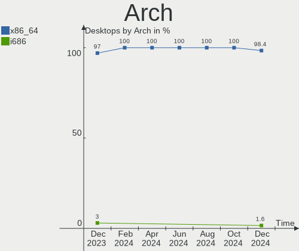
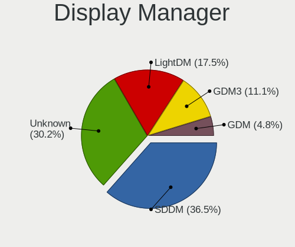
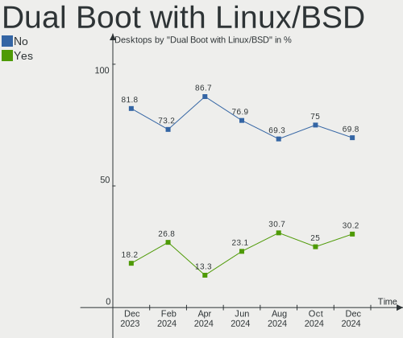
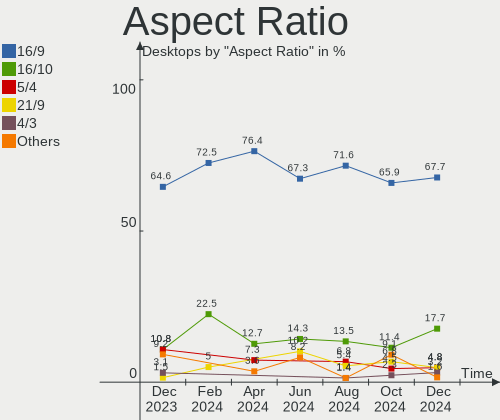
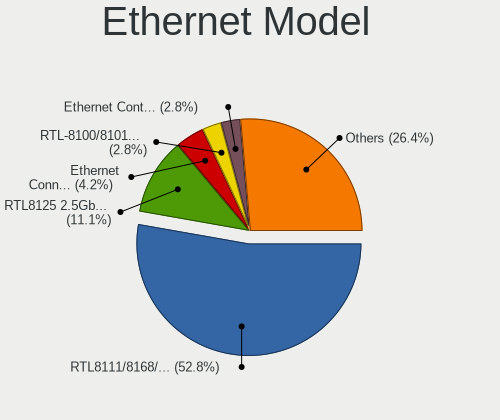
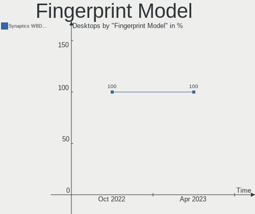
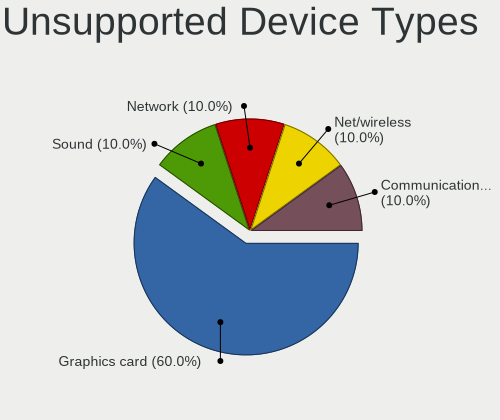

Linux in Poland - Hardware Trends (Desktops)
--------------------------------------------

A project to identify most popular hardware characteristics and track their change
over time based on data collected by Linux users at https://Linux-Hardware.org.

Anyone can contribute to this report by the [hw-probe](https://github.com/linuxhw/hw-probe) tool:

    sudo -E hw-probe -all -upload

Period: Apr, 2023.

Contents
--------

* [ System ](#system)
  - [ OS                       ](#os)
  - [ OS Family                ](#os-family)
  - [ Kernel                   ](#kernel)
  - [ Kernel Family            ](#kernel-family)
  - [ Kernel Major Ver.        ](#kernel-major-ver)
  - [ Arch                     ](#arch)
  - [ DE                       ](#de)
  - [ Display Server           ](#display-server)
  - [ Display Manager          ](#display-manager)
  - [ OS Lang                  ](#os-lang)
  - [ Boot Mode                ](#boot-mode)
  - [ Filesystem               ](#filesystem)
  - [ Part. scheme             ](#part-scheme)
  - [ Dual Boot with Linux/BSD ](#dual-boot-with-linuxbsd)
  - [ Dual Boot (Win)          ](#dual-boot-win)

* [ Board ](#board)
  - [ Vendor                   ](#vendor)
  - [ Model                    ](#model)
  - [ Model Family             ](#model-family)
  - [ MFG Year                 ](#mfg-year)
  - [ Form Factor              ](#form-factor)
  - [ Secure Boot              ](#secure-boot)
  - [ Coreboot                 ](#coreboot)
  - [ RAM Size                 ](#ram-size)
  - [ RAM Used                 ](#ram-used)
  - [ Total Drives             ](#total-drives)
  - [ Has CD-ROM               ](#has-cd-rom)
  - [ Has Ethernet             ](#has-ethernet)
  - [ Has WiFi                 ](#has-wifi)
  - [ Has Bluetooth            ](#has-bluetooth)

* [ Location ](#location)
  - [ Country                  ](#country)
  - [ City                     ](#city)

* [ Drives ](#drives)
  - [ Drive Vendor             ](#drive-vendor)
  - [ Drive Model              ](#drive-model)
  - [ HDD Vendor               ](#hdd-vendor)
  - [ SSD Vendor               ](#ssd-vendor)
  - [ Drive Kind               ](#drive-kind)
  - [ Drive Connector          ](#drive-connector)
  - [ Drive Size               ](#drive-size)
  - [ Space Total              ](#space-total)
  - [ Space Used               ](#space-used)
  - [ Malfunc. Drives          ](#malfunc-drives)
  - [ Malfunc. Drive Vendor    ](#malfunc-drive-vendor)
  - [ Malfunc. HDD Vendor      ](#malfunc-hdd-vendor)
  - [ Malfunc. Drive Kind      ](#malfunc-drive-kind)
  - [ Failed Drives            ](#failed-drives)
  - [ Failed Drive Vendor      ](#failed-drive-vendor)
  - [ Drive Status             ](#drive-status)

* [ Storage controller ](#storage-controller)
  - [ Storage Vendor           ](#storage-vendor)
  - [ Storage Model            ](#storage-model)
  - [ Storage Kind             ](#storage-kind)

* [ Processor ](#processor)
  - [ CPU Vendor               ](#cpu-vendor)
  - [ CPU Model                ](#cpu-model)
  - [ CPU Model Family         ](#cpu-model-family)
  - [ CPU Cores                ](#cpu-cores)
  - [ CPU Sockets              ](#cpu-sockets)
  - [ CPU Threads              ](#cpu-threads)
  - [ CPU Op-Modes             ](#cpu-op-modes)
  - [ CPU Microcode            ](#cpu-microcode)
  - [ CPU Microarch            ](#cpu-microarch)

* [ Graphics ](#graphics)
  - [ GPU Vendor               ](#gpu-vendor)
  - [ GPU Model                ](#gpu-model)
  - [ GPU Combo                ](#gpu-combo)
  - [ GPU Driver               ](#gpu-driver)
  - [ GPU Memory               ](#gpu-memory)

* [ Monitor ](#monitor)
  - [ Monitor Vendor           ](#monitor-vendor)
  - [ Monitor Model            ](#monitor-model)
  - [ Monitor Resolution       ](#monitor-resolution)
  - [ Monitor Diagonal         ](#monitor-diagonal)
  - [ Monitor Width            ](#monitor-width)
  - [ Aspect Ratio             ](#aspect-ratio)
  - [ Monitor Area             ](#monitor-area)
  - [ Pixel Density            ](#pixel-density)
  - [ Multiple Monitors        ](#multiple-monitors)

* [ Network ](#network)
  - [ Net Controller Vendor    ](#net-controller-vendor)
  - [ Net Controller Model     ](#net-controller-model)
  - [ Wireless Vendor          ](#wireless-vendor)
  - [ Wireless Model           ](#wireless-model)
  - [ Ethernet Vendor          ](#ethernet-vendor)
  - [ Ethernet Model           ](#ethernet-model)
  - [ Net Controller Kind      ](#net-controller-kind)
  - [ Used Controller          ](#used-controller)
  - [ NICs                     ](#nics)
  - [ IPv6                     ](#ipv6)

* [ Bluetooth ](#bluetooth)
  - [ Bluetooth Vendor         ](#bluetooth-vendor)
  - [ Bluetooth Model          ](#bluetooth-model)

* [ Sound ](#sound)
  - [ Sound Vendor             ](#sound-vendor)
  - [ Sound Model              ](#sound-model)

* [ Memory ](#memory)
  - [ Memory Vendor            ](#memory-vendor)
  - [ Memory Model             ](#memory-model)
  - [ Memory Kind              ](#memory-kind)
  - [ Memory Form Factor       ](#memory-form-factor)
  - [ Memory Size              ](#memory-size)
  - [ Memory Speed             ](#memory-speed)

* [ Printers & scanners ](#printers--scanners)
  - [ Printer Vendor           ](#printer-vendor)
  - [ Printer Model            ](#printer-model)
  - [ Scanner Vendor           ](#scanner-vendor)
  - [ Scanner Model            ](#scanner-model)

* [ Camera ](#camera)
  - [ Camera Vendor            ](#camera-vendor)
  - [ Camera Model             ](#camera-model)

* [ Security ](#security)
  - [ Fingerprint Vendor       ](#fingerprint-vendor)
  - [ Fingerprint Model        ](#fingerprint-model)
  - [ Chipcard Vendor          ](#chipcard-vendor)
  - [ Chipcard Model           ](#chipcard-model)

* [ Unsupported ](#unsupported)
  - [ Unsupported Devices      ](#unsupported-devices)
  - [ Unsupported Device Types ](#unsupported-device-types)

System
------

OS
--

Installed operating systems

| Name                | Desktops | Percent |
|---------------------|----------|---------|
| OpenMandriva 23.03  | 5        | 13.16%  |
| Ubuntu 22.04        | 3        | 7.89%   |
| Linux Mint 21.1     | 3        | 7.89%   |
| Gentoo 2.13         | 3        | 7.89%   |
| OpenMandriva 4.3    | 2        | 5.26%   |
| Manjaro             | 2        | 5.26%   |
| Fedora 37           | 2        | 5.26%   |
| Debian 11           | 2        | 5.26%   |
| ArcoLinux Rolling   | 2        | 5.26%   |
| Xubuntu 22.04       | 1        | 2.63%   |
| Ubuntu 22.10        | 1        | 2.63%   |
| Ubuntu 20.04        | 1        | 2.63%   |
| ROSA 12.4           | 1        | 2.63%   |
| Pop!_OS 22.04       | 1        | 2.63%   |
| Linux Mint 20.3     | 1        | 2.63%   |
| Linux Mint 19       | 1        | 2.63%   |
| Kubuntu 22.04       | 1        | 2.63%   |
| Kubuntu 18.04       | 1        | 2.63%   |
| KDE neon 22.04      | 1        | 2.63%   |
| Fedora 38           | 1        | 2.63%   |
| EndeavourOS Rolling | 1        | 2.63%   |
| Devuan 4            | 1        | 2.63%   |
| Arch Rolling        | 1        | 2.63%   |

OS Family
---------

OS without a version

| Name         | Desktops | Percent |
|--------------|----------|---------|
| OpenMandriva | 7        | 18.42%  |
| Ubuntu       | 5        | 13.16%  |
| Linux Mint   | 5        | 13.16%  |
| Gentoo       | 3        | 7.89%   |
| Fedora       | 3        | 7.89%   |
| Manjaro      | 2        | 5.26%   |
| Kubuntu      | 2        | 5.26%   |
| Debian       | 2        | 5.26%   |
| ArcoLinux    | 2        | 5.26%   |
| Xubuntu      | 1        | 2.63%   |
| ROSA         | 1        | 2.63%   |
| Pop!_OS      | 1        | 2.63%   |
| KDE neon     | 1        | 2.63%   |
| EndeavourOS  | 1        | 2.63%   |
| Devuan       | 1        | 2.63%   |
| Arch         | 1        | 2.63%   |

Kernel
------

Version of the Linux kernel

| Version                             | Desktops | Percent |
|-------------------------------------|----------|---------|
| 6.2.6-desktop-1omv2390              | 5        | 13.16%  |
| 6.1.19-gentoo                       | 3        | 7.89%   |
| 5.15.0-69-generic                   | 3        | 7.89%   |
| 5.10.0-21-amd64                     | 3        | 7.89%   |
| 5.19.0-41-generic                   | 2        | 5.26%   |
| 5.19.0-38-generic                   | 2        | 5.26%   |
| 6.2.9-arch1-1                       | 1        | 2.63%   |
| 6.2.9-200.fc37.x86_64               | 1        | 2.63%   |
| 6.2.6-76060206-generic              | 1        | 2.63%   |
| 6.2.13-arch1-1                      | 1        | 2.63%   |
| 6.2.12-arch1-1                      | 1        | 2.63%   |
| 6.2.12-300.fc38.x86_64              | 1        | 2.63%   |
| 6.2.10-zen1-1-zen                   | 1        | 2.63%   |
| 6.2.10-200.fc37.x86_64              | 1        | 2.63%   |
| 6.1.23-1-MANJARO                    | 1        | 2.63%   |
| 5.4.0-146-generic                   | 1        | 2.63%   |
| 5.19.0-40-generic                   | 1        | 2.63%   |
| 5.19.0-35-generic                   | 1        | 2.63%   |
| 5.19.0-32-generic                   | 1        | 2.63%   |
| 5.16.7-desktop-1omv4003             | 1        | 2.63%   |
| 5.16.13-desktop-1omv4003            | 1        | 2.63%   |
| 5.15.103-generic-1rosa2021.1-x86_64 | 1        | 2.63%   |
| 5.15.0-70-generic                   | 1        | 2.63%   |
| 5.13.19-2-MANJARO                   | 1        | 2.63%   |
| 4.15.0-209-generic                  | 1        | 2.63%   |
| 4.15.0-166-generic                  | 1        | 2.63%   |

Kernel Family
-------------

Linux kernel without a distro release

| Version  | Desktops | Percent |
|----------|----------|---------|
| 5.19.0   | 7        | 18.42%  |
| 6.2.6    | 6        | 15.79%  |
| 5.15.0   | 4        | 10.53%  |
| 6.1.19   | 3        | 7.89%   |
| 5.10.0   | 3        | 7.89%   |
| 6.2.9    | 2        | 5.26%   |
| 6.2.12   | 2        | 5.26%   |
| 6.2.10   | 2        | 5.26%   |
| 4.15.0   | 2        | 5.26%   |
| 6.2.13   | 1        | 2.63%   |
| 6.1.23   | 1        | 2.63%   |
| 5.4.0    | 1        | 2.63%   |
| 5.16.7   | 1        | 2.63%   |
| 5.16.13  | 1        | 2.63%   |
| 5.15.103 | 1        | 2.63%   |
| 5.13.19  | 1        | 2.63%   |

Kernel Major Ver.
-----------------

Linux kernel major version

| Version | Desktops | Percent |
|---------|----------|---------|
| 6.2     | 13       | 34.21%  |
| 5.19    | 7        | 18.42%  |
| 5.15    | 5        | 13.16%  |
| 6.1     | 4        | 10.53%  |
| 5.10    | 3        | 7.89%   |
| 5.16    | 2        | 5.26%   |
| 4.15    | 2        | 5.26%   |
| 5.4     | 1        | 2.63%   |
| 5.13    | 1        | 2.63%   |

Arch
----

OS architecture (x86_64, i586, etc.)

| Name   | Desktops | Percent |
|--------|----------|---------|
| x86_64 | 38       | 100%    |

DE
--

Desktop Environment

| Name       | Desktops | Percent |
|------------|----------|---------|
| KDE5       | 19       | 50%     |
| GNOME      | 8        | 21.05%  |
| XFCE       | 3        | 7.89%   |
| X-Cinnamon | 3        | 7.89%   |
| MATE       | 2        | 5.26%   |
| Hyprland   | 1        | 2.63%   |
| Cinnamon   | 1        | 2.63%   |
| Unknown    | 1        | 2.63%   |

Display Server
--------------

X11 or Wayland

| Name    | Desktops | Percent |
|---------|----------|---------|
| X11     | 30       | 78.95%  |
| Wayland | 7        | 18.42%  |
| Tty     | 1        | 2.63%   |

Display Manager
---------------

SDDM, LightDM, etc.

| Name    | Desktops | Percent |
|---------|----------|---------|
| SDDM    | 18       | 47.37%  |
| Unknown | 9        | 23.68%  |
| LightDM | 5        | 13.16%  |
| GDM3    | 3        | 7.89%   |
| GDM     | 2        | 5.26%   |
| LXDM    | 1        | 2.63%   |

OS Lang
-------

Language

| Lang  | Desktops | Percent |
|-------|----------|---------|
| pl_PL | 20       | 52.63%  |
| en_US | 13       | 34.21%  |
| ru_RU | 1        | 2.63%   |
| en_GB | 1        | 2.63%   |
| de_DE | 1        | 2.63%   |
| de_CH | 1        | 2.63%   |
| C     | 1        | 2.63%   |

Boot Mode
---------

EFI or BIOS

| Mode | Desktops | Percent |
|------|----------|---------|
| BIOS | 19       | 50%     |
| EFI  | 19       | 50%     |

Filesystem
----------

Type of filesystem

| Type    | Desktops | Percent |
|---------|----------|---------|
| Ext4    | 27       | 71.05%  |
| F2fs    | 4        | 10.53%  |
| Overlay | 3        | 7.89%   |
| Btrfs   | 3        | 7.89%   |
| Tmpfs   | 1        | 2.63%   |

Part. scheme
------------

Scheme of partitioning

| Type    | Desktops | Percent |
|---------|----------|---------|
| GPT     | 23       | 60.53%  |
| Unknown | 9        | 23.68%  |
| MBR     | 6        | 15.79%  |

Dual Boot with Linux/BSD
------------------------

Hosting more than one Linux/BSD

| Dual boot | Desktops | Percent |
|-----------|----------|---------|
| No        | 27       | 71.05%  |
| Yes       | 11       | 28.95%  |

Dual Boot (Win)
---------------

Hosting Linux and Windows

| Dual boot | Desktops | Percent |
|-----------|----------|---------|
| No        | 24       | 63.16%  |
| Yes       | 14       | 36.84%  |

Board
-----

Vendor
------

Motherboard manufacturer

| Name                | Desktops | Percent |
|---------------------|----------|---------|
| MSI                 | 11       | 28.95%  |
| Gigabyte Technology | 7        | 18.42%  |
| ASUSTek Computer    | 7        | 18.42%  |
| ASRock              | 5        | 13.16%  |
| Dell                | 4        | 10.53%  |
| Intel               | 1        | 2.63%   |
| Hewlett-Packard     | 1        | 2.63%   |
| Acer                | 1        | 2.63%   |
| Unknown             | 1        | 2.63%   |

Model
-----

Motherboard model

| Name                                   | Desktops | Percent |
|----------------------------------------|----------|---------|
| ASUS M3A78-CM                          | 2        | 5.26%   |
| ASRock Z170 Extreme4                   | 2        | 5.26%   |
| MSI PRO X300 DP20Z (MS-B0A2)           | 1        | 2.63%   |
| MSI OPTIMUS                            | 1        | 2.63%   |
| MSI MS-7D52                            | 1        | 2.63%   |
| MSI MS-7C37                            | 1        | 2.63%   |
| MSI MS-7B89                            | 1        | 2.63%   |
| MSI MS-7B86                            | 1        | 2.63%   |
| MSI MS-7B84                            | 1        | 2.63%   |
| MSI MS-7816                            | 1        | 2.63%   |
| MSI MS-7673                            | 1        | 2.63%   |
| MSI MS-7592                            | 1        | 2.63%   |
| MSI MS-7583                            | 1        | 2.63%   |
| Intel DG41RQ AAE54511-203              | 1        | 2.63%   |
| HP Compaq dc7900 Convertible Minitower | 1        | 2.63%   |
| Gigabyte Z97X-Gaming 3                 | 1        | 2.63%   |
| Gigabyte Z97M-DS3H                     | 1        | 2.63%   |
| Gigabyte Z77-DS3H                      | 1        | 2.63%   |
| Gigabyte X670 AORUS ELITE AX           | 1        | 2.63%   |
| Gigabyte G31M-ES2L                     | 1        | 2.63%   |
| Gigabyte B85M-D3H                      | 1        | 2.63%   |
| Gigabyte AB350-Gaming                  | 1        | 2.63%   |
| Dell Precision 3630 Tower              | 1        | 2.63%   |
| Dell OptiPlex 780                      | 1        | 2.63%   |
| Dell OptiPlex 7010                     | 1        | 2.63%   |
| Dell OptiPlex 3040                     | 1        | 2.63%   |
| ASUS TUF Gaming B550-PLUS WIFI II      | 1        | 2.63%   |
| ASUS ROG STRIX X670E-F GAMING WIFI     | 1        | 2.63%   |
| ASUS ROG Rampage VI EXTREME            | 1        | 2.63%   |
| ASUS P5K/EPU                           | 1        | 2.63%   |
| ASUS A68HM-K                           | 1        | 2.63%   |
| ASRock Z370 Gaming K6                  | 1        | 2.63%   |
| ASRock B75 Pro3-M                      | 1        | 2.63%   |
| ASRock 970 Pro3 R2.0                   | 1        | 2.63%   |
| Acer Aspire X3910                      | 1        | 2.63%   |
| Unknown                                | 1        | 2.63%   |

Model Family
------------

Motherboard model prefix

| Name                  | Desktops | Percent |
|-----------------------|----------|---------|
| Dell OptiPlex         | 3        | 7.89%   |
| ASUS ROG              | 2        | 5.26%   |
| ASUS M3A78-CM         | 2        | 5.26%   |
| ASRock Z170           | 2        | 5.26%   |
| MSI PRO               | 1        | 2.63%   |
| MSI OPTIMUS           | 1        | 2.63%   |
| MSI MS-7D52           | 1        | 2.63%   |
| MSI MS-7C37           | 1        | 2.63%   |
| MSI MS-7B89           | 1        | 2.63%   |
| MSI MS-7B86           | 1        | 2.63%   |
| MSI MS-7B84           | 1        | 2.63%   |
| MSI MS-7816           | 1        | 2.63%   |
| MSI MS-7673           | 1        | 2.63%   |
| MSI MS-7592           | 1        | 2.63%   |
| MSI MS-7583           | 1        | 2.63%   |
| Intel DG41RQ          | 1        | 2.63%   |
| HP Compaq             | 1        | 2.63%   |
| Gigabyte Z97X-Gaming  | 1        | 2.63%   |
| Gigabyte Z97M-DS3H    | 1        | 2.63%   |
| Gigabyte Z77-DS3H     | 1        | 2.63%   |
| Gigabyte X670         | 1        | 2.63%   |
| Gigabyte G31M-ES2L    | 1        | 2.63%   |
| Gigabyte B85M-D3H     | 1        | 2.63%   |
| Gigabyte AB350-Gaming | 1        | 2.63%   |
| Dell Precision        | 1        | 2.63%   |
| ASUS TUF              | 1        | 2.63%   |
| ASUS P5K              | 1        | 2.63%   |
| ASUS A68HM-K          | 1        | 2.63%   |
| ASRock Z370           | 1        | 2.63%   |
| ASRock B75            | 1        | 2.63%   |
| ASRock 970            | 1        | 2.63%   |
| Acer Aspire           | 1        | 2.63%   |
| Unknown               | 1        | 2.63%   |

MFG Year
--------

Motherboard manufacture year

| Year | Desktops | Percent |
|------|----------|---------|
| 2008 | 5        | 13.16%  |
| 2019 | 4        | 10.53%  |
| 2012 | 4        | 10.53%  |
| 2022 | 3        | 7.89%   |
| 2021 | 3        | 7.89%   |
| 2017 | 3        | 7.89%   |
| 2016 | 3        | 7.89%   |
| 2014 | 3        | 7.89%   |
| 2009 | 3        | 7.89%   |
| 2018 | 2        | 5.26%   |
| 2013 | 2        | 5.26%   |
| 2011 | 2        | 5.26%   |
| 2010 | 1        | 2.63%   |

Form Factor
-----------

Physical design of the computer

| Name    | Desktops | Percent |
|---------|----------|---------|
| Desktop | 38       | 100%    |

Secure Boot
-----------

Enabled or disabled

| State    | Desktops | Percent |
|----------|----------|---------|
| Disabled | 35       | 92.11%  |
| Enabled  | 3        | 7.89%   |

Coreboot
--------

Have coreboot on board

| Used | Desktops | Percent |
|------|----------|---------|
| No   | 38       | 100%    |

RAM Size
--------

Total RAM memory

| Size in GB  | Desktops | Percent |
|-------------|----------|---------|
| 16.01-24.0  | 13       | 34.21%  |
| 4.01-8.0    | 8        | 21.05%  |
| 8.01-16.0   | 6        | 15.79%  |
| 32.01-64.0  | 4        | 10.53%  |
| 3.01-4.0    | 3        | 7.89%   |
| 24.01-32.0  | 2        | 5.26%   |
| 2.01-3.0    | 1        | 2.63%   |
| 64.01-256.0 | 1        | 2.63%   |

RAM Used
--------

Used RAM memory

| Used GB    | Desktops | Percent |
|------------|----------|---------|
| 2.01-3.0   | 11       | 28.95%  |
| 3.01-4.0   | 9        | 23.68%  |
| 1.01-2.0   | 8        | 21.05%  |
| 4.01-8.0   | 5        | 13.16%  |
| 8.01-16.0  | 3        | 7.89%   |
| 16.01-24.0 | 1        | 2.63%   |
| 0.01-0.5   | 1        | 2.63%   |

Total Drives
------------

Number of drives on board

| Drives | Desktops | Percent |
|--------|----------|---------|
| 1      | 12       | 31.58%  |
| 2      | 11       | 28.95%  |
| 3      | 10       | 26.32%  |
| 6      | 2        | 5.26%   |
| 7      | 1        | 2.63%   |
| 5      | 1        | 2.63%   |
| 4      | 1        | 2.63%   |

Has CD-ROM
----------

Has CD-ROM on board

| Presented | Desktops | Percent |
|-----------|----------|---------|
| No        | 20       | 52.63%  |
| Yes       | 18       | 47.37%  |

Has Ethernet
------------

Has Ethernet on board

| Presented | Desktops | Percent |
|-----------|----------|---------|
| Yes       | 38       | 100%    |

Has WiFi
--------

Has WiFi module

| Presented | Desktops | Percent |
|-----------|----------|---------|
| No        | 20       | 52.63%  |
| Yes       | 18       | 47.37%  |

Has Bluetooth
-------------

Has Bluetooth module

| Presented | Desktops | Percent |
|-----------|----------|---------|
| No        | 24       | 63.16%  |
| Yes       | 14       | 36.84%  |

Location
--------

Country
-------

Geographic location (country)

| Country | Desktops | Percent |
|---------|----------|---------|
| Poland  | 38       | 100%    |

City
----

Geographic location (city)

| City                | Desktops | Percent |
|---------------------|----------|---------|
| Warsaw              | 11       | 28.95%  |
| Wroclaw             | 3        | 7.89%   |
| Poznan              | 3        | 7.89%   |
| Gdynia              | 2        | 5.26%   |
| Wilkszyn            | 1        | 2.63%   |
| Trzebinia           | 1        | 2.63%   |
| Suwałki            | 1        | 2.63%   |
| Radzionkow          | 1        | 2.63%   |
| Kutno               | 1        | 2.63%   |
| Krakow              | 1        | 2.63%   |
| Kostrzyn            | 1        | 2.63%   |
| Kielce              | 1        | 2.63%   |
| Katowice            | 1        | 2.63%   |
| Janikowo            | 1        | 2.63%   |
| Gliwice             | 1        | 2.63%   |
| Gdansk              | 1        | 2.63%   |
| Działdowo          | 1        | 2.63%   |
| Czarna Białostocka | 1        | 2.63%   |
| Ciele               | 1        | 2.63%   |
| Chorzów            | 1        | 2.63%   |
| Byczyna             | 1        | 2.63%   |
| Brzesko             | 1        | 2.63%   |
| Bielsko-Biala       | 1        | 2.63%   |

Drives
------

Drive Vendor
------------

Hard drive vendors

| Vendor                      | Desktops | Drives | Percent |
|-----------------------------|----------|--------|---------|
| WDC                         | 11       | 14     | 13.75%  |
| GOODRAM                     | 10       | 11     | 12.5%   |
| Seagate                     | 9        | 10     | 11.25%  |
| Samsung Electronics         | 9        | 10     | 11.25%  |
| Toshiba                     | 7        | 8      | 8.75%   |
| Kingston                    | 6        | 6      | 7.5%    |
| Crucial                     | 6        | 6      | 7.5%    |
| SanDisk                     | 3        | 4      | 3.75%   |
| SPCC                        | 2        | 3      | 2.5%    |
| Silicon Motion              | 2        | 2      | 2.5%    |
| Patriot                     | 2        | 2      | 2.5%    |
| Hitachi                     | 2        | 4      | 2.5%    |
| A-DATA Technology           | 2        | 2      | 2.5%    |
| XPG                         | 1        | 2      | 1.25%   |
| SK hynix                    | 1        | 1      | 1.25%   |
| Realtek Semiconductor       | 1        | 1      | 1.25%   |
| POLION                      | 1        | 1      | 1.25%   |
| PNY                         | 1        | 1      | 1.25%   |
| Phison Electronics          | 1        | 1      | 1.25%   |
| Lite-On Technology          | 1        | 1      | 1.25%   |
| Kingston Technology Company | 1        | 1      | 1.25%   |
| Intenso                     | 1        | 1      | 1.25%   |

Drive Model
-----------

Hard drive models

| Model                                                  | Desktops | Percent |
|--------------------------------------------------------|----------|---------|
| Crucial CT500MX500SSD1 500GB                           | 3        | 3.41%   |
| SanDisk NVMe SSD Drive 1TB                             | 2        | 2.27%   |
| GOODRAM SSDPR-CL100-480-G2 480GB                       | 2        | 2.27%   |
| Crucial CT1000MX500SSD1 1TB                            | 2        | 2.27%   |
| XPG GAMMIX S70 BLADE 512GB                             | 1        | 1.14%   |
| WDC WD5000AVVS-63M8B0 500GB                            | 1        | 1.14%   |
| WDC WD5000AADS-00S9B0 500GB                            | 1        | 1.14%   |
| WDC WD2500AAKX-00ERMA0 250GB                           | 1        | 1.14%   |
| WDC WD20EZBX-00AYRA0 2TB                               | 1        | 1.14%   |
| WDC WD20EZAZ-00L9GB0 2TB                               | 1        | 1.14%   |
| WDC WD2003FZEX-00Z4SA0 2TB                             | 1        | 1.14%   |
| WDC WD10EZRX-00A8LB0 1TB                               | 1        | 1.14%   |
| WDC WD10EZEX-75M2NA0 1TB                               | 1        | 1.14%   |
| WDC WD10EZEX-60WN4A0 1TB                               | 1        | 1.14%   |
| WDC WD10EZEX-08WN4A0 1TB                               | 1        | 1.14%   |
| WDC WD10EZEX-00ZF5A0 1TB                               | 1        | 1.14%   |
| WDC WD10EZEX-00BN5A0 1TB                               | 1        | 1.14%   |
| WDC WD1001FALS-00J7B0 1TB                              | 1        | 1.14%   |
| WDC PC SN530 SDBPNPZ-256G-1002 256GB                   | 1        | 1.14%   |
| Toshiba TR200 240GB SSD                                | 1        | 1.14%   |
| Toshiba THNSNJ128GCSU 128GB SSD                        | 1        | 1.14%   |
| Toshiba MQ01ABD100 1TB                                 | 1        | 1.14%   |
| Toshiba MQ01ABD075 752GB                               | 1        | 1.14%   |
| Toshiba HDWE150 5TB                                    | 1        | 1.14%   |
| Toshiba DT01ACA200 2TB                                 | 1        | 1.14%   |
| Toshiba DT01ACA100 1TB                                 | 1        | 1.14%   |
| SPCC Solid State Disk 512GB                            | 1        | 1.14%   |
| SPCC Solid State Disk 240GB                            | 1        | 1.14%   |
| SPCC Solid State Disk 128GB                            | 1        | 1.14%   |
| SK hynix SC401 SATA 512GB SSD                          | 1        | 1.14%   |
| Silicon Motion SM2263EN/SM2263XT SSD Controller 1024GB | 1        | 1.14%   |
| Silicon Motion SM2262/SM2262EN SSD Controller 1TB      | 1        | 1.14%   |
| Seagate ST4000DM004-2CV104 4TB                         | 1        | 1.14%   |
| Seagate ST3500413AS 500GB                              | 1        | 1.14%   |
| Seagate ST3250310AS 250GB                              | 1        | 1.14%   |
| Seagate ST3160318AS 160GB                              | 1        | 1.14%   |
| Seagate ST31000528AS 1TB                               | 1        | 1.14%   |
| Seagate ST12000NM0008-2H3101 12TB                      | 1        | 1.14%   |
| Seagate ST1000LM014-SSHD-8GB                           | 1        | 1.14%   |
| Seagate ST1000DM010-2EP102 1TB                         | 1        | 1.14%   |

HDD Vendor
----------

Hard disk drive vendors

| Vendor              | Desktops | Drives | Percent |
|---------------------|----------|--------|---------|
| WDC                 | 10       | 13     | 37.04%  |
| Seagate             | 9        | 10     | 33.33%  |
| Toshiba             | 5        | 6      | 18.52%  |
| Hitachi             | 2        | 4      | 7.41%   |
| Samsung Electronics | 1        | 1      | 3.7%    |

SSD Vendor
----------

Solid state drive vendors

| Vendor              | Desktops | Drives | Percent |
|---------------------|----------|--------|---------|
| GOODRAM             | 10       | 11     | 27.03%  |
| Crucial             | 6        | 6      | 16.22%  |
| Samsung Electronics | 5        | 6      | 13.51%  |
| Kingston            | 3        | 3      | 8.11%   |
| Toshiba             | 2        | 2      | 5.41%   |
| SPCC                | 2        | 3      | 5.41%   |
| SanDisk             | 2        | 2      | 5.41%   |
| Patriot             | 2        | 2      | 5.41%   |
| A-DATA Technology   | 2        | 2      | 5.41%   |
| SK hynix            | 1        | 1      | 2.7%    |
| PNY                 | 1        | 1      | 2.7%    |
| Intenso             | 1        | 1      | 2.7%    |

Drive Kind
----------

HDD or SSD

| Kind    | Desktops | Drives | Percent |
|---------|----------|--------|---------|
| SSD     | 29       | 40     | 43.28%  |
| HDD     | 24       | 34     | 35.82%  |
| NVMe    | 13       | 17     | 19.4%   |
| Unknown | 1        | 1      | 1.49%   |

Drive Connector
---------------

SATA, SAS, NVMe, etc.

| Type | Desktops | Drives | Percent |
|------|----------|--------|---------|
| SATA | 35       | 73     | 70%     |
| NVMe | 13       | 17     | 26%     |
| SAS  | 2        | 2      | 4%      |

Drive Size
----------

Size of hard drive

| Size in TB | Desktops | Drives | Percent |
|------------|----------|--------|---------|
| 0.01-0.5   | 26       | 35     | 44.83%  |
| 0.51-1.0   | 22       | 27     | 37.93%  |
| 1.01-2.0   | 5        | 5      | 8.62%   |
| 3.01-4.0   | 2        | 2      | 3.45%   |
| 2.01-3.0   | 1        | 3      | 1.72%   |
| 10.01-20.0 | 1        | 1      | 1.72%   |
| 4.01-10.0  | 1        | 1      | 1.72%   |

Space Total
-----------

Amount of disk space available on the file system

| Size in GB     | Desktops | Percent |
|----------------|----------|---------|
| 101-250        | 8        | 21.05%  |
| 501-1000       | 7        | 18.42%  |
| 1001-2000      | 5        | 13.16%  |
| 251-500        | 4        | 10.53%  |
| 51-100         | 4        | 10.53%  |
| More than 3000 | 3        | 7.89%   |
| 2001-3000      | 3        | 7.89%   |
| 1-20           | 3        | 7.89%   |
| 21-50          | 1        | 2.63%   |

Space Used
----------

Amount of used disk space

| Used GB        | Desktops | Percent |
|----------------|----------|---------|
| 1-20           | 10       | 26.32%  |
| 21-50          | 8        | 21.05%  |
| 101-250        | 4        | 10.53%  |
| 1001-2000      | 4        | 10.53%  |
| 251-500        | 3        | 7.89%   |
| 501-1000       | 3        | 7.89%   |
| 51-100         | 3        | 7.89%   |
| More than 3000 | 2        | 5.26%   |
| 2001-3000      | 1        | 2.63%   |

Malfunc. Drives
---------------

Drive models with a malfunction

| Model                               | Desktops | Drives | Percent |
|-------------------------------------|----------|--------|---------|
| Seagate ST3160318AS 160GB           | 1        | 1      | 33.33%  |
| Samsung Electronics SSD 870 EVO 1TB | 1        | 1      | 33.33%  |
| Samsung Electronics HD753LJ 752GB   | 1        | 1      | 33.33%  |

Malfunc. Drive Vendor
---------------------

Vendors of faulty drives

| Vendor              | Desktops | Drives | Percent |
|---------------------|----------|--------|---------|
| Samsung Electronics | 2        | 2      | 66.67%  |
| Seagate             | 1        | 1      | 33.33%  |

Malfunc. HDD Vendor
-------------------

Vendors of faulty HDD drives

| Vendor              | Desktops | Drives | Percent |
|---------------------|----------|--------|---------|
| Seagate             | 1        | 1      | 50%     |
| Samsung Electronics | 1        | 1      | 50%     |

Malfunc. Drive Kind
-------------------

Kinds of faulty drives

| Kind | Desktops | Drives | Percent |
|------|----------|--------|---------|
| HDD  | 2        | 2      | 66.67%  |
| SSD  | 1        | 1      | 33.33%  |

Failed Drives
-------------

Failed drive models

| Model                    | Desktops | Drives | Percent |
|--------------------------|----------|--------|---------|
| Seagate ST31000528AS 1TB | 1        | 1      | 100%    |

Failed Drive Vendor
-------------------

Failed drive vendors

| Vendor  | Desktops | Drives | Percent |
|---------|----------|--------|---------|
| Seagate | 1        | 1      | 100%    |

Drive Status
------------

Number of failed and malfunc. drives

| Status   | Desktops | Drives | Percent |
|----------|----------|--------|---------|
| Works    | 24       | 55     | 57.14%  |
| Detected | 14       | 33     | 33.33%  |
| Malfunc  | 3        | 3      | 7.14%   |
| Failed   | 1        | 1      | 2.38%   |

Storage controller
------------------

Storage Vendor
--------------

Storage controller vendors

| Vendor                      | Desktops | Percent |
|-----------------------------|----------|---------|
| Intel                       | 24       | 42.11%  |
| AMD                         | 13       | 22.81%  |
| Kingston Technology Company | 4        | 7.02%   |
| Samsung Electronics         | 3        | 5.26%   |
| ASMedia Technology          | 3        | 5.26%   |
| Silicon Motion              | 2        | 3.51%   |
| SanDisk                     | 2        | 3.51%   |
| Realtek Semiconductor       | 1        | 1.75%   |
| Phison Electronics          | 1        | 1.75%   |
| Marvell Technology Group    | 1        | 1.75%   |
| Lite-On Technology          | 1        | 1.75%   |
| JMicron Technology          | 1        | 1.75%   |
| ADATA Technology            | 1        | 1.75%   |

Storage Model
-------------

Storage controller models

| Model                                                                                   | Desktops | Percent |
|-----------------------------------------------------------------------------------------|----------|---------|
| AMD FCH SATA Controller [AHCI mode]                                                     | 8        | 11.43%  |
| Intel Q170/Q150/B150/H170/H110/Z170/CM236 Chipset SATA Controller [AHCI Mode]           | 3        | 4.29%   |
| Intel NM10/ICH7 Family SATA Controller [IDE mode]                                       | 3        | 4.29%   |
| Intel 7 Series/C210 Series Chipset Family 6-port SATA Controller [AHCI mode]            | 3        | 4.29%   |
| ASMedia ASM1062 Serial ATA Controller                                                   | 3        | 4.29%   |
| AMD SB7x0/SB8x0/SB9x0 IDE Controller                                                    | 3        | 4.29%   |
| AMD 400 Series Chipset SATA Controller                                                  | 3        | 4.29%   |
| Samsung NVMe SSD Controller 980                                                         | 2        | 2.86%   |
| Kingston Company Company Non-Volatile memory controller                                 | 2        | 2.86%   |
| Kingston Company A2000 NVMe SSD                                                         | 2        | 2.86%   |
| Intel Cannon Lake PCH SATA AHCI Controller                                              | 2        | 2.86%   |
| Intel 82801JD/DO (ICH10 Family) SATA AHCI Controller                                    | 2        | 2.86%   |
| Intel 82801G (ICH7 Family) IDE Controller                                               | 2        | 2.86%   |
| Intel 8 Series/C220 Series Chipset Family 6-port SATA Controller 1 [AHCI mode]          | 2        | 2.86%   |
| Intel 200 Series PCH SATA controller [AHCI mode]                                        | 2        | 2.86%   |
| AMD SB7x0/SB8x0/SB9x0 SATA Controller [IDE mode]                                        | 2        | 2.86%   |
| Silicon Motion SM2263EN/SM2263XT SSD Controller                                         | 1        | 1.43%   |
| Silicon Motion SM2262/SM2262EN SSD Controller                                           | 1        | 1.43%   |
| Sandisk Western Digital WD Black SN850X NVMe SSD                                        | 1        | 1.43%   |
| SanDisk WD Blue SN570 NVMe SSD 1TB                                                      | 1        | 1.43%   |
| SanDisk WD Blue SN550 NVMe SSD                                                          | 1        | 1.43%   |
| Samsung Electronics Non-Volatile memory controller                                      | 1        | 1.43%   |
| Realtek RTS5763DL NVMe SSD Controller                                                   | 1        | 1.43%   |
| Phison E12 NVMe Controller                                                              | 1        | 1.43%   |
| Marvell Group 88SE6101/6102 single-port PATA133 interface                               | 1        | 1.43%   |
| Lite-On Non-Volatile memory controller                                                  | 1        | 1.43%   |
| JMicron JMB363 SATA/IDE Controller                                                      | 1        | 1.43%   |
| Intel Celeron/Pentium Silver Processor SATA Controller                                  | 1        | 1.43%   |
| Intel 9 Series Chipset Family SATA Controller [IDE Mode]                                | 1        | 1.43%   |
| Intel 9 Series Chipset Family SATA Controller [AHCI Mode]                               | 1        | 1.43%   |
| Intel 82801JI (ICH10 Family) SATA AHCI Controller                                       | 1        | 1.43%   |
| Intel 82801IB (ICH9) 2 port SATA Controller [IDE mode]                                  | 1        | 1.43%   |
| Intel 82801I (ICH9 Family) 2 port SATA Controller [IDE mode]                            | 1        | 1.43%   |
| Intel 6 Series/C200 Series Chipset Family Desktop SATA Controller (IDE mode, ports 4-5) | 1        | 1.43%   |
| Intel 6 Series/C200 Series Chipset Family 6 port Desktop SATA AHCI Controller           | 1        | 1.43%   |
| Intel 5 Series/3400 Series Chipset 4 port SATA IDE Controller                           | 1        | 1.43%   |
| Intel 5 Series/3400 Series Chipset 2 port SATA IDE Controller                           | 1        | 1.43%   |
| Intel 4 Series Chipset PT IDER Controller                                               | 1        | 1.43%   |
| AMD SB7x0/SB8x0/SB9x0 SATA Controller [AHCI mode]                                       | 1        | 1.43%   |
| AMD 500 Series Chipset SATA Controller                                                  | 1        | 1.43%   |

Storage Kind
------------

Kind of storage controller (IDE, SATA, NVMe, SAS, ...)

| Kind | Desktops | Percent |
|------|----------|---------|
| SATA | 31       | 56.36%  |
| NVMe | 13       | 23.64%  |
| IDE  | 11       | 20%     |

Processor
---------

CPU Vendor
----------

Processor vendors

| Vendor | Desktops | Percent |
|--------|----------|---------|
| Intel  | 24       | 63.16%  |
| AMD    | 14       | 36.84%  |

CPU Model
---------

Processor models

| Model                                        | Desktops | Percent |
|----------------------------------------------|----------|---------|
| Intel Core i5-4460 CPU @ 3.20GHz             | 2        | 5.26%   |
| AMD Ryzen 9 7900X 12-Core Processor          | 2        | 5.26%   |
| AMD Ryzen 9 5900X 12-Core Processor          | 2        | 5.26%   |
| AMD Phenom II X4 955 Processor               | 2        | 5.26%   |
| Intel Xeon E-2136 CPU @ 3.30GHz              | 1        | 2.63%   |
| Intel Xeon CPU X5450 @ 3.00GHz               | 1        | 2.63%   |
| Intel Pentium Dual-Core CPU E5500 @ 2.80GHz  | 1        | 2.63%   |
| Intel Pentium Dual-Core CPU E5200 @ 2.50GHz  | 1        | 2.63%   |
| Intel Pentium Dual CPU E2180 @ 2.00GHz       | 1        | 2.63%   |
| Intel Core i9-7900X CPU @ 3.30GHz            | 1        | 2.63%   |
| Intel Core i7-8700K CPU @ 3.70GHz            | 1        | 2.63%   |
| Intel Core i7-6700 CPU @ 3.40GHz             | 1        | 2.63%   |
| Intel Core i7-4790 CPU @ 3.60GHz             | 1        | 2.63%   |
| Intel Core i7 CPU 870 @ 2.93GHz              | 1        | 2.63%   |
| Intel Core i5-8400 CPU @ 2.80GHz             | 1        | 2.63%   |
| Intel Core i5-6600K CPU @ 3.50GHz            | 1        | 2.63%   |
| Intel Core i5-6500 CPU @ 3.20GHz             | 1        | 2.63%   |
| Intel Core i5-4690 CPU @ 3.50GHz             | 1        | 2.63%   |
| Intel Core i5-3570K CPU @ 3.40GHz            | 1        | 2.63%   |
| Intel Core i5-3470 CPU @ 3.20GHz             | 1        | 2.63%   |
| Intel Core i5-2400 CPU @ 3.10GHz             | 1        | 2.63%   |
| Intel Core 2 Quad CPU Q9550 @ 2.83GHz        | 1        | 2.63%   |
| Intel Core 2 Quad CPU Q9400 @ 2.66GHz        | 1        | 2.63%   |
| Intel Core 2 Duo CPU E8500 @ 3.16GHz         | 1        | 2.63%   |
| Intel Celeron J4125 CPU @ 2.00GHz            | 1        | 2.63%   |
| Intel Celeron CPU G1610T @ 2.30GHz           | 1        | 2.63%   |
| AMD Ryzen 7 5700G with Radeon Graphics       | 1        | 2.63%   |
| AMD Ryzen 7 3800X 8-Core Processor           | 1        | 2.63%   |
| AMD Ryzen 7 2700X Eight-Core Processor       | 1        | 2.63%   |
| AMD Ryzen 7 2700 Eight-Core Processor        | 1        | 2.63%   |
| AMD Ryzen 5 2600 Six-Core Processor          | 1        | 2.63%   |
| AMD Ryzen 5 2400G with Radeon Vega Graphics  | 1        | 2.63%   |
| AMD Phenom II X6 1100T Processor             | 1        | 2.63%   |
| AMD A10 PRO-7800B R7, 12 Compute Cores 4C+8G | 1        | 2.63%   |

CPU Model Family
----------------

Processor model prefix

| Model                   | Desktops | Percent |
|-------------------------|----------|---------|
| Intel Core i5           | 9        | 23.68%  |
| Intel Core i7           | 4        | 10.53%  |
| AMD Ryzen 9             | 4        | 10.53%  |
| AMD Ryzen 7             | 4        | 10.53%  |
| Intel Xeon              | 2        | 5.26%   |
| Intel Pentium Dual-Core | 2        | 5.26%   |
| Intel Core 2 Quad       | 2        | 5.26%   |
| Intel Celeron           | 2        | 5.26%   |
| AMD Ryzen 5             | 2        | 5.26%   |
| AMD Phenom II X4        | 2        | 5.26%   |
| Intel Pentium Dual      | 1        | 2.63%   |
| Intel Core i9           | 1        | 2.63%   |
| Intel Core 2 Duo        | 1        | 2.63%   |
| AMD Phenom II X6        | 1        | 2.63%   |
| AMD A10                 | 1        | 2.63%   |

CPU Cores
---------

Number of processor cores

| Number | Desktops | Percent |
|--------|----------|---------|
| 4      | 18       | 47.37%  |
| 2      | 6        | 15.79%  |
| 6      | 5        | 13.16%  |
| 12     | 4        | 10.53%  |
| 8      | 4        | 10.53%  |
| 10     | 1        | 2.63%   |

CPU Sockets
-----------

Number of sockets

| Number | Desktops | Percent |
|--------|----------|---------|
| 1      | 38       | 100%    |

CPU Threads
-----------

Threads per core (Hyper-Threading)

| Number | Desktops | Percent |
|--------|----------|---------|
| 1      | 23       | 60.53%  |
| 2      | 15       | 39.47%  |

CPU Op-Modes
------------

CPU Operation Modes (32-bit, 64-bit)

| Op mode        | Desktops | Percent |
|----------------|----------|---------|
| 32-bit, 64-bit | 38       | 100%    |

CPU Microcode
-------------

Microcode number

| Number     | Desktops | Percent |
|------------|----------|---------|
| Unknown    | 12       | 31.58%  |
| 0x906ea    | 3        | 7.89%   |
| 0x506e3    | 2        | 5.26%   |
| 0x306c3    | 2        | 5.26%   |
| 0x306a9    | 2        | 5.26%   |
| 0x0800820d | 2        | 5.26%   |
| 0x6fd      | 1        | 2.63%   |
| 0x50654    | 1        | 2.63%   |
| 0x206a7    | 1        | 2.63%   |
| 0x106e5    | 1        | 2.63%   |
| 0x1067a    | 1        | 2.63%   |
| 0x10676    | 1        | 2.63%   |
| 0x0a601203 | 1        | 2.63%   |
| 0x0a601201 | 1        | 2.63%   |
| 0x0a50000c | 1        | 2.63%   |
| 0x0a20120a | 1        | 2.63%   |
| 0x0a201025 | 1        | 2.63%   |
| 0x08101016 | 1        | 2.63%   |
| 0x06003106 | 1        | 2.63%   |
| 0x010000db | 1        | 2.63%   |
| 0x010000bf | 1        | 2.63%   |

CPU Microarch
-------------

Microarchitecture

| Name          | Desktops | Percent |
|---------------|----------|---------|
| Penryn        | 6        | 15.79%  |
| Skylake       | 4        | 10.53%  |
| Haswell       | 4        | 10.53%  |
| Zen+          | 3        | 7.89%   |
| Zen 3         | 3        | 7.89%   |
| KabyLake      | 3        | 7.89%   |
| K10           | 3        | 7.89%   |
| IvyBridge     | 3        | 7.89%   |
| Unknown       | 2        | 5.26%   |
| Zen 2         | 1        | 2.63%   |
| Zen           | 1        | 2.63%   |
| Steamroller   | 1        | 2.63%   |
| SandyBridge   | 1        | 2.63%   |
| Nehalem       | 1        | 2.63%   |
| Goldmont plus | 1        | 2.63%   |
| Core          | 1        | 2.63%   |

Graphics
--------

GPU Vendor
----------

Vendors of graphics cards

| Vendor | Desktops | Percent |
|--------|----------|---------|
| Nvidia | 17       | 42.5%   |
| AMD    | 14       | 35%     |
| Intel  | 9        | 22.5%   |

GPU Model
---------

Graphics card models

| Model                                                                       | Desktops | Percent |
|-----------------------------------------------------------------------------|----------|---------|
| AMD Ellesmere [Radeon RX 470/480/570/570X/580/580X/590]                     | 5        | 12.2%   |
| Nvidia GP106 [GeForce GTX 1060 3GB]                                         | 2        | 4.88%   |
| Nvidia GM204 [GeForce GTX 970]                                              | 2        | 4.88%   |
| Nvidia GA106 [GeForce RTX 3060 Lite Hash Rate]                              | 2        | 4.88%   |
| Intel Xeon E3-1200 v2/3rd Gen Core processor Graphics Controller            | 2        | 4.88%   |
| Intel HD Graphics 530                                                       | 2        | 4.88%   |
| Intel 4 Series Chipset Integrated Graphics Controller                       | 2        | 4.88%   |
| AMD RS780C [Radeon 3100]                                                    | 2        | 4.88%   |
| Nvidia TU116 [GeForce GTX 1660]                                             | 1        | 2.44%   |
| Nvidia GP107 [GeForce GTX 1050 Ti]                                          | 1        | 2.44%   |
| Nvidia GP106GL [Quadro P2000]                                               | 1        | 2.44%   |
| Nvidia GP104 [GeForce GTX 1070]                                             | 1        | 2.44%   |
| Nvidia GP102 [GeForce GTX 1080 Ti]                                          | 1        | 2.44%   |
| Nvidia GM107 [GeForce GTX 750 Ti]                                           | 1        | 2.44%   |
| Nvidia GK106 [GeForce GTX 650 Ti]                                           | 1        | 2.44%   |
| Nvidia GF114 [GeForce GTX 560]                                              | 1        | 2.44%   |
| Nvidia GF108 [GeForce GT 630]                                               | 1        | 2.44%   |
| Nvidia G98 [Quadro NVS 295]                                                 | 1        | 2.44%   |
| Nvidia G96C [GeForce 9500 GT]                                               | 1        | 2.44%   |
| Intel Xeon E3-1200 v3/4th Gen Core Processor Integrated Graphics Controller | 1        | 2.44%   |
| Intel GeminiLake [UHD Graphics 600]                                         | 1        | 2.44%   |
| Intel 82G33/G31 Express Integrated Graphics Controller                      | 1        | 2.44%   |
| AMD RV710 [Radeon HD 4350/4550]                                             | 1        | 2.44%   |
| AMD Raven Ridge [Radeon Vega Series / Radeon Vega Mobile Series]            | 1        | 2.44%   |
| AMD Raphael                                                                 | 1        | 2.44%   |
| AMD Navi 31 [Radeon RX 7900 XT/7900 XTX]                                    | 1        | 2.44%   |
| AMD Navi 23 [Radeon RX 6600/6600 XT/6600M]                                  | 1        | 2.44%   |
| AMD Navi 22 [Radeon RX 6700/6700 XT/6750 XT / 6800M/6850M XT]               | 1        | 2.44%   |
| AMD Cezanne [Radeon Vega Series / Radeon Vega Mobile Series]                | 1        | 2.44%   |
| AMD Cedar [Radeon HD 5000/6000/7350/8350 Series]                            | 1        | 2.44%   |

GPU Combo
---------

Combinations of graphics cards

| Name           | Desktops | Percent |
|----------------|----------|---------|
| 1 x Nvidia     | 15       | 39.47%  |
| 1 x AMD        | 12       | 31.58%  |
| 1 x Intel      | 7        | 18.42%  |
| 2 x Intel      | 1        | 2.63%   |
| 2 x AMD        | 1        | 2.63%   |
| Intel + Nvidia | 1        | 2.63%   |
| AMD + Nvidia   | 1        | 2.63%   |

GPU Driver
----------

Free vs proprietary

| Driver      | Desktops | Percent |
|-------------|----------|---------|
| Free        | 26       | 68.42%  |
| Proprietary | 11       | 28.95%  |
| Unknown     | 1        | 2.63%   |

GPU Memory
----------

Total video memory

| Size in GB | Desktops | Percent |
|------------|----------|---------|
| Unknown    | 15       | 39.47%  |
| 7.01-8.0   | 4        | 10.53%  |
| 3.01-4.0   | 4        | 10.53%  |
| 8.01-16.0  | 4        | 10.53%  |
| 0.01-0.5   | 3        | 7.89%   |
| 2.01-3.0   | 2        | 5.26%   |
| 0.51-1.0   | 2        | 5.26%   |
| 5.01-6.0   | 1        | 2.63%   |
| 4.01-5.0   | 1        | 2.63%   |
| 16.01-24.0 | 1        | 2.63%   |
| 1.01-2.0   | 1        | 2.63%   |

Monitor
-------

Monitor Vendor
--------------

Monitor vendors

| Vendor               | Desktops | Percent |
|----------------------|----------|---------|
| Samsung Electronics  | 6        | 14.63%  |
| NEC Computers        | 5        | 12.2%   |
| Dell                 | 4        | 9.76%   |
| Philips              | 3        | 7.32%   |
| Hewlett-Packard      | 3        | 7.32%   |
| Unknown              | 2        | 4.88%   |
| Sony                 | 2        | 4.88%   |
| Iiyama               | 2        | 4.88%   |
| Goldstar             | 2        | 4.88%   |
| AOC                  | 2        | 4.88%   |
| LG Electronics       | 1        | 2.44%   |
| Lenovo               | 1        | 2.44%   |
| Gigabyte Technology  | 1        | 2.44%   |
| Gateway              | 1        | 2.44%   |
| Fujitsu Siemens      | 1        | 2.44%   |
| Eizo                 | 1        | 2.44%   |
| ASUSTek Computer     | 1        | 2.44%   |
| Ancor Communications | 1        | 2.44%   |
| ADI                  | 1        | 2.44%   |
| Acer                 | 1        | 2.44%   |

Monitor Model
-------------

Monitor models

| Model                                                                | Desktops | Percent |
|----------------------------------------------------------------------|----------|---------|
| Unknown LCD Monitor hp L1702 1280x1024                               | 1        | 2.33%   |
| Unknown LCD Monitor FFFF 2288x1287 2550x2550mm 142.0-inch            | 1        | 2.33%   |
| Sony TV SNYAB03 1920x1080                                            | 1        | 2.33%   |
| Sony LCD Monitor TV                                                  | 1        | 2.33%   |
| Samsung Electronics SyncMaster SAM059A 1920x1080 477x268mm 21.5-inch | 1        | 2.33%   |
| Samsung Electronics SyncMaster SAM011F 1280x1024 376x301mm 19.0-inch | 1        | 2.33%   |
| Samsung Electronics SMBX2231 SAM076D 1920x1080 477x268mm 21.5-inch   | 1        | 2.33%   |
| Samsung Electronics SMB2340 SAM0691 1920x1080 510x287mm 23.0-inch    | 1        | 2.33%   |
| Samsung Electronics S22B300 SAM08C8 1920x1080 477x268mm 21.5-inch    | 1        | 2.33%   |
| Samsung Electronics LCD Monitor SyncMaster                           | 1        | 2.33%   |
| Philips PHL 275C5 PHLC0E4 1920x1080 598x336mm 27.0-inch              | 1        | 2.33%   |
| Philips PHL 258B6QJEB PHL08E9 2560x1440 553x311mm 25.0-inch          | 1        | 2.33%   |
| Philips 273ELH PHLC07D 1920x1080 598x336mm 27.0-inch                 | 1        | 2.33%   |
| NEC Computers LCD Monitor EA243WM 3840x1200                          | 1        | 2.33%   |
| NEC Computers LCD Monitor EA243WM                                    | 1        | 2.33%   |
| NEC Computers EA244WMi NEC68D6 1920x1200 519x324mm 24.1-inch         | 1        | 2.33%   |
| NEC Computers EA243WM NEC6864 1920x1200 519x324mm 24.1-inch          | 1        | 2.33%   |
| NEC Computers E241N NEC2C86 1920x1080 527x296mm 23.8-inch            | 1        | 2.33%   |
| NEC Computers E224Wi NEC6950 1920x1080 476x267mm 21.5-inch           | 1        | 2.33%   |
| LG Electronics LCD Monitor M2394D 3840x1080                          | 1        | 2.33%   |
| Lenovo LEN Q27h-10 LEN66A7 2560x1440 598x336mm 27.0-inch             | 1        | 2.33%   |
| Iiyama X2485 IVM6122 1920x1200 518x324mm 24.1-inch                   | 1        | 2.33%   |
| Iiyama PL2760Q IVM663D 2560x1440 597x336mm 27.0-inch                 | 1        | 2.33%   |
| Hewlett-Packard LCD Monitor ZR2240w 3840x1080                        | 1        | 2.33%   |
| Hewlett-Packard LCD Monitor Z24i 1920x1200                           | 1        | 2.33%   |
| Hewlett-Packard LA2306 HWP294A 1920x1080 509x286mm 23.0-inch         | 1        | 2.33%   |
| Goldstar ULTRAWIDE GSM59F1 2560x1080 673x284mm 28.8-inch             | 1        | 2.33%   |
| Goldstar ULTRAGEAR GSM5BB4 2560x1440 597x336mm 27.0-inch             | 1        | 2.33%   |
| Goldstar E2250 GSM578D 1920x1080 477x268mm 21.5-inch                 | 1        | 2.33%   |
| Gigabyte Technology M27Q GBT270D 2560x1440 596x335mm 26.9-inch       | 1        | 2.33%   |
| Gateway FPD2185W GWY0889 1680x1050 450x280mm 20.9-inch               | 1        | 2.33%   |
| Fujitsu Siemens LL 3190T FUS07A3 1366x768 430x255mm 19.7-inch        | 1        | 2.33%   |
| Eizo EV2316W ENC2393 1920x1080 510x287mm 23.0-inch                   | 1        | 2.33%   |
| Dell S3422DWG DELD12C 3440x1440 797x334mm 34.0-inch                  | 1        | 2.33%   |
| Dell S2722DGM DEL4239 2560x1440 597x336mm 27.0-inch                  | 1        | 2.33%   |
| Dell P2419H DELD0D8 1920x1080 527x296mm 23.8-inch                    | 1        | 2.33%   |
| Dell P2414H DELA09A 1920x1080 527x297mm 23.8-inch                    | 1        | 2.33%   |
| ASUSTek Computer VP28U AUS28B1 3840x2160 621x341mm 27.9-inch         | 1        | 2.33%   |
| AOC 24P2W1DG5 AOC2402 1920x1080 527x296mm 23.8-inch                  | 1        | 2.33%   |
| AOC 2475W1 AOC2475 1920x1080 527x296mm 23.8-inch                     | 1        | 2.33%   |

Monitor Resolution
------------------

Monitor screen resolution

| Resolution         | Desktops | Percent |
|--------------------|----------|---------|
| 1920x1080 (FHD)    | 15       | 36.59%  |
| 2560x1440 (QHD)    | 6        | 14.63%  |
| 1920x1200 (WUXGA)  | 4        | 9.76%   |
| 1280x1024 (SXGA)   | 3        | 7.32%   |
| Unknown            | 3        | 7.32%   |
| 3840x1080          | 2        | 4.88%   |
| 1680x1050 (WSXGA+) | 2        | 4.88%   |
| 3840x2160 (4K)     | 1        | 2.44%   |
| 3840x1200          | 1        | 2.44%   |
| 3440x1440          | 1        | 2.44%   |
| 2560x1080          | 1        | 2.44%   |
| 2288x1287          | 1        | 2.44%   |
| 1366x768 (WXGA)    | 1        | 2.44%   |

Monitor Diagonal
----------------

Diagonal size in inches

| Inches  | Desktops | Percent |
|---------|----------|---------|
| 27      | 8        | 20%     |
| 23      | 6        | 15%     |
| 24      | 5        | 12.5%   |
| 21      | 5        | 12.5%   |
| Unknown | 5        | 12.5%   |
| 34      | 2        | 5%      |
| 19      | 2        | 5%      |
| 142     | 1        | 2.5%    |
| 72      | 1        | 2.5%    |
| 31      | 1        | 2.5%    |
| 25      | 1        | 2.5%    |
| 22      | 1        | 2.5%    |
| 20      | 1        | 2.5%    |
| 17      | 1        | 2.5%    |

Monitor Width
-------------

Physical width

| Width in mm    | Desktops | Percent |
|----------------|----------|---------|
| 501-600        | 17       | 44.74%  |
| 401-500        | 8        | 21.05%  |
| Unknown        | 5        | 13.16%  |
| 701-800        | 2        | 5.26%   |
| 601-700        | 2        | 5.26%   |
| More than 2000 | 1        | 2.63%   |
| 351-400        | 1        | 2.63%   |
| 301-350        | 1        | 2.63%   |
| 1501-2000      | 1        | 2.63%   |

Aspect Ratio
------------

Proportional relationship between the width and the height

| Ratio   | Desktops | Percent |
|---------|----------|---------|
| 16/9    | 22       | 59.46%  |
| 16/10   | 5        | 13.51%  |
| Unknown | 5        | 13.51%  |
| 5/4     | 2        | 5.41%   |
| 21/9    | 2        | 5.41%   |
| 1.00    | 1        | 2.7%    |

Monitor Area
------------

Area in inch²

| Area in inch² | Desktops | Percent |
|----------------|----------|---------|
| 201-250        | 12       | 30.77%  |
| 301-350        | 8        | 20.51%  |
| Unknown        | 5        | 12.82%  |
| 251-300        | 4        | 10.26%  |
| 151-200        | 4        | 10.26%  |
| 351-500        | 3        | 7.69%   |
| More than 1000 | 2        | 5.13%   |
| 141-150        | 1        | 2.56%   |

Pixel Density
-------------

Pixels per inch

| Density | Desktops | Percent |
|---------|----------|---------|
| 51-100  | 19       | 48.72%  |
| 101-120 | 12       | 30.77%  |
| Unknown | 5        | 12.82%  |
| 1-50    | 2        | 5.13%   |
| 121-160 | 1        | 2.56%   |

Multiple Monitors
-----------------

Total monitors connected

| Total | Desktops | Percent |
|-------|----------|---------|
| 1     | 28       | 73.68%  |
| 2     | 8        | 21.05%  |
| 0     | 2        | 5.26%   |

Network
-------

Net Controller Vendor
---------------------

Controller vendors

| Vendor                          | Desktops | Percent |
|---------------------------------|----------|---------|
| Realtek Semiconductor           | 27       | 47.37%  |
| Intel                           | 12       | 21.05%  |
| MediaTek                        | 4        | 7.02%   |
| TP-Link                         | 3        | 5.26%   |
| Qualcomm Atheros Communications | 2        | 3.51%   |
| Qualcomm Atheros                | 2        | 3.51%   |
| Ralink Technology               | 1        | 1.75%   |
| Ovislink                        | 1        | 1.75%   |
| NetGear                         | 1        | 1.75%   |
| Marvell Technology Group        | 1        | 1.75%   |
| ASUSTek Computer                | 1        | 1.75%   |
| Arduino SA                      | 1        | 1.75%   |
| Aquantia                        | 1        | 1.75%   |

Net Controller Model
--------------------

Controller models

| Model                                                             | Desktops | Percent |
|-------------------------------------------------------------------|----------|---------|
| Realtek RTL8111/8168/8411 PCI Express Gigabit Ethernet Controller | 21       | 33.87%  |
| Intel Ethernet Connection (2) I219-V                              | 4        | 6.45%   |
| Realtek RTL8125 2.5GbE Controller                                 | 3        | 4.84%   |
| Qualcomm Atheros AR9271 802.11n                                   | 2        | 3.23%   |
| MediaTek MT7922 802.11ax PCI Express Wireless Network Adapter     | 2        | 3.23%   |
| Intel 82567LM-3 Gigabit Network Connection                        | 2        | 3.23%   |
| TP-Link TL-WN722N v2/v3 [Realtek RTL8188EUS]                      | 1        | 1.61%   |
| TP-Link Archer T4U ver.3                                          | 1        | 1.61%   |
| TP-Link Archer T3U [Realtek RTL8812BU]                            | 1        | 1.61%   |
| Realtek RTL8821CE 802.11ac PCIe Wireless Network Adapter          | 1        | 1.61%   |
| Realtek RTL8192EU 802.11b/g/n WLAN Adapter                        | 1        | 1.61%   |
| Realtek RTL8192EE PCIe Wireless Network Adapter                   | 1        | 1.61%   |
| Realtek RTL8192CE PCIe Wireless Network Adapter                   | 1        | 1.61%   |
| Realtek RTL8188EUS 802.11n Wireless Network Adapter               | 1        | 1.61%   |
| Realtek RTL810xE PCI Express Fast Ethernet controller             | 1        | 1.61%   |
| Realtek RTL-8185 IEEE 802.11a/b/g Wireless LAN Controller         | 1        | 1.61%   |
| Ralink MT7601U Wireless Adapter                                   | 1        | 1.61%   |
| Qualcomm Atheros Killer E220x Gigabit Ethernet Controller         | 1        | 1.61%   |
| Qualcomm Atheros AR8151 v2.0 Gigabit Ethernet                     | 1        | 1.61%   |
| Ovislink AirLive X.USB 802.11abgn [Atheros AR9170+AR9104]         | 1        | 1.61%   |
| NetGear A6210                                                     | 1        | 1.61%   |
| MediaTek MT7921 802.11ax PCI Express Wireless Network Adapter     | 1        | 1.61%   |
| MediaTek MT7612U 802.11a/b/g/n/ac Wireless Adapter                | 1        | 1.61%   |
| Marvell Group 88E8056 PCI-E Gigabit Ethernet Controller           | 1        | 1.61%   |
| Intel Wi-Fi 6 AX210/AX211/AX411 160MHz                            | 1        | 1.61%   |
| Intel I211 Gigabit Network Connection                             | 1        | 1.61%   |
| Intel Ethernet Controller I225-V                                  | 1        | 1.61%   |
| Intel Ethernet Connection (7) I219-LM                             | 1        | 1.61%   |
| Intel Dual Band Wireless-AC 3168NGW [Stone Peak]                  | 1        | 1.61%   |
| Intel 82579LM Gigabit Network Connection (Lewisville)             | 1        | 1.61%   |
| Intel 82567V-2 Gigabit Network Connection                         | 1        | 1.61%   |
| ASUS ASUS USB-AC58 USB Wireless adapter                           | 1        | 1.61%   |
| Arduino SA Uno R3 (CDC ACM)                                       | 1        | 1.61%   |
| Aquantia AQC107 NBase-T/IEEE 802.3bz Ethernet Controller [AQtion] | 1        | 1.61%   |

Wireless Vendor
---------------

Wireless vendors

| Vendor                          | Desktops | Percent |
|---------------------------------|----------|---------|
| Realtek Semiconductor           | 6        | 28.57%  |
| MediaTek                        | 4        | 19.05%  |
| TP-Link                         | 3        | 14.29%  |
| Qualcomm Atheros Communications | 2        | 9.52%   |
| Intel                           | 2        | 9.52%   |
| Ralink Technology               | 1        | 4.76%   |
| Ovislink                        | 1        | 4.76%   |
| NetGear                         | 1        | 4.76%   |
| ASUSTek Computer                | 1        | 4.76%   |

Wireless Model
--------------

Wireless models

| Model                                                         | Desktops | Percent |
|---------------------------------------------------------------|----------|---------|
| Qualcomm Atheros AR9271 802.11n                               | 2        | 9.52%   |
| MediaTek MT7922 802.11ax PCI Express Wireless Network Adapter | 2        | 9.52%   |
| TP-Link TL-WN722N v2/v3 [Realtek RTL8188EUS]                  | 1        | 4.76%   |
| TP-Link Archer T4U ver.3                                      | 1        | 4.76%   |
| TP-Link Archer T3U [Realtek RTL8812BU]                        | 1        | 4.76%   |
| Realtek RTL8821CE 802.11ac PCIe Wireless Network Adapter      | 1        | 4.76%   |
| Realtek RTL8192EU 802.11b/g/n WLAN Adapter                    | 1        | 4.76%   |
| Realtek RTL8192EE PCIe Wireless Network Adapter               | 1        | 4.76%   |
| Realtek RTL8192CE PCIe Wireless Network Adapter               | 1        | 4.76%   |
| Realtek RTL8188EUS 802.11n Wireless Network Adapter           | 1        | 4.76%   |
| Realtek RTL-8185 IEEE 802.11a/b/g Wireless LAN Controller     | 1        | 4.76%   |
| Ralink MT7601U Wireless Adapter                               | 1        | 4.76%   |
| Ovislink AirLive X.USB 802.11abgn [Atheros AR9170+AR9104]     | 1        | 4.76%   |
| NetGear A6210                                                 | 1        | 4.76%   |
| MediaTek MT7921 802.11ax PCI Express Wireless Network Adapter | 1        | 4.76%   |
| MediaTek MT7612U 802.11a/b/g/n/ac Wireless Adapter            | 1        | 4.76%   |
| Intel Wi-Fi 6 AX210/AX211/AX411 160MHz                        | 1        | 4.76%   |
| Intel Dual Band Wireless-AC 3168NGW [Stone Peak]              | 1        | 4.76%   |
| ASUS ASUS USB-AC58 USB Wireless adapter                       | 1        | 4.76%   |

Ethernet Vendor
---------------

Ethernet vendors

| Vendor                   | Desktops | Percent |
|--------------------------|----------|---------|
| Realtek Semiconductor    | 25       | 64.1%   |
| Intel                    | 10       | 25.64%  |
| Qualcomm Atheros         | 2        | 5.13%   |
| Marvell Technology Group | 1        | 2.56%   |
| Aquantia                 | 1        | 2.56%   |

Ethernet Model
--------------

Ethernet models

| Model                                                             | Desktops | Percent |
|-------------------------------------------------------------------|----------|---------|
| Realtek RTL8111/8168/8411 PCI Express Gigabit Ethernet Controller | 21       | 52.5%   |
| Intel Ethernet Connection (2) I219-V                              | 4        | 10%     |
| Realtek RTL8125 2.5GbE Controller                                 | 3        | 7.5%    |
| Intel 82567LM-3 Gigabit Network Connection                        | 2        | 5%      |
| Realtek RTL810xE PCI Express Fast Ethernet controller             | 1        | 2.5%    |
| Qualcomm Atheros Killer E220x Gigabit Ethernet Controller         | 1        | 2.5%    |
| Qualcomm Atheros AR8151 v2.0 Gigabit Ethernet                     | 1        | 2.5%    |
| Marvell Group 88E8056 PCI-E Gigabit Ethernet Controller           | 1        | 2.5%    |
| Intel I211 Gigabit Network Connection                             | 1        | 2.5%    |
| Intel Ethernet Controller I225-V                                  | 1        | 2.5%    |
| Intel Ethernet Connection (7) I219-LM                             | 1        | 2.5%    |
| Intel 82579LM Gigabit Network Connection (Lewisville)             | 1        | 2.5%    |
| Intel 82567V-2 Gigabit Network Connection                         | 1        | 2.5%    |
| Aquantia AQC107 NBase-T/IEEE 802.3bz Ethernet Controller [AQtion] | 1        | 2.5%    |

Net Controller Kind
-------------------

Ethernet, WiFi or modem

| Kind     | Desktops | Percent |
|----------|----------|---------|
| Ethernet | 38       | 66.67%  |
| WiFi     | 18       | 31.58%  |
| Modem    | 1        | 1.75%   |

Used Controller
---------------

Currently used network controller

| Kind     | Desktops | Percent |
|----------|----------|---------|
| Ethernet | 27       | 71.05%  |
| WiFi     | 11       | 28.95%  |

NICs
----

Total network controllers on board

| Total | Desktops | Percent |
|-------|----------|---------|
| 1     | 26       | 68.42%  |
| 2     | 12       | 31.58%  |

IPv6
----

IPv6 vs IPv4

| Used | Desktops | Percent |
|------|----------|---------|
| No   | 35       | 92.11%  |
| Yes  | 3        | 7.89%   |

Bluetooth
---------

Bluetooth Vendor
----------------

Controller vendors

| Vendor                  | Desktops | Percent |
|-------------------------|----------|---------|
| Cambridge Silicon Radio | 8        | 53.33%  |
| Realtek Semiconductor   | 2        | 13.33%  |
| Intel                   | 2        | 13.33%  |
| TP-Link                 | 1        | 6.67%   |
| MediaTek                | 1        | 6.67%   |
| Foxconn / Hon Hai       | 1        | 6.67%   |

Bluetooth Model
---------------

Controller models

| Model                                               | Desktops | Percent |
|-----------------------------------------------------|----------|---------|
| Cambridge Silicon Radio Bluetooth Dongle (HCI mode) | 8        | 53.33%  |
| Realtek Bluetooth Radio                             | 2        | 13.33%  |
| TP-Link UB500 Adapter                               | 1        | 6.67%   |
| MediaTek Wireless_Device                            | 1        | 6.67%   |
| Intel Wireless-AC 3168 Bluetooth                    | 1        | 6.67%   |
| Intel AX210 Bluetooth                               | 1        | 6.67%   |
| Foxconn / Hon Hai Wireless_Device                   | 1        | 6.67%   |

Sound
-----

Sound Vendor
------------

Sound card vendors

| Vendor                      | Desktops | Percent |
|-----------------------------|----------|---------|
| Intel                       | 24       | 34.29%  |
| AMD                         | 18       | 25.71%  |
| Nvidia                      | 15       | 21.43%  |
| Creative Labs               | 2        | 2.86%   |
| Samson Technologies         | 1        | 1.43%   |
| RODE Microphones            | 1        | 1.43%   |
| Realtek Semiconductor       | 1        | 1.43%   |
| Micro Star International    | 1        | 1.43%   |
| MediaTek                    | 1        | 1.43%   |
| Logitech                    | 1        | 1.43%   |
| Kingston Technology         | 1        | 1.43%   |
| FiiO Electronics Technology | 1        | 1.43%   |
| Cambridge Audio             | 1        | 1.43%   |
| C-Media Electronics         | 1        | 1.43%   |
| BEHRINGER International     | 1        | 1.43%   |

Sound Model
-----------

Sound card models

| Model                                                                                           | Desktops | Percent |
|-------------------------------------------------------------------------------------------------|----------|---------|
| AMD Ellesmere HDMI Audio [Radeon RX 470/480 / 570/580/590]                                      | 5        | 6.41%   |
| Nvidia GP106 High Definition Audio Controller                                                   | 3        | 3.85%   |
| Intel NM10/ICH7 Family High Definition Audio Controller                                         | 3        | 3.85%   |
| Intel 7 Series/C216 Chipset Family High Definition Audio Controller                             | 3        | 3.85%   |
| Intel 100 Series/C230 Series Chipset Family HD Audio Controller                                 | 3        | 3.85%   |
| AMD Starship/Matisse HD Audio Controller                                                        | 3        | 3.85%   |
| AMD Family 17h/19h HD Audio Controller                                                          | 3        | 3.85%   |
| AMD Family 17h (Models 00h-0fh) HD Audio Controller                                             | 3        | 3.85%   |
| Nvidia GM204 High Definition Audio Controller                                                   | 2        | 2.56%   |
| Nvidia GA106 High Definition Audio Controller                                                   | 2        | 2.56%   |
| Intel Cannon Lake PCH cAVS                                                                      | 2        | 2.56%   |
| Intel 9 Series Chipset Family HD Audio Controller                                               | 2        | 2.56%   |
| Intel 82801JD/DO (ICH10 Family) HD Audio Controller                                             | 2        | 2.56%   |
| Intel 8 Series/C220 Series Chipset High Definition Audio Controller                             | 2        | 2.56%   |
| Intel 200 Series PCH HD Audio                                                                   | 2        | 2.56%   |
| AMD SBx00 Azalia (Intel HDA)                                                                    | 2        | 2.56%   |
| AMD Navi 21/23 HDMI/DP Audio Controller                                                         | 2        | 2.56%   |
| Samson Technologies GoMic compact condenser microphone                                          | 1        | 1.28%   |
| RODE Microphones RODE NT-USB Mini                                                               | 1        | 1.28%   |
| Realtek Semiconductor TX-384Khz Hifi Type-C Audio                                               | 1        | 1.28%   |
| Nvidia TU116 High Definition Audio Controller                                                   | 1        | 1.28%   |
| Nvidia GP107GL High Definition Audio Controller                                                 | 1        | 1.28%   |
| Nvidia GP104 High Definition Audio Controller                                                   | 1        | 1.28%   |
| Nvidia GP102 HDMI Audio Controller                                                              | 1        | 1.28%   |
| Nvidia GM107 High Definition Audio Controller [GeForce 940MX]                                   | 1        | 1.28%   |
| Nvidia GK106 HDMI Audio Controller                                                              | 1        | 1.28%   |
| Nvidia GF114 HDMI Audio Controller                                                              | 1        | 1.28%   |
| Nvidia GF108 High Definition Audio Controller                                                   | 1        | 1.28%   |
| Micro Star International USB Audio                                                              | 1        | 1.28%   |
| MediaTek RMX3085                                                                                | 1        | 1.28%   |
| Logitech G635 Gaming Headset                                                                    | 1        | 1.28%   |
| Kingston Technology HyperX 7.1 Audio                                                            | 1        | 1.28%   |
| Intel Xeon E3-1200 v3/4th Gen Core Processor HD Audio Controller                                | 1        | 1.28%   |
| Intel Celeron/Pentium Silver Processor High Definition Audio                                    | 1        | 1.28%   |
| Intel 82801JI (ICH10 Family) HD Audio Controller                                                | 1        | 1.28%   |
| Intel 82801I (ICH9 Family) HD Audio Controller                                                  | 1        | 1.28%   |
| Intel 6 Series/C200 Series Chipset Family High Definition Audio Controller                      | 1        | 1.28%   |
| Intel 5 Series/3400 Series Chipset High Definition Audio                                        | 1        | 1.28%   |
| FiiO Electronics Technology USB DAC-E10                                                         | 1        | 1.28%   |
| Creative Labs CA0132 Sound Core3D [Sound Blaster Recon3D / Z-Series / Sound BlasterX AE-5 Plus] | 1        | 1.28%   |

Memory
------

Memory Vendor
-------------

Memory module vendors

| Vendor              | Desktops | Percent |
|---------------------|----------|---------|
| Kingston            | 8        | 25%     |
| Crucial             | 5        | 15.63%  |
| Unknown             | 4        | 12.5%   |
| GOODRAM             | 3        | 9.38%   |
| Samsung Electronics | 2        | 6.25%   |
| G.Skill             | 2        | 6.25%   |
| Corsair             | 2        | 6.25%   |
| Unknown (ABCD)      | 1        | 3.13%   |
| Team                | 1        | 3.13%   |
| SK hynix            | 1        | 3.13%   |
| Patriot             | 1        | 3.13%   |
| Micron Technology   | 1        | 3.13%   |
| A-DATA Technology   | 1        | 3.13%   |

Memory Model
------------

Memory module models

| Model                                                          | Desktops | Percent |
|----------------------------------------------------------------|----------|---------|
| Unknown RAM Module 2GB DIMM DDR2 667MT/s                       | 2        | 5.88%   |
| Kingston RAM KHX1600C9D3/4GX 4GB DIMM DDR3 1600MT/s            | 2        | 5.88%   |
| GOODRAM RAM IRX3000D464L16S/8G 8GB DIMM DDR4 3066MT/s          | 2        | 5.88%   |
| Crucial RAM BLS4G3D1609DS1S00. 4GB DIMM DDR3 1600MT/s          | 2        | 5.88%   |
| Unknown RAM Module 2GB DIMM DDR3 1333MT/s                      | 1        | 2.94%   |
| Unknown RAM Module 2GB DIMM 800MT/s                            | 1        | 2.94%   |
| Unknown (ABCD) RAM 123456789012345678 2GB DIMM LPDDR4 2400MT/s | 1        | 2.94%   |
| Team RAM TEAMGROUP-UD3-1600 4GB DIMM DDR3 1600MT/s             | 1        | 2.94%   |
| SK hynix RAM HMA81GU7DJR8N-VK 8192MB DIMM DDR4 2666MT/s        | 1        | 2.94%   |
| Samsung RAM M378B5273DH0-CK0 4GB DIMM DDR3 2200MT/s            | 1        | 2.94%   |
| Samsung RAM M3 78T5663QZ3-CF7 2GB DIMM DDR2 800MT/s            | 1        | 2.94%   |
| Patriot RAM 4000 C16 Series 8GB DIMM DDR4 3600MT/s             | 1        | 2.94%   |
| Micron RAM 16KTF1G64AZ-1G6P1 8GB DIMM DDR3 1600MT/s            | 1        | 2.94%   |
| Kingston RAM Module 2GB DIMM DDR3 1333MT/s                     | 1        | 2.94%   |
| Kingston RAM KHX1866C10D3/8G 8GB DIMM DDR3 2133MT/s            | 1        | 2.94%   |
| Kingston RAM KHX1600C10D3/8G 8GB DIMM DDR3 1600MT/s            | 1        | 2.94%   |
| Kingston RAM KF560C36-16 16GB DIMM DDR5 6000MT/s               | 1        | 2.94%   |
| Kingston RAM 99U5471-001.A00LF 2GB DIMM DDR3 1334MT/s          | 1        | 2.94%   |
| Kingston RAM 99U5403-034.A00LF 4GB DIMM DDR3 1333MT/s          | 1        | 2.94%   |
| Kingston RAM 9905584-014.A00LF 4GB DIMM DDR3 1600MT/s          | 1        | 2.94%   |
| GOODRAM RAM IR2400D464L15S/8G 8GB DIMM DDR4 3200MT/s           | 1        | 2.94%   |
| G.Skill RAM F5-6000J3238F16G 16GB DIMM DDR5 6000MT/s           | 1        | 2.94%   |
| G.Skill RAM F4-3000C15-8GVGB 8GB DIMM DDR4 3066MT/s            | 1        | 2.94%   |
| Crucial RAM CT16G4SFRA32A.C8FF 16GB SODIMM DDR4 3200MT/s       | 1        | 2.94%   |
| Crucial RAM BLS8G4D30BESBK.8FD 8GB DIMM DDR4 3000MT/s          | 1        | 2.94%   |
| Crucial RAM BL8G32C16U4R.M8FE1 8GB DIMM DDR4 3400MT/s          | 1        | 2.94%   |
| Crucial RAM BL8G32C16U4B.M8FE1 8GB DIMM DDR4 3600MT/s          | 1        | 2.94%   |
| Corsair RAM VS2GB1333D4 2GB DIMM DDR3 1600MT/s                 | 1        | 2.94%   |
| Corsair RAM Module 16GB DIMM DDR4 3000MT/s                     | 1        | 2.94%   |
| A-DATA RAM DDR4 3200 8GB DIMM DDR4 3600MT/s                    | 1        | 2.94%   |

Memory Kind
-----------

Memory module kinds

| Kind    | Desktops | Percent |
|---------|----------|---------|
| DDR4    | 11       | 40.74%  |
| DDR3    | 9        | 33.33%  |
| DDR5    | 2        | 7.41%   |
| DDR2    | 2        | 7.41%   |
| SDRAM   | 1        | 3.7%    |
| LPDDR4  | 1        | 3.7%    |
| Unknown | 1        | 3.7%    |

Memory Form Factor
------------------

Physical design of the memory module

| Name   | Desktops | Percent |
|--------|----------|---------|
| DIMM   | 26       | 96.3%   |
| SODIMM | 1        | 3.7%    |

Memory Size
-----------

Memory module size

| Size  | Desktops | Percent |
|-------|----------|---------|
| 8192  | 12       | 40%     |
| 4096  | 6        | 20%     |
| 2048  | 6        | 20%     |
| 16384 | 5        | 16.67%  |
| 32768 | 1        | 3.33%   |

Memory Speed
------------

Memory module speed

| Speed | Desktops | Percent |
|-------|----------|---------|
| 1600  | 5        | 15.15%  |
| 3600  | 3        | 9.09%   |
| 3066  | 3        | 9.09%   |
| 2400  | 3        | 9.09%   |
| 6000  | 2        | 6.06%   |
| 3200  | 2        | 6.06%   |
| 3000  | 2        | 6.06%   |
| 1333  | 2        | 6.06%   |
| 667   | 2        | 6.06%   |
| 3400  | 1        | 3.03%   |
| 2666  | 1        | 3.03%   |
| 2200  | 1        | 3.03%   |
| 2133  | 1        | 3.03%   |
| 1867  | 1        | 3.03%   |
| 1800  | 1        | 3.03%   |
| 1639  | 1        | 3.03%   |
| 1334  | 1        | 3.03%   |
| 800   | 1        | 3.03%   |

Printers & scanners
-------------------

Printer Vendor
--------------

Printer device vendors

| Vendor                | Desktops | Percent |
|-----------------------|----------|---------|
| Samsung Electronics   | 1        | 33.33%  |
| Lexmark International | 1        | 33.33%  |
| Hewlett-Packard       | 1        | 33.33%  |

Printer Model
-------------

Printer device models

| Model                         | Desktops | Percent |
|-------------------------------|----------|---------|
| Samsung M2020 Series          | 1        | 33.33%  |
| Lexmark International MS415dn | 1        | 33.33%  |
| HP LaserJet M14-M17           | 1        | 33.33%  |

Scanner Vendor
--------------

Scanner device vendors

Zero info for selected period =(

Scanner Model
-------------

Scanner device models

Zero info for selected period =(

Camera
------

Camera Vendor
-------------

Camera device vendors

| Vendor                      | Desktops | Percent |
|-----------------------------|----------|---------|
| Razer USA                   | 1        | 25%     |
| Logitech                    | 1        | 25%     |
| KYE Systems (Mouse Systems) | 1        | 25%     |
| Jieli Technology            | 1        | 25%     |

Camera Model
------------

Camera device models

| Model                                      | Desktops | Percent |
|--------------------------------------------|----------|---------|
| Razer USA Gaming Webcam [Kiyo]             | 1        | 25%     |
| Logitech Webcam C310                       | 1        | 25%     |
| KYE Systems (Mouse Systems) PC-LM1E Camera | 1        | 25%     |
| Jieli USB PHY 2.0                          | 1        | 25%     |

Security
--------

Fingerprint Vendor
------------------

Fingerprint sensor vendors

| Vendor    | Desktops | Percent |
|-----------|----------|---------|
| Synaptics | 1        | 100%    |

Fingerprint Model
-----------------

Fingerprint sensor models

| Model                                        | Desktops | Percent |
|----------------------------------------------|----------|---------|
| Synaptics  WBDI Fingerprint Reader - USB 052 | 1        | 100%    |

Chipcard Vendor
---------------

Chipcard module vendors

Zero info for selected period =(

Chipcard Model
--------------

Chipcard module models

Zero info for selected period =(

Unsupported
-----------

Unsupported Devices
-------------------

Total unsupported devices on board

| Total | Desktops | Percent |
|-------|----------|---------|
| 0     | 35       | 92.11%  |
| 1     | 2        | 5.26%   |
| 3     | 1        | 2.63%   |

Unsupported Device Types
------------------------

Types of unsupported devices

| Type               | Desktops | Percent |
|--------------------|----------|---------|
| Graphics card      | 3        | 60%     |
| Net/wireless       | 1        | 20%     |
| Fingerprint reader | 1        | 20%     |

