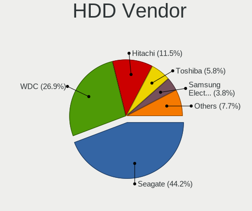
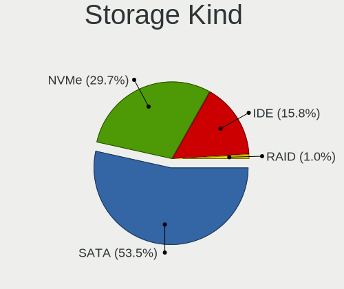
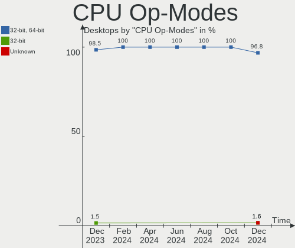
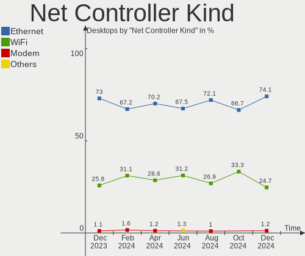
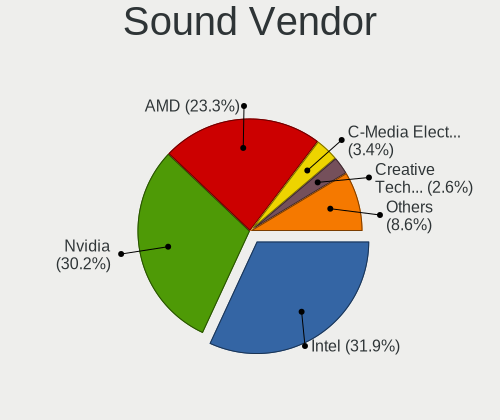

Linux in Poland - Hardware Trends (Desktops)
--------------------------------------------

A project to identify most popular hardware characteristics and track their change
over time based on data collected by Linux users at https://Linux-Hardware.org.

Anyone can contribute to this report by the [hw-probe](https://github.com/linuxhw/hw-probe) tool:

    sudo -E hw-probe -all -upload

Period: Dec, 2023.

Contents
--------

* [ System ](#system)
  - [ OS                       ](#os)
  - [ OS Family                ](#os-family)
  - [ Kernel                   ](#kernel)
  - [ Kernel Family            ](#kernel-family)
  - [ Kernel Major Ver.        ](#kernel-major-ver)
  - [ Arch                     ](#arch)
  - [ DE                       ](#de)
  - [ Display Server           ](#display-server)
  - [ Display Manager          ](#display-manager)
  - [ OS Lang                  ](#os-lang)
  - [ Boot Mode                ](#boot-mode)
  - [ Filesystem               ](#filesystem)
  - [ Part. scheme             ](#part-scheme)
  - [ Dual Boot with Linux/BSD ](#dual-boot-with-linuxbsd)
  - [ Dual Boot (Win)          ](#dual-boot-win)

* [ Board ](#board)
  - [ Vendor                   ](#vendor)
  - [ Model                    ](#model)
  - [ Model Family             ](#model-family)
  - [ MFG Year                 ](#mfg-year)
  - [ Form Factor              ](#form-factor)
  - [ Secure Boot              ](#secure-boot)
  - [ Coreboot                 ](#coreboot)
  - [ RAM Size                 ](#ram-size)
  - [ RAM Used                 ](#ram-used)
  - [ Total Drives             ](#total-drives)
  - [ Has CD-ROM               ](#has-cd-rom)
  - [ Has Ethernet             ](#has-ethernet)
  - [ Has WiFi                 ](#has-wifi)
  - [ Has Bluetooth            ](#has-bluetooth)

* [ Location ](#location)
  - [ Country                  ](#country)
  - [ City                     ](#city)

* [ Drives ](#drives)
  - [ Drive Vendor             ](#drive-vendor)
  - [ Drive Model              ](#drive-model)
  - [ HDD Vendor               ](#hdd-vendor)
  - [ SSD Vendor               ](#ssd-vendor)
  - [ Drive Kind               ](#drive-kind)
  - [ Drive Connector          ](#drive-connector)
  - [ Drive Size               ](#drive-size)
  - [ Space Total              ](#space-total)
  - [ Space Used               ](#space-used)
  - [ Malfunc. Drives          ](#malfunc-drives)
  - [ Malfunc. Drive Vendor    ](#malfunc-drive-vendor)
  - [ Malfunc. HDD Vendor      ](#malfunc-hdd-vendor)
  - [ Malfunc. Drive Kind      ](#malfunc-drive-kind)
  - [ Failed Drives            ](#failed-drives)
  - [ Failed Drive Vendor      ](#failed-drive-vendor)
  - [ Drive Status             ](#drive-status)

* [ Storage controller ](#storage-controller)
  - [ Storage Vendor           ](#storage-vendor)
  - [ Storage Model            ](#storage-model)
  - [ Storage Kind             ](#storage-kind)

* [ Processor ](#processor)
  - [ CPU Vendor               ](#cpu-vendor)
  - [ CPU Model                ](#cpu-model)
  - [ CPU Model Family         ](#cpu-model-family)
  - [ CPU Cores                ](#cpu-cores)
  - [ CPU Sockets              ](#cpu-sockets)
  - [ CPU Threads              ](#cpu-threads)
  - [ CPU Op-Modes             ](#cpu-op-modes)
  - [ CPU Microcode            ](#cpu-microcode)
  - [ CPU Microarch            ](#cpu-microarch)

* [ Graphics ](#graphics)
  - [ GPU Vendor               ](#gpu-vendor)
  - [ GPU Model                ](#gpu-model)
  - [ GPU Combo                ](#gpu-combo)
  - [ GPU Driver               ](#gpu-driver)
  - [ GPU Memory               ](#gpu-memory)

* [ Monitor ](#monitor)
  - [ Monitor Vendor           ](#monitor-vendor)
  - [ Monitor Model            ](#monitor-model)
  - [ Monitor Resolution       ](#monitor-resolution)
  - [ Monitor Diagonal         ](#monitor-diagonal)
  - [ Monitor Width            ](#monitor-width)
  - [ Aspect Ratio             ](#aspect-ratio)
  - [ Monitor Area             ](#monitor-area)
  - [ Pixel Density            ](#pixel-density)
  - [ Multiple Monitors        ](#multiple-monitors)

* [ Network ](#network)
  - [ Net Controller Vendor    ](#net-controller-vendor)
  - [ Net Controller Model     ](#net-controller-model)
  - [ Wireless Vendor          ](#wireless-vendor)
  - [ Wireless Model           ](#wireless-model)
  - [ Ethernet Vendor          ](#ethernet-vendor)
  - [ Ethernet Model           ](#ethernet-model)
  - [ Net Controller Kind      ](#net-controller-kind)
  - [ Used Controller          ](#used-controller)
  - [ NICs                     ](#nics)
  - [ IPv6                     ](#ipv6)

* [ Bluetooth ](#bluetooth)
  - [ Bluetooth Vendor         ](#bluetooth-vendor)
  - [ Bluetooth Model          ](#bluetooth-model)

* [ Sound ](#sound)
  - [ Sound Vendor             ](#sound-vendor)
  - [ Sound Model              ](#sound-model)

* [ Memory ](#memory)
  - [ Memory Vendor            ](#memory-vendor)
  - [ Memory Model             ](#memory-model)
  - [ Memory Kind              ](#memory-kind)
  - [ Memory Form Factor       ](#memory-form-factor)
  - [ Memory Size              ](#memory-size)
  - [ Memory Speed             ](#memory-speed)

* [ Printers & scanners ](#printers--scanners)
  - [ Printer Vendor           ](#printer-vendor)
  - [ Printer Model            ](#printer-model)
  - [ Scanner Vendor           ](#scanner-vendor)
  - [ Scanner Model            ](#scanner-model)

* [ Camera ](#camera)
  - [ Camera Vendor            ](#camera-vendor)
  - [ Camera Model             ](#camera-model)

* [ Security ](#security)
  - [ Fingerprint Vendor       ](#fingerprint-vendor)
  - [ Fingerprint Model        ](#fingerprint-model)
  - [ Chipcard Vendor          ](#chipcard-vendor)
  - [ Chipcard Model           ](#chipcard-model)

* [ Unsupported ](#unsupported)
  - [ Unsupported Devices      ](#unsupported-devices)
  - [ Unsupported Device Types ](#unsupported-device-types)

System
------

OS
--

Installed operating systems

| Name                | Desktops | Percent |
|---------------------|----------|---------|
| OpenMandriva 23.08  | 10       | 15.15%  |
| OpenMandriva 5.0    | 9        | 13.64%  |
| Ubuntu 22.04        | 7        | 10.61%  |
| Debian 12           | 5        | 7.58%   |
| OpenMandriva 23.11  | 4        | 6.06%   |
| Gentoo 2.14         | 4        | 6.06%   |
| Fedora 39           | 3        | 4.55%   |
| Ubuntu 23.10        | 2        | 3.03%   |
| Manjaro 23.1.0      | 2        | 3.03%   |
| BigLinux            | 2        | 3.03%   |
| Arch Rolling        | 2        | 3.03%   |
| SteamOS 3.5.7       | 1        | 1.52%   |
| Slackware 15.0      | 1        | 1.52%   |
| ROSA R11.1          | 1        | 1.52%   |
| Progress Linux 7.99 | 1        | 1.52%   |
| Pisi 2.3.4          | 1        | 1.52%   |
| Peppermint          | 1        | 1.52%   |
| OpenMandriva 23.03  | 1        | 1.52%   |
| Nobara 38           | 1        | 1.52%   |
| LMDE 6              | 1        | 1.52%   |
| Linux Mint 21.2     | 1        | 1.52%   |
| Linux Mint 20.2     | 1        | 1.52%   |
| KDE neon 22.04      | 1        | 1.52%   |
| Debian 11           | 1        | 1.52%   |
| Clear Linux 35190   | 1        | 1.52%   |
| ArcoLinux Rolling   | 1        | 1.52%   |
| antiX 23            | 1        | 1.52%   |

OS Family
---------

OS without a version

| Name           | Desktops | Percent |
|----------------|----------|---------|
| OpenMandriva   | 24       | 36.36%  |
| Ubuntu         | 9        | 13.64%  |
| Debian         | 6        | 9.09%   |
| Gentoo         | 4        | 6.06%   |
| Fedora         | 3        | 4.55%   |
| Manjaro        | 2        | 3.03%   |
| Linux Mint     | 2        | 3.03%   |
| BigLinux       | 2        | 3.03%   |
| Arch           | 2        | 3.03%   |
| SteamOS        | 1        | 1.52%   |
| Slackware      | 1        | 1.52%   |
| ROSA           | 1        | 1.52%   |
| Progress Linux | 1        | 1.52%   |
| Pisi           | 1        | 1.52%   |
| Peppermint     | 1        | 1.52%   |
| Nobara         | 1        | 1.52%   |
| LMDE           | 1        | 1.52%   |
| KDE neon       | 1        | 1.52%   |
| Clear Linux    | 1        | 1.52%   |
| ArcoLinux      | 1        | 1.52%   |
| antiX          | 1        | 1.52%   |

Kernel
------

Version of the Linux kernel

| Version                          | Desktops | Percent |
|----------------------------------|----------|---------|
| 6.6.2-desktop-1omv2390           | 12       | 18.18%  |
| 6.4.11-desktop-1omv2390          | 9        | 13.64%  |
| 6.2.0-39-generic                 | 5        | 7.58%   |
| 6.1.57-gentoo                    | 3        | 4.55%   |
| 6.1.0-14-amd64                   | 3        | 4.55%   |
| 6.6.8-arch1-1                    | 2        | 3.03%   |
| 6.4.8-desktop-2omv2390           | 2        | 3.03%   |
| 6.2.0-37-generic                 | 2        | 3.03%   |
| 6.1.64-1-MANJARO                 | 2        | 3.03%   |
| 6.7.0-4-MANJARO                  | 1        | 1.52%   |
| 6.6.7-arch1-1                    | 1        | 1.52%   |
| 6.6.7-203.fsync.fc38.x86_64      | 1        | 1.52%   |
| 6.6.6-200.fc39.x86_64            | 1        | 1.52%   |
| 6.6.5-1-MANJARO                  | 1        | 1.52%   |
| 6.6.4-200.fc39.x86_64            | 1        | 1.52%   |
| 6.6.3-200.fc39.x86_64            | 1        | 1.52%   |
| 6.5.0-9-generic                  | 1        | 1.52%   |
| 6.5.0-5-amd64                    | 1        | 1.52%   |
| 6.5.0-14-generic                 | 1        | 1.52%   |
| 6.5.0-0.deb12.4-amd64            | 1        | 1.52%   |
| 6.2.6-desktop-1omv2390           | 1        | 1.52%   |
| 6.2.0-35-generic                 | 1        | 1.52%   |
| 6.2.0-26-generic                 | 1        | 1.52%   |
| 6.1.57-gentoo-x86_64             | 1        | 1.52%   |
| 6.1.52-valve9-1-neptune-61       | 1        | 1.52%   |
| 6.1.0-15-amd64                   | 1        | 1.52%   |
| 6.1.0-11-amd64                   | 1        | 1.52%   |
| 6.1.0-10-amd64                   | 1        | 1.52%   |
| 5.4.0-169-generic                | 1        | 1.52%   |
| 5.15.140                         | 1        | 1.52%   |
| 5.15.118                         | 1        | 1.52%   |
| 5.13.19-1076.native              | 1        | 1.52%   |
| 5.10.188-antix.1-486-smp         | 1        | 1.52%   |
| 5.10.0-23-686-pae                | 1        | 1.52%   |
| 4.9.155-nrj-desktop-1rosa-x86_64 | 1        | 1.52%   |

Kernel Family
-------------

Linux kernel without a distro release

| Version  | Desktops | Percent |
|----------|----------|---------|
| 6.6.2    | 12       | 18.18%  |
| 6.4.11   | 9        | 13.64%  |
| 6.2.0    | 9        | 13.64%  |
| 6.1.0    | 6        | 9.09%   |
| 6.5.0    | 4        | 6.06%   |
| 6.1.57   | 4        | 6.06%   |
| 6.6.8    | 2        | 3.03%   |
| 6.6.7    | 2        | 3.03%   |
| 6.4.8    | 2        | 3.03%   |
| 6.1.64   | 2        | 3.03%   |
| 6.7.0    | 1        | 1.52%   |
| 6.6.6    | 1        | 1.52%   |
| 6.6.5    | 1        | 1.52%   |
| 6.6.4    | 1        | 1.52%   |
| 6.6.3    | 1        | 1.52%   |
| 6.2.6    | 1        | 1.52%   |
| 6.1.52   | 1        | 1.52%   |
| 5.4.0    | 1        | 1.52%   |
| 5.15.140 | 1        | 1.52%   |
| 5.15.118 | 1        | 1.52%   |
| 5.13.19  | 1        | 1.52%   |
| 5.10.188 | 1        | 1.52%   |
| 5.10.0   | 1        | 1.52%   |
| 4.9.155  | 1        | 1.52%   |

Kernel Major Ver.
-----------------

Linux kernel major version

| Version | Desktops | Percent |
|---------|----------|---------|
| 6.6     | 20       | 30.3%   |
| 6.1     | 13       | 19.7%   |
| 6.4     | 11       | 16.67%  |
| 6.2     | 10       | 15.15%  |
| 6.5     | 4        | 6.06%   |
| 5.15    | 2        | 3.03%   |
| 5.10    | 2        | 3.03%   |
| 6.7     | 1        | 1.52%   |
| 5.4     | 1        | 1.52%   |
| 5.13    | 1        | 1.52%   |
| 4.9     | 1        | 1.52%   |

Arch
----

OS architecture (x86_64, i586, etc.)

| Name   | Desktops | Percent |
|--------|----------|---------|
| x86_64 | 64       | 96.97%  |
| i686   | 2        | 3.03%   |

DE
--

Desktop Environment

| Name       | Desktops | Percent |
|------------|----------|---------|
| KDE5       | 32       | 48.48%  |
| GNOME      | 17       | 25.76%  |
| XFCE       | 4        | 6.06%   |
| Unknown    | 3        | 4.55%   |
| MATE       | 2        | 3.03%   |
| X-Cinnamon | 1        | 1.52%   |
| qtile      | 1        | 1.52%   |
| KDE4       | 1        | 1.52%   |
| KDE        | 1        | 1.52%   |
| icewm      | 1        | 1.52%   |
| Hyprland   | 1        | 1.52%   |
| DWM        | 1        | 1.52%   |
| Budgie     | 1        | 1.52%   |

Display Server
--------------

X11 or Wayland

| Name    | Desktops | Percent |
|---------|----------|---------|
| Wayland | 39       | 59.09%  |
| X11     | 25       | 37.88%  |
| Tty     | 2        | 3.03%   |

Display Manager
---------------

SDDM, LightDM, etc.

| Name    | Desktops | Percent |
|---------|----------|---------|
| SDDM    | 28       | 42.42%  |
| Unknown | 19       | 28.79%  |
| GDM3    | 8        | 12.12%  |
| LightDM | 5        | 7.58%   |
| GDM     | 3        | 4.55%   |
| XDM     | 1        | 1.52%   |
| SLIMSKI | 1        | 1.52%   |
| KDM     | 1        | 1.52%   |

OS Lang
-------

Language

| Lang   | Desktops | Percent |
|--------|----------|---------|
| pl_PL  | 46       | 69.7%   |
| en_US  | 17       | 25.76%  |
| es_BO  | 1        | 1.52%   |
| cs_CZ  | 1        | 1.52%   |
| C.UTF8 | 1        | 1.52%   |

Boot Mode
---------

EFI or BIOS

| Mode | Desktops | Percent |
|------|----------|---------|
| BIOS | 41       | 62.12%  |
| EFI  | 25       | 37.88%  |

Filesystem
----------

Type of filesystem

| Type    | Desktops | Percent |
|---------|----------|---------|
| Ext4    | 36       | 54.55%  |
| Overlay | 16       | 24.24%  |
| Btrfs   | 6        | 9.09%   |
| Tmpfs   | 4        | 6.06%   |
| F2fs    | 3        | 4.55%   |
| XXXXXXX | 1        | 1.52%   |

Part. scheme
------------

Scheme of partitioning

| Type    | Desktops | Percent |
|---------|----------|---------|
| GPT     | 31       | 46.97%  |
| MBR     | 18       | 27.27%  |
| Unknown | 17       | 25.76%  |

Dual Boot with Linux/BSD
------------------------

Hosting more than one Linux/BSD

| Dual boot | Desktops | Percent |
|-----------|----------|---------|
| No        | 54       | 81.82%  |
| Yes       | 12       | 18.18%  |

Dual Boot (Win)
---------------

Hosting Linux and Windows

| Dual boot | Desktops | Percent |
|-----------|----------|---------|
| No        | 44       | 66.67%  |
| Yes       | 22       | 33.33%  |

Board
-----

Vendor
------

Motherboard manufacturer

| Name                | Desktops | Percent |
|---------------------|----------|---------|
| Gigabyte Technology | 17       | 25.76%  |
| MSI                 | 10       | 15.15%  |
| ASUSTek Computer    | 10       | 15.15%  |
| Dell                | 8        | 12.12%  |
| ASRock              | 8        | 12.12%  |
| Hewlett-Packard     | 4        | 6.06%   |
| Lenovo              | 3        | 4.55%   |
| Fujitsu             | 2        | 3.03%   |
| Inventec            | 1        | 1.52%   |
| Hampoo              | 1        | 1.52%   |
| Foxconn             | 1        | 1.52%   |
| Acer                | 1        | 1.52%   |

Model
-----

Motherboard model

| Name                             | Desktops | Percent |
|----------------------------------|----------|---------|
| HP Compaq 8200 Elite SFF PC      | 2        | 3.03%   |
| Gigabyte Z97M-DS3H               | 2        | 3.03%   |
| MSI Pro 3130 Microtower PC       | 1        | 1.52%   |
| MSI MS-7C56                      | 1        | 1.52%   |
| MSI MS-7B86                      | 1        | 1.52%   |
| MSI MS-7A72                      | 1        | 1.52%   |
| MSI MS-7970                      | 1        | 1.52%   |
| MSI MS-7830                      | 1        | 1.52%   |
| MSI MS-7816                      | 1        | 1.52%   |
| MSI MS-7680                      | 1        | 1.52%   |
| MSI MS-7529                      | 1        | 1.52%   |
| MSI MS-7255                      | 1        | 1.52%   |
| Lenovo ThinkCentre M91p 7005A21  | 1        | 1.52%   |
| Lenovo ThinkCentre M81 5049RK4   | 1        | 1.52%   |
| Lenovo S500 10HS0032FR           | 1        | 1.52%   |
| Inventec DQ Class                | 1        | 1.52%   |
| HP EliteDesk 705 G3 MT           | 1        | 1.52%   |
| HP Compaq 8200 Elite CMT PC      | 1        | 1.52%   |
| Hampoo Intelect X2 HD            | 1        | 1.52%   |
| Gigabyte Z87X-UD4H               | 1        | 1.52%   |
| Gigabyte X670 GAMING X AX        | 1        | 1.52%   |
| Gigabyte P67A-UD3P-B3            | 1        | 1.52%   |
| Gigabyte H77-DS3H                | 1        | 1.52%   |
| Gigabyte GA-MA69G-S3H            | 1        | 1.52%   |
| Gigabyte G41M-Combo              | 1        | 1.52%   |
| Gigabyte B650 AORUS ELITE AX     | 1        | 1.52%   |
| Gigabyte B450M DS3H              | 1        | 1.52%   |
| Gigabyte B450 AORUS PRO          | 1        | 1.52%   |
| Gigabyte B150M-D3H-CF            | 1        | 1.52%   |
| Gigabyte AB350-Gaming            | 1        | 1.52%   |
| Gigabyte A520 AORUS ELITE        | 1        | 1.52%   |
| Gigabyte 990XA-UD3               | 1        | 1.52%   |
| Gigabyte 970A-UD3P               | 1        | 1.52%   |
| Gigabyte 970A-DS3P               | 1        | 1.52%   |
| Fujitsu ESPRIMO E720             | 1        | 1.52%   |
| Fujitsu ESPRIMO D538             | 1        | 1.52%   |
| Foxconn 500B Microtower          | 1        | 1.52%   |
| Dell Vostro 3900                 | 1        | 1.52%   |
| Dell Precision WorkStation T3500 | 1        | 1.52%   |
| Dell Precision 3650 Tower        | 1        | 1.52%   |

Model Family
------------

Motherboard model prefix

| Name                  | Desktops | Percent |
|-----------------------|----------|---------|
| Dell OptiPlex         | 5        | 7.58%   |
| HP Compaq             | 3        | 4.55%   |
| Lenovo ThinkCentre    | 2        | 3.03%   |
| Gigabyte Z97M-DS3H    | 2        | 3.03%   |
| Fujitsu ESPRIMO       | 2        | 3.03%   |
| Dell Precision        | 2        | 3.03%   |
| ASUS P7P55D-E         | 2        | 3.03%   |
| MSI Pro               | 1        | 1.52%   |
| MSI MS-7C56           | 1        | 1.52%   |
| MSI MS-7B86           | 1        | 1.52%   |
| MSI MS-7A72           | 1        | 1.52%   |
| MSI MS-7970           | 1        | 1.52%   |
| MSI MS-7830           | 1        | 1.52%   |
| MSI MS-7816           | 1        | 1.52%   |
| MSI MS-7680           | 1        | 1.52%   |
| MSI MS-7529           | 1        | 1.52%   |
| MSI MS-7255           | 1        | 1.52%   |
| Lenovo S500           | 1        | 1.52%   |
| Inventec DQ           | 1        | 1.52%   |
| HP EliteDesk          | 1        | 1.52%   |
| Hampoo Intelect       | 1        | 1.52%   |
| Gigabyte Z87X-UD4H    | 1        | 1.52%   |
| Gigabyte X670         | 1        | 1.52%   |
| Gigabyte P67A-UD3P-B3 | 1        | 1.52%   |
| Gigabyte H77-DS3H     | 1        | 1.52%   |
| Gigabyte GA-MA69G-S3H | 1        | 1.52%   |
| Gigabyte G41M-Combo   | 1        | 1.52%   |
| Gigabyte B650         | 1        | 1.52%   |
| Gigabyte B450M        | 1        | 1.52%   |
| Gigabyte B450         | 1        | 1.52%   |
| Gigabyte B150M-D3H-CF | 1        | 1.52%   |
| Gigabyte AB350-Gaming | 1        | 1.52%   |
| Gigabyte A520         | 1        | 1.52%   |
| Gigabyte 990XA-UD3    | 1        | 1.52%   |
| Gigabyte 970A-UD3P    | 1        | 1.52%   |
| Gigabyte 970A-DS3P    | 1        | 1.52%   |
| Foxconn 500B          | 1        | 1.52%   |
| Dell Vostro           | 1        | 1.52%   |
| ASUS TUF              | 1        | 1.52%   |
| ASUS P8Z77-V          | 1        | 1.52%   |

MFG Year
--------

Motherboard manufacture year

| Year | Desktops | Percent |
|------|----------|---------|
| 2013 | 9        | 13.64%  |
| 2011 | 9        | 13.64%  |
| 2012 | 7        | 10.61%  |
| 2010 | 6        | 9.09%   |
| 2018 | 5        | 7.58%   |
| 2017 | 4        | 6.06%   |
| 2016 | 4        | 6.06%   |
| 2022 | 3        | 4.55%   |
| 2020 | 3        | 4.55%   |
| 2019 | 3        | 4.55%   |
| 2014 | 3        | 4.55%   |
| 2015 | 2        | 3.03%   |
| 2007 | 2        | 3.03%   |
| 2023 | 1        | 1.52%   |
| 2021 | 1        | 1.52%   |
| 2009 | 1        | 1.52%   |
| 2008 | 1        | 1.52%   |
| 2006 | 1        | 1.52%   |
| 2004 | 1        | 1.52%   |

Form Factor
-----------

Physical design of the computer

| Name    | Desktops | Percent |
|---------|----------|---------|
| Desktop | 66       | 100%    |

Secure Boot
-----------

Enabled or disabled

| State    | Desktops | Percent |
|----------|----------|---------|
| Disabled | 64       | 96.97%  |
| Enabled  | 2        | 3.03%   |

Coreboot
--------

Have coreboot on board

| Used | Desktops | Percent |
|------|----------|---------|
| No   | 66       | 100%    |

RAM Size
--------

Total RAM memory

| Size in GB  | Desktops | Percent |
|-------------|----------|---------|
| 16.01-24.0  | 16       | 24.24%  |
| 8.01-16.0   | 15       | 22.73%  |
| 4.01-8.0    | 11       | 16.67%  |
| 3.01-4.0    | 8        | 12.12%  |
| 32.01-64.0  | 7        | 10.61%  |
| 24.01-32.0  | 4        | 6.06%   |
| 64.01-256.0 | 3        | 4.55%   |
| 2.01-3.0    | 1        | 1.52%   |
| 1.01-2.0    | 1        | 1.52%   |

RAM Used
--------

Used RAM memory

| Used GB    | Desktops | Percent |
|------------|----------|---------|
| 1.01-2.0   | 20       | 30.3%   |
| 2.01-3.0   | 19       | 28.79%  |
| 4.01-8.0   | 10       | 15.15%  |
| 3.01-4.0   | 7        | 10.61%  |
| 0.51-1.0   | 5        | 7.58%   |
| 8.01-16.0  | 3        | 4.55%   |
| 16.01-24.0 | 1        | 1.52%   |
| 0.01-0.5   | 1        | 1.52%   |

Total Drives
------------

Number of drives on board

| Drives | Desktops | Percent |
|--------|----------|---------|
| 1      | 25       | 37.88%  |
| 2      | 23       | 34.85%  |
| 3      | 10       | 15.15%  |
| 4      | 5        | 7.58%   |
| 6      | 2        | 3.03%   |
| 5      | 1        | 1.52%   |

Has CD-ROM
----------

Has CD-ROM on board

| Presented | Desktops | Percent |
|-----------|----------|---------|
| Yes       | 33       | 50%     |
| No        | 33       | 50%     |

Has Ethernet
------------

Has Ethernet on board

| Presented | Desktops | Percent |
|-----------|----------|---------|
| Yes       | 65       | 98.48%  |
| No        | 1        | 1.52%   |

Has WiFi
--------

Has WiFi module

| Presented | Desktops | Percent |
|-----------|----------|---------|
| No        | 43       | 65.15%  |
| Yes       | 23       | 34.85%  |

Has Bluetooth
-------------

Has Bluetooth module

| Presented | Desktops | Percent |
|-----------|----------|---------|
| No        | 53       | 80.3%   |
| Yes       | 13       | 19.7%   |

Location
--------

Country
-------

Geographic location (country)

| Country | Desktops | Percent |
|---------|----------|---------|
| Poland  | 66       | 100%    |

City
----

Geographic location (city)

| City               | Desktops | Percent |
|--------------------|----------|---------|
| Warsaw             | 17       | 25.76%  |
| Krakow             | 5        | 7.58%   |
| Wroclaw            | 4        | 6.06%   |
| Lodz               | 4        | 6.06%   |
| Bydgoszcz          | 3        | 4.55%   |
| Słupsk            | 2        | 3.03%   |
| Kielce             | 2        | 3.03%   |
| Gdansk             | 2        | 3.03%   |
| Bolesławiec       | 2        | 3.03%   |
| Zalasewo           | 1        | 1.52%   |
| Zabrze             | 1        | 1.52%   |
| Wolsztyn           | 1        | 1.52%   |
| Tychy              | 1        | 1.52%   |
| Tomaszow Lubelski  | 1        | 1.52%   |
| Tarnobrzeg         | 1        | 1.52%   |
| Szczecinek         | 1        | 1.52%   |
| Sosnowiec          | 1        | 1.52%   |
| Rzeszów           | 1        | 1.52%   |
| Ruda Śląska      | 1        | 1.52%   |
| Prudnik            | 1        | 1.52%   |
| Pabianice          | 1        | 1.52%   |
| Olsztyn            | 1        | 1.52%   |
| Malbork            | 1        | 1.52%   |
| Kościan           | 1        | 1.52%   |
| Kolaczyce          | 1        | 1.52%   |
| Kaczki             | 1        | 1.52%   |
| Jasienica          | 1        | 1.52%   |
| Gmina Chełmiec    | 1        | 1.52%   |
| Ełk               | 1        | 1.52%   |
| Dąbrowa Górnicza | 1        | 1.52%   |
| Czarnkow           | 1        | 1.52%   |
| Cieszyn            | 1        | 1.52%   |
| Chorzów           | 1        | 1.52%   |
| Białogard         | 1        | 1.52%   |

Drives
------

Drive Vendor
------------

Hard drive vendors

| Vendor                       | Desktops | Drives | Percent |
|------------------------------|----------|--------|---------|
| Seagate                      | 22       | 27     | 18.64%  |
| GOODRAM                      | 17       | 21     | 14.41%  |
| WDC                          | 14       | 16     | 11.86%  |
| Kingston                     | 13       | 13     | 11.02%  |
| Samsung Electronics          | 9        | 11     | 7.63%   |
| Toshiba                      | 5        | 5      | 4.24%   |
| Sandisk                      | 4        | 4      | 3.39%   |
| Hitachi                      | 4        | 6      | 3.39%   |
| SPCC                         | 3        | 4      | 2.54%   |
| A-DATA Technology            | 3        | 4      | 2.54%   |
| Unknown                      | 2        | 3      | 1.69%   |
| Team                         | 2        | 2      | 1.69%   |
| Shenzhen Longsys Electronics | 2        | 2      | 1.69%   |
| Patriot                      | 2        | 2      | 1.69%   |
| SAGE                         | 1        | 1      | 0.85%   |
| Reeinno                      | 1        | 2      | 0.85%   |
| POLION                       | 1        | 1      | 0.85%   |
| PNY                          | 1        | 1      | 0.85%   |
| Plextor                      | 1        | 1      | 0.85%   |
| Phison Electronics           | 1        | 1      | 0.85%   |
| Micron Technology            | 1        | 1      | 0.85%   |
| Maxtor                       | 1        | 1      | 0.85%   |
| KIOXIA-EXCERIA               | 1        | 1      | 0.85%   |
| Kingston Technology Company  | 1        | 1      | 0.85%   |
| Intel                        | 1        | 1      | 0.85%   |
| HS-SSD-E100                  | 1        | 1      | 0.85%   |
| HGST                         | 1        | 1      | 0.85%   |
| Fujitsu                      | 1        | 1      | 0.85%   |
| Crucial                      | 1        | 1      | 0.85%   |
| ADATA Technology             | 1        | 1      | 0.85%   |

Drive Model
-----------

Hard drive models

| Model                            | Desktops | Percent |
|----------------------------------|----------|---------|
| Seagate ST1000DM003-1ER162 1TB   | 4        | 3.08%   |
| Seagate ST500DM002-1BD142 500GB  | 3        | 2.31%   |
| Team T253128GB SSD               | 2        | 1.54%   |
| Sandisk WD Blue SN570 1TB        | 2        | 1.54%   |
| Kingston SKC3000D2048G 2TB       | 2        | 1.54%   |
| Kingston SA400S37480G 480GB SSD  | 2        | 1.54%   |
| Kingston SA400S37240G 240GB SSD  | 2        | 1.54%   |
| Hitachi HUS724030ALE641 3TB      | 2        | 1.54%   |
| GOODRAM SSDPR-CX400-256-G2 256GB | 2        | 1.54%   |
| GOODRAM SSDPR-CX400-01T-G2 1TB   | 2        | 1.54%   |
| GOODRAM SSDPR-CL100-480-G2 480GB | 2        | 1.54%   |
| GOODRAM IR-SSDPR-S25A-240 240GB  | 2        | 1.54%   |
| A-DATA SU650 240GB SSD           | 2        | 1.54%   |
| WDC WDS120G2G0A-00JH30 120GB SSD | 1        | 0.77%   |
| WDC WD800JB-32JJC0 80GB          | 1        | 0.77%   |
| WDC WD60EZAZ-00SF3B0 6TB         | 1        | 0.77%   |
| WDC WD5000LPVT-24G33T1 500GB     | 1        | 0.77%   |
| WDC WD5000AVDS-63U7B1 500GB      | 1        | 0.77%   |
| WDC WD5000AAKX-75U6AA0 500GB     | 1        | 0.77%   |
| WDC WD40EFRX-68N32N0 4TB         | 1        | 0.77%   |
| WDC WD2500AAKX-75U6AA0 250GB     | 1        | 0.77%   |
| WDC WD2500AAJS-75M0A0 250GB      | 1        | 0.77%   |
| WDC WD2500AAJS-00VTA0 250GB      | 1        | 0.77%   |
| WDC WD15EARS-00Z5B1 1TB          | 1        | 0.77%   |
| WDC WD15EARS-00MVWB0 1TB         | 1        | 0.77%   |
| WDC WD10EZRX-00L4HB0 1TB         | 1        | 0.77%   |
| WDC WD10EZRX-00A8LB0 1TB         | 1        | 0.77%   |
| WDC WD10EARS-22Y5B1 1TB          | 1        | 0.77%   |
| WDC WD10 JPCX-24UE4T0 1TB        | 1        | 0.77%   |
| Unknown SD/MMC 2GB               | 1        | 0.77%   |
| Unknown MMC Card  64GB           | 1        | 0.77%   |
| Unknown M.S./M.S.Pro/HG 16GB     | 1        | 0.77%   |
| Toshiba MK2576GSX HR 160GB       | 1        | 0.77%   |
| Toshiba HDWE150 5TB              | 1        | 0.77%   |
| Toshiba HDWD110 1TB              | 1        | 0.77%   |
| Toshiba DT01ACA100 1TB           | 1        | 0.77%   |
| Toshiba DT01ACA050 500GB         | 1        | 0.77%   |
| SPCC Solid State Disk 512GB      | 1        | 0.77%   |
| SPCC Solid State Disk 240GB      | 1        | 0.77%   |
| SPCC Solid State Disk 120GB      | 1        | 0.77%   |

HDD Vendor
----------

Hard disk drive vendors

| Vendor              | Desktops | Drives | Percent |
|---------------------|----------|--------|---------|
| Seagate             | 22       | 27     | 40.74%  |
| WDC                 | 14       | 15     | 25.93%  |
| Toshiba             | 5        | 5      | 9.26%   |
| Samsung Electronics | 5        | 5      | 9.26%   |
| Hitachi             | 4        | 6      | 7.41%   |
| SAGE                | 1        | 1      | 1.85%   |
| Maxtor              | 1        | 1      | 1.85%   |
| HGST                | 1        | 1      | 1.85%   |
| Fujitsu             | 1        | 1      | 1.85%   |

SSD Vendor
----------

Solid state drive vendors

| Vendor              | Desktops | Drives | Percent |
|---------------------|----------|--------|---------|
| GOODRAM             | 16       | 18     | 34.04%  |
| Kingston            | 8        | 8      | 17.02%  |
| Samsung Electronics | 4        | 5      | 8.51%   |
| SPCC                | 3        | 4      | 6.38%   |
| A-DATA Technology   | 3        | 4      | 6.38%   |
| Team                | 2        | 2      | 4.26%   |
| Patriot             | 2        | 2      | 4.26%   |
| WDC                 | 1        | 1      | 2.13%   |
| SanDisk             | 1        | 1      | 2.13%   |
| Reeinno             | 1        | 2      | 2.13%   |
| PNY                 | 1        | 1      | 2.13%   |
| Plextor             | 1        | 1      | 2.13%   |
| Micron Technology   | 1        | 1      | 2.13%   |
| KIOXIA-EXCERIA      | 1        | 1      | 2.13%   |
| HS-SSD-E100         | 1        | 1      | 2.13%   |
| Crucial             | 1        | 1      | 2.13%   |

Drive Kind
----------

HDD or SSD

| Kind    | Desktops | Drives | Percent |
|---------|----------|--------|---------|
| SSD     | 42       | 53     | 42.42%  |
| HDD     | 37       | 62     | 37.37%  |
| NVMe    | 17       | 18     | 17.17%  |
| Unknown | 2        | 3      | 2.02%   |
| MMC     | 1        | 1      | 1.01%   |

Drive Connector
---------------

SATA, SAS, NVMe, etc.

| Type | Desktops | Drives | Percent |
|------|----------|--------|---------|
| SATA | 58       | 112    | 72.5%   |
| NVMe | 17       | 18     | 21.25%  |
| SAS  | 4        | 6      | 5%      |
| MMC  | 1        | 1      | 1.25%   |

Drive Size
----------

Size of hard drive

| Size in TB | Desktops | Drives | Percent |
|------------|----------|--------|---------|
| 0.01-0.5   | 47       | 68     | 55.29%  |
| 0.51-1.0   | 23       | 29     | 27.06%  |
| 1.01-2.0   | 6        | 6      | 7.06%   |
| 3.01-4.0   | 3        | 4      | 3.53%   |
| 4.01-10.0  | 3        | 3      | 3.53%   |
| 2.01-3.0   | 2        | 4      | 2.35%   |
| 10.01-20.0 | 1        | 1      | 1.18%   |

Space Total
-----------

Amount of disk space available on the file system

| Size in GB     | Desktops | Percent |
|----------------|----------|---------|
| 101-250        | 11       | 16.67%  |
| 251-500        | 10       | 15.15%  |
| 1-20           | 10       | 15.15%  |
| 1001-2000      | 8        | 12.12%  |
| 501-1000       | 6        | 9.09%   |
| 51-100         | 6        | 9.09%   |
| More than 3000 | 5        | 7.58%   |
| 2001-3000      | 4        | 6.06%   |
| 21-50          | 3        | 4.55%   |
| Unknown        | 3        | 4.55%   |

Space Used
----------

Amount of used disk space

| Used GB        | Desktops | Percent |
|----------------|----------|---------|
| 1-20           | 28       | 42.42%  |
| 101-250        | 6        | 9.09%   |
| 1001-2000      | 6        | 9.09%   |
| 51-100         | 6        | 9.09%   |
| 251-500        | 5        | 7.58%   |
| 501-1000       | 5        | 7.58%   |
| 21-50          | 4        | 6.06%   |
| Unknown        | 3        | 4.55%   |
| More than 3000 | 2        | 3.03%   |
| 2001-3000      | 1        | 1.52%   |

Malfunc. Drives
---------------

Drive models with a malfunction

| Model                             | Desktops | Drives | Percent |
|-----------------------------------|----------|--------|---------|
| WDC WD800JB-32JJC0 80GB           | 1        | 1      | 7.14%   |
| WDC WD15EARS-00Z5B1 1TB           | 1        | 1      | 7.14%   |
| Seagate ST500LT012-9WS142 500GB   | 1        | 1      | 7.14%   |
| Seagate ST3500418AS 500GB         | 1        | 1      | 7.14%   |
| Seagate ST340014AS 40GB           | 1        | 1      | 7.14%   |
| Seagate ST2000DM008-2FR102 2TB    | 1        | 1      | 7.14%   |
| Seagate ST1000DM010-2EP102 1TB    | 1        | 1      | 7.14%   |
| Seagate ST1000DM003-9YN162 1TB    | 1        | 1      | 7.14%   |
| Seagate ST1000DM003-1ER162 1TB    | 1        | 1      | 7.14%   |
| Samsung Electronics HM160HI 160GB | 1        | 1      | 7.14%   |
| Samsung Electronics HD103UJ 1TB   | 1        | 1      | 7.14%   |
| Maxtor 2F040L0 41GB               | 1        | 1      | 7.14%   |
| Hitachi HDP725050GLA360 500GB     | 1        | 1      | 7.14%   |
| HGST HUS726040ALE614 4TB          | 1        | 1      | 7.14%   |

Malfunc. Drive Vendor
---------------------

Vendors of faulty drives

| Vendor              | Desktops | Drives | Percent |
|---------------------|----------|--------|---------|
| Seagate             | 7        | 7      | 50%     |
| WDC                 | 2        | 2      | 14.29%  |
| Samsung Electronics | 2        | 2      | 14.29%  |
| Maxtor              | 1        | 1      | 7.14%   |
| Hitachi             | 1        | 1      | 7.14%   |
| HGST                | 1        | 1      | 7.14%   |

Malfunc. HDD Vendor
-------------------

Vendors of faulty HDD drives

| Vendor              | Desktops | Drives | Percent |
|---------------------|----------|--------|---------|
| Seagate             | 7        | 7      | 50%     |
| WDC                 | 2        | 2      | 14.29%  |
| Samsung Electronics | 2        | 2      | 14.29%  |
| Maxtor              | 1        | 1      | 7.14%   |
| Hitachi             | 1        | 1      | 7.14%   |
| HGST                | 1        | 1      | 7.14%   |

Malfunc. Drive Kind
-------------------

Kinds of faulty drives

| Kind | Desktops | Drives | Percent |
|------|----------|--------|---------|
| HDD  | 14       | 14     | 100%    |

Failed Drives
-------------

Failed drive models

Zero info for selected period =(

Failed Drive Vendor
-------------------

Failed drive vendors

Zero info for selected period =(

Drive Status
------------

Number of failed and malfunc. drives

| Status   | Desktops | Drives | Percent |
|----------|----------|--------|---------|
| Works    | 40       | 75     | 51.28%  |
| Detected | 24       | 48     | 30.77%  |
| Malfunc  | 14       | 14     | 17.95%  |

Storage controller
------------------

Storage Vendor
--------------

Storage controller vendors

| Vendor                        | Desktops | Percent |
|-------------------------------|----------|---------|
| Intel                         | 40       | 43.96%  |
| AMD                           | 25       | 27.47%  |
| Kingston Technology Company   | 6        | 6.59%   |
| SanDisk                       | 3        | 3.3%    |
| Phison Electronics            | 3        | 3.3%    |
| Marvell Technology Group      | 3        | 3.3%    |
| Shenzhen Longsys Electronics  | 2        | 2.2%    |
| JMicron Technology            | 2        | 2.2%    |
| ASMedia Technology            | 2        | 2.2%    |
| VIA Technologies              | 1        | 1.1%    |
| Samsung Electronics           | 1        | 1.1%    |
| Lite-On IT Corp. / Plextor    | 1        | 1.1%    |
| Integrated Technology Express | 1        | 1.1%    |
| ADATA Technology              | 1        | 1.1%    |

Storage Model
-------------

Storage controller models

| Model                                                                                   | Desktops | Percent |
|-----------------------------------------------------------------------------------------|----------|---------|
| AMD FCH SATA Controller [AHCI mode]                                                     | 11       | 9.82%   |
| Intel 6 Series/C200 Series Chipset Family 6 port Desktop SATA AHCI Controller           | 8        | 7.14%   |
| Intel 8 Series/C220 Series Chipset Family 6-port SATA Controller 1 [AHCI mode]          | 7        | 6.25%   |
| AMD 400 Series Chipset SATA Controller                                                  | 5        | 4.46%   |
| Kingston Company KC3000/FURY Renegade NVMe SSD E18                                      | 4        | 3.57%   |
| AMD SB7x0/SB8x0/SB9x0 SATA Controller [AHCI mode]                                       | 4        | 3.57%   |
| AMD 300 Series Chipset SATA Controller                                                  | 4        | 3.57%   |
| Phison E12 NVMe Controller                                                              | 3        | 2.68%   |
| Intel Q170/Q150/B150/H170/H110/Z170/CM236 Chipset SATA Controller [AHCI Mode]           | 3        | 2.68%   |
| Intel NM10/ICH7 Family SATA Controller [IDE mode]                                       | 3        | 2.68%   |
| Intel 82801G (ICH7 Family) IDE Controller                                               | 3        | 2.68%   |
| Intel 7 Series/C210 Series Chipset Family 6-port SATA Controller [AHCI mode]            | 3        | 2.68%   |
| Intel 6 Series/C200 Series Chipset Family Desktop SATA Controller (IDE mode, ports 4-5) | 3        | 2.68%   |
| Intel 6 Series/C200 Series Chipset Family Desktop SATA Controller (IDE mode, ports 0-3) | 3        | 2.68%   |
| AMD SB7x0/SB8x0/SB9x0 IDE Controller                                                    | 3        | 2.68%   |
| AMD 500 Series Chipset SATA Controller                                                  | 3        | 2.68%   |
| SanDisk Ultra 3D / WD Blue SN570 NVMe SSD (DRAM-less)                                   | 2        | 1.79%   |
| JMicron JMB363 SATA/IDE Controller                                                      | 2        | 1.79%   |
| Intel 9 Series Chipset Family SATA Controller [AHCI Mode]                               | 2        | 1.79%   |
| Intel 5 Series/3400 Series Chipset 6 port SATA AHCI Controller                          | 2        | 1.79%   |
| ASMedia ASM1062 Serial ATA Controller                                                   | 2        | 1.79%   |
| AMD SB7x0/SB8x0/SB9x0 SATA Controller [IDE mode]                                        | 2        | 1.79%   |
| VIA VT82C586A/B/VT82C686/A/B/VT823x/A/C PIPC Bus Master IDE                             | 1        | 0.89%   |
| VIA VT8237A SATA 2-Port Controller                                                      | 1        | 0.89%   |
| Shenzhen Longsys Non-Volatile memory controller                                         | 1        | 0.89%   |
| Shenzhen Longsys Lexar NM800 PRO NVME SSD                                               | 1        | 0.89%   |
| SanDisk Extreme Pro / WD Black SN750 / PC SN730 / Red SN700 NVMe SSD                    | 1        | 0.89%   |
| Samsung NVMe SSD Controller SM981/PM981/PM983                                           | 1        | 0.89%   |
| Marvell Group 88SE9172 SATA 6Gb/s Controller                                            | 1        | 0.89%   |
| Marvell Group 88SE914D SATA-600 Controller                                              | 1        | 0.89%   |
| Marvell Group 88SE9123 PCIe SATA 6.0 Gb/s controller                                    | 1        | 0.89%   |
| Lite-On IT Corp. / Plextor M6e PCI Express SSD [Marvell 88SS9183]                       | 1        | 0.89%   |
| Kingston Company NV1 NVMe SSD SM2263XT                                                  | 1        | 0.89%   |
| Kingston Company A2000 NVMe SSD SM2263EN                                                | 1        | 0.89%   |
| Intel SSD DC P4101/Pro 7600p/760p/E 6100p Series                                        | 1        | 0.89%   |
| Intel NM10/ICH7 Family SATA Controller [AHCI mode]                                      | 1        | 0.89%   |
| Intel Cannon Lake PCH SATA AHCI Controller                                              | 1        | 0.89%   |
| Intel 82801JI (ICH10 Family) SATA AHCI Controller                                       | 1        | 0.89%   |
| Intel 82801JD/DO (ICH10 Family) SATA AHCI Controller                                    | 1        | 0.89%   |
| Intel 82801EB/ER (ICH5/ICH5R) IDE Controller                                            | 1        | 0.89%   |

Storage Kind
------------

Kind of storage controller (IDE, SATA, NVMe, SAS, ...)

| Kind | Desktops | Percent |
|------|----------|---------|
| SATA | 56       | 60.87%  |
| NVMe | 17       | 18.48%  |
| IDE  | 16       | 17.39%  |
| RAID | 3        | 3.26%   |

Processor
---------

CPU Vendor
----------

Processor vendors

| Vendor | Desktops | Percent |
|--------|----------|---------|
| Intel  | 41       | 62.12%  |
| AMD    | 25       | 37.88%  |

CPU Model
---------

Processor models

| Model                                  | Desktops | Percent |
|----------------------------------------|----------|---------|
| Intel Core i5-2400 CPU @ 3.10GHz       | 3        | 4.55%   |
| AMD Ryzen 5 5500                       | 3        | 4.55%   |
| Intel Core i3-2120 CPU @ 3.30GHz       | 2        | 3.03%   |
| Intel Core 2 Quad CPU Q8300 @ 2.50GHz  | 2        | 3.03%   |
| AMD FX-6300 Six-Core Processor         | 2        | 3.03%   |
| Intel Xeon CPU W3565 @ 3.20GHz         | 1        | 1.52%   |
| Intel Xeon CPU E5420 @ 2.50GHz         | 1        | 1.52%   |
| Intel Xeon CPU E31225 @ 3.10GHz        | 1        | 1.52%   |
| Intel Xeon CPU E3-1271 v3 @ 3.60GHz    | 1        | 1.52%   |
| Intel Pentium Dual CPU E2180 @ 2.00GHz | 1        | 1.52%   |
| Intel Pentium CPU G4500 @ 3.50GHz      | 1        | 1.52%   |
| Intel Pentium 4 CPU 2.40GHz            | 1        | 1.52%   |
| Intel Core i7-7700 CPU @ 3.60GHz       | 1        | 1.52%   |
| Intel Core i7-4790K CPU @ 4.00GHz      | 1        | 1.52%   |
| Intel Core i7-4790 CPU @ 3.60GHz       | 1        | 1.52%   |
| Intel Core i7-3770K CPU @ 3.50GHz      | 1        | 1.52%   |
| Intel Core i7-2700K CPU @ 3.50GHz      | 1        | 1.52%   |
| Intel Core i7 CPU 880 @ 3.07GHz        | 1        | 1.52%   |
| Intel Core i5-7600K CPU @ 3.80GHz      | 1        | 1.52%   |
| Intel Core i5-6400 CPU @ 2.70GHz       | 1        | 1.52%   |
| Intel Core i5-4690K CPU @ 3.50GHz      | 1        | 1.52%   |
| Intel Core i5-4690 CPU @ 3.50GHz       | 1        | 1.52%   |
| Intel Core i5-4590 CPU @ 3.30GHz       | 1        | 1.52%   |
| Intel Core i5-4570 CPU @ 3.20GHz       | 1        | 1.52%   |
| Intel Core i5-4460 CPU @ 3.20GHz       | 1        | 1.52%   |
| Intel Core i5-3470 CPU @ 3.20GHz       | 1        | 1.52%   |
| Intel Core i5-2500K CPU @ 3.30GHz      | 1        | 1.52%   |
| Intel Core i5 CPU 760 @ 2.80GHz        | 1        | 1.52%   |
| Intel Core i3-8100 CPU @ 3.60GHz       | 1        | 1.52%   |
| Intel Core i3-4170 CPU @ 3.70GHz       | 1        | 1.52%   |
| Intel Core i3-3240 CPU @ 3.40GHz       | 1        | 1.52%   |
| Intel Core i3-3220 CPU @ 3.30GHz       | 1        | 1.52%   |
| Intel Core i3-2100 CPU @ 3.10GHz       | 1        | 1.52%   |
| Intel Core i3 CPU 550 @ 3.20GHz        | 1        | 1.52%   |
| Intel Core 2 Quad CPU Q9650 @ 3.00GHz  | 1        | 1.52%   |
| Intel Core 2 Duo CPU E8400 @ 3.00GHz   | 1        | 1.52%   |
| Intel Atom x5-Z8300 CPU @ 1.44GHz      | 1        | 1.52%   |
| Intel 13th Gen Core i5-13500           | 1        | 1.52%   |
| Intel 11th Gen Core i7-11700 @ 2.50GHz | 1        | 1.52%   |
| AMD Ryzen 9 7950X 16-Core Processor    | 1        | 1.52%   |

CPU Model Family
----------------

Processor model prefix

| Model              | Desktops | Percent |
|--------------------|----------|---------|
| Intel Core i5      | 13       | 19.7%   |
| AMD Ryzen 5        | 11       | 16.67%  |
| Intel Core i3      | 8        | 12.12%  |
| Intel Core i7      | 6        | 9.09%   |
| AMD FX             | 5        | 7.58%   |
| Intel Xeon         | 4        | 6.06%   |
| Intel Core 2 Quad  | 3        | 4.55%   |
| AMD Ryzen 7        | 3        | 4.55%   |
| Other              | 2        | 3.03%   |
| Intel Pentium Dual | 1        | 1.52%   |
| Intel Pentium 4    | 1        | 1.52%   |
| Intel Pentium      | 1        | 1.52%   |
| Intel Core 2 Duo   | 1        | 1.52%   |
| Intel Atom         | 1        | 1.52%   |
| AMD Ryzen 9        | 1        | 1.52%   |
| AMD Ryzen 3        | 1        | 1.52%   |
| AMD PRO A10        | 1        | 1.52%   |
| AMD Phenom II X4   | 1        | 1.52%   |
| AMD GX             | 1        | 1.52%   |
| AMD Athlon 64 X2   | 1        | 1.52%   |

CPU Cores
---------

Number of processor cores

| Number | Desktops | Percent |
|--------|----------|---------|
| 4      | 34       | 51.52%  |
| 2      | 13       | 19.7%   |
| 6      | 10       | 15.15%  |
| 8      | 4        | 6.06%   |
| 3      | 2        | 3.03%   |
| 16     | 1        | 1.52%   |
| 14     | 1        | 1.52%   |
| 1      | 1        | 1.52%   |

CPU Sockets
-----------

Number of sockets

| Number | Desktops | Percent |
|--------|----------|---------|
| 1      | 66       | 100%    |

CPU Threads
-----------

Threads per core (Hyper-Threading)

| Number | Desktops | Percent |
|--------|----------|---------|
| 2      | 38       | 57.58%  |
| 1      | 28       | 42.42%  |

CPU Op-Modes
------------

CPU Operation Modes (32-bit, 64-bit)

| Op mode        | Desktops | Percent |
|----------------|----------|---------|
| 32-bit, 64-bit | 65       | 98.48%  |
| 32-bit         | 1        | 1.52%   |

CPU Microcode
-------------

Microcode number

| Number     | Desktops | Percent |
|------------|----------|---------|
| Unknown    | 41       | 62.12%  |
| 0x0a50000d | 3        | 4.55%   |
| 0x306c3    | 2        | 3.03%   |
| 0x1067a    | 2        | 3.03%   |
| 0x0a601206 | 2        | 3.03%   |
| 0x06000852 | 2        | 3.03%   |
| 0xf29      | 1        | 1.52%   |
| 0x906e9    | 1        | 1.52%   |
| 0x306a9    | 1        | 1.52%   |
| 0x206a7    | 1        | 1.52%   |
| 0x10676    | 1        | 1.52%   |
| 0x0a601201 | 1        | 1.52%   |
| 0x0a20120a | 1        | 1.52%   |
| 0x08701021 | 1        | 1.52%   |
| 0x08101016 | 1        | 1.52%   |
| 0x0800820d | 1        | 1.52%   |
| 0x06006118 | 1        | 1.52%   |
| 0x06000803 | 1        | 1.52%   |
| 0x06000629 | 1        | 1.52%   |
| 0x010000db | 1        | 1.52%   |

CPU Microarch
-------------

Microarchitecture

| Name             | Desktops | Percent |
|------------------|----------|---------|
| SandyBridge      | 9        | 13.64%  |
| Haswell          | 9        | 13.64%  |
| Zen 3            | 5        | 7.58%   |
| Penryn           | 5        | 7.58%   |
| Zen+             | 4        | 6.06%   |
| Piledriver       | 4        | 6.06%   |
| IvyBridge        | 4        | 6.06%   |
| Unknown          | 4        | 6.06%   |
| Zen 2            | 3        | 4.55%   |
| Nehalem          | 3        | 4.55%   |
| KabyLake         | 3        | 4.55%   |
| Skylake          | 2        | 3.03%   |
| Zen              | 1        | 1.52%   |
| Westmere         | 1        | 1.52%   |
| Silvermont       | 1        | 1.52%   |
| NetBurst         | 1        | 1.52%   |
| K8 Hammer        | 1        | 1.52%   |
| K10              | 1        | 1.52%   |
| Jaguar           | 1        | 1.52%   |
| Excavator        | 1        | 1.52%   |
| Core             | 1        | 1.52%   |
| Bulldozer        | 1        | 1.52%   |
| Alderlake Hybrid | 1        | 1.52%   |

Graphics
--------

GPU Vendor
----------

Vendors of graphics cards

| Vendor | Desktops | Percent |
|--------|----------|---------|
| AMD    | 26       | 37.68%  |
| Intel  | 23       | 33.33%  |
| Nvidia | 20       | 28.99%  |

GPU Model
---------

Graphics card models

| Model                                                                                    | Desktops | Percent |
|------------------------------------------------------------------------------------------|----------|---------|
| Intel Xeon E3-1200 v3/4th Gen Core Processor Integrated Graphics Controller              | 5        | 6.94%   |
| Intel 2nd Generation Core Processor Family Integrated Graphics Controller                | 5        | 6.94%   |
| Nvidia GP106 [GeForce GTX 1060 3GB]                                                      | 3        | 4.17%   |
| AMD Raphael                                                                              | 3        | 4.17%   |
| AMD Ellesmere [Radeon RX 470/480/570/570X/580/580X/590]                                  | 3        | 4.17%   |
| Nvidia GP107 [GeForce GTX 1050 Ti]                                                       | 2        | 2.78%   |
| Nvidia GF119 [GeForce GT 520]                                                            | 2        | 2.78%   |
| Intel HD Graphics 530                                                                    | 2        | 2.78%   |
| Intel 82G33/G31 Express Integrated Graphics Controller                                   | 2        | 2.78%   |
| AMD Navi 22 [Radeon RX 6700/6700 XT/6750 XT / 6800M/6850M XT]                            | 2        | 2.78%   |
| Nvidia TU106 [GeForce RTX 2070]                                                          | 1        | 1.39%   |
| Nvidia TU106 [GeForce RTX 2060 Rev. A]                                                   | 1        | 1.39%   |
| Nvidia GP108 [GeForce GT 1030]                                                           | 1        | 1.39%   |
| Nvidia GM206 [GeForce GTX 950]                                                           | 1        | 1.39%   |
| Nvidia GM204 [GeForce GTX 970]                                                           | 1        | 1.39%   |
| Nvidia GM107 [GeForce GTX 750 Ti]                                                        | 1        | 1.39%   |
| Nvidia GK208B [GeForce GT 730]                                                           | 1        | 1.39%   |
| Nvidia GK107 [GeForce GT 740]                                                            | 1        | 1.39%   |
| Nvidia GK104 [GeForce GTX 660 Ti]                                                        | 1        | 1.39%   |
| Nvidia GF108 [GeForce GT 730]                                                            | 1        | 1.39%   |
| Nvidia GF106 [GeForce GTS 450]                                                           | 1        | 1.39%   |
| Nvidia GF104 [GeForce GTX 460]                                                           | 1        | 1.39%   |
| Nvidia G96C [GeForce 9500 GT]                                                            | 1        | 1.39%   |
| Intel Xeon E3-1200 v2/3rd Gen Core processor Graphics Controller                         | 1        | 1.39%   |
| Intel Xeon E3-1200 Processor Family Integrated Graphics Controller                       | 1        | 1.39%   |
| Intel RocketLake-S GT1 [UHD Graphics 750]                                                | 1        | 1.39%   |
| Intel HD Graphics 630                                                                    | 1        | 1.39%   |
| Intel CoffeeLake-S GT2 [UHD Graphics 630]                                                | 1        | 1.39%   |
| Intel Atom/Celeron/Pentium Processor x5-E8000/J3xxx/N3xxx Integrated Graphics Controller | 1        | 1.39%   |
| Intel AlderLake-S GT1                                                                    | 1        | 1.39%   |
| Intel 82865G Integrated Graphics Controller                                              | 1        | 1.39%   |
| Intel 4th Generation Core Processor Family Integrated Graphics Controller                | 1        | 1.39%   |
| AMD Wani [Radeon R5/R6/R7 Graphics]                                                      | 1        | 1.39%   |
| AMD Turks PRO [Radeon HD 6570/7570/8550 / R5 230]                                        | 1        | 1.39%   |
| AMD RV380 [Radeon X300/X550/X1050 Series] (Secondary)                                    | 1        | 1.39%   |
| AMD RV370 [Radeon X600/X600 SE]                                                          | 1        | 1.39%   |
| AMD RS780C [Radeon 3100]                                                                 | 1        | 1.39%   |
| AMD Redwood XT [Radeon HD 5670/5690/5730]                                                | 1        | 1.39%   |
| AMD Raven Ridge [Radeon Vega Series / Radeon Vega Mobile Series]                         | 1        | 1.39%   |
| AMD Picasso/Raven 2 [Radeon Vega Series / Radeon Vega Mobile Series]                     | 1        | 1.39%   |

GPU Combo
---------

Combinations of graphics cards

| Name           | Desktops | Percent |
|----------------|----------|---------|
| 1 x AMD        | 22       | 33.33%  |
| 1 x Intel      | 20       | 30.3%   |
| 1 x Nvidia     | 19       | 28.79%  |
| 2 x AMD        | 3        | 4.55%   |
| Intel + Nvidia | 1        | 1.52%   |
| Intel + AMD    | 1        | 1.52%   |

GPU Driver
----------

Free vs proprietary

| Driver      | Desktops | Percent |
|-------------|----------|---------|
| Free        | 59       | 89.39%  |
| Proprietary | 6        | 9.09%   |
| Unknown     | 1        | 1.52%   |

GPU Memory
----------

Total video memory

| Size in GB | Desktops | Percent |
|------------|----------|---------|
| Unknown    | 32       | 48.48%  |
| 1.01-2.0   | 9        | 13.64%  |
| 3.01-4.0   | 6        | 9.09%   |
| 0.51-1.0   | 5        | 7.58%   |
| 0.01-0.5   | 5        | 7.58%   |
| 2.01-3.0   | 3        | 4.55%   |
| 7.01-8.0   | 2        | 3.03%   |
| 8.01-16.0  | 2        | 3.03%   |
| 5.01-6.0   | 1        | 1.52%   |
| 16.01-24.0 | 1        | 1.52%   |

Monitor
-------

Monitor Vendor
--------------

Monitor vendors

| Vendor              | Desktops | Percent |
|---------------------|----------|---------|
| Samsung Electronics | 12       | 17.65%  |
| Goldstar            | 10       | 14.71%  |
| Dell                | 10       | 14.71%  |
| Iiyama              | 8        | 11.76%  |
| AOC                 | 4        | 5.88%   |
| Acer                | 4        | 5.88%   |
| Philips             | 3        | 4.41%   |
| Unknown             | 2        | 2.94%   |
| Sharp               | 2        | 2.94%   |
| NEC Computers       | 2        | 2.94%   |
| Unknown             | 2        | 2.94%   |
| Unknown (XXX)       | 1        | 1.47%   |
| Sony                | 1        | 1.47%   |
| OEM                 | 1        | 1.47%   |
| LG Electronics      | 1        | 1.47%   |
| Lenovo              | 1        | 1.47%   |
| HJW                 | 1        | 1.47%   |
| Hewlett-Packard     | 1        | 1.47%   |
| Eizo                | 1        | 1.47%   |
| ASUSTek Computer    | 1        | 1.47%   |

Monitor Model
-------------

Monitor models

| Model                                                                 | Desktops | Percent |
|-----------------------------------------------------------------------|----------|---------|
| Unknown LCD Monitor FFFF 2288x1287 2550x2550mm 142.0-inch             | 2        | 2.78%   |
| Sharp HDMI SHP4192 1920x1080 708x398mm 32.0-inch                      | 2        | 2.78%   |
| Goldstar ULTRAGEAR GSM5BD3 2560x1440 697x392mm 31.5-inch              | 2        | 2.78%   |
| Goldstar E2350 GSM5791 1920x1080 510x290mm 23.1-inch                  | 2        | 2.78%   |
| AOC 24B2W1G5 AOC2402 1920x1080 527x296mm 23.8-inch                    | 2        | 2.78%   |
| Unknown                                                               | 2        | 2.78%   |
| Unknown (XXX) LCDTV XXX0180 1440x900 884x663mm 43.5-inch              | 1        | 1.39%   |
| Sony TV SNYDC02 1920x1080 708x398mm 32.0-inch                         | 1        | 1.39%   |
| Samsung Electronics T27D390 SAM0B71 1920x1080 598x336mm 27.0-inch     | 1        | 1.39%   |
| Samsung Electronics SyncMaster SAM059A 1920x1080 477x268mm 21.5-inch  | 1        | 1.39%   |
| Samsung Electronics SyncMaster SAM036F 1440x900 428x255mm 19.6-inch   | 1        | 1.39%   |
| Samsung Electronics SyncMaster SAM0161 1280x1024 338x270mm 17.0-inch  | 1        | 1.39%   |
| Samsung Electronics S24R35x SAM100E 1920x1080 527x296mm 23.8-inch     | 1        | 1.39%   |
| Samsung Electronics S24D330 SAM0D92 1920x1080 531x299mm 24.0-inch     | 1        | 1.39%   |
| Samsung Electronics S24B350 SAM08DA 1920x1080 531x299mm 24.0-inch     | 1        | 1.39%   |
| Samsung Electronics S22B300 SAM08C8 1920x1080 477x268mm 21.5-inch     | 1        | 1.39%   |
| Samsung Electronics LCD Monitor SAM04FD 1280x720                      | 1        | 1.39%   |
| Samsung Electronics LCD Monitor SAM04FB 1920x1080                     | 1        | 1.39%   |
| Samsung Electronics LCD Monitor SAM04DB 1280x1024 886x498mm 40.0-inch | 1        | 1.39%   |
| Samsung Electronics LC34G55T SAM711A 3440x1440 798x334mm 34.1-inch    | 1        | 1.39%   |
| Philips PHL 220V8 PHLC218 1920x1080 480x270mm 21.7-inch               | 1        | 1.39%   |
| Philips 24M1N3200ZA PHLC276 1920x1080 527x296mm 23.8-inch             | 1        | 1.39%   |
| Philips 227E4QH PHLC0AA 1920x1080 477x268mm 21.5-inch                 | 1        | 1.39%   |
| OEM 26W_LCD_TV OEM3700 1920x540                                       | 1        | 1.39%   |
| NEC Computers EA223WM NEC6890 1680x1050 474x296mm 22.0-inch           | 1        | 1.39%   |
| NEC Computers EA192M NEC680D 1280x1024 376x301mm 19.0-inch            | 1        | 1.39%   |
| LG Electronics LCD Monitor LG HDR WFHD 5120x1080                      | 1        | 1.39%   |
| LG Electronics LCD Monitor LG HDR WFHD                                | 1        | 1.39%   |
| Lenovo LEN T27i-10 LEN61C6 1920x1080 598x336mm 27.0-inch              | 1        | 1.39%   |
| Iiyama PLX2783H IVM6611 1920x1080 598x336mm 27.0-inch                 | 1        | 1.39%   |
| Iiyama PLX2481H IVM611D 1920x1080 521x293mm 23.5-inch                 | 1        | 1.39%   |
| Iiyama PL2770H IVM665E 1920x1080 598x336mm 27.0-inch                  | 1        | 1.39%   |
| Iiyama PL2770H IVM665D 1920x1080 598x336mm 27.0-inch                  | 1        | 1.39%   |
| Iiyama PL2730Q IVM6643 2560x1440 597x336mm 27.0-inch                  | 1        | 1.39%   |
| Iiyama PL2488H IVM611A 1920x1080 531x299mm 24.0-inch                  | 1        | 1.39%   |
| Iiyama PL2440HS IVM615E 1920x1080 527x296mm 23.8-inch                 | 1        | 1.39%   |
| Iiyama PL2290 IVM562C 1920x1080 476x268mm 21.5-inch                   | 1        | 1.39%   |
| HJW MACROSILICON HJW1836 1680x1050 530x290mm 23.8-inch                | 1        | 1.39%   |
| Hewlett-Packard w2007 HWP26A6 1680x1050 433x271mm 20.1-inch           | 1        | 1.39%   |
| Goldstar W2346 GSM5785 1920x1080 474x296mm 22.0-inch                  | 1        | 1.39%   |

Monitor Resolution
------------------

Monitor screen resolution

| Resolution         | Desktops | Percent |
|--------------------|----------|---------|
| 1920x1080 (FHD)    | 34       | 50.75%  |
| 2560x1440 (QHD)    | 10       | 14.93%  |
| 1280x1024 (SXGA)   | 7        | 10.45%  |
| 1680x1050 (WSXGA+) | 4        | 5.97%   |
| 2288x1287          | 2        | 2.99%   |
| 1440x900 (WXGA+)   | 2        | 2.99%   |
| 5120x1080          | 1        | 1.49%   |
| 3840x2160 (4K)     | 1        | 1.49%   |
| 3440x1440          | 1        | 1.49%   |
| 2560x1600          | 1        | 1.49%   |
| 1920x540           | 1        | 1.49%   |
| 1600x1200          | 1        | 1.49%   |
| 1400x1050          | 1        | 1.49%   |
| Unknown            | 1        | 1.49%   |

Monitor Diagonal
----------------

Diagonal size in inches

| Inches  | Desktops | Percent |
|---------|----------|---------|
| 24      | 10       | 14.93%  |
| 23      | 10       | 14.93%  |
| 21      | 9        | 13.43%  |
| 27      | 8        | 11.94%  |
| 19      | 5        | 7.46%   |
| 17      | 4        | 5.97%   |
| Unknown | 4        | 5.97%   |
| 31      | 3        | 4.48%   |
| 22      | 3        | 4.48%   |
| 142     | 2        | 2.99%   |
| 32      | 2        | 2.99%   |
| 20      | 2        | 2.99%   |
| 46      | 1        | 1.49%   |
| 43      | 1        | 1.49%   |
| 40      | 1        | 1.49%   |
| 34      | 1        | 1.49%   |
| 29      | 1        | 1.49%   |

Monitor Width
-------------

Physical width

| Width in mm    | Desktops | Percent |
|----------------|----------|---------|
| 501-600        | 25       | 38.46%  |
| 401-500        | 17       | 26.15%  |
| 601-700        | 4        | 6.15%   |
| 301-350        | 4        | 6.15%   |
| Unknown        | 4        | 6.15%   |
| 701-800        | 3        | 4.62%   |
| 351-400        | 3        | 4.62%   |
| More than 2000 | 2        | 3.08%   |
| 801-900        | 2        | 3.08%   |
| 1001-1500      | 1        | 1.54%   |

Aspect Ratio
------------

Proportional relationship between the width and the height

| Ratio   | Desktops | Percent |
|---------|----------|---------|
| 16/9    | 42       | 64.62%  |
| 5/4     | 7        | 10.77%  |
| 16/10   | 7        | 10.77%  |
| Unknown | 3        | 4.62%   |
| 4/3     | 2        | 3.08%   |
| 1.00    | 2        | 3.08%   |
| 3/2     | 1        | 1.54%   |
| 21/9    | 1        | 1.54%   |

Monitor Area
------------

Area in inch²

| Area in inch² | Desktops | Percent |
|----------------|----------|---------|
| 201-250        | 29       | 43.28%  |
| 151-200        | 9        | 13.43%  |
| 301-350        | 8        | 11.94%  |
| 351-500        | 7        | 10.45%  |
| 141-150        | 4        | 5.97%   |
| Unknown        | 4        | 5.97%   |
| 501-1000       | 3        | 4.48%   |
| More than 1000 | 2        | 2.99%   |
| 251-300        | 1        | 1.49%   |

Pixel Density
-------------

Pixels per inch

| Density | Desktops | Percent |
|---------|----------|---------|
| 51-100  | 38       | 58.46%  |
| 101-120 | 16       | 24.62%  |
| 1-50    | 5        | 7.69%   |
| Unknown | 4        | 6.15%   |
| 161-240 | 1        | 1.54%   |
| 121-160 | 1        | 1.54%   |

Multiple Monitors
-----------------

Total monitors connected

| Total | Desktops | Percent |
|-------|----------|---------|
| 1     | 53       | 80.3%   |
| 2     | 11       | 16.67%  |
| 0     | 2        | 3.03%   |

Network
-------

Net Controller Vendor
---------------------

Controller vendors

| Vendor                | Desktops | Percent |
|-----------------------|----------|---------|
| Realtek Semiconductor | 44       | 50%     |
| Intel                 | 19       | 21.59%  |
| Qualcomm Atheros      | 4        | 4.55%   |
| MediaTek              | 4        | 4.55%   |
| Broadcom              | 4        | 4.55%   |
| TP-Link               | 3        | 3.41%   |
| Ralink                | 2        | 2.27%   |
| Qualcomm              | 2        | 2.27%   |
| Microsoft             | 2        | 2.27%   |
| VIA Technologies      | 1        | 1.14%   |
| Ralink Technology     | 1        | 1.14%   |
| Edimax Technology     | 1        | 1.14%   |
| Broadcom Limited      | 1        | 1.14%   |

Net Controller Model
--------------------

Controller models

| Model                                                             | Desktops | Percent |
|-------------------------------------------------------------------|----------|---------|
| Realtek RTL8111/8168/8411 PCI Express Gigabit Ethernet Controller | 35       | 36.08%  |
| Intel 82579LM Gigabit Network Connection (Lewisville)             | 7        | 7.22%   |
| Realtek RTL8125 2.5GbE Controller                                 | 6        | 6.19%   |
| Realtek 802.11ac NIC                                              | 2        | 2.06%   |
| Ralink RT2561/RT61 802.11g PCI                                    | 2        | 2.06%   |
| Qualcomm FP3                                                      | 2        | 2.06%   |
| Qualcomm Atheros AR8151 v2.0 Gigabit Ethernet                     | 2        | 2.06%   |
| MediaTek MT7922 802.11ax PCI Express Wireless Network Adapter     | 2        | 2.06%   |
| Intel Wi-Fi 6 AX200                                               | 2        | 2.06%   |
| Intel I211 Gigabit Network Connection                             | 2        | 2.06%   |
| Intel Ethernet Connection I217-V                                  | 2        | 2.06%   |
| Intel Ethernet Connection (2) I219-V                              | 2        | 2.06%   |
| Broadcom NetXtreme BCM5761 Gigabit Ethernet PCIe                  | 2        | 2.06%   |
| VIA VT6102/VT6103 [Rhine-II]                                      | 1        | 1.03%   |
| TP-Link TL-WN722N v2/v3 [Realtek RTL8188EUS]                      | 1        | 1.03%   |
| TP-Link 802.11ac WLAN Adapter                                     | 1        | 1.03%   |
| TP-Link 802.11ac NIC                                              | 1        | 1.03%   |
| Realtek RTL88x2bu [AC1200 Techkey]                                | 1        | 1.03%   |
| Realtek RTL8821CE 802.11ac PCIe Wireless Network Adapter          | 1        | 1.03%   |
| Realtek RTL8812AE 802.11ac PCIe Wireless Network Adapter          | 1        | 1.03%   |
| Realtek RTL8192CU 802.11n WLAN Adapter                            | 1        | 1.03%   |
| Realtek RTL8188SU 802.11n WLAN Adapter                            | 1        | 1.03%   |
| Realtek RTL8188CUS 802.11n WLAN Adapter                           | 1        | 1.03%   |
| Realtek RTL810xE PCI Express Fast Ethernet controller             | 1        | 1.03%   |
| Realtek RTL-8110SC/8169SC Gigabit Ethernet                        | 1        | 1.03%   |
| Realtek RTL-8100/8101L/8139 PCI Fast Ethernet Adapter             | 1        | 1.03%   |
| Realtek Killer E3000 2.5GbE Controller                            | 1        | 1.03%   |
| Ralink MT7601U Wireless Adapter                                   | 1        | 1.03%   |
| Qualcomm Atheros QCA8171 Gigabit Ethernet                         | 1        | 1.03%   |
| Qualcomm Atheros AR9485 Wireless Network Adapter                  | 1        | 1.03%   |
| Microsoft Xbox Wireless Adapter for Windows                       | 1        | 1.03%   |
| Microsoft Xbox 360 Wireless Adapter                               | 1        | 1.03%   |
| MediaTek MT7612U 802.11a/b/g/n/ac Wireless Adapter                | 1        | 1.03%   |
| MediaTek MT65xx Preloader                                         | 1        | 1.03%   |
| Intel Wi-Fi 6 AX210/AX211/AX411 160MHz                            | 1        | 1.03%   |
| Intel Ethernet Connection (14) I219-LM                            | 1        | 1.03%   |
| Intel 82567LM-3 Gigabit Network Connection                        | 1        | 1.03%   |
| Intel 82540EM Gigabit Ethernet Controller                         | 1        | 1.03%   |
| Edimax EW-7811Un 802.11n Wireless Adapter [Realtek RTL8188CUS]    | 1        | 1.03%   |
| Broadcom NetXtreme BCM5762 Gigabit Ethernet PCIe                  | 1        | 1.03%   |

Wireless Vendor
---------------

Wireless vendors

| Vendor                | Desktops | Percent |
|-----------------------|----------|---------|
| Realtek Semiconductor | 7        | 29.17%  |
| TP-Link               | 3        | 12.5%   |
| MediaTek              | 3        | 12.5%   |
| Intel                 | 3        | 12.5%   |
| Ralink                | 2        | 8.33%   |
| Microsoft             | 2        | 8.33%   |
| Ralink Technology     | 1        | 4.17%   |
| Qualcomm Atheros      | 1        | 4.17%   |
| Edimax Technology     | 1        | 4.17%   |
| Broadcom              | 1        | 4.17%   |

Wireless Model
--------------

Wireless models

| Model                                                          | Desktops | Percent |
|----------------------------------------------------------------|----------|---------|
| Realtek 802.11ac NIC                                           | 2        | 8%      |
| Ralink RT2561/RT61 802.11g PCI                                 | 2        | 8%      |
| MediaTek MT7922 802.11ax PCI Express Wireless Network Adapter  | 2        | 8%      |
| Intel Wi-Fi 6 AX200                                            | 2        | 8%      |
| TP-Link TL-WN722N v2/v3 [Realtek RTL8188EUS]                   | 1        | 4%      |
| TP-Link 802.11ac WLAN Adapter                                  | 1        | 4%      |
| TP-Link 802.11ac NIC                                           | 1        | 4%      |
| Realtek RTL88x2bu [AC1200 Techkey]                             | 1        | 4%      |
| Realtek RTL8821CE 802.11ac PCIe Wireless Network Adapter       | 1        | 4%      |
| Realtek RTL8812AE 802.11ac PCIe Wireless Network Adapter       | 1        | 4%      |
| Realtek RTL8192CU 802.11n WLAN Adapter                         | 1        | 4%      |
| Realtek RTL8188SU 802.11n WLAN Adapter                         | 1        | 4%      |
| Realtek RTL8188CUS 802.11n WLAN Adapter                        | 1        | 4%      |
| Ralink MT7601U Wireless Adapter                                | 1        | 4%      |
| Qualcomm Atheros AR9485 Wireless Network Adapter               | 1        | 4%      |
| Microsoft Xbox Wireless Adapter for Windows                    | 1        | 4%      |
| Microsoft Xbox 360 Wireless Adapter                            | 1        | 4%      |
| MediaTek MT7612U 802.11a/b/g/n/ac Wireless Adapter             | 1        | 4%      |
| Intel Wi-Fi 6 AX210/AX211/AX411 160MHz                         | 1        | 4%      |
| Edimax EW-7811Un 802.11n Wireless Adapter [Realtek RTL8188CUS] | 1        | 4%      |
| Broadcom BCM4360 802.11ac Dual Band Wireless Network Adapter   | 1        | 4%      |

Ethernet Vendor
---------------

Ethernet vendors

| Vendor                | Desktops | Percent |
|-----------------------|----------|---------|
| Realtek Semiconductor | 42       | 61.76%  |
| Intel                 | 16       | 23.53%  |
| Qualcomm Atheros      | 3        | 4.41%   |
| Broadcom              | 3        | 4.41%   |
| Qualcomm              | 2        | 2.94%   |
| VIA Technologies      | 1        | 1.47%   |
| Broadcom Limited      | 1        | 1.47%   |

Ethernet Model
--------------

Ethernet models

| Model                                                             | Desktops | Percent |
|-------------------------------------------------------------------|----------|---------|
| Realtek RTL8111/8168/8411 PCI Express Gigabit Ethernet Controller | 35       | 49.3%   |
| Intel 82579LM Gigabit Network Connection (Lewisville)             | 7        | 9.86%   |
| Realtek RTL8125 2.5GbE Controller                                 | 6        | 8.45%   |
| Qualcomm FP3                                                      | 2        | 2.82%   |
| Qualcomm Atheros AR8151 v2.0 Gigabit Ethernet                     | 2        | 2.82%   |
| Intel I211 Gigabit Network Connection                             | 2        | 2.82%   |
| Intel Ethernet Connection I217-V                                  | 2        | 2.82%   |
| Intel Ethernet Connection (2) I219-V                              | 2        | 2.82%   |
| Broadcom NetXtreme BCM5761 Gigabit Ethernet PCIe                  | 2        | 2.82%   |
| VIA VT6102/VT6103 [Rhine-II]                                      | 1        | 1.41%   |
| Realtek RTL810xE PCI Express Fast Ethernet controller             | 1        | 1.41%   |
| Realtek RTL-8110SC/8169SC Gigabit Ethernet                        | 1        | 1.41%   |
| Realtek RTL-8100/8101L/8139 PCI Fast Ethernet Adapter             | 1        | 1.41%   |
| Realtek Killer E3000 2.5GbE Controller                            | 1        | 1.41%   |
| Qualcomm Atheros QCA8171 Gigabit Ethernet                         | 1        | 1.41%   |
| Intel Ethernet Connection (14) I219-LM                            | 1        | 1.41%   |
| Intel 82567LM-3 Gigabit Network Connection                        | 1        | 1.41%   |
| Intel 82540EM Gigabit Ethernet Controller                         | 1        | 1.41%   |
| Broadcom NetXtreme BCM5762 Gigabit Ethernet PCIe                  | 1        | 1.41%   |
| Broadcom Limited NetLink BCM5787 Gigabit Ethernet PCI Express     | 1        | 1.41%   |

Net Controller Kind
-------------------

Ethernet, WiFi or modem

| Kind     | Desktops | Percent |
|----------|----------|---------|
| Ethernet | 65       | 73.03%  |
| WiFi     | 23       | 25.84%  |
| Modem    | 1        | 1.12%   |

Used Controller
---------------

Currently used network controller

| Kind     | Desktops | Percent |
|----------|----------|---------|
| Ethernet | 52       | 78.79%  |
| WiFi     | 14       | 21.21%  |

NICs
----

Total network controllers on board

| Total | Desktops | Percent |
|-------|----------|---------|
| 1     | 50       | 75.76%  |
| 2     | 15       | 22.73%  |
| 0     | 1        | 1.52%   |

IPv6
----

IPv6 vs IPv4

| Used | Desktops | Percent |
|------|----------|---------|
| No   | 56       | 84.85%  |
| Yes  | 10       | 15.15%  |

Bluetooth
---------

Bluetooth Vendor
----------------

Controller vendors

| Vendor                  | Desktops | Percent |
|-------------------------|----------|---------|
| Cambridge Silicon Radio | 5        | 38.46%  |
| Realtek Semiconductor   | 3        | 23.08%  |
| MediaTek                | 2        | 15.38%  |
| Intel                   | 2        | 15.38%  |
| TP-Link                 | 1        | 7.69%   |

Bluetooth Model
---------------

Controller models

| Model                                               | Desktops | Percent |
|-----------------------------------------------------|----------|---------|
| Cambridge Silicon Radio Bluetooth Dongle (HCI mode) | 5        | 38.46%  |
| Realtek Bluetooth Radio                             | 3        | 23.08%  |
| MediaTek Wireless_Device                            | 2        | 15.38%  |
| Intel AX200 Bluetooth                               | 2        | 15.38%  |
| TP-Link UB500 Adapter                               | 1        | 7.69%   |

Sound
-----

Sound Vendor
------------

Sound card vendors

| Vendor                      | Desktops | Percent |
|-----------------------------|----------|---------|
| Intel                       | 37       | 35.92%  |
| AMD                         | 32       | 31.07%  |
| Nvidia                      | 19       | 18.45%  |
| Creative Labs               | 4        | 3.88%   |
| VIA Technologies            | 2        | 1.94%   |
| C-Media Electronics         | 2        | 1.94%   |
| Sony                        | 1        | 0.97%   |
| Logitech                    | 1        | 0.97%   |
| JMTek                       | 1        | 0.97%   |
| Generalplus Technology      | 1        | 0.97%   |
| FiiO Electronics Technology | 1        | 0.97%   |
| DCMT Technology             | 1        | 0.97%   |
| Creative Technology         | 1        | 0.97%   |

Sound Model
-----------

Sound card models

| Model                                                                                           | Desktops | Percent |
|-------------------------------------------------------------------------------------------------|----------|---------|
| Intel 6 Series/C200 Series Chipset Family High Definition Audio Controller                      | 10       | 7.63%   |
| AMD Family 17h/19h HD Audio Controller                                                          | 9        | 6.87%   |
| AMD SBx00 Azalia (Intel HDA)                                                                    | 7        | 5.34%   |
| Intel Xeon E3-1200 v3/4th Gen Core Processor HD Audio Controller                                | 6        | 4.58%   |
| Intel 8 Series/C220 Series Chipset High Definition Audio Controller                             | 5        | 3.82%   |
| Intel NM10/ICH7 Family High Definition Audio Controller                                         | 4        | 3.05%   |
| AMD Starship/Matisse HD Audio Controller                                                        | 4        | 3.05%   |
| AMD Renoir Radeon High Definition Audio Controller                                              | 4        | 3.05%   |
| AMD Navi 21/23 HDMI/DP Audio Controller                                                         | 4        | 3.05%   |
| Nvidia GP106 High Definition Audio Controller                                                   | 3        | 2.29%   |
| Intel 7 Series/C216 Chipset Family High Definition Audio Controller                             | 3        | 2.29%   |
| Intel 100 Series/C230 Series Chipset Family HD Audio Controller                                 | 3        | 2.29%   |
| AMD Rembrandt Radeon High Definition Audio Controller                                           | 3        | 2.29%   |
| AMD Family 17h (Models 00h-0fh) HD Audio Controller                                             | 3        | 2.29%   |
| AMD Ellesmere HDMI Audio [Radeon RX 470/480 / 570/580/590]                                      | 3        | 2.29%   |
| Nvidia TU106 High Definition Audio Controller                                                   | 2        | 1.53%   |
| Nvidia GP107GL High Definition Audio Controller                                                 | 2        | 1.53%   |
| Nvidia GF119 HDMI Audio Controller                                                              | 2        | 1.53%   |
| Intel 9 Series Chipset Family HD Audio Controller                                               | 2        | 1.53%   |
| Intel 5 Series/3400 Series Chipset High Definition Audio                                        | 2        | 1.53%   |
| Creative Labs CA0132 Sound Core3D [Sound Blaster Recon3D / Z-Series / Sound BlasterX AE-5 Plus] | 2        | 1.53%   |
| C-Media Electronics USB Audio Device                                                            | 2        | 1.53%   |
| AMD Raven/Raven2/Fenghuang HDMI/DP Audio Controller                                             | 2        | 1.53%   |
| AMD Navi 31 HDMI/DP Audio                                                                       | 2        | 1.53%   |
| AMD Kabini HDMI/DP Audio                                                                        | 2        | 1.53%   |
| AMD Baffin HDMI/DP Audio [Radeon RX 550 640SP / RX 560/560X]                                    | 2        | 1.53%   |
| VIA Technologies VX900/VT8xxx High Definition Audio Controller                                  | 1        | 0.76%   |
| VIA Technologies VT1720/24 [Envy24PT/HT] PCI Multi-Channel Audio Controller                     | 1        | 0.76%   |
| Sony DualSense wireless controller (PS5)                                                        | 1        | 0.76%   |
| Nvidia GP108 High Definition Audio Controller                                                   | 1        | 0.76%   |
| Nvidia GM206 High Definition Audio Controller                                                   | 1        | 0.76%   |
| Nvidia GM204 High Definition Audio Controller                                                   | 1        | 0.76%   |
| Nvidia GM107 High Definition Audio Controller [GeForce 940MX]                                   | 1        | 0.76%   |
| Nvidia GK208 HDMI/DP Audio Controller                                                           | 1        | 0.76%   |
| Nvidia GK107 HDMI Audio Controller                                                              | 1        | 0.76%   |
| Nvidia GK104 HDMI Audio Controller                                                              | 1        | 0.76%   |
| Nvidia GF108 High Definition Audio Controller                                                   | 1        | 0.76%   |
| Nvidia GF106 High Definition Audio Controller                                                   | 1        | 0.76%   |
| Nvidia GF104 High Definition Audio Controller                                                   | 1        | 0.76%   |
| Logitech Blue Microphones                                                                       | 1        | 0.76%   |

Memory
------

Memory Vendor
-------------

Memory module vendors

| Vendor              | Desktops | Percent |
|---------------------|----------|---------|
| Unknown             | 10       | 18.87%  |
| Kingston            | 9        | 16.98%  |
| GOODRAM             | 5        | 9.43%   |
| Samsung Electronics | 4        | 7.55%   |
| G.Skill             | 4        | 7.55%   |
| SK hynix            | 3        | 5.66%   |
| Nanya Technology    | 3        | 5.66%   |
| A-DATA Technology   | 3        | 5.66%   |
| Micron Technology   | 2        | 3.77%   |
| Crucial             | 2        | 3.77%   |
| Corsair             | 2        | 3.77%   |
| Unknown             | 2        | 3.77%   |
| Transcend           | 1        | 1.89%   |
| Ramaxel Technology  | 1        | 1.89%   |
| Elpida              | 1        | 1.89%   |
| Apacer              | 1        | 1.89%   |

Memory Model
------------

Memory module models

| Model                                                   | Desktops | Percent |
|---------------------------------------------------------|----------|---------|
| Kingston RAM KHX1600C10D3/8G 8GB DIMM DDR3 1648MT/s     | 2        | 3.39%   |
| Unknown                                                 | 2        | 3.39%   |
| Unknown RAM Module 512MB DIMM SDRAM 333MT/s             | 1        | 1.69%   |
| Unknown RAM Module 4GB DIMM DDR3 1333MT/s               | 1        | 1.69%   |
| Unknown RAM Module 4GB DIMM DDR 1333MT/s                | 1        | 1.69%   |
| Unknown RAM Module 4GB DIMM 667MT/s                     | 1        | 1.69%   |
| Unknown RAM Module 2GB DIMM DDR2 667MT/s                | 1        | 1.69%   |
| Unknown RAM Module 2GB DIMM DDR 1333MT/s                | 1        | 1.69%   |
| Unknown RAM Module 2GB DIMM 667MT/s                     | 1        | 1.69%   |
| Unknown RAM Module 2GB DIMM 400MT/s                     | 1        | 1.69%   |
| Unknown RAM Module 2GB DIMM 1333MT/s                    | 1        | 1.69%   |
| Unknown RAM Module 2GB DIMM                             | 1        | 1.69%   |
| Unknown RAM Module 256MB DIMM SDRAM 333MT/s             | 1        | 1.69%   |
| Unknown RAM Module 1GB DIMM 667MT/s                     | 1        | 1.69%   |
| Unknown RAM Module 1GB DIMM                             | 1        | 1.69%   |
| Unknown RAM 1866 CL10 Ser 8192MB DIMM DDR3 800MT/s      | 1        | 1.69%   |
| Transcend RAM Module 4096MB DIMM DDR3 1333MT/s          | 1        | 1.69%   |
| SK hynix RAM HMT451U6AFR8C-PB 4GB DIMM DDR3 1600MT/s    | 1        | 1.69%   |
| SK hynix RAM HMT351U7BFR8C-H9 4GB DIMM DDR3 1333MT/s    | 1        | 1.69%   |
| SK hynix RAM HMT125U6TFR8C-H9 2GB DIMM DDR3 1333MT/s    | 1        | 1.69%   |
| Samsung RAM M391B5673FH0-CH9 2GB DIMM DDR3 1333MT/s     | 1        | 1.69%   |
| Samsung RAM M391B5273CH0-CH9 4GB DIMM DDR3 1333MT/s     | 1        | 1.69%   |
| Samsung RAM M378B5273CH0-CK0 4GB DIMM DDR3 2000MT/s     | 1        | 1.69%   |
| Samsung RAM M378A1K43CB2-CTD 8GB DIMM DDR4 3266MT/s     | 1        | 1.69%   |
| Ramaxel RAM RMR5030ME68F9F1600 4GB DIMM DDR3 1600MT/s   | 1        | 1.69%   |
| Ramaxel RAM RMR5030EF68F9W1600 4GB DIMM DDR3 1600MT/s   | 1        | 1.69%   |
| Nanya RAM NT2GC64B88G0N 2GB DIMM DDR3 667MT/s           | 1        | 1.69%   |
| Nanya RAM M2Y2G64CB8HC9N-CG 2GB DIMM DDR3 1333MT/s      | 1        | 1.69%   |
| Nanya RAM M2F8G64CC8HD5N-DI 8GB DIMM DDR3 1600MT/s      | 1        | 1.69%   |
| Micron RAM Module 2GB DIMM DDR3 1333MT/s                | 1        | 1.69%   |
| Micron RAM Module 2048MB DIMM DDR3 1333MT/s             | 1        | 1.69%   |
| Kingston RAM KHX1866C10D3/ 8GB DIMM DDR3 1866MT/s       | 1        | 1.69%   |
| Kingston RAM KHX1600C9D3/4GX 4096MB DIMM DDR3 1600MT/s  | 1        | 1.69%   |
| Kingston RAM KHX1600C10D3/8GX 8GB DIMM DDR3 1600MT/s    | 1        | 1.69%   |
| Kingston RAM KF556C40-32 32GB DIMM DDR5 5808MT/s        | 1        | 1.69%   |
| Kingston RAM KF3200C16D4/8GX 8192MB DIMM DDR4 3600MT/s  | 1        | 1.69%   |
| Kingston RAM ACR16D3LU1KBG/4G 4GB DIMM DDR3 1600MT/s    | 1        | 1.69%   |
| Kingston RAM 99U5402-031.A00LF 4GB DIMM DDR3 1600MT/s   | 1        | 1.69%   |
| Kingston RAM 9905625-062.A00G 8GB DIMM DDR4 2400MT/s    | 1        | 1.69%   |
| GOODRAM RAM IRX3200D464L16A/16G 16GB DIMM DDR4 3200MT/s | 1        | 1.69%   |

Memory Kind
-----------

Memory module kinds

| Kind    | Desktops | Percent |
|---------|----------|---------|
| DDR3    | 20       | 44.44%  |
| DDR4    | 11       | 24.44%  |
| Unknown | 5        | 11.11%  |
| SDRAM   | 3        | 6.67%   |
| DDR5    | 3        | 6.67%   |
| DDR2    | 2        | 4.44%   |
| DDR     | 1        | 2.22%   |

Memory Form Factor
------------------

Physical design of the memory module

| Name | Desktops | Percent |
|------|----------|---------|
| DIMM | 44       | 100%    |

Memory Size
-----------

Memory module size

| Size  | Desktops | Percent |
|-------|----------|---------|
| 8192  | 14       | 27.45%  |
| 2048  | 13       | 25.49%  |
| 4096  | 12       | 23.53%  |
| 32768 | 4        | 7.84%   |
| 16384 | 4        | 7.84%   |
| 1024  | 2        | 3.92%   |
| 512   | 1        | 1.96%   |
| 256   | 1        | 1.96%   |

Memory Speed
------------

Memory module speed

| Speed   | Desktops | Percent |
|---------|----------|---------|
| 1600    | 10       | 20.83%  |
| 1333    | 10       | 20.83%  |
| 667     | 5        | 10.42%  |
| 3600    | 3        | 6.25%   |
| 3200    | 3        | 6.25%   |
| 2400    | 2        | 4.17%   |
| 1867    | 2        | 4.17%   |
| 6000    | 1        | 2.08%   |
| 5808    | 1        | 2.08%   |
| 5600    | 1        | 2.08%   |
| 4000    | 1        | 2.08%   |
| 3866    | 1        | 2.08%   |
| 3266    | 1        | 2.08%   |
| 3000    | 1        | 2.08%   |
| 2000    | 1        | 2.08%   |
| 1866    | 1        | 2.08%   |
| 800     | 1        | 2.08%   |
| 400     | 1        | 2.08%   |
| 333     | 1        | 2.08%   |
| Unknown | 1        | 2.08%   |

Printers & scanners
-------------------

Printer Vendor
--------------

Printer device vendors

| Vendor          | Desktops | Percent |
|-----------------|----------|---------|
| Hewlett-Packard | 2        | 66.67%  |
| Seiko Epson     | 1        | 33.33%  |

Printer Model
-------------

Printer device models

| Model                    | Desktops | Percent |
|--------------------------|----------|---------|
| Seiko Epson L6270 Series | 1        | 33.33%  |
| HP LaserJet M14-M17      | 1        | 33.33%  |
| HP LaserJet 1018         | 1        | 33.33%  |

Scanner Vendor
--------------

Scanner device vendors

Zero info for selected period =(

Scanner Model
-------------

Scanner device models

Zero info for selected period =(

Camera
------

Camera Vendor
-------------

Camera device vendors

| Vendor              | Desktops | Percent |
|---------------------|----------|---------|
| Logitech            | 5        | 55.56%  |
| Samsung Electronics | 2        | 22.22%  |
| Microsoft           | 1        | 11.11%  |
| Microdia            | 1        | 11.11%  |

Camera Model
------------

Camera device models

| Model                                   | Desktops | Percent |
|-----------------------------------------|----------|---------|
| Samsung Galaxy series, misc. (MTP mode) | 2        | 22.22%  |
| Logitech Webcam C270                    | 2        | 22.22%  |
| Logitech Webcam C210                    | 2        | 22.22%  |
| Microsoft LifeCam VX-800                | 1        | 11.11%  |
| Microdia Lumina Camera - Raw            | 1        | 11.11%  |
| Logitech Webcam C170                    | 1        | 11.11%  |

Security
--------

Fingerprint Vendor
------------------

Fingerprint sensor vendors

Zero info for selected period =(

Fingerprint Model
-----------------

Fingerprint sensor models

Zero info for selected period =(

Chipcard Vendor
---------------

Chipcard module vendors

Zero info for selected period =(

Chipcard Model
--------------

Chipcard module models

Zero info for selected period =(

Unsupported
-----------

Unsupported Devices
-------------------

Total unsupported devices on board

| Total | Desktops | Percent |
|-------|----------|---------|
| 0     | 62       | 93.94%  |
| 1     | 3        | 4.55%   |
| 3     | 1        | 1.52%   |

Unsupported Device Types
------------------------

Types of unsupported devices

| Type          | Desktops | Percent |
|---------------|----------|---------|
| Net/wireless  | 2        | 50%     |
| Sound         | 1        | 25%     |
| Graphics card | 1        | 25%     |

