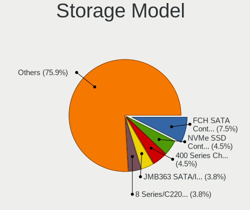
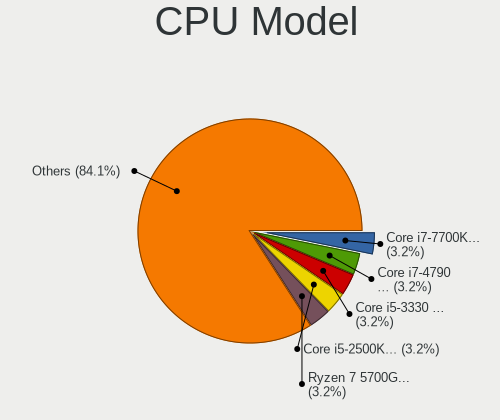
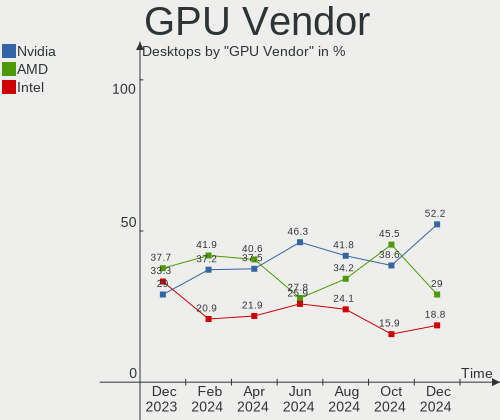
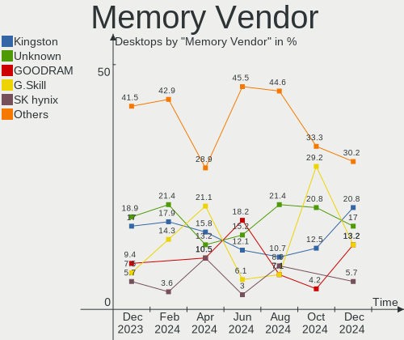
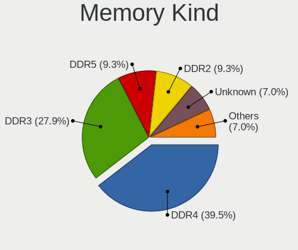
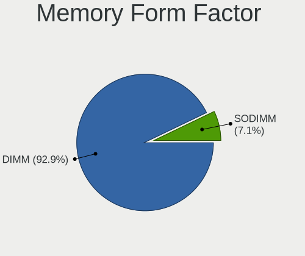

Linux in Poland - Hardware Trends (Desktops)
--------------------------------------------

A project to identify most popular hardware characteristics and track their change
over time based on data collected by Linux users at https://Linux-Hardware.org.

Anyone can contribute to this report by the [hw-probe](https://github.com/linuxhw/hw-probe) tool:

    sudo -E hw-probe -all -upload

Contents
--------

* [ System ](#system)
  - [ OS                       ](#os)
  - [ OS Family                ](#os-family)
  - [ Kernel                   ](#kernel)
  - [ Kernel Family            ](#kernel-family)
  - [ Kernel Major Ver.        ](#kernel-major-ver)
  - [ Arch                     ](#arch)
  - [ DE                       ](#de)
  - [ Display Server           ](#display-server)
  - [ Display Manager          ](#display-manager)
  - [ OS Lang                  ](#os-lang)
  - [ Boot Mode                ](#boot-mode)
  - [ Filesystem               ](#filesystem)
  - [ Part. scheme             ](#part-scheme)
  - [ Dual Boot with Linux/BSD ](#dual-boot-with-linuxbsd)
  - [ Dual Boot (Win)          ](#dual-boot-win)

* [ Board ](#board)
  - [ Vendor                   ](#vendor)
  - [ Model                    ](#model)
  - [ Model Family             ](#model-family)
  - [ MFG Year                 ](#mfg-year)
  - [ Form Factor              ](#form-factor)
  - [ Secure Boot              ](#secure-boot)
  - [ Coreboot                 ](#coreboot)
  - [ RAM Size                 ](#ram-size)
  - [ RAM Used                 ](#ram-used)
  - [ Total Drives             ](#total-drives)
  - [ Has CD-ROM               ](#has-cd-rom)
  - [ Has Ethernet             ](#has-ethernet)
  - [ Has WiFi                 ](#has-wifi)
  - [ Has Bluetooth            ](#has-bluetooth)

* [ Location ](#location)
  - [ Country                  ](#country)
  - [ City                     ](#city)

* [ Drives ](#drives)
  - [ Drive Vendor             ](#drive-vendor)
  - [ Drive Model              ](#drive-model)
  - [ HDD Vendor               ](#hdd-vendor)
  - [ SSD Vendor               ](#ssd-vendor)
  - [ Drive Kind               ](#drive-kind)
  - [ Drive Connector          ](#drive-connector)
  - [ Drive Size               ](#drive-size)
  - [ Space Total              ](#space-total)
  - [ Space Used               ](#space-used)
  - [ Malfunc. Drives          ](#malfunc-drives)
  - [ Malfunc. Drive Vendor    ](#malfunc-drive-vendor)
  - [ Malfunc. HDD Vendor      ](#malfunc-hdd-vendor)
  - [ Malfunc. Drive Kind      ](#malfunc-drive-kind)
  - [ Failed Drives            ](#failed-drives)
  - [ Failed Drive Vendor      ](#failed-drive-vendor)
  - [ Drive Status             ](#drive-status)

* [ Storage controller ](#storage-controller)
  - [ Storage Vendor           ](#storage-vendor)
  - [ Storage Model            ](#storage-model)
  - [ Storage Kind             ](#storage-kind)

* [ Processor ](#processor)
  - [ CPU Vendor               ](#cpu-vendor)
  - [ CPU Model                ](#cpu-model)
  - [ CPU Model Family         ](#cpu-model-family)
  - [ CPU Cores                ](#cpu-cores)
  - [ CPU Sockets              ](#cpu-sockets)
  - [ CPU Threads              ](#cpu-threads)
  - [ CPU Op-Modes             ](#cpu-op-modes)
  - [ CPU Microcode            ](#cpu-microcode)
  - [ CPU Microarch            ](#cpu-microarch)

* [ Graphics ](#graphics)
  - [ GPU Vendor               ](#gpu-vendor)
  - [ GPU Model                ](#gpu-model)
  - [ GPU Combo                ](#gpu-combo)
  - [ GPU Driver               ](#gpu-driver)
  - [ GPU Memory               ](#gpu-memory)

* [ Monitor ](#monitor)
  - [ Monitor Vendor           ](#monitor-vendor)
  - [ Monitor Model            ](#monitor-model)
  - [ Monitor Resolution       ](#monitor-resolution)
  - [ Monitor Diagonal         ](#monitor-diagonal)
  - [ Monitor Width            ](#monitor-width)
  - [ Aspect Ratio             ](#aspect-ratio)
  - [ Monitor Area             ](#monitor-area)
  - [ Pixel Density            ](#pixel-density)
  - [ Multiple Monitors        ](#multiple-monitors)

* [ Network ](#network)
  - [ Net Controller Vendor    ](#net-controller-vendor)
  - [ Net Controller Model     ](#net-controller-model)
  - [ Wireless Vendor          ](#wireless-vendor)
  - [ Wireless Model           ](#wireless-model)
  - [ Ethernet Vendor          ](#ethernet-vendor)
  - [ Ethernet Model           ](#ethernet-model)
  - [ Net Controller Kind      ](#net-controller-kind)
  - [ Used Controller          ](#used-controller)
  - [ NICs                     ](#nics)
  - [ IPv6                     ](#ipv6)

* [ Bluetooth ](#bluetooth)
  - [ Bluetooth Vendor         ](#bluetooth-vendor)
  - [ Bluetooth Model          ](#bluetooth-model)

* [ Sound ](#sound)
  - [ Sound Vendor             ](#sound-vendor)
  - [ Sound Model              ](#sound-model)

* [ Memory ](#memory)
  - [ Memory Vendor            ](#memory-vendor)
  - [ Memory Model             ](#memory-model)
  - [ Memory Kind              ](#memory-kind)
  - [ Memory Form Factor       ](#memory-form-factor)
  - [ Memory Size              ](#memory-size)
  - [ Memory Speed             ](#memory-speed)

* [ Printers & scanners ](#printers--scanners)
  - [ Printer Vendor           ](#printer-vendor)
  - [ Printer Model            ](#printer-model)
  - [ Scanner Vendor           ](#scanner-vendor)
  - [ Scanner Model            ](#scanner-model)

* [ Camera ](#camera)
  - [ Camera Vendor            ](#camera-vendor)
  - [ Camera Model             ](#camera-model)

* [ Security ](#security)
  - [ Fingerprint Vendor       ](#fingerprint-vendor)
  - [ Fingerprint Model        ](#fingerprint-model)
  - [ Chipcard Vendor          ](#chipcard-vendor)
  - [ Chipcard Model           ](#chipcard-model)

* [ Unsupported ](#unsupported)
  - [ Unsupported Devices      ](#unsupported-devices)
  - [ Unsupported Device Types ](#unsupported-device-types)

System
------

OS
--

Installed operating systems

| Name                         | Desktops | Percent |
|------------------------------|----------|---------|
| Ubuntu 20.04                 | 7        | 14.58%  |
| Ubuntu 22.04                 | 6        | 12.5%   |
| OpenMandriva 4.3             | 5        | 10.42%  |
| ROSA 12.2                    | 3        | 6.25%   |
| Linux Mint 20.3              | 3        | 6.25%   |
| Arch Rolling                 | 3        | 6.25%   |
| Pop!_OS 22.04                | 2        | 4.17%   |
| Manjaro 21.2.6               | 2        | 4.17%   |
| Manjaro                      | 2        | 4.17%   |
| Gentoo 2.7                   | 2        | 4.17%   |
| Zorin 16                     | 1        | 2.08%   |
| Void Linux Rolling           | 1        | 2.08%   |
| Ubuntu Budgie 21.10          | 1        | 2.08%   |
| Rocky Linux 8.6              | 1        | 2.08%   |
| openSUSE Tumbleweed-XXXXXXXX | 1        | 2.08%   |
| Mabox 22.04                  | 1        | 2.08%   |
| Kubuntu 22.04                | 1        | 2.08%   |
| KDE neon 20.04               | 1        | 2.08%   |
| Gentoo 2.8                   | 1        | 2.08%   |
| Gentoo 2.3                   | 1        | 2.08%   |
| Fedora 36                    | 1        | 2.08%   |
| Debian 11                    | 1        | 2.08%   |
| Arch                         | 1        | 2.08%   |

OS Family
---------

OS without a version

| Name          | Desktops | Percent |
|---------------|----------|---------|
| Ubuntu        | 13       | 27.08%  |
| OpenMandriva  | 5        | 10.42%  |
| Manjaro       | 4        | 8.33%   |
| Gentoo        | 4        | 8.33%   |
| Arch          | 4        | 8.33%   |
| ROSA          | 3        | 6.25%   |
| Linux Mint    | 3        | 6.25%   |
| Pop!_OS       | 2        | 4.17%   |
| Zorin         | 1        | 2.08%   |
| Void Linux    | 1        | 2.08%   |
| Ubuntu Budgie | 1        | 2.08%   |
| Rocky Linux   | 1        | 2.08%   |
| openSUSE      | 1        | 2.08%   |
| Mabox         | 1        | 2.08%   |
| Kubuntu       | 1        | 2.08%   |
| KDE neon      | 1        | 2.08%   |
| Fedora        | 1        | 2.08%   |
| Debian        | 1        | 2.08%   |

Kernel
------

Version of the Linux kernel

| Version                                    | Desktops | Percent |
|--------------------------------------------|----------|---------|
| 5.16.7-desktop-1omv4003                    | 5        | 10.42%  |
| 5.17.5-arch1-1                             | 3        | 6.25%   |
| 5.11.0-27-generic                          | 3        | 6.25%   |
| 5.17.5-76051705-generic                    | 2        | 4.17%   |
| 5.15.32-gentoo-r1                          | 2        | 4.17%   |
| 5.15.0-27-generic                          | 2        | 4.17%   |
| 5.15.0-25-generic                          | 2        | 4.17%   |
| 5.13.0-40-generic                          | 2        | 4.17%   |
| 5.10.74-generic-2rosa2021.1-x86_64         | 2        | 4.17%   |
| 5.4.188-1-MANJARO                          | 1        | 2.08%   |
| 5.4.0-81-generic                           | 1        | 2.08%   |
| 5.4.0-109-generic                          | 1        | 2.08%   |
| 5.4.0-100-generic                          | 1        | 2.08%   |
| 5.17.9-arch1-1                             | 1        | 2.08%   |
| 5.17.9-051709-generic                      | 1        | 2.08%   |
| 5.17.7-300.fc36.x86_64                     | 1        | 2.08%   |
| 5.17.6-1-MANJARO                           | 1        | 2.08%   |
| 5.17.4-1-default                           | 1        | 2.08%   |
| 5.17.11.xm1-1.klp-xanmod-rosa2021.1-x86_64 | 1        | 2.08%   |
| 5.17.1-gentoo-r1                           | 1        | 2.08%   |
| 5.17.0-051700-generic                      | 1        | 2.08%   |
| 5.15.41-1-MANJARO                          | 1        | 2.08%   |
| 5.15.32-1-MANJARO                          | 1        | 2.08%   |
| 5.15.19_1                                  | 1        | 2.08%   |
| 5.15.0-30-lowlatency                       | 1        | 2.08%   |
| 5.15.0-30-generic                          | 1        | 2.08%   |
| 5.13.0-44-generic                          | 1        | 2.08%   |
| 5.13.0-41-generic                          | 1        | 2.08%   |
| 5.13.0-39-generic                          | 1        | 2.08%   |
| 5.13.0-30-generic                          | 1        | 2.08%   |
| 5.10.109-1-MANJARO                         | 1        | 2.08%   |
| 5.10.0-14-amd64                            | 1        | 2.08%   |
| 4.9.16-gentoo                              | 1        | 2.08%   |
| 4.18.0-372.9.1.el8.x86_64                  | 1        | 2.08%   |

Kernel Family
-------------

Linux kernel without a distro release

| Version  | Desktops | Percent |
|----------|----------|---------|
| 5.15.0   | 6        | 12.5%   |
| 5.13.0   | 6        | 12.5%   |
| 5.17.5   | 5        | 10.42%  |
| 5.16.7   | 5        | 10.42%  |
| 5.4.0    | 3        | 6.25%   |
| 5.15.32  | 3        | 6.25%   |
| 5.11.0   | 3        | 6.25%   |
| 5.17.9   | 2        | 4.17%   |
| 5.10.74  | 2        | 4.17%   |
| 5.4.188  | 1        | 2.08%   |
| 5.17.7   | 1        | 2.08%   |
| 5.17.6   | 1        | 2.08%   |
| 5.17.4   | 1        | 2.08%   |
| 5.17.11  | 1        | 2.08%   |
| 5.17.1   | 1        | 2.08%   |
| 5.17.0   | 1        | 2.08%   |
| 5.15.41  | 1        | 2.08%   |
| 5.15.19  | 1        | 2.08%   |
| 5.10.109 | 1        | 2.08%   |
| 5.10.0   | 1        | 2.08%   |
| 4.9.16   | 1        | 2.08%   |
| 4.18.0   | 1        | 2.08%   |

Kernel Major Ver.
-----------------

Linux kernel major version

| Version | Desktops | Percent |
|---------|----------|---------|
| 5.17    | 13       | 27.08%  |
| 5.15    | 11       | 22.92%  |
| 5.13    | 6        | 12.5%   |
| 5.16    | 5        | 10.42%  |
| 5.4     | 4        | 8.33%   |
| 5.10    | 4        | 8.33%   |
| 5.11    | 3        | 6.25%   |
| 4.9     | 1        | 2.08%   |
| 4.18    | 1        | 2.08%   |

Arch
----

OS architecture (x86_64, i586, etc.)

| Name   | Desktops | Percent |
|--------|----------|---------|
| x86_64 | 47       | 97.92%  |
| ppc    | 1        | 2.08%   |

DE
--

Desktop Environment

| Name       | Desktops | Percent |
|------------|----------|---------|
| GNOME      | 19       | 39.58%  |
| KDE5       | 15       | 31.25%  |
| Unknown    | 5        | 10.42%  |
| X-Cinnamon | 2        | 4.17%   |
| MATE       | 2        | 4.17%   |
| XFCE       | 1        | 2.08%   |
| openbox    | 1        | 2.08%   |
| LXQt       | 1        | 2.08%   |
| Cinnamon   | 1        | 2.08%   |
| Budgie     | 1        | 2.08%   |

Display Server
--------------

X11 or Wayland

| Name    | Desktops | Percent |
|---------|----------|---------|
| X11     | 35       | 72.92%  |
| Wayland | 7        | 14.58%  |
| Tty     | 3        | 6.25%   |
| Unknown | 3        | 6.25%   |

Display Manager
---------------

SDDM, LightDM, etc.

| Name    | Desktops | Percent |
|---------|----------|---------|
| Unknown | 16       | 33.33%  |
| SDDM    | 10       | 20.83%  |
| GDM3    | 10       | 20.83%  |
| LightDM | 9        | 18.75%  |
| GDM     | 3        | 6.25%   |

OS Lang
-------

Language

| Lang   | Desktops | Percent |
|--------|----------|---------|
| pl_PL  | 26       | 54.17%  |
| en_US  | 19       | 39.58%  |
| en_GB  | 2        | 4.17%   |
| szl_PL | 1        | 2.08%   |

Boot Mode
---------

EFI or BIOS

| Mode | Desktops | Percent |
|------|----------|---------|
| BIOS | 28       | 58.33%  |
| EFI  | 20       | 41.67%  |

Filesystem
----------

Type of filesystem

| Type    | Desktops | Percent |
|---------|----------|---------|
| Ext4    | 32       | 66.67%  |
| Overlay | 9        | 18.75%  |
| Btrfs   | 5        | 10.42%  |
| F2fs    | 2        | 4.17%   |

Part. scheme
------------

Scheme of partitioning

| Type    | Desktops | Percent |
|---------|----------|---------|
| Unknown | 22       | 45.83%  |
| GPT     | 16       | 33.33%  |
| MBR     | 10       | 20.83%  |

Dual Boot with Linux/BSD
------------------------

Hosting more than one Linux/BSD

| Dual boot | Desktops | Percent |
|-----------|----------|---------|
| No        | 36       | 75%     |
| Yes       | 12       | 25%     |

Dual Boot (Win)
---------------

Hosting Linux and Windows

| Dual boot | Desktops | Percent |
|-----------|----------|---------|
| No        | 29       | 60.42%  |
| Yes       | 19       | 39.58%  |

Board
-----

Vendor
------

Motherboard manufacturer

| Name                | Desktops | Percent |
|---------------------|----------|---------|
| Gigabyte Technology | 10       | 20.83%  |
| ASUSTek Computer    | 9        | 18.75%  |
| Dell                | 8        | 16.67%  |
| MSI                 | 6        | 12.5%   |
| Hewlett-Packard     | 5        | 10.42%  |
| ASRock              | 5        | 10.42%  |
| Fujitsu             | 2        | 4.17%   |
| Huanan              | 1        | 2.08%   |
| Acer                | 1        | 2.08%   |
| Unknown             | 1        | 2.08%   |

Model
-----

Motherboard model

| Name                            | Desktops | Percent |
|---------------------------------|----------|---------|
| HP Compaq 8200 Elite SFF PC     | 3        | 6.25%   |
| MSI MS-7235                     | 2        | 4.17%   |
| Gigabyte Z97M-DS3H              | 2        | 4.17%   |
| Fujitsu CELSIUS R570-2          | 2        | 4.17%   |
| Dell Precision WorkStation 690  | 2        | 4.17%   |
| Dell OptiPlex 790               | 2        | 4.17%   |
| ASUS TUF Gaming X570-PLUS       | 2        | 4.17%   |
| ASUS P8Z77-V LX                 | 2        | 4.17%   |
| MSI MS-7C52                     | 1        | 2.08%   |
| MSI MS-7C02                     | 1        | 2.08%   |
| MSI MS-7B86                     | 1        | 2.08%   |
| MSI MS-7918                     | 1        | 2.08%   |
| Huanan X99-F8 NALEX             | 1        | 2.08%   |
| HP Z400 Workstation             | 1        | 2.08%   |
| HP EliteDesk 800 G2 SFF         | 1        | 2.08%   |
| Gigabyte X99-UD4-CF             | 1        | 2.08%   |
| Gigabyte H310M S2P 2.0          | 1        | 2.08%   |
| Gigabyte GA-MA780G-UD3H         | 1        | 2.08%   |
| Gigabyte EP45C-DS3R             | 1        | 2.08%   |
| Gigabyte B85M-D2V               | 1        | 2.08%   |
| Gigabyte B550 AORUS ELITE AX V2 | 1        | 2.08%   |
| Gigabyte B550 AORUS ELITE       | 1        | 2.08%   |
| Gigabyte AB350-Gaming           | 1        | 2.08%   |
| Dell Precision Tower 7810       | 1        | 2.08%   |
| Dell Precision T3610            | 1        | 2.08%   |
| Dell PowerEdge T30              | 1        | 2.08%   |
| Dell OptiPlex 7010              | 1        | 2.08%   |
| ASUS TUF Gaming B550M-E WIFI    | 1        | 2.08%   |
| ASUS M4N68T-M-V2                | 1        | 2.08%   |
| ASUS M3A78-CM                   | 1        | 2.08%   |
| ASUS B150M-A/M.2                | 1        | 2.08%   |
| ASUS All Series                 | 1        | 2.08%   |
| ASRock Z87 Extreme4             | 1        | 2.08%   |
| ASRock X370 Gaming X            | 1        | 2.08%   |
| ASRock P67 Pro3                 | 1        | 2.08%   |
| ASRock H270M Pro4               | 1        | 2.08%   |
| ASRock B660M-ITX/ac             | 1        | 2.08%   |
| Acer Aspire X3910               | 1        | 2.08%   |
| Unknown                         | 1        | 2.08%   |

Model Family
------------

Motherboard model prefix

| Name                    | Desktops | Percent |
|-------------------------|----------|---------|
| Dell Precision          | 4        | 8.33%   |
| HP Compaq               | 3        | 6.25%   |
| Dell OptiPlex           | 3        | 6.25%   |
| ASUS TUF                | 3        | 6.25%   |
| MSI MS-7235             | 2        | 4.17%   |
| Gigabyte Z97M-DS3H      | 2        | 4.17%   |
| Gigabyte B550           | 2        | 4.17%   |
| Fujitsu CELSIUS         | 2        | 4.17%   |
| ASUS P8Z77-V            | 2        | 4.17%   |
| MSI MS-7C52             | 1        | 2.08%   |
| MSI MS-7C02             | 1        | 2.08%   |
| MSI MS-7B86             | 1        | 2.08%   |
| MSI MS-7918             | 1        | 2.08%   |
| Huanan X99-F8           | 1        | 2.08%   |
| HP Z400                 | 1        | 2.08%   |
| HP EliteDesk            | 1        | 2.08%   |
| Gigabyte X99-UD4-CF     | 1        | 2.08%   |
| Gigabyte H310M          | 1        | 2.08%   |
| Gigabyte GA-MA780G-UD3H | 1        | 2.08%   |
| Gigabyte EP45C-DS3R     | 1        | 2.08%   |
| Gigabyte B85M-D2V       | 1        | 2.08%   |
| Gigabyte AB350-Gaming   | 1        | 2.08%   |
| Dell PowerEdge          | 1        | 2.08%   |
| ASUS M4N68T-M-V2        | 1        | 2.08%   |
| ASUS M3A78-CM           | 1        | 2.08%   |
| ASUS B150M-A            | 1        | 2.08%   |
| ASUS All                | 1        | 2.08%   |
| ASRock Z87              | 1        | 2.08%   |
| ASRock X370             | 1        | 2.08%   |
| ASRock P67              | 1        | 2.08%   |
| ASRock H270M            | 1        | 2.08%   |
| ASRock B660M-ITX        | 1        | 2.08%   |
| Acer Aspire             | 1        | 2.08%   |
| Unknown                 | 1        | 2.08%   |

MFG Year
--------

Motherboard manufacture year

| Year    | Desktops | Percent |
|---------|----------|---------|
| 2011    | 6        | 12.5%   |
| 2014    | 5        | 10.42%  |
| 2020    | 4        | 8.33%   |
| 2019    | 4        | 8.33%   |
| 2017    | 4        | 8.33%   |
| 2013    | 4        | 8.33%   |
| 2010    | 4        | 8.33%   |
| 2008    | 3        | 6.25%   |
| 2021    | 2        | 4.17%   |
| 2015    | 2        | 4.17%   |
| 2012    | 2        | 4.17%   |
| 2007    | 2        | 4.17%   |
| 2006    | 2        | 4.17%   |
| 2018    | 1        | 2.08%   |
| 2016    | 1        | 2.08%   |
| 2009    | 1        | 2.08%   |
| Unknown | 1        | 2.08%   |

Form Factor
-----------

Physical design of the computer

| Name    | Desktops | Percent |
|---------|----------|---------|
| Desktop | 48       | 100%    |

Secure Boot
-----------

Enabled or disabled

| State    | Desktops | Percent |
|----------|----------|---------|
| Disabled | 47       | 97.92%  |
| Enabled  | 1        | 2.08%   |

Coreboot
--------

Have coreboot on board

| Used | Desktops | Percent |
|------|----------|---------|
| No   | 48       | 100%    |

RAM Size
--------

Total RAM memory

| Size in GB | Desktops | Percent |
|------------|----------|---------|
| 32.01-64.0 | 13       | 27.08%  |
| 16.01-24.0 | 11       | 22.92%  |
| 4.01-8.0   | 10       | 20.83%  |
| 3.01-4.0   | 6        | 12.5%   |
| 8.01-16.0  | 6        | 12.5%   |
| 24.01-32.0 | 1        | 2.08%   |
| 0.51-1.0   | 1        | 2.08%   |

RAM Used
--------

Used RAM memory

| Used GB   | Desktops | Percent |
|-----------|----------|---------|
| 1.01-2.0  | 12       | 25%     |
| 2.01-3.0  | 10       | 20.83%  |
| 3.01-4.0  | 8        | 16.67%  |
| 4.01-8.0  | 7        | 14.58%  |
| 0.51-1.0  | 6        | 12.5%   |
| 8.01-16.0 | 3        | 6.25%   |
| 0.01-0.5  | 2        | 4.17%   |

Total Drives
------------

Number of drives on board

| Drives | Desktops | Percent |
|--------|----------|---------|
| 2      | 14       | 29.17%  |
| 1      | 14       | 29.17%  |
| 3      | 10       | 20.83%  |
| 4      | 5        | 10.42%  |
| 0      | 3        | 6.25%   |
| 6      | 1        | 2.08%   |
| 5      | 1        | 2.08%   |

Has CD-ROM
----------

Has CD-ROM on board

| Presented | Desktops | Percent |
|-----------|----------|---------|
| Yes       | 27       | 56.25%  |
| No        | 21       | 43.75%  |

Has Ethernet
------------

Has Ethernet on board

| Presented | Desktops | Percent |
|-----------|----------|---------|
| Yes       | 48       | 100%    |

Has WiFi
--------

Has WiFi module

| Presented | Desktops | Percent |
|-----------|----------|---------|
| No        | 38       | 79.17%  |
| Yes       | 10       | 20.83%  |

Has Bluetooth
-------------

Has Bluetooth module

| Presented | Desktops | Percent |
|-----------|----------|---------|
| No        | 40       | 83.33%  |
| Yes       | 8        | 16.67%  |

Location
--------

Country
-------

Geographic location (country)

| Country | Desktops | Percent |
|---------|----------|---------|
| Poland  | 48       | 100%    |

City
----

Geographic location (city)

| City          | Desktops | Percent |
|---------------|----------|---------|
| Warsaw        | 6        | 12.5%   |
| Wroclaw       | 5        | 10.42%  |
| Krakow        | 4        | 8.33%   |
| Gdansk        | 4        | 8.33%   |
| Debica        | 4        | 8.33%   |
| Reda          | 2        | 4.17%   |
| Poznan        | 2        | 4.17%   |
| Cieszyn       | 2        | 4.17%   |
| Żyrardów    | 1        | 2.08%   |
| Zabrze        | 1        | 2.08%   |
| Wyszeborz     | 1        | 2.08%   |
| Unieszewo     | 1        | 2.08%   |
| Torun         | 1        | 2.08%   |
| Szaflary      | 1        | 2.08%   |
| Pabianice     | 1        | 2.08%   |
| Orzesze       | 1        | 2.08%   |
| Lublin        | 1        | 2.08%   |
| Legnica       | 1        | 2.08%   |
| Laziska Gorne | 1        | 2.08%   |
| Krapkowice    | 1        | 2.08%   |
| Katowice      | 1        | 2.08%   |
| Chorzów      | 1        | 2.08%   |
| Chełmża     | 1        | 2.08%   |
| Biskupice     | 1        | 2.08%   |
| Bialystok     | 1        | 2.08%   |
| Besko         | 1        | 2.08%   |
| Baczków      | 1        | 2.08%   |

Drives
------

Drive Vendor
------------

Hard drive vendors

| Vendor                    | Desktops | Drives | Percent |
|---------------------------|----------|--------|---------|
| Seagate                   | 19       | 21     | 20.88%  |
| WDC                       | 12       | 15     | 13.19%  |
| Samsung Electronics       | 10       | 10     | 10.99%  |
| GOODRAM                   | 8        | 9      | 8.79%   |
| Toshiba                   | 7        | 9      | 7.69%   |
| Hitachi                   | 5        | 7      | 5.49%   |
| Crucial                   | 5        | 6      | 5.49%   |
| A-DATA Technology         | 3        | 3      | 3.3%    |
| Team                      | 2        | 2      | 2.2%    |
| SPCC                      | 2        | 2      | 2.2%    |
| SanDisk                   | 2        | 2      | 2.2%    |
| Kingston                  | 2        | 2      | 2.2%    |
| Gigabyte Technology       | 2        | 2      | 2.2%    |
| XPG                       | 1        | 1      | 1.1%    |
| SK Hynix                  | 1        | 2      | 1.1%    |
| PNY                       | 1        | 1      | 1.1%    |
| PLEXTOR                   | 1        | 1      | 1.1%    |
| Phison                    | 1        | 1      | 1.1%    |
| Patriot                   | 1        | 1      | 1.1%    |
| Micron/Crucial Technology | 1        | 1      | 1.1%    |
| Kingchuxing               | 1        | 1      | 1.1%    |
| Intel                     | 1        | 1      | 1.1%    |
| HGST                      | 1        | 1      | 1.1%    |
| Fujitsu                   | 1        | 1      | 1.1%    |
| Apacer                    | 1        | 1      | 1.1%    |

Drive Model
-----------

Hard drive models

| Model                                     | Desktops | Percent |
|-------------------------------------------|----------|---------|
| Seagate ST500DM002-1BD142 500GB           | 4        | 4.17%   |
| GOODRAM SSDPR-CL100-480-G2 480GB          | 3        | 3.13%   |
| Toshiba DT01ACA100 1TB                    | 2        | 2.08%   |
| Seagate ST380815AS 80GB                   | 2        | 2.08%   |
| Seagate ST3320620AS 320GB                 | 2        | 2.08%   |
| Seagate ST3160318AS 160GB                 | 2        | 2.08%   |
| Kingston SV300S37A60G 64GB SSD            | 2        | 2.08%   |
| Gigabyte GP-GSM2NE3512GNTD 512GB          | 2        | 2.08%   |
| Crucial CT1000MX500SSD1 1TB               | 2        | 2.08%   |
| XPG NVMe SSD Drive 1024GB                 | 1        | 1.04%   |
| WDC WDS100T2B0C-00PXH0 1TB                | 1        | 1.04%   |
| WDC WD800AAJS-75M0A0 80GB                 | 1        | 1.04%   |
| WDC WD60EZRX-00MVLB1 6TB                  | 1        | 1.04%   |
| WDC WD5002ABYS-01B1B0 500GB               | 1        | 1.04%   |
| WDC WD5000AADS-00S9B0 500GB               | 1        | 1.04%   |
| WDC WD3200AAKS-00L9A0 320GB               | 1        | 1.04%   |
| WDC WD3200AAJS-00L7A0 320GB               | 1        | 1.04%   |
| WDC WD20EFRX-68EUZN0 2TB                  | 1        | 1.04%   |
| WDC WD1600AAJS-75B4A0 160GB               | 1        | 1.04%   |
| WDC WD10SPZX-60Z10T0 1TB                  | 1        | 1.04%   |
| WDC WD10EZEX-60WN4A0 1TB                  | 1        | 1.04%   |
| WDC WD10EZEX-08M2NA0 1TB                  | 1        | 1.04%   |
| WDC WD1003FBYX-01Y7B1 1TB                 | 1        | 1.04%   |
| WDC WD1001FALS-00J7B1 1TB                 | 1        | 1.04%   |
| Toshiba HDWQ140 4TB                       | 1        | 1.04%   |
| Toshiba HDWF180 8TB                       | 1        | 1.04%   |
| Toshiba HDWE150 5TB                       | 1        | 1.04%   |
| Toshiba HDWE140 4TB                       | 1        | 1.04%   |
| Toshiba HDWD240 4TB                       | 1        | 1.04%   |
| Toshiba HDWD110 1TB                       | 1        | 1.04%   |
| Team TM8FP2240G 240GB                     | 1        | 1.04%   |
| Team L7 EVO SSD 120GB                     | 1        | 1.04%   |
| SPCC Solid State Disk 240GB               | 1        | 1.04%   |
| SPCC Solid State Disk 120GB               | 1        | 1.04%   |
| SK Hynix SKHynix_HFM512GDHTNI-87A0B 512GB | 1        | 1.04%   |
| Seagate ST9320325AS 320GB                 | 1        | 1.04%   |
| Seagate ST4000VN008-2DR166 4TB            | 1        | 1.04%   |
| Seagate ST4000DM004-2CV104 4TB            | 1        | 1.04%   |
| Seagate ST3250318AS 250GB                 | 1        | 1.04%   |
| Seagate ST2000DM001-1ER164 2TB            | 1        | 1.04%   |
| Seagate ST2000DM001-1CH164 2TB            | 1        | 1.04%   |
| Seagate ST12000NM0008-2H3101 12TB         | 1        | 1.04%   |
| Seagate ST1000VX001-1Z4102 1TB            | 1        | 1.04%   |
| Seagate ST1000VT001-1RE172 1TB            | 1        | 1.04%   |
| Seagate ST1000LM035-1RK172 1TB            | 1        | 1.04%   |
| Seagate ST1000DM003-1SB10C 1TB            | 1        | 1.04%   |
| SanDisk SSD PLUS 480 GB                   | 1        | 1.04%   |
| SanDisk SDSSDP064G 64GB                   | 1        | 1.04%   |
| Samsung SSD 980 500GB                     | 1        | 1.04%   |
| Samsung SSD 980 1TB                       | 1        | 1.04%   |
| Samsung SSD 870 QVO 1TB                   | 1        | 1.04%   |
| Samsung SSD 860 EVO 500GB                 | 1        | 1.04%   |
| Samsung SSD 860 EVO 1TB                   | 1        | 1.04%   |
| Samsung SSD 850 EVO 500GB                 | 1        | 1.04%   |
| Samsung NVMe SSD Drive 1TB                | 1        | 1.04%   |
| Samsung MZ7LN256HMJP-000H1 256GB SSD      | 1        | 1.04%   |
| Samsung HD503HI 500GB                     | 1        | 1.04%   |
| Samsung HD502HJ 500GB                     | 1        | 1.04%   |
| PNY CS900 120GB SSD                       | 1        | 1.04%   |
| PLEXTOR PH6-CE120-L3 120GB SSD            | 1        | 1.04%   |

HDD Vendor
----------

Hard disk drive vendors

| Vendor              | Desktops | Drives | Percent |
|---------------------|----------|--------|---------|
| Seagate             | 19       | 21     | 41.3%   |
| WDC                 | 11       | 14     | 23.91%  |
| Toshiba             | 7        | 9      | 15.22%  |
| Hitachi             | 5        | 7      | 10.87%  |
| Samsung Electronics | 2        | 2      | 4.35%   |
| HGST                | 1        | 1      | 2.17%   |
| Fujitsu             | 1        | 1      | 2.17%   |

SSD Vendor
----------

Solid state drive vendors

| Vendor              | Desktops | Drives | Percent |
|---------------------|----------|--------|---------|
| GOODRAM             | 8        | 9      | 25%     |
| Samsung Electronics | 5        | 5      | 15.63%  |
| Crucial             | 5        | 6      | 15.63%  |
| A-DATA Technology   | 3        | 3      | 9.38%   |
| SPCC                | 2        | 2      | 6.25%   |
| SanDisk             | 2        | 2      | 6.25%   |
| Kingston            | 2        | 2      | 6.25%   |
| Team                | 1        | 1      | 3.13%   |
| PNY                 | 1        | 1      | 3.13%   |
| PLEXTOR             | 1        | 1      | 3.13%   |
| Patriot             | 1        | 1      | 3.13%   |
| Apacer              | 1        | 1      | 3.13%   |

Drive Kind
----------

HDD or SSD

| Kind | Desktops | Drives | Percent |
|------|----------|--------|---------|
| HDD  | 35       | 55     | 48.61%  |
| SSD  | 28       | 34     | 38.89%  |
| NVMe | 9        | 14     | 12.5%   |

Drive Connector
---------------

SATA, SAS, NVMe, etc.

| Type | Desktops | Drives | Percent |
|------|----------|--------|---------|
| SATA | 41       | 88     | 80.39%  |
| NVMe | 9        | 14     | 17.65%  |
| SAS  | 1        | 1      | 1.96%   |

Drive Size
----------

Size of hard drive

| Size in TB | Desktops | Drives | Percent |
|------------|----------|--------|---------|
| 0.01-0.5   | 34       | 51     | 52.31%  |
| 0.51-1.0   | 17       | 21     | 26.15%  |
| 3.01-4.0   | 5        | 6      | 7.69%   |
| 1.01-2.0   | 4        | 4      | 6.15%   |
| 4.01-10.0  | 3        | 3      | 4.62%   |
| 2.01-3.0   | 1        | 3      | 1.54%   |
| 10.01-20.0 | 1        | 1      | 1.54%   |

Space Total
-----------

Amount of disk space available on the file system

| Size in GB     | Desktops | Percent |
|----------------|----------|---------|
| 251-500        | 11       | 22.92%  |
| 101-250        | 10       | 20.83%  |
| More than 3000 | 6        | 12.5%   |
| 1001-2000      | 5        | 10.42%  |
| 1-20           | 5        | 10.42%  |
| 21-50          | 4        | 8.33%   |
| 501-1000       | 4        | 8.33%   |
| 51-100         | 2        | 4.17%   |
| Unknown        | 1        | 2.08%   |

Space Used
----------

Amount of used disk space

| Used GB        | Desktops | Percent |
|----------------|----------|---------|
| 1-20           | 18       | 37.5%   |
| 101-250        | 5        | 10.42%  |
| 51-100         | 5        | 10.42%  |
| 251-500        | 4        | 8.33%   |
| 21-50          | 4        | 8.33%   |
| 501-1000       | 4        | 8.33%   |
| More than 3000 | 3        | 6.25%   |
| 1001-2000      | 3        | 6.25%   |
| 2001-3000      | 1        | 2.08%   |
| Unknown        | 1        | 2.08%   |

Malfunc. Drives
---------------

Drive models with a malfunction

| Model                                 | Desktops | Drives | Percent |
|---------------------------------------|----------|--------|---------|
| WDC WD5002ABYS-01B1B0 500GB           | 1        | 1      | 14.29%  |
| WDC WD1003FBYX-01Y7B1 1TB             | 1        | 1      | 14.29%  |
| Seagate ST9320325AS 320GB             | 1        | 1      | 14.29%  |
| Seagate ST500DM002-1BD142 500GB       | 1        | 1      | 14.29%  |
| Samsung Electronics HD502HJ 500GB     | 1        | 1      | 14.29%  |
| Hitachi HDP725050GLA360 500GB         | 1        | 1      | 14.29%  |
| A-DATA Technology SP900NS38 256GB SSD | 1        | 1      | 14.29%  |

Malfunc. Drive Vendor
---------------------

Vendors of faulty drives

| Vendor              | Desktops | Drives | Percent |
|---------------------|----------|--------|---------|
| WDC                 | 2        | 2      | 28.57%  |
| Seagate             | 2        | 2      | 28.57%  |
| Samsung Electronics | 1        | 1      | 14.29%  |
| Hitachi             | 1        | 1      | 14.29%  |
| A-DATA Technology   | 1        | 1      | 14.29%  |

Malfunc. HDD Vendor
-------------------

Vendors of faulty HDD drives

| Vendor              | Desktops | Drives | Percent |
|---------------------|----------|--------|---------|
| WDC                 | 2        | 2      | 33.33%  |
| Seagate             | 2        | 2      | 33.33%  |
| Samsung Electronics | 1        | 1      | 16.67%  |
| Hitachi             | 1        | 1      | 16.67%  |

Malfunc. Drive Kind
-------------------

Kinds of faulty drives

| Kind | Desktops | Drives | Percent |
|------|----------|--------|---------|
| HDD  | 6        | 6      | 85.71%  |
| SSD  | 1        | 1      | 14.29%  |

Failed Drives
-------------

Failed drive models

Zero info for selected period =(

Failed Drive Vendor
-------------------

Failed drive vendors

Zero info for selected period =(

Drive Status
------------

Number of failed and malfunc. drives

| Status   | Desktops | Drives | Percent |
|----------|----------|--------|---------|
| Works    | 26       | 51     | 52%     |
| Detected | 17       | 45     | 34%     |
| Malfunc  | 7        | 7      | 14%     |

Storage controller
------------------

Storage Vendor
--------------

Storage controller vendors

| Vendor                    | Desktops | Percent |
|---------------------------|----------|---------|
| Intel                     | 34       | 50.75%  |
| AMD                       | 12       | 17.91%  |
| Phison Electronics        | 4        | 5.97%   |
| Samsung Electronics       | 3        | 4.48%   |
| JMicron Technology        | 3        | 4.48%   |
| Silicon Motion            | 2        | 2.99%   |
| LSI Logic / Symbios Logic | 2        | 2.99%   |
| SK Hynix                  | 1        | 1.49%   |
| Sandisk                   | 1        | 1.49%   |
| Nvidia                    | 1        | 1.49%   |
| Micron/Crucial Technology | 1        | 1.49%   |
| Broadcom / LSI            | 1        | 1.49%   |
| ASMedia Technology        | 1        | 1.49%   |
| ADATA Technology          | 1        | 1.49%   |

Storage Model
-------------

Storage controller models

| Model                                                                          | Desktops | Percent |
|--------------------------------------------------------------------------------|----------|---------|
| Intel 6 Series/C200 Series Chipset Family 6 port Desktop SATA AHCI Controller  | 6        | 7.41%   |
| AMD FCH SATA Controller [AHCI mode]                                            | 6        | 7.41%   |
| Intel 9 Series Chipset Family SATA Controller [AHCI Mode]                      | 4        | 4.94%   |
| Intel 82801JI (ICH10 Family) SATA AHCI Controller                              | 4        | 4.94%   |
| Samsung NVMe SSD Controller 980                                                | 3        | 3.7%    |
| Intel 7 Series/C210 Series Chipset Family 6-port SATA Controller [AHCI mode]   | 3        | 3.7%    |
| AMD 500 Series Chipset SATA Controller                                         | 3        | 3.7%    |
| Silicon Motion SM2263EN/SM2263XT SSD Controller                                | 2        | 2.47%   |
| Phison PS5013 E13 NVMe Controller                                              | 2        | 2.47%   |
| LSI Logic / Symbios Logic SAS1068 PCI-X Fusion-MPT SAS                         | 2        | 2.47%   |
| JMicron JMB361 AHCI/IDE                                                        | 2        | 2.47%   |
| Intel SATA Controller [RAID mode]                                              | 2        | 2.47%   |
| Intel Q170/Q150/B150/H170/H110/Z170/CM236 Chipset SATA Controller [AHCI Mode]  | 2        | 2.47%   |
| Intel C610/X99 series chipset 6-Port SATA Controller [AHCI mode]               | 2        | 2.47%   |
| Intel 82801HR/HO/HH (ICH8R/DO/DH) 2 port SATA Controller [IDE mode]            | 2        | 2.47%   |
| Intel 82801H (ICH8 Family) 4 port SATA Controller [IDE mode]                   | 2        | 2.47%   |
| Intel 8 Series/C220 Series Chipset Family 6-port SATA Controller 1 [AHCI mode] | 2        | 2.47%   |
| Intel 631xESB/632xESB SATA AHCI Controller                                     | 2        | 2.47%   |
| Intel 631xESB/632xESB IDE Controller                                           | 2        | 2.47%   |
| Intel 200 Series PCH SATA controller [AHCI mode]                               | 2        | 2.47%   |
| AMD SB7x0/SB8x0/SB9x0 SATA Controller [IDE mode]                               | 2        | 2.47%   |
| AMD SB7x0/SB8x0/SB9x0 IDE Controller                                           | 2        | 2.47%   |
| AMD 400 Series Chipset SATA Controller                                         | 2        | 2.47%   |
| SK Hynix BC511                                                                 | 1        | 1.23%   |
| Sandisk Non-Volatile memory controller                                         | 1        | 1.23%   |
| Phison E7 NVMe Controller                                                      | 1        | 1.23%   |
| Phison E12 NVMe Controller                                                     | 1        | 1.23%   |
| Nvidia MCP61 SATA Controller                                                   | 1        | 1.23%   |
| Nvidia MCP61 IDE                                                               | 1        | 1.23%   |
| Micron/Crucial Non-Volatile memory controller                                  | 1        | 1.23%   |
| JMicron JMB368 IDE controller                                                  | 1        | 1.23%   |
| Intel SSD 660P Series                                                          | 1        | 1.23%   |
| Intel C610/X99 series chipset sSATA Controller [AHCI mode]                     | 1        | 1.23%   |
| Intel C610/X99 series chipset IDE-r Controller                                 | 1        | 1.23%   |
| Intel C600/X79 series chipset IDE-r Controller                                 | 1        | 1.23%   |
| Intel C600/X79 series chipset 6-Port SATA AHCI Controller                      | 1        | 1.23%   |
| Intel Alder Lake-S PCH SATA Controller [AHCI Mode]                             | 1        | 1.23%   |
| Broadcom / LSI SAS2308 PCI-Express Fusion-MPT SAS-2                            | 1        | 1.23%   |
| ASMedia ASM1062 Serial ATA Controller                                          | 1        | 1.23%   |
| AMD X370 Series Chipset SATA Controller                                        | 1        | 1.23%   |
| AMD FCH SATA Controller D                                                      | 1        | 1.23%   |
| AMD 300 Series Chipset SATA Controller                                         | 1        | 1.23%   |
| ADATA XPG SX8200 Pro PCIe Gen3x4 M.2 2280 Solid State Drive                    | 1        | 1.23%   |

Storage Kind
------------

Kind of storage controller (IDE, SATA, NVMe, SAS, ...)

| Kind | Desktops | Percent |
|------|----------|---------|
| SATA | 41       | 62.12%  |
| NVMe | 10       | 15.15%  |
| IDE  | 10       | 15.15%  |
| RAID | 2        | 3.03%   |
| SCSI | 2        | 3.03%   |
| SAS  | 1        | 1.52%   |

Processor
---------

CPU Vendor
----------

Processor vendors

| Vendor       | Desktops | Percent |
|--------------|----------|---------|
| Intel        | 34       | 70.83%  |
| AMD          | 13       | 27.08%  |
| PowerBook6,7 | 1        | 2.08%   |

CPU Model
---------

Processor models

| Model                                       | Desktops | Percent |
|---------------------------------------------|----------|---------|
| Intel Core i5-2400 CPU @ 3.10GHz            | 3        | 6.25%   |
| Intel Xeon CPU E5640 @ 2.67GHz              | 2        | 4.17%   |
| Intel Core i5-4690 CPU @ 3.50GHz            | 2        | 4.17%   |
| Intel Core i5-2500K CPU @ 3.30GHz           | 2        | 4.17%   |
| Intel Core i5-2500 CPU @ 3.30GHz            | 2        | 4.17%   |
| Intel Core 2 CPU 6600 @ 2.40GHz             | 2        | 4.17%   |
| AMD Ryzen 9 5900X 12-Core Processor         | 2        | 4.17%   |
| PowerBook6,7 7447A, altivec supported       | 1        | 2.08%   |
| Intel Xeon CPU W3670 @ 3.20GHz              | 1        | 2.08%   |
| Intel Xeon CPU E5450 @ 3.00GHz              | 1        | 2.08%   |
| Intel Xeon CPU E5-2690 v3 @ 2.60GHz         | 1        | 2.08%   |
| Intel Xeon CPU E5-2630 v3 @ 2.40GHz         | 1        | 2.08%   |
| Intel Xeon CPU E5-2620 0 @ 2.00GHz          | 1        | 2.08%   |
| Intel Xeon CPU E3-1225 v5 @ 3.30GHz         | 1        | 2.08%   |
| Intel Xeon CPU 5160 @ 3.00GHz               | 1        | 2.08%   |
| Intel Xeon CPU 5150 @ 2.66GHz               | 1        | 2.08%   |
| Intel Pentium Dual-Core CPU E5500 @ 2.80GHz | 1        | 2.08%   |
| Intel Pentium CPU G620 @ 2.60GHz            | 1        | 2.08%   |
| Intel Pentium CPU G3220 @ 3.00GHz           | 1        | 2.08%   |
| Intel Pentium CPU G2030 @ 3.00GHz           | 1        | 2.08%   |
| Intel Core i7-7700K CPU @ 4.20GHz           | 1        | 2.08%   |
| Intel Core i7-6800K CPU @ 3.40GHz           | 1        | 2.08%   |
| Intel Core i7-6700 CPU @ 3.40GHz            | 1        | 2.08%   |
| Intel Core i7-4790K CPU @ 4.00GHz           | 1        | 2.08%   |
| Intel Core i5-9500T CPU @ 2.20GHz           | 1        | 2.08%   |
| Intel Core i5-7600 CPU @ 3.50GHz            | 1        | 2.08%   |
| Intel Core i5-4460 CPU @ 3.20GHz            | 1        | 2.08%   |
| Intel Core i5-4440 CPU @ 3.10GHz            | 1        | 2.08%   |
| Intel 12th Gen Core i5-12500                | 1        | 2.08%   |
| AMD Ryzen 7 5800X 8-Core Processor          | 1        | 2.08%   |
| AMD Ryzen 5 5600G with Radeon Graphics      | 1        | 2.08%   |
| AMD Ryzen 5 3600X 6-Core Processor          | 1        | 2.08%   |
| AMD Ryzen 5 3600 6-Core Processor           | 1        | 2.08%   |
| AMD Ryzen 5 3400G with Radeon Vega Graphics | 1        | 2.08%   |
| AMD Ryzen 5 2600 Six-Core Processor         | 1        | 2.08%   |
| AMD Ryzen 5 1600X Six-Core Processor        | 1        | 2.08%   |
| AMD Ryzen 5 1600 Six-Core Processor         | 1        | 2.08%   |
| AMD Phenom II X4 955 Processor              | 1        | 2.08%   |
| AMD Phenom II X4 940 Processor              | 1        | 2.08%   |
| AMD Phenom II X4 840 Processor              | 1        | 2.08%   |

CPU Model Family
----------------

Processor model prefix

| Model                   | Desktops | Percent |
|-------------------------|----------|---------|
| Intel Core i5           | 13       | 27.08%  |
| Intel Xeon              | 10       | 20.83%  |
| AMD Ryzen 5             | 7        | 14.58%  |
| Intel Core i7           | 4        | 8.33%   |
| Intel Pentium           | 3        | 6.25%   |
| AMD Phenom II X4        | 3        | 6.25%   |
| Other                   | 2        | 4.17%   |
| Intel Core 2            | 2        | 4.17%   |
| AMD Ryzen 9             | 2        | 4.17%   |
| Intel Pentium Dual-Core | 1        | 2.08%   |
| AMD Ryzen 7             | 1        | 2.08%   |

CPU Cores
---------

Number of processor cores

| Number | Desktops | Percent |
|--------|----------|---------|
| 4      | 23       | 47.92%  |
| 6      | 11       | 22.92%  |
| 2      | 6        | 12.5%   |
| 8      | 4        | 8.33%   |
| 12     | 3        | 6.25%   |
| 1      | 1        | 2.08%   |

CPU Sockets
-----------

Number of sockets

| Number | Desktops | Percent |
|--------|----------|---------|
| 1      | 44       | 91.67%  |
| 2      | 4        | 8.33%   |

CPU Threads
-----------

Threads per core (Hyper-Threading)

| Number | Desktops | Percent |
|--------|----------|---------|
| 1      | 27       | 56.25%  |
| 2      | 21       | 43.75%  |

CPU Op-Modes
------------

CPU Operation Modes (32-bit, 64-bit)

| Op mode        | Desktops | Percent |
|----------------|----------|---------|
| 32-bit, 64-bit | 47       | 97.92%  |
| 32-bit         | 1        | 2.08%   |

CPU Microcode
-------------

Microcode number

| Number     | Desktops | Percent |
|------------|----------|---------|
| Unknown    | 11       | 22.92%  |
| 0x206a7    | 7        | 14.58%  |
| 0x306c3    | 5        | 10.42%  |
| 0x906e9    | 2        | 4.17%   |
| 0x6f6      | 2        | 4.17%   |
| 0x306f2    | 2        | 4.17%   |
| 0x1067a    | 2        | 4.17%   |
| 0x906ea    | 1        | 2.08%   |
| 0x90675    | 1        | 2.08%   |
| 0x506e3    | 1        | 2.08%   |
| 0x406f1    | 1        | 2.08%   |
| 0x206d7    | 1        | 2.08%   |
| 0x206c2    | 1        | 2.08%   |
| 0x0a50000c | 1        | 2.08%   |
| 0x0a201205 | 1        | 2.08%   |
| 0x0a201016 | 1        | 2.08%   |
| 0x08701021 | 1        | 2.08%   |
| 0x08108109 | 1        | 2.08%   |
| 0x0800820d | 1        | 2.08%   |
| 0x08001138 | 1        | 2.08%   |
| 0x08001137 | 1        | 2.08%   |
| 0x010000db | 1        | 2.08%   |
| 0x010000b6 | 1        | 2.08%   |
| 0x01000086 | 1        | 2.08%   |

CPU Microarch
-------------

Microarchitecture

| Name             | Desktops | Percent |
|------------------|----------|---------|
| SandyBridge      | 9        | 18.75%  |
| Haswell          | 8        | 16.67%  |
| Zen 3            | 4        | 8.33%   |
| Core             | 4        | 8.33%   |
| Westmere         | 3        | 6.25%   |
| KabyLake         | 3        | 6.25%   |
| K10              | 3        | 6.25%   |
| Zen+             | 2        | 4.17%   |
| Zen 2            | 2        | 4.17%   |
| Zen              | 2        | 4.17%   |
| Skylake          | 2        | 4.17%   |
| Penryn           | 2        | 4.17%   |
| IvyBridge        | 1        | 2.08%   |
| Broadwell        | 1        | 2.08%   |
| Alderlake Hybrid | 1        | 2.08%   |
| Unknown          | 1        | 2.08%   |

Graphics
--------

GPU Vendor
----------

Vendors of graphics cards

| Vendor | Desktops | Percent |
|--------|----------|---------|
| Nvidia | 29       | 55.77%  |
| Intel  | 14       | 26.92%  |
| AMD    | 9        | 17.31%  |

GPU Model
---------

Graphics card models

| Model                                                                       | Desktops | Percent |
|-----------------------------------------------------------------------------|----------|---------|
| Intel 2nd Generation Core Processor Family Integrated Graphics Controller   | 5        | 9.26%   |
| Nvidia GP106 [GeForce GTX 1060 6GB]                                         | 4        | 7.41%   |
| Intel Xeon E3-1200 v3/4th Gen Core Processor Integrated Graphics Controller | 4        | 7.41%   |
| Nvidia GA104 [GeForce RTX 3060 Ti Lite Hash Rate]                           | 3        | 5.56%   |
| Nvidia G96C [GeForce 9500 GT]                                               | 3        | 5.56%   |
| AMD Ellesmere [Radeon RX 470/480/570/570X/580/580X/590]                     | 3        | 5.56%   |
| Nvidia GF108 [GeForce GT 620]                                               | 2        | 3.7%    |
| Nvidia TU106 [GeForce RTX 2060 SUPER]                                       | 1        | 1.85%   |
| Nvidia NV41 [GeForce 6800 GS]                                               | 1        | 1.85%   |
| Nvidia GP107 [GeForce GTX 1050]                                             | 1        | 1.85%   |
| Nvidia GP107 [GeForce GTX 1050 Ti]                                          | 1        | 1.85%   |
| Nvidia GP107 [GeForce GTX 1050 3GB]                                         | 1        | 1.85%   |
| Nvidia GM200 [GeForce GTX 980 Ti]                                           | 1        | 1.85%   |
| Nvidia GM107 [GeForce GTX 750 Ti]                                           | 1        | 1.85%   |
| Nvidia GK208B [GeForce GT 710]                                              | 1        | 1.85%   |
| Nvidia GK107GL [Quadro K600]                                                | 1        | 1.85%   |
| Nvidia GF108 [GeForce GT 730]                                               | 1        | 1.85%   |
| Nvidia GF108 [GeForce GT 430]                                               | 1        | 1.85%   |
| Nvidia GF106GL [Quadro 2000]                                                | 1        | 1.85%   |
| Nvidia GF104 [GeForce GTX 460]                                              | 1        | 1.85%   |
| Nvidia GA102 [GeForce RTX 3080 Lite Hash Rate]                              | 1        | 1.85%   |
| Nvidia G96C [GeForce GT 120]                                                | 1        | 1.85%   |
| Nvidia G84GL [Quadro FX 570]                                                | 1        | 1.85%   |
| Nvidia G84 [GeForce 8600 GT]                                                | 1        | 1.85%   |
| Nvidia G72 [GeForce 7200 GS / 7300 SE]                                      | 1        | 1.85%   |
| Intel Xeon E3-1200 v2/3rd Gen Core processor Graphics Controller            | 1        | 1.85%   |
| Intel HD Graphics P530                                                      | 1        | 1.85%   |
| Intel HD Graphics 530                                                       | 1        | 1.85%   |
| Intel CoffeeLake-S GT2 [UHD Graphics 630]                                   | 1        | 1.85%   |
| Intel 4 Series Chipset Integrated Graphics Controller                       | 1        | 1.85%   |
| AMD RV360/M12 [Mobility Radeon 9550]                                        | 1        | 1.85%   |
| AMD RS780C [Radeon 3100]                                                    | 1        | 1.85%   |
| AMD Redwood XT GL [FirePro V4800]                                           | 1        | 1.85%   |
| AMD Picasso/Raven 2 [Radeon Vega Series / Radeon Vega Mobile Series]        | 1        | 1.85%   |
| AMD Oland PRO [Radeon R7 240/340 / Radeon 520]                              | 1        | 1.85%   |
| AMD Cezanne                                                                 | 1        | 1.85%   |
| AMD Cedar [Radeon HD 5000/6000/7350/8350 Series]                            | 1        | 1.85%   |

GPU Combo
---------

Combinations of graphics cards

| Name           | Desktops | Percent |
|----------------|----------|---------|
| 1 x Nvidia     | 26       | 54.17%  |
| 1 x Intel      | 10       | 20.83%  |
| 1 x AMD        | 7        | 14.58%  |
| 2 x Nvidia     | 1        | 2.08%   |
| 2 x Intel      | 1        | 2.08%   |
| 2 x AMD        | 1        | 2.08%   |
| Intel + Nvidia | 1        | 2.08%   |
| AMD + Nvidia   | 1        | 2.08%   |

GPU Driver
----------

Free vs proprietary

| Driver      | Desktops | Percent |
|-------------|----------|---------|
| Free        | 31       | 64.58%  |
| Proprietary | 13       | 27.08%  |
| Unknown     | 4        | 8.33%   |

GPU Memory
----------

Total video memory

| Size in GB | Desktops | Percent |
|------------|----------|---------|
| Unknown    | 21       | 43.75%  |
| 0.51-1.0   | 8        | 16.67%  |
| 7.01-8.0   | 5        | 10.42%  |
| 5.01-6.0   | 4        | 8.33%   |
| 1.01-2.0   | 4        | 8.33%   |
| 0.01-0.5   | 3        | 6.25%   |
| 3.01-4.0   | 1        | 2.08%   |
| 2.01-3.0   | 1        | 2.08%   |
| 8.01-16.0  | 1        | 2.08%   |

Monitor
-------

Monitor Vendor
--------------

Monitor vendors

| Vendor                  | Desktops | Percent |
|-------------------------|----------|---------|
| Samsung Electronics     | 11       | 22.45%  |
| AOC                     | 5        | 10.2%   |
| Philips                 | 4        | 8.16%   |
| Goldstar                | 4        | 8.16%   |
| Hewlett-Packard         | 3        | 6.12%   |
| BenQ                    | 3        | 6.12%   |
| Sony                    | 2        | 4.08%   |
| LG Electronics          | 2        | 4.08%   |
| Acer                    | 2        | 4.08%   |
| Unknown (XXX)           | 1        | 2.04%   |
| Unknown                 | 1        | 2.04%   |
| Sunplus                 | 1        | 2.04%   |
| NEC Computers           | 1        | 2.04%   |
| Iiyama                  | 1        | 2.04%   |
| Idek Iiyama             | 1        | 2.04%   |
| Gigabyte Technology     | 1        | 2.04%   |
| Fujitsu Siemens         | 1        | 2.04%   |
| Dell                    | 1        | 2.04%   |
| Chi Mei Optoelectronics | 1        | 2.04%   |
| Apple                   | 1        | 2.04%   |
| AGO                     | 1        | 2.04%   |
| ADI                     | 1        | 2.04%   |

Monitor Model
-------------

Monitor models

| Model                                                                 | Desktops | Percent |
|-----------------------------------------------------------------------|----------|---------|
| Philips PHL 223V5 PHLC0CF 1920x1080 480x270mm 21.7-inch               | 3        | 6%      |
| Sony TV SNY6604 1920x1080                                             | 2        | 4%      |
| Samsung Electronics C24F390 SAM0D2C 1920x1080 521x293mm 23.5-inch     | 2        | 4%      |
| AOC 2757 AOC2757 1920x1080 598x336mm 27.0-inch                        | 2        | 4%      |
| Unknown LCD Monitor SAMSUNG                                           | 1        | 2%      |
| Unknown (XXX) Union TV XXX2841 1920x1080 1209x680mm 54.6-inch         | 1        | 2%      |
| Sunplus Monitor TV SPVFFFF 1920x1080 376x301mm 19.0-inch              | 1        | 2%      |
| Samsung Electronics SyncMaster SAM0653 1920x1080                      | 1        | 2%      |
| Samsung Electronics SyncMaster SAM036B 1920x1200 550x340mm 25.5-inch  | 1        | 2%      |
| Samsung Electronics SyncMaster SAM00E5 1280x1024 338x270mm 17.0-inch  | 1        | 2%      |
| Samsung Electronics S34J55x SAM0F70 3440x1440 797x333mm 34.0-inch     | 1        | 2%      |
| Samsung Electronics S24D330 SAM0D92 1920x1080 531x299mm 24.0-inch     | 1        | 2%      |
| Samsung Electronics S22B300 SAM08C8 1920x1080 477x268mm 21.5-inch     | 1        | 2%      |
| Samsung Electronics S22B150 SAM08A3 1920x1080 477x268mm 21.5-inch     | 1        | 2%      |
| Samsung Electronics LCD Monitor V32F390 3200x1080                     | 1        | 2%      |
| Samsung Electronics LCD Monitor SyncMaster 1680x1050                  | 1        | 2%      |
| Samsung Electronics C27F390 SAM0D32 1920x1080 598x336mm 27.0-inch     | 1        | 2%      |
| Philips 190WV PHLC014 1440x900 408x255mm 18.9-inch                    | 1        | 2%      |
| NEC Computers LCD Monitor LCD72VM                                     | 1        | 2%      |
| LG Electronics LCD Monitor LG FULL HD                                 | 1        | 2%      |
| LG Electronics LCD Monitor L1770HR 1280x1024                          | 1        | 2%      |
| Iiyama PLE2001WSV IVM5398 1680x1050 433x271mm 20.1-inch               | 1        | 2%      |
| Idek Iiyama LCD Monitor PL2770QS 4480x1440                            | 1        | 2%      |
| Hewlett-Packard ZR2440w HWP2956 1920x1200 518x324mm 24.1-inch         | 1        | 2%      |
| Hewlett-Packard Z24i HWP309E 1920x1200 520x320mm 24.0-inch            | 1        | 2%      |
| Hewlett-Packard 2310e HWP288E 1920x1080 510x290mm 23.1-inch           | 1        | 2%      |
| Goldstar ULTRAGEAR GSM5BD3 2560x1440 697x392mm 31.5-inch              | 1        | 2%      |
| Goldstar E2251 GSM586F 1920x1080 477x268mm 21.5-inch                  | 1        | 2%      |
| Goldstar 23MP55 GSM5A23 1920x1080 510x290mm 23.1-inch                 | 1        | 2%      |
| Goldstar 23EA63 GSM598E 1920x1080 510x290mm 23.1-inch                 | 1        | 2%      |
| Gigabyte Technology G32QC GBT3200 2560x1440 700x390mm 31.5-inch       | 1        | 2%      |
| Fujitsu Siemens E19-06SA FUS0742 1280x1024 376x301mm 19.0-inch        | 1        | 2%      |
| Dell U2410 DELF015 1920x1200 518x324mm 24.1-inch                      | 1        | 2%      |
| Chi Mei Optoelectronics CMC 19AW CMO2198 1440x900 408x255mm 18.9-inch | 1        | 2%      |
| BenQ GW2265 BNQ78D1 1920x1080 477x268mm 21.5-inch                     | 1        | 2%      |
| BenQ GL2480 BNQ78ED 1920x1080 531x298mm 24.0-inch                     | 1        | 2%      |
| BenQ E2200HD BNQ790C 1920x1080 477x268mm 21.5-inch                    | 1        | 2%      |
| Apple Color LCD APP9C3F 1024x768 285x214mm 14.0-inch                  | 1        | 2%      |
| AOC 24B2W1G5 AOC2402 1920x1080 527x296mm 23.8-inch                    | 1        | 2%      |
| AOC 24B2W1F1 AOC2402 1920x1080 530x300mm 24.0-inch                    | 1        | 2%      |
| AOC 2381 AOC2381 1920x1080 510x290mm 23.1-inch                        | 1        | 2%      |
| AGO LCD Monitor 2384x768                                              | 1        | 2%      |
| ADI LCD Monitor ADI2930 1280x1024 338x270mm 17.0-inch                 | 1        | 2%      |
| Acer VG271U ACR0777 2560x1440 597x336mm 27.0-inch                     | 1        | 2%      |
| Acer G277HL ACR03FB 1920x1080 598x336mm 27.0-inch                     | 1        | 2%      |

Monitor Resolution
------------------

Monitor screen resolution

| Resolution         | Desktops | Percent |
|--------------------|----------|---------|
| 1920x1080 (FHD)    | 25       | 52.08%  |
| 2560x1440 (QHD)    | 4        | 8.33%   |
| 1280x1024 (SXGA)   | 4        | 8.33%   |
| 1920x1200 (WUXGA)  | 3        | 6.25%   |
| Unknown            | 3        | 6.25%   |
| 1680x1050 (WSXGA+) | 2        | 4.17%   |
| 1440x900 (WXGA+)   | 2        | 4.17%   |
| 4480x1440          | 1        | 2.08%   |
| 3440x1440          | 1        | 2.08%   |
| 3200x1080          | 1        | 2.08%   |
| 2384x768           | 1        | 2.08%   |
| 1024x768 (XGA)     | 1        | 2.08%   |

Monitor Diagonal
----------------

Diagonal size in inches

| Inches  | Desktops | Percent |
|---------|----------|---------|
| 21      | 8        | 17.39%  |
| 24      | 6        | 13.04%  |
| 23      | 6        | 13.04%  |
| Unknown | 6        | 13.04%  |
| 27      | 5        | 10.87%  |
| 19      | 3        | 6.52%   |
| 72      | 2        | 4.35%   |
| 31      | 2        | 4.35%   |
| 17      | 2        | 4.35%   |
| 54      | 1        | 2.17%   |
| 34      | 1        | 2.17%   |
| 25      | 1        | 2.17%   |
| 20      | 1        | 2.17%   |
| 18      | 1        | 2.17%   |
| 14      | 1        | 2.17%   |

Monitor Width
-------------

Physical width

| Width in mm | Desktops | Percent |
|-------------|----------|---------|
| 501-600     | 17       | 38.64%  |
| 401-500     | 10       | 22.73%  |
| Unknown     | 6        | 13.64%  |
| 601-700     | 2        | 4.55%   |
| 351-400     | 2        | 4.55%   |
| 301-350     | 2        | 4.55%   |
| 1501-2000   | 2        | 4.55%   |
| 701-800     | 1        | 2.27%   |
| 201-300     | 1        | 2.27%   |
| 1001-1500   | 1        | 2.27%   |

Aspect Ratio
------------

Proportional relationship between the width and the height

| Ratio   | Desktops | Percent |
|---------|----------|---------|
| 16/9    | 26       | 59.09%  |
| 16/10   | 7        | 15.91%  |
| Unknown | 5        | 11.36%  |
| 5/4     | 4        | 9.09%   |
| 4/3     | 1        | 2.27%   |
| 21/9    | 1        | 2.27%   |

Monitor Area
------------

Area in inch²

| Area in inch² | Desktops | Percent |
|----------------|----------|---------|
| 201-250        | 16       | 35.56%  |
| Unknown        | 6        | 13.33%  |
| 301-350        | 5        | 11.11%  |
| 151-200        | 5        | 11.11%  |
| 251-300        | 4        | 8.89%   |
| More than 1000 | 3        | 6.67%   |
| 351-500        | 3        | 6.67%   |
| 141-150        | 2        | 4.44%   |
| 91-100         | 1        | 2.22%   |

Pixel Density
-------------

Pixels per inch

| Density | Desktops | Percent |
|---------|----------|---------|
| 51-100  | 25       | 55.56%  |
| 101-120 | 11       | 24.44%  |
| Unknown | 6        | 13.33%  |
| 1-50    | 3        | 6.67%   |

Multiple Monitors
-----------------

Total monitors connected

| Total | Desktops | Percent |
|-------|----------|---------|
| 1     | 36       | 75%     |
| 2     | 7        | 14.58%  |
| 0     | 4        | 8.33%   |
| 3     | 1        | 2.08%   |

Network
-------

Net Controller Vendor
---------------------

Controller vendors

| Vendor                          | Desktops | Percent |
|---------------------------------|----------|---------|
| Realtek Semiconductor           | 27       | 43.55%  |
| Intel                           | 19       | 30.65%  |
| Broadcom                        | 4        | 6.45%   |
| TP-Link                         | 2        | 3.23%   |
| Xiaomi                          | 1        | 1.61%   |
| Qualcomm Atheros Communications | 1        | 1.61%   |
| Qualcomm Atheros                | 1        | 1.61%   |
| Nvidia                          | 1        | 1.61%   |
| MEDIATEK                        | 1        | 1.61%   |
| Huawei Technologies             | 1        | 1.61%   |
| AVM                             | 1        | 1.61%   |
| ASUSTek Computer                | 1        | 1.61%   |
| Arduino SA                      | 1        | 1.61%   |
| Apple                           | 1        | 1.61%   |

Net Controller Model
--------------------

Controller models

| Model                                                                         | Desktops | Percent |
|-------------------------------------------------------------------------------|----------|---------|
| Realtek RTL8111/8168/8411 PCI Express Gigabit Ethernet Controller             | 21       | 33.33%  |
| Intel 82579LM Gigabit Network Connection (Lewisville)                         | 7        | 11.11%  |
| Realtek RTL8153 Gigabit Ethernet Adapter                                      | 2        | 3.17%   |
| Realtek RTL8125 2.5GbE Controller                                             | 2        | 3.17%   |
| Realtek RTL-8110SC/8169SC Gigabit Ethernet                                    | 2        | 3.17%   |
| Intel Wi-Fi 6 AX200                                                           | 2        | 3.17%   |
| Intel Ethernet Connection (2) I219-LM                                         | 2        | 3.17%   |
| Intel Ethernet Connection (2) I218-V                                          | 2        | 3.17%   |
| Broadcom NetXtreme BCM5752 Gigabit Ethernet PCI Express                       | 2        | 3.17%   |
| Xiaomi Mi/Redmi series (RNDIS)                                                | 1        | 1.59%   |
| TP-Link TL-WN822N Version 4 RTL8192EU                                         | 1        | 1.59%   |
| TP-Link 802.11ac NIC                                                          | 1        | 1.59%   |
| Qualcomm Atheros Killer E220x Gigabit Ethernet Controller                     | 1        | 1.59%   |
| Qualcomm Atheros TP-Link TL-WN322G v3 / TL-WN422G v2 802.11g [Atheros AR9271] | 1        | 1.59%   |
| Nvidia MCP61 Ethernet                                                         | 1        | 1.59%   |
| MEDIATEK MT7921K (RZ608) Wi-Fi 6E 80MHz                                       | 1        | 1.59%   |
| Intel I211 Gigabit Network Connection                                         | 1        | 1.59%   |
| Intel Ethernet Connection I217-V                                              | 1        | 1.59%   |
| Intel Ethernet Connection I217-LM                                             | 1        | 1.59%   |
| Intel Ethernet Connection (2) I219-V                                          | 1        | 1.59%   |
| Intel Ethernet Connection (17) I219-V                                         | 1        | 1.59%   |
| Intel Alder Lake-S PCH CNVi WiFi                                              | 1        | 1.59%   |
| Intel 82567V-2 Gigabit Network Connection                                     | 1        | 1.59%   |
| Huawei ALE-L21                                                                | 1        | 1.59%   |
| Broadcom NetXtreme BCM5764M Gigabit Ethernet PCIe                             | 1        | 1.59%   |
| Broadcom BCM4318 [AirForce One 54g] 802.11g Wireless LAN Controller           | 1        | 1.59%   |
| AVM FRITZ WLAN N v2 [RT5572/rt2870.bin]                                       | 1        | 1.59%   |
| ASUS AC51 802.11a/b/g/n/ac Wireless Adapter [Mediatek MT7610U]                | 1        | 1.59%   |
| Arduino SA Uno R3 (CDC ACM)                                                   | 1        | 1.59%   |
| Apple UniNorth 2 GMAC (Sun GEM)                                               | 1        | 1.59%   |

Wireless Vendor
---------------

Wireless vendors

| Vendor                          | Desktops | Percent |
|---------------------------------|----------|---------|
| Intel                           | 3        | 30%     |
| TP-Link                         | 2        | 20%     |
| Qualcomm Atheros Communications | 1        | 10%     |
| MEDIATEK                        | 1        | 10%     |
| Broadcom                        | 1        | 10%     |
| AVM                             | 1        | 10%     |
| ASUSTek Computer                | 1        | 10%     |

Wireless Model
--------------

Wireless models

| Model                                                                         | Desktops | Percent |
|-------------------------------------------------------------------------------|----------|---------|
| Intel Wi-Fi 6 AX200                                                           | 2        | 20%     |
| TP-Link TL-WN822N Version 4 RTL8192EU                                         | 1        | 10%     |
| TP-Link 802.11ac NIC                                                          | 1        | 10%     |
| Qualcomm Atheros TP-Link TL-WN322G v3 / TL-WN422G v2 802.11g [Atheros AR9271] | 1        | 10%     |
| MEDIATEK MT7921K (RZ608) Wi-Fi 6E 80MHz                                       | 1        | 10%     |
| Intel Alder Lake-S PCH CNVi WiFi                                              | 1        | 10%     |
| Broadcom BCM4318 [AirForce One 54g] 802.11g Wireless LAN Controller           | 1        | 10%     |
| AVM FRITZ WLAN N v2 [RT5572/rt2870.bin]                                       | 1        | 10%     |
| ASUS AC51 802.11a/b/g/n/ac Wireless Adapter [Mediatek MT7610U]                | 1        | 10%     |

Ethernet Vendor
---------------

Ethernet vendors

| Vendor                | Desktops | Percent |
|-----------------------|----------|---------|
| Realtek Semiconductor | 27       | 51.92%  |
| Intel                 | 17       | 32.69%  |
| Broadcom              | 3        | 5.77%   |
| Xiaomi                | 1        | 1.92%   |
| Qualcomm Atheros      | 1        | 1.92%   |
| Nvidia                | 1        | 1.92%   |
| Huawei Technologies   | 1        | 1.92%   |
| Apple                 | 1        | 1.92%   |

Ethernet Model
--------------

Ethernet models

| Model                                                             | Desktops | Percent |
|-------------------------------------------------------------------|----------|---------|
| Realtek RTL8111/8168/8411 PCI Express Gigabit Ethernet Controller | 21       | 40.38%  |
| Intel 82579LM Gigabit Network Connection (Lewisville)             | 7        | 13.46%  |
| Realtek RTL8153 Gigabit Ethernet Adapter                          | 2        | 3.85%   |
| Realtek RTL8125 2.5GbE Controller                                 | 2        | 3.85%   |
| Realtek RTL-8110SC/8169SC Gigabit Ethernet                        | 2        | 3.85%   |
| Intel Ethernet Connection (2) I219-LM                             | 2        | 3.85%   |
| Intel Ethernet Connection (2) I218-V                              | 2        | 3.85%   |
| Broadcom NetXtreme BCM5752 Gigabit Ethernet PCI Express           | 2        | 3.85%   |
| Xiaomi Mi/Redmi series (RNDIS)                                    | 1        | 1.92%   |
| Qualcomm Atheros Killer E220x Gigabit Ethernet Controller         | 1        | 1.92%   |
| Nvidia MCP61 Ethernet                                             | 1        | 1.92%   |
| Intel I211 Gigabit Network Connection                             | 1        | 1.92%   |
| Intel Ethernet Connection I217-V                                  | 1        | 1.92%   |
| Intel Ethernet Connection I217-LM                                 | 1        | 1.92%   |
| Intel Ethernet Connection (2) I219-V                              | 1        | 1.92%   |
| Intel Ethernet Connection (17) I219-V                             | 1        | 1.92%   |
| Intel 82567V-2 Gigabit Network Connection                         | 1        | 1.92%   |
| Huawei ALE-L21                                                    | 1        | 1.92%   |
| Broadcom NetXtreme BCM5764M Gigabit Ethernet PCIe                 | 1        | 1.92%   |
| Apple UniNorth 2 GMAC (Sun GEM)                                   | 1        | 1.92%   |

Net Controller Kind
-------------------

Ethernet, WiFi or modem

| Kind     | Desktops | Percent |
|----------|----------|---------|
| Ethernet | 48       | 81.36%  |
| WiFi     | 10       | 16.95%  |
| Modem    | 1        | 1.69%   |

Used Controller
---------------

Currently used network controller

| Kind     | Desktops | Percent |
|----------|----------|---------|
| Ethernet | 42       | 89.36%  |
| WiFi     | 5        | 10.64%  |

NICs
----

Total network controllers on board

| Total | Desktops | Percent |
|-------|----------|---------|
| 1     | 43       | 89.58%  |
| 2     | 5        | 10.42%  |

IPv6
----

IPv6 vs IPv4

| Used | Desktops | Percent |
|------|----------|---------|
| No   | 44       | 91.67%  |
| Yes  | 4        | 8.33%   |

Bluetooth
---------

Bluetooth Vendor
----------------

Controller vendors

| Vendor                  | Desktops | Percent |
|-------------------------|----------|---------|
| Intel                   | 2        | 22.22%  |
| Cambridge Silicon Radio | 2        | 22.22%  |
| ASUSTek Computer        | 2        | 22.22%  |
| SINO WEALTH             | 1        | 11.11%  |
| MediaTek                | 1        | 11.11%  |
| Apple                   | 1        | 11.11%  |

Bluetooth Model
---------------

Controller models

| Model                                               | Desktops | Percent |
|-----------------------------------------------------|----------|---------|
| Intel AX200 Bluetooth                               | 2        | 22.22%  |
| Cambridge Silicon Radio Bluetooth Dongle (HCI mode) | 2        | 22.22%  |
| SINO WEALTH RK Bluetooth Keyboar                    | 1        | 11.11%  |
| MediaTek Wireless_Device                            | 1        | 11.11%  |
| ASUS Broadcom BCM20702A0 Bluetooth                  | 1        | 11.11%  |
| ASUS ASUS USB-BT500                                 | 1        | 11.11%  |
| Apple Bluetooth HCI MacBookPro (HID mode)           | 1        | 11.11%  |

Sound
-----

Sound Vendor
------------

Sound card vendors

| Vendor                  | Desktops | Percent |
|-------------------------|----------|---------|
| Intel                   | 32       | 36.36%  |
| Nvidia                  | 22       | 25%     |
| AMD                     | 14       | 15.91%  |
| C-Media Electronics     | 4        | 4.55%   |
| Logitech                | 3        | 3.41%   |
| Texas Instruments       | 1        | 1.14%   |
| SteelSeries ApS         | 1        | 1.14%   |
| SAVITECH                | 1        | 1.14%   |
| QinHeng Electronics     | 1        | 1.14%   |
| Plantronics             | 1        | 1.14%   |
| M-Audio                 | 1        | 1.14%   |
| JMTek                   | 1        | 1.14%   |
| DEXP BK-20              | 1        | 1.14%   |
| Creative Technology     | 1        | 1.14%   |
| Creative Labs           | 1        | 1.14%   |
| BEHRINGER International | 1        | 1.14%   |
| ASUSTek Computer        | 1        | 1.14%   |
| Arturia                 | 1        | 1.14%   |

Sound Model
-----------

Sound card models

| Model                                                                      | Desktops | Percent |
|----------------------------------------------------------------------------|----------|---------|
| Intel 6 Series/C200 Series Chipset Family High Definition Audio Controller | 5        | 5.1%    |
| AMD Starship/Matisse HD Audio Controller                                   | 5        | 5.1%    |
| Nvidia GP106 High Definition Audio Controller                              | 4        | 4.08%   |
| Nvidia GF108 High Definition Audio Controller                              | 4        | 4.08%   |
| Intel 9 Series Chipset Family HD Audio Controller                          | 4        | 4.08%   |
| Intel 82801JI (ICH10 Family) HD Audio Controller                           | 4        | 4.08%   |
| Nvidia GP107GL High Definition Audio Controller                            | 3        | 3.06%   |
| Nvidia GA104 High Definition Audio Controller                              | 3        | 3.06%   |
| Intel Xeon E3-1200 v3/4th Gen Core Processor HD Audio Controller           | 3        | 3.06%   |
| Intel C610/X99 series chipset HD Audio Controller                          | 3        | 3.06%   |
| Intel 7 Series/C216 Chipset Family High Definition Audio Controller        | 3        | 3.06%   |
| Intel 100 Series/C230 Series Chipset Family HD Audio Controller            | 3        | 3.06%   |
| AMD Family 17h (Models 00h-0fh) HD Audio Controller                        | 3        | 3.06%   |
| AMD Ellesmere HDMI Audio [Radeon RX 470/480 / 570/580/590]                 | 3        | 3.06%   |
| Intel 82801H (ICH8 Family) HD Audio Controller                             | 2        | 2.04%   |
| Intel 8 Series/C220 Series Chipset High Definition Audio Controller        | 2        | 2.04%   |
| Intel 631xESB/632xESB High Definition Audio Controller                     | 2        | 2.04%   |
| Intel 200 Series PCH HD Audio                                              | 2        | 2.04%   |
| AMD SBx00 Azalia (Intel HDA)                                               | 2        | 2.04%   |
| AMD Family 17h/19h HD Audio Controller                                     | 2        | 2.04%   |
| Texas Instruments PCM2903B Audio CODEC                                     | 1        | 1.02%   |
| SteelSeries ApS SteelSeries Arctis 5                                       | 1        | 1.02%   |
| SAVITECH SA9023 audio controller                                           | 1        | 1.02%   |
| QinHeng Electronics CH345 MIDI adapter                                     | 1        | 1.02%   |
| Plantronics Wireless Audio                                                 | 1        | 1.02%   |
| Nvidia TU106 High Definition Audio Controller                              | 1        | 1.02%   |
| Nvidia MCP61 High Definition Audio                                         | 1        | 1.02%   |
| Nvidia GM200 High Definition Audio                                         | 1        | 1.02%   |
| Nvidia GM107 High Definition Audio Controller [GeForce 940MX]              | 1        | 1.02%   |
| Nvidia GK208 HDMI/DP Audio Controller                                      | 1        | 1.02%   |
| Nvidia GK107 HDMI Audio Controller                                         | 1        | 1.02%   |
| Nvidia GF106 High Definition Audio Controller                              | 1        | 1.02%   |
| Nvidia GF104 High Definition Audio Controller                              | 1        | 1.02%   |
| Nvidia GA102 High Definition Audio Controller                              | 1        | 1.02%   |
| M-Audio AIR 192 8                                                          | 1        | 1.02%   |
| Logitech PRO X                                                             | 1        | 1.02%   |
| Logitech G433 Gaming Headset                                               | 1        | 1.02%   |
| Logitech G35 Headset                                                       | 1        | 1.02%   |
| JMTek USB PnP Audio Device                                                 | 1        | 1.02%   |
| Intel C600/X79 series chipset High Definition Audio Controller             | 1        | 1.02%   |
| Intel Alder Lake-S HD Audio Controller                                     | 1        | 1.02%   |
| DEXP BK-20 DEXP BK-20                                                      | 1        | 1.02%   |
| Creative Technology Sound BlasterX G1                                      | 1        | 1.02%   |
| Creative Labs CA0108/CA10300 [Sound Blaster Audigy Series]                 | 1        | 1.02%   |
| C-Media Electronics CMI8788 [Oxygen HD Audio]                              | 1        | 1.02%   |
| C-Media Electronics CM108 Audio Controller                                 | 1        | 1.02%   |
| C-Media Electronics Blue Snowball                                          | 1        | 1.02%   |
| C-Media Electronics Audio Adapter                                          | 1        | 1.02%   |
| BEHRINGER International UMC404HD 192k                                      | 1        | 1.02%   |
| ASUSTek Computer Xonar U1 Audio Station                                    | 1        | 1.02%   |
| Arturia MiniLab mkII                                                       | 1        | 1.02%   |
| AMD Renoir Radeon High Definition Audio Controller                         | 1        | 1.02%   |
| AMD Redwood HDMI Audio [Radeon HD 5000 Series]                             | 1        | 1.02%   |
| AMD Raven/Raven2/Fenghuang HDMI/DP Audio Controller                        | 1        | 1.02%   |
| AMD Oland/Hainan/Cape Verde/Pitcairn HDMI Audio [Radeon HD 7000 Series]    | 1        | 1.02%   |
| AMD Cedar HDMI Audio [Radeon HD 5400/6300/7300 Series]                     | 1        | 1.02%   |

Memory
------

Memory Vendor
-------------

Memory module vendors

| Vendor              | Desktops | Percent |
|---------------------|----------|---------|
| Unknown             | 8        | 21.05%  |
| Kingston            | 6        | 15.79%  |
| SK Hynix            | 4        | 10.53%  |
| Samsung Electronics | 4        | 10.53%  |
| GOODRAM             | 4        | 10.53%  |
| G.Skill             | 4        | 10.53%  |
| Crucial             | 3        | 7.89%   |
| Corsair             | 2        | 5.26%   |
| Wilk Elektronik     | 1        | 2.63%   |
| Team                | 1        | 2.63%   |
| A-DATA Technology   | 1        | 2.63%   |

Memory Model
------------

Memory module models

| Model                                                           | Desktops | Percent |
|-----------------------------------------------------------------|----------|---------|
| Unknown RAM Module 2GB DIMM 800MT/s                             | 2        | 5.13%   |
| Unknown RAM Module 2GB DIMM 1333MT/s                            | 2        | 5.13%   |
| Unknown RAM Module 1GB DIMM DDR                                 | 2        | 5.13%   |
| SK Hynix RAM Module 2GB DIMM DDR3 1333MT/s                      | 2        | 5.13%   |
| Samsung RAM Module 4GB DIMM DDR3 1333MT/s                       | 2        | 5.13%   |
| G.Skill RAM F4-3200C16-8GVKB 8GB DIMM DDR4 3200MT/s             | 2        | 5.13%   |
| Wilk Elektronik RAM IRP3600D4V64L18/16G 16GB DIMM DDR4 3600MT/s | 1        | 2.56%   |
| Unknown RAM Module 2GB DIMM DDR2 667MT/s                        | 1        | 2.56%   |
| Unknown RAM DDR3 1600 8G 8192MB DIMM DDR3 1600MT/s              | 1        | 2.56%   |
| Team RAM TEAMGROUP-UD4-3600 16GB DIMM DDR4 3600MT/s             | 1        | 2.56%   |
| SK Hynix RAM HMA81GU7AFR8N-UH 8GB DIMM DDR4 2400MT/s            | 1        | 2.56%   |
| SK Hynix RAM HMA41GR7MFR4N-TF 8GB DIMM DDR4 2667MT/s            | 1        | 2.56%   |
| Samsung RAM M378B5773CH0-CK0 2GB DIMM DDR3 1600MT/s             | 1        | 2.56%   |
| Samsung RAM M378B5173BH0-CK0 4GB DIMM DDR3 1600MT/s             | 1        | 2.56%   |
| Kingston RAM Module 2GB DIMM 1333MT/s                           | 1        | 2.56%   |
| Kingston RAM KHX3200C16D4/16GX 16GB DIMM DDR4 3600MT/s          | 1        | 2.56%   |
| Kingston RAM KHX2400C15/8G 8192MB DIMM DDR4 2933MT/s            | 1        | 2.56%   |
| Kingston RAM KHX1600C9D3/8GX 8GB DIMM DDR3 1600MT/s             | 1        | 2.56%   |
| Kingston RAM KHX1600C10D3/8G 4096MB DIMM DDR3 1600MT/s          | 1        | 2.56%   |
| Kingston RAM 9965600-012.A01G 16GB RIMM DDR4 2133MT/s           | 1        | 2.56%   |
| Kingston RAM 9965600-011.A01G 16GB RIMM DDR4 2133MT/s           | 1        | 2.56%   |
| GOODRAM RAM IRX3200D464L16SA/8G 8GB DIMM DDR4 3200MT/s          | 1        | 2.56%   |
| GOODRAM RAM IR2400D464L17/16G 16384MB DIMM DDR4 2933MT/s        | 1        | 2.56%   |
| GOODRAM RAM GY1866D364L10/8G 8GB DIMM DDR3 1867MT/s             | 1        | 2.56%   |
| GOODRAM RAM GR1600D364L11/8G 8GB DIMM DDR3 1600MT/s             | 1        | 2.56%   |
| G.Skill RAM F4-3200C16-4GVKB 4GB DIMM DDR4 3200MT/s             | 1        | 2.56%   |
| G.Skill RAM F4-3000C16-8GISB 8GB DIMM DDR4 3200MT/s             | 1        | 2.56%   |
| Crucial RAM CT8G4DFD8213.C16FBR2 8GB DIMM DDR4 2133MT/s         | 1        | 2.56%   |
| Crucial RAM BLS8G3D1609DS1S00. 8192MB DIMM DDR3 1600MT/s        | 1        | 2.56%   |
| Crucial RAM BL16G32C16U4B.M16FE1 16384MB DIMM DDR4 3200MT/s     | 1        | 2.56%   |
| Corsair RAM CML8GX3M2A1600C9 4096MB DIMM DDR3 1867MT/s          | 1        | 2.56%   |
| Corsair RAM CMK32GX4M4A2400C14 8GB DIMM DDR4 2666MT/s           | 1        | 2.56%   |
| A-DATA RAM DDR4 3200 8GB DIMM DDR4 3200MT/s                     | 1        | 2.56%   |

Memory Kind
-----------

Memory module kinds

| Kind    | Desktops | Percent |
|---------|----------|---------|
| DDR4    | 15       | 46.88%  |
| DDR3    | 9        | 28.13%  |
| Unknown | 4        | 12.5%   |
| DDR     | 2        | 6.25%   |
| SDRAM   | 1        | 3.13%   |
| DDR2    | 1        | 3.13%   |

Memory Form Factor
------------------

Physical design of the memory module

| Name | Desktops | Percent |
|------|----------|---------|
| DIMM | 31       | 96.88%  |
| RIMM | 1        | 3.13%   |

Memory Size
-----------

Memory module size

| Size  | Desktops | Percent |
|-------|----------|---------|
| 8192  | 13       | 37.14%  |
| 2048  | 8        | 22.86%  |
| 16384 | 6        | 17.14%  |
| 4096  | 5        | 14.29%  |
| 1024  | 2        | 5.71%   |
| 32768 | 1        | 2.86%   |

Memory Speed
------------

Memory module speed

| Speed   | Desktops | Percent |
|---------|----------|---------|
| 3200    | 5        | 14.71%  |
| 1600    | 5        | 14.71%  |
| 1333    | 5        | 14.71%  |
| 3600    | 3        | 8.82%   |
| 3466    | 2        | 5.88%   |
| 2933    | 2        | 5.88%   |
| 2133    | 2        | 5.88%   |
| 1867    | 2        | 5.88%   |
| 800     | 2        | 5.88%   |
| Unknown | 2        | 5.88%   |
| 2667    | 1        | 2.94%   |
| 2666    | 1        | 2.94%   |
| 2400    | 1        | 2.94%   |
| 667     | 1        | 2.94%   |

Printers & scanners
-------------------

Printer Vendor
--------------

Printer device vendors

| Vendor          | Desktops | Percent |
|-----------------|----------|---------|
| Hewlett-Packard | 1        | 100%    |

Printer Model
-------------

Printer device models

| Model               | Desktops | Percent |
|---------------------|----------|---------|
| HP LaserJet M14-M17 | 1        | 100%    |

Scanner Vendor
--------------

Scanner device vendors

Zero info for selected period =(

Scanner Model
-------------

Scanner device models

Zero info for selected period =(

Camera
------

Camera Vendor
-------------

Camera device vendors

| Vendor              | Desktops | Percent |
|---------------------|----------|---------|
| Logitech            | 2        | 28.57%  |
| Microsoft           | 1        | 14.29%  |
| Microdia            | 1        | 14.29%  |
| MacroSilicon        | 1        | 14.29%  |
| GEMBIRD             | 1        | 14.29%  |
| Creative Technology | 1        | 14.29%  |

Camera Model
------------

Camera device models

| Model                                             | Desktops | Percent |
|---------------------------------------------------|----------|---------|
| Microsoft LifeCam HD-5000                         | 1        | 14.29%  |
| Microdia USB 2.0 Camera                           | 1        | 14.29%  |
| MacroSilicon USB Video                            | 1        | 14.29%  |
| Logitech Logitech Webcam C100                     | 1        | 14.29%  |
| Logitech C505 HD Webcam                           | 1        | 14.29%  |
| GEMBIRD Generic UVC 1.00 camera [AppoTech AX2311] | 1        | 14.29%  |
| Creative Live! Cam Optia                          | 1        | 14.29%  |

Security
--------

Fingerprint Vendor
------------------

Fingerprint sensor vendors

Zero info for selected period =(

Fingerprint Model
-----------------

Fingerprint sensor models

Zero info for selected period =(

Chipcard Vendor
---------------

Chipcard module vendors

Zero info for selected period =(

Chipcard Model
--------------

Chipcard module models

Zero info for selected period =(

Unsupported
-----------

Unsupported Devices
-------------------

Total unsupported devices on board

| Total | Desktops | Percent |
|-------|----------|---------|
| 0     | 35       | 72.92%  |
| 1     | 13       | 27.08%  |

Unsupported Device Types
------------------------

Types of unsupported devices

| Type             | Desktops | Percent |
|------------------|----------|---------|
| Graphics card    | 8        | 61.54%  |
| Unassigned class | 3        | 23.08%  |
| Net/wireless     | 2        | 15.38%  |

