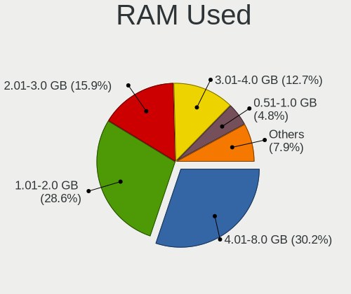
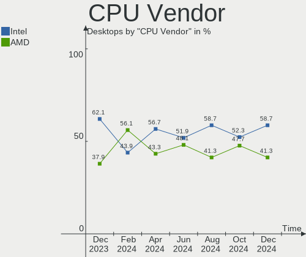
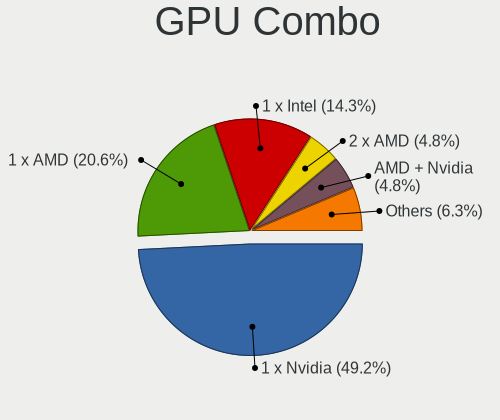
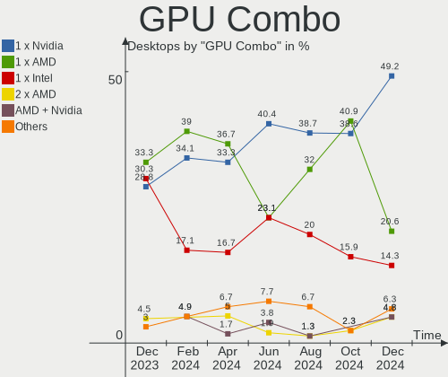
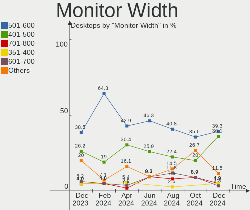
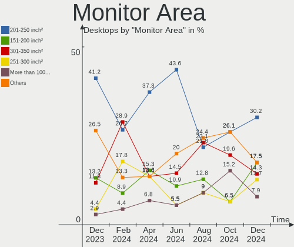
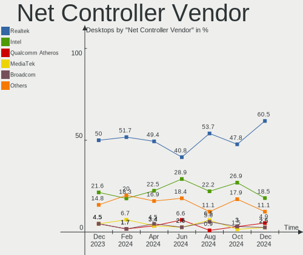
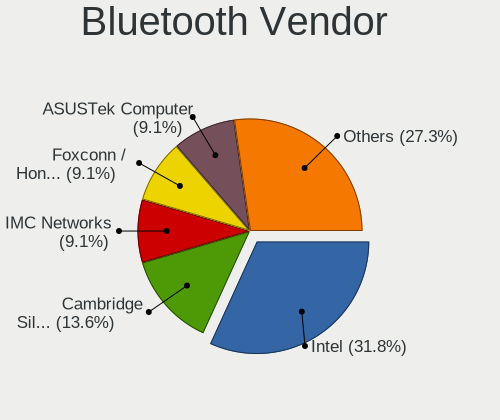
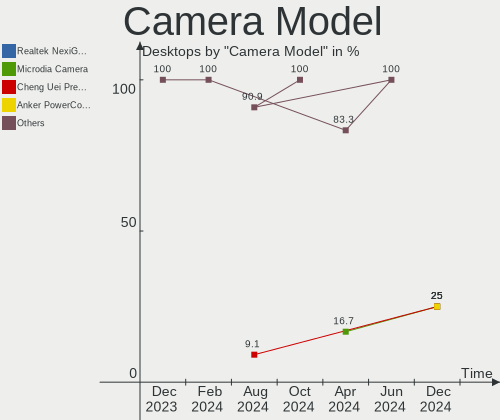

Linux in Poland - Hardware Trends (Desktops)
--------------------------------------------

A project to identify most popular hardware characteristics and track their change
over time based on data collected by Linux users at https://Linux-Hardware.org.

Anyone can contribute to this report by the [hw-probe](https://github.com/linuxhw/hw-probe) tool:

    sudo -E hw-probe -all -upload

Period: Nov, 2023.

Contents
--------

* [ System ](#system)
  - [ OS                       ](#os)
  - [ OS Family                ](#os-family)
  - [ Kernel                   ](#kernel)
  - [ Kernel Family            ](#kernel-family)
  - [ Kernel Major Ver.        ](#kernel-major-ver)
  - [ Arch                     ](#arch)
  - [ DE                       ](#de)
  - [ Display Server           ](#display-server)
  - [ Display Manager          ](#display-manager)
  - [ OS Lang                  ](#os-lang)
  - [ Boot Mode                ](#boot-mode)
  - [ Filesystem               ](#filesystem)
  - [ Part. scheme             ](#part-scheme)
  - [ Dual Boot with Linux/BSD ](#dual-boot-with-linuxbsd)
  - [ Dual Boot (Win)          ](#dual-boot-win)

* [ Board ](#board)
  - [ Vendor                   ](#vendor)
  - [ Model                    ](#model)
  - [ Model Family             ](#model-family)
  - [ MFG Year                 ](#mfg-year)
  - [ Form Factor              ](#form-factor)
  - [ Secure Boot              ](#secure-boot)
  - [ Coreboot                 ](#coreboot)
  - [ RAM Size                 ](#ram-size)
  - [ RAM Used                 ](#ram-used)
  - [ Total Drives             ](#total-drives)
  - [ Has CD-ROM               ](#has-cd-rom)
  - [ Has Ethernet             ](#has-ethernet)
  - [ Has WiFi                 ](#has-wifi)
  - [ Has Bluetooth            ](#has-bluetooth)

* [ Location ](#location)
  - [ Country                  ](#country)
  - [ City                     ](#city)

* [ Drives ](#drives)
  - [ Drive Vendor             ](#drive-vendor)
  - [ Drive Model              ](#drive-model)
  - [ HDD Vendor               ](#hdd-vendor)
  - [ SSD Vendor               ](#ssd-vendor)
  - [ Drive Kind               ](#drive-kind)
  - [ Drive Connector          ](#drive-connector)
  - [ Drive Size               ](#drive-size)
  - [ Space Total              ](#space-total)
  - [ Space Used               ](#space-used)
  - [ Malfunc. Drives          ](#malfunc-drives)
  - [ Malfunc. Drive Vendor    ](#malfunc-drive-vendor)
  - [ Malfunc. HDD Vendor      ](#malfunc-hdd-vendor)
  - [ Malfunc. Drive Kind      ](#malfunc-drive-kind)
  - [ Failed Drives            ](#failed-drives)
  - [ Failed Drive Vendor      ](#failed-drive-vendor)
  - [ Drive Status             ](#drive-status)

* [ Storage controller ](#storage-controller)
  - [ Storage Vendor           ](#storage-vendor)
  - [ Storage Model            ](#storage-model)
  - [ Storage Kind             ](#storage-kind)

* [ Processor ](#processor)
  - [ CPU Vendor               ](#cpu-vendor)
  - [ CPU Model                ](#cpu-model)
  - [ CPU Model Family         ](#cpu-model-family)
  - [ CPU Cores                ](#cpu-cores)
  - [ CPU Sockets              ](#cpu-sockets)
  - [ CPU Threads              ](#cpu-threads)
  - [ CPU Op-Modes             ](#cpu-op-modes)
  - [ CPU Microcode            ](#cpu-microcode)
  - [ CPU Microarch            ](#cpu-microarch)

* [ Graphics ](#graphics)
  - [ GPU Vendor               ](#gpu-vendor)
  - [ GPU Model                ](#gpu-model)
  - [ GPU Combo                ](#gpu-combo)
  - [ GPU Driver               ](#gpu-driver)
  - [ GPU Memory               ](#gpu-memory)

* [ Monitor ](#monitor)
  - [ Monitor Vendor           ](#monitor-vendor)
  - [ Monitor Model            ](#monitor-model)
  - [ Monitor Resolution       ](#monitor-resolution)
  - [ Monitor Diagonal         ](#monitor-diagonal)
  - [ Monitor Width            ](#monitor-width)
  - [ Aspect Ratio             ](#aspect-ratio)
  - [ Monitor Area             ](#monitor-area)
  - [ Pixel Density            ](#pixel-density)
  - [ Multiple Monitors        ](#multiple-monitors)

* [ Network ](#network)
  - [ Net Controller Vendor    ](#net-controller-vendor)
  - [ Net Controller Model     ](#net-controller-model)
  - [ Wireless Vendor          ](#wireless-vendor)
  - [ Wireless Model           ](#wireless-model)
  - [ Ethernet Vendor          ](#ethernet-vendor)
  - [ Ethernet Model           ](#ethernet-model)
  - [ Net Controller Kind      ](#net-controller-kind)
  - [ Used Controller          ](#used-controller)
  - [ NICs                     ](#nics)
  - [ IPv6                     ](#ipv6)

* [ Bluetooth ](#bluetooth)
  - [ Bluetooth Vendor         ](#bluetooth-vendor)
  - [ Bluetooth Model          ](#bluetooth-model)

* [ Sound ](#sound)
  - [ Sound Vendor             ](#sound-vendor)
  - [ Sound Model              ](#sound-model)

* [ Memory ](#memory)
  - [ Memory Vendor            ](#memory-vendor)
  - [ Memory Model             ](#memory-model)
  - [ Memory Kind              ](#memory-kind)
  - [ Memory Form Factor       ](#memory-form-factor)
  - [ Memory Size              ](#memory-size)
  - [ Memory Speed             ](#memory-speed)

* [ Printers & scanners ](#printers--scanners)
  - [ Printer Vendor           ](#printer-vendor)
  - [ Printer Model            ](#printer-model)
  - [ Scanner Vendor           ](#scanner-vendor)
  - [ Scanner Model            ](#scanner-model)

* [ Camera ](#camera)
  - [ Camera Vendor            ](#camera-vendor)
  - [ Camera Model             ](#camera-model)

* [ Security ](#security)
  - [ Fingerprint Vendor       ](#fingerprint-vendor)
  - [ Fingerprint Model        ](#fingerprint-model)
  - [ Chipcard Vendor          ](#chipcard-vendor)
  - [ Chipcard Model           ](#chipcard-model)

* [ Unsupported ](#unsupported)
  - [ Unsupported Devices      ](#unsupported-devices)
  - [ Unsupported Device Types ](#unsupported-device-types)

System
------

OS
--

Installed operating systems

| Name                         | Desktops | Percent |
|------------------------------|----------|---------|
| Ubuntu 22.04                 | 8        | 12.12%  |
| Linux Mint 21.2              | 8        | 12.12%  |
| OpenMandriva 5.0             | 6        | 9.09%   |
| Arch Rolling                 | 6        | 9.09%   |
| OpenMandriva 23.08           | 5        | 7.58%   |
| Gentoo 2.14                  | 4        | 6.06%   |
| Debian 12                    | 3        | 4.55%   |
| OpenMandriva 23.03           | 2        | 3.03%   |
| OpenMandriva 23.01           | 2        | 3.03%   |
| KDE neon 22.04               | 2        | 3.03%   |
| Fedora 39                    | 2        | 3.03%   |
| Fedora 38                    | 2        | 3.03%   |
| Xero Rolling                 | 1        | 1.52%   |
| Ubuntu 23.10                 | 1        | 1.52%   |
| Ubuntu 20.04                 | 1        | 1.52%   |
| Ubuntu 18.04                 | 1        | 1.52%   |
| SteamOS Rolling              | 1        | 1.52%   |
| Pop!_OS 22.04                | 1        | 1.52%   |
| openSUSE Tumbleweed-XXXXXXXX | 1        | 1.52%   |
| OpenMandriva 4.3             | 1        | 1.52%   |
| OpenMandriva 23.11           | 1        | 1.52%   |
| Manjaro                      | 1        | 1.52%   |
| LMDE 6                       | 1        | 1.52%   |
| Kubuntu 22.04                | 1        | 1.52%   |
| Elementary 7.1               | 1        | 1.52%   |
| Debian 11                    | 1        | 1.52%   |
| CachyOS Rolling              | 1        | 1.52%   |
| ArcoLinux Rolling            | 1        | 1.52%   |

OS Family
---------

OS without a version

| Name         | Desktops | Percent |
|--------------|----------|---------|
| OpenMandriva | 17       | 25.76%  |
| Ubuntu       | 11       | 16.67%  |
| Linux Mint   | 8        | 12.12%  |
| Arch         | 6        | 9.09%   |
| Gentoo       | 4        | 6.06%   |
| Fedora       | 4        | 6.06%   |
| Debian       | 4        | 6.06%   |
| KDE neon     | 2        | 3.03%   |
| Xero         | 1        | 1.52%   |
| SteamOS      | 1        | 1.52%   |
| Pop!_OS      | 1        | 1.52%   |
| openSUSE     | 1        | 1.52%   |
| Manjaro      | 1        | 1.52%   |
| LMDE         | 1        | 1.52%   |
| Kubuntu      | 1        | 1.52%   |
| Elementary   | 1        | 1.52%   |
| CachyOS      | 1        | 1.52%   |
| ArcoLinux    | 1        | 1.52%   |

Kernel
------

Version of the Linux kernel

| Version                 | Desktops | Percent |
|-------------------------|----------|---------|
| 6.2.0-36-generic        | 10       | 15.15%  |
| 6.6.2-desktop-1omv2390  | 6        | 9.09%   |
| 6.4.11-desktop-1omv2390 | 5        | 7.58%   |
| 6.1.57-gentoo           | 4        | 6.06%   |
| 6.1.0-13-amd64          | 4        | 6.06%   |
| 5.15.0-89-generic       | 3        | 4.55%   |
| 5.15.0-88-generic       | 3        | 4.55%   |
| 6.6.1-arch1-1           | 2        | 3.03%   |
| 6.5.9-arch2-1           | 2        | 3.03%   |
| 6.2.6-desktop-1omv2390  | 2        | 3.03%   |
| 6.2.0-37-generic        | 2        | 3.03%   |
| 6.1.1-desktop-1omv2290  | 2        | 3.03%   |
| 6.6.3-arch1-1           | 1        | 1.52%   |
| 6.6.2-lqx1-1-lqx        | 1        | 1.52%   |
| 6.6.2-201.fc39.x86_64   | 1        | 1.52%   |
| 6.6.2-101.fc38.x86_64   | 1        | 1.52%   |
| 6.6.0-desktop-1omv2390  | 1        | 1.52%   |
| 6.6.0-2-cachyos         | 1        | 1.52%   |
| 6.5.9-zen2-1-zen        | 1        | 1.52%   |
| 6.5.9-1-default         | 1        | 1.52%   |
| 6.5.6-76060506-generic  | 1        | 1.52%   |
| 6.5.11-300.fc39.x86_64  | 1        | 1.52%   |
| 6.5.10-200.fc38.x86_64  | 1        | 1.52%   |
| 6.5.0-10-generic        | 1        | 1.52%   |
| 6.3.7-zen1-1-zen        | 1        | 1.52%   |
| 6.2.0-39-generic        | 1        | 1.52%   |
| 6.2.0-33-generic        | 1        | 1.52%   |
| 6.2.0-060200-generic    | 1        | 1.52%   |
| 6.1.62-1-lts            | 1        | 1.52%   |
| 6.1.61-1-lts            | 1        | 1.52%   |
| 5.4.0-150-generic       | 1        | 1.52%   |
| 5.16.7-desktop-1omv4003 | 1        | 1.52%   |
| 5.10.0-26-amd64         | 1        | 1.52%   |

Kernel Family
-------------

Linux kernel without a distro release

| Version | Desktops | Percent |
|---------|----------|---------|
| 6.2.0   | 15       | 22.73%  |
| 6.6.2   | 9        | 13.64%  |
| 5.15.0  | 6        | 9.09%   |
| 6.4.11  | 5        | 7.58%   |
| 6.5.9   | 4        | 6.06%   |
| 6.1.57  | 4        | 6.06%   |
| 6.1.0   | 4        | 6.06%   |
| 6.6.1   | 2        | 3.03%   |
| 6.6.0   | 2        | 3.03%   |
| 6.2.6   | 2        | 3.03%   |
| 6.1.1   | 2        | 3.03%   |
| 6.6.3   | 1        | 1.52%   |
| 6.5.6   | 1        | 1.52%   |
| 6.5.11  | 1        | 1.52%   |
| 6.5.10  | 1        | 1.52%   |
| 6.5.0   | 1        | 1.52%   |
| 6.3.7   | 1        | 1.52%   |
| 6.1.62  | 1        | 1.52%   |
| 6.1.61  | 1        | 1.52%   |
| 5.4.0   | 1        | 1.52%   |
| 5.16.7  | 1        | 1.52%   |
| 5.10.0  | 1        | 1.52%   |

Kernel Major Ver.
-----------------

Linux kernel major version

| Version | Desktops | Percent |
|---------|----------|---------|
| 6.2     | 17       | 25.76%  |
| 6.6     | 14       | 21.21%  |
| 6.1     | 12       | 18.18%  |
| 6.5     | 8        | 12.12%  |
| 5.15    | 6        | 9.09%   |
| 6.4     | 5        | 7.58%   |
| 6.3     | 1        | 1.52%   |
| 5.4     | 1        | 1.52%   |
| 5.16    | 1        | 1.52%   |
| 5.10    | 1        | 1.52%   |

Arch
----

OS architecture (x86_64, i586, etc.)

| Name   | Desktops | Percent |
|--------|----------|---------|
| x86_64 | 66       | 100%    |

DE
--

Desktop Environment

| Name          | Desktops | Percent |
|---------------|----------|---------|
| KDE5          | 29       | 43.94%  |
| GNOME         | 17       | 25.76%  |
| X-Cinnamon    | 6        | 9.09%   |
| XFCE          | 3        | 4.55%   |
| MATE          | 3        | 4.55%   |
| i3            | 2        | 3.03%   |
| Unknown       | 2        | 3.03%   |
| sway          | 1        | 1.52%   |
| Pantheon      | 1        | 1.52%   |
| LXQt          | 1        | 1.52%   |
| GNOME Classic | 1        | 1.52%   |

Display Server
--------------

X11 or Wayland

| Name    | Desktops | Percent |
|---------|----------|---------|
| X11     | 39       | 59.09%  |
| Wayland | 26       | 39.39%  |
| Unknown | 1        | 1.52%   |

Display Manager
---------------

SDDM, LightDM, etc.

| Name    | Desktops | Percent |
|---------|----------|---------|
| SDDM    | 24       | 36.36%  |
| Unknown | 17       | 25.76%  |
| LightDM | 12       | 18.18%  |
| GDM3    | 9        | 13.64%  |
| GDM     | 2        | 3.03%   |
| LY-DM   | 1        | 1.52%   |
| LXDM    | 1        | 1.52%   |

OS Lang
-------

Language

| Lang  | Desktops | Percent |
|-------|----------|---------|
| pl_PL | 42       | 63.64%  |
| en_US | 20       | 30.3%   |
| en_GB | 2        | 3.03%   |
| C     | 2        | 3.03%   |

Boot Mode
---------

EFI or BIOS

| Mode | Desktops | Percent |
|------|----------|---------|
| BIOS | 34       | 51.52%  |
| EFI  | 32       | 48.48%  |

Filesystem
----------

Type of filesystem

| Type    | Desktops | Percent |
|---------|----------|---------|
| Ext4    | 38       | 57.58%  |
| Overlay | 10       | 15.15%  |
| Tmpfs   | 8        | 12.12%  |
| Btrfs   | 7        | 10.61%  |
| F2fs    | 3        | 4.55%   |

Part. scheme
------------

Scheme of partitioning

| Type    | Desktops | Percent |
|---------|----------|---------|
| GPT     | 42       | 63.64%  |
| Unknown | 16       | 24.24%  |
| MBR     | 8        | 12.12%  |

Dual Boot with Linux/BSD
------------------------

Hosting more than one Linux/BSD

| Dual boot | Desktops | Percent |
|-----------|----------|---------|
| No        | 43       | 65.15%  |
| Yes       | 23       | 34.85%  |

Dual Boot (Win)
---------------

Hosting Linux and Windows

| Dual boot | Desktops | Percent |
|-----------|----------|---------|
| No        | 42       | 63.64%  |
| Yes       | 24       | 36.36%  |

Board
-----

Vendor
------

Motherboard manufacturer

| Name                | Desktops | Percent |
|---------------------|----------|---------|
| Gigabyte Technology | 18       | 27.27%  |
| MSI                 | 14       | 21.21%  |
| ASUSTek Computer    | 9        | 13.64%  |
| ASRock              | 8        | 12.12%  |
| Hewlett-Packard     | 6        | 9.09%   |
| Dell                | 6        | 9.09%   |
| Lenovo              | 2        | 3.03%   |
| Medion              | 1        | 1.52%   |
| eMachines           | 1        | 1.52%   |
| Acer                | 1        | 1.52%   |

Model
-----

Motherboard model

| Name                                      | Desktops | Percent |
|-------------------------------------------|----------|---------|
| HP Compaq Pro 6305 SFF                    | 2        | 3.03%   |
| Gigabyte H61M-S1                          | 2        | 3.03%   |
| MSI PRO B300 DP20ZA (MS-B0A2)             | 1        | 1.52%   |
| MSI MS-7E02                               | 1        | 1.52%   |
| MSI MS-7D67                               | 1        | 1.52%   |
| MSI MS-7D46                               | 1        | 1.52%   |
| MSI MS-7D22                               | 1        | 1.52%   |
| MSI MS-7C52                               | 1        | 1.52%   |
| MSI MS-7C37                               | 1        | 1.52%   |
| MSI MS-7C35                               | 1        | 1.52%   |
| MSI MS-7C02                               | 1        | 1.52%   |
| MSI MS-7817                               | 1        | 1.52%   |
| MSI MS-7816                               | 1        | 1.52%   |
| MSI MS-7788                               | 1        | 1.52%   |
| MSI MS-7721                               | 1        | 1.52%   |
| MSI MS-7583                               | 1        | 1.52%   |
| Medion DN2820FYB-IS                       | 1        | 1.52%   |
| Lenovo ThinkCentre M92p 3227EK3           | 1        | 1.52%   |
| Lenovo IdeaCentre Y700-34ISH 90DF003SPL   | 1        | 1.52%   |
| HP Victus by 15L Gaming Desktop TG02-0xxx | 1        | 1.52%   |
| HP ProDesk 600 G1 DM                      | 1        | 1.52%   |
| HP EliteDesk 800 G2 SFF                   | 1        | 1.52%   |
| HP Compaq Pro 6300 SFF                    | 1        | 1.52%   |
| Gigabyte Z97M-DS3H                        | 1        | 1.52%   |
| Gigabyte Z390 AORUS PRO WIFI              | 1        | 1.52%   |
| Gigabyte X570S AORUS MASTER               | 1        | 1.52%   |
| Gigabyte X570 AORUS MASTER                | 1        | 1.52%   |
| Gigabyte X570 AORUS ELITE                 | 1        | 1.52%   |
| Gigabyte H510M S2H V2                     | 1        | 1.52%   |
| Gigabyte GA-MA69G-S3H                     | 1        | 1.52%   |
| Gigabyte F2A88X-D3H                       | 1        | 1.52%   |
| Gigabyte F2A75M-HD2                       | 1        | 1.52%   |
| Gigabyte B75M-D3V                         | 1        | 1.52%   |
| Gigabyte B75M-D3H                         | 1        | 1.52%   |
| Gigabyte B660M DS3H DDR4                  | 1        | 1.52%   |
| Gigabyte B560M D3H                        | 1        | 1.52%   |
| Gigabyte B450M DS3H                       | 1        | 1.52%   |
| Gigabyte AB350-Gaming                     | 1        | 1.52%   |
| Gigabyte A520 AORUS ELITE                 | 1        | 1.52%   |
| eMachines ET1850                          | 1        | 1.52%   |

Model Family
------------

Motherboard model prefix

| Name                  | Desktops | Percent |
|-----------------------|----------|---------|
| Dell OptiPlex         | 5        | 7.58%   |
| HP Compaq             | 3        | 4.55%   |
| Gigabyte X570         | 2        | 3.03%   |
| Gigabyte H61M-S1      | 2        | 3.03%   |
| ASUS ROG              | 2        | 3.03%   |
| ASUS PRIME            | 2        | 3.03%   |
| MSI PRO               | 1        | 1.52%   |
| MSI MS-7E02           | 1        | 1.52%   |
| MSI MS-7D67           | 1        | 1.52%   |
| MSI MS-7D46           | 1        | 1.52%   |
| MSI MS-7D22           | 1        | 1.52%   |
| MSI MS-7C52           | 1        | 1.52%   |
| MSI MS-7C37           | 1        | 1.52%   |
| MSI MS-7C35           | 1        | 1.52%   |
| MSI MS-7C02           | 1        | 1.52%   |
| MSI MS-7817           | 1        | 1.52%   |
| MSI MS-7816           | 1        | 1.52%   |
| MSI MS-7788           | 1        | 1.52%   |
| MSI MS-7721           | 1        | 1.52%   |
| MSI MS-7583           | 1        | 1.52%   |
| Medion DN2820FYB-IS   | 1        | 1.52%   |
| Lenovo ThinkCentre    | 1        | 1.52%   |
| Lenovo IdeaCentre     | 1        | 1.52%   |
| HP Victus             | 1        | 1.52%   |
| HP ProDesk            | 1        | 1.52%   |
| HP EliteDesk          | 1        | 1.52%   |
| Gigabyte Z97M-DS3H    | 1        | 1.52%   |
| Gigabyte Z390         | 1        | 1.52%   |
| Gigabyte X570S        | 1        | 1.52%   |
| Gigabyte H510M        | 1        | 1.52%   |
| Gigabyte GA-MA69G-S3H | 1        | 1.52%   |
| Gigabyte F2A88X-D3H   | 1        | 1.52%   |
| Gigabyte F2A75M-HD2   | 1        | 1.52%   |
| Gigabyte B75M-D3V     | 1        | 1.52%   |
| Gigabyte B75M-D3H     | 1        | 1.52%   |
| Gigabyte B660M        | 1        | 1.52%   |
| Gigabyte B560M        | 1        | 1.52%   |
| Gigabyte B450M        | 1        | 1.52%   |
| Gigabyte AB350-Gaming | 1        | 1.52%   |
| Gigabyte A520         | 1        | 1.52%   |

MFG Year
--------

Motherboard manufacture year

| Year | Desktops | Percent |
|------|----------|---------|
| 2012 | 11       | 16.67%  |
| 2019 | 8        | 12.12%  |
| 2021 | 7        | 10.61%  |
| 2022 | 6        | 9.09%   |
| 2014 | 6        | 9.09%   |
| 2020 | 5        | 7.58%   |
| 2013 | 5        | 7.58%   |
| 2018 | 4        | 6.06%   |
| 2017 | 4        | 6.06%   |
| 2015 | 2        | 3.03%   |
| 2011 | 2        | 3.03%   |
| 2007 | 2        | 3.03%   |
| 2016 | 1        | 1.52%   |
| 2010 | 1        | 1.52%   |
| 2009 | 1        | 1.52%   |
| 2008 | 1        | 1.52%   |

Form Factor
-----------

Physical design of the computer

| Name    | Desktops | Percent |
|---------|----------|---------|
| Desktop | 66       | 100%    |

Secure Boot
-----------

Enabled or disabled

| State    | Desktops | Percent |
|----------|----------|---------|
| Disabled | 66       | 100%    |

Coreboot
--------

Have coreboot on board

| Used | Desktops | Percent |
|------|----------|---------|
| No   | 66       | 100%    |

RAM Size
--------

Total RAM memory

| Size in GB  | Desktops | Percent |
|-------------|----------|---------|
| 32.01-64.0  | 17       | 25.76%  |
| 16.01-24.0  | 16       | 24.24%  |
| 4.01-8.0    | 12       | 18.18%  |
| 8.01-16.0   | 8        | 12.12%  |
| 3.01-4.0    | 6        | 9.09%   |
| 64.01-256.0 | 4        | 6.06%   |
| 24.01-32.0  | 3        | 4.55%   |

RAM Used
--------

Used RAM memory

| Used GB    | Desktops | Percent |
|------------|----------|---------|
| 1.01-2.0   | 18       | 27.27%  |
| 4.01-8.0   | 13       | 19.7%   |
| 2.01-3.0   | 13       | 19.7%   |
| 3.01-4.0   | 12       | 18.18%  |
| 8.01-16.0  | 6        | 9.09%   |
| 16.01-24.0 | 2        | 3.03%   |
| 0.51-1.0   | 2        | 3.03%   |

Total Drives
------------

Number of drives on board

| Drives | Desktops | Percent |
|--------|----------|---------|
| 1      | 20       | 30.3%   |
| 2      | 18       | 27.27%  |
| 3      | 11       | 16.67%  |
| 5      | 8        | 12.12%  |
| 4      | 6        | 9.09%   |
| 6      | 2        | 3.03%   |
| 7      | 1        | 1.52%   |

Has CD-ROM
----------

Has CD-ROM on board

| Presented | Desktops | Percent |
|-----------|----------|---------|
| No        | 40       | 60.61%  |
| Yes       | 26       | 39.39%  |

Has Ethernet
------------

Has Ethernet on board

| Presented | Desktops | Percent |
|-----------|----------|---------|
| Yes       | 66       | 100%    |

Has WiFi
--------

Has WiFi module

| Presented | Desktops | Percent |
|-----------|----------|---------|
| Yes       | 33       | 50%     |
| No        | 33       | 50%     |

Has Bluetooth
-------------

Has Bluetooth module

| Presented | Desktops | Percent |
|-----------|----------|---------|
| No        | 37       | 56.06%  |
| Yes       | 29       | 43.94%  |

Location
--------

Country
-------

Geographic location (country)

| Country | Desktops | Percent |
|---------|----------|---------|
| Poland  | 66       | 100%    |

City
----

Geographic location (city)

| City                 | Desktops | Percent |
|----------------------|----------|---------|
| Warsaw               | 17       | 25.76%  |
| Krakow               | 11       | 16.67%  |
| Wroclaw              | 3        | 4.55%   |
| Szczecin             | 3        | 4.55%   |
| Poznan               | 3        | 4.55%   |
| Pila                 | 3        | 4.55%   |
| Bytom                | 2        | 3.03%   |
| Wola                 | 1        | 1.52%   |
| Wieliczka            | 1        | 1.52%   |
| Tarnowskie Gory      | 1        | 1.52%   |
| Słupsk              | 1        | 1.52%   |
| Strzelno             | 1        | 1.52%   |
| Sopot                | 1        | 1.52%   |
| Siennica             | 1        | 1.52%   |
| Sejny                | 1        | 1.52%   |
| Ostrów Wielkopolski | 1        | 1.52%   |
| Orzysz               | 1        | 1.52%   |
| Malbork              | 1        | 1.52%   |
| Lowicz               | 1        | 1.52%   |
| Lodz                 | 1        | 1.52%   |
| Kołobrzeg           | 1        | 1.52%   |
| Kolonia Zamek        | 1        | 1.52%   |
| Kety                 | 1        | 1.52%   |
| Grudziądz           | 1        | 1.52%   |
| Gdansk               | 1        | 1.52%   |
| Czluchow             | 1        | 1.52%   |
| Częstochowa         | 1        | 1.52%   |
| Bydgoszcz            | 1        | 1.52%   |
| Bolesławiec         | 1        | 1.52%   |
| Bialystok            | 1        | 1.52%   |
| Belzyce              | 1        | 1.52%   |

Drives
------

Drive Vendor
------------

Hard drive vendors

| Vendor                       | Desktops | Drives | Percent |
|------------------------------|----------|--------|---------|
| Seagate                      | 20       | 26     | 13.7%   |
| GOODRAM                      | 18       | 21     | 12.33%  |
| Samsung Electronics          | 16       | 23     | 10.96%  |
| WDC                          | 12       | 16     | 8.22%   |
| Toshiba                      | 10       | 10     | 6.85%   |
| Sandisk                      | 8        | 8      | 5.48%   |
| Crucial                      | 8        | 9      | 5.48%   |
| Kingston                     | 5        | 6      | 3.42%   |
| ADATA Technology             | 5        | 5      | 3.42%   |
| Hitachi                      | 4        | 6      | 2.74%   |
| A-DATA Technology            | 4        | 4      | 2.74%   |
| SPCC                         | 3        | 4      | 2.05%   |
| Phison Electronics           | 3        | 3      | 2.05%   |
| WD MediaMax                  | 2        | 2      | 1.37%   |
| Unknown                      | 2        | 3      | 1.37%   |
| Team                         | 2        | 2      | 1.37%   |
| Plextor                      | 2        | 2      | 1.37%   |
| Patriot                      | 2        | 2      | 1.37%   |
| Silicon Motion               | 1        | 1      | 0.68%   |
| Shenzhen Longsys Electronics | 1        | 1      | 0.68%   |
| Realtek Semiconductor        | 1        | 1      | 0.68%   |
| PNY                          | 1        | 1      | 0.68%   |
| PHISON 1                     | 1        | 1      | 0.68%   |
| Micron Technology            | 1        | 1      | 0.68%   |
| Maxtor                       | 1        | 1      | 0.68%   |
| MAXIO Technology (Hangzhou)  | 1        | 1      | 0.68%   |
| Lexar                        | 1        | 1      | 0.68%   |
| KIOXIA-EXCERIA               | 1        | 1      | 0.68%   |
| Kingston Technology Company  | 1        | 1      | 0.68%   |
| Intel                        | 1        | 1      | 0.68%   |
| HGST                         | 1        | 1      | 0.68%   |
| Hewlett-Packard              | 1        | 1      | 0.68%   |
| G.Skill                      | 1        | 1      | 0.68%   |
| Fujitsu                      | 1        | 1      | 0.68%   |
| Corsair                      | 1        | 1      | 0.68%   |
| China                        | 1        | 1      | 0.68%   |
| ASMT                         | 1        | 1      | 0.68%   |
| Apacer                       | 1        | 1      | 0.68%   |

Drive Model
-----------

Hard drive models

| Model                                                           | Desktops | Percent |
|-----------------------------------------------------------------|----------|---------|
| ADATA XPG SX8200 Pro PCIe Gen3x4 M.2 2280 Solid State Drive 1TB | 4        | 2.41%   |
| Toshiba HDWD130 3TB                                             | 3        | 1.81%   |
| Samsung NVMe SSD Controller SM981/PM981/PM983 250GB             | 3        | 1.81%   |
| GOODRAM SSDPR-CX400-01T-G2 1TB                                  | 3        | 1.81%   |
| Crucial CT500MX500SSD1 500GB                                    | 3        | 1.81%   |
| Seagate ST3160318AS 160GB                                       | 2        | 1.2%    |
| Seagate ST250DM000-1BD141 250GB                                 | 2        | 1.2%    |
| Seagate ST2000DM001-1ER164 2TB                                  | 2        | 1.2%    |
| Seagate ST1000DX001-1NS162 1TB                                  | 2        | 1.2%    |
| Seagate ST1000DM010-2EP102 1TB                                  | 2        | 1.2%    |
| Samsung SSD 980 1TB                                             | 2        | 1.2%    |
| Samsung SSD 860 EVO 1TB                                         | 2        | 1.2%    |
| Samsung SSD 850 EVO 250GB                                       | 2        | 1.2%    |
| Samsung HD321KJ 320GB                                           | 2        | 1.2%    |
| GOODRAM SSDPR-CX400-512-G2 512GB                                | 2        | 1.2%    |
| GOODRAM SSDPR-CX400-256-G2 256GB                                | 2        | 1.2%    |
| GOODRAM SSDPR-CX300-120 120GB                                   | 2        | 1.2%    |
| GOODRAM SSDPR-CL100-480-G2 480GB                                | 2        | 1.2%    |
| GOODRAM SSDPR-CL100-240-G3 240GB                                | 2        | 1.2%    |
| Crucial CT250MX500SSD1 250GB                                    | 2        | 1.2%    |
| Crucial CT240BX500SSD1 240GB                                    | 2        | 1.2%    |
| Crucial CT1000MX500SSD1 1TB                                     | 2        | 1.2%    |
| WDC WDS240G2G0A-00JH30 240GB SSD                                | 1        | 0.6%    |
| WDC WDS100T2B0C-00PXH0 1TB                                      | 1        | 0.6%    |
| WDC WD82PURZ-85TEUY0 8TB                                        | 1        | 0.6%    |
| WDC WD5000AAKX-60U6AA0 500GB                                    | 1        | 0.6%    |
| WDC WD5000AAKX-07U6AA1 500GB                                    | 1        | 0.6%    |
| WDC WD5000AAKS-22V1A0 500GB                                     | 1        | 0.6%    |
| WDC WD40EFAX-68JH4N1 4TB                                        | 1        | 0.6%    |
| WDC WD2500AAKX-753CA1 250GB                                     | 1        | 0.6%    |
| WDC WD20EFRX-68EUZN0 2TB                                        | 1        | 0.6%    |
| WDC WD20EARX-00PASB0 2TB                                        | 1        | 0.6%    |
| WDC WD20EARS-00MVWB0 2TB                                        | 1        | 0.6%    |
| WDC WD10SPCX-22HWST0 1TB                                        | 1        | 0.6%    |
| WDC WD10EZRX-00A8LB0 1TB                                        | 1        | 0.6%    |
| WDC WD1001FALS-40Y6A0 1TB                                       | 1        | 0.6%    |
| WD MediaMax WL4000GSA6472B 4TB                                  | 1        | 0.6%    |
| WD MediaMax WL1000GSA6472B 1TB                                  | 1        | 0.6%    |
| Unknown SD/MMC 2GB                                              | 1        | 0.6%    |
| Unknown NVMe SSD Drive 1024GB                                   | 1        | 0.6%    |

HDD Vendor
----------

Hard disk drive vendors

| Vendor              | Desktops | Drives | Percent |
|---------------------|----------|--------|---------|
| Seagate             | 19       | 25     | 36.54%  |
| WDC                 | 10       | 14     | 19.23%  |
| Toshiba             | 10       | 10     | 19.23%  |
| Hitachi             | 4        | 6      | 7.69%   |
| Samsung Electronics | 3        | 3      | 5.77%   |
| WD MediaMax         | 2        | 2      | 3.85%   |
| Maxtor              | 1        | 1      | 1.92%   |
| HGST                | 1        | 1      | 1.92%   |
| Fujitsu             | 1        | 1      | 1.92%   |
| ASMT                | 1        | 1      | 1.92%   |

SSD Vendor
----------

Solid state drive vendors

| Vendor              | Desktops | Drives | Percent |
|---------------------|----------|--------|---------|
| GOODRAM             | 17       | 20     | 28.81%  |
| Samsung Electronics | 9        | 10     | 15.25%  |
| Crucial             | 8        | 9      | 13.56%  |
| A-DATA Technology   | 4        | 4      | 6.78%   |
| SPCC                | 3        | 4      | 5.08%   |
| Team                | 2        | 2      | 3.39%   |
| Plextor             | 2        | 2      | 3.39%   |
| Patriot             | 2        | 2      | 3.39%   |
| WDC                 | 1        | 1      | 1.69%   |
| SanDisk             | 1        | 1      | 1.69%   |
| PNY                 | 1        | 1      | 1.69%   |
| PHISON 1            | 1        | 1      | 1.69%   |
| Micron Technology   | 1        | 1      | 1.69%   |
| Lexar               | 1        | 1      | 1.69%   |
| KIOXIA-EXCERIA      | 1        | 1      | 1.69%   |
| Kingston            | 1        | 1      | 1.69%   |
| Hewlett-Packard     | 1        | 1      | 1.69%   |
| G.Skill             | 1        | 1      | 1.69%   |
| China               | 1        | 1      | 1.69%   |
| Apacer              | 1        | 1      | 1.69%   |

Drive Kind
----------

HDD or SSD

| Kind    | Desktops | Drives | Percent |
|---------|----------|--------|---------|
| SSD     | 45       | 65     | 40.91%  |
| HDD     | 36       | 64     | 32.73%  |
| NVMe    | 28       | 41     | 25.45%  |
| Unknown | 1        | 2      | 0.91%   |

Drive Connector
---------------

SATA, SAS, NVMe, etc.

| Type | Desktops | Drives | Percent |
|------|----------|--------|---------|
| SATA | 60       | 126    | 65.22%  |
| NVMe | 28       | 41     | 30.43%  |
| SAS  | 4        | 5      | 4.35%   |

Drive Size
----------

Size of hard drive

| Size in TB | Desktops | Drives | Percent |
|------------|----------|--------|---------|
| 0.01-0.5   | 41       | 64     | 45.56%  |
| 0.51-1.0   | 27       | 35     | 30%     |
| 1.01-2.0   | 9        | 13     | 10%     |
| 3.01-4.0   | 5        | 6      | 5.56%   |
| 2.01-3.0   | 4        | 6      | 4.44%   |
| 10.01-20.0 | 2        | 2      | 2.22%   |
| 4.01-10.0  | 2        | 3      | 2.22%   |

Space Total
-----------

Amount of disk space available on the file system

| Size in GB     | Desktops | Percent |
|----------------|----------|---------|
| 101-250        | 15       | 22.73%  |
| 251-500        | 12       | 18.18%  |
| More than 3000 | 10       | 15.15%  |
| 1001-2000      | 8        | 12.12%  |
| 1-20           | 8        | 12.12%  |
| 501-1000       | 7        | 10.61%  |
| 2001-3000      | 3        | 4.55%   |
| 21-50          | 1        | 1.52%   |
| 51-100         | 1        | 1.52%   |
| Unknown        | 1        | 1.52%   |

Space Used
----------

Amount of used disk space

| Used GB        | Desktops | Percent |
|----------------|----------|---------|
| 1-20           | 26       | 39.39%  |
| 101-250        | 8        | 12.12%  |
| 501-1000       | 7        | 10.61%  |
| More than 3000 | 6        | 9.09%   |
| 251-500        | 5        | 7.58%   |
| 21-50          | 4        | 6.06%   |
| 2001-3000      | 3        | 4.55%   |
| 1001-2000      | 3        | 4.55%   |
| 51-100         | 3        | 4.55%   |
| Unknown        | 1        | 1.52%   |

Malfunc. Drives
---------------

Drive models with a malfunction

| Model                           | Desktops | Drives | Percent |
|---------------------------------|----------|--------|---------|
| WDC WD5000AAKX-60U6AA0 500GB    | 1        | 1      | 5.88%   |
| WDC WD5000AAKS-22V1A0 500GB     | 1        | 1      | 5.88%   |
| WDC WD20EARS-00MVWB0 2TB        | 1        | 1      | 5.88%   |
| WDC WD10SPCX-22HWST0 1TB        | 1        | 1      | 5.88%   |
| WDC WD1001FALS-40Y6A0 1TB       | 1        | 1      | 5.88%   |
| WD MediaMax WL4000GSA6472B 4TB  | 1        | 1      | 5.88%   |
| WD MediaMax WL1000GSA6472B 1TB  | 1        | 1      | 5.88%   |
| Seagate ST3500413AS 500GB       | 1        | 1      | 5.88%   |
| Seagate ST3250410AS 250GB       | 1        | 1      | 5.88%   |
| Seagate ST3160318AS 160GB       | 1        | 1      | 5.88%   |
| Seagate ST250DM000-1BD141 250GB | 1        | 1      | 5.88%   |
| Seagate ST1000DX001-1NS162 1TB  | 1        | 1      | 5.88%   |
| Samsung Electronics HD154UI 1TB | 1        | 1      | 5.88%   |
| Maxtor 6Y080M0 82GB             | 1        | 1      | 5.88%   |
| Hitachi HUA721010KLA330 1TB     | 1        | 1      | 5.88%   |
| Hitachi HTS547550A9E384 500GB   | 1        | 1      | 5.88%   |
| Hitachi HDS721010CLA330 1TB     | 1        | 1      | 5.88%   |

Malfunc. Drive Vendor
---------------------

Vendors of faulty drives

| Vendor              | Desktops | Drives | Percent |
|---------------------|----------|--------|---------|
| WDC                 | 4        | 5      | 26.67%  |
| Seagate             | 4        | 5      | 26.67%  |
| Hitachi             | 3        | 3      | 20%     |
| WD MediaMax         | 2        | 2      | 13.33%  |
| Samsung Electronics | 1        | 1      | 6.67%   |
| Maxtor              | 1        | 1      | 6.67%   |

Malfunc. HDD Vendor
-------------------

Vendors of faulty HDD drives

| Vendor              | Desktops | Drives | Percent |
|---------------------|----------|--------|---------|
| WDC                 | 4        | 5      | 26.67%  |
| Seagate             | 4        | 5      | 26.67%  |
| Hitachi             | 3        | 3      | 20%     |
| WD MediaMax         | 2        | 2      | 13.33%  |
| Samsung Electronics | 1        | 1      | 6.67%   |
| Maxtor              | 1        | 1      | 6.67%   |

Malfunc. Drive Kind
-------------------

Kinds of faulty drives

| Kind | Desktops | Drives | Percent |
|------|----------|--------|---------|
| HDD  | 12       | 17     | 100%    |

Failed Drives
-------------

Failed drive models

Zero info for selected period =(

Failed Drive Vendor
-------------------

Failed drive vendors

Zero info for selected period =(

Drive Status
------------

Number of failed and malfunc. drives

| Status   | Desktops | Drives | Percent |
|----------|----------|--------|---------|
| Works    | 43       | 91     | 53.75%  |
| Detected | 25       | 64     | 31.25%  |
| Malfunc  | 12       | 17     | 15%     |

Storage controller
------------------

Storage Vendor
--------------

Storage controller vendors

| Vendor                       | Desktops | Percent |
|------------------------------|----------|---------|
| Intel                        | 38       | 35.51%  |
| AMD                          | 29       | 27.1%   |
| Samsung Electronics          | 8        | 7.48%   |
| SanDisk                      | 7        | 6.54%   |
| Kingston Technology Company  | 5        | 4.67%   |
| ADATA Technology             | 5        | 4.67%   |
| Phison Electronics           | 4        | 3.74%   |
| ASMedia Technology           | 4        | 3.74%   |
| Silicon Motion               | 1        | 0.93%   |
| Shenzhen Longsys Electronics | 1        | 0.93%   |
| Seagate Technology           | 1        | 0.93%   |
| Realtek Semiconductor        | 1        | 0.93%   |
| MAXIO Technology (Hangzhou)  | 1        | 0.93%   |
| JMicron Technology           | 1        | 0.93%   |
| INNOGRIT                     | 1        | 0.93%   |

Storage Model
-------------

Storage controller models

| Model                                                                                   | Desktops | Percent |
|-----------------------------------------------------------------------------------------|----------|---------|
| AMD FCH SATA Controller [AHCI mode]                                                     | 19       | 14.96%  |
| AMD 400 Series Chipset SATA Controller                                                  | 5        | 3.94%   |
| Intel Q170/Q150/B150/H170/H110/Z170/CM236 Chipset SATA Controller [AHCI Mode]           | 4        | 3.15%   |
| Intel Alder Lake-S PCH SATA Controller [AHCI Mode]                                      | 4        | 3.15%   |
| Intel 7 Series/C210 Series Chipset Family 6-port SATA Controller [AHCI mode]            | 4        | 3.15%   |
| ASMedia ASM1062 Serial ATA Controller                                                   | 4        | 3.15%   |
| ADATA XPG SX8200 Pro PCIe Gen3x4 M.2 2280 Solid State Drive                             | 4        | 3.15%   |
| Samsung NVMe SSD Controller SM981/PM981/PM983                                           | 3        | 2.36%   |
| Samsung NVMe SSD Controller PM9A1/PM9A3/980PRO                                          | 3        | 2.36%   |
| Samsung NVMe SSD Controller 980 (DRAM-less)                                             | 3        | 2.36%   |
| Kingston Company KC3000/FURY Renegade NVMe SSD E18                                      | 3        | 2.36%   |
| Intel 9 Series Chipset Family SATA Controller [AHCI Mode]                               | 3        | 2.36%   |
| Intel 6 Series/C200 Series Chipset Family Desktop SATA Controller (IDE mode, ports 4-5) | 3        | 2.36%   |
| Intel 6 Series/C200 Series Chipset Family Desktop SATA Controller (IDE mode, ports 0-3) | 3        | 2.36%   |
| Intel 500 Series Chipset Family SATA AHCI Controller                                    | 3        | 2.36%   |
| AMD 500 Series Chipset SATA Controller                                                  | 3        | 2.36%   |
| SanDisk Ultra 3D / WD Blue SN570 NVMe SSD (DRAM-less)                                   | 2        | 1.57%   |
| SanDisk Ultra 3D / WD Blue SN550 NVMe SSD                                               | 2        | 1.57%   |
| Kingston Company NV2 NVMe SSD SM2267XT                                                  | 2        | 1.57%   |
| Intel Volume Management Device NVMe RAID Controller                                     | 2        | 1.57%   |
| Intel 8 Series/C220 Series Chipset Family 6-port SATA Controller 1 [AHCI mode]          | 2        | 1.57%   |
| Intel 700 Series Chipset Family SATA AHCI Controller                                    | 2        | 1.57%   |
| Intel 6 Series/C200 Series Chipset Family 6 port Desktop SATA AHCI Controller           | 2        | 1.57%   |
| AMD SB7x0/SB8x0/SB9x0 SATA Controller [AHCI mode]                                       | 2        | 1.57%   |
| AMD FCH IDE Controller                                                                  | 2        | 1.57%   |
| AMD 300 Series Chipset SATA Controller                                                  | 2        | 1.57%   |
| Silicon Motion SM2263EN/SM2263XT (DRAM-less) NVMe SSD Controllers                       | 1        | 0.79%   |
| Shenzhen Longsys Lexar NM800 PRO NVME SSD                                               | 1        | 0.79%   |
| Seagate BarraCuda Q5 NVMe SSD (DRAM-less)                                               | 1        | 0.79%   |
| SanDisk WD PC SN810 / Black SN850 NVMe SSD                                              | 1        | 0.79%   |
| SanDisk WD Green SN350 240GB (DRAM-less) / SN560E NVMe SSD                              | 1        | 0.79%   |
| SanDisk WD Blue SN500 / PC SN520 x2 M.2 2280 NVMe SSD                                   | 1        | 0.79%   |
| SanDisk Extreme Pro / WD Black 2018/SN750/PC SN720 NVMe SSD                             | 1        | 0.79%   |
| Realtek RTS5763DL NVMe SSD Controller (DRAM-less)                                       | 1        | 0.79%   |
| Phison PS5013-E13 PCIe3 NVMe Controller (DRAM-less)                                     | 1        | 0.79%   |
| Phison E8 PCIe3 NVMe Controller                                                         | 1        | 0.79%   |
| Phison E18 PCIe4 NVMe Controller                                                        | 1        | 0.79%   |
| Phison E12 NVMe Controller                                                              | 1        | 0.79%   |
| MAXIO (Hangzhou) NVMe SSD Controller MAP1202                                            | 1        | 0.79%   |
| Kingston Company NV2 NVMe SSD E21T                                                      | 1        | 0.79%   |

Storage Kind
------------

Kind of storage controller (IDE, SATA, NVMe, SAS, ...)

| Kind | Desktops | Percent |
|------|----------|---------|
| SATA | 60       | 58.82%  |
| NVMe | 28       | 27.45%  |
| IDE  | 11       | 10.78%  |
| RAID | 3        | 2.94%   |

Processor
---------

CPU Vendor
----------

Processor vendors

| Vendor | Desktops | Percent |
|--------|----------|---------|
| Intel  | 37       | 56.06%  |
| AMD    | 29       | 43.94%  |

CPU Model
---------

Processor models

| Model                                       | Desktops | Percent |
|---------------------------------------------|----------|---------|
| Intel Core i5-2400 CPU @ 3.10GHz            | 3        | 4.55%   |
| AMD Ryzen 9 5900X 12-Core Processor         | 3        | 4.55%   |
| AMD Ryzen 5 3600 6-Core Processor           | 3        | 4.55%   |
| Intel Core i7-6700 CPU @ 3.40GHz            | 2        | 3.03%   |
| Intel Core i7-4790 CPU @ 3.60GHz            | 2        | 3.03%   |
| Intel Core i5-3470 CPU @ 3.20GHz            | 2        | 3.03%   |
| Intel 12th Gen Core i5-12400F               | 2        | 3.03%   |
| AMD Ryzen 7 5700G with Radeon Graphics      | 2        | 3.03%   |
| AMD Ryzen 5 2600 Six-Core Processor         | 2        | 3.03%   |
| Intel Xeon CPU E3-1240L v5 @ 2.10GHz        | 1        | 1.52%   |
| Intel Pentium Gold G6400 CPU @ 4.00GHz      | 1        | 1.52%   |
| Intel Pentium Dual-Core CPU E5700 @ 3.00GHz | 1        | 1.52%   |
| Intel Pentium CPU G2030 @ 3.00GHz           | 1        | 1.52%   |
| Intel Core i7-9700K CPU @ 3.60GHz           | 1        | 1.52%   |
| Intel Core i5-7500 CPU @ 3.40GHz            | 1        | 1.52%   |
| Intel Core i5-6600 CPU @ 3.30GHz            | 1        | 1.52%   |
| Intel Core i5-4690 CPU @ 3.50GHz            | 1        | 1.52%   |
| Intel Core i5-4590T CPU @ 2.00GHz           | 1        | 1.52%   |
| Intel Core i5-4460 CPU @ 3.20GHz            | 1        | 1.52%   |
| Intel Core i5-3470S CPU @ 2.90GHz           | 1        | 1.52%   |
| Intel Core i5-3450 CPU @ 3.10GHz            | 1        | 1.52%   |
| Intel Core i5-3340 CPU @ 3.10GHz            | 1        | 1.52%   |
| Intel Core i5-2400S CPU @ 2.50GHz           | 1        | 1.52%   |
| Intel Core i5-10400F CPU @ 2.90GHz          | 1        | 1.52%   |
| Intel Core i5-10400 CPU @ 2.90GHz           | 1        | 1.52%   |
| Intel Core i5 CPU 750 @ 2.67GHz             | 1        | 1.52%   |
| Intel Core i3-6100 CPU @ 3.70GHz            | 1        | 1.52%   |
| Intel Core 2 Duo CPU E6550 @ 2.33GHz        | 1        | 1.52%   |
| Intel Celeron CPU N2830 @ 2.16GHz           | 1        | 1.52%   |
| Intel Celeron CPU J3355 @ 2.00GHz           | 1        | 1.52%   |
| Intel 13th Gen Core i9-13900                | 1        | 1.52%   |
| Intel 13th Gen Core i7-13700KF              | 1        | 1.52%   |
| Intel 13th Gen Core i5-13500                | 1        | 1.52%   |
| Intel 12th Gen Core i3-12100F               | 1        | 1.52%   |
| Intel 11th Gen Core i5-11600K @ 3.90GHz     | 1        | 1.52%   |
| AMD Ryzen 9 7950X 16-Core Processor         | 1        | 1.52%   |
| AMD Ryzen 7 7700X 8-Core Processor          | 1        | 1.52%   |
| AMD Ryzen 7 5800X 8-Core Processor          | 1        | 1.52%   |
| AMD Ryzen 7 5700X 8-Core Processor          | 1        | 1.52%   |
| AMD Ryzen 7 3700X 8-Core Processor          | 1        | 1.52%   |

CPU Model Family
----------------

Processor model prefix

| Model                   | Desktops | Percent |
|-------------------------|----------|---------|
| Intel Core i5           | 17       | 25.76%  |
| AMD Ryzen 5             | 9        | 13.64%  |
| Other                   | 7        | 10.61%  |
| AMD Ryzen 7             | 6        | 9.09%   |
| Intel Core i7           | 5        | 7.58%   |
| AMD Ryzen 9             | 4        | 6.06%   |
| AMD A8                  | 3        | 4.55%   |
| Intel Celeron           | 2        | 3.03%   |
| AMD FX                  | 2        | 3.03%   |
| Intel Xeon              | 1        | 1.52%   |
| Intel Pentium Gold      | 1        | 1.52%   |
| Intel Pentium Dual-Core | 1        | 1.52%   |
| Intel Pentium           | 1        | 1.52%   |
| Intel Core i3           | 1        | 1.52%   |
| Intel Core 2 Duo        | 1        | 1.52%   |
| AMD Phenom II X4        | 1        | 1.52%   |
| AMD Athlon X4           | 1        | 1.52%   |
| AMD Athlon 64 X2        | 1        | 1.52%   |
| AMD A6                  | 1        | 1.52%   |
| AMD A10                 | 1        | 1.52%   |

CPU Cores
---------

Number of processor cores

| Number | Desktops | Percent |
|--------|----------|---------|
| 4      | 24       | 36.36%  |
| 6      | 14       | 21.21%  |
| 2      | 13       | 19.7%   |
| 8      | 7        | 10.61%  |
| 12     | 3        | 4.55%   |
| 16     | 2        | 3.03%   |
| 24     | 1        | 1.52%   |
| 14     | 1        | 1.52%   |
| 1      | 1        | 1.52%   |

CPU Sockets
-----------

Number of sockets

| Number | Desktops | Percent |
|--------|----------|---------|
| 1      | 66       | 100%    |

CPU Threads
-----------

Threads per core (Hyper-Threading)

| Number | Desktops | Percent |
|--------|----------|---------|
| 2      | 43       | 65.15%  |
| 1      | 23       | 34.85%  |

CPU Op-Modes
------------

CPU Operation Modes (32-bit, 64-bit)

| Op mode        | Desktops | Percent |
|----------------|----------|---------|
| 32-bit, 64-bit | 66       | 100%    |

CPU Microcode
-------------

Microcode number

| Number     | Desktops | Percent |
|------------|----------|---------|
| Unknown    | 34       | 51.52%  |
| 0x06001119 | 4        | 6.06%   |
| 0x506e3    | 2        | 3.03%   |
| 0x0a50000d | 2        | 3.03%   |
| 0x08701030 | 2        | 3.03%   |
| 0x0800820d | 2        | 3.03%   |
| 0xa0671    | 1        | 1.52%   |
| 0xa0653    | 1        | 1.52%   |
| 0x906e9    | 1        | 1.52%   |
| 0x90675    | 1        | 1.52%   |
| 0x6fb      | 1        | 1.52%   |
| 0x306a9    | 1        | 1.52%   |
| 0x206a7    | 1        | 1.52%   |
| 0x1067a    | 1        | 1.52%   |
| 0x0a601206 | 1        | 1.52%   |
| 0x0a601203 | 1        | 1.52%   |
| 0x0a50000c | 1        | 1.52%   |
| 0x0a20120a | 1        | 1.52%   |
| 0x0a201016 | 1        | 1.52%   |
| 0x08701021 | 1        | 1.52%   |
| 0x08001138 | 1        | 1.52%   |
| 0x06003104 | 1        | 1.52%   |
| 0x0600111f | 1        | 1.52%   |
| 0x06000852 | 1        | 1.52%   |
| 0x06000822 | 1        | 1.52%   |
| 0x010000db | 1        | 1.52%   |

CPU Microarch
-------------

Microarchitecture

| Name             | Desktops | Percent |
|------------------|----------|---------|
| Zen 3            | 9        | 13.64%  |
| Piledriver       | 7        | 10.61%  |
| IvyBridge        | 6        | 9.09%   |
| Skylake          | 5        | 7.58%   |
| Haswell          | 5        | 7.58%   |
| Zen 2            | 4        | 6.06%   |
| SandyBridge      | 4        | 6.06%   |
| Alderlake Hybrid | 4        | 6.06%   |
| Unknown          | 4        | 6.06%   |
| Zen+             | 3        | 4.55%   |
| CometLake        | 3        | 4.55%   |
| KabyLake         | 2        | 3.03%   |
| Zen              | 1        | 1.52%   |
| Steamroller      | 1        | 1.52%   |
| Silvermont       | 1        | 1.52%   |
| Penryn           | 1        | 1.52%   |
| Nehalem          | 1        | 1.52%   |
| K8 Hammer        | 1        | 1.52%   |
| K10              | 1        | 1.52%   |
| Icelake          | 1        | 1.52%   |
| Goldmont         | 1        | 1.52%   |
| Core             | 1        | 1.52%   |

Graphics
--------

GPU Vendor
----------

Vendors of graphics cards

| Vendor            | Desktops | Percent |
|-------------------|----------|---------|
| Nvidia            | 27       | 39.13%  |
| AMD               | 23       | 33.33%  |
| Intel             | 18       | 26.09%  |
| ASPEED Technology | 1        | 1.45%   |

GPU Model
---------

Graphics card models

| Model                                                                       | Desktops | Percent |
|-----------------------------------------------------------------------------|----------|---------|
| Nvidia GA106 [GeForce RTX 3060 Lite Hash Rate]                              | 3        | 4.23%   |
| Intel Xeon E3-1200 v2/3rd Gen Core processor Graphics Controller            | 3        | 4.23%   |
| Intel HD Graphics 530                                                       | 3        | 4.23%   |
| AMD Navi 22 [Radeon RX 6700/6700 XT/6750 XT / 6800M/6850M XT]               | 3        | 4.23%   |
| AMD Ellesmere [Radeon RX 470/480/570/570X/580/580X/590]                     | 3        | 4.23%   |
| AMD Cedar [Radeon HD 5000/6000/7350/8350 Series]                            | 3        | 4.23%   |
| Nvidia TU116 [GeForce GTX 1660 Ti]                                          | 2        | 2.82%   |
| Nvidia TU116 [GeForce GTX 1660 SUPER]                                       | 2        | 2.82%   |
| Intel Xeon E3-1200 v3/4th Gen Core Processor Integrated Graphics Controller | 2        | 2.82%   |
| Intel 2nd Generation Core Processor Family Integrated Graphics Controller   | 2        | 2.82%   |
| AMD Raphael                                                                 | 2        | 2.82%   |
| AMD Cezanne [Radeon Vega Series / Radeon Vega Mobile Series]                | 2        | 2.82%   |
| Nvidia TU104 [GeForce RTX 2070 SUPER]                                       | 1        | 1.41%   |
| Nvidia TU102 [GeForce RTX 2080 Ti Rev. A]                                   | 1        | 1.41%   |
| Nvidia GP108 [GeForce GT 1030]                                              | 1        | 1.41%   |
| Nvidia GP107 [GeForce GTX 1050]                                             | 1        | 1.41%   |
| Nvidia GP107 [GeForce GTX 1050 Ti]                                          | 1        | 1.41%   |
| Nvidia GP106 [GeForce GTX 1060 6GB]                                         | 1        | 1.41%   |
| Nvidia GP104 [GeForce GTX 1070]                                             | 1        | 1.41%   |
| Nvidia GM206 [GeForce GTX 950]                                              | 1        | 1.41%   |
| Nvidia GM206 [GeForce GTX 750 v2]                                           | 1        | 1.41%   |
| Nvidia GM200 [GeForce GTX TITAN X]                                          | 1        | 1.41%   |
| Nvidia GM107 [GeForce GTX 750]                                              | 1        | 1.41%   |
| Nvidia GM107 [GeForce GTX 750 Ti]                                           | 1        | 1.41%   |
| Nvidia GM107 [GeForce GTX 745]                                              | 1        | 1.41%   |
| Nvidia GK208B [GeForce GT 730]                                              | 1        | 1.41%   |
| Nvidia GK208B [GeForce GT 710]                                              | 1        | 1.41%   |
| Nvidia GK107 [GeForce GT 740]                                               | 1        | 1.41%   |
| Nvidia GF108 [GeForce GT 630]                                               | 1        | 1.41%   |
| Nvidia G92 [GeForce 9800 GT]                                                | 1        | 1.41%   |
| Nvidia AD107 [GeForce RTX 4060]                                             | 1        | 1.41%   |
| Nvidia AD104 [GeForce RTX 4070]                                             | 1        | 1.41%   |
| Intel Raptor Lake-S GT1 [UHD Graphics 770]                                  | 1        | 1.41%   |
| Intel HD Graphics 630                                                       | 1        | 1.41%   |
| Intel HD Graphics 500                                                       | 1        | 1.41%   |
| Intel DG2 [Arc A750]                                                        | 1        | 1.41%   |
| Intel CometLake-S GT1 [UHD Graphics 610]                                    | 1        | 1.41%   |
| Intel Atom Processor Z36xxx/Z37xxx Series Graphics & Display                | 1        | 1.41%   |
| Intel AlderLake-S GT1                                                       | 1        | 1.41%   |
| Intel 82Q35 Express Integrated Graphics Controller                          | 1        | 1.41%   |

GPU Combo
---------

Combinations of graphics cards

| Name           | Desktops | Percent |
|----------------|----------|---------|
| 1 x Nvidia     | 25       | 37.88%  |
| 1 x AMD        | 20       | 30.3%   |
| 1 x Intel      | 16       | 24.24%  |
| 2 x AMD        | 2        | 3.03%   |
| Intel + Nvidia | 1        | 1.52%   |
| 1 x ASPEED     | 1        | 1.52%   |
| AMD + Nvidia   | 1        | 1.52%   |

GPU Driver
----------

Free vs proprietary

| Driver      | Desktops | Percent |
|-------------|----------|---------|
| Free        | 48       | 72.73%  |
| Proprietary | 17       | 25.76%  |
| Unknown     | 1        | 1.52%   |

GPU Memory
----------

Total video memory

| Size in GB | Desktops | Percent |
|------------|----------|---------|
| Unknown    | 31       | 46.97%  |
| 1.01-2.0   | 7        | 10.61%  |
| 0.51-1.0   | 7        | 10.61%  |
| 3.01-4.0   | 6        | 9.09%   |
| 8.01-16.0  | 6        | 9.09%   |
| 0.01-0.5   | 4        | 6.06%   |
| 5.01-6.0   | 3        | 4.55%   |
| 7.01-8.0   | 1        | 1.52%   |
| 16.01-24.0 | 1        | 1.52%   |

Monitor
-------

Monitor Vendor
--------------

Monitor vendors

| Vendor               | Desktops | Percent |
|----------------------|----------|---------|
| Goldstar             | 11       | 17.19%  |
| Samsung Electronics  | 10       | 15.63%  |
| Philips              | 9        | 14.06%  |
| Dell                 | 7        | 10.94%  |
| Acer                 | 4        | 6.25%   |
| Iiyama               | 3        | 4.69%   |
| AOC                  | 3        | 4.69%   |
| NEC Computers        | 2        | 3.13%   |
| Lenovo               | 2        | 3.13%   |
| Hewlett-Packard      | 2        | 3.13%   |
| Gigabyte Technology  | 2        | 3.13%   |
| BenQ                 | 2        | 3.13%   |
| ASUSTek Computer     | 2        | 3.13%   |
| Sony                 | 1        | 1.56%   |
| OEM                  | 1        | 1.56%   |
| Idek Iiyama          | 1        | 1.56%   |
| Eizo                 | 1        | 1.56%   |
| Ancor Communications | 1        | 1.56%   |

Monitor Model
-------------

Monitor models

| Model                                                                | Desktops | Percent |
|----------------------------------------------------------------------|----------|---------|
| Philips PHL 273V7 PHLC156 1920x1080 598x336mm 27.0-inch              | 2        | 2.99%   |
| Goldstar HDR 4K GSM7707 3840x2160 600x340mm 27.2-inch                | 2        | 2.99%   |
| Sony TV *00 SNY8604 3840x2160 952x535mm 43.0-inch                    | 1        | 1.49%   |
| Samsung Electronics U28E590 SAM0C4C 3840x2160 608x345mm 27.5-inch    | 1        | 1.49%   |
| Samsung Electronics SyncMaster SAM059A 1920x1080 477x268mm 21.5-inch | 1        | 1.49%   |
| Samsung Electronics SyncMaster SAM0423 1920x1080                     | 1        | 1.49%   |
| Samsung Electronics SyncMaster SAM00D2 1280x1024 338x270mm 17.0-inch | 1        | 1.49%   |
| Samsung Electronics SMB1930N SAM0632 1366x768 410x230mm 18.5-inch    | 1        | 1.49%   |
| Samsung Electronics S24R35A SAM729F 1920x1080 527x296mm 23.8-inch    | 1        | 1.49%   |
| Samsung Electronics S22B300 SAM08C8 1920x1080 477x268mm 21.5-inch    | 1        | 1.49%   |
| Samsung Electronics LCD Monitor LC27G5xT 4480x1440                   | 1        | 1.49%   |
| Samsung Electronics LC27G5xT SAM707A 2560x1440 698x393mm 31.5-inch   | 1        | 1.49%   |
| Samsung Electronics C27F390 SAM0D32 1920x1080 598x336mm 27.0-inch    | 1        | 1.49%   |
| Philips PHL 346P1C PHL093F 3440x1440 797x334mm 34.0-inch             | 1        | 1.49%   |
| Philips PHL 328E9F PHLC181 2560x1440 697x392mm 31.5-inch             | 1        | 1.49%   |
| Philips PHL 223V5 PHLC0CF 1920x1080 477x268mm 21.5-inch              | 1        | 1.49%   |
| Philips PHL 220V8 PHLC218 1920x1080 480x270mm 21.7-inch              | 1        | 1.49%   |
| Philips FTV PHL04C3 1920x1080 1440x810mm 65.0-inch                   | 1        | 1.49%   |
| Philips 244E PHLC036 1920x1080 521x293mm 23.5-inch                   | 1        | 1.49%   |
| Philips 225B PHL088B 1680x1050 474x296mm 22.0-inch                   | 1        | 1.49%   |
| OEM LCD Monitor 26W_LCD_TV 1920x1080                                 | 1        | 1.49%   |
| NEC Computers LCD1970NXp NEC668E 1280x1024 376x301mm 19.0-inch       | 1        | 1.49%   |
| NEC Computers E222W NEC6777 1680x1050 470x300mm 22.0-inch            | 1        | 1.49%   |
| Lenovo L24i-10 LEN65D6 1920x1080 527x296mm 23.8-inch                 | 1        | 1.49%   |
| Lenovo L2250p Wide LEN0A0C 1680x1050 474x296mm 22.0-inch             | 1        | 1.49%   |
| Iiyama PLX2483H IVM6114 1920x1080 530x300mm 24.0-inch                | 1        | 1.49%   |
| Iiyama PL3288UH IVM7610 3840x2160 700x390mm 31.5-inch                | 1        | 1.49%   |
| Iiyama PL2770H IVM665D 1920x1080 598x336mm 27.0-inch                 | 1        | 1.49%   |
| Idek Iiyama LCD Monitor PL2473HD 1920x1080                           | 1        | 1.49%   |
| Hewlett-Packard LA2306 HWP294B 1920x1080 509x286mm 23.0-inch         | 1        | 1.49%   |
| Hewlett-Packard 25mx HPN359A 1920x1080 544x303mm 24.5-inch           | 1        | 1.49%   |
| Goldstar ULTRAWIDE GSM59F1 2560x1080 798x334mm 34.1-inch             | 1        | 1.49%   |
| Goldstar LG ULTRAWIDE GSM76E4 3440x1440 800x340mm 34.2-inch          | 1        | 1.49%   |
| Goldstar L194W GSM4B6A 1440x900 408x255mm 18.9-inch                  | 1        | 1.49%   |
| Goldstar HDR WQHD GSM772E 3440x1440 800x335mm 34.1-inch              | 1        | 1.49%   |
| Goldstar HDR WFHD GSM7714 2560x1080 798x334mm 34.1-inch              | 1        | 1.49%   |
| Goldstar E2350 GSM5791 1920x1080 510x290mm 23.1-inch                 | 1        | 1.49%   |
| Goldstar E1942 GSM4C09 1366x768 410x230mm 18.5-inch                  | 1        | 1.49%   |
| Goldstar BK550Y GSM5B42 1920x1080 600x340mm 27.2-inch                | 1        | 1.49%   |
| Goldstar 38GN950 GSM7754 3840x1600 880x370mm 37.6-inch               | 1        | 1.49%   |

Monitor Resolution
------------------

Monitor screen resolution

| Resolution         | Desktops | Percent |
|--------------------|----------|---------|
| 1920x1080 (FHD)    | 29       | 45.31%  |
| 3840x2160 (4K)     | 9        | 14.06%  |
| 1680x1050 (WSXGA+) | 6        | 9.38%   |
| 2560x1440 (QHD)    | 4        | 6.25%   |
| 3440x1440          | 3        | 4.69%   |
| 2560x1080          | 2        | 3.13%   |
| 1366x768 (WXGA)    | 2        | 3.13%   |
| 1280x1024 (SXGA)   | 2        | 3.13%   |
| Unknown            | 2        | 3.13%   |
| 4480x1440          | 1        | 1.56%   |
| 3840x1600          | 1        | 1.56%   |
| 3840x1080          | 1        | 1.56%   |
| 1600x1200          | 1        | 1.56%   |
| 1440x900 (WXGA+)   | 1        | 1.56%   |

Monitor Diagonal
----------------

Diagonal size in inches

| Inches  | Desktops | Percent |
|---------|----------|---------|
| 27      | 10       | 15.87%  |
| 24      | 7        | 11.11%  |
| 23      | 7        | 11.11%  |
| 21      | 7        | 11.11%  |
| 34      | 6        | 9.52%   |
| 22      | 6        | 9.52%   |
| Unknown | 5        | 7.94%   |
| 31      | 4        | 6.35%   |
| 65      | 2        | 3.17%   |
| 19      | 2        | 3.17%   |
| 18      | 2        | 3.17%   |
| 42      | 1        | 1.59%   |
| 40      | 1        | 1.59%   |
| 37      | 1        | 1.59%   |
| 26      | 1        | 1.59%   |
| 17      | 1        | 1.59%   |

Monitor Width
-------------

Physical width

| Width in mm | Desktops | Percent |
|-------------|----------|---------|
| 501-600     | 22       | 35.48%  |
| 401-500     | 16       | 25.81%  |
| 701-800     | 6        | 9.68%   |
| 601-700     | 6        | 9.68%   |
| Unknown     | 5        | 8.06%   |
| 801-900     | 2        | 3.23%   |
| 1001-1500   | 2        | 3.23%   |
| 351-400     | 1        | 1.61%   |
| 301-350     | 1        | 1.61%   |
| 901-1000    | 1        | 1.61%   |

Aspect Ratio
------------

Proportional relationship between the width and the height

| Ratio   | Desktops | Percent |
|---------|----------|---------|
| 16/9    | 40       | 65.57%  |
| 21/9    | 7        | 11.48%  |
| 16/10   | 7        | 11.48%  |
| Unknown | 4        | 6.56%   |
| 5/4     | 2        | 3.28%   |
| 4/3     | 1        | 1.64%   |

Monitor Area
------------

Area in inch²

| Area in inch² | Desktops | Percent |
|----------------|----------|---------|
| 201-250        | 25       | 39.06%  |
| 301-350        | 11       | 17.19%  |
| 351-500        | 10       | 15.63%  |
| Unknown        | 5        | 7.81%   |
| 151-200        | 4        | 6.25%   |
| 141-150        | 3        | 4.69%   |
| 501-1000       | 3        | 4.69%   |
| More than 1000 | 2        | 3.13%   |
| 251-300        | 1        | 1.56%   |

Pixel Density
-------------

Pixels per inch

| Density | Desktops | Percent |
|---------|----------|---------|
| 51-100  | 38       | 61.29%  |
| 101-120 | 13       | 20.97%  |
| Unknown | 5        | 8.06%   |
| 121-160 | 3        | 4.84%   |
| 161-240 | 2        | 3.23%   |
| 1-50    | 1        | 1.61%   |

Multiple Monitors
-----------------

Total monitors connected

| Total | Desktops | Percent |
|-------|----------|---------|
| 1     | 55       | 83.33%  |
| 2     | 7        | 10.61%  |
| 0     | 3        | 4.55%   |
| 3     | 1        | 1.52%   |

Network
-------

Net Controller Vendor
---------------------

Controller vendors

| Vendor                          | Desktops | Percent |
|---------------------------------|----------|---------|
| Realtek Semiconductor           | 45       | 46.39%  |
| Intel                           | 30       | 30.93%  |
| Qualcomm Atheros Communications | 4        | 4.12%   |
| TP-Link                         | 3        | 3.09%   |
| Qualcomm Atheros                | 3        | 3.09%   |
| Microsoft                       | 2        | 2.06%   |
| MediaTek                        | 2        | 2.06%   |
| Broadcom Limited                | 2        | 2.06%   |
| ZTE WCDMA Technologies MSM      | 1        | 1.03%   |
| Xiaomi                          | 1        | 1.03%   |
| Ralink Technology               | 1        | 1.03%   |
| Ralink                          | 1        | 1.03%   |
| QinHeng Electronics             | 1        | 1.03%   |
| Broadcom                        | 1        | 1.03%   |

Net Controller Model
--------------------

Controller models

| Model                                                             | Desktops | Percent |
|-------------------------------------------------------------------|----------|---------|
| Realtek RTL8111/8168/8411 PCI Express Gigabit Ethernet Controller | 36       | 33.33%  |
| Realtek RTL8125 2.5GbE Controller                                 | 5        | 4.63%   |
| Qualcomm Atheros AR9271 802.11n                                   | 4        | 3.7%    |
| Intel Wi-Fi 6 AX210/AX211/AX411 160MHz                            | 4        | 3.7%    |
| Intel 82579LM Gigabit Network Connection (Lewisville)             | 4        | 3.7%    |
| Intel Wi-Fi 6 AX200                                               | 3        | 2.78%   |
| Intel I211 Gigabit Network Connection                             | 3        | 2.78%   |
| Intel Ethernet Controller I225-V                                  | 3        | 2.78%   |
| Realtek 802.11ac NIC                                              | 2        | 1.85%   |
| Intel Ethernet Connection (2) I219-LM                             | 2        | 1.85%   |
| Intel Ethernet Connection (17) I219-V                             | 2        | 1.85%   |
| Broadcom Limited NetXtreme BCM5761 Gigabit Ethernet PCIe          | 2        | 1.85%   |
| ZTE WCDMA MSM DEMO Mobile Boardband                               | 1        | 0.93%   |
| Xiaomi Mi/Redmi series (RNDIS)                                    | 1        | 0.93%   |
| TP-Link TL-WN823N v2/v3 [Realtek RTL8192EU]                       | 1        | 0.93%   |
| TP-Link TL-WN821N v5/v6 [RTL8192EU]                               | 1        | 0.93%   |
| TP-Link 802.11ac WLAN Adapter                                     | 1        | 0.93%   |
| Realtek RTL8852AE 802.11ax PCIe Wireless Network Adapter          | 1        | 0.93%   |
| Realtek RTL8188EUS 802.11n Wireless Network Adapter               | 1        | 0.93%   |
| Realtek RTL8169 PCI Gigabit Ethernet Controller                   | 1        | 0.93%   |
| Realtek RTL8153 Gigabit Ethernet Adapter                          | 1        | 0.93%   |
| Realtek RTL810xE PCI Express Fast Ethernet controller             | 1        | 0.93%   |
| Realtek RTL-8110SC/8169SC Gigabit Ethernet                        | 1        | 0.93%   |
| Ralink MT7601U Wireless Adapter                                   | 1        | 0.93%   |
| Ralink RT5390 Wireless 802.11n 1T/1R PCIe                         | 1        | 0.93%   |
| Qualcomm Atheros QCA6174 802.11ac Wireless Network Adapter        | 1        | 0.93%   |
| Qualcomm Atheros AR9485 Wireless Network Adapter                  | 1        | 0.93%   |
| Qualcomm Atheros AR9285 Wireless Network Adapter (PCI-Express)    | 1        | 0.93%   |
| QinHeng USB Single Serial                                         | 1        | 0.93%   |
| Microsoft XBOX ACC                                                | 1        | 0.93%   |
| Microsoft Xbox 360 Wireless Adapter                               | 1        | 0.93%   |
| MediaTek MT7922 802.11ax PCI Express Wireless Network Adapter     | 1        | 0.93%   |
| MediaTek MT7612U 802.11a/b/g/n/ac Wireless Adapter                | 1        | 0.93%   |
| Intel Wireless-AC 9260                                            | 1        | 0.93%   |
| Intel Wireless 3160                                               | 1        | 0.93%   |
| Intel I210 Gigabit Network Connection                             | 1        | 0.93%   |
| Intel Ethernet Connection I217-LM                                 | 1        | 0.93%   |
| Intel Ethernet Connection (7) I219-V                              | 1        | 0.93%   |
| Intel Ethernet Connection (5) I219-LM                             | 1        | 0.93%   |
| Intel Ethernet Connection (2) I218-V                              | 1        | 0.93%   |

Wireless Vendor
---------------

Wireless vendors

| Vendor                          | Desktops | Percent |
|---------------------------------|----------|---------|
| Intel                           | 14       | 40%     |
| Realtek Semiconductor           | 4        | 11.43%  |
| Qualcomm Atheros Communications | 4        | 11.43%  |
| TP-Link                         | 3        | 8.57%   |
| Qualcomm Atheros                | 3        | 8.57%   |
| Microsoft                       | 2        | 5.71%   |
| MediaTek                        | 2        | 5.71%   |
| Ralink Technology               | 1        | 2.86%   |
| Ralink                          | 1        | 2.86%   |
| Broadcom                        | 1        | 2.86%   |

Wireless Model
--------------

Wireless models

| Model                                                          | Desktops | Percent |
|----------------------------------------------------------------|----------|---------|
| Qualcomm Atheros AR9271 802.11n                                | 4        | 11.43%  |
| Intel Wi-Fi 6 AX210/AX211/AX411 160MHz                         | 4        | 11.43%  |
| Intel Wi-Fi 6 AX200                                            | 3        | 8.57%   |
| Realtek 802.11ac NIC                                           | 2        | 5.71%   |
| TP-Link TL-WN823N v2/v3 [Realtek RTL8192EU]                    | 1        | 2.86%   |
| TP-Link TL-WN821N v5/v6 [RTL8192EU]                            | 1        | 2.86%   |
| TP-Link 802.11ac WLAN Adapter                                  | 1        | 2.86%   |
| Realtek RTL8852AE 802.11ax PCIe Wireless Network Adapter       | 1        | 2.86%   |
| Realtek RTL8188EUS 802.11n Wireless Network Adapter            | 1        | 2.86%   |
| Ralink MT7601U Wireless Adapter                                | 1        | 2.86%   |
| Ralink RT5390 Wireless 802.11n 1T/1R PCIe                      | 1        | 2.86%   |
| Qualcomm Atheros QCA6174 802.11ac Wireless Network Adapter     | 1        | 2.86%   |
| Qualcomm Atheros AR9485 Wireless Network Adapter               | 1        | 2.86%   |
| Qualcomm Atheros AR9285 Wireless Network Adapter (PCI-Express) | 1        | 2.86%   |
| Microsoft XBOX ACC                                             | 1        | 2.86%   |
| Microsoft Xbox 360 Wireless Adapter                            | 1        | 2.86%   |
| MediaTek MT7922 802.11ax PCI Express Wireless Network Adapter  | 1        | 2.86%   |
| MediaTek MT7612U 802.11a/b/g/n/ac Wireless Adapter             | 1        | 2.86%   |
| Intel Wireless-AC 9260                                         | 1        | 2.86%   |
| Intel Wireless 3160                                            | 1        | 2.86%   |
| Intel Dual Band Wireless-AC 3168NGW [Stone Peak]               | 1        | 2.86%   |
| Intel Comet Lake PCH CNVi WiFi                                 | 1        | 2.86%   |
| Intel Cannon Lake PCH CNVi WiFi                                | 1        | 2.86%   |
| Intel Alder Lake-S PCH CNVi WiFi                               | 1        | 2.86%   |
| Intel 700 Series Chipset Family Wi-Fi                          | 1        | 2.86%   |
| Broadcom BCM4360 802.11ac Dual Band Wireless Network Adapter   | 1        | 2.86%   |

Ethernet Vendor
---------------

Ethernet vendors

| Vendor                     | Desktops | Percent |
|----------------------------|----------|---------|
| Realtek Semiconductor      | 44       | 62.86%  |
| Intel                      | 22       | 31.43%  |
| Broadcom Limited           | 2        | 2.86%   |
| ZTE WCDMA Technologies MSM | 1        | 1.43%   |
| Xiaomi                     | 1        | 1.43%   |

Ethernet Model
--------------

Ethernet models

| Model                                                             | Desktops | Percent |
|-------------------------------------------------------------------|----------|---------|
| Realtek RTL8111/8168/8411 PCI Express Gigabit Ethernet Controller | 36       | 50%     |
| Realtek RTL8125 2.5GbE Controller                                 | 5        | 6.94%   |
| Intel 82579LM Gigabit Network Connection (Lewisville)             | 4        | 5.56%   |
| Intel I211 Gigabit Network Connection                             | 3        | 4.17%   |
| Intel Ethernet Controller I225-V                                  | 3        | 4.17%   |
| Intel Ethernet Connection (2) I219-LM                             | 2        | 2.78%   |
| Intel Ethernet Connection (17) I219-V                             | 2        | 2.78%   |
| Broadcom Limited NetXtreme BCM5761 Gigabit Ethernet PCIe          | 2        | 2.78%   |
| ZTE WCDMA MSM DEMO Mobile Boardband                               | 1        | 1.39%   |
| Xiaomi Mi/Redmi series (RNDIS)                                    | 1        | 1.39%   |
| Realtek RTL8169 PCI Gigabit Ethernet Controller                   | 1        | 1.39%   |
| Realtek RTL8153 Gigabit Ethernet Adapter                          | 1        | 1.39%   |
| Realtek RTL810xE PCI Express Fast Ethernet controller             | 1        | 1.39%   |
| Realtek RTL-8110SC/8169SC Gigabit Ethernet                        | 1        | 1.39%   |
| Intel I210 Gigabit Network Connection                             | 1        | 1.39%   |
| Intel Ethernet Connection I217-LM                                 | 1        | 1.39%   |
| Intel Ethernet Connection (7) I219-V                              | 1        | 1.39%   |
| Intel Ethernet Connection (5) I219-LM                             | 1        | 1.39%   |
| Intel Ethernet Connection (2) I218-V                              | 1        | 1.39%   |
| Intel Ethernet Connection (14) I219-V                             | 1        | 1.39%   |
| Intel Ethernet Connection (10) I219-V                             | 1        | 1.39%   |
| Intel 82580 Gigabit Network Connection                            | 1        | 1.39%   |
| Intel 82566DM-2 Gigabit Network Connection                        | 1        | 1.39%   |

Net Controller Kind
-------------------

Ethernet, WiFi or modem

| Kind     | Desktops | Percent |
|----------|----------|---------|
| Ethernet | 66       | 66%     |
| WiFi     | 33       | 33%     |
| Modem    | 1        | 1%      |

Used Controller
---------------

Currently used network controller

| Kind     | Desktops | Percent |
|----------|----------|---------|
| Ethernet | 50       | 76.92%  |
| WiFi     | 15       | 23.08%  |

NICs
----

Total network controllers on board

| Total | Desktops | Percent |
|-------|----------|---------|
| 1     | 41       | 62.12%  |
| 2     | 23       | 34.85%  |
| 5     | 1        | 1.52%   |
| 3     | 1        | 1.52%   |

IPv6
----

IPv6 vs IPv4

| Used | Desktops | Percent |
|------|----------|---------|
| No   | 61       | 92.42%  |
| Yes  | 5        | 7.58%   |

Bluetooth
---------

Bluetooth Vendor
----------------

Controller vendors

| Vendor                          | Desktops | Percent |
|---------------------------------|----------|---------|
| Intel                           | 15       | 45.45%  |
| Cambridge Silicon Radio         | 8        | 24.24%  |
| ASUSTek Computer                | 3        | 9.09%   |
| Realtek Semiconductor           | 2        | 6.06%   |
| Edimax Technology               | 2        | 6.06%   |
| TP-Link                         | 1        | 3.03%   |
| Qualcomm Atheros Communications | 1        | 3.03%   |
| MediaTek                        | 1        | 3.03%   |

Bluetooth Model
---------------

Controller models

| Model                                                   | Desktops | Percent |
|---------------------------------------------------------|----------|---------|
| Cambridge Silicon Radio Bluetooth Dongle (HCI mode)     | 8        | 24.24%  |
| Intel AX210 Bluetooth                                   | 5        | 15.15%  |
| Intel AX200 Bluetooth                                   | 3        | 9.09%   |
| Intel AX201 Bluetooth                                   | 2        | 6.06%   |
| ASUS Broadcom BCM20702A0 Bluetooth                      | 2        | 6.06%   |
| TP-Link TP-Cdj+ UB5A Adapter                            | 1        | 3.03%   |
| Realtek Bluetooth Radio                                 | 1        | 3.03%   |
| Realtek Bluetooth 5.1 Radio                             | 1        | 3.03%   |
| Qualcomm Atheros QCA61x4 Bluetooth 4.0                  | 1        | 3.03%   |
| MediaTek Wireless_Device                                | 1        | 3.03%   |
| Intel Wireless-AC 9260 Bluetooth Adapter                | 1        | 3.03%   |
| Intel Wireless-AC 3168 Bluetooth                        | 1        | 3.03%   |
| Intel Bluetooth wireless interface                      | 1        | 3.03%   |
| Intel Bluetooth Device                                  | 1        | 3.03%   |
| Intel Bluetooth 9460/9560 Jefferson Peak (JfP)          | 1        | 3.03%   |
| Edimax EW-7611ULB 802.11b/g/n and Bluetooth 4.0 Adapter | 1        | 3.03%   |
| Edimax Bluetooth Adapter                                | 1        | 3.03%   |
| ASUS ASUS USB-BT500                                     | 1        | 3.03%   |

Sound
-----

Sound Vendor
------------

Sound card vendors

| Vendor                   | Desktops | Percent |
|--------------------------|----------|---------|
| Intel                    | 36       | 32.43%  |
| AMD                      | 32       | 28.83%  |
| Nvidia                   | 26       | 23.42%  |
| C-Media Electronics      | 4        | 3.6%    |
| Creative Labs            | 3        | 2.7%    |
| SteelSeries ApS          | 2        | 1.8%    |
| Logitech                 | 2        | 1.8%    |
| SAVITECH                 | 1        | 0.9%    |
| Realtek Semiconductor    | 1        | 0.9%    |
| Micro Star International | 1        | 0.9%    |
| MediaTek                 | 1        | 0.9%    |
| Creative Technology      | 1        | 0.9%    |
| ASUSTek Computer         | 1        | 0.9%    |

Sound Model
-----------

Sound card models

| Model                                                                                           | Desktops | Percent |
|-------------------------------------------------------------------------------------------------|----------|---------|
| AMD Starship/Matisse HD Audio Controller                                                        | 7        | 5.26%   |
| AMD FCH Azalia Controller                                                                       | 6        | 4.51%   |
| Intel 7 Series/C216 Chipset Family High Definition Audio Controller                             | 5        | 3.76%   |
| Intel 6 Series/C200 Series Chipset Family High Definition Audio Controller                      | 5        | 3.76%   |
| Nvidia TU116 High Definition Audio Controller                                                   | 4        | 3.01%   |
| Intel Alder Lake-S HD Audio Controller                                                          | 4        | 3.01%   |
| Intel 100 Series/C230 Series Chipset Family HD Audio Controller                                 | 4        | 3.01%   |
| AMD SBx00 Azalia (Intel HDA)                                                                    | 4        | 3.01%   |
| AMD Renoir Radeon High Definition Audio Controller                                              | 4        | 3.01%   |
| AMD Navi 21/23 HDMI/DP Audio Controller                                                         | 4        | 3.01%   |
| AMD Family 17h/19h HD Audio Controller                                                          | 4        | 3.01%   |
| Nvidia GM107 High Definition Audio Controller [GeForce 940MX]                                   | 3        | 2.26%   |
| Nvidia GA106 High Definition Audio Controller                                                   | 3        | 2.26%   |
| Intel 9 Series Chipset Family HD Audio Controller                                               | 3        | 2.26%   |
| AMD Family 17h (Models 00h-0fh) HD Audio Controller                                             | 3        | 2.26%   |
| AMD Ellesmere HDMI Audio [Radeon RX 470/480 / 570/580/590]                                      | 3        | 2.26%   |
| AMD Cedar HDMI Audio [Radeon HD 5400/6300/7300 Series]                                          | 3        | 2.26%   |
| Nvidia GP107GL High Definition Audio Controller                                                 | 2        | 1.5%    |
| Nvidia GM206 High Definition Audio Controller                                                   | 2        | 1.5%    |
| Nvidia GK208 HDMI/DP Audio Controller                                                           | 2        | 1.5%    |
| Nvidia Audio device                                                                             | 2        | 1.5%    |
| Intel Xeon E3-1200 v3/4th Gen Core Processor HD Audio Controller                                | 2        | 1.5%    |
| Intel Smart Sound Technology (SST) Audio Controller                                             | 2        | 1.5%    |
| Intel 8 Series/C220 Series Chipset High Definition Audio Controller                             | 2        | 1.5%    |
| Intel 700 Series Chipset Family Precise Touch and Stylus Port #1                                | 2        | 1.5%    |
| Creative Labs CA0132 Sound Core3D [Sound Blaster Recon3D / Z-Series / Sound BlasterX AE-5 Plus] | 2        | 1.5%    |
| AMD Trinity HDMI Audio Controller                                                               | 2        | 1.5%    |
| AMD Rembrandt Radeon High Definition Audio Controller                                           | 2        | 1.5%    |
| SteelSeries ApS SteelSeries Arctis 7                                                            | 1        | 0.75%   |
| SteelSeries ApS Arctis Nova 7                                                                   | 1        | 0.75%   |
| SAVITECH SA9023 audio controller                                                                | 1        | 0.75%   |
| Realtek Semiconductor Realtek Audio USB                                                         | 1        | 0.75%   |
| Nvidia TU104 HD Audio Controller                                                                | 1        | 0.75%   |
| Nvidia TU102 High Definition Audio Controller                                                   | 1        | 0.75%   |
| Nvidia GP108 High Definition Audio Controller                                                   | 1        | 0.75%   |
| Nvidia GP106 High Definition Audio Controller                                                   | 1        | 0.75%   |
| Nvidia GP104 High Definition Audio Controller                                                   | 1        | 0.75%   |
| Nvidia GM200 High Definition Audio                                                              | 1        | 0.75%   |
| Nvidia GK107 HDMI Audio Controller                                                              | 1        | 0.75%   |
| Nvidia GF108 High Definition Audio Controller                                                   | 1        | 0.75%   |

Memory
------

Memory Vendor
-------------

Memory module vendors

| Vendor                       | Desktops | Percent |
|------------------------------|----------|---------|
| Kingston                     | 11       | 20.37%  |
| GOODRAM                      | 6        | 11.11%  |
| Samsung Electronics          | 5        | 9.26%   |
| G.Skill                      | 5        | 9.26%   |
| Unknown                      | 4        | 7.41%   |
| Corsair                      | 4        | 7.41%   |
| SK hynix                     | 3        | 5.56%   |
| Micron Technology            | 3        | 5.56%   |
| Nanya Technology             | 2        | 3.7%    |
| Crucial                      | 2        | 3.7%    |
| Unknown                      | 2        | 3.7%    |
| Unknown (A)                  | 1        | 1.85%   |
| PUSKILL                      | 1        | 1.85%   |
| Patriot Memory (PDP Systems) | 1        | 1.85%   |
| Patriot                      | 1        | 1.85%   |
| H                            | 1        | 1.85%   |
| GeIL                         | 1        | 1.85%   |
| A-DATA Technology            | 1        | 1.85%   |

Memory Model
------------

Memory module models

| Model                                                                   | Desktops | Percent |
|-------------------------------------------------------------------------|----------|---------|
| Kingston RAM KHX3200C16D4/16GX 16GB DIMM DDR4 3600MT/s                  | 2        | 3.39%   |
| Unknown                                                                 | 2        | 3.39%   |
| Unknown RAM Module 4GB DIMM DDR3 1333MT/s                               | 1        | 1.69%   |
| Unknown RAM Module 2GB DIMM DDR3 1333MT/s                               | 1        | 1.69%   |
| Unknown RAM Module 2GB DIMM DDR2 667MT/s                                | 1        | 1.69%   |
| Unknown RAM Module 2GB DIMM 667MT/s                                     | 1        | 1.69%   |
| Unknown RAM Module 1GB DIMM 667MT/s                                     | 1        | 1.69%   |
| Unknown (A) RAM Module 4GB DIMM DDR3 1600MT/s                           | 1        | 1.69%   |
| SK hynix RAM Module 8GB DIMM DDR4 3200MT/s                              | 1        | 1.69%   |
| SK hynix RAM HMT451U6BFR8C-PB 4GB DIMM DDR3 1600MT/s                    | 1        | 1.69%   |
| SK hynix RAM HMT351U6CFR8C-PB 4GB DIMM DDR3 1800MT/s                    | 1        | 1.69%   |
| Samsung RAM Module 4GB DIMM DDR3 800MT/s                                | 1        | 1.69%   |
| Samsung RAM Module 2GB DIMM DDR3 800MT/s                                | 1        | 1.69%   |
| Samsung RAM M471B5173DB0-YK0 4GB DIMM DDR3 1600MT/s                     | 1        | 1.69%   |
| Samsung RAM M391A2K43BB1-CPB 16GB DIMM DDR4 2133MT/s                    | 1        | 1.69%   |
| Samsung RAM M378B5773CH0-CK0 2GB DIMM DDR3 1600MT/s                     | 1        | 1.69%   |
| Samsung RAM M378A1K43DB2-CTD 8GB DIMM DDR4 4333MT/s                     | 1        | 1.69%   |
| PUSKILL RAM PJ16TFK512M8 8GB DIMM DDR3 1600MT/s                         | 1        | 1.69%   |
| Patriot RAM 3200 C16 Series 16GB DIMM DDR4 3600MT/s                     | 1        | 1.69%   |
| Patriot Memory (PDP Systems) RAM 3733 C17 Series 8GB DIMM DDR4 3733MT/s | 1        | 1.69%   |
| Nanya RAM NT2GC64B88B0NF-CG 2GB DIMM DDR3 1333MT/s                      | 1        | 1.69%   |
| Nanya RAM M2X4G64CB8HG5N-DG 4GB DIMM DDR3 1867MT/s                      | 1        | 1.69%   |
| Nanya RAM M2X2G64CB88G7N-DG 2GB DIMM DDR3 1600MT/s                      | 1        | 1.69%   |
| Micron RAM Module 16GB DIMM DDR4 2667MT/s                               | 1        | 1.69%   |
| Micron RAM 8JTF51264AZ-1G6E1 4GB DIMM DDR3 1600MT/s                     | 1        | 1.69%   |
| Micron RAM 16JTF1G64AZ-1G6D1 8GB DIMM DDR3 1600MT/s                     | 1        | 1.69%   |
| Kingston RAM KTW149-ELD 1GB DIMM DDR3 1333MT/s                          | 1        | 1.69%   |
| Kingston RAM KHX3600C17D4/8GX 8GB DIMM DDR4 3600MT/s                    | 1        | 1.69%   |
| Kingston RAM KHX3200C16D4/8GX 8GB DIMM DDR4 3733MT/s                    | 1        | 1.69%   |
| Kingston RAM KHX1600C9D3/8 8GB DIMM DDR3 1600MT/s                       | 1        | 1.69%   |
| Kingston RAM KHX1600C9D3/2GX 2GB DIMM DDR3 1600MT/s                     | 1        | 1.69%   |
| Kingston RAM KHX1600C10D3/8G 4GB DIMM DDR3 1648MT/s                     | 1        | 1.69%   |
| Kingston RAM KF556C40-32 32GB DIMM DDR5 5808MT/s                        | 1        | 1.69%   |
| Kingston RAM 99U5584-005.A00LF 4GB DIMM DDR3 1600MT/s                   | 1        | 1.69%   |
| Kingston RAM 99U5584-003.A00LF 4GB DIMM DDR3 1600MT/s                   | 1        | 1.69%   |
| Kingston RAM 99U5471-012.A00LF 4GB DIMM DDR3 1600MT/s                   | 1        | 1.69%   |
| H RAM Module 4GB DIMM DDR3 1600MT/s                                     | 1        | 1.69%   |
| GOODRAM RAM IRX3200D464L16S/8G 8GB DIMM DDR4 3200MT/s                   | 1        | 1.69%   |
| GOODRAM RAM GR2666D464L19S/8G 8GB DIMM DDR4 2667MT/s                    | 1        | 1.69%   |
| GOODRAM RAM GR1600D364L11S/4G 4GB DIMM DDR3 1600MT/s                    | 1        | 1.69%   |

Memory Kind
-----------

Memory module kinds

| Kind    | Desktops | Percent |
|---------|----------|---------|
| DDR3    | 22       | 45.83%  |
| DDR4    | 20       | 41.67%  |
| SDRAM   | 2        | 4.17%   |
| DDR5    | 2        | 4.17%   |
| DDR2    | 1        | 2.08%   |
| Unknown | 1        | 2.08%   |

Memory Form Factor
------------------

Physical design of the memory module

| Name   | Desktops | Percent |
|--------|----------|---------|
| DIMM   | 46       | 97.87%  |
| SODIMM | 1        | 2.13%   |

Memory Size
-----------

Memory module size

| Size  | Desktops | Percent |
|-------|----------|---------|
| 8192  | 18       | 33.96%  |
| 4096  | 12       | 22.64%  |
| 16384 | 10       | 18.87%  |
| 2048  | 8        | 15.09%  |
| 32768 | 3        | 5.66%   |
| 1024  | 2        | 3.77%   |

Memory Speed
------------

Memory module speed

| Speed | Desktops | Percent |
|-------|----------|---------|
| 1600  | 15       | 29.41%  |
| 3200  | 7        | 13.73%  |
| 3600  | 5        | 9.8%    |
| 1333  | 5        | 9.8%    |
| 3733  | 3        | 5.88%   |
| 667   | 3        | 5.88%   |
| 2667  | 2        | 3.92%   |
| 2400  | 2        | 3.92%   |
| 1867  | 2        | 3.92%   |
| 6000  | 1        | 1.96%   |
| 5808  | 1        | 1.96%   |
| 4333  | 1        | 1.96%   |
| 4000  | 1        | 1.96%   |
| 2133  | 1        | 1.96%   |
| 1800  | 1        | 1.96%   |
| 800   | 1        | 1.96%   |

Printers & scanners
-------------------

Printer Vendor
--------------

Printer device vendors

| Vendor             | Desktops | Percent |
|--------------------|----------|---------|
| Hewlett-Packard    | 2        | 50%     |
| Seiko Epson        | 1        | 25%     |
| Brother Industries | 1        | 25%     |

Printer Model
-------------

Printer device models

| Model                    | Desktops | Percent |
|--------------------------|----------|---------|
| Seiko Epson L6270 Series | 1        | 25%     |
| HP LaserJet P2055 series | 1        | 25%     |
| HP LaserJet M14-M17      | 1        | 25%     |
| Brother DCP-1510         | 1        | 25%     |

Scanner Vendor
--------------

Scanner device vendors

Zero info for selected period =(

Scanner Model
-------------

Scanner device models

Zero info for selected period =(

Camera
------

Camera Vendor
-------------

Camera device vendors

| Vendor                        | Desktops | Percent |
|-------------------------------|----------|---------|
| Logitech                      | 4        | 25%     |
| Creative Technology           | 4        | 25%     |
| Microdia                      | 3        | 18.75%  |
| Sunplus Innovation Technology | 1        | 6.25%   |
| Samsung Electronics           | 1        | 6.25%   |
| Realtek Semiconductor         | 1        | 6.25%   |
| Microsoft                     | 1        | 6.25%   |
| Generalplus Technology        | 1        | 6.25%   |

Camera Model
------------

Camera device models

| Model                                    | Desktops | Percent |
|------------------------------------------|----------|---------|
| Microdia USB 2.0 Camera                  | 2        | 11.76%  |
| Sunplus FHD Camera Microphone            | 1        | 5.88%   |
| Samsung Galaxy series, misc. (MTP mode)  | 1        | 5.88%   |
| Realtek Thronmax Webcam Mic              | 1        | 5.88%   |
| Realtek Thronmax StreamGo Webcam         | 1        | 5.88%   |
| Microsoft LifeCam NX-6000                | 1        | 5.88%   |
| Microdia Integrated Camera               | 1        | 5.88%   |
| Logitech Webcam C170                     | 1        | 5.88%   |
| Logitech QuickCam Pro 5000               | 1        | 5.88%   |
| Logitech Logi Webcam C920e               | 1        | 5.88%   |
| Logitech HD Pro Webcam C920              | 1        | 5.88%   |
| Generalplus 808 Camera #9 (web-cam mode) | 1        | 5.88%   |
| Creative Live! Cam Sync [VF0520]         | 1        | 5.88%   |
| Creative Live! Cam Sync 1080p V2         | 1        | 5.88%   |
| Creative Live! Cam Sync 1080p            | 1        | 5.88%   |
| Creative Live! Cam Optia                 | 1        | 5.88%   |

Security
--------

Fingerprint Vendor
------------------

Fingerprint sensor vendors

Zero info for selected period =(

Fingerprint Model
-----------------

Fingerprint sensor models

Zero info for selected period =(

Chipcard Vendor
---------------

Chipcard module vendors

| Vendor  | Desktops | Percent |
|---------|----------|---------|
| OmniKey | 1        | 100%    |

Chipcard Model
--------------

Chipcard module models

| Model                                   | Desktops | Percent |
|-----------------------------------------|----------|---------|
| OmniKey CardMan 3121 (HID Technologies) | 1        | 100%    |

Unsupported
-----------

Unsupported Devices
-------------------

Total unsupported devices on board

| Total | Desktops | Percent |
|-------|----------|---------|
| 0     | 59       | 89.39%  |
| 1     | 7        | 10.61%  |

Unsupported Device Types
------------------------

Types of unsupported devices

| Type                     | Desktops | Percent |
|--------------------------|----------|---------|
| Graphics card            | 4        | 57.14%  |
| Net/ethernet             | 1        | 14.29%  |
| Communication controller | 1        | 14.29%  |
| Chipcard                 | 1        | 14.29%  |

