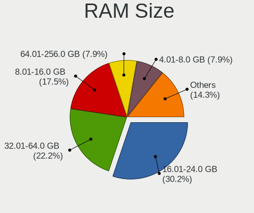
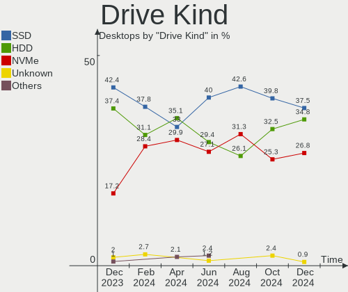
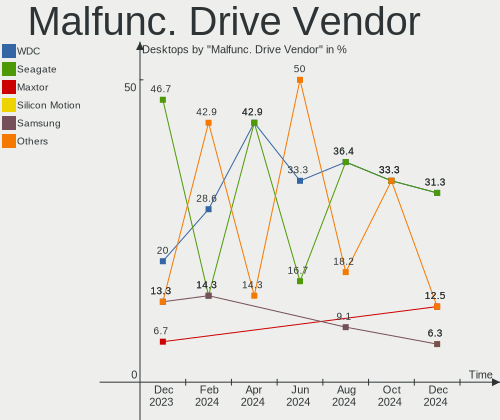
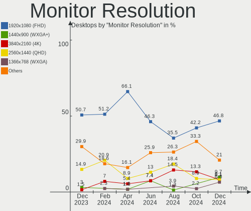
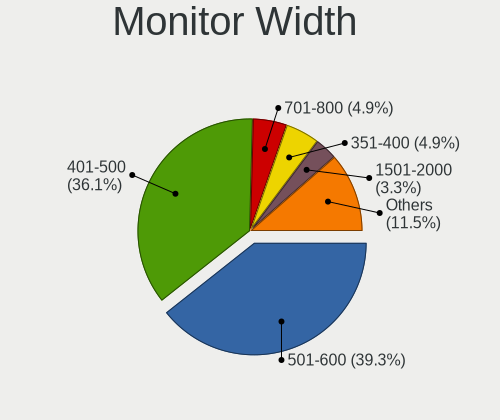
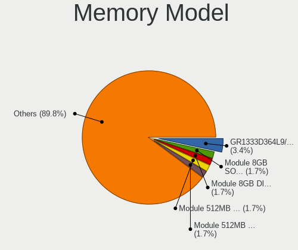
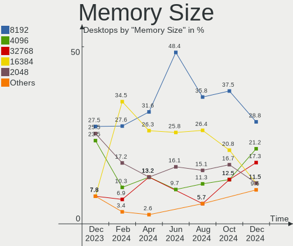

Linux in Poland - Hardware Trends (Desktops)
--------------------------------------------

A project to identify most popular hardware characteristics and track their change
over time based on data collected by Linux users at https://Linux-Hardware.org.

Anyone can contribute to this report by the [hw-probe](https://github.com/linuxhw/hw-probe) tool:

    sudo -E hw-probe -all -upload

Period: Jul, 2022.

Contents
--------

* [ System ](#system)
  - [ OS                       ](#os)
  - [ OS Family                ](#os-family)
  - [ Kernel                   ](#kernel)
  - [ Kernel Family            ](#kernel-family)
  - [ Kernel Major Ver.        ](#kernel-major-ver)
  - [ Arch                     ](#arch)
  - [ DE                       ](#de)
  - [ Display Server           ](#display-server)
  - [ Display Manager          ](#display-manager)
  - [ OS Lang                  ](#os-lang)
  - [ Boot Mode                ](#boot-mode)
  - [ Filesystem               ](#filesystem)
  - [ Part. scheme             ](#part-scheme)
  - [ Dual Boot with Linux/BSD ](#dual-boot-with-linuxbsd)
  - [ Dual Boot (Win)          ](#dual-boot-win)

* [ Board ](#board)
  - [ Vendor                   ](#vendor)
  - [ Model                    ](#model)
  - [ Model Family             ](#model-family)
  - [ MFG Year                 ](#mfg-year)
  - [ Form Factor              ](#form-factor)
  - [ Secure Boot              ](#secure-boot)
  - [ Coreboot                 ](#coreboot)
  - [ RAM Size                 ](#ram-size)
  - [ RAM Used                 ](#ram-used)
  - [ Total Drives             ](#total-drives)
  - [ Has CD-ROM               ](#has-cd-rom)
  - [ Has Ethernet             ](#has-ethernet)
  - [ Has WiFi                 ](#has-wifi)
  - [ Has Bluetooth            ](#has-bluetooth)

* [ Location ](#location)
  - [ Country                  ](#country)
  - [ City                     ](#city)

* [ Drives ](#drives)
  - [ Drive Vendor             ](#drive-vendor)
  - [ Drive Model              ](#drive-model)
  - [ HDD Vendor               ](#hdd-vendor)
  - [ SSD Vendor               ](#ssd-vendor)
  - [ Drive Kind               ](#drive-kind)
  - [ Drive Connector          ](#drive-connector)
  - [ Drive Size               ](#drive-size)
  - [ Space Total              ](#space-total)
  - [ Space Used               ](#space-used)
  - [ Malfunc. Drives          ](#malfunc-drives)
  - [ Malfunc. Drive Vendor    ](#malfunc-drive-vendor)
  - [ Malfunc. HDD Vendor      ](#malfunc-hdd-vendor)
  - [ Malfunc. Drive Kind      ](#malfunc-drive-kind)
  - [ Failed Drives            ](#failed-drives)
  - [ Failed Drive Vendor      ](#failed-drive-vendor)
  - [ Drive Status             ](#drive-status)

* [ Storage controller ](#storage-controller)
  - [ Storage Vendor           ](#storage-vendor)
  - [ Storage Model            ](#storage-model)
  - [ Storage Kind             ](#storage-kind)

* [ Processor ](#processor)
  - [ CPU Vendor               ](#cpu-vendor)
  - [ CPU Model                ](#cpu-model)
  - [ CPU Model Family         ](#cpu-model-family)
  - [ CPU Cores                ](#cpu-cores)
  - [ CPU Sockets              ](#cpu-sockets)
  - [ CPU Threads              ](#cpu-threads)
  - [ CPU Op-Modes             ](#cpu-op-modes)
  - [ CPU Microcode            ](#cpu-microcode)
  - [ CPU Microarch            ](#cpu-microarch)

* [ Graphics ](#graphics)
  - [ GPU Vendor               ](#gpu-vendor)
  - [ GPU Model                ](#gpu-model)
  - [ GPU Combo                ](#gpu-combo)
  - [ GPU Driver               ](#gpu-driver)
  - [ GPU Memory               ](#gpu-memory)

* [ Monitor ](#monitor)
  - [ Monitor Vendor           ](#monitor-vendor)
  - [ Monitor Model            ](#monitor-model)
  - [ Monitor Resolution       ](#monitor-resolution)
  - [ Monitor Diagonal         ](#monitor-diagonal)
  - [ Monitor Width            ](#monitor-width)
  - [ Aspect Ratio             ](#aspect-ratio)
  - [ Monitor Area             ](#monitor-area)
  - [ Pixel Density            ](#pixel-density)
  - [ Multiple Monitors        ](#multiple-monitors)

* [ Network ](#network)
  - [ Net Controller Vendor    ](#net-controller-vendor)
  - [ Net Controller Model     ](#net-controller-model)
  - [ Wireless Vendor          ](#wireless-vendor)
  - [ Wireless Model           ](#wireless-model)
  - [ Ethernet Vendor          ](#ethernet-vendor)
  - [ Ethernet Model           ](#ethernet-model)
  - [ Net Controller Kind      ](#net-controller-kind)
  - [ Used Controller          ](#used-controller)
  - [ NICs                     ](#nics)
  - [ IPv6                     ](#ipv6)

* [ Bluetooth ](#bluetooth)
  - [ Bluetooth Vendor         ](#bluetooth-vendor)
  - [ Bluetooth Model          ](#bluetooth-model)

* [ Sound ](#sound)
  - [ Sound Vendor             ](#sound-vendor)
  - [ Sound Model              ](#sound-model)

* [ Memory ](#memory)
  - [ Memory Vendor            ](#memory-vendor)
  - [ Memory Model             ](#memory-model)
  - [ Memory Kind              ](#memory-kind)
  - [ Memory Form Factor       ](#memory-form-factor)
  - [ Memory Size              ](#memory-size)
  - [ Memory Speed             ](#memory-speed)

* [ Printers & scanners ](#printers--scanners)
  - [ Printer Vendor           ](#printer-vendor)
  - [ Printer Model            ](#printer-model)
  - [ Scanner Vendor           ](#scanner-vendor)
  - [ Scanner Model            ](#scanner-model)

* [ Camera ](#camera)
  - [ Camera Vendor            ](#camera-vendor)
  - [ Camera Model             ](#camera-model)

* [ Security ](#security)
  - [ Fingerprint Vendor       ](#fingerprint-vendor)
  - [ Fingerprint Model        ](#fingerprint-model)
  - [ Chipcard Vendor          ](#chipcard-vendor)
  - [ Chipcard Model           ](#chipcard-model)

* [ Unsupported ](#unsupported)
  - [ Unsupported Devices      ](#unsupported-devices)
  - [ Unsupported Device Types ](#unsupported-device-types)

System
------

OS
--

Installed operating systems

| Name              | Desktops | Percent |
|-------------------|----------|---------|
| OpenMandriva 4.3  | 8        | 18.18%  |
| Ubuntu 20.04      | 5        | 11.36%  |
| Linux Mint 20.3   | 5        | 11.36%  |
| Fedora 36         | 4        | 9.09%   |
| Ubuntu 22.04      | 3        | 6.82%   |
| Gentoo 2.8        | 3        | 6.82%   |
| Ubuntu 18.04      | 2        | 4.55%   |
| Manjaro           | 2        | 4.55%   |
| Kubuntu 22.04     | 2        | 4.55%   |
| Debian 11         | 2        | 4.55%   |
| Arch Rolling      | 2        | 4.55%   |
| Zorin 16          | 1        | 2.27%   |
| ROSA R9           | 1        | 2.27%   |
| ROSA R11.1        | 1        | 2.27%   |
| OpenMandriva 4.90 | 1        | 2.27%   |
| Elementary 6.1    | 1        | 2.27%   |
| Arch              | 1        | 2.27%   |

OS Family
---------

OS without a version

| Name         | Desktops | Percent |
|--------------|----------|---------|
| Ubuntu       | 10       | 22.73%  |
| OpenMandriva | 9        | 20.45%  |
| Linux Mint   | 5        | 11.36%  |
| Fedora       | 4        | 9.09%   |
| Gentoo       | 3        | 6.82%   |
| Arch         | 3        | 6.82%   |
| ROSA         | 2        | 4.55%   |
| Manjaro      | 2        | 4.55%   |
| Kubuntu      | 2        | 4.55%   |
| Debian       | 2        | 4.55%   |
| Zorin        | 1        | 2.27%   |
| Elementary   | 1        | 2.27%   |

Kernel
------

Version of the Linux kernel

| Version                         | Desktops | Percent |
|---------------------------------|----------|---------|
| 5.16.7-desktop-1omv4003         | 6        | 13.64%  |
| 5.4.0-122-generic               | 4        | 9.09%   |
| 5.4.0-121-generic               | 4        | 9.09%   |
| 5.15.0-41-generic               | 3        | 6.82%   |
| 5.13.0-52-generic               | 3        | 6.82%   |
| 5.16.13-desktop-1omv4003        | 2        | 4.55%   |
| 5.15.52-gentoo                  | 2        | 4.55%   |
| 5.4.32-generic-2rosa-x86_64     | 1        | 2.27%   |
| 5.4.0-91-generic                | 1        | 2.27%   |
| 5.18.9-200.fc36.x86_64          | 1        | 2.27%   |
| 5.18.7-zen1-1-zen               | 1        | 2.27%   |
| 5.18.7-200.fc36.x86_64          | 1        | 2.27%   |
| 5.18.6-201.fsync.fc36.x86_64    | 1        | 2.27%   |
| 5.18.6-1-MANJARO                | 1        | 2.27%   |
| 5.18.14-zen1-1-zen              | 1        | 2.27%   |
| 5.18.12-desktop-3omv4090        | 1        | 2.27%   |
| 5.18.12-arch1-1                 | 1        | 2.27%   |
| 5.18.11-200.fc36.x86_64         | 1        | 2.27%   |
| 5.18.0-0.bpo.1-amd64            | 1        | 2.27%   |
| 5.15.49-1-MANJARO               | 1        | 2.27%   |
| 5.15.41-gentoo                  | 1        | 2.27%   |
| 5.15.0-43-generic               | 1        | 2.27%   |
| 5.15.0-40-generic               | 1        | 2.27%   |
| 5.15.0-39-generic               | 1        | 2.27%   |
| 5.15.0-33-generic               | 1        | 2.27%   |
| 5.10.0-15-amd64                 | 1        | 2.27%   |
| 4.9.20-nrj-desktop-1rosa-x86_64 | 1        | 2.27%   |

Kernel Family
-------------

Linux kernel without a distro release

| Version | Desktops | Percent |
|---------|----------|---------|
| 5.4.0   | 9        | 20.45%  |
| 5.15.0  | 7        | 15.91%  |
| 5.16.7  | 6        | 13.64%  |
| 5.13.0  | 3        | 6.82%   |
| 5.18.7  | 2        | 4.55%   |
| 5.18.6  | 2        | 4.55%   |
| 5.18.12 | 2        | 4.55%   |
| 5.16.13 | 2        | 4.55%   |
| 5.15.52 | 2        | 4.55%   |
| 5.4.32  | 1        | 2.27%   |
| 5.18.9  | 1        | 2.27%   |
| 5.18.14 | 1        | 2.27%   |
| 5.18.11 | 1        | 2.27%   |
| 5.18.0  | 1        | 2.27%   |
| 5.15.49 | 1        | 2.27%   |
| 5.15.41 | 1        | 2.27%   |
| 5.10.0  | 1        | 2.27%   |
| 4.9.20  | 1        | 2.27%   |

Kernel Major Ver.
-----------------

Linux kernel major version

| Version | Desktops | Percent |
|---------|----------|---------|
| 5.15    | 11       | 25%     |
| 5.4     | 10       | 22.73%  |
| 5.18    | 10       | 22.73%  |
| 5.16    | 8        | 18.18%  |
| 5.13    | 3        | 6.82%   |
| 5.10    | 1        | 2.27%   |
| 4.9     | 1        | 2.27%   |

Arch
----

OS architecture (x86_64, i586, etc.)

| Name   | Desktops | Percent |
|--------|----------|---------|
| x86_64 | 44       | 100%    |

DE
--

Desktop Environment

| Name       | Desktops | Percent |
|------------|----------|---------|
| KDE5       | 14       | 31.82%  |
| GNOME      | 13       | 29.55%  |
| Unknown    | 6        | 13.64%  |
| XFCE       | 2        | 4.55%   |
| X-Cinnamon | 2        | 4.55%   |
| MATE       | 2        | 4.55%   |
| KDE4       | 2        | 4.55%   |
| Pantheon   | 1        | 2.27%   |
| i3         | 1        | 2.27%   |
| Cinnamon   | 1        | 2.27%   |

Display Server
--------------

X11 or Wayland

| Name    | Desktops | Percent |
|---------|----------|---------|
| X11     | 35       | 79.55%  |
| Tty     | 4        | 9.09%   |
| Wayland | 3        | 6.82%   |
| Unknown | 2        | 4.55%   |

Display Manager
---------------

SDDM, LightDM, etc.

| Name    | Desktops | Percent |
|---------|----------|---------|
| SDDM    | 12       | 27.27%  |
| Unknown | 11       | 25%     |
| LightDM | 8        | 18.18%  |
| GDM3    | 6        | 13.64%  |
| GDM     | 4        | 9.09%   |
| KDM     | 2        | 4.55%   |
| Ly      | 1        | 2.27%   |

OS Lang
-------

Language

| Lang    | Desktops | Percent |
|---------|----------|---------|
| pl_PL   | 22       | 50%     |
| en_US   | 17       | 38.64%  |
| Unknown | 2        | 4.55%   |
| uk_UA   | 1        | 2.27%   |
| en_GB   | 1        | 2.27%   |
| en_CA   | 1        | 2.27%   |

Boot Mode
---------

EFI or BIOS

| Mode | Desktops | Percent |
|------|----------|---------|
| BIOS | 25       | 56.82%  |
| EFI  | 19       | 43.18%  |

Filesystem
----------

Type of filesystem

| Type    | Desktops | Percent |
|---------|----------|---------|
| Ext4    | 31       | 70.45%  |
| Overlay | 5        | 11.36%  |
| Btrfs   | 5        | 11.36%  |
| F2fs    | 2        | 4.55%   |
| Zfs     | 1        | 2.27%   |

Part. scheme
------------

Scheme of partitioning

| Type    | Desktops | Percent |
|---------|----------|---------|
| GPT     | 19       | 43.18%  |
| Unknown | 14       | 31.82%  |
| MBR     | 11       | 25%     |

Dual Boot with Linux/BSD
------------------------

Hosting more than one Linux/BSD

| Dual boot | Desktops | Percent |
|-----------|----------|---------|
| No        | 32       | 72.73%  |
| Yes       | 12       | 27.27%  |

Dual Boot (Win)
---------------

Hosting Linux and Windows

| Dual boot | Desktops | Percent |
|-----------|----------|---------|
| No        | 29       | 65.91%  |
| Yes       | 15       | 34.09%  |

Board
-----

Vendor
------

Motherboard manufacturer

| Name                | Desktops | Percent |
|---------------------|----------|---------|
| ASUSTek Computer    | 11       | 25%     |
| MSI                 | 10       | 22.73%  |
| Gigabyte Technology | 6        | 13.64%  |
| Lenovo              | 4        | 9.09%   |
| Hewlett-Packard     | 4        | 9.09%   |
| ASRock              | 3        | 6.82%   |
| Intel               | 2        | 4.55%   |
| Dell                | 2        | 4.55%   |
| Fujitsu             | 1        | 2.27%   |
| Unknown             | 1        | 2.27%   |

Model
-----

Motherboard model

| Name                                         | Desktops | Percent |
|----------------------------------------------|----------|---------|
| ASUS TUF Gaming B550-PLUS                    | 2        | 4.55%   |
| ASUS M4A78 PRO                               | 2        | 4.55%   |
| MSI MS-7D43                                  | 1        | 2.27%   |
| MSI MS-7B79                                  | 1        | 2.27%   |
| MSI MS-7B18                                  | 1        | 2.27%   |
| MSI MS-7A74                                  | 1        | 2.27%   |
| MSI MS-7A72                                  | 1        | 2.27%   |
| MSI MS-7A70                                  | 1        | 2.27%   |
| MSI MS-7A38                                  | 1        | 2.27%   |
| MSI MS-7A34                                  | 1        | 2.27%   |
| MSI MS-7A33                                  | 1        | 2.27%   |
| MSI MS-7817                                  | 1        | 2.27%   |
| Lenovo ThinkCentre M93p 10AA0022EU           | 1        | 2.27%   |
| Lenovo ThinkCentre M58p 6234F73              | 1        | 2.27%   |
| Lenovo IdeaCentre Y710 Cube-15ISH 90FL007LPB | 1        | 2.27%   |
| Lenovo IdeaCentre Y700-34ISH 90DF003SPL      | 1        | 2.27%   |
| Intel DH67VR AAG27177-201                    | 1        | 2.27%   |
| Intel DG31PR AAD97573-301                    | 1        | 2.27%   |
| HP Z400 Workstation                          | 1        | 2.27%   |
| HP t620 Quad Core TC                         | 1        | 2.27%   |
| HP ProLiant ML330 G6                         | 1        | 2.27%   |
| HP EliteDesk 705 G4 SFF                      | 1        | 2.27%   |
| Gigabyte Z97M-DS3H                           | 1        | 2.27%   |
| Gigabyte Z590 GAMING X                       | 1        | 2.27%   |
| Gigabyte GA-78LMT-USB3 R2                    | 1        | 2.27%   |
| Gigabyte B85M-D3H                            | 1        | 2.27%   |
| Gigabyte B450M DS3H                          | 1        | 2.27%   |
| Gigabyte AB350-Gaming                        | 1        | 2.27%   |
| Fujitsu ESPRIMO Q920                         | 1        | 2.27%   |
| Dell Precision WorkStation T3500             | 1        | 2.27%   |
| Dell OptiPlex 960                            | 1        | 2.27%   |
| ASUS TUF Gaming X570-PLUS                    | 1        | 2.27%   |
| ASUS SABERTOOTH Z77                          | 1        | 2.27%   |
| ASUS ROG STRIX B550-F GAMING                 | 1        | 2.27%   |
| ASUS PRIME B350-PLUS                         | 1        | 2.27%   |
| ASUS P5K-E                                   | 1        | 2.27%   |
| ASUS M3A78-CM                                | 1        | 2.27%   |
| ASUS All Series                              | 1        | 2.27%   |
| ASRock Z170 Extreme4                         | 1        | 2.27%   |
| ASRock P67 Pro3                              | 1        | 2.27%   |
| ASRock AM1H-ITX                              | 1        | 2.27%   |
| Unknown                                      | 1        | 2.27%   |

Model Family
------------

Motherboard model prefix

| Name                   | Desktops | Percent |
|------------------------|----------|---------|
| ASUS TUF               | 3        | 6.82%   |
| Lenovo ThinkCentre     | 2        | 4.55%   |
| Lenovo IdeaCentre      | 2        | 4.55%   |
| ASUS M4A78             | 2        | 4.55%   |
| MSI MS-7D43            | 1        | 2.27%   |
| MSI MS-7B79            | 1        | 2.27%   |
| MSI MS-7B18            | 1        | 2.27%   |
| MSI MS-7A74            | 1        | 2.27%   |
| MSI MS-7A72            | 1        | 2.27%   |
| MSI MS-7A70            | 1        | 2.27%   |
| MSI MS-7A38            | 1        | 2.27%   |
| MSI MS-7A34            | 1        | 2.27%   |
| MSI MS-7A33            | 1        | 2.27%   |
| MSI MS-7817            | 1        | 2.27%   |
| Intel DH67VR           | 1        | 2.27%   |
| Intel DG31PR           | 1        | 2.27%   |
| HP Z400                | 1        | 2.27%   |
| HP t620                | 1        | 2.27%   |
| HP ProLiant            | 1        | 2.27%   |
| HP EliteDesk           | 1        | 2.27%   |
| Gigabyte Z97M-DS3H     | 1        | 2.27%   |
| Gigabyte Z590          | 1        | 2.27%   |
| Gigabyte GA-78LMT-USB3 | 1        | 2.27%   |
| Gigabyte B85M-D3H      | 1        | 2.27%   |
| Gigabyte B450M         | 1        | 2.27%   |
| Gigabyte AB350-Gaming  | 1        | 2.27%   |
| Fujitsu ESPRIMO        | 1        | 2.27%   |
| Dell Precision         | 1        | 2.27%   |
| Dell OptiPlex          | 1        | 2.27%   |
| ASUS SABERTOOTH        | 1        | 2.27%   |
| ASUS ROG               | 1        | 2.27%   |
| ASUS PRIME             | 1        | 2.27%   |
| ASUS P5K-E             | 1        | 2.27%   |
| ASUS M3A78-CM          | 1        | 2.27%   |
| ASUS All               | 1        | 2.27%   |
| ASRock Z170            | 1        | 2.27%   |
| ASRock P67             | 1        | 2.27%   |
| ASRock AM1H-ITX        | 1        | 2.27%   |
| Unknown                | 1        | 2.27%   |

MFG Year
--------

Motherboard manufacture year

| Year | Desktops | Percent |
|------|----------|---------|
| 2017 | 6        | 13.64%  |
| 2018 | 5        | 11.36%  |
| 2020 | 4        | 9.09%   |
| 2016 | 4        | 9.09%   |
| 2014 | 4        | 9.09%   |
| 2011 | 3        | 6.82%   |
| 2009 | 3        | 6.82%   |
| 2008 | 3        | 6.82%   |
| 2021 | 2        | 4.55%   |
| 2019 | 2        | 4.55%   |
| 2013 | 2        | 4.55%   |
| 2012 | 2        | 4.55%   |
| 2010 | 2        | 4.55%   |
| 2015 | 1        | 2.27%   |
| 2007 | 1        | 2.27%   |

Form Factor
-----------

Physical design of the computer

| Name    | Desktops | Percent |
|---------|----------|---------|
| Desktop | 44       | 100%    |

Secure Boot
-----------

Enabled or disabled

| State    | Desktops | Percent |
|----------|----------|---------|
| Disabled | 43       | 97.73%  |
| Enabled  | 1        | 2.27%   |

Coreboot
--------

Have coreboot on board

| Used | Desktops | Percent |
|------|----------|---------|
| No   | 44       | 100%    |

RAM Size
--------

Total RAM memory

| Size in GB  | Desktops | Percent |
|-------------|----------|---------|
| 16.01-24.0  | 11       | 25%     |
| 8.01-16.0   | 9        | 20.45%  |
| 32.01-64.0  | 8        | 18.18%  |
| 4.01-8.0    | 7        | 15.91%  |
| 3.01-4.0    | 7        | 15.91%  |
| 64.01-256.0 | 2        | 4.55%   |

RAM Used
--------

Used RAM memory

| Used GB    | Desktops | Percent |
|------------|----------|---------|
| 1.01-2.0   | 19       | 43.18%  |
| 2.01-3.0   | 10       | 22.73%  |
| 4.01-8.0   | 8        | 18.18%  |
| 3.01-4.0   | 6        | 13.64%  |
| 16.01-24.0 | 1        | 2.27%   |

Total Drives
------------

Number of drives on board

| Drives | Desktops | Percent |
|--------|----------|---------|
| 2      | 14       | 31.82%  |
| 4      | 11       | 25%     |
| 1      | 9        | 20.45%  |
| 3      | 5        | 11.36%  |
| 6      | 2        | 4.55%   |
| 7      | 1        | 2.27%   |
| 5      | 1        | 2.27%   |
| 0      | 1        | 2.27%   |

Has CD-ROM
----------

Has CD-ROM on board

| Presented | Desktops | Percent |
|-----------|----------|---------|
| No        | 26       | 59.09%  |
| Yes       | 18       | 40.91%  |

Has Ethernet
------------

Has Ethernet on board

| Presented | Desktops | Percent |
|-----------|----------|---------|
| Yes       | 44       | 100%    |

Has WiFi
--------

Has WiFi module

| Presented | Desktops | Percent |
|-----------|----------|---------|
| No        | 28       | 63.64%  |
| Yes       | 16       | 36.36%  |

Has Bluetooth
-------------

Has Bluetooth module

| Presented | Desktops | Percent |
|-----------|----------|---------|
| No        | 31       | 70.45%  |
| Yes       | 13       | 29.55%  |

Location
--------

Country
-------

Geographic location (country)

| Country | Desktops | Percent |
|---------|----------|---------|
| Poland  | 44       | 100%    |

City
----

Geographic location (city)

| City               | Desktops | Percent |
|--------------------|----------|---------|
| Warsaw             | 5        | 11.36%  |
| Krakow             | 5        | 11.36%  |
| Wroclaw            | 4        | 9.09%   |
| Poznan             | 3        | 6.82%   |
| Jastrzębie Zdrój | 2        | 4.55%   |
| Gdansk             | 2        | 4.55%   |
| Arciechow          | 2        | 4.55%   |
| Wołomin           | 1        | 2.27%   |
| Wałbrzych         | 1        | 2.27%   |
| Unieszewo          | 1        | 2.27%   |
| Torun              | 1        | 2.27%   |
| Szemud             | 1        | 2.27%   |
| Strzyzow           | 1        | 2.27%   |
| Stasi Las          | 1        | 2.27%   |
| Rumia              | 1        | 2.27%   |
| Nowa Sol           | 1        | 2.27%   |
| Lubawka            | 1        | 2.27%   |
| Lodz               | 1        | 2.27%   |
| Lancut             | 1        | 2.27%   |
| Kwidzyn            | 1        | 2.27%   |
| Grudziądz         | 1        | 2.27%   |
| Gmina Strzelin     | 1        | 2.27%   |
| Glogowek           | 1        | 2.27%   |
| Dalekie            | 1        | 2.27%   |
| Czersk             | 1        | 2.27%   |
| Cieszyn            | 1        | 2.27%   |
| Bytom              | 1        | 2.27%   |
| Brzeziny           | 1        | 2.27%   |

Drives
------

Drive Vendor
------------

Hard drive vendors

| Vendor              | Desktops | Drives | Percent |
|---------------------|----------|--------|---------|
| WDC                 | 15       | 20     | 15.31%  |
| Seagate             | 15       | 22     | 15.31%  |
| GOODRAM             | 12       | 12     | 12.24%  |
| Toshiba             | 10       | 14     | 10.2%   |
| Samsung Electronics | 7        | 9      | 7.14%   |
| A-DATA Technology   | 6        | 6      | 6.12%   |
| Crucial             | 4        | 4      | 4.08%   |
| SanDisk             | 3        | 3      | 3.06%   |
| Kingston            | 3        | 4      | 3.06%   |
| Hitachi             | 3        | 5      | 3.06%   |
| HGST                | 3        | 3      | 3.06%   |
| SPCC                | 2        | 2      | 2.04%   |
| KIOXIA-EXCERIA      | 2        | 2      | 2.04%   |
| Corsair             | 2        | 2      | 2.04%   |
| XPG                 | 1        | 2      | 1.02%   |
| SSSTC               | 1        | 1      | 1.02%   |
| SSD 120G            | 1        | 1      | 1.02%   |
| PNY                 | 1        | 1      | 1.02%   |
| Plextor             | 1        | 1      | 1.02%   |
| Phison              | 1        | 1      | 1.02%   |
| Patriot             | 1        | 1      | 1.02%   |
| Micron Technology   | 1        | 1      | 1.02%   |
| Lite-On             | 1        | 1      | 1.02%   |
| Kingchuxing         | 1        | 2      | 1.02%   |
| Fujitsu             | 1        | 1      | 1.02%   |

Drive Model
-----------

Hard drive models

| Model                              | Desktops | Percent |
|------------------------------------|----------|---------|
| WDC WDS480G2G0A-00JH30 480GB SSD   | 2        | 1.74%   |
| WDC WD5000AAKX-08U6AA0 500GB       | 2        | 1.74%   |
| Toshiba HDWE150 5TB                | 2        | 1.74%   |
| Toshiba HDWD130 3TB                | 2        | 1.74%   |
| Samsung SSD 860 EVO 1TB            | 2        | 1.74%   |
| GOODRAM SSDPR-CL100-480-G2 480GB   | 2        | 1.74%   |
| A-DATA SU800 256GB SSD             | 2        | 1.74%   |
| A-DATA SU800 1TB SSD               | 2        | 1.74%   |
| XPG GAMMIX S11 Pro 256GB           | 1        | 0.87%   |
| WDC WDS100T3X0C-00SJG0 1TB         | 1        | 0.87%   |
| WDC WDS100T2B0C-00PXH0 1TB         | 1        | 0.87%   |
| WDC WD5002ABYS-01B1B0 500GB        | 1        | 0.87%   |
| WDC WD5000LPVX-22V0TT0 500GB       | 1        | 0.87%   |
| WDC WD5000AAKX-001CA0 500GB        | 1        | 0.87%   |
| WDC WD5000AAKS-00V1A0 500GB        | 1        | 0.87%   |
| WDC WD40EFRX-68N32N0 4TB           | 1        | 0.87%   |
| WDC WD40 EFZX-68AWUN0 4TB          | 1        | 0.87%   |
| WDC WD2500JB-00REA0 250GB          | 1        | 0.87%   |
| WDC WD2500AAKX-75U6AA0 250GB       | 1        | 0.87%   |
| WDC WD2500AAKX-753CA1 250GB        | 1        | 0.87%   |
| WDC WD20EZAZ-00L9GB0 2TB           | 1        | 0.87%   |
| WDC WD20EARX-00PASB0 2TB           | 1        | 0.87%   |
| WDC WD10EZEX-60WN4A0 1TB           | 1        | 0.87%   |
| WDC WD10EZEX-60M2NA0 1TB           | 1        | 0.87%   |
| WDC WD10EZEX-08M2NA0 1TB           | 1        | 0.87%   |
| Toshiba THNSNJ256GCSU 256GB SSD    | 1        | 0.87%   |
| Toshiba MK2546GSX 250GB            | 1        | 0.87%   |
| Toshiba HDWQ140 4TB                | 1        | 0.87%   |
| Toshiba HDWD120 2TB                | 1        | 0.87%   |
| Toshiba HDWD110 1TB                | 1        | 0.87%   |
| Toshiba DT01ACA100 1TB             | 1        | 0.87%   |
| Toshiba DT01ACA050 500GB           | 1        | 0.87%   |
| SSSTC CVB-8D128-HP 128GB SSD       | 1        | 0.87%   |
| SSD 120G B 120GB                   | 1        | 0.87%   |
| SPCC Solid State Disk 240GB        | 1        | 0.87%   |
| SPCC Solid State Disk 120GB        | 1        | 0.87%   |
| Seagate ST9250414ASG 250GB         | 1        | 0.87%   |
| Seagate ST4000NC000-1FR168 4TB     | 1        | 0.87%   |
| Seagate ST4000DM004-2CV104 4TB     | 1        | 0.87%   |
| Seagate ST3500312CS 500GB          | 1        | 0.87%   |
| Seagate ST3250310AS 250GB          | 1        | 0.87%   |
| Seagate ST3160318AS 160GB          | 1        | 0.87%   |
| Seagate ST31500341AS 1TB           | 1        | 0.87%   |
| Seagate ST31000524AS 1TB           | 1        | 0.87%   |
| Seagate ST31000520AS 1TB           | 1        | 0.87%   |
| Seagate ST2000DM008-2FR102 2TB     | 1        | 0.87%   |
| Seagate ST2000DM001-9YN164 2TB     | 1        | 0.87%   |
| Seagate ST2000DM001-1ER164 2TB     | 1        | 0.87%   |
| Seagate ST2000DM001-1CH164 2TB     | 1        | 0.87%   |
| Seagate ST12000NM0008-2H3101 12TB  | 1        | 0.87%   |
| Seagate ST1000VX001-1Z4102 1TB     | 1        | 0.87%   |
| Seagate ST1000VT001-1RE172 1TB     | 1        | 0.87%   |
| Seagate ST1000LM024 HN-M101MBB 1TB | 1        | 0.87%   |
| Seagate ST1000DX001-SSHD-8GB       | 1        | 0.87%   |
| Seagate ST1000DX001-1CM162 1TB     | 1        | 0.87%   |
| Seagate ST1000DM003-9YN162 1TB     | 1        | 0.87%   |
| Seagate ST1000DM003-1ER162 1TB     | 1        | 0.87%   |
| Seagate Expansion 1TB              | 1        | 0.87%   |
| SanDisk Ultra II 240GB SSD         | 1        | 0.87%   |
| SanDisk SSD i110 32GB              | 1        | 0.87%   |

HDD Vendor
----------

Hard disk drive vendors

| Vendor              | Desktops | Drives | Percent |
|---------------------|----------|--------|---------|
| Seagate             | 15       | 22     | 32.61%  |
| WDC                 | 13       | 16     | 28.26%  |
| Toshiba             | 9        | 13     | 19.57%  |
| Hitachi             | 3        | 5      | 6.52%   |
| HGST                | 3        | 3      | 6.52%   |
| Samsung Electronics | 2        | 2      | 4.35%   |
| Fujitsu             | 1        | 1      | 2.17%   |

SSD Vendor
----------

Solid state drive vendors

| Vendor              | Desktops | Drives | Percent |
|---------------------|----------|--------|---------|
| Goodram             | 11       | 11     | 30.56%  |
| A-DATA Technology   | 6        | 6      | 16.67%  |
| SanDisk             | 3        | 3      | 8.33%   |
| Crucial             | 3        | 3      | 8.33%   |
| WDC                 | 2        | 2      | 5.56%   |
| SPCC                | 2        | 2      | 5.56%   |
| Samsung Electronics | 2        | 3      | 5.56%   |
| Kingston            | 2        | 2      | 5.56%   |
| Toshiba             | 1        | 1      | 2.78%   |
| SSSTC               | 1        | 1      | 2.78%   |
| Patriot             | 1        | 1      | 2.78%   |
| KIOXIA-EXCERIA      | 1        | 1      | 2.78%   |
| Kingchuxing         | 1        | 1      | 2.78%   |

Drive Kind
----------

HDD or SSD

| Kind    | Desktops | Drives | Percent |
|---------|----------|--------|---------|
| HDD     | 34       | 62     | 43.04%  |
| SSD     | 27       | 37     | 34.18%  |
| NVMe    | 17       | 21     | 21.52%  |
| Unknown | 1        | 1      | 1.27%   |

Drive Connector
---------------

SATA, SAS, NVMe, etc.

| Type | Desktops | Drives | Percent |
|------|----------|--------|---------|
| SATA | 41       | 97     | 67.21%  |
| NVMe | 17       | 21     | 27.87%  |
| SAS  | 3        | 3      | 4.92%   |

Drive Size
----------

Size of hard drive

| Size in TB | Desktops | Drives | Percent |
|------------|----------|--------|---------|
| 0.01-0.5   | 32       | 48     | 45.71%  |
| 0.51-1.0   | 18       | 25     | 25.71%  |
| 3.01-4.0   | 7        | 8      | 10%     |
| 1.01-2.0   | 7        | 8      | 10%     |
| 2.01-3.0   | 3        | 6      | 4.29%   |
| 4.01-10.0  | 2        | 3      | 2.86%   |
| 10.01-20.0 | 1        | 1      | 1.43%   |

Space Total
-----------

Amount of disk space available on the file system

| Size in GB     | Desktops | Percent |
|----------------|----------|---------|
| 101-250        | 10       | 22.73%  |
| More than 3000 | 6        | 13.64%  |
| 251-500        | 5        | 11.36%  |
| 1001-2000      | 5        | 11.36%  |
| 1-20           | 5        | 11.36%  |
| 2001-3000      | 4        | 9.09%   |
| 21-50          | 3        | 6.82%   |
| Unknown        | 3        | 6.82%   |
| 501-1000       | 2        | 4.55%   |
| 51-100         | 1        | 2.27%   |

Space Used
----------

Amount of used disk space

| Used GB        | Desktops | Percent |
|----------------|----------|---------|
| 1-20           | 15       | 34.09%  |
| 101-250        | 8        | 18.18%  |
| 1001-2000      | 6        | 13.64%  |
| More than 3000 | 3        | 6.82%   |
| 251-500        | 3        | 6.82%   |
| 21-50          | 3        | 6.82%   |
| Unknown        | 3        | 6.82%   |
| 51-100         | 2        | 4.55%   |
| 501-1000       | 1        | 2.27%   |

Malfunc. Drives
---------------

Drive models with a malfunction

| Model                          | Desktops | Drives | Percent |
|--------------------------------|----------|--------|---------|
| WDC WD5002ABYS-01B1B0 500GB    | 1        | 1      | 11.11%  |
| WDC WD40EFRX-68N32N0 4TB       | 1        | 1      | 11.11%  |
| Toshiba MK2546GSX 250GB        | 1        | 1      | 11.11%  |
| SSSTC CVB-8D128-HP 128GB SSD   | 1        | 1      | 11.11%  |
| Seagate ST31500341AS 1TB       | 1        | 1      | 11.11%  |
| Seagate ST1000DM003-9YN162 1TB | 1        | 1      | 11.11%  |
| Hitachi HTS541616J9SA00 160GB  | 1        | 1      | 11.11%  |
| Hitachi HDS721050CLA362 500GB  | 1        | 1      | 11.11%  |
| GOODRAM SSD 120GB              | 1        | 1      | 11.11%  |

Malfunc. Drive Vendor
---------------------

Vendors of faulty drives

| Vendor  | Desktops | Drives | Percent |
|---------|----------|--------|---------|
| WDC     | 2        | 2      | 22.22%  |
| Seagate | 2        | 2      | 22.22%  |
| Hitachi | 2        | 2      | 22.22%  |
| Toshiba | 1        | 1      | 11.11%  |
| SSSTC   | 1        | 1      | 11.11%  |
| GOODRAM | 1        | 1      | 11.11%  |

Malfunc. HDD Vendor
-------------------

Vendors of faulty HDD drives

| Vendor  | Desktops | Drives | Percent |
|---------|----------|--------|---------|
| WDC     | 2        | 2      | 28.57%  |
| Seagate | 2        | 2      | 28.57%  |
| Hitachi | 2        | 2      | 28.57%  |
| Toshiba | 1        | 1      | 14.29%  |

Malfunc. Drive Kind
-------------------

Kinds of faulty drives

| Kind | Desktops | Drives | Percent |
|------|----------|--------|---------|
| HDD  | 6        | 7      | 75%     |
| SSD  | 2        | 2      | 25%     |

Failed Drives
-------------

Failed drive models

Zero info for selected period =(

Failed Drive Vendor
-------------------

Failed drive vendors

Zero info for selected period =(

Drive Status
------------

Number of failed and malfunc. drives

| Status   | Desktops | Drives | Percent |
|----------|----------|--------|---------|
| Works    | 29       | 71     | 55.77%  |
| Detected | 15       | 41     | 28.85%  |
| Malfunc  | 8        | 9      | 15.38%  |

Storage controller
------------------

Storage Vendor
--------------

Storage controller vendors

| Vendor                      | Desktops | Percent |
|-----------------------------|----------|---------|
| Intel                       | 26       | 39.39%  |
| AMD                         | 18       | 27.27%  |
| Samsung Electronics         | 4        | 6.06%   |
| Phison Electronics          | 4        | 6.06%   |
| Silicon Motion              | 2        | 3.03%   |
| Kingston Technology Company | 2        | 3.03%   |
| JMicron Technology          | 2        | 3.03%   |
| ASMedia Technology          | 2        | 3.03%   |
| SanDisk                     | 1        | 1.52%   |
| Micron/Crucial Technology   | 1        | 1.52%   |
| Micron Technology           | 1        | 1.52%   |
| Lite-On Technology          | 1        | 1.52%   |
| KIOXIA                      | 1        | 1.52%   |
| ADATA Technology            | 1        | 1.52%   |

Storage Model
-------------

Storage controller models

| Model                                                                          | Desktops | Percent |
|--------------------------------------------------------------------------------|----------|---------|
| AMD FCH SATA Controller [AHCI mode]                                            | 10       | 12.2%   |
| Intel 8 Series/C220 Series Chipset Family 6-port SATA Controller 1 [AHCI mode] | 5        | 6.1%    |
| AMD SB7x0/SB8x0/SB9x0 SATA Controller [IDE mode]                               | 4        | 4.88%   |
| AMD SB7x0/SB8x0/SB9x0 IDE Controller                                           | 4        | 4.88%   |
| AMD 300 Series Chipset SATA Controller                                         | 4        | 4.88%   |
| Phison E12 NVMe Controller                                                     | 3        | 3.66%   |
| Intel SATA Controller [RAID mode]                                              | 3        | 3.66%   |
| Intel Q170/Q150/B150/H170/H110/Z170/CM236 Chipset SATA Controller [AHCI Mode]  | 3        | 3.66%   |
| Intel 200 Series PCH SATA controller [AHCI mode]                               | 3        | 3.66%   |
| AMD 500 Series Chipset SATA Controller                                         | 3        | 3.66%   |
| AMD 400 Series Chipset SATA Controller                                         | 3        | 3.66%   |
| Silicon Motion SM2263EN/SM2263XT SSD Controller                                | 2        | 2.44%   |
| Samsung NVMe SSD Controller SM981/PM981/PM983                                  | 2        | 2.44%   |
| Kingston Company A2000 NVMe SSD                                                | 2        | 2.44%   |
| JMicron JMB363 SATA/IDE Controller                                             | 2        | 2.44%   |
| Intel 6 Series/C200 Series Chipset Family 6 port Desktop SATA AHCI Controller  | 2        | 2.44%   |
| Intel 4 Series Chipset PT IDER Controller                                      | 2        | 2.44%   |
| ASMedia ASM1062 Serial ATA Controller                                          | 2        | 2.44%   |
| SanDisk WD Black SN750 / PC SN730 NVMe SSD                                     | 1        | 1.22%   |
| SanDisk Non-Volatile memory controller                                         | 1        | 1.22%   |
| Samsung NVMe SSD Controller PM9A1/PM9A3/980PRO                                 | 1        | 1.22%   |
| Samsung NVMe SSD Controller 980                                                | 1        | 1.22%   |
| Phison E7 NVMe Controller                                                      | 1        | 1.22%   |
| Micron/Crucial P2 NVMe PCIe SSD                                                | 1        | 1.22%   |
| Micron Non-Volatile memory controller                                          | 1        | 1.22%   |
| Lite-On Non-Volatile memory controller                                         | 1        | 1.22%   |
| KIOXIA NVMe SSD                                                                | 1        | 1.22%   |
| Intel NM10/ICH7 Family SATA Controller [IDE mode]                              | 1        | 1.22%   |
| Intel Cannon Lake PCH SATA AHCI Controller                                     | 1        | 1.22%   |
| Intel C600/X79 series chipset 6-Port SATA AHCI Controller                      | 1        | 1.22%   |
| Intel Alder Lake-S PCH SATA Controller [AHCI Mode]                             | 1        | 1.22%   |
| Intel 9 Series Chipset Family SATA Controller [AHCI Mode]                      | 1        | 1.22%   |
| Intel 82801JI (ICH10 Family) SATA AHCI Controller                              | 1        | 1.22%   |
| Intel 82801JI (ICH10 Family) 4 port SATA IDE Controller #1                     | 1        | 1.22%   |
| Intel 82801JI (ICH10 Family) 2 port SATA IDE Controller #2                     | 1        | 1.22%   |
| Intel 82801JD/DO (ICH10 Family) SATA AHCI Controller                           | 1        | 1.22%   |
| Intel 82801G (ICH7 Family) IDE Controller                                      | 1        | 1.22%   |
| Intel 7 Series/C210 Series Chipset Family 6-port SATA Controller [AHCI mode]   | 1        | 1.22%   |
| Intel 500 Series Chipset Family SATA AHCI Controller                           | 1        | 1.22%   |
| AMD X370 Series Chipset SATA Controller                                        | 1        | 1.22%   |
| ADATA XPG SX8200 Pro PCIe Gen3x4 M.2 2280 Solid State Drive                    | 1        | 1.22%   |

Storage Kind
------------

Kind of storage controller (IDE, SATA, NVMe, SAS, ...)

| Kind | Desktops | Percent |
|------|----------|---------|
| SATA | 39       | 56.52%  |
| NVMe | 17       | 24.64%  |
| IDE  | 10       | 14.49%  |
| RAID | 3        | 4.35%   |

Processor
---------

CPU Vendor
----------

Processor vendors

| Vendor | Desktops | Percent |
|--------|----------|---------|
| Intel  | 26       | 59.09%  |
| AMD    | 18       | 40.91%  |

CPU Model
---------

Processor models

| Model                                           | Desktops | Percent |
|-------------------------------------------------|----------|---------|
| Intel Xeon CPU X5650 @ 2.67GHz                  | 2        | 4.55%   |
| AMD Ryzen 5 1600X Six-Core Processor            | 2        | 4.55%   |
| Intel Xeon CPU W3680 @ 3.33GHz                  | 1        | 2.27%   |
| Intel Xeon CPU E5440 @ 2.83GHz                  | 1        | 2.27%   |
| Intel Xeon CPU E5-2630 v2 @ 2.60GHz             | 1        | 2.27%   |
| Intel Pentium CPU G4560 @ 3.50GHz               | 1        | 2.27%   |
| Intel Pentium CPU G3220 @ 3.00GHz               | 1        | 2.27%   |
| Intel Core i7-9700K CPU @ 3.60GHz               | 1        | 2.27%   |
| Intel Core i5-7500 CPU @ 3.40GHz                | 1        | 2.27%   |
| Intel Core i5-7400 CPU @ 3.00GHz                | 1        | 2.27%   |
| Intel Core i5-6600K CPU @ 3.50GHz               | 1        | 2.27%   |
| Intel Core i5-6600 CPU @ 3.30GHz                | 1        | 2.27%   |
| Intel Core i5-6400 CPU @ 2.70GHz                | 1        | 2.27%   |
| Intel Core i5-4690 CPU @ 3.50GHz                | 1        | 2.27%   |
| Intel Core i5-4670 CPU @ 3.40GHz                | 1        | 2.27%   |
| Intel Core i5-4590T CPU @ 2.00GHz               | 1        | 2.27%   |
| Intel Core i5-4570T CPU @ 2.90GHz               | 1        | 2.27%   |
| Intel Core i5-4460 CPU @ 3.20GHz                | 1        | 2.27%   |
| Intel Core i5-3570K CPU @ 3.40GHz               | 1        | 2.27%   |
| Intel Core i5-2500K CPU @ 3.30GHz               | 1        | 2.27%   |
| Intel Core i5-2310 CPU @ 2.90GHz                | 1        | 2.27%   |
| Intel Core 2 Quad CPU Q8300 @ 2.50GHz           | 1        | 2.27%   |
| Intel Core 2 Quad CPU Q8200 @ 2.33GHz           | 1        | 2.27%   |
| Intel Core 2 Duo CPU E8500 @ 3.16GHz            | 1        | 2.27%   |
| Intel 12th Gen Core i5-12400F                   | 1        | 2.27%   |
| Intel 11th Gen Core i7-11700KF @ 3.60GHz        | 1        | 2.27%   |
| AMD Sempron 3850 APU with Radeon R3             | 1        | 2.27%   |
| AMD Ryzen 9 5900X 12-Core Processor             | 1        | 2.27%   |
| AMD Ryzen 7 2700X Eight-Core Processor          | 1        | 2.27%   |
| AMD Ryzen 5 PRO 2400G with Radeon Vega Graphics | 1        | 2.27%   |
| AMD Ryzen 5 5600X 6-Core Processor              | 1        | 2.27%   |
| AMD Ryzen 5 5600G with Radeon Graphics          | 1        | 2.27%   |
| AMD Ryzen 5 3600X 6-Core Processor              | 1        | 2.27%   |
| AMD Ryzen 5 3400G with Radeon Vega Graphics     | 1        | 2.27%   |
| AMD Ryzen 5 2600 Six-Core Processor             | 1        | 2.27%   |
| AMD Ryzen 3 3200G with Radeon Vega Graphics     | 1        | 2.27%   |
| AMD Ryzen 3 1200 Quad-Core Processor            | 1        | 2.27%   |
| AMD Phenom II X6 1055T Processor                | 1        | 2.27%   |
| AMD Phenom II X4 955 Processor                  | 1        | 2.27%   |
| AMD GX-415GA SOC with Radeon HD Graphics        | 1        | 2.27%   |
| AMD FX-8300 Eight-Core Processor                | 1        | 2.27%   |
| AMD Athlon II X2 245 Processor                  | 1        | 2.27%   |

CPU Model Family
----------------

Processor model prefix

| Model             | Desktops | Percent |
|-------------------|----------|---------|
| Intel Core i5     | 13       | 29.55%  |
| AMD Ryzen 5       | 7        | 15.91%  |
| Intel Xeon        | 5        | 11.36%  |
| Other             | 2        | 4.55%   |
| Intel Pentium     | 2        | 4.55%   |
| Intel Core 2 Quad | 2        | 4.55%   |
| AMD Ryzen 3       | 2        | 4.55%   |
| Intel Core i7     | 1        | 2.27%   |
| Intel Core 2 Duo  | 1        | 2.27%   |
| AMD Sempron       | 1        | 2.27%   |
| AMD Ryzen 9       | 1        | 2.27%   |
| AMD Ryzen 7       | 1        | 2.27%   |
| AMD Ryzen 5 PRO   | 1        | 2.27%   |
| AMD Phenom II X6  | 1        | 2.27%   |
| AMD Phenom II X4  | 1        | 2.27%   |
| AMD GX            | 1        | 2.27%   |
| AMD FX            | 1        | 2.27%   |
| AMD Athlon II X2  | 1        | 2.27%   |

CPU Cores
---------

Number of processor cores

| Number  | Desktops | Percent |
|---------|----------|---------|
| 4       | 23       | 52.27%  |
| 6       | 12       | 27.27%  |
| 2       | 4        | 9.09%   |
| 8       | 3        | 6.82%   |
| 12      | 1        | 2.27%   |
| Unknown | 1        | 2.27%   |

CPU Sockets
-----------

Number of sockets

| Number | Desktops | Percent |
|--------|----------|---------|
| 1      | 44       | 100%    |

CPU Threads
-----------

Threads per core (Hyper-Threading)

| Number  | Desktops | Percent |
|---------|----------|---------|
| 1       | 24       | 54.55%  |
| 2       | 19       | 43.18%  |
| Unknown | 1        | 2.27%   |

CPU Op-Modes
------------

CPU Operation Modes (32-bit, 64-bit)

| Op mode        | Desktops | Percent |
|----------------|----------|---------|
| 32-bit, 64-bit | 44       | 100%    |

CPU Microcode
-------------

Microcode number

| Number     | Desktops | Percent |
|------------|----------|---------|
| Unknown    | 6        | 13.64%  |
| 0x306c3    | 5        | 11.36%  |
| 0x906e9    | 3        | 6.82%   |
| 0x506e3    | 3        | 6.82%   |
| 0x1067a    | 3        | 6.82%   |
| 0x08001138 | 3        | 6.82%   |
| 0x206c2    | 2        | 4.55%   |
| 0x206a7    | 2        | 4.55%   |
| 0x0a201016 | 2        | 4.55%   |
| 0x08108109 | 2        | 4.55%   |
| 0xa0671    | 1        | 2.27%   |
| 0x906ec    | 1        | 2.27%   |
| 0x306e4    | 1        | 2.27%   |
| 0x306a9    | 1        | 2.27%   |
| 0x10677    | 1        | 2.27%   |
| 0x0a50000d | 1        | 2.27%   |
| 0x0a20120a | 1        | 2.27%   |
| 0x08101016 | 1        | 2.27%   |
| 0x0800820d | 1        | 2.27%   |
| 0x0700010f | 1        | 2.27%   |
| 0x010000dc | 1        | 2.27%   |
| 0x010000db | 1        | 2.27%   |
| 0x010000c7 | 1        | 2.27%   |

CPU Microarch
-------------

Microarchitecture

| Name        | Desktops | Percent |
|-------------|----------|---------|
| Haswell     | 6        | 13.64%  |
| Zen+        | 4        | 9.09%   |
| Zen         | 4        | 9.09%   |
| Penryn      | 4        | 9.09%   |
| KabyLake    | 4        | 9.09%   |
| Zen 3       | 3        | 6.82%   |
| Westmere    | 3        | 6.82%   |
| Skylake     | 3        | 6.82%   |
| K10         | 3        | 6.82%   |
| SandyBridge | 2        | 4.55%   |
| Jaguar      | 2        | 4.55%   |
| IvyBridge   | 2        | 4.55%   |
| Zen 2       | 1        | 2.27%   |
| Piledriver  | 1        | 2.27%   |
| Icelake     | 1        | 2.27%   |
| Unknown     | 1        | 2.27%   |

Graphics
--------

GPU Vendor
----------

Vendors of graphics cards

| Vendor | Desktops | Percent |
|--------|----------|---------|
| Nvidia | 20       | 43.48%  |
| AMD    | 18       | 39.13%  |
| Intel  | 8        | 17.39%  |

GPU Model
---------

Graphics card models

| Model                                                                       | Desktops | Percent |
|-----------------------------------------------------------------------------|----------|---------|
| Intel Xeon E3-1200 v3/4th Gen Core Processor Integrated Graphics Controller | 3        | 6.52%   |
| Nvidia GT218 [GeForce 210]                                                  | 2        | 4.35%   |
| Nvidia GP108 [GeForce GT 1030]                                              | 2        | 4.35%   |
| Nvidia GP104 [GeForce GTX 1080]                                             | 2        | 4.35%   |
| AMD Ellesmere [Radeon RX 470/480/570/570X/580/580X/590]                     | 2        | 4.35%   |
| AMD Cedar [Radeon HD 5000/6000/7350/8350 Series]                            | 2        | 4.35%   |
| Nvidia TU106 [GeForce RTX 2070]                                             | 1        | 2.17%   |
| Nvidia TU106 [GeForce RTX 2060 SUPER]                                       | 1        | 2.17%   |
| Nvidia NV41 [GeForce 6800 GS]                                               | 1        | 2.17%   |
| Nvidia GP107 [GeForce GTX 1050 Ti]                                          | 1        | 2.17%   |
| Nvidia GP106 [GeForce GTX 1060 6GB]                                         | 1        | 2.17%   |
| Nvidia GP104 [GeForce GTX 1070]                                             | 1        | 2.17%   |
| Nvidia GK208B [GeForce GT 730]                                              | 1        | 2.17%   |
| Nvidia GK107 [NVS 510]                                                      | 1        | 2.17%   |
| Nvidia GK107 [GeForce GT 740]                                               | 1        | 2.17%   |
| Nvidia GK104 [GeForce GTX 770]                                              | 1        | 2.17%   |
| Nvidia GF119 [NVS 310]                                                      | 1        | 2.17%   |
| Nvidia GA104 [GeForce RTX 3070]                                             | 1        | 2.17%   |
| Nvidia GA104 [GeForce RTX 3070 Ti]                                          | 1        | 2.17%   |
| Nvidia GA104 [GeForce RTX 3060 Ti Lite Hash Rate]                           | 1        | 2.17%   |
| Intel HD Graphics 630                                                       | 1        | 2.17%   |
| Intel HD Graphics 610                                                       | 1        | 2.17%   |
| Intel HD Graphics 530                                                       | 1        | 2.17%   |
| Intel 4 Series Chipset Integrated Graphics Controller                       | 1        | 2.17%   |
| Intel 2nd Generation Core Processor Family Integrated Graphics Controller   | 1        | 2.17%   |
| AMD RS780C [Radeon 3100]                                                    | 1        | 2.17%   |
| AMD RS780 [Radeon HD 3200]                                                  | 1        | 2.17%   |
| AMD Raven Ridge [Radeon Vega Series / Radeon Vega Mobile Series]            | 1        | 2.17%   |
| AMD Pitcairn PRO [Radeon HD 7850 / R7 265 / R9 270 1024SP]                  | 1        | 2.17%   |
| AMD Picasso/Raven 2 [Radeon Vega Series / Radeon Vega Mobile Series]        | 1        | 2.17%   |
| AMD Navi 22 [Radeon RX 6700/6700 XT/6750 XT / 6800M]                        | 1        | 2.17%   |
| AMD Kabini [Radeon HD 8330E]                                                | 1        | 2.17%   |
| AMD Kabini [Radeon HD 8280 / R3 Series]                                     | 1        | 2.17%   |
| AMD ES1000                                                                  | 1        | 2.17%   |
| AMD Cezanne                                                                 | 1        | 2.17%   |
| AMD Cape Verde XT [Radeon HD 7770/8760 / R7 250X]                           | 1        | 2.17%   |
| AMD Caicos [Radeon HD 6450/7450/8450 / R5 230 OEM]                          | 1        | 2.17%   |
| AMD Caicos XT [Radeon HD 7470/8470 / R5 235/310 OEM]                        | 1        | 2.17%   |
| AMD Bonaire XTX [Radeon R7 260X/360]                                        | 1        | 2.17%   |

GPU Combo
---------

Combinations of graphics cards

| Name           | Desktops | Percent |
|----------------|----------|---------|
| 1 x Nvidia     | 18       | 40.91%  |
| 1 x AMD        | 17       | 38.64%  |
| 1 x Intel      | 6        | 13.64%  |
| 2 x Intel      | 1        | 2.27%   |
| Intel + Nvidia | 1        | 2.27%   |
| AMD + Nvidia   | 1        | 2.27%   |

GPU Driver
----------

Free vs proprietary

| Driver      | Desktops | Percent |
|-------------|----------|---------|
| Free        | 29       | 65.91%  |
| Proprietary | 13       | 29.55%  |
| Unknown     | 2        | 4.55%   |

GPU Memory
----------

Total video memory

| Size in GB | Desktops | Percent |
|------------|----------|---------|
| Unknown    | 15       | 34.09%  |
| 7.01-8.0   | 8        | 18.18%  |
| 0.51-1.0   | 7        | 15.91%  |
| 1.01-2.0   | 6        | 13.64%  |
| 0.01-0.5   | 5        | 11.36%  |
| 3.01-4.0   | 2        | 4.55%   |
| 5.01-6.0   | 1        | 2.27%   |

Monitor
-------

Monitor Vendor
--------------

Monitor vendors

| Vendor              | Desktops | Percent |
|---------------------|----------|---------|
| Goldstar            | 8        | 16.33%  |
| Samsung Electronics | 5        | 10.2%   |
| Hewlett-Packard     | 5        | 10.2%   |
| NEC Computers       | 4        | 8.16%   |
| AOC                 | 4        | 8.16%   |
| Acer                | 4        | 8.16%   |
| Fujitsu Siemens     | 3        | 6.12%   |
| Dell                | 3        | 6.12%   |
| BenQ                | 3        | 6.12%   |
| Unknown             | 2        | 4.08%   |
| Philips             | 2        | 4.08%   |
| TCL                 | 1        | 2.04%   |
| RTK                 | 1        | 2.04%   |
| LG Electronics      | 1        | 2.04%   |
| Iiyama              | 1        | 2.04%   |
| Idek Iiyama         | 1        | 2.04%   |
| Eizo                | 1        | 2.04%   |

Monitor Model
-------------

Monitor models

| Model                                                                | Desktops | Percent |
|----------------------------------------------------------------------|----------|---------|
| BenQ GW2265 BNQ78D1 1920x1080 477x268mm 21.5-inch                    | 2        | 4.08%   |
| Unknown SMART TV 0563 1920x1080 1209x680mm 54.6-inch                 | 1        | 2.04%   |
| Unknown LCD Monitor FFFF 2288x1287 2550x2550mm 142.0-inch            | 1        | 2.04%   |
| TCL LCD TV TCL0030 1920x1080 708x398mm 32.0-inch                     | 1        | 2.04%   |
| Samsung Electronics SyncMaster SAM050B 1920x1080 477x268mm 21.5-inch | 1        | 2.04%   |
| Samsung Electronics SyncMaster SAM0226 1440x900 410x257mm 19.1-inch  | 1        | 2.04%   |
| Samsung Electronics S22B300 SAM08C8 1920x1080 477x268mm 21.5-inch    | 1        | 2.04%   |
| Samsung Electronics LCD Monitor LU28R55 3840x2160                    | 1        | 2.04%   |
| Samsung Electronics C24F390 SAM0D2C 1920x1080 521x293mm 23.5-inch    | 1        | 2.04%   |
| RTK LCD Monitor RTK1D1A 1920x1080 1020x570mm 46.0-inch               | 1        | 2.04%   |
| Philips PHL 246E7 PHLC107 1920x1080 521x293mm 23.5-inch              | 1        | 2.04%   |
| Philips 273PQPY PHLC096 1920x1080 597x336mm 27.0-inch                | 1        | 2.04%   |
| NEC Computers LCD1770NX NEC6664 1280x1024 338x270mm 17.0-inch        | 1        | 2.04%   |
| NEC Computers LCD1550V NEC65C6 1024x768 300x230mm 14.9-inch          | 1        | 2.04%   |
| NEC Computers E241N NEC2C86 1920x1080 527x296mm 23.8-inch            | 1        | 2.04%   |
| NEC Computers 70GX2 NEC6691 1280x1024 338x270mm 17.0-inch            | 1        | 2.04%   |
| LG Electronics LCD Monitor LG FULL HD                                | 1        | 2.04%   |
| Iiyama PL2283H IVM562E 1920x1080 496x292mm 22.7-inch                 | 1        | 2.04%   |
| Idek Iiyama LCD Monitor PL2770QS 4480x1440                           | 1        | 2.04%   |
| Hewlett-Packard Z23n HWP3284 1920x1080 509x286mm 23.0-inch           | 1        | 2.04%   |
| Hewlett-Packard Z23n HWP3283 1920x1080 509x286mm 23.0-inch           | 1        | 2.04%   |
| Hewlett-Packard LA2306 HWP2949 1920x1080 510x287mm 23.0-inch         | 1        | 2.04%   |
| Hewlett-Packard L1925 HWP259A 1280x1024 376x301mm 19.0-inch          | 1        | 2.04%   |
| Hewlett-Packard L1502 HWP2600 1024x768 304x228mm 15.0-inch           | 1        | 2.04%   |
| Goldstar W1942 GSM4B6F 1440x900 408x255mm 18.9-inch                  | 1        | 2.04%   |
| Goldstar ULTRAWIDE GSM59F1 2560x1080 673x284mm 28.8-inch             | 1        | 2.04%   |
| Goldstar ULTRAGEAR GSM5BD3 2560x1440 697x392mm 31.5-inch             | 1        | 2.04%   |
| Goldstar MP59G GSM5B33 1920x1080 480x270mm 21.7-inch                 | 1        | 2.04%   |
| Goldstar IPS FULLHD GSM5AB6 1920x1080 480x270mm 21.7-inch            | 1        | 2.04%   |
| Goldstar HDR WFHD GSM7714 2560x1080 798x334mm 34.1-inch              | 1        | 2.04%   |
| Goldstar HDR WFHD GSM5BBA 2560x1080 798x334mm 34.1-inch              | 1        | 2.04%   |
| Goldstar 27GK750F GSM770F 1920x1080 531x298mm 24.0-inch              | 1        | 2.04%   |
| Fujitsu Siemens P24W-6 LED FUS080F 1920x1200 520x320mm 24.0-inch     | 1        | 2.04%   |
| Fujitsu Siemens P24W-6 IPS FUS07EA 1920x1200 518x324mm 24.1-inch     | 1        | 2.04%   |
| Fujitsu Siemens B24W-5 ECO FUS07D4 1920x1200 518x324mm 24.1-inch     | 1        | 2.04%   |
| Eizo S2231W ENC1918 1680x1050 480x300mm 22.3-inch                    | 1        | 2.04%   |
| Dell U3415W DELA0A6 3440x1440 798x335mm 34.1-inch                    | 1        | 2.04%   |
| Dell P2414H DELA09B 1920x1080 527x297mm 23.8-inch                    | 1        | 2.04%   |
| Dell P2314H DEL4099 1920x1080 509x286mm 23.0-inch                    | 1        | 2.04%   |
| BenQ BL2411 BNQ8011 1920x1200 518x324mm 24.1-inch                    | 1        | 2.04%   |
| AOC U2879G6 AOC2879 3840x2160 621x341mm 27.9-inch                    | 1        | 2.04%   |
| AOC 24G2W1G4 AOC2402 1920x1080 527x296mm 23.8-inch                   | 1        | 2.04%   |
| AOC 24G1WG4 AOC2401 1920x1080 521x293mm 23.5-inch                    | 1        | 2.04%   |
| AOC 2369M AOC2369 1920x1080 509x286mm 23.0-inch                      | 1        | 2.04%   |
| Acer P223W ACR000E 1680x1050 474x296mm 22.0-inch                     | 1        | 2.04%   |
| Acer KG251Q ACR0591 1920x1080 544x303mm 24.5-inch                    | 1        | 2.04%   |
| Acer K242HL ACR03E3 1920x1080 531x299mm 24.0-inch                    | 1        | 2.04%   |
| Acer EG240Y ACR077B 1920x1080 527x296mm 23.8-inch                    | 1        | 2.04%   |

Monitor Resolution
------------------

Monitor screen resolution

| Resolution         | Desktops | Percent |
|--------------------|----------|---------|
| 1920x1080 (FHD)    | 23       | 48.94%  |
| 1920x1200 (WUXGA)  | 4        | 8.51%   |
| 2560x1080          | 3        | 6.38%   |
| 1680x1050 (WSXGA+) | 3        | 6.38%   |
| 1280x1024 (SXGA)   | 3        | 6.38%   |
| 3840x2160 (4K)     | 2        | 4.26%   |
| 2560x1440 (QHD)    | 2        | 4.26%   |
| 1024x768 (XGA)     | 2        | 4.26%   |
| 4480x1440          | 1        | 2.13%   |
| 3440x1440          | 1        | 2.13%   |
| 2288x1287          | 1        | 2.13%   |
| 1440x900 (WXGA+)   | 1        | 2.13%   |
| Unknown            | 1        | 2.13%   |

Monitor Diagonal
----------------

Diagonal size in inches

| Inches  | Desktops | Percent |
|---------|----------|---------|
| 23      | 10       | 20.83%  |
| 24      | 8        | 16.67%  |
| 21      | 6        | 12.5%   |
| 34      | 4        | 8.33%   |
| 22      | 4        | 8.33%   |
| 27      | 3        | 6.25%   |
| 19      | 2        | 4.17%   |
| 17      | 2        | 4.17%   |
| Unknown | 2        | 4.17%   |
| 142     | 1        | 2.08%   |
| 54      | 1        | 2.08%   |
| 46      | 1        | 2.08%   |
| 32      | 1        | 2.08%   |
| 31      | 1        | 2.08%   |
| 15      | 1        | 2.08%   |
| 14      | 1        | 2.08%   |

Monitor Width
-------------

Physical width

| Width in mm    | Desktops | Percent |
|----------------|----------|---------|
| 501-600        | 18       | 40%     |
| 401-500        | 10       | 22.22%  |
| 701-800        | 5        | 11.11%  |
| 301-350        | 3        | 6.67%   |
| 601-700        | 2        | 4.44%   |
| 1001-1500      | 2        | 4.44%   |
| Unknown        | 2        | 4.44%   |
| More than 2000 | 1        | 2.22%   |
| 351-400        | 1        | 2.22%   |
| 201-300        | 1        | 2.22%   |

Aspect Ratio
------------

Proportional relationship between the width and the height

| Ratio   | Desktops | Percent |
|---------|----------|---------|
| 16/9    | 24       | 54.55%  |
| 16/10   | 8        | 18.18%  |
| 21/9    | 4        | 9.09%   |
| 5/4     | 3        | 6.82%   |
| 4/3     | 2        | 4.55%   |
| Unknown | 2        | 4.55%   |
| 1.00    | 1        | 2.27%   |

Monitor Area
------------

Area in inch²

| Area in inch² | Desktops | Percent |
|----------------|----------|---------|
| 201-250        | 20       | 43.48%  |
| 351-500        | 6        | 13.04%  |
| 251-300        | 6        | 13.04%  |
| 301-350        | 3        | 6.52%   |
| More than 1000 | 2        | 4.35%   |
| 151-200        | 2        | 4.35%   |
| 141-150        | 2        | 4.35%   |
| 101-110        | 2        | 4.35%   |
| Unknown        | 2        | 4.35%   |
| 501-1000       | 1        | 2.17%   |

Pixel Density
-------------

Pixels per inch

| Density | Desktops | Percent |
|---------|----------|---------|
| 51-100  | 27       | 67.5%   |
| 101-120 | 7        | 17.5%   |
| 1-50    | 3        | 7.5%    |
| Unknown | 2        | 5%      |
| 121-160 | 1        | 2.5%    |

Multiple Monitors
-----------------

Total monitors connected

| Total | Desktops | Percent |
|-------|----------|---------|
| 1     | 33       | 75%     |
| 2     | 8        | 18.18%  |
| 0     | 2        | 4.55%   |
| 4     | 1        | 2.27%   |

Network
-------

Net Controller Vendor
---------------------

Controller vendors

| Vendor                        | Desktops | Percent |
|-------------------------------|----------|---------|
| Realtek Semiconductor         | 30       | 46.88%  |
| Intel                         | 12       | 18.75%  |
| Qualcomm Atheros              | 6        | 9.38%   |
| TP-Link                       | 4        | 6.25%   |
| Broadcom                      | 3        | 4.69%   |
| Samsung Electronics           | 2        | 3.13%   |
| Xiaomi                        | 1        | 1.56%   |
| Research In Motion            | 1        | 1.56%   |
| Ralink                        | 1        | 1.56%   |
| OnePlus Technology (Shenzhen) | 1        | 1.56%   |
| Microsoft                     | 1        | 1.56%   |
| Marvell Technology Group      | 1        | 1.56%   |
| Accton Technology             | 1        | 1.56%   |

Net Controller Model
--------------------

Controller models

| Model                                                             | Desktops | Percent |
|-------------------------------------------------------------------|----------|---------|
| Realtek RTL8111/8168/8411 PCI Express Gigabit Ethernet Controller | 24       | 35.29%  |
| Realtek RTL8125 2.5GbE Controller                                 | 4        | 5.88%   |
| TP-Link TL-WN722N v2/v3 [Realtek RTL8188EUS]                      | 3        | 4.41%   |
| Intel Wi-Fi 6 AX200                                               | 3        | 4.41%   |
| Samsung GT-I9070 (network tethering, USB debugging enabled)       | 2        | 2.94%   |
| Qualcomm Atheros AR8121/AR8113/AR8114 Gigabit or Fast Ethernet    | 2        | 2.94%   |
| Intel Ethernet Connection I217-LM                                 | 2        | 2.94%   |
| Intel Ethernet Connection (2) I219-V                              | 2        | 2.94%   |
| Intel 82579V Gigabit Network Connection                           | 2        | 2.94%   |
| Intel 82567LM-3 Gigabit Network Connection                        | 2        | 2.94%   |
| Xiaomi Mi/Redmi series (RNDIS)                                    | 1        | 1.47%   |
| TP-Link TL-WN821N v5/v6 [RTL8192EU]                               | 1        | 1.47%   |
| TP-Link 802.11ac WLAN Adapter                                     | 1        | 1.47%   |
| Research In Motion BlackBerry                                     | 1        | 1.47%   |
| Realtek RTL8192EE PCIe Wireless Network Adapter                   | 1        | 1.47%   |
| Realtek RTL-8100/8101L/8139 PCI Fast Ethernet Adapter             | 1        | 1.47%   |
| Ralink RT2561/RT61 802.11g PCI                                    | 1        | 1.47%   |
| Qualcomm Atheros QCA6174 802.11ac Wireless Network Adapter        | 1        | 1.47%   |
| Qualcomm Atheros Killer E2400 Gigabit Ethernet Controller         | 1        | 1.47%   |
| Qualcomm Atheros AR9485 Wireless Network Adapter                  | 1        | 1.47%   |
| Qualcomm Atheros AR93xx Wireless Network Adapter                  | 1        | 1.47%   |
| OnePlus (Shenzhen) OnePlus                                        | 1        | 1.47%   |
| Microsoft Xbox 360 Wireless Adapter                               | 1        | 1.47%   |
| Marvell Group 88E8056 PCI-E Gigabit Ethernet Controller           | 1        | 1.47%   |
| Intel I211 Gigabit Network Connection                             | 1        | 1.47%   |
| Intel Ethernet Controller I225-V                                  | 1        | 1.47%   |
| Intel Ethernet Connection (7) I219-V                              | 1        | 1.47%   |
| Intel Centrino Advanced-N 6235                                    | 1        | 1.47%   |
| Broadcom NetXtreme BCM5764M Gigabit Ethernet PCIe                 | 1        | 1.47%   |
| Broadcom NetXtreme BCM5761 Gigabit Ethernet PCIe                  | 1        | 1.47%   |
| Broadcom NetXtreme BCM5715 Gigabit Ethernet                       | 1        | 1.47%   |
| Accton Speedport W 102 Stick IEEE 802.11n USB 2.0 Adapter         | 1        | 1.47%   |

Wireless Vendor
---------------

Wireless vendors

| Vendor                | Desktops | Percent |
|-----------------------|----------|---------|
| TP-Link               | 4        | 26.67%  |
| Intel                 | 4        | 26.67%  |
| Qualcomm Atheros      | 3        | 20%     |
| Realtek Semiconductor | 1        | 6.67%   |
| Ralink                | 1        | 6.67%   |
| Microsoft             | 1        | 6.67%   |
| Accton Technology     | 1        | 6.67%   |

Wireless Model
--------------

Wireless models

| Model                                                      | Desktops | Percent |
|------------------------------------------------------------|----------|---------|
| TP-Link TL-WN722N v2/v3 [Realtek RTL8188EUS]               | 3        | 18.75%  |
| Intel Wi-Fi 6 AX200                                        | 3        | 18.75%  |
| TP-Link TL-WN821N v5/v6 [RTL8192EU]                        | 1        | 6.25%   |
| TP-Link 802.11ac WLAN Adapter                              | 1        | 6.25%   |
| Realtek RTL8192EE PCIe Wireless Network Adapter            | 1        | 6.25%   |
| Ralink RT2561/RT61 802.11g PCI                             | 1        | 6.25%   |
| Qualcomm Atheros QCA6174 802.11ac Wireless Network Adapter | 1        | 6.25%   |
| Qualcomm Atheros AR9485 Wireless Network Adapter           | 1        | 6.25%   |
| Qualcomm Atheros AR93xx Wireless Network Adapter           | 1        | 6.25%   |
| Microsoft Xbox 360 Wireless Adapter                        | 1        | 6.25%   |
| Intel Centrino Advanced-N 6235                             | 1        | 6.25%   |
| Accton Speedport W 102 Stick IEEE 802.11n USB 2.0 Adapter  | 1        | 6.25%   |

Ethernet Vendor
---------------

Ethernet vendors

| Vendor                   | Desktops | Percent |
|--------------------------|----------|---------|
| Realtek Semiconductor    | 29       | 58%     |
| Intel                    | 10       | 20%     |
| Qualcomm Atheros         | 3        | 6%      |
| Broadcom                 | 3        | 6%      |
| Samsung Electronics      | 2        | 4%      |
| Xiaomi                   | 1        | 2%      |
| Research In Motion       | 1        | 2%      |
| Marvell Technology Group | 1        | 2%      |

Ethernet Model
--------------

Ethernet models

| Model                                                             | Desktops | Percent |
|-------------------------------------------------------------------|----------|---------|
| Realtek RTL8111/8168/8411 PCI Express Gigabit Ethernet Controller | 24       | 47.06%  |
| Realtek RTL8125 2.5GbE Controller                                 | 4        | 7.84%   |
| Samsung GT-I9070 (network tethering, USB debugging enabled)       | 2        | 3.92%   |
| Qualcomm Atheros AR8121/AR8113/AR8114 Gigabit or Fast Ethernet    | 2        | 3.92%   |
| Intel Ethernet Connection I217-LM                                 | 2        | 3.92%   |
| Intel Ethernet Connection (2) I219-V                              | 2        | 3.92%   |
| Intel 82579V Gigabit Network Connection                           | 2        | 3.92%   |
| Intel 82567LM-3 Gigabit Network Connection                        | 2        | 3.92%   |
| Xiaomi Mi/Redmi series (RNDIS)                                    | 1        | 1.96%   |
| Research In Motion BlackBerry                                     | 1        | 1.96%   |
| Realtek RTL-8100/8101L/8139 PCI Fast Ethernet Adapter             | 1        | 1.96%   |
| Qualcomm Atheros Killer E2400 Gigabit Ethernet Controller         | 1        | 1.96%   |
| Marvell Group 88E8056 PCI-E Gigabit Ethernet Controller           | 1        | 1.96%   |
| Intel I211 Gigabit Network Connection                             | 1        | 1.96%   |
| Intel Ethernet Controller I225-V                                  | 1        | 1.96%   |
| Intel Ethernet Connection (7) I219-V                              | 1        | 1.96%   |
| Broadcom NetXtreme BCM5764M Gigabit Ethernet PCIe                 | 1        | 1.96%   |
| Broadcom NetXtreme BCM5761 Gigabit Ethernet PCIe                  | 1        | 1.96%   |
| Broadcom NetXtreme BCM5715 Gigabit Ethernet                       | 1        | 1.96%   |

Net Controller Kind
-------------------

Ethernet, WiFi or modem

| Kind     | Desktops | Percent |
|----------|----------|---------|
| Ethernet | 44       | 73.33%  |
| WiFi     | 15       | 25%     |
| Unknown  | 1        | 1.67%   |

Used Controller
---------------

Currently used network controller

| Kind     | Desktops | Percent |
|----------|----------|---------|
| Ethernet | 32       | 80%     |
| WiFi     | 8        | 20%     |

NICs
----

Total network controllers on board

| Total | Desktops | Percent |
|-------|----------|---------|
| 1     | 31       | 70.45%  |
| 2     | 13       | 29.55%  |

IPv6
----

IPv6 vs IPv4

| Used | Desktops | Percent |
|------|----------|---------|
| No   | 42       | 95.45%  |
| Yes  | 2        | 4.55%   |

Bluetooth
---------

Bluetooth Vendor
----------------

Controller vendors

| Vendor                          | Desktops | Percent |
|---------------------------------|----------|---------|
| Intel                           | 4        | 28.57%  |
| Cambridge Silicon Radio         | 3        | 21.43%  |
| ASUSTek Computer                | 3        | 21.43%  |
| Edimax Technology               | 2        | 14.29%  |
| SINO WEALTH                     | 1        | 7.14%   |
| Qualcomm Atheros Communications | 1        | 7.14%   |

Bluetooth Model
---------------

Controller models

| Model                                               | Desktops | Percent |
|-----------------------------------------------------|----------|---------|
| Intel AX200 Bluetooth                               | 3        | 21.43%  |
| Cambridge Silicon Radio Bluetooth Dongle (HCI mode) | 3        | 21.43%  |
| ASUS Broadcom BCM20702A0 Bluetooth                  | 3        | 21.43%  |
| SINO WEALTH RK Bluetooth Keyboar                    | 1        | 7.14%   |
| Qualcomm Atheros  Bluetooth Device                  | 1        | 7.14%   |
| Intel Centrino Bluetooth Wireless Transceiver       | 1        | 7.14%   |
| Edimax Wi-Fi N150 Bluetooth4.0 USB Adapter          | 1        | 7.14%   |
| Edimax Wi-Fi AC600 Bluetooth4.0 USB Adapter         | 1        | 7.14%   |

Sound
-----

Sound Vendor
------------

Sound card vendors

| Vendor                 | Desktops | Percent |
|------------------------|----------|---------|
| AMD                    | 25       | 30.49%  |
| Intel                  | 23       | 28.05%  |
| Nvidia                 | 19       | 23.17%  |
| Creative Labs          | 2        | 2.44%   |
| C-Media Electronics    | 2        | 2.44%   |
| SteelSeries ApS        | 1        | 1.22%   |
| Solid State System     | 1        | 1.22%   |
| SM900T Microphone      | 1        | 1.22%   |
| Realtek Semiconductor  | 1        | 1.22%   |
| Kingston Technology    | 1        | 1.22%   |
| JMTek                  | 1        | 1.22%   |
| Generalplus Technology | 1        | 1.22%   |
| DEXP BK-20             | 1        | 1.22%   |
| Creative Technology    | 1        | 1.22%   |
| Barco Display Systems  | 1        | 1.22%   |
| AOKEO                  | 1        | 1.22%   |

Sound Model
-----------

Sound card models

| Model                                                                             | Desktops | Percent |
|-----------------------------------------------------------------------------------|----------|---------|
| Intel 8 Series/C220 Series Chipset High Definition Audio Controller               | 5        | 5.26%   |
| AMD Family 17h (Models 00h-0fh) HD Audio Controller                               | 5        | 5.26%   |
| AMD Starship/Matisse HD Audio Controller                                          | 4        | 4.21%   |
| AMD SBx00 Azalia (Intel HDA)                                                      | 4        | 4.21%   |
| AMD Family 17h/19h HD Audio Controller                                            | 4        | 4.21%   |
| Nvidia GP104 High Definition Audio Controller                                     | 3        | 3.16%   |
| Nvidia GA104 High Definition Audio Controller                                     | 3        | 3.16%   |
| Intel Xeon E3-1200 v3/4th Gen Core Processor HD Audio Controller                  | 3        | 3.16%   |
| Intel 200 Series PCH HD Audio                                                     | 3        | 3.16%   |
| Intel 100 Series/C230 Series Chipset Family HD Audio Controller                   | 3        | 3.16%   |
| Nvidia TU106 High Definition Audio Controller                                     | 2        | 2.11%   |
| Nvidia High Definition Audio Controller                                           | 2        | 2.11%   |
| Nvidia GP108 High Definition Audio Controller                                     | 2        | 2.11%   |
| Nvidia GK107 HDMI Audio Controller                                                | 2        | 2.11%   |
| Intel 82801JI (ICH10 Family) HD Audio Controller                                  | 2        | 2.11%   |
| Intel 82801JD/DO (ICH10 Family) HD Audio Controller                               | 2        | 2.11%   |
| AMD Raven/Raven2/Fenghuang HDMI/DP Audio Controller                               | 2        | 2.11%   |
| AMD Oland/Hainan/Cape Verde/Pitcairn HDMI Audio [Radeon HD 7000 Series]           | 2        | 2.11%   |
| AMD Kabini HDMI/DP Audio                                                          | 2        | 2.11%   |
| AMD FCH Azalia Controller                                                         | 2        | 2.11%   |
| AMD Ellesmere HDMI Audio [Radeon RX 470/480 / 570/580/590]                        | 2        | 2.11%   |
| AMD Cedar HDMI Audio [Radeon HD 5400/6300/7300 Series]                            | 2        | 2.11%   |
| AMD Caicos HDMI Audio [Radeon HD 6450 / 7450/8450/8490 OEM / R5 230/235/235X OEM] | 2        | 2.11%   |
| SteelSeries ApS SteelSeries Arctis 5                                              | 1        | 1.05%   |
| Solid State System FIFINE K669 Microphone                                         | 1        | 1.05%   |
| SM900T Microphone SM900T Microphone                                               | 1        | 1.05%   |
| Realtek Semiconductor Realtek Audio USB                                           | 1        | 1.05%   |
| Nvidia GP107GL High Definition Audio Controller                                   | 1        | 1.05%   |
| Nvidia GP106 High Definition Audio Controller                                     | 1        | 1.05%   |
| Nvidia GK208 HDMI/DP Audio Controller                                             | 1        | 1.05%   |
| Nvidia GK104 HDMI Audio Controller                                                | 1        | 1.05%   |
| Nvidia GF119 HDMI Audio Controller                                                | 1        | 1.05%   |
| Kingston Technology HyperX 7.1 Audio                                              | 1        | 1.05%   |
| JMTek USB PnP Audio Device                                                        | 1        | 1.05%   |
| Intel Tiger Lake-H HD Audio Controller                                            | 1        | 1.05%   |
| Intel NM10/ICH7 Family High Definition Audio Controller                           | 1        | 1.05%   |
| Intel Cannon Lake PCH cAVS                                                        | 1        | 1.05%   |
| Intel C600/X79 series chipset High Definition Audio Controller                    | 1        | 1.05%   |
| Intel Alder Lake-S HD Audio Controller                                            | 1        | 1.05%   |
| Intel 9 Series Chipset Family HD Audio Controller                                 | 1        | 1.05%   |
| Intel 7 Series/C216 Chipset Family High Definition Audio Controller               | 1        | 1.05%   |
| Intel 6 Series/C200 Series Chipset Family High Definition Audio Controller        | 1        | 1.05%   |
| Generalplus Technology USB Audio Device                                           | 1        | 1.05%   |
| DEXP BK-20 DEXP BK-20                                                             | 1        | 1.05%   |
| Creative Technology SB Tactic3D Rage Wireless                                     | 1        | 1.05%   |
| Creative Labs Sound Core3D [Sound Blaster Recon3D / Z-Series]                     | 1        | 1.05%   |
| Creative Labs EMU10k2/CA0100/CA0102/CA10200 [Sound Blaster Audigy Series]         | 1        | 1.05%   |
| C-Media Electronics Thronmax MDrill One Pro                                       | 1        | 1.05%   |
| C-Media Electronics CMI8788 [Oxygen HD Audio]                                     | 1        | 1.05%   |
| Barco Display Systems Tronsmart Glary                                             | 1        | 1.05%   |
| AOKEO LCS_USB_Audio                                                               | 1        | 1.05%   |
| AMD Tobago HDMI Audio [Radeon R7 360 / R9 360 OEM]                                | 1        | 1.05%   |
| AMD RS780 HDMI Audio [Radeon 3000/3100 / HD 3200/3300]                            | 1        | 1.05%   |
| AMD Renoir Radeon High Definition Audio Controller                                | 1        | 1.05%   |
| AMD Navi 21/23 HDMI/DP Audio Controller                                           | 1        | 1.05%   |

Memory
------

Memory Vendor
-------------

Memory module vendors

| Vendor              | Desktops | Percent |
|---------------------|----------|---------|
| Unknown             | 7        | 17.07%  |
| Samsung Electronics | 6        | 14.63%  |
| GOODRAM             | 5        | 12.2%   |
| Kingston            | 4        | 9.76%   |
| G.Skill             | 4        | 9.76%   |
| Crucial             | 3        | 7.32%   |
| A-DATA Technology   | 3        | 7.32%   |
| SK hynix            | 2        | 4.88%   |
| Patriot             | 2        | 4.88%   |
| Corsair             | 2        | 4.88%   |
| Wilk Elektronik     | 1        | 2.44%   |
| Nanya Technology    | 1        | 2.44%   |
| Unknown             | 1        | 2.44%   |

Memory Model
------------

Memory module models

| Model                                                           | Desktops | Percent |
|-----------------------------------------------------------------|----------|---------|
| Samsung RAM M471B5173QH0-YK0 4GB SODIMM DDR3 1600MT/s           | 2        | 4.76%   |
| Wilk Elektronik RAM IRP3600D4V64L17/16G 16GB DIMM DDR4 3600MT/s | 1        | 2.38%   |
| Unknown RAM Module 4096MB DIMM DDR2 400MT/s                     | 1        | 2.38%   |
| Unknown RAM Module 2GB DIMM DDR3 1333MT/s                       | 1        | 2.38%   |
| Unknown RAM Module 2GB DIMM DDR2 667MT/s                        | 1        | 2.38%   |
| Unknown RAM Module 2GB DIMM DDR2 1067MT/s                       | 1        | 2.38%   |
| Unknown RAM Module 2GB DIMM DDR 667MT/s                         | 1        | 2.38%   |
| Unknown RAM Module 2048MB DIMM DDR 800MT/s                      | 1        | 2.38%   |
| Unknown RAM Module 1024MB DIMM DDR2 333MT/s                     | 1        | 2.38%   |
| SK hynix RAM HYMP125U64CP8-S6 2GB DIMM DDR2 49926MT/s           | 1        | 2.38%   |
| SK hynix RAM HMT351U7BFR8C-H9 4096MB DIMM DDR3 1333MT/s         | 1        | 2.38%   |
| Samsung RAM Module 8GB DIMM DDR4 2667MT/s                       | 1        | 2.38%   |
| Samsung RAM M393B1K70DH0 8192MB DIMM DDR3 1866MT/s              | 1        | 2.38%   |
| Samsung RAM M378B5773DH0-CH9 2GB DIMM DDR3 1333MT/s             | 1        | 2.38%   |
| Samsung RAM M378A1K43BB1-CPB 8192MB DIMM DDR4 2733MT/s          | 1        | 2.38%   |
| Patriot RAM PSD416G320081 16GB DIMM DDR4 3200MT/s               | 1        | 2.38%   |
| Patriot RAM 3200 C16 Series 8GB DIMM DDR4 3200MT/s              | 1        | 2.38%   |
| Nanya RAM M2F4G64CB88B7N-DI 4GB DIMM DDR3 1600MT/s              | 1        | 2.38%   |
| Kingston RAM KHX3200C16D4/8GX 8GB DIMM DDR4 3600MT/s            | 1        | 2.38%   |
| Kingston RAM KF3600C18D4/32GX 32GB DIMM DDR4 3600MT/s           | 1        | 2.38%   |
| Kingston RAM KF3200C16D4/8GX 8GB DIMM DDR4 3600MT/s             | 1        | 2.38%   |
| Kingston RAM 9905403-559.A00LF 8GB DIMM DDR3 1600MT/s           | 1        | 2.38%   |
| GOODRAM RAM GY1600D364L9S/4G 4GB DIMM DDR3 1600MT/s             | 1        | 2.38%   |
| GOODRAM RAM GR800D264L5/2G 2GB DIMM DDR2 1332MT/s               | 1        | 2.38%   |
| GOODRAM RAM GR800D264L5/1G 1GB DIMM DDR2 667MT/s                | 1        | 2.38%   |
| GOODRAM RAM GR2400D464L17/16G 16384MB DIMM DDR4 2400MT/s        | 1        | 2.38%   |
| GOODRAM RAM GR1600D364L11/2G 2GB DIMM DDR3 1333MT/s             | 1        | 2.38%   |
| GOODRAM RAM GR1333S364L9S/4G 4GB SODIMM DDR3 1333MT/s           | 1        | 2.38%   |
| G.Skill RAM F4-3600C16-16GVKC 16GB DIMM DDR4 3866MT/s           | 1        | 2.38%   |
| G.Skill RAM F4-3200C16-8GVKB 8GB DIMM DDR4 3200MT/s             | 1        | 2.38%   |
| G.Skill RAM F4-3200C16-16GIS 16GB DIMM DDR4 3600MT/s            | 1        | 2.38%   |
| G.Skill RAM F4-3000C15-8GVGB 8GB DIMM DDR4 3066MT/s             | 1        | 2.38%   |
| Crucial RAM CT8G4DFD8213.C16FBD2 8GB DIMM DDR4 2133MT/s         | 1        | 2.38%   |
| Crucial RAM BLS8G4D240FSC.16FBD 8GB DIMM DDR4 2667MT/s          | 1        | 2.38%   |
| Crucial RAM BLS8G3D1609DS1S00. 8GB DIMM DDR3 1600MT/s           | 1        | 2.38%   |
| Corsair RAM CMX8GX3M2A1600C9 4GB DIMM DDR3 1800MT/s             | 1        | 2.38%   |
| Corsair RAM CMK16GX4M2B3000C15 8GB DIMM DDR4 3000MT/s           | 1        | 2.38%   |
| A-DATA RAM DDR4 3200 8GB DIMM DDR4 3400MT/s                     | 1        | 2.38%   |
| A-DATA RAM DDR4 3000 2OZ 8GB DIMM DDR4 3000MT/s                 | 1        | 2.38%   |
| A-DATA RAM DDR4 2666 2OZ 8192MB DIMM DDR4 2667MT/s              | 1        | 2.38%   |
| Unknown                                                         | 1        | 2.38%   |

Memory Kind
-----------

Memory module kinds

| Kind  | Desktops | Percent |
|-------|----------|---------|
| DDR4  | 17       | 47.22%  |
| DDR3  | 11       | 30.56%  |
| DDR2  | 5        | 13.89%  |
| DDR   | 2        | 5.56%   |
| SDRAM | 1        | 2.78%   |

Memory Form Factor
------------------

Physical design of the memory module

| Name   | Desktops | Percent |
|--------|----------|---------|
| DIMM   | 33       | 91.67%  |
| SODIMM | 3        | 8.33%   |

Memory Size
-----------

Memory module size

| Size  | Desktops | Percent |
|-------|----------|---------|
| 8192  | 12       | 29.27%  |
| 4096  | 8        | 19.51%  |
| 2048  | 8        | 19.51%  |
| 16384 | 7        | 17.07%  |
| 32768 | 3        | 7.32%   |
| 1024  | 3        | 7.32%   |

Memory Speed
------------

Memory module speed

| Speed | Desktops | Percent |
|-------|----------|---------|
| 1600  | 6        | 14.63%  |
| 3600  | 5        | 12.2%   |
| 1333  | 5        | 12.2%   |
| 2667  | 3        | 7.32%   |
| 667   | 3        | 7.32%   |
| 3466  | 2        | 4.88%   |
| 3200  | 2        | 4.88%   |
| 49926 | 1        | 2.44%   |
| 3866  | 1        | 2.44%   |
| 3400  | 1        | 2.44%   |
| 3066  | 1        | 2.44%   |
| 3000  | 1        | 2.44%   |
| 2733  | 1        | 2.44%   |
| 2400  | 1        | 2.44%   |
| 2133  | 1        | 2.44%   |
| 1866  | 1        | 2.44%   |
| 1800  | 1        | 2.44%   |
| 1332  | 1        | 2.44%   |
| 1067  | 1        | 2.44%   |
| 800   | 1        | 2.44%   |
| 400   | 1        | 2.44%   |
| 333   | 1        | 2.44%   |

Printers & scanners
-------------------

Printer Vendor
--------------

Printer device vendors

| Vendor          | Desktops | Percent |
|-----------------|----------|---------|
| Hewlett-Packard | 1        | 50%     |
| Canon           | 1        | 50%     |

Printer Model
-------------

Printer device models

| Model               | Desktops | Percent |
|---------------------|----------|---------|
| HP LaserJet M14-M17 | 1        | 50%     |
| Canon MG5600 series | 1        | 50%     |

Scanner Vendor
--------------

Scanner device vendors

Zero info for selected period =(

Scanner Model
-------------

Scanner device models

Zero info for selected period =(

Camera
------

Camera Vendor
-------------

Camera device vendors

| Vendor                  | Desktops | Percent |
|-------------------------|----------|---------|
| Microdia                | 2        | 50%     |
| Z-Star Microelectronics | 1        | 25%     |
| Realtek Semiconductor   | 1        | 25%     |

Camera Model
------------

Camera device models

| Model                            | Desktops | Percent |
|----------------------------------|----------|---------|
| Microdia USB 2.0 Camera          | 2        | 40%     |
| Z-Star Venus USB2.0 Camera       | 1        | 20%     |
| Realtek Thronmax Webcam Mic      | 1        | 20%     |
| Realtek Thronmax StreamGo Webcam | 1        | 20%     |

Security
--------

Fingerprint Vendor
------------------

Fingerprint sensor vendors

| Vendor    | Desktops | Percent |
|-----------|----------|---------|
| Synaptics | 1        | 100%    |

Fingerprint Model
-----------------

Fingerprint sensor models

| Model                                        | Desktops | Percent |
|----------------------------------------------|----------|---------|
| Synaptics  WBDI Fingerprint Reader - USB 052 | 1        | 100%    |

Chipcard Vendor
---------------

Chipcard module vendors

Zero info for selected period =(

Chipcard Model
--------------

Chipcard module models

Zero info for selected period =(

Unsupported
-----------

Unsupported Devices
-------------------

Total unsupported devices on board

| Total | Desktops | Percent |
|-------|----------|---------|
| 0     | 38       | 86.36%  |
| 1     | 5        | 11.36%  |
| 3     | 1        | 2.27%   |

Unsupported Device Types
------------------------

Types of unsupported devices

| Type               | Desktops | Percent |
|--------------------|----------|---------|
| Graphics card      | 3        | 42.86%  |
| Sound              | 1        | 14.29%  |
| Net/wireless       | 1        | 14.29%  |
| Fingerprint reader | 1        | 14.29%  |
| Bluetooth          | 1        | 14.29%  |

