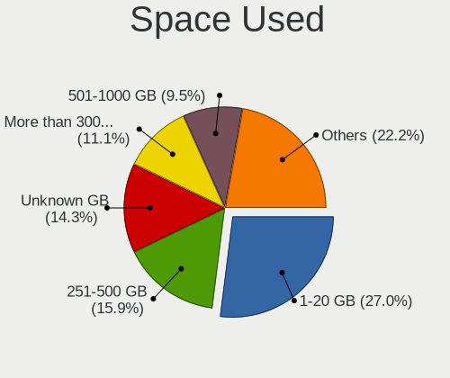
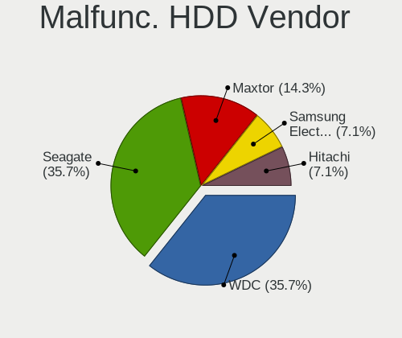
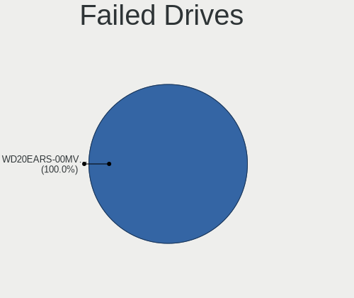
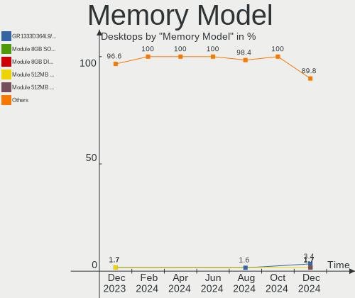
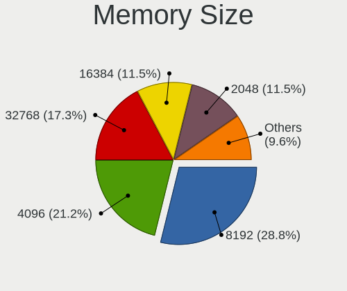

Linux in Poland - Hardware Trends (Desktops)
--------------------------------------------

A project to identify most popular hardware characteristics and track their change
over time based on data collected by Linux users at https://Linux-Hardware.org.

Anyone can contribute to this report by the [hw-probe](https://github.com/linuxhw/hw-probe) tool:

    sudo -E hw-probe -all -upload

Period: Dec, 2024.

Contents
--------

* [ System ](#system)
  - [ OS                       ](#os)
  - [ OS Family                ](#os-family)
  - [ Kernel                   ](#kernel)
  - [ Kernel Family            ](#kernel-family)
  - [ Kernel Major Ver.        ](#kernel-major-ver)
  - [ Arch                     ](#arch)
  - [ DE                       ](#de)
  - [ Display Server           ](#display-server)
  - [ Display Manager          ](#display-manager)
  - [ OS Lang                  ](#os-lang)
  - [ Boot Mode                ](#boot-mode)
  - [ Filesystem               ](#filesystem)
  - [ Part. scheme             ](#part-scheme)
  - [ Dual Boot with Linux/BSD ](#dual-boot-with-linuxbsd)
  - [ Dual Boot (Win)          ](#dual-boot-win)

* [ Board ](#board)
  - [ Vendor                   ](#vendor)
  - [ Model                    ](#model)
  - [ Model Family             ](#model-family)
  - [ MFG Year                 ](#mfg-year)
  - [ Form Factor              ](#form-factor)
  - [ Secure Boot              ](#secure-boot)
  - [ Coreboot                 ](#coreboot)
  - [ RAM Size                 ](#ram-size)
  - [ RAM Used                 ](#ram-used)
  - [ Total Drives             ](#total-drives)
  - [ Has CD-ROM               ](#has-cd-rom)
  - [ Has Ethernet             ](#has-ethernet)
  - [ Has WiFi                 ](#has-wifi)
  - [ Has Bluetooth            ](#has-bluetooth)

* [ Location ](#location)
  - [ Country                  ](#country)
  - [ City                     ](#city)

* [ Drives ](#drives)
  - [ Drive Vendor             ](#drive-vendor)
  - [ Drive Model              ](#drive-model)
  - [ HDD Vendor               ](#hdd-vendor)
  - [ SSD Vendor               ](#ssd-vendor)
  - [ Drive Kind               ](#drive-kind)
  - [ Drive Connector          ](#drive-connector)
  - [ Drive Size               ](#drive-size)
  - [ Space Total              ](#space-total)
  - [ Space Used               ](#space-used)
  - [ Malfunc. Drives          ](#malfunc-drives)
  - [ Malfunc. Drive Vendor    ](#malfunc-drive-vendor)
  - [ Malfunc. HDD Vendor      ](#malfunc-hdd-vendor)
  - [ Malfunc. Drive Kind      ](#malfunc-drive-kind)
  - [ Failed Drives            ](#failed-drives)
  - [ Failed Drive Vendor      ](#failed-drive-vendor)
  - [ Drive Status             ](#drive-status)

* [ Storage controller ](#storage-controller)
  - [ Storage Vendor           ](#storage-vendor)
  - [ Storage Model            ](#storage-model)
  - [ Storage Kind             ](#storage-kind)

* [ Processor ](#processor)
  - [ CPU Vendor               ](#cpu-vendor)
  - [ CPU Model                ](#cpu-model)
  - [ CPU Model Family         ](#cpu-model-family)
  - [ CPU Cores                ](#cpu-cores)
  - [ CPU Sockets              ](#cpu-sockets)
  - [ CPU Threads              ](#cpu-threads)
  - [ CPU Op-Modes             ](#cpu-op-modes)
  - [ CPU Microcode            ](#cpu-microcode)
  - [ CPU Microarch            ](#cpu-microarch)

* [ Graphics ](#graphics)
  - [ GPU Vendor               ](#gpu-vendor)
  - [ GPU Model                ](#gpu-model)
  - [ GPU Combo                ](#gpu-combo)
  - [ GPU Driver               ](#gpu-driver)
  - [ GPU Memory               ](#gpu-memory)

* [ Monitor ](#monitor)
  - [ Monitor Vendor           ](#monitor-vendor)
  - [ Monitor Model            ](#monitor-model)
  - [ Monitor Resolution       ](#monitor-resolution)
  - [ Monitor Diagonal         ](#monitor-diagonal)
  - [ Monitor Width            ](#monitor-width)
  - [ Aspect Ratio             ](#aspect-ratio)
  - [ Monitor Area             ](#monitor-area)
  - [ Pixel Density            ](#pixel-density)
  - [ Multiple Monitors        ](#multiple-monitors)

* [ Network ](#network)
  - [ Net Controller Vendor    ](#net-controller-vendor)
  - [ Net Controller Model     ](#net-controller-model)
  - [ Wireless Vendor          ](#wireless-vendor)
  - [ Wireless Model           ](#wireless-model)
  - [ Ethernet Vendor          ](#ethernet-vendor)
  - [ Ethernet Model           ](#ethernet-model)
  - [ Net Controller Kind      ](#net-controller-kind)
  - [ Used Controller          ](#used-controller)
  - [ NICs                     ](#nics)
  - [ IPv6                     ](#ipv6)

* [ Bluetooth ](#bluetooth)
  - [ Bluetooth Vendor         ](#bluetooth-vendor)
  - [ Bluetooth Model          ](#bluetooth-model)

* [ Sound ](#sound)
  - [ Sound Vendor             ](#sound-vendor)
  - [ Sound Model              ](#sound-model)

* [ Memory ](#memory)
  - [ Memory Vendor            ](#memory-vendor)
  - [ Memory Model             ](#memory-model)
  - [ Memory Kind              ](#memory-kind)
  - [ Memory Form Factor       ](#memory-form-factor)
  - [ Memory Size              ](#memory-size)
  - [ Memory Speed             ](#memory-speed)

* [ Printers & scanners ](#printers--scanners)
  - [ Printer Vendor           ](#printer-vendor)
  - [ Printer Model            ](#printer-model)
  - [ Scanner Vendor           ](#scanner-vendor)
  - [ Scanner Model            ](#scanner-model)

* [ Camera ](#camera)
  - [ Camera Vendor            ](#camera-vendor)
  - [ Camera Model             ](#camera-model)

* [ Security ](#security)
  - [ Fingerprint Vendor       ](#fingerprint-vendor)
  - [ Fingerprint Model        ](#fingerprint-model)
  - [ Chipcard Vendor          ](#chipcard-vendor)
  - [ Chipcard Model           ](#chipcard-model)

* [ Unsupported ](#unsupported)
  - [ Unsupported Devices      ](#unsupported-devices)
  - [ Unsupported Device Types ](#unsupported-device-types)

System
------

OS
--

Installed operating systems

| Name                | Desktops | Percent |
|---------------------|----------|---------|
| OpenMandriva 24.12  | 10       | 15.87%  |
| Fedora 41           | 7        | 11.11%  |
| Ubuntu 24.04        | 6        | 9.52%   |
| Pop!_OS 22.04       | 4        | 6.35%   |
| OpenMandriva 5.0    | 4        | 6.35%   |
| Gentoo 2.17         | 4        | 6.35%   |
| Linux Mint 22       | 3        | 4.76%   |
| Debian 12           | 3        | 4.76%   |
| Bazzite 41          | 3        | 4.76%   |
| OpenMandriva 24.07  | 2        | 3.17%   |
| Arch Rolling        | 2        | 3.17%   |
| Zorin 17            | 1        | 1.59%   |
| Ubuntu Core 22      | 1        | 1.59%   |
| Ubuntu Budgie 18.04 | 1        | 1.59%   |
| Ubuntu 22.04        | 1        | 1.59%   |
| Ubuntu 20.04        | 1        | 1.59%   |
| RHEL 9              | 1        | 1.59%   |
| OpenMandriva 4.2    | 1        | 1.59%   |
| OpenMandriva 23.08  | 1        | 1.59%   |
| Manjaro 24.2.1      | 1        | 1.59%   |
| Manjaro             | 1        | 1.59%   |
| Linux Mint 21.3     | 1        | 1.59%   |
| Kubuntu 24.10       | 1        | 1.59%   |
| Fedora 40           | 1        | 1.59%   |
| EndeavourOS Rolling | 1        | 1.59%   |
| Alpine 3.20.3       | 1        | 1.59%   |

OS Family
---------

OS without a version

| Name          | Desktops | Percent |
|---------------|----------|---------|
| OpenMandriva  | 18       | 28.57%  |
| Ubuntu        | 9        | 14.29%  |
| Fedora        | 8        | 12.7%   |
| Pop!_OS       | 4        | 6.35%   |
| Linux Mint    | 4        | 6.35%   |
| Gentoo        | 4        | 6.35%   |
| Debian        | 3        | 4.76%   |
| Bazzite       | 3        | 4.76%   |
| Manjaro       | 2        | 3.17%   |
| Arch          | 2        | 3.17%   |
| Zorin         | 1        | 1.59%   |
| Ubuntu Budgie | 1        | 1.59%   |
| RHEL          | 1        | 1.59%   |
| Kubuntu       | 1        | 1.59%   |
| EndeavourOS   | 1        | 1.59%   |
| Alpine        | 1        | 1.59%   |

Kernel
------

Version of the Linux kernel

| Version                         | Desktops | Percent |
|---------------------------------|----------|---------|
| 6.12.1-desktop-1omv2490         | 9        | 14.29%  |
| 6.8.0-49-generic                | 5        | 7.94%   |
| 6.9.3-76060903-generic          | 4        | 6.35%   |
| 6.8.0-51-generic                | 4        | 6.35%   |
| 6.6.2-desktop-1omv2390          | 4        | 6.35%   |
| 6.8.0-50-generic                | 2        | 3.17%   |
| 6.6.62-gentoo                   | 2        | 3.17%   |
| 6.12.4-arch1-1                  | 2        | 3.17%   |
| 6.11.4-301.fc41.x86_64          | 2        | 3.17%   |
| 6.11.10-304.bazzite.fc41.x86_64 | 2        | 3.17%   |
| 6.11.10-300.fc41.x86_64         | 2        | 3.17%   |
| 6.10.0-desktop-1omv2490         | 2        | 3.17%   |
| 6.6.67-gentoo                   | 1        | 1.59%   |
| 6.6.60-0-lts                    | 1        | 1.59%   |
| 6.4.11-desktop-1omv2390         | 1        | 1.59%   |
| 6.12.6-gentoo                   | 1        | 1.59%   |
| 6.12.6-desktop-1omv2490         | 1        | 1.59%   |
| 6.12.5-lqx1-1-lqx               | 1        | 1.59%   |
| 6.12.5-200.fc41.x86_64          | 1        | 1.59%   |
| 6.12.5-100.fc40.x86_64          | 1        | 1.59%   |
| 6.12.1-arch1-1                  | 1        | 1.59%   |
| 6.11.9-303.bazzite.fc41.x86_64  | 1        | 1.59%   |
| 6.11.8-300.fc41.x86_64          | 1        | 1.59%   |
| 6.11.11-300.fc41.x86_64         | 1        | 1.59%   |
| 6.11.0-13-generic               | 1        | 1.59%   |
| 6.11.0-1-pve                    | 1        | 1.59%   |
| 6.1.0-28-686-pae                | 1        | 1.59%   |
| 6.1.0-27-amd64                  | 1        | 1.59%   |
| 5.15.55-1-MANJARO               | 1        | 1.59%   |
| 5.15.0-53-generic               | 1        | 1.59%   |
| 5.15.0-130-generic              | 1        | 1.59%   |
| 5.15.0-127-generic              | 1        | 1.59%   |
| 5.14.0-503.19.1.el9_5.x86_64+rt | 1        | 1.59%   |
| 5.10.14-desktop-1omv4002        | 1        | 1.59%   |
| 4.15.0-192-generic              | 1        | 1.59%   |

Kernel Family
-------------

Linux kernel without a distro release

| Version | Desktops | Percent |
|---------|----------|---------|
| 6.8.0   | 11       | 17.46%  |
| 6.12.1  | 10       | 15.87%  |
| 6.9.3   | 4        | 6.35%   |
| 6.6.2   | 4        | 6.35%   |
| 6.11.10 | 4        | 6.35%   |
| 6.12.5  | 3        | 4.76%   |
| 5.15.0  | 3        | 4.76%   |
| 6.6.62  | 2        | 3.17%   |
| 6.12.6  | 2        | 3.17%   |
| 6.12.4  | 2        | 3.17%   |
| 6.11.4  | 2        | 3.17%   |
| 6.11.0  | 2        | 3.17%   |
| 6.10.0  | 2        | 3.17%   |
| 6.1.0   | 2        | 3.17%   |
| 6.6.67  | 1        | 1.59%   |
| 6.6.60  | 1        | 1.59%   |
| 6.4.11  | 1        | 1.59%   |
| 6.11.9  | 1        | 1.59%   |
| 6.11.8  | 1        | 1.59%   |
| 6.11.11 | 1        | 1.59%   |
| 5.15.55 | 1        | 1.59%   |
| 5.14.0  | 1        | 1.59%   |
| 5.10.14 | 1        | 1.59%   |
| 4.15.0  | 1        | 1.59%   |

Kernel Major Ver.
-----------------

Linux kernel major version

| Version | Desktops | Percent |
|---------|----------|---------|
| 6.12    | 17       | 26.98%  |
| 6.8     | 11       | 17.46%  |
| 6.11    | 11       | 17.46%  |
| 6.6     | 8        | 12.7%   |
| 6.9     | 4        | 6.35%   |
| 5.15    | 4        | 6.35%   |
| 6.10    | 2        | 3.17%   |
| 6.1     | 2        | 3.17%   |
| 6.4     | 1        | 1.59%   |
| 5.14    | 1        | 1.59%   |
| 5.10    | 1        | 1.59%   |
| 4.15    | 1        | 1.59%   |

Arch
----

OS architecture (x86_64, i586, etc.)

| Name   | Desktops | Percent |
|--------|----------|---------|
| x86_64 | 62       | 98.41%  |
| i686   | 1        | 1.59%   |

DE
--

Desktop Environment

| Name       | Desktops | Percent |
|------------|----------|---------|
| GNOME      | 17       | 26.98%  |
| Unknown    | 15       | 23.81%  |
| KDE5       | 7        | 11.11%  |
| KDE6       | 6        | 9.52%   |
| X-Cinnamon | 4        | 6.35%   |
| LXQt       | 4        | 6.35%   |
| XFCE       | 3        | 4.76%   |
| MATE       | 2        | 3.17%   |
| LXDE       | 1        | 1.59%   |
| KDE4       | 1        | 1.59%   |
| Hyprland   | 1        | 1.59%   |
| COSMIC     | 1        | 1.59%   |
| Budgie     | 1        | 1.59%   |

Display Server
--------------

X11 or Wayland

| Name    | Desktops | Percent |
|---------|----------|---------|
| X11     | 32       | 50.79%  |
| Wayland | 25       | 39.68%  |
| Tty     | 3        | 4.76%   |
| Unknown | 3        | 4.76%   |

Display Manager
---------------

SDDM, LightDM, etc.

| Name    | Desktops | Percent |
|---------|----------|---------|
| SDDM    | 23       | 36.51%  |
| Unknown | 19       | 30.16%  |
| LightDM | 11       | 17.46%  |
| GDM3    | 7        | 11.11%  |
| GDM     | 3        | 4.76%   |

OS Lang
-------

Language

| Lang    | Desktops | Percent |
|---------|----------|---------|
| pl_PL   | 41       | 65.08%  |
| en_US   | 18       | 28.57%  |
| Unknown | 3        | 4.76%   |
| en_GB   | 1        | 1.59%   |

Boot Mode
---------

EFI or BIOS

| Mode | Desktops | Percent |
|------|----------|---------|
| BIOS | 40       | 63.49%  |
| EFI  | 23       | 36.51%  |

Filesystem
----------

Type of filesystem

| Type    | Desktops | Percent |
|---------|----------|---------|
| Ext4    | 31       | 49.21%  |
| Btrfs   | 10       | 15.87%  |
| Tmpfs   | 8        | 12.7%   |
| Overlay | 8        | 12.7%   |
| F2fs    | 3        | 4.76%   |
| Zfs     | 2        | 3.17%   |
| Xfs     | 1        | 1.59%   |

Part. scheme
------------

Scheme of partitioning

| Type    | Desktops | Percent |
|---------|----------|---------|
| GPT     | 38       | 60.32%  |
| Unknown | 15       | 23.81%  |
| MBR     | 10       | 15.87%  |

Dual Boot with Linux/BSD
------------------------

Hosting more than one Linux/BSD

| Dual boot | Desktops | Percent |
|-----------|----------|---------|
| No        | 44       | 69.84%  |
| Yes       | 19       | 30.16%  |

Dual Boot (Win)
---------------

Hosting Linux and Windows

| Dual boot | Desktops | Percent |
|-----------|----------|---------|
| No        | 43       | 68.25%  |
| Yes       | 20       | 31.75%  |

Board
-----

Vendor
------

Motherboard manufacturer

| Name                | Desktops | Percent |
|---------------------|----------|---------|
| MSI                 | 18       | 28.57%  |
| Gigabyte Technology | 14       | 22.22%  |
| ASUSTek Computer    | 10       | 15.87%  |
| ASRock              | 8        | 12.7%   |
| Dell                | 7        | 11.11%  |
| Lenovo              | 2        | 3.17%   |
| UGREEN              | 1        | 1.59%   |
| Intel               | 1        | 1.59%   |
| Hewlett-Packard     | 1        | 1.59%   |
| GEEKOM              | 1        | 1.59%   |

Model
-----

Motherboard model

| Name                            | Desktops | Percent |
|---------------------------------|----------|---------|
| MSI MS-7C56                     | 2        | 3.17%   |
| MSI MS-7A38                     | 2        | 3.17%   |
| MSI MS-7758                     | 2        | 3.17%   |
| ASUS All Series                 | 2        | 3.17%   |
| UGREEN DXP8800 Plus             | 1        | 1.59%   |
| MSI MS-7E49                     | 1        | 1.59%   |
| MSI MS-7D09                     | 1        | 1.59%   |
| MSI MS-7B89                     | 1        | 1.59%   |
| MSI MS-7B79                     | 1        | 1.59%   |
| MSI MS-7B48                     | 1        | 1.59%   |
| MSI MS-7A93                     | 1        | 1.59%   |
| MSI MS-7A68                     | 1        | 1.59%   |
| MSI MS-7A67                     | 1        | 1.59%   |
| MSI MS-7924                     | 1        | 1.59%   |
| MSI MS-7808                     | 1        | 1.59%   |
| MSI MS-7673                     | 1        | 1.59%   |
| MSI MS-7551                     | 1        | 1.59%   |
| Lenovo ThinkCentre M72e 3267AZ4 | 1        | 1.59%   |
| Lenovo H520S 2561               | 1        | 1.59%   |
| Intel X99-P4 V8.2               | 1        | 1.59%   |
| HP ProOne 600 G1 AiO            | 1        | 1.59%   |
| Gigabyte Z97X-Gaming 3          | 1        | 1.59%   |
| Gigabyte Z890 EAGLE WIFI7       | 1        | 1.59%   |
| Gigabyte Z790 GAMING X          | 1        | 1.59%   |
| Gigabyte P55M-UD2               | 1        | 1.59%   |
| Gigabyte P55-UD3L               | 1        | 1.59%   |
| Gigabyte H610M H V3 DDR4        | 1        | 1.59%   |
| Gigabyte GA-MA790XT-UD4P        | 1        | 1.59%   |
| Gigabyte B650 EAGLE             | 1        | 1.59%   |
| Gigabyte B550 AORUS ELITE V2    | 1        | 1.59%   |
| Gigabyte AB350-Gaming           | 1        | 1.59%   |
| Gigabyte A520M DS3H             | 1        | 1.59%   |
| Gigabyte A520 AORUS ELITE       | 1        | 1.59%   |
| Gigabyte A320M-H                | 1        | 1.59%   |
| Gigabyte 965P-S3                | 1        | 1.59%   |
| GEEKOM A5                       | 1        | 1.59%   |
| Dell Precision 3650 Tower       | 1        | 1.59%   |
| Dell OptiPlex GX270             | 1        | 1.59%   |
| Dell OptiPlex 9020              | 1        | 1.59%   |
| Dell OptiPlex 755               | 1        | 1.59%   |

Model Family
------------

Motherboard model prefix

| Name                     | Desktops | Percent |
|--------------------------|----------|---------|
| Dell OptiPlex            | 6        | 9.52%   |
| MSI MS-7C56              | 2        | 3.17%   |
| MSI MS-7A38              | 2        | 3.17%   |
| MSI MS-7758              | 2        | 3.17%   |
| ASUS PRIME               | 2        | 3.17%   |
| ASUS All                 | 2        | 3.17%   |
| UGREEN DXP8800           | 1        | 1.59%   |
| MSI MS-7E49              | 1        | 1.59%   |
| MSI MS-7D09              | 1        | 1.59%   |
| MSI MS-7B89              | 1        | 1.59%   |
| MSI MS-7B79              | 1        | 1.59%   |
| MSI MS-7B48              | 1        | 1.59%   |
| MSI MS-7A93              | 1        | 1.59%   |
| MSI MS-7A68              | 1        | 1.59%   |
| MSI MS-7A67              | 1        | 1.59%   |
| MSI MS-7924              | 1        | 1.59%   |
| MSI MS-7808              | 1        | 1.59%   |
| MSI MS-7673              | 1        | 1.59%   |
| MSI MS-7551              | 1        | 1.59%   |
| Lenovo ThinkCentre       | 1        | 1.59%   |
| Lenovo H520S             | 1        | 1.59%   |
| Intel X99-P4             | 1        | 1.59%   |
| HP ProOne                | 1        | 1.59%   |
| Gigabyte Z97X-Gaming     | 1        | 1.59%   |
| Gigabyte Z890            | 1        | 1.59%   |
| Gigabyte Z790            | 1        | 1.59%   |
| Gigabyte P55M-UD2        | 1        | 1.59%   |
| Gigabyte P55-UD3L        | 1        | 1.59%   |
| Gigabyte H610M           | 1        | 1.59%   |
| Gigabyte GA-MA790XT-UD4P | 1        | 1.59%   |
| Gigabyte B650            | 1        | 1.59%   |
| Gigabyte B550            | 1        | 1.59%   |
| Gigabyte AB350-Gaming    | 1        | 1.59%   |
| Gigabyte A520M           | 1        | 1.59%   |
| Gigabyte A520            | 1        | 1.59%   |
| Gigabyte A320M-H         | 1        | 1.59%   |
| Gigabyte 965P-S3         | 1        | 1.59%   |
| GEEKOM A5                | 1        | 1.59%   |
| Dell Precision           | 1        | 1.59%   |
| ASUS TUF                 | 1        | 1.59%   |

MFG Year
--------

Motherboard manufacture year

| Year | Desktops | Percent |
|------|----------|---------|
| 2024 | 8        | 12.7%   |
| 2017 | 7        | 11.11%  |
| 2012 | 7        | 11.11%  |
| 2014 | 6        | 9.52%   |
| 2020 | 5        | 7.94%   |
| 2018 | 4        | 6.35%   |
| 2021 | 3        | 4.76%   |
| 2013 | 3        | 4.76%   |
| 2009 | 3        | 4.76%   |
| 2022 | 2        | 3.17%   |
| 2019 | 2        | 3.17%   |
| 2016 | 2        | 3.17%   |
| 2011 | 2        | 3.17%   |
| 2010 | 2        | 3.17%   |
| 2008 | 2        | 3.17%   |
| 2007 | 2        | 3.17%   |
| 2023 | 1        | 1.59%   |
| 2006 | 1        | 1.59%   |
| 2004 | 1        | 1.59%   |

Form Factor
-----------

Physical design of the computer

| Name    | Desktops | Percent |
|---------|----------|---------|
| Desktop | 63       | 100%    |

Secure Boot
-----------

Enabled or disabled

| State    | Desktops | Percent |
|----------|----------|---------|
| Disabled | 63       | 100%    |

Coreboot
--------

Have coreboot on board

| Used | Desktops | Percent |
|------|----------|---------|
| No   | 63       | 100%    |

RAM Size
--------

Total RAM memory

| Size in GB  | Desktops | Percent |
|-------------|----------|---------|
| 16.01-24.0  | 19       | 30.16%  |
| 32.01-64.0  | 14       | 22.22%  |
| 8.01-16.0   | 11       | 17.46%  |
| 4.01-8.0    | 5        | 7.94%   |
| 64.01-256.0 | 5        | 7.94%   |
| 3.01-4.0    | 4        | 6.35%   |
| 24.01-32.0  | 3        | 4.76%   |
| 1.01-2.0    | 2        | 3.17%   |

RAM Used
--------

Used RAM memory

| Used GB    | Desktops | Percent |
|------------|----------|---------|
| 4.01-8.0   | 19       | 30.16%  |
| 1.01-2.0   | 18       | 28.57%  |
| 2.01-3.0   | 10       | 15.87%  |
| 3.01-4.0   | 8        | 12.7%   |
| 0.51-1.0   | 3        | 4.76%   |
| 8.01-16.0  | 2        | 3.17%   |
| 24.01-32.0 | 1        | 1.59%   |
| 16.01-24.0 | 1        | 1.59%   |
| 0.01-0.5   | 1        | 1.59%   |

Total Drives
------------

Number of drives on board

| Drives | Desktops | Percent |
|--------|----------|---------|
| 1      | 18       | 28.57%  |
| 2      | 17       | 26.98%  |
| 3      | 15       | 23.81%  |
| 4      | 6        | 9.52%   |
| 5      | 5        | 7.94%   |
| 7      | 1        | 1.59%   |
| 6      | 1        | 1.59%   |

Has CD-ROM
----------

Has CD-ROM on board

| Presented | Desktops | Percent |
|-----------|----------|---------|
| No        | 35       | 55.56%  |
| Yes       | 28       | 44.44%  |

Has Ethernet
------------

Has Ethernet on board

| Presented | Desktops | Percent |
|-----------|----------|---------|
| Yes       | 63       | 100%    |

Has WiFi
--------

Has WiFi module

| Presented | Desktops | Percent |
|-----------|----------|---------|
| No        | 42       | 66.67%  |
| Yes       | 21       | 33.33%  |

Has Bluetooth
-------------

Has Bluetooth module

| Presented | Desktops | Percent |
|-----------|----------|---------|
| No        | 43       | 68.25%  |
| Yes       | 20       | 31.75%  |

Location
--------

Country
-------

Geographic location (country)

| Country | Desktops | Percent |
|---------|----------|---------|
| Poland  | 63       | 100%    |

City
----

Geographic location (city)

| City                 | Desktops | Percent |
|----------------------|----------|---------|
| Warsaw               | 9        | 14.29%  |
| Poznan               | 5        | 7.94%   |
| Wroclaw              | 3        | 4.76%   |
| Tychy                | 3        | 4.76%   |
| Krakow               | 2        | 3.17%   |
| Kielce               | 2        | 3.17%   |
| Gdynia               | 2        | 3.17%   |
| Gdansk               | 2        | 3.17%   |
| Łapy                | 1        | 1.59%   |
| Zgorzelec            | 1        | 1.59%   |
| Wejherowo            | 1        | 1.59%   |
| Ustka                | 1        | 1.59%   |
| Tłuszcz             | 1        | 1.59%   |
| Tarnowskie Gory      | 1        | 1.59%   |
| Szczecin             | 1        | 1.59%   |
| Swidnik              | 1        | 1.59%   |
| Sosnowiec            | 1        | 1.59%   |
| Siedlce              | 1        | 1.59%   |
| Rzeszów             | 1        | 1.59%   |
| Reda                 | 1        | 1.59%   |
| Puławy              | 1        | 1.59%   |
| Przystajn            | 1        | 1.59%   |
| Polkowice            | 1        | 1.59%   |
| Pila                 | 1        | 1.59%   |
| Piaseczno            | 1        | 1.59%   |
| Ostrów Wielkopolski | 1        | 1.59%   |
| Olsztyn              | 1        | 1.59%   |
| Nowy Sącz           | 1        | 1.59%   |
| Nowe Brzesko         | 1        | 1.59%   |
| Myszkow              | 1        | 1.59%   |
| Milanówek           | 1        | 1.59%   |
| Lubin                | 1        | 1.59%   |
| Lodz                 | 1        | 1.59%   |
| Konstancin-Jeziorna  | 1        | 1.59%   |
| Kety                 | 1        | 1.59%   |
| Jelenia Góra        | 1        | 1.59%   |
| Dobrzen Wielki       | 1        | 1.59%   |
| Dobra                | 1        | 1.59%   |
| Częstochowa         | 1        | 1.59%   |
| Cieszyn              | 1        | 1.59%   |

Drives
------

Drive Vendor
------------

Hard drive vendors

| Vendor                       | Desktops | Drives | Percent |
|------------------------------|----------|--------|---------|
| Seagate                      | 23       | 30     | 17.29%  |
| Samsung Electronics          | 16       | 23     | 12.03%  |
| GOODRAM                      | 16       | 16     | 12.03%  |
| WDC                          | 14       | 18     | 10.53%  |
| Kingston                     | 6        | 7      | 4.51%   |
| Hitachi                      | 6        | 8      | 4.51%   |
| Crucial                      | 6        | 7      | 4.51%   |
| Toshiba                      | 4        | 5      | 3.01%   |
| Silicon Motion               | 3        | 3      | 2.26%   |
| SanDisk                      | 3        | 4      | 2.26%   |
| Phison Electronics           | 3        | 4      | 2.26%   |
| Kingston Technology Company  | 3        | 3      | 2.26%   |
| A-DATA Technology            | 3        | 3      | 2.26%   |
| SPCC                         | 2        | 2      | 1.5%    |
| SK hynix                     | 2        | 2      | 1.5%    |
| PNY                          | 2        | 2      | 1.5%    |
| Plextor                      | 2        | 3      | 1.5%    |
| Patriot                      | 2        | 2      | 1.5%    |
| Maxtor                       | 2        | 2      | 1.5%    |
| Intel                        | 2        | 2      | 1.5%    |
| ADATA Technology             | 2        | 2      | 1.5%    |
| Unknown                      | 1        | 1      | 0.75%   |
| Shenzhen Longsys Electronics | 1        | 1      | 0.75%   |
| Realtek Semiconductor        | 1        | 1      | 0.75%   |
| POLION                       | 1        | 1      | 0.75%   |
| Micron Technology            | 1        | 1      | 0.75%   |
| LITEONIT                     | 1        | 1      | 0.75%   |
| Lite-On Technology           | 1        | 1      | 0.75%   |
| Lexar                        | 1        | 1      | 0.75%   |
| KIOXIA-EXCERIA               | 1        | 1      | 0.75%   |
| JMicron Technology           | 1        | 1      | 0.75%   |
| HGST                         | 1        | 1      | 0.75%   |

Drive Model
-----------

Hard drive models

| Model                                                             | Desktops | Percent |
|-------------------------------------------------------------------|----------|---------|
| Samsung NVMe SSD Controller PM9A1/PM9A3/980PRO 512GB              | 5        | 3.4%    |
| GOODRAM SSDPR-CX400-01T-G2 1TB                                    | 3        | 2.04%   |
| Silicon Motion SM2262/SM2262EN SSD Controller 2TB                 | 2        | 1.36%   |
| Seagate ST8000DM004-2U9188 8TB                                    | 2        | 1.36%   |
| Seagate ST4000DM004-2CV104 4TB                                    | 2        | 1.36%   |
| Seagate ST1000DM003-1CH162 1TB                                    | 2        | 1.36%   |
| Samsung SSD 860 EVO 1TB                                           | 2        | 1.36%   |
| Kingston Company SNV2S1000G 1TB                                   | 2        | 1.36%   |
| Kingston SUV400S37120G 120GB SSD                                  | 2        | 1.36%   |
| Kingston SKC3000S1024G 1TB                                        | 2        | 1.36%   |
| GOODRAM SSDPR-CX400-512-G2 512GB                                  | 2        | 1.36%   |
| GOODRAM SSDPR-CX400-256-G2 256GB                                  | 2        | 1.36%   |
| GOODRAM SSDPR-CX400-128 128GB                                     | 2        | 1.36%   |
| GOODRAM SSDPR-CL100-480-G2 480GB                                  | 2        | 1.36%   |
| Crucial CT240BX500SSD1 240GB                                      | 2        | 1.36%   |
| Crucial CT1000MX500SSD1 1TB                                       | 2        | 1.36%   |
| ADATA XPG SX8200 Pro PCIe Gen3x4 M.2 2280 Solid State Drive 256GB | 2        | 1.36%   |
| WDC WD800JB-00JJC0 80GB                                           | 1        | 0.68%   |
| WDC WD7500AADS-00M2B0 752GB                                       | 1        | 0.68%   |
| WDC WD5000LPCX-24C6HT0 500GB                                      | 1        | 0.68%   |
| WDC WD5000AAKX-00U6AA0 500GB                                      | 1        | 0.68%   |
| WDC WD40EZAZ-00SF3B0 4TB                                          | 1        | 0.68%   |
| WDC WD3200AVJS-63B6A0 320GB                                       | 1        | 0.68%   |
| WDC WD30EZRZ-00GXCB0 3TB                                          | 1        | 0.68%   |
| WDC WD2500AAKS-00L9A0 250GB                                       | 1        | 0.68%   |
| WDC WD20EZRX-00DC0B0 2TB                                          | 1        | 0.68%   |
| WDC WD20EFAX-68F 2TB                                              | 1        | 0.68%   |
| WDC WD20EARS-00MVWB0 2TB                                          | 1        | 0.68%   |
| WDC WD10JPVX-75JC3T0 1TB                                          | 1        | 0.68%   |
| WDC WD10EZEX-60M2NA0 1TB                                          | 1        | 0.68%   |
| WDC WD10EZEX-08WN4A0 1TB                                          | 1        | 0.68%   |
| WDC WD10EZEX-00BN5A0 1TB                                          | 1        | 0.68%   |
| WDC WD10EFRX-68PJCN0 1TB                                          | 1        | 0.68%   |
| WDC WD Blue SA510 2. 500GB SSD                                    | 1        | 0.68%   |
| Unknown NVMe SSD Drive 512GB                                      | 1        | 0.68%   |
| Toshiba MG06ACA800E 8TB                                           | 1        | 0.68%   |
| Toshiba HDWE150 5TB                                               | 1        | 0.68%   |
| Toshiba HDWD130 3TB                                               | 1        | 0.68%   |
| Toshiba HDWD110 1TB                                               | 1        | 0.68%   |
| Toshiba A100 240GB SSD                                            | 1        | 0.68%   |

HDD Vendor
----------

Hard disk drive vendors

| Vendor              | Desktops | Drives | Percent |
|---------------------|----------|--------|---------|
| Seagate             | 23       | 30     | 44.23%  |
| WDC                 | 14       | 17     | 26.92%  |
| Hitachi             | 6        | 8      | 11.54%  |
| Toshiba             | 3        | 4      | 5.77%   |
| Samsung Electronics | 2        | 2      | 3.85%   |
| Maxtor              | 2        | 2      | 3.85%   |
| JMicron Technology  | 1        | 1      | 1.92%   |
| HGST                | 1        | 1      | 1.92%   |

SSD Vendor
----------

Solid state drive vendors

| Vendor              | Desktops | Drives | Percent |
|---------------------|----------|--------|---------|
| GOODRAM             | 16       | 16     | 33.33%  |
| Samsung Electronics | 6        | 6      | 12.5%   |
| Crucial             | 6        | 7      | 12.5%   |
| SPCC                | 2        | 2      | 4.17%   |
| PNY                 | 2        | 2      | 4.17%   |
| Plextor             | 2        | 3      | 4.17%   |
| Patriot             | 2        | 2      | 4.17%   |
| Kingston            | 2        | 2      | 4.17%   |
| Intel               | 2        | 2      | 4.17%   |
| A-DATA Technology   | 2        | 2      | 4.17%   |
| WDC                 | 1        | 1      | 2.08%   |
| Toshiba             | 1        | 1      | 2.08%   |
| SK hynix            | 1        | 1      | 2.08%   |
| SanDisk             | 1        | 1      | 2.08%   |
| LITEONIT            | 1        | 1      | 2.08%   |
| KIOXIA-EXCERIA      | 1        | 1      | 2.08%   |

Drive Kind
----------

HDD or SSD

| Kind    | Desktops | Drives | Percent |
|---------|----------|--------|---------|
| SSD     | 42       | 50     | 37.5%   |
| HDD     | 39       | 65     | 34.82%  |
| NVMe    | 30       | 43     | 26.79%  |
| Unknown | 1        | 1      | 0.89%   |

Drive Connector
---------------

SATA, SAS, NVMe, etc.

| Type | Desktops | Drives | Percent |
|------|----------|--------|---------|
| SATA | 58       | 115    | 65.17%  |
| NVMe | 30       | 43     | 33.71%  |
| SAS  | 1        | 1      | 1.12%   |

Drive Size
----------

Size of hard drive

| Size in TB | Desktops | Drives | Percent |
|------------|----------|--------|---------|
| 0.01-0.5   | 38       | 56     | 43.68%  |
| 0.51-1.0   | 24       | 29     | 27.59%  |
| 1.01-2.0   | 8        | 10     | 9.2%    |
| 3.01-4.0   | 5        | 5      | 5.75%   |
| 4.01-10.0  | 5        | 5      | 5.75%   |
| 2.01-3.0   | 4        | 6      | 4.6%    |
| 10.01-20.0 | 3        | 4      | 3.45%   |

Space Total
-----------

Amount of disk space available on the file system

| Size in GB     | Desktops | Percent |
|----------------|----------|---------|
| More than 3000 | 13       | 20.63%  |
| 501-1000       | 11       | 17.46%  |
| Unknown        | 9        | 14.29%  |
| 1001-2000      | 8        | 12.7%   |
| 2001-3000      | 6        | 9.52%   |
| 101-250        | 5        | 7.94%   |
| 251-500        | 4        | 6.35%   |
| 21-50          | 3        | 4.76%   |
| 1-20           | 2        | 3.17%   |
| 51-100         | 2        | 3.17%   |

Space Used
----------

Amount of used disk space

| Used GB        | Desktops | Percent |
|----------------|----------|---------|
| 1-20           | 17       | 26.98%  |
| 251-500        | 10       | 15.87%  |
| Unknown        | 9        | 14.29%  |
| More than 3000 | 7        | 11.11%  |
| 501-1000       | 6        | 9.52%   |
| 1001-2000      | 5        | 7.94%   |
| 51-100         | 4        | 6.35%   |
| 21-50          | 2        | 3.17%   |
| 2001-3000      | 2        | 3.17%   |
| 101-250        | 1        | 1.59%   |

Malfunc. Drives
---------------

Drive models with a malfunction

| Model                                             | Desktops | Drives | Percent |
|---------------------------------------------------|----------|--------|---------|
| WDC WD800JB-00JJC0 80GB                           | 1        | 1      | 5.26%   |
| WDC WD5000LPCX-24C6HT0 500GB                      | 1        | 1      | 5.26%   |
| WDC WD2500AAKS-00L9A0 250GB                       | 1        | 1      | 5.26%   |
| WDC WD20EFAX-68F 2TB                              | 1        | 2      | 5.26%   |
| WDC WD10EZEX-60M2NA0 1TB                          | 1        | 1      | 5.26%   |
| WDC WD Blue SA510 2. 500GB SSD                    | 1        | 1      | 5.26%   |
| Silicon Motion SM2262/SM2262EN SSD Controller 2TB | 1        | 1      | 5.26%   |
| Seagate ST9320325AS 320GB                         | 1        | 2      | 5.26%   |
| Seagate ST500LT012-9WS142 500GB                   | 1        | 1      | 5.26%   |
| Seagate ST500DM002-1BD142 500GB                   | 1        | 1      | 5.26%   |
| Seagate ST3320620AS 320GB                         | 1        | 1      | 5.26%   |
| Seagate ST3250820ACE 250GB                        | 1        | 1      | 5.26%   |
| Seagate ST2000DM006-2DM164 2TB                    | 1        | 1      | 5.26%   |
| Seagate ST1000DM003-1ER162 1TB                    | 1        | 1      | 5.26%   |
| Samsung Electronics SP1614N 160GB                 | 1        | 1      | 5.26%   |
| Realtek Semiconductor ADATA SX6000NP 256GB        | 1        | 1      | 5.26%   |
| Maxtor 6L250M0 256GB                              | 1        | 1      | 5.26%   |
| Maxtor 2F040L0 41GB                               | 1        | 1      | 5.26%   |
| Hitachi HDP725016GLA380 160GB                     | 1        | 1      | 5.26%   |

Malfunc. Drive Vendor
---------------------

Vendors of faulty drives

| Vendor                | Desktops | Drives | Percent |
|-----------------------|----------|--------|---------|
| WDC                   | 5        | 7      | 31.25%  |
| Seagate               | 5        | 8      | 31.25%  |
| Maxtor                | 2        | 2      | 12.5%   |
| Silicon Motion        | 1        | 1      | 6.25%   |
| Samsung Electronics   | 1        | 1      | 6.25%   |
| Realtek Semiconductor | 1        | 1      | 6.25%   |
| Hitachi               | 1        | 1      | 6.25%   |

Malfunc. HDD Vendor
-------------------

Vendors of faulty HDD drives

| Vendor              | Desktops | Drives | Percent |
|---------------------|----------|--------|---------|
| WDC                 | 5        | 6      | 35.71%  |
| Seagate             | 5        | 8      | 35.71%  |
| Maxtor              | 2        | 2      | 14.29%  |
| Samsung Electronics | 1        | 1      | 7.14%   |
| Hitachi             | 1        | 1      | 7.14%   |

Malfunc. Drive Kind
-------------------

Kinds of faulty drives

| Kind | Desktops | Drives | Percent |
|------|----------|--------|---------|
| HDD  | 13       | 18     | 81.25%  |
| NVMe | 2        | 2      | 12.5%   |
| SSD  | 1        | 1      | 6.25%   |

Failed Drives
-------------

Failed drive models

| Model                    | Desktops | Drives | Percent |
|--------------------------|----------|--------|---------|
| WDC WD20EARS-00MVWB0 2TB | 1        | 1      | 100%    |

Failed Drive Vendor
-------------------

Failed drive vendors

| Vendor | Desktops | Drives | Percent |
|--------|----------|--------|---------|
| WDC    | 1        | 1      | 100%    |

Drive Status
------------

Number of failed and malfunc. drives

| Status   | Desktops | Drives | Percent |
|----------|----------|--------|---------|
| Works    | 34       | 77     | 45.95%  |
| Detected | 24       | 60     | 32.43%  |
| Malfunc  | 15       | 21     | 20.27%  |
| Failed   | 1        | 1      | 1.35%   |

Storage controller
------------------

Storage Vendor
--------------

Storage controller vendors

| Vendor                       | Desktops | Percent |
|------------------------------|----------|---------|
| Intel                        | 36       | 33.64%  |
| AMD                          | 25       | 23.36%  |
| Samsung Electronics          | 10       | 9.35%   |
| Kingston Technology Company  | 7        | 6.54%   |
| JMicron Technology           | 5        | 4.67%   |
| ASMedia Technology           | 4        | 3.74%   |
| Silicon Motion               | 3        | 2.8%    |
| Phison Electronics           | 3        | 2.8%    |
| Shenzhen Longsys Electronics | 2        | 1.87%   |
| SanDisk                      | 2        | 1.87%   |
| Realtek Semiconductor        | 2        | 1.87%   |
| ADATA Technology             | 2        | 1.87%   |
| SK hynix                     | 1        | 0.93%   |
| Nvidia                       | 1        | 0.93%   |
| Micron Technology            | 1        | 0.93%   |
| Marvell Technology Group     | 1        | 0.93%   |
| Lite-On Technology           | 1        | 0.93%   |
| Unknown                      | 1        | 0.93%   |

Storage Model
-------------

Storage controller models

| Model                                                                                   | Desktops | Percent |
|-----------------------------------------------------------------------------------------|----------|---------|
| AMD FCH SATA Controller [AHCI mode]                                                     | 10       | 7.52%   |
| Samsung NVMe SSD Controller PM9A1/PM9A3/980PRO                                          | 6        | 4.51%   |
| AMD 400 Series Chipset SATA Controller                                                  | 6        | 4.51%   |
| JMicron JMB363 SATA/IDE Controller                                                      | 5        | 3.76%   |
| Intel 8 Series/C220 Series Chipset Family 6-port SATA Controller 1 [AHCI mode]          | 5        | 3.76%   |
| Intel 7 Series/C210 Series Chipset Family 6-port SATA Controller [AHCI mode]            | 5        | 3.76%   |
| Intel 200 Series PCH SATA controller [AHCI mode]                                        | 5        | 3.76%   |
| AMD 600 Series Chipset SATA Controller                                                  | 5        | 3.76%   |
| AMD 500 Series Chipset SATA Controller                                                  | 5        | 3.76%   |
| Kingston Company KC3000/FURY Renegade NVMe SSD [E18]                                    | 4        | 3.01%   |
| AMD SB7x0/SB8x0/SB9x0 IDE Controller                                                    | 4        | 3.01%   |
| Kingston Company NV2 NVMe SSD [E21T] (DRAM-less)                                        | 3        | 2.26%   |
| ASMedia ASM1061/ASM1062 Serial ATA Controller                                           | 3        | 2.26%   |
| AMD SB7x0/SB8x0/SB9x0 SATA Controller [IDE mode]                                        | 3        | 2.26%   |
| AMD 300 Series Chipset SATA Controller                                                  | 3        | 2.26%   |
| Silicon Motion SM2262/SM2262EN SSD Controller                                           | 2        | 1.5%    |
| Samsung NVMe SSD Controller SM981/PM981/PM983                                           | 2        | 1.5%    |
| Samsung NVMe SSD Controller 980 (DRAM-less)                                             | 2        | 1.5%    |
| Intel Alder Lake-S PCH SATA Controller [AHCI Mode]                                      | 2        | 1.5%    |
| Intel 9 Series Chipset Family SATA Controller [AHCI Mode]                               | 2        | 1.5%    |
| Intel 82801HR/HO/HH (ICH8R/DO/DH) 2 port SATA Controller [IDE mode]                     | 2        | 1.5%    |
| Intel 82801H (ICH8 Family) 4 port SATA Controller [IDE mode]                            | 2        | 1.5%    |
| Intel 6 Series/C200 Series Chipset Family Desktop SATA Controller (IDE mode, ports 4-5) | 2        | 1.5%    |
| Intel 6 Series/C200 Series Chipset Family Desktop SATA Controller (IDE mode, ports 0-3) | 2        | 1.5%    |
| Intel 6 Series/C200 Series Chipset Family 6 port Desktop SATA AHCI Controller           | 2        | 1.5%    |
| Intel 500 Series Chipset Family SATA AHCI Controller                                    | 2        | 1.5%    |
| Intel 5 Series/3400 Series Chipset 4 port SATA IDE Controller                           | 2        | 1.5%    |
| Intel 5 Series/3400 Series Chipset 2 port SATA IDE Controller                           | 2        | 1.5%    |
| ADATA XPG SX8200 Pro PCIe Gen3x4 M.2 2280 Solid State Drive                             | 2        | 1.5%    |
| SK hynix BC511 NVMe SSD                                                                 | 1        | 0.75%   |
| Silicon Motion SM2263EN/SM2263XT (DRAM-less) NVMe SSD Controllers                       | 1        | 0.75%   |
| Shenzhen Longsys Lexar NM790 NVME SSD (DRAM-less)                                       | 1        | 0.75%   |
| Shenzhen Longsys Lexar NM610 PRO NVME SSD (DRAM-less)                                   | 1        | 0.75%   |
| SanDisk WD Black SN770 / PC SN740 256GB / PC SN560 (DRAM-less) NVMe SSD                 | 1        | 0.75%   |
| SanDisk Ultra 3D / WD Blue SN570 NVMe SSD (DRAM-less)                                   | 1        | 0.75%   |
| Samsung NVMe SSD Controller S4LV008[Pascal]                                             | 1        | 0.75%   |
| Samsung NVMe SSD Controller PM9C1a (DRAM-less)                                          | 1        | 0.75%   |
| Realtek RTS5763DL x2 NVMe SSD Controller                                                | 1        | 0.75%   |
| Realtek RTS5762 NVMe SSD Controller                                                     | 1        | 0.75%   |
| Phison PS5021-E21 PCIe4 NVMe Controller (DRAM-less)                                     | 1        | 0.75%   |

Storage Kind
------------

Kind of storage controller (IDE, SATA, NVMe, SAS, ...)

| Kind | Desktops | Percent |
|------|----------|---------|
| SATA | 54       | 53.47%  |
| NVMe | 30       | 29.7%   |
| IDE  | 16       | 15.84%  |
| RAID | 1        | 0.99%   |

Processor
---------

CPU Vendor
----------

Processor vendors

| Vendor | Desktops | Percent |
|--------|----------|---------|
| Intel  | 37       | 58.73%  |
| AMD    | 26       | 41.27%  |

CPU Model
---------

Processor models

| Model                                       | Desktops | Percent |
|---------------------------------------------|----------|---------|
| Intel Core i7-7700K CPU @ 4.20GHz           | 2        | 3.17%   |
| Intel Core i7-4790 CPU @ 3.60GHz            | 2        | 3.17%   |
| Intel Core i5-3330 CPU @ 3.00GHz            | 2        | 3.17%   |
| Intel Core i5-2500K CPU @ 3.30GHz           | 2        | 3.17%   |
| AMD Ryzen 7 5700G with Radeon Graphics      | 2        | 3.17%   |
| AMD Ryzen 5 2600 Six-Core Processor         | 2        | 3.17%   |
| Intel Xeon CPU E5-2650 v4 @ 2.20GHz         | 1        | 1.59%   |
| Intel Pentium Dual-Core CPU E5400 @ 2.70GHz | 1        | 1.59%   |
| Intel Pentium Dual CPU E2220 @ 2.40GHz      | 1        | 1.59%   |
| Intel Pentium 4 CPU 2.40GHz                 | 1        | 1.59%   |
| Intel Core Ultra 7 265KF                    | 1        | 1.59%   |
| Intel Core i9-14900K                        | 1        | 1.59%   |
| Intel Core i7-7820X CPU @ 3.60GHz           | 1        | 1.59%   |
| Intel Core i7-3770T CPU @ 2.50GHz           | 1        | 1.59%   |
| Intel Core i5-9600K CPU @ 3.70GHz           | 1        | 1.59%   |
| Intel Core i5-7600 CPU @ 3.50GHz            | 1        | 1.59%   |
| Intel Core i5-7400 CPU @ 3.00GHz            | 1        | 1.59%   |
| Intel Core i5-4570 CPU @ 3.20GHz            | 1        | 1.59%   |
| Intel Core i5-4460 CPU @ 3.20GHz            | 1        | 1.59%   |
| Intel Core i5-4440 CPU @ 3.10GHz            | 1        | 1.59%   |
| Intel Core i5-3570 CPU @ 3.40GHz            | 1        | 1.59%   |
| Intel Core i5-10400F CPU @ 2.90GHz          | 1        | 1.59%   |
| Intel Core i5 CPU 750 @ 2.67GHz             | 1        | 1.59%   |
| Intel Core i3-4170 CPU @ 3.70GHz            | 1        | 1.59%   |
| Intel Core i3-4160 CPU @ 3.60GHz            | 1        | 1.59%   |
| Intel Core i3-3240 CPU @ 3.40GHz            | 1        | 1.59%   |
| Intel Core i3-2120T CPU @ 2.60GHz           | 1        | 1.59%   |
| Intel Core i3-2120 CPU @ 3.30GHz            | 1        | 1.59%   |
| Intel Core i3 CPU 540 @ 3.07GHz             | 1        | 1.59%   |
| Intel Core 2 Quad CPU Q6600 @ 2.40GHz       | 1        | 1.59%   |
| Intel Core 2 CPU 6300 @ 1.86GHz             | 1        | 1.59%   |
| Intel 13th Gen Core i5-13500T               | 1        | 1.59%   |
| Intel 12th Gen Core i7-12700KF              | 1        | 1.59%   |
| Intel 12th Gen Core i5-1235U                | 1        | 1.59%   |
| Intel 11th Gen Core i5-11400 @ 2.60GHz      | 1        | 1.59%   |
| AMD Ryzen 9 7950X 16-Core Processor         | 1        | 1.59%   |
| AMD Ryzen 9 5900X 12-Core Processor         | 1        | 1.59%   |
| AMD Ryzen 7 9800X3D 8-Core Processor        | 1        | 1.59%   |
| AMD Ryzen 7 9700X 8-Core Processor          | 1        | 1.59%   |
| AMD Ryzen 7 7800X3D 8-Core Processor        | 1        | 1.59%   |

CPU Model Family
----------------

Processor model prefix

| Model                   | Desktops | Percent |
|-------------------------|----------|---------|
| Intel Core i5           | 13       | 20.63%  |
| AMD Ryzen 5             | 10       | 15.87%  |
| AMD Ryzen 7             | 8        | 12.7%   |
| Intel Core i7           | 6        | 9.52%   |
| Intel Core i3           | 6        | 9.52%   |
| Other                   | 5        | 7.94%   |
| AMD Ryzen 9             | 2        | 3.17%   |
| Intel Xeon              | 1        | 1.59%   |
| Intel Pentium Dual-Core | 1        | 1.59%   |
| Intel Pentium Dual      | 1        | 1.59%   |
| Intel Pentium 4         | 1        | 1.59%   |
| Intel Core i9           | 1        | 1.59%   |
| Intel Core 2 Quad       | 1        | 1.59%   |
| Intel Core 2            | 1        | 1.59%   |
| Intel Core              | 1        | 1.59%   |
| AMD Ryzen 5 PRO         | 1        | 1.59%   |
| AMD Phenom II X6        | 1        | 1.59%   |
| AMD Phenom II X4        | 1        | 1.59%   |
| AMD FX                  | 1        | 1.59%   |
| AMD Athlon II X2        | 1        | 1.59%   |

CPU Cores
---------

Number of processor cores

| Number | Desktops | Percent |
|--------|----------|---------|
| 4      | 22       | 34.92%  |
| 6      | 13       | 20.63%  |
| 2      | 10       | 15.87%  |
| 8      | 9        | 14.29%  |
| 12     | 3        | 4.76%   |
| 24     | 1        | 1.59%   |
| 20     | 1        | 1.59%   |
| 16     | 1        | 1.59%   |
| 14     | 1        | 1.59%   |
| 10     | 1        | 1.59%   |
| 1      | 1        | 1.59%   |

CPU Sockets
-----------

Number of sockets

| Number | Desktops | Percent |
|--------|----------|---------|
| 1      | 63       | 100%    |

CPU Threads
-----------

Threads per core (Hyper-Threading)

| Number | Desktops | Percent |
|--------|----------|---------|
| 2      | 40       | 63.49%  |
| 1      | 23       | 36.51%  |

CPU Op-Modes
------------

CPU Operation Modes (32-bit, 64-bit)

| Op mode        | Desktops | Percent |
|----------------|----------|---------|
| 32-bit, 64-bit | 61       | 96.83%  |
| 32-bit         | 1        | 1.59%   |
| Unknown        | 1        | 1.59%   |

CPU Microcode
-------------

Microcode number

| Number     | Desktops | Percent |
|------------|----------|---------|
| Unknown    | 53       | 84.13%  |
| 0x306c3    | 2        | 3.17%   |
| 0xf29      | 1        | 1.59%   |
| 0x6f6      | 1        | 1.59%   |
| 0x306a9    | 1        | 1.59%   |
| 0x206a7    | 1        | 1.59%   |
| 0x1067a    | 1        | 1.59%   |
| 0x0a500011 | 1        | 1.59%   |
| 0x0800820d | 1        | 1.59%   |
| 0x010000db | 1        | 1.59%   |

CPU Microarch
-------------

Microarchitecture

| Name             | Desktops | Percent |
|------------------|----------|---------|
| Unknown          | 9        | 14.29%  |
| Zen 3            | 8        | 12.7%   |
| Haswell          | 7        | 11.11%  |
| Zen+             | 5        | 7.94%   |
| KabyLake         | 5        | 7.94%   |
| IvyBridge        | 5        | 7.94%   |
| SandyBridge      | 4        | 6.35%   |
| K10              | 4        | 6.35%   |
| Core             | 3        | 4.76%   |
| Zen              | 2        | 3.17%   |
| Zen 2            | 1        | 1.59%   |
| Westmere         | 1        | 1.59%   |
| Skylake          | 1        | 1.59%   |
| Piledriver       | 1        | 1.59%   |
| Penryn           | 1        | 1.59%   |
| NetBurst         | 1        | 1.59%   |
| Nehalem          | 1        | 1.59%   |
| Icelake          | 1        | 1.59%   |
| CometLake        | 1        | 1.59%   |
| Broadwell        | 1        | 1.59%   |
| Alderlake Hybrid | 1        | 1.59%   |

Graphics
--------

GPU Vendor
----------

Vendors of graphics cards

| Vendor | Desktops | Percent |
|--------|----------|---------|
| Nvidia | 36       | 52.17%  |
| AMD    | 20       | 28.99%  |
| Intel  | 13       | 18.84%  |

GPU Model
---------

Graphics card models

| Model                                                                       | Desktops | Percent |
|-----------------------------------------------------------------------------|----------|---------|
| Nvidia GP107 [GeForce GTX 1050 Ti]                                          | 4        | 5.56%   |
| AMD Cezanne [Radeon Vega Series / Radeon Vega Mobile Series]                | 4        | 5.56%   |
| Nvidia GT218 [GeForce 210]                                                  | 3        | 4.17%   |
| Nvidia GP106 [GeForce GTX 1060 6GB]                                         | 3        | 4.17%   |
| AMD Raphael                                                                 | 3        | 4.17%   |
| Nvidia GP108 [GeForce GT 1030]                                              | 2        | 2.78%   |
| Nvidia GP104 [GeForce GTX 1070]                                             | 2        | 2.78%   |
| Nvidia GM206 [GeForce GTX 960]                                              | 2        | 2.78%   |
| Nvidia AD104 [GeForce RTX 4070]                                             | 2        | 2.78%   |
| Intel Xeon E3-1200 v3/4th Gen Core Processor Integrated Graphics Controller | 2        | 2.78%   |
| Intel 2nd Generation Core Processor Family Integrated Graphics Controller   | 2        | 2.78%   |
| AMD Picasso/Raven 2 [Radeon Vega Series / Radeon Vega Mobile Series]        | 2        | 2.78%   |
| AMD Navi 31 [Radeon RX 7900 XT/7900 XTX/7900 GRE/7900M]                     | 2        | 2.78%   |
| AMD Granite Ridge [Radeon Graphics]                                         | 2        | 2.78%   |
| Nvidia GP107GL [Quadro P620]                                                | 1        | 1.39%   |
| Nvidia GP107 [GeForce GTX 1050]                                             | 1        | 1.39%   |
| Nvidia GP102 [GeForce GTX 1080 Ti]                                          | 1        | 1.39%   |
| Nvidia GM107 [GeForce GTX 750]                                              | 1        | 1.39%   |
| Nvidia GM107 [GeForce GTX 750 Ti]                                           | 1        | 1.39%   |
| Nvidia GK107 [GeForce GTX 650]                                              | 1        | 1.39%   |
| Nvidia GK104 [GeForce GTX 760]                                              | 1        | 1.39%   |
| Nvidia GK104 [GeForce GTX 690]                                              | 1        | 1.39%   |
| Nvidia GF114 [GeForce GTX 560 Ti]                                           | 1        | 1.39%   |
| Nvidia GA106 [GeForce RTX 3060]                                             | 1        | 1.39%   |
| Nvidia GA104 [GeForce RTX 3070 Ti]                                          | 1        | 1.39%   |
| Nvidia GA104 [GeForce RTX 3070 Lite Hash Rate]                              | 1        | 1.39%   |
| Nvidia GA104 [GeForce RTX 3060]                                             | 1        | 1.39%   |
| Nvidia GA104 [GeForce RTX 3060 Ti Lite Hash Rate]                           | 1        | 1.39%   |
| Nvidia G98 [GeForce 8400 GS Rev. 2]                                         | 1        | 1.39%   |
| Nvidia C61 [GeForce 7025 / nForce 630a]                                     | 1        | 1.39%   |
| Nvidia AD103 [GeForce RTX 4080]                                             | 1        | 1.39%   |
| Nvidia AD103 [GeForce RTX 4070 Ti SUPER]                                    | 1        | 1.39%   |
| Intel Xeon E3-1200 v2/3rd Gen Core processor Graphics Controller            | 1        | 1.39%   |
| Intel RocketLake-S GT1 [UHD Graphics 730]                                   | 1        | 1.39%   |
| Intel Raptor Lake-S GT1 [UHD Graphics 770]                                  | 1        | 1.39%   |
| Intel HD Graphics 630                                                       | 1        | 1.39%   |
| Intel AlderLake-S GT1                                                       | 1        | 1.39%   |
| Intel Alder Lake-UP3 GT2 [Iris Xe Graphics]                                 | 1        | 1.39%   |
| Intel 82Q35 Express Integrated Graphics Controller                          | 1        | 1.39%   |
| Intel 82865G Integrated Graphics Controller                                 | 1        | 1.39%   |

GPU Combo
---------

Combinations of graphics cards

| Name           | Desktops | Percent |
|----------------|----------|---------|
| 1 x Nvidia     | 31       | 49.21%  |
| 1 x AMD        | 13       | 20.63%  |
| 1 x Intel      | 9        | 14.29%  |
| 2 x AMD        | 3        | 4.76%   |
| AMD + Nvidia   | 3        | 4.76%   |
| Intel + Nvidia | 2        | 3.17%   |
| 2 x Intel      | 1        | 1.59%   |
| Intel + AMD    | 1        | 1.59%   |

GPU Driver
----------

Free vs proprietary

| Driver      | Desktops | Percent |
|-------------|----------|---------|
| Free        | 36       | 57.14%  |
| Proprietary | 20       | 31.75%  |
| Unknown     | 7        | 11.11%  |

GPU Memory
----------

Total video memory

| Size in GB | Desktops | Percent |
|------------|----------|---------|
| Unknown    | 32       | 50.79%  |
| 1.01-2.0   | 8        | 12.7%   |
| 0.51-1.0   | 7        | 11.11%  |
| 7.01-8.0   | 5        | 7.94%   |
| 0.01-0.5   | 5        | 7.94%   |
| 3.01-4.0   | 2        | 3.17%   |
| 16.01-24.0 | 2        | 3.17%   |
| 5.01-6.0   | 1        | 1.59%   |
| 8.01-16.0  | 1        | 1.59%   |

Monitor
-------

Monitor Vendor
--------------

Monitor vendors

| Vendor                  | Desktops | Percent |
|-------------------------|----------|---------|
| Samsung Electronics     | 9        | 14.06%  |
| Iiyama                  | 6        | 9.38%   |
| Hewlett-Packard         | 6        | 9.38%   |
| Goldstar                | 5        | 7.81%   |
| Philips                 | 4        | 6.25%   |
| BenQ                    | 4        | 6.25%   |
| Ancor Communications    | 4        | 6.25%   |
| Acer                    | 4        | 6.25%   |
| Dell                    | 3        | 4.69%   |
| Unknown (XXX)           | 2        | 3.13%   |
| Eizo                    | 2        | 3.13%   |
| AOC                     | 2        | 3.13%   |
| Vestel Elektronik       | 1        | 1.56%   |
| VCS                     | 1        | 1.56%   |
| Unknown                 | 1        | 1.56%   |
| Sony                    | 1        | 1.56%   |
| Packard Bell            | 1        | 1.56%   |
| NEC Computers           | 1        | 1.56%   |
| Mi                      | 1        | 1.56%   |
| Hyundai ImageQuest      | 1        | 1.56%   |
| Gigabyte Technology     | 1        | 1.56%   |
| Fujitsu Siemens         | 1        | 1.56%   |
| Chi Mei Optoelectronics | 1        | 1.56%   |
| Belinea                 | 1        | 1.56%   |
| ASUSTek Computer        | 1        | 1.56%   |

Monitor Model
-------------

Monitor models

| Model                                                                  | Desktops | Percent |
|------------------------------------------------------------------------|----------|---------|
| Vestel Elektronik 49FHD_LCD_TV VES3700 1920x1080 1280x720mm 57.8-inch  | 1        | 1.52%   |
| VCS Connector VCS1145 1920x1080 575x323mm 26.0-inch                    | 1        | 1.52%   |
| Unknown LCD Monitor FFFF 2288x1287 2550x2550mm 142.0-inch              | 1        | 1.52%   |
| Unknown (XXX) LCDTV XXX0180 1440x900 884x663mm 43.5-inch               | 1        | 1.52%   |
| Unknown (XXX) Beyond TV XXX9221 1920x1080 1209x680mm 54.6-inch         | 1        | 1.52%   |
| Sony TV SNY4402 1360x768                                               | 1        | 1.52%   |
| Samsung Electronics U32R59x SAM0F96 3840x2160 700x390mm 31.5-inch      | 1        | 1.52%   |
| Samsung Electronics U32R59x SAM0F94 3840x2160 697x392mm 31.5-inch      | 1        | 1.52%   |
| Samsung Electronics SyncMaster SAM059A 1920x1080 477x268mm 21.5-inch   | 1        | 1.52%   |
| Samsung Electronics SyncMaster SAM0108 1600x1200 312x234mm 15.4-inch   | 1        | 1.52%   |
| Samsung Electronics SMS22A100 SAM0868 1920x1080 477x268mm 21.5-inch    | 1        | 1.52%   |
| Samsung Electronics SME1920W SAM06BE 1440x900 408x255mm 18.9-inch      | 1        | 1.52%   |
| Samsung Electronics S22B300 SAM08C8 1920x1080 477x268mm 21.5-inch      | 1        | 1.52%   |
| Samsung Electronics S19B150 SAM08A2 1366x768 410x230mm 18.5-inch       | 1        | 1.52%   |
| Samsung Electronics LF24T35 SAM707D 1920x1080 528x297mm 23.9-inch      | 1        | 1.52%   |
| Samsung Electronics LCD Monitor SAM0A7D 1920x1080 1060x626mm 48.5-inch | 1        | 1.52%   |
| Philips PHL 246V5 PHLC0C5 1920x1080 531x299mm 24.0-inch                | 1        | 1.52%   |
| Philips PHL 243V5 PHLC0D1 1920x1080 521x293mm 23.5-inch                | 1        | 1.52%   |
| Philips PHL 223V5 PHLC0CF 1920x1080 480x270mm 21.7-inch                | 1        | 1.52%   |
| Philips PHL 220V8 PHLC218 1920x1080 477x268mm 21.5-inch                | 1        | 1.52%   |
| Packard Bell Maestro223DXL PKB01B2 1920x1080 477x268mm 21.5-inch       | 1        | 1.52%   |
| NEC Computers EA191M NEC673E 1280x1024 376x301mm 19.0-inch             | 1        | 1.52%   |
| Mi Monitor XMI2701 2560x1440 597x335mm 27.0-inch                       | 1        | 1.52%   |
| Iiyama PLX2783H IVM6611 1920x1080 598x336mm 27.0-inch                  | 1        | 1.52%   |
| Iiyama PLE2003WS IVM5398 1680x1050 434x270mm 20.1-inch                 | 1        | 1.52%   |
| Iiyama PL3480WQ IVM7634 3440x1440 797x334mm 34.0-inch                  | 1        | 1.52%   |
| Iiyama PL2792UH IVM664E 3840x2160 596x335mm 26.9-inch                  | 1        | 1.52%   |
| Iiyama PL2561H IVM616D 1920x1080 544x303mm 24.5-inch                   | 1        | 1.52%   |
| Iiyama PL2530H IVM6132 1920x1080 544x303mm 24.5-inch                   | 1        | 1.52%   |
| Iiyama PL2209HD IVM560B 1920x1080 478x269mm 21.6-inch                  | 1        | 1.52%   |
| Hyundai ImageQuest HDIT22W DSUB IQT9005 1680x1050 473x296mm 22.0-inch  | 1        | 1.52%   |
| Hewlett-Packard X24ih HPN36DA 1920x1080 527x297mm 23.8-inch            | 1        | 1.52%   |
| Hewlett-Packard LA2405x HWP301E 1920x1200 518x324mm 24.1-inch          | 1        | 1.52%   |
| Hewlett-Packard HPQ 600 AIO HWP108B 1920x1080 477x268mm 21.5-inch      | 1        | 1.52%   |
| Hewlett-Packard HP2159 HWP282A 1920x1080 477x268mm 21.5-inch           | 1        | 1.52%   |
| Hewlett-Packard E273q HPN3475 2560x1440 597x336mm 27.0-inch            | 1        | 1.52%   |
| Hewlett-Packard 27q HPN3565 2560x1440 597x336mm 27.0-inch              | 1        | 1.52%   |
| Goldstar ULTRAWIDE GSM7785 3440x1440 800x334mm 34.1-inch               | 1        | 1.52%   |
| Goldstar IPS FULLHD GSM5AB8 1920x1080 480x270mm 21.7-inch              | 1        | 1.52%   |
| Goldstar HDR 4K GSM774F 3840x2160 697x392mm 31.5-inch                  | 1        | 1.52%   |

Monitor Resolution
------------------

Monitor screen resolution

| Resolution         | Desktops | Percent |
|--------------------|----------|---------|
| 1920x1080 (FHD)    | 29       | 46.77%  |
| 1440x900 (WXGA+)   | 6        | 9.68%   |
| 3840x2160 (4K)     | 5        | 8.06%   |
| 2560x1440 (QHD)    | 5        | 8.06%   |
| 1366x768 (WXGA)    | 4        | 6.45%   |
| 3440x1440          | 3        | 4.84%   |
| 1280x1024 (SXGA)   | 3        | 4.84%   |
| 1920x1200 (WUXGA)  | 2        | 3.23%   |
| 1680x1050 (WSXGA+) | 2        | 3.23%   |
| 2288x1287          | 1        | 1.61%   |
| 1600x1200          | 1        | 1.61%   |
| 1360x768           | 1        | 1.61%   |

Monitor Diagonal
----------------

Diagonal size in inches

| Inches | Desktops | Percent |
|--------|----------|---------|
| 24     | 13       | 20.63%  |
| 21     | 12       | 19.05%  |
| 27     | 9        | 14.29%  |
| 19     | 6        | 9.52%   |
| 18     | 6        | 9.52%   |
| 34     | 3        | 4.76%   |
| 31     | 2        | 3.17%   |
| 23     | 2        | 3.17%   |
| 142    | 1        | 1.59%   |
| 84     | 1        | 1.59%   |
| 72     | 1        | 1.59%   |
| 54     | 1        | 1.59%   |
| 48     | 1        | 1.59%   |
| 43     | 1        | 1.59%   |
| 26     | 1        | 1.59%   |
| 22     | 1        | 1.59%   |
| 20     | 1        | 1.59%   |
| 15     | 1        | 1.59%   |

Monitor Width
-------------

Physical width

| Width in mm    | Desktops | Percent |
|----------------|----------|---------|
| 501-600        | 24       | 39.34%  |
| 401-500        | 22       | 36.07%  |
| 701-800        | 3        | 4.92%   |
| 351-400        | 3        | 4.92%   |
| 601-700        | 2        | 3.28%   |
| 1501-2000      | 2        | 3.28%   |
| 1001-1500      | 2        | 3.28%   |
| More than 2000 | 1        | 1.64%   |
| 801-900        | 1        | 1.64%   |
| 301-350        | 1        | 1.64%   |

Aspect Ratio
------------

Proportional relationship between the width and the height

| Ratio | Desktops | Percent |
|-------|----------|---------|
| 16/9  | 42       | 67.74%  |
| 16/10 | 11       | 17.74%  |
| 5/4   | 3        | 4.84%   |
| 21/9  | 3        | 4.84%   |
| 4/3   | 2        | 3.23%   |
| 1.00  | 1        | 1.61%   |

Monitor Area
------------

Area in inch²

| Area in inch² | Desktops | Percent |
|----------------|----------|---------|
| 201-250        | 19       | 30.16%  |
| 151-200        | 11       | 17.46%  |
| 301-350        | 9        | 14.29%  |
| 251-300        | 8        | 12.7%   |
| More than 1000 | 5        | 7.94%   |
| 351-500        | 5        | 7.94%   |
| 141-150        | 4        | 6.35%   |
| 111-120        | 1        | 1.59%   |
| 501-1000       | 1        | 1.59%   |

Pixel Density
-------------

Pixels per inch

| Density | Desktops | Percent |
|---------|----------|---------|
| 51-100  | 29       | 49.15%  |
| 101-120 | 21       | 35.59%  |
| 1-50    | 5        | 8.47%   |
| 161-240 | 2        | 3.39%   |
| 121-160 | 2        | 3.39%   |

Multiple Monitors
-----------------

Total monitors connected

| Total | Desktops | Percent |
|-------|----------|---------|
| 1     | 51       | 80.95%  |
| 2     | 9        | 14.29%  |
| 0     | 3        | 4.76%   |

Network
-------

Net Controller Vendor
---------------------

Controller vendors

| Vendor                   | Desktops | Percent |
|--------------------------|----------|---------|
| Realtek Semiconductor    | 49       | 60.49%  |
| Intel                    | 15       | 18.52%  |
| Qualcomm Atheros         | 4        | 4.94%   |
| MediaTek                 | 2        | 2.47%   |
| Broadcom                 | 2        | 2.47%   |
| Aquantia                 | 2        | 2.47%   |
| TP-Link                  | 1        | 1.23%   |
| Ralink Technology        | 1        | 1.23%   |
| QinHeng Electronics      | 1        | 1.23%   |
| Nvidia                   | 1        | 1.23%   |
| Marvell Technology Group | 1        | 1.23%   |
| Linksys                  | 1        | 1.23%   |
| 3Com                     | 1        | 1.23%   |

Net Controller Model
--------------------

Controller models

| Model                                                                           | Desktops | Percent |
|---------------------------------------------------------------------------------|----------|---------|
| Realtek RTL8111/8168/8211/8411 PCI Express Gigabit Ethernet Controller          | 38       | 39.58%  |
| Realtek RTL8125 2.5GbE Controller                                               | 8        | 8.33%   |
| Intel Wi-Fi 6E(802.11ax) AX210/AX1675* 2x2 [Typhoon Peak]                       | 4        | 4.17%   |
| Intel Ethernet Connection (2) I219-V                                            | 3        | 3.13%   |
| Realtek RTL8852BE PCIe 802.11ax Wireless Network Controller                     | 2        | 2.08%   |
| Realtek RTL-8100/8101L/8139 PCI Fast Ethernet Adapter                           | 2        | 2.08%   |
| Intel Wi-Fi 6 AX200                                                             | 2        | 2.08%   |
| Intel Ethernet Controller I225-V                                                | 2        | 2.08%   |
| Intel Ethernet Connection I217-LM                                               | 2        | 2.08%   |
| TP-Link TL-WN823N v2/v3 [Realtek RTL8192EU]                                     | 1        | 1.04%   |
| Realtek RTL88x2bu [AC1200 Techkey]                                              | 1        | 1.04%   |
| Realtek RTL8812AE 802.11ac PCIe Wireless Network Adapter                        | 1        | 1.04%   |
| Realtek RTL8192EU 802.11b/g/n WLAN Adapter                                      | 1        | 1.04%   |
| Realtek RTL8188EE Wireless Network Adapter                                      | 1        | 1.04%   |
| Realtek RTL8188CE 802.11b/g/n WiFi Adapter                                      | 1        | 1.04%   |
| Realtek RTL810xE PCI Express Fast Ethernet controller                           | 1        | 1.04%   |
| Realtek RT8126 PCIe Ethernet Controller                                         | 1        | 1.04%   |
| Realtek 802.11ac NIC                                                            | 1        | 1.04%   |
| Ralink MT7601U Wireless Adapter                                                 | 1        | 1.04%   |
| Qualcomm Atheros Killer E220x Gigabit Ethernet Controller                       | 1        | 1.04%   |
| Qualcomm Atheros AR9485 Wireless Network Adapter                                | 1        | 1.04%   |
| Qualcomm Atheros AR9462 Wireless Network Adapter                                | 1        | 1.04%   |
| Qualcomm Atheros AR2413/AR2414 Wireless Network Adapter [AR5005G(S) 802.11bg]   | 1        | 1.04%   |
| QinHeng SONOFF Zigbee 3.0 USB Dongle Plus V2                                    | 1        | 1.04%   |
| Nvidia MCP61 Ethernet                                                           | 1        | 1.04%   |
| MediaTek WLAN controller                                                        | 1        | 1.04%   |
| MediaTek MT7612U 802.11a/b/g/n/ac Wireless Adapter                              | 1        | 1.04%   |
| Marvell Group 88E8056 PCI-E Gigabit Ethernet Controller                         | 1        | 1.04%   |
| Linksys WUSB54GC v1 802.11g Adapter [Ralink RT73]                               | 1        | 1.04%   |
| Intel Wireless 8265 / 8275                                                      | 1        | 1.04%   |
| Intel Wireless 7265                                                             | 1        | 1.04%   |
| Intel I211 Gigabit Network Connection                                           | 1        | 1.04%   |
| Intel Ethernet Connection (14) I219-LM                                          | 1        | 1.04%   |
| Intel 82599ES 10-Gigabit SFI/SFP+ Network Connection                            | 1        | 1.04%   |
| Intel 82579LM Gigabit Network Connection (Lewisville)                           | 1        | 1.04%   |
| Intel 82566DM-2 Gigabit Network Connection                                      | 1        | 1.04%   |
| Intel 82540EM Gigabit Ethernet Controller                                       | 1        | 1.04%   |
| Broadcom NetXtreme BCM5754 Gigabit Ethernet PCI Express                         | 1        | 1.04%   |
| Broadcom BCM4360 802.11ac Dual Band Wireless Network Adapter                    | 1        | 1.04%   |
| Aquantia AQtion AQC113CS NBase-T/IEEE 802.3an Ethernet Controller [Antigua 10G] | 1        | 1.04%   |

Wireless Vendor
---------------

Wireless vendors

| Vendor                | Desktops | Percent |
|-----------------------|----------|---------|
| Realtek Semiconductor | 7        | 31.82%  |
| Intel                 | 7        | 31.82%  |
| Qualcomm Atheros      | 3        | 13.64%  |
| TP-Link               | 1        | 4.55%   |
| Ralink Technology     | 1        | 4.55%   |
| MediaTek              | 1        | 4.55%   |
| Linksys               | 1        | 4.55%   |
| Broadcom              | 1        | 4.55%   |

Wireless Model
--------------

Wireless models

| Model                                                                         | Desktops | Percent |
|-------------------------------------------------------------------------------|----------|---------|
| Intel Wi-Fi 6E(802.11ax) AX210/AX1675* 2x2 [Typhoon Peak]                     | 4        | 17.39%  |
| Intel Wi-Fi 6 AX200                                                           | 2        | 8.7%    |
| TP-Link TL-WN823N v2/v3 [Realtek RTL8192EU]                                   | 1        | 4.35%   |
| Realtek RTL88x2bu [AC1200 Techkey]                                            | 1        | 4.35%   |
| Realtek RTL8852BE PCIe 802.11ax Wireless Network Controller                   | 1        | 4.35%   |
| Realtek RTL8812AE 802.11ac PCIe Wireless Network Adapter                      | 1        | 4.35%   |
| Realtek RTL8192EU 802.11b/g/n WLAN Adapter                                    | 1        | 4.35%   |
| Realtek RTL8188EE Wireless Network Adapter                                    | 1        | 4.35%   |
| Realtek RTL8188CE 802.11b/g/n WiFi Adapter                                    | 1        | 4.35%   |
| Realtek 802.11ac NIC                                                          | 1        | 4.35%   |
| Ralink MT7601U Wireless Adapter                                               | 1        | 4.35%   |
| Qualcomm Atheros AR9485 Wireless Network Adapter                              | 1        | 4.35%   |
| Qualcomm Atheros AR9462 Wireless Network Adapter                              | 1        | 4.35%   |
| Qualcomm Atheros AR2413/AR2414 Wireless Network Adapter [AR5005G(S) 802.11bg] | 1        | 4.35%   |
| MediaTek MT7612U 802.11a/b/g/n/ac Wireless Adapter                            | 1        | 4.35%   |
| Linksys WUSB54GC v1 802.11g Adapter [Ralink RT73]                             | 1        | 4.35%   |
| Intel Wireless 8265 / 8275                                                    | 1        | 4.35%   |
| Intel Wireless 7265                                                           | 1        | 4.35%   |
| Broadcom BCM4360 802.11ac Dual Band Wireless Network Adapter                  | 1        | 4.35%   |

Ethernet Vendor
---------------

Ethernet vendors

| Vendor                   | Desktops | Percent |
|--------------------------|----------|---------|
| Realtek Semiconductor    | 48       | 71.64%  |
| Intel                    | 11       | 16.42%  |
| Aquantia                 | 2        | 2.99%   |
| Qualcomm Atheros         | 1        | 1.49%   |
| Nvidia                   | 1        | 1.49%   |
| MediaTek                 | 1        | 1.49%   |
| Marvell Technology Group | 1        | 1.49%   |
| Broadcom                 | 1        | 1.49%   |
| 3Com                     | 1        | 1.49%   |

Ethernet Model
--------------

Ethernet models

| Model                                                                           | Desktops | Percent |
|---------------------------------------------------------------------------------|----------|---------|
| Realtek RTL8111/8168/8211/8411 PCI Express Gigabit Ethernet Controller          | 38       | 52.78%  |
| Realtek RTL8125 2.5GbE Controller                                               | 8        | 11.11%  |
| Intel Ethernet Connection (2) I219-V                                            | 3        | 4.17%   |
| Realtek RTL-8100/8101L/8139 PCI Fast Ethernet Adapter                           | 2        | 2.78%   |
| Intel Ethernet Controller I225-V                                                | 2        | 2.78%   |
| Intel Ethernet Connection I217-LM                                               | 2        | 2.78%   |
| Realtek RTL8852BE PCIe 802.11ax Wireless Network Controller                     | 1        | 1.39%   |
| Realtek RTL810xE PCI Express Fast Ethernet controller                           | 1        | 1.39%   |
| Realtek RT8126 PCIe Ethernet Controller                                         | 1        | 1.39%   |
| Qualcomm Atheros Killer E220x Gigabit Ethernet Controller                       | 1        | 1.39%   |
| Nvidia MCP61 Ethernet                                                           | 1        | 1.39%   |
| MediaTek WLAN controller                                                        | 1        | 1.39%   |
| Marvell Group 88E8056 PCI-E Gigabit Ethernet Controller                         | 1        | 1.39%   |
| Intel I211 Gigabit Network Connection                                           | 1        | 1.39%   |
| Intel Ethernet Connection (14) I219-LM                                          | 1        | 1.39%   |
| Intel 82599ES 10-Gigabit SFI/SFP+ Network Connection                            | 1        | 1.39%   |
| Intel 82579LM Gigabit Network Connection (Lewisville)                           | 1        | 1.39%   |
| Intel 82566DM-2 Gigabit Network Connection                                      | 1        | 1.39%   |
| Intel 82540EM Gigabit Ethernet Controller                                       | 1        | 1.39%   |
| Broadcom NetXtreme BCM5754 Gigabit Ethernet PCI Express                         | 1        | 1.39%   |
| Aquantia AQtion AQC113CS NBase-T/IEEE 802.3an Ethernet Controller [Antigua 10G] | 1        | 1.39%   |
| Aquantia AQtion AQC113 NBase-T/IEEE 802.3an Ethernet Controller [Antigua 10G]   | 1        | 1.39%   |
| 3Com 3c905 100BaseTX [Boomerang]                                                | 1        | 1.39%   |

Net Controller Kind
-------------------

Ethernet, WiFi or modem

| Kind     | Desktops | Percent |
|----------|----------|---------|
| Ethernet | 63       | 74.12%  |
| WiFi     | 21       | 24.71%  |
| Modem    | 1        | 1.18%   |

Used Controller
---------------

Currently used network controller

| Kind     | Desktops | Percent |
|----------|----------|---------|
| Ethernet | 52       | 78.79%  |
| WiFi     | 14       | 21.21%  |

NICs
----

Total network controllers on board

| Total | Desktops | Percent |
|-------|----------|---------|
| 1     | 40       | 63.49%  |
| 2     | 21       | 33.33%  |
| 5     | 1        | 1.59%   |
| 3     | 1        | 1.59%   |

IPv6
----

IPv6 vs IPv4

| Used | Desktops | Percent |
|------|----------|---------|
| No   | 57       | 90.48%  |
| Yes  | 6        | 9.52%   |

Bluetooth
---------

Bluetooth Vendor
----------------

Controller vendors

| Vendor                          | Desktops | Percent |
|---------------------------------|----------|---------|
| Intel                           | 7        | 31.82%  |
| Cambridge Silicon Radio         | 3        | 13.64%  |
| IMC Networks                    | 2        | 9.09%   |
| Foxconn / Hon Hai               | 2        | 9.09%   |
| ASUSTek Computer                | 2        | 9.09%   |
| Realtek Semiconductor           | 1        | 4.55%   |
| Qualcomm Atheros Communications | 1        | 4.55%   |
| Mercucys                        | 1        | 4.55%   |
| Edimax Technology               | 1        | 4.55%   |
| Conwise Technology              | 1        | 4.55%   |
| Broadcom                        | 1        | 4.55%   |

Bluetooth Model
---------------

Controller models

| Model                                               | Desktops | Percent |
|-----------------------------------------------------|----------|---------|
| Intel AX210 Bluetooth                               | 4        | 17.39%  |
| Cambridge Silicon Radio Bluetooth Dongle (HCI mode) | 3        | 13.04%  |
| Intel Bluetooth wireless interface                  | 2        | 8.7%    |
| Intel AX200 Bluetooth                               | 2        | 8.7%    |
| IMC Networks Bluetooth Radio                        | 2        | 8.7%    |
| Realtek Bluetooth Radio                             | 1        | 4.35%   |
| Qualcomm Atheros  Bluetooth Device                  | 1        | 4.35%   |
| Mercucys Mercusys MA530 Adapter                     | 1        | 4.35%   |
| Foxconn / Hon Hai Wireless_Device                   | 1        | 4.35%   |
| Foxconn / Hon Hai Bluetooth Device                  | 1        | 4.35%   |
| Edimax Bluetooth Adapter                            | 1        | 4.35%   |
| Conwise CW6622                                      | 1        | 4.35%   |
| Broadcom BCM20702A0 Bluetooth 4.0                   | 1        | 4.35%   |
| ASUS Broadcom BCM20702A0 Bluetooth                  | 1        | 4.35%   |
| ASUS ASUS USB-BT500                                 | 1        | 4.35%   |

Sound
-----

Sound Vendor
------------

Sound card vendors

| Vendor                   | Desktops | Percent |
|--------------------------|----------|---------|
| Intel                    | 37       | 31.9%   |
| Nvidia                   | 35       | 30.17%  |
| AMD                      | 27       | 23.28%  |
| C-Media Electronics      | 4        | 3.45%   |
| Creative Technology      | 3        | 2.59%   |
| SteelSeries ApS          | 2        | 1.72%   |
| Razer USA                | 1        | 0.86%   |
| Micro Star International | 1        | 0.86%   |
| Logitech                 | 1        | 0.86%   |
| Lenovo                   | 1        | 0.86%   |
| JMTek                    | 1        | 0.86%   |
| Hewlett-Packard          | 1        | 0.86%   |
| Creative Labs            | 1        | 0.86%   |
| ASRock                   | 1        | 0.86%   |

Sound Model
-----------

Sound card models

| Model                                                                      | Desktops | Percent |
|----------------------------------------------------------------------------|----------|---------|
| AMD Family 17h/19h/1ah HD Audio Controller                                 | 14       | 10%     |
| Nvidia GP107GL High Definition Audio Controller                            | 6        | 4.29%   |
| AMD Renoir Radeon High Definition Audio Controller                         | 6        | 4.29%   |
| Intel 8 Series/C220 Series Chipset High Definition Audio Controller        | 5        | 3.57%   |
| Intel 7 Series/C216 Chipset Family High Definition Audio Controller        | 5        | 3.57%   |
| Intel 200 Series PCH HD Audio                                              | 5        | 3.57%   |
| AMD Rembrandt Radeon High Definition Audio Controller                      | 5        | 3.57%   |
| Nvidia GA104 High Definition Audio Controller                              | 4        | 2.86%   |
| Intel 6 Series/C200 Series Chipset Family High Definition Audio Controller | 4        | 2.86%   |
| AMD SBx00 Azalia (Intel HDA)                                               | 4        | 2.86%   |
| Nvidia High Definition Audio Controller                                    | 3        | 2.14%   |
| Nvidia GP106 High Definition Audio Controller                              | 3        | 2.14%   |
| Intel Xeon E3-1200 v3/4th Gen Core Processor HD Audio Controller           | 3        | 2.14%   |
| Intel 5 Series/3400 Series Chipset High Definition Audio                   | 3        | 2.14%   |
| AMD Starship/Matisse HD Audio Controller                                   | 3        | 2.14%   |
| AMD Raven/Raven2/Fenghuang HDMI/DP Audio Controller                        | 3        | 2.14%   |
| AMD Navi 31 HDMI/DP Audio                                                  | 3        | 2.14%   |
| AMD Family 17h (Models 00h-0fh) HD Audio Controller                        | 3        | 2.14%   |
| Nvidia GP108 High Definition Audio Controller                              | 2        | 1.43%   |
| Nvidia GP104 High Definition Audio Controller                              | 2        | 1.43%   |
| Nvidia GM206 High Definition Audio Controller                              | 2        | 1.43%   |
| Nvidia GM107 High Definition Audio Controller [GeForce 940MX]              | 2        | 1.43%   |
| Nvidia GK104 HDMI Audio Controller                                         | 2        | 1.43%   |
| Nvidia Audio device                                                        | 2        | 1.43%   |
| Nvidia AD104 High Definition Audio Controller                              | 2        | 1.43%   |
| Intel Alder Lake-S HD Audio Controller                                     | 2        | 1.43%   |
| Intel 9 Series Chipset Family HD Audio Controller                          | 2        | 1.43%   |
| Intel 82801H (ICH8 Family) HD Audio Controller                             | 2        | 1.43%   |
| Creative Technology Sound BlasterX G1                                      | 2        | 1.43%   |
| AMD Oland/Hainan/Cape Verde/Pitcairn HDMI Audio [Radeon HD 7000 Series]    | 2        | 1.43%   |
| SteelSeries ApS SteelSeries Arena 9                                        | 1        | 0.71%   |
| SteelSeries ApS SteelSeries Arctis 7                                       | 1        | 0.71%   |
| Razer USA Razer Barracuda X                                                | 1        | 0.71%   |
| Nvidia MCP61 High Definition Audio                                         | 1        | 0.71%   |
| Nvidia GP102 HDMI Audio Controller                                         | 1        | 0.71%   |
| Nvidia GK107 HDMI Audio Controller                                         | 1        | 0.71%   |
| Nvidia GF114 HDMI Audio Controller                                         | 1        | 0.71%   |
| Nvidia GA106 High Definition Audio Controller                              | 1        | 0.71%   |
| Micro Star International USB Audio                                         | 1        | 0.71%   |
| Logitech G435 SE Wireless Gaming Headset                                   | 1        | 0.71%   |

Memory
------

Memory Vendor
-------------

Memory module vendors

| Vendor              | Desktops | Percent |
|---------------------|----------|---------|
| Kingston            | 11       | 20.75%  |
| Unknown             | 9        | 16.98%  |
| GOODRAM             | 7        | 13.21%  |
| G.Skill             | 7        | 13.21%  |
| SK hynix            | 3        | 5.66%   |
| Corsair             | 3        | 5.66%   |
| Ramaxel Technology  | 2        | 3.77%   |
| Qimonda             | 2        | 3.77%   |
| Patriot             | 2        | 3.77%   |
| Micron Technology   | 2        | 3.77%   |
| Team                | 1        | 1.89%   |
| Samsung Electronics | 1        | 1.89%   |
| Elpida              | 1        | 1.89%   |
| A-DATA Technology   | 1        | 1.89%   |
| Unknown             | 1        | 1.89%   |

Memory Model
------------

Memory module models

| Model                                                   | Desktops | Percent |
|---------------------------------------------------------|----------|---------|
| GOODRAM RAM GR1333D364L9/4G 4GB DIMM DDR3 1600MT/s      | 2        | 3.39%   |
| Unknown RAM Module 8GB SODIMM DDR3 1600MT/s             | 1        | 1.69%   |
| Unknown RAM Module 8GB DIMM 400MT/s                     | 1        | 1.69%   |
| Unknown RAM Module 512MB DIMM SDRAM 333MT/s             | 1        | 1.69%   |
| Unknown RAM Module 512MB DIMM 66MT/s                    | 1        | 1.69%   |
| Unknown RAM Module 4GB DIMM DDR2 667MT/s                | 1        | 1.69%   |
| Unknown RAM Module 4GB DIMM 400MT/s                     | 1        | 1.69%   |
| Unknown RAM Module 4GB DIMM 1333MT/s                    | 1        | 1.69%   |
| Unknown RAM Module 2GB DIMM SDRAM                       | 1        | 1.69%   |
| Unknown RAM Module 2GB DIMM DDR2 667MT/s                | 1        | 1.69%   |
| Unknown RAM Module 256MB DIMM SDRAM 333MT/s             | 1        | 1.69%   |
| Unknown RAM Module 1GB DIMM 66MT/s                      | 1        | 1.69%   |
| Unknown RAM 3000 C16 Series 8192MB DIMM DDR4 2133MT/s   | 1        | 1.69%   |
| Team RAM TEAMGROUP-UD4-3200 8GB DIMM DDR4 3800MT/s      | 1        | 1.69%   |
| SK hynix RAM HMT451U6BFR8A-PB 4GB DIMM DDR3 1600MT/s    | 1        | 1.69%   |
| SK hynix RAM HMT351S6CFR8C-PB 4GB SODIMM DDR3 1600MT/s  | 1        | 1.69%   |
| SK hynix RAM HMA42GR7MFR4N-TF 16GB DIMM DDR4 3200MT/s   | 1        | 1.69%   |
| Samsung RAM M378A1G44BB0-CWE 8GB DIMM DDR4 3200MT/s     | 1        | 1.69%   |
| Ramaxel RAM RMT3010EC58E8F1333 2GB SODIMM DDR3 1600MT/s | 1        | 1.69%   |
| Ramaxel RAM RMR5040ED58E9W1600 4GB DIMM DDR3 1600MT/s   | 1        | 1.69%   |
| Qimonda RAM 64T256020EU3SC2 2GB DIMM DDR 667MT/s        | 1        | 1.69%   |
| Qimonda RAM 64T128020HU3SB 1GB DIMM DDR2 667MT/s        | 1        | 1.69%   |
| Qimonda RAM 64T128020EU3SC 1GB DIMM DDR2 667MT/s        | 1        | 1.69%   |
| Patriot RAM PSD34G13332 4GB DIMM DDR3 1600MT/s          | 1        | 1.69%   |
| Patriot RAM 3200 C16 Series 4GB DIMM DDR4 3600MT/s      | 1        | 1.69%   |
| Micron RAM 4ATF1G64AZ-3G2E1 8GB DIMM DDR4 3200MT/s      | 1        | 1.69%   |
| Micron RAM 16HTF25664AY-667E1 2GB DIMM DDR 667MT/s      | 1        | 1.69%   |
| Kingston RAM Module 8GB DIMM DDR4 2133MT/s              | 1        | 1.69%   |
| Kingston RAM Module 2GB DIMM DDR2 667MT/s               | 1        | 1.69%   |
| Kingston RAM KHX3200C16D4/32GX 32GB DIMM DDR4 3200MT/s  | 1        | 1.69%   |
| Kingston RAM KHX1600C9D3/4GX 4GB DIMM DDR3 1800MT/s     | 1        | 1.69%   |
| Kingston RAM KHX1600C9D3/2GX 2GB DIMM DDR3 1600MT/s     | 1        | 1.69%   |
| Kingston RAM KHX1600C10D3/8G 8GB DIMM DDR3 1600MT/s     | 1        | 1.69%   |
| Kingston RAM KHX1600C10D3/4G 4GB DIMM DDR3 1600MT/s     | 1        | 1.69%   |
| Kingston RAM KF560C40-32 32GB DIMM DDR5 6000MT/s        | 1        | 1.69%   |
| Kingston RAM KF560C40-16 16GB DIMM DDR5 6000MT/s        | 1        | 1.69%   |
| Kingston RAM KF556S40-32 32GB SODIMM DDR5 5600MT/s      | 1        | 1.69%   |
| Kingston RAM KF556C40-32 32GB DIMM DDR5 5808MT/s        | 1        | 1.69%   |
| Kingston RAM 9905471-074.A00LF 8GB DIMM DDR3 1600MT/s   | 1        | 1.69%   |
| Kingston RAM 9905403-199.A00LF 4GB DIMM DDR3 1600MT/s   | 1        | 1.69%   |

Memory Kind
-----------

Memory module kinds

| Kind    | Desktops | Percent |
|---------|----------|---------|
| DDR4    | 17       | 39.53%  |
| DDR3    | 12       | 27.91%  |
| DDR5    | 4        | 9.3%    |
| DDR2    | 4        | 9.3%    |
| Unknown | 3        | 6.98%   |
| SDRAM   | 2        | 4.65%   |
| DDR     | 1        | 2.33%   |

Memory Form Factor
------------------

Physical design of the memory module

| Name   | Desktops | Percent |
|--------|----------|---------|
| DIMM   | 39       | 92.86%  |
| SODIMM | 3        | 7.14%   |

Memory Size
-----------

Memory module size

| Size  | Desktops | Percent |
|-------|----------|---------|
| 8192  | 15       | 28.85%  |
| 4096  | 11       | 21.15%  |
| 32768 | 9        | 17.31%  |
| 16384 | 6        | 11.54%  |
| 2048  | 6        | 11.54%  |
| 1024  | 2        | 3.85%   |
| 512   | 2        | 3.85%   |
| 256   | 1        | 1.92%   |

Memory Speed
------------

Memory module speed

| Speed   | Desktops | Percent |
|---------|----------|---------|
| 1600    | 9        | 19.15%  |
| 3200    | 4        | 8.51%   |
| 667     | 4        | 8.51%   |
| 3600    | 3        | 6.38%   |
| 4000    | 2        | 4.26%   |
| 2667    | 2        | 4.26%   |
| 2400    | 2        | 4.26%   |
| 1867    | 2        | 4.26%   |
| 6000    | 1        | 2.13%   |
| 5808    | 1        | 2.13%   |
| 5600    | 1        | 2.13%   |
| 4800    | 1        | 2.13%   |
| 3800    | 1        | 2.13%   |
| 3466    | 1        | 2.13%   |
| 3333    | 1        | 2.13%   |
| 3007    | 1        | 2.13%   |
| 2933    | 1        | 2.13%   |
| 2800    | 1        | 2.13%   |
| 2133    | 1        | 2.13%   |
| 1866    | 1        | 2.13%   |
| 1800    | 1        | 2.13%   |
| 1648    | 1        | 2.13%   |
| 1333    | 1        | 2.13%   |
| 400     | 1        | 2.13%   |
| 333     | 1        | 2.13%   |
| 66      | 1        | 2.13%   |
| Unknown | 1        | 2.13%   |

Printers & scanners
-------------------

Printer Vendor
--------------

Printer device vendors

| Vendor             | Desktops | Percent |
|--------------------|----------|---------|
| Seiko Epson        | 1        | 33.33%  |
| Hewlett-Packard    | 1        | 33.33%  |
| Brother Industries | 1        | 33.33%  |

Printer Model
-------------

Printer device models

| Model                    | Desktops | Percent |
|--------------------------|----------|---------|
| Seiko Epson L6270 Series | 1        | 33.33%  |
| HP HP LaserJet M14-M17   | 1        | 33.33%  |
| Brother DCP-1610W        | 1        | 33.33%  |

Scanner Vendor
--------------

Scanner device vendors

Zero info for selected period =(

Scanner Model
-------------

Scanner device models

Zero info for selected period =(

Camera
------

Camera Vendor
-------------

Camera device vendors

| Vendor                                 | Desktops | Percent |
|----------------------------------------|----------|---------|
| Realtek Semiconductor                  | 1        | 25%     |
| Microdia                               | 1        | 25%     |
| Cheng Uei Precision Industry (Foxlink) | 1        | 25%     |
| Anker PowerConf C200                   | 1        | 25%     |

Camera Model
------------

Camera device models

| Model                                                                  | Desktops | Percent |
|------------------------------------------------------------------------|----------|---------|
| Realtek NexiGo N660P FHD Webcam                                        | 1        | 25%     |
| Microdia Camera                                                        | 1        | 25%     |
| Cheng Uei Precision Industry (Foxlink) HP 2.0MP High Definition Webcam | 1        | 25%     |
| Anker PowerConf C200 Anker PowerConf C200                              | 1        | 25%     |

Security
--------

Fingerprint Vendor
------------------

Fingerprint sensor vendors

Zero info for selected period =(

Fingerprint Model
-----------------

Fingerprint sensor models

Zero info for selected period =(

Chipcard Vendor
---------------

Chipcard module vendors

Zero info for selected period =(

Chipcard Model
--------------

Chipcard module models

Zero info for selected period =(

Unsupported
-----------

Unsupported Devices
-------------------

Total unsupported devices on board

| Total | Desktops | Percent |
|-------|----------|---------|
| 0     | 55       | 87.3%   |
| 1     | 5        | 7.94%   |
| 2     | 2        | 3.17%   |
| 3     | 1        | 1.59%   |

Unsupported Device Types
------------------------

Types of unsupported devices

| Type                     | Desktops | Percent |
|--------------------------|----------|---------|
| Graphics card            | 6        | 60%     |
| Sound                    | 1        | 10%     |
| Network                  | 1        | 10%     |
| Net/wireless             | 1        | 10%     |
| Communication controller | 1        | 10%     |

