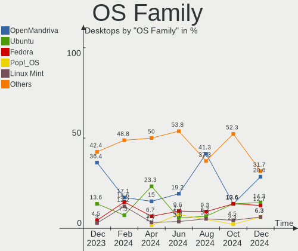
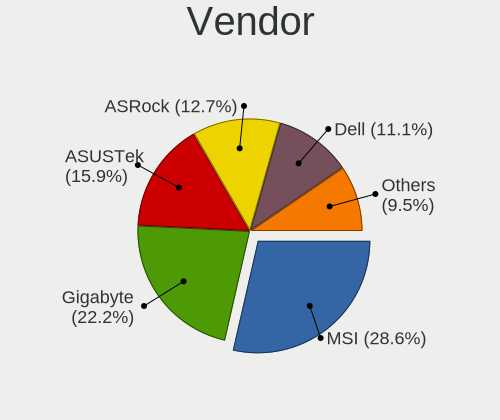
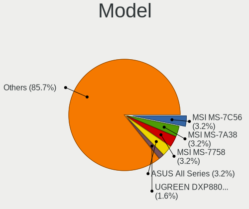
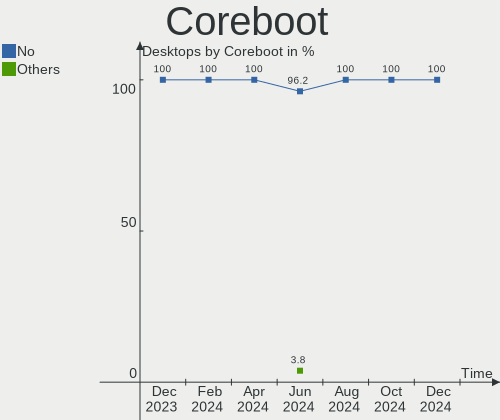
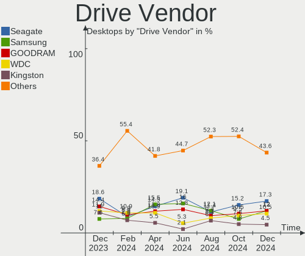
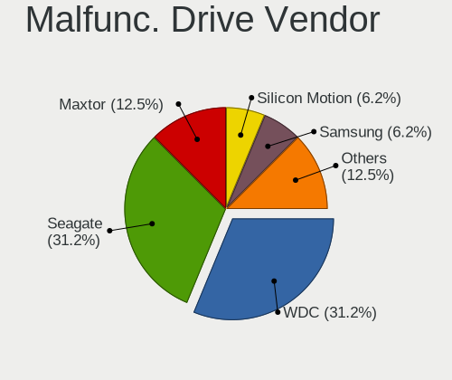
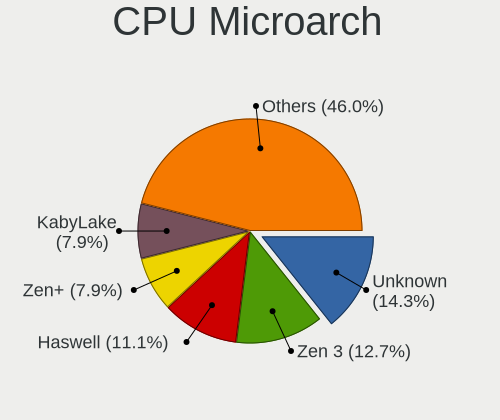
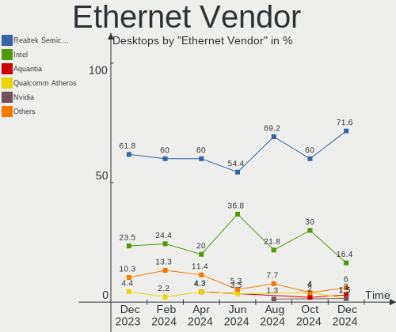

Linux in Poland - Hardware Trends (Desktops)
--------------------------------------------

A project to identify most popular hardware characteristics and track their change
over time based on data collected by Linux users at https://Linux-Hardware.org.

Anyone can contribute to this report by the [hw-probe](https://github.com/linuxhw/hw-probe) tool:

    sudo -E hw-probe -all -upload

Period: Nov, 2022.

Contents
--------

* [ System ](#system)
  - [ OS                       ](#os)
  - [ OS Family                ](#os-family)
  - [ Kernel                   ](#kernel)
  - [ Kernel Family            ](#kernel-family)
  - [ Kernel Major Ver.        ](#kernel-major-ver)
  - [ Arch                     ](#arch)
  - [ DE                       ](#de)
  - [ Display Server           ](#display-server)
  - [ Display Manager          ](#display-manager)
  - [ OS Lang                  ](#os-lang)
  - [ Boot Mode                ](#boot-mode)
  - [ Filesystem               ](#filesystem)
  - [ Part. scheme             ](#part-scheme)
  - [ Dual Boot with Linux/BSD ](#dual-boot-with-linuxbsd)
  - [ Dual Boot (Win)          ](#dual-boot-win)

* [ Board ](#board)
  - [ Vendor                   ](#vendor)
  - [ Model                    ](#model)
  - [ Model Family             ](#model-family)
  - [ MFG Year                 ](#mfg-year)
  - [ Form Factor              ](#form-factor)
  - [ Secure Boot              ](#secure-boot)
  - [ Coreboot                 ](#coreboot)
  - [ RAM Size                 ](#ram-size)
  - [ RAM Used                 ](#ram-used)
  - [ Total Drives             ](#total-drives)
  - [ Has CD-ROM               ](#has-cd-rom)
  - [ Has Ethernet             ](#has-ethernet)
  - [ Has WiFi                 ](#has-wifi)
  - [ Has Bluetooth            ](#has-bluetooth)

* [ Location ](#location)
  - [ Country                  ](#country)
  - [ City                     ](#city)

* [ Drives ](#drives)
  - [ Drive Vendor             ](#drive-vendor)
  - [ Drive Model              ](#drive-model)
  - [ HDD Vendor               ](#hdd-vendor)
  - [ SSD Vendor               ](#ssd-vendor)
  - [ Drive Kind               ](#drive-kind)
  - [ Drive Connector          ](#drive-connector)
  - [ Drive Size               ](#drive-size)
  - [ Space Total              ](#space-total)
  - [ Space Used               ](#space-used)
  - [ Malfunc. Drives          ](#malfunc-drives)
  - [ Malfunc. Drive Vendor    ](#malfunc-drive-vendor)
  - [ Malfunc. HDD Vendor      ](#malfunc-hdd-vendor)
  - [ Malfunc. Drive Kind      ](#malfunc-drive-kind)
  - [ Failed Drives            ](#failed-drives)
  - [ Failed Drive Vendor      ](#failed-drive-vendor)
  - [ Drive Status             ](#drive-status)

* [ Storage controller ](#storage-controller)
  - [ Storage Vendor           ](#storage-vendor)
  - [ Storage Model            ](#storage-model)
  - [ Storage Kind             ](#storage-kind)

* [ Processor ](#processor)
  - [ CPU Vendor               ](#cpu-vendor)
  - [ CPU Model                ](#cpu-model)
  - [ CPU Model Family         ](#cpu-model-family)
  - [ CPU Cores                ](#cpu-cores)
  - [ CPU Sockets              ](#cpu-sockets)
  - [ CPU Threads              ](#cpu-threads)
  - [ CPU Op-Modes             ](#cpu-op-modes)
  - [ CPU Microcode            ](#cpu-microcode)
  - [ CPU Microarch            ](#cpu-microarch)

* [ Graphics ](#graphics)
  - [ GPU Vendor               ](#gpu-vendor)
  - [ GPU Model                ](#gpu-model)
  - [ GPU Combo                ](#gpu-combo)
  - [ GPU Driver               ](#gpu-driver)
  - [ GPU Memory               ](#gpu-memory)

* [ Monitor ](#monitor)
  - [ Monitor Vendor           ](#monitor-vendor)
  - [ Monitor Model            ](#monitor-model)
  - [ Monitor Resolution       ](#monitor-resolution)
  - [ Monitor Diagonal         ](#monitor-diagonal)
  - [ Monitor Width            ](#monitor-width)
  - [ Aspect Ratio             ](#aspect-ratio)
  - [ Monitor Area             ](#monitor-area)
  - [ Pixel Density            ](#pixel-density)
  - [ Multiple Monitors        ](#multiple-monitors)

* [ Network ](#network)
  - [ Net Controller Vendor    ](#net-controller-vendor)
  - [ Net Controller Model     ](#net-controller-model)
  - [ Wireless Vendor          ](#wireless-vendor)
  - [ Wireless Model           ](#wireless-model)
  - [ Ethernet Vendor          ](#ethernet-vendor)
  - [ Ethernet Model           ](#ethernet-model)
  - [ Net Controller Kind      ](#net-controller-kind)
  - [ Used Controller          ](#used-controller)
  - [ NICs                     ](#nics)
  - [ IPv6                     ](#ipv6)

* [ Bluetooth ](#bluetooth)
  - [ Bluetooth Vendor         ](#bluetooth-vendor)
  - [ Bluetooth Model          ](#bluetooth-model)

* [ Sound ](#sound)
  - [ Sound Vendor             ](#sound-vendor)
  - [ Sound Model              ](#sound-model)

* [ Memory ](#memory)
  - [ Memory Vendor            ](#memory-vendor)
  - [ Memory Model             ](#memory-model)
  - [ Memory Kind              ](#memory-kind)
  - [ Memory Form Factor       ](#memory-form-factor)
  - [ Memory Size              ](#memory-size)
  - [ Memory Speed             ](#memory-speed)

* [ Printers & scanners ](#printers--scanners)
  - [ Printer Vendor           ](#printer-vendor)
  - [ Printer Model            ](#printer-model)
  - [ Scanner Vendor           ](#scanner-vendor)
  - [ Scanner Model            ](#scanner-model)

* [ Camera ](#camera)
  - [ Camera Vendor            ](#camera-vendor)
  - [ Camera Model             ](#camera-model)

* [ Security ](#security)
  - [ Fingerprint Vendor       ](#fingerprint-vendor)
  - [ Fingerprint Model        ](#fingerprint-model)
  - [ Chipcard Vendor          ](#chipcard-vendor)
  - [ Chipcard Model           ](#chipcard-model)

* [ Unsupported ](#unsupported)
  - [ Unsupported Devices      ](#unsupported-devices)
  - [ Unsupported Device Types ](#unsupported-device-types)

System
------

OS
--

Installed operating systems

| Name                         | Desktops | Percent |
|------------------------------|----------|---------|
| OpenMandriva 4.3             | 5        | 10.2%   |
| Fedora 37                    | 4        | 8.16%   |
| Arch Rolling                 | 4        | 8.16%   |
| Ubuntu 22.10                 | 3        | 6.12%   |
| Ubuntu 22.04                 | 3        | 6.12%   |
| Pop!_OS 22.04                | 3        | 6.12%   |
| OpenMandriva 4.50            | 3        | 6.12%   |
| Debian 11                    | 3        | 6.12%   |
| Ubuntu 20.04                 | 2        | 4.08%   |
| openSUSE Tumbleweed-XXXXXXXX | 2        | 4.08%   |
| OpenMandriva 4.2             | 2        | 4.08%   |
| Linux Mint 21                | 2        | 4.08%   |
| Gentoo 2.9                   | 2        | 4.08%   |
| Fedora 36                    | 2        | 4.08%   |
| Xubuntu 22.04                | 1        | 2.04%   |
| Ubuntu 18.04                 | 1        | 2.04%   |
| MX 21                        | 1        | 2.04%   |
| Manjaro 22.0.0               | 1        | 2.04%   |
| Lubuntu 22.04                | 1        | 2.04%   |
| Kubuntu 22.10                | 1        | 2.04%   |
| Kubuntu 20.10                | 1        | 2.04%   |
| KDE neon 22.04               | 1        | 2.04%   |
| Fedora 35                    | 1        | 2.04%   |

OS Family
---------

OS without a version

| Name         | Desktops | Percent |
|--------------|----------|---------|
| OpenMandriva | 10       | 20.41%  |
| Ubuntu       | 9        | 18.37%  |
| Fedora       | 7        | 14.29%  |
| Arch         | 4        | 8.16%   |
| Pop!_OS      | 3        | 6.12%   |
| Debian       | 3        | 6.12%   |
| openSUSE     | 2        | 4.08%   |
| Linux Mint   | 2        | 4.08%   |
| Kubuntu      | 2        | 4.08%   |
| Gentoo       | 2        | 4.08%   |
| Xubuntu      | 1        | 2.04%   |
| MX           | 1        | 2.04%   |
| Manjaro      | 1        | 2.04%   |
| Lubuntu      | 1        | 2.04%   |
| KDE neon     | 1        | 2.04%   |

Kernel
------

Version of the Linux kernel

| Version                  | Desktops | Percent |
|--------------------------|----------|---------|
| 5.15.0-52-generic        | 6        | 12.24%  |
| 5.16.7-desktop-1omv4003  | 5        | 10.2%   |
| 5.19.0-23-generic        | 4        | 8.16%   |
| 6.0.9-arch1-1            | 2        | 4.08%   |
| 6.0.8-1-default          | 2        | 4.08%   |
| 6.0.7-301.fc37.x86_64    | 2        | 4.08%   |
| 5.4.0-132-generic        | 2        | 4.08%   |
| 5.19.12-desktop-2omv4090 | 2        | 4.08%   |
| 5.15.75-gentoo           | 2        | 4.08%   |
| 5.15.0-43-generic        | 2        | 4.08%   |
| 5.10.14-desktop-1omv4002 | 2        | 4.08%   |
| 5.10.0-19-amd64          | 2        | 4.08%   |
| 6.0.9-200.fc36.x86_64    | 1        | 2.04%   |
| 6.0.8-zen1-1-zen         | 1        | 2.04%   |
| 6.0.8-x64v1-xanmod1      | 1        | 2.04%   |
| 6.0.8-300.fc37.x86_64    | 1        | 2.04%   |
| 6.0.8-100.fc35.x86_64    | 1        | 2.04%   |
| 6.0.8-1-MANJARO          | 1        | 2.04%   |
| 6.0.6-arch1-1            | 1        | 2.04%   |
| 6.0.6-76060006-generic   | 1        | 2.04%   |
| 6.0.5-200.fc36.x86_64    | 1        | 2.04%   |
| 6.0.3-76060003-generic   | 1        | 2.04%   |
| 6.0.0-4mx-rt-amd64       | 1        | 2.04%   |
| 5.8.0-63-lowlatency      | 1        | 2.04%   |
| 5.19.5-desktop-1omv4090  | 1        | 2.04%   |
| 5.19.16-301.fc37.x86_64  | 1        | 2.04%   |
| 5.19.0-0.deb11.2-amd64   | 1        | 2.04%   |
| 5.15.0-53-generic        | 1        | 2.04%   |

Kernel Family
-------------

Linux kernel without a distro release

| Version | Desktops | Percent |
|---------|----------|---------|
| 5.15.0  | 9        | 18.37%  |
| 6.0.8   | 7        | 14.29%  |
| 5.19.0  | 5        | 10.2%   |
| 5.16.7  | 5        | 10.2%   |
| 6.0.9   | 3        | 6.12%   |
| 6.0.7   | 2        | 4.08%   |
| 6.0.6   | 2        | 4.08%   |
| 5.4.0   | 2        | 4.08%   |
| 5.19.12 | 2        | 4.08%   |
| 5.15.75 | 2        | 4.08%   |
| 5.10.14 | 2        | 4.08%   |
| 5.10.0  | 2        | 4.08%   |
| 6.0.5   | 1        | 2.04%   |
| 6.0.3   | 1        | 2.04%   |
| 6.0.0   | 1        | 2.04%   |
| 5.8.0   | 1        | 2.04%   |
| 5.19.5  | 1        | 2.04%   |
| 5.19.16 | 1        | 2.04%   |

Kernel Major Ver.
-----------------

Linux kernel major version

| Version | Desktops | Percent |
|---------|----------|---------|
| 6.0     | 17       | 34.69%  |
| 5.15    | 11       | 22.45%  |
| 5.19    | 9        | 18.37%  |
| 5.16    | 5        | 10.2%   |
| 5.10    | 4        | 8.16%   |
| 5.4     | 2        | 4.08%   |
| 5.8     | 1        | 2.04%   |

Arch
----

OS architecture (x86_64, i586, etc.)

| Name   | Desktops | Percent |
|--------|----------|---------|
| x86_64 | 49       | 100%    |

DE
--

Desktop Environment

| Name          | Desktops | Percent |
|---------------|----------|---------|
| KDE5          | 19       | 38.78%  |
| GNOME         | 18       | 36.73%  |
| XFCE          | 3        | 6.12%   |
| i3            | 3        | 6.12%   |
| X-Cinnamon    | 2        | 4.08%   |
| MATE          | 1        | 2.04%   |
| LXQt          | 1        | 2.04%   |
| GNOME Classic | 1        | 2.04%   |
| Unknown       | 1        | 2.04%   |

Display Server
--------------

X11 or Wayland

| Name    | Desktops | Percent |
|---------|----------|---------|
| X11     | 35       | 71.43%  |
| Wayland | 11       | 22.45%  |
| Unknown | 2        | 4.08%   |
| Tty     | 1        | 2.04%   |

Display Manager
---------------

SDDM, LightDM, etc.

| Name    | Desktops | Percent |
|---------|----------|---------|
| Unknown | 18       | 36.73%  |
| SDDM    | 16       | 32.65%  |
| GDM3    | 7        | 14.29%  |
| LightDM | 6        | 12.24%  |
| GDM     | 2        | 4.08%   |

OS Lang
-------

Language

| Lang  | Desktops | Percent |
|-------|----------|---------|
| pl_PL | 30       | 61.22%  |
| en_US | 15       | 30.61%  |
| fr_FR | 1        | 2.04%   |
| en_GB | 1        | 2.04%   |
| de_DE | 1        | 2.04%   |
| C     | 1        | 2.04%   |

Boot Mode
---------

EFI or BIOS

| Mode | Desktops | Percent |
|------|----------|---------|
| BIOS | 26       | 53.06%  |
| EFI  | 23       | 46.94%  |

Filesystem
----------

Type of filesystem

| Type    | Desktops | Percent |
|---------|----------|---------|
| Ext4    | 27       | 55.1%   |
| Overlay | 10       | 20.41%  |
| Btrfs   | 10       | 20.41%  |
| F2fs    | 2        | 4.08%   |

Part. scheme
------------

Scheme of partitioning

| Type    | Desktops | Percent |
|---------|----------|---------|
| GPT     | 28       | 57.14%  |
| Unknown | 15       | 30.61%  |
| MBR     | 6        | 12.24%  |

Dual Boot with Linux/BSD
------------------------

Hosting more than one Linux/BSD

| Dual boot | Desktops | Percent |
|-----------|----------|---------|
| No        | 38       | 77.55%  |
| Yes       | 11       | 22.45%  |

Dual Boot (Win)
---------------

Hosting Linux and Windows

| Dual boot | Desktops | Percent |
|-----------|----------|---------|
| No        | 32       | 65.31%  |
| Yes       | 17       | 34.69%  |

Board
-----

Vendor
------

Motherboard manufacturer

| Name                | Desktops | Percent |
|---------------------|----------|---------|
| MSI                 | 12       | 24.49%  |
| Gigabyte Technology | 10       | 20.41%  |
| ASUSTek Computer    | 9        | 18.37%  |
| Hewlett-Packard     | 3        | 6.12%   |
| Dell                | 3        | 6.12%   |
| ASRock              | 3        | 6.12%   |
| Lenovo              | 2        | 4.08%   |
| Intel               | 2        | 4.08%   |
| Fujitsu             | 2        | 4.08%   |
| MACHINIST           | 1        | 2.04%   |
| Foxconn             | 1        | 2.04%   |
| Unknown             | 1        | 2.04%   |

Model
-----

Motherboard model

| Name                                    | Desktops | Percent |
|-----------------------------------------|----------|---------|
| Dell OptiPlex 755                       | 2        | 4.08%   |
| MSI MS-7D46                             | 1        | 2.04%   |
| MSI MS-7D25                             | 1        | 2.04%   |
| MSI MS-7D20                             | 1        | 2.04%   |
| MSI MS-7C52                             | 1        | 2.04%   |
| MSI MS-7C02                             | 1        | 2.04%   |
| MSI MS-7B93                             | 1        | 2.04%   |
| MSI MS-7B84                             | 1        | 2.04%   |
| MSI MS-7B78                             | 1        | 2.04%   |
| MSI MS-7B00                             | 1        | 2.04%   |
| MSI MS-7A38                             | 1        | 2.04%   |
| MSI MS-7A34                             | 1        | 2.04%   |
| MSI MS-7816                             | 1        | 2.04%   |
| MACHINIST X99-D8-MAX V1.0               | 1        | 2.04%   |
| Lenovo ThinkCentre M72e 3267B69         | 1        | 2.04%   |
| Lenovo IdeaCentre Y700-34ISH 90DF003SPL | 1        | 2.04%   |
| Intel H55                               | 1        | 2.04%   |
| Intel D525MW AAE93082-401               | 1        | 2.04%   |
| HP t620 PLUS Quad Core TC               | 1        | 2.04%   |
| HP Pro3500 G2 MT PC                     | 1        | 2.04%   |
| HP EliteDesk 705 G1 SFF                 | 1        | 2.04%   |
| Gigabyte Z97M-DS3H                      | 1        | 2.04%   |
| Gigabyte H81M-DS2                       | 1        | 2.04%   |
| Gigabyte G41MT-S2                       | 1        | 2.04%   |
| Gigabyte EP45-UD3LR                     | 1        | 2.04%   |
| Gigabyte B560M D3H                      | 1        | 2.04%   |
| Gigabyte B550M DS3H                     | 1        | 2.04%   |
| Gigabyte B550 AORUS ELITE AX V2         | 1        | 2.04%   |
| Gigabyte B550 AORUS ELITE               | 1        | 2.04%   |
| Gigabyte AB350-Gaming                   | 1        | 2.04%   |
| Gigabyte A520M H                        | 1        | 2.04%   |
| Fujitsu CELSIUS W380                    | 1        | 2.04%   |
| Fujitsu CELSIUS R570-2                  | 1        | 2.04%   |
| Foxconn Pro3500 Series                  | 1        | 2.04%   |
| Dell Vostro 3888                        | 1        | 2.04%   |
| ASUS TUF Z370-PRO GAMING                | 1        | 2.04%   |
| ASUS TUF Gaming B550M-PLUS WIFI II      | 1        | 2.04%   |
| ASUS TUF Gaming B550-PLUS               | 1        | 2.04%   |
| ASUS SABERTOOTH 990FX R2.0              | 1        | 2.04%   |
| ASUS ROG STRIX X670E-F GAMING WIFI      | 1        | 2.04%   |

Model Family
------------

Motherboard model prefix

| Name                  | Desktops | Percent |
|-----------------------|----------|---------|
| ASUS TUF              | 3        | 6.12%   |
| Gigabyte B550         | 2        | 4.08%   |
| Fujitsu CELSIUS       | 2        | 4.08%   |
| Dell OptiPlex         | 2        | 4.08%   |
| MSI MS-7D46           | 1        | 2.04%   |
| MSI MS-7D25           | 1        | 2.04%   |
| MSI MS-7D20           | 1        | 2.04%   |
| MSI MS-7C52           | 1        | 2.04%   |
| MSI MS-7C02           | 1        | 2.04%   |
| MSI MS-7B93           | 1        | 2.04%   |
| MSI MS-7B84           | 1        | 2.04%   |
| MSI MS-7B78           | 1        | 2.04%   |
| MSI MS-7B00           | 1        | 2.04%   |
| MSI MS-7A38           | 1        | 2.04%   |
| MSI MS-7A34           | 1        | 2.04%   |
| MSI MS-7816           | 1        | 2.04%   |
| MACHINIST X99-D8-MAX  | 1        | 2.04%   |
| Lenovo ThinkCentre    | 1        | 2.04%   |
| Lenovo IdeaCentre     | 1        | 2.04%   |
| Intel H55             | 1        | 2.04%   |
| Intel D525MW          | 1        | 2.04%   |
| HP t620               | 1        | 2.04%   |
| HP Pro3500            | 1        | 2.04%   |
| HP EliteDesk          | 1        | 2.04%   |
| Gigabyte Z97M-DS3H    | 1        | 2.04%   |
| Gigabyte H81M-DS2     | 1        | 2.04%   |
| Gigabyte G41MT-S2     | 1        | 2.04%   |
| Gigabyte EP45-UD3LR   | 1        | 2.04%   |
| Gigabyte B560M        | 1        | 2.04%   |
| Gigabyte B550M        | 1        | 2.04%   |
| Gigabyte AB350-Gaming | 1        | 2.04%   |
| Gigabyte A520M        | 1        | 2.04%   |
| Foxconn Pro3500       | 1        | 2.04%   |
| Dell Vostro           | 1        | 2.04%   |
| ASUS SABERTOOTH       | 1        | 2.04%   |
| ASUS ROG              | 1        | 2.04%   |
| ASUS PRIME            | 1        | 2.04%   |
| ASUS P8H61            | 1        | 2.04%   |
| ASUS M3A78-CM         | 1        | 2.04%   |
| ASUS All              | 1        | 2.04%   |

MFG Year
--------

Motherboard manufacture year

| Year | Desktops | Percent |
|------|----------|---------|
| 2014 | 8        | 16.33%  |
| 2021 | 7        | 14.29%  |
| 2020 | 7        | 14.29%  |
| 2022 | 4        | 8.16%   |
| 2019 | 4        | 8.16%   |
| 2017 | 3        | 6.12%   |
| 2012 | 3        | 6.12%   |
| 2010 | 3        | 6.12%   |
| 2013 | 2        | 4.08%   |
| 2011 | 2        | 4.08%   |
| 2007 | 2        | 4.08%   |
| 2018 | 1        | 2.04%   |
| 2015 | 1        | 2.04%   |
| 2009 | 1        | 2.04%   |
| 2008 | 1        | 2.04%   |

Form Factor
-----------

Physical design of the computer

| Name    | Desktops | Percent |
|---------|----------|---------|
| Desktop | 49       | 100%    |

Secure Boot
-----------

Enabled or disabled

| State    | Desktops | Percent |
|----------|----------|---------|
| Disabled | 48       | 97.96%  |
| Enabled  | 1        | 2.04%   |

Coreboot
--------

Have coreboot on board

| Used | Desktops | Percent |
|------|----------|---------|
| No   | 49       | 100%    |

RAM Size
--------

Total RAM memory

| Size in GB  | Desktops | Percent |
|-------------|----------|---------|
| 16.01-24.0  | 15       | 30.61%  |
| 32.01-64.0  | 10       | 20.41%  |
| 8.01-16.0   | 8        | 16.33%  |
| 4.01-8.0    | 6        | 12.24%  |
| 3.01-4.0    | 6        | 12.24%  |
| 24.01-32.0  | 2        | 4.08%   |
| 2.01-3.0    | 1        | 2.04%   |
| 64.01-256.0 | 1        | 2.04%   |

RAM Used
--------

Used RAM memory

| Used GB    | Desktops | Percent |
|------------|----------|---------|
| 1.01-2.0   | 19       | 38.78%  |
| 4.01-8.0   | 13       | 26.53%  |
| 2.01-3.0   | 7        | 14.29%  |
| 8.01-16.0  | 4        | 8.16%   |
| 3.01-4.0   | 3        | 6.12%   |
| 0.51-1.0   | 2        | 4.08%   |
| 16.01-24.0 | 1        | 2.04%   |

Total Drives
------------

Number of drives on board

| Drives | Desktops | Percent |
|--------|----------|---------|
| 1      | 18       | 36.73%  |
| 2      | 15       | 30.61%  |
| 4      | 7        | 14.29%  |
| 3      | 4        | 8.16%   |
| 6      | 2        | 4.08%   |
| 5      | 2        | 4.08%   |
| 0      | 1        | 2.04%   |

Has CD-ROM
----------

Has CD-ROM on board

| Presented | Desktops | Percent |
|-----------|----------|---------|
| No        | 30       | 61.22%  |
| Yes       | 19       | 38.78%  |

Has Ethernet
------------

Has Ethernet on board

| Presented | Desktops | Percent |
|-----------|----------|---------|
| Yes       | 49       | 100%    |

Has WiFi
--------

Has WiFi module

| Presented | Desktops | Percent |
|-----------|----------|---------|
| No        | 28       | 57.14%  |
| Yes       | 21       | 42.86%  |

Has Bluetooth
-------------

Has Bluetooth module

| Presented | Desktops | Percent |
|-----------|----------|---------|
| No        | 28       | 57.14%  |
| Yes       | 21       | 42.86%  |

Location
--------

Country
-------

Geographic location (country)

| Country | Desktops | Percent |
|---------|----------|---------|
| Poland  | 49       | 100%    |

City
----

Geographic location (city)

| City                 | Desktops | Percent |
|----------------------|----------|---------|
| Warsaw               | 9        | 18.37%  |
| Wroclaw              | 3        | 6.12%   |
| Lodz                 | 3        | 6.12%   |
| Wodzisław Śląski  | 2        | 4.08%   |
| Tarnów              | 2        | 4.08%   |
| Krakow               | 2        | 4.08%   |
| Gdansk               | 2        | 4.08%   |
| Bielsko-Biala        | 2        | 4.08%   |
| Bialystok            | 2        | 4.08%   |
| Żywiec              | 1        | 2.04%   |
| Wykroty              | 1        | 2.04%   |
| Supraśl             | 1        | 2.04%   |
| Rzeszów             | 1        | 2.04%   |
| Ruda Śląska        | 1        | 2.04%   |
| Radom                | 1        | 2.04%   |
| Piaseczno            | 1        | 2.04%   |
| Ostrów Wielkopolski | 1        | 2.04%   |
| Ostrow Lubelski      | 1        | 2.04%   |
| Opalenica            | 1        | 2.04%   |
| Moczkowo             | 1        | 2.04%   |
| Lubin                | 1        | 2.04%   |
| Konopiska            | 1        | 2.04%   |
| Kielce               | 1        | 2.04%   |
| Kedzierzyn-Kozle     | 1        | 2.04%   |
| Jaworzno             | 1        | 2.04%   |
| Gliwice              | 1        | 2.04%   |
| Czerniecin Glowny    | 1        | 2.04%   |
| Chodzież            | 1        | 2.04%   |
| Bytom                | 1        | 2.04%   |
| Bydgoszcz            | 1        | 2.04%   |
| Brzeg                | 1        | 2.04%   |

Drives
------

Drive Vendor
------------

Hard drive vendors

| Vendor                         | Desktops | Drives | Percent |
|--------------------------------|----------|--------|---------|
| Samsung Electronics            | 17       | 20     | 18.48%  |
| Seagate                        | 12       | 14     | 13.04%  |
| GOODRAM                        | 11       | 13     | 11.96%  |
| WDC                            | 10       | 12     | 10.87%  |
| Crucial                        | 6        | 7      | 6.52%   |
| Toshiba                        | 5        | 5      | 5.43%   |
| Sandisk                        | 5        | 5      | 5.43%   |
| A-DATA Technology              | 4        | 4      | 4.35%   |
| Kingston                       | 3        | 4      | 3.26%   |
| Hitachi                        | 3        | 5      | 3.26%   |
| Phison Electronics             | 2        | 3      | 2.17%   |
| Intel                          | 2        | 2      | 2.17%   |
| HGST                           | 2        | 2      | 2.17%   |
| Unknown                        | 1        | 3      | 1.09%   |
| SPCC                           | 1        | 1      | 1.09%   |
| Solid State Storage Technology | 1        | 1      | 1.09%   |
| Phison                         | 1        | 1      | 1.09%   |
| Patriot                        | 1        | 1      | 1.09%   |
| Micron/Crucial Technology      | 1        | 1      | 1.09%   |
| KIOXIA                         | 1        | 1      | 1.09%   |
| Kingston Technology Company    | 1        | 1      | 1.09%   |
| Gigabyte Technology            | 1        | 1      | 1.09%   |
| Apacer                         | 1        | 1      | 1.09%   |

Drive Model
-----------

Hard drive models

| Model                                             | Desktops | Percent |
|---------------------------------------------------|----------|---------|
| Seagate ST1000DM010-2EP102 1TB                    | 4        | 3.85%   |
| Samsung SSD 980 500GB                             | 4        | 3.85%   |
| Crucial CT1000MX500SSD1 1TB                       | 3        | 2.88%   |
| Sandisk WD Blue SN570 1TB                         | 2        | 1.92%   |
| Samsung SSD 870 EVO 500GB                         | 2        | 1.92%   |
| Samsung NVMe SSD Controller SM981/PM981/PM983 1TB | 2        | 1.92%   |
| Samsung HD502HI 500GB                             | 2        | 1.92%   |
| Kingston SA400S37240G 240GB SSD                   | 2        | 1.92%   |
| GOODRAM SSDPR-CX400-512-G2 512GB                  | 2        | 1.92%   |
| GOODRAM SSDPR-CX400-128 128GB                     | 2        | 1.92%   |
| GOODRAM SSDPR-CL100-480-G2 480GB                  | 2        | 1.92%   |
| GOODRAM SSD 120GB                                 | 2        | 1.92%   |
| Crucial CT500MX500SSD1 500GB                      | 2        | 1.92%   |
| WDC WD5003ABYZ-011FA0 500GB                       | 1        | 0.96%   |
| WDC WD5000LUCT-63C26Y0 500GB                      | 1        | 0.96%   |
| WDC WD5000LPLX-08ZNTT0 500GB                      | 1        | 0.96%   |
| WDC WD30EFRX-68N32N0 3TB                          | 1        | 0.96%   |
| WDC WD2500JS-55NCB1 250GB                         | 1        | 0.96%   |
| WDC WD2500AAKX-753CA1 250GB                       | 1        | 0.96%   |
| WDC WD10PURX-64E5EY0 1TB                          | 1        | 0.96%   |
| WDC WD10JFCX-68N6GN0 1TB                          | 1        | 0.96%   |
| WDC WD10EZRZ-00HTKB0 1TB                          | 1        | 0.96%   |
| WDC WD10EARS-00Y5B1 1TB                           | 1        | 0.96%   |
| WDC WD1003FZEX-00K3CA0 1TB                        | 1        | 0.96%   |
| WDC PC SN520 NVMe 512GB                           | 1        | 0.96%   |
| Unknown SD/MMC/M.S.PRO 32GB                       | 1        | 0.96%   |
| Unknown SD/MMC 2GB                                | 1        | 0.96%   |
| Unknown M.S./M.S.Pro/HG 16GB                      | 1        | 0.96%   |
| Toshiba THNSFC128GBSJ SSD                         | 1        | 0.96%   |
| Toshiba MQ01ABF050 500GB                          | 1        | 0.96%   |
| Toshiba MQ01ABD100 1TB                            | 1        | 0.96%   |
| Toshiba HDWE150 5TB                               | 1        | 0.96%   |
| Toshiba HDWD110 1TB                               | 1        | 0.96%   |
| SPCC Solid State Disk 240GB                       | 1        | 0.96%   |
| Solid State Storage PLEXTOR PX-512M10PGN 512GB    | 1        | 0.96%   |
| Seagate ST9500325AS 500GB                         | 1        | 0.96%   |
| Seagate ST4000DM004-2CV104 4TB                    | 1        | 0.96%   |
| Seagate ST3500413AS 500GB                         | 1        | 0.96%   |
| Seagate ST3160318AS 160GB                         | 1        | 0.96%   |
| Seagate ST3000DM001-1CH166 3TB                    | 1        | 0.96%   |

HDD Vendor
----------

Hard disk drive vendors

| Vendor              | Desktops | Drives | Percent |
|---------------------|----------|--------|---------|
| Seagate             | 12       | 14     | 34.29%  |
| WDC                 | 9        | 11     | 25.71%  |
| Samsung Electronics | 5        | 5      | 14.29%  |
| Toshiba             | 4        | 4      | 11.43%  |
| Hitachi             | 3        | 5      | 8.57%   |
| HGST                | 2        | 2      | 5.71%   |

SSD Vendor
----------

Solid state drive vendors

| Vendor              | Desktops | Drives | Percent |
|---------------------|----------|--------|---------|
| GOODRAM             | 11       | 13     | 33.33%  |
| Crucial             | 6        | 7      | 18.18%  |
| Samsung Electronics | 4        | 4      | 12.12%  |
| SanDisk             | 2        | 2      | 6.06%   |
| Kingston            | 2        | 3      | 6.06%   |
| A-DATA Technology   | 2        | 2      | 6.06%   |
| Toshiba             | 1        | 1      | 3.03%   |
| SPCC                | 1        | 1      | 3.03%   |
| Patriot             | 1        | 1      | 3.03%   |
| Intel               | 1        | 1      | 3.03%   |
| Gigabyte Technology | 1        | 1      | 3.03%   |
| Apacer              | 1        | 1      | 3.03%   |

Drive Kind
----------

HDD or SSD

| Kind    | Desktops | Drives | Percent |
|---------|----------|--------|---------|
| HDD     | 28       | 41     | 36.36%  |
| SSD     | 27       | 37     | 35.06%  |
| NVMe    | 21       | 27     | 27.27%  |
| Unknown | 1        | 3      | 1.3%    |

Drive Connector
---------------

SATA, SAS, NVMe, etc.

| Type | Desktops | Drives | Percent |
|------|----------|--------|---------|
| SATA | 40       | 77     | 63.49%  |
| NVMe | 21       | 27     | 33.33%  |
| SAS  | 2        | 4      | 3.17%   |

Drive Size
----------

Size of hard drive

| Size in TB | Desktops | Drives | Percent |
|------------|----------|--------|---------|
| 0.01-0.5   | 34       | 45     | 53.97%  |
| 0.51-1.0   | 20       | 22     | 31.75%  |
| 2.01-3.0   | 3        | 5      | 4.76%   |
| 3.01-4.0   | 2        | 2      | 3.17%   |
| 1.01-2.0   | 2        | 2      | 3.17%   |
| 10.01-20.0 | 1        | 1      | 1.59%   |
| 4.01-10.0  | 1        | 1      | 1.59%   |

Space Total
-----------

Amount of disk space available on the file system

| Size in GB     | Desktops | Percent |
|----------------|----------|---------|
| 251-500        | 13       | 26.53%  |
| 101-250        | 7        | 14.29%  |
| 1-20           | 7        | 14.29%  |
| 501-1000       | 7        | 14.29%  |
| 1001-2000      | 5        | 10.2%   |
| More than 3000 | 4        | 8.16%   |
| 51-100         | 2        | 4.08%   |
| Unknown        | 2        | 4.08%   |
| 21-50          | 1        | 2.04%   |
| 2001-3000      | 1        | 2.04%   |

Space Used
----------

Amount of used disk space

| Used GB        | Desktops | Percent |
|----------------|----------|---------|
| 1-20           | 17       | 34.69%  |
| 251-500        | 5        | 10.2%   |
| 21-50          | 5        | 10.2%   |
| 101-250        | 5        | 10.2%   |
| 51-100         | 5        | 10.2%   |
| More than 3000 | 4        | 8.16%   |
| 501-1000       | 4        | 8.16%   |
| 1001-2000      | 2        | 4.08%   |
| Unknown        | 2        | 4.08%   |

Malfunc. Drives
---------------

Drive models with a malfunction

| Model                             | Desktops | Drives | Percent |
|-----------------------------------|----------|--------|---------|
| WDC WD5000LUCT-63C26Y0 500GB      | 1        | 1      | 20%     |
| WDC WD2500AAKX-753CA1 250GB       | 1        | 1      | 20%     |
| WDC WD10JFCX-68N6GN0 1TB          | 1        | 1      | 20%     |
| Seagate ST9500325AS 500GB         | 1        | 1      | 20%     |
| Samsung Electronics HD256GM 250GB | 1        | 1      | 20%     |

Malfunc. Drive Vendor
---------------------

Vendors of faulty drives

| Vendor              | Desktops | Drives | Percent |
|---------------------|----------|--------|---------|
| WDC                 | 3        | 3      | 60%     |
| Seagate             | 1        | 1      | 20%     |
| Samsung Electronics | 1        | 1      | 20%     |

Malfunc. HDD Vendor
-------------------

Vendors of faulty HDD drives

| Vendor              | Desktops | Drives | Percent |
|---------------------|----------|--------|---------|
| WDC                 | 3        | 3      | 60%     |
| Seagate             | 1        | 1      | 20%     |
| Samsung Electronics | 1        | 1      | 20%     |

Malfunc. Drive Kind
-------------------

Kinds of faulty drives

| Kind | Desktops | Drives | Percent |
|------|----------|--------|---------|
| HDD  | 5        | 5      | 100%    |

Failed Drives
-------------

Failed drive models

Zero info for selected period =(

Failed Drive Vendor
-------------------

Failed drive vendors

Zero info for selected period =(

Drive Status
------------

Number of failed and malfunc. drives

| Status   | Desktops | Drives | Percent |
|----------|----------|--------|---------|
| Detected | 25       | 49     | 47.17%  |
| Works    | 23       | 54     | 43.4%   |
| Malfunc  | 5        | 5      | 9.43%   |

Storage controller
------------------

Storage Vendor
--------------

Storage controller vendors

| Vendor                         | Desktops | Percent |
|--------------------------------|----------|---------|
| Intel                          | 24       | 31.58%  |
| AMD                            | 24       | 31.58%  |
| Samsung Electronics            | 10       | 13.16%  |
| SanDisk                        | 4        | 5.26%   |
| Phison Electronics             | 3        | 3.95%   |
| ASMedia Technology             | 3        | 3.95%   |
| Kingston Technology Company    | 2        | 2.63%   |
| ADATA Technology               | 2        | 2.63%   |
| Solid State Storage Technology | 1        | 1.32%   |
| Micron/Crucial Technology      | 1        | 1.32%   |
| KIOXIA                         | 1        | 1.32%   |
| JMicron Technology             | 1        | 1.32%   |

Storage Model
-------------

Storage controller models

| Model                                                                          | Desktops | Percent |
|--------------------------------------------------------------------------------|----------|---------|
| AMD FCH SATA Controller [AHCI mode]                                            | 12       | 13.33%  |
| AMD 500 Series Chipset SATA Controller                                         | 6        | 6.67%   |
| AMD 400 Series Chipset SATA Controller                                         | 6        | 6.67%   |
| Samsung NVMe SSD Controller SM981/PM981/PM983                                  | 4        | 4.44%   |
| Samsung NVMe SSD Controller 980                                                | 4        | 4.44%   |
| Intel 6 Series/C200 Series Chipset Family 6 port Desktop SATA AHCI Controller  | 4        | 4.44%   |
| Intel 9 Series Chipset Family SATA Controller [AHCI Mode]                      | 3        | 3.33%   |
| ASMedia ASM1062 Serial ATA Controller                                          | 3        | 3.33%   |
| AMD 300 Series Chipset SATA Controller                                         | 3        | 3.33%   |
| SanDisk WD Blue SN570 NVMe SSD                                                 | 2        | 2.22%   |
| Phison PS5013 E13 NVMe Controller                                              | 2        | 2.22%   |
| Intel Alder Lake-S PCH SATA Controller [AHCI Mode]                             | 2        | 2.22%   |
| Intel 82Q35 Express PT IDER Controller                                         | 2        | 2.22%   |
| Intel 82801IR/IO/IH (ICH9R/DO/DH) 6 port SATA Controller [AHCI mode]           | 2        | 2.22%   |
| Intel 5 Series/3400 Series Chipset 6 port SATA AHCI Controller                 | 2        | 2.22%   |
| AMD SATA controller                                                            | 2        | 2.22%   |
| Solid State Storage Non-Volatile memory controller                             | 1        | 1.11%   |
| SanDisk PC SN520 NVMe SSD                                                      | 1        | 1.11%   |
| SanDisk Non-Volatile memory controller                                         | 1        | 1.11%   |
| Samsung NVMe SSD Controller SM961/PM961/SM963                                  | 1        | 1.11%   |
| Samsung NVMe SSD Controller PM9A1/PM9A3/980PRO                                 | 1        | 1.11%   |
| Phison E12 NVMe Controller                                                     | 1        | 1.11%   |
| Micron/Crucial P5 Plus NVMe PCIe SSD                                           | 1        | 1.11%   |
| KIOXIA NVMe SSD                                                                | 1        | 1.11%   |
| Kingston Company Company Non-Volatile memory controller                        | 1        | 1.11%   |
| Kingston Company SNVS2000G [NV1 NVMe PCIe SSD 2TB]                             | 1        | 1.11%   |
| JMicron JMB368 IDE controller                                                  | 1        | 1.11%   |
| Intel SSD 600P Series                                                          | 1        | 1.11%   |
| Intel Q170/Q150/B150/H170/H110/Z170/CM236 Chipset SATA Controller [AHCI Mode]  | 1        | 1.11%   |
| Intel NM10/ICH7 Family SATA Controller [IDE mode]                              | 1        | 1.11%   |
| Intel NM10/ICH7 Family SATA Controller [AHCI mode]                             | 1        | 1.11%   |
| Intel C610/X99 series chipset sSATA Controller [AHCI mode]                     | 1        | 1.11%   |
| Intel 82801JI (ICH10 Family) SATA AHCI Controller                              | 1        | 1.11%   |
| Intel 82801JI (ICH10 Family) 4 port SATA IDE Controller #1                     | 1        | 1.11%   |
| Intel 82801JI (ICH10 Family) 2 port SATA IDE Controller #2                     | 1        | 1.11%   |
| Intel 8 Series/C220 Series Chipset Family 6-port SATA Controller 1 [AHCI mode] | 1        | 1.11%   |
| Intel 500 Series Chipset Family SATA AHCI Controller                           | 1        | 1.11%   |
| Intel 5 Series/3400 Series Chipset PT IDER Controller                          | 1        | 1.11%   |
| Intel 400 Series Chipset Family SATA AHCI Controller                           | 1        | 1.11%   |
| Intel 300 Series Chipset Family SATA RAID Controller                           | 1        | 1.11%   |

Storage Kind
------------

Kind of storage controller (IDE, SATA, NVMe, SAS, ...)

| Kind | Desktops | Percent |
|------|----------|---------|
| SATA | 45       | 60.81%  |
| NVMe | 21       | 28.38%  |
| IDE  | 7        | 9.46%   |
| RAID | 1        | 1.35%   |

Processor
---------

CPU Vendor
----------

Processor vendors

| Vendor | Desktops | Percent |
|--------|----------|---------|
| Intel  | 25       | 51.02%  |
| AMD    | 24       | 48.98%  |

CPU Model
---------

Processor models

| Model                                        | Desktops | Percent |
|----------------------------------------------|----------|---------|
| AMD Ryzen 5 5600G with Radeon Graphics       | 3        | 6.12%   |
| AMD Ryzen 5 2600 Six-Core Processor          | 3        | 6.12%   |
| Intel Core i5-10400F CPU @ 2.90GHz           | 2        | 4.08%   |
| AMD Ryzen 7 7700X 8-Core Processor           | 2        | 4.08%   |
| AMD Ryzen 5 3600 6-Core Processor            | 2        | 4.08%   |
| Intel Xeon CPU X5672 @ 3.20GHz               | 1        | 2.04%   |
| Intel Xeon CPU X3430 @ 2.40GHz               | 1        | 2.04%   |
| Intel Xeon CPU E5-2696 v4 @ 2.20GHz          | 1        | 2.04%   |
| Intel Pentium Dual-Core CPU E5700 @ 3.00GHz  | 1        | 2.04%   |
| Intel Pentium CPU G3420 @ 3.20GHz            | 1        | 2.04%   |
| Intel Core i7-8700K CPU @ 3.70GHz            | 1        | 2.04%   |
| Intel Core i7-4790K CPU @ 4.00GHz            | 1        | 2.04%   |
| Intel Core i7-4790 CPU @ 3.60GHz             | 1        | 2.04%   |
| Intel Core i7-3770 CPU @ 3.40GHz             | 1        | 2.04%   |
| Intel Core i7-2600 CPU @ 3.40GHz             | 1        | 2.04%   |
| Intel Core i5-6600 CPU @ 3.30GHz             | 1        | 2.04%   |
| Intel Core i5-4690 CPU @ 3.50GHz             | 1        | 2.04%   |
| Intel Core i5-10400 CPU @ 2.90GHz            | 1        | 2.04%   |
| Intel Core i3-3240 CPU @ 3.40GHz             | 1        | 2.04%   |
| Intel Core i3-2120T CPU @ 2.60GHz            | 1        | 2.04%   |
| Intel Core i3-10100F CPU @ 3.60GHz           | 1        | 2.04%   |
| Intel Core i3 CPU 530 @ 2.93GHz              | 1        | 2.04%   |
| Intel Core 2 Quad CPU Q9400 @ 2.66GHz        | 1        | 2.04%   |
| Intel Core 2 Duo CPU E4600 @ 2.40GHz         | 1        | 2.04%   |
| Intel Core 2 Duo CPU E4400 @ 2.00GHz         | 1        | 2.04%   |
| Intel Atom CPU D525 @ 1.80GHz                | 1        | 2.04%   |
| Intel 13th Gen Core i7-13700K                | 1        | 2.04%   |
| Intel 12th Gen Core i7-12700K                | 1        | 2.04%   |
| AMD Ryzen 9 5900X 12-Core Processor          | 1        | 2.04%   |
| AMD Ryzen 9 5900HX with Radeon Graphics      | 1        | 2.04%   |
| AMD Ryzen 7 5800X 8-Core Processor           | 1        | 2.04%   |
| AMD Ryzen 7 5700X 8-Core Processor           | 1        | 2.04%   |
| AMD Ryzen 7 2700X Eight-Core Processor       | 1        | 2.04%   |
| AMD Ryzen 5 PRO 4650G with Radeon Graphics   | 1        | 2.04%   |
| AMD Ryzen 5 5600 6-Core Processor            | 1        | 2.04%   |
| AMD Ryzen 5 2400GE with Radeon Vega Graphics | 1        | 2.04%   |
| AMD Ryzen 3 1200 Quad-Core Processor         | 1        | 2.04%   |
| AMD Phenom II X6 1090T Processor             | 1        | 2.04%   |
| AMD Phenom II X4 955 Processor               | 1        | 2.04%   |
| AMD GX-420CA SOC with Radeon HD Graphics     | 1        | 2.04%   |

CPU Model Family
----------------

Processor model prefix

| Model                   | Desktops | Percent |
|-------------------------|----------|---------|
| AMD Ryzen 5             | 10       | 20.41%  |
| Intel Core i7           | 5        | 10.2%   |
| Intel Core i5           | 5        | 10.2%   |
| AMD Ryzen 7             | 5        | 10.2%   |
| Intel Core i3           | 4        | 8.16%   |
| Intel Xeon              | 3        | 6.12%   |
| Other                   | 2        | 4.08%   |
| Intel Core 2 Duo        | 2        | 4.08%   |
| AMD Ryzen 9             | 2        | 4.08%   |
| Intel Pentium Dual-Core | 1        | 2.04%   |
| Intel Pentium           | 1        | 2.04%   |
| Intel Core 2 Quad       | 1        | 2.04%   |
| Intel Atom              | 1        | 2.04%   |
| AMD Ryzen 5 PRO         | 1        | 2.04%   |
| AMD Ryzen 3             | 1        | 2.04%   |
| AMD Phenom II X6        | 1        | 2.04%   |
| AMD Phenom II X4        | 1        | 2.04%   |
| AMD GX                  | 1        | 2.04%   |
| AMD A8                  | 1        | 2.04%   |
| AMD A10                 | 1        | 2.04%   |

CPU Cores
---------

Number of processor cores

| Number | Desktops | Percent |
|--------|----------|---------|
| 6      | 15       | 30.61%  |
| 4      | 13       | 26.53%  |
| 2      | 10       | 20.41%  |
| 8      | 7        | 14.29%  |
| 12     | 2        | 4.08%   |
| 44     | 1        | 2.04%   |
| 16     | 1        | 2.04%   |

CPU Sockets
-----------

Number of sockets

| Number | Desktops | Percent |
|--------|----------|---------|
| 1      | 47       | 95.92%  |
| 2      | 2        | 4.08%   |

CPU Threads
-----------

Threads per core (Hyper-Threading)

| Number | Desktops | Percent |
|--------|----------|---------|
| 2      | 37       | 75.51%  |
| 1      | 12       | 24.49%  |

CPU Op-Modes
------------

CPU Operation Modes (32-bit, 64-bit)

| Op mode        | Desktops | Percent |
|----------------|----------|---------|
| 32-bit, 64-bit | 49       | 100%    |

CPU Microcode
-------------

Microcode number

| Number     | Desktops | Percent |
|------------|----------|---------|
| Unknown    | 14       | 28.57%  |
| 0x306c3    | 4        | 8.16%   |
| 0x0a50000c | 3        | 6.12%   |
| 0xa0653    | 2        | 4.08%   |
| 0x306a9    | 2        | 4.08%   |
| 0x1067a    | 2        | 4.08%   |
| 0x0a201016 | 2        | 4.08%   |
| 0x0800820d | 2        | 4.08%   |
| 0xb0671    | 1        | 2.04%   |
| 0x90672    | 1        | 2.04%   |
| 0x6fd      | 1        | 2.04%   |
| 0x506e3    | 1        | 2.04%   |
| 0x406f1    | 1        | 2.04%   |
| 0x206a7    | 1        | 2.04%   |
| 0x106ca    | 1        | 2.04%   |
| 0x0a601201 | 1        | 2.04%   |
| 0x0a50000d | 1        | 2.04%   |
| 0x0a20120a | 1        | 2.04%   |
| 0x08701021 | 1        | 2.04%   |
| 0x08701013 | 1        | 2.04%   |
| 0x08101016 | 1        | 2.04%   |
| 0x0800820b | 1        | 2.04%   |
| 0x06003106 | 1        | 2.04%   |
| 0x06001119 | 1        | 2.04%   |
| 0x010000db | 1        | 2.04%   |
| 0x010000bf | 1        | 2.04%   |

CPU Microarch
-------------

Microarchitecture

| Name             | Desktops | Percent |
|------------------|----------|---------|
| Zen 3            | 8        | 16.33%  |
| Zen+             | 4        | 8.16%   |
| Haswell          | 4        | 8.16%   |
| CometLake        | 4        | 8.16%   |
| Zen 2            | 3        | 6.12%   |
| Zen              | 2        | 4.08%   |
| Westmere         | 2        | 4.08%   |
| SandyBridge      | 2        | 4.08%   |
| Penryn           | 2        | 4.08%   |
| K10              | 2        | 4.08%   |
| IvyBridge        | 2        | 4.08%   |
| Core             | 2        | 4.08%   |
| Alderlake Hybrid | 2        | 4.08%   |
| Unknown          | 2        | 4.08%   |
| Steamroller      | 1        | 2.04%   |
| Skylake          | 1        | 2.04%   |
| Piledriver       | 1        | 2.04%   |
| Nehalem          | 1        | 2.04%   |
| KabyLake         | 1        | 2.04%   |
| Jaguar           | 1        | 2.04%   |
| Broadwell        | 1        | 2.04%   |
| Bonnell          | 1        | 2.04%   |

Graphics
--------

GPU Vendor
----------

Vendors of graphics cards

| Vendor | Desktops | Percent |
|--------|----------|---------|
| AMD    | 25       | 46.3%   |
| Nvidia | 17       | 31.48%  |
| Intel  | 12       | 22.22%  |

GPU Model
---------

Graphics card models

| Model                                                                       | Desktops | Percent |
|-----------------------------------------------------------------------------|----------|---------|
| AMD Cezanne [Radeon Vega Series / Radeon Vega Mobile Series]                | 4        | 7.27%   |
| Intel Xeon E3-1200 v3/4th Gen Core Processor Integrated Graphics Controller | 3        | 5.45%   |
| AMD Ellesmere [Radeon RX 470/480/570/570X/580/580X/590]                     | 3        | 5.45%   |
| Nvidia GP106 [GeForce GTX 1060 6GB]                                         | 2        | 3.64%   |
| AMD Raphael                                                                 | 2        | 3.64%   |
| AMD Cedar [Radeon HD 5000/6000/7350/8350 Series]                            | 2        | 3.64%   |
| AMD Baffin [Radeon RX 550 640SP / RX 560/560X]                              | 2        | 3.64%   |
| Nvidia TU102 [GeForce RTX 2080 Ti Rev. A]                                   | 1        | 1.82%   |
| Nvidia GT218 [GeForce 210]                                                  | 1        | 1.82%   |
| Nvidia GP106 [GeForce GTX 1060 3GB]                                         | 1        | 1.82%   |
| Nvidia GP104 [GeForce GTX 1070]                                             | 1        | 1.82%   |
| Nvidia GM206 [GeForce GTX 960]                                              | 1        | 1.82%   |
| Nvidia GM107 [GeForce GTX 750 Ti]                                           | 1        | 1.82%   |
| Nvidia GK208B [GeForce GT 730]                                              | 1        | 1.82%   |
| Nvidia GK107GL [Quadro K2000D]                                              | 1        | 1.82%   |
| Nvidia GK104 [GeForce GTX 770]                                              | 1        | 1.82%   |
| Nvidia GF119 [GeForce GT 520]                                               | 1        | 1.82%   |
| Nvidia GF108 [GeForce GT 730]                                               | 1        | 1.82%   |
| Nvidia GA106 [Geforce RTX 3050]                                             | 1        | 1.82%   |
| Nvidia GA104 [GeForce RTX 3070]                                             | 1        | 1.82%   |
| Nvidia GA104 [GeForce RTX 3060 Ti Lite Hash Rate]                           | 1        | 1.82%   |
| Nvidia G94GL [Quadro FX 1800]                                               | 1        | 1.82%   |
| Intel Xeon E3-1200 v2/3rd Gen Core processor Graphics Controller            | 1        | 1.82%   |
| Intel Raptor Lake-S UHD Graphics                                            | 1        | 1.82%   |
| Intel IvyBridge GT2 [HD Graphics 4000]                                      | 1        | 1.82%   |
| Intel CometLake-S GT2 [UHD Graphics 630]                                    | 1        | 1.82%   |
| Intel Atom Processor D4xx/D5xx/N4xx/N5xx Integrated Graphics Controller     | 1        | 1.82%   |
| Intel AlderLake-S GT1                                                       | 1        | 1.82%   |
| Intel 82Q35 Express Integrated Graphics Controller                          | 1        | 1.82%   |
| Intel 4 Series Chipset Integrated Graphics Controller                       | 1        | 1.82%   |
| Intel 2nd Generation Core Processor Family Integrated Graphics Controller   | 1        | 1.82%   |
| AMD RV610 [Radeon HD 2400 PRO]                                              | 1        | 1.82%   |
| AMD RS780C [Radeon 3100]                                                    | 1        | 1.82%   |
| AMD Renoir                                                                  | 1        | 1.82%   |
| AMD Redwood XT [Radeon HD 5670/5690/5730]                                   | 1        | 1.82%   |
| AMD Raven Ridge [Radeon Vega Series / Radeon Vega Mobile Series]            | 1        | 1.82%   |
| AMD Pitcairn PRO [Radeon HD 7850 / R7 265 / R9 270 1024SP]                  | 1        | 1.82%   |
| AMD Oland [Radeon HD 8570 / R5 430 OEM / R7 240/340 / Radeon 520 OEM]       | 1        | 1.82%   |
| AMD Navi 23 [Radeon RX 6600/6600 XT/6600M]                                  | 1        | 1.82%   |
| AMD Navi 22 [Radeon RX 6700/6700 XT/6750 XT / 6800M]                        | 1        | 1.82%   |

GPU Combo
---------

Combinations of graphics cards

| Name           | Desktops | Percent |
|----------------|----------|---------|
| 1 x AMD        | 21       | 42.86%  |
| 1 x Nvidia     | 15       | 30.61%  |
| 1 x Intel      | 8        | 16.33%  |
| Intel + AMD    | 2        | 4.08%   |
| 2 x AMD        | 1        | 2.04%   |
| Intel + Nvidia | 1        | 2.04%   |
| AMD + Nvidia   | 1        | 2.04%   |

GPU Driver
----------

Free vs proprietary

| Driver      | Desktops | Percent |
|-------------|----------|---------|
| Free        | 36       | 73.47%  |
| Proprietary | 11       | 22.45%  |
| Unknown     | 2        | 4.08%   |

GPU Memory
----------

Total video memory

| Size in GB | Desktops | Percent |
|------------|----------|---------|
| Unknown    | 18       | 36.73%  |
| 1.01-2.0   | 7        | 14.29%  |
| 0.01-0.5   | 7        | 14.29%  |
| 0.51-1.0   | 5        | 10.2%   |
| 7.01-8.0   | 4        | 8.16%   |
| 3.01-4.0   | 3        | 6.12%   |
| 8.01-16.0  | 3        | 6.12%   |
| 5.01-6.0   | 1        | 2.04%   |
| 2.01-3.0   | 1        | 2.04%   |

Monitor
-------

Monitor Vendor
--------------

Monitor vendors

| Vendor               | Desktops | Percent |
|----------------------|----------|---------|
| Samsung Electronics  | 12       | 20%     |
| Goldstar             | 12       | 20%     |
| Iiyama               | 6        | 10%     |
| Hewlett-Packard      | 4        | 6.67%   |
| Dell                 | 3        | 5%      |
| Acer                 | 3        | 5%      |
| Philips              | 2        | 3.33%   |
| Hitachi              | 2        | 3.33%   |
| Gateway              | 2        | 3.33%   |
| Fujitsu Siemens      | 2        | 3.33%   |
| Sony                 | 1        | 1.67%   |
| MSI                  | 1        | 1.67%   |
| Medion               | 1        | 1.67%   |
| Lenovo               | 1        | 1.67%   |
| Gigabyte Technology  | 1        | 1.67%   |
| Eizo                 | 1        | 1.67%   |
| DEX                  | 1        | 1.67%   |
| AU Optronics         | 1        | 1.67%   |
| Arnos Instruments    | 1        | 1.67%   |
| Ancor Communications | 1        | 1.67%   |
| AMW                  | 1        | 1.67%   |
| Unknown              | 1        | 1.67%   |

Monitor Model
-------------

Monitor models

| Model                                                                   | Desktops | Percent |
|-------------------------------------------------------------------------|----------|---------|
| Goldstar LG ULTRAWIDE GSM59F1 2560x1080 670x280mm 28.6-inch             | 3        | 4.69%   |
| Philips PHL 276E8V PHLC18F 3840x2160 597x336mm 27.0-inch                | 2        | 3.13%   |
| Sony TV SNY3002 1920x1080 886x498mm 40.0-inch                           | 1        | 1.56%   |
| Samsung Electronics T24C300 SAM0A9B 1920x1080 530x300mm 24.0-inch       | 1        | 1.56%   |
| Samsung Electronics SyncMaster SAM01D0 1600x1200 432x324mm 21.3-inch    | 1        | 1.56%   |
| Samsung Electronics SyncMaster SAM0194 1280x1024 376x301mm 19.0-inch    | 1        | 1.56%   |
| Samsung Electronics SA300/SA350 SAM078F 1920x1080 477x268mm 21.5-inch   | 1        | 1.56%   |
| Samsung Electronics S27R65 SAM1045 1920x1080 598x336mm 27.0-inch        | 1        | 1.56%   |
| Samsung Electronics S24D330 SAM0D92 1920x1080 531x299mm 24.0-inch       | 1        | 1.56%   |
| Samsung Electronics S24C650 SAM0B15 1920x1200 520x320mm 24.0-inch       | 1        | 1.56%   |
| Samsung Electronics S22B300 SAM08C8 1920x1080 477x268mm 21.5-inch       | 1        | 1.56%   |
| Samsung Electronics LCD Monitor SAM7017 3840x2160 1872x1053mm 84.6-inch | 1        | 1.56%   |
| Samsung Electronics LCD Monitor SAM0A7A 1920x1080 1060x626mm 48.5-inch  | 1        | 1.56%   |
| Samsung Electronics LCD Monitor SAM067C 1920x1080                       | 1        | 1.56%   |
| Samsung Electronics LCD Monitor C34H89x 6880x1440                       | 1        | 1.56%   |
| Samsung Electronics C34H89x SAM0E25 3440x1440 800x330mm 34.1-inch       | 1        | 1.56%   |
| MSI MAG275R MSI3CB5 1920x1080 600x340mm 27.2-inch                       | 1        | 1.56%   |
| Medion LCD Monitor MD30219PH 1280x1024                                  | 1        | 1.56%   |
| Lenovo LEN LT2452pwC LEN1144 1920x1200 518x324mm 24.1-inch              | 1        | 1.56%   |
| Iiyama PLX2380H IVM5621 1920x1080 509x286mm 23.0-inch                   | 1        | 1.56%   |
| Iiyama PLE2407HDS IVM560D 1920x1080 521x293mm 23.5-inch                 | 1        | 1.56%   |
| Iiyama PL2796HS IVM6669 1920x1080 598x336mm 27.0-inch                   | 1        | 1.56%   |
| Iiyama PL2530H IVM6133 1920x1080 544x303mm 24.5-inch                    | 1        | 1.56%   |
| Iiyama PL2530H IVM6132 1920x1080 540x300mm 24.3-inch                    | 1        | 1.56%   |
| Iiyama PL2474H IVM6146 1920x1080 521x293mm 23.5-inch                    | 1        | 1.56%   |
| Iiyama PL2280H IVM5620 1920x1080 477x268mm 21.5-inch                    | 1        | 1.56%   |
| Hitachi X224W D-sub HIT700B 1680x1050 473x296mm 22.0-inch               | 1        | 1.56%   |
| Hitachi N240W D_sub HIT700C 1920x1200 518x324mm 24.1-inch               | 1        | 1.56%   |
| Hewlett-Packard ZR2440w HWP2956 1920x1200 518x324mm 24.1-inch           | 1        | 1.56%   |
| Hewlett-Packard ZR2330w HWP3069 1920x1080 509x286mm 23.0-inch           | 1        | 1.56%   |
| Hewlett-Packard LA2306 HWP2949 1920x1080 509x286mm 23.0-inch            | 1        | 1.56%   |
| Hewlett-Packard E231 HWP3063 1920x1080 509x286mm 23.0-inch              | 1        | 1.56%   |
| Goldstar W2343 GSM5700 1920x1080 474x296mm 22.0-inch                    | 1        | 1.56%   |
| Goldstar TV SSCR2 GSMC0C8 3840x2160                                     | 1        | 1.56%   |
| Goldstar M2380D GSM57BC 1920x1080 598x336mm 27.0-inch                   | 1        | 1.56%   |
| Goldstar M197WD GSM4BA2 1360x768 410x230mm 18.5-inch                    | 1        | 1.56%   |
| Goldstar LG ULTRAGEAR GSM5B7F 2560x1440 600x340mm 27.2-inch             | 1        | 1.56%   |
| Goldstar L204WT GSM4E47 1680x1050 430x270mm 20.0-inch                   | 1        | 1.56%   |
| Goldstar F900B GSM4A66 2048x1536 350x262mm 17.2-inch                    | 1        | 1.56%   |
| Goldstar E1940 GSM4BD6 1360x768 406x229mm 18.4-inch                     | 1        | 1.56%   |

Monitor Resolution
------------------

Monitor screen resolution

| Resolution         | Desktops | Percent |
|--------------------|----------|---------|
| 1920x1080 (FHD)    | 22       | 41.51%  |
| 1280x1024 (SXGA)   | 5        | 9.43%   |
| 3840x2160 (4K)     | 4        | 7.55%   |
| 2560x1440 (QHD)    | 3        | 5.66%   |
| 2560x1080          | 3        | 5.66%   |
| 1920x1200 (WUXGA)  | 3        | 5.66%   |
| 1680x1050 (WSXGA+) | 3        | 5.66%   |
| 3440x1440          | 2        | 3.77%   |
| 1440x900 (WXGA+)   | 2        | 3.77%   |
| 1360x768           | 2        | 3.77%   |
| 6880x1440          | 1        | 1.89%   |
| 1600x1200          | 1        | 1.89%   |
| 1024x768 (XGA)     | 1        | 1.89%   |
| Unknown            | 1        | 1.89%   |

Monitor Diagonal
----------------

Diagonal size in inches

| Inches  | Desktops | Percent |
|---------|----------|---------|
| 24      | 9        | 15.79%  |
| 27      | 8        | 14.04%  |
| 23      | 8        | 14.04%  |
| 21      | 7        | 12.28%  |
| 34      | 5        | 8.77%   |
| Unknown | 5        | 8.77%   |
| 18      | 3        | 5.26%   |
| 22      | 2        | 3.51%   |
| 19      | 2        | 3.51%   |
| 15      | 2        | 3.51%   |
| 84      | 1        | 1.75%   |
| 72      | 1        | 1.75%   |
| 48      | 1        | 1.75%   |
| 40      | 1        | 1.75%   |
| 20      | 1        | 1.75%   |
| 17      | 1        | 1.75%   |

Monitor Width
-------------

Physical width

| Width in mm | Desktops | Percent |
|-------------|----------|---------|
| 501-600     | 22       | 40%     |
| 401-500     | 14       | 25.45%  |
| 701-800     | 5        | 9.09%   |
| Unknown     | 5        | 9.09%   |
| 301-350     | 3        | 5.45%   |
| 801-900     | 2        | 3.64%   |
| 1501-2000   | 2        | 3.64%   |
| 351-400     | 1        | 1.82%   |
| 1001-1500   | 1        | 1.82%   |

Aspect Ratio
------------

Proportional relationship between the width and the height

| Ratio   | Desktops | Percent |
|---------|----------|---------|
| 16/9    | 28       | 53.85%  |
| 16/10   | 11       | 21.15%  |
| 21/9    | 5        | 9.62%   |
| 4/3     | 3        | 5.77%   |
| Unknown | 3        | 5.77%   |
| 5/4     | 2        | 3.85%   |

Monitor Area
------------

Area in inch²

| Area in inch² | Desktops | Percent |
|----------------|----------|---------|
| 201-250        | 17       | 30.36%  |
| 301-350        | 8        | 14.29%  |
| 251-300        | 7        | 12.5%   |
| 351-500        | 5        | 8.93%   |
| 151-200        | 5        | 8.93%   |
| Unknown        | 5        | 8.93%   |
| More than 1000 | 3        | 5.36%   |
| 141-150        | 3        | 5.36%   |
| 101-110        | 2        | 3.57%   |
| 501-1000       | 1        | 1.79%   |

Pixel Density
-------------

Pixels per inch

| Density | Desktops | Percent |
|---------|----------|---------|
| 51-100  | 33       | 62.26%  |
| 101-120 | 11       | 20.75%  |
| Unknown | 5        | 9.43%   |
| 161-240 | 2        | 3.77%   |
| 1-50    | 1        | 1.89%   |
| 121-160 | 1        | 1.89%   |

Multiple Monitors
-----------------

Total monitors connected

| Total | Desktops | Percent |
|-------|----------|---------|
| 1     | 35       | 71.43%  |
| 2     | 11       | 22.45%  |
| 3     | 2        | 4.08%   |
| 0     | 1        | 2.04%   |

Network
-------

Net Controller Vendor
---------------------

Controller vendors

| Vendor                          | Desktops | Percent |
|---------------------------------|----------|---------|
| Realtek Semiconductor           | 33       | 48.53%  |
| Intel                           | 16       | 23.53%  |
| MediaTek                        | 6        | 8.82%   |
| TP-Link                         | 5        | 7.35%   |
| Qualcomm Atheros                | 3        | 4.41%   |
| Broadcom                        | 2        | 2.94%   |
| Ralink Technology               | 1        | 1.47%   |
| Qualcomm Atheros Communications | 1        | 1.47%   |
| Huawei Technologies             | 1        | 1.47%   |

Net Controller Model
--------------------

Controller models

| Model                                                             | Desktops | Percent |
|-------------------------------------------------------------------|----------|---------|
| Realtek RTL8111/8168/8411 PCI Express Gigabit Ethernet Controller | 25       | 33.33%  |
| Realtek RTL8125 2.5GbE Controller                                 | 6        | 8%      |
| Intel I211 Gigabit Network Connection                             | 3        | 4%      |
| Intel Ethernet Controller I225-V                                  | 3        | 4%      |
| TP-Link TL-WN722N v2/v3 [Realtek RTL8188EUS]                      | 2        | 2.67%   |
| MediaTek MT7922 802.11ax PCI Express Wireless Network Adapter     | 2        | 2.67%   |
| MediaTek MT7921K (RZ608) Wi-Fi 6E 80MHz                           | 2        | 2.67%   |
| Intel Wi-Fi 6 AX210/AX211/AX411 160MHz                            | 2        | 2.67%   |
| Intel Wi-Fi 6 AX200                                               | 2        | 2.67%   |
| Intel 82566DM-2 Gigabit Network Connection                        | 2        | 2.67%   |
| TP-Link TL-WN822N Version 4 RTL8192EU                             | 1        | 1.33%   |
| TP-Link Archer T2U PLUS [RTL8821AU]                               | 1        | 1.33%   |
| TP-Link 802.11ac NIC                                              | 1        | 1.33%   |
| Realtek RTL88x2bu [AC1200 Techkey]                                | 1        | 1.33%   |
| Realtek RTL8812AE 802.11ac PCIe Wireless Network Adapter          | 1        | 1.33%   |
| Realtek RTL8169 PCI Gigabit Ethernet Controller                   | 1        | 1.33%   |
| Realtek RTL810xE PCI Express Fast Ethernet controller             | 1        | 1.33%   |
| Realtek 802.11ac NIC                                              | 1        | 1.33%   |
| Ralink RT5370 Wireless Adapter                                    | 1        | 1.33%   |
| Qualcomm Atheros QCA8171 Gigabit Ethernet                         | 1        | 1.33%   |
| Qualcomm Atheros QCA6174 802.11ac Wireless Network Adapter        | 1        | 1.33%   |
| Qualcomm Atheros AR9271 802.11n                                   | 1        | 1.33%   |
| Qualcomm Atheros AR8151 v2.0 Gigabit Ethernet                     | 1        | 1.33%   |
| MediaTek MT7921 802.11ax PCI Express Wireless Network Adapter     | 1        | 1.33%   |
| MediaTek MT7612U 802.11a/b/g/n/ac Wireless Adapter                | 1        | 1.33%   |
| Intel Wireless 3165                                               | 1        | 1.33%   |
| Intel Ethernet Connection (2) I219-V                              | 1        | 1.33%   |
| Intel Ethernet Connection (2) I218-V                              | 1        | 1.33%   |
| Intel Ethernet Connection (17) I219-V                             | 1        | 1.33%   |
| Intel Ethernet Connection (14) I219-V                             | 1        | 1.33%   |
| Intel Ethernet Connection (12) I219-V                             | 1        | 1.33%   |
| Intel Alder Lake-S PCH CNVi WiFi                                  | 1        | 1.33%   |
| Intel 82578DM Gigabit Network Connection                          | 1        | 1.33%   |
| Huawei SNE-LX1                                                    | 1        | 1.33%   |
| Broadcom NetXtreme BCM5762 Gigabit Ethernet PCIe                  | 1        | 1.33%   |
| Broadcom BCM43228 802.11a/b/g/n                                   | 1        | 1.33%   |

Wireless Vendor
---------------

Wireless vendors

| Vendor                          | Desktops | Percent |
|---------------------------------|----------|---------|
| MediaTek                        | 6        | 25%     |
| Intel                           | 6        | 25%     |
| TP-Link                         | 5        | 20.83%  |
| Realtek Semiconductor           | 3        | 12.5%   |
| Ralink Technology               | 1        | 4.17%   |
| Qualcomm Atheros Communications | 1        | 4.17%   |
| Qualcomm Atheros                | 1        | 4.17%   |
| Broadcom                        | 1        | 4.17%   |

Wireless Model
--------------

Wireless models

| Model                                                         | Desktops | Percent |
|---------------------------------------------------------------|----------|---------|
| TP-Link TL-WN722N v2/v3 [Realtek RTL8188EUS]                  | 2        | 8.33%   |
| MediaTek MT7922 802.11ax PCI Express Wireless Network Adapter | 2        | 8.33%   |
| MediaTek MT7921K (RZ608) Wi-Fi 6E 80MHz                       | 2        | 8.33%   |
| Intel Wi-Fi 6 AX210/AX211/AX411 160MHz                        | 2        | 8.33%   |
| Intel Wi-Fi 6 AX200                                           | 2        | 8.33%   |
| TP-Link TL-WN822N Version 4 RTL8192EU                         | 1        | 4.17%   |
| TP-Link Archer T2U PLUS [RTL8821AU]                           | 1        | 4.17%   |
| TP-Link 802.11ac NIC                                          | 1        | 4.17%   |
| Realtek RTL88x2bu [AC1200 Techkey]                            | 1        | 4.17%   |
| Realtek RTL8812AE 802.11ac PCIe Wireless Network Adapter      | 1        | 4.17%   |
| Realtek 802.11ac NIC                                          | 1        | 4.17%   |
| Ralink RT5370 Wireless Adapter                                | 1        | 4.17%   |
| Qualcomm Atheros QCA6174 802.11ac Wireless Network Adapter    | 1        | 4.17%   |
| Qualcomm Atheros AR9271 802.11n                               | 1        | 4.17%   |
| MediaTek MT7921 802.11ax PCI Express Wireless Network Adapter | 1        | 4.17%   |
| MediaTek MT7612U 802.11a/b/g/n/ac Wireless Adapter            | 1        | 4.17%   |
| Intel Wireless 3165                                           | 1        | 4.17%   |
| Intel Alder Lake-S PCH CNVi WiFi                              | 1        | 4.17%   |
| Broadcom BCM43228 802.11a/b/g/n                               | 1        | 4.17%   |

Ethernet Vendor
---------------

Ethernet vendors

| Vendor                | Desktops | Percent |
|-----------------------|----------|---------|
| Realtek Semiconductor | 33       | 64.71%  |
| Intel                 | 14       | 27.45%  |
| Qualcomm Atheros      | 2        | 3.92%   |
| Huawei Technologies   | 1        | 1.96%   |
| Broadcom              | 1        | 1.96%   |

Ethernet Model
--------------

Ethernet models

| Model                                                             | Desktops | Percent |
|-------------------------------------------------------------------|----------|---------|
| Realtek RTL8111/8168/8411 PCI Express Gigabit Ethernet Controller | 25       | 49.02%  |
| Realtek RTL8125 2.5GbE Controller                                 | 6        | 11.76%  |
| Intel I211 Gigabit Network Connection                             | 3        | 5.88%   |
| Intel Ethernet Controller I225-V                                  | 3        | 5.88%   |
| Intel 82566DM-2 Gigabit Network Connection                        | 2        | 3.92%   |
| Realtek RTL8169 PCI Gigabit Ethernet Controller                   | 1        | 1.96%   |
| Realtek RTL810xE PCI Express Fast Ethernet controller             | 1        | 1.96%   |
| Qualcomm Atheros QCA8171 Gigabit Ethernet                         | 1        | 1.96%   |
| Qualcomm Atheros AR8151 v2.0 Gigabit Ethernet                     | 1        | 1.96%   |
| Intel Ethernet Connection (2) I219-V                              | 1        | 1.96%   |
| Intel Ethernet Connection (2) I218-V                              | 1        | 1.96%   |
| Intel Ethernet Connection (17) I219-V                             | 1        | 1.96%   |
| Intel Ethernet Connection (14) I219-V                             | 1        | 1.96%   |
| Intel Ethernet Connection (12) I219-V                             | 1        | 1.96%   |
| Intel 82578DM Gigabit Network Connection                          | 1        | 1.96%   |
| Huawei SNE-LX1                                                    | 1        | 1.96%   |
| Broadcom NetXtreme BCM5762 Gigabit Ethernet PCIe                  | 1        | 1.96%   |

Net Controller Kind
-------------------

Ethernet, WiFi or modem

| Kind     | Desktops | Percent |
|----------|----------|---------|
| Ethernet | 49       | 70%     |
| WiFi     | 21       | 30%     |

Used Controller
---------------

Currently used network controller

| Kind     | Desktops | Percent |
|----------|----------|---------|
| Ethernet | 38       | 77.55%  |
| WiFi     | 11       | 22.45%  |

NICs
----

Total network controllers on board

| Total | Desktops | Percent |
|-------|----------|---------|
| 1     | 33       | 67.35%  |
| 2     | 16       | 32.65%  |

IPv6
----

IPv6 vs IPv4

| Used | Desktops | Percent |
|------|----------|---------|
| No   | 43       | 87.76%  |
| Yes  | 6        | 12.24%  |

Bluetooth
---------

Bluetooth Vendor
----------------

Controller vendors

| Vendor                          | Desktops | Percent |
|---------------------------------|----------|---------|
| Cambridge Silicon Radio         | 7        | 33.33%  |
| Intel                           | 6        | 28.57%  |
| MediaTek                        | 2        | 9.52%   |
| TP-Link                         | 1        | 4.76%   |
| Qualcomm Atheros Communications | 1        | 4.76%   |
| IMC Networks                    | 1        | 4.76%   |
| Foxconn / Hon Hai               | 1        | 4.76%   |
| Broadcom                        | 1        | 4.76%   |
| ASUSTek Computer                | 1        | 4.76%   |

Bluetooth Model
---------------

Controller models

| Model                                               | Desktops | Percent |
|-----------------------------------------------------|----------|---------|
| Cambridge Silicon Radio Bluetooth Dongle (HCI mode) | 7        | 33.33%  |
| MediaTek Wireless_Device                            | 2        | 9.52%   |
| Intel AX210 Bluetooth                               | 2        | 9.52%   |
| Intel AX200 Bluetooth                               | 2        | 9.52%   |
| TP-Link UB500 Adapter                               | 1        | 4.76%   |
| Qualcomm Atheros QCA61x4 Bluetooth 4.0              | 1        | 4.76%   |
| Intel Bluetooth wireless interface                  | 1        | 4.76%   |
| Intel AX201 Bluetooth                               | 1        | 4.76%   |
| IMC Networks Wireless_Device                        | 1        | 4.76%   |
| Foxconn / Hon Hai Wireless_Device                   | 1        | 4.76%   |
| Broadcom HP Portable Bumble Bee                     | 1        | 4.76%   |
| ASUS ASUS USB-BT500                                 | 1        | 4.76%   |

Sound
-----

Sound Vendor
------------

Sound card vendors

| Vendor              | Desktops | Percent |
|---------------------|----------|---------|
| AMD                 | 30       | 37.97%  |
| Intel               | 23       | 29.11%  |
| Nvidia              | 15       | 18.99%  |
| Kingston Technology | 3        | 3.8%    |
| C-Media Electronics | 2        | 2.53%   |
| SAVITECH            | 1        | 1.27%   |
| Mark of the Unicorn | 1        | 1.27%   |
| GYROCOM C&C         | 1        | 1.27%   |
| Creative Labs       | 1        | 1.27%   |
| AudioQuest          | 1        | 1.27%   |
| ASUSTek Computer    | 1        | 1.27%   |

Sound Model
-----------

Sound card models

| Model                                                                      | Desktops | Percent |
|----------------------------------------------------------------------------|----------|---------|
| AMD Family 17h/19h HD Audio Controller                                     | 7        | 7.14%   |
| AMD Starship/Matisse HD Audio Controller                                   | 6        | 6.12%   |
| AMD Renoir Radeon High Definition Audio Controller                         | 5        | 5.1%    |
| Intel 6 Series/C200 Series Chipset Family High Definition Audio Controller | 4        | 4.08%   |
| AMD Navi 21/23 HDMI/DP Audio Controller                                    | 4        | 4.08%   |
| AMD Family 17h (Models 00h-0fh) HD Audio Controller                        | 4        | 4.08%   |
| Nvidia GP106 High Definition Audio Controller                              | 3        | 3.06%   |
| Intel Xeon E3-1200 v3/4th Gen Core Processor HD Audio Controller           | 3        | 3.06%   |
| Intel 9 Series Chipset Family HD Audio Controller                          | 3        | 3.06%   |
| AMD FCH Azalia Controller                                                  | 3        | 3.06%   |
| AMD Ellesmere HDMI Audio [Radeon RX 470/480 / 570/580/590]                 | 3        | 3.06%   |
| Kingston Technology HyperX 7.1 Audio                                       | 2        | 2.04%   |
| Intel NM10/ICH7 Family High Definition Audio Controller                    | 2        | 2.04%   |
| Intel Comet Lake PCH-V cAVS                                                | 2        | 2.04%   |
| Intel Audio device                                                         | 2        | 2.04%   |
| Intel 82801I (ICH9 Family) HD Audio Controller                             | 2        | 2.04%   |
| Intel 5 Series/3400 Series Chipset High Definition Audio                   | 2        | 2.04%   |
| AMD SBx00 Azalia (Intel HDA)                                               | 2        | 2.04%   |
| AMD Rembrandt Radeon High Definition Audio Controller                      | 2        | 2.04%   |
| AMD Oland/Hainan/Cape Verde/Pitcairn HDMI Audio [Radeon HD 7000 Series]    | 2        | 2.04%   |
| AMD Cedar HDMI Audio [Radeon HD 5400/6300/7300 Series]                     | 2        | 2.04%   |
| AMD Baffin HDMI/DP Audio [Radeon RX 550 640SP / RX 560/560X]               | 2        | 2.04%   |
| SAVITECH SA9023 audio controller                                           | 1        | 1.02%   |
| Nvidia TU102 High Definition Audio Controller                              | 1        | 1.02%   |
| Nvidia High Definition Audio Controller                                    | 1        | 1.02%   |
| Nvidia GP104 High Definition Audio Controller                              | 1        | 1.02%   |
| Nvidia GM206 High Definition Audio Controller                              | 1        | 1.02%   |
| Nvidia GM107 High Definition Audio Controller [GeForce 940MX]              | 1        | 1.02%   |
| Nvidia GK208 HDMI/DP Audio Controller                                      | 1        | 1.02%   |
| Nvidia GK107 HDMI Audio Controller                                         | 1        | 1.02%   |
| Nvidia GK104 HDMI Audio Controller                                         | 1        | 1.02%   |
| Nvidia GF119 HDMI Audio Controller                                         | 1        | 1.02%   |
| Nvidia GF108 High Definition Audio Controller                              | 1        | 1.02%   |
| Nvidia GA106 High Definition Audio Controller                              | 1        | 1.02%   |
| Nvidia GA104 High Definition Audio Controller                              | 1        | 1.02%   |
| Mark of the Unicorn M Series                                               | 1        | 1.02%   |
| Kingston Technology HyperX Cloud Orbit S Hi-Res 2Ch                        | 1        | 1.02%   |
| Intel C610/X99 series chipset HD Audio Controller                          | 1        | 1.02%   |
| Intel Alder Lake-S HD Audio Controller                                     | 1        | 1.02%   |
| Intel 82801JI (ICH10 Family) HD Audio Controller                           | 1        | 1.02%   |

Memory
------

Memory Vendor
-------------

Memory module vendors

| Vendor              | Desktops | Percent |
|---------------------|----------|---------|
| Unknown             | 3        | 9.38%   |
| SK hynix            | 3        | 9.38%   |
| Samsung Electronics | 3        | 9.38%   |
| Kingston            | 3        | 9.38%   |
| Wilk Elektronik     | 2        | 6.25%   |
| Patriot             | 2        | 6.25%   |
| G.Skill             | 2        | 6.25%   |
| Corsair             | 2        | 6.25%   |
| A-DATA Technology   | 2        | 6.25%   |
| Unknown             | 2        | 6.25%   |
| Wilk                | 1        | 3.13%   |
| Ramaxel Technology  | 1        | 3.13%   |
| Nanya Technology    | 1        | 3.13%   |
| Micron Technology   | 1        | 3.13%   |
| KingFast            | 1        | 3.13%   |
| GOODRAM             | 1        | 3.13%   |
| Crucial             | 1        | 3.13%   |
| Apacer              | 1        | 3.13%   |

Memory Model
------------

Memory module models

| Model                                                           | Desktops | Percent |
|-----------------------------------------------------------------|----------|---------|
| Wilk Elektronik RAM IRP3600D4V64L18/16G 16GB DIMM DDR4 3600MT/s | 2        | 6.06%   |
| Samsung RAM M378B5173QH0-CK0 4096MB DIMM DDR3 1600MT/s          | 2        | 6.06%   |
| Patriot RAM 3200 C16 Series 16GB DIMM DDR4 3200MT/s             | 2        | 6.06%   |
| Unknown                                                         | 2        | 6.06%   |
| Wilk RAM IRX2666D464L16S/8G 8GB DIMM DDR4 2133MT/s              | 1        | 3.03%   |
| Unknown RAM Module 2GB DIMM DDR3 800MT/s                        | 1        | 3.03%   |
| Unknown RAM Module 2GB DIMM DDR2 667MT/s                        | 1        | 3.03%   |
| Unknown RAM Module 2GB DIMM 400MT/s                             | 1        | 3.03%   |
| SK hynix RAM HMT451U6BFR8C-PB 4GB DIMM DDR3 1600MT/s            | 1        | 3.03%   |
| SK hynix RAM HMT451U6AFR8A-PB 4GB DIMM DDR3 1600MT/s            | 1        | 3.03%   |
| SK hynix RAM HMT351U7CFR8A-H9 4GB DIMM DDR3 1333MT/s            | 1        | 3.03%   |
| Samsung RAM M471B5273DH0-CK0 4GB SODIMM DDR3 1600MT/s           | 1        | 3.03%   |
| Samsung RAM M378B5273DH0-CH9 4GB DIMM DDR3 2133MT/s             | 1        | 3.03%   |
| Ramaxel RAM RMUA5090KB78HAF2133 8GB DIMM DDR4 2133MT/s          | 1        | 3.03%   |
| Nanya RAM M2F4G64CB8HG4N-DI 4GB DIMM DDR3 1600MT/s              | 1        | 3.03%   |
| Micron RAM 4ATF1G64AZ-3G2E1 8GB DIMM DDR4 3200MT/s              | 1        | 3.03%   |
| Kingston RAM KF556C40-8 8GB DIMM DDR5 4800MT/s                  | 1        | 3.03%   |
| Kingston RAM KF556C40-16 16GB DIMM DDR5 5600MT/s                | 1        | 3.03%   |
| Kingston RAM KF3600C16D4/16GX 16384MB DIMM DDR4 3600MT/s        | 1        | 3.03%   |
| KingFast RAM KF3200C16D4/16GX 16GB DIMM DDR4 2400MT/s           | 1        | 3.03%   |
| GOODRAM RAM GR1333D364L9/4G 4GB DIMM DDR3 1600MT/s              | 1        | 3.03%   |
| G.Skill RAM F4-2400C17-16GIS 16GB DIMM DDR4 2400MT/s            | 1        | 3.03%   |
| G.Skill RAM F3-2400C11-4GXM 4GB DIMM DDR3 1600MT/s              | 1        | 3.03%   |
| Crucial RAM BL16G32C16U4B.16FE 16GB DIMM DDR4 3200MT/s          | 1        | 3.03%   |
| Corsair RAM CMK32GX4M2B3000C15 16GB DIMM DDR4 3000MT/s          | 1        | 3.03%   |
| Corsair RAM CMK16GX4M2B3000C15 8GB DIMM DDR4 3200MT/s           | 1        | 3.03%   |
| Apacer RAM 78.C1GET.AU10C 8GB DIMM DDR3 1600MT/s                | 1        | 3.03%   |
| A-DATA RAM Module 16GB SODIMM DDR4 3200MT/s                     | 1        | 3.03%   |
| A-DATA RAM DDR4 3200 8GB DIMM DDR4 3400MT/s                     | 1        | 3.03%   |

Memory Kind
-----------

Memory module kinds

| Kind    | Desktops | Percent |
|---------|----------|---------|
| DDR4    | 16       | 57.14%  |
| DDR3    | 8        | 28.57%  |
| DDR5    | 2        | 7.14%   |
| DDR2    | 1        | 3.57%   |
| Unknown | 1        | 3.57%   |

Memory Form Factor
------------------

Physical design of the memory module

| Name   | Desktops | Percent |
|--------|----------|---------|
| DIMM   | 26       | 92.86%  |
| SODIMM | 2        | 7.14%   |

Memory Size
-----------

Memory module size

| Size  | Desktops | Percent |
|-------|----------|---------|
| 16384 | 9        | 30%     |
| 8192  | 7        | 23.33%  |
| 4096  | 7        | 23.33%  |
| 32768 | 3        | 10%     |
| 2048  | 3        | 10%     |
| 1024  | 1        | 3.33%   |

Memory Speed
------------

Memory module speed

| Speed | Desktops | Percent |
|-------|----------|---------|
| 3200  | 5        | 16.67%  |
| 1600  | 5        | 16.67%  |
| 3600  | 3        | 10%     |
| 2133  | 3        | 10%     |
| 3000  | 2        | 6.67%   |
| 2400  | 2        | 6.67%   |
| 1866  | 2        | 6.67%   |
| 5600  | 1        | 3.33%   |
| 4800  | 1        | 3.33%   |
| 3466  | 1        | 3.33%   |
| 3400  | 1        | 3.33%   |
| 1333  | 1        | 3.33%   |
| 800   | 1        | 3.33%   |
| 667   | 1        | 3.33%   |
| 400   | 1        | 3.33%   |

Printers & scanners
-------------------

Printer Vendor
--------------

Printer device vendors

| Vendor          | Desktops | Percent |
|-----------------|----------|---------|
| Hewlett-Packard | 1        | 100%    |

Printer Model
-------------

Printer device models

| Model               | Desktops | Percent |
|---------------------|----------|---------|
| HP LaserJet M14-M17 | 1        | 100%    |

Scanner Vendor
--------------

Scanner device vendors

Zero info for selected period =(

Scanner Model
-------------

Scanner device models

Zero info for selected period =(

Camera
------

Camera Vendor
-------------

Camera device vendors

| Vendor              | Desktops | Percent |
|---------------------|----------|---------|
| Logitech            | 2        | 50%     |
| Samsung Electronics | 1        | 25%     |
| Microdia            | 1        | 25%     |

Camera Model
------------

Camera device models

| Model                                   | Desktops | Percent |
|-----------------------------------------|----------|---------|
| Logitech Webcam C270                    | 2        | 50%     |
| Samsung Galaxy series, misc. (MTP mode) | 1        | 25%     |
| Microdia USB 2.0 Camera                 | 1        | 25%     |

Security
--------

Fingerprint Vendor
------------------

Fingerprint sensor vendors

Zero info for selected period =(

Fingerprint Model
-----------------

Fingerprint sensor models

Zero info for selected period =(

Chipcard Vendor
---------------

Chipcard module vendors

Zero info for selected period =(

Chipcard Model
--------------

Chipcard module models

Zero info for selected period =(

Unsupported
-----------

Unsupported Devices
-------------------

Total unsupported devices on board

| Total | Desktops | Percent |
|-------|----------|---------|
| 0     | 43       | 87.76%  |
| 1     | 5        | 10.2%   |
| 7     | 1        | 2.04%   |

Unsupported Device Types
------------------------

Types of unsupported devices

| Type                     | Desktops | Percent |
|--------------------------|----------|---------|
| Net/wireless             | 3        | 42.86%  |
| Graphics card            | 2        | 28.57%  |
| Unassigned class         | 1        | 14.29%  |
| Communication controller | 1        | 14.29%  |

