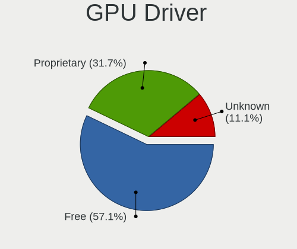
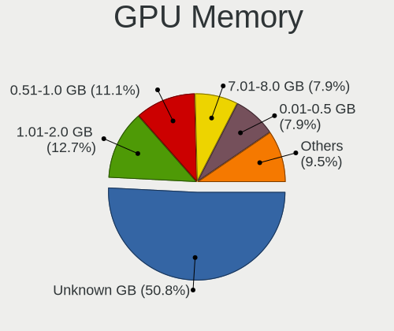
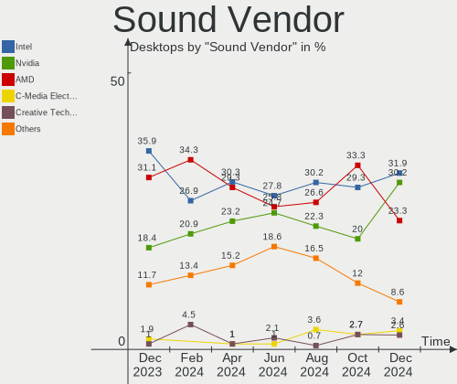

Linux in Poland - Hardware Trends (Desktops)
--------------------------------------------

A project to identify most popular hardware characteristics and track their change
over time based on data collected by Linux users at https://Linux-Hardware.org.

Anyone can contribute to this report by the [hw-probe](https://github.com/linuxhw/hw-probe) tool:

    sudo -E hw-probe -all -upload

Period: Jun, 2022.

Contents
--------

* [ System ](#system)
  - [ OS                       ](#os)
  - [ OS Family                ](#os-family)
  - [ Kernel                   ](#kernel)
  - [ Kernel Family            ](#kernel-family)
  - [ Kernel Major Ver.        ](#kernel-major-ver)
  - [ Arch                     ](#arch)
  - [ DE                       ](#de)
  - [ Display Server           ](#display-server)
  - [ Display Manager          ](#display-manager)
  - [ OS Lang                  ](#os-lang)
  - [ Boot Mode                ](#boot-mode)
  - [ Filesystem               ](#filesystem)
  - [ Part. scheme             ](#part-scheme)
  - [ Dual Boot with Linux/BSD ](#dual-boot-with-linuxbsd)
  - [ Dual Boot (Win)          ](#dual-boot-win)

* [ Board ](#board)
  - [ Vendor                   ](#vendor)
  - [ Model                    ](#model)
  - [ Model Family             ](#model-family)
  - [ MFG Year                 ](#mfg-year)
  - [ Form Factor              ](#form-factor)
  - [ Secure Boot              ](#secure-boot)
  - [ Coreboot                 ](#coreboot)
  - [ RAM Size                 ](#ram-size)
  - [ RAM Used                 ](#ram-used)
  - [ Total Drives             ](#total-drives)
  - [ Has CD-ROM               ](#has-cd-rom)
  - [ Has Ethernet             ](#has-ethernet)
  - [ Has WiFi                 ](#has-wifi)
  - [ Has Bluetooth            ](#has-bluetooth)

* [ Location ](#location)
  - [ Country                  ](#country)
  - [ City                     ](#city)

* [ Drives ](#drives)
  - [ Drive Vendor             ](#drive-vendor)
  - [ Drive Model              ](#drive-model)
  - [ HDD Vendor               ](#hdd-vendor)
  - [ SSD Vendor               ](#ssd-vendor)
  - [ Drive Kind               ](#drive-kind)
  - [ Drive Connector          ](#drive-connector)
  - [ Drive Size               ](#drive-size)
  - [ Space Total              ](#space-total)
  - [ Space Used               ](#space-used)
  - [ Malfunc. Drives          ](#malfunc-drives)
  - [ Malfunc. Drive Vendor    ](#malfunc-drive-vendor)
  - [ Malfunc. HDD Vendor      ](#malfunc-hdd-vendor)
  - [ Malfunc. Drive Kind      ](#malfunc-drive-kind)
  - [ Failed Drives            ](#failed-drives)
  - [ Failed Drive Vendor      ](#failed-drive-vendor)
  - [ Drive Status             ](#drive-status)

* [ Storage controller ](#storage-controller)
  - [ Storage Vendor           ](#storage-vendor)
  - [ Storage Model            ](#storage-model)
  - [ Storage Kind             ](#storage-kind)

* [ Processor ](#processor)
  - [ CPU Vendor               ](#cpu-vendor)
  - [ CPU Model                ](#cpu-model)
  - [ CPU Model Family         ](#cpu-model-family)
  - [ CPU Cores                ](#cpu-cores)
  - [ CPU Sockets              ](#cpu-sockets)
  - [ CPU Threads              ](#cpu-threads)
  - [ CPU Op-Modes             ](#cpu-op-modes)
  - [ CPU Microcode            ](#cpu-microcode)
  - [ CPU Microarch            ](#cpu-microarch)

* [ Graphics ](#graphics)
  - [ GPU Vendor               ](#gpu-vendor)
  - [ GPU Model                ](#gpu-model)
  - [ GPU Combo                ](#gpu-combo)
  - [ GPU Driver               ](#gpu-driver)
  - [ GPU Memory               ](#gpu-memory)

* [ Monitor ](#monitor)
  - [ Monitor Vendor           ](#monitor-vendor)
  - [ Monitor Model            ](#monitor-model)
  - [ Monitor Resolution       ](#monitor-resolution)
  - [ Monitor Diagonal         ](#monitor-diagonal)
  - [ Monitor Width            ](#monitor-width)
  - [ Aspect Ratio             ](#aspect-ratio)
  - [ Monitor Area             ](#monitor-area)
  - [ Pixel Density            ](#pixel-density)
  - [ Multiple Monitors        ](#multiple-monitors)

* [ Network ](#network)
  - [ Net Controller Vendor    ](#net-controller-vendor)
  - [ Net Controller Model     ](#net-controller-model)
  - [ Wireless Vendor          ](#wireless-vendor)
  - [ Wireless Model           ](#wireless-model)
  - [ Ethernet Vendor          ](#ethernet-vendor)
  - [ Ethernet Model           ](#ethernet-model)
  - [ Net Controller Kind      ](#net-controller-kind)
  - [ Used Controller          ](#used-controller)
  - [ NICs                     ](#nics)
  - [ IPv6                     ](#ipv6)

* [ Bluetooth ](#bluetooth)
  - [ Bluetooth Vendor         ](#bluetooth-vendor)
  - [ Bluetooth Model          ](#bluetooth-model)

* [ Sound ](#sound)
  - [ Sound Vendor             ](#sound-vendor)
  - [ Sound Model              ](#sound-model)

* [ Memory ](#memory)
  - [ Memory Vendor            ](#memory-vendor)
  - [ Memory Model             ](#memory-model)
  - [ Memory Kind              ](#memory-kind)
  - [ Memory Form Factor       ](#memory-form-factor)
  - [ Memory Size              ](#memory-size)
  - [ Memory Speed             ](#memory-speed)

* [ Printers & scanners ](#printers--scanners)
  - [ Printer Vendor           ](#printer-vendor)
  - [ Printer Model            ](#printer-model)
  - [ Scanner Vendor           ](#scanner-vendor)
  - [ Scanner Model            ](#scanner-model)

* [ Camera ](#camera)
  - [ Camera Vendor            ](#camera-vendor)
  - [ Camera Model             ](#camera-model)

* [ Security ](#security)
  - [ Fingerprint Vendor       ](#fingerprint-vendor)
  - [ Fingerprint Model        ](#fingerprint-model)
  - [ Chipcard Vendor          ](#chipcard-vendor)
  - [ Chipcard Model           ](#chipcard-model)

* [ Unsupported ](#unsupported)
  - [ Unsupported Devices      ](#unsupported-devices)
  - [ Unsupported Device Types ](#unsupported-device-types)

System
------

OS
--

Installed operating systems

| Name                         | Desktops | Percent |
|------------------------------|----------|---------|
| OpenMandriva 4.3             | 14       | 26.42%  |
| Fedora 36                    | 6        | 11.32%  |
| Ubuntu 20.04                 | 4        | 7.55%   |
| Ubuntu 22.04                 | 3        | 5.66%   |
| Gentoo 2.8                   | 3        | 5.66%   |
| Pop!_OS 22.04                | 2        | 3.77%   |
| openSUSE Tumbleweed-XXXXXXXX | 2        | 3.77%   |
| Manjaro                      | 2        | 3.77%   |
| Linux Mint 20.3              | 2        | 3.77%   |
| Kubuntu 22.04                | 2        | 3.77%   |
| Debian 11                    | 2        | 3.77%   |
| Arch Rolling                 | 2        | 3.77%   |
| ROSA 12.2                    | 1        | 1.89%   |
| MX 21                        | 1        | 1.89%   |
| Manjaro 21.3.0               | 1        | 1.89%   |
| Garuda Linux Soaring         | 1        | 1.89%   |
| EndeavourOS                  | 1        | 1.89%   |
| Debian 10                    | 1        | 1.89%   |
| BuildRoot 2022.02-rc2        | 1        | 1.89%   |
| Arch                         | 1        | 1.89%   |
| antiX 21                     | 1        | 1.89%   |

OS Family
---------

OS without a version

| Name         | Desktops | Percent |
|--------------|----------|---------|
| OpenMandriva | 14       | 26.42%  |
| Ubuntu       | 7        | 13.21%  |
| Fedora       | 6        | 11.32%  |
| Manjaro      | 3        | 5.66%   |
| Gentoo       | 3        | 5.66%   |
| Debian       | 3        | 5.66%   |
| Arch         | 3        | 5.66%   |
| Pop!_OS      | 2        | 3.77%   |
| openSUSE     | 2        | 3.77%   |
| Linux Mint   | 2        | 3.77%   |
| Kubuntu      | 2        | 3.77%   |
| ROSA         | 1        | 1.89%   |
| MX           | 1        | 1.89%   |
| Garuda Linux | 1        | 1.89%   |
| EndeavourOS  | 1        | 1.89%   |
| BuildRoot    | 1        | 1.89%   |
| antiX        | 1        | 1.89%   |

Kernel
------

Version of the Linux kernel

| Version                            | Desktops | Percent |
|------------------------------------|----------|---------|
| 5.16.7-desktop-1omv4003            | 11       | 20.75%  |
| 5.18.5-200.fc36.x86_64             | 3        | 5.66%   |
| 5.16.13-desktop-1omv4003           | 3        | 5.66%   |
| 5.15.0-40-generic                  | 3        | 5.66%   |
| 5.18.6-arch1-1                     | 2        | 3.77%   |
| 5.17.9-1-MANJARO                   | 2        | 3.77%   |
| 5.17.5-76051705-generic            | 2        | 3.77%   |
| 5.17.12-300.fc36.x86_64            | 2        | 3.77%   |
| 5.15.41-gentoo                     | 2        | 3.77%   |
| 5.13.0-48-generic                  | 2        | 3.77%   |
| 5.10.0-15-amd64                    | 2        | 3.77%   |
| 5.4.0-121-generic                  | 1        | 1.89%   |
| 5.18.5-arch1-1                     | 1        | 1.89%   |
| 5.18.4-1-default                   | 1        | 1.89%   |
| 5.18.2-1-default                   | 1        | 1.89%   |
| 5.18.1-zen1-1-zen                  | 1        | 1.89%   |
| 5.18.1-arch1-1                     | 1        | 1.89%   |
| 5.17.9-300.fc36.x86_64             | 1        | 1.89%   |
| 5.17.7-xanmod1-MANJARO             | 1        | 1.89%   |
| 5.17.5                             | 1        | 1.89%   |
| 5.15.0-37-generic                  | 1        | 1.89%   |
| 5.15.0-33-generic                  | 1        | 1.89%   |
| 5.13.0-51-generic                  | 1        | 1.89%   |
| 5.13.0-44-generic                  | 1        | 1.89%   |
| 5.13.0-30-generic                  | 1        | 1.89%   |
| 5.10.74-generic-2rosa2021.1-x86_64 | 1        | 1.89%   |
| 5.10.0-12-amd64                    | 1        | 1.89%   |
| 4.9.16-gentoo                      | 1        | 1.89%   |
| 4.9.0-279-antix.1-486-smp          | 1        | 1.89%   |
| 4.19.0-20-amd64                    | 1        | 1.89%   |

Kernel Family
-------------

Linux kernel without a distro release

| Version | Desktops | Percent |
|---------|----------|---------|
| 5.16.7  | 11       | 20.75%  |
| 5.15.0  | 5        | 9.43%   |
| 5.13.0  | 5        | 9.43%   |
| 5.18.5  | 4        | 7.55%   |
| 5.17.9  | 3        | 5.66%   |
| 5.17.5  | 3        | 5.66%   |
| 5.16.13 | 3        | 5.66%   |
| 5.10.0  | 3        | 5.66%   |
| 5.18.6  | 2        | 3.77%   |
| 5.18.1  | 2        | 3.77%   |
| 5.17.12 | 2        | 3.77%   |
| 5.15.41 | 2        | 3.77%   |
| 5.4.0   | 1        | 1.89%   |
| 5.18.4  | 1        | 1.89%   |
| 5.18.2  | 1        | 1.89%   |
| 5.17.7  | 1        | 1.89%   |
| 5.10.74 | 1        | 1.89%   |
| 4.9.16  | 1        | 1.89%   |
| 4.9.0   | 1        | 1.89%   |
| 4.19.0  | 1        | 1.89%   |

Kernel Major Ver.
-----------------

Linux kernel major version

| Version | Desktops | Percent |
|---------|----------|---------|
| 5.16    | 14       | 26.42%  |
| 5.18    | 10       | 18.87%  |
| 5.17    | 9        | 16.98%  |
| 5.15    | 7        | 13.21%  |
| 5.13    | 5        | 9.43%   |
| 5.10    | 4        | 7.55%   |
| 4.9     | 2        | 3.77%   |
| 5.4     | 1        | 1.89%   |
| 4.19    | 1        | 1.89%   |

Arch
----

OS architecture (x86_64, i586, etc.)

| Name   | Desktops | Percent |
|--------|----------|---------|
| x86_64 | 51       | 96.23%  |
| ppc    | 1        | 1.89%   |
| i686   | 1        | 1.89%   |

DE
--

Desktop Environment

| Name       | Desktops | Percent |
|------------|----------|---------|
| KDE5       | 22       | 41.51%  |
| GNOME      | 18       | 33.96%  |
| Unknown    | 5        | 9.43%   |
| X-Cinnamon | 2        | 3.77%   |
| XFCE       | 1        | 1.89%   |
| MATE       | 1        | 1.89%   |
| KDE        | 1        | 1.89%   |
| jwm        | 1        | 1.89%   |
| i3         | 1        | 1.89%   |
| Cinnamon   | 1        | 1.89%   |

Display Server
--------------

X11 or Wayland

| Name    | Desktops | Percent |
|---------|----------|---------|
| X11     | 44       | 83.02%  |
| Wayland | 8        | 15.09%  |
| Unknown | 1        | 1.89%   |

Display Manager
---------------

SDDM, LightDM, etc.

| Name    | Desktops | Percent |
|---------|----------|---------|
| SDDM    | 18       | 33.96%  |
| Unknown | 18       | 33.96%  |
| LightDM | 7        | 13.21%  |
| GDM3    | 5        | 9.43%   |
| GDM     | 4        | 7.55%   |
| SLIMSKI | 1        | 1.89%   |

OS Lang
-------

Language

| Lang    | Desktops | Percent |
|---------|----------|---------|
| pl_PL   | 22       | 41.51%  |
| en_US   | 20       | 37.74%  |
| en_GB   | 4        | 7.55%   |
| en_CA   | 4        | 7.55%   |
| ru_RU   | 1        | 1.89%   |
| en_AG   | 1        | 1.89%   |
| Unknown | 1        | 1.89%   |

Boot Mode
---------

EFI or BIOS

| Mode | Desktops | Percent |
|------|----------|---------|
| BIOS | 33       | 62.26%  |
| EFI  | 20       | 37.74%  |

Filesystem
----------

Type of filesystem

| Type    | Desktops | Percent |
|---------|----------|---------|
| Ext4    | 33       | 62.26%  |
| Overlay | 9        | 16.98%  |
| Btrfs   | 9        | 16.98%  |
| F2fs    | 2        | 3.77%   |

Part. scheme
------------

Scheme of partitioning

| Type    | Desktops | Percent |
|---------|----------|---------|
| GPT     | 24       | 45.28%  |
| Unknown | 20       | 37.74%  |
| MBR     | 9        | 16.98%  |

Dual Boot with Linux/BSD
------------------------

Hosting more than one Linux/BSD

| Dual boot | Desktops | Percent |
|-----------|----------|---------|
| No        | 35       | 66.04%  |
| Yes       | 18       | 33.96%  |

Dual Boot (Win)
---------------

Hosting Linux and Windows

| Dual boot | Desktops | Percent |
|-----------|----------|---------|
| No        | 38       | 71.7%   |
| Yes       | 15       | 28.3%   |

Board
-----

Vendor
------

Motherboard manufacturer

| Name                | Desktops | Percent |
|---------------------|----------|---------|
| ASUSTek Computer    | 16       | 30.19%  |
| Gigabyte Technology | 14       | 26.42%  |
| MSI                 | 11       | 20.75%  |
| ASRock              | 4        | 7.55%   |
| Dell                | 3        | 5.66%   |
| Hewlett-Packard     | 2        | 3.77%   |
| Unknown             | 2        | 3.77%   |
| Acer                | 1        | 1.89%   |

Model
-----

Motherboard model

| Name                            | Desktops | Percent |
|---------------------------------|----------|---------|
| ASUS SABERTOOTH Z77             | 10       | 18.87%  |
| MSI MS-7817                     | 3        | 5.66%   |
| Gigabyte 970A-DS3P              | 3        | 5.66%   |
| Unknown                         | 2        | 3.77%   |
| MSI MS-7D54                     | 1        | 1.89%   |
| MSI MS-7C91                     | 1        | 1.89%   |
| MSI MS-7C02                     | 1        | 1.89%   |
| MSI MS-7B89                     | 1        | 1.89%   |
| MSI MS-7B86                     | 1        | 1.89%   |
| MSI MS-7B79                     | 1        | 1.89%   |
| MSI MS-7B17                     | 1        | 1.89%   |
| MSI MS-7A34                     | 1        | 1.89%   |
| HP EliteDesk 800 G2 DM 65W      | 1        | 1.89%   |
| HP Compaq Elite 8300 CMT        | 1        | 1.89%   |
| Gigabyte Z97M-DS3H              | 1        | 1.89%   |
| Gigabyte H410M S2H V3           | 1        | 1.89%   |
| Gigabyte F2A88XM-D3H            | 1        | 1.89%   |
| Gigabyte F2A88X-D3H             | 1        | 1.89%   |
| Gigabyte B85M-D3H               | 1        | 1.89%   |
| Gigabyte B75-D3V                | 1        | 1.89%   |
| Gigabyte B550 AORUS ELITE AX V2 | 1        | 1.89%   |
| Gigabyte B550 AORUS ELITE       | 1        | 1.89%   |
| Gigabyte B450 AORUS ELITE       | 1        | 1.89%   |
| Gigabyte B150-HD3 DDR3          | 1        | 1.89%   |
| Gigabyte AB350-Gaming           | 1        | 1.89%   |
| Dell Vostro 260                 | 1        | 1.89%   |
| Dell OptiPlex 790               | 1        | 1.89%   |
| Dell OptiPlex 7090              | 1        | 1.89%   |
| ASUS TUF Z370-PLUS GAMING       | 1        | 1.89%   |
| ASUS TUF Gaming X570-PLUS       | 1        | 1.89%   |
| ASUS TUF Gaming B550M-E WIFI    | 1        | 1.89%   |
| ASUS P9X79 DELUXE               | 1        | 1.89%   |
| ASUS M5A97 R2.0                 | 1        | 1.89%   |
| ASUS M3A78-CM                   | 1        | 1.89%   |
| ASRock P67 Pro3                 | 1        | 1.89%   |
| ASRock H87 Pro4                 | 1        | 1.89%   |
| ASRock H510M-ITX/ac             | 1        | 1.89%   |
| ASRock A320M Pro4               | 1        | 1.89%   |
| Acer Aspire X3910               | 1        | 1.89%   |

Model Family
------------

Motherboard model prefix

| Name                  | Desktops | Percent |
|-----------------------|----------|---------|
| ASUS SABERTOOTH       | 10       | 18.87%  |
| MSI MS-7817           | 3        | 5.66%   |
| Gigabyte 970A-DS3P    | 3        | 5.66%   |
| ASUS TUF              | 3        | 5.66%   |
| Gigabyte B550         | 2        | 3.77%   |
| Dell OptiPlex         | 2        | 3.77%   |
| Unknown               | 2        | 3.77%   |
| MSI MS-7D54           | 1        | 1.89%   |
| MSI MS-7C91           | 1        | 1.89%   |
| MSI MS-7C02           | 1        | 1.89%   |
| MSI MS-7B89           | 1        | 1.89%   |
| MSI MS-7B86           | 1        | 1.89%   |
| MSI MS-7B79           | 1        | 1.89%   |
| MSI MS-7B17           | 1        | 1.89%   |
| MSI MS-7A34           | 1        | 1.89%   |
| HP EliteDesk          | 1        | 1.89%   |
| HP Compaq             | 1        | 1.89%   |
| Gigabyte Z97M-DS3H    | 1        | 1.89%   |
| Gigabyte H410M        | 1        | 1.89%   |
| Gigabyte F2A88XM-D3H  | 1        | 1.89%   |
| Gigabyte F2A88X-D3H   | 1        | 1.89%   |
| Gigabyte B85M-D3H     | 1        | 1.89%   |
| Gigabyte B75-D3V      | 1        | 1.89%   |
| Gigabyte B450         | 1        | 1.89%   |
| Gigabyte B150-HD3     | 1        | 1.89%   |
| Gigabyte AB350-Gaming | 1        | 1.89%   |
| Dell Vostro           | 1        | 1.89%   |
| ASUS P9X79            | 1        | 1.89%   |
| ASUS M5A97            | 1        | 1.89%   |
| ASUS M3A78-CM         | 1        | 1.89%   |
| ASRock P67            | 1        | 1.89%   |
| ASRock H87            | 1        | 1.89%   |
| ASRock H510M-ITX      | 1        | 1.89%   |
| ASRock A320M          | 1        | 1.89%   |
| Acer Aspire           | 1        | 1.89%   |

MFG Year
--------

Motherboard manufacture year

| Year    | Desktops | Percent |
|---------|----------|---------|
| 2012    | 13       | 24.53%  |
| 2013    | 10       | 18.87%  |
| 2021    | 4        | 7.55%   |
| 2020    | 4        | 7.55%   |
| 2019    | 4        | 7.55%   |
| 2017    | 4        | 7.55%   |
| 2011    | 4        | 7.55%   |
| 2018    | 3        | 5.66%   |
| 2022    | 1        | 1.89%   |
| 2015    | 1        | 1.89%   |
| 2014    | 1        | 1.89%   |
| 2009    | 1        | 1.89%   |
| 2008    | 1        | 1.89%   |
| 2007    | 1        | 1.89%   |
| Unknown | 1        | 1.89%   |

Form Factor
-----------

Physical design of the computer

| Name    | Desktops | Percent |
|---------|----------|---------|
| Desktop | 53       | 100%    |

Secure Boot
-----------

Enabled or disabled

| State    | Desktops | Percent |
|----------|----------|---------|
| Disabled | 52       | 98.11%  |
| Enabled  | 1        | 1.89%   |

Coreboot
--------

Have coreboot on board

| Used | Desktops | Percent |
|------|----------|---------|
| No   | 53       | 100%    |

RAM Size
--------

Total RAM memory

| Size in GB  | Desktops | Percent |
|-------------|----------|---------|
| 32.01-64.0  | 23       | 43.4%   |
| 4.01-8.0    | 8        | 15.09%  |
| 8.01-16.0   | 7        | 13.21%  |
| 24.01-32.0  | 4        | 7.55%   |
| 16.01-24.0  | 4        | 7.55%   |
| 3.01-4.0    | 3        | 5.66%   |
| 64.01-256.0 | 2        | 3.77%   |
| 1.01-2.0    | 1        | 1.89%   |
| 0.51-1.0    | 1        | 1.89%   |

RAM Used
--------

Used RAM memory

| Used GB   | Desktops | Percent |
|-----------|----------|---------|
| 1.01-2.0  | 24       | 45.28%  |
| 4.01-8.0  | 9        | 16.98%  |
| 3.01-4.0  | 8        | 15.09%  |
| 2.01-3.0  | 5        | 9.43%   |
| 0.51-1.0  | 3        | 5.66%   |
| 8.01-16.0 | 2        | 3.77%   |
| 0.01-0.5  | 2        | 3.77%   |

Total Drives
------------

Number of drives on board

| Drives | Desktops | Percent |
|--------|----------|---------|
| 1      | 24       | 45.28%  |
| 2      | 12       | 22.64%  |
| 4      | 8        | 15.09%  |
| 3      | 5        | 9.43%   |
| 6      | 2        | 3.77%   |
| 5      | 2        | 3.77%   |

Has CD-ROM
----------

Has CD-ROM on board

| Presented | Desktops | Percent |
|-----------|----------|---------|
| No        | 32       | 60.38%  |
| Yes       | 21       | 39.62%  |

Has Ethernet
------------

Has Ethernet on board

| Presented | Desktops | Percent |
|-----------|----------|---------|
| Yes       | 53       | 100%    |

Has WiFi
--------

Has WiFi module

| Presented | Desktops | Percent |
|-----------|----------|---------|
| Yes       | 32       | 60.38%  |
| No        | 21       | 39.62%  |

Has Bluetooth
-------------

Has Bluetooth module

| Presented | Desktops | Percent |
|-----------|----------|---------|
| No        | 34       | 64.15%  |
| Yes       | 19       | 35.85%  |

Location
--------

Country
-------

Geographic location (country)

| Country | Desktops | Percent |
|---------|----------|---------|
| Poland  | 53       | 100%    |

City
----

Geographic location (city)

| City                   | Desktops | Percent |
|------------------------|----------|---------|
| Strzyzow               | 10       | 18.87%  |
| Warsaw                 | 8        | 15.09%  |
| Wroclaw                | 5        | 9.43%   |
| Krakow                 | 5        | 9.43%   |
| Gdansk                 | 2        | 3.77%   |
| Wielgie                | 1        | 1.89%   |
| Ustron                 | 1        | 1.89%   |
| Unieszewo              | 1        | 1.89%   |
| Słupsk                | 1        | 1.89%   |
| Świętochłowice      | 1        | 1.89%   |
| Strzegom               | 1        | 1.89%   |
| Siemianowice Śląskie | 1        | 1.89%   |
| Sedziszow Malopolski   | 1        | 1.89%   |
| Poznan                 | 1        | 1.89%   |
| Pilica                 | 1        | 1.89%   |
| Pila                   | 1        | 1.89%   |
| Otwock                 | 1        | 1.89%   |
| Lodz                   | 1        | 1.89%   |
| Lesna                  | 1        | 1.89%   |
| Legnica                | 1        | 1.89%   |
| Jawor                  | 1        | 1.89%   |
| Glogowek               | 1        | 1.89%   |
| Gdynia                 | 1        | 1.89%   |
| Debica                 | 1        | 1.89%   |
| Czeladz                | 1        | 1.89%   |
| Cieszyn                | 1        | 1.89%   |
| Bledow                 | 1        | 1.89%   |
| Bialystok              | 1        | 1.89%   |

Drives
------

Drive Vendor
------------

Hard drive vendors

| Vendor              | Desktops | Drives | Percent |
|---------------------|----------|--------|---------|
| Seagate             | 19       | 21     | 18.1%   |
| Goodram             | 15       | 16     | 14.29%  |
| Samsung Electronics | 11       | 13     | 10.48%  |
| WDC                 | 10       | 12     | 9.52%   |
| Crucial             | 7        | 8      | 6.67%   |
| Kingston            | 6        | 6      | 5.71%   |
| Toshiba             | 5        | 6      | 4.76%   |
| XPG                 | 4        | 4      | 3.81%   |
| ASMT                | 4        | 4      | 3.81%   |
| A-DATA Technology   | 3        | 3      | 2.86%   |
| SanDisk             | 2        | 2      | 1.9%    |
| OCZ                 | 2        | 2      | 1.9%    |
| Hitachi             | 2        | 4      | 1.9%    |
| Gigabyte Technology | 2        | 2      | 1.9%    |
| SPCC                | 1        | 1      | 0.95%   |
| SK hynix            | 1        | 1      | 0.95%   |
| PNY                 | 1        | 1      | 0.95%   |
| Plextor             | 1        | 2      | 0.95%   |
| Phison              | 1        | 1      | 0.95%   |
| Patriot             | 1        | 1      | 0.95%   |
| Lite-On             | 1        | 1      | 0.95%   |
| Intenso             | 1        | 1      | 0.95%   |
| Intel               | 1        | 1      | 0.95%   |
| HGST                | 1        | 1      | 0.95%   |
| Hewlett-Packard     | 1        | 1      | 0.95%   |
| Fujitsu             | 1        | 1      | 0.95%   |
| Corsair             | 1        | 1      | 0.95%   |

Drive Model
-----------

Hard drive models

| Model                                  | Desktops | Percent |
|----------------------------------------|----------|---------|
| Samsung SSD 850 EVO 250GB              | 5        | 4.46%   |
| Goodram SSD 120GB                      | 5        | 4.46%   |
| ASMT 2135 120GB SSD                    | 4        | 3.57%   |
| Seagate ST92505610AS 250GB             | 3        | 2.68%   |
| Seagate ST1000DM003-1ER162 1TB         | 3        | 2.68%   |
| Goodram SSDPR-CX400-512-G2 512GB       | 3        | 2.68%   |
| XPG NVMe SSD Drive 1024GB              | 2        | 1.79%   |
| Kingston NVMe SSD Drive 1TB            | 2        | 1.79%   |
| Goodram SSDPR-CL100-480-G2 480GB       | 2        | 1.79%   |
| Gigabyte GP-GSM2NE3512GNTD 512GB       | 2        | 1.79%   |
| Crucial CT500MX500SSD1 500GB           | 2        | 1.79%   |
| XPG NVMe SSD Drive 512GB               | 1        | 0.89%   |
| XPG GAMMIX S11 Pro 1TB                 | 1        | 0.89%   |
| WDC WDS100T2B0C-00PXH0 1TB             | 1        | 0.89%   |
| WDC WD800JB-00ETA0 80GB                | 1        | 0.89%   |
| WDC WD5002ABYS-01B1B0 500GB            | 1        | 0.89%   |
| WDC WD30EFRX-68EUZN0 3TB               | 1        | 0.89%   |
| WDC WD20EZRX-00D8PB0 2TB               | 1        | 0.89%   |
| WDC WD20EFRX-68EUZN0 2TB               | 1        | 0.89%   |
| WDC WD2003FZEX-00SRLA0 2TB             | 1        | 0.89%   |
| WDC WD1600AAJS-00L7A0 160GB            | 1        | 0.89%   |
| WDC WD10EZEX-00BN5A0 1TB               | 1        | 0.89%   |
| WDC WD10EALS-002BA0 1TB                | 1        | 0.89%   |
| WDC WD1003FZEX-00MK2A0 1TB             | 1        | 0.89%   |
| WDC WD1002FAEX-00Z3A0 1TB              | 1        | 0.89%   |
| Toshiba HDWQ140 4TB                    | 1        | 0.89%   |
| Toshiba HDWE150 5TB                    | 1        | 0.89%   |
| Toshiba HDWD130 3TB                    | 1        | 0.89%   |
| Toshiba HDWD110 1TB                    | 1        | 0.89%   |
| Toshiba DT01ACA100 1TB                 | 1        | 0.89%   |
| SPCC Solid State Disk 240GB            | 1        | 0.89%   |
| SK hynix BC711 NVMe 256GB              | 1        | 0.89%   |
| Seagate ST9250410AS 250GB              | 1        | 0.89%   |
| Seagate ST4000LM024-2AN17V 4TB         | 1        | 0.89%   |
| Seagate ST4000DM004-2CV104 4TB         | 1        | 0.89%   |
| Seagate ST3250820SCE 250GB             | 1        | 0.89%   |
| Seagate ST3250410AS 250GB              | 1        | 0.89%   |
| Seagate ST3250310AS 250GB              | 1        | 0.89%   |
| Seagate ST3000VX000-1CU166 3TB         | 1        | 0.89%   |
| Seagate ST3000VX000 4GB                | 1        | 0.89%   |
| Seagate ST2000DM006-2DM164 2TB         | 1        | 0.89%   |
| Seagate ST2000DM001-1E6164 2TB         | 1        | 0.89%   |
| Seagate ST12000NM0008-2H3101 12TB      | 1        | 0.89%   |
| Seagate ST1000VT001-1RE172 1TB         | 1        | 0.89%   |
| Seagate ST1000LM024 HN-M101MBB 1TB     | 1        | 0.89%   |
| Seagate ST1000DM010-2EP102 1TB         | 1        | 0.89%   |
| Seagate Expansion 1TB                  | 1        | 0.89%   |
| SanDisk SDSSDP064G 64GB                | 1        | 0.89%   |
| SanDisk SDSSDHII240G 240GB             | 1        | 0.89%   |
| Samsung SSD 870 EVO 500GB              | 1        | 0.89%   |
| Samsung SSD 860 QVO 1TB                | 1        | 0.89%   |
| Samsung SSD 860 EVO 500GB              | 1        | 0.89%   |
| Samsung SSD 860 EVO 250GB              | 1        | 0.89%   |
| Samsung SSD 860 EVO 1TB                | 1        | 0.89%   |
| Samsung SM963 2.5" NVMe PCIe SSD 500GB | 1        | 0.89%   |
| Samsung NVMe SSD Drive 1TB             | 1        | 0.89%   |
| Samsung HE103UJ 1TB                    | 1        | 0.89%   |
| PNY CS3030 1TB SSD                     | 1        | 0.89%   |
| Plextor PX-256M8VC 256GB SSD           | 1        | 0.89%   |
| Phison NVMe SSD Drive 1024GB           | 1        | 0.89%   |

HDD Vendor
----------

Hard disk drive vendors

| Vendor              | Desktops | Drives | Percent |
|---------------------|----------|--------|---------|
| Seagate             | 19       | 21     | 50%     |
| WDC                 | 9        | 11     | 23.68%  |
| Toshiba             | 5        | 6      | 13.16%  |
| Hitachi             | 2        | 4      | 5.26%   |
| Samsung Electronics | 1        | 1      | 2.63%   |
| HGST                | 1        | 1      | 2.63%   |
| Fujitsu             | 1        | 1      | 2.63%   |

SSD Vendor
----------

Solid state drive vendors

| Vendor              | Desktops | Drives | Percent |
|---------------------|----------|--------|---------|
| Goodram             | 14       | 15     | 31.11%  |
| Samsung Electronics | 9        | 10     | 20%     |
| Crucial             | 7        | 8      | 15.56%  |
| ASMT                | 4        | 4      | 8.89%   |
| A-DATA Technology   | 3        | 3      | 6.67%   |
| SanDisk             | 2        | 2      | 4.44%   |
| OCZ                 | 2        | 2      | 4.44%   |
| SPCC                | 1        | 1      | 2.22%   |
| Plextor             | 1        | 2      | 2.22%   |
| Patriot             | 1        | 1      | 2.22%   |
| Kingston            | 1        | 1      | 2.22%   |

Drive Kind
----------

HDD or SSD

| Kind    | Desktops | Drives | Percent |
|---------|----------|--------|---------|
| SSD     | 34       | 49     | 40.48%  |
| HDD     | 31       | 45     | 36.9%   |
| NVMe    | 18       | 22     | 21.43%  |
| Unknown | 1        | 1      | 1.19%   |

Drive Connector
---------------

SATA, SAS, NVMe, etc.

| Type | Desktops | Drives | Percent |
|------|----------|--------|---------|
| SATA | 43       | 89     | 64.18%  |
| NVMe | 18       | 22     | 26.87%  |
| SAS  | 6        | 6      | 8.96%   |

Drive Size
----------

Size of hard drive

| Size in TB | Desktops | Drives | Percent |
|------------|----------|--------|---------|
| 0.01-0.5   | 36       | 51     | 51.43%  |
| 0.51-1.0   | 18       | 23     | 25.71%  |
| 1.01-2.0   | 6        | 7      | 8.57%   |
| 3.01-4.0   | 4        | 5      | 5.71%   |
| 2.01-3.0   | 4        | 6      | 5.71%   |
| 10.01-20.0 | 1        | 1      | 1.43%   |
| 4.01-10.0  | 1        | 1      | 1.43%   |

Space Total
-----------

Amount of disk space available on the file system

| Size in GB     | Desktops | Percent |
|----------------|----------|---------|
| More than 3000 | 12       | 22.64%  |
| 101-250        | 8        | 15.09%  |
| 251-500        | 6        | 11.32%  |
| 21-50          | 6        | 11.32%  |
| 1-20           | 6        | 11.32%  |
| 501-1000       | 5        | 9.43%   |
| 1001-2000      | 3        | 5.66%   |
| Unknown        | 3        | 5.66%   |
| 2001-3000      | 2        | 3.77%   |
| 51-100         | 2        | 3.77%   |

Space Used
----------

Amount of used disk space

| Used GB        | Desktops | Percent |
|----------------|----------|---------|
| 1-20           | 20       | 37.74%  |
| More than 3000 | 6        | 11.32%  |
| 101-250        | 5        | 9.43%   |
| 21-50          | 4        | 7.55%   |
| 501-1000       | 4        | 7.55%   |
| 2001-3000      | 3        | 5.66%   |
| 1001-2000      | 3        | 5.66%   |
| 51-100         | 3        | 5.66%   |
| Unknown        | 3        | 5.66%   |
| 251-500        | 2        | 3.77%   |

Malfunc. Drives
---------------

Drive models with a malfunction

| Model                           | Desktops | Drives | Percent |
|---------------------------------|----------|--------|---------|
| Seagate ST92505610AS 250GB      | 3        | 3      | 23.08%  |
| Goodram SSD 120GB               | 3        | 3      | 23.08%  |
| WDC WD800JB-00ETA0 80GB         | 1        | 1      | 7.69%   |
| WDC WD5002ABYS-01B1B0 500GB     | 1        | 1      | 7.69%   |
| WDC WD10EALS-002BA0 1TB         | 1        | 1      | 7.69%   |
| Seagate ST3250820SCE 250GB      | 1        | 1      | 7.69%   |
| Samsung Electronics HE103UJ 1TB | 1        | 1      | 7.69%   |
| Hewlett-Packard SSD EX900 500GB | 1        | 1      | 7.69%   |
| ASMT 2135 120GB SSD             | 1        | 1      | 7.69%   |

Malfunc. Drive Vendor
---------------------

Vendors of faulty drives

| Vendor              | Desktops | Drives | Percent |
|---------------------|----------|--------|---------|
| Seagate             | 4        | 4      | 30.77%  |
| WDC                 | 3        | 3      | 23.08%  |
| Goodram             | 3        | 3      | 23.08%  |
| Samsung Electronics | 1        | 1      | 7.69%   |
| Hewlett-Packard     | 1        | 1      | 7.69%   |
| ASMT                | 1        | 1      | 7.69%   |

Malfunc. HDD Vendor
-------------------

Vendors of faulty HDD drives

| Vendor              | Desktops | Drives | Percent |
|---------------------|----------|--------|---------|
| Seagate             | 4        | 4      | 50%     |
| WDC                 | 3        | 3      | 37.5%   |
| Samsung Electronics | 1        | 1      | 12.5%   |

Malfunc. Drive Kind
-------------------

Kinds of faulty drives

| Kind | Desktops | Drives | Percent |
|------|----------|--------|---------|
| HDD  | 8        | 8      | 61.54%  |
| SSD  | 4        | 4      | 30.77%  |
| NVMe | 1        | 1      | 7.69%   |

Failed Drives
-------------

Failed drive models

Zero info for selected period =(

Failed Drive Vendor
-------------------

Failed drive vendors

Zero info for selected period =(

Drive Status
------------

Number of failed and malfunc. drives

| Status   | Desktops | Drives | Percent |
|----------|----------|--------|---------|
| Works    | 26       | 49     | 42.62%  |
| Detected | 22       | 55     | 36.07%  |
| Malfunc  | 13       | 13     | 21.31%  |

Storage controller
------------------

Storage Vendor
--------------

Storage controller vendors

| Vendor                       | Desktops | Percent |
|------------------------------|----------|---------|
| Intel                        | 31       | 31.96%  |
| AMD                          | 21       | 21.65%  |
| ASMedia Technology           | 11       | 11.34%  |
| JMicron Technology           | 10       | 10.31%  |
| Phison Electronics           | 5        | 5.15%   |
| Kingston Technology Company  | 5        | 5.15%   |
| ADATA Technology             | 4        | 4.12%   |
| Samsung Electronics          | 2        | 2.06%   |
| Tekram Technology            | 1        | 1.03%   |
| SK hynix                     | 1        | 1.03%   |
| Silicon Motion               | 1        | 1.03%   |
| Shenzhen Longsys Electronics | 1        | 1.03%   |
| SanDisk                      | 1        | 1.03%   |
| Nvidia                       | 1        | 1.03%   |
| Marvell Technology Group     | 1        | 1.03%   |
| Lite-On Technology           | 1        | 1.03%   |

Storage Model
-------------

Storage controller models

| Model                                                                                   | Desktops | Percent |
|-----------------------------------------------------------------------------------------|----------|---------|
| Intel 7 Series/C210 Series Chipset Family 6-port SATA Controller [AHCI mode]            | 12       | 11.21%  |
| ASMedia ASM1062 Serial ATA Controller                                                   | 11       | 10.28%  |
| JMicron JMB363 SATA/IDE Controller                                                      | 10       | 9.35%   |
| AMD FCH SATA Controller [AHCI mode]                                                     | 9        | 8.41%   |
| Intel 8 Series/C220 Series Chipset Family 6-port SATA Controller 1 [AHCI mode]          | 5        | 4.67%   |
| AMD 400 Series Chipset SATA Controller                                                  | 5        | 4.67%   |
| AMD SB7x0/SB8x0/SB9x0 SATA Controller [AHCI mode]                                       | 4        | 3.74%   |
| AMD 500 Series Chipset SATA Controller                                                  | 4        | 3.74%   |
| ADATA XPG SX8200 Pro PCIe Gen3x4 M.2 2280 Solid State Drive                             | 4        | 3.74%   |
| Kingston Company A2000 NVMe SSD                                                         | 3        | 2.8%    |
| Intel 500 Series Chipset Family SATA AHCI Controller                                    | 3        | 2.8%    |
| Phison PS5013 E13 NVMe Controller                                                       | 2        | 1.87%   |
| Phison E12 NVMe Controller                                                              | 2        | 1.87%   |
| Kingston Company Company Non-Volatile memory controller                                 | 2        | 1.87%   |
| Intel Q170/Q150/B150/H170/H110/Z170/CM236 Chipset SATA Controller [AHCI Mode]           | 2        | 1.87%   |
| Intel 6 Series/C200 Series Chipset Family 6 port Desktop SATA AHCI Controller           | 2        | 1.87%   |
| AMD SB7x0/SB8x0/SB9x0 IDE Controller                                                    | 2        | 1.87%   |
| AMD 300 Series Chipset SATA Controller                                                  | 2        | 1.87%   |
| Tekram TRM-S1040 [DC-315 / DC-395 series]                                               | 1        | 0.93%   |
| SK hynix Gold P31 SSD                                                                   | 1        | 0.93%   |
| Silicon Motion SM2263EN/SM2263XT SSD Controller                                         | 1        | 0.93%   |
| Shenzhen Longsys SM2263EN/SM2263XT-based OEM SSD                                        | 1        | 0.93%   |
| SanDisk Non-Volatile memory controller                                                  | 1        | 0.93%   |
| Samsung NVMe SSD Controller SM981/PM981/PM983                                           | 1        | 0.93%   |
| Samsung NVMe SSD Controller 980                                                         | 1        | 0.93%   |
| Phison E7 NVMe Controller                                                               | 1        | 0.93%   |
| Nvidia nForce3 Serial ATA Controller                                                    | 1        | 0.93%   |
| Nvidia CK8S Parallel ATA Controller (v2.5)                                              | 1        | 0.93%   |
| Marvell Group 88SE9128 PCIe SATA 6 Gb/s RAID controller with HyperDuo                   | 1        | 0.93%   |
| Lite-On Non-Volatile memory controller                                                  | 1        | 0.93%   |
| Intel SSD 660P Series                                                                   | 1        | 0.93%   |
| Intel Cannon Lake PCH SATA AHCI Controller                                              | 1        | 0.93%   |
| Intel C600/X79 series chipset 6-Port SATA AHCI Controller                               | 1        | 0.93%   |
| Intel 9 Series Chipset Family SATA Controller [AHCI Mode]                               | 1        | 0.93%   |
| Intel 82801JI (ICH10 Family) 4 port SATA IDE Controller #1                              | 1        | 0.93%   |
| Intel 82801JI (ICH10 Family) 2 port SATA IDE Controller #2                              | 1        | 0.93%   |
| Intel 6 Series/C200 Series Chipset Family Desktop SATA Controller (IDE mode, ports 4-5) | 1        | 0.93%   |
| Intel 6 Series/C200 Series Chipset Family Desktop SATA Controller (IDE mode, ports 0-3) | 1        | 0.93%   |
| Intel 200 Series PCH SATA controller [AHCI mode]                                        | 1        | 0.93%   |
| AMD SB7x0/SB8x0/SB9x0 SATA Controller [IDE mode]                                        | 1        | 0.93%   |
| AMD FCH SATA Controller D                                                               | 1        | 0.93%   |

Storage Kind
------------

Kind of storage controller (IDE, SATA, NVMe, SAS, ...)

| Kind | Desktops | Percent |
|------|----------|---------|
| SATA | 49       | 59.04%  |
| NVMe | 18       | 21.69%  |
| IDE  | 15       | 18.07%  |
| SCSI | 1        | 1.2%    |

Processor
---------

CPU Vendor
----------

Processor vendors

| Vendor       | Desktops | Percent |
|--------------|----------|---------|
| Intel        | 30       | 56.6%   |
| AMD          | 22       | 41.51%  |
| PowerBook6,7 | 1        | 1.89%   |

CPU Model
---------

Processor models

| Model                                       | Desktops | Percent |
|---------------------------------------------|----------|---------|
| Intel Core i5-3570K CPU @ 3.40GHz           | 10       | 18.87%  |
| AMD Ryzen 7 5800X 8-Core Processor          | 2        | 3.77%   |
| AMD FX-8350 Eight-Core Processor            | 2        | 3.77%   |
| PowerBook6,7 7447A, altivec supported       | 1        | 1.89%   |
| Intel Pentium Dual-Core CPU E5500 @ 2.80GHz | 1        | 1.89%   |
| Intel Pentium CPU G620 @ 2.60GHz            | 1        | 1.89%   |
| Intel Pentium CPU G3250 @ 3.20GHz           | 1        | 1.89%   |
| Intel Pentium CPU G3220 @ 3.00GHz           | 1        | 1.89%   |
| Intel Pentium CPU G2020 @ 2.90GHz           | 1        | 1.89%   |
| Intel Core i9-9900K CPU @ 3.60GHz           | 1        | 1.89%   |
| Intel Core i7-9700K CPU @ 3.60GHz           | 1        | 1.89%   |
| Intel Core i7-6700 CPU @ 3.40GHz            | 1        | 1.89%   |
| Intel Core i7-3820 CPU @ 3.60GHz            | 1        | 1.89%   |
| Intel Core i7-10700 CPU @ 2.90GHz           | 1        | 1.89%   |
| Intel Core i5-7500 CPU @ 3.40GHz            | 1        | 1.89%   |
| Intel Core i5-4690 CPU @ 3.50GHz            | 1        | 1.89%   |
| Intel Core i5-4670 CPU @ 3.40GHz            | 1        | 1.89%   |
| Intel Core i5-4590 CPU @ 3.30GHz            | 1        | 1.89%   |
| Intel Core i5-4460 CPU @ 3.20GHz            | 1        | 1.89%   |
| Intel Core i5-3470 CPU @ 3.20GHz            | 1        | 1.89%   |
| Intel Core i5-2500K CPU @ 3.30GHz           | 1        | 1.89%   |
| Intel Core i5-2400 CPU @ 3.10GHz            | 1        | 1.89%   |
| Intel Core i5-10600 CPU @ 3.30GHz           | 1        | 1.89%   |
| Intel Core i5-10400F CPU @ 2.90GHz          | 1        | 1.89%   |
| AMD Sempron Processor 3000+                 | 1        | 1.89%   |
| AMD Ryzen 9 5950X 16-Core Processor         | 1        | 1.89%   |
| AMD Ryzen 9 5900X 12-Core Processor         | 1        | 1.89%   |
| AMD Ryzen 7 3800XT 8-Core Processor         | 1        | 1.89%   |
| AMD Ryzen 7 3800X 8-Core Processor          | 1        | 1.89%   |
| AMD Ryzen 7 3700X 8-Core Processor          | 1        | 1.89%   |
| AMD Ryzen 7 2700X Eight-Core Processor      | 1        | 1.89%   |
| AMD Ryzen 5 5600G with Radeon Graphics      | 1        | 1.89%   |
| AMD Ryzen 5 3600XT 6-Core Processor         | 1        | 1.89%   |
| AMD Ryzen 5 3600X 6-Core Processor          | 1        | 1.89%   |
| AMD Ryzen 5 3400G with Radeon Vega Graphics | 1        | 1.89%   |
| AMD Ryzen 5 2600 Six-Core Processor         | 1        | 1.89%   |
| AMD Ryzen 3 3200G with Radeon Vega Graphics | 1        | 1.89%   |
| AMD Phenom II X6 1055T Processor            | 1        | 1.89%   |
| AMD Phenom II X4 955 Processor              | 1        | 1.89%   |
| AMD FX-8300 Eight-Core Processor            | 1        | 1.89%   |
| AMD A8-6600K APU with Radeon HD Graphics    | 1        | 1.89%   |
| AMD A4-5300B APU with Radeon HD Graphics    | 1        | 1.89%   |

CPU Model Family
----------------

Processor model prefix

| Model                   | Desktops | Percent |
|-------------------------|----------|---------|
| Intel Core i5           | 20       | 37.74%  |
| AMD Ryzen 7             | 6        | 11.32%  |
| AMD Ryzen 5             | 5        | 9.43%   |
| Intel Pentium           | 4        | 7.55%   |
| Intel Core i7           | 4        | 7.55%   |
| AMD FX                  | 3        | 5.66%   |
| AMD Ryzen 9             | 2        | 3.77%   |
| Other                   | 1        | 1.89%   |
| Intel Pentium Dual-Core | 1        | 1.89%   |
| Intel Core i9           | 1        | 1.89%   |
| AMD Sempron             | 1        | 1.89%   |
| AMD Ryzen 3             | 1        | 1.89%   |
| AMD Phenom II X6        | 1        | 1.89%   |
| AMD Phenom II X4        | 1        | 1.89%   |
| AMD A8                  | 1        | 1.89%   |
| AMD A4                  | 1        | 1.89%   |

CPU Cores
---------

Number of processor cores

| Number | Desktops | Percent |
|--------|----------|---------|
| 4      | 26       | 49.06%  |
| 8      | 9        | 16.98%  |
| 6      | 7        | 13.21%  |
| 2      | 5        | 9.43%   |
| 1      | 4        | 7.55%   |
| 16     | 1        | 1.89%   |
| 12     | 1        | 1.89%   |

CPU Sockets
-----------

Number of sockets

| Number | Desktops | Percent |
|--------|----------|---------|
| 1      | 53       | 100%    |

CPU Threads
-----------

Threads per core (Hyper-Threading)

| Number | Desktops | Percent |
|--------|----------|---------|
| 1      | 29       | 54.72%  |
| 2      | 24       | 45.28%  |

CPU Op-Modes
------------

CPU Operation Modes (32-bit, 64-bit)

| Op mode        | Desktops | Percent |
|----------------|----------|---------|
| 32-bit, 64-bit | 52       | 98.11%  |
| 32-bit         | 1        | 1.89%   |

CPU Microcode
-------------

Microcode number

| Number     | Desktops | Percent |
|------------|----------|---------|
| Unknown    | 16       | 30.19%  |
| 0x306a9    | 10       | 18.87%  |
| 0x306c3    | 5        | 9.43%   |
| 0x206a7    | 3        | 5.66%   |
| 0x08701021 | 2        | 3.77%   |
| 0x0800820d | 2        | 3.77%   |
| 0x06001119 | 2        | 3.77%   |
| 0xa0655    | 1        | 1.89%   |
| 0xa0653    | 1        | 1.89%   |
| 0x906ed    | 1        | 1.89%   |
| 0x506e3    | 1        | 1.89%   |
| 0x1067a    | 1        | 1.89%   |
| 0x0a50000c | 1        | 1.89%   |
| 0x0a20120a | 1        | 1.89%   |
| 0x0a201205 | 1        | 1.89%   |
| 0x0a201016 | 1        | 1.89%   |
| 0x08701013 | 1        | 1.89%   |
| 0x08108109 | 1        | 1.89%   |
| 0x010000db | 1        | 1.89%   |
| 0x010000bf | 1        | 1.89%   |

CPU Microarch
-------------

Microarchitecture

| Name        | Desktops | Percent |
|-------------|----------|---------|
| IvyBridge   | 12       | 22.64%  |
| Haswell     | 6        | 11.32%  |
| Zen 3       | 5        | 9.43%   |
| Zen 2       | 5        | 9.43%   |
| Piledriver  | 5        | 9.43%   |
| Zen+        | 4        | 7.55%   |
| SandyBridge | 4        | 7.55%   |
| KabyLake    | 3        | 5.66%   |
| CometLake   | 3        | 5.66%   |
| K10         | 2        | 3.77%   |
| Skylake     | 1        | 1.89%   |
| Penryn      | 1        | 1.89%   |
| K8 Hammer   | 1        | 1.89%   |
| Unknown     | 1        | 1.89%   |

Graphics
--------

GPU Vendor
----------

Vendors of graphics cards

| Vendor | Desktops | Percent |
|--------|----------|---------|
| Nvidia | 29       | 50%     |
| AMD    | 19       | 32.76%  |
| Intel  | 10       | 17.24%  |

GPU Model
---------

Graphics card models

| Model                                                                       | Desktops | Percent |
|-----------------------------------------------------------------------------|----------|---------|
| Nvidia GP108 [GeForce GT 1030]                                              | 6        | 10.17%  |
| AMD Cape Verde XT [Radeon HD 7770/8760 / R7 250X]                           | 5        | 8.47%   |
| Intel Xeon E3-1200 v3/4th Gen Core Processor Integrated Graphics Controller | 4        | 6.78%   |
| Nvidia TU116 [GeForce GTX 1660 SUPER]                                       | 2        | 3.39%   |
| Nvidia TU104 [GeForce RTX 2060]                                             | 2        | 3.39%   |
| Intel Xeon E3-1200 v2/3rd Gen Core processor Graphics Controller            | 2        | 3.39%   |
| AMD Pitcairn PRO [Radeon HD 7850 / R7 265 / R9 270 1024SP]                  | 2        | 3.39%   |
| AMD Picasso/Raven 2 [Radeon Vega Series / Radeon Vega Mobile Series]        | 2        | 3.39%   |
| Nvidia TU116 [GeForce GTX 1650 SUPER]                                       | 1        | 1.69%   |
| Nvidia TU106 [GeForce RTX 2060 SUPER]                                       | 1        | 1.69%   |
| Nvidia TU104 [GeForce RTX 2080 Rev. A]                                      | 1        | 1.69%   |
| Nvidia TU104 [GeForce RTX 2070 SUPER]                                       | 1        | 1.69%   |
| Nvidia NV41 [GeForce 6800 GS]                                               | 1        | 1.69%   |
| Nvidia GP106 [GeForce GTX 1060 6GB]                                         | 1        | 1.69%   |
| Nvidia GP104 [GeForce GTX 1080]                                             | 1        | 1.69%   |
| Nvidia GM204 [GeForce GTX 970]                                              | 1        | 1.69%   |
| Nvidia GK208B [GeForce GT 730]                                              | 1        | 1.69%   |
| Nvidia GK208B [GeForce GT 710]                                              | 1        | 1.69%   |
| Nvidia GK110 [GeForce GTX 780]                                              | 1        | 1.69%   |
| Nvidia GK107 [GeForce GT 740]                                               | 1        | 1.69%   |
| Nvidia GK104 [GeForce GTX 670]                                              | 1        | 1.69%   |
| Nvidia GF116 [GeForce GTX 550 Ti]                                           | 1        | 1.69%   |
| Nvidia GF106GL [Quadro 2000]                                                | 1        | 1.69%   |
| Nvidia GA106 [Geforce RTX 3050]                                             | 1        | 1.69%   |
| Nvidia GA104 [GeForce RTX 3070 Lite Hash Rate]                              | 1        | 1.69%   |
| Nvidia GA104 [GeForce RTX 3060 Ti Lite Hash Rate]                           | 1        | 1.69%   |
| Nvidia GA102 [GeForce RTX 3080 Lite Hash Rate]                              | 1        | 1.69%   |
| Intel HD Graphics 530                                                       | 1        | 1.69%   |
| Intel CometLake-S GT2 [UHD Graphics 630]                                    | 1        | 1.69%   |
| Intel 4 Series Chipset Integrated Graphics Controller                       | 1        | 1.69%   |
| Intel 2nd Generation Core Processor Family Integrated Graphics Controller   | 1        | 1.69%   |
| AMD Trinity 2 [Radeon HD 7480D]                                             | 1        | 1.69%   |
| AMD Tonga PRO [Radeon R9 285/380]                                           | 1        | 1.69%   |
| AMD RV360/M12 [Mobility Radeon 9550]                                        | 1        | 1.69%   |
| AMD RV280 [Radeon 9200 PRO] (Secondary)                                     | 1        | 1.69%   |
| AMD RV280 [Radeon 9200 PRO / 9250]                                          | 1        | 1.69%   |
| AMD RS780C [Radeon 3100]                                                    | 1        | 1.69%   |
| AMD Richland [Radeon HD 8570D]                                              | 1        | 1.69%   |
| AMD Lexa PRO [Radeon 540/540X/550/550X / RX 540X/550/550X]                  | 1        | 1.69%   |
| AMD Cezanne                                                                 | 1        | 1.69%   |
| AMD Cedar [Radeon HD 5000/6000/7350/8350 Series]                            | 1        | 1.69%   |
| AMD Baffin [Radeon RX 460/560D / Pro 450/455/460/555/555X/560/560X]         | 1        | 1.69%   |

GPU Combo
---------

Combinations of graphics cards

| Name           | Desktops | Percent |
|----------------|----------|---------|
| 1 x Nvidia     | 28       | 52.83%  |
| 1 x AMD        | 17       | 32.08%  |
| 1 x Intel      | 4        | 7.55%   |
| 2 x Intel      | 1        | 1.89%   |
| 2 x AMD        | 1        | 1.89%   |
| Intel + Nvidia | 1        | 1.89%   |
| Intel + AMD    | 1        | 1.89%   |

GPU Driver
----------

Free vs proprietary

| Driver      | Desktops | Percent |
|-------------|----------|---------|
| Free        | 29       | 54.72%  |
| Proprietary | 16       | 30.19%  |
| Unknown     | 8        | 15.09%  |

GPU Memory
----------

Total video memory

| Size in GB | Desktops | Percent |
|------------|----------|---------|
| Unknown    | 20       | 37.74%  |
| 0.51-1.0   | 9        | 16.98%  |
| 7.01-8.0   | 8        | 15.09%  |
| 1.01-2.0   | 5        | 9.43%   |
| 5.01-6.0   | 3        | 5.66%   |
| 3.01-4.0   | 3        | 5.66%   |
| 0.01-0.5   | 3        | 5.66%   |
| 2.01-3.0   | 1        | 1.89%   |
| 8.01-16.0  | 1        | 1.89%   |

Monitor
-------

Monitor Vendor
--------------

Monitor vendors

| Vendor              | Desktops | Percent |
|---------------------|----------|---------|
| Samsung Electronics | 13       | 25%     |
| Philips             | 12       | 23.08%  |
| Dell                | 4        | 7.69%   |
| Acer                | 4        | 7.69%   |
| Goldstar            | 3        | 5.77%   |
| Iiyama              | 2        | 3.85%   |
| AOC                 | 2        | 3.85%   |
| ViewSonic           | 1        | 1.92%   |
| RTK                 | 1        | 1.92%   |
| NEC Computers       | 1        | 1.92%   |
| LG Electronics      | 1        | 1.92%   |
| Idek Iiyama         | 1        | 1.92%   |
| HJW                 | 1        | 1.92%   |
| Hewlett-Packard     | 1        | 1.92%   |
| Fujitsu Siemens     | 1        | 1.92%   |
| Eizo                | 1        | 1.92%   |
| BenQ                | 1        | 1.92%   |
| Apple               | 1        | 1.92%   |
| ADI                 | 1        | 1.92%   |

Monitor Model
-------------

Monitor models

| Model                                                                 | Desktops | Percent |
|-----------------------------------------------------------------------|----------|---------|
| Philips 273PQPY PHLC096 1920x1080 597x336mm 27.0-inch                 | 9        | 16.07%  |
| ViewSonic VX2263 Series VSC692F 1920x1080 476x268mm 21.5-inch         | 1        | 1.79%   |
| Samsung Electronics U32J59x SAM0F35 3840x2160 697x392mm 31.5-inch     | 1        | 1.79%   |
| Samsung Electronics SyncMaster SAM044C 1680x1050 474x296mm 22.0-inch  | 1        | 1.79%   |
| Samsung Electronics SyncMaster SAM043F 1920x1200 520x320mm 24.0-inch  | 1        | 1.79%   |
| Samsung Electronics SyncMaster SAM03F0 1680x1050 470x300mm 22.0-inch  | 1        | 1.79%   |
| Samsung Electronics SyncMaster SAM03E5 1680x1050 470x300mm 22.0-inch  | 1        | 1.79%   |
| Samsung Electronics SyncMaster SAM030F 1680x1050 474x296mm 22.0-inch  | 1        | 1.79%   |
| Samsung Electronics SMXL2370HD SAM0729 1920x1080 510x287mm 23.0-inch  | 1        | 1.79%   |
| Samsung Electronics SMS19A100 SAM0867 1366x768 410x230mm 18.5-inch    | 1        | 1.79%   |
| Samsung Electronics S24D330 SAM0D92 1920x1080 531x299mm 24.0-inch     | 1        | 1.79%   |
| Samsung Electronics S22C300 SAM0A20 1920x1080 480x270mm 21.7-inch     | 1        | 1.79%   |
| Samsung Electronics S22B300 SAM08C8 1920x1080 477x268mm 21.5-inch     | 1        | 1.79%   |
| Samsung Electronics LCD Monitor SAM090B 1920x1080 820x460mm 37.0-inch | 1        | 1.79%   |
| Samsung Electronics LC24RG50 SAM0F90 1920x1080 532x304mm 24.1-inch    | 1        | 1.79%   |
| Samsung Electronics F27G3xTF SAM710E 1920x1080 600x330mm 27.0-inch    | 1        | 1.79%   |
| RTK LCD Monitor RTK1D1A 1920x1080 1020x570mm 46.0-inch                | 1        | 1.79%   |
| Philips PHL 499P9 PHL092A 3840x1080 1193x336mm 48.8-inch              | 1        | 1.79%   |
| Philips PHL 328P6A PHL0913 2560x1440 698x393mm 31.5-inch              | 1        | 1.79%   |
| Philips PHL 233V5 PHLC0D0 1920x1080 509x286mm 23.0-inch               | 1        | 1.79%   |
| Philips PHL 223V7 PHLC154 1920x1080 476x268mm 21.5-inch               | 1        | 1.79%   |
| Philips PHL 223V5 PHLC0CF 1920x1080 477x268mm 21.5-inch               | 1        | 1.79%   |
| NEC Computers EA191M NEC673E 1280x1024 376x301mm 19.0-inch            | 1        | 1.79%   |
| LG Electronics LCD Monitor LG FULL HD                                 | 1        | 1.79%   |
| Iiyama PLX2783H IVM6648 1920x1080 598x336mm 27.0-inch                 | 1        | 1.79%   |
| Iiyama PL2409HD IVM560C 1920x1080 521x293mm 23.5-inch                 | 1        | 1.79%   |
| Idek Iiyama LCD Monitor PL2770QS 4480x1440                            | 1        | 1.79%   |
| HJW HDMI TO USB HJW0001 1920x1080 708x398mm 32.0-inch                 | 1        | 1.79%   |
| Hewlett-Packard Z24i HWP309E 1920x1200 518x324mm 24.1-inch            | 1        | 1.79%   |
| Goldstar ULTRAWIDE GSM59F2 2560x1080 798x334mm 34.1-inch              | 1        | 1.79%   |
| Goldstar ULTRAGEAR GSM5BD3 2560x1440 697x392mm 31.5-inch              | 1        | 1.79%   |
| Goldstar HDR DQHD GSM9E7A 3840x1080 1198x337mm 49.0-inch              | 1        | 1.79%   |
| Fujitsu Siemens LL 3190T FUS07A3 1366x768 430x255mm 19.7-inch         | 1        | 1.79%   |
| Eizo EV2333W ENC2069 1920x1080 510x287mm 23.0-inch                    | 1        | 1.79%   |
| Dell U4919DW DELA10E 2560x1440 600x340mm 27.2-inch                    | 1        | 1.79%   |
| Dell U4919DW DELA10B 2560x1440 600x340mm 27.2-inch                    | 1        | 1.79%   |
| Dell P2719H DEL4184 1920x1080 598x336mm 27.0-inch                     | 1        | 1.79%   |
| Dell P190S DEL405B 1280x1024 376x301mm 19.0-inch                      | 1        | 1.79%   |
| Dell E177FP DELA023 1280x1024 338x270mm 17.0-inch                     | 1        | 1.79%   |
| BenQ GW2265 BNQ78D1 1920x1080 477x268mm 21.5-inch                     | 1        | 1.79%   |
| Apple Color LCD APP9C3F 1024x768 285x214mm 14.0-inch                  | 1        | 1.79%   |
| AOC 24B2W1G5 AOC2402 1920x1080 527x296mm 23.8-inch                    | 1        | 1.79%   |
| AOC 2281W AOC2281 1920x1080 476x268mm 21.5-inch                       | 1        | 1.79%   |
| ADI LCD Monitor ADI2930 1280x1024 338x270mm 17.0-inch                 | 1        | 1.79%   |
| Acer XF240Q S ACR0752 1920x1080 520x290mm 23.4-inch                   | 1        | 1.79%   |
| Acer XB271HU ACR0490 2560x1440 598x336mm 27.0-inch                    | 1        | 1.79%   |
| Acer VG271U ACR0777 2560x1440 597x336mm 27.0-inch                     | 1        | 1.79%   |
| Acer VG270U P ACR06CF 2560x1440 597x336mm 27.0-inch                   | 1        | 1.79%   |

Monitor Resolution
------------------

Monitor screen resolution

| Resolution         | Desktops | Percent |
|--------------------|----------|---------|
| 1920x1080 (FHD)    | 25       | 50%     |
| 2560x1440 (QHD)    | 6        | 12%     |
| 1680x1050 (WSXGA+) | 4        | 8%      |
| 1280x1024 (SXGA)   | 4        | 8%      |
| 3840x1080          | 2        | 4%      |
| 1920x1200 (WUXGA)  | 2        | 4%      |
| 1366x768 (WXGA)    | 2        | 4%      |
| 4480x1440          | 1        | 2%      |
| 3840x2160 (4K)     | 1        | 2%      |
| 2560x1080          | 1        | 2%      |
| 1024x768 (XGA)     | 1        | 2%      |
| Unknown            | 1        | 2%      |

Monitor Diagonal
----------------

Diagonal size in inches

| Inches  | Desktops | Percent |
|---------|----------|---------|
| 27      | 16       | 29.63%  |
| 21      | 7        | 12.96%  |
| 23      | 6        | 11.11%  |
| 24      | 4        | 7.41%   |
| 22      | 4        | 7.41%   |
| 31      | 3        | 5.56%   |
| 19      | 3        | 5.56%   |
| 17      | 2        | 3.7%    |
| 54      | 1        | 1.85%   |
| 49      | 1        | 1.85%   |
| 48      | 1        | 1.85%   |
| 46      | 1        | 1.85%   |
| 34      | 1        | 1.85%   |
| 32      | 1        | 1.85%   |
| 18      | 1        | 1.85%   |
| 14      | 1        | 1.85%   |
| Unknown | 1        | 1.85%   |

Monitor Width
-------------

Physical width

| Width in mm | Desktops | Percent |
|-------------|----------|---------|
| 501-600     | 24       | 47.06%  |
| 401-500     | 13       | 25.49%  |
| 601-700     | 3        | 5.88%   |
| 1001-1500   | 3        | 5.88%   |
| 701-800     | 2        | 3.92%   |
| 351-400     | 2        | 3.92%   |
| 301-350     | 2        | 3.92%   |
| 201-300     | 1        | 1.96%   |
| Unknown     | 1        | 1.96%   |

Aspect Ratio
------------

Proportional relationship between the width and the height

| Ratio   | Desktops | Percent |
|---------|----------|---------|
| 16/9    | 32       | 68.09%  |
| 16/10   | 6        | 12.77%  |
| 5/4     | 4        | 8.51%   |
| 32/9    | 2        | 4.26%   |
| 4/3     | 1        | 2.13%   |
| 21/9    | 1        | 2.13%   |
| Unknown | 1        | 2.13%   |

Monitor Area
------------

Area in inch²

| Area in inch² | Desktops | Percent |
|----------------|----------|---------|
| 301-350        | 16       | 30.19%  |
| 201-250        | 16       | 30.19%  |
| 351-500        | 5        | 9.43%   |
| 151-200        | 4        | 7.55%   |
| 251-300        | 3        | 5.66%   |
| 141-150        | 3        | 5.66%   |
| 501-1000       | 3        | 5.66%   |
| More than 1000 | 1        | 1.89%   |
| 91-100         | 1        | 1.89%   |
| Unknown        | 1        | 1.89%   |

Pixel Density
-------------

Pixels per inch

| Density | Desktops | Percent |
|---------|----------|---------|
| 51-100  | 36       | 72%     |
| 101-120 | 11       | 22%     |
| 1-50    | 1        | 2%      |
| 121-160 | 1        | 2%      |
| Unknown | 1        | 2%      |

Multiple Monitors
-----------------

Total monitors connected

| Total | Desktops | Percent |
|-------|----------|---------|
| 1     | 39       | 73.58%  |
| 2     | 9        | 16.98%  |
| 0     | 4        | 7.55%   |
| 3     | 1        | 1.89%   |

Network
-------

Net Controller Vendor
---------------------

Controller vendors

| Vendor                          | Desktops | Percent |
|---------------------------------|----------|---------|
| Realtek Semiconductor           | 31       | 36.47%  |
| Intel                           | 24       | 28.24%  |
| Qualcomm Atheros                | 12       | 14.12%  |
| TP-Link                         | 3        | 3.53%   |
| Microsoft                       | 3        | 3.53%   |
| Xiaomi                          | 2        | 2.35%   |
| Broadcom                        | 2        | 2.35%   |
| Ralink Technology               | 1        | 1.18%   |
| Ralink                          | 1        | 1.18%   |
| Qualcomm Atheros Communications | 1        | 1.18%   |
| Nvidia                          | 1        | 1.18%   |
| MediaTek                        | 1        | 1.18%   |
| Cisco Systems                   | 1        | 1.18%   |
| ASUSTek Computer                | 1        | 1.18%   |
| Apple                           | 1        | 1.18%   |

Net Controller Model
--------------------

Controller models

| Model                                                               | Desktops | Percent |
|---------------------------------------------------------------------|----------|---------|
| Realtek RTL8111/8168/8411 PCI Express Gigabit Ethernet Controller   | 26       | 27.96%  |
| Intel 82579V Gigabit Network Connection                             | 11       | 11.83%  |
| Qualcomm Atheros AR93xx Wireless Network Adapter                    | 10       | 10.75%  |
| Realtek RTL8125 2.5GbE Controller                                   | 4        | 4.3%    |
| Realtek RTL8812AE 802.11ac PCIe Wireless Network Adapter            | 2        | 2.15%   |
| Realtek RTL-8100/8101L/8139 PCI Fast Ethernet Adapter               | 2        | 2.15%   |
| Microsoft XBOX ACC                                                  | 2        | 2.15%   |
| Intel Wi-Fi 6 AX200                                                 | 2        | 2.15%   |
| Intel Ethernet Connection (2) I219-V                                | 2        | 2.15%   |
| Intel 82579LM Gigabit Network Connection (Lewisville)               | 2        | 2.15%   |
| Xiaomi Mi/Redmi series (RNDIS)                                      | 1        | 1.08%   |
| Xiaomi Mi/Redmi series (RNDIS + ADB)                                | 1        | 1.08%   |
| TP-Link TL-WN722N v2/v3 [Realtek RTL8188EUS]                        | 1        | 1.08%   |
| TP-Link Archer T1U 802.11a/n/ac Wireless Adapter [MediaTek MT7610U] | 1        | 1.08%   |
| TP-Link 802.11ac NIC                                                | 1        | 1.08%   |
| Realtek RTL8192EE PCIe Wireless Network Adapter                     | 1        | 1.08%   |
| Ralink MT7601U Wireless Adapter                                     | 1        | 1.08%   |
| Ralink RT5362 PCI 802.11n Wireless Network Adapter                  | 1        | 1.08%   |
| Qualcomm Atheros AR9271 802.11n                                     | 1        | 1.08%   |
| Qualcomm Atheros AR9485 Wireless Network Adapter                    | 1        | 1.08%   |
| Qualcomm Atheros AR9285 Wireless Network Adapter (PCI-Express)      | 1        | 1.08%   |
| Qualcomm Atheros AR8161 Gigabit Ethernet                            | 1        | 1.08%   |
| Nvidia CK8S Ethernet Controller                                     | 1        | 1.08%   |
| Microsoft Xbox 360 Wireless Adapter                                 | 1        | 1.08%   |
| MediaTek MT7921K (RZ608) Wi-Fi 6E 80MHz                             | 1        | 1.08%   |
| Intel Wireless 7265                                                 | 1        | 1.08%   |
| Intel Wi-Fi 6 AX210/AX211/AX411 160MHz                              | 1        | 1.08%   |
| Intel Ethernet Connection I217-V                                    | 1        | 1.08%   |
| Intel Ethernet Connection (7) I219-V                                | 1        | 1.08%   |
| Intel Ethernet Connection (2) I219-LM                               | 1        | 1.08%   |
| Intel Ethernet Connection (14) I219-V                               | 1        | 1.08%   |
| Intel Ethernet Connection (14) I219-LM                              | 1        | 1.08%   |
| Intel Dual Band Wireless-AC 3168NGW [Stone Peak]                    | 1        | 1.08%   |
| Intel Cannon Lake PCH CNVi WiFi                                     | 1        | 1.08%   |
| Intel 82567V-2 Gigabit Network Connection                           | 1        | 1.08%   |
| Cisco Systems Cisco USB Console                                     | 1        | 1.08%   |
| Broadcom BCM4360 802.11ac Wireless Network Adapter                  | 1        | 1.08%   |
| Broadcom BCM4318 [AirForce One 54g] 802.11g Wireless LAN Controller | 1        | 1.08%   |
| ASUS USB-AC56 802.11a/b/g/n/ac Wireless Adapter [Realtek RTL8812AU] | 1        | 1.08%   |
| Apple UniNorth 2 GMAC (Sun GEM)                                     | 1        | 1.08%   |

Wireless Vendor
---------------

Wireless vendors

| Vendor                          | Desktops | Percent |
|---------------------------------|----------|---------|
| Qualcomm Atheros                | 12       | 35.29%  |
| Intel                           | 6        | 17.65%  |
| TP-Link                         | 3        | 8.82%   |
| Realtek Semiconductor           | 3        | 8.82%   |
| Microsoft                       | 3        | 8.82%   |
| Broadcom                        | 2        | 5.88%   |
| Ralink Technology               | 1        | 2.94%   |
| Ralink                          | 1        | 2.94%   |
| Qualcomm Atheros Communications | 1        | 2.94%   |
| MediaTek                        | 1        | 2.94%   |
| ASUSTek Computer                | 1        | 2.94%   |

Wireless Model
--------------

Wireless models

| Model                                                               | Desktops | Percent |
|---------------------------------------------------------------------|----------|---------|
| Qualcomm Atheros AR93xx Wireless Network Adapter                    | 10       | 29.41%  |
| Realtek RTL8812AE 802.11ac PCIe Wireless Network Adapter            | 2        | 5.88%   |
| Microsoft XBOX ACC                                                  | 2        | 5.88%   |
| Intel Wi-Fi 6 AX200                                                 | 2        | 5.88%   |
| TP-Link TL-WN722N v2/v3 [Realtek RTL8188EUS]                        | 1        | 2.94%   |
| TP-Link Archer T1U 802.11a/n/ac Wireless Adapter [MediaTek MT7610U] | 1        | 2.94%   |
| TP-Link 802.11ac NIC                                                | 1        | 2.94%   |
| Realtek RTL8192EE PCIe Wireless Network Adapter                     | 1        | 2.94%   |
| Ralink MT7601U Wireless Adapter                                     | 1        | 2.94%   |
| Ralink RT5362 PCI 802.11n Wireless Network Adapter                  | 1        | 2.94%   |
| Qualcomm Atheros AR9271 802.11n                                     | 1        | 2.94%   |
| Qualcomm Atheros AR9485 Wireless Network Adapter                    | 1        | 2.94%   |
| Qualcomm Atheros AR9285 Wireless Network Adapter (PCI-Express)      | 1        | 2.94%   |
| Microsoft Xbox 360 Wireless Adapter                                 | 1        | 2.94%   |
| MediaTek MT7921K (RZ608) Wi-Fi 6E 80MHz                             | 1        | 2.94%   |
| Intel Wireless 7265                                                 | 1        | 2.94%   |
| Intel Wi-Fi 6 AX210/AX211/AX411 160MHz                              | 1        | 2.94%   |
| Intel Dual Band Wireless-AC 3168NGW [Stone Peak]                    | 1        | 2.94%   |
| Intel Cannon Lake PCH CNVi WiFi                                     | 1        | 2.94%   |
| Broadcom BCM4360 802.11ac Wireless Network Adapter                  | 1        | 2.94%   |
| Broadcom BCM4318 [AirForce One 54g] 802.11g Wireless LAN Controller | 1        | 2.94%   |
| ASUS USB-AC56 802.11a/b/g/n/ac Wireless Adapter [Realtek RTL8812AU] | 1        | 2.94%   |

Ethernet Vendor
---------------

Ethernet vendors

| Vendor                | Desktops | Percent |
|-----------------------|----------|---------|
| Realtek Semiconductor | 31       | 54.39%  |
| Intel                 | 21       | 36.84%  |
| Xiaomi                | 2        | 3.51%   |
| Qualcomm Atheros      | 1        | 1.75%   |
| Nvidia                | 1        | 1.75%   |
| Apple                 | 1        | 1.75%   |

Ethernet Model
--------------

Ethernet models

| Model                                                             | Desktops | Percent |
|-------------------------------------------------------------------|----------|---------|
| Realtek RTL8111/8168/8411 PCI Express Gigabit Ethernet Controller | 26       | 44.83%  |
| Intel 82579V Gigabit Network Connection                           | 11       | 18.97%  |
| Realtek RTL8125 2.5GbE Controller                                 | 4        | 6.9%    |
| Realtek RTL-8100/8101L/8139 PCI Fast Ethernet Adapter             | 2        | 3.45%   |
| Intel Ethernet Connection (2) I219-V                              | 2        | 3.45%   |
| Intel 82579LM Gigabit Network Connection (Lewisville)             | 2        | 3.45%   |
| Xiaomi Mi/Redmi series (RNDIS)                                    | 1        | 1.72%   |
| Xiaomi Mi/Redmi series (RNDIS + ADB)                              | 1        | 1.72%   |
| Qualcomm Atheros AR8161 Gigabit Ethernet                          | 1        | 1.72%   |
| Nvidia CK8S Ethernet Controller                                   | 1        | 1.72%   |
| Intel Ethernet Connection I217-V                                  | 1        | 1.72%   |
| Intel Ethernet Connection (7) I219-V                              | 1        | 1.72%   |
| Intel Ethernet Connection (2) I219-LM                             | 1        | 1.72%   |
| Intel Ethernet Connection (14) I219-V                             | 1        | 1.72%   |
| Intel Ethernet Connection (14) I219-LM                            | 1        | 1.72%   |
| Intel 82567V-2 Gigabit Network Connection                         | 1        | 1.72%   |
| Apple UniNorth 2 GMAC (Sun GEM)                                   | 1        | 1.72%   |

Net Controller Kind
-------------------

Ethernet, WiFi or modem

| Kind     | Desktops | Percent |
|----------|----------|---------|
| Ethernet | 53       | 61.63%  |
| WiFi     | 32       | 37.21%  |
| Modem    | 1        | 1.16%   |

Used Controller
---------------

Currently used network controller

| Kind     | Desktops | Percent |
|----------|----------|---------|
| Ethernet | 45       | 81.82%  |
| WiFi     | 10       | 18.18%  |

NICs
----

Total network controllers on board

| Total | Desktops | Percent |
|-------|----------|---------|
| 2     | 26       | 49.06%  |
| 1     | 26       | 49.06%  |
| 3     | 1        | 1.89%   |

IPv6
----

IPv6 vs IPv4

| Used | Desktops | Percent |
|------|----------|---------|
| No   | 48       | 90.57%  |
| Yes  | 5        | 9.43%   |

Bluetooth
---------

Bluetooth Vendor
----------------

Controller vendors

| Vendor                          | Desktops | Percent |
|---------------------------------|----------|---------|
| Intel                           | 6        | 31.58%  |
| Cambridge Silicon Radio         | 6        | 31.58%  |
| ASUSTek Computer                | 2        | 10.53%  |
| SINO WEALTH                     | 1        | 5.26%   |
| Realtek Semiconductor           | 1        | 5.26%   |
| Qualcomm Atheros Communications | 1        | 5.26%   |
| MediaTek                        | 1        | 5.26%   |
| Apple                           | 1        | 5.26%   |

Bluetooth Model
---------------

Controller models

| Model                                               | Desktops | Percent |
|-----------------------------------------------------|----------|---------|
| Cambridge Silicon Radio Bluetooth Dongle (HCI mode) | 6        | 31.58%  |
| Intel AX200 Bluetooth                               | 2        | 10.53%  |
| SINO WEALTH RK Bluetooth Keyboar                    | 1        | 5.26%   |
| Realtek Bluetooth Radio                             | 1        | 5.26%   |
| Qualcomm Atheros AR3011 Bluetooth                   | 1        | 5.26%   |
| MediaTek Wireless_Device                            | 1        | 5.26%   |
| Intel Wireless-AC 3168 Bluetooth                    | 1        | 5.26%   |
| Intel Bluetooth wireless interface                  | 1        | 5.26%   |
| Intel Bluetooth 9460/9560 Jefferson Peak (JfP)      | 1        | 5.26%   |
| Intel AX210 Bluetooth                               | 1        | 5.26%   |
| ASUS Broadcom BCM20702A0 Bluetooth                  | 1        | 5.26%   |
| ASUS ASUS USB-BT500                                 | 1        | 5.26%   |
| Apple Bluetooth HCI MacBookPro (HID mode)           | 1        | 5.26%   |

Sound
-----

Sound Vendor
------------

Sound card vendors

| Vendor                   | Desktops | Percent |
|--------------------------|----------|---------|
| Nvidia                   | 28       | 28%     |
| Intel                    | 28       | 28%     |
| AMD                      | 28       | 28%     |
| C-Media Electronics      | 4        | 4%      |
| Creative Labs            | 3        | 3%      |
| SteelSeries ApS          | 1        | 1%      |
| Razer USA                | 1        | 1%      |
| Micro Star International | 1        | 1%      |
| Logitech                 | 1        | 1%      |
| JMTek                    | 1        | 1%      |
| DEXP BK-20               | 1        | 1%      |
| Creative Technology      | 1        | 1%      |
| BEHRINGER International  | 1        | 1%      |
| A4Tech                   | 1        | 1%      |

Sound Model
-----------

Sound card models

| Model                                                                      | Desktops | Percent |
|----------------------------------------------------------------------------|----------|---------|
| Intel 7 Series/C216 Chipset Family High Definition Audio Controller        | 12       | 10.71%  |
| AMD Starship/Matisse HD Audio Controller                                   | 9        | 8.04%   |
| AMD Oland/Hainan/Cape Verde/Pitcairn HDMI Audio [Radeon HD 7000 Series]    | 7        | 6.25%   |
| Nvidia GP108 High Definition Audio Controller                              | 6        | 5.36%   |
| AMD SBx00 Azalia (Intel HDA)                                               | 5        | 4.46%   |
| Nvidia TU104 HD Audio Controller                                           | 4        | 3.57%   |
| Intel 8 Series/C220 Series Chipset High Definition Audio Controller        | 4        | 3.57%   |
| Nvidia TU116 High Definition Audio Controller                              | 3        | 2.68%   |
| Intel Xeon E3-1200 v3/4th Gen Core Processor HD Audio Controller           | 3        | 2.68%   |
| Intel Audio device                                                         | 3        | 2.68%   |
| C-Media Electronics CMI8788 [Oxygen HD Audio]                              | 3        | 2.68%   |
| AMD Family 17h/19h HD Audio Controller                                     | 3        | 2.68%   |
| Nvidia GK208 HDMI/DP Audio Controller                                      | 2        | 1.79%   |
| Nvidia GA104 High Definition Audio Controller                              | 2        | 1.79%   |
| Intel 6 Series/C200 Series Chipset Family High Definition Audio Controller | 2        | 1.79%   |
| Creative Labs CA0106/CA0111 [SB Live!/Audigy/X-Fi Series]                  | 2        | 1.79%   |
| AMD Trinity HDMI Audio Controller                                          | 2        | 1.79%   |
| AMD Raven/Raven2/Fenghuang HDMI/DP Audio Controller                        | 2        | 1.79%   |
| AMD FCH Azalia Controller                                                  | 2        | 1.79%   |
| AMD Family 17h (Models 00h-0fh) HD Audio Controller                        | 2        | 1.79%   |
| AMD Baffin HDMI/DP Audio [Radeon RX 550 640SP / RX 560/560X]               | 2        | 1.79%   |
| SteelSeries ApS SteelSeries Arctis 5                                       | 1        | 0.89%   |
| Razer USA Razer Leviathan V2                                               | 1        | 0.89%   |
| Nvidia TU106 High Definition Audio Controller                              | 1        | 0.89%   |
| Nvidia GP106 High Definition Audio Controller                              | 1        | 0.89%   |
| Nvidia GP104 High Definition Audio Controller                              | 1        | 0.89%   |
| Nvidia GM204 High Definition Audio Controller                              | 1        | 0.89%   |
| Nvidia GK110 High Definition Audio Controller                              | 1        | 0.89%   |
| Nvidia GK107 HDMI Audio Controller                                         | 1        | 0.89%   |
| Nvidia GK104 HDMI Audio Controller                                         | 1        | 0.89%   |
| Nvidia GF116 High Definition Audio Controller                              | 1        | 0.89%   |
| Nvidia GF106 High Definition Audio Controller                              | 1        | 0.89%   |
| Nvidia GA102 High Definition Audio Controller                              | 1        | 0.89%   |
| Nvidia Audio device                                                        | 1        | 0.89%   |
| Micro Star International USB Audio                                         | 1        | 0.89%   |
| Logitech G433 Gaming Headset                                               | 1        | 0.89%   |
| JMTek USB PnP Audio Device                                                 | 1        | 0.89%   |
| Intel Cannon Lake PCH cAVS                                                 | 1        | 0.89%   |
| Intel C600/X79 series chipset High Definition Audio Controller             | 1        | 0.89%   |
| Intel 9 Series Chipset Family HD Audio Controller                          | 1        | 0.89%   |
| Intel 82801JI (ICH10 Family) HD Audio Controller                           | 1        | 0.89%   |
| Intel 200 Series PCH HD Audio                                              | 1        | 0.89%   |
| Intel 100 Series/C230 Series Chipset Family HD Audio Controller            | 1        | 0.89%   |
| DEXP BK-20 DEXP BK-20                                                      | 1        | 0.89%   |
| Creative Technology Sound BlasterX H6                                      | 1        | 0.89%   |
| Creative Labs EMU10k2/CA0100/CA0102/CA10200 [Sound Blaster Audigy Series]  | 1        | 0.89%   |
| C-Media Electronics CM6501                                                 | 1        | 0.89%   |
| C-Media Electronics CM108 Audio Controller                                 | 1        | 0.89%   |
| BEHRINGER International UMC204HD 192k                                      | 1        | 0.89%   |
| AMD Tonga HDMI Audio [Radeon R9 285/380]                                   | 1        | 0.89%   |
| AMD Renoir Radeon High Definition Audio Controller                         | 1        | 0.89%   |
| AMD Cedar HDMI Audio [Radeon HD 5400/6300/7300 Series]                     | 1        | 0.89%   |
| A4Tech Bloody Gaming Audio Device                                          | 1        | 0.89%   |

Memory
------

Memory Vendor
-------------

Memory module vendors

| Vendor              | Desktops | Percent |
|---------------------|----------|---------|
| Kingston            | 16       | 44.44%  |
| G.Skill             | 7        | 19.44%  |
| Goodram             | 4        | 11.11%  |
| Unknown             | 3        | 8.33%   |
| Crucial             | 2        | 5.56%   |
| A-DATA Technology   | 2        | 5.56%   |
| Wilk Elektronik     | 1        | 2.78%   |
| Samsung Electronics | 1        | 2.78%   |

Memory Model
------------

Memory module models

| Model                                                           | Desktops | Percent |
|-----------------------------------------------------------------|----------|---------|
| Kingston RAM 9905403-559.A00LF 8GB DIMM DDR3 1600MT/s           | 11       | 28.95%  |
| Wilk Elektronik RAM IRP3600D4V64L18/16G 16GB DIMM DDR4 3600MT/s | 1        | 2.63%   |
| Unknown RAM Module 512MB DIMM DDR 333MT/s                       | 1        | 2.63%   |
| Unknown RAM Module 2GB DIMM DDR2 667MT/s                        | 1        | 2.63%   |
| Unknown RAM Module 2GB DIMM 1333MT/s                            | 1        | 2.63%   |
| Unknown RAM Module 1GB DIMM DDR 333MT/s                         | 1        | 2.63%   |
| Samsung RAM M378A2G43AB3-CWE 16GB DIMM DDR4 3200MT/s            | 1        | 2.63%   |
| Kingston RAM Module 2GB DIMM 1333MT/s                           | 1        | 2.63%   |
| Kingston RAM KHX2666C13/16GX 16GB DIMM DDR4 3200MT/s            | 1        | 2.63%   |
| Kingston RAM KHX2133C14D4/4G 4GB DIMM DDR4 2933MT/s             | 1        | 2.63%   |
| Kingston RAM KHX1600C9D3/4 4GB DIMM DDR3 1600MT/s               | 1        | 2.63%   |
| Kingston RAM 99U5584-010.A00LF 4GB DIMM DDR3 1866MT/s           | 1        | 2.63%   |
| Goodram RAM IRX3200D464L16SA/8G 8GB DIMM DDR4 3600MT/s          | 1        | 2.63%   |
| Goodram RAM IRX3200D464L16/16G 16384MB DIMM DDR4 2667MT/s       | 1        | 2.63%   |
| Goodram RAM GY1600D364L9S 4GB DIMM DDR3 667MT/s                 | 1        | 2.63%   |
| Goodram RAM GY1600D364L8/ 2GB DIMM DDR3 667MT/s                 | 1        | 2.63%   |
| Goodram RAM GR1600D364L11 8GB DIMM DDR3 1600MT/s                | 1        | 2.63%   |
| G.Skill RAM F4-3600C14-16GTZN 16384MB DIMM DDR4 3600MT/s        | 1        | 2.63%   |
| G.Skill RAM F4-3200C16-8GVKB 8GB DIMM DDR4 3200MT/s             | 1        | 2.63%   |
| G.Skill RAM F4-3200C16-16GVK 16GB DIMM DDR4 3600MT/s            | 1        | 2.63%   |
| G.Skill RAM F4-3000C16-8GISB 8GB DIMM DDR4 3200MT/s             | 1        | 2.63%   |
| G.Skill RAM F4-2666C19-32GNT 32GB DIMM DDR4 2667MT/s            | 1        | 2.63%   |
| G.Skill RAM F3-17000CL9-4GBZH 4096MB DIMM DDR3 1600MT/s         | 1        | 2.63%   |
| G.Skill RAM F3-12800CL10-8GBXL 8GB DIMM DDR3 1600MT/s           | 1        | 2.63%   |
| Crucial RAM BLS8G3D1609DS1S00. 8192MB DIMM DDR3 1600MT/s        | 1        | 2.63%   |
| Crucial RAM BLS4G4D26BFSB.8FE 4GB DIMM DDR4 2667MT/s            | 1        | 2.63%   |
| A-DATA RAM Module 4GB DIMM DDR3 1333MT/s                        | 1        | 2.63%   |
| A-DATA RAM DDR4 3200 8GB DIMM DDR4 3400MT/s                     | 1        | 2.63%   |

Memory Kind
-----------

Memory module kinds

| Kind    | Desktops | Percent |
|---------|----------|---------|
| DDR3    | 19       | 57.58%  |
| DDR4    | 11       | 33.33%  |
| DDR2    | 1        | 3.03%   |
| DDR     | 1        | 3.03%   |
| Unknown | 1        | 3.03%   |

Memory Form Factor
------------------

Physical design of the memory module

| Name | Desktops | Percent |
|------|----------|---------|
| DIMM | 33       | 100%    |

Memory Size
-----------

Memory module size

| Size  | Desktops | Percent |
|-------|----------|---------|
| 8192  | 16       | 45.71%  |
| 16384 | 6        | 17.14%  |
| 4096  | 6        | 17.14%  |
| 2048  | 3        | 8.57%   |
| 32768 | 2        | 5.71%   |
| 1024  | 1        | 2.86%   |
| 512   | 1        | 2.86%   |

Memory Speed
------------

Memory module speed

| Speed | Desktops | Percent |
|-------|----------|---------|
| 1600  | 16       | 45.71%  |
| 3600  | 4        | 11.43%  |
| 3200  | 3        | 8.57%   |
| 2667  | 3        | 8.57%   |
| 1333  | 2        | 5.71%   |
| 667   | 2        | 5.71%   |
| 3466  | 1        | 2.86%   |
| 3400  | 1        | 2.86%   |
| 2933  | 1        | 2.86%   |
| 1866  | 1        | 2.86%   |
| 333   | 1        | 2.86%   |

Printers & scanners
-------------------

Printer Vendor
--------------

Printer device vendors

| Vendor          | Desktops | Percent |
|-----------------|----------|---------|
| Hewlett-Packard | 2        | 100%    |

Printer Model
-------------

Printer device models

| Model                           | Desktops | Percent |
|---------------------------------|----------|---------|
| HP LaserJet M14-M17             | 1        | 50%     |
| HP DeskJet F4100 Printer series | 1        | 50%     |

Scanner Vendor
--------------

Scanner device vendors

Zero info for selected period =(

Scanner Model
-------------

Scanner device models

Zero info for selected period =(

Camera
------

Camera Vendor
-------------

Camera device vendors

| Vendor                  | Desktops | Percent |
|-------------------------|----------|---------|
| Logitech                | 3        | 37.5%   |
| Microdia                | 2        | 25%     |
| Z-Star Microelectronics | 1        | 12.5%   |
| Trust                   | 1        | 12.5%   |
| Samsung Electronics     | 1        | 12.5%   |

Camera Model
------------

Camera device models

| Model                                   | Desktops | Percent |
|-----------------------------------------|----------|---------|
| Z-Star A4 tech USB2.0 Camera            | 1        | 12.5%   |
| Trust Full HD Webcam                    | 1        | 12.5%   |
| Samsung Galaxy series, misc. (MTP mode) | 1        | 12.5%   |
| Microdia Webcam Vitade AF               | 1        | 12.5%   |
| Microdia USB 2.0 Camera                 | 1        | 12.5%   |
| Logitech Webcam C930e                   | 1        | 12.5%   |
| Logitech HD Pro Webcam C920             | 1        | 12.5%   |
| Logitech C505 HD Webcam                 | 1        | 12.5%   |

Security
--------

Fingerprint Vendor
------------------

Fingerprint sensor vendors

Zero info for selected period =(

Fingerprint Model
-----------------

Fingerprint sensor models

Zero info for selected period =(

Chipcard Vendor
---------------

Chipcard module vendors

Zero info for selected period =(

Chipcard Model
--------------

Chipcard module models

Zero info for selected period =(

Unsupported
-----------

Unsupported Devices
-------------------

Total unsupported devices on board

| Total | Desktops | Percent |
|-------|----------|---------|
| 0     | 40       | 75.47%  |
| 1     | 12       | 22.64%  |
| 2     | 1        | 1.89%   |

Unsupported Device Types
------------------------

Types of unsupported devices

| Type          | Desktops | Percent |
|---------------|----------|---------|
| Graphics card | 9        | 64.29%  |
| Net/wireless  | 4        | 28.57%  |
| Network       | 1        | 7.14%   |

