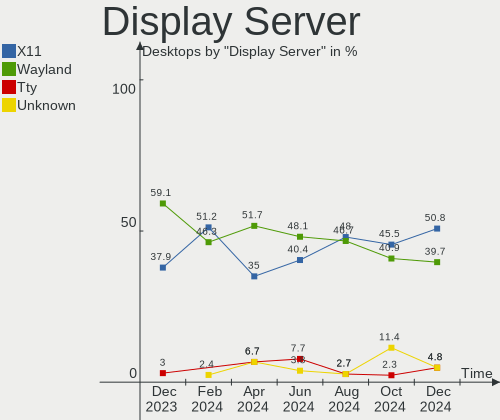
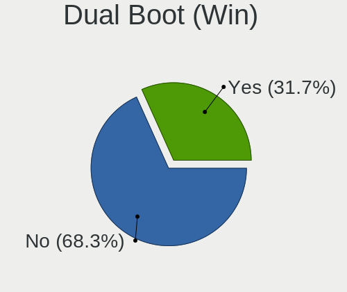
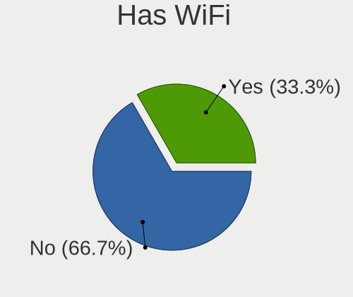
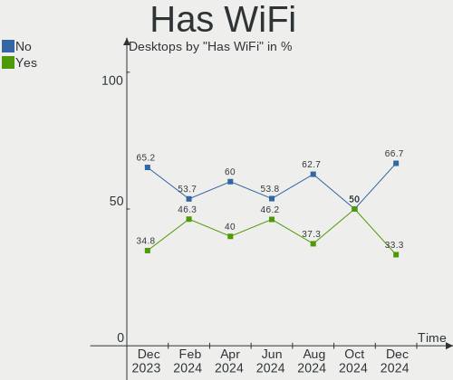
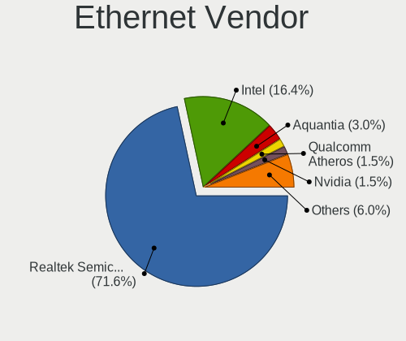
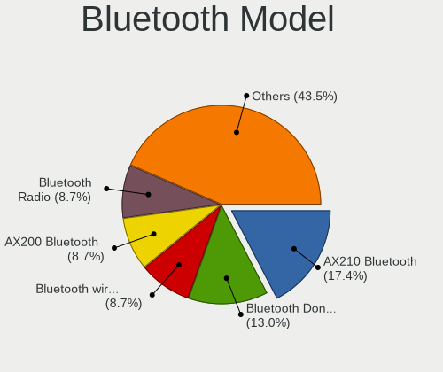
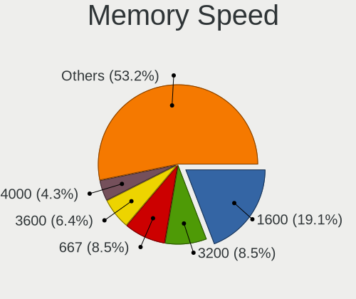
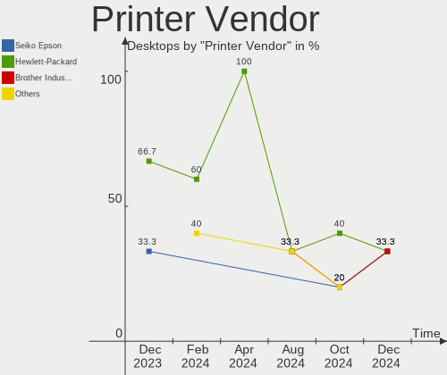
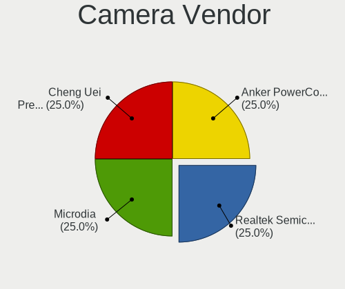
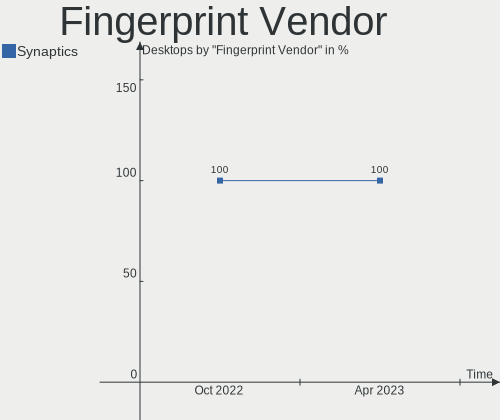

Linux in Poland - Hardware Trends (Desktops)
--------------------------------------------

A project to identify most popular hardware characteristics and track their change
over time based on data collected by Linux users at https://Linux-Hardware.org.

Anyone can contribute to this report by the [hw-probe](https://github.com/linuxhw/hw-probe) tool:

    sudo -E hw-probe -all -upload

Period: Oct, 2022.

Contents
--------

* [ System ](#system)
  - [ OS                       ](#os)
  - [ OS Family                ](#os-family)
  - [ Kernel                   ](#kernel)
  - [ Kernel Family            ](#kernel-family)
  - [ Kernel Major Ver.        ](#kernel-major-ver)
  - [ Arch                     ](#arch)
  - [ DE                       ](#de)
  - [ Display Server           ](#display-server)
  - [ Display Manager          ](#display-manager)
  - [ OS Lang                  ](#os-lang)
  - [ Boot Mode                ](#boot-mode)
  - [ Filesystem               ](#filesystem)
  - [ Part. scheme             ](#part-scheme)
  - [ Dual Boot with Linux/BSD ](#dual-boot-with-linuxbsd)
  - [ Dual Boot (Win)          ](#dual-boot-win)

* [ Board ](#board)
  - [ Vendor                   ](#vendor)
  - [ Model                    ](#model)
  - [ Model Family             ](#model-family)
  - [ MFG Year                 ](#mfg-year)
  - [ Form Factor              ](#form-factor)
  - [ Secure Boot              ](#secure-boot)
  - [ Coreboot                 ](#coreboot)
  - [ RAM Size                 ](#ram-size)
  - [ RAM Used                 ](#ram-used)
  - [ Total Drives             ](#total-drives)
  - [ Has CD-ROM               ](#has-cd-rom)
  - [ Has Ethernet             ](#has-ethernet)
  - [ Has WiFi                 ](#has-wifi)
  - [ Has Bluetooth            ](#has-bluetooth)

* [ Location ](#location)
  - [ Country                  ](#country)
  - [ City                     ](#city)

* [ Drives ](#drives)
  - [ Drive Vendor             ](#drive-vendor)
  - [ Drive Model              ](#drive-model)
  - [ HDD Vendor               ](#hdd-vendor)
  - [ SSD Vendor               ](#ssd-vendor)
  - [ Drive Kind               ](#drive-kind)
  - [ Drive Connector          ](#drive-connector)
  - [ Drive Size               ](#drive-size)
  - [ Space Total              ](#space-total)
  - [ Space Used               ](#space-used)
  - [ Malfunc. Drives          ](#malfunc-drives)
  - [ Malfunc. Drive Vendor    ](#malfunc-drive-vendor)
  - [ Malfunc. HDD Vendor      ](#malfunc-hdd-vendor)
  - [ Malfunc. Drive Kind      ](#malfunc-drive-kind)
  - [ Failed Drives            ](#failed-drives)
  - [ Failed Drive Vendor      ](#failed-drive-vendor)
  - [ Drive Status             ](#drive-status)

* [ Storage controller ](#storage-controller)
  - [ Storage Vendor           ](#storage-vendor)
  - [ Storage Model            ](#storage-model)
  - [ Storage Kind             ](#storage-kind)

* [ Processor ](#processor)
  - [ CPU Vendor               ](#cpu-vendor)
  - [ CPU Model                ](#cpu-model)
  - [ CPU Model Family         ](#cpu-model-family)
  - [ CPU Cores                ](#cpu-cores)
  - [ CPU Sockets              ](#cpu-sockets)
  - [ CPU Threads              ](#cpu-threads)
  - [ CPU Op-Modes             ](#cpu-op-modes)
  - [ CPU Microcode            ](#cpu-microcode)
  - [ CPU Microarch            ](#cpu-microarch)

* [ Graphics ](#graphics)
  - [ GPU Vendor               ](#gpu-vendor)
  - [ GPU Model                ](#gpu-model)
  - [ GPU Combo                ](#gpu-combo)
  - [ GPU Driver               ](#gpu-driver)
  - [ GPU Memory               ](#gpu-memory)

* [ Monitor ](#monitor)
  - [ Monitor Vendor           ](#monitor-vendor)
  - [ Monitor Model            ](#monitor-model)
  - [ Monitor Resolution       ](#monitor-resolution)
  - [ Monitor Diagonal         ](#monitor-diagonal)
  - [ Monitor Width            ](#monitor-width)
  - [ Aspect Ratio             ](#aspect-ratio)
  - [ Monitor Area             ](#monitor-area)
  - [ Pixel Density            ](#pixel-density)
  - [ Multiple Monitors        ](#multiple-monitors)

* [ Network ](#network)
  - [ Net Controller Vendor    ](#net-controller-vendor)
  - [ Net Controller Model     ](#net-controller-model)
  - [ Wireless Vendor          ](#wireless-vendor)
  - [ Wireless Model           ](#wireless-model)
  - [ Ethernet Vendor          ](#ethernet-vendor)
  - [ Ethernet Model           ](#ethernet-model)
  - [ Net Controller Kind      ](#net-controller-kind)
  - [ Used Controller          ](#used-controller)
  - [ NICs                     ](#nics)
  - [ IPv6                     ](#ipv6)

* [ Bluetooth ](#bluetooth)
  - [ Bluetooth Vendor         ](#bluetooth-vendor)
  - [ Bluetooth Model          ](#bluetooth-model)

* [ Sound ](#sound)
  - [ Sound Vendor             ](#sound-vendor)
  - [ Sound Model              ](#sound-model)

* [ Memory ](#memory)
  - [ Memory Vendor            ](#memory-vendor)
  - [ Memory Model             ](#memory-model)
  - [ Memory Kind              ](#memory-kind)
  - [ Memory Form Factor       ](#memory-form-factor)
  - [ Memory Size              ](#memory-size)
  - [ Memory Speed             ](#memory-speed)

* [ Printers & scanners ](#printers--scanners)
  - [ Printer Vendor           ](#printer-vendor)
  - [ Printer Model            ](#printer-model)
  - [ Scanner Vendor           ](#scanner-vendor)
  - [ Scanner Model            ](#scanner-model)

* [ Camera ](#camera)
  - [ Camera Vendor            ](#camera-vendor)
  - [ Camera Model             ](#camera-model)

* [ Security ](#security)
  - [ Fingerprint Vendor       ](#fingerprint-vendor)
  - [ Fingerprint Model        ](#fingerprint-model)
  - [ Chipcard Vendor          ](#chipcard-vendor)
  - [ Chipcard Model           ](#chipcard-model)

* [ Unsupported ](#unsupported)
  - [ Unsupported Devices      ](#unsupported-devices)
  - [ Unsupported Device Types ](#unsupported-device-types)

System
------

OS
--

Installed operating systems

| Name               | Desktops | Percent |
|--------------------|----------|---------|
| Ubuntu 22.04       | 6        | 13.33%  |
| OpenMandriva 4.3   | 6        | 13.33%  |
| Arch Rolling       | 6        | 13.33%  |
| Pop!_OS 22.04      | 4        | 8.89%   |
| Linux Mint 21      | 4        | 8.89%   |
| Zorin 16           | 3        | 6.67%   |
| Ubuntu 20.04       | 2        | 4.44%   |
| Gentoo 2.8         | 2        | 4.44%   |
| Fedora 37          | 2        | 4.44%   |
| Fedora 36          | 2        | 4.44%   |
| openSUSE Leap-15.4 | 1        | 2.22%   |
| OpenMandriva 4.50  | 1        | 2.22%   |
| Linux Mint 20.3    | 1        | 2.22%   |
| Linux Mint 19.3    | 1        | 2.22%   |
| Kubuntu 22.04      | 1        | 2.22%   |
| Kubuntu 20.04      | 1        | 2.22%   |
| Debian 11          | 1        | 2.22%   |
| ArcoLinux Rolling  | 1        | 2.22%   |

OS Family
---------

OS without a version

| Name         | Desktops | Percent |
|--------------|----------|---------|
| Ubuntu       | 8        | 17.78%  |
| OpenMandriva | 7        | 15.56%  |
| Linux Mint   | 6        | 13.33%  |
| Arch         | 6        | 13.33%  |
| Pop!_OS      | 4        | 8.89%   |
| Fedora       | 4        | 8.89%   |
| Zorin        | 3        | 6.67%   |
| Kubuntu      | 2        | 4.44%   |
| Gentoo       | 2        | 4.44%   |
| openSUSE     | 1        | 2.22%   |
| Debian       | 1        | 2.22%   |
| ArcoLinux    | 1        | 2.22%   |

Kernel
------

Version of the Linux kernel

| Version                      | Desktops | Percent |
|------------------------------|----------|---------|
| 5.15.0-52-generic            | 8        | 17.78%  |
| 5.16.7-desktop-1omv4003      | 4        | 8.89%   |
| 5.15.0-50-generic            | 4        | 8.89%   |
| 5.15.0-48-generic            | 4        | 8.89%   |
| 5.19.0-76051900-generic      | 3        | 6.67%   |
| 5.16.13-desktop-1omv4003     | 2        | 4.44%   |
| 5.15.69-gentoo               | 2        | 4.44%   |
| 6.0.5-300.fc37.x86_64        | 1        | 2.22%   |
| 6.0.5-200.fc36.x86_64        | 1        | 2.22%   |
| 6.0.2-zen1-1-zen             | 1        | 2.22%   |
| 6.0.2-x64v1-xanmod1          | 1        | 2.22%   |
| 6.0.2-arch1-1                | 1        | 2.22%   |
| 6.0.1-arch2-1                | 1        | 2.22%   |
| 5.4.0-125-generic            | 1        | 2.22%   |
| 5.4.0-121-generic            | 1        | 2.22%   |
| 5.19.5-desktop-1omv4090      | 1        | 2.22%   |
| 5.19.2-arch1-1               | 1        | 2.22%   |
| 5.19.14-300.fc37.x86_64      | 1        | 2.22%   |
| 5.19.13-arch1-1              | 1        | 2.22%   |
| 5.19.12-arch1-1              | 1        | 2.22%   |
| 5.19.12-200.fc36.x86_64      | 1        | 2.22%   |
| 5.19.11-arch1-1              | 1        | 2.22%   |
| 5.15.0-43-generic            | 1        | 2.22%   |
| 5.14.21-150400.24.21-default | 1        | 2.22%   |
| 5.10.0-18-amd64              | 1        | 2.22%   |

Kernel Family
-------------

Linux kernel without a distro release

| Version | Desktops | Percent |
|---------|----------|---------|
| 5.15.0  | 17       | 37.78%  |
| 5.16.7  | 4        | 8.89%   |
| 6.0.2   | 3        | 6.67%   |
| 5.19.0  | 3        | 6.67%   |
| 6.0.5   | 2        | 4.44%   |
| 5.4.0   | 2        | 4.44%   |
| 5.19.12 | 2        | 4.44%   |
| 5.16.13 | 2        | 4.44%   |
| 5.15.69 | 2        | 4.44%   |
| 6.0.1   | 1        | 2.22%   |
| 5.19.5  | 1        | 2.22%   |
| 5.19.2  | 1        | 2.22%   |
| 5.19.14 | 1        | 2.22%   |
| 5.19.13 | 1        | 2.22%   |
| 5.19.11 | 1        | 2.22%   |
| 5.14.21 | 1        | 2.22%   |
| 5.10.0  | 1        | 2.22%   |

Kernel Major Ver.
-----------------

Linux kernel major version

| Version | Desktops | Percent |
|---------|----------|---------|
| 5.15    | 19       | 42.22%  |
| 5.19    | 10       | 22.22%  |
| 6.0     | 6        | 13.33%  |
| 5.16    | 6        | 13.33%  |
| 5.4     | 2        | 4.44%   |
| 5.14    | 1        | 2.22%   |
| 5.10    | 1        | 2.22%   |

Arch
----

OS architecture (x86_64, i586, etc.)

| Name   | Desktops | Percent |
|--------|----------|---------|
| x86_64 | 45       | 100%    |

DE
--

Desktop Environment

| Name       | Desktops | Percent |
|------------|----------|---------|
| GNOME      | 20       | 44.44%  |
| KDE5       | 13       | 28.89%  |
| X-Cinnamon | 5        | 11.11%  |
| Unknown    | 3        | 6.67%   |
| XFCE       | 1        | 2.22%   |
| MATE       | 1        | 2.22%   |
| i3         | 1        | 2.22%   |
| Cinnamon   | 1        | 2.22%   |

Display Server
--------------

X11 or Wayland

| Name    | Desktops | Percent |
|---------|----------|---------|
| X11     | 33       | 73.33%  |
| Wayland | 7        | 15.56%  |
| Unknown | 3        | 6.67%   |
| Tty     | 2        | 4.44%   |

Display Manager
---------------

SDDM, LightDM, etc.

| Name    | Desktops | Percent |
|---------|----------|---------|
| Unknown | 20       | 44.44%  |
| SDDM    | 10       | 22.22%  |
| GDM3    | 8        | 17.78%  |
| LightDM | 6        | 13.33%  |
| GDM     | 1        | 2.22%   |

OS Lang
-------

Language

| Lang  | Desktops | Percent |
|-------|----------|---------|
| pl_PL | 24       | 53.33%  |
| en_US | 13       | 28.89%  |
| en_GB | 6        | 13.33%  |
| uk_UA | 1        | 2.22%   |
| en_CA | 1        | 2.22%   |

Boot Mode
---------

EFI or BIOS

| Mode | Desktops | Percent |
|------|----------|---------|
| BIOS | 24       | 53.33%  |
| EFI  | 21       | 46.67%  |

Filesystem
----------

Type of filesystem

| Type    | Desktops | Percent |
|---------|----------|---------|
| Ext4    | 29       | 64.44%  |
| Btrfs   | 8        | 17.78%  |
| Overlay | 5        | 11.11%  |
| F2fs    | 2        | 4.44%   |
| Ext2    | 1        | 2.22%   |

Part. scheme
------------

Scheme of partitioning

| Type    | Desktops | Percent |
|---------|----------|---------|
| GPT     | 25       | 55.56%  |
| Unknown | 16       | 35.56%  |
| MBR     | 4        | 8.89%   |

Dual Boot with Linux/BSD
------------------------

Hosting more than one Linux/BSD

| Dual boot | Desktops | Percent |
|-----------|----------|---------|
| No        | 36       | 80%     |
| Yes       | 9        | 20%     |

Dual Boot (Win)
---------------

Hosting Linux and Windows

| Dual boot | Desktops | Percent |
|-----------|----------|---------|
| No        | 30       | 66.67%  |
| Yes       | 15       | 33.33%  |

Board
-----

Vendor
------

Motherboard manufacturer

| Name                | Desktops | Percent |
|---------------------|----------|---------|
| ASUSTek Computer    | 15       | 33.33%  |
| Gigabyte Technology | 10       | 22.22%  |
| MSI                 | 8        | 17.78%  |
| Dell                | 6        | 13.33%  |
| Lenovo              | 2        | 4.44%   |
| Hewlett-Packard     | 1        | 2.22%   |
| Foxconn             | 1        | 2.22%   |
| ASRock              | 1        | 2.22%   |
| Acer                | 1        | 2.22%   |

Model
-----

Motherboard model

| Name                            | Desktops | Percent |
|---------------------------------|----------|---------|
| Dell OptiPlex 755               | 2        | 4.44%   |
| ASUS All Series                 | 2        | 4.44%   |
| MSI MS-7D25                     | 1        | 2.22%   |
| MSI MS-7D20                     | 1        | 2.22%   |
| MSI MS-7C52                     | 1        | 2.22%   |
| MSI MS-7C37                     | 1        | 2.22%   |
| MSI MS-7B86                     | 1        | 2.22%   |
| MSI MS-7B79                     | 1        | 2.22%   |
| MSI MS-7A38                     | 1        | 2.22%   |
| MSI MS-7A12                     | 1        | 2.22%   |
| Lenovo ThinkStation C20 4263BA7 | 1        | 2.22%   |
| Lenovo IdeaCentre K410 10089    | 1        | 2.22%   |
| HP EliteDesk 800 G1 DM          | 1        | 2.22%   |
| Gigabyte Z97M-DS3H              | 1        | 2.22%   |
| Gigabyte X570S AORUS MASTER     | 1        | 2.22%   |
| Gigabyte X570 AORUS ELITE       | 1        | 2.22%   |
| Gigabyte P35-DS3L               | 1        | 2.22%   |
| Gigabyte H61M-D2H               | 1        | 2.22%   |
| Gigabyte B550 AORUS ELITE V2    | 1        | 2.22%   |
| Gigabyte B550 AORUS ELITE       | 1        | 2.22%   |
| Gigabyte B460MDS3HV2            | 1        | 2.22%   |
| Gigabyte B450 AORUS ELITE       | 1        | 2.22%   |
| Gigabyte AB350-Gaming           | 1        | 2.22%   |
| Foxconn H61MXT1/F2/-S/-V        | 1        | 2.22%   |
| Dell OptiPlex 790               | 1        | 2.22%   |
| Dell OptiPlex 7050              | 1        | 2.22%   |
| Dell OptiPlex 7010              | 1        | 2.22%   |
| Dell OptiPlex 3020              | 1        | 2.22%   |
| ASUS UNLOCK INSTALL             | 1        | 2.22%   |
| ASUS TUF Z370-PRO GAMING        | 1        | 2.22%   |
| ASUS TUF Gaming X570-PLUS       | 1        | 2.22%   |
| ASUS TUF Gaming B550M-E WIFI    | 1        | 2.22%   |
| ASUS SABERTOOTH Z77             | 1        | 2.22%   |
| ASUS ROG STRIX B550-I GAMING    | 1        | 2.22%   |
| ASUS PRIME X570-PRO             | 1        | 2.22%   |
| ASUS PRIME X470-PRO             | 1        | 2.22%   |
| ASUS PRIME H510M-A              | 1        | 2.22%   |
| ASUS PRIME B450-PLUS            | 1        | 2.22%   |
| ASUS PRIME B250M-PLUS           | 1        | 2.22%   |
| ASUS P5Q Premium                | 1        | 2.22%   |

Model Family
------------

Motherboard model prefix

| Name                  | Desktops | Percent |
|-----------------------|----------|---------|
| Dell OptiPlex         | 6        | 13.33%  |
| ASUS PRIME            | 5        | 11.11%  |
| ASUS TUF              | 3        | 6.67%   |
| Gigabyte B550         | 2        | 4.44%   |
| ASUS All              | 2        | 4.44%   |
| MSI MS-7D25           | 1        | 2.22%   |
| MSI MS-7D20           | 1        | 2.22%   |
| MSI MS-7C52           | 1        | 2.22%   |
| MSI MS-7C37           | 1        | 2.22%   |
| MSI MS-7B86           | 1        | 2.22%   |
| MSI MS-7B79           | 1        | 2.22%   |
| MSI MS-7A38           | 1        | 2.22%   |
| MSI MS-7A12           | 1        | 2.22%   |
| Lenovo ThinkStation   | 1        | 2.22%   |
| Lenovo IdeaCentre     | 1        | 2.22%   |
| HP EliteDesk          | 1        | 2.22%   |
| Gigabyte Z97M-DS3H    | 1        | 2.22%   |
| Gigabyte X570S        | 1        | 2.22%   |
| Gigabyte X570         | 1        | 2.22%   |
| Gigabyte P35-DS3L     | 1        | 2.22%   |
| Gigabyte H61M-D2H     | 1        | 2.22%   |
| Gigabyte B460MDS3HV2  | 1        | 2.22%   |
| Gigabyte B450         | 1        | 2.22%   |
| Gigabyte AB350-Gaming | 1        | 2.22%   |
| Foxconn H61MXT1       | 1        | 2.22%   |
| ASUS UNLOCK           | 1        | 2.22%   |
| ASUS SABERTOOTH       | 1        | 2.22%   |
| ASUS ROG              | 1        | 2.22%   |
| ASUS P5Q              | 1        | 2.22%   |
| ASUS M3A78-CM         | 1        | 2.22%   |
| ASRock Z170           | 1        | 2.22%   |
| Acer Veriton          | 1        | 2.22%   |

MFG Year
--------

Motherboard manufacture year

| Year | Desktops | Percent |
|------|----------|---------|
| 2019 | 8        | 17.78%  |
| 2021 | 6        | 13.33%  |
| 2018 | 5        | 11.11%  |
| 2020 | 4        | 8.89%   |
| 2014 | 4        | 8.89%   |
| 2012 | 4        | 8.89%   |
| 2011 | 4        | 8.89%   |
| 2007 | 3        | 6.67%   |
| 2016 | 2        | 4.44%   |
| 2017 | 1        | 2.22%   |
| 2015 | 1        | 2.22%   |
| 2013 | 1        | 2.22%   |
| 2010 | 1        | 2.22%   |
| 2008 | 1        | 2.22%   |

Form Factor
-----------

Physical design of the computer

| Name    | Desktops | Percent |
|---------|----------|---------|
| Desktop | 45       | 100%    |

Secure Boot
-----------

Enabled or disabled

| State    | Desktops | Percent |
|----------|----------|---------|
| Disabled | 44       | 97.78%  |
| Enabled  | 1        | 2.22%   |

Coreboot
--------

Have coreboot on board

| Used | Desktops | Percent |
|------|----------|---------|
| No   | 45       | 100%    |

RAM Size
--------

Total RAM memory

| Size in GB  | Desktops | Percent |
|-------------|----------|---------|
| 32.01-64.0  | 12       | 26.67%  |
| 16.01-24.0  | 12       | 26.67%  |
| 8.01-16.0   | 8        | 17.78%  |
| 3.01-4.0    | 4        | 8.89%   |
| 24.01-32.0  | 4        | 8.89%   |
| 4.01-8.0    | 2        | 4.44%   |
| 64.01-256.0 | 2        | 4.44%   |
| 2.01-3.0    | 1        | 2.22%   |

RAM Used
--------

Used RAM memory

| Used GB    | Desktops | Percent |
|------------|----------|---------|
| 4.01-8.0   | 13       | 28.89%  |
| 1.01-2.0   | 12       | 26.67%  |
| 2.01-3.0   | 8        | 17.78%  |
| 3.01-4.0   | 4        | 8.89%   |
| 16.01-24.0 | 3        | 6.67%   |
| 0.51-1.0   | 2        | 4.44%   |
| 24.01-32.0 | 1        | 2.22%   |
| 8.01-16.0  | 1        | 2.22%   |
| 0.01-0.5   | 1        | 2.22%   |

Total Drives
------------

Number of drives on board

| Drives | Desktops | Percent |
|--------|----------|---------|
| 2      | 14       | 31.11%  |
| 3      | 11       | 24.44%  |
| 1      | 10       | 22.22%  |
| 4      | 5        | 11.11%  |
| 6      | 3        | 6.67%   |
| 7      | 1        | 2.22%   |
| 5      | 1        | 2.22%   |

Has CD-ROM
----------

Has CD-ROM on board

| Presented | Desktops | Percent |
|-----------|----------|---------|
| No        | 29       | 64.44%  |
| Yes       | 16       | 35.56%  |

Has Ethernet
------------

Has Ethernet on board

| Presented | Desktops | Percent |
|-----------|----------|---------|
| Yes       | 45       | 100%    |

Has WiFi
--------

Has WiFi module

| Presented | Desktops | Percent |
|-----------|----------|---------|
| No        | 23       | 51.11%  |
| Yes       | 22       | 48.89%  |

Has Bluetooth
-------------

Has Bluetooth module

| Presented | Desktops | Percent |
|-----------|----------|---------|
| No        | 23       | 51.11%  |
| Yes       | 22       | 48.89%  |

Location
--------

Country
-------

Geographic location (country)

| Country | Desktops | Percent |
|---------|----------|---------|
| Poland  | 45       | 100%    |

City
----

Geographic location (city)

| City                  | Desktops | Percent |
|-----------------------|----------|---------|
| Warsaw                | 8        | 17.78%  |
| Wroclaw               | 5        | 11.11%  |
| Krakow                | 4        | 8.89%   |
| Lublin                | 2        | 4.44%   |
| Brzeg                 | 2        | 4.44%   |
| Zdunska Wola          | 1        | 2.22%   |
| Żagań               | 1        | 2.22%   |
| Zabrze                | 1        | 2.22%   |
| Wyszków              | 1        | 2.22%   |
| Torun                 | 1        | 2.22%   |
| Tarnobrzeg            | 1        | 2.22%   |
| Świętochłowice     | 1        | 2.22%   |
| Supraśl              | 1        | 2.22%   |
| Sulechow              | 1        | 2.22%   |
| Strzyzow              | 1        | 2.22%   |
| Stezyca               | 1        | 2.22%   |
| Niepolomice           | 1        | 2.22%   |
| Mogilno               | 1        | 2.22%   |
| Makow Podhalanski     | 1        | 2.22%   |
| Lodz                  | 1        | 2.22%   |
| Kozieglowy            | 1        | 2.22%   |
| Kluszkowce            | 1        | 2.22%   |
| Katowice              | 1        | 2.22%   |
| Izbica Kujawska       | 1        | 2.22%   |
| Elblag                | 1        | 2.22%   |
| Częstochowa          | 1        | 2.22%   |
| Czersk                | 1        | 2.22%   |
| Chodzież             | 1        | 2.22%   |
| Aleksandrów Łódzki | 1        | 2.22%   |

Drives
------

Drive Vendor
------------

Hard drive vendors

| Vendor                    | Desktops | Drives | Percent |
|---------------------------|----------|--------|---------|
| WDC                       | 14       | 15     | 14.29%  |
| Samsung Electronics       | 10       | 12     | 10.2%   |
| Seagate                   | 9        | 13     | 9.18%   |
| Crucial                   | 9        | 12     | 9.18%   |
| Toshiba                   | 7        | 9      | 7.14%   |
| GOODRAM                   | 7        | 8      | 7.14%   |
| Hitachi                   | 5        | 7      | 5.1%    |
| ADATA Technology          | 5        | 5      | 5.1%    |
| SanDisk                   | 4        | 5      | 4.08%   |
| Phison Electronics        | 4        | 6      | 4.08%   |
| A-DATA Technology         | 4        | 6      | 4.08%   |
| Patriot                   | 3        | 3      | 3.06%   |
| Kingston                  | 3        | 3      | 3.06%   |
| XPG                       | 2        | 3      | 2.04%   |
| SPCC                      | 2        | 2      | 2.04%   |
| Silicon Motion            | 1        | 1      | 1.02%   |
| OCZ                       | 1        | 1      | 1.02%   |
| Micron/Crucial Technology | 1        | 1      | 1.02%   |
| Micron Technology         | 1        | 1      | 1.02%   |
| Maxtor                    | 1        | 1      | 1.02%   |
| Lite-On Technology        | 1        | 1      | 1.02%   |
| HGST                      | 1        | 1      | 1.02%   |
| Fujitsu                   | 1        | 1      | 1.02%   |
| China                     | 1        | 1      | 1.02%   |
| ASMT                      | 1        | 1      | 1.02%   |

Drive Model
-----------

Hard drive models

| Model                                                           | Desktops | Percent |
|-----------------------------------------------------------------|----------|---------|
| ADATA XPG SX8200 Pro PCIe Gen3x4 M.2 2280 Solid State Drive 1TB | 5        | 4.55%   |
| Crucial CT500MX500SSD1 500GB                                    | 4        | 3.64%   |
| Crucial CT1000MX500SSD1 1TB                                     | 3        | 2.73%   |
| WDC WD2500JS-55NCB1 250GB                                       | 2        | 1.82%   |
| WDC WD10EZEX-60WN4A0 1TB                                        | 2        | 1.82%   |
| Toshiba HDWD130 3TB                                             | 2        | 1.82%   |
| Samsung SSD 850 EVO 250GB                                       | 2        | 1.82%   |
| Phison PS5013 E13 NVMe Controller 256GB                         | 2        | 1.82%   |
| Phison E12 NVMe Controller 2TB                                  | 2        | 1.82%   |
| Hitachi HUA723020ALA641 2TB                                     | 2        | 1.82%   |
| GOODRAM SSDPR-CX400-512-G2 512GB                                | 2        | 1.82%   |
| GOODRAM SSDPR-CX400-512 512GB                                   | 2        | 1.82%   |
| GOODRAM SSDPR-CX400-128 128GB                                   | 2        | 1.82%   |
| GOODRAM SSDPR-CL100-480-G2 480GB                                | 2        | 1.82%   |
| Crucial CT250MX500SSD1 250GB                                    | 2        | 1.82%   |
| XPG SX950U 240GB                                                | 1        | 0.91%   |
| XPG NVMe SSD Drive 1024GB                                       | 1        | 0.91%   |
| XPG GAMMIX S11 Pro 1TB                                          | 1        | 0.91%   |
| WDC WDS500G2B0A-00SM50 500GB SSD                                | 1        | 0.91%   |
| WDC WDS100T2B0C-00PXH0 1TB                                      | 1        | 0.91%   |
| WDC WD7500AAKS-00RBA0 752GB                                     | 1        | 0.91%   |
| WDC WD5000AADS-00S9B0 500GB                                     | 1        | 0.91%   |
| WDC WD2500AAKX-75U6AA0 250GB                                    | 1        | 0.91%   |
| WDC WD2500AAKX-603CA0 250GB                                     | 1        | 0.91%   |
| WDC WD20EZBX-00AYRA0 2TB                                        | 1        | 0.91%   |
| WDC WD10EZEX-08WN4A0 1TB                                        | 1        | 0.91%   |
| WDC WD10EZEX-00ZF5A0 1TB                                        | 1        | 0.91%   |
| WDC WD1002FBYS-02A6B0 1TB                                       | 1        | 0.91%   |
| WDC WD1002FAEX-00Z3A0 1TB                                       | 1        | 0.91%   |
| Toshiba TR200 240GB SSD                                         | 1        | 0.91%   |
| Toshiba NVMe SSD Drive 512GB                                    | 1        | 0.91%   |
| Toshiba HDWE150 5TB                                             | 1        | 0.91%   |
| Toshiba HDWD240 4TB                                             | 1        | 0.91%   |
| Toshiba HDWD110 1TB                                             | 1        | 0.91%   |
| Toshiba DT01ABA100V 1TB                                         | 1        | 0.91%   |
| SPCC Solid State Disk 240GB                                     | 1        | 0.91%   |
| SPCC M.2 PCIe SSD 256GB                                         | 1        | 0.91%   |
| Silicon Motion SM2263EN/SM2263XT SSD Controller 256GB           | 1        | 0.91%   |
| Seagate ST4000VN008-2DR166 4TB                                  | 1        | 0.91%   |
| Seagate ST4000DM004-2CV104 4TB                                  | 1        | 0.91%   |

HDD Vendor
----------

Hard disk drive vendors

| Vendor              | Desktops | Drives | Percent |
|---------------------|----------|--------|---------|
| WDC                 | 12       | 13     | 33.33%  |
| Seagate             | 9        | 13     | 25%     |
| Toshiba             | 5        | 7      | 13.89%  |
| Hitachi             | 5        | 7      | 13.89%  |
| Samsung Electronics | 2        | 2      | 5.56%   |
| Maxtor              | 1        | 1      | 2.78%   |
| HGST                | 1        | 1      | 2.78%   |
| Fujitsu             | 1        | 1      | 2.78%   |

SSD Vendor
----------

Solid state drive vendors

| Vendor              | Desktops | Drives | Percent |
|---------------------|----------|--------|---------|
| Crucial             | 9        | 12     | 24.32%  |
| GOODRAM             | 7        | 8      | 18.92%  |
| Samsung Electronics | 5        | 7      | 13.51%  |
| A-DATA Technology   | 4        | 6      | 10.81%  |
| SanDisk             | 3        | 3      | 8.11%   |
| Patriot             | 2        | 2      | 5.41%   |
| XPG                 | 1        | 1      | 2.7%    |
| WDC                 | 1        | 1      | 2.7%    |
| Toshiba             | 1        | 1      | 2.7%    |
| SPCC                | 1        | 1      | 2.7%    |
| OCZ                 | 1        | 1      | 2.7%    |
| China               | 1        | 1      | 2.7%    |
| ASMT                | 1        | 1      | 2.7%    |

Drive Kind
----------

HDD or SSD

| Kind | Desktops | Drives | Percent |
|------|----------|--------|---------|
| SSD  | 30       | 45     | 36.59%  |
| HDD  | 28       | 45     | 34.15%  |
| NVMe | 24       | 29     | 29.27%  |

Drive Connector
---------------

SATA, SAS, NVMe, etc.

| Type | Desktops | Drives | Percent |
|------|----------|--------|---------|
| SATA | 40       | 88     | 61.54%  |
| NVMe | 24       | 29     | 36.92%  |
| SAS  | 1        | 2      | 1.54%   |

Drive Size
----------

Size of hard drive

| Size in TB | Desktops | Drives | Percent |
|------------|----------|--------|---------|
| 0.01-0.5   | 29       | 42     | 42.65%  |
| 0.51-1.0   | 22       | 25     | 32.35%  |
| 1.01-2.0   | 7        | 9      | 10.29%  |
| 3.01-4.0   | 3        | 4      | 4.41%   |
| 2.01-3.0   | 3        | 6      | 4.41%   |
| 4.01-10.0  | 3        | 3      | 4.41%   |
| 10.01-20.0 | 1        | 1      | 1.47%   |

Space Total
-----------

Amount of disk space available on the file system

| Size in GB     | Desktops | Percent |
|----------------|----------|---------|
| 251-500        | 10       | 22.22%  |
| More than 3000 | 8        | 17.78%  |
| 1001-2000      | 7        | 15.56%  |
| 101-250        | 6        | 13.33%  |
| 501-1000       | 4        | 8.89%   |
| 2001-3000      | 3        | 6.67%   |
| 51-100         | 3        | 6.67%   |
| 1-20           | 2        | 4.44%   |
| 21-50          | 1        | 2.22%   |
| Unknown        | 1        | 2.22%   |

Space Used
----------

Amount of used disk space

| Used GB        | Desktops | Percent |
|----------------|----------|---------|
| 1-20           | 10       | 22.22%  |
| 101-250        | 7        | 15.56%  |
| More than 3000 | 5        | 11.11%  |
| 251-500        | 5        | 11.11%  |
| 1001-2000      | 5        | 11.11%  |
| 501-1000       | 4        | 8.89%   |
| 21-50          | 3        | 6.67%   |
| 51-100         | 3        | 6.67%   |
| 2001-3000      | 2        | 4.44%   |
| Unknown        | 1        | 2.22%   |

Malfunc. Drives
---------------

Drive models with a malfunction

| Model                                 | Desktops | Drives | Percent |
|---------------------------------------|----------|--------|---------|
| Seagate ST3320613AS 320GB             | 1        | 1      | 12.5%   |
| Seagate ST1000DX001-1CM162 1TB        | 1        | 1      | 12.5%   |
| Seagate ST10000NE0004-1ZF101 10TB     | 1        | 1      | 12.5%   |
| SanDisk SSD PLUS 240 GB               | 1        | 1      | 12.5%   |
| Samsung Electronics SSD 850 EVO 250GB | 1        | 1      | 12.5%   |
| Hitachi HDE721010SLA330 1TB           | 1        | 1      | 12.5%   |
| Crucial CT500MX500SSD1 500GB          | 1        | 1      | 12.5%   |
| ASMT 2135 120GB SSD                   | 1        | 1      | 12.5%   |

Malfunc. Drive Vendor
---------------------

Vendors of faulty drives

| Vendor              | Desktops | Drives | Percent |
|---------------------|----------|--------|---------|
| Seagate             | 3        | 3      | 37.5%   |
| SanDisk             | 1        | 1      | 12.5%   |
| Samsung Electronics | 1        | 1      | 12.5%   |
| Hitachi             | 1        | 1      | 12.5%   |
| Crucial             | 1        | 1      | 12.5%   |
| ASMT                | 1        | 1      | 12.5%   |

Malfunc. HDD Vendor
-------------------

Vendors of faulty HDD drives

| Vendor  | Desktops | Drives | Percent |
|---------|----------|--------|---------|
| Seagate | 3        | 3      | 75%     |
| Hitachi | 1        | 1      | 25%     |

Malfunc. Drive Kind
-------------------

Kinds of faulty drives

| Kind | Desktops | Drives | Percent |
|------|----------|--------|---------|
| SSD  | 4        | 4      | 50%     |
| HDD  | 4        | 4      | 50%     |

Failed Drives
-------------

Failed drive models

Zero info for selected period =(

Failed Drive Vendor
-------------------

Failed drive vendors

Zero info for selected period =(

Drive Status
------------

Number of failed and malfunc. drives

| Status   | Desktops | Drives | Percent |
|----------|----------|--------|---------|
| Works    | 23       | 58     | 43.4%   |
| Detected | 22       | 53     | 41.51%  |
| Malfunc  | 8        | 8      | 15.09%  |

Storage controller
------------------

Storage Vendor
--------------

Storage controller vendors

| Vendor                       | Desktops | Percent |
|------------------------------|----------|---------|
| Intel                        | 27       | 32.93%  |
| AMD                          | 18       | 21.95%  |
| Phison Electronics           | 6        | 7.32%   |
| ADATA Technology             | 6        | 7.32%   |
| SanDisk                      | 3        | 3.66%   |
| Samsung Electronics          | 3        | 3.66%   |
| Marvell Technology Group     | 3        | 3.66%   |
| Kingston Technology Company  | 3        | 3.66%   |
| ASMedia Technology           | 3        | 3.66%   |
| JMicron Technology           | 2        | 2.44%   |
| Unknown                      | 1        | 1.22%   |
| Toshiba America Info Systems | 1        | 1.22%   |
| Tekram Technology            | 1        | 1.22%   |
| Silicon Motion               | 1        | 1.22%   |
| Micron/Crucial Technology    | 1        | 1.22%   |
| Micron Technology            | 1        | 1.22%   |
| LSI Logic / Symbios Logic    | 1        | 1.22%   |
| Lite-On Technology           | 1        | 1.22%   |

Storage Model
-------------

Storage controller models

| Model                                                                                   | Desktops | Percent |
|-----------------------------------------------------------------------------------------|----------|---------|
| AMD FCH SATA Controller [AHCI mode]                                                     | 10       | 10.64%  |
| AMD 400 Series Chipset SATA Controller                                                  | 7        | 7.45%   |
| ADATA XPG SX8200 Pro PCIe Gen3x4 M.2 2280 Solid State Drive                             | 6        | 6.38%   |
| AMD 500 Series Chipset SATA Controller                                                  | 4        | 4.26%   |
| Phison E12 NVMe Controller                                                              | 3        | 3.19%   |
| Intel SATA Controller [RAID mode]                                                       | 3        | 3.19%   |
| Intel 8 Series/C220 Series Chipset Family 6-port SATA Controller 1 [AHCI mode]          | 3        | 3.19%   |
| Intel 6 Series/C200 Series Chipset Family Desktop SATA Controller (IDE mode, ports 4-5) | 3        | 3.19%   |
| Intel 6 Series/C200 Series Chipset Family Desktop SATA Controller (IDE mode, ports 0-3) | 3        | 3.19%   |
| ASMedia ASM1062 Serial ATA Controller                                                   | 3        | 3.19%   |
| SanDisk WD Blue SN550 NVMe SSD                                                          | 2        | 2.13%   |
| Samsung NVMe SSD Controller SM981/PM981/PM983                                           | 2        | 2.13%   |
| Phison PS5013 E13 NVMe Controller                                                       | 2        | 2.13%   |
| Intel Q170/Q150/B150/H170/H110/Z170/CM236 Chipset SATA Controller [AHCI Mode]           | 2        | 2.13%   |
| Intel 9 Series Chipset Family SATA Controller [AHCI Mode]                               | 2        | 2.13%   |
| Intel 82Q35 Express PT IDER Controller                                                  | 2        | 2.13%   |
| Intel 82801JI (ICH10 Family) SATA AHCI Controller                                       | 2        | 2.13%   |
| Intel 82801IR/IO/IH (ICH9R/DO/DH) 6 port SATA Controller [AHCI mode]                    | 2        | 2.13%   |
| Intel 7 Series/C210 Series Chipset Family 6-port SATA Controller [AHCI mode]            | 2        | 2.13%   |
| Intel 6 Series/C200 Series Chipset Family 6 port Desktop SATA AHCI Controller           | 2        | 2.13%   |
| Intel 500 Series Chipset Family SATA AHCI Controller                                    | 2        | 2.13%   |
| Intel 200 Series PCH SATA controller [AHCI mode]                                        | 2        | 2.13%   |
| Unknown Non-Volatile memory controller                                                  | 1        | 1.06%   |
| Toshiba America Info Systems XG6 NVMe SSD Controller                                    | 1        | 1.06%   |
| Tekram TRM-S1040 [DC-315 / DC-395 series]                                               | 1        | 1.06%   |
| Silicon Motion SM2263EN/SM2263XT SSD Controller                                         | 1        | 1.06%   |
| SanDisk Non-Volatile memory controller                                                  | 1        | 1.06%   |
| Samsung NVMe SSD Controller 980                                                         | 1        | 1.06%   |
| Phison E7 NVMe Controller                                                               | 1        | 1.06%   |
| Micron/Crucial Non-Volatile memory controller                                           | 1        | 1.06%   |
| Micron Non-Volatile memory controller                                                   | 1        | 1.06%   |
| Marvell Group 88SE9230 PCIe 2.0 x2 4-port SATA 6 Gb/s RAID Controller                   | 1        | 1.06%   |
| Marvell Group 88SE9215 PCIe 2.0 x1 4-port SATA 6 Gb/s Controller                        | 1        | 1.06%   |
| Marvell Group 88SE6111/6121 SATA II / PATA Controller                                   | 1        | 1.06%   |
| LSI Logic / Symbios Logic SAS1068E PCI-Express Fusion-MPT SAS                           | 1        | 1.06%   |
| Lite-On Non-Volatile memory controller                                                  | 1        | 1.06%   |
| Kingston Company Company Non-Volatile memory controller                                 | 1        | 1.06%   |
| Kingston Company SNVS2000G [NV1 NVMe PCIe SSD 2TB]                                      | 1        | 1.06%   |
| Kingston Company A2000 NVMe SSD                                                         | 1        | 1.06%   |
| JMicron JMB368 IDE controller                                                           | 1        | 1.06%   |

Storage Kind
------------

Kind of storage controller (IDE, SATA, NVMe, SAS, ...)

| Kind | Desktops | Percent |
|------|----------|---------|
| SATA | 38       | 50%     |
| NVMe | 24       | 31.58%  |
| IDE  | 9        | 11.84%  |
| RAID | 3        | 3.95%   |
| SCSI | 2        | 2.63%   |

Processor
---------

CPU Vendor
----------

Processor vendors

| Vendor | Desktops | Percent |
|--------|----------|---------|
| Intel  | 27       | 60%     |
| AMD    | 18       | 40%     |

CPU Model
---------

Processor models

| Model                                  | Desktops | Percent |
|----------------------------------------|----------|---------|
| AMD Ryzen 5 2600X Six-Core Processor   | 3        | 6.67%   |
| AMD Ryzen 7 3800X 8-Core Processor     | 2        | 4.44%   |
| Intel Xeon CPU E5620 @ 2.40GHz         | 1        | 2.22%   |
| Intel Xeon CPU E3110 @ 3.00GHz         | 1        | 2.22%   |
| Intel Pentium Dual CPU E2200 @ 2.20GHz | 1        | 2.22%   |
| Intel Core i7-8700K CPU @ 3.70GHz      | 1        | 2.22%   |
| Intel Core i7-6700K CPU @ 4.00GHz      | 1        | 2.22%   |
| Intel Core i7-6700 CPU @ 3.40GHz       | 1        | 2.22%   |
| Intel Core i7-4790K CPU @ 4.00GHz      | 1        | 2.22%   |
| Intel Core i7-2600 CPU @ 3.40GHz       | 1        | 2.22%   |
| Intel Core i5-7500 CPU @ 3.40GHz       | 1        | 2.22%   |
| Intel Core i5-6600K CPU @ 3.50GHz      | 1        | 2.22%   |
| Intel Core i5-4690 CPU @ 3.50GHz       | 1        | 2.22%   |
| Intel Core i5-4590 CPU @ 3.30GHz       | 1        | 2.22%   |
| Intel Core i5-4570T CPU @ 2.90GHz      | 1        | 2.22%   |
| Intel Core i5-4440 CPU @ 3.10GHz       | 1        | 2.22%   |
| Intel Core i5-3570K CPU @ 3.40GHz      | 1        | 2.22%   |
| Intel Core i5-3470 CPU @ 3.20GHz       | 1        | 2.22%   |
| Intel Core i5-2400 CPU @ 3.10GHz       | 1        | 2.22%   |
| Intel Core i5-2320 CPU @ 3.00GHz       | 1        | 2.22%   |
| Intel Core i5-2300 CPU @ 2.80GHz       | 1        | 2.22%   |
| Intel Core i5-10400F CPU @ 2.90GHz     | 1        | 2.22%   |
| Intel Core i3-3220 CPU @ 3.30GHz       | 1        | 2.22%   |
| Intel Core i3-2100 CPU @ 3.10GHz       | 1        | 2.22%   |
| Intel Core i3-10105 CPU @ 3.70GHz      | 1        | 2.22%   |
| Intel Core i3-10100F CPU @ 3.60GHz     | 1        | 2.22%   |
| Intel Core 2 Duo CPU E6550 @ 2.33GHz   | 1        | 2.22%   |
| Intel Core 2 Duo CPU E4700 @ 2.60GHz   | 1        | 2.22%   |
| Intel 12th Gen Core i7-12700K          | 1        | 2.22%   |
| AMD Ryzen 9 3950X 16-Core Processor    | 1        | 2.22%   |
| AMD Ryzen 7 5800X3D 8-Core Processor   | 1        | 2.22%   |
| AMD Ryzen 7 5800X 8-Core Processor     | 1        | 2.22%   |
| AMD Ryzen 7 5700G with Radeon Graphics | 1        | 2.22%   |
| AMD Ryzen 7 3800XT 8-Core Processor    | 1        | 2.22%   |
| AMD Ryzen 7 3700X 8-Core Processor     | 1        | 2.22%   |
| AMD Ryzen 7 2700X Eight-Core Processor | 1        | 2.22%   |
| AMD Ryzen 5 5600G with Radeon Graphics | 1        | 2.22%   |
| AMD Ryzen 5 5600 6-Core Processor      | 1        | 2.22%   |
| AMD Ryzen 5 2600 Six-Core Processor    | 1        | 2.22%   |
| AMD Ryzen 5 1600 Six-Core Processor    | 1        | 2.22%   |

CPU Model Family
----------------

Processor model prefix

| Model              | Desktops | Percent |
|--------------------|----------|---------|
| Intel Core i5      | 12       | 26.67%  |
| AMD Ryzen 7        | 8        | 17.78%  |
| AMD Ryzen 5        | 7        | 15.56%  |
| Intel Core i7      | 5        | 11.11%  |
| Intel Core i3      | 4        | 8.89%   |
| Intel Xeon         | 2        | 4.44%   |
| Intel Core 2 Duo   | 2        | 4.44%   |
| Other              | 1        | 2.22%   |
| Intel Pentium Dual | 1        | 2.22%   |
| AMD Ryzen 9        | 1        | 2.22%   |
| AMD Ryzen 3        | 1        | 2.22%   |
| AMD Phenom II X4   | 1        | 2.22%   |

CPU Cores
---------

Number of processor cores

| Number | Desktops | Percent |
|--------|----------|---------|
| 4      | 18       | 40%     |
| 8      | 9        | 20%     |
| 6      | 9        | 20%     |
| 2      | 7        | 15.56%  |
| 16     | 1        | 2.22%   |
| 12     | 1        | 2.22%   |

CPU Sockets
-----------

Number of sockets

| Number | Desktops | Percent |
|--------|----------|---------|
| 1      | 44       | 97.78%  |
| 2      | 1        | 2.22%   |

CPU Threads
-----------

Threads per core (Hyper-Threading)

| Number | Desktops | Percent |
|--------|----------|---------|
| 2      | 29       | 64.44%  |
| 1      | 16       | 35.56%  |

CPU Op-Modes
------------

CPU Operation Modes (32-bit, 64-bit)

| Op mode        | Desktops | Percent |
|----------------|----------|---------|
| 32-bit, 64-bit | 45       | 100%    |

CPU Microcode
-------------

Microcode number

| Number     | Desktops | Percent |
|------------|----------|---------|
| Unknown    | 11       | 24.44%  |
| 0x306c3    | 4        | 8.89%   |
| 0xa0653    | 3        | 6.67%   |
| 0x506e3    | 3        | 6.67%   |
| 0x306a9    | 3        | 6.67%   |
| 0x206a7    | 3        | 6.67%   |
| 0x08701021 | 3        | 6.67%   |
| 0x0800820d | 3        | 6.67%   |
| 0x6fb      | 2        | 4.44%   |
| 0x0a201016 | 2        | 4.44%   |
| 0x906e9    | 1        | 2.22%   |
| 0x206c2    | 1        | 2.22%   |
| 0x10676    | 1        | 2.22%   |
| 0x0a50000c | 1        | 2.22%   |
| 0x0a20120a | 1        | 2.22%   |
| 0x08701013 | 1        | 2.22%   |
| 0x08008206 | 1        | 2.22%   |
| 0x010000db | 1        | 2.22%   |

CPU Microarch
-------------

Microarchitecture

| Name        | Desktops | Percent |
|-------------|----------|---------|
| Zen+        | 6        | 13.33%  |
| Zen 3       | 5        | 11.11%  |
| Zen 2       | 5        | 11.11%  |
| SandyBridge | 5        | 11.11%  |
| Haswell     | 5        | 11.11%  |
| Skylake     | 3        | 6.67%   |
| IvyBridge   | 3        | 6.67%   |
| Core        | 3        | 6.67%   |
| CometLake   | 3        | 6.67%   |
| KabyLake    | 2        | 4.44%   |
| Zen         | 1        | 2.22%   |
| Westmere    | 1        | 2.22%   |
| Penryn      | 1        | 2.22%   |
| K10         | 1        | 2.22%   |
| Unknown     | 1        | 2.22%   |

Graphics
--------

GPU Vendor
----------

Vendors of graphics cards

| Vendor | Desktops | Percent |
|--------|----------|---------|
| Nvidia | 18       | 37.5%   |
| AMD    | 17       | 35.42%  |
| Intel  | 13       | 27.08%  |

GPU Model
---------

Graphics card models

| Model                                                                       | Desktops | Percent |
|-----------------------------------------------------------------------------|----------|---------|
| Nvidia GP106 [GeForce GTX 1060 6GB]                                         | 4        | 8.33%   |
| Intel Xeon E3-1200 v3/4th Gen Core Processor Integrated Graphics Controller | 4        | 8.33%   |
| Nvidia GP107 [GeForce GTX 1050 Ti]                                          | 2        | 4.17%   |
| Nvidia GA104 [GeForce RTX 3060 Ti Lite Hash Rate]                           | 2        | 4.17%   |
| Intel HD Graphics 530                                                       | 2        | 4.17%   |
| Intel 82Q35 Express Integrated Graphics Controller                          | 2        | 4.17%   |
| Intel 2nd Generation Core Processor Family Integrated Graphics Controller   | 2        | 4.17%   |
| AMD Navi 23 [Radeon RX 6600/6600 XT/6600M]                                  | 2        | 4.17%   |
| AMD Ellesmere [Radeon RX 470/480/570/570X/580/580X/590]                     | 2        | 4.17%   |
| AMD Cezanne                                                                 | 2        | 4.17%   |
| AMD Cape Verde XT [Radeon HD 7770/8760 / R7 250X]                           | 2        | 4.17%   |
| Nvidia TU116 [GeForce GTX 1660 SUPER]                                       | 1        | 2.08%   |
| Nvidia GP108 [GeForce GT 1030]                                              | 1        | 2.08%   |
| Nvidia GP104 [GeForce GTX 1080]                                             | 1        | 2.08%   |
| Nvidia GP104 [GeForce GTX 1070]                                             | 1        | 2.08%   |
| Nvidia GM204 [GeForce GTX 970]                                              | 1        | 2.08%   |
| Nvidia GK110 [GeForce GTX 780]                                              | 1        | 2.08%   |
| Nvidia GK107 [GeForce GTX 650]                                              | 1        | 2.08%   |
| Nvidia GF106GL [Quadro 2000]                                                | 1        | 2.08%   |
| Nvidia GA104 [GeForce RTX 3070 Lite Hash Rate]                              | 1        | 2.08%   |
| Nvidia G84 [GeForce 8600 GT]                                                | 1        | 2.08%   |
| Intel Xeon E3-1200 v2/3rd Gen Core processor Graphics Controller            | 1        | 2.08%   |
| Intel CometLake-S GT2 [UHD Graphics 630]                                    | 1        | 2.08%   |
| Intel AlderLake-S GT1                                                       | 1        | 2.08%   |
| AMD RV770 [Radeon HD 4850]                                                  | 1        | 2.08%   |
| AMD RS780C [Radeon 3100]                                                    | 1        | 2.08%   |
| AMD Raven Ridge [Radeon Vega Series / Radeon Vega Mobile Series]            | 1        | 2.08%   |
| AMD Pitcairn PRO [Radeon HD 7850 / R7 265 / R9 270 1024SP]                  | 1        | 2.08%   |
| AMD Oland XT [Radeon HD 8670 / R5 340X OEM / R7 250/350/350X OEM]           | 1        | 2.08%   |
| AMD Navi 22 [Radeon RX 6700/6700 XT/6750 XT / 6800M]                        | 1        | 2.08%   |
| AMD Navi 14 [Radeon RX 5500/5500M / Pro 5500M]                              | 1        | 2.08%   |
| AMD Cedar [Radeon HD 5000/6000/7350/8350 Series]                            | 1        | 2.08%   |
| AMD Baffin [Radeon RX 550 640SP / RX 560/560X]                              | 1        | 2.08%   |

GPU Combo
---------

Combinations of graphics cards

| Name       | Desktops | Percent |
|------------|----------|---------|
| 1 x Nvidia | 18       | 40%     |
| 1 x AMD    | 17       | 37.78%  |
| 1 x Intel  | 10       | 22.22%  |

GPU Driver
----------

Free vs proprietary

| Driver      | Desktops | Percent |
|-------------|----------|---------|
| Free        | 30       | 66.67%  |
| Proprietary | 15       | 33.33%  |

GPU Memory
----------

Total video memory

| Size in GB | Desktops | Percent |
|------------|----------|---------|
| Unknown    | 19       | 42.22%  |
| 7.01-8.0   | 8        | 17.78%  |
| 0.51-1.0   | 5        | 11.11%  |
| 5.01-6.0   | 4        | 8.89%   |
| 1.01-2.0   | 3        | 6.67%   |
| 0.01-0.5   | 3        | 6.67%   |
| 3.01-4.0   | 1        | 2.22%   |
| 2.01-3.0   | 1        | 2.22%   |
| 8.01-16.0  | 1        | 2.22%   |

Monitor
-------

Monitor Vendor
--------------

Monitor vendors

| Vendor               | Desktops | Percent |
|----------------------|----------|---------|
| Goldstar             | 7        | 13.73%  |
| Samsung Electronics  | 6        | 11.76%  |
| Dell                 | 6        | 11.76%  |
| Philips              | 3        | 5.88%   |
| NEC Computers        | 3        | 5.88%   |
| Iiyama               | 3        | 5.88%   |
| Hewlett-Packard      | 3        | 5.88%   |
| Eizo                 | 3        | 5.88%   |
| BenQ                 | 3        | 5.88%   |
| Acer                 | 3        | 5.88%   |
| Lenovo               | 2        | 3.92%   |
| Fujitsu Siemens      | 2        | 3.92%   |
| AOC                  | 2        | 3.92%   |
| Idek Iiyama          | 1        | 1.96%   |
| Gigabyte Technology  | 1        | 1.96%   |
| Arnos Instruments    | 1        | 1.96%   |
| Ancor Communications | 1        | 1.96%   |
| Unknown              | 1        | 1.96%   |

Monitor Model
-------------

Monitor models

| Model                                                                | Desktops | Percent |
|----------------------------------------------------------------------|----------|---------|
| Hewlett-Packard LA2306 HWP294B 1920x1080 509x286mm 23.0-inch         | 2        | 3.64%   |
| Goldstar ULTRAWIDE GSM59F1 2560x1080 798x334mm 34.1-inch             | 2        | 3.64%   |
| Goldstar IPS FULLHD GSM5AB8 1920x1080 480x270mm 21.7-inch            | 2        | 3.64%   |
| Samsung Electronics T24D391 SAM0B73 1920x1080 521x293mm 23.5-inch    | 1        | 1.82%   |
| Samsung Electronics SyncMaster SAM03F0 1680x1050 470x300mm 22.0-inch | 1        | 1.82%   |
| Samsung Electronics SyncMaster SAM01F9 1280x1024 376x301mm 19.0-inch | 1        | 1.82%   |
| Samsung Electronics S24F350 SAM0D21 1920x1080 521x293mm 23.5-inch    | 1        | 1.82%   |
| Samsung Electronics S24D330 SAM0D92 1920x1080 531x299mm 24.0-inch    | 1        | 1.82%   |
| Samsung Electronics S22B300 SAM08C8 1920x1080 477x268mm 21.5-inch    | 1        | 1.82%   |
| Philips PHL 223V5 PHLC0CF 1920x1080 477x268mm 21.5-inch              | 1        | 1.82%   |
| Philips 273PQPY PHLC096 1920x1080 597x336mm 27.0-inch                | 1        | 1.82%   |
| Philips 190X PHL084C 1280x1024 376x301mm 19.0-inch                   | 1        | 1.82%   |
| NEC Computers LCD1770NX NEC6665 1280x1024 338x270mm 17.0-inch        | 1        | 1.82%   |
| NEC Computers LCD1770NX NEC6664 1280x1024 340x270mm 17.1-inch        | 1        | 1.82%   |
| NEC Computers EA234WMi NEC6921 1920x1080 509x286mm 23.0-inch         | 1        | 1.82%   |
| NEC Computers E241N NEC2C86 1920x1080 527x296mm 23.8-inch            | 1        | 1.82%   |
| Lenovo LEN LT2452pwC LEN1144 1920x1200 518x324mm 24.1-inch           | 1        | 1.82%   |
| Lenovo L24q-10 LEN65CF 2560x1440 527x296mm 23.8-inch                 | 1        | 1.82%   |
| Iiyama PLX2783H IVM6648 1920x1080 600x340mm 27.2-inch                | 1        | 1.82%   |
| Iiyama PL2530H IVM6131 1920x1080 544x303mm 24.5-inch                 | 1        | 1.82%   |
| Iiyama PL2470H IVM615C 1920x1080 530x300mm 24.0-inch                 | 1        | 1.82%   |
| Idek Iiyama LCD Monitor PL2792Q 2560x1440                            | 1        | 1.82%   |
| Hewlett-Packard Z24i HWP309E 1920x1200 518x324mm 24.1-inch           | 1        | 1.82%   |
| Goldstar ULTRAFINE GSM5BC2 3840x2160 697x392mm 31.5-inch             | 1        | 1.82%   |
| Goldstar LG ULTRAWIDE GSM76FA 2560x1080 800x340mm 34.2-inch          | 1        | 1.82%   |
| Goldstar L1919S GSM4AF2 1280x1024 376x301mm 19.0-inch                | 1        | 1.82%   |
| Goldstar IPS226 GSM5807 1920x1080 477x268mm 21.5-inch                | 1        | 1.82%   |
| Gigabyte Technology G34WQC A GBT3403 3440x1440 797x334mm 34.0-inch   | 1        | 1.82%   |
| Fujitsu Siemens P23T-6 IPS FUS07E9 1920x1080 509x286mm 23.0-inch     | 1        | 1.82%   |
| Fujitsu Siemens B24W-6 LED FUS0813 1920x1200 520x320mm 24.0-inch     | 1        | 1.82%   |
| Eizo S1921 ENC1831 1280x1024 376x301mm 19.0-inch                     | 1        | 1.82%   |
| Eizo EV2450 ENC2531 1920x1080 528x297mm 23.9-inch                    | 1        | 1.82%   |
| Eizo EV2450 ENC2530 1920x1080 528x297mm 23.9-inch                    | 1        | 1.82%   |
| Eizo EV2436W ENC2385 1920x1200 519x324mm 24.1-inch                   | 1        | 1.82%   |
| Dell U2715H DELD066 2560x1440 600x340mm 27.2-inch                    | 1        | 1.82%   |
| Dell S2721H DEL41F5 1920x1080 598x336mm 27.0-inch                    | 1        | 1.82%   |
| Dell P2419H DELD0D9 1920x1080 527x296mm 23.8-inch                    | 1        | 1.82%   |
| Dell P2414H DELA09B 1920x1080 527x297mm 23.8-inch                    | 1        | 1.82%   |
| Dell P2314H DEL4099 1920x1080 509x286mm 23.0-inch                    | 1        | 1.82%   |
| Dell P2314H DEL4098 1920x1080 509x286mm 23.0-inch                    | 1        | 1.82%   |

Monitor Resolution
------------------

Monitor screen resolution

| Resolution         | Desktops | Percent |
|--------------------|----------|---------|
| 1920x1080 (FHD)    | 23       | 47.92%  |
| 2560x1440 (QHD)    | 8        | 16.67%  |
| 1280x1024 (SXGA)   | 5        | 10.42%  |
| 2560x1080          | 3        | 6.25%   |
| 1920x1200 (WUXGA)  | 3        | 6.25%   |
| 1680x1050 (WSXGA+) | 2        | 4.17%   |
| 3840x2160 (4K)     | 1        | 2.08%   |
| 3440x1440          | 1        | 2.08%   |
| 1600x1200          | 1        | 2.08%   |
| 1360x768           | 1        | 2.08%   |

Monitor Diagonal
----------------

Diagonal size in inches

| Inches  | Desktops | Percent |
|---------|----------|---------|
| 24      | 12       | 24.49%  |
| 23      | 9        | 18.37%  |
| 27      | 7        | 14.29%  |
| 21      | 5        | 10.2%   |
| 34      | 4        | 8.16%   |
| 19      | 3        | 6.12%   |
| 22      | 2        | 4.08%   |
| 17      | 2        | 4.08%   |
| Unknown | 2        | 4.08%   |
| 33      | 1        | 2.04%   |
| 31      | 1        | 2.04%   |
| 20      | 1        | 2.04%   |

Monitor Width
-------------

Physical width

| Width in mm | Desktops | Percent |
|-------------|----------|---------|
| 501-600     | 24       | 53.33%  |
| 401-500     | 8        | 17.78%  |
| 701-800     | 5        | 11.11%  |
| 351-400     | 3        | 6.67%   |
| 301-350     | 2        | 4.44%   |
| Unknown     | 2        | 4.44%   |
| 601-700     | 1        | 2.22%   |

Aspect Ratio
------------

Proportional relationship between the width and the height

| Ratio   | Desktops | Percent |
|---------|----------|---------|
| 16/9    | 27       | 60%     |
| 16/10   | 6        | 13.33%  |
| 5/4     | 5        | 11.11%  |
| 21/9    | 4        | 8.89%   |
| Unknown | 2        | 4.44%   |
| 4/3     | 1        | 2.22%   |

Monitor Area
------------

Area in inch²

| Area in inch² | Desktops | Percent |
|----------------|----------|---------|
| 201-250        | 24       | 48%     |
| 301-350        | 7        | 14%     |
| 351-500        | 6        | 12%     |
| 251-300        | 5        | 10%     |
| 151-200        | 4        | 8%      |
| 141-150        | 2        | 4%      |
| Unknown        | 2        | 4%      |

Pixel Density
-------------

Pixels per inch

| Density | Desktops | Percent |
|---------|----------|---------|
| 51-100  | 33       | 71.74%  |
| 101-120 | 9        | 19.57%  |
| 121-160 | 2        | 4.35%   |
| Unknown | 2        | 4.35%   |

Multiple Monitors
-----------------

Total monitors connected

| Total | Desktops | Percent |
|-------|----------|---------|
| 1     | 34       | 75.56%  |
| 2     | 8        | 17.78%  |
| 3     | 2        | 4.44%   |
| 0     | 1        | 2.22%   |

Network
-------

Net Controller Vendor
---------------------

Controller vendors

| Vendor                   | Desktops | Percent |
|--------------------------|----------|---------|
| Realtek Semiconductor    | 26       | 38.24%  |
| Intel                    | 26       | 38.24%  |
| TP-Link                  | 3        | 4.41%   |
| Qualcomm Atheros         | 3        | 4.41%   |
| Ralink                   | 2        | 2.94%   |
| U-Blox                   | 1        | 1.47%   |
| Samsung Electronics      | 1        | 1.47%   |
| MediaTek                 | 1        | 1.47%   |
| Marvell Technology Group | 1        | 1.47%   |
| Edimax Technology        | 1        | 1.47%   |
| Broadcom Limited         | 1        | 1.47%   |
| Bluegiga Technologies    | 1        | 1.47%   |
| Aquantia                 | 1        | 1.47%   |

Net Controller Model
--------------------

Controller models

| Model                                                                          | Desktops | Percent |
|--------------------------------------------------------------------------------|----------|---------|
| Realtek RTL8111/8168/8411 PCI Express Gigabit Ethernet Controller              | 18       | 25%     |
| Intel Wi-Fi 6 AX200                                                            | 4        | 5.56%   |
| Intel Ethernet Connection (2) I219-V                                           | 4        | 5.56%   |
| Realtek RTL8125 2.5GbE Controller                                              | 3        | 4.17%   |
| Intel I211 Gigabit Network Connection                                          | 3        | 4.17%   |
| Intel Ethernet Controller I225-V                                               | 3        | 4.17%   |
| Intel 82579LM Gigabit Network Connection (Lewisville)                          | 3        | 4.17%   |
| Realtek RTL88x2bu [AC1200 Techkey]                                             | 2        | 2.78%   |
| Realtek RTL8812AU 802.11a/b/g/n/ac 2T2R DB WLAN Adapter                        | 2        | 2.78%   |
| Intel Wireless-AC 9260                                                         | 2        | 2.78%   |
| Intel 82566DM-2 Gigabit Network Connection                                     | 2        | 2.78%   |
| U-Blox [u-blox 8]                                                              | 1        | 1.39%   |
| TP-Link TL-WN822N Version 4 RTL8192EU                                          | 1        | 1.39%   |
| TP-Link TL-WN722N v2/v3 [Realtek RTL8188EUS]                                   | 1        | 1.39%   |
| TP-Link 802.11ac NIC                                                           | 1        | 1.39%   |
| Samsung Galaxy series, misc. (tethering mode)                                  | 1        | 1.39%   |
| Realtek RTL8192EE PCIe Wireless Network Adapter                                | 1        | 1.39%   |
| Realtek RTL8188CUS 802.11n WLAN Adapter                                        | 1        | 1.39%   |
| Realtek RTL8188CE 802.11b/g/n WiFi Adapter                                     | 1        | 1.39%   |
| Ralink RT3060 Wireless 802.11n 1T/1R                                           | 1        | 1.39%   |
| Ralink RT2561/RT61 802.11g PCI                                                 | 1        | 1.39%   |
| Qualcomm Atheros AR93xx Wireless Network Adapter                               | 1        | 1.39%   |
| Qualcomm Atheros AR8151 v2.0 Gigabit Ethernet                                  | 1        | 1.39%   |
| Qualcomm Atheros AR5413/AR5414 Wireless Network Adapter [AR5006X(S) 802.11abg] | 1        | 1.39%   |
| MediaTek MT7612U 802.11a/b/g/n/ac Wireless Adapter                             | 1        | 1.39%   |
| Marvell Group 88E8056 PCI-E Gigabit Ethernet Controller                        | 1        | 1.39%   |
| Intel Wi-Fi 6 AX210/AX211/AX411 160MHz                                         | 1        | 1.39%   |
| Intel Ethernet Connection I217-LM                                              | 1        | 1.39%   |
| Intel Ethernet Connection (5) I219-LM                                          | 1        | 1.39%   |
| Intel Ethernet Connection (2) I218-V                                           | 1        | 1.39%   |
| Intel Ethernet Connection (14) I219-V                                          | 1        | 1.39%   |
| Intel Ethernet Connection (11) I219-V                                          | 1        | 1.39%   |
| Intel 82579V Gigabit Network Connection                                        | 1        | 1.39%   |
| Edimax AC600 USB                                                               | 1        | 1.39%   |
| Broadcom Limited NetXtreme BCM5755 Gigabit Ethernet PCI Express                | 1        | 1.39%   |
| Bluegiga BLED112 Bluetooth 4.0 Single Mode Dongle                              | 1        | 1.39%   |
| Aquantia AQC107 NBase-T/IEEE 802.3bz Ethernet Controller [AQtion]              | 1        | 1.39%   |

Wireless Vendor
---------------

Wireless vendors

| Vendor                | Desktops | Percent |
|-----------------------|----------|---------|
| Realtek Semiconductor | 7        | 30.43%  |
| Intel                 | 7        | 30.43%  |
| TP-Link               | 3        | 13.04%  |
| Ralink                | 2        | 8.7%    |
| Qualcomm Atheros      | 2        | 8.7%    |
| MediaTek              | 1        | 4.35%   |
| Edimax Technology     | 1        | 4.35%   |

Wireless Model
--------------

Wireless models

| Model                                                                          | Desktops | Percent |
|--------------------------------------------------------------------------------|----------|---------|
| Intel Wi-Fi 6 AX200                                                            | 4        | 17.39%  |
| Realtek RTL88x2bu [AC1200 Techkey]                                             | 2        | 8.7%    |
| Realtek RTL8812AU 802.11a/b/g/n/ac 2T2R DB WLAN Adapter                        | 2        | 8.7%    |
| Intel Wireless-AC 9260                                                         | 2        | 8.7%    |
| TP-Link TL-WN822N Version 4 RTL8192EU                                          | 1        | 4.35%   |
| TP-Link TL-WN722N v2/v3 [Realtek RTL8188EUS]                                   | 1        | 4.35%   |
| TP-Link 802.11ac NIC                                                           | 1        | 4.35%   |
| Realtek RTL8192EE PCIe Wireless Network Adapter                                | 1        | 4.35%   |
| Realtek RTL8188CUS 802.11n WLAN Adapter                                        | 1        | 4.35%   |
| Realtek RTL8188CE 802.11b/g/n WiFi Adapter                                     | 1        | 4.35%   |
| Ralink RT3060 Wireless 802.11n 1T/1R                                           | 1        | 4.35%   |
| Ralink RT2561/RT61 802.11g PCI                                                 | 1        | 4.35%   |
| Qualcomm Atheros AR93xx Wireless Network Adapter                               | 1        | 4.35%   |
| Qualcomm Atheros AR5413/AR5414 Wireless Network Adapter [AR5006X(S) 802.11abg] | 1        | 4.35%   |
| MediaTek MT7612U 802.11a/b/g/n/ac Wireless Adapter                             | 1        | 4.35%   |
| Intel Wi-Fi 6 AX210/AX211/AX411 160MHz                                         | 1        | 4.35%   |
| Edimax AC600 USB                                                               | 1        | 4.35%   |

Ethernet Vendor
---------------

Ethernet vendors

| Vendor                   | Desktops | Percent |
|--------------------------|----------|---------|
| Realtek Semiconductor    | 21       | 44.68%  |
| Intel                    | 21       | 44.68%  |
| Samsung Electronics      | 1        | 2.13%   |
| Qualcomm Atheros         | 1        | 2.13%   |
| Marvell Technology Group | 1        | 2.13%   |
| Broadcom Limited         | 1        | 2.13%   |
| Aquantia                 | 1        | 2.13%   |

Ethernet Model
--------------

Ethernet models

| Model                                                             | Desktops | Percent |
|-------------------------------------------------------------------|----------|---------|
| Realtek RTL8111/8168/8411 PCI Express Gigabit Ethernet Controller | 18       | 38.3%   |
| Intel Ethernet Connection (2) I219-V                              | 4        | 8.51%   |
| Realtek RTL8125 2.5GbE Controller                                 | 3        | 6.38%   |
| Intel I211 Gigabit Network Connection                             | 3        | 6.38%   |
| Intel Ethernet Controller I225-V                                  | 3        | 6.38%   |
| Intel 82579LM Gigabit Network Connection (Lewisville)             | 3        | 6.38%   |
| Intel 82566DM-2 Gigabit Network Connection                        | 2        | 4.26%   |
| Samsung Galaxy series, misc. (tethering mode)                     | 1        | 2.13%   |
| Qualcomm Atheros AR8151 v2.0 Gigabit Ethernet                     | 1        | 2.13%   |
| Marvell Group 88E8056 PCI-E Gigabit Ethernet Controller           | 1        | 2.13%   |
| Intel Ethernet Connection I217-LM                                 | 1        | 2.13%   |
| Intel Ethernet Connection (5) I219-LM                             | 1        | 2.13%   |
| Intel Ethernet Connection (2) I218-V                              | 1        | 2.13%   |
| Intel Ethernet Connection (14) I219-V                             | 1        | 2.13%   |
| Intel Ethernet Connection (11) I219-V                             | 1        | 2.13%   |
| Intel 82579V Gigabit Network Connection                           | 1        | 2.13%   |
| Broadcom Limited NetXtreme BCM5755 Gigabit Ethernet PCI Express   | 1        | 2.13%   |
| Aquantia AQC107 NBase-T/IEEE 802.3bz Ethernet Controller [AQtion] | 1        | 2.13%   |

Net Controller Kind
-------------------

Ethernet, WiFi or modem

| Kind     | Desktops | Percent |
|----------|----------|---------|
| Ethernet | 45       | 66.18%  |
| WiFi     | 22       | 32.35%  |
| Modem    | 1        | 1.47%   |

Used Controller
---------------

Currently used network controller

| Kind     | Desktops | Percent |
|----------|----------|---------|
| Ethernet | 34       | 79.07%  |
| WiFi     | 9        | 20.93%  |

NICs
----

Total network controllers on board

| Total | Desktops | Percent |
|-------|----------|---------|
| 1     | 30       | 66.67%  |
| 2     | 15       | 33.33%  |

IPv6
----

IPv6 vs IPv4

| Used | Desktops | Percent |
|------|----------|---------|
| No   | 39       | 86.67%  |
| Yes  | 6        | 13.33%  |

Bluetooth
---------

Bluetooth Vendor
----------------

Controller vendors

| Vendor                  | Desktops | Percent |
|-------------------------|----------|---------|
| Intel                   | 7        | 31.82%  |
| Cambridge Silicon Radio | 6        | 27.27%  |
| ASUSTek Computer        | 4        | 18.18%  |
| Realtek Semiconductor   | 2        | 9.09%   |
| TP-Link                 | 1        | 4.55%   |
| Realtek                 | 1        | 4.55%   |
| Belkin Components       | 1        | 4.55%   |

Bluetooth Model
---------------

Controller models

| Model                                               | Desktops | Percent |
|-----------------------------------------------------|----------|---------|
| Cambridge Silicon Radio Bluetooth Dongle (HCI mode) | 6        | 27.27%  |
| Intel AX200 Bluetooth                               | 4        | 18.18%  |
| Realtek Bluetooth Radio                             | 2        | 9.09%   |
| Intel Wireless-AC 9260 Bluetooth Adapter            | 2        | 9.09%   |
| ASUS Broadcom BCM20702A0 Bluetooth                  | 2        | 9.09%   |
| ASUS ASUS USB-BT500                                 | 2        | 9.09%   |
| TP-Link TPuLink UB500 Adapter                       | 1        | 4.55%   |
| Realtek Bluetooth Radio                             | 1        | 4.55%   |
| Intel AX210 Bluetooth                               | 1        | 4.55%   |
| Belkin Components F8T012 Bluetooth Adapter          | 1        | 4.55%   |

Sound
-----

Sound Vendor
------------

Sound card vendors

| Vendor                | Desktops | Percent |
|-----------------------|----------|---------|
| Intel                 | 26       | 35.14%  |
| AMD                   | 24       | 32.43%  |
| Nvidia                | 16       | 21.62%  |
| C-Media Electronics   | 3        | 4.05%   |
| Kingston Technology   | 2        | 2.7%    |
| Realtek Semiconductor | 1        | 1.35%   |
| Razer USA             | 1        | 1.35%   |
| Creative Technology   | 1        | 1.35%   |

Sound Model
-----------

Sound card models

| Model                                                                      | Desktops | Percent |
|----------------------------------------------------------------------------|----------|---------|
| AMD Starship/Matisse HD Audio Controller                                   | 8        | 9.3%    |
| AMD Family 17h (Models 00h-0fh) HD Audio Controller                        | 6        | 6.98%   |
| Intel 6 Series/C200 Series Chipset Family High Definition Audio Controller | 5        | 5.81%   |
| Nvidia GP106 High Definition Audio Controller                              | 4        | 4.65%   |
| AMD Oland/Hainan/Cape Verde/Pitcairn HDMI Audio [Radeon HD 7000 Series]    | 4        | 4.65%   |
| Nvidia GA104 High Definition Audio Controller                              | 3        | 3.49%   |
| Intel Xeon E3-1200 v3/4th Gen Core Processor HD Audio Controller           | 3        | 3.49%   |
| Intel 82801I (ICH9 Family) HD Audio Controller                             | 3        | 3.49%   |
| Intel 7 Series/C216 Chipset Family High Definition Audio Controller        | 3        | 3.49%   |
| Intel 200 Series PCH HD Audio                                              | 3        | 3.49%   |
| AMD Navi 21/23 HDMI/DP Audio Controller                                    | 3        | 3.49%   |
| AMD Family 17h/19h HD Audio Controller                                     | 3        | 3.49%   |
| Nvidia GP107GL High Definition Audio Controller                            | 2        | 2.33%   |
| Nvidia GP104 High Definition Audio Controller                              | 2        | 2.33%   |
| Kingston Technology HyperX 7.1 Audio                                       | 2        | 2.33%   |
| Intel Audio device                                                         | 2        | 2.33%   |
| Intel 9 Series Chipset Family HD Audio Controller                          | 2        | 2.33%   |
| Intel 82801JI (ICH10 Family) HD Audio Controller                           | 2        | 2.33%   |
| Intel 100 Series/C230 Series Chipset Family HD Audio Controller            | 2        | 2.33%   |
| AMD Renoir Radeon High Definition Audio Controller                         | 2        | 2.33%   |
| AMD Ellesmere HDMI Audio [Radeon RX 470/480 / 570/580/590]                 | 2        | 2.33%   |
| Realtek Semiconductor Realtek Audio USB                                    | 1        | 1.16%   |
| Razer USA Razer Barracuda X                                                | 1        | 1.16%   |
| Nvidia TU116 High Definition Audio Controller                              | 1        | 1.16%   |
| Nvidia GM204 High Definition Audio Controller                              | 1        | 1.16%   |
| Nvidia GK110 High Definition Audio Controller                              | 1        | 1.16%   |
| Nvidia GK107 HDMI Audio Controller                                         | 1        | 1.16%   |
| Nvidia GF106 High Definition Audio Controller                              | 1        | 1.16%   |
| Intel Comet Lake PCH cAVS                                                  | 1        | 1.16%   |
| Intel Alder Lake-S HD Audio Controller                                     | 1        | 1.16%   |
| Intel 8 Series/C220 Series Chipset High Definition Audio Controller        | 1        | 1.16%   |
| Creative Technology Sound BlasterX G1                                      | 1        | 1.16%   |
| C-Media Electronics USB PnP Sound Device                                   | 1        | 1.16%   |
| C-Media Electronics CM8888 [Oxygen Express]                                | 1        | 1.16%   |
| C-Media Electronics CM106 Like Sound Device                                | 1        | 1.16%   |
| AMD SBx00 Azalia (Intel HDA)                                               | 1        | 1.16%   |
| AMD RV770 HDMI Audio [Radeon HD 4850/4870]                                 | 1        | 1.16%   |
| AMD Raven/Raven2/Fenghuang HDMI/DP Audio Controller                        | 1        | 1.16%   |
| AMD Navi 10 HDMI Audio                                                     | 1        | 1.16%   |
| AMD Cedar HDMI Audio [Radeon HD 5400/6300/7300 Series]                     | 1        | 1.16%   |

Memory
------

Memory Vendor
-------------

Memory module vendors

| Vendor              | Desktops | Percent |
|---------------------|----------|---------|
| Unknown             | 5        | 16.67%  |
| Samsung Electronics | 4        | 13.33%  |
| Kingston            | 4        | 13.33%  |
| GOODRAM             | 3        | 10%     |
| G.Skill             | 3        | 10%     |
| Corsair             | 3        | 10%     |
| Wilk                | 2        | 6.67%   |
| A-DATA Technology   | 2        | 6.67%   |
| Wilk Elektronik     | 1        | 3.33%   |
| SK hynix            | 1        | 3.33%   |
| Patriot             | 1        | 3.33%   |
| Elpida              | 1        | 3.33%   |

Memory Model
------------

Memory module models

| Model                                                           | Desktops | Percent |
|-----------------------------------------------------------------|----------|---------|
| Unknown RAM Module 2GB DIMM DDR2 667MT/s                        | 2        | 6.25%   |
| Wilk RAM IRX3200D464L16A/16G 16GB DIMM DDR4 3200MT/s            | 1        | 3.13%   |
| Wilk RAM GR2400D464L17S/8G 8GB DIMM DDR4 2400MT/s               | 1        | 3.13%   |
| Wilk Elektronik RAM IRP3600D4V64L18/16G 16GB DIMM DDR4 3600MT/s | 1        | 3.13%   |
| Unknown RAM Module 2GB DIMM 800MT/s                             | 1        | 3.13%   |
| Unknown RAM Module 2GB DIMM 1333MT/s                            | 1        | 3.13%   |
| Unknown RAM Module 1GB DIMM 800MT/s                             | 1        | 3.13%   |
| Unknown RAM 4000 C19 Series 8192MB DIMM DDR4 4000MT/s           | 1        | 3.13%   |
| SK hynix RAM HMT41GU6AFR8A-PB 8GB DIMM DDR3 1600MT/s            | 1        | 3.13%   |
| Samsung RAM M471B1G73QH0-YK0 8GB SODIMM DDR3 1600MT/s           | 1        | 3.13%   |
| Samsung RAM M391B5673FH0-CH9 2GB DIMM DDR3 1333MT/s             | 1        | 3.13%   |
| Samsung RAM M378B5273DH0-CK0 4GB DIMM DDR3 2200MT/s             | 1        | 3.13%   |
| Samsung RAM M378B5273DH0-CH9 4096MB DIMM DDR3 2133MT/s          | 1        | 3.13%   |
| Patriot RAM PDC22G8500ELK 1GB DIMM DDR2 800MT/s                 | 1        | 3.13%   |
| Kingston RAM KHX2133C14D4/8G 8GB DIMM 2667MT/s                  | 1        | 3.13%   |
| Kingston RAM 99U5471-001.A00LF 2GB DIMM DDR3 1334MT/s           | 1        | 3.13%   |
| Kingston RAM 9905403-559.A00LF 8GB DIMM DDR3 1600MT/s           | 1        | 3.13%   |
| Kingston RAM 2G-UDIMM 2GB DIMM DDR2 800MT/s                     | 1        | 3.13%   |
| GOODRAM RAM IRX3200D464L16SA/8G 8GB DIMM DDR4 3600MT/s          | 1        | 3.13%   |
| GOODRAM RAM IRX3200D464L16A/16G 16GB DIMM DDR4 3200MT/s         | 1        | 3.13%   |
| GOODRAM RAM IR2400D464L15S/4G 4GB DIMM DDR4 2866MT/s            | 1        | 3.13%   |
| G.Skill RAM F4-3600C14-16GTZN 16384MB DIMM DDR4 3800MT/s        | 1        | 3.13%   |
| G.Skill RAM F4-3200C16-8GVKB 8GB DIMM DDR4 3866MT/s             | 1        | 3.13%   |
| G.Skill RAM F4-3000C15-8GVGB 8GB DIMM DDR4 3066MT/s             | 1        | 3.13%   |
| Elpida RAM EBJ41UF8BCS0-DJ-F 4GB SODIMM DDR3 1334MT/s           | 1        | 3.13%   |
| Corsair RAM CMK8GX4M2C3000C16 4GB DIMM DDR4 3000MT/s            | 1        | 3.13%   |
| Corsair RAM CMK32GX4M2B3000C15 16GB DIMM DDR4 3000MT/s          | 1        | 3.13%   |
| Corsair RAM CMK16GX4M2L3000C15 8GB DIMM DDR4 3333MT/s           | 1        | 3.13%   |
| Corsair RAM CMK16GX4M2D3000C16 8GB DIMM DDR4 3200MT/s           | 1        | 3.13%   |
| A-DATA RAM DDR4 3200 16GB DIMM DDR4 3400MT/s                    | 1        | 3.13%   |
| A-DATA RAM DDR4 2133 2OZ 4GB DIMM DDR4 2133MT/s                 | 1        | 3.13%   |

Memory Kind
-----------

Memory module kinds

| Kind    | Desktops | Percent |
|---------|----------|---------|
| DDR4    | 14       | 53.85%  |
| DDR3    | 6        | 23.08%  |
| DDR2    | 3        | 11.54%  |
| Unknown | 2        | 7.69%   |
| SDRAM   | 1        | 3.85%   |

Memory Form Factor
------------------

Physical design of the memory module

| Name   | Desktops | Percent |
|--------|----------|---------|
| DIMM   | 24       | 96%     |
| SODIMM | 1        | 4%      |

Memory Size
-----------

Memory module size

| Size  | Desktops | Percent |
|-------|----------|---------|
| 8192  | 10       | 33.33%  |
| 2048  | 7        | 23.33%  |
| 16384 | 5        | 16.67%  |
| 4096  | 5        | 16.67%  |
| 1024  | 2        | 6.67%   |
| 32768 | 1        | 3.33%   |

Memory Speed
------------

Memory module speed

| Speed | Desktops | Percent |
|-------|----------|---------|
| 3200  | 3        | 10%     |
| 3600  | 2        | 6.67%   |
| 3000  | 2        | 6.67%   |
| 2667  | 2        | 6.67%   |
| 2133  | 2        | 6.67%   |
| 1600  | 2        | 6.67%   |
| 1334  | 2        | 6.67%   |
| 1333  | 2        | 6.67%   |
| 800   | 2        | 6.67%   |
| 667   | 2        | 6.67%   |
| 4000  | 1        | 3.33%   |
| 3866  | 1        | 3.33%   |
| 3800  | 1        | 3.33%   |
| 3400  | 1        | 3.33%   |
| 3333  | 1        | 3.33%   |
| 3066  | 1        | 3.33%   |
| 2866  | 1        | 3.33%   |
| 2400  | 1        | 3.33%   |
| 2200  | 1        | 3.33%   |

Printers & scanners
-------------------

Printer Vendor
--------------

Printer device vendors

| Vendor          | Desktops | Percent |
|-----------------|----------|---------|
| Hewlett-Packard | 2        | 100%    |

Printer Model
-------------

Printer device models

| Model               | Desktops | Percent |
|---------------------|----------|---------|
| HP PSC 1100 series  | 1        | 50%     |
| HP LaserJet M14-M17 | 1        | 50%     |

Scanner Vendor
--------------

Scanner device vendors

| Vendor | Desktops | Percent |
|--------|----------|---------|
| Canon  | 1        | 100%    |

Scanner Model
-------------

Scanner device models

| Model                   | Desktops | Percent |
|-------------------------|----------|---------|
| Canon CanoScan LiDE 110 | 1        | 100%    |

Camera
------

Camera Vendor
-------------

Camera device vendors

| Vendor              | Desktops | Percent |
|---------------------|----------|---------|
| Logitech            | 5        | 55.56%  |
| Samsung Electronics | 1        | 11.11%  |
| Microdia            | 1        | 11.11%  |
| Lenovo              | 1        | 11.11%  |
| Apple               | 1        | 11.11%  |

Camera Model
------------

Camera device models

| Model                                   | Desktops | Percent |
|-----------------------------------------|----------|---------|
| Logitech Webcam C270                    | 3        | 33.33%  |
| Samsung Galaxy series, misc. (MTP mode) | 1        | 11.11%  |
| Microdia USB 2.0 Camera                 | 1        | 11.11%  |
| Logitech Webcam C170                    | 1        | 11.11%  |
| Logitech HD Pro Webcam C920             | 1        | 11.11%  |
| Lenovo FHD Webcam                       | 1        | 11.11%  |
| Apple iPhone 5/5C/5S/6/SE               | 1        | 11.11%  |

Security
--------

Fingerprint Vendor
------------------

Fingerprint sensor vendors

| Vendor    | Desktops | Percent |
|-----------|----------|---------|
| Synaptics | 1        | 100%    |

Fingerprint Model
-----------------

Fingerprint sensor models

| Model                                        | Desktops | Percent |
|----------------------------------------------|----------|---------|
| Synaptics  WBDI Fingerprint Reader - USB 052 | 1        | 100%    |

Chipcard Vendor
---------------

Chipcard module vendors

| Vendor                | Desktops | Percent |
|-----------------------|----------|---------|
| Advanced Card Systems | 1        | 100%    |

Chipcard Model
--------------

Chipcard module models

| Model                                        | Desktops | Percent |
|----------------------------------------------|----------|---------|
| Advanced Card Systems ACR1281 1S Dual Reader | 1        | 100%    |

Unsupported
-----------

Unsupported Devices
-------------------

Total unsupported devices on board

| Total | Desktops | Percent |
|-------|----------|---------|
| 0     | 39       | 86.67%  |
| 1     | 5        | 11.11%  |
| 2     | 1        | 2.22%   |

Unsupported Device Types
------------------------

Types of unsupported devices

| Type               | Desktops | Percent |
|--------------------|----------|---------|
| Net/wireless       | 4        | 57.14%  |
| Fingerprint reader | 1        | 14.29%  |
| Chipcard           | 1        | 14.29%  |
| Bluetooth          | 1        | 14.29%  |

