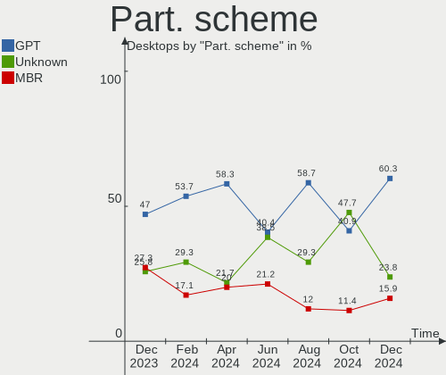
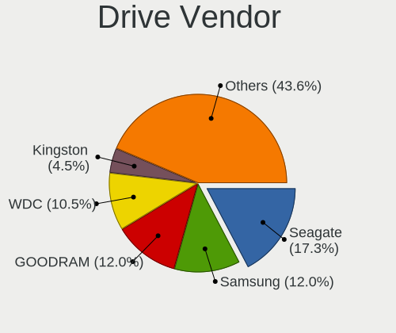
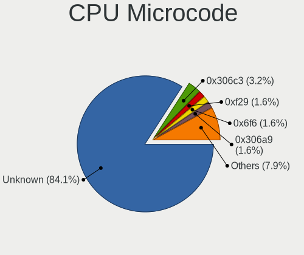
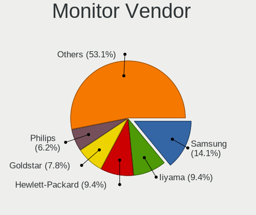
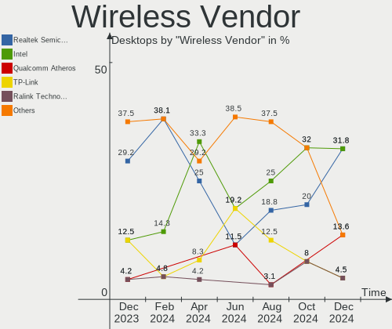
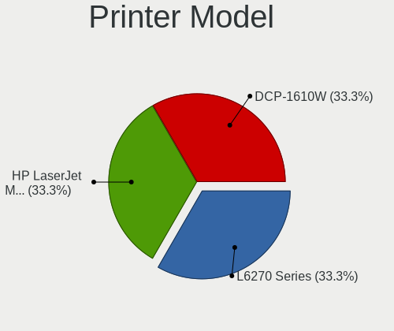

Linux in Poland - Hardware Trends (Desktops)
--------------------------------------------

A project to identify most popular hardware characteristics and track their change
over time based on data collected by Linux users at https://Linux-Hardware.org.

Anyone can contribute to this report by the [hw-probe](https://github.com/linuxhw/hw-probe) tool:

    sudo -E hw-probe -all -upload

Contents
--------

* [ System ](#system)
  - [ OS                       ](#os)
  - [ OS Family                ](#os-family)
  - [ Kernel                   ](#kernel)
  - [ Kernel Family            ](#kernel-family)
  - [ Kernel Major Ver.        ](#kernel-major-ver)
  - [ Arch                     ](#arch)
  - [ DE                       ](#de)
  - [ Display Server           ](#display-server)
  - [ Display Manager          ](#display-manager)
  - [ OS Lang                  ](#os-lang)
  - [ Boot Mode                ](#boot-mode)
  - [ Filesystem               ](#filesystem)
  - [ Part. scheme             ](#part-scheme)
  - [ Dual Boot with Linux/BSD ](#dual-boot-with-linuxbsd)
  - [ Dual Boot (Win)          ](#dual-boot-win)

* [ Board ](#board)
  - [ Vendor                   ](#vendor)
  - [ Model                    ](#model)
  - [ Model Family             ](#model-family)
  - [ MFG Year                 ](#mfg-year)
  - [ Form Factor              ](#form-factor)
  - [ Secure Boot              ](#secure-boot)
  - [ Coreboot                 ](#coreboot)
  - [ RAM Size                 ](#ram-size)
  - [ RAM Used                 ](#ram-used)
  - [ Total Drives             ](#total-drives)
  - [ Has CD-ROM               ](#has-cd-rom)
  - [ Has Ethernet             ](#has-ethernet)
  - [ Has WiFi                 ](#has-wifi)
  - [ Has Bluetooth            ](#has-bluetooth)

* [ Location ](#location)
  - [ Country                  ](#country)
  - [ City                     ](#city)

* [ Drives ](#drives)
  - [ Drive Vendor             ](#drive-vendor)
  - [ Drive Model              ](#drive-model)
  - [ HDD Vendor               ](#hdd-vendor)
  - [ SSD Vendor               ](#ssd-vendor)
  - [ Drive Kind               ](#drive-kind)
  - [ Drive Connector          ](#drive-connector)
  - [ Drive Size               ](#drive-size)
  - [ Space Total              ](#space-total)
  - [ Space Used               ](#space-used)
  - [ Malfunc. Drives          ](#malfunc-drives)
  - [ Malfunc. Drive Vendor    ](#malfunc-drive-vendor)
  - [ Malfunc. HDD Vendor      ](#malfunc-hdd-vendor)
  - [ Malfunc. Drive Kind      ](#malfunc-drive-kind)
  - [ Failed Drives            ](#failed-drives)
  - [ Failed Drive Vendor      ](#failed-drive-vendor)
  - [ Drive Status             ](#drive-status)

* [ Storage controller ](#storage-controller)
  - [ Storage Vendor           ](#storage-vendor)
  - [ Storage Model            ](#storage-model)
  - [ Storage Kind             ](#storage-kind)

* [ Processor ](#processor)
  - [ CPU Vendor               ](#cpu-vendor)
  - [ CPU Model                ](#cpu-model)
  - [ CPU Model Family         ](#cpu-model-family)
  - [ CPU Cores                ](#cpu-cores)
  - [ CPU Sockets              ](#cpu-sockets)
  - [ CPU Threads              ](#cpu-threads)
  - [ CPU Op-Modes             ](#cpu-op-modes)
  - [ CPU Microcode            ](#cpu-microcode)
  - [ CPU Microarch            ](#cpu-microarch)

* [ Graphics ](#graphics)
  - [ GPU Vendor               ](#gpu-vendor)
  - [ GPU Model                ](#gpu-model)
  - [ GPU Combo                ](#gpu-combo)
  - [ GPU Driver               ](#gpu-driver)
  - [ GPU Memory               ](#gpu-memory)

* [ Monitor ](#monitor)
  - [ Monitor Vendor           ](#monitor-vendor)
  - [ Monitor Model            ](#monitor-model)
  - [ Monitor Resolution       ](#monitor-resolution)
  - [ Monitor Diagonal         ](#monitor-diagonal)
  - [ Monitor Width            ](#monitor-width)
  - [ Aspect Ratio             ](#aspect-ratio)
  - [ Monitor Area             ](#monitor-area)
  - [ Pixel Density            ](#pixel-density)
  - [ Multiple Monitors        ](#multiple-monitors)

* [ Network ](#network)
  - [ Net Controller Vendor    ](#net-controller-vendor)
  - [ Net Controller Model     ](#net-controller-model)
  - [ Wireless Vendor          ](#wireless-vendor)
  - [ Wireless Model           ](#wireless-model)
  - [ Ethernet Vendor          ](#ethernet-vendor)
  - [ Ethernet Model           ](#ethernet-model)
  - [ Net Controller Kind      ](#net-controller-kind)
  - [ Used Controller          ](#used-controller)
  - [ NICs                     ](#nics)
  - [ IPv6                     ](#ipv6)

* [ Bluetooth ](#bluetooth)
  - [ Bluetooth Vendor         ](#bluetooth-vendor)
  - [ Bluetooth Model          ](#bluetooth-model)

* [ Sound ](#sound)
  - [ Sound Vendor             ](#sound-vendor)
  - [ Sound Model              ](#sound-model)

* [ Memory ](#memory)
  - [ Memory Vendor            ](#memory-vendor)
  - [ Memory Model             ](#memory-model)
  - [ Memory Kind              ](#memory-kind)
  - [ Memory Form Factor       ](#memory-form-factor)
  - [ Memory Size              ](#memory-size)
  - [ Memory Speed             ](#memory-speed)

* [ Printers & scanners ](#printers--scanners)
  - [ Printer Vendor           ](#printer-vendor)
  - [ Printer Model            ](#printer-model)
  - [ Scanner Vendor           ](#scanner-vendor)
  - [ Scanner Model            ](#scanner-model)

* [ Camera ](#camera)
  - [ Camera Vendor            ](#camera-vendor)
  - [ Camera Model             ](#camera-model)

* [ Security ](#security)
  - [ Fingerprint Vendor       ](#fingerprint-vendor)
  - [ Fingerprint Model        ](#fingerprint-model)
  - [ Chipcard Vendor          ](#chipcard-vendor)
  - [ Chipcard Model           ](#chipcard-model)

* [ Unsupported ](#unsupported)
  - [ Unsupported Devices      ](#unsupported-devices)
  - [ Unsupported Device Types ](#unsupported-device-types)

System
------

OS
--

Installed operating systems

| Name                        | Desktops | Percent |
|-----------------------------|----------|---------|
| Ubuntu 20.04                | 9        | 15%     |
| OpenMandriva 4.3            | 9        | 15%     |
| Zorin 16                    | 4        | 6.67%   |
| Linux Mint 20.3             | 4        | 6.67%   |
| Fedora 35                   | 4        | 6.67%   |
| Ubuntu 22.04                | 3        | 5%      |
| ROSA 12.2                   | 2        | 3.33%   |
| OpenMandriva 4.2            | 2        | 3.33%   |
| Manjaro                     | 2        | 3.33%   |
| Gentoo 2.7                  | 2        | 3.33%   |
| Fedora 36                   | 2        | 3.33%   |
| Elementary 6.1              | 2        | 3.33%   |
| Debian 11                   | 2        | 3.33%   |
| Arch Rolling                | 2        | 3.33%   |
| Void Linux Rolling          | 1        | 1.67%   |
| Ubuntu Budgie 21.10         | 1        | 1.67%   |
| Ubuntu 21.10                | 1        | 1.67%   |
| Ubuntu 21.04                | 1        | 1.67%   |
| Pop!_OS 21.10               | 1        | 1.67%   |
| org.kde.Platform 5.15-21.08 | 1        | 1.67%   |
| Linux Mint 19.3             | 1        | 1.67%   |
| KDE neon 20.04              | 1        | 1.67%   |
| KDE neon 18.04              | 1        | 1.67%   |
| Gentoo 2.8                  | 1        | 1.67%   |
| Arch                        | 1        | 1.67%   |

OS Family
---------

OS without a version

| Name             | Desktops | Percent |
|------------------|----------|---------|
| Ubuntu           | 14       | 23.33%  |
| OpenMandriva     | 11       | 18.33%  |
| Fedora           | 6        | 10%     |
| Linux Mint       | 5        | 8.33%   |
| Zorin            | 4        | 6.67%   |
| Gentoo           | 3        | 5%      |
| Arch             | 3        | 5%      |
| ROSA             | 2        | 3.33%   |
| Manjaro          | 2        | 3.33%   |
| KDE neon         | 2        | 3.33%   |
| Elementary       | 2        | 3.33%   |
| Debian           | 2        | 3.33%   |
| Void Linux       | 1        | 1.67%   |
| Ubuntu Budgie    | 1        | 1.67%   |
| Pop!_OS          | 1        | 1.67%   |
| org.kde.Platform | 1        | 1.67%   |

Kernel
------

Version of the Linux kernel

| Version                            | Desktops | Percent |
|------------------------------------|----------|---------|
| 5.13.0-39-generic                  | 9        | 15%     |
| 5.16.7-desktop-1omv4003            | 8        | 13.33%  |
| 5.13.0-40-generic                  | 7        | 11.67%  |
| 5.4.0-107-generic                  | 3        | 5%      |
| 5.15.0-25-generic                  | 3        | 5%      |
| 5.17.1-arch1-1                     | 2        | 3.33%   |
| 5.16.20-200.fc35.x86_64            | 2        | 3.33%   |
| 5.16.18-200.fc35.x86_64            | 2        | 3.33%   |
| 5.15.26-gentoo                     | 2        | 3.33%   |
| 5.10.74-generic-2rosa2021.1-x86_64 | 2        | 3.33%   |
| 5.10.14-desktop-1omv4002           | 2        | 3.33%   |
| 5.4.0-109-generic                  | 1        | 1.67%   |
| 5.4.0-108-generic                  | 1        | 1.67%   |
| 5.4.0-104-generic                  | 1        | 1.67%   |
| 5.17.3-gentoo-11-02-22             | 1        | 1.67%   |
| 5.17.3-302.fc36.x86_64             | 1        | 1.67%   |
| 5.17.2-300.fc36.x86_64             | 1        | 1.67%   |
| 5.16.20_1                          | 1        | 1.67%   |
| 5.16.19-76051619-generic           | 1        | 1.67%   |
| 5.16.13-desktop-1omv4003           | 1        | 1.67%   |
| 5.15.6-2-MANJARO                   | 1        | 1.67%   |
| 5.15.35-1-lts                      | 1        | 1.67%   |
| 5.15.28-1-MANJARO                  | 1        | 1.67%   |
| 5.15.27-xanmod1-tt                 | 1        | 1.67%   |
| 5.13.19-6-pve                      | 1        | 1.67%   |
| 5.13.0-37-generic                  | 1        | 1.67%   |
| 5.13.0-30-generic                  | 1        | 1.67%   |
| 5.11.0-49-generic                  | 1        | 1.67%   |
| 5.10.0-13-amd64                    | 1        | 1.67%   |

Kernel Family
-------------

Linux kernel without a distro release

| Version | Desktops | Percent |
|---------|----------|---------|
| 5.13.0  | 18       | 30%     |
| 5.16.7  | 8        | 13.33%  |
| 5.4.0   | 6        | 10%     |
| 5.16.20 | 3        | 5%      |
| 5.15.0  | 3        | 5%      |
| 5.17.3  | 2        | 3.33%   |
| 5.17.1  | 2        | 3.33%   |
| 5.16.18 | 2        | 3.33%   |
| 5.15.26 | 2        | 3.33%   |
| 5.10.74 | 2        | 3.33%   |
| 5.10.14 | 2        | 3.33%   |
| 5.17.2  | 1        | 1.67%   |
| 5.16.19 | 1        | 1.67%   |
| 5.16.13 | 1        | 1.67%   |
| 5.15.6  | 1        | 1.67%   |
| 5.15.35 | 1        | 1.67%   |
| 5.15.28 | 1        | 1.67%   |
| 5.15.27 | 1        | 1.67%   |
| 5.13.19 | 1        | 1.67%   |
| 5.11.0  | 1        | 1.67%   |
| 5.10.0  | 1        | 1.67%   |

Kernel Major Ver.
-----------------

Linux kernel major version

| Version | Desktops | Percent |
|---------|----------|---------|
| 5.13    | 19       | 31.67%  |
| 5.16    | 15       | 25%     |
| 5.15    | 9        | 15%     |
| 5.4     | 6        | 10%     |
| 5.17    | 5        | 8.33%   |
| 5.10    | 5        | 8.33%   |
| 5.11    | 1        | 1.67%   |

Arch
----

OS architecture (x86_64, i586, etc.)

| Name   | Desktops | Percent |
|--------|----------|---------|
| x86_64 | 60       | 100%    |

DE
--

Desktop Environment

| Name       | Desktops | Percent |
|------------|----------|---------|
| GNOME      | 24       | 40%     |
| KDE5       | 18       | 30%     |
| Unknown    | 8        | 13.33%  |
| XFCE       | 2        | 3.33%   |
| X-Cinnamon | 2        | 3.33%   |
| Pantheon   | 2        | 3.33%   |
| MATE       | 1        | 1.67%   |
| i3         | 1        | 1.67%   |
| Cinnamon   | 1        | 1.67%   |
| Budgie     | 1        | 1.67%   |

Display Server
--------------

X11 or Wayland

| Name    | Desktops | Percent |
|---------|----------|---------|
| X11     | 45       | 75%     |
| Wayland | 10       | 16.67%  |
| Tty     | 3        | 5%      |
| Unknown | 2        | 3.33%   |

Display Manager
---------------

SDDM, LightDM, etc.

| Name    | Desktops | Percent |
|---------|----------|---------|
| Unknown | 26       | 43.33%  |
| SDDM    | 14       | 23.33%  |
| GDM3    | 9        | 15%     |
| LightDM | 7        | 11.67%  |
| GDM     | 4        | 6.67%   |

OS Lang
-------

Language

| Lang    | Desktops | Percent |
|---------|----------|---------|
| pl_PL   | 43       | 71.67%  |
| en_US   | 13       | 21.67%  |
| uk_UA   | 1        | 1.67%   |
| ru_RU   | 1        | 1.67%   |
| en_GB   | 1        | 1.67%   |
| Unknown | 1        | 1.67%   |

Boot Mode
---------

EFI or BIOS

| Mode | Desktops | Percent |
|------|----------|---------|
| BIOS | 30       | 50%     |
| EFI  | 30       | 50%     |

Filesystem
----------

Type of filesystem

| Type    | Desktops | Percent |
|---------|----------|---------|
| Ext4    | 36       | 60%     |
| Overlay | 9        | 15%     |
| Btrfs   | 9        | 15%     |
| Zfs     | 3        | 5%      |
| F2fs    | 2        | 3.33%   |
| Xfs     | 1        | 1.67%   |

Part. scheme
------------

Scheme of partitioning

| Type    | Desktops | Percent |
|---------|----------|---------|
| Unknown | 35       | 58.33%  |
| GPT     | 19       | 31.67%  |
| MBR     | 6        | 10%     |

Dual Boot with Linux/BSD
------------------------

Hosting more than one Linux/BSD

| Dual boot | Desktops | Percent |
|-----------|----------|---------|
| No        | 47       | 78.33%  |
| Yes       | 13       | 21.67%  |

Dual Boot (Win)
---------------

Hosting Linux and Windows

| Dual boot | Desktops | Percent |
|-----------|----------|---------|
| No        | 44       | 73.33%  |
| Yes       | 16       | 26.67%  |

Board
-----

Vendor
------

Motherboard manufacturer

| Name                | Desktops | Percent |
|---------------------|----------|---------|
| Gigabyte Technology | 21       | 35%     |
| ASUSTek Computer    | 13       | 21.67%  |
| MSI                 | 7        | 11.67%  |
| ASRock              | 6        | 10%     |
| Lenovo              | 3        | 5%      |
| Dell                | 3        | 5%      |
| Intel               | 2        | 3.33%   |
| Fujitsu             | 2        | 3.33%   |
| Huanan              | 1        | 1.67%   |
| Hewlett-Packard     | 1        | 1.67%   |
| Unknown             | 1        | 1.67%   |

Model
-----

Motherboard model

| Name                              | Desktops | Percent |
|-----------------------------------|----------|---------|
| Gigabyte B450M DS3H               | 3        | 5%      |
| MSI MS-7A38                       | 2        | 3.33%   |
| Dell OptiPlex 790                 | 2        | 3.33%   |
| ASUS PRIME X470-PRO               | 2        | 3.33%   |
| ASUS P8Z77-V LX                   | 2        | 3.33%   |
| ASUS All Series                   | 2        | 3.33%   |
| MSI MS-7B98                       | 1        | 1.67%   |
| MSI MS-7B93                       | 1        | 1.67%   |
| MSI MS-7B86                       | 1        | 1.67%   |
| MSI MS-7B17                       | 1        | 1.67%   |
| MSI MS-7978                       | 1        | 1.67%   |
| Lenovo ThinkStation C20 4263BA7   | 1        | 1.67%   |
| Lenovo ThinkCentre M58 7627AD5    | 1        | 1.67%   |
| Lenovo ThinkCentre M57 6072A5G    | 1        | 1.67%   |
| Intel DH55TC AAE70932-204         | 1        | 1.67%   |
| Intel DCP847SKE G80890-105        | 1        | 1.67%   |
| Huanan X79 249PC V2.2             | 1        | 1.67%   |
| HP Desktop 460-a2xx               | 1        | 1.67%   |
| Gigabyte Z690 AORUS MASTER        | 1        | 1.67%   |
| Gigabyte Z590 D                   | 1        | 1.67%   |
| Gigabyte Z170-Gaming K3           | 1        | 1.67%   |
| Gigabyte TRX40 AORUS MASTER       | 1        | 1.67%   |
| Gigabyte H97M-HD3                 | 1        | 1.67%   |
| Gigabyte H410M H V3               | 1        | 1.67%   |
| Gigabyte H370M-DS3H               | 1        | 1.67%   |
| Gigabyte H310M H                  | 1        | 1.67%   |
| Gigabyte GB-BPCE-3455             | 1        | 1.67%   |
| Gigabyte G41MT-D3                 | 1        | 1.67%   |
| Gigabyte G31M-S2L                 | 1        | 1.67%   |
| Gigabyte F2A88XN-WIFI             | 1        | 1.67%   |
| Gigabyte EP31-DS3L                | 1        | 1.67%   |
| Gigabyte B85M-D3H                 | 1        | 1.67%   |
| Gigabyte B560M DS3H V2            | 1        | 1.67%   |
| Gigabyte B450M S2H V2             | 1        | 1.67%   |
| Gigabyte B450M GAMING             | 1        | 1.67%   |
| Gigabyte AB350-Gaming             | 1        | 1.67%   |
| Fujitsu FUTRO S720                | 1        | 1.67%   |
| Fujitsu ESPRIMO_D556              | 1        | 1.67%   |
| Dell Precision 3650 Tower         | 1        | 1.67%   |
| ASUS SABERTOOTH Z77               | 1        | 1.67%   |
| ASUS ROG STRIX B550-F GAMING      | 1        | 1.67%   |
| ASUS ROG CROSSHAIR VIII DARK HERO | 1        | 1.67%   |
| ASUS PRIME H310M-D R2.0           | 1        | 1.67%   |
| ASUS P8H61-M LX R2.0              | 1        | 1.67%   |
| ASUS M3A78-CM                     | 1        | 1.67%   |
| ASUS H61M-K                       | 1        | 1.67%   |
| ASRock X570 Pro4                  | 1        | 1.67%   |
| ASRock X470 Taichi Ultimate       | 1        | 1.67%   |
| ASRock X370 Killer SLI            | 1        | 1.67%   |
| ASRock P67 Pro3                   | 1        | 1.67%   |
| ASRock H97M Anniversary           | 1        | 1.67%   |
| ASRock G31M-S                     | 1        | 1.67%   |
| Unknown                           | 1        | 1.67%   |

Model Family
------------

Motherboard model prefix

| Name                  | Desktops | Percent |
|-----------------------|----------|---------|
| Gigabyte B450M        | 5        | 8.33%   |
| ASUS PRIME            | 3        | 5%      |
| MSI MS-7A38           | 2        | 3.33%   |
| Lenovo ThinkCentre    | 2        | 3.33%   |
| Dell OptiPlex         | 2        | 3.33%   |
| ASUS ROG              | 2        | 3.33%   |
| ASUS P8Z77-V          | 2        | 3.33%   |
| ASUS All              | 2        | 3.33%   |
| MSI MS-7B98           | 1        | 1.67%   |
| MSI MS-7B93           | 1        | 1.67%   |
| MSI MS-7B86           | 1        | 1.67%   |
| MSI MS-7B17           | 1        | 1.67%   |
| MSI MS-7978           | 1        | 1.67%   |
| Lenovo ThinkStation   | 1        | 1.67%   |
| Intel DH55TC          | 1        | 1.67%   |
| Intel DCP847SKE       | 1        | 1.67%   |
| Huanan X79            | 1        | 1.67%   |
| HP Desktop            | 1        | 1.67%   |
| Gigabyte Z690         | 1        | 1.67%   |
| Gigabyte Z590         | 1        | 1.67%   |
| Gigabyte Z170-Gaming  | 1        | 1.67%   |
| Gigabyte TRX40        | 1        | 1.67%   |
| Gigabyte H97M-HD3     | 1        | 1.67%   |
| Gigabyte H410M        | 1        | 1.67%   |
| Gigabyte H370M-DS3H   | 1        | 1.67%   |
| Gigabyte H310M        | 1        | 1.67%   |
| Gigabyte GB-BPCE-3455 | 1        | 1.67%   |
| Gigabyte G41MT-D3     | 1        | 1.67%   |
| Gigabyte G31M-S2L     | 1        | 1.67%   |
| Gigabyte F2A88XN-WIFI | 1        | 1.67%   |
| Gigabyte EP31-DS3L    | 1        | 1.67%   |
| Gigabyte B85M-D3H     | 1        | 1.67%   |
| Gigabyte B560M        | 1        | 1.67%   |
| Gigabyte AB350-Gaming | 1        | 1.67%   |
| Fujitsu FUTRO         | 1        | 1.67%   |
| Fujitsu ESPRIMO       | 1        | 1.67%   |
| Dell Precision        | 1        | 1.67%   |
| ASUS SABERTOOTH       | 1        | 1.67%   |
| ASUS P8H61-M          | 1        | 1.67%   |
| ASUS M3A78-CM         | 1        | 1.67%   |
| ASUS H61M-K           | 1        | 1.67%   |
| ASRock X570           | 1        | 1.67%   |
| ASRock X470           | 1        | 1.67%   |
| ASRock X370           | 1        | 1.67%   |
| ASRock P67            | 1        | 1.67%   |
| ASRock H97M           | 1        | 1.67%   |
| ASRock G31M-S         | 1        | 1.67%   |
| Unknown               | 1        | 1.67%   |

MFG Year
--------

Motherboard manufacture year

| Year    | Desktops | Percent |
|---------|----------|---------|
| 2018    | 14       | 23.33%  |
| 2021    | 5        | 8.33%   |
| 2019    | 5        | 8.33%   |
| 2013    | 5        | 8.33%   |
| 2020    | 4        | 6.67%   |
| 2012    | 4        | 6.67%   |
| 2011    | 4        | 6.67%   |
| 2017    | 3        | 5%      |
| 2015    | 3        | 5%      |
| 2014    | 3        | 5%      |
| 2008    | 3        | 5%      |
| 2009    | 2        | 3.33%   |
| 2007    | 2        | 3.33%   |
| 2022    | 1        | 1.67%   |
| 2010    | 1        | 1.67%   |
| Unknown | 1        | 1.67%   |

Form Factor
-----------

Physical design of the computer

| Name    | Desktops | Percent |
|---------|----------|---------|
| Desktop | 60       | 100%    |

Secure Boot
-----------

Enabled or disabled

| State    | Desktops | Percent |
|----------|----------|---------|
| Disabled | 59       | 98.33%  |
| Enabled  | 1        | 1.67%   |

Coreboot
--------

Have coreboot on board

| Used | Desktops | Percent |
|------|----------|---------|
| No   | 60       | 100%    |

RAM Size
--------

Total RAM memory

| Size in GB  | Desktops | Percent |
|-------------|----------|---------|
| 32.01-64.0  | 14       | 23.33%  |
| 16.01-24.0  | 12       | 20%     |
| 8.01-16.0   | 11       | 18.33%  |
| 4.01-8.0    | 10       | 16.67%  |
| 3.01-4.0    | 6        | 10%     |
| 64.01-256.0 | 4        | 6.67%   |
| 1.01-2.0    | 2        | 3.33%   |
| 24.01-32.0  | 1        | 1.67%   |

RAM Used
--------

Used RAM memory

| Used GB    | Desktops | Percent |
|------------|----------|---------|
| 1.01-2.0   | 21       | 35%     |
| 4.01-8.0   | 11       | 18.33%  |
| 2.01-3.0   | 7        | 11.67%  |
| 3.01-4.0   | 6        | 10%     |
| 0.51-1.0   | 6        | 10%     |
| 16.01-24.0 | 4        | 6.67%   |
| 8.01-16.0  | 3        | 5%      |
| 24.01-32.0 | 1        | 1.67%   |
| 0.01-0.5   | 1        | 1.67%   |

Total Drives
------------

Number of drives on board

| Drives | Desktops | Percent |
|--------|----------|---------|
| 2      | 19       | 31.67%  |
| 1      | 17       | 28.33%  |
| 4      | 8        | 13.33%  |
| 3      | 6        | 10%     |
| 5      | 4        | 6.67%   |
| 7      | 3        | 5%      |
| 6      | 2        | 3.33%   |
| 0      | 1        | 1.67%   |

Has CD-ROM
----------

Has CD-ROM on board

| Presented | Desktops | Percent |
|-----------|----------|---------|
| No        | 35       | 58.33%  |
| Yes       | 25       | 41.67%  |

Has Ethernet
------------

Has Ethernet on board

| Presented | Desktops | Percent |
|-----------|----------|---------|
| Yes       | 59       | 98.33%  |
| No        | 1        | 1.67%   |

Has WiFi
--------

Has WiFi module

| Presented | Desktops | Percent |
|-----------|----------|---------|
| No        | 36       | 60%     |
| Yes       | 24       | 40%     |

Has Bluetooth
-------------

Has Bluetooth module

| Presented | Desktops | Percent |
|-----------|----------|---------|
| No        | 40       | 66.67%  |
| Yes       | 20       | 33.33%  |

Location
--------

Country
-------

Geographic location (country)

| Country | Desktops | Percent |
|---------|----------|---------|
| Poland  | 60       | 100%    |

City
----

Geographic location (city)

| City               | Desktops | Percent |
|--------------------|----------|---------|
| Warsaw             | 11       | 18.33%  |
| Wroclaw            | 6        | 10%     |
| Poznan             | 3        | 5%      |
| Lublin             | 2        | 3.33%   |
| Gdynia             | 2        | 3.33%   |
| Gdansk             | 2        | 3.33%   |
| Częstochowa       | 2        | 3.33%   |
| Zabrze             | 1        | 1.67%   |
| Wołomin           | 1        | 1.67%   |
| Szczecin           | 1        | 1.67%   |
| Strzyzow           | 1        | 1.67%   |
| Sosnowiec          | 1        | 1.67%   |
| Sopot              | 1        | 1.67%   |
| Rzeszów           | 1        | 1.67%   |
| Ruda Śląska      | 1        | 1.67%   |
| Pruszków          | 1        | 1.67%   |
| Polkowice          | 1        | 1.67%   |
| Police             | 1        | 1.67%   |
| Pielgrzymka        | 1        | 1.67%   |
| Piekary Slaskie    | 1        | 1.67%   |
| Pabianice          | 1        | 1.67%   |
| Ozimek             | 1        | 1.67%   |
| Orzysz             | 1        | 1.67%   |
| Opole              | 1        | 1.67%   |
| Nowa Slupia        | 1        | 1.67%   |
| Lowicz             | 1        | 1.67%   |
| Lodz               | 1        | 1.67%   |
| Laziska Gorne      | 1        | 1.67%   |
| Lagiewniki Wielkie | 1        | 1.67%   |
| Krakow             | 1        | 1.67%   |
| Kielce             | 1        | 1.67%   |
| Kalisz             | 1        | 1.67%   |
| Hel                | 1        | 1.67%   |
| Gliwice            | 1        | 1.67%   |
| Czepielin          | 1        | 1.67%   |
| Czeladz            | 1        | 1.67%   |
| Bydgoszcz          | 1        | 1.67%   |
| Bukowiec           | 1        | 1.67%   |
| Bielsko-Biala      | 1        | 1.67%   |

Drives
------

Drive Vendor
------------

Hard drive vendors

| Vendor                         | Desktops | Drives | Percent |
|--------------------------------|----------|--------|---------|
| Seagate                        | 21       | 26     | 16.8%   |
| WDC                            | 18       | 26     | 14.4%   |
| Samsung Electronics            | 14       | 22     | 11.2%   |
| Crucial                        | 8        | 8      | 6.4%    |
| Toshiba                        | 7        | 9      | 5.6%    |
| Kingston                       | 7        | 11     | 5.6%    |
| GOODRAM                        | 7        | 9      | 5.6%    |
| A-DATA Technology              | 7        | 10     | 5.6%    |
| Sandisk                        | 4        | 4      | 3.2%    |
| Hitachi                        | 4        | 6      | 3.2%    |
| XPG                            | 2        | 2      | 1.6%    |
| PNY                            | 2        | 3      | 1.6%    |
| Patriot                        | 2        | 2      | 1.6%    |
| HGST                           | 2        | 2      | 1.6%    |
| Corsair                        | 2        | 3      | 1.6%    |
| Solid State Storage Technology | 1        | 1      | 0.8%    |
| SK Hynix                       | 1        | 1      | 0.8%    |
| Realtek Semiconductor          | 1        | 1      | 0.8%    |
| PLEXTOR                        | 1        | 1      | 0.8%    |
| OCZ                            | 1        | 1      | 0.8%    |
| MAXTOR                         | 1        | 1      | 0.8%    |
| LITEON                         | 1        | 1      | 0.8%    |
| KIOXIA-EXCERIA                 | 1        | 1      | 0.8%    |
| KIOXIA                         | 1        | 2      | 0.8%    |
| JMicron                        | 1        | 2      | 0.8%    |
| HS-SSD-E100                    | 1        | 1      | 0.8%    |
| Fujitsu                        | 1        | 1      | 0.8%    |
| FORESEE                        | 1        | 1      | 0.8%    |
| ExcelStor                      | 1        | 1      | 0.8%    |
| China                          | 1        | 1      | 0.8%    |
| Apple                          | 1        | 1      | 0.8%    |
| Apacer                         | 1        | 1      | 0.8%    |
| Unknown                        | 1        | 1      | 0.8%    |

Drive Model
-----------

Hard drive models

| Model                                    | Desktops | Percent |
|------------------------------------------|----------|---------|
| Toshiba HDWD110 1TB                      | 3        | 1.95%   |
| Seagate ST2000DM008-2FR102 2TB           | 3        | 1.95%   |
| Samsung NVMe SSD Drive 500GB             | 3        | 1.95%   |
| WDC WD30EFRX-68EUZN0 3TB                 | 2        | 1.3%    |
| Toshiba DT01ACA100 1TB                   | 2        | 1.3%    |
| Seagate ST4000DM004-2CV104 4TB           | 2        | 1.3%    |
| Seagate ST1000DM010-2EP102 1TB           | 2        | 1.3%    |
| Samsung SSD 850 EVO 120GB                | 2        | 1.3%    |
| Samsung NVMe SSD Drive 256GB             | 2        | 1.3%    |
| Kingston SA2000M8250G 250GB              | 2        | 1.3%    |
| GOODRAM SSDPR-CX400-512-G2 512GB         | 2        | 1.3%    |
| GOODRAM SSDPR-CL100-480-G2 480GB         | 2        | 1.3%    |
| GOODRAM IR-SSDPR-S25A-240 240GB          | 2        | 1.3%    |
| A-DATA SU800 256GB SSD                   | 2        | 1.3%    |
| XPG NVMe SSD Drive 256GB                 | 1        | 0.65%   |
| XPG NVMe SSD Drive 1024GB                | 1        | 0.65%   |
| WDC WDS250G1B0B-00AS40 250GB SSD         | 1        | 0.65%   |
| WDC WD800JD-08MSA1 80GB                  | 1        | 0.65%   |
| WDC WD800BB-00JHC0 80GB                  | 1        | 0.65%   |
| WDC WD800AAJS-75M0A0 80GB                | 1        | 0.65%   |
| WDC WD5002ABYS-01B1B0 500GB              | 1        | 0.65%   |
| WDC WD5000AVVS-63M8B0 500GB              | 1        | 0.65%   |
| WDC WD5000AAKX-001CA0 500GB              | 1        | 0.65%   |
| WDC WD5000AAKS-22V1A0 500GB              | 1        | 0.65%   |
| WDC WD5000AAKS-07YGA0 500GB              | 1        | 0.65%   |
| WDC WD40EZRZ-22GXCB0 4TB                 | 1        | 0.65%   |
| WDC WD3200AAKS-00L9A0 320GB              | 1        | 0.65%   |
| WDC WD3200AAJS-07M0A0 320GB              | 1        | 0.65%   |
| WDC WD30EFRX-68N32N0 3TB                 | 1        | 0.65%   |
| WDC WD30EFRX-68AX9N0 3TB                 | 1        | 0.65%   |
| WDC WD20EFRX-68EUZN0 2TB                 | 1        | 0.65%   |
| WDC WD20EARS-00MVWB0 2TB                 | 1        | 0.65%   |
| WDC WD2003FZEX-00Z4SA0 2TB               | 1        | 0.65%   |
| WDC WD2003FZEX-00SRLA0 2TB               | 1        | 0.65%   |
| WDC WD10JUCT-63CYNY0 1TB                 | 1        | 0.65%   |
| WDC WD10EZEX-60WN4A0 1TB                 | 1        | 0.65%   |
| WDC WD10EZEX-00WN4A0 1TB                 | 1        | 0.65%   |
| WDC WD10EZEX-00BN5A0 1TB                 | 1        | 0.65%   |
| WDC WD10EFRX-68PJCN0 1TB                 | 1        | 0.65%   |
| WDC WD10EFRX-68JCSN0 1TB                 | 1        | 0.65%   |
| Toshiba MQ01ABD075 752GB                 | 1        | 0.65%   |
| Toshiba HDWE150 5TB                      | 1        | 0.65%   |
| Toshiba HDWD130 3TB                      | 1        | 0.65%   |
| Solid State Storage NVMe SSD Drive 512GB | 1        | 0.65%   |
| SK Hynix NVMe SSD Drive 128GB            | 1        | 0.65%   |
| Seagate ST975042 3AS 752GB               | 1        | 0.65%   |
| Seagate ST9320423AS 320GB                | 1        | 0.65%   |
| Seagate ST92505610AS 250GB               | 1        | 0.65%   |
| Seagate ST9160310AS 160GB                | 1        | 0.65%   |
| Seagate ST500LM012 HN-M500MBB 500GB      | 1        | 0.65%   |
| Seagate ST500DM002-1BD142 500GB          | 1        | 0.65%   |
| Seagate ST3500320NS 500GB                | 1        | 0.65%   |
| Seagate ST3500312CS 500GB                | 1        | 0.65%   |
| Seagate ST3320413AS 320GB                | 1        | 0.65%   |
| Seagate ST3250318AS 250GB                | 1        | 0.65%   |
| Seagate ST32000542AS 2TB                 | 1        | 0.65%   |
| Seagate ST3160318AS 160GB                | 1        | 0.65%   |
| Seagate ST2000DM001-1CH164 2TB           | 1        | 0.65%   |
| Seagate ST12000NM0008-2H3101 12TB        | 1        | 0.65%   |
| Seagate ST1000VT001-1RE172 1TB           | 1        | 0.65%   |

HDD Vendor
----------

Hard disk drive vendors

| Vendor              | Desktops | Drives | Percent |
|---------------------|----------|--------|---------|
| Seagate             | 21       | 26     | 35.59%  |
| WDC                 | 18       | 25     | 30.51%  |
| Toshiba             | 7        | 9      | 11.86%  |
| Hitachi             | 4        | 6      | 6.78%   |
| Samsung Electronics | 3        | 3      | 5.08%   |
| HGST                | 2        | 2      | 3.39%   |
| MAXTOR              | 1        | 1      | 1.69%   |
| Fujitsu             | 1        | 1      | 1.69%   |
| ExcelStor           | 1        | 1      | 1.69%   |
| Unknown             | 1        | 1      | 1.69%   |

SSD Vendor
----------

Solid state drive vendors

| Vendor              | Desktops | Drives | Percent |
|---------------------|----------|--------|---------|
| Crucial             | 8        | 8      | 17.39%  |
| GOODRAM             | 7        | 8      | 15.22%  |
| Samsung Electronics | 5        | 6      | 10.87%  |
| Kingston            | 5        | 5      | 10.87%  |
| A-DATA Technology   | 5        | 7      | 10.87%  |
| SanDisk             | 2        | 2      | 4.35%   |
| PNY                 | 2        | 3      | 4.35%   |
| Patriot             | 2        | 2      | 4.35%   |
| WDC                 | 1        | 1      | 2.17%   |
| PLEXTOR             | 1        | 1      | 2.17%   |
| OCZ                 | 1        | 1      | 2.17%   |
| LITEON              | 1        | 1      | 2.17%   |
| KIOXIA-EXCERIA      | 1        | 1      | 2.17%   |
| FORESEE             | 1        | 1      | 2.17%   |
| Corsair             | 1        | 1      | 2.17%   |
| China               | 1        | 1      | 2.17%   |
| Apple               | 1        | 1      | 2.17%   |
| Apacer              | 1        | 1      | 2.17%   |

Drive Kind
----------

HDD or SSD

| Kind    | Desktops | Drives | Percent |
|---------|----------|--------|---------|
| HDD     | 44       | 75     | 40.74%  |
| SSD     | 39       | 51     | 36.11%  |
| NVMe    | 23       | 34     | 21.3%   |
| Unknown | 2        | 3      | 1.85%   |

Drive Connector
---------------

SATA, SAS, NVMe, etc.

| Type | Desktops | Drives | Percent |
|------|----------|--------|---------|
| SATA | 54       | 124    | 67.5%   |
| NVMe | 23       | 34     | 28.75%  |
| SAS  | 3        | 5      | 3.75%   |

Drive Size
----------

Size of hard drive

| Size in TB | Desktops | Drives | Percent |
|------------|----------|--------|---------|
| 0.01-0.5   | 43       | 69     | 48.86%  |
| 0.51-1.0   | 26       | 31     | 29.55%  |
| 1.01-2.0   | 9        | 12     | 10.23%  |
| 2.01-3.0   | 5        | 9      | 5.68%   |
| 3.01-4.0   | 3        | 3      | 3.41%   |
| 10.01-20.0 | 1        | 1      | 1.14%   |
| 4.01-10.0  | 1        | 1      | 1.14%   |

Space Total
-----------

Amount of disk space available on the file system

| Size in GB     | Desktops | Percent |
|----------------|----------|---------|
| 101-250        | 11       | 18.33%  |
| 501-1000       | 10       | 16.67%  |
| More than 3000 | 8        | 13.33%  |
| 1001-2000      | 8        | 13.33%  |
| 1-20           | 6        | 10%     |
| Unknown        | 6        | 10%     |
| 51-100         | 5        | 8.33%   |
| 251-500        | 4        | 6.67%   |
| 21-50          | 1        | 1.67%   |
| 2001-3000      | 1        | 1.67%   |

Space Used
----------

Amount of used disk space

| Used GB        | Desktops | Percent |
|----------------|----------|---------|
| 1-20           | 16       | 26.67%  |
| 251-500        | 8        | 13.33%  |
| 101-250        | 7        | 11.67%  |
| 21-50          | 6        | 10%     |
| Unknown        | 6        | 10%     |
| More than 3000 | 4        | 6.67%   |
| 1001-2000      | 4        | 6.67%   |
| 501-1000       | 4        | 6.67%   |
| 51-100         | 3        | 5%      |
| 2001-3000      | 2        | 3.33%   |

Malfunc. Drives
---------------

Drive models with a malfunction

| Model                          | Desktops | Drives | Percent |
|--------------------------------|----------|--------|---------|
| WDC WD5002ABYS-01B1B0 500GB    | 1        | 1      | 9.09%   |
| WDC WD5000AAKS-22V1A0 500GB    | 1        | 1      | 9.09%   |
| WDC WD2003FZEX-00Z4SA0 2TB     | 1        | 1      | 9.09%   |
| Seagate ST9320423AS 320GB      | 1        | 1      | 9.09%   |
| Seagate ST92505610AS 250GB     | 1        | 1      | 9.09%   |
| Seagate ST9160310AS 160GB      | 1        | 1      | 9.09%   |
| Seagate ST3500320NS 500GB      | 1        | 1      | 9.09%   |
| Seagate ST1000DX001-1NS162 1TB | 1        | 1      | 9.09%   |
| Seagate ST1000DM003-1SB10C 1TB | 1        | 1      | 9.09%   |
| Fujitsu MHZ2160BH G2 160GB     | 1        | 1      | 9.09%   |
| Unknown                        | 1        | 1      | 9.09%   |

Malfunc. Drive Vendor
---------------------

Vendors of faulty drives

| Vendor  | Desktops | Drives | Percent |
|---------|----------|--------|---------|
| Seagate | 5        | 6      | 50%     |
| WDC     | 3        | 3      | 30%     |
| Fujitsu | 1        | 1      | 10%     |
| Unknown | 1        | 1      | 10%     |

Malfunc. HDD Vendor
-------------------

Vendors of faulty HDD drives

| Vendor  | Desktops | Drives | Percent |
|---------|----------|--------|---------|
| Seagate | 5        | 6      | 50%     |
| WDC     | 3        | 3      | 30%     |
| Fujitsu | 1        | 1      | 10%     |
| Unknown | 1        | 1      | 10%     |

Malfunc. Drive Kind
-------------------

Kinds of faulty drives

| Kind | Desktops | Drives | Percent |
|------|----------|--------|---------|
| HDD  | 9        | 11     | 100%    |

Failed Drives
-------------

Failed drive models

Zero info for selected period =(

Failed Drive Vendor
-------------------

Failed drive vendors

Zero info for selected period =(

Drive Status
------------

Number of failed and malfunc. drives

| Status   | Desktops | Drives | Percent |
|----------|----------|--------|---------|
| Detected | 36       | 103    | 56.25%  |
| Works    | 19       | 49     | 29.69%  |
| Malfunc  | 9        | 11     | 14.06%  |

Storage controller
------------------

Storage Vendor
--------------

Storage controller vendors

| Vendor                         | Desktops | Percent |
|--------------------------------|----------|---------|
| Intel                          | 39       | 43.33%  |
| AMD                            | 20       | 22.22%  |
| Samsung Electronics            | 12       | 13.33%  |
| ADATA Technology               | 4        | 4.44%   |
| Kingston Technology Company    | 3        | 3.33%   |
| ASMedia Technology             | 3        | 3.33%   |
| Sandisk                        | 2        | 2.22%   |
| Solid State Storage Technology | 1        | 1.11%   |
| SK Hynix                       | 1        | 1.11%   |
| Silicon Motion                 | 1        | 1.11%   |
| Realtek Semiconductor          | 1        | 1.11%   |
| Phison Electronics             | 1        | 1.11%   |
| KIOXIA                         | 1        | 1.11%   |
| JMicron Technology             | 1        | 1.11%   |

Storage Model
-------------

Storage controller models

| Model                                                                            | Desktops | Percent |
|----------------------------------------------------------------------------------|----------|---------|
| AMD FCH SATA Controller [AHCI mode]                                              | 15       | 13.89%  |
| AMD 400 Series Chipset SATA Controller                                           | 11       | 10.19%  |
| Samsung NVMe SSD Controller SM981/PM981/PM983                                    | 6        | 5.56%   |
| Intel 6 Series/C200 Series Chipset Family 6 port Desktop SATA AHCI Controller    | 5        | 4.63%   |
| Intel NM10/ICH7 Family SATA Controller [IDE mode]                                | 4        | 3.7%    |
| Intel Cannon Lake PCH SATA AHCI Controller                                       | 4        | 3.7%    |
| Intel 7 Series/C210 Series Chipset Family 6-port SATA Controller [AHCI mode]     | 4        | 3.7%    |
| Intel 500 Series Chipset Family SATA AHCI Controller                             | 4        | 3.7%    |
| ADATA XPG SX8200 Pro PCIe Gen3x4 M.2 2280 Solid State Drive                      | 4        | 3.7%    |
| Samsung NVMe SSD Controller 980                                                  | 3        | 2.78%   |
| Kingston Company A2000 NVMe SSD                                                  | 3        | 2.78%   |
| Intel Q170/Q150/B150/H170/H110/Z170/CM236 Chipset SATA Controller [AHCI Mode]    | 3        | 2.78%   |
| Intel 8 Series/C220 Series Chipset Family 6-port SATA Controller 1 [AHCI mode]   | 3        | 2.78%   |
| ASMedia ASM1062 Serial ATA Controller                                            | 3        | 2.78%   |
| Samsung NVMe SSD Controller SM961/PM961/SM963                                    | 2        | 1.85%   |
| Intel 9 Series Chipset Family SATA Controller [AHCI Mode]                        | 2        | 1.85%   |
| Intel 82801G (ICH7 Family) IDE Controller                                        | 2        | 1.85%   |
| Solid State Storage Non-Volatile memory controller                               | 1        | 0.93%   |
| SK Hynix BC501 NVMe Solid State Drive                                            | 1        | 0.93%   |
| Silicon Motion SM2263EN/SM2263XT SSD Controller                                  | 1        | 0.93%   |
| Sandisk WD Blue SN570 NVMe SSD                                                   | 1        | 0.93%   |
| Sandisk WD Black SN750 / PC SN730 NVMe SSD                                       | 1        | 0.93%   |
| Samsung NVMe SSD Controller PM9A1/PM9A3/980PRO                                   | 1        | 0.93%   |
| Samsung Apple PCIe SSD                                                           | 1        | 0.93%   |
| Realtek Realtek Non-Volatile memory controller                                   | 1        | 0.93%   |
| Phison E12 NVMe Controller                                                       | 1        | 0.93%   |
| KIOXIA Non-Volatile memory controller                                            | 1        | 0.93%   |
| JMicron JMB363 SATA/IDE Controller                                               | 1        | 0.93%   |
| Intel Celeron N3350/Pentium N4200/Atom E3900 Series SATA AHCI Controller         | 1        | 0.93%   |
| Intel C600/X79 series chipset 6-Port SATA AHCI Controller                        | 1        | 0.93%   |
| Intel Atom/Celeron/Pentium Processor x5-E8000/J3xxx/N3xxx Series SATA Controller | 1        | 0.93%   |
| Intel Alder Lake-S PCH SATA Controller [AHCI Mode]                               | 1        | 0.93%   |
| Intel 82Q35 Express PT IDER Controller                                           | 1        | 0.93%   |
| Intel 82801JI (ICH10 Family) SATA AHCI Controller                                | 1        | 0.93%   |
| Intel 82801JD/DO (ICH10 Family) 4-port SATA IDE Controller                       | 1        | 0.93%   |
| Intel 82801JD/DO (ICH10 Family) 2-port SATA IDE Controller                       | 1        | 0.93%   |
| Intel 82801IR/IO/IH (ICH9R/DO/DH) 6 port SATA Controller [AHCI mode]             | 1        | 0.93%   |
| Intel 7 Series Chipset Family 6-port SATA Controller [AHCI mode]                 | 1        | 0.93%   |
| Intel 5 Series/3400 Series Chipset PT IDER Controller                            | 1        | 0.93%   |
| Intel 5 Series/3400 Series Chipset 4 port SATA IDE Controller                    | 1        | 0.93%   |
| Intel 5 Series/3400 Series Chipset 2 port SATA IDE Controller                    | 1        | 0.93%   |
| Intel 4 Series Chipset PT IDER Controller                                        | 1        | 0.93%   |
| Intel 200 Series PCH SATA controller [AHCI mode]                                 | 1        | 0.93%   |
| AMD X370 Series Chipset SATA Controller                                          | 1        | 0.93%   |
| AMD SB7x0/SB8x0/SB9x0 SATA Controller [IDE mode]                                 | 1        | 0.93%   |
| AMD SB7x0/SB8x0/SB9x0 IDE Controller                                             | 1        | 0.93%   |
| AMD 300 Series Chipset SATA Controller                                           | 1        | 0.93%   |

Storage Kind
------------

Kind of storage controller (IDE, SATA, NVMe, SAS, ...)

| Kind | Desktops | Percent |
|------|----------|---------|
| SATA | 53       | 62.35%  |
| NVMe | 23       | 27.06%  |
| IDE  | 9        | 10.59%  |

Processor
---------

CPU Vendor
----------

Processor vendors

| Vendor | Desktops | Percent |
|--------|----------|---------|
| Intel  | 39       | 65%     |
| AMD    | 21       | 35%     |

CPU Model
---------

Processor models

| Model                                           | Desktops | Percent |
|-------------------------------------------------|----------|---------|
| Intel Core i7-4790 CPU @ 3.60GHz                | 2        | 3.33%   |
| Intel Core i5-2500K CPU @ 3.30GHz               | 2        | 3.33%   |
| Intel Core i5-2400 CPU @ 3.10GHz                | 2        | 3.33%   |
| AMD Ryzen 9 5900X 12-Core Processor             | 2        | 3.33%   |
| AMD Ryzen 5 2600 Six-Core Processor             | 2        | 3.33%   |
| AMD Ryzen 5 1600 Six-Core Processor             | 2        | 3.33%   |
| Intel Xeon CPU L5430 @ 2.66GHz                  | 1        | 1.67%   |
| Intel Xeon CPU E5620 @ 2.40GHz                  | 1        | 1.67%   |
| Intel Xeon CPU E5-2680 v2 @ 2.80GHz             | 1        | 1.67%   |
| Intel Pentium Dual-Core CPU E6600 @ 3.06GHz     | 1        | 1.67%   |
| Intel Pentium Dual-Core CPU E6300 @ 2.80GHz     | 1        | 1.67%   |
| Intel Pentium Dual CPU E2180 @ 2.00GHz          | 1        | 1.67%   |
| Intel Core i7-9700K CPU @ 3.60GHz               | 1        | 1.67%   |
| Intel Core i7-8700 CPU @ 3.20GHz                | 1        | 1.67%   |
| Intel Core i7-6700K CPU @ 4.00GHz               | 1        | 1.67%   |
| Intel Core i7-4790K CPU @ 4.00GHz               | 1        | 1.67%   |
| Intel Core i5-9500T CPU @ 2.20GHz               | 1        | 1.67%   |
| Intel Core i5-9400F CPU @ 2.90GHz               | 1        | 1.67%   |
| Intel Core i5-8400 CPU @ 2.80GHz                | 1        | 1.67%   |
| Intel Core i5-6600K CPU @ 3.50GHz               | 1        | 1.67%   |
| Intel Core i5-4460 CPU @ 3.20GHz                | 1        | 1.67%   |
| Intel Core i5-3570K CPU @ 3.40GHz               | 1        | 1.67%   |
| Intel Core i5-3570 CPU @ 3.40GHz                | 1        | 1.67%   |
| Intel Core i5-3450 CPU @ 3.10GHz                | 1        | 1.67%   |
| Intel Core i5-2500 CPU @ 3.30GHz                | 1        | 1.67%   |
| Intel Core i5-10400 CPU @ 2.90GHz               | 1        | 1.67%   |
| Intel Core i3-4170 CPU @ 3.70GHz                | 1        | 1.67%   |
| Intel Core i3-2120 CPU @ 3.30GHz                | 1        | 1.67%   |
| Intel Core i3-10100F CPU @ 3.60GHz              | 1        | 1.67%   |
| Intel Core i3 CPU 530 @ 2.93GHz                 | 1        | 1.67%   |
| Intel Core 2 Duo CPU E6550 @ 2.33GHz            | 1        | 1.67%   |
| Intel Core 2 Duo CPU E4500 @ 2.20GHz            | 1        | 1.67%   |
| Intel Celeron CPU J3455 @ 1.50GHz               | 1        | 1.67%   |
| Intel Celeron CPU J3060 @ 1.60GHz               | 1        | 1.67%   |
| Intel Celeron CPU G3900 @ 2.80GHz               | 1        | 1.67%   |
| Intel Celeron CPU 847E @ 1.10GHz                | 1        | 1.67%   |
| Intel 12th Gen Core i9-12900K                   | 1        | 1.67%   |
| Intel 11th Gen Core i9-11900F @ 2.50GHz         | 1        | 1.67%   |
| Intel 11th Gen Core i7-11700 @ 2.50GHz          | 1        | 1.67%   |
| AMD Ryzen Threadripper 3960X 24-Core Processor  | 1        | 1.67%   |
| AMD Ryzen 9 3950X 16-Core Processor             | 1        | 1.67%   |
| AMD Ryzen 7 5800X 8-Core Processor              | 1        | 1.67%   |
| AMD Ryzen 7 1700 Eight-Core Processor           | 1        | 1.67%   |
| AMD Ryzen 5 5600G with Radeon Graphics          | 1        | 1.67%   |
| AMD Ryzen 5 3600 6-Core Processor               | 1        | 1.67%   |
| AMD Ryzen 5 3400G with Radeon Vega Graphics     | 1        | 1.67%   |
| AMD Ryzen 5 3350G with Radeon Vega Graphics     | 1        | 1.67%   |
| AMD Ryzen 5 2600X Six-Core Processor            | 1        | 1.67%   |
| AMD Ryzen 5 2400G with Radeon Vega Graphics     | 1        | 1.67%   |
| AMD Ryzen 3 PRO 3200G with Radeon Vega Graphics | 1        | 1.67%   |
| AMD Ryzen 3 2200G with Radeon Vega Graphics     | 1        | 1.67%   |
| AMD Phenom II X4 955 Processor                  | 1        | 1.67%   |
| AMD GX-217GA SOC with Radeon HD Graphics        | 1        | 1.67%   |
| AMD A10-7860K Radeon R7, 12 Compute Cores 4C+8G | 1        | 1.67%   |

CPU Model Family
----------------

Processor model prefix

| Model                   | Desktops | Percent |
|-------------------------|----------|---------|
| Intel Core i5           | 14       | 23.33%  |
| AMD Ryzen 5             | 10       | 16.67%  |
| Intel Core i7           | 6        | 10%     |
| Intel Core i3           | 4        | 6.67%   |
| Intel Celeron           | 4        | 6.67%   |
| Other                   | 3        | 5%      |
| Intel Xeon              | 3        | 5%      |
| AMD Ryzen 9             | 3        | 5%      |
| Intel Pentium Dual-Core | 2        | 3.33%   |
| Intel Core 2 Duo        | 2        | 3.33%   |
| AMD Ryzen 7             | 2        | 3.33%   |
| Intel Pentium Dual      | 1        | 1.67%   |
| AMD Ryzen Threadripper  | 1        | 1.67%   |
| AMD Ryzen 3 PRO         | 1        | 1.67%   |
| AMD Ryzen 3             | 1        | 1.67%   |
| AMD Phenom II X4        | 1        | 1.67%   |
| AMD GX                  | 1        | 1.67%   |
| AMD A10                 | 1        | 1.67%   |

CPU Cores
---------

Number of processor cores

| Number | Desktops | Percent |
|--------|----------|---------|
| 4      | 23       | 38.33%  |
| 2      | 13       | 21.67%  |
| 6      | 12       | 20%     |
| 8      | 6        | 10%     |
| 16     | 2        | 3.33%   |
| 12     | 2        | 3.33%   |
| 24     | 1        | 1.67%   |
| 10     | 1        | 1.67%   |

CPU Sockets
-----------

Number of sockets

| Number | Desktops | Percent |
|--------|----------|---------|
| 1      | 59       | 98.33%  |
| 2      | 1        | 1.67%   |

CPU Threads
-----------

Threads per core (Hyper-Threading)

| Number | Desktops | Percent |
|--------|----------|---------|
| 2      | 32       | 53.33%  |
| 1      | 28       | 46.67%  |

CPU Op-Modes
------------

CPU Operation Modes (32-bit, 64-bit)

| Op mode        | Desktops | Percent |
|----------------|----------|---------|
| 32-bit, 64-bit | 60       | 100%    |

CPU Microcode
-------------

Microcode number

| Number     | Desktops | Percent |
|------------|----------|---------|
| Unknown    | 10       | 16.67%  |
| 0x906ea    | 4        | 6.67%   |
| 0x206a7    | 4        | 6.67%   |
| 0x506e3    | 3        | 5%      |
| 0x306c3    | 3        | 5%      |
| 0x306a9    | 3        | 5%      |
| 0x1067a    | 3        | 5%      |
| 0x0800820d | 3        | 5%      |
| 0x08001138 | 3        | 5%      |
| 0xa0653    | 2        | 3.33%   |
| 0x6fd      | 2        | 3.33%   |
| 0x0a201009 | 2        | 3.33%   |
| 0x08108109 | 2        | 3.33%   |
| 0xa0671    | 1        | 1.67%   |
| 0x90672    | 1        | 1.67%   |
| 0x6fb      | 1        | 1.67%   |
| 0x506c9    | 1        | 1.67%   |
| 0x406c4    | 1        | 1.67%   |
| 0x306e4    | 1        | 1.67%   |
| 0x206c2    | 1        | 1.67%   |
| 0x20652    | 1        | 1.67%   |
| 0x0a50000c | 1        | 1.67%   |
| 0x0a201016 | 1        | 1.67%   |
| 0x08701021 | 1        | 1.67%   |
| 0x08301039 | 1        | 1.67%   |
| 0x0810100b | 1        | 1.67%   |
| 0x0700010b | 1        | 1.67%   |
| 0x06003106 | 1        | 1.67%   |
| 0x010000db | 1        | 1.67%   |

CPU Microarch
-------------

Microarchitecture

| Name             | Desktops | Percent |
|------------------|----------|---------|
| SandyBridge      | 7        | 11.67%  |
| Zen+             | 6        | 10%     |
| Zen              | 5        | 8.33%   |
| KabyLake         | 5        | 8.33%   |
| Haswell          | 5        | 8.33%   |
| Zen 3            | 4        | 6.67%   |
| IvyBridge        | 4        | 6.67%   |
| Zen 2            | 3        | 5%      |
| Skylake          | 3        | 5%      |
| Penryn           | 3        | 5%      |
| Core             | 3        | 5%      |
| Westmere         | 2        | 3.33%   |
| CometLake        | 2        | 3.33%   |
| Steamroller      | 1        | 1.67%   |
| Silvermont       | 1        | 1.67%   |
| K10              | 1        | 1.67%   |
| Jaguar           | 1        | 1.67%   |
| Icelake          | 1        | 1.67%   |
| Goldmont         | 1        | 1.67%   |
| Alderlake Hybrid | 1        | 1.67%   |
| Unknown          | 1        | 1.67%   |

Graphics
--------

GPU Vendor
----------

Vendors of graphics cards

| Vendor | Desktops | Percent |
|--------|----------|---------|
| Nvidia | 26       | 41.94%  |
| AMD    | 20       | 32.26%  |
| Intel  | 16       | 25.81%  |

GPU Model
---------

Graphics card models

| Model                                                                                    | Desktops | Percent |
|------------------------------------------------------------------------------------------|----------|---------|
| Nvidia GP106 [GeForce GTX 1060 6GB]                                                      | 4        | 6.45%   |
| Intel Xeon E3-1200 v3/4th Gen Core Processor Integrated Graphics Controller              | 3        | 4.84%   |
| Intel 2nd Generation Core Processor Family Integrated Graphics Controller                | 3        | 4.84%   |
| AMD Picasso/Raven 2 [Radeon Vega Series / Radeon Vega Mobile Series]                     | 3        | 4.84%   |
| Nvidia GM204 [GeForce GTX 970]                                                           | 2        | 3.23%   |
| Nvidia GK208B [GeForce GT 710]                                                           | 2        | 3.23%   |
| Nvidia GF108 [GeForce GT 730]                                                            | 2        | 3.23%   |
| Intel CoffeeLake-S GT2 [UHD Graphics 630]                                                | 2        | 3.23%   |
| AMD Raven Ridge [Radeon Vega Series / Radeon Vega Mobile Series]                         | 2        | 3.23%   |
| AMD Ellesmere [Radeon RX 470/480/570/570X/580/580X/590]                                  | 2        | 3.23%   |
| AMD Cedar [Radeon HD 5000/6000/7350/8350 Series]                                         | 2        | 3.23%   |
| Nvidia TU104 [GeForce RTX 2080 Rev. A]                                                   | 1        | 1.61%   |
| Nvidia NV41 [GeForce 6800 GS]                                                            | 1        | 1.61%   |
| Nvidia GT218 [GeForce 210]                                                               | 1        | 1.61%   |
| Nvidia GP108 [GeForce GT 1030]                                                           | 1        | 1.61%   |
| Nvidia GP107 [GeForce GTX 1050]                                                          | 1        | 1.61%   |
| Nvidia GP106 [GeForce GTX 1060 3GB]                                                      | 1        | 1.61%   |
| Nvidia GP104 [GeForce GTX 1070]                                                          | 1        | 1.61%   |
| Nvidia GM206 [GeForce GTX 950]                                                           | 1        | 1.61%   |
| Nvidia GK208B [GeForce GT 730]                                                           | 1        | 1.61%   |
| Nvidia GF116 [GeForce GTX 550 Ti]                                                        | 1        | 1.61%   |
| Nvidia GF108 [GeForce GT 630]                                                            | 1        | 1.61%   |
| Nvidia GF104 [GeForce GTX 460]                                                           | 1        | 1.61%   |
| Nvidia GA106 [Geforce RTX 3050]                                                          | 1        | 1.61%   |
| Nvidia GA102 [GeForce RTX 3090]                                                          | 1        | 1.61%   |
| Nvidia GA102 [GeForce RTX 3080 Ti]                                                       | 1        | 1.61%   |
| Nvidia GA102 [GeForce RTX 3080 Lite Hash Rate]                                           | 1        | 1.61%   |
| Intel RocketLake-S GT1 [UHD Graphics 750]                                                | 1        | 1.61%   |
| Intel HD Graphics 510                                                                    | 1        | 1.61%   |
| Intel HD Graphics 500                                                                    | 1        | 1.61%   |
| Intel CometLake-S GT2 [UHD Graphics 630]                                                 | 1        | 1.61%   |
| Intel Atom/Celeron/Pentium Processor x5-E8000/J3xxx/N3xxx Integrated Graphics Controller | 1        | 1.61%   |
| Intel 82Q35 Express Integrated Graphics Controller                                       | 1        | 1.61%   |
| Intel 82G33/G31 Express Integrated Graphics Controller                                   | 1        | 1.61%   |
| Intel 4 Series Chipset Integrated Graphics Controller                                    | 1        | 1.61%   |
| AMD RS780C [Radeon 3100]                                                                 | 1        | 1.61%   |
| AMD Redwood LE [Radeon HD 5550/5570/5630/6390/6490/7570]                                 | 1        | 1.61%   |
| AMD Oland XT [Radeon HD 8670 / R5 340X OEM / R7 250/350/350X OEM]                        | 1        | 1.61%   |
| AMD Navi 23 [Radeon RX 6600/6600 XT/6600M]                                               | 1        | 1.61%   |
| AMD Navi 22 [Radeon RX 6700/6700 XT/6750 XT / 6800M]                                     | 1        | 1.61%   |
| AMD Navi 21 [Radeon RX 6800/6800 XT / 6900 XT]                                           | 1        | 1.61%   |
| AMD Navi 10 [Radeon RX 5600 OEM/5600 XT / 5700/5700 XT]                                  | 1        | 1.61%   |
| AMD Lexa XT [Radeon PRO WX 3100]                                                         | 1        | 1.61%   |
| AMD Kabini [Radeon HD 8280E]                                                             | 1        | 1.61%   |
| AMD Curacao PRO [Radeon R7 370 / R9 270/370 OEM]                                         | 1        | 1.61%   |
| AMD Baffin [Radeon RX 550 640SP / RX 560/560X]                                           | 1        | 1.61%   |

GPU Combo
---------

Combinations of graphics cards

| Name           | Desktops | Percent |
|----------------|----------|---------|
| 1 x Nvidia     | 25       | 41.67%  |
| 1 x AMD        | 20       | 33.33%  |
| 1 x Intel      | 14       | 23.33%  |
| Intel + Nvidia | 1        | 1.67%   |

GPU Driver
----------

Free vs proprietary

| Driver      | Desktops | Percent |
|-------------|----------|---------|
| Free        | 42       | 70%     |
| Proprietary | 16       | 26.67%  |
| Unknown     | 2        | 3.33%   |

GPU Memory
----------

Total video memory

| Size in GB | Desktops | Percent |
|------------|----------|---------|
| Unknown    | 22       | 36.67%  |
| 1.01-2.0   | 10       | 16.67%  |
| 7.01-8.0   | 5        | 8.33%   |
| 0.51-1.0   | 5        | 8.33%   |
| 0.01-0.5   | 5        | 8.33%   |
| 5.01-6.0   | 4        | 6.67%   |
| 3.01-4.0   | 4        | 6.67%   |
| 8.01-16.0  | 4        | 6.67%   |
| 16.01-24.0 | 1        | 1.67%   |

Monitor
-------

Monitor Vendor
--------------

Monitor vendors

| Vendor               | Desktops | Percent |
|----------------------|----------|---------|
| Samsung Electronics  | 12       | 18.46%  |
| Goldstar             | 8        | 12.31%  |
| Philips              | 6        | 9.23%   |
| Dell                 | 5        | 7.69%   |
| BenQ                 | 5        | 7.69%   |
| Hewlett-Packard      | 4        | 6.15%   |
| AOC                  | 4        | 6.15%   |
| Acer                 | 4        | 6.15%   |
| LG Electronics       | 2        | 3.08%   |
| Lenovo               | 2        | 3.08%   |
| Iiyama               | 2        | 3.08%   |
| Eizo                 | 2        | 3.08%   |
| Unknown              | 2        | 3.08%   |
| TCL                  | 1        | 1.54%   |
| Onkyo                | 1        | 1.54%   |
| NEC Computers        | 1        | 1.54%   |
| Idek Iiyama          | 1        | 1.54%   |
| Fujitsu Siemens      | 1        | 1.54%   |
| Belinea              | 1        | 1.54%   |
| Ancor Communications | 1        | 1.54%   |

Monitor Model
-------------

Monitor models

| Model                                                                | Desktops | Percent |
|----------------------------------------------------------------------|----------|---------|
| Eizo EV2450 ENC2531 1920x1080 528x297mm 23.9-inch                    | 2        | 2.94%   |
| Unknown                                                              | 2        | 2.94%   |
| TCL LCD TV TCL0030 1920x1080 708x398mm 32.0-inch                     | 1        | 1.47%   |
| Samsung Electronics U32J59x SAM0F52 3840x2160 697x392mm 31.5-inch    | 1        | 1.47%   |
| Samsung Electronics SyncMaster SAM0653 1920x1080                     | 1        | 1.47%   |
| Samsung Electronics SyncMaster SAM0421 1920x1200 518x324mm 24.1-inch | 1        | 1.47%   |
| Samsung Electronics SMXL2370HD SAM0729 1920x1080 510x287mm 23.0-inch | 1        | 1.47%   |
| Samsung Electronics SMT22A350 SAM07A7 1920x1080 477x268mm 21.5-inch  | 1        | 1.47%   |
| Samsung Electronics SMC23A550U SAM07F4 1920x1080 510x287mm 23.0-inch | 1        | 1.47%   |
| Samsung Electronics S34J55x SAM0F70 3440x1440 797x333mm 34.0-inch    | 1        | 1.47%   |
| Samsung Electronics S22B300 SAM08C8 1920x1080 477x268mm 21.5-inch    | 1        | 1.47%   |
| Samsung Electronics LS28AG700N SAM7177 3840x2160 632x360mm 28.6-inch | 1        | 1.47%   |
| Samsung Electronics LCD Monitor V32F390 3200x1080                    | 1        | 1.47%   |
| Samsung Electronics LCD Monitor SyncMaster 1680x1050                 | 1        | 1.47%   |
| Samsung Electronics LCD Monitor SyncMaster                           | 1        | 1.47%   |
| Samsung Electronics C27JG5x SAM0F58 2560x1440 600x340mm 27.2-inch    | 1        | 1.47%   |
| Philips PHL 328P6V PHL090B 3840x2160 700x400mm 31.7-inch             | 1        | 1.47%   |
| Philips PHL 276E8V PHLC18F 3840x2160 597x336mm 27.0-inch             | 1        | 1.47%   |
| Philips PHL 273V7 PHLC156 1920x1080 598x336mm 27.0-inch              | 1        | 1.47%   |
| Philips PHL 223V5 PHLC0CF 1920x1080 477x268mm 21.5-inch              | 1        | 1.47%   |
| Philips FTV PHL04C3 1920x1080 1440x810mm 65.0-inch                   | 1        | 1.47%   |
| Philips 160E PHLC02D 1366x768 344x194mm 15.5-inch                    | 1        | 1.47%   |
| Onkyo TX-NR535 ONK0E51 2560x1440 597x336mm 27.0-inch                 | 1        | 1.47%   |
| NEC Computers LCD Monitor LCD72VM                                    | 1        | 1.47%   |
| LG Electronics LCD Monitor LG ULTRAWIDE 4480x1200                    | 1        | 1.47%   |
| LG Electronics LCD Monitor LG ULTRAWIDE 2560x1080                    | 1        | 1.47%   |
| Lenovo LEN S28u-10 LEN61E6 3840x2160 621x341mm 27.9-inch             | 1        | 1.47%   |
| Lenovo LEN LT2252pwA LEN0A0C 1680x1050 474x296mm 22.0-inch           | 1        | 1.47%   |
| Iiyama PLX2483H IVM6114 1920x1080 531x299mm 24.0-inch                | 1        | 1.47%   |
| Iiyama PL2792Q IVM6637 2560x1440 597x336mm 27.0-inch                 | 1        | 1.47%   |
| Iiyama PL2792Q IVM6630 2560x1440 597x336mm 27.0-inch                 | 1        | 1.47%   |
| Idek Iiyama LCD Monitor PLX436S                                      | 1        | 1.47%   |
| Hewlett-Packard Z24i G2 HPN3481 1920x1200 518x324mm 24.1-inch        | 1        | 1.47%   |
| Hewlett-Packard LP2475w HWP26F9 1920x1200 546x352mm 25.6-inch        | 1        | 1.47%   |
| Hewlett-Packard LCD Monitor E231 1920x1080                           | 1        | 1.47%   |
| Hewlett-Packard E241i HWP3124 1920x1200 518x324mm 24.1-inch          | 1        | 1.47%   |
| Goldstar W2052 GSM4E89 1680x1050 474x296mm 22.0-inch                 | 1        | 1.47%   |
| Goldstar TV GSMC0A0 3840x2160                                        | 1        | 1.47%   |
| Goldstar M2352D GSM60AE 1920x1080 531x299mm 24.0-inch                | 1        | 1.47%   |
| Goldstar M2252D GSM60AC 1920x1080 531x299mm 24.0-inch                | 1        | 1.47%   |
| Goldstar L1710B GSM4356 1280x1024 359x287mm 18.1-inch                | 1        | 1.47%   |
| Goldstar IPS226 GSM5807 1920x1080 477x268mm 21.5-inch                | 1        | 1.47%   |
| Goldstar IPS FULLHD GSM5AB6 1920x1080 480x270mm 21.7-inch            | 1        | 1.47%   |
| Goldstar E2251 GSM586F 1920x1080 477x268mm 21.5-inch                 | 1        | 1.47%   |
| Fujitsu Siemens B24W-7 LED FUS0854 1920x1200 518x324mm 24.1-inch     | 1        | 1.47%   |
| Dell U2720Q DEL41B3 3840x2160 600x340mm 27.2-inch                    | 1        | 1.47%   |
| Dell U2515H DELD072 2560x1440 553x311mm 25.0-inch                    | 1        | 1.47%   |
| Dell U2515H DELD06F 2560x1440 553x311mm 25.0-inch                    | 1        | 1.47%   |
| Dell S2721DGF DEL41D9 2560x1440 597x336mm 27.0-inch                  | 1        | 1.47%   |
| Dell P1911 DELA073 1440x900 408x255mm 18.9-inch                      | 1        | 1.47%   |
| Dell LCD Monitor U2410                                               | 1        | 1.47%   |
| BenQ VZ2770H BNQ7B3C 1920x1080 598x336mm 27.0-inch                   | 1        | 1.47%   |
| BenQ RL2450H BNQ7F0E 1920x1080 531x298mm 24.0-inch                   | 1        | 1.47%   |
| BenQ LCD Monitor PD2500Q 2560x1440                                   | 1        | 1.47%   |
| BenQ GW2265 BNQ78D1 1920x1080 477x268mm 21.5-inch                    | 1        | 1.47%   |
| BenQ GL2240 BNQ7886 1920x1080 477x268mm 21.5-inch                    | 1        | 1.47%   |
| Belinea B1970 S1-P MAX0797 1280x1024 376x301mm 19.0-inch             | 1        | 1.47%   |
| AOC LCD Monitor 24B2W1G5 1920x1080                                   | 1        | 1.47%   |
| AOC LCD Monitor 1975W 1366x768                                       | 1        | 1.47%   |
| AOC 2757M AOC2757 1920x1080 598x336mm 27.0-inch                      | 1        | 1.47%   |

Monitor Resolution
------------------

Monitor screen resolution

| Resolution         | Desktops | Percent |
|--------------------|----------|---------|
| 1920x1080 (FHD)    | 28       | 43.08%  |
| 3840x2160 (4K)     | 9        | 13.85%  |
| 2560x1440 (QHD)    | 6        | 9.23%   |
| Unknown            | 4        | 6.15%   |
| 1920x1200 (WUXGA)  | 3        | 4.62%   |
| 1680x1050 (WSXGA+) | 3        | 4.62%   |
| 1440x900 (WXGA+)   | 2        | 3.08%   |
| 1366x768 (WXGA)    | 2        | 3.08%   |
| 1280x1024 (SXGA)   | 2        | 3.08%   |
| 4480x1200          | 1        | 1.54%   |
| 3440x1440          | 1        | 1.54%   |
| 3200x1200          | 1        | 1.54%   |
| 3200x1080          | 1        | 1.54%   |
| 3040x1050          | 1        | 1.54%   |
| 2560x1080          | 1        | 1.54%   |

Monitor Diagonal
----------------

Diagonal size in inches

| Inches  | Desktops | Percent |
|---------|----------|---------|
| Unknown | 12       | 19.35%  |
| 24      | 11       | 17.74%  |
| 27      | 10       | 16.13%  |
| 21      | 8        | 12.9%   |
| 23      | 4        | 6.45%   |
| 31      | 2        | 3.23%   |
| 25      | 2        | 3.23%   |
| 22      | 2        | 3.23%   |
| 19      | 2        | 3.23%   |
| 18      | 2        | 3.23%   |
| 72      | 1        | 1.61%   |
| 65      | 1        | 1.61%   |
| 49      | 1        | 1.61%   |
| 34      | 1        | 1.61%   |
| 32      | 1        | 1.61%   |
| 28      | 1        | 1.61%   |
| 15      | 1        | 1.61%   |

Monitor Width
-------------

Physical width

| Width in mm | Desktops | Percent |
|-------------|----------|---------|
| 501-600     | 25       | 40.98%  |
| 401-500     | 12       | 19.67%  |
| Unknown     | 12       | 19.67%  |
| 601-700     | 4        | 6.56%   |
| 701-800     | 2        | 3.28%   |
| 351-400     | 2        | 3.28%   |
| 1001-1500   | 2        | 3.28%   |
| 301-350     | 1        | 1.64%   |
| 1501-2000   | 1        | 1.64%   |

Aspect Ratio
------------

Proportional relationship between the width and the height

| Ratio   | Desktops | Percent |
|---------|----------|---------|
| 16/9    | 36       | 61.02%  |
| Unknown | 11       | 18.64%  |
| 16/10   | 9        | 15.25%  |
| 5/4     | 2        | 3.39%   |
| 21/9    | 1        | 1.69%   |

Monitor Area
------------

Area in inch²

| Area in inch² | Desktops | Percent |
|----------------|----------|---------|
| 201-250        | 21       | 33.87%  |
| Unknown        | 12       | 19.35%  |
| 301-350        | 10       | 16.13%  |
| 251-300        | 6        | 9.68%   |
| 351-500        | 5        | 8.06%   |
| 151-200        | 4        | 6.45%   |
| More than 1000 | 3        | 4.84%   |
| 101-110        | 1        | 1.61%   |

Pixel Density
-------------

Pixels per inch

| Density | Desktops | Percent |
|---------|----------|---------|
| 51-100  | 27       | 45%     |
| 101-120 | 14       | 23.33%  |
| Unknown | 12       | 20%     |
| 121-160 | 4        | 6.67%   |
| 161-240 | 2        | 3.33%   |
| 1-50    | 1        | 1.67%   |

Multiple Monitors
-----------------

Total monitors connected

| Total | Desktops | Percent |
|-------|----------|---------|
| 1     | 49       | 81.67%  |
| 2     | 7        | 11.67%  |
| 0     | 2        | 3.33%   |
| 4     | 1        | 1.67%   |
| 3     | 1        | 1.67%   |

Network
-------

Net Controller Vendor
---------------------

Controller vendors

| Vendor                | Desktops | Percent |
|-----------------------|----------|---------|
| Realtek Semiconductor | 38       | 46.91%  |
| Intel                 | 27       | 33.33%  |
| Qualcomm Atheros      | 4        | 4.94%   |
| Aquantia              | 3        | 3.7%    |
| Broadcom Limited      | 2        | 2.47%   |
| ASUSTek Computer      | 2        | 2.47%   |
| Xiaomi                | 1        | 1.23%   |
| TP-Link               | 1        | 1.23%   |
| Microsoft             | 1        | 1.23%   |
| Huawei Technologies   | 1        | 1.23%   |
| Broadcom              | 1        | 1.23%   |

Net Controller Model
--------------------

Controller models

| Model                                                                                         | Desktops | Percent |
|-----------------------------------------------------------------------------------------------|----------|---------|
| Realtek RTL8111/8168/8411 PCI Express Gigabit Ethernet Controller                             | 32       | 34.41%  |
| Intel I211 Gigabit Network Connection                                                         | 8        | 8.6%    |
| Intel Wi-Fi 6 AX200                                                                           | 6        | 6.45%   |
| Intel Ethernet Connection (7) I219-V                                                          | 3        | 3.23%   |
| Intel 82579LM Gigabit Network Connection (Lewisville)                                         | 3        | 3.23%   |
| Realtek RTL8192EE PCIe Wireless Network Adapter                                               | 2        | 2.15%   |
| Qualcomm Atheros Killer E2400 Gigabit Ethernet Controller                                     | 2        | 2.15%   |
| Intel 82579V Gigabit Network Connection                                                       | 2        | 2.15%   |
| Xiaomi Mi/Redmi series (RNDIS)                                                                | 1        | 1.08%   |
| TP-Link Archer T9UH v1 [Realtek RTL8814AU]                                                    | 1        | 1.08%   |
| Realtek RTL8192EU 802.11b/g/n WLAN Adapter                                                    | 1        | 1.08%   |
| Realtek RTL8191SEvA Wireless LAN Controller                                                   | 1        | 1.08%   |
| Realtek RTL8188EUS 802.11n Wireless Network Adapter                                           | 1        | 1.08%   |
| Realtek RTL8188CUS 802.11n WLAN Adapter                                                       | 1        | 1.08%   |
| Realtek RTL8169 PCI Gigabit Ethernet Controller                                               | 1        | 1.08%   |
| Realtek RTL8153 Gigabit Ethernet Adapter                                                      | 1        | 1.08%   |
| Realtek RTL8125 2.5GbE Controller                                                             | 1        | 1.08%   |
| Realtek RTL810xE PCI Express Fast Ethernet controller                                         | 1        | 1.08%   |
| Realtek RTL-8100/8101L/8139 PCI Fast Ethernet Adapter                                         | 1        | 1.08%   |
| Realtek Realtek 8812AU/8821AU 802.11ac WLAN Adapter [USB Wireless Dual-Band Adapter 2.4/5Ghz] | 1        | 1.08%   |
| Qualcomm Atheros AR93xx Wireless Network Adapter                                              | 1        | 1.08%   |
| Qualcomm Atheros AR9285 Wireless Network Adapter (PCI-Express)                                | 1        | 1.08%   |
| Microsoft Wireless XBox Controller Dongle                                                     | 1        | 1.08%   |
| Intel Wireless 7260                                                                           | 1        | 1.08%   |
| Intel Wi-Fi 6 AX210/AX211/AX411 160MHz                                                        | 1        | 1.08%   |
| Intel Ethernet Controller I225-V                                                              | 1        | 1.08%   |
| Intel Ethernet Connection (14) I219-V                                                         | 1        | 1.08%   |
| Intel Ethernet Connection (14) I219-LM                                                        | 1        | 1.08%   |
| Intel Dual Band Wireless-AC 3168NGW [Stone Peak]                                              | 1        | 1.08%   |
| Intel Cannon Lake PCH CNVi WiFi                                                               | 1        | 1.08%   |
| Intel 82578DC Gigabit Network Connection                                                      | 1        | 1.08%   |
| Intel 82574L Gigabit Network Connection                                                       | 1        | 1.08%   |
| Intel 82567LM-3 Gigabit Network Connection                                                    | 1        | 1.08%   |
| Intel 82566DM-2 Gigabit Network Connection                                                    | 1        | 1.08%   |
| Huawei E353/E3131                                                                             | 1        | 1.08%   |
| Broadcom Limited NetXtreme BCM5755 Gigabit Ethernet PCI Express                               | 1        | 1.08%   |
| Broadcom Limited NetXtreme BCM5722 Gigabit Ethernet PCI Express                               | 1        | 1.08%   |
| Broadcom BCM4360 802.11ac Wireless Network Adapter                                            | 1        | 1.08%   |
| ASUS N10 Nano 802.11n Network Adapter [Realtek RTL8192CU]                                     | 1        | 1.08%   |
| ASUS AC51 802.11a/b/g/n/ac Wireless Adapter [Mediatek MT7610U]                                | 1        | 1.08%   |
| Aquantia Ethernet controller                                                                  | 1        | 1.08%   |
| Aquantia AQC111 NBase-T/IEEE 802.3bz Ethernet Controller [AQtion]                             | 1        | 1.08%   |
| Aquantia AQC107 NBase-T/IEEE 802.3bz Ethernet Controller [AQtion]                             | 1        | 1.08%   |

Wireless Vendor
---------------

Wireless vendors

| Vendor                | Desktops | Percent |
|-----------------------|----------|---------|
| Intel                 | 10       | 41.67%  |
| Realtek Semiconductor | 7        | 29.17%  |
| Qualcomm Atheros      | 2        | 8.33%   |
| ASUSTek Computer      | 2        | 8.33%   |
| TP-Link               | 1        | 4.17%   |
| Microsoft             | 1        | 4.17%   |
| Broadcom              | 1        | 4.17%   |

Wireless Model
--------------

Wireless models

| Model                                                                                         | Desktops | Percent |
|-----------------------------------------------------------------------------------------------|----------|---------|
| Intel Wi-Fi 6 AX200                                                                           | 6        | 25%     |
| Realtek RTL8192EE PCIe Wireless Network Adapter                                               | 2        | 8.33%   |
| TP-Link Archer T9UH v1 [Realtek RTL8814AU]                                                    | 1        | 4.17%   |
| Realtek RTL8192EU 802.11b/g/n WLAN Adapter                                                    | 1        | 4.17%   |
| Realtek RTL8191SEvA Wireless LAN Controller                                                   | 1        | 4.17%   |
| Realtek RTL8188EUS 802.11n Wireless Network Adapter                                           | 1        | 4.17%   |
| Realtek RTL8188CUS 802.11n WLAN Adapter                                                       | 1        | 4.17%   |
| Realtek Realtek 8812AU/8821AU 802.11ac WLAN Adapter [USB Wireless Dual-Band Adapter 2.4/5Ghz] | 1        | 4.17%   |
| Qualcomm Atheros AR93xx Wireless Network Adapter                                              | 1        | 4.17%   |
| Qualcomm Atheros AR9285 Wireless Network Adapter (PCI-Express)                                | 1        | 4.17%   |
| Microsoft Wireless XBox Controller Dongle                                                     | 1        | 4.17%   |
| Intel Wireless 7260                                                                           | 1        | 4.17%   |
| Intel Wi-Fi 6 AX210/AX211/AX411 160MHz                                                        | 1        | 4.17%   |
| Intel Dual Band Wireless-AC 3168NGW [Stone Peak]                                              | 1        | 4.17%   |
| Intel Cannon Lake PCH CNVi WiFi                                                               | 1        | 4.17%   |
| Broadcom BCM4360 802.11ac Wireless Network Adapter                                            | 1        | 4.17%   |
| ASUS N10 Nano 802.11n Network Adapter [Realtek RTL8192CU]                                     | 1        | 4.17%   |
| ASUS AC51 802.11a/b/g/n/ac Wireless Adapter [Mediatek MT7610U]                                | 1        | 4.17%   |

Ethernet Vendor
---------------

Ethernet vendors

| Vendor                | Desktops | Percent |
|-----------------------|----------|---------|
| Realtek Semiconductor | 35       | 53.03%  |
| Intel                 | 22       | 33.33%  |
| Aquantia              | 3        | 4.55%   |
| Qualcomm Atheros      | 2        | 3.03%   |
| Broadcom Limited      | 2        | 3.03%   |
| Xiaomi                | 1        | 1.52%   |
| Huawei Technologies   | 1        | 1.52%   |

Ethernet Model
--------------

Ethernet models

| Model                                                             | Desktops | Percent |
|-------------------------------------------------------------------|----------|---------|
| Realtek RTL8111/8168/8411 PCI Express Gigabit Ethernet Controller | 32       | 46.38%  |
| Intel I211 Gigabit Network Connection                             | 8        | 11.59%  |
| Intel Ethernet Connection (7) I219-V                              | 3        | 4.35%   |
| Intel 82579LM Gigabit Network Connection (Lewisville)             | 3        | 4.35%   |
| Qualcomm Atheros Killer E2400 Gigabit Ethernet Controller         | 2        | 2.9%    |
| Intel 82579V Gigabit Network Connection                           | 2        | 2.9%    |
| Xiaomi Mi/Redmi series (RNDIS)                                    | 1        | 1.45%   |
| Realtek RTL8169 PCI Gigabit Ethernet Controller                   | 1        | 1.45%   |
| Realtek RTL8153 Gigabit Ethernet Adapter                          | 1        | 1.45%   |
| Realtek RTL8125 2.5GbE Controller                                 | 1        | 1.45%   |
| Realtek RTL810xE PCI Express Fast Ethernet controller             | 1        | 1.45%   |
| Realtek RTL-8100/8101L/8139 PCI Fast Ethernet Adapter             | 1        | 1.45%   |
| Intel Ethernet Controller I225-V                                  | 1        | 1.45%   |
| Intel Ethernet Connection (14) I219-V                             | 1        | 1.45%   |
| Intel Ethernet Connection (14) I219-LM                            | 1        | 1.45%   |
| Intel 82578DC Gigabit Network Connection                          | 1        | 1.45%   |
| Intel 82574L Gigabit Network Connection                           | 1        | 1.45%   |
| Intel 82567LM-3 Gigabit Network Connection                        | 1        | 1.45%   |
| Intel 82566DM-2 Gigabit Network Connection                        | 1        | 1.45%   |
| Huawei E353/E3131                                                 | 1        | 1.45%   |
| Broadcom Limited NetXtreme BCM5755 Gigabit Ethernet PCI Express   | 1        | 1.45%   |
| Broadcom Limited NetXtreme BCM5722 Gigabit Ethernet PCI Express   | 1        | 1.45%   |
| Aquantia Ethernet controller                                      | 1        | 1.45%   |
| Aquantia AQC111 NBase-T/IEEE 802.3bz Ethernet Controller [AQtion] | 1        | 1.45%   |
| Aquantia AQC107 NBase-T/IEEE 802.3bz Ethernet Controller [AQtion] | 1        | 1.45%   |

Net Controller Kind
-------------------

Ethernet, WiFi or modem

| Kind     | Desktops | Percent |
|----------|----------|---------|
| Ethernet | 59       | 71.08%  |
| WiFi     | 24       | 28.92%  |

Used Controller
---------------

Currently used network controller

| Kind     | Desktops | Percent |
|----------|----------|---------|
| Ethernet | 49       | 83.05%  |
| WiFi     | 10       | 16.95%  |

NICs
----

Total network controllers on board

| Total | Desktops | Percent |
|-------|----------|---------|
| 1     | 40       | 66.67%  |
| 2     | 16       | 26.67%  |
| 3     | 3        | 5%      |
| 4     | 1        | 1.67%   |

IPv6
----

IPv6 vs IPv4

| Used | Desktops | Percent |
|------|----------|---------|
| No   | 56       | 93.33%  |
| Yes  | 4        | 6.67%   |

Bluetooth
---------

Bluetooth Vendor
----------------

Controller vendors

| Vendor                          | Desktops | Percent |
|---------------------------------|----------|---------|
| Intel                           | 9        | 40.91%  |
| Cambridge Silicon Radio         | 5        | 22.73%  |
| ASUSTek Computer                | 5        | 22.73%  |
| Realtek Semiconductor           | 2        | 9.09%   |
| Qualcomm Atheros Communications | 1        | 4.55%   |

Bluetooth Model
---------------

Controller models

| Model                                               | Desktops | Percent |
|-----------------------------------------------------|----------|---------|
| Intel AX200 Bluetooth                               | 5        | 22.73%  |
| Cambridge Silicon Radio Bluetooth Dongle (HCI mode) | 5        | 22.73%  |
| ASUS Broadcom BCM20702A0 Bluetooth                  | 4        | 18.18%  |
| Realtek Bluetooth Radio                             | 2        | 9.09%   |
| Qualcomm Atheros AR3011 Bluetooth                   | 1        | 4.55%   |
| Intel Wireless-AC 3168 Bluetooth                    | 1        | 4.55%   |
| Intel Bluetooth wireless interface                  | 1        | 4.55%   |
| Intel Bluetooth 9460/9560 Jefferson Peak (JfP)      | 1        | 4.55%   |
| Intel AX210 Bluetooth                               | 1        | 4.55%   |
| ASUS ASUS USB-BT500                                 | 1        | 4.55%   |

Sound
-----

Sound Vendor
------------

Sound card vendors

| Vendor                 | Desktops | Percent |
|------------------------|----------|---------|
| Intel                  | 36       | 34.62%  |
| Nvidia                 | 25       | 24.04%  |
| AMD                    | 25       | 24.04%  |
| C-Media Electronics    | 5        | 4.81%   |
| Creative Technology    | 2        | 1.92%   |
| SteelSeries ApS        | 1        | 0.96%   |
| Realtek Semiconductor  | 1        | 0.96%   |
| Razer USA              | 1        | 0.96%   |
| Plantronics            | 1        | 0.96%   |
| Logitech               | 1        | 0.96%   |
| JMTek                  | 1        | 0.96%   |
| Giga-Byte Technology   | 1        | 0.96%   |
| Generalplus Technology | 1        | 0.96%   |
| Creative Labs          | 1        | 0.96%   |
| Corsair                | 1        | 0.96%   |
| AOKEO                  | 1        | 0.96%   |

Sound Model
-----------

Sound card models

| Model                                                                                             | Desktops | Percent |
|---------------------------------------------------------------------------------------------------|----------|---------|
| AMD Starship/Matisse HD Audio Controller                                                          | 6        | 4.88%   |
| AMD Family 17h/19h HD Audio Controller                                                            | 6        | 4.88%   |
| AMD Family 17h (Models 00h-0fh) HD Audio Controller                                               | 6        | 4.88%   |
| Nvidia GP106 High Definition Audio Controller                                                     | 5        | 4.07%   |
| Intel 7 Series/C216 Chipset Family High Definition Audio Controller                               | 5        | 4.07%   |
| AMD Raven/Raven2/Fenghuang HDMI/DP Audio Controller                                               | 5        | 4.07%   |
| Intel Cannon Lake PCH cAVS                                                                        | 4        | 3.25%   |
| Intel 6 Series/C200 Series Chipset Family High Definition Audio Controller                        | 4        | 3.25%   |
| Nvidia GK208 HDMI/DP Audio Controller                                                             | 3        | 2.44%   |
| Nvidia GF108 High Definition Audio Controller                                                     | 3        | 2.44%   |
| Nvidia GA102 High Definition Audio Controller                                                     | 3        | 2.44%   |
| Intel Xeon E3-1200 v3/4th Gen Core Processor HD Audio Controller                                  | 3        | 2.44%   |
| Intel NM10/ICH7 Family High Definition Audio Controller                                           | 3        | 2.44%   |
| Intel 8 Series/C220 Series Chipset High Definition Audio Controller                               | 3        | 2.44%   |
| Intel 100 Series/C230 Series Chipset Family HD Audio Controller                                   | 3        | 2.44%   |
| AMD Navi 21/23 HDMI/DP Audio Controller                                                           | 3        | 2.44%   |
| Nvidia GM204 High Definition Audio Controller                                                     | 2        | 1.63%   |
| Intel Audio device                                                                                | 2        | 1.63%   |
| Intel 9 Series Chipset Family HD Audio Controller                                                 | 2        | 1.63%   |
| C-Media Electronics CMI8788 [Oxygen HD Audio]                                                     | 2        | 1.63%   |
| AMD Oland/Hainan/Cape Verde/Pitcairn HDMI Audio [Radeon HD 7000 Series]                           | 2        | 1.63%   |
| AMD FCH Azalia Controller                                                                         | 2        | 1.63%   |
| AMD Ellesmere HDMI Audio [Radeon RX 470/480 / 570/580/590]                                        | 2        | 1.63%   |
| AMD Cedar HDMI Audio [Radeon HD 5400/6300/7300 Series]                                            | 2        | 1.63%   |
| AMD Baffin HDMI/DP Audio [Radeon RX 550 640SP / RX 560/560X]                                      | 2        | 1.63%   |
| SteelSeries ApS SteelSeries Arctis 7                                                              | 1        | 0.81%   |
| Realtek Semiconductor USB2.0 Microphone                                                           | 1        | 0.81%   |
| Razer USA Razer Kraken USB                                                                        | 1        | 0.81%   |
| Plantronics BT600                                                                                 | 1        | 0.81%   |
| Nvidia TU104 HD Audio Controller                                                                  | 1        | 0.81%   |
| Nvidia High Definition Audio Controller                                                           | 1        | 0.81%   |
| Nvidia GP108 High Definition Audio Controller                                                     | 1        | 0.81%   |
| Nvidia GP107GL High Definition Audio Controller                                                   | 1        | 0.81%   |
| Nvidia GP104 High Definition Audio Controller                                                     | 1        | 0.81%   |
| Nvidia GM206 High Definition Audio Controller                                                     | 1        | 0.81%   |
| Nvidia GF116 High Definition Audio Controller                                                     | 1        | 0.81%   |
| Nvidia GF104 High Definition Audio Controller                                                     | 1        | 0.81%   |
| Nvidia Audio device                                                                               | 1        | 0.81%   |
| Logitech Blue Microphones                                                                         | 1        | 0.81%   |
| JMTek G909                                                                                        | 1        | 0.81%   |
| Intel Tiger Lake-H HD Audio Controller                                                            | 1        | 0.81%   |
| Intel Celeron N3350/Pentium N4200/Atom E3900 Series Audio Cluster                                 | 1        | 0.81%   |
| Intel C600/X79 series chipset High Definition Audio Controller                                    | 1        | 0.81%   |
| Intel Atom/Celeron/Pentium Processor x5-E8000/J3xxx/N3xxx Series High Definition Audio Controller | 1        | 0.81%   |
| Intel Alder Lake-S HD Audio Controller                                                            | 1        | 0.81%   |
| Intel 82801JI (ICH10 Family) HD Audio Controller                                                  | 1        | 0.81%   |
| Intel 82801JD/DO (ICH10 Family) HD Audio Controller                                               | 1        | 0.81%   |
| Intel 82801I (ICH9 Family) HD Audio Controller                                                    | 1        | 0.81%   |
| Intel 5 Series/3400 Series Chipset High Definition Audio                                          | 1        | 0.81%   |
| Intel 200 Series PCH HD Audio                                                                     | 1        | 0.81%   |
| Giga-Byte Technology USB Audio                                                                    | 1        | 0.81%   |
| Generalplus Technology Usb Audio Device                                                           | 1        | 0.81%   |
| Creative Technology E-MU 0204 | USB                                                               | 1        | 0.81%   |
| Creative Technology E-Mu 0202                                                                     | 1        | 0.81%   |
| Creative Labs Sound Core3D [Sound Blaster Recon3D / Z-Series]                                     | 1        | 0.81%   |
| Corsair HS70 Pro Wireless Gaming Headset                                                          | 1        | 0.81%   |
| C-Media Electronics NCX                                                                           | 1        | 0.81%   |
| C-Media Electronics CM108 Audio Controller                                                        | 1        | 0.81%   |
| C-Media Electronics Audio Adapter                                                                 | 1        | 0.81%   |
| AOKEO LCS_USB_Audio                                                                               | 1        | 0.81%   |

Memory
------

Memory Vendor
-------------

Memory module vendors

| Vendor                       | Desktops | Percent |
|------------------------------|----------|---------|
| Unknown                      | 6        | 20.69%  |
| Kingston                     | 4        | 13.79%  |
| Crucial                      | 4        | 13.79%  |
| Samsung Electronics          | 3        | 10.34%  |
| G.Skill                      | 3        | 10.34%  |
| A-DATA Technology            | 3        | 10.34%  |
| GOODRAM                      | 2        | 6.9%    |
| SK Hynix                     | 1        | 3.45%   |
| Patriot Memory (PDP Systems) | 1        | 3.45%   |
| Corsair                      | 1        | 3.45%   |
| Unknown                      | 1        | 3.45%   |

Memory Model
------------

Memory module models

| Model                                                                | Desktops | Percent |
|----------------------------------------------------------------------|----------|---------|
| Unknown RAM Module 1GB DIMM 800MT/s                                  | 2        | 6.67%   |
| Unknown RAM Module 2GB DIMM DDR2 667MT/s                             | 1        | 3.33%   |
| Unknown RAM Module 2GB DIMM DDR2 1067MT/s                            | 1        | 3.33%   |
| Unknown RAM Module 2GB DIMM 400MT/s                                  | 1        | 3.33%   |
| Unknown RAM Module 2048MB DIMM SDRAM                                 | 1        | 3.33%   |
| SK Hynix RAM Module 4GB SODIMM DDR3 1600MT/s                         | 1        | 3.33%   |
| Samsung RAM M471B5173EB0-YK0 4GB SODIMM DDR3 1600MT/s                | 1        | 3.33%   |
| Samsung RAM M391A2K43BB1-CTD 16GB DIMM DDR4 3600MT/s                 | 1        | 3.33%   |
| Samsung RAM M378B5173QH0-CK0 4GB DIMM DDR3 1866MT/s                  | 1        | 3.33%   |
| Patriot Memory (PDP Systems) RAM PSD48G320081 8GB DIMM DDR4 3200MT/s | 1        | 3.33%   |
| Kingston RAM KHX3200C16D4/4GX 4GB DIMM DDR4 3600MT/s                 | 1        | 3.33%   |
| Kingston RAM KHX2666C16D4/4G 4096MB DIMM DDR4 2667MT/s               | 1        | 3.33%   |
| Kingston RAM KHX2666C15D4/4G 4096MB DIMM DDR4 3200MT/s               | 1        | 3.33%   |
| Kingston RAM 99U5471-054.A00LF 8GB DIMM DDR3 1600MT/s                | 1        | 3.33%   |
| Kingston RAM 9905403-559.A00LF 8GB DIMM DDR3 1600MT/s                | 1        | 3.33%   |
| GOODRAM RAM IRX3000D464L16S/8G 8GB DIMM DDR4 3000MT/s                | 1        | 3.33%   |
| GOODRAM RAM IRX2666D464L16S/8G 8192MB DIMM DDR4 3200MT/s             | 1        | 3.33%   |
| G.Skill RAM F4-3600C18-32GTZN 32GB DIMM DDR4 3600MT/s                | 1        | 3.33%   |
| G.Skill RAM F4-3600C16-16GVKC 16384MB DIMM DDR4 3866MT/s             | 1        | 3.33%   |
| G.Skill RAM F4-3200C16-8GVKB 8192MB DIMM DDR4 3200MT/s               | 1        | 3.33%   |
| Crucial RAM CT16G4DFRA32A.C16FN 16GB DIMM DDR4 3200MT/s              | 1        | 3.33%   |
| Crucial RAM CT102464BA160B.M16 8192MB DIMM 1600MT/s                  | 1        | 3.33%   |
| Crucial RAM BLS8G4D26BFSC.16FBR2 8GB DIMM DDR4 2133MT/s              | 1        | 3.33%   |
| Crucial RAM BLS8G3D1609DS1S00. 8GB DIMM DDR3 1600MT/s                | 1        | 3.33%   |
| Corsair RAM CMK32GX4M4A2666C16 8GB DIMM DDR4 2667MT/s                | 1        | 3.33%   |
| A-DATA RAM Module 8GB DIMM DDR4 2667MT/s                             | 1        | 3.33%   |
| A-DATA RAM DDR4 3200 8GB DIMM DDR4 3200MT/s                          | 1        | 3.33%   |
| A-DATA RAM AX5U6000C4016G-B 16GB DIMM 4800MT/s                       | 1        | 3.33%   |
| Unknown                                                              | 1        | 3.33%   |

Memory Kind
-----------

Memory module kinds

| Kind    | Desktops | Percent |
|---------|----------|---------|
| DDR4    | 13       | 48.15%  |
| DDR3    | 7        | 25.93%  |
| Unknown | 4        | 14.81%  |
| DDR2    | 2        | 7.41%   |
| SDRAM   | 1        | 3.7%    |

Memory Form Factor
------------------

Physical design of the memory module

| Name   | Desktops | Percent |
|--------|----------|---------|
| DIMM   | 25       | 92.59%  |
| SODIMM | 2        | 7.41%   |

Memory Size
-----------

Memory module size

| Size  | Desktops | Percent |
|-------|----------|---------|
| 8192  | 10       | 35.71%  |
| 4096  | 6        | 21.43%  |
| 16384 | 4        | 14.29%  |
| 2048  | 4        | 14.29%  |
| 32768 | 2        | 7.14%   |
| 1024  | 2        | 7.14%   |

Memory Speed
------------

Memory module speed

| Speed   | Desktops | Percent |
|---------|----------|---------|
| 1600    | 6        | 20.69%  |
| 3200    | 5        | 17.24%  |
| 3600    | 3        | 10.34%  |
| 2667    | 3        | 10.34%  |
| 800     | 2        | 6.9%    |
| 4800    | 1        | 3.45%   |
| 3866    | 1        | 3.45%   |
| 3466    | 1        | 3.45%   |
| 3000    | 1        | 3.45%   |
| 2133    | 1        | 3.45%   |
| 1866    | 1        | 3.45%   |
| 1067    | 1        | 3.45%   |
| 667     | 1        | 3.45%   |
| 400     | 1        | 3.45%   |
| Unknown | 1        | 3.45%   |

Printers & scanners
-------------------

Printer Vendor
--------------

Printer device vendors

| Vendor              | Desktops | Percent |
|---------------------|----------|---------|
| Hewlett-Packard     | 2        | 66.67%  |
| Samsung Electronics | 1        | 33.33%  |

Printer Model
-------------

Printer device models

| Model                    | Desktops | Percent |
|--------------------------|----------|---------|
| Samsung SCX-4300 Series  | 1        | 33.33%  |
| HP Smart Tank 510 series | 1        | 33.33%  |
| HP LaserJet M14-M17      | 1        | 33.33%  |

Scanner Vendor
--------------

Scanner device vendors

| Vendor | Desktops | Percent |
|--------|----------|---------|
| Canon  | 3        | 100%    |

Scanner Model
-------------

Scanner device models

| Model                              | Desktops | Percent |
|------------------------------------|----------|---------|
| Canon CanoScan N670U/N676U/LiDE 20 | 1        | 33.33%  |
| Canon CanoScan LiDE 210            | 1        | 33.33%  |
| Canon CanoScan LiDE 110            | 1        | 33.33%  |

Camera
------

Camera Vendor
-------------

Camera device vendors

| Vendor          | Desktops | Percent |
|-----------------|----------|---------|
| Logitech        | 5        | 55.56%  |
| Microdia        | 1        | 11.11%  |
| Google          | 1        | 11.11%  |
| GEMBIRD         | 1        | 11.11%  |
| Asuscom Network | 1        | 11.11%  |

Camera Model
------------

Camera device models

| Model                                             | Desktops | Percent |
|---------------------------------------------------|----------|---------|
| Microdia Webcam Vitade AF                         | 1        | 11.11%  |
| Logitech Webcam C930e                             | 1        | 11.11%  |
| Logitech Webcam C270                              | 1        | 11.11%  |
| Logitech StreamCam                                | 1        | 11.11%  |
| Logitech HD Pro Webcam C920                       | 1        | 11.11%  |
| Logitech C920 PRO HD Webcam                       | 1        | 11.11%  |
| Google Nexus/Pixel Device (MTP + debug)           | 1        | 11.11%  |
| GEMBIRD Generic UVC 1.00 camera [AppoTech AX2311] | 1        | 11.11%  |
| Asuscom Network REDRAGON Live Camera              | 1        | 11.11%  |

Security
--------

Fingerprint Vendor
------------------

Fingerprint sensor vendors

Zero info for selected period =(

Fingerprint Model
-----------------

Fingerprint sensor models

Zero info for selected period =(

Chipcard Vendor
---------------

Chipcard module vendors

| Vendor                | Desktops | Percent |
|-----------------------|----------|---------|
| Gemalto (was Gemplus) | 1        | 50%     |
| Alcor Micro           | 1        | 50%     |

Chipcard Model
--------------

Chipcard module models

| Model                                            | Desktops | Percent |
|--------------------------------------------------|----------|---------|
| Gemalto (was Gemplus) GemPC Key SmartCard Reader | 1        | 50%     |
| Alcor Micro Watchdata W 1981                     | 1        | 50%     |

Unsupported
-----------

Unsupported Devices
-------------------

Total unsupported devices on board

| Total | Desktops | Percent |
|-------|----------|---------|
| 0     | 52       | 86.67%  |
| 1     | 6        | 10%     |
| 2     | 2        | 3.33%   |

Unsupported Device Types
------------------------

Types of unsupported devices

| Type                     | Desktops | Percent |
|--------------------------|----------|---------|
| Communication controller | 3        | 33.33%  |
| Net/wireless             | 2        | 22.22%  |
| Graphics card            | 2        | 22.22%  |
| Chipcard                 | 1        | 11.11%  |
| Camera                   | 1        | 11.11%  |

