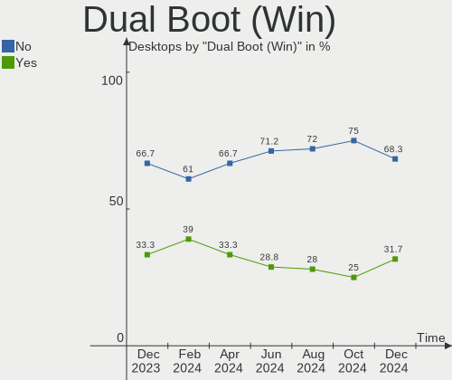
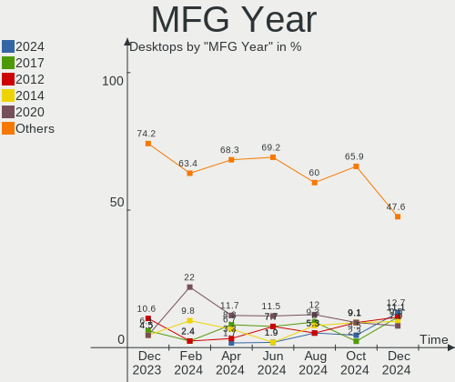
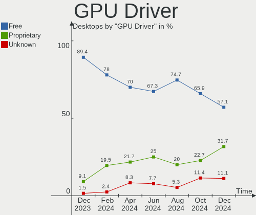
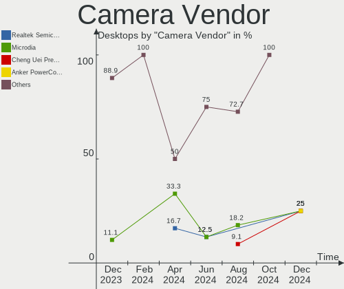

Linux in Poland - Hardware Trends (Desktops)
--------------------------------------------

A project to identify most popular hardware characteristics and track their change
over time based on data collected by Linux users at https://Linux-Hardware.org.

Anyone can contribute to this report by the [hw-probe](https://github.com/linuxhw/hw-probe) tool:

    sudo -E hw-probe -all -upload

Period: Feb, 2023.

Contents
--------

* [ System ](#system)
  - [ OS                       ](#os)
  - [ OS Family                ](#os-family)
  - [ Kernel                   ](#kernel)
  - [ Kernel Family            ](#kernel-family)
  - [ Kernel Major Ver.        ](#kernel-major-ver)
  - [ Arch                     ](#arch)
  - [ DE                       ](#de)
  - [ Display Server           ](#display-server)
  - [ Display Manager          ](#display-manager)
  - [ OS Lang                  ](#os-lang)
  - [ Boot Mode                ](#boot-mode)
  - [ Filesystem               ](#filesystem)
  - [ Part. scheme             ](#part-scheme)
  - [ Dual Boot with Linux/BSD ](#dual-boot-with-linuxbsd)
  - [ Dual Boot (Win)          ](#dual-boot-win)

* [ Board ](#board)
  - [ Vendor                   ](#vendor)
  - [ Model                    ](#model)
  - [ Model Family             ](#model-family)
  - [ MFG Year                 ](#mfg-year)
  - [ Form Factor              ](#form-factor)
  - [ Secure Boot              ](#secure-boot)
  - [ Coreboot                 ](#coreboot)
  - [ RAM Size                 ](#ram-size)
  - [ RAM Used                 ](#ram-used)
  - [ Total Drives             ](#total-drives)
  - [ Has CD-ROM               ](#has-cd-rom)
  - [ Has Ethernet             ](#has-ethernet)
  - [ Has WiFi                 ](#has-wifi)
  - [ Has Bluetooth            ](#has-bluetooth)

* [ Location ](#location)
  - [ Country                  ](#country)
  - [ City                     ](#city)

* [ Drives ](#drives)
  - [ Drive Vendor             ](#drive-vendor)
  - [ Drive Model              ](#drive-model)
  - [ HDD Vendor               ](#hdd-vendor)
  - [ SSD Vendor               ](#ssd-vendor)
  - [ Drive Kind               ](#drive-kind)
  - [ Drive Connector          ](#drive-connector)
  - [ Drive Size               ](#drive-size)
  - [ Space Total              ](#space-total)
  - [ Space Used               ](#space-used)
  - [ Malfunc. Drives          ](#malfunc-drives)
  - [ Malfunc. Drive Vendor    ](#malfunc-drive-vendor)
  - [ Malfunc. HDD Vendor      ](#malfunc-hdd-vendor)
  - [ Malfunc. Drive Kind      ](#malfunc-drive-kind)
  - [ Failed Drives            ](#failed-drives)
  - [ Failed Drive Vendor      ](#failed-drive-vendor)
  - [ Drive Status             ](#drive-status)

* [ Storage controller ](#storage-controller)
  - [ Storage Vendor           ](#storage-vendor)
  - [ Storage Model            ](#storage-model)
  - [ Storage Kind             ](#storage-kind)

* [ Processor ](#processor)
  - [ CPU Vendor               ](#cpu-vendor)
  - [ CPU Model                ](#cpu-model)
  - [ CPU Model Family         ](#cpu-model-family)
  - [ CPU Cores                ](#cpu-cores)
  - [ CPU Sockets              ](#cpu-sockets)
  - [ CPU Threads              ](#cpu-threads)
  - [ CPU Op-Modes             ](#cpu-op-modes)
  - [ CPU Microcode            ](#cpu-microcode)
  - [ CPU Microarch            ](#cpu-microarch)

* [ Graphics ](#graphics)
  - [ GPU Vendor               ](#gpu-vendor)
  - [ GPU Model                ](#gpu-model)
  - [ GPU Combo                ](#gpu-combo)
  - [ GPU Driver               ](#gpu-driver)
  - [ GPU Memory               ](#gpu-memory)

* [ Monitor ](#monitor)
  - [ Monitor Vendor           ](#monitor-vendor)
  - [ Monitor Model            ](#monitor-model)
  - [ Monitor Resolution       ](#monitor-resolution)
  - [ Monitor Diagonal         ](#monitor-diagonal)
  - [ Monitor Width            ](#monitor-width)
  - [ Aspect Ratio             ](#aspect-ratio)
  - [ Monitor Area             ](#monitor-area)
  - [ Pixel Density            ](#pixel-density)
  - [ Multiple Monitors        ](#multiple-monitors)

* [ Network ](#network)
  - [ Net Controller Vendor    ](#net-controller-vendor)
  - [ Net Controller Model     ](#net-controller-model)
  - [ Wireless Vendor          ](#wireless-vendor)
  - [ Wireless Model           ](#wireless-model)
  - [ Ethernet Vendor          ](#ethernet-vendor)
  - [ Ethernet Model           ](#ethernet-model)
  - [ Net Controller Kind      ](#net-controller-kind)
  - [ Used Controller          ](#used-controller)
  - [ NICs                     ](#nics)
  - [ IPv6                     ](#ipv6)

* [ Bluetooth ](#bluetooth)
  - [ Bluetooth Vendor         ](#bluetooth-vendor)
  - [ Bluetooth Model          ](#bluetooth-model)

* [ Sound ](#sound)
  - [ Sound Vendor             ](#sound-vendor)
  - [ Sound Model              ](#sound-model)

* [ Memory ](#memory)
  - [ Memory Vendor            ](#memory-vendor)
  - [ Memory Model             ](#memory-model)
  - [ Memory Kind              ](#memory-kind)
  - [ Memory Form Factor       ](#memory-form-factor)
  - [ Memory Size              ](#memory-size)
  - [ Memory Speed             ](#memory-speed)

* [ Printers & scanners ](#printers--scanners)
  - [ Printer Vendor           ](#printer-vendor)
  - [ Printer Model            ](#printer-model)
  - [ Scanner Vendor           ](#scanner-vendor)
  - [ Scanner Model            ](#scanner-model)

* [ Camera ](#camera)
  - [ Camera Vendor            ](#camera-vendor)
  - [ Camera Model             ](#camera-model)

* [ Security ](#security)
  - [ Fingerprint Vendor       ](#fingerprint-vendor)
  - [ Fingerprint Model        ](#fingerprint-model)
  - [ Chipcard Vendor          ](#chipcard-vendor)
  - [ Chipcard Model           ](#chipcard-model)

* [ Unsupported ](#unsupported)
  - [ Unsupported Devices      ](#unsupported-devices)
  - [ Unsupported Device Types ](#unsupported-device-types)

System
------

OS
--

Installed operating systems

| Name               | Desktops | Percent |
|--------------------|----------|---------|
| OpenMandriva 23.01 | 13       | 20.63%  |
| Ubuntu 22.04       | 8        | 12.7%   |
| Linux Mint 21.1    | 6        | 9.52%   |
| OpenMandriva 4.3   | 5        | 7.94%   |
| Pop!_OS 22.04      | 4        | 6.35%   |
| Gentoo 2.9         | 4        | 6.35%   |
| Zorin 16           | 3        | 4.76%   |
| Kubuntu 22.04      | 3        | 4.76%   |
| KDE neon 22.04     | 3        | 4.76%   |
| Arch Rolling       | 3        | 4.76%   |
| Manjaro            | 2        | 3.17%   |
| Debian 11          | 2        | 3.17%   |
| Ubuntu 22.10       | 1        | 1.59%   |
| Ubuntu 20.04       | 1        | 1.59%   |
| ROSA R11.1         | 1        | 1.59%   |
| OpenMandriva 4.50  | 1        | 1.59%   |
| Linux Mint 20.3    | 1        | 1.59%   |
| Fedora 36          | 1        | 1.59%   |
| ArcoLinux Rolling  | 1        | 1.59%   |

OS Family
---------

OS without a version

| Name         | Desktops | Percent |
|--------------|----------|---------|
| OpenMandriva | 19       | 30.16%  |
| Ubuntu       | 10       | 15.87%  |
| Linux Mint   | 7        | 11.11%  |
| Pop!_OS      | 4        | 6.35%   |
| Gentoo       | 4        | 6.35%   |
| Zorin        | 3        | 4.76%   |
| Kubuntu      | 3        | 4.76%   |
| KDE neon     | 3        | 4.76%   |
| Arch         | 3        | 4.76%   |
| Manjaro      | 2        | 3.17%   |
| Debian       | 2        | 3.17%   |
| ROSA         | 1        | 1.59%   |
| Fedora       | 1        | 1.59%   |
| ArcoLinux    | 1        | 1.59%   |

Kernel
------

Version of the Linux kernel

| Version                          | Desktops | Percent |
|----------------------------------|----------|---------|
| 6.1.1-desktop-1omv2290           | 8        | 12.7%   |
| 5.15.0-60-generic                | 7        | 11.11%  |
| 5.19.0-32-generic                | 6        | 9.52%   |
| 5.15.0-58-generic                | 6        | 9.52%   |
| 6.1.4-desktop-1omv2301           | 4        | 6.35%   |
| 6.0.12-76060006-generic          | 4        | 6.35%   |
| 5.16.13-desktop-1omv4003         | 4        | 6.35%   |
| 5.15.88-gentoo                   | 3        | 4.76%   |
| 5.10.0-21-amd64                  | 2        | 3.17%   |
| 6.1.9-arch1-1.1                  | 1        | 1.59%   |
| 6.1.8-arch1-1                    | 1        | 1.59%   |
| 6.1.8-100.fc36.x86_64            | 1        | 1.59%   |
| 6.1.4-arch1-1                    | 1        | 1.59%   |
| 6.1.12-gentoo                    | 1        | 1.59%   |
| 6.1.12-1-MANJARO                 | 1        | 1.59%   |
| 6.1.11-desktop-1omv2390          | 1        | 1.59%   |
| 6.1.11-arch1-1                   | 1        | 1.59%   |
| 6.1.10-lqx1-1-lqx                | 1        | 1.59%   |
| 5.4.0-137-generic                | 1        | 1.59%   |
| 5.4.0-135-generic                | 1        | 1.59%   |
| 5.19.5-desktop-1omv4090          | 1        | 1.59%   |
| 5.19.17-051917-generic           | 1        | 1.59%   |
| 5.19.0-35-generic                | 1        | 1.59%   |
| 5.16.7-desktop-1omv4003          | 1        | 1.59%   |
| 5.15.0-58-lowlatency             | 1        | 1.59%   |
| 5.15.0-56-generic                | 1        | 1.59%   |
| 5.15.0-43-generic                | 1        | 1.59%   |
| 4.9.155-nrj-desktop-1rosa-x86_64 | 1        | 1.59%   |

Kernel Family
-------------

Linux kernel without a distro release

| Version | Desktops | Percent |
|---------|----------|---------|
| 5.15.0  | 16       | 25.4%   |
| 6.1.1   | 8        | 12.7%   |
| 5.19.0  | 7        | 11.11%  |
| 6.1.4   | 5        | 7.94%   |
| 6.0.12  | 4        | 6.35%   |
| 5.16.13 | 4        | 6.35%   |
| 5.15.88 | 3        | 4.76%   |
| 6.1.8   | 2        | 3.17%   |
| 6.1.12  | 2        | 3.17%   |
| 6.1.11  | 2        | 3.17%   |
| 5.4.0   | 2        | 3.17%   |
| 5.10.0  | 2        | 3.17%   |
| 6.1.9   | 1        | 1.59%   |
| 6.1.10  | 1        | 1.59%   |
| 5.19.5  | 1        | 1.59%   |
| 5.19.17 | 1        | 1.59%   |
| 5.16.7  | 1        | 1.59%   |
| 4.9.155 | 1        | 1.59%   |

Kernel Major Ver.
-----------------

Linux kernel major version

| Version | Desktops | Percent |
|---------|----------|---------|
| 6.1     | 21       | 33.33%  |
| 5.15    | 19       | 30.16%  |
| 5.19    | 9        | 14.29%  |
| 5.16    | 5        | 7.94%   |
| 6.0     | 4        | 6.35%   |
| 5.4     | 2        | 3.17%   |
| 5.10    | 2        | 3.17%   |
| 4.9     | 1        | 1.59%   |

Arch
----

OS architecture (x86_64, i586, etc.)

| Name   | Desktops | Percent |
|--------|----------|---------|
| x86_64 | 63       | 100%    |

DE
--

Desktop Environment

| Name       | Desktops | Percent |
|------------|----------|---------|
| KDE5       | 26       | 41.27%  |
| GNOME      | 21       | 33.33%  |
| MATE       | 4        | 6.35%   |
| XFCE       | 3        | 4.76%   |
| X-Cinnamon | 3        | 4.76%   |
| Unknown    | 3        | 4.76%   |
| xmonad     | 1        | 1.59%   |
| KDE4       | 1        | 1.59%   |
| gnome-xorg | 1        | 1.59%   |

Display Server
--------------

X11 or Wayland

| Name    | Desktops | Percent |
|---------|----------|---------|
| X11     | 52       | 82.54%  |
| Wayland | 9        | 14.29%  |
| Unknown | 2        | 3.17%   |

Display Manager
---------------

SDDM, LightDM, etc.

| Name    | Desktops | Percent |
|---------|----------|---------|
| SDDM    | 22       | 34.92%  |
| Unknown | 19       | 30.16%  |
| GDM3    | 10       | 15.87%  |
| LightDM | 6        | 9.52%   |
| GDM     | 3        | 4.76%   |
| SLiM    | 1        | 1.59%   |
| LXDM    | 1        | 1.59%   |
| KDM     | 1        | 1.59%   |

OS Lang
-------

Language

| Lang        | Desktops | Percent |
|-------------|----------|---------|
| pl_PL       | 40       | 63.49%  |
| en_US       | 16       | 25.4%   |
| Unknown     | 2        | 3.17%   |
| ru_RU       | 1        | 1.59%   |
| en_US.utf-8 | 1        | 1.59%   |
| en_SE       | 1        | 1.59%   |
| en_AG       | 1        | 1.59%   |
| C           | 1        | 1.59%   |

Boot Mode
---------

EFI or BIOS

| Mode | Desktops | Percent |
|------|----------|---------|
| BIOS | 39       | 61.9%   |
| EFI  | 24       | 38.1%   |

Filesystem
----------

Type of filesystem

| Type    | Desktops | Percent |
|---------|----------|---------|
| Ext4    | 48       | 76.19%  |
| Overlay | 6        | 9.52%   |
| Btrfs   | 4        | 6.35%   |
| F2fs    | 3        | 4.76%   |
| Jfs     | 1        | 1.59%   |
| Unknown | 1        | 1.59%   |

Part. scheme
------------

Scheme of partitioning

| Type    | Desktops | Percent |
|---------|----------|---------|
| GPT     | 36       | 57.14%  |
| Unknown | 19       | 30.16%  |
| MBR     | 8        | 12.7%   |

Dual Boot with Linux/BSD
------------------------

Hosting more than one Linux/BSD

| Dual boot | Desktops | Percent |
|-----------|----------|---------|
| No        | 43       | 68.25%  |
| Yes       | 20       | 31.75%  |

Dual Boot (Win)
---------------

Hosting Linux and Windows

| Dual boot | Desktops | Percent |
|-----------|----------|---------|
| No        | 45       | 71.43%  |
| Yes       | 18       | 28.57%  |

Board
-----

Vendor
------

Motherboard manufacturer

| Name                | Desktops | Percent |
|---------------------|----------|---------|
| Gigabyte Technology | 20       | 31.75%  |
| ASUSTek Computer    | 12       | 19.05%  |
| MSI                 | 9        | 14.29%  |
| ASRock              | 7        | 11.11%  |
| Dell                | 5        | 7.94%   |
| Hewlett-Packard     | 4        | 6.35%   |
| Fujitsu             | 2        | 3.17%   |
| Foxconn             | 2        | 3.17%   |
| Intel               | 1        | 1.59%   |
| Huanan              | 1        | 1.59%   |

Model
-----

Motherboard model

| Name                              | Desktops | Percent |
|-----------------------------------|----------|---------|
| HP Compaq Elite 8300 SFF          | 2        | 3.17%   |
| Dell OptiPlex 755                 | 2        | 3.17%   |
| ASUS M3A78-CM                     | 2        | 3.17%   |
| MSI MS-7D25                       | 1        | 1.59%   |
| MSI MS-7C89                       | 1        | 1.59%   |
| MSI MS-7B17                       | 1        | 1.59%   |
| MSI MS-7A38                       | 1        | 1.59%   |
| MSI MS-7A37                       | 1        | 1.59%   |
| MSI MS-7885                       | 1        | 1.59%   |
| MSI MS-7592                       | 1        | 1.59%   |
| MSI MS-7235                       | 1        | 1.59%   |
| MSI H310 Gaming Codex S (MS-B927) | 1        | 1.59%   |
| Intel DG31PR AAD97573-301         | 1        | 1.59%   |
| Huanan X99-T8D V1.2               | 1        | 1.59%   |
| HP Z440 Workstation               | 1        | 1.59%   |
| HP EliteDesk 800 G2 SFF           | 1        | 1.59%   |
| Gigabyte Z97M-DS3H                | 1        | 1.59%   |
| Gigabyte Z97-HD3                  | 1        | 1.59%   |
| Gigabyte Z690 GAMING X DDR4       | 1        | 1.59%   |
| Gigabyte X670E AORUS MASTER       | 1        | 1.59%   |
| Gigabyte H55M-USB3                | 1        | 1.59%   |
| Gigabyte H410M H V3               | 1        | 1.59%   |
| Gigabyte GB-BPCE-3455             | 1        | 1.59%   |
| Gigabyte GA-MA790XT-UD4P          | 1        | 1.59%   |
| Gigabyte GA-MA790X-UD3P           | 1        | 1.59%   |
| Gigabyte GA-MA78LMT-US2H          | 1        | 1.59%   |
| Gigabyte G31M-S2L                 | 1        | 1.59%   |
| Gigabyte F2A68HM-DS2              | 1        | 1.59%   |
| Gigabyte EP35-DS4                 | 1        | 1.59%   |
| Gigabyte B85M-HD3 R4              | 1        | 1.59%   |
| Gigabyte B75M-D2V                 | 1        | 1.59%   |
| Gigabyte B660 DS3H AX DDR4        | 1        | 1.59%   |
| Gigabyte B450M DS3H               | 1        | 1.59%   |
| Gigabyte B365M DS3H               | 1        | 1.59%   |
| Gigabyte AB350-Gaming             | 1        | 1.59%   |
| Gigabyte A320M-H                  | 1        | 1.59%   |
| Fujitsu ESPRIMO Q920              | 1        | 1.59%   |
| Fujitsu ESPRIMO Q556              | 1        | 1.59%   |
| Foxconn Pro 3400 Series MT        | 1        | 1.59%   |
| Foxconn NT-A2400&NT-A3500         | 1        | 1.59%   |

Model Family
------------

Motherboard model prefix

| Name                      | Desktops | Percent |
|---------------------------|----------|---------|
| Dell OptiPlex             | 5        | 7.94%   |
| ASUS PRIME                | 4        | 6.35%   |
| HP Compaq                 | 2        | 3.17%   |
| Fujitsu ESPRIMO           | 2        | 3.17%   |
| ASUS M3A78-CM             | 2        | 3.17%   |
| MSI MS-7D25               | 1        | 1.59%   |
| MSI MS-7C89               | 1        | 1.59%   |
| MSI MS-7B17               | 1        | 1.59%   |
| MSI MS-7A38               | 1        | 1.59%   |
| MSI MS-7A37               | 1        | 1.59%   |
| MSI MS-7885               | 1        | 1.59%   |
| MSI MS-7592               | 1        | 1.59%   |
| MSI MS-7235               | 1        | 1.59%   |
| MSI H310                  | 1        | 1.59%   |
| Intel DG31PR              | 1        | 1.59%   |
| Huanan X99-T8D            | 1        | 1.59%   |
| HP Z440                   | 1        | 1.59%   |
| HP EliteDesk              | 1        | 1.59%   |
| Gigabyte Z97M-DS3H        | 1        | 1.59%   |
| Gigabyte Z97-HD3          | 1        | 1.59%   |
| Gigabyte Z690             | 1        | 1.59%   |
| Gigabyte X670E            | 1        | 1.59%   |
| Gigabyte H55M-USB3        | 1        | 1.59%   |
| Gigabyte H410M            | 1        | 1.59%   |
| Gigabyte GB-BPCE-3455     | 1        | 1.59%   |
| Gigabyte GA-MA790XT-UD4P  | 1        | 1.59%   |
| Gigabyte GA-MA790X-UD3P   | 1        | 1.59%   |
| Gigabyte GA-MA78LMT-US2H  | 1        | 1.59%   |
| Gigabyte G31M-S2L         | 1        | 1.59%   |
| Gigabyte F2A68HM-DS2      | 1        | 1.59%   |
| Gigabyte EP35-DS4         | 1        | 1.59%   |
| Gigabyte B85M-HD3         | 1        | 1.59%   |
| Gigabyte B75M-D2V         | 1        | 1.59%   |
| Gigabyte B660             | 1        | 1.59%   |
| Gigabyte B450M            | 1        | 1.59%   |
| Gigabyte B365M            | 1        | 1.59%   |
| Gigabyte AB350-Gaming     | 1        | 1.59%   |
| Gigabyte A320M-H          | 1        | 1.59%   |
| Foxconn Pro               | 1        | 1.59%   |
| Foxconn NT-A2400&NT-A3500 | 1        | 1.59%   |

MFG Year
--------

Motherboard manufacture year

| Year | Desktops | Percent |
|------|----------|---------|
| 2018 | 9        | 14.29%  |
| 2017 | 6        | 9.52%   |
| 2012 | 6        | 9.52%   |
| 2009 | 5        | 7.94%   |
| 2022 | 4        | 6.35%   |
| 2015 | 4        | 6.35%   |
| 2014 | 4        | 6.35%   |
| 2010 | 4        | 6.35%   |
| 2008 | 4        | 6.35%   |
| 2021 | 3        | 4.76%   |
| 2020 | 3        | 4.76%   |
| 2011 | 3        | 4.76%   |
| 2019 | 2        | 3.17%   |
| 2016 | 2        | 3.17%   |
| 2007 | 2        | 3.17%   |
| 2023 | 1        | 1.59%   |
| 2006 | 1        | 1.59%   |

Form Factor
-----------

Physical design of the computer

| Name    | Desktops | Percent |
|---------|----------|---------|
| Desktop | 63       | 100%    |

Secure Boot
-----------

Enabled or disabled

| State    | Desktops | Percent |
|----------|----------|---------|
| Disabled | 61       | 96.83%  |
| Enabled  | 2        | 3.17%   |

Coreboot
--------

Have coreboot on board

| Used | Desktops | Percent |
|------|----------|---------|
| No   | 63       | 100%    |

RAM Size
--------

Total RAM memory

| Size in GB  | Desktops | Percent |
|-------------|----------|---------|
| 32.01-64.0  | 14       | 22.22%  |
| 16.01-24.0  | 14       | 22.22%  |
| 4.01-8.0    | 13       | 20.63%  |
| 8.01-16.0   | 9        | 14.29%  |
| 3.01-4.0    | 7        | 11.11%  |
| 64.01-256.0 | 4        | 6.35%   |
| 24.01-32.0  | 2        | 3.17%   |

RAM Used
--------

Used RAM memory

| Used GB    | Desktops | Percent |
|------------|----------|---------|
| 2.01-3.0   | 21       | 33.33%  |
| 1.01-2.0   | 19       | 30.16%  |
| 4.01-8.0   | 9        | 14.29%  |
| 3.01-4.0   | 7        | 11.11%  |
| 8.01-16.0  | 5        | 7.94%   |
| 16.01-24.0 | 1        | 1.59%   |
| 0.51-1.0   | 1        | 1.59%   |

Total Drives
------------

Number of drives on board

| Drives | Desktops | Percent |
|--------|----------|---------|
| 1      | 22       | 34.92%  |
| 2      | 20       | 31.75%  |
| 3      | 10       | 15.87%  |
| 4      | 6        | 9.52%   |
| 5      | 3        | 4.76%   |
| 6      | 2        | 3.17%   |

Has CD-ROM
----------

Has CD-ROM on board

| Presented | Desktops | Percent |
|-----------|----------|---------|
| Yes       | 33       | 52.38%  |
| No        | 30       | 47.62%  |

Has Ethernet
------------

Has Ethernet on board

| Presented | Desktops | Percent |
|-----------|----------|---------|
| Yes       | 63       | 100%    |

Has WiFi
--------

Has WiFi module

| Presented | Desktops | Percent |
|-----------|----------|---------|
| No        | 38       | 60.32%  |
| Yes       | 25       | 39.68%  |

Has Bluetooth
-------------

Has Bluetooth module

| Presented | Desktops | Percent |
|-----------|----------|---------|
| No        | 47       | 74.6%   |
| Yes       | 16       | 25.4%   |

Location
--------

Country
-------

Geographic location (country)

| Country | Desktops | Percent |
|---------|----------|---------|
| Poland  | 63       | 100%    |

City
----

Geographic location (city)

| City              | Desktops | Percent |
|-------------------|----------|---------|
| Warsaw            | 10       | 15.87%  |
| Krakow            | 4        | 6.35%   |
| Bialystok         | 4        | 6.35%   |
| Poznan            | 3        | 4.76%   |
| Katowice          | 3        | 4.76%   |
| Mazancowice       | 2        | 3.17%   |
| Lodz              | 2        | 3.17%   |
| Bydgoszcz         | 2        | 3.17%   |
| Zukowo            | 1        | 1.59%   |
| Wroclaw           | 1        | 1.59%   |
| Wozniki           | 1        | 1.59%   |
| Walcz             | 1        | 1.59%   |
| Tarnów           | 1        | 1.59%   |
| Szczecin          | 1        | 1.59%   |
| Świętochłowice | 1        | 1.59%   |
| Swiebodzice       | 1        | 1.59%   |
| Skorogoszcz       | 1        | 1.59%   |
| Sadlinki          | 1        | 1.59%   |
| Rybnik            | 1        | 1.59%   |
| Reda              | 1        | 1.59%   |
| Puławy           | 1        | 1.59%   |
| Przemysl          | 1        | 1.59%   |
| Pinczow           | 1        | 1.59%   |
| Piekoszow         | 1        | 1.59%   |
| Piaseczno         | 1        | 1.59%   |
| Padew Narodowa    | 1        | 1.59%   |
| Osiecznica        | 1        | 1.59%   |
| Myszkow           | 1        | 1.59%   |
| Malbork           | 1        | 1.59%   |
| Leba              | 1        | 1.59%   |
| Krzeszowice       | 1        | 1.59%   |
| Jozefow           | 1        | 1.59%   |
| Jaworzno          | 1        | 1.59%   |
| Gmina Lipno       | 1        | 1.59%   |
| Gmina Brodnica    | 1        | 1.59%   |
| Gdynia            | 1        | 1.59%   |
| Gdansk            | 1        | 1.59%   |
| Domaslaw          | 1        | 1.59%   |
| Darłowo          | 1        | 1.59%   |
| Bytom             | 1        | 1.59%   |

Drives
------

Drive Vendor
------------

Hard drive vendors

| Vendor                    | Desktops | Drives | Percent |
|---------------------------|----------|--------|---------|
| Seagate                   | 21       | 28     | 17.5%   |
| GOODRAM                   | 17       | 18     | 14.17%  |
| WDC                       | 12       | 15     | 10%     |
| Samsung Electronics       | 10       | 17     | 8.33%   |
| Toshiba                   | 9        | 10     | 7.5%    |
| Kingston                  | 8        | 9      | 6.67%   |
| Crucial                   | 8        | 9      | 6.67%   |
| Sandisk                   | 4        | 5      | 3.33%   |
| A-DATA Technology         | 4        | 4      | 3.33%   |
| Phison Electronics        | 3        | 3      | 2.5%    |
| Patriot                   | 3        | 3      | 2.5%    |
| Hitachi                   | 3        | 5      | 2.5%    |
| XPG                       | 2        | 2      | 1.67%   |
| Silicon Motion            | 2        | 2      | 1.67%   |
| HGST                      | 2        | 2      | 1.67%   |
| Fujitsu                   | 2        | 2      | 1.67%   |
| SPCC                      | 1        | 2      | 0.83%   |
| Realtek Semiconductor     | 1        | 1      | 0.83%   |
| PNY                       | 1        | 1      | 0.83%   |
| Micron/Crucial Technology | 1        | 1      | 0.83%   |
| Micron Technology         | 1        | 1      | 0.83%   |
| Maxtor                    | 1        | 1      | 0.83%   |
| Lite-On Technology        | 1        | 1      | 0.83%   |
| Lexar                     | 1        | 1      | 0.83%   |
| HS-SSD-C100               | 1        | 1      | 0.83%   |
| Gigabyte Technology       | 1        | 1      | 0.83%   |

Drive Model
-----------

Hard drive models

| Model                                                 | Desktops | Percent |
|-------------------------------------------------------|----------|---------|
| Kingston SKC3000S1024G 1024GB                         | 3        | 2.17%   |
| GOODRAM SSDPR-CX400-512-G2 512GB                      | 3        | 2.17%   |
| GOODRAM SSDPR-CL100-480-G2 480GB                      | 3        | 2.17%   |
| Crucial CT240BX500SSD1 240GB                          | 3        | 2.17%   |
| WDC WD20EFRX-68EUZN0 2TB                              | 2        | 1.45%   |
| Toshiba HDWD130 3TB                                   | 2        | 1.45%   |
| Toshiba HDWD110 1TB                                   | 2        | 1.45%   |
| Seagate ST1000DM003-1CH162 1TB                        | 2        | 1.45%   |
| Samsung SSD 980 1TB                                   | 2        | 1.45%   |
| Phison PS5013 E13 NVMe Controller 500GB               | 2        | 1.45%   |
| Patriot Burst 480GB SSD                               | 2        | 1.45%   |
| GOODRAM SSDPR-CX400-256 256GB                         | 2        | 1.45%   |
| GOODRAM SSDPR-CX400-128-G2 128GB                      | 2        | 1.45%   |
| GOODRAM SSDPR-CX300-120 120GB                         | 2        | 1.45%   |
| XPG SPECTRIX S40G 4TB                                 | 1        | 0.72%   |
| XPG GAMMIX S11 Pro 512GB                              | 1        | 0.72%   |
| WDC WDS100T2B0C-00PXH0 1TB                            | 1        | 0.72%   |
| WDC WD800JD-60LSA5 80GB                               | 1        | 0.72%   |
| WDC WD7500BPVT-24HXZT3 752GB                          | 1        | 0.72%   |
| WDC WD5000AAKS-00V1A0 500GB                           | 1        | 0.72%   |
| WDC WD40EFAX-68JH4N1 4TB                              | 1        | 0.72%   |
| WDC WD2500JB-00GVA0 250GB                             | 1        | 0.72%   |
| WDC WD10JPVX-22JC3T0 1TB                              | 1        | 0.72%   |
| WDC WD10EZEX-75M2NA0 1TB                              | 1        | 0.72%   |
| WDC WD10EZEX-22MFCA0 1TB                              | 1        | 0.72%   |
| WDC WD10EZEX-00ZF5A0 1TB                              | 1        | 0.72%   |
| WDC WD10EALX-009BA0 1TB                               | 1        | 0.72%   |
| Toshiba TR200 240GB SSD                               | 1        | 0.72%   |
| Toshiba MQ01ABD075 752GB                              | 1        | 0.72%   |
| Toshiba MK2576GSX HR 160GB                            | 1        | 0.72%   |
| Toshiba HDWE150 5TB                                   | 1        | 0.72%   |
| Toshiba DT01ACA050 500GB                              | 1        | 0.72%   |
| SPCC Solid State Disk 512GB                           | 1        | 0.72%   |
| SPCC Solid State Disk 240GB                           | 1        | 0.72%   |
| Silicon Motion SM2263EN/SM2263XT SSD Controller 512GB | 1        | 0.72%   |
| Silicon Motion NE-256 256GB                           | 1        | 0.72%   |
| Seagate ST500LT012-9WS142 500GB                       | 1        | 0.72%   |
| Seagate ST500DM002-1BD142 500GB                       | 1        | 0.72%   |
| Seagate ST4000NM0053 4TB                              | 1        | 0.72%   |
| Seagate ST4000DM004-2U9104 4TB                        | 1        | 0.72%   |

HDD Vendor
----------

Hard disk drive vendors

| Vendor              | Desktops | Drives | Percent |
|---------------------|----------|--------|---------|
| Seagate             | 21       | 26     | 40.38%  |
| WDC                 | 11       | 14     | 21.15%  |
| Toshiba             | 8        | 9      | 15.38%  |
| Samsung Electronics | 4        | 4      | 7.69%   |
| Hitachi             | 3        | 5      | 5.77%   |
| HGST                | 2        | 2      | 3.85%   |
| Fujitsu             | 2        | 2      | 3.85%   |
| Maxtor              | 1        | 1      | 1.92%   |

SSD Vendor
----------

Solid state drive vendors

| Vendor              | Desktops | Drives | Percent |
|---------------------|----------|--------|---------|
| GOODRAM             | 16       | 17     | 37.21%  |
| Crucial             | 7        | 8      | 16.28%  |
| Samsung Electronics | 6        | 7      | 13.95%  |
| Patriot             | 3        | 3      | 6.98%   |
| Kingston            | 3        | 3      | 6.98%   |
| A-DATA Technology   | 3        | 3      | 6.98%   |
| Toshiba             | 1        | 1      | 2.33%   |
| SPCC                | 1        | 2      | 2.33%   |
| PNY                 | 1        | 1      | 2.33%   |
| Micron Technology   | 1        | 1      | 2.33%   |
| Lexar               | 1        | 1      | 2.33%   |

Drive Kind
----------

HDD or SSD

| Kind    | Desktops | Drives | Percent |
|---------|----------|--------|---------|
| SSD     | 41       | 47     | 39.81%  |
| HDD     | 40       | 63     | 38.83%  |
| NVMe    | 21       | 34     | 20.39%  |
| Unknown | 1        | 1      | 0.97%   |

Drive Connector
---------------

SATA, SAS, NVMe, etc.

| Type | Desktops | Drives | Percent |
|------|----------|--------|---------|
| SATA | 56       | 108    | 70%     |
| NVMe | 21       | 34     | 26.25%  |
| SAS  | 3        | 3      | 3.75%   |

Drive Size
----------

Size of hard drive

| Size in TB | Desktops | Drives | Percent |
|------------|----------|--------|---------|
| 0.01-0.5   | 43       | 58     | 50.59%  |
| 0.51-1.0   | 25       | 28     | 29.41%  |
| 1.01-2.0   | 7        | 10     | 8.24%   |
| 3.01-4.0   | 4        | 5      | 4.71%   |
| 2.01-3.0   | 4        | 7      | 4.71%   |
| 10.01-20.0 | 1        | 1      | 1.18%   |
| 4.01-10.0  | 1        | 1      | 1.18%   |

Space Total
-----------

Amount of disk space available on the file system

| Size in GB     | Desktops | Percent |
|----------------|----------|---------|
| 101-250        | 16       | 25.4%   |
| 501-1000       | 13       | 20.63%  |
| 251-500        | 8        | 12.7%   |
| 1001-2000      | 7        | 11.11%  |
| 1-20           | 6        | 9.52%   |
| More than 3000 | 4        | 6.35%   |
| 51-100         | 4        | 6.35%   |
| Unknown        | 3        | 4.76%   |
| 21-50          | 1        | 1.59%   |
| 2001-3000      | 1        | 1.59%   |

Space Used
----------

Amount of used disk space

| Used GB        | Desktops | Percent |
|----------------|----------|---------|
| 1-20           | 19       | 30.16%  |
| 21-50          | 13       | 20.63%  |
| 101-250        | 10       | 15.87%  |
| 251-500        | 5        | 7.94%   |
| 51-100         | 5        | 7.94%   |
| 501-1000       | 4        | 6.35%   |
| Unknown        | 3        | 4.76%   |
| More than 3000 | 2        | 3.17%   |
| 2001-3000      | 2        | 3.17%   |

Malfunc. Drives
---------------

Drive models with a malfunction

| Model                             | Desktops | Drives | Percent |
|-----------------------------------|----------|--------|---------|
| WDC WD5000AAKS-00V1A0 500GB       | 1        | 1      | 7.69%   |
| Seagate ST3500630AS 500GB         | 1        | 1      | 7.69%   |
| Seagate ST3250310AS 250GB         | 1        | 1      | 7.69%   |
| Seagate ST3160023A 160GB          | 1        | 1      | 7.69%   |
| Seagate ST2000DX002-2DV164 2TB    | 1        | 1      | 7.69%   |
| Seagate ST1000DX001-1CM162 1TB    | 1        | 1      | 7.69%   |
| Samsung Electronics HM500LI 500GB | 1        | 1      | 7.69%   |
| Samsung Electronics HD103UJ 1TB   | 1        | 1      | 7.69%   |
| Samsung Electronics HD080HJ 80GB  | 1        | 1      | 7.69%   |
| Maxtor 6Y080M0 82GB               | 1        | 1      | 7.69%   |
| Hitachi HUA723020ALA641 2TB       | 1        | 1      | 7.69%   |
| Hitachi HTS541616J9SA00 160GB     | 1        | 1      | 7.69%   |
| A-DATA Technology SX900 128GB SSD | 1        | 1      | 7.69%   |

Malfunc. Drive Vendor
---------------------

Vendors of faulty drives

| Vendor              | Desktops | Drives | Percent |
|---------------------|----------|--------|---------|
| Seagate             | 5        | 5      | 38.46%  |
| Samsung Electronics | 3        | 3      | 23.08%  |
| Hitachi             | 2        | 2      | 15.38%  |
| WDC                 | 1        | 1      | 7.69%   |
| Maxtor              | 1        | 1      | 7.69%   |
| A-DATA Technology   | 1        | 1      | 7.69%   |

Malfunc. HDD Vendor
-------------------

Vendors of faulty HDD drives

| Vendor              | Desktops | Drives | Percent |
|---------------------|----------|--------|---------|
| Seagate             | 5        | 5      | 41.67%  |
| Samsung Electronics | 3        | 3      | 25%     |
| Hitachi             | 2        | 2      | 16.67%  |
| WDC                 | 1        | 1      | 8.33%   |
| Maxtor              | 1        | 1      | 8.33%   |

Malfunc. Drive Kind
-------------------

Kinds of faulty drives

| Kind | Desktops | Drives | Percent |
|------|----------|--------|---------|
| HDD  | 9        | 12     | 90%     |
| SSD  | 1        | 1      | 10%     |

Failed Drives
-------------

Failed drive models

Zero info for selected period =(

Failed Drive Vendor
-------------------

Failed drive vendors

Zero info for selected period =(

Drive Status
------------

Number of failed and malfunc. drives

| Status   | Desktops | Drives | Percent |
|----------|----------|--------|---------|
| Works    | 37       | 71     | 50%     |
| Detected | 27       | 61     | 36.49%  |
| Malfunc  | 10       | 13     | 13.51%  |

Storage controller
------------------

Storage Vendor
--------------

Storage controller vendors

| Vendor                      | Desktops | Percent |
|-----------------------------|----------|---------|
| Intel                       | 44       | 44.44%  |
| AMD                         | 19       | 19.19%  |
| SanDisk                     | 5        | 5.05%   |
| Phison Electronics          | 5        | 5.05%   |
| Kingston Technology Company | 5        | 5.05%   |
| JMicron Technology          | 5        | 5.05%   |
| Samsung Electronics         | 4        | 4.04%   |
| Silicon Motion              | 2        | 2.02%   |
| Micron/Crucial Technology   | 2        | 2.02%   |
| ASMedia Technology          | 2        | 2.02%   |
| ADATA Technology            | 2        | 2.02%   |
| VIA Technologies            | 1        | 1.01%   |
| Seagate Technology          | 1        | 1.01%   |
| Realtek Semiconductor       | 1        | 1.01%   |
| Lite-On Technology          | 1        | 1.01%   |

Storage Model
-------------

Storage controller models

| Model                                                                          | Desktops | Percent |
|--------------------------------------------------------------------------------|----------|---------|
| AMD SB7x0/SB8x0/SB9x0 IDE Controller                                           | 7        | 5.47%   |
| AMD FCH SATA Controller [AHCI mode]                                            | 7        | 5.47%   |
| Intel Alder Lake-S PCH SATA Controller [AHCI Mode]                             | 5        | 3.91%   |
| Intel 200 Series PCH SATA controller [AHCI mode]                               | 5        | 3.91%   |
| AMD SB7x0/SB8x0/SB9x0 SATA Controller [IDE mode]                               | 5        | 3.91%   |
| AMD 400 Series Chipset SATA Controller                                         | 5        | 3.91%   |
| Kingston Company Company Non-Volatile memory controller                        | 4        | 3.13%   |
| JMicron JMB363 SATA/IDE Controller                                             | 4        | 3.13%   |
| Intel Q170/Q150/B150/H170/H110/Z170/CM236 Chipset SATA Controller [AHCI Mode]  | 4        | 3.13%   |
| Intel NM10/ICH7 Family SATA Controller [IDE mode]                              | 4        | 3.13%   |
| Intel 82801G (ICH7 Family) IDE Controller                                      | 3        | 2.34%   |
| Intel 8 Series/C220 Series Chipset Family 6-port SATA Controller 1 [AHCI mode] | 3        | 2.34%   |
| Intel 7 Series/C210 Series Chipset Family 6-port SATA Controller [AHCI mode]   | 3        | 2.34%   |
| Silicon Motion SM2263EN/SM2263XT SSD Controller                                | 2        | 1.56%   |
| SanDisk WD Blue SN570 NVMe SSD                                                 | 2        | 1.56%   |
| Samsung NVMe SSD Controller SM981/PM981/PM983                                  | 2        | 1.56%   |
| Samsung NVMe SSD Controller 980                                                | 2        | 1.56%   |
| Phison PS5013 E13 NVMe Controller                                              | 2        | 1.56%   |
| Phison E12 NVMe Controller                                                     | 2        | 1.56%   |
| Micron/Crucial P5 Plus NVMe PCIe SSD                                           | 2        | 1.56%   |
| Intel Celeron N3350/Pentium N4200/Atom E3900 Series SATA AHCI Controller       | 2        | 1.56%   |
| Intel C610/X99 series chipset 6-Port SATA Controller [AHCI mode]               | 2        | 1.56%   |
| Intel 9 Series Chipset Family SATA Controller [AHCI Mode]                      | 2        | 1.56%   |
| Intel 82Q35 Express PT IDER Controller                                         | 2        | 1.56%   |
| Intel 82801IR/IO/IH (ICH9R/DO/DH) 6 port SATA Controller [AHCI mode]           | 2        | 1.56%   |
| ASMedia ASM1062 Serial ATA Controller                                          | 2        | 1.56%   |
| AMD SB7x0/SB8x0/SB9x0 SATA Controller [AHCI mode]                              | 2        | 1.56%   |
| AMD 500 Series Chipset SATA Controller                                         | 2        | 1.56%   |
| AMD 300 Series Chipset SATA Controller                                         | 2        | 1.56%   |
| ADATA XPG SX8200 Pro PCIe Gen3x4 M.2 2280 Solid State Drive                    | 2        | 1.56%   |
| VIA VT6415 PATA IDE Host Controller                                            | 1        | 0.78%   |
| Seagate FireCuda 520 SSD                                                       | 1        | 0.78%   |
| Seagate FireCuda 510 SSD                                                       | 1        | 0.78%   |
| SanDisk WD Blue SN550 NVMe SSD                                                 | 1        | 0.78%   |
| SanDisk WD Black SN750 / PC SN730 NVMe SSD                                     | 1        | 0.78%   |
| SanDisk WD Black 2018/SN750 / PC SN720 NVMe SSD                                | 1        | 0.78%   |
| Samsung NVMe SSD Controller PM9A1/PM9A3/980PRO                                 | 1        | 0.78%   |
| Samsung Electronics SATA controller                                            | 1        | 0.78%   |
| Realtek RTS5763DL NVMe SSD Controller                                          | 1        | 0.78%   |
| Phison E16 PCIe4 NVMe Controller                                               | 1        | 0.78%   |

Storage Kind
------------

Kind of storage controller (IDE, SATA, NVMe, SAS, ...)

| Kind | Desktops | Percent |
|------|----------|---------|
| SATA | 53       | 55.79%  |
| NVMe | 21       | 22.11%  |
| IDE  | 18       | 18.95%  |
| RAID | 3        | 3.16%   |

Processor
---------

CPU Vendor
----------

Processor vendors

| Vendor | Desktops | Percent |
|--------|----------|---------|
| Intel  | 44       | 69.84%  |
| AMD    | 19       | 30.16%  |

CPU Model
---------

Processor models

| Model                                  | Desktops | Percent |
|----------------------------------------|----------|---------|
| AMD Phenom II X4 955 Processor         | 3        | 4.76%   |
| Intel Core i5-3470 CPU @ 3.20GHz       | 2        | 3.17%   |
| Intel Core i5-10400 CPU @ 2.90GHz      | 2        | 3.17%   |
| Intel Core 2 Duo CPU E8500 @ 3.16GHz   | 2        | 3.17%   |
| AMD Ryzen 5 1600 Six-Core Processor    | 2        | 3.17%   |
| Intel Xeon CPU X3460 @ 2.80GHz         | 1        | 1.59%   |
| Intel Xeon CPU E5-2696 v3 @ 2.30GHz    | 1        | 1.59%   |
| Intel Xeon CPU E5-2630 v3 @ 2.40GHz    | 1        | 1.59%   |
| Intel Xeon CPU E31240 @ 3.30GHz        | 1        | 1.59%   |
| Intel Xeon CPU E3-1240L v5 @ 2.10GHz   | 1        | 1.59%   |
| Intel Pentium Gold G5400 CPU @ 3.70GHz | 1        | 1.59%   |
| Intel Pentium Dual CPU E2200 @ 2.20GHz | 1        | 1.59%   |
| Intel Pentium CPU G3260 @ 3.30GHz      | 1        | 1.59%   |
| Intel Core i7-9700K CPU @ 3.60GHz      | 1        | 1.59%   |
| Intel Core i7-8086K CPU @ 4.00GHz      | 1        | 1.59%   |
| Intel Core i7-6700 CPU @ 3.40GHz       | 1        | 1.59%   |
| Intel Core i7-5820K CPU @ 3.30GHz      | 1        | 1.59%   |
| Intel Core i7-3770 CPU @ 3.40GHz       | 1        | 1.59%   |
| Intel Core i7-2600 CPU @ 3.40GHz       | 1        | 1.59%   |
| Intel Core i5-9400F CPU @ 2.90GHz      | 1        | 1.59%   |
| Intel Core i5-8600K CPU @ 3.60GHz      | 1        | 1.59%   |
| Intel Core i5-8400 CPU @ 2.80GHz       | 1        | 1.59%   |
| Intel Core i5-6500T CPU @ 2.50GHz      | 1        | 1.59%   |
| Intel Core i5-4690 CPU @ 3.50GHz       | 1        | 1.59%   |
| Intel Core i5-4590T CPU @ 2.00GHz      | 1        | 1.59%   |
| Intel Core i5-4590 CPU @ 3.30GHz       | 1        | 1.59%   |
| Intel Core i5-4460 CPU @ 3.20GHz       | 1        | 1.59%   |
| Intel Core i5-2400 CPU @ 3.10GHz       | 1        | 1.59%   |
| Intel Core i3-6320 CPU @ 3.90GHz       | 1        | 1.59%   |
| Intel Core i3-10100F CPU @ 3.60GHz     | 1        | 1.59%   |
| Intel Core 2 Quad CPU Q9400 @ 2.66GHz  | 1        | 1.59%   |
| Intel Core 2 Quad CPU Q6600 @ 2.40GHz  | 1        | 1.59%   |
| Intel Core 2 Duo CPU E8600 @ 3.33GHz   | 1        | 1.59%   |
| Intel Core 2 Duo CPU E8400 @ 3.00GHz   | 1        | 1.59%   |
| Intel Core 2 Duo CPU E6550 @ 2.33GHz   | 1        | 1.59%   |
| Intel Core 2 CPU 6600 @ 2.40GHz        | 1        | 1.59%   |
| Intel Celeron CPU J3455 @ 1.50GHz      | 1        | 1.59%   |
| Intel Celeron CPU J3355 @ 2.00GHz      | 1        | 1.59%   |
| Intel 13th Gen Core i7-13700F          | 1        | 1.59%   |
| Intel 13th Gen Core i5-13400F          | 1        | 1.59%   |

CPU Model Family
----------------

Processor model prefix

| Model              | Desktops | Percent |
|--------------------|----------|---------|
| Intel Core i5      | 13       | 20.63%  |
| Intel Core i7      | 6        | 9.52%   |
| AMD Ryzen 5        | 6        | 9.52%   |
| Other              | 5        | 7.94%   |
| Intel Xeon         | 5        | 7.94%   |
| Intel Core 2 Duo   | 5        | 7.94%   |
| AMD Phenom II X4   | 5        | 7.94%   |
| Intel Core i3      | 2        | 3.17%   |
| Intel Core 2 Quad  | 2        | 3.17%   |
| Intel Celeron      | 2        | 3.17%   |
| AMD Ryzen 9        | 2        | 3.17%   |
| AMD Ryzen 7        | 2        | 3.17%   |
| Intel Pentium Gold | 1        | 1.59%   |
| Intel Pentium Dual | 1        | 1.59%   |
| Intel Pentium      | 1        | 1.59%   |
| Intel Core 2       | 1        | 1.59%   |
| AMD Ryzen 3        | 1        | 1.59%   |
| AMD E              | 1        | 1.59%   |
| AMD Athlon II X2   | 1        | 1.59%   |
| AMD A8             | 1        | 1.59%   |

CPU Cores
---------

Number of processor cores

| Number  | Desktops | Percent |
|---------|----------|---------|
| 4       | 26       | 41.27%  |
| 2       | 13       | 20.63%  |
| 6       | 12       | 19.05%  |
| 8       | 4        | 6.35%   |
| 16      | 3        | 4.76%   |
| 12      | 2        | 3.17%   |
| 18      | 1        | 1.59%   |
| 10      | 1        | 1.59%   |
| Unknown | 1        | 1.59%   |

CPU Sockets
-----------

Number of sockets

| Number | Desktops | Percent |
|--------|----------|---------|
| 1      | 63       | 100%    |

CPU Threads
-----------

Threads per core (Hyper-Threading)

| Number  | Desktops | Percent |
|---------|----------|---------|
| 1       | 33       | 52.38%  |
| 2       | 29       | 46.03%  |
| Unknown | 1        | 1.59%   |

CPU Op-Modes
------------

CPU Operation Modes (32-bit, 64-bit)

| Op mode        | Desktops | Percent |
|----------------|----------|---------|
| 32-bit, 64-bit | 63       | 100%    |

CPU Microcode
-------------

Microcode number

| Number     | Desktops | Percent |
|------------|----------|---------|
| Unknown    | 18       | 28.57%  |
| 0x306c3    | 4        | 6.35%   |
| 0x1067a    | 4        | 6.35%   |
| 0x906ea    | 3        | 4.76%   |
| 0x506e3    | 3        | 4.76%   |
| 0x0800820d | 3        | 4.76%   |
| 0xa0653    | 2        | 3.17%   |
| 0x506c9    | 2        | 3.17%   |
| 0x306a9    | 2        | 3.17%   |
| 0x206a7    | 2        | 3.17%   |
| 0x010000db | 2        | 3.17%   |
| 0xb06f2    | 1        | 1.59%   |
| 0xb0671    | 1        | 1.59%   |
| 0x906ed    | 1        | 1.59%   |
| 0x90672    | 1        | 1.59%   |
| 0x6fd      | 1        | 1.59%   |
| 0x6fb      | 1        | 1.59%   |
| 0x6f6      | 1        | 1.59%   |
| 0x306f2    | 1        | 1.59%   |
| 0x106e5    | 1        | 1.59%   |
| 0x0a601203 | 1        | 1.59%   |
| 0x0a50000b | 1        | 1.59%   |
| 0x0a20120a | 1        | 1.59%   |
| 0x0a201205 | 1        | 1.59%   |
| 0x0810100b | 1        | 1.59%   |
| 0x06003106 | 1        | 1.59%   |
| 0x05000029 | 1        | 1.59%   |
| 0x010000c8 | 1        | 1.59%   |
| 0x010000c6 | 1        | 1.59%   |

CPU Microarch
-------------

Microarchitecture

| Name             | Desktops | Percent |
|------------------|----------|---------|
| Haswell          | 8        | 12.7%   |
| KabyLake         | 6        | 9.52%   |
| K10              | 6        | 9.52%   |
| Penryn           | 5        | 7.94%   |
| Zen+             | 4        | 6.35%   |
| Zen 3            | 4        | 6.35%   |
| Skylake          | 4        | 6.35%   |
| Core             | 4        | 6.35%   |
| Unknown          | 4        | 6.35%   |
| SandyBridge      | 3        | 4.76%   |
| IvyBridge        | 3        | 4.76%   |
| CometLake        | 3        | 4.76%   |
| Goldmont         | 2        | 3.17%   |
| Alderlake Hybrid | 2        | 3.17%   |
| Zen 2            | 1        | 1.59%   |
| Zen              | 1        | 1.59%   |
| Steamroller      | 1        | 1.59%   |
| Nehalem          | 1        | 1.59%   |
| Bobcat           | 1        | 1.59%   |

Graphics
--------

GPU Vendor
----------

Vendors of graphics cards

| Vendor            | Desktops | Percent |
|-------------------|----------|---------|
| Nvidia            | 29       | 42.03%  |
| Intel             | 21       | 30.43%  |
| AMD               | 18       | 26.09%  |
| ASPEED Technology | 1        | 1.45%   |

GPU Model
---------

Graphics card models

| Model                                                                       | Desktops | Percent |
|-----------------------------------------------------------------------------|----------|---------|
| Intel Xeon E3-1200 v3/4th Gen Core Processor Integrated Graphics Controller | 4        | 5.71%   |
| Nvidia GP107 [GeForce GTX 1050 Ti]                                          | 3        | 4.29%   |
| Intel HD Graphics 530                                                       | 3        | 4.29%   |
| Nvidia GM107 [GeForce GTX 750 Ti]                                           | 2        | 2.86%   |
| Nvidia GF108 [GeForce GT 630]                                               | 2        | 2.86%   |
| Nvidia G94 [GeForce 9600 GT]                                                | 2        | 2.86%   |
| Intel HD Graphics 500                                                       | 2        | 2.86%   |
| Intel AlderLake-S GT1                                                       | 2        | 2.86%   |
| Intel 82Q35 Express Integrated Graphics Controller                          | 2        | 2.86%   |
| Intel 2nd Generation Core Processor Family Integrated Graphics Controller   | 2        | 2.86%   |
| AMD RS780C [Radeon 3100]                                                    | 2        | 2.86%   |
| AMD Navi 23 [Radeon RX 6600/6600 XT/6600M]                                  | 2        | 2.86%   |
| AMD Ellesmere [Radeon RX 470/480/570/570X/580/580X/590]                     | 2        | 2.86%   |
| Nvidia TU117 [GeForce GTX 1650]                                             | 1        | 1.43%   |
| Nvidia TU116 [GeForce GTX 1660]                                             | 1        | 1.43%   |
| Nvidia TU116 [GeForce GTX 1660 Ti]                                          | 1        | 1.43%   |
| Nvidia TU116 [GeForce GTX 1650]                                             | 1        | 1.43%   |
| Nvidia TU106 [GeForce RTX 2070]                                             | 1        | 1.43%   |
| Nvidia TU106 [GeForce RTX 2060 SUPER]                                       | 1        | 1.43%   |
| Nvidia TU102 [GeForce RTX 2080 Ti Rev. A]                                   | 1        | 1.43%   |
| Nvidia GT218 [GeForce 210]                                                  | 1        | 1.43%   |
| Nvidia GT200 [GeForce GTX 260]                                              | 1        | 1.43%   |
| Nvidia GP106 [GeForce GTX 1060 6GB]                                         | 1        | 1.43%   |
| Nvidia GP104GL [Quadro P5000]                                               | 1        | 1.43%   |
| Nvidia GK208B [GeForce GT 720]                                              | 1        | 1.43%   |
| Nvidia GK208B [GeForce GT 710]                                              | 1        | 1.43%   |
| Nvidia GK107 [NVS 510]                                                      | 1        | 1.43%   |
| Nvidia GK107 [GeForce GTX 650]                                              | 1        | 1.43%   |
| Nvidia GF116 [GeForce GTX 550 Ti]                                           | 1        | 1.43%   |
| Nvidia GF108 [GeForce GT 620]                                               | 1        | 1.43%   |
| Nvidia GA104 [GeForce RTX 3060]                                             | 1        | 1.43%   |
| Nvidia GA104 [GeForce RTX 3060 Ti Lite Hash Rate]                           | 1        | 1.43%   |
| Nvidia GA102 [GeForce RTX 3090]                                             | 1        | 1.43%   |
| Intel Xeon E3-1200 v2/3rd Gen Core processor Graphics Controller            | 1        | 1.43%   |
| Intel CometLake-S GT2 [UHD Graphics 630]                                    | 1        | 1.43%   |
| Intel CoffeeLake-S GT2 [UHD Graphics 630]                                   | 1        | 1.43%   |
| Intel CoffeeLake-S GT1 [UHD Graphics 610]                                   | 1        | 1.43%   |
| Intel Alder Lake-S GT1 [UHD Graphics 730]                                   | 1        | 1.43%   |
| Intel 4 Series Chipset Integrated Graphics Controller                       | 1        | 1.43%   |
| ASPEED Technology ASPEED Graphics Family                                    | 1        | 1.43%   |

GPU Combo
---------

Combinations of graphics cards

| Name           | Desktops | Percent |
|----------------|----------|---------|
| 1 x Nvidia     | 26       | 41.27%  |
| 1 x AMD        | 17       | 26.98%  |
| 1 x Intel      | 16       | 25.4%   |
| Intel + Nvidia | 2        | 3.17%   |
| 2 x AMD        | 1        | 1.59%   |
| 1 x ASPEED     | 1        | 1.59%   |

GPU Driver
----------

Free vs proprietary

| Driver      | Desktops | Percent |
|-------------|----------|---------|
| Free        | 50       | 79.37%  |
| Proprietary | 11       | 17.46%  |
| Unknown     | 2        | 3.17%   |

GPU Memory
----------

Total video memory

| Size in GB | Desktops | Percent |
|------------|----------|---------|
| Unknown    | 32       | 50.79%  |
| 7.01-8.0   | 8        | 12.7%   |
| 0.51-1.0   | 6        | 9.52%   |
| 0.01-0.5   | 6        | 9.52%   |
| 1.01-2.0   | 5        | 7.94%   |
| 3.01-4.0   | 4        | 6.35%   |
| 5.01-6.0   | 1        | 1.59%   |
| 8.01-16.0  | 1        | 1.59%   |

Monitor
-------

Monitor Vendor
--------------

Monitor vendors

| Vendor               | Desktops | Percent |
|----------------------|----------|---------|
| Samsung Electronics  | 9        | 15.25%  |
| Goldstar             | 7        | 11.86%  |
| AOC                  | 5        | 8.47%   |
| Philips              | 4        | 6.78%   |
| Iiyama               | 4        | 6.78%   |
| Hewlett-Packard      | 4        | 6.78%   |
| Dell                 | 4        | 6.78%   |
| Ancor Communications | 4        | 6.78%   |
| Eizo                 | 3        | 5.08%   |
| Acer                 | 3        | 5.08%   |
| MSI                  | 2        | 3.39%   |
| Xiaomi               | 1        | 1.69%   |
| Toshiba              | 1        | 1.69%   |
| Sony                 | 1        | 1.69%   |
| RTK                  | 1        | 1.69%   |
| NEC Computers        | 1        | 1.69%   |
| Idek Iiyama          | 1        | 1.69%   |
| IBM                  | 1        | 1.69%   |
| Gateway              | 1        | 1.69%   |
| Fujitsu Siemens      | 1        | 1.69%   |
| BenQ                 | 1        | 1.69%   |

Monitor Model
-------------

Monitor models

| Model                                                                | Desktops | Percent |
|----------------------------------------------------------------------|----------|---------|
| Iiyama PLE2003WSV IVM5398 1680x1050 434x270mm 20.1-inch              | 2        | 3.28%   |
| AOC 27G2G4 AOC2702 1920x1080 598x336mm 27.0-inch                     | 2        | 3.28%   |
| AOC 24B2W1G5 AOC2402 1920x1080 527x296mm 23.8-inch                   | 2        | 3.28%   |
| Xiaomi Mi TV XMD00E2 3840x2160 800x450mm 36.1-inch                   | 1        | 1.64%   |
| Toshiba 32FPDEU-DA20 TOS2237 1920x540                                | 1        | 1.64%   |
| Sony TV SNY9600 1920x540 735x420mm 33.3-inch                         | 1        | 1.64%   |
| Samsung Electronics SyncMaster SAM059A 1920x1080 477x268mm 21.5-inch | 1        | 1.64%   |
| Samsung Electronics SyncMaster SAM00D2 1280x1024 338x270mm 17.0-inch | 1        | 1.64%   |
| Samsung Electronics SMBX2235 SAM0700 1920x1080 477x268mm 21.5-inch   | 1        | 1.64%   |
| Samsung Electronics S27E650 SAM0CC9 1920x1080 598x336mm 27.0-inch    | 1        | 1.64%   |
| Samsung Electronics S24D300 SAM0B43 1920x1080 531x299mm 24.0-inch    | 1        | 1.64%   |
| Samsung Electronics S22B300 SAM08C8 1920x1080 477x268mm 21.5-inch    | 1        | 1.64%   |
| Samsung Electronics S22B150 SAM08A3 1920x1080 477x268mm 21.5-inch    | 1        | 1.64%   |
| Samsung Electronics LCD Monitor S24D300 1920x1080                    | 1        | 1.64%   |
| Samsung Electronics EPSON PJ SECA519 1920x1080                       | 1        | 1.64%   |
| Samsung Electronics C27FG70 SAM0DCA 1920x1080 598x337mm 27.0-inch    | 1        | 1.64%   |
| RTK FHD RTK2A3B 1920x1080 597x336mm 27.0-inch                        | 1        | 1.64%   |
| Philips PHL 346P1C PHL093F 3440x1440 797x334mm 34.0-inch             | 1        | 1.64%   |
| Philips PHL 276E9Q PHLC17B 1920x1080 598x336mm 27.0-inch             | 1        | 1.64%   |
| Philips PHL 243V7 PHLC155 1920x1080 527x296mm 23.8-inch              | 1        | 1.64%   |
| Philips PHL 220V8 PHLC218 1920x1080 477x268mm 21.5-inch              | 1        | 1.64%   |
| NEC Computers AS221WM NEC67C2 1680x1050 473x296mm 22.0-inch          | 1        | 1.64%   |
| MSI MAG341CQ MSI1462 3440x1440 797x334mm 34.0-inch                   | 1        | 1.64%   |
| MSI MAG161V MSI3AA1 1920x1080 309x174mm 14.0-inch                    | 1        | 1.64%   |
| Iiyama PL3467WQ IVM7624 3440x1440 797x334mm 34.0-inch                | 1        | 1.64%   |
| Iiyama PL2288H IVM5633 1920x1080 477x268mm 21.5-inch                 | 1        | 1.64%   |
| Idek Iiyama LCD Monitor PL1902W 1440x900                             | 1        | 1.64%   |
| IBM L191p IBM24CB 1280x1024 376x301mm 19.0-inch                      | 1        | 1.64%   |
| Hewlett-Packard Z23n HWP3283 1920x1080 509x286mm 23.0-inch           | 1        | 1.64%   |
| Hewlett-Packard LA2306 HWP294B 1920x1080 509x286mm 23.0-inch         | 1        | 1.64%   |
| Hewlett-Packard L2245w HWP26FB 1680x1050 473x296mm 22.0-inch         | 1        | 1.64%   |
| Hewlett-Packard 24es HWP3320 1920x1080 527x296mm 23.8-inch           | 1        | 1.64%   |
| Goldstar W1952 GSM4B78 1440x900 408x255mm 18.9-inch                  | 1        | 1.64%   |
| Goldstar M2252D GSM60AC 1920x1080 531x299mm 24.0-inch                | 1        | 1.64%   |
| Goldstar FULL HD GSM5ABA 1920x1080 480x270mm 21.7-inch               | 1        | 1.64%   |
| Goldstar E2250 GSM578D 1920x1080 477x268mm 21.5-inch                 | 1        | 1.64%   |
| Goldstar E1941 GSM4BF0 1366x768 410x230mm 18.5-inch                  | 1        | 1.64%   |
| Goldstar 22EN43 GSM59D8 1920x1080 477x268mm 21.5-inch                | 1        | 1.64%   |
| Goldstar 22EA63 GSM598F 1920x1080 477x268mm 21.5-inch                | 1        | 1.64%   |
| Gateway FPD1730 GWY06CB 1280x1024 338x270mm 17.0-inch                | 1        | 1.64%   |

Monitor Resolution
------------------

Monitor screen resolution

| Resolution         | Desktops | Percent |
|--------------------|----------|---------|
| 1920x1080 (FHD)    | 29       | 48.33%  |
| 1680x1050 (WSXGA+) | 5        | 8.33%   |
| 3840x2160 (4K)     | 4        | 6.67%   |
| 2560x1440 (QHD)    | 4        | 6.67%   |
| 1280x1024 (SXGA)   | 4        | 6.67%   |
| 3440x1440          | 3        | 5%      |
| 1920x540           | 2        | 3.33%   |
| 1440x900 (WXGA+)   | 2        | 3.33%   |
| 1366x768 (WXGA)    | 2        | 3.33%   |
| Unknown            | 2        | 3.33%   |
| 5760x1080          | 1        | 1.67%   |
| 4480x1440          | 1        | 1.67%   |
| 1920x1200 (WUXGA)  | 1        | 1.67%   |

Monitor Diagonal
----------------

Diagonal size in inches

| Inches  | Desktops | Percent |
|---------|----------|---------|
| 21      | 10       | 16.95%  |
| 27      | 9        | 15.25%  |
| 24      | 8        | 13.56%  |
| Unknown | 7        | 11.86%  |
| 23      | 5        | 8.47%   |
| 19      | 4        | 6.78%   |
| 34      | 3        | 5.08%   |
| 22      | 3        | 5.08%   |
| 20      | 2        | 3.39%   |
| 17      | 2        | 3.39%   |
| 57      | 1        | 1.69%   |
| 36      | 1        | 1.69%   |
| 33      | 1        | 1.69%   |
| 25      | 1        | 1.69%   |
| 18      | 1        | 1.69%   |
| 14      | 1        | 1.69%   |

Monitor Width
-------------

Physical width

| Width in mm | Desktops | Percent |
|-------------|----------|---------|
| 501-600     | 22       | 40%     |
| 401-500     | 16       | 29.09%  |
| Unknown     | 7        | 12.73%  |
| 701-800     | 5        | 9.09%   |
| 301-350     | 3        | 5.45%   |
| 351-400     | 2        | 3.64%   |

Aspect Ratio
------------

Proportional relationship between the width and the height

| Ratio   | Desktops | Percent |
|---------|----------|---------|
| 16/9    | 34       | 60.71%  |
| 16/10   | 8        | 14.29%  |
| Unknown | 5        | 8.93%   |
| 5/4     | 4        | 7.14%   |
| 21/9    | 3        | 5.36%   |
| 32/9    | 1        | 1.79%   |
| 0.56    | 1        | 1.79%   |

Monitor Area
------------

Area in inch²

| Area in inch² | Desktops | Percent |
|----------------|----------|---------|
| 201-250        | 21       | 36.21%  |
| 301-350        | 9        | 15.52%  |
| 151-200        | 8        | 13.79%  |
| Unknown        | 7        | 12.07%  |
| 351-500        | 4        | 6.9%    |
| 251-300        | 3        | 5.17%   |
| 141-150        | 3        | 5.17%   |
| More than 1000 | 1        | 1.72%   |
| 81-90          | 1        | 1.72%   |
| 501-1000       | 1        | 1.72%   |

Pixel Density
-------------

Pixels per inch

| Density | Desktops | Percent |
|---------|----------|---------|
| 51-100  | 32       | 54.24%  |
| 101-120 | 17       | 28.81%  |
| Unknown | 7        | 11.86%  |
| 121-160 | 2        | 3.39%   |
| 1-50    | 1        | 1.69%   |

Multiple Monitors
-----------------

Total monitors connected

| Total | Desktops | Percent |
|-------|----------|---------|
| 1     | 52       | 82.54%  |
| 2     | 9        | 14.29%  |
| 0     | 2        | 3.17%   |

Network
-------

Net Controller Vendor
---------------------

Controller vendors

| Vendor                          | Desktops | Percent |
|---------------------------------|----------|---------|
| Realtek Semiconductor           | 46       | 52.87%  |
| Intel                           | 25       | 28.74%  |
| Qualcomm Atheros                | 4        | 4.6%    |
| TP-Link                         | 2        | 2.3%    |
| Ralink Technology               | 2        | 2.3%    |
| Ralink                          | 2        | 2.3%    |
| Research In Motion              | 1        | 1.15%   |
| Qualcomm Atheros Communications | 1        | 1.15%   |
| QinHeng Electronics             | 1        | 1.15%   |
| MediaTek                        | 1        | 1.15%   |
| Loupedeck                       | 1        | 1.15%   |
| D-Link                          | 1        | 1.15%   |

Net Controller Model
--------------------

Controller models

| Model                                                                         | Desktops | Percent |
|-------------------------------------------------------------------------------|----------|---------|
| Realtek RTL8111/8168/8411 PCI Express Gigabit Ethernet Controller             | 37       | 38.95%  |
| Realtek RTL8188EUS 802.11n Wireless Network Adapter                           | 3        | 3.16%   |
| Intel Ethernet Connection (2) I219-V                                          | 3        | 3.16%   |
| Intel 82579LM Gigabit Network Connection (Lewisville)                         | 3        | 3.16%   |
| Realtek RTL88x2bu [AC1200 Techkey]                                            | 2        | 2.11%   |
| Realtek RTL8125 2.5GbE Controller                                             | 2        | 2.11%   |
| Intel Ethernet Controller I225-V                                              | 2        | 2.11%   |
| Intel 82566DM-2 Gigabit Network Connection                                    | 2        | 2.11%   |
| TP-Link TL-WN821N v5/v6 [RTL8192EU]                                           | 1        | 1.05%   |
| TP-Link Archer T4UH v2 [Realtek RTL8812AU]                                    | 1        | 1.05%   |
| Research In Motion BlackBerry                                                 | 1        | 1.05%   |
| Realtek RTL8192EU 802.11b/g/n WLAN Adapter                                    | 1        | 1.05%   |
| Realtek RTL8192CU 802.11n WLAN Adapter                                        | 1        | 1.05%   |
| Realtek RTL8188RU 802.11n WLAN Adapter                                        | 1        | 1.05%   |
| Realtek RTL8188CUS 802.11n WLAN Adapter                                       | 1        | 1.05%   |
| Realtek RTL8153 Gigabit Ethernet Adapter                                      | 1        | 1.05%   |
| Realtek RTL810xE PCI Express Fast Ethernet controller                         | 1        | 1.05%   |
| Realtek RTL-8110SC/8169SC Gigabit Ethernet                                    | 1        | 1.05%   |
| Realtek RTL-8100/8101L/8139 PCI Fast Ethernet Adapter                         | 1        | 1.05%   |
| Ralink RT5370 Wireless Adapter                                                | 1        | 1.05%   |
| Ralink MT7601U Wireless Adapter                                               | 1        | 1.05%   |
| Ralink RT5390 Wireless 802.11n 1T/1R PCIe                                     | 1        | 1.05%   |
| Ralink RT2561/RT61 802.11g PCI                                                | 1        | 1.05%   |
| Qualcomm Atheros AR9271 802.11n                                               | 1        | 1.05%   |
| Qualcomm Atheros AR9285 Wireless Network Adapter (PCI-Express)                | 1        | 1.05%   |
| Qualcomm Atheros AR9227 Wireless Network Adapter                              | 1        | 1.05%   |
| Qualcomm Atheros AR8121/AR8113/AR8114 Gigabit or Fast Ethernet                | 1        | 1.05%   |
| Qualcomm Atheros AR2413/AR2414 Wireless Network Adapter [AR5005G(S) 802.11bg] | 1        | 1.05%   |
| QinHeng SONOFF Zigbee 3.0 USB Dongle Plus V2                                  | 1        | 1.05%   |
| MediaTek MT7921K (RZ608) Wi-Fi 6E 80MHz                                       | 1        | 1.05%   |
| Loupedeck Loupedeck+                                                          | 1        | 1.05%   |
| Intel Wireless 7265                                                           | 1        | 1.05%   |
| Intel Wi-Fi 6 AX210/AX211/AX411 160MHz                                        | 1        | 1.05%   |
| Intel Wi-Fi 6 AX200                                                           | 1        | 1.05%   |
| Intel I211 Gigabit Network Connection                                         | 1        | 1.05%   |
| Intel I210 Gigabit Network Connection                                         | 1        | 1.05%   |
| Intel Ethernet Connection I217-LM                                             | 1        | 1.05%   |
| Intel Ethernet Connection (7) I219-V                                          | 1        | 1.05%   |
| Intel Ethernet Connection (2) I219-LM                                         | 1        | 1.05%   |
| Intel Ethernet Connection (2) I218-V                                          | 1        | 1.05%   |

Wireless Vendor
---------------

Wireless vendors

| Vendor                          | Desktops | Percent |
|---------------------------------|----------|---------|
| Realtek Semiconductor           | 9        | 34.62%  |
| Intel                           | 5        | 19.23%  |
| Qualcomm Atheros                | 3        | 11.54%  |
| TP-Link                         | 2        | 7.69%   |
| Ralink Technology               | 2        | 7.69%   |
| Ralink                          | 2        | 7.69%   |
| Qualcomm Atheros Communications | 1        | 3.85%   |
| MediaTek                        | 1        | 3.85%   |
| D-Link                          | 1        | 3.85%   |

Wireless Model
--------------

Wireless models

| Model                                                                         | Desktops | Percent |
|-------------------------------------------------------------------------------|----------|---------|
| Realtek RTL8188EUS 802.11n Wireless Network Adapter                           | 3        | 11.54%  |
| Realtek RTL88x2bu [AC1200 Techkey]                                            | 2        | 7.69%   |
| TP-Link TL-WN821N v5/v6 [RTL8192EU]                                           | 1        | 3.85%   |
| TP-Link Archer T4UH v2 [Realtek RTL8812AU]                                    | 1        | 3.85%   |
| Realtek RTL8192EU 802.11b/g/n WLAN Adapter                                    | 1        | 3.85%   |
| Realtek RTL8192CU 802.11n WLAN Adapter                                        | 1        | 3.85%   |
| Realtek RTL8188RU 802.11n WLAN Adapter                                        | 1        | 3.85%   |
| Realtek RTL8188CUS 802.11n WLAN Adapter                                       | 1        | 3.85%   |
| Ralink RT5370 Wireless Adapter                                                | 1        | 3.85%   |
| Ralink MT7601U Wireless Adapter                                               | 1        | 3.85%   |
| Ralink RT5390 Wireless 802.11n 1T/1R PCIe                                     | 1        | 3.85%   |
| Ralink RT2561/RT61 802.11g PCI                                                | 1        | 3.85%   |
| Qualcomm Atheros AR9271 802.11n                                               | 1        | 3.85%   |
| Qualcomm Atheros AR9285 Wireless Network Adapter (PCI-Express)                | 1        | 3.85%   |
| Qualcomm Atheros AR9227 Wireless Network Adapter                              | 1        | 3.85%   |
| Qualcomm Atheros AR2413/AR2414 Wireless Network Adapter [AR5005G(S) 802.11bg] | 1        | 3.85%   |
| MediaTek MT7921K (RZ608) Wi-Fi 6E 80MHz                                       | 1        | 3.85%   |
| Intel Wireless 7265                                                           | 1        | 3.85%   |
| Intel Wi-Fi 6 AX210/AX211/AX411 160MHz                                        | 1        | 3.85%   |
| Intel Wi-Fi 6 AX200                                                           | 1        | 3.85%   |
| Intel Dual Band Wireless-AC 3168NGW [Stone Peak]                              | 1        | 3.85%   |
| Intel Cannon Lake PCH CNVi WiFi                                               | 1        | 3.85%   |
| D-Link 802.11ac NIC                                                           | 1        | 3.85%   |

Ethernet Vendor
---------------

Ethernet vendors

| Vendor                | Desktops | Percent |
|-----------------------|----------|---------|
| Realtek Semiconductor | 42       | 63.64%  |
| Intel                 | 22       | 33.33%  |
| Research In Motion    | 1        | 1.52%   |
| Qualcomm Atheros      | 1        | 1.52%   |

Ethernet Model
--------------

Ethernet models

| Model                                                             | Desktops | Percent |
|-------------------------------------------------------------------|----------|---------|
| Realtek RTL8111/8168/8411 PCI Express Gigabit Ethernet Controller | 37       | 55.22%  |
| Intel Ethernet Connection (2) I219-V                              | 3        | 4.48%   |
| Intel 82579LM Gigabit Network Connection (Lewisville)             | 3        | 4.48%   |
| Realtek RTL8125 2.5GbE Controller                                 | 2        | 2.99%   |
| Intel Ethernet Controller I225-V                                  | 2        | 2.99%   |
| Intel 82566DM-2 Gigabit Network Connection                        | 2        | 2.99%   |
| Research In Motion BlackBerry                                     | 1        | 1.49%   |
| Realtek RTL8153 Gigabit Ethernet Adapter                          | 1        | 1.49%   |
| Realtek RTL810xE PCI Express Fast Ethernet controller             | 1        | 1.49%   |
| Realtek RTL-8110SC/8169SC Gigabit Ethernet                        | 1        | 1.49%   |
| Realtek RTL-8100/8101L/8139 PCI Fast Ethernet Adapter             | 1        | 1.49%   |
| Qualcomm Atheros AR8121/AR8113/AR8114 Gigabit or Fast Ethernet    | 1        | 1.49%   |
| Intel I211 Gigabit Network Connection                             | 1        | 1.49%   |
| Intel I210 Gigabit Network Connection                             | 1        | 1.49%   |
| Intel Ethernet Connection I217-LM                                 | 1        | 1.49%   |
| Intel Ethernet Connection (7) I219-V                              | 1        | 1.49%   |
| Intel Ethernet Connection (2) I219-LM                             | 1        | 1.49%   |
| Intel Ethernet Connection (2) I218-V                              | 1        | 1.49%   |
| Intel Ethernet Connection (2) I218-LM                             | 1        | 1.49%   |
| Intel Ethernet Connection (17) I219-V                             | 1        | 1.49%   |
| Intel Ethernet Connection (17) I219-LM                            | 1        | 1.49%   |
| Intel Ethernet Connection (14) I219-V                             | 1        | 1.49%   |
| Intel Ethernet Connection (12) I219-V                             | 1        | 1.49%   |
| Intel 82567LM-3 Gigabit Network Connection                        | 1        | 1.49%   |

Net Controller Kind
-------------------

Ethernet, WiFi or modem

| Kind     | Desktops | Percent |
|----------|----------|---------|
| Ethernet | 63       | 70%     |
| WiFi     | 25       | 27.78%  |
| Modem    | 2        | 2.22%   |

Used Controller
---------------

Currently used network controller

| Kind     | Desktops | Percent |
|----------|----------|---------|
| Ethernet | 49       | 76.56%  |
| WiFi     | 15       | 23.44%  |

NICs
----

Total network controllers on board

| Total | Desktops | Percent |
|-------|----------|---------|
| 1     | 49       | 77.78%  |
| 2     | 13       | 20.63%  |
| 3     | 1        | 1.59%   |

IPv6
----

IPv6 vs IPv4

| Used | Desktops | Percent |
|------|----------|---------|
| No   | 57       | 90.48%  |
| Yes  | 6        | 9.52%   |

Bluetooth
---------

Bluetooth Vendor
----------------

Controller vendors

| Vendor                  | Desktops | Percent |
|-------------------------|----------|---------|
| Cambridge Silicon Radio | 7        | 43.75%  |
| Intel                   | 5        | 31.25%  |
| TP-Link                 | 1        | 6.25%   |
| Realtek Semiconductor   | 1        | 6.25%   |
| IMC Networks            | 1        | 6.25%   |
| Conwise Technology      | 1        | 6.25%   |

Bluetooth Model
---------------

Controller models

| Model                                               | Desktops | Percent |
|-----------------------------------------------------|----------|---------|
| Cambridge Silicon Radio Bluetooth Dongle (HCI mode) | 7        | 43.75%  |
| TP-Link TPuLink UB500 Adapter                       | 1        | 6.25%   |
| Realtek Bluetooth Radio                             | 1        | 6.25%   |
| Intel Wireless-AC 3168 Bluetooth                    | 1        | 6.25%   |
| Intel Bluetooth wireless interface                  | 1        | 6.25%   |
| Intel Bluetooth 9460/9560 Jefferson Peak (JfP)      | 1        | 6.25%   |
| Intel AX210 Bluetooth                               | 1        | 6.25%   |
| Intel AX200 Bluetooth                               | 1        | 6.25%   |
| IMC Networks Wireless_Device                        | 1        | 6.25%   |
| Conwise CW6622                                      | 1        | 6.25%   |

Sound
-----

Sound Vendor
------------

Sound card vendors

| Vendor                 | Desktops | Percent |
|------------------------|----------|---------|
| Intel                  | 41       | 39.81%  |
| Nvidia                 | 26       | 25.24%  |
| AMD                    | 23       | 22.33%  |
| GN Netcom              | 2        | 1.94%   |
| Creative Labs          | 2        | 1.94%   |
| USB MICROPHONE         | 1        | 0.97%   |
| Sony                   | 1        | 0.97%   |
| SM900 Microphon        | 1        | 0.97%   |
| M-Audio                | 1        | 0.97%   |
| Logitech               | 1        | 0.97%   |
| Kingston Technology    | 1        | 0.97%   |
| Generalplus Technology | 1        | 0.97%   |
| Creative Technology    | 1        | 0.97%   |
| C-Media Electronics    | 1        | 0.97%   |

Sound Model
-----------

Sound card models

| Model                                                                      | Desktops | Percent |
|----------------------------------------------------------------------------|----------|---------|
| AMD SBx00 Azalia (Intel HDA)                                               | 7        | 5.88%   |
| Intel Alder Lake-S HD Audio Controller                                     | 5        | 4.2%    |
| Intel Xeon E3-1200 v3/4th Gen Core Processor HD Audio Controller           | 4        | 3.36%   |
| Intel NM10/ICH7 Family High Definition Audio Controller                    | 4        | 3.36%   |
| Intel 7 Series/C216 Chipset Family High Definition Audio Controller        | 4        | 3.36%   |
| Intel 200 Series PCH HD Audio                                              | 4        | 3.36%   |
| AMD Family 17h/19h HD Audio Controller                                     | 4        | 3.36%   |
| Nvidia TU116 High Definition Audio Controller                              | 3        | 2.52%   |
| Nvidia GP107GL High Definition Audio Controller                            | 3        | 2.52%   |
| Nvidia GF108 High Definition Audio Controller                              | 3        | 2.52%   |
| Intel C610/X99 series chipset HD Audio Controller                          | 3        | 2.52%   |
| Intel 82801I (ICH9 Family) HD Audio Controller                             | 3        | 2.52%   |
| Intel 8 Series/C220 Series Chipset High Definition Audio Controller        | 3        | 2.52%   |
| Intel 100 Series/C230 Series Chipset Family HD Audio Controller            | 3        | 2.52%   |
| AMD Starship/Matisse HD Audio Controller                                   | 3        | 2.52%   |
| AMD Navi 21/23 HDMI/DP Audio Controller                                    | 3        | 2.52%   |
| AMD Family 17h (Models 00h-0fh) HD Audio Controller                        | 3        | 2.52%   |
| AMD Ellesmere HDMI Audio [Radeon RX 470/480 / 570/580/590]                 | 3        | 2.52%   |
| Nvidia TU106 High Definition Audio Controller                              | 2        | 1.68%   |
| Nvidia GM107 High Definition Audio Controller [GeForce 940MX]              | 2        | 1.68%   |
| Nvidia GK208 HDMI/DP Audio Controller                                      | 2        | 1.68%   |
| Nvidia GK107 HDMI Audio Controller                                         | 2        | 1.68%   |
| Nvidia GA104 High Definition Audio Controller                              | 2        | 1.68%   |
| Intel Celeron N3350/Pentium N4200/Atom E3900 Series Audio Cluster          | 2        | 1.68%   |
| Intel 9 Series Chipset Family HD Audio Controller                          | 2        | 1.68%   |
| Intel 6 Series/C200 Series Chipset Family High Definition Audio Controller | 2        | 1.68%   |
| AMD Renoir Radeon High Definition Audio Controller                         | 2        | 1.68%   |
| USB MICROPHONE USB MICROPHONE                                              | 1        | 0.84%   |
| Sony Wireless Headset                                                      | 1        | 0.84%   |
| SM900 Microphon SM900 Microphone                                           | 1        | 0.84%   |
| Nvidia TU107 GeForce GTX 1650 High Definition Audio Controller             | 1        | 0.84%   |
| Nvidia TU102 High Definition Audio Controller                              | 1        | 0.84%   |
| Nvidia High Definition Audio Controller                                    | 1        | 0.84%   |
| Nvidia GP106 High Definition Audio Controller                              | 1        | 0.84%   |
| Nvidia GP104 High Definition Audio Controller                              | 1        | 0.84%   |
| Nvidia GF116 High Definition Audio Controller                              | 1        | 0.84%   |
| Nvidia GA102 High Definition Audio Controller                              | 1        | 0.84%   |
| M-Audio Keystation 88 MK3                                                  | 1        | 0.84%   |
| Logitech [G533 Wireless Headset Dongle]                                    | 1        | 0.84%   |
| Kingston Technology HyperX 7.1 Audio                                       | 1        | 0.84%   |

Memory
------

Memory Vendor
-------------

Memory module vendors

| Vendor                       | Desktops | Percent |
|------------------------------|----------|---------|
| Unknown                      | 14       | 27.45%  |
| SK hynix                     | 7        | 13.73%  |
| Kingston                     | 6        | 11.76%  |
| GOODRAM                      | 6        | 11.76%  |
| Samsung Electronics          | 4        | 7.84%   |
| Corsair                      | 4        | 7.84%   |
| A-DATA Technology            | 2        | 3.92%   |
| Wilk                         | 1        | 1.96%   |
| Silicon Power                | 1        | 1.96%   |
| Patriot Memory (PDP Systems) | 1        | 1.96%   |
| Lexar                        | 1        | 1.96%   |
| G.Skill                      | 1        | 1.96%   |
| Elpida                       | 1        | 1.96%   |
| Crucial                      | 1        | 1.96%   |
| Unknown                      | 1        | 1.96%   |

Memory Model
------------

Memory module models

| Model                                                                | Desktops | Percent |
|----------------------------------------------------------------------|----------|---------|
| GOODRAM RAM GR1600D364L11/8G 8GB DIMM DDR3 1600MT/s                  | 3        | 5.56%   |
| Unknown RAM Module 4GB DIMM 1333MT/s                                 | 2        | 3.7%    |
| Unknown RAM Module 2GB DIMM DDR2 667MT/s                             | 2        | 3.7%    |
| Unknown RAM Module 2GB DIMM 800MT/s                                  | 2        | 3.7%    |
| Unknown RAM Module 2GB DIMM 1333MT/s                                 | 2        | 3.7%    |
| Kingston RAM KF3200C16D4/32GX 32GB DIMM DDR4 3266MT/s                | 2        | 3.7%    |
| Kingston RAM KF3200C16D4/16GX 16GB DIMM DDR4 3200MT/s                | 2        | 3.7%    |
| GOODRAM RAM GY1600D364L9S/4G 4GB DIMM DDR3 1600MT/s                  | 2        | 3.7%    |
| Wilk RAM GX3236D464S/8GSBS1 8192MB DIMM DDR4 3467MT/s                | 1        | 1.85%   |
| Unknown RAM Module 8GB DIMM DDR3 1600MT/s                            | 1        | 1.85%   |
| Unknown RAM Module 8GB DIMM DDR3 1333MT/s                            | 1        | 1.85%   |
| Unknown RAM Module 4GB DIMM DDR3 1333MT/s                            | 1        | 1.85%   |
| Unknown RAM Module 4GB DIMM 667MT/s                                  | 1        | 1.85%   |
| Unknown RAM Module 2GB DIMM DDR 800MT/s                              | 1        | 1.85%   |
| Unknown RAM Module 2048MB DIMM DDR 800MT/s                           | 1        | 1.85%   |
| Unknown RAM Module 1GB DIMM DDR                                      | 1        | 1.85%   |
| Unknown RAM Module 1GB DIMM 800MT/s                                  | 1        | 1.85%   |
| SK hynix RAM Module 4GB SODIMM DDR3 1600MT/s                         | 1        | 1.85%   |
| SK hynix RAM HMT451U7AFR8A-PB 4GB DIMM DDR3 1600MT/s                 | 1        | 1.85%   |
| SK hynix RAM HMT451U6BFR8A-PB 4GB DIMM DDR3 1648MT/s                 | 1        | 1.85%   |
| SK hynix RAM HMT41GS6BFR8A-PB 8GB SODIMM DDR3 1600MT/s               | 1        | 1.85%   |
| SK hynix RAM HMT351U6BFR8C-H9 4GB DIMM DDR3 1333MT/s                 | 1        | 1.85%   |
| SK hynix RAM HMA82GU6DJR8N-XN 16GB DIMM DDR4 1866MT/s                | 1        | 1.85%   |
| SK hynix RAM HMA41GS6AFR8N-TF 8GB SODIMM DDR4 2667MT/s               | 1        | 1.85%   |
| Silicon Power RAM Module 16GB DIMM DDR4 2666MT/s                     | 1        | 1.85%   |
| Samsung RAM M471B5173QH0-YK0 4GB SODIMM DDR3 1600MT/s                | 1        | 1.85%   |
| Samsung RAM M391A2K43BB1-CPB 16GB DIMM DDR4 2133MT/s                 | 1        | 1.85%   |
| Samsung RAM M378B5273DH0-CK0 4GB DIMM DDR3 2200MT/s                  | 1        | 1.85%   |
| Samsung RAM M378B5173EB0-YK0 4GB DIMM DDR3 1600MT/s                  | 1        | 1.85%   |
| Patriot Memory (PDP Systems) RAM PSD48G320081 8GB DIMM DDR4 3200MT/s | 1        | 1.85%   |
| Lexar RAM LD4AU016G-3200ST 16GB DIMM DDR4 3200MT/s                   | 1        | 1.85%   |
| Kingston RAM KF3600C18D4/32GX 32GB DIMM DDR4 3600MT/s                | 1        | 1.85%   |
| Kingston RAM 99U5471-001.A00LF 2GB DIMM DDR3 1334MT/s                | 1        | 1.85%   |
| GOODRAM RAM GR1333S364L9/4G 4GB DIMM DDR3 1333MT/s                   | 1        | 1.85%   |
| G.Skill RAM F4-3200C16-8GVKB 8GB DIMM DDR4 3866MT/s                  | 1        | 1.85%   |
| Elpida RAM EBJ41UF8BCF0-DJ-F 4GB DIMM DDR3 1333MT/s                  | 1        | 1.85%   |
| Crucial RAM CT51264BD160BJ.C8F 4GB DIMM DDR3 1600MT/s                | 1        | 1.85%   |
| Corsair RAM CMW32GX4M2C3200C16 16GB DIMM DDR4 3200MT/s               | 1        | 1.85%   |
| Corsair RAM CMK32GX4M2B3000C15 16GB DIMM DDR4 3000MT/s               | 1        | 1.85%   |
| Corsair RAM CMK16GX4M2D3000C16 8GB DIMM DDR4 3200MT/s                | 1        | 1.85%   |

Memory Kind
-----------

Memory module kinds

| Kind    | Desktops | Percent |
|---------|----------|---------|
| DDR4    | 18       | 40.91%  |
| DDR3    | 14       | 31.82%  |
| Unknown | 8        | 18.18%  |
| DDR2    | 2        | 4.55%   |
| DDR     | 2        | 4.55%   |

Memory Form Factor
------------------

Physical design of the memory module

| Name   | Desktops | Percent |
|--------|----------|---------|
| DIMM   | 41       | 93.18%  |
| SODIMM | 3        | 6.82%   |

Memory Size
-----------

Memory module size

| Size  | Desktops | Percent |
|-------|----------|---------|
| 4096  | 14       | 28%     |
| 8192  | 13       | 26%     |
| 16384 | 9        | 18%     |
| 2048  | 8        | 16%     |
| 32768 | 4        | 8%      |
| 1024  | 2        | 4%      |

Memory Speed
------------

Memory module speed

| Speed   | Desktops | Percent |
|---------|----------|---------|
| 1600    | 9        | 18.75%  |
| 1333    | 7        | 14.58%  |
| 3200    | 6        | 12.5%   |
| 800     | 4        | 8.33%   |
| 667     | 3        | 6.25%   |
| 3600    | 2        | 4.17%   |
| 3266    | 2        | 4.17%   |
| 3000    | 2        | 4.17%   |
| 2133    | 2        | 4.17%   |
| 3866    | 1        | 2.08%   |
| 3467    | 1        | 2.08%   |
| 3466    | 1        | 2.08%   |
| 3400    | 1        | 2.08%   |
| 2667    | 1        | 2.08%   |
| 2666    | 1        | 2.08%   |
| 2200    | 1        | 2.08%   |
| 1866    | 1        | 2.08%   |
| 1648    | 1        | 2.08%   |
| 1334    | 1        | 2.08%   |
| Unknown | 1        | 2.08%   |

Printers & scanners
-------------------

Printer Vendor
--------------

Printer device vendors

| Vendor          | Desktops | Percent |
|-----------------|----------|---------|
| Hewlett-Packard | 3        | 75%     |
| Zebra           | 1        | 25%     |

Printer Model
-------------

Printer device models

| Model                    | Desktops | Percent |
|--------------------------|----------|---------|
| Zebra LP2824             | 1        | 25%     |
| HP LaserJet P2015 series | 1        | 25%     |
| HP LaserJet M14-M17      | 1        | 25%     |
| HP Deskjet 1510          | 1        | 25%     |

Scanner Vendor
--------------

Scanner device vendors

Zero info for selected period =(

Scanner Model
-------------

Scanner device models

Zero info for selected period =(

Camera
------

Camera Vendor
-------------

Camera device vendors

| Vendor              | Desktops | Percent |
|---------------------|----------|---------|
| Razer USA           | 1        | 20%     |
| Microdia            | 1        | 20%     |
| Logitech            | 1        | 20%     |
| Creative Technology | 1        | 20%     |
| ARC International   | 1        | 20%     |

Camera Model
------------

Camera device models

| Model                    | Desktops | Percent |
|--------------------------|----------|---------|
| Razer USA Razer Kiyo     | 1        | 20%     |
| Microdia USB 2.0 Camera  | 1        | 20%     |
| Logitech Webcam C170     | 1        | 20%     |
| Creative Live! Cam Optia | 1        | 20%     |
| ARC International Camera | 1        | 20%     |

Security
--------

Fingerprint Vendor
------------------

Fingerprint sensor vendors

Zero info for selected period =(

Fingerprint Model
-----------------

Fingerprint sensor models

Zero info for selected period =(

Chipcard Vendor
---------------

Chipcard module vendors

Zero info for selected period =(

Chipcard Model
--------------

Chipcard module models

Zero info for selected period =(

Unsupported
-----------

Unsupported Devices
-------------------

Total unsupported devices on board

| Total | Desktops | Percent |
|-------|----------|---------|
| 0     | 54       | 85.71%  |
| 2     | 5        | 7.94%   |
| 1     | 4        | 6.35%   |

Unsupported Device Types
------------------------

Types of unsupported devices

| Type                     | Desktops | Percent |
|--------------------------|----------|---------|
| Unassigned class         | 3        | 25%     |
| Net/wireless             | 3        | 25%     |
| Communication controller | 3        | 25%     |
| Graphics card            | 2        | 16.67%  |
| Modem                    | 1        | 8.33%   |

