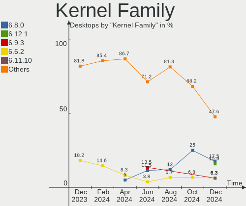
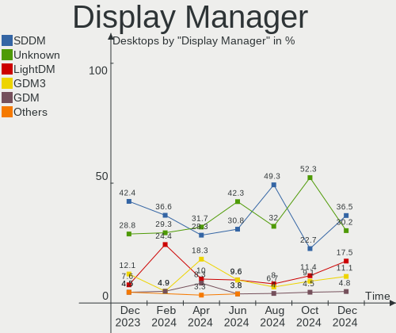
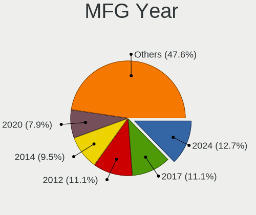
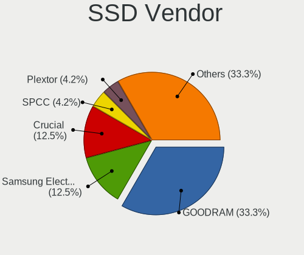
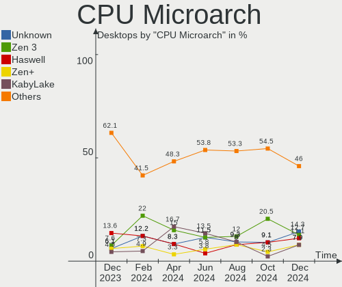
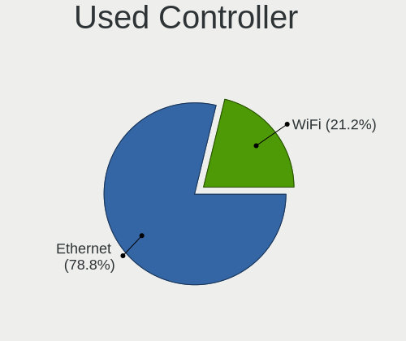
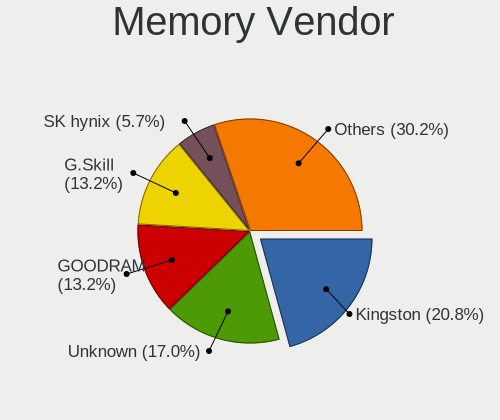
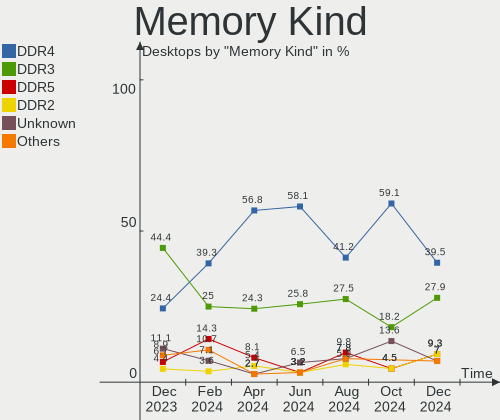
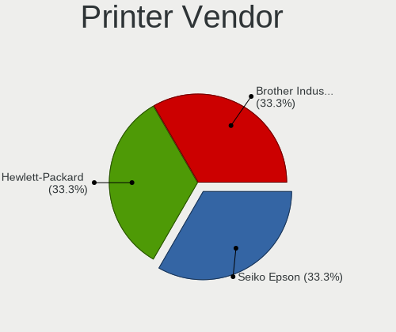
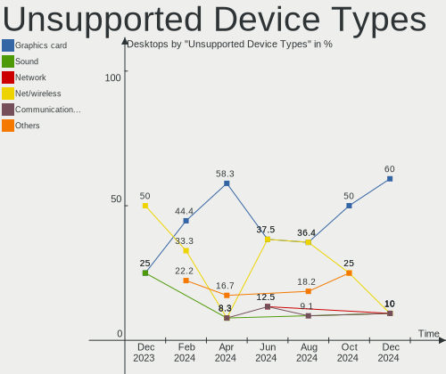

Linux in Poland - Hardware Trends (Desktops)
--------------------------------------------

A project to identify most popular hardware characteristics and track their change
over time based on data collected by Linux users at https://Linux-Hardware.org.

Anyone can contribute to this report by the [hw-probe](https://github.com/linuxhw/hw-probe) tool:

    sudo -E hw-probe -all -upload

Period: Sep, 2022.

Contents
--------

* [ System ](#system)
  - [ OS                       ](#os)
  - [ OS Family                ](#os-family)
  - [ Kernel                   ](#kernel)
  - [ Kernel Family            ](#kernel-family)
  - [ Kernel Major Ver.        ](#kernel-major-ver)
  - [ Arch                     ](#arch)
  - [ DE                       ](#de)
  - [ Display Server           ](#display-server)
  - [ Display Manager          ](#display-manager)
  - [ OS Lang                  ](#os-lang)
  - [ Boot Mode                ](#boot-mode)
  - [ Filesystem               ](#filesystem)
  - [ Part. scheme             ](#part-scheme)
  - [ Dual Boot with Linux/BSD ](#dual-boot-with-linuxbsd)
  - [ Dual Boot (Win)          ](#dual-boot-win)

* [ Board ](#board)
  - [ Vendor                   ](#vendor)
  - [ Model                    ](#model)
  - [ Model Family             ](#model-family)
  - [ MFG Year                 ](#mfg-year)
  - [ Form Factor              ](#form-factor)
  - [ Secure Boot              ](#secure-boot)
  - [ Coreboot                 ](#coreboot)
  - [ RAM Size                 ](#ram-size)
  - [ RAM Used                 ](#ram-used)
  - [ Total Drives             ](#total-drives)
  - [ Has CD-ROM               ](#has-cd-rom)
  - [ Has Ethernet             ](#has-ethernet)
  - [ Has WiFi                 ](#has-wifi)
  - [ Has Bluetooth            ](#has-bluetooth)

* [ Location ](#location)
  - [ Country                  ](#country)
  - [ City                     ](#city)

* [ Drives ](#drives)
  - [ Drive Vendor             ](#drive-vendor)
  - [ Drive Model              ](#drive-model)
  - [ HDD Vendor               ](#hdd-vendor)
  - [ SSD Vendor               ](#ssd-vendor)
  - [ Drive Kind               ](#drive-kind)
  - [ Drive Connector          ](#drive-connector)
  - [ Drive Size               ](#drive-size)
  - [ Space Total              ](#space-total)
  - [ Space Used               ](#space-used)
  - [ Malfunc. Drives          ](#malfunc-drives)
  - [ Malfunc. Drive Vendor    ](#malfunc-drive-vendor)
  - [ Malfunc. HDD Vendor      ](#malfunc-hdd-vendor)
  - [ Malfunc. Drive Kind      ](#malfunc-drive-kind)
  - [ Failed Drives            ](#failed-drives)
  - [ Failed Drive Vendor      ](#failed-drive-vendor)
  - [ Drive Status             ](#drive-status)

* [ Storage controller ](#storage-controller)
  - [ Storage Vendor           ](#storage-vendor)
  - [ Storage Model            ](#storage-model)
  - [ Storage Kind             ](#storage-kind)

* [ Processor ](#processor)
  - [ CPU Vendor               ](#cpu-vendor)
  - [ CPU Model                ](#cpu-model)
  - [ CPU Model Family         ](#cpu-model-family)
  - [ CPU Cores                ](#cpu-cores)
  - [ CPU Sockets              ](#cpu-sockets)
  - [ CPU Threads              ](#cpu-threads)
  - [ CPU Op-Modes             ](#cpu-op-modes)
  - [ CPU Microcode            ](#cpu-microcode)
  - [ CPU Microarch            ](#cpu-microarch)

* [ Graphics ](#graphics)
  - [ GPU Vendor               ](#gpu-vendor)
  - [ GPU Model                ](#gpu-model)
  - [ GPU Combo                ](#gpu-combo)
  - [ GPU Driver               ](#gpu-driver)
  - [ GPU Memory               ](#gpu-memory)

* [ Monitor ](#monitor)
  - [ Monitor Vendor           ](#monitor-vendor)
  - [ Monitor Model            ](#monitor-model)
  - [ Monitor Resolution       ](#monitor-resolution)
  - [ Monitor Diagonal         ](#monitor-diagonal)
  - [ Monitor Width            ](#monitor-width)
  - [ Aspect Ratio             ](#aspect-ratio)
  - [ Monitor Area             ](#monitor-area)
  - [ Pixel Density            ](#pixel-density)
  - [ Multiple Monitors        ](#multiple-monitors)

* [ Network ](#network)
  - [ Net Controller Vendor    ](#net-controller-vendor)
  - [ Net Controller Model     ](#net-controller-model)
  - [ Wireless Vendor          ](#wireless-vendor)
  - [ Wireless Model           ](#wireless-model)
  - [ Ethernet Vendor          ](#ethernet-vendor)
  - [ Ethernet Model           ](#ethernet-model)
  - [ Net Controller Kind      ](#net-controller-kind)
  - [ Used Controller          ](#used-controller)
  - [ NICs                     ](#nics)
  - [ IPv6                     ](#ipv6)

* [ Bluetooth ](#bluetooth)
  - [ Bluetooth Vendor         ](#bluetooth-vendor)
  - [ Bluetooth Model          ](#bluetooth-model)

* [ Sound ](#sound)
  - [ Sound Vendor             ](#sound-vendor)
  - [ Sound Model              ](#sound-model)

* [ Memory ](#memory)
  - [ Memory Vendor            ](#memory-vendor)
  - [ Memory Model             ](#memory-model)
  - [ Memory Kind              ](#memory-kind)
  - [ Memory Form Factor       ](#memory-form-factor)
  - [ Memory Size              ](#memory-size)
  - [ Memory Speed             ](#memory-speed)

* [ Printers & scanners ](#printers--scanners)
  - [ Printer Vendor           ](#printer-vendor)
  - [ Printer Model            ](#printer-model)
  - [ Scanner Vendor           ](#scanner-vendor)
  - [ Scanner Model            ](#scanner-model)

* [ Camera ](#camera)
  - [ Camera Vendor            ](#camera-vendor)
  - [ Camera Model             ](#camera-model)

* [ Security ](#security)
  - [ Fingerprint Vendor       ](#fingerprint-vendor)
  - [ Fingerprint Model        ](#fingerprint-model)
  - [ Chipcard Vendor          ](#chipcard-vendor)
  - [ Chipcard Model           ](#chipcard-model)

* [ Unsupported ](#unsupported)
  - [ Unsupported Devices      ](#unsupported-devices)
  - [ Unsupported Device Types ](#unsupported-device-types)

System
------

OS
--

Installed operating systems

| Name              | Desktops | Percent |
|-------------------|----------|---------|
| Ubuntu 22.04      | 4        | 12.12%  |
| Ubuntu 20.04      | 4        | 12.12%  |
| Gentoo 2.8        | 3        | 9.09%   |
| Pop!_OS 22.04     | 2        | 6.06%   |
| OpenMandriva 4.3  | 2        | 6.06%   |
| Linux Mint 20.3   | 2        | 6.06%   |
| Fedora 36         | 2        | 6.06%   |
| EuroLinux 9.0     | 2        | 6.06%   |
| ROSA R11.1        | 1        | 3.03%   |
| Oracle Linux 9.0  | 1        | 3.03%   |
| OpenMandriva 4.50 | 1        | 3.03%   |
| MX 21             | 1        | 3.03%   |
| Manjaro           | 1        | 3.03%   |
| Lubuntu 22.04     | 1        | 3.03%   |
| LMDE 5            | 1        | 3.03%   |
| Linux Mint 21     | 1        | 3.03%   |
| Kubuntu 22.04     | 1        | 3.03%   |
| KDE neon 22.04    | 1        | 3.03%   |
| KDE neon 20.04    | 1        | 3.03%   |
| Arch Rolling      | 1        | 3.03%   |

OS Family
---------

OS without a version

| Name         | Desktops | Percent |
|--------------|----------|---------|
| Ubuntu       | 8        | 24.24%  |
| OpenMandriva | 3        | 9.09%   |
| Linux Mint   | 3        | 9.09%   |
| Gentoo       | 3        | 9.09%   |
| Pop!_OS      | 2        | 6.06%   |
| KDE neon     | 2        | 6.06%   |
| Fedora       | 2        | 6.06%   |
| EuroLinux    | 2        | 6.06%   |
| ROSA         | 1        | 3.03%   |
| Oracle Linux | 1        | 3.03%   |
| MX           | 1        | 3.03%   |
| Manjaro      | 1        | 3.03%   |
| Lubuntu      | 1        | 3.03%   |
| LMDE         | 1        | 3.03%   |
| Kubuntu      | 1        | 3.03%   |
| Arch         | 1        | 3.03%   |

Kernel
------

Version of the Linux kernel

| Version                     | Desktops | Percent |
|-----------------------------|----------|---------|
| 5.15.0-47-generic           | 4        | 12.12%  |
| 5.15.0-48-generic           | 3        | 9.09%   |
| 5.15.0-46-generic           | 3        | 9.09%   |
| 5.19.0-76051900-generic     | 2        | 6.06%   |
| 5.16.7-desktop-1omv4003     | 2        | 6.06%   |
| 5.15.59-gentoo              | 2        | 6.06%   |
| 5.14.0-70.26.1.el9_0.x86_64 | 2        | 6.06%   |
| 5.4.83-generic-2rosa-x86_64 | 1        | 3.03%   |
| 5.4.0-126-generic           | 1        | 3.03%   |
| 5.4.0-125-generic           | 1        | 3.03%   |
| 5.19.6-arch1-1              | 1        | 3.03%   |
| 5.19.6-200.fc36.x86_64      | 1        | 3.03%   |
| 5.19.5-desktop-1omv4090     | 1        | 3.03%   |
| 5.18.19-200.fc36.x86_64     | 1        | 3.03%   |
| 5.15.68-gentoo-x86_64       | 1        | 3.03%   |
| 5.15.60-1-MANJARO           | 1        | 3.03%   |
| 5.15.0-43-generic           | 1        | 3.03%   |
| 5.15.0-2.52.3.el9uek.x86_64 | 1        | 3.03%   |
| 5.14.0-1047-oem             | 1        | 3.03%   |
| 5.13.0-30-generic           | 1        | 3.03%   |
| 5.10.0-18-amd64             | 1        | 3.03%   |
| 5.10.0-17-amd64             | 1        | 3.03%   |

Kernel Family
-------------

Linux kernel without a distro release

| Version | Desktops | Percent |
|---------|----------|---------|
| 5.15.0  | 12       | 36.36%  |
| 5.14.0  | 3        | 9.09%   |
| 5.4.0   | 2        | 6.06%   |
| 5.19.6  | 2        | 6.06%   |
| 5.19.0  | 2        | 6.06%   |
| 5.16.7  | 2        | 6.06%   |
| 5.15.59 | 2        | 6.06%   |
| 5.10.0  | 2        | 6.06%   |
| 5.4.83  | 1        | 3.03%   |
| 5.19.5  | 1        | 3.03%   |
| 5.18.19 | 1        | 3.03%   |
| 5.15.68 | 1        | 3.03%   |
| 5.15.60 | 1        | 3.03%   |
| 5.13.0  | 1        | 3.03%   |

Kernel Major Ver.
-----------------

Linux kernel major version

| Version | Desktops | Percent |
|---------|----------|---------|
| 5.15    | 16       | 48.48%  |
| 5.19    | 5        | 15.15%  |
| 5.4     | 3        | 9.09%   |
| 5.14    | 3        | 9.09%   |
| 5.16    | 2        | 6.06%   |
| 5.10    | 2        | 6.06%   |
| 5.18    | 1        | 3.03%   |
| 5.13    | 1        | 3.03%   |

Arch
----

OS architecture (x86_64, i586, etc.)

| Name   | Desktops | Percent |
|--------|----------|---------|
| x86_64 | 33       | 100%    |

DE
--

Desktop Environment

| Name       | Desktops | Percent |
|------------|----------|---------|
| GNOME      | 13       | 39.39%  |
| KDE5       | 10       | 30.3%   |
| MATE       | 4        | 12.12%  |
| X-Cinnamon | 2        | 6.06%   |
| Unknown    | 2        | 6.06%   |
| XFCE       | 1        | 3.03%   |
| LXQt       | 1        | 3.03%   |

Display Server
--------------

X11 or Wayland

| Name    | Desktops | Percent |
|---------|----------|---------|
| X11     | 27       | 81.82%  |
| Wayland | 5        | 15.15%  |
| Unknown | 1        | 3.03%   |

Display Manager
---------------

SDDM, LightDM, etc.

| Name    | Desktops | Percent |
|---------|----------|---------|
| Unknown | 14       | 42.42%  |
| GDM3    | 7        | 21.21%  |
| SDDM    | 6        | 18.18%  |
| LightDM | 4        | 12.12%  |
| KDM     | 1        | 3.03%   |
| GDM     | 1        | 3.03%   |

OS Lang
-------

Language

| Lang  | Desktops | Percent |
|-------|----------|---------|
| pl_PL | 25       | 75.76%  |
| en_US | 5        | 15.15%  |
| en_GB | 2        | 6.06%   |
| en_AG | 1        | 3.03%   |

Boot Mode
---------

EFI or BIOS

| Mode | Desktops | Percent |
|------|----------|---------|
| BIOS | 20       | 60.61%  |
| EFI  | 13       | 39.39%  |

Filesystem
----------

Type of filesystem

| Type    | Desktops | Percent |
|---------|----------|---------|
| Ext4    | 21       | 63.64%  |
| Btrfs   | 4        | 12.12%  |
| Xfs     | 3        | 9.09%   |
| Overlay | 3        | 9.09%   |
| F2fs    | 2        | 6.06%   |

Part. scheme
------------

Scheme of partitioning

| Type    | Desktops | Percent |
|---------|----------|---------|
| Unknown | 21       | 63.64%  |
| GPT     | 9        | 27.27%  |
| MBR     | 3        | 9.09%   |

Dual Boot with Linux/BSD
------------------------

Hosting more than one Linux/BSD

| Dual boot | Desktops | Percent |
|-----------|----------|---------|
| No        | 28       | 84.85%  |
| Yes       | 5        | 15.15%  |

Dual Boot (Win)
---------------

Hosting Linux and Windows

| Dual boot | Desktops | Percent |
|-----------|----------|---------|
| No        | 21       | 63.64%  |
| Yes       | 12       | 36.36%  |

Board
-----

Vendor
------

Motherboard manufacturer

| Name                | Desktops | Percent |
|---------------------|----------|---------|
| MSI                 | 7        | 21.21%  |
| ASUSTek Computer    | 7        | 21.21%  |
| Gigabyte Technology | 6        | 18.18%  |
| Dell                | 6        | 18.18%  |
| Hewlett-Packard     | 3        | 9.09%   |
| Lenovo              | 2        | 6.06%   |
| Intel               | 1        | 3.03%   |
| AMI                 | 1        | 3.03%   |

Model
-----

Motherboard model

| Name                                   | Desktops | Percent |
|----------------------------------------|----------|---------|
| ASUS PRIME X470-PRO                    | 2        | 6.06%   |
| MSI MS-7C84                            | 1        | 3.03%   |
| MSI MS-7C35                            | 1        | 3.03%   |
| MSI MS-7B86                            | 1        | 3.03%   |
| MSI MS-7B45                            | 1        | 3.03%   |
| MSI MS-7830                            | 1        | 3.03%   |
| MSI MS-7817                            | 1        | 3.03%   |
| MSI MS-7641                            | 1        | 3.03%   |
| Lenovo ThinkCentre M93p 10A90012MS     | 1        | 3.03%   |
| Lenovo Legion Y520T-25IKL 90H700C9PB   | 1        | 3.03%   |
| Intel DH61WW                           | 1        | 3.03%   |
| HP ProDesk 600 G2 MT                   | 1        | 3.03%   |
| HP Compaq dc7900 Convertible Minitower | 1        | 3.03%   |
| HP Compaq 6200 Pro SFF PC              | 1        | 3.03%   |
| Gigabyte Z97M-DS3H                     | 1        | 3.03%   |
| Gigabyte TRILINE PROFI 41G             | 1        | 3.03%   |
| Gigabyte B85M-D3H                      | 1        | 3.03%   |
| Gigabyte B560M D3H                     | 1        | 3.03%   |
| Gigabyte B450M DS3H                    | 1        | 3.03%   |
| Gigabyte AB350-Gaming                  | 1        | 3.03%   |
| Dell Precision WorkStation T5500       | 1        | 3.03%   |
| Dell Precision Tower 7810              | 1        | 3.03%   |
| Dell OptiPlex 755                      | 1        | 3.03%   |
| Dell OptiPlex 5000                     | 1        | 3.03%   |
| Dell OptiPlex 380                      | 1        | 3.03%   |
| Dell OptiPlex 3010                     | 1        | 3.03%   |
| ASUS ROG STRIX X570-I GAMING           | 1        | 3.03%   |
| ASUS PRIME B550M-K                     | 1        | 3.03%   |
| ASUS PRIME B450M-A                     | 1        | 3.03%   |
| ASUS M3A78-CM                          | 1        | 3.03%   |
| ASUS All Series                        | 1        | 3.03%   |
| AMI Narrow Box 4K                      | 1        | 3.03%   |

Model Family
------------

Motherboard model prefix

| Name                  | Desktops | Percent |
|-----------------------|----------|---------|
| Dell OptiPlex         | 4        | 12.12%  |
| ASUS PRIME            | 4        | 12.12%  |
| HP Compaq             | 2        | 6.06%   |
| Dell Precision        | 2        | 6.06%   |
| MSI MS-7C84           | 1        | 3.03%   |
| MSI MS-7C35           | 1        | 3.03%   |
| MSI MS-7B86           | 1        | 3.03%   |
| MSI MS-7B45           | 1        | 3.03%   |
| MSI MS-7830           | 1        | 3.03%   |
| MSI MS-7817           | 1        | 3.03%   |
| MSI MS-7641           | 1        | 3.03%   |
| Lenovo ThinkCentre    | 1        | 3.03%   |
| Lenovo Legion         | 1        | 3.03%   |
| Intel DH61WW          | 1        | 3.03%   |
| HP ProDesk            | 1        | 3.03%   |
| Gigabyte Z97M-DS3H    | 1        | 3.03%   |
| Gigabyte TRILINE      | 1        | 3.03%   |
| Gigabyte B85M-D3H     | 1        | 3.03%   |
| Gigabyte B560M        | 1        | 3.03%   |
| Gigabyte B450M        | 1        | 3.03%   |
| Gigabyte AB350-Gaming | 1        | 3.03%   |
| ASUS ROG              | 1        | 3.03%   |
| ASUS M3A78-CM         | 1        | 3.03%   |
| ASUS All              | 1        | 3.03%   |
| AMI Narrow            | 1        | 3.03%   |

MFG Year
--------

Motherboard manufacture year

| Year | Desktops | Percent |
|------|----------|---------|
| 2018 | 6        | 18.18%  |
| 2019 | 3        | 9.09%   |
| 2013 | 3        | 9.09%   |
| 2020 | 2        | 6.06%   |
| 2017 | 2        | 6.06%   |
| 2016 | 2        | 6.06%   |
| 2015 | 2        | 6.06%   |
| 2014 | 2        | 6.06%   |
| 2012 | 2        | 6.06%   |
| 2010 | 2        | 6.06%   |
| 2008 | 2        | 6.06%   |
| 2022 | 1        | 3.03%   |
| 2021 | 1        | 3.03%   |
| 2011 | 1        | 3.03%   |
| 2009 | 1        | 3.03%   |
| 2007 | 1        | 3.03%   |

Form Factor
-----------

Physical design of the computer

| Name    | Desktops | Percent |
|---------|----------|---------|
| Desktop | 33       | 100%    |

Secure Boot
-----------

Enabled or disabled

| State    | Desktops | Percent |
|----------|----------|---------|
| Disabled | 33       | 100%    |

Coreboot
--------

Have coreboot on board

| Used | Desktops | Percent |
|------|----------|---------|
| No   | 33       | 100%    |

RAM Size
--------

Total RAM memory

| Size in GB  | Desktops | Percent |
|-------------|----------|---------|
| 32.01-64.0  | 10       | 30.3%   |
| 4.01-8.0    | 7        | 21.21%  |
| 16.01-24.0  | 5        | 15.15%  |
| 8.01-16.0   | 5        | 15.15%  |
| 3.01-4.0    | 3        | 9.09%   |
| 1.01-2.0    | 2        | 6.06%   |
| 64.01-256.0 | 1        | 3.03%   |

RAM Used
--------

Used RAM memory

| Used GB    | Desktops | Percent |
|------------|----------|---------|
| 2.01-3.0   | 13       | 39.39%  |
| 1.01-2.0   | 8        | 24.24%  |
| 3.01-4.0   | 5        | 15.15%  |
| 4.01-8.0   | 4        | 12.12%  |
| 0.51-1.0   | 2        | 6.06%   |
| 16.01-24.0 | 1        | 3.03%   |

Total Drives
------------

Number of drives on board

| Drives | Desktops | Percent |
|--------|----------|---------|
| 2      | 12       | 36.36%  |
| 1      | 9        | 27.27%  |
| 3      | 7        | 21.21%  |
| 4      | 4        | 12.12%  |
| 6      | 1        | 3.03%   |

Has CD-ROM
----------

Has CD-ROM on board

| Presented | Desktops | Percent |
|-----------|----------|---------|
| No        | 17       | 51.52%  |
| Yes       | 16       | 48.48%  |

Has Ethernet
------------

Has Ethernet on board

| Presented | Desktops | Percent |
|-----------|----------|---------|
| Yes       | 33       | 100%    |

Has WiFi
--------

Has WiFi module

| Presented | Desktops | Percent |
|-----------|----------|---------|
| No        | 21       | 63.64%  |
| Yes       | 12       | 36.36%  |

Has Bluetooth
-------------

Has Bluetooth module

| Presented | Desktops | Percent |
|-----------|----------|---------|
| No        | 26       | 78.79%  |
| Yes       | 7        | 21.21%  |

Location
--------

Country
-------

Geographic location (country)

| Country | Desktops | Percent |
|---------|----------|---------|
| Poland  | 33       | 100%    |

City
----

Geographic location (city)

| City                 | Desktops | Percent |
|----------------------|----------|---------|
| Warsaw               | 6        | 18.18%  |
| Wroclaw              | 2        | 6.06%   |
| Gdansk               | 2        | 6.06%   |
| Częstochowa         | 2        | 6.06%   |
| Wołomin             | 1        | 3.03%   |
| Wodzisław Śląski  | 1        | 3.03%   |
| Ustrzyki Dolne       | 1        | 3.03%   |
| Szczecinek           | 1        | 3.03%   |
| Skawina              | 1        | 3.03%   |
| Rzeszów             | 1        | 3.03%   |
| Ruda Śląska        | 1        | 3.03%   |
| Piaseczno            | 1        | 3.03%   |
| Ostrów Wielkopolski | 1        | 3.03%   |
| Myszkow              | 1        | 3.03%   |
| Lublin               | 1        | 3.03%   |
| Lubin                | 1        | 3.03%   |
| Krakow               | 1        | 3.03%   |
| Kościan             | 1        | 3.03%   |
| Kielce               | 1        | 3.03%   |
| Katowice             | 1        | 3.03%   |
| Gliwice              | 1        | 3.03%   |
| Dzierzoniow          | 1        | 3.03%   |
| Debrzno              | 1        | 3.03%   |
| Brzeg                | 1        | 3.03%   |
| Boska Wola           | 1        | 3.03%   |

Drives
------

Drive Vendor
------------

Hard drive vendors

| Vendor                    | Desktops | Drives | Percent |
|---------------------------|----------|--------|---------|
| Seagate                   | 11       | 11     | 17.46%  |
| WDC                       | 8        | 11     | 12.7%   |
| GOODRAM                   | 8        | 8      | 12.7%   |
| Samsung Electronics       | 7        | 11     | 11.11%  |
| Toshiba                   | 6        | 7      | 9.52%   |
| Crucial                   | 3        | 3      | 4.76%   |
| SPCC                      | 2        | 3      | 3.17%   |
| PNY                       | 2        | 2      | 3.17%   |
| Phison Electronics        | 2        | 4      | 3.17%   |
| Apacer                    | 2        | 2      | 3.17%   |
| Valuetech                 | 1        | 1      | 1.59%   |
| Unknown                   | 1        | 1      | 1.59%   |
| SK hynix                  | 1        | 1      | 1.59%   |
| Realtek Semiconductor     | 1        | 1      | 1.59%   |
| Plextor                   | 1        | 1      | 1.59%   |
| Patriot                   | 1        | 1      | 1.59%   |
| Micron/Crucial Technology | 1        | 1      | 1.59%   |
| Lexar                     | 1        | 1      | 1.59%   |
| Kingston                  | 1        | 1      | 1.59%   |
| Hitachi                   | 1        | 3      | 1.59%   |
| China                     | 1        | 1      | 1.59%   |
| A-DATA Technology         | 1        | 1      | 1.59%   |

Drive Model
-----------

Hard drive models

| Model                                               | Desktops | Percent |
|-----------------------------------------------------|----------|---------|
| Seagate ST500DM002-1BD142 500GB                     | 3        | 4.35%   |
| GOODRAM SSDPR-CX400-256-G2 256GB                    | 3        | 4.35%   |
| Toshiba HDWD110 1TB                                 | 2        | 2.9%    |
| Toshiba DT01ACA100 1TB                              | 2        | 2.9%    |
| Samsung NVMe SSD Controller SM981/PM981/PM983 256GB | 2        | 2.9%    |
| Phison E12 NVMe Controller 1024GB                   | 2        | 2.9%    |
| GOODRAM SSDPR-CL100-480-G2 480GB                    | 2        | 2.9%    |
| WDC WDS240G2G0B-00EPW0 240GB SSD                    | 1        | 1.45%   |
| WDC WDS240G2G0A-00JH30 240GB SSD                    | 1        | 1.45%   |
| WDC WD5000AZRX-00L4HB0 500GB                        | 1        | 1.45%   |
| WDC WD5000AAKX-60U6AA0 500GB                        | 1        | 1.45%   |
| WDC WD5000AAKS-75V0A0 500GB                         | 1        | 1.45%   |
| WDC WD3200AAJS-00V4A0 320GB                         | 1        | 1.45%   |
| WDC WD2500AAJS-60M0A0 250GB                         | 1        | 1.45%   |
| WDC WD10PURZ-85U8XY0 1TB                            | 1        | 1.45%   |
| WDC WD10EZEX-08WN4A0 1TB                            | 1        | 1.45%   |
| WDC WD1002FBYS-05A6B0 1TB                           | 1        | 1.45%   |
| Valuetech SSD 128GB                                 | 1        | 1.45%   |
| Unknown 032G72  32GB                                | 1        | 1.45%   |
| Toshiba HDWE150 5TB                                 | 1        | 1.45%   |
| Toshiba HDWD130 3TB                                 | 1        | 1.45%   |
| SPCC Solid State Disk 256GB                         | 1        | 1.45%   |
| SPCC Solid State Disk 240GB                         | 1        | 1.45%   |
| SPCC M.2 SSD 256GB                                  | 1        | 1.45%   |
| SK hynix PC801 NVMe 512GB                           | 1        | 1.45%   |
| Seagate ST9320325AS 320GB                           | 1        | 1.45%   |
| Seagate ST500LT012-9WS142 500GB                     | 1        | 1.45%   |
| Seagate ST4000DM004-2CV104 4TB                      | 1        | 1.45%   |
| Seagate ST3320620NS 320GB                           | 1        | 1.45%   |
| Seagate ST2000DM006-2DM164 2TB                      | 1        | 1.45%   |
| Seagate ST12000NM0008-2H3101 12TB                   | 1        | 1.45%   |
| Seagate ST1000DM010-2EP102 1TB                      | 1        | 1.45%   |
| Seagate ST1000DM003-1CH162 1TB                      | 1        | 1.45%   |
| Samsung SSD 970 EVO Plus 500GB                      | 1        | 1.45%   |
| Samsung SSD 860 EVO 1TB                             | 1        | 1.45%   |
| Samsung SSD 850 EVO 250GB                           | 1        | 1.45%   |
| Samsung SSD 840 EVO 250GB                           | 1        | 1.45%   |
| Samsung NVMe SSD Drive 500GB                        | 1        | 1.45%   |
| Samsung NVMe SSD Drive 1TB                          | 1        | 1.45%   |
| Samsung HD753LJ 752GB                               | 1        | 1.45%   |

HDD Vendor
----------

Hard disk drive vendors

| Vendor              | Desktops | Drives | Percent |
|---------------------|----------|--------|---------|
| Seagate             | 11       | 11     | 42.31%  |
| WDC                 | 6        | 9      | 23.08%  |
| Toshiba             | 6        | 7      | 23.08%  |
| Samsung Electronics | 2        | 2      | 7.69%   |
| Hitachi             | 1        | 3      | 3.85%   |

SSD Vendor
----------

Solid state drive vendors

| Vendor              | Desktops | Drives | Percent |
|---------------------|----------|--------|---------|
| GOODRAM             | 8        | 8      | 28.57%  |
| Samsung Electronics | 3        | 3      | 10.71%  |
| Crucial             | 3        | 3      | 10.71%  |
| WDC                 | 2        | 2      | 7.14%   |
| SPCC                | 2        | 3      | 7.14%   |
| PNY                 | 2        | 2      | 7.14%   |
| Apacer              | 2        | 2      | 7.14%   |
| Valuetech           | 1        | 1      | 3.57%   |
| Plextor             | 1        | 1      | 3.57%   |
| Patriot             | 1        | 1      | 3.57%   |
| Lexar               | 1        | 1      | 3.57%   |
| China               | 1        | 1      | 3.57%   |
| A-DATA Technology   | 1        | 1      | 3.57%   |

Drive Kind
----------

HDD or SSD

| Kind | Desktops | Drives | Percent |
|------|----------|--------|---------|
| SSD  | 23       | 29     | 42.59%  |
| HDD  | 21       | 32     | 38.89%  |
| NVMe | 9        | 14     | 16.67%  |
| MMC  | 1        | 1      | 1.85%   |

Drive Connector
---------------

SATA, SAS, NVMe, etc.

| Type | Desktops | Drives | Percent |
|------|----------|--------|---------|
| SATA | 28       | 61     | 73.68%  |
| NVMe | 9        | 14     | 23.68%  |
| MMC  | 1        | 1      | 2.63%   |

Drive Size
----------

Size of hard drive

| Size in TB | Desktops | Drives | Percent |
|------------|----------|--------|---------|
| 0.01-0.5   | 24       | 37     | 58.54%  |
| 0.51-1.0   | 11       | 15     | 26.83%  |
| 2.01-3.0   | 2        | 5      | 4.88%   |
| 3.01-4.0   | 1        | 1      | 2.44%   |
| 10.01-20.0 | 1        | 1      | 2.44%   |
| 1.01-2.0   | 1        | 1      | 2.44%   |
| 4.01-10.0  | 1        | 1      | 2.44%   |

Space Total
-----------

Amount of disk space available on the file system

| Size in GB     | Desktops | Percent |
|----------------|----------|---------|
| 101-250        | 11       | 33.33%  |
| 251-500        | 6        | 18.18%  |
| More than 3000 | 4        | 12.12%  |
| 1001-2000      | 4        | 12.12%  |
| 501-1000       | 4        | 12.12%  |
| 21-50          | 1        | 3.03%   |
| 2001-3000      | 1        | 3.03%   |
| 1-20           | 1        | 3.03%   |
| Unknown        | 1        | 3.03%   |

Space Used
----------

Amount of used disk space

| Used GB        | Desktops | Percent |
|----------------|----------|---------|
| 1-20           | 11       | 33.33%  |
| More than 3000 | 4        | 12.12%  |
| 101-250        | 4        | 12.12%  |
| 251-500        | 3        | 9.09%   |
| 21-50          | 3        | 9.09%   |
| 51-100         | 3        | 9.09%   |
| 1001-2000      | 2        | 6.06%   |
| 501-1000       | 2        | 6.06%   |
| Unknown        | 1        | 3.03%   |

Malfunc. Drives
---------------

Drive models with a malfunction

| Model                           | Desktops | Drives | Percent |
|---------------------------------|----------|--------|---------|
| Seagate ST500LT012-9WS142 500GB | 1        | 1      | 25%     |
| Seagate ST500DM002-1BD142 500GB | 1        | 1      | 25%     |
| Seagate ST1000DM010-2EP102 1TB  | 1        | 1      | 25%     |
| Apacer AS350 120GB SSD          | 1        | 1      | 25%     |

Malfunc. Drive Vendor
---------------------

Vendors of faulty drives

| Vendor  | Desktops | Drives | Percent |
|---------|----------|--------|---------|
| Seagate | 3        | 3      | 75%     |
| Apacer  | 1        | 1      | 25%     |

Malfunc. HDD Vendor
-------------------

Vendors of faulty HDD drives

| Vendor  | Desktops | Drives | Percent |
|---------|----------|--------|---------|
| Seagate | 3        | 3      | 100%    |

Malfunc. Drive Kind
-------------------

Kinds of faulty drives

| Kind | Desktops | Drives | Percent |
|------|----------|--------|---------|
| HDD  | 3        | 3      | 75%     |
| SSD  | 1        | 1      | 25%     |

Failed Drives
-------------

Failed drive models

Zero info for selected period =(

Failed Drive Vendor
-------------------

Failed drive vendors

Zero info for selected period =(

Drive Status
------------

Number of failed and malfunc. drives

| Status   | Desktops | Drives | Percent |
|----------|----------|--------|---------|
| Detected | 20       | 42     | 55.56%  |
| Works    | 12       | 30     | 33.33%  |
| Malfunc  | 4        | 4      | 11.11%  |

Storage controller
------------------

Storage Vendor
--------------

Storage controller vendors

| Vendor                      | Desktops | Percent |
|-----------------------------|----------|---------|
| Intel                       | 20       | 45.45%  |
| AMD                         | 11       | 25%     |
| Samsung Electronics         | 5        | 11.36%  |
| Phison Electronics          | 2        | 4.55%   |
| SK hynix                    | 1        | 2.27%   |
| Silicon Image               | 1        | 2.27%   |
| Realtek Semiconductor       | 1        | 2.27%   |
| Micron/Crucial Technology   | 1        | 2.27%   |
| Kingston Technology Company | 1        | 2.27%   |
| ASMedia Technology          | 1        | 2.27%   |

Storage Model
-------------

Storage controller models

| Model                                                                          | Desktops | Percent |
|--------------------------------------------------------------------------------|----------|---------|
| AMD FCH SATA Controller [AHCI mode]                                            | 9        | 15.79%  |
| AMD 400 Series Chipset SATA Controller                                         | 5        | 8.77%   |
| Intel 8 Series/C220 Series Chipset Family 6-port SATA Controller 1 [AHCI mode] | 4        | 7.02%   |
| Samsung NVMe SSD Controller SM981/PM981/PM983                                  | 3        | 5.26%   |
| Intel 6 Series/C200 Series Chipset Family 6 port Desktop SATA AHCI Controller  | 3        | 5.26%   |
| Phison E12 NVMe Controller                                                     | 2        | 3.51%   |
| Intel SATA Controller [RAID mode]                                              | 2        | 3.51%   |
| Intel NM10/ICH7 Family SATA Controller [IDE mode]                              | 2        | 3.51%   |
| Intel 9 Series Chipset Family SATA Controller [AHCI Mode]                      | 2        | 3.51%   |
| AMD SB7x0/SB8x0/SB9x0 SATA Controller [IDE mode]                               | 2        | 3.51%   |
| AMD SB7x0/SB8x0/SB9x0 IDE Controller                                           | 2        | 3.51%   |
| SK hynix Non-Volatile memory controller                                        | 1        | 1.75%   |
| Silicon Image SiI 3132 Serial ATA Raid II Controller                           | 1        | 1.75%   |
| Samsung NVMe SSD Controller PM9A1/PM9A3/980PRO                                 | 1        | 1.75%   |
| Samsung NVMe SSD Controller 980                                                | 1        | 1.75%   |
| Realtek RTS5763DL NVMe SSD Controller                                          | 1        | 1.75%   |
| Micron/Crucial P1 NVMe PCIe SSD                                                | 1        | 1.75%   |
| Kingston Company A2000 NVMe SSD                                                | 1        | 1.75%   |
| Intel Q170/Q150/B150/H170/H110/Z170/CM236 Chipset SATA Controller [AHCI Mode]  | 1        | 1.75%   |
| Intel C610/X99 series chipset sSATA Controller [AHCI mode]                     | 1        | 1.75%   |
| Intel C610/X99 series chipset IDE-r Controller                                 | 1        | 1.75%   |
| Intel C610/X99 series chipset 6-Port SATA Controller [AHCI mode]               | 1        | 1.75%   |
| Intel Alder Lake-S PCH SATA Controller [AHCI Mode]                             | 1        | 1.75%   |
| Intel 82Q35 Express PT IDER Controller                                         | 1        | 1.75%   |
| Intel 82801JD/DO (ICH10 Family) SATA AHCI Controller                           | 1        | 1.75%   |
| Intel 82801IR/IO/IH (ICH9R/DO/DH) 6 port SATA Controller [AHCI mode]           | 1        | 1.75%   |
| Intel 82801G (ICH7 Family) IDE Controller                                      | 1        | 1.75%   |
| Intel 500 Series Chipset Family SATA AHCI Controller                           | 1        | 1.75%   |
| Intel 4 Series Chipset PT IDER Controller                                      | 1        | 1.75%   |
| Intel 200 Series PCH SATA controller [AHCI mode]                               | 1        | 1.75%   |
| ASMedia ASM1062 Serial ATA Controller                                          | 1        | 1.75%   |
| AMD 300 Series Chipset SATA Controller                                         | 1        | 1.75%   |

Storage Kind
------------

Kind of storage controller (IDE, SATA, NVMe, SAS, ...)

| Kind | Desktops | Percent |
|------|----------|---------|
| SATA | 27       | 58.7%   |
| NVMe | 9        | 19.57%  |
| IDE  | 7        | 15.22%  |
| RAID | 3        | 6.52%   |

Processor
---------

CPU Vendor
----------

Processor vendors

| Vendor | Desktops | Percent |
|--------|----------|---------|
| Intel  | 21       | 63.64%  |
| AMD    | 12       | 36.36%  |

CPU Model
---------

Processor models

| Model                                  | Desktops | Percent |
|----------------------------------------|----------|---------|
| AMD Ryzen 7 3700X 8-Core Processor     | 2        | 6.06%   |
| AMD Ryzen 5 3600 6-Core Processor      | 2        | 6.06%   |
| Intel Xeon CPU X5650 @ 2.67GHz         | 1        | 3.03%   |
| Intel Xeon CPU E5-2660 v3 @ 2.60GHz    | 1        | 3.03%   |
| Intel Pentium Dual CPU E2200 @ 2.20GHz | 1        | 3.03%   |
| Intel Pentium CPU G630 @ 2.70GHz       | 1        | 3.03%   |
| Intel Core i7-4790K CPU @ 4.00GHz      | 1        | 3.03%   |
| Intel Core i5-8600K CPU @ 3.60GHz      | 1        | 3.03%   |
| Intel Core i5-7400 CPU @ 3.00GHz       | 1        | 3.03%   |
| Intel Core i5-6500 CPU @ 3.20GHz       | 1        | 3.03%   |
| Intel Core i5-4690K CPU @ 3.50GHz      | 1        | 3.03%   |
| Intel Core i5-4690 CPU @ 3.50GHz       | 1        | 3.03%   |
| Intel Core i5-4460 CPU @ 3.20GHz       | 1        | 3.03%   |
| Intel Core i5-3470 CPU @ 3.20GHz       | 1        | 3.03%   |
| Intel Core i5-2400 CPU @ 3.10GHz       | 1        | 3.03%   |
| Intel Core i3-4360 CPU @ 3.70GHz       | 1        | 3.03%   |
| Intel Core i3-4160 CPU @ 3.60GHz       | 1        | 3.03%   |
| Intel Core 2 Quad CPU Q6600 @ 2.40GHz  | 1        | 3.03%   |
| Intel Core 2 Duo CPU E8400 @ 3.00GHz   | 1        | 3.03%   |
| Intel Core 2 Duo CPU E7600 @ 3.06GHz   | 1        | 3.03%   |
| Intel Atom x5-Z8300 CPU @ 1.44GHz      | 1        | 3.03%   |
| Intel 12th Gen Core i7-12700           | 1        | 3.03%   |
| Intel 11th Gen Core i5-11400 @ 2.60GHz | 1        | 3.03%   |
| AMD Ryzen 9 3900X 12-Core Processor    | 1        | 3.03%   |
| AMD Ryzen 7 5800X 8-Core Processor     | 1        | 3.03%   |
| AMD Ryzen 7 2700X Eight-Core Processor | 1        | 3.03%   |
| AMD Ryzen 7 2700 Eight-Core Processor  | 1        | 3.03%   |
| AMD Ryzen 7 1800X Eight-Core Processor | 1        | 3.03%   |
| AMD Ryzen 5 2600 Six-Core Processor    | 1        | 3.03%   |
| AMD Phenom II X4 965 Processor         | 1        | 3.03%   |
| AMD Phenom II X4 955 Processor         | 1        | 3.03%   |

CPU Model Family
----------------

Processor model prefix

| Model              | Desktops | Percent |
|--------------------|----------|---------|
| Intel Core i5      | 8        | 24.24%  |
| AMD Ryzen 7        | 6        | 18.18%  |
| AMD Ryzen 5        | 3        | 9.09%   |
| Other              | 2        | 6.06%   |
| Intel Xeon         | 2        | 6.06%   |
| Intel Core i3      | 2        | 6.06%   |
| Intel Core 2 Duo   | 2        | 6.06%   |
| AMD Phenom II X4   | 2        | 6.06%   |
| Intel Pentium Dual | 1        | 3.03%   |
| Intel Pentium      | 1        | 3.03%   |
| Intel Core i7      | 1        | 3.03%   |
| Intel Core 2 Quad  | 1        | 3.03%   |
| Intel Atom         | 1        | 3.03%   |
| AMD Ryzen 9        | 1        | 3.03%   |

CPU Cores
---------

Number of processor cores

| Number | Desktops | Percent |
|--------|----------|---------|
| 4      | 12       | 36.36%  |
| 8      | 6        | 18.18%  |
| 2      | 6        | 18.18%  |
| 6      | 5        | 15.15%  |
| 12     | 3        | 9.09%   |
| 20     | 1        | 3.03%   |

CPU Sockets
-----------

Number of sockets

| Number | Desktops | Percent |
|--------|----------|---------|
| 1      | 31       | 93.94%  |
| 2      | 2        | 6.06%   |

CPU Threads
-----------

Threads per core (Hyper-Threading)

| Number | Desktops | Percent |
|--------|----------|---------|
| 1      | 17       | 51.52%  |
| 2      | 16       | 48.48%  |

CPU Op-Modes
------------

CPU Operation Modes (32-bit, 64-bit)

| Op mode        | Desktops | Percent |
|----------------|----------|---------|
| 32-bit, 64-bit | 33       | 100%    |

CPU Microcode
-------------

Microcode number

| Number     | Desktops | Percent |
|------------|----------|---------|
| Unknown    | 11       | 33.33%  |
| 0x306c3    | 3        | 9.09%   |
| 0x206a7    | 2        | 6.06%   |
| 0x08701021 | 2        | 6.06%   |
| 0x0800820d | 2        | 6.06%   |
| 0x906ea    | 1        | 3.03%   |
| 0x906e9    | 1        | 3.03%   |
| 0x6fb      | 1        | 3.03%   |
| 0x506e3    | 1        | 3.03%   |
| 0x306f2    | 1        | 3.03%   |
| 0x306a9    | 1        | 3.03%   |
| 0x206c2    | 1        | 3.03%   |
| 0x1067a    | 1        | 3.03%   |
| 0x0a201009 | 1        | 3.03%   |
| 0x08701013 | 1        | 3.03%   |
| 0x08001138 | 1        | 3.03%   |
| 0x010000db | 1        | 3.03%   |
| 0x010000c8 | 1        | 3.03%   |

CPU Microarch
-------------

Microarchitecture

| Name        | Desktops | Percent |
|-------------|----------|---------|
| Haswell     | 7        | 21.21%  |
| Zen 2       | 5        | 15.15%  |
| Zen+        | 3        | 9.09%   |
| SandyBridge | 2        | 6.06%   |
| Penryn      | 2        | 6.06%   |
| KabyLake    | 2        | 6.06%   |
| K10         | 2        | 6.06%   |
| Core        | 2        | 6.06%   |
| Unknown     | 2        | 6.06%   |
| Zen 3       | 1        | 3.03%   |
| Zen         | 1        | 3.03%   |
| Westmere    | 1        | 3.03%   |
| Skylake     | 1        | 3.03%   |
| Silvermont  | 1        | 3.03%   |
| IvyBridge   | 1        | 3.03%   |

Graphics
--------

GPU Vendor
----------

Vendors of graphics cards

| Vendor | Desktops | Percent |
|--------|----------|---------|
| Nvidia | 17       | 45.95%  |
| Intel  | 12       | 32.43%  |
| AMD    | 8        | 21.62%  |

GPU Model
---------

Graphics card models

| Model                                                                                    | Desktops | Percent |
|------------------------------------------------------------------------------------------|----------|---------|
| Intel Xeon E3-1200 v3/4th Gen Core Processor Integrated Graphics Controller              | 3        | 8.11%   |
| Intel 4 Series Chipset Integrated Graphics Controller                                    | 3        | 8.11%   |
| Nvidia TU106 [GeForce RTX 2060 Rev. A]                                                   | 2        | 5.41%   |
| Nvidia GP108 [GeForce GT 1030]                                                           | 2        | 5.41%   |
| Nvidia GP106 [GeForce GTX 1060 6GB]                                                      | 2        | 5.41%   |
| Nvidia TU104 [GeForce RTX 2070 SUPER]                                                    | 1        | 2.7%    |
| Nvidia GP107 [GeForce GTX 1050]                                                          | 1        | 2.7%    |
| Nvidia GP107 [GeForce GTX 1050 Ti]                                                       | 1        | 2.7%    |
| Nvidia GP104 [GeForce GTX 1080]                                                          | 1        | 2.7%    |
| Nvidia GP102 [GeForce GTX 1080 Ti]                                                       | 1        | 2.7%    |
| Nvidia GM206GL [Quadro M2000]                                                            | 1        | 2.7%    |
| Nvidia GK107 [GeForce GTX 650]                                                           | 1        | 2.7%    |
| Nvidia GK104GL [Quadro K4200]                                                            | 1        | 2.7%    |
| Nvidia GF116 [GeForce GTX 550 Ti]                                                        | 1        | 2.7%    |
| Nvidia GA104 [GeForce RTX 3070]                                                          | 1        | 2.7%    |
| Nvidia G98 [GeForce 8400 GS Rev. 2]                                                      | 1        | 2.7%    |
| Intel HD Graphics 630                                                                    | 1        | 2.7%    |
| Intel HD Graphics 530                                                                    | 1        | 2.7%    |
| Intel Atom/Celeron/Pentium Processor x5-E8000/J3xxx/N3xxx Integrated Graphics Controller | 1        | 2.7%    |
| Intel AlderLake-S GT1                                                                    | 1        | 2.7%    |
| Intel 82Q35 Express Integrated Graphics Controller                                       | 1        | 2.7%    |
| Intel 4th Generation Core Processor Family Integrated Graphics Controller                | 1        | 2.7%    |
| AMD RS780C [Radeon 3100]                                                                 | 1        | 2.7%    |
| AMD Pitcairn PRO [Radeon HD 7850 / R7 265 / R9 270 1024SP]                               | 1        | 2.7%    |
| AMD Navi 24 [Radeon RX 6400 / 6500 XT]                                                   | 1        | 2.7%    |
| AMD Lexa XT [Radeon PRO WX 2100]                                                         | 1        | 2.7%    |
| AMD Ellesmere [Radeon RX 470/480/570/570X/580/580X/590]                                  | 1        | 2.7%    |
| AMD Cedar [Radeon HD 5000/6000/7350/8350 Series]                                         | 1        | 2.7%    |
| AMD Cape Verde XT [Radeon HD 7770/8760 / R7 250X]                                        | 1        | 2.7%    |
| AMD Caicos XT [Radeon HD 7470/8470 / R5 235/310 OEM]                                     | 1        | 2.7%    |

GPU Combo
---------

Combinations of graphics cards

| Name           | Desktops | Percent |
|----------------|----------|---------|
| 1 x Nvidia     | 16       | 48.48%  |
| 1 x Intel      | 8        | 24.24%  |
| 1 x AMD        | 7        | 21.21%  |
| Intel + Nvidia | 1        | 3.03%   |
| Intel + AMD    | 1        | 3.03%   |

GPU Driver
----------

Free vs proprietary

| Driver      | Desktops | Percent |
|-------------|----------|---------|
| Free        | 18       | 54.55%  |
| Proprietary | 14       | 42.42%  |
| Unknown     | 1        | 3.03%   |

GPU Memory
----------

Total video memory

| Size in GB | Desktops | Percent |
|------------|----------|---------|
| Unknown    | 12       | 36.36%  |
| 0.51-1.0   | 5        | 15.15%  |
| 3.01-4.0   | 4        | 12.12%  |
| 1.01-2.0   | 4        | 12.12%  |
| 7.01-8.0   | 3        | 9.09%   |
| 5.01-6.0   | 3        | 9.09%   |
| 0.01-0.5   | 2        | 6.06%   |

Monitor
-------

Monitor Vendor
--------------

Monitor vendors

| Vendor              | Desktops | Percent |
|---------------------|----------|---------|
| Samsung Electronics | 8        | 25%     |
| Goldstar            | 4        | 12.5%   |
| Iiyama              | 3        | 9.38%   |
| Dell                | 3        | 9.38%   |
| AOC                 | 3        | 9.38%   |
| Philips             | 2        | 6.25%   |
| LG Electronics      | 2        | 6.25%   |
| MStar               | 1        | 3.13%   |
| Hewlett-Packard     | 1        | 3.13%   |
| Gateway             | 1        | 3.13%   |
| Eizo                | 1        | 3.13%   |
| DENON               | 1        | 3.13%   |
| BenQ                | 1        | 3.13%   |
| Acer                | 1        | 3.13%   |

Monitor Model
-------------

Monitor models

| Model                                                                   | Desktops | Percent |
|-------------------------------------------------------------------------|----------|---------|
| Goldstar ULTRAWIDE GSM59F1 2560x1080 673x284mm 28.8-inch                | 2        | 5.71%   |
| Samsung Electronics SyncMaster SAM0352 1680x1050 459x296mm 21.5-inch    | 1        | 2.86%   |
| Samsung Electronics SMXL2370HD SAM0729 1920x1080 510x290mm 23.1-inch    | 1        | 2.86%   |
| Samsung Electronics S22B300 SAM08C8 1920x1080 477x268mm 21.5-inch       | 1        | 2.86%   |
| Samsung Electronics S/T 77E/76E STN0005 1280x1024 312x234mm 15.4-inch   | 1        | 2.86%   |
| Samsung Electronics LCD Monitor SME1920W 1440x900                       | 1        | 2.86%   |
| Samsung Electronics LCD Monitor SAM7016 3840x2160 1872x1053mm 84.6-inch | 1        | 2.86%   |
| Samsung Electronics LCD Monitor SAM0E88 3840x2160 1872x1053mm 84.6-inch | 1        | 2.86%   |
| Samsung Electronics C27F591 SAM0D36 1920x1080 598x336mm 27.0-inch       | 1        | 2.86%   |
| Philips PHL 349X7 PHLC149 3440x1440 800x330mm 34.1-inch                 | 1        | 2.86%   |
| Philips PHL 346P1C PHL093F 3440x1440 797x334mm 34.0-inch                | 1        | 2.86%   |
| MStar Demo MST0030 1920x1080 708x398mm 32.0-inch                        | 1        | 2.86%   |
| LG Electronics LCD Monitor W1943 3280x1080                              | 1        | 2.86%   |
| LG Electronics LCD Monitor LG HDR 4K                                    | 1        | 2.86%   |
| Iiyama PLX2481H IVM611D 1920x1080 520x290mm 23.4-inch                   | 1        | 2.86%   |
| Iiyama PLE430 IVM46B4 1280x1024 340x270mm 17.1-inch                     | 1        | 2.86%   |
| Iiyama PL2530H IVM6133 1920x1080 544x303mm 24.5-inch                    | 1        | 2.86%   |
| Hewlett-Packard E232 HWP327A 1920x1080 509x286mm 23.0-inch              | 1        | 2.86%   |
| Goldstar M2394D GSM56C4 1920x1080 510x280mm 22.9-inch                   | 1        | 2.86%   |
| Goldstar L192WS GSM4B32 1440x900 410x256mm 19.0-inch                    | 1        | 2.86%   |
| Goldstar 27GL650F GSM5B71 1920x1080 597x336mm 27.0-inch                 | 1        | 2.86%   |
| Gateway FPD1730 GWY06CB 1280x1024 338x270mm 17.0-inch                   | 1        | 2.86%   |
| Eizo EV2455 ENC2569 1920x1200 519x324mm 24.1-inch                       | 1        | 2.86%   |
| Eizo EV2455 ENC2534 1920x1200 519x324mm 24.1-inch                       | 1        | 2.86%   |
| DENON AVR DON0035 1920x1080 500x281mm 22.6-inch                         | 1        | 2.86%   |
| Dell U4320Q DEL41D2 3840x2160 941x529mm 42.5-inch                       | 1        | 2.86%   |
| Dell P2417H DELA0DB 1920x1080 527x296mm 23.8-inch                       | 1        | 2.86%   |
| Dell E198FP DELA028 1280x1024 376x301mm 19.0-inch                       | 1        | 2.86%   |
| BenQ LCD Monitor XL2420Z 3280x1080                                      | 1        | 2.86%   |
| AOC Q3279WG5B AOC3279 2560x1440 725x428mm 33.1-inch                     | 1        | 2.86%   |
| AOC LCD Monitor 2270W 3840x1080                                         | 1        | 2.86%   |
| AOC LCD Monitor 2260WG5                                                 | 1        | 2.86%   |
| AOC 24B2W1G5 AOC2402 1920x1080 527x296mm 23.8-inch                      | 1        | 2.86%   |
| Acer VG240Y ACR06BF 1920x1080 527x296mm 23.8-inch                       | 1        | 2.86%   |

Monitor Resolution
------------------

Monitor screen resolution

| Resolution         | Desktops | Percent |
|--------------------|----------|---------|
| 1920x1080 (FHD)    | 13       | 38.24%  |
| 3840x2160 (4K)     | 4        | 11.76%  |
| 1280x1024 (SXGA)   | 4        | 11.76%  |
| 3440x1440          | 2        | 5.88%   |
| 2560x1080          | 2        | 5.88%   |
| 1440x900 (WXGA+)   | 2        | 5.88%   |
| Unknown            | 2        | 5.88%   |
| 3840x1080          | 1        | 2.94%   |
| 3280x1080          | 1        | 2.94%   |
| 2560x1440 (QHD)    | 1        | 2.94%   |
| 1920x1200 (WUXGA)  | 1        | 2.94%   |
| 1680x1050 (WSXGA+) | 1        | 2.94%   |

Monitor Diagonal
----------------

Diagonal size in inches

| Inches  | Desktops | Percent |
|---------|----------|---------|
| 23      | 5        | 15.63%  |
| 34      | 4        | 12.5%   |
| 24      | 4        | 12.5%   |
| Unknown | 4        | 12.5%   |
| 84      | 2        | 6.25%   |
| 27      | 2        | 6.25%   |
| 21      | 2        | 6.25%   |
| 19      | 2        | 6.25%   |
| 17      | 2        | 6.25%   |
| 54      | 1        | 3.13%   |
| 52      | 1        | 3.13%   |
| 42      | 1        | 3.13%   |
| 33      | 1        | 3.13%   |
| 15      | 1        | 3.13%   |

Monitor Width
-------------

Physical width

| Width in mm | Desktops | Percent |
|-------------|----------|---------|
| 501-600     | 11       | 34.38%  |
| 701-800     | 5        | 15.63%  |
| Unknown     | 4        | 12.5%   |
| 401-500     | 3        | 9.38%   |
| 301-350     | 3        | 9.38%   |
| 1501-2000   | 2        | 6.25%   |
| 1001-1500   | 2        | 6.25%   |
| 351-400     | 1        | 3.13%   |
| 901-1000    | 1        | 3.13%   |

Aspect Ratio
------------

Proportional relationship between the width and the height

| Ratio   | Desktops | Percent |
|---------|----------|---------|
| 16/9    | 16       | 51.61%  |
| 21/9    | 4        | 12.9%   |
| Unknown | 4        | 12.9%   |
| 5/4     | 3        | 9.68%   |
| 16/10   | 3        | 9.68%   |
| 4/3     | 1        | 3.23%   |

Monitor Area
------------

Area in inch²

| Area in inch² | Desktops | Percent |
|----------------|----------|---------|
| 201-250        | 9        | 28.13%  |
| 351-500        | 5        | 15.63%  |
| More than 1000 | 4        | 12.5%   |
| Unknown        | 4        | 12.5%   |
| 301-350        | 2        | 6.25%   |
| 251-300        | 2        | 6.25%   |
| 151-200        | 2        | 6.25%   |
| 141-150        | 2        | 6.25%   |
| 111-120        | 1        | 3.13%   |
| 501-1000       | 1        | 3.13%   |

Pixel Density
-------------

Pixels per inch

| Density | Desktops | Percent |
|---------|----------|---------|
| 51-100  | 20       | 64.52%  |
| 101-120 | 5        | 16.13%  |
| Unknown | 4        | 12.9%   |
| 1-50    | 2        | 6.45%   |

Multiple Monitors
-----------------

Total monitors connected

| Total | Desktops | Percent |
|-------|----------|---------|
| 1     | 26       | 78.79%  |
| 2     | 5        | 15.15%  |
| 0     | 2        | 6.06%   |

Network
-------

Net Controller Vendor
---------------------

Controller vendors

| Vendor                                 | Desktops | Percent |
|----------------------------------------|----------|---------|
| Realtek Semiconductor                  | 21       | 42%     |
| Intel                                  | 17       | 34%     |
| TP-Link                                | 3        | 6%      |
| Broadcom                               | 3        | 6%      |
| Samsung Electronics                    | 2        | 4%      |
| Xiaomi                                 | 1        | 2%      |
| Sony Ericsson Mobile Communications AB | 1        | 2%      |
| Ralink Technology                      | 1        | 2%      |
| Huawei Technologies                    | 1        | 2%      |

Net Controller Model
--------------------

Controller models

| Model                                                             | Desktops | Percent |
|-------------------------------------------------------------------|----------|---------|
| Realtek RTL8111/8168/8411 PCI Express Gigabit Ethernet Controller | 14       | 25.45%  |
| Intel Wi-Fi 6 AX200                                               | 4        | 7.27%   |
| Intel I211 Gigabit Network Connection                             | 4        | 7.27%   |
| Samsung Galaxy series, misc. (tethering mode)                     | 2        | 3.64%   |
| Realtek RTL8153 Gigabit Ethernet Adapter                          | 2        | 3.64%   |
| Realtek RTL8125 2.5GbE Controller                                 | 2        | 3.64%   |
| Intel Ethernet Connection I217-LM                                 | 2        | 3.64%   |
| Xiaomi Mi/Redmi series (RNDIS)                                    | 1        | 1.82%   |
| TP-Link TL-WN823N v2/v3 [Realtek RTL8192EU]                       | 1        | 1.82%   |
| TP-Link TL-WN822N Version 4 RTL8192EU                             | 1        | 1.82%   |
| TP-Link Archer T3U [Realtek RTL8812BU]                            | 1        | 1.82%   |
| Sony Ericsson Mobile AB F5321                                     | 1        | 1.82%   |
| Realtek RTL8821CE 802.11ac PCIe Wireless Network Adapter          | 1        | 1.82%   |
| Realtek RTL8812AU 802.11a/b/g/n/ac 2T2R DB WLAN Adapter           | 1        | 1.82%   |
| Realtek RTL8188FTV 802.11b/g/n 1T1R 2.4G WLAN Adapter             | 1        | 1.82%   |
| Realtek RTL8188EUS 802.11n Wireless Network Adapter               | 1        | 1.82%   |
| Realtek 802.11ac NIC                                              | 1        | 1.82%   |
| Ralink MT7601U Wireless Adapter                                   | 1        | 1.82%   |
| Intel I210 Gigabit Network Connection                             | 1        | 1.82%   |
| Intel Ethernet Connection (2) I219-V                              | 1        | 1.82%   |
| Intel Ethernet Connection (2) I219-LM                             | 1        | 1.82%   |
| Intel Ethernet Connection (2) I218-V                              | 1        | 1.82%   |
| Intel Ethernet Connection (17) I219-LM                            | 1        | 1.82%   |
| Intel Ethernet Connection (14) I219-V                             | 1        | 1.82%   |
| Intel 82579V Gigabit Network Connection                           | 1        | 1.82%   |
| Intel 82579LM Gigabit Network Connection (Lewisville)             | 1        | 1.82%   |
| Intel 82567LM-3 Gigabit Network Connection                        | 1        | 1.82%   |
| Intel 82566DM-2 Gigabit Network Connection                        | 1        | 1.82%   |
| Huawei Modem/Networkcard                                          | 1        | 1.82%   |
| Broadcom NetXtreme BCM5761 Gigabit Ethernet PCIe                  | 1        | 1.82%   |
| Broadcom NetXtreme BCM5752 Gigabit Ethernet PCI Express           | 1        | 1.82%   |
| Broadcom NetLink BCM57780 Gigabit Ethernet PCIe                   | 1        | 1.82%   |

Wireless Vendor
---------------

Wireless vendors

| Vendor                | Desktops | Percent |
|-----------------------|----------|---------|
| Realtek Semiconductor | 5        | 38.46%  |
| Intel                 | 4        | 30.77%  |
| TP-Link               | 3        | 23.08%  |
| Ralink Technology     | 1        | 7.69%   |

Wireless Model
--------------

Wireless models

| Model                                                    | Desktops | Percent |
|----------------------------------------------------------|----------|---------|
| Intel Wi-Fi 6 AX200                                      | 4        | 30.77%  |
| TP-Link TL-WN823N v2/v3 [Realtek RTL8192EU]              | 1        | 7.69%   |
| TP-Link TL-WN822N Version 4 RTL8192EU                    | 1        | 7.69%   |
| TP-Link Archer T3U [Realtek RTL8812BU]                   | 1        | 7.69%   |
| Realtek RTL8821CE 802.11ac PCIe Wireless Network Adapter | 1        | 7.69%   |
| Realtek RTL8812AU 802.11a/b/g/n/ac 2T2R DB WLAN Adapter  | 1        | 7.69%   |
| Realtek RTL8188FTV 802.11b/g/n 1T1R 2.4G WLAN Adapter    | 1        | 7.69%   |
| Realtek RTL8188EUS 802.11n Wireless Network Adapter      | 1        | 7.69%   |
| Realtek 802.11ac NIC                                     | 1        | 7.69%   |
| Ralink MT7601U Wireless Adapter                          | 1        | 7.69%   |

Ethernet Vendor
---------------

Ethernet vendors

| Vendor                | Desktops | Percent |
|-----------------------|----------|---------|
| Realtek Semiconductor | 17       | 44.74%  |
| Intel                 | 15       | 39.47%  |
| Broadcom              | 3        | 7.89%   |
| Samsung Electronics   | 2        | 5.26%   |
| Xiaomi                | 1        | 2.63%   |

Ethernet Model
--------------

Ethernet models

| Model                                                             | Desktops | Percent |
|-------------------------------------------------------------------|----------|---------|
| Realtek RTL8111/8168/8411 PCI Express Gigabit Ethernet Controller | 14       | 35%     |
| Intel I211 Gigabit Network Connection                             | 4        | 10%     |
| Samsung Galaxy series, misc. (tethering mode)                     | 2        | 5%      |
| Realtek RTL8153 Gigabit Ethernet Adapter                          | 2        | 5%      |
| Realtek RTL8125 2.5GbE Controller                                 | 2        | 5%      |
| Intel Ethernet Connection I217-LM                                 | 2        | 5%      |
| Xiaomi Mi/Redmi series (RNDIS)                                    | 1        | 2.5%    |
| Intel I210 Gigabit Network Connection                             | 1        | 2.5%    |
| Intel Ethernet Connection (2) I219-V                              | 1        | 2.5%    |
| Intel Ethernet Connection (2) I219-LM                             | 1        | 2.5%    |
| Intel Ethernet Connection (2) I218-V                              | 1        | 2.5%    |
| Intel Ethernet Connection (17) I219-LM                            | 1        | 2.5%    |
| Intel Ethernet Connection (14) I219-V                             | 1        | 2.5%    |
| Intel 82579V Gigabit Network Connection                           | 1        | 2.5%    |
| Intel 82579LM Gigabit Network Connection (Lewisville)             | 1        | 2.5%    |
| Intel 82567LM-3 Gigabit Network Connection                        | 1        | 2.5%    |
| Intel 82566DM-2 Gigabit Network Connection                        | 1        | 2.5%    |
| Broadcom NetXtreme BCM5761 Gigabit Ethernet PCIe                  | 1        | 2.5%    |
| Broadcom NetXtreme BCM5752 Gigabit Ethernet PCI Express           | 1        | 2.5%    |
| Broadcom NetLink BCM57780 Gigabit Ethernet PCIe                   | 1        | 2.5%    |

Net Controller Kind
-------------------

Ethernet, WiFi or modem

| Kind     | Desktops | Percent |
|----------|----------|---------|
| Ethernet | 33       | 70.21%  |
| WiFi     | 12       | 25.53%  |
| Modem    | 1        | 2.13%   |
| Unknown  | 1        | 2.13%   |

Used Controller
---------------

Currently used network controller

| Kind     | Desktops | Percent |
|----------|----------|---------|
| Ethernet | 23       | 74.19%  |
| WiFi     | 7        | 22.58%  |
| Unknown  | 1        | 3.23%   |

NICs
----

Total network controllers on board

| Total | Desktops | Percent |
|-------|----------|---------|
| 1     | 25       | 75.76%  |
| 2     | 6        | 18.18%  |
| 3     | 1        | 3.03%   |
| 0     | 1        | 3.03%   |

IPv6
----

IPv6 vs IPv4

| Used | Desktops | Percent |
|------|----------|---------|
| No   | 25       | 75.76%  |
| Yes  | 8        | 24.24%  |

Bluetooth
---------

Bluetooth Vendor
----------------

Controller vendors

| Vendor                  | Desktops | Percent |
|-------------------------|----------|---------|
| Intel                   | 4        | 57.14%  |
| Cambridge Silicon Radio | 2        | 28.57%  |
| Realtek Semiconductor   | 1        | 14.29%  |

Bluetooth Model
---------------

Controller models

| Model                                               | Desktops | Percent |
|-----------------------------------------------------|----------|---------|
| Intel AX200 Bluetooth                               | 4        | 57.14%  |
| Cambridge Silicon Radio Bluetooth Dongle (HCI mode) | 2        | 28.57%  |
| Realtek Bluetooth Radio                             | 1        | 14.29%  |

Sound
-----

Sound Vendor
------------

Sound card vendors

| Vendor              | Desktops | Percent |
|---------------------|----------|---------|
| Intel               | 20       | 33.9%   |
| Nvidia              | 16       | 27.12%  |
| AMD                 | 16       | 27.12%  |
| Kingston Technology | 2        | 3.39%   |
| JMTek               | 2        | 3.39%   |
| Huawei Technologies | 1        | 1.69%   |
| Creative Labs       | 1        | 1.69%   |
| C-Media Electronics | 1        | 1.69%   |

Sound Model
-----------

Sound card models

| Model                                                                             | Desktops | Percent |
|-----------------------------------------------------------------------------------|----------|---------|
| AMD Starship/Matisse HD Audio Controller                                          | 6        | 9.52%   |
| AMD Family 17h (Models 00h-0fh) HD Audio Controller                               | 4        | 6.35%   |
| Intel 8 Series/C220 Series Chipset High Definition Audio Controller               | 3        | 4.76%   |
| Intel 6 Series/C200 Series Chipset Family High Definition Audio Controller        | 3        | 4.76%   |
| Nvidia TU106 High Definition Audio Controller                                     | 2        | 3.17%   |
| Nvidia GP108 High Definition Audio Controller                                     | 2        | 3.17%   |
| Nvidia GP107GL High Definition Audio Controller                                   | 2        | 3.17%   |
| Nvidia GP106 High Definition Audio Controller                                     | 2        | 3.17%   |
| Intel Xeon E3-1200 v3/4th Gen Core Processor HD Audio Controller                  | 2        | 3.17%   |
| Intel NM10/ICH7 Family High Definition Audio Controller                           | 2        | 3.17%   |
| Intel 9 Series Chipset Family HD Audio Controller                                 | 2        | 3.17%   |
| Intel 200 Series PCH HD Audio                                                     | 2        | 3.17%   |
| AMD SBx00 Azalia (Intel HDA)                                                      | 2        | 3.17%   |
| AMD Oland/Hainan/Cape Verde/Pitcairn HDMI Audio [Radeon HD 7000 Series]           | 2        | 3.17%   |
| Nvidia TU104 HD Audio Controller                                                  | 1        | 1.59%   |
| Nvidia GP104 High Definition Audio Controller                                     | 1        | 1.59%   |
| Nvidia GP102 HDMI Audio Controller                                                | 1        | 1.59%   |
| Nvidia GM206 High Definition Audio Controller                                     | 1        | 1.59%   |
| Nvidia GK107 HDMI Audio Controller                                                | 1        | 1.59%   |
| Nvidia GK104 HDMI Audio Controller                                                | 1        | 1.59%   |
| Nvidia GF116 High Definition Audio Controller                                     | 1        | 1.59%   |
| Nvidia GA104 High Definition Audio Controller                                     | 1        | 1.59%   |
| Kingston Technology HyperX Cloud Revolver S                                       | 1        | 1.59%   |
| Kingston Technology HyperX 7.1 Audio                                              | 1        | 1.59%   |
| JMTek USB PnP Audio Device                                                        | 1        | 1.59%   |
| JMTek LCS USB Audio                                                               | 1        | 1.59%   |
| Intel Tiger Lake-H HD Audio Controller                                            | 1        | 1.59%   |
| Intel C610/X99 series chipset HD Audio Controller                                 | 1        | 1.59%   |
| Intel Alder Lake-S HD Audio Controller                                            | 1        | 1.59%   |
| Intel 82801JI (ICH10 Family) HD Audio Controller                                  | 1        | 1.59%   |
| Intel 82801JD/DO (ICH10 Family) HD Audio Controller                               | 1        | 1.59%   |
| Intel 82801I (ICH9 Family) HD Audio Controller                                    | 1        | 1.59%   |
| Intel 100 Series/C230 Series Chipset Family HD Audio Controller                   | 1        | 1.59%   |
| Huawei Technologies USB-C HEADSET                                                 | 1        | 1.59%   |
| Creative Labs EMU10k2/CA0100/CA0102/CA10200 [Sound Blaster Audigy Series]         | 1        | 1.59%   |
| C-Media Electronics CMI8788 [Oxygen HD Audio]                                     | 1        | 1.59%   |
| AMD Navi 21/23 HDMI/DP Audio Controller                                           | 1        | 1.59%   |
| AMD Ellesmere HDMI Audio [Radeon RX 470/480 / 570/580/590]                        | 1        | 1.59%   |
| AMD Cedar HDMI Audio [Radeon HD 5400/6300/7300 Series]                            | 1        | 1.59%   |
| AMD Caicos HDMI Audio [Radeon HD 6450 / 7450/8450/8490 OEM / R5 230/235/235X OEM] | 1        | 1.59%   |

Memory
------

Memory Vendor
-------------

Memory module vendors

| Vendor              | Desktops | Percent |
|---------------------|----------|---------|
| Samsung Electronics | 2        | 11.76%  |
| Micron Technology   | 2        | 11.76%  |
| Kingston            | 2        | 11.76%  |
| G.Skill             | 2        | 11.76%  |
| Corsair             | 2        | 11.76%  |
| A-DATA Technology   | 2        | 11.76%  |
| Unknown             | 1        | 5.88%   |
| SK hynix            | 1        | 5.88%   |
| GOODRAM             | 1        | 5.88%   |
| Elpida              | 1        | 5.88%   |
| Crucial             | 1        | 5.88%   |

Memory Model
------------

Memory module models

| Model                                                    | Desktops | Percent |
|----------------------------------------------------------|----------|---------|
| Unknown RAM Module 2GB DIMM DDR2 667MT/s                 | 1        | 5.88%   |
| SK hynix RAM HMA81GR7AFR8N-UH 8192MB RIMM DDR4 2400MT/s  | 1        | 5.88%   |
| Samsung RAM Module 2048MB DIMM DDR3 1067MT/s             | 1        | 5.88%   |
| Samsung RAM M378B5673FH0-CH9 2GB DIMM DDR3 1600MT/s      | 1        | 5.88%   |
| Micron RAM 9ASF51272PZ-2G3B1 4096MB RIMM DDR4 2400MT/s   | 1        | 5.88%   |
| Micron RAM 4ATF1G64AZ-3G2F1 8GB DIMM DDR4 3200MT/s       | 1        | 5.88%   |
| Kingston RAM KHX3200C16D4/16GX 16GB DIMM DDR4 3600MT/s   | 1        | 5.88%   |
| Kingston RAM 99U5474-022.A00LF 2048MB DIMM DDR3 1600MT/s | 1        | 5.88%   |
| GOODRAM RAM GR1333D364L9/4G 4GB DIMM DDR3 1600MT/s       | 1        | 5.88%   |
| G.Skill RAM F4-3600C16-16GTZNC 16GB DIMM DDR4 3600MT/s   | 1        | 5.88%   |
| G.Skill RAM F4-3000C16-8GISB 8GB DIMM DDR4 3200MT/s      | 1        | 5.88%   |
| Elpida RAM Module 2048MB DIMM DDR3 1067MT/s              | 1        | 5.88%   |
| Crucial RAM CT16G4DFD824A.C16FAD 16GB DIMM DDR4 2400MT/s | 1        | 5.88%   |
| Corsair RAM CMV8GX3M1A1333C9 8GB DIMM DDR3 1333MT/s      | 1        | 5.88%   |
| Corsair RAM CMK16GX4M2B3000C15 8GB DIMM DDR4 3200MT/s    | 1        | 5.88%   |
| A-DATA RAM Module 16GB DIMM DDR4 2666MT/s                | 1        | 5.88%   |
| A-DATA RAM DDR4 3200 16GB DIMM DDR4 3400MT/s             | 1        | 5.88%   |

Memory Kind
-----------

Memory module kinds

| Kind  | Desktops | Percent |
|-------|----------|---------|
| DDR4  | 9        | 69.23%  |
| DDR3  | 2        | 15.38%  |
| SDRAM | 1        | 7.69%   |
| DDR2  | 1        | 7.69%   |

Memory Form Factor
------------------

Physical design of the memory module

| Name | Desktops | Percent |
|------|----------|---------|
| DIMM | 12       | 92.31%  |
| RIMM | 1        | 7.69%   |

Memory Size
-----------

Memory module size

| Size  | Desktops | Percent |
|-------|----------|---------|
| 8192  | 5        | 33.33%  |
| 16384 | 4        | 26.67%  |
| 2048  | 3        | 20%     |
| 4096  | 2        | 13.33%  |
| 32768 | 1        | 6.67%   |

Memory Speed
------------

Memory module speed

| Speed | Desktops | Percent |
|-------|----------|---------|
| 1600  | 3        | 20%     |
| 3600  | 2        | 13.33%  |
| 3200  | 2        | 13.33%  |
| 2400  | 2        | 13.33%  |
| 3466  | 1        | 6.67%   |
| 3400  | 1        | 6.67%   |
| 2666  | 1        | 6.67%   |
| 1333  | 1        | 6.67%   |
| 1067  | 1        | 6.67%   |
| 667   | 1        | 6.67%   |

Printers & scanners
-------------------

Printer Vendor
--------------

Printer device vendors

| Vendor          | Desktops | Percent |
|-----------------|----------|---------|
| Hewlett-Packard | 2        | 66.67%  |
| Canon           | 1        | 33.33%  |

Printer Model
-------------

Printer device models

| Model                    | Desktops | Percent |
|--------------------------|----------|---------|
| HP LaserJet P2015 series | 1        | 33.33%  |
| HP LaserJet M14-M17      | 1        | 33.33%  |
| Canon MG2400 series      | 1        | 33.33%  |

Scanner Vendor
--------------

Scanner device vendors

Zero info for selected period =(

Scanner Model
-------------

Scanner device models

Zero info for selected period =(

Camera
------

Camera Vendor
-------------

Camera device vendors

| Vendor              | Desktops | Percent |
|---------------------|----------|---------|
| Logitech            | 4        | 66.67%  |
| Samsung Electronics | 1        | 16.67%  |
| Microdia            | 1        | 16.67%  |

Camera Model
------------

Camera device models

| Model                       | Desktops | Percent |
|-----------------------------|----------|---------|
| Samsung Galaxy A5 (MTP)     | 1        | 16.67%  |
| Microdia Webcam Vitade AF   | 1        | 16.67%  |
| Logitech Webcam C920-C      | 1        | 16.67%  |
| Logitech Webcam C270        | 1        | 16.67%  |
| Logitech HD Pro Webcam C920 | 1        | 16.67%  |
| Logitech C920 PRO HD Webcam | 1        | 16.67%  |

Security
--------

Fingerprint Vendor
------------------

Fingerprint sensor vendors

Zero info for selected period =(

Fingerprint Model
-----------------

Fingerprint sensor models

Zero info for selected period =(

Chipcard Vendor
---------------

Chipcard module vendors

| Vendor     | Desktops | Percent |
|------------|----------|---------|
| Clay Logic | 1        | 100%    |

Chipcard Model
--------------

Chipcard module models

| Model                   | Desktops | Percent |
|-------------------------|----------|---------|
| Clay Logic Nitrokey Pro | 1        | 100%    |

Unsupported
-----------

Unsupported Devices
-------------------

Total unsupported devices on board

| Total | Desktops | Percent |
|-------|----------|---------|
| 0     | 27       | 81.82%  |
| 1     | 5        | 15.15%  |
| 2     | 1        | 3.03%   |

Unsupported Device Types
------------------------

Types of unsupported devices

| Type                | Desktops | Percent |
|---------------------|----------|---------|
| Net/wireless        | 2        | 28.57%  |
| Unassigned class    | 1        | 14.29%  |
| Net/ethernet        | 1        | 14.29%  |
| Graphics card       | 1        | 14.29%  |
| Firewire controller | 1        | 14.29%  |
| Dvb card            | 1        | 14.29%  |

