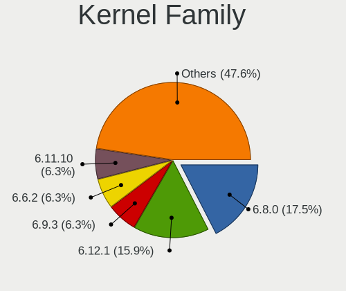
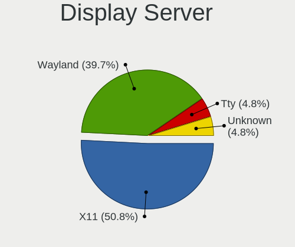
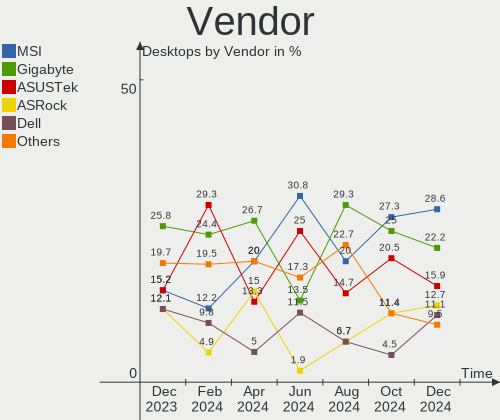
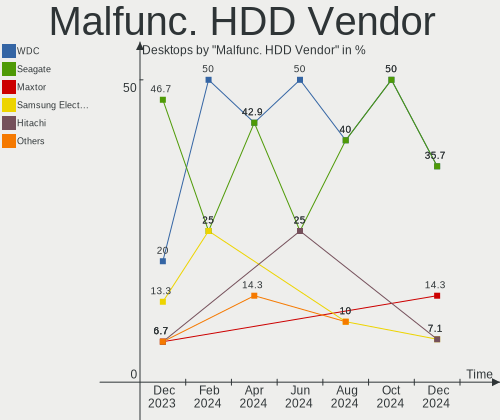
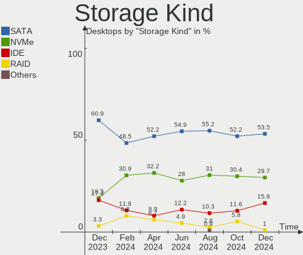
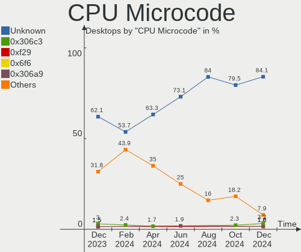
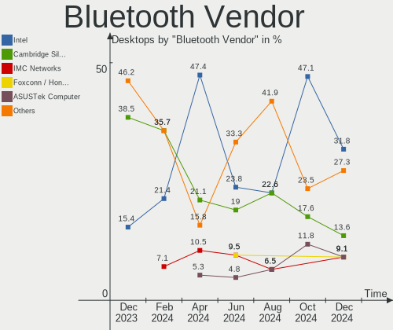
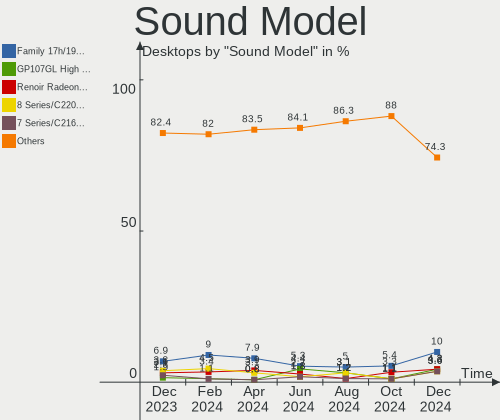
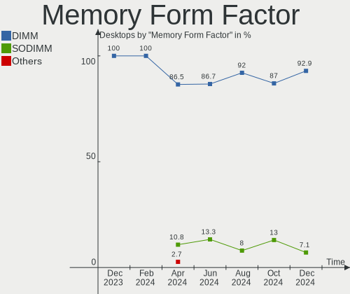

Linux in Poland - Hardware Trends (Desktops)
--------------------------------------------

A project to identify most popular hardware characteristics and track their change
over time based on data collected by Linux users at https://Linux-Hardware.org.

Anyone can contribute to this report by the [hw-probe](https://github.com/linuxhw/hw-probe) tool:

    sudo -E hw-probe -all -upload

Period: Jul, 2023.

Contents
--------

* [ System ](#system)
  - [ OS                       ](#os)
  - [ OS Family                ](#os-family)
  - [ Kernel                   ](#kernel)
  - [ Kernel Family            ](#kernel-family)
  - [ Kernel Major Ver.        ](#kernel-major-ver)
  - [ Arch                     ](#arch)
  - [ DE                       ](#de)
  - [ Display Server           ](#display-server)
  - [ Display Manager          ](#display-manager)
  - [ OS Lang                  ](#os-lang)
  - [ Boot Mode                ](#boot-mode)
  - [ Filesystem               ](#filesystem)
  - [ Part. scheme             ](#part-scheme)
  - [ Dual Boot with Linux/BSD ](#dual-boot-with-linuxbsd)
  - [ Dual Boot (Win)          ](#dual-boot-win)

* [ Board ](#board)
  - [ Vendor                   ](#vendor)
  - [ Model                    ](#model)
  - [ Model Family             ](#model-family)
  - [ MFG Year                 ](#mfg-year)
  - [ Form Factor              ](#form-factor)
  - [ Secure Boot              ](#secure-boot)
  - [ Coreboot                 ](#coreboot)
  - [ RAM Size                 ](#ram-size)
  - [ RAM Used                 ](#ram-used)
  - [ Total Drives             ](#total-drives)
  - [ Has CD-ROM               ](#has-cd-rom)
  - [ Has Ethernet             ](#has-ethernet)
  - [ Has WiFi                 ](#has-wifi)
  - [ Has Bluetooth            ](#has-bluetooth)

* [ Location ](#location)
  - [ Country                  ](#country)
  - [ City                     ](#city)

* [ Drives ](#drives)
  - [ Drive Vendor             ](#drive-vendor)
  - [ Drive Model              ](#drive-model)
  - [ HDD Vendor               ](#hdd-vendor)
  - [ SSD Vendor               ](#ssd-vendor)
  - [ Drive Kind               ](#drive-kind)
  - [ Drive Connector          ](#drive-connector)
  - [ Drive Size               ](#drive-size)
  - [ Space Total              ](#space-total)
  - [ Space Used               ](#space-used)
  - [ Malfunc. Drives          ](#malfunc-drives)
  - [ Malfunc. Drive Vendor    ](#malfunc-drive-vendor)
  - [ Malfunc. HDD Vendor      ](#malfunc-hdd-vendor)
  - [ Malfunc. Drive Kind      ](#malfunc-drive-kind)
  - [ Failed Drives            ](#failed-drives)
  - [ Failed Drive Vendor      ](#failed-drive-vendor)
  - [ Drive Status             ](#drive-status)

* [ Storage controller ](#storage-controller)
  - [ Storage Vendor           ](#storage-vendor)
  - [ Storage Model            ](#storage-model)
  - [ Storage Kind             ](#storage-kind)

* [ Processor ](#processor)
  - [ CPU Vendor               ](#cpu-vendor)
  - [ CPU Model                ](#cpu-model)
  - [ CPU Model Family         ](#cpu-model-family)
  - [ CPU Cores                ](#cpu-cores)
  - [ CPU Sockets              ](#cpu-sockets)
  - [ CPU Threads              ](#cpu-threads)
  - [ CPU Op-Modes             ](#cpu-op-modes)
  - [ CPU Microcode            ](#cpu-microcode)
  - [ CPU Microarch            ](#cpu-microarch)

* [ Graphics ](#graphics)
  - [ GPU Vendor               ](#gpu-vendor)
  - [ GPU Model                ](#gpu-model)
  - [ GPU Combo                ](#gpu-combo)
  - [ GPU Driver               ](#gpu-driver)
  - [ GPU Memory               ](#gpu-memory)

* [ Monitor ](#monitor)
  - [ Monitor Vendor           ](#monitor-vendor)
  - [ Monitor Model            ](#monitor-model)
  - [ Monitor Resolution       ](#monitor-resolution)
  - [ Monitor Diagonal         ](#monitor-diagonal)
  - [ Monitor Width            ](#monitor-width)
  - [ Aspect Ratio             ](#aspect-ratio)
  - [ Monitor Area             ](#monitor-area)
  - [ Pixel Density            ](#pixel-density)
  - [ Multiple Monitors        ](#multiple-monitors)

* [ Network ](#network)
  - [ Net Controller Vendor    ](#net-controller-vendor)
  - [ Net Controller Model     ](#net-controller-model)
  - [ Wireless Vendor          ](#wireless-vendor)
  - [ Wireless Model           ](#wireless-model)
  - [ Ethernet Vendor          ](#ethernet-vendor)
  - [ Ethernet Model           ](#ethernet-model)
  - [ Net Controller Kind      ](#net-controller-kind)
  - [ Used Controller          ](#used-controller)
  - [ NICs                     ](#nics)
  - [ IPv6                     ](#ipv6)

* [ Bluetooth ](#bluetooth)
  - [ Bluetooth Vendor         ](#bluetooth-vendor)
  - [ Bluetooth Model          ](#bluetooth-model)

* [ Sound ](#sound)
  - [ Sound Vendor             ](#sound-vendor)
  - [ Sound Model              ](#sound-model)

* [ Memory ](#memory)
  - [ Memory Vendor            ](#memory-vendor)
  - [ Memory Model             ](#memory-model)
  - [ Memory Kind              ](#memory-kind)
  - [ Memory Form Factor       ](#memory-form-factor)
  - [ Memory Size              ](#memory-size)
  - [ Memory Speed             ](#memory-speed)

* [ Printers & scanners ](#printers--scanners)
  - [ Printer Vendor           ](#printer-vendor)
  - [ Printer Model            ](#printer-model)
  - [ Scanner Vendor           ](#scanner-vendor)
  - [ Scanner Model            ](#scanner-model)

* [ Camera ](#camera)
  - [ Camera Vendor            ](#camera-vendor)
  - [ Camera Model             ](#camera-model)

* [ Security ](#security)
  - [ Fingerprint Vendor       ](#fingerprint-vendor)
  - [ Fingerprint Model        ](#fingerprint-model)
  - [ Chipcard Vendor          ](#chipcard-vendor)
  - [ Chipcard Model           ](#chipcard-model)

* [ Unsupported ](#unsupported)
  - [ Unsupported Devices      ](#unsupported-devices)
  - [ Unsupported Device Types ](#unsupported-device-types)

System
------

OS
--

Installed operating systems

| Name                 | Desktops | Percent |
|----------------------|----------|---------|
| Ubuntu 22.04         | 5        | 9.43%   |
| Zorin 16             | 4        | 7.55%   |
| Linux Mint 21.1      | 4        | 7.55%   |
| Gentoo 2.13          | 4        | 7.55%   |
| Arch Rolling         | 4        | 7.55%   |
| OpenMandriva 23.07   | 3        | 5.66%   |
| OpenMandriva 23.03   | 3        | 5.66%   |
| Ubuntu 23.04         | 2        | 3.77%   |
| Ubuntu 20.04         | 2        | 3.77%   |
| OpenMandriva 4.3     | 2        | 3.77%   |
| OpenMandriva 23.06   | 2        | 3.77%   |
| Kubuntu 22.04        | 2        | 3.77%   |
| Garuda Linux Rolling | 2        | 3.77%   |
| Xubuntu 22.04        | 1        | 1.89%   |
| Xero Rolling         | 1        | 1.89%   |
| Void Linux Rolling   | 1        | 1.89%   |
| Ubuntu MATE 22.04    | 1        | 1.89%   |
| Ubuntu MATE 20.04    | 1        | 1.89%   |
| Ubuntu 18.04         | 1        | 1.89%   |
| Peppermint 10        | 1        | 1.89%   |
| Nobara 38            | 1        | 1.89%   |
| Neptune OS 8.0       | 1        | 1.89%   |
| Manjaro              | 1        | 1.89%   |
| Fedora 38            | 1        | 1.89%   |
| Debian 12            | 1        | 1.89%   |
| ChimeraOS 43         | 1        | 1.89%   |
| CentOS 8             | 1        | 1.89%   |

OS Family
---------

OS without a version

| Name         | Desktops | Percent |
|--------------|----------|---------|
| Ubuntu       | 10       | 18.87%  |
| OpenMandriva | 10       | 18.87%  |
| Zorin        | 4        | 7.55%   |
| Linux Mint   | 4        | 7.55%   |
| Gentoo       | 4        | 7.55%   |
| Arch         | 4        | 7.55%   |
| Ubuntu MATE  | 2        | 3.77%   |
| Kubuntu      | 2        | 3.77%   |
| Garuda Linux | 2        | 3.77%   |
| Xubuntu      | 1        | 1.89%   |
| Xero         | 1        | 1.89%   |
| Void Linux   | 1        | 1.89%   |
| Peppermint   | 1        | 1.89%   |
| Nobara       | 1        | 1.89%   |
| Neptune OS   | 1        | 1.89%   |
| Manjaro      | 1        | 1.89%   |
| Fedora       | 1        | 1.89%   |
| Debian       | 1        | 1.89%   |
| ChimeraOS    | 1        | 1.89%   |
| CentOS       | 1        | 1.89%   |

Kernel
------

Version of the Linux kernel

| Version                      | Desktops | Percent |
|------------------------------|----------|---------|
| 5.15.0-76-generic            | 6        | 11.32%  |
| 6.3.5-desktop-3omv2390       | 4        | 7.55%   |
| 6.2.6-desktop-1omv2390       | 4        | 7.55%   |
| 5.19.0-46-generic            | 4        | 7.55%   |
| 6.1.31-gentoo                | 3        | 5.66%   |
| 6.4.1-arch2-1                | 2        | 3.77%   |
| 6.2.0-24-generic             | 2        | 3.77%   |
| 5.19.0-50-generic            | 2        | 3.77%   |
| 5.15.0-78-generic            | 2        | 3.77%   |
| 6.4.4-hardened1-1-hardened   | 1        | 1.89%   |
| 6.4.2-arch1-1                | 1        | 1.89%   |
| 6.4.2-1-cachyos-tt-lto       | 1        | 1.89%   |
| 6.4.1-zen2-1-zen             | 1        | 1.89%   |
| 6.3.9-chimeraos-1            | 1        | 1.89%   |
| 6.3.9-arch1-1                | 1        | 1.89%   |
| 6.3.8-200.fc38.x86_64        | 1        | 1.89%   |
| 6.3.12_1                     | 1        | 1.89%   |
| 6.3.12-204.fsync.fc38.x86_64 | 1        | 1.89%   |
| 6.1.41-gentoo                | 1        | 1.89%   |
| 6.1.1-060101-generic         | 1        | 1.89%   |
| 6.1.0-9-amd64                | 1        | 1.89%   |
| 6.1.0-10-amd64               | 1        | 1.89%   |
| 5.4.0-87-generic             | 1        | 1.89%   |
| 5.4.0-153-generic            | 1        | 1.89%   |
| 5.4.0-150-generic            | 1        | 1.89%   |
| 5.4.0-146-generic            | 1        | 1.89%   |
| 5.19.0-45-generic            | 1        | 1.89%   |
| 5.16.7-desktop-1omv4003      | 1        | 1.89%   |
| 5.16.13-desktop-1omv4003     | 1        | 1.89%   |
| 5.15.55-1-MANJARO            | 1        | 1.89%   |
| 5.15.0-60-generic            | 1        | 1.89%   |
| 5.15.0-56-generic            | 1        | 1.89%   |
| 4.18.0-348.7.1.el8_5.x86_64  | 1        | 1.89%   |

Kernel Family
-------------

Linux kernel without a distro release

| Version | Desktops | Percent |
|---------|----------|---------|
| 5.15.0  | 10       | 18.87%  |
| 5.19.0  | 7        | 13.21%  |
| 6.3.5   | 4        | 7.55%   |
| 6.2.6   | 4        | 7.55%   |
| 5.4.0   | 4        | 7.55%   |
| 6.4.1   | 3        | 5.66%   |
| 6.1.31  | 3        | 5.66%   |
| 6.4.2   | 2        | 3.77%   |
| 6.3.9   | 2        | 3.77%   |
| 6.3.12  | 2        | 3.77%   |
| 6.2.0   | 2        | 3.77%   |
| 6.1.0   | 2        | 3.77%   |
| 6.4.4   | 1        | 1.89%   |
| 6.3.8   | 1        | 1.89%   |
| 6.1.41  | 1        | 1.89%   |
| 6.1.1   | 1        | 1.89%   |
| 5.16.7  | 1        | 1.89%   |
| 5.16.13 | 1        | 1.89%   |
| 5.15.55 | 1        | 1.89%   |
| 4.18.0  | 1        | 1.89%   |

Kernel Major Ver.
-----------------

Linux kernel major version

| Version | Desktops | Percent |
|---------|----------|---------|
| 5.15    | 11       | 20.75%  |
| 6.3     | 9        | 16.98%  |
| 6.1     | 7        | 13.21%  |
| 5.19    | 7        | 13.21%  |
| 6.4     | 6        | 11.32%  |
| 6.2     | 6        | 11.32%  |
| 5.4     | 4        | 7.55%   |
| 5.16    | 2        | 3.77%   |
| 4.18    | 1        | 1.89%   |

Arch
----

OS architecture (x86_64, i586, etc.)

| Name   | Desktops | Percent |
|--------|----------|---------|
| x86_64 | 53       | 100%    |

DE
--

Desktop Environment

| Name       | Desktops | Percent |
|------------|----------|---------|
| GNOME      | 17       | 32.08%  |
| KDE5       | 16       | 30.19%  |
| XFCE       | 6        | 11.32%  |
| X-Cinnamon | 4        | 7.55%   |
| MATE       | 4        | 7.55%   |
| Unknown    | 3        | 5.66%   |
| LXQt       | 1        | 1.89%   |
| LXDE       | 1        | 1.89%   |
| i3         | 1        | 1.89%   |

Display Server
--------------

X11 or Wayland

| Name    | Desktops | Percent |
|---------|----------|---------|
| X11     | 41       | 77.36%  |
| Wayland | 8        | 15.09%  |
| Tty     | 3        | 5.66%   |
| Unknown | 1        | 1.89%   |

Display Manager
---------------

SDDM, LightDM, etc.

| Name    | Desktops | Percent |
|---------|----------|---------|
| Unknown | 15       | 28.3%   |
| SDDM    | 14       | 26.42%  |
| LightDM | 11       | 20.75%  |
| GDM3    | 10       | 18.87%  |
| LY-DM   | 1        | 1.89%   |
| LXDM    | 1        | 1.89%   |
| GDM     | 1        | 1.89%   |

OS Lang
-------

Language

| Lang    | Desktops | Percent |
|---------|----------|---------|
| pl_PL   | 36       | 67.92%  |
| en_US   | 13       | 24.53%  |
| en_GB   | 2        | 3.77%   |
| C       | 1        | 1.89%   |
| Unknown | 1        | 1.89%   |

Boot Mode
---------

EFI or BIOS

| Mode | Desktops | Percent |
|------|----------|---------|
| BIOS | 27       | 50.94%  |
| EFI  | 26       | 49.06%  |

Filesystem
----------

Type of filesystem

| Type    | Desktops | Percent |
|---------|----------|---------|
| Ext4    | 31       | 58.49%  |
| Tmpfs   | 6        | 11.32%  |
| Btrfs   | 6        | 11.32%  |
| Overlay | 4        | 7.55%   |
| F2fs    | 3        | 5.66%   |
| Xfs     | 2        | 3.77%   |
| Zfs     | 1        | 1.89%   |

Part. scheme
------------

Scheme of partitioning

| Type    | Desktops | Percent |
|---------|----------|---------|
| GPT     | 34       | 64.15%  |
| Unknown | 12       | 22.64%  |
| MBR     | 7        | 13.21%  |

Dual Boot with Linux/BSD
------------------------

Hosting more than one Linux/BSD

| Dual boot | Desktops | Percent |
|-----------|----------|---------|
| No        | 36       | 67.92%  |
| Yes       | 17       | 32.08%  |

Dual Boot (Win)
---------------

Hosting Linux and Windows

| Dual boot | Desktops | Percent |
|-----------|----------|---------|
| No        | 38       | 71.7%   |
| Yes       | 15       | 28.3%   |

Board
-----

Vendor
------

Motherboard manufacturer

| Name                | Desktops | Percent |
|---------------------|----------|---------|
| Gigabyte Technology | 12       | 22.64%  |
| ASUSTek Computer    | 10       | 18.87%  |
| ASRock              | 8        | 15.09%  |
| Hewlett-Packard     | 6        | 11.32%  |
| MSI                 | 5        | 9.43%   |
| Dell                | 5        | 9.43%   |
| Lenovo              | 3        | 5.66%   |
| Seeed Studio        | 1        | 1.89%   |
| Google              | 1        | 1.89%   |
| Fujitsu             | 1        | 1.89%   |
| Acer                | 1        | 1.89%   |

Model
-----

Motherboard model

| Name                                   | Desktops | Percent |
|----------------------------------------|----------|---------|
| MSI MS-7C37                            | 2        | 3.77%   |
| HP EliteDesk 800 G1 SFF                | 2        | 3.77%   |
| ASUS M3A78-CM                          | 2        | 3.77%   |
| Seeed Studio ODYSSEY-X86J4105          | 1        | 1.89%   |
| MSI MS-7D75                            | 1        | 1.89%   |
| MSI MS-7882                            | 1        | 1.89%   |
| MSI H310 Gaming Infinite S (MS-B928)   | 1        | 1.89%   |
| Lenovo V520-15IKL 10NK006CPB           | 1        | 1.89%   |
| Lenovo ThinkCentre M83 10BE001APB      | 1        | 1.89%   |
| Lenovo ThinkCentre M58 3231W2Y         | 1        | 1.89%   |
| HP Z440 Workstation                    | 1        | 1.89%   |
| HP ProDesk 400 G1 MT                   | 1        | 1.89%   |
| HP Compaq Pro 6300 MT                  | 1        | 1.89%   |
| HP Compaq dc7900 Convertible Minitower | 1        | 1.89%   |
| Google Guado                           | 1        | 1.89%   |
| Gigabyte Z97M-DS3H                     | 1        | 1.89%   |
| Gigabyte P55M-UD2                      | 1        | 1.89%   |
| Gigabyte H270-HD3                      | 1        | 1.89%   |
| Gigabyte GA-790FXTA-UD5                | 1        | 1.89%   |
| Gigabyte GA-78LMT-S2PT                 | 1        | 1.89%   |
| Gigabyte EP45T-UD3LR                   | 1        | 1.89%   |
| Gigabyte B85M-HD3                      | 1        | 1.89%   |
| Gigabyte B75M-D3H                      | 1        | 1.89%   |
| Gigabyte B660M DS3H DDR4               | 1        | 1.89%   |
| Gigabyte B450M GAMING                  | 1        | 1.89%   |
| Gigabyte B450M DS3H V2                 | 1        | 1.89%   |
| Gigabyte AB350-Gaming                  | 1        | 1.89%   |
| Fujitsu ESPRIMO_P756                   | 1        | 1.89%   |
| Dell Vostro 3888                       | 1        | 1.89%   |
| Dell Precision Tower 3620              | 1        | 1.89%   |
| Dell OptiPlex 9020                     | 1        | 1.89%   |
| Dell OptiPlex 7040                     | 1        | 1.89%   |
| Dell OptiPlex 5040                     | 1        | 1.89%   |
| ASUS PRIME Z690-P D4                   | 1        | 1.89%   |
| ASUS PRIME Z270-A                      | 1        | 1.89%   |
| ASUS PRIME X370-PRO                    | 1        | 1.89%   |
| ASUS PRIME B450-PLUS                   | 1        | 1.89%   |
| ASUS P8H61-M LX                        | 1        | 1.89%   |
| ASUS P5G41T-M                          | 1        | 1.89%   |
| ASUS M5A78L-M LE                       | 1        | 1.89%   |

Model Family
------------

Motherboard model prefix

| Name                          | Desktops | Percent |
|-------------------------------|----------|---------|
| ASUS PRIME                    | 4        | 7.55%   |
| Dell OptiPlex                 | 3        | 5.66%   |
| MSI MS-7C37                   | 2        | 3.77%   |
| Lenovo ThinkCentre            | 2        | 3.77%   |
| HP EliteDesk                  | 2        | 3.77%   |
| HP Compaq                     | 2        | 3.77%   |
| Gigabyte B450M                | 2        | 3.77%   |
| ASUS M3A78-CM                 | 2        | 3.77%   |
| Seeed Studio ODYSSEY-X86J4105 | 1        | 1.89%   |
| MSI MS-7D75                   | 1        | 1.89%   |
| MSI MS-7882                   | 1        | 1.89%   |
| MSI H310                      | 1        | 1.89%   |
| Lenovo V520-15IKL             | 1        | 1.89%   |
| HP Z440                       | 1        | 1.89%   |
| HP ProDesk                    | 1        | 1.89%   |
| Google Guado                  | 1        | 1.89%   |
| Gigabyte Z97M-DS3H            | 1        | 1.89%   |
| Gigabyte P55M-UD2             | 1        | 1.89%   |
| Gigabyte H270-HD3             | 1        | 1.89%   |
| Gigabyte GA-790FXTA-UD5       | 1        | 1.89%   |
| Gigabyte GA-78LMT-S2PT        | 1        | 1.89%   |
| Gigabyte EP45T-UD3LR          | 1        | 1.89%   |
| Gigabyte B85M-HD3             | 1        | 1.89%   |
| Gigabyte B75M-D3H             | 1        | 1.89%   |
| Gigabyte B660M                | 1        | 1.89%   |
| Gigabyte AB350-Gaming         | 1        | 1.89%   |
| Fujitsu ESPRIMO               | 1        | 1.89%   |
| Dell Vostro                   | 1        | 1.89%   |
| Dell Precision                | 1        | 1.89%   |
| ASUS P8H61-M                  | 1        | 1.89%   |
| ASUS P5G41T-M                 | 1        | 1.89%   |
| ASUS M5A78L-M                 | 1        | 1.89%   |
| ASUS All                      | 1        | 1.89%   |
| ASRock Z370                   | 1        | 1.89%   |
| ASRock Z170                   | 1        | 1.89%   |
| ASRock X570                   | 1        | 1.89%   |
| ASRock H81M                   | 1        | 1.89%   |
| ASRock FM2A55M-VG3+           | 1        | 1.89%   |
| ASRock B85M                   | 1        | 1.89%   |
| ASRock AM1H-ITX               | 1        | 1.89%   |

MFG Year
--------

Motherboard manufacture year

| Year | Desktops | Percent |
|------|----------|---------|
| 2013 | 7        | 13.21%  |
| 2016 | 6        | 11.32%  |
| 2008 | 5        | 9.43%   |
| 2019 | 4        | 7.55%   |
| 2015 | 4        | 7.55%   |
| 2014 | 4        | 7.55%   |
| 2021 | 3        | 5.66%   |
| 2018 | 3        | 5.66%   |
| 2017 | 3        | 5.66%   |
| 2012 | 3        | 5.66%   |
| 2022 | 2        | 3.77%   |
| 2020 | 2        | 3.77%   |
| 2011 | 2        | 3.77%   |
| 2010 | 2        | 3.77%   |
| 2009 | 2        | 3.77%   |
| 2023 | 1        | 1.89%   |

Form Factor
-----------

Physical design of the computer

| Name    | Desktops | Percent |
|---------|----------|---------|
| Desktop | 53       | 100%    |

Secure Boot
-----------

Enabled or disabled

| State    | Desktops | Percent |
|----------|----------|---------|
| Disabled | 52       | 98.11%  |
| Enabled  | 1        | 1.89%   |

Coreboot
--------

Have coreboot on board

| Used | Desktops | Percent |
|------|----------|---------|
| No   | 52       | 98.11%  |
| Yes  | 1        | 1.89%   |

RAM Size
--------

Total RAM memory

| Size in GB | Desktops | Percent |
|------------|----------|---------|
| 16.01-24.0 | 13       | 24.53%  |
| 4.01-8.0   | 11       | 20.75%  |
| 8.01-16.0  | 11       | 20.75%  |
| 32.01-64.0 | 9        | 16.98%  |
| 3.01-4.0   | 5        | 9.43%   |
| 24.01-32.0 | 4        | 7.55%   |

RAM Used
--------

Used RAM memory

| Used GB    | Desktops | Percent |
|------------|----------|---------|
| 2.01-3.0   | 19       | 35.85%  |
| 1.01-2.0   | 12       | 22.64%  |
| 4.01-8.0   | 9        | 16.98%  |
| 3.01-4.0   | 7        | 13.21%  |
| 16.01-24.0 | 3        | 5.66%   |
| 0.51-1.0   | 3        | 5.66%   |

Total Drives
------------

Number of drives on board

| Drives | Desktops | Percent |
|--------|----------|---------|
| 1      | 20       | 37.74%  |
| 3      | 11       | 20.75%  |
| 2      | 9        | 16.98%  |
| 4      | 8        | 15.09%  |
| 11     | 1        | 1.89%   |
| 8      | 1        | 1.89%   |
| 7      | 1        | 1.89%   |
| 6      | 1        | 1.89%   |
| 5      | 1        | 1.89%   |

Has CD-ROM
----------

Has CD-ROM on board

| Presented | Desktops | Percent |
|-----------|----------|---------|
| Yes       | 29       | 54.72%  |
| No        | 24       | 45.28%  |

Has Ethernet
------------

Has Ethernet on board

| Presented | Desktops | Percent |
|-----------|----------|---------|
| Yes       | 53       | 100%    |

Has WiFi
--------

Has WiFi module

| Presented | Desktops | Percent |
|-----------|----------|---------|
| No        | 36       | 67.92%  |
| Yes       | 17       | 32.08%  |

Has Bluetooth
-------------

Has Bluetooth module

| Presented | Desktops | Percent |
|-----------|----------|---------|
| No        | 36       | 67.92%  |
| Yes       | 17       | 32.08%  |

Location
--------

Country
-------

Geographic location (country)

| Country | Desktops | Percent |
|---------|----------|---------|
| Poland  | 53       | 100%    |

City
----

Geographic location (city)

| City                 | Desktops | Percent |
|----------------------|----------|---------|
| Warsaw               | 17       | 32.08%  |
| Krakow               | 6        | 11.32%  |
| Gdansk               | 3        | 5.66%   |
| Wroclaw              | 2        | 3.77%   |
| Poznan               | 2        | 3.77%   |
| Gdynia               | 2        | 3.77%   |
| Łomża              | 1        | 1.89%   |
| Złotoryja           | 1        | 1.89%   |
| Zielona Góra        | 1        | 1.89%   |
| Wieluń              | 1        | 1.89%   |
| Swiebodzice          | 1        | 1.89%   |
| Suwałki             | 1        | 1.89%   |
| Reda                 | 1        | 1.89%   |
| Ozarow Mazowiecki    | 1        | 1.89%   |
| Ostrów Wielkopolski | 1        | 1.89%   |
| Opole                | 1        | 1.89%   |
| Mikołów            | 1        | 1.89%   |
| Lodz                 | 1        | 1.89%   |
| Kościan             | 1        | 1.89%   |
| Jelenia Góra        | 1        | 1.89%   |
| Jarosław            | 1        | 1.89%   |
| Elblag               | 1        | 1.89%   |
| Drzewica             | 1        | 1.89%   |
| Cieszyn              | 1        | 1.89%   |
| Chorzów             | 1        | 1.89%   |
| Biała Podlaska      | 1        | 1.89%   |
| Bialystok            | 1        | 1.89%   |

Drives
------

Drive Vendor
------------

Hard drive vendors

| Vendor                       | Desktops | Drives | Percent |
|------------------------------|----------|--------|---------|
| Seagate                      | 16       | 17     | 15.09%  |
| Samsung Electronics          | 15       | 23     | 14.15%  |
| WDC                          | 14       | 27     | 13.21%  |
| GOODRAM                      | 13       | 15     | 12.26%  |
| Toshiba                      | 8        | 8      | 7.55%   |
| Crucial                      | 6        | 7      | 5.66%   |
| A-DATA Technology            | 4        | 4      | 3.77%   |
| SPCC                         | 3        | 4      | 2.83%   |
| Patriot                      | 3        | 3      | 2.83%   |
| Kingston                     | 3        | 3      | 2.83%   |
| Unknown                      | 2        | 4      | 1.89%   |
| PNY                          | 2        | 2      | 1.89%   |
| Intel                        | 2        | 2      | 1.89%   |
| Hitachi                      | 2        | 4      | 1.89%   |
| China                        | 2        | 4      | 1.89%   |
| ADATA Technology             | 2        | 2      | 1.89%   |
| Transcend                    | 1        | 1      | 0.94%   |
| Shenzhen Longsys Electronics | 1        | 1      | 0.94%   |
| Sandisk                      | 1        | 1      | 0.94%   |
| Realtek Semiconductor        | 1        | 1      | 0.94%   |
| Micron Technology            | 1        | 1      | 0.94%   |
| Lexar                        | 1        | 1      | 0.94%   |
| KIOXIA-EXCERIA               | 1        | 1      | 0.94%   |
| KIOXIA                       | 1        | 1      | 0.94%   |
| Gigabyte Technology          | 1        | 1      | 0.94%   |

Drive Model
-----------

Hard drive models

| Model                                                              | Desktops | Percent |
|--------------------------------------------------------------------|----------|---------|
| Toshiba HDWD110 1TB                                                | 3        | 2.4%    |
| Seagate ST1000DM010-2EP102 1TB                                     | 3        | 2.4%    |
| Samsung SSD 980 1TB                                                | 3        | 2.4%    |
| WDC WD40EFRX-68N32N0 4TB                                           | 2        | 1.6%    |
| WDC WD20EFRX-68EUZN0 2TB                                           | 2        | 1.6%    |
| Seagate ST3500418AS 500GB                                          | 2        | 1.6%    |
| Seagate ST250DM000-1BD141 250GB                                    | 2        | 1.6%    |
| Seagate ST2000DM006-2DM164 2TB                                     | 2        | 1.6%    |
| Samsung SSD 870 EVO 500GB                                          | 2        | 1.6%    |
| Samsung SSD 860 EVO 1TB                                            | 2        | 1.6%    |
| Hitachi HUS724030ALE641 3TB                                        | 2        | 1.6%    |
| GOODRAM SSDPR-CX400-512 512GB                                      | 2        | 1.6%    |
| GOODRAM SSDPR-CX400-01T-G2 1TB                                     | 2        | 1.6%    |
| GOODRAM SSDPR-CL100-480-G2 480GB                                   | 2        | 1.6%    |
| GOODRAM SSD 240GB                                                  | 2        | 1.6%    |
| Crucial CT240BX500SSD1 240GB                                       | 2        | 1.6%    |
| China SSD 512GB                                                    | 2        | 1.6%    |
| ADATA XPG SX8200 Pro PCIe Gen3x4 M.2 2280 Solid State Drive 1024GB | 2        | 1.6%    |
| WDC WDS500G2B0B-00YS70 500GB SSD                                   | 1        | 0.8%    |
| WDC WDS480G2G0A-00JH30 480GB SSD                                   | 1        | 0.8%    |
| WDC WD7500AADS-00M2B0 752GB                                        | 1        | 0.8%    |
| WDC WD60EFRX-68MYMN1 6TB                                           | 1        | 0.8%    |
| WDC WD6003FFBX-68MU3N0 6TB                                         | 1        | 0.8%    |
| WDC WD5000AADS-00S9B0 500GB                                        | 1        | 0.8%    |
| WDC WD40PURZ-85TTDY0 4TB                                           | 1        | 0.8%    |
| WDC WD40EFZX-68AWUN0 4TB                                           | 1        | 0.8%    |
| WDC WD3200BEVS-08VAT2 320GB                                        | 1        | 0.8%    |
| WDC WD30EFRX-68EUZN0 3TB                                           | 1        | 0.8%    |
| WDC WD20EZRX-00DC0B0 2TB                                           | 1        | 0.8%    |
| WDC WD20EURS-63S48Y0 2TB                                           | 1        | 0.8%    |
| WDC WD20EARX-00PASB0 2TB                                           | 1        | 0.8%    |
| WDC WD10EZEX-21M2NA0 1TB                                           | 1        | 0.8%    |
| WDC WD1002FBYS-02A6B0 1TB                                          | 1        | 0.8%    |
| WDC PC SN530 SDBPNPZ-256G                                          | 1        | 0.8%    |
| Unknown SD32G  32GB                                                | 1        | 0.8%    |
| Unknown SD/MMC/M.S.PRO 32GB                                        | 1        | 0.8%    |
| Unknown SD/MMC 2GB                                                 | 1        | 0.8%    |
| Unknown M.S./M.S.Pro/HG 16GB                                       | 1        | 0.8%    |
| Transcend TS480GMTS420S 480GB SSD                                  | 1        | 0.8%    |
| Toshiba THNSN5256GPU7 NVMe 256GB                                   | 1        | 0.8%    |

HDD Vendor
----------

Hard disk drive vendors

| Vendor              | Desktops | Drives | Percent |
|---------------------|----------|--------|---------|
| Seagate             | 16       | 17     | 42.11%  |
| WDC                 | 11       | 24     | 28.95%  |
| Toshiba             | 7        | 7      | 18.42%  |
| Samsung Electronics | 2        | 3      | 5.26%   |
| Hitachi             | 2        | 4      | 5.26%   |

SSD Vendor
----------

Solid state drive vendors

| Vendor              | Desktops | Drives | Percent |
|---------------------|----------|--------|---------|
| GOODRAM             | 13       | 15     | 27.66%  |
| Samsung Electronics | 8        | 11     | 17.02%  |
| Crucial             | 5        | 6      | 10.64%  |
| A-DATA Technology   | 4        | 4      | 8.51%   |
| SPCC                | 3        | 4      | 6.38%   |
| Patriot             | 3        | 3      | 6.38%   |
| WDC                 | 2        | 2      | 4.26%   |
| PNY                 | 2        | 2      | 4.26%   |
| Intel               | 2        | 2      | 4.26%   |
| China               | 2        | 4      | 4.26%   |
| Transcend           | 1        | 1      | 2.13%   |
| Micron Technology   | 1        | 1      | 2.13%   |
| Gigabyte Technology | 1        | 1      | 2.13%   |

Drive Kind
----------

HDD or SSD

| Kind    | Desktops | Drives | Percent |
|---------|----------|--------|---------|
| HDD     | 34       | 55     | 38.64%  |
| SSD     | 33       | 56     | 37.5%   |
| NVMe    | 19       | 23     | 21.59%  |
| MMC     | 1        | 1      | 1.14%   |
| Unknown | 1        | 3      | 1.14%   |

Drive Connector
---------------

SATA, SAS, NVMe, etc.

| Type | Desktops | Drives | Percent |
|------|----------|--------|---------|
| SATA | 49       | 110    | 69.01%  |
| NVMe | 19       | 23     | 26.76%  |
| SAS  | 2        | 4      | 2.82%   |
| MMC  | 1        | 1      | 1.41%   |

Drive Size
----------

Size of hard drive

| Size in TB | Desktops | Drives | Percent |
|------------|----------|--------|---------|
| 0.01-0.5   | 34       | 48     | 43.04%  |
| 0.51-1.0   | 25       | 31     | 31.65%  |
| 1.01-2.0   | 8        | 10     | 10.13%  |
| 3.01-4.0   | 4        | 12     | 5.06%   |
| 4.01-10.0  | 4        | 4      | 5.06%   |
| 2.01-3.0   | 3        | 5      | 3.8%    |
| 10.01-20.0 | 1        | 1      | 1.27%   |

Space Total
-----------

Amount of disk space available on the file system

| Size in GB     | Desktops | Percent |
|----------------|----------|---------|
| 501-1000       | 12       | 22.64%  |
| 251-500        | 11       | 20.75%  |
| 101-250        | 10       | 18.87%  |
| More than 3000 | 5        | 9.43%   |
| 1001-2000      | 4        | 7.55%   |
| 2001-3000      | 3        | 5.66%   |
| 1-20           | 3        | 5.66%   |
| 51-100         | 2        | 3.77%   |
| Unknown        | 2        | 3.77%   |
| 21-50          | 1        | 1.89%   |

Space Used
----------

Amount of used disk space

| Used GB        | Desktops | Percent |
|----------------|----------|---------|
| 1-20           | 13       | 24.53%  |
| 51-100         | 9        | 16.98%  |
| 251-500        | 7        | 13.21%  |
| 501-1000       | 7        | 13.21%  |
| 101-250        | 6        | 11.32%  |
| 21-50          | 4        | 7.55%   |
| More than 3000 | 3        | 5.66%   |
| 1001-2000      | 2        | 3.77%   |
| Unknown        | 2        | 3.77%   |

Malfunc. Drives
---------------

Drive models with a malfunction

| Model                                               | Desktops | Drives | Percent |
|-----------------------------------------------------|----------|--------|---------|
| WDC WD30EFRX-68EUZN0 3TB                            | 1        | 1      | 11.11%  |
| Toshiba MQ01ABD100 1TB                              | 1        | 1      | 11.11%  |
| Toshiba DT01ACA050 500GB                            | 1        | 1      | 11.11%  |
| Seagate ST500DM002-1BD142 500GB                     | 1        | 1      | 11.11%  |
| Seagate ST3500418AS 500GB                           | 1        | 1      | 11.11%  |
| Seagate ST1000DM003-9YN162 1TB                      | 1        | 1      | 11.11%  |
| Samsung Electronics SSD 850 PRO 512GB               | 1        | 1      | 11.11%  |
| Micron Technology MTFDDAK256TBN-1AR1ZABHA 256GB SSD | 1        | 1      | 11.11%  |
| Intel SSDSC2BF180A5L 180GB                          | 1        | 1      | 11.11%  |

Malfunc. Drive Vendor
---------------------

Vendors of faulty drives

| Vendor              | Desktops | Drives | Percent |
|---------------------|----------|--------|---------|
| Seagate             | 3        | 3      | 33.33%  |
| Toshiba             | 2        | 2      | 22.22%  |
| WDC                 | 1        | 1      | 11.11%  |
| Samsung Electronics | 1        | 1      | 11.11%  |
| Micron Technology   | 1        | 1      | 11.11%  |
| Intel               | 1        | 1      | 11.11%  |

Malfunc. HDD Vendor
-------------------

Vendors of faulty HDD drives

| Vendor  | Desktops | Drives | Percent |
|---------|----------|--------|---------|
| Seagate | 3        | 3      | 50%     |
| Toshiba | 2        | 2      | 33.33%  |
| WDC     | 1        | 1      | 16.67%  |

Malfunc. Drive Kind
-------------------

Kinds of faulty drives

| Kind | Desktops | Drives | Percent |
|------|----------|--------|---------|
| HDD  | 6        | 6      | 66.67%  |
| SSD  | 3        | 3      | 33.33%  |

Failed Drives
-------------

Failed drive models

Zero info for selected period =(

Failed Drive Vendor
-------------------

Failed drive vendors

Zero info for selected period =(

Drive Status
------------

Number of failed and malfunc. drives

| Status   | Desktops | Drives | Percent |
|----------|----------|--------|---------|
| Works    | 32       | 87     | 53.33%  |
| Detected | 20       | 42     | 33.33%  |
| Malfunc  | 8        | 9      | 13.33%  |

Storage controller
------------------

Storage Vendor
--------------

Storage controller vendors

| Vendor                       | Desktops | Percent |
|------------------------------|----------|---------|
| Intel                        | 36       | 42.35%  |
| AMD                          | 17       | 20%     |
| Samsung Electronics          | 8        | 9.41%   |
| JMicron Technology           | 4        | 4.71%   |
| ASMedia Technology           | 4        | 4.71%   |
| Kingston Technology Company  | 3        | 3.53%   |
| SanDisk                      | 2        | 2.35%   |
| KIOXIA                       | 2        | 2.35%   |
| ADATA Technology             | 2        | 2.35%   |
| VIA Technologies             | 1        | 1.18%   |
| Toshiba America Info Systems | 1        | 1.18%   |
| Shenzhen Longsys Electronics | 1        | 1.18%   |
| Realtek Semiconductor        | 1        | 1.18%   |
| Micron/Crucial Technology    | 1        | 1.18%   |
| MAXIO Technology (Hangzhou)  | 1        | 1.18%   |
| Marvell Technology Group     | 1        | 1.18%   |

Storage Model
-------------

Storage controller models

| Model                                                                          | Desktops | Percent |
|--------------------------------------------------------------------------------|----------|---------|
| AMD FCH SATA Controller [AHCI mode]                                            | 10       | 9.43%   |
| Intel 8 Series/C220 Series Chipset Family 6-port SATA Controller 1 [AHCI mode] | 7        | 6.6%    |
| Samsung NVMe SSD Controller 980                                                | 5        | 4.72%   |
| AMD SB7x0/SB8x0/SB9x0 IDE Controller                                           | 5        | 4.72%   |
| Intel Q170/Q150/B150/H170/H110/Z170/CM236 Chipset SATA Controller [AHCI Mode]  | 4        | 3.77%   |
| Intel 200 Series PCH SATA controller [AHCI mode]                               | 4        | 3.77%   |
| ASMedia ASM1062 Serial ATA Controller                                          | 4        | 3.77%   |
| AMD SB7x0/SB8x0/SB9x0 SATA Controller [IDE mode]                               | 4        | 3.77%   |
| JMicron JMB363 SATA/IDE Controller                                             | 3        | 2.83%   |
| Intel SATA Controller [RAID mode]                                              | 3        | 2.83%   |
| Intel C610/X99 series chipset 6-Port SATA Controller [AHCI mode]               | 3        | 2.83%   |
| AMD 400 Series Chipset SATA Controller                                         | 3        | 2.83%   |
| Samsung NVMe SSD Controller SM981/PM981/PM983                                  | 2        | 1.89%   |
| Intel C610/X99 series chipset sSATA Controller [AHCI mode]                     | 2        | 1.89%   |
| Intel Alder Lake-S PCH SATA Controller [AHCI Mode]                             | 2        | 1.89%   |
| Intel 4 Series Chipset PT IDER Controller                                      | 2        | 1.89%   |
| ADATA XPG SX8200 Pro PCIe Gen3x4 M.2 2280 Solid State Drive                    | 2        | 1.89%   |
| VIA VT6421 IDE/SATA Controller                                                 | 1        | 0.94%   |
| Toshiba America Info Systems XG3 NVMe SSD Controller                           | 1        | 0.94%   |
| Shenzhen Longsys Lexar NM620 NVME SSD (DRAM-less)                              | 1        | 0.94%   |
| SanDisk WD Blue SN550 NVMe SSD                                                 | 1        | 0.94%   |
| SanDisk WD Black SN750 / PC SN730 NVMe SSD                                     | 1        | 0.94%   |
| Samsung NVMe SSD Controller PM9A1/PM9A3/980PRO                                 | 1        | 0.94%   |
| Realtek RTS5765DL NVMe SSD Controller (DRAM-less)                              | 1        | 0.94%   |
| Micron/Crucial P5 Plus NVMe PCIe SSD                                           | 1        | 0.94%   |
| MAXIO (Hangzhou) NVMe SSD Controller MAP1202                                   | 1        | 0.94%   |
| Marvell Group 88SE91A3 SATA-600 Controller                                     | 1        | 0.94%   |
| KIOXIA RD500/Exceria Plus/Exceria Plus G2 NVMe SSD                             | 1        | 0.94%   |
| KIOXIA NVMe SSD                                                                | 1        | 0.94%   |
| Kingston Company Company Non-Volatile memory controller                        | 1        | 0.94%   |
| Kingston Company NVMe Controller                                               | 1        | 0.94%   |
| Kingston Company KC3000/Renegade NVMe SSD                                      | 1        | 0.94%   |
| JMicron JMB368 IDE controller                                                  | 1        | 0.94%   |
| Intel Wildcat Point-LP SATA Controller [AHCI Mode]                             | 1        | 0.94%   |
| Intel Volume Management Device NVMe RAID Controller                            | 1        | 0.94%   |
| Intel NM10/ICH7 Family SATA Controller [IDE mode]                              | 1        | 0.94%   |
| Intel Celeron/Pentium Silver Processor SATA Controller                         | 1        | 0.94%   |
| Intel 9 Series Chipset Family SATA Controller [AHCI Mode]                      | 1        | 0.94%   |
| Intel 82801JI (ICH10 Family) SATA AHCI Controller                              | 1        | 0.94%   |
| Intel 82801JI (ICH10 Family) 4 port SATA IDE Controller #1                     | 1        | 0.94%   |

Storage Kind
------------

Kind of storage controller (IDE, SATA, NVMe, SAS, ...)

| Kind | Desktops | Percent |
|------|----------|---------|
| SATA | 44       | 53.66%  |
| NVMe | 19       | 23.17%  |
| IDE  | 14       | 17.07%  |
| RAID | 5        | 6.1%    |

Processor
---------

CPU Vendor
----------

Processor vendors

| Vendor | Desktops | Percent |
|--------|----------|---------|
| Intel  | 36       | 67.92%  |
| AMD    | 17       | 32.08%  |

CPU Model
---------

Processor models

| Model                                       | Desktops | Percent |
|---------------------------------------------|----------|---------|
| Intel Core i5-6500 CPU @ 3.20GHz            | 4        | 7.55%   |
| Intel Core i7-4790 CPU @ 3.60GHz            | 3        | 5.66%   |
| AMD Phenom II X4 955 Processor              | 3        | 5.66%   |
| Intel Core i5-4690 CPU @ 3.50GHz            | 2        | 3.77%   |
| Intel Core i5-3470 CPU @ 3.20GHz            | 2        | 3.77%   |
| AMD Ryzen 5 3600 6-Core Processor           | 2        | 3.77%   |
| AMD Ryzen 5 2600 Six-Core Processor         | 2        | 3.77%   |
| Intel Xeon CPU E5-2680 v3 @ 2.50GHz         | 1        | 1.89%   |
| Intel Xeon CPU E5-1603 v3 @ 2.80GHz         | 1        | 1.89%   |
| Intel Xeon CPU E3-1240 v5 @ 3.50GHz         | 1        | 1.89%   |
| Intel Core i7-8700K CPU @ 3.70GHz           | 1        | 1.89%   |
| Intel Core i7-6700 CPU @ 3.40GHz            | 1        | 1.89%   |
| Intel Core i7-5960X CPU @ 3.00GHz           | 1        | 1.89%   |
| Intel Core i7-5500U CPU @ 2.40GHz           | 1        | 1.89%   |
| Intel Core i7 CPU 920 @ 2.67GHz             | 1        | 1.89%   |
| Intel Core i5-8400 CPU @ 2.80GHz            | 1        | 1.89%   |
| Intel Core i5-7600K CPU @ 3.80GHz           | 1        | 1.89%   |
| Intel Core i5-7600 CPU @ 3.50GHz            | 1        | 1.89%   |
| Intel Core i5-4590S CPU @ 3.00GHz           | 1        | 1.89%   |
| Intel Core i5-4570 CPU @ 3.20GHz            | 1        | 1.89%   |
| Intel Core i5-4460 CPU @ 3.20GHz            | 1        | 1.89%   |
| Intel Core i5-10400 CPU @ 2.90GHz           | 1        | 1.89%   |
| Intel Core i5 CPU 750 @ 2.67GHz             | 1        | 1.89%   |
| Intel Core i3-4160 CPU @ 3.60GHz            | 1        | 1.89%   |
| Intel Core i3-2100 CPU @ 3.10GHz            | 1        | 1.89%   |
| Intel Core 2 Quad CPU Q9550 @ 2.83GHz       | 1        | 1.89%   |
| Intel Core 2 Quad CPU Q8200 @ 2.33GHz       | 1        | 1.89%   |
| Intel Core 2 Quad CPU @ 2.40GHz             | 1        | 1.89%   |
| Intel Core 2 Duo CPU E8400 @ 3.00GHz        | 1        | 1.89%   |
| Intel Celeron J4105 CPU @ 1.50GHz           | 1        | 1.89%   |
| Intel 12th Gen Core i5-12600K               | 1        | 1.89%   |
| Intel 12th Gen Core i3-12100F               | 1        | 1.89%   |
| AMD Ryzen 9 7900 12-Core Processor          | 1        | 1.89%   |
| AMD Ryzen 9 3900X 12-Core Processor         | 1        | 1.89%   |
| AMD Ryzen 5 3400G with Radeon Vega Graphics | 1        | 1.89%   |
| AMD Ryzen 5 3350G with Radeon Vega Graphics | 1        | 1.89%   |
| AMD Ryzen 5 1600 Six-Core Processor         | 1        | 1.89%   |
| AMD Ryzen 3 2200G with Radeon Vega Graphics | 1        | 1.89%   |
| AMD Athlon II X3 450 Processor              | 1        | 1.89%   |
| AMD Athlon II X2 240e Processor             | 1        | 1.89%   |

CPU Model Family
----------------

Processor model prefix

| Model             | Desktops | Percent |
|-------------------|----------|---------|
| Intel Core i5     | 16       | 30.19%  |
| Intel Core i7     | 8        | 15.09%  |
| AMD Ryzen 5       | 7        | 13.21%  |
| Intel Xeon        | 3        | 5.66%   |
| Intel Core 2 Quad | 3        | 5.66%   |
| AMD Phenom II X4  | 3        | 5.66%   |
| Other             | 2        | 3.77%   |
| Intel Core i3     | 2        | 3.77%   |
| AMD Ryzen 9       | 2        | 3.77%   |
| Intel Core 2 Duo  | 1        | 1.89%   |
| Intel Celeron     | 1        | 1.89%   |
| AMD Ryzen 3       | 1        | 1.89%   |
| AMD Athlon II X3  | 1        | 1.89%   |
| AMD Athlon II X2  | 1        | 1.89%   |
| AMD Athlon        | 1        | 1.89%   |
| AMD A10           | 1        | 1.89%   |

CPU Cores
---------

Number of processor cores

| Number | Desktops | Percent |
|--------|----------|---------|
| 4      | 33       | 62.26%  |
| 6      | 8        | 15.09%  |
| 2      | 6        | 11.32%  |
| 12     | 3        | 5.66%   |
| 10     | 1        | 1.89%   |
| 8      | 1        | 1.89%   |
| 3      | 1        | 1.89%   |

CPU Sockets
-----------

Number of sockets

| Number | Desktops | Percent |
|--------|----------|---------|
| 1      | 53       | 100%    |

CPU Threads
-----------

Threads per core (Hyper-Threading)

| Number | Desktops | Percent |
|--------|----------|---------|
| 1      | 28       | 52.83%  |
| 2      | 25       | 47.17%  |

CPU Op-Modes
------------

CPU Operation Modes (32-bit, 64-bit)

| Op mode        | Desktops | Percent |
|----------------|----------|---------|
| 32-bit, 64-bit | 53       | 100%    |

CPU Microcode
-------------

Microcode number

| Number     | Desktops | Percent |
|------------|----------|---------|
| Unknown    | 23       | 43.4%   |
| 0x506e3    | 3        | 5.66%   |
| 0x306c3    | 3        | 5.66%   |
| 0x010000c8 | 3        | 5.66%   |
| 0x906e9    | 2        | 3.77%   |
| 0x306f2    | 2        | 3.77%   |
| 0x1067a    | 2        | 3.77%   |
| 0x08701021 | 2        | 3.77%   |
| 0x08108109 | 2        | 3.77%   |
| 0xa0653    | 1        | 1.89%   |
| 0x906ea    | 1        | 1.89%   |
| 0x6f7      | 1        | 1.89%   |
| 0x306d4    | 1        | 1.89%   |
| 0x106a5    | 1        | 1.89%   |
| 0x0a601203 | 1        | 1.89%   |
| 0x0800820d | 1        | 1.89%   |
| 0x0800820b | 1        | 1.89%   |
| 0x0700010f | 1        | 1.89%   |
| 0x06001119 | 1        | 1.89%   |
| 0x010000db | 1        | 1.89%   |

CPU Microarch
-------------

Microarchitecture

| Name             | Desktops | Percent |
|------------------|----------|---------|
| Haswell          | 12       | 22.64%  |
| Skylake          | 6        | 11.32%  |
| Zen+             | 5        | 9.43%   |
| K10              | 5        | 9.43%   |
| KabyLake         | 4        | 7.55%   |
| Zen 2            | 3        | 5.66%   |
| Penryn           | 3        | 5.66%   |
| Nehalem          | 2        | 3.77%   |
| IvyBridge        | 2        | 3.77%   |
| Unknown          | 2        | 3.77%   |
| Zen              | 1        | 1.89%   |
| SandyBridge      | 1        | 1.89%   |
| Piledriver       | 1        | 1.89%   |
| Jaguar           | 1        | 1.89%   |
| Goldmont plus    | 1        | 1.89%   |
| Core             | 1        | 1.89%   |
| CometLake        | 1        | 1.89%   |
| Broadwell        | 1        | 1.89%   |
| Alderlake Hybrid | 1        | 1.89%   |

Graphics
--------

GPU Vendor
----------

Vendors of graphics cards

| Vendor | Desktops | Percent |
|--------|----------|---------|
| Intel  | 21       | 38.18%  |
| Nvidia | 17       | 30.91%  |
| AMD    | 17       | 30.91%  |

GPU Model
---------

Graphics card models

| Model                                                                       | Desktops | Percent |
|-----------------------------------------------------------------------------|----------|---------|
| Intel Xeon E3-1200 v3/4th Gen Core Processor Integrated Graphics Controller | 6        | 10.34%  |
| Intel HD Graphics 530                                                       | 5        | 8.62%   |
| AMD Ellesmere [Radeon RX 470/480/570/570X/580/580X/590]                     | 4        | 6.9%    |
| Intel 4 Series Chipset Integrated Graphics Controller                       | 3        | 5.17%   |
| Nvidia GP107 [GeForce GTX 1050 Ti]                                          | 2        | 3.45%   |
| Nvidia GM107 [GeForce GTX 750]                                              | 2        | 3.45%   |
| Nvidia GA104 [GeForce RTX 3070]                                             | 2        | 3.45%   |
| AMD RS780C [Radeon 3100]                                                    | 2        | 3.45%   |
| AMD Picasso/Raven 2 [Radeon Vega Series / Radeon Vega Mobile Series]        | 2        | 3.45%   |
| AMD Cedar [Radeon HD 5000/6000/7350/8350 Series]                            | 2        | 3.45%   |
| Nvidia TU104 [GeForce RTX 2070 SUPER]                                       | 1        | 1.72%   |
| Nvidia TU102 [GeForce RTX 2080 Ti Rev. A]                                   | 1        | 1.72%   |
| Nvidia GT218 [GeForce 210]                                                  | 1        | 1.72%   |
| Nvidia GT215 [GeForce GT 320]                                               | 1        | 1.72%   |
| Nvidia GP106 [GeForce GTX 1060 3GB]                                         | 1        | 1.72%   |
| Nvidia GP104 [GeForce GTX 1070]                                             | 1        | 1.72%   |
| Nvidia GK208B [GeForce GT 710]                                              | 1        | 1.72%   |
| Nvidia GK107GL [Quadro K420]                                                | 1        | 1.72%   |
| Nvidia GK106 [GeForce GTX 660]                                              | 1        | 1.72%   |
| Nvidia GF116 [GeForce GT 545]                                               | 1        | 1.72%   |
| Nvidia GA102 [GeForce RTX 3090]                                             | 1        | 1.72%   |
| Nvidia G86 [GeForce 8500 GT]                                                | 1        | 1.72%   |
| Intel Xeon E3-1200 v2/3rd Gen Core processor Graphics Controller            | 1        | 1.72%   |
| Intel HD Graphics 5500                                                      | 1        | 1.72%   |
| Intel GeminiLake [UHD Graphics 600]                                         | 1        | 1.72%   |
| Intel CometLake-S GT2 [UHD Graphics 630]                                    | 1        | 1.72%   |
| Intel CoffeeLake-S GT2 [UHD Graphics 630]                                   | 1        | 1.72%   |
| Intel AlderLake-S GT1                                                       | 1        | 1.72%   |
| Intel 4th Generation Core Processor Family Integrated Graphics Controller   | 1        | 1.72%   |
| AMD Trinity [Radeon HD 7660D]                                               | 1        | 1.72%   |
| AMD RS780L [Radeon 3000]                                                    | 1        | 1.72%   |
| AMD Raven Ridge [Radeon Vega Series / Radeon Vega Mobile Series]            | 1        | 1.72%   |
| AMD Raphael                                                                 | 1        | 1.72%   |
| AMD Oland PRO [Radeon R7 240/340 / Radeon 520]                              | 1        | 1.72%   |
| AMD Navi 21 [Radeon RX 6800/6800 XT / 6900 XT]                              | 1        | 1.72%   |
| AMD Kabini [Radeon HD 8400 / R3 Series]                                     | 1        | 1.72%   |
| AMD Juniper PRO [Radeon HD 5750]                                            | 1        | 1.72%   |
| AMD Curacao PRO [Radeon R7 370 / R9 270/370 OEM]                            | 1        | 1.72%   |

GPU Combo
---------

Combinations of graphics cards

| Name           | Desktops | Percent |
|----------------|----------|---------|
| 1 x Intel      | 19       | 35.85%  |
| 1 x Nvidia     | 14       | 26.42%  |
| 1 x AMD        | 14       | 26.42%  |
| 2 x AMD        | 2        | 3.77%   |
| 2 x Nvidia     | 1        | 1.89%   |
| 2 x Intel      | 1        | 1.89%   |
| Intel + Nvidia | 1        | 1.89%   |
| AMD + Nvidia   | 1        | 1.89%   |

GPU Driver
----------

Free vs proprietary

| Driver      | Desktops | Percent |
|-------------|----------|---------|
| Free        | 40       | 75.47%  |
| Proprietary | 10       | 18.87%  |
| Unknown     | 3        | 5.66%   |

GPU Memory
----------

Total video memory

| Size in GB | Desktops | Percent |
|------------|----------|---------|
| Unknown    | 34       | 64.15%  |
| 0.51-1.0   | 6        | 11.32%  |
| 1.01-2.0   | 4        | 7.55%   |
| 7.01-8.0   | 3        | 5.66%   |
| 3.01-4.0   | 2        | 3.77%   |
| 0.01-0.5   | 2        | 3.77%   |
| 16.01-24.0 | 1        | 1.89%   |
| 8.01-16.0  | 1        | 1.89%   |

Monitor
-------

Monitor Vendor
--------------

Monitor vendors

| Vendor               | Desktops | Percent |
|----------------------|----------|---------|
| Samsung Electronics  | 9        | 16.67%  |
| Iiyama               | 7        | 12.96%  |
| Philips              | 5        | 9.26%   |
| Acer                 | 5        | 9.26%   |
| Goldstar             | 4        | 7.41%   |
| BenQ                 | 4        | 7.41%   |
| AOC                  | 4        | 7.41%   |
| Sony                 | 3        | 5.56%   |
| Lenovo               | 3        | 5.56%   |
| Dell                 | 3        | 5.56%   |
| Ancor Communications | 2        | 3.7%    |
| Unknown              | 1        | 1.85%   |
| NEC Computers        | 1        | 1.85%   |
| Idek Iiyama          | 1        | 1.85%   |
| Gigabyte Technology  | 1        | 1.85%   |
| Eizo                 | 1        | 1.85%   |

Monitor Model
-------------

Monitor models

| Model                                                                 | Desktops | Percent |
|-----------------------------------------------------------------------|----------|---------|
| Philips PHL 223V5 PHLC0CF 1920x1080 477x268mm 21.5-inch               | 2        | 3.64%   |
| Iiyama PL2409HD IVM560C 1920x1080 521x293mm 23.5-inch                 | 2        | 3.64%   |
| Unknown LCD Monitor FFFF 2288x1287 2550x2550mm 142.0-inch             | 1        | 1.82%   |
| Sony TV SNYB800 1280x768 690x390mm 31.2-inch                          | 1        | 1.82%   |
| Sony TV SNYAB03 1920x1080                                             | 1        | 1.82%   |
| Sony TV SNY4B03 1920x1080 708x398mm 32.0-inch                         | 1        | 1.82%   |
| Samsung Electronics T24D391 SAM0B72 1920x1080 521x293mm 23.5-inch     | 1        | 1.82%   |
| Samsung Electronics SyncMaster SAM059A 1920x1080 477x268mm 21.5-inch  | 1        | 1.82%   |
| Samsung Electronics SyncMaster SAM0570 1920x1080 510x287mm 23.0-inch  | 1        | 1.82%   |
| Samsung Electronics SyncMaster SAM043F 1920x1200 518x324mm 24.1-inch  | 1        | 1.82%   |
| Samsung Electronics SMB2230H SAM0648 1920x1080                        | 1        | 1.82%   |
| Samsung Electronics S24D300 SAM0B43 1920x1080 531x299mm 24.0-inch     | 1        | 1.82%   |
| Samsung Electronics S22B300 SAM08C8 1920x1080 477x268mm 21.5-inch     | 1        | 1.82%   |
| Samsung Electronics LCD Monitor SAM0C39 1920x1080 885x498mm 40.0-inch | 1        | 1.82%   |
| Samsung Electronics C27F390 SAM0D32 1920x1080 598x336mm 27.0-inch     | 1        | 1.82%   |
| Philips PHL 273V5 PHLC0D2 1920x1080 598x336mm 27.0-inch               | 1        | 1.82%   |
| Philips PHL 258B6QJEB PHL08E9 2560x1440 553x311mm 25.0-inch           | 1        | 1.82%   |
| Philips 247E4 PHLC0C0 1920x1080 521x293mm 23.5-inch                   | 1        | 1.82%   |
| NEC Computers LCD Monitor EA275UHD 3840x2160                          | 1        | 1.82%   |
| Lenovo P27h-20 LEN61E9 2560x1440 600x340mm 27.2-inch                  | 1        | 1.82%   |
| Lenovo P24h-10 LEN61AE 2560x1440 527x296mm 23.8-inch                  | 1        | 1.82%   |
| Lenovo LEN LT2323pwA LEN0BD0 1920x1080 510x287mm 23.0-inch            | 1        | 1.82%   |
| Lenovo D27-40 LEN67A3 1920x1080 597x336mm 27.0-inch                   | 1        | 1.82%   |
| Iiyama X2483/2481 IVM6128 1920x1080 527x296mm 23.8-inch               | 1        | 1.82%   |
| Iiyama PL2888H IVM7106 1920x1080 620x340mm 27.8-inch                  | 1        | 1.82%   |
| Iiyama PL2773H IVM660A 1920x1080 598x336mm 27.0-inch                  | 1        | 1.82%   |
| Iiyama PL2770QS IVM666D 2560x1440 597x336mm 27.0-inch                 | 1        | 1.82%   |
| Iiyama PL2474H IVM6146 1920x1080 521x293mm 23.5-inch                  | 1        | 1.82%   |
| Idek Iiyama LCD Monitor PL2792Q 5120x1440                             | 1        | 1.82%   |
| Goldstar W2486 GSM5729 1920x1080 530x300mm 24.0-inch                  | 1        | 1.82%   |
| Goldstar LG IPS FULLHD GSM5AB8 1920x1080 480x270mm 21.7-inch          | 1        | 1.82%   |
| Goldstar L194W GSM4B6A 1440x900 408x255mm 18.9-inch                   | 1        | 1.82%   |
| Goldstar IPS FULLHD GSM5AB7 1920x1080 480x270mm 21.7-inch             | 1        | 1.82%   |
| Gigabyte Technology G34WQC A GBT3403 3440x1440 797x334mm 34.0-inch    | 1        | 1.82%   |
| Eizo EV2450 ENC2532 1920x1080 528x297mm 23.9-inch                     | 1        | 1.82%   |
| Dell U2412M DELA07A 1920x1200 518x324mm 24.1-inch                     | 1        | 1.82%   |
| Dell S2721D DELA199 2560x1440 597x336mm 27.0-inch                     | 1        | 1.82%   |
| Dell S2421HN DEL41F1 1920x1080 527x296mm 23.8-inch                    | 1        | 1.82%   |
| BenQ VW2245Z BNQ7B32 1920x1080 477x268mm 21.5-inch                    | 1        | 1.82%   |
| BenQ LCD Monitor SW270C                                               | 1        | 1.82%   |

Monitor Resolution
------------------

Monitor screen resolution

| Resolution         | Desktops | Percent |
|--------------------|----------|---------|
| 1920x1080 (FHD)    | 31       | 58.49%  |
| 2560x1440 (QHD)    | 6        | 11.32%  |
| 3840x2160 (4K)     | 4        | 7.55%   |
| 1920x1200 (WUXGA)  | 3        | 5.66%   |
| 1440x900 (WXGA+)   | 2        | 3.77%   |
| 5120x1440          | 1        | 1.89%   |
| 3440x1440          | 1        | 1.89%   |
| 2288x1287          | 1        | 1.89%   |
| 1680x1050 (WSXGA+) | 1        | 1.89%   |
| 1366x768 (WXGA)    | 1        | 1.89%   |
| 1280x768           | 1        | 1.89%   |
| Unknown            | 1        | 1.89%   |

Monitor Diagonal
----------------

Diagonal size in inches

| Inches  | Desktops | Percent |
|---------|----------|---------|
| 24      | 12       | 22.64%  |
| 27      | 10       | 18.87%  |
| 21      | 8        | 15.09%  |
| 23      | 7        | 13.21%  |
| Unknown | 3        | 5.66%   |
| 19      | 2        | 3.77%   |
| 142     | 1        | 1.89%   |
| 72      | 1        | 1.89%   |
| 50      | 1        | 1.89%   |
| 47      | 1        | 1.89%   |
| 40      | 1        | 1.89%   |
| 34      | 1        | 1.89%   |
| 33      | 1        | 1.89%   |
| 31      | 1        | 1.89%   |
| 25      | 1        | 1.89%   |
| 22      | 1        | 1.89%   |
| 18      | 1        | 1.89%   |

Monitor Width
-------------

Physical width

| Width in mm    | Desktops | Percent |
|----------------|----------|---------|
| 501-600        | 28       | 52.83%  |
| 401-500        | 11       | 20.75%  |
| 601-700        | 3        | 5.66%   |
| Unknown        | 3        | 5.66%   |
| 701-800        | 2        | 3.77%   |
| 1001-1500      | 2        | 3.77%   |
| More than 2000 | 1        | 1.89%   |
| 801-900        | 1        | 1.89%   |
| 351-400        | 1        | 1.89%   |
| 1501-2000      | 1        | 1.89%   |

Aspect Ratio
------------

Proportional relationship between the width and the height

| Ratio   | Desktops | Percent |
|---------|----------|---------|
| 16/9    | 40       | 81.63%  |
| 16/10   | 4        | 8.16%   |
| Unknown | 2        | 4.08%   |
| 5/4     | 1        | 2.04%   |
| 21/9    | 1        | 2.04%   |
| 1.00    | 1        | 2.04%   |

Monitor Area
------------

Area in inch²

| Area in inch² | Desktops | Percent |
|----------------|----------|---------|
| 201-250        | 24       | 46.15%  |
| 301-350        | 10       | 19.23%  |
| 251-300        | 4        | 7.69%   |
| More than 1000 | 3        | 5.77%   |
| 351-500        | 3        | 5.77%   |
| Unknown        | 3        | 5.77%   |
| 151-200        | 2        | 3.85%   |
| 501-1000       | 2        | 3.85%   |
| 141-150        | 1        | 1.92%   |

Pixel Density
-------------

Pixels per inch

| Density | Desktops | Percent |
|---------|----------|---------|
| 51-100  | 28       | 53.85%  |
| 101-120 | 13       | 25%     |
| 1-50    | 5        | 9.62%   |
| Unknown | 3        | 5.77%   |
| 161-240 | 2        | 3.85%   |
| 121-160 | 1        | 1.92%   |

Multiple Monitors
-----------------

Total monitors connected

| Total | Desktops | Percent |
|-------|----------|---------|
| 1     | 42       | 79.25%  |
| 2     | 8        | 15.09%  |
| 0     | 3        | 5.66%   |

Network
-------

Net Controller Vendor
---------------------

Controller vendors

| Vendor                          | Desktops | Percent |
|---------------------------------|----------|---------|
| Realtek Semiconductor           | 33       | 42.86%  |
| Intel                           | 25       | 32.47%  |
| Qualcomm Atheros                | 6        | 7.79%   |
| Xiaomi                          | 1        | 1.3%    |
| TP-Link                         | 1        | 1.3%    |
| Texas Instruments               | 1        | 1.3%    |
| STMicroelectronics              | 1        | 1.3%    |
| Sigma Designs                   | 1        | 1.3%    |
| Seeed Technology                | 1        | 1.3%    |
| Ralink Technology               | 1        | 1.3%    |
| Qualcomm Atheros Communications | 1        | 1.3%    |
| OPPO Electronics                | 1        | 1.3%    |
| NetXen Incorporated             | 1        | 1.3%    |
| MediaTek                        | 1        | 1.3%    |
| Edimax Technology               | 1        | 1.3%    |
| ASUSTek Computer                | 1        | 1.3%    |

Net Controller Model
--------------------

Controller models

| Model                                                                         | Desktops | Percent |
|-------------------------------------------------------------------------------|----------|---------|
| Realtek RTL8111/8168/8411 PCI Express Gigabit Ethernet Controller             | 24       | 28.92%  |
| Intel Ethernet Connection (2) I219-V                                          | 7        | 8.43%   |
| Intel Ethernet Connection I217-LM                                             | 4        | 4.82%   |
| Realtek RTL8125 2.5GbE Controller                                             | 3        | 3.61%   |
| Intel I211 Gigabit Network Connection                                         | 3        | 3.61%   |
| Realtek RTL8188EUS 802.11n Wireless Network Adapter                           | 2        | 2.41%   |
| Realtek 802.11ac NIC                                                          | 2        | 2.41%   |
| Qualcomm Atheros QCA8171 Gigabit Ethernet                                     | 2        | 2.41%   |
| Intel Ethernet Connection (2) I219-LM                                         | 2        | 2.41%   |
| Intel 82567LM-3 Gigabit Network Connection                                    | 2        | 2.41%   |
| Xiaomi Mi/Redmi series (RNDIS)                                                | 1        | 1.2%    |
| TP-Link TL-WN722N v2/v3 [Realtek RTL8188EUS]                                  | 1        | 1.2%    |
| Texas Instruments CC2531 ZigBee                                               | 1        | 1.2%    |
| STMicroelectronics Virtual COM Port                                           | 1        | 1.2%    |
| Sigma Designs Aeotec Z-Stick Gen5 (ZW090) - UZB                               | 1        | 1.2%    |
| Seeed Seeeduino_Cortex_M0+                                                    | 1        | 1.2%    |
| Realtek RTL8188CE 802.11b/g/n WiFi Adapter                                    | 1        | 1.2%    |
| Realtek RTL8153 Gigabit Ethernet Adapter                                      | 1        | 1.2%    |
| Realtek RTL-8100/8101L/8139 PCI Fast Ethernet Adapter                         | 1        | 1.2%    |
| Ralink RT5370 Wireless Adapter                                                | 1        | 1.2%    |
| Qualcomm Atheros QCA6174 802.11ac Wireless Network Adapter                    | 1        | 1.2%    |
| Qualcomm Atheros Killer E220x Gigabit Ethernet Controller                     | 1        | 1.2%    |
| Qualcomm Atheros AR9271 802.11n                                               | 1        | 1.2%    |
| Qualcomm Atheros AR8161 Gigabit Ethernet                                      | 1        | 1.2%    |
| Qualcomm Atheros AR8131 Gigabit Ethernet                                      | 1        | 1.2%    |
| Qualcomm Atheros AR2413/AR2414 Wireless Network Adapter [AR5005G(S) 802.11bg] | 1        | 1.2%    |
| OPPO SM6375-QRD _SN:F4A23F05                                                  | 1        | 1.2%    |
| NetXen Incorporated NX3031 Multifunction 1/10-Gigabit Server Adapter          | 1        | 1.2%    |
| MediaTek MT7922 802.11ax PCI Express Wireless Network Adapter                 | 1        | 1.2%    |
| Intel Wireless 7260                                                           | 1        | 1.2%    |
| Intel Wireless 3165                                                           | 1        | 1.2%    |
| Intel I210 Gigabit Network Connection                                         | 1        | 1.2%    |
| Intel Gemini Lake PCH CNVi WiFi                                               | 1        | 1.2%    |
| Intel Ethernet Controller X550                                                | 1        | 1.2%    |
| Intel Ethernet Connection (2) I218-V                                          | 1        | 1.2%    |
| Intel Ethernet Connection (2) I218-LM                                         | 1        | 1.2%    |
| Intel Dual Band Wireless-AC 3168NGW [Stone Peak]                              | 1        | 1.2%    |
| Intel Dual Band Wireless-AC 3165 Plus Bluetooth                               | 1        | 1.2%    |
| Intel 82579LM Gigabit Network Connection (Lewisville)                         | 1        | 1.2%    |
| Intel 82567LF-2 Gigabit Network Connection                                    | 1        | 1.2%    |

Wireless Vendor
---------------

Wireless vendors

| Vendor                          | Desktops | Percent |
|---------------------------------|----------|---------|
| Realtek Semiconductor           | 5        | 27.78%  |
| Intel                           | 5        | 27.78%  |
| Qualcomm Atheros                | 2        | 11.11%  |
| TP-Link                         | 1        | 5.56%   |
| Ralink Technology               | 1        | 5.56%   |
| Qualcomm Atheros Communications | 1        | 5.56%   |
| MediaTek                        | 1        | 5.56%   |
| Edimax Technology               | 1        | 5.56%   |
| ASUSTek Computer                | 1        | 5.56%   |

Wireless Model
--------------

Wireless models

| Model                                                                         | Desktops | Percent |
|-------------------------------------------------------------------------------|----------|---------|
| Realtek RTL8188EUS 802.11n Wireless Network Adapter                           | 2        | 11.11%  |
| Realtek 802.11ac NIC                                                          | 2        | 11.11%  |
| TP-Link TL-WN722N v2/v3 [Realtek RTL8188EUS]                                  | 1        | 5.56%   |
| Realtek RTL8188CE 802.11b/g/n WiFi Adapter                                    | 1        | 5.56%   |
| Ralink RT5370 Wireless Adapter                                                | 1        | 5.56%   |
| Qualcomm Atheros QCA6174 802.11ac Wireless Network Adapter                    | 1        | 5.56%   |
| Qualcomm Atheros AR9271 802.11n                                               | 1        | 5.56%   |
| Qualcomm Atheros AR2413/AR2414 Wireless Network Adapter [AR5005G(S) 802.11bg] | 1        | 5.56%   |
| MediaTek MT7922 802.11ax PCI Express Wireless Network Adapter                 | 1        | 5.56%   |
| Intel Wireless 7260                                                           | 1        | 5.56%   |
| Intel Wireless 3165                                                           | 1        | 5.56%   |
| Intel Gemini Lake PCH CNVi WiFi                                               | 1        | 5.56%   |
| Intel Dual Band Wireless-AC 3168NGW [Stone Peak]                              | 1        | 5.56%   |
| Intel Dual Band Wireless-AC 3165 Plus Bluetooth                               | 1        | 5.56%   |
| Edimax Wi-Fi                                                                  | 1        | 5.56%   |
| ASUS N10 Nano 802.11n Network Adapter [Realtek RTL8192CU]                     | 1        | 5.56%   |

Ethernet Vendor
---------------

Ethernet vendors

| Vendor                | Desktops | Percent |
|-----------------------|----------|---------|
| Realtek Semiconductor | 29       | 49.15%  |
| Intel                 | 22       | 37.29%  |
| Qualcomm Atheros      | 5        | 8.47%   |
| Xiaomi                | 1        | 1.69%   |
| OPPO Electronics      | 1        | 1.69%   |
| NetXen Incorporated   | 1        | 1.69%   |

Ethernet Model
--------------

Ethernet models

| Model                                                                | Desktops | Percent |
|----------------------------------------------------------------------|----------|---------|
| Realtek RTL8111/8168/8411 PCI Express Gigabit Ethernet Controller    | 24       | 39.34%  |
| Intel Ethernet Connection (2) I219-V                                 | 7        | 11.48%  |
| Intel Ethernet Connection I217-LM                                    | 4        | 6.56%   |
| Realtek RTL8125 2.5GbE Controller                                    | 3        | 4.92%   |
| Intel I211 Gigabit Network Connection                                | 3        | 4.92%   |
| Qualcomm Atheros QCA8171 Gigabit Ethernet                            | 2        | 3.28%   |
| Intel Ethernet Connection (2) I219-LM                                | 2        | 3.28%   |
| Intel 82567LM-3 Gigabit Network Connection                           | 2        | 3.28%   |
| Xiaomi Mi/Redmi series (RNDIS)                                       | 1        | 1.64%   |
| Realtek RTL8153 Gigabit Ethernet Adapter                             | 1        | 1.64%   |
| Realtek RTL-8100/8101L/8139 PCI Fast Ethernet Adapter                | 1        | 1.64%   |
| Qualcomm Atheros Killer E220x Gigabit Ethernet Controller            | 1        | 1.64%   |
| Qualcomm Atheros AR8161 Gigabit Ethernet                             | 1        | 1.64%   |
| Qualcomm Atheros AR8131 Gigabit Ethernet                             | 1        | 1.64%   |
| OPPO SM6375-QRD _SN:F4A23F05                                         | 1        | 1.64%   |
| NetXen Incorporated NX3031 Multifunction 1/10-Gigabit Server Adapter | 1        | 1.64%   |
| Intel I210 Gigabit Network Connection                                | 1        | 1.64%   |
| Intel Ethernet Controller X550                                       | 1        | 1.64%   |
| Intel Ethernet Connection (2) I218-V                                 | 1        | 1.64%   |
| Intel Ethernet Connection (2) I218-LM                                | 1        | 1.64%   |
| Intel 82579LM Gigabit Network Connection (Lewisville)                | 1        | 1.64%   |
| Intel 82567LF-2 Gigabit Network Connection                           | 1        | 1.64%   |

Net Controller Kind
-------------------

Ethernet, WiFi or modem

| Kind     | Desktops | Percent |
|----------|----------|---------|
| Ethernet | 53       | 72.6%   |
| WiFi     | 17       | 23.29%  |
| Modem    | 3        | 4.11%   |

Used Controller
---------------

Currently used network controller

| Kind     | Desktops | Percent |
|----------|----------|---------|
| Ethernet | 48       | 87.27%  |
| WiFi     | 7        | 12.73%  |

NICs
----

Total network controllers on board

| Total | Desktops | Percent |
|-------|----------|---------|
| 1     | 37       | 69.81%  |
| 2     | 13       | 24.53%  |
| 3     | 2        | 3.77%   |
| 5     | 1        | 1.89%   |

IPv6
----

IPv6 vs IPv4

| Used | Desktops | Percent |
|------|----------|---------|
| No   | 47       | 88.68%  |
| Yes  | 6        | 11.32%  |

Bluetooth
---------

Bluetooth Vendor
----------------

Controller vendors

| Vendor                          | Desktops | Percent |
|---------------------------------|----------|---------|
| Cambridge Silicon Radio         | 7        | 41.18%  |
| Intel                           | 5        | 29.41%  |
| Realtek Semiconductor           | 2        | 11.76%  |
| Qualcomm Atheros Communications | 1        | 5.88%   |
| MediaTek                        | 1        | 5.88%   |
| ASUSTek Computer                | 1        | 5.88%   |

Bluetooth Model
---------------

Controller models

| Model                                               | Desktops | Percent |
|-----------------------------------------------------|----------|---------|
| Cambridge Silicon Radio Bluetooth Dongle (HCI mode) | 7        | 41.18%  |
| Intel Bluetooth wireless interface                  | 3        | 17.65%  |
| Realtek Bluetooth Radio                             | 2        | 11.76%  |
| Qualcomm Atheros AR3012 Bluetooth 4.0               | 1        | 5.88%   |
| MediaTek Wireless_Device                            | 1        | 5.88%   |
| Intel Wireless-AC 3168 Bluetooth                    | 1        | 5.88%   |
| Intel Bluetooth 9460/9560 Jefferson Peak (JfP)      | 1        | 5.88%   |
| ASUS ASUS USB-BT500                                 | 1        | 5.88%   |

Sound
-----

Sound Vendor
------------

Sound card vendors

| Vendor                   | Desktops | Percent |
|--------------------------|----------|---------|
| Intel                    | 33       | 39.29%  |
| AMD                      | 21       | 25%     |
| Nvidia                   | 17       | 20.24%  |
| C-Media Electronics      | 3        | 3.57%   |
| JMTek                    | 2        | 2.38%   |
| Creative Technology      | 2        | 2.38%   |
| SteelSeries ApS          | 1        | 1.19%   |
| Micro Star International | 1        | 1.19%   |
| Logitech                 | 1        | 1.19%   |
| KORG                     | 1        | 1.19%   |
| Creative Labs            | 1        | 1.19%   |
| Unknown                  | 1        | 1.19%   |

Sound Model
-----------

Sound card models

| Model                                                                   | Desktops | Percent |
|-------------------------------------------------------------------------|----------|---------|
| Intel 8 Series/C220 Series Chipset High Definition Audio Controller     | 8        | 7.84%   |
| Intel Xeon E3-1200 v3/4th Gen Core Processor HD Audio Controller        | 6        | 5.88%   |
| AMD SBx00 Azalia (Intel HDA)                                            | 5        | 4.9%    |
| Intel 200 Series PCH HD Audio                                           | 4        | 3.92%   |
| Intel 100 Series/C230 Series Chipset Family HD Audio Controller         | 4        | 3.92%   |
| AMD Family 17h/19h HD Audio Controller                                  | 4        | 3.92%   |
| AMD Ellesmere HDMI Audio [Radeon RX 470/480 / 570/580/590]              | 4        | 3.92%   |
| AMD Starship/Matisse HD Audio Controller                                | 3        | 2.94%   |
| AMD Raven/Raven2/Fenghuang HDMI/DP Audio Controller                     | 3        | 2.94%   |
| AMD Family 17h (Models 00h-0fh) HD Audio Controller                     | 3        | 2.94%   |
| Nvidia High Definition Audio Controller                                 | 2        | 1.96%   |
| Nvidia GP107GL High Definition Audio Controller                         | 2        | 1.96%   |
| Nvidia GP104 High Definition Audio Controller                           | 2        | 1.96%   |
| Nvidia GM107 High Definition Audio Controller [GeForce 940MX]           | 2        | 1.96%   |
| Nvidia GA104 High Definition Audio Controller                           | 2        | 1.96%   |
| Intel C610/X99 series chipset HD Audio Controller                       | 2        | 1.96%   |
| Intel Alder Lake-S HD Audio Controller                                  | 2        | 1.96%   |
| Intel 82801JI (ICH10 Family) HD Audio Controller                        | 2        | 1.96%   |
| Intel 82801JD/DO (ICH10 Family) HD Audio Controller                     | 2        | 1.96%   |
| Intel 7 Series/C216 Chipset Family High Definition Audio Controller     | 2        | 1.96%   |
| AMD Oland/Hainan/Cape Verde/Pitcairn HDMI Audio [Radeon HD 7000 Series] | 2        | 1.96%   |
| AMD FCH Azalia Controller                                               | 2        | 1.96%   |
| AMD Cedar HDMI Audio [Radeon HD 5400/6300/7300 Series]                  | 2        | 1.96%   |
| SteelSeries ApS SteelSeries Arctis 7                                    | 1        | 0.98%   |
| Nvidia TU104 HD Audio Controller                                        | 1        | 0.98%   |
| Nvidia TU102 High Definition Audio Controller                           | 1        | 0.98%   |
| Nvidia GP106 High Definition Audio Controller                           | 1        | 0.98%   |
| Nvidia GK208 HDMI/DP Audio Controller                                   | 1        | 0.98%   |
| Nvidia GK107 HDMI Audio Controller                                      | 1        | 0.98%   |
| Nvidia GK106 HDMI Audio Controller                                      | 1        | 0.98%   |
| Nvidia GF116 High Definition Audio Controller                           | 1        | 0.98%   |
| Nvidia GA102 High Definition Audio Controller                           | 1        | 0.98%   |
| Micro Star International USB Audio                                      | 1        | 0.98%   |
| Logitech PRO X Wireless Gaming Headset                                  | 1        | 0.98%   |
| KORG DS-DAC-10R                                                         | 1        | 0.98%   |
| JMTek USB PnP Audio Device                                              | 1        | 0.98%   |
| JMTek LCS USB Audio                                                     | 1        | 0.98%   |
| Intel Wildcat Point-LP High Definition Audio Controller                 | 1        | 0.98%   |
| Intel NM10/ICH7 Family High Definition Audio Controller                 | 1        | 0.98%   |
| Intel Comet Lake PCH-V cAVS                                             | 1        | 0.98%   |

Memory
------

Memory Vendor
-------------

Memory module vendors

| Vendor              | Desktops | Percent |
|---------------------|----------|---------|
| Unknown             | 7        | 17.5%   |
| Samsung Electronics | 6        | 15%     |
| Kingston            | 5        | 12.5%   |
| Corsair             | 5        | 12.5%   |
| Micron Technology   | 4        | 10%     |
| GOODRAM             | 4        | 10%     |
| G.Skill             | 3        | 7.5%    |
| Unknown (ABCD)      | 1        | 2.5%    |
| Team                | 1        | 2.5%    |
| SK hynix            | 1        | 2.5%    |
| Nanya Technology    | 1        | 2.5%    |
| Crucial             | 1        | 2.5%    |
| A-DATA Technology   | 1        | 2.5%    |

Memory Model
------------

Memory module models

| Model                                                             | Desktops | Percent |
|-------------------------------------------------------------------|----------|---------|
| Corsair RAM CMK16GX4M2B3000C15 8GB DIMM DDR4 3533MT/s             | 3        | 6.67%   |
| Unknown RAM Module 4GB DIMM 1333MT/s                              | 2        | 4.44%   |
| Unknown RAM Module 2GB DIMM DDR2 667MT/s                          | 2        | 4.44%   |
| Kingston RAM KHX1600C10D3/8G 8GB DIMM DDR3 1600MT/s               | 2        | 4.44%   |
| Corsair RAM CMK16GX4M2A2400C16 8GB DIMM DDR4 2933MT/s             | 2        | 4.44%   |
| Unknown RAM Module 4GB DIMM 400MT/s                               | 1        | 2.22%   |
| Unknown RAM Module 4GB DIMM 1066MT/s                              | 1        | 2.22%   |
| Unknown RAM Module 2GB DIMM DDR2 1067MT/s                         | 1        | 2.22%   |
| Unknown RAM Module 2GB DIMM 400MT/s                               | 1        | 2.22%   |
| Unknown (ABCD) RAM 123456789012345678 1536MB DIMM LPDDR4 2400MT/s | 1        | 2.22%   |
| Team RAM TEAMGROUP-UD3-1333 8GB DIMM DDR3 1333MT/s                | 1        | 2.22%   |
| SK hynix RAM HMA41GU6AFR8N-TF 8GB DIMM DDR4 2465MT/s              | 1        | 2.22%   |
| Samsung RAM M471B5173DB0-YK0 4GB SODIMM DDR3 1600MT/s             | 1        | 2.22%   |
| Samsung RAM M378B5173QH0-CK0 4GB DIMM DDR3 1600MT/s               | 1        | 2.22%   |
| Samsung RAM M378B5173EB0-YK0 4GB DIMM DDR3 1600MT/s               | 1        | 2.22%   |
| Samsung RAM M378B5173DB0-CK0 4GB DIMM DDR3 1600MT/s               | 1        | 2.22%   |
| Samsung RAM M378A5143EB1-CPB 4GB DIMM DDR4 2400MT/s               | 1        | 2.22%   |
| Samsung RAM M378A5143DB0-CPB 4GB DIMM DDR4 2400MT/s               | 1        | 2.22%   |
| Samsung RAM M378A2K43DB1-CVF 16GB DIMM DDR4 2933MT/s              | 1        | 2.22%   |
| Samsung RAM M378A2K43CB1-CRC 16GB DIMM DDR4 2400MT/s              | 1        | 2.22%   |
| Nanya RAM M2F4G64CB88B7N-DI 4GB DIMM DDR3 1600MT/s                | 1        | 2.22%   |
| Micron RAM 8KTF51264HZ-1G6E1 4GB SODIMM DDR3 1600MT/s             | 1        | 2.22%   |
| Micron RAM 8JTF51264AZ-1G6E1 4GB DIMM DDR3 1600MT/s               | 1        | 2.22%   |
| Micron RAM 4ATF1G64AZ-3G2E1 8GB DIMM DDR4 3200MT/s                | 1        | 2.22%   |
| Micron RAM 18ASF1G72PZ-2G1A2 8GB DIMM DDR4 2400MT/s               | 1        | 2.22%   |
| Kingston RAM ASU16D3LFS1KBG/2G 2GB SODIMM DDR3 1600MT/s           | 1        | 2.22%   |
| Kingston RAM 99U5402-052.A00LF 4GB DIMM DDR3 1600MT/s             | 1        | 2.22%   |
| Kingston RAM 9905584-015.A00LF 4096MB DIMM DDR3 1600MT/s          | 1        | 2.22%   |
| GOODRAM RAM IRX3000D464L16S/8G 8GB DIMM DDR4 3333MT/s             | 1        | 2.22%   |
| GOODRAM RAM IRX3000D464L16/16G 16GB DIMM DDR4 3000MT/s            | 1        | 2.22%   |
| GOODRAM RAM GR1600S3V64L11/8G 8192MB SODIMM DDR3 1600MT/s         | 1        | 2.22%   |
| GOODRAM RAM GR1600D3V64L11/8G 8GB DIMM DDR3 1600MT/s              | 1        | 2.22%   |
| G.Skill RAM F5-6000J3238F16G 16GB DIMM DDR5 6000MT/s              | 1        | 2.22%   |
| G.Skill RAM F4-3200C16-8GFX 8GB DIMM DDR4 3200MT/s                | 1        | 2.22%   |
| G.Skill RAM F4-3200C15-8GTZ 8GB DIMM DDR4 2400MT/s                | 1        | 2.22%   |
| Crucial RAM CT4G4DFS8266.M8FF 4GB DIMM DDR4 2667MT/s              | 1        | 2.22%   |
| Crucial RAM CT4G4DFS8266.C8FF 4GB DIMM DDR4 2400MT/s              | 1        | 2.22%   |
| Corsair RAM CMK8GX4M2A2666C16 4GB DIMM DDR4 2747MT/s              | 1        | 2.22%   |
| A-DATA RAM DDR4 3200 16GB DIMM DDR4 3600MT/s                      | 1        | 2.22%   |

Memory Kind
-----------

Memory module kinds

| Kind    | Desktops | Percent |
|---------|----------|---------|
| DDR4    | 16       | 45.71%  |
| DDR3    | 10       | 28.57%  |
| Unknown | 4        | 11.43%  |
| DDR2    | 3        | 8.57%   |
| LPDDR4  | 1        | 2.86%   |
| DDR5    | 1        | 2.86%   |

Memory Form Factor
------------------

Physical design of the memory module

| Name   | Desktops | Percent |
|--------|----------|---------|
| DIMM   | 34       | 94.44%  |
| SODIMM | 2        | 5.56%   |

Memory Size
-----------

Memory module size

| Size  | Desktops | Percent |
|-------|----------|---------|
| 8192  | 16       | 41.03%  |
| 4096  | 13       | 33.33%  |
| 2048  | 5        | 12.82%  |
| 16384 | 4        | 10.26%  |
| 32768 | 1        | 2.56%   |

Memory Speed
------------

Memory module speed

| Speed | Desktops | Percent |
|-------|----------|---------|
| 1600  | 7        | 17.95%  |
| 2400  | 6        | 15.38%  |
| 3533  | 3        | 7.69%   |
| 2933  | 3        | 7.69%   |
| 1333  | 3        | 7.69%   |
| 3200  | 2        | 5.13%   |
| 1867  | 2        | 5.13%   |
| 667   | 2        | 5.13%   |
| 6000  | 1        | 2.56%   |
| 3600  | 1        | 2.56%   |
| 3333  | 1        | 2.56%   |
| 3000  | 1        | 2.56%   |
| 2747  | 1        | 2.56%   |
| 2667  | 1        | 2.56%   |
| 2465  | 1        | 2.56%   |
| 1866  | 1        | 2.56%   |
| 1067  | 1        | 2.56%   |
| 1066  | 1        | 2.56%   |
| 400   | 1        | 2.56%   |

Printers & scanners
-------------------

Printer Vendor
--------------

Printer device vendors

| Vendor          | Desktops | Percent |
|-----------------|----------|---------|
| Hewlett-Packard | 1        | 100%    |

Printer Model
-------------

Printer device models

| Model               | Desktops | Percent |
|---------------------|----------|---------|
| HP LaserJet M14-M17 | 1        | 100%    |

Scanner Vendor
--------------

Scanner device vendors

Zero info for selected period =(

Scanner Model
-------------

Scanner device models

Zero info for selected period =(

Camera
------

Camera Vendor
-------------

Camera device vendors

| Vendor                        | Desktops | Percent |
|-------------------------------|----------|---------|
| Microdia                      | 2        | 28.57%  |
| Sunplus Innovation Technology | 1        | 14.29%  |
| Samsung Electronics           | 1        | 14.29%  |
| Logitech                      | 1        | 14.29%  |
| Hewlett-Packard               | 1        | 14.29%  |
| Creative Technology           | 1        | 14.29%  |

Camera Model
------------

Camera device models

| Model                                   | Desktops | Percent |
|-----------------------------------------|----------|---------|
| Sunplus HD 720P webcam                  | 1        | 14.29%  |
| Samsung Galaxy series, misc. (MTP mode) | 1        | 14.29%  |
| Microdia Integrated Camera              | 1        | 14.29%  |
| Microdia Front camera                   | 1        | 14.29%  |
| Logitech QuickCam Communicate MP/S5500  | 1        | 14.29%  |
| HP Webcam HD 2300                       | 1        | 14.29%  |
| Creative Live! Cam Sync 1080p           | 1        | 14.29%  |

Security
--------

Fingerprint Vendor
------------------

Fingerprint sensor vendors

Zero info for selected period =(

Fingerprint Model
-----------------

Fingerprint sensor models

Zero info for selected period =(

Chipcard Vendor
---------------

Chipcard module vendors

Zero info for selected period =(

Chipcard Model
--------------

Chipcard module models

Zero info for selected period =(

Unsupported
-----------

Unsupported Devices
-------------------

Total unsupported devices on board

| Total | Desktops | Percent |
|-------|----------|---------|
| 0     | 44       | 83.02%  |
| 1     | 6        | 11.32%  |
| 2     | 3        | 5.66%   |

Unsupported Device Types
------------------------

Types of unsupported devices

| Type                     | Desktops | Percent |
|--------------------------|----------|---------|
| Graphics card            | 4        | 36.36%  |
| Unassigned class         | 3        | 27.27%  |
| Net/wireless             | 2        | 18.18%  |
| Communication controller | 2        | 18.18%  |

