Linux in Poland - Hardware Trends (Desktops)
--------------------------------------------

A project to identify most popular hardware characteristics and track their change
over time based on data collected by Linux users at https://Linux-Hardware.org.

Anyone can contribute to this report by the [hw-probe](https://github.com/linuxhw/hw-probe) tool:

    sudo -E hw-probe -all -upload

Period: Dec, 2022.

Contents
--------

* [ System ](#system)
  - [ OS                       ](#os)
  - [ OS Family                ](#os-family)
  - [ Kernel                   ](#kernel)
  - [ Kernel Family            ](#kernel-family)
  - [ Kernel Major Ver.        ](#kernel-major-ver)
  - [ Arch                     ](#arch)
  - [ DE                       ](#de)
  - [ Display Server           ](#display-server)
  - [ Display Manager          ](#display-manager)
  - [ OS Lang                  ](#os-lang)
  - [ Boot Mode                ](#boot-mode)
  - [ Filesystem               ](#filesystem)
  - [ Part. scheme             ](#part-scheme)
  - [ Dual Boot with Linux/BSD ](#dual-boot-with-linuxbsd)
  - [ Dual Boot (Win)          ](#dual-boot-win)

* [ Board ](#board)
  - [ Vendor                   ](#vendor)
  - [ Model                    ](#model)
  - [ Model Family             ](#model-family)
  - [ MFG Year                 ](#mfg-year)
  - [ Form Factor              ](#form-factor)
  - [ Secure Boot              ](#secure-boot)
  - [ Coreboot                 ](#coreboot)
  - [ RAM Size                 ](#ram-size)
  - [ RAM Used                 ](#ram-used)
  - [ Total Drives             ](#total-drives)
  - [ Has CD-ROM               ](#has-cd-rom)
  - [ Has Ethernet             ](#has-ethernet)
  - [ Has WiFi                 ](#has-wifi)
  - [ Has Bluetooth            ](#has-bluetooth)

* [ Location ](#location)
  - [ Country                  ](#country)
  - [ City                     ](#city)

* [ Drives ](#drives)
  - [ Drive Vendor             ](#drive-vendor)
  - [ Drive Model              ](#drive-model)
  - [ HDD Vendor               ](#hdd-vendor)
  - [ SSD Vendor               ](#ssd-vendor)
  - [ Drive Kind               ](#drive-kind)
  - [ Drive Connector          ](#drive-connector)
  - [ Drive Size               ](#drive-size)
  - [ Space Total              ](#space-total)
  - [ Space Used               ](#space-used)
  - [ Malfunc. Drives          ](#malfunc-drives)
  - [ Malfunc. Drive Vendor    ](#malfunc-drive-vendor)
  - [ Malfunc. HDD Vendor      ](#malfunc-hdd-vendor)
  - [ Malfunc. Drive Kind      ](#malfunc-drive-kind)
  - [ Failed Drives            ](#failed-drives)
  - [ Failed Drive Vendor      ](#failed-drive-vendor)
  - [ Drive Status             ](#drive-status)

* [ Storage controller ](#storage-controller)
  - [ Storage Vendor           ](#storage-vendor)
  - [ Storage Model            ](#storage-model)
  - [ Storage Kind             ](#storage-kind)

* [ Processor ](#processor)
  - [ CPU Vendor               ](#cpu-vendor)
  - [ CPU Model                ](#cpu-model)
  - [ CPU Model Family         ](#cpu-model-family)
  - [ CPU Cores                ](#cpu-cores)
  - [ CPU Sockets              ](#cpu-sockets)
  - [ CPU Threads              ](#cpu-threads)
  - [ CPU Op-Modes             ](#cpu-op-modes)
  - [ CPU Microcode            ](#cpu-microcode)
  - [ CPU Microarch            ](#cpu-microarch)

* [ Graphics ](#graphics)
  - [ GPU Vendor               ](#gpu-vendor)
  - [ GPU Model                ](#gpu-model)
  - [ GPU Combo                ](#gpu-combo)
  - [ GPU Driver               ](#gpu-driver)
  - [ GPU Memory               ](#gpu-memory)

* [ Monitor ](#monitor)
  - [ Monitor Vendor           ](#monitor-vendor)
  - [ Monitor Model            ](#monitor-model)
  - [ Monitor Resolution       ](#monitor-resolution)
  - [ Monitor Diagonal         ](#monitor-diagonal)
  - [ Monitor Width            ](#monitor-width)
  - [ Aspect Ratio             ](#aspect-ratio)
  - [ Monitor Area             ](#monitor-area)
  - [ Pixel Density            ](#pixel-density)
  - [ Multiple Monitors        ](#multiple-monitors)

* [ Network ](#network)
  - [ Net Controller Vendor    ](#net-controller-vendor)
  - [ Net Controller Model     ](#net-controller-model)
  - [ Wireless Vendor          ](#wireless-vendor)
  - [ Wireless Model           ](#wireless-model)
  - [ Ethernet Vendor          ](#ethernet-vendor)
  - [ Ethernet Model           ](#ethernet-model)
  - [ Net Controller Kind      ](#net-controller-kind)
  - [ Used Controller          ](#used-controller)
  - [ NICs                     ](#nics)
  - [ IPv6                     ](#ipv6)

* [ Bluetooth ](#bluetooth)
  - [ Bluetooth Vendor         ](#bluetooth-vendor)
  - [ Bluetooth Model          ](#bluetooth-model)

* [ Sound ](#sound)
  - [ Sound Vendor             ](#sound-vendor)
  - [ Sound Model              ](#sound-model)

* [ Memory ](#memory)
  - [ Memory Vendor            ](#memory-vendor)
  - [ Memory Model             ](#memory-model)
  - [ Memory Kind              ](#memory-kind)
  - [ Memory Form Factor       ](#memory-form-factor)
  - [ Memory Size              ](#memory-size)
  - [ Memory Speed             ](#memory-speed)

* [ Printers & scanners ](#printers--scanners)
  - [ Printer Vendor           ](#printer-vendor)
  - [ Printer Model            ](#printer-model)
  - [ Scanner Vendor           ](#scanner-vendor)
  - [ Scanner Model            ](#scanner-model)

* [ Camera ](#camera)
  - [ Camera Vendor            ](#camera-vendor)
  - [ Camera Model             ](#camera-model)

* [ Security ](#security)
  - [ Fingerprint Vendor       ](#fingerprint-vendor)
  - [ Fingerprint Model        ](#fingerprint-model)
  - [ Chipcard Vendor          ](#chipcard-vendor)
  - [ Chipcard Model           ](#chipcard-model)

* [ Unsupported ](#unsupported)
  - [ Unsupported Devices      ](#unsupported-devices)
  - [ Unsupported Device Types ](#unsupported-device-types)

System
------

OS
--

Installed operating systems

| Name               | Desktops | Percent |
|--------------------|----------|---------|
| Ubuntu 22.04       | 9        | 19.15%  |
| OpenMandriva 4.3   | 9        | 19.15%  |
| Fedora 37          | 7        | 14.89%  |
| Ubuntu 22.10       | 3        | 6.38%   |
| OpenMandriva 4.50  | 2        | 4.26%   |
| Linux Mint 21.1    | 2        | 4.26%   |
| Gentoo 2.9         | 2        | 4.26%   |
| Fedora 36          | 2        | 4.26%   |
| Zorin 16           | 1        | 2.13%   |
| Xubuntu 22.04      | 1        | 2.13%   |
| Ubuntu Unity 18.04 | 1        | 2.13%   |
| Ubuntu 20.04       | 1        | 2.13%   |
| Ubuntu 18.04       | 1        | 2.13%   |
| Pop!_OS 22.04      | 1        | 2.13%   |
| Manjaro            | 1        | 2.13%   |
| Linux Mint 21      | 1        | 2.13%   |
| Endless 4.0.13     | 1        | 2.13%   |
| Debian 11          | 1        | 2.13%   |
| Arch Rolling       | 1        | 2.13%   |

OS Family
---------

OS without a version

| Name         | Desktops | Percent |
|--------------|----------|---------|
| Ubuntu       | 14       | 29.79%  |
| OpenMandriva | 11       | 23.4%   |
| Fedora       | 9        | 19.15%  |
| Linux Mint   | 3        | 6.38%   |
| Gentoo       | 2        | 4.26%   |
| Zorin        | 1        | 2.13%   |
| Xubuntu      | 1        | 2.13%   |
| Ubuntu Unity | 1        | 2.13%   |
| Pop!_OS      | 1        | 2.13%   |
| Manjaro      | 1        | 2.13%   |
| Endless      | 1        | 2.13%   |
| Debian       | 1        | 2.13%   |
| Arch         | 1        | 2.13%   |

Kernel
------

Version of the Linux kernel

| Version                 | Desktops | Percent |
|-------------------------|----------|---------|
| 5.15.0-56-generic       | 11       | 23.4%   |
| 5.16.7-desktop-1omv4003 | 9        | 19.15%  |
| 6.0.12-300.fc37.x86_64  | 3        | 6.38%   |
| 6.0.10-300.fc37.x86_64  | 3        | 6.38%   |
| 5.19.0-26-generic       | 3        | 6.38%   |
| 5.15.0-43-generic       | 3        | 6.38%   |
| 5.19.5-desktop-1omv4090 | 2        | 4.26%   |
| 5.15.75-gentoo          | 2        | 4.26%   |
| 6.0.5-200.fc36.x86_64   | 1        | 2.13%   |
| 6.0.15-300.fc37.x86_64  | 1        | 2.13%   |
| 6.0.15-200.fc36.x86_64  | 1        | 2.13%   |
| 6.0.12-76060006-generic | 1        | 2.13%   |
| 5.4.0-135-generic       | 1        | 2.13%   |
| 5.19.13-xanmod1         | 1        | 2.13%   |
| 5.15.83-1-lts           | 1        | 2.13%   |
| 5.15.78-1-MANJARO       | 1        | 2.13%   |
| 5.11.0-35-generic       | 1        | 2.13%   |
| 5.10.0-19-amd64         | 1        | 2.13%   |
| 4.15.0-200-lowlatency   | 1        | 2.13%   |

Kernel Family
-------------

Linux kernel without a distro release

| Version | Desktops | Percent |
|---------|----------|---------|
| 5.15.0  | 14       | 29.79%  |
| 5.16.7  | 9        | 19.15%  |
| 6.0.12  | 4        | 8.51%   |
| 6.0.10  | 3        | 6.38%   |
| 5.19.0  | 3        | 6.38%   |
| 6.0.15  | 2        | 4.26%   |
| 5.19.5  | 2        | 4.26%   |
| 5.15.75 | 2        | 4.26%   |
| 6.0.5   | 1        | 2.13%   |
| 5.4.0   | 1        | 2.13%   |
| 5.19.13 | 1        | 2.13%   |
| 5.15.83 | 1        | 2.13%   |
| 5.15.78 | 1        | 2.13%   |
| 5.11.0  | 1        | 2.13%   |
| 5.10.0  | 1        | 2.13%   |
| 4.15.0  | 1        | 2.13%   |

Kernel Major Ver.
-----------------

Linux kernel major version

| Version | Desktops | Percent |
|---------|----------|---------|
| 5.15    | 18       | 38.3%   |
| 6.0     | 10       | 21.28%  |
| 5.16    | 9        | 19.15%  |
| 5.19    | 6        | 12.77%  |
| 5.4     | 1        | 2.13%   |
| 5.11    | 1        | 2.13%   |
| 5.10    | 1        | 2.13%   |
| 4.15    | 1        | 2.13%   |

Arch
----

OS architecture (x86_64, i586, etc.)

| Name   | Desktops | Percent |
|--------|----------|---------|
| x86_64 | 47       | 100%    |

DE
--

Desktop Environment

| Name       | Desktops | Percent |
|------------|----------|---------|
| KDE5       | 17       | 36.17%  |
| GNOME      | 16       | 34.04%  |
| XFCE       | 6        | 12.77%  |
| Unknown    | 3        | 6.38%   |
| X-Cinnamon | 2        | 4.26%   |
| MATE       | 2        | 4.26%   |
| Unity      | 1        | 2.13%   |

Display Server
--------------

X11 or Wayland

| Name    | Desktops | Percent |
|---------|----------|---------|
| X11     | 31       | 65.96%  |
| Wayland | 12       | 25.53%  |
| Unknown | 3        | 6.38%   |
| Tty     | 1        | 2.13%   |

Display Manager
---------------

SDDM, LightDM, etc.

| Name    | Desktops | Percent |
|---------|----------|---------|
| Unknown | 15       | 31.91%  |
| SDDM    | 14       | 29.79%  |
| GDM3    | 11       | 23.4%   |
| LightDM | 6        | 12.77%  |
| GDM     | 1        | 2.13%   |

OS Lang
-------

Language

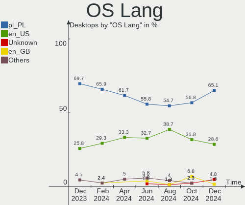

| Lang  | Desktops | Percent |
|-------|----------|---------|
| pl_PL | 33       | 70.21%  |
| en_US | 12       | 25.53%  |
| en_IE | 1        | 2.13%   |
| C     | 1        | 2.13%   |

Boot Mode
---------

EFI or BIOS

| Mode | Desktops | Percent |
|------|----------|---------|
| BIOS | 31       | 65.96%  |
| EFI  | 16       | 34.04%  |

Filesystem
----------

Type of filesystem

| Type    | Desktops | Percent |
|---------|----------|---------|
| Ext4    | 23       | 48.94%  |
| Overlay | 12       | 25.53%  |
| Btrfs   | 8        | 17.02%  |
| F2fs    | 3        | 6.38%   |
| Ext2    | 1        | 2.13%   |

Part. scheme
------------

Scheme of partitioning

| Type    | Desktops | Percent |
|---------|----------|---------|
| GPT     | 24       | 51.06%  |
| Unknown | 15       | 31.91%  |
| MBR     | 8        | 17.02%  |

Dual Boot with Linux/BSD
------------------------

Hosting more than one Linux/BSD

| Dual boot | Desktops | Percent |
|-----------|----------|---------|
| No        | 36       | 76.6%   |
| Yes       | 11       | 23.4%   |

Dual Boot (Win)
---------------

Hosting Linux and Windows

| Dual boot | Desktops | Percent |
|-----------|----------|---------|
| No        | 31       | 65.96%  |
| Yes       | 16       | 34.04%  |

Board
-----

Vendor
------

Motherboard manufacturer

| Name                | Desktops | Percent |
|---------------------|----------|---------|
| ASUSTek Computer    | 14       | 29.79%  |
| Gigabyte Technology | 9        | 19.15%  |
| MSI                 | 5        | 10.64%  |
| Lenovo              | 5        | 10.64%  |
| Hewlett-Packard     | 4        | 8.51%   |
| Dell                | 2        | 4.26%   |
| ASRock              | 2        | 4.26%   |
| POSIFLEX            | 1        | 2.13%   |
| Inventec            | 1        | 2.13%   |
| Fujitsu             | 1        | 2.13%   |
| Foxconn             | 1        | 2.13%   |
| ACTION              | 1        | 2.13%   |
| Acer                | 1        | 2.13%   |

Model
-----

Motherboard model

| Name                                    | Desktops | Percent |
|-----------------------------------------|----------|---------|
| MSI MS-7721                             | 2        | 4.26%   |
| Gigabyte B550 AORUS ELITE V2            | 2        | 4.26%   |
| POSIFLEX KK-3703                        | 1        | 2.13%   |
| MSI MS-7B93                             | 1        | 2.13%   |
| MSI MS-7A70                             | 1        | 2.13%   |
| MSI MS-7A68                             | 1        | 2.13%   |
| Lenovo V530S-07ICB 10TX0010PB           | 1        | 2.13%   |
| Lenovo ThinkCentre M83 10AHS0X60C       | 1        | 2.13%   |
| Lenovo ThinkCentre M70e 0829RB4         | 1        | 2.13%   |
| Lenovo IdeaCentre Y700-34ISH 90DF003SPL | 1        | 2.13%   |
| Lenovo IdeaCentre 720-18ASU 90H10003US  | 1        | 2.13%   |
| Inventec D CLASS                        | 1        | 2.13%   |
| HP xw8600 Workstation                   | 1        | 2.13%   |
| HP ProLiant ML350e Gen8                 | 1        | 2.13%   |
| HP ProLiant ML350 G6                    | 1        | 2.13%   |
| HP EliteDesk 705 G3 Desktop Mini        | 1        | 2.13%   |
| Gigabyte Z97M-DS3H                      | 1        | 2.13%   |
| Gigabyte H61M-S1                        | 1        | 2.13%   |
| Gigabyte H61M-D2H                       | 1        | 2.13%   |
| Gigabyte H270-HD3                       | 1        | 2.13%   |
| Gigabyte GA-970A-UD3                    | 1        | 2.13%   |
| Gigabyte B650E AORUS MASTER             | 1        | 2.13%   |
| Gigabyte AB350-Gaming                   | 1        | 2.13%   |
| Fujitsu CELSIUS R570-2                  | 1        | 2.13%   |
| Foxconn A76GMV                          | 1        | 2.13%   |
| Dell OptiPlex 380                       | 1        | 2.13%   |
| Dell OptiPlex 3040                      | 1        | 2.13%   |
| ASUS Z170I PRO GAMING                   | 1        | 2.13%   |
| ASUS UNLOCK INSTALL                     | 1        | 2.13%   |
| ASUS TUF Gaming B550-PLUS               | 1        | 2.13%   |
| ASUS ROG STRIX X670E-F GAMING WIFI      | 1        | 2.13%   |
| ASUS PRIME X670E-PRO WIFI               | 1        | 2.13%   |
| ASUS PRIME X399-A                       | 1        | 2.13%   |
| ASUS PRIME X370-PRO                     | 1        | 2.13%   |
| ASUS PRIME B450M-A II                   | 1        | 2.13%   |
| ASUS PRIME B360-PLUS                    | 1        | 2.13%   |
| ASUS P8Z77-V LX                         | 1        | 2.13%   |
| ASUS P5K Deluxe                         | 1        | 2.13%   |
| ASUS M4A88T-V EVO/USB3                  | 1        | 2.13%   |
| ASUS M3A78-CM                           | 1        | 2.13%   |

Model Family
------------

Motherboard model prefix

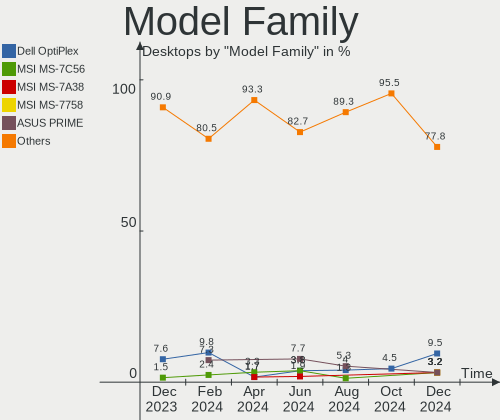

| Name                  | Desktops | Percent |
|-----------------------|----------|---------|
| ASUS PRIME            | 5        | 10.64%  |
| MSI MS-7721           | 2        | 4.26%   |
| Lenovo ThinkCentre    | 2        | 4.26%   |
| Lenovo IdeaCentre     | 2        | 4.26%   |
| HP ProLiant           | 2        | 4.26%   |
| Gigabyte B550         | 2        | 4.26%   |
| Dell OptiPlex         | 2        | 4.26%   |
| POSIFLEX KK-3703      | 1        | 2.13%   |
| MSI MS-7B93           | 1        | 2.13%   |
| MSI MS-7A70           | 1        | 2.13%   |
| MSI MS-7A68           | 1        | 2.13%   |
| Lenovo V530S-07ICB    | 1        | 2.13%   |
| Inventec D            | 1        | 2.13%   |
| HP xw8600             | 1        | 2.13%   |
| HP EliteDesk          | 1        | 2.13%   |
| Gigabyte Z97M-DS3H    | 1        | 2.13%   |
| Gigabyte H61M-S1      | 1        | 2.13%   |
| Gigabyte H61M-D2H     | 1        | 2.13%   |
| Gigabyte H270-HD3     | 1        | 2.13%   |
| Gigabyte GA-970A-UD3  | 1        | 2.13%   |
| Gigabyte B650E        | 1        | 2.13%   |
| Gigabyte AB350-Gaming | 1        | 2.13%   |
| Fujitsu CELSIUS       | 1        | 2.13%   |
| Foxconn A76GMV        | 1        | 2.13%   |
| ASUS Z170I            | 1        | 2.13%   |
| ASUS UNLOCK           | 1        | 2.13%   |
| ASUS TUF              | 1        | 2.13%   |
| ASUS ROG              | 1        | 2.13%   |
| ASUS P8Z77-V          | 1        | 2.13%   |
| ASUS P5K              | 1        | 2.13%   |
| ASUS M4A88T-V         | 1        | 2.13%   |
| ASUS M3A78-CM         | 1        | 2.13%   |
| ASUS M2N-SLI          | 1        | 2.13%   |
| ASRock Z390M-ITX      | 1        | 2.13%   |
| ASRock B450M          | 1        | 2.13%   |
| ACTION ACTINA         | 1        | 2.13%   |
| Acer Nitro            | 1        | 2.13%   |

MFG Year
--------

Motherboard manufacture year

| Year | Desktops | Percent |
|------|----------|---------|
| 2017 | 6        | 12.77%  |
| 2020 | 5        | 10.64%  |
| 2018 | 4        | 8.51%   |
| 2010 | 4        | 8.51%   |
| 2022 | 3        | 6.38%   |
| 2016 | 3        | 6.38%   |
| 2014 | 3        | 6.38%   |
| 2013 | 3        | 6.38%   |
| 2008 | 3        | 6.38%   |
| 2019 | 2        | 4.26%   |
| 2015 | 2        | 4.26%   |
| 2012 | 2        | 4.26%   |
| 2011 | 2        | 4.26%   |
| 2009 | 2        | 4.26%   |
| 2021 | 1        | 2.13%   |
| 2007 | 1        | 2.13%   |
| 2006 | 1        | 2.13%   |

Form Factor
-----------

Physical design of the computer

| Name    | Desktops | Percent |
|---------|----------|---------|
| Desktop | 47       | 100%    |

Secure Boot
-----------

Enabled or disabled

| State    | Desktops | Percent |
|----------|----------|---------|
| Disabled | 47       | 100%    |

Coreboot
--------

Have coreboot on board

| Used | Desktops | Percent |
|------|----------|---------|
| No   | 47       | 100%    |

RAM Size
--------

Total RAM memory

| Size in GB  | Desktops | Percent |
|-------------|----------|---------|
| 16.01-24.0  | 11       | 23.4%   |
| 8.01-16.0   | 9        | 19.15%  |
| 32.01-64.0  | 8        | 17.02%  |
| 4.01-8.0    | 7        | 14.89%  |
| 64.01-256.0 | 5        | 10.64%  |
| 3.01-4.0    | 3        | 6.38%   |
| 24.01-32.0  | 2        | 4.26%   |
| 1.01-2.0    | 2        | 4.26%   |

RAM Used
--------

Used RAM memory

| Used GB     | Desktops | Percent |
|-------------|----------|---------|
| 1.01-2.0    | 12       | 25.53%  |
| 4.01-8.0    | 8        | 17.02%  |
| 2.01-3.0    | 8        | 17.02%  |
| 3.01-4.0    | 6        | 12.77%  |
| 0.51-1.0    | 5        | 10.64%  |
| 8.01-16.0   | 3        | 6.38%   |
| 0.01-0.5    | 2        | 4.26%   |
| 32.01-64.0  | 1        | 2.13%   |
| 64.01-256.0 | 1        | 2.13%   |
| 16.01-24.0  | 1        | 2.13%   |

Total Drives
------------

Number of drives on board

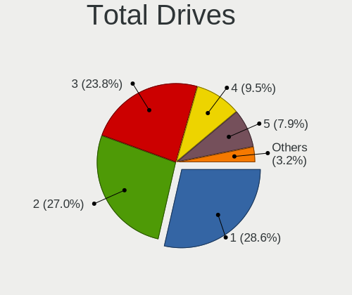

| Drives | Desktops | Percent |
|--------|----------|---------|
| 1      | 16       | 34.04%  |
| 2      | 15       | 31.91%  |
| 4      | 5        | 10.64%  |
| 3      | 4        | 8.51%   |
| 5      | 2        | 4.26%   |
| 0      | 2        | 4.26%   |
| 8      | 1        | 2.13%   |
| 7      | 1        | 2.13%   |
| 6      | 1        | 2.13%   |

Has CD-ROM
----------

Has CD-ROM on board

| Presented | Desktops | Percent |
|-----------|----------|---------|
| Yes       | 24       | 51.06%  |
| No        | 23       | 48.94%  |

Has Ethernet
------------

Has Ethernet on board

| Presented | Desktops | Percent |
|-----------|----------|---------|
| Yes       | 47       | 100%    |

Has WiFi
--------

Has WiFi module

| Presented | Desktops | Percent |
|-----------|----------|---------|
| No        | 24       | 51.06%  |
| Yes       | 23       | 48.94%  |

Has Bluetooth
-------------

Has Bluetooth module

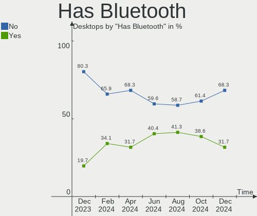

| Presented | Desktops | Percent |
|-----------|----------|---------|
| No        | 30       | 63.83%  |
| Yes       | 17       | 36.17%  |

Location
--------

Country
-------

Geographic location (country)

| Country | Desktops | Percent |
|---------|----------|---------|
| Poland  | 47       | 100%    |

City
----

Geographic location (city)

| City                      | Desktops | Percent |
|---------------------------|----------|---------|
| Warsaw                    | 11       | 23.4%   |
| Lodz                      | 4        | 8.51%   |
| Krakow                    | 3        | 6.38%   |
| Wroclaw                   | 2        | 4.26%   |
| Katowice                  | 2        | 4.26%   |
| Gdansk                    | 2        | 4.26%   |
| Debica                    | 2        | 4.26%   |
| Wieluń                   | 1        | 2.13%   |
| Szczecin                  | 1        | 2.13%   |
| Swiniary Nowe             | 1        | 2.13%   |
| Świętochłowice         | 1        | 2.13%   |
| Stargard                  | 1        | 2.13%   |
| Rzeszów                  | 1        | 2.13%   |
| Poznan                    | 1        | 2.13%   |
| Ostrowiec Świętokrzyski | 1        | 2.13%   |
| Ostrów Wielkopolski      | 1        | 2.13%   |
| Olsztyn                   | 1        | 2.13%   |
| Niepolomice               | 1        | 2.13%   |
| Mysłowice                | 1        | 2.13%   |
| Lomianki                  | 1        | 2.13%   |
| Krapiel                   | 1        | 2.13%   |
| Kozieglowy                | 1        | 2.13%   |
| Jablonka                  | 1        | 2.13%   |
| Gora Kalwaria             | 1        | 2.13%   |
| Domaszowice               | 1        | 2.13%   |
| Cieplewo                  | 1        | 2.13%   |
| Chodkowo-Dzialki          | 1        | 2.13%   |
| Bytom                     | 1        | 2.13%   |

Drives
------

Drive Vendor
------------

Hard drive vendors

| Vendor                         | Desktops | Drives | Percent |
|--------------------------------|----------|--------|---------|
| Seagate                        | 18       | 24     | 20.93%  |
| WDC                            | 14       | 25     | 16.28%  |
| Samsung Electronics            | 14       | 18     | 16.28%  |
| GOODRAM                        | 10       | 10     | 11.63%  |
| Kingston                       | 3        | 3      | 3.49%   |
| Crucial                        | 3        | 3      | 3.49%   |
| Apacer                         | 3        | 3      | 3.49%   |
| Toshiba                        | 2        | 2      | 2.33%   |
| SPCC                           | 2        | 3      | 2.33%   |
| Sandisk                        | 2        | 2      | 2.33%   |
| HS-SSD-E100                    | 2        | 2      | 2.33%   |
| HGST                           | 2        | 2      | 2.33%   |
| XPG                            | 1        | 1      | 1.16%   |
| Solid State Storage Technology | 1        | 1      | 1.16%   |
| Phison Electronics             | 1        | 1      | 1.16%   |
| PHD 3.0                        | 1        | 1      | 1.16%   |
| Maxtor                         | 1        | 1      | 1.16%   |
| KIOXIA                         | 1        | 1      | 1.16%   |
| Intel                          | 1        | 1      | 1.16%   |
| Hitachi                        | 1        | 3      | 1.16%   |
| Fujitsu                        | 1        | 1      | 1.16%   |
| Corsair                        | 1        | 2      | 1.16%   |
| A-DATA Technology              | 1        | 1      | 1.16%   |

Drive Model
-----------

Hard drive models

| Model                                               | Desktops | Percent |
|-----------------------------------------------------|----------|---------|
| GOODRAM SSDPR-CX400-256-G2 256GB                    | 3        | 3.03%   |
| WDC WD2500JS-55NCB1 250GB                           | 2        | 2.02%   |
| Seagate ST31000524AS 1TB                            | 2        | 2.02%   |
| Seagate ST1000DM003-1ER162 1TB                      | 2        | 2.02%   |
| Samsung SSD 970 EVO Plus 500GB                      | 2        | 2.02%   |
| Samsung NVMe SSD Controller SM961/PM961/SM963 256GB | 2        | 2.02%   |
| Kingston SKC3000S1024G 1TB                          | 2        | 2.02%   |
| HS-SSD-E100 SSD 256G                                | 2        | 2.02%   |
| GOODRAM SSDPR-CX400-01T                             | 2        | 2.02%   |
| GOODRAM SSDPR-CL100-480-G2 480GB                    | 2        | 2.02%   |
| Crucial CT1000MX500SSD1 1TB                         | 2        | 2.02%   |
| XPG GAMMIX S5 256GB                                 | 1        | 1.01%   |
| WDC WDS100T2G0A-00JH30 1TB SSD                      | 1        | 1.01%   |
| WDC WD5000LPLX-08ZNTT0 500GB                        | 1        | 1.01%   |
| WDC WD5000AAKX-001CA0 500GB                         | 1        | 1.01%   |
| WDC WD5000AAKS-00A7B0 500GB                         | 1        | 1.01%   |
| WDC WD3200AAKX-221CA0 320GB                         | 1        | 1.01%   |
| WDC WD30EFRX-68N32N0 3TB                            | 1        | 1.01%   |
| WDC WD30EFRX-68EUZN0 3TB                            | 1        | 1.01%   |
| WDC WD2500HHTZ-75N21V0 250GB                        | 1        | 1.01%   |
| WDC WD2500BEVT-22ZCT0 250GB                         | 1        | 1.01%   |
| WDC WD20EZRZ-00Z5HB0 2TB                            | 1        | 1.01%   |
| WDC WD20EZBX-00AYRA0 2TB                            | 1        | 1.01%   |
| WDC WD20EZAZ-00L9GB0 2TB                            | 1        | 1.01%   |
| WDC WD10EZEX-60WN4A0 1TB                            | 1        | 1.01%   |
| WDC WD10EZEX-21WN4A0 1TB                            | 1        | 1.01%   |
| WDC WD10EZEX-08WN4A0 1TB                            | 1        | 1.01%   |
| WDC WD10EVDS-63N5B1 1TB                             | 1        | 1.01%   |
| WDC WD10EALX-009BA0 1TB                             | 1        | 1.01%   |
| Toshiba HDWQ140 4TB                                 | 1        | 1.01%   |
| Toshiba HDWE150 5TB                                 | 1        | 1.01%   |
| SPCC Solid State Disk 512GB                         | 1        | 1.01%   |
| SPCC Solid State Disk 240GB                         | 1        | 1.01%   |
| SPCC Solid State Disk 128GB                         | 1        | 1.01%   |
| Solid State Storage PLEXTOR PX-512M10PGN 512GB      | 1        | 1.01%   |
| Seagate ST500LT012-1DG142 500GB                     | 1        | 1.01%   |
| Seagate ST500LM000-1EJ162 500GB                     | 1        | 1.01%   |
| Seagate ST500DM002-1BD142 500GB                     | 1        | 1.01%   |
| Seagate ST4000DM004-2CV104 4TB                      | 1        | 1.01%   |
| Seagate ST380815AS 80GB                             | 1        | 1.01%   |

HDD Vendor
----------

Hard disk drive vendors

| Vendor              | Desktops | Drives | Percent |
|---------------------|----------|--------|---------|
| Seagate             | 18       | 24     | 41.86%  |
| WDC                 | 14       | 24     | 32.56%  |
| Samsung Electronics | 3        | 3      | 6.98%   |
| Toshiba             | 2        | 2      | 4.65%   |
| HGST                | 2        | 2      | 4.65%   |
| PHD 3.0             | 1        | 1      | 2.33%   |
| Maxtor              | 1        | 1      | 2.33%   |
| Hitachi             | 1        | 3      | 2.33%   |
| Fujitsu             | 1        | 1      | 2.33%   |

SSD Vendor
----------

Solid state drive vendors

| Vendor              | Desktops | Drives | Percent |
|---------------------|----------|--------|---------|
| GOODRAM             | 10       | 10     | 35.71%  |
| Samsung Electronics | 5        | 5      | 17.86%  |
| Crucial             | 3        | 3      | 10.71%  |
| Apacer              | 3        | 3      | 10.71%  |
| SPCC                | 2        | 3      | 7.14%   |
| HS-SSD-E100         | 2        | 2      | 7.14%   |
| WDC                 | 1        | 1      | 3.57%   |
| SanDisk             | 1        | 1      | 3.57%   |
| A-DATA Technology   | 1        | 1      | 3.57%   |

Drive Kind
----------

HDD or SSD

| Kind | Desktops | Drives | Percent |
|------|----------|--------|---------|
| HDD  | 34       | 61     | 45.95%  |
| SSD  | 24       | 29     | 32.43%  |
| NVMe | 16       | 21     | 21.62%  |

Drive Connector
---------------

SATA, SAS, NVMe, etc.

| Type | Desktops | Drives | Percent |
|------|----------|--------|---------|
| SATA | 42       | 89     | 71.19%  |
| NVMe | 16       | 21     | 27.12%  |
| SAS  | 1        | 1      | 1.69%   |

Drive Size
----------

Size of hard drive

| Size in TB | Desktops | Drives | Percent |
|------------|----------|--------|---------|
| 0.01-0.5   | 30       | 39     | 47.62%  |
| 0.51-1.0   | 20       | 30     | 31.75%  |
| 2.01-3.0   | 4        | 7      | 6.35%   |
| 3.01-4.0   | 3        | 3      | 4.76%   |
| 1.01-2.0   | 3        | 8      | 4.76%   |
| 4.01-10.0  | 2        | 2      | 3.17%   |
| 10.01-20.0 | 1        | 1      | 1.59%   |

Space Total
-----------

Amount of disk space available on the file system

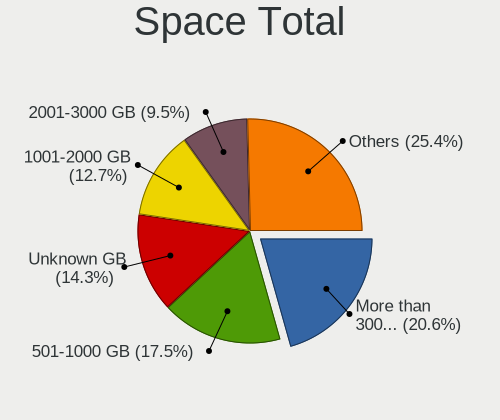

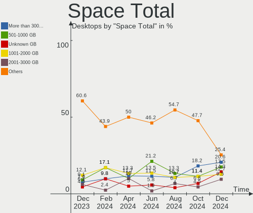

| Size in GB     | Desktops | Percent |
|----------------|----------|---------|
| 1001-2000      | 8        | 17.02%  |
| 101-250        | 7        | 14.89%  |
| 501-1000       | 7        | 14.89%  |
| Unknown        | 6        | 12.77%  |
| More than 3000 | 5        | 10.64%  |
| 51-100         | 5        | 10.64%  |
| 251-500        | 4        | 8.51%   |
| 1-20           | 3        | 6.38%   |
| 21-50          | 1        | 2.13%   |
| 2001-3000      | 1        | 2.13%   |

Space Used
----------

Amount of used disk space

| Used GB        | Desktops | Percent |
|----------------|----------|---------|
| 1-20           | 15       | 31.91%  |
| 501-1000       | 6        | 12.77%  |
| 51-100         | 6        | 12.77%  |
| Unknown        | 6        | 12.77%  |
| 101-250        | 5        | 10.64%  |
| More than 3000 | 2        | 4.26%   |
| 251-500        | 2        | 4.26%   |
| 21-50          | 2        | 4.26%   |
| 1001-2000      | 2        | 4.26%   |
| 2001-3000      | 1        | 2.13%   |

Malfunc. Drives
---------------

Drive models with a malfunction

| Model                             | Desktops | Drives | Percent |
|-----------------------------------|----------|--------|---------|
| Seagate ST500DM002-1BD142 500GB   | 1        | 1      | 16.67%  |
| Seagate ST3320613AS 320GB         | 1        | 1      | 16.67%  |
| Seagate ST3200822A 200GB          | 1        | 1      | 16.67%  |
| Seagate ST1000DM003-9YN162 1TB    | 1        | 1      | 16.67%  |
| Samsung Electronics HD642JJ 640GB | 1        | 1      | 16.67%  |
| Samsung Electronics HD502HJ 500GB | 1        | 1      | 16.67%  |

Malfunc. Drive Vendor
---------------------

Vendors of faulty drives

| Vendor              | Desktops | Drives | Percent |
|---------------------|----------|--------|---------|
| Seagate             | 4        | 4      | 66.67%  |
| Samsung Electronics | 2        | 2      | 33.33%  |

Malfunc. HDD Vendor
-------------------

Vendors of faulty HDD drives

| Vendor              | Desktops | Drives | Percent |
|---------------------|----------|--------|---------|
| Seagate             | 4        | 4      | 66.67%  |
| Samsung Electronics | 2        | 2      | 33.33%  |

Malfunc. Drive Kind
-------------------

Kinds of faulty drives

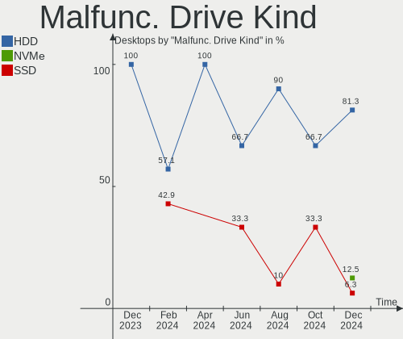

| Kind | Desktops | Drives | Percent |
|------|----------|--------|---------|
| HDD  | 6        | 6      | 100%    |

Failed Drives
-------------

Failed drive models

Zero info for selected period =(

Failed Drive Vendor
-------------------

Failed drive vendors

Zero info for selected period =(

Drive Status
------------

Number of failed and malfunc. drives

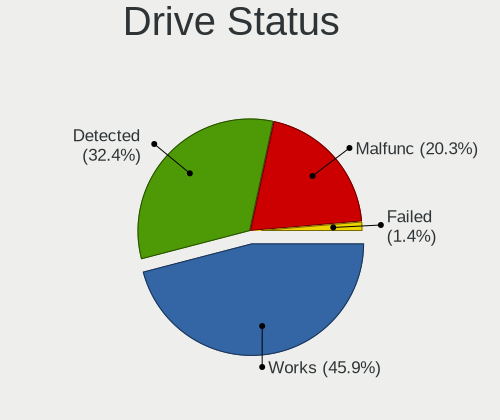

| Status   | Desktops | Drives | Percent |
|----------|----------|--------|---------|
| Detected | 23       | 49     | 47.92%  |
| Works    | 19       | 56     | 39.58%  |
| Malfunc  | 6        | 6      | 12.5%   |

Storage controller
------------------

Storage Vendor
--------------

Storage controller vendors

| Vendor                         | Desktops | Percent |
|--------------------------------|----------|---------|
| Intel                          | 25       | 33.33%  |
| AMD                            | 21       | 28%     |
| Samsung Electronics            | 9        | 12%     |
| Kingston Technology Company    | 3        | 4%      |
| Phison Electronics             | 2        | 2.67%   |
| JMicron Technology             | 2        | 2.67%   |
| Hewlett-Packard                | 2        | 2.67%   |
| ASMedia Technology             | 2        | 2.67%   |
| Solid State Storage Technology | 1        | 1.33%   |
| Silicon Image                  | 1        | 1.33%   |
| SanDisk                        | 1        | 1.33%   |
| Realtek Semiconductor          | 1        | 1.33%   |
| Nvidia                         | 1        | 1.33%   |
| LSI Logic / Symbios Logic      | 1        | 1.33%   |
| KIOXIA                         | 1        | 1.33%   |
| Broadcom / LSI                 | 1        | 1.33%   |
| Adaptec                        | 1        | 1.33%   |

Storage Model
-------------

Storage controller models

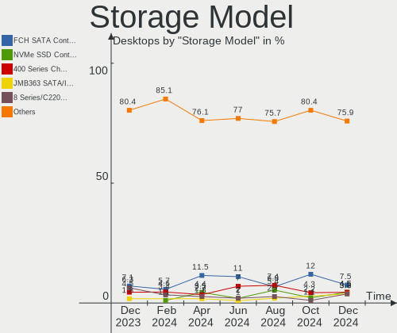

| Model                                                                                   | Desktops | Percent |
|-----------------------------------------------------------------------------------------|----------|---------|
| AMD FCH SATA Controller [AHCI mode]                                                     | 8        | 8.99%   |
| Samsung NVMe SSD Controller SM981/PM981/PM983                                           | 4        | 4.49%   |
| Samsung NVMe SSD Controller SM961/PM961/SM963                                           | 3        | 3.37%   |
| Kingston Company Company Non-Volatile memory controller                                 | 3        | 3.37%   |
| Intel Q170/Q150/B150/H170/H110/Z170/CM236 Chipset SATA Controller [AHCI Mode]           | 3        | 3.37%   |
| Intel NM10/ICH7 Family SATA Controller [IDE mode]                                       | 3        | 3.37%   |
| Intel 82801G (ICH7 Family) IDE Controller                                               | 3        | 3.37%   |
| AMD SB7x0/SB8x0/SB9x0 SATA Controller [IDE mode]                                        | 3        | 3.37%   |
| AMD SB7x0/SB8x0/SB9x0 IDE Controller                                                    | 3        | 3.37%   |
| AMD SATA controller                                                                     | 3        | 3.37%   |
| AMD 500 Series Chipset SATA Controller                                                  | 3        | 3.37%   |
| JMicron JMB363 SATA/IDE Controller                                                      | 2        | 2.25%   |
| Intel SATA Controller [RAID mode]                                                       | 2        | 2.25%   |
| Intel Cannon Lake PCH SATA AHCI Controller                                              | 2        | 2.25%   |
| Intel 6 Series/C200 Series Chipset Family Desktop SATA Controller (IDE mode, ports 4-5) | 2        | 2.25%   |
| Intel 6 Series/C200 Series Chipset Family Desktop SATA Controller (IDE mode, ports 0-3) | 2        | 2.25%   |
| Intel 200 Series PCH SATA controller [AHCI mode]                                        | 2        | 2.25%   |
| AMD SB7x0/SB8x0/SB9x0 SATA Controller [AHCI mode]                                       | 2        | 2.25%   |
| AMD 400 Series Chipset SATA Controller                                                  | 2        | 2.25%   |
| Solid State Storage Non-Volatile memory controller                                      | 1        | 1.12%   |
| Silicon Image PCI0680 Ultra ATA-133 Host Controller                                     | 1        | 1.12%   |
| SanDisk WD Blue SN500 / PC SN520 NVMe SSD                                               | 1        | 1.12%   |
| Samsung NVMe SSD Controller PM9A1/PM9A3/980PRO                                          | 1        | 1.12%   |
| Samsung Electronics Non-Volatile memory controller                                      | 1        | 1.12%   |
| Realtek Realtek Non-Volatile memory controller                                          | 1        | 1.12%   |
| Phison E18 PCIe4 NVMe Controller                                                        | 1        | 1.12%   |
| Phison E12 NVMe Controller                                                              | 1        | 1.12%   |
| Nvidia MCP55 SATA Controller                                                            | 1        | 1.12%   |
| Nvidia MCP55 IDE                                                                        | 1        | 1.12%   |
| LSI Logic / Symbios Logic MegaRAID SAS 2108 [Liberator]                                 | 1        | 1.12%   |
| KIOXIA NVMe SSD                                                                         | 1        | 1.12%   |
| Intel Sunrise Point-LP SATA Controller [AHCI mode]                                      | 1        | 1.12%   |
| Intel SSD 660P Series                                                                   | 1        | 1.12%   |
| Intel Comet Lake SATA AHCI Controller                                                   | 1        | 1.12%   |
| Intel C600/X79 series chipset SATA RAID Controller                                      | 1        | 1.12%   |
| Intel 9 Series Chipset Family SATA Controller [AHCI Mode]                               | 1        | 1.12%   |
| Intel 82801JI (ICH10 Family) SATA AHCI Controller                                       | 1        | 1.12%   |
| Intel 82801IR/IO/IH (ICH9R/DO/DH) 4 port SATA Controller [IDE mode]                     | 1        | 1.12%   |
| Intel 82801I (ICH9 Family) 2 port SATA Controller [IDE mode]                            | 1        | 1.12%   |
| Intel 8 Series/C220 Series Chipset Family 6-port SATA Controller 1 [AHCI mode]          | 1        | 1.12%   |

Storage Kind
------------

Kind of storage controller (IDE, SATA, NVMe, SAS, ...)

| Kind | Desktops | Percent |
|------|----------|---------|
| SATA | 35       | 49.3%   |
| NVMe | 16       | 22.54%  |
| IDE  | 11       | 15.49%  |
| RAID | 7        | 9.86%   |
| SCSI | 2        | 2.82%   |

Processor
---------

CPU Vendor
----------

Processor vendors

| Vendor | Desktops | Percent |
|--------|----------|---------|
| Intel  | 25       | 53.19%  |
| AMD    | 22       | 46.81%  |

CPU Model
---------

Processor models

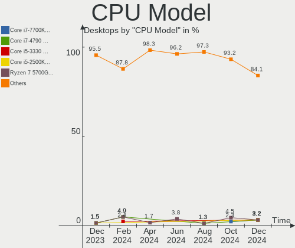

| Model                                          | Desktops | Percent |
|------------------------------------------------|----------|---------|
| Intel Core i3-2100 CPU @ 3.10GHz               | 2        | 4.26%   |
| AMD Ryzen 7 5700X 8-Core Processor             | 2        | 4.26%   |
| AMD Ryzen 5 3600 6-Core Processor              | 2        | 4.26%   |
| Intel Xeon CPU X5675 @ 3.07GHz                 | 1        | 2.13%   |
| Intel Xeon CPU X5650 @ 2.67GHz                 | 1        | 2.13%   |
| Intel Xeon CPU X5450 @ 3.00GHz                 | 1        | 2.13%   |
| Intel Xeon CPU E5-2440 0 @ 2.40GHz             | 1        | 2.13%   |
| Intel Pentium Dual-Core CPU E5800 @ 3.20GHz    | 1        | 2.13%   |
| Intel Pentium CPU G3220 @ 3.00GHz              | 1        | 2.13%   |
| Intel Core i7-7700K CPU @ 4.20GHz              | 1        | 2.13%   |
| Intel Core i7-2700K CPU @ 3.50GHz              | 1        | 2.13%   |
| Intel Core i5-9600K CPU @ 3.70GHz              | 1        | 2.13%   |
| Intel Core i5-9500 CPU @ 3.00GHz               | 1        | 2.13%   |
| Intel Core i5-8400 CPU @ 2.80GHz               | 1        | 2.13%   |
| Intel Core i5-7600 CPU @ 3.50GHz               | 1        | 2.13%   |
| Intel Core i5-7500 CPU @ 3.40GHz               | 1        | 2.13%   |
| Intel Core i5-7400 CPU @ 3.00GHz               | 1        | 2.13%   |
| Intel Core i5-6600 CPU @ 3.30GHz               | 1        | 2.13%   |
| Intel Core i5-6500 CPU @ 3.20GHz               | 1        | 2.13%   |
| Intel Core i5-4690 CPU @ 3.50GHz               | 1        | 2.13%   |
| Intel Core i5-2400 CPU @ 3.10GHz               | 1        | 2.13%   |
| Intel Core i5-10400F CPU @ 2.90GHz             | 1        | 2.13%   |
| Intel Core i3-7100U CPU @ 2.40GHz              | 1        | 2.13%   |
| Intel Core 2 Quad CPU Q9400 @ 2.66GHz          | 1        | 2.13%   |
| Intel Core 2 Duo CPU E8500 @ 3.16GHz           | 1        | 2.13%   |
| Intel Core 2 Duo CPU E6750 @ 2.66GHz           | 1        | 2.13%   |
| AMD Ryzen Threadripper 1920X 12-Core Processor | 1        | 2.13%   |
| AMD Ryzen 9 7950X 16-Core Processor            | 1        | 2.13%   |
| AMD Ryzen 9 7900X 12-Core Processor            | 1        | 2.13%   |
| AMD Ryzen 9 5900X 12-Core Processor            | 1        | 2.13%   |
| AMD Ryzen 7 5700G with Radeon Graphics         | 1        | 2.13%   |
| AMD Ryzen 7 3700X 8-Core Processor             | 1        | 2.13%   |
| AMD Ryzen 7 1700 Eight-Core Processor          | 1        | 2.13%   |
| AMD Ryzen 5 7600X 6-Core Processor             | 1        | 2.13%   |
| AMD Ryzen 5 2600 Six-Core Processor            | 1        | 2.13%   |
| AMD Processor model unknown                    | 1        | 2.13%   |
| AMD PRO A10-8770E R7, 10 COMPUTE CORES 4C+6G   | 1        | 2.13%   |
| AMD Phenom II X4 955 Processor                 | 1        | 2.13%   |
| AMD G-T48E Processor                           | 1        | 2.13%   |
| AMD FX-6200 Six-Core Processor                 | 1        | 2.13%   |

CPU Model Family
----------------

Processor model prefix

| Model                   | Desktops | Percent |
|-------------------------|----------|---------|
| Intel Core i5           | 11       | 23.4%   |
| AMD Ryzen 7             | 5        | 10.64%  |
| Intel Xeon              | 4        | 8.51%   |
| AMD Ryzen 5             | 4        | 8.51%   |
| Intel Core i3           | 3        | 6.38%   |
| AMD Ryzen 9             | 3        | 6.38%   |
| Intel Core i7           | 2        | 4.26%   |
| Intel Core 2 Duo        | 2        | 4.26%   |
| Other                   | 1        | 2.13%   |
| Intel Pentium Dual-Core | 1        | 2.13%   |
| Intel Pentium           | 1        | 2.13%   |
| Intel Core 2 Quad       | 1        | 2.13%   |
| AMD Ryzen Threadripper  | 1        | 2.13%   |
| AMD PRO A10             | 1        | 2.13%   |
| AMD Phenom II X4        | 1        | 2.13%   |
| AMD G                   | 1        | 2.13%   |
| AMD FX                  | 1        | 2.13%   |
| AMD Athlon II X4        | 1        | 2.13%   |
| AMD Athlon II X3        | 1        | 2.13%   |
| AMD A8                  | 1        | 2.13%   |
| AMD A4                  | 1        | 2.13%   |

CPU Cores
---------

Number of processor cores

| Number | Desktops | Percent |
|--------|----------|---------|
| 4      | 14       | 29.79%  |
| 2      | 10       | 21.28%  |
| 6      | 8        | 17.02%  |
| 12     | 6        | 12.77%  |
| 8      | 5        | 10.64%  |
| 3      | 2        | 4.26%   |
| 16     | 1        | 2.13%   |
| 1      | 1        | 2.13%   |

CPU Sockets
-----------

Number of sockets

| Number | Desktops | Percent |
|--------|----------|---------|
| 1      | 44       | 93.62%  |
| 2      | 3        | 6.38%   |

CPU Threads
-----------

Threads per core (Hyper-Threading)

| Number | Desktops | Percent |
|--------|----------|---------|
| 2      | 26       | 55.32%  |
| 1      | 21       | 44.68%  |

CPU Op-Modes
------------

CPU Operation Modes (32-bit, 64-bit)

| Op mode        | Desktops | Percent |
|----------------|----------|---------|
| 32-bit, 64-bit | 47       | 100%    |

CPU Microcode
-------------

Microcode number

| Number     | Desktops | Percent |
|------------|----------|---------|
| Unknown    | 11       | 23.4%   |
| 0x206a7    | 4        | 8.51%   |
| 0x906e9    | 3        | 6.38%   |
| 0x1067a    | 3        | 6.38%   |
| 0x506e3    | 2        | 4.26%   |
| 0x0a601203 | 2        | 4.26%   |
| 0x08701021 | 2        | 4.26%   |
| 0x010000c8 | 2        | 4.26%   |
| 0xa0653    | 1        | 2.13%   |
| 0x906ed    | 1        | 2.13%   |
| 0x906ea    | 1        | 2.13%   |
| 0x6fb      | 1        | 2.13%   |
| 0x306c3    | 1        | 2.13%   |
| 0x206d7    | 1        | 2.13%   |
| 0x10676    | 1        | 2.13%   |
| 0x0a601201 | 1        | 2.13%   |
| 0x0a50000c | 1        | 2.13%   |
| 0x0a20120a | 1        | 2.13%   |
| 0x0a201205 | 1        | 2.13%   |
| 0x0800820d | 1        | 2.13%   |
| 0x08001137 | 1        | 2.13%   |
| 0x0600611a | 1        | 2.13%   |
| 0x06001119 | 1        | 2.13%   |
| 0x0600063e | 1        | 2.13%   |
| 0x05000119 | 1        | 2.13%   |
| 0x010000db | 1        | 2.13%   |

CPU Microarch
-------------

Microarchitecture

| Name        | Desktops | Percent |
|-------------|----------|---------|
| KabyLake    | 8        | 17.02%  |
| SandyBridge | 5        | 10.64%  |
| Zen 3       | 4        | 8.51%   |
| Penryn      | 4        | 8.51%   |
| K10         | 4        | 8.51%   |
| Zen 2       | 3        | 6.38%   |
| Unknown     | 3        | 6.38%   |
| Zen         | 2        | 4.26%   |
| Westmere    | 2        | 4.26%   |
| Skylake     | 2        | 4.26%   |
| Piledriver  | 2        | 4.26%   |
| Haswell     | 2        | 4.26%   |
| Zen+        | 1        | 2.13%   |
| Excavator   | 1        | 2.13%   |
| Core        | 1        | 2.13%   |
| CometLake   | 1        | 2.13%   |
| Bulldozer   | 1        | 2.13%   |
| Bobcat      | 1        | 2.13%   |

Graphics
--------

GPU Vendor
----------

Vendors of graphics cards

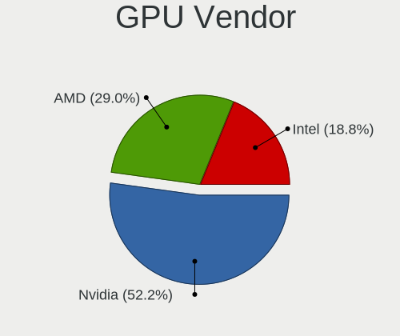

| Vendor                     | Desktops | Percent |
|----------------------------|----------|---------|
| AMD                        | 21       | 44.68%  |
| Intel                      | 13       | 27.66%  |
| Nvidia                     | 12       | 25.53%  |
| Matrox Electronics Systems | 1        | 2.13%   |

GPU Model
---------

Graphics card models

| Model                                                                       | Desktops | Percent |
|-----------------------------------------------------------------------------|----------|---------|
| Intel 2nd Generation Core Processor Family Integrated Graphics Controller   | 4        | 8%      |
| AMD Ellesmere [Radeon RX 470/480/570/570X/580/580X/590]                     | 4        | 8%      |
| Intel HD Graphics 630                                                       | 3        | 6%      |
| Intel CoffeeLake-S GT2 [UHD Graphics 630]                                   | 2        | 4%      |
| AMD Raphael                                                                 | 2        | 4%      |
| Nvidia TU106 [GeForce RTX 2060 Rev. A]                                      | 1        | 2%      |
| Nvidia GP107 [GeForce GTX 1050 Ti]                                          | 1        | 2%      |
| Nvidia GP104 [GeForce GTX 1070]                                             | 1        | 2%      |
| Nvidia GK104GL [Quadro K4200]                                               | 1        | 2%      |
| Nvidia GK104 [GeForce GTX 760]                                              | 1        | 2%      |
| Nvidia GF119 [GeForce GT 520]                                               | 1        | 2%      |
| Nvidia GF108 [GeForce GT 430]                                               | 1        | 2%      |
| Nvidia GF106 [GeForce GTS 450]                                              | 1        | 2%      |
| Nvidia GA106 [Geforce RTX 3050]                                             | 1        | 2%      |
| Nvidia GA104 [GeForce RTX 3060 Ti]                                          | 1        | 2%      |
| Nvidia G86 [Quadro NVS 290]                                                 | 1        | 2%      |
| Nvidia G71GL [Quadro FX 5500]                                               | 1        | 2%      |
| Matrox Electronics Systems MGA G200EH                                       | 1        | 2%      |
| Intel Xeon E3-1200 v3/4th Gen Core Processor Integrated Graphics Controller | 1        | 2%      |
| Intel HD Graphics 620                                                       | 1        | 2%      |
| Intel HD Graphics 530                                                       | 1        | 2%      |
| Intel 4 Series Chipset Integrated Graphics Controller                       | 1        | 2%      |
| AMD Wrestler [Radeon HD 6250]                                               | 1        | 2%      |
| AMD Wani [Radeon R5/R6/R7 Graphics]                                         | 1        | 2%      |
| AMD RV770/M98L [Mobility Radeon HD 4850]                                    | 1        | 2%      |
| AMD RV516 [Radeon X1300/X1550 Series] (Secondary)                           | 1        | 2%      |
| AMD RV516 [Radeon X1300/X1550 Series]                                       | 1        | 2%      |
| AMD RV370 [Radeon X300/X550/X1050 Series] (Secondary)                       | 1        | 2%      |
| AMD RV370 [Radeon X300/X550/X1050 Series]                                   | 1        | 2%      |
| AMD RS780C [Radeon 3100]                                                    | 1        | 2%      |
| AMD Richland [Radeon HD 8570D]                                              | 1        | 2%      |
| AMD Richland [Radeon HD 8370D]                                              | 1        | 2%      |
| AMD Pitcairn PRO [Radeon HD 7850 / R7 265 / R9 270 1024SP]                  | 1        | 2%      |
| AMD Navi 23 [Radeon RX 6600/6600 XT/6600M]                                  | 1        | 2%      |
| AMD Navi 22 [Radeon RX 6700/6700 XT/6750 XT / 6800M]                        | 1        | 2%      |
| AMD Navi 21 [Radeon RX 6950 XT]                                             | 1        | 2%      |
| AMD ES1000                                                                  | 1        | 2%      |
| AMD Cezanne [Radeon Vega Series / Radeon Vega Mobile Series]                | 1        | 2%      |
| AMD Cedar [Radeon HD 5000/6000/7350/8350 Series]                            | 1        | 2%      |
| AMD Caicos XT [Radeon HD 7470/8470 / R5 235/310 OEM]                        | 1        | 2%      |

GPU Combo
---------

Combinations of graphics cards

| Name       | Desktops | Percent |
|------------|----------|---------|
| 1 x AMD    | 18       | 38.3%   |
| 1 x Intel  | 13       | 27.66%  |
| 1 x Nvidia | 12       | 25.53%  |
| 2 x AMD    | 3        | 6.38%   |
| 1 x Matrox | 1        | 2.13%   |

GPU Driver
----------

Free vs proprietary

| Driver      | Desktops | Percent |
|-------------|----------|---------|
| Free        | 39       | 82.98%  |
| Proprietary | 6        | 12.77%  |
| Unknown     | 2        | 4.26%   |

GPU Memory
----------

Total video memory

| Size in GB | Desktops | Percent |
|------------|----------|---------|
| Unknown    | 25       | 53.19%  |
| 0.51-1.0   | 8        | 17.02%  |
| 0.01-0.5   | 7        | 14.89%  |
| 7.01-8.0   | 3        | 6.38%   |
| 3.01-4.0   | 2        | 4.26%   |
| 8.01-16.0  | 2        | 4.26%   |

Monitor
-------

Monitor Vendor
--------------

Monitor vendors

| Vendor               | Desktops | Percent |
|----------------------|----------|---------|
| Samsung Electronics  | 10       | 21.28%  |
| Goldstar             | 6        | 12.77%  |
| AOC                  | 5        | 10.64%  |
| Philips              | 4        | 8.51%   |
| Iiyama               | 3        | 6.38%   |
| BenQ                 | 3        | 6.38%   |
| Belinea              | 3        | 6.38%   |
| Hewlett-Packard      | 2        | 4.26%   |
| Eizo                 | 2        | 4.26%   |
| Dell                 | 2        | 4.26%   |
| Acer                 | 2        | 4.26%   |
| NEC Computers        | 1        | 2.13%   |
| Fujitsu Siemens      | 1        | 2.13%   |
| CHR                  | 1        | 2.13%   |
| Arnos Instruments    | 1        | 2.13%   |
| Ancor Communications | 1        | 2.13%   |

Monitor Model
-------------

Monitor models

| Model                                                                   | Desktops | Percent |
|-------------------------------------------------------------------------|----------|---------|
| AOC 24G2W1G5 AOC2402 1920x1080 527x296mm 23.8-inch                      | 3        | 6.38%   |
| Philips PHL 223V5 PHLC0CF 1920x1080 477x268mm 21.5-inch                 | 2        | 4.26%   |
| Belinea B_101751 MAX06AD 1280x1024 338x270mm 17.0-inch                  | 2        | 4.26%   |
| Samsung Electronics SyncMaster SAM03E1 1440x900 410x257mm 19.1-inch     | 1        | 2.13%   |
| Samsung Electronics SyncMaster SAM01F9 1280x1024 376x301mm 19.0-inch    | 1        | 2.13%   |
| Samsung Electronics SyncMaster SAM0167 1280x1024 338x270mm 17.0-inch    | 1        | 2.13%   |
| Samsung Electronics S24C450 SAM09CF 1920x1200 518x324mm 24.1-inch       | 1        | 2.13%   |
| Samsung Electronics S22B300 SAM08C8 1920x1080 477x268mm 21.5-inch       | 1        | 2.13%   |
| Samsung Electronics Odyssey G50A SAM7181 2560x1440 597x336mm 27.0-inch  | 1        | 2.13%   |
| Samsung Electronics LCD Monitor T22E390 1920x1080                       | 1        | 2.13%   |
| Samsung Electronics LCD Monitor SMB2230N 1920x1080                      | 1        | 2.13%   |
| Samsung Electronics LCD Monitor SAM0FA5 3840x2160 1872x1053mm 84.6-inch | 1        | 2.13%   |
| Samsung Electronics LC32G5xT SAM7088 2560x1440 698x393mm 31.5-inch      | 1        | 2.13%   |
| Philips PHL 328E1 PHLC204 3840x2160 697x392mm 31.5-inch                 | 1        | 2.13%   |
| Philips PHL 276E8V PHLC18F 3840x2160 600x340mm 27.2-inch                | 1        | 2.13%   |
| NEC Computers EA245WMi-2 NEC2DE0 1920x1200 519x324mm 24.1-inch          | 1        | 2.13%   |
| Iiyama PLX2481H IVM611D 1920x1080 521x293mm 23.5-inch                   | 1        | 2.13%   |
| Iiyama PLB2403WS IVM5601 1920x1200 519x324mm 24.1-inch                  | 1        | 2.13%   |
| Iiyama PL2440HS IVM615E 1920x1080 527x296mm 23.8-inch                   | 1        | 2.13%   |
| Hewlett-Packard LA2306 HWP2949 1920x1080 509x286mm 23.0-inch            | 1        | 2.13%   |
| Hewlett-Packard 22xw HWP3185 1920x1080 476x268mm 21.5-inch              | 1        | 2.13%   |
| Goldstar ULTRAWIDE GSM59F1 2560x1080 798x334mm 34.1-inch                | 1        | 2.13%   |
| Goldstar Ultra HD GSM5B08 3840x2160 600x340mm 27.2-inch                 | 1        | 2.13%   |
| Goldstar M2352D GSM60AD 1920x1080 509x286mm 23.0-inch                   | 1        | 2.13%   |
| Goldstar L207W GSM4E7B 1680x1050 434x270mm 20.1-inch                    | 1        | 2.13%   |
| Goldstar L1919S GSM4AF0 1280x1024 376x301mm 19.0-inch                   | 1        | 2.13%   |
| Goldstar IPS224 GSM58D5 1920x1080 477x268mm 21.5-inch                   | 1        | 2.13%   |
| Fujitsu Siemens P23T-6 IPS FUS07E9 1920x1080 509x286mm 23.0-inch        | 1        | 2.13%   |
| Eizo EV2450 ENC2568 1920x1080 528x297mm 23.9-inch                       | 1        | 2.13%   |
| Eizo EV2316W ENC2393 1920x1080 510x287mm 23.0-inch                      | 1        | 2.13%   |
| Dell UZ2715H DELA0AD 1920x1080 597x336mm 27.0-inch                      | 1        | 2.13%   |
| Dell S2722DGM DEL4239 2560x1440 597x336mm 27.0-inch                     | 1        | 2.13%   |
| CHR CH7511B CHR7511 1920x1080 519x324mm 24.1-inch                       | 1        | 2.13%   |
| BenQ MP720 BNQ7001 1280x1024                                            | 1        | 2.13%   |
| BenQ GW2255 BNQ78CD 1920x1080 477x268mm 21.5-inch                       | 1        | 2.13%   |
| BenQ GL2450 BNQ78A5 1920x1080 531x298mm 24.0-inch                       | 1        | 2.13%   |
| Belinea 101725 MAX06C9 1280x1024 337x270mm 17.0-inch                    | 1        | 2.13%   |
| Arnos Instruments F-419 AIC9450 1280x1024 376x301mm 19.0-inch           | 1        | 2.13%   |
| AOC 32G2WG3 AOC3202 1920x1080 698x393mm 31.5-inch                       | 1        | 2.13%   |
| AOC 2270W AOC2270 1920x1080 477x268mm 21.5-inch                         | 1        | 2.13%   |

Monitor Resolution
------------------

Monitor screen resolution

| Resolution         | Desktops | Percent |
|--------------------|----------|---------|
| 1920x1080 (FHD)    | 22       | 50%     |
| 1280x1024 (SXGA)   | 8        | 18.18%  |
| 3840x2160 (4K)     | 5        | 11.36%  |
| 2560x1440 (QHD)    | 3        | 6.82%   |
| 1920x1200 (WUXGA)  | 3        | 6.82%   |
| 2560x1080          | 1        | 2.27%   |
| 1680x1050 (WSXGA+) | 1        | 2.27%   |
| 1440x900 (WXGA+)   | 1        | 2.27%   |

Monitor Diagonal
----------------

Diagonal size in inches

| Inches  | Desktops | Percent |
|---------|----------|---------|
| 21      | 8        | 18.18%  |
| 24      | 7        | 15.91%  |
| 23      | 7        | 15.91%  |
| 27      | 5        | 11.36%  |
| 19      | 4        | 9.09%   |
| 17      | 4        | 9.09%   |
| 31      | 3        | 6.82%   |
| Unknown | 3        | 6.82%   |
| 84      | 1        | 2.27%   |
| 34      | 1        | 2.27%   |
| 20      | 1        | 2.27%   |

Monitor Width
-------------

Physical width

| Width in mm | Desktops | Percent |
|-------------|----------|---------|
| 501-600     | 19       | 43.18%  |
| 401-500     | 10       | 22.73%  |
| 301-350     | 4        | 9.09%   |
| 601-700     | 3        | 6.82%   |
| 351-400     | 3        | 6.82%   |
| Unknown     | 3        | 6.82%   |
| 701-800     | 1        | 2.27%   |
| 1501-2000   | 1        | 2.27%   |

Aspect Ratio
------------

Proportional relationship between the width and the height

| Ratio   | Desktops | Percent |
|---------|----------|---------|
| 16/9    | 26       | 59.09%  |
| 5/4     | 8        | 18.18%  |
| 16/10   | 7        | 15.91%  |
| Unknown | 2        | 4.55%   |
| 21/9    | 1        | 2.27%   |

Monitor Area
------------

Area in inch²

| Area in inch² | Desktops | Percent |
|----------------|----------|---------|
| 201-250        | 13       | 29.55%  |
| 151-200        | 9        | 20.45%  |
| 301-350        | 5        | 11.36%  |
| 251-300        | 5        | 11.36%  |
| 351-500        | 4        | 9.09%   |
| 141-150        | 4        | 9.09%   |
| Unknown        | 3        | 6.82%   |
| More than 1000 | 1        | 2.27%   |

Pixel Density
-------------

Pixels per inch

| Density | Desktops | Percent |
|---------|----------|---------|
| 51-100  | 28       | 63.64%  |
| 101-120 | 10       | 22.73%  |
| Unknown | 3        | 6.82%   |
| 161-240 | 2        | 4.55%   |
| 121-160 | 1        | 2.27%   |

Multiple Monitors
-----------------

Total monitors connected

| Total | Desktops | Percent |
|-------|----------|---------|
| 1     | 41       | 87.23%  |
| 2     | 3        | 6.38%   |
| 0     | 3        | 6.38%   |

Network
-------

Net Controller Vendor
---------------------

Controller vendors

| Vendor                   | Desktops | Percent |
|--------------------------|----------|---------|
| Realtek Semiconductor    | 30       | 42.86%  |
| Intel                    | 15       | 21.43%  |
| Qualcomm Atheros         | 6        | 8.57%   |
| Broadcom                 | 5        | 7.14%   |
| MediaTek                 | 4        | 5.71%   |
| TP-Link                  | 3        | 4.29%   |
| Z-Com                    | 1        | 1.43%   |
| Ralink Technology        | 1        | 1.43%   |
| Posiflex Technologies    | 1        | 1.43%   |
| Marvell Technology Group | 1        | 1.43%   |
| HTC (High Tech Computer) | 1        | 1.43%   |
| Edimax Technology        | 1        | 1.43%   |
| ASUSTek Computer         | 1        | 1.43%   |

Net Controller Model
--------------------

Controller models

| Model                                                             | Desktops | Percent |
|-------------------------------------------------------------------|----------|---------|
| Realtek RTL8111/8168/8411 PCI Express Gigabit Ethernet Controller | 25       | 32.47%  |
| Realtek RTL8125 2.5GbE Controller                                 | 4        | 5.19%   |
| Intel Wi-Fi 6 AX200                                               | 3        | 3.9%    |
| Intel I211 Gigabit Network Connection                             | 3        | 3.9%    |
| Intel Ethernet Connection (2) I219-V                              | 3        | 3.9%    |
| TP-Link TL-WN722N v2/v3 [Realtek RTL8188EUS]                      | 2        | 2.6%    |
| Qualcomm Atheros QCA6174 802.11ac Wireless Network Adapter        | 2        | 2.6%    |
| MediaTek MT7922 802.11ax PCI Express Wireless Network Adapter     | 2        | 2.6%    |
| MediaTek MT7921K (RZ608) Wi-Fi 6E 80MHz                           | 2        | 2.6%    |
| Intel Ethernet Controller I225-V                                  | 2        | 2.6%    |
| Z-Com XG-703A 802.11g Wireless Adapter [Intersil ISL3887]         | 1        | 1.3%    |
| TP-Link TL-WN823N v2/v3 [Realtek RTL8192EU]                       | 1        | 1.3%    |
| Realtek RTL8188CUS 802.11n WLAN Adapter                           | 1        | 1.3%    |
| Realtek RTL-8110SC/8169SC Gigabit Ethernet                        | 1        | 1.3%    |
| Realtek RTL-8100/8101L/8139 PCI Fast Ethernet Adapter             | 1        | 1.3%    |
| Ralink RT2501/RT2573 Wireless Adapter                             | 1        | 1.3%    |
| Qualcomm Atheros QCA9377 802.11ac Wireless Network Adapter        | 1        | 1.3%    |
| Qualcomm Atheros AR9485 Wireless Network Adapter                  | 1        | 1.3%    |
| Qualcomm Atheros AR9227 Wireless Network Adapter                  | 1        | 1.3%    |
| Qualcomm Atheros AR8151 v2.0 Gigabit Ethernet                     | 1        | 1.3%    |
| Posiflex SU100 Proximity Sensor F/W:V1.1                          | 1        | 1.3%    |
| Posiflex SI100                                                    | 1        | 1.3%    |
| Posiflex PP-9500K Thermal Printer                                 | 1        | 1.3%    |
| Marvell Group 88E8057 PCI-E Gigabit Ethernet Controller           | 1        | 1.3%    |
| Intel Wireless 8260                                               | 1        | 1.3%    |
| Intel I350 Gigabit Network Connection                             | 1        | 1.3%    |
| Intel Ethernet Connection I219-LM                                 | 1        | 1.3%    |
| Intel Ethernet Connection I217-LM                                 | 1        | 1.3%    |
| Intel Ethernet Connection (7) I219-V                              | 1        | 1.3%    |
| Intel Dual Band Wireless-AC 3168NGW [Stone Peak]                  | 1        | 1.3%    |
| Intel Comet Lake PCH CNVi WiFi                                    | 1        | 1.3%    |
| HTC (High Tech Computer) Desire HD (modem mode)                   | 1        | 1.3%    |
| Edimax AC1750 USB                                                 | 1        | 1.3%    |
| Broadcom NetXtreme II BCM5706 Gigabit Ethernet                    | 1        | 1.3%    |
| Broadcom NetXtreme BCM5762 Gigabit Ethernet PCIe                  | 1        | 1.3%    |
| Broadcom NetXtreme BCM5755 Gigabit Ethernet PCI Express           | 1        | 1.3%    |
| Broadcom NetXtreme BCM5715 Gigabit Ethernet                       | 1        | 1.3%    |
| Broadcom NetLink BCM57780 Gigabit Ethernet PCIe                   | 1        | 1.3%    |
| ASUS N10 Nano 802.11n Network Adapter [Realtek RTL8192CU]         | 1        | 1.3%    |

Wireless Vendor
---------------

Wireless vendors

| Vendor                | Desktops | Percent |
|-----------------------|----------|---------|
| Intel                 | 6        | 26.09%  |
| Qualcomm Atheros      | 5        | 21.74%  |
| MediaTek              | 4        | 17.39%  |
| TP-Link               | 3        | 13.04%  |
| Z-Com                 | 1        | 4.35%   |
| Realtek Semiconductor | 1        | 4.35%   |
| Ralink Technology     | 1        | 4.35%   |
| Edimax Technology     | 1        | 4.35%   |
| ASUSTek Computer      | 1        | 4.35%   |

Wireless Model
--------------

Wireless models

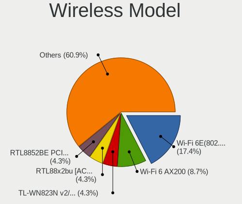

| Model                                                         | Desktops | Percent |
|---------------------------------------------------------------|----------|---------|
| Intel Wi-Fi 6 AX200                                           | 3        | 13.04%  |
| TP-Link TL-WN722N v2/v3 [Realtek RTL8188EUS]                  | 2        | 8.7%    |
| Qualcomm Atheros QCA6174 802.11ac Wireless Network Adapter    | 2        | 8.7%    |
| MediaTek MT7922 802.11ax PCI Express Wireless Network Adapter | 2        | 8.7%    |
| MediaTek MT7921K (RZ608) Wi-Fi 6E 80MHz                       | 2        | 8.7%    |
| Z-Com XG-703A 802.11g Wireless Adapter [Intersil ISL3887]     | 1        | 4.35%   |
| TP-Link TL-WN823N v2/v3 [Realtek RTL8192EU]                   | 1        | 4.35%   |
| Realtek RTL8188CUS 802.11n WLAN Adapter                       | 1        | 4.35%   |
| Ralink RT2501/RT2573 Wireless Adapter                         | 1        | 4.35%   |
| Qualcomm Atheros QCA9377 802.11ac Wireless Network Adapter    | 1        | 4.35%   |
| Qualcomm Atheros AR9485 Wireless Network Adapter              | 1        | 4.35%   |
| Qualcomm Atheros AR9227 Wireless Network Adapter              | 1        | 4.35%   |
| Intel Wireless 8260                                           | 1        | 4.35%   |
| Intel Dual Band Wireless-AC 3168NGW [Stone Peak]              | 1        | 4.35%   |
| Intel Comet Lake PCH CNVi WiFi                                | 1        | 4.35%   |
| Edimax AC1750 USB                                             | 1        | 4.35%   |
| ASUS N10 Nano 802.11n Network Adapter [Realtek RTL8192CU]     | 1        | 4.35%   |

Ethernet Vendor
---------------

Ethernet vendors

| Vendor                   | Desktops | Percent |
|--------------------------|----------|---------|
| Realtek Semiconductor    | 30       | 61.22%  |
| Intel                    | 11       | 22.45%  |
| Broadcom                 | 5        | 10.2%   |
| Qualcomm Atheros         | 1        | 2.04%   |
| Marvell Technology Group | 1        | 2.04%   |
| HTC (High Tech Computer) | 1        | 2.04%   |

Ethernet Model
--------------

Ethernet models

| Model                                                             | Desktops | Percent |
|-------------------------------------------------------------------|----------|---------|
| Realtek RTL8111/8168/8411 PCI Express Gigabit Ethernet Controller | 25       | 49.02%  |
| Realtek RTL8125 2.5GbE Controller                                 | 4        | 7.84%   |
| Intel I211 Gigabit Network Connection                             | 3        | 5.88%   |
| Intel Ethernet Connection (2) I219-V                              | 3        | 5.88%   |
| Intel Ethernet Controller I225-V                                  | 2        | 3.92%   |
| Realtek RTL-8110SC/8169SC Gigabit Ethernet                        | 1        | 1.96%   |
| Realtek RTL-8100/8101L/8139 PCI Fast Ethernet Adapter             | 1        | 1.96%   |
| Qualcomm Atheros AR8151 v2.0 Gigabit Ethernet                     | 1        | 1.96%   |
| Marvell Group 88E8057 PCI-E Gigabit Ethernet Controller           | 1        | 1.96%   |
| Intel I350 Gigabit Network Connection                             | 1        | 1.96%   |
| Intel Ethernet Connection I219-LM                                 | 1        | 1.96%   |
| Intel Ethernet Connection I217-LM                                 | 1        | 1.96%   |
| Intel Ethernet Connection (7) I219-V                              | 1        | 1.96%   |
| HTC (High Tech Computer) Desire HD (modem mode)                   | 1        | 1.96%   |
| Broadcom NetXtreme II BCM5706 Gigabit Ethernet                    | 1        | 1.96%   |
| Broadcom NetXtreme BCM5762 Gigabit Ethernet PCIe                  | 1        | 1.96%   |
| Broadcom NetXtreme BCM5755 Gigabit Ethernet PCI Express           | 1        | 1.96%   |
| Broadcom NetXtreme BCM5715 Gigabit Ethernet                       | 1        | 1.96%   |
| Broadcom NetLink BCM57780 Gigabit Ethernet PCIe                   | 1        | 1.96%   |

Net Controller Kind
-------------------

Ethernet, WiFi or modem

| Kind     | Desktops | Percent |
|----------|----------|---------|
| Ethernet | 47       | 67.14%  |
| WiFi     | 22       | 31.43%  |
| Modem    | 1        | 1.43%   |

Used Controller
---------------

Currently used network controller

| Kind     | Desktops | Percent |
|----------|----------|---------|
| Ethernet | 40       | 78.43%  |
| WiFi     | 11       | 21.57%  |

NICs
----

Total network controllers on board

| Total | Desktops | Percent |
|-------|----------|---------|
| 1     | 25       | 53.19%  |
| 2     | 21       | 44.68%  |
| 3     | 1        | 2.13%   |

IPv6
----

IPv6 vs IPv4

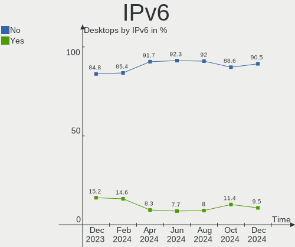

| Used | Desktops | Percent |
|------|----------|---------|
| No   | 44       | 93.62%  |
| Yes  | 3        | 6.38%   |

Bluetooth
---------

Bluetooth Vendor
----------------

Controller vendors

| Vendor                          | Desktops | Percent |
|---------------------------------|----------|---------|
| Intel                           | 6        | 35.29%  |
| Cambridge Silicon Radio         | 3        | 17.65%  |
| Qualcomm Atheros Communications | 2        | 11.76%  |
| MediaTek                        | 2        | 11.76%  |
| ASUSTek Computer                | 2        | 11.76%  |
| Realtek Semiconductor           | 1        | 5.88%   |
| Foxconn / Hon Hai               | 1        | 5.88%   |

Bluetooth Model
---------------

Controller models

| Model                                               | Desktops | Percent |
|-----------------------------------------------------|----------|---------|
| Intel AX200 Bluetooth                               | 3        | 17.65%  |
| Cambridge Silicon Radio Bluetooth Dongle (HCI mode) | 3        | 17.65%  |
| MediaTek Wireless_Device                            | 2        | 11.76%  |
| Realtek Bluetooth Radio                             | 1        | 5.88%   |
| Qualcomm Atheros  Bluetooth Device                  | 1        | 5.88%   |
| Qualcomm Atheros QCA61x4 Bluetooth 4.0              | 1        | 5.88%   |
| Intel Wireless-AC 3168 Bluetooth                    | 1        | 5.88%   |
| Intel Bluetooth wireless interface                  | 1        | 5.88%   |
| Intel AX201 Bluetooth                               | 1        | 5.88%   |
| Foxconn / Hon Hai Wireless_Device                   | 1        | 5.88%   |
| ASUS Qualcomm Bluetooth 4.1                         | 1        | 5.88%   |
| ASUS Bluetooth Device                               | 1        | 5.88%   |

Sound
-----

Sound Vendor
------------

Sound card vendors

| Vendor                | Desktops | Percent |
|-----------------------|----------|---------|
| AMD                   | 24       | 36.36%  |
| Intel                 | 22       | 33.33%  |
| Nvidia                | 11       | 16.67%  |
| ZOOM                  | 1        | 1.52%   |
| SteelSeries ApS       | 1        | 1.52%   |
| RODE Microphones      | 1        | 1.52%   |
| ROCCAT                | 1        | 1.52%   |
| Realtek Semiconductor | 1        | 1.52%   |
| Creative Technology   | 1        | 1.52%   |
| Creative Labs         | 1        | 1.52%   |
| Cambridge Audio       | 1        | 1.52%   |
| C-Media Electronics   | 1        | 1.52%   |

Sound Model
-----------

Sound card models

| Model                                                                      | Desktops | Percent |
|----------------------------------------------------------------------------|----------|---------|
| AMD Starship/Matisse HD Audio Controller                                   | 5        | 6.33%   |
| AMD SBx00 Azalia (Intel HDA)                                               | 4        | 5.06%   |
| AMD Ellesmere HDMI Audio [Radeon RX 470/480 / 570/580/590]                 | 4        | 5.06%   |
| Intel NM10/ICH7 Family High Definition Audio Controller                    | 3        | 3.8%    |
| Intel Cannon Lake PCH cAVS                                                 | 3        | 3.8%    |
| Intel 200 Series PCH HD Audio                                              | 3        | 3.8%    |
| Intel 100 Series/C230 Series Chipset Family HD Audio Controller            | 3        | 3.8%    |
| AMD Navi 21/23 HDMI/DP Audio Controller                                    | 3        | 3.8%    |
| AMD Family 17h/19h HD Audio Controller                                     | 3        | 3.8%    |
| AMD Family 17h (Models 00h-0fh) HD Audio Controller                        | 3        | 3.8%    |
| Nvidia GK104 HDMI Audio Controller                                         | 2        | 2.53%   |
| Intel 6 Series/C200 Series Chipset Family High Definition Audio Controller | 2        | 2.53%   |
| AMD Trinity HDMI Audio Controller                                          | 2        | 2.53%   |
| AMD Rembrandt Radeon High Definition Audio Controller                      | 2        | 2.53%   |
| AMD FCH Azalia Controller                                                  | 2        | 2.53%   |
| ZOOM Handy Recorder stereo mix                                             | 1        | 1.27%   |
| SteelSeries ApS SteelSeries Arctis 5                                       | 1        | 1.27%   |
| RODE Microphones RODE NT-USB Mini                                          | 1        | 1.27%   |
| ROCCAT Khan AIMO                                                           | 1        | 1.27%   |
| Realtek Semiconductor Realtek Audio USB                                    | 1        | 1.27%   |
| Nvidia TU106 High Definition Audio Controller                              | 1        | 1.27%   |
| Nvidia MCP55 High Definition Audio                                         | 1        | 1.27%   |
| Nvidia GP107GL High Definition Audio Controller                            | 1        | 1.27%   |
| Nvidia GP104 High Definition Audio Controller                              | 1        | 1.27%   |
| Nvidia GF119 HDMI Audio Controller                                         | 1        | 1.27%   |
| Nvidia GF108 High Definition Audio Controller                              | 1        | 1.27%   |
| Nvidia GF106 High Definition Audio Controller                              | 1        | 1.27%   |
| Nvidia GA106 High Definition Audio Controller                              | 1        | 1.27%   |
| Nvidia GA104 High Definition Audio Controller                              | 1        | 1.27%   |
| Intel Xeon E3-1200 v3/4th Gen Core Processor HD Audio Controller           | 1        | 1.27%   |
| Intel Sunrise Point-LP HD Audio                                            | 1        | 1.27%   |
| Intel Comet Lake PCH cAVS                                                  | 1        | 1.27%   |
| Intel 9 Series Chipset Family HD Audio Controller                          | 1        | 1.27%   |
| Intel 82801JI (ICH10 Family) HD Audio Controller                           | 1        | 1.27%   |
| Intel 82801I (ICH9 Family) HD Audio Controller                             | 1        | 1.27%   |
| Intel 8 Series/C220 Series Chipset High Definition Audio Controller        | 1        | 1.27%   |
| Intel 7 Series/C216 Chipset Family High Definition Audio Controller        | 1        | 1.27%   |
| Intel 631xESB/632xESB High Definition Audio Controller                     | 1        | 1.27%   |
| Creative Technology Live! Cam inPerson HD VF0720                           | 1        | 1.27%   |
| Creative Labs CA0110 [Sound Blaster X-Fi Xtreme Audio]                     | 1        | 1.27%   |

Memory
------

Memory Vendor
-------------

Memory module vendors

| Vendor              | Desktops | Percent |
|---------------------|----------|---------|
| Unknown             | 5        | 17.24%  |
| Kingston            | 4        | 13.79%  |
| GOODRAM             | 3        | 10.34%  |
| G.Skill             | 3        | 10.34%  |
| Corsair             | 3        | 10.34%  |
| Samsung Electronics | 2        | 6.9%    |
| Micron Technology   | 2        | 6.9%    |
| Ramaxel Technology  | 1        | 3.45%   |
| Qimonda             | 1        | 3.45%   |
| Patriot             | 1        | 3.45%   |
| Nanya Technology    | 1        | 3.45%   |
| Crucial             | 1        | 3.45%   |
| A-DATA Technology   | 1        | 3.45%   |
| Unknown             | 1        | 3.45%   |

Memory Model
------------

Memory module models

| Model                                                   | Desktops | Percent |
|---------------------------------------------------------|----------|---------|
| Unknown RAM Module 8GB DIMM DDR3 1333MT/s               | 1        | 3.33%   |
| Unknown RAM Module 4GB DIMM DDR3 1333MT/s               | 1        | 3.33%   |
| Unknown RAM Module 2GB DIMM DDR2 667MT/s                | 1        | 3.33%   |
| Unknown RAM Module 2GB DIMM 1333MT/s                    | 1        | 3.33%   |
| Unknown RAM Module 1GB DIMM 667MT/s                     | 1        | 3.33%   |
| Samsung RAM M395T5750GZ4-CE66 2GB FB-DIMM DDR2 667MT/s  | 1        | 3.33%   |
| Samsung RAM M378B5773DH0-CH9 2GB DIMM DDR3 1333MT/s     | 1        | 3.33%   |
| Ramaxel RAM RMUA5120ME86H9F-2666 4GB DIMM DDR4 2667MT/s | 1        | 3.33%   |
| Qimonda RAM 72T128420HFN3SB 1GB FB-DIMM DDR2 667MT/s    | 1        | 3.33%   |
| Patriot RAM 3600 C18 Series 32GB DIMM DDR4 3600MT/s     | 1        | 3.33%   |
| Nanya RAM NT2GC64B88G0NF-CG 2GB DIMM DDR3 1333MT/s      | 1        | 3.33%   |
| Micron RAM 18HF12872FD667D6D4 1GB FB-DIMM DDR2 667MT/s  | 1        | 3.33%   |
| Micron RAM 16KTF1G64AZ-1G6P1 8GB DIMM DDR3 1600MT/s     | 1        | 3.33%   |
| Kingston RAM KHX2666C16/16G 16GB DIMM DDR4 3200MT/s     | 1        | 3.33%   |
| Kingston RAM KHX1600C9D3/4GX 4GB DIMM DDR3 2400MT/s     | 1        | 3.33%   |
| Kingston RAM KF560C36-16 16GB DIMM DDR5 4800MT/s        | 1        | 3.33%   |
| Kingston RAM KF556C36-16 16GB DIMM DDR5 5600MT/s        | 1        | 3.33%   |
| GOODRAM RAM IR2400D464L15S/8G 8GB DIMM DDR4 3200MT/s    | 1        | 3.33%   |
| GOODRAM RAM GR1600D364L9/2G 2GB DIMM DDR3 1333MT/s      | 1        | 3.33%   |
| GOODRAM RAM GR1333D364L9/4G 4GB DIMM DDR3 1600MT/s      | 1        | 3.33%   |
| G.Skill RAM F4-3600C18-8GTZRX 8GB DIMM DDR4 3600MT/s    | 1        | 3.33%   |
| G.Skill RAM F4-3200C16-16GVK 16GB DIMM DDR4 3600MT/s    | 1        | 3.33%   |
| G.Skill RAM F4-3000C16-8GISB 8GB DIMM DDR4 3200MT/s     | 1        | 3.33%   |
| Crucial RAM BL8G32C16U4W.M8FE 8GB DIMM DDR4 3600MT/s    | 1        | 3.33%   |
| Crucial RAM BL8G32C16U4B.8FE 8GB DIMM DDR4 3666MT/s     | 1        | 3.33%   |
| Corsair RAM CMK64GX5M2B5600Z40 32GB DIMM DDR5 4800MT/s  | 1        | 3.33%   |
| Corsair RAM CMK16GX4M2B3000C15 8GB DIMM DDR4 3200MT/s   | 1        | 3.33%   |
| Corsair RAM CMK16GX4M2A2400C16 8GB DIMM DDR4 2933MT/s   | 1        | 3.33%   |
| A-DATA RAM DDR4 3200 16GB DIMM DDR4 3400MT/s            | 1        | 3.33%   |
| Unknown                                                 | 1        | 3.33%   |

Memory Kind
-----------

Memory module kinds

| Kind    | Desktops | Percent |
|---------|----------|---------|
| DDR4    | 11       | 42.31%  |
| DDR3    | 6        | 23.08%  |
| DDR5    | 3        | 11.54%  |
| SDRAM   | 2        | 7.69%   |
| DDR2    | 2        | 7.69%   |
| Unknown | 2        | 7.69%   |

Memory Form Factor
------------------

Physical design of the memory module

| Name    | Desktops | Percent |
|---------|----------|---------|
| DIMM    | 24       | 96%     |
| FB-DIMM | 1        | 4%      |

Memory Size
-----------

Memory module size

| Size  | Desktops | Percent |
|-------|----------|---------|
| 8192  | 8        | 30.77%  |
| 2048  | 5        | 19.23%  |
| 16384 | 4        | 15.38%  |
| 4096  | 4        | 15.38%  |
| 32768 | 3        | 11.54%  |
| 1024  | 2        | 7.69%   |

Memory Speed
------------

Memory module speed

| Speed | Desktops | Percent |
|-------|----------|---------|
| 1333  | 5        | 18.52%  |
| 3600  | 4        | 14.81%  |
| 3200  | 3        | 11.11%  |
| 667   | 3        | 11.11%  |
| 4800  | 2        | 7.41%   |
| 1600  | 2        | 7.41%   |
| 5600  | 1        | 3.7%    |
| 3666  | 1        | 3.7%    |
| 3466  | 1        | 3.7%    |
| 3400  | 1        | 3.7%    |
| 2933  | 1        | 3.7%    |
| 2667  | 1        | 3.7%    |
| 2400  | 1        | 3.7%    |
| 800   | 1        | 3.7%    |

Printers & scanners
-------------------

Printer Vendor
--------------

Printer device vendors

| Vendor          | Desktops | Percent |
|-----------------|----------|---------|
| Hewlett-Packard | 1        | 100%    |

Printer Model
-------------

Printer device models

| Model               | Desktops | Percent |
|---------------------|----------|---------|
| HP LaserJet M14-M17 | 1        | 100%    |

Scanner Vendor
--------------

Scanner device vendors

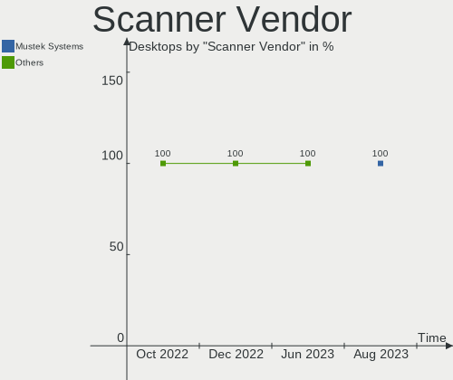

| Vendor | Desktops | Percent |
|--------|----------|---------|
| Canon  | 1        | 100%    |

Scanner Model
-------------

Scanner device models

| Model                   | Desktops | Percent |
|-------------------------|----------|---------|
| Canon CanoScan LiDE 120 | 1        | 100%    |

Camera
------

Camera Vendor
-------------

Camera device vendors

| Vendor              | Desktops | Percent |
|---------------------|----------|---------|
| Logitech            | 3        | 50%     |
| Microdia            | 1        | 16.67%  |
| Creative Technology | 1        | 16.67%  |
| Alcor Micro         | 1        | 16.67%  |

Camera Model
------------

Camera device models

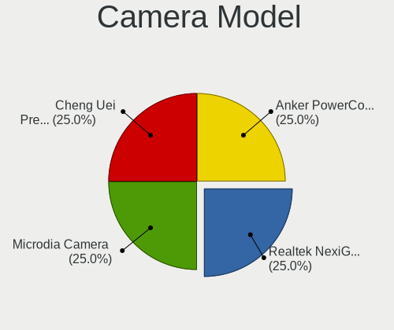

| Model                                 | Desktops | Percent |
|---------------------------------------|----------|---------|
| Microdia USB 2.0 Camera               | 1        | 16.67%  |
| Logitech Webcam C270                  | 1        | 16.67%  |
| Logitech Webcam C110                  | 1        | 16.67%  |
| Logitech HD Webcam C510               | 1        | 16.67%  |
| Creative Live! Cam inPerson HD VF0720 | 1        | 16.67%  |
| Alcor Micro USB 2.0 Camera            | 1        | 16.67%  |

Security
--------

Fingerprint Vendor
------------------

Fingerprint sensor vendors

Zero info for selected period =(

Fingerprint Model
-----------------

Fingerprint sensor models

Zero info for selected period =(

Chipcard Vendor
---------------

Chipcard module vendors

Zero info for selected period =(

Chipcard Model
--------------

Chipcard module models

Zero info for selected period =(

Unsupported
-----------

Unsupported Devices
-------------------

Total unsupported devices on board

| Total | Desktops | Percent |
|-------|----------|---------|
| 0     | 43       | 91.49%  |
| 1     | 4        | 8.51%   |

Unsupported Device Types
------------------------

Types of unsupported devices

| Type          | Desktops | Percent |
|---------------|----------|---------|
| Net/wireless  | 3        | 60%     |
| Graphics card | 2        | 40%     |

