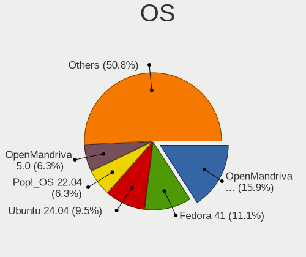
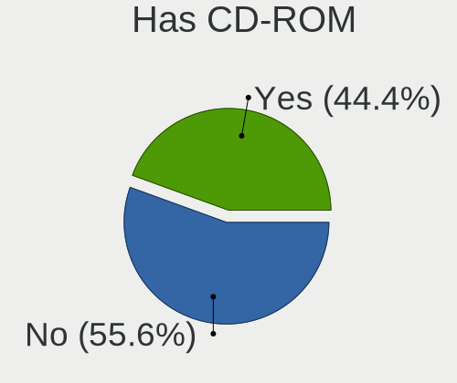
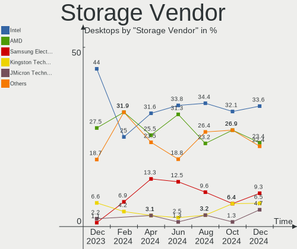
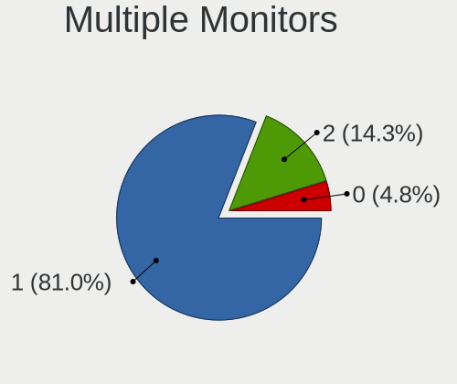
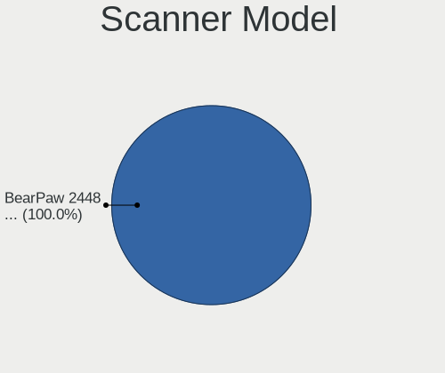

Linux in Poland - Hardware Trends (Desktops)
--------------------------------------------

A project to identify most popular hardware characteristics and track their change
over time based on data collected by Linux users at https://Linux-Hardware.org.

Anyone can contribute to this report by the [hw-probe](https://github.com/linuxhw/hw-probe) tool:

    sudo -E hw-probe -all -upload

Period: May, 2023.

Contents
--------

* [ System ](#system)
  - [ OS                       ](#os)
  - [ OS Family                ](#os-family)
  - [ Kernel                   ](#kernel)
  - [ Kernel Family            ](#kernel-family)
  - [ Kernel Major Ver.        ](#kernel-major-ver)
  - [ Arch                     ](#arch)
  - [ DE                       ](#de)
  - [ Display Server           ](#display-server)
  - [ Display Manager          ](#display-manager)
  - [ OS Lang                  ](#os-lang)
  - [ Boot Mode                ](#boot-mode)
  - [ Filesystem               ](#filesystem)
  - [ Part. scheme             ](#part-scheme)
  - [ Dual Boot with Linux/BSD ](#dual-boot-with-linuxbsd)
  - [ Dual Boot (Win)          ](#dual-boot-win)

* [ Board ](#board)
  - [ Vendor                   ](#vendor)
  - [ Model                    ](#model)
  - [ Model Family             ](#model-family)
  - [ MFG Year                 ](#mfg-year)
  - [ Form Factor              ](#form-factor)
  - [ Secure Boot              ](#secure-boot)
  - [ Coreboot                 ](#coreboot)
  - [ RAM Size                 ](#ram-size)
  - [ RAM Used                 ](#ram-used)
  - [ Total Drives             ](#total-drives)
  - [ Has CD-ROM               ](#has-cd-rom)
  - [ Has Ethernet             ](#has-ethernet)
  - [ Has WiFi                 ](#has-wifi)
  - [ Has Bluetooth            ](#has-bluetooth)

* [ Location ](#location)
  - [ Country                  ](#country)
  - [ City                     ](#city)

* [ Drives ](#drives)
  - [ Drive Vendor             ](#drive-vendor)
  - [ Drive Model              ](#drive-model)
  - [ HDD Vendor               ](#hdd-vendor)
  - [ SSD Vendor               ](#ssd-vendor)
  - [ Drive Kind               ](#drive-kind)
  - [ Drive Connector          ](#drive-connector)
  - [ Drive Size               ](#drive-size)
  - [ Space Total              ](#space-total)
  - [ Space Used               ](#space-used)
  - [ Malfunc. Drives          ](#malfunc-drives)
  - [ Malfunc. Drive Vendor    ](#malfunc-drive-vendor)
  - [ Malfunc. HDD Vendor      ](#malfunc-hdd-vendor)
  - [ Malfunc. Drive Kind      ](#malfunc-drive-kind)
  - [ Failed Drives            ](#failed-drives)
  - [ Failed Drive Vendor      ](#failed-drive-vendor)
  - [ Drive Status             ](#drive-status)

* [ Storage controller ](#storage-controller)
  - [ Storage Vendor           ](#storage-vendor)
  - [ Storage Model            ](#storage-model)
  - [ Storage Kind             ](#storage-kind)

* [ Processor ](#processor)
  - [ CPU Vendor               ](#cpu-vendor)
  - [ CPU Model                ](#cpu-model)
  - [ CPU Model Family         ](#cpu-model-family)
  - [ CPU Cores                ](#cpu-cores)
  - [ CPU Sockets              ](#cpu-sockets)
  - [ CPU Threads              ](#cpu-threads)
  - [ CPU Op-Modes             ](#cpu-op-modes)
  - [ CPU Microcode            ](#cpu-microcode)
  - [ CPU Microarch            ](#cpu-microarch)

* [ Graphics ](#graphics)
  - [ GPU Vendor               ](#gpu-vendor)
  - [ GPU Model                ](#gpu-model)
  - [ GPU Combo                ](#gpu-combo)
  - [ GPU Driver               ](#gpu-driver)
  - [ GPU Memory               ](#gpu-memory)

* [ Monitor ](#monitor)
  - [ Monitor Vendor           ](#monitor-vendor)
  - [ Monitor Model            ](#monitor-model)
  - [ Monitor Resolution       ](#monitor-resolution)
  - [ Monitor Diagonal         ](#monitor-diagonal)
  - [ Monitor Width            ](#monitor-width)
  - [ Aspect Ratio             ](#aspect-ratio)
  - [ Monitor Area             ](#monitor-area)
  - [ Pixel Density            ](#pixel-density)
  - [ Multiple Monitors        ](#multiple-monitors)

* [ Network ](#network)
  - [ Net Controller Vendor    ](#net-controller-vendor)
  - [ Net Controller Model     ](#net-controller-model)
  - [ Wireless Vendor          ](#wireless-vendor)
  - [ Wireless Model           ](#wireless-model)
  - [ Ethernet Vendor          ](#ethernet-vendor)
  - [ Ethernet Model           ](#ethernet-model)
  - [ Net Controller Kind      ](#net-controller-kind)
  - [ Used Controller          ](#used-controller)
  - [ NICs                     ](#nics)
  - [ IPv6                     ](#ipv6)

* [ Bluetooth ](#bluetooth)
  - [ Bluetooth Vendor         ](#bluetooth-vendor)
  - [ Bluetooth Model          ](#bluetooth-model)

* [ Sound ](#sound)
  - [ Sound Vendor             ](#sound-vendor)
  - [ Sound Model              ](#sound-model)

* [ Memory ](#memory)
  - [ Memory Vendor            ](#memory-vendor)
  - [ Memory Model             ](#memory-model)
  - [ Memory Kind              ](#memory-kind)
  - [ Memory Form Factor       ](#memory-form-factor)
  - [ Memory Size              ](#memory-size)
  - [ Memory Speed             ](#memory-speed)

* [ Printers & scanners ](#printers--scanners)
  - [ Printer Vendor           ](#printer-vendor)
  - [ Printer Model            ](#printer-model)
  - [ Scanner Vendor           ](#scanner-vendor)
  - [ Scanner Model            ](#scanner-model)

* [ Camera ](#camera)
  - [ Camera Vendor            ](#camera-vendor)
  - [ Camera Model             ](#camera-model)

* [ Security ](#security)
  - [ Fingerprint Vendor       ](#fingerprint-vendor)
  - [ Fingerprint Model        ](#fingerprint-model)
  - [ Chipcard Vendor          ](#chipcard-vendor)
  - [ Chipcard Model           ](#chipcard-model)

* [ Unsupported ](#unsupported)
  - [ Unsupported Devices      ](#unsupported-devices)
  - [ Unsupported Device Types ](#unsupported-device-types)

System
------

OS
--

Installed operating systems

| Name                         | Desktops | Percent |
|------------------------------|----------|---------|
| OpenMandriva 23.03           | 13       | 24.53%  |
| Linux Mint 21.1              | 6        | 11.32%  |
| Fedora 38                    | 5        | 9.43%   |
| Gentoo 2.13                  | 4        | 7.55%   |
| Arch Rolling                 | 4        | 7.55%   |
| Ubuntu 23.04                 | 2        | 3.77%   |
| Ubuntu 22.04                 | 2        | 3.77%   |
| Pop!_OS 22.04                | 2        | 3.77%   |
| LMDE 4                       | 2        | 3.77%   |
| Debian 11                    | 2        | 3.77%   |
| Zorin 16                     | 1        | 1.89%   |
| Ubuntu Unity 22.04           | 1        | 1.89%   |
| openSUSE Tumbleweed-XXXXXXXX | 1        | 1.89%   |
| OpenMandriva 4.3             | 1        | 1.89%   |
| Nobara 37                    | 1        | 1.89%   |
| Manjaro 21.3.6               | 1        | 1.89%   |
| Manjaro                      | 1        | 1.89%   |
| Linux Lite 5.6               | 1        | 1.89%   |
| Garuda Linux Rolling         | 1        | 1.89%   |
| EndeavourOS Rolling          | 1        | 1.89%   |
| Debian 12                    | 1        | 1.89%   |

OS Family
---------

OS without a version

| Name         | Desktops | Percent |
|--------------|----------|---------|
| OpenMandriva | 14       | 26.42%  |
| Linux Mint   | 6        | 11.32%  |
| Fedora       | 5        | 9.43%   |
| Ubuntu       | 4        | 7.55%   |
| Gentoo       | 4        | 7.55%   |
| Arch         | 4        | 7.55%   |
| Debian       | 3        | 5.66%   |
| Pop!_OS      | 2        | 3.77%   |
| Manjaro      | 2        | 3.77%   |
| LMDE         | 2        | 3.77%   |
| Zorin        | 1        | 1.89%   |
| Ubuntu Unity | 1        | 1.89%   |
| openSUSE     | 1        | 1.89%   |
| Nobara       | 1        | 1.89%   |
| Linux Lite   | 1        | 1.89%   |
| Garuda Linux | 1        | 1.89%   |
| EndeavourOS  | 1        | 1.89%   |

Kernel
------

Version of the Linux kernel

| Version                      | Desktops | Percent |
|------------------------------|----------|---------|
| 6.2.6-desktop-1omv2390       | 13       | 24.53%  |
| 6.1.19-gentoo                | 4        | 7.55%   |
| 5.15.0-72-generic            | 3        | 5.66%   |
| 5.15.0-71-generic            | 3        | 5.66%   |
| 6.3.4-arch1-1                | 2        | 3.77%   |
| 6.2.6-76060206-generic       | 2        | 3.77%   |
| 6.2.14-300.fc38.x86_64       | 2        | 3.77%   |
| 6.2.13-300.fc38.x86_64       | 2        | 3.77%   |
| 6.2.0-20-generic             | 2        | 3.77%   |
| 5.10.0-22-amd64              | 2        | 3.77%   |
| 6.3.4-zen2-1-zen             | 1        | 1.89%   |
| 6.3.2-zen1-1-zen             | 1        | 1.89%   |
| 6.3.2-arch1-1                | 1        | 1.89%   |
| 6.3.2-1-default              | 1        | 1.89%   |
| 6.2.15-300.fc38.x86_64       | 1        | 1.89%   |
| 6.2.14-300.fsync.fc37.x86_64 | 1        | 1.89%   |
| 6.2.13-arch1-1               | 1        | 1.89%   |
| 6.1.26-1-MANJARO             | 1        | 1.89%   |
| 6.1.0-9-amd64                | 1        | 1.89%   |
| 6.0.5-2-rt14-MANJARO         | 1        | 1.89%   |
| 5.4.0-137-generic            | 1        | 1.89%   |
| 5.19.0-41-generic            | 1        | 1.89%   |
| 5.19.0-38-generic            | 1        | 1.89%   |
| 5.19.0-35-generic            | 1        | 1.89%   |
| 5.16.13-desktop-1omv4003     | 1        | 1.89%   |
| 5.15.0-69-generic            | 1        | 1.89%   |
| 4.19.0-9-amd64               | 1        | 1.89%   |
| 4.19.0-24-amd64              | 1        | 1.89%   |

Kernel Family
-------------

Linux kernel without a distro release

| Version | Desktops | Percent |
|---------|----------|---------|
| 6.2.6   | 15       | 28.3%   |
| 5.15.0  | 7        | 13.21%  |
| 6.1.19  | 4        | 7.55%   |
| 6.3.4   | 3        | 5.66%   |
| 6.3.2   | 3        | 5.66%   |
| 6.2.14  | 3        | 5.66%   |
| 6.2.13  | 3        | 5.66%   |
| 5.19.0  | 3        | 5.66%   |
| 6.2.0   | 2        | 3.77%   |
| 5.10.0  | 2        | 3.77%   |
| 4.19.0  | 2        | 3.77%   |
| 6.2.15  | 1        | 1.89%   |
| 6.1.26  | 1        | 1.89%   |
| 6.1.0   | 1        | 1.89%   |
| 6.0.5   | 1        | 1.89%   |
| 5.4.0   | 1        | 1.89%   |
| 5.16.13 | 1        | 1.89%   |

Kernel Major Ver.
-----------------

Linux kernel major version

| Version | Desktops | Percent |
|---------|----------|---------|
| 6.2     | 24       | 45.28%  |
| 5.15    | 7        | 13.21%  |
| 6.3     | 6        | 11.32%  |
| 6.1     | 6        | 11.32%  |
| 5.19    | 3        | 5.66%   |
| 5.10    | 2        | 3.77%   |
| 4.19    | 2        | 3.77%   |
| 6.0     | 1        | 1.89%   |
| 5.4     | 1        | 1.89%   |
| 5.16    | 1        | 1.89%   |

Arch
----

OS architecture (x86_64, i586, etc.)

| Name   | Desktops | Percent |
|--------|----------|---------|
| x86_64 | 53       | 100%    |

DE
--

Desktop Environment

| Name       | Desktops | Percent |
|------------|----------|---------|
| KDE5       | 21       | 39.62%  |
| GNOME      | 12       | 22.64%  |
| X-Cinnamon | 7        | 13.21%  |
| XFCE       | 5        | 9.43%   |
| Unknown    | 4        | 7.55%   |
| MATE       | 2        | 3.77%   |
| Unity      | 1        | 1.89%   |
| LXQt       | 1        | 1.89%   |

Display Server
--------------

X11 or Wayland

| Name    | Desktops | Percent |
|---------|----------|---------|
| X11     | 41       | 77.36%  |
| Wayland | 8        | 15.09%  |
| Unknown | 3        | 5.66%   |
| Tty     | 1        | 1.89%   |

Display Manager
---------------

SDDM, LightDM, etc.

| Name    | Desktops | Percent |
|---------|----------|---------|
| Unknown | 19       | 35.85%  |
| SDDM    | 17       | 32.08%  |
| LightDM | 9        | 16.98%  |
| GDM3    | 6        | 11.32%  |
| LXDM    | 1        | 1.89%   |
| GDM     | 1        | 1.89%   |

OS Lang
-------

Language

| Lang  | Desktops | Percent |
|-------|----------|---------|
| pl_PL | 31       | 58.49%  |
| en_US | 19       | 35.85%  |
| en_GB | 2        | 3.77%   |
| POSIX | 1        | 1.89%   |

Boot Mode
---------

EFI or BIOS

| Mode | Desktops | Percent |
|------|----------|---------|
| BIOS | 27       | 50.94%  |
| EFI  | 26       | 49.06%  |

Filesystem
----------

Type of filesystem

| Type    | Desktops | Percent |
|---------|----------|---------|
| Ext4    | 30       | 56.6%   |
| Btrfs   | 9        | 16.98%  |
| Overlay | 6        | 11.32%  |
| Tmpfs   | 3        | 5.66%   |
| F2fs    | 3        | 5.66%   |
| Zfs     | 1        | 1.89%   |
| Xfs     | 1        | 1.89%   |

Part. scheme
------------

Scheme of partitioning

| Type    | Desktops | Percent |
|---------|----------|---------|
| GPT     | 26       | 49.06%  |
| Unknown | 15       | 28.3%   |
| MBR     | 12       | 22.64%  |

Dual Boot with Linux/BSD
------------------------

Hosting more than one Linux/BSD

| Dual boot | Desktops | Percent |
|-----------|----------|---------|
| No        | 33       | 62.26%  |
| Yes       | 20       | 37.74%  |

Dual Boot (Win)
---------------

Hosting Linux and Windows

| Dual boot | Desktops | Percent |
|-----------|----------|---------|
| No        | 42       | 79.25%  |
| Yes       | 11       | 20.75%  |

Board
-----

Vendor
------

Motherboard manufacturer

| Name                | Desktops | Percent |
|---------------------|----------|---------|
| Gigabyte Technology | 12       | 22.64%  |
| ASUSTek Computer    | 12       | 22.64%  |
| Dell                | 7        | 13.21%  |
| MSI                 | 5        | 9.43%   |
| ASRock              | 4        | 7.55%   |
| Lenovo              | 3        | 5.66%   |
| Hewlett-Packard     | 3        | 5.66%   |
| Pegatron            | 1        | 1.89%   |
| Inventec            | 1        | 1.89%   |
| Intel               | 1        | 1.89%   |
| Gateway             | 1        | 1.89%   |
| Fujitsu Siemens     | 1        | 1.89%   |
| Foxconn             | 1        | 1.89%   |
| Acer                | 1        | 1.89%   |

Model
-----

Motherboard model

| Name                                | Desktops | Percent |
|-------------------------------------|----------|---------|
| ASUS M3A78-CM                       | 2        | 3.77%   |
| ASUS All Series                     | 2        | 3.77%   |
| Pegatron FQ574AA-ABA m9517c         | 1        | 1.89%   |
| MSI MS-7C37                         | 1        | 1.89%   |
| MSI MS-7C02                         | 1        | 1.89%   |
| MSI MS-7B89                         | 1        | 1.89%   |
| MSI MS-7B24                         | 1        | 1.89%   |
| MSI MS-7816                         | 1        | 1.89%   |
| Lenovo ThinkStation P710 30B6S00A00 | 1        | 1.89%   |
| Lenovo ThinkStation E32 30A0S00W00  | 1        | 1.89%   |
| Lenovo ThinkCentre M58 7627AD5      | 1        | 1.89%   |
| Inventec D CLASS                    | 1        | 1.89%   |
| Intel DB75EN AAG39650-302           | 1        | 1.89%   |
| HP Z420 Workstation                 | 1        | 1.89%   |
| HP Compaq Pro 6300 SFF              | 1        | 1.89%   |
| HP Compaq 6005 Pro SFF PC           | 1        | 1.89%   |
| Gigabyte Z97M-DS3H                  | 1        | 1.89%   |
| Gigabyte Z590 UD AC                 | 1        | 1.89%   |
| Gigabyte H110M-DS2-CF               | 1        | 1.89%   |
| Gigabyte GA-MA790XT-UD4P            | 1        | 1.89%   |
| Gigabyte GA-MA785GMT-UD2H           | 1        | 1.89%   |
| Gigabyte GA-78LMT-S2PT              | 1        | 1.89%   |
| Gigabyte G41M-Combo                 | 1        | 1.89%   |
| Gigabyte F2A88X-D3H                 | 1        | 1.89%   |
| Gigabyte B550 GAMING X V2           | 1        | 1.89%   |
| Gigabyte B360M-DS3H                 | 1        | 1.89%   |
| Gigabyte B250-FinTech               | 1        | 1.89%   |
| Gigabyte AB350-Gaming               | 1        | 1.89%   |
| Gateway DT55                        | 1        | 1.89%   |
| Fujitsu Siemens ESPRIMO C5730       | 1        | 1.89%   |
| Foxconn P35                         | 1        | 1.89%   |
| Dell Vostro 260                     | 1        | 1.89%   |
| Dell Precision Tower 7810           | 1        | 1.89%   |
| Dell Precision Tower 3620           | 1        | 1.89%   |
| Dell Precision 3650 Tower           | 1        | 1.89%   |
| Dell OptiPlex 9010                  | 1        | 1.89%   |
| Dell OptiPlex 3070                  | 1        | 1.89%   |
| Dell OptiPlex 3020                  | 1        | 1.89%   |
| ASUS TUF Gaming X670E-PLUS          | 1        | 1.89%   |
| ASUS TERRA_PC                       | 1        | 1.89%   |

Model Family
------------

Motherboard model prefix

| Name                      | Desktops | Percent |
|---------------------------|----------|---------|
| Dell Precision            | 3        | 5.66%   |
| Dell OptiPlex             | 3        | 5.66%   |
| ASUS PRIME                | 3        | 5.66%   |
| Lenovo ThinkStation       | 2        | 3.77%   |
| HP Compaq                 | 2        | 3.77%   |
| ASUS M3A78-CM             | 2        | 3.77%   |
| ASUS All                  | 2        | 3.77%   |
| Pegatron FQ574AA-ABA      | 1        | 1.89%   |
| MSI MS-7C37               | 1        | 1.89%   |
| MSI MS-7C02               | 1        | 1.89%   |
| MSI MS-7B89               | 1        | 1.89%   |
| MSI MS-7B24               | 1        | 1.89%   |
| MSI MS-7816               | 1        | 1.89%   |
| Lenovo ThinkCentre        | 1        | 1.89%   |
| Inventec D                | 1        | 1.89%   |
| Intel DB75EN              | 1        | 1.89%   |
| HP Z420                   | 1        | 1.89%   |
| Gigabyte Z97M-DS3H        | 1        | 1.89%   |
| Gigabyte Z590             | 1        | 1.89%   |
| Gigabyte H110M-DS2-CF     | 1        | 1.89%   |
| Gigabyte GA-MA790XT-UD4P  | 1        | 1.89%   |
| Gigabyte GA-MA785GMT-UD2H | 1        | 1.89%   |
| Gigabyte GA-78LMT-S2PT    | 1        | 1.89%   |
| Gigabyte G41M-Combo       | 1        | 1.89%   |
| Gigabyte F2A88X-D3H       | 1        | 1.89%   |
| Gigabyte B550             | 1        | 1.89%   |
| Gigabyte B360M-DS3H       | 1        | 1.89%   |
| Gigabyte B250-FinTech     | 1        | 1.89%   |
| Gigabyte AB350-Gaming     | 1        | 1.89%   |
| Gateway DT55              | 1        | 1.89%   |
| Fujitsu Siemens ESPRIMO   | 1        | 1.89%   |
| Foxconn P35               | 1        | 1.89%   |
| Dell Vostro               | 1        | 1.89%   |
| ASUS TUF                  | 1        | 1.89%   |
| ASUS TERRA                | 1        | 1.89%   |
| ASUS ROG                  | 1        | 1.89%   |
| ASUS P5G41T-M             | 1        | 1.89%   |
| ASUS A8N-E                | 1        | 1.89%   |
| ASRock H81M-VG4           | 1        | 1.89%   |
| ASRock H110M-DVS          | 1        | 1.89%   |

MFG Year
--------

Motherboard manufacture year

| Year | Desktops | Percent |
|------|----------|---------|
| 2013 | 6        | 11.32%  |
| 2018 | 5        | 9.43%   |
| 2009 | 5        | 9.43%   |
| 2019 | 4        | 7.55%   |
| 2012 | 4        | 7.55%   |
| 2010 | 4        | 7.55%   |
| 2008 | 4        | 7.55%   |
| 2022 | 3        | 5.66%   |
| 2016 | 3        | 5.66%   |
| 2015 | 3        | 5.66%   |
| 2014 | 3        | 5.66%   |
| 2021 | 2        | 3.77%   |
| 2020 | 2        | 3.77%   |
| 2017 | 2        | 3.77%   |
| 2011 | 1        | 1.89%   |
| 2007 | 1        | 1.89%   |
| 2005 | 1        | 1.89%   |

Form Factor
-----------

Physical design of the computer

| Name    | Desktops | Percent |
|---------|----------|---------|
| Desktop | 53       | 100%    |

Secure Boot
-----------

Enabled or disabled

| State    | Desktops | Percent |
|----------|----------|---------|
| Disabled | 51       | 96.23%  |
| Enabled  | 2        | 3.77%   |

Coreboot
--------

Have coreboot on board

| Used | Desktops | Percent |
|------|----------|---------|
| No   | 53       | 100%    |

RAM Size
--------

Total RAM memory

| Size in GB  | Desktops | Percent |
|-------------|----------|---------|
| 16.01-24.0  | 17       | 32.08%  |
| 32.01-64.0  | 8        | 15.09%  |
| 3.01-4.0    | 8        | 15.09%  |
| 4.01-8.0    | 6        | 11.32%  |
| 8.01-16.0   | 6        | 11.32%  |
| 64.01-256.0 | 4        | 7.55%   |
| 24.01-32.0  | 3        | 5.66%   |
| 1.01-2.0    | 1        | 1.89%   |

RAM Used
--------

Used RAM memory

| Used GB   | Desktops | Percent |
|-----------|----------|---------|
| 2.01-3.0  | 13       | 24.53%  |
| 1.01-2.0  | 13       | 24.53%  |
| 3.01-4.0  | 10       | 18.87%  |
| 4.01-8.0  | 7        | 13.21%  |
| 8.01-16.0 | 7        | 13.21%  |
| 0.51-1.0  | 3        | 5.66%   |

Total Drives
------------

Number of drives on board

| Drives | Desktops | Percent |
|--------|----------|---------|
| 2      | 15       | 28.3%   |
| 1      | 14       | 26.42%  |
| 3      | 13       | 24.53%  |
| 4      | 6        | 11.32%  |
| 6      | 2        | 3.77%   |
| 11     | 1        | 1.89%   |
| 5      | 1        | 1.89%   |
| 0      | 1        | 1.89%   |

Has CD-ROM
----------

Has CD-ROM on board

| Presented | Desktops | Percent |
|-----------|----------|---------|
| No        | 31       | 58.49%  |
| Yes       | 22       | 41.51%  |

Has Ethernet
------------

Has Ethernet on board

| Presented | Desktops | Percent |
|-----------|----------|---------|
| Yes       | 52       | 98.11%  |
| No        | 1        | 1.89%   |

Has WiFi
--------

Has WiFi module

| Presented | Desktops | Percent |
|-----------|----------|---------|
| No        | 31       | 58.49%  |
| Yes       | 22       | 41.51%  |

Has Bluetooth
-------------

Has Bluetooth module

| Presented | Desktops | Percent |
|-----------|----------|---------|
| No        | 36       | 67.92%  |
| Yes       | 17       | 32.08%  |

Location
--------

Country
-------

Geographic location (country)

| Country | Desktops | Percent |
|---------|----------|---------|
| Poland  | 53       | 100%    |

City
----

Geographic location (city)

| City                 | Desktops | Percent |
|----------------------|----------|---------|
| Warsaw               | 13       | 24.53%  |
| Wroclaw              | 4        | 7.55%   |
| Krakow               | 4        | 7.55%   |
| Poznan               | 2        | 3.77%   |
| Lublin               | 2        | 3.77%   |
| Kielce               | 2        | 3.77%   |
| Zielona Góra        | 1        | 1.89%   |
| Zabrze               | 1        | 1.89%   |
| Wisla                | 1        | 1.89%   |
| Wałbrzych           | 1        | 1.89%   |
| Tarnów              | 1        | 1.89%   |
| Szczecin             | 1        | 1.89%   |
| Suwałki             | 1        | 1.89%   |
| Sosnowiec            | 1        | 1.89%   |
| Skalbmierz           | 1        | 1.89%   |
| Siemiatycze          | 1        | 1.89%   |
| Sadlinki             | 1        | 1.89%   |
| Rybnik               | 1        | 1.89%   |
| Ruda Śląska        | 1        | 1.89%   |
| Puławy              | 1        | 1.89%   |
| Opole                | 1        | 1.89%   |
| Margonin             | 1        | 1.89%   |
| Lezajsk              | 1        | 1.89%   |
| Kościan             | 1        | 1.89%   |
| Katowice             | 1        | 1.89%   |
| Gliwice              | 1        | 1.89%   |
| Gdynia               | 1        | 1.89%   |
| Gdansk               | 1        | 1.89%   |
| Dąbrowa Tarnowska   | 1        | 1.89%   |
| Częstochowa         | 1        | 1.89%   |
| Czerwionka-Leszczyny | 1        | 1.89%   |
| Cieszyn              | 1        | 1.89%   |

Drives
------

Drive Vendor
------------

Hard drive vendors

| Vendor                      | Desktops | Drives | Percent |
|-----------------------------|----------|--------|---------|
| WDC                         | 19       | 28     | 17.92%  |
| Seagate                     | 14       | 19     | 13.21%  |
| GOODRAM                     | 12       | 13     | 11.32%  |
| Samsung Electronics         | 11       | 18     | 10.38%  |
| Toshiba                     | 7        | 7      | 6.6%    |
| Kingston                    | 5        | 6      | 4.72%   |
| Crucial                     | 5        | 6      | 4.72%   |
| China                       | 5        | 6      | 4.72%   |
| A-DATA Technology           | 5        | 5      | 4.72%   |
| Hitachi                     | 4        | 6      | 3.77%   |
| SPCC                        | 3        | 4      | 2.83%   |
| Patriot                     | 3        | 4      | 2.83%   |
| SK hynix                    | 2        | 3      | 1.89%   |
| WD MediaMax                 | 1        | 1      | 0.94%   |
| Silicon Motion              | 1        | 1      | 0.94%   |
| Sandisk                     | 1        | 1      | 0.94%   |
| SAGE                        | 1        | 1      | 0.94%   |
| Phison Electronics          | 1        | 1      | 0.94%   |
| Micron/Crucial Technology   | 1        | 1      | 0.94%   |
| Micron Technology           | 1        | 1      | 0.94%   |
| MAXIO Technology (Hangzhou) | 1        | 1      | 0.94%   |
| LITEONIT                    | 1        | 1      | 0.94%   |
| KIOXIA-EXCERIA              | 1        | 1      | 0.94%   |
| Fujitsu                     | 1        | 1      | 0.94%   |

Drive Model
-----------

Hard drive models

| Model                            | Desktops | Percent |
|----------------------------------|----------|---------|
| WDC WD10EFRX-68FYTN0 1TB         | 3        | 2.44%   |
| Samsung SSD 860 EVO 500GB        | 3        | 2.44%   |
| GOODRAM SSDPR-CX400-256-G2 256GB | 3        | 2.44%   |
| Toshiba HDWD110 1TB              | 2        | 1.63%   |
| Samsung SSD 980 1TB              | 2        | 1.63%   |
| Samsung SSD 870 EVO 500GB        | 2        | 1.63%   |
| Kingston SKC3000S512G 512GB      | 2        | 1.63%   |
| Kingston SA400S37240G 240GB SSD  | 2        | 1.63%   |
| GOODRAM SSDPR-CX400-512 512GB    | 2        | 1.63%   |
| GOODRAM SSDPR-CX400-01T-G2 1TB   | 2        | 1.63%   |
| GOODRAM SSDPR-CL100-480-G2 480GB | 2        | 1.63%   |
| Crucial CT240BX500SSD1 240GB     | 2        | 1.63%   |
| WDC WDS240G2G0B-00EPW0 240GB SSD | 1        | 0.81%   |
| WDC WDS120G2G0A-00JH30 120GB SSD | 1        | 0.81%   |
| WDC WDS100T2B0C-00PXH0 1TB       | 1        | 0.81%   |
| WDC WDS100T2B0A-00SM50 1TB SSD   | 1        | 0.81%   |
| WDC WD6003FFBX-68MU3N0 6TB       | 1        | 0.81%   |
| WDC WD5000KS-00MNB0 500GB        | 1        | 0.81%   |
| WDC WD5000AVDS-63U7B1 500GB      | 1        | 0.81%   |
| WDC WD5000AAKX-75U6AA0 500GB     | 1        | 0.81%   |
| WDC WD5000AAKX-001CA0 500GB      | 1        | 0.81%   |
| WDC WD40EFZX-68AWUN0 4TB         | 1        | 0.81%   |
| WDC WD40EFRX-68N32N0 4TB         | 1        | 0.81%   |
| WDC WD3200AAJS-07M0A0 320GB      | 1        | 0.81%   |
| WDC WD30EFRX-68EUZN0 3TB         | 1        | 0.81%   |
| WDC WD2500AAJS-75M0A0 250GB      | 1        | 0.81%   |
| WDC WD20EURS-63S48Y0 2TB         | 1        | 0.81%   |
| WDC WD20EARX-00PASB0 2TB         | 1        | 0.81%   |
| WDC WD2002FYPS-01U1B0 2TB        | 1        | 0.81%   |
| WDC WD1600HLHX-60JJPV1 160GB     | 1        | 0.81%   |
| WDC WD10PURZ-85U8XY0 1TB         | 1        | 0.81%   |
| WDC WD10EZRX-00A8LB0 1TB         | 1        | 0.81%   |
| WDC WD10EZEX-00BBHA0 1TB         | 1        | 0.81%   |
| WDC WD10EALX-009BA0 1TB          | 1        | 0.81%   |
| WD MediaMax WL1000GSA6472B 1TB   | 1        | 0.81%   |
| Toshiba MQ01ABD100 1TB           | 1        | 0.81%   |
| Toshiba MQ01ABD075 752GB         | 1        | 0.81%   |
| Toshiba HDWE150 5TB              | 1        | 0.81%   |
| Toshiba HDWD130 3TB              | 1        | 0.81%   |
| Toshiba DT01ACA100 1TB           | 1        | 0.81%   |

HDD Vendor
----------

Hard disk drive vendors

| Vendor              | Desktops | Drives | Percent |
|---------------------|----------|--------|---------|
| WDC                 | 15       | 24     | 34.09%  |
| Seagate             | 14       | 19     | 31.82%  |
| Toshiba             | 7        | 7      | 15.91%  |
| Hitachi             | 4        | 6      | 9.09%   |
| WD MediaMax         | 1        | 1      | 2.27%   |
| Samsung Electronics | 1        | 1      | 2.27%   |
| SAGE                | 1        | 1      | 2.27%   |
| Fujitsu             | 1        | 1      | 2.27%   |

SSD Vendor
----------

Solid state drive vendors

| Vendor              | Desktops | Drives | Percent |
|---------------------|----------|--------|---------|
| GOODRAM             | 12       | 13     | 25%     |
| Samsung Electronics | 7        | 10     | 14.58%  |
| Crucial             | 5        | 6      | 10.42%  |
| China               | 5        | 6      | 10.42%  |
| A-DATA Technology   | 5        | 5      | 10.42%  |
| WDC                 | 3        | 3      | 6.25%   |
| SPCC                | 3        | 4      | 6.25%   |
| Patriot             | 3        | 4      | 6.25%   |
| Kingston            | 3        | 3      | 6.25%   |
| LITEONIT            | 1        | 1      | 2.08%   |
| KIOXIA-EXCERIA      | 1        | 1      | 2.08%   |

Drive Kind
----------

HDD or SSD

| Kind | Desktops | Drives | Percent |
|------|----------|--------|---------|
| SSD  | 39       | 56     | 42.39%  |
| HDD  | 37       | 60     | 40.22%  |
| NVMe | 16       | 20     | 17.39%  |

Drive Connector
---------------

SATA, SAS, NVMe, etc.

| Type | Desktops | Drives | Percent |
|------|----------|--------|---------|
| SATA | 50       | 112    | 72.46%  |
| NVMe | 16       | 20     | 23.19%  |
| SAS  | 3        | 4      | 4.35%   |

Drive Size
----------

Size of hard drive

| Size in TB | Desktops | Drives | Percent |
|------------|----------|--------|---------|
| 0.01-0.5   | 39       | 53     | 48.75%  |
| 0.51-1.0   | 27       | 40     | 33.75%  |
| 1.01-2.0   | 5        | 7      | 6.25%   |
| 2.01-3.0   | 3        | 5      | 3.75%   |
| 4.01-10.0  | 3        | 5      | 3.75%   |
| 3.01-4.0   | 2        | 5      | 2.5%    |
| 10.01-20.0 | 1        | 1      | 1.25%   |

Space Total
-----------

Amount of disk space available on the file system

| Size in GB     | Desktops | Percent |
|----------------|----------|---------|
| 501-1000       | 10       | 18.87%  |
| 251-500        | 8        | 15.09%  |
| 101-250        | 8        | 15.09%  |
| 1001-2000      | 8        | 15.09%  |
| 51-100         | 6        | 11.32%  |
| More than 3000 | 5        | 9.43%   |
| 1-20           | 4        | 7.55%   |
| 2001-3000      | 2        | 3.77%   |
| Unknown        | 2        | 3.77%   |

Space Used
----------

Amount of used disk space

| Used GB        | Desktops | Percent |
|----------------|----------|---------|
| 1-20           | 14       | 26.42%  |
| 21-50          | 11       | 20.75%  |
| 101-250        | 6        | 11.32%  |
| 251-500        | 5        | 9.43%   |
| 501-1000       | 5        | 9.43%   |
| More than 3000 | 4        | 7.55%   |
| 1001-2000      | 3        | 5.66%   |
| 51-100         | 3        | 5.66%   |
| Unknown        | 2        | 3.77%   |

Malfunc. Drives
---------------

Drive models with a malfunction

| Model                                 | Desktops | Drives | Percent |
|---------------------------------------|----------|--------|---------|
| WDC WD5000AAKX-001CA0 500GB           | 1        | 1      | 12.5%   |
| WDC WD30EFRX-68EUZN0 3TB              | 1        | 1      | 12.5%   |
| WDC WD2500AAJS-75M0A0 250GB           | 1        | 1      | 12.5%   |
| Seagate ST1000DM003-1ER162 1TB        | 1        | 1      | 12.5%   |
| Seagate ST10000NE0004-1ZF101 10TB     | 1        | 1      | 12.5%   |
| Samsung Electronics SSD 850 PRO 512GB | 1        | 1      | 12.5%   |
| SAGE 3639S 1TB                        | 1        | 1      | 12.5%   |
| A-DATA Technology SU800 512GB SSD     | 1        | 1      | 12.5%   |

Malfunc. Drive Vendor
---------------------

Vendors of faulty drives

| Vendor              | Desktops | Drives | Percent |
|---------------------|----------|--------|---------|
| WDC                 | 3        | 3      | 37.5%   |
| Seagate             | 2        | 2      | 25%     |
| Samsung Electronics | 1        | 1      | 12.5%   |
| SAGE                | 1        | 1      | 12.5%   |
| A-DATA Technology   | 1        | 1      | 12.5%   |

Malfunc. HDD Vendor
-------------------

Vendors of faulty HDD drives

| Vendor  | Desktops | Drives | Percent |
|---------|----------|--------|---------|
| WDC     | 3        | 3      | 50%     |
| Seagate | 2        | 2      | 33.33%  |
| SAGE    | 1        | 1      | 16.67%  |

Malfunc. Drive Kind
-------------------

Kinds of faulty drives

| Kind | Desktops | Drives | Percent |
|------|----------|--------|---------|
| HDD  | 6        | 6      | 75%     |
| SSD  | 2        | 2      | 25%     |

Failed Drives
-------------

Failed drive models

Zero info for selected period =(

Failed Drive Vendor
-------------------

Failed drive vendors

Zero info for selected period =(

Drive Status
------------

Number of failed and malfunc. drives

| Status   | Desktops | Drives | Percent |
|----------|----------|--------|---------|
| Works    | 30       | 74     | 51.72%  |
| Detected | 21       | 54     | 36.21%  |
| Malfunc  | 7        | 8      | 12.07%  |

Storage controller
------------------

Storage Vendor
--------------

Storage controller vendors

| Vendor                      | Desktops | Percent |
|-----------------------------|----------|---------|
| Intel                       | 33       | 44%     |
| AMD                         | 18       | 24%     |
| Samsung Electronics         | 6        | 8%      |
| SK hynix                    | 2        | 2.67%   |
| SanDisk                     | 2        | 2.67%   |
| Nvidia                      | 2        | 2.67%   |
| Kingston Technology Company | 2        | 2.67%   |
| JMicron Technology          | 2        | 2.67%   |
| ASMedia Technology          | 2        | 2.67%   |
| Silicon Motion              | 1        | 1.33%   |
| Phison Electronics          | 1        | 1.33%   |
| Micron/Crucial Technology   | 1        | 1.33%   |
| Micron Technology           | 1        | 1.33%   |
| MAXIO Technology (Hangzhou) | 1        | 1.33%   |
| Marvell Technology Group    | 1        | 1.33%   |

Storage Model
-------------

Storage controller models

| Model                                                                          | Desktops | Percent |
|--------------------------------------------------------------------------------|----------|---------|
| AMD FCH SATA Controller [AHCI mode]                                            | 7        | 6.93%   |
| Intel 8 Series/C220 Series Chipset Family 6-port SATA Controller 1 [AHCI mode] | 6        | 5.94%   |
| AMD SB7x0/SB8x0/SB9x0 SATA Controller [IDE mode]                               | 5        | 4.95%   |
| AMD SB7x0/SB8x0/SB9x0 IDE Controller                                           | 5        | 4.95%   |
| Samsung NVMe SSD Controller 980                                                | 4        | 3.96%   |
| Intel Q170/Q150/B150/H170/H110/Z170/CM236 Chipset SATA Controller [AHCI Mode]  | 3        | 2.97%   |
| Intel NM10/ICH7 Family SATA Controller [IDE mode]                              | 3        | 2.97%   |
| Intel Cannon Lake PCH SATA AHCI Controller                                     | 3        | 2.97%   |
| Intel C610/X99 series chipset sSATA Controller [AHCI mode]                     | 3        | 2.97%   |
| Intel 7 Series/C210 Series Chipset Family 6-port SATA Controller [AHCI mode]   | 3        | 2.97%   |
| AMD 400 Series Chipset SATA Controller                                         | 3        | 2.97%   |
| Kingston Company Company Non-Volatile memory controller                        | 2        | 1.98%   |
| Intel C610/X99 series chipset 6-Port SATA Controller [AHCI mode]               | 2        | 1.98%   |
| Intel 82801JD/DO (ICH10 Family) 4-port SATA IDE Controller                     | 2        | 1.98%   |
| Intel 82801JD/DO (ICH10 Family) 2-port SATA IDE Controller                     | 2        | 1.98%   |
| Intel 82801G (ICH7 Family) IDE Controller                                      | 2        | 1.98%   |
| Intel 700 Series Chipset Family SATA AHCI Controller                           | 2        | 1.98%   |
| Intel 500 Series Chipset Family SATA AHCI Controller                           | 2        | 1.98%   |
| Intel 4 Series Chipset PT IDER Controller                                      | 2        | 1.98%   |
| ASMedia ASM1062 Serial ATA Controller                                          | 2        | 1.98%   |
| AMD SB7x0/SB8x0/SB9x0 SATA Controller [AHCI mode]                              | 2        | 1.98%   |
| AMD 500 Series Chipset SATA Controller                                         | 2        | 1.98%   |
| AMD 300 Series Chipset SATA Controller                                         | 2        | 1.98%   |
| SK hynix Non-Volatile memory controller                                        | 1        | 0.99%   |
| SK hynix BC511                                                                 | 1        | 0.99%   |
| Silicon Motion SM2262/SM2262EN SSD Controller                                  | 1        | 0.99%   |
| SanDisk WD Blue SN570 NVMe SSD 1TB                                             | 1        | 0.99%   |
| SanDisk WD Blue SN550 NVMe SSD                                                 | 1        | 0.99%   |
| Samsung NVMe SSD Controller SM961/PM961/SM963                                  | 1        | 0.99%   |
| Samsung NVMe SSD Controller PM9A1/PM9A3/980PRO                                 | 1        | 0.99%   |
| Phison E12 NVMe Controller                                                     | 1        | 0.99%   |
| Nvidia MCP78S [GeForce 8200] SATA Controller (RAID mode)                       | 1        | 0.99%   |
| Nvidia CK804 Serial ATA Controller                                             | 1        | 0.99%   |
| Nvidia CK804 IDE                                                               | 1        | 0.99%   |
| Micron/Crucial P5 Plus NVMe PCIe SSD                                           | 1        | 0.99%   |
| Micron NVMe Storage Controller                                                 | 1        | 0.99%   |
| MAXIO (Hangzhou) NVMe SSD Controller MAP1202                                   | 1        | 0.99%   |
| Marvell Group 88SE9230 PCIe 2.0 x2 4-port SATA 6 Gb/s RAID Controller          | 1        | 0.99%   |
| JMicron JMB363 SATA/IDE Controller                                             | 1        | 0.99%   |
| JMicron JMB361 AHCI/IDE                                                        | 1        | 0.99%   |

Storage Kind
------------

Kind of storage controller (IDE, SATA, NVMe, SAS, ...)

| Kind | Desktops | Percent |
|------|----------|---------|
| SATA | 43       | 53.75%  |
| NVMe | 16       | 20%     |
| IDE  | 15       | 18.75%  |
| RAID | 5        | 6.25%   |
| SAS  | 1        | 1.25%   |

Processor
---------

CPU Vendor
----------

Processor vendors

| Vendor | Desktops | Percent |
|--------|----------|---------|
| Intel  | 33       | 62.26%  |
| AMD    | 20       | 37.74%  |

CPU Model
---------

Processor models

| Model                                       | Desktops | Percent |
|---------------------------------------------|----------|---------|
| Intel Core 2 Duo CPU E8400 @ 3.00GHz        | 3        | 5.66%   |
| Intel Core i5-4460 CPU @ 3.20GHz            | 2        | 3.77%   |
| Intel 11th Gen Core i5-11400 @ 2.60GHz      | 2        | 3.77%   |
| AMD Ryzen 5 3600 6-Core Processor           | 2        | 3.77%   |
| AMD Ryzen 5 1600 Six-Core Processor         | 2        | 3.77%   |
| AMD Phenom II X4 955 Processor              | 2        | 3.77%   |
| Intel Xeon CPU E5-2637 v4 @ 3.50GHz         | 1        | 1.89%   |
| Intel Xeon CPU E5-2620 v3 @ 2.40GHz         | 1        | 1.89%   |
| Intel Xeon CPU E5-1680 v2 @ 3.00GHz         | 1        | 1.89%   |
| Intel Xeon CPU E3-1240 v5 @ 3.50GHz         | 1        | 1.89%   |
| Intel Pentium Dual-Core CPU E6300 @ 2.80GHz | 1        | 1.89%   |
| Intel Pentium Dual-Core CPU E5700 @ 3.00GHz | 1        | 1.89%   |
| Intel Pentium Dual-Core CPU E5500 @ 2.80GHz | 1        | 1.89%   |
| Intel Pentium CPU G620 @ 2.60GHz            | 1        | 1.89%   |
| Intel Pentium CPU G4560 @ 3.50GHz           | 1        | 1.89%   |
| Intel Core i7-5960X CPU @ 3.00GHz           | 1        | 1.89%   |
| Intel Core i7-4770 CPU @ 3.40GHz            | 1        | 1.89%   |
| Intel Core i7-2600K CPU @ 3.40GHz           | 1        | 1.89%   |
| Intel Core i5-9600KF CPU @ 3.70GHz          | 1        | 1.89%   |
| Intel Core i5-9500T CPU @ 2.20GHz           | 1        | 1.89%   |
| Intel Core i5-8400 CPU @ 2.80GHz            | 1        | 1.89%   |
| Intel Core i5-7400 CPU @ 3.00GHz            | 1        | 1.89%   |
| Intel Core i5-6400 CPU @ 2.70GHz            | 1        | 1.89%   |
| Intel Core i5-4690 CPU @ 3.50GHz            | 1        | 1.89%   |
| Intel Core i5-4590 CPU @ 3.30GHz            | 1        | 1.89%   |
| Intel Core i5-4570 CPU @ 3.20GHz            | 1        | 1.89%   |
| Intel Core i5-3570 CPU @ 3.40GHz            | 1        | 1.89%   |
| Intel Core i5-3470 CPU @ 3.20GHz            | 1        | 1.89%   |
| Intel Core i3-4150 CPU @ 3.50GHz            | 1        | 1.89%   |
| Intel Core 2 Quad CPU @ 2.40GHz             | 1        | 1.89%   |
| Intel 13th Gen Core i5-13600T               | 1        | 1.89%   |
| Intel 13th Gen Core i5-13600K               | 1        | 1.89%   |
| AMD Ryzen 7 7700 8-Core Processor           | 1        | 1.89%   |
| AMD Ryzen 7 3700X 8-Core Processor          | 1        | 1.89%   |
| AMD Ryzen 7 2700X Eight-Core Processor      | 1        | 1.89%   |
| AMD Ryzen 5 5600 6-Core Processor           | 1        | 1.89%   |
| AMD Ryzen 5 2600 Six-Core Processor         | 1        | 1.89%   |
| AMD Phenom II X4 810 Processor              | 1        | 1.89%   |
| AMD Phenom II X2 B55 Processor              | 1        | 1.89%   |
| AMD Phenom 9550 Quad-Core Processor         | 1        | 1.89%   |

CPU Model Family
----------------

Processor model prefix

| Model                   | Desktops | Percent |
|-------------------------|----------|---------|
| Intel Core i5           | 12       | 22.64%  |
| AMD Ryzen 5             | 6        | 11.32%  |
| Other                   | 4        | 7.55%   |
| Intel Xeon              | 4        | 7.55%   |
| Intel Pentium Dual-Core | 3        | 5.66%   |
| Intel Core i7           | 3        | 5.66%   |
| Intel Core 2 Duo        | 3        | 5.66%   |
| AMD Ryzen 7             | 3        | 5.66%   |
| AMD Phenom II X4        | 3        | 5.66%   |
| Intel Pentium           | 2        | 3.77%   |
| AMD Athlon II X2        | 2        | 3.77%   |
| Intel Core i3           | 1        | 1.89%   |
| Intel Core 2 Quad       | 1        | 1.89%   |
| AMD Phenom II X2        | 1        | 1.89%   |
| AMD Phenom              | 1        | 1.89%   |
| AMD G                   | 1        | 1.89%   |
| AMD Athlon II X4        | 1        | 1.89%   |
| AMD Athlon 64 X2        | 1        | 1.89%   |
| AMD A8                  | 1        | 1.89%   |

CPU Cores
---------

Number of processor cores

| Number | Desktops | Percent |
|--------|----------|---------|
| 4      | 18       | 33.96%  |
| 2      | 15       | 28.3%   |
| 6      | 11       | 20.75%  |
| 8      | 6        | 11.32%  |
| 14     | 2        | 3.77%   |
| 12     | 1        | 1.89%   |

CPU Sockets
-----------

Number of sockets

| Number | Desktops | Percent |
|--------|----------|---------|
| 1      | 51       | 96.23%  |
| 2      | 2        | 3.77%   |

CPU Threads
-----------

Threads per core (Hyper-Threading)

| Number | Desktops | Percent |
|--------|----------|---------|
| 1      | 30       | 56.6%   |
| 2      | 23       | 43.4%   |

CPU Op-Modes
------------

CPU Operation Modes (32-bit, 64-bit)

| Op mode        | Desktops | Percent |
|----------------|----------|---------|
| 32-bit, 64-bit | 53       | 100%    |

CPU Microcode
-------------

Microcode number

| Number     | Desktops | Percent |
|------------|----------|---------|
| Unknown    | 30       | 56.6%   |
| 0x0800820d | 3        | 5.66%   |
| 0x08701030 | 2        | 3.77%   |
| 0x010000db | 2        | 3.77%   |
| 0x010000c8 | 2        | 3.77%   |
| 0xb06f2    | 1        | 1.89%   |
| 0x906ea    | 1        | 1.89%   |
| 0x6f7      | 1        | 1.89%   |
| 0x506e3    | 1        | 1.89%   |
| 0x306e4    | 1        | 1.89%   |
| 0x306c3    | 1        | 1.89%   |
| 0x306a9    | 1        | 1.89%   |
| 0x0a601203 | 1        | 1.89%   |
| 0x0a20120a | 1        | 1.89%   |
| 0x08701021 | 1        | 1.89%   |
| 0x08001138 | 1        | 1.89%   |
| 0x06001119 | 1        | 1.89%   |
| 0x05000101 | 1        | 1.89%   |
| 0x01000083 | 1        | 1.89%   |

CPU Microarch
-------------

Microarchitecture

| Name             | Desktops | Percent |
|------------------|----------|---------|
| Haswell          | 9        | 16.98%  |
| K10              | 8        | 15.09%  |
| Penryn           | 6        | 11.32%  |
| KabyLake         | 5        | 9.43%   |
| Zen+             | 3        | 5.66%   |
| Zen 2            | 3        | 5.66%   |
| IvyBridge        | 3        | 5.66%   |
| Skylake          | 2        | 3.77%   |
| SandyBridge      | 2        | 3.77%   |
| Icelake          | 2        | 3.77%   |
| Alderlake Hybrid | 2        | 3.77%   |
| Zen 3            | 1        | 1.89%   |
| Zen              | 1        | 1.89%   |
| Piledriver       | 1        | 1.89%   |
| K8 Hammer        | 1        | 1.89%   |
| Core             | 1        | 1.89%   |
| Broadwell        | 1        | 1.89%   |
| Bobcat           | 1        | 1.89%   |
| Unknown          | 1        | 1.89%   |

Graphics
--------

GPU Vendor
----------

Vendors of graphics cards

| Vendor | Desktops | Percent |
|--------|----------|---------|
| AMD    | 21       | 38.18%  |
| Nvidia | 20       | 36.36%  |
| Intel  | 14       | 25.45%  |

GPU Model
---------

Graphics card models

| Model                                                                       | Desktops | Percent |
|-----------------------------------------------------------------------------|----------|---------|
| AMD Ellesmere [Radeon RX 470/480/570/570X/580/580X/590]                     | 6        | 10.91%  |
| Intel Xeon E3-1200 v3/4th Gen Core Processor Integrated Graphics Controller | 4        | 7.27%   |
| Intel 4 Series Chipset Integrated Graphics Controller                       | 4        | 7.27%   |
| AMD Cedar [Radeon HD 5000/6000/7350/8350 Series]                            | 3        | 5.45%   |
| Nvidia GP107 [GeForce GTX 1050 Ti]                                          | 2        | 3.64%   |
| Nvidia GP106 [GeForce GTX 1060 6GB]                                         | 2        | 3.64%   |
| Nvidia GK208B [GeForce GT 710]                                              | 2        | 3.64%   |
| Nvidia GF108 [GeForce GT 630]                                               | 2        | 3.64%   |
| AMD RS780C [Radeon 3100]                                                    | 2        | 3.64%   |
| Nvidia TU116 [GeForce GTX 1650]                                             | 1        | 1.82%   |
| Nvidia GP106 [GeForce GTX 1060 3GB]                                         | 1        | 1.82%   |
| Nvidia GM204GL [Quadro M4000]                                               | 1        | 1.82%   |
| Nvidia GM204 [GeForce GTX 970]                                              | 1        | 1.82%   |
| Nvidia GM107 [GeForce GTX 750]                                              | 1        | 1.82%   |
| Nvidia GM107 [GeForce GTX 750 Ti]                                           | 1        | 1.82%   |
| Nvidia GK107 [NVS 510]                                                      | 1        | 1.82%   |
| Nvidia GK106 [GeForce GTX 650 OEM]                                          | 1        | 1.82%   |
| Nvidia GA104 [GeForce RTX 3060 Ti GDDR6X]                                   | 1        | 1.82%   |
| Nvidia GA102 [GeForce RTX 3090]                                             | 1        | 1.82%   |
| Nvidia G96C [GeForce 9500 GT]                                               | 1        | 1.82%   |
| Nvidia G94 [GeForce 9600 GT]                                                | 1        | 1.82%   |
| Intel Xeon E3-1200 v2/3rd Gen Core processor Graphics Controller            | 1        | 1.82%   |
| Intel RocketLake-S GT1 [UHD Graphics 730]                                   | 1        | 1.82%   |
| Intel HD Graphics 630                                                       | 1        | 1.82%   |
| Intel HD Graphics 530                                                       | 1        | 1.82%   |
| Intel CoffeeLake-S GT2 [UHD Graphics 630]                                   | 1        | 1.82%   |
| Intel AlderLake-S GT1                                                       | 1        | 1.82%   |
| AMD Wrestler [Radeon HD 6250]                                               | 1        | 1.82%   |
| AMD Turks GL [FirePro V3900]                                                | 1        | 1.82%   |
| AMD RV770 [Radeon HD 4850]                                                  | 1        | 1.82%   |
| AMD RS880 [Radeon HD 4250]                                                  | 1        | 1.82%   |
| AMD Raphael                                                                 | 1        | 1.82%   |
| AMD Navi 24 [Radeon RX 6400/6500 XT/6500M]                                  | 1        | 1.82%   |
| AMD Navi 23 [Radeon RX 6600/6600 XT/6600M]                                  | 1        | 1.82%   |
| AMD Lexa PRO [Radeon 540/540X/550/550X / RX 540X/550/550X]                  | 1        | 1.82%   |
| AMD Cape Verde PRO [Radeon HD 7750/8740 / R7 250E]                          | 1        | 1.82%   |
| AMD Caicos PRO [Radeon HD 7450]                                             | 1        | 1.82%   |

GPU Combo
---------

Combinations of graphics cards

| Name           | Desktops | Percent |
|----------------|----------|---------|
| 1 x AMD        | 21       | 39.62%  |
| 1 x Nvidia     | 19       | 35.85%  |
| 1 x Intel      | 10       | 18.87%  |
| 2 x Intel      | 2        | 3.77%   |
| Intel + Nvidia | 1        | 1.89%   |

GPU Driver
----------

Free vs proprietary

| Driver      | Desktops | Percent |
|-------------|----------|---------|
| Free        | 41       | 77.36%  |
| Proprietary | 11       | 20.75%  |
| Unknown     | 1        | 1.89%   |

GPU Memory
----------

Total video memory

| Size in GB | Desktops | Percent |
|------------|----------|---------|
| Unknown    | 21       | 39.62%  |
| 3.01-4.0   | 9        | 16.98%  |
| 0.01-0.5   | 7        | 13.21%  |
| 0.51-1.0   | 6        | 11.32%  |
| 7.01-8.0   | 4        | 7.55%   |
| 1.01-2.0   | 3        | 5.66%   |
| 5.01-6.0   | 2        | 3.77%   |
| 16.01-24.0 | 1        | 1.89%   |

Monitor
-------

Monitor Vendor
--------------

Monitor vendors

| Vendor               | Desktops | Percent |
|----------------------|----------|---------|
| Samsung Electronics  | 12       | 20.69%  |
| Goldstar             | 12       | 20.69%  |
| Dell                 | 5        | 8.62%   |
| Eizo                 | 4        | 6.9%    |
| Iiyama               | 3        | 5.17%   |
| NEC Computers        | 2        | 3.45%   |
| BenQ                 | 2        | 3.45%   |
| AOC                  | 2        | 3.45%   |
| Ancor Communications | 2        | 3.45%   |
| Acer                 | 2        | 3.45%   |
| Unknown              | 1        | 1.72%   |
| Sony                 | 1        | 1.72%   |
| Plain Tree Systems   | 1        | 1.72%   |
| Philips              | 1        | 1.72%   |
| NCS                  | 1        | 1.72%   |
| Lenovo               | 1        | 1.72%   |
| Idek Iiyama          | 1        | 1.72%   |
| Hewlett-Packard      | 1        | 1.72%   |
| HannStar             | 1        | 1.72%   |
| Fujitsu Siemens      | 1        | 1.72%   |
| ASUSTek Computer     | 1        | 1.72%   |
| ADI                  | 1        | 1.72%   |

Monitor Model
-------------

Monitor models

| Model                                                                 | Desktops | Percent |
|-----------------------------------------------------------------------|----------|---------|
| Samsung Electronics SyncMaster SAM01F9 1280x1024 376x301mm 19.0-inch  | 2        | 3.28%   |
| AOC 24B2W1G5 AOC2402 1920x1080 527x296mm 23.8-inch                    | 2        | 3.28%   |
| Ancor Communications BE24A ACI24AB 1920x1200 518x324mm 24.1-inch      | 2        | 3.28%   |
| Unknown LCD Monitor FFFF 2288x1287 2550x2550mm 142.0-inch             | 1        | 1.64%   |
| Sony TV *00 SNY7C04 3840x2160 1218x685mm 55.0-inch                    | 1        | 1.64%   |
| Samsung Electronics SyncMaster SAM059A 1920x1080 477x268mm 21.5-inch  | 1        | 1.64%   |
| Samsung Electronics SyncMaster SAM027F 1680x1050 474x296mm 22.0-inch  | 1        | 1.64%   |
| Samsung Electronics SyncMaster SAM0259 1280x1024 376x301mm 19.0-inch  | 1        | 1.64%   |
| Samsung Electronics SyncMaster SAM01DF 1280x1024 376x301mm 19.0-inch  | 1        | 1.64%   |
| Samsung Electronics SMS19A100 SAM0867 1366x768 410x230mm 18.5-inch    | 1        | 1.64%   |
| Samsung Electronics SMB2430HD SAM0711 1920x1080 531x299mm 24.0-inch   | 1        | 1.64%   |
| Samsung Electronics S24F350 SAM0D21 1920x1080 521x293mm 23.5-inch     | 1        | 1.64%   |
| Samsung Electronics S22B300 SAM08C8 1920x1080 477x268mm 21.5-inch     | 1        | 1.64%   |
| Samsung Electronics LCD Monitor SyncMaster                            | 1        | 1.64%   |
| Samsung Electronics LCD Monitor SAM723F 3840x2160 700x390mm 31.5-inch | 1        | 1.64%   |
| Samsung Electronics LCD Monitor SAM0C39 1920x1080 885x498mm 40.0-inch | 1        | 1.64%   |
| Plain Tree Systems Monitor PTS06A5 1280x1024 337x270mm 17.0-inch      | 1        | 1.64%   |
| Philips 226VL PHLC081 1920x1080 480x268mm 21.6-inch                   | 1        | 1.64%   |
| NEC Computers LCD19WV NEC671C 1440x900 410x256mm 19.0-inch            | 1        | 1.64%   |
| NEC Computers LCD Monitor EA275UHD 3840x2160                          | 1        | 1.64%   |
| NCS LCD Monitor NCS2275 1920x1080 256x192mm 12.6-inch                 | 1        | 1.64%   |
| Lenovo P24h-10 LEN61AE 2560x1440 530x300mm 24.0-inch                  | 1        | 1.64%   |
| Iiyama PL3270Q IVM7608 2560x1440 698x393mm 31.5-inch                  | 1        | 1.64%   |
| Iiyama PL2440HS IVM615E 1920x1080 527x296mm 23.8-inch                 | 1        | 1.64%   |
| Iiyama PL1902 IVM4832 1280x1024 376x301mm 19.0-inch                   | 1        | 1.64%   |
| Idek Iiyama LCD Monitor PL2470H 3840x1080                             | 1        | 1.64%   |
| Hewlett-Packard L2245w HWP26FB 1680x1050 473x296mm 22.0-inch          | 1        | 1.64%   |
| HannStar HSG1232 HSP0016 1920x1080 480x270mm 21.7-inch                | 1        | 1.64%   |
| Goldstar W2242 GSM5678 1680x1050 474x296mm 22.0-inch                  | 1        | 1.64%   |
| Goldstar W2234 GSM56B8 1680x1050 474x296mm 22.0-inch                  | 1        | 1.64%   |
| Goldstar W1942 GSM4B6F 1440x900 408x255mm 18.9-inch                   | 1        | 1.64%   |
| Goldstar W1934 GSM4B7A 1440x900 410x256mm 19.0-inch                   | 1        | 1.64%   |
| Goldstar ULTRAGEAR GSM5BB8 1920x1080 600x340mm 27.2-inch              | 1        | 1.64%   |
| Goldstar Ultra HD GSM5B09 3840x2160 600x340mm 27.2-inch               | 1        | 1.64%   |
| Goldstar M2352D GSM60AE 1920x1080 531x299mm 24.0-inch                 | 1        | 1.64%   |
| Goldstar L1730P GSM439E 1280x1024 338x270mm 17.0-inch                 | 1        | 1.64%   |
| Goldstar IPS277 GSM5903 1920x1080 600x340mm 27.2-inch                 | 1        | 1.64%   |
| Goldstar IPS FULLHD GSM5AB6 1920x1080 480x270mm 21.7-inch             | 1        | 1.64%   |
| Goldstar E2351 GSM5872 1920x1080 510x290mm 23.1-inch                  | 1        | 1.64%   |
| Goldstar E2211 GSM5838 1920x1080 480x270mm 21.7-inch                  | 1        | 1.64%   |

Monitor Resolution
------------------

Monitor screen resolution

| Resolution         | Desktops | Percent |
|--------------------|----------|---------|
| 1920x1080 (FHD)    | 18       | 31.58%  |
| 1280x1024 (SXGA)   | 11       | 19.3%   |
| 2560x1440 (QHD)    | 9        | 15.79%  |
| 3840x2160 (4K)     | 5        | 8.77%   |
| 1680x1050 (WSXGA+) | 5        | 8.77%   |
| 1920x1200 (WUXGA)  | 3        | 5.26%   |
| 1440x900 (WXGA+)   | 2        | 3.51%   |
| 3840x1080          | 1        | 1.75%   |
| 2288x1287          | 1        | 1.75%   |
| 1366x768 (WXGA)    | 1        | 1.75%   |
| Unknown            | 1        | 1.75%   |

Monitor Diagonal
----------------

Diagonal size in inches

| Inches  | Desktops | Percent |
|---------|----------|---------|
| 24      | 9        | 15.79%  |
| 19      | 9        | 15.79%  |
| 27      | 7        | 12.28%  |
| 23      | 7        | 12.28%  |
| 21      | 6        | 10.53%  |
| 22      | 4        | 7.02%   |
| 17      | 4        | 7.02%   |
| Unknown | 3        | 5.26%   |
| 142     | 1        | 1.75%   |
| 65      | 1        | 1.75%   |
| 47      | 1        | 1.75%   |
| 43      | 1        | 1.75%   |
| 31      | 1        | 1.75%   |
| 25      | 1        | 1.75%   |
| 18      | 1        | 1.75%   |
| 12      | 1        | 1.75%   |

Monitor Width
-------------

Physical width

| Width in mm    | Desktops | Percent |
|----------------|----------|---------|
| 501-600        | 21       | 37.5%   |
| 401-500        | 14       | 25%     |
| 351-400        | 7        | 12.5%   |
| 301-350        | 4        | 7.14%   |
| Unknown        | 3        | 5.36%   |
| 601-700        | 2        | 3.57%   |
| 1001-1500      | 2        | 3.57%   |
| More than 2000 | 1        | 1.79%   |
| 201-300        | 1        | 1.79%   |
| 901-1000       | 1        | 1.79%   |

Aspect Ratio
------------

Proportional relationship between the width and the height

| Ratio   | Desktops | Percent |
|---------|----------|---------|
| 16/9    | 26       | 48.15%  |
| 5/4     | 11       | 20.37%  |
| 16/10   | 11       | 20.37%  |
| Unknown | 3        | 5.56%   |
| 4/3     | 1        | 1.85%   |
| 3/2     | 1        | 1.85%   |
| 1.00    | 1        | 1.85%   |

Monitor Area
------------

Area in inch²

| Area in inch² | Desktops | Percent |
|----------------|----------|---------|
| 201-250        | 21       | 37.5%   |
| 151-200        | 9        | 16.07%  |
| 301-350        | 7        | 12.5%   |
| 251-300        | 5        | 8.93%   |
| 141-150        | 5        | 8.93%   |
| Unknown        | 3        | 5.36%   |
| More than 1000 | 2        | 3.57%   |
| 501-1000       | 2        | 3.57%   |
| 71-80          | 1        | 1.79%   |
| 351-500        | 1        | 1.79%   |

Pixel Density
-------------

Pixels per inch

| Density | Desktops | Percent |
|---------|----------|---------|
| 51-100  | 35       | 64.81%  |
| 101-120 | 11       | 20.37%  |
| Unknown | 3        | 5.56%   |
| 1-50    | 2        | 3.7%    |
| 121-160 | 2        | 3.7%    |
| 161-240 | 1        | 1.85%   |

Multiple Monitors
-----------------

Total monitors connected

| Total | Desktops | Percent |
|-------|----------|---------|
| 1     | 41       | 77.36%  |
| 2     | 8        | 15.09%  |
| 3     | 3        | 5.66%   |
| 0     | 1        | 1.89%   |

Network
-------

Net Controller Vendor
---------------------

Controller vendors

| Vendor                          | Desktops | Percent |
|---------------------------------|----------|---------|
| Realtek Semiconductor           | 36       | 49.32%  |
| Intel                           | 16       | 21.92%  |
| Qualcomm Atheros                | 7        | 9.59%   |
| TP-Link                         | 3        | 4.11%   |
| Broadcom                        | 3        | 4.11%   |
| Qualcomm Atheros Communications | 2        | 2.74%   |
| Nvidia                          | 2        | 2.74%   |
| Ralink Technology               | 1        | 1.37%   |
| ASUSTek Computer                | 1        | 1.37%   |
| ASIX Electronics                | 1        | 1.37%   |
| Aquantia                        | 1        | 1.37%   |

Net Controller Model
--------------------

Controller models

| Model                                                                         | Desktops | Percent |
|-------------------------------------------------------------------------------|----------|---------|
| Realtek RTL8111/8168/8411 PCI Express Gigabit Ethernet Controller             | 29       | 36.25%  |
| Realtek RTL8125 2.5GbE Controller                                             | 4        | 5%      |
| Intel 82579LM Gigabit Network Connection (Lewisville)                         | 3        | 3.75%   |
| Qualcomm Atheros AR9271 802.11n                                               | 2        | 2.5%    |
| Qualcomm Atheros AR2413/AR2414 Wireless Network Adapter [AR5005G(S) 802.11bg] | 2        | 2.5%    |
| Intel Ethernet Connection I217-LM                                             | 2        | 2.5%    |
| TP-Link TL-WN821N Version 5 RTL8192EU                                         | 1        | 1.25%   |
| TP-Link Archer T4U ver.3                                                      | 1        | 1.25%   |
| TP-Link 802.11ac NIC                                                          | 1        | 1.25%   |
| Realtek RTL8822BE 802.11a/b/g/n/ac WiFi adapter                               | 1        | 1.25%   |
| Realtek RTL8814AU 802.11a/b/g/n/ac Wireless Adapter                           | 1        | 1.25%   |
| Realtek RTL8192EE PCIe Wireless Network Adapter                               | 1        | 1.25%   |
| Realtek RTL8188EUS 802.11n Wireless Network Adapter                           | 1        | 1.25%   |
| Realtek RTL8188EE Wireless Network Adapter                                    | 1        | 1.25%   |
| Realtek RTL8188CUS 802.11n WLAN Adapter                                       | 1        | 1.25%   |
| Realtek RTL-8185 IEEE 802.11a/b/g Wireless LAN Controller                     | 1        | 1.25%   |
| Realtek 802.11ac NIC                                                          | 1        | 1.25%   |
| Ralink MT7601U Wireless Adapter                                               | 1        | 1.25%   |
| Qualcomm Atheros AR9485 Wireless Network Adapter                              | 1        | 1.25%   |
| Qualcomm Atheros AR928X Wireless Network Adapter (PCI-Express)                | 1        | 1.25%   |
| Qualcomm Atheros AR8161 Gigabit Ethernet                                      | 1        | 1.25%   |
| Qualcomm Atheros AR8152 v2.0 Fast Ethernet                                    | 1        | 1.25%   |
| Qualcomm Atheros AR8131 Gigabit Ethernet                                      | 1        | 1.25%   |
| Nvidia MCP77 Ethernet                                                         | 1        | 1.25%   |
| Nvidia CK804 Ethernet Controller                                              | 1        | 1.25%   |
| Intel Wireless-AC 9260                                                        | 1        | 1.25%   |
| Intel Tiger Lake PCH CNVi WiFi                                                | 1        | 1.25%   |
| Intel I211 Gigabit Network Connection                                         | 1        | 1.25%   |
| Intel I210 Gigabit Network Connection                                         | 1        | 1.25%   |
| Intel Ethernet Connection (2) I219-LM                                         | 1        | 1.25%   |
| Intel Ethernet Connection (2) I218-V                                          | 1        | 1.25%   |
| Intel Ethernet Connection (2) I218-LM                                         | 1        | 1.25%   |
| Intel Ethernet Connection (14) I219-LM                                        | 1        | 1.25%   |
| Intel Dual Band Wireless-AC 3168NGW [Stone Peak]                              | 1        | 1.25%   |
| Intel 82579V Gigabit Network Connection                                       | 1        | 1.25%   |
| Intel 82567V-2 Gigabit Network Connection                                     | 1        | 1.25%   |
| Intel 82567LM-3 Gigabit Network Connection                                    | 1        | 1.25%   |
| Intel 82567LF-3 Gigabit Network Connection                                    | 1        | 1.25%   |
| Broadcom NetXtreme BCM5761 Gigabit Ethernet PCIe                              | 1        | 1.25%   |
| Broadcom NetXtreme BCM5715 Gigabit Ethernet                                   | 1        | 1.25%   |

Wireless Vendor
---------------

Wireless vendors

| Vendor                          | Desktops | Percent |
|---------------------------------|----------|---------|
| Realtek Semiconductor           | 8        | 34.78%  |
| Qualcomm Atheros                | 4        | 17.39%  |
| TP-Link                         | 3        | 13.04%  |
| Intel                           | 3        | 13.04%  |
| Qualcomm Atheros Communications | 2        | 8.7%    |
| Ralink Technology               | 1        | 4.35%   |
| Broadcom                        | 1        | 4.35%   |
| ASUSTek Computer                | 1        | 4.35%   |

Wireless Model
--------------

Wireless models

| Model                                                                         | Desktops | Percent |
|-------------------------------------------------------------------------------|----------|---------|
| Qualcomm Atheros AR9271 802.11n                                               | 2        | 8.7%    |
| Qualcomm Atheros AR2413/AR2414 Wireless Network Adapter [AR5005G(S) 802.11bg] | 2        | 8.7%    |
| TP-Link TL-WN821N Version 5 RTL8192EU                                         | 1        | 4.35%   |
| TP-Link Archer T4U ver.3                                                      | 1        | 4.35%   |
| TP-Link 802.11ac NIC                                                          | 1        | 4.35%   |
| Realtek RTL8822BE 802.11a/b/g/n/ac WiFi adapter                               | 1        | 4.35%   |
| Realtek RTL8814AU 802.11a/b/g/n/ac Wireless Adapter                           | 1        | 4.35%   |
| Realtek RTL8192EE PCIe Wireless Network Adapter                               | 1        | 4.35%   |
| Realtek RTL8188EUS 802.11n Wireless Network Adapter                           | 1        | 4.35%   |
| Realtek RTL8188EE Wireless Network Adapter                                    | 1        | 4.35%   |
| Realtek RTL8188CUS 802.11n WLAN Adapter                                       | 1        | 4.35%   |
| Realtek RTL-8185 IEEE 802.11a/b/g Wireless LAN Controller                     | 1        | 4.35%   |
| Realtek 802.11ac NIC                                                          | 1        | 4.35%   |
| Ralink MT7601U Wireless Adapter                                               | 1        | 4.35%   |
| Qualcomm Atheros AR9485 Wireless Network Adapter                              | 1        | 4.35%   |
| Qualcomm Atheros AR928X Wireless Network Adapter (PCI-Express)                | 1        | 4.35%   |
| Intel Wireless-AC 9260                                                        | 1        | 4.35%   |
| Intel Tiger Lake PCH CNVi WiFi                                                | 1        | 4.35%   |
| Intel Dual Band Wireless-AC 3168NGW [Stone Peak]                              | 1        | 4.35%   |
| Broadcom BCM4360 802.11ac Wireless Network Adapter                            | 1        | 4.35%   |
| ASUS AC51 802.11a/b/g/n/ac Wireless Adapter [Mediatek MT7610U]                | 1        | 4.35%   |

Ethernet Vendor
---------------

Ethernet vendors

| Vendor                | Desktops | Percent |
|-----------------------|----------|---------|
| Realtek Semiconductor | 33       | 60%     |
| Intel                 | 13       | 23.64%  |
| Qualcomm Atheros      | 3        | 5.45%   |
| Nvidia                | 2        | 3.64%   |
| Broadcom              | 2        | 3.64%   |
| ASIX Electronics      | 1        | 1.82%   |
| Aquantia              | 1        | 1.82%   |

Ethernet Model
--------------

Ethernet models

| Model                                                             | Desktops | Percent |
|-------------------------------------------------------------------|----------|---------|
| Realtek RTL8111/8168/8411 PCI Express Gigabit Ethernet Controller | 29       | 50.88%  |
| Realtek RTL8125 2.5GbE Controller                                 | 4        | 7.02%   |
| Intel 82579LM Gigabit Network Connection (Lewisville)             | 3        | 5.26%   |
| Intel Ethernet Connection I217-LM                                 | 2        | 3.51%   |
| Qualcomm Atheros AR8161 Gigabit Ethernet                          | 1        | 1.75%   |
| Qualcomm Atheros AR8152 v2.0 Fast Ethernet                        | 1        | 1.75%   |
| Qualcomm Atheros AR8131 Gigabit Ethernet                          | 1        | 1.75%   |
| Nvidia MCP77 Ethernet                                             | 1        | 1.75%   |
| Nvidia CK804 Ethernet Controller                                  | 1        | 1.75%   |
| Intel I211 Gigabit Network Connection                             | 1        | 1.75%   |
| Intel I210 Gigabit Network Connection                             | 1        | 1.75%   |
| Intel Ethernet Connection (2) I219-LM                             | 1        | 1.75%   |
| Intel Ethernet Connection (2) I218-V                              | 1        | 1.75%   |
| Intel Ethernet Connection (2) I218-LM                             | 1        | 1.75%   |
| Intel Ethernet Connection (14) I219-LM                            | 1        | 1.75%   |
| Intel 82579V Gigabit Network Connection                           | 1        | 1.75%   |
| Intel 82567V-2 Gigabit Network Connection                         | 1        | 1.75%   |
| Intel 82567LM-3 Gigabit Network Connection                        | 1        | 1.75%   |
| Intel 82567LF-3 Gigabit Network Connection                        | 1        | 1.75%   |
| Broadcom NetXtreme BCM5761 Gigabit Ethernet PCIe                  | 1        | 1.75%   |
| Broadcom NetXtreme BCM5715 Gigabit Ethernet                       | 1        | 1.75%   |
| ASIX AX88179 Gigabit Ethernet                                     | 1        | 1.75%   |
| Aquantia AQC107 NBase-T/IEEE 802.3bz Ethernet Controller [AQtion] | 1        | 1.75%   |

Net Controller Kind
-------------------

Ethernet, WiFi or modem

| Kind     | Desktops | Percent |
|----------|----------|---------|
| Ethernet | 52       | 70.27%  |
| WiFi     | 22       | 29.73%  |

Used Controller
---------------

Currently used network controller

| Kind     | Desktops | Percent |
|----------|----------|---------|
| Ethernet | 39       | 72.22%  |
| WiFi     | 15       | 27.78%  |

NICs
----

Total network controllers on board

| Total | Desktops | Percent |
|-------|----------|---------|
| 1     | 38       | 71.7%   |
| 2     | 12       | 22.64%  |
| 7     | 1        | 1.89%   |
| 3     | 1        | 1.89%   |
| 0     | 1        | 1.89%   |

IPv6
----

IPv6 vs IPv4

| Used | Desktops | Percent |
|------|----------|---------|
| No   | 49       | 92.45%  |
| Yes  | 4        | 7.55%   |

Bluetooth
---------

Bluetooth Vendor
----------------

Controller vendors

| Vendor                  | Desktops | Percent |
|-------------------------|----------|---------|
| Cambridge Silicon Radio | 9        | 52.94%  |
| ASUSTek Computer        | 4        | 23.53%  |
| Intel                   | 2        | 11.76%  |
| TP-Link                 | 1        | 5.88%   |
| Realtek Semiconductor   | 1        | 5.88%   |

Bluetooth Model
---------------

Controller models

| Model                                                 | Desktops | Percent |
|-------------------------------------------------------|----------|---------|
| Cambridge Silicon Radio Bluetooth Dongle (HCI mode)   | 9        | 50%     |
| ASUS Broadcom BCM20702A0 Bluetooth                    | 3        | 16.67%  |
| TP-Link UB500 Adapter                                 | 1        | 5.56%   |
| Realtek Bluetooth Radio                               | 1        | 5.56%   |
| Intel Wireless-AC 3168 Bluetooth                      | 1        | 5.56%   |
| Intel Bluetooth 9460/9560 Jefferson Peak (JfP)        | 1        | 5.56%   |
| ASUS Broadcom BCM20702 Single-Chip Bluetooth 4.0 + LE | 1        | 5.56%   |
| ASUS Bluetooth Radio                                  | 1        | 5.56%   |

Sound
-----

Sound Vendor
------------

Sound card vendors

| Vendor              | Desktops | Percent |
|---------------------|----------|---------|
| Intel               | 31       | 35.63%  |
| AMD                 | 26       | 29.89%  |
| Nvidia              | 18       | 20.69%  |
| Creative Labs       | 3        | 3.45%   |
| C-Media Electronics | 3        | 3.45%   |
| Creative Technology | 2        | 2.3%    |
| Texas Instruments   | 1        | 1.15%   |
| KORG                | 1        | 1.15%   |
| Kingston Technology | 1        | 1.15%   |
| Unknown             | 1        | 1.15%   |

Sound Model
-----------

Sound card models

| Model                                                                      | Desktops | Percent |
|----------------------------------------------------------------------------|----------|---------|
| AMD SBx00 Azalia (Intel HDA)                                               | 8        | 7.92%   |
| AMD Ellesmere HDMI Audio [Radeon RX 470/480 / 570/580/590]                 | 6        | 5.94%   |
| Intel 8 Series/C220 Series Chipset High Definition Audio Controller        | 5        | 4.95%   |
| AMD Starship/Matisse HD Audio Controller                                   | 4        | 3.96%   |
| AMD Family 17h (Models 00h-0fh) HD Audio Controller                        | 4        | 3.96%   |
| Nvidia GP106 High Definition Audio Controller                              | 3        | 2.97%   |
| Intel Xeon E3-1200 v3/4th Gen Core Processor HD Audio Controller           | 3        | 2.97%   |
| Intel NM10/ICH7 Family High Definition Audio Controller                    | 3        | 2.97%   |
| Intel Cannon Lake PCH cAVS                                                 | 3        | 2.97%   |
| Intel 100 Series/C230 Series Chipset Family HD Audio Controller            | 3        | 2.97%   |
| AMD Cedar HDMI Audio [Radeon HD 5400/6300/7300 Series]                     | 3        | 2.97%   |
| Nvidia GP107GL High Definition Audio Controller                            | 2        | 1.98%   |
| Nvidia GM204 High Definition Audio Controller                              | 2        | 1.98%   |
| Nvidia GM107 High Definition Audio Controller [GeForce 940MX]              | 2        | 1.98%   |
| Nvidia GK208 HDMI/DP Audio Controller                                      | 2        | 1.98%   |
| Nvidia GF108 High Definition Audio Controller                              | 2        | 1.98%   |
| Intel Tiger Lake-H HD Audio Controller                                     | 2        | 1.98%   |
| Intel C610/X99 series chipset HD Audio Controller                          | 2        | 1.98%   |
| Intel 82801JD/DO (ICH10 Family) HD Audio Controller                        | 2        | 1.98%   |
| Intel 700 Series Chipset Family Precise Touch and Stylus Port #1           | 2        | 1.98%   |
| Intel 7 Series/C216 Chipset Family High Definition Audio Controller        | 2        | 1.98%   |
| AMD Navi 21/23 HDMI/DP Audio Controller                                    | 2        | 1.98%   |
| Texas Instruments PCM2902 Audio Codec                                      | 1        | 0.99%   |
| Nvidia TU116 High Definition Audio Controller                              | 1        | 0.99%   |
| Nvidia MCP72XE/MCP72P/MCP78U/MCP78S High Definition Audio                  | 1        | 0.99%   |
| Nvidia GK107 HDMI Audio Controller                                         | 1        | 0.99%   |
| Nvidia GK106 HDMI Audio Controller                                         | 1        | 0.99%   |
| Nvidia GA104 High Definition Audio Controller                              | 1        | 0.99%   |
| Nvidia GA102 High Definition Audio Controller                              | 1        | 0.99%   |
| Nvidia CK804 AC'97 Audio Controller                                        | 1        | 0.99%   |
| KORG DS-DAC-10R                                                            | 1        | 0.99%   |
| Kingston Technology HyperX 7.1 Audio                                       | 1        | 0.99%   |
| Intel C600/X79 series chipset High Definition Audio Controller             | 1        | 0.99%   |
| Intel 9 Series Chipset Family HD Audio Controller                          | 1        | 0.99%   |
| Intel 82801JI (ICH10 Family) HD Audio Controller                           | 1        | 0.99%   |
| Intel 82801I (ICH9 Family) HD Audio Controller                             | 1        | 0.99%   |
| Intel 6 Series/C200 Series Chipset Family High Definition Audio Controller | 1        | 0.99%   |
| Intel 200 Series PCH HD Audio                                              | 1        | 0.99%   |
| Creative Technology Sound BlasterX G1                                      | 1        | 0.99%   |
| Creative Technology Sound Blaster X-Fi Surround 5.1                        | 1        | 0.99%   |

Memory
------

Memory Vendor
-------------

Memory module vendors

| Vendor              | Desktops | Percent |
|---------------------|----------|---------|
| Unknown             | 9        | 22.5%   |
| Kingston            | 7        | 17.5%   |
| SK hynix            | 4        | 10%     |
| Micron Technology   | 4        | 10%     |
| G.Skill             | 3        | 7.5%    |
| Corsair             | 3        | 7.5%    |
| A-DATA Technology   | 3        | 7.5%    |
| Samsung Electronics | 1        | 2.5%    |
| Patriot             | 1        | 2.5%    |
| GOODRAM             | 1        | 2.5%    |
| Crucial             | 1        | 2.5%    |
| Apacer              | 1        | 2.5%    |
| A Force             | 1        | 2.5%    |
| Unknown             | 1        | 2.5%    |

Memory Model
------------

Memory module models

| Model                                                                   | Desktops | Percent |
|-------------------------------------------------------------------------|----------|---------|
| Unknown RAM Module 2GB DIMM DDR2 667MT/s                                | 2        | 4.44%   |
| Micron RAM 16JTF1G64AZ-1G6E1 8GB DIMM DDR3 1600MT/s                     | 2        | 4.44%   |
| Unknown RAM Module 4GB DIMM 400MT/s                                     | 1        | 2.22%   |
| Unknown RAM Module 4GB DIMM 1066MT/s                                    | 1        | 2.22%   |
| Unknown RAM Module 2GB DIMM SDRAM                                       | 1        | 2.22%   |
| Unknown RAM Module 2GB DIMM DDR3 1333MT/s                               | 1        | 2.22%   |
| Unknown RAM Module 2GB DIMM DDR2 1067MT/s                               | 1        | 2.22%   |
| Unknown RAM Module 2GB DIMM 1333MT/s                                    | 1        | 2.22%   |
| Unknown RAM Module 1GB DIMM SDRAM                                       | 1        | 2.22%   |
| SK hynix RAM HMT451U6BFR8C-PB 4GB DIMM DDR3 1600MT/s                    | 1        | 2.22%   |
| SK hynix RAM HMT41GU6AFR8A-PB 8GB DIMM DDR3 1600MT/s                    | 1        | 2.22%   |
| SK hynix RAM HMT351U6CFR8C-H9 4096MB DIMM DDR3 1600MT/s                 | 1        | 2.22%   |
| SK hynix RAM HMT351U6BFR8C-H9 4096MB DIMM DDR3 1333MT/s                 | 1        | 2.22%   |
| SK hynix RAM HMA82GS6JJR8N-VK 16GB SODIMM DDR4 2667MT/s                 | 1        | 2.22%   |
| SK hynix RAM HMA81GU6AFR8N-UH 8GB DIMM DDR4 2400MT/s                    | 1        | 2.22%   |
| SK hynix RAM HMA41GU6AFR8N-TF 8GB DIMM DDR4 2465MT/s                    | 1        | 2.22%   |
| Samsung RAM M378A1G44BB0-CWE 8GB DIMM DDR4 3200MT/s                     | 1        | 2.22%   |
| Patriot RAM PDC22G6400LLK 1024MB DIMM DDR2 667MT/s                      | 1        | 2.22%   |
| Micron RAM 4ATF1G64AZ-3G2E1 8GB DIMM DDR4 3200MT/s                      | 1        | 2.22%   |
| Micron RAM 36JSF2G72PZ-1G9N1 16GB DIMM DDR3 1866MT/s                    | 1        | 2.22%   |
| Micron RAM 36JSF2G72PZ-1G9E1 16GB DIMM DDR3 1866MT/s                    | 1        | 2.22%   |
| Kingston RAM Module 2GB DIMM DDR3 1333MT/s                              | 1        | 2.22%   |
| Kingston RAM KHX3200C16D4/16GX 16GB DIMM DDR4 3600MT/s                  | 1        | 2.22%   |
| Kingston RAM KHX2666C16D4/16GX 16GB DIMM DDR4 2667MT/s                  | 1        | 2.22%   |
| Kingston RAM KHX1600C9D3/8 8GB DIMM DDR3 1600MT/s                       | 1        | 2.22%   |
| Kingston RAM KF556C40-32 32GB DIMM DDR5 5808MT/s                        | 1        | 2.22%   |
| Kingston RAM 9905316-005.A04LF 1024MB DIMM DDR2 667MT/s                 | 1        | 2.22%   |
| Kingston RAM 4B696E670000000000000000000000000000 1GB DIMM DDR2 667MT/s | 1        | 2.22%   |
| Kingston RAM 393930353437302D3030392E412C2C4C7300 1GB DIMM DDR2 667MT/s | 1        | 2.22%   |
| GOODRAM RAM GR2133D464L15/8G 8GB DIMM DDR4 2133MT/s                     | 1        | 2.22%   |
| G.Skill RAM F4-3200C16-16GIS 16GB DIMM DDR4 3600MT/s                    | 1        | 2.22%   |
| G.Skill RAM F4-3200C15-8GTZ 8GB DIMM DDR4 2400MT/s                      | 1        | 2.22%   |
| G.Skill RAM F4-2666C19-8GIS 8GB DIMM DDR4 2667MT/s                      | 1        | 2.22%   |
| Crucial RAM BLS4G4D240FSE.8FBD 4GB DIMM DDR4 2667MT/s                   | 1        | 2.22%   |
| Corsair RAM Module 2GB DIMM DDR3 1333MT/s                               | 1        | 2.22%   |
| Corsair RAM CMK32GX4M2B3000C15 16GB DIMM DDR4 3000MT/s                  | 1        | 2.22%   |
| Corsair RAM CMH16GX4M2E3200C16 8GB DIMM DDR4 3200MT/s                   | 1        | 2.22%   |
| Apacer RAM 37352E4138344446 2GB SODIMM DDR3 1600MT/s                    | 1        | 2.22%   |
| A-DATA RAM Module 4GB DIMM DDR3 1333MT/s                                | 1        | 2.22%   |
| A-DATA RAM DDR4 3200 8GB DIMM DDR4 3600MT/s                             | 1        | 2.22%   |

Memory Kind
-----------

Memory module kinds

| Kind    | Desktops | Percent |
|---------|----------|---------|
| DDR4    | 13       | 37.14%  |
| DDR3    | 9        | 25.71%  |
| DDR2    | 5        | 14.29%  |
| SDRAM   | 4        | 11.43%  |
| Unknown | 3        | 8.57%   |
| DDR5    | 1        | 2.86%   |

Memory Form Factor
------------------

Physical design of the memory module

| Name   | Desktops | Percent |
|--------|----------|---------|
| DIMM   | 33       | 94.29%  |
| SODIMM | 2        | 5.71%   |

Memory Size
-----------

Memory module size

| Size  | Desktops | Percent |
|-------|----------|---------|
| 8192  | 10       | 27.03%  |
| 2048  | 8        | 21.62%  |
| 16384 | 7        | 18.92%  |
| 4096  | 7        | 18.92%  |
| 1024  | 3        | 8.11%   |
| 32768 | 2        | 5.41%   |

Memory Speed
------------

Memory module speed

| Speed   | Desktops | Percent |
|---------|----------|---------|
| 1600    | 7        | 18.42%  |
| 1333    | 5        | 13.16%  |
| 2667    | 4        | 10.53%  |
| 667     | 4        | 10.53%  |
| 3600    | 3        | 7.89%   |
| 3200    | 3        | 7.89%   |
| 2400    | 2        | 5.26%   |
| Unknown | 2        | 5.26%   |
| 5808    | 1        | 2.63%   |
| 3000    | 1        | 2.63%   |
| 2465    | 1        | 2.63%   |
| 2133    | 1        | 2.63%   |
| 1866    | 1        | 2.63%   |
| 1067    | 1        | 2.63%   |
| 1066    | 1        | 2.63%   |
| 400     | 1        | 2.63%   |

Printers & scanners
-------------------

Printer Vendor
--------------

Printer device vendors

| Vendor          | Desktops | Percent |
|-----------------|----------|---------|
| Hewlett-Packard | 2        | 66.67%  |
| Minolta         | 1        | 33.33%  |

Printer Model
-------------

Printer device models

| Model                 | Desktops | Percent |
|-----------------------|----------|---------|
| Minolta PagePro 1200W | 1        | 33.33%  |
| HP LaserJet M14-M17   | 1        | 33.33%  |
| HP LaserJet 1020      | 1        | 33.33%  |

Scanner Vendor
--------------

Scanner device vendors

| Vendor | Desktops | Percent |
|--------|----------|---------|
| Canon  | 1        | 100%    |

Scanner Model
-------------

Scanner device models

| Model                   | Desktops | Percent |
|-------------------------|----------|---------|
| Canon CanoScan LiDE 210 | 1        | 100%    |

Camera
------

Camera Vendor
-------------

Camera device vendors

| Vendor                  | Desktops | Percent |
|-------------------------|----------|---------|
| Logitech                | 4        | 57.14%  |
| USB3.0 HD Audio Capture | 1        | 14.29%  |
| Microsoft               | 1        | 14.29%  |
| Generalplus Technology  | 1        | 14.29%  |

Camera Model
------------

Camera device models

| Model                                           | Desktops | Percent |
|-------------------------------------------------|----------|---------|
| USB3.0 HD Audio Capture USB3.0 HD Video Capture | 1        | 14.29%  |
| Microsoft LifeCam VX-800                        | 1        | 14.29%  |
| Logitech Webcam C930e                           | 1        | 14.29%  |
| Logitech HD Webcam C910                         | 1        | 14.29%  |
| Logitech BRIO 4K Stream Edition                 | 1        | 14.29%  |
| Logitech B525 HD Webcam                         | 1        | 14.29%  |
| Generalplus GENERAL WEBCAM                      | 1        | 14.29%  |

Security
--------

Fingerprint Vendor
------------------

Fingerprint sensor vendors

Zero info for selected period =(

Fingerprint Model
-----------------

Fingerprint sensor models

Zero info for selected period =(

Chipcard Vendor
---------------

Chipcard module vendors

Zero info for selected period =(

Chipcard Model
--------------

Chipcard module models

Zero info for selected period =(

Unsupported
-----------

Unsupported Devices
-------------------

Total unsupported devices on board

| Total | Desktops | Percent |
|-------|----------|---------|
| 0     | 43       | 81.13%  |
| 1     | 8        | 15.09%  |
| 6     | 1        | 1.89%   |
| 2     | 1        | 1.89%   |

Unsupported Device Types
------------------------

Types of unsupported devices

| Type                     | Desktops | Percent |
|--------------------------|----------|---------|
| Unassigned class         | 3        | 20%     |
| Graphics card            | 3        | 20%     |
| Net/wireless             | 2        | 13.33%  |
| Communication controller | 2        | 13.33%  |
| Bluetooth                | 2        | 13.33%  |
| Storage/ide              | 1        | 6.67%   |
| Net/ethernet             | 1        | 6.67%   |
| Firewire controller      | 1        | 6.67%   |

