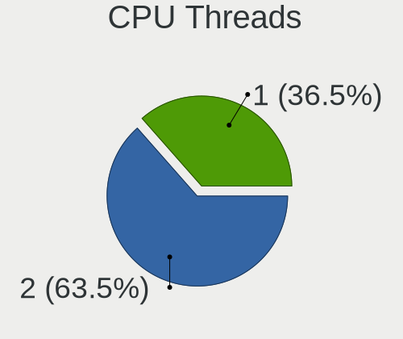
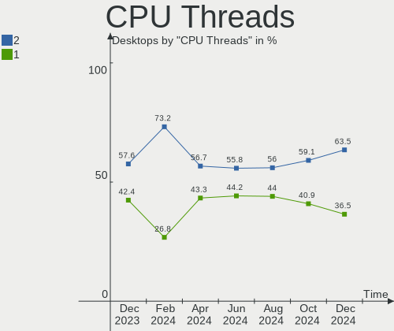
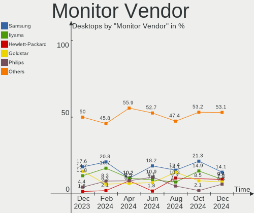
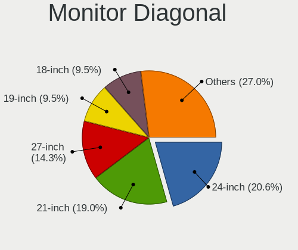
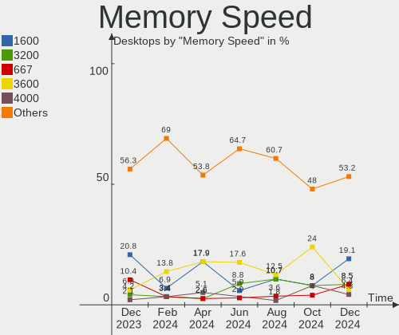
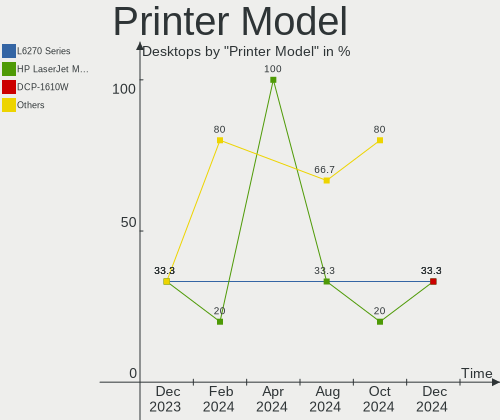
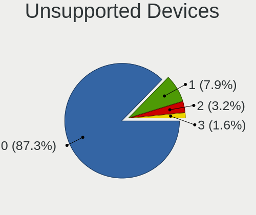

Linux in Poland - Hardware Trends (Desktops)
--------------------------------------------

A project to identify most popular hardware characteristics and track their change
over time based on data collected by Linux users at https://Linux-Hardware.org.

Anyone can contribute to this report by the [hw-probe](https://github.com/linuxhw/hw-probe) tool:

    sudo -E hw-probe -all -upload

Period: Jan, 2024.

Contents
--------

* [ System ](#system)
  - [ OS                       ](#os)
  - [ OS Family                ](#os-family)
  - [ Kernel                   ](#kernel)
  - [ Kernel Family            ](#kernel-family)
  - [ Kernel Major Ver.        ](#kernel-major-ver)
  - [ Arch                     ](#arch)
  - [ DE                       ](#de)
  - [ Display Server           ](#display-server)
  - [ Display Manager          ](#display-manager)
  - [ OS Lang                  ](#os-lang)
  - [ Boot Mode                ](#boot-mode)
  - [ Filesystem               ](#filesystem)
  - [ Part. scheme             ](#part-scheme)
  - [ Dual Boot with Linux/BSD ](#dual-boot-with-linuxbsd)
  - [ Dual Boot (Win)          ](#dual-boot-win)

* [ Board ](#board)
  - [ Vendor                   ](#vendor)
  - [ Model                    ](#model)
  - [ Model Family             ](#model-family)
  - [ MFG Year                 ](#mfg-year)
  - [ Form Factor              ](#form-factor)
  - [ Secure Boot              ](#secure-boot)
  - [ Coreboot                 ](#coreboot)
  - [ RAM Size                 ](#ram-size)
  - [ RAM Used                 ](#ram-used)
  - [ Total Drives             ](#total-drives)
  - [ Has CD-ROM               ](#has-cd-rom)
  - [ Has Ethernet             ](#has-ethernet)
  - [ Has WiFi                 ](#has-wifi)
  - [ Has Bluetooth            ](#has-bluetooth)

* [ Location ](#location)
  - [ Country                  ](#country)
  - [ City                     ](#city)

* [ Drives ](#drives)
  - [ Drive Vendor             ](#drive-vendor)
  - [ Drive Model              ](#drive-model)
  - [ HDD Vendor               ](#hdd-vendor)
  - [ SSD Vendor               ](#ssd-vendor)
  - [ Drive Kind               ](#drive-kind)
  - [ Drive Connector          ](#drive-connector)
  - [ Drive Size               ](#drive-size)
  - [ Space Total              ](#space-total)
  - [ Space Used               ](#space-used)
  - [ Malfunc. Drives          ](#malfunc-drives)
  - [ Malfunc. Drive Vendor    ](#malfunc-drive-vendor)
  - [ Malfunc. HDD Vendor      ](#malfunc-hdd-vendor)
  - [ Malfunc. Drive Kind      ](#malfunc-drive-kind)
  - [ Failed Drives            ](#failed-drives)
  - [ Failed Drive Vendor      ](#failed-drive-vendor)
  - [ Drive Status             ](#drive-status)

* [ Storage controller ](#storage-controller)
  - [ Storage Vendor           ](#storage-vendor)
  - [ Storage Model            ](#storage-model)
  - [ Storage Kind             ](#storage-kind)

* [ Processor ](#processor)
  - [ CPU Vendor               ](#cpu-vendor)
  - [ CPU Model                ](#cpu-model)
  - [ CPU Model Family         ](#cpu-model-family)
  - [ CPU Cores                ](#cpu-cores)
  - [ CPU Sockets              ](#cpu-sockets)
  - [ CPU Threads              ](#cpu-threads)
  - [ CPU Op-Modes             ](#cpu-op-modes)
  - [ CPU Microcode            ](#cpu-microcode)
  - [ CPU Microarch            ](#cpu-microarch)

* [ Graphics ](#graphics)
  - [ GPU Vendor               ](#gpu-vendor)
  - [ GPU Model                ](#gpu-model)
  - [ GPU Combo                ](#gpu-combo)
  - [ GPU Driver               ](#gpu-driver)
  - [ GPU Memory               ](#gpu-memory)

* [ Monitor ](#monitor)
  - [ Monitor Vendor           ](#monitor-vendor)
  - [ Monitor Model            ](#monitor-model)
  - [ Monitor Resolution       ](#monitor-resolution)
  - [ Monitor Diagonal         ](#monitor-diagonal)
  - [ Monitor Width            ](#monitor-width)
  - [ Aspect Ratio             ](#aspect-ratio)
  - [ Monitor Area             ](#monitor-area)
  - [ Pixel Density            ](#pixel-density)
  - [ Multiple Monitors        ](#multiple-monitors)

* [ Network ](#network)
  - [ Net Controller Vendor    ](#net-controller-vendor)
  - [ Net Controller Model     ](#net-controller-model)
  - [ Wireless Vendor          ](#wireless-vendor)
  - [ Wireless Model           ](#wireless-model)
  - [ Ethernet Vendor          ](#ethernet-vendor)
  - [ Ethernet Model           ](#ethernet-model)
  - [ Net Controller Kind      ](#net-controller-kind)
  - [ Used Controller          ](#used-controller)
  - [ NICs                     ](#nics)
  - [ IPv6                     ](#ipv6)

* [ Bluetooth ](#bluetooth)
  - [ Bluetooth Vendor         ](#bluetooth-vendor)
  - [ Bluetooth Model          ](#bluetooth-model)

* [ Sound ](#sound)
  - [ Sound Vendor             ](#sound-vendor)
  - [ Sound Model              ](#sound-model)

* [ Memory ](#memory)
  - [ Memory Vendor            ](#memory-vendor)
  - [ Memory Model             ](#memory-model)
  - [ Memory Kind              ](#memory-kind)
  - [ Memory Form Factor       ](#memory-form-factor)
  - [ Memory Size              ](#memory-size)
  - [ Memory Speed             ](#memory-speed)

* [ Printers & scanners ](#printers--scanners)
  - [ Printer Vendor           ](#printer-vendor)
  - [ Printer Model            ](#printer-model)
  - [ Scanner Vendor           ](#scanner-vendor)
  - [ Scanner Model            ](#scanner-model)

* [ Camera ](#camera)
  - [ Camera Vendor            ](#camera-vendor)
  - [ Camera Model             ](#camera-model)

* [ Security ](#security)
  - [ Fingerprint Vendor       ](#fingerprint-vendor)
  - [ Fingerprint Model        ](#fingerprint-model)
  - [ Chipcard Vendor          ](#chipcard-vendor)
  - [ Chipcard Model           ](#chipcard-model)

* [ Unsupported ](#unsupported)
  - [ Unsupported Devices      ](#unsupported-devices)
  - [ Unsupported Device Types ](#unsupported-device-types)

System
------

OS
--

Installed operating systems

| Name                | Desktops | Percent |
|---------------------|----------|---------|
| Ubuntu 22.04        | 11       | 18.33%  |
| Fedora 39           | 6        | 10%     |
| OpenMandriva 23.08  | 5        | 8.33%   |
| OpenMandriva 5.0    | 4        | 6.67%   |
| Gentoo 2.14         | 4        | 6.67%   |
| ROSA 12.4           | 3        | 5%      |
| Arch Rolling        | 3        | 5%      |
| Ubuntu 23.10        | 2        | 3.33%   |
| Pop!_OS 22.04       | 2        | 3.33%   |
| Linux Mint 21.2     | 2        | 3.33%   |
| Kali 2023.3         | 2        | 3.33%   |
| Debian 11           | 2        | 3.33%   |
| Zorin 16            | 1        | 1.67%   |
| OpenMandriva 4.3    | 1        | 1.67%   |
| OpenMandriva 4.2    | 1        | 1.67%   |
| OpenMandriva 23.11  | 1        | 1.67%   |
| Manjaro 23.1.2      | 1        | 1.67%   |
| Mageia 9            | 1        | 1.67%   |
| LMDE 6              | 1        | 1.67%   |
| Linux Mint 21.3     | 1        | 1.67%   |
| Lilidog 23          | 1        | 1.67%   |
| Feren OS 20.04      | 1        | 1.67%   |
| EndeavourOS Rolling | 1        | 1.67%   |
| Debian 12           | 1        | 1.67%   |
| BigLinux 23.1.3     | 1        | 1.67%   |
| Artix Rolling       | 1        | 1.67%   |

OS Family
---------

OS without a version

| Name         | Desktops | Percent |
|--------------|----------|---------|
| Ubuntu       | 13       | 21.67%  |
| OpenMandriva | 12       | 20%     |
| Fedora       | 6        | 10%     |
| Gentoo       | 4        | 6.67%   |
| ROSA         | 3        | 5%      |
| Linux Mint   | 3        | 5%      |
| Debian       | 3        | 5%      |
| Arch         | 3        | 5%      |
| Pop!_OS      | 2        | 3.33%   |
| Kali         | 2        | 3.33%   |
| Zorin        | 1        | 1.67%   |
| Manjaro      | 1        | 1.67%   |
| Mageia       | 1        | 1.67%   |
| LMDE         | 1        | 1.67%   |
| Lilidog      | 1        | 1.67%   |
| Feren OS     | 1        | 1.67%   |
| EndeavourOS  | 1        | 1.67%   |
| BigLinux     | 1        | 1.67%   |
| Artix        | 1        | 1.67%   |

Kernel
------

Version of the Linux kernel

| Version                                | Desktops | Percent |
|----------------------------------------|----------|---------|
| 6.5.0-14-generic                       | 7        | 11.67%  |
| 6.6.2-desktop-1omv2390                 | 5        | 8.33%   |
| 6.4.11-desktop-1omv2390                | 4        | 6.67%   |
| 6.1.67-gentoo                          | 4        | 6.67%   |
| 6.5.0-15-generic                       | 3        | 5%      |
| 6.2.0-39-generic                       | 3        | 5%      |
| 6.6.9-200.fc39.x86_64                  | 2        | 3.33%   |
| 6.6.12-200.fc39.x86_64                 | 2        | 3.33%   |
| 6.3.0-kali1-amd64                      | 2        | 3.33%   |
| 6.1.58-generic-1rosa2021.1-x86_64      | 2        | 3.33%   |
| 6.1.0-0.deb11.13-amd64                 | 2        | 3.33%   |
| 6.7.0.xm1-1.k-xanmod-rosa2021.1-x86_64 | 1        | 1.67%   |
| 6.7.0-zen3-1-zen                       | 1        | 1.67%   |
| 6.7.0-367.vanilla.fc39.x86_64          | 1        | 1.67%   |
| 6.6.9-arch1-1                          | 1        | 1.67%   |
| 6.6.9-1-cachyos-bore                   | 1        | 1.67%   |
| 6.6.8-273-tkg-eevdf                    | 1        | 1.67%   |
| 6.6.7-artix1-1                         | 1        | 1.67%   |
| 6.6.6-76060606-generic                 | 1        | 1.67%   |
| 6.6.10-lqx1-1-lqx                      | 1        | 1.67%   |
| 6.6.10-76060610-generic                | 1        | 1.67%   |
| 6.5.13-desktop-6.mga9                  | 1        | 1.67%   |
| 6.5.0-0.deb12.4-amd64                  | 1        | 1.67%   |
| 6.4.8-desktop-2omv2390                 | 1        | 1.67%   |
| 6.2.15-300.fc38.x86_64                 | 1        | 1.67%   |
| 6.2.0-37-generic                       | 1        | 1.67%   |
| 6.2.0-26-generic                       | 1        | 1.67%   |
| 6.1.71-1-MANJARO                       | 1        | 1.67%   |
| 6.1.0-17-amd64                         | 1        | 1.67%   |
| 6.1.0-10-amd64                         | 1        | 1.67%   |
| 5.16.13-desktop-1omv4003               | 1        | 1.67%   |
| 5.15.0-84-generic                      | 1        | 1.67%   |
| 5.15.0-78-generic                      | 1        | 1.67%   |
| 5.15.0-69-generic                      | 1        | 1.67%   |
| 5.10.14-desktop-1omv4002               | 1        | 1.67%   |

Kernel Family
-------------

Linux kernel without a distro release

| Version | Desktops | Percent |
|---------|----------|---------|
| 6.5.0   | 11       | 18.33%  |
| 6.6.2   | 5        | 8.33%   |
| 6.2.0   | 5        | 8.33%   |
| 6.6.9   | 4        | 6.67%   |
| 6.4.11  | 4        | 6.67%   |
| 6.1.67  | 4        | 6.67%   |
| 6.1.0   | 4        | 6.67%   |
| 6.7.0   | 3        | 5%      |
| 5.15.0  | 3        | 5%      |
| 6.6.12  | 2        | 3.33%   |
| 6.6.10  | 2        | 3.33%   |
| 6.3.0   | 2        | 3.33%   |
| 6.1.58  | 2        | 3.33%   |
| 6.6.8   | 1        | 1.67%   |
| 6.6.7   | 1        | 1.67%   |
| 6.6.6   | 1        | 1.67%   |
| 6.5.13  | 1        | 1.67%   |
| 6.4.8   | 1        | 1.67%   |
| 6.2.15  | 1        | 1.67%   |
| 6.1.71  | 1        | 1.67%   |
| 5.16.13 | 1        | 1.67%   |
| 5.10.14 | 1        | 1.67%   |

Kernel Major Ver.
-----------------

Linux kernel major version

| Version | Desktops | Percent |
|---------|----------|---------|
| 6.6     | 16       | 26.67%  |
| 6.5     | 12       | 20%     |
| 6.1     | 11       | 18.33%  |
| 6.2     | 6        | 10%     |
| 6.4     | 5        | 8.33%   |
| 6.7     | 3        | 5%      |
| 5.15    | 3        | 5%      |
| 6.3     | 2        | 3.33%   |
| 5.16    | 1        | 1.67%   |
| 5.10    | 1        | 1.67%   |

Arch
----

OS architecture (x86_64, i586, etc.)

| Name   | Desktops | Percent |
|--------|----------|---------|
| x86_64 | 60       | 100%    |

DE
--

Desktop Environment

| Name       | Desktops | Percent |
|------------|----------|---------|
| GNOME      | 21       | 35%     |
| KDE5       | 19       | 31.67%  |
| XFCE       | 7        | 11.67%  |
| Unknown    | 4        | 6.67%   |
| X-Cinnamon | 3        | 5%      |
| MATE       | 2        | 3.33%   |
| openbox    | 1        | 1.67%   |
| LXQt       | 1        | 1.67%   |
| KDE        | 1        | 1.67%   |
| ICEWM      | 1        | 1.67%   |

Display Server
--------------

X11 or Wayland

| Name    | Desktops | Percent |
|---------|----------|---------|
| Wayland | 29       | 48.33%  |
| X11     | 26       | 43.33%  |
| Unknown | 3        | 5%      |
| Tty     | 2        | 3.33%   |

Display Manager
---------------

SDDM, LightDM, etc.

| Name    | Desktops | Percent |
|---------|----------|---------|
| SDDM    | 21       | 35%     |
| Unknown | 14       | 23.33%  |
| GDM3    | 11       | 18.33%  |
| LightDM | 10       | 16.67%  |
| GDM     | 4        | 6.67%   |

OS Lang
-------

Language

| Lang    | Desktops | Percent |
|---------|----------|---------|
| pl_PL   | 30       | 50%     |
| en_US   | 24       | 40%     |
| en_GB   | 2        | 3.33%   |
| ru_UA   | 1        | 1.67%   |
| fr_FR   | 1        | 1.67%   |
| en_IE   | 1        | 1.67%   |
| Unknown | 1        | 1.67%   |

Boot Mode
---------

EFI or BIOS

| Mode | Desktops | Percent |
|------|----------|---------|
| BIOS | 30       | 50%     |
| EFI  | 30       | 50%     |

Filesystem
----------

Type of filesystem

| Type    | Desktops | Percent |
|---------|----------|---------|
| Ext4    | 32       | 53.33%  |
| Overlay | 10       | 16.67%  |
| Tmpfs   | 7        | 11.67%  |
| Btrfs   | 7        | 11.67%  |
| F2fs    | 3        | 5%      |
| Zfs     | 1        | 1.67%   |

Part. scheme
------------

Scheme of partitioning

| Type    | Desktops | Percent |
|---------|----------|---------|
| GPT     | 41       | 68.33%  |
| Unknown | 10       | 16.67%  |
| MBR     | 9        | 15%     |

Dual Boot with Linux/BSD
------------------------

Hosting more than one Linux/BSD

| Dual boot | Desktops | Percent |
|-----------|----------|---------|
| No        | 45       | 75%     |
| Yes       | 15       | 25%     |

Dual Boot (Win)
---------------

Hosting Linux and Windows

| Dual boot | Desktops | Percent |
|-----------|----------|---------|
| No        | 39       | 65%     |
| Yes       | 21       | 35%     |

Board
-----

Vendor
------

Motherboard manufacturer

| Name                | Desktops | Percent |
|---------------------|----------|---------|
| ASUSTek Computer    | 19       | 31.67%  |
| Gigabyte Technology | 10       | 16.67%  |
| ASRock              | 10       | 16.67%  |
| MSI                 | 9        | 15%     |
| Hewlett-Packard     | 6        | 10%     |
| Dell                | 4        | 6.67%   |
| Lenovo              | 1        | 1.67%   |
| Fujitsu             | 1        | 1.67%   |

Model
-----

Motherboard model

| Name                                 | Desktops | Percent |
|--------------------------------------|----------|---------|
| MSI MS-7816                          | 2        | 3.33%   |
| Gigabyte B550 AORUS ELITE V2         | 2        | 3.33%   |
| ASUS All Series                      | 2        | 3.33%   |
| ASRock B450 Pro4                     | 2        | 3.33%   |
| MSI MS-7C91                          | 1        | 1.67%   |
| MSI MS-7C83                          | 1        | 1.67%   |
| MSI MS-7C56                          | 1        | 1.67%   |
| MSI MS-7B89                          | 1        | 1.67%   |
| MSI MS-7A70                          | 1        | 1.67%   |
| MSI MS-7851                          | 1        | 1.67%   |
| MSI MS-7721                          | 1        | 1.67%   |
| Lenovo Legion Y520T-25IKL 90H700ETPB | 1        | 1.67%   |
| HP Z420 Workstation                  | 1        | 1.67%   |
| HP t620 PLUS Quad Core TC            | 1        | 1.67%   |
| HP ProDesk 600 G2 MT                 | 1        | 1.67%   |
| HP EliteDesk 800 G2 DM 35W           | 1        | 1.67%   |
| HP EliteDesk 800 G1 SFF              | 1        | 1.67%   |
| HP EliteDesk 705 G5 SFF              | 1        | 1.67%   |
| Gigabyte H310M S2V 2.0               | 1        | 1.67%   |
| Gigabyte H310M M.2 2.0               | 1        | 1.67%   |
| Gigabyte EP45-UD3R                   | 1        | 1.67%   |
| Gigabyte B550M DS3H                  | 1        | 1.67%   |
| Gigabyte B450M DS3H                  | 1        | 1.67%   |
| Gigabyte B250M-D3H                   | 1        | 1.67%   |
| Gigabyte AB350-Gaming                | 1        | 1.67%   |
| Gigabyte A520 AORUS ELITE            | 1        | 1.67%   |
| Fujitsu FUTRO S920                   | 1        | 1.67%   |
| Dell Vostro 3900                     | 1        | 1.67%   |
| Dell Vostro 260                      | 1        | 1.67%   |
| Dell OptiPlex 7050                   | 1        | 1.67%   |
| Dell OptiPlex 7010                   | 1        | 1.67%   |
| ASUS Z170 PRO GAMING                 | 1        | 1.67%   |
| ASUS TUF Gaming B550-PLUS WIFI II    | 1        | 1.67%   |
| ASUS ROG STRIX B650E-E GAMING WIFI   | 1        | 1.67%   |
| ASUS ProArt Z490-CREATOR 10G         | 1        | 1.67%   |
| ASUS PRIME X470-PRO                  | 1        | 1.67%   |
| ASUS PRIME H510M-E                   | 1        | 1.67%   |
| ASUS PRIME B660M-A WIFI D4           | 1        | 1.67%   |
| ASUS PRIME B660M-A D4                | 1        | 1.67%   |
| ASUS PRIME B650M-A WIFI II           | 1        | 1.67%   |

Model Family
------------

Motherboard model prefix

| Name                  | Desktops | Percent |
|-----------------------|----------|---------|
| ASUS PRIME            | 6        | 10%     |
| HP EliteDesk          | 3        | 5%      |
| ASRock B450           | 3        | 5%      |
| MSI MS-7816           | 2        | 3.33%   |
| Gigabyte H310M        | 2        | 3.33%   |
| Gigabyte B550         | 2        | 3.33%   |
| Dell Vostro           | 2        | 3.33%   |
| Dell OptiPlex         | 2        | 3.33%   |
| ASUS All              | 2        | 3.33%   |
| MSI MS-7C91           | 1        | 1.67%   |
| MSI MS-7C83           | 1        | 1.67%   |
| MSI MS-7C56           | 1        | 1.67%   |
| MSI MS-7B89           | 1        | 1.67%   |
| MSI MS-7A70           | 1        | 1.67%   |
| MSI MS-7851           | 1        | 1.67%   |
| MSI MS-7721           | 1        | 1.67%   |
| Lenovo Legion         | 1        | 1.67%   |
| HP Z420               | 1        | 1.67%   |
| HP t620               | 1        | 1.67%   |
| HP ProDesk            | 1        | 1.67%   |
| Gigabyte EP45-UD3R    | 1        | 1.67%   |
| Gigabyte B550M        | 1        | 1.67%   |
| Gigabyte B450M        | 1        | 1.67%   |
| Gigabyte B250M-D3H    | 1        | 1.67%   |
| Gigabyte AB350-Gaming | 1        | 1.67%   |
| Gigabyte A520         | 1        | 1.67%   |
| Fujitsu FUTRO         | 1        | 1.67%   |
| ASUS Z170             | 1        | 1.67%   |
| ASUS TUF              | 1        | 1.67%   |
| ASUS ROG              | 1        | 1.67%   |
| ASUS ProArt           | 1        | 1.67%   |
| ASUS P5QLD            | 1        | 1.67%   |
| ASUS P5K-E            | 1        | 1.67%   |
| ASUS M5A97            | 1        | 1.67%   |
| ASUS M4N68T-M-V2      | 1        | 1.67%   |
| ASUS M3A78-CM         | 1        | 1.67%   |
| ASUS EU1001302        | 1        | 1.67%   |
| ASUS Crosshair        | 1        | 1.67%   |
| ASRock X670E          | 1        | 1.67%   |
| ASRock X570           | 1        | 1.67%   |

MFG Year
--------

Motherboard manufacture year

| Year | Desktops | Percent |
|------|----------|---------|
| 2018 | 10       | 16.67%  |
| 2020 | 9        | 15%     |
| 2014 | 6        | 10%     |
| 2022 | 5        | 8.33%   |
| 2021 | 5        | 8.33%   |
| 2015 | 5        | 8.33%   |
| 2013 | 4        | 6.67%   |
| 2017 | 3        | 5%      |
| 2012 | 3        | 5%      |
| 2016 | 2        | 3.33%   |
| 2011 | 2        | 3.33%   |
| 2008 | 2        | 3.33%   |
| 2019 | 1        | 1.67%   |
| 2010 | 1        | 1.67%   |
| 2009 | 1        | 1.67%   |
| 2007 | 1        | 1.67%   |

Form Factor
-----------

Physical design of the computer

| Name    | Desktops | Percent |
|---------|----------|---------|
| Desktop | 60       | 100%    |

Secure Boot
-----------

Enabled or disabled

| State    | Desktops | Percent |
|----------|----------|---------|
| Disabled | 58       | 96.67%  |
| Enabled  | 2        | 3.33%   |

Coreboot
--------

Have coreboot on board

| Used | Desktops | Percent |
|------|----------|---------|
| No   | 60       | 100%    |

RAM Size
--------

Total RAM memory

| Size in GB  | Desktops | Percent |
|-------------|----------|---------|
| 32.01-64.0  | 17       | 28.33%  |
| 16.01-24.0  | 15       | 25%     |
| 4.01-8.0    | 10       | 16.67%  |
| 8.01-16.0   | 10       | 16.67%  |
| 64.01-256.0 | 5        | 8.33%   |
| 3.01-4.0    | 2        | 3.33%   |
| 24.01-32.0  | 1        | 1.67%   |

RAM Used
--------

Used RAM memory

| Used GB    | Desktops | Percent |
|------------|----------|---------|
| 1.01-2.0   | 19       | 31.67%  |
| 4.01-8.0   | 15       | 25%     |
| 2.01-3.0   | 11       | 18.33%  |
| 3.01-4.0   | 6        | 10%     |
| 8.01-16.0  | 5        | 8.33%   |
| 0.51-1.0   | 3        | 5%      |
| 24.01-32.0 | 1        | 1.67%   |

Total Drives
------------

Number of drives on board

| Drives | Desktops | Percent |
|--------|----------|---------|
| 1      | 14       | 23.33%  |
| 3      | 13       | 21.67%  |
| 2      | 13       | 21.67%  |
| 5      | 7        | 11.67%  |
| 4      | 6        | 10%     |
| 0      | 3        | 5%      |
| 6      | 2        | 3.33%   |
| 9      | 1        | 1.67%   |
| 7      | 1        | 1.67%   |

Has CD-ROM
----------

Has CD-ROM on board

| Presented | Desktops | Percent |
|-----------|----------|---------|
| No        | 39       | 65%     |
| Yes       | 21       | 35%     |

Has Ethernet
------------

Has Ethernet on board

| Presented | Desktops | Percent |
|-----------|----------|---------|
| Yes       | 60       | 100%    |

Has WiFi
--------

Has WiFi module

| Presented | Desktops | Percent |
|-----------|----------|---------|
| No        | 36       | 60%     |
| Yes       | 24       | 40%     |

Has Bluetooth
-------------

Has Bluetooth module

| Presented | Desktops | Percent |
|-----------|----------|---------|
| No        | 37       | 61.67%  |
| Yes       | 23       | 38.33%  |

Location
--------

Country
-------

Geographic location (country)

| Country | Desktops | Percent |
|---------|----------|---------|
| Poland  | 60       | 100%    |

City
----

Geographic location (city)

| City                 | Desktops | Percent |
|----------------------|----------|---------|
| Warsaw               | 12       | 20%     |
| Krakow               | 6        | 10%     |
| Wroclaw              | 3        | 5%      |
| Torun                | 2        | 3.33%   |
| Krotoszyn            | 2        | 3.33%   |
| Koszalin             | 2        | 3.33%   |
| Katowice             | 2        | 3.33%   |
| Łomża              | 1        | 1.67%   |
| Żywiec              | 1        | 1.67%   |
| Zielonki             | 1        | 1.67%   |
| Zielona Góra        | 1        | 1.67%   |
| Wielbark             | 1        | 1.67%   |
| Swidnik              | 1        | 1.67%   |
| Sosnowiec            | 1        | 1.67%   |
| Rzeszów             | 1        | 1.67%   |
| Rumia                | 1        | 1.67%   |
| Ruda Śląska        | 1        | 1.67%   |
| Radomsko             | 1        | 1.67%   |
| Raciszyn             | 1        | 1.67%   |
| Płośnica           | 1        | 1.67%   |
| Płock               | 1        | 1.67%   |
| Pszczolki            | 1        | 1.67%   |
| Poznan               | 1        | 1.67%   |
| Piotrkow Trybunalski | 1        | 1.67%   |
| Olesno               | 1        | 1.67%   |
| Nowa Sol             | 1        | 1.67%   |
| Mińsk Mazowiecki    | 1        | 1.67%   |
| Malbork              | 1        | 1.67%   |
| Lodz                 | 1        | 1.67%   |
| Jelenia Góra        | 1        | 1.67%   |
| Jaslo                | 1        | 1.67%   |
| Gmina Marcinowice    | 1        | 1.67%   |
| Gielniów            | 1        | 1.67%   |
| Gdynia               | 1        | 1.67%   |
| Cieszyn              | 1        | 1.67%   |
| Chybie               | 1        | 1.67%   |
| Bytom                | 1        | 1.67%   |
| Bolesławiec         | 1        | 1.67%   |

Drives
------

Drive Vendor
------------

Hard drive vendors

| Vendor                       | Desktops | Drives | Percent |
|------------------------------|----------|--------|---------|
| Seagate                      | 20       | 29     | 14.93%  |
| Samsung Electronics          | 17       | 22     | 12.69%  |
| WDC                          | 16       | 20     | 11.94%  |
| GOODRAM                      | 16       | 19     | 11.94%  |
| Toshiba                      | 10       | 12     | 7.46%   |
| Kingston                     | 5        | 6      | 3.73%   |
| SPCC                         | 4        | 4      | 2.99%   |
| SanDisk                      | 4        | 4      | 2.99%   |
| Crucial                      | 4        | 4      | 2.99%   |
| A-DATA Technology            | 4        | 5      | 2.99%   |
| Shenzhen Longsys Electronics | 3        | 3      | 2.24%   |
| Phison Electronics           | 3        | 3      | 2.24%   |
| Lexar                        | 3        | 3      | 2.24%   |
| ADATA Technology             | 3        | 3      | 2.24%   |
| Micron Technology            | 2        | 3      | 1.49%   |
| MAXIO Technology (Hangzhou)  | 2        | 2      | 1.49%   |
| JMicron Technology           | 2        | 2      | 1.49%   |
| Intel                        | 2        | 2      | 1.49%   |
| Hitachi                      | 2        | 4      | 1.49%   |
| XSTAR                        | 1        | 1      | 0.75%   |
| Unknown                      | 1        | 3      | 0.75%   |
| Transcend                    | 1        | 1      | 0.75%   |
| SK hynix                     | 1        | 1      | 0.75%   |
| Silicon Motion               | 1        | 1      | 0.75%   |
| PNY                          | 1        | 1      | 0.75%   |
| Plextor                      | 1        | 1      | 0.75%   |
| Kingston Technology Company  | 1        | 1      | 0.75%   |
| Kingchuxing                  | 1        | 2      | 0.75%   |
| Innodisk                     | 1        | 1      | 0.75%   |
| HGST                         | 1        | 1      | 0.75%   |
| Fujitsu                      | 1        | 1      | 0.75%   |

Drive Model
-----------

Hard drive models

| Model                                                           | Desktops | Percent |
|-----------------------------------------------------------------|----------|---------|
| Samsung NVMe SSD Controller SM981/PM981/PM983 1TB               | 3        | 2.01%   |
| GOODRAM SSDPR-CX400-512-G2 512GB                                | 3        | 2.01%   |
| Crucial CT240BX500SSD1 240GB                                    | 3        | 2.01%   |
| WDC WD10EFRX-68FYTN0 1TB                                        | 2        | 1.34%   |
| Toshiba HDWD130 3TB                                             | 2        | 1.34%   |
| SPCC Solid State Disk 512GB                                     | 2        | 1.34%   |
| Seagate ST500DM002-1BD142 500GB                                 | 2        | 1.34%   |
| Seagate ST4000DM004-2CV104 4TB                                  | 2        | 1.34%   |
| Samsung SSD 970 EVO Plus 500GB                                  | 2        | 1.34%   |
| Samsung NVMe SSD Controller PM9A1/PM9A3/980PRO 2TB              | 2        | 1.34%   |
| Phison E12 NVMe Controller 1TB                                  | 2        | 1.34%   |
| MAXIO (Hangzhou) NVMe SSD Controller MAP1202 512GB              | 2        | 1.34%   |
| Kingston SNVS500G 500GB                                         | 2        | 1.34%   |
| Hitachi HUS724030ALE641 3TB                                     | 2        | 1.34%   |
| GOODRAM SSDPR_CX300_120 120GB                                   | 2        | 1.34%   |
| GOODRAM SSDPR-CX400-256-G2 256GB                                | 2        | 1.34%   |
| GOODRAM SSDPR-CX400-256 256GB                                   | 2        | 1.34%   |
| GOODRAM SSDPR-CL100-480-G2 480GB                                | 2        | 1.34%   |
| GOODRAM IR-SSDPR-S25A-240 240GB                                 | 2        | 1.34%   |
| ADATA XPG SX8200 Pro PCIe Gen3x4 M.2 2280 Solid State Drive 2TB | 2        | 1.34%   |
| A-DATA SU800 512GB SSD                                          | 2        | 1.34%   |
| A-DATA SU800 256GB SSD                                          | 2        | 1.34%   |
| XSTAR SSD 240GB                                                 | 1        | 0.67%   |
| WDC WUH722020ALE6L4 20TB                                        | 1        | 0.67%   |
| WDC WD60EFRX-68MYMN1 6TB                                        | 1        | 0.67%   |
| WDC WD5000AVDS-63U7B1 500GB                                     | 1        | 0.67%   |
| WDC WD5000AAKX-00U6AA0 500GB                                    | 1        | 0.67%   |
| WDC WD5000AAKX-001CA0 500GB                                     | 1        | 0.67%   |
| WDC WD30EZRX-00MMMB0 3TB                                        | 1        | 0.67%   |
| WDC WD2500AAKX-75U6AA0 250GB                                    | 1        | 0.67%   |
| WDC WD20EZRZ-22Z5HB0 2TB                                        | 1        | 0.67%   |
| WDC WD20EZRZ-00Z5HB0 2TB                                        | 1        | 0.67%   |
| WDC WD20EFRX-68EUZN0 2TB                                        | 1        | 0.67%   |
| WDC WD10PURX-64E5EY0 1TB                                        | 1        | 0.67%   |
| WDC WD10JPCX-24UE4T0 1TB                                        | 1        | 0.67%   |
| WDC WD10EZRX-00D8PB0 1TB                                        | 1        | 0.67%   |
| WDC WD10EZEX-08WN4A0 1TB                                        | 1        | 0.67%   |
| WDC WD10EZEX-00RKKA0 1TB                                        | 1        | 0.67%   |
| WDC WD1001FALS-00J7B1 1TB                                       | 1        | 0.67%   |
| Unknown SD/MMC 2GB                                              | 1        | 0.67%   |

HDD Vendor
----------

Hard disk drive vendors

| Vendor              | Desktops | Drives | Percent |
|---------------------|----------|--------|---------|
| Seagate             | 19       | 28     | 34.55%  |
| WDC                 | 16       | 20     | 29.09%  |
| Toshiba             | 10       | 12     | 18.18%  |
| Samsung Electronics | 4        | 5      | 7.27%   |
| JMicron Technology  | 2        | 2      | 3.64%   |
| Hitachi             | 2        | 4      | 3.64%   |
| HGST                | 1        | 1      | 1.82%   |
| Fujitsu             | 1        | 1      | 1.82%   |

SSD Vendor
----------

Solid state drive vendors

| Vendor              | Desktops | Drives | Percent |
|---------------------|----------|--------|---------|
| GOODRAM             | 16       | 19     | 34.78%  |
| Samsung Electronics | 7        | 7      | 15.22%  |
| SPCC                | 4        | 4      | 8.7%    |
| Crucial             | 4        | 4      | 8.7%    |
| A-DATA Technology   | 4        | 4      | 8.7%    |
| SanDisk             | 2        | 2      | 4.35%   |
| XSTAR               | 1        | 1      | 2.17%   |
| Transcend           | 1        | 1      | 2.17%   |
| PNY                 | 1        | 1      | 2.17%   |
| Plextor             | 1        | 1      | 2.17%   |
| Micron Technology   | 1        | 2      | 2.17%   |
| Lexar               | 1        | 1      | 2.17%   |
| Kingchuxing         | 1        | 2      | 2.17%   |
| Intel               | 1        | 1      | 2.17%   |
| Innodisk            | 1        | 1      | 2.17%   |

Drive Kind
----------

HDD or SSD

| Kind    | Desktops | Drives | Percent |
|---------|----------|--------|---------|
| HDD     | 38       | 73     | 35.85%  |
| SSD     | 37       | 51     | 34.91%  |
| NVMe    | 29       | 37     | 27.36%  |
| Unknown | 2        | 4      | 1.89%   |

Drive Connector
---------------

SATA, SAS, NVMe, etc.

| Type | Desktops | Drives | Percent |
|------|----------|--------|---------|
| SATA | 50       | 121    | 59.52%  |
| NVMe | 29       | 37     | 34.52%  |
| SAS  | 5        | 7      | 5.95%   |

Drive Size
----------

Size of hard drive

| Size in TB | Desktops | Drives | Percent |
|------------|----------|--------|---------|
| 0.01-0.5   | 38       | 61     | 45.78%  |
| 0.51-1.0   | 19       | 26     | 22.89%  |
| 3.01-4.0   | 7        | 10     | 8.43%   |
| 1.01-2.0   | 6        | 10     | 7.23%   |
| 2.01-3.0   | 5        | 8      | 6.02%   |
| 4.01-10.0  | 5        | 6      | 6.02%   |
| 10.01-20.0 | 3        | 3      | 3.61%   |

Space Total
-----------

Amount of disk space available on the file system

| Size in GB     | Desktops | Percent |
|----------------|----------|---------|
| 101-250        | 12       | 20%     |
| 1001-2000      | 10       | 16.67%  |
| More than 3000 | 9        | 15%     |
| 251-500        | 8        | 13.33%  |
| 1-20           | 7        | 11.67%  |
| 501-1000       | 6        | 10%     |
| Unknown        | 4        | 6.67%   |
| 2001-3000      | 2        | 3.33%   |
| 51-100         | 2        | 3.33%   |

Space Used
----------

Amount of used disk space

| Used GB        | Desktops | Percent |
|----------------|----------|---------|
| 1-20           | 17       | 28.33%  |
| 101-250        | 10       | 16.67%  |
| 501-1000       | 8        | 13.33%  |
| 21-50          | 7        | 11.67%  |
| More than 3000 | 6        | 10%     |
| 1001-2000      | 4        | 6.67%   |
| Unknown        | 4        | 6.67%   |
| 51-100         | 3        | 5%      |
| 2001-3000      | 1        | 1.67%   |

Malfunc. Drives
---------------

Drive models with a malfunction

| Model                              | Desktops | Drives | Percent |
|------------------------------------|----------|--------|---------|
| WDC WD5000AVDS-63U7B1 500GB        | 1        | 2      | 10%     |
| WDC WD2500AAKX-75U6AA0 250GB       | 1        | 1      | 10%     |
| WDC WD10EFRX-68FYTN0 1TB           | 1        | 1      | 10%     |
| WDC WD1001FALS-00J7B1 1TB          | 1        | 1      | 10%     |
| Toshiba HDWD130 3TB                | 1        | 2      | 10%     |
| Seagate ST500DM002-1BD142 500GB    | 1        | 1      | 10%     |
| Seagate ST3250318AS 250GB          | 1        | 1      | 10%     |
| Seagate ST2000LM003 HN-M201RAD 2TB | 1        | 1      | 10%     |
| Hitachi HUS724030ALE641 3TB        | 1        | 1      | 10%     |
| HGST HTS725050A7E630 500GB         | 1        | 1      | 10%     |

Malfunc. Drive Vendor
---------------------

Vendors of faulty drives

| Vendor  | Desktops | Drives | Percent |
|---------|----------|--------|---------|
| WDC     | 4        | 5      | 40%     |
| Seagate | 3        | 3      | 30%     |
| Toshiba | 1        | 2      | 10%     |
| Hitachi | 1        | 1      | 10%     |
| HGST    | 1        | 1      | 10%     |

Malfunc. HDD Vendor
-------------------

Vendors of faulty HDD drives

| Vendor  | Desktops | Drives | Percent |
|---------|----------|--------|---------|
| WDC     | 4        | 5      | 40%     |
| Seagate | 3        | 3      | 30%     |
| Toshiba | 1        | 2      | 10%     |
| Hitachi | 1        | 1      | 10%     |
| HGST    | 1        | 1      | 10%     |

Malfunc. Drive Kind
-------------------

Kinds of faulty drives

| Kind | Desktops | Drives | Percent |
|------|----------|--------|---------|
| HDD  | 9        | 12     | 100%    |

Failed Drives
-------------

Failed drive models

Zero info for selected period =(

Failed Drive Vendor
-------------------

Failed drive vendors

Zero info for selected period =(

Drive Status
------------

Number of failed and malfunc. drives

| Status   | Desktops | Drives | Percent |
|----------|----------|--------|---------|
| Works    | 40       | 104    | 56.34%  |
| Detected | 22       | 49     | 30.99%  |
| Malfunc  | 9        | 12     | 12.68%  |

Storage controller
------------------

Storage Vendor
--------------

Storage controller vendors

| Vendor                       | Desktops | Percent |
|------------------------------|----------|---------|
| AMD                          | 30       | 29.7%   |
| Intel                        | 28       | 27.72%  |
| Samsung Electronics          | 8        | 7.92%   |
| Kingston Technology Company  | 6        | 5.94%   |
| ASMedia Technology           | 6        | 5.94%   |
| Shenzhen Longsys Electronics | 4        | 3.96%   |
| ADATA Technology             | 4        | 3.96%   |
| Phison Electronics           | 3        | 2.97%   |
| MAXIO Technology (Hangzhou)  | 3        | 2.97%   |
| SanDisk                      | 2        | 1.98%   |
| JMicron Technology           | 2        | 1.98%   |
| SK hynix                     | 1        | 0.99%   |
| Silicon Motion               | 1        | 0.99%   |
| Nvidia                       | 1        | 0.99%   |
| Micron Technology            | 1        | 0.99%   |
| LSI Logic / Symbios Logic    | 1        | 0.99%   |

Storage Model
-------------

Storage controller models

| Model                                                                          | Desktops | Percent |
|--------------------------------------------------------------------------------|----------|---------|
| AMD FCH SATA Controller [AHCI mode]                                            | 10       | 8.33%   |
| AMD 500 Series Chipset SATA Controller                                         | 8        | 6.67%   |
| AMD 400 Series Chipset SATA Controller                                         | 8        | 6.67%   |
| Intel 8 Series/C220 Series Chipset Family 6-port SATA Controller 1 [AHCI mode] | 6        | 5%      |
| Intel 200 Series PCH SATA controller [AHCI mode]                               | 6        | 5%      |
| Samsung NVMe SSD Controller SM981/PM981/PM983                                  | 5        | 4.17%   |
| ASMedia ASM1061/ASM1062 Serial ATA Controller                                  | 5        | 4.17%   |
| AMD 600 Series Chipset SATA Controller                                         | 4        | 3.33%   |
| MAXIO (Hangzhou) NVMe SSD Controller MAP1202 (DRAM-less)                       | 3        | 2.5%    |
| Intel Q170/Q150/B150/H170/H110/Z170/CM236 Chipset SATA Controller [AHCI Mode]  | 3        | 2.5%    |
| Shenzhen Longsys Lexar NM790 NVME SSD (DRAM-less)                              | 2        | 1.67%   |
| SanDisk Ultra 3D / WD Blue SN570 NVMe SSD (DRAM-less)                          | 2        | 1.67%   |
| Samsung NVMe SSD Controller PM9A1/PM9A3/980PRO                                 | 2        | 1.67%   |
| Samsung NVMe SSD Controller 980 (DRAM-less)                                    | 2        | 1.67%   |
| Phison E12 NVMe Controller                                                     | 2        | 1.67%   |
| Kingston Company KC3000/FURY Renegade NVMe SSD E18                             | 2        | 1.67%   |
| JMicron JMB363 SATA/IDE Controller                                             | 2        | 1.67%   |
| Intel Volume Management Device NVMe RAID Controller                            | 2        | 1.67%   |
| Intel Alder Lake-S PCH SATA Controller [AHCI Mode]                             | 2        | 1.67%   |
| Intel 82801JI (ICH10 Family) 4 port SATA IDE Controller #1                     | 2        | 1.67%   |
| Intel 82801JI (ICH10 Family) 2 port SATA IDE Controller #2                     | 2        | 1.67%   |
| AMD SB7x0/SB8x0/SB9x0 SATA Controller [IDE mode]                               | 2        | 1.67%   |
| AMD SB7x0/SB8x0/SB9x0 SATA Controller [AHCI mode]                              | 2        | 1.67%   |
| AMD SB7x0/SB8x0/SB9x0 IDE Controller                                           | 2        | 1.67%   |
| ADATA XPG SX8200 Pro PCIe Gen3x4 M.2 2280 Solid State Drive                    | 2        | 1.67%   |
| SK hynix BC501 NVMe Solid State Drive                                          | 1        | 0.83%   |
| Silicon Motion SM2263EN/SM2263XT (DRAM-less) NVMe SSD Controllers              | 1        | 0.83%   |
| Shenzhen Longsys SM2263EN/SM2263XT-based OEM NVME SSD (DRAM-less)              | 1        | 0.83%   |
| Shenzhen Longsys Lexar NM800 PRO NVME SSD                                      | 1        | 0.83%   |
| Phison E16 PCIe4 NVMe Controller                                               | 1        | 0.83%   |
| Nvidia MCP61 SATA Controller                                                   | 1        | 0.83%   |
| Nvidia MCP61 IDE                                                               | 1        | 0.83%   |
| Micron 2300 NVMe SSD [Santana]                                                 | 1        | 0.83%   |
| LSI Logic / Symbios Logic SAS2308 PCI-Express Fusion-MPT SAS-2                 | 1        | 0.83%   |
| Kingston Company NV2 NVMe SSD SM2267XT (DRAM-less)                             | 1        | 0.83%   |
| Kingston Company NV2 NVMe SSD E21T (DRAM-less)                                 | 1        | 0.83%   |
| Kingston Company NV1 NVMe SSD SM2263XT (DRAM-less)                             | 1        | 0.83%   |
| Kingston Company NV1 NVMe SSD E13T (DRAM-less)                                 | 1        | 0.83%   |
| Kingston Company A2000 NVMe SSD SM2263EN                                       | 1        | 0.83%   |
| Intel NVMe Optane Memory Series                                                | 1        | 0.83%   |

Storage Kind
------------

Kind of storage controller (IDE, SATA, NVMe, SAS, ...)

| Kind | Desktops | Percent |
|------|----------|---------|
| SATA | 54       | 55.67%  |
| NVMe | 29       | 29.9%   |
| IDE  | 9        | 9.28%   |
| RAID | 3        | 3.09%   |
| SAS  | 2        | 2.06%   |

Processor
---------

CPU Vendor
----------

Processor vendors

| Vendor | Desktops | Percent |
|--------|----------|---------|
| AMD    | 32       | 53.33%  |
| Intel  | 28       | 46.67%  |

CPU Model
---------

Processor models

| Model                                           | Desktops | Percent |
|-------------------------------------------------|----------|---------|
| AMD Ryzen 5 5500                                | 4        | 6.67%   |
| Intel Xeon CPU E3-1230 v3 @ 3.30GHz             | 2        | 3.33%   |
| Intel Core i5-7400 CPU @ 3.00GHz                | 2        | 3.33%   |
| Intel Core i5-6500T CPU @ 2.50GHz               | 2        | 3.33%   |
| AMD Ryzen 7 5700G with Radeon Graphics          | 2        | 3.33%   |
| AMD Ryzen 5 5600X 6-Core Processor              | 2        | 3.33%   |
| AMD Ryzen 5 3600 6-Core Processor               | 2        | 3.33%   |
| Intel Xeon CPU E5440 @ 2.83GHz                  | 1        | 1.67%   |
| Intel Xeon CPU E5-1680 v2 @ 3.00GHz             | 1        | 1.67%   |
| Intel Pentium Dual-Core CPU E6500 @ 2.93GHz     | 1        | 1.67%   |
| Intel Core i9-10900K CPU @ 3.70GHz              | 1        | 1.67%   |
| Intel Core i7-4770K CPU @ 3.50GHz               | 1        | 1.67%   |
| Intel Core i5-9500T CPU @ 2.20GHz               | 1        | 1.67%   |
| Intel Core i5-9400F CPU @ 2.90GHz               | 1        | 1.67%   |
| Intel Core i5-7500 CPU @ 3.40GHz                | 1        | 1.67%   |
| Intel Core i5-6600K CPU @ 3.50GHz               | 1        | 1.67%   |
| Intel Core i5-6500 CPU @ 3.20GHz                | 1        | 1.67%   |
| Intel Core i5-4670S CPU @ 3.10GHz               | 1        | 1.67%   |
| Intel Core i5-4670K CPU @ 3.40GHz               | 1        | 1.67%   |
| Intel Core i5-4570 CPU @ 3.20GHz                | 1        | 1.67%   |
| Intel Core i5-4460 CPU @ 3.20GHz                | 1        | 1.67%   |
| Intel Core i5-3470 CPU @ 3.20GHz                | 1        | 1.67%   |
| Intel Core i5-2400 CPU @ 3.10GHz                | 1        | 1.67%   |
| Intel Core i3-9100F CPU @ 3.60GHz               | 1        | 1.67%   |
| Intel Core i3-10105F CPU @ 3.70GHz              | 1        | 1.67%   |
| Intel Core i3-10100F CPU @ 3.60GHz              | 1        | 1.67%   |
| Intel Core 2 Duo CPU E8400 @ 3.00GHz            | 1        | 1.67%   |
| Intel 13th Gen Core i5-13500                    | 1        | 1.67%   |
| Intel 12th Gen Core i3-12100F                   | 1        | 1.67%   |
| AMD Ryzen 9 7900 12-Core Processor              | 1        | 1.67%   |
| AMD Ryzen 7 7800X3D 8-Core Processor            | 1        | 1.67%   |
| AMD Ryzen 7 5800X3D 8-Core Processor            | 1        | 1.67%   |
| AMD Ryzen 7 5800X 8-Core Processor              | 1        | 1.67%   |
| AMD Ryzen 7 5700X 8-Core Processor              | 1        | 1.67%   |
| AMD Ryzen 7 3700X 8-Core Processor              | 1        | 1.67%   |
| AMD Ryzen 7 2700X Eight-Core Processor          | 1        | 1.67%   |
| AMD Ryzen 5 PRO 3400G with Radeon Vega Graphics | 1        | 1.67%   |
| AMD Ryzen 5 7600 6-Core Processor               | 1        | 1.67%   |
| AMD Ryzen 5 7500F 6-Core Processor              | 1        | 1.67%   |
| AMD Ryzen 5 2600 Six-Core Processor             | 1        | 1.67%   |

CPU Model Family
----------------

Processor model prefix

| Model                   | Desktops | Percent |
|-------------------------|----------|---------|
| Intel Core i5           | 15       | 25%     |
| AMD Ryzen 5             | 11       | 18.33%  |
| AMD Ryzen 7             | 8        | 13.33%  |
| Intel Xeon              | 4        | 6.67%   |
| Intel Core i3           | 3        | 5%      |
| Other                   | 2        | 3.33%   |
| AMD Ryzen 3             | 2        | 3.33%   |
| AMD Phenom II X4        | 2        | 3.33%   |
| AMD GX                  | 2        | 3.33%   |
| AMD FX                  | 2        | 3.33%   |
| Intel Pentium Dual-Core | 1        | 1.67%   |
| Intel Core i9           | 1        | 1.67%   |
| Intel Core i7           | 1        | 1.67%   |
| Intel Core 2 Duo        | 1        | 1.67%   |
| AMD Ryzen 9             | 1        | 1.67%   |
| AMD Ryzen 5 PRO         | 1        | 1.67%   |
| AMD Athlon X4           | 1        | 1.67%   |
| AMD Athlon II X2        | 1        | 1.67%   |
| AMD A8                  | 1        | 1.67%   |

CPU Cores
---------

Number of processor cores

| Number | Desktops | Percent |
|--------|----------|---------|
| 4      | 30       | 50%     |
| 6      | 13       | 21.67%  |
| 8      | 9        | 15%     |
| 2      | 5        | 8.33%   |
| 14     | 1        | 1.67%   |
| 12     | 1        | 1.67%   |
| 10     | 1        | 1.67%   |

CPU Sockets
-----------

Number of sockets

| Number | Desktops | Percent |
|--------|----------|---------|
| 1      | 60       | 100%    |

CPU Threads
-----------

Threads per core (Hyper-Threading)

| Number | Desktops | Percent |
|--------|----------|---------|
| 2      | 35       | 58.33%  |
| 1      | 25       | 41.67%  |

CPU Op-Modes
------------

CPU Operation Modes (32-bit, 64-bit)

| Op mode        | Desktops | Percent |
|----------------|----------|---------|
| 32-bit, 64-bit | 60       | 100%    |

CPU Microcode
-------------

Microcode number

| Number     | Desktops | Percent |
|------------|----------|---------|
| Unknown    | 29       | 48.33%  |
| 0x0a50000d | 4        | 6.67%   |
| 0x08701021 | 4        | 6.67%   |
| 0x0a20120a | 3        | 5%      |
| 0x306c3    | 2        | 3.33%   |
| 0x0a601203 | 2        | 3.33%   |
| 0x08108109 | 2        | 3.33%   |
| 0x0800820d | 2        | 3.33%   |
| 0x010000c8 | 2        | 3.33%   |
| 0x906ea    | 1        | 1.67%   |
| 0x306e4    | 1        | 1.67%   |
| 0x1067a    | 1        | 1.67%   |
| 0x0a601206 | 1        | 1.67%   |
| 0x0a50000c | 1        | 1.67%   |
| 0x0a201025 | 1        | 1.67%   |
| 0x06003106 | 1        | 1.67%   |
| 0x06000852 | 1        | 1.67%   |
| 0x0600081c | 1        | 1.67%   |
| 0x010000db | 1        | 1.67%   |

CPU Microarch
-------------

Microarchitecture

| Name             | Desktops | Percent |
|------------------|----------|---------|
| Zen 3            | 11       | 18.33%  |
| Haswell          | 7        | 11.67%  |
| KabyLake         | 6        | 10%     |
| Unknown          | 5        | 8.33%   |
| Zen+             | 4        | 6.67%   |
| Zen 2            | 4        | 6.67%   |
| Skylake          | 4        | 6.67%   |
| Piledriver       | 3        | 5%      |
| Penryn           | 3        | 5%      |
| K10              | 3        | 5%      |
| CometLake        | 3        | 5%      |
| Jaguar           | 2        | 3.33%   |
| IvyBridge        | 2        | 3.33%   |
| Steamroller      | 1        | 1.67%   |
| SandyBridge      | 1        | 1.67%   |
| Alderlake Hybrid | 1        | 1.67%   |

Graphics
--------

GPU Vendor
----------

Vendors of graphics cards

| Vendor | Desktops | Percent |
|--------|----------|---------|
| AMD    | 30       | 47.62%  |
| Nvidia | 20       | 31.75%  |
| Intel  | 13       | 20.63%  |

GPU Model
---------

Graphics card models

| Model                                                                       | Desktops | Percent |
|-----------------------------------------------------------------------------|----------|---------|
| Intel Xeon E3-1200 v3/4th Gen Core Processor Integrated Graphics Controller | 4        | 6.35%   |
| AMD Navi 23 [Radeon RX 6600/6600 XT/6600M]                                  | 4        | 6.35%   |
| AMD Navi 10 [Radeon RX 5600 OEM/5600 XT / 5700/5700 XT]                     | 4        | 6.35%   |
| Intel HD Graphics 530                                                       | 3        | 4.76%   |
| Nvidia GP107 [GeForce GTX 1050]                                             | 2        | 3.17%   |
| Nvidia GP107 [GeForce GTX 1050 Ti]                                          | 2        | 3.17%   |
| Nvidia GM206 [GeForce GTX 960]                                              | 2        | 3.17%   |
| Nvidia GK208B [GeForce GT 710]                                              | 2        | 3.17%   |
| AMD Raphael                                                                 | 2        | 3.17%   |
| AMD Picasso/Raven 2 [Radeon Vega Series / Radeon Vega Mobile Series]        | 2        | 3.17%   |
| AMD Navi 22 [Radeon RX 6700/6700 XT/6750 XT / 6800M/6850M XT]               | 2        | 3.17%   |
| AMD Juniper PRO [Radeon HD 6750]                                            | 2        | 3.17%   |
| AMD Cezanne [Radeon Vega Series / Radeon Vega Mobile Series]                | 2        | 3.17%   |
| AMD Cedar [Radeon HD 5000/6000/7350/8350 Series]                            | 2        | 3.17%   |
| AMD Bonaire XTX [Radeon R7 260X/360]                                        | 2        | 3.17%   |
| Nvidia TU116 [GeForce GTX 1660]                                             | 1        | 1.59%   |
| Nvidia GT200b [GeForce GTX 285]                                             | 1        | 1.59%   |
| Nvidia GP107GL [Quadro P600]                                                | 1        | 1.59%   |
| Nvidia GK107 [GeForce GTX 650]                                              | 1        | 1.59%   |
| Nvidia GK106GL [Quadro K4000]                                               | 1        | 1.59%   |
| Nvidia GF108 [GeForce GT 730]                                               | 1        | 1.59%   |
| Nvidia GF108 [GeForce GT 430]                                               | 1        | 1.59%   |
| Nvidia GA104 [GeForce RTX 3070 Ti]                                          | 1        | 1.59%   |
| Nvidia GA104 [GeForce RTX 3070 Lite Hash Rate]                              | 1        | 1.59%   |
| Nvidia GA104 [GeForce RTX 3060 Ti Lite Hash Rate]                           | 1        | 1.59%   |
| Nvidia G92 [GeForce 9800 GT]                                                | 1        | 1.59%   |
| Nvidia AD104 [GeForce RTX 4070]                                             | 1        | 1.59%   |
| Intel Xeon E3-1200 v2/3rd Gen Core processor Graphics Controller            | 1        | 1.59%   |
| Intel HD Graphics 630                                                       | 1        | 1.59%   |
| Intel DG2 [Arc A750]                                                        | 1        | 1.59%   |
| Intel CoffeeLake-S GT2 [UHD Graphics 630]                                   | 1        | 1.59%   |
| Intel AlderLake-S GT1                                                       | 1        | 1.59%   |
| Intel 2nd Generation Core Processor Family Integrated Graphics Controller   | 1        | 1.59%   |
| AMD RS780C [Radeon 3100]                                                    | 1        | 1.59%   |
| AMD Navi 33 [Radeon RX 7700S/7600/7600S/7600M XT/PRO W7600]                 | 1        | 1.59%   |
| AMD Navi 32 [Radeon RX 7700 XT / 7800 XT]                                   | 1        | 1.59%   |
| AMD Navi 31 [Radeon RX 7900 XT/7900 XTX/7900M]                              | 1        | 1.59%   |
| AMD Navi 24 [Radeon RX 6400/6500 XT/6500M]                                  | 1        | 1.59%   |
| AMD Lexa PRO [Radeon 540/540X/550/550X / RX 540X/550/550X]                  | 1        | 1.59%   |
| AMD Kaveri [Radeon R7 Graphics]                                             | 1        | 1.59%   |

GPU Combo
---------

Combinations of graphics cards

| Name           | Desktops | Percent |
|----------------|----------|---------|
| 1 x AMD        | 30       | 50%     |
| 1 x Nvidia     | 18       | 30%     |
| 1 x Intel      | 10       | 16.67%  |
| 2 x Nvidia     | 1        | 1.67%   |
| Intel + Nvidia | 1        | 1.67%   |

GPU Driver
----------

Free vs proprietary

| Driver      | Desktops | Percent |
|-------------|----------|---------|
| Free        | 48       | 80%     |
| Proprietary | 11       | 18.33%  |
| Unknown     | 1        | 1.67%   |

GPU Memory
----------

Total video memory

| Size in GB | Desktops | Percent |
|------------|----------|---------|
| Unknown    | 21       | 35%     |
| 7.01-8.0   | 8        | 13.33%  |
| 0.51-1.0   | 8        | 13.33%  |
| 1.01-2.0   | 7        | 11.67%  |
| 0.01-0.5   | 5        | 8.33%   |
| 3.01-4.0   | 4        | 6.67%   |
| 8.01-16.0  | 4        | 6.67%   |
| 5.01-6.0   | 2        | 3.33%   |
| 2.01-3.0   | 1        | 1.67%   |

Monitor
-------

Monitor Vendor
--------------

Monitor vendors

| Vendor               | Desktops | Percent |
|----------------------|----------|---------|
| Philips              | 10       | 15.63%  |
| Dell                 | 9        | 14.06%  |
| Samsung Electronics  | 8        | 12.5%   |
| Iiyama               | 8        | 12.5%   |
| Hewlett-Packard      | 5        | 7.81%   |
| Goldstar             | 4        | 6.25%   |
| BenQ                 | 3        | 4.69%   |
| Sony                 | 2        | 3.13%   |
| Medion               | 2        | 3.13%   |
| ASUSTek Computer     | 2        | 3.13%   |
| Acer                 | 2        | 3.13%   |
| Vestel Elektronik    | 1        | 1.56%   |
| Unknown (XXX)        | 1        | 1.56%   |
| Toshiba              | 1        | 1.56%   |
| Packard Bell         | 1        | 1.56%   |
| NEC Computers        | 1        | 1.56%   |
| LG Electronics       | 1        | 1.56%   |
| Gigabyte Technology  | 1        | 1.56%   |
| AOC                  | 1        | 1.56%   |
| Ancor Communications | 1        | 1.56%   |

Monitor Model
-------------

Monitor models

| Model                                                                 | Desktops | Percent |
|-----------------------------------------------------------------------|----------|---------|
| Philips 190SW PHL0862 1440x900 408x255mm 18.9-inch                    | 2        | 2.94%   |
| Vestel Elektronik 32FHD_LCD_TV VES3700 1920x1080 700x400mm 31.7-inch  | 1        | 1.47%   |
| Unknown (XXX) Beyond TV XXX2851 2560x1440 1209x680mm 54.6-inch        | 1        | 1.47%   |
| Toshiba  32FPDEU-DA20 TOS2237 1280x720                                | 1        | 1.47%   |
| Sony TV SNY6604 1920x1080                                             | 1        | 1.47%   |
| Sony TV *00 SNY3F05 3840x2160 1218x685mm 55.0-inch                    | 1        | 1.47%   |
| Samsung Electronics SyncMaster SAM059A 1920x1080 477x268mm 21.5-inch  | 1        | 1.47%   |
| Samsung Electronics S34J55x SAM0F70 3440x1440 797x333mm 34.0-inch     | 1        | 1.47%   |
| Samsung Electronics S27F350 SAM0D22 1920x1080 598x336mm 27.0-inch     | 1        | 1.47%   |
| Samsung Electronics S24D330 SAM0D92 1920x1080 531x299mm 24.0-inch     | 1        | 1.47%   |
| Samsung Electronics S24C650 SAM0B18 1920x1200 518x324mm 24.1-inch     | 1        | 1.47%   |
| Samsung Electronics S24C650 SAM0B12 1920x1200 518x324mm 24.1-inch     | 1        | 1.47%   |
| Samsung Electronics S22B300 SAM08C8 1920x1080 477x268mm 21.5-inch     | 1        | 1.47%   |
| Samsung Electronics LCD Monitor SAM0B30 1920x1080 885x498mm 40.0-inch | 1        | 1.47%   |
| Samsung Electronics LC27G5xT SAM7079 2560x1440 597x336mm 27.0-inch    | 1        | 1.47%   |
| Philips PHL 439P9H PHL0939 3840x1200 1052x329mm 43.4-inch             | 1        | 1.47%   |
| Philips PHL 328E1 PHLC204 3840x2160 697x392mm 31.5-inch               | 1        | 1.47%   |
| Philips PHL 275E1 PHLC20C 2560x1440 597x336mm 27.0-inch               | 1        | 1.47%   |
| Philips PHL 272B8Q PHL0918 2560x1440 600x340mm 27.2-inch              | 1        | 1.47%   |
| Philips PHL 246V5 PHLC0C5 1920x1080 531x299mm 24.0-inch               | 1        | 1.47%   |
| Philips PHL 234E5 PHLC0C7 1920x1080 509x286mm 23.0-inch               | 1        | 1.47%   |
| Philips PHL 220V8 PHLC218 1920x1080 477x268mm 21.5-inch               | 1        | 1.47%   |
| Philips 221V PHL0888 1920x1080 477x268mm 21.5-inch                    | 1        | 1.47%   |
| Philips 197EL PHLC08B 1366x768 410x230mm 18.5-inch                    | 1        | 1.47%   |
| Philips 170B PHL083A 1280x1024 340x270mm 17.1-inch                    | 1        | 1.47%   |
| Packard Bell Maestro225DXL PKB02F2 1920x1080 477x268mm 21.5-inch      | 1        | 1.47%   |
| NEC Computers EA245WMi NEC2C5F 1920x1200 519x324mm 24.1-inch          | 1        | 1.47%   |
| Medion MD30219PH MED09B9 1280x1024 376x301mm 19.0-inch                | 1        | 1.47%   |
| Medion MD20666 MED3669 1920x1080 509x286mm 23.0-inch                  | 1        | 1.47%   |
| LG Electronics LCD Monitor LG IPS FULLHD 1920x1080                    | 1        | 1.47%   |
| Iiyama X2483/2481 IVM6128 1920x1080 527x296mm 23.8-inch               | 1        | 1.47%   |
| Iiyama PL3466WQ IVM7628 3440x1440 797x334mm 34.0-inch                 | 1        | 1.47%   |
| Iiyama PL2796HS IVM6669 1920x1080 598x336mm 27.0-inch                 | 1        | 1.47%   |
| Iiyama PL2770H IVM665E 1920x1080 598x336mm 27.0-inch                  | 1        | 1.47%   |
| Iiyama PL2730H IVM663A 1920x1080 598x336mm 27.0-inch                  | 1        | 1.47%   |
| Iiyama PL2473HD IVM6107 1920x1080 521x293mm 23.5-inch                 | 1        | 1.47%   |
| Iiyama PL2470H IVM615C 1920x1080 527x296mm 23.8-inch                  | 1        | 1.47%   |
| Iiyama PL2450H IVM618A 1920x1080 527x296mm 23.8-inch                  | 1        | 1.47%   |
| Hewlett-Packard Z27i HWP3095 2560x1440 600x340mm 27.2-inch            | 1        | 1.47%   |
| Hewlett-Packard Z23n HWP3283 1920x1080 509x286mm 23.0-inch            | 1        | 1.47%   |

Monitor Resolution
------------------

Monitor screen resolution

| Resolution         | Desktops | Percent |
|--------------------|----------|---------|
| 1920x1080 (FHD)    | 35       | 55.56%  |
| 2560x1440 (QHD)    | 6        | 9.52%   |
| 3840x2160 (4K)     | 5        | 7.94%   |
| 1280x1024 (SXGA)   | 4        | 6.35%   |
| 3440x1440          | 3        | 4.76%   |
| 1920x1200 (WUXGA)  | 3        | 4.76%   |
| 1440x900 (WXGA+)   | 2        | 3.17%   |
| 3840x1200          | 1        | 1.59%   |
| 2560x1080          | 1        | 1.59%   |
| 1920x540           | 1        | 1.59%   |
| 1680x1050 (WSXGA+) | 1        | 1.59%   |
| 1366x768 (WXGA)    | 1        | 1.59%   |

Monitor Diagonal
----------------

Diagonal size in inches

| Inches  | Desktops | Percent |
|---------|----------|---------|
| 24      | 12       | 18.75%  |
| 23      | 10       | 15.63%  |
| 27      | 9        | 14.06%  |
| 21      | 8        | 12.5%   |
| 34      | 4        | 6.25%   |
| 31      | 3        | 4.69%   |
| 19      | 3        | 4.69%   |
| 18      | 3        | 4.69%   |
| 54      | 2        | 3.13%   |
| Unknown | 2        | 3.13%   |
| 85      | 1        | 1.56%   |
| 84      | 1        | 1.56%   |
| 72      | 1        | 1.56%   |
| 43      | 1        | 1.56%   |
| 32      | 1        | 1.56%   |
| 25      | 1        | 1.56%   |
| 22      | 1        | 1.56%   |
| 17      | 1        | 1.56%   |

Monitor Width
-------------

Physical width

| Width in mm | Desktops | Percent |
|-------------|----------|---------|
| 501-600     | 30       | 48.39%  |
| 401-500     | 13       | 20.97%  |
| 701-800     | 4        | 6.45%   |
| 601-700     | 3        | 4.84%   |
| 351-400     | 3        | 4.84%   |
| 1501-2000   | 3        | 4.84%   |
| 1001-1500   | 3        | 4.84%   |
| Unknown     | 2        | 3.23%   |
| 301-350     | 1        | 1.61%   |

Aspect Ratio
------------

Proportional relationship between the width and the height

| Ratio   | Desktops | Percent |
|---------|----------|---------|
| 16/9    | 42       | 71.19%  |
| 16/10   | 6        | 10.17%  |
| 5/4     | 4        | 6.78%   |
| 21/9    | 4        | 6.78%   |
| 32/9    | 1        | 1.69%   |
| 3.20    | 1        | 1.69%   |
| Unknown | 1        | 1.69%   |

Monitor Area
------------

Area in inch²

| Area in inch² | Desktops | Percent |
|----------------|----------|---------|
| 201-250        | 28       | 43.75%  |
| 301-350        | 9        | 14.06%  |
| 351-500        | 7        | 10.94%  |
| 151-200        | 6        | 9.38%   |
| More than 1000 | 5        | 7.81%   |
| 251-300        | 4        | 6.25%   |
| 141-150        | 2        | 3.13%   |
| Unknown        | 2        | 3.13%   |
| 501-1000       | 1        | 1.56%   |

Pixel Density
-------------

Pixels per inch

| Density | Desktops | Percent |
|---------|----------|---------|
| 51-100  | 38       | 65.52%  |
| 101-120 | 14       | 24.14%  |
| 1-50    | 2        | 3.45%   |
| 121-160 | 2        | 3.45%   |
| Unknown | 2        | 3.45%   |

Multiple Monitors
-----------------

Total monitors connected

| Total | Desktops | Percent |
|-------|----------|---------|
| 1     | 48       | 80%     |
| 2     | 8        | 13.33%  |
| 0     | 3        | 5%      |
| 6     | 1        | 1.67%   |

Network
-------

Net Controller Vendor
---------------------

Controller vendors

| Vendor                          | Desktops | Percent |
|---------------------------------|----------|---------|
| Realtek Semiconductor           | 39       | 46.43%  |
| Intel                           | 22       | 26.19%  |
| MediaTek                        | 4        | 4.76%   |
| Qualcomm Atheros                | 3        | 3.57%   |
| Qualcomm                        | 3        | 3.57%   |
| Ralink                          | 2        | 2.38%   |
| Qualcomm Atheros Communications | 2        | 2.38%   |
| Broadcom                        | 2        | 2.38%   |
| TP-Link                         | 1        | 1.19%   |
| Nvidia                          | 1        | 1.19%   |
| Microsoft                       | 1        | 1.19%   |
| Mercucys                        | 1        | 1.19%   |
| Marvell Technology Group        | 1        | 1.19%   |
| Google                          | 1        | 1.19%   |
| Edimax Technology               | 1        | 1.19%   |

Net Controller Model
--------------------

Controller models

| Model                                                                  | Desktops | Percent |
|------------------------------------------------------------------------|----------|---------|
| Realtek RTL8111/8168/8211/8411 PCI Express Gigabit Ethernet Controller | 31       | 33.33%  |
| Realtek RTL8125 2.5GbE Controller                                      | 7        | 7.53%   |
| Qualcomm Atheros AR9271 802.11n                                        | 2        | 2.15%   |
| Qualcomm Android                                                       | 2        | 2.15%   |
| MediaTek MT7922 802.11ax PCI Express Wireless Network Adapter          | 2        | 2.15%   |
| Intel I211 Gigabit Network Connection                                  | 2        | 2.15%   |
| Intel Ethernet Controller I225-V                                       | 2        | 2.15%   |
| Intel Ethernet Connection (2) I219-V                                   | 2        | 2.15%   |
| Intel Ethernet Connection (2) I219-LM                                  | 2        | 2.15%   |
| Intel Ethernet Connection (17) I219-V                                  | 2        | 2.15%   |
| Intel 82579LM Gigabit Network Connection (Lewisville)                  | 2        | 2.15%   |
| TP-Link 802.11ac NIC                                                   | 1        | 1.08%   |
| Realtek RTL88x2bu [AC1200 Techkey]                                     | 1        | 1.08%   |
| Realtek RTL8852BE PCIe 802.11ax Wireless Network Controller            | 1        | 1.08%   |
| Realtek RTL8821CE 802.11ac PCIe Wireless Network Adapter               | 1        | 1.08%   |
| Realtek RTL8812AU 802.11a/b/g/n/ac 2T2R DB WLAN Adapter                | 1        | 1.08%   |
| Realtek RTL8812AE 802.11ac PCIe Wireless Network Adapter               | 1        | 1.08%   |
| Realtek RTL8192EE PCIe Wireless Network Adapter                        | 1        | 1.08%   |
| Realtek RTL8169 PCI Gigabit Ethernet Controller                        | 1        | 1.08%   |
| Realtek 802.11ac NIC                                                   | 1        | 1.08%   |
| Ralink Wireless PCI Adapter RT2400 / RT2460                            | 1        | 1.08%   |
| Ralink RT2561/RT61 802.11g PCI                                         | 1        | 1.08%   |
| Qualcomm Redmi 9T                                                      | 1        | 1.08%   |
| Qualcomm Atheros QCA8171 Gigabit Ethernet                              | 1        | 1.08%   |
| Qualcomm Atheros AR93xx Wireless Network Adapter                       | 1        | 1.08%   |
| Qualcomm Atheros AR8121/AR8113/AR8114 Gigabit or Fast Ethernet         | 1        | 1.08%   |
| Nvidia MCP61 Ethernet                                                  | 1        | 1.08%   |
| Microsoft Xbox 360 Wireless Adapter                                    | 1        | 1.08%   |
| Mercucys 802.11n NIC                                                   | 1        | 1.08%   |
| MediaTek MT7921 802.11ax PCI Express Wireless Network Adapter          | 1        | 1.08%   |
| MediaTek MT7612U 802.11a/b/g/n/ac Wireless Adapter                     | 1        | 1.08%   |
| Marvell Group 88E8056 PCI-E Gigabit Ethernet Controller                | 1        | 1.08%   |
| Intel Wireless 7265                                                    | 1        | 1.08%   |
| Intel Wireless 7260                                                    | 1        | 1.08%   |
| Intel Wi-Fi 6 AX200                                                    | 1        | 1.08%   |
| Intel I210 Gigabit Network Connection                                  | 1        | 1.08%   |
| Intel Ethernet Connection I217-LM                                      | 1        | 1.08%   |
| Intel Ethernet Connection (7) I219-V                                   | 1        | 1.08%   |
| Intel Ethernet Connection (5) I219-LM                                  | 1        | 1.08%   |
| Intel Ethernet Connection (2) I218-V                                   | 1        | 1.08%   |

Wireless Vendor
---------------

Wireless vendors

| Vendor                          | Desktops | Percent |
|---------------------------------|----------|---------|
| Realtek Semiconductor           | 7        | 26.92%  |
| Intel                           | 5        | 19.23%  |
| MediaTek                        | 4        | 15.38%  |
| Ralink                          | 2        | 7.69%   |
| Qualcomm Atheros Communications | 2        | 7.69%   |
| TP-Link                         | 1        | 3.85%   |
| Qualcomm Atheros                | 1        | 3.85%   |
| Microsoft                       | 1        | 3.85%   |
| Mercucys                        | 1        | 3.85%   |
| Edimax Technology               | 1        | 3.85%   |
| Broadcom                        | 1        | 3.85%   |

Wireless Model
--------------

Wireless models

| Model                                                         | Desktops | Percent |
|---------------------------------------------------------------|----------|---------|
| Qualcomm Atheros AR9271 802.11n                               | 2        | 7.69%   |
| MediaTek MT7922 802.11ax PCI Express Wireless Network Adapter | 2        | 7.69%   |
| TP-Link 802.11ac NIC                                          | 1        | 3.85%   |
| Realtek RTL88x2bu [AC1200 Techkey]                            | 1        | 3.85%   |
| Realtek RTL8852BE PCIe 802.11ax Wireless Network Controller   | 1        | 3.85%   |
| Realtek RTL8821CE 802.11ac PCIe Wireless Network Adapter      | 1        | 3.85%   |
| Realtek RTL8812AU 802.11a/b/g/n/ac 2T2R DB WLAN Adapter       | 1        | 3.85%   |
| Realtek RTL8812AE 802.11ac PCIe Wireless Network Adapter      | 1        | 3.85%   |
| Realtek RTL8192EE PCIe Wireless Network Adapter               | 1        | 3.85%   |
| Realtek 802.11ac NIC                                          | 1        | 3.85%   |
| Ralink Wireless PCI Adapter RT2400 / RT2460                   | 1        | 3.85%   |
| Ralink RT2561/RT61 802.11g PCI                                | 1        | 3.85%   |
| Qualcomm Atheros AR93xx Wireless Network Adapter              | 1        | 3.85%   |
| Microsoft Xbox 360 Wireless Adapter                           | 1        | 3.85%   |
| Mercucys 802.11n NIC                                          | 1        | 3.85%   |
| MediaTek MT7921 802.11ax PCI Express Wireless Network Adapter | 1        | 3.85%   |
| MediaTek MT7612U 802.11a/b/g/n/ac Wireless Adapter            | 1        | 3.85%   |
| Intel Wireless 7265                                           | 1        | 3.85%   |
| Intel Wireless 7260                                           | 1        | 3.85%   |
| Intel Wi-Fi 6 AX200                                           | 1        | 3.85%   |
| Intel Dual Band Wireless-AC 3168NGW [Stone Peak]              | 1        | 3.85%   |
| Intel Alder Lake-S PCH CNVi WiFi                              | 1        | 3.85%   |
| Edimax 802.11ax WLAN Adapter                                  | 1        | 3.85%   |
| Broadcom BCM43228 802.11a/b/g/n                               | 1        | 3.85%   |

Ethernet Vendor
---------------

Ethernet vendors

| Vendor                   | Desktops | Percent |
|--------------------------|----------|---------|
| Realtek Semiconductor    | 38       | 58.46%  |
| Intel                    | 18       | 27.69%  |
| Qualcomm                 | 3        | 4.62%   |
| Qualcomm Atheros         | 2        | 3.08%   |
| Nvidia                   | 1        | 1.54%   |
| Marvell Technology Group | 1        | 1.54%   |
| Google                   | 1        | 1.54%   |
| Broadcom                 | 1        | 1.54%   |

Ethernet Model
--------------

Ethernet models

| Model                                                                  | Desktops | Percent |
|------------------------------------------------------------------------|----------|---------|
| Realtek RTL8111/8168/8211/8411 PCI Express Gigabit Ethernet Controller | 31       | 46.27%  |
| Realtek RTL8125 2.5GbE Controller                                      | 7        | 10.45%  |
| Qualcomm Android                                                       | 2        | 2.99%   |
| Intel I211 Gigabit Network Connection                                  | 2        | 2.99%   |
| Intel Ethernet Controller I225-V                                       | 2        | 2.99%   |
| Intel Ethernet Connection (2) I219-V                                   | 2        | 2.99%   |
| Intel Ethernet Connection (2) I219-LM                                  | 2        | 2.99%   |
| Intel Ethernet Connection (17) I219-V                                  | 2        | 2.99%   |
| Intel 82579LM Gigabit Network Connection (Lewisville)                  | 2        | 2.99%   |
| Realtek RTL8169 PCI Gigabit Ethernet Controller                        | 1        | 1.49%   |
| Qualcomm Redmi 9T                                                      | 1        | 1.49%   |
| Qualcomm Atheros QCA8171 Gigabit Ethernet                              | 1        | 1.49%   |
| Qualcomm Atheros AR8121/AR8113/AR8114 Gigabit or Fast Ethernet         | 1        | 1.49%   |
| Nvidia MCP61 Ethernet                                                  | 1        | 1.49%   |
| Marvell Group 88E8056 PCI-E Gigabit Ethernet Controller                | 1        | 1.49%   |
| Intel I210 Gigabit Network Connection                                  | 1        | 1.49%   |
| Intel Ethernet Connection I217-LM                                      | 1        | 1.49%   |
| Intel Ethernet Connection (7) I219-V                                   | 1        | 1.49%   |
| Intel Ethernet Connection (5) I219-LM                                  | 1        | 1.49%   |
| Intel Ethernet Connection (2) I218-V                                   | 1        | 1.49%   |
| Intel Ethernet Connection (14) I219-V                                  | 1        | 1.49%   |
| Intel 82583V Gigabit Network Connection                                | 1        | 1.49%   |
| Google Pixel 8                                                         | 1        | 1.49%   |
| Broadcom NetXtreme BCM5715 Gigabit Ethernet                            | 1        | 1.49%   |

Net Controller Kind
-------------------

Ethernet, WiFi or modem

| Kind     | Desktops | Percent |
|----------|----------|---------|
| Ethernet | 60       | 71.43%  |
| WiFi     | 24       | 28.57%  |

Used Controller
---------------

Currently used network controller

| Kind     | Desktops | Percent |
|----------|----------|---------|
| Ethernet | 50       | 84.75%  |
| WiFi     | 9        | 15.25%  |

NICs
----

Total network controllers on board

| Total | Desktops | Percent |
|-------|----------|---------|
| 1     | 38       | 63.33%  |
| 2     | 18       | 30%     |
| 0     | 2        | 3.33%   |
| 7     | 1        | 1.67%   |
| 3     | 1        | 1.67%   |

IPv6
----

IPv6 vs IPv4

| Used | Desktops | Percent |
|------|----------|---------|
| No   | 54       | 90%     |
| Yes  | 6        | 10%     |

Bluetooth
---------

Bluetooth Vendor
----------------

Controller vendors

| Vendor                  | Desktops | Percent |
|-------------------------|----------|---------|
| Intel                   | 5        | 21.74%  |
| Cambridge Silicon Radio | 5        | 21.74%  |
| Realtek Semiconductor   | 4        | 17.39%  |
| TP-Link                 | 3        | 13.04%  |
| IMC Networks            | 2        | 8.7%    |
| MediaTek                | 1        | 4.35%   |
| Foxconn / Hon Hai       | 1        | 4.35%   |
| Edimax Technology       | 1        | 4.35%   |
| Broadcom                | 1        | 4.35%   |

Bluetooth Model
---------------

Controller models

| Model                                               | Desktops | Percent |
|-----------------------------------------------------|----------|---------|
| Cambridge Silicon Radio Bluetooth Dongle (HCI mode) | 5        | 21.74%  |
| TP-Link UB500 Adapter                               | 3        | 13.04%  |
| Realtek Bluetooth Radio                             | 3        | 13.04%  |
| Intel Bluetooth wireless interface                  | 2        | 8.7%    |
| Realtek Bluetooth 5.3 Radio                         | 1        | 4.35%   |
| MediaTek Wireless_Device                            | 1        | 4.35%   |
| Intel Wireless-AC 3168 Bluetooth                    | 1        | 4.35%   |
| Intel AX201 Bluetooth                               | 1        | 4.35%   |
| Intel AX200 Bluetooth                               | 1        | 4.35%   |
| IMC Networks Wireless_Device                        | 1        | 4.35%   |
| IMC Networks Bluetooth Radio                        | 1        | 4.35%   |
| Foxconn / Hon Hai Wireless_Device                   | 1        | 4.35%   |
| Edimax Bluetooth Adapter                            | 1        | 4.35%   |
| Broadcom HP Portable Bumble Bee                     | 1        | 4.35%   |

Sound
-----

Sound Vendor
------------

Sound card vendors

| Vendor                   | Desktops | Percent |
|--------------------------|----------|---------|
| AMD                      | 36       | 36.36%  |
| Intel                    | 26       | 26.26%  |
| Nvidia                   | 18       | 18.18%  |
| Creative Technology      | 4        | 4.04%   |
| Creative Labs            | 3        | 3.03%   |
| Nordic Semiconductor ASA | 2        | 2.02%   |
| Valve Software           | 1        | 1.01%   |
| SteelSeries ApS          | 1        | 1.01%   |
| SM900 Microphon          | 1        | 1.01%   |
| Plantronics              | 1        | 1.01%   |
| MediaTek                 | 1        | 1.01%   |
| M-Audio                  | 1        | 1.01%   |
| GYROCOM C&C              | 1        | 1.01%   |
| Corsair                  | 1        | 1.01%   |
| C-Media Electronics      | 1        | 1.01%   |
| ASUSTek Computer         | 1        | 1.01%   |

Sound Model
-----------

Sound card models

| Model                                                                     | Desktops | Percent |
|---------------------------------------------------------------------------|----------|---------|
| AMD Family 17h/19h HD Audio Controller                                    | 11       | 8.4%    |
| AMD Starship/Matisse HD Audio Controller                                  | 9        | 6.87%   |
| AMD Navi 21/23 HDMI/DP Audio Controller                                   | 7        | 5.34%   |
| Intel 200 Series PCH HD Audio                                             | 6        | 4.58%   |
| AMD Renoir Radeon High Definition Audio Controller                        | 6        | 4.58%   |
| Intel 8 Series/C220 Series Chipset High Definition Audio Controller       | 5        | 3.82%   |
| Nvidia GP107GL High Definition Audio Controller                           | 4        | 3.05%   |
| AMD SBx00 Azalia (Intel HDA)                                              | 4        | 3.05%   |
| AMD Navi 10 HDMI Audio                                                    | 4        | 3.05%   |
| AMD FCH Azalia Controller                                                 | 4        | 3.05%   |
| Nvidia GA104 High Definition Audio Controller                             | 3        | 2.29%   |
| Intel Xeon E3-1200 v3/4th Gen Core Processor HD Audio Controller          | 3        | 2.29%   |
| Intel 100 Series/C230 Series Chipset Family HD Audio Controller           | 3        | 2.29%   |
| AMD Navi 31 HDMI/DP Audio                                                 | 3        | 2.29%   |
| Nvidia GM206 High Definition Audio Controller                             | 2        | 1.53%   |
| Nvidia GK208 HDMI/DP Audio Controller                                     | 2        | 1.53%   |
| Nvidia GF108 High Definition Audio Controller                             | 2        | 1.53%   |
| Nordic Semiconductor ASA USB Composite Device                             | 2        | 1.53%   |
| Intel Alder Lake-S HD Audio Controller                                    | 2        | 1.53%   |
| Intel 82801JI (ICH10 Family) HD Audio Controller                          | 2        | 1.53%   |
| Creative Labs EMU10k2/CA0100/CA0102/CA10200 [Sound Blaster Audigy Series] | 2        | 1.53%   |
| AMD Tobago HDMI Audio [Radeon R7 360 / R9 360 OEM]                        | 2        | 1.53%   |
| AMD Rembrandt Radeon High Definition Audio Controller                     | 2        | 1.53%   |
| AMD Raven/Raven2/Fenghuang HDMI/DP Audio Controller                       | 2        | 1.53%   |
| AMD Juniper HDMI Audio [Radeon HD 5700 Series]                            | 2        | 1.53%   |
| AMD Family 17h (Models 00h-0fh) HD Audio Controller                       | 2        | 1.53%   |
| AMD Cedar HDMI Audio [Radeon HD 5400/6300/7300 Series]                    | 2        | 1.53%   |
| Valve Software Valve VR Radio & HMD Mic                                   | 1        | 0.76%   |
| SteelSeries ApS SteelSeries Arctis 5                                      | 1        | 0.76%   |
| SM900 Microphon SM900 Microphone                                          | 1        | 0.76%   |
| Plantronics Wireless Audio                                                | 1        | 0.76%   |
| Nvidia TU116 High Definition Audio Controller                             | 1        | 0.76%   |
| Nvidia MCP61 High Definition Audio                                        | 1        | 0.76%   |
| Nvidia GK107 HDMI Audio Controller                                        | 1        | 0.76%   |
| Nvidia GK106 HDMI Audio Controller                                        | 1        | 0.76%   |
| Nvidia GF116 High Definition Audio Controller                             | 1        | 0.76%   |
| Nvidia Audio device                                                       | 1        | 0.76%   |
| MediaTek RMX3085                                                          | 1        | 0.76%   |
| M-Audio AIR 192 14                                                        | 1        | 0.76%   |
| Intel Smart Sound Technology (SST) Audio Controller                       | 1        | 0.76%   |

Memory
------

Memory Vendor
-------------

Memory module vendors

| Vendor              | Desktops | Percent |
|---------------------|----------|---------|
| Kingston            | 12       | 22.22%  |
| Unknown             | 11       | 20.37%  |
| G.Skill             | 6        | 11.11%  |
| Samsung Electronics | 3        | 5.56%   |
| Micron Technology   | 3        | 5.56%   |
| Corsair             | 3        | 5.56%   |
| SK hynix            | 2        | 3.7%    |
| Ramaxel Technology  | 2        | 3.7%    |
| Lexar               | 2        | 3.7%    |
| GOODRAM             | 2        | 3.7%    |
| Crucial             | 2        | 3.7%    |
| A-DATA Technology   | 2        | 3.7%    |
| Wilk                | 1        | 1.85%   |
| Unknown (B98C)      | 1        | 1.85%   |
| Patriot Memory      | 1        | 1.85%   |
| KINGBANK            | 1        | 1.85%   |

Memory Model
------------

Memory module models

| Model                                                     | Desktops | Percent |
|-----------------------------------------------------------|----------|---------|
| Unknown RAM Module 8GB DIMM DDR3 1600MT/s                 | 2        | 3.45%   |
| Unknown RAM Module 8GB DIMM DDR3 1333MT/s                 | 2        | 3.45%   |
| Unknown RAM Module 2GB DIMM DDR 667MT/s                   | 2        | 3.45%   |
| Ramaxel RAM RMR1870ED48E8F1066 2GB DIMM DDR3 1067MT/s     | 2        | 3.45%   |
| Micron RAM 8JTF25664AZ-1G4D1 2GB DIMM DDR3 1333MT/s       | 2        | 3.45%   |
| Lexar RAM LD4BU016G-3200XG 16GB DIMM DDR4 3200MT/s        | 2        | 3.45%   |
| Kingston RAM KHX3200C16D4/16GX 16GB DIMM DDR4 3600MT/s    | 2        | 3.45%   |
| G.Skill RAM F3-10666CL9-4GBNT 4GB DIMM DDR3 1600MT/s      | 2        | 3.45%   |
| Wilk RAM IRX3200D464L16/16G 16GB DIMM DDR4 2667MT/s       | 1        | 1.72%   |
| Unknown RAM Module 4GB DIMM DDR3 1600MT/s                 | 1        | 1.72%   |
| Unknown RAM Module 4GB DIMM DDR3 1333MT/s                 | 1        | 1.72%   |
| Unknown RAM Module 2GB DIMM DDR2 667MT/s                  | 1        | 1.72%   |
| Unknown RAM Module 2GB DIMM 1333MT/s                      | 1        | 1.72%   |
| Unknown RAM Module 1GB DIMM DDR 667MT/s                   | 1        | 1.72%   |
| Unknown RAM Module 1GB DIMM 667MT/s                       | 1        | 1.72%   |
| Unknown (B98C) RAM Module 8GB DIMM DDR4 2667MT/s          | 1        | 1.72%   |
| SK hynix RAM HMT351U6EFR8C-PB 4096MB DIMM DDR3 1800MT/s   | 1        | 1.72%   |
| SK hynix RAM HMA82GS6AFR8N-UH 16GB SODIMM DDR4 2667MT/s   | 1        | 1.72%   |
| Samsung RAM Module 8GB SODIMM DDR4 2133MT/s               | 1        | 1.72%   |
| Samsung RAM Module 4GB SODIMM DDR4 2133MT/s               | 1        | 1.72%   |
| Samsung RAM M471B5173EB0-YK0 4GB SODIMM DDR3 1600MT/s     | 1        | 1.72%   |
| Samsung RAM M378B1G73BH0-CK0 8GB DIMM DDR3 1600MT/s       | 1        | 1.72%   |
| Patriot Memory RAM 3200 C16 Series 8GB DIMM DDR4 3400MT/s | 1        | 1.72%   |
| Micron RAM 36JSF2G72PZ-1G9N1 16GB DIMM DDR3 1866MT/s      | 1        | 1.72%   |
| Micron RAM 36JSF2G72PZ-1G9E1 16GB DIMM DDR3 1866MT/s      | 1        | 1.72%   |
| Kingston RAM Module 8GB DIMM DDR4 2133MT/s                | 1        | 1.72%   |
| Kingston RAM KHX3200C16D4/8GX 8GB DIMM DDR4 3733MT/s      | 1        | 1.72%   |
| Kingston RAM KHX2666C16/8G 8GB DIMM DDR4 3466MT/s         | 1        | 1.72%   |
| Kingston RAM KHX2400C15D4/8G 8GB DIMM DDR4 2400MT/s       | 1        | 1.72%   |
| Kingston RAM KHX2400C15/8G 8GB DIMM DDR4 3400MT/s         | 1        | 1.72%   |
| Kingston RAM KHX1600C9D3/4G 4GB DIMM DDR3 1866MT/s        | 1        | 1.72%   |
| Kingston RAM KHX1600C10D3/8GX 8GB DIMM DDR3 1600MT/s      | 1        | 1.72%   |
| Kingston RAM KF560C36-16 16GB DIMM DDR5 6000MT/s          | 1        | 1.72%   |
| Kingston RAM KF560C32-16 16GB DIMM DDR5 6000MT/s          | 1        | 1.72%   |
| Kingston RAM KF3200C16D4/16GX 16GB DIMM DDR4 3200MT/s     | 1        | 1.72%   |
| Kingston RAM 9905702-010.A00G 8GB DIMM DDR4 2800MT/s      | 1        | 1.72%   |
| KINGBANK RAM Module 16GB DIMM DDR5 4800MT/s               | 1        | 1.72%   |
| GOODRAM RAM IRX3200D464L16A/16G 16GB DIMM DDR4 3200MT/s   | 1        | 1.72%   |
| GOODRAM RAM GY1866D364L10/8G 8GB DIMM DDR3 1867MT/s       | 1        | 1.72%   |
| G.Skill RAM F5-6000J3040G32G 32GB DIMM DDR5 6000MT/s      | 1        | 1.72%   |

Memory Kind
-----------

Memory module kinds

| Kind    | Desktops | Percent |
|---------|----------|---------|
| DDR4    | 24       | 51.06%  |
| DDR3    | 14       | 29.79%  |
| DDR5    | 4        | 8.51%   |
| DDR     | 2        | 4.26%   |
| Unknown | 2        | 4.26%   |
| DDR2    | 1        | 2.13%   |

Memory Form Factor
------------------

Physical design of the memory module

| Name   | Desktops | Percent |
|--------|----------|---------|
| DIMM   | 44       | 93.62%  |
| SODIMM | 3        | 6.38%   |

Memory Size
-----------

Memory module size

| Size  | Desktops | Percent |
|-------|----------|---------|
| 8192  | 16       | 31.37%  |
| 16384 | 14       | 27.45%  |
| 4096  | 8        | 15.69%  |
| 2048  | 6        | 11.76%  |
| 32768 | 5        | 9.8%    |
| 1024  | 2        | 3.92%   |

Memory Speed
------------

Memory module speed

| Speed | Desktops | Percent |
|-------|----------|---------|
| 1600  | 8        | 14.81%  |
| 1333  | 6        | 11.11%  |
| 3200  | 5        | 9.26%   |
| 3600  | 4        | 7.41%   |
| 667   | 4        | 7.41%   |
| 6000  | 3        | 5.56%   |
| 2667  | 3        | 5.56%   |
| 4000  | 2        | 3.7%    |
| 3400  | 2        | 3.7%    |
| 3000  | 2        | 3.7%    |
| 2133  | 2        | 3.7%    |
| 1866  | 2        | 3.7%    |
| 1067  | 2        | 3.7%    |
| 4800  | 1        | 1.85%   |
| 3800  | 1        | 1.85%   |
| 3733  | 1        | 1.85%   |
| 3466  | 1        | 1.85%   |
| 3066  | 1        | 1.85%   |
| 2800  | 1        | 1.85%   |
| 2400  | 1        | 1.85%   |
| 1867  | 1        | 1.85%   |
| 1800  | 1        | 1.85%   |

Printers & scanners
-------------------

Printer Vendor
--------------

Printer device vendors

| Vendor          | Desktops | Percent |
|-----------------|----------|---------|
| Hewlett-Packard | 1        | 100%    |

Printer Model
-------------

Printer device models

| Model                  | Desktops | Percent |
|------------------------|----------|---------|
| HP HP LaserJet M14-M17 | 1        | 100%    |

Scanner Vendor
--------------

Scanner device vendors

Zero info for selected period =(

Scanner Model
-------------

Scanner device models

Zero info for selected period =(

Camera
------

Camera Vendor
-------------

Camera device vendors

| Vendor                | Desktops | Percent |
|-----------------------|----------|---------|
| Microdia              | 5        | 45.45%  |
| Logitech              | 2        | 18.18%  |
| Valve Software        | 1        | 9.09%   |
| Realtek Semiconductor | 1        | 9.09%   |
| NONIN MEDICAL         | 1        | 9.09%   |
| GEMBIRD               | 1        | 9.09%   |

Camera Model
------------

Camera device models

| Model                                             | Desktops | Percent |
|---------------------------------------------------|----------|---------|
| Microdia USB 2.0 Camera                           | 5        | 41.67%  |
| Valve Software 3D Camera                          | 1        | 8.33%   |
| Realtek Thronmax Webcam Mic                       | 1        | 8.33%   |
| Realtek Thronmax StreamGo Webcam                  | 1        | 8.33%   |
| NONIN MEDICAL Usb Camera Audio                    | 1        | 8.33%   |
| Logitech HD Pro Webcam C920                       | 1        | 8.33%   |
| Logitech BRIO Ultra HD Webcam                     | 1        | 8.33%   |
| GEMBIRD Generic UVC 1.00 camera [AppoTech AX2311] | 1        | 8.33%   |

Security
--------

Fingerprint Vendor
------------------

Fingerprint sensor vendors

Zero info for selected period =(

Fingerprint Model
-----------------

Fingerprint sensor models

Zero info for selected period =(

Chipcard Vendor
---------------

Chipcard module vendors

| Vendor      | Desktops | Percent |
|-------------|----------|---------|
| Alcor Micro | 1        | 100%    |

Chipcard Model
--------------

Chipcard module models

| Model                               | Desktops | Percent |
|-------------------------------------|----------|---------|
| Alcor Micro AU9540 Smartcard Reader | 1        | 100%    |

Unsupported
-----------

Unsupported Devices
-------------------

Total unsupported devices on board

| Total | Desktops | Percent |
|-------|----------|---------|
| 0     | 52       | 86.67%  |
| 1     | 5        | 8.33%   |
| 2     | 2        | 3.33%   |
| 4     | 1        | 1.67%   |

Unsupported Device Types
------------------------

Types of unsupported devices

| Type                     | Desktops | Percent |
|--------------------------|----------|---------|
| Net/wireless             | 4        | 30.77%  |
| Graphics card            | 4        | 30.77%  |
| Storage/ide              | 1        | 7.69%   |
| Multimedia controller    | 1        | 7.69%   |
| Firewire controller      | 1        | 7.69%   |
| Communication controller | 1        | 7.69%   |
| Chipcard                 | 1        | 7.69%   |

