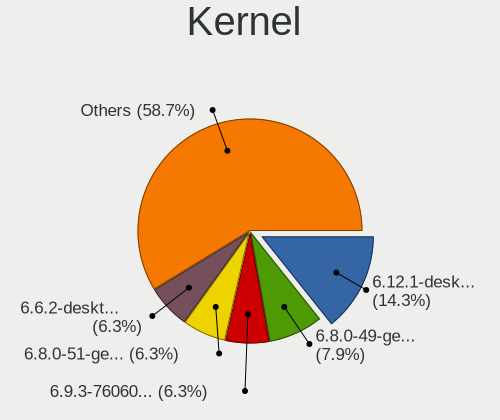
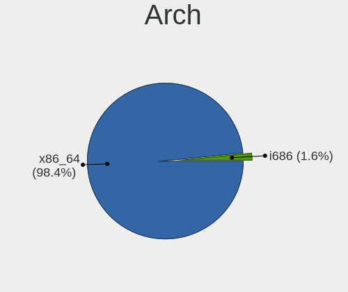
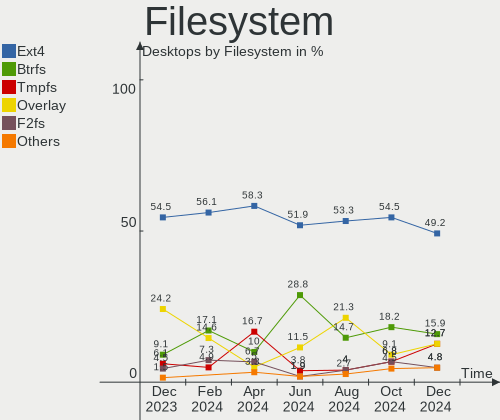
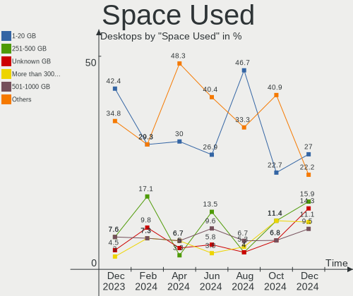
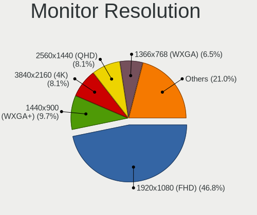
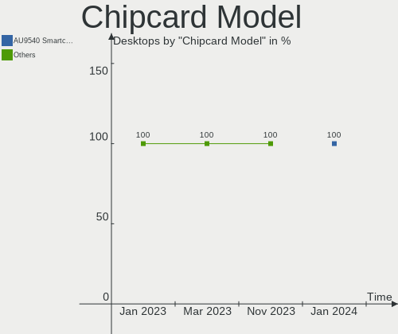

Linux in Poland - Hardware Trends (Desktops)
--------------------------------------------

A project to identify most popular hardware characteristics and track their change
over time based on data collected by Linux users at https://Linux-Hardware.org.

Anyone can contribute to this report by the [hw-probe](https://github.com/linuxhw/hw-probe) tool:

    sudo -E hw-probe -all -upload

Period: Mar, 2023.

Contents
--------

* [ System ](#system)
  - [ OS                       ](#os)
  - [ OS Family                ](#os-family)
  - [ Kernel                   ](#kernel)
  - [ Kernel Family            ](#kernel-family)
  - [ Kernel Major Ver.        ](#kernel-major-ver)
  - [ Arch                     ](#arch)
  - [ DE                       ](#de)
  - [ Display Server           ](#display-server)
  - [ Display Manager          ](#display-manager)
  - [ OS Lang                  ](#os-lang)
  - [ Boot Mode                ](#boot-mode)
  - [ Filesystem               ](#filesystem)
  - [ Part. scheme             ](#part-scheme)
  - [ Dual Boot with Linux/BSD ](#dual-boot-with-linuxbsd)
  - [ Dual Boot (Win)          ](#dual-boot-win)

* [ Board ](#board)
  - [ Vendor                   ](#vendor)
  - [ Model                    ](#model)
  - [ Model Family             ](#model-family)
  - [ MFG Year                 ](#mfg-year)
  - [ Form Factor              ](#form-factor)
  - [ Secure Boot              ](#secure-boot)
  - [ Coreboot                 ](#coreboot)
  - [ RAM Size                 ](#ram-size)
  - [ RAM Used                 ](#ram-used)
  - [ Total Drives             ](#total-drives)
  - [ Has CD-ROM               ](#has-cd-rom)
  - [ Has Ethernet             ](#has-ethernet)
  - [ Has WiFi                 ](#has-wifi)
  - [ Has Bluetooth            ](#has-bluetooth)

* [ Location ](#location)
  - [ Country                  ](#country)
  - [ City                     ](#city)

* [ Drives ](#drives)
  - [ Drive Vendor             ](#drive-vendor)
  - [ Drive Model              ](#drive-model)
  - [ HDD Vendor               ](#hdd-vendor)
  - [ SSD Vendor               ](#ssd-vendor)
  - [ Drive Kind               ](#drive-kind)
  - [ Drive Connector          ](#drive-connector)
  - [ Drive Size               ](#drive-size)
  - [ Space Total              ](#space-total)
  - [ Space Used               ](#space-used)
  - [ Malfunc. Drives          ](#malfunc-drives)
  - [ Malfunc. Drive Vendor    ](#malfunc-drive-vendor)
  - [ Malfunc. HDD Vendor      ](#malfunc-hdd-vendor)
  - [ Malfunc. Drive Kind      ](#malfunc-drive-kind)
  - [ Failed Drives            ](#failed-drives)
  - [ Failed Drive Vendor      ](#failed-drive-vendor)
  - [ Drive Status             ](#drive-status)

* [ Storage controller ](#storage-controller)
  - [ Storage Vendor           ](#storage-vendor)
  - [ Storage Model            ](#storage-model)
  - [ Storage Kind             ](#storage-kind)

* [ Processor ](#processor)
  - [ CPU Vendor               ](#cpu-vendor)
  - [ CPU Model                ](#cpu-model)
  - [ CPU Model Family         ](#cpu-model-family)
  - [ CPU Cores                ](#cpu-cores)
  - [ CPU Sockets              ](#cpu-sockets)
  - [ CPU Threads              ](#cpu-threads)
  - [ CPU Op-Modes             ](#cpu-op-modes)
  - [ CPU Microcode            ](#cpu-microcode)
  - [ CPU Microarch            ](#cpu-microarch)

* [ Graphics ](#graphics)
  - [ GPU Vendor               ](#gpu-vendor)
  - [ GPU Model                ](#gpu-model)
  - [ GPU Combo                ](#gpu-combo)
  - [ GPU Driver               ](#gpu-driver)
  - [ GPU Memory               ](#gpu-memory)

* [ Monitor ](#monitor)
  - [ Monitor Vendor           ](#monitor-vendor)
  - [ Monitor Model            ](#monitor-model)
  - [ Monitor Resolution       ](#monitor-resolution)
  - [ Monitor Diagonal         ](#monitor-diagonal)
  - [ Monitor Width            ](#monitor-width)
  - [ Aspect Ratio             ](#aspect-ratio)
  - [ Monitor Area             ](#monitor-area)
  - [ Pixel Density            ](#pixel-density)
  - [ Multiple Monitors        ](#multiple-monitors)

* [ Network ](#network)
  - [ Net Controller Vendor    ](#net-controller-vendor)
  - [ Net Controller Model     ](#net-controller-model)
  - [ Wireless Vendor          ](#wireless-vendor)
  - [ Wireless Model           ](#wireless-model)
  - [ Ethernet Vendor          ](#ethernet-vendor)
  - [ Ethernet Model           ](#ethernet-model)
  - [ Net Controller Kind      ](#net-controller-kind)
  - [ Used Controller          ](#used-controller)
  - [ NICs                     ](#nics)
  - [ IPv6                     ](#ipv6)

* [ Bluetooth ](#bluetooth)
  - [ Bluetooth Vendor         ](#bluetooth-vendor)
  - [ Bluetooth Model          ](#bluetooth-model)

* [ Sound ](#sound)
  - [ Sound Vendor             ](#sound-vendor)
  - [ Sound Model              ](#sound-model)

* [ Memory ](#memory)
  - [ Memory Vendor            ](#memory-vendor)
  - [ Memory Model             ](#memory-model)
  - [ Memory Kind              ](#memory-kind)
  - [ Memory Form Factor       ](#memory-form-factor)
  - [ Memory Size              ](#memory-size)
  - [ Memory Speed             ](#memory-speed)

* [ Printers & scanners ](#printers--scanners)
  - [ Printer Vendor           ](#printer-vendor)
  - [ Printer Model            ](#printer-model)
  - [ Scanner Vendor           ](#scanner-vendor)
  - [ Scanner Model            ](#scanner-model)

* [ Camera ](#camera)
  - [ Camera Vendor            ](#camera-vendor)
  - [ Camera Model             ](#camera-model)

* [ Security ](#security)
  - [ Fingerprint Vendor       ](#fingerprint-vendor)
  - [ Fingerprint Model        ](#fingerprint-model)
  - [ Chipcard Vendor          ](#chipcard-vendor)
  - [ Chipcard Model           ](#chipcard-model)

* [ Unsupported ](#unsupported)
  - [ Unsupported Devices      ](#unsupported-devices)
  - [ Unsupported Device Types ](#unsupported-device-types)

System
------

OS
--

Installed operating systems

| Name                         | Desktops | Percent |
|------------------------------|----------|---------|
| Ubuntu 22.04                 | 10       | 14.29%  |
| OpenMandriva 23.03           | 7        | 10%     |
| OpenMandriva 4.3             | 5        | 7.14%   |
| OpenMandriva 23.01           | 5        | 7.14%   |
| Arch Rolling                 | 5        | 7.14%   |
| Linux Mint 21.1              | 4        | 5.71%   |
| Fedora 37                    | 4        | 5.71%   |
| Ubuntu 22.10                 | 3        | 4.29%   |
| Gentoo 2.13                  | 3        | 4.29%   |
| ROSA 12.3                    | 2        | 2.86%   |
| MX 21                        | 2        | 2.86%   |
| Manjaro                      | 2        | 2.86%   |
| Debian 11                    | 2        | 2.86%   |
| Debian                       | 2        | 2.86%   |
| Ubuntu 20.04                 | 1        | 1.43%   |
| TUXEDO OS 22.04              | 1        | 1.43%   |
| SteamOS 3.4                  | 1        | 1.43%   |
| ROSA R11.1                   | 1        | 1.43%   |
| Pop!_OS 22.04                | 1        | 1.43%   |
| Parrot 5.2                   | 1        | 1.43%   |
| openSUSE Tumbleweed-XXXXXXXX | 1        | 1.43%   |
| OpenMandriva 4.50            | 1        | 1.43%   |
| OpenMandriva 4.2             | 1        | 1.43%   |
| Lubuntu 22.04                | 1        | 1.43%   |
| Linux Mint 20.3              | 1        | 1.43%   |
| Kubuntu 23.04                | 1        | 1.43%   |
| KDE neon 22.04               | 1        | 1.43%   |
| Kali 2023.1                  | 1        | 1.43%   |

OS Family
---------

OS without a version

| Name         | Desktops | Percent |
|--------------|----------|---------|
| OpenMandriva | 19       | 27.14%  |
| Ubuntu       | 14       | 20%     |
| Linux Mint   | 5        | 7.14%   |
| Arch         | 5        | 7.14%   |
| Fedora       | 4        | 5.71%   |
| Debian       | 4        | 5.71%   |
| ROSA         | 3        | 4.29%   |
| Gentoo       | 3        | 4.29%   |
| MX           | 2        | 2.86%   |
| Manjaro      | 2        | 2.86%   |
| TUXEDO OS    | 1        | 1.43%   |
| SteamOS      | 1        | 1.43%   |
| Pop!_OS      | 1        | 1.43%   |
| Parrot       | 1        | 1.43%   |
| openSUSE     | 1        | 1.43%   |
| Lubuntu      | 1        | 1.43%   |
| Kubuntu      | 1        | 1.43%   |
| KDE neon     | 1        | 1.43%   |
| Kali         | 1        | 1.43%   |

Kernel
------

Version of the Linux kernel

| Version                                  | Desktops | Percent |
|------------------------------------------|----------|---------|
| 5.19.0-35-generic                        | 11       | 15.71%  |
| 6.1.1-desktop-1omv2290                   | 5        | 7.14%   |
| 6.2.6-desktop-1omv2390                   | 4        | 5.71%   |
| 5.16.7-desktop-1omv4003                  | 4        | 5.71%   |
| 5.15.0-67-generic                        | 4        | 5.71%   |
| 6.1.12-gentoo                            | 3        | 4.29%   |
| 6.1.21-1-lts                             | 2        | 2.86%   |
| 5.4.0-144-generic                        | 2        | 2.86%   |
| 5.16.13-desktop-1omv4003                 | 2        | 2.86%   |
| 6.2.8-zen1-1-zen                         | 1        | 1.43%   |
| 6.2.8-arch1-1                            | 1        | 1.43%   |
| 6.2.6-1-default                          | 1        | 1.43%   |
| 6.2.5-zen1-1-zen                         | 1        | 1.43%   |
| 6.2.2-desktop-1omv2390                   | 1        | 1.43%   |
| 6.2.1.xm1-1.klp-xanmod-rosa2021.1-x86_64 | 1        | 1.43%   |
| 6.2.1-desktop-1omv2390                   | 1        | 1.43%   |
| 6.2.0-76060200-generic                   | 1        | 1.43%   |
| 6.1.12-200.fc37.x86_64                   | 1        | 1.43%   |
| 6.1.12-1-MANJARO                         | 1        | 1.43%   |
| 6.1.11-200.fc37.x86_64                   | 1        | 1.43%   |
| 6.1.10-200.fc37.x86_64                   | 1        | 1.43%   |
| 6.1.0-kali5-amd64                        | 1        | 1.43%   |
| 6.1.0-5-amd64                            | 1        | 1.43%   |
| 6.1.0-16-generic                         | 1        | 1.43%   |
| 6.1.0-1009-tuxedo                        | 1        | 1.43%   |
| 6.0.7-301.fc37.x86_64                    | 1        | 1.43%   |
| 6.0.14                                   | 1        | 1.43%   |
| 6.0.0-6mx-amd64                          | 1        | 1.43%   |
| 6.0.0-4-amd64                            | 1        | 1.43%   |
| 6.0.0-12parrot1-amd64                    | 1        | 1.43%   |
| 5.19.0-32-generic                        | 1        | 1.43%   |
| 5.15.75-generic-1rosa2021.1-x86_64       | 1        | 1.43%   |
| 5.15.55-1-MANJARO                        | 1        | 1.43%   |
| 5.15.102-1-pve                           | 1        | 1.43%   |
| 5.15.0-69-generic                        | 1        | 1.43%   |
| 5.15.0-56-generic                        | 1        | 1.43%   |
| 5.14.7-desktop-1omv4050                  | 1        | 1.43%   |
| 5.13.0-valve21.3-1-neptune               | 1        | 1.43%   |
| 5.10.14-desktop-1omv4002                 | 1        | 1.43%   |
| 5.10.0-21-amd64                          | 1        | 1.43%   |

Kernel Family
-------------

Linux kernel without a distro release

| Version  | Desktops | Percent |
|----------|----------|---------|
| 5.19.0   | 12       | 17.14%  |
| 5.15.0   | 6        | 8.57%   |
| 6.2.6    | 5        | 7.14%   |
| 6.1.12   | 5        | 7.14%   |
| 6.1.1    | 5        | 7.14%   |
| 6.1.0    | 4        | 5.71%   |
| 5.16.7   | 4        | 5.71%   |
| 6.0.0    | 3        | 4.29%   |
| 6.2.8    | 2        | 2.86%   |
| 6.2.1    | 2        | 2.86%   |
| 6.1.21   | 2        | 2.86%   |
| 5.4.0    | 2        | 2.86%   |
| 5.16.13  | 2        | 2.86%   |
| 5.10.0   | 2        | 2.86%   |
| 6.2.5    | 1        | 1.43%   |
| 6.2.2    | 1        | 1.43%   |
| 6.2.0    | 1        | 1.43%   |
| 6.1.11   | 1        | 1.43%   |
| 6.1.10   | 1        | 1.43%   |
| 6.0.7    | 1        | 1.43%   |
| 6.0.14   | 1        | 1.43%   |
| 5.15.75  | 1        | 1.43%   |
| 5.15.55  | 1        | 1.43%   |
| 5.15.102 | 1        | 1.43%   |
| 5.14.7   | 1        | 1.43%   |
| 5.13.0   | 1        | 1.43%   |
| 5.10.14  | 1        | 1.43%   |
| 4.15.0   | 1        | 1.43%   |

Kernel Major Ver.
-----------------

Linux kernel major version

| Version | Desktops | Percent |
|---------|----------|---------|
| 6.1     | 18       | 25.71%  |
| 6.2     | 12       | 17.14%  |
| 5.19    | 12       | 17.14%  |
| 5.15    | 9        | 12.86%  |
| 5.16    | 6        | 8.57%   |
| 6.0     | 5        | 7.14%   |
| 5.10    | 3        | 4.29%   |
| 5.4     | 2        | 2.86%   |
| 5.14    | 1        | 1.43%   |
| 5.13    | 1        | 1.43%   |
| 4.15    | 1        | 1.43%   |

Arch
----

OS architecture (x86_64, i586, etc.)

| Name   | Desktops | Percent |
|--------|----------|---------|
| x86_64 | 69       | 98.57%  |
| i686   | 1        | 1.43%   |

DE
--

Desktop Environment

| Name       | Desktops | Percent |
|------------|----------|---------|
| KDE5       | 27       | 38.57%  |
| GNOME      | 25       | 35.71%  |
| XFCE       | 6        | 8.57%   |
| MATE       | 4        | 5.71%   |
| Unknown    | 3        | 4.29%   |
| X-Cinnamon | 2        | 2.86%   |
| LXQt       | 1        | 1.43%   |
| KDE4       | 1        | 1.43%   |
| i3         | 1        | 1.43%   |

Display Server
--------------

X11 or Wayland

| Name    | Desktops | Percent |
|---------|----------|---------|
| X11     | 50       | 71.43%  |
| Wayland | 16       | 22.86%  |
| Tty     | 2        | 2.86%   |
| Unknown | 2        | 2.86%   |

Display Manager
---------------

SDDM, LightDM, etc.

| Name    | Desktops | Percent |
|---------|----------|---------|
| SDDM    | 24       | 34.29%  |
| Unknown | 20       | 28.57%  |
| GDM3    | 12       | 17.14%  |
| LightDM | 6        | 8.57%   |
| GDM     | 6        | 8.57%   |
| LXDM    | 1        | 1.43%   |
| KDM     | 1        | 1.43%   |

OS Lang
-------

Language

| Lang  | Desktops | Percent |
|-------|----------|---------|
| pl_PL | 39       | 55.71%  |
| en_US | 23       | 32.86%  |
| en_GB | 3        | 4.29%   |
| ru_UA | 1        | 1.43%   |
| ru_RU | 1        | 1.43%   |
| en_SE | 1        | 1.43%   |
| de_DE | 1        | 1.43%   |
| C     | 1        | 1.43%   |

Boot Mode
---------

EFI or BIOS

| Mode | Desktops | Percent |
|------|----------|---------|
| BIOS | 38       | 54.29%  |
| EFI  | 32       | 45.71%  |

Filesystem
----------

Type of filesystem

| Type    | Desktops | Percent |
|---------|----------|---------|
| Ext4    | 46       | 65.71%  |
| Overlay | 14       | 20%     |
| Btrfs   | 7        | 10%     |
| F2fs    | 3        | 4.29%   |

Part. scheme
------------

Scheme of partitioning

| Type    | Desktops | Percent |
|---------|----------|---------|
| GPT     | 40       | 57.14%  |
| Unknown | 18       | 25.71%  |
| MBR     | 12       | 17.14%  |

Dual Boot with Linux/BSD
------------------------

Hosting more than one Linux/BSD

| Dual boot | Desktops | Percent |
|-----------|----------|---------|
| No        | 49       | 70%     |
| Yes       | 21       | 30%     |

Dual Boot (Win)
---------------

Hosting Linux and Windows

| Dual boot | Desktops | Percent |
|-----------|----------|---------|
| No        | 40       | 57.14%  |
| Yes       | 30       | 42.86%  |

Board
-----

Vendor
------

Motherboard manufacturer

| Name                | Desktops | Percent |
|---------------------|----------|---------|
| Gigabyte Technology | 18       | 25.71%  |
| ASUSTek Computer    | 17       | 24.29%  |
| Dell                | 9        | 12.86%  |
| MSI                 | 6        | 8.57%   |
| Hewlett-Packard     | 6        | 8.57%   |
| ASRock              | 6        | 8.57%   |
| Lenovo              | 3        | 4.29%   |
| Intel               | 2        | 2.86%   |
| Huanan              | 1        | 1.43%   |
| Biostar             | 1        | 1.43%   |
| Acer                | 1        | 1.43%   |

Model
-----

Motherboard model

| Name                                | Desktops | Percent |
|-------------------------------------|----------|---------|
| Gigabyte B550 AORUS ELITE V2        | 2        | 2.86%   |
| Gigabyte B450M DS3H                 | 2        | 2.86%   |
| Dell Vostro 3900                    | 2        | 2.86%   |
| Dell OptiPlex 780                   | 2        | 2.86%   |
| ASUS M3A78-CM                       | 2        | 2.86%   |
| ASUS All Series                     | 2        | 2.86%   |
| MSI OPTIMUS                         | 1        | 1.43%   |
| MSI MS-7D14                         | 1        | 1.43%   |
| MSI MS-7C37                         | 1        | 1.43%   |
| MSI MS-7971                         | 1        | 1.43%   |
| MSI MS-7816                         | 1        | 1.43%   |
| MSI MS-7721                         | 1        | 1.43%   |
| Lenovo ThinkCentre M82 2742DB3      | 1        | 1.43%   |
| Lenovo SHARKBAY 0B98401 WIN         | 1        | 1.43%   |
| Lenovo IdeaCentre K410 10089        | 1        | 1.43%   |
| Intel DQ45CB E30148-207             | 1        | 1.43%   |
| Intel DG41RQ AAE54511-203           | 1        | 1.43%   |
| Huanan X99-F8 NALEX, NALEX          | 1        | 1.43%   |
| HP Z2 SFF G9 Workstation Desktop PC | 1        | 1.43%   |
| HP xw4600 Workstation               | 1        | 1.43%   |
| HP t620 PLUS Quad Core TC           | 1        | 1.43%   |
| HP EliteDesk 800 G1 USDT            | 1        | 1.43%   |
| HP EliteDesk 800 G1 SFF             | 1        | 1.43%   |
| HP Compaq 8100 Elite SFF PC         | 1        | 1.43%   |
| Gigabyte Z97M-DS3H                  | 1        | 1.43%   |
| Gigabyte Z170-HD3 DDR3-CF           | 1        | 1.43%   |
| Gigabyte X670E AORUS MASTER         | 1        | 1.43%   |
| Gigabyte PH67A-D3-B3                | 1        | 1.43%   |
| Gigabyte P55M-UD2                   | 1        | 1.43%   |
| Gigabyte H310M H 2.0                | 1        | 1.43%   |
| Gigabyte F2A78M-HD2                 | 1        | 1.43%   |
| Gigabyte EX38-DS4                   | 1        | 1.43%   |
| Gigabyte B85M-D3H-A                 | 1        | 1.43%   |
| Gigabyte B550 GAMING X V2           | 1        | 1.43%   |
| Gigabyte B550 AORUS ELITE AX V2     | 1        | 1.43%   |
| Gigabyte B450 AORUS ELITE           | 1        | 1.43%   |
| Gigabyte AB350-Gaming               | 1        | 1.43%   |
| Gigabyte A520I AC                   | 1        | 1.43%   |
| Dell Precision 3650 Tower           | 1        | 1.43%   |
| Dell OptiPlex 960                   | 1        | 1.43%   |

Model Family
------------

Motherboard model prefix

| Name                  | Desktops | Percent |
|-----------------------|----------|---------|
| Dell OptiPlex         | 6        | 8.57%   |
| Gigabyte B550         | 4        | 5.71%   |
| ASUS PRIME            | 3        | 4.29%   |
| HP EliteDesk          | 2        | 2.86%   |
| Gigabyte B450M        | 2        | 2.86%   |
| Dell Vostro           | 2        | 2.86%   |
| ASUS TUF              | 2        | 2.86%   |
| ASUS ROG              | 2        | 2.86%   |
| ASUS M3A78-CM         | 2        | 2.86%   |
| ASUS All              | 2        | 2.86%   |
| MSI OPTIMUS           | 1        | 1.43%   |
| MSI MS-7D14           | 1        | 1.43%   |
| MSI MS-7C37           | 1        | 1.43%   |
| MSI MS-7971           | 1        | 1.43%   |
| MSI MS-7816           | 1        | 1.43%   |
| MSI MS-7721           | 1        | 1.43%   |
| Lenovo ThinkCentre    | 1        | 1.43%   |
| Lenovo SHARKBAY       | 1        | 1.43%   |
| Lenovo IdeaCentre     | 1        | 1.43%   |
| Intel DQ45CB          | 1        | 1.43%   |
| Intel DG41RQ          | 1        | 1.43%   |
| Huanan X99-F8         | 1        | 1.43%   |
| HP Z2                 | 1        | 1.43%   |
| HP xw4600             | 1        | 1.43%   |
| HP t620               | 1        | 1.43%   |
| HP Compaq             | 1        | 1.43%   |
| Gigabyte Z97M-DS3H    | 1        | 1.43%   |
| Gigabyte Z170-HD3     | 1        | 1.43%   |
| Gigabyte X670E        | 1        | 1.43%   |
| Gigabyte PH67A-D3-B3  | 1        | 1.43%   |
| Gigabyte P55M-UD2     | 1        | 1.43%   |
| Gigabyte H310M        | 1        | 1.43%   |
| Gigabyte F2A78M-HD2   | 1        | 1.43%   |
| Gigabyte EX38-DS4     | 1        | 1.43%   |
| Gigabyte B85M-D3H-A   | 1        | 1.43%   |
| Gigabyte B450         | 1        | 1.43%   |
| Gigabyte AB350-Gaming | 1        | 1.43%   |
| Gigabyte A520I        | 1        | 1.43%   |
| Dell Precision        | 1        | 1.43%   |
| Biostar TA780G        | 1        | 1.43%   |

MFG Year
--------

Motherboard manufacture year

| Year | Desktops | Percent |
|------|----------|---------|
| 2020 | 11       | 15.71%  |
| 2018 | 8        | 11.43%  |
| 2013 | 7        | 10%     |
| 2009 | 7        | 10%     |
| 2021 | 6        | 8.57%   |
| 2014 | 5        | 7.14%   |
| 2012 | 5        | 7.14%   |
| 2017 | 4        | 5.71%   |
| 2015 | 4        | 5.71%   |
| 2008 | 4        | 5.71%   |
| 2010 | 3        | 4.29%   |
| 2023 | 2        | 2.86%   |
| 2022 | 1        | 1.43%   |
| 2019 | 1        | 1.43%   |
| 2016 | 1        | 1.43%   |
| 2011 | 1        | 1.43%   |

Form Factor
-----------

Physical design of the computer

| Name    | Desktops | Percent |
|---------|----------|---------|
| Desktop | 70       | 100%    |

Secure Boot
-----------

Enabled or disabled

| State    | Desktops | Percent |
|----------|----------|---------|
| Disabled | 68       | 97.14%  |
| Enabled  | 2        | 2.86%   |

Coreboot
--------

Have coreboot on board

| Used | Desktops | Percent |
|------|----------|---------|
| No   | 70       | 100%    |

RAM Size
--------

Total RAM memory

| Size in GB      | Desktops | Percent |
|-----------------|----------|---------|
| 16.01-24.0      | 17       | 24.29%  |
| 8.01-16.0       | 16       | 22.86%  |
| 32.01-64.0      | 15       | 21.43%  |
| 4.01-8.0        | 11       | 15.71%  |
| 3.01-4.0        | 6        | 8.57%   |
| 64.01-256.0     | 2        | 2.86%   |
| More than 256.0 | 1        | 1.43%   |
| 24.01-32.0      | 1        | 1.43%   |
| 2.01-3.0        | 1        | 1.43%   |

RAM Used
--------

Used RAM memory

| Used GB    | Desktops | Percent |
|------------|----------|---------|
| 1.01-2.0   | 28       | 40%     |
| 2.01-3.0   | 16       | 22.86%  |
| 4.01-8.0   | 13       | 18.57%  |
| 8.01-16.0  | 4        | 5.71%   |
| 3.01-4.0   | 3        | 4.29%   |
| 0.51-1.0   | 3        | 4.29%   |
| 24.01-32.0 | 1        | 1.43%   |
| 16.01-24.0 | 1        | 1.43%   |
| 0.01-0.5   | 1        | 1.43%   |

Total Drives
------------

Number of drives on board

| Drives | Desktops | Percent |
|--------|----------|---------|
| 1      | 24       | 34.29%  |
| 2      | 18       | 25.71%  |
| 3      | 11       | 15.71%  |
| 4      | 8        | 11.43%  |
| 5      | 5        | 7.14%   |
| 6      | 2        | 2.86%   |
| 12     | 1        | 1.43%   |
| 7      | 1        | 1.43%   |

Has CD-ROM
----------

Has CD-ROM on board

| Presented | Desktops | Percent |
|-----------|----------|---------|
| No        | 36       | 51.43%  |
| Yes       | 34       | 48.57%  |

Has Ethernet
------------

Has Ethernet on board

| Presented | Desktops | Percent |
|-----------|----------|---------|
| Yes       | 70       | 100%    |

Has WiFi
--------

Has WiFi module

| Presented | Desktops | Percent |
|-----------|----------|---------|
| No        | 42       | 60%     |
| Yes       | 28       | 40%     |

Has Bluetooth
-------------

Has Bluetooth module

| Presented | Desktops | Percent |
|-----------|----------|---------|
| No        | 51       | 72.86%  |
| Yes       | 19       | 27.14%  |

Location
--------

Country
-------

Geographic location (country)

| Country | Desktops | Percent |
|---------|----------|---------|
| Poland  | 70       | 100%    |

City
----

Geographic location (city)

| City               | Desktops | Percent |
|--------------------|----------|---------|
| Warsaw             | 15       | 21.43%  |
| Wroclaw            | 6        | 8.57%   |
| Katowice           | 4        | 5.71%   |
| Rzeszów           | 3        | 4.29%   |
| Krakow             | 3        | 4.29%   |
| Bytom              | 2        | 2.86%   |
| Bialystok          | 2        | 2.86%   |
| Żory              | 1        | 1.43%   |
| Zernica            | 1        | 1.43%   |
| Wałbrzych         | 1        | 1.43%   |
| Trzebinia          | 1        | 1.43%   |
| Torun              | 1        | 1.43%   |
| Swiebodzice        | 1        | 1.43%   |
| Swidnica           | 1        | 1.43%   |
| Susz               | 1        | 1.43%   |
| Skarzysko-Kamienna | 1        | 1.43%   |
| Skape              | 1        | 1.43%   |
| Roznowo            | 1        | 1.43%   |
| Reda               | 1        | 1.43%   |
| Raszkow            | 1        | 1.43%   |
| Radom              | 1        | 1.43%   |
| Radlin             | 1        | 1.43%   |
| Płock             | 1        | 1.43%   |
| Otwock             | 1        | 1.43%   |
| Olsztyn            | 1        | 1.43%   |
| Lublin             | 1        | 1.43%   |
| Lochow             | 1        | 1.43%   |
| Laskarzew          | 1        | 1.43%   |
| Kwidzyn            | 1        | 1.43%   |
| Kozy               | 1        | 1.43%   |
| Kochanowice        | 1        | 1.43%   |
| Kielce             | 1        | 1.43%   |
| Jaworzno           | 1        | 1.43%   |
| Hel                | 1        | 1.43%   |
| Gliwice            | 1        | 1.43%   |
| Garbow             | 1        | 1.43%   |
| Garbatka-Letnisko  | 1        | 1.43%   |
| Elblag             | 1        | 1.43%   |
| Darłowo           | 1        | 1.43%   |
| Częstochowa       | 1        | 1.43%   |

Drives
------

Drive Vendor
------------

Hard drive vendors

| Vendor                      | Desktops | Drives | Percent |
|-----------------------------|----------|--------|---------|
| Seagate                     | 24       | 28     | 16.44%  |
| WDC                         | 19       | 29     | 13.01%  |
| GOODRAM                     | 18       | 21     | 12.33%  |
| Samsung Electronics         | 15       | 21     | 10.27%  |
| Kingston                    | 7        | 8      | 4.79%   |
| Crucial                     | 7        | 7      | 4.79%   |
| A-DATA Technology           | 6        | 6      | 4.11%   |
| SanDisk                     | 5        | 6      | 3.42%   |
| Hitachi                     | 5        | 7      | 3.42%   |
| Toshiba                     | 4        | 4      | 2.74%   |
| Patriot                     | 3        | 3      | 2.05%   |
| Unknown                     | 2        | 4      | 1.37%   |
| SPCC                        | 2        | 3      | 1.37%   |
| Lite-On Technology          | 2        | 2      | 1.37%   |
| Kingston Technology Company | 2        | 2      | 1.37%   |
| Intel                       | 2        | 2      | 1.37%   |
| HGST                        | 2        | 2      | 1.37%   |
| XPG                         | 1        | 2      | 0.68%   |
| Silicon Motion              | 1        | 1      | 0.68%   |
| Realtek Semiconductor       | 1        | 1      | 0.68%   |
| POLION                      | 1        | 1      | 0.68%   |
| PNY                         | 1        | 1      | 0.68%   |
| Phison Electronics          | 1        | 1      | 0.68%   |
| Phison                      | 1        | 1      | 0.68%   |
| OCZ                         | 1        | 2      | 0.68%   |
| Micron/Crucial Technology   | 1        | 1      | 0.68%   |
| Micron Technology           | 1        | 1      | 0.68%   |
| Lexar                       | 1        | 1      | 0.68%   |
| KIOXIA-EXCERIA              | 1        | 1      | 0.68%   |
| KingFast                    | 1        | 1      | 0.68%   |
| JMicron Technology          | 1        | 1      | 0.68%   |
| HUAWEI                      | 1        | 1      | 0.68%   |
| HGST HTS                    | 1        | 1      | 0.68%   |
| ASMT                        | 1        | 1      | 0.68%   |
| Apacer                      | 1        | 1      | 0.68%   |
| addlink                     | 1        | 1      | 0.68%   |
| ADATA Technology            | 1        | 1      | 0.68%   |
| Unknown                     | 1        | 1      | 0.68%   |

Drive Model
-----------

Hard drive models

| Model                                               | Desktops | Percent |
|-----------------------------------------------------|----------|---------|
| Samsung NVMe SSD Controller SM981/PM981/PM983 250GB | 4        | 2.35%   |
| Samsung SSD 980 1TB                                 | 3        | 1.76%   |
| GOODRAM SSDPR-CL100-480-G2 480GB                    | 3        | 1.76%   |
| WDC WD5000AAKX-75U6AA0 500GB                        | 2        | 1.18%   |
| Unknown SD/MMC 2GB                                  | 2        | 1.18%   |
| Unknown M.S./M.S.Pro/HG 16GB                        | 2        | 1.18%   |
| Seagate ST500LT012-1DG142 500GB                     | 2        | 1.18%   |
| Seagate ST500DM002-1BD142 500GB                     | 2        | 1.18%   |
| Seagate ST4000VN008-2DR166 4TB                      | 2        | 1.18%   |
| Seagate ST1000DM010-2EP102 1TB                      | 2        | 1.18%   |
| Kingston SA400S37240G 240GB SSD                     | 2        | 1.18%   |
| GOODRAM SSDPR-CX400-128-G2 128GB                    | 2        | 1.18%   |
| GOODRAM SSDPR-CX300-240 240GB                       | 2        | 1.18%   |
| GOODRAM SSDPR-CL100-120-G3 120GB                    | 2        | 1.18%   |
| GOODRAM SSD 120GB                                   | 2        | 1.18%   |
| Crucial CT500MX500SSD1 500GB                        | 2        | 1.18%   |
| A-DATA SU630 240GB SSD                              | 2        | 1.18%   |
| XPG GAMMIX S11 Pro 256GB                            | 1        | 0.59%   |
| WDC WDS240G2G0A-00JH30 240GB SSD                    | 1        | 0.59%   |
| WDC WD7500AADS-00M2B0 752GB                         | 1        | 0.59%   |
| WDC WD60EFRX-68L0BN1 6TB                            | 1        | 0.59%   |
| WDC WD5001AALS-00L3B2 500GB                         | 1        | 0.59%   |
| WDC WD5000LPLX-75ZNTT0 500GB                        | 1        | 0.59%   |
| WDC WD5000LPLX-60ZNTT1 500GB                        | 1        | 0.59%   |
| WDC WD5000AAVS-00ZTB0 500GB                         | 1        | 0.59%   |
| WDC WD5000AAKS-60A7B0 500GB                         | 1        | 0.59%   |
| WDC WD5000AAKS-07YGA0 500GB                         | 1        | 0.59%   |
| WDC WD40EFRX-68N32N0 4TB                            | 1        | 0.59%   |
| WDC WD4003FRYZ-01F0DB0 4TB                          | 1        | 0.59%   |
| WDC WD3200BPVT-24JJ5T0 320GB                        | 1        | 0.59%   |
| WDC WD3200BPVT-22ZEST0 320GB                        | 1        | 0.59%   |
| WDC WD2500AAJS-07B4A0 250GB                         | 1        | 0.59%   |
| WDC WD20EARS-00MVWB0 2TB                            | 1        | 0.59%   |
| WDC WD2003FYYS-02W0B0 2TB                           | 1        | 0.59%   |
| WDC WD10SPZX-08Z10 1TB                              | 1        | 0.59%   |
| WDC WD10S21X-24R1BT0-SSHD-8GB                       | 1        | 0.59%   |
| WDC WD10EZRX-00L4HB0 1TB                            | 1        | 0.59%   |
| WDC WD10EZRX-00A8LB0 1TB                            | 1        | 0.59%   |
| WDC WD10EZEX-75M2NA0 1TB                            | 1        | 0.59%   |
| WDC WD10EZEX-22MFCA0 1TB                            | 1        | 0.59%   |

HDD Vendor
----------

Hard disk drive vendors

| Vendor              | Desktops | Drives | Percent |
|---------------------|----------|--------|---------|
| Seagate             | 24       | 28     | 42.11%  |
| WDC                 | 18       | 27     | 31.58%  |
| Hitachi             | 5        | 7      | 8.77%   |
| Toshiba             | 4        | 4      | 7.02%   |
| Samsung Electronics | 2        | 2      | 3.51%   |
| HGST                | 2        | 2      | 3.51%   |
| HGST HTS            | 1        | 1      | 1.75%   |
| ASMT                | 1        | 1      | 1.75%   |

SSD Vendor
----------

Solid state drive vendors

| Vendor              | Desktops | Drives | Percent |
|---------------------|----------|--------|---------|
| GOODRAM             | 16       | 16     | 27.59%  |
| Samsung Electronics | 9        | 9      | 15.52%  |
| Crucial             | 7        | 7      | 12.07%  |
| A-DATA Technology   | 6        | 6      | 10.34%  |
| Kingston            | 4        | 4      | 6.9%    |
| SanDisk             | 3        | 3      | 5.17%   |
| Patriot             | 3        | 3      | 5.17%   |
| SPCC                | 2        | 3      | 3.45%   |
| WDC                 | 1        | 1      | 1.72%   |
| PNY                 | 1        | 1      | 1.72%   |
| OCZ                 | 1        | 2      | 1.72%   |
| KIOXIA-EXCERIA      | 1        | 1      | 1.72%   |
| KingFast            | 1        | 1      | 1.72%   |
| JMicron Technology  | 1        | 1      | 1.72%   |
| Intel               | 1        | 1      | 1.72%   |
| Apacer              | 1        | 1      | 1.72%   |

Drive Kind
----------

HDD or SSD

| Kind    | Desktops | Drives | Percent |
|---------|----------|--------|---------|
| SSD     | 44       | 60     | 36.67%  |
| HDD     | 44       | 72     | 36.67%  |
| NVMe    | 27       | 39     | 22.5%   |
| Unknown | 5        | 7      | 4.17%   |

Drive Connector
---------------

SATA, SAS, NVMe, etc.

| Type | Desktops | Drives | Percent |
|------|----------|--------|---------|
| SATA | 63       | 127    | 63.64%  |
| NVMe | 27       | 39     | 27.27%  |
| SAS  | 9        | 12     | 9.09%   |

Drive Size
----------

Size of hard drive

| Size in TB | Desktops | Drives | Percent |
|------------|----------|--------|---------|
| 0.01-0.5   | 47       | 71     | 50.54%  |
| 0.51-1.0   | 29       | 37     | 31.18%  |
| 1.01-2.0   | 6        | 8      | 6.45%   |
| 3.01-4.0   | 5        | 6      | 5.38%   |
| 2.01-3.0   | 3        | 5      | 3.23%   |
| 4.01-10.0  | 2        | 4      | 2.15%   |
| 10.01-20.0 | 1        | 1      | 1.08%   |

Space Total
-----------

Amount of disk space available on the file system

| Size in GB     | Desktops | Percent |
|----------------|----------|---------|
| 501-1000       | 14       | 20%     |
| 101-250        | 11       | 15.71%  |
| 1-20           | 10       | 14.29%  |
| 1001-2000      | 9        | 12.86%  |
| 251-500        | 7        | 10%     |
| More than 3000 | 5        | 7.14%   |
| 51-100         | 5        | 7.14%   |
| Unknown        | 5        | 7.14%   |
| 21-50          | 2        | 2.86%   |
| 2001-3000      | 2        | 2.86%   |

Space Used
----------

Amount of used disk space

| Used GB        | Desktops | Percent |
|----------------|----------|---------|
| 1-20           | 25       | 35.71%  |
| 21-50          | 11       | 15.71%  |
| 101-250        | 7        | 10%     |
| 501-1000       | 7        | 10%     |
| 51-100         | 5        | 7.14%   |
| Unknown        | 5        | 7.14%   |
| 251-500        | 3        | 4.29%   |
| 1001-2000      | 3        | 4.29%   |
| More than 3000 | 2        | 2.86%   |
| 2001-3000      | 2        | 2.86%   |

Malfunc. Drives
---------------

Drive models with a malfunction

| Model                              | Desktops | Drives | Percent |
|------------------------------------|----------|--------|---------|
| WDC WD60EFRX-68L0BN1 6TB           | 1        | 2      | 5.88%   |
| WDC WD5001AALS-00L3B2 500GB        | 1        | 1      | 5.88%   |
| WDC WD5000AAKX-75U6AA0 500GB       | 1        | 1      | 5.88%   |
| WDC WD20EARS-00MVWB0 2TB           | 1        | 1      | 5.88%   |
| WDC WD2003FYYS-02W0B0 2TB          | 1        | 1      | 5.88%   |
| WDC WD10SPZX-08Z10 1TB             | 1        | 1      | 5.88%   |
| Seagate ST500LT012-1DG142 500GB    | 1        | 1      | 5.88%   |
| Seagate ST3320418AS 320GB          | 1        | 1      | 5.88%   |
| Seagate ST1000LM024 HN-M101MBB 1TB | 1        | 2      | 5.88%   |
| Seagate ST1000DM003-9YN162 1TB     | 1        | 1      | 5.88%   |
| Samsung Electronics HD321KJ 320GB  | 1        | 1      | 5.88%   |
| Samsung Electronics HD082GJ 80GB   | 1        | 1      | 5.88%   |
| Kingston SA400S37480G 480GB SSD    | 1        | 1      | 5.88%   |
| KingFast Disk 256GB SSD            | 1        | 1      | 5.88%   |
| Hitachi HTS723216L9SA60 160GB      | 1        | 1      | 5.88%   |
| Hitachi HDS721050CLA362 500GB      | 1        | 1      | 5.88%   |
| Hitachi HDS721010CLA330 1TB        | 1        | 1      | 5.88%   |

Malfunc. Drive Vendor
---------------------

Vendors of faulty drives

| Vendor              | Desktops | Drives | Percent |
|---------------------|----------|--------|---------|
| WDC                 | 4        | 7      | 26.67%  |
| Seagate             | 4        | 5      | 26.67%  |
| Hitachi             | 3        | 3      | 20%     |
| Samsung Electronics | 2        | 2      | 13.33%  |
| Kingston            | 1        | 1      | 6.67%   |
| KingFast            | 1        | 1      | 6.67%   |

Malfunc. HDD Vendor
-------------------

Vendors of faulty HDD drives

| Vendor              | Desktops | Drives | Percent |
|---------------------|----------|--------|---------|
| WDC                 | 4        | 7      | 30.77%  |
| Seagate             | 4        | 5      | 30.77%  |
| Hitachi             | 3        | 3      | 23.08%  |
| Samsung Electronics | 2        | 2      | 15.38%  |

Malfunc. Drive Kind
-------------------

Kinds of faulty drives

| Kind | Desktops | Drives | Percent |
|------|----------|--------|---------|
| HDD  | 10       | 17     | 83.33%  |
| SSD  | 2        | 2      | 16.67%  |

Failed Drives
-------------

Failed drive models

Zero info for selected period =(

Failed Drive Vendor
-------------------

Failed drive vendors

Zero info for selected period =(

Drive Status
------------

Number of failed and malfunc. drives

| Status   | Desktops | Drives | Percent |
|----------|----------|--------|---------|
| Works    | 37       | 76     | 44.05%  |
| Detected | 35       | 83     | 41.67%  |
| Malfunc  | 12       | 19     | 14.29%  |

Storage controller
------------------

Storage Vendor
--------------

Storage controller vendors

| Vendor                       | Desktops | Percent |
|------------------------------|----------|---------|
| Intel                        | 42       | 38.18%  |
| AMD                          | 28       | 25.45%  |
| Samsung Electronics          | 7        | 6.36%   |
| ASMedia Technology           | 6        | 5.45%   |
| Phison Electronics           | 5        | 4.55%   |
| Kingston Technology Company  | 5        | 4.55%   |
| SanDisk                      | 4        | 3.64%   |
| Silicon Motion               | 2        | 1.82%   |
| Lite-On Technology           | 2        | 1.82%   |
| JMicron Technology           | 2        | 1.82%   |
| ADATA Technology             | 2        | 1.82%   |
| Shenzhen Longsys Electronics | 1        | 0.91%   |
| Realtek Semiconductor        | 1        | 0.91%   |
| Micron/Crucial Technology    | 1        | 0.91%   |
| Micron Technology            | 1        | 0.91%   |
| LSI Logic / Symbios Logic    | 1        | 0.91%   |

Storage Model
-------------

Storage controller models

| Model                                                                          | Desktops | Percent |
|--------------------------------------------------------------------------------|----------|---------|
| AMD FCH SATA Controller [AHCI mode]                                            | 13       | 9.92%   |
| AMD 500 Series Chipset SATA Controller                                         | 9        | 6.87%   |
| Intel 8 Series/C220 Series Chipset Family 6-port SATA Controller 1 [AHCI mode] | 8        | 6.11%   |
| ASMedia ASM1062 Serial ATA Controller                                          | 5        | 3.82%   |
| Samsung NVMe SSD Controller SM981/PM981/PM983                                  | 4        | 3.05%   |
| Intel SATA Controller [RAID mode]                                              | 4        | 3.05%   |
| Intel Cannon Lake PCH SATA AHCI Controller                                     | 4        | 3.05%   |
| Intel 7 Series/C210 Series Chipset Family 6-port SATA Controller [AHCI mode]   | 4        | 3.05%   |
| AMD SB7x0/SB8x0/SB9x0 SATA Controller [IDE mode]                               | 4        | 3.05%   |
| AMD SB7x0/SB8x0/SB9x0 IDE Controller                                           | 4        | 3.05%   |
| AMD 400 Series Chipset SATA Controller                                         | 4        | 3.05%   |
| Samsung NVMe SSD Controller 980                                                | 3        | 2.29%   |
| Phison E12 NVMe Controller                                                     | 3        | 2.29%   |
| Intel 200 Series PCH SATA controller [AHCI mode]                               | 3        | 2.29%   |
| Silicon Motion SM2263EN/SM2263XT SSD Controller                                | 2        | 1.53%   |
| Phison E18 PCIe4 NVMe Controller                                               | 2        | 1.53%   |
| Kingston Company Company Non-Volatile memory controller                        | 2        | 1.53%   |
| Kingston Company A2000 NVMe SSD                                                | 2        | 1.53%   |
| JMicron JMB363 SATA/IDE Controller                                             | 2        | 1.53%   |
| Intel Q170/Q150/B150/H170/H110/Z170/CM236 Chipset SATA Controller [AHCI Mode]  | 2        | 1.53%   |
| Intel 9 Series Chipset Family SATA Controller [AHCI Mode]                      | 2        | 1.53%   |
| Intel 4 Series Chipset PT IDER Controller                                      | 2        | 1.53%   |
| AMD 300 Series Chipset SATA Controller                                         | 2        | 1.53%   |
| ADATA XPG SX8200 Pro PCIe Gen3x4 M.2 2280 Solid State Drive                    | 2        | 1.53%   |
| Shenzhen Longsys Non-Volatile memory controller                                | 1        | 0.76%   |
| SanDisk WD PC SN810 / Black SN850 NVMe SSD                                     | 1        | 0.76%   |
| SanDisk WD Blue SN570 NVMe SSD 1TB                                             | 1        | 0.76%   |
| SanDisk WD Blue SN550 NVMe SSD                                                 | 1        | 0.76%   |
| SanDisk PC SN520 NVMe SSD                                                      | 1        | 0.76%   |
| Samsung NVMe SSD Controller SM951/PM951                                        | 1        | 0.76%   |
| Samsung NVMe SSD Controller PM9A1/PM9A3/980PRO                                 | 1        | 0.76%   |
| Samsung Electronics Non-Volatile memory controller                             | 1        | 0.76%   |
| Realtek RTS5763DL NVMe SSD Controller                                          | 1        | 0.76%   |
| Micron/Crucial P1 NVMe PCIe SSD                                                | 1        | 0.76%   |
| Micron NVMe Storage Controller                                                 | 1        | 0.76%   |
| LSI Logic / Symbios Logic SAS2008 PCI-Express Fusion-MPT SAS-2 [Falcon]        | 1        | 0.76%   |
| Lite-On Non-Volatile memory controller                                         | 1        | 0.76%   |
| Lite-On M8Pe Series NVMe SSD                                                   | 1        | 0.76%   |
| Kingston Company OM3PDP3 NVMe SSD                                              | 1        | 0.76%   |
| Intel Volume Management Device NVMe RAID Controller                            | 1        | 0.76%   |

Storage Kind
------------

Kind of storage controller (IDE, SATA, NVMe, SAS, ...)

| Kind | Desktops | Percent |
|------|----------|---------|
| SATA | 61       | 56.48%  |
| NVMe | 27       | 25%     |
| IDE  | 13       | 12.04%  |
| RAID | 6        | 5.56%   |
| SAS  | 1        | 0.93%   |

Processor
---------

CPU Vendor
----------

Processor vendors

| Vendor | Desktops | Percent |
|--------|----------|---------|
| Intel  | 41       | 58.57%  |
| AMD    | 29       | 41.43%  |

CPU Model
---------

Processor models

| Model                                       | Desktops | Percent |
|---------------------------------------------|----------|---------|
| Intel Core i7-4790 CPU @ 3.60GHz            | 3        | 4.29%   |
| Intel Pentium Dual-Core CPU E5500 @ 2.80GHz | 2        | 2.86%   |
| Intel Core i7-8700 CPU @ 3.20GHz            | 2        | 2.86%   |
| Intel Core i5-8400 CPU @ 2.80GHz            | 2        | 2.86%   |
| Intel Core i5-4690 CPU @ 3.50GHz            | 2        | 2.86%   |
| Intel Core i5-3550 CPU @ 3.30GHz            | 2        | 2.86%   |
| AMD Ryzen 5 5600X 6-Core Processor          | 2        | 2.86%   |
| AMD Ryzen 5 5600G with Radeon Graphics      | 2        | 2.86%   |
| AMD Ryzen 5 3600 6-Core Processor           | 2        | 2.86%   |
| AMD Ryzen 5 2600 Six-Core Processor         | 2        | 2.86%   |
| AMD Phenom II X4 955 Processor              | 2        | 2.86%   |
| Intel Xeon CPU E5-2690 v3 @ 2.60GHz         | 1        | 1.43%   |
| Intel Pentium Gold G6405 CPU @ 4.10GHz      | 1        | 1.43%   |
| Intel Pentium Dual-Core CPU E5200 @ 2.50GHz | 1        | 1.43%   |
| Intel Pentium CPU G3260 @ 3.30GHz           | 1        | 1.43%   |
| Intel Core i7-8086K CPU @ 4.00GHz           | 1        | 1.43%   |
| Intel Core i7-6800K CPU @ 3.40GHz           | 1        | 1.43%   |
| Intel Core i7-6700K CPU @ 4.00GHz           | 1        | 1.43%   |
| Intel Core i7-4770S CPU @ 3.10GHz           | 1        | 1.43%   |
| Intel Core i7-4770K CPU @ 3.50GHz           | 1        | 1.43%   |
| Intel Core i7-3770 CPU @ 3.40GHz            | 1        | 1.43%   |
| Intel Core i7-2600 CPU @ 3.40GHz            | 1        | 1.43%   |
| Intel Core i7-10700K CPU @ 3.80GHz          | 1        | 1.43%   |
| Intel Core i5-9600K CPU @ 3.70GHz           | 1        | 1.43%   |
| Intel Core i5-8600K CPU @ 3.60GHz           | 1        | 1.43%   |
| Intel Core i5-4570 CPU @ 3.20GHz            | 1        | 1.43%   |
| Intel Core i5-3470 CPU @ 3.20GHz            | 1        | 1.43%   |
| Intel Core i5-10600 CPU @ 3.30GHz           | 1        | 1.43%   |
| Intel Core i5 CPU 750 @ 2.67GHz             | 1        | 1.43%   |
| Intel Core i5 CPU 650 @ 3.20GHz             | 1        | 1.43%   |
| Intel Core i3-6100 CPU @ 3.70GHz            | 1        | 1.43%   |
| Intel Core i3-4130T CPU @ 2.90GHz           | 1        | 1.43%   |
| Intel Core i3-3220 CPU @ 3.30GHz            | 1        | 1.43%   |
| Intel Core 2 Quad CPU Q9400 @ 2.66GHz       | 1        | 1.43%   |
| Intel Core 2 Quad CPU Q8400 @ 2.66GHz       | 1        | 1.43%   |
| Intel Core 2 Quad CPU Q8200 @ 2.33GHz       | 1        | 1.43%   |
| Intel Core 2 Quad CPU Q6600 @ 2.40GHz       | 1        | 1.43%   |
| Intel Core 2 Duo CPU E8400 @ 3.00GHz        | 1        | 1.43%   |
| Intel 12th Gen Core i9-12900                | 1        | 1.43%   |
| AMD Ryzen Threadripper PRO 5995WX 64-Cores  | 1        | 1.43%   |

CPU Model Family
----------------

Processor model prefix

| Model                   | Desktops | Percent |
|-------------------------|----------|---------|
| Intel Core i7           | 13       | 18.57%  |
| Intel Core i5           | 13       | 18.57%  |
| AMD Ryzen 5             | 10       | 14.29%  |
| Intel Core 2 Quad       | 4        | 5.71%   |
| AMD Ryzen 9             | 4        | 5.71%   |
| AMD Ryzen 7             | 4        | 5.71%   |
| Intel Pentium Dual-Core | 3        | 4.29%   |
| Intel Core i3           | 3        | 4.29%   |
| AMD Phenom II X4        | 2        | 2.86%   |
| Other                   | 1        | 1.43%   |
| Intel Xeon              | 1        | 1.43%   |
| Intel Pentium Gold      | 1        | 1.43%   |
| Intel Pentium           | 1        | 1.43%   |
| Intel Core 2 Duo        | 1        | 1.43%   |
| AMD Ryzen Threadripper  | 1        | 1.43%   |
| AMD GX                  | 1        | 1.43%   |
| AMD FX                  | 1        | 1.43%   |
| AMD Athlon X4           | 1        | 1.43%   |
| AMD Athlon II X4        | 1        | 1.43%   |
| AMD Athlon              | 1        | 1.43%   |
| AMD A8                  | 1        | 1.43%   |
| AMD A6                  | 1        | 1.43%   |
| AMD A10                 | 1        | 1.43%   |

CPU Cores
---------

Number of processor cores

| Number | Desktops | Percent |
|--------|----------|---------|
| 4      | 24       | 34.29%  |
| 6      | 19       | 27.14%  |
| 2      | 13       | 18.57%  |
| 8      | 5        | 7.14%   |
| 16     | 4        | 5.71%   |
| 12     | 2        | 2.86%   |
| 1      | 2        | 2.86%   |
| 64     | 1        | 1.43%   |

CPU Sockets
-----------

Number of sockets

| Number | Desktops | Percent |
|--------|----------|---------|
| 1      | 70       | 100%    |

CPU Threads
-----------

Threads per core (Hyper-Threading)

| Number | Desktops | Percent |
|--------|----------|---------|
| 2      | 44       | 62.86%  |
| 1      | 26       | 37.14%  |

CPU Op-Modes
------------

CPU Operation Modes (32-bit, 64-bit)

| Op mode        | Desktops | Percent |
|----------------|----------|---------|
| 32-bit, 64-bit | 70       | 100%    |

CPU Microcode
-------------

Microcode number

| Number     | Desktops | Percent |
|------------|----------|---------|
| Unknown    | 27       | 38.57%  |
| 0x306c3    | 7        | 10%     |
| 0x1067a    | 4        | 5.71%   |
| 0x906ea    | 3        | 4.29%   |
| 0x0800820d | 3        | 4.29%   |
| 0xa0653    | 2        | 2.86%   |
| 0x306a9    | 2        | 2.86%   |
| 0x0a601203 | 2        | 2.86%   |
| 0x0a50000d | 2        | 2.86%   |
| 0x0a20120a | 2        | 2.86%   |
| 0x06001119 | 2        | 2.86%   |
| 0x906ec    | 1        | 1.43%   |
| 0x6fb      | 1        | 1.43%   |
| 0x206a7    | 1        | 1.43%   |
| 0x20655    | 1        | 1.43%   |
| 0x0a50000c | 1        | 1.43%   |
| 0x0a201204 | 1        | 1.43%   |
| 0x0a201025 | 1        | 1.43%   |
| 0x0a201009 | 1        | 1.43%   |
| 0x0a008205 | 1        | 1.43%   |
| 0x08701021 | 1        | 1.43%   |
| 0x08001137 | 1        | 1.43%   |
| 0x06003106 | 1        | 1.43%   |
| 0x06000822 | 1        | 1.43%   |
| 0x010000db | 1        | 1.43%   |

CPU Microarch
-------------

Microarchitecture

| Name        | Desktops | Percent |
|-------------|----------|---------|
| Haswell     | 11       | 15.71%  |
| Zen 3       | 9        | 12.86%  |
| Penryn      | 7        | 10%     |
| KabyLake    | 7        | 10%     |
| IvyBridge   | 5        | 7.14%   |
| K10         | 4        | 5.71%   |
| Unknown     | 4        | 5.71%   |
| Zen+        | 3        | 4.29%   |
| Zen 2       | 3        | 4.29%   |
| Piledriver  | 3        | 4.29%   |
| CometLake   | 3        | 4.29%   |
| Steamroller | 2        | 2.86%   |
| Skylake     | 2        | 2.86%   |
| Zen         | 1        | 1.43%   |
| Westmere    | 1        | 1.43%   |
| SandyBridge | 1        | 1.43%   |
| Nehalem     | 1        | 1.43%   |
| Jaguar      | 1        | 1.43%   |
| Core        | 1        | 1.43%   |
| Broadwell   | 1        | 1.43%   |

Graphics
--------

GPU Vendor
----------

Vendors of graphics cards

| Vendor            | Desktops | Percent |
|-------------------|----------|---------|
| Nvidia            | 29       | 39.73%  |
| AMD               | 26       | 35.62%  |
| Intel             | 17       | 23.29%  |
| ASPEED Technology | 1        | 1.37%   |

GPU Model
---------

Graphics card models

| Model                                                                       | Desktops | Percent |
|-----------------------------------------------------------------------------|----------|---------|
| AMD Ellesmere [Radeon RX 470/480/570/570X/580/580X/590]                     | 5        | 6.85%   |
| Intel Xeon E3-1200 v3/4th Gen Core Processor Integrated Graphics Controller | 4        | 5.48%   |
| Nvidia GM107 [GeForce GTX 750 Ti]                                           | 3        | 4.11%   |
| Intel CoffeeLake-S GT2 [UHD Graphics 630]                                   | 3        | 4.11%   |
| Intel 4 Series Chipset Integrated Graphics Controller                       | 3        | 4.11%   |
| Nvidia GP106 [GeForce GTX 1060 6GB]                                         | 2        | 2.74%   |
| Nvidia GP104 [GeForce GTX 1080]                                             | 2        | 2.74%   |
| Nvidia GF108 [GeForce GT 730]                                               | 2        | 2.74%   |
| Nvidia GA106 [GeForce RTX 3060 Lite Hash Rate]                              | 2        | 2.74%   |
| Nvidia GA102 [GeForce RTX 3080 Lite Hash Rate]                              | 2        | 2.74%   |
| Intel Xeon E3-1200 v2/3rd Gen Core processor Graphics Controller            | 2        | 2.74%   |
| AMD RV710 [Radeon HD 4350/4550]                                             | 2        | 2.74%   |
| AMD RS780C [Radeon 3100]                                                    | 2        | 2.74%   |
| AMD Navi 22 [Radeon RX 6700/6700 XT/6750 XT / 6800M/6850M XT]               | 2        | 2.74%   |
| AMD Navi 10 [Radeon RX 5600 OEM/5600 XT / 5700/5700 XT]                     | 2        | 2.74%   |
| AMD Cezanne [Radeon Vega Series / Radeon Vega Mobile Series]                | 2        | 2.74%   |
| AMD Cedar [Radeon HD 5000/6000/7350/8350 Series]                            | 2        | 2.74%   |
| Nvidia TU116 [GeForce GTX 1650 SUPER]                                       | 1        | 1.37%   |
| Nvidia TU102 [GeForce RTX 2080 Ti Rev. A]                                   | 1        | 1.37%   |
| Nvidia GP107GL [Quadro P600]                                                | 1        | 1.37%   |
| Nvidia GP106 [GeForce GTX 1060 3GB]                                         | 1        | 1.37%   |
| Nvidia GM206 [GeForce GTX 960]                                              | 1        | 1.37%   |
| Nvidia GM204 [GeForce GTX 980]                                              | 1        | 1.37%   |
| Nvidia GM200 [GeForce GTX TITAN X]                                          | 1        | 1.37%   |
| Nvidia GM107GL [Quadro K620]                                                | 1        | 1.37%   |
| Nvidia GM107 [GeForce GTX 745]                                              | 1        | 1.37%   |
| Nvidia GK208B [GeForce GT 710]                                              | 1        | 1.37%   |
| Nvidia GF114 [GeForce GTX 560 Ti]                                           | 1        | 1.37%   |
| Nvidia GA106 [RTX A2000]                                                    | 1        | 1.37%   |
| Nvidia GA104 [GeForce RTX 3070 Ti]                                          | 1        | 1.37%   |
| Nvidia GA102 [GeForce RTX 3080]                                             | 1        | 1.37%   |
| Nvidia G98 [Quadro NVS 295]                                                 | 1        | 1.37%   |
| Nvidia G84GL [Quadro FX 570]                                                | 1        | 1.37%   |
| Intel Core Processor Integrated Graphics Controller                         | 1        | 1.37%   |
| Intel CometLake-S GT2 [UHD Graphics 630]                                    | 1        | 1.37%   |
| Intel CometLake-S GT1 [UHD Graphics 610]                                    | 1        | 1.37%   |
| Intel AlderLake-S GT1                                                       | 1        | 1.37%   |
| Intel 4th Generation Core Processor Family Integrated Graphics Controller   | 1        | 1.37%   |
| ASPEED Technology ASPEED Graphics Family                                    | 1        | 1.37%   |
| AMD RV770 [Radeon HD 4870]                                                  | 1        | 1.37%   |

GPU Combo
---------

Combinations of graphics cards

| Name            | Desktops | Percent |
|-----------------|----------|---------|
| 1 x Nvidia      | 27       | 38.57%  |
| 1 x AMD         | 25       | 35.71%  |
| 1 x Intel       | 14       | 20%     |
| 2 x Intel       | 1        | 1.43%   |
| Nvidia + ASPEED | 1        | 1.43%   |
| Intel + Nvidia  | 1        | 1.43%   |
| Intel + AMD     | 1        | 1.43%   |

GPU Driver
----------

Free vs proprietary

| Driver      | Desktops | Percent |
|-------------|----------|---------|
| Free        | 52       | 74.29%  |
| Proprietary | 16       | 22.86%  |
| Unknown     | 2        | 2.86%   |

GPU Memory
----------

Total video memory

| Size in GB | Desktops | Percent |
|------------|----------|---------|
| Unknown    | 34       | 48.57%  |
| 8.01-16.0  | 8        | 11.43%  |
| 3.01-4.0   | 6        | 8.57%   |
| 1.01-2.0   | 5        | 7.14%   |
| 0.51-1.0   | 5        | 7.14%   |
| 0.01-0.5   | 5        | 7.14%   |
| 7.01-8.0   | 4        | 5.71%   |
| 5.01-6.0   | 2        | 2.86%   |
| 2.01-3.0   | 1        | 1.43%   |

Monitor
-------

Monitor Vendor
--------------

Monitor vendors

| Vendor               | Desktops | Percent |
|----------------------|----------|---------|
| Samsung Electronics  | 13       | 17.33%  |
| Goldstar             | 10       | 13.33%  |
| Dell                 | 10       | 13.33%  |
| Philips              | 6        | 8%      |
| Iiyama               | 5        | 6.67%   |
| Hewlett-Packard      | 5        | 6.67%   |
| BenQ                 | 5        | 6.67%   |
| Acer                 | 5        | 6.67%   |
| AOC                  | 4        | 5.33%   |
| Ancor Communications | 3        | 4%      |
| NEC Computers        | 2        | 2.67%   |
| Sony                 | 1        | 1.33%   |
| Medion               | 1        | 1.33%   |
| Idek Iiyama          | 1        | 1.33%   |
| Fujitsu Siemens      | 1        | 1.33%   |
| Eizo                 | 1        | 1.33%   |
| ASUSTek Computer     | 1        | 1.33%   |
| ADI                  | 1        | 1.33%   |

Monitor Model
-------------

Monitor models

| Model                                                                 | Desktops | Percent |
|-----------------------------------------------------------------------|----------|---------|
| Goldstar IPS FULLHD GSM5AB6 1920x1080 480x270mm 21.7-inch             | 2        | 2.6%    |
| AOC 27B2G5 AOC2702 1920x1080 598x336mm 27.0-inch                      | 2        | 2.6%    |
| Sony TV SNY7001 1920x1080                                             | 1        | 1.3%    |
| Samsung Electronics T24D391 SAM0B73 1920x1080 521x293mm 23.5-inch     | 1        | 1.3%    |
| Samsung Electronics T24B301 SAM098E 1920x1080 521x293mm 23.5-inch     | 1        | 1.3%    |
| Samsung Electronics SyncMaster SAM059A 1920x1080 477x268mm 21.5-inch  | 1        | 1.3%    |
| Samsung Electronics SyncMaster SAM0467 1920x1200 518x324mm 24.1-inch  | 1        | 1.3%    |
| Samsung Electronics SyncMaster SAM0252 1280x1024 338x270mm 17.0-inch  | 1        | 1.3%    |
| Samsung Electronics SyncMaster SAM011F 1280x1024 376x301mm 19.0-inch  | 1        | 1.3%    |
| Samsung Electronics SMBX2231 SAM076D 1920x1080 477x268mm 21.5-inch    | 1        | 1.3%    |
| Samsung Electronics S22B300 SAM08C8 1920x1080 477x268mm 21.5-inch     | 1        | 1.3%    |
| Samsung Electronics LCD Monitor SAM7103 3840x2160 700x390mm 31.5-inch | 1        | 1.3%    |
| Samsung Electronics LC27G5xT SAM707A 2560x1440 698x393mm 31.5-inch    | 1        | 1.3%    |
| Samsung Electronics LC24RG50 SAM0F90 1920x1080 532x304mm 24.1-inch    | 1        | 1.3%    |
| Samsung Electronics C27FG70 SAM0DCA 1920x1080 598x337mm 27.0-inch     | 1        | 1.3%    |
| Samsung Electronics C24F390 SAM0D2C 1920x1080 521x293mm 23.5-inch     | 1        | 1.3%    |
| Philips PHL 276E8V PHLC18F 3840x2160 597x336mm 27.0-inch              | 1        | 1.3%    |
| Philips PHL 243V7 PHLC155 1920x1080 527x296mm 23.8-inch               | 1        | 1.3%    |
| Philips PHL 223V5 PHLC0CF 1920x1080 477x268mm 21.5-inch               | 1        | 1.3%    |
| Philips LCD Monitor FTV 1920x1080                                     | 1        | 1.3%    |
| Philips 244E PHLC036 1920x1080 521x293mm 23.5-inch                    | 1        | 1.3%    |
| Philips 170C PHL0848 1280x1024 338x270mm 17.0-inch                    | 1        | 1.3%    |
| NEC Computers LCD19WV NEC671C 1440x900 410x256mm 19.0-inch            | 1        | 1.3%    |
| NEC Computers E224Wi NEC6950 1920x1080 476x267mm 21.5-inch            | 1        | 1.3%    |
| Medion LCD Monitor MD30219PH 1280x1024                                | 1        | 1.3%    |
| Iiyama PLX2283H IVM5638 1920x1080 477x268mm 21.5-inch                 | 1        | 1.3%    |
| Iiyama PLE2483H IVM6113 1920x1080 531x299mm 24.0-inch                 | 1        | 1.3%    |
| Iiyama PL3461WQ IVM7615 3440x1440 800x335mm 34.1-inch                 | 1        | 1.3%    |
| Iiyama PL3461WQ IVM7614 3440x1440 800x335mm 34.1-inch                 | 1        | 1.3%    |
| Iiyama PL2792H IVM664F 1920x1080 598x336mm 27.0-inch                  | 1        | 1.3%    |
| Iiyama PL2440HS IVM615E 1920x1080 527x296mm 23.8-inch                 | 1        | 1.3%    |
| Idek Iiyama LCD Monitor PL3461WQ                                      | 1        | 1.3%    |
| Hewlett-Packard LP2475w HWP26F7 1920x1200 546x352mm 25.6-inch         | 1        | 1.3%    |
| Hewlett-Packard LCD Monitor Z24i 1920x1200                            | 1        | 1.3%    |
| Hewlett-Packard LA2405 HWP284C 1920x1200 518x324mm 24.1-inch          | 1        | 1.3%    |
| Hewlett-Packard E233 HPN345F 1920x1080 510x290mm 23.1-inch            | 1        | 1.3%    |
| Hewlett-Packard E232 HWP3279 1920x1080 509x286mm 23.0-inch            | 1        | 1.3%    |
| Goldstar ULTRAGEAR GSM5BD3 2560x1440 697x392mm 31.5-inch              | 1        | 1.3%    |
| Goldstar MP59G GSM5B33 1920x1080 480x270mm 21.7-inch                  | 1        | 1.3%    |
| Goldstar IPS FULLHD GSM5AB8 1920x1080 480x270mm 21.7-inch             | 1        | 1.3%    |

Monitor Resolution
------------------

Monitor screen resolution

| Resolution         | Desktops | Percent |
|--------------------|----------|---------|
| 1920x1080 (FHD)    | 39       | 54.17%  |
| 1920x1200 (WUXGA)  | 7        | 9.72%   |
| 2560x1440 (QHD)    | 6        | 8.33%   |
| 1280x1024 (SXGA)   | 6        | 8.33%   |
| 3840x2160 (4K)     | 4        | 5.56%   |
| 1440x900 (WXGA+)   | 3        | 4.17%   |
| 7280x1440          | 1        | 1.39%   |
| 3440x1440          | 1        | 1.39%   |
| 1680x1050 (WSXGA+) | 1        | 1.39%   |
| 1600x1200          | 1        | 1.39%   |
| 1366x768 (WXGA)    | 1        | 1.39%   |
| 1280x720 (HD)      | 1        | 1.39%   |
| Unknown            | 1        | 1.39%   |

Monitor Diagonal
----------------

Diagonal size in inches

| Inches  | Desktops | Percent |
|---------|----------|---------|
| 21      | 16       | 21.92%  |
| 23      | 13       | 17.81%  |
| 24      | 12       | 16.44%  |
| 27      | 8        | 10.96%  |
| Unknown | 5        | 6.85%   |
| 19      | 4        | 5.48%   |
| 18      | 3        | 4.11%   |
| 17      | 3        | 4.11%   |
| 31      | 2        | 2.74%   |
| 25      | 2        | 2.74%   |
| 72      | 1        | 1.37%   |
| 43      | 1        | 1.37%   |
| 34      | 1        | 1.37%   |
| 22      | 1        | 1.37%   |
| 20      | 1        | 1.37%   |

Monitor Width
-------------

Physical width

| Width in mm | Desktops | Percent |
|-------------|----------|---------|
| 501-600     | 34       | 47.89%  |
| 401-500     | 21       | 29.58%  |
| Unknown     | 5        | 7.04%   |
| 351-400     | 3        | 4.23%   |
| 301-350     | 3        | 4.23%   |
| 601-700     | 2        | 2.82%   |
| 701-800     | 1        | 1.41%   |
| 1501-2000   | 1        | 1.41%   |
| 901-1000    | 1        | 1.41%   |

Aspect Ratio
------------

Proportional relationship between the width and the height

| Ratio   | Desktops | Percent |
|---------|----------|---------|
| 16/9    | 45       | 65.22%  |
| 16/10   | 11       | 15.94%  |
| 5/4     | 6        | 8.7%    |
| Unknown | 5        | 7.25%   |
| 4/3     | 1        | 1.45%   |
| 21/9    | 1        | 1.45%   |

Monitor Area
------------

Area in inch²

| Area in inch² | Desktops | Percent |
|----------------|----------|---------|
| 201-250        | 31       | 43.66%  |
| 251-300        | 10       | 14.08%  |
| 301-350        | 8        | 11.27%  |
| 151-200        | 8        | 11.27%  |
| Unknown        | 5        | 7.04%   |
| 141-150        | 4        | 5.63%   |
| 351-500        | 3        | 4.23%   |
| More than 1000 | 1        | 1.41%   |
| 501-1000       | 1        | 1.41%   |

Pixel Density
-------------

Pixels per inch

| Density | Desktops | Percent |
|---------|----------|---------|
| 51-100  | 41       | 60.29%  |
| 101-120 | 20       | 29.41%  |
| Unknown | 5        | 7.35%   |
| 1-50    | 1        | 1.47%   |
| 161-240 | 1        | 1.47%   |

Multiple Monitors
-----------------

Total monitors connected

| Total | Desktops | Percent |
|-------|----------|---------|
| 1     | 60       | 85.71%  |
| 2     | 7        | 10%     |
| 0     | 2        | 2.86%   |
| 3     | 1        | 1.43%   |

Network
-------

Net Controller Vendor
---------------------

Controller vendors

| Vendor                          | Desktops | Percent |
|---------------------------------|----------|---------|
| Realtek Semiconductor           | 48       | 48.48%  |
| Intel                           | 30       | 30.3%   |
| Qualcomm Atheros Communications | 4        | 4.04%   |
| Qualcomm Atheros                | 2        | 2.02%   |
| Microsoft                       | 2        | 2.02%   |
| Broadcom                        | 2        | 2.02%   |
| Xiaomi                          | 1        | 1.01%   |
| TP-Link                         | 1        | 1.01%   |
| Texas Instruments               | 1        | 1.01%   |
| Ralink Technology               | 1        | 1.01%   |
| MediaTek                        | 1        | 1.01%   |
| Loupedeck                       | 1        | 1.01%   |
| ICS Advent                      | 1        | 1.01%   |
| Huawei Technologies             | 1        | 1.01%   |
| D-Link System                   | 1        | 1.01%   |
| Broadcom Limited                | 1        | 1.01%   |
| Aquantia                        | 1        | 1.01%   |

Net Controller Model
--------------------

Controller models

| Model                                                                         | Desktops | Percent |
|-------------------------------------------------------------------------------|----------|---------|
| Realtek RTL8111/8168/8411 PCI Express Gigabit Ethernet Controller             | 38       | 35.19%  |
| Realtek RTL8125 2.5GbE Controller                                             | 5        | 4.63%   |
| Intel Wi-Fi 6 AX200                                                           | 4        | 3.7%    |
| Intel 82567LM-3 Gigabit Network Connection                                    | 4        | 3.7%    |
| Realtek 802.11ac NIC                                                          | 3        | 2.78%   |
| Qualcomm Atheros AR9271 802.11n                                               | 3        | 2.78%   |
| Intel 82579LM Gigabit Network Connection (Lewisville)                         | 3        | 2.78%   |
| Microsoft XBOX ACC                                                            | 2        | 1.85%   |
| Intel Wireless-AC 9260                                                        | 2        | 1.85%   |
| Intel Ethernet Controller I225-V                                              | 2        | 1.85%   |
| Intel Ethernet Connection I217-V                                              | 2        | 1.85%   |
| Intel Ethernet Connection I217-LM                                             | 2        | 1.85%   |
| Intel Ethernet Connection (2) I219-V                                          | 2        | 1.85%   |
| Intel Ethernet Connection (2) I218-V                                          | 2        | 1.85%   |
| Xiaomi Mi/Redmi series (RNDIS)                                                | 1        | 0.93%   |
| TP-Link Archer T4UH wireless Realtek 8812AU                                   | 1        | 0.93%   |
| Texas Instruments CC2531 ZigBee                                               | 1        | 0.93%   |
| Realtek RTL8813AE 802.11ac PCIe Wireless Network Adapter                      | 1        | 0.93%   |
| Realtek RTL8192EE PCIe Wireless Network Adapter                               | 1        | 0.93%   |
| Realtek RTL8188EUS 802.11n Wireless Network Adapter                           | 1        | 0.93%   |
| Realtek RTL8188EE Wireless Network Adapter                                    | 1        | 0.93%   |
| Realtek RTL8188CE 802.11b/g/n WiFi Adapter                                    | 1        | 0.93%   |
| Realtek RTL-8185 IEEE 802.11a/b/g Wireless LAN Controller                     | 1        | 0.93%   |
| Ralink MT7601U Wireless Adapter                                               | 1        | 0.93%   |
| Qualcomm Atheros QCA6174 802.11ac Wireless Network Adapter                    | 1        | 0.93%   |
| Qualcomm Atheros TP-Link TL-WN322G v3 / TL-WN422G v2 802.11g [Atheros AR9271] | 1        | 0.93%   |
| Qualcomm Atheros AR5212/5213/2414 Wireless Network Adapter                    | 1        | 0.93%   |
| MediaTek MT7921K (RZ608) Wi-Fi 6E 80MHz                                       | 1        | 0.93%   |
| Loupedeck Loupedeck+                                                          | 1        | 0.93%   |
| Intel Wireless 7265                                                           | 1        | 0.93%   |
| Intel Wireless 7260                                                           | 1        | 0.93%   |
| Intel Wi-Fi 6 AX210/AX211/AX411 160MHz                                        | 1        | 0.93%   |
| Intel Ethernet Controller X550                                                | 1        | 0.93%   |
| Intel Ethernet Connection (7) I219-V                                          | 1        | 0.93%   |
| Intel Ethernet Connection (7) I219-LM                                         | 1        | 0.93%   |
| Intel Ethernet Connection (17) I219-LM                                        | 1        | 0.93%   |
| Intel Ethernet Connection (14) I219-V                                         | 1        | 0.93%   |
| Intel Ethernet Connection (14) I219-LM                                        | 1        | 0.93%   |
| Intel Comet Lake PCH CNVi WiFi                                                | 1        | 0.93%   |
| Intel 82578DM Gigabit Network Connection                                      | 1        | 0.93%   |

Wireless Vendor
---------------

Wireless vendors

| Vendor                          | Desktops | Percent |
|---------------------------------|----------|---------|
| Intel                           | 10       | 31.25%  |
| Realtek Semiconductor           | 9        | 28.13%  |
| Qualcomm Atheros Communications | 4        | 12.5%   |
| Qualcomm Atheros                | 2        | 6.25%   |
| Microsoft                       | 2        | 6.25%   |
| TP-Link                         | 1        | 3.13%   |
| Ralink Technology               | 1        | 3.13%   |
| MediaTek                        | 1        | 3.13%   |
| D-Link System                   | 1        | 3.13%   |
| Broadcom                        | 1        | 3.13%   |

Wireless Model
--------------

Wireless models

| Model                                                                         | Desktops | Percent |
|-------------------------------------------------------------------------------|----------|---------|
| Intel Wi-Fi 6 AX200                                                           | 4        | 12.5%   |
| Realtek 802.11ac NIC                                                          | 3        | 9.38%   |
| Qualcomm Atheros AR9271 802.11n                                               | 3        | 9.38%   |
| Microsoft XBOX ACC                                                            | 2        | 6.25%   |
| Intel Wireless-AC 9260                                                        | 2        | 6.25%   |
| TP-Link Archer T4UH wireless Realtek 8812AU                                   | 1        | 3.13%   |
| Realtek RTL8813AE 802.11ac PCIe Wireless Network Adapter                      | 1        | 3.13%   |
| Realtek RTL8192EE PCIe Wireless Network Adapter                               | 1        | 3.13%   |
| Realtek RTL8188EUS 802.11n Wireless Network Adapter                           | 1        | 3.13%   |
| Realtek RTL8188EE Wireless Network Adapter                                    | 1        | 3.13%   |
| Realtek RTL8188CE 802.11b/g/n WiFi Adapter                                    | 1        | 3.13%   |
| Realtek RTL-8185 IEEE 802.11a/b/g Wireless LAN Controller                     | 1        | 3.13%   |
| Ralink MT7601U Wireless Adapter                                               | 1        | 3.13%   |
| Qualcomm Atheros QCA6174 802.11ac Wireless Network Adapter                    | 1        | 3.13%   |
| Qualcomm Atheros TP-Link TL-WN322G v3 / TL-WN422G v2 802.11g [Atheros AR9271] | 1        | 3.13%   |
| Qualcomm Atheros AR5212/5213/2414 Wireless Network Adapter                    | 1        | 3.13%   |
| MediaTek MT7921K (RZ608) Wi-Fi 6E 80MHz                                       | 1        | 3.13%   |
| Intel Wireless 7265                                                           | 1        | 3.13%   |
| Intel Wireless 7260                                                           | 1        | 3.13%   |
| Intel Wi-Fi 6 AX210/AX211/AX411 160MHz                                        | 1        | 3.13%   |
| Intel Comet Lake PCH CNVi WiFi                                                | 1        | 3.13%   |
| D-Link System DWA-125 Wireless N 150 Adapter(rev.A2) [Ralink RT3070]          | 1        | 3.13%   |
| Broadcom BCM43228 802.11a/b/g/n                                               | 1        | 3.13%   |

Ethernet Vendor
---------------

Ethernet vendors

| Vendor                | Desktops | Percent |
|-----------------------|----------|---------|
| Realtek Semiconductor | 43       | 58.9%   |
| Intel                 | 25       | 34.25%  |
| Xiaomi                | 1        | 1.37%   |
| ICS Advent            | 1        | 1.37%   |
| Broadcom Limited      | 1        | 1.37%   |
| Broadcom              | 1        | 1.37%   |
| Aquantia              | 1        | 1.37%   |

Ethernet Model
--------------

Ethernet models

| Model                                                             | Desktops | Percent |
|-------------------------------------------------------------------|----------|---------|
| Realtek RTL8111/8168/8411 PCI Express Gigabit Ethernet Controller | 38       | 52.05%  |
| Realtek RTL8125 2.5GbE Controller                                 | 5        | 6.85%   |
| Intel 82567LM-3 Gigabit Network Connection                        | 4        | 5.48%   |
| Intel 82579LM Gigabit Network Connection (Lewisville)             | 3        | 4.11%   |
| Intel Ethernet Controller I225-V                                  | 2        | 2.74%   |
| Intel Ethernet Connection I217-V                                  | 2        | 2.74%   |
| Intel Ethernet Connection I217-LM                                 | 2        | 2.74%   |
| Intel Ethernet Connection (2) I219-V                              | 2        | 2.74%   |
| Intel Ethernet Connection (2) I218-V                              | 2        | 2.74%   |
| Xiaomi Mi/Redmi series (RNDIS)                                    | 1        | 1.37%   |
| Intel Ethernet Controller X550                                    | 1        | 1.37%   |
| Intel Ethernet Connection (7) I219-V                              | 1        | 1.37%   |
| Intel Ethernet Connection (7) I219-LM                             | 1        | 1.37%   |
| Intel Ethernet Connection (17) I219-LM                            | 1        | 1.37%   |
| Intel Ethernet Connection (14) I219-V                             | 1        | 1.37%   |
| Intel Ethernet Connection (14) I219-LM                            | 1        | 1.37%   |
| Intel 82578DM Gigabit Network Connection                          | 1        | 1.37%   |
| Intel 82567V-2 Gigabit Network Connection                         | 1        | 1.37%   |
| ICS Advent USB 10/100 LAN                                         | 1        | 1.37%   |
| Broadcom NetLink BCM57781 Gigabit Ethernet PCIe                   | 1        | 1.37%   |
| Broadcom Limited NetXtreme BCM5755 Gigabit Ethernet PCI Express   | 1        | 1.37%   |
| Aquantia FastLinQ Edge 10Gbit Network Adapter                     | 1        | 1.37%   |

Net Controller Kind
-------------------

Ethernet, WiFi or modem

| Kind     | Desktops | Percent |
|----------|----------|---------|
| Ethernet | 70       | 69.31%  |
| WiFi     | 28       | 27.72%  |
| Modem    | 3        | 2.97%   |

Used Controller
---------------

Currently used network controller

| Kind     | Desktops | Percent |
|----------|----------|---------|
| Ethernet | 56       | 80%     |
| WiFi     | 14       | 20%     |

NICs
----

Total network controllers on board

| Total | Desktops | Percent |
|-------|----------|---------|
| 1     | 50       | 71.43%  |
| 2     | 17       | 24.29%  |
| 3     | 2        | 2.86%   |
| 5     | 1        | 1.43%   |

IPv6
----

IPv6 vs IPv4

| Used | Desktops | Percent |
|------|----------|---------|
| No   | 65       | 92.86%  |
| Yes  | 5        | 7.14%   |

Bluetooth
---------

Bluetooth Vendor
----------------

Controller vendors

| Vendor                  | Desktops | Percent |
|-------------------------|----------|---------|
| Intel                   | 7        | 33.33%  |
| Cambridge Silicon Radio | 7        | 33.33%  |
| ASUSTek Computer        | 2        | 9.52%   |
| TP-Link                 | 1        | 4.76%   |
| Realtek Semiconductor   | 1        | 4.76%   |
| MediaTek                | 1        | 4.76%   |
| Broadcom                | 1        | 4.76%   |
| Belkin Components       | 1        | 4.76%   |

Bluetooth Model
---------------

Controller models

| Model                                               | Desktops | Percent |
|-----------------------------------------------------|----------|---------|
| Cambridge Silicon Radio Bluetooth Dongle (HCI mode) | 7        | 33.33%  |
| Intel AX200 Bluetooth                               | 3        | 14.29%  |
| Intel Wireless-AC 9260 Bluetooth Adapter            | 2        | 9.52%   |
| TP-Link UB500 Adapter                               | 1        | 4.76%   |
| Realtek Bluetooth Radio                             | 1        | 4.76%   |
| MediaTek Wireless_Device                            | 1        | 4.76%   |
| Intel AX210 Bluetooth                               | 1        | 4.76%   |
| Intel AX201 Bluetooth                               | 1        | 4.76%   |
| Broadcom HP Portable Bumble Bee                     | 1        | 4.76%   |
| Belkin Components F8T012 Bluetooth Adapter          | 1        | 4.76%   |
| ASUS Qualcomm Bluetooth 4.1                         | 1        | 4.76%   |
| ASUS Broadcom BCM20702A0 Bluetooth                  | 1        | 4.76%   |

Sound
-----

Sound Vendor
------------

Sound card vendors

| Vendor                                          | Desktops | Percent |
|-------------------------------------------------|----------|---------|
| Intel                                           | 40       | 33.33%  |
| AMD                                             | 38       | 31.67%  |
| Nvidia                                          | 27       | 22.5%   |
| C-Media Electronics                             | 3        | 2.5%    |
| VIA Technologies                                | 1        | 0.83%   |
| Texas Instruments                               | 1        | 0.83%   |
| SteelSeries ApS                                 | 1        | 0.83%   |
| SM900 Microphone                                | 1        | 0.83%   |
| Razer USA                                       | 1        | 0.83%   |
| Plantronics                                     | 1        | 0.83%   |
| Logitech                                        | 1        | 0.83%   |
| Licensed by Sony Computer Entertainment America | 1        | 0.83%   |
| JMTek                                           | 1        | 0.83%   |
| HF-50 Microphone                                | 1        | 0.83%   |
| Creative Technology                             | 1        | 0.83%   |
| Creative Labs                                   | 1        | 0.83%   |

Sound Model
-----------

Sound card models

| Model                                                                       | Desktops | Percent |
|-----------------------------------------------------------------------------|----------|---------|
| AMD Starship/Matisse HD Audio Controller                                    | 10       | 7.09%   |
| Intel 8 Series/C220 Series Chipset High Definition Audio Controller         | 7        | 4.96%   |
| Nvidia GM107 High Definition Audio Controller [GeForce 940MX]               | 5        | 3.55%   |
| Intel Xeon E3-1200 v3/4th Gen Core Processor HD Audio Controller            | 5        | 3.55%   |
| AMD SBx00 Azalia (Intel HDA)                                                | 5        | 3.55%   |
| AMD FCH Azalia Controller                                                   | 5        | 3.55%   |
| AMD Family 17h/19h HD Audio Controller                                      | 5        | 3.55%   |
| AMD Ellesmere HDMI Audio [Radeon RX 470/480 / 570/580/590]                  | 5        | 3.55%   |
| Intel Cannon Lake PCH cAVS                                                  | 4        | 2.84%   |
| Intel 82801JD/DO (ICH10 Family) HD Audio Controller                         | 4        | 2.84%   |
| Intel 7 Series/C216 Chipset Family High Definition Audio Controller         | 4        | 2.84%   |
| AMD Family 17h (Models 00h-0fh) HD Audio Controller                         | 4        | 2.84%   |
| Nvidia GP106 High Definition Audio Controller                               | 3        | 2.13%   |
| Nvidia GA106 High Definition Audio Controller                               | 3        | 2.13%   |
| Nvidia GA102 High Definition Audio Controller                               | 3        | 2.13%   |
| Intel 200 Series PCH HD Audio                                               | 3        | 2.13%   |
| AMD Renoir Radeon High Definition Audio Controller                          | 3        | 2.13%   |
| Nvidia GP104 High Definition Audio Controller                               | 2        | 1.42%   |
| Nvidia GF108 High Definition Audio Controller                               | 2        | 1.42%   |
| Intel Smart Sound Technology (SST) Audio Controller                         | 2        | 1.42%   |
| Intel C610/X99 series chipset HD Audio Controller                           | 2        | 1.42%   |
| Intel 9 Series Chipset Family HD Audio Controller                           | 2        | 1.42%   |
| Intel 82801I (ICH9 Family) HD Audio Controller                              | 2        | 1.42%   |
| Intel 6 Series/C200 Series Chipset Family High Definition Audio Controller  | 2        | 1.42%   |
| Intel 5 Series/3400 Series Chipset High Definition Audio                    | 2        | 1.42%   |
| Intel 100 Series/C230 Series Chipset Family HD Audio Controller             | 2        | 1.42%   |
| AMD RV770 HDMI Audio [Radeon HD 4850/4870]                                  | 2        | 1.42%   |
| AMD RV710/730 HDMI Audio [Radeon HD 4000 series]                            | 2        | 1.42%   |
| AMD Oland/Hainan/Cape Verde/Pitcairn HDMI Audio [Radeon HD 7000 Series]     | 2        | 1.42%   |
| AMD Navi 21/23 HDMI/DP Audio Controller                                     | 2        | 1.42%   |
| AMD Navi 10 HDMI Audio                                                      | 2        | 1.42%   |
| AMD Cedar HDMI Audio [Radeon HD 5400/6300/7300 Series]                      | 2        | 1.42%   |
| VIA Technologies VT1720/24 [Envy24PT/HT] PCI Multi-Channel Audio Controller | 1        | 0.71%   |
| Texas Instruments PCM2902 Audio Codec                                       | 1        | 0.71%   |
| SteelSeries ApS Arctis Pro Wireless                                         | 1        | 0.71%   |
| SM900 Microphone SM900 Microphone                                           | 1        | 0.71%   |
| Razer USA Razer Leviathan V2                                                | 1        | 0.71%   |
| Plantronics Wireless Audio                                                  | 1        | 0.71%   |
| Nvidia TU116 High Definition Audio Controller                               | 1        | 0.71%   |
| Nvidia TU102 High Definition Audio Controller                               | 1        | 0.71%   |

Memory
------

Memory Vendor
-------------

Memory module vendors

| Vendor              | Desktops | Percent |
|---------------------|----------|---------|
| SK hynix            | 9        | 18.37%  |
| Kingston            | 8        | 16.33%  |
| Unknown             | 7        | 14.29%  |
| Samsung Electronics | 4        | 8.16%   |
| GOODRAM             | 4        | 8.16%   |
| G.Skill             | 3        | 6.12%   |
| A-DATA Technology   | 3        | 6.12%   |
| Patriot             | 2        | 4.08%   |
| Corsair             | 2        | 4.08%   |
| Wilk Elektronik     | 1        | 2.04%   |
| Unknown (0x7FFF)    | 1        | 2.04%   |
| Ramaxel Technology  | 1        | 2.04%   |
| PNY                 | 1        | 2.04%   |
| Crucial             | 1        | 2.04%   |
| Apacer              | 1        | 2.04%   |
| Unknown             | 1        | 2.04%   |

Memory Model
------------

Memory module models

| Model                                                          | Desktops | Percent |
|----------------------------------------------------------------|----------|---------|
| Unknown RAM Module 2GB DIMM DDR2 667MT/s                       | 2        | 3.85%   |
| Unknown RAM Module 2GB DIMM 1333MT/s                           | 2        | 3.85%   |
| SK hynix RAM HMT451U6BFR8C-PB 4GB DIMM DDR3 1600MT/s           | 2        | 3.85%   |
| G.Skill RAM F4-3200C16-8GIS 8GB DIMM DDR4 3200MT/s             | 2        | 3.85%   |
| Wilk Elektronik RAM IRP3600D4V64L17S/8G 8GB DIMM DDR4 3600MT/s | 1        | 1.92%   |
| Unknown RAM Module 8GB DIMM DDR3 1600MT/s                      | 1        | 1.92%   |
| Unknown RAM Module 2GB DIMM DDR2 800MT/s                       | 1        | 1.92%   |
| Unknown RAM Module 2GB DIMM 800MT/s                            | 1        | 1.92%   |
| Unknown (0x7FFF) RAM Module 8GB DIMM DDR4 2667MT/s             | 1        | 1.92%   |
| SK hynix RAM Module 8GB DIMM DDR5 4800MT/s                     | 1        | 1.92%   |
| SK hynix RAM HYMP125U72CP8-S6 2GB DIMM DDR2 800MT/s            | 1        | 1.92%   |
| SK hynix RAM HYMP125U64CP8-S6 2GB DIMM DDR2 49926MT/s          | 1        | 1.92%   |
| SK hynix RAM HMT451U6AFR8C-PB 4GB DIMM DDR3 1600MT/s           | 1        | 1.92%   |
| SK hynix RAM HMT351U6CFR8C-PB 4GB DIMM DDR3 1800MT/s           | 1        | 1.92%   |
| SK hynix RAM HMT125U6TFR8C-H9 2GB DIMM DDR3 1333MT/s           | 1        | 1.92%   |
| SK hynix RAM HMA41GR7MFR4N-TF 8GB DIMM DDR4 2667MT/s           | 1        | 1.92%   |
| Samsung RAM M471B5173DB0-YK0 4GB SODIMM DDR3 1600MT/s          | 1        | 1.92%   |
| Samsung RAM M471B1G73DB0-YK0 8GB SODIMM DDR3 1600MT/s          | 1        | 1.92%   |
| Samsung RAM M378B5273CH0-CK0 4GB DIMM DDR3 2000MT/s            | 1        | 1.92%   |
| Samsung RAM M378A2K43CB1-CTD 16GB DIMM DDR4 3200MT/s           | 1        | 1.92%   |
| Ramaxel RAM RMR1870EF48E8W133 2GB DIMM DDR3 1333MT/s           | 1        | 1.92%   |
| PNY RAM 16GF2X08QFHH36-135-K 16GB DIMM DDR4 3200MT/s           | 1        | 1.92%   |
| Patriot RAM 3600 C17 Series 8GB DIMM DDR4 2133MT/s             | 1        | 1.92%   |
| Patriot RAM 3200 C16 Series 16GB DIMM DDR4 3266MT/s            | 1        | 1.92%   |
| Kingston RAM Module 2GB DIMM 1333MT/s                          | 1        | 1.92%   |
| Kingston RAM KHX4000C19D4/8GX 8GB DIMM DDR4 3600MT/s           | 1        | 1.92%   |
| Kingston RAM KHX3200C16D4/8GX 8GB DIMM DDR4 3600MT/s           | 1        | 1.92%   |
| Kingston RAM KHX3200C16D4/4GX 4GB DIMM DDR4 3600MT/s           | 1        | 1.92%   |
| Kingston RAM KHX2133C14/8G 8GB DIMM DDR4 2400MT/s              | 1        | 1.92%   |
| Kingston RAM KHX1600C9D3/4GX 4GB DIMM DDR3 1600MT/s            | 1        | 1.92%   |
| Kingston RAM KF3600C16D4/16GX 16GB DIMM DDR4 3600MT/s          | 1        | 1.92%   |
| Kingston RAM KF3200C16D4/32GX 32GB DIMM DDR4 3266MT/s          | 1        | 1.92%   |
| GOODRAM RAM IRX3000D464L16S/8G 8GB DIMM DDR4 3000MT/s          | 1        | 1.92%   |
| GOODRAM RAM IR2400D464L15S/8G 8192MB DIMM DDR4 3200MT/s        | 1        | 1.92%   |
| GOODRAM RAM GY1600D364L9S/4G 4GB DIMM DDR3 1600MT/s            | 1        | 1.92%   |
| GOODRAM RAM GR800D264L5/2G 2GB DIMM DDR2 1332MT/s              | 1        | 1.92%   |
| GOODRAM RAM GR800D264L5/1G 1GB DIMM DDR2 667MT/s               | 1        | 1.92%   |
| GOODRAM RAM GR1333D364L9/4G 4GB DIMM DDR3 1600MT/s             | 1        | 1.92%   |
| G.Skill RAM F3-17000CL9-4 4GB DIMM DDR3 1600MT/s               | 1        | 1.92%   |
| Crucial RAM BLS8G4D30BESBK.8FD 8GB DIMM DDR4 3000MT/s          | 1        | 1.92%   |

Memory Kind
-----------

Memory module kinds

| Kind    | Desktops | Percent |
|---------|----------|---------|
| DDR4    | 21       | 45.65%  |
| DDR3    | 15       | 32.61%  |
| DDR2    | 5        | 10.87%  |
| Unknown | 4        | 8.7%    |
| DDR5    | 1        | 2.17%   |

Memory Form Factor
------------------

Physical design of the memory module

| Name   | Desktops | Percent |
|--------|----------|---------|
| DIMM   | 44       | 95.65%  |
| SODIMM | 2        | 4.35%   |

Memory Size
-----------

Memory module size

| Size  | Desktops | Percent |
|-------|----------|---------|
| 8192  | 19       | 39.58%  |
| 4096  | 10       | 20.83%  |
| 2048  | 10       | 20.83%  |
| 32768 | 4        | 8.33%   |
| 16384 | 4        | 8.33%   |
| 1024  | 1        | 2.08%   |

Memory Speed
------------

Memory module speed

| Speed | Desktops | Percent |
|-------|----------|---------|
| 1600  | 9        | 18%     |
| 3200  | 6        | 12%     |
| 3600  | 5        | 10%     |
| 1333  | 5        | 10%     |
| 3000  | 3        | 6%      |
| 2400  | 3        | 6%      |
| 800   | 3        | 6%      |
| 667   | 3        | 6%      |
| 4800  | 2        | 4%      |
| 3266  | 2        | 4%      |
| 2667  | 2        | 4%      |
| 2133  | 2        | 4%      |
| 49926 | 1        | 2%      |
| 3400  | 1        | 2%      |
| 2000  | 1        | 2%      |
| 1800  | 1        | 2%      |
| 1332  | 1        | 2%      |

Printers & scanners
-------------------

Printer Vendor
--------------

Printer device vendors

| Vendor                | Desktops | Percent |
|-----------------------|----------|---------|
| Lexmark International | 1        | 33.33%  |
| Hewlett-Packard       | 1        | 33.33%  |
| Brother Industries    | 1        | 33.33%  |

Printer Model
-------------

Printer device models

| Model                         | Desktops | Percent |
|-------------------------------|----------|---------|
| Lexmark International MS415dn | 1        | 33.33%  |
| HP LaserJet M14-M17           | 1        | 33.33%  |
| Brother HL-1210W series       | 1        | 33.33%  |

Scanner Vendor
--------------

Scanner device vendors

Zero info for selected period =(

Scanner Model
-------------

Scanner device models

Zero info for selected period =(

Camera
------

Camera Vendor
-------------

Camera device vendors

| Vendor                        | Desktops | Percent |
|-------------------------------|----------|---------|
| Logitech                      | 3        | 37.5%   |
| Sunplus Innovation Technology | 1        | 12.5%   |
| Hewlett-Packard               | 1        | 12.5%   |
| DigitalPersona                | 1        | 12.5%   |
| Cubeternet                    | 1        | 12.5%   |
| Creative Technology           | 1        | 12.5%   |

Camera Model
------------

Camera device models

| Model                                                               | Desktops | Percent |
|---------------------------------------------------------------------|----------|---------|
| Sunplus WEMISS CM-A1                                                | 1        | 12.5%   |
| Logitech Webcam C310                                                | 1        | 12.5%   |
| Logitech HD Pro Webcam C920                                         | 1        | 12.5%   |
| Logitech C505 HD Webcam                                             | 1        | 12.5%   |
| HP Webcam HD 2300                                                   | 1        | 12.5%   |
| DigitalPersona Civil PIV Sensor                                     | 1        | 12.5%   |
| Cubeternet EtronTech CMOS based eSP570 WebCam [Onyx Titanium TC101] | 1        | 12.5%   |
| Creative Live! Cam Sync HD [VF0770]                                 | 1        | 12.5%   |

Security
--------

Fingerprint Vendor
------------------

Fingerprint sensor vendors

Zero info for selected period =(

Fingerprint Model
-----------------

Fingerprint sensor models

Zero info for selected period =(

Chipcard Vendor
---------------

Chipcard module vendors

| Vendor                   | Desktops | Percent |
|--------------------------|----------|---------|
| Reiner SCT Kartensysteme | 1        | 100%    |

Chipcard Model
--------------

Chipcard module models

| Model                                                                      | Desktops | Percent |
|----------------------------------------------------------------------------|----------|---------|
| Reiner SCT Kartensysteme cyberJack RFID basis contactless smartcard reader | 1        | 100%    |

Unsupported
-----------

Unsupported Devices
-------------------

Total unsupported devices on board

| Total | Desktops | Percent |
|-------|----------|---------|
| 0     | 56       | 80%     |
| 1     | 13       | 18.57%  |
| 2     | 1        | 1.43%   |

Unsupported Device Types
------------------------

Types of unsupported devices

| Type             | Desktops | Percent |
|------------------|----------|---------|
| Graphics card    | 6        | 40%     |
| Net/wireless     | 5        | 33.33%  |
| Unassigned class | 2        | 13.33%  |
| Sound            | 1        | 6.67%   |
| Net/ethernet     | 1        | 6.67%   |

