Linux in Poland - Hardware Trends (Desktops)
--------------------------------------------

A project to identify most popular hardware characteristics and track their change
over time based on data collected by Linux users at https://Linux-Hardware.org.

Anyone can contribute to this report by the [hw-probe](https://github.com/linuxhw/hw-probe) tool:

    sudo -E hw-probe -all -upload

Period: Oct, 2023.

Contents
--------

* [ System ](#system)
  - [ OS                       ](#os)
  - [ OS Family                ](#os-family)
  - [ Kernel                   ](#kernel)
  - [ Kernel Family            ](#kernel-family)
  - [ Kernel Major Ver.        ](#kernel-major-ver)
  - [ Arch                     ](#arch)
  - [ DE                       ](#de)
  - [ Display Server           ](#display-server)
  - [ Display Manager          ](#display-manager)
  - [ OS Lang                  ](#os-lang)
  - [ Boot Mode                ](#boot-mode)
  - [ Filesystem               ](#filesystem)
  - [ Part. scheme             ](#part-scheme)
  - [ Dual Boot with Linux/BSD ](#dual-boot-with-linuxbsd)
  - [ Dual Boot (Win)          ](#dual-boot-win)

* [ Board ](#board)
  - [ Vendor                   ](#vendor)
  - [ Model                    ](#model)
  - [ Model Family             ](#model-family)
  - [ MFG Year                 ](#mfg-year)
  - [ Form Factor              ](#form-factor)
  - [ Secure Boot              ](#secure-boot)
  - [ Coreboot                 ](#coreboot)
  - [ RAM Size                 ](#ram-size)
  - [ RAM Used                 ](#ram-used)
  - [ Total Drives             ](#total-drives)
  - [ Has CD-ROM               ](#has-cd-rom)
  - [ Has Ethernet             ](#has-ethernet)
  - [ Has WiFi                 ](#has-wifi)
  - [ Has Bluetooth            ](#has-bluetooth)

* [ Location ](#location)
  - [ Country                  ](#country)
  - [ City                     ](#city)

* [ Drives ](#drives)
  - [ Drive Vendor             ](#drive-vendor)
  - [ Drive Model              ](#drive-model)
  - [ HDD Vendor               ](#hdd-vendor)
  - [ SSD Vendor               ](#ssd-vendor)
  - [ Drive Kind               ](#drive-kind)
  - [ Drive Connector          ](#drive-connector)
  - [ Drive Size               ](#drive-size)
  - [ Space Total              ](#space-total)
  - [ Space Used               ](#space-used)
  - [ Malfunc. Drives          ](#malfunc-drives)
  - [ Malfunc. Drive Vendor    ](#malfunc-drive-vendor)
  - [ Malfunc. HDD Vendor      ](#malfunc-hdd-vendor)
  - [ Malfunc. Drive Kind      ](#malfunc-drive-kind)
  - [ Failed Drives            ](#failed-drives)
  - [ Failed Drive Vendor      ](#failed-drive-vendor)
  - [ Drive Status             ](#drive-status)

* [ Storage controller ](#storage-controller)
  - [ Storage Vendor           ](#storage-vendor)
  - [ Storage Model            ](#storage-model)
  - [ Storage Kind             ](#storage-kind)

* [ Processor ](#processor)
  - [ CPU Vendor               ](#cpu-vendor)
  - [ CPU Model                ](#cpu-model)
  - [ CPU Model Family         ](#cpu-model-family)
  - [ CPU Cores                ](#cpu-cores)
  - [ CPU Sockets              ](#cpu-sockets)
  - [ CPU Threads              ](#cpu-threads)
  - [ CPU Op-Modes             ](#cpu-op-modes)
  - [ CPU Microcode            ](#cpu-microcode)
  - [ CPU Microarch            ](#cpu-microarch)

* [ Graphics ](#graphics)
  - [ GPU Vendor               ](#gpu-vendor)
  - [ GPU Model                ](#gpu-model)
  - [ GPU Combo                ](#gpu-combo)
  - [ GPU Driver               ](#gpu-driver)
  - [ GPU Memory               ](#gpu-memory)

* [ Monitor ](#monitor)
  - [ Monitor Vendor           ](#monitor-vendor)
  - [ Monitor Model            ](#monitor-model)
  - [ Monitor Resolution       ](#monitor-resolution)
  - [ Monitor Diagonal         ](#monitor-diagonal)
  - [ Monitor Width            ](#monitor-width)
  - [ Aspect Ratio             ](#aspect-ratio)
  - [ Monitor Area             ](#monitor-area)
  - [ Pixel Density            ](#pixel-density)
  - [ Multiple Monitors        ](#multiple-monitors)

* [ Network ](#network)
  - [ Net Controller Vendor    ](#net-controller-vendor)
  - [ Net Controller Model     ](#net-controller-model)
  - [ Wireless Vendor          ](#wireless-vendor)
  - [ Wireless Model           ](#wireless-model)
  - [ Ethernet Vendor          ](#ethernet-vendor)
  - [ Ethernet Model           ](#ethernet-model)
  - [ Net Controller Kind      ](#net-controller-kind)
  - [ Used Controller          ](#used-controller)
  - [ NICs                     ](#nics)
  - [ IPv6                     ](#ipv6)

* [ Bluetooth ](#bluetooth)
  - [ Bluetooth Vendor         ](#bluetooth-vendor)
  - [ Bluetooth Model          ](#bluetooth-model)

* [ Sound ](#sound)
  - [ Sound Vendor             ](#sound-vendor)
  - [ Sound Model              ](#sound-model)

* [ Memory ](#memory)
  - [ Memory Vendor            ](#memory-vendor)
  - [ Memory Model             ](#memory-model)
  - [ Memory Kind              ](#memory-kind)
  - [ Memory Form Factor       ](#memory-form-factor)
  - [ Memory Size              ](#memory-size)
  - [ Memory Speed             ](#memory-speed)

* [ Printers & scanners ](#printers--scanners)
  - [ Printer Vendor           ](#printer-vendor)
  - [ Printer Model            ](#printer-model)
  - [ Scanner Vendor           ](#scanner-vendor)
  - [ Scanner Model            ](#scanner-model)

* [ Camera ](#camera)
  - [ Camera Vendor            ](#camera-vendor)
  - [ Camera Model             ](#camera-model)

* [ Security ](#security)
  - [ Fingerprint Vendor       ](#fingerprint-vendor)
  - [ Fingerprint Model        ](#fingerprint-model)
  - [ Chipcard Vendor          ](#chipcard-vendor)
  - [ Chipcard Model           ](#chipcard-model)

* [ Unsupported ](#unsupported)
  - [ Unsupported Devices      ](#unsupported-devices)
  - [ Unsupported Device Types ](#unsupported-device-types)

System
------

OS
--

Installed operating systems

| Name                 | Desktops | Percent |
|----------------------|----------|---------|
| Ubuntu 22.04         | 7        | 15.22%  |
| Linux Mint 21.2      | 4        | 8.7%    |
| Gentoo 2.14          | 4        | 8.7%    |
| OpenMandriva 4.3     | 3        | 6.52%   |
| OpenMandriva 23.08   | 3        | 6.52%   |
| Zorin 16             | 2        | 4.35%   |
| Debian 12            | 2        | 4.35%   |
| Debian 11            | 2        | 4.35%   |
| Xubuntu 18.04        | 1        | 2.17%   |
| Ubuntu MATE 22.04    | 1        | 2.17%   |
| Ubuntu 23.04         | 1        | 2.17%   |
| Ubuntu 20.04         | 1        | 2.17%   |
| Ubuntu 18.04         | 1        | 2.17%   |
| ROSA 12.4            | 1        | 2.17%   |
| Pop!_OS 22.04        | 1        | 2.17%   |
| OpenMandriva 23.10   | 1        | 2.17%   |
| OpenMandriva 23.03   | 1        | 2.17%   |
| Nobara 38            | 1        | 2.17%   |
| Manjaro 23.0.4       | 1        | 2.17%   |
| Manjaro              | 1        | 2.17%   |
| Kubuntu 23.04        | 1        | 2.17%   |
| KDE neon 22.04       | 1        | 2.17%   |
| Kali 2023.3          | 1        | 2.17%   |
| Garuda Linux Rolling | 1        | 2.17%   |
| Fedora 38            | 1        | 2.17%   |
| EndeavourOS Rolling  | 1        | 2.17%   |
| Elementary 7.1       | 1        | 2.17%   |

OS Family
---------

OS without a version

| Name         | Desktops | Percent |
|--------------|----------|---------|
| Ubuntu       | 10       | 21.74%  |
| OpenMandriva | 8        | 17.39%  |
| Linux Mint   | 4        | 8.7%    |
| Gentoo       | 4        | 8.7%    |
| Debian       | 4        | 8.7%    |
| Zorin        | 2        | 4.35%   |
| Manjaro      | 2        | 4.35%   |
| Xubuntu      | 1        | 2.17%   |
| Ubuntu MATE  | 1        | 2.17%   |
| ROSA         | 1        | 2.17%   |
| Pop!_OS      | 1        | 2.17%   |
| Nobara       | 1        | 2.17%   |
| Kubuntu      | 1        | 2.17%   |
| KDE neon     | 1        | 2.17%   |
| Kali         | 1        | 2.17%   |
| Garuda Linux | 1        | 2.17%   |
| Fedora       | 1        | 2.17%   |
| EndeavourOS  | 1        | 2.17%   |
| Elementary   | 1        | 2.17%   |

Kernel
------

Version of the Linux kernel

| Version                             | Desktops | Percent |
|-------------------------------------|----------|---------|
| 6.2.0-34-generic                    | 4        | 8.7%    |
| 6.1.53-gentoo-r1                    | 4        | 8.7%    |
| 6.4.11-desktop-1omv2390             | 3        | 6.52%   |
| 6.2.0-33-generic                    | 3        | 6.52%   |
| 6.2.0-35-generic                    | 2        | 4.35%   |
| 6.1.0-13-amd64                      | 2        | 4.35%   |
| 5.16.13-desktop-1omv4003            | 2        | 4.35%   |
| 5.15.0-87-generic                   | 2        | 4.35%   |
| 5.15.0-86-generic                   | 2        | 4.35%   |
| 5.15.0-84-generic                   | 2        | 4.35%   |
| 4.15.0-213-generic                  | 2        | 4.35%   |
| 6.6.0-1-MANJARO                     | 1        | 2.17%   |
| 6.5.6-200.fsync.fc38.x86_64         | 1        | 2.17%   |
| 6.5.6-200.fc38.x86_64               | 1        | 2.17%   |
| 6.5.5-zen1-1-zen                    | 1        | 2.17%   |
| 6.5.5-desktop-1omv2390              | 1        | 2.17%   |
| 6.5.5-1-MANJARO                     | 1        | 2.17%   |
| 6.5.4-76060504-generic              | 1        | 2.17%   |
| 6.5.3-273-tkg-bore-eevdf            | 1        | 2.17%   |
| 6.5.0-kali3-amd64                   | 1        | 2.17%   |
| 6.2.6-desktop-1omv2390              | 1        | 2.17%   |
| 6.2.0-32-generic                    | 1        | 2.17%   |
| 6.1.0-0.deb11.11-amd64              | 1        | 2.17%   |
| 5.4.0-54-generic                    | 1        | 2.17%   |
| 5.16.7-desktop-1omv4003             | 1        | 2.17%   |
| 5.15.127-generic-1rosa2021.1-x86_64 | 1        | 2.17%   |
| 5.15.0-78-generic                   | 1        | 2.17%   |
| 5.15.0-76-generic                   | 1        | 2.17%   |
| 5.10.0-26-amd64                     | 1        | 2.17%   |

Kernel Family
-------------

Linux kernel without a distro release

| Version  | Desktops | Percent |
|----------|----------|---------|
| 6.2.0    | 10       | 21.74%  |
| 5.15.0   | 8        | 17.39%  |
| 6.1.53   | 4        | 8.7%    |
| 6.5.5    | 3        | 6.52%   |
| 6.4.11   | 3        | 6.52%   |
| 6.1.0    | 3        | 6.52%   |
| 6.5.6    | 2        | 4.35%   |
| 5.16.13  | 2        | 4.35%   |
| 4.15.0   | 2        | 4.35%   |
| 6.6.0    | 1        | 2.17%   |
| 6.5.4    | 1        | 2.17%   |
| 6.5.3    | 1        | 2.17%   |
| 6.5.0    | 1        | 2.17%   |
| 6.2.6    | 1        | 2.17%   |
| 5.4.0    | 1        | 2.17%   |
| 5.16.7   | 1        | 2.17%   |
| 5.15.127 | 1        | 2.17%   |
| 5.10.0   | 1        | 2.17%   |

Kernel Major Ver.
-----------------

Linux kernel major version

| Version | Desktops | Percent |
|---------|----------|---------|
| 6.2     | 11       | 23.91%  |
| 5.15    | 9        | 19.57%  |
| 6.5     | 8        | 17.39%  |
| 6.1     | 7        | 15.22%  |
| 6.4     | 3        | 6.52%   |
| 5.16    | 3        | 6.52%   |
| 4.15    | 2        | 4.35%   |
| 6.6     | 1        | 2.17%   |
| 5.4     | 1        | 2.17%   |
| 5.10    | 1        | 2.17%   |

Arch
----

OS architecture (x86_64, i586, etc.)

| Name   | Desktops | Percent |
|--------|----------|---------|
| x86_64 | 44       | 95.65%  |
| i686   | 2        | 4.35%   |

DE
--

Desktop Environment

| Name          | Desktops | Percent |
|---------------|----------|---------|
| KDE5          | 17       | 36.96%  |
| GNOME         | 14       | 30.43%  |
| XFCE          | 4        | 8.7%    |
| X-Cinnamon    | 3        | 6.52%   |
| Unknown       | 3        | 6.52%   |
| MATE          | 2        | 4.35%   |
| Pantheon      | 1        | 2.17%   |
| LXQt          | 1        | 2.17%   |
| GNOME Classic | 1        | 2.17%   |

Display Server
--------------

X11 or Wayland

| Name    | Desktops | Percent |
|---------|----------|---------|
| X11     | 28       | 60.87%  |
| Wayland | 15       | 32.61%  |
| Unknown | 2        | 4.35%   |
| Tty     | 1        | 2.17%   |

Display Manager
---------------

SDDM, LightDM, etc.

| Name    | Desktops | Percent |
|---------|----------|---------|
| Unknown | 17       | 36.96%  |
| SDDM    | 15       | 32.61%  |
| GDM3    | 8        | 17.39%  |
| LightDM | 5        | 10.87%  |
| GDM     | 1        | 2.17%   |

OS Lang
-------

Language

| Lang  | Desktops | Percent |
|-------|----------|---------|
| pl_PL | 24       | 52.17%  |
| en_US | 17       | 36.96%  |
| en_GB | 3        | 6.52%   |
| ru_RU | 1        | 2.17%   |
| fr_FR | 1        | 2.17%   |

Boot Mode
---------

EFI or BIOS

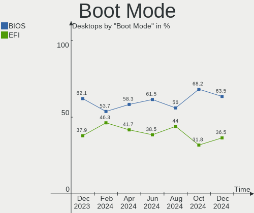

| Mode | Desktops | Percent |
|------|----------|---------|
| BIOS | 23       | 50%     |
| EFI  | 23       | 50%     |

Filesystem
----------

Type of filesystem

| Type    | Desktops | Percent |
|---------|----------|---------|
| Ext4    | 29       | 63.04%  |
| Tmpfs   | 6        | 13.04%  |
| Overlay | 4        | 8.7%    |
| F2fs    | 3        | 6.52%   |
| Btrfs   | 3        | 6.52%   |
| Zfs     | 1        | 2.17%   |

Part. scheme
------------

Scheme of partitioning

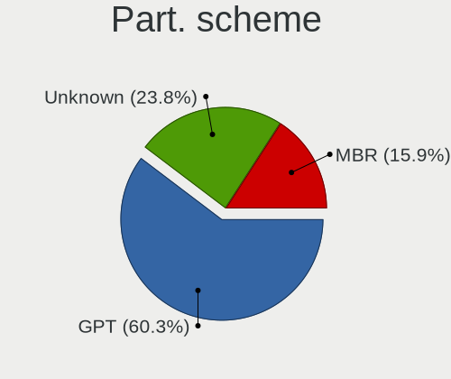

| Type    | Desktops | Percent |
|---------|----------|---------|
| GPT     | 22       | 47.83%  |
| Unknown | 16       | 34.78%  |
| MBR     | 8        | 17.39%  |

Dual Boot with Linux/BSD
------------------------

Hosting more than one Linux/BSD

| Dual boot | Desktops | Percent |
|-----------|----------|---------|
| No        | 34       | 73.91%  |
| Yes       | 12       | 26.09%  |

Dual Boot (Win)
---------------

Hosting Linux and Windows

| Dual boot | Desktops | Percent |
|-----------|----------|---------|
| No        | 28       | 60.87%  |
| Yes       | 18       | 39.13%  |

Board
-----

Vendor
------

Motherboard manufacturer

| Name                                 | Desktops | Percent |
|--------------------------------------|----------|---------|
| ASUSTek Computer                     | 14       | 30.43%  |
| MSI                                  | 9        | 19.57%  |
| Gigabyte Technology                  | 6        | 13.04%  |
| Dell                                 | 5        | 10.87%  |
| ASRock                               | 4        | 8.7%    |
| Hewlett-Packard                      | 3        | 6.52%   |
| Shenzhen Meigao Electronic Equipment | 1        | 2.17%   |
| Sapphire                             | 1        | 2.17%   |
| Lenovo                               | 1        | 2.17%   |
| Intel                                | 1        | 2.17%   |
| ACTION                               | 1        | 2.17%   |

Model
-----

Motherboard model

| Name                                      | Desktops | Percent |
|-------------------------------------------|----------|---------|
| HP Z420 Workstation                       | 2        | 4.35%   |
| ASUS P5G41T-M LX                          | 2        | 4.35%   |
| Shenzhen Meigao Electronic Equipment TH80 | 1        | 2.17%   |
| Sapphire PCDBS19H                         | 1        | 2.17%   |
| MSI OPTIMUS                               | 1        | 2.17%   |
| MSI MS-7C56                               | 1        | 2.17%   |
| MSI MS-7C37                               | 1        | 2.17%   |
| MSI MS-7C35                               | 1        | 2.17%   |
| MSI MS-7B86                               | 1        | 2.17%   |
| MSI MS-7A34                               | 1        | 2.17%   |
| MSI MS-7971                               | 1        | 2.17%   |
| MSI MS-7693                               | 1        | 2.17%   |
| MSI MS-7235                               | 1        | 2.17%   |
| Lenovo Legion Y520T-25IKL 90H700ETPB      | 1        | 2.17%   |
| Intel X99                                 | 1        | 2.17%   |
| HP EliteDesk 705 G4 SFF                   | 1        | 2.17%   |
| Gigabyte Z97M-DS3H                        | 1        | 2.17%   |
| Gigabyte H81M-HD3                         | 1        | 2.17%   |
| Gigabyte B550 AORUS ELITE V2              | 1        | 2.17%   |
| Gigabyte AB350-Gaming                     | 1        | 2.17%   |
| Gigabyte A520 AORUS ELITE                 | 1        | 2.17%   |
| Gigabyte 965P-DS3                         | 1        | 2.17%   |
| Dell Precision 3650 Tower                 | 1        | 2.17%   |
| Dell OptiPlex 790                         | 1        | 2.17%   |
| Dell OptiPlex 780                         | 1        | 2.17%   |
| Dell OptiPlex 7050                        | 1        | 2.17%   |
| Dell OptiPlex 7040                        | 1        | 2.17%   |
| ASUS TUF Gaming B550-PLUS                 | 1        | 2.17%   |
| ASUS TUF Gaming B450M-PLUS II             | 1        | 2.17%   |
| ASUS TUF Gaming B450-PLUS II              | 1        | 2.17%   |
| ASUS ROG STRIX B650E-E GAMING WIFI        | 1        | 2.17%   |
| ASUS PRIME Z790M-PLUS D4                  | 1        | 2.17%   |
| ASUS PRIME Z790-P                         | 1        | 2.17%   |
| ASUS PRIME Z790-A WIFI                    | 1        | 2.17%   |
| ASUS PRIME X470-PRO                       | 1        | 2.17%   |
| ASUS Pentino_H-Series A_MT_B85-1          | 1        | 2.17%   |
| ASUS P8H77-M PRO                          | 1        | 2.17%   |
| ASUS M3A78-CM                             | 1        | 2.17%   |
| ASUS H61M-K                               | 1        | 2.17%   |
| ASRock Z370 Killer SLI                    | 1        | 2.17%   |

Model Family
------------

Motherboard model prefix

| Name                                      | Desktops | Percent |
|-------------------------------------------|----------|---------|
| Dell OptiPlex                             | 4        | 8.7%    |
| ASUS PRIME                                | 4        | 8.7%    |
| ASUS TUF                                  | 3        | 6.52%   |
| HP Z420                                   | 2        | 4.35%   |
| ASUS P5G41T-M                             | 2        | 4.35%   |
| Shenzhen Meigao Electronic Equipment TH80 | 1        | 2.17%   |
| Sapphire PCDBS19H                         | 1        | 2.17%   |
| MSI OPTIMUS                               | 1        | 2.17%   |
| MSI MS-7C56                               | 1        | 2.17%   |
| MSI MS-7C37                               | 1        | 2.17%   |
| MSI MS-7C35                               | 1        | 2.17%   |
| MSI MS-7B86                               | 1        | 2.17%   |
| MSI MS-7A34                               | 1        | 2.17%   |
| MSI MS-7971                               | 1        | 2.17%   |
| MSI MS-7693                               | 1        | 2.17%   |
| MSI MS-7235                               | 1        | 2.17%   |
| Lenovo Legion                             | 1        | 2.17%   |
| Intel X99                                 | 1        | 2.17%   |
| HP EliteDesk                              | 1        | 2.17%   |
| Gigabyte Z97M-DS3H                        | 1        | 2.17%   |
| Gigabyte H81M-HD3                         | 1        | 2.17%   |
| Gigabyte B550                             | 1        | 2.17%   |
| Gigabyte AB350-Gaming                     | 1        | 2.17%   |
| Gigabyte A520                             | 1        | 2.17%   |
| Gigabyte 965P-DS3                         | 1        | 2.17%   |
| Dell Precision                            | 1        | 2.17%   |
| ASUS ROG                                  | 1        | 2.17%   |
| ASUS Pentino                              | 1        | 2.17%   |
| ASUS P8H77-M                              | 1        | 2.17%   |
| ASUS M3A78-CM                             | 1        | 2.17%   |
| ASUS H61M-K                               | 1        | 2.17%   |
| ASRock Z370                               | 1        | 2.17%   |
| ASRock P4i945GC                           | 1        | 2.17%   |
| ASRock FM2A55M-VG3+                       | 1        | 2.17%   |
| ASRock A88M-G                             | 1        | 2.17%   |
| ACTION ACTINA                             | 1        | 2.17%   |

MFG Year
--------

Motherboard manufacture year

| Year | Desktops | Percent |
|------|----------|---------|
| 2020 | 6        | 13.04%  |
| 2022 | 5        | 10.87%  |
| 2019 | 5        | 10.87%  |
| 2017 | 5        | 10.87%  |
| 2018 | 4        | 8.7%    |
| 2012 | 4        | 8.7%    |
| 2013 | 3        | 6.52%   |
| 2014 | 2        | 4.35%   |
| 2011 | 2        | 4.35%   |
| 2010 | 2        | 4.35%   |
| 2009 | 2        | 4.35%   |
| 2006 | 2        | 4.35%   |
| 2021 | 1        | 2.17%   |
| 2016 | 1        | 2.17%   |
| 2015 | 1        | 2.17%   |
| 2008 | 1        | 2.17%   |

Form Factor
-----------

Physical design of the computer

| Name    | Desktops | Percent |
|---------|----------|---------|
| Desktop | 46       | 100%    |

Secure Boot
-----------

Enabled or disabled

| State    | Desktops | Percent |
|----------|----------|---------|
| Disabled | 46       | 100%    |

Coreboot
--------

Have coreboot on board

| Used | Desktops | Percent |
|------|----------|---------|
| No   | 46       | 100%    |

RAM Size
--------

Total RAM memory

| Size in GB  | Desktops | Percent |
|-------------|----------|---------|
| 32.01-64.0  | 12       | 26.09%  |
| 16.01-24.0  | 11       | 23.91%  |
| 4.01-8.0    | 7        | 15.22%  |
| 8.01-16.0   | 6        | 13.04%  |
| 3.01-4.0    | 4        | 8.7%    |
| 64.01-256.0 | 3        | 6.52%   |
| 24.01-32.0  | 1        | 2.17%   |
| 2.01-3.0    | 1        | 2.17%   |
| 1.01-2.0    | 1        | 2.17%   |

RAM Used
--------

Used RAM memory

| Used GB    | Desktops | Percent |
|------------|----------|---------|
| 1.01-2.0   | 17       | 36.96%  |
| 4.01-8.0   | 16       | 34.78%  |
| 3.01-4.0   | 5        | 10.87%  |
| 2.01-3.0   | 4        | 8.7%    |
| 0.51-1.0   | 3        | 6.52%   |
| 16.01-24.0 | 1        | 2.17%   |

Total Drives
------------

Number of drives on board

| Drives | Desktops | Percent |
|--------|----------|---------|
| 2      | 19       | 41.3%   |
| 1      | 15       | 32.61%  |
| 3      | 7        | 15.22%  |
| 4      | 4        | 8.7%    |
| 6      | 1        | 2.17%   |

Has CD-ROM
----------

Has CD-ROM on board

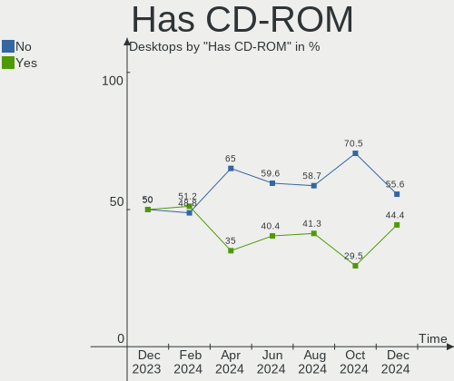

| Presented | Desktops | Percent |
|-----------|----------|---------|
| No        | 29       | 63.04%  |
| Yes       | 17       | 36.96%  |

Has Ethernet
------------

Has Ethernet on board

| Presented | Desktops | Percent |
|-----------|----------|---------|
| Yes       | 46       | 100%    |

Has WiFi
--------

Has WiFi module

| Presented | Desktops | Percent |
|-----------|----------|---------|
| No        | 30       | 65.22%  |
| Yes       | 16       | 34.78%  |

Has Bluetooth
-------------

Has Bluetooth module

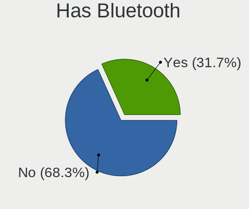

| Presented | Desktops | Percent |
|-----------|----------|---------|
| No        | 35       | 76.09%  |
| Yes       | 11       | 23.91%  |

Location
--------

Country
-------

Geographic location (country)

| Country | Desktops | Percent |
|---------|----------|---------|
| Poland  | 46       | 100%    |

City
----

Geographic location (city)

| City                 | Desktops | Percent |
|----------------------|----------|---------|
| Warsaw               | 15       | 32.61%  |
| Gdynia               | 4        | 8.7%    |
| Wroclaw              | 3        | 6.52%   |
| Gdansk               | 3        | 6.52%   |
| Polkowice            | 2        | 4.35%   |
| Krakow               | 2        | 4.35%   |
| Żory                | 1        | 2.17%   |
| Zgierz               | 1        | 2.17%   |
| Zdunska Wola         | 1        | 2.17%   |
| Skoczow              | 1        | 2.17%   |
| Ruda Śląska        | 1        | 2.17%   |
| Radom                | 1        | 2.17%   |
| Puławy              | 1        | 2.17%   |
| Pila                 | 1        | 2.17%   |
| Myszkow              | 1        | 2.17%   |
| Mikołów            | 1        | 2.17%   |
| Lodz                 | 1        | 2.17%   |
| Jaworzno             | 1        | 2.17%   |
| Gorzów Wielkopolski | 1        | 2.17%   |
| Debno                | 1        | 2.17%   |
| Cieszyn              | 1        | 2.17%   |
| Bytom                | 1        | 2.17%   |
| Bełchatów          | 1        | 2.17%   |

Drives
------

Drive Vendor
------------

Hard drive vendors

| Vendor                      | Desktops | Drives | Percent |
|-----------------------------|----------|--------|---------|
| Seagate                     | 17       | 20     | 20.24%  |
| WDC                         | 10       | 11     | 11.9%   |
| Samsung Electronics         | 10       | 11     | 11.9%   |
| GOODRAM                     | 10       | 11     | 11.9%   |
| Toshiba                     | 5        | 6      | 5.95%   |
| Patriot                     | 3        | 4      | 3.57%   |
| Kingston                    | 3        | 3      | 3.57%   |
| SPCC                        | 2        | 3      | 2.38%   |
| Kingston Technology Company | 2        | 2      | 2.38%   |
| Intel                       | 2        | 2      | 2.38%   |
| Crucial                     | 2        | 2      | 2.38%   |
| A-DATA Technology           | 2        | 2      | 2.38%   |
| USB3.0                      | 1        | 1      | 1.19%   |
| Unknown                     | 1        | 1      | 1.19%   |
| SK hynix                    | 1        | 1      | 1.19%   |
| SanDisk                     | 1        | 1      | 1.19%   |
| Phison                      | 1        | 1      | 1.19%   |
| Micron/Crucial Technology   | 1        | 1      | 1.19%   |
| Micron Technology           | 1        | 1      | 1.19%   |
| Lexar                       | 1        | 1      | 1.19%   |
| KIOXIA                      | 1        | 1      | 1.19%   |
| Kingchuxing                 | 1        | 2      | 1.19%   |
| Intenso                     | 1        | 1      | 1.19%   |
| Hitachi                     | 1        | 3      | 1.19%   |
| Hewlett-Packard             | 1        | 1      | 1.19%   |
| DEMO                        | 1        | 1      | 1.19%   |
| China                       | 1        | 1      | 1.19%   |
| ADATA Technology            | 1        | 1      | 1.19%   |

Drive Model
-----------

Hard drive models

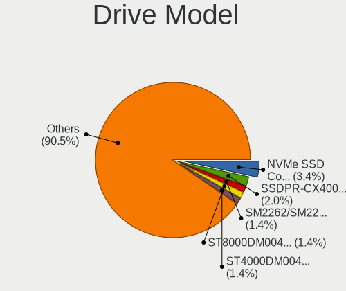

| Model                                              | Desktops | Percent |
|----------------------------------------------------|----------|---------|
| SPCC Solid State Disk 240GB                        | 2        | 2.22%   |
| Seagate ST1000DM003-1ER162 1TB                     | 2        | 2.22%   |
| Samsung SSD 980 500GB                              | 2        | 2.22%   |
| Samsung NVMe SSD Controller PM9A1/PM9A3/980PRO 1TB | 2        | 2.22%   |
| Patriot Burst 240GB SSD                            | 2        | 2.22%   |
| GOODRAM SSDPR-CL100-480-G2 480GB                   | 2        | 2.22%   |
| GOODRAM SSDPR-CL100-240-G3 240GB                   | 2        | 2.22%   |
| GOODRAM IRP-SSDPR-S25B-240 240GB                   | 2        | 2.22%   |
| Crucial CT240BX500SSD1 240GB                       | 2        | 2.22%   |
| WDC WD7500BPVT-24HXZT3 752GB                       | 1        | 1.11%   |
| WDC WD5000AZRX-00L4HB0 500GB                       | 1        | 1.11%   |
| WDC WD5000AZLX-08K2TA0 500GB                       | 1        | 1.11%   |
| WDC WD5000AAKX-75U6AA0 500GB                       | 1        | 1.11%   |
| WDC WD5000AAKS-00V1A0 500GB                        | 1        | 1.11%   |
| WDC WD20EZRZ-00Z5HB0 2TB                           | 1        | 1.11%   |
| WDC WD20EFRX-68EUZN0 2TB                           | 1        | 1.11%   |
| WDC WD20EARX-00PASB0 2TB                           | 1        | 1.11%   |
| WDC WD20EARX-00MMMB0 2TB                           | 1        | 1.11%   |
| WDC WD10EZEX-21M2NA0 1TB                           | 1        | 1.11%   |
| WDC PC SN530 SDBPNPZ-256G                          | 1        | 1.11%   |
| USB3.0 Super Speed 2TB                             | 1        | 1.11%   |
| Unknown NVMe SSD Drive 1024GB                      | 1        | 1.11%   |
| Toshiba MK6461GSY 640GB                            | 1        | 1.11%   |
| Toshiba HDWE150 5TB                                | 1        | 1.11%   |
| Toshiba HDWD130 3TB                                | 1        | 1.11%   |
| Toshiba DT01ACA300 3TB                             | 1        | 1.11%   |
| Toshiba BG3 NVMe SSD Controller 128GB              | 1        | 1.11%   |
| SPCC Solid State Disk 512GB                        | 1        | 1.11%   |
| SK hynix BC711 NVMe 256GB                          | 1        | 1.11%   |
| Seagate ST500DM002-1BD142 500GB                    | 1        | 1.11%   |
| Seagate ST4000DM004-2CV104 4TB                     | 1        | 1.11%   |
| Seagate ST3750840ACE 752GB                         | 1        | 1.11%   |
| Seagate ST3750640A 752GB                           | 1        | 1.11%   |
| Seagate ST3500418AS 500GB                          | 1        | 1.11%   |
| Seagate ST3320620AS 320GB                          | 1        | 1.11%   |
| Seagate ST3250820SCE 250GB                         | 1        | 1.11%   |
| Seagate ST3250312AS 250GB                          | 1        | 1.11%   |
| Seagate ST3250310AS 250GB                          | 1        | 1.11%   |
| Seagate ST2000DM008-2UB102 2TB                     | 1        | 1.11%   |
| Seagate ST2000DM008-2FR102 2TB                     | 1        | 1.11%   |

HDD Vendor
----------

Hard disk drive vendors

| Vendor              | Desktops | Drives | Percent |
|---------------------|----------|--------|---------|
| Seagate             | 16       | 19     | 48.48%  |
| WDC                 | 9        | 10     | 27.27%  |
| Toshiba             | 4        | 5      | 12.12%  |
| Samsung Electronics | 2        | 2      | 6.06%   |
| USB3.0              | 1        | 1      | 3.03%   |
| Hitachi             | 1        | 3      | 3.03%   |

SSD Vendor
----------

Solid state drive vendors

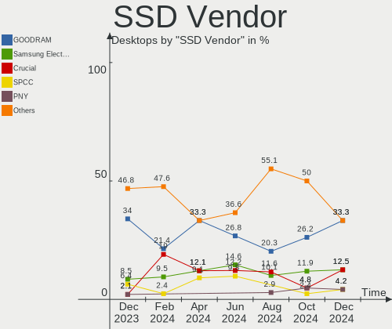

| Vendor              | Desktops | Drives | Percent |
|---------------------|----------|--------|---------|
| GOODRAM             | 10       | 11     | 37.04%  |
| Samsung Electronics | 3        | 3      | 11.11%  |
| SPCC                | 2        | 3      | 7.41%   |
| Patriot             | 2        | 3      | 7.41%   |
| Crucial             | 2        | 2      | 7.41%   |
| A-DATA Technology   | 2        | 2      | 7.41%   |
| SanDisk             | 1        | 1      | 3.7%    |
| Kingston            | 1        | 1      | 3.7%    |
| Kingchuxing         | 1        | 2      | 3.7%    |
| Intel               | 1        | 1      | 3.7%    |
| Hewlett-Packard     | 1        | 1      | 3.7%    |
| China               | 1        | 1      | 3.7%    |

Drive Kind
----------

HDD or SSD

| Kind    | Desktops | Drives | Percent |
|---------|----------|--------|---------|
| HDD     | 27       | 40     | 36.99%  |
| SSD     | 26       | 31     | 35.62%  |
| NVMe    | 19       | 24     | 26.03%  |
| Unknown | 1        | 1      | 1.37%   |

Drive Connector
---------------

SATA, SAS, NVMe, etc.

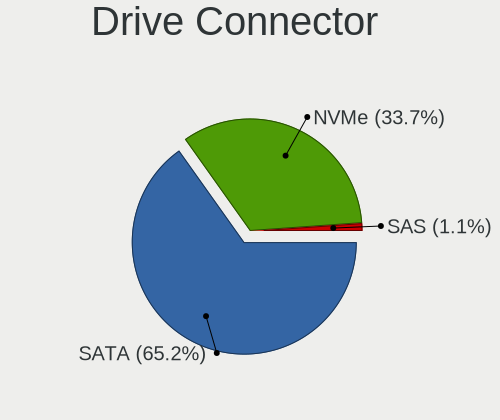

| Type | Desktops | Drives | Percent |
|------|----------|--------|---------|
| SATA | 39       | 69     | 63.93%  |
| NVMe | 19       | 24     | 31.15%  |
| SAS  | 3        | 3      | 4.92%   |

Drive Size
----------

Size of hard drive

| Size in TB | Desktops | Drives | Percent |
|------------|----------|--------|---------|
| 0.01-0.5   | 28       | 32     | 48.28%  |
| 0.51-1.0   | 16       | 21     | 27.59%  |
| 1.01-2.0   | 8        | 9      | 13.79%  |
| 2.01-3.0   | 3        | 6      | 5.17%   |
| 3.01-4.0   | 1        | 1      | 1.72%   |
| 10.01-20.0 | 1        | 1      | 1.72%   |
| 4.01-10.0  | 1        | 1      | 1.72%   |

Space Total
-----------

Amount of disk space available on the file system

| Size in GB     | Desktops | Percent |
|----------------|----------|---------|
| 501-1000       | 13       | 28.26%  |
| 251-500        | 11       | 23.91%  |
| 101-250        | 7        | 15.22%  |
| 1001-2000      | 3        | 6.52%   |
| 1-20           | 3        | 6.52%   |
| More than 3000 | 2        | 4.35%   |
| 2001-3000      | 2        | 4.35%   |
| 51-100         | 2        | 4.35%   |
| Unknown        | 2        | 4.35%   |
| 21-50          | 1        | 2.17%   |

Space Used
----------

Amount of used disk space

| Used GB        | Desktops | Percent |
|----------------|----------|---------|
| 1-20           | 10       | 21.74%  |
| 101-250        | 9        | 19.57%  |
| 251-500        | 8        | 17.39%  |
| 21-50          | 8        | 17.39%  |
| 501-1000       | 4        | 8.7%    |
| 51-100         | 3        | 6.52%   |
| More than 3000 | 2        | 4.35%   |
| Unknown        | 2        | 4.35%   |

Malfunc. Drives
---------------

Drive models with a malfunction

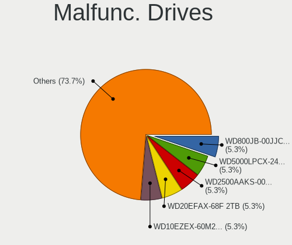

| Model                          | Desktops | Drives | Percent |
|--------------------------------|----------|--------|---------|
| Seagate ST3750840ACE 752GB     | 1        | 1      | 33.33%  |
| Seagate ST3250820SCE 250GB     | 1        | 1      | 33.33%  |
| Seagate ST2000DM008-2FR102 2TB | 1        | 1      | 33.33%  |

Malfunc. Drive Vendor
---------------------

Vendors of faulty drives

| Vendor  | Desktops | Drives | Percent |
|---------|----------|--------|---------|
| Seagate | 3        | 3      | 100%    |

Malfunc. HDD Vendor
-------------------

Vendors of faulty HDD drives

| Vendor  | Desktops | Drives | Percent |
|---------|----------|--------|---------|
| Seagate | 3        | 3      | 100%    |

Malfunc. Drive Kind
-------------------

Kinds of faulty drives

| Kind | Desktops | Drives | Percent |
|------|----------|--------|---------|
| HDD  | 3        | 3      | 100%    |

Failed Drives
-------------

Failed drive models

Zero info for selected period =(

Failed Drive Vendor
-------------------

Failed drive vendors

Zero info for selected period =(

Drive Status
------------

Number of failed and malfunc. drives

| Status   | Desktops | Drives | Percent |
|----------|----------|--------|---------|
| Works    | 24       | 48     | 48.98%  |
| Detected | 22       | 45     | 44.9%   |
| Malfunc  | 3        | 3      | 6.12%   |

Storage controller
------------------

Storage Vendor
--------------

Storage controller vendors

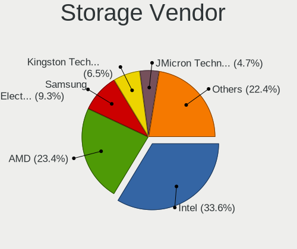

| Vendor                       | Desktops | Percent |
|------------------------------|----------|---------|
| Intel                        | 26       | 34.67%  |
| AMD                          | 20       | 26.67%  |
| Samsung Electronics          | 5        | 6.67%   |
| Kingston Technology Company  | 4        | 5.33%   |
| ASMedia Technology           | 3        | 4%      |
| JMicron Technology           | 2        | 2.67%   |
| VIA Technologies             | 1        | 1.33%   |
| Toshiba America Info Systems | 1        | 1.33%   |
| SK hynix                     | 1        | 1.33%   |
| Silicon Motion               | 1        | 1.33%   |
| Shenzhen Longsys Electronics | 1        | 1.33%   |
| Seagate Technology           | 1        | 1.33%   |
| SanDisk                      | 1        | 1.33%   |
| Phison Electronics           | 1        | 1.33%   |
| Micron/Crucial Technology    | 1        | 1.33%   |
| Micron Technology            | 1        | 1.33%   |
| MAXIO Technology (Hangzhou)  | 1        | 1.33%   |
| Marvell Technology Group     | 1        | 1.33%   |
| KIOXIA                       | 1        | 1.33%   |
| INNOGRIT                     | 1        | 1.33%   |
| ADATA Technology             | 1        | 1.33%   |

Storage Model
-------------

Storage controller models

| Model                                                                         | Desktops | Percent |
|-------------------------------------------------------------------------------|----------|---------|
| AMD FCH SATA Controller [AHCI mode]                                           | 11       | 10.58%  |
| AMD 500 Series Chipset SATA Controller                                        | 4        | 3.85%   |
| AMD 400 Series Chipset SATA Controller                                        | 4        | 3.85%   |
| Intel NM10/ICH7 Family SATA Controller [IDE mode]                             | 3        | 2.88%   |
| Intel 82801G (ICH7 Family) IDE Controller                                     | 3        | 2.88%   |
| Intel 700 Series Chipset Family SATA AHCI Controller                          | 3        | 2.88%   |
| AMD SB7x0/SB8x0/SB9x0 SATA Controller [IDE mode]                              | 3        | 2.88%   |
| AMD SB7x0/SB8x0/SB9x0 IDE Controller                                          | 3        | 2.88%   |
| AMD 300 Series Chipset SATA Controller                                        | 3        | 2.88%   |
| Samsung NVMe SSD Controller PM9A1/PM9A3/980PRO                                | 2        | 1.92%   |
| Samsung NVMe SSD Controller 980 (DRAM-less)                                   | 2        | 1.92%   |
| Kingston Company KC3000/FURY Renegade NVMe SSD E18                            | 2        | 1.92%   |
| Intel Volume Management Device NVMe RAID Controller Intel Corporation         | 2        | 1.92%   |
| Intel SATA Controller [RAID mode]                                             | 2        | 1.92%   |
| Intel C602 chipset 4-Port SATA Storage Control Unit                           | 2        | 1.92%   |
| Intel C600/X79 series chipset IDE-r Controller                                | 2        | 1.92%   |
| Intel 82801HR/HO/HH (ICH8R/DO/DH) 2 port SATA Controller [IDE mode]           | 2        | 1.92%   |
| Intel 82801H (ICH8 Family) 4 port SATA Controller [IDE mode]                  | 2        | 1.92%   |
| Intel 6 Series/C200 Series Chipset Family 6 port Desktop SATA AHCI Controller | 2        | 1.92%   |
| Intel 200 Series PCH SATA controller [AHCI mode]                              | 2        | 1.92%   |
| ASMedia ASM1062 Serial ATA Controller                                         | 2        | 1.92%   |
| AMD FCH IDE Controller                                                        | 2        | 1.92%   |
| VIA VT6415 PATA IDE Host Controller                                           | 1        | 0.96%   |
| Toshiba America Info Systems BG3 x2 NVMe SSD Controller (DRAM-less)           | 1        | 0.96%   |
| SK hynix Gold P31/BC711/PC711 NVMe Solid State Drive                          | 1        | 0.96%   |
| Silicon Motion SM2263EN/SM2263XT (DRAM-less) NVMe SSD Controllers             | 1        | 0.96%   |
| Shenzhen Longsys Non-Volatile memory controller                               | 1        | 0.96%   |
| Seagate BarraCuda Q5 NVMe SSD (DRAM-less)                                     | 1        | 0.96%   |
| SanDisk Ultra 3D / WD Blue SN550 NVMe SSD                                     | 1        | 0.96%   |
| Samsung NVMe SSD Controller SM981/PM981/PM983                                 | 1        | 0.96%   |
| Phison PS5013-E13 PCIe3 NVMe Controller (DRAM-less)                           | 1        | 0.96%   |
| Micron/Crucial P5 Plus NVMe PCIe SSD                                          | 1        | 0.96%   |
| Micron 2300 NVMe SSD [Santana]                                                | 1        | 0.96%   |
| MAXIO (Hangzhou) NVMe SSD Controller MAP1202                                  | 1        | 0.96%   |
| Marvell Group 88SE9172 SATA III 6Gb/s RAID Controller                         | 1        | 0.96%   |
| KIOXIA NVMe SSD                                                               | 1        | 0.96%   |
| Kingston Company KC2000/KC2500 NVMe SSD SM2262EN                              | 1        | 0.96%   |
| Kingston Company A2000 NVMe SSD SM2263EN                                      | 1        | 0.96%   |
| JMicron JMB363 SATA/IDE Controller                                            | 1        | 0.96%   |
| JMicron JMB361 AHCI/IDE                                                       | 1        | 0.96%   |

Storage Kind
------------

Kind of storage controller (IDE, SATA, NVMe, SAS, ...)

| Kind | Desktops | Percent |
|------|----------|---------|
| SATA | 35       | 44.87%  |
| NVMe | 20       | 25.64%  |
| IDE  | 15       | 19.23%  |
| RAID | 6        | 7.69%   |
| SAS  | 2        | 2.56%   |

Processor
---------

CPU Vendor
----------

Processor vendors

| Vendor | Desktops | Percent |
|--------|----------|---------|
| Intel  | 26       | 56.52%  |
| AMD    | 20       | 43.48%  |

CPU Model
---------

Processor models

| Model                                           | Desktops | Percent |
|-------------------------------------------------|----------|---------|
| AMD Ryzen 5 5600G with Radeon Graphics          | 3        | 6.52%   |
| Intel Core i7-6700 CPU @ 3.40GHz                | 2        | 4.35%   |
| AMD Ryzen 5 2600 Six-Core Processor             | 2        | 4.35%   |
| Intel Xeon CPU E5-2695 v3 @ 2.30GHz             | 1        | 2.17%   |
| Intel Xeon CPU E5-1680 v2 @ 3.00GHz             | 1        | 2.17%   |
| Intel Xeon CPU E5-1620 v2 @ 3.70GHz             | 1        | 2.17%   |
| Intel Pentium Dual-Core CPU E5700 @ 3.00GHz     | 1        | 2.17%   |
| Intel Pentium Dual CPU E2220 @ 2.40GHz          | 1        | 2.17%   |
| Intel Pentium 4 CPU 2.80GHz                     | 1        | 2.17%   |
| Intel Core i7-8700K CPU @ 3.70GHz               | 1        | 2.17%   |
| Intel Core i5-8400 CPU @ 2.80GHz                | 1        | 2.17%   |
| Intel Core i5-7500 CPU @ 3.40GHz                | 1        | 2.17%   |
| Intel Core i5-7400 CPU @ 3.00GHz                | 1        | 2.17%   |
| Intel Core i5-4690 CPU @ 3.50GHz                | 1        | 2.17%   |
| Intel Core i5-3470S CPU @ 2.90GHz               | 1        | 2.17%   |
| Intel Core i5-3350P CPU @ 3.10GHz               | 1        | 2.17%   |
| Intel Core i5-2400 CPU @ 3.10GHz                | 1        | 2.17%   |
| Intel Core i3-4160 CPU @ 3.60GHz                | 1        | 2.17%   |
| Intel Core 2 Duo CPU E8600 @ 3.33GHz            | 1        | 2.17%   |
| Intel Core 2 CPU 6300 @ 1.86GHz                 | 1        | 2.17%   |
| Intel Celeron CPU G1840 @ 2.80GHz               | 1        | 2.17%   |
| Intel Celeron CPU E3400 @ 2.60GHz               | 1        | 2.17%   |
| Intel 13th Gen Core i7-13700KF                  | 1        | 2.17%   |
| Intel 13th Gen Core i7-13700K                   | 1        | 2.17%   |
| Intel 12th Gen Core i7-12700K                   | 1        | 2.17%   |
| Intel 11th Gen Core i7-11800H @ 2.30GHz         | 1        | 2.17%   |
| Intel 11th Gen Core i5-11400 @ 2.60GHz          | 1        | 2.17%   |
| AMD Ryzen 9 5900X 12-Core Processor             | 1        | 2.17%   |
| AMD Ryzen 7 7800X3D 8-Core Processor            | 1        | 2.17%   |
| AMD Ryzen 7 5700G with Radeon Graphics          | 1        | 2.17%   |
| AMD Ryzen 7 3700X 8-Core Processor              | 1        | 2.17%   |
| AMD Ryzen 5 PRO 2400G with Radeon Vega Graphics | 1        | 2.17%   |
| AMD Ryzen 5 5600X 6-Core Processor              | 1        | 2.17%   |
| AMD Ryzen 5 5500                                | 1        | 2.17%   |
| AMD Ryzen 5 3600 6-Core Processor               | 1        | 2.17%   |
| AMD Ryzen 5 1600 Six-Core Processor             | 1        | 2.17%   |
| AMD Phenom II X4 955 Processor                  | 1        | 2.17%   |
| AMD FX-8350 Eight-Core Processor                | 1        | 2.17%   |
| AMD FX-8320 Eight-Core Processor                | 1        | 2.17%   |
| AMD Athlon II X4 645 Processor                  | 1        | 2.17%   |

CPU Model Family
----------------

Processor model prefix

| Model                   | Desktops | Percent |
|-------------------------|----------|---------|
| AMD Ryzen 5             | 9        | 19.57%  |
| Intel Core i5           | 7        | 15.22%  |
| Other                   | 5        | 10.87%  |
| Intel Xeon              | 3        | 6.52%   |
| Intel Core i7           | 3        | 6.52%   |
| AMD Ryzen 7             | 3        | 6.52%   |
| Intel Celeron           | 2        | 4.35%   |
| AMD FX                  | 2        | 4.35%   |
| AMD A10                 | 2        | 4.35%   |
| Intel Pentium Dual-Core | 1        | 2.17%   |
| Intel Pentium Dual      | 1        | 2.17%   |
| Intel Pentium 4         | 1        | 2.17%   |
| Intel Core i3           | 1        | 2.17%   |
| Intel Core 2 Duo        | 1        | 2.17%   |
| Intel Core 2            | 1        | 2.17%   |
| AMD Ryzen 9             | 1        | 2.17%   |
| AMD Ryzen 5 PRO         | 1        | 2.17%   |
| AMD Phenom II X4        | 1        | 2.17%   |
| AMD Athlon II X4        | 1        | 2.17%   |

CPU Cores
---------

Number of processor cores

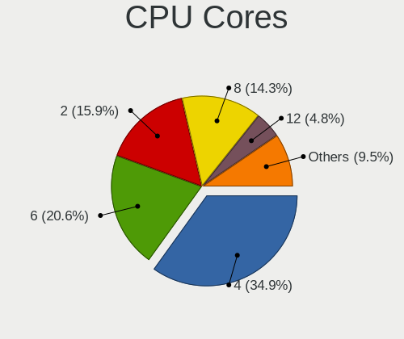

| Number | Desktops | Percent |
|--------|----------|---------|
| 4      | 14       | 30.43%  |
| 6      | 12       | 26.09%  |
| 2      | 9        | 19.57%  |
| 8      | 5        | 10.87%  |
| 16     | 2        | 4.35%   |
| 12     | 2        | 4.35%   |
| 28     | 1        | 2.17%   |
| 1      | 1        | 2.17%   |

CPU Sockets
-----------

Number of sockets

| Number | Desktops | Percent |
|--------|----------|---------|
| 1      | 45       | 97.83%  |
| 2      | 1        | 2.17%   |

CPU Threads
-----------

Threads per core (Hyper-Threading)

| Number | Desktops | Percent |
|--------|----------|---------|
| 2      | 31       | 67.39%  |
| 1      | 15       | 32.61%  |

CPU Op-Modes
------------

CPU Operation Modes (32-bit, 64-bit)

| Op mode        | Desktops | Percent |
|----------------|----------|---------|
| 32-bit, 64-bit | 45       | 97.83%  |
| 32-bit         | 1        | 2.17%   |

CPU Microcode
-------------

Microcode number

| Number     | Desktops | Percent |
|------------|----------|---------|
| Unknown    | 21       | 45.65%  |
| 0x0a50000d | 4        | 8.7%    |
| 0x0800820d | 3        | 6.52%   |
| 0xf29      | 1        | 2.17%   |
| 0xa0671    | 1        | 2.17%   |
| 0x906ea    | 1        | 2.17%   |
| 0x906e9    | 1        | 2.17%   |
| 0x806d1    | 1        | 2.17%   |
| 0x6fd      | 1        | 2.17%   |
| 0x6f6      | 1        | 2.17%   |
| 0x506e3    | 1        | 2.17%   |
| 0x306f2    | 1        | 2.17%   |
| 0x306e4    | 1        | 2.17%   |
| 0x306c3    | 1        | 2.17%   |
| 0x306a9    | 1        | 2.17%   |
| 0x0a50000c | 1        | 2.17%   |
| 0x0a201016 | 1        | 2.17%   |
| 0x06003106 | 1        | 2.17%   |
| 0x06000852 | 1        | 2.17%   |
| 0x0600081c | 1        | 2.17%   |
| 0x010000c8 | 1        | 2.17%   |

CPU Microarch
-------------

Microarchitecture

| Name             | Desktops | Percent |
|------------------|----------|---------|
| Zen 3            | 7        | 15.22%  |
| KabyLake         | 4        | 8.7%    |
| IvyBridge        | 4        | 8.7%    |
| Haswell          | 4        | 8.7%    |
| Zen+             | 3        | 6.52%   |
| Piledriver       | 3        | 6.52%   |
| Penryn           | 3        | 6.52%   |
| Zen 2            | 2        | 4.35%   |
| Skylake          | 2        | 4.35%   |
| K10              | 2        | 4.35%   |
| Icelake          | 2        | 4.35%   |
| Core             | 2        | 4.35%   |
| Alderlake Hybrid | 2        | 4.35%   |
| Unknown          | 2        | 4.35%   |
| Zen              | 1        | 2.17%   |
| Steamroller      | 1        | 2.17%   |
| SandyBridge      | 1        | 2.17%   |
| NetBurst         | 1        | 2.17%   |

Graphics
--------

GPU Vendor
----------

Vendors of graphics cards

| Vendor | Desktops | Percent |
|--------|----------|---------|
| Nvidia | 20       | 38.46%  |
| AMD    | 19       | 36.54%  |
| Intel  | 13       | 25%     |

GPU Model
---------

Graphics card models

| Model                                                                       | Desktops | Percent |
|-----------------------------------------------------------------------------|----------|---------|
| Intel 4 Series Chipset Integrated Graphics Controller                       | 3        | 5.77%   |
| AMD Ellesmere [Radeon RX 470/480/570/570X/580/580X/590]                     | 3        | 5.77%   |
| AMD Cezanne [Radeon Vega Series / Radeon Vega Mobile Series]                | 3        | 5.77%   |
| Nvidia GP108 [GeForce GT 1030]                                              | 2        | 3.85%   |
| Nvidia GK208B [GeForce GT 730]                                              | 2        | 3.85%   |
| Nvidia GA104 [GeForce RTX 3070]                                             | 2        | 3.85%   |
| Intel HD Graphics 630                                                       | 2        | 3.85%   |
| Intel HD Graphics 530                                                       | 2        | 3.85%   |
| AMD Cedar [Radeon HD 5000/6000/7350/8350 Series]                            | 2        | 3.85%   |
| Nvidia TU116 [GeForce GTX 1660 SUPER]                                       | 1        | 1.92%   |
| Nvidia GT215 [GeForce GT 320]                                               | 1        | 1.92%   |
| Nvidia GP107 [GeForce GTX 1050]                                             | 1        | 1.92%   |
| Nvidia GP107 [GeForce GTX 1050 Ti]                                          | 1        | 1.92%   |
| Nvidia GP106 [GeForce GTX 1060 3GB]                                         | 1        | 1.92%   |
| Nvidia GP104 [GeForce GTX 1080]                                             | 1        | 1.92%   |
| Nvidia GP104 [GeForce GTX 1070]                                             | 1        | 1.92%   |
| Nvidia GM206 [GeForce GTX 950]                                              | 1        | 1.92%   |
| Nvidia GF110 [GeForce GTX 580]                                              | 1        | 1.92%   |
| Nvidia GF108 [GeForce GT 430]                                               | 1        | 1.92%   |
| Nvidia GA106 [GeForce RTX 3060 Lite Hash Rate]                              | 1        | 1.92%   |
| Nvidia GA102 [GeForce RTX 3090]                                             | 1        | 1.92%   |
| Nvidia G92 [GeForce 9800 GT]                                                | 1        | 1.92%   |
| Nvidia AD103 [GeForce RTX 4080]                                             | 1        | 1.92%   |
| Intel Xeon E3-1200 v3/4th Gen Core Processor Integrated Graphics Controller | 1        | 1.92%   |
| Intel TigerLake-H GT1 [UHD Graphics]                                        | 1        | 1.92%   |
| Intel RocketLake-S GT1 [UHD Graphics 730]                                   | 1        | 1.92%   |
| Intel Raptor Lake-S GT1 [UHD Graphics 770]                                  | 1        | 1.92%   |
| Intel CoffeeLake-S GT2 [UHD Graphics 630]                                   | 1        | 1.92%   |
| Intel 82945G/GZ Integrated Graphics Controller                              | 1        | 1.92%   |
| AMD Trinity [Radeon HD 7660D]                                               | 1        | 1.92%   |
| AMD RV710 [Radeon HD 4350/4550]                                             | 1        | 1.92%   |
| AMD RS780C [Radeon 3100]                                                    | 1        | 1.92%   |
| AMD Raven Ridge [Radeon Vega Series / Radeon Vega Mobile Series]            | 1        | 1.92%   |
| AMD Raphael                                                                 | 1        | 1.92%   |
| AMD Oland [Radeon HD 8570 / R5 430 OEM / R7 240/340 / Radeon 520 OEM]       | 1        | 1.92%   |
| AMD Navi 33 [Radeon RX 7700S/7600/7600S/7600M XT/PRO W7600]                 | 1        | 1.92%   |
| AMD Navi 31 [Radeon RX 7900 XT/7900 XTX]                                    | 1        | 1.92%   |
| AMD Kaveri [Radeon R7 Graphics]                                             | 1        | 1.92%   |
| AMD Cayman LE GL [FirePro V5900]                                            | 1        | 1.92%   |
| AMD Baffin [Radeon RX 460/560D / Pro 450/455/460/555/555X/560/560X]         | 1        | 1.92%   |

GPU Combo
---------

Combinations of graphics cards

| Name         | Desktops | Percent |
|--------------|----------|---------|
| 1 x Nvidia   | 17       | 36.96%  |
| 1 x AMD      | 14       | 30.43%  |
| 1 x Intel    | 9        | 19.57%  |
| AMD + Nvidia | 3        | 6.52%   |
| Intel + AMD  | 2        | 4.35%   |
| 2 x Intel    | 1        | 2.17%   |

GPU Driver
----------

Free vs proprietary

| Driver      | Desktops | Percent |
|-------------|----------|---------|
| Free        | 30       | 65.22%  |
| Proprietary | 15       | 32.61%  |
| Unknown     | 1        | 2.17%   |

GPU Memory
----------

Total video memory

| Size in GB | Desktops | Percent |
|------------|----------|---------|
| Unknown    | 19       | 41.3%   |
| 1.01-2.0   | 8        | 17.39%  |
| 7.01-8.0   | 5        | 10.87%  |
| 0.01-0.5   | 4        | 8.7%    |
| 0.51-1.0   | 3        | 6.52%   |
| 3.01-4.0   | 2        | 4.35%   |
| 8.01-16.0  | 2        | 4.35%   |
| 5.01-6.0   | 1        | 2.17%   |
| 2.01-3.0   | 1        | 2.17%   |
| 16.01-24.0 | 1        | 2.17%   |

Monitor
-------

Monitor Vendor
--------------

Monitor vendors

| Vendor               | Desktops | Percent |
|----------------------|----------|---------|
| Samsung Electronics  | 8        | 17.02%  |
| Goldstar             | 7        | 14.89%  |
| Dell                 | 5        | 10.64%  |
| Fujitsu Siemens      | 4        | 8.51%   |
| Acer                 | 3        | 6.38%   |
| Iiyama               | 2        | 4.26%   |
| Hewlett-Packard      | 2        | 4.26%   |
| BenQ                 | 2        | 4.26%   |
| ASUSTek Computer     | 2        | 4.26%   |
| AOC                  | 2        | 4.26%   |
| Philips              | 1        | 2.13%   |
| NEC Computers        | 1        | 2.13%   |
| LG Electronics       | 1        | 2.13%   |
| Lenovo               | 1        | 2.13%   |
| Idek Iiyama          | 1        | 2.13%   |
| Hitachi              | 1        | 2.13%   |
| FME                  | 1        | 2.13%   |
| Eizo                 | 1        | 2.13%   |
| Ancor Communications | 1        | 2.13%   |
| AGO                  | 1        | 2.13%   |

Monitor Model
-------------

Monitor models

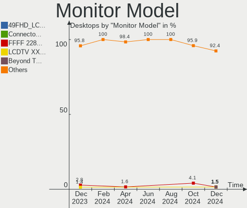

| Model                                                                   | Desktops | Percent |
|-------------------------------------------------------------------------|----------|---------|
| Goldstar ULTRAGEAR GSM5BB4 2560x1440 597x336mm 27.0-inch                | 2        | 4.08%   |
| Samsung Electronics SyncMaster SAM059A 1920x1080 477x268mm 21.5-inch    | 1        | 2.04%   |
| Samsung Electronics SyncMaster SAM011F 1280x1024 376x301mm 19.0-inch    | 1        | 2.04%   |
| Samsung Electronics SMEX2220 SAM0686 1920x1080 477x268mm 21.5-inch      | 1        | 2.04%   |
| Samsung Electronics SMB2230H SAM0648 1920x1080                          | 1        | 2.04%   |
| Samsung Electronics S22C300 SAM0A1E 1920x1080 477x268mm 21.5-inch       | 1        | 2.04%   |
| Samsung Electronics S22B300 SAM08C8 1920x1080 477x268mm 21.5-inch       | 1        | 2.04%   |
| Samsung Electronics LCD Monitor SAM0E87 3840x2160 1872x1053mm 84.6-inch | 1        | 2.04%   |
| Samsung Electronics C24F390 SAM0D2C 1920x1080 521x293mm 23.5-inch       | 1        | 2.04%   |
| Philips PHL 272E1 PHLC210 1920x1080 600x340mm 27.2-inch                 | 1        | 2.04%   |
| NEC Computers E224Wi NEC6950 1920x1080 476x267mm 21.5-inch              | 1        | 2.04%   |
| LG Electronics LCD Monitor LG TV SSCR2 1920x1080                        | 1        | 2.04%   |
| Lenovo L24i-10 LEN65D6 1920x1080 527x296mm 23.8-inch                    | 1        | 2.04%   |
| Iiyama PLX486 IVM482F 1280x1024 376x301mm 19.0-inch                     | 1        | 2.04%   |
| Iiyama PL2888H IVM7106 1920x1080 621x341mm 27.9-inch                    | 1        | 2.04%   |
| Idek Iiyama LCD Monitor PL2473HD 1920x1080                              | 1        | 2.04%   |
| Hitachi HDIT N90W HIT6013 1440x900 410x256mm 19.0-inch                  | 1        | 2.04%   |
| Hewlett-Packard LP2465 HWP2676 1920x1200 519x324mm 24.1-inch            | 1        | 2.04%   |
| Hewlett-Packard LCD Monitor E232 1920x1080                              | 1        | 2.04%   |
| Goldstar M2352D GSM58DE 1920x1080 509x286mm 23.0-inch                   | 1        | 2.04%   |
| Goldstar IPS FULLHD GSM5AB7 1920x1080 480x270mm 21.7-inch               | 1        | 2.04%   |
| Goldstar E1942 GSM4C09 1366x768 410x230mm 18.5-inch                     | 1        | 2.04%   |
| Goldstar 3D FHD TV GSM59C2 1920x1080 509x286mm 23.0-inch                | 1        | 2.04%   |
| Goldstar 22EA63 GSM5991 1920x1080 480x270mm 21.7-inch                   | 1        | 2.04%   |
| Fujitsu Siemens P24W-3 FUS073E 1920x1080 518x324mm 24.1-inch            | 1        | 2.04%   |
| Fujitsu Siemens LL 3190T FUS07A3 1366x768 430x255mm 19.7-inch           | 1        | 2.04%   |
| Fujitsu Siemens B23T-6 LED FUS07FD 1920x1080 509x286mm 23.0-inch        | 1        | 2.04%   |
| Fujitsu Siemens B19-5 FUS06AB 1280x1024 376x301mm 19.0-inch             | 1        | 2.04%   |
| FME TS35505 FME7210 1920x1080 256x192mm 12.6-inch                       | 1        | 2.04%   |
| Eizo EV2333W ENC2069 1920x1080 510x287mm 23.0-inch                      | 1        | 2.04%   |
| Eizo EV2333W ENC2068 1920x1080 510x287mm 23.0-inch                      | 1        | 2.04%   |
| Dell U2413 DELF046 1920x1200 518x324mm 24.1-inch                        | 1        | 2.04%   |
| Dell U2412M DELA07A 1920x1200 518x324mm 24.1-inch                       | 1        | 2.04%   |
| Dell U2412M DELA079 1920x1200 518x324mm 24.1-inch                       | 1        | 2.04%   |
| Dell P2210 DEL404C 1680x1050 474x296mm 22.0-inch                        | 1        | 2.04%   |
| Dell LCD Monitor P2414H 1920x1080                                       | 1        | 2.04%   |
| Dell 2209WA DELF011 1680x1050 474x296mm 22.0-inch                       | 1        | 2.04%   |
| BenQ GL2450 BNQ78A5 1920x1080 531x298mm 24.0-inch                       | 1        | 2.04%   |
| BenQ EW2420 BNQ7923 1920x1080 531x299mm 24.0-inch                       | 1        | 2.04%   |
| ASUSTek Computer VP28U AUS28B1 3840x2160 621x341mm 27.9-inch            | 1        | 2.04%   |

Monitor Resolution
------------------

Monitor screen resolution

| Resolution         | Desktops | Percent |
|--------------------|----------|---------|
| 1920x1080 (FHD)    | 25       | 58.14%  |
| 2560x1440 (QHD)    | 4        | 9.3%    |
| 1920x1200 (WUXGA)  | 3        | 6.98%   |
| 1366x768 (WXGA)    | 3        | 6.98%   |
| 1280x1024 (SXGA)   | 3        | 6.98%   |
| 3840x2160 (4K)     | 2        | 4.65%   |
| 1680x1050 (WSXGA+) | 2        | 4.65%   |
| 1440x900 (WXGA+)   | 1        | 2.33%   |

Monitor Diagonal
----------------

Diagonal size in inches

| Inches  | Desktops | Percent |
|---------|----------|---------|
| 24      | 7        | 15.91%  |
| 23      | 7        | 15.91%  |
| 27      | 6        | 13.64%  |
| 21      | 6        | 13.64%  |
| 19      | 5        | 11.36%  |
| Unknown | 5        | 11.36%  |
| 22      | 2        | 4.55%   |
| 18      | 2        | 4.55%   |
| 12      | 2        | 4.55%   |
| 84      | 1        | 2.27%   |
| 26      | 1        | 2.27%   |

Monitor Width
-------------

Physical width

| Width in mm | Desktops | Percent |
|-------------|----------|---------|
| 501-600     | 17       | 40.48%  |
| 401-500     | 12       | 28.57%  |
| Unknown     | 5        | 11.9%   |
| 351-400     | 3        | 7.14%   |
| 601-700     | 2        | 4.76%   |
| 201-300     | 2        | 4.76%   |
| 1501-2000   | 1        | 2.38%   |

Aspect Ratio
------------

Proportional relationship between the width and the height

| Ratio   | Desktops | Percent |
|---------|----------|---------|
| 16/9    | 25       | 62.5%   |
| 16/10   | 6        | 15%     |
| Unknown | 4        | 10%     |
| 5/4     | 3        | 7.5%    |
| 4/3     | 2        | 5%      |

Monitor Area
------------

Area in inch²

| Area in inch² | Desktops | Percent |
|----------------|----------|---------|
| 201-250        | 17       | 39.53%  |
| 151-200        | 7        | 16.28%  |
| 301-350        | 6        | 13.95%  |
| Unknown        | 5        | 11.63%  |
| 251-300        | 3        | 6.98%   |
| 71-80          | 2        | 4.65%   |
| 141-150        | 2        | 4.65%   |
| More than 1000 | 1        | 2.33%   |

Pixel Density
-------------

Pixels per inch

| Density | Desktops | Percent |
|---------|----------|---------|
| 51-100  | 26       | 60.47%  |
| 101-120 | 9        | 20.93%  |
| Unknown | 5        | 11.63%  |
| 161-240 | 2        | 4.65%   |
| 121-160 | 1        | 2.33%   |

Multiple Monitors
-----------------

Total monitors connected

| Total | Desktops | Percent |
|-------|----------|---------|
| 1     | 35       | 76.09%  |
| 2     | 8        | 17.39%  |
| 0     | 2        | 4.35%   |
| 3     | 1        | 2.17%   |

Network
-------

Net Controller Vendor
---------------------

Controller vendors

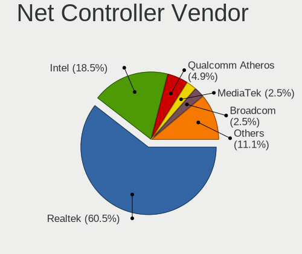

| Vendor                     | Desktops | Percent |
|----------------------------|----------|---------|
| Realtek Semiconductor      | 32       | 49.23%  |
| Intel                      | 16       | 24.62%  |
| Qualcomm Atheros           | 5        | 7.69%   |
| Xiaomi                     | 2        | 3.08%   |
| Ralink Technology          | 2        | 3.08%   |
| MediaTek                   | 2        | 3.08%   |
| ZTE WCDMA Technologies MSM | 1        | 1.54%   |
| TP-Link                    | 1        | 1.54%   |
| NetXen Incorporated        | 1        | 1.54%   |
| Marvell Technology Group   | 1        | 1.54%   |
| Huawei Technologies        | 1        | 1.54%   |
| Broadcom                   | 1        | 1.54%   |

Net Controller Model
--------------------

Controller models

| Model                                                                         | Desktops | Percent |
|-------------------------------------------------------------------------------|----------|---------|
| Realtek RTL8111/8168/8411 PCI Express Gigabit Ethernet Controller             | 24       | 33.8%   |
| Realtek RTL8125 2.5GbE Controller                                             | 4        | 5.63%   |
| Intel Wi-Fi 6 AX200                                                           | 3        | 4.23%   |
| Intel 82579LM Gigabit Network Connection (Lewisville)                         | 3        | 4.23%   |
| Xiaomi Mi/Redmi series (RNDIS)                                                | 2        | 2.82%   |
| Qualcomm Atheros AR8131 Gigabit Ethernet                                      | 2        | 2.82%   |
| Intel Ethernet Controller I225-V                                              | 2        | 2.82%   |
| ZTE WCDMA MSM DEMO Mobile Boardband                                           | 1        | 1.41%   |
| TP-Link 802.11ac WLAN Adapter                                                 | 1        | 1.41%   |
| Realtek RTL88x2bu [AC1200 Techkey]                                            | 1        | 1.41%   |
| Realtek RTL8821CE 802.11ac PCIe Wireless Network Adapter                      | 1        | 1.41%   |
| Realtek RTL8812AE 802.11ac PCIe Wireless Network Adapter                      | 1        | 1.41%   |
| Realtek RTL8188FTV 802.11b/g/n 1T1R 2.4G WLAN Adapter                         | 1        | 1.41%   |
| Realtek RTL8188EE Wireless Network Adapter                                    | 1        | 1.41%   |
| Realtek RTL810xE PCI Express Fast Ethernet controller                         | 1        | 1.41%   |
| Realtek RTL-8110SC/8169SC Gigabit Ethernet                                    | 1        | 1.41%   |
| Ralink RT2870/RT3070 Wireless Adapter                                         | 1        | 1.41%   |
| Ralink MT7601U Wireless Adapter                                               | 1        | 1.41%   |
| Qualcomm Atheros Killer E220x Gigabit Ethernet Controller                     | 1        | 1.41%   |
| Qualcomm Atheros AR9227 Wireless Network Adapter                              | 1        | 1.41%   |
| Qualcomm Atheros AR2413/AR2414 Wireless Network Adapter [AR5005G(S) 802.11bg] | 1        | 1.41%   |
| NetXen Incorporated NX3031 Multifunction 1/10-Gigabit Server Adapter          | 1        | 1.41%   |
| MediaTek MT7922 802.11ax PCI Express Wireless Network Adapter                 | 1        | 1.41%   |
| MediaTek MT7612U 802.11a/b/g/n/ac Wireless Adapter                            | 1        | 1.41%   |
| Marvell Group 88E8053 PCI-E Gigabit Ethernet Controller                       | 1        | 1.41%   |
| Intel Wireless 7265                                                           | 1        | 1.41%   |
| Intel Wi-Fi 6 AX210/AX211/AX411 160MHz                                        | 1        | 1.41%   |
| Intel I211 Gigabit Network Connection                                         | 1        | 1.41%   |
| Intel Ethernet Controller I226-V                                              | 1        | 1.41%   |
| Intel Ethernet Controller I219-V                                              | 1        | 1.41%   |
| Intel Ethernet Connection (5) I219-LM                                         | 1        | 1.41%   |
| Intel Ethernet Connection (2) I219-V                                          | 1        | 1.41%   |
| Intel Ethernet Connection (2) I219-LM                                         | 1        | 1.41%   |
| Intel Ethernet Connection (14) I219-LM                                        | 1        | 1.41%   |
| Intel 82567LM-3 Gigabit Network Connection                                    | 1        | 1.41%   |
| Intel 700 Series Chipset Family Wi-Fi                                         | 1        | 1.41%   |
| Huawei E353/E3131                                                             | 1        | 1.41%   |
| Broadcom NetXtreme BCM5715 Gigabit Ethernet                                   | 1        | 1.41%   |

Wireless Vendor
---------------

Wireless vendors

| Vendor                | Desktops | Percent |
|-----------------------|----------|---------|
| Intel                 | 6        | 33.33%  |
| Realtek Semiconductor | 5        | 27.78%  |
| Ralink Technology     | 2        | 11.11%  |
| Qualcomm Atheros      | 2        | 11.11%  |
| MediaTek              | 2        | 11.11%  |
| TP-Link               | 1        | 5.56%   |

Wireless Model
--------------

Wireless models

| Model                                                                         | Desktops | Percent |
|-------------------------------------------------------------------------------|----------|---------|
| Intel Wi-Fi 6 AX200                                                           | 3        | 16.67%  |
| TP-Link 802.11ac WLAN Adapter                                                 | 1        | 5.56%   |
| Realtek RTL88x2bu [AC1200 Techkey]                                            | 1        | 5.56%   |
| Realtek RTL8821CE 802.11ac PCIe Wireless Network Adapter                      | 1        | 5.56%   |
| Realtek RTL8812AE 802.11ac PCIe Wireless Network Adapter                      | 1        | 5.56%   |
| Realtek RTL8188FTV 802.11b/g/n 1T1R 2.4G WLAN Adapter                         | 1        | 5.56%   |
| Realtek RTL8188EE Wireless Network Adapter                                    | 1        | 5.56%   |
| Ralink RT2870/RT3070 Wireless Adapter                                         | 1        | 5.56%   |
| Ralink MT7601U Wireless Adapter                                               | 1        | 5.56%   |
| Qualcomm Atheros AR9227 Wireless Network Adapter                              | 1        | 5.56%   |
| Qualcomm Atheros AR2413/AR2414 Wireless Network Adapter [AR5005G(S) 802.11bg] | 1        | 5.56%   |
| MediaTek MT7922 802.11ax PCI Express Wireless Network Adapter                 | 1        | 5.56%   |
| MediaTek MT7612U 802.11a/b/g/n/ac Wireless Adapter                            | 1        | 5.56%   |
| Intel Wireless 7265                                                           | 1        | 5.56%   |
| Intel Wi-Fi 6 AX210/AX211/AX411 160MHz                                        | 1        | 5.56%   |
| Intel 700 Series Chipset Family Wi-Fi                                         | 1        | 5.56%   |

Ethernet Vendor
---------------

Ethernet vendors

| Vendor                     | Desktops | Percent |
|----------------------------|----------|---------|
| Realtek Semiconductor      | 30       | 56.6%   |
| Intel                      | 13       | 24.53%  |
| Qualcomm Atheros           | 3        | 5.66%   |
| Xiaomi                     | 2        | 3.77%   |
| ZTE WCDMA Technologies MSM | 1        | 1.89%   |
| NetXen Incorporated        | 1        | 1.89%   |
| Marvell Technology Group   | 1        | 1.89%   |
| Huawei Technologies        | 1        | 1.89%   |
| Broadcom                   | 1        | 1.89%   |

Ethernet Model
--------------

Ethernet models

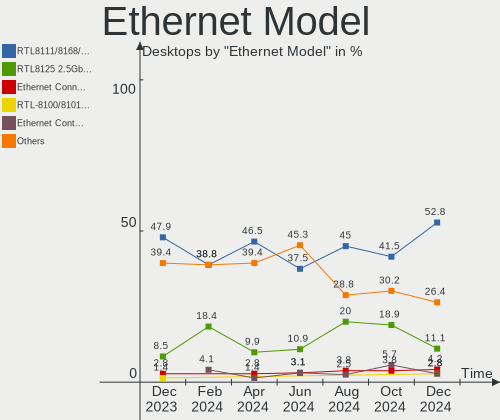

| Model                                                                | Desktops | Percent |
|----------------------------------------------------------------------|----------|---------|
| Realtek RTL8111/8168/8411 PCI Express Gigabit Ethernet Controller    | 24       | 45.28%  |
| Realtek RTL8125 2.5GbE Controller                                    | 4        | 7.55%   |
| Intel 82579LM Gigabit Network Connection (Lewisville)                | 3        | 5.66%   |
| Xiaomi Mi/Redmi series (RNDIS)                                       | 2        | 3.77%   |
| Qualcomm Atheros AR8131 Gigabit Ethernet                             | 2        | 3.77%   |
| Intel Ethernet Controller I225-V                                     | 2        | 3.77%   |
| ZTE WCDMA MSM DEMO Mobile Boardband                                  | 1        | 1.89%   |
| Realtek RTL810xE PCI Express Fast Ethernet controller                | 1        | 1.89%   |
| Realtek RTL-8110SC/8169SC Gigabit Ethernet                           | 1        | 1.89%   |
| Qualcomm Atheros Killer E220x Gigabit Ethernet Controller            | 1        | 1.89%   |
| NetXen Incorporated NX3031 Multifunction 1/10-Gigabit Server Adapter | 1        | 1.89%   |
| Marvell Group 88E8053 PCI-E Gigabit Ethernet Controller              | 1        | 1.89%   |
| Intel I211 Gigabit Network Connection                                | 1        | 1.89%   |
| Intel Ethernet Controller I226-V                                     | 1        | 1.89%   |
| Intel Ethernet Controller I219-V                                     | 1        | 1.89%   |
| Intel Ethernet Connection (5) I219-LM                                | 1        | 1.89%   |
| Intel Ethernet Connection (2) I219-V                                 | 1        | 1.89%   |
| Intel Ethernet Connection (2) I219-LM                                | 1        | 1.89%   |
| Intel Ethernet Connection (14) I219-LM                               | 1        | 1.89%   |
| Intel 82567LM-3 Gigabit Network Connection                           | 1        | 1.89%   |
| Huawei E353/E3131                                                    | 1        | 1.89%   |
| Broadcom NetXtreme BCM5715 Gigabit Ethernet                          | 1        | 1.89%   |

Net Controller Kind
-------------------

Ethernet, WiFi or modem

| Kind     | Desktops | Percent |
|----------|----------|---------|
| Ethernet | 46       | 73.02%  |
| WiFi     | 17       | 26.98%  |

Used Controller
---------------

Currently used network controller

| Kind     | Desktops | Percent |
|----------|----------|---------|
| Ethernet | 38       | 82.61%  |
| WiFi     | 8        | 17.39%  |

NICs
----

Total network controllers on board

| Total | Desktops | Percent |
|-------|----------|---------|
| 1     | 32       | 69.57%  |
| 2     | 12       | 26.09%  |
| 7     | 1        | 2.17%   |
| 5     | 1        | 2.17%   |

IPv6
----

IPv6 vs IPv4

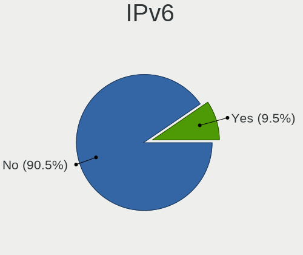

| Used | Desktops | Percent |
|------|----------|---------|
| No   | 42       | 91.3%   |
| Yes  | 4        | 8.7%    |

Bluetooth
---------

Bluetooth Vendor
----------------

Controller vendors

| Vendor                  | Desktops | Percent |
|-------------------------|----------|---------|
| Intel                   | 6        | 46.15%  |
| Realtek Semiconductor   | 3        | 23.08%  |
| Logitech                | 1        | 7.69%   |
| Edimax Technology       | 1        | 7.69%   |
| Cambridge Silicon Radio | 1        | 7.69%   |
| ASUSTek Computer        | 1        | 7.69%   |

Bluetooth Model
---------------

Controller models

| Model                                               | Desktops | Percent |
|-----------------------------------------------------|----------|---------|
| Realtek Bluetooth Radio                             | 3        | 23.08%  |
| Intel AX200 Bluetooth                               | 3        | 23.08%  |
| Logitech BT Mini-Receiver (HCI mode)                | 1        | 7.69%   |
| Intel Bluetooth wireless interface                  | 1        | 7.69%   |
| Intel Bluetooth Device                              | 1        | 7.69%   |
| Intel AX210 Bluetooth                               | 1        | 7.69%   |
| Edimax Bluetooth Adapter                            | 1        | 7.69%   |
| Cambridge Silicon Radio Bluetooth Dongle (HCI mode) | 1        | 7.69%   |
| ASUS ASUS USB-BT500                                 | 1        | 7.69%   |

Sound
-----

Sound Vendor
------------

Sound card vendors

| Vendor                 | Desktops | Percent |
|------------------------|----------|---------|
| AMD                    | 26       | 30.23%  |
| Intel                  | 25       | 29.07%  |
| Nvidia                 | 19       | 22.09%  |
| C-Media Electronics    | 4        | 4.65%   |
| Creative Technology    | 2        | 2.33%   |
| AOKEO                  | 2        | 2.33%   |
| MediaTek               | 1        | 1.16%   |
| Logitech               | 1        | 1.16%   |
| Generalplus Technology | 1        | 1.16%   |
| FIFINE Microphones     | 1        | 1.16%   |
| Creative Labs          | 1        | 1.16%   |
| Corsair                | 1        | 1.16%   |
| Comtrue                | 1        | 1.16%   |
| ASUSTek Computer       | 1        | 1.16%   |

Sound Model
-----------

Sound card models

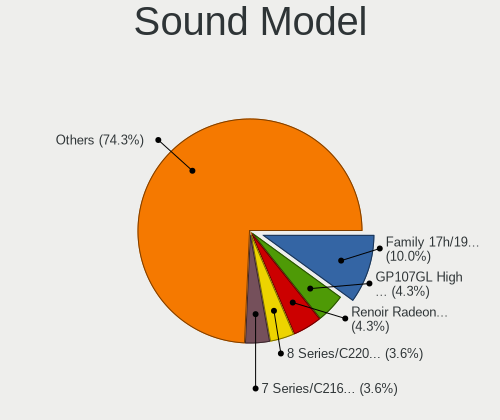

| Model                                                                      | Desktops | Percent |
|----------------------------------------------------------------------------|----------|---------|
| AMD Family 17h/19h HD Audio Controller                                     | 6        | 6%      |
| AMD Renoir Radeon High Definition Audio Controller                         | 5        | 5%      |
| AMD Starship/Matisse HD Audio Controller                                   | 4        | 4%      |
| AMD SBx00 Azalia (Intel HDA)                                               | 4        | 4%      |
| Intel NM10/ICH7 Family High Definition Audio Controller                    | 3        | 3%      |
| Intel 700 Series Chipset Family Precise Touch and Stylus Port #1           | 3        | 3%      |
| AMD Family 17h (Models 00h-0fh) HD Audio Controller                        | 3        | 3%      |
| AMD Ellesmere HDMI Audio [Radeon RX 470/480 / 570/580/590]                 | 3        | 3%      |
| Nvidia GP108 High Definition Audio Controller                              | 2        | 2%      |
| Nvidia GP107GL High Definition Audio Controller                            | 2        | 2%      |
| Nvidia GP104 High Definition Audio Controller                              | 2        | 2%      |
| Nvidia GK208 HDMI/DP Audio Controller                                      | 2        | 2%      |
| Nvidia GA104 High Definition Audio Controller                              | 2        | 2%      |
| Intel Tiger Lake-H HD Audio Controller                                     | 2        | 2%      |
| Intel C600/X79 series chipset High Definition Audio Controller             | 2        | 2%      |
| Intel 82801H (ICH8 Family) HD Audio Controller                             | 2        | 2%      |
| Intel 8 Series/C220 Series Chipset High Definition Audio Controller        | 2        | 2%      |
| Intel 6 Series/C200 Series Chipset Family High Definition Audio Controller | 2        | 2%      |
| Intel 200 Series PCH HD Audio                                              | 2        | 2%      |
| Intel 100 Series/C230 Series Chipset Family HD Audio Controller            | 2        | 2%      |
| C-Media Electronics CMI8788 [Oxygen HD Audio]                              | 2        | 2%      |
| AOKEO LCS_USB_Audio                                                        | 2        | 2%      |
| AMD Navi 31 HDMI/DP Audio                                                  | 2        | 2%      |
| AMD FCH Azalia Controller                                                  | 2        | 2%      |
| AMD Cedar HDMI Audio [Radeon HD 5400/6300/7300 Series]                     | 2        | 2%      |
| Nvidia TU116 High Definition Audio Controller                              | 1        | 1%      |
| Nvidia High Definition Audio Controller                                    | 1        | 1%      |
| Nvidia GP106 High Definition Audio Controller                              | 1        | 1%      |
| Nvidia GM206 High Definition Audio Controller                              | 1        | 1%      |
| Nvidia GF110 High Definition Audio Controller                              | 1        | 1%      |
| Nvidia GF108 High Definition Audio Controller                              | 1        | 1%      |
| Nvidia GA106 High Definition Audio Controller                              | 1        | 1%      |
| Nvidia GA102 High Definition Audio Controller                              | 1        | 1%      |
| Nvidia Audio device                                                        | 1        | 1%      |
| MediaTek RMX3085                                                           | 1        | 1%      |
| Logitech G432 Gaming Headset                                               | 1        | 1%      |
| Intel Xeon E3-1200 v3/4th Gen Core Processor HD Audio Controller           | 1        | 1%      |
| Intel Cannon Lake PCH cAVS                                                 | 1        | 1%      |
| Intel C610/X99 series chipset HD Audio Controller                          | 1        | 1%      |
| Intel 9 Series Chipset Family HD Audio Controller                          | 1        | 1%      |

Memory
------

Memory Vendor
-------------

Memory module vendors

| Vendor              | Desktops | Percent |
|---------------------|----------|---------|
| Unknown             | 5        | 17.24%  |
| Kingston            | 5        | 17.24%  |
| Samsung Electronics | 3        | 10.34%  |
| GOODRAM             | 3        | 10.34%  |
| Patriot             | 2        | 6.9%    |
| Crucial             | 2        | 6.9%    |
| A-DATA Technology   | 2        | 6.9%    |
| SK hynix            | 1        | 3.45%   |
| Ramaxel Technology  | 1        | 3.45%   |
| Micron Technology   | 1        | 3.45%   |
| Lexar Co Limited    | 1        | 3.45%   |
| G.Skill             | 1        | 3.45%   |
| Elpida              | 1        | 3.45%   |
| Unknown             | 1        | 3.45%   |

Memory Model
------------

Memory module models

| Model                                                         | Desktops | Percent |
|---------------------------------------------------------------|----------|---------|
| Unknown RAM Module 8GB DIMM 667MT/s                           | 1        | 2.94%   |
| Unknown RAM Module 512MB DIMM DDR                             | 1        | 2.94%   |
| Unknown RAM Module 2GB DIMM DDR2 667MT/s                      | 1        | 2.94%   |
| Unknown RAM Module 2GB DIMM 800MT/s                           | 1        | 2.94%   |
| Unknown RAM Module 2048MB DIMM SDRAM                          | 1        | 2.94%   |
| Unknown RAM Module 1GB DIMM DDR                               | 1        | 2.94%   |
| SK hynix RAM HMT325U6BFR8C-H9 2GB DIMM DDR3 1333MT/s          | 1        | 2.94%   |
| SK hynix RAM HMT125U6BFR8C-H9 2GB DIMM DDR3 1333MT/s          | 1        | 2.94%   |
| Samsung RAM M378B5773CH0-CH9 2GB DIMM DDR3 1867MT/s           | 1        | 2.94%   |
| Samsung RAM M378B5673FH0-CF8 2GB DIMM DDR3 1067MT/s           | 1        | 2.94%   |
| Samsung RAM 2133 CL11 Series 4GB DIMM DDR3 1600MT/s           | 1        | 2.94%   |
| Ramaxel RAM RMUA5090KB78HAF2133 8GB DIMM DDR4 2400MT/s        | 1        | 2.94%   |
| Patriot RAM 3600 C18 Series 8GB DIMM DDR4 3600MT/s            | 1        | 2.94%   |
| Patriot RAM 1600 CL9 Series 8GB DIMM DDR3 1600MT/s            | 1        | 2.94%   |
| Micron RAM 36JSF2G72PZ-1G9N1 16GB DIMM DDR3                   | 1        | 2.94%   |
| Micron RAM 36JSF2G72PZ-1G9E1 16GB DIMM DDR3 1866MT/s          | 1        | 2.94%   |
| Lexar Co Limited RAM LD4BU016G-3600WG 16GB DIMM DDR4 3200MT/s | 1        | 2.94%   |
| Kingston RAM KP223C-ELD 2048MB DIMM DDR3 1600MT/s             | 1        | 2.94%   |
| Kingston RAM KHX1866C10D3/8G 8GB DIMM DDR3 2133MT/s           | 1        | 2.94%   |
| Kingston RAM KHX1600C10D3/8GX 8192MB DIMM DDR3 1600MT/s       | 1        | 2.94%   |
| Kingston RAM KHX1600C10D3/8G 8GB DIMM DDR3 1648MT/s           | 1        | 2.94%   |
| Kingston RAM KF564C32-16 16GB DIMM DDR5 6400MT/s              | 1        | 2.94%   |
| Kingston RAM KF3600C16D4/16GX 16GB DIMM DDR4 3600MT/s         | 1        | 2.94%   |
| Kingston RAM KF3200C16D4/8GX 8GB DIMM DDR4 3600MT/s           | 1        | 2.94%   |
| GOODRAM RAM W-MEM1600D3D88G 8GB DIMM DDR3 1400MT/s            | 1        | 2.94%   |
| GOODRAM RAM IRX3200D464L16SA/8G 8GB DIMM DDR4 3600MT/s        | 1        | 2.94%   |
| GOODRAM RAM IRX3000D464L16S/8G 8GB DIMM DDR4 3333MT/s         | 1        | 2.94%   |
| G.Skill RAM F4-4400C19-16GVK 16GB DIMM DDR4 4000MT/s          | 1        | 2.94%   |
| Elpida RAM EBJ20UF8BCF0-DJ-F 2GB DIMM DDR3 1333MT/s           | 1        | 2.94%   |
| Crucial RAM CT8G4DFD824A.C16FHP 8GB DIMM DDR4 2400MT/s        | 1        | 2.94%   |
| Crucial RAM BLS8G4D30BESBK.8FD 8GB DIMM DDR4 3000MT/s         | 1        | 2.94%   |
| A-DATA RAM Module 16GB SODIMM DDR4 3200MT/s                   | 1        | 2.94%   |
| A-DATA RAM DDR4 3200 8GB DIMM DDR4 3600MT/s                   | 1        | 2.94%   |
| Unknown                                                       | 1        | 2.94%   |

Memory Kind
-----------

Memory module kinds

| Kind    | Desktops | Percent |
|---------|----------|---------|
| DDR4    | 12       | 44.44%  |
| DDR3    | 7        | 25.93%  |
| SDRAM   | 3        | 11.11%  |
| Unknown | 2        | 7.41%   |
| DDR5    | 1        | 3.7%    |
| DDR2    | 1        | 3.7%    |
| DDR     | 1        | 3.7%    |

Memory Form Factor
------------------

Physical design of the memory module

| Name   | Desktops | Percent |
|--------|----------|---------|
| DIMM   | 24       | 96%     |
| SODIMM | 1        | 4%      |

Memory Size
-----------

Memory module size

| Size  | Desktops | Percent |
|-------|----------|---------|
| 8192  | 10       | 38.46%  |
| 16384 | 6        | 23.08%  |
| 2048  | 5        | 19.23%  |
| 32768 | 2        | 7.69%   |
| 4096  | 1        | 3.85%   |
| 1024  | 1        | 3.85%   |
| 512   | 1        | 3.85%   |

Memory Speed
------------

Memory module speed

| Speed   | Desktops | Percent |
|---------|----------|---------|
| 3600    | 5        | 16.67%  |
| 1600    | 4        | 13.33%  |
| 4000    | 2        | 6.67%   |
| 3200    | 2        | 6.67%   |
| 1867    | 2        | 6.67%   |
| 1333    | 2        | 6.67%   |
| 667     | 2        | 6.67%   |
| Unknown | 2        | 6.67%   |
| 6400    | 1        | 3.33%   |
| 3333    | 1        | 3.33%   |
| 3000    | 1        | 3.33%   |
| 2400    | 1        | 3.33%   |
| 2133    | 1        | 3.33%   |
| 1866    | 1        | 3.33%   |
| 1400    | 1        | 3.33%   |
| 1067    | 1        | 3.33%   |
| 800     | 1        | 3.33%   |

Printers & scanners
-------------------

Printer Vendor
--------------

Printer device vendors

| Vendor             | Desktops | Percent |
|--------------------|----------|---------|
| Hewlett-Packard    | 1        | 33.33%  |
| Canon              | 1        | 33.33%  |
| Brother Industries | 1        | 33.33%  |

Printer Model
-------------

Printer device models

| Model                     | Desktops | Percent |
|---------------------------|----------|---------|
| HP LaserJet M14-M17       | 1        | 33.33%  |
| Canon TR4600 series       | 1        | 33.33%  |
| Brother HL-L2350DW series | 1        | 33.33%  |

Scanner Vendor
--------------

Scanner device vendors

Zero info for selected period =(

Scanner Model
-------------

Scanner device models

Zero info for selected period =(

Camera
------

Camera Vendor
-------------

Camera device vendors

| Vendor                        | Desktops | Percent |
|-------------------------------|----------|---------|
| Jieli Technology              | 2        | 33.33%  |
| Sunplus Innovation Technology | 1        | 16.67%  |
| Samsung Electronics           | 1        | 16.67%  |
| Microsoft                     | 1        | 16.67%  |
| Microdia                      | 1        | 16.67%  |

Camera Model
------------

Camera device models

| Model                                   | Desktops | Percent |
|-----------------------------------------|----------|---------|
| Jieli USB PHY 2.0                       | 2        | 33.33%  |
| Sunplus ProXtend                        | 1        | 16.67%  |
| Samsung Galaxy series, misc. (MTP mode) | 1        | 16.67%  |
| Microsoft LifeCam Cinema                | 1        | 16.67%  |
| Microdia USB 2.0 Camera                 | 1        | 16.67%  |

Security
--------

Fingerprint Vendor
------------------

Fingerprint sensor vendors

Zero info for selected period =(

Fingerprint Model
-----------------

Fingerprint sensor models

Zero info for selected period =(

Chipcard Vendor
---------------

Chipcard module vendors

| Vendor           | Desktops | Percent |
|------------------|----------|---------|
| SCM Microsystems | 1        | 100%    |

Chipcard Model
--------------

Chipcard module models

| Model                                    | Desktops | Percent |
|------------------------------------------|----------|---------|
| SCM Microsystems SCR333 SmartCard Reader | 1        | 100%    |

Unsupported
-----------

Unsupported Devices
-------------------

Total unsupported devices on board

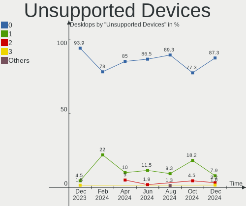

| Total | Desktops | Percent |
|-------|----------|---------|
| 0     | 35       | 76.09%  |
| 1     | 9        | 19.57%  |
| 5     | 1        | 2.17%   |
| 2     | 1        | 2.17%   |

Unsupported Device Types
------------------------

Types of unsupported devices

| Type                     | Desktops | Percent |
|--------------------------|----------|---------|
| Graphics card            | 6        | 37.5%   |
| Net/wireless             | 3        | 18.75%  |
| Unassigned class         | 1        | 6.25%   |
| Storage/nvme             | 1        | 6.25%   |
| Storage/ide              | 1        | 6.25%   |
| Multimedia controller    | 1        | 6.25%   |
| Firewire controller      | 1        | 6.25%   |
| Communication controller | 1        | 6.25%   |
| Chipcard                 | 1        | 6.25%   |

