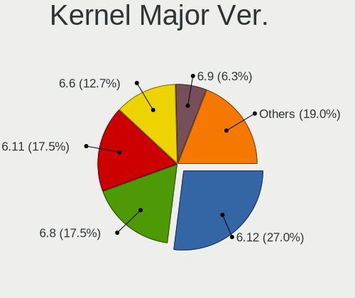
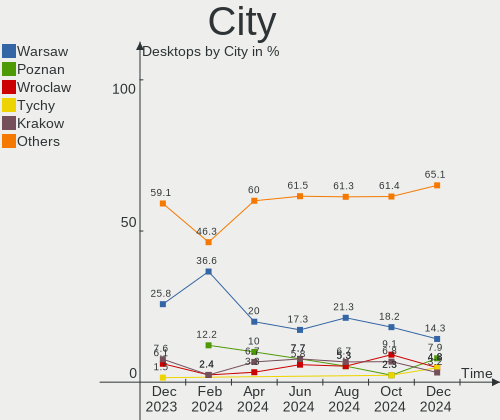
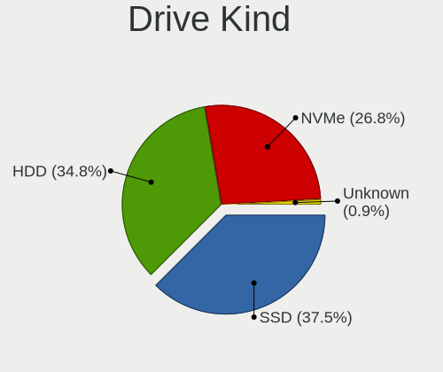
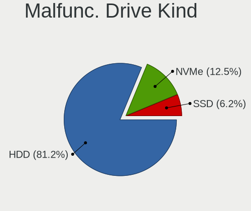
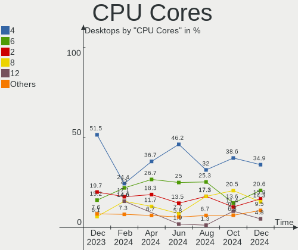
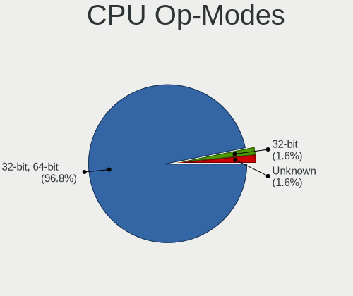
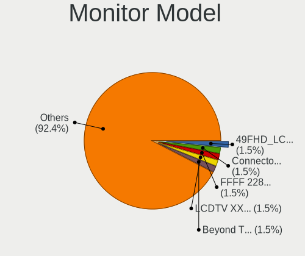
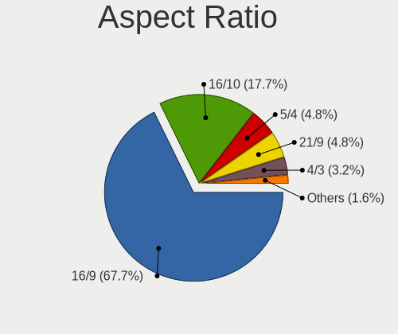
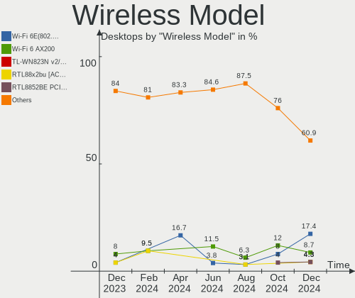

Linux in Poland - Hardware Trends (Desktops)
--------------------------------------------

A project to identify most popular hardware characteristics and track their change
over time based on data collected by Linux users at https://Linux-Hardware.org.

Anyone can contribute to this report by the [hw-probe](https://github.com/linuxhw/hw-probe) tool:

    sudo -E hw-probe -all -upload

Period: Aug, 2023.

Contents
--------

* [ System ](#system)
  - [ OS                       ](#os)
  - [ OS Family                ](#os-family)
  - [ Kernel                   ](#kernel)
  - [ Kernel Family            ](#kernel-family)
  - [ Kernel Major Ver.        ](#kernel-major-ver)
  - [ Arch                     ](#arch)
  - [ DE                       ](#de)
  - [ Display Server           ](#display-server)
  - [ Display Manager          ](#display-manager)
  - [ OS Lang                  ](#os-lang)
  - [ Boot Mode                ](#boot-mode)
  - [ Filesystem               ](#filesystem)
  - [ Part. scheme             ](#part-scheme)
  - [ Dual Boot with Linux/BSD ](#dual-boot-with-linuxbsd)
  - [ Dual Boot (Win)          ](#dual-boot-win)

* [ Board ](#board)
  - [ Vendor                   ](#vendor)
  - [ Model                    ](#model)
  - [ Model Family             ](#model-family)
  - [ MFG Year                 ](#mfg-year)
  - [ Form Factor              ](#form-factor)
  - [ Secure Boot              ](#secure-boot)
  - [ Coreboot                 ](#coreboot)
  - [ RAM Size                 ](#ram-size)
  - [ RAM Used                 ](#ram-used)
  - [ Total Drives             ](#total-drives)
  - [ Has CD-ROM               ](#has-cd-rom)
  - [ Has Ethernet             ](#has-ethernet)
  - [ Has WiFi                 ](#has-wifi)
  - [ Has Bluetooth            ](#has-bluetooth)

* [ Location ](#location)
  - [ Country                  ](#country)
  - [ City                     ](#city)

* [ Drives ](#drives)
  - [ Drive Vendor             ](#drive-vendor)
  - [ Drive Model              ](#drive-model)
  - [ HDD Vendor               ](#hdd-vendor)
  - [ SSD Vendor               ](#ssd-vendor)
  - [ Drive Kind               ](#drive-kind)
  - [ Drive Connector          ](#drive-connector)
  - [ Drive Size               ](#drive-size)
  - [ Space Total              ](#space-total)
  - [ Space Used               ](#space-used)
  - [ Malfunc. Drives          ](#malfunc-drives)
  - [ Malfunc. Drive Vendor    ](#malfunc-drive-vendor)
  - [ Malfunc. HDD Vendor      ](#malfunc-hdd-vendor)
  - [ Malfunc. Drive Kind      ](#malfunc-drive-kind)
  - [ Failed Drives            ](#failed-drives)
  - [ Failed Drive Vendor      ](#failed-drive-vendor)
  - [ Drive Status             ](#drive-status)

* [ Storage controller ](#storage-controller)
  - [ Storage Vendor           ](#storage-vendor)
  - [ Storage Model            ](#storage-model)
  - [ Storage Kind             ](#storage-kind)

* [ Processor ](#processor)
  - [ CPU Vendor               ](#cpu-vendor)
  - [ CPU Model                ](#cpu-model)
  - [ CPU Model Family         ](#cpu-model-family)
  - [ CPU Cores                ](#cpu-cores)
  - [ CPU Sockets              ](#cpu-sockets)
  - [ CPU Threads              ](#cpu-threads)
  - [ CPU Op-Modes             ](#cpu-op-modes)
  - [ CPU Microcode            ](#cpu-microcode)
  - [ CPU Microarch            ](#cpu-microarch)

* [ Graphics ](#graphics)
  - [ GPU Vendor               ](#gpu-vendor)
  - [ GPU Model                ](#gpu-model)
  - [ GPU Combo                ](#gpu-combo)
  - [ GPU Driver               ](#gpu-driver)
  - [ GPU Memory               ](#gpu-memory)

* [ Monitor ](#monitor)
  - [ Monitor Vendor           ](#monitor-vendor)
  - [ Monitor Model            ](#monitor-model)
  - [ Monitor Resolution       ](#monitor-resolution)
  - [ Monitor Diagonal         ](#monitor-diagonal)
  - [ Monitor Width            ](#monitor-width)
  - [ Aspect Ratio             ](#aspect-ratio)
  - [ Monitor Area             ](#monitor-area)
  - [ Pixel Density            ](#pixel-density)
  - [ Multiple Monitors        ](#multiple-monitors)

* [ Network ](#network)
  - [ Net Controller Vendor    ](#net-controller-vendor)
  - [ Net Controller Model     ](#net-controller-model)
  - [ Wireless Vendor          ](#wireless-vendor)
  - [ Wireless Model           ](#wireless-model)
  - [ Ethernet Vendor          ](#ethernet-vendor)
  - [ Ethernet Model           ](#ethernet-model)
  - [ Net Controller Kind      ](#net-controller-kind)
  - [ Used Controller          ](#used-controller)
  - [ NICs                     ](#nics)
  - [ IPv6                     ](#ipv6)

* [ Bluetooth ](#bluetooth)
  - [ Bluetooth Vendor         ](#bluetooth-vendor)
  - [ Bluetooth Model          ](#bluetooth-model)

* [ Sound ](#sound)
  - [ Sound Vendor             ](#sound-vendor)
  - [ Sound Model              ](#sound-model)

* [ Memory ](#memory)
  - [ Memory Vendor            ](#memory-vendor)
  - [ Memory Model             ](#memory-model)
  - [ Memory Kind              ](#memory-kind)
  - [ Memory Form Factor       ](#memory-form-factor)
  - [ Memory Size              ](#memory-size)
  - [ Memory Speed             ](#memory-speed)

* [ Printers & scanners ](#printers--scanners)
  - [ Printer Vendor           ](#printer-vendor)
  - [ Printer Model            ](#printer-model)
  - [ Scanner Vendor           ](#scanner-vendor)
  - [ Scanner Model            ](#scanner-model)

* [ Camera ](#camera)
  - [ Camera Vendor            ](#camera-vendor)
  - [ Camera Model             ](#camera-model)

* [ Security ](#security)
  - [ Fingerprint Vendor       ](#fingerprint-vendor)
  - [ Fingerprint Model        ](#fingerprint-model)
  - [ Chipcard Vendor          ](#chipcard-vendor)
  - [ Chipcard Model           ](#chipcard-model)

* [ Unsupported ](#unsupported)
  - [ Unsupported Devices      ](#unsupported-devices)
  - [ Unsupported Device Types ](#unsupported-device-types)

System
------

OS
--

Installed operating systems

| Name                         | Desktops | Percent |
|------------------------------|----------|---------|
| OpenMandriva 23.08           | 8        | 20.51%  |
| Ubuntu 22.04                 | 4        | 10.26%  |
| Fedora 38                    | 3        | 7.69%   |
| Manjaro                      | 2        | 5.13%   |
| KDE neon 22.04               | 2        | 5.13%   |
| Gentoo 2.14                  | 2        | 5.13%   |
| Gentoo 2.13                  | 2        | 5.13%   |
| Debian 12                    | 2        | 5.13%   |
| Xubuntu 22.04                | 1        | 2.56%   |
| Xero Rolling                 | 1        | 2.56%   |
| Ubuntu MATE 22.04            | 1        | 2.56%   |
| Pop!_OS 22.04                | 1        | 2.56%   |
| openSUSE Tumbleweed-XXXXXXXX | 1        | 2.56%   |
| OpenMandriva 23.07           | 1        | 2.56%   |
| OpenMandriva 23.03           | 1        | 2.56%   |
| OpenMandriva 23.01           | 1        | 2.56%   |
| Manjaro 23.0.0               | 1        | 2.56%   |
| Linux Mint 21.2              | 1        | 2.56%   |
| Linux Mint 20.3              | 1        | 2.56%   |
| Kubuntu 23.04                | 1        | 2.56%   |
| ArcoLinux Rolling            | 1        | 2.56%   |
| Arch Rolling                 | 1        | 2.56%   |

OS Family
---------

OS without a version

| Name         | Desktops | Percent |
|--------------|----------|---------|
| OpenMandriva | 11       | 28.21%  |
| Ubuntu       | 4        | 10.26%  |
| Gentoo       | 4        | 10.26%  |
| Manjaro      | 3        | 7.69%   |
| Fedora       | 3        | 7.69%   |
| Linux Mint   | 2        | 5.13%   |
| KDE neon     | 2        | 5.13%   |
| Debian       | 2        | 5.13%   |
| Xubuntu      | 1        | 2.56%   |
| Xero         | 1        | 2.56%   |
| Ubuntu MATE  | 1        | 2.56%   |
| Pop!_OS      | 1        | 2.56%   |
| openSUSE     | 1        | 2.56%   |
| Kubuntu      | 1        | 2.56%   |
| ArcoLinux    | 1        | 2.56%   |
| Arch         | 1        | 2.56%   |

Kernel
------

Version of the Linux kernel

| Version                      | Desktops | Percent |
|------------------------------|----------|---------|
| 6.4.11-desktop-1omv2390      | 5        | 12.82%  |
| 6.4.8-desktop-2omv2390       | 4        | 10.26%  |
| 6.1.41-gentoo                | 3        | 7.69%   |
| 6.4.9-arch1-1                | 2        | 5.13%   |
| 6.2.0-26-generic             | 2        | 5.13%   |
| 6.1.41-1-MANJARO             | 2        | 5.13%   |
| 5.19.0-50-generic            | 2        | 5.13%   |
| 5.15.0-78-generic            | 2        | 5.13%   |
| 6.4.7-200.fc38.x86_64        | 1        | 2.56%   |
| 6.4.6-1-default              | 1        | 2.56%   |
| 6.3.12-x64v1-xanmod1         | 1        | 2.56%   |
| 6.2.6-desktop-1omv2390       | 1        | 2.56%   |
| 6.2.6-76060206-generic       | 1        | 2.56%   |
| 6.2.16-3-pve                 | 1        | 2.56%   |
| 6.2.15-703.inttf.fc38.x86_64 | 1        | 2.56%   |
| 6.2.15-300.fc38.x86_64       | 1        | 2.56%   |
| 6.2.0-31-generic             | 1        | 2.56%   |
| 6.2.0-27-generic             | 1        | 2.56%   |
| 6.1.4-desktop-1omv2301       | 1        | 2.56%   |
| 6.1.39-3-lts                 | 1        | 2.56%   |
| 6.1.38-gentoo-x86_64         | 1        | 2.56%   |
| 6.1.30-1-MANJARO             | 1        | 2.56%   |
| 6.1.0-11-amd64               | 1        | 2.56%   |
| 5.4.0-156-generic            | 1        | 2.56%   |
| 5.19.0-32-generic            | 1        | 2.56%   |

Kernel Family
-------------

Linux kernel without a distro release

| Version | Desktops | Percent |
|---------|----------|---------|
| 6.4.11  | 5        | 12.82%  |
| 6.1.41  | 5        | 12.82%  |
| 6.4.8   | 4        | 10.26%  |
| 6.2.0   | 4        | 10.26%  |
| 5.19.0  | 3        | 7.69%   |
| 6.4.9   | 2        | 5.13%   |
| 6.2.6   | 2        | 5.13%   |
| 6.2.15  | 2        | 5.13%   |
| 5.15.0  | 2        | 5.13%   |
| 6.4.7   | 1        | 2.56%   |
| 6.4.6   | 1        | 2.56%   |
| 6.3.12  | 1        | 2.56%   |
| 6.2.16  | 1        | 2.56%   |
| 6.1.4   | 1        | 2.56%   |
| 6.1.39  | 1        | 2.56%   |
| 6.1.38  | 1        | 2.56%   |
| 6.1.30  | 1        | 2.56%   |
| 6.1.0   | 1        | 2.56%   |
| 5.4.0   | 1        | 2.56%   |

Kernel Major Ver.
-----------------

Linux kernel major version

| Version | Desktops | Percent |
|---------|----------|---------|
| 6.4     | 13       | 33.33%  |
| 6.1     | 10       | 25.64%  |
| 6.2     | 9        | 23.08%  |
| 5.19    | 3        | 7.69%   |
| 5.15    | 2        | 5.13%   |
| 6.3     | 1        | 2.56%   |
| 5.4     | 1        | 2.56%   |

Arch
----

OS architecture (x86_64, i586, etc.)

| Name   | Desktops | Percent |
|--------|----------|---------|
| x86_64 | 39       | 100%    |

DE
--

Desktop Environment

| Name       | Desktops | Percent |
|------------|----------|---------|
| KDE5       | 14       | 35.9%   |
| GNOME      | 13       | 33.33%  |
| X-Cinnamon | 3        | 7.69%   |
| XFCE       | 2        | 5.13%   |
| MATE       | 2        | 5.13%   |
| LXQt       | 2        | 5.13%   |
| Unknown    | 2        | 5.13%   |
| i3         | 1        | 2.56%   |

Display Server
--------------

X11 or Wayland

| Name    | Desktops | Percent |
|---------|----------|---------|
| X11     | 24       | 61.54%  |
| Wayland | 13       | 33.33%  |
| Tty     | 2        | 5.13%   |

Display Manager
---------------

SDDM, LightDM, etc.

| Name    | Desktops | Percent |
|---------|----------|---------|
| SDDM    | 11       | 28.21%  |
| Unknown | 10       | 25.64%  |
| LightDM | 8        | 20.51%  |
| GDM3    | 6        | 15.38%  |
| GDM     | 4        | 10.26%  |

OS Lang
-------

Language

| Lang       | Desktops | Percent |
|------------|----------|---------|
| pl_PL      | 22       | 56.41%  |
| en_US      | 14       | 35.9%   |
| pl_PL.UTF8 | 1        | 2.56%   |
| en_DK      | 1        | 2.56%   |
| C          | 1        | 2.56%   |

Boot Mode
---------

EFI or BIOS

| Mode | Desktops | Percent |
|------|----------|---------|
| BIOS | 22       | 56.41%  |
| EFI  | 17       | 43.59%  |

Filesystem
----------

Type of filesystem

| Type    | Desktops | Percent |
|---------|----------|---------|
| Ext4    | 23       | 58.97%  |
| Overlay | 5        | 12.82%  |
| Tmpfs   | 4        | 10.26%  |
| Btrfs   | 4        | 10.26%  |
| F2fs    | 3        | 7.69%   |

Part. scheme
------------

Scheme of partitioning

| Type    | Desktops | Percent |
|---------|----------|---------|
| GPT     | 23       | 58.97%  |
| Unknown | 9        | 23.08%  |
| MBR     | 7        | 17.95%  |

Dual Boot with Linux/BSD
------------------------

Hosting more than one Linux/BSD

| Dual boot | Desktops | Percent |
|-----------|----------|---------|
| No        | 27       | 69.23%  |
| Yes       | 12       | 30.77%  |

Dual Boot (Win)
---------------

Hosting Linux and Windows

| Dual boot | Desktops | Percent |
|-----------|----------|---------|
| No        | 29       | 74.36%  |
| Yes       | 10       | 25.64%  |

Board
-----

Vendor
------

Motherboard manufacturer

| Name                | Desktops | Percent |
|---------------------|----------|---------|
| ASUSTek Computer    | 9        | 23.08%  |
| Gigabyte Technology | 8        | 20.51%  |
| MSI                 | 7        | 17.95%  |
| Hewlett-Packard     | 4        | 10.26%  |
| ASRock              | 3        | 7.69%   |
| Lenovo              | 2        | 5.13%   |
| Fujitsu             | 2        | 5.13%   |
| Essentiel B         | 1        | 2.56%   |
| ECS                 | 1        | 2.56%   |
| Dell                | 1        | 2.56%   |
| Unknown             | 1        | 2.56%   |

Model
-----

Motherboard model

| Name                          | Desktops | Percent |
|-------------------------------|----------|---------|
| ASUS M3A78-CM                 | 2        | 5.13%   |
| MSI MS-7E12                   | 1        | 2.56%   |
| MSI MS-7D46                   | 1        | 2.56%   |
| MSI MS-7C37                   | 1        | 2.56%   |
| MSI MS-7B85                   | 1        | 2.56%   |
| MSI MS-7B29                   | 1        | 2.56%   |
| MSI MS-7A38                   | 1        | 2.56%   |
| MSI MS-7974                   | 1        | 2.56%   |
| Lenovo V530S-07ICB 10TX0010PB | 1        | 2.56%   |
| Lenovo S510 10KY000NPB        | 1        | 2.56%   |
| HP Z400 Workstation           | 1        | 2.56%   |
| HP EliteDesk 800 G2 SFF       | 1        | 2.56%   |
| HP EliteDesk 705 G4 SFF       | 1        | 2.56%   |
| HP Compaq 6005 Pro SFF PC     | 1        | 2.56%   |
| Gigabyte Z97M-DS3H            | 1        | 2.56%   |
| Gigabyte Z170N-WIFI           | 1        | 2.56%   |
| Gigabyte P67A-UD7-B3          | 1        | 2.56%   |
| Gigabyte GA-MA770T-UD3P       | 1        | 2.56%   |
| Gigabyte G31M-ES2L            | 1        | 2.56%   |
| Gigabyte B365M D3H            | 1        | 2.56%   |
| Gigabyte AB350-Gaming         | 1        | 2.56%   |
| Gigabyte 970A-UD3P            | 1        | 2.56%   |
| Fujitsu FUTRO S940            | 1        | 2.56%   |
| Fujitsu ESPRIMO E920          | 1        | 2.56%   |
| Essentiel B DarkDESK series   | 1        | 2.56%   |
| ECS H61H2-M6                  | 1        | 2.56%   |
| Dell OptiPlex 7040            | 1        | 2.56%   |
| ASUS TUF Gaming B450-PLUS II  | 1        | 2.56%   |
| ASUS ROG STRIX B550-F GAMING  | 1        | 2.56%   |
| ASUS ROG STRIX B550-A GAMING  | 1        | 2.56%   |
| ASUS PRIME Z270-A             | 1        | 2.56%   |
| ASUS EX-A320M-GAMING          | 1        | 2.56%   |
| ASUS Crosshair V Formula      | 1        | 2.56%   |
| ASUS All Series               | 1        | 2.56%   |
| ASRock B460 Phantom Gaming 4  | 1        | 2.56%   |
| ASRock B450M-HDV R4.0         | 1        | 2.56%   |
| ASRock A320M-DVS R4.0         | 1        | 2.56%   |
| Unknown                       | 1        | 2.56%   |

Model Family
------------

Motherboard model prefix

| Name                    | Desktops | Percent |
|-------------------------|----------|---------|
| HP EliteDesk            | 2        | 5.13%   |
| ASUS ROG                | 2        | 5.13%   |
| ASUS M3A78-CM           | 2        | 5.13%   |
| MSI MS-7E12             | 1        | 2.56%   |
| MSI MS-7D46             | 1        | 2.56%   |
| MSI MS-7C37             | 1        | 2.56%   |
| MSI MS-7B85             | 1        | 2.56%   |
| MSI MS-7B29             | 1        | 2.56%   |
| MSI MS-7A38             | 1        | 2.56%   |
| MSI MS-7974             | 1        | 2.56%   |
| Lenovo V530S-07ICB      | 1        | 2.56%   |
| Lenovo S510             | 1        | 2.56%   |
| HP Z400                 | 1        | 2.56%   |
| HP Compaq               | 1        | 2.56%   |
| Gigabyte Z97M-DS3H      | 1        | 2.56%   |
| Gigabyte Z170N-WIFI     | 1        | 2.56%   |
| Gigabyte P67A-UD7-B3    | 1        | 2.56%   |
| Gigabyte GA-MA770T-UD3P | 1        | 2.56%   |
| Gigabyte G31M-ES2L      | 1        | 2.56%   |
| Gigabyte B365M          | 1        | 2.56%   |
| Gigabyte AB350-Gaming   | 1        | 2.56%   |
| Gigabyte 970A-UD3P      | 1        | 2.56%   |
| Fujitsu FUTRO           | 1        | 2.56%   |
| Fujitsu ESPRIMO         | 1        | 2.56%   |
| Essentiel B DarkDESK    | 1        | 2.56%   |
| ECS H61H2-M6            | 1        | 2.56%   |
| Dell OptiPlex           | 1        | 2.56%   |
| ASUS TUF                | 1        | 2.56%   |
| ASUS PRIME              | 1        | 2.56%   |
| ASUS EX-A320M-GAMING    | 1        | 2.56%   |
| ASUS Crosshair          | 1        | 2.56%   |
| ASUS All                | 1        | 2.56%   |
| ASRock B460             | 1        | 2.56%   |
| ASRock B450M-HDV        | 1        | 2.56%   |
| ASRock A320M-DVS        | 1        | 2.56%   |
| Unknown                 | 1        | 2.56%   |

MFG Year
--------

Motherboard manufacture year

| Year | Desktops | Percent |
|------|----------|---------|
| 2018 | 7        | 17.95%  |
| 2020 | 4        | 10.26%  |
| 2019 | 4        | 10.26%  |
| 2014 | 3        | 7.69%   |
| 2008 | 3        | 7.69%   |
| 2022 | 2        | 5.13%   |
| 2017 | 2        | 5.13%   |
| 2016 | 2        | 5.13%   |
| 2015 | 2        | 5.13%   |
| 2013 | 2        | 5.13%   |
| 2012 | 2        | 5.13%   |
| 2009 | 2        | 5.13%   |
| 2023 | 1        | 2.56%   |
| 2021 | 1        | 2.56%   |
| 2011 | 1        | 2.56%   |
| 2010 | 1        | 2.56%   |

Form Factor
-----------

Physical design of the computer

| Name    | Desktops | Percent |
|---------|----------|---------|
| Desktop | 39       | 100%    |

Secure Boot
-----------

Enabled or disabled

| State    | Desktops | Percent |
|----------|----------|---------|
| Disabled | 39       | 100%    |

Coreboot
--------

Have coreboot on board

| Used | Desktops | Percent |
|------|----------|---------|
| No   | 39       | 100%    |

RAM Size
--------

Total RAM memory

| Size in GB  | Desktops | Percent |
|-------------|----------|---------|
| 16.01-24.0  | 10       | 25.64%  |
| 32.01-64.0  | 8        | 20.51%  |
| 8.01-16.0   | 8        | 20.51%  |
| 4.01-8.0    | 4        | 10.26%  |
| 24.01-32.0  | 3        | 7.69%   |
| 64.01-256.0 | 3        | 7.69%   |
| 3.01-4.0    | 2        | 5.13%   |
| 1.01-2.0    | 1        | 2.56%   |

RAM Used
--------

Used RAM memory

| Used GB    | Desktops | Percent |
|------------|----------|---------|
| 1.01-2.0   | 12       | 30.77%  |
| 4.01-8.0   | 8        | 20.51%  |
| 2.01-3.0   | 7        | 17.95%  |
| 3.01-4.0   | 6        | 15.38%  |
| 16.01-24.0 | 2        | 5.13%   |
| 8.01-16.0  | 2        | 5.13%   |
| 0.51-1.0   | 2        | 5.13%   |

Total Drives
------------

Number of drives on board

| Drives | Desktops | Percent |
|--------|----------|---------|
| 3      | 12       | 30.77%  |
| 1      | 11       | 28.21%  |
| 2      | 8        | 20.51%  |
| 4      | 4        | 10.26%  |
| 6      | 3        | 7.69%   |
| 0      | 1        | 2.56%   |

Has CD-ROM
----------

Has CD-ROM on board

| Presented | Desktops | Percent |
|-----------|----------|---------|
| No        | 27       | 69.23%  |
| Yes       | 12       | 30.77%  |

Has Ethernet
------------

Has Ethernet on board

| Presented | Desktops | Percent |
|-----------|----------|---------|
| Yes       | 39       | 100%    |

Has WiFi
--------

Has WiFi module

| Presented | Desktops | Percent |
|-----------|----------|---------|
| No        | 26       | 66.67%  |
| Yes       | 13       | 33.33%  |

Has Bluetooth
-------------

Has Bluetooth module

| Presented | Desktops | Percent |
|-----------|----------|---------|
| No        | 23       | 58.97%  |
| Yes       | 16       | 41.03%  |

Location
--------

Country
-------

Geographic location (country)

| Country | Desktops | Percent |
|---------|----------|---------|
| Poland  | 39       | 100%    |

City
----

Geographic location (city)

| City                | Desktops | Percent |
|---------------------|----------|---------|
| Warsaw              | 9        | 23.08%  |
| Krakow              | 3        | 7.69%   |
| Wroclaw             | 2        | 5.13%   |
| Poznan              | 2        | 5.13%   |
| Gdansk              | 2        | 5.13%   |
| Zielona Góra       | 1        | 2.56%   |
| Słupsk             | 1        | 2.56%   |
| Szczecin            | 1        | 2.56%   |
| Sadlinki            | 1        | 2.56%   |
| Radzionkow          | 1        | 2.56%   |
| Radlow              | 1        | 2.56%   |
| Pila                | 1        | 2.56%   |
| Ozarow Mazowiecki   | 1        | 2.56%   |
| Orzesze             | 1        | 2.56%   |
| Nysa                | 1        | 2.56%   |
| Mogielnica          | 1        | 2.56%   |
| Lublin              | 1        | 2.56%   |
| Lodz                | 1        | 2.56%   |
| Ledziny             | 1        | 2.56%   |
| Konstantynow Lodzki | 1        | 2.56%   |
| Konstancin-Jeziorna | 1        | 2.56%   |
| Kety                | 1        | 2.56%   |
| Katowice            | 1        | 2.56%   |
| Gebiczyn            | 1        | 2.56%   |
| Gdynia              | 1        | 2.56%   |
| Bytom               | 1        | 2.56%   |

Drives
------

Drive Vendor
------------

Hard drive vendors

| Vendor                      | Desktops | Drives | Percent |
|-----------------------------|----------|--------|---------|
| GOODRAM                     | 11       | 12     | 13.25%  |
| Seagate                     | 10       | 11     | 12.05%  |
| Samsung Electronics         | 10       | 13     | 12.05%  |
| Toshiba                     | 8        | 9      | 9.64%   |
| WDC                         | 7        | 10     | 8.43%   |
| Crucial                     | 7        | 8      | 8.43%   |
| Hitachi                     | 5        | 10     | 6.02%   |
| SPCC                        | 4        | 5      | 4.82%   |
| Kingston                    | 4        | 4      | 4.82%   |
| SanDisk                     | 2        | 2      | 2.41%   |
| Phison Electronics          | 2        | 2      | 2.41%   |
| Intel                       | 2        | 3      | 2.41%   |
| SSSTC                       | 1        | 1      | 1.2%    |
| PHD 3.0                     | 1        | 1      | 1.2%    |
| Patriot                     | 1        | 1      | 1.2%    |
| Leven                       | 1        | 1      | 1.2%    |
| Kingston Technology Company | 1        | 1      | 1.2%    |
| HPE                         | 1        | 1      | 1.2%    |
| ASUSTOR                     | 1        | 1      | 1.2%    |
| ASMedia                     | 1        | 1      | 1.2%    |
| Apple                       | 1        | 1      | 1.2%    |
| Apacer                      | 1        | 1      | 1.2%    |
| A-DATA Technology           | 1        | 1      | 1.2%    |

Drive Model
-----------

Hard drive models

| Model                                               | Desktops | Percent |
|-----------------------------------------------------|----------|---------|
| Samsung NVMe SSD Controller SM981/PM981/PM983 500GB | 4        | 4.44%   |
| Toshiba DT01ACA100 1TB                              | 2        | 2.22%   |
| SPCC Solid State Disk 512GB                         | 2        | 2.22%   |
| Samsung SSD 980 500GB                               | 2        | 2.22%   |
| Hitachi HUS724030ALE641 3TB                         | 2        | 2.22%   |
| GOODRAM SSDPR-CX400-512-G2 512GB                    | 2        | 2.22%   |
| GOODRAM SSDPR-CL100-480-G2 480GB                    | 2        | 2.22%   |
| GOODRAM SSDPR-CL100-120-G2 120GB                    | 2        | 2.22%   |
| WDC WD5000AVDS-63U7B1 500GB                         | 1        | 1.11%   |
| WDC WD2500AAKX-60U6AA0 250GB                        | 1        | 1.11%   |
| WDC WD20EARX-00MMMB0 2TB                            | 1        | 1.11%   |
| WDC WD1200BEVS-60RST0 120GB                         | 1        | 1.11%   |
| WDC WD10JFCX-68N6GN0 1TB                            | 1        | 1.11%   |
| WDC WD10EZRX-00L4HB0 1TB                            | 1        | 1.11%   |
| WDC WD10EZEX-00WN4A0 1TB                            | 1        | 1.11%   |
| WDC WD10EFRX-68FYTN0 1TB                            | 1        | 1.11%   |
| WDC WD Blue SA510 2.5 500GB                         | 1        | 1.11%   |
| Toshiba THNSNH256GCST 256GB SSD                     | 1        | 1.11%   |
| Toshiba MK6461GSY 640GB                             | 1        | 1.11%   |
| Toshiba HDWE150 5TB                                 | 1        | 1.11%   |
| Toshiba HDWD220 2TB                                 | 1        | 1.11%   |
| Toshiba HDWD120 2TB                                 | 1        | 1.11%   |
| Toshiba HDWD110 1TB                                 | 1        | 1.11%   |
| Toshiba BG3 NVMe SSD Controller 256GB               | 1        | 1.11%   |
| SSSTC CVB-8D128-HP 128GB                            | 1        | 1.11%   |
| SPCC Solid State Disk 2TB                           | 1        | 1.11%   |
| SPCC Solid State Disk 240GB                         | 1        | 1.11%   |
| SPCC Solid State Disk 120GB                         | 1        | 1.11%   |
| Seagate ST6000VX0001-1SH17Z 6TB                     | 1        | 1.11%   |
| Seagate ST4000DM004-2CV104 4TB                      | 1        | 1.11%   |
| Seagate ST3640323AS 640GB                           | 1        | 1.11%   |
| Seagate ST3500320AS 500GB                           | 1        | 1.11%   |
| Seagate ST320DM000-1BC14C 320GB                     | 1        | 1.11%   |
| Seagate ST250DM000-1BD141 250GB                     | 1        | 1.11%   |
| Seagate ST2000DM008-2UB102 2TB                      | 1        | 1.11%   |
| Seagate ST12000NM0008-2H3101 12TB                   | 1        | 1.11%   |
| Seagate ST1000DM010-2EP102 1TB                      | 1        | 1.11%   |
| Seagate ST1000DM003-1SB10C 1TB                      | 1        | 1.11%   |
| SanDisk SSD PLUS 240GB                              | 1        | 1.11%   |
| SanDisk SDSSDHP128G 128GB                           | 1        | 1.11%   |

HDD Vendor
----------

Hard disk drive vendors

| Vendor              | Desktops | Drives | Percent |
|---------------------|----------|--------|---------|
| Seagate             | 10       | 11     | 32.26%  |
| WDC                 | 6        | 9      | 19.35%  |
| Toshiba             | 6        | 7      | 19.35%  |
| Hitachi             | 5        | 10     | 16.13%  |
| Samsung Electronics | 1        | 1      | 3.23%   |
| PHD 3.0             | 1        | 1      | 3.23%   |
| ASUSTOR             | 1        | 1      | 3.23%   |
| Apple               | 1        | 1      | 3.23%   |

SSD Vendor
----------

Solid state drive vendors

| Vendor              | Desktops | Drives | Percent |
|---------------------|----------|--------|---------|
| GOODRAM             | 11       | 12     | 27.5%   |
| Crucial             | 7        | 8      | 17.5%   |
| SPCC                | 4        | 5      | 10%     |
| Samsung Electronics | 3        | 3      | 7.5%    |
| Kingston            | 3        | 3      | 7.5%    |
| SanDisk             | 2        | 2      | 5%      |
| Intel               | 2        | 3      | 5%      |
| WDC                 | 1        | 1      | 2.5%    |
| Toshiba             | 1        | 1      | 2.5%    |
| SSSTC               | 1        | 1      | 2.5%    |
| Patriot             | 1        | 1      | 2.5%    |
| Leven               | 1        | 1      | 2.5%    |
| HPE                 | 1        | 1      | 2.5%    |
| ASMedia             | 1        | 1      | 2.5%    |
| Apacer              | 1        | 1      | 2.5%    |

Drive Kind
----------

HDD or SSD

| Kind | Desktops | Drives | Percent |
|------|----------|--------|---------|
| SSD  | 28       | 44     | 43.08%  |
| HDD  | 24       | 41     | 36.92%  |
| NVMe | 13       | 15     | 20%     |

Drive Connector
---------------

SATA, SAS, NVMe, etc.

| Type | Desktops | Drives | Percent |
|------|----------|--------|---------|
| SATA | 37       | 82     | 69.81%  |
| NVMe | 13       | 15     | 24.53%  |
| SAS  | 3        | 3      | 5.66%   |

Drive Size
----------

Size of hard drive

| Size in TB | Desktops | Drives | Percent |
|------------|----------|--------|---------|
| 0.01-0.5   | 30       | 42     | 48.39%  |
| 0.51-1.0   | 18       | 24     | 29.03%  |
| 1.01-2.0   | 8        | 11     | 12.9%   |
| 2.01-3.0   | 2        | 4      | 3.23%   |
| 4.01-10.0  | 2        | 2      | 3.23%   |
| 3.01-4.0   | 1        | 1      | 1.61%   |
| 10.01-20.0 | 1        | 1      | 1.61%   |

Space Total
-----------

Amount of disk space available on the file system

| Size in GB     | Desktops | Percent |
|----------------|----------|---------|
| 101-250        | 9        | 23.08%  |
| 1001-2000      | 6        | 15.38%  |
| 501-1000       | 6        | 15.38%  |
| More than 3000 | 5        | 12.82%  |
| 1-20           | 5        | 12.82%  |
| 251-500        | 4        | 10.26%  |
| 21-50          | 1        | 2.56%   |
| 2001-3000      | 1        | 2.56%   |
| 51-100         | 1        | 2.56%   |
| Unknown        | 1        | 2.56%   |

Space Used
----------

Amount of used disk space

| Used GB        | Desktops | Percent |
|----------------|----------|---------|
| 1-20           | 14       | 35.9%   |
| 101-250        | 6        | 15.38%  |
| 21-50          | 4        | 10.26%  |
| More than 3000 | 3        | 7.69%   |
| 251-500        | 3        | 7.69%   |
| 1001-2000      | 3        | 7.69%   |
| 501-1000       | 3        | 7.69%   |
| 51-100         | 2        | 5.13%   |
| Unknown        | 1        | 2.56%   |

Malfunc. Drives
---------------

Drive models with a malfunction

| Model                         | Desktops | Drives | Percent |
|-------------------------------|----------|--------|---------|
| WDC WD1200BEVS-60RST0 120GB   | 1        | 1      | 12.5%   |
| WDC WD10JFCX-68N6GN0 1TB      | 1        | 1      | 12.5%   |
| SSSTC CVB-8D128-HP 128GB      | 1        | 1      | 12.5%   |
| Seagate ST3640323AS 640GB     | 1        | 1      | 12.5%   |
| Seagate ST3500320AS 500GB     | 1        | 1      | 12.5%   |
| Kingston SHPM2280P2 240G SSD  | 1        | 1      | 12.5%   |
| HPE MK001920GWUGK 2TB SSD     | 1        | 1      | 12.5%   |
| Apple HDD HTS541010A9E662 1TB | 1        | 1      | 12.5%   |

Malfunc. Drive Vendor
---------------------

Vendors of faulty drives

| Vendor   | Desktops | Drives | Percent |
|----------|----------|--------|---------|
| WDC      | 2        | 2      | 25%     |
| Seagate  | 2        | 2      | 25%     |
| SSSTC    | 1        | 1      | 12.5%   |
| Kingston | 1        | 1      | 12.5%   |
| HPE      | 1        | 1      | 12.5%   |
| Apple    | 1        | 1      | 12.5%   |

Malfunc. HDD Vendor
-------------------

Vendors of faulty HDD drives

| Vendor  | Desktops | Drives | Percent |
|---------|----------|--------|---------|
| WDC     | 2        | 2      | 40%     |
| Seagate | 2        | 2      | 40%     |
| Apple   | 1        | 1      | 20%     |

Malfunc. Drive Kind
-------------------

Kinds of faulty drives

| Kind | Desktops | Drives | Percent |
|------|----------|--------|---------|
| HDD  | 4        | 5      | 66.67%  |
| SSD  | 2        | 3      | 33.33%  |

Failed Drives
-------------

Failed drive models

Zero info for selected period =(

Failed Drive Vendor
-------------------

Failed drive vendors

Zero info for selected period =(

Drive Status
------------

Number of failed and malfunc. drives

| Status   | Desktops | Drives | Percent |
|----------|----------|--------|---------|
| Works    | 24       | 55     | 54.55%  |
| Detected | 14       | 37     | 31.82%  |
| Malfunc  | 6        | 8      | 13.64%  |

Storage controller
------------------

Storage Vendor
--------------

Storage controller vendors

| Vendor                       | Desktops | Percent |
|------------------------------|----------|---------|
| Intel                        | 20       | 34.48%  |
| AMD                          | 19       | 32.76%  |
| Samsung Electronics          | 7        | 12.07%  |
| Kingston Technology Company  | 3        | 5.17%   |
| ASMedia Technology           | 3        | 5.17%   |
| Phison Electronics           | 2        | 3.45%   |
| Toshiba America Info Systems | 1        | 1.72%   |
| Marvell Technology Group     | 1        | 1.72%   |
| JMicron Technology           | 1        | 1.72%   |
| ADATA Technology             | 1        | 1.72%   |

Storage Model
-------------

Storage controller models

| Model                                                                          | Desktops | Percent |
|--------------------------------------------------------------------------------|----------|---------|
| AMD FCH SATA Controller [AHCI mode]                                            | 8        | 11.59%  |
| AMD SB7x0/SB8x0/SB9x0 SATA Controller [AHCI mode]                              | 5        | 7.25%   |
| Samsung NVMe SSD Controller SM981/PM981/PM983                                  | 4        | 5.8%    |
| Intel Q170/Q150/B150/H170/H110/Z170/CM236 Chipset SATA Controller [AHCI Mode]  | 4        | 5.8%    |
| AMD 400 Series Chipset SATA Controller                                         | 4        | 5.8%    |
| ASMedia ASM1062 Serial ATA Controller                                          | 3        | 4.35%   |
| AMD SB7x0/SB8x0/SB9x0 IDE Controller                                           | 3        | 4.35%   |
| Samsung NVMe SSD Controller 980                                                | 2        | 2.9%    |
| Intel Cannon Lake PCH SATA AHCI Controller                                     | 2        | 2.9%    |
| Intel 9 Series Chipset Family SATA Controller [AHCI Mode]                      | 2        | 2.9%    |
| Intel 8 Series/C220 Series Chipset Family 6-port SATA Controller 1 [AHCI mode] | 2        | 2.9%    |
| Intel 6 Series/C200 Series Chipset Family 6 port Desktop SATA AHCI Controller  | 2        | 2.9%    |
| Intel 200 Series PCH SATA controller [AHCI mode]                               | 2        | 2.9%    |
| AMD SB7x0/SB8x0/SB9x0 SATA Controller [IDE mode]                               | 2        | 2.9%    |
| AMD FCH SATA Controller D                                                      | 2        | 2.9%    |
| AMD 500 Series Chipset SATA Controller                                         | 2        | 2.9%    |
| AMD 300 Series Chipset SATA Controller                                         | 2        | 2.9%    |
| Toshiba America Info Systems BG3 NVMe SSD Controller                           | 1        | 1.45%   |
| Samsung NVMe SSD Controller S4LV008[Pascal]                                    | 1        | 1.45%   |
| Samsung NVMe SSD Controller PM9A1/PM9A3/980PRO                                 | 1        | 1.45%   |
| Phison PS5013 E13 NVMe Controller                                              | 1        | 1.45%   |
| Phison E12 NVMe Controller                                                     | 1        | 1.45%   |
| Marvell Group 88SE9128 PCIe SATA 6 Gb/s RAID controller                        | 1        | 1.45%   |
| Kingston Company KC3000/Renegade NVMe SSD                                      | 1        | 1.45%   |
| Kingston Company HyperX Predator PCIe AHCI SSD                                 | 1        | 1.45%   |
| Kingston Company A2000 NVMe SSD                                                | 1        | 1.45%   |
| JMicron JMB58x AHCI SATA controller                                            | 1        | 1.45%   |
| Intel SATA controller                                                          | 1        | 1.45%   |
| Intel NM10/ICH7 Family SATA Controller [IDE mode]                              | 1        | 1.45%   |
| Intel Celeron/Pentium Silver Processor SATA Controller                         | 1        | 1.45%   |
| Intel Alder Lake-S PCH SATA Controller [AHCI Mode]                             | 1        | 1.45%   |
| Intel 82801JI (ICH10 Family) 4 port SATA IDE Controller #1                     | 1        | 1.45%   |
| Intel 82801JI (ICH10 Family) 2 port SATA IDE Controller #2                     | 1        | 1.45%   |
| Intel 400 Series Chipset Family SATA AHCI Controller                           | 1        | 1.45%   |
| ADATA LEGEND 960 NVMe SSD                                                      | 1        | 1.45%   |

Storage Kind
------------

Kind of storage controller (IDE, SATA, NVMe, SAS, ...)

| Kind | Desktops | Percent |
|------|----------|---------|
| SATA | 37       | 67.27%  |
| NVMe | 13       | 23.64%  |
| IDE  | 5        | 9.09%   |

Processor
---------

CPU Vendor
----------

Processor vendors

| Vendor | Desktops | Percent |
|--------|----------|---------|
| Intel  | 20       | 51.28%  |
| AMD    | 19       | 48.72%  |

CPU Model
---------

Processor models

| Model                                           | Desktops | Percent |
|-------------------------------------------------|----------|---------|
| Intel Core i7-6700 CPU @ 3.40GHz                | 2        | 5.13%   |
| Intel Core i5-4590 CPU @ 3.30GHz                | 2        | 5.13%   |
| AMD Phenom II X4 955 Processor                  | 2        | 5.13%   |
| AMD FX-8350 Eight-Core Processor                | 2        | 5.13%   |
| Intel Xeon D-2796TE CPU @ 2.00GHz               | 1        | 2.56%   |
| Intel Xeon CPU W3520 @ 2.67GHz                  | 1        | 2.56%   |
| Intel Pentium Silver J5005 CPU @ 1.50GHz        | 1        | 2.56%   |
| Intel Pentium Gold G5500 CPU @ 3.80GHz          | 1        | 2.56%   |
| Intel Pentium CPU G620 @ 2.60GHz                | 1        | 2.56%   |
| Intel Core i9-9900K CPU @ 3.60GHz               | 1        | 2.56%   |
| Intel Core i7-6700K CPU @ 4.00GHz               | 1        | 2.56%   |
| Intel Core i7-4790K CPU @ 4.00GHz               | 1        | 2.56%   |
| Intel Core i7-2600K CPU @ 3.40GHz               | 1        | 2.56%   |
| Intel Core i5-8400 CPU @ 2.80GHz                | 1        | 2.56%   |
| Intel Core i5-7600K CPU @ 3.80GHz               | 1        | 2.56%   |
| Intel Core i5-6600 CPU @ 3.30GHz                | 1        | 2.56%   |
| Intel Core i5-4690 CPU @ 3.50GHz                | 1        | 2.56%   |
| Intel Core i5-10400F CPU @ 2.90GHz              | 1        | 2.56%   |
| Intel Core 2 Quad CPU Q8200 @ 2.33GHz           | 1        | 2.56%   |
| Intel 12th Gen Core i3-12100F                   | 1        | 2.56%   |
| AMD Ryzen 9 7950X 16-Core Processor             | 1        | 2.56%   |
| AMD Ryzen 9 3950X 16-Core Processor             | 1        | 2.56%   |
| AMD Ryzen 7 4700G with Radeon Graphics          | 1        | 2.56%   |
| AMD Ryzen 7 3800X 8-Core Processor              | 1        | 2.56%   |
| AMD Ryzen 7 3700X 8-Core Processor              | 1        | 2.56%   |
| AMD Ryzen 5 PRO 2400G with Radeon Vega Graphics | 1        | 2.56%   |
| AMD Ryzen 5 5600X 6-Core Processor              | 1        | 2.56%   |
| AMD Ryzen 5 5600G with Radeon Graphics          | 1        | 2.56%   |
| AMD Ryzen 5 3600 6-Core Processor               | 1        | 2.56%   |
| AMD Ryzen 5 3500X 6-Core Processor              | 1        | 2.56%   |
| AMD Ryzen 5 2600 Six-Core Processor             | 1        | 2.56%   |
| AMD Ryzen 3 3200G with Radeon Vega Graphics     | 1        | 2.56%   |
| AMD Phenom II X4 945 Processor                  | 1        | 2.56%   |
| AMD FX-8300 Eight-Core Processor                | 1        | 2.56%   |
| AMD Athlon II X2 240e Processor                 | 1        | 2.56%   |

CPU Model Family
----------------

Processor model prefix

| Model                | Desktops | Percent |
|----------------------|----------|---------|
| Intel Core i5        | 7        | 17.95%  |
| Intel Core i7        | 5        | 12.82%  |
| AMD Ryzen 5          | 5        | 12.82%  |
| AMD Ryzen 7          | 3        | 7.69%   |
| AMD Phenom II X4     | 3        | 7.69%   |
| AMD FX               | 3        | 7.69%   |
| Intel Xeon           | 2        | 5.13%   |
| AMD Ryzen 9          | 2        | 5.13%   |
| Other                | 1        | 2.56%   |
| Intel Pentium Silver | 1        | 2.56%   |
| Intel Pentium Gold   | 1        | 2.56%   |
| Intel Pentium        | 1        | 2.56%   |
| Intel Core i9        | 1        | 2.56%   |
| Intel Core 2 Quad    | 1        | 2.56%   |
| AMD Ryzen 5 PRO      | 1        | 2.56%   |
| AMD Ryzen 3          | 1        | 2.56%   |
| AMD Athlon II X2     | 1        | 2.56%   |

CPU Cores
---------

Number of processor cores

| Number | Desktops | Percent |
|--------|----------|---------|
| 4      | 22       | 56.41%  |
| 6      | 7        | 17.95%  |
| 8      | 4        | 10.26%  |
| 2      | 3        | 7.69%   |
| 16     | 2        | 5.13%   |
| 20     | 1        | 2.56%   |

CPU Sockets
-----------

Number of sockets

| Number | Desktops | Percent |
|--------|----------|---------|
| 1      | 39       | 100%    |

CPU Threads
-----------

Threads per core (Hyper-Threading)

| Number | Desktops | Percent |
|--------|----------|---------|
| 2      | 24       | 61.54%  |
| 1      | 15       | 38.46%  |

CPU Op-Modes
------------

CPU Operation Modes (32-bit, 64-bit)

| Op mode        | Desktops | Percent |
|----------------|----------|---------|
| 32-bit, 64-bit | 39       | 100%    |

CPU Microcode
-------------

Microcode number

| Number     | Desktops | Percent |
|------------|----------|---------|
| Unknown    | 21       | 53.85%  |
| 0x08701021 | 3        | 7.69%   |
| 0xa0653    | 1        | 2.56%   |
| 0x606c1    | 1        | 2.56%   |
| 0x306c3    | 1        | 2.56%   |
| 0x206a7    | 1        | 2.56%   |
| 0x10677    | 1        | 2.56%   |
| 0x0a50000d | 1        | 2.56%   |
| 0x08701030 | 1        | 2.56%   |
| 0x08600106 | 1        | 2.56%   |
| 0x0800820d | 1        | 2.56%   |
| 0x06000852 | 1        | 2.56%   |
| 0x06000822 | 1        | 2.56%   |
| 0x0600081c | 1        | 2.56%   |
| 0x010000db | 1        | 2.56%   |
| 0x010000c8 | 1        | 2.56%   |
| 0x010000b6 | 1        | 2.56%   |

CPU Microarch
-------------

Microarchitecture

| Name             | Desktops | Percent |
|------------------|----------|---------|
| Zen 2            | 6        | 15.38%  |
| Skylake          | 4        | 10.26%  |
| KabyLake         | 4        | 10.26%  |
| K10              | 4        | 10.26%  |
| Haswell          | 4        | 10.26%  |
| Piledriver       | 3        | 7.69%   |
| Zen+             | 2        | 5.13%   |
| Zen 3            | 2        | 5.13%   |
| SandyBridge      | 2        | 5.13%   |
| Zen              | 1        | 2.56%   |
| Penryn           | 1        | 2.56%   |
| Nehalem          | 1        | 2.56%   |
| Icelake          | 1        | 2.56%   |
| Goldmont plus    | 1        | 2.56%   |
| CometLake        | 1        | 2.56%   |
| Alderlake Hybrid | 1        | 2.56%   |
| Unknown          | 1        | 2.56%   |

Graphics
--------

GPU Vendor
----------

Vendors of graphics cards

| Vendor            | Desktops | Percent |
|-------------------|----------|---------|
| Nvidia            | 18       | 41.86%  |
| AMD               | 16       | 37.21%  |
| Intel             | 8        | 18.6%   |
| ASPEED Technology | 1        | 2.33%   |

GPU Model
---------

Graphics card models

| Model                                                                       | Desktops | Percent |
|-----------------------------------------------------------------------------|----------|---------|
| Intel HD Graphics 530                                                       | 3        | 6.82%   |
| AMD Ellesmere [Radeon RX 470/480/570/570X/580/580X/590]                     | 3        | 6.82%   |
| Nvidia GT218 [GeForce 210]                                                  | 2        | 4.55%   |
| Nvidia GP106 [GeForce GTX 1060 3GB]                                         | 2        | 4.55%   |
| Nvidia GK107 [GeForce GTX 650]                                              | 2        | 4.55%   |
| Nvidia GK107 [GeForce GT 740]                                               | 2        | 4.55%   |
| Intel Xeon E3-1200 v3/4th Gen Core Processor Integrated Graphics Controller | 2        | 4.55%   |
| AMD RS780C [Radeon 3100]                                                    | 2        | 4.55%   |
| AMD Navi 10 [Radeon RX 5600 OEM/5600 XT / 5700/5700 XT]                     | 2        | 4.55%   |
| Nvidia TU117 [GeForce GTX 1650]                                             | 1        | 2.27%   |
| Nvidia GP107 [GeForce GTX 1050 Ti]                                          | 1        | 2.27%   |
| Nvidia GP104 [GeForce GTX 1070]                                             | 1        | 2.27%   |
| Nvidia GM107 [GeForce GTX 750 Ti]                                           | 1        | 2.27%   |
| Nvidia GK208B [GeForce GT 730]                                              | 1        | 2.27%   |
| Nvidia GK208B [GeForce GT 710]                                              | 1        | 2.27%   |
| Nvidia GK106GL [Quadro K4000]                                               | 1        | 2.27%   |
| Nvidia GK106 [GeForce GTX 660]                                              | 1        | 2.27%   |
| Nvidia GA106 [GeForce RTX 3060]                                             | 1        | 2.27%   |
| Nvidia G98 [Quadro NVS 295]                                                 | 1        | 2.27%   |
| Nvidia AD103 [GeForce RTX 4080]                                             | 1        | 2.27%   |
| Intel GeminiLake [UHD Graphics 605]                                         | 1        | 2.27%   |
| Intel DG2 [Arc A750]                                                        | 1        | 2.27%   |
| Intel CoffeeLake-S GT2 [UHD Graphics 630]                                   | 1        | 2.27%   |
| ASPEED Technology ASPEED Graphics Family                                    | 1        | 2.27%   |
| AMD RS880 [Radeon HD 4200]                                                  | 1        | 2.27%   |
| AMD Renoir                                                                  | 1        | 2.27%   |
| AMD Raven Ridge [Radeon Vega Series / Radeon Vega Mobile Series]            | 1        | 2.27%   |
| AMD Raphael                                                                 | 1        | 2.27%   |
| AMD Picasso/Raven 2 [Radeon Vega Series / Radeon Vega Mobile Series]        | 1        | 2.27%   |
| AMD Navi 21 [Radeon RX 6950 XT]                                             | 1        | 2.27%   |
| AMD Cezanne [Radeon Vega Series / Radeon Vega Mobile Series]                | 1        | 2.27%   |
| AMD Cedar [Radeon HD 5000/6000/7350/8350 Series]                            | 1        | 2.27%   |
| AMD Caicos PRO [Radeon HD 7450]                                             | 1        | 2.27%   |

GPU Combo
---------

Combinations of graphics cards

| Name         | Desktops | Percent |
|--------------|----------|---------|
| 1 x Nvidia   | 13       | 33.33%  |
| 1 x AMD      | 13       | 33.33%  |
| 1 x Intel    | 7        | 17.95%  |
| 2 x Nvidia   | 2        | 5.13%   |
| AMD + Nvidia | 2        | 5.13%   |
| Intel + AMD  | 1        | 2.56%   |
| 1 x ASPEED   | 1        | 2.56%   |

GPU Driver
----------

Free vs proprietary

| Driver      | Desktops | Percent |
|-------------|----------|---------|
| Free        | 29       | 74.36%  |
| Proprietary | 9        | 23.08%  |
| Unknown     | 1        | 2.56%   |

GPU Memory
----------

Total video memory

| Size in GB | Desktops | Percent |
|------------|----------|---------|
| Unknown    | 18       | 46.15%  |
| 0.01-0.5   | 5        | 12.82%  |
| 7.01-8.0   | 3        | 7.69%   |
| 1.01-2.0   | 3        | 7.69%   |
| 0.51-1.0   | 3        | 7.69%   |
| 3.01-4.0   | 2        | 5.13%   |
| 2.01-3.0   | 2        | 5.13%   |
| 8.01-16.0  | 2        | 5.13%   |
| 5.01-6.0   | 1        | 2.56%   |

Monitor
-------

Monitor Vendor
--------------

Monitor vendors

| Vendor               | Desktops | Percent |
|----------------------|----------|---------|
| Samsung Electronics  | 10       | 21.28%  |
| Hewlett-Packard      | 6        | 12.77%  |
| Iiyama               | 5        | 10.64%  |
| Goldstar             | 3        | 6.38%   |
| Eizo                 | 3        | 6.38%   |
| Acer                 | 3        | 6.38%   |
| Sony                 | 2        | 4.26%   |
| Philips              | 2        | 4.26%   |
| NEC Computers        | 2        | 4.26%   |
| Dell                 | 2        | 4.26%   |
| AOC                  | 2        | 4.26%   |
| Unknown              | 1        | 2.13%   |
| HUAWEI               | 1        | 2.13%   |
| Gigabyte Technology  | 1        | 2.13%   |
| BenQ                 | 1        | 2.13%   |
| ASUSTek Computer     | 1        | 2.13%   |
| Ancor Communications | 1        | 2.13%   |
| Unknown              | 1        | 2.13%   |

Monitor Model
-------------

Monitor models

| Model                                                                 | Desktops | Percent |
|-----------------------------------------------------------------------|----------|---------|
| Eizo EV2336W ENC2390 1920x1080 510x287mm 23.0-inch                    | 2        | 4.26%   |
| Unknown LCD Monitor FFFF 2288x1287 2550x2550mm 142.0-inch             | 1        | 2.13%   |
| Sony TV SNYE903 1920x1080                                             | 1        | 2.13%   |
| Sony TV  *00 SNY2B05 3840x2160                                        | 1        | 2.13%   |
| Samsung Electronics SyncMaster SAM059A 1920x1080 477x268mm 21.5-inch  | 1        | 2.13%   |
| Samsung Electronics SyncMaster SAM02FE 1680x1050 433x271mm 20.1-inch  | 1        | 2.13%   |
| Samsung Electronics S27D590C SAM0BEA 1920x1080 598x336mm 27.0-inch    | 1        | 2.13%   |
| Samsung Electronics S22F350 SAM0D1A 1920x1080 477x268mm 21.5-inch     | 1        | 2.13%   |
| Samsung Electronics S22C300 SAM0A1E 1920x1080 477x268mm 21.5-inch     | 1        | 2.13%   |
| Samsung Electronics S22B300 SAM08C8 1920x1080 477x268mm 21.5-inch     | 1        | 2.13%   |
| Samsung Electronics LU28R55 SAM1019 3840x2160 632x360mm 28.6-inch     | 1        | 2.13%   |
| Samsung Electronics LU28R55 SAM1016 3840x2160 632x360mm 28.6-inch     | 1        | 2.13%   |
| Samsung Electronics LCD Monitor SAM0B30 1920x1080 480x270mm 21.7-inch | 1        | 2.13%   |
| Samsung Electronics LCD Monitor S34J55x                               | 1        | 2.13%   |
| Philips PHL 223V5 PHLC0CF 1920x1080 477x268mm 21.5-inch               | 1        | 2.13%   |
| Philips LCD Monitor PHL 223V7 1920x1080                               | 1        | 2.13%   |
| NEC Computers EA221WM NEC673D 1680x1050 474x296mm 22.0-inch           | 1        | 2.13%   |
| NEC Computers E233WM NEC2BE4 1920x1080 509x286mm 23.0-inch            | 1        | 2.13%   |
| Iiyama PLE1900 IVM482C 1280x1024 376x301mm 19.0-inch                  | 1        | 2.13%   |
| Iiyama PL2792Q IVM6637 2560x1440 597x336mm 27.0-inch                  | 1        | 2.13%   |
| Iiyama PL2773H IVM660A 1920x1080 600x340mm 27.2-inch                  | 1        | 2.13%   |
| Iiyama PL2470H IVM615C 1920x1080 527x296mm 23.8-inch                  | 1        | 2.13%   |
| Iiyama PL2083H IVM53A1 1600x900 430x240mm 19.4-inch                   | 1        | 2.13%   |
| HUAWEI XWU-CBA HWV62F5 2560x1440 597x336mm 27.0-inch                  | 1        | 2.13%   |
| Hewlett-Packard ZR2440w HWP2956 1920x1200 518x324mm 24.1-inch         | 1        | 2.13%   |
| Hewlett-Packard Z24i HWP309E 1920x1200 518x324mm 24.1-inch            | 1        | 2.13%   |
| Hewlett-Packard U32 4K HDR HPN373F 3840x2160 709x411mm 32.3-inch      | 1        | 2.13%   |
| Hewlett-Packard LP2475w HWP26F8 1920x1200 540x350mm 25.3-inch         | 1        | 2.13%   |
| Hewlett-Packard LCD Monitor Z27i                                      | 1        | 2.13%   |
| Hewlett-Packard E232 HWP3279 1920x1080 509x286mm 23.0-inch            | 1        | 2.13%   |
| Goldstar TV SSCR2 GSM8080 3840x2160                                   | 1        | 2.13%   |
| Goldstar L1942 GSM4B85 1280x1024 376x301mm 19.0-inch                  | 1        | 2.13%   |
| Goldstar E2350 GSM5791 1920x1080 510x290mm 23.1-inch                  | 1        | 2.13%   |
| Gigabyte Technology M27F GBT270C 1920x1080 597x336mm 27.0-inch        | 1        | 2.13%   |
| Eizo FS2333 ENC2419 1920x1080 510x287mm 23.0-inch                     | 1        | 2.13%   |
| Dell U2415 DELA0BC 1920x1200 518x324mm 24.1-inch                      | 1        | 2.13%   |
| Dell P2214H DELA098 1920x1080 477x268mm 21.5-inch                     | 1        | 2.13%   |
| BenQ GW2265 BNQ78D1 1920x1080 477x268mm 21.5-inch                     | 1        | 2.13%   |
| ASUSTek Computer VP247 AUS24CA 1920x1080 521x293mm 23.5-inch          | 1        | 2.13%   |
| AOC 24G2W1G4 AOC2402 1920x1080 527x296mm 23.8-inch                    | 1        | 2.13%   |

Monitor Resolution
------------------

Monitor screen resolution

| Resolution         | Desktops | Percent |
|--------------------|----------|---------|
| 1920x1080 (FHD)    | 23       | 53.49%  |
| 3840x2160 (4K)     | 5        | 11.63%  |
| 2560x1440 (QHD)    | 3        | 6.98%   |
| 1920x1200 (WUXGA)  | 3        | 6.98%   |
| 1680x1050 (WSXGA+) | 3        | 6.98%   |
| 1280x1024 (SXGA)   | 2        | 4.65%   |
| 2288x1287          | 1        | 2.33%   |
| 1600x900 (HD+)     | 1        | 2.33%   |
| 14320x2640         | 1        | 2.33%   |
| Unknown            | 1        | 2.33%   |

Monitor Diagonal
----------------

Diagonal size in inches

| Inches  | Desktops | Percent |
|---------|----------|---------|
| 21      | 8        | 18.6%   |
| 23      | 7        | 16.28%  |
| 27      | 5        | 11.63%  |
| 24      | 5        | 11.63%  |
| 19      | 3        | 6.98%   |
| Unknown | 3        | 6.98%   |
| 72      | 2        | 4.65%   |
| 28      | 2        | 4.65%   |
| 22      | 2        | 4.65%   |
| 142     | 1        | 2.33%   |
| 54      | 1        | 2.33%   |
| 40      | 1        | 2.33%   |
| 32      | 1        | 2.33%   |
| 25      | 1        | 2.33%   |
| 20      | 1        | 2.33%   |

Monitor Width
-------------

Physical width

| Width in mm    | Desktops | Percent |
|----------------|----------|---------|
| 501-600        | 16       | 40%     |
| 401-500        | 11       | 27.5%   |
| Unknown        | 3        | 7.5%    |
| 601-700        | 2        | 5%      |
| 351-400        | 2        | 5%      |
| 1501-2000      | 2        | 5%      |
| More than 2000 | 1        | 2.5%    |
| 801-900        | 1        | 2.5%    |
| 701-800        | 1        | 2.5%    |
| 1001-1500      | 1        | 2.5%    |

Aspect Ratio
------------

Proportional relationship between the width and the height

| Ratio   | Desktops | Percent |
|---------|----------|---------|
| 16/9    | 28       | 70%     |
| 16/10   | 7        | 17.5%   |
| 5/4     | 2        | 5%      |
| Unknown | 2        | 5%      |
| 1.00    | 1        | 2.5%    |

Monitor Area
------------

Area in inch²

| Area in inch² | Desktops | Percent |
|----------------|----------|---------|
| 201-250        | 18       | 41.86%  |
| 301-350        | 5        | 11.63%  |
| 151-200        | 5        | 11.63%  |
| More than 1000 | 4        | 9.3%    |
| 251-300        | 4        | 9.3%    |
| 351-500        | 3        | 6.98%   |
| Unknown        | 3        | 6.98%   |
| 501-1000       | 1        | 2.33%   |

Pixel Density
-------------

Pixels per inch

| Density | Desktops | Percent |
|---------|----------|---------|
| 51-100  | 22       | 52.38%  |
| 101-120 | 10       | 23.81%  |
| 1-50    | 3        | 7.14%   |
| 121-160 | 3        | 7.14%   |
| Unknown | 3        | 7.14%   |
| 161-240 | 1        | 2.38%   |

Multiple Monitors
-----------------

Total monitors connected

| Total | Desktops | Percent |
|-------|----------|---------|
| 1     | 31       | 79.49%  |
| 2     | 4        | 10.26%  |
| 3     | 3        | 7.69%   |
| 0     | 1        | 2.56%   |

Network
-------

Net Controller Vendor
---------------------

Controller vendors

| Vendor                | Desktops | Percent |
|-----------------------|----------|---------|
| Realtek Semiconductor | 23       | 46.94%  |
| Intel                 | 16       | 32.65%  |
| TP-Link               | 3        | 6.12%   |
| Microsoft             | 3        | 6.12%   |
| Broadcom              | 2        | 4.08%   |
| Qualcomm Atheros      | 1        | 2.04%   |
| MediaTek              | 1        | 2.04%   |

Net Controller Model
--------------------

Controller models

| Model                                                             | Desktops | Percent |
|-------------------------------------------------------------------|----------|---------|
| Realtek RTL8111/8168/8411 PCI Express Gigabit Ethernet Controller | 21       | 36.21%  |
| Intel Ethernet Connection (2) I219-V                              | 3        | 5.17%   |
| Microsoft Xbox Wireless Adapter for Windows                       | 2        | 3.45%   |
| Intel Wireless-AC 9260                                            | 2        | 3.45%   |
| Intel Wi-Fi 6 AX200                                               | 2        | 3.45%   |
| Intel I211 Gigabit Network Connection                             | 2        | 3.45%   |
| Intel Ethernet Controller I225-V                                  | 2        | 3.45%   |
| Intel Ethernet Connection (2) I219-LM                             | 2        | 3.45%   |
| TP-Link TL-WN821N Version 5 RTL8192EU                             | 1        | 1.72%   |
| TP-Link TL-WN722N v2/v3 [Realtek RTL8188EUS]                      | 1        | 1.72%   |
| TP-Link 802.11ac NIC                                              | 1        | 1.72%   |
| Realtek RTL88x2bu [AC1200 Techkey]                                | 1        | 1.72%   |
| Realtek RTL8188EE Wireless Network Adapter                        | 1        | 1.72%   |
| Realtek RTL8125 2.5GbE Controller                                 | 1        | 1.72%   |
| Realtek RTL-8100/8101L/8139 PCI Fast Ethernet Adapter             | 1        | 1.72%   |
| Qualcomm Atheros AR8131 Gigabit Ethernet                          | 1        | 1.72%   |
| Microsoft Xbox 360 Wireless Adapter                               | 1        | 1.72%   |
| MediaTek MT7922 802.11ax PCI Express Wireless Network Adapter     | 1        | 1.72%   |
| Intel Wireless 8260                                               | 1        | 1.72%   |
| Intel I210 Gigabit Network Connection                             | 1        | 1.72%   |
| Intel Ethernet Controller I225-IT                                 | 1        | 1.72%   |
| Intel Ethernet Connection I217-LM                                 | 1        | 1.72%   |
| Intel Ethernet Connection E823-C for SFP                          | 1        | 1.72%   |
| Intel Ethernet Connection (2) I218-V                              | 1        | 1.72%   |
| Intel Ethernet Connection (17) I219-V                             | 1        | 1.72%   |
| Intel Ethernet Connection (12) I219-V                             | 1        | 1.72%   |
| Intel Dual Band Wireless-AC 3165 Plus Bluetooth                   | 1        | 1.72%   |
| Intel 82583V Gigabit Network Connection                           | 1        | 1.72%   |
| Broadcom NetXtreme BCM5764M Gigabit Ethernet PCIe                 | 1        | 1.72%   |
| Broadcom NetXtreme BCM5761 Gigabit Ethernet PCIe                  | 1        | 1.72%   |

Wireless Vendor
---------------

Wireless vendors

| Vendor                | Desktops | Percent |
|-----------------------|----------|---------|
| Intel                 | 6        | 40%     |
| TP-Link               | 3        | 20%     |
| Microsoft             | 3        | 20%     |
| Realtek Semiconductor | 2        | 13.33%  |
| MediaTek              | 1        | 6.67%   |

Wireless Model
--------------

Wireless models

| Model                                                         | Desktops | Percent |
|---------------------------------------------------------------|----------|---------|
| Microsoft Xbox Wireless Adapter for Windows                   | 2        | 13.33%  |
| Intel Wireless-AC 9260                                        | 2        | 13.33%  |
| Intel Wi-Fi 6 AX200                                           | 2        | 13.33%  |
| TP-Link TL-WN821N Version 5 RTL8192EU                         | 1        | 6.67%   |
| TP-Link TL-WN722N v2/v3 [Realtek RTL8188EUS]                  | 1        | 6.67%   |
| TP-Link 802.11ac NIC                                          | 1        | 6.67%   |
| Realtek RTL88x2bu [AC1200 Techkey]                            | 1        | 6.67%   |
| Realtek RTL8188EE Wireless Network Adapter                    | 1        | 6.67%   |
| Microsoft Xbox 360 Wireless Adapter                           | 1        | 6.67%   |
| MediaTek MT7922 802.11ax PCI Express Wireless Network Adapter | 1        | 6.67%   |
| Intel Wireless 8260                                           | 1        | 6.67%   |
| Intel Dual Band Wireless-AC 3165 Plus Bluetooth               | 1        | 6.67%   |

Ethernet Vendor
---------------

Ethernet vendors

| Vendor                | Desktops | Percent |
|-----------------------|----------|---------|
| Realtek Semiconductor | 22       | 56.41%  |
| Intel                 | 14       | 35.9%   |
| Broadcom              | 2        | 5.13%   |
| Qualcomm Atheros      | 1        | 2.56%   |

Ethernet Model
--------------

Ethernet models

| Model                                                             | Desktops | Percent |
|-------------------------------------------------------------------|----------|---------|
| Realtek RTL8111/8168/8411 PCI Express Gigabit Ethernet Controller | 21       | 48.84%  |
| Intel Ethernet Connection (2) I219-V                              | 3        | 6.98%   |
| Intel I211 Gigabit Network Connection                             | 2        | 4.65%   |
| Intel Ethernet Controller I225-V                                  | 2        | 4.65%   |
| Intel Ethernet Connection (2) I219-LM                             | 2        | 4.65%   |
| Realtek RTL8125 2.5GbE Controller                                 | 1        | 2.33%   |
| Realtek RTL-8100/8101L/8139 PCI Fast Ethernet Adapter             | 1        | 2.33%   |
| Qualcomm Atheros AR8131 Gigabit Ethernet                          | 1        | 2.33%   |
| Intel I210 Gigabit Network Connection                             | 1        | 2.33%   |
| Intel Ethernet Controller I225-IT                                 | 1        | 2.33%   |
| Intel Ethernet Connection I217-LM                                 | 1        | 2.33%   |
| Intel Ethernet Connection E823-C for SFP                          | 1        | 2.33%   |
| Intel Ethernet Connection (2) I218-V                              | 1        | 2.33%   |
| Intel Ethernet Connection (17) I219-V                             | 1        | 2.33%   |
| Intel Ethernet Connection (12) I219-V                             | 1        | 2.33%   |
| Intel 82583V Gigabit Network Connection                           | 1        | 2.33%   |
| Broadcom NetXtreme BCM5764M Gigabit Ethernet PCIe                 | 1        | 2.33%   |
| Broadcom NetXtreme BCM5761 Gigabit Ethernet PCIe                  | 1        | 2.33%   |

Net Controller Kind
-------------------

Ethernet, WiFi or modem

| Kind     | Desktops | Percent |
|----------|----------|---------|
| Ethernet | 39       | 75%     |
| WiFi     | 13       | 25%     |

Used Controller
---------------

Currently used network controller

| Kind     | Desktops | Percent |
|----------|----------|---------|
| Ethernet | 35       | 85.37%  |
| WiFi     | 6        | 14.63%  |

NICs
----

Total network controllers on board

| Total | Desktops | Percent |
|-------|----------|---------|
| 1     | 29       | 74.36%  |
| 2     | 8        | 20.51%  |
| 6     | 1        | 2.56%   |
| 3     | 1        | 2.56%   |

IPv6
----

IPv6 vs IPv4

| Used | Desktops | Percent |
|------|----------|---------|
| No   | 37       | 94.87%  |
| Yes  | 2        | 5.13%   |

Bluetooth
---------

Bluetooth Vendor
----------------

Controller vendors

| Vendor                  | Desktops | Percent |
|-------------------------|----------|---------|
| Intel                   | 6        | 37.5%   |
| Cambridge Silicon Radio | 4        | 25%     |
| ASUSTek Computer        | 2        | 12.5%   |
| TP-Link                 | 1        | 6.25%   |
| Realtek Semiconductor   | 1        | 6.25%   |
| MediaTek                | 1        | 6.25%   |
| Belkin Components       | 1        | 6.25%   |

Bluetooth Model
---------------

Controller models

| Model                                               | Desktops | Percent |
|-----------------------------------------------------|----------|---------|
| Cambridge Silicon Radio Bluetooth Dongle (HCI mode) | 4        | 25%     |
| Intel Wireless-AC 9260 Bluetooth Adapter            | 2        | 12.5%   |
| Intel Bluetooth wireless interface                  | 2        | 12.5%   |
| Intel AX200 Bluetooth                               | 2        | 12.5%   |
| TP-Link UB5A Adapter                                | 1        | 6.25%   |
| Realtek Bluetooth Radio                             | 1        | 6.25%   |
| MediaTek Wireless_Device                            | 1        | 6.25%   |
| Belkin Components Bluetooth Mini Dongle             | 1        | 6.25%   |
| ASUS Broadcom BCM20702A0 Bluetooth                  | 1        | 6.25%   |
| ASUS ASUS USB-BT500                                 | 1        | 6.25%   |

Sound
-----

Sound Vendor
------------

Sound card vendors

| Vendor              | Desktops | Percent |
|---------------------|----------|---------|
| AMD                 | 22       | 30.56%  |
| Intel               | 19       | 26.39%  |
| Nvidia              | 18       | 25%     |
| GN Netcom           | 2        | 2.78%   |
| Creative Technology | 2        | 2.78%   |
| Xilinx              | 1        | 1.39%   |
| USB MICROPHONE      | 1        | 1.39%   |
| SteelSeries ApS     | 1        | 1.39%   |
| SAVITECH            | 1        | 1.39%   |
| Kingston Technology | 1        | 1.39%   |
| JVC Kenwood         | 1        | 1.39%   |
| GYROCOM C&C         | 1        | 1.39%   |
| Elgato Systems      | 1        | 1.39%   |
| C-Media Electronics | 1        | 1.39%   |

Sound Model
-----------

Sound card models

| Model                                                                      | Desktops | Percent |
|----------------------------------------------------------------------------|----------|---------|
| AMD SBx00 Azalia (Intel HDA)                                               | 7        | 8.43%   |
| AMD Starship/Matisse HD Audio Controller                                   | 6        | 7.23%   |
| AMD Family 17h/19h HD Audio Controller                                     | 5        | 6.02%   |
| Nvidia GK107 HDMI Audio Controller                                         | 4        | 4.82%   |
| Intel 100 Series/C230 Series Chipset Family HD Audio Controller            | 4        | 4.82%   |
| AMD Ellesmere HDMI Audio [Radeon RX 470/480 / 570/580/590]                 | 3        | 3.61%   |
| Nvidia High Definition Audio Controller                                    | 2        | 2.41%   |
| Nvidia GP106 High Definition Audio Controller                              | 2        | 2.41%   |
| Nvidia GK208 HDMI/DP Audio Controller                                      | 2        | 2.41%   |
| Nvidia GK106 HDMI Audio Controller                                         | 2        | 2.41%   |
| Intel Cannon Lake PCH cAVS                                                 | 2        | 2.41%   |
| Intel 9 Series Chipset Family HD Audio Controller                          | 2        | 2.41%   |
| Intel 8 Series/C220 Series Chipset High Definition Audio Controller        | 2        | 2.41%   |
| Intel 200 Series PCH HD Audio                                              | 2        | 2.41%   |
| GN Netcom Jabra SPEAK 410                                                  | 2        | 2.41%   |
| AMD Renoir Radeon High Definition Audio Controller                         | 2        | 2.41%   |
| AMD Raven/Raven2/Fenghuang HDMI/DP Audio Controller                        | 2        | 2.41%   |
| AMD Navi 10 HDMI Audio                                                     | 2        | 2.41%   |
| Xilinx RME Hammerfall DSP                                                  | 1        | 1.2%    |
| USB MICROPHONE USB MICROPHONE                                              | 1        | 1.2%    |
| SteelSeries ApS SteelSeries Arctis 1 Wireless                              | 1        | 1.2%    |
| SAVITECH SA9023 audio controller                                           | 1        | 1.2%    |
| Nvidia TU107 GeForce GTX 1650 High Definition Audio Controller             | 1        | 1.2%    |
| Nvidia GP107GL High Definition Audio Controller                            | 1        | 1.2%    |
| Nvidia GP104 High Definition Audio Controller                              | 1        | 1.2%    |
| Nvidia GM107 High Definition Audio Controller [GeForce 940MX]              | 1        | 1.2%    |
| Nvidia GA106 High Definition Audio Controller                              | 1        | 1.2%    |
| Nvidia Audio device                                                        | 1        | 1.2%    |
| Kingston Technology HyperX QuadCast S                                      | 1        | 1.2%    |
| JVC Kenwood GG-01WT                                                        | 1        | 1.2%    |
| Intel Xeon E3-1200 v3/4th Gen Core Processor HD Audio Controller           | 1        | 1.2%    |
| Intel NM10/ICH7 Family High Definition Audio Controller                    | 1        | 1.2%    |
| Intel DG2 Audio Controller                                                 | 1        | 1.2%    |
| Intel Comet Lake PCH-V cAVS                                                | 1        | 1.2%    |
| Intel Celeron/Pentium Silver Processor High Definition Audio               | 1        | 1.2%    |
| Intel Alder Lake-S HD Audio Controller                                     | 1        | 1.2%    |
| Intel 82801JI (ICH10 Family) HD Audio Controller                           | 1        | 1.2%    |
| Intel 6 Series/C200 Series Chipset Family High Definition Audio Controller | 1        | 1.2%    |
| GYROCOM C&C Audiotrak ProDigy CUBE                                         | 1        | 1.2%    |
| Elgato Systems Elgato Wave:3                                               | 1        | 1.2%    |

Memory
------

Memory Vendor
-------------

Memory module vendors

| Vendor                       | Desktops | Percent |
|------------------------------|----------|---------|
| Unknown                      | 6        | 21.43%  |
| Kingston                     | 5        | 17.86%  |
| SK hynix                     | 2        | 7.14%   |
| Samsung Electronics          | 2        | 7.14%   |
| Micron Technology            | 2        | 7.14%   |
| GOODRAM                      | 2        | 7.14%   |
| Corsair                      | 2        | 7.14%   |
| Wilk Elektronik              | 1        | 3.57%   |
| Toshiba                      | 1        | 3.57%   |
| Silicon Power                | 1        | 3.57%   |
| Patriot Memory (PDP Systems) | 1        | 3.57%   |
| GeIL                         | 1        | 3.57%   |
| G.Skill                      | 1        | 3.57%   |
| A-DATA Technology            | 1        | 3.57%   |

Memory Model
------------

Memory module models

| Model                                                                   | Desktops | Percent |
|-------------------------------------------------------------------------|----------|---------|
| Unknown RAM Module 2GB DIMM DDR2 667MT/s                                | 2        | 6.67%   |
| Wilk Elektronik RAM IRP3600D4V64L18S/8G 8GB DIMM DDR4 3600MT/s          | 1        | 3.33%   |
| Unknown RAM Module 4GB DIMM 1333MT/s                                    | 1        | 3.33%   |
| Unknown RAM Module 4096MB DIMM 1333MT/s                                 | 1        | 3.33%   |
| Unknown RAM Module 2GB DIMM 800MT/s                                     | 1        | 3.33%   |
| Unknown RAM Module 16GB DIMM DDR4 2667MT/s                              | 1        | 3.33%   |
| Toshiba RAM KMKYF9-MID 8GB SODIMM DDR4 2400MT/s                         | 1        | 3.33%   |
| SK hynix RAM HMT112U7BFR8C-G7 1GB DIMM DDR3 1066MT/s                    | 1        | 3.33%   |
| SK hynix RAM HMABAGL7ABR4N-XN 128GB DIMM DDR4 3200MT/s                  | 1        | 3.33%   |
| Silicon Power RAM SP016GBLFU266F02 16GB DIMM DDR4 2667MT/s              | 1        | 3.33%   |
| Samsung RAM M391B5773CH0-YH9 2GB DIMM DDR3 1333MT/s                     | 1        | 3.33%   |
| Samsung RAM M378A5244CB0-CTD 4GB DIMM DDR4 3334MT/s                     | 1        | 3.33%   |
| Patriot Memory (PDP Systems) RAM 3733 C17 Series 8GB DIMM DDR4 3733MT/s | 1        | 3.33%   |
| Micron RAM 8JTF51264AZ-1G6E1 4GB DIMM DDR3 1600MT/s                     | 1        | 3.33%   |
| Micron RAM 16ATF1G64AZ-2G1A2 8GB DIMM DDR4 2400MT/s                     | 1        | 3.33%   |
| Kingston RAM KHX2400C15/16G 16GB DIMM DDR4 3334MT/s                     | 1        | 3.33%   |
| Kingston RAM KHX1866C10D3/8G 8GB DIMM DDR3 2133MT/s                     | 1        | 3.33%   |
| Kingston RAM KF3600C16D4/16GX 16GB DIMM DDR4 3600MT/s                   | 1        | 3.33%   |
| Kingston RAM KF2666C16D4/8G 8GB DIMM DDR4 2667MT/s                      | 1        | 3.33%   |
| Kingston RAM HP24D4U7S8MBP-8 8GB DIMM DDR4 2400MT/s                     | 1        | 3.33%   |
| GOODRAM RAM IRX2666D464L16S/8G 8GB DIMM DDR4 3400MT/s                   | 1        | 3.33%   |
| GOODRAM RAM IR2400D464L15S/4G 4GB DIMM DDR4 2866MT/s                    | 1        | 3.33%   |
| GOODRAM RAM GR2133D464L15S/4G 4GB DIMM DDR4 2133MT/s                    | 1        | 3.33%   |
| GeIL RAM CL11-11-11 D3-1600 8GB DIMM DDR3 1600MT/s                      | 1        | 3.33%   |
| G.Skill RAM F4-3600C16-32GVK 32GB DIMM DDR4 3600MT/s                    | 1        | 3.33%   |
| G.Skill RAM F4-3600C16-16GVKC 16GB DIMM DDR4 3866MT/s                   | 1        | 3.33%   |
| Corsair RAM CMZ8GX3M2A186 4GB DIMM DDR3 667MT/s                         | 1        | 3.33%   |
| Corsair RAM CMK16GX4M2B3000C15 8GB DIMM DDR4 3533MT/s                   | 1        | 3.33%   |
| A-DATA RAM DDR4 3200 8GB DIMM DDR4 3600MT/s                             | 1        | 3.33%   |

Memory Kind
-----------

Memory module kinds

| Kind    | Desktops | Percent |
|---------|----------|---------|
| DDR4    | 15       | 57.69%  |
| DDR3    | 6        | 23.08%  |
| Unknown | 3        | 11.54%  |
| DDR2    | 2        | 7.69%   |

Memory Form Factor
------------------

Physical design of the memory module

| Name   | Desktops | Percent |
|--------|----------|---------|
| DIMM   | 25       | 96.15%  |
| SODIMM | 1        | 3.85%   |

Memory Size
-----------

Memory module size

| Size   | Desktops | Percent |
|--------|----------|---------|
| 8192   | 10       | 35.71%  |
| 4096   | 6        | 21.43%  |
| 16384  | 4        | 14.29%  |
| 2048   | 4        | 14.29%  |
| 32768  | 2        | 7.14%   |
| 131072 | 1        | 3.57%   |
| 1024   | 1        | 3.57%   |

Memory Speed
------------

Memory module speed

| Speed | Desktops | Percent |
|-------|----------|---------|
| 3600  | 4        | 13.79%  |
| 2400  | 3        | 10.34%  |
| 1333  | 3        | 10.34%  |
| 667   | 3        | 10.34%  |
| 3334  | 2        | 6.9%    |
| 2667  | 2        | 6.9%    |
| 2133  | 2        | 6.9%    |
| 1600  | 2        | 6.9%    |
| 3866  | 1        | 3.45%   |
| 3733  | 1        | 3.45%   |
| 3533  | 1        | 3.45%   |
| 3400  | 1        | 3.45%   |
| 3200  | 1        | 3.45%   |
| 2866  | 1        | 3.45%   |
| 1066  | 1        | 3.45%   |
| 800   | 1        | 3.45%   |

Printers & scanners
-------------------

Printer Vendor
--------------

Printer device vendors

| Vendor                | Desktops | Percent |
|-----------------------|----------|---------|
| Hewlett-Packard       | 2        | 66.67%  |
| Lexmark International | 1        | 33.33%  |

Printer Model
-------------

Printer device models

| Model                         | Desktops | Percent |
|-------------------------------|----------|---------|
| Lexmark International B2236dw | 1        | 33.33%  |
| HP LaserJet M14-M17           | 1        | 33.33%  |
| HP DeskJet 4530 series        | 1        | 33.33%  |

Scanner Vendor
--------------

Scanner device vendors

| Vendor         | Desktops | Percent |
|----------------|----------|---------|
| Mustek Systems | 1        | 100%    |

Scanner Model
-------------

Scanner device models

| Model                              | Desktops | Percent |
|------------------------------------|----------|---------|
| Mustek Systems BearPaw 2448 TA Pro | 1        | 100%    |

Camera
------

Camera Vendor
-------------

Camera device vendors

| Vendor                        | Desktops | Percent |
|-------------------------------|----------|---------|
| Logitech                      | 2        | 28.57%  |
| Sunplus Innovation Technology | 1        | 14.29%  |
| OPPO Electronics              | 1        | 14.29%  |
| Creative Technology           | 1        | 14.29%  |
| ARC International             | 1        | 14.29%  |
| Unknown                       | 1        | 14.29%  |

Camera Model
------------

Camera device models

| Model                           | Desktops | Percent |
|---------------------------------|----------|---------|
| Sunplus HD 720P webcam          | 1        | 14.29%  |
| OPPO Oppo N1                    | 1        | 14.29%  |
| Logitech Webcam C170            | 1        | 14.29%  |
| Logitech C922 Pro Stream Webcam | 1        | 14.29%  |
| Creative Live! Cam Optia        | 1        | 14.29%  |
| ARC International Camera        | 1        | 14.29%  |
| Unknown                         | 1        | 14.29%  |

Security
--------

Fingerprint Vendor
------------------

Fingerprint sensor vendors

Zero info for selected period =(

Fingerprint Model
-----------------

Fingerprint sensor models

Zero info for selected period =(

Chipcard Vendor
---------------

Chipcard module vendors

| Vendor | Desktops | Percent |
|--------|----------|---------|
| Cherry | 1        | 100%    |

Chipcard Model
--------------

Chipcard module models

| Model                      | Desktops | Percent |
|----------------------------|----------|---------|
| Cherry Smart Terminal XX44 | 1        | 100%    |

Unsupported
-----------

Unsupported Devices
-------------------

Total unsupported devices on board

| Total | Desktops | Percent |
|-------|----------|---------|
| 0     | 33       | 84.62%  |
| 1     | 5        | 12.82%  |
| 2     | 1        | 2.56%   |

Unsupported Device Types
------------------------

Types of unsupported devices

| Type                     | Desktops | Percent |
|--------------------------|----------|---------|
| Net/wireless             | 2        | 28.57%  |
| Unassigned class         | 1        | 14.29%  |
| Graphics card            | 1        | 14.29%  |
| Communication controller | 1        | 14.29%  |
| Camera                   | 1        | 14.29%  |
| Bluetooth                | 1        | 14.29%  |

