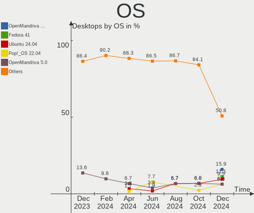
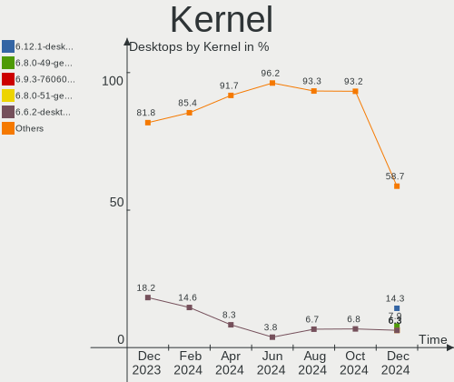
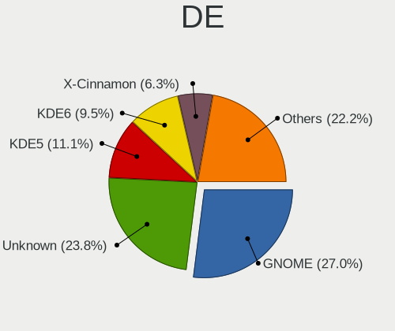
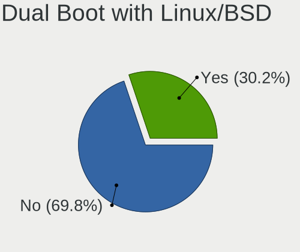
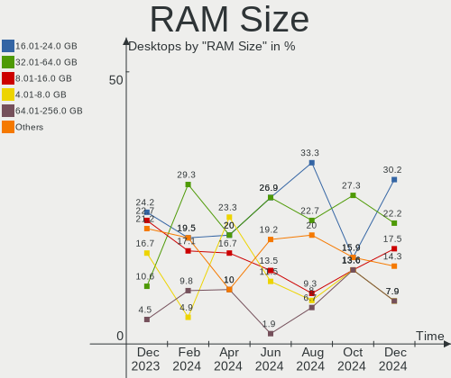
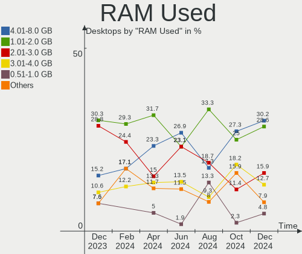
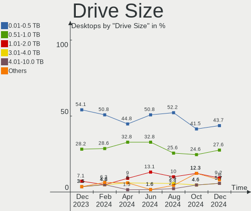
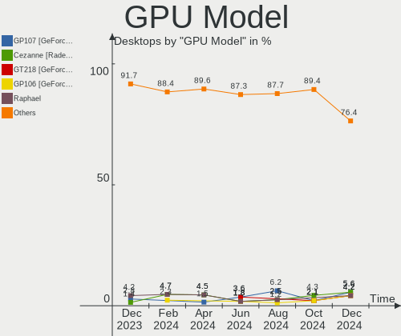
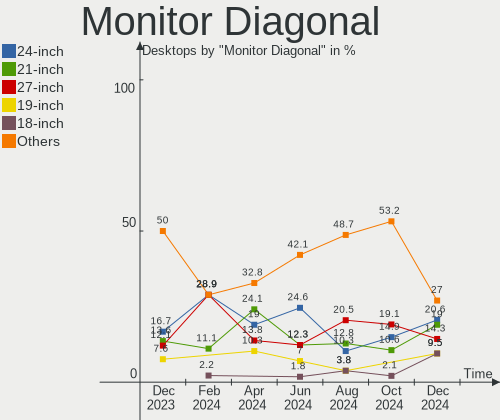

Linux in Poland - Hardware Trends (Desktops)
--------------------------------------------

A project to identify most popular hardware characteristics and track their change
over time based on data collected by Linux users at https://Linux-Hardware.org.

Anyone can contribute to this report by the [hw-probe](https://github.com/linuxhw/hw-probe) tool:

    sudo -E hw-probe -all -upload

Period: Jun, 2023.

Contents
--------

* [ System ](#system)
  - [ OS                       ](#os)
  - [ OS Family                ](#os-family)
  - [ Kernel                   ](#kernel)
  - [ Kernel Family            ](#kernel-family)
  - [ Kernel Major Ver.        ](#kernel-major-ver)
  - [ Arch                     ](#arch)
  - [ DE                       ](#de)
  - [ Display Server           ](#display-server)
  - [ Display Manager          ](#display-manager)
  - [ OS Lang                  ](#os-lang)
  - [ Boot Mode                ](#boot-mode)
  - [ Filesystem               ](#filesystem)
  - [ Part. scheme             ](#part-scheme)
  - [ Dual Boot with Linux/BSD ](#dual-boot-with-linuxbsd)
  - [ Dual Boot (Win)          ](#dual-boot-win)

* [ Board ](#board)
  - [ Vendor                   ](#vendor)
  - [ Model                    ](#model)
  - [ Model Family             ](#model-family)
  - [ MFG Year                 ](#mfg-year)
  - [ Form Factor              ](#form-factor)
  - [ Secure Boot              ](#secure-boot)
  - [ Coreboot                 ](#coreboot)
  - [ RAM Size                 ](#ram-size)
  - [ RAM Used                 ](#ram-used)
  - [ Total Drives             ](#total-drives)
  - [ Has CD-ROM               ](#has-cd-rom)
  - [ Has Ethernet             ](#has-ethernet)
  - [ Has WiFi                 ](#has-wifi)
  - [ Has Bluetooth            ](#has-bluetooth)

* [ Location ](#location)
  - [ Country                  ](#country)
  - [ City                     ](#city)

* [ Drives ](#drives)
  - [ Drive Vendor             ](#drive-vendor)
  - [ Drive Model              ](#drive-model)
  - [ HDD Vendor               ](#hdd-vendor)
  - [ SSD Vendor               ](#ssd-vendor)
  - [ Drive Kind               ](#drive-kind)
  - [ Drive Connector          ](#drive-connector)
  - [ Drive Size               ](#drive-size)
  - [ Space Total              ](#space-total)
  - [ Space Used               ](#space-used)
  - [ Malfunc. Drives          ](#malfunc-drives)
  - [ Malfunc. Drive Vendor    ](#malfunc-drive-vendor)
  - [ Malfunc. HDD Vendor      ](#malfunc-hdd-vendor)
  - [ Malfunc. Drive Kind      ](#malfunc-drive-kind)
  - [ Failed Drives            ](#failed-drives)
  - [ Failed Drive Vendor      ](#failed-drive-vendor)
  - [ Drive Status             ](#drive-status)

* [ Storage controller ](#storage-controller)
  - [ Storage Vendor           ](#storage-vendor)
  - [ Storage Model            ](#storage-model)
  - [ Storage Kind             ](#storage-kind)

* [ Processor ](#processor)
  - [ CPU Vendor               ](#cpu-vendor)
  - [ CPU Model                ](#cpu-model)
  - [ CPU Model Family         ](#cpu-model-family)
  - [ CPU Cores                ](#cpu-cores)
  - [ CPU Sockets              ](#cpu-sockets)
  - [ CPU Threads              ](#cpu-threads)
  - [ CPU Op-Modes             ](#cpu-op-modes)
  - [ CPU Microcode            ](#cpu-microcode)
  - [ CPU Microarch            ](#cpu-microarch)

* [ Graphics ](#graphics)
  - [ GPU Vendor               ](#gpu-vendor)
  - [ GPU Model                ](#gpu-model)
  - [ GPU Combo                ](#gpu-combo)
  - [ GPU Driver               ](#gpu-driver)
  - [ GPU Memory               ](#gpu-memory)

* [ Monitor ](#monitor)
  - [ Monitor Vendor           ](#monitor-vendor)
  - [ Monitor Model            ](#monitor-model)
  - [ Monitor Resolution       ](#monitor-resolution)
  - [ Monitor Diagonal         ](#monitor-diagonal)
  - [ Monitor Width            ](#monitor-width)
  - [ Aspect Ratio             ](#aspect-ratio)
  - [ Monitor Area             ](#monitor-area)
  - [ Pixel Density            ](#pixel-density)
  - [ Multiple Monitors        ](#multiple-monitors)

* [ Network ](#network)
  - [ Net Controller Vendor    ](#net-controller-vendor)
  - [ Net Controller Model     ](#net-controller-model)
  - [ Wireless Vendor          ](#wireless-vendor)
  - [ Wireless Model           ](#wireless-model)
  - [ Ethernet Vendor          ](#ethernet-vendor)
  - [ Ethernet Model           ](#ethernet-model)
  - [ Net Controller Kind      ](#net-controller-kind)
  - [ Used Controller          ](#used-controller)
  - [ NICs                     ](#nics)
  - [ IPv6                     ](#ipv6)

* [ Bluetooth ](#bluetooth)
  - [ Bluetooth Vendor         ](#bluetooth-vendor)
  - [ Bluetooth Model          ](#bluetooth-model)

* [ Sound ](#sound)
  - [ Sound Vendor             ](#sound-vendor)
  - [ Sound Model              ](#sound-model)

* [ Memory ](#memory)
  - [ Memory Vendor            ](#memory-vendor)
  - [ Memory Model             ](#memory-model)
  - [ Memory Kind              ](#memory-kind)
  - [ Memory Form Factor       ](#memory-form-factor)
  - [ Memory Size              ](#memory-size)
  - [ Memory Speed             ](#memory-speed)

* [ Printers & scanners ](#printers--scanners)
  - [ Printer Vendor           ](#printer-vendor)
  - [ Printer Model            ](#printer-model)
  - [ Scanner Vendor           ](#scanner-vendor)
  - [ Scanner Model            ](#scanner-model)

* [ Camera ](#camera)
  - [ Camera Vendor            ](#camera-vendor)
  - [ Camera Model             ](#camera-model)

* [ Security ](#security)
  - [ Fingerprint Vendor       ](#fingerprint-vendor)
  - [ Fingerprint Model        ](#fingerprint-model)
  - [ Chipcard Vendor          ](#chipcard-vendor)
  - [ Chipcard Model           ](#chipcard-model)

* [ Unsupported ](#unsupported)
  - [ Unsupported Devices      ](#unsupported-devices)
  - [ Unsupported Device Types ](#unsupported-device-types)

System
------

OS
--

Installed operating systems

| Name               | Desktops | Percent |
|--------------------|----------|---------|
| Fedora 38          | 5        | 11.9%   |
| Ubuntu 22.04       | 4        | 9.52%   |
| Pop!_OS 22.04      | 3        | 7.14%   |
| Linux Mint 21.1    | 3        | 7.14%   |
| Gentoo 2.13        | 3        | 7.14%   |
| Zorin 16           | 2        | 4.76%   |
| Debian 12          | 2        | 4.76%   |
| ArcoLinux Rolling  | 2        | 4.76%   |
| Arch Rolling       | 2        | 4.76%   |
| Xubuntu 22.04      | 1        | 2.38%   |
| Ubuntu Unity 20.04 | 1        | 2.38%   |
| Ubuntu 22.10       | 1        | 2.38%   |
| Ubuntu 20.04       | 1        | 2.38%   |
| ROSA 12.4          | 1        | 2.38%   |
| OpenMandriva 4.3   | 1        | 2.38%   |
| OpenMandriva 23.90 | 1        | 2.38%   |
| OpenMandriva 23.03 | 1        | 2.38%   |
| OpenMandriva 23.01 | 1        | 2.38%   |
| Nobara 37          | 1        | 2.38%   |
| Linux Mint 21      | 1        | 2.38%   |
| Linux Mint 20.2    | 1        | 2.38%   |
| Kali 2023.2        | 1        | 2.38%   |
| EuroLinux 9.2      | 1        | 2.38%   |
| Debian 11          | 1        | 2.38%   |
| Archcraft Rolling  | 1        | 2.38%   |

OS Family
---------

OS without a version

| Name         | Desktops | Percent |
|--------------|----------|---------|
| Ubuntu       | 6        | 14.29%  |
| Linux Mint   | 5        | 11.9%   |
| Fedora       | 5        | 11.9%   |
| OpenMandriva | 4        | 9.52%   |
| Pop!_OS      | 3        | 7.14%   |
| Gentoo       | 3        | 7.14%   |
| Debian       | 3        | 7.14%   |
| Zorin        | 2        | 4.76%   |
| ArcoLinux    | 2        | 4.76%   |
| Arch         | 2        | 4.76%   |
| Xubuntu      | 1        | 2.38%   |
| Ubuntu Unity | 1        | 2.38%   |
| ROSA         | 1        | 2.38%   |
| Nobara       | 1        | 2.38%   |
| Kali         | 1        | 2.38%   |
| EuroLinux    | 1        | 2.38%   |
| Archcraft    | 1        | 2.38%   |

Kernel
------

Version of the Linux kernel

| Version                             | Desktops | Percent |
|-------------------------------------|----------|---------|
| 5.19.0-43-generic                   | 5        | 11.9%   |
| 5.15.0-73-generic                   | 4        | 9.52%   |
| 6.1.28-gentoo                       | 3        | 7.14%   |
| 6.3.8-arch1-1                       | 2        | 4.76%   |
| 6.3.4-201.fc38.x86_64               | 2        | 4.76%   |
| 6.3.3-arch1-1                       | 2        | 4.76%   |
| 6.2.6-76060206-generic              | 2        | 4.76%   |
| 6.1.0-9-amd64                       | 2        | 4.76%   |
| 5.15.0-75-generic                   | 2        | 4.76%   |
| 6.3.7-200.fsync.fc37.x86_64         | 1        | 2.38%   |
| 6.3.7-200.fc38.x86_64               | 1        | 2.38%   |
| 6.3.7-060307-generic                | 1        | 2.38%   |
| 6.3.6-arch1-1                       | 1        | 2.38%   |
| 6.3.6-200.fc38.x86_64               | 1        | 2.38%   |
| 6.3.5-desktop-3omv2390              | 1        | 2.38%   |
| 6.2.6-desktop-1omv2390              | 1        | 2.38%   |
| 6.2.15-300.fc38.x86_64              | 1        | 2.38%   |
| 6.1.1-desktop-1omv2290              | 1        | 2.38%   |
| 6.1.0-kali9-amd64                   | 1        | 2.38%   |
| 5.4.0-150-generic                   | 1        | 2.38%   |
| 5.4.0-149-generic                   | 1        | 2.38%   |
| 5.19.0-45-generic                   | 1        | 2.38%   |
| 5.19.0-44-generic                   | 1        | 2.38%   |
| 5.16.13-desktop-1omv4003            | 1        | 2.38%   |
| 5.15.103-generic-1rosa2021.1-x86_64 | 1        | 2.38%   |
| 5.14.0-284.11.1.el9_2.x86_64        | 1        | 2.38%   |
| 5.10.0-23-amd64                     | 1        | 2.38%   |

Kernel Family
-------------

Linux kernel without a distro release

| Version  | Desktops | Percent |
|----------|----------|---------|
| 5.19.0   | 7        | 16.67%  |
| 5.15.0   | 6        | 14.29%  |
| 6.3.7    | 3        | 7.14%   |
| 6.2.6    | 3        | 7.14%   |
| 6.1.28   | 3        | 7.14%   |
| 6.1.0    | 3        | 7.14%   |
| 6.3.8    | 2        | 4.76%   |
| 6.3.6    | 2        | 4.76%   |
| 6.3.4    | 2        | 4.76%   |
| 6.3.3    | 2        | 4.76%   |
| 5.4.0    | 2        | 4.76%   |
| 6.3.5    | 1        | 2.38%   |
| 6.2.15   | 1        | 2.38%   |
| 6.1.1    | 1        | 2.38%   |
| 5.16.13  | 1        | 2.38%   |
| 5.15.103 | 1        | 2.38%   |
| 5.14.0   | 1        | 2.38%   |
| 5.10.0   | 1        | 2.38%   |

Kernel Major Ver.
-----------------

Linux kernel major version

| Version | Desktops | Percent |
|---------|----------|---------|
| 6.3     | 12       | 28.57%  |
| 6.1     | 7        | 16.67%  |
| 5.19    | 7        | 16.67%  |
| 5.15    | 7        | 16.67%  |
| 6.2     | 4        | 9.52%   |
| 5.4     | 2        | 4.76%   |
| 5.16    | 1        | 2.38%   |
| 5.14    | 1        | 2.38%   |
| 5.10    | 1        | 2.38%   |

Arch
----

OS architecture (x86_64, i586, etc.)

| Name   | Desktops | Percent |
|--------|----------|---------|
| x86_64 | 42       | 100%    |

DE
--

Desktop Environment

| Name       | Desktops | Percent |
|------------|----------|---------|
| GNOME      | 16       | 38.1%   |
| KDE5       | 8        | 19.05%  |
| XFCE       | 5        | 11.9%   |
| X-Cinnamon | 4        | 9.52%   |
| Unknown    | 3        | 7.14%   |
| MATE       | 2        | 4.76%   |
| Unity      | 1        | 2.38%   |
| openbox    | 1        | 2.38%   |
| LXQt       | 1        | 2.38%   |
| Cinnamon   | 1        | 2.38%   |

Display Server
--------------

X11 or Wayland

| Name    | Desktops | Percent |
|---------|----------|---------|
| X11     | 32       | 76.19%  |
| Wayland | 7        | 16.67%  |
| Unknown | 2        | 4.76%   |
| Tty     | 1        | 2.38%   |

Display Manager
---------------

SDDM, LightDM, etc.

| Name    | Desktops | Percent |
|---------|----------|---------|
| Unknown | 16       | 38.1%   |
| SDDM    | 9        | 21.43%  |
| LightDM | 9        | 21.43%  |
| GDM3    | 6        | 14.29%  |
| LXDM    | 1        | 2.38%   |
| GDM     | 1        | 2.38%   |

OS Lang
-------

Language

| Lang  | Desktops | Percent |
|-------|----------|---------|
| pl_PL | 27       | 64.29%  |
| en_US | 12       | 28.57%  |
| en_GB | 1        | 2.38%   |
| de_DE | 1        | 2.38%   |
| C     | 1        | 2.38%   |

Boot Mode
---------

EFI or BIOS

| Mode | Desktops | Percent |
|------|----------|---------|
| BIOS | 22       | 52.38%  |
| EFI  | 20       | 47.62%  |

Filesystem
----------

Type of filesystem

| Type    | Desktops | Percent |
|---------|----------|---------|
| Ext4    | 26       | 61.9%   |
| Btrfs   | 7        | 16.67%  |
| Tmpfs   | 3        | 7.14%   |
| F2fs    | 3        | 7.14%   |
| Zfs     | 1        | 2.38%   |
| Xfs     | 1        | 2.38%   |
| Overlay | 1        | 2.38%   |

Part. scheme
------------

Scheme of partitioning

| Type    | Desktops | Percent |
|---------|----------|---------|
| GPT     | 23       | 54.76%  |
| Unknown | 14       | 33.33%  |
| MBR     | 5        | 11.9%   |

Dual Boot with Linux/BSD
------------------------

Hosting more than one Linux/BSD

| Dual boot | Desktops | Percent |
|-----------|----------|---------|
| No        | 32       | 76.19%  |
| Yes       | 10       | 23.81%  |

Dual Boot (Win)
---------------

Hosting Linux and Windows

| Dual boot | Desktops | Percent |
|-----------|----------|---------|
| No        | 35       | 83.33%  |
| Yes       | 7        | 16.67%  |

Board
-----

Vendor
------

Motherboard manufacturer

| Name                | Desktops | Percent |
|---------------------|----------|---------|
| ASUSTek Computer    | 10       | 23.81%  |
| MSI                 | 9        | 21.43%  |
| Gigabyte Technology | 9        | 21.43%  |
| Hewlett-Packard     | 5        | 11.9%   |
| ASRock              | 4        | 9.52%   |
| Lenovo              | 1        | 2.38%   |
| Intel               | 1        | 2.38%   |
| Fujitsu             | 1        | 2.38%   |
| Dell                | 1        | 2.38%   |
| Biostar             | 1        | 2.38%   |

Model
-----

Motherboard model

| Name                               | Desktops | Percent |
|------------------------------------|----------|---------|
| HP t620 Quad Core TC               | 3        | 7.14%   |
| MSI MS-7816                        | 2        | 4.76%   |
| ASUS M3A78-CM                      | 2        | 4.76%   |
| MSI OPTIMUS                        | 1        | 2.38%   |
| MSI MS-7C91                        | 1        | 2.38%   |
| MSI MS-7C52                        | 1        | 2.38%   |
| MSI MS-7C02                        | 1        | 2.38%   |
| MSI MS-7B85                        | 1        | 2.38%   |
| MSI MS-7B79                        | 1        | 2.38%   |
| MSI MS-7B17                        | 1        | 2.38%   |
| Lenovo ThinkCentre M92p 3218AL8    | 1        | 2.38%   |
| Intel H81                          | 1        | 2.38%   |
| HP EliteDesk 800 G4 DM 65W         | 1        | 2.38%   |
| HP Compaq Elite 8300 SFF           | 1        | 2.38%   |
| Gigabyte Z97M-DS3H                 | 1        | 2.38%   |
| Gigabyte Z77X-UD5H                 | 1        | 2.38%   |
| Gigabyte Z170-Gaming K3            | 1        | 2.38%   |
| Gigabyte X570 AORUS ULTRA          | 1        | 2.38%   |
| Gigabyte P31-DS3L                  | 1        | 2.38%   |
| Gigabyte H510M S2H V2              | 1        | 2.38%   |
| Gigabyte GA-970A-UD3               | 1        | 2.38%   |
| Gigabyte B250-FinTech              | 1        | 2.38%   |
| Gigabyte AB350-Gaming              | 1        | 2.38%   |
| Fujitsu ESPRIMO P420               | 1        | 2.38%   |
| Dell OptiPlex 3020                 | 1        | 2.38%   |
| Biostar H81MHV3 3.0                | 1        | 2.38%   |
| ASUS Z170M-PLUS                    | 1        | 2.38%   |
| ASUS ROG STRIX B650E-I GAMING WIFI | 1        | 2.38%   |
| ASUS PRIME H510M-A                 | 1        | 2.38%   |
| ASUS P8H61-M LX R2.0               | 1        | 2.38%   |
| ASUS P8H61                         | 1        | 2.38%   |
| ASUS P5G41T-M                      | 1        | 2.38%   |
| ASUS P5G41C-M LX                   | 1        | 2.38%   |
| ASUS All Series                    | 1        | 2.38%   |
| ASRock Z87 Extreme4                | 1        | 2.38%   |
| ASRock H81M-VG4                    | 1        | 2.38%   |
| ASRock H61M-VG3                    | 1        | 2.38%   |
| ASRock B85M                        | 1        | 2.38%   |

Model Family
------------

Motherboard model prefix

| Name                  | Desktops | Percent |
|-----------------------|----------|---------|
| HP t620               | 3        | 7.14%   |
| MSI MS-7816           | 2        | 4.76%   |
| ASUS M3A78-CM         | 2        | 4.76%   |
| MSI OPTIMUS           | 1        | 2.38%   |
| MSI MS-7C91           | 1        | 2.38%   |
| MSI MS-7C52           | 1        | 2.38%   |
| MSI MS-7C02           | 1        | 2.38%   |
| MSI MS-7B85           | 1        | 2.38%   |
| MSI MS-7B79           | 1        | 2.38%   |
| MSI MS-7B17           | 1        | 2.38%   |
| Lenovo ThinkCentre    | 1        | 2.38%   |
| Intel H81             | 1        | 2.38%   |
| HP EliteDesk          | 1        | 2.38%   |
| HP Compaq             | 1        | 2.38%   |
| Gigabyte Z97M-DS3H    | 1        | 2.38%   |
| Gigabyte Z77X-UD5H    | 1        | 2.38%   |
| Gigabyte Z170-Gaming  | 1        | 2.38%   |
| Gigabyte X570         | 1        | 2.38%   |
| Gigabyte P31-DS3L     | 1        | 2.38%   |
| Gigabyte H510M        | 1        | 2.38%   |
| Gigabyte GA-970A-UD3  | 1        | 2.38%   |
| Gigabyte B250-FinTech | 1        | 2.38%   |
| Gigabyte AB350-Gaming | 1        | 2.38%   |
| Fujitsu ESPRIMO       | 1        | 2.38%   |
| Dell OptiPlex         | 1        | 2.38%   |
| Biostar H81MHV3       | 1        | 2.38%   |
| ASUS Z170M-PLUS       | 1        | 2.38%   |
| ASUS ROG              | 1        | 2.38%   |
| ASUS PRIME            | 1        | 2.38%   |
| ASUS P8H61-M          | 1        | 2.38%   |
| ASUS P8H61            | 1        | 2.38%   |
| ASUS P5G41T-M         | 1        | 2.38%   |
| ASUS P5G41C-M         | 1        | 2.38%   |
| ASUS All              | 1        | 2.38%   |
| ASRock Z87            | 1        | 2.38%   |
| ASRock H81M-VG4       | 1        | 2.38%   |
| ASRock H61M-VG3       | 1        | 2.38%   |
| ASRock B85M           | 1        | 2.38%   |

MFG Year
--------

Motherboard manufacture year

| Year | Desktops | Percent |
|------|----------|---------|
| 2018 | 8        | 19.05%  |
| 2014 | 6        | 14.29%  |
| 2013 | 6        | 14.29%  |
| 2012 | 4        | 9.52%   |
| 2021 | 3        | 7.14%   |
| 2019 | 3        | 7.14%   |
| 2011 | 2        | 4.76%   |
| 2010 | 2        | 4.76%   |
| 2008 | 2        | 4.76%   |
| 2022 | 1        | 2.38%   |
| 2020 | 1        | 2.38%   |
| 2017 | 1        | 2.38%   |
| 2016 | 1        | 2.38%   |
| 2015 | 1        | 2.38%   |
| 2007 | 1        | 2.38%   |

Form Factor
-----------

Physical design of the computer

| Name    | Desktops | Percent |
|---------|----------|---------|
| Desktop | 42       | 100%    |

Secure Boot
-----------

Enabled or disabled

| State    | Desktops | Percent |
|----------|----------|---------|
| Disabled | 41       | 97.62%  |
| Enabled  | 1        | 2.38%   |

Coreboot
--------

Have coreboot on board

| Used | Desktops | Percent |
|------|----------|---------|
| No   | 42       | 100%    |

RAM Size
--------

Total RAM memory

| Size in GB  | Desktops | Percent |
|-------------|----------|---------|
| 16.01-24.0  | 12       | 28.57%  |
| 3.01-4.0    | 8        | 19.05%  |
| 4.01-8.0    | 7        | 16.67%  |
| 8.01-16.0   | 6        | 14.29%  |
| 32.01-64.0  | 5        | 11.9%   |
| 24.01-32.0  | 2        | 4.76%   |
| 64.01-256.0 | 2        | 4.76%   |

RAM Used
--------

Used RAM memory

| Used GB    | Desktops | Percent |
|------------|----------|---------|
| 2.01-3.0   | 12       | 28.57%  |
| 1.01-2.0   | 11       | 26.19%  |
| 4.01-8.0   | 10       | 23.81%  |
| 3.01-4.0   | 3        | 7.14%   |
| 8.01-16.0  | 3        | 7.14%   |
| 0.51-1.0   | 2        | 4.76%   |
| 16.01-24.0 | 1        | 2.38%   |

Total Drives
------------

Number of drives on board

| Drives | Desktops | Percent |
|--------|----------|---------|
| 2      | 15       | 35.71%  |
| 1      | 13       | 30.95%  |
| 3      | 9        | 21.43%  |
| 6      | 2        | 4.76%   |
| 4      | 2        | 4.76%   |
| 5      | 1        | 2.38%   |

Has CD-ROM
----------

Has CD-ROM on board

| Presented | Desktops | Percent |
|-----------|----------|---------|
| No        | 25       | 59.52%  |
| Yes       | 17       | 40.48%  |

Has Ethernet
------------

Has Ethernet on board

| Presented | Desktops | Percent |
|-----------|----------|---------|
| Yes       | 42       | 100%    |

Has WiFi
--------

Has WiFi module

| Presented | Desktops | Percent |
|-----------|----------|---------|
| No        | 26       | 61.9%   |
| Yes       | 16       | 38.1%   |

Has Bluetooth
-------------

Has Bluetooth module

| Presented | Desktops | Percent |
|-----------|----------|---------|
| No        | 25       | 59.52%  |
| Yes       | 17       | 40.48%  |

Location
--------

Country
-------

Geographic location (country)

| Country | Desktops | Percent |
|---------|----------|---------|
| Poland  | 42       | 100%    |

City
----

Geographic location (city)

| City                 | Desktops | Percent |
|----------------------|----------|---------|
| Warsaw               | 9        | 21.43%  |
| Gdansk               | 5        | 11.9%   |
| Wroclaw              | 2        | 4.76%   |
| Poznan               | 2        | 4.76%   |
| Zagorz               | 1        | 2.38%   |
| Żagań              | 1        | 2.38%   |
| Wojnicz              | 1        | 2.38%   |
| Wieluń              | 1        | 2.38%   |
| Wałbrzych           | 1        | 2.38%   |
| Torun                | 1        | 2.38%   |
| Szczecin             | 1        | 2.38%   |
| Skawina              | 1        | 2.38%   |
| Siemiatycze          | 1        | 2.38%   |
| Rybnik               | 1        | 2.38%   |
| Prochowice           | 1        | 2.38%   |
| Ozarow Mazowiecki    | 1        | 2.38%   |
| Nysa                 | 1        | 2.38%   |
| Niepolomice          | 1        | 2.38%   |
| Mysłowice           | 1        | 2.38%   |
| Lodz                 | 1        | 2.38%   |
| Krakow               | 1        | 2.38%   |
| Kościan             | 1        | 2.38%   |
| Kedzierzyn-Kozle     | 1        | 2.38%   |
| Gorzów Wielkopolski | 1        | 2.38%   |
| Dymaczewo Stare      | 1        | 2.38%   |
| Dąbrowa Górnicza   | 1        | 2.38%   |
| Brzozow              | 1        | 2.38%   |
| Bialystok            | 1        | 2.38%   |

Drives
------

Drive Vendor
------------

Hard drive vendors

| Vendor                | Desktops | Drives | Percent |
|-----------------------|----------|--------|---------|
| GOODRAM               | 13       | 13     | 15.48%  |
| WDC                   | 9        | 9      | 10.71%  |
| Seagate               | 9        | 9      | 10.71%  |
| Crucial               | 7        | 8      | 8.33%   |
| Samsung Electronics   | 6        | 7      | 7.14%   |
| SanDisk               | 5        | 6      | 5.95%   |
| Toshiba               | 4        | 4      | 4.76%   |
| Patriot               | 3        | 3      | 3.57%   |
| A-DATA Technology     | 3        | 4      | 3.57%   |
| SPCC                  | 2        | 3      | 2.38%   |
| Realtek Semiconductor | 2        | 2      | 2.38%   |
| PNY                   | 2        | 2      | 2.38%   |
| Plextor               | 2        | 2      | 2.38%   |
| Kingston              | 2        | 2      | 2.38%   |
| Hitachi               | 2        | 4      | 2.38%   |
| Unknown               | 1        | 3      | 1.19%   |
| Team                  | 1        | 1      | 1.19%   |
| Phison Electronics    | 1        | 1      | 1.19%   |
| Phison                | 1        | 1      | 1.19%   |
| OCZ                   | 1        | 1      | 1.19%   |
| LITEON                | 1        | 1      | 1.19%   |
| Lite-On Technology    | 1        | 1      | 1.19%   |
| Intenso               | 1        | 1      | 1.19%   |
| EXRAM                 | 1        | 1      | 1.19%   |
| Corsair               | 1        | 1      | 1.19%   |
| China                 | 1        | 1      | 1.19%   |
| Apacer                | 1        | 1      | 1.19%   |
| ADATA Technology      | 1        | 1      | 1.19%   |

Drive Model
-----------

Hard drive models

| Model                                           | Desktops | Percent |
|-------------------------------------------------|----------|---------|
| Crucial CT500MX500SSD1 500GB                    | 3        | 3.33%   |
| Crucial CT240BX500SSD1 240GB                    | 3        | 3.33%   |
| WDC WD10EFRX-68FYTN0 1TB                        | 2        | 2.22%   |
| Seagate ST1000DM010-2EP102 1TB                  | 2        | 2.22%   |
| Realtek RTS5763DL NVMe SSD Controller 512GB     | 2        | 2.22%   |
| GOODRAM SSDPR-CX400-512-G2 512GB                | 2        | 2.22%   |
| GOODRAM SSDPR-CX400-256-G2 256GB                | 2        | 2.22%   |
| GOODRAM SSDPR-CX400-01T-G2 1024GB               | 2        | 2.22%   |
| GOODRAM SSDPR-CL100-480-G2 480GB                | 2        | 2.22%   |
| WDC WD5000AVDS-63U7B1 500GB                     | 1        | 1.11%   |
| WDC WD5000AAKX-07U6AA1 500GB                    | 1        | 1.11%   |
| WDC WD15EARS-00J2GB0 1TB                        | 1        | 1.11%   |
| WDC WD10PURX-64D85Y0 1TB                        | 1        | 1.11%   |
| WDC WD10JPCX-24UE4T0 1TB                        | 1        | 1.11%   |
| WDC WD10EZEX-22BN5A0 1TB                        | 1        | 1.11%   |
| WDC WD10EZEX-00KUWA0 1TB                        | 1        | 1.11%   |
| Unknown SD/MMC 2GB                              | 1        | 1.11%   |
| Unknown M.S./M.S.Pro/HG 16GB                    | 1        | 1.11%   |
| Toshiba HDWG480 8TB                             | 1        | 1.11%   |
| Toshiba HDWE150 5TB                             | 1        | 1.11%   |
| Toshiba HDWD110 1TB                             | 1        | 1.11%   |
| Toshiba DT01ACA050 500GB                        | 1        | 1.11%   |
| Team T253256GB SSD                              | 1        | 1.11%   |
| SPCC Solid State Disk 512GB                     | 1        | 1.11%   |
| SPCC Solid State Disk 240GB                     | 1        | 1.11%   |
| SPCC Solid State Disk 120GB                     | 1        | 1.11%   |
| Seagate ST4000VX007-2DT166 4TB                  | 1        | 1.11%   |
| Seagate ST4000DM004-2CV104 4TB                  | 1        | 1.11%   |
| Seagate ST3500413AS 500GB                       | 1        | 1.11%   |
| Seagate ST3320613AS 320GB                       | 1        | 1.11%   |
| Seagate ST3250410AS 250GB                       | 1        | 1.11%   |
| Seagate ST12000NM0008-2H3101 12TB               | 1        | 1.11%   |
| Seagate Expansion 1TB                           | 1        | 1.11%   |
| SanDisk X400 M.2 2280 128GB SSD                 | 1        | 1.11%   |
| Sandisk WD Blue SN500 / PC SN520 NVMe SSD 500GB | 1        | 1.11%   |
| SanDisk SDSSDP128G 128GB                        | 1        | 1.11%   |
| SanDisk SDSSDH3 500G                            | 1        | 1.11%   |
| SanDisk SDSSDA240G 240GB                        | 1        | 1.11%   |
| SanDisk SDSA6DM-016G-1006 16GB SSD              | 1        | 1.11%   |
| Samsung SSD 980 PRO 1TB                         | 1        | 1.11%   |

HDD Vendor
----------

Hard disk drive vendors

| Vendor  | Desktops | Drives | Percent |
|---------|----------|--------|---------|
| WDC     | 9        | 9      | 37.5%   |
| Seagate | 9        | 9      | 37.5%   |
| Toshiba | 4        | 4      | 16.67%  |
| Hitachi | 2        | 4      | 8.33%   |

SSD Vendor
----------

Solid state drive vendors

| Vendor              | Desktops | Drives | Percent |
|---------------------|----------|--------|---------|
| GOODRAM             | 13       | 13     | 29.55%  |
| Crucial             | 7        | 8      | 15.91%  |
| SanDisk             | 4        | 5      | 9.09%   |
| Samsung Electronics | 3        | 3      | 6.82%   |
| Patriot             | 3        | 3      | 6.82%   |
| SPCC                | 2        | 3      | 4.55%   |
| Plextor             | 2        | 2      | 4.55%   |
| A-DATA Technology   | 2        | 3      | 4.55%   |
| Team                | 1        | 1      | 2.27%   |
| PNY                 | 1        | 1      | 2.27%   |
| OCZ                 | 1        | 1      | 2.27%   |
| LITEON              | 1        | 1      | 2.27%   |
| Kingston            | 1        | 1      | 2.27%   |
| Intenso             | 1        | 1      | 2.27%   |
| China               | 1        | 1      | 2.27%   |
| Apacer              | 1        | 1      | 2.27%   |

Drive Kind
----------

HDD or SSD

| Kind    | Desktops | Drives | Percent |
|---------|----------|--------|---------|
| SSD     | 33       | 48     | 48.53%  |
| HDD     | 20       | 26     | 29.41%  |
| NVMe    | 13       | 15     | 19.12%  |
| Unknown | 2        | 4      | 2.94%   |

Drive Connector
---------------

SATA, SAS, NVMe, etc.

| Type | Desktops | Drives | Percent |
|------|----------|--------|---------|
| SATA | 39       | 74     | 72.22%  |
| NVMe | 13       | 15     | 24.07%  |
| SAS  | 2        | 4      | 3.7%    |

Drive Size
----------

Size of hard drive

| Size in TB | Desktops | Drives | Percent |
|------------|----------|--------|---------|
| 0.01-0.5   | 30       | 42     | 52.63%  |
| 0.51-1.0   | 18       | 21     | 31.58%  |
| 1.01-2.0   | 3        | 3      | 5.26%   |
| 3.01-4.0   | 2        | 2      | 3.51%   |
| 4.01-10.0  | 2        | 2      | 3.51%   |
| 2.01-3.0   | 1        | 3      | 1.75%   |
| 10.01-20.0 | 1        | 1      | 1.75%   |

Space Total
-----------

Amount of disk space available on the file system

| Size in GB     | Desktops | Percent |
|----------------|----------|---------|
| 251-500        | 11       | 26.19%  |
| 501-1000       | 9        | 21.43%  |
| 101-250        | 8        | 19.05%  |
| More than 3000 | 5        | 11.9%   |
| 1001-2000      | 3        | 7.14%   |
| 1-20           | 3        | 7.14%   |
| 21-50          | 1        | 2.38%   |
| 2001-3000      | 1        | 2.38%   |
| Unknown        | 1        | 2.38%   |

Space Used
----------

Amount of used disk space

| Used GB        | Desktops | Percent |
|----------------|----------|---------|
| 1-20           | 13       | 30.95%  |
| 21-50          | 8        | 19.05%  |
| 251-500        | 6        | 14.29%  |
| More than 3000 | 3        | 7.14%   |
| 101-250        | 3        | 7.14%   |
| 501-1000       | 3        | 7.14%   |
| 51-100         | 3        | 7.14%   |
| 2001-3000      | 1        | 2.38%   |
| 1001-2000      | 1        | 2.38%   |
| Unknown        | 1        | 2.38%   |

Malfunc. Drives
---------------

Drive models with a malfunction

| Model                         | Desktops | Drives | Percent |
|-------------------------------|----------|--------|---------|
| Patriot Blast 240GB SSD       | 1        | 1      | 33.33%  |
| LITEON CV8-8E128-HP 128GB SSD | 1        | 1      | 33.33%  |
| China SATA SSD 16GB           | 1        | 1      | 33.33%  |

Malfunc. Drive Vendor
---------------------

Vendors of faulty drives

| Vendor  | Desktops | Drives | Percent |
|---------|----------|--------|---------|
| Patriot | 1        | 1      | 33.33%  |
| LITEON  | 1        | 1      | 33.33%  |
| China   | 1        | 1      | 33.33%  |

Malfunc. HDD Vendor
-------------------

Vendors of faulty HDD drives

Zero info for selected period =(

Malfunc. Drive Kind
-------------------

Kinds of faulty drives

| Kind | Desktops | Drives | Percent |
|------|----------|--------|---------|
| SSD  | 3        | 3      | 100%    |

Failed Drives
-------------

Failed drive models

Zero info for selected period =(

Failed Drive Vendor
-------------------

Failed drive vendors

Zero info for selected period =(

Drive Status
------------

Number of failed and malfunc. drives

| Status   | Desktops | Drives | Percent |
|----------|----------|--------|---------|
| Works    | 22       | 43     | 50%     |
| Detected | 19       | 47     | 43.18%  |
| Malfunc  | 3        | 3      | 6.82%   |

Storage controller
------------------

Storage Vendor
--------------

Storage controller vendors

| Vendor                      | Desktops | Percent |
|-----------------------------|----------|---------|
| Intel                       | 28       | 48.28%  |
| AMD                         | 14       | 24.14%  |
| Samsung Electronics         | 4        | 6.9%    |
| Phison Electronics          | 3        | 5.17%   |
| Realtek Semiconductor       | 2        | 3.45%   |
| ADATA Technology            | 2        | 3.45%   |
| SanDisk                     | 1        | 1.72%   |
| Marvell Technology Group    | 1        | 1.72%   |
| Lite-On Technology          | 1        | 1.72%   |
| Kingston Technology Company | 1        | 1.72%   |
| ASMedia Technology          | 1        | 1.72%   |

Storage Model
-------------

Storage controller models

| Model                                                                          | Desktops | Percent |
|--------------------------------------------------------------------------------|----------|---------|
| Intel 8 Series/C220 Series Chipset Family 6-port SATA Controller 1 [AHCI mode] | 9        | 13.43%  |
| AMD FCH SATA Controller [AHCI mode]                                            | 8        | 11.94%  |
| AMD 400 Series Chipset SATA Controller                                         | 4        | 5.97%   |
| Intel NM10/ICH7 Family SATA Controller [IDE mode]                              | 3        | 4.48%   |
| Intel Cannon Lake PCH SATA AHCI Controller                                     | 3        | 4.48%   |
| Intel 7 Series/C210 Series Chipset Family 6-port SATA Controller [AHCI mode]   | 3        | 4.48%   |
| Intel 6 Series/C200 Series Chipset Family 6 port Desktop SATA AHCI Controller  | 3        | 4.48%   |
| Samsung NVMe SSD Controller SM981/PM981/PM983                                  | 2        | 2.99%   |
| Samsung NVMe SSD Controller PM9A1/PM9A3/980PRO                                 | 2        | 2.99%   |
| Realtek RTS5763DL NVMe SSD Controller                                          | 2        | 2.99%   |
| Intel Q170/Q150/B150/H170/H110/Z170/CM236 Chipset SATA Controller [AHCI Mode]  | 2        | 2.99%   |
| Intel 9 Series Chipset Family SATA Controller [AHCI Mode]                      | 2        | 2.99%   |
| Intel 82801G (ICH7 Family) IDE Controller                                      | 2        | 2.99%   |
| Intel 500 Series Chipset Family SATA AHCI Controller                           | 2        | 2.99%   |
| AMD SB7x0/SB8x0/SB9x0 SATA Controller [IDE mode]                               | 2        | 2.99%   |
| AMD SB7x0/SB8x0/SB9x0 IDE Controller                                           | 2        | 2.99%   |
| ADATA XPG SX8200 Pro PCIe Gen3x4 M.2 2280 Solid State Drive                    | 2        | 2.99%   |
| SanDisk WD Blue SN500 / PC SN520 NVMe SSD                                      | 1        | 1.49%   |
| Phison PS5013 E13 NVMe Controller                                              | 1        | 1.49%   |
| Phison E18 PCIe4 NVMe Controller                                               | 1        | 1.49%   |
| Phison E16 PCIe4 NVMe Controller                                               | 1        | 1.49%   |
| Phison E12 NVMe Controller                                                     | 1        | 1.49%   |
| Marvell Group 88SE9172 SATA 6Gb/s Controller                                   | 1        | 1.49%   |
| Lite-On Non-Volatile memory controller                                         | 1        | 1.49%   |
| Kingston Company SNVS2000G [NV1 NVMe PCIe SSD 2TB]                             | 1        | 1.49%   |
| Intel 200 Series PCH SATA controller [AHCI mode]                               | 1        | 1.49%   |
| ASMedia ASM1062 Serial ATA Controller                                          | 1        | 1.49%   |
| AMD SB7x0/SB8x0/SB9x0 SATA Controller [AHCI mode]                              | 1        | 1.49%   |
| AMD FCH SATA Controller [IDE mode]                                             | 1        | 1.49%   |
| AMD 500 Series Chipset SATA Controller                                         | 1        | 1.49%   |
| AMD 300 Series Chipset SATA Controller                                         | 1        | 1.49%   |

Storage Kind
------------

Kind of storage controller (IDE, SATA, NVMe, SAS, ...)

| Kind | Desktops | Percent |
|------|----------|---------|
| SATA | 39       | 68.42%  |
| NVMe | 13       | 22.81%  |
| IDE  | 5        | 8.77%   |

Processor
---------

CPU Vendor
----------

Processor vendors

| Vendor | Desktops | Percent |
|--------|----------|---------|
| Intel  | 28       | 66.67%  |
| AMD    | 14       | 33.33%  |

CPU Model
---------

Processor models

| Model                                    | Desktops | Percent |
|------------------------------------------|----------|---------|
| AMD GX-415GA SOC with Radeon HD Graphics | 3        | 7.14%   |
| Intel Core i7-4790 CPU @ 3.60GHz         | 2        | 4.76%   |
| Intel Core i3-4160 CPU @ 3.60GHz         | 2        | 4.76%   |
| Intel Core i3-4150 CPU @ 3.50GHz         | 2        | 4.76%   |
| AMD Ryzen 5 2600 Six-Core Processor      | 2        | 4.76%   |
| AMD Phenom II X4 955 Processor           | 2        | 4.76%   |
| Intel Pentium Gold G6400 CPU @ 4.00GHz   | 1        | 2.38%   |
| Intel Pentium CPU G3220 @ 3.00GHz        | 1        | 2.38%   |
| Intel Core i7-9700K CPU @ 3.60GHz        | 1        | 2.38%   |
| Intel Core i7-4790K CPU @ 4.00GHz        | 1        | 2.38%   |
| Intel Core i7-4770K CPU @ 3.50GHz        | 1        | 2.38%   |
| Intel Core i7-3770K CPU @ 3.50GHz        | 1        | 2.38%   |
| Intel Core i7-3770 CPU @ 3.40GHz         | 1        | 2.38%   |
| Intel Core i7-2600K CPU @ 3.40GHz        | 1        | 2.38%   |
| Intel Core i5-8400 CPU @ 2.80GHz         | 1        | 2.38%   |
| Intel Core i5-7600 CPU @ 3.50GHz         | 1        | 2.38%   |
| Intel Core i5-7400 CPU @ 3.00GHz         | 1        | 2.38%   |
| Intel Core i5-6600K CPU @ 3.50GHz        | 1        | 2.38%   |
| Intel Core i5-4690 CPU @ 3.50GHz         | 1        | 2.38%   |
| Intel Core i5-4590 CPU @ 3.30GHz         | 1        | 2.38%   |
| Intel Core i5-3470 CPU @ 3.20GHz         | 1        | 2.38%   |
| Intel Core i3-3240 CPU @ 3.40GHz         | 1        | 2.38%   |
| Intel Core i3-10105 CPU @ 3.70GHz        | 1        | 2.38%   |
| Intel Core 2 Quad CPU Q8300 @ 2.50GHz    | 1        | 2.38%   |
| Intel Core 2 Quad CPU Q6600 @ 2.40GHz    | 1        | 2.38%   |
| Intel Core 2 Quad CPU @ 2.40GHz          | 1        | 2.38%   |
| Intel Celeron G4900 CPU @ 3.10GHz        | 1        | 2.38%   |
| Intel Celeron CPU G1610 @ 2.60GHz        | 1        | 2.38%   |
| AMD Ryzen 9 5900X 12-Core Processor      | 1        | 2.38%   |
| AMD Ryzen 7 3700X 8-Core Processor       | 1        | 2.38%   |
| AMD Ryzen 7 2700X Eight-Core Processor   | 1        | 2.38%   |
| AMD Ryzen 5 7600 6-Core Processor        | 1        | 2.38%   |
| AMD Ryzen 5 5600X 6-Core Processor       | 1        | 2.38%   |
| AMD Ryzen 3 4300G with Radeon Graphics   | 1        | 2.38%   |
| AMD FX-6200 Six-Core Processor           | 1        | 2.38%   |

CPU Model Family
----------------

Processor model prefix

| Model              | Desktops | Percent |
|--------------------|----------|---------|
| Intel Core i7      | 8        | 19.05%  |
| Intel Core i5      | 7        | 16.67%  |
| Intel Core i3      | 6        | 14.29%  |
| AMD Ryzen 5        | 4        | 9.52%   |
| Intel Core 2 Quad  | 3        | 7.14%   |
| AMD GX             | 3        | 7.14%   |
| Intel Celeron      | 2        | 4.76%   |
| AMD Ryzen 7        | 2        | 4.76%   |
| AMD Phenom II X4   | 2        | 4.76%   |
| Intel Pentium Gold | 1        | 2.38%   |
| Intel Pentium      | 1        | 2.38%   |
| AMD Ryzen 9        | 1        | 2.38%   |
| AMD Ryzen 3        | 1        | 2.38%   |
| AMD FX             | 1        | 2.38%   |

CPU Cores
---------

Number of processor cores

| Number | Desktops | Percent |
|--------|----------|---------|
| 4      | 23       | 54.76%  |
| 2      | 9        | 21.43%  |
| 6      | 5        | 11.9%   |
| 8      | 3        | 7.14%   |
| 12     | 1        | 2.38%   |
| 3      | 1        | 2.38%   |

CPU Sockets
-----------

Number of sockets

| Number | Desktops | Percent |
|--------|----------|---------|
| 1      | 42       | 100%    |

CPU Threads
-----------

Threads per core (Hyper-Threading)

| Number | Desktops | Percent |
|--------|----------|---------|
| 2      | 23       | 54.76%  |
| 1      | 19       | 45.24%  |

CPU Op-Modes
------------

CPU Operation Modes (32-bit, 64-bit)

| Op mode        | Desktops | Percent |
|----------------|----------|---------|
| 32-bit, 64-bit | 42       | 100%    |

CPU Microcode
-------------

Microcode number

| Number     | Desktops | Percent |
|------------|----------|---------|
| Unknown    | 20       | 47.62%  |
| 0x306c3    | 6        | 14.29%  |
| 0x306a9    | 3        | 7.14%   |
| 0x0800820d | 3        | 7.14%   |
| 0x0700010b | 2        | 4.76%   |
| 0x906ea    | 1        | 2.38%   |
| 0x6fb      | 1        | 2.38%   |
| 0x6f7      | 1        | 2.38%   |
| 0x0a601203 | 1        | 2.38%   |
| 0x08701021 | 1        | 2.38%   |
| 0x07000110 | 1        | 2.38%   |
| 0x06000629 | 1        | 2.38%   |
| 0x010000db | 1        | 2.38%   |

CPU Microarch
-------------

Microarchitecture

| Name        | Desktops | Percent |
|-------------|----------|---------|
| Haswell     | 11       | 26.19%  |
| KabyLake    | 5        | 11.9%   |
| IvyBridge   | 5        | 11.9%   |
| Zen+        | 3        | 7.14%   |
| Jaguar      | 3        | 7.14%   |
| Zen 3       | 2        | 4.76%   |
| Zen 2       | 2        | 4.76%   |
| K10         | 2        | 4.76%   |
| Core        | 2        | 4.76%   |
| CometLake   | 2        | 4.76%   |
| Skylake     | 1        | 2.38%   |
| SandyBridge | 1        | 2.38%   |
| Penryn      | 1        | 2.38%   |
| Bulldozer   | 1        | 2.38%   |
| Unknown     | 1        | 2.38%   |

Graphics
--------

GPU Vendor
----------

Vendors of graphics cards

| Vendor | Desktops | Percent |
|--------|----------|---------|
| Nvidia | 17       | 38.64%  |
| AMD    | 16       | 36.36%  |
| Intel  | 11       | 25%     |

GPU Model
---------

Graphics card models

| Model                                                                       | Desktops | Percent |
|-----------------------------------------------------------------------------|----------|---------|
| Nvidia GM204 [GeForce GTX 970]                                              | 3        | 6.67%   |
| Intel 4th Generation Core Processor Family Integrated Graphics Controller   | 3        | 6.67%   |
| AMD Kabini [Radeon HD 8330E]                                                | 3        | 6.67%   |
| AMD Ellesmere [Radeon RX 470/480/570/570X/580/580X/590]                     | 3        | 6.67%   |
| Nvidia TU116 [GeForce GTX 1660 SUPER]                                       | 2        | 4.44%   |
| Nvidia GP107 [GeForce GTX 1050 Ti]                                          | 2        | 4.44%   |
| Intel Xeon E3-1200 v3/4th Gen Core Processor Integrated Graphics Controller | 2        | 4.44%   |
| AMD RS780C [Radeon 3100]                                                    | 2        | 4.44%   |
| Nvidia TU117 [GeForce GTX 1650]                                             | 1        | 2.22%   |
| Nvidia TU106 [GeForce RTX 2060 Rev. A]                                      | 1        | 2.22%   |
| Nvidia TU104 [GeForce RTX 2070 SUPER]                                       | 1        | 2.22%   |
| Nvidia GT218 [GeForce 210]                                                  | 1        | 2.22%   |
| Nvidia GP108 [GeForce GT 1030]                                              | 1        | 2.22%   |
| Nvidia GP106 [GeForce GTX 1060 3GB]                                         | 1        | 2.22%   |
| Nvidia GP104 [GeForce GTX 1070]                                             | 1        | 2.22%   |
| Nvidia GM206 [GeForce GTX 960]                                              | 1        | 2.22%   |
| Nvidia GK208B [GeForce GT 710]                                              | 1        | 2.22%   |
| Nvidia GF119 [GeForce 605]                                                  | 1        | 2.22%   |
| Intel Xeon E3-1200 v2/3rd Gen Core processor Graphics Controller            | 1        | 2.22%   |
| Intel IvyBridge GT2 [HD Graphics 4000]                                      | 1        | 2.22%   |
| Intel HD Graphics 630                                                       | 1        | 2.22%   |
| Intel CometLake-S GT2 [UHD Graphics 630]                                    | 1        | 2.22%   |
| Intel CometLake-S GT1 [UHD Graphics 610]                                    | 1        | 2.22%   |
| Intel CoffeeLake-S GT1 [UHD Graphics 610]                                   | 1        | 2.22%   |
| AMD RV770/M98L [Mobility Radeon HD 4850]                                    | 1        | 2.22%   |
| AMD RV710 [Radeon HD 4350/4550]                                             | 1        | 2.22%   |
| AMD Renoir                                                                  | 1        | 2.22%   |
| AMD Raphael                                                                 | 1        | 2.22%   |
| AMD Pitcairn PRO [Radeon HD 7850 / R7 265 / R9 270 1024SP]                  | 1        | 2.22%   |
| AMD Navi 23 [Radeon RX 6600/6600 XT/6600M]                                  | 1        | 2.22%   |
| AMD Navi 21 [Radeon RX 6800/6800 XT / 6900 XT]                              | 1        | 2.22%   |
| AMD Cedar [Radeon HD 5000/6000/7350/8350 Series]                            | 1        | 2.22%   |
| AMD Cape Verde XT [Radeon HD 7770/8760 / R7 250X]                           | 1        | 2.22%   |

GPU Combo
---------

Combinations of graphics cards

| Name           | Desktops | Percent |
|----------------|----------|---------|
| 1 x Nvidia     | 16       | 38.1%   |
| 1 x AMD        | 15       | 35.71%  |
| 1 x Intel      | 9        | 21.43%  |
| 2 x AMD        | 1        | 2.38%   |
| Intel + Nvidia | 1        | 2.38%   |

GPU Driver
----------

Free vs proprietary

| Driver      | Desktops | Percent |
|-------------|----------|---------|
| Free        | 29       | 69.05%  |
| Proprietary | 12       | 28.57%  |
| Unknown     | 1        | 2.38%   |

GPU Memory
----------

Total video memory

| Size in GB | Desktops | Percent |
|------------|----------|---------|
| Unknown    | 19       | 45.24%  |
| 0.51-1.0   | 5        | 11.9%   |
| 3.01-4.0   | 4        | 9.52%   |
| 7.01-8.0   | 3        | 7.14%   |
| 5.01-6.0   | 3        | 7.14%   |
| 1.01-2.0   | 3        | 7.14%   |
| 0.01-0.5   | 3        | 7.14%   |
| 2.01-3.0   | 1        | 2.38%   |
| 8.01-16.0  | 1        | 2.38%   |

Monitor
-------

Monitor Vendor
--------------

Monitor vendors

| Vendor               | Desktops | Percent |
|----------------------|----------|---------|
| Samsung Electronics  | 8        | 19.51%  |
| Goldstar             | 6        | 14.63%  |
| AOC                  | 4        | 9.76%   |
| Philips              | 3        | 7.32%   |
| Lenovo               | 3        | 7.32%   |
| Dell                 | 3        | 7.32%   |
| NEC Computers        | 2        | 4.88%   |
| Iiyama               | 2        | 4.88%   |
| Hewlett-Packard      | 2        | 4.88%   |
| BenQ                 | 2        | 4.88%   |
| Unknown              | 1        | 2.44%   |
| RTK                  | 1        | 2.44%   |
| MSI                  | 1        | 2.44%   |
| Fujitsu Siemens      | 1        | 2.44%   |
| Ancor Communications | 1        | 2.44%   |
| Acer                 | 1        | 2.44%   |

Monitor Model
-------------

Monitor models

| Model                                                                  | Desktops | Percent |
|------------------------------------------------------------------------|----------|---------|
| Lenovo P24h-10 LEN61AE 2560x1440 530x300mm 24.0-inch                   | 3        | 7.14%   |
| Unknown LCD Monitor FFFF 2288x1287 2550x2550mm 142.0-inch              | 1        | 2.38%   |
| Samsung Electronics U32J59x SAM0F35 3840x2160 697x392mm 31.5-inch      | 1        | 2.38%   |
| Samsung Electronics U32H85x SAM0E3C 3840x2160 697x392mm 31.5-inch      | 1        | 2.38%   |
| Samsung Electronics SyncMaster SAM059A 1920x1080 477x268mm 21.5-inch   | 1        | 2.38%   |
| Samsung Electronics SyncMaster SAM0428 1680x1050 459x296mm 21.5-inch   | 1        | 2.38%   |
| Samsung Electronics SyncMaster SAM03E5 1680x1050 474x296mm 22.0-inch   | 1        | 2.38%   |
| Samsung Electronics SyncMaster SAM0234 1280x1024 376x301mm 19.0-inch   | 1        | 2.38%   |
| Samsung Electronics S22B300 SAM08C8 1920x1080 477x268mm 21.5-inch      | 1        | 2.38%   |
| Samsung Electronics LCD Monitor SAM7003 3840x2160 1420x800mm 64.2-inch | 1        | 2.38%   |
| RTK LCD Monitor RTK1D1A 1920x1080 1020x570mm 46.0-inch                 | 1        | 2.38%   |
| Philips PHL 273V7 PHLC156 1920x1080 598x336mm 27.0-inch                | 1        | 2.38%   |
| Philips PHL 243V7 PHLC155 1920x1080 527x296mm 23.8-inch                | 1        | 2.38%   |
| Philips PhilipsTV (5) PHL14CA 1360x768 708x398mm 32.0-inch             | 1        | 2.38%   |
| NEC Computers EA223WM NEC6890 1680x1050 474x296mm 22.0-inch            | 1        | 2.38%   |
| NEC Computers E224Wi NEC6950 1920x1080 476x267mm 21.5-inch             | 1        | 2.38%   |
| MSI G32C4 MSI3DA6 1920x1080 698x393mm 31.5-inch                        | 1        | 2.38%   |
| Lenovo P27h-20 LEN61E9 2560x1440 600x340mm 27.2-inch                   | 1        | 2.38%   |
| Iiyama PL2796HS IVM6668 1920x1080 598x336mm 27.0-inch                  | 1        | 2.38%   |
| Iiyama PL2530H IVM6132 1920x1080 544x303mm 24.5-inch                   | 1        | 2.38%   |
| Hewlett-Packard E243i HPN3463 1920x1200 518x324mm 24.1-inch            | 1        | 2.38%   |
| Hewlett-Packard 27o HPN342C 1920x1080 598x336mm 27.0-inch              | 1        | 2.38%   |
| Goldstar W1934 GSM4B7A 1440x900 410x256mm 19.0-inch                    | 1        | 2.38%   |
| Goldstar IPS FULLHD GSM5AB7 1920x1080 480x270mm 21.7-inch              | 1        | 2.38%   |
| Goldstar HDR 4K GSM7750 3840x2160 697x392mm 31.5-inch                  | 1        | 2.38%   |
| Goldstar E2211 GSM5838 1920x1080 477x268mm 21.5-inch                   | 1        | 2.38%   |
| Goldstar 29EA93 GSM5974 2560x1080 677x290mm 29.0-inch                  | 1        | 2.38%   |
| Goldstar 24GL600F GSM5B73 1920x1080 531x298mm 24.0-inch                | 1        | 2.38%   |
| Fujitsu Siemens P20-2 FUS0554 1600x1200 408x306mm 20.1-inch            | 1        | 2.38%   |
| Dell UP2516D DEL40E1 2560x1440 553x311mm 25.0-inch                     | 1        | 2.38%   |
| Dell U2721DE DEL41DD 2560x1440 597x336mm 27.0-inch                     | 1        | 2.38%   |
| Dell S3220DGF DELD0F2 2560x1440 697x392mm 31.5-inch                    | 1        | 2.38%   |
| BenQ XL2411T BNQ7F10 1920x1080 531x298mm 24.0-inch                     | 1        | 2.38%   |
| BenQ GW2265 BNQ78D1 1920x1080 480x270mm 21.7-inch                      | 1        | 2.38%   |
| AOC Q3279WG5B AOC3279 2560x1440 725x428mm 33.1-inch                    | 1        | 2.38%   |
| AOC 2790 AOC2790 1920x1080 598x336mm 27.0-inch                         | 1        | 2.38%   |
| AOC 24B2W1G5 AOC2402 1920x1080 527x296mm 23.8-inch                     | 1        | 2.38%   |
| AOC 1960R AOC1960 1280x1024 376x301mm 19.0-inch                        | 1        | 2.38%   |
| Ancor Communications ASUS VH222 ACI22AB 1920x1080 477x268mm 21.5-inch  | 1        | 2.38%   |
| Acer VG240Y ACR0673 1920x1080 527x296mm 23.8-inch                      | 1        | 2.38%   |

Monitor Resolution
------------------

Monitor screen resolution

| Resolution         | Desktops | Percent |
|--------------------|----------|---------|
| 1920x1080 (FHD)    | 18       | 45%     |
| 2560x1440 (QHD)    | 8        | 20%     |
| 3840x2160 (4K)     | 4        | 10%     |
| 1680x1050 (WSXGA+) | 3        | 7.5%    |
| 1440x900 (WXGA+)   | 2        | 5%      |
| 2560x1080          | 1        | 2.5%    |
| 2288x1287          | 1        | 2.5%    |
| 1600x1200          | 1        | 2.5%    |
| 1360x768           | 1        | 2.5%    |
| 1280x1024 (SXGA)   | 1        | 2.5%    |

Monitor Diagonal
----------------

Diagonal size in inches

| Inches | Desktops | Percent |
|--------|----------|---------|
| 24     | 9        | 21.95%  |
| 21     | 8        | 19.51%  |
| 27     | 6        | 14.63%  |
| 31     | 4        | 9.76%   |
| 19     | 3        | 7.32%   |
| 22     | 2        | 4.88%   |
| 142    | 1        | 2.44%   |
| 84     | 1        | 2.44%   |
| 46     | 1        | 2.44%   |
| 33     | 1        | 2.44%   |
| 32     | 1        | 2.44%   |
| 29     | 1        | 2.44%   |
| 25     | 1        | 2.44%   |
| 23     | 1        | 2.44%   |
| 20     | 1        | 2.44%   |

Monitor Width
-------------

Physical width

| Width in mm    | Desktops | Percent |
|----------------|----------|---------|
| 501-600        | 16       | 39.02%  |
| 401-500        | 12       | 29.27%  |
| 601-700        | 6        | 14.63%  |
| 701-800        | 2        | 4.88%   |
| 351-400        | 2        | 4.88%   |
| More than 2000 | 1        | 2.44%   |
| 1501-2000      | 1        | 2.44%   |
| 1001-1500      | 1        | 2.44%   |

Aspect Ratio
------------

Proportional relationship between the width and the height

| Ratio | Desktops | Percent |
|-------|----------|---------|
| 16/9  | 29       | 74.36%  |
| 16/10 | 4        | 10.26%  |
| 5/4   | 2        | 5.13%   |
| 4/3   | 1        | 2.56%   |
| 3/2   | 1        | 2.56%   |
| 21/9  | 1        | 2.56%   |
| 1.00  | 1        | 2.56%   |

Monitor Area
------------

Area in inch²

| Area in inch² | Desktops | Percent |
|----------------|----------|---------|
| 201-250        | 15       | 37.5%   |
| 301-350        | 7        | 17.5%   |
| 351-500        | 6        | 15%     |
| 151-200        | 6        | 15%     |
| 251-300        | 3        | 7.5%    |
| More than 1000 | 2        | 5%      |
| 501-1000       | 1        | 2.5%    |

Pixel Density
-------------

Pixels per inch

| Density | Desktops | Percent |
|---------|----------|---------|
| 51-100  | 23       | 56.1%   |
| 101-120 | 10       | 24.39%  |
| 121-160 | 5        | 12.2%   |
| 1-50    | 3        | 7.32%   |

Multiple Monitors
-----------------

Total monitors connected

| Total | Desktops | Percent |
|-------|----------|---------|
| 1     | 37       | 88.1%   |
| 2     | 4        | 9.52%   |
| 0     | 1        | 2.38%   |

Network
-------

Net Controller Vendor
---------------------

Controller vendors

| Vendor                          | Desktops | Percent |
|---------------------------------|----------|---------|
| Realtek Semiconductor           | 27       | 50.94%  |
| Intel                           | 13       | 24.53%  |
| Qualcomm Atheros                | 5        | 9.43%   |
| TP-Link                         | 2        | 3.77%   |
| Broadcom                        | 2        | 3.77%   |
| Ralink Technology               | 1        | 1.89%   |
| Qualcomm Atheros Communications | 1        | 1.89%   |
| OPPO Electronics                | 1        | 1.89%   |
| MediaTek                        | 1        | 1.89%   |

Net Controller Model
--------------------

Controller models

| Model                                                                                | Desktops | Percent |
|--------------------------------------------------------------------------------------|----------|---------|
| Realtek RTL8111/8168/8411 PCI Express Gigabit Ethernet Controller                    | 26       | 42.62%  |
| TP-Link 802.11ac NIC                                                                 | 2        | 3.28%   |
| Intel Wi-Fi 6 AX210/AX211/AX411 160MHz                                               | 2        | 3.28%   |
| Intel I211 Gigabit Network Connection                                                | 2        | 3.28%   |
| Intel 82579LM Gigabit Network Connection (Lewisville)                                | 2        | 3.28%   |
| Realtek RTL8821CE 802.11ac PCIe Wireless Network Adapter                             | 1        | 1.64%   |
| Realtek RTL8814AU 802.11a/b/g/n/ac Wireless Adapter                                  | 1        | 1.64%   |
| Realtek RTL8192CE PCIe Wireless Network Adapter                                      | 1        | 1.64%   |
| Realtek RTL8125 2.5GbE Controller                                                    | 1        | 1.64%   |
| Realtek RTL810xE PCI Express Fast Ethernet controller                                | 1        | 1.64%   |
| Ralink RT2501/RT2573 Wireless Adapter                                                | 1        | 1.64%   |
| Qualcomm Atheros QCA8171 Gigabit Ethernet                                            | 1        | 1.64%   |
| Qualcomm Atheros Killer E2400 Gigabit Ethernet Controller                            | 1        | 1.64%   |
| Qualcomm Atheros Killer E220x Gigabit Ethernet Controller                            | 1        | 1.64%   |
| Qualcomm Atheros TP-Link TL-WN821N v3 / TL-WN822N v2 802.11n [Atheros AR7010+AR9287] | 1        | 1.64%   |
| Qualcomm Atheros AR9287 Wireless Network Adapter (PCI-Express)                       | 1        | 1.64%   |
| Qualcomm Atheros AR8151 v2.0 Gigabit Ethernet                                        | 1        | 1.64%   |
| Qualcomm Atheros AR8131 Gigabit Ethernet                                             | 1        | 1.64%   |
| OPPO CPH2411                                                                         | 1        | 1.64%   |
| MediaTek MT7922 802.11ax PCI Express Wireless Network Adapter                        | 1        | 1.64%   |
| Intel Wireless-AC 9260                                                               | 1        | 1.64%   |
| Intel Wi-Fi 6 AX200                                                                  | 1        | 1.64%   |
| Intel Ethernet Controller I225-V                                                     | 1        | 1.64%   |
| Intel Ethernet Connection I217-V                                                     | 1        | 1.64%   |
| Intel Ethernet Connection (7) I219-V                                                 | 1        | 1.64%   |
| Intel Ethernet Connection (7) I219-LM                                                | 1        | 1.64%   |
| Intel Ethernet Connection (2) I219-V                                                 | 1        | 1.64%   |
| Intel Ethernet Connection (14) I219-V                                                | 1        | 1.64%   |
| Intel Cannon Lake PCH CNVi WiFi                                                      | 1        | 1.64%   |
| Intel 82579V Gigabit Network Connection                                              | 1        | 1.64%   |
| Broadcom BCM4360 802.11ac Wireless Network Adapter                                   | 1        | 1.64%   |
| Broadcom BCM43228 802.11a/b/g/n                                                      | 1        | 1.64%   |

Wireless Vendor
---------------

Wireless vendors

| Vendor                          | Desktops | Percent |
|---------------------------------|----------|---------|
| Intel                           | 5        | 31.25%  |
| Realtek Semiconductor           | 3        | 18.75%  |
| TP-Link                         | 2        | 12.5%   |
| Broadcom                        | 2        | 12.5%   |
| Ralink Technology               | 1        | 6.25%   |
| Qualcomm Atheros Communications | 1        | 6.25%   |
| Qualcomm Atheros                | 1        | 6.25%   |
| MediaTek                        | 1        | 6.25%   |

Wireless Model
--------------

Wireless models

| Model                                                                                | Desktops | Percent |
|--------------------------------------------------------------------------------------|----------|---------|
| TP-Link 802.11ac NIC                                                                 | 2        | 12.5%   |
| Intel Wi-Fi 6 AX210/AX211/AX411 160MHz                                               | 2        | 12.5%   |
| Realtek RTL8821CE 802.11ac PCIe Wireless Network Adapter                             | 1        | 6.25%   |
| Realtek RTL8814AU 802.11a/b/g/n/ac Wireless Adapter                                  | 1        | 6.25%   |
| Realtek RTL8192CE PCIe Wireless Network Adapter                                      | 1        | 6.25%   |
| Ralink RT2501/RT2573 Wireless Adapter                                                | 1        | 6.25%   |
| Qualcomm Atheros TP-Link TL-WN821N v3 / TL-WN822N v2 802.11n [Atheros AR7010+AR9287] | 1        | 6.25%   |
| Qualcomm Atheros AR9287 Wireless Network Adapter (PCI-Express)                       | 1        | 6.25%   |
| MediaTek MT7922 802.11ax PCI Express Wireless Network Adapter                        | 1        | 6.25%   |
| Intel Wireless-AC 9260                                                               | 1        | 6.25%   |
| Intel Wi-Fi 6 AX200                                                                  | 1        | 6.25%   |
| Intel Cannon Lake PCH CNVi WiFi                                                      | 1        | 6.25%   |
| Broadcom BCM4360 802.11ac Wireless Network Adapter                                   | 1        | 6.25%   |
| Broadcom BCM43228 802.11a/b/g/n                                                      | 1        | 6.25%   |

Ethernet Vendor
---------------

Ethernet vendors

| Vendor                | Desktops | Percent |
|-----------------------|----------|---------|
| Realtek Semiconductor | 27       | 61.36%  |
| Intel                 | 11       | 25%     |
| Qualcomm Atheros      | 5        | 11.36%  |
| OPPO Electronics      | 1        | 2.27%   |

Ethernet Model
--------------

Ethernet models

| Model                                                             | Desktops | Percent |
|-------------------------------------------------------------------|----------|---------|
| Realtek RTL8111/8168/8411 PCI Express Gigabit Ethernet Controller | 26       | 57.78%  |
| Intel I211 Gigabit Network Connection                             | 2        | 4.44%   |
| Intel 82579LM Gigabit Network Connection (Lewisville)             | 2        | 4.44%   |
| Realtek RTL8125 2.5GbE Controller                                 | 1        | 2.22%   |
| Realtek RTL810xE PCI Express Fast Ethernet controller             | 1        | 2.22%   |
| Qualcomm Atheros QCA8171 Gigabit Ethernet                         | 1        | 2.22%   |
| Qualcomm Atheros Killer E2400 Gigabit Ethernet Controller         | 1        | 2.22%   |
| Qualcomm Atheros Killer E220x Gigabit Ethernet Controller         | 1        | 2.22%   |
| Qualcomm Atheros AR8151 v2.0 Gigabit Ethernet                     | 1        | 2.22%   |
| Qualcomm Atheros AR8131 Gigabit Ethernet                          | 1        | 2.22%   |
| OPPO CPH2411                                                      | 1        | 2.22%   |
| Intel Ethernet Controller I225-V                                  | 1        | 2.22%   |
| Intel Ethernet Connection I217-V                                  | 1        | 2.22%   |
| Intel Ethernet Connection (7) I219-V                              | 1        | 2.22%   |
| Intel Ethernet Connection (7) I219-LM                             | 1        | 2.22%   |
| Intel Ethernet Connection (2) I219-V                              | 1        | 2.22%   |
| Intel Ethernet Connection (14) I219-V                             | 1        | 2.22%   |
| Intel 82579V Gigabit Network Connection                           | 1        | 2.22%   |

Net Controller Kind
-------------------

Ethernet, WiFi or modem

| Kind     | Desktops | Percent |
|----------|----------|---------|
| Ethernet | 42       | 72.41%  |
| WiFi     | 16       | 27.59%  |

Used Controller
---------------

Currently used network controller

| Kind     | Desktops | Percent |
|----------|----------|---------|
| Ethernet | 34       | 73.91%  |
| WiFi     | 12       | 26.09%  |

NICs
----

Total network controllers on board

| Total | Desktops | Percent |
|-------|----------|---------|
| 1     | 30       | 71.43%  |
| 2     | 11       | 26.19%  |
| 3     | 1        | 2.38%   |

IPv6
----

IPv6 vs IPv4

| Used | Desktops | Percent |
|------|----------|---------|
| No   | 37       | 88.1%   |
| Yes  | 5        | 11.9%   |

Bluetooth
---------

Bluetooth Vendor
----------------

Controller vendors

| Vendor                  | Desktops | Percent |
|-------------------------|----------|---------|
| Cambridge Silicon Radio | 6        | 35.29%  |
| Intel                   | 5        | 29.41%  |
| TP-Link                 | 2        | 11.76%  |
| Realtek Semiconductor   | 1        | 5.88%   |
| Realtek                 | 1        | 5.88%   |
| Foxconn / Hon Hai       | 1        | 5.88%   |
| Unknown                 | 1        | 5.88%   |

Bluetooth Model
---------------

Controller models

| Model                                               | Desktops | Percent |
|-----------------------------------------------------|----------|---------|
| Cambridge Silicon Radio Bluetooth Dongle (HCI mode) | 6        | 35.29%  |
| TP-Link UB500 Adapter                               | 2        | 11.76%  |
| Intel AX210 Bluetooth                               | 2        | 11.76%  |
| Realtek Bluetooth Radio                             | 1        | 5.88%   |
| Realtek Bluetooth Radio                             | 1        | 5.88%   |
| Intel Wireless-AC 9260 Bluetooth Adapter            | 1        | 5.88%   |
| Intel Bluetooth 9460/9560 Jefferson Peak (JfP)      | 1        | 5.88%   |
| Intel AX200 Bluetooth                               | 1        | 5.88%   |
| Foxconn / Hon Hai Wireless_Device                   | 1        | 5.88%   |
| Unknown                                             | 1        | 5.88%   |

Sound
-----

Sound Vendor
------------

Sound card vendors

| Vendor                | Desktops | Percent |
|-----------------------|----------|---------|
| Intel                 | 28       | 34.57%  |
| AMD                   | 19       | 23.46%  |
| Nvidia                | 17       | 20.99%  |
| Trust                 | 3        | 3.7%    |
| Creative Technology   | 2        | 2.47%   |
| Yamaha                | 1        | 1.23%   |
| SAVITECH              | 1        | 1.23%   |
| ROCCAT                | 1        | 1.23%   |
| Realtek Semiconductor | 1        | 1.23%   |
| Razer USA             | 1        | 1.23%   |
| QinHeng Electronics   | 1        | 1.23%   |
| JMTek                 | 1        | 1.23%   |
| Creative Labs         | 1        | 1.23%   |
| C-Media Electronics   | 1        | 1.23%   |
| ASUSTek Computer      | 1        | 1.23%   |
| AOKEO                 | 1        | 1.23%   |
| Afatech               | 1        | 1.23%   |

Sound Model
-----------

Sound card models

| Model                                                                      | Desktops | Percent |
|----------------------------------------------------------------------------|----------|---------|
| Intel 8 Series/C220 Series Chipset High Definition Audio Controller        | 9        | 9.68%   |
| Intel Xeon E3-1200 v3/4th Gen Core Processor HD Audio Controller           | 5        | 5.38%   |
| Nvidia GM204 High Definition Audio Controller                              | 3        | 3.23%   |
| Intel NM10/ICH7 Family High Definition Audio Controller                    | 3        | 3.23%   |
| Intel Cannon Lake PCH cAVS                                                 | 3        | 3.23%   |
| Intel 7 Series/C216 Chipset Family High Definition Audio Controller        | 3        | 3.23%   |
| Intel 6 Series/C200 Series Chipset Family High Definition Audio Controller | 3        | 3.23%   |
| AMD Kabini HDMI/DP Audio                                                   | 3        | 3.23%   |
| AMD FCH Azalia Controller                                                  | 3        | 3.23%   |
| AMD Family 17h (Models 00h-0fh) HD Audio Controller                        | 3        | 3.23%   |
| AMD Ellesmere HDMI Audio [Radeon RX 470/480 / 570/580/590]                 | 3        | 3.23%   |
| Nvidia TU116 High Definition Audio Controller                              | 2        | 2.15%   |
| Nvidia GP107GL High Definition Audio Controller                            | 2        | 2.15%   |
| Intel Smart Sound Technology (SST) Audio Controller                        | 2        | 2.15%   |
| Intel 9 Series Chipset Family HD Audio Controller                          | 2        | 2.15%   |
| Intel 100 Series/C230 Series Chipset Family HD Audio Controller            | 2        | 2.15%   |
| AMD Starship/Matisse HD Audio Controller                                   | 2        | 2.15%   |
| AMD SBx00 Azalia (Intel HDA)                                               | 2        | 2.15%   |
| AMD Oland/Hainan/Cape Verde/Pitcairn HDMI Audio [Radeon HD 7000 Series]    | 2        | 2.15%   |
| AMD Navi 21/23 HDMI/DP Audio Controller                                    | 2        | 2.15%   |
| Yamaha Steinberg UR22C                                                     | 1        | 1.08%   |
| Trust GXT 450 Gaming Headset                                               | 1        | 1.08%   |
| Trust GXT 242 Microphone                                                   | 1        | 1.08%   |
| Trust GXT 232 Microphone                                                   | 1        | 1.08%   |
| SAVITECH SA9023 audio controller                                           | 1        | 1.08%   |
| ROCCAT Juke                                                                | 1        | 1.08%   |
| Realtek Semiconductor USB Condenser Microphone                             | 1        | 1.08%   |
| Razer USA Kraken Tournament Edition                                        | 1        | 1.08%   |
| QinHeng Electronics CH345 MIDI adapter                                     | 1        | 1.08%   |
| Nvidia TU107 GeForce GTX 1650 High Definition Audio Controller             | 1        | 1.08%   |
| Nvidia TU106 High Definition Audio Controller                              | 1        | 1.08%   |
| Nvidia TU104 HD Audio Controller                                           | 1        | 1.08%   |
| Nvidia High Definition Audio Controller                                    | 1        | 1.08%   |
| Nvidia GP108 High Definition Audio Controller                              | 1        | 1.08%   |
| Nvidia GP106 High Definition Audio Controller                              | 1        | 1.08%   |
| Nvidia GP104 High Definition Audio Controller                              | 1        | 1.08%   |
| Nvidia GM206 High Definition Audio Controller                              | 1        | 1.08%   |
| Nvidia GK208 HDMI/DP Audio Controller                                      | 1        | 1.08%   |
| Nvidia GF119 HDMI Audio Controller                                         | 1        | 1.08%   |
| JMTek USB PnP Audio Device                                                 | 1        | 1.08%   |

Memory
------

Memory Vendor
-------------

Memory module vendors

| Vendor              | Desktops | Percent |
|---------------------|----------|---------|
| SK hynix            | 6        | 20.69%  |
| Kingston            | 5        | 17.24%  |
| G.Skill             | 4        | 13.79%  |
| Unknown             | 3        | 10.34%  |
| Micron Technology   | 3        | 10.34%  |
| Samsung Electronics | 2        | 6.9%    |
| Wilk                | 1        | 3.45%   |
| Nanya Technology    | 1        | 3.45%   |
| Crucial             | 1        | 3.45%   |
| Corsair             | 1        | 3.45%   |
| A-DATA Technology   | 1        | 3.45%   |
| A Force             | 1        | 3.45%   |

Memory Model
------------

Memory module models

| Model                                                   | Desktops | Percent |
|---------------------------------------------------------|----------|---------|
| Unknown RAM Module 2GB DIMM DDR2 667MT/s                | 2        | 6.9%    |
| Wilk RAM GR2400D464L17S/8G 8GB DIMM DDR4 2400MT/s       | 1        | 3.45%   |
| Unknown RAM 3600 C18 Series 16GB DIMM DDR4 2933MT/s     | 1        | 3.45%   |
| SK hynix RAM Module 16GB SODIMM DDR4 2667MT/s           | 1        | 3.45%   |
| SK hynix RAM HMT451U6AFR8A-PB 4096MB DIMM DDR3 1600MT/s | 1        | 3.45%   |
| SK hynix RAM HMT451S6BFR8A-PB 4GB SODIMM DDR3 1600MT/s  | 1        | 3.45%   |
| SK hynix RAM HMT451S6AFR8A-PB 4GB SODIMM DDR3 1600MT/s  | 1        | 3.45%   |
| SK hynix RAM HMT351U6CFR8C-PB 4GB DIMM DDR3 1800MT/s    | 1        | 3.45%   |
| SK hynix RAM HMT125U6TFR8C-H9 2GB DIMM DDR3 1333MT/s    | 1        | 3.45%   |
| Samsung RAM M471B5173DB0-YK0 4GB SODIMM DDR3 1600MT/s   | 1        | 3.45%   |
| Samsung RAM M378B5173DB0-CK0 4GB DIMM DDR3 1600MT/s     | 1        | 3.45%   |
| Nanya RAM M2F4G64CB8HG5N-CG 4GB DIMM DDR3 1600MT/s      | 1        | 3.45%   |
| Micron RAM AFLD38AK1P 8GB DIMM DDR3 1333MT/s            | 1        | 3.45%   |
| Micron RAM 8JTF51264AZ-1G6E1 4GB DIMM DDR3 1600MT/s     | 1        | 3.45%   |
| Micron RAM 16KTF51264HZ-1G6M1 4GB SODIMM DDR3 1600MT/s  | 1        | 3.45%   |
| Kingston RAM KHX1866C10D3/8G 8GB DIMM DDR3 2133MT/s     | 1        | 3.45%   |
| Kingston RAM KF560C36-32 32GB DIMM DDR5 4800MT/s        | 1        | 3.45%   |
| Kingston RAM KF3600C17D4/8GX 8GB DIMM DDR4 3600MT/s     | 1        | 3.45%   |
| Kingston RAM KF3200C16D4/32GX 32GB DIMM DDR4 3933MT/s   | 1        | 3.45%   |
| Kingston RAM 9905402-532.A00LF 4GB DIMM DDR3 1600MT/s   | 1        | 3.45%   |
| G.Skill RAM F4-3200C16-16GIS 16GB DIMM DDR4 3600MT/s    | 1        | 3.45%   |
| G.Skill RAM F4-3000C16-8GISB 8GB DIMM DDR4 3200MT/s     | 1        | 3.45%   |
| G.Skill RAM F3-1866C9-8GXM 8GB DIMM DDR3 1866MT/s       | 1        | 3.45%   |
| G.Skill RAM F3-12800CL9-4GBXL 4GB DIMM DDR3 1867MT/s    | 1        | 3.45%   |
| Crucial RAM BLS8G4D30BESBK.8FD 8GB DIMM DDR4 3000MT/s   | 1        | 3.45%   |
| Corsair RAM CMW32GX4M2C3000C15 16GB DIMM DDR4 3000MT/s  | 1        | 3.45%   |
| A-DATA RAM DDR4 3200 8GB DIMM DDR4 3600MT/s             | 1        | 3.45%   |
| A Force RAM 51264V160K 4GB DIMM DDR3 1600MT/s           | 1        | 3.45%   |

Memory Kind
-----------

Memory module kinds

| Kind | Desktops | Percent |
|------|----------|---------|
| DDR3 | 13       | 50%     |
| DDR4 | 10       | 38.46%  |
| DDR2 | 2        | 7.69%   |
| DDR5 | 1        | 3.85%   |

Memory Form Factor
------------------

Physical design of the memory module

| Name   | Desktops | Percent |
|--------|----------|---------|
| DIMM   | 22       | 84.62%  |
| SODIMM | 4        | 15.38%  |

Memory Size
-----------

Memory module size

| Size  | Desktops | Percent |
|-------|----------|---------|
| 4096  | 9        | 33.33%  |
| 8192  | 8        | 29.63%  |
| 32768 | 4        | 14.81%  |
| 16384 | 3        | 11.11%  |
| 2048  | 3        | 11.11%  |

Memory Speed
------------

Memory module speed

| Speed | Desktops | Percent |
|-------|----------|---------|
| 1600  | 9        | 33.33%  |
| 3600  | 4        | 14.81%  |
| 3000  | 2        | 7.41%   |
| 667   | 2        | 7.41%   |
| 4800  | 1        | 3.7%    |
| 3933  | 1        | 3.7%    |
| 3200  | 1        | 3.7%    |
| 2667  | 1        | 3.7%    |
| 2400  | 1        | 3.7%    |
| 2133  | 1        | 3.7%    |
| 1867  | 1        | 3.7%    |
| 1866  | 1        | 3.7%    |
| 1800  | 1        | 3.7%    |
| 1333  | 1        | 3.7%    |

Printers & scanners
-------------------

Printer Vendor
--------------

Printer device vendors

| Vendor          | Desktops | Percent |
|-----------------|----------|---------|
| Hewlett-Packard | 1        | 100%    |

Printer Model
-------------

Printer device models

| Model               | Desktops | Percent |
|---------------------|----------|---------|
| HP LaserJet M14-M17 | 1        | 100%    |

Scanner Vendor
--------------

Scanner device vendors

| Vendor | Desktops | Percent |
|--------|----------|---------|
| Canon  | 1        | 100%    |

Scanner Model
-------------

Scanner device models

| Model                   | Desktops | Percent |
|-------------------------|----------|---------|
| Canon CanoScan LiDE 210 | 1        | 100%    |

Camera
------

Camera Vendor
-------------

Camera device vendors

| Vendor    | Desktops | Percent |
|-----------|----------|---------|
| Logitech  | 2        | 50%     |
| Microsoft | 1        | 25%     |
| Microdia  | 1        | 25%     |

Camera Model
------------

Camera device models

| Model                               | Desktops | Percent |
|-------------------------------------|----------|---------|
| Microsoft LifeCam HD-3000           | 1        | 25%     |
| Microdia REDRAGON Live Camera Audio | 1        | 25%     |
| Logitech Webcam C170                | 1        | 25%     |
| Logitech HD Webcam C510             | 1        | 25%     |

Security
--------

Fingerprint Vendor
------------------

Fingerprint sensor vendors

Zero info for selected period =(

Fingerprint Model
-----------------

Fingerprint sensor models

Zero info for selected period =(

Chipcard Vendor
---------------

Chipcard module vendors

Zero info for selected period =(

Chipcard Model
--------------

Chipcard module models

Zero info for selected period =(

Unsupported
-----------

Unsupported Devices
-------------------

Total unsupported devices on board

| Total | Desktops | Percent |
|-------|----------|---------|
| 0     | 40       | 95.24%  |
| 1     | 2        | 4.76%   |

Unsupported Device Types
------------------------

Types of unsupported devices

| Type          | Desktops | Percent |
|---------------|----------|---------|
| Net/wireless  | 1        | 50%     |
| Graphics card | 1        | 50%     |

