Linux in Poland - Hardware Trends (Notebooks)
---------------------------------------------

A project to identify most popular hardware characteristics and track their change
over time based on data collected by Linux users at https://Linux-Hardware.org.

Anyone can contribute to this report by the [hw-probe](https://github.com/linuxhw/hw-probe) tool:

    sudo -E hw-probe -all -upload

Period: Dec, 2025.

Contents
--------

* [ System ](#system)
  - [ OS                       ](#os)
  - [ OS Family                ](#os-family)
  - [ Kernel                   ](#kernel)
  - [ Kernel Family            ](#kernel-family)
  - [ Kernel Major Ver.        ](#kernel-major-ver)
  - [ Arch                     ](#arch)
  - [ DE                       ](#de)
  - [ Display Server           ](#display-server)
  - [ Display Manager          ](#display-manager)
  - [ OS Lang                  ](#os-lang)
  - [ Boot Mode                ](#boot-mode)
  - [ Filesystem               ](#filesystem)
  - [ Part. scheme             ](#part-scheme)
  - [ Dual Boot with Linux/BSD ](#dual-boot-with-linuxbsd)
  - [ Dual Boot (Win)          ](#dual-boot-win)

* [ Board ](#board)
  - [ Vendor                   ](#vendor)
  - [ Model                    ](#model)
  - [ Model Family             ](#model-family)
  - [ MFG Year                 ](#mfg-year)
  - [ Form Factor              ](#form-factor)
  - [ Secure Boot              ](#secure-boot)
  - [ Coreboot                 ](#coreboot)
  - [ RAM Size                 ](#ram-size)
  - [ RAM Used                 ](#ram-used)
  - [ Total Drives             ](#total-drives)
  - [ Has CD-ROM               ](#has-cd-rom)
  - [ Has Ethernet             ](#has-ethernet)
  - [ Has WiFi                 ](#has-wifi)
  - [ Has Bluetooth            ](#has-bluetooth)

* [ Location ](#location)
  - [ Country                  ](#country)
  - [ City                     ](#city)

* [ Drives ](#drives)
  - [ Drive Vendor             ](#drive-vendor)
  - [ Drive Model              ](#drive-model)
  - [ HDD Vendor               ](#hdd-vendor)
  - [ SSD Vendor               ](#ssd-vendor)
  - [ Drive Kind               ](#drive-kind)
  - [ Drive Connector          ](#drive-connector)
  - [ Drive Size               ](#drive-size)
  - [ Space Total              ](#space-total)
  - [ Space Used               ](#space-used)
  - [ Malfunc. Drives          ](#malfunc-drives)
  - [ Malfunc. Drive Vendor    ](#malfunc-drive-vendor)
  - [ Malfunc. HDD Vendor      ](#malfunc-hdd-vendor)
  - [ Malfunc. Drive Kind      ](#malfunc-drive-kind)
  - [ Failed Drives            ](#failed-drives)
  - [ Failed Drive Vendor      ](#failed-drive-vendor)
  - [ Drive Status             ](#drive-status)

* [ Storage controller ](#storage-controller)
  - [ Storage Vendor           ](#storage-vendor)
  - [ Storage Model            ](#storage-model)
  - [ Storage Kind             ](#storage-kind)

* [ Processor ](#processor)
  - [ CPU Vendor               ](#cpu-vendor)
  - [ CPU Model                ](#cpu-model)
  - [ CPU Model Family         ](#cpu-model-family)
  - [ CPU Cores                ](#cpu-cores)
  - [ CPU Sockets              ](#cpu-sockets)
  - [ CPU Threads              ](#cpu-threads)
  - [ CPU Op-Modes             ](#cpu-op-modes)
  - [ CPU Microcode            ](#cpu-microcode)
  - [ CPU Microarch            ](#cpu-microarch)

* [ Graphics ](#graphics)
  - [ GPU Vendor               ](#gpu-vendor)
  - [ GPU Model                ](#gpu-model)
  - [ GPU Combo                ](#gpu-combo)
  - [ GPU Driver               ](#gpu-driver)
  - [ GPU Memory               ](#gpu-memory)

* [ Monitor ](#monitor)
  - [ Monitor Vendor           ](#monitor-vendor)
  - [ Monitor Model            ](#monitor-model)
  - [ Monitor Resolution       ](#monitor-resolution)
  - [ Monitor Diagonal         ](#monitor-diagonal)
  - [ Monitor Width            ](#monitor-width)
  - [ Aspect Ratio             ](#aspect-ratio)
  - [ Monitor Area             ](#monitor-area)
  - [ Pixel Density            ](#pixel-density)
  - [ Multiple Monitors        ](#multiple-monitors)

* [ Network ](#network)
  - [ Net Controller Vendor    ](#net-controller-vendor)
  - [ Net Controller Model     ](#net-controller-model)
  - [ Wireless Vendor          ](#wireless-vendor)
  - [ Wireless Model           ](#wireless-model)
  - [ Ethernet Vendor          ](#ethernet-vendor)
  - [ Ethernet Model           ](#ethernet-model)
  - [ Net Controller Kind      ](#net-controller-kind)
  - [ Used Controller          ](#used-controller)
  - [ NICs                     ](#nics)
  - [ IPv6                     ](#ipv6)

* [ Bluetooth ](#bluetooth)
  - [ Bluetooth Vendor         ](#bluetooth-vendor)
  - [ Bluetooth Model          ](#bluetooth-model)

* [ Sound ](#sound)
  - [ Sound Vendor             ](#sound-vendor)
  - [ Sound Model              ](#sound-model)

* [ Memory ](#memory)
  - [ Memory Vendor            ](#memory-vendor)
  - [ Memory Model             ](#memory-model)
  - [ Memory Kind              ](#memory-kind)
  - [ Memory Form Factor       ](#memory-form-factor)
  - [ Memory Size              ](#memory-size)
  - [ Memory Speed             ](#memory-speed)

* [ Printers & scanners ](#printers--scanners)
  - [ Printer Vendor           ](#printer-vendor)
  - [ Printer Model            ](#printer-model)
  - [ Scanner Vendor           ](#scanner-vendor)
  - [ Scanner Model            ](#scanner-model)

* [ Camera ](#camera)
  - [ Camera Vendor            ](#camera-vendor)
  - [ Camera Model             ](#camera-model)

* [ Security ](#security)
  - [ Fingerprint Vendor       ](#fingerprint-vendor)
  - [ Fingerprint Model        ](#fingerprint-model)
  - [ Chipcard Vendor          ](#chipcard-vendor)
  - [ Chipcard Model           ](#chipcard-model)

* [ Unsupported ](#unsupported)
  - [ Unsupported Devices      ](#unsupported-devices)
  - [ Unsupported Device Types ](#unsupported-device-types)

System
------

OS
--

Installed operating systems

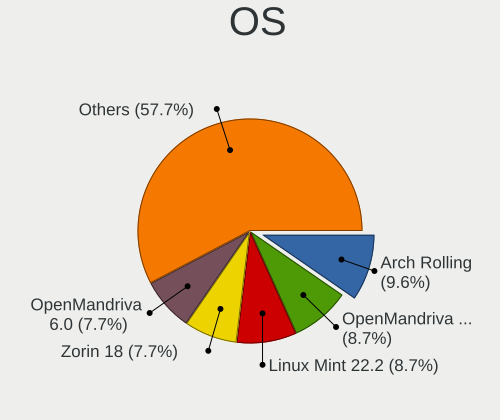

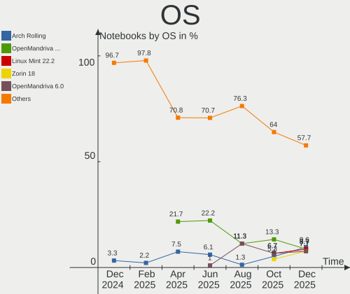

| Name                        | Notebooks | Percent |
|-----------------------------|-----------|---------|
| Arch Rolling                | 10        | 9.62%   |
| OpenMandriva 25.90          | 9         | 8.65%   |
| Linux Mint 22.2             | 9         | 8.65%   |
| Zorin 18                    | 8         | 7.69%   |
| OpenMandriva 6.0            | 8         | 7.69%   |
| Fedora 43                   | 7         | 6.73%   |
| Debian 13                   | 6         | 5.77%   |
| Ubuntu 25.10                | 5         | 4.81%   |
| OpenMandriva 25.11          | 4         | 3.85%   |
| Ubuntu 24.04                | 3         | 2.88%   |
| EndeavourOS Rolling         | 3         | 2.88%   |
| CachyOS Rolling             | 3         | 2.88%   |
| Bazzite 43                  | 3         | 2.88%   |
| Pop!_OS 24.04               | 2         | 1.92%   |
| OpenMandriva 24.12          | 2         | 1.92%   |
| NixOS 26.05                 | 2         | 1.92%   |
| Linux Mint 21.3             | 2         | 1.92%   |
| Xubuntu 24.04               | 1         | 0.96%   |
| Ubuntu 24.10                | 1         | 0.96%   |
| SteamOS 3.7.17              | 1         | 0.96%   |
| Pop!_OS 22.04               | 1         | 0.96%   |
| org.kde.Platform 5.15-21.08 | 1         | 0.96%   |
| Nobara 43                   | 1         | 0.96%   |
| Manjaro 25.1.0              | 1         | 0.96%   |
| Lubuntu 25.04               | 1         | 0.96%   |
| LMDE 7                      | 1         | 0.96%   |
| Linux Mint 22               | 1         | 0.96%   |
| Linux Mint 21.1             | 1         | 0.96%   |
| Linux Mint 20.3             | 1         | 0.96%   |
| Kubuntu 25.04               | 1         | 0.96%   |
| Kubuntu 24.04               | 1         | 0.96%   |
| Gentoo 2.18                 | 1         | 0.96%   |
| Garuda Linux Soaring        | 1         | 0.96%   |
| Debian 12                   | 1         | 0.96%   |
| CachyOS                     | 1         | 0.96%   |

OS Family
---------

OS without a version

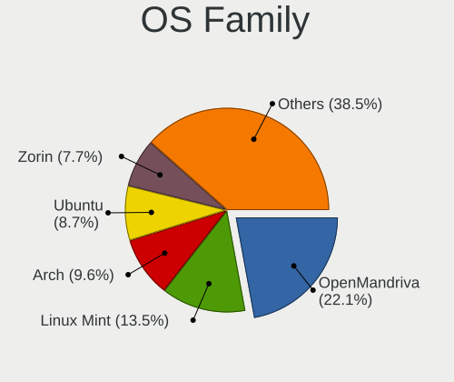

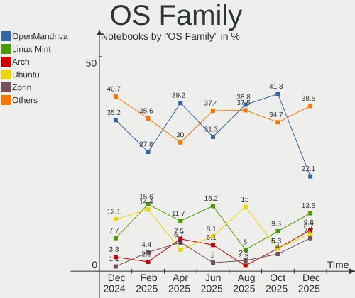

| Name             | Notebooks | Percent |
|------------------|-----------|---------|
| OpenMandriva     | 23        | 22.12%  |
| Linux Mint       | 14        | 13.46%  |
| Arch             | 10        | 9.62%   |
| Ubuntu           | 9         | 8.65%   |
| Zorin            | 8         | 7.69%   |
| Fedora           | 7         | 6.73%   |
| Debian           | 7         | 6.73%   |
| CachyOS          | 4         | 3.85%   |
| Pop!_OS          | 3         | 2.88%   |
| EndeavourOS      | 3         | 2.88%   |
| Bazzite          | 3         | 2.88%   |
| NixOS            | 2         | 1.92%   |
| Kubuntu          | 2         | 1.92%   |
| Xubuntu          | 1         | 0.96%   |
| SteamOS          | 1         | 0.96%   |
| org.kde.Platform | 1         | 0.96%   |
| Nobara           | 1         | 0.96%   |
| Manjaro          | 1         | 0.96%   |
| Lubuntu          | 1         | 0.96%   |
| LMDE             | 1         | 0.96%   |
| Gentoo           | 1         | 0.96%   |
| Garuda Linux     | 1         | 0.96%   |

Kernel
------

Version of the Linux kernel

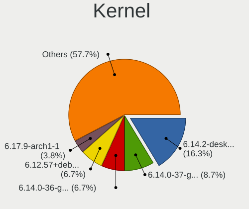

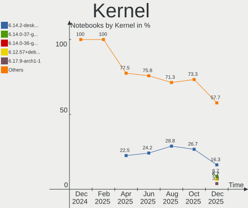

| Version                       | Notebooks | Percent |
|-------------------------------|-----------|---------|
| 6.14.2-desktop-3omv2590       | 17        | 16.35%  |
| 6.14.0-37-generic             | 9         | 8.65%   |
| 6.14.0-36-generic             | 7         | 6.73%   |
| 6.12.57+deb13-amd64           | 7         | 6.73%   |
| 6.17.9-arch1-1                | 4         | 3.85%   |
| 6.8.0-88-generic              | 3         | 2.88%   |
| 6.18.0-desktop-1omv2590       | 3         | 2.88%   |
| 6.17.9-2-cachyos              | 3         | 2.88%   |
| 6.17.12-300.fc43.x86_64       | 3         | 2.88%   |
| 6.8.0-90-generic              | 2         | 1.92%   |
| 6.17.9-76061709-generic       | 2         | 1.92%   |
| 6.17.8-arch1-1                | 2         | 1.92%   |
| 6.17.7-ba19.fc43.x86_64       | 2         | 1.92%   |
| 6.17.1-300.fc43.x86_64        | 2         | 1.92%   |
| 6.17.0-7-generic              | 2         | 1.92%   |
| 6.17.0-6-generic              | 2         | 1.92%   |
| 6.14.0-33-generic             | 2         | 1.92%   |
| 6.12.1-desktop-1omv2490       | 2         | 1.92%   |
| 5.15.0-161-generic            | 2         | 1.92%   |
| 6.18.2-zen2-1-zen             | 1         | 0.96%   |
| 6.18.2-arch2-1                | 1         | 0.96%   |
| 6.18.1-zen1-2-zen             | 1         | 0.96%   |
| 6.18.1-arch1-2                | 1         | 0.96%   |
| 6.18.1-1-MANJARO              | 1         | 0.96%   |
| 6.18.0-cachyos                | 1         | 0.96%   |
| 6.18.0-3-cachyos              | 1         | 0.96%   |
| 6.18.0-1-mainline             | 1         | 0.96%   |
| 6.18.0                        | 1         | 0.96%   |
| 6.17.9-200.nobara.fc43.x86_64 | 1         | 0.96%   |
| 6.17.8-1-cachyos              | 1         | 0.96%   |
| 6.17.7-desktop-1omv2590       | 1         | 0.96%   |
| 6.17.7-ba20.fc43.x86_64       | 1         | 0.96%   |
| 6.17.4-76061704-generic       | 1         | 0.96%   |
| 6.17.11-300.fc43.x86_64       | 1         | 0.96%   |
| 6.17.10-300.fc43.x86_64       | 1         | 0.96%   |
| 6.17.0-5-generic              | 1         | 0.96%   |
| 6.14.0-34-generic             | 1         | 0.96%   |
| 6.14.0-29-generic             | 1         | 0.96%   |
| 6.12.62-1-lts                 | 1         | 0.96%   |
| 6.12.57-1-lts                 | 1         | 0.96%   |

Kernel Family
-------------

Linux kernel without a distro release

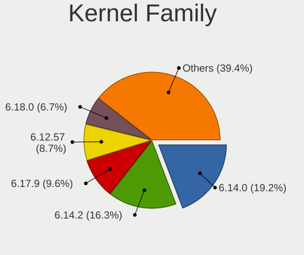

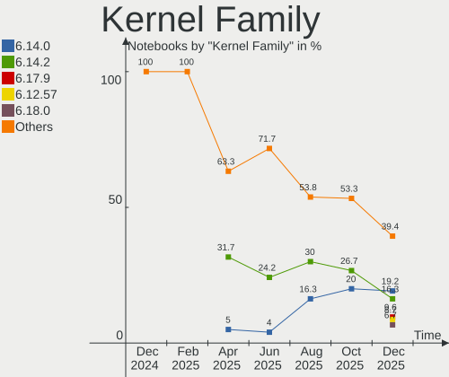

| Version | Notebooks | Percent |
|---------|-----------|---------|
| 6.14.0  | 20        | 19.23%  |
| 6.14.2  | 17        | 16.35%  |
| 6.17.9  | 10        | 9.62%   |
| 6.12.57 | 9         | 8.65%   |
| 6.18.0  | 7         | 6.73%   |
| 6.8.0   | 5         | 4.81%   |
| 6.17.0  | 5         | 4.81%   |
| 6.17.7  | 4         | 3.85%   |
| 5.15.0  | 4         | 3.85%   |
| 6.18.1  | 3         | 2.88%   |
| 6.17.8  | 3         | 2.88%   |
| 6.17.12 | 3         | 2.88%   |
| 6.18.2  | 2         | 1.92%   |
| 6.17.1  | 2         | 1.92%   |
| 6.12.1  | 2         | 1.92%   |
| 6.17.4  | 1         | 0.96%   |
| 6.17.11 | 1         | 0.96%   |
| 6.17.10 | 1         | 0.96%   |
| 6.12.62 | 1         | 0.96%   |
| 6.11.11 | 1         | 0.96%   |
| 6.11.0  | 1         | 0.96%   |
| 6.1.0   | 1         | 0.96%   |
| 4.14.83 | 1         | 0.96%   |

Kernel Major Ver.
-----------------

Linux kernel major version

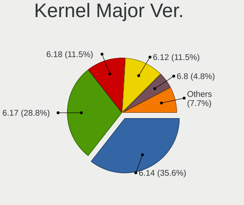

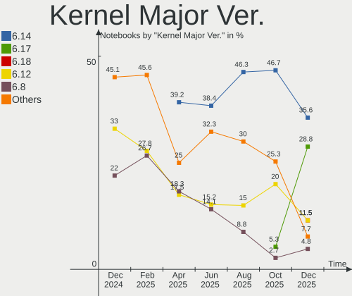

| Version | Notebooks | Percent |
|---------|-----------|---------|
| 6.14    | 37        | 35.58%  |
| 6.17    | 30        | 28.85%  |
| 6.18    | 12        | 11.54%  |
| 6.12    | 12        | 11.54%  |
| 6.8     | 5         | 4.81%   |
| 5.15    | 4         | 3.85%   |
| 6.11    | 2         | 1.92%   |
| 6.1     | 1         | 0.96%   |
| 4.14    | 1         | 0.96%   |

Arch
----

OS architecture (x86_64, i586, etc.)

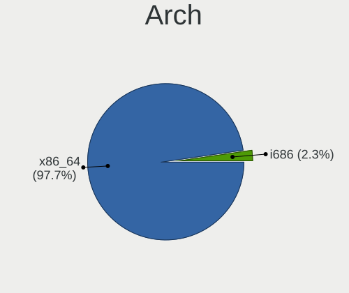

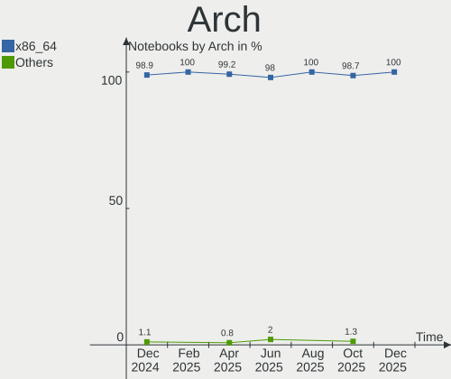

| Name   | Notebooks | Percent |
|--------|-----------|---------|
| x86_64 | 104       | 100%    |

DE
--

Desktop Environment

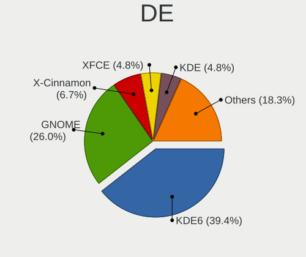

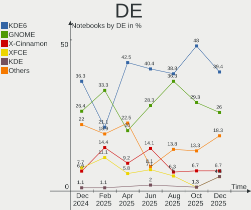

| Name       | Notebooks | Percent |
|------------|-----------|---------|
| KDE6       | 41        | 39.42%  |
| GNOME      | 27        | 25.96%  |
| X-Cinnamon | 7         | 6.73%   |
| XFCE       | 5         | 4.81%   |
| KDE        | 5         | 4.81%   |
| MATE       | 4         | 3.85%   |
| LXQt       | 3         | 2.88%   |
| niri       | 2         | 1.92%   |
| KDE5       | 2         | 1.92%   |
| Hyprland   | 2         | 1.92%   |
| COSMIC     | 2         | 1.92%   |
| Pantheon   | 1         | 0.96%   |
| KDE4       | 1         | 0.96%   |
| i3         | 1         | 0.96%   |
| Unknown    | 1         | 0.96%   |

Display Server
--------------

X11 or Wayland

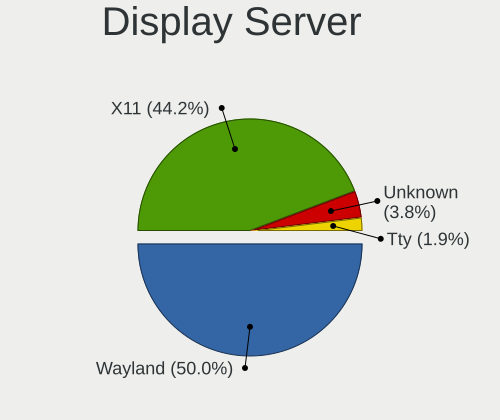

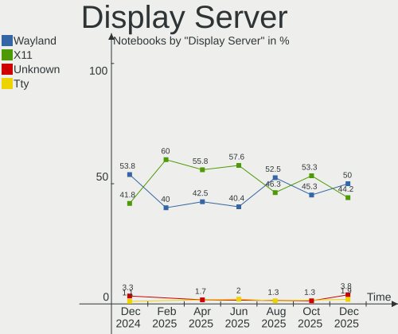

| Name    | Notebooks | Percent |
|---------|-----------|---------|
| Wayland | 52        | 50%     |
| X11     | 46        | 44.23%  |
| Unknown | 4         | 3.85%   |
| Tty     | 2         | 1.92%   |

Display Manager
---------------

SDDM, LightDM, etc.

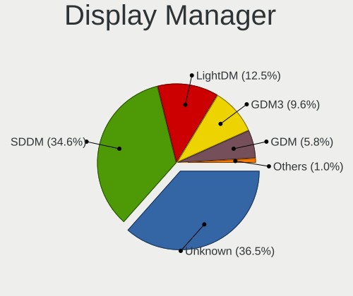

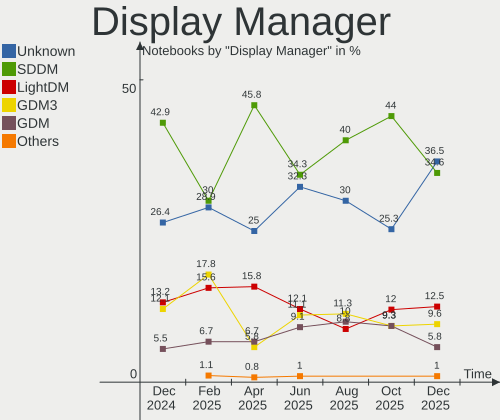

| Name    | Notebooks | Percent |
|---------|-----------|---------|
| Unknown | 38        | 36.54%  |
| SDDM    | 36        | 34.62%  |
| LightDM | 13        | 12.5%   |
| GDM3    | 10        | 9.62%   |
| GDM     | 6         | 5.77%   |
| GREETD  | 1         | 0.96%   |

OS Lang
-------

Language

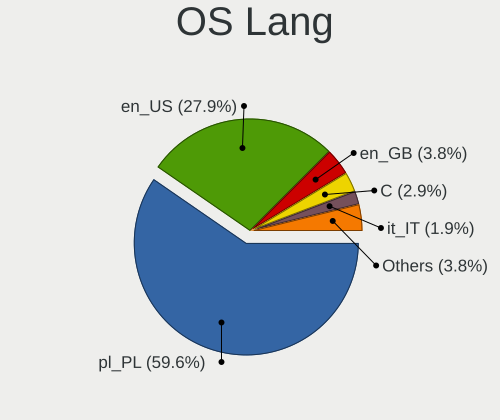

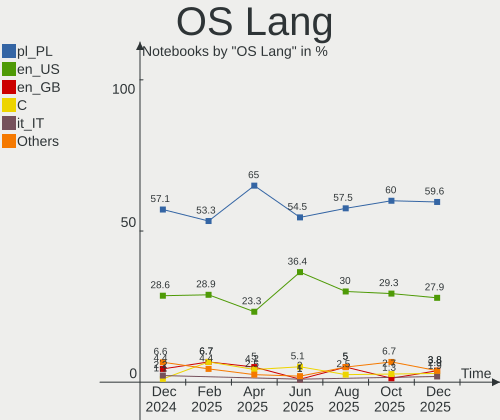

| Lang       | Notebooks | Percent |
|------------|-----------|---------|
| pl_PL      | 62        | 59.62%  |
| en_US      | 29        | 27.88%  |
| en_GB      | 4         | 3.85%   |
| C          | 3         | 2.88%   |
| it_IT      | 2         | 1.92%   |
| de_DE      | 2         | 1.92%   |
| en_US.UTF8 | 1         | 0.96%   |
| Unknown    | 1         | 0.96%   |

Boot Mode
---------

EFI or BIOS

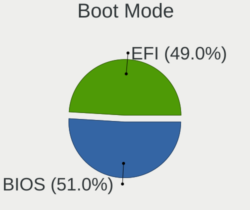

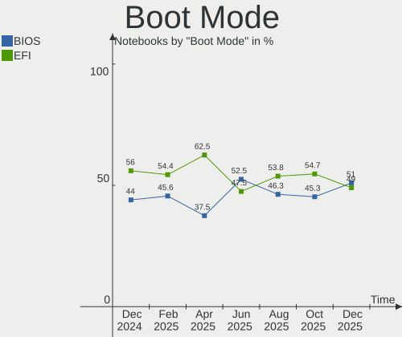

| Mode | Notebooks | Percent |
|------|-----------|---------|
| BIOS | 53        | 50.96%  |
| EFI  | 51        | 49.04%  |

Filesystem
----------

Type of filesystem

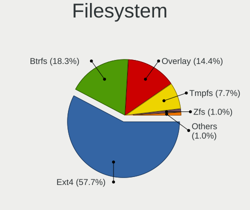

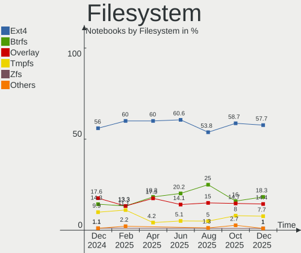

| Type    | Notebooks | Percent |
|---------|-----------|---------|
| Ext4    | 60        | 57.69%  |
| Btrfs   | 19        | 18.27%  |
| Overlay | 15        | 14.42%  |
| Tmpfs   | 8         | 7.69%   |
| Zfs     | 1         | 0.96%   |
| Xfs     | 1         | 0.96%   |

Part. scheme
------------

Scheme of partitioning

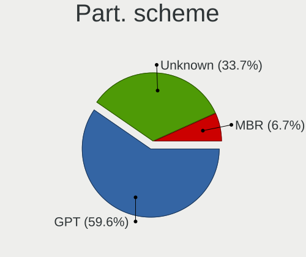

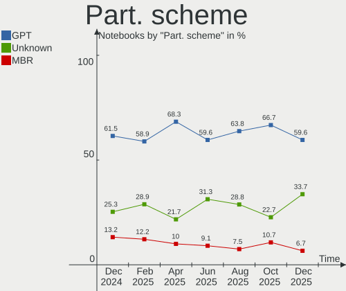

| Type    | Notebooks | Percent |
|---------|-----------|---------|
| GPT     | 62        | 59.62%  |
| Unknown | 35        | 33.65%  |
| MBR     | 7         | 6.73%   |

Dual Boot with Linux/BSD
------------------------

Hosting more than one Linux/BSD

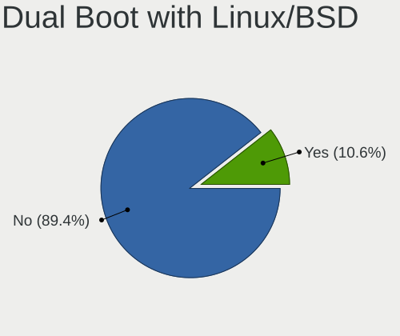

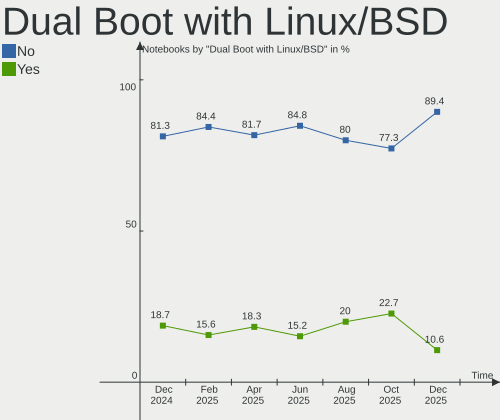

| Dual boot | Notebooks | Percent |
|-----------|-----------|---------|
| No        | 93        | 89.42%  |
| Yes       | 11        | 10.58%  |

Dual Boot (Win)
---------------

Hosting Linux and Windows

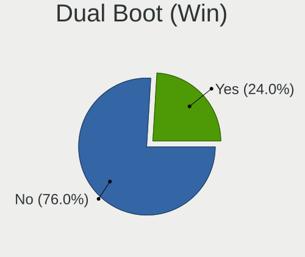

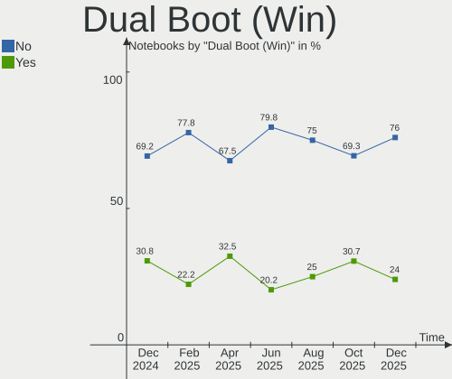

| Dual boot | Notebooks | Percent |
|-----------|-----------|---------|
| No        | 79        | 75.96%  |
| Yes       | 25        | 24.04%  |

Board
-----

Vendor
------

Motherboard manufacturer

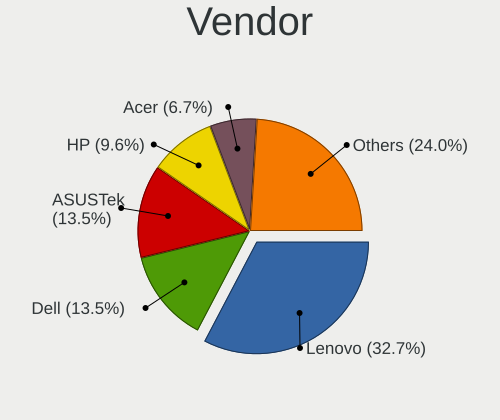

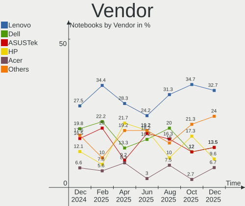

| Name                | Notebooks | Percent |
|---------------------|-----------|---------|
| Lenovo              | 34        | 32.69%  |
| Dell                | 14        | 13.46%  |
| ASUSTek Computer    | 14        | 13.46%  |
| Hewlett-Packard     | 10        | 9.62%   |
| Acer                | 7         | 6.73%   |
| HUAWEI              | 6         | 5.77%   |
| Samsung Electronics | 4         | 3.85%   |
| Google              | 3         | 2.88%   |
| MSI                 | 2         | 1.92%   |
| Valve               | 1         | 0.96%   |
| TUXEDO              | 1         | 0.96%   |
| Toshiba             | 1         | 0.96%   |
| Sony                | 1         | 0.96%   |
| Medion              | 1         | 0.96%   |
| LG Electronics      | 1         | 0.96%   |
| Gigabyte Technology | 1         | 0.96%   |
| Fujitsu             | 1         | 0.96%   |
| Framework           | 1         | 0.96%   |
| Dream Machines      | 1         | 0.96%   |

Model
-----

Motherboard model

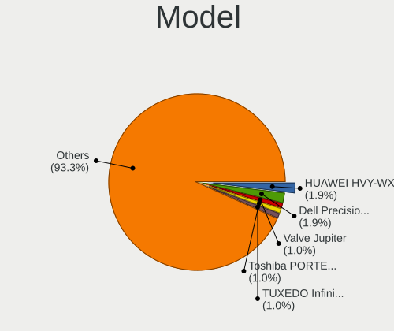

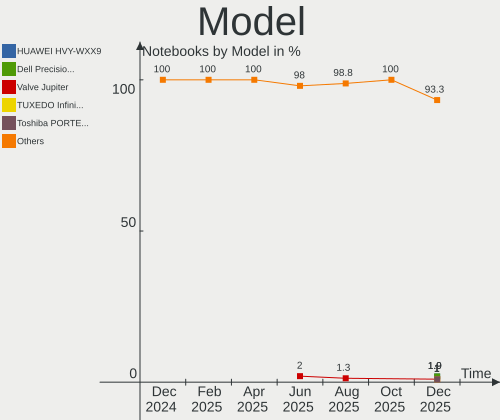

| Name                                        | Notebooks | Percent |
|---------------------------------------------|-----------|---------|
| HUAWEI HVY-WXX9                             | 2         | 1.92%   |
| Dell Precision 5510                         | 2         | 1.92%   |
| Valve Jupiter                               | 1         | 0.96%   |
| TUXEDO InfinityBook S Gen8                  | 1         | 0.96%   |
| Toshiba PORTEGE Z30-E                       | 1         | 0.96%   |
| Sony VPCEB3M1E                              | 1         | 0.96%   |
| Samsung RV411/RV511/E3511/S3511/RV711/E3411 | 1         | 0.96%   |
| Samsung 355V4C/356V4C/3445VC/3545VC         | 1         | 0.96%   |
| Samsung 350V5C/351V5C/3540VC/3440VC         | 1         | 0.96%   |
| Samsung 300E5EV/300E4EV/270E5EV/270E4EV     | 1         | 0.96%   |
| MSI Thin 15 B12VE                           | 1         | 0.96%   |
| MSI GF63 Thin 10UD                          | 1         | 0.96%   |
| Medion Akoya E7226T                         | 1         | 0.96%   |
| LG 16Z90R-G.AAM7U1                          | 1         | 0.96%   |
| Lenovo V15 G3 IAP CTO 83C4                  | 1         | 0.96%   |
| Lenovo ThinkPad X9-15 Gen 1 21Q6CTO1WW      | 1         | 0.96%   |
| Lenovo ThinkPad X200 7459ZMU                | 1         | 0.96%   |
| Lenovo ThinkPad X1 Carbon 7th 20QES3HS00    | 1         | 0.96%   |
| Lenovo ThinkPad T520 4242A85                | 1         | 0.96%   |
| Lenovo ThinkPad T500 2241VCM                | 1         | 0.96%   |
| Lenovo ThinkPad T490 20N3S88305             | 1         | 0.96%   |
| Lenovo ThinkPad T480s 20L8S0SA00            | 1         | 0.96%   |
| Lenovo ThinkPad T480 20L6SE5A00             | 1         | 0.96%   |
| Lenovo ThinkPad T14 Gen 4 21HES7N700        | 1         | 0.96%   |
| Lenovo ThinkPad P16 Gen 3 21RQS0DV00        | 1         | 0.96%   |
| Lenovo ThinkPad L15 Gen 2 20X4S4LM0P        | 1         | 0.96%   |
| Lenovo ThinkPad E16 Gen 2 21MA0021PB        | 1         | 0.96%   |
| Lenovo ThinkPad A285 20MXS0JR14             | 1         | 0.96%   |
| Lenovo ThinkBook 16 G7+ IAH 21TL            | 1         | 0.96%   |
| Lenovo ThinkBook 13s-IWL 20R9               | 1         | 0.96%   |
| Lenovo LOQ 15IAX9E 83LK                     | 1         | 0.96%   |
| Lenovo LOQ 15IAX9 83GS                      | 1         | 0.96%   |
| Lenovo Legion Pro 7 16ARX8H 82WS            | 1         | 0.96%   |
| Lenovo Legion Pro 5 16IRX9 83DF             | 1         | 0.96%   |
| Lenovo Legion Pro 5 16ADR10 83LT            | 1         | 0.96%   |
| Lenovo Legion 5 15IRX10 83LY                | 1         | 0.96%   |
| Lenovo Legion 5 15AHP10 83M0                | 1         | 0.96%   |
| Lenovo IdeaPad Y530                         | 1         | 0.96%   |
| Lenovo IdeaPad Gaming 3 15ARH05 82EY        | 1         | 0.96%   |
| Lenovo IdeaPad 5 14IIL05 81YH               | 1         | 0.96%   |

Model Family
------------

Motherboard model prefix

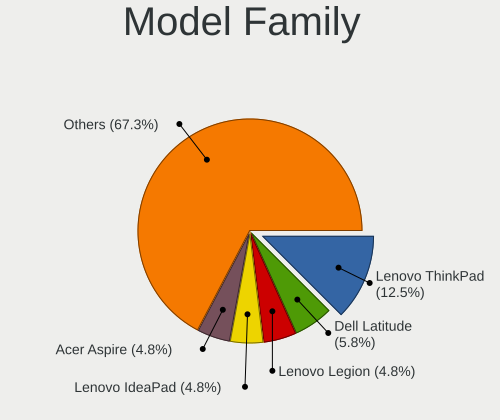

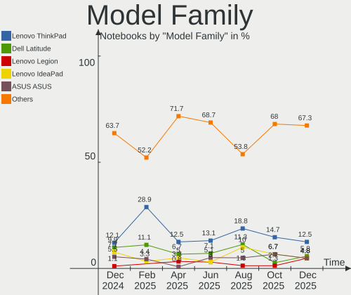

| Name                | Notebooks | Percent |
|---------------------|-----------|---------|
| Lenovo ThinkPad     | 13        | 12.5%   |
| Dell Latitude       | 6         | 5.77%   |
| Lenovo Legion       | 5         | 4.81%   |
| Lenovo IdeaPad      | 5         | 4.81%   |
| ASUS ASUS           | 5         | 4.81%   |
| Acer Aspire         | 5         | 4.81%   |
| Dell Precision      | 4         | 3.85%   |
| HP EliteBook        | 3         | 2.88%   |
| Lenovo ThinkBook    | 2         | 1.92%   |
| Lenovo LOQ          | 2         | 1.92%   |
| HUAWEI HVY-WXX9     | 2         | 1.92%   |
| HP Victus           | 2         | 1.92%   |
| HP ProBook          | 2         | 1.92%   |
| Dell Inspiron       | 2         | 1.92%   |
| ASUS VivoBook       | 2         | 1.92%   |
| Valve Jupiter       | 1         | 0.96%   |
| TUXEDO InfinityBook | 1         | 0.96%   |
| Toshiba PORTEGE     | 1         | 0.96%   |
| Sony VPCEB3M1E      | 1         | 0.96%   |
| Samsung RV411       | 1         | 0.96%   |
| Samsung 355V4C      | 1         | 0.96%   |
| Samsung 350V5C      | 1         | 0.96%   |
| Samsung 300E5EV     | 1         | 0.96%   |
| MSI Thin            | 1         | 0.96%   |
| MSI GF63            | 1         | 0.96%   |
| Medion Akoya        | 1         | 0.96%   |
| LG 16Z90R-G.AAM7U1  | 1         | 0.96%   |
| Lenovo V15          | 1         | 0.96%   |
| Lenovo G770         | 1         | 0.96%   |
| Lenovo G700         | 1         | 0.96%   |
| Lenovo G580         | 1         | 0.96%   |
| Lenovo G500         | 1         | 0.96%   |
| Lenovo G50-70       | 1         | 0.96%   |
| Lenovo 3000         | 1         | 0.96%   |
| HUAWEI WRT-WX9      | 1         | 0.96%   |
| HUAWEI VGHH-XX      | 1         | 0.96%   |
| HUAWEI MateBook     | 1         | 0.96%   |
| HUAWEI FLMH-XX      | 1         | 0.96%   |
| HP ZBook            | 1         | 0.96%   |
| HP OmniBook         | 1         | 0.96%   |

MFG Year
--------

Motherboard manufacture year

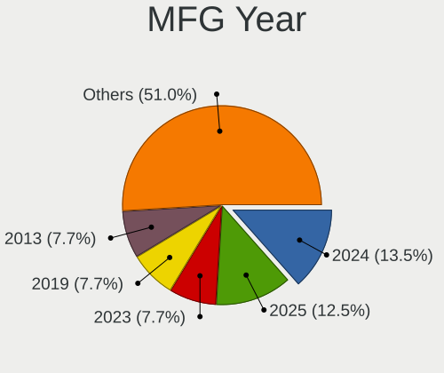

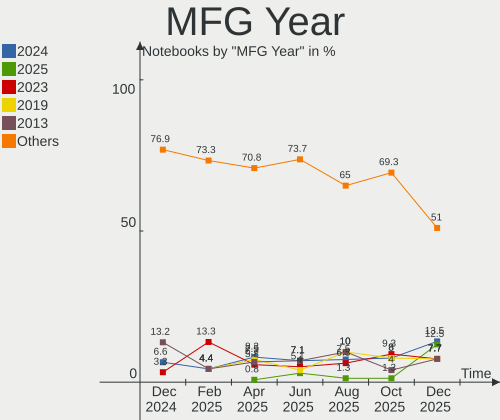

| Year | Notebooks | Percent |
|------|-----------|---------|
| 2024 | 14        | 13.46%  |
| 2025 | 13        | 12.5%   |
| 2023 | 8         | 7.69%   |
| 2019 | 8         | 7.69%   |
| 2013 | 8         | 7.69%   |
| 2011 | 8         | 7.69%   |
| 2020 | 7         | 6.73%   |
| 2018 | 7         | 6.73%   |
| 2012 | 7         | 6.73%   |
| 2021 | 4         | 3.85%   |
| 2014 | 4         | 3.85%   |
| 2010 | 4         | 3.85%   |
| 2008 | 4         | 3.85%   |
| 2022 | 3         | 2.88%   |
| 2016 | 3         | 2.88%   |
| 2017 | 1         | 0.96%   |
| 2015 | 1         | 0.96%   |

Form Factor
-----------

Physical design of the computer

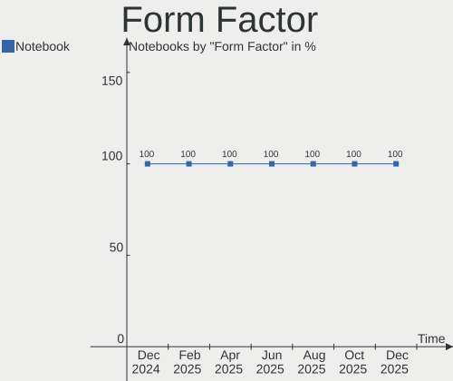

| Name     | Notebooks | Percent |
|----------|-----------|---------|
| Notebook | 104       | 100%    |

Secure Boot
-----------

Enabled or disabled

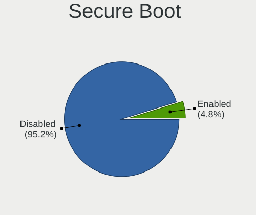

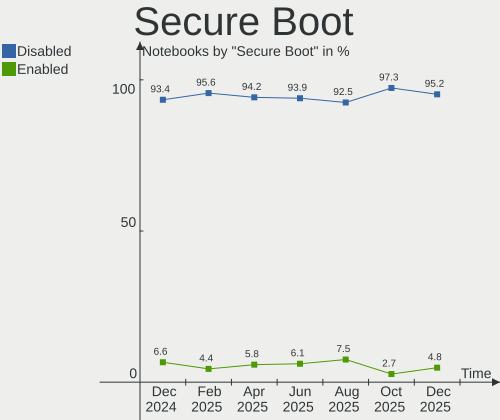

| State    | Notebooks | Percent |
|----------|-----------|---------|
| Disabled | 99        | 95.19%  |
| Enabled  | 5         | 4.81%   |

Coreboot
--------

Have coreboot on board

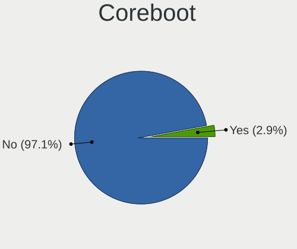

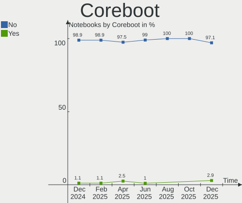

| Used | Notebooks | Percent |
|------|-----------|---------|
| No   | 101       | 97.12%  |
| Yes  | 3         | 2.88%   |

RAM Size
--------

Total RAM memory

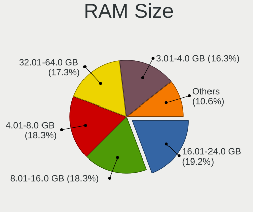

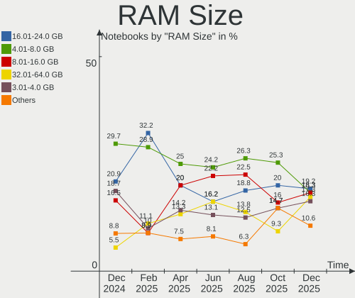

| Size in GB  | Notebooks | Percent |
|-------------|-----------|---------|
| 16.01-24.0  | 20        | 19.23%  |
| 4.01-8.0    | 19        | 18.27%  |
| 8.01-16.0   | 19        | 18.27%  |
| 32.01-64.0  | 18        | 17.31%  |
| 3.01-4.0    | 17        | 16.35%  |
| 24.01-32.0  | 6         | 5.77%   |
| 64.01-256.0 | 3         | 2.88%   |
| 2.01-3.0    | 2         | 1.92%   |

RAM Used
--------

Used RAM memory

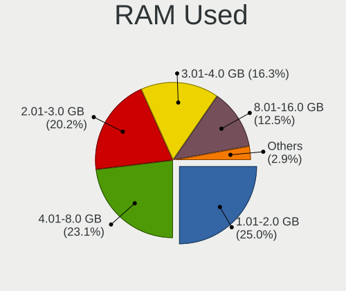

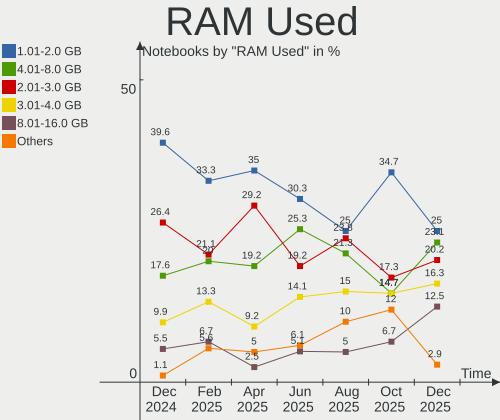

| Used GB    | Notebooks | Percent |
|------------|-----------|---------|
| 1.01-2.0   | 26        | 25%     |
| 4.01-8.0   | 24        | 23.08%  |
| 2.01-3.0   | 21        | 20.19%  |
| 3.01-4.0   | 17        | 16.35%  |
| 8.01-16.0  | 13        | 12.5%   |
| 16.01-24.0 | 3         | 2.88%   |

Total Drives
------------

Number of drives on board

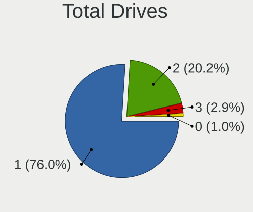

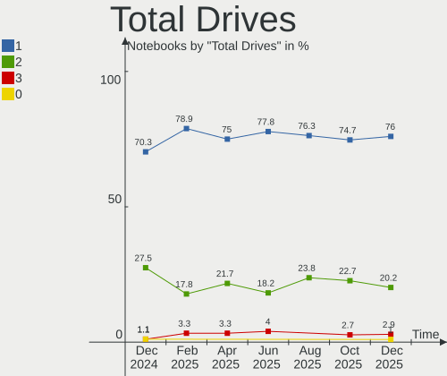

| Drives | Notebooks | Percent |
|--------|-----------|---------|
| 1      | 79        | 75.96%  |
| 2      | 21        | 20.19%  |
| 3      | 3         | 2.88%   |
| 0      | 1         | 0.96%   |

Has CD-ROM
----------

Has CD-ROM on board

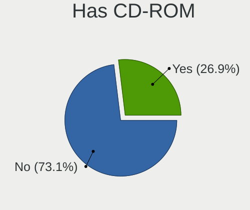

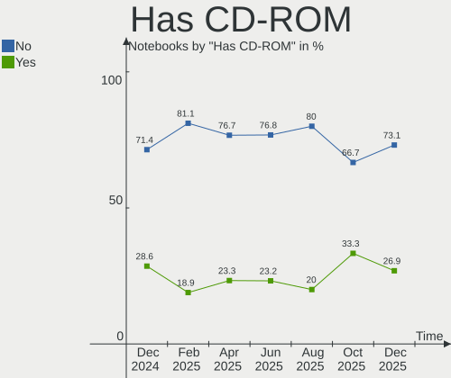

| Presented | Notebooks | Percent |
|-----------|-----------|---------|
| No        | 76        | 73.08%  |
| Yes       | 28        | 26.92%  |

Has Ethernet
------------

Has Ethernet on board

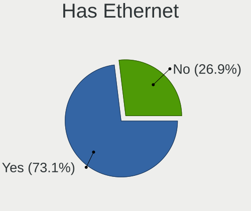

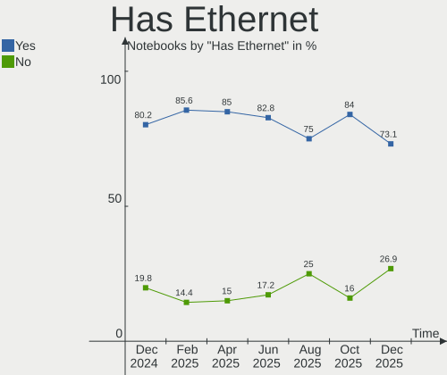

| Presented | Notebooks | Percent |
|-----------|-----------|---------|
| Yes       | 76        | 73.08%  |
| No        | 28        | 26.92%  |

Has WiFi
--------

Has WiFi module

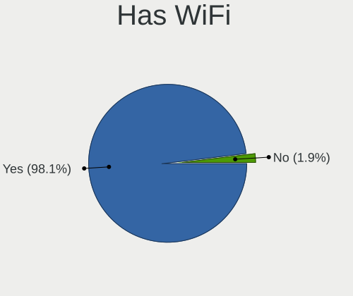

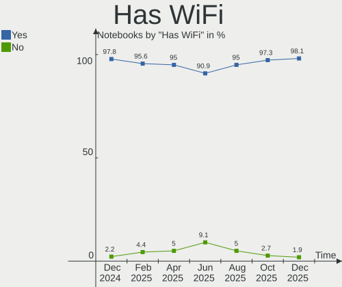

| Presented | Notebooks | Percent |
|-----------|-----------|---------|
| Yes       | 102       | 98.08%  |
| No        | 2         | 1.92%   |

Has Bluetooth
-------------

Has Bluetooth module

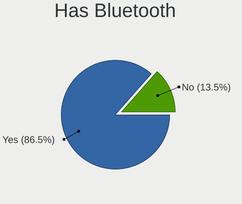

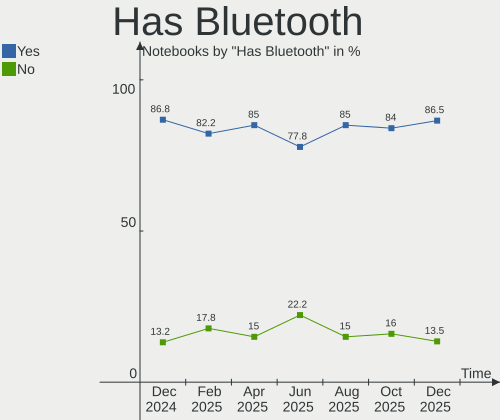

| Presented | Notebooks | Percent |
|-----------|-----------|---------|
| Yes       | 90        | 86.54%  |
| No        | 14        | 13.46%  |

Location
--------

Country
-------

Geographic location (country)

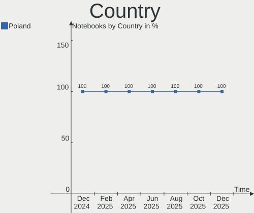

| Country | Notebooks | Percent |
|---------|-----------|---------|
| Poland  | 104       | 100%    |

City
----

Geographic location (city)

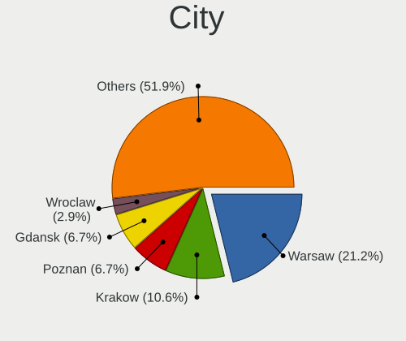

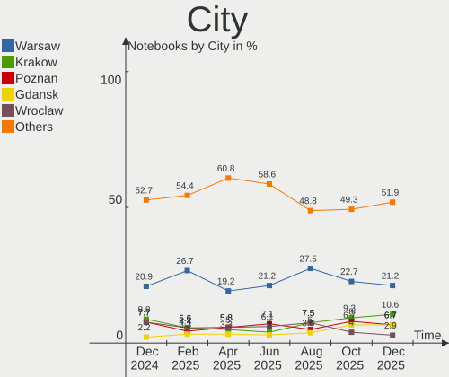

| City                 | Notebooks | Percent |
|----------------------|-----------|---------|
| Warsaw               | 22        | 21.15%  |
| Krakow               | 11        | 10.58%  |
| Poznan               | 7         | 6.73%   |
| Gdansk               | 7         | 6.73%   |
| Wroclaw              | 3         | 2.88%   |
| Torun                | 3         | 2.88%   |
| Rzeszów             | 3         | 2.88%   |
| Lublin               | 3         | 2.88%   |
| Częstochowa         | 3         | 2.88%   |
| Ruda Śląska        | 2         | 1.92%   |
| Chorzów             | 2         | 1.92%   |
| Zielona Góra        | 1         | 0.96%   |
| Tyczyn               | 1         | 0.96%   |
| Tychy                | 1         | 0.96%   |
| Szczecinek           | 1         | 0.96%   |
| Szczecin             | 1         | 0.96%   |
| Swidnik              | 1         | 0.96%   |
| Suwałki             | 1         | 0.96%   |
| Stargard             | 1         | 0.96%   |
| Sosnowiec            | 1         | 0.96%   |
| Solarnia             | 1         | 0.96%   |
| Rybnik               | 1         | 0.96%   |
| Pyzowka              | 1         | 0.96%   |
| Pruszków            | 1         | 0.96%   |
| Piekary Slaskie      | 1         | 0.96%   |
| Pawlowice            | 1         | 0.96%   |
| Paledzie             | 1         | 0.96%   |
| Otwock               | 1         | 0.96%   |
| Ostrów Wielkopolski | 1         | 0.96%   |
| Opole                | 1         | 0.96%   |
| Maniowy              | 1         | 0.96%   |
| Lodz                 | 1         | 0.96%   |
| Limanowa             | 1         | 0.96%   |
| Lidzbark Warmiński  | 1         | 0.96%   |
| Legnica              | 1         | 0.96%   |
| Kutno                | 1         | 0.96%   |
| Konin                | 1         | 0.96%   |
| Kępno               | 1         | 0.96%   |
| Katowice             | 1         | 0.96%   |
| Kamiensk             | 1         | 0.96%   |

Drives
------

Drive Vendor
------------

Hard drive vendors

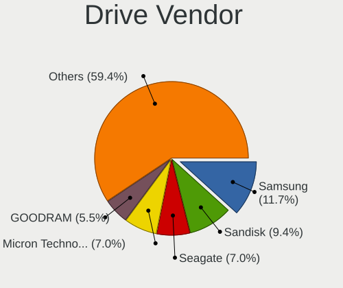

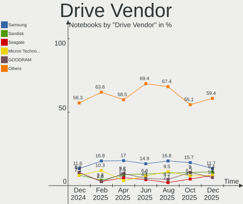

| Vendor                         | Notebooks | Drives | Percent |
|--------------------------------|-----------|--------|---------|
| Samsung Electronics            | 15        | 17     | 11.72%  |
| Sandisk                        | 12        | 13     | 9.38%   |
| Seagate                        | 9         | 10     | 7.03%   |
| Micron Technology              | 9         | 9      | 7.03%   |
| GOODRAM                        | 7         | 7      | 5.47%   |
| Unknown                        | 6         | 7      | 4.69%   |
| SK hynix                       | 6         | 6      | 4.69%   |
| Toshiba                        | 5         | 5      | 3.91%   |
| A-DATA Technology              | 5         | 5      | 3.91%   |
| WDC                            | 4         | 4      | 3.13%   |
| Phison Electronics             | 4         | 4      | 3.13%   |
| KIOXIA                         | 4         | 5      | 3.13%   |
| Crucial                        | 4         | 4      | 3.13%   |
| Shenzhen Longsys Electronics   | 3         | 3      | 2.34%   |
| MAXIO Technology (Hangzhou)    | 3         | 3      | 2.34%   |
| Kingston Technology Company    | 3         | 4      | 2.34%   |
| Kingston                       | 3         | 3      | 2.34%   |
| Intel                          | 3         | 3      | 2.34%   |
| Hitachi                        | 3         | 3      | 2.34%   |
| Micron/Crucial Technology      | 2         | 2      | 1.56%   |
| KIOXIA-EXCERIA                 | 2         | 2      | 1.56%   |
| HGST                           | 2         | 2      | 1.56%   |
| Yangtze Memory Technologies    | 1         | 1      | 0.78%   |
| Verbatim                       | 1         | 1      | 0.78%   |
| Union Memory (Shenzhen)        | 1         | 1      | 0.78%   |
| SPCC                           | 1         | 1      | 0.78%   |
| Solid State Storage Technology | 1         | 1      | 0.78%   |
| Realtek Semiconductor          | 1         | 1      | 0.78%   |
| Patriot                        | 1         | 1      | 0.78%   |
| Neo Forza                      | 1         | 1      | 0.78%   |
| Lite-On Technology             | 1         | 1      | 0.78%   |
| JMicron Technology             | 1         | 1      | 0.78%   |
| Intenso                        | 1         | 1      | 0.78%   |
| IB-AC703                       | 1         | 1      | 0.78%   |
| China                          | 1         | 1      | 0.78%   |
| ADATA Technology               | 1         | 1      | 0.78%   |

Drive Model
-----------

Hard drive models

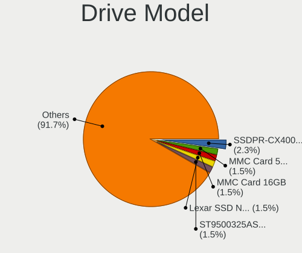

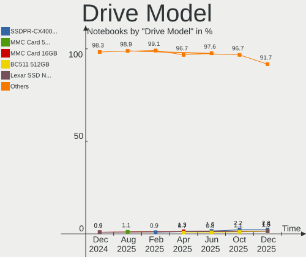

| Model                                                                   | Notebooks | Percent |
|-------------------------------------------------------------------------|-----------|---------|
| GOODRAM SSDPR-CX400-256-G2 256GB                                        | 3         | 2.26%   |
| Unknown MMC Card  512GB                                                 | 2         | 1.5%    |
| Unknown MMC Card  16GB                                                  | 2         | 1.5%    |
| SK hynix BC511 512GB                                                    | 2         | 1.5%    |
| Shenzhen Longsys Lexar SSD NM620 1TB                                    | 2         | 1.5%    |
| Seagate ST9500325AS 500GB                                               | 2         | 1.5%    |
| Seagate ST1000LM048-2E7172 1TB                                          | 2         | 1.5%    |
| Seagate ST1000LM014-1EJ164 1TB                                          | 2         | 1.5%    |
| Seagate Expansion 2TB                                                   | 2         | 1.5%    |
| Sandisk WD Blue SN5000 2TB                                              | 2         | 1.5%    |
| Sandisk WD Black SN770 / PC SN740 256GB / PC SN560 (DRAM-less) NVMe SSD | 2         | 1.5%    |
| Samsung SSD 850 EVO 250GB                                               | 2         | 1.5%    |
| MAXIO (Hangzhou) NVMe SSD Controller MAP1202 (DRAM-less) 512GB          | 2         | 1.5%    |
| Crucial CT500MX500SSD1 500GB                                            | 2         | 1.5%    |
| Yangtze Memory YMTC PC005 512GB                                         | 1         | 0.75%   |
| WDC WD7500BPVT-35HXZT3 752GB                                            | 1         | 0.75%   |
| WDC WD10JPVX-22JC3T0 1TB                                                | 1         | 0.75%   |
| WDC PC SN730 SDBPNTY-512G-1027 512GB                                    | 1         | 0.75%   |
| WDC PC SN520 SDAPMUW-512G-1101 512GB                                    | 1         | 0.75%   |
| Verbatim Vi560 512GB SSD                                                | 1         | 0.75%   |
| Unknown MMC Card  7GB                                                   | 1         | 0.75%   |
| Unknown MMC Card  128GB                                                 | 1         | 0.75%   |
| Unknown BJTD4R  32GB                                                    | 1         | 0.75%   |
| Union Memory (Shenzhen) UMIS RPJYJ1T24RLS1QWY 1024GB                    | 1         | 0.75%   |
| Toshiba XG6 NVMe SSD Controller 1024GB                                  | 1         | 0.75%   |
| Toshiba TR200 240GB SSD                                                 | 1         | 0.75%   |
| Toshiba MK7559GSXF 752GB                                                | 1         | 0.75%   |
| Toshiba MK5055GSXF 500GB                                                | 1         | 0.75%   |
| Toshiba KSG60ZMV256G 256GB SSD                                          | 1         | 0.75%   |
| SPCC M.2 SSD 512GB                                                      | 1         | 0.75%   |
| Solid State Storage CL1-3D256-Q11 NVMe SSD M.2 512GB                    | 1         | 0.75%   |
| SK hynix SKHynix_HFS001TEM4X182N 1TB                                    | 1         | 0.75%   |
| SK hynix SHPP41-2000GM 2TB                                              | 1         | 0.75%   |
| SK hynix PVC10 NVMe Solid State Drive (DRAM-less) 1TB                   | 1         | 0.75%   |
| SK hynix BC711 NVMe 512GB                                               | 1         | 0.75%   |
| Shenzhen Longsys TEAM TM8FPD512G 512GB                                  | 1         | 0.75%   |
| Seagate ST95005620AS 500GB                                              | 1         | 0.75%   |
| Seagate ST1000LM024 HN-M101MBB 1TB                                      | 1         | 0.75%   |
| Sandisk WD PC SN740 SDDPNQD-512G-1127 512GB                             | 1         | 0.75%   |
| Sandisk WD PC SN5000S SDEQNSJ-512G-1002 512GB                           | 1         | 0.75%   |

HDD Vendor
----------

Hard disk drive vendors

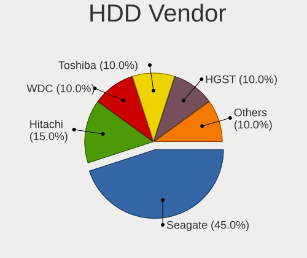

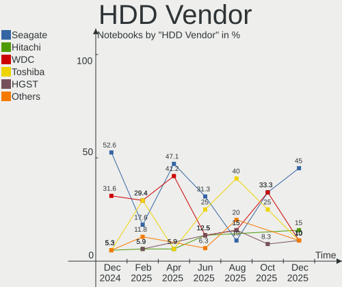

| Vendor   | Notebooks | Drives | Percent |
|----------|-----------|--------|---------|
| Seagate  | 9         | 10     | 45%     |
| Hitachi  | 3         | 3      | 15%     |
| WDC      | 2         | 2      | 10%     |
| Toshiba  | 2         | 2      | 10%     |
| HGST     | 2         | 2      | 10%     |
| Intenso  | 1         | 1      | 5%      |
| IB-AC703 | 1         | 1      | 5%      |

SSD Vendor
----------

Solid state drive vendors

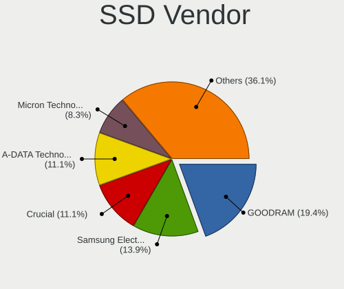

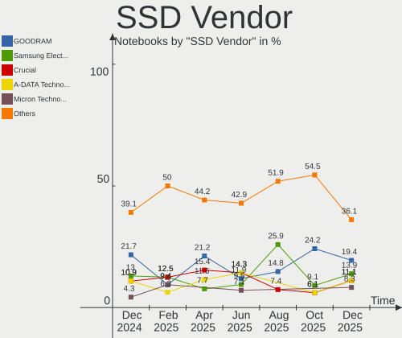

| Vendor              | Notebooks | Drives | Percent |
|---------------------|-----------|--------|---------|
| GOODRAM             | 7         | 7      | 19.44%  |
| Samsung Electronics | 5         | 5      | 13.89%  |
| Crucial             | 4         | 4      | 11.11%  |
| A-DATA Technology   | 4         | 4      | 11.11%  |
| Micron Technology   | 3         | 3      | 8.33%   |
| Kingston            | 3         | 3      | 8.33%   |
| Toshiba             | 2         | 2      | 5.56%   |
| KIOXIA-EXCERIA      | 2         | 2      | 5.56%   |
| Verbatim            | 1         | 1      | 2.78%   |
| SPCC                | 1         | 1      | 2.78%   |
| Patriot             | 1         | 1      | 2.78%   |
| Neo Forza           | 1         | 1      | 2.78%   |
| Intel               | 1         | 1      | 2.78%   |
| China               | 1         | 1      | 2.78%   |

Drive Kind
----------

HDD or SSD

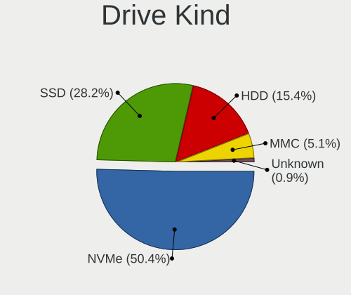

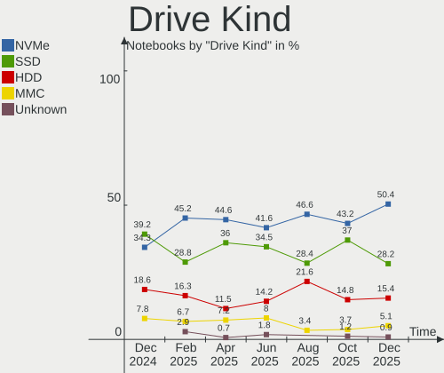

| Kind    | Notebooks | Drives | Percent |
|---------|-----------|--------|---------|
| NVMe    | 59        | 70     | 50.43%  |
| SSD     | 33        | 36     | 28.21%  |
| HDD     | 18        | 21     | 15.38%  |
| MMC     | 6         | 7      | 5.13%   |
| Unknown | 1         | 1      | 0.85%   |

Drive Connector
---------------

SATA, SAS, NVMe, etc.

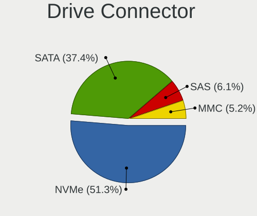

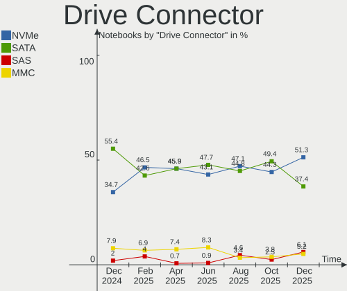

| Type | Notebooks | Drives | Percent |
|------|-----------|--------|---------|
| NVMe | 59        | 70     | 51.3%   |
| SATA | 43        | 51     | 37.39%  |
| SAS  | 7         | 7      | 6.09%   |
| MMC  | 6         | 7      | 5.22%   |

Drive Size
----------

Size of hard drive

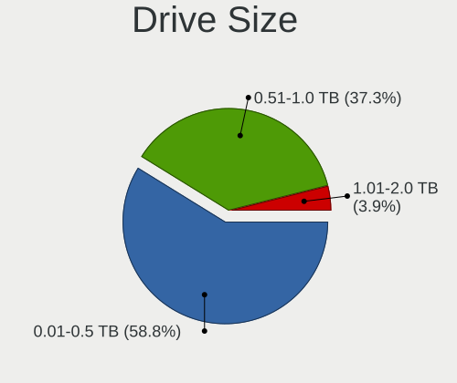

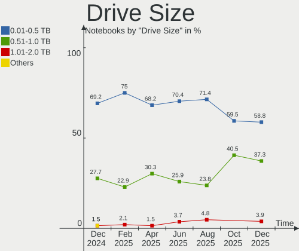

| Size in TB | Notebooks | Drives | Percent |
|------------|-----------|--------|---------|
| 0.01-0.5   | 30        | 35     | 58.82%  |
| 0.51-1.0   | 19        | 20     | 37.25%  |
| 1.01-2.0   | 2         | 2      | 3.92%   |

Space Total
-----------

Amount of disk space available on the file system

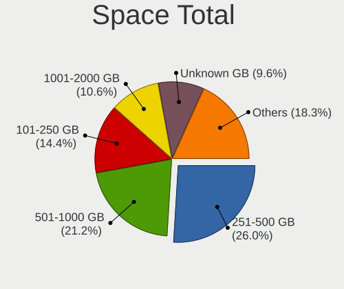

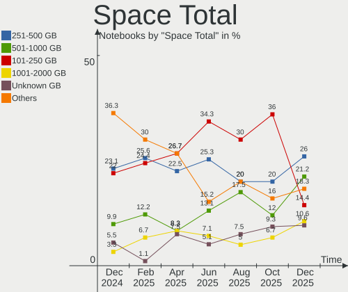

| Size in GB     | Notebooks | Percent |
|----------------|-----------|---------|
| 251-500        | 27        | 25.96%  |
| 501-1000       | 22        | 21.15%  |
| 101-250        | 15        | 14.42%  |
| 1001-2000      | 11        | 10.58%  |
| Unknown        | 10        | 9.62%   |
| 1-20           | 9         | 8.65%   |
| More than 3000 | 6         | 5.77%   |
| 2001-3000      | 2         | 1.92%   |
| 21-50          | 1         | 0.96%   |
| 51-100         | 1         | 0.96%   |

Space Used
----------

Amount of used disk space

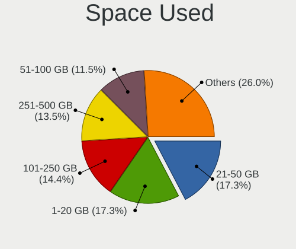

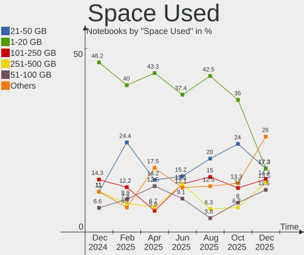

| Used GB   | Notebooks | Percent |
|-----------|-----------|---------|
| 21-50     | 18        | 17.31%  |
| 1-20      | 18        | 17.31%  |
| 101-250   | 15        | 14.42%  |
| 251-500   | 14        | 13.46%  |
| 51-100    | 12        | 11.54%  |
| Unknown   | 10        | 9.62%   |
| 501-1000  | 8         | 7.69%   |
| 1001-2000 | 7         | 6.73%   |
| 0         | 2         | 1.92%   |

Malfunc. Drives
---------------

Drive models with a malfunction

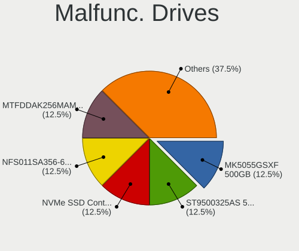

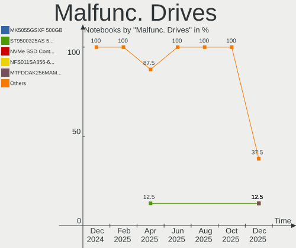

| Model                                                         | Notebooks | Drives | Percent |
|---------------------------------------------------------------|-----------|--------|---------|
| Toshiba MK5055GSXF 500GB                                      | 1         | 1      | 12.5%   |
| Seagate ST9500325AS 500GB                                     | 1         | 1      | 12.5%   |
| Samsung Electronics NVMe SSD Controller 980 (DRAM-less) 256GB | 1         | 1      | 12.5%   |
| Neo Forza NFS011SA356-6007200 256GB SSD                       | 1         | 1      | 12.5%   |
| Micron Technology MTFDDAK256MAM-1K12 256GB SSD                | 1         | 1      | 12.5%   |
| Micron Technology MTFDDAK256MAM-1K1 256GB SSD                 | 1         | 1      | 12.5%   |
| Intel SSDSC2KW240H6 240GB                                     | 1         | 1      | 12.5%   |
| Hitachi HTS547575A9E384 752GB                                 | 1         | 1      | 12.5%   |

Malfunc. Drive Vendor
---------------------

Vendors of faulty drives

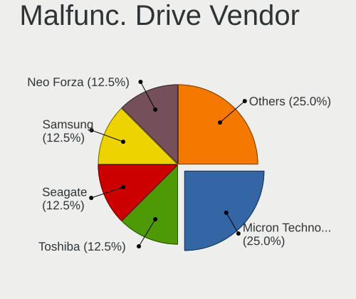

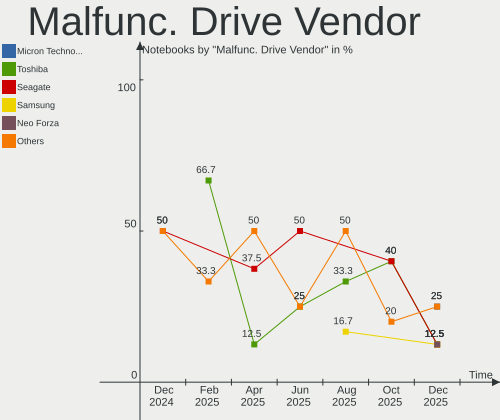

| Vendor              | Notebooks | Drives | Percent |
|---------------------|-----------|--------|---------|
| Micron Technology   | 2         | 2      | 25%     |
| Toshiba             | 1         | 1      | 12.5%   |
| Seagate             | 1         | 1      | 12.5%   |
| Samsung Electronics | 1         | 1      | 12.5%   |
| Neo Forza           | 1         | 1      | 12.5%   |
| Intel               | 1         | 1      | 12.5%   |
| Hitachi             | 1         | 1      | 12.5%   |

Malfunc. HDD Vendor
-------------------

Vendors of faulty HDD drives

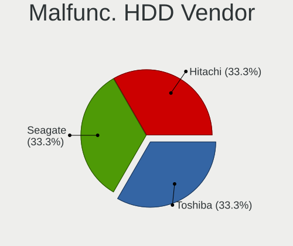

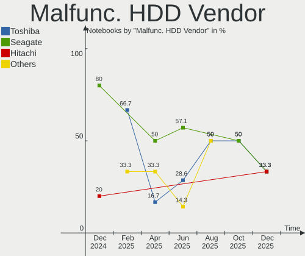

| Vendor  | Notebooks | Drives | Percent |
|---------|-----------|--------|---------|
| Toshiba | 1         | 1      | 33.33%  |
| Seagate | 1         | 1      | 33.33%  |
| Hitachi | 1         | 1      | 33.33%  |

Malfunc. Drive Kind
-------------------

Kinds of faulty drives

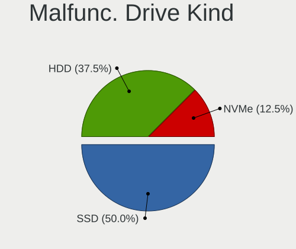

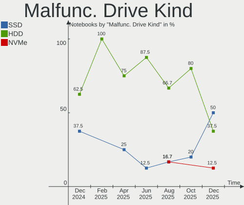

| Kind | Notebooks | Drives | Percent |
|------|-----------|--------|---------|
| SSD  | 4         | 4      | 50%     |
| HDD  | 3         | 3      | 37.5%   |
| NVMe | 1         | 1      | 12.5%   |

Failed Drives
-------------

Failed drive models

Zero info for selected period =(

Failed Drive Vendor
-------------------

Failed drive vendors

Zero info for selected period =(

Drive Status
------------

Number of failed and malfunc. drives

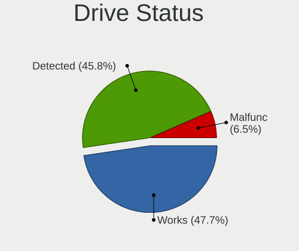

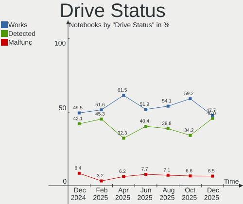

| Status   | Notebooks | Drives | Percent |
|----------|-----------|--------|---------|
| Works    | 51        | 61     | 47.66%  |
| Detected | 49        | 66     | 45.79%  |
| Malfunc  | 7         | 8      | 6.54%   |

Storage controller
------------------

Storage Vendor
--------------

Storage controller vendors

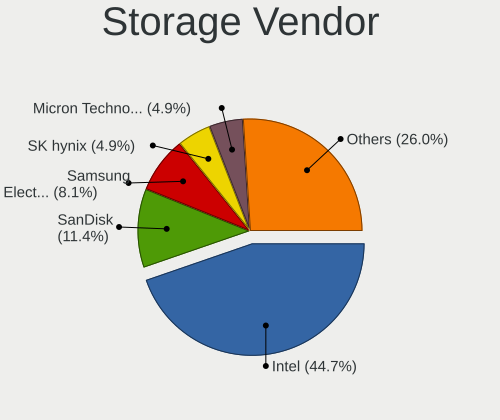

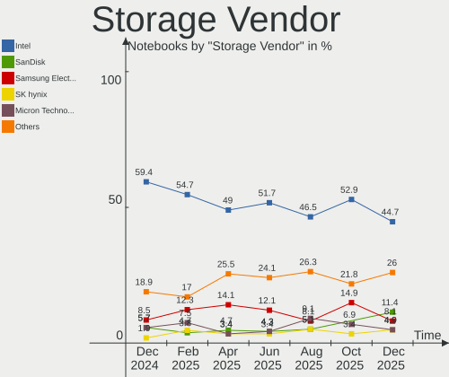

| Vendor                                  | Notebooks | Percent |
|-----------------------------------------|-----------|---------|
| Intel                                   | 55        | 44.72%  |
| SanDisk                                 | 14        | 11.38%  |
| Samsung Electronics                     | 10        | 8.13%   |
| SK hynix                                | 6         | 4.88%   |
| Micron Technology                       | 6         | 4.88%   |
| AMD                                     | 5         | 4.07%   |
| Phison Electronics                      | 4         | 3.25%   |
| KIOXIA                                  | 4         | 3.25%   |
| Shenzhen Longsys Electronics            | 3         | 2.44%   |
| Kingston Technology Company             | 3         | 2.44%   |
| Micron/Crucial Technology               | 2         | 1.63%   |
| MAXIO Technology (Hangzhou)             | 2         | 1.63%   |
| ADATA Technology                        | 2         | 1.63%   |
| Yangtze Memory Technologies             | 1         | 0.81%   |
| Toshiba America Info Systems            | 1         | 0.81%   |
| Solid State Storage Technology          | 1         | 0.81%   |
| Shenzhen Unionmemory Information System | 1         | 0.81%   |
| Realtek Semiconductor                   | 1         | 0.81%   |
| Lite-On Technology                      | 1         | 0.81%   |
| JMicron Technology                      | 1         | 0.81%   |

Storage Model
-------------

Storage controller models

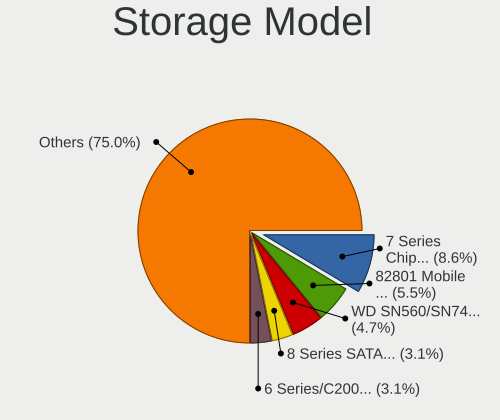

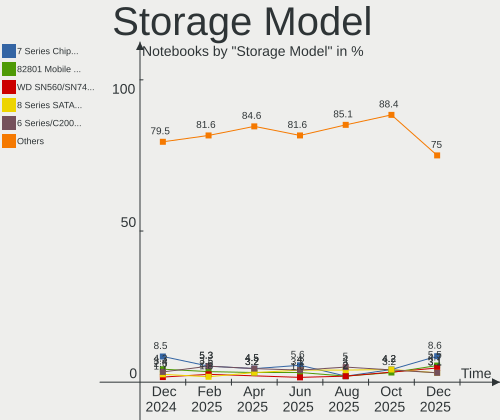

| Model                                                                                                              | Notebooks | Percent |
|--------------------------------------------------------------------------------------------------------------------|-----------|---------|
| Intel 7 Series Chipset Family 6-port SATA Controller [AHCI mode]                                                   | 11        | 8.59%   |
| Intel 82801 Mobile SATA Controller [RAID mode]                                                                     | 7         | 5.47%   |
| SanDisk WD SN560/SN740/SN770/SN5000 NVMe SSD                                                                       | 6         | 4.69%   |
| Intel 8 Series SATA Controller 1 [AHCI mode]                                                                       | 4         | 3.13%   |
| Intel 6 Series/C200 Series Chipset Family 6 port Mobile SATA AHCI Controller                                       | 4         | 3.13%   |
| Intel 5 Series/3400 Series Chipset 4 port SATA AHCI Controller                                                     | 4         | 3.13%   |
| AMD FCH SATA Controller [AHCI mode]                                                                                | 4         | 3.13%   |
| Samsung NVMe SSD Controller 980 (DRAM-less)                                                                        | 3         | 2.34%   |
| Intel Alder Lake-P SATA AHCI Controller                                                                            | 3         | 2.34%   |
| SK hynix PVC10 NVMe Solid State Drive (DRAM-less)                                                                  | 2         | 1.56%   |
| SK hynix BC511 NVMe SSD                                                                                            | 2         | 1.56%   |
| Shenzhen Longsys Lexar NM610 PRO NVME SSD (DRAM-less)                                                              | 2         | 1.56%   |
| Sandisk WD PC SN5000S M.2 2280 NVMe SSD (DRAM-less)                                                                | 2         | 1.56%   |
| SanDisk Extreme Pro / WD Black SN750 / PC SN730 / Red SN700 NVMe SSD                                               | 2         | 1.56%   |
| Samsung NVMe SSD Controller PM9C1a (DRAM-less)                                                                     | 2         | 1.56%   |
| Samsung NVMe SSD 9100 PRO [PM9E1]                                                                                  | 2         | 1.56%   |
| Micron 2500 NVMe SSD (DRAM-less)                                                                                   | 2         | 1.56%   |
| Micron 2400 NVMe SSD (DRAM-less)                                                                                   | 2         | 1.56%   |
| MAXIO (Hangzhou) NVMe SSD Controller MAP1202 (DRAM-less)                                                           | 2         | 1.56%   |
| KIOXIA NVMe SSD Controller BG5 (DRAM-less)                                                                         | 2         | 1.56%   |
| Kingston Company NV3 NVMe SSD [TC2201] (DRAM-less)                                                                 | 2         | 1.56%   |
| Intel Volume Management Device NVMe RAID Controller Intel Corporation                                              | 2         | 1.56%   |
| Intel Volume Management Device NVMe RAID Controller                                                                | 2         | 1.56%   |
| Intel Sunrise Point-LP SATA Controller [AHCI mode]                                                                 | 2         | 1.56%   |
| Intel SATA Controller [RAID mode]                                                                                  | 2         | 1.56%   |
| Intel Atom Processor E3800 Series SATA AHCI Controller                                                             | 2         | 1.56%   |
| Intel 82801IBM/IEM (ICH9M/ICH9M-E) 4 port SATA Controller [AHCI mode]                                              | 2         | 1.56%   |
| Yangtze Memory PC005 NVMe SSD                                                                                      | 1         | 0.78%   |
| Toshiba America Info Systems XG6 NVMe SSD Controller                                                               | 1         | 0.78%   |
| Solid State Storage CL1-3D256-Q11 NVMe SSD M.2                                                                     | 1         | 0.78%   |
| SK hynix Platinum P41/PC801 NVMe Solid State Drive                                                                 | 1         | 0.78%   |
| SK hynix Gold P31/BC711/PC711 NVMe Solid State Drive                                                               | 1         | 0.78%   |
| Shenzhen Unionmemory Information System AM541 PCIe 4.0 NVMe SSD 1024GB                                             | 1         | 0.78%   |
| Shenzhen Longsys FORESEE XP1000 / Lexar Professional CFexpress Type B Gold series, NM620 PCIe NVME SSD (DRAM-less) | 1         | 0.78%   |
| SanDisk WD PC SN810 / Black SN850 NVMe SSD                                                                         | 1         | 0.78%   |
| SanDisk Ultra 3D / WD Blue SN570 NVMe SSD (DRAM-less)                                                              | 1         | 0.78%   |
| SanDisk PC SN520 x2 M.2 2242 NVMe SSD                                                                              | 1         | 0.78%   |
| SanDisk Extreme Pro / WD Black 2018/SN750/PC SN720 NVMe SSD                                                        | 1         | 0.78%   |
| Samsung NVMe SSD Controller SM981/PM981/PM983                                                                      | 1         | 0.78%   |
| Samsung NVMe SSD Controller SM961/PM961/SM963                                                                      | 1         | 0.78%   |

Storage Kind
------------

Kind of storage controller (IDE, SATA, NVMe, SAS, ...)

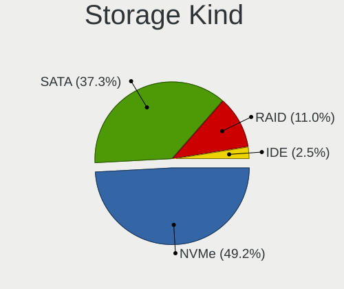

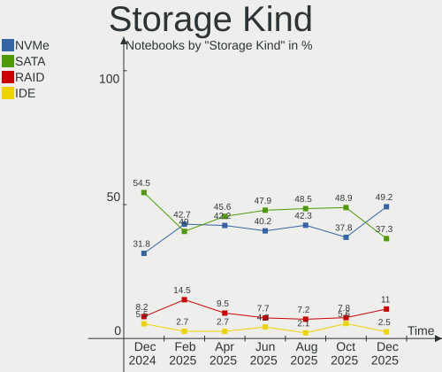

| Kind | Notebooks | Percent |
|------|-----------|---------|
| NVMe | 58        | 49.15%  |
| SATA | 44        | 37.29%  |
| RAID | 13        | 11.02%  |
| IDE  | 3         | 2.54%   |

Processor
---------

CPU Vendor
----------

Processor vendors

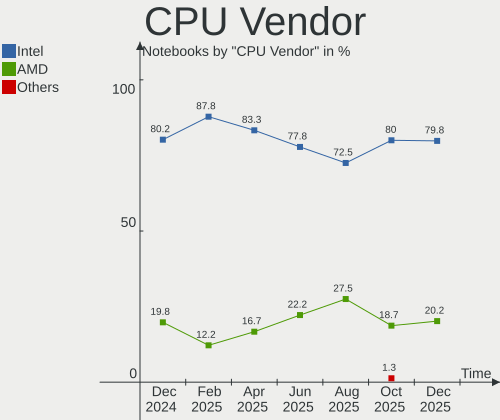

| Vendor | Notebooks | Percent |
|--------|-----------|---------|
| Intel  | 83        | 79.81%  |
| AMD    | 21        | 20.19%  |

CPU Model
---------

Processor models

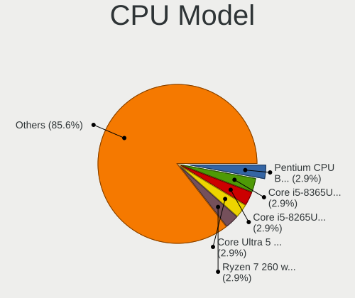

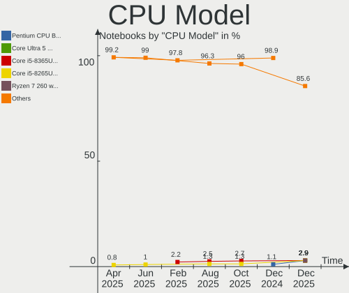

| Model                                   | Notebooks | Percent |
|-----------------------------------------|-----------|---------|
| Intel Pentium CPU B960 @ 2.20GHz        | 3         | 2.88%   |
| Intel Core Ultra 5 125H                 | 3         | 2.88%   |
| Intel Core i5-8365U CPU @ 1.60GHz       | 3         | 2.88%   |
| Intel Core i5-8265U CPU @ 1.60GHz       | 3         | 2.88%   |
| AMD Ryzen 7 260 w/ Radeon 780M Graphics | 3         | 2.88%   |
| AMD Ryzen 5 4600H with Radeon Graphics  | 3         | 2.88%   |
| Intel Core i7-8550U CPU @ 1.80GHz       | 2         | 1.92%   |
| Intel Core i5-7200U CPU @ 2.50GHz       | 2         | 1.92%   |
| Intel Core i5-1035G1 CPU @ 1.00GHz      | 2         | 1.92%   |
| Intel Core i3 CPU M 380 @ 2.53GHz       | 2         | 1.92%   |
| Intel Core 2 Duo CPU P8700 @ 2.53GHz    | 2         | 1.92%   |
| Intel 12th Gen Core i5-12450HX          | 2         | 1.92%   |
| Intel Xeon CPU E3-1505M v5 @ 2.80GHz    | 1         | 0.96%   |
| Intel Pentium Dual CPU T2310 @ 1.46GHz  | 1         | 0.96%   |
| Intel Pentium CPU N4200 @ 1.10GHz       | 1         | 0.96%   |
| Intel Pentium CPU N3520 @ 2.16GHz       | 1         | 0.96%   |
| Intel Pentium CPU 2020M @ 2.40GHz       | 1         | 0.96%   |
| Intel N150                              | 1         | 0.96%   |
| Intel Core Ultra 9 285HX                | 1         | 0.96%   |
| Intel Core Ultra 7 268V                 | 1         | 0.96%   |
| Intel Core Ultra 7 255H                 | 1         | 0.96%   |
| Intel Core Ultra 7 155U                 | 1         | 0.96%   |
| Intel Core Ultra 7 155H                 | 1         | 0.96%   |
| Intel Core Ultra 5 125U                 | 1         | 0.96%   |
| Intel Core i7-6820HQ CPU @ 2.70GHz      | 1         | 0.96%   |
| Intel Core i7-4510U CPU @ 2.00GHz       | 1         | 0.96%   |
| Intel Core i7-3820QM CPU @ 2.70GHz      | 1         | 0.96%   |
| Intel Core i7-3667U CPU @ 2.00GHz       | 1         | 0.96%   |
| Intel Core i7-3612QM CPU @ 2.10GHz      | 1         | 0.96%   |
| Intel Core i7-3610QM CPU @ 2.30GHz      | 1         | 0.96%   |
| Intel Core i7-3537U CPU @ 2.00GHz       | 1         | 0.96%   |
| Intel Core i7-2760QM CPU @ 2.40GHz      | 1         | 0.96%   |
| Intel Core i7-2720QM CPU @ 2.20GHz      | 1         | 0.96%   |
| Intel Core i7-2670QM CPU @ 2.20GHz      | 1         | 0.96%   |
| Intel Core i7-14700HX                   | 1         | 0.96%   |
| Intel Core i7 CPU Q 720 @ 1.60GHz       | 1         | 0.96%   |
| Intel Core i5-7300U CPU @ 2.60GHz       | 1         | 0.96%   |
| Intel Core i5-4200U CPU @ 1.60GHz       | 1         | 0.96%   |
| Intel Core i5-3340M CPU @ 2.70GHz       | 1         | 0.96%   |
| Intel Core i5-3320M CPU @ 2.60GHz       | 1         | 0.96%   |

CPU Model Family
----------------

Processor model prefix

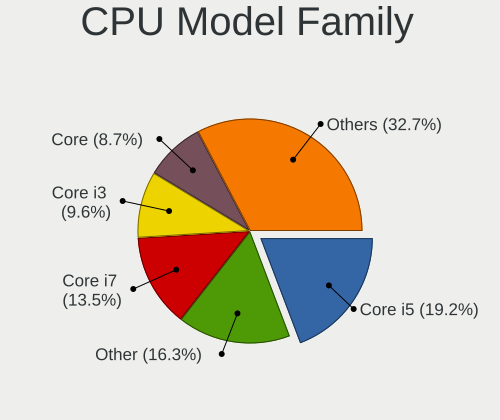

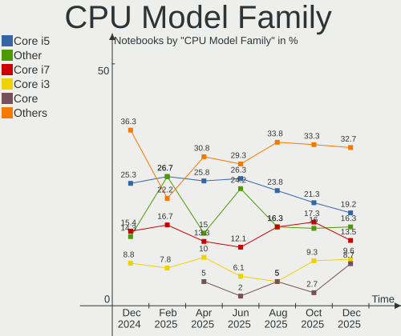

| Model              | Notebooks | Percent |
|--------------------|-----------|---------|
| Intel Core i5      | 20        | 19.23%  |
| Other              | 17        | 16.35%  |
| Intel Core i7      | 14        | 13.46%  |
| Intel Core i3      | 10        | 9.62%   |
| Intel Core         | 9         | 8.65%   |
| AMD Ryzen 7        | 9         | 8.65%   |
| Intel Pentium      | 6         | 5.77%   |
| AMD Ryzen 5        | 5         | 4.81%   |
| Intel Celeron      | 4         | 3.85%   |
| Intel Core 2 Duo   | 3         | 2.88%   |
| AMD Ryzen 9        | 2         | 1.92%   |
| AMD Ryzen 5 PRO    | 2         | 1.92%   |
| Intel Xeon         | 1         | 0.96%   |
| Intel Pentium Dual | 1         | 0.96%   |
| AMD A6             | 1         | 0.96%   |

CPU Cores
---------

Number of processor cores

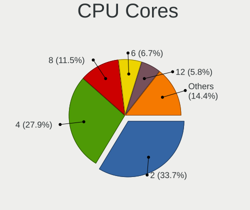

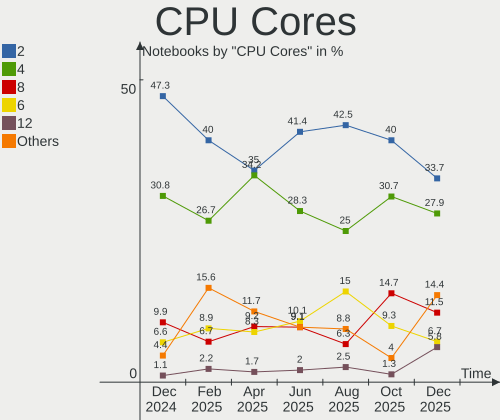

| Number | Notebooks | Percent |
|--------|-----------|---------|
| 2      | 35        | 33.65%  |
| 4      | 29        | 27.88%  |
| 8      | 12        | 11.54%  |
| 6      | 7         | 6.73%   |
| 12     | 6         | 5.77%   |
| 10     | 5         | 4.81%   |
| 16     | 4         | 3.85%   |
| 14     | 4         | 3.85%   |
| 24     | 1         | 0.96%   |
| 20     | 1         | 0.96%   |

CPU Sockets
-----------

Number of sockets

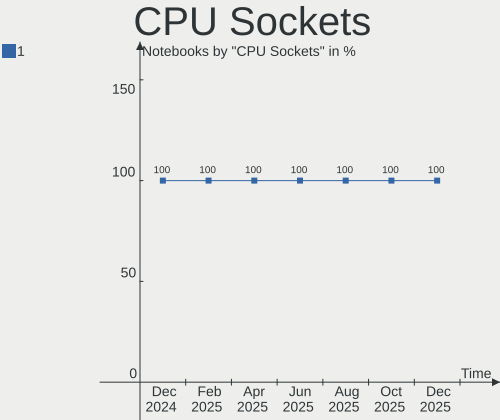

| Number | Notebooks | Percent |
|--------|-----------|---------|
| 1      | 104       | 100%    |

CPU Threads
-----------

Threads per core (Hyper-Threading)

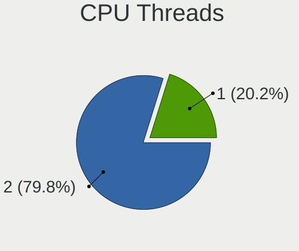

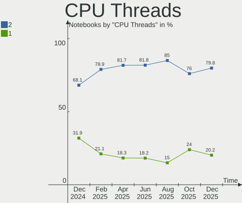

| Number | Notebooks | Percent |
|--------|-----------|---------|
| 2      | 83        | 79.81%  |
| 1      | 21        | 20.19%  |

CPU Op-Modes
------------

CPU Operation Modes (32-bit, 64-bit)

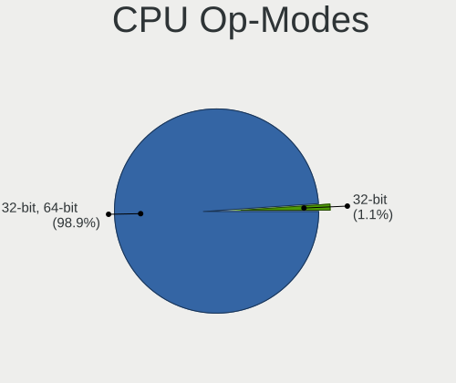

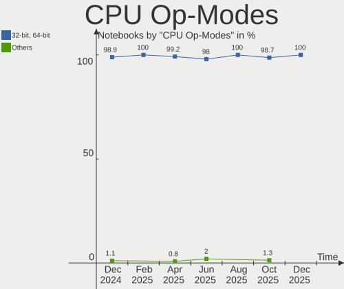

| Op mode        | Notebooks | Percent |
|----------------|-----------|---------|
| 32-bit, 64-bit | 104       | 100%    |

CPU Microcode
-------------

Microcode number

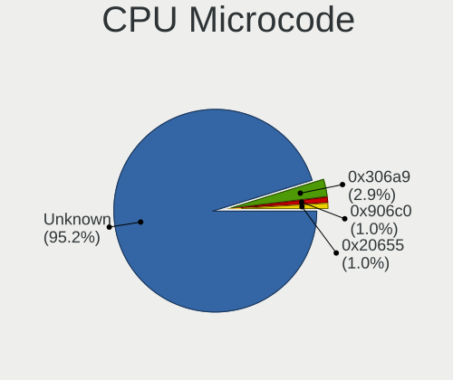

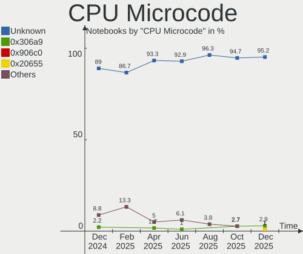

| Number  | Notebooks | Percent |
|---------|-----------|---------|
| Unknown | 99        | 95.19%  |
| 0x306a9 | 3         | 2.88%   |
| 0x906c0 | 1         | 0.96%   |
| 0x20655 | 1         | 0.96%   |

CPU Microarch
-------------

Microarchitecture

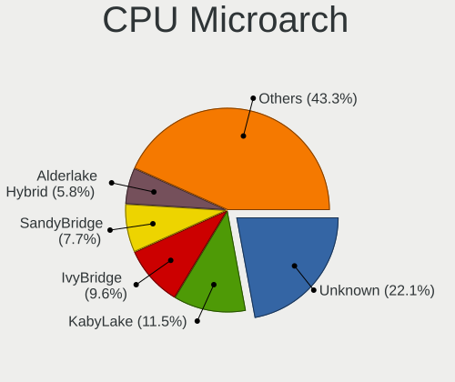

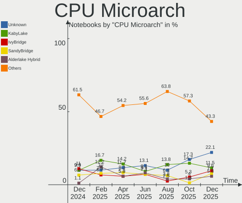

| Name              | Notebooks | Percent |
|-------------------|-----------|---------|
| Unknown           | 23        | 22.12%  |
| KabyLake          | 12        | 11.54%  |
| IvyBridge         | 10        | 9.62%   |
| SandyBridge       | 8         | 7.69%   |
| Alderlake Hybrid  | 6         | 5.77%   |
| Westmere          | 5         | 4.81%   |
| Zen 2             | 4         | 3.85%   |
| Meteorlake Hybrid | 4         | 3.85%   |
| Haswell           | 4         | 3.85%   |
| Skylake           | 3         | 2.88%   |
| Silvermont        | 3         | 2.88%   |
| Penryn            | 3         | 2.88%   |
| IceLake           | 3         | 2.88%   |
| Zen 3             | 2         | 1.92%   |
| TigerLake         | 2         | 1.92%   |
| Lunarlake Hybrid  | 2         | 1.92%   |
| Zen+              | 1         | 0.96%   |
| Zen               | 1         | 0.96%   |
| Tremont           | 1         | 0.96%   |
| Piledriver        | 1         | 0.96%   |
| Nehalem           | 1         | 0.96%   |
| Goldmont plus     | 1         | 0.96%   |
| Goldmont          | 1         | 0.96%   |
| Core              | 1         | 0.96%   |
| CometLake         | 1         | 0.96%   |
| Broadwell         | 1         | 0.96%   |

Graphics
--------

GPU Vendor
----------

Vendors of graphics cards

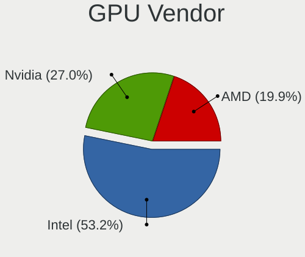

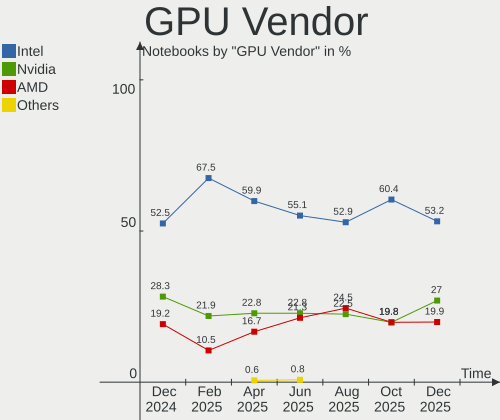

| Vendor | Notebooks | Percent |
|--------|-----------|---------|
| Intel  | 75        | 53.19%  |
| Nvidia | 38        | 26.95%  |
| AMD    | 28        | 19.86%  |

GPU Model
---------

Graphics card models

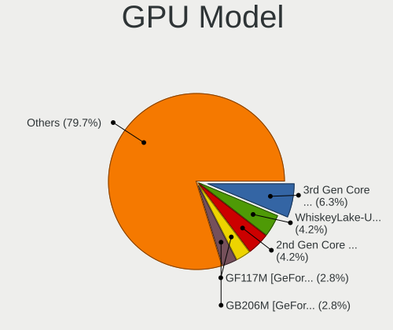

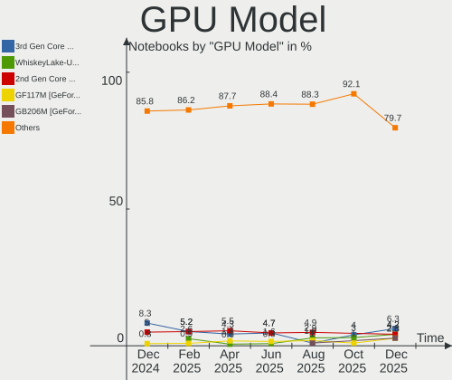

| Model                                                                     | Notebooks | Percent |
|---------------------------------------------------------------------------|-----------|---------|
| Intel 3rd Gen Core processor Graphics Controller                          | 9         | 6.29%   |
| Intel WhiskeyLake-U GT2 [UHD Graphics 620]                                | 6         | 4.2%    |
| Intel 2nd Generation Core Processor Family Integrated Graphics Controller | 6         | 4.2%    |
| Nvidia GF117M [GeForce 610M/710M/810M/820M / GT 620M/625M/630M/720M]      | 4         | 2.8%    |
| Nvidia GB206M [GeForce RTX 5060 Max-Q / Mobile]                           | 4         | 2.8%    |
| Intel Meteor Lake-P [Intel Arc Graphics]                                  | 4         | 2.8%    |
| Intel Haswell-ULT Integrated Graphics Controller                          | 4         | 2.8%    |
| AMD Renoir [Radeon Vega Series / Radeon Vega Mobile Series]               | 4         | 2.8%    |
| Nvidia AD107M [GeForce RTX 4050 Max-Q / Mobile]                           | 3         | 2.1%    |
| Intel Kaby Lake-U GT2 [HD Graphics 620]                                   | 3         | 2.1%    |
| Intel Iris Plus Graphics G1 (Ice Lake)                                    | 3         | 2.1%    |
| Intel Atom Processor Z36xxx/Z37xxx Series Graphics & Display              | 3         | 2.1%    |
| AMD HawkPoint1                                                            | 3         | 2.1%    |
| Nvidia GM107GLM [Quadro M1000M]                                           | 2         | 1.4%    |
| Nvidia AD107M [GeForce RTX 4060 Max-Q / Mobile]                           | 2         | 1.4%    |
| Intel TigerLake-LP GT2 [Iris Xe Graphics]                                 | 2         | 1.4%    |
| Intel Raptor Lake-S UHD Graphics                                          | 2         | 1.4%    |
| Intel Raptor Lake-P [UHD Graphics]                                        | 2         | 1.4%    |
| Intel Raptor Lake-P [Iris Xe Graphics]                                    | 2         | 1.4%    |
| Intel Mobile 4 Series Chipset Integrated Graphics Controller              | 2         | 1.4%    |
| Intel Meteor Lake-P [Intel Graphics]                                      | 2         | 1.4%    |
| Intel Kaby Lake-R GT2 [UHD Graphics 620]                                  | 2         | 1.4%    |
| Intel Core Processor Integrated Graphics Controller                       | 2         | 1.4%    |
| Intel Alder Lake-UP3 GT2 [Iris Xe Graphics]                               | 2         | 1.4%    |
| Intel Alder Lake-S [UHD Graphics]                                         | 2         | 1.4%    |
| Intel Alder Lake-P GT1 [UHD Graphics]                                     | 2         | 1.4%    |
| AMD Thames [Radeon HD 7500M/7600M Series]                                 | 2         | 1.4%    |
| AMD Rembrandt [Radeon 680M]                                               | 2         | 1.4%    |
| AMD Raphael                                                               | 2         | 1.4%    |
| Nvidia TU117M [GeForce GTX 1650 Mobile / Max-Q]                           | 1         | 0.7%    |
| Nvidia TU106M [GeForce RTX 2060 Max-Q]                                    | 1         | 0.7%    |
| Nvidia GT218M [NVS 3100M]                                                 | 1         | 0.7%    |
| Nvidia GT216M [GeForce GT 320M]                                           | 1         | 0.7%    |
| Nvidia GP108M [GeForce MX230]                                             | 1         | 0.7%    |
| Nvidia GP108M [GeForce MX150]                                             | 1         | 0.7%    |
| Nvidia GK208M [GeForce GT 740M]                                           | 1         | 0.7%    |
| Nvidia GK104GLM [Quadro K3000M]                                           | 1         | 0.7%    |
| Nvidia GF119M [Quadro NVS 4200M]                                          | 1         | 0.7%    |
| Nvidia GF119M [GeForce 610M]                                              | 1         | 0.7%    |
| Nvidia GF116M [GeForce GT 555M/635M]                                      | 1         | 0.7%    |

GPU Combo
---------

Combinations of graphics cards

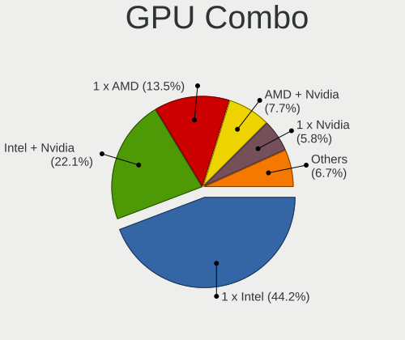

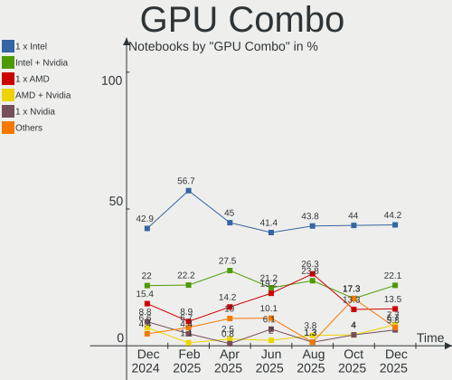

| Name           | Notebooks | Percent |
|----------------|-----------|---------|
| 1 x Intel      | 46        | 44.23%  |
| Intel + Nvidia | 23        | 22.12%  |
| 1 x AMD        | 14        | 13.46%  |
| AMD + Nvidia   | 8         | 7.69%   |
| 1 x Nvidia     | 6         | 5.77%   |
| Intel + AMD    | 4         | 3.85%   |
| 2 x Intel      | 2         | 1.92%   |
| 2 x AMD        | 1         | 0.96%   |

GPU Driver
----------

Free vs proprietary

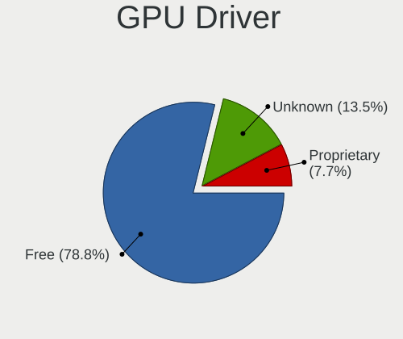

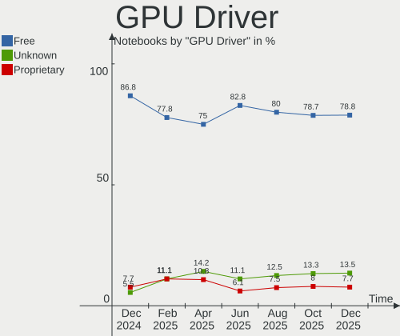

| Driver      | Notebooks | Percent |
|-------------|-----------|---------|
| Free        | 82        | 78.85%  |
| Unknown     | 14        | 13.46%  |
| Proprietary | 8         | 7.69%   |

GPU Memory
----------

Total video memory

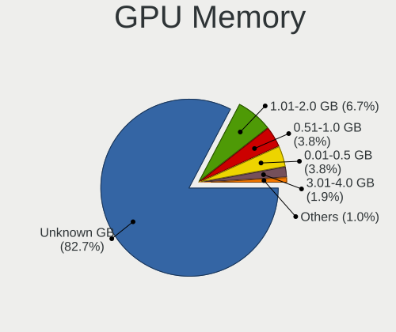

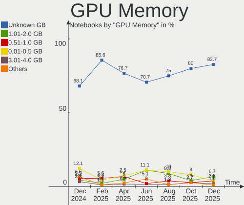

| Size in GB | Notebooks | Percent |
|------------|-----------|---------|
| Unknown    | 86        | 82.69%  |
| 1.01-2.0   | 7         | 6.73%   |
| 0.51-1.0   | 4         | 3.85%   |
| 0.01-0.5   | 4         | 3.85%   |
| 3.01-4.0   | 2         | 1.92%   |
| 7.01-8.0   | 1         | 0.96%   |

Monitor
-------

Monitor Vendor
--------------

Monitor vendors

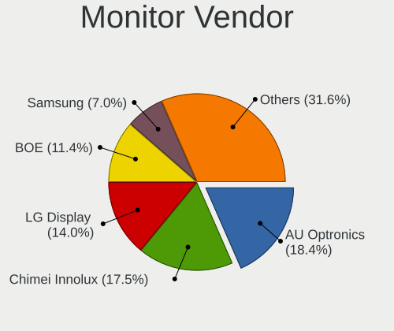

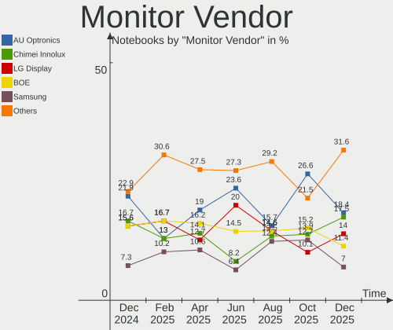

| Vendor                  | Notebooks | Percent |
|-------------------------|-----------|---------|
| AU Optronics            | 21        | 18.42%  |
| Chimei Innolux          | 20        | 17.54%  |
| LG Display              | 16        | 14.04%  |
| BOE                     | 13        | 11.4%   |
| Samsung Electronics     | 8         | 7.02%   |
| Lenovo                  | 4         | 3.51%   |
| Chi Mei Optoelectronics | 4         | 3.51%   |
| Goldstar                | 3         | 2.63%   |
| EDO                     | 3         | 2.63%   |
| CSW                     | 3         | 2.63%   |
| Sharp                   | 2         | 1.75%   |
| VXN                     | 1         | 0.88%   |
| Valve                   | 1         | 0.88%   |
| Unknown                 | 1         | 0.88%   |
| TMX                     | 1         | 0.88%   |
| TMA                     | 1         | 0.88%   |
| Sony                    | 1         | 0.88%   |
| PANDA                   | 1         | 0.88%   |
| NEC Computers           | 1         | 0.88%   |
| MSI                     | 1         | 0.88%   |
| InfoVision              | 1         | 0.88%   |
| Hewlett-Packard         | 1         | 0.88%   |
| Eizo                    | 1         | 0.88%   |
| Dell                    | 1         | 0.88%   |
| CSOT                    | 1         | 0.88%   |
| AOC                     | 1         | 0.88%   |
| Ancor Communications    | 1         | 0.88%   |
| Acer                    | 1         | 0.88%   |

Monitor Model
-------------

Monitor models

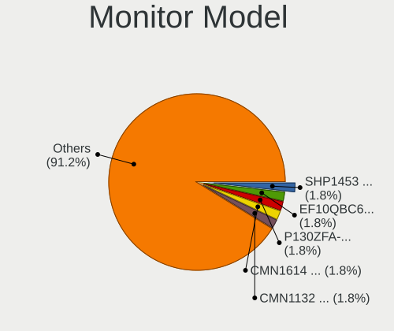

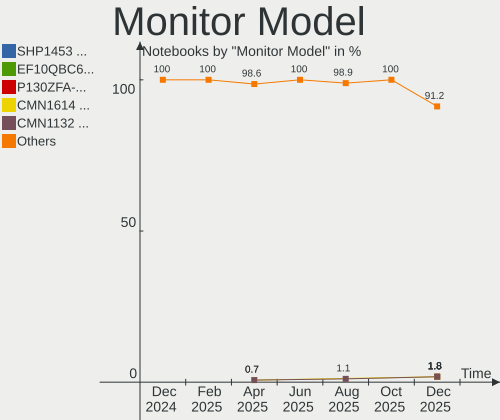

| Model                                                                    | Notebooks | Percent |
|--------------------------------------------------------------------------|-----------|---------|
| Sharp LCD Monitor SHP1453 1920x1080 346x194mm 15.6-inch                  | 2         | 1.75%   |
| EDO EF10QBC64.C EDO4245                                                  | 2         | 1.75%   |
| Chimei Innolux P130ZFA-BA1 CMN8201 2160x1440 275x183mm 13.0-inch         | 2         | 1.75%   |
| Chimei Innolux LCD Monitor CMN1614 1920x1200 344x215mm 16.0-inch         | 2         | 1.75%   |
| Chimei Innolux LCD Monitor CMN1132 1366x768 256x144mm 11.6-inch          | 2         | 1.75%   |
| Chi Mei Optoelectronics LCD Monitor CMO15A7 1366x768 344x193mm 15.5-inch | 2         | 1.75%   |
| AU Optronics LCD Monitor AUO7EAD 1920x1080 344x193mm 15.5-inch           | 2         | 1.75%   |
| VXN VisN236HUZ15 VXN1421                                                 | 1         | 0.88%   |
| Valve ANX7530 U VLV3001 800x1280 100x150mm 7.1-inch                      | 1         | 0.88%   |
| Unknown LCD Monitor FFFF 2288x1287 2550x2550mm 142.0-inch                | 1         | 0.88%   |
| TMX LCD Monitor TMX1350 2520x1680 284x189mm 13.4-inch                    | 1         | 0.88%   |
| TMA TL160ADMP20 TMA2039 2560x1600 345x215mm 16.0-inch                    | 1         | 0.88%   |
| Sony Nvidia Defaul t Flat Panel SNY05FA 1366x768 309x174mm 14.0-inch     | 1         | 0.88%   |
| Samsung Electronics LCD Monitor SEC5441 1280x800 331x207mm 15.4-inch     | 1         | 0.88%   |
| Samsung Electronics LCD Monitor SEC4252 1366x768 344x194mm 15.5-inch     | 1         | 0.88%   |
| Samsung Electronics LCD Monitor SEC3633 1280x800 331x207mm 15.4-inch     | 1         | 0.88%   |
| Samsung Electronics LCD Monitor SEC314C 1920x1080 344x194mm 15.5-inch    | 1         | 0.88%   |
| Samsung Electronics LCD Monitor SDC4E51 1366x768 344x194mm 15.5-inch     | 1         | 0.88%   |
| Samsung Electronics LCD Monitor SDC4752 1366x768 344x194mm 15.5-inch     | 1         | 0.88%   |
| Samsung Electronics LCD Monitor SDC419D 2880x1800 302x189mm 14.0-inch    | 1         | 0.88%   |
| Samsung Electronics ATNA53JB01-0  SDC4206                                | 1         | 0.88%   |
| PANDA LCD Monitor NCP0050 1920x1080 309x174mm 14.0-inch                  | 1         | 0.88%   |
| NEC Computers EA275WMi NEC2BA8 2560x1440 597x336mm 27.0-inch             | 1         | 0.88%   |
| MSI MPG271QX OLED MSI3CD7 2560x1440 606x344mm 27.4-inch                  | 1         | 0.88%   |
| LG Display LCD Monitor LGD7B93 1440x900 367x230mm 17.1-inch              | 1         | 0.88%   |
| LG Display LCD Monitor LGD078E 1920x1200 345x215mm 16.0-inch             | 1         | 0.88%   |
| LG Display LCD Monitor LGD0742 1920x1080 344x194mm 15.5-inch             | 1         | 0.88%   |
| LG Display LCD Monitor LGD06F7 1920x1200 302x189mm 14.0-inch             | 1         | 0.88%   |
| LG Display LCD Monitor LGD06EB 2560x1600 344x215mm 16.0-inch             | 1         | 0.88%   |
| LG Display LCD Monitor LGD06DA 1920x1080 344x194mm 15.5-inch             | 1         | 0.88%   |
| LG Display LCD Monitor LGD05F2 1920x1080 344x194mm 15.5-inch             | 1         | 0.88%   |
| LG Display LCD Monitor LGD03A1 1920x1080 276x156mm 12.5-inch             | 1         | 0.88%   |
| LG Display LCD Monitor LGD0396 1600x900 382x215mm 17.3-inch              | 1         | 0.88%   |
| LG Display LCD Monitor LGD0386 1366x768 309x174mm 14.0-inch              | 1         | 0.88%   |
| LG Display LCD Monitor LGD0357 1600x900 382x215mm 17.3-inch              | 1         | 0.88%   |
| LG Display LCD Monitor LGD033E 1366x768 309x174mm 14.0-inch              | 1         | 0.88%   |
| LG Display LCD Monitor LGD02DC 1366x768 344x194mm 15.5-inch              | 1         | 0.88%   |
| LG Display LCD Monitor LGD02DA 1920x1080 382x215mm 17.3-inch             | 1         | 0.88%   |
| LG Display LCD Monitor LGD0283 1920x1080 383x215mm 17.3-inch             | 1         | 0.88%   |
| LG Display LCD Monitor LGD01F0 1280x800 261x163mm 12.1-inch              | 1         | 0.88%   |

Monitor Resolution
------------------

Monitor screen resolution

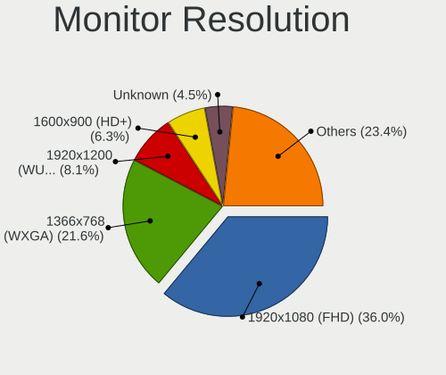

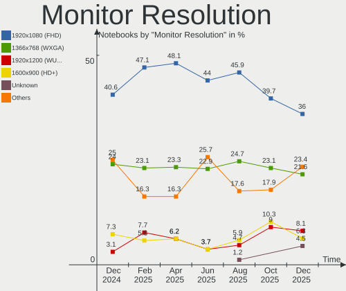

| Resolution         | Notebooks | Percent |
|--------------------|-----------|---------|
| 1920x1080 (FHD)    | 40        | 36.04%  |
| 1366x768 (WXGA)    | 24        | 21.62%  |
| 1920x1200 (WUXGA)  | 9         | 8.11%   |
| 1600x900 (HD+)     | 7         | 6.31%   |
| Unknown            | 5         | 4.5%    |
| 2560x1600          | 4         | 3.6%    |
| 1280x800 (WXGA)    | 4         | 3.6%    |
| 2560x1440 (QHD)    | 3         | 2.7%    |
| 3840x2160 (4K)     | 2         | 1.8%    |
| 2160x1440          | 2         | 1.8%    |
| 800x1280           | 1         | 0.9%    |
| 3840x2400          | 1         | 0.9%    |
| 3200x2000          | 1         | 0.9%    |
| 2880x1800          | 1         | 0.9%    |
| 2520x1680          | 1         | 0.9%    |
| 2288x1287          | 1         | 0.9%    |
| 2256x1504          | 1         | 0.9%    |
| 2240x1400          | 1         | 0.9%    |
| 1680x1050 (WSXGA+) | 1         | 0.9%    |
| 1440x900 (WXGA+)   | 1         | 0.9%    |
| 1360x768           | 1         | 0.9%    |

Monitor Diagonal
----------------

Diagonal size in inches

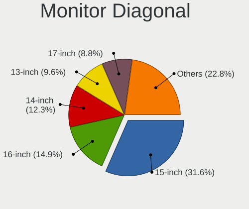

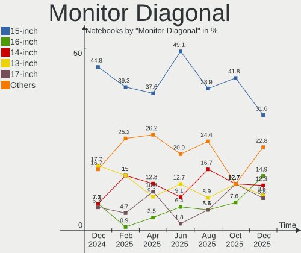

| Inches  | Notebooks | Percent |
|---------|-----------|---------|
| 15      | 36        | 31.58%  |
| 16      | 17        | 14.91%  |
| 14      | 14        | 12.28%  |
| 13      | 11        | 9.65%   |
| 17      | 10        | 8.77%   |
| Unknown | 5         | 4.39%   |
| 23      | 4         | 3.51%   |
| 12      | 4         | 3.51%   |
| 11      | 4         | 3.51%   |
| 27      | 3         | 2.63%   |
| 31      | 2         | 1.75%   |
| 142     | 1         | 0.88%   |
| 22      | 1         | 0.88%   |
| 18      | 1         | 0.88%   |
| 7       | 1         | 0.88%   |

Monitor Width
-------------

Physical width

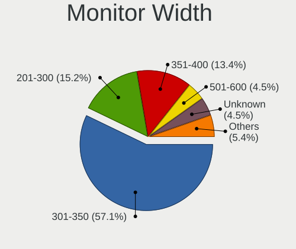

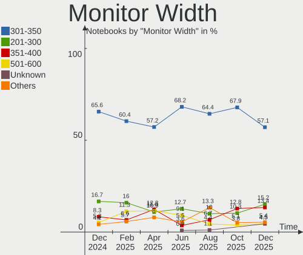

| Width in mm    | Notebooks | Percent |
|----------------|-----------|---------|
| 301-350        | 64        | 57.14%  |
| 201-300        | 17        | 15.18%  |
| 351-400        | 15        | 13.39%  |
| 501-600        | 5         | 4.46%   |
| Unknown        | 5         | 4.46%   |
| 601-700        | 2         | 1.79%   |
| 401-500        | 2         | 1.79%   |
| More than 2000 | 1         | 0.89%   |
| 1-100          | 1         | 0.89%   |

Aspect Ratio
------------

Proportional relationship between the width and the height

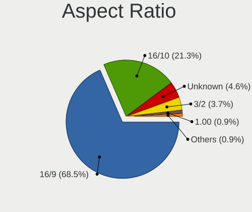

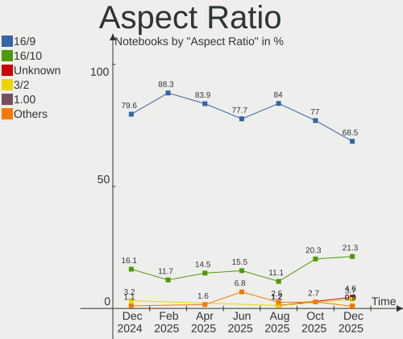

| Ratio   | Notebooks | Percent |
|---------|-----------|---------|
| 16/9    | 74        | 68.52%  |
| 16/10   | 23        | 21.3%   |
| Unknown | 5         | 4.63%   |
| 3/2     | 4         | 3.7%    |
| 1.00    | 1         | 0.93%   |
| 0.67    | 1         | 0.93%   |

Monitor Area
------------

Area in inch²

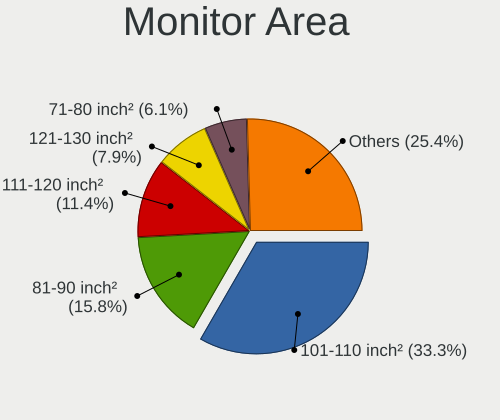

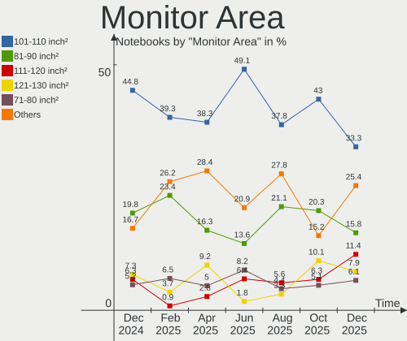

| Area in inch² | Notebooks | Percent |
|----------------|-----------|---------|
| 101-110        | 38        | 33.33%  |
| 81-90          | 18        | 15.79%  |
| 111-120        | 13        | 11.4%   |
| 121-130        | 9         | 7.89%   |
| 71-80          | 7         | 6.14%   |
| 201-250        | 5         | 4.39%   |
| Unknown        | 5         | 4.39%   |
| 61-70          | 4         | 3.51%   |
| 51-60          | 4         | 3.51%   |
| 301-350        | 3         | 2.63%   |
| 351-500        | 2         | 1.75%   |
| 131-140        | 2         | 1.75%   |
| More than 1000 | 1         | 0.88%   |
| 1-40           | 1         | 0.88%   |
| 141-150        | 1         | 0.88%   |
| 91-100         | 1         | 0.88%   |

Pixel Density
-------------

Pixels per inch

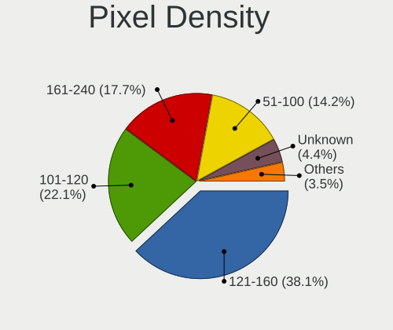

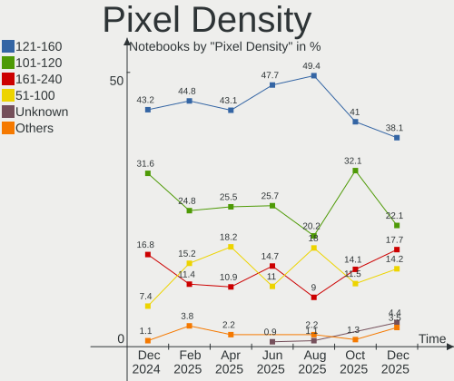

| Density       | Notebooks | Percent |
|---------------|-----------|---------|
| 121-160       | 43        | 38.05%  |
| 101-120       | 25        | 22.12%  |
| 161-240       | 20        | 17.7%   |
| 51-100        | 16        | 14.16%  |
| Unknown       | 5         | 4.42%   |
| More than 240 | 3         | 2.65%   |
| 1-50          | 1         | 0.88%   |

Multiple Monitors
-----------------

Total monitors connected

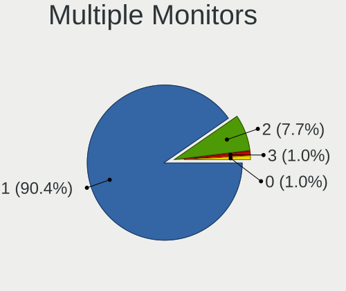

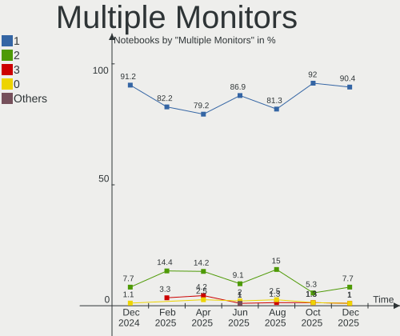

| Total | Notebooks | Percent |
|-------|-----------|---------|
| 1     | 94        | 90.38%  |
| 2     | 8         | 7.69%   |
| 3     | 1         | 0.96%   |
| 0     | 1         | 0.96%   |

Network
-------

Net Controller Vendor
---------------------

Controller vendors

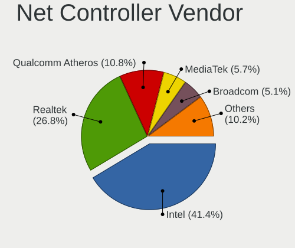

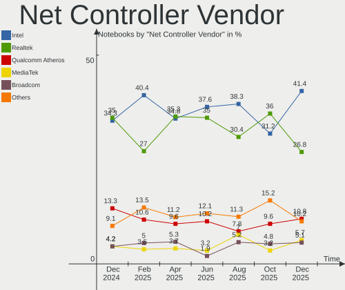

| Vendor                            | Notebooks | Percent |
|-----------------------------------|-----------|---------|
| Intel                             | 65        | 41.4%   |
| Realtek Semiconductor             | 42        | 26.75%  |
| Qualcomm Atheros                  | 17        | 10.83%  |
| MediaTek                          | 9         | 5.73%   |
| Broadcom                          | 8         | 5.1%    |
| Broadcom Limited                  | 3         | 1.91%   |
| ASIX Electronics                  | 2         | 1.27%   |
| TP-Link                           | 1         | 0.64%   |
| Sierra Wireless                   | 1         | 0.64%   |
| Shenzhen Goodix Technology        | 1         | 0.64%   |
| Samsung Electronics               | 1         | 0.64%   |
| Qualcomm Technologies             | 1         | 0.64%   |
| Marvell Technology Group          | 1         | 0.64%   |
| Huawei Technologies               | 1         | 0.64%   |
| Hewlett-Packard                   | 1         | 0.64%   |
| Fibocom                           | 1         | 0.64%   |
| Ericsson Business Mobile Networks | 1         | 0.64%   |
| D-Link                            | 1         | 0.64%   |

Net Controller Model
--------------------

Controller models

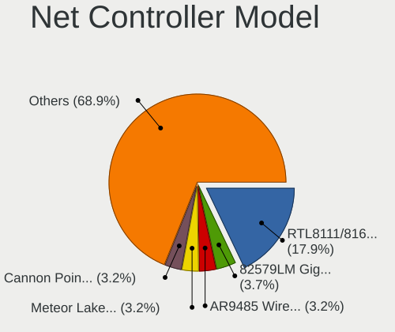

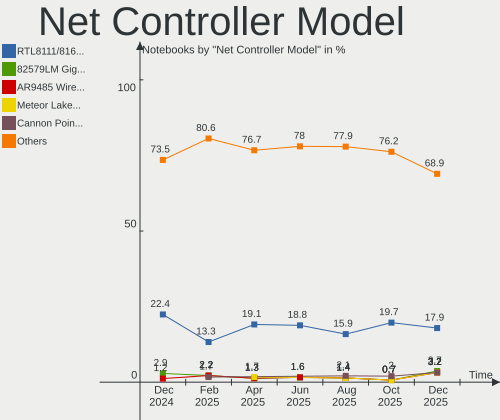

| Model                                                                           | Notebooks | Percent |
|---------------------------------------------------------------------------------|-----------|---------|
| Realtek RTL8111/8168/8211/8411 PCI Express Gigabit Ethernet Controller          | 34        | 17.89%  |
| Intel 82579LM Gigabit Network Connection (Lewisville)                           | 7         | 3.68%   |
| Qualcomm Atheros AR9485 Wireless Network Adapter                                | 6         | 3.16%   |
| Intel Meteor Lake PCH CNVi WiFi                                                 | 6         | 3.16%   |
| Intel Cannon Point-LP CNVi [Wireless-AC]                                        | 6         | 3.16%   |
| Realtek RTL810xE PCI Express Fast Ethernet controller                           | 5         | 2.63%   |
| Intel Wireless 8260                                                             | 4         | 2.11%   |
| Intel Centrino Ultimate-N 6300                                                  | 4         | 2.11%   |
| Intel Centrino Advanced-N 6205 [Taylor Peak]                                    | 4         | 2.11%   |
| Intel Alder Lake-P PCH CNVi WiFi                                                | 4         | 2.11%   |
| MediaTek MT7925 802.11be 160MHz 2x2 PCIe Wireless Network Adapter [Filogic 360] | 3         | 1.58%   |
| Intel Wireless 8265 / 8275                                                      | 3         | 1.58%   |
| Intel Wireless 7260                                                             | 3         | 1.58%   |
| Intel Wi-Fi 6 AX200                                                             | 3         | 1.58%   |
| Intel Raptor Lake PCH CNVi WiFi                                                 | 3         | 1.58%   |
| Intel Ethernet Connection (6) I219-LM                                           | 3         | 1.58%   |
| Realtek RTL8852CE PCIe 802.11ax Wireless Network Controller                     | 2         | 1.05%   |
| Realtek RTL8852BE PCIe 802.11ax Wireless Network Controller                     | 2         | 1.05%   |
| Realtek RTL8822CE 802.11ac PCIe Wireless Network Adapter                        | 2         | 1.05%   |
| Qualcomm Atheros QCA9565 / AR9565 Wireless Network Adapter                      | 2         | 1.05%   |
| Qualcomm Atheros QCA9377 802.11ac Wireless Network Adapter                      | 2         | 1.05%   |
| Qualcomm Atheros QCA8172 Fast Ethernet                                          | 2         | 1.05%   |
| Qualcomm Atheros AR9285 Wireless Network Adapter (PCI-Express)                  | 2         | 1.05%   |
| MediaTek MT7922 802.11ax PCI Express Wireless Network Adapter                   | 2         | 1.05%   |
| Intel Wi-Fi 6E(802.11ax) AX210/AX1675* 2x2 [Typhoon Peak]                       | 2         | 1.05%   |
| Intel PRO/Wireless 5100 AGN [Shiloh] Network Connection                         | 2         | 1.05%   |
| Intel Ethernet Connection (4) I219-V                                            | 2         | 1.05%   |
| Intel Ethernet Connection (18) I219-LM                                          | 2         | 1.05%   |
| Intel Centrino Wireless-N 1030 [Rainbow Peak]                                   | 2         | 1.05%   |
| Intel 82567LM Gigabit Network Connection                                        | 2         | 1.05%   |
| Broadcom NetLink BCM57780 Gigabit Ethernet PCIe                                 | 2         | 1.05%   |
| Broadcom Limited NetLink BCM5906M Fast Ethernet PCI Express                     | 2         | 1.05%   |
| Broadcom BCM4313 802.11bgn Wireless Network Adapter                             | 2         | 1.05%   |
| ASIX AX88179 Gigabit Ethernet                                                   | 2         | 1.05%   |
| TP-Link AC600 wireless Realtek RTL8811AU [Archer T2U Nano]                      | 1         | 0.53%   |
| Sierra Wireless MC7710                                                          | 1         | 0.53%   |
| Shenzhen Goodix Unknow device                                                   | 1         | 0.53%   |
| Samsung Galaxy series, misc. (tethering mode)                                   | 1         | 0.53%   |
| Realtek RTL8852BE-VT PCIe 802.11ax Wireless Network Controller                  | 1         | 0.53%   |
| Realtek RTL8822BE 802.11a/b/g/n/ac WiFi adapter                                 | 1         | 0.53%   |

Wireless Vendor
---------------

Wireless vendors

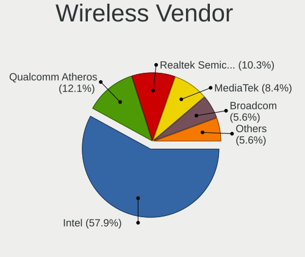

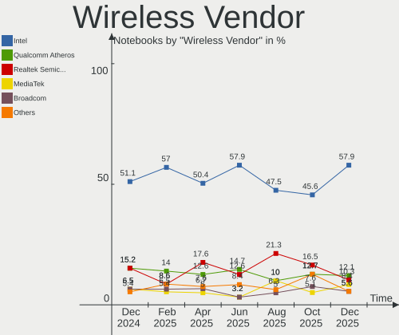

| Vendor                | Notebooks | Percent |
|-----------------------|-----------|---------|
| Intel                 | 62        | 57.94%  |
| Qualcomm Atheros      | 13        | 12.15%  |
| Realtek Semiconductor | 11        | 10.28%  |
| MediaTek              | 9         | 8.41%   |
| Broadcom              | 6         | 5.61%   |
| TP-Link               | 1         | 0.93%   |
| Sierra Wireless       | 1         | 0.93%   |
| Qualcomm Technologies | 1         | 0.93%   |
| Fibocom               | 1         | 0.93%   |
| D-Link                | 1         | 0.93%   |
| Broadcom Limited      | 1         | 0.93%   |

Wireless Model
--------------

Wireless models

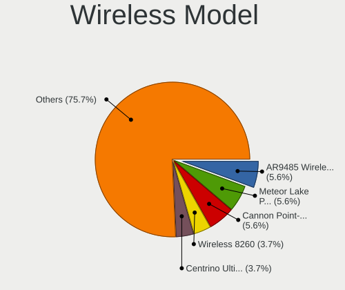

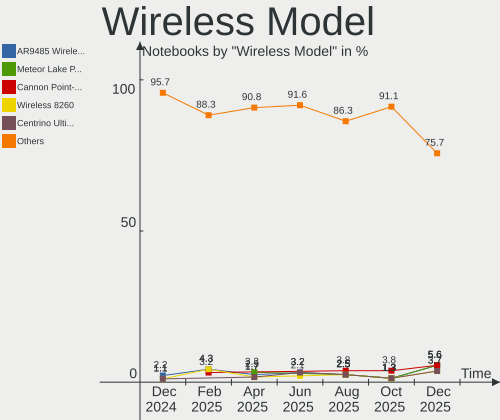

| Model                                                                           | Notebooks | Percent |
|---------------------------------------------------------------------------------|-----------|---------|
| Qualcomm Atheros AR9485 Wireless Network Adapter                                | 6         | 5.61%   |
| Intel Meteor Lake PCH CNVi WiFi                                                 | 6         | 5.61%   |
| Intel Cannon Point-LP CNVi [Wireless-AC]                                        | 6         | 5.61%   |
| Intel Wireless 8260                                                             | 4         | 3.74%   |
| Intel Centrino Ultimate-N 6300                                                  | 4         | 3.74%   |
| Intel Centrino Advanced-N 6205 [Taylor Peak]                                    | 4         | 3.74%   |
| Intel Alder Lake-P PCH CNVi WiFi                                                | 4         | 3.74%   |
| MediaTek MT7925 802.11be 160MHz 2x2 PCIe Wireless Network Adapter [Filogic 360] | 3         | 2.8%    |
| Intel Wireless 8265 / 8275                                                      | 3         | 2.8%    |
| Intel Wireless 7260                                                             | 3         | 2.8%    |
| Intel Wi-Fi 6 AX200                                                             | 3         | 2.8%    |
| Intel Raptor Lake PCH CNVi WiFi                                                 | 3         | 2.8%    |
| Realtek RTL8852CE PCIe 802.11ax Wireless Network Controller                     | 2         | 1.87%   |
| Realtek RTL8852BE PCIe 802.11ax Wireless Network Controller                     | 2         | 1.87%   |
| Realtek RTL8822CE 802.11ac PCIe Wireless Network Adapter                        | 2         | 1.87%   |
| Qualcomm Atheros QCA9565 / AR9565 Wireless Network Adapter                      | 2         | 1.87%   |
| Qualcomm Atheros QCA9377 802.11ac Wireless Network Adapter                      | 2         | 1.87%   |
| Qualcomm Atheros AR9285 Wireless Network Adapter (PCI-Express)                  | 2         | 1.87%   |
| MediaTek MT7922 802.11ax PCI Express Wireless Network Adapter                   | 2         | 1.87%   |
| Intel Wi-Fi 6E(802.11ax) AX210/AX1675* 2x2 [Typhoon Peak]                       | 2         | 1.87%   |
| Intel PRO/Wireless 5100 AGN [Shiloh] Network Connection                         | 2         | 1.87%   |
| Intel Centrino Wireless-N 1030 [Rainbow Peak]                                   | 2         | 1.87%   |
| Broadcom BCM4313 802.11bgn Wireless Network Adapter                             | 2         | 1.87%   |
| TP-Link AC600 wireless Realtek RTL8811AU [Archer T2U Nano]                      | 1         | 0.93%   |
| Sierra Wireless MC7710                                                          | 1         | 0.93%   |
| Realtek RTL8852BE-VT PCIe 802.11ax Wireless Network Controller                  | 1         | 0.93%   |
| Realtek RTL8822BE 802.11a/b/g/n/ac WiFi adapter                                 | 1         | 0.93%   |
| Realtek RTL8821CE 802.11ac PCIe Wireless Network Adapter                        | 1         | 0.93%   |
| Realtek RTL8723BE PCIe Wireless Network Adapter                                 | 1         | 0.93%   |
| Realtek RTL8188EUS 802.11n Wireless Network Adapter                             | 1         | 0.93%   |
| Qualcomm QCNFA765 Wireless Network Adapter                                      | 1         | 0.93%   |
| Qualcomm Atheros AR9462 Wireless Network Adapter                                | 1         | 0.93%   |
| MediaTek Wi-Fi 6 MT7920 Wireless Network Adapter                                | 1         | 0.93%   |
| MediaTek MT7921K (RZ608) Wi-Fi 6E 80MHz                                         | 1         | 0.93%   |
| MediaTek MT7921 802.11ax PCIe Wireless Network Adapter [Filogic 330]            | 1         | 0.93%   |
| MediaTek MT7902 802.11ax PCIe Wireless Network Adapter [Filogic 310]            | 1         | 0.93%   |
| Intel Wireless 7265                                                             | 1         | 0.93%   |
| Intel Wireless 3160                                                             | 1         | 0.93%   |
| Intel Wi-Fi 7(802.11be) AX1775*/AX1790*/BE20*/BE401/BE1750* 2x2                 | 1         | 0.93%   |
| Intel Wi-Fi 6 AX201                                                             | 1         | 0.93%   |

Ethernet Vendor
---------------

Ethernet vendors

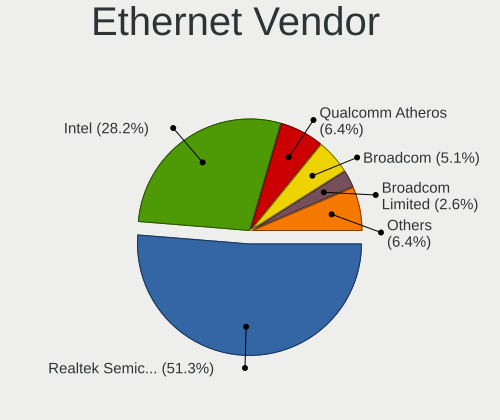

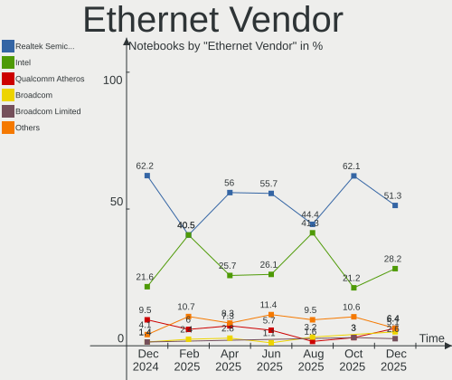

| Vendor                   | Notebooks | Percent |
|--------------------------|-----------|---------|
| Realtek Semiconductor    | 40        | 51.28%  |
| Intel                    | 22        | 28.21%  |
| Qualcomm Atheros         | 5         | 6.41%   |
| Broadcom                 | 4         | 5.13%   |
| Broadcom Limited         | 2         | 2.56%   |
| ASIX Electronics         | 2         | 2.56%   |
| Samsung Electronics      | 1         | 1.28%   |
| Marvell Technology Group | 1         | 1.28%   |
| Huawei Technologies      | 1         | 1.28%   |

Ethernet Model
--------------

Ethernet models

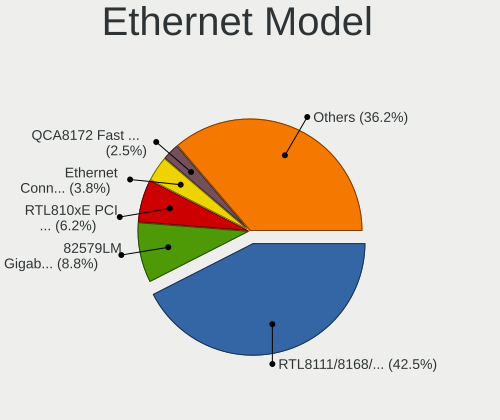

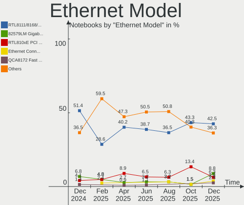

| Model                                                                          | Notebooks | Percent |
|--------------------------------------------------------------------------------|-----------|---------|
| Realtek RTL8111/8168/8211/8411 PCI Express Gigabit Ethernet Controller         | 34        | 42.5%   |
| Intel 82579LM Gigabit Network Connection (Lewisville)                          | 7         | 8.75%   |
| Realtek RTL810xE PCI Express Fast Ethernet controller                          | 5         | 6.25%   |
| Intel Ethernet Connection (6) I219-LM                                          | 3         | 3.75%   |
| Qualcomm Atheros QCA8172 Fast Ethernet                                         | 2         | 2.5%    |
| Intel Ethernet Connection (4) I219-V                                           | 2         | 2.5%    |
| Intel Ethernet Connection (18) I219-LM                                         | 2         | 2.5%    |
| Intel 82567LM Gigabit Network Connection                                       | 2         | 2.5%    |
| Broadcom NetLink BCM57780 Gigabit Ethernet PCIe                                | 2         | 2.5%    |
| Broadcom Limited NetLink BCM5906M Fast Ethernet PCI Express                    | 2         | 2.5%    |
| ASIX AX88179 Gigabit Ethernet                                                  | 2         | 2.5%    |
| Samsung Galaxy series, misc. (tethering mode)                                  | 1         | 1.25%   |
| Realtek RTL8153 Gigabit Ethernet Adapter                                       | 1         | 1.25%   |
| Realtek Killer E2600 GbE Controller                                            | 1         | 1.25%   |
| Qualcomm Atheros AR8162 Fast Ethernet                                          | 1         | 1.25%   |
| Qualcomm Atheros AR8152 v2.0 Fast Ethernet                                     | 1         | 1.25%   |
| Qualcomm Atheros AR8151 v2.0 Gigabit Ethernet                                  | 1         | 1.25%   |
| Marvell Group Yukon Optima 88E8059 [PCIe Gigabit Ethernet Controller with AVB] | 1         | 1.25%   |
| Intel Ethernet Controller I226-LM                                              | 1         | 1.25%   |
| Intel Ethernet Connection (4) I219-LM                                          | 1         | 1.25%   |
| Intel Ethernet Connection (24) I219-V                                          | 1         | 1.25%   |
| Intel Ethernet Connection (23) I219-V                                          | 1         | 1.25%   |
| Intel Ethernet Connection (13) I219-V                                          | 1         | 1.25%   |
| Intel Arrow Lake CNVi WiFi                                                     | 1         | 1.25%   |
| Intel 82577LM Gigabit Network Connection                                       | 1         | 1.25%   |
| Huawei FOA-LX9                                                                 | 1         | 1.25%   |
| Broadcom NetXtreme BCM5761e Gigabit Ethernet PCIe                              | 1         | 1.25%   |
| Broadcom NetLink BCM57785 Gigabit Ethernet PCIe                                | 1         | 1.25%   |

Net Controller Kind
-------------------

Ethernet, WiFi or modem

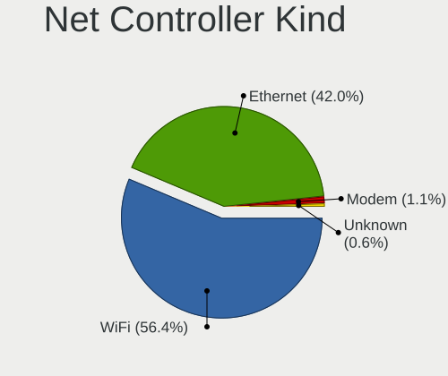

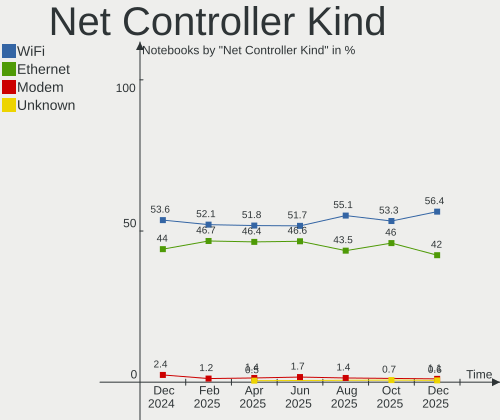

| Kind     | Notebooks | Percent |
|----------|-----------|---------|
| WiFi     | 102       | 56.35%  |
| Ethernet | 76        | 41.99%  |
| Modem    | 2         | 1.1%    |
| Unknown  | 1         | 0.55%   |

Used Controller
---------------

Currently used network controller

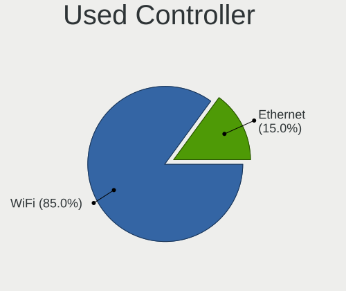

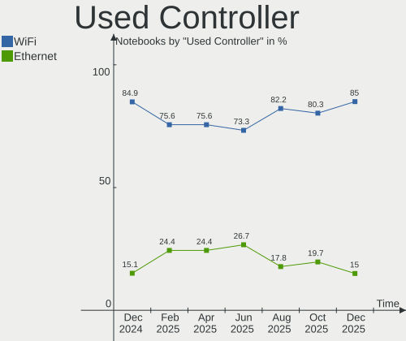

| Kind     | Notebooks | Percent |
|----------|-----------|---------|
| WiFi     | 91        | 85.05%  |
| Ethernet | 16        | 14.95%  |

NICs
----

Total network controllers on board

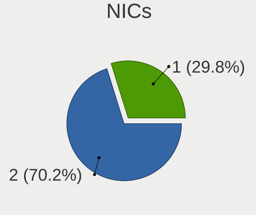

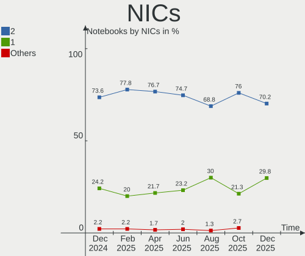

| Total | Notebooks | Percent |
|-------|-----------|---------|
| 2     | 73        | 70.19%  |
| 1     | 31        | 29.81%  |

IPv6
----

IPv6 vs IPv4

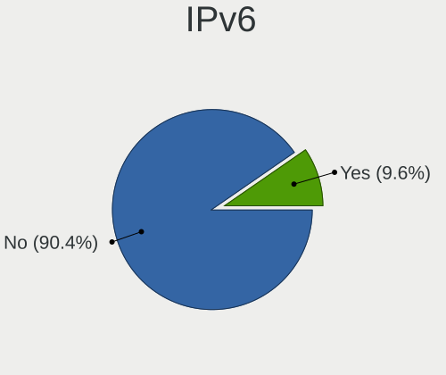

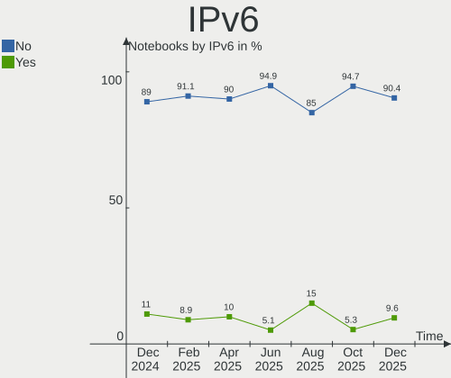

| Used | Notebooks | Percent |
|------|-----------|---------|
| No   | 94        | 90.38%  |
| Yes  | 10        | 9.62%   |

Bluetooth
---------

Bluetooth Vendor
----------------

Controller vendors

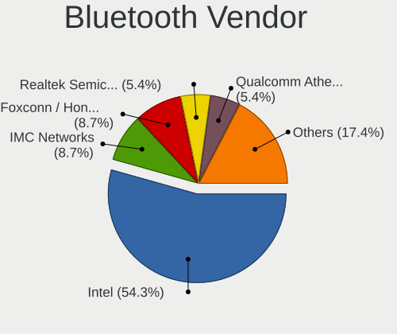

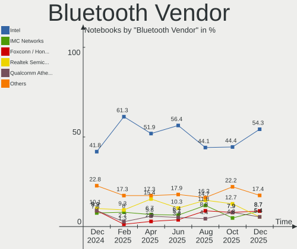

| Vendor                          | Notebooks | Percent |
|---------------------------------|-----------|---------|
| Intel                           | 50        | 54.35%  |
| IMC Networks                    | 8         | 8.7%    |
| Foxconn / Hon Hai               | 8         | 8.7%    |
| Realtek Semiconductor           | 5         | 5.43%   |
| Qualcomm Atheros Communications | 5         | 5.43%   |
| Broadcom                        | 5         | 5.43%   |
| MediaTek                        | 4         | 4.35%   |
| Dell                            | 2         | 2.17%   |
| USI                             | 1         | 1.09%   |
| Realtek                         | 1         | 1.09%   |
| Lite-On Technology              | 1         | 1.09%   |
| Foxconn International           | 1         | 1.09%   |
| ASUSTek Computer                | 1         | 1.09%   |

Bluetooth Model
---------------

Controller models

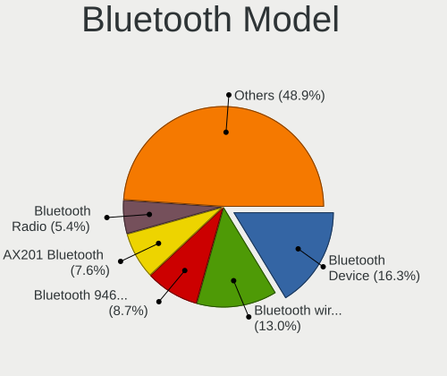

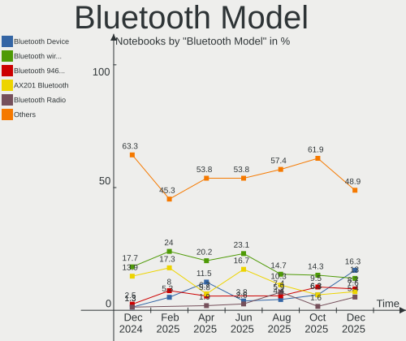

| Model                                              | Notebooks | Percent |
|----------------------------------------------------|-----------|---------|
| Intel Bluetooth Device                             | 15        | 16.3%   |
| Intel Bluetooth wireless interface                 | 12        | 13.04%  |
| Intel Bluetooth 9460/9560 Jefferson Peak (JfP)     | 8         | 8.7%    |
| Intel AX201 Bluetooth                              | 7         | 7.61%   |
| IMC Networks Bluetooth Radio                       | 5         | 5.43%   |
| Realtek Bluetooth Radio                            | 4         | 4.35%   |
| MediaTek Wireless_Device                           | 4         | 4.35%   |
| Qualcomm Atheros AR3012 Bluetooth 4.0              | 3         | 3.26%   |
| Intel AX200 Bluetooth                              | 3         | 3.26%   |
| Foxconn / Hon Hai Wireless_Device                  | 3         | 3.26%   |
| Qualcomm Atheros  Bluetooth Device                 | 2         | 2.17%   |
| Intel AX210 Bluetooth                              | 2         | 2.17%   |
| Foxconn / Hon Hai BCM20702A0                       | 2         | 2.17%   |
| Broadcom HP Portable SoftSailing                   | 2         | 2.17%   |
| USI Bluetooth Device                               | 1         | 1.09%   |
| Realtek RTL8822BE Bluetooth 4.2 Adapter            | 1         | 1.09%   |
| Realtek Bluetooth Radio                            | 1         | 1.09%   |
| Lite-On Atheros AR3012 Bluetooth                   | 1         | 1.09%   |
| Intel Wireless-AC 9260 Bluetooth Adapter           | 1         | 1.09%   |
| Intel Centrino Bluetooth Wireless Transceiver      | 1         | 1.09%   |
| Intel Centrino Advanced-N 6230 Bluetooth adapter   | 1         | 1.09%   |
| IMC Networks Wireless_Device                       | 1         | 1.09%   |
| IMC Networks Bluetooth Device                      | 1         | 1.09%   |
| IMC Networks Atheros AR3012 Bluetooth 4.0 Adapter  | 1         | 1.09%   |
| Foxconn International BCM43142A0 Bluetooth module  | 1         | 1.09%   |
| Foxconn / Hon Hai MediaTek Bluetooth Adapter       | 1         | 1.09%   |
| Foxconn / Hon Hai Broadcom Bluetooth 2.1 Device    | 1         | 1.09%   |
| Foxconn / Hon Hai Broadcom BCM20702 Bluetooth      | 1         | 1.09%   |
| Dell DW375 Bluetooth Module                        | 1         | 1.09%   |
| Dell BCM20702A0 Bluetooth Module                   | 1         | 1.09%   |
| Broadcom BCM2045B (BDC-2.1) [Bluetooth Controller] | 1         | 1.09%   |
| Broadcom BCM2045B (BDC-2.1)                        | 1         | 1.09%   |
| Broadcom BCM2045 Bluetooth                         | 1         | 1.09%   |
| ASUS Broadcom BCM20702A0 Bluetooth                 | 1         | 1.09%   |

Sound
-----

Sound Vendor
------------

Sound card vendors

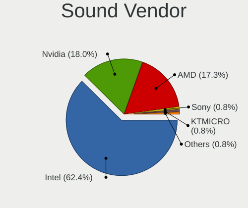

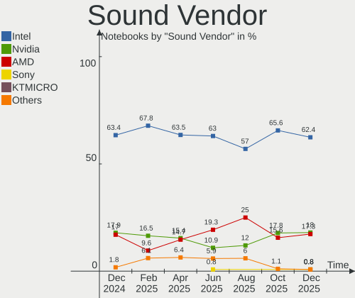

| Vendor              | Notebooks | Percent |
|---------------------|-----------|---------|
| Intel               | 83        | 62.41%  |
| Nvidia              | 24        | 18.05%  |
| AMD                 | 23        | 17.29%  |
| Sony                | 1         | 0.75%   |
| KTMICRO             | 1         | 0.75%   |
| Creative Technology | 1         | 0.75%   |

Sound Model
-----------

Sound card models

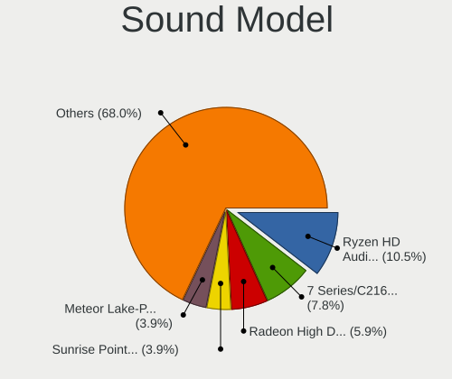

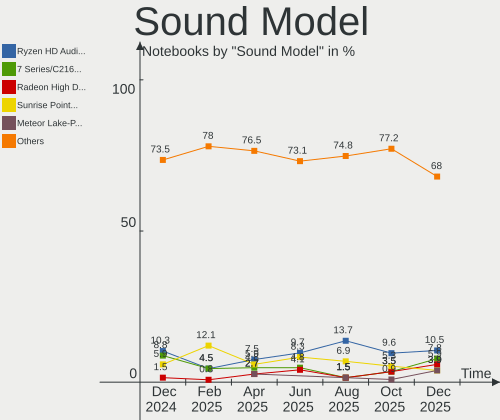

| Model                                                                      | Notebooks | Percent |
|----------------------------------------------------------------------------|-----------|---------|
| AMD Ryzen HD Audio Controller                                              | 16        | 10.46%  |
| Intel 7 Series/C216 Chipset Family High Definition Audio Controller        | 12        | 7.84%   |
| AMD Radeon High Definition Audio Controller                                | 9         | 5.88%   |
| Intel Sunrise Point-LP HD Audio                                            | 6         | 3.92%   |
| Intel Meteor Lake-P HD Audio Controller                                    | 6         | 3.92%   |
| Intel Cannon Point-LP High Definition Audio Controller                     | 6         | 3.92%   |
| Intel 6 Series/C200 Series Chipset Family High Definition Audio Controller | 6         | 3.92%   |
| Intel 5 Series/3400 Series Chipset High Definition Audio                   | 6         | 3.92%   |
| Nvidia AD107 High Definition Audio Controller                              | 5         | 3.27%   |
| Intel Alder Lake PCH-P High Definition Audio Controller                    | 5         | 3.27%   |
| Nvidia GB206 High Definition Audio Controller                              | 4         | 2.61%   |
| Intel Raptor Lake-P/U/H cAVS                                               | 4         | 2.61%   |
| Intel Haswell-ULT HD Audio Controller                                      | 4         | 2.61%   |
| Intel 8 Series HD Audio Controller                                         | 4         | 2.61%   |
| AMD Renoir/Cezanne HDMI/DP Audio Controller                                | 4         | 2.61%   |
| Intel Ice Lake-LP Smart Sound Technology Audio Controller                  | 3         | 1.96%   |
| Intel Atom Processor Z36xxx/Z37xxx Series High Definition Audio Controller | 3         | 1.96%   |
| Intel 82801I (ICH9 Family) HD Audio Controller                             | 3         | 1.96%   |
| Nvidia GA107 High Definition Audio Controller                              | 2         | 1.31%   |
| Intel Tiger Lake-LP Smart Sound Technology Audio Controller                | 2         | 1.31%   |
| Intel Raptor Lake High Definition Audio Controller                         | 2         | 1.31%   |
| Intel Alder Lake-S HD Audio Controller                                     | 2         | 1.31%   |
| Intel 100 Series/C230 Series Chipset Family HD Audio Controller            | 2         | 1.31%   |
| AMD Raven/Raven2/Fenghuang HDMI/DP Audio Controller                        | 2         | 1.31%   |
| Sony DualSense wireless controller (PS5)                                   | 1         | 0.65%   |
| Nvidia TU107 GeForce GTX 1650 High Definition Audio Controller             | 1         | 0.65%   |
| Nvidia TU106 High Definition Audio Controller                              | 1         | 0.65%   |
| Nvidia High Definition Audio Controller                                    | 1         | 0.65%   |
| Nvidia GT216 HDMI Audio Controller                                         | 1         | 0.65%   |
| Nvidia GK104 HDMI Audio Controller                                         | 1         | 0.65%   |
| Nvidia GF119 HDMI Audio Controller                                         | 1         | 0.65%   |
| Nvidia GF116 High Definition Audio Controller                              | 1         | 0.65%   |
| Nvidia GF108 High Definition Audio Controller                              | 1         | 0.65%   |
| Nvidia GF104 High Definition Audio Controller                              | 1         | 0.65%   |
| Nvidia GB207 High Definition Audio Controller                              | 1         | 0.65%   |
| Nvidia GA106 High Definition Audio Controller                              | 1         | 0.65%   |
| Nvidia AD106M High Definition Audio Controller                             | 1         | 0.65%   |
| Nvidia AD104 High Definition Audio Controller                              | 1         | 0.65%   |
| KTMICRO JBL TUNE 310C USB-C                                                | 1         | 0.65%   |
| Intel Wildcat Point-LP High Definition Audio Controller                    | 1         | 0.65%   |

Memory
------

Memory Vendor
-------------

Memory module vendors

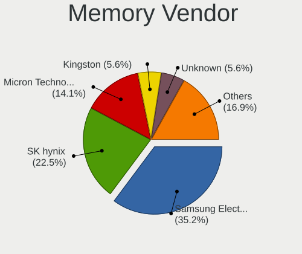

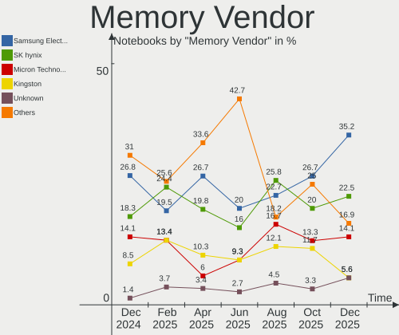

| Vendor                       | Notebooks | Percent |
|------------------------------|-----------|---------|
| Samsung Electronics          | 25        | 35.21%  |
| SK hynix                     | 16        | 22.54%  |
| Micron Technology            | 10        | 14.08%  |
| Kingston                     | 4         | 5.63%   |
| Unknown                      | 4         | 5.63%   |
| GOODRAM                      | 3         | 4.23%   |
| Elpida                       | 3         | 4.23%   |
| Ramaxel Technology           | 2         | 2.82%   |
| Patriot Memory (PDP Systems) | 1         | 1.41%   |
| Patriot                      | 1         | 1.41%   |
| G.Skill                      | 1         | 1.41%   |
| Corsair                      | 1         | 1.41%   |

Memory Model
------------

Memory module models

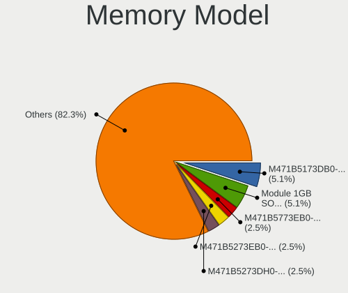

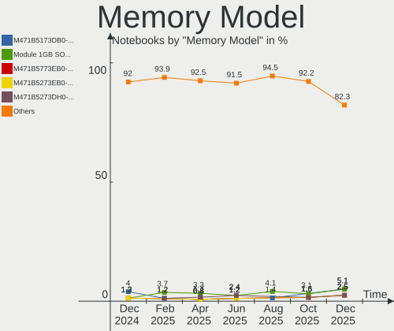

| Model                                                          | Notebooks | Percent |
|----------------------------------------------------------------|-----------|---------|
| Samsung RAM M471B5173DB0-YK0 4GB SODIMM DDR3 1600MT/s          | 4         | 5.06%   |
| Unknown                                                        | 4         | 5.06%   |
| Samsung RAM M471B5773EB0-CK0 2048MB SODIMM DDR3 1600MT/s       | 2         | 2.53%   |
| Samsung RAM M471B5273EB0-CK0 4GB SODIMM DDR3 4199MT/s          | 2         | 2.53%   |
| Samsung RAM M471B5273DH0-CK0 4GB SODIMM DDR3 2400MT/s          | 2         | 2.53%   |
| SK hynix RAM Module 4GB SODIMM DDR3 1600MT/s                   | 1         | 1.27%   |
| SK hynix RAM Module 4GB Row Of Chips LPDDR4 2933MT/s           | 1         | 1.27%   |
| SK hynix RAM HMT451S6BFR8A-PB 4GB SODIMM DDR3 1600MT/s         | 1         | 1.27%   |
| SK hynix RAM HMT451S6AFR8A-H9 4GB SODIMM DDR3 1333MT/s         | 1         | 1.27%   |
| SK hynix RAM HMT425S6AFR6A-PB 2GB SODIMM DDR3 3200MT/s         | 1         | 1.27%   |
| SK hynix RAM HMT41GS6BFR8C-PB 8GB SODIMM DDR3 1600MT/s         | 1         | 1.27%   |
| SK hynix RAM HMT41GS6BFR8A-PB 8GB SODIMM DDR3 2667MT/s         | 1         | 1.27%   |
| SK hynix RAM HMT41GS6AFR8A-PB 8GiB SODIMM DDR3 2667MT/s        | 1         | 1.27%   |
| SK hynix RAM HMT351S6CFR8C-PB 4GB SODIMM DDR3 1600MT/s         | 1         | 1.27%   |
| SK hynix RAM HMT351S6CFR8C-H9 4GB SODIMM DDR3 1334MT/s         | 1         | 1.27%   |
| SK hynix RAM HMT351S6BFR8C-H9 4GB SODIMM 1334MT/s              | 1         | 1.27%   |
| SK hynix RAM HMCG78AGBSA095N 16GB SODIMM DDR5 5600MT/s         | 1         | 1.27%   |
| SK hynix RAM HMAA1GS6C.R8N-VK 8GiB SODIMM DDR4 2667MT/s        | 1         | 1.27%   |
| SK hynix RAM HMA82GS6MFR8N-TF 16GB SODIMM DDR4 2133MT/s        | 1         | 1.27%   |
| SK hynix RAM HMA81GS6DJR8N-VK 8GB SODIMM DDR4 2667MT/s         | 1         | 1.27%   |
| SK hynix RAM HMA81GS6AFR8N-UH 8GB SODIMM DDR4 3200MT/s         | 1         | 1.27%   |
| SK hynix RAM HMA81GS6AFR8N-UH 8GB SODIMM DDR4 2667MT/s         | 1         | 1.27%   |
| SK hynix RAM HCNNNCPMMLXR-NEE 2GB Row Of Chips LPDDR4 4267MT/s | 1         | 1.27%   |
| Samsung RAM Module 8GB SODIMM DDR4 2667MT/s                    | 1         | 1.27%   |
| Samsung RAM Module 16GB SODIMM DDR5 5600MT/s                   | 1         | 1.27%   |
| Samsung RAM M471B5773DH0-CH9 2GB SODIMM DDR3 1600MT/s          | 1         | 1.27%   |
| Samsung RAM M471B5273DH0-CH9 4GB SODIMM DDR3 1600MT/s          | 1         | 1.27%   |
| Samsung RAM M471B5173QH0-YK0 4GB SODIMM DDR3 1600MT/s          | 1         | 1.27%   |
| Samsung RAM M471B2873GB0-CH9 1GB SODIMM DDR3 1334MT/s          | 1         | 1.27%   |
| Samsung RAM M471A2K43DB1-CWE 16GB SODIMM DDR4 3200MT/s         | 1         | 1.27%   |
| Samsung RAM M471A1K43BB1-CRC 8GB SODIMM DDR4 2667MT/s          | 1         | 1.27%   |
| Samsung RAM M471A1K43BB0-CPB 8GiB SODIMM DDR4 2133MT/s         | 1         | 1.27%   |
| Samsung RAM M471A1G44AB0-CWE 8GB Row Of Chips DDR4 3200MT/s    | 1         | 1.27%   |
| Samsung RAM M425R4GA3EB0-CWMOD 32GB SODIMM DDR5 5600MT/s       | 1         | 1.27%   |
| Samsung RAM M425R4GA3BB0-CQKOL 32GB SODIMM DDR5 4800MT/s       | 1         | 1.27%   |
| Samsung RAM M425R2GA3PB0-CWMOL 16GB SODIMM DDR5 5600MT/s       | 1         | 1.27%   |
| Samsung RAM M425R2GA3EB0-CWMOL 16GB SODIMM DDR5 5600MT/s       | 1         | 1.27%   |
| Samsung RAM M425R2GA3BB0-CWMOD 16GiB SODIMM DDR5 5600MT/s      | 1         | 1.27%   |
| Samsung RAM M425R1GB4PB0-CWMOL 8GB SODIMM DDR5 5600MT/s        | 1         | 1.27%   |
| Samsung RAM K3LKBKB0BM-MGCP 2GB Row Of Chips LPDDR5 6400MT/s   | 1         | 1.27%   |

Memory Kind
-----------

Memory module kinds

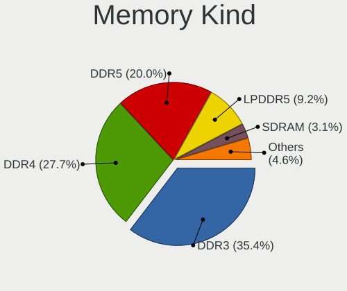

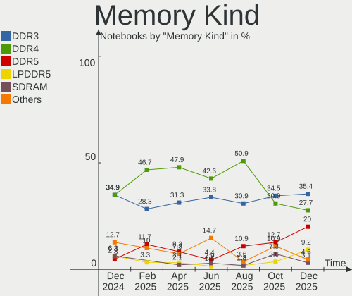

| Kind   | Notebooks | Percent |
|--------|-----------|---------|
| DDR3   | 23        | 35.38%  |
| DDR4   | 18        | 27.69%  |
| DDR5   | 13        | 20%     |
| LPDDR5 | 6         | 9.23%   |
| SDRAM  | 2         | 3.08%   |
| LPDDR4 | 2         | 3.08%   |
| LPDDR3 | 1         | 1.54%   |

Memory Form Factor
------------------

Physical design of the memory module

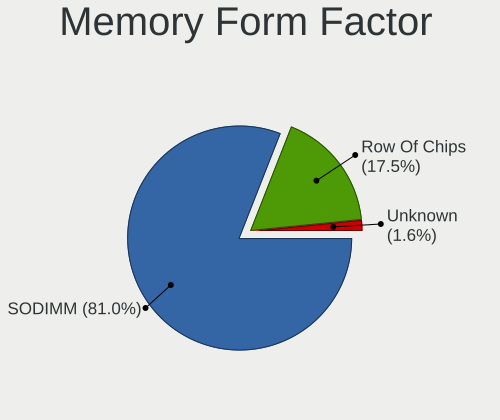

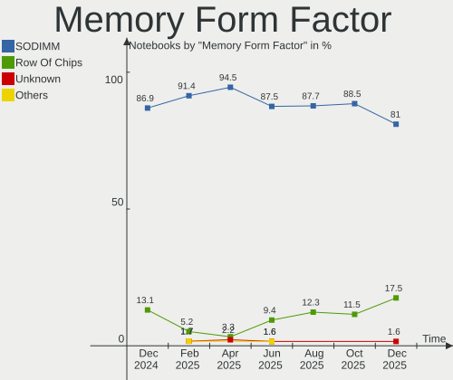

| Name         | Notebooks | Percent |
|--------------|-----------|---------|
| SODIMM       | 51        | 80.95%  |
| Row Of Chips | 11        | 17.46%  |
| Unknown      | 1         | 1.59%   |

Memory Size
-----------

Memory module size

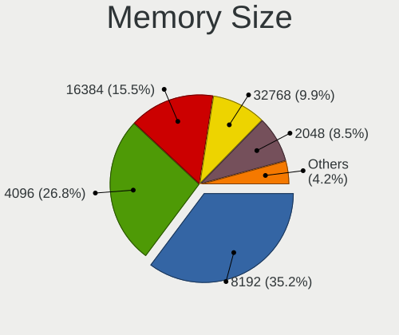

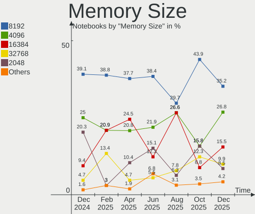

| Size  | Notebooks | Percent |
|-------|-----------|---------|
| 8192  | 25        | 35.21%  |
| 4096  | 19        | 26.76%  |
| 16384 | 11        | 15.49%  |
| 32768 | 7         | 9.86%   |
| 2048  | 6         | 8.45%   |
| 1024  | 2         | 2.82%   |
| 12288 | 1         | 1.41%   |

Memory Speed
------------

Memory module speed

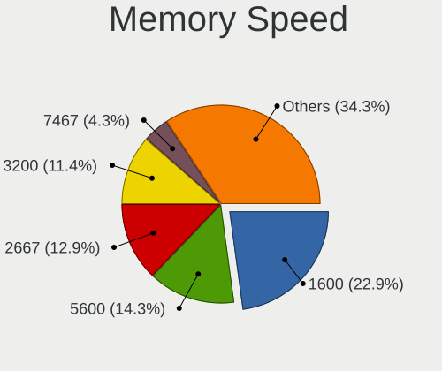

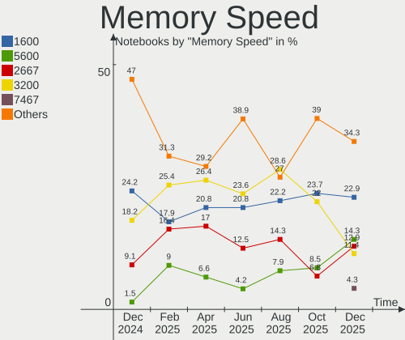

| Speed | Notebooks | Percent |
|-------|-----------|---------|
| 1600  | 16        | 22.86%  |
| 5600  | 10        | 14.29%  |
| 2667  | 9         | 12.86%  |
| 3200  | 8         | 11.43%  |
| 7467  | 3         | 4.29%   |
| 4800  | 3         | 4.29%   |
| 2400  | 3         | 4.29%   |
| 1334  | 3         | 4.29%   |
| 6400  | 2         | 2.86%   |
| 4199  | 2         | 2.86%   |
| 2133  | 2         | 2.86%   |
| 1333  | 2         | 2.86%   |
| 8533  | 1         | 1.43%   |
| 4267  | 1         | 1.43%   |
| 2933  | 1         | 1.43%   |
| 1867  | 1         | 1.43%   |
| 1866  | 1         | 1.43%   |
| 1067  | 1         | 1.43%   |
| 1066  | 1         | 1.43%   |

Printers & scanners
-------------------

Printer Vendor
--------------

Printer device vendors

Zero info for selected period =(

Printer Model
-------------

Printer device models

Zero info for selected period =(

Scanner Vendor
--------------

Scanner device vendors

Zero info for selected period =(

Scanner Model
-------------

Scanner device models

Zero info for selected period =(

Camera
------

Camera Vendor
-------------

Camera device vendors

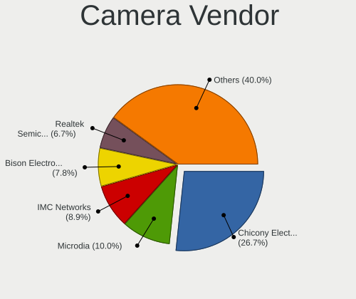

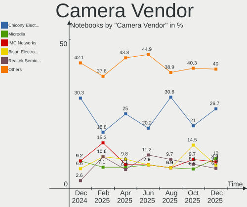

| Vendor                                 | Notebooks | Percent |
|----------------------------------------|-----------|---------|
| Chicony Electronics                    | 24        | 26.67%  |
| Microdia                               | 9         | 10%     |
| IMC Networks                           | 8         | 8.89%   |
| Bison Electronics                      | 7         | 7.78%   |
| Realtek Semiconductor                  | 6         | 6.67%   |
| Syntek                                 | 4         | 4.44%   |
| Sunplus Innovation Technology          | 4         | 4.44%   |
| Luxvisions Innotech Limited            | 4         | 4.44%   |
| Silicon Motion                         | 3         | 3.33%   |
| Shinetech                              | 3         | 3.33%   |
| Ricoh                                  | 3         | 3.33%   |
| Suyin                                  | 2         | 2.22%   |
| Shine-optics                           | 2         | 2.22%   |
| Quanta                                 | 2         | 2.22%   |
| Cheng Uei Precision Industry (Foxlink) | 2         | 2.22%   |
| SunplusIT                              | 1         | 1.11%   |
| Sonix Technology                       | 1         | 1.11%   |
| SenseTek                               | 1         | 1.11%   |
| Lenovo                                 | 1         | 1.11%   |
| BillionPixels                          | 1         | 1.11%   |
| ALi                                    | 1         | 1.11%   |
| Acer                                   | 1         | 1.11%   |

Camera Model
------------

Camera device models

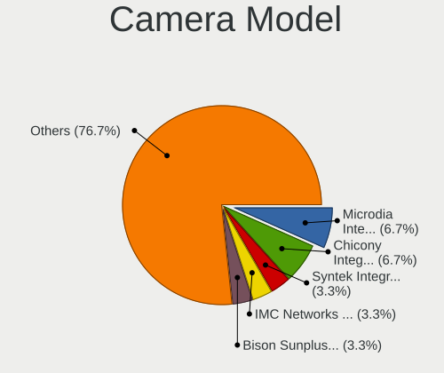

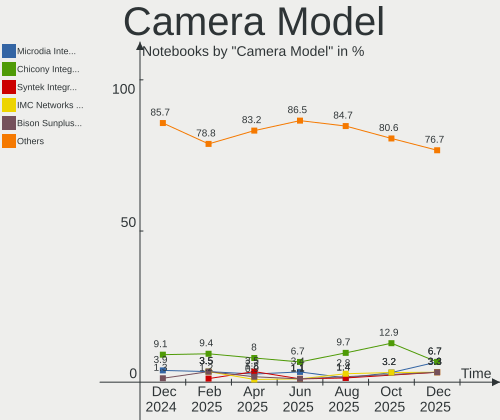

| Model                                         | Notebooks | Percent |
|-----------------------------------------------|-----------|---------|
| Microdia Integrated_Webcam_HD                 | 6         | 6.67%   |
| Chicony Integrated Camera                     | 6         | 6.67%   |
| Syntek Integrated Camera                      | 3         | 3.33%   |
| IMC Networks Integrated Camera                | 3         | 3.33%   |
| Bison SunplusIT Integrated Camera             | 3         | 3.33%   |
| Shine-optics USB2.0 HD UVC WebCam             | 2         | 2.22%   |
| Realtek Integrated Webcam                     | 2         | 2.22%   |
| Luxvisions Innotech Limited Integrated Camera | 2         | 2.22%   |
| IMC Networks HD Camera                        | 2         | 2.22%   |
| Chicony USB2.0 HD UVC WebCam                  | 2         | 2.22%   |
| Chicony HD WebCam                             | 2         | 2.22%   |
| Chicony ACER HD User Facing                   | 2         | 2.22%   |
| Bison Integrated Camera                       | 2         | 2.22%   |
| Syntek Lenovo EasyCamera                      | 1         | 1.11%   |
| Suyin Lenovo EasyCamera                       | 1         | 1.11%   |
| Suyin Integrated_Webcam_HD                    | 1         | 1.11%   |
| SunplusIT HD Webcam                           | 1         | 1.11%   |
| Sunplus Lenovo EasyCamera                     | 1         | 1.11%   |
| Sunplus HP X Camera                           | 1         | 1.11%   |
| Sunplus HD WebCam                             | 1         | 1.11%   |
| Sunplus Asus Webcam                           | 1         | 1.11%   |
| Sonix GIGABYTE FHD CAMERA                     | 1         | 1.11%   |
| Silicon Motion WebCam SC-13HDL11939N          | 1         | 1.11%   |
| Silicon Motion WebCam SC-10HDD12636N          | 1         | 1.11%   |
| Silicon Motion WebCam SC-0311139N             | 1         | 1.11%   |
| ShineTech USB2.0 HD UVC WebCam                | 1         | 1.11%   |
| Shinetech USB2.0 FHD UVC WebCam               | 1         | 1.11%   |
| Shinetech ASUS FHD webcam                     | 1         | 1.11%   |
| SenseTek FHD Camera                           | 1         | 1.11%   |
| Ricoh Laptop_Integrated_Webcam_FHD            | 1         | 1.11%   |
| Ricoh HD Webcam                               | 1         | 1.11%   |
| Ricoh Dell Laptop Integrated Webcam           | 1         | 1.11%   |
| Realtek USB2.0 VGA UVC WebCam                 | 1         | 1.11%   |
| Realtek USB Camera                            | 1         | 1.11%   |
| Realtek Lenovo EasyCamera                     | 1         | 1.11%   |
| Realtek Integrated_Webcam_HD                  | 1         | 1.11%   |
| Quanta HP Wide Vision HD Camera               | 1         | 1.11%   |
| Quanta HP FHD Camera                          | 1         | 1.11%   |
| Microdia WebCam SC-13HDL12639P                | 1         | 1.11%   |
| Microdia USB 2.0 Camera                       | 1         | 1.11%   |

Security
--------

Fingerprint Vendor
------------------

Fingerprint sensor vendors

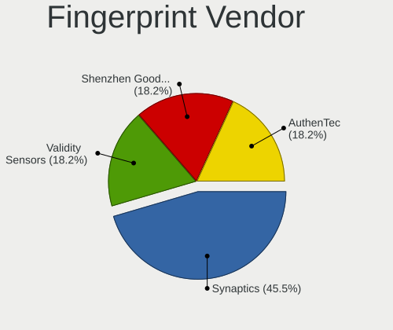

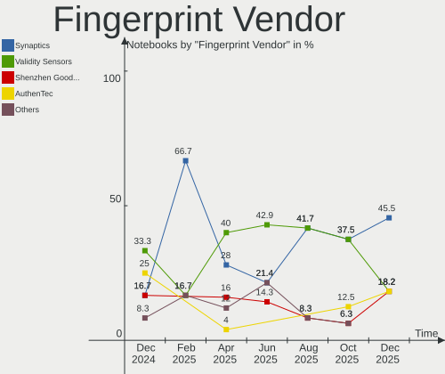

| Vendor                     | Notebooks | Percent |
|----------------------------|-----------|---------|
| Synaptics                  | 5         | 45.45%  |
| Validity Sensors           | 2         | 18.18%  |
| Shenzhen Goodix Technology | 2         | 18.18%  |
| AuthenTec                  | 2         | 18.18%  |

Fingerprint Model
-----------------

Fingerprint sensor models

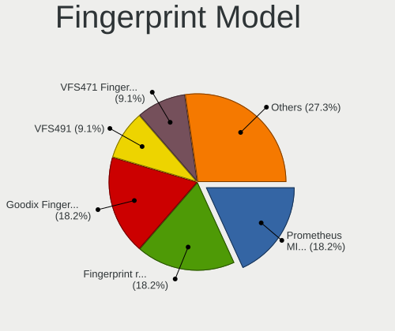

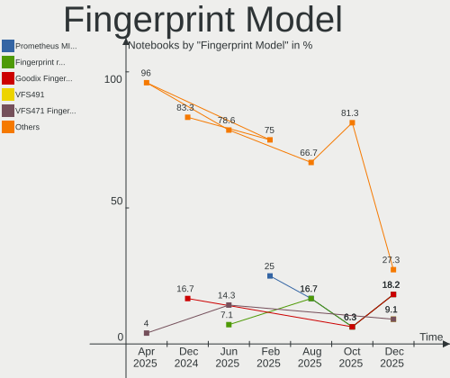

| Model                                             | Notebooks | Percent |
|---------------------------------------------------|-----------|---------|
| Synaptics Prometheus MIS Touch Fingerprint Reader | 2         | 18.18%  |
| Synaptics Fingerprint reader [HP G6]              | 2         | 18.18%  |
| Shenzhen Goodix  Fingerprint Device               | 2         | 18.18%  |
| Validity Sensors VFS491                           | 1         | 9.09%   |
| Validity Sensors VFS471 Fingerprint Reader        | 1         | 9.09%   |
| Synaptics UWP WBDI Device                         | 1         | 9.09%   |
| AuthenTec AES2810                                 | 1         | 9.09%   |
| AuthenTec AES2501 Fingerprint Sensor              | 1         | 9.09%   |

Chipcard Vendor
---------------

Chipcard module vendors

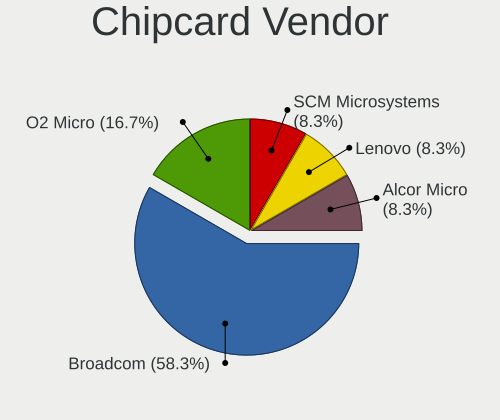

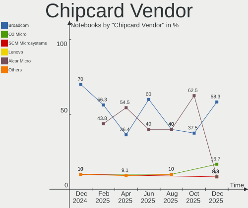

| Vendor           | Notebooks | Percent |
|------------------|-----------|---------|
| Broadcom         | 7         | 58.33%  |
| O2 Micro         | 2         | 16.67%  |
| SCM Microsystems | 1         | 8.33%   |
| Lenovo           | 1         | 8.33%   |
| Alcor Micro      | 1         | 8.33%   |

Chipcard Model
--------------

Chipcard module models

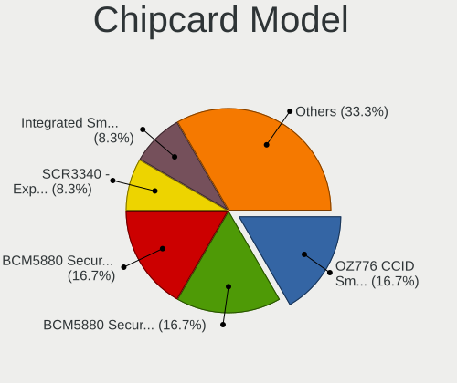

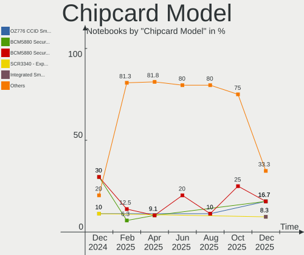

| Model                                                                        | Notebooks | Percent |
|------------------------------------------------------------------------------|-----------|---------|
| O2 Micro OZ776 CCID Smartcard Reader                                         | 2         | 16.67%  |
| Broadcom BCM5880 Secure Applications Processor with fingerprint swipe sensor | 2         | 16.67%  |
| Broadcom BCM5880 Secure Applications Processor                               | 2         | 16.67%  |
| SCM Microsystems SCR3340 - ExpressCard54 Smart Card Reader                   | 1         | 8.33%   |
| Lenovo Integrated Smart Card Reader                                          | 1         | 8.33%   |
| Broadcom BCM58200 ControlVault 3 (FingerPrint sensor + Contacted SmartCard)  | 1         | 8.33%   |
| Broadcom 5880                                                                | 1         | 8.33%   |
| Broadcom 58200                                                               | 1         | 8.33%   |
| Alcor Micro AU9540 Smartcard Reader                                          | 1         | 8.33%   |

Unsupported
-----------

Unsupported Devices
-------------------

Total unsupported devices on board

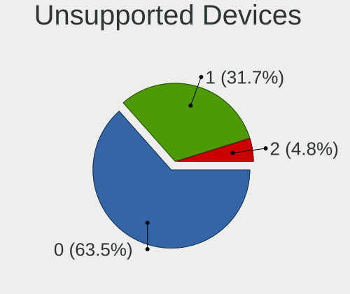

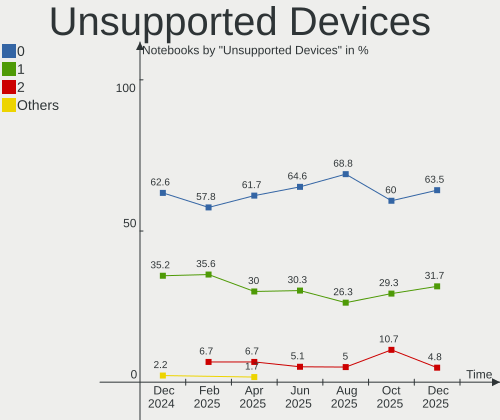

| Total | Notebooks | Percent |
|-------|-----------|---------|
| 0     | 66        | 63.46%  |
| 1     | 33        | 31.73%  |
| 2     | 5         | 4.81%   |

Unsupported Device Types
------------------------

Types of unsupported devices

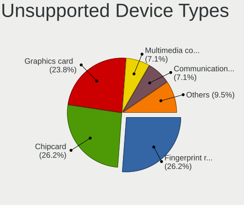

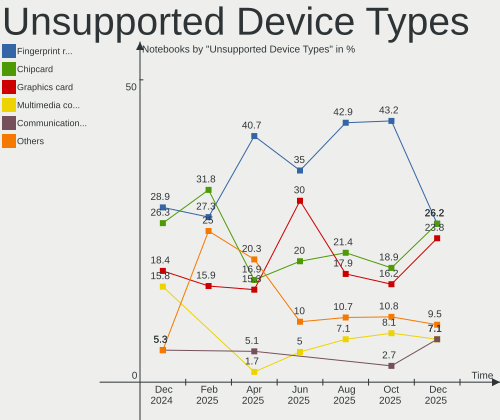

| Type                     | Notebooks | Percent |
|--------------------------|-----------|---------|
| Fingerprint reader       | 11        | 26.19%  |
| Chipcard                 | 11        | 26.19%  |
| Graphics card            | 10        | 23.81%  |
| Multimedia controller    | 3         | 7.14%   |
| Communication controller | 3         | 7.14%   |
| Storage                  | 1         | 2.38%   |
| Network                  | 1         | 2.38%   |
| Net/wireless             | 1         | 2.38%   |
| Bluetooth                | 1         | 2.38%   |

