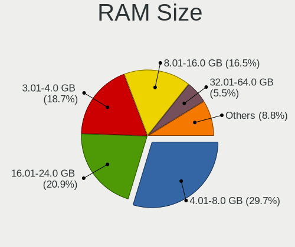
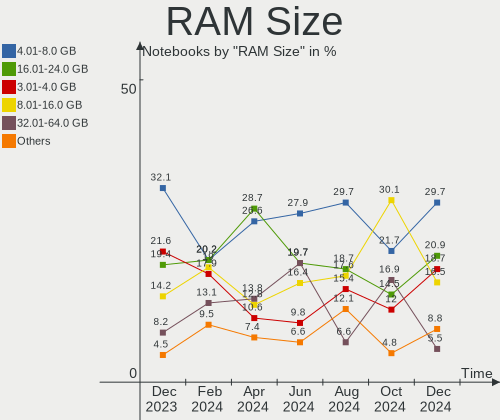
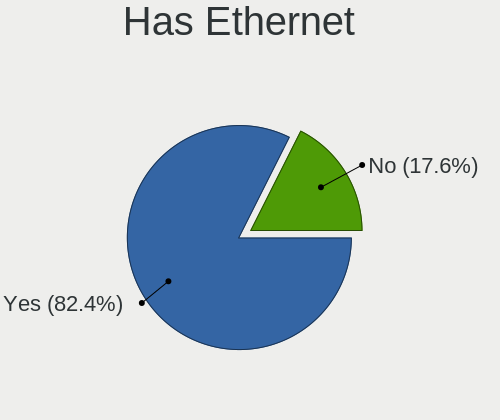
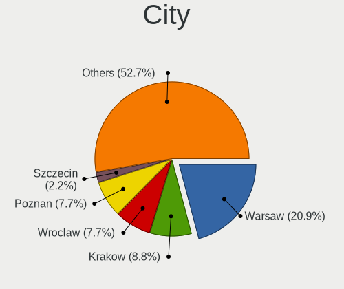
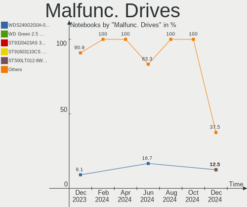
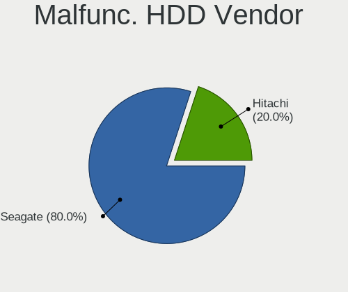
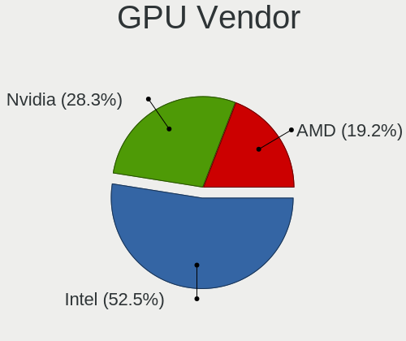
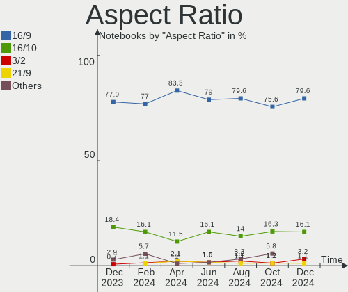
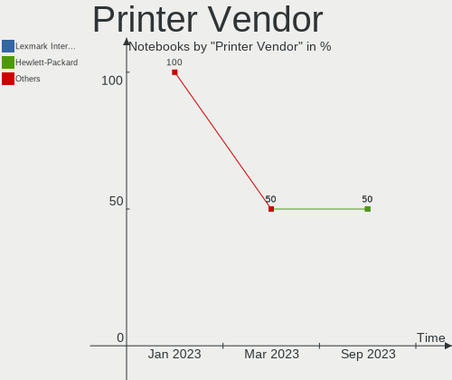

Linux in Poland - Hardware Trends (Notebooks)
---------------------------------------------

A project to identify most popular hardware characteristics and track their change
over time based on data collected by Linux users at https://Linux-Hardware.org.

Anyone can contribute to this report by the [hw-probe](https://github.com/linuxhw/hw-probe) tool:

    sudo -E hw-probe -all -upload

Period: Jul, 2022.

Contents
--------

* [ System ](#system)
  - [ OS                       ](#os)
  - [ OS Family                ](#os-family)
  - [ Kernel                   ](#kernel)
  - [ Kernel Family            ](#kernel-family)
  - [ Kernel Major Ver.        ](#kernel-major-ver)
  - [ Arch                     ](#arch)
  - [ DE                       ](#de)
  - [ Display Server           ](#display-server)
  - [ Display Manager          ](#display-manager)
  - [ OS Lang                  ](#os-lang)
  - [ Boot Mode                ](#boot-mode)
  - [ Filesystem               ](#filesystem)
  - [ Part. scheme             ](#part-scheme)
  - [ Dual Boot with Linux/BSD ](#dual-boot-with-linuxbsd)
  - [ Dual Boot (Win)          ](#dual-boot-win)

* [ Board ](#board)
  - [ Vendor                   ](#vendor)
  - [ Model                    ](#model)
  - [ Model Family             ](#model-family)
  - [ MFG Year                 ](#mfg-year)
  - [ Form Factor              ](#form-factor)
  - [ Secure Boot              ](#secure-boot)
  - [ Coreboot                 ](#coreboot)
  - [ RAM Size                 ](#ram-size)
  - [ RAM Used                 ](#ram-used)
  - [ Total Drives             ](#total-drives)
  - [ Has CD-ROM               ](#has-cd-rom)
  - [ Has Ethernet             ](#has-ethernet)
  - [ Has WiFi                 ](#has-wifi)
  - [ Has Bluetooth            ](#has-bluetooth)

* [ Location ](#location)
  - [ Country                  ](#country)
  - [ City                     ](#city)

* [ Drives ](#drives)
  - [ Drive Vendor             ](#drive-vendor)
  - [ Drive Model              ](#drive-model)
  - [ HDD Vendor               ](#hdd-vendor)
  - [ SSD Vendor               ](#ssd-vendor)
  - [ Drive Kind               ](#drive-kind)
  - [ Drive Connector          ](#drive-connector)
  - [ Drive Size               ](#drive-size)
  - [ Space Total              ](#space-total)
  - [ Space Used               ](#space-used)
  - [ Malfunc. Drives          ](#malfunc-drives)
  - [ Malfunc. Drive Vendor    ](#malfunc-drive-vendor)
  - [ Malfunc. HDD Vendor      ](#malfunc-hdd-vendor)
  - [ Malfunc. Drive Kind      ](#malfunc-drive-kind)
  - [ Failed Drives            ](#failed-drives)
  - [ Failed Drive Vendor      ](#failed-drive-vendor)
  - [ Drive Status             ](#drive-status)

* [ Storage controller ](#storage-controller)
  - [ Storage Vendor           ](#storage-vendor)
  - [ Storage Model            ](#storage-model)
  - [ Storage Kind             ](#storage-kind)

* [ Processor ](#processor)
  - [ CPU Vendor               ](#cpu-vendor)
  - [ CPU Model                ](#cpu-model)
  - [ CPU Model Family         ](#cpu-model-family)
  - [ CPU Cores                ](#cpu-cores)
  - [ CPU Sockets              ](#cpu-sockets)
  - [ CPU Threads              ](#cpu-threads)
  - [ CPU Op-Modes             ](#cpu-op-modes)
  - [ CPU Microcode            ](#cpu-microcode)
  - [ CPU Microarch            ](#cpu-microarch)

* [ Graphics ](#graphics)
  - [ GPU Vendor               ](#gpu-vendor)
  - [ GPU Model                ](#gpu-model)
  - [ GPU Combo                ](#gpu-combo)
  - [ GPU Driver               ](#gpu-driver)
  - [ GPU Memory               ](#gpu-memory)

* [ Monitor ](#monitor)
  - [ Monitor Vendor           ](#monitor-vendor)
  - [ Monitor Model            ](#monitor-model)
  - [ Monitor Resolution       ](#monitor-resolution)
  - [ Monitor Diagonal         ](#monitor-diagonal)
  - [ Monitor Width            ](#monitor-width)
  - [ Aspect Ratio             ](#aspect-ratio)
  - [ Monitor Area             ](#monitor-area)
  - [ Pixel Density            ](#pixel-density)
  - [ Multiple Monitors        ](#multiple-monitors)

* [ Network ](#network)
  - [ Net Controller Vendor    ](#net-controller-vendor)
  - [ Net Controller Model     ](#net-controller-model)
  - [ Wireless Vendor          ](#wireless-vendor)
  - [ Wireless Model           ](#wireless-model)
  - [ Ethernet Vendor          ](#ethernet-vendor)
  - [ Ethernet Model           ](#ethernet-model)
  - [ Net Controller Kind      ](#net-controller-kind)
  - [ Used Controller          ](#used-controller)
  - [ NICs                     ](#nics)
  - [ IPv6                     ](#ipv6)

* [ Bluetooth ](#bluetooth)
  - [ Bluetooth Vendor         ](#bluetooth-vendor)
  - [ Bluetooth Model          ](#bluetooth-model)

* [ Sound ](#sound)
  - [ Sound Vendor             ](#sound-vendor)
  - [ Sound Model              ](#sound-model)

* [ Memory ](#memory)
  - [ Memory Vendor            ](#memory-vendor)
  - [ Memory Model             ](#memory-model)
  - [ Memory Kind              ](#memory-kind)
  - [ Memory Form Factor       ](#memory-form-factor)
  - [ Memory Size              ](#memory-size)
  - [ Memory Speed             ](#memory-speed)

* [ Printers & scanners ](#printers--scanners)
  - [ Printer Vendor           ](#printer-vendor)
  - [ Printer Model            ](#printer-model)
  - [ Scanner Vendor           ](#scanner-vendor)
  - [ Scanner Model            ](#scanner-model)

* [ Camera ](#camera)
  - [ Camera Vendor            ](#camera-vendor)
  - [ Camera Model             ](#camera-model)

* [ Security ](#security)
  - [ Fingerprint Vendor       ](#fingerprint-vendor)
  - [ Fingerprint Model        ](#fingerprint-model)
  - [ Chipcard Vendor          ](#chipcard-vendor)
  - [ Chipcard Model           ](#chipcard-model)

* [ Unsupported ](#unsupported)
  - [ Unsupported Devices      ](#unsupported-devices)
  - [ Unsupported Device Types ](#unsupported-device-types)

System
------

OS
--

Installed operating systems

| Name                 | Notebooks | Percent |
|----------------------|-----------|---------|
| Ubuntu 22.04         | 9         | 16.07%  |
| Fedora 36            | 7         | 12.5%   |
| Ubuntu 20.04         | 4         | 7.14%   |
| Linux Mint 20.3      | 4         | 7.14%   |
| Zorin 16             | 3         | 5.36%   |
| Pop!_OS 22.04        | 3         | 5.36%   |
| OpenMandriva 4.3     | 2         | 3.57%   |
| OpenMandriva 4.2     | 2         | 3.57%   |
| Manjaro              | 2         | 3.57%   |
| Debian 11            | 2         | 3.57%   |
| Ubuntu 21.10         | 1         | 1.79%   |
| ROSA R11.1           | 1         | 1.79%   |
| ROSA 12.1            | 1         | 1.79%   |
| RHEL 8               | 1         | 1.79%   |
| MX 21                | 1         | 1.79%   |
| Manjaro 21.3.4       | 1         | 1.79%   |
| Manjaro 21.3.3       | 1         | 1.79%   |
| Manjaro 21.3.1       | 1         | 1.79%   |
| Lubuntu 22.04        | 1         | 1.79%   |
| LinuxFX 11           | 1         | 1.79%   |
| Linux Mint 19        | 1         | 1.79%   |
| Kubuntu 22.04        | 1         | 1.79%   |
| KDE neon 20.04       | 1         | 1.79%   |
| Kali 2022.3          | 1         | 1.79%   |
| Gentoo 2.8           | 1         | 1.79%   |
| Garuda Linux Soaring | 1         | 1.79%   |
| Fedora 33            | 1         | 1.79%   |
| Arch                 | 1         | 1.79%   |

OS Family
---------

OS without a version

| Name         | Notebooks | Percent |
|--------------|-----------|---------|
| Ubuntu       | 14        | 25%     |
| Fedora       | 8         | 14.29%  |
| Manjaro      | 5         | 8.93%   |
| Linux Mint   | 5         | 8.93%   |
| OpenMandriva | 4         | 7.14%   |
| Zorin        | 3         | 5.36%   |
| Pop!_OS      | 3         | 5.36%   |
| ROSA         | 2         | 3.57%   |
| Debian       | 2         | 3.57%   |
| RHEL         | 1         | 1.79%   |
| MX           | 1         | 1.79%   |
| Lubuntu      | 1         | 1.79%   |
| LinuxFX      | 1         | 1.79%   |
| Kubuntu      | 1         | 1.79%   |
| KDE neon     | 1         | 1.79%   |
| Kali         | 1         | 1.79%   |
| Gentoo       | 1         | 1.79%   |
| Garuda Linux | 1         | 1.79%   |
| Arch         | 1         | 1.79%   |

Kernel
------

Version of the Linux kernel

| Version                            | Notebooks | Percent |
|------------------------------------|-----------|---------|
| 5.15.0-41-generic                  | 7         | 12.5%   |
| 5.17.15-76051715-generic           | 3         | 5.36%   |
| 5.15.0-40-generic                  | 3         | 5.36%   |
| 5.13.0-52-generic                  | 3         | 5.36%   |
| 5.4.0-122-generic                  | 2         | 3.57%   |
| 5.18.12-3-MANJARO                  | 2         | 3.57%   |
| 5.16.7-desktop-1omv4003            | 2         | 3.57%   |
| 5.15.0-43-generic                  | 2         | 3.57%   |
| 5.10.14-desktop-1omv4002           | 2         | 3.57%   |
| 5.4.0-121-generic                  | 1         | 1.79%   |
| 5.4.0-117-generic                  | 1         | 1.79%   |
| 5.4.0-110-generic                  | 1         | 1.79%   |
| 5.18.9-200.fc36.x86_64             | 1         | 1.79%   |
| 5.18.8-arch1-1                     | 1         | 1.79%   |
| 5.18.8-200.fc36.x86_64             | 1         | 1.79%   |
| 5.18.7-200.fc36.x86_64             | 1         | 1.79%   |
| 5.18.5-arch1-g14-1                 | 1         | 1.79%   |
| 5.18.13-200.fc36.x86_64            | 1         | 1.79%   |
| 5.18.11-lqx1-1-lqx                 | 1         | 1.79%   |
| 5.18.11-200.fc36.x86_64            | 1         | 1.79%   |
| 5.18.10-201.fsync.fc36.x86_64      | 1         | 1.79%   |
| 5.18.10-200.fc36.x86_64            | 1         | 1.79%   |
| 5.18.0-kali5-amd64                 | 1         | 1.79%   |
| 5.18.0-gbfc780ef1ca0               | 1         | 1.79%   |
| 5.17.15-1-MANJARO                  | 1         | 1.79%   |
| 5.17.0-1012-oem                    | 1         | 1.79%   |
| 5.16.0-6mx-amd64                   | 1         | 1.79%   |
| 5.15.49-1-MANJARO                  | 1         | 1.79%   |
| 5.15.0-25-generic                  | 1         | 1.79%   |
| 5.14.18-100.fc33.x86_64            | 1         | 1.79%   |
| 5.13.0-41-generic                  | 1         | 1.79%   |
| 5.13.0-28-generic                  | 1         | 1.79%   |
| 5.13.0-27-generic                  | 1         | 1.79%   |
| 5.10.74-generic-2rosa2021.1-x86_64 | 1         | 1.79%   |
| 5.10.0-6-amd64                     | 1         | 1.79%   |
| 5.10.0-15-amd64                    | 1         | 1.79%   |
| 4.9.155-nrj-desktop-1rosa-x86_64   | 1         | 1.79%   |
| 4.18.0-372.13.1.el8_6.x86_64       | 1         | 1.79%   |
| 4.15.0-20-generic                  | 1         | 1.79%   |

Kernel Family
-------------

Linux kernel without a distro release

| Version | Notebooks | Percent |
|---------|-----------|---------|
| 5.15.0  | 13        | 23.21%  |
| 5.13.0  | 6         | 10.71%  |
| 5.4.0   | 5         | 8.93%   |
| 5.17.15 | 4         | 7.14%   |
| 5.18.8  | 2         | 3.57%   |
| 5.18.12 | 2         | 3.57%   |
| 5.18.11 | 2         | 3.57%   |
| 5.18.10 | 2         | 3.57%   |
| 5.18.0  | 2         | 3.57%   |
| 5.16.7  | 2         | 3.57%   |
| 5.10.14 | 2         | 3.57%   |
| 5.10.0  | 2         | 3.57%   |
| 5.18.9  | 1         | 1.79%   |
| 5.18.7  | 1         | 1.79%   |
| 5.18.5  | 1         | 1.79%   |
| 5.18.13 | 1         | 1.79%   |
| 5.17.0  | 1         | 1.79%   |
| 5.16.0  | 1         | 1.79%   |
| 5.15.49 | 1         | 1.79%   |
| 5.14.18 | 1         | 1.79%   |
| 5.10.74 | 1         | 1.79%   |
| 4.9.155 | 1         | 1.79%   |
| 4.18.0  | 1         | 1.79%   |
| 4.15.0  | 1         | 1.79%   |

Kernel Major Ver.
-----------------

Linux kernel major version

| Version | Notebooks | Percent |
|---------|-----------|---------|
| 5.18    | 14        | 25%     |
| 5.15    | 14        | 25%     |
| 5.13    | 6         | 10.71%  |
| 5.4     | 5         | 8.93%   |
| 5.17    | 5         | 8.93%   |
| 5.10    | 5         | 8.93%   |
| 5.16    | 3         | 5.36%   |
| 5.14    | 1         | 1.79%   |
| 4.9     | 1         | 1.79%   |
| 4.18    | 1         | 1.79%   |
| 4.15    | 1         | 1.79%   |

Arch
----

OS architecture (x86_64, i586, etc.)

| Name   | Notebooks | Percent |
|--------|-----------|---------|
| x86_64 | 55        | 98.21%  |
| i686   | 1         | 1.79%   |

DE
--

Desktop Environment

| Name    | Notebooks | Percent |
|---------|-----------|---------|
| GNOME   | 28        | 50%     |
| KDE5    | 15        | 26.79%  |
| XFCE    | 4         | 7.14%   |
| MATE    | 3         | 5.36%   |
| Unknown | 3         | 5.36%   |
| LXQt    | 1         | 1.79%   |
| KDE4    | 1         | 1.79%   |
| Deepin  | 1         | 1.79%   |

Display Server
--------------

X11 or Wayland

| Name    | Notebooks | Percent |
|---------|-----------|---------|
| X11     | 32        | 57.14%  |
| Wayland | 21        | 37.5%   |
| Unknown | 2         | 3.57%   |
| Tty     | 1         | 1.79%   |

Display Manager
---------------

SDDM, LightDM, etc.

| Name    | Notebooks | Percent |
|---------|-----------|---------|
| Unknown | 24        | 42.86%  |
| GDM3    | 12        | 21.43%  |
| SDDM    | 9         | 16.07%  |
| LightDM | 5         | 8.93%   |
| GDM     | 5         | 8.93%   |
| KDM     | 1         | 1.79%   |

OS Lang
-------

Language

| Lang    | Notebooks | Percent |
|---------|-----------|---------|
| pl_PL   | 33        | 58.93%  |
| en_US   | 14        | 25%     |
| en_GB   | 2         | 3.57%   |
| C       | 2         | 3.57%   |
| Unknown | 2         | 3.57%   |
| uk_UA   | 1         | 1.79%   |
| ru_RU   | 1         | 1.79%   |
| C.UTF8  | 1         | 1.79%   |

Boot Mode
---------

EFI or BIOS

| Mode | Notebooks | Percent |
|------|-----------|---------|
| EFI  | 30        | 53.57%  |
| BIOS | 26        | 46.43%  |

Filesystem
----------

Type of filesystem

| Type     | Notebooks | Percent |
|----------|-----------|---------|
| Ext4     | 37        | 66.07%  |
| Btrfs    | 13        | 23.21%  |
| Overlay  | 3         | 5.36%   |
| Xfs      | 1         | 1.79%   |
| F2fs     | 1         | 1.79%   |
| Bcachefs | 1         | 1.79%   |

Part. scheme
------------

Scheme of partitioning

| Type    | Notebooks | Percent |
|---------|-----------|---------|
| Unknown | 29        | 51.79%  |
| GPT     | 20        | 35.71%  |
| MBR     | 7         | 12.5%   |

Dual Boot with Linux/BSD
------------------------

Hosting more than one Linux/BSD

| Dual boot | Notebooks | Percent |
|-----------|-----------|---------|
| No        | 48        | 85.71%  |
| Yes       | 8         | 14.29%  |

Dual Boot (Win)
---------------

Hosting Linux and Windows

| Dual boot | Notebooks | Percent |
|-----------|-----------|---------|
| No        | 41        | 73.21%  |
| Yes       | 15        | 26.79%  |

Board
-----

Vendor
------

Motherboard manufacturer

| Name                | Notebooks | Percent |
|---------------------|-----------|---------|
| Lenovo              | 19        | 33.93%  |
| Dell                | 12        | 21.43%  |
| Hewlett-Packard     | 10        | 17.86%  |
| ASUSTek Computer    | 5         | 8.93%   |
| Acer                | 3         | 5.36%   |
| MSI                 | 2         | 3.57%   |
| Toshiba             | 1         | 1.79%   |
| Samsung Electronics | 1         | 1.79%   |
| Packard Bell        | 1         | 1.79%   |
| Hyperbook           | 1         | 1.79%   |
| HUAWEI              | 1         | 1.79%   |

Model
-----

Motherboard model

| Name                                     | Notebooks | Percent |
|------------------------------------------|-----------|---------|
| Dell Inspiron 3451                       | 2         | 3.57%   |
| Toshiba Satellite L750D                  | 1         | 1.79%   |
| Samsung 905S3G/906S3G/915S3G/9305SG      | 1         | 1.79%   |
| Packard Bell EasyNote TE11BZ             | 1         | 1.79%   |
| MSI GF63 Thin 8RCS                       | 1         | 1.79%   |
| MSI Creator Z17 A12UHST                  | 1         | 1.79%   |
| Lenovo ThinkPad X220 4291WSH             | 1         | 1.79%   |
| Lenovo ThinkPad X1 Extreme 20MF000TPB    | 1         | 1.79%   |
| Lenovo ThinkPad T450s 20BX002NMS         | 1         | 1.79%   |
| Lenovo ThinkPad T410 2537W2L             | 1         | 1.79%   |
| Lenovo ThinkPad R61 8932FJG              | 1         | 1.79%   |
| Lenovo ThinkPad P53 20QNS00Y00           | 1         | 1.79%   |
| Lenovo ThinkPad P15 Gen 1 20ST001BPB     | 1         | 1.79%   |
| Lenovo ThinkPad L480 20LS002CPB          | 1         | 1.79%   |
| Lenovo ThinkPad Edge E430 3254A8G        | 1         | 1.79%   |
| Lenovo ThinkPad E470 20H1007MPB          | 1         | 1.79%   |
| Lenovo ThinkPad E15 Gen 2 20T8004RPB     | 1         | 1.79%   |
| Lenovo IdeaPad S540-14API 81NH           | 1         | 1.79%   |
| Lenovo IdeaPad S145-14IIL 81W6           | 1         | 1.79%   |
| Lenovo IdeaPad 700-15ISK 80RU            | 1         | 1.79%   |
| Lenovo IdeaPad 5 Pro 16IHU6 82L9         | 1         | 1.79%   |
| Lenovo IdeaPad 5 15ITL05 82FG            | 1         | 1.79%   |
| Lenovo G580 20150                        | 1         | 1.79%   |
| Lenovo G50-70 20351                      | 1         | 1.79%   |
| Lenovo G50-30 80G0                       | 1         | 1.79%   |
| Hyperbook Z15 Zen                        | 1         | 1.79%   |
| HUAWEI NBLK-WAX9X                        | 1         | 1.79%   |
| HP ProBook 6475b                         | 1         | 1.79%   |
| HP ProBook 4740s                         | 1         | 1.79%   |
| HP Pavilion dv6700                       | 1         | 1.79%   |
| HP OMEN Laptop 15-en0xxx                 | 1         | 1.79%   |
| HP Laptop 15s-eq1xxx                     | 1         | 1.79%   |
| HP Laptop 15s-eq0xxx                     | 1         | 1.79%   |
| HP EliteBook 8570w                       | 1         | 1.79%   |
| HP EliteBook 840 G5                      | 1         | 1.79%   |
| HP 550                                   | 1         | 1.79%   |
| HP 250 G6 Notebook PC                    | 1         | 1.79%   |
| Dell XPS M1330                           | 1         | 1.79%   |
| Dell Precision 5550                      | 1         | 1.79%   |
| Dell Latitude E7470                      | 1         | 1.79%   |
| Dell Latitude E6540                      | 1         | 1.79%   |
| Dell Latitude E6420                      | 1         | 1.79%   |
| Dell Latitude D420                       | 1         | 1.79%   |
| Dell Latitude 7280                       | 1         | 1.79%   |
| Dell Latitude 5421                       | 1         | 1.79%   |
| Dell Latitude 3190                       | 1         | 1.79%   |
| Dell Inspiron 5567                       | 1         | 1.79%   |
| ASUS X55U                                | 1         | 1.79%   |
| ASUS X550CL                              | 1         | 1.79%   |
| ASUS VivoBook_ASUSLaptop X435EA_S435EA   | 1         | 1.79%   |
| ASUS ROG Strix G533QS_G533QS             | 1         | 1.79%   |
| ASUS ASUS TUF Gaming F15 FX506LU_FX506LU | 1         | 1.79%   |
| Acer Aspire V5-591G                      | 1         | 1.79%   |
| Acer Aspire A715-75G                     | 1         | 1.79%   |
| Acer Aspire 5730                         | 1         | 1.79%   |

Model Family
------------

Motherboard model prefix

| Name                  | Notebooks | Percent |
|-----------------------|-----------|---------|
| Lenovo ThinkPad       | 11        | 19.64%  |
| Dell Latitude         | 7         | 12.5%   |
| Lenovo IdeaPad        | 5         | 8.93%   |
| Dell Inspiron         | 3         | 5.36%   |
| Acer Aspire           | 3         | 5.36%   |
| HP ProBook            | 2         | 3.57%   |
| HP Laptop             | 2         | 3.57%   |
| HP EliteBook          | 2         | 3.57%   |
| Toshiba Satellite     | 1         | 1.79%   |
| Samsung 905S3G        | 1         | 1.79%   |
| Packard Bell EasyNote | 1         | 1.79%   |
| MSI GF63              | 1         | 1.79%   |
| MSI Creator           | 1         | 1.79%   |
| Lenovo G580           | 1         | 1.79%   |
| Lenovo G50-70         | 1         | 1.79%   |
| Lenovo G50-30         | 1         | 1.79%   |
| Hyperbook Z15         | 1         | 1.79%   |
| HUAWEI NBLK-WAX9X     | 1         | 1.79%   |
| HP Pavilion           | 1         | 1.79%   |
| HP OMEN               | 1         | 1.79%   |
| HP 550                | 1         | 1.79%   |
| HP 250                | 1         | 1.79%   |
| Dell XPS              | 1         | 1.79%   |
| Dell Precision        | 1         | 1.79%   |
| ASUS X55U             | 1         | 1.79%   |
| ASUS X550CL           | 1         | 1.79%   |
| ASUS VivoBook         | 1         | 1.79%   |
| ASUS ROG              | 1         | 1.79%   |
| ASUS ASUS             | 1         | 1.79%   |

MFG Year
--------

Motherboard manufacture year

| Year | Notebooks | Percent |
|------|-----------|---------|
| 2020 | 10        | 17.86%  |
| 2012 | 7         | 12.5%   |
| 2019 | 6         | 10.71%  |
| 2021 | 4         | 7.14%   |
| 2015 | 4         | 7.14%   |
| 2014 | 4         | 7.14%   |
| 2018 | 3         | 5.36%   |
| 2016 | 3         | 5.36%   |
| 2013 | 3         | 5.36%   |
| 2011 | 3         | 5.36%   |
| 2008 | 3         | 5.36%   |
| 2007 | 2         | 3.57%   |
| 2022 | 1         | 1.79%   |
| 2017 | 1         | 1.79%   |
| 2009 | 1         | 1.79%   |
| 2006 | 1         | 1.79%   |

Form Factor
-----------

Physical design of the computer

| Name     | Notebooks | Percent |
|----------|-----------|---------|
| Notebook | 56        | 100%    |

Secure Boot
-----------

Enabled or disabled

| State    | Notebooks | Percent |
|----------|-----------|---------|
| Disabled | 52        | 92.86%  |
| Enabled  | 4         | 7.14%   |

Coreboot
--------

Have coreboot on board

| Used | Notebooks | Percent |
|------|-----------|---------|
| No   | 56        | 100%    |

RAM Size
--------

Total RAM memory

| Size in GB  | Notebooks | Percent |
|-------------|-----------|---------|
| 4.01-8.0    | 16        | 28.57%  |
| 3.01-4.0    | 12        | 21.43%  |
| 16.01-24.0  | 12        | 21.43%  |
| 32.01-64.0  | 7         | 12.5%   |
| 8.01-16.0   | 4         | 7.14%   |
| 64.01-256.0 | 2         | 3.57%   |
| 24.01-32.0  | 1         | 1.79%   |
| 2.01-3.0    | 1         | 1.79%   |
| 1.01-2.0    | 1         | 1.79%   |

RAM Used
--------

Used RAM memory

| Used GB    | Notebooks | Percent |
|------------|-----------|---------|
| 1.01-2.0   | 15        | 26.79%  |
| 2.01-3.0   | 13        | 23.21%  |
| 4.01-8.0   | 11        | 19.64%  |
| 3.01-4.0   | 8         | 14.29%  |
| 8.01-16.0  | 4         | 7.14%   |
| 16.01-24.0 | 2         | 3.57%   |
| 0.01-0.5   | 2         | 3.57%   |
| 0.51-1.0   | 1         | 1.79%   |

Total Drives
------------

Number of drives on board

| Drives | Notebooks | Percent |
|--------|-----------|---------|
| 1      | 40        | 71.43%  |
| 2      | 12        | 21.43%  |
| 3      | 3         | 5.36%   |
| 4      | 1         | 1.79%   |

Has CD-ROM
----------

Has CD-ROM on board

| Presented | Notebooks | Percent |
|-----------|-----------|---------|
| No        | 36        | 64.29%  |
| Yes       | 20        | 35.71%  |

Has Ethernet
------------

Has Ethernet on board

| Presented | Notebooks | Percent |
|-----------|-----------|---------|
| Yes       | 45        | 80.36%  |
| No        | 11        | 19.64%  |

Has WiFi
--------

Has WiFi module

| Presented | Notebooks | Percent |
|-----------|-----------|---------|
| Yes       | 55        | 98.21%  |
| No        | 1         | 1.79%   |

Has Bluetooth
-------------

Has Bluetooth module

| Presented | Notebooks | Percent |
|-----------|-----------|---------|
| Yes       | 48        | 85.71%  |
| No        | 8         | 14.29%  |

Location
--------

Country
-------

Geographic location (country)

| Country | Notebooks | Percent |
|---------|-----------|---------|
| Poland  | 56        | 100%    |

City
----

Geographic location (city)

| City                 | Notebooks | Percent |
|----------------------|-----------|---------|
| Warsaw               | 18        | 32.14%  |
| Wroclaw              | 5         | 8.93%   |
| Krakow               | 5         | 8.93%   |
| Racibórz            | 2         | 3.57%   |
| Wola Krzysztoporska  | 1         | 1.79%   |
| Świnoujście        | 1         | 1.79%   |
| Strzyzow             | 1         | 1.79%   |
| Stalowa Wola         | 1         | 1.79%   |
| Skorcz               | 1         | 1.79%   |
| Ruda Śląska        | 1         | 1.79%   |
| Poznan               | 1         | 1.79%   |
| Pilica               | 1         | 1.79%   |
| Opole                | 1         | 1.79%   |
| Olsztyn              | 1         | 1.79%   |
| Olkusz               | 1         | 1.79%   |
| Międzyrzec Podlaski | 1         | 1.79%   |
| Malbork              | 1         | 1.79%   |
| Lowicz               | 1         | 1.79%   |
| Lodz                 | 1         | 1.79%   |
| Katowice             | 1         | 1.79%   |
| Ilza                 | 1         | 1.79%   |
| Hrubieszów          | 1         | 1.79%   |
| Gliwice              | 1         | 1.79%   |
| Elblag               | 1         | 1.79%   |
| Dobrzen Wielki       | 1         | 1.79%   |
| Częstochowa         | 1         | 1.79%   |
| Czechowice-Dziedzice | 1         | 1.79%   |
| Cieszyn              | 1         | 1.79%   |
| Bytom                | 1         | 1.79%   |
| Bukowiec             | 1         | 1.79%   |

Drives
------

Drive Vendor
------------

Hard drive vendors

| Vendor              | Notebooks | Drives | Percent |
|---------------------|-----------|--------|---------|
| Samsung Electronics | 15        | 18     | 20.27%  |
| SK hynix            | 7         | 7      | 9.46%   |
| Seagate             | 7         | 7      | 9.46%   |
| GOODRAM             | 6         | 6      | 8.11%   |
| WDC                 | 4         | 4      | 5.41%   |
| Toshiba             | 4         | 4      | 5.41%   |
| Unknown             | 3         | 3      | 4.05%   |
| SanDisk             | 3         | 3      | 4.05%   |
| Kingston            | 3         | 3      | 4.05%   |
| Intel               | 3         | 3      | 4.05%   |
| Crucial             | 3         | 3      | 4.05%   |
| Micron Technology   | 2         | 2      | 2.7%    |
| KIOXIA              | 2         | 2      | 2.7%    |
| Hitachi             | 2         | 2      | 2.7%    |
| A-DATA Technology   | 2         | 2      | 2.7%    |
| Transcend           | 1         | 1      | 1.35%   |
| SPCC                | 1         | 1      | 1.35%   |
| SATAFIRM            | 1         | 1      | 1.35%   |
| Lexar               | 1         | 1      | 1.35%   |
| HGST                | 1         | 1      | 1.35%   |
| ASMedia             | 1         | 1      | 1.35%   |
| Apacer              | 1         | 2      | 1.35%   |
| ADATA SU            | 1         | 1      | 1.35%   |

Drive Model
-----------

Hard drive models

| Model                                     | Notebooks | Percent |
|-------------------------------------------|-----------|---------|
| Samsung SSD 860 EVO 500GB                 | 3         | 3.9%    |
| Intel NVMe SSD Drive 512GB                | 3         | 3.9%    |
| Seagate ST500LT012-1DG142 500GB           | 2         | 2.6%    |
| Micron NVMe SSD Drive 512GB               | 2         | 2.6%    |
| WDC WDS250G2B0A-00SM50 250GB SSD          | 1         | 1.3%    |
| WDC WD5000LPCX-24C6HT0 500GB              | 1         | 1.3%    |
| WDC WD20SPZX-00UA7T0 2TB                  | 1         | 1.3%    |
| WDC PC SN520 SDAPMUW-256G-1101 256GB      | 1         | 1.3%    |
| Unknown SA08G  8GB                        | 1         | 1.3%    |
| Unknown SA04G  4GB                        | 1         | 1.3%    |
| Unknown MMC Card  4GB                     | 1         | 1.3%    |
| Transcend TS128GMTS400S 128GB SSD         | 1         | 1.3%    |
| Toshiba MQ01ABD100 1TB                    | 1         | 1.3%    |
| Toshiba MK6475GSX 640GB                   | 1         | 1.3%    |
| Toshiba MK6008GAH 64GB                    | 1         | 1.3%    |
| Toshiba MK1646GSX 160GB                   | 1         | 1.3%    |
| SPCC SPCCSolidStateDisk 512GB SSD         | 1         | 1.3%    |
| SK hynix SKHynix_HFS512GD9TNI-L2B0B 512GB | 1         | 1.3%    |
| SK hynix SKHynix_HFM512GD3HX015N 512GB    | 1         | 1.3%    |
| SK hynix PC601 HFS512GD9TNG-L2A0A 512GB   | 1         | 1.3%    |
| SK hynix NVMe SSD Drive 512GB             | 1         | 1.3%    |
| SK hynix HFS128G32TND-N210A 128GB SSD     | 1         | 1.3%    |
| SK hynix HFM001TD3JX013N 1TB              | 1         | 1.3%    |
| SK hynix BC501 HFM256GDJTNG-8310A 256GB   | 1         | 1.3%    |
| Seagate ST500LT012-9WS142 500GB           | 1         | 1.3%    |
| Seagate ST500LM000-SSHD-8GB               | 1         | 1.3%    |
| Seagate ST1000LM048-2E7172 1TB            | 1         | 1.3%    |
| Seagate ST1000LM035-1RK172 1TB            | 1         | 1.3%    |
| Seagate Expansion 1TB                     | 1         | 1.3%    |
| SATAFIRM S11 240GB                        | 1         | 1.3%    |
| SanDisk SSD PLUS 120GB                    | 1         | 1.3%    |
| SanDisk NVMe SSD Drive 256GB              | 1         | 1.3%    |
| SanDisk NVMe SSD Drive 1024GB             | 1         | 1.3%    |
| Samsung SSD 970 EVO Plus 2TB              | 1         | 1.3%    |
| Samsung SSD 860 QVO 1TB                   | 1         | 1.3%    |
| Samsung SSD 860 EVO M.2 500GB             | 1         | 1.3%    |
| Samsung SSD 850 EVO 1TB                   | 1         | 1.3%    |
| Samsung PSSD T7 500GB                     | 1         | 1.3%    |
| Samsung NVMe SSD Drive 512GB              | 1         | 1.3%    |
| Samsung NVMe SSD Drive 500GB              | 1         | 1.3%    |
| Samsung NVMe SSD Drive 250GB              | 1         | 1.3%    |
| Samsung MZVLB512HBJQ-000H1 512GB          | 1         | 1.3%    |
| Samsung MZVLB1T0HBLR-000L7 1TB            | 1         | 1.3%    |
| Samsung MZVL22T0HBLB-00BTW 2TB            | 1         | 1.3%    |
| Samsung MZNLN128HAHQ-000H1 128GB SSD      | 1         | 1.3%    |
| Samsung MZMTD128HAFV-000 128GB SSD        | 1         | 1.3%    |
| Samsung MZMPC128HBFU-000L1 128GB SSD      | 1         | 1.3%    |
| Samsung HM160HI 160GB                     | 1         | 1.3%    |
| Lexar 1TB SSD                             | 1         | 1.3%    |
| KIOXIA NVMe SSD Drive 256GB               | 1         | 1.3%    |
| KIOXIA KXG60ZNV512G NVMe 512GB            | 1         | 1.3%    |
| Kingston SKC600MS512G 512GB SSD           | 1         | 1.3%    |
| Kingston SKC600512G 512GB SSD             | 1         | 1.3%    |
| Kingston SKC2500M81000G 1TB               | 1         | 1.3%    |
| Hitachi HTS545032B9A300 320GB             | 1         | 1.3%    |
| Hitachi HTS545025B9SA00 250GB             | 1         | 1.3%    |
| HGST HTS721010A9E630 1TB                  | 1         | 1.3%    |
| GOODRAM SSDPR-PX500-01T-80 1TB            | 1         | 1.3%    |
| GOODRAM SSDPR-CX400-512 512GB             | 1         | 1.3%    |
| GOODRAM SSDPR-CX400-128-G2 128GB          | 1         | 1.3%    |

HDD Vendor
----------

Hard disk drive vendors

| Vendor              | Notebooks | Drives | Percent |
|---------------------|-----------|--------|---------|
| Seagate             | 7         | 7      | 36.84%  |
| Toshiba             | 4         | 4      | 21.05%  |
| WDC                 | 2         | 2      | 10.53%  |
| Hitachi             | 2         | 2      | 10.53%  |
| SATAFIRM            | 1         | 1      | 5.26%   |
| Samsung Electronics | 1         | 1      | 5.26%   |
| HGST                | 1         | 1      | 5.26%   |
| ASMedia             | 1         | 1      | 5.26%   |

SSD Vendor
----------

Solid state drive vendors

| Vendor              | Notebooks | Drives | Percent |
|---------------------|-----------|--------|---------|
| Samsung Electronics | 8         | 10     | 29.63%  |
| GOODRAM             | 5         | 5      | 18.52%  |
| Crucial             | 3         | 3      | 11.11%  |
| Kingston            | 2         | 2      | 7.41%   |
| A-DATA Technology   | 2         | 2      | 7.41%   |
| WDC                 | 1         | 1      | 3.7%    |
| Transcend           | 1         | 1      | 3.7%    |
| SPCC                | 1         | 1      | 3.7%    |
| SK hynix            | 1         | 1      | 3.7%    |
| SanDisk             | 1         | 1      | 3.7%    |
| Apacer              | 1         | 2      | 3.7%    |
| ADATA SU            | 1         | 1      | 3.7%    |

Drive Kind
----------

HDD or SSD

| Kind | Notebooks | Drives | Percent |
|------|-----------|--------|---------|
| SSD  | 24        | 30     | 35.29%  |
| NVMe | 23        | 26     | 33.82%  |
| HDD  | 18        | 19     | 26.47%  |
| MMC  | 3         | 3      | 4.41%   |

Drive Connector
---------------

SATA, SAS, NVMe, etc.

| Type | Notebooks | Drives | Percent |
|------|-----------|--------|---------|
| SATA | 35        | 44     | 53.03%  |
| NVMe | 23        | 26     | 34.85%  |
| SAS  | 5         | 5      | 7.58%   |
| MMC  | 3         | 3      | 4.55%   |

Drive Size
----------

Size of hard drive

| Size in TB | Notebooks | Drives | Percent |
|------------|-----------|--------|---------|
| 0.01-0.5   | 29        | 31     | 65.91%  |
| 0.51-1.0   | 13        | 16     | 29.55%  |
| 3.01-4.0   | 1         | 1      | 2.27%   |
| 1.01-2.0   | 1         | 1      | 2.27%   |

Space Total
-----------

Amount of disk space available on the file system

| Size in GB     | Notebooks | Percent |
|----------------|-----------|---------|
| 251-500        | 17        | 30.36%  |
| 101-250        | 14        | 25%     |
| 501-1000       | 8         | 14.29%  |
| Unknown        | 5         | 8.93%   |
| 51-100         | 4         | 7.14%   |
| 1001-2000      | 3         | 5.36%   |
| 1-20           | 2         | 3.57%   |
| More than 3000 | 1         | 1.79%   |
| 21-50          | 1         | 1.79%   |
| 2001-3000      | 1         | 1.79%   |

Space Used
----------

Amount of used disk space

| Used GB   | Notebooks | Percent |
|-----------|-----------|---------|
| 1-20      | 19        | 33.93%  |
| 21-50     | 9         | 16.07%  |
| 101-250   | 9         | 16.07%  |
| 51-100    | 6         | 10.71%  |
| Unknown   | 5         | 8.93%   |
| 251-500   | 3         | 5.36%   |
| 501-1000  | 3         | 5.36%   |
| 1001-2000 | 2         | 3.57%   |

Malfunc. Drives
---------------

Drive models with a malfunction

| Model                             | Notebooks | Drives | Percent |
|-----------------------------------|-----------|--------|---------|
| Toshiba MQ01ABD100 1TB            | 1         | 1      | 16.67%  |
| Toshiba MK6008GAH 64GB            | 1         | 1      | 16.67%  |
| Seagate ST500LT012-9WS142 500GB   | 1         | 1      | 16.67%  |
| Samsung Electronics HM160HI 160GB | 1         | 1      | 16.67%  |
| Lexar 1TB SSD                     | 1         | 1      | 16.67%  |
| ASMedia ASM235 4TB                | 1         | 1      | 16.67%  |

Malfunc. Drive Vendor
---------------------

Vendors of faulty drives

| Vendor              | Notebooks | Drives | Percent |
|---------------------|-----------|--------|---------|
| Toshiba             | 2         | 2      | 33.33%  |
| Seagate             | 1         | 1      | 16.67%  |
| Samsung Electronics | 1         | 1      | 16.67%  |
| Lexar               | 1         | 1      | 16.67%  |
| ASMedia             | 1         | 1      | 16.67%  |

Malfunc. HDD Vendor
-------------------

Vendors of faulty HDD drives

| Vendor              | Notebooks | Drives | Percent |
|---------------------|-----------|--------|---------|
| Toshiba             | 2         | 2      | 40%     |
| Seagate             | 1         | 1      | 20%     |
| Samsung Electronics | 1         | 1      | 20%     |
| ASMedia             | 1         | 1      | 20%     |

Malfunc. Drive Kind
-------------------

Kinds of faulty drives

| Kind | Notebooks | Drives | Percent |
|------|-----------|--------|---------|
| HDD  | 4         | 5      | 80%     |
| NVMe | 1         | 1      | 20%     |

Failed Drives
-------------

Failed drive models

Zero info for selected period =(

Failed Drive Vendor
-------------------

Failed drive vendors

Zero info for selected period =(

Drive Status
------------

Number of failed and malfunc. drives

| Status   | Notebooks | Drives | Percent |
|----------|-----------|--------|---------|
| Detected | 31        | 44     | 50.82%  |
| Works    | 25        | 28     | 40.98%  |
| Malfunc  | 5         | 6      | 8.2%    |

Storage controller
------------------

Storage Vendor
--------------

Storage controller vendors

| Vendor                       | Notebooks | Percent |
|------------------------------|-----------|---------|
| Intel                        | 35        | 55.56%  |
| SK hynix                     | 6         | 9.52%   |
| Samsung Electronics          | 6         | 9.52%   |
| AMD                          | 6         | 9.52%   |
| SanDisk                      | 3         | 4.76%   |
| Micron Technology            | 2         | 3.17%   |
| Toshiba America Info Systems | 1         | 1.59%   |
| Silicon Motion               | 1         | 1.59%   |
| Shenzhen Longsys Electronics | 1         | 1.59%   |
| KIOXIA                       | 1         | 1.59%   |
| Kingston Technology Company  | 1         | 1.59%   |

Storage Model
-------------

Storage controller models

| Model                                                                        | Notebooks | Percent |
|------------------------------------------------------------------------------|-----------|---------|
| Samsung NVMe SSD Controller SM981/PM981/PM983                                | 5         | 7.25%   |
| Intel Sunrise Point-LP SATA Controller [AHCI mode]                           | 5         | 7.25%   |
| Intel 7 Series Chipset Family 6-port SATA Controller [AHCI mode]             | 5         | 7.25%   |
| AMD FCH SATA Controller [AHCI mode]                                          | 5         | 7.25%   |
| SK hynix Gold P31 SSD                                                        | 3         | 4.35%   |
| Intel Atom Processor E3800 Series SATA AHCI Controller                       | 3         | 4.35%   |
| Intel 82801HM/HEM (ICH8M/ICH8M-E) SATA Controller [AHCI mode]                | 3         | 4.35%   |
| Intel 82801HM/HEM (ICH8M/ICH8M-E) IDE Controller                             | 3         | 4.35%   |
| SK hynix Non-Volatile memory controller                                      | 2         | 2.9%    |
| SanDisk PC SN520 NVMe SSD                                                    | 2         | 2.9%    |
| Micron Non-Volatile memory controller                                        | 2         | 2.9%    |
| Intel Volume Management Device NVMe RAID Controller                          | 2         | 2.9%    |
| Intel HM170/QM170 Chipset SATA Controller [AHCI Mode]                        | 2         | 2.9%    |
| Intel 6 Series/C200 Series Chipset Family 6 port Mobile SATA AHCI Controller | 2         | 2.9%    |
| Toshiba America Info Systems XG6 NVMe SSD Controller                         | 1         | 1.45%   |
| SK hynix BC501 NVMe Solid State Drive                                        | 1         | 1.45%   |
| Silicon Motion SM2263EN/SM2263XT SSD Controller                              | 1         | 1.45%   |
| Shenzhen Longsys Electronics Non-Volatile memory controller                  | 1         | 1.45%   |
| SanDisk WD Black SN750 / PC SN730 NVMe SSD                                   | 1         | 1.45%   |
| Samsung NVMe SSD Controller PM9A1/PM9A3/980PRO                               | 1         | 1.45%   |
| KIOXIA NVMe SSD Controller BG4                                               | 1         | 1.45%   |
| Kingston Company KC2000 NVMe SSD                                             | 1         | 1.45%   |
| Intel Wildcat Point-LP SATA Controller [AHCI Mode]                           | 1         | 1.45%   |
| Intel Tiger Lake-LP SATA Controller                                          | 1         | 1.45%   |
| Intel SSD Pro 7600p/760p/E 6100p Series                                      | 1         | 1.45%   |
| Intel SSD 660P Series                                                        | 1         | 1.45%   |
| Intel Non-Volatile memory controller                                         | 1         | 1.45%   |
| Intel Ice Lake-LP SATA Controller [AHCI mode]                                | 1         | 1.45%   |
| Intel Celeron/Pentium Silver Processor SATA Controller                       | 1         | 1.45%   |
| Intel Cannon Lake Mobile PCH SATA AHCI Controller                            | 1         | 1.45%   |
| Intel 82801IBM/IEM (ICH9M/ICH9M-E) 4 port SATA Controller [AHCI mode]        | 1         | 1.45%   |
| Intel 82801HM/HEM (ICH8M/ICH8M-E) SATA Controller [IDE mode]                 | 1         | 1.45%   |
| Intel 82801GBM/GHM (ICH7-M Family) SATA Controller [IDE mode]                | 1         | 1.45%   |
| Intel 82801G (ICH7 Family) IDE Controller                                    | 1         | 1.45%   |
| Intel 82801 Mobile SATA Controller [RAID mode]                               | 1         | 1.45%   |
| Intel 8 Series SATA Controller 1 [AHCI mode]                                 | 1         | 1.45%   |
| Intel 5 Series/3400 Series Chipset 6 port SATA AHCI Controller               | 1         | 1.45%   |
| Intel 400 Series Chipset Family SATA AHCI Controller                         | 1         | 1.45%   |
| AMD SB7x0/SB8x0/SB9x0 SATA Controller [AHCI mode]                            | 1         | 1.45%   |

Storage Kind
------------

Kind of storage controller (IDE, SATA, NVMe, SAS, ...)

| Kind | Notebooks | Percent |
|------|-----------|---------|
| SATA | 35        | 52.24%  |
| NVMe | 23        | 34.33%  |
| IDE  | 6         | 8.96%   |
| RAID | 3         | 4.48%   |

Processor
---------

CPU Vendor
----------

Processor vendors

| Vendor | Notebooks | Percent |
|--------|-----------|---------|
| Intel  | 43        | 76.79%  |
| AMD    | 13        | 23.21%  |

CPU Model
---------

Processor models

| Model                                         | Notebooks | Percent |
|-----------------------------------------------|-----------|---------|
| Intel Core i5-7200U CPU @ 2.50GHz             | 3         | 5.36%   |
| AMD Ryzen 5 3500U with Radeon Vega Mobile Gfx | 3         | 5.36%   |
| Intel Core i5-8250U CPU @ 1.60GHz             | 2         | 3.57%   |
| Intel Celeron CPU N2840 @ 2.16GHz             | 2         | 3.57%   |
| Intel 11th Gen Core i5-1135G7 @ 2.40GHz       | 2         | 3.57%   |
| AMD Ryzen 7 4800H with Radeon Graphics        | 2         | 3.57%   |
| Intel Pentium Silver N5000 CPU @ 1.10GHz      | 1         | 1.79%   |
| Intel Pentium Dual CPU T3200 @ 2.00GHz        | 1         | 1.79%   |
| Intel Pentium Dual CPU T2370 @ 1.73GHz        | 1         | 1.79%   |
| Intel Pentium CPU N3540 @ 2.16GHz             | 1         | 1.79%   |
| Intel Pentium CPU 2117U @ 1.80GHz             | 1         | 1.79%   |
| Intel Pentium CPU 2020M @ 2.40GHz             | 1         | 1.79%   |
| Intel Core i9-9880H CPU @ 2.30GHz             | 1         | 1.79%   |
| Intel Core i7-8750H CPU @ 2.20GHz             | 1         | 1.79%   |
| Intel Core i7-6700HQ CPU @ 2.60GHz            | 1         | 1.79%   |
| Intel Core i7-6600U CPU @ 2.60GHz             | 1         | 1.79%   |
| Intel Core i7-4800MQ CPU @ 2.70GHz            | 1         | 1.79%   |
| Intel Core i7-3740QM CPU @ 2.70GHz            | 1         | 1.79%   |
| Intel Core i7-3632QM CPU @ 2.20GHz            | 1         | 1.79%   |
| Intel Core i7-10850H CPU @ 2.70GHz            | 1         | 1.79%   |
| Intel Core i7-10750H CPU @ 2.60GHz            | 1         | 1.79%   |
| Intel Core i5-9300H CPU @ 2.40GHz             | 1         | 1.79%   |
| Intel Core i5-8300H CPU @ 2.30GHz             | 1         | 1.79%   |
| Intel Core i5-7300U CPU @ 2.60GHz             | 1         | 1.79%   |
| Intel Core i5-6300HQ CPU @ 2.30GHz            | 1         | 1.79%   |
| Intel Core i5-5300U CPU @ 2.30GHz             | 1         | 1.79%   |
| Intel Core i5-3210M CPU @ 2.50GHz             | 1         | 1.79%   |
| Intel Core i5-2540M CPU @ 2.60GHz             | 1         | 1.79%   |
| Intel Core i5-2520M CPU @ 2.50GHz             | 1         | 1.79%   |
| Intel Core i5-1035G1 CPU @ 1.00GHz            | 1         | 1.79%   |
| Intel Core i5-10300H CPU @ 2.50GHz            | 1         | 1.79%   |
| Intel Core i5 CPU M 520 @ 2.40GHz             | 1         | 1.79%   |
| Intel Core i3-4005U CPU @ 1.70GHz             | 1         | 1.79%   |
| Intel Core Duo CPU U2500 @ 1.20GHz            | 1         | 1.79%   |
| Intel Core 2 Duo CPU T7250 @ 2.00GHz          | 1         | 1.79%   |
| Intel Core 2 Duo CPU T5670 @ 1.80GHz          | 1         | 1.79%   |
| Intel Core 2 Duo CPU T5450 @ 1.66GHz          | 1         | 1.79%   |
| Intel 12th Gen Core i9-12900H                 | 1         | 1.79%   |
| Intel 11th Gen Core i7-11850H @ 2.50GHz       | 1         | 1.79%   |
| Intel 11th Gen Core i5-11300H @ 3.10GHz       | 1         | 1.79%   |
| AMD Ryzen 7 5800H with Radeon Graphics        | 1         | 1.79%   |
| AMD Ryzen 7 4700U with Radeon Graphics        | 1         | 1.79%   |
| AMD Ryzen 5 4500U with Radeon Graphics        | 1         | 1.79%   |
| AMD Quad-Core Processor (up to 1.4GHz)        | 1         | 1.79%   |
| AMD E1-1200 APU with Radeon HD Graphics       | 1         | 1.79%   |
| AMD E-450 APU with Radeon HD Graphics         | 1         | 1.79%   |
| AMD C-60 APU with Radeon HD Graphics          | 1         | 1.79%   |
| AMD A8-4500M APU with Radeon HD Graphics      | 1         | 1.79%   |

CPU Model Family
----------------

Processor model prefix

| Model                | Notebooks | Percent |
|----------------------|-----------|---------|
| Intel Core i5        | 16        | 28.57%  |
| Intel Core i7        | 8         | 14.29%  |
| Other                | 5         | 8.93%   |
| AMD Ryzen 7          | 4         | 7.14%   |
| AMD Ryzen 5          | 4         | 7.14%   |
| Intel Pentium        | 3         | 5.36%   |
| Intel Core 2 Duo     | 3         | 5.36%   |
| Intel Pentium Dual   | 2         | 3.57%   |
| Intel Celeron        | 2         | 3.57%   |
| Intel Pentium Silver | 1         | 1.79%   |
| Intel Core i9        | 1         | 1.79%   |
| Intel Core i3        | 1         | 1.79%   |
| Intel Core Duo       | 1         | 1.79%   |
| AMD Quad-Core        | 1         | 1.79%   |
| AMD E1               | 1         | 1.79%   |
| AMD E                | 1         | 1.79%   |
| AMD C-60             | 1         | 1.79%   |
| AMD A8               | 1         | 1.79%   |

CPU Cores
---------

Number of processor cores

| Number | Notebooks | Percent |
|--------|-----------|---------|
| 2      | 25        | 44.64%  |
| 4      | 20        | 35.71%  |
| 8      | 6         | 10.71%  |
| 6      | 4         | 7.14%   |
| 14     | 1         | 1.79%   |

CPU Sockets
-----------

Number of sockets

| Number | Notebooks | Percent |
|--------|-----------|---------|
| 1      | 56        | 100%    |

CPU Threads
-----------

Threads per core (Hyper-Threading)

| Number | Notebooks | Percent |
|--------|-----------|---------|
| 2      | 37        | 66.07%  |
| 1      | 19        | 33.93%  |

CPU Op-Modes
------------

CPU Operation Modes (32-bit, 64-bit)

| Op mode        | Notebooks | Percent |
|----------------|-----------|---------|
| 32-bit, 64-bit | 55        | 98.21%  |
| 32-bit         | 1         | 1.79%   |

CPU Microcode
-------------

Microcode number

| Number     | Notebooks | Percent |
|------------|-----------|---------|
| Unknown    | 15        | 26.79%  |
| 0x6fd      | 4         | 7.14%   |
| 0x306a9    | 4         | 7.14%   |
| 0xa0652    | 3         | 5.36%   |
| 0x906ea    | 3         | 5.36%   |
| 0x806e9    | 3         | 5.36%   |
| 0x30678    | 3         | 5.36%   |
| 0x806c1    | 2         | 3.57%   |
| 0x206a7    | 2         | 3.57%   |
| 0x08108109 | 2         | 3.57%   |
| 0x906ed    | 1         | 1.79%   |
| 0x906a3    | 1         | 1.79%   |
| 0x806ea    | 1         | 1.79%   |
| 0x806d1    | 1         | 1.79%   |
| 0x706a1    | 1         | 1.79%   |
| 0x6ec      | 1         | 1.79%   |
| 0x506e3    | 1         | 1.79%   |
| 0x40651    | 1         | 1.79%   |
| 0x306c3    | 1         | 1.79%   |
| 0x20652    | 1         | 1.79%   |
| 0x08600106 | 1         | 1.79%   |
| 0x08600103 | 1         | 1.79%   |
| 0x0700010f | 1         | 1.79%   |
| 0x06001119 | 1         | 1.79%   |
| 0x05000101 | 1         | 1.79%   |

CPU Microarch
-------------

Microarchitecture

| Name             | Notebooks | Percent |
|------------------|-----------|---------|
| KabyLake         | 10        | 17.86%  |
| IvyBridge        | 5         | 8.93%   |
| Core             | 5         | 8.93%   |
| Zen 2            | 4         | 7.14%   |
| Zen+             | 3         | 5.36%   |
| TigerLake        | 3         | 5.36%   |
| Skylake          | 3         | 5.36%   |
| Silvermont       | 3         | 5.36%   |
| CometLake        | 3         | 5.36%   |
| Bobcat           | 3         | 5.36%   |
| SandyBridge      | 2         | 3.57%   |
| Icelake          | 2         | 3.57%   |
| Haswell          | 2         | 3.57%   |
| Zen 3            | 1         | 1.79%   |
| Westmere         | 1         | 1.79%   |
| Piledriver       | 1         | 1.79%   |
| P6               | 1         | 1.79%   |
| Jaguar           | 1         | 1.79%   |
| Goldmont plus    | 1         | 1.79%   |
| Broadwell        | 1         | 1.79%   |
| Alderlake Hybrid | 1         | 1.79%   |

Graphics
--------

GPU Vendor
----------

Vendors of graphics cards

| Vendor | Notebooks | Percent |
|--------|-----------|---------|
| Intel  | 39        | 51.32%  |
| Nvidia | 19        | 25%     |
| AMD    | 18        | 23.68%  |

GPU Model
---------

Graphics card models

| Model                                                                                 | Notebooks | Percent |
|---------------------------------------------------------------------------------------|-----------|---------|
| Intel HD Graphics 620                                                                 | 4         | 5.06%   |
| Intel CoffeeLake-H GT2 [UHD Graphics 630]                                             | 4         | 5.06%   |
| Intel 3rd Gen Core processor Graphics Controller                                      | 4         | 5.06%   |
| AMD Renoir                                                                            | 4         | 5.06%   |
| Intel TigerLake-LP GT2 [Iris Xe Graphics]                                             | 3         | 3.8%    |
| Intel Atom Processor Z36xxx/Z37xxx Series Graphics & Display                          | 3         | 3.8%    |
| AMD Picasso/Raven 2 [Radeon Vega Series / Radeon Vega Mobile Series]                  | 3         | 3.8%    |
| Nvidia TU117GLM [Quadro T1000 Mobile]                                                 | 2         | 2.53%   |
| Nvidia TU116M [GeForce GTX 1660 Ti Mobile]                                            | 2         | 2.53%   |
| Nvidia GM107M [GeForce GTX 950M]                                                      | 2         | 2.53%   |
| Nvidia GF117M [GeForce 610M/710M/810M/820M / GT 620M/625M/630M/720M]                  | 2         | 2.53%   |
| Intel UHD Graphics 620                                                                | 2         | 2.53%   |
| Intel Mobile GM965/GL960 Integrated Graphics Controller (secondary)                   | 2         | 2.53%   |
| Intel Mobile GM965/GL960 Integrated Graphics Controller (primary)                     | 2         | 2.53%   |
| Intel HD Graphics 530                                                                 | 2         | 2.53%   |
| Intel CometLake-H GT2 [UHD Graphics]                                                  | 2         | 2.53%   |
| Intel 2nd Generation Core Processor Family Integrated Graphics Controller             | 2         | 2.53%   |
| Nvidia TU117M [GeForce MX450]                                                         | 1         | 1.27%   |
| Nvidia TU117M                                                                         | 1         | 1.27%   |
| Nvidia TU106M [GeForce RTX 2060 Mobile]                                               | 1         | 1.27%   |
| Nvidia TU104GLM [Quadro RTX 4000 Mobile / Max-Q]                                      | 1         | 1.27%   |
| Nvidia GP107M [GeForce GTX 1050 Ti Mobile]                                            | 1         | 1.27%   |
| Nvidia GP107M [GeForce GTX 1050 Mobile]                                               | 1         | 1.27%   |
| Nvidia GK107GLM [Quadro K2000M]                                                       | 1         | 1.27%   |
| Nvidia GA104M [GeForce RTX 3080 Mobile / Max-Q 8GB/16GB]                              | 1         | 1.27%   |
| Nvidia GA103M [GeForce RTX 3080 Ti Mobile]                                            | 1         | 1.27%   |
| Nvidia G98M [GeForce 9300M GS]                                                        | 1         | 1.27%   |
| Nvidia G86M [GeForce 8400M GS]                                                        | 1         | 1.27%   |
| Intel TigerLake-H GT1 [UHD Graphics]                                                  | 1         | 1.27%   |
| Intel Skylake GT2 [HD Graphics 520]                                                   | 1         | 1.27%   |
| Intel Mobile GME965/GLE960 Integrated Graphics Controller                             | 1         | 1.27%   |
| Intel Mobile 945GM/GMS/GME, 943/940GML Express Integrated Graphics Controller         | 1         | 1.27%   |
| Intel Mobile 945GM/GMS, 943/940GML Express Integrated Graphics Controller             | 1         | 1.27%   |
| Intel Iris Plus Graphics G1 (Ice Lake)                                                | 1         | 1.27%   |
| Intel HD Graphics 5500                                                                | 1         | 1.27%   |
| Intel Haswell-ULT Integrated Graphics Controller                                      | 1         | 1.27%   |
| Intel GeminiLake [UHD Graphics 605]                                                   | 1         | 1.27%   |
| Intel Core Processor Integrated Graphics Controller                                   | 1         | 1.27%   |
| Intel Alder Lake-P Integrated Graphics Controller                                     | 1         | 1.27%   |
| Intel 4th Gen Core Processor Integrated Graphics Controller                           | 1         | 1.27%   |
| AMD Wrestler [Radeon HD 7310]                                                         | 1         | 1.27%   |
| AMD Wrestler [Radeon HD 6320]                                                         | 1         | 1.27%   |
| AMD Wrestler [Radeon HD 6290]                                                         | 1         | 1.27%   |
| AMD Trinity [Radeon HD 7640G]                                                         | 1         | 1.27%   |
| AMD Topaz XT [Radeon R7 M260/M265 / M340/M360 / M440/M445 / 530/535 / 620/625 Mobile] | 1         | 1.27%   |
| AMD Thames [Radeon HD 7550M/7570M/7650M]                                              | 1         | 1.27%   |
| AMD Temash [Radeon HD 8250/8280G]                                                     | 1         | 1.27%   |
| AMD Sun XT [Radeon HD 8670A/8670M/8690M / R5 M330 / M430 / Radeon 520 Mobile]         | 1         | 1.27%   |
| AMD RV515/M54 [Mobility Radeon X1400]                                                 | 1         | 1.27%   |
| AMD Mars XTX [Radeon HD 8790M]                                                        | 1         | 1.27%   |
| AMD Cezanne                                                                           | 1         | 1.27%   |

GPU Combo
---------

Combinations of graphics cards

| Name           | Notebooks | Percent |
|----------------|-----------|---------|
| 1 x Intel      | 22        | 39.29%  |
| Intel + Nvidia | 12        | 21.43%  |
| 1 x AMD        | 10        | 17.86%  |
| 1 x Nvidia     | 4         | 7.14%   |
| Intel + AMD    | 4         | 7.14%   |
| AMD + Nvidia   | 3         | 5.36%   |
| 2 x Intel      | 1         | 1.79%   |

GPU Driver
----------

Free vs proprietary

| Driver      | Notebooks | Percent |
|-------------|-----------|---------|
| Free        | 46        | 82.14%  |
| Proprietary | 9         | 16.07%  |
| Unknown     | 1         | 1.79%   |

GPU Memory
----------

Total video memory

| Size in GB | Notebooks | Percent |
|------------|-----------|---------|
| Unknown    | 35        | 62.5%   |
| 1.01-2.0   | 8         | 14.29%  |
| 0.01-0.5   | 5         | 8.93%   |
| 3.01-4.0   | 4         | 7.14%   |
| 0.51-1.0   | 2         | 3.57%   |
| 7.01-8.0   | 1         | 1.79%   |
| 5.01-6.0   | 1         | 1.79%   |

Monitor
-------

Monitor Vendor
--------------

Monitor vendors

| Vendor              | Notebooks | Percent |
|---------------------|-----------|---------|
| AU Optronics        | 16        | 24.62%  |
| Chimei Innolux      | 11        | 16.92%  |
| LG Display          | 8         | 12.31%  |
| BOE                 | 7         | 10.77%  |
| Samsung Electronics | 6         | 9.23%   |
| Lenovo              | 3         | 4.62%   |
| Sharp               | 2         | 3.08%   |
| LG Philips          | 2         | 3.08%   |
| Dell                | 2         | 3.08%   |
| Toshiba             | 1         | 1.54%   |
| NEC Computers       | 1         | 1.54%   |
| MSI                 | 1         | 1.54%   |
| Goldstar            | 1         | 1.54%   |
| Eizo                | 1         | 1.54%   |
| CSO                 | 1         | 1.54%   |
| BenQ                | 1         | 1.54%   |
| ADI                 | 1         | 1.54%   |

Monitor Model
-------------

Monitor models

| Model                                                                 | Notebooks | Percent |
|-----------------------------------------------------------------------|-----------|---------|
| BOE LCD Monitor BOE0629 1366x768 309x173mm 13.9-inch                  | 2         | 3.03%   |
| AU Optronics LCD Monitor AUO21ED 1920x1080 344x194mm 15.5-inch        | 2         | 3.03%   |
| Toshiba LCD Monitor LCD2306 1280x800 287x180mm 13.3-inch              | 1         | 1.52%   |
| Sharp LQ156M1JW25 SHP152C 1920x1080 344x194mm 15.5-inch               | 1         | 1.52%   |
| Sharp LCD Monitor SHP14D0 3840x2400 336x210mm 15.6-inch               | 1         | 1.52%   |
| Samsung Electronics LCD Monitor SEC5441 1366x768 344x194mm 15.5-inch  | 1         | 1.52%   |
| Samsung Electronics LCD Monitor SEC4D45 1280x800 331x207mm 15.4-inch  | 1         | 1.52%   |
| Samsung Electronics LCD Monitor SEC3554 1600x900 382x215mm 17.3-inch  | 1         | 1.52%   |
| Samsung Electronics LCD Monitor SEC3157 1280x800 303x190mm 14.1-inch  | 1         | 1.52%   |
| Samsung Electronics LCD Monitor SDC4852 1366x768 344x194mm 15.5-inch  | 1         | 1.52%   |
| Samsung Electronics LCD Monitor SAM7103 3840x2160 700x390mm 31.5-inch | 1         | 1.52%   |
| NEC Computers EA243WM NEC6863 1920x1200 519x324mm 24.1-inch           | 1         | 1.52%   |
| MSI MAG342CQR MSI3DB6 3440x1440 797x333mm 34.0-inch                   | 1         | 1.52%   |
| LG Philips LP154WX4-TLCB LPL3101 1280x800 331x207mm 15.4-inch         | 1         | 1.52%   |
| LG Philips LCD Monitor LPL3B01 1280x800 331x207mm 15.4-inch           | 1         | 1.52%   |
| LG Display LCD Monitor LGD05EC 1920x1080 309x174mm 14.0-inch          | 1         | 1.52%   |
| LG Display LCD Monitor LGD0525 1366x768 344x194mm 15.5-inch           | 1         | 1.52%   |
| LG Display LCD Monitor LGD0490 1920x1080 309x174mm 14.0-inch          | 1         | 1.52%   |
| LG Display LCD Monitor LGD033E 1366x768 309x174mm 14.0-inch           | 1         | 1.52%   |
| LG Display LCD Monitor LGD033A 1366x768 344x194mm 15.5-inch           | 1         | 1.52%   |
| LG Display LCD Monitor LGD02DC 1366x768 344x194mm 15.5-inch           | 1         | 1.52%   |
| LG Display LCD Monitor LGD02D8 1366x768 277x156mm 12.5-inch           | 1         | 1.52%   |
| LG Display LCD Monitor LGD0259 1920x1080 345x194mm 15.6-inch          | 1         | 1.52%   |
| Lenovo LCD Monitor LEN40BA 1920x1080 344x194mm 15.5-inch              | 1         | 1.52%   |
| Lenovo LCD Monitor LEN4050 1280x800 331x207mm 15.4-inch               | 1         | 1.52%   |
| Lenovo LCD Monitor LEN4036 1440x900 303x189mm 14.1-inch               | 1         | 1.52%   |
| Goldstar HDR WQHD GSM772E 3440x1440 800x335mm 34.1-inch               | 1         | 1.52%   |
| Goldstar FHD GSM5BCA 1920x1080 480x270mm 21.7-inch                    | 1         | 1.52%   |
| Eizo S2243W ENC2139 1920x1200 474x297mm 22.0-inch                     | 1         | 1.52%   |
| Dell U2518D DEL413C 2560x1440 553x311mm 25.0-inch                     | 1         | 1.52%   |
| Dell P2210 DEL404C 1680x1050 474x296mm 22.0-inch                      | 1         | 1.52%   |
| CSO LCD Monitor CSO1602 2560x1600 344x215mm 16.0-inch                 | 1         | 1.52%   |
| Chimei Innolux LCD Monitor CMN15F5 1920x1080 344x193mm 15.5-inch      | 1         | 1.52%   |
| Chimei Innolux LCD Monitor CMN15D2 1920x1080 344x193mm 15.5-inch      | 1         | 1.52%   |
| Chimei Innolux LCD Monitor CMN15B7 1366x768 344x193mm 15.5-inch       | 1         | 1.52%   |
| Chimei Innolux LCD Monitor CMN15AB 1366x768 344x193mm 15.5-inch       | 1         | 1.52%   |
| Chimei Innolux LCD Monitor CMN1521 1920x1080 344x193mm 15.5-inch      | 1         | 1.52%   |
| Chimei Innolux LCD Monitor CMN1515 1920x1080 344x193mm 15.5-inch      | 1         | 1.52%   |
| Chimei Innolux LCD Monitor CMN14E7 1920x1080 309x173mm 13.9-inch      | 1         | 1.52%   |
| Chimei Innolux LCD Monitor CMN14C9 1920x1080 309x173mm 13.9-inch      | 1         | 1.52%   |
| Chimei Innolux LCD Monitor CMN1469 1366x768 309x174mm 14.0-inch       | 1         | 1.52%   |
| Chimei Innolux LCD Monitor CMN1404 1920x1080 309x173mm 13.9-inch      | 1         | 1.52%   |
| Chimei Innolux LCD Monitor CMN1132 1366x768 256x144mm 11.6-inch       | 1         | 1.52%   |
| BOE LCD Monitor BOE08E8 1920x1080 344x194mm 15.5-inch                 | 1         | 1.52%   |
| BOE LCD Monitor BOE086E 1920x1080 344x194mm 15.5-inch                 | 1         | 1.52%   |
| BOE LCD Monitor BOE072C 1920x1080 309x173mm 13.9-inch                 | 1         | 1.52%   |
| BOE LCD Monitor BOE06C0 1920x1080 280x165mm 12.8-inch                 | 1         | 1.52%   |
| BOE LCD Monitor BOE065D 1920x1080 344x194mm 15.5-inch                 | 1         | 1.52%   |
| BenQ GW2270 BNQ78DB 1920x1080 476x268mm 21.5-inch                     | 1         | 1.52%   |
| AU Optronics LCD Monitor AUOE48D 1920x1080 344x194mm 15.5-inch        | 1         | 1.52%   |
| AU Optronics LCD Monitor AUODF87 1920x1080 344x193mm 15.5-inch        | 1         | 1.52%   |
| AU Optronics LCD Monitor AUOA48F 1920x1080 309x174mm 14.0-inch        | 1         | 1.52%   |
| AU Optronics LCD Monitor AUO82ED 1920x1080 344x193mm 15.5-inch        | 1         | 1.52%   |
| AU Optronics LCD Monitor AUO42EB 3840x2160 344x193mm 15.5-inch        | 1         | 1.52%   |
| AU Optronics LCD Monitor AUO3C9B 2560x1600 366x228mm 17.0-inch        | 1         | 1.52%   |
| AU Optronics LCD Monitor AUO38ED 1920x1080 344x193mm 15.5-inch        | 1         | 1.52%   |
| AU Optronics LCD Monitor AUO32EB 3840x2160 344x193mm 15.5-inch        | 1         | 1.52%   |
| AU Optronics LCD Monitor AUO303E 1600x900 309x174mm 14.0-inch         | 1         | 1.52%   |
| AU Optronics LCD Monitor AUO26EC 1366x768 344x193mm 15.5-inch         | 1         | 1.52%   |
| AU Optronics LCD Monitor AUO22EC 1366x768 344x193mm 15.5-inch         | 1         | 1.52%   |

Monitor Resolution
------------------

Monitor screen resolution

| Resolution         | Notebooks | Percent |
|--------------------|-----------|---------|
| 1920x1080 (FHD)    | 26        | 40.63%  |
| 1366x768 (WXGA)    | 15        | 23.44%  |
| 3840x2160 (4K)     | 5         | 7.81%   |
| 1280x800 (WXGA)    | 5         | 7.81%   |
| 2560x1600          | 2         | 3.13%   |
| 1920x1200 (WUXGA)  | 2         | 3.13%   |
| 1600x900 (HD+)     | 2         | 3.13%   |
| 1440x900 (WXGA+)   | 2         | 3.13%   |
| 3840x2400          | 1         | 1.56%   |
| 3440x1440          | 1         | 1.56%   |
| 2560x1440 (QHD)    | 1         | 1.56%   |
| 1680x1050 (WSXGA+) | 1         | 1.56%   |
| 1280x1024 (SXGA)   | 1         | 1.56%   |

Monitor Diagonal
----------------

Diagonal size in inches

| Inches | Notebooks | Percent |
|--------|-----------|---------|
| 15     | 32        | 48.48%  |
| 14     | 9         | 13.64%  |
| 13     | 9         | 13.64%  |
| 34     | 2         | 3.03%   |
| 22     | 2         | 3.03%   |
| 21     | 2         | 3.03%   |
| 17     | 2         | 3.03%   |
| 16     | 2         | 3.03%   |
| 12     | 2         | 3.03%   |
| 43     | 1         | 1.52%   |
| 25     | 1         | 1.52%   |
| 24     | 1         | 1.52%   |
| 11     | 1         | 1.52%   |

Monitor Width
-------------

Physical width

| Width in mm | Notebooks | Percent |
|-------------|-----------|---------|
| 301-350     | 48        | 73.85%  |
| 201-300     | 5         | 7.69%   |
| 401-500     | 4         | 6.15%   |
| 351-400     | 3         | 4.62%   |
| 701-800     | 2         | 3.08%   |
| 501-600     | 2         | 3.08%   |
| 901-1000    | 1         | 1.54%   |

Aspect Ratio
------------

Proportional relationship between the width and the height

| Ratio | Notebooks | Percent |
|-------|-----------|---------|
| 16/9  | 46        | 74.19%  |
| 16/10 | 13        | 20.97%  |
| 21/9  | 2         | 3.23%   |
| 6/5   | 1         | 1.61%   |

Monitor Area
------------

Area in inch²

| Area in inch² | Notebooks | Percent |
|----------------|-----------|---------|
| 101-110        | 32        | 48.48%  |
| 81-90          | 17        | 25.76%  |
| 201-250        | 4         | 6.06%   |
| 71-80          | 2         | 3.03%   |
| 351-500        | 2         | 3.03%   |
| 251-300        | 2         | 3.03%   |
| 121-130        | 2         | 3.03%   |
| 61-70          | 1         | 1.52%   |
| 51-60          | 1         | 1.52%   |
| 131-140        | 1         | 1.52%   |
| 111-120        | 1         | 1.52%   |
| 501-1000       | 1         | 1.52%   |

Pixel Density
-------------

Pixels per inch

| Density       | Notebooks | Percent |
|---------------|-----------|---------|
| 121-160       | 29        | 46.03%  |
| 101-120       | 20        | 31.75%  |
| 51-100        | 8         | 12.7%   |
| More than 240 | 3         | 4.76%   |
| 161-240       | 3         | 4.76%   |

Multiple Monitors
-----------------

Total monitors connected

| Total | Notebooks | Percent |
|-------|-----------|---------|
| 1     | 48        | 85.71%  |
| 2     | 7         | 12.5%   |
| 3     | 1         | 1.79%   |

Network
-------

Net Controller Vendor
---------------------

Controller vendors

| Vendor                   | Notebooks | Percent |
|--------------------------|-----------|---------|
| Intel                    | 36        | 37.89%  |
| Realtek Semiconductor    | 25        | 26.32%  |
| Qualcomm Atheros         | 15        | 15.79%  |
| Broadcom                 | 7         | 7.37%   |
| Huawei Technologies      | 3         | 3.16%   |
| TP-Link                  | 2         | 2.11%   |
| Lenovo                   | 2         | 2.11%   |
| Xiaomi                   | 1         | 1.05%   |
| NetGear                  | 1         | 1.05%   |
| MediaTek                 | 1         | 1.05%   |
| Marvell Technology Group | 1         | 1.05%   |
| Broadcom Limited         | 1         | 1.05%   |

Net Controller Model
--------------------

Controller models

| Model                                                                                         | Notebooks | Percent |
|-----------------------------------------------------------------------------------------------|-----------|---------|
| Realtek RTL8111/8168/8411 PCI Express Gigabit Ethernet Controller                             | 18        | 16.36%  |
| Qualcomm Atheros QCA9565 / AR9565 Wireless Network Adapter                                    | 5         | 4.55%   |
| Intel Wi-Fi 6 AX200                                                                           | 5         | 4.55%   |
| Intel Wireless 8265 / 8275                                                                    | 4         | 3.64%   |
| Realtek RTL8822CE 802.11ac PCIe Wireless Network Adapter                                      | 3         | 2.73%   |
| Qualcomm Atheros AR9485 Wireless Network Adapter                                              | 3         | 2.73%   |
| Intel Wi-Fi 6 AX201                                                                           | 3         | 2.73%   |
| Intel PRO/Wireless 3945ABG [Golan] Network Connection                                         | 3         | 2.73%   |
| Intel Comet Lake PCH CNVi WiFi                                                                | 3         | 2.73%   |
| Intel 82579LM Gigabit Network Connection (Lewisville)                                         | 3         | 2.73%   |
| Huawei E353/E3131                                                                             | 3         | 2.73%   |
| TP-Link TL-WN821N v5/v6 [RTL8192EU]                                                           | 2         | 1.82%   |
| Intel Ethernet Connection (4) I219-V                                                          | 2         | 1.82%   |
| Intel Centrino Advanced-N 6205 [Taylor Peak]                                                  | 2         | 1.82%   |
| Intel Cannon Lake PCH CNVi WiFi                                                               | 2         | 1.82%   |
| Broadcom BCM43228 802.11a/b/g/n                                                               | 2         | 1.82%   |
| Broadcom BCM43142 802.11b/g/n                                                                 | 2         | 1.82%   |
| Xiaomi Mi/Redmi series (RNDIS + ADB)                                                          | 1         | 0.91%   |
| Realtek RTL8821CE 802.11ac PCIe Wireless Network Adapter                                      | 1         | 0.91%   |
| Realtek RTL8188EUS 802.11n Wireless Network Adapter                                           | 1         | 0.91%   |
| Realtek RTL8188CE 802.11b/g/n WiFi Adapter                                                    | 1         | 0.91%   |
| Realtek RTL8153 Gigabit Ethernet Adapter                                                      | 1         | 0.91%   |
| Realtek RTL810xE PCI Express Fast Ethernet controller                                         | 1         | 0.91%   |
| Realtek Realtek 8812AU/8821AU 802.11ac WLAN Adapter [USB Wireless Dual-Band Adapter 2.4/5Ghz] | 1         | 0.91%   |
| Qualcomm Atheros QCA9377 802.11ac Wireless Network Adapter                                    | 1         | 0.91%   |
| Qualcomm Atheros QCA6174 802.11ac Wireless Network Adapter                                    | 1         | 0.91%   |
| Qualcomm Atheros AR928X Wireless Network Adapter (PCI-Express)                                | 1         | 0.91%   |
| Qualcomm Atheros AR9285 Wireless Network Adapter (PCI-Express)                                | 1         | 0.91%   |
| Qualcomm Atheros AR8162 Fast Ethernet                                                         | 1         | 0.91%   |
| Qualcomm Atheros AR8161 Gigabit Ethernet                                                      | 1         | 0.91%   |
| Qualcomm Atheros AR8152 v2.0 Fast Ethernet                                                    | 1         | 0.91%   |
| Qualcomm Atheros AR8151 v2.0 Gigabit Ethernet                                                 | 1         | 0.91%   |
| Qualcomm Atheros AR242x / AR542x Wireless Network Adapter (PCI-Express)                       | 1         | 0.91%   |
| NetGear WNA1000M 802.11bgn [Realtek RTL8188CUS]                                               | 1         | 0.91%   |
| MediaTek MT7921 802.11ax PCI Express Wireless Network Adapter                                 | 1         | 0.91%   |
| Marvell Group 88E8071 PCI-E Gigabit Ethernet Controller                                       | 1         | 0.91%   |
| Lenovo ThinkPad TBT 3 Dock                                                                    | 1         | 0.91%   |
| Lenovo ThinkPad Lan                                                                           | 1         | 0.91%   |
| Intel Wireless 8260                                                                           | 1         | 0.91%   |
| Intel Wireless 7265                                                                           | 1         | 0.91%   |
| Intel Wireless 3165                                                                           | 1         | 0.91%   |
| Intel Tiger Lake PCH CNVi WiFi                                                                | 1         | 0.91%   |
| Intel PRO/Wireless 4965 AG or AGN [Kedron] Network Connection                                 | 1         | 0.91%   |
| Intel Ice Lake-LP PCH CNVi WiFi                                                               | 1         | 0.91%   |
| Intel Ethernet Connection I219-LM                                                             | 1         | 0.91%   |
| Intel Ethernet Connection I217-LM                                                             | 1         | 0.91%   |
| Intel Ethernet Connection (7) I219-V                                                          | 1         | 0.91%   |
| Intel Ethernet Connection (7) I219-LM                                                         | 1         | 0.91%   |
| Intel Ethernet Connection (4) I219-LM                                                         | 1         | 0.91%   |
| Intel Ethernet Connection (3) I218-LM                                                         | 1         | 0.91%   |
| Intel Ethernet Connection (14) I219-LM                                                        | 1         | 0.91%   |
| Intel Ethernet Connection (11) I219-V                                                         | 1         | 0.91%   |
| Intel Dual Band Wireless-AC 3168NGW [Stone Peak]                                              | 1         | 0.91%   |
| Intel Dual Band Wireless-AC 3165 Plus Bluetooth                                               | 1         | 0.91%   |
| Intel Centrino Wireless-N 105                                                                 | 1         | 0.91%   |
| Intel Alder Lake-P PCH CNVi WiFi                                                              | 1         | 0.91%   |
| Intel 82577LM Gigabit Network Connection                                                      | 1         | 0.91%   |
| Intel 82562GT 10/100 Network Connection                                                       | 1         | 0.91%   |
| Broadcom NetXtreme BCM5752 Gigabit Ethernet PCI Express                                       | 1         | 0.91%   |
| Broadcom NetLink BCM5787M Gigabit Ethernet PCI Express                                        | 1         | 0.91%   |

Wireless Vendor
---------------

Wireless vendors

| Vendor                | Notebooks | Percent |
|-----------------------|-----------|---------|
| Intel                 | 32        | 53.33%  |
| Qualcomm Atheros      | 13        | 21.67%  |
| Realtek Semiconductor | 7         | 11.67%  |
| Broadcom              | 4         | 6.67%   |
| TP-Link               | 2         | 3.33%   |
| NetGear               | 1         | 1.67%   |
| MediaTek              | 1         | 1.67%   |

Wireless Model
--------------

Wireless models

| Model                                                                                         | Notebooks | Percent |
|-----------------------------------------------------------------------------------------------|-----------|---------|
| Qualcomm Atheros QCA9565 / AR9565 Wireless Network Adapter                                    | 5         | 8.33%   |
| Intel Wi-Fi 6 AX200                                                                           | 5         | 8.33%   |
| Intel Wireless 8265 / 8275                                                                    | 4         | 6.67%   |
| Realtek RTL8822CE 802.11ac PCIe Wireless Network Adapter                                      | 3         | 5%      |
| Qualcomm Atheros AR9485 Wireless Network Adapter                                              | 3         | 5%      |
| Intel Wi-Fi 6 AX201                                                                           | 3         | 5%      |
| Intel PRO/Wireless 3945ABG [Golan] Network Connection                                         | 3         | 5%      |
| Intel Comet Lake PCH CNVi WiFi                                                                | 3         | 5%      |
| TP-Link TL-WN821N v5/v6 [RTL8192EU]                                                           | 2         | 3.33%   |
| Intel Centrino Advanced-N 6205 [Taylor Peak]                                                  | 2         | 3.33%   |
| Intel Cannon Lake PCH CNVi WiFi                                                               | 2         | 3.33%   |
| Broadcom BCM43228 802.11a/b/g/n                                                               | 2         | 3.33%   |
| Broadcom BCM43142 802.11b/g/n                                                                 | 2         | 3.33%   |
| Realtek RTL8821CE 802.11ac PCIe Wireless Network Adapter                                      | 1         | 1.67%   |
| Realtek RTL8188EUS 802.11n Wireless Network Adapter                                           | 1         | 1.67%   |
| Realtek RTL8188CE 802.11b/g/n WiFi Adapter                                                    | 1         | 1.67%   |
| Realtek Realtek 8812AU/8821AU 802.11ac WLAN Adapter [USB Wireless Dual-Band Adapter 2.4/5Ghz] | 1         | 1.67%   |
| Qualcomm Atheros QCA9377 802.11ac Wireless Network Adapter                                    | 1         | 1.67%   |
| Qualcomm Atheros QCA6174 802.11ac Wireless Network Adapter                                    | 1         | 1.67%   |
| Qualcomm Atheros AR928X Wireless Network Adapter (PCI-Express)                                | 1         | 1.67%   |
| Qualcomm Atheros AR9285 Wireless Network Adapter (PCI-Express)                                | 1         | 1.67%   |
| Qualcomm Atheros AR242x / AR542x Wireless Network Adapter (PCI-Express)                       | 1         | 1.67%   |
| NetGear WNA1000M 802.11bgn [Realtek RTL8188CUS]                                               | 1         | 1.67%   |
| MediaTek MT7921 802.11ax PCI Express Wireless Network Adapter                                 | 1         | 1.67%   |
| Intel Wireless 8260                                                                           | 1         | 1.67%   |
| Intel Wireless 7265                                                                           | 1         | 1.67%   |
| Intel Wireless 3165                                                                           | 1         | 1.67%   |
| Intel Tiger Lake PCH CNVi WiFi                                                                | 1         | 1.67%   |
| Intel PRO/Wireless 4965 AG or AGN [Kedron] Network Connection                                 | 1         | 1.67%   |
| Intel Ice Lake-LP PCH CNVi WiFi                                                               | 1         | 1.67%   |
| Intel Dual Band Wireless-AC 3168NGW [Stone Peak]                                              | 1         | 1.67%   |
| Intel Dual Band Wireless-AC 3165 Plus Bluetooth                                               | 1         | 1.67%   |
| Intel Centrino Wireless-N 105                                                                 | 1         | 1.67%   |
| Intel Alder Lake-P PCH CNVi WiFi                                                              | 1         | 1.67%   |

Ethernet Vendor
---------------

Ethernet vendors

| Vendor                   | Notebooks | Percent |
|--------------------------|-----------|---------|
| Realtek Semiconductor    | 20        | 40%     |
| Intel                    | 15        | 30%     |
| Qualcomm Atheros         | 4         | 8%      |
| Huawei Technologies      | 3         | 6%      |
| Broadcom                 | 3         | 6%      |
| Lenovo                   | 2         | 4%      |
| Xiaomi                   | 1         | 2%      |
| Marvell Technology Group | 1         | 2%      |
| Broadcom Limited         | 1         | 2%      |

Ethernet Model
--------------

Ethernet models

| Model                                                             | Notebooks | Percent |
|-------------------------------------------------------------------|-----------|---------|
| Realtek RTL8111/8168/8411 PCI Express Gigabit Ethernet Controller | 18        | 36%     |
| Intel 82579LM Gigabit Network Connection (Lewisville)             | 3         | 6%      |
| Huawei E353/E3131                                                 | 3         | 6%      |
| Intel Ethernet Connection (4) I219-V                              | 2         | 4%      |
| Xiaomi Mi/Redmi series (RNDIS + ADB)                              | 1         | 2%      |
| Realtek RTL8153 Gigabit Ethernet Adapter                          | 1         | 2%      |
| Realtek RTL810xE PCI Express Fast Ethernet controller             | 1         | 2%      |
| Qualcomm Atheros AR8162 Fast Ethernet                             | 1         | 2%      |
| Qualcomm Atheros AR8161 Gigabit Ethernet                          | 1         | 2%      |
| Qualcomm Atheros AR8152 v2.0 Fast Ethernet                        | 1         | 2%      |
| Qualcomm Atheros AR8151 v2.0 Gigabit Ethernet                     | 1         | 2%      |
| Marvell Group 88E8071 PCI-E Gigabit Ethernet Controller           | 1         | 2%      |
| Lenovo ThinkPad TBT 3 Dock                                        | 1         | 2%      |
| Lenovo ThinkPad Lan                                               | 1         | 2%      |
| Intel Ethernet Connection I219-LM                                 | 1         | 2%      |
| Intel Ethernet Connection I217-LM                                 | 1         | 2%      |
| Intel Ethernet Connection (7) I219-V                              | 1         | 2%      |
| Intel Ethernet Connection (7) I219-LM                             | 1         | 2%      |
| Intel Ethernet Connection (4) I219-LM                             | 1         | 2%      |
| Intel Ethernet Connection (3) I218-LM                             | 1         | 2%      |
| Intel Ethernet Connection (14) I219-LM                            | 1         | 2%      |
| Intel Ethernet Connection (11) I219-V                             | 1         | 2%      |
| Intel 82577LM Gigabit Network Connection                          | 1         | 2%      |
| Intel 82562GT 10/100 Network Connection                           | 1         | 2%      |
| Broadcom NetXtreme BCM5752 Gigabit Ethernet PCI Express           | 1         | 2%      |
| Broadcom NetLink BCM5787M Gigabit Ethernet PCI Express            | 1         | 2%      |
| Broadcom Limited NetLink BCM5906M Fast Ethernet PCI Express       | 1         | 2%      |
| Broadcom BCM4401-B0 100Base-TX                                    | 1         | 2%      |

Net Controller Kind
-------------------

Ethernet, WiFi or modem

| Kind     | Notebooks | Percent |
|----------|-----------|---------|
| WiFi     | 56        | 54.9%   |
| Ethernet | 46        | 45.1%   |

Used Controller
---------------

Currently used network controller

| Kind     | Notebooks | Percent |
|----------|-----------|---------|
| WiFi     | 41        | 68.33%  |
| Ethernet | 19        | 31.67%  |

NICs
----

Total network controllers on board

| Total | Notebooks | Percent |
|-------|-----------|---------|
| 2     | 40        | 71.43%  |
| 1     | 16        | 28.57%  |

IPv6
----

IPv6 vs IPv4

| Used | Notebooks | Percent |
|------|-----------|---------|
| No   | 52        | 92.86%  |
| Yes  | 4         | 7.14%   |

Bluetooth
---------

Bluetooth Vendor
----------------

Controller vendors

| Vendor                          | Notebooks | Percent |
|---------------------------------|-----------|---------|
| Intel                           | 23        | 47.92%  |
| Qualcomm Atheros Communications | 7         | 14.58%  |
| Realtek Semiconductor           | 3         | 6.25%   |
| Broadcom                        | 3         | 6.25%   |
| Lite-On Technology              | 2         | 4.17%   |
| Hewlett-Packard                 | 2         | 4.17%   |
| Foxconn International           | 2         | 4.17%   |
| Dell                            | 2         | 4.17%   |
| Realtek                         | 1         | 2.08%   |
| IMC Networks                    | 1         | 2.08%   |
| Foxconn / Hon Hai               | 1         | 2.08%   |
| Cambridge Silicon Radio         | 1         | 2.08%   |

Bluetooth Model
---------------

Controller models

| Model                                               | Notebooks | Percent |
|-----------------------------------------------------|-----------|---------|
| Intel AX201 Bluetooth                               | 7         | 14.58%  |
| Intel Bluetooth wireless interface                  | 6         | 12.5%   |
| Intel AX200 Bluetooth                               | 5         | 10.42%  |
| Realtek Bluetooth Radio                             | 3         | 6.25%   |
| Qualcomm Atheros  Bluetooth Device                  | 3         | 6.25%   |
| Intel Bluetooth 9460/9560 Jefferson Peak (JfP)      | 3         | 6.25%   |
| Qualcomm Atheros AR3012 Bluetooth 4.0               | 2         | 4.17%   |
| HP Bluetooth 2.0 Interface [Broadcom BCM2045]       | 2         | 4.17%   |
| Foxconn International BCM43142A0 Bluetooth module   | 2         | 4.17%   |
| Broadcom HP Portable SoftSailing                    | 2         | 4.17%   |
| Realtek Bluetooth Radio                             | 1         | 2.08%   |
| Qualcomm Atheros AR3012 Bluetooth                   | 1         | 2.08%   |
| Qualcomm Atheros AR3011 Bluetooth                   | 1         | 2.08%   |
| Lite-On Bluetooth Device                            | 1         | 2.08%   |
| Lite-On Atheros Bluetooth                           | 1         | 2.08%   |
| Intel Wireless-AC 3168 Bluetooth                    | 1         | 2.08%   |
| Intel Bluetooth Device                              | 1         | 2.08%   |
| IMC Networks Atheros AR3012 Bluetooth 4.0 Adapter   | 1         | 2.08%   |
| Foxconn / Hon Hai Wireless_Device                   | 1         | 2.08%   |
| Dell Wireless 355 Bluetooth                         | 1         | 2.08%   |
| Dell DW375 Bluetooth Module                         | 1         | 2.08%   |
| Cambridge Silicon Radio Bluetooth Dongle (HCI mode) | 1         | 2.08%   |
| Broadcom BCM2045B (BDC-2.1)                         | 1         | 2.08%   |

Sound
-----

Sound Vendor
------------

Sound card vendors

| Vendor                    | Notebooks | Percent |
|---------------------------|-----------|---------|
| Intel                     | 44        | 62.86%  |
| AMD                       | 13        | 18.57%  |
| Nvidia                    | 10        | 14.29%  |
| Sennheiser Communications | 1         | 1.43%   |
| Lenovo                    | 1         | 1.43%   |
| Creative Technology       | 1         | 1.43%   |

Sound Model
-----------

Sound card models

| Model                                                                      | Notebooks | Percent |
|----------------------------------------------------------------------------|-----------|---------|
| AMD Family 17h/19h HD Audio Controller                                     | 8         | 9.52%   |
| Intel Sunrise Point-LP HD Audio                                            | 7         | 8.33%   |
| Intel 7 Series/C216 Chipset Family High Definition Audio Controller        | 5         | 5.95%   |
| Intel Cannon Lake PCH cAVS                                                 | 4         | 4.76%   |
| Intel 82801H (ICH8 Family) HD Audio Controller                             | 4         | 4.76%   |
| AMD FCH Azalia Controller                                                  | 4         | 4.76%   |
| Intel Tiger Lake-LP Smart Sound Technology Audio Controller                | 3         | 3.57%   |
| Intel Comet Lake PCH cAVS                                                  | 3         | 3.57%   |
| Intel Atom Processor Z36xxx/Z37xxx Series High Definition Audio Controller | 3         | 3.57%   |
| AMD Wrestler HDMI Audio                                                    | 3         | 3.57%   |
| AMD Renoir Radeon High Definition Audio Controller                         | 3         | 3.57%   |
| AMD Raven/Raven2/Fenghuang HDMI/DP Audio Controller                        | 3         | 3.57%   |
| Nvidia TU116 High Definition Audio Controller                              | 2         | 2.38%   |
| Nvidia TU107 GeForce GTX 1650 High Definition Audio Controller             | 2         | 2.38%   |
| Intel NM10/ICH7 Family High Definition Audio Controller                    | 2         | 2.38%   |
| Intel 6 Series/C200 Series Chipset Family High Definition Audio Controller | 2         | 2.38%   |
| Intel 100 Series/C230 Series Chipset Family HD Audio Controller            | 2         | 2.38%   |
| Sennheiser Communications Headset [PC 8]                                   | 1         | 1.19%   |
| Nvidia TU106 High Definition Audio Controller                              | 1         | 1.19%   |
| Nvidia TU104 HD Audio Controller                                           | 1         | 1.19%   |
| Nvidia GP107GL High Definition Audio Controller                            | 1         | 1.19%   |
| Nvidia GK107 HDMI Audio Controller                                         | 1         | 1.19%   |
| Nvidia GA104 High Definition Audio Controller                              | 1         | 1.19%   |
| Nvidia Audio device                                                        | 1         | 1.19%   |
| Lenovo ThinkPad Thunderbolt 3 Dock USB Audio                               | 1         | 1.19%   |
| Intel Xeon E3-1200 v3/4th Gen Core Processor HD Audio Controller           | 1         | 1.19%   |
| Intel Wildcat Point-LP High Definition Audio Controller                    | 1         | 1.19%   |
| Intel Tiger Lake-H HD Audio Controller                                     | 1         | 1.19%   |
| Intel Ice Lake-LP Smart Sound Technology Audio Controller                  | 1         | 1.19%   |
| Intel Haswell-ULT HD Audio Controller                                      | 1         | 1.19%   |
| Intel Celeron/Pentium Silver Processor High Definition Audio               | 1         | 1.19%   |
| Intel Broadwell-U Audio Controller                                         | 1         | 1.19%   |
| Intel Alder Lake PCH-P High Definition Audio Controller                    | 1         | 1.19%   |
| Intel 82801I (ICH9 Family) HD Audio Controller                             | 1         | 1.19%   |
| Intel 8 Series/C220 Series Chipset High Definition Audio Controller        | 1         | 1.19%   |
| Intel 8 Series HD Audio Controller                                         | 1         | 1.19%   |
| Intel 5 Series/3400 Series Chipset High Definition Audio                   | 1         | 1.19%   |
| Creative Technology SB X-Fi Surround 5.1 Pro                               | 1         | 1.19%   |
| AMD Trinity HDMI Audio Controller                                          | 1         | 1.19%   |
| AMD SBx00 Azalia (Intel HDA)                                               | 1         | 1.19%   |
| AMD Kabini HDMI/DP Audio                                                   | 1         | 1.19%   |

Memory
------

Memory Vendor
-------------

Memory module vendors

| Vendor              | Notebooks | Percent |
|---------------------|-----------|---------|
| Samsung Electronics | 16        | 42.11%  |
| SK hynix            | 8         | 21.05%  |
| Unknown             | 4         | 10.53%  |
| GOODRAM             | 4         | 10.53%  |
| A-DATA Technology   | 2         | 5.26%   |
| Patriot             | 1         | 2.63%   |
| Micron Technology   | 1         | 2.63%   |
| Kingston            | 1         | 2.63%   |
| Unknown             | 1         | 2.63%   |

Memory Model
------------

Memory module models

| Model                                                          | Notebooks | Percent |
|----------------------------------------------------------------|-----------|---------|
| Samsung RAM M471B5173BH0-YK0 4GB SODIMM DDR3 1600MT/s          | 2         | 4.88%   |
| Samsung RAM M471A2K43DB1-CWE 16GB SODIMM DDR4 3200MT/s         | 2         | 4.88%   |
| Samsung RAM M471A1G44AB0-CWE 8192MB SODIMM DDR4 3200MT/s       | 2         | 4.88%   |
| Unknown RAM Module 8GB SODIMM DDR3 800MT/s                     | 1         | 2.44%   |
| Unknown RAM Module 4GB SODIMM DDR3 1600MT/s                    | 1         | 2.44%   |
| Unknown RAM Module 2GB SODIMM DDR2 667MT/s                     | 1         | 2.44%   |
| Unknown RAM Module 2048MB SODIMM DDR2 667MT/s                  | 1         | 2.44%   |
| SK hynix RAM HYMP125S64CP8-S6 2GB SODIMM DDR 800MT/s           | 1         | 2.44%   |
| SK hynix RAM HMT451S6AFR8A-PB 4096MB SODIMM DDR3 1600MT/s      | 1         | 2.44%   |
| SK hynix RAM HMT351S6CFR8C-PB 4GB SODIMM DDR3 1600MT/s         | 1         | 2.44%   |
| SK hynix RAM HMA851S6AFR6N-UH 4GB SODIMM DDR4 2667MT/s         | 1         | 2.44%   |
| SK hynix RAM HMA82GS6JJR8N-VK 16GB SODIMM DDR4 2667MT/s        | 1         | 2.44%   |
| SK hynix RAM HMA81GS6CJR8N-XN 8GB SODIMM DDR4 3200MT/s         | 1         | 2.44%   |
| SK hynix RAM HMA41GS6AFR8N-TF 8192MB SODIMM DDR4 2667MT/s      | 1         | 2.44%   |
| SK hynix RAM 0000000000-00000 8GB SODIMM DDR4 2400MT/s         | 1         | 2.44%   |
| Samsung RAM Module 16GB SODIMM DDR4 2400MT/s                   | 1         | 2.44%   |
| Samsung RAM M471B5773CHS-CH9 2GB SODIMM DDR3 4199MT/s          | 1         | 2.44%   |
| Samsung RAM M471B5273CH0-CH9 4GB SODIMM DDR3 1334MT/s          | 1         | 2.44%   |
| Samsung RAM M471B5173QH0-YK0 4GB SODIMM DDR3 1600MT/s          | 1         | 2.44%   |
| Samsung RAM M471B5173EB0-YK0 4GB SODIMM DDR3 1600MT/s          | 1         | 2.44%   |
| Samsung RAM M471A5244CB0-CTD 4096MB Row Of Chips DDR4 2667MT/s | 1         | 2.44%   |
| Samsung RAM M471A2K43BB1-CPB 16GB SODIMM DDR4 2133MT/s         | 1         | 2.44%   |
| Samsung RAM M471A2G43BB2-CWE 16GB SODIMM DDR4 3200MT/s         | 1         | 2.44%   |
| Samsung RAM M471A1K43DB1-CWE 8GB SODIMM DDR4 3200MT/s          | 1         | 2.44%   |
| Samsung RAM M471A1K43BB1-CRC 8GB SODIMM DDR4 2667MT/s          | 1         | 2.44%   |
| Samsung RAM M425R4GA3BB0-CQKOD 32GB SODIMM 4800MT/s            | 1         | 2.44%   |
| Samsung RAM M4 70T5663EH3-CF7 2GB SODIMM DDR 975MT/s           | 1         | 2.44%   |
| Patriot RAM PSD34G13332S 4GB SODIMM DDR3 1334MT/s              | 1         | 2.44%   |
| Micron RAM 8ATF1G64HZ-2G6E1 8GB SODIMM DDR4 2667MT/s           | 1         | 2.44%   |
| Micron RAM 4ATF51264HZ-2G6E1 4GB SODIMM DDR4 2667MT/s          | 1         | 2.44%   |
| Kingston RAM KHX2133C13S4/8G 8192MB SODIMM DDR4 2133MT/s       | 1         | 2.44%   |
| GOODRAM RAM GR3200S464L22S/8G 8GB SODIMM DDR4 3200MT/s         | 1         | 2.44%   |
| GOODRAM RAM GR3200S464L22/16G 16GB SODIMM DDR4 3200MT/s        | 1         | 2.44%   |
| GOODRAM RAM GR2666S464L19/16G 16384MB SODIMM DDR4 2667MT/s     | 1         | 2.44%   |
| GOODRAM RAM GR1600S364L11/4G 4GB SODIMM DDR3 1600MT/s          | 1         | 2.44%   |
| A-DATA RAM Module 32GB SODIMM DDR4 3200MT/s                    | 1         | 2.44%   |
| A-DATA RAM DOVF1B163GEG 2GB SODIMM DDR 667MT/s                 | 1         | 2.44%   |
| Unknown                                                        | 1         | 2.44%   |

Memory Kind
-----------

Memory module kinds

| Kind    | Notebooks | Percent |
|---------|-----------|---------|
| DDR4    | 16        | 50%     |
| DDR3    | 8         | 25%     |
| DDR2    | 3         | 9.38%   |
| SDRAM   | 2         | 6.25%   |
| LPDDR4  | 1         | 3.13%   |
| DDR     | 1         | 3.13%   |
| Unknown | 1         | 3.13%   |

Memory Form Factor
------------------

Physical design of the memory module

| Name         | Notebooks | Percent |
|--------------|-----------|---------|
| SODIMM       | 30        | 93.75%  |
| Row Of Chips | 1         | 3.13%   |
| Chip         | 1         | 3.13%   |

Memory Size
-----------

Memory module size

| Size  | Notebooks | Percent |
|-------|-----------|---------|
| 4096  | 11        | 30.56%  |
| 8192  | 9         | 25%     |
| 16384 | 7         | 19.44%  |
| 2048  | 6         | 16.67%  |
| 32768 | 2         | 5.56%   |
| 512   | 1         | 2.78%   |

Memory Speed
------------

Memory module speed

| Speed | Notebooks | Percent |
|-------|-----------|---------|
| 3200  | 8         | 22.22%  |
| 2667  | 7         | 19.44%  |
| 1600  | 6         | 16.67%  |
| 667   | 3         | 8.33%   |
| 2400  | 2         | 5.56%   |
| 2133  | 2         | 5.56%   |
| 1334  | 2         | 5.56%   |
| 4800  | 1         | 2.78%   |
| 4199  | 1         | 2.78%   |
| 2048  | 1         | 2.78%   |
| 975   | 1         | 2.78%   |
| 800   | 1         | 2.78%   |
| 533   | 1         | 2.78%   |

Printers & scanners
-------------------

Printer Vendor
--------------

Printer device vendors

| Vendor          | Notebooks | Percent |
|-----------------|-----------|---------|
| Hewlett-Packard | 1         | 100%    |

Printer Model
-------------

Printer device models

| Model                           | Notebooks | Percent |
|---------------------------------|-----------|---------|
| HP Ink Tank Wireless 410 series | 1         | 100%    |

Scanner Vendor
--------------

Scanner device vendors

Zero info for selected period =(

Scanner Model
-------------

Scanner device models

Zero info for selected period =(

Camera
------

Camera Vendor
-------------

Camera device vendors

| Vendor                        | Notebooks | Percent |
|-------------------------------|-----------|---------|
| Chicony Electronics           | 14        | 31.11%  |
| IMC Networks                  | 6         | 13.33%  |
| Realtek Semiconductor         | 4         | 8.89%   |
| Acer                          | 4         | 8.89%   |
| Suyin                         | 3         | 6.67%   |
| Sunplus Innovation Technology | 3         | 6.67%   |
| Quanta                        | 3         | 6.67%   |
| Microdia                      | 2         | 4.44%   |
| Syntek                        | 1         | 2.22%   |
| Silicon Motion                | 1         | 2.22%   |
| Ricoh                         | 1         | 2.22%   |
| Primax Electronics            | 1         | 2.22%   |
| Luxvisions Innotech Limited   | 1         | 2.22%   |
| Hewlett-Packard               | 1         | 2.22%   |

Camera Model
------------

Camera device models

| Model                                                | Notebooks | Percent |
|------------------------------------------------------|-----------|---------|
| Chicony Integrated Camera                            | 6         | 13.04%  |
| IMC Networks Integrated Camera                       | 3         | 6.52%   |
| Chicony HD WebCam                                    | 3         | 6.52%   |
| Suyin Integrated_Webcam_HD                           | 2         | 4.35%   |
| Quanta HP TrueVision HD Camera                       | 2         | 4.35%   |
| IMC Networks USB2.0 HD UVC WebCam                    | 2         | 4.35%   |
| Acer Lenovo EasyCamera                               | 2         | 4.35%   |
| Syntek Integrated Camera                             | 1         | 2.17%   |
| Suyin Acer/HP Integrated Webcam [CN0314]             | 1         | 2.17%   |
| Sunplus Integrated_Webcam_HD                         | 1         | 2.17%   |
| Sunplus HP TrueVision HD Camera                      | 1         | 2.17%   |
| Sunplus ASUS USB2.0 Webcam                           | 1         | 2.17%   |
| Silicon Motion WebCam SC-10HDD13335N                 | 1         | 2.17%   |
| Ricoh Pavilion Webcam                                | 1         | 2.17%   |
| Realtek Lenovo EasyCamera                            | 1         | 2.17%   |
| Realtek Integrated_Webcam_HD                         | 1         | 2.17%   |
| Realtek Integrated Webcam HD                         | 1         | 2.17%   |
| Realtek Integrated Webcam                            | 1         | 2.17%   |
| Quanta HD User Facing                                | 1         | 2.17%   |
| Primax HP HD Webcam [Fixed]                          | 1         | 2.17%   |
| Microdia Integrated_Webcam_HD                        | 1         | 2.17%   |
| Microdia Integrated Webcam                           | 1         | 2.17%   |
| Luxvisions Innotech Limited HP Wide Vision HD Camera | 1         | 2.17%   |
| IMC Networks ov9734_azurewave_camera                 | 1         | 2.17%   |
| HP Webcam HD 2300                                    | 1         | 2.17%   |
| Chicony USB2.0 HD UVC WebCam                         | 1         | 2.17%   |
| Chicony Lenovo Integrated Camera (0.3MP)             | 1         | 2.17%   |
| Chicony Lenovo EasyCamera                            | 1         | 2.17%   |
| Chicony Integrated IR Camera                         | 1         | 2.17%   |
| Chicony Integrated HP HD Webcam                      | 1         | 2.17%   |
| Chicony HP HD Webcam [Fixed]                         | 1         | 2.17%   |
| Acer SunplusIT Integrated Camera                     | 1         | 2.17%   |
| Acer FHD Camera                                      | 1         | 2.17%   |

Security
--------

Fingerprint Vendor
------------------

Fingerprint sensor vendors

| Vendor                     | Notebooks | Percent |
|----------------------------|-----------|---------|
| Shenzhen Goodix Technology | 5         | 26.32%  |
| Validity Sensors           | 4         | 21.05%  |
| Upek                       | 4         | 21.05%  |
| Synaptics                  | 4         | 21.05%  |
| STMicroelectronics         | 1         | 5.26%   |
| AuthenTec                  | 1         | 5.26%   |

Fingerprint Model
-----------------

Fingerprint sensor models

| Model                                                  | Notebooks | Percent |
|--------------------------------------------------------|-----------|---------|
| Upek Biometric Touchchip/Touchstrip Fingerprint Sensor | 4         | 21.05%  |
| Shenzhen Goodix  FingerPrint Device                    | 3         | 15.79%  |
| Validity Sensors VFS491                                | 2         | 10.53%  |
| Synaptics Prometheus MIS Touch Fingerprint Reader      | 2         | 10.53%  |
| Synaptics Metallica MIS Touch Fingerprint Reader       | 2         | 10.53%  |
| Validity Sensors VFS5011 Fingerprint Reader            | 1         | 5.26%   |
| Validity Sensors VFS 5011 fingerprint sensor           | 1         | 5.26%   |
| STMicroelectronics Fingerprint Reader                  | 1         | 5.26%   |
| Shenzhen Goodix Fingerprint Reader                     | 1         | 5.26%   |
| Shenzhen Goodix FingerPrint                            | 1         | 5.26%   |
| AuthenTec AES2501 Fingerprint Sensor                   | 1         | 5.26%   |

Chipcard Vendor
---------------

Chipcard module vendors

| Vendor                | Notebooks | Percent |
|-----------------------|-----------|---------|
| Broadcom              | 4         | 40%     |
| Alcor Micro           | 3         | 30%     |
| O2 Micro              | 1         | 10%     |
| Lenovo                | 1         | 10%     |
| Gemalto (was Gemplus) | 1         | 10%     |

Chipcard Model
--------------

Chipcard module models

| Model                                                                        | Notebooks | Percent |
|------------------------------------------------------------------------------|-----------|---------|
| Alcor Micro AU9540 Smartcard Reader                                          | 3         | 30%     |
| Broadcom 5880                                                                | 2         | 20%     |
| O2 Micro Oz776 SmartCard Reader                                              | 1         | 10%     |
| Lenovo Integrated Smart Card Reader                                          | 1         | 10%     |
| Gemalto (was Gemplus) Compact Smart Card Reader Writer                       | 1         | 10%     |
| Broadcom BCM5880 Secure Applications Processor with fingerprint swipe sensor | 1         | 10%     |
| Broadcom BCM5880 Secure Applications Processor                               | 1         | 10%     |

Unsupported
-----------

Unsupported Devices
-------------------

Total unsupported devices on board

| Total | Notebooks | Percent |
|-------|-----------|---------|
| 0     | 27        | 48.21%  |
| 1     | 19        | 33.93%  |
| 2     | 9         | 16.07%  |
| 4     | 1         | 1.79%   |

Unsupported Device Types
------------------------

Types of unsupported devices

| Type                | Notebooks | Percent |
|---------------------|-----------|---------|
| Fingerprint reader  | 19        | 46.34%  |
| Chipcard            | 8         | 19.51%  |
| Graphics card       | 7         | 17.07%  |
| Net/wireless        | 2         | 4.88%   |
| Storage             | 1         | 2.44%   |
| Sound               | 1         | 2.44%   |
| Firewire controller | 1         | 2.44%   |
| Card reader         | 1         | 2.44%   |
| Bluetooth           | 1         | 2.44%   |

