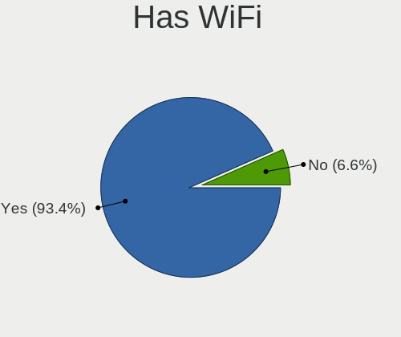
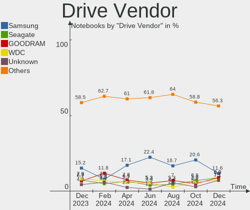
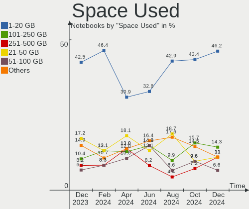
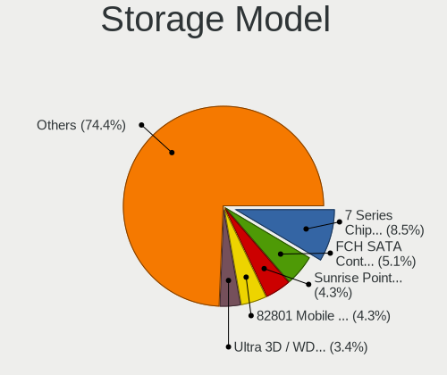
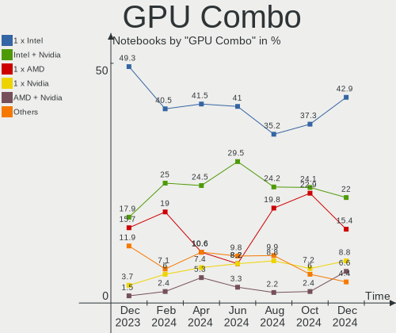
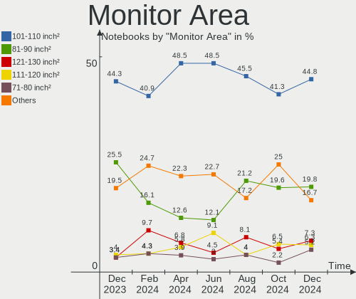
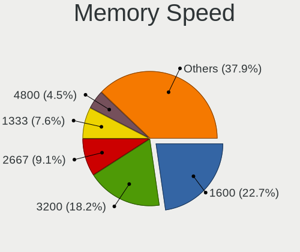
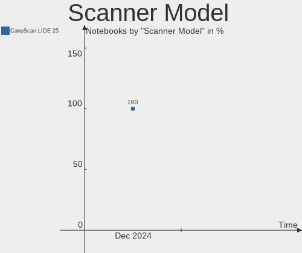

Linux in Poland - Hardware Trends (Notebooks)
---------------------------------------------

A project to identify most popular hardware characteristics and track their change
over time based on data collected by Linux users at https://Linux-Hardware.org.

Anyone can contribute to this report by the [hw-probe](https://github.com/linuxhw/hw-probe) tool:

    sudo -E hw-probe -all -upload

Period: Dec, 2024.

Contents
--------

* [ System ](#system)
  - [ OS                       ](#os)
  - [ OS Family                ](#os-family)
  - [ Kernel                   ](#kernel)
  - [ Kernel Family            ](#kernel-family)
  - [ Kernel Major Ver.        ](#kernel-major-ver)
  - [ Arch                     ](#arch)
  - [ DE                       ](#de)
  - [ Display Server           ](#display-server)
  - [ Display Manager          ](#display-manager)
  - [ OS Lang                  ](#os-lang)
  - [ Boot Mode                ](#boot-mode)
  - [ Filesystem               ](#filesystem)
  - [ Part. scheme             ](#part-scheme)
  - [ Dual Boot with Linux/BSD ](#dual-boot-with-linuxbsd)
  - [ Dual Boot (Win)          ](#dual-boot-win)

* [ Board ](#board)
  - [ Vendor                   ](#vendor)
  - [ Model                    ](#model)
  - [ Model Family             ](#model-family)
  - [ MFG Year                 ](#mfg-year)
  - [ Form Factor              ](#form-factor)
  - [ Secure Boot              ](#secure-boot)
  - [ Coreboot                 ](#coreboot)
  - [ RAM Size                 ](#ram-size)
  - [ RAM Used                 ](#ram-used)
  - [ Total Drives             ](#total-drives)
  - [ Has CD-ROM               ](#has-cd-rom)
  - [ Has Ethernet             ](#has-ethernet)
  - [ Has WiFi                 ](#has-wifi)
  - [ Has Bluetooth            ](#has-bluetooth)

* [ Location ](#location)
  - [ Country                  ](#country)
  - [ City                     ](#city)

* [ Drives ](#drives)
  - [ Drive Vendor             ](#drive-vendor)
  - [ Drive Model              ](#drive-model)
  - [ HDD Vendor               ](#hdd-vendor)
  - [ SSD Vendor               ](#ssd-vendor)
  - [ Drive Kind               ](#drive-kind)
  - [ Drive Connector          ](#drive-connector)
  - [ Drive Size               ](#drive-size)
  - [ Space Total              ](#space-total)
  - [ Space Used               ](#space-used)
  - [ Malfunc. Drives          ](#malfunc-drives)
  - [ Malfunc. Drive Vendor    ](#malfunc-drive-vendor)
  - [ Malfunc. HDD Vendor      ](#malfunc-hdd-vendor)
  - [ Malfunc. Drive Kind      ](#malfunc-drive-kind)
  - [ Failed Drives            ](#failed-drives)
  - [ Failed Drive Vendor      ](#failed-drive-vendor)
  - [ Drive Status             ](#drive-status)

* [ Storage controller ](#storage-controller)
  - [ Storage Vendor           ](#storage-vendor)
  - [ Storage Model            ](#storage-model)
  - [ Storage Kind             ](#storage-kind)

* [ Processor ](#processor)
  - [ CPU Vendor               ](#cpu-vendor)
  - [ CPU Model                ](#cpu-model)
  - [ CPU Model Family         ](#cpu-model-family)
  - [ CPU Cores                ](#cpu-cores)
  - [ CPU Sockets              ](#cpu-sockets)
  - [ CPU Threads              ](#cpu-threads)
  - [ CPU Op-Modes             ](#cpu-op-modes)
  - [ CPU Microcode            ](#cpu-microcode)
  - [ CPU Microarch            ](#cpu-microarch)

* [ Graphics ](#graphics)
  - [ GPU Vendor               ](#gpu-vendor)
  - [ GPU Model                ](#gpu-model)
  - [ GPU Combo                ](#gpu-combo)
  - [ GPU Driver               ](#gpu-driver)
  - [ GPU Memory               ](#gpu-memory)

* [ Monitor ](#monitor)
  - [ Monitor Vendor           ](#monitor-vendor)
  - [ Monitor Model            ](#monitor-model)
  - [ Monitor Resolution       ](#monitor-resolution)
  - [ Monitor Diagonal         ](#monitor-diagonal)
  - [ Monitor Width            ](#monitor-width)
  - [ Aspect Ratio             ](#aspect-ratio)
  - [ Monitor Area             ](#monitor-area)
  - [ Pixel Density            ](#pixel-density)
  - [ Multiple Monitors        ](#multiple-monitors)

* [ Network ](#network)
  - [ Net Controller Vendor    ](#net-controller-vendor)
  - [ Net Controller Model     ](#net-controller-model)
  - [ Wireless Vendor          ](#wireless-vendor)
  - [ Wireless Model           ](#wireless-model)
  - [ Ethernet Vendor          ](#ethernet-vendor)
  - [ Ethernet Model           ](#ethernet-model)
  - [ Net Controller Kind      ](#net-controller-kind)
  - [ Used Controller          ](#used-controller)
  - [ NICs                     ](#nics)
  - [ IPv6                     ](#ipv6)

* [ Bluetooth ](#bluetooth)
  - [ Bluetooth Vendor         ](#bluetooth-vendor)
  - [ Bluetooth Model          ](#bluetooth-model)

* [ Sound ](#sound)
  - [ Sound Vendor             ](#sound-vendor)
  - [ Sound Model              ](#sound-model)

* [ Memory ](#memory)
  - [ Memory Vendor            ](#memory-vendor)
  - [ Memory Model             ](#memory-model)
  - [ Memory Kind              ](#memory-kind)
  - [ Memory Form Factor       ](#memory-form-factor)
  - [ Memory Size              ](#memory-size)
  - [ Memory Speed             ](#memory-speed)

* [ Printers & scanners ](#printers--scanners)
  - [ Printer Vendor           ](#printer-vendor)
  - [ Printer Model            ](#printer-model)
  - [ Scanner Vendor           ](#scanner-vendor)
  - [ Scanner Model            ](#scanner-model)

* [ Camera ](#camera)
  - [ Camera Vendor            ](#camera-vendor)
  - [ Camera Model             ](#camera-model)

* [ Security ](#security)
  - [ Fingerprint Vendor       ](#fingerprint-vendor)
  - [ Fingerprint Model        ](#fingerprint-model)
  - [ Chipcard Vendor          ](#chipcard-vendor)
  - [ Chipcard Model           ](#chipcard-model)

* [ Unsupported ](#unsupported)
  - [ Unsupported Devices      ](#unsupported-devices)
  - [ Unsupported Device Types ](#unsupported-device-types)

System
------

OS
--

Installed operating systems

| Name                         | Notebooks | Percent |
|------------------------------|-----------|---------|
| OpenMandriva 24.12           | 20        | 21.98%  |
| OpenMandriva 5.0             | 6         | 6.59%   |
| Linux Mint 22                | 5         | 5.49%   |
| Ubuntu 24.04                 | 4         | 4.4%    |
| Ubuntu 22.04                 | 4         | 4.4%    |
| OpenMandriva 24.07           | 4         | 4.4%    |
| KDE neon 24.04               | 4         | 4.4%    |
| Fedora 41                    | 4         | 4.4%    |
| Arch Rolling                 | 3         | 3.3%    |
| Ubuntu 24.10                 | 2         | 2.2%    |
| TUXEDO OS 24.04              | 2         | 2.2%    |
| Pop!_OS 22.04                | 2         | 2.2%    |
| MX 23                        | 2         | 2.2%    |
| Gentoo 2.17                  | 2         | 2.2%    |
| EndeavourOS Rolling          | 2         | 2.2%    |
| Debian 12                    | 2         | 2.2%    |
| Zorin 17                     | 1         | 1.1%    |
| Xubuntu 24.04                | 1         | 1.1%    |
| Xubuntu 22.04                | 1         | 1.1%    |
| Vanilla 2.0                  | 1         | 1.1%    |
| Ubuntu 20.04                 | 1         | 1.1%    |
| openSUSE Tumbleweed-XXXXXXXX | 1         | 1.1%    |
| openSUSE Microos-XXXXXXXX    | 1         | 1.1%    |
| OpenMandriva 24.09           | 1         | 1.1%    |
| OpenMandriva 23.03           | 1         | 1.1%    |
| NixOS 24.11                  | 1         | 1.1%    |
| Manjaro 24.2.1               | 1         | 1.1%    |
| Manjaro 24.2.0               | 1         | 1.1%    |
| Manjaro                      | 1         | 1.1%    |
| Loc OS 23                    | 1         | 1.1%    |
| LMDE 6                       | 1         | 1.1%    |
| Linux Mint 21.3              | 1         | 1.1%    |
| Linux Mint 20.3              | 1         | 1.1%    |
| Kubuntu 24.10                | 1         | 1.1%    |
| Kali 2024.4                  | 1         | 1.1%    |
| Fedora 40                    | 1         | 1.1%    |
| Elementary 8                 | 1         | 1.1%    |
| CachyOS Rolling              | 1         | 1.1%    |
| BigLinux 24.2.0              | 1         | 1.1%    |

OS Family
---------

OS without a version

| Name         | Notebooks | Percent |
|--------------|-----------|---------|
| OpenMandriva | 32        | 35.16%  |
| Ubuntu       | 11        | 12.09%  |
| Linux Mint   | 7         | 7.69%   |
| Fedora       | 5         | 5.49%   |
| KDE neon     | 4         | 4.4%    |
| Manjaro      | 3         | 3.3%    |
| Arch         | 3         | 3.3%    |
| Xubuntu      | 2         | 2.2%    |
| TUXEDO OS    | 2         | 2.2%    |
| Pop!_OS      | 2         | 2.2%    |
| openSUSE     | 2         | 2.2%    |
| MX           | 2         | 2.2%    |
| Gentoo       | 2         | 2.2%    |
| EndeavourOS  | 2         | 2.2%    |
| Debian       | 2         | 2.2%    |
| Zorin        | 1         | 1.1%    |
| Vanilla      | 1         | 1.1%    |
| NixOS        | 1         | 1.1%    |
| Loc OS       | 1         | 1.1%    |
| LMDE         | 1         | 1.1%    |
| Kubuntu      | 1         | 1.1%    |
| Kali         | 1         | 1.1%    |
| Elementary   | 1         | 1.1%    |
| CachyOS      | 1         | 1.1%    |
| BigLinux     | 1         | 1.1%    |

Kernel
------

Version of the Linux kernel

| Version                  | Notebooks | Percent |
|--------------------------|-----------|---------|
| 6.12.1-desktop-1omv2490  | 17        | 18.68%  |
| 6.8.0-49-generic         | 9         | 9.89%   |
| 6.8.0-51-generic         | 7         | 7.69%   |
| 6.6.2-desktop-1omv2390   | 6         | 6.59%   |
| 6.10.0-desktop-1omv2490  | 4         | 4.4%    |
| 6.8.0-50-generic         | 3         | 3.3%    |
| 6.12.6-desktop-1omv2490  | 3         | 3.3%    |
| 6.1.0-28-amd64           | 3         | 3.3%    |
| 6.9.3-76060903-generic   | 2         | 2.2%    |
| 6.12.7-arch1-1           | 2         | 2.2%    |
| 6.12.4-arch1-1           | 2         | 2.2%    |
| 6.11.11-300.fc41.x86_64  | 2         | 2.2%    |
| 5.15.0-127-generic       | 2         | 2.2%    |
| 6.9.6-200.fc40.x86_64    | 1         | 1.1%    |
| 6.8.0-47-generic         | 1         | 1.1%    |
| 6.6.65-1-MANJARO         | 1         | 1.1%    |
| 6.6.62-gentoo            | 1         | 1.1%    |
| 6.4.11-desktop-1omv2390  | 1         | 1.1%    |
| 6.2.6-desktop-1omv2390   | 1         | 1.1%    |
| 6.12.6-1-default         | 1         | 1.1%    |
| 6.12.5-200.fc41.x86_64   | 1         | 1.1%    |
| 6.12.4-2-cachyos         | 1         | 1.1%    |
| 6.12.1-arch1-1           | 1         | 1.1%    |
| 6.12.1-4-MANJARO         | 1         | 1.1%    |
| 6.12.1                   | 1         | 1.1%    |
| 6.11.8-300.fc41.x86_64   | 1         | 1.1%    |
| 6.11.8-1-default         | 1         | 1.1%    |
| 6.11.6-amd64             | 1         | 1.1%    |
| 6.11.2-amd64             | 1         | 1.1%    |
| 6.11.11-1-MANJARO        | 1         | 1.1%    |
| 6.11.11                  | 1         | 1.1%    |
| 6.11.10-2-MANJARO        | 1         | 1.1%    |
| 6.11.10-1-liquorix-amd64 | 1         | 1.1%    |
| 6.11.0-13-generic        | 1         | 1.1%    |
| 6.11.0-12-generic        | 1         | 1.1%    |
| 6.11.0-107011-tuxedo     | 1         | 1.1%    |
| 6.11.0-103009-tuxedo     | 1         | 1.1%    |
| 6.1.0-28-686-pae         | 1         | 1.1%    |
| 6.1.0-27-amd64           | 1         | 1.1%    |
| 5.15.174-gentoo-dist     | 1         | 1.1%    |

Kernel Family
-------------

Linux kernel without a distro release

| Version  | Notebooks | Percent |
|----------|-----------|---------|
| 6.8.0    | 20        | 21.98%  |
| 6.12.1   | 20        | 21.98%  |
| 6.6.2    | 6         | 6.59%   |
| 6.1.0    | 5         | 5.49%   |
| 6.12.6   | 4         | 4.4%    |
| 6.11.11  | 4         | 4.4%    |
| 6.11.0   | 4         | 4.4%    |
| 6.10.0   | 4         | 4.4%    |
| 6.12.4   | 3         | 3.3%    |
| 5.15.0   | 3         | 3.3%    |
| 6.9.3    | 2         | 2.2%    |
| 6.12.7   | 2         | 2.2%    |
| 6.11.8   | 2         | 2.2%    |
| 6.11.10  | 2         | 2.2%    |
| 6.9.6    | 1         | 1.1%    |
| 6.6.65   | 1         | 1.1%    |
| 6.6.62   | 1         | 1.1%    |
| 6.4.11   | 1         | 1.1%    |
| 6.2.6    | 1         | 1.1%    |
| 6.12.5   | 1         | 1.1%    |
| 6.11.6   | 1         | 1.1%    |
| 6.11.2   | 1         | 1.1%    |
| 5.15.174 | 1         | 1.1%    |
| 5.10.229 | 1         | 1.1%    |

Kernel Major Ver.
-----------------

Linux kernel major version

| Version | Notebooks | Percent |
|---------|-----------|---------|
| 6.12    | 30        | 32.97%  |
| 6.8     | 20        | 21.98%  |
| 6.11    | 14        | 15.38%  |
| 6.6     | 8         | 8.79%   |
| 6.1     | 5         | 5.49%   |
| 6.10    | 4         | 4.4%    |
| 5.15    | 4         | 4.4%    |
| 6.9     | 3         | 3.3%    |
| 6.4     | 1         | 1.1%    |
| 6.2     | 1         | 1.1%    |
| 5.10    | 1         | 1.1%    |

Arch
----

OS architecture (x86_64, i586, etc.)

| Name   | Notebooks | Percent |
|--------|-----------|---------|
| x86_64 | 90        | 98.9%   |
| i686   | 1         | 1.1%    |

DE
--

Desktop Environment

| Name       | Notebooks | Percent |
|------------|-----------|---------|
| GNOME      | 24        | 26.37%  |
| Unknown    | 21        | 23.08%  |
| KDE6       | 15        | 16.48%  |
| KDE5       | 11        | 12.09%  |
| XFCE       | 7         | 7.69%   |
| X-Cinnamon | 6         | 6.59%   |
| LXQt       | 2         | 2.2%    |
| Hyprland   | 2         | 2.2%    |
| Pantheon   | 1         | 1.1%    |
| KDE        | 1         | 1.1%    |
| Cinnamon   | 1         | 1.1%    |

Display Server
--------------

X11 or Wayland

| Name    | Notebooks | Percent |
|---------|-----------|---------|
| Wayland | 49        | 53.85%  |
| X11     | 38        | 41.76%  |
| Unknown | 3         | 3.3%    |
| Tty     | 1         | 1.1%    |

Display Manager
---------------

SDDM, LightDM, etc.

| Name    | Notebooks | Percent |
|---------|-----------|---------|
| SDDM    | 39        | 42.86%  |
| Unknown | 24        | 26.37%  |
| LightDM | 12        | 13.19%  |
| GDM3    | 11        | 12.09%  |
| GDM     | 5         | 5.49%   |

OS Lang
-------

Language

| Lang    | Notebooks | Percent |
|---------|-----------|---------|
| pl_PL   | 52        | 57.14%  |
| en_US   | 26        | 28.57%  |
| en_GB   | 4         | 4.4%    |
| uk_UA   | 2         | 2.2%    |
| it_IT   | 2         | 2.2%    |
| Unknown | 2         | 2.2%    |
| es_MX   | 1         | 1.1%    |
| en_IE   | 1         | 1.1%    |
| C       | 1         | 1.1%    |

Boot Mode
---------

EFI or BIOS

| Mode | Notebooks | Percent |
|------|-----------|---------|
| EFI  | 51        | 56.04%  |
| BIOS | 40        | 43.96%  |

Filesystem
----------

Type of filesystem

| Type    | Notebooks | Percent |
|---------|-----------|---------|
| Ext4    | 51        | 56.04%  |
| Overlay | 16        | 17.58%  |
| Btrfs   | 13        | 14.29%  |
| Tmpfs   | 9         | 9.89%   |
| Zfs     | 1         | 1.1%    |
| Unknown | 1         | 1.1%    |

Part. scheme
------------

Scheme of partitioning

| Type    | Notebooks | Percent |
|---------|-----------|---------|
| GPT     | 56        | 61.54%  |
| Unknown | 23        | 25.27%  |
| MBR     | 12        | 13.19%  |

Dual Boot with Linux/BSD
------------------------

Hosting more than one Linux/BSD

| Dual boot | Notebooks | Percent |
|-----------|-----------|---------|
| No        | 74        | 81.32%  |
| Yes       | 17        | 18.68%  |

Dual Boot (Win)
---------------

Hosting Linux and Windows

| Dual boot | Notebooks | Percent |
|-----------|-----------|---------|
| No        | 63        | 69.23%  |
| Yes       | 28        | 30.77%  |

Board
-----

Vendor
------

Motherboard manufacturer

| Name                | Notebooks | Percent |
|---------------------|-----------|---------|
| Lenovo              | 25        | 27.47%  |
| Dell                | 18        | 19.78%  |
| ASUSTek Computer    | 15        | 16.48%  |
| Hewlett-Packard     | 11        | 12.09%  |
| Acer                | 6         | 6.59%   |
| Apple               | 3         | 3.3%    |
| HUAWEI              | 2         | 2.2%    |
| Fujitsu             | 2         | 2.2%    |
| Chuwi               | 2         | 2.2%    |
| TUXEDO              | 1         | 1.1%    |
| Sony                | 1         | 1.1%    |
| Samsung Electronics | 1         | 1.1%    |
| Qilive              | 1         | 1.1%    |
| Panasonic           | 1         | 1.1%    |
| MSI                 | 1         | 1.1%    |
| Google              | 1         | 1.1%    |

Model
-----

Motherboard model

| Name                                       | Notebooks | Percent |
|--------------------------------------------|-----------|---------|
| Dell Latitude E6430                        | 2         | 2.2%    |
| Dell Inspiron 13-5368                      | 2         | 2.2%    |
| ASUS ASUS TUF Gaming A16 FA617NSR_FA617NSR | 2         | 2.2%    |
| TUXEDO Stellaris Slim 15 Intel Gen6        | 1         | 1.1%    |
| Sony VPCEJ2E1E                             | 1         | 1.1%    |
| Samsung 350V5C/351V5C/3540VC/3440VC        | 1         | 1.1%    |
| Qilive QW20141BPL                          | 1         | 1.1%    |
| Panasonic CFLX6-2                          | 1         | 1.1%    |
| MSI GF63 Thin 10SCSR                       | 1         | 1.1%    |
| Lenovo Yoga Pro 7 14ASP9 83HN              | 1         | 1.1%    |
| Lenovo Yoga 300-11IBY 80M0                 | 1         | 1.1%    |
| Lenovo V15 G3 IAP CTO 83C4                 | 1         | 1.1%    |
| Lenovo ThinkPad X280 20KES2VQ00            | 1         | 1.1%    |
| Lenovo ThinkPad X270 20K5S1A524            | 1         | 1.1%    |
| Lenovo ThinkPad T530 2429MY2               | 1         | 1.1%    |
| Lenovo ThinkPad T430 2349TUM               | 1         | 1.1%    |
| Lenovo ThinkPad T14s Gen 1 20UH000LUS      | 1         | 1.1%    |
| Lenovo ThinkPad R61 8918DFG                | 1         | 1.1%    |
| Lenovo ThinkPad P50 20EQS3B30R             | 1         | 1.1%    |
| Lenovo ThinkPad L520 5016NY9               | 1         | 1.1%    |
| Lenovo ThinkPad E15 Gen 2 20T8000MPB       | 1         | 1.1%    |
| Lenovo ThinkPad E15 20RD001FPB             | 1         | 1.1%    |
| Lenovo ThinkPad A285 20MXS0AE00            | 1         | 1.1%    |
| Lenovo Legion 5 Pro 16ITH6H 82JD           | 1         | 1.1%    |
| Lenovo IdeaPad Y700-15ISK 80NV             | 1         | 1.1%    |
| Lenovo IdeaPad Y580                        | 1         | 1.1%    |
| Lenovo IdeaPad Y550P 20035                 | 1         | 1.1%    |
| Lenovo IdeaPad Gaming 3 15ARH05 82EY       | 1         | 1.1%    |
| Lenovo IdeaPad Gaming 3 15ACH6 82K2        | 1         | 1.1%    |
| Lenovo IdeaPad 510-15ISK 80SR              | 1         | 1.1%    |
| Lenovo IdeaPad 330-17AST 81D7              | 1         | 1.1%    |
| Lenovo G580 2689K9G                        | 1         | 1.1%    |
| Lenovo G510 20238                          | 1         | 1.1%    |
| Lenovo B590 20206                          | 1         | 1.1%    |
| HUAWEI NBLB-WAX9N                          | 1         | 1.1%    |
| HUAWEI KLVL-WXX9                           | 1         | 1.1%    |
| HP ProBook 640 G1                          | 1         | 1.1%    |
| HP ProBook 470 G1                          | 1         | 1.1%    |
| HP Pavilion Gaming Laptop 15-ec2xxx        | 1         | 1.1%    |
| HP Pavilion dv7                            | 1         | 1.1%    |

Model Family
------------

Motherboard model prefix

| Name              | Notebooks | Percent |
|-------------------|-----------|---------|
| Lenovo ThinkPad   | 11        | 12.09%  |
| Dell Latitude     | 9         | 9.89%   |
| Lenovo IdeaPad    | 7         | 7.69%   |
| Dell Inspiron     | 5         | 5.49%   |
| ASUS ASUS         | 5         | 5.49%   |
| Acer Aspire       | 4         | 4.4%    |
| Lenovo Yoga       | 2         | 2.2%    |
| HP ProBook        | 2         | 2.2%    |
| HP Pavilion       | 2         | 2.2%    |
| HP Laptop         | 2         | 2.2%    |
| Dell XPS          | 2         | 2.2%    |
| ASUS ROG          | 2         | 2.2%    |
| TUXEDO Stellaris  | 1         | 1.1%    |
| Sony VPCEJ2E1E    | 1         | 1.1%    |
| Samsung 350V5C    | 1         | 1.1%    |
| Qilive QW20141BPL | 1         | 1.1%    |
| Panasonic CFLX6-2 | 1         | 1.1%    |
| MSI GF63          | 1         | 1.1%    |
| Lenovo V15        | 1         | 1.1%    |
| Lenovo Legion     | 1         | 1.1%    |
| Lenovo G580       | 1         | 1.1%    |
| Lenovo G510       | 1         | 1.1%    |
| Lenovo B590       | 1         | 1.1%    |
| HUAWEI NBLB-WAX9N | 1         | 1.1%    |
| HUAWEI KLVL-WXX9  | 1         | 1.1%    |
| HP Notebook       | 1         | 1.1%    |
| HP ENVY           | 1         | 1.1%    |
| HP EliteBook      | 1         | 1.1%    |
| HP 630            | 1         | 1.1%    |
| HP 250            | 1         | 1.1%    |
| Google Magolor    | 1         | 1.1%    |
| Fujitsu LIFEBOOK  | 1         | 1.1%    |
| Fujitsu CELSIUS   | 1         | 1.1%    |
| Dell Studio       | 1         | 1.1%    |
| Dell G15          | 1         | 1.1%    |
| Chuwi GemiBook    | 1         | 1.1%    |
| Chuwi FreeBook    | 1         | 1.1%    |
| ASUS ZenBook      | 1         | 1.1%    |
| ASUS X550CC       | 1         | 1.1%    |
| ASUS U36SG        | 1         | 1.1%    |

MFG Year
--------

Motherboard manufacture year

| Year | Notebooks | Percent |
|------|-----------|---------|
| 2020 | 12        | 13.19%  |
| 2013 | 12        | 13.19%  |
| 2021 | 10        | 10.99%  |
| 2012 | 8         | 8.79%   |
| 2024 | 6         | 6.59%   |
| 2018 | 6         | 6.59%   |
| 2015 | 6         | 6.59%   |
| 2011 | 5         | 5.49%   |
| 2017 | 4         | 4.4%    |
| 2010 | 4         | 4.4%    |
| 2023 | 3         | 3.3%    |
| 2022 | 3         | 3.3%    |
| 2014 | 3         | 3.3%    |
| 2008 | 3         | 3.3%    |
| 2007 | 3         | 3.3%    |
| 2019 | 1         | 1.1%    |
| 2016 | 1         | 1.1%    |
| 2009 | 1         | 1.1%    |

Form Factor
-----------

Physical design of the computer

| Name     | Notebooks | Percent |
|----------|-----------|---------|
| Notebook | 91        | 100%    |

Secure Boot
-----------

Enabled or disabled

| State    | Notebooks | Percent |
|----------|-----------|---------|
| Disabled | 85        | 93.41%  |
| Enabled  | 6         | 6.59%   |

Coreboot
--------

Have coreboot on board

| Used | Notebooks | Percent |
|------|-----------|---------|
| No   | 90        | 98.9%   |
| Yes  | 1         | 1.1%    |

RAM Size
--------

Total RAM memory

| Size in GB  | Notebooks | Percent |
|-------------|-----------|---------|
| 4.01-8.0    | 27        | 29.67%  |
| 16.01-24.0  | 19        | 20.88%  |
| 3.01-4.0    | 17        | 18.68%  |
| 8.01-16.0   | 15        | 16.48%  |
| 32.01-64.0  | 5         | 5.49%   |
| 24.01-32.0  | 3         | 3.3%    |
| 64.01-256.0 | 3         | 3.3%    |
| 2.01-3.0    | 1         | 1.1%    |
| 1.01-2.0    | 1         | 1.1%    |

RAM Used
--------

Used RAM memory

| Used GB    | Notebooks | Percent |
|------------|-----------|---------|
| 1.01-2.0   | 36        | 39.56%  |
| 2.01-3.0   | 24        | 26.37%  |
| 4.01-8.0   | 16        | 17.58%  |
| 3.01-4.0   | 9         | 9.89%   |
| 8.01-16.0  | 5         | 5.49%   |
| 16.01-24.0 | 1         | 1.1%    |

Total Drives
------------

Number of drives on board

| Drives | Notebooks | Percent |
|--------|-----------|---------|
| 1      | 64        | 70.33%  |
| 2      | 25        | 27.47%  |
| 3      | 1         | 1.1%    |
| 0      | 1         | 1.1%    |

Has CD-ROM
----------

Has CD-ROM on board

| Presented | Notebooks | Percent |
|-----------|-----------|---------|
| No        | 65        | 71.43%  |
| Yes       | 26        | 28.57%  |

Has Ethernet
------------

Has Ethernet on board

| Presented | Notebooks | Percent |
|-----------|-----------|---------|
| Yes       | 75        | 82.42%  |
| No        | 16        | 17.58%  |

Has WiFi
--------

Has WiFi module

| Presented | Notebooks | Percent |
|-----------|-----------|---------|
| Yes       | 85        | 93.41%  |
| No        | 6         | 6.59%   |

Has Bluetooth
-------------

Has Bluetooth module

| Presented | Notebooks | Percent |
|-----------|-----------|---------|
| Yes       | 79        | 86.81%  |
| No        | 12        | 13.19%  |

Location
--------

Country
-------

Geographic location (country)

| Country | Notebooks | Percent |
|---------|-----------|---------|
| Poland  | 91        | 100%    |

City
----

Geographic location (city)

| City                | Notebooks | Percent |
|---------------------|-----------|---------|
| Warsaw              | 19        | 20.88%  |
| Krakow              | 8         | 8.79%   |
| Wroclaw             | 7         | 7.69%   |
| Poznan              | 7         | 7.69%   |
| Szczecin            | 2         | 2.2%    |
| Lubin               | 2         | 2.2%    |
| Kielce              | 2         | 2.2%    |
| Katowice            | 2         | 2.2%    |
| Gdansk              | 2         | 2.2%    |
| Bydgoszcz           | 2         | 2.2%    |
| Września           | 1         | 1.1%    |
| Wodzisław Śląski | 1         | 1.1%    |
| Tychy               | 1         | 1.1%    |
| Turobin             | 1         | 1.1%    |
| Turek               | 1         | 1.1%    |
| Tarnowskie Gory     | 1         | 1.1%    |
| Swidnica            | 1         | 1.1%    |
| Sochaczew           | 1         | 1.1%    |
| Skawina             | 1         | 1.1%    |
| Rzeszów            | 1         | 1.1%    |
| Rybnik              | 1         | 1.1%    |
| Rumia               | 1         | 1.1%    |
| Prudnik             | 1         | 1.1%    |
| Olkusz              | 1         | 1.1%    |
| Nowy Tomysl         | 1         | 1.1%    |
| Miloslaw            | 1         | 1.1%    |
| Lublin              | 1         | 1.1%    |
| Lomianki            | 1         | 1.1%    |
| Lancut              | 1         | 1.1%    |
| Krynica-Zdroj       | 1         | 1.1%    |
| Konin               | 1         | 1.1%    |
| Kobylka             | 1         | 1.1%    |
| Kazimierz Biskupi   | 1         | 1.1%    |
| Jedlicze            | 1         | 1.1%    |
| Jastrzębie Zdrój  | 1         | 1.1%    |
| Gorlice             | 1         | 1.1%    |
| Gmina Końskie      | 1         | 1.1%    |
| Gasawa              | 1         | 1.1%    |
| Elblag              | 1         | 1.1%    |
| Dobra               | 1         | 1.1%    |

Drives
------

Drive Vendor
------------

Hard drive vendors

| Vendor                       | Notebooks | Drives | Percent |
|------------------------------|-----------|--------|---------|
| Samsung Electronics          | 13        | 15     | 11.61%  |
| Seagate                      | 10        | 11     | 8.93%   |
| GOODRAM                      | 10        | 11     | 8.93%   |
| WDC                          | 8         | 8      | 7.14%   |
| Unknown                      | 8         | 9      | 7.14%   |
| Sandisk                      | 8         | 8      | 7.14%   |
| Micron Technology            | 8         | 8      | 7.14%   |
| Intel                        | 6         | 6      | 5.36%   |
| Crucial                      | 5         | 5      | 4.46%   |
| A-DATA Technology            | 5         | 6      | 4.46%   |
| SK hynix                     | 3         | 3      | 2.68%   |
| SPCC                         | 2         | 2      | 1.79%   |
| Shenzhen Longsys Electronics | 2         | 2      | 1.79%   |
| Kingston                     | 2         | 2      | 1.79%   |
| Apple                        | 2         | 2      | 1.79%   |
| Unknown                      | 2         | 2      | 1.79%   |
| Union Memory                 | 1         | 1      | 0.89%   |
| Toshiba                      | 1         | 1      | 0.89%   |
| Realtek Semiconductor        | 1         | 1      | 0.89%   |
| Realtek                      | 1         | 1      | 0.89%   |
| Plextor                      | 1         | 1      | 0.89%   |
| Phison Electronics           | 1         | 1      | 0.89%   |
| Phison                       | 1         | 1      | 0.89%   |
| MAXIO Technology (Hangzhou)  | 1         | 1      | 0.89%   |
| LITEONIT                     | 1         | 1      | 0.89%   |
| LITEON                       | 1         | 1      | 0.89%   |
| Lenovo                       | 1         | 1      | 0.89%   |
| KODAK                        | 1         | 1      | 0.89%   |
| KIOXIA                       | 1         | 1      | 0.89%   |
| Hitachi                      | 1         | 1      | 0.89%   |
| Fujitsu                      | 1         | 1      | 0.89%   |
| China                        | 1         | 1      | 0.89%   |
| Apacer                       | 1         | 1      | 0.89%   |
| AirDisk                      | 1         | 1      | 0.89%   |

Drive Model
-----------

Hard drive models

| Model                                               | Notebooks | Percent |
|-----------------------------------------------------|-----------|---------|
| Sandisk WD Blue SN550 NVMe SSD 256GB                | 4         | 3.45%   |
| GOODRAM SSDPR-CX400-512-G2 512GB                    | 4         | 3.45%   |
| Unknown MMC Card  64GB                              | 3         | 2.59%   |
| Seagate ST9500325AS 500GB                           | 3         | 2.59%   |
| Samsung NVMe SSD Controller SM981/PM981/PM983 512GB | 3         | 2.59%   |
| Micron MTFDHBA512QFD 512GB                          | 2         | 1.72%   |
| Intel SSD 660P Series 1024GB                        | 2         | 1.72%   |
| GOODRAM SSD 120GB                                   | 2         | 1.72%   |
| Apple SSD SM0128G 121GB                             | 2         | 1.72%   |
| A-DATA SU650 240GB SSD                              | 2         | 1.72%   |
| Unknown                                             | 2         | 1.72%   |
| WDC WDS240G2G0A-00JH30 240GB SSD                    | 1         | 0.86%   |
| WDC WD5000LPVX-80V0TT0 500GB                        | 1         | 0.86%   |
| WDC WD5000LPVX-22V0TT0 500GB                        | 1         | 0.86%   |
| WDC WD3200BEKT-75A25T0 320GB                        | 1         | 0.86%   |
| WDC WD10SPZX-21Z10T0 1TB                            | 1         | 0.86%   |
| WDC WD10SPCX-24HWST1 1TB                            | 1         | 0.86%   |
| WDC WD10SPCX-21KHST0 1TB                            | 1         | 0.86%   |
| WDC WD Green 2.5 240GB SSD                          | 1         | 0.86%   |
| Unknown NVMe SSD Drive 512GB                        | 1         | 0.86%   |
| Unknown MMC Card  32GB                              | 1         | 0.86%   |
| Unknown MMC Card  16GB                              | 1         | 0.86%   |
| Unknown MMC Card  128GB                             | 1         | 0.86%   |
| Unknown DA4032  32GB                                | 1         | 0.86%   |
| Union Memory UMIS RPJTJ512MEE1OWX 512GB             | 1         | 0.86%   |
| Toshiba MQ04ABF100 1TB                              | 1         | 0.86%   |
| SPCC Solid State Disk 64GB                          | 1         | 0.86%   |
| SPCC Solid State Disk 256GB                         | 1         | 0.86%   |
| SK hynix PC711 NVMe 512GB                           | 1         | 0.86%   |
| SK hynix HBG4e  32GB                                | 1         | 0.86%   |
| SK hynix BC711 NVMe 256GB                           | 1         | 0.86%   |
| Shenzhen Longsys Lexar SSD NM710 2TB                | 1         | 0.86%   |
| Shenzhen Longsys Lexar SSD NM620 1TB                | 1         | 0.86%   |
| Seagate ST95005620AS 500GB                          | 1         | 0.86%   |
| Seagate ST9320423AS 320GB                           | 1         | 0.86%   |
| Seagate ST91603110CS 160GB                          | 1         | 0.86%   |
| Seagate ST6000NM 0044 6TB                           | 1         | 0.86%   |
| Seagate ST500LT012-9WS142 500GB                     | 1         | 0.86%   |
| Seagate ST500LT012-1DG142 500GB                     | 1         | 0.86%   |
| Seagate ST500LM000-SSHD-8GB                         | 1         | 0.86%   |

HDD Vendor
----------

Hard disk drive vendors

| Vendor  | Notebooks | Drives | Percent |
|---------|-----------|--------|---------|
| Seagate | 10        | 11     | 52.63%  |
| WDC     | 6         | 6      | 31.58%  |
| Toshiba | 1         | 1      | 5.26%   |
| Hitachi | 1         | 1      | 5.26%   |
| Fujitsu | 1         | 1      | 5.26%   |

SSD Vendor
----------

Solid state drive vendors

| Vendor              | Notebooks | Drives | Percent |
|---------------------|-----------|--------|---------|
| GOODRAM             | 10        | 11     | 21.74%  |
| Samsung Electronics | 6         | 6      | 13.04%  |
| Crucial             | 5         | 5      | 10.87%  |
| A-DATA Technology   | 5         | 6      | 10.87%  |
| WDC                 | 2         | 2      | 4.35%   |
| SPCC                | 2         | 2      | 4.35%   |
| SanDisk             | 2         | 2      | 4.35%   |
| Micron Technology   | 2         | 2      | 4.35%   |
| Apple               | 2         | 2      | 4.35%   |
| Unknown             | 2         | 2      | 4.35%   |
| Plextor             | 1         | 1      | 2.17%   |
| LITEONIT            | 1         | 1      | 2.17%   |
| LITEON              | 1         | 1      | 2.17%   |
| KODAK               | 1         | 1      | 2.17%   |
| Intel               | 1         | 1      | 2.17%   |
| China               | 1         | 1      | 2.17%   |
| Apacer              | 1         | 1      | 2.17%   |
| AirDisk             | 1         | 1      | 2.17%   |

Drive Kind
----------

HDD or SSD

| Kind | Notebooks | Drives | Percent |
|------|-----------|--------|---------|
| SSD  | 40        | 48     | 39.22%  |
| NVMe | 35        | 41     | 34.31%  |
| HDD  | 19        | 20     | 18.63%  |
| MMC  | 8         | 9      | 7.84%   |

Drive Connector
---------------

SATA, SAS, NVMe, etc.

| Type | Notebooks | Drives | Percent |
|------|-----------|--------|---------|
| SATA | 56        | 67     | 55.45%  |
| NVMe | 35        | 40     | 34.65%  |
| MMC  | 8         | 9      | 7.92%   |
| SAS  | 2         | 2      | 1.98%   |

Drive Size
----------

Size of hard drive

| Size in TB | Notebooks | Drives | Percent |
|------------|-----------|--------|---------|
| 0.01-0.5   | 45        | 48     | 69.23%  |
| 0.51-1.0   | 18        | 18     | 27.69%  |
| 1.01-2.0   | 1         | 1      | 1.54%   |
| 4.01-10.0  | 1         | 1      | 1.54%   |

Space Total
-----------

Amount of disk space available on the file system

| Size in GB     | Notebooks | Percent |
|----------------|-----------|---------|
| 251-500        | 21        | 23.08%  |
| 101-250        | 20        | 21.98%  |
| 1-20           | 15        | 16.48%  |
| 501-1000       | 9         | 9.89%   |
| 51-100         | 7         | 7.69%   |
| 21-50          | 6         | 6.59%   |
| Unknown        | 5         | 5.49%   |
| More than 3000 | 4         | 4.4%    |
| 1001-2000      | 3         | 3.3%    |
| 2001-3000      | 1         | 1.1%    |

Space Used
----------

Amount of used disk space

| Used GB        | Notebooks | Percent |
|----------------|-----------|---------|
| 1-20           | 42        | 46.15%  |
| 101-250        | 13        | 14.29%  |
| 251-500        | 10        | 10.99%  |
| 21-50          | 10        | 10.99%  |
| 51-100         | 6         | 6.59%   |
| Unknown        | 5         | 5.49%   |
| 2001-3000      | 2         | 2.2%    |
| More than 3000 | 1         | 1.1%    |
| 501-1000       | 1         | 1.1%    |
| 0              | 1         | 1.1%    |

Malfunc. Drives
---------------

Drive models with a malfunction

| Model                            | Notebooks | Drives | Percent |
|----------------------------------|-----------|--------|---------|
| WDC WDS240G2G0A-00JH30 240GB SSD | 1         | 1      | 12.5%   |
| WDC WD Green 2.5 240GB SSD       | 1         | 1      | 12.5%   |
| Seagate ST9320423AS 320GB        | 1         | 1      | 12.5%   |
| Seagate ST91603110CS 160GB       | 1         | 1      | 12.5%   |
| Seagate ST500LT012-9WS142 500GB  | 1         | 1      | 12.5%   |
| Seagate ST320LT020-9YG142 320GB  | 1         | 1      | 12.5%   |
| Hitachi HTS541612J9SA00 120GB    | 1         | 1      | 12.5%   |
| Crucial CT275MX300SSD1 275GB     | 1         | 1      | 12.5%   |

Malfunc. Drive Vendor
---------------------

Vendors of faulty drives

| Vendor  | Notebooks | Drives | Percent |
|---------|-----------|--------|---------|
| Seagate | 4         | 4      | 50%     |
| WDC     | 2         | 2      | 25%     |
| Hitachi | 1         | 1      | 12.5%   |
| Crucial | 1         | 1      | 12.5%   |

Malfunc. HDD Vendor
-------------------

Vendors of faulty HDD drives

| Vendor  | Notebooks | Drives | Percent |
|---------|-----------|--------|---------|
| Seagate | 4         | 4      | 80%     |
| Hitachi | 1         | 1      | 20%     |

Malfunc. Drive Kind
-------------------

Kinds of faulty drives

| Kind | Notebooks | Drives | Percent |
|------|-----------|--------|---------|
| HDD  | 5         | 5      | 62.5%   |
| SSD  | 3         | 3      | 37.5%   |

Failed Drives
-------------

Failed drive models

Zero info for selected period =(

Failed Drive Vendor
-------------------

Failed drive vendors

Zero info for selected period =(

Drive Status
------------

Number of failed and malfunc. drives

| Status   | Notebooks | Drives | Percent |
|----------|-----------|--------|---------|
| Works    | 47        | 57     | 49.47%  |
| Detected | 40        | 53     | 42.11%  |
| Malfunc  | 8         | 8      | 8.42%   |

Storage controller
------------------

Storage Vendor
--------------

Storage controller vendors

| Vendor                           | Notebooks | Percent |
|----------------------------------|-----------|---------|
| Intel                            | 63        | 59.43%  |
| Samsung Electronics              | 9         | 8.49%   |
| AMD                              | 7         | 6.6%    |
| SanDisk                          | 6         | 5.66%   |
| Micron Technology                | 6         | 5.66%   |
| SK hynix                         | 2         | 1.89%   |
| Shenzhen Longsys Electronics     | 2         | 1.89%   |
| Phison Electronics               | 2         | 1.89%   |
| Kingston Technology Company      | 2         | 1.89%   |
| Union Memory (Shenzhen)          | 1         | 0.94%   |
| Silicon Integrated Systems [SiS] | 1         | 0.94%   |
| Realtek Semiconductor            | 1         | 0.94%   |
| MAXIO Technology (Hangzhou)      | 1         | 0.94%   |
| Lenovo                           | 1         | 0.94%   |
| KIOXIA                           | 1         | 0.94%   |
| Unknown                          | 1         | 0.94%   |

Storage Model
-------------

Storage controller models

| Model                                                                          | Notebooks | Percent |
|--------------------------------------------------------------------------------|-----------|---------|
| Intel 7 Series Chipset Family 6-port SATA Controller [AHCI mode]               | 10        | 8.55%   |
| AMD FCH SATA Controller [AHCI mode]                                            | 6         | 5.13%   |
| Intel Sunrise Point-LP SATA Controller [AHCI mode]                             | 5         | 4.27%   |
| Intel 82801 Mobile SATA Controller [RAID mode]                                 | 5         | 4.27%   |
| SanDisk Ultra 3D / WD PC SN530, IX SN530, Blue SN550 NVMe SSD (DRAM-less)      | 4         | 3.42%   |
| Samsung NVMe SSD Controller SM981/PM981/PM983                                  | 4         | 3.42%   |
| Intel Volume Management Device NVMe RAID Controller                            | 4         | 3.42%   |
| Intel 6 Series/C200 Series Chipset Family 6 port Mobile SATA AHCI Controller   | 4         | 3.42%   |
| Micron 2210 NVMe SSD [Cobain]                                                  | 3         | 2.56%   |
| Intel SSD 670p Series [Keystone Harbor]                                        | 3         | 2.56%   |
| Intel HM170/QM170 Chipset SATA Controller [AHCI Mode]                          | 3         | 2.56%   |
| Intel 8 Series/C220 Series Chipset Family 6-port SATA Controller 1 [AHCI mode] | 3         | 2.56%   |
| Intel 8 Series SATA Controller 1 [AHCI mode]                                   | 3         | 2.56%   |
| Intel 5 Series/3400 Series Chipset 4 port SATA AHCI Controller                 | 3         | 2.56%   |
| SK hynix Gold P31/BC711/PC711 NVMe Solid State Drive                           | 2         | 1.71%   |
| SanDisk WD Black SN770 / PC SN740 256GB / PC SN560 (DRAM-less) NVMe SSD        | 2         | 1.71%   |
| Samsung S4LN058A01[SSUBX] AHCI SSD Controller (Apple slot)                     | 2         | 1.71%   |
| Samsung NVMe SSD Controller 980 (DRAM-less)                                    | 2         | 1.71%   |
| Phison PS5013-E13 PCIe3 NVMe Controller (DRAM-less)                            | 2         | 1.71%   |
| Intel SSD 660P Series                                                          | 2         | 1.71%   |
| Intel Mobile 4 Series Chipset PT IDER Controller                               | 2         | 1.71%   |
| Intel Comet Lake SATA AHCI Controller                                          | 2         | 1.71%   |
| Intel Atom Processor E3800 Series SATA AHCI Controller                         | 2         | 1.71%   |
| Intel 82801HM/HEM (ICH8M/ICH8M-E) IDE Controller                               | 2         | 1.71%   |
| Intel 5 Series/3400 Series Chipset 6 port SATA AHCI Controller                 | 2         | 1.71%   |
| Intel 400 Series Chipset Family SATA AHCI Controller                           | 2         | 1.71%   |
| Union Memory (Shenzhen) AM620 PCIe 3.0 NVMe SSD 512GB                          | 1         | 0.85%   |
| Silicon Integrated Systems [SiS] SATA Controller / IDE mode                    | 1         | 0.85%   |
| Silicon Integrated Systems [SiS] 5513 IDE Controller                           | 1         | 0.85%   |
| Shenzhen Longsys Lexar NM790 NVME SSD (DRAM-less)                              | 1         | 0.85%   |
| Shenzhen Longsys Lexar NM610 PRO NVME SSD (DRAM-less)                          | 1         | 0.85%   |
| Samsung NVMe SSD Controller S4LV008[Pascal]                                    | 1         | 0.85%   |
| Samsung NVMe SSD Controller PM9A1/PM9A3/980PRO                                 | 1         | 0.85%   |
| Realtek RTS5765DL NVMe SSD Controller (DRAM-less)                              | 1         | 0.85%   |
| Micron 2550 NVMe SSD (DRAM-less)                                               | 1         | 0.85%   |
| Micron 2450 NVMe SSD [HendrixV] (DRAM-less)                                    | 1         | 0.85%   |
| Micron 2400 NVMe SSD (DRAM-less)                                               | 1         | 0.85%   |
| MAXIO (Hangzhou) NVMe SSD Controller MAP1602 (DRAM-less)                       | 1         | 0.85%   |
| Lenovo LENSE30256GMSP34MEAT3TA                                                 | 1         | 0.85%   |
| KIOXIA NVMe SSD Controller BG4 (DRAM-less)                                     | 1         | 0.85%   |

Storage Kind
------------

Kind of storage controller (IDE, SATA, NVMe, SAS, ...)

| Kind | Notebooks | Percent |
|------|-----------|---------|
| SATA | 60        | 54.55%  |
| NVMe | 35        | 31.82%  |
| RAID | 9         | 8.18%   |
| IDE  | 6         | 5.45%   |

Processor
---------

CPU Vendor
----------

Processor vendors

| Vendor | Notebooks | Percent |
|--------|-----------|---------|
| Intel  | 73        | 80.22%  |
| AMD    | 18        | 19.78%  |

CPU Model
---------

Processor models

| Model                                   | Notebooks | Percent |
|-----------------------------------------|-----------|---------|
| Intel Core i5 CPU M 520 @ 2.40GHz       | 3         | 3.3%    |
| Intel N100                              | 2         | 2.2%    |
| Intel Core i7-3520M CPU @ 2.90GHz       | 2         | 2.2%    |
| Intel Core i5-4200M CPU @ 2.50GHz       | 2         | 2.2%    |
| Intel 11th Gen Core i5-1135G7 @ 2.40GHz | 2         | 2.2%    |
| AMD Ryzen 7 7435HS                      | 2         | 2.2%    |
| AMD Ryzen 7 4800H with Radeon Graphics  | 2         | 2.2%    |
| AMD Ryzen 5 5600H with Radeon Graphics  | 2         | 2.2%    |
| Intel Pentium CPU N3710 @ 1.60GHz       | 1         | 1.1%    |
| Intel Pentium CPU N3540 @ 2.16GHz       | 1         | 1.1%    |
| Intel Pentium CPU B960 @ 2.20GHz        | 1         | 1.1%    |
| Intel Pentium CPU B950 @ 2.10GHz        | 1         | 1.1%    |
| Intel Pentium CPU 2117U @ 1.80GHz       | 1         | 1.1%    |
| Intel Core i9-14900HX                   | 1         | 1.1%    |
| Intel Core i7-8750H CPU @ 2.20GHz       | 1         | 1.1%    |
| Intel Core i7-8650U CPU @ 1.90GHz       | 1         | 1.1%    |
| Intel Core i7-7700HQ CPU @ 2.80GHz      | 1         | 1.1%    |
| Intel Core i7-6820HQ CPU @ 2.70GHz      | 1         | 1.1%    |
| Intel Core i7-6500U CPU @ 2.50GHz       | 1         | 1.1%    |
| Intel Core i7-4702MQ CPU @ 2.20GHz      | 1         | 1.1%    |
| Intel Core i7-3820QM CPU @ 2.70GHz      | 1         | 1.1%    |
| Intel Core i7-3720QM CPU @ 2.60GHz      | 1         | 1.1%    |
| Intel Core i7-3610QM CPU @ 2.30GHz      | 1         | 1.1%    |
| Intel Core i7-2670QM CPU @ 2.20GHz      | 1         | 1.1%    |
| Intel Core i7-10750H CPU @ 2.60GHz      | 1         | 1.1%    |
| Intel Core i7 CPU Q 720 @ 1.60GHz       | 1         | 1.1%    |
| Intel Core i5-8250U CPU @ 1.60GHz       | 1         | 1.1%    |
| Intel Core i5-7300U CPU @ 2.60GHz       | 1         | 1.1%    |
| Intel Core i5-7300HQ CPU @ 2.50GHz      | 1         | 1.1%    |
| Intel Core i5-7200U CPU @ 2.50GHz       | 1         | 1.1%    |
| Intel Core i5-6300HQ CPU @ 2.30GHz      | 1         | 1.1%    |
| Intel Core i5-6200U CPU @ 2.30GHz       | 1         | 1.1%    |
| Intel Core i5-5257U CPU @ 2.70GHz       | 1         | 1.1%    |
| Intel Core i5-5200U CPU @ 2.20GHz       | 1         | 1.1%    |
| Intel Core i5-4310M CPU @ 2.70GHz       | 1         | 1.1%    |
| Intel Core i5-4260U CPU @ 1.40GHz       | 1         | 1.1%    |
| Intel Core i5-4210U CPU @ 1.70GHz       | 1         | 1.1%    |
| Intel Core i5-3340M CPU @ 2.70GHz       | 1         | 1.1%    |
| Intel Core i5-3320M CPU @ 2.60GHz       | 1         | 1.1%    |
| Intel Core i5-3210M CPU @ 2.50GHz       | 1         | 1.1%    |

CPU Model Family
----------------

Processor model prefix

| Model                                | Notebooks | Percent |
|--------------------------------------|-----------|---------|
| Intel Core i5                        | 23        | 25.27%  |
| Intel Core i7                        | 14        | 15.38%  |
| Other                                | 13        | 14.29%  |
| Intel Core i3                        | 8         | 8.79%   |
| Intel Celeron                        | 6         | 6.59%   |
| AMD Ryzen 7                          | 6         | 6.59%   |
| Intel Pentium                        | 5         | 5.49%   |
| Intel Core 2 Duo                     | 4         | 4.4%    |
| AMD Ryzen 5                          | 4         | 4.4%    |
| Intel Core i9                        | 1         | 1.1%    |
| Intel Core Duo                       | 1         | 1.1%    |
| Intel Atom                           | 1         | 1.1%    |
| AMD Turion X2 Ultra Dual-Core Mobile | 1         | 1.1%    |
| AMD Ryzen 7 PRO                      | 1         | 1.1%    |
| AMD Ryzen 3 PRO                      | 1         | 1.1%    |
| AMD Ryzen 3                          | 1         | 1.1%    |
| AMD A10                              | 1         | 1.1%    |

CPU Cores
---------

Number of processor cores

| Number | Notebooks | Percent |
|--------|-----------|---------|
| 2      | 43        | 47.25%  |
| 4      | 28        | 30.77%  |
| 8      | 9         | 9.89%   |
| 6      | 6         | 6.59%   |
| 10     | 2         | 2.2%    |
| 24     | 1         | 1.1%    |
| 14     | 1         | 1.1%    |
| 12     | 1         | 1.1%    |

CPU Sockets
-----------

Number of sockets

| Number | Notebooks | Percent |
|--------|-----------|---------|
| 1      | 91        | 100%    |

CPU Threads
-----------

Threads per core (Hyper-Threading)

| Number | Notebooks | Percent |
|--------|-----------|---------|
| 2      | 62        | 68.13%  |
| 1      | 29        | 31.87%  |

CPU Op-Modes
------------

CPU Operation Modes (32-bit, 64-bit)

| Op mode        | Notebooks | Percent |
|----------------|-----------|---------|
| 32-bit, 64-bit | 90        | 98.9%   |
| 32-bit         | 1         | 1.1%    |

CPU Microcode
-------------

Microcode number

| Number     | Notebooks | Percent |
|------------|-----------|---------|
| Unknown    | 81        | 89.01%  |
| 0x306a9    | 2         | 2.2%    |
| 0x906e9    | 1         | 1.1%    |
| 0x806c1    | 1         | 1.1%    |
| 0x6ec      | 1         | 1.1%    |
| 0x506e3    | 1         | 1.1%    |
| 0x40651    | 1         | 1.1%    |
| 0x306c3    | 1         | 1.1%    |
| 0x08600109 | 1         | 1.1%    |
| 0x08600103 | 1         | 1.1%    |

CPU Microarch
-------------

Microarchitecture

| Name             | Notebooks | Percent |
|------------------|-----------|---------|
| IvyBridge        | 10        | 10.99%  |
| KabyLake         | 9         | 9.89%   |
| Unknown          | 9         | 9.89%   |
| Haswell          | 8         | 8.79%   |
| Zen 2            | 6         | 6.59%   |
| Skylake          | 6         | 6.59%   |
| SandyBridge      | 6         | 6.59%   |
| Westmere         | 5         | 5.49%   |
| TigerLake        | 4         | 4.4%    |
| Silvermont       | 4         | 4.4%    |
| Penryn           | 4         | 4.4%    |
| Zen 3            | 2         | 2.2%    |
| Icelake          | 2         | 2.2%    |
| Gracemont        | 2         | 2.2%    |
| Excavator        | 2         | 2.2%    |
| CometLake        | 2         | 2.2%    |
| Broadwell        | 2         | 2.2%    |
| Zen              | 1         | 1.1%    |
| Tremont          | 1         | 1.1%    |
| P6               | 1         | 1.1%    |
| Nehalem          | 1         | 1.1%    |
| K8 & K10 hybrid  | 1         | 1.1%    |
| Goldmont plus    | 1         | 1.1%    |
| Goldmont         | 1         | 1.1%    |
| Alderlake Hybrid | 1         | 1.1%    |

Graphics
--------

GPU Vendor
----------

Vendors of graphics cards

| Vendor | Notebooks | Percent |
|--------|-----------|---------|
| Intel  | 63        | 52.5%   |
| Nvidia | 34        | 28.33%  |
| AMD    | 23        | 19.17%  |

GPU Model
---------

Graphics card models

| Model                                                                     | Notebooks | Percent |
|---------------------------------------------------------------------------|-----------|---------|
| Intel 3rd Gen Core processor Graphics Controller                          | 10        | 8.33%   |
| Intel 2nd Generation Core Processor Family Integrated Graphics Controller | 6         | 5%      |
| AMD Renoir [Radeon Vega Series / Radeon Vega Mobile Series]               | 6         | 5%      |
| Intel TigerLake-LP GT2 [Iris Xe Graphics]                                 | 4         | 3.33%   |
| Intel Skylake GT2 [HD Graphics 520]                                       | 4         | 3.33%   |
| Intel Haswell-ULT Integrated Graphics Controller                          | 4         | 3.33%   |
| Intel 4th Gen Core Processor Integrated Graphics Controller               | 4         | 3.33%   |
| Nvidia TU117M [GeForce GTX 1650 Mobile / Max-Q]                           | 3         | 2.5%    |
| Intel Atom Processor Z36xxx/Z37xxx Series Graphics & Display              | 3         | 2.5%    |
| Nvidia GT218M [NVS 3100M]                                                 | 2         | 1.67%   |
| Nvidia GP107M [GeForce GTX 1050 Ti Mobile]                                | 2         | 1.67%   |
| Nvidia GF119M [GeForce 610M]                                              | 2         | 1.67%   |
| Nvidia AD107M [GeForce RTX 4060 Max-Q / Mobile]                           | 2         | 1.67%   |
| Intel UHD Graphics 620                                                    | 2         | 1.67%   |
| Intel JasperLake [UHD Graphics]                                           | 2         | 1.67%   |
| Intel HD Graphics 630                                                     | 2         | 1.67%   |
| Intel HD Graphics 620                                                     | 2         | 1.67%   |
| Intel HD Graphics 530                                                     | 2         | 1.67%   |
| Intel CometLake-U GT2 [UHD Graphics]                                      | 2         | 1.67%   |
| Intel CometLake-H GT2 [UHD Graphics]                                      | 2         | 1.67%   |
| Intel Alder Lake-N [UHD Graphics]                                         | 2         | 1.67%   |
| AMD Strix [Radeon 880M / 890M]                                            | 2         | 1.67%   |
| AMD Navi 33 [Radeon RX 7600/7600 XT/7600M XT/7600S/7700S / PRO W7600]     | 2         | 1.67%   |
| AMD Cezanne [Radeon Vega Series / Radeon Vega Mobile Series]              | 2         | 1.67%   |
| Nvidia TU117M [GeForce GTX 1650 Ti Mobile]                                | 1         | 0.83%   |
| Nvidia TU116M [GeForce GTX 1660 Ti Mobile]                                | 1         | 0.83%   |
| Nvidia GT216M [GeForce GT 240M]                                           | 1         | 0.83%   |
| Nvidia GT215M [GeForce GTS 360M]                                          | 1         | 0.83%   |
| Nvidia GP107M [GeForce GTX 1050 Mobile]                                   | 1         | 0.83%   |
| Nvidia GM108M [GeForce 940MX]                                             | 1         | 0.83%   |
| Nvidia GM107M [GeForce GTX 960M]                                          | 1         | 0.83%   |
| Nvidia GM107GLM [Quadro M1000M]                                           | 1         | 0.83%   |
| Nvidia GK107M [GeForce GTX 660M]                                          | 1         | 0.83%   |
| Nvidia GK107M [GeForce GT 750M]                                           | 1         | 0.83%   |
| Nvidia GK104GLM [Quadro K3000M]                                           | 1         | 0.83%   |
| Nvidia GF117M [GeForce 610M/710M/810M/820M / GT 620M/625M/630M/720M]      | 1         | 0.83%   |
| Nvidia GF116M [GeForce GT 555M/635M]                                      | 1         | 0.83%   |
| Nvidia GF108M [NVS 5400M]                                                 | 1         | 0.83%   |
| Nvidia GF108GLM [NVS 5200M]                                               | 1         | 0.83%   |
| Nvidia GA107M [GeForce RTX 3050 Mobile]                                   | 1         | 0.83%   |

GPU Combo
---------

Combinations of graphics cards

| Name           | Notebooks | Percent |
|----------------|-----------|---------|
| 1 x Intel      | 39        | 42.86%  |
| Intel + Nvidia | 20        | 21.98%  |
| 1 x AMD        | 14        | 15.38%  |
| 1 x Nvidia     | 8         | 8.79%   |
| AMD + Nvidia   | 6         | 6.59%   |
| Intel + AMD    | 3         | 3.3%    |
| 2 x Intel      | 1         | 1.1%    |

GPU Driver
----------

Free vs proprietary

| Driver      | Notebooks | Percent |
|-------------|-----------|---------|
| Free        | 76        | 83.52%  |
| Proprietary | 10        | 10.99%  |
| Unknown     | 5         | 5.49%   |

GPU Memory
----------

Total video memory

| Size in GB | Notebooks | Percent |
|------------|-----------|---------|
| Unknown    | 62        | 68.13%  |
| 0.01-0.5   | 11        | 12.09%  |
| 7.01-8.0   | 5         | 5.49%   |
| 0.51-1.0   | 5         | 5.49%   |
| 1.01-2.0   | 4         | 4.4%    |
| 3.01-4.0   | 3         | 3.3%    |
| 5.01-6.0   | 1         | 1.1%    |

Monitor
-------

Monitor Vendor
--------------

Monitor vendors

| Vendor                  | Notebooks | Percent |
|-------------------------|-----------|---------|
| AU Optronics            | 21        | 21.88%  |
| Chimei Innolux          | 16        | 16.67%  |
| LG Display              | 15        | 15.63%  |
| BOE                     | 15        | 15.63%  |
| Samsung Electronics     | 7         | 7.29%   |
| Sharp                   | 4         | 4.17%   |
| Chi Mei Optoelectronics | 3         | 3.13%   |
| Apple                   | 3         | 3.13%   |
| InfoVision              | 2         | 2.08%   |
| PANDA                   | 1         | 1.04%   |
| LG Philips              | 1         | 1.04%   |
| Lenovo                  | 1         | 1.04%   |
| Iiyama                  | 1         | 1.04%   |
| IBM                     | 1         | 1.04%   |
| HUAWEI                  | 1         | 1.04%   |
| Hewlett-Packard         | 1         | 1.04%   |
| Goldstar                | 1         | 1.04%   |
| Gigabyte Technology     | 1         | 1.04%   |
| CPT                     | 1         | 1.04%   |

Monitor Model
-------------

Monitor models

| Model                                                                 | Notebooks | Percent |
|-----------------------------------------------------------------------|-----------|---------|
| AU Optronics LCD Monitor AUO61ED 1920x1080 344x194mm 15.5-inch        | 3         | 3.13%   |
| Chimei Innolux N160JME_GE1 CMN1624 1920x1200 344x215mm 16.0-inch      | 2         | 2.08%   |
| Chimei Innolux LCD Monitor CMN15E7 1920x1080 344x193mm 15.5-inch      | 2         | 2.08%   |
| Sharp LQ135P1JX51 SHP14B3 2256x1504 285x190mm 13.5-inch               | 1         | 1.04%   |
| Sharp LCD SHP1099 1280x720 890x500mm 40.2-inch                        | 1         | 1.04%   |
| Sharp LCD Monitor SHP149A 1920x1080 344x194mm 15.5-inch               | 1         | 1.04%   |
| Sharp LCD Monitor SHP1484 1920x1080 294x165mm 13.3-inch               | 1         | 1.04%   |
| Samsung Electronics S24C36x SAM7314 1920x1080 521x293mm 23.5-inch     | 1         | 1.04%   |
| Samsung Electronics LCD Monitor SEC544B 1600x900 382x215mm 17.3-inch  | 1         | 1.04%   |
| Samsung Electronics LCD Monitor SEC5341 1366x768 344x193mm 15.5-inch  | 1         | 1.04%   |
| Samsung Electronics LCD Monitor SEC4252 1366x768 344x194mm 15.5-inch  | 1         | 1.04%   |
| Samsung Electronics LCD Monitor SEC314C 1920x1080 344x194mm 15.5-inch | 1         | 1.04%   |
| Samsung Electronics LCD Monitor SEC304C 1366x768 309x174mm 14.0-inch  | 1         | 1.04%   |
| Samsung Electronics LCD Monitor SDC4188 2880x1800 312x195mm 14.5-inch | 1         | 1.04%   |
| PANDA LCD Monitor NCP004D 1920x1080 344x194mm 15.5-inch               | 1         | 1.04%   |
| LG Philips LCD Monitor LPLC100 1280x800 331x207mm 15.4-inch           | 1         | 1.04%   |
| LG Display LP156WH2-TLAA LGD0230 1366x768 344x194mm 15.5-inch         | 1         | 1.04%   |
| LG Display LCD Monitor LGD0690 2560x1440 344x194mm 15.5-inch          | 1         | 1.04%   |
| LG Display LCD Monitor LGD05FE 1920x1080 344x194mm 15.5-inch          | 1         | 1.04%   |
| LG Display LCD Monitor LGD0533 1920x1080 344x194mm 15.5-inch          | 1         | 1.04%   |
| LG Display LCD Monitor LGD04A7 1920x1080 344x194mm 15.5-inch          | 1         | 1.04%   |
| LG Display LCD Monitor LGD0456 1366x768 344x194mm 15.5-inch           | 1         | 1.04%   |
| LG Display LCD Monitor LGD03D3 1600x900 309x174mm 14.0-inch           | 1         | 1.04%   |
| LG Display LCD Monitor LGD0357 1600x900 382x215mm 17.3-inch           | 1         | 1.04%   |
| LG Display LCD Monitor LGD033E 1366x768 309x174mm 14.0-inch           | 1         | 1.04%   |
| LG Display LCD Monitor LGD033B 1366x768 344x194mm 15.5-inch           | 1         | 1.04%   |
| LG Display LCD Monitor LGD033A 1366x768 340x190mm 15.3-inch           | 1         | 1.04%   |
| LG Display LCD Monitor LGD032C 1920x1080 344x194mm 15.5-inch          | 1         | 1.04%   |
| LG Display LCD Monitor LGD02D1 1600x900 382x215mm 17.3-inch           | 1         | 1.04%   |
| LG Display LCD Monitor LGD0283 1920x1080 383x215mm 17.3-inch          | 1         | 1.04%   |
| LG Display LCD Monitor LGD01E9 1920x1080 345x194mm 15.6-inch          | 1         | 1.04%   |
| Lenovo LCD Monitor LEN40B1 1600x900 344x193mm 15.5-inch               | 1         | 1.04%   |
| InfoVision LCD Monitor IVO04E6 1920x1080 276x156mm 12.5-inch          | 1         | 1.04%   |
| InfoVision LCD Monitor IVO04E3 1366x768 277x156mm 12.5-inch           | 1         | 1.04%   |
| Iiyama PL2796QS IVM666A 2560x1440 597x336mm 27.0-inch                 | 1         | 1.04%   |
| IBM LCD Monitor IBM2887 1680x1050 331x207mm 15.4-inch                 | 1         | 1.04%   |
| HUAWEI ZQE-CBA HWV6A25 3440x1440 797x334mm 34.0-inch                  | 1         | 1.04%   |
| Hewlett-Packard LP2465 HWP2676 1920x1200 519x324mm 24.1-inch          | 1         | 1.04%   |
| Goldstar ULTRAGEAR GSM5BD2 2560x1440 697x392mm 31.5-inch              | 1         | 1.04%   |
| Gigabyte Technology GS27QC GBT271F 2560x1440 597x336mm 27.0-inch      | 1         | 1.04%   |

Monitor Resolution
------------------

Monitor screen resolution

| Resolution         | Notebooks | Percent |
|--------------------|-----------|---------|
| 1920x1080 (FHD)    | 40        | 41.67%  |
| 1366x768 (WXGA)    | 23        | 23.96%  |
| 1600x900 (HD+)     | 7         | 7.29%   |
| 1280x800 (WXGA)    | 6         | 6.25%   |
| 2560x1600          | 5         | 5.21%   |
| 2560x1440 (QHD)    | 5         | 5.21%   |
| 1920x1200 (WUXGA)  | 3         | 3.13%   |
| 3840x2160 (4K)     | 2         | 2.08%   |
| 2880x1800          | 1         | 1.04%   |
| 2256x1504          | 1         | 1.04%   |
| 2160x1440          | 1         | 1.04%   |
| 1920x540           | 1         | 1.04%   |
| 1680x1050 (WSXGA+) | 1         | 1.04%   |

Monitor Diagonal
----------------

Diagonal size in inches

| Inches | Notebooks | Percent |
|--------|-----------|---------|
| 15     | 43        | 44.79%  |
| 13     | 17        | 17.71%  |
| 16     | 7         | 7.29%   |
| 14     | 7         | 7.29%   |
| 17     | 6         | 6.25%   |
| 12     | 4         | 4.17%   |
| 27     | 3         | 3.13%   |
| 11     | 3         | 3.13%   |
| 40     | 1         | 1.04%   |
| 34     | 1         | 1.04%   |
| 31     | 1         | 1.04%   |
| 26     | 1         | 1.04%   |
| 24     | 1         | 1.04%   |
| 21     | 1         | 1.04%   |

Monitor Width
-------------

Physical width

| Width in mm | Notebooks | Percent |
|-------------|-----------|---------|
| 301-350     | 63        | 65.63%  |
| 201-300     | 16        | 16.67%  |
| 351-400     | 8         | 8.33%   |
| 501-600     | 5         | 5.21%   |
| 801-900     | 1         | 1.04%   |
| 701-800     | 1         | 1.04%   |
| 601-700     | 1         | 1.04%   |
| 401-500     | 1         | 1.04%   |

Aspect Ratio
------------

Proportional relationship between the width and the height

| Ratio | Notebooks | Percent |
|-------|-----------|---------|
| 16/9  | 74        | 79.57%  |
| 16/10 | 15        | 16.13%  |
| 3/2   | 3         | 3.23%   |
| 21/9  | 1         | 1.08%   |

Monitor Area
------------

Area in inch²

| Area in inch² | Notebooks | Percent |
|----------------|-----------|---------|
| 101-110        | 43        | 44.79%  |
| 81-90          | 19        | 19.79%  |
| 121-130        | 7         | 7.29%   |
| 111-120        | 6         | 6.25%   |
| 71-80          | 5         | 5.21%   |
| 61-70          | 4         | 4.17%   |
| 301-350        | 4         | 4.17%   |
| 51-60          | 3         | 3.13%   |
| 351-500        | 2         | 2.08%   |
| 251-300        | 1         | 1.04%   |
| 201-250        | 1         | 1.04%   |
| 501-1000       | 1         | 1.04%   |

Pixel Density
-------------

Pixels per inch

| Density | Notebooks | Percent |
|---------|-----------|---------|
| 121-160 | 41        | 43.16%  |
| 101-120 | 30        | 31.58%  |
| 161-240 | 16        | 16.84%  |
| 51-100  | 7         | 7.37%   |
| 1-50    | 1         | 1.05%   |

Multiple Monitors
-----------------

Total monitors connected

| Total | Notebooks | Percent |
|-------|-----------|---------|
| 1     | 83        | 91.21%  |
| 2     | 7         | 7.69%   |
| 0     | 1         | 1.1%    |

Network
-------

Net Controller Vendor
---------------------

Controller vendors

| Vendor                                 | Notebooks | Percent |
|----------------------------------------|-----------|---------|
| Realtek Semiconductor                  | 50        | 35.46%  |
| Intel                                  | 49        | 34.75%  |
| Qualcomm Atheros                       | 19        | 13.48%  |
| MediaTek                               | 6         | 4.26%   |
| Broadcom                               | 6         | 4.26%   |
| Broadcom Limited                       | 3         | 2.13%   |
| Qualcomm Atheros Communications        | 2         | 1.42%   |
| Xiaomi                                 | 1         | 0.71%   |
| Suzhou Motorcomm Electronic Technology | 1         | 0.71%   |
| SEGGER                                 | 1         | 0.71%   |
| Samsung Electronics                    | 1         | 0.71%   |
| Fibocom                                | 1         | 0.71%   |
| Dell                                   | 1         | 0.71%   |

Net Controller Model
--------------------

Controller models

| Model                                                                  | Notebooks | Percent |
|------------------------------------------------------------------------|-----------|---------|
| Realtek RTL8111/8168/8211/8411 PCI Express Gigabit Ethernet Controller | 38        | 22.62%  |
| Realtek RTL8822CE 802.11ac PCIe Wireless Network Adapter               | 7         | 4.17%   |
| Intel 82579LM Gigabit Network Connection (Lewisville)                  | 5         | 2.98%   |
| Qualcomm Atheros AR9285 Wireless Network Adapter (PCI-Express)         | 4         | 2.38%   |
| MediaTek MT7921 802.11ax PCI Express Wireless Network Adapter          | 4         | 2.38%   |
| Intel Wi-Fi 6 AX201                                                    | 4         | 2.38%   |
| Intel Centrino Advanced-N 6200                                         | 4         | 2.38%   |
| Realtek RTL810xE PCI Express Fast Ethernet controller                  | 3         | 1.79%   |
| Intel Wireless 8265 / 8275                                             | 3         | 1.79%   |
| Intel Wireless 3165                                                    | 3         | 1.79%   |
| Realtek RTL8153 Gigabit Ethernet Adapter                               | 2         | 1.19%   |
| Qualcomm Atheros QCA9377 802.11ac Wireless Network Adapter             | 2         | 1.19%   |
| Qualcomm Atheros QCA6174 802.11ac Wireless Network Adapter             | 2         | 1.19%   |
| Qualcomm Atheros AR9485 Wireless Network Adapter                       | 2         | 1.19%   |
| Qualcomm Atheros AR8151 v2.0 Gigabit Ethernet                          | 2         | 1.19%   |
| MediaTek MT7922 802.11ax PCI Express Wireless Network Adapter          | 2         | 1.19%   |
| Intel Wireless 7265                                                    | 2         | 1.19%   |
| Intel Wireless 7260                                                    | 2         | 1.19%   |
| Intel Wireless 3160                                                    | 2         | 1.19%   |
| Intel Wi-Fi 6 AX201 160MHz                                             | 2         | 1.19%   |
| Intel Wi-Fi 6 AX200                                                    | 2         | 1.19%   |
| Intel PRO/Wireless 5100 AGN [Shiloh] Network Connection                | 2         | 1.19%   |
| Intel PRO/Wireless 4965 AG or AGN [Kedron] Network Connection          | 2         | 1.19%   |
| Intel Ethernet Connection (4) I219-LM                                  | 2         | 1.19%   |
| Intel Comet Lake PCH-LP CNVi WiFi                                      | 2         | 1.19%   |
| Intel CNVi: Wi-Fi                                                      | 2         | 1.19%   |
| Intel Centrino Advanced-N 6235                                         | 2         | 1.19%   |
| Intel Centrino Advanced-N 6205 [Taylor Peak]                           | 2         | 1.19%   |
| Intel 82577LM Gigabit Network Connection                               | 2         | 1.19%   |
| Intel 82567LM Gigabit Network Connection                               | 2         | 1.19%   |
| Broadcom BCM43142 802.11b/g/n                                          | 2         | 1.19%   |
| Xiaomi Mi/Redmi series (RNDIS + ADB)                                   | 1         | 0.6%    |
| Suzhou Motorcomm Electronic YT6801 Gigabit Ethernet Controller         | 1         | 0.6%    |
| SEGGER J-Link                                                          | 1         | 0.6%    |
| Samsung GT-I9070 (network tethering, USB debugging enabled)            | 1         | 0.6%    |
| Realtek RTL8852CE PCIe 802.11ax Wireless Network Controller            | 1         | 0.6%    |
| Realtek RTL8852AE 802.11ax PCIe Wireless Network Adapter               | 1         | 0.6%    |
| Realtek RTL8822BE 802.11a/b/g/n/ac WiFi adapter                        | 1         | 0.6%    |
| Realtek RTL8723BU 802.11b/g/n WLAN Adapter                             | 1         | 0.6%    |
| Realtek RTL8723BE PCIe Wireless Network Adapter                        | 1         | 0.6%    |

Wireless Vendor
---------------

Wireless vendors

| Vendor                          | Notebooks | Percent |
|---------------------------------|-----------|---------|
| Intel                           | 45        | 51.14%  |
| Realtek Semiconductor           | 14        | 15.91%  |
| Qualcomm Atheros                | 14        | 15.91%  |
| Broadcom                        | 6         | 6.82%   |
| MediaTek                        | 4         | 4.55%   |
| Qualcomm Atheros Communications | 2         | 2.27%   |
| Broadcom Limited                | 2         | 2.27%   |
| Fibocom                         | 1         | 1.14%   |

Wireless Model
--------------

Wireless models

| Model                                                                         | Notebooks | Percent |
|-------------------------------------------------------------------------------|-----------|---------|
| Realtek RTL8822CE 802.11ac PCIe Wireless Network Adapter                      | 7         | 7.95%   |
| Qualcomm Atheros AR9285 Wireless Network Adapter (PCI-Express)                | 4         | 4.55%   |
| MediaTek MT7921 802.11ax PCI Express Wireless Network Adapter                 | 4         | 4.55%   |
| Intel Wi-Fi 6 AX201                                                           | 4         | 4.55%   |
| Intel Centrino Advanced-N 6200                                                | 4         | 4.55%   |
| Intel Wireless 8265 / 8275                                                    | 3         | 3.41%   |
| Intel Wireless 3165                                                           | 3         | 3.41%   |
| Qualcomm Atheros QCA9377 802.11ac Wireless Network Adapter                    | 2         | 2.27%   |
| Qualcomm Atheros QCA6174 802.11ac Wireless Network Adapter                    | 2         | 2.27%   |
| Qualcomm Atheros AR9485 Wireless Network Adapter                              | 2         | 2.27%   |
| Intel Wireless 7265                                                           | 2         | 2.27%   |
| Intel Wireless 7260                                                           | 2         | 2.27%   |
| Intel Wireless 3160                                                           | 2         | 2.27%   |
| Intel Wi-Fi 6 AX201 160MHz                                                    | 2         | 2.27%   |
| Intel Wi-Fi 6 AX200                                                           | 2         | 2.27%   |
| Intel PRO/Wireless 5100 AGN [Shiloh] Network Connection                       | 2         | 2.27%   |
| Intel PRO/Wireless 4965 AG or AGN [Kedron] Network Connection                 | 2         | 2.27%   |
| Intel Comet Lake PCH-LP CNVi WiFi                                             | 2         | 2.27%   |
| Intel Centrino Advanced-N 6235                                                | 2         | 2.27%   |
| Intel Centrino Advanced-N 6205 [Taylor Peak]                                  | 2         | 2.27%   |
| Broadcom BCM43142 802.11b/g/n                                                 | 2         | 2.27%   |
| Realtek RTL8852CE PCIe 802.11ax Wireless Network Controller                   | 1         | 1.14%   |
| Realtek RTL8852AE 802.11ax PCIe Wireless Network Adapter                      | 1         | 1.14%   |
| Realtek RTL8822BE 802.11a/b/g/n/ac WiFi adapter                               | 1         | 1.14%   |
| Realtek RTL8723BU 802.11b/g/n WLAN Adapter                                    | 1         | 1.14%   |
| Realtek RTL8723BE PCIe Wireless Network Adapter                               | 1         | 1.14%   |
| Realtek RTL8188EUS 802.11n Wireless Network Adapter                           | 1         | 1.14%   |
| Realtek RTL8188CE 802.11b/g/n WiFi Adapter                                    | 1         | 1.14%   |
| Qualcomm Atheros QCA9565 / AR9565 Wireless Network Adapter                    | 1         | 1.14%   |
| Qualcomm Atheros TP-Link TL-WN322G v3 / TL-WN422G v2 802.11g [Atheros AR9271] | 1         | 1.14%   |
| Qualcomm Atheros AR9271 802.11n                                               | 1         | 1.14%   |
| Qualcomm Atheros AR9462 Wireless Network Adapter                              | 1         | 1.14%   |
| Qualcomm Atheros AR928X Wireless Network Adapter (PCI-Express)                | 1         | 1.14%   |
| Qualcomm Atheros AR242x / AR542x Wireless Network Adapter (PCI-Express)       | 1         | 1.14%   |
| Intel Wireless 8260                                                           | 1         | 1.14%   |
| Intel Ultimate N WiFi Link 5300                                               | 1         | 1.14%   |
| Intel Tiger Lake PCH CNVi WiFi                                                | 1         | 1.14%   |
| Intel Raptor Lake-S PCH CNVi WiFi                                             | 1         | 1.14%   |
| Intel Dual Band Wireless-AC 3168NGW [Stone Peak]                              | 1         | 1.14%   |
| Intel Dual Band Wireless-AC 3165 Plus Bluetooth                               | 1         | 1.14%   |

Ethernet Vendor
---------------

Ethernet vendors

| Vendor                                 | Notebooks | Percent |
|----------------------------------------|-----------|---------|
| Realtek Semiconductor                  | 46        | 59.74%  |
| Intel                                  | 18        | 23.38%  |
| Qualcomm Atheros                       | 7         | 9.09%   |
| MediaTek                               | 2         | 2.6%    |
| Xiaomi                                 | 1         | 1.3%    |
| Suzhou Motorcomm Electronic Technology | 1         | 1.3%    |
| Broadcom Limited                       | 1         | 1.3%    |
| Broadcom                               | 1         | 1.3%    |

Ethernet Model
--------------

Ethernet models

| Model                                                                  | Notebooks | Percent |
|------------------------------------------------------------------------|-----------|---------|
| Realtek RTL8111/8168/8211/8411 PCI Express Gigabit Ethernet Controller | 38        | 49.35%  |
| Intel 82579LM Gigabit Network Connection (Lewisville)                  | 5         | 6.49%   |
| Realtek RTL810xE PCI Express Fast Ethernet controller                  | 3         | 3.9%    |
| Realtek RTL8153 Gigabit Ethernet Adapter                               | 2         | 2.6%    |
| Qualcomm Atheros AR8151 v2.0 Gigabit Ethernet                          | 2         | 2.6%    |
| MediaTek MT7922 802.11ax PCI Express Wireless Network Adapter          | 2         | 2.6%    |
| Intel Ethernet Connection (4) I219-LM                                  | 2         | 2.6%    |
| Intel CNVi: Wi-Fi                                                      | 2         | 2.6%    |
| Intel 82577LM Gigabit Network Connection                               | 2         | 2.6%    |
| Intel 82567LM Gigabit Network Connection                               | 2         | 2.6%    |
| Xiaomi Mi/Redmi series (RNDIS + ADB)                                   | 1         | 1.3%    |
| Suzhou Motorcomm Electronic YT6801 Gigabit Ethernet Controller         | 1         | 1.3%    |
| Realtek RTL8152 Fast Ethernet Adapter                                  | 1         | 1.3%    |
| Realtek RTL8125 2.5GbE Controller                                      | 1         | 1.3%    |
| Realtek RTL-8100/8101L/8139 PCI Fast Ethernet Adapter                  | 1         | 1.3%    |
| Qualcomm Atheros QCA8172 Fast Ethernet                                 | 1         | 1.3%    |
| Qualcomm Atheros Attansic L1 Gigabit Ethernet                          | 1         | 1.3%    |
| Qualcomm Atheros AR8162 Fast Ethernet                                  | 1         | 1.3%    |
| Qualcomm Atheros AR8161 Gigabit Ethernet                               | 1         | 1.3%    |
| Qualcomm Atheros AR8131 Gigabit Ethernet                               | 1         | 1.3%    |
| Intel Ethernet Connection I217-V                                       | 1         | 1.3%    |
| Intel Ethernet Connection I217-LM                                      | 1         | 1.3%    |
| Intel Ethernet Connection (4) I219-V                                   | 1         | 1.3%    |
| Intel Ethernet Connection (2) I219-LM                                  | 1         | 1.3%    |
| Intel 82566MC Gigabit Network Connection                               | 1         | 1.3%    |
| Broadcom NetXtreme BCM57765 Gigabit Ethernet PCIe                      | 1         | 1.3%    |
| Broadcom Limited NetLink BCM57780 Gigabit Ethernet PCIe                | 1         | 1.3%    |

Net Controller Kind
-------------------

Ethernet, WiFi or modem

| Kind     | Notebooks | Percent |
|----------|-----------|---------|
| WiFi     | 85        | 52.15%  |
| Ethernet | 75        | 46.01%  |
| Modem    | 3         | 1.84%   |

Used Controller
---------------

Currently used network controller

| Kind     | Notebooks | Percent |
|----------|-----------|---------|
| WiFi     | 69        | 80.23%  |
| Ethernet | 17        | 19.77%  |

NICs
----

Total network controllers on board

| Total | Notebooks | Percent |
|-------|-----------|---------|
| 2     | 67        | 73.63%  |
| 1     | 22        | 24.18%  |
| 0     | 2         | 2.2%    |

IPv6
----

IPv6 vs IPv4

| Used | Notebooks | Percent |
|------|-----------|---------|
| No   | 81        | 89.01%  |
| Yes  | 10        | 10.99%  |

Bluetooth
---------

Bluetooth Vendor
----------------

Controller vendors

| Vendor                          | Notebooks | Percent |
|---------------------------------|-----------|---------|
| Intel                           | 33        | 41.77%  |
| Realtek Semiconductor           | 8         | 10.13%  |
| Qualcomm Atheros Communications | 7         | 8.86%   |
| Foxconn / Hon Hai               | 7         | 8.86%   |
| IMC Networks                    | 6         | 7.59%   |
| Broadcom                        | 5         | 6.33%   |
| Apple                           | 3         | 3.8%    |
| Hewlett-Packard                 | 2         | 2.53%   |
| Dell                            | 2         | 2.53%   |
| ASUSTek Computer                | 2         | 2.53%   |
| Realtek                         | 1         | 1.27%   |
| Lite-On Technology              | 1         | 1.27%   |
| Foxconn International           | 1         | 1.27%   |
| Cambridge Silicon Radio         | 1         | 1.27%   |

Bluetooth Model
---------------

Controller models

| Model                                               | Notebooks | Percent |
|-----------------------------------------------------|-----------|---------|
| Intel Bluetooth wireless interface                  | 14        | 17.72%  |
| Intel AX201 Bluetooth                               | 11        | 13.92%  |
| Realtek Bluetooth Radio                             | 5         | 6.33%   |
| IMC Networks Wireless_Device                        | 4         | 5.06%   |
| Qualcomm Atheros AR3011 Bluetooth                   | 3         | 3.8%    |
| Intel Centrino Bluetooth Wireless Transceiver       | 3         | 3.8%    |
| Realtek 802.11ac WLAN Adapter                       | 2         | 2.53%   |
| Qualcomm Atheros  Bluetooth Device                  | 2         | 2.53%   |
| Intel Bluetooth 9460/9560 Jefferson Peak (JfP)      | 2         | 2.53%   |
| HP Bluetooth 2.0 Interface [Broadcom BCM2045]       | 2         | 2.53%   |
| Foxconn / Hon Hai Wireless_Device                   | 2         | 2.53%   |
| Foxconn / Hon Hai Broadcom BCM20702 Bluetooth       | 2         | 2.53%   |
| Foxconn / Hon Hai Bluetooth Device                  | 2         | 2.53%   |
| Apple Bluetooth USB Host Controller                 | 2         | 2.53%   |
| Realtek RTL8822BE Bluetooth 4.2 Adapter             | 1         | 1.27%   |
| Realtek Bluetooth Radio                             | 1         | 1.27%   |
| Qualcomm Atheros QCA61x4 Bluetooth 4.0              | 1         | 1.27%   |
| Qualcomm Atheros AR3012 Bluetooth 4.0               | 1         | 1.27%   |
| Lite-On Qualcomm Atheros QCA9377 Bluetooth          | 1         | 1.27%   |
| Intel Wireless-AC 3168 Bluetooth                    | 1         | 1.27%   |
| Intel AX211 Bluetooth                               | 1         | 1.27%   |
| Intel AX200 Bluetooth                               | 1         | 1.27%   |
| IMC Networks Bluetooth Radio                        | 1         | 1.27%   |
| IMC Networks Atheros AR3012 Bluetooth 4.0 Adapter   | 1         | 1.27%   |
| Foxconn International BCM43142A0 Bluetooth module   | 1         | 1.27%   |
| Foxconn / Hon Hai Bluetooth Radio                   | 1         | 1.27%   |
| Dell DW375 Bluetooth Module                         | 1         | 1.27%   |
| Dell BCM20702A0 Bluetooth Module                    | 1         | 1.27%   |
| Cambridge Silicon Radio Bluetooth Dongle (HCI mode) | 1         | 1.27%   |
| Broadcom HP Portable Bumble Bee                     | 1         | 1.27%   |
| Broadcom BCM20702 Bluetooth 4.0 [ThinkPad]          | 1         | 1.27%   |
| Broadcom BCM2046 Bluetooth Device                   | 1         | 1.27%   |
| Broadcom BCM2045B (BDC-2.1)                         | 1         | 1.27%   |
| Broadcom BCM2045B (BDC-2) [Bluetooth Controller]    | 1         | 1.27%   |
| ASUS BT-253 Bluetooth Adapter                       | 1         | 1.27%   |
| ASUS BT-183 Bluetooth 2.0+EDR adapter               | 1         | 1.27%   |
| Apple Bluetooth Host Controller                     | 1         | 1.27%   |

Sound
-----

Sound Vendor
------------

Sound card vendors

| Vendor                           | Notebooks | Percent |
|----------------------------------|-----------|---------|
| Intel                            | 71        | 63.39%  |
| Nvidia                           | 20        | 17.86%  |
| AMD                              | 19        | 16.96%  |
| Silicon Integrated Systems [SiS] | 1         | 0.89%   |
| C-Media Electronics              | 1         | 0.89%   |

Sound Model
-----------

Sound card models

| Model                                                                      | Notebooks | Percent |
|----------------------------------------------------------------------------|-----------|---------|
| AMD Family 17h/19h/1ah HD Audio Controller                                 | 14        | 10.29%  |
| Intel 7 Series/C216 Chipset Family High Definition Audio Controller        | 12        | 8.82%   |
| Intel Sunrise Point-LP HD Audio                                            | 8         | 5.88%   |
| AMD Renoir Radeon High Definition Audio Controller                         | 7         | 5.15%   |
| Intel 5 Series/3400 Series Chipset High Definition Audio                   | 6         | 4.41%   |
| Intel Xeon E3-1200 v3/4th Gen Core Processor HD Audio Controller           | 4         | 2.94%   |
| Intel Tiger Lake-LP Smart Sound Technology Audio Controller                | 4         | 2.94%   |
| Intel Haswell-ULT HD Audio Controller                                      | 4         | 2.94%   |
| Intel 8 Series/C220 Series Chipset High Definition Audio Controller        | 4         | 2.94%   |
| Intel 8 Series HD Audio Controller                                         | 4         | 2.94%   |
| Intel 6 Series/C200 Series Chipset Family High Definition Audio Controller | 4         | 2.94%   |
| Nvidia High Definition Audio Controller                                    | 3         | 2.21%   |
| Nvidia GA104 High Definition Audio Controller                              | 3         | 2.21%   |
| Nvidia TU107 GeForce GTX 1650 High Definition Audio Controller             | 2         | 1.47%   |
| Nvidia GF108 High Definition Audio Controller                              | 2         | 1.47%   |
| Nvidia AD107 High Definition Audio Controller                              | 2         | 1.47%   |
| Intel Wildcat Point-LP High Definition Audio Controller                    | 2         | 1.47%   |
| Intel Tiger Lake-H HD Audio Controller                                     | 2         | 1.47%   |
| Intel Jasper Lake HD Audio                                                 | 2         | 1.47%   |
| Intel Comet Lake PCH-LP cAVS                                               | 2         | 1.47%   |
| Intel Comet Lake PCH cAVS                                                  | 2         | 1.47%   |
| Intel CM238 HD Audio Controller                                            | 2         | 1.47%   |
| Intel Broadwell-U Audio Controller                                         | 2         | 1.47%   |
| Intel Atom Processor Z36xxx/Z37xxx Series High Definition Audio Controller | 2         | 1.47%   |
| Intel Alder Lake-N PCH High Definition Audio Controller                    | 2         | 1.47%   |
| Intel Alder Lake PCH-P High Definition Audio Controller                    | 2         | 1.47%   |
| Intel 82801I (ICH9 Family) HD Audio Controller                             | 2         | 1.47%   |
| Intel 82801H (ICH8 Family) HD Audio Controller                             | 2         | 1.47%   |
| Intel 100 Series/C230 Series Chipset Family HD Audio Controller            | 2         | 1.47%   |
| AMD Rembrandt Radeon High Definition Audio Controller                      | 2         | 1.47%   |
| AMD Navi 31 HDMI/DP Audio                                                  | 2         | 1.47%   |
| AMD Family 15h (Models 60h-6fh) Audio Controller                           | 2         | 1.47%   |
| Silicon Integrated Systems [SiS] Azalia Audio Controller                   | 1         | 0.74%   |
| Nvidia TU116 High Definition Audio Controller                              | 1         | 0.74%   |
| Nvidia GT216 HDMI Audio Controller                                         | 1         | 0.74%   |
| Nvidia GP107GL High Definition Audio Controller                            | 1         | 0.74%   |
| Nvidia GM107 High Definition Audio Controller [GeForce 940MX]              | 1         | 0.74%   |
| Nvidia GK104 HDMI Audio Controller                                         | 1         | 0.74%   |
| Nvidia GF116 High Definition Audio Controller                              | 1         | 0.74%   |
| Nvidia GA107 High Definition Audio Controller                              | 1         | 0.74%   |

Memory
------

Memory Vendor
-------------

Memory module vendors

| Vendor              | Notebooks | Percent |
|---------------------|-----------|---------|
| Samsung Electronics | 19        | 26.76%  |
| SK hynix            | 13        | 18.31%  |
| Micron Technology   | 10        | 14.08%  |
| Unknown             | 6         | 8.45%   |
| Kingston            | 6         | 8.45%   |
| GOODRAM             | 4         | 5.63%   |
| Crucial             | 4         | 5.63%   |
| Unknown (ABCD)      | 1         | 1.41%   |
| Unknown (0B85)      | 1         | 1.41%   |
| Ramaxel Technology  | 1         | 1.41%   |
| PUSKILL             | 1         | 1.41%   |
| Innodisk            | 1         | 1.41%   |
| G.Skill             | 1         | 1.41%   |
| Elpida              | 1         | 1.41%   |
| Corsair             | 1         | 1.41%   |
| Unknown             | 1         | 1.41%   |

Memory Model
------------

Memory module models

| Model                                                            | Notebooks | Percent |
|------------------------------------------------------------------|-----------|---------|
| Samsung RAM M471B5173DB0-YK0 4GB SODIMM DDR3 1600MT/s            | 3         | 4%      |
| SK hynix RAM HMCG78MEBSA092N 16GB SODIMM DDR5 4800MT/s           | 2         | 2.67%   |
| SK hynix RAM HMA81GS6AFR8N-UH 8GB SODIMM DDR4 2667MT/s           | 2         | 2.67%   |
| Samsung RAM M471A1K43EB1-CWE 8GB SODIMM DDR4 3200MT/s            | 2         | 2.67%   |
| Unknown RAM Module 8GB SODIMM DDR4 2400MT/s                      | 1         | 1.33%   |
| Unknown RAM Module 8GB SODIMM DDR3 1333MT/s                      | 1         | 1.33%   |
| Unknown RAM Module 4GB SODIMM DDR3                               | 1         | 1.33%   |
| Unknown RAM Module 2GB SODIMM SDRAM                              | 1         | 1.33%   |
| Unknown RAM Module 2GB SODIMM DDR2 667MT/s                       | 1         | 1.33%   |
| Unknown RAM Module 2048MB SODIMM DDR3 1333MT/s                   | 1         | 1.33%   |
| Unknown (ABCD) RAM 123456789012345678 2GB SODIMM LPDDR3 2400MT/s | 1         | 1.33%   |
| Unknown (0B85) RAM Module 8GB SODIMM DDR3 1600MT/s               | 1         | 1.33%   |
| SK hynix RAM Module 4GB Row Of Chips LPDDR4 2933MT/s             | 1         | 1.33%   |
| SK hynix RAM Module 2GB SODIMM DDR3 1600MT/s                     | 1         | 1.33%   |
| SK hynix RAM HMT451S6MFR8A-PB 4GB SODIMM DDR3 1600MT/s           | 1         | 1.33%   |
| SK hynix RAM HMT451S6AFR8A-PB 4GB SODIMM DDR3 1600MT/s           | 1         | 1.33%   |
| SK hynix RAM HMT351U6CFR8C-PBA 8GB SODIMM DDR3 1600MT/s          | 1         | 1.33%   |
| SK hynix RAM HMT351S6CFR8C-H9 4GB SODIMM DDR3 1333MT/s           | 1         | 1.33%   |
| SK hynix RAM HMT325S6EFR8A-PB 2GB SODIMM DDR3 1600MT/s           | 1         | 1.33%   |
| SK hynix RAM HMT325S6BFR8C-H9 2048MB SODIMM DDR3 1600MT/s        | 1         | 1.33%   |
| SK hynix RAM HMP351S6AFR8C-S6 4GB SODIMM DDR2 800MT/s            | 1         | 1.33%   |
| SK hynix RAM HMA81GS6DJR8N-VK 8GB SODIMM DDR4 2667MT/s           | 1         | 1.33%   |
| Samsung RAM Module 3GB Row Of Chips LPDDR5 6400MT/s              | 1         | 1.33%   |
| Samsung RAM M471B5773EB0-CK0 2048MB SODIMM DDR3 1600MT/s         | 1         | 1.33%   |
| Samsung RAM M471B5673FH0-CH9 2GB SODIMM DDR3 1334MT/s            | 1         | 1.33%   |
| Samsung RAM M471B5273EB0-CK0 4096MB SODIMM DDR3 4199MT/s         | 1         | 1.33%   |
| Samsung RAM M471B5173EB0-YK0 4GB SODIMM DDR3 1600MT/s            | 1         | 1.33%   |
| Samsung RAM M471A5143DB0-CPB 4GB SODIMM DDR4 2133MT/s            | 1         | 1.33%   |
| Samsung RAM M471A2K43CB1-CRC 16GB SODIMM DDR4 2667MT/s           | 1         | 1.33%   |
| Samsung RAM M471A1G44BB0-CWE 8GB SODIMM DDR4 3200MT/s            | 1         | 1.33%   |
| Samsung RAM M471A1G44AB0-CWE 8GB SODIMM DDR4 3200MT/s            | 1         | 1.33%   |
| Samsung RAM M471A1G44AB0-CWE 8GB Row Of Chips DDR4 3200MT/s      | 1         | 1.33%   |
| Samsung RAM M4 70T5663QZ3-CF7 2GB SODIMM DDR2 2048MT/s           | 1         | 1.33%   |
| Samsung RAM M4 70T5663EH3-CF7 2GB SODIMM DDR2 975MT/s            | 1         | 1.33%   |
| Samsung RAM K4UBE3D4AA-MGCR 2GB Row Of Chips LPDDR4 4267MT/s     | 1         | 1.33%   |
| Samsung RAM K4E6E304EB-EGCF 4GB Row Of Chips LPDDR3 1867MT/s     | 1         | 1.33%   |
| Samsung RAM K4A8G165WC-BCWE 4GB SODIMM DDR4 3200MT/s             | 1         | 1.33%   |
| Samsung RAM K3KL8L80CM-MGCT 4GB SODIMM LPDDR5 7500MT/s           | 1         | 1.33%   |
| Ramaxel RAM RMSA3260ME78HAF-2666 8GB SODIMM DDR4 2667MT/s        | 1         | 1.33%   |
| PUSKILL RAM PSK-D3D11M1600BL-8 8GB SODIMM DDR3 1600MT/s          | 1         | 1.33%   |

Memory Kind
-----------

Memory module kinds

| Kind   | Notebooks | Percent |
|--------|-----------|---------|
| DDR4   | 22        | 34.92%  |
| DDR3   | 22        | 34.92%  |
| SDRAM  | 4         | 6.35%   |
| LPDDR5 | 4         | 6.35%   |
| DDR2   | 4         | 6.35%   |
| LPDDR4 | 3         | 4.76%   |
| DDR5   | 3         | 4.76%   |
| LPDDR3 | 1         | 1.59%   |

Memory Form Factor
------------------

Physical design of the memory module

| Name         | Notebooks | Percent |
|--------------|-----------|---------|
| SODIMM       | 53        | 86.89%  |
| Row Of Chips | 8         | 13.11%  |

Memory Size
-----------

Memory module size

| Size  | Notebooks | Percent |
|-------|-----------|---------|
| 8192  | 25        | 39.06%  |
| 4096  | 16        | 25%     |
| 2048  | 13        | 20.31%  |
| 16384 | 6         | 9.38%   |
| 32768 | 3         | 4.69%   |
| 3072  | 1         | 1.56%   |

Memory Speed
------------

Memory module speed

| Speed   | Notebooks | Percent |
|---------|-----------|---------|
| 1600    | 15        | 22.73%  |
| 3200    | 12        | 18.18%  |
| 2667    | 6         | 9.09%   |
| 1333    | 5         | 7.58%   |
| 4800    | 3         | 4.55%   |
| 2400    | 3         | 4.55%   |
| 2133    | 3         | 4.55%   |
| 7500    | 2         | 3.03%   |
| 6400    | 2         | 3.03%   |
| 2048    | 2         | 3.03%   |
| 1334    | 2         | 3.03%   |
| 800     | 2         | 3.03%   |
| 667     | 2         | 3.03%   |
| Unknown | 2         | 3.03%   |
| 5600    | 1         | 1.52%   |
| 4267    | 1         | 1.52%   |
| 4199    | 1         | 1.52%   |
| 2933    | 1         | 1.52%   |
| 1867    | 1         | 1.52%   |

Printers & scanners
-------------------

Printer Vendor
--------------

Printer device vendors

Zero info for selected period =(

Printer Model
-------------

Printer device models

Zero info for selected period =(

Scanner Vendor
--------------

Scanner device vendors

| Vendor | Notebooks | Percent |
|--------|-----------|---------|
| Canon  | 1         | 100%    |

Scanner Model
-------------

Scanner device models

| Model                  | Notebooks | Percent |
|------------------------|-----------|---------|
| Canon CanoScan LIDE 25 | 1         | 100%    |

Camera
------

Camera Vendor
-------------

Camera device vendors

| Vendor                                 | Notebooks | Percent |
|----------------------------------------|-----------|---------|
| Chicony Electronics                    | 23        | 30.26%  |
| Sunplus Innovation Technology          | 8         | 10.53%  |
| Microdia                               | 7         | 9.21%   |
| IMC Networks                           | 7         | 9.21%   |
| Cheng Uei Precision Industry (Foxlink) | 4         | 5.26%   |
| Bison Electronics                      | 4         | 5.26%   |
| Quanta                                 | 3         | 3.95%   |
| Luxvisions Innotech Limited            | 3         | 3.95%   |
| Alcor Micro                            | 3         | 3.95%   |
| Syntek                                 | 2         | 2.63%   |
| Ricoh                                  | 2         | 2.63%   |
| Realtek Semiconductor                  | 2         | 2.63%   |
| kingcome                               | 2         | 2.63%   |
| Suyin                                  | 1         | 1.32%   |
| Sonix Technology                       | 1         | 1.32%   |
| Logitech                               | 1         | 1.32%   |
| Intel                                  | 1         | 1.32%   |
| Apple                                  | 1         | 1.32%   |
| Acer                                   | 1         | 1.32%   |

Camera Model
------------

Camera device models

| Model                                               | Notebooks | Percent |
|-----------------------------------------------------|-----------|---------|
| Chicony Integrated Camera                           | 7         | 9.09%   |
| IMC Networks USB2.0 HD UVC WebCam                   | 4         | 5.19%   |
| Microdia Integrated_Webcam_HD                       | 3         | 3.9%    |
| Luxvisions Innotech Limited HP TrueVision HD Camera | 3         | 3.9%    |
| Sunplus HD WebCam                                   | 2         | 2.6%    |
| Ricoh HD Webcam                                     | 2         | 2.6%    |
| Chicony FJ Camera                                   | 2         | 2.6%    |
| Syntek Web Cam - Asus A8J, F3S, F5R, VX2S, V1S      | 1         | 1.3%    |
| Syntek Sonix USB 2.0 Camera                         | 1         | 1.3%    |
| Suyin Integrated_Webcam_HD                          | 1         | 1.3%    |
| Sunplus Lenovo EasyCamera                           | 1         | 1.3%    |
| Sunplus Integrated_Webcam_HD                        | 1         | 1.3%    |
| Sunplus Integrated_Webcam_FHD                       | 1         | 1.3%    |
| Sunplus Integrated Webcam                           | 1         | 1.3%    |
| Sunplus Dell Integrated Webcam                      | 1         | 1.3%    |
| Sunplus Asus Webcam                                 | 1         | 1.3%    |
| Sonix USB2.0 HD UVC WebCam                          | 1         | 1.3%    |
| Realtek Integrated_Webcam_HD                        | 1         | 1.3%    |
| Realtek Integrated Webcam HD                        | 1         | 1.3%    |
| Quanta USB2.0 HD UVC WebCam                         | 1         | 1.3%    |
| Quanta HP Wide Vision HD Camera                     | 1         | 1.3%    |
| Quanta HD User Facing                               | 1         | 1.3%    |
| Microdia WebCam SC-13HDL12639P                      | 1         | 1.3%    |
| Microdia Laptop_Integrated_Webcam_2M                | 1         | 1.3%    |
| Microdia Integrated Webcam HD                       | 1         | 1.3%    |
| Microdia Integrated Webcam                          | 1         | 1.3%    |
| Logitech HP Webcam                                  | 1         | 1.3%    |
| kingcome FHD WebCam                                 | 1         | 1.3%    |
| kingcome ASUS FHD webcam                            | 1         | 1.3%    |
| Intel RealSense 3D Camera (Front F200)              | 1         | 1.3%    |
| IMC Networks USB2.0 UVC HD Webcam                   | 1         | 1.3%    |
| IMC Networks Lenovo EasyCamera                      | 1         | 1.3%    |
| IMC Networks HD Camera                              | 1         | 1.3%    |
| Chicony VGA Webcam                                  | 1         | 1.3%    |
| Chicony USB2.0 FHD UVC WebCam                       | 1         | 1.3%    |
| Chicony USB2.0 2.0M UVC WebCam                      | 1         | 1.3%    |
| Chicony Lenovo EasyCamera                           | 1         | 1.3%    |
| Chicony Integrated IR Camera                        | 1         | 1.3%    |
| Chicony Integrated HD WebCam                        | 1         | 1.3%    |
| Chicony Integrated Camera [ThinkPad]                | 1         | 1.3%    |

Security
--------

Fingerprint Vendor
------------------

Fingerprint sensor vendors

| Vendor                     | Notebooks | Percent |
|----------------------------|-----------|---------|
| Validity Sensors           | 4         | 33.33%  |
| AuthenTec                  | 3         | 25%     |
| Synaptics                  | 2         | 16.67%  |
| Shenzhen Goodix Technology | 2         | 16.67%  |
| Upek                       | 1         | 8.33%   |

Fingerprint Model
-----------------

Fingerprint sensor models

| Model                                                  | Notebooks | Percent |
|--------------------------------------------------------|-----------|---------|
| Shenzhen Goodix  Fingerprint Device                    | 2         | 16.67%  |
| Validity Sensors VFS7500 Touch Fingerprint Sensor      | 1         | 8.33%   |
| Validity Sensors VFS495 Fingerprint Reader             | 1         | 8.33%   |
| Validity Sensors VFS101 Fingerprint Reader             | 1         | 8.33%   |
| Validity Sensors Synaptics WBDI                        | 1         | 8.33%   |
| Upek Biometric Touchchip/Touchstrip Fingerprint Sensor | 1         | 8.33%   |
| Synaptics UWP WBDI                                     | 1         | 8.33%   |
| Synaptics Metallica MIS Touch Fingerprint Reader       | 1         | 8.33%   |
| AuthenTec Fingerprint Sensor                           | 1         | 8.33%   |
| AuthenTec AES2810                                      | 1         | 8.33%   |
| AuthenTec AES1600                                      | 1         | 8.33%   |

Chipcard Vendor
---------------

Chipcard module vendors

| Vendor           | Notebooks | Percent |
|------------------|-----------|---------|
| Broadcom         | 7         | 70%     |
| Upek             | 1         | 10%     |
| SCM Microsystems | 1         | 10%     |
| O2 Micro         | 1         | 10%     |

Chipcard Model
--------------

Chipcard module models

| Model                                                                        | Notebooks | Percent |
|------------------------------------------------------------------------------|-----------|---------|
| Broadcom BCM5880 Secure Applications Processor with fingerprint swipe sensor | 3         | 30%     |
| Broadcom BCM5880 Secure Applications Processor                               | 3         | 30%     |
| Upek TouchChip Fingerprint Coprocessor (WBF advanced mode)                   | 1         | 10%     |
| SCM Microsystems SCR3340 - ExpressCard54 Smart Card Reader                   | 1         | 10%     |
| O2 Micro OZ776 CCID Smartcard Reader                                         | 1         | 10%     |
| Broadcom 58200                                                               | 1         | 10%     |

Unsupported
-----------

Unsupported Devices
-------------------

Total unsupported devices on board

| Total | Notebooks | Percent |
|-------|-----------|---------|
| 0     | 57        | 62.64%  |
| 1     | 32        | 35.16%  |
| 3     | 2         | 2.2%    |

Unsupported Device Types
------------------------

Types of unsupported devices

| Type                     | Notebooks | Percent |
|--------------------------|-----------|---------|
| Fingerprint reader       | 11        | 28.95%  |
| Chipcard                 | 10        | 26.32%  |
| Graphics card            | 7         | 18.42%  |
| Multimedia controller    | 6         | 15.79%  |
| Communication controller | 2         | 5.26%   |
| Net/wireless             | 1         | 2.63%   |
| Camera                   | 1         | 2.63%   |

