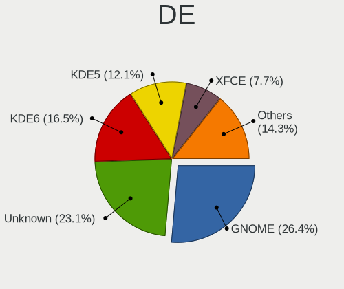
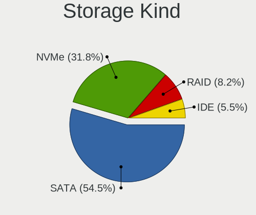
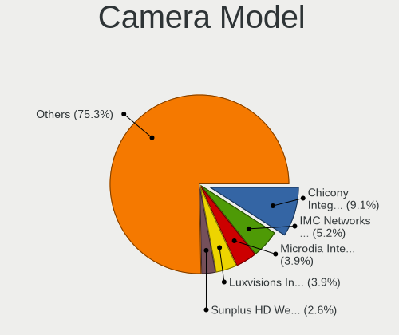
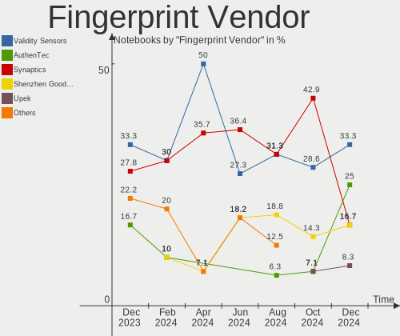

Linux in Poland - Hardware Trends (Notebooks)
---------------------------------------------

A project to identify most popular hardware characteristics and track their change
over time based on data collected by Linux users at https://Linux-Hardware.org.

Anyone can contribute to this report by the [hw-probe](https://github.com/linuxhw/hw-probe) tool:

    sudo -E hw-probe -all -upload

Period: Nov, 2022.

Contents
--------

* [ System ](#system)
  - [ OS                       ](#os)
  - [ OS Family                ](#os-family)
  - [ Kernel                   ](#kernel)
  - [ Kernel Family            ](#kernel-family)
  - [ Kernel Major Ver.        ](#kernel-major-ver)
  - [ Arch                     ](#arch)
  - [ DE                       ](#de)
  - [ Display Server           ](#display-server)
  - [ Display Manager          ](#display-manager)
  - [ OS Lang                  ](#os-lang)
  - [ Boot Mode                ](#boot-mode)
  - [ Filesystem               ](#filesystem)
  - [ Part. scheme             ](#part-scheme)
  - [ Dual Boot with Linux/BSD ](#dual-boot-with-linuxbsd)
  - [ Dual Boot (Win)          ](#dual-boot-win)

* [ Board ](#board)
  - [ Vendor                   ](#vendor)
  - [ Model                    ](#model)
  - [ Model Family             ](#model-family)
  - [ MFG Year                 ](#mfg-year)
  - [ Form Factor              ](#form-factor)
  - [ Secure Boot              ](#secure-boot)
  - [ Coreboot                 ](#coreboot)
  - [ RAM Size                 ](#ram-size)
  - [ RAM Used                 ](#ram-used)
  - [ Total Drives             ](#total-drives)
  - [ Has CD-ROM               ](#has-cd-rom)
  - [ Has Ethernet             ](#has-ethernet)
  - [ Has WiFi                 ](#has-wifi)
  - [ Has Bluetooth            ](#has-bluetooth)

* [ Location ](#location)
  - [ Country                  ](#country)
  - [ City                     ](#city)

* [ Drives ](#drives)
  - [ Drive Vendor             ](#drive-vendor)
  - [ Drive Model              ](#drive-model)
  - [ HDD Vendor               ](#hdd-vendor)
  - [ SSD Vendor               ](#ssd-vendor)
  - [ Drive Kind               ](#drive-kind)
  - [ Drive Connector          ](#drive-connector)
  - [ Drive Size               ](#drive-size)
  - [ Space Total              ](#space-total)
  - [ Space Used               ](#space-used)
  - [ Malfunc. Drives          ](#malfunc-drives)
  - [ Malfunc. Drive Vendor    ](#malfunc-drive-vendor)
  - [ Malfunc. HDD Vendor      ](#malfunc-hdd-vendor)
  - [ Malfunc. Drive Kind      ](#malfunc-drive-kind)
  - [ Failed Drives            ](#failed-drives)
  - [ Failed Drive Vendor      ](#failed-drive-vendor)
  - [ Drive Status             ](#drive-status)

* [ Storage controller ](#storage-controller)
  - [ Storage Vendor           ](#storage-vendor)
  - [ Storage Model            ](#storage-model)
  - [ Storage Kind             ](#storage-kind)

* [ Processor ](#processor)
  - [ CPU Vendor               ](#cpu-vendor)
  - [ CPU Model                ](#cpu-model)
  - [ CPU Model Family         ](#cpu-model-family)
  - [ CPU Cores                ](#cpu-cores)
  - [ CPU Sockets              ](#cpu-sockets)
  - [ CPU Threads              ](#cpu-threads)
  - [ CPU Op-Modes             ](#cpu-op-modes)
  - [ CPU Microcode            ](#cpu-microcode)
  - [ CPU Microarch            ](#cpu-microarch)

* [ Graphics ](#graphics)
  - [ GPU Vendor               ](#gpu-vendor)
  - [ GPU Model                ](#gpu-model)
  - [ GPU Combo                ](#gpu-combo)
  - [ GPU Driver               ](#gpu-driver)
  - [ GPU Memory               ](#gpu-memory)

* [ Monitor ](#monitor)
  - [ Monitor Vendor           ](#monitor-vendor)
  - [ Monitor Model            ](#monitor-model)
  - [ Monitor Resolution       ](#monitor-resolution)
  - [ Monitor Diagonal         ](#monitor-diagonal)
  - [ Monitor Width            ](#monitor-width)
  - [ Aspect Ratio             ](#aspect-ratio)
  - [ Monitor Area             ](#monitor-area)
  - [ Pixel Density            ](#pixel-density)
  - [ Multiple Monitors        ](#multiple-monitors)

* [ Network ](#network)
  - [ Net Controller Vendor    ](#net-controller-vendor)
  - [ Net Controller Model     ](#net-controller-model)
  - [ Wireless Vendor          ](#wireless-vendor)
  - [ Wireless Model           ](#wireless-model)
  - [ Ethernet Vendor          ](#ethernet-vendor)
  - [ Ethernet Model           ](#ethernet-model)
  - [ Net Controller Kind      ](#net-controller-kind)
  - [ Used Controller          ](#used-controller)
  - [ NICs                     ](#nics)
  - [ IPv6                     ](#ipv6)

* [ Bluetooth ](#bluetooth)
  - [ Bluetooth Vendor         ](#bluetooth-vendor)
  - [ Bluetooth Model          ](#bluetooth-model)

* [ Sound ](#sound)
  - [ Sound Vendor             ](#sound-vendor)
  - [ Sound Model              ](#sound-model)

* [ Memory ](#memory)
  - [ Memory Vendor            ](#memory-vendor)
  - [ Memory Model             ](#memory-model)
  - [ Memory Kind              ](#memory-kind)
  - [ Memory Form Factor       ](#memory-form-factor)
  - [ Memory Size              ](#memory-size)
  - [ Memory Speed             ](#memory-speed)

* [ Printers & scanners ](#printers--scanners)
  - [ Printer Vendor           ](#printer-vendor)
  - [ Printer Model            ](#printer-model)
  - [ Scanner Vendor           ](#scanner-vendor)
  - [ Scanner Model            ](#scanner-model)

* [ Camera ](#camera)
  - [ Camera Vendor            ](#camera-vendor)
  - [ Camera Model             ](#camera-model)

* [ Security ](#security)
  - [ Fingerprint Vendor       ](#fingerprint-vendor)
  - [ Fingerprint Model        ](#fingerprint-model)
  - [ Chipcard Vendor          ](#chipcard-vendor)
  - [ Chipcard Model           ](#chipcard-model)

* [ Unsupported ](#unsupported)
  - [ Unsupported Devices      ](#unsupported-devices)
  - [ Unsupported Device Types ](#unsupported-device-types)

System
------

OS
--

Installed operating systems

| Name                         | Notebooks | Percent |
|------------------------------|-----------|---------|
| Ubuntu 22.04                 | 16        | 18.18%  |
| OpenMandriva 4.3             | 6         | 6.82%   |
| Debian 11                    | 6         | 6.82%   |
| Fedora 37                    | 5         | 5.68%   |
| Ubuntu 20.04                 | 4         | 4.55%   |
| Linux Mint 21                | 4         | 4.55%   |
| Arch Rolling                 | 4         | 4.55%   |
| Ubuntu 22.10                 | 3         | 3.41%   |
| Manjaro 22.0.0               | 3         | 3.41%   |
| Zorin 16                     | 2         | 2.27%   |
| ROSA R11.1                   | 2         | 2.27%   |
| ROSA 12.3                    | 2         | 2.27%   |
| Nobara 36                    | 2         | 2.27%   |
| Lubuntu 22.04                | 2         | 2.27%   |
| Kubuntu 22.04                | 2         | 2.27%   |
| Xubuntu 22.04                | 1         | 1.14%   |
| SteamOS 3.4                  | 1         | 1.14%   |
| SteamOS 3.3.2                | 1         | 1.14%   |
| risiOS 36                    | 1         | 1.14%   |
| Pop!_OS 22.04                | 1         | 1.14%   |
| openSUSE Tumbleweed-XXXXXXXX | 1         | 1.14%   |
| OpenMandriva 4.50            | 1         | 1.14%   |
| OpenMandriva 4.2             | 1         | 1.14%   |
| MX 21                        | 1         | 1.14%   |
| Manjaro                      | 1         | 1.14%   |
| LMDE 5                       | 1         | 1.14%   |
| Linux Mint 20.3              | 1         | 1.14%   |
| Kubuntu 22.10                | 1         | 1.14%   |
| Kubuntu 21.10                | 1         | 1.14%   |
| KDE neon 22.04               | 1         | 1.14%   |
| Gentoo 2.9                   | 1         | 1.14%   |
| Gentoo 2.8                   | 1         | 1.14%   |
| Garuda Linux Soaring         | 1         | 1.14%   |
| Fedora 34                    | 1         | 1.14%   |
| EuroLinux 8.7                | 1         | 1.14%   |
| EndeavourOS Rolling          | 1         | 1.14%   |
| Elementary 6.1               | 1         | 1.14%   |
| Debian                       | 1         | 1.14%   |
| Clear Linux 37600            | 1         | 1.14%   |
| Clear Linux 36010            | 1         | 1.14%   |

OS Family
---------

OS without a version

| Name         | Notebooks | Percent |
|--------------|-----------|---------|
| Ubuntu       | 23        | 26.14%  |
| OpenMandriva | 8         | 9.09%   |
| Debian       | 7         | 7.95%   |
| Fedora       | 6         | 6.82%   |
| Linux Mint   | 5         | 5.68%   |
| ROSA         | 4         | 4.55%   |
| Manjaro      | 4         | 4.55%   |
| Kubuntu      | 4         | 4.55%   |
| Arch         | 4         | 4.55%   |
| Zorin        | 2         | 2.27%   |
| SteamOS      | 2         | 2.27%   |
| Nobara       | 2         | 2.27%   |
| Lubuntu      | 2         | 2.27%   |
| Gentoo       | 2         | 2.27%   |
| Clear Linux  | 2         | 2.27%   |
| Xubuntu      | 1         | 1.14%   |
| risiOS       | 1         | 1.14%   |
| Pop!_OS      | 1         | 1.14%   |
| openSUSE     | 1         | 1.14%   |
| MX           | 1         | 1.14%   |
| LMDE         | 1         | 1.14%   |
| KDE neon     | 1         | 1.14%   |
| Garuda Linux | 1         | 1.14%   |
| EuroLinux    | 1         | 1.14%   |
| EndeavourOS  | 1         | 1.14%   |
| Elementary   | 1         | 1.14%   |

Kernel
------

Version of the Linux kernel

| Version                            | Notebooks | Percent |
|------------------------------------|-----------|---------|
| 5.15.0-53-generic                  | 15        | 17.05%  |
| 5.15.0-52-generic                  | 10        | 11.36%  |
| 5.16.7-desktop-1omv4003            | 5         | 5.68%   |
| 5.10.0-19-amd64                    | 4         | 4.55%   |
| 6.0.9-300.fc37.x86_64              | 3         | 3.41%   |
| 6.0.7-arch1-1                      | 3         | 3.41%   |
| 5.4.83-generic-2rosa-x86_64        | 2         | 2.27%   |
| 5.19.0-23-generic                  | 2         | 2.27%   |
| 5.15.75-generic-1rosa2021.1-x86_64 | 2         | 2.27%   |
| 5.15.0-50-generic                  | 2         | 2.27%   |
| 5.15.0-43-generic                  | 2         | 2.27%   |
| 6.0.9-zen1-1-zen                   | 1         | 1.14%   |
| 6.0.9-arch1-1                      | 1         | 1.14%   |
| 6.0.8-lqx1-1-lqx                   | 1         | 1.14%   |
| 6.0.8-300.fc37.x86_64              | 1         | 1.14%   |
| 6.0.8-1-MANJARO                    | 1         | 1.14%   |
| 6.0.8-1-default                    | 1         | 1.14%   |
| 6.0.8-060008-generic               | 1         | 1.14%   |
| 6.0.7-gentoo-dist                  | 1         | 1.14%   |
| 6.0.7-301.fc37.x86_64              | 1         | 1.14%   |
| 6.0.7-200.fc36.x86_64              | 1         | 1.14%   |
| 6.0.7-1207.native                  | 1         | 1.14%   |
| 6.0.6-gentoo                       | 1         | 1.14%   |
| 6.0.6-76060006-generic             | 1         | 1.14%   |
| 6.0.5-201.fsync.fc36.x86_64        | 1         | 1.14%   |
| 6.0.10-201.fc36.x86_64             | 1         | 1.14%   |
| 6.0.0-2-amd64                      | 1         | 1.14%   |
| 5.19.5-desktop-1omv4090            | 1         | 1.14%   |
| 5.19.0-24-generic                  | 1         | 1.14%   |
| 5.19.0-21-generic                  | 1         | 1.14%   |
| 5.19.0-0.deb11.2-amd64             | 1         | 1.14%   |
| 5.17.0-1020-oem                    | 1         | 1.14%   |
| 5.16.13-desktop-1omv4003           | 1         | 1.14%   |
| 5.16.13-1132.native                | 1         | 1.14%   |
| 5.15.78-xanmod1                    | 1         | 1.14%   |
| 5.15.78-1-MANJARO                  | 1         | 1.14%   |
| 5.15.78-1-lts                      | 1         | 1.14%   |
| 5.15.0-41-generic                  | 1         | 1.14%   |
| 5.14.21-2-MANJARO                  | 1         | 1.14%   |
| 5.14.0-1054-oem                    | 1         | 1.14%   |

Kernel Family
-------------

Linux kernel without a distro release

| Version | Notebooks | Percent |
|---------|-----------|---------|
| 5.15.0  | 30        | 34.09%  |
| 6.0.7   | 7         | 7.95%   |
| 5.10.0  | 7         | 7.95%   |
| 6.0.9   | 5         | 5.68%   |
| 6.0.8   | 5         | 5.68%   |
| 5.19.0  | 5         | 5.68%   |
| 5.16.7  | 5         | 5.68%   |
| 5.15.78 | 3         | 3.41%   |
| 5.13.0  | 3         | 3.41%   |
| 6.0.6   | 2         | 2.27%   |
| 5.4.83  | 2         | 2.27%   |
| 5.16.13 | 2         | 2.27%   |
| 5.15.75 | 2         | 2.27%   |
| 6.0.5   | 1         | 1.14%   |
| 6.0.10  | 1         | 1.14%   |
| 6.0.0   | 1         | 1.14%   |
| 5.19.5  | 1         | 1.14%   |
| 5.17.0  | 1         | 1.14%   |
| 5.14.21 | 1         | 1.14%   |
| 5.14.0  | 1         | 1.14%   |
| 5.11.12 | 1         | 1.14%   |
| 5.10.14 | 1         | 1.14%   |
| 4.18.0  | 1         | 1.14%   |

Kernel Major Ver.
-----------------

Linux kernel major version

| Version | Notebooks | Percent |
|---------|-----------|---------|
| 5.15    | 35        | 39.77%  |
| 6.0     | 22        | 25%     |
| 5.10    | 8         | 9.09%   |
| 5.16    | 7         | 7.95%   |
| 5.19    | 6         | 6.82%   |
| 5.13    | 3         | 3.41%   |
| 5.4     | 2         | 2.27%   |
| 5.14    | 2         | 2.27%   |
| 5.17    | 1         | 1.14%   |
| 5.11    | 1         | 1.14%   |
| 4.18    | 1         | 1.14%   |

Arch
----

OS architecture (x86_64, i586, etc.)

| Name   | Notebooks | Percent |
|--------|-----------|---------|
| x86_64 | 88        | 100%    |

DE
--

Desktop Environment

| Name       | Notebooks | Percent |
|------------|-----------|---------|
| GNOME      | 40        | 45.45%  |
| KDE5       | 30        | 34.09%  |
| XFCE       | 5         | 5.68%   |
| X-Cinnamon | 4         | 4.55%   |
| LXQt       | 3         | 3.41%   |
| MATE       | 2         | 2.27%   |
| Unity      | 1         | 1.14%   |
| Pantheon   | 1         | 1.14%   |
| KDE        | 1         | 1.14%   |
| i3         | 1         | 1.14%   |

Display Server
--------------

X11 or Wayland

| Name    | Notebooks | Percent |
|---------|-----------|---------|
| X11     | 58        | 65.91%  |
| Wayland | 27        | 30.68%  |
| Unknown | 2         | 2.27%   |
| Tty     | 1         | 1.14%   |

Display Manager
---------------

SDDM, LightDM, etc.

| Name    | Notebooks | Percent |
|---------|-----------|---------|
| SDDM    | 28        | 31.82%  |
| Unknown | 24        | 27.27%  |
| GDM3    | 18        | 20.45%  |
| GDM     | 10        | 11.36%  |
| LightDM | 8         | 9.09%   |

OS Lang
-------

Language

| Lang  | Notebooks | Percent |
|-------|-----------|---------|
| pl_PL | 47        | 53.41%  |
| en_US | 35        | 39.77%  |
| en_GB | 2         | 2.27%   |
| C     | 2         | 2.27%   |
| en_AG | 1         | 1.14%   |
| aa_DJ | 1         | 1.14%   |

Boot Mode
---------

EFI or BIOS

| Mode | Notebooks | Percent |
|------|-----------|---------|
| EFI  | 49        | 55.68%  |
| BIOS | 39        | 44.32%  |

Filesystem
----------

Type of filesystem

| Type    | Notebooks | Percent |
|---------|-----------|---------|
| Ext4    | 62        | 70.45%  |
| Btrfs   | 14        | 15.91%  |
| Overlay | 9         | 10.23%  |
| Zfs     | 2         | 2.27%   |
| Xfs     | 1         | 1.14%   |

Part. scheme
------------

Scheme of partitioning

| Type    | Notebooks | Percent |
|---------|-----------|---------|
| GPT     | 48        | 54.55%  |
| Unknown | 23        | 26.14%  |
| MBR     | 17        | 19.32%  |

Dual Boot with Linux/BSD
------------------------

Hosting more than one Linux/BSD

| Dual boot | Notebooks | Percent |
|-----------|-----------|---------|
| No        | 74        | 84.09%  |
| Yes       | 14        | 15.91%  |

Dual Boot (Win)
---------------

Hosting Linux and Windows

| Dual boot | Notebooks | Percent |
|-----------|-----------|---------|
| No        | 61        | 69.32%  |
| Yes       | 27        | 30.68%  |

Board
-----

Vendor
------

Motherboard manufacturer

| Name                | Notebooks | Percent |
|---------------------|-----------|---------|
| Dell                | 22        | 25%     |
| Lenovo              | 20        | 22.73%  |
| Hewlett-Packard     | 20        | 22.73%  |
| ASUSTek Computer    | 7         | 7.95%   |
| Acer                | 5         | 5.68%   |
| Valve               | 3         | 3.41%   |
| MSI                 | 3         | 3.41%   |
| HUAWEI              | 3         | 3.41%   |
| Samsung Electronics | 2         | 2.27%   |
| Toshiba             | 1         | 1.14%   |
| Kruger&Matz         | 1         | 1.14%   |
| Apple               | 1         | 1.14%   |

Model
-----

Motherboard model

| Name                                       | Notebooks | Percent |
|--------------------------------------------|-----------|---------|
| Valve Jupiter                              | 3         | 3.41%   |
| Dell Latitude E6540                        | 3         | 3.41%   |
| HP EliteBook 850 G8 Notebook PC            | 2         | 2.27%   |
| Toshiba Satellite P300                     | 1         | 1.14%   |
| Samsung 300V3A/300V4A/300V5A/200A4B/200A5B | 1         | 1.14%   |
| Samsung 300E4A/300E5A/300E7A               | 1         | 1.14%   |
| MSI Stealth GS77 12UGS                     | 1         | 1.14%   |
| MSI Modern 15 A5M                          | 1         | 1.14%   |
| MSI Creator Z17 A12UHST                    | 1         | 1.14%   |
| Lenovo ThinkPad T430 23498M7               | 1         | 1.14%   |
| Lenovo ThinkPad T14 Gen 3 21AH0082PB       | 1         | 1.14%   |
| Lenovo ThinkPad T14 Gen 1 20S1S5MX1J       | 1         | 1.14%   |
| Lenovo ThinkPad P53 20QQS2CY00             | 1         | 1.14%   |
| Lenovo ThinkPad P53 20QNS00Y00             | 1         | 1.14%   |
| Lenovo ThinkPad L480 20LS001AMC            | 1         | 1.14%   |
| Lenovo ThinkPad L14 Gen 1 20U5004KPB       | 1         | 1.14%   |
| Lenovo ThinkPad L14 Gen 1 20U50001PB       | 1         | 1.14%   |
| Lenovo ThinkPad E15 Gen 2 20T8000MPB       | 1         | 1.14%   |
| Lenovo ThinkBook 15 G2 ITL 20VE            | 1         | 1.14%   |
| Lenovo ThinkBook 14 G2 ITL 20VD            | 1         | 1.14%   |
| Lenovo S145-15API 81UT                     | 1         | 1.14%   |
| Lenovo Legion Y540-15IRH 81SX              | 1         | 1.14%   |
| Lenovo IdeaPad Y700-17ISK 80Q0             | 1         | 1.14%   |
| Lenovo IdeaPad L340-17IRH Gaming 81LL      | 1         | 1.14%   |
| Lenovo IdeaPad Gaming 3 15ACH6 82K2        | 1         | 1.14%   |
| Lenovo IdeaPad 520S-14IKB 80X2             | 1         | 1.14%   |
| Lenovo IdeaPad 310-15IAP 80TT              | 1         | 1.14%   |
| Lenovo G580 20150                          | 1         | 1.14%   |
| Lenovo B51-80 80LM                         | 1         | 1.14%   |
| Kruger&Matz KM1406                         | 1         | 1.14%   |
| HUAWEI MRC-WX0                             | 1         | 1.14%   |
| HUAWEI KPL-W0X                             | 1         | 1.14%   |
| HUAWEI HVY-WXX9                            | 1         | 1.14%   |
| HP Victus by Laptop 16-e0xxx               | 1         | 1.14%   |
| HP ProBook 6570b                           | 1         | 1.14%   |
| HP ProBook 6470b                           | 1         | 1.14%   |
| HP ProBook 6450b                           | 1         | 1.14%   |
| HP ProBook 640 G2                          | 1         | 1.14%   |
| HP ProBook 5330m                           | 1         | 1.14%   |
| HP Pavilion dv7                            | 1         | 1.14%   |

Model Family
------------

Motherboard model prefix

| Name               | Notebooks | Percent |
|--------------------|-----------|---------|
| Dell Latitude      | 13        | 14.77%  |
| Lenovo ThinkPad    | 9         | 10.23%  |
| HP EliteBook       | 6         | 6.82%   |
| Lenovo IdeaPad     | 5         | 5.68%   |
| HP ProBook         | 5         | 5.68%   |
| Dell Inspiron      | 5         | 5.68%   |
| Acer Aspire        | 4         | 4.55%   |
| Valve Jupiter      | 3         | 3.41%   |
| HP Pavilion        | 3         | 3.41%   |
| Lenovo ThinkBook   | 2         | 2.27%   |
| ASUS VivoBook      | 2         | 2.27%   |
| Toshiba Satellite  | 1         | 1.14%   |
| Samsung 300V3A     | 1         | 1.14%   |
| Samsung 300E4A     | 1         | 1.14%   |
| MSI Stealth        | 1         | 1.14%   |
| MSI Modern         | 1         | 1.14%   |
| MSI Creator        | 1         | 1.14%   |
| Lenovo S145-15API  | 1         | 1.14%   |
| Lenovo Legion      | 1         | 1.14%   |
| Lenovo G580        | 1         | 1.14%   |
| Lenovo B51-80      | 1         | 1.14%   |
| Kruger&Matz KM1406 | 1         | 1.14%   |
| HUAWEI MRC-WX0     | 1         | 1.14%   |
| HUAWEI KPL-W0X     | 1         | 1.14%   |
| HUAWEI HVY-WXX9    | 1         | 1.14%   |
| HP Victus          | 1         | 1.14%   |
| HP OMEN            | 1         | 1.14%   |
| HP G5000           | 1         | 1.14%   |
| HP Compaq          | 1         | 1.14%   |
| HP 250             | 1         | 1.14%   |
| Dell XPS           | 1         | 1.14%   |
| Dell Vostro        | 1         | 1.14%   |
| Dell G5            | 1         | 1.14%   |
| Dell G15           | 1         | 1.14%   |
| ASUS Zenbook       | 1         | 1.14%   |
| ASUS TUF           | 1         | 1.14%   |
| ASUS K51AC         | 1         | 1.14%   |
| ASUS G75VX         | 1         | 1.14%   |
| ASUS ASUS          | 1         | 1.14%   |
| Apple MacBookPro14 | 1         | 1.14%   |

MFG Year
--------

Motherboard manufacture year

| Year | Notebooks | Percent |
|------|-----------|---------|
| 2020 | 12        | 13.64%  |
| 2021 | 11        | 12.5%   |
| 2019 | 9         | 10.23%  |
| 2022 | 8         | 9.09%   |
| 2012 | 8         | 9.09%   |
| 2011 | 7         | 7.95%   |
| 2018 | 6         | 6.82%   |
| 2017 | 6         | 6.82%   |
| 2015 | 5         | 5.68%   |
| 2013 | 4         | 4.55%   |
| 2008 | 4         | 4.55%   |
| 2016 | 2         | 2.27%   |
| 2014 | 2         | 2.27%   |
| 2010 | 2         | 2.27%   |
| 2009 | 1         | 1.14%   |
| 2007 | 1         | 1.14%   |

Form Factor
-----------

Physical design of the computer

| Name     | Notebooks | Percent |
|----------|-----------|---------|
| Notebook | 88        | 100%    |

Secure Boot
-----------

Enabled or disabled

| State    | Notebooks | Percent |
|----------|-----------|---------|
| Disabled | 79        | 89.77%  |
| Enabled  | 9         | 10.23%  |

Coreboot
--------

Have coreboot on board

| Used | Notebooks | Percent |
|------|-----------|---------|
| No   | 88        | 100%    |

RAM Size
--------

Total RAM memory

| Size in GB  | Notebooks | Percent |
|-------------|-----------|---------|
| 4.01-8.0    | 19        | 21.59%  |
| 32.01-64.0  | 19        | 21.59%  |
| 8.01-16.0   | 19        | 21.59%  |
| 16.01-24.0  | 15        | 17.05%  |
| 3.01-4.0    | 12        | 13.64%  |
| 1.01-2.0    | 2         | 2.27%   |
| 24.01-32.0  | 1         | 1.14%   |
| 64.01-256.0 | 1         | 1.14%   |

RAM Used
--------

Used RAM memory

| Used GB    | Notebooks | Percent |
|------------|-----------|---------|
| 1.01-2.0   | 23        | 26.14%  |
| 2.01-3.0   | 21        | 23.86%  |
| 3.01-4.0   | 17        | 19.32%  |
| 4.01-8.0   | 15        | 17.05%  |
| 8.01-16.0  | 6         | 6.82%   |
| 24.01-32.0 | 2         | 2.27%   |
| 0.51-1.0   | 2         | 2.27%   |
| 16.01-24.0 | 1         | 1.14%   |
| 0.01-0.5   | 1         | 1.14%   |

Total Drives
------------

Number of drives on board

| Drives | Notebooks | Percent |
|--------|-----------|---------|
| 1      | 62        | 70.45%  |
| 2      | 24        | 27.27%  |
| 3      | 2         | 2.27%   |

Has CD-ROM
----------

Has CD-ROM on board

| Presented | Notebooks | Percent |
|-----------|-----------|---------|
| No        | 68        | 77.27%  |
| Yes       | 20        | 22.73%  |

Has Ethernet
------------

Has Ethernet on board

| Presented | Notebooks | Percent |
|-----------|-----------|---------|
| Yes       | 67        | 76.14%  |
| No        | 21        | 23.86%  |

Has WiFi
--------

Has WiFi module

| Presented | Notebooks | Percent |
|-----------|-----------|---------|
| Yes       | 86        | 97.73%  |
| No        | 2         | 2.27%   |

Has Bluetooth
-------------

Has Bluetooth module

| Presented | Notebooks | Percent |
|-----------|-----------|---------|
| Yes       | 65        | 73.86%  |
| No        | 23        | 26.14%  |

Location
--------

Country
-------

Geographic location (country)

| Country | Notebooks | Percent |
|---------|-----------|---------|
| Poland  | 88        | 100%    |

City
----

Geographic location (city)

| City             | Notebooks | Percent |
|------------------|-----------|---------|
| Warsaw           | 16        | 18.18%  |
| Krakow           | 10        | 11.36%  |
| Wroclaw          | 4         | 4.55%   |
| Poznan           | 4         | 4.55%   |
| Lodz             | 4         | 4.55%   |
| Katowice         | 3         | 3.41%   |
| Janikowo         | 3         | 3.41%   |
| Gdansk           | 3         | 3.41%   |
| Kedzierzyn-Kozle | 2         | 2.27%   |
| Gdynia           | 2         | 2.27%   |
| Bytom            | 2         | 2.27%   |
| Buczkowice       | 2         | 2.27%   |
| Bialystok        | 2         | 2.27%   |
| Zielona Góra    | 1         | 1.14%   |
| Zawiercie        | 1         | 1.14%   |
| Witkowo          | 1         | 1.14%   |
| Wielbark         | 1         | 1.14%   |
| Tarnów          | 1         | 1.14%   |
| Szerzyny         | 1         | 1.14%   |
| Szczecin         | 1         | 1.14%   |
| Supraśl         | 1         | 1.14%   |
| Sosnowiec        | 1         | 1.14%   |
| Sompolno         | 1         | 1.14%   |
| Rumia            | 1         | 1.14%   |
| Robercin         | 1         | 1.14%   |
| Ostrołęka      | 1         | 1.14%   |
| Olsztyn          | 1         | 1.14%   |
| Olszanka         | 1         | 1.14%   |
| Malbork          | 1         | 1.14%   |
| Lublin           | 1         | 1.14%   |
| Lipno            | 1         | 1.14%   |
| Koszalin         | 1         | 1.14%   |
| Kosów Lacki     | 1         | 1.14%   |
| Kluczbork        | 1         | 1.14%   |
| Klecza           | 1         | 1.14%   |
| Gora Kalwaria    | 1         | 1.14%   |
| Goledzinow       | 1         | 1.14%   |
| Gmina Widawa     | 1         | 1.14%   |
| Gmina Bolków    | 1         | 1.14%   |
| Gloskow          | 1         | 1.14%   |

Drives
------

Drive Vendor
------------

Hard drive vendors

| Vendor                      | Notebooks | Drives | Percent |
|-----------------------------|-----------|--------|---------|
| Samsung Electronics         | 22        | 22     | 19.64%  |
| GOODRAM                     | 11        | 11     | 9.82%   |
| WDC                         | 8         | 8      | 7.14%   |
| SK hynix                    | 7         | 7      | 6.25%   |
| Sandisk                     | 6         | 6      | 5.36%   |
| Unknown                     | 5         | 5      | 4.46%   |
| Seagate                     | 4         | 4      | 3.57%   |
| Micron Technology           | 4         | 4      | 3.57%   |
| Intel                       | 4         | 4      | 3.57%   |
| Crucial                     | 4         | 4      | 3.57%   |
| Toshiba                     | 3         | 3      | 2.68%   |
| SPCC                        | 3         | 3      | 2.68%   |
| Silicon Motion              | 3         | 3      | 2.68%   |
| Kingston                    | 3         | 3      | 2.68%   |
| LITEONIT                    | 2         | 2      | 1.79%   |
| KIOXIA                      | 2         | 2      | 1.79%   |
| Kingston Technology Company | 2         | 2      | 1.79%   |
| Hitachi                     | 2         | 2      | 1.79%   |
| A-DATA Technology           | 2         | 2      | 1.79%   |
| Unknown                     | 2         | 2      | 1.79%   |
| V Series                    | 1         | 1      | 0.89%   |
| Union Memory                | 1         | 1      | 0.89%   |
| UMIS                        | 1         | 1      | 0.89%   |
| StoreJet                    | 1         | 1      | 0.89%   |
| Ramaxel Technology          | 1         | 1      | 0.89%   |
| Phison Electronics          | 1         | 1      | 0.89%   |
| Netac                       | 1         | 1      | 0.89%   |
| JMicron Technology          | 1         | 1      | 0.89%   |
| HGST                        | 1         | 1      | 0.89%   |
| Hewlett-Packard             | 1         | 1      | 0.89%   |
| China                       | 1         | 1      | 0.89%   |
| Apple                       | 1         | 2      | 0.89%   |
| ADATA Technology            | 1         | 1      | 0.89%   |

Drive Model
-----------

Hard drive models

| Model                                                 | Notebooks | Percent |
|-------------------------------------------------------|-----------|---------|
| WDC WD10JPCX-24UE4T0 1TB                              | 2         | 1.79%   |
| Samsung NVMe SSD Controller SM981/PM981/PM983 1TB     | 2         | 1.79%   |
| Samsung MZVL22T0HBLB-00BTW 2TB                        | 2         | 1.79%   |
| Kingston Company OM3PDP3 NVMe SSD 256GB               | 2         | 1.79%   |
| Crucial CT240BX200SSD1 240GB                          | 2         | 1.79%   |
| Unknown                                               | 2         | 1.79%   |
| WDC WDS100T2B0C-00PXH0 1TB                            | 1         | 0.89%   |
| WDC WDS100T2B0B-00YS70 1TB SSD                        | 1         | 0.89%   |
| WDC WD5000BPKT-60PK4T0 500GB                          | 1         | 0.89%   |
| WDC WD3200BPVT-22JJ5T0 320GB                          | 1         | 0.89%   |
| WDC WD10JPVX-22JC3T0 1TB                              | 1         | 0.89%   |
| WDC PC SN520 SDAPMUW-512G-1101 512GB                  | 1         | 0.89%   |
| V Series SATA SSD 120GB                               | 1         | 0.89%   |
| Unknown xD/SD/M.S.                                    | 1         | 0.89%   |
| Unknown SD/MMC/MS PRO 8GB                             | 1         | 0.89%   |
| Unknown NCard  64GB                                   | 1         | 0.89%   |
| Unknown MMC Card  64GB                                | 1         | 0.89%   |
| Unknown MMC Card  16GB                                | 1         | 0.89%   |
| Union Memory UMIS RPJTJ512MEE1OWX 512GB               | 1         | 0.89%   |
| UMIS RPFTJ256PDD2MWX 256GB                            | 1         | 0.89%   |
| Toshiba MQ01ABD100 1TB                                | 1         | 0.89%   |
| Toshiba MK2552GSX 250GB                               | 1         | 0.89%   |
| Toshiba KBG40ZNS256G NVMe 256GB                       | 1         | 0.89%   |
| StoreJet Transcend 240GB                              | 1         | 0.89%   |
| SPCC Solid State Disk 512GB                           | 1         | 0.89%   |
| SPCC Solid State Disk 480GB                           | 1         | 0.89%   |
| SPCC Solid State Disk 240GB                           | 1         | 0.89%   |
| SK hynix SC311 SATA 256GB SSD                         | 1         | 0.89%   |
| SK hynix HFS256G39TNF-N3A0A 256GB SSD                 | 1         | 0.89%   |
| SK hynix HFM512GDJTNG-8310A 512GB                     | 1         | 0.89%   |
| SK hynix HFM512GD3JX013N 512GB                        | 1         | 0.89%   |
| SK hynix BC711 NVMe 512GB                             | 1         | 0.89%   |
| SK hynix BC711 NVMe 256GB                             | 1         | 0.89%   |
| SK hynix BC711 HFM512GD3JX013N 512GB                  | 1         | 0.89%   |
| Silicon Motion SM2263EN/SM2263XT SSD Controller 128GB | 1         | 0.89%   |
| Silicon Motion SM2262/SM2262EN SSD Controller 1TB     | 1         | 0.89%   |
| Silicon Motion PCIe-8 SSD 512GB                       | 1         | 0.89%   |
| Seagate ST500LT012-9WS142 500GB                       | 1         | 0.89%   |
| Seagate ST500LT012-1DG142 500GB                       | 1         | 0.89%   |
| Seagate ST1000LM035-1RK172 1TB                        | 1         | 0.89%   |

HDD Vendor
----------

Hard disk drive vendors

| Vendor              | Notebooks | Drives | Percent |
|---------------------|-----------|--------|---------|
| WDC                 | 5         | 5      | 31.25%  |
| Seagate             | 4         | 4      | 25%     |
| Toshiba             | 2         | 2      | 12.5%   |
| Hitachi             | 2         | 2      | 12.5%   |
| Unknown             | 1         | 1      | 6.25%   |
| Samsung Electronics | 1         | 1      | 6.25%   |
| HGST                | 1         | 1      | 6.25%   |

SSD Vendor
----------

Solid state drive vendors

| Vendor              | Notebooks | Drives | Percent |
|---------------------|-----------|--------|---------|
| GOODRAM             | 10        | 10     | 25.64%  |
| Samsung Electronics | 6         | 6      | 15.38%  |
| Crucial             | 4         | 4      | 10.26%  |
| SPCC                | 3         | 3      | 7.69%   |
| Kingston            | 3         | 3      | 7.69%   |
| SK hynix            | 2         | 2      | 5.13%   |
| LITEONIT            | 2         | 2      | 5.13%   |
| WDC                 | 1         | 1      | 2.56%   |
| V Series            | 1         | 1      | 2.56%   |
| StoreJet            | 1         | 1      | 2.56%   |
| SanDisk             | 1         | 1      | 2.56%   |
| Ramaxel Technology  | 1         | 1      | 2.56%   |
| Netac               | 1         | 1      | 2.56%   |
| Hewlett-Packard     | 1         | 1      | 2.56%   |
| China               | 1         | 1      | 2.56%   |
| A-DATA Technology   | 1         | 1      | 2.56%   |

Drive Kind
----------

HDD or SSD

| Kind    | Notebooks | Drives | Percent |
|---------|-----------|--------|---------|
| NVMe    | 46        | 51     | 44.66%  |
| SSD     | 35        | 39     | 33.98%  |
| HDD     | 15        | 16     | 14.56%  |
| MMC     | 5         | 5      | 4.85%   |
| Unknown | 2         | 2      | 1.94%   |

Drive Connector
---------------

SATA, SAS, NVMe, etc.

| Type | Notebooks | Drives | Percent |
|------|-----------|--------|---------|
| NVMe | 46        | 51     | 45.54%  |
| SATA | 44        | 51     | 43.56%  |
| SAS  | 6         | 6      | 5.94%   |
| MMC  | 5         | 5      | 4.95%   |

Drive Size
----------

Size of hard drive

| Size in TB | Notebooks | Drives | Percent |
|------------|-----------|--------|---------|
| 0.01-0.5   | 36        | 42     | 73.47%  |
| 0.51-1.0   | 13        | 13     | 26.53%  |

Space Total
-----------

Amount of disk space available on the file system

| Size in GB | Notebooks | Percent |
|------------|-----------|---------|
| 101-250    | 26        | 29.55%  |
| 251-500    | 22        | 25%     |
| 501-1000   | 13        | 14.77%  |
| 1-20       | 11        | 12.5%   |
| 1001-2000  | 5         | 5.68%   |
| 51-100     | 4         | 4.55%   |
| Unknown    | 3         | 3.41%   |
| 21-50      | 2         | 2.27%   |
| 2001-3000  | 2         | 2.27%   |

Space Used
----------

Amount of used disk space

| Used GB  | Notebooks | Percent |
|----------|-----------|---------|
| 1-20     | 29        | 32.95%  |
| 21-50    | 18        | 20.45%  |
| 101-250  | 14        | 15.91%  |
| 51-100   | 11        | 12.5%   |
| 251-500  | 9         | 10.23%  |
| 501-1000 | 4         | 4.55%   |
| Unknown  | 3         | 3.41%   |

Malfunc. Drives
---------------

Drive models with a malfunction

| Model                                 | Notebooks | Drives | Percent |
|---------------------------------------|-----------|--------|---------|
| WDC WD10JPVX-22JC3T0 1TB              | 1         | 1      | 20%     |
| Seagate ST500LT012-9WS142 500GB       | 1         | 1      | 20%     |
| Samsung Electronics HM250HI 250GB     | 1         | 1      | 20%     |
| LITEONIT LCT-256M3S 2.5 7mm 256GB SSD | 1         | 1      | 20%     |
| Hitachi HTS725050A9A364 500GB         | 1         | 1      | 20%     |

Malfunc. Drive Vendor
---------------------

Vendors of faulty drives

| Vendor              | Notebooks | Drives | Percent |
|---------------------|-----------|--------|---------|
| WDC                 | 1         | 1      | 20%     |
| Seagate             | 1         | 1      | 20%     |
| Samsung Electronics | 1         | 1      | 20%     |
| LITEONIT            | 1         | 1      | 20%     |
| Hitachi             | 1         | 1      | 20%     |

Malfunc. HDD Vendor
-------------------

Vendors of faulty HDD drives

| Vendor              | Notebooks | Drives | Percent |
|---------------------|-----------|--------|---------|
| WDC                 | 1         | 1      | 25%     |
| Seagate             | 1         | 1      | 25%     |
| Samsung Electronics | 1         | 1      | 25%     |
| Hitachi             | 1         | 1      | 25%     |

Malfunc. Drive Kind
-------------------

Kinds of faulty drives

| Kind | Notebooks | Drives | Percent |
|------|-----------|--------|---------|
| HDD  | 4         | 4      | 80%     |
| SSD  | 1         | 1      | 20%     |

Failed Drives
-------------

Failed drive models

Zero info for selected period =(

Failed Drive Vendor
-------------------

Failed drive vendors

Zero info for selected period =(

Drive Status
------------

Number of failed and malfunc. drives

| Status   | Notebooks | Drives | Percent |
|----------|-----------|--------|---------|
| Works    | 54        | 63     | 57.45%  |
| Detected | 35        | 45     | 37.23%  |
| Malfunc  | 5         | 5      | 5.32%   |

Storage controller
------------------

Storage Vendor
--------------

Storage controller vendors

| Vendor                      | Notebooks | Percent |
|-----------------------------|-----------|---------|
| Intel                       | 57        | 51.35%  |
| Samsung Electronics         | 15        | 13.51%  |
| AMD                         | 8         | 7.21%   |
| SanDisk                     | 7         | 6.31%   |
| SK hynix                    | 5         | 4.5%    |
| Silicon Motion              | 4         | 3.6%    |
| Micron Technology           | 4         | 3.6%    |
| KIOXIA                      | 3         | 2.7%    |
| Union Memory (Shenzhen)     | 2         | 1.8%    |
| Phison Electronics          | 2         | 1.8%    |
| Kingston Technology Company | 2         | 1.8%    |
| Apple                       | 1         | 0.9%    |
| ADATA Technology            | 1         | 0.9%    |

Storage Model
-------------

Storage controller models

| Model                                                                          | Notebooks | Percent |
|--------------------------------------------------------------------------------|-----------|---------|
| Intel Sunrise Point-LP SATA Controller [AHCI mode]                             | 9         | 7.69%   |
| Samsung NVMe SSD Controller SM981/PM981/PM983                                  | 8         | 6.84%   |
| Intel 6 Series/C200 Series Chipset Family 6 port Mobile SATA AHCI Controller   | 8         | 6.84%   |
| Intel Volume Management Device NVMe RAID Controller                            | 7         | 5.98%   |
| Intel 7 Series Chipset Family 6-port SATA Controller [AHCI mode]               | 6         | 5.13%   |
| AMD FCH SATA Controller [AHCI mode]                                            | 6         | 5.13%   |
| Samsung NVMe SSD Controller 980                                                | 5         | 4.27%   |
| SK hynix Gold P31/PC711 NVMe Solid State Drive                                 | 4         | 3.42%   |
| Micron Non-Volatile memory controller                                          | 4         | 3.42%   |
| Intel 82801 Mobile SATA Controller [RAID mode]                                 | 4         | 3.42%   |
| SanDisk Non-Volatile memory controller                                         | 3         | 2.56%   |
| Intel Tiger Lake-LP SATA Controller                                            | 3         | 2.56%   |
| Intel Cannon Lake Mobile PCH SATA AHCI Controller                              | 3         | 2.56%   |
| Union Memory (Shenzhen) Non-Volatile memory controller                         | 2         | 1.71%   |
| Silicon Motion Non-Volatile memory controller                                  | 2         | 1.71%   |
| Samsung NVMe SSD Controller PM9A1/PM9A3/980PRO                                 | 2         | 1.71%   |
| Phison E12 NVMe Controller                                                     | 2         | 1.71%   |
| KIOXIA NVMe SSD Controller BG4                                                 | 2         | 1.71%   |
| Kingston Company OM3PDP3 NVMe SSD                                              | 2         | 1.71%   |
| Intel Non-Volatile memory controller                                           | 2         | 1.71%   |
| Intel HM170/QM170 Chipset SATA Controller [AHCI Mode]                          | 2         | 1.71%   |
| Intel 82801IBM/IEM (ICH9M/ICH9M-E) 4 port SATA Controller [AHCI mode]          | 2         | 1.71%   |
| Intel 8 Series/C220 Series Chipset Family 6-port SATA Controller 1 [AHCI mode] | 2         | 1.71%   |
| Intel 8 Series SATA Controller 1 [AHCI mode]                                   | 2         | 1.71%   |
| Intel 5 Series/3400 Series Chipset 6 port SATA AHCI Controller                 | 2         | 1.71%   |
| AMD SB7x0/SB8x0/SB9x0 SATA Controller [AHCI mode]                              | 2         | 1.71%   |
| SK hynix BC501 NVMe Solid State Drive                                          | 1         | 0.85%   |
| Silicon Motion SM2263EN/SM2263XT SSD Controller                                | 1         | 0.85%   |
| Silicon Motion SM2262/SM2262EN SSD Controller                                  | 1         | 0.85%   |
| SanDisk WD Blue SN550 NVMe SSD                                                 | 1         | 0.85%   |
| SanDisk WD Blue SN500 / PC SN520 NVMe SSD                                      | 1         | 0.85%   |
| SanDisk WD Black SN750 / PC SN730 NVMe SSD                                     | 1         | 0.85%   |
| SanDisk PC SN520 NVMe SSD                                                      | 1         | 0.85%   |
| KIOXIA Non-Volatile memory controller                                          | 1         | 0.85%   |
| Intel SSD Pro 7600p/760p/E 6100p Series                                        | 1         | 0.85%   |
| Intel SSD 600P Series                                                          | 1         | 0.85%   |
| Intel Comet Lake SATA AHCI Controller                                          | 1         | 0.85%   |
| Intel Celeron/Pentium Silver Processor SATA Controller                         | 1         | 0.85%   |
| Intel Celeron N3350/Pentium N4200/Atom E3900 Series SATA AHCI Controller       | 1         | 0.85%   |
| Intel Cannon Point-LP SATA Controller [AHCI Mode]                              | 1         | 0.85%   |

Storage Kind
------------

Kind of storage controller (IDE, SATA, NVMe, SAS, ...)

| Kind | Notebooks | Percent |
|------|-----------|---------|
| SATA | 53        | 47.32%  |
| NVMe | 46        | 41.07%  |
| RAID | 11        | 9.82%   |
| IDE  | 2         | 1.79%   |

Processor
---------

CPU Vendor
----------

Processor vendors

| Vendor | Notebooks | Percent |
|--------|-----------|---------|
| Intel  | 65        | 73.86%  |
| AMD    | 23        | 26.14%  |

CPU Model
---------

Processor models

| Model                                   | Notebooks | Percent |
|-----------------------------------------|-----------|---------|
| AMD Ryzen 5 5600H with Radeon Graphics  | 5         | 5.68%   |
| Intel Core i5-7200U CPU @ 2.50GHz       | 3         | 3.41%   |
| Intel Core i5-2520M CPU @ 2.50GHz       | 3         | 3.41%   |
| Intel 11th Gen Core i7-1165G7 @ 2.80GHz | 3         | 3.41%   |
| AMD Custom APU 0405                     | 3         | 3.41%   |
| Intel Core i7-9750H CPU @ 2.60GHz       | 2         | 2.27%   |
| Intel Core i7-4800MQ CPU @ 2.70GHz      | 2         | 2.27%   |
| Intel Core i7-10610U CPU @ 1.80GHz      | 2         | 2.27%   |
| Intel Core i5-8250U CPU @ 1.60GHz       | 2         | 2.27%   |
| Intel Core i5-3230M CPU @ 2.60GHz       | 2         | 2.27%   |
| Intel Core i3-2350M CPU @ 2.30GHz       | 2         | 2.27%   |
| Intel 12th Gen Core i9-12900H           | 2         | 2.27%   |
| AMD Ryzen 5 4600H with Radeon Graphics  | 2         | 2.27%   |
| Intel Pentium Dual CPU T3200 @ 2.00GHz  | 1         | 1.14%   |
| Intel Pentium CPU N4200 @ 1.10GHz       | 1         | 1.14%   |
| Intel Pentium CPU B960 @ 2.20GHz        | 1         | 1.14%   |
| Intel Pentium CPU 2020M @ 2.40GHz       | 1         | 1.14%   |
| Intel Core i9-9880H CPU @ 2.30GHz       | 1         | 1.14%   |
| Intel Core i7-9850H CPU @ 2.60GHz       | 1         | 1.14%   |
| Intel Core i7-8550U CPU @ 1.80GHz       | 1         | 1.14%   |
| Intel Core i7-6700HQ CPU @ 2.60GHz      | 1         | 1.14%   |
| Intel Core i7-6600U CPU @ 2.60GHz       | 1         | 1.14%   |
| Intel Core i7-6500U CPU @ 2.50GHz       | 1         | 1.14%   |
| Intel Core i7-4702MQ CPU @ 2.20GHz      | 1         | 1.14%   |
| Intel Core i7-4600U CPU @ 2.10GHz       | 1         | 1.14%   |
| Intel Core i7-3740QM CPU @ 2.70GHz      | 1         | 1.14%   |
| Intel Core i7-3630QM CPU @ 2.40GHz      | 1         | 1.14%   |
| Intel Core i7-2640M CPU @ 2.80GHz       | 1         | 1.14%   |
| Intel Core i7-2630QM CPU @ 2.00GHz      | 1         | 1.14%   |
| Intel Core i5-9300H CPU @ 2.40GHz       | 1         | 1.14%   |
| Intel Core i5-8350U CPU @ 1.70GHz       | 1         | 1.14%   |
| Intel Core i5-8300H CPU @ 2.30GHz       | 1         | 1.14%   |
| Intel Core i5-7360U CPU @ 2.30GHz       | 1         | 1.14%   |
| Intel Core i5-6300U CPU @ 2.40GHz       | 1         | 1.14%   |
| Intel Core i5-6300HQ CPU @ 2.30GHz      | 1         | 1.14%   |
| Intel Core i5-6200U CPU @ 2.30GHz       | 1         | 1.14%   |
| Intel Core i5-4300M CPU @ 2.60GHz       | 1         | 1.14%   |
| Intel Core i5-4200U CPU @ 1.60GHz       | 1         | 1.14%   |
| Intel Core i5-3340M CPU @ 2.70GHz       | 1         | 1.14%   |
| Intel Core i5-3320M CPU @ 2.60GHz       | 1         | 1.14%   |

CPU Model Family
----------------

Processor model prefix

| Model              | Notebooks | Percent |
|--------------------|-----------|---------|
| Intel Core i5      | 24        | 27.27%  |
| Intel Core i7      | 17        | 19.32%  |
| Other              | 14        | 15.91%  |
| AMD Ryzen 5        | 12        | 13.64%  |
| Intel Core i3      | 4         | 4.55%   |
| Intel Pentium      | 3         | 3.41%   |
| Intel Celeron      | 2         | 2.27%   |
| AMD Ryzen 7        | 2         | 2.27%   |
| Intel Pentium Dual | 1         | 1.14%   |
| Intel Core i9      | 1         | 1.14%   |
| Intel Core 2 Duo   | 1         | 1.14%   |
| Intel Celeron M    | 1         | 1.14%   |
| AMD Ryzen 7 PRO    | 1         | 1.14%   |
| AMD Ryzen 5 PRO    | 1         | 1.14%   |
| AMD C-60           | 1         | 1.14%   |
| AMD Athlon X2      | 1         | 1.14%   |
| AMD A8             | 1         | 1.14%   |
| AMD A6             | 1         | 1.14%   |

CPU Cores
---------

Number of processor cores

| Number | Notebooks | Percent |
|--------|-----------|---------|
| 2      | 34        | 38.64%  |
| 4      | 30        | 34.09%  |
| 6      | 14        | 15.91%  |
| 14     | 3         | 3.41%   |
| 12     | 3         | 3.41%   |
| 8      | 3         | 3.41%   |
| 1      | 1         | 1.14%   |

CPU Sockets
-----------

Number of sockets

| Number | Notebooks | Percent |
|--------|-----------|---------|
| 1      | 88        | 100%    |

CPU Threads
-----------

Threads per core (Hyper-Threading)

| Number | Notebooks | Percent |
|--------|-----------|---------|
| 2      | 72        | 81.82%  |
| 1      | 16        | 18.18%  |

CPU Op-Modes
------------

CPU Operation Modes (32-bit, 64-bit)

| Op mode        | Notebooks | Percent |
|----------------|-----------|---------|
| 32-bit, 64-bit | 88        | 100%    |

CPU Microcode
-------------

Microcode number

| Number     | Notebooks | Percent |
|------------|-----------|---------|
| Unknown    | 23        | 26.14%  |
| 0x0a50000c | 7         | 7.95%   |
| 0x906a3    | 5         | 5.68%   |
| 0x306a9    | 5         | 5.68%   |
| 0x206a7    | 5         | 5.68%   |
| 0x806ec    | 4         | 4.55%   |
| 0x806e9    | 4         | 4.55%   |
| 0x806c1    | 4         | 4.55%   |
| 0x306c3    | 4         | 4.55%   |
| 0x406e3    | 3         | 3.41%   |
| 0x906ea    | 2         | 2.27%   |
| 0x806ea    | 2         | 2.27%   |
| 0x6fd      | 2         | 2.27%   |
| 0x20655    | 2         | 2.27%   |
| 0x08600106 | 2         | 2.27%   |
| 0x08600103 | 2         | 2.27%   |
| 0x806d1    | 1         | 1.14%   |
| 0x706a1    | 1         | 1.14%   |
| 0x506e3    | 1         | 1.14%   |
| 0x506c9    | 1         | 1.14%   |
| 0x30678    | 1         | 1.14%   |
| 0x08900201 | 1         | 1.14%   |
| 0x08608103 | 1         | 1.14%   |
| 0x08108102 | 1         | 1.14%   |
| 0x08101007 | 1         | 1.14%   |
| 0x07030106 | 1         | 1.14%   |
| 0x06003106 | 1         | 1.14%   |
| 0x05000119 | 1         | 1.14%   |

CPU Microarch
-------------

Microarchitecture

| Name             | Notebooks | Percent |
|------------------|-----------|---------|
| KabyLake         | 18        | 20.45%  |
| SandyBridge      | 9         | 10.23%  |
| Zen 3            | 7         | 7.95%   |
| IvyBridge        | 7         | 7.95%   |
| Skylake          | 6         | 6.82%   |
| Haswell          | 6         | 6.82%   |
| Zen 2            | 5         | 5.68%   |
| TigerLake        | 5         | 5.68%   |
| Alderlake Hybrid | 5         | 5.68%   |
| Unknown          | 4         | 4.55%   |
| Core             | 3         | 3.41%   |
| Zen+             | 2         | 2.27%   |
| Westmere         | 2         | 2.27%   |
| Zen              | 1         | 1.14%   |
| Steamroller      | 1         | 1.14%   |
| Silvermont       | 1         | 1.14%   |
| Puma             | 1         | 1.14%   |
| K8 & K10 hybrid  | 1         | 1.14%   |
| Icelake          | 1         | 1.14%   |
| Goldmont plus    | 1         | 1.14%   |
| Goldmont         | 1         | 1.14%   |
| Bobcat           | 1         | 1.14%   |

Graphics
--------

GPU Vendor
----------

Vendors of graphics cards

| Vendor | Notebooks | Percent |
|--------|-----------|---------|
| Intel  | 61        | 52.14%  |
| AMD    | 33        | 28.21%  |
| Nvidia | 23        | 19.66%  |

GPU Model
---------

Graphics card models

| Model                                                                         | Notebooks | Percent |
|-------------------------------------------------------------------------------|-----------|---------|
| Intel 2nd Generation Core Processor Family Integrated Graphics Controller     | 8         | 6.67%   |
| AMD Cezanne [Radeon Vega Series / Radeon Vega Mobile Series]                  | 7         | 5.83%   |
| Intel 3rd Gen Core processor Graphics Controller                              | 6         | 5%      |
| Intel TigerLake-LP GT2 [Iris Xe Graphics]                                     | 5         | 4.17%   |
| Intel CoffeeLake-H GT2 [UHD Graphics 630]                                     | 5         | 4.17%   |
| Intel Alder Lake-P Integrated Graphics Controller                             | 5         | 4.17%   |
| AMD Renoir                                                                    | 5         | 4.17%   |
| Intel UHD Graphics 620                                                        | 4         | 3.33%   |
| Intel Skylake GT2 [HD Graphics 520]                                           | 4         | 3.33%   |
| Intel 4th Gen Core Processor Integrated Graphics Controller                   | 4         | 3.33%   |
| AMD Sun XT [Radeon HD 8670A/8670M/8690M / R5 M330 / M430 / Radeon 520 Mobile] | 4         | 3.33%   |
| Intel HD Graphics 620                                                         | 3         | 2.5%    |
| Intel CometLake-U GT2 [UHD Graphics]                                          | 3         | 2.5%    |
| AMD VanGogh [AMD Custom GPU 0405]                                             | 3         | 2.5%    |
| AMD Mars XTX [Radeon HD 8790M]                                                | 3         | 2.5%    |
| Nvidia TU117M [GeForce GTX 1650 Mobile / Max-Q]                               | 2         | 1.67%   |
| Nvidia TU116M [GeForce GTX 1660 Ti Mobile]                                    | 2         | 1.67%   |
| Nvidia GM107M [GeForce GTX 960M]                                              | 2         | 1.67%   |
| Nvidia GF119M [GeForce GT 520MX]                                              | 2         | 1.67%   |
| Nvidia GA107M [GeForce RTX 3050 Mobile]                                       | 2         | 1.67%   |
| Intel HD Graphics 530                                                         | 2         | 1.67%   |
| Intel Haswell-ULT Integrated Graphics Controller                              | 2         | 1.67%   |
| Intel Core Processor Integrated Graphics Controller                           | 2         | 1.67%   |
| AMD Picasso/Raven 2 [Radeon Vega Series / Radeon Vega Mobile Series]          | 2         | 1.67%   |
| Nvidia TU117GLM [Quadro T2000 Mobile / Max-Q]                                 | 1         | 0.83%   |
| Nvidia TU104GLM [Quadro RTX 4000 Mobile / Max-Q]                              | 1         | 0.83%   |
| Nvidia GP108M [GeForce MX150]                                                 | 1         | 0.83%   |
| Nvidia GP107M [GeForce GTX 1050 3 GB Max-Q]                                   | 1         | 0.83%   |
| Nvidia GP106M [GeForce GTX 1060 Mobile]                                       | 1         | 0.83%   |
| Nvidia GM108M [GeForce 940MX]                                                 | 1         | 0.83%   |
| Nvidia GK208BM [GeForce 920M]                                                 | 1         | 0.83%   |
| Nvidia GK106M [GeForce GTX 760M]                                              | 1         | 0.83%   |
| Nvidia GK104M [GeForce GTX 670MX]                                             | 1         | 0.83%   |
| Nvidia GF119M [NVS 4200M]                                                     | 1         | 0.83%   |
| Nvidia GA107M [GeForce RTX 3050 Ti Mobile]                                    | 1         | 0.83%   |
| Nvidia GA104 [Geforce RTX 3070 Ti Laptop GPU]                                 | 1         | 0.83%   |
| Nvidia GA103M [GeForce RTX 3080 Ti Mobile]                                    | 1         | 0.83%   |
| Intel WhiskeyLake-U GT2 [UHD Graphics 620]                                    | 1         | 0.83%   |
| Intel TigerLake-H GT1 [UHD Graphics]                                          | 1         | 0.83%   |
| Intel Mobile 945GM/GMS/GME, 943/940GML Express Integrated Graphics Controller | 1         | 0.83%   |

GPU Combo
---------

Combinations of graphics cards

| Name           | Notebooks | Percent |
|----------------|-----------|---------|
| 1 x Intel      | 36        | 40.91%  |
| 1 x AMD        | 18        | 20.45%  |
| Intel + Nvidia | 16        | 18.18%  |
| Intel + AMD    | 9         | 10.23%  |
| AMD + Nvidia   | 4         | 4.55%   |
| 1 x Nvidia     | 3         | 3.41%   |
| 2 x AMD        | 2         | 2.27%   |

GPU Driver
----------

Free vs proprietary

| Driver      | Notebooks | Percent |
|-------------|-----------|---------|
| Free        | 76        | 86.36%  |
| Proprietary | 12        | 13.64%  |

GPU Memory
----------

Total video memory

| Size in GB | Notebooks | Percent |
|------------|-----------|---------|
| Unknown    | 54        | 61.36%  |
| 0.01-0.5   | 16        | 18.18%  |
| 1.01-2.0   | 7         | 7.95%   |
| 0.51-1.0   | 6         | 6.82%   |
| 3.01-4.0   | 2         | 2.27%   |
| 2.01-3.0   | 2         | 2.27%   |
| 5.01-6.0   | 1         | 1.14%   |

Monitor
-------

Monitor Vendor
--------------

Monitor vendors

| Vendor                  | Notebooks | Percent |
|-------------------------|-----------|---------|
| AU Optronics            | 21        | 18.75%  |
| Chimei Innolux          | 16        | 14.29%  |
| BOE                     | 15        | 13.39%  |
| LG Display              | 14        | 12.5%   |
| Samsung Electronics     | 11        | 9.82%   |
| Iiyama                  | 6         | 5.36%   |
| Chi Mei Optoelectronics | 4         | 3.57%   |
| Dell                    | 3         | 2.68%   |
| Valve                   | 2         | 1.79%   |
| Mi                      | 2         | 1.79%   |
| Lenovo                  | 2         | 1.79%   |
| Hewlett-Packard         | 2         | 1.79%   |
| Goldstar                | 2         | 1.79%   |
| Sharp                   | 1         | 0.89%   |
| Seiko/Epson             | 1         | 0.89%   |
| Philips                 | 1         | 0.89%   |
| PANDA                   | 1         | 0.89%   |
| MSI                     | 1         | 0.89%   |
| InfoVision              | 1         | 0.89%   |
| CPT                     | 1         | 0.89%   |
| BenQ                    | 1         | 0.89%   |
| ASUSTek Computer        | 1         | 0.89%   |
| Apple                   | 1         | 0.89%   |
| Analogix                | 1         | 0.89%   |
| Acer                    | 1         | 0.89%   |

Monitor Model
-------------

Monitor models

| Model                                                                 | Notebooks | Percent |
|-----------------------------------------------------------------------|-----------|---------|
| Iiyama PL2740HS IVM6663 1920x1080 598x336mm 27.0-inch                 | 3         | 2.52%   |
| Iiyama PL2740HS IVM6662 1920x1080 598x336mm 27.0-inch                 | 3         | 2.52%   |
| AU Optronics LCD Monitor AUO403D 1920x1080 309x173mm 13.9-inch        | 3         | 2.52%   |
| Valve ANX7530 U VLV3001 800x1280 100x150mm 7.1-inch                   | 2         | 1.68%   |
| Samsung Electronics LCD Monitor SEC544B 1600x900 310x174mm 14.0-inch  | 2         | 1.68%   |
| Samsung Electronics LCD Monitor SEC324A 1366x768 344x194mm 15.5-inch  | 2         | 1.68%   |
| AU Optronics LCD Monitor AUOA08B 1920x1080 344x193mm 15.5-inch        | 2         | 1.68%   |
| AU Optronics LCD Monitor AUO46EC 1366x768 344x193mm 15.5-inch         | 2         | 1.68%   |
| AU Optronics LCD Monitor AUO21ED 1920x1080 344x193mm 15.5-inch        | 2         | 1.68%   |
| Sharp LCD Monitor SHP143E 3840x2160 346x194mm 15.6-inch               | 1         | 0.84%   |
| Seiko/Epson LCD Monitor 3286x1080                                     | 1         | 0.84%   |
| Samsung Electronics U28E590 SAM0C4D 3840x2160 610x350mm 27.7-inch     | 1         | 0.84%   |
| Samsung Electronics LCD Monitor SEC5244 1600x900 360x210mm 16.4-inch  | 1         | 0.84%   |
| Samsung Electronics LCD Monitor SEC4545 1280x800 331x207mm 15.4-inch  | 1         | 0.84%   |
| Samsung Electronics LCD Monitor SEC324C 1600x900 310x174mm 14.0-inch  | 1         | 0.84%   |
| Samsung Electronics LCD Monitor SEC3155 1366x768 293x165mm 13.2-inch  | 1         | 0.84%   |
| Samsung Electronics LCD Monitor SDC4161 1920x1080 344x194mm 15.5-inch | 1         | 0.84%   |
| Samsung Electronics LCD Monitor SDC4154 2880x1800 302x189mm 14.0-inch | 1         | 0.84%   |
| Philips PHL 499P9 PHL092A 3840x1080 1193x336mm 48.8-inch              | 1         | 0.84%   |
| PANDA LCD Monitor NCP002D 1920x1080 344x194mm 15.5-inch               | 1         | 0.84%   |
| MSI MP271Q MSI30A3 2560x1440 597x336mm 27.0-inch                      | 1         | 0.84%   |
| Mi Monitor XMI3445 3440x1440 797x334mm 34.0-inch                      | 1         | 0.84%   |
| Mi Monitor XMI3444 3440x1440 800x330mm 34.1-inch                      | 1         | 0.84%   |
| LG Display LCD Monitor LGD6616 1366x768 277x156mm 12.5-inch           | 1         | 0.84%   |
| LG Display LCD Monitor LGD05FE 1920x1080 344x194mm 15.5-inch          | 1         | 0.84%   |
| LG Display LCD Monitor LGD05DB 1920x1080 294x165mm 13.3-inch          | 1         | 0.84%   |
| LG Display LCD Monitor LGD05B9 1920x1080 382x215mm 17.3-inch          | 1         | 0.84%   |
| LG Display LCD Monitor LGD0563 1920x1080 344x194mm 15.5-inch          | 1         | 0.84%   |
| LG Display LCD Monitor LGD0557 1920x1080 310x170mm 13.9-inch          | 1         | 0.84%   |
| LG Display LCD Monitor LGD053F 1920x1080 344x194mm 15.5-inch          | 1         | 0.84%   |
| LG Display LCD Monitor LGD0521 1920x1080 309x174mm 14.0-inch          | 1         | 0.84%   |
| LG Display LCD Monitor LGD0469 1920x1080 382x215mm 17.3-inch          | 1         | 0.84%   |
| LG Display LCD Monitor LGD038E 1366x768 344x194mm 15.5-inch           | 1         | 0.84%   |
| LG Display LCD Monitor LGD034C 1366x768 293x165mm 13.2-inch           | 1         | 0.84%   |
| LG Display LCD Monitor LGD033A 1366x768 344x194mm 15.5-inch           | 1         | 0.84%   |
| LG Display LCD Monitor LGD02DF 1600x900 310x174mm 14.0-inch           | 1         | 0.84%   |
| LG Display LCD Monitor LGD0258 1600x900 345x194mm 15.6-inch           | 1         | 0.84%   |
| Lenovo LEN T32h-20 LEN61F1 2560x1440 698x393mm 31.5-inch              | 1         | 0.84%   |
| Lenovo LCD Monitor LEN40BA 1920x1080 344x194mm 15.5-inch              | 1         | 0.84%   |
| InfoVision LCD Monitor IVO057D 1920x1080 309x174mm 14.0-inch          | 1         | 0.84%   |

Monitor Resolution
------------------

Monitor screen resolution

| Resolution         | Notebooks | Percent |
|--------------------|-----------|---------|
| 1920x1080 (FHD)    | 48        | 46.6%   |
| 1366x768 (WXGA)    | 17        | 16.5%   |
| 1600x900 (HD+)     | 9         | 8.74%   |
| 3440x1440          | 4         | 3.88%   |
| 2560x1440 (QHD)    | 4         | 3.88%   |
| 1920x1200 (WUXGA)  | 4         | 3.88%   |
| 800x1280           | 3         | 2.91%   |
| 3840x2160 (4K)     | 3         | 2.91%   |
| 2880x1800          | 2         | 1.94%   |
| 3840x1080          | 1         | 0.97%   |
| 3286x1080          | 1         | 0.97%   |
| 2560x1600          | 1         | 0.97%   |
| 2560x1080          | 1         | 0.97%   |
| 2240x1400          | 1         | 0.97%   |
| 1680x1050 (WSXGA+) | 1         | 0.97%   |
| 1440x900 (WXGA+)   | 1         | 0.97%   |
| 1280x800 (WXGA)    | 1         | 0.97%   |
| Unknown            | 1         | 0.97%   |

Monitor Diagonal
----------------

Diagonal size in inches

| Inches  | Notebooks | Percent |
|---------|-----------|---------|
| 15      | 38        | 33.93%  |
| 13      | 17        | 15.18%  |
| 14      | 14        | 12.5%   |
| 17      | 10        | 8.93%   |
| 27      | 7         | 6.25%   |
| 34      | 5         | 4.46%   |
| 24      | 4         | 3.57%   |
| 16      | 4         | 3.57%   |
| Unknown | 4         | 3.57%   |
| 23      | 2         | 1.79%   |
| 7       | 2         | 1.79%   |
| 48      | 1         | 0.89%   |
| 31      | 1         | 0.89%   |
| 20      | 1         | 0.89%   |
| 12      | 1         | 0.89%   |
| 11      | 1         | 0.89%   |

Monitor Width
-------------

Physical width

| Width in mm | Notebooks | Percent |
|-------------|-----------|---------|
| 301-350     | 61        | 57.01%  |
| 351-400     | 14        | 13.08%  |
| 501-600     | 9         | 8.41%   |
| 201-300     | 8         | 7.48%   |
| 701-800     | 5         | 4.67%   |
| Unknown     | 4         | 3.74%   |
| 601-700     | 2         | 1.87%   |
| 1-100       | 2         | 1.87%   |
| 401-500     | 1         | 0.93%   |
| 1001-1500   | 1         | 0.93%   |

Aspect Ratio
------------

Proportional relationship between the width and the height

| Ratio   | Notebooks | Percent |
|---------|-----------|---------|
| 16/9    | 75        | 76.53%  |
| 16/10   | 12        | 12.24%  |
| 21/9    | 5         | 5.1%    |
| 0.67    | 2         | 2.04%   |
| Unknown | 2         | 2.04%   |
| 32/9    | 1         | 1.02%   |
| 0.62    | 1         | 1.02%   |

Monitor Area
------------

Area in inch²

| Area in inch² | Notebooks | Percent |
|----------------|-----------|---------|
| 101-110        | 39        | 35.14%  |
| 81-90          | 25        | 22.52%  |
| 301-350        | 7         | 6.31%   |
| 351-500        | 6         | 5.41%   |
| 121-130        | 6         | 5.41%   |
| 71-80          | 5         | 4.5%    |
| 201-250        | 4         | 3.6%    |
| 131-140        | 4         | 3.6%    |
| Unknown        | 4         | 3.6%    |
| 1-40           | 2         | 1.8%    |
| 251-300        | 2         | 1.8%    |
| 111-120        | 2         | 1.8%    |
| 61-70          | 1         | 0.9%    |
| 51-60          | 1         | 0.9%    |
| 151-200        | 1         | 0.9%    |
| 501-1000       | 1         | 0.9%    |
| 91-100         | 1         | 0.9%    |

Pixel Density
-------------

Pixels per inch

| Density       | Notebooks | Percent |
|---------------|-----------|---------|
| 121-160       | 49        | 45.37%  |
| 101-120       | 25        | 23.15%  |
| 51-100        | 16        | 14.81%  |
| 161-240       | 10        | 9.26%   |
| More than 240 | 4         | 3.7%    |
| Unknown       | 4         | 3.7%    |

Multiple Monitors
-----------------

Total monitors connected

| Total | Notebooks | Percent |
|-------|-----------|---------|
| 1     | 68        | 77.27%  |
| 2     | 14        | 15.91%  |
| 3     | 4         | 4.55%   |
| 6     | 1         | 1.14%   |
| 5     | 1         | 1.14%   |

Network
-------

Net Controller Vendor
---------------------

Controller vendors

| Vendor                   | Notebooks | Percent |
|--------------------------|-----------|---------|
| Intel                    | 57        | 39.58%  |
| Realtek Semiconductor    | 39        | 27.08%  |
| Qualcomm Atheros         | 14        | 9.72%   |
| Broadcom                 | 14        | 9.72%   |
| Dell                     | 5         | 3.47%   |
| MediaTek                 | 3         | 2.08%   |
| Huawei Technologies      | 3         | 2.08%   |
| TP-Link                  | 2         | 1.39%   |
| Hewlett-Packard          | 2         | 1.39%   |
| Marvell Technology Group | 1         | 0.69%   |
| Lenovo                   | 1         | 0.69%   |
| Broadcom Limited         | 1         | 0.69%   |
| ASIX Electronics         | 1         | 0.69%   |
| Afatech                  | 1         | 0.69%   |

Net Controller Model
--------------------

Controller models

| Model                                                             | Notebooks | Percent |
|-------------------------------------------------------------------|-----------|---------|
| Realtek RTL8111/8168/8411 PCI Express Gigabit Ethernet Controller | 22        | 12.94%  |
| Intel Wi-Fi 6 AX200                                               | 10        | 5.88%   |
| Intel 82579LM Gigabit Network Connection (Lewisville)             | 7         | 4.12%   |
| Intel Wireless 8265 / 8275                                        | 6         | 3.53%   |
| Realtek RTL8153 Gigabit Ethernet Adapter                          | 5         | 2.94%   |
| Intel Wi-Fi 6 AX201                                               | 5         | 2.94%   |
| Broadcom BCM4313 802.11bgn Wireless Network Adapter               | 5         | 2.94%   |
| Qualcomm Atheros QCA9377 802.11ac Wireless Network Adapter        | 4         | 2.35%   |
| Intel Centrino Ultimate-N 6300                                    | 4         | 2.35%   |
| Intel Alder Lake-P PCH CNVi WiFi                                  | 4         | 2.35%   |
| Realtek RTL8822CE 802.11ac PCIe Wireless Network Adapter          | 3         | 1.76%   |
| Realtek RTL810xE PCI Express Fast Ethernet controller             | 3         | 1.76%   |
| Intel Ethernet Connection (10) I219-LM                            | 3         | 1.76%   |
| Intel Comet Lake PCH-LP CNVi WiFi                                 | 3         | 1.76%   |
| Broadcom BCM43228 802.11a/b/g/n                                   | 3         | 1.76%   |
| Realtek RTL8852AE 802.11ax PCIe Wireless Network Adapter          | 2         | 1.18%   |
| Realtek RTL8821CE 802.11ac PCIe Wireless Network Adapter          | 2         | 1.18%   |
| Qualcomm Atheros AR9485 Wireless Network Adapter                  | 2         | 1.18%   |
| MediaTek MT7921 802.11ax PCI Express Wireless Network Adapter     | 2         | 1.18%   |
| Intel Wireless 8260                                               | 2         | 1.18%   |
| Intel Wireless 3165                                               | 2         | 1.18%   |
| Intel Ethernet Connection I219-LM                                 | 2         | 1.18%   |
| Intel Ethernet Connection I217-LM                                 | 2         | 1.18%   |
| Intel Ethernet Connection (7) I219-LM                             | 2         | 1.18%   |
| Intel Ethernet Connection (4) I219-LM                             | 2         | 1.18%   |
| Intel Dual Band Wireless-AC 3165 Plus Bluetooth                   | 2         | 1.18%   |
| Intel Centrino Wireless-N 130                                     | 2         | 1.18%   |
| Intel Centrino Advanced-N 6205 [Taylor Peak]                      | 2         | 1.18%   |
| Intel Cannon Lake PCH CNVi WiFi                                   | 2         | 1.18%   |
| Intel 82579V Gigabit Network Connection                           | 2         | 1.18%   |
| Huawei E353/E3131                                                 | 2         | 1.18%   |
| TP-Link TL-WN821N v5/v6 [RTL8192EU]                               | 1         | 0.59%   |
| TP-Link Archer T3U [Realtek RTL8812BU]                            | 1         | 0.59%   |
| Realtek RTL8723BE PCIe Wireless Network Adapter                   | 1         | 0.59%   |
| Realtek RTL8152 Fast Ethernet Adapter                             | 1         | 0.59%   |
| Realtek RTL8125 2.5GbE Controller                                 | 1         | 0.59%   |
| Realtek RTL-8100/8101L/8139 PCI Fast Ethernet Adapter             | 1         | 0.59%   |
| Realtek Realtek Ethernet controller                               | 1         | 0.59%   |
| Realtek Killer E3000 2.5GbE Controller                            | 1         | 0.59%   |
| Realtek 802.11n WLAN Adapter                                      | 1         | 0.59%   |

Wireless Vendor
---------------

Wireless vendors

| Vendor                | Notebooks | Percent |
|-----------------------|-----------|---------|
| Intel                 | 51        | 55.43%  |
| Broadcom              | 13        | 14.13%  |
| Qualcomm Atheros      | 10        | 10.87%  |
| Realtek Semiconductor | 9         | 9.78%   |
| MediaTek              | 3         | 3.26%   |
| Dell                  | 3         | 3.26%   |
| TP-Link               | 2         | 2.17%   |
| Hewlett-Packard       | 1         | 1.09%   |

Wireless Model
--------------

Wireless models

| Model                                                                   | Notebooks | Percent |
|-------------------------------------------------------------------------|-----------|---------|
| Intel Wi-Fi 6 AX200                                                     | 10        | 10.87%  |
| Intel Wireless 8265 / 8275                                              | 6         | 6.52%   |
| Intel Wi-Fi 6 AX201                                                     | 5         | 5.43%   |
| Broadcom BCM4313 802.11bgn Wireless Network Adapter                     | 5         | 5.43%   |
| Qualcomm Atheros QCA9377 802.11ac Wireless Network Adapter              | 4         | 4.35%   |
| Intel Centrino Ultimate-N 6300                                          | 4         | 4.35%   |
| Intel Alder Lake-P PCH CNVi WiFi                                        | 4         | 4.35%   |
| Realtek RTL8822CE 802.11ac PCIe Wireless Network Adapter                | 3         | 3.26%   |
| Intel Comet Lake PCH-LP CNVi WiFi                                       | 3         | 3.26%   |
| Broadcom BCM43228 802.11a/b/g/n                                         | 3         | 3.26%   |
| Realtek RTL8852AE 802.11ax PCIe Wireless Network Adapter                | 2         | 2.17%   |
| Realtek RTL8821CE 802.11ac PCIe Wireless Network Adapter                | 2         | 2.17%   |
| Qualcomm Atheros AR9485 Wireless Network Adapter                        | 2         | 2.17%   |
| MediaTek MT7921 802.11ax PCI Express Wireless Network Adapter           | 2         | 2.17%   |
| Intel Wireless 8260                                                     | 2         | 2.17%   |
| Intel Wireless 3165                                                     | 2         | 2.17%   |
| Intel Dual Band Wireless-AC 3165 Plus Bluetooth                         | 2         | 2.17%   |
| Intel Centrino Wireless-N 130                                           | 2         | 2.17%   |
| Intel Centrino Advanced-N 6205 [Taylor Peak]                            | 2         | 2.17%   |
| Intel Cannon Lake PCH CNVi WiFi                                         | 2         | 2.17%   |
| TP-Link TL-WN821N v5/v6 [RTL8192EU]                                     | 1         | 1.09%   |
| TP-Link Archer T3U [Realtek RTL8812BU]                                  | 1         | 1.09%   |
| Realtek RTL8723BE PCIe Wireless Network Adapter                         | 1         | 1.09%   |
| Realtek 802.11n WLAN Adapter                                            | 1         | 1.09%   |
| Qualcomm Atheros QCA9565 / AR9565 Wireless Network Adapter              | 1         | 1.09%   |
| Qualcomm Atheros AR9462 Wireless Network Adapter                        | 1         | 1.09%   |
| Qualcomm Atheros AR9285 Wireless Network Adapter (PCI-Express)          | 1         | 1.09%   |
| Qualcomm Atheros AR242x / AR542x Wireless Network Adapter (PCI-Express) | 1         | 1.09%   |
| MediaTek MT7921K (RZ608) Wi-Fi 6E 80MHz                                 | 1         | 1.09%   |
| Intel Wireless-AC 9260                                                  | 1         | 1.09%   |
| Intel Wireless 7260                                                     | 1         | 1.09%   |
| Intel WiFi Link 5100                                                    | 1         | 1.09%   |
| Intel Wi-Fi 6 AX210/AX211/AX411 160MHz                                  | 1         | 1.09%   |
| Intel Dual Band Wireless-AC 3168NGW [Stone Peak]                        | 1         | 1.09%   |
| Intel Centrino Wireless-N 1030 [Rainbow Peak]                           | 1         | 1.09%   |
| Intel Centrino Advanced-N 6235                                          | 1         | 1.09%   |
| HP lt4120 Snapdragon X5 LTE                                             | 1         | 1.09%   |
| Dell Wireless 5809e Gobi™ 4G LTE Mobile Broadband Card             | 1         | 1.09%   |
| Dell DW5820e L850-GL                                                    | 1         | 1.09%   |
| Dell DW5811e Snapdragon™ X7 LTE                                    | 1         | 1.09%   |

Ethernet Vendor
---------------

Ethernet vendors

| Vendor                   | Notebooks | Percent |
|--------------------------|-----------|---------|
| Realtek Semiconductor    | 34        | 46.58%  |
| Intel                    | 25        | 34.25%  |
| Qualcomm Atheros         | 6         | 8.22%   |
| Huawei Technologies      | 3         | 4.11%   |
| Marvell Technology Group | 1         | 1.37%   |
| Lenovo                   | 1         | 1.37%   |
| Broadcom Limited         | 1         | 1.37%   |
| Broadcom                 | 1         | 1.37%   |
| ASIX Electronics         | 1         | 1.37%   |

Ethernet Model
--------------

Ethernet models

| Model                                                             | Notebooks | Percent |
|-------------------------------------------------------------------|-----------|---------|
| Realtek RTL8111/8168/8411 PCI Express Gigabit Ethernet Controller | 22        | 29.73%  |
| Intel 82579LM Gigabit Network Connection (Lewisville)             | 7         | 9.46%   |
| Realtek RTL8153 Gigabit Ethernet Adapter                          | 5         | 6.76%   |
| Realtek RTL810xE PCI Express Fast Ethernet controller             | 3         | 4.05%   |
| Intel Ethernet Connection (10) I219-LM                            | 3         | 4.05%   |
| Intel Ethernet Connection I219-LM                                 | 2         | 2.7%    |
| Intel Ethernet Connection I217-LM                                 | 2         | 2.7%    |
| Intel Ethernet Connection (7) I219-LM                             | 2         | 2.7%    |
| Intel Ethernet Connection (4) I219-LM                             | 2         | 2.7%    |
| Intel 82579V Gigabit Network Connection                           | 2         | 2.7%    |
| Huawei E353/E3131                                                 | 2         | 2.7%    |
| Realtek RTL8152 Fast Ethernet Adapter                             | 1         | 1.35%   |
| Realtek RTL8125 2.5GbE Controller                                 | 1         | 1.35%   |
| Realtek RTL-8100/8101L/8139 PCI Fast Ethernet Adapter             | 1         | 1.35%   |
| Realtek Realtek Ethernet controller                               | 1         | 1.35%   |
| Realtek Killer E3000 2.5GbE Controller                            | 1         | 1.35%   |
| Qualcomm Atheros Killer E2400 Gigabit Ethernet Controller         | 1         | 1.35%   |
| Qualcomm Atheros AR8162 Fast Ethernet                             | 1         | 1.35%   |
| Qualcomm Atheros AR8152 v2.0 Fast Ethernet                        | 1         | 1.35%   |
| Qualcomm Atheros AR8152 v1.1 Fast Ethernet                        | 1         | 1.35%   |
| Qualcomm Atheros AR8151 v2.0 Gigabit Ethernet                     | 1         | 1.35%   |
| Qualcomm Atheros AR8121/AR8113/AR8114 Gigabit or Fast Ethernet    | 1         | 1.35%   |
| Marvell Group 88E8040T PCI-E Fast Ethernet Controller             | 1         | 1.35%   |
| Lenovo ThinkPad Lan                                               | 1         | 1.35%   |
| Intel Ethernet Connection I218-LM                                 | 1         | 1.35%   |
| Intel Ethernet Connection (4) I219-V                              | 1         | 1.35%   |
| Intel Ethernet Connection (16) I219-V                             | 1         | 1.35%   |
| Intel Ethernet Connection (13) I219-V                             | 1         | 1.35%   |
| Intel 82577LC Gigabit Network Connection                          | 1         | 1.35%   |
| Huawei Ideos (tethering mode)                                     | 1         | 1.35%   |
| Broadcom NetLink BCM57785 Gigabit Ethernet PCIe                   | 1         | 1.35%   |
| Broadcom Limited NetLink BCM57780 Gigabit Ethernet PCIe           | 1         | 1.35%   |
| ASIX AX88179 Gigabit Ethernet                                     | 1         | 1.35%   |

Net Controller Kind
-------------------

Ethernet, WiFi or modem

| Kind     | Notebooks | Percent |
|----------|-----------|---------|
| WiFi     | 86        | 54.78%  |
| Ethernet | 67        | 42.68%  |
| Modem    | 3         | 1.91%   |
| Unknown  | 1         | 0.64%   |

Used Controller
---------------

Currently used network controller

| Kind     | Notebooks | Percent |
|----------|-----------|---------|
| WiFi     | 74        | 78.72%  |
| Ethernet | 20        | 21.28%  |

NICs
----

Total network controllers on board

| Total | Notebooks | Percent |
|-------|-----------|---------|
| 2     | 61        | 69.32%  |
| 1     | 26        | 29.55%  |
| 0     | 1         | 1.14%   |

IPv6
----

IPv6 vs IPv4

| Used | Notebooks | Percent |
|------|-----------|---------|
| No   | 74        | 84.09%  |
| Yes  | 14        | 15.91%  |

Bluetooth
---------

Bluetooth Vendor
----------------

Controller vendors

| Vendor                          | Notebooks | Percent |
|---------------------------------|-----------|---------|
| Intel                           | 38        | 57.58%  |
| IMC Networks                    | 6         | 9.09%   |
| Realtek Semiconductor           | 5         | 7.58%   |
| Broadcom                        | 4         | 6.06%   |
| Qualcomm Atheros Communications | 3         | 4.55%   |
| Hewlett-Packard                 | 2         | 3.03%   |
| Foxconn / Hon Hai               | 2         | 3.03%   |
| Dell                            | 2         | 3.03%   |
| Toshiba                         | 1         | 1.52%   |
| MediaTek                        | 1         | 1.52%   |
| Foxconn International           | 1         | 1.52%   |
| Cambridge Silicon Radio         | 1         | 1.52%   |

Bluetooth Model
---------------

Controller models

| Model                                               | Notebooks | Percent |
|-----------------------------------------------------|-----------|---------|
| Intel Bluetooth wireless interface                  | 12        | 18.18%  |
| Intel AX201 Bluetooth                               | 8         | 12.12%  |
| Intel AX200 Bluetooth                               | 8         | 12.12%  |
| Realtek Bluetooth Radio                             | 5         | 7.58%   |
| IMC Networks Bluetooth Radio                        | 4         | 6.06%   |
| Qualcomm Atheros  Bluetooth Device                  | 3         | 4.55%   |
| Intel Centrino Advanced-N 6230 Bluetooth adapter    | 3         | 4.55%   |
| Intel Bluetooth Device                              | 3         | 4.55%   |
| Intel Bluetooth 9460/9560 Jefferson Peak (JfP)      | 2         | 3.03%   |
| HP Broadcom 2070 Bluetooth Combo                    | 2         | 3.03%   |
| Broadcom HP Portable SoftSailing                    | 2         | 3.03%   |
| Toshiba Integrated Bluetooth HCI                    | 1         | 1.52%   |
| MediaTek Wireless_Device                            | 1         | 1.52%   |
| Intel Wireless-AC 3168 Bluetooth                    | 1         | 1.52%   |
| Intel AX210 Bluetooth                               | 1         | 1.52%   |
| IMC Networks Wireless_Device                        | 1         | 1.52%   |
| IMC Networks BCM20702A0                             | 1         | 1.52%   |
| Foxconn International BCM43142A0 Bluetooth module   | 1         | 1.52%   |
| Foxconn / Hon Hai Wireless_Device                   | 1         | 1.52%   |
| Foxconn / Hon Hai Bluetooth Device                  | 1         | 1.52%   |
| Dell DW375 Bluetooth Module                         | 1         | 1.52%   |
| Dell BCM20702A0 Bluetooth Module                    | 1         | 1.52%   |
| Cambridge Silicon Radio Bluetooth Dongle (HCI mode) | 1         | 1.52%   |
| Broadcom HP Portable Bumble Bee                     | 1         | 1.52%   |
| Broadcom BCM20703A1 Bluetooth 4.1 + LE              | 1         | 1.52%   |

Sound
-----

Sound Vendor
------------

Sound card vendors

| Vendor              | Notebooks | Percent |
|---------------------|-----------|---------|
| Intel               | 65        | 58.56%  |
| AMD                 | 24        | 21.62%  |
| Nvidia              | 14        | 12.61%  |
| GN Netcom           | 2         | 1.8%    |
| Creative Technology | 2         | 1.8%    |
| SteelSeries ApS     | 1         | 0.9%    |
| Logitech            | 1         | 0.9%    |
| JMTek               | 1         | 0.9%    |
| C-Media Electronics | 1         | 0.9%    |

Sound Model
-----------

Sound card models

| Model                                                                      | Notebooks | Percent |
|----------------------------------------------------------------------------|-----------|---------|
| AMD Family 17h/19h HD Audio Controller                                     | 15        | 11.11%  |
| Intel Sunrise Point-LP HD Audio                                            | 12        | 8.89%   |
| AMD Renoir Radeon High Definition Audio Controller                         | 12        | 8.89%   |
| Intel 7 Series/C216 Chipset Family High Definition Audio Controller        | 8         | 5.93%   |
| Intel 6 Series/C200 Series Chipset Family High Definition Audio Controller | 8         | 5.93%   |
| Intel Cannon Lake PCH cAVS                                                 | 6         | 4.44%   |
| Intel Tiger Lake-LP Smart Sound Technology Audio Controller                | 5         | 3.7%    |
| Intel Alder Lake PCH-P High Definition Audio Controller                    | 5         | 3.7%    |
| Intel Xeon E3-1200 v3/4th Gen Core Processor HD Audio Controller           | 4         | 2.96%   |
| Intel 8 Series/C220 Series Chipset High Definition Audio Controller        | 4         | 2.96%   |
| Nvidia Audio device                                                        | 3         | 2.22%   |
| Intel Comet Lake PCH-LP cAVS                                               | 3         | 2.22%   |
| AMD Rembrandt Radeon High Definition Audio Controller                      | 3         | 2.22%   |
| AMD Raven/Raven2/Fenghuang HDMI/DP Audio Controller                        | 3         | 2.22%   |
| Nvidia TU116 High Definition Audio Controller                              | 2         | 1.48%   |
| Nvidia TU107 GeForce GTX 1650 High Definition Audio Controller             | 2         | 1.48%   |
| Intel Haswell-ULT HD Audio Controller                                      | 2         | 1.48%   |
| Intel 82801I (ICH9 Family) HD Audio Controller                             | 2         | 1.48%   |
| Intel 8 Series HD Audio Controller                                         | 2         | 1.48%   |
| Intel 5 Series/3400 Series Chipset High Definition Audio                   | 2         | 1.48%   |
| Intel 100 Series/C230 Series Chipset Family HD Audio Controller            | 2         | 1.48%   |
| AMD SBx00 Azalia (Intel HDA)                                               | 2         | 1.48%   |
| AMD FCH Azalia Controller                                                  | 2         | 1.48%   |
| SteelSeries ApS Arctis Pro Wireless                                        | 1         | 0.74%   |
| Nvidia TU104 HD Audio Controller                                           | 1         | 0.74%   |
| Nvidia GP107GL High Definition Audio Controller                            | 1         | 0.74%   |
| Nvidia GP106 High Definition Audio Controller                              | 1         | 0.74%   |
| Nvidia GK208 HDMI/DP Audio Controller                                      | 1         | 0.74%   |
| Nvidia GK104 HDMI Audio Controller                                         | 1         | 0.74%   |
| Nvidia GF119 HDMI Audio Controller                                         | 1         | 0.74%   |
| Nvidia GA104 High Definition Audio Controller                              | 1         | 0.74%   |
| Logitech 960 Headset                                                       | 1         | 0.74%   |
| JMTek USB PnP Audio Device                                                 | 1         | 0.74%   |
| Intel Tiger Lake-H HD Audio Controller                                     | 1         | 0.74%   |
| Intel NM10/ICH7 Family High Definition Audio Controller                    | 1         | 0.74%   |
| Intel Celeron/Pentium Silver Processor High Definition Audio               | 1         | 0.74%   |
| Intel Celeron N3350/Pentium N4200/Atom E3900 Series Audio Cluster          | 1         | 0.74%   |
| Intel Cannon Point-LP High Definition Audio Controller                     | 1         | 0.74%   |
| Intel Atom Processor Z36xxx/Z37xxx Series High Definition Audio Controller | 1         | 0.74%   |
| GN Netcom Jabra Evolve 75                                                  | 1         | 0.74%   |

Memory
------

Memory Vendor
-------------

Memory module vendors

| Vendor              | Notebooks | Percent |
|---------------------|-----------|---------|
| Samsung Electronics | 21        | 29.17%  |
| Micron Technology   | 12        | 16.67%  |
| SK hynix            | 11        | 15.28%  |
| Kingston            | 5         | 6.94%   |
| GOODRAM             | 5         | 6.94%   |
| Crucial             | 3         | 4.17%   |
| Unknown             | 3         | 4.17%   |
| Unknown             | 2         | 2.78%   |
| Nanya Technology    | 2         | 2.78%   |
| Apacer              | 2         | 2.78%   |
| A-DATA Technology   | 2         | 2.78%   |
| Wilk                | 1         | 1.39%   |
| Ramaxel Technology  | 1         | 1.39%   |
| Qimonda             | 1         | 1.39%   |
| G.Skill             | 1         | 1.39%   |

Memory Model
------------

Memory module models

| Model                                                       | Notebooks | Percent |
|-------------------------------------------------------------|-----------|---------|
| Unknown                                                     | 3         | 3.95%   |
| Samsung RAM M471B5173DB0-YK0 4096MB SODIMM DDR3 1600MT/s    | 2         | 2.63%   |
| Samsung RAM M471A2K43DB1-CWE 16GB SODIMM DDR4 3200MT/s      | 2         | 2.63%   |
| Samsung RAM M471A1K43EB1-CWE 8GB SODIMM DDR4 3200MT/s       | 2         | 2.63%   |
| Samsung RAM M471A1G44AB0-CWE 8GB SODIMM DDR4 3200MT/s       | 2         | 2.63%   |
| Kingston RAM KF2666C15S4/16G 16GB SODIMM DDR4 2667MT/s      | 2         | 2.63%   |
| Wilk RAM GR3200S464L22S/16G 16GB SODIMM DDR4 3200MT/s       | 1         | 1.32%   |
| Unknown RAM Module 8GB SODIMM DDR3 800MT/s                  | 1         | 1.32%   |
| Unknown RAM Module 2GB SODIMM DDR2 667MT/s                  | 1         | 1.32%   |
| Unknown RAM Module 1GB SODIMM DDR2 667MT/s                  | 1         | 1.32%   |
| SK hynix RAM HMT451S6AFR8A-PB 4GB SODIMM DDR3 1600MT/s      | 1         | 1.32%   |
| SK hynix RAM HMT41GS6AFR8A-PB 8GB SODIMM DDR3 1600MT/s      | 1         | 1.32%   |
| SK hynix RAM HMT351S6BFR8C-H9 4GB SODIMM DDR3 1333MT/s      | 1         | 1.32%   |
| SK hynix RAM HMCG78MEBSA095N 16GB SODIMM DDR5 4800MT/s      | 1         | 1.32%   |
| SK hynix RAM HMAB2GS6CMR6N-XN 16GB SODIMM DDR4 3200MT/s     | 1         | 1.32%   |
| SK hynix RAM HMAA2GS6CJR8N-XN 16GB SODIMM DDR4 3200MT/s     | 1         | 1.32%   |
| SK hynix RAM HMA851S6AFR6N-UH 4GB SODIMM DDR4 2667MT/s      | 1         | 1.32%   |
| SK hynix RAM HMA82GS6JJR8N-VK 16GB SODIMM DDR4 2667MT/s     | 1         | 1.32%   |
| SK hynix RAM HMA81GS6JJR8N-VK 8GB SODIMM DDR4 2667MT/s      | 1         | 1.32%   |
| SK hynix RAM HMA81GS6DJR8N-XN 8GB SODIMM DDR4 3200MT/s      | 1         | 1.32%   |
| SK hynix RAM H9HCNNNCPMMLXR-NEE 8GB SODIMM LPDDR4 4266MT/s  | 1         | 1.32%   |
| Samsung RAM Module 8GB SODIMM DDR4 2133MT/s                 | 1         | 1.32%   |
| Samsung RAM Module 16GB SODIMM DDR4 3200MT/s                | 1         | 1.32%   |
| Samsung RAM M471B5773CHS-CH9 2048MB SODIMM DDR3 4199MT/s    | 1         | 1.32%   |
| Samsung RAM M471B5673FH0-CH9 2GB SODIMM DDR3 1334MT/s       | 1         | 1.32%   |
| Samsung RAM M471B5673FH0-CF8 2GB SODIMM DDR3 1067MT/s       | 1         | 1.32%   |
| Samsung RAM M471B5673EH1-CF8 2GB SODIMM DDR3 4199MT/s       | 1         | 1.32%   |
| Samsung RAM M471B5273DH0-CH9 4GB SODIMM DDR3 1334MT/s       | 1         | 1.32%   |
| Samsung RAM M471B5273CH0-CH9 4GB SODIMM DDR3 1334MT/s       | 1         | 1.32%   |
| Samsung RAM M471B5173BH0-YK0 4GB SODIMM DDR3 1600MT/s       | 1         | 1.32%   |
| Samsung RAM M471B1G73QH0-YK0 8GB SODIMM DDR3 1600MT/s       | 1         | 1.32%   |
| Samsung RAM M471B1G73EB0-YK0 8GB SODIMM DDR3 1600MT/s       | 1         | 1.32%   |
| Samsung RAM M471A5244BB0-CRC 4GB Row Of Chips DDR4 2400MT/s | 1         | 1.32%   |
| Samsung RAM M471A1K43DB1-CTD 8GB SODIMM DDR4 2667MT/s       | 1         | 1.32%   |
| Samsung RAM M471A1K43CB1-CRC 8GB SODIMM DDR4 2667MT/s       | 1         | 1.32%   |
| Samsung RAM M471A1G44BB0-CWE 8GB SODIMM DDR4 3200MT/s       | 1         | 1.32%   |
| Samsung RAM M425R4GA3BB0-CQKOD 32GB SODIMM DDR5 4800MT/s    | 1         | 1.32%   |
| Ramaxel RAM RMSA3260ME78HAF-2666 8GB SODIMM DDR4 2667MT/s   | 1         | 1.32%   |
| Qimonda RAM 64T256020EDL2.5C2 2GB SODIMM DDR2 2048MT/s      | 1         | 1.32%   |
| Nanya RAM NT4GC64B8HG0NS-CG 4GB SODIMM DDR3 1334MT/s        | 1         | 1.32%   |

Memory Kind
-----------

Memory module kinds

| Kind   | Notebooks | Percent |
|--------|-----------|---------|
| DDR4   | 33        | 54.1%   |
| DDR3   | 18        | 29.51%  |
| SDRAM  | 3         | 4.92%   |
| DDR5   | 3         | 4.92%   |
| LPDDR4 | 2         | 3.28%   |
| LPDDR3 | 1         | 1.64%   |
| DDR2   | 1         | 1.64%   |

Memory Form Factor
------------------

Physical design of the memory module

| Name         | Notebooks | Percent |
|--------------|-----------|---------|
| SODIMM       | 56        | 96.55%  |
| Row Of Chips | 2         | 3.45%   |

Memory Size
-----------

Memory module size

| Size  | Notebooks | Percent |
|-------|-----------|---------|
| 8192  | 26        | 38.81%  |
| 16384 | 18        | 26.87%  |
| 4096  | 13        | 19.4%   |
| 2048  | 6         | 8.96%   |
| 32768 | 3         | 4.48%   |
| 1024  | 1         | 1.49%   |

Memory Speed
------------

Memory module speed

| Speed | Notebooks | Percent |
|-------|-----------|---------|
| 3200  | 20        | 30.77%  |
| 2667  | 10        | 15.38%  |
| 1600  | 9         | 13.85%  |
| 1334  | 6         | 9.23%   |
| 2133  | 4         | 6.15%   |
| 4800  | 3         | 4.62%   |
| 2400  | 3         | 4.62%   |
| 4199  | 2         | 3.08%   |
| 1333  | 2         | 3.08%   |
| 4266  | 1         | 1.54%   |
| 2048  | 1         | 1.54%   |
| 1067  | 1         | 1.54%   |
| 1066  | 1         | 1.54%   |
| 800   | 1         | 1.54%   |
| 667   | 1         | 1.54%   |

Printers & scanners
-------------------

Printer Vendor
--------------

Printer device vendors

Zero info for selected period =(

Printer Model
-------------

Printer device models

Zero info for selected period =(

Scanner Vendor
--------------

Scanner device vendors

Zero info for selected period =(

Scanner Model
-------------

Scanner device models

Zero info for selected period =(

Camera
------

Camera Vendor
-------------

Camera device vendors

| Vendor                                 | Notebooks | Percent |
|----------------------------------------|-----------|---------|
| Chicony Electronics                    | 18        | 21.69%  |
| Microdia                               | 11        | 13.25%  |
| Acer                                   | 8         | 9.64%   |
| IMC Networks                           | 7         | 8.43%   |
| Realtek Semiconductor                  | 6         | 7.23%   |
| Sunplus Innovation Technology          | 5         | 6.02%   |
| Syntek                                 | 4         | 4.82%   |
| Quanta                                 | 4         | 4.82%   |
| Suyin                                  | 3         | 3.61%   |
| Silicon Motion                         | 3         | 3.61%   |
| Logitech                               | 3         | 3.61%   |
| Cheng Uei Precision Industry (Foxlink) | 3         | 3.61%   |
| Luxvisions Innotech Limited            | 2         | 2.41%   |
| Lite-On Technology                     | 2         | 2.41%   |
| Sonix Technology                       | 1         | 1.2%    |
| Primax Electronics                     | 1         | 1.2%    |
| Creative Technology                    | 1         | 1.2%    |
| ALi                                    | 1         | 1.2%    |

Camera Model
------------

Camera device models

| Model                                    | Notebooks | Percent |
|------------------------------------------|-----------|---------|
| Microdia Integrated_Webcam_HD            | 5         | 6.02%   |
| IMC Networks USB2.0 HD UVC WebCam        | 4         | 4.82%   |
| Chicony Integrated Camera                | 4         | 4.82%   |
| Microdia Integrated Webcam               | 3         | 3.61%   |
| Acer Integrated Camera                   | 3         | 3.61%   |
| Syntek Integrated Camera                 | 2         | 2.41%   |
| Sunplus Integrated_Webcam_HD             | 2         | 2.41%   |
| Realtek Integrated_Webcam_HD             | 2         | 2.41%   |
| Quanta hm1091_techfront                  | 2         | 2.41%   |
| Luxvisions Innotech Limited HP HD Camera | 2         | 2.41%   |
| Lite-On Integrated Camera                | 2         | 2.41%   |
| IMC Networks Integrated Camera           | 2         | 2.41%   |
| Chicony Integrated HP HD Webcam          | 2         | 2.41%   |
| Chicony HD WebCam                        | 2         | 2.41%   |
| Acer FHD Camera                          | 2         | 2.41%   |
| Syntek Lenovo EasyCamera                 | 1         | 1.2%    |
| Syntek EasyCamera                        | 1         | 1.2%    |
| Suyin UVC 1.3MPixel WebCam               | 1         | 1.2%    |
| Suyin Integrated_Webcam_HD               | 1         | 1.2%    |
| Suyin HP TrueVision HD Integrated Webcam | 1         | 1.2%    |
| Sunplus Laptop_Integrated_Webcam_FHD     | 1         | 1.2%    |
| Sunplus HD WebCam                        | 1         | 1.2%    |
| Sunplus ASUS Webcam                      | 1         | 1.2%    |
| Sonix USB2.0 HD UVC WebCam               | 1         | 1.2%    |
| Silicon Motion WebCam SCB-1100N          | 1         | 1.2%    |
| Silicon Motion WebCam SC-0311139N        | 1         | 1.2%    |
| Silicon Motion 300k Pixel Camera         | 1         | 1.2%    |
| Realtek USB Camera                       | 1         | 1.2%    |
| Realtek Integrated_Webcam_FHD            | 1         | 1.2%    |
| Realtek Integrated Webcam_HD             | 1         | 1.2%    |
| Realtek Integrated Webcam HD             | 1         | 1.2%    |
| Quanta HP Wide Vision HD Camera          | 1         | 1.2%    |
| Quanta HP HD Camera                      | 1         | 1.2%    |
| Primax HP HD Webcam [Fixed]              | 1         | 1.2%    |
| Microdia Laptop_Integrated_Webcam_E4HD   | 1         | 1.2%    |
| Microdia Integrated_Webcam_FHD           | 1         | 1.2%    |
| Microdia 1.3 MPixel Integrated Webcam    | 1         | 1.2%    |
| Logitech Webcam Pro 9000                 | 1         | 1.2%    |
| Logitech Webcam C930e                    | 1         | 1.2%    |
| Logitech C922 Pro Stream Webcam          | 1         | 1.2%    |

Security
--------

Fingerprint Vendor
------------------

Fingerprint sensor vendors

| Vendor                     | Notebooks | Percent |
|----------------------------|-----------|---------|
| Validity Sensors           | 7         | 35%     |
| Synaptics                  | 7         | 35%     |
| Shenzhen Goodix Technology | 4         | 20%     |
| LighTuning Technology      | 1         | 5%      |
| Elan Microelectronics      | 1         | 5%      |

Fingerprint Model
-----------------

Fingerprint sensor models

| Model                                             | Notebooks | Percent |
|---------------------------------------------------|-----------|---------|
| Synaptics Prometheus MIS Touch Fingerprint Reader | 3         | 15%     |
| Unknown                                           | 3         | 15%     |
| Validity Sensors VFS471 Fingerprint Reader        | 2         | 10%     |
| Shenzhen Goodix  FingerPrint Device               | 2         | 10%     |
| Shenzhen Goodix Fingerprint Reader                | 2         | 10%     |
| Validity Sensors VFS5011 Fingerprint Reader       | 1         | 5%      |
| Validity Sensors VFS495 Fingerprint Reader        | 1         | 5%      |
| Validity Sensors VFS491                           | 1         | 5%      |
| Validity Sensors VFS451 Fingerprint Reader        | 1         | 5%      |
| Validity Sensors Fingerprint scanner              | 1         | 5%      |
| Synaptics  WBDI                                   | 1         | 5%      |
| LighTuning EgisTec Touch Fingerprint Sensor       | 1         | 5%      |
| Elan ELAN:ARM-M4                                  | 1         | 5%      |

Chipcard Vendor
---------------

Chipcard module vendors

| Vendor      | Notebooks | Percent |
|-------------|-----------|---------|
| Broadcom    | 7         | 63.64%  |
| Alcor Micro | 3         | 27.27%  |
| Upek        | 1         | 9.09%   |

Chipcard Model
--------------

Chipcard module models

| Model                                                                        | Notebooks | Percent |
|------------------------------------------------------------------------------|-----------|---------|
| Broadcom 5880                                                                | 3         | 27.27%  |
| Alcor Micro AU9540 Smartcard Reader                                          | 3         | 27.27%  |
| Broadcom 58200                                                               | 2         | 18.18%  |
| Upek TouchChip Fingerprint Coprocessor (WBF advanced mode)                   | 1         | 9.09%   |
| Broadcom BCM5880 Secure Applications Processor with fingerprint swipe sensor | 1         | 9.09%   |
| Broadcom BCM5880 Secure Applications Processor                               | 1         | 9.09%   |

Unsupported
-----------

Unsupported Devices
-------------------

Total unsupported devices on board

| Total | Notebooks | Percent |
|-------|-----------|---------|
| 0     | 48        | 54.55%  |
| 1     | 31        | 35.23%  |
| 2     | 7         | 7.95%   |
| 3     | 2         | 2.27%   |

Unsupported Device Types
------------------------

Types of unsupported devices

| Type                     | Notebooks | Percent |
|--------------------------|-----------|---------|
| Fingerprint reader       | 19        | 37.25%  |
| Net/wireless             | 9         | 17.65%  |
| Chipcard                 | 9         | 17.65%  |
| Graphics card            | 6         | 11.76%  |
| Storage                  | 3         | 5.88%   |
| Communication controller | 2         | 3.92%   |
| Multimedia controller    | 1         | 1.96%   |
| Camera                   | 1         | 1.96%   |
| Bluetooth                | 1         | 1.96%   |

