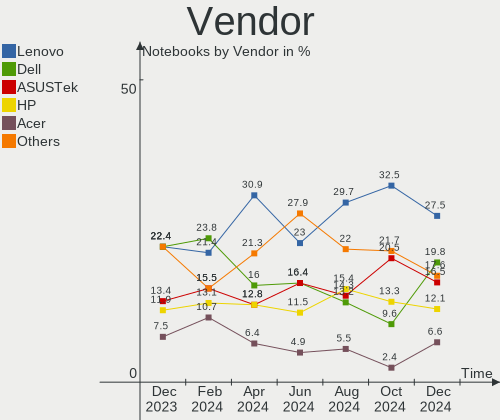
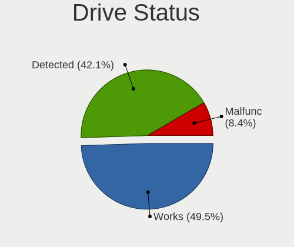
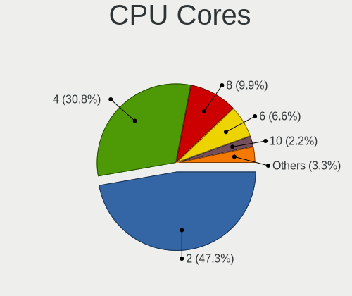
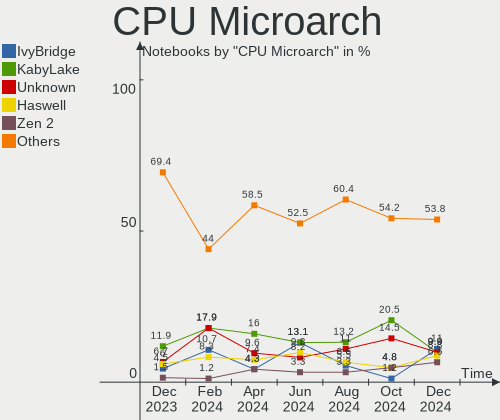
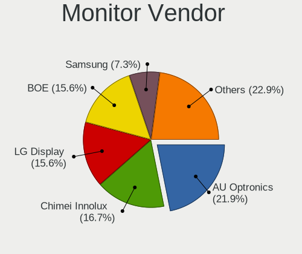
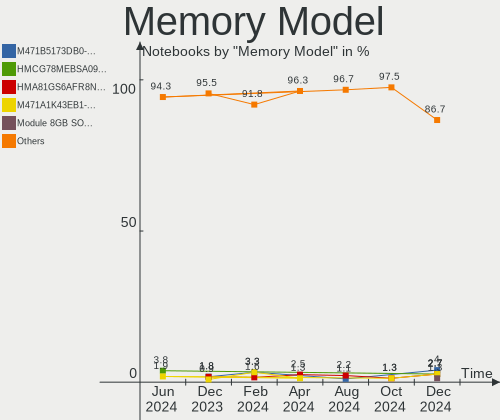
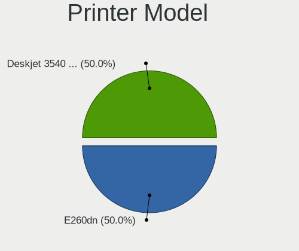
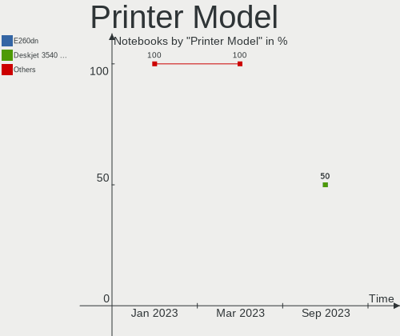
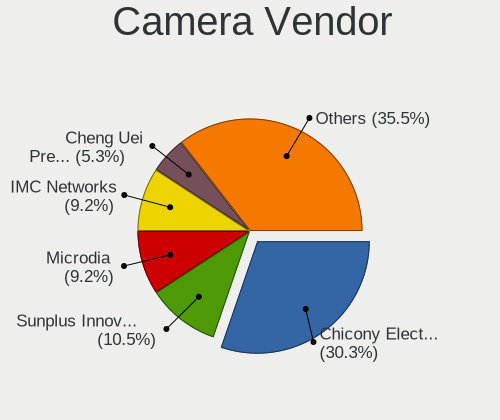

Linux in Poland - Hardware Trends (Notebooks)
---------------------------------------------

A project to identify most popular hardware characteristics and track their change
over time based on data collected by Linux users at https://Linux-Hardware.org.

Anyone can contribute to this report by the [hw-probe](https://github.com/linuxhw/hw-probe) tool:

    sudo -E hw-probe -all -upload

Period: Oct, 2022.

Contents
--------

* [ System ](#system)
  - [ OS                       ](#os)
  - [ OS Family                ](#os-family)
  - [ Kernel                   ](#kernel)
  - [ Kernel Family            ](#kernel-family)
  - [ Kernel Major Ver.        ](#kernel-major-ver)
  - [ Arch                     ](#arch)
  - [ DE                       ](#de)
  - [ Display Server           ](#display-server)
  - [ Display Manager          ](#display-manager)
  - [ OS Lang                  ](#os-lang)
  - [ Boot Mode                ](#boot-mode)
  - [ Filesystem               ](#filesystem)
  - [ Part. scheme             ](#part-scheme)
  - [ Dual Boot with Linux/BSD ](#dual-boot-with-linuxbsd)
  - [ Dual Boot (Win)          ](#dual-boot-win)

* [ Board ](#board)
  - [ Vendor                   ](#vendor)
  - [ Model                    ](#model)
  - [ Model Family             ](#model-family)
  - [ MFG Year                 ](#mfg-year)
  - [ Form Factor              ](#form-factor)
  - [ Secure Boot              ](#secure-boot)
  - [ Coreboot                 ](#coreboot)
  - [ RAM Size                 ](#ram-size)
  - [ RAM Used                 ](#ram-used)
  - [ Total Drives             ](#total-drives)
  - [ Has CD-ROM               ](#has-cd-rom)
  - [ Has Ethernet             ](#has-ethernet)
  - [ Has WiFi                 ](#has-wifi)
  - [ Has Bluetooth            ](#has-bluetooth)

* [ Location ](#location)
  - [ Country                  ](#country)
  - [ City                     ](#city)

* [ Drives ](#drives)
  - [ Drive Vendor             ](#drive-vendor)
  - [ Drive Model              ](#drive-model)
  - [ HDD Vendor               ](#hdd-vendor)
  - [ SSD Vendor               ](#ssd-vendor)
  - [ Drive Kind               ](#drive-kind)
  - [ Drive Connector          ](#drive-connector)
  - [ Drive Size               ](#drive-size)
  - [ Space Total              ](#space-total)
  - [ Space Used               ](#space-used)
  - [ Malfunc. Drives          ](#malfunc-drives)
  - [ Malfunc. Drive Vendor    ](#malfunc-drive-vendor)
  - [ Malfunc. HDD Vendor      ](#malfunc-hdd-vendor)
  - [ Malfunc. Drive Kind      ](#malfunc-drive-kind)
  - [ Failed Drives            ](#failed-drives)
  - [ Failed Drive Vendor      ](#failed-drive-vendor)
  - [ Drive Status             ](#drive-status)

* [ Storage controller ](#storage-controller)
  - [ Storage Vendor           ](#storage-vendor)
  - [ Storage Model            ](#storage-model)
  - [ Storage Kind             ](#storage-kind)

* [ Processor ](#processor)
  - [ CPU Vendor               ](#cpu-vendor)
  - [ CPU Model                ](#cpu-model)
  - [ CPU Model Family         ](#cpu-model-family)
  - [ CPU Cores                ](#cpu-cores)
  - [ CPU Sockets              ](#cpu-sockets)
  - [ CPU Threads              ](#cpu-threads)
  - [ CPU Op-Modes             ](#cpu-op-modes)
  - [ CPU Microcode            ](#cpu-microcode)
  - [ CPU Microarch            ](#cpu-microarch)

* [ Graphics ](#graphics)
  - [ GPU Vendor               ](#gpu-vendor)
  - [ GPU Model                ](#gpu-model)
  - [ GPU Combo                ](#gpu-combo)
  - [ GPU Driver               ](#gpu-driver)
  - [ GPU Memory               ](#gpu-memory)

* [ Monitor ](#monitor)
  - [ Monitor Vendor           ](#monitor-vendor)
  - [ Monitor Model            ](#monitor-model)
  - [ Monitor Resolution       ](#monitor-resolution)
  - [ Monitor Diagonal         ](#monitor-diagonal)
  - [ Monitor Width            ](#monitor-width)
  - [ Aspect Ratio             ](#aspect-ratio)
  - [ Monitor Area             ](#monitor-area)
  - [ Pixel Density            ](#pixel-density)
  - [ Multiple Monitors        ](#multiple-monitors)

* [ Network ](#network)
  - [ Net Controller Vendor    ](#net-controller-vendor)
  - [ Net Controller Model     ](#net-controller-model)
  - [ Wireless Vendor          ](#wireless-vendor)
  - [ Wireless Model           ](#wireless-model)
  - [ Ethernet Vendor          ](#ethernet-vendor)
  - [ Ethernet Model           ](#ethernet-model)
  - [ Net Controller Kind      ](#net-controller-kind)
  - [ Used Controller          ](#used-controller)
  - [ NICs                     ](#nics)
  - [ IPv6                     ](#ipv6)

* [ Bluetooth ](#bluetooth)
  - [ Bluetooth Vendor         ](#bluetooth-vendor)
  - [ Bluetooth Model          ](#bluetooth-model)

* [ Sound ](#sound)
  - [ Sound Vendor             ](#sound-vendor)
  - [ Sound Model              ](#sound-model)

* [ Memory ](#memory)
  - [ Memory Vendor            ](#memory-vendor)
  - [ Memory Model             ](#memory-model)
  - [ Memory Kind              ](#memory-kind)
  - [ Memory Form Factor       ](#memory-form-factor)
  - [ Memory Size              ](#memory-size)
  - [ Memory Speed             ](#memory-speed)

* [ Printers & scanners ](#printers--scanners)
  - [ Printer Vendor           ](#printer-vendor)
  - [ Printer Model            ](#printer-model)
  - [ Scanner Vendor           ](#scanner-vendor)
  - [ Scanner Model            ](#scanner-model)

* [ Camera ](#camera)
  - [ Camera Vendor            ](#camera-vendor)
  - [ Camera Model             ](#camera-model)

* [ Security ](#security)
  - [ Fingerprint Vendor       ](#fingerprint-vendor)
  - [ Fingerprint Model        ](#fingerprint-model)
  - [ Chipcard Vendor          ](#chipcard-vendor)
  - [ Chipcard Model           ](#chipcard-model)

* [ Unsupported ](#unsupported)
  - [ Unsupported Devices      ](#unsupported-devices)
  - [ Unsupported Device Types ](#unsupported-device-types)

System
------

OS
--

Installed operating systems

| Name                 | Notebooks | Percent |
|----------------------|-----------|---------|
| Ubuntu 22.04         | 18        | 20%     |
| Linux Mint 21        | 7         | 7.78%   |
| Fedora 36            | 6         | 6.67%   |
| Debian 11            | 6         | 6.67%   |
| OpenMandriva 4.3     | 5         | 5.56%   |
| Arch Rolling         | 5         | 5.56%   |
| Ubuntu 20.04         | 4         | 4.44%   |
| OpenMandriva 4.2     | 4         | 4.44%   |
| Ubuntu 22.10         | 3         | 3.33%   |
| Pop!_OS 22.04        | 3         | 3.33%   |
| Nobara 36            | 3         | 3.33%   |
| Kubuntu 22.04        | 3         | 3.33%   |
| Zorin 16             | 2         | 2.22%   |
| Manjaro 22.0.0       | 2         | 2.22%   |
| KDE neon 20.04       | 2         | 2.22%   |
| ArcoLinux Rolling    | 2         | 2.22%   |
| Ubuntu MATE 22.04    | 1         | 1.11%   |
| SteamOS 3.3.1        | 1         | 1.11%   |
| ROSA 12.2            | 1         | 1.11%   |
| risiOS 36            | 1         | 1.11%   |
| RHEL 8               | 1         | 1.11%   |
| Oracle Linux 9.0     | 1         | 1.11%   |
| OpenMandriva 4.90    | 1         | 1.11%   |
| MX 21                | 1         | 1.11%   |
| Manjaro              | 1         | 1.11%   |
| Lubuntu 22.04        | 1         | 1.11%   |
| Linux Mint 20.3      | 1         | 1.11%   |
| Garuda Linux Rolling | 1         | 1.11%   |
| EuroLinux 9.0        | 1         | 1.11%   |
| EuroLinux 8.6        | 1         | 1.11%   |
| Debian 11-updates    | 1         | 1.11%   |

OS Family
---------

OS without a version

| Name         | Notebooks | Percent |
|--------------|-----------|---------|
| Ubuntu       | 25        | 27.78%  |
| OpenMandriva | 10        | 11.11%  |
| Linux Mint   | 8         | 8.89%   |
| Debian       | 7         | 7.78%   |
| Fedora       | 6         | 6.67%   |
| Arch         | 5         | 5.56%   |
| Pop!_OS      | 3         | 3.33%   |
| Nobara       | 3         | 3.33%   |
| Manjaro      | 3         | 3.33%   |
| Kubuntu      | 3         | 3.33%   |
| Zorin        | 2         | 2.22%   |
| KDE neon     | 2         | 2.22%   |
| EuroLinux    | 2         | 2.22%   |
| ArcoLinux    | 2         | 2.22%   |
| Ubuntu MATE  | 1         | 1.11%   |
| SteamOS      | 1         | 1.11%   |
| ROSA         | 1         | 1.11%   |
| risiOS       | 1         | 1.11%   |
| RHEL         | 1         | 1.11%   |
| Oracle Linux | 1         | 1.11%   |
| MX           | 1         | 1.11%   |
| Lubuntu      | 1         | 1.11%   |
| Garuda Linux | 1         | 1.11%   |

Kernel
------

Version of the Linux kernel

| Version                                        | Notebooks | Percent |
|------------------------------------------------|-----------|---------|
| 5.15.0-52-generic                              | 12        | 13.33%  |
| 5.15.0-50-generic                              | 9         | 10%     |
| 5.15.0-48-generic                              | 9         | 10%     |
| 5.16.7-desktop-1omv4003                        | 5         | 5.56%   |
| 6.0.2-arch1-1                                  | 4         | 4.44%   |
| 5.10.14-desktop-1omv4002                       | 4         | 4.44%   |
| 5.19.16-200.fc36.x86_64                        | 3         | 3.33%   |
| 5.19.14-200.fc36.x86_64                        | 3         | 3.33%   |
| 5.19.0-23-generic                              | 3         | 3.33%   |
| 5.10.0-18-amd64                                | 3         | 3.33%   |
| 5.4.0-131-generic                              | 2         | 2.22%   |
| 5.19.14-201.fsync.fc36.x86_64                  | 2         | 2.22%   |
| 5.19.0-76051900-generic                        | 2         | 2.22%   |
| 5.15.0-43-generic                              | 2         | 2.22%   |
| 5.10.0-19-amd64                                | 2         | 2.22%   |
| 6.0.2-x64v1-xanmod1-1                          | 1         | 1.11%   |
| 6.0.2-76060002-generic                         | 1         | 1.11%   |
| 6.0.1-arch1-1                                  | 1         | 1.11%   |
| 6.0.1-060001-generic                           | 1         | 1.11%   |
| 6.0.0                                          | 1         | 1.11%   |
| 5.19.8.xm1-1.klp-xanmod-rosa2021.1-x86_64      | 1         | 1.11%   |
| 5.19.16-2-MANJARO                              | 1         | 1.11%   |
| 5.19.14-lqx1-2-lqx                             | 1         | 1.11%   |
| 5.19.14-051914-generic                         | 1         | 1.11%   |
| 5.19.13-arch1-1                                | 1         | 1.11%   |
| 5.19.12-arch1-1                                | 1         | 1.11%   |
| 5.19.12-201.fsync.fc36.x86_64                  | 1         | 1.11%   |
| 5.19.12-200.fc36.x86_64                        | 1         | 1.11%   |
| 5.19.11-1.el8.elrepo.x86_64                    | 1         | 1.11%   |
| 5.18.12-desktop-3omv4090                       | 1         | 1.11%   |
| 5.18.0-0.deb11.4-amd64                         | 1         | 1.11%   |
| 5.17.0-3mx-amd64                               | 1         | 1.11%   |
| 5.15.74-3-MANJARO                              | 1         | 1.11%   |
| 5.15.0-53-generic                              | 1         | 1.11%   |
| 5.15.0-46-generic                              | 1         | 1.11%   |
| 5.15.0-41-generic                              | 1         | 1.11%   |
| 5.15.0-2.52.3.el9uek.x86_64                    | 1         | 1.11%   |
| 5.14.0-70.26.1.el9_0.x86_64                    | 1         | 1.11%   |
| 5.13.0-valve21.1-1-neptune-02211-gc54cda5a36f3 | 1         | 1.11%   |
| 4.18.0-372.26.1.el8_6.x86_64                   | 1         | 1.11%   |

Kernel Family
-------------

Linux kernel without a distro release

| Version | Notebooks | Percent |
|---------|-----------|---------|
| 5.15.0  | 36        | 40%     |
| 5.19.14 | 7         | 7.78%   |
| 6.0.2   | 6         | 6.67%   |
| 5.19.0  | 5         | 5.56%   |
| 5.16.7  | 5         | 5.56%   |
| 5.10.0  | 5         | 5.56%   |
| 5.19.16 | 4         | 4.44%   |
| 5.10.14 | 4         | 4.44%   |
| 5.19.12 | 3         | 3.33%   |
| 6.0.1   | 2         | 2.22%   |
| 5.4.0   | 2         | 2.22%   |
| 6.0.0   | 1         | 1.11%   |
| 5.19.8  | 1         | 1.11%   |
| 5.19.13 | 1         | 1.11%   |
| 5.19.11 | 1         | 1.11%   |
| 5.18.12 | 1         | 1.11%   |
| 5.18.0  | 1         | 1.11%   |
| 5.17.0  | 1         | 1.11%   |
| 5.15.74 | 1         | 1.11%   |
| 5.14.0  | 1         | 1.11%   |
| 5.13.0  | 1         | 1.11%   |
| 4.18.0  | 1         | 1.11%   |

Kernel Major Ver.
-----------------

Linux kernel major version

| Version | Notebooks | Percent |
|---------|-----------|---------|
| 5.15    | 37        | 41.11%  |
| 5.19    | 22        | 24.44%  |
| 6.0     | 9         | 10%     |
| 5.10    | 9         | 10%     |
| 5.16    | 5         | 5.56%   |
| 5.4     | 2         | 2.22%   |
| 5.18    | 2         | 2.22%   |
| 5.17    | 1         | 1.11%   |
| 5.14    | 1         | 1.11%   |
| 5.13    | 1         | 1.11%   |
| 4.18    | 1         | 1.11%   |

Arch
----

OS architecture (x86_64, i586, etc.)

| Name   | Notebooks | Percent |
|--------|-----------|---------|
| x86_64 | 90        | 100%    |

DE
--

Desktop Environment

| Name       | Notebooks | Percent |
|------------|-----------|---------|
| GNOME      | 43        | 47.78%  |
| KDE5       | 27        | 30%     |
| X-Cinnamon | 7         | 7.78%   |
| XFCE       | 4         | 4.44%   |
| Unknown    | 2         | 2.22%   |
| trinity    | 1         | 1.11%   |
| sway       | 1         | 1.11%   |
| MATE       | 1         | 1.11%   |
| LXQt       | 1         | 1.11%   |
| LXDE       | 1         | 1.11%   |
| i3         | 1         | 1.11%   |
| Deepin     | 1         | 1.11%   |

Display Server
--------------

X11 or Wayland

| Name    | Notebooks | Percent |
|---------|-----------|---------|
| X11     | 52        | 57.78%  |
| Wayland | 36        | 40%     |
| Tty     | 1         | 1.11%   |
| Unknown | 1         | 1.11%   |

Display Manager
---------------

SDDM, LightDM, etc.

| Name    | Notebooks | Percent |
|---------|-----------|---------|
| Unknown | 25        | 27.78%  |
| SDDM    | 22        | 24.44%  |
| GDM3    | 22        | 24.44%  |
| LightDM | 11        | 12.22%  |
| GDM     | 9         | 10%     |
| LXDM    | 1         | 1.11%   |

OS Lang
-------

Language

| Lang    | Notebooks | Percent |
|---------|-----------|---------|
| pl_PL   | 48        | 53.33%  |
| en_US   | 39        | 43.33%  |
| szl_PL  | 1         | 1.11%   |
| C       | 1         | 1.11%   |
| Unknown | 1         | 1.11%   |

Boot Mode
---------

EFI or BIOS

| Mode | Notebooks | Percent |
|------|-----------|---------|
| EFI  | 48        | 53.33%  |
| BIOS | 42        | 46.67%  |

Filesystem
----------

Type of filesystem

| Type    | Notebooks | Percent |
|---------|-----------|---------|
| Ext4    | 65        | 72.22%  |
| Btrfs   | 13        | 14.44%  |
| Overlay | 6         | 6.67%   |
| Xfs     | 4         | 4.44%   |
| Zfs     | 1         | 1.11%   |
| F2fs    | 1         | 1.11%   |

Part. scheme
------------

Scheme of partitioning

| Type    | Notebooks | Percent |
|---------|-----------|---------|
| GPT     | 47        | 52.22%  |
| Unknown | 23        | 25.56%  |
| MBR     | 20        | 22.22%  |

Dual Boot with Linux/BSD
------------------------

Hosting more than one Linux/BSD

| Dual boot | Notebooks | Percent |
|-----------|-----------|---------|
| No        | 80        | 88.89%  |
| Yes       | 10        | 11.11%  |

Dual Boot (Win)
---------------

Hosting Linux and Windows

| Dual boot | Notebooks | Percent |
|-----------|-----------|---------|
| No        | 56        | 62.22%  |
| Yes       | 34        | 37.78%  |

Board
-----

Vendor
------

Motherboard manufacturer

| Name             | Notebooks | Percent |
|------------------|-----------|---------|
| Lenovo           | 30        | 33.33%  |
| Dell             | 21        | 23.33%  |
| ASUSTek Computer | 12        | 13.33%  |
| Hewlett-Packard  | 9         | 10%     |
| Acer             | 7         | 7.78%   |
| MSI              | 2         | 2.22%   |
| HUAWEI           | 2         | 2.22%   |
| Valve            | 1         | 1.11%   |
| Toshiba          | 1         | 1.11%   |
| Kruger&Matz      | 1         | 1.11%   |
| Kiano            | 1         | 1.11%   |
| Gateway          | 1         | 1.11%   |
| Fujitsu          | 1         | 1.11%   |
| Dynabook         | 1         | 1.11%   |

Model
-----

Motherboard model

| Name                                   | Notebooks | Percent |
|----------------------------------------|-----------|---------|
| Dell Inspiron 3451                     | 4         | 4.44%   |
| Lenovo ThinkPad SL500 27463ZG          | 3         | 3.33%   |
| Valve Jupiter                          | 1         | 1.11%   |
| Toshiba Satellite L40                  | 1         | 1.11%   |
| MSI MS-N014                            | 1         | 1.11%   |
| MSI Creator Z17 A12UHST                | 1         | 1.11%   |
| Lenovo Z51-70 80K6                     | 1         | 1.11%   |
| Lenovo Yoga Slim 7 Pro 14ACH5 OD 82NK  | 1         | 1.11%   |
| Lenovo ThinkPad Z16 Gen 1 21D40016PB   | 1         | 1.11%   |
| Lenovo ThinkPad X200s 7470A98          | 1         | 1.11%   |
| Lenovo ThinkPad T530 24297TG           | 1         | 1.11%   |
| Lenovo ThinkPad T490s 20NX002QUK       | 1         | 1.11%   |
| Lenovo ThinkPad T490 20N3S9DJ00        | 1         | 1.11%   |
| Lenovo ThinkPad T480 20L50007PB        | 1         | 1.11%   |
| Lenovo ThinkPad T470p 20J7S0QK00       | 1         | 1.11%   |
| Lenovo ThinkPad T460p 20FW002CPB       | 1         | 1.11%   |
| Lenovo ThinkPad T450s 20BWS0DD00       | 1         | 1.11%   |
| Lenovo ThinkPad T430 23498M7           | 1         | 1.11%   |
| Lenovo ThinkPad T14 Gen 1 20S1S38414   | 1         | 1.11%   |
| Lenovo ThinkPad R500 2716W2K           | 1         | 1.11%   |
| Lenovo ThinkPad P50 20EQS5MP00         | 1         | 1.11%   |
| Lenovo ThinkPad P14s Gen 2i 20VX007NUS | 1         | 1.11%   |
| Lenovo Legion S7 15ACH6 82K8           | 1         | 1.11%   |
| Lenovo Legion 5 17ACH6 82K0            | 1         | 1.11%   |
| Lenovo Legion 5 15ACH6 82JW            | 1         | 1.11%   |
| Lenovo IdeaPad Y700-15ISK 80NV         | 1         | 1.11%   |
| Lenovo IdeaPad Gaming 3 15ACH6 82K2    | 1         | 1.11%   |
| Lenovo IdeaPad 700-15ISK 80RU          | 1         | 1.11%   |
| Lenovo IdeaPad 330-15IKB 81DE          | 1         | 1.11%   |
| Lenovo IdeaPad 3 15ITL6 82H8           | 1         | 1.11%   |
| Lenovo IdeaPad 3 15ADA05 81W1          | 1         | 1.11%   |
| Lenovo G580 20150                      | 1         | 1.11%   |
| Lenovo G500s 20245                     | 1         | 1.11%   |
| Kruger&Matz KM1406                     | 1         | 1.11%   |
| Kiano SlimNote 14.1                    | 1         | 1.11%   |
| HUAWEI KLVD-WXX9                       | 1         | 1.11%   |
| HUAWEI HKD-WXX                         | 1         | 1.11%   |
| HP ZBook 17 G6                         | 1         | 1.11%   |
| HP ProBook 6540b                       | 1         | 1.11%   |
| HP ProBook 640 G2                      | 1         | 1.11%   |

Model Family
------------

Motherboard model prefix

| Name               | Notebooks | Percent |
|--------------------|-----------|---------|
| Lenovo ThinkPad    | 17        | 18.89%  |
| Dell Inspiron      | 8         | 8.89%   |
| Dell Latitude      | 7         | 7.78%   |
| Lenovo IdeaPad     | 6         | 6.67%   |
| Acer Aspire        | 6         | 6.67%   |
| Lenovo Legion      | 3         | 3.33%   |
| HP EliteBook       | 3         | 3.33%   |
| HP ProBook         | 2         | 2.22%   |
| Dell XPS           | 2         | 2.22%   |
| Dell Vostro        | 2         | 2.22%   |
| Dell Precision     | 2         | 2.22%   |
| ASUS ROG           | 2         | 2.22%   |
| Valve Jupiter      | 1         | 1.11%   |
| Toshiba Satellite  | 1         | 1.11%   |
| MSI MS-N014        | 1         | 1.11%   |
| MSI Creator        | 1         | 1.11%   |
| Lenovo Z51-70      | 1         | 1.11%   |
| Lenovo Yoga        | 1         | 1.11%   |
| Lenovo G580        | 1         | 1.11%   |
| Lenovo G500s       | 1         | 1.11%   |
| Kruger&Matz KM1406 | 1         | 1.11%   |
| Kiano SlimNote     | 1         | 1.11%   |
| HUAWEI KLVD-WXX9   | 1         | 1.11%   |
| HUAWEI HKD-WXX     | 1         | 1.11%   |
| HP ZBook           | 1         | 1.11%   |
| HP Pavilion        | 1         | 1.11%   |
| HP ENVY            | 1         | 1.11%   |
| HP 250             | 1         | 1.11%   |
| Gateway P-7805u    | 1         | 1.11%   |
| Fujitsu LIFEBOOK   | 1         | 1.11%   |
| Dynabook PORTEGE   | 1         | 1.11%   |
| ASUS X75VC         | 1         | 1.11%   |
| ASUS X705UDR       | 1         | 1.11%   |
| ASUS X550VB        | 1         | 1.11%   |
| ASUS X550LN        | 1         | 1.11%   |
| ASUS X550CC        | 1         | 1.11%   |
| ASUS X540SA        | 1         | 1.11%   |
| ASUS VivoBook      | 1         | 1.11%   |
| ASUS GL503VD       | 1         | 1.11%   |
| ASUS G750JW        | 1         | 1.11%   |

MFG Year
--------

Motherboard manufacture year

| Year | Notebooks | Percent |
|------|-----------|---------|
| 2021 | 16        | 17.78%  |
| 2014 | 9         | 10%     |
| 2019 | 7         | 7.78%   |
| 2015 | 7         | 7.78%   |
| 2022 | 6         | 6.67%   |
| 2020 | 6         | 6.67%   |
| 2018 | 6         | 6.67%   |
| 2012 | 6         | 6.67%   |
| 2017 | 5         | 5.56%   |
| 2010 | 5         | 5.56%   |
| 2008 | 5         | 5.56%   |
| 2016 | 4         | 4.44%   |
| 2013 | 4         | 4.44%   |
| 2011 | 2         | 2.22%   |
| 2009 | 1         | 1.11%   |
| 2007 | 1         | 1.11%   |

Form Factor
-----------

Physical design of the computer

| Name     | Notebooks | Percent |
|----------|-----------|---------|
| Notebook | 90        | 100%    |

Secure Boot
-----------

Enabled or disabled

| State    | Notebooks | Percent |
|----------|-----------|---------|
| Disabled | 76        | 84.44%  |
| Enabled  | 14        | 15.56%  |

Coreboot
--------

Have coreboot on board

| Used | Notebooks | Percent |
|------|-----------|---------|
| No   | 90        | 100%    |

RAM Size
--------

Total RAM memory

| Size in GB  | Notebooks | Percent |
|-------------|-----------|---------|
| 4.01-8.0    | 19        | 21.11%  |
| 8.01-16.0   | 19        | 21.11%  |
| 16.01-24.0  | 16        | 17.78%  |
| 3.01-4.0    | 14        | 15.56%  |
| 32.01-64.0  | 11        | 12.22%  |
| 1.01-2.0    | 4         | 4.44%   |
| 24.01-32.0  | 2         | 2.22%   |
| 2.01-3.0    | 2         | 2.22%   |
| 64.01-256.0 | 2         | 2.22%   |
| 0.51-1.0    | 1         | 1.11%   |

RAM Used
--------

Used RAM memory

| Used GB    | Notebooks | Percent |
|------------|-----------|---------|
| 2.01-3.0   | 24        | 26.67%  |
| 1.01-2.0   | 24        | 26.67%  |
| 4.01-8.0   | 19        | 21.11%  |
| 3.01-4.0   | 8         | 8.89%   |
| 8.01-16.0  | 8         | 8.89%   |
| 0.51-1.0   | 4         | 4.44%   |
| 24.01-32.0 | 1         | 1.11%   |
| 16.01-24.0 | 1         | 1.11%   |
| 0.01-0.5   | 1         | 1.11%   |

Total Drives
------------

Number of drives on board

| Drives | Notebooks | Percent |
|--------|-----------|---------|
| 1      | 64        | 71.11%  |
| 2      | 23        | 25.56%  |
| 3      | 3         | 3.33%   |

Has CD-ROM
----------

Has CD-ROM on board

| Presented | Notebooks | Percent |
|-----------|-----------|---------|
| No        | 70        | 77.78%  |
| Yes       | 20        | 22.22%  |

Has Ethernet
------------

Has Ethernet on board

| Presented | Notebooks | Percent |
|-----------|-----------|---------|
| Yes       | 72        | 80%     |
| No        | 18        | 20%     |

Has WiFi
--------

Has WiFi module

| Presented | Notebooks | Percent |
|-----------|-----------|---------|
| Yes       | 87        | 96.67%  |
| No        | 3         | 3.33%   |

Has Bluetooth
-------------

Has Bluetooth module

| Presented | Notebooks | Percent |
|-----------|-----------|---------|
| Yes       | 69        | 76.67%  |
| No        | 21        | 23.33%  |

Location
--------

Country
-------

Geographic location (country)

| Country | Notebooks | Percent |
|---------|-----------|---------|
| Poland  | 90        | 100%    |

City
----

Geographic location (city)

| City                   | Notebooks | Percent |
|------------------------|-----------|---------|
| Warsaw                 | 19        | 21.11%  |
| Krakow                 | 9         | 10%     |
| Wroclaw                | 6         | 6.67%   |
| Gdansk                 | 3         | 3.33%   |
| Tychy                  | 2         | 2.22%   |
| Skawina                | 2         | 2.22%   |
| Lublin                 | 2         | 2.22%   |
| Lodz                   | 2         | 2.22%   |
| Katowice               | 2         | 2.22%   |
| Biale Blota            | 2         | 2.22%   |
| Żyrardów             | 1         | 1.11%   |
| Zagorze                | 1         | 1.11%   |
| Zabrze                 | 1         | 1.11%   |
| Wrzesnia               | 1         | 1.11%   |
| Wołomin               | 1         | 1.11%   |
| Wozniki                | 1         | 1.11%   |
| Wabrzezno              | 1         | 1.11%   |
| Torun                  | 1         | 1.11%   |
| Tczew                  | 1         | 1.11%   |
| Szprotawa              | 1         | 1.11%   |
| Siemianowice Śląskie | 1         | 1.11%   |
| Rzeszów               | 1         | 1.11%   |
| Ruda Śląska          | 1         | 1.11%   |
| Płock                 | 1         | 1.11%   |
| Pruszków              | 1         | 1.11%   |
| Poznan                 | 1         | 1.11%   |
| Ozarow Mazowiecki      | 1         | 1.11%   |
| Otomino                | 1         | 1.11%   |
| Olesnica               | 1         | 1.11%   |
| Olawa                  | 1         | 1.11%   |
| Mogilno                | 1         | 1.11%   |
| Malbork                | 1         | 1.11%   |
| Lyczyn                 | 1         | 1.11%   |
| Lowicz                 | 1         | 1.11%   |
| Limanowa               | 1         | 1.11%   |
| Kowary                 | 1         | 1.11%   |
| Kiezliny               | 1         | 1.11%   |
| Kalisz                 | 1         | 1.11%   |
| Jedlicze               | 1         | 1.11%   |
| Jawor                  | 1         | 1.11%   |

Drives
------

Drive Vendor
------------

Hard drive vendors

| Vendor                       | Notebooks | Drives | Percent |
|------------------------------|-----------|--------|---------|
| Samsung Electronics          | 24        | 27     | 21.24%  |
| Seagate                      | 10        | 10     | 8.85%   |
| WDC                          | 9         | 10     | 7.96%   |
| Unknown                      | 9         | 9      | 7.96%   |
| Toshiba                      | 8         | 8      | 7.08%   |
| SanDisk                      | 7         | 7      | 6.19%   |
| Crucial                      | 7         | 7      | 6.19%   |
| Kingston                     | 6         | 6      | 5.31%   |
| GOODRAM                      | 6         | 6      | 5.31%   |
| Micron Technology            | 3         | 3      | 2.65%   |
| Intel                        | 3         | 3      | 2.65%   |
| A-DATA Technology            | 3         | 3      | 2.65%   |
| SK hynix                     | 2         | 2      | 1.77%   |
| Phison Electronics           | 2         | 2      | 1.77%   |
| Phison                       | 2         | 2      | 1.77%   |
| Hitachi                      | 2         | 2      | 1.77%   |
| HGST                         | 2         | 2      | 1.77%   |
| Shenzhen Longsys Electronics | 1         | 1      | 0.88%   |
| Realtek Semiconductor        | 1         | 1      | 0.88%   |
| PNY                          | 1         | 1      | 0.88%   |
| Patriot                      | 1         | 1      | 0.88%   |
| LITEONIT                     | 1         | 1      | 0.88%   |
| KIOXIA-EXCERIA               | 1         | 1      | 0.88%   |
| JMicron Technology           | 1         | 1      | 0.88%   |
| ADATA Technology             | 1         | 1      | 0.88%   |

Drive Model
-----------

Hard drive models

| Model                                          | Notebooks | Percent |
|------------------------------------------------|-----------|---------|
| Seagate ST500LT012-1DG142 500GB                | 4         | 3.45%   |
| Kingston SA400S37240G 240GB SSD                | 3         | 2.59%   |
| GOODRAM SSDPR-CX400-256-G2 256GB               | 3         | 2.59%   |
| WDC WD10SPCX-24HWST1 1TB                       | 2         | 1.72%   |
| Unknown SD64G  64GB                            | 2         | 1.72%   |
| Unknown MMC Card  64GB                         | 2         | 1.72%   |
| Unknown MMC Card  32GB                         | 2         | 1.72%   |
| Toshiba XG6 NVMe SSD Controller 512GB          | 2         | 1.72%   |
| Toshiba MQ04ABF100 1TB                         | 2         | 1.72%   |
| Sandisk WD Black SN750 / PC SN730 NVMe SSD 1TB | 2         | 1.72%   |
| Samsung SSD 980 1TB                            | 2         | 1.72%   |
| Samsung SSD 860 EVO 500GB                      | 2         | 1.72%   |
| Phison PS5013 E13 NVMe Controller 256GB        | 2         | 1.72%   |
| A-DATA SP550 240GB SSD                         | 2         | 1.72%   |
| WDC WDS240G2G0B-00EPW0 240GB SSD               | 1         | 0.86%   |
| WDC WDS100T2B0C-00PXH0 1TB                     | 1         | 0.86%   |
| WDC WD7500BPKT-22PK4T0 752GB                   | 1         | 0.86%   |
| WDC WD3200BEKT-00F3T0 320GB                    | 1         | 0.86%   |
| WDC WD2500BEVT-22A23T0 250GB                   | 1         | 0.86%   |
| WDC WD10SPZX-21Z10T0 1TB                       | 1         | 0.86%   |
| WDC PC SN730 SDBQNTY-512G-1001 512GB           | 1         | 0.86%   |
| WDC PC SN730 NVMe 1024GB                       | 1         | 0.86%   |
| Unknown xD/SD/M.S.                             | 1         | 0.86%   |
| Unknown NVMe SSD Drive 512GB                   | 1         | 0.86%   |
| Unknown 00000  4GB                             | 1         | 0.86%   |
| Toshiba MQ01ABD075 752GB                       | 1         | 0.86%   |
| Toshiba MK3265GSX 320GB                        | 1         | 0.86%   |
| Toshiba KXG5AZNV512G 512GB                     | 1         | 0.86%   |
| Toshiba KSG60ZMV256G M.2 2280 256GB SSD        | 1         | 0.86%   |
| SK hynix SKHynix_HFS001TDE9X084N 1TB           | 1         | 0.86%   |
| SK hynix SKHynix_HFM512GDHTNI-87A0B 512GB      | 1         | 0.86%   |
| Shenzhen Longsys TEAM TM8FPD512G 512GB         | 1         | 0.86%   |
| Seagate ST9320423AS 320GB                      | 1         | 0.86%   |
| Seagate ST500LT012-9WS142 500GB                | 1         | 0.86%   |
| Seagate ST1000LX015-1U7172 1TB                 | 1         | 0.86%   |
| Seagate ST1000LM048-2E7172 1TB                 | 1         | 0.86%   |
| Seagate ST1000LM024 HN-M101MBB 1TB             | 1         | 0.86%   |
| Seagate ST1000LM014-1EJ164 1TB                 | 1         | 0.86%   |
| Sandisk WD Blue SN570 1TB                      | 1         | 0.86%   |
| Sandisk WD Blue SN550 NVMe SSD 1TB             | 1         | 0.86%   |

HDD Vendor
----------

Hard disk drive vendors

| Vendor              | Notebooks | Drives | Percent |
|---------------------|-----------|--------|---------|
| Seagate             | 10        | 10     | 40%     |
| WDC                 | 6         | 6      | 24%     |
| Toshiba             | 4         | 4      | 16%     |
| Hitachi             | 2         | 2      | 8%      |
| HGST                | 2         | 2      | 8%      |
| Samsung Electronics | 1         | 1      | 4%      |

SSD Vendor
----------

Solid state drive vendors

| Vendor              | Notebooks | Drives | Percent |
|---------------------|-----------|--------|---------|
| Crucial             | 7         | 7      | 19.44%  |
| Samsung Electronics | 6         | 8      | 16.67%  |
| GOODRAM             | 6         | 6      | 16.67%  |
| Kingston            | 5         | 5      | 13.89%  |
| A-DATA Technology   | 3         | 3      | 8.33%   |
| SanDisk             | 2         | 2      | 5.56%   |
| WDC                 | 1         | 1      | 2.78%   |
| Toshiba             | 1         | 1      | 2.78%   |
| PNY                 | 1         | 1      | 2.78%   |
| Patriot             | 1         | 1      | 2.78%   |
| LITEONIT            | 1         | 1      | 2.78%   |
| KIOXIA-EXCERIA      | 1         | 1      | 2.78%   |
| Intel               | 1         | 1      | 2.78%   |

Drive Kind
----------

HDD or SSD

| Kind    | Notebooks | Drives | Percent |
|---------|-----------|--------|---------|
| NVMe    | 41        | 46     | 38.32%  |
| SSD     | 34        | 38     | 31.78%  |
| HDD     | 24        | 25     | 22.43%  |
| MMC     | 7         | 7      | 6.54%   |
| Unknown | 1         | 1      | 0.93%   |

Drive Connector
---------------

SATA, SAS, NVMe, etc.

| Type | Notebooks | Drives | Percent |
|------|-----------|--------|---------|
| SATA | 52        | 63     | 50.98%  |
| NVMe | 41        | 45     | 40.2%   |
| MMC  | 7         | 7      | 6.86%   |
| SAS  | 2         | 2      | 1.96%   |

Drive Size
----------

Size of hard drive

| Size in TB | Notebooks | Drives | Percent |
|------------|-----------|--------|---------|
| 0.01-0.5   | 40        | 46     | 70.18%  |
| 0.51-1.0   | 16        | 16     | 28.07%  |
| 1.01-2.0   | 1         | 1      | 1.75%   |

Space Total
-----------

Amount of disk space available on the file system

| Size in GB | Notebooks | Percent |
|------------|-----------|---------|
| 101-250    | 25        | 27.78%  |
| 251-500    | 22        | 24.44%  |
| 501-1000   | 13        | 14.44%  |
| 1-20       | 11        | 12.22%  |
| 1001-2000  | 6         | 6.67%   |
| 51-100     | 6         | 6.67%   |
| Unknown    | 3         | 3.33%   |
| 21-50      | 2         | 2.22%   |
| 2001-3000  | 2         | 2.22%   |

Space Used
----------

Amount of used disk space

| Used GB   | Notebooks | Percent |
|-----------|-----------|---------|
| 1-20      | 37        | 41.11%  |
| 101-250   | 17        | 18.89%  |
| 21-50     | 14        | 15.56%  |
| 51-100    | 9         | 10%     |
| 501-1000  | 6         | 6.67%   |
| 251-500   | 3         | 3.33%   |
| Unknown   | 3         | 3.33%   |
| 1001-2000 | 1         | 1.11%   |

Malfunc. Drives
---------------

Drive models with a malfunction

| Model                           | Notebooks | Drives | Percent |
|---------------------------------|-----------|--------|---------|
| WDC WD7500BPKT-22PK4T0 752GB    | 1         | 1      | 16.67%  |
| Seagate ST9320423AS 320GB       | 1         | 1      | 16.67%  |
| Seagate ST500LT012-9WS142 500GB | 1         | 1      | 16.67%  |
| Seagate ST1000LM014-1EJ164 1TB  | 1         | 1      | 16.67%  |
| HGST HTS721010A9E630 1TB        | 1         | 1      | 16.67%  |
| HGST HTS545050A7E680 500GB      | 1         | 1      | 16.67%  |

Malfunc. Drive Vendor
---------------------

Vendors of faulty drives

| Vendor  | Notebooks | Drives | Percent |
|---------|-----------|--------|---------|
| Seagate | 3         | 3      | 50%     |
| HGST    | 2         | 2      | 33.33%  |
| WDC     | 1         | 1      | 16.67%  |

Malfunc. HDD Vendor
-------------------

Vendors of faulty HDD drives

| Vendor  | Notebooks | Drives | Percent |
|---------|-----------|--------|---------|
| Seagate | 3         | 3      | 50%     |
| HGST    | 2         | 2      | 33.33%  |
| WDC     | 1         | 1      | 16.67%  |

Malfunc. Drive Kind
-------------------

Kinds of faulty drives

| Kind | Notebooks | Drives | Percent |
|------|-----------|--------|---------|
| HDD  | 5         | 6      | 100%    |

Failed Drives
-------------

Failed drive models

Zero info for selected period =(

Failed Drive Vendor
-------------------

Failed drive vendors

Zero info for selected period =(

Drive Status
------------

Number of failed and malfunc. drives

| Status   | Notebooks | Drives | Percent |
|----------|-----------|--------|---------|
| Detected | 46        | 57     | 47.42%  |
| Works    | 46        | 54     | 47.42%  |
| Malfunc  | 5         | 6      | 5.15%   |

Storage controller
------------------

Storage Vendor
--------------

Storage controller vendors

| Vendor                       | Notebooks | Percent |
|------------------------------|-----------|---------|
| Intel                        | 60        | 55.56%  |
| Samsung Electronics          | 17        | 15.74%  |
| SanDisk                      | 7         | 6.48%   |
| AMD                          | 7         | 6.48%   |
| Phison Electronics           | 4         | 3.7%    |
| Toshiba America Info Systems | 3         | 2.78%   |
| Micron Technology            | 3         | 2.78%   |
| SK hynix                     | 2         | 1.85%   |
| Shenzhen Longsys Electronics | 1         | 0.93%   |
| Realtek Semiconductor        | 1         | 0.93%   |
| Kingston Technology Company  | 1         | 0.93%   |
| ADATA Technology             | 1         | 0.93%   |
| Unknown                      | 1         | 0.93%   |

Storage Model
-------------

Storage controller models

| Model                                                                            | Notebooks | Percent |
|----------------------------------------------------------------------------------|-----------|---------|
| Samsung NVMe SSD Controller 980                                                  | 7         | 6.03%   |
| Intel 7 Series Chipset Family 6-port SATA Controller [AHCI mode]                 | 7         | 6.03%   |
| Samsung NVMe SSD Controller SM981/PM981/PM983                                    | 6         | 5.17%   |
| Intel Sunrise Point-LP SATA Controller [AHCI mode]                               | 6         | 5.17%   |
| Intel 82801IBM/IEM (ICH9M/ICH9M-E) 4 port SATA Controller [AHCI mode]            | 6         | 5.17%   |
| AMD FCH SATA Controller [AHCI mode]                                              | 6         | 5.17%   |
| Intel Volume Management Device NVMe RAID Controller                              | 5         | 4.31%   |
| Intel Cannon Lake Mobile PCH SATA AHCI Controller                                | 5         | 4.31%   |
| Intel Atom Processor E3800 Series SATA AHCI Controller                           | 5         | 4.31%   |
| SanDisk WD Black SN750 / PC SN730 NVMe SSD                                       | 4         | 3.45%   |
| Samsung NVMe SSD Controller PM9A1/PM9A3/980PRO                                   | 4         | 3.45%   |
| Intel HM170/QM170 Chipset SATA Controller [AHCI Mode]                            | 4         | 3.45%   |
| Phison PS5013 E13 NVMe Controller                                                | 3         | 2.59%   |
| Micron Non-Volatile memory controller                                            | 3         | 2.59%   |
| Intel Tiger Lake-LP SATA Controller                                              | 3         | 2.59%   |
| Intel Celeron/Pentium Silver Processor SATA Controller                           | 3         | 2.59%   |
| Intel 82801 Mobile SATA Controller [RAID mode]                                   | 3         | 2.59%   |
| Toshiba America Info Systems XG6 NVMe SSD Controller                             | 2         | 1.72%   |
| SanDisk WD Blue SN550 NVMe SSD                                                   | 2         | 1.72%   |
| Intel Wildcat Point-LP SATA Controller [AHCI Mode]                               | 2         | 1.72%   |
| Intel Non-Volatile memory controller                                             | 2         | 1.72%   |
| Intel 8 Series/C220 Series Chipset Family 6-port SATA Controller 1 [AHCI mode]   | 2         | 1.72%   |
| Toshiba America Info Systems Toshiba America Info Non-Volatile memory controller | 1         | 0.86%   |
| SK hynix Gold P31 SSD                                                            | 1         | 0.86%   |
| SK hynix BC511                                                                   | 1         | 0.86%   |
| Shenzhen Longsys Electronics Non-Volatile memory controller                      | 1         | 0.86%   |
| SanDisk WD Blue SN570 NVMe SSD                                                   | 1         | 0.86%   |
| SanDisk WD Black 2018/SN750 / PC SN720 NVMe SSD                                  | 1         | 0.86%   |
| Realtek Realtek Non-Volatile memory controller                                   | 1         | 0.86%   |
| Phison Electronics Non-Volatile memory controller                                | 1         | 0.86%   |
| Kingston Company Company Non-Volatile memory controller                          | 1         | 0.86%   |
| Intel Q170/Q150/B150/H170/H110/Z170/CM236 Chipset SATA Controller [AHCI Mode]    | 1         | 0.86%   |
| Intel NM10/ICH7 Family SATA Controller [AHCI mode]                               | 1         | 0.86%   |
| Intel Atom/Celeron/Pentium Processor x5-E8000/J3xxx/N3xxx Series SATA Controller | 1         | 0.86%   |
| Intel Alder Lake-P SATA AHCI Controller                                          | 1         | 0.86%   |
| Intel 82801IBM/IEM (ICH9M/ICH9M-E) 2 port SATA Controller [IDE mode]             | 1         | 0.86%   |
| Intel 82801HM/HEM (ICH8M/ICH8M-E) SATA Controller [AHCI mode]                    | 1         | 0.86%   |
| Intel 82801HM/HEM (ICH8M/ICH8M-E) IDE Controller                                 | 1         | 0.86%   |
| Intel 8 Series SATA Controller 1 [AHCI mode]                                     | 1         | 0.86%   |
| Intel 7 Series Chipset Family 4-port SATA Controller [IDE mode]                  | 1         | 0.86%   |

Storage Kind
------------

Kind of storage controller (IDE, SATA, NVMe, SAS, ...)

| Kind | Notebooks | Percent |
|------|-----------|---------|
| SATA | 58        | 52.25%  |
| NVMe | 41        | 36.94%  |
| RAID | 8         | 7.21%   |
| IDE  | 4         | 3.6%    |

Processor
---------

CPU Vendor
----------

Processor vendors

| Vendor | Notebooks | Percent |
|--------|-----------|---------|
| Intel  | 74        | 82.22%  |
| AMD    | 16        | 17.78%  |

CPU Model
---------

Processor models

| Model                                       | Notebooks | Percent |
|---------------------------------------------|-----------|---------|
| Intel Core 2 Duo CPU P8400 @ 2.26GHz        | 4         | 4.44%   |
| Intel Celeron CPU N2840 @ 2.16GHz           | 4         | 4.44%   |
| Intel 11th Gen Core i5-1135G7 @ 2.40GHz     | 4         | 4.44%   |
| Intel Core i7-8550U CPU @ 1.80GHz           | 3         | 3.33%   |
| Intel Core i7-8565U CPU @ 1.80GHz           | 2         | 2.22%   |
| Intel Core i7-6700HQ CPU @ 2.60GHz          | 2         | 2.22%   |
| Intel Core i5-7200U CPU @ 2.50GHz           | 2         | 2.22%   |
| Intel Core i5-6300HQ CPU @ 2.30GHz          | 2         | 2.22%   |
| Intel Core i5-3340M CPU @ 2.70GHz           | 2         | 2.22%   |
| Intel Core i5-3230M CPU @ 2.60GHz           | 2         | 2.22%   |
| Intel Celeron N4000 CPU @ 1.10GHz           | 2         | 2.22%   |
| Intel Atom CPU Z3735F @ 1.33GHz             | 2         | 2.22%   |
| AMD Ryzen 9 5900HX with Radeon Graphics     | 2         | 2.22%   |
| AMD Ryzen 7 5800H with Radeon Graphics      | 2         | 2.22%   |
| Intel Pentium Silver N5000 CPU @ 1.10GHz    | 1         | 1.11%   |
| Intel Pentium Dual-Core CPU T4500 @ 2.30GHz | 1         | 1.11%   |
| Intel Pentium Dual CPU T2310 @ 1.46GHz      | 1         | 1.11%   |
| Intel Pentium CPU N3700 @ 1.60GHz           | 1         | 1.11%   |
| Intel Pentium CPU N3540 @ 2.16GHz           | 1         | 1.11%   |
| Intel Pentium CPU 2020M @ 2.40GHz           | 1         | 1.11%   |
| Intel Core i9-9880H CPU @ 2.30GHz           | 1         | 1.11%   |
| Intel Core i7-9850H CPU @ 2.60GHz           | 1         | 1.11%   |
| Intel Core i7-9750H CPU @ 2.60GHz           | 1         | 1.11%   |
| Intel Core i7-8750H CPU @ 2.20GHz           | 1         | 1.11%   |
| Intel Core i7-7820HQ CPU @ 2.90GHz          | 1         | 1.11%   |
| Intel Core i7-7700HQ CPU @ 2.80GHz          | 1         | 1.11%   |
| Intel Core i7-4710HQ CPU @ 2.50GHz          | 1         | 1.11%   |
| Intel Core i7-4700HQ CPU @ 2.40GHz          | 1         | 1.11%   |
| Intel Core i7-4500U CPU @ 1.80GHz           | 1         | 1.11%   |
| Intel Core i7-3632QM CPU @ 2.20GHz          | 1         | 1.11%   |
| Intel Core i7-10610U CPU @ 1.80GHz          | 1         | 1.11%   |
| Intel Core i5-8350U CPU @ 1.70GHz           | 1         | 1.11%   |
| Intel Core i5-8300H CPU @ 2.30GHz           | 1         | 1.11%   |
| Intel Core i5-8265U CPU @ 1.60GHz           | 1         | 1.11%   |
| Intel Core i5-8250U CPU @ 1.60GHz           | 1         | 1.11%   |
| Intel Core i5-6200U CPU @ 2.30GHz           | 1         | 1.11%   |
| Intel Core i5-5300U CPU @ 2.30GHz           | 1         | 1.11%   |
| Intel Core i5-5200U CPU @ 2.20GHz           | 1         | 1.11%   |
| Intel Core i5-3320M CPU @ 2.60GHz           | 1         | 1.11%   |
| Intel Core i5-2430M CPU @ 2.40GHz           | 1         | 1.11%   |

CPU Model Family
----------------

Processor model prefix

| Model                   | Notebooks | Percent |
|-------------------------|-----------|---------|
| Intel Core i5           | 20        | 22.22%  |
| Intel Core i7           | 17        | 18.89%  |
| Other                   | 12        | 13.33%  |
| Intel Core 2 Duo        | 6         | 6.67%   |
| Intel Celeron           | 6         | 6.67%   |
| AMD Ryzen 7             | 5         | 5.56%   |
| Intel Core i3           | 4         | 4.44%   |
| Intel Pentium           | 3         | 3.33%   |
| Intel Atom              | 3         | 3.33%   |
| AMD Ryzen 5             | 3         | 3.33%   |
| AMD Ryzen 9             | 2         | 2.22%   |
| AMD A6                  | 2         | 2.22%   |
| Intel Pentium Silver    | 1         | 1.11%   |
| Intel Pentium Dual-Core | 1         | 1.11%   |
| Intel Pentium Dual      | 1         | 1.11%   |
| Intel Core i9           | 1         | 1.11%   |
| AMD Ryzen 7 PRO         | 1         | 1.11%   |
| AMD C-60                | 1         | 1.11%   |
| AMD A8                  | 1         | 1.11%   |

CPU Cores
---------

Number of processor cores

| Number | Notebooks | Percent |
|--------|-----------|---------|
| 4      | 36        | 40%     |
| 2      | 34        | 37.78%  |
| 8      | 10        | 11.11%  |
| 6      | 6         | 6.67%   |
| 14     | 2         | 2.22%   |
| 1      | 2         | 2.22%   |

CPU Sockets
-----------

Number of sockets

| Number | Notebooks | Percent |
|--------|-----------|---------|
| 1      | 90        | 100%    |

CPU Threads
-----------

Threads per core (Hyper-Threading)

| Number | Notebooks | Percent |
|--------|-----------|---------|
| 2      | 65        | 72.22%  |
| 1      | 25        | 27.78%  |

CPU Op-Modes
------------

CPU Operation Modes (32-bit, 64-bit)

| Op mode        | Notebooks | Percent |
|----------------|-----------|---------|
| 32-bit, 64-bit | 90        | 100%    |

CPU Microcode
-------------

Microcode number

| Number     | Notebooks | Percent |
|------------|-----------|---------|
| Unknown    | 23        | 25.56%  |
| 0x806c1    | 6         | 6.67%   |
| 0x306a9    | 6         | 6.67%   |
| 0x30678    | 6         | 6.67%   |
| 0x806ea    | 5         | 5.56%   |
| 0x0a50000c | 5         | 5.56%   |
| 0x806ec    | 3         | 3.33%   |
| 0x506e3    | 3         | 3.33%   |
| 0x906ed    | 2         | 2.22%   |
| 0x906ea    | 2         | 2.22%   |
| 0x906e9    | 2         | 2.22%   |
| 0x906a3    | 2         | 2.22%   |
| 0x806eb    | 2         | 2.22%   |
| 0x706a1    | 2         | 2.22%   |
| 0x206a7    | 2         | 2.22%   |
| 0x10676    | 2         | 2.22%   |
| 0x0a404102 | 2         | 2.22%   |
| 0x806d1    | 1         | 1.11%   |
| 0x6fd      | 1         | 1.11%   |
| 0x406e3    | 1         | 1.11%   |
| 0x406c3    | 1         | 1.11%   |
| 0x40651    | 1         | 1.11%   |
| 0x306d4    | 1         | 1.11%   |
| 0x20655    | 1         | 1.11%   |
| 0x20652    | 1         | 1.11%   |
| 0x106ca    | 1         | 1.11%   |
| 0x1067a    | 1         | 1.11%   |
| 0x08608103 | 1         | 1.11%   |
| 0x08108109 | 1         | 1.11%   |
| 0x06006705 | 1         | 1.11%   |
| 0x06003106 | 1         | 1.11%   |
| 0x05000101 | 1         | 1.11%   |

CPU Microarch
-------------

Microarchitecture

| Name             | Notebooks | Percent |
|------------------|-----------|---------|
| KabyLake         | 20        | 22.22%  |
| IvyBridge        | 9         | 10%     |
| Silvermont       | 8         | 8.89%   |
| Zen 3            | 7         | 7.78%   |
| TigerLake        | 7         | 7.78%   |
| Penryn           | 6         | 6.67%   |
| Skylake          | 5         | 5.56%   |
| Unknown          | 5         | 5.56%   |
| Haswell          | 3         | 3.33%   |
| Goldmont plus    | 3         | 3.33%   |
| Westmere         | 2         | 2.22%   |
| SandyBridge      | 2         | 2.22%   |
| Core             | 2         | 2.22%   |
| Broadwell        | 2         | 2.22%   |
| Alderlake Hybrid | 2         | 2.22%   |
| Zen+             | 1         | 1.11%   |
| Steamroller      | 1         | 1.11%   |
| Puma             | 1         | 1.11%   |
| Icelake          | 1         | 1.11%   |
| Excavator        | 1         | 1.11%   |
| Bonnell          | 1         | 1.11%   |
| Bobcat           | 1         | 1.11%   |

Graphics
--------

GPU Vendor
----------

Vendors of graphics cards

| Vendor | Notebooks | Percent |
|--------|-----------|---------|
| Intel  | 71        | 60.68%  |
| Nvidia | 27        | 23.08%  |
| AMD    | 19        | 16.24%  |

GPU Model
---------

Graphics card models

| Model                                                                     | Notebooks | Percent |
|---------------------------------------------------------------------------|-----------|---------|
| Intel 3rd Gen Core processor Graphics Controller                          | 9         | 7.5%    |
| Intel TigerLake-LP GT2 [Iris Xe Graphics]                                 | 7         | 5.83%   |
| Intel Atom Processor Z36xxx/Z37xxx Series Graphics & Display              | 7         | 5.83%   |
| AMD Cezanne                                                               | 7         | 5.83%   |
| Intel Mobile 4 Series Chipset Integrated Graphics Controller              | 6         | 5%      |
| Intel UHD Graphics 620                                                    | 5         | 4.17%   |
| Intel CoffeeLake-H GT2 [UHD Graphics 630]                                 | 5         | 4.17%   |
| Intel HD Graphics 530                                                     | 4         | 3.33%   |
| Intel WhiskeyLake-U GT2 [UHD Graphics 620]                                | 3         | 2.5%    |
| Intel CometLake-U GT2 [UHD Graphics]                                      | 3         | 2.5%    |
| Nvidia TU117M [GeForce MX450]                                             | 2         | 1.67%   |
| Nvidia GP107M [GeForce GTX 1050 Mobile]                                   | 2         | 1.67%   |
| Nvidia GM108M [GeForce 940MX]                                             | 2         | 1.67%   |
| Nvidia GF117M [GeForce 610M/710M/810M/820M / GT 620M/625M/630M/720M]      | 2         | 1.67%   |
| Intel TigerLake-H GT1 [UHD Graphics]                                      | 2         | 1.67%   |
| Intel HD Graphics 630                                                     | 2         | 1.67%   |
| Intel HD Graphics 620                                                     | 2         | 1.67%   |
| Intel HD Graphics 5500                                                    | 2         | 1.67%   |
| Intel GeminiLake [UHD Graphics 600]                                       | 2         | 1.67%   |
| Intel Alder Lake-P Integrated Graphics Controller                         | 2         | 1.67%   |
| Intel 2nd Generation Core Processor Family Integrated Graphics Controller | 2         | 1.67%   |
| AMD Rembrandt [Radeon 680M]                                               | 2         | 1.67%   |
| Nvidia TU117M [GeForce MX550]                                             | 1         | 0.83%   |
| Nvidia TU117GLM [Quadro T500 Mobile]                                      | 1         | 0.83%   |
| Nvidia TU117BM [GeForce GTX 1650 Mobile Refresh]                          | 1         | 0.83%   |
| Nvidia GP107M [GeForce MX150]                                             | 1         | 0.83%   |
| Nvidia GP107GLM [Quadro P620]                                             | 1         | 0.83%   |
| Nvidia GP107GLM [Quadro P2000 Mobile]                                     | 1         | 0.83%   |
| Nvidia GM108M [GeForce 840M]                                              | 1         | 0.83%   |
| Nvidia GM107M [GeForce GTX 960M]                                          | 1         | 0.83%   |
| Nvidia GM107M [GeForce GTX 950M]                                          | 1         | 0.83%   |
| Nvidia GM107GLM [Quadro M1000M]                                           | 1         | 0.83%   |
| Nvidia GK208M [GeForce GT 740M]                                           | 1         | 0.83%   |
| Nvidia GK106M [GeForce GTX 765M]                                          | 1         | 0.83%   |
| Nvidia GF108M [GeForce GT 540M]                                           | 1         | 0.83%   |
| Nvidia GA107M [GeForce RTX 3050 Ti Mobile]                                | 1         | 0.83%   |
| Nvidia GA107M [GeForce RTX 3050 Mobile]                                   | 1         | 0.83%   |
| Nvidia GA107BM [GeForce RTX 3050 Ti Mobile]                               | 1         | 0.83%   |
| Nvidia GA106M [GeForce RTX 3060 Mobile / Max-Q]                           | 1         | 0.83%   |
| Nvidia GA103M [GeForce RTX 3080 Ti Mobile]                                | 1         | 0.83%   |

GPU Combo
---------

Combinations of graphics cards

| Name           | Notebooks | Percent |
|----------------|-----------|---------|
| 1 x Intel      | 49        | 54.44%  |
| Intel + Nvidia | 20        | 22.22%  |
| 1 x AMD        | 10        | 11.11%  |
| AMD + Nvidia   | 5         | 5.56%   |
| 2 x AMD        | 2         | 2.22%   |
| 1 x Nvidia     | 2         | 2.22%   |
| Intel + AMD    | 2         | 2.22%   |

GPU Driver
----------

Free vs proprietary

| Driver      | Notebooks | Percent |
|-------------|-----------|---------|
| Free        | 80        | 88.89%  |
| Proprietary | 9         | 10%     |
| Unknown     | 1         | 1.11%   |

GPU Memory
----------

Total video memory

| Size in GB | Notebooks | Percent |
|------------|-----------|---------|
| Unknown    | 67        | 74.44%  |
| 1.01-2.0   | 9         | 10%     |
| 0.01-0.5   | 5         | 5.56%   |
| 0.51-1.0   | 4         | 4.44%   |
| 3.01-4.0   | 3         | 3.33%   |
| 7.01-8.0   | 1         | 1.11%   |
| 8.01-16.0  | 1         | 1.11%   |

Monitor
-------

Monitor Vendor
--------------

Monitor vendors

| Vendor                  | Notebooks | Percent |
|-------------------------|-----------|---------|
| AU Optronics            | 18        | 16.36%  |
| LG Display              | 16        | 14.55%  |
| BOE                     | 14        | 12.73%  |
| Chimei Innolux          | 13        | 11.82%  |
| Samsung Electronics     | 9         | 8.18%   |
| Lenovo                  | 6         | 5.45%   |
| Dell                    | 5         | 4.55%   |
| Sharp                   | 3         | 2.73%   |
| InfoVision              | 3         | 2.73%   |
| Hewlett-Packard         | 3         | 2.73%   |
| Philips                 | 2         | 1.82%   |
| Goldstar                | 2         | 1.82%   |
| CSO                     | 2         | 1.82%   |
| Chi Mei Optoelectronics | 2         | 1.82%   |
| Acer                    | 2         | 1.82%   |
| Vestel Elektronik       | 1         | 0.91%   |
| TMX                     | 1         | 0.91%   |
| STA                     | 1         | 0.91%   |
| MSI                     | 1         | 0.91%   |
| LG Philips              | 1         | 0.91%   |
| Iiyama                  | 1         | 0.91%   |
| HannStar                | 1         | 0.91%   |
| Eizo                    | 1         | 0.91%   |
| AOC                     | 1         | 0.91%   |
| Analogix                | 1         | 0.91%   |

Monitor Model
-------------

Monitor models

| Model                                                                  | Notebooks | Percent |
|------------------------------------------------------------------------|-----------|---------|
| Lenovo LCD Monitor LEN4050 1280x800 331x207mm 15.4-inch                | 4         | 3.57%   |
| BOE LCD Monitor BOE0629 1366x768 309x173mm 13.9-inch                   | 4         | 3.57%   |
| LG Display LCD Monitor LGD03DB 1366x768 345x194mm 15.6-inch            | 2         | 1.79%   |
| LG Display LCD Monitor LGD033A 1366x768 344x194mm 15.5-inch            | 2         | 1.79%   |
| Vestel Elektronik 50UHD_LCD_TV VES3700 3840x2160 1872x1053mm 84.6-inch | 1         | 0.89%   |
| TMX TL140VDXP10 TMX1485 1920x1200 301x188mm 14.0-inch                  | 1         | 0.89%   |
| STA LCD Monitor STABB81 1920x1080 309x174mm 14.0-inch                  | 1         | 0.89%   |
| Sharp LQ156M1JW25 SHP152C 1920x1080 344x194mm 15.5-inch                | 1         | 0.89%   |
| Sharp LCD Monitor SHP1515 1920x1200 336x210mm 15.6-inch                | 1         | 0.89%   |
| Sharp LCD Monitor SHP14F9 1920x1200 288x180mm 13.4-inch                | 1         | 0.89%   |
| Samsung Electronics U28E590 SAM0C4D 3840x2160 607x345mm 27.5-inch      | 1         | 0.89%   |
| Samsung Electronics LCD Monitor SEC3551 1366x768 344x194mm 15.5-inch   | 1         | 0.89%   |
| Samsung Electronics LCD Monitor SEC324C 1600x900 310x174mm 14.0-inch   | 1         | 0.89%   |
| Samsung Electronics LCD Monitor SEC314F 1600x900 382x215mm 17.3-inch   | 1         | 0.89%   |
| Samsung Electronics LCD Monitor SDC5441 1366x768 309x174mm 14.0-inch   | 1         | 0.89%   |
| Samsung Electronics LCD Monitor SDC4652 1366x768 344x194mm 15.5-inch   | 1         | 0.89%   |
| Samsung Electronics LCD Monitor SDC4161 1920x1080 344x194mm 15.5-inch  | 1         | 0.89%   |
| Samsung Electronics LCD Monitor SDC4152 2880x1800 302x189mm 14.0-inch  | 1         | 0.89%   |
| Samsung Electronics LCD Monitor SDC3752 1920x1080 344x194mm 15.5-inch  | 1         | 0.89%   |
| Philips PHL 276B1 PHL0947 2560x1440 597x336mm 27.0-inch                | 1         | 0.89%   |
| Philips PHL 241B8Q PHL0929 1920x1080 527x296mm 23.8-inch               | 1         | 0.89%   |
| MSI G241V E2 MSI3BA7 1920x1080 527x296mm 23.8-inch                     | 1         | 0.89%   |
| LG Philips LCD Monitor LPLDD00 1280x800 331x207mm 15.4-inch            | 1         | 0.89%   |
| LG Display LCD Monitor LGD0628 1920x1080 309x174mm 14.0-inch           | 1         | 0.89%   |
| LG Display LCD Monitor LGD0612 1920x1080 344x194mm 15.5-inch           | 1         | 0.89%   |
| LG Display LCD Monitor LGD05FF 1920x1080 344x194mm 15.5-inch           | 1         | 0.89%   |
| LG Display LCD Monitor LGD059E 1920x1080 382x215mm 17.3-inch           | 1         | 0.89%   |
| LG Display LCD Monitor LGD054F 1920x1080 344x194mm 15.5-inch           | 1         | 0.89%   |
| LG Display LCD Monitor LGD054C 1920x1080 276x156mm 12.5-inch           | 1         | 0.89%   |
| LG Display LCD Monitor LGD0540 1920x1080 344x194mm 15.5-inch           | 1         | 0.89%   |
| LG Display LCD Monitor LGD053F 1920x1080 344x194mm 15.5-inch           | 1         | 0.89%   |
| LG Display LCD Monitor LGD0521 1920x1080 309x174mm 14.0-inch           | 1         | 0.89%   |
| LG Display LCD Monitor LGD033E 1366x768 309x174mm 14.0-inch            | 1         | 0.89%   |
| LG Display LCD Monitor LGD033B 1366x768 344x194mm 15.5-inch            | 1         | 0.89%   |
| LG Display LCD Monitor LGD018B 1366x768 309x174mm 14.0-inch            | 1         | 0.89%   |
| Lenovo LEN T24h-20 LEN61F0 2560x1440 527x296mm 23.8-inch               | 1         | 0.89%   |
| Lenovo LCD Monitor LEN4010 1280x800 261x163mm 12.1-inch                | 1         | 0.89%   |
| InfoVision LCD Monitor IVO057D 1920x1080 309x174mm 14.0-inch           | 1         | 0.89%   |
| InfoVision LCD Monitor IVO0489 1366x768 256x144mm 11.6-inch            | 1         | 0.89%   |
| InfoVision LCD Monitor IVO03F4 1920x1080 309x173mm 13.9-inch           | 1         | 0.89%   |

Monitor Resolution
------------------

Monitor screen resolution

| Resolution         | Notebooks | Percent |
|--------------------|-----------|---------|
| 1920x1080 (FHD)    | 41        | 40.59%  |
| 1366x768 (WXGA)    | 23        | 22.77%  |
| 1920x1200 (WUXGA)  | 9         | 8.91%   |
| 1280x800 (WXGA)    | 6         | 5.94%   |
| 3840x2160 (4K)     | 5         | 4.95%   |
| 1600x900 (HD+)     | 5         | 4.95%   |
| 2560x1440 (QHD)    | 4         | 3.96%   |
| 800x1280           | 1         | 0.99%   |
| 3440x1440          | 1         | 0.99%   |
| 2880x1800          | 1         | 0.99%   |
| 2560x1600          | 1         | 0.99%   |
| 2520x1680          | 1         | 0.99%   |
| 2160x1440          | 1         | 0.99%   |
| 1680x1050 (WSXGA+) | 1         | 0.99%   |
| 1024x600           | 1         | 0.99%   |

Monitor Diagonal
----------------

Diagonal size in inches

| Inches  | Notebooks | Percent |
|---------|-----------|---------|
| 15      | 45        | 40.18%  |
| 14      | 16        | 14.29%  |
| 13      | 13        | 11.61%  |
| 17      | 8         | 7.14%   |
| 24      | 7         | 6.25%   |
| 23      | 6         | 5.36%   |
| 27      | 4         | 3.57%   |
| 21      | 2         | 1.79%   |
| 12      | 2         | 1.79%   |
| 84      | 1         | 0.89%   |
| 34      | 1         | 0.89%   |
| 31      | 1         | 0.89%   |
| 25      | 1         | 0.89%   |
| 22      | 1         | 0.89%   |
| 16      | 1         | 0.89%   |
| 11      | 1         | 0.89%   |
| 10      | 1         | 0.89%   |
| Unknown | 1         | 0.89%   |

Monitor Width
-------------

Physical width

| Width in mm | Notebooks | Percent |
|-------------|-----------|---------|
| 301-350     | 69        | 63.3%   |
| 501-600     | 14        | 12.84%  |
| 351-400     | 9         | 8.26%   |
| 201-300     | 9         | 8.26%   |
| 401-500     | 3         | 2.75%   |
| 601-700     | 2         | 1.83%   |
| 701-800     | 1         | 0.92%   |
| 1501-2000   | 1         | 0.92%   |
| Unknown     | 1         | 0.92%   |

Aspect Ratio
------------

Proportional relationship between the width and the height

| Ratio | Notebooks | Percent |
|-------|-----------|---------|
| 16/9  | 75        | 77.32%  |
| 16/10 | 18        | 18.56%  |
| 3/2   | 2         | 2.06%   |
| 21/9  | 1         | 1.03%   |
| 0.62  | 1         | 1.03%   |

Monitor Area
------------

Area in inch²

| Area in inch² | Notebooks | Percent |
|----------------|-----------|---------|
| 101-110        | 44        | 40%     |
| 81-90          | 25        | 22.73%  |
| 201-250        | 12        | 10.91%  |
| 121-130        | 8         | 7.27%   |
| 301-350        | 4         | 3.64%   |
| 71-80          | 3         | 2.73%   |
| 251-300        | 3         | 2.73%   |
| 61-70          | 2         | 1.82%   |
| 351-500        | 2         | 1.82%   |
| 111-120        | 2         | 1.82%   |
| More than 1000 | 1         | 0.91%   |
| 51-60          | 1         | 0.91%   |
| 41-50          | 1         | 0.91%   |
| 91-100         | 1         | 0.91%   |
| Unknown        | 1         | 0.91%   |

Pixel Density
-------------

Pixels per inch

| Density       | Notebooks | Percent |
|---------------|-----------|---------|
| 121-160       | 45        | 40.91%  |
| 101-120       | 27        | 24.55%  |
| 51-100        | 25        | 22.73%  |
| 161-240       | 10        | 9.09%   |
| More than 240 | 2         | 1.82%   |
| Unknown       | 1         | 0.91%   |

Multiple Monitors
-----------------

Total monitors connected

| Total | Notebooks | Percent |
|-------|-----------|---------|
| 1     | 71        | 78.89%  |
| 2     | 15        | 16.67%  |
| 3     | 4         | 4.44%   |

Network
-------

Net Controller Vendor
---------------------

Controller vendors

| Vendor                   | Notebooks | Percent |
|--------------------------|-----------|---------|
| Intel                    | 50        | 36.76%  |
| Realtek Semiconductor    | 34        | 25%     |
| Qualcomm Atheros         | 22        | 16.18%  |
| Broadcom                 | 7         | 5.15%   |
| MediaTek                 | 6         | 4.41%   |
| Huawei Technologies      | 4         | 2.94%   |
| Sierra Wireless          | 2         | 1.47%   |
| Samsung Electronics      | 2         | 1.47%   |
| Marvell Technology Group | 2         | 1.47%   |
| Ralink                   | 1         | 0.74%   |
| Qualcomm                 | 1         | 0.74%   |
| Lenovo                   | 1         | 0.74%   |
| Hewlett-Packard          | 1         | 0.74%   |
| FIBOCOM                  | 1         | 0.74%   |
| Broadcom Limited         | 1         | 0.74%   |
| ASIX Electronics         | 1         | 0.74%   |

Net Controller Model
--------------------

Controller models

| Model                                                             | Notebooks | Percent |
|-------------------------------------------------------------------|-----------|---------|
| Realtek RTL8111/8168/8411 PCI Express Gigabit Ethernet Controller | 22        | 13.1%   |
| Intel Wireless 8265 / 8275                                        | 6         | 3.57%   |
| Intel Wi-Fi 6 AX201                                               | 6         | 3.57%   |
| Qualcomm Atheros QCA9565 / AR9565 Wireless Network Adapter        | 5         | 2.98%   |
| MediaTek MT7921 802.11ax PCI Express Wireless Network Adapter     | 5         | 2.98%   |
| Realtek RTL8153 Gigabit Ethernet Adapter                          | 4         | 2.38%   |
| Realtek RTL810xE PCI Express Fast Ethernet controller             | 4         | 2.38%   |
| Qualcomm Atheros QCA9377 802.11ac Wireless Network Adapter        | 4         | 2.38%   |
| Intel Wireless 8260                                               | 4         | 2.38%   |
| Intel PRO/Wireless 5100 AGN [Shiloh] Network Connection           | 4         | 2.38%   |
| Intel Ethernet Connection (7) I219-LM                             | 4         | 2.38%   |
| Intel 82579LM Gigabit Network Connection (Lewisville)             | 4         | 2.38%   |
| Huawei E353/E3131                                                 | 4         | 2.38%   |
| Intel Wireless 3160                                               | 3         | 1.79%   |
| Intel Wi-Fi 6 AX200                                               | 3         | 1.79%   |
| Intel Ethernet Connection (6) I219-V                              | 3         | 1.79%   |
| Intel Comet Lake PCH-LP CNVi WiFi                                 | 3         | 1.79%   |
| Intel Cannon Point-LP CNVi [Wireless-AC]                          | 3         | 1.79%   |
| Samsung Galaxy series, misc. (tethering mode)                     | 2         | 1.19%   |
| Realtek RTL8822CE 802.11ac PCIe Wireless Network Adapter          | 2         | 1.19%   |
| Qualcomm Atheros QCA6174 802.11ac Wireless Network Adapter        | 2         | 1.19%   |
| Qualcomm Atheros AR9485 Wireless Network Adapter                  | 2         | 1.19%   |
| Qualcomm Atheros AR9287 Wireless Network Adapter (PCI-Express)    | 2         | 1.19%   |
| Qualcomm Atheros AR8162 Fast Ethernet                             | 2         | 1.19%   |
| Intel Tiger Lake PCH CNVi WiFi                                    | 2         | 1.19%   |
| Intel Ethernet Connection (4) I219-LM                             | 2         | 1.19%   |
| Intel Centrino Ultimate-N 6300                                    | 2         | 1.19%   |
| Intel Centrino Advanced-N 6205 [Taylor Peak]                      | 2         | 1.19%   |
| Intel Cannon Lake PCH CNVi WiFi                                   | 2         | 1.19%   |
| Intel Alder Lake-P PCH CNVi WiFi                                  | 2         | 1.19%   |
| Broadcom BCM43142 802.11b/g/n                                     | 2         | 1.19%   |
| Sierra Wireless EM7455 Qualcomm Snapdragon X7 LTE-A               | 1         | 0.6%    |
| Sierra Wireless EM7345 4G LTE                                     | 1         | 0.6%    |
| Realtek RTL8852AE 802.11ax PCIe Wireless Network Adapter          | 1         | 0.6%    |
| Realtek RTL8821CE 802.11ac PCIe Wireless Network Adapter          | 1         | 0.6%    |
| Realtek RTL8821AE 802.11ac PCIe Wireless Network Adapter          | 1         | 0.6%    |
| Realtek RTL8814AU 802.11a/b/g/n/ac Wireless Adapter               | 1         | 0.6%    |
| Realtek RTL8723BE PCIe Wireless Network Adapter                   | 1         | 0.6%    |
| Realtek RTL8188EUS 802.11n Wireless Network Adapter               | 1         | 0.6%    |
| Realtek RTL8187B Wireless Adapter                                 | 1         | 0.6%    |

Wireless Vendor
---------------

Wireless vendors

| Vendor                | Notebooks | Percent |
|-----------------------|-----------|---------|
| Intel                 | 49        | 53.26%  |
| Qualcomm Atheros      | 17        | 18.48%  |
| Realtek Semiconductor | 10        | 10.87%  |
| MediaTek              | 6         | 6.52%   |
| Broadcom              | 5         | 5.43%   |
| Sierra Wireless       | 2         | 2.17%   |
| Ralink                | 1         | 1.09%   |
| Qualcomm              | 1         | 1.09%   |
| FIBOCOM               | 1         | 1.09%   |

Wireless Model
--------------

Wireless models

| Model                                                          | Notebooks | Percent |
|----------------------------------------------------------------|-----------|---------|
| Intel Wireless 8265 / 8275                                     | 6         | 6.52%   |
| Intel Wi-Fi 6 AX201                                            | 6         | 6.52%   |
| Qualcomm Atheros QCA9565 / AR9565 Wireless Network Adapter     | 5         | 5.43%   |
| MediaTek MT7921 802.11ax PCI Express Wireless Network Adapter  | 5         | 5.43%   |
| Qualcomm Atheros QCA9377 802.11ac Wireless Network Adapter     | 4         | 4.35%   |
| Intel Wireless 8260                                            | 4         | 4.35%   |
| Intel PRO/Wireless 5100 AGN [Shiloh] Network Connection        | 4         | 4.35%   |
| Intel Wireless 3160                                            | 3         | 3.26%   |
| Intel Wi-Fi 6 AX200                                            | 3         | 3.26%   |
| Intel Comet Lake PCH-LP CNVi WiFi                              | 3         | 3.26%   |
| Intel Cannon Point-LP CNVi [Wireless-AC]                       | 3         | 3.26%   |
| Realtek RTL8822CE 802.11ac PCIe Wireless Network Adapter       | 2         | 2.17%   |
| Qualcomm Atheros QCA6174 802.11ac Wireless Network Adapter     | 2         | 2.17%   |
| Qualcomm Atheros AR9485 Wireless Network Adapter               | 2         | 2.17%   |
| Qualcomm Atheros AR9287 Wireless Network Adapter (PCI-Express) | 2         | 2.17%   |
| Intel Tiger Lake PCH CNVi WiFi                                 | 2         | 2.17%   |
| Intel Centrino Ultimate-N 6300                                 | 2         | 2.17%   |
| Intel Centrino Advanced-N 6205 [Taylor Peak]                   | 2         | 2.17%   |
| Intel Cannon Lake PCH CNVi WiFi                                | 2         | 2.17%   |
| Intel Alder Lake-P PCH CNVi WiFi                               | 2         | 2.17%   |
| Broadcom BCM43142 802.11b/g/n                                  | 2         | 2.17%   |
| Sierra Wireless EM7455 Qualcomm Snapdragon X7 LTE-A            | 1         | 1.09%   |
| Sierra Wireless EM7345 4G LTE                                  | 1         | 1.09%   |
| Realtek RTL8852AE 802.11ax PCIe Wireless Network Adapter       | 1         | 1.09%   |
| Realtek RTL8821CE 802.11ac PCIe Wireless Network Adapter       | 1         | 1.09%   |
| Realtek RTL8821AE 802.11ac PCIe Wireless Network Adapter       | 1         | 1.09%   |
| Realtek RTL8814AU 802.11a/b/g/n/ac Wireless Adapter            | 1         | 1.09%   |
| Realtek RTL8723BE PCIe Wireless Network Adapter                | 1         | 1.09%   |
| Realtek RTL8188EUS 802.11n Wireless Network Adapter            | 1         | 1.09%   |
| Realtek RTL8187B Wireless Adapter                              | 1         | 1.09%   |
| Realtek 802.11n WLAN Adapter                                   | 1         | 1.09%   |
| Ralink RT3290 Wireless 802.11n 1T/1R PCIe                      | 1         | 1.09%   |
| Qualcomm QCNFA765 Wireless Network Adapter                     | 1         | 1.09%   |
| Qualcomm Atheros AR9462 Wireless Network Adapter               | 1         | 1.09%   |
| Qualcomm Atheros AR9285 Wireless Network Adapter (PCI-Express) | 1         | 1.09%   |
| MediaTek WLAN controller                                       | 1         | 1.09%   |
| Intel Wireless-AC 9260                                         | 1         | 1.09%   |
| Intel Wireless 7265                                            | 1         | 1.09%   |
| Intel WiFi Link 5100                                           | 1         | 1.09%   |
| Intel Ultimate N WiFi Link 5300                                | 1         | 1.09%   |

Ethernet Vendor
---------------

Ethernet vendors

| Vendor                   | Notebooks | Percent |
|--------------------------|-----------|---------|
| Realtek Semiconductor    | 29        | 39.73%  |
| Intel                    | 25        | 34.25%  |
| Qualcomm Atheros         | 6         | 8.22%   |
| Huawei Technologies      | 4         | 5.48%   |
| Samsung Electronics      | 2         | 2.74%   |
| Marvell Technology Group | 2         | 2.74%   |
| Broadcom                 | 2         | 2.74%   |
| Lenovo                   | 1         | 1.37%   |
| Broadcom Limited         | 1         | 1.37%   |
| ASIX Electronics         | 1         | 1.37%   |

Ethernet Model
--------------

Ethernet models

| Model                                                             | Notebooks | Percent |
|-------------------------------------------------------------------|-----------|---------|
| Realtek RTL8111/8168/8411 PCI Express Gigabit Ethernet Controller | 22        | 29.33%  |
| Realtek RTL8153 Gigabit Ethernet Adapter                          | 4         | 5.33%   |
| Realtek RTL810xE PCI Express Fast Ethernet controller             | 4         | 5.33%   |
| Intel Ethernet Connection (7) I219-LM                             | 4         | 5.33%   |
| Intel 82579LM Gigabit Network Connection (Lewisville)             | 4         | 5.33%   |
| Huawei E353/E3131                                                 | 4         | 5.33%   |
| Intel Ethernet Connection (6) I219-V                              | 3         | 4%      |
| Samsung Galaxy series, misc. (tethering mode)                     | 2         | 2.67%   |
| Qualcomm Atheros AR8162 Fast Ethernet                             | 2         | 2.67%   |
| Intel Ethernet Connection (4) I219-LM                             | 2         | 2.67%   |
| Realtek RTL-8100/8101L/8139 PCI Fast Ethernet Adapter             | 1         | 1.33%   |
| Qualcomm Atheros QCA8171 Gigabit Ethernet                         | 1         | 1.33%   |
| Qualcomm Atheros Killer E2400 Gigabit Ethernet Controller         | 1         | 1.33%   |
| Qualcomm Atheros AR8161 Gigabit Ethernet                          | 1         | 1.33%   |
| Qualcomm Atheros AR8152 v1.1 Fast Ethernet                        | 1         | 1.33%   |
| Marvell Group 88E8072 PCI-E Gigabit Ethernet Controller           | 1         | 1.33%   |
| Marvell Group 88E8071 PCI-E Gigabit Ethernet Controller           | 1         | 1.33%   |
| Lenovo USB-C Dock Ethernet                                        | 1         | 1.33%   |
| Intel Ethernet Controller (2) I225-LMvP                           | 1         | 1.33%   |
| Intel Ethernet Connection I219-V                                  | 1         | 1.33%   |
| Intel Ethernet Connection (5) I219-LM                             | 1         | 1.33%   |
| Intel Ethernet Connection (4) I219-V                              | 1         | 1.33%   |
| Intel Ethernet Connection (3) I218-LM                             | 1         | 1.33%   |
| Intel Ethernet Connection (2) I219-V                              | 1         | 1.33%   |
| Intel Ethernet Connection (2) I219-LM                             | 1         | 1.33%   |
| Intel Ethernet Connection (16) I219-LM                            | 1         | 1.33%   |
| Intel Ethernet Connection (14) I219-LM                            | 1         | 1.33%   |
| Intel Ethernet Connection (13) I219-V                             | 1         | 1.33%   |
| Intel Ethernet Connection (10) I219-V                             | 1         | 1.33%   |
| Intel 82567LM Gigabit Network Connection                          | 1         | 1.33%   |
| Broadcom NetLink BCM5787M Gigabit Ethernet PCI Express            | 1         | 1.33%   |
| Broadcom NetLink BCM57785 Gigabit Ethernet PCIe                   | 1         | 1.33%   |
| Broadcom Limited NetLink BCM57780 Gigabit Ethernet PCIe           | 1         | 1.33%   |
| ASIX AX88179 Gigabit Ethernet                                     | 1         | 1.33%   |

Net Controller Kind
-------------------

Ethernet, WiFi or modem

| Kind     | Notebooks | Percent |
|----------|-----------|---------|
| WiFi     | 87        | 54.72%  |
| Ethernet | 71        | 44.65%  |
| Unknown  | 1         | 0.63%   |

Used Controller
---------------

Currently used network controller

| Kind     | Notebooks | Percent |
|----------|-----------|---------|
| WiFi     | 71        | 73.96%  |
| Ethernet | 25        | 26.04%  |

NICs
----

Total network controllers on board

| Total | Notebooks | Percent |
|-------|-----------|---------|
| 2     | 61        | 67.78%  |
| 1     | 26        | 28.89%  |
| 0     | 3         | 3.33%   |

IPv6
----

IPv6 vs IPv4

| Used | Notebooks | Percent |
|------|-----------|---------|
| No   | 83        | 92.22%  |
| Yes  | 7         | 7.78%   |

Bluetooth
---------

Bluetooth Vendor
----------------

Controller vendors

| Vendor                          | Notebooks | Percent |
|---------------------------------|-----------|---------|
| Intel                           | 33        | 47.14%  |
| Qualcomm Atheros Communications | 7         | 10%     |
| IMC Networks                    | 7         | 10%     |
| Broadcom                        | 7         | 10%     |
| Foxconn / Hon Hai               | 5         | 7.14%   |
| Realtek Semiconductor           | 3         | 4.29%   |
| Lite-On Technology              | 3         | 4.29%   |
| USI                             | 1         | 1.43%   |
| Ralink                          | 1         | 1.43%   |
| Hewlett-Packard                 | 1         | 1.43%   |
| Foxconn International           | 1         | 1.43%   |
| Dell                            | 1         | 1.43%   |

Bluetooth Model
---------------

Controller models

| Model                                              | Notebooks | Percent |
|----------------------------------------------------|-----------|---------|
| Intel Bluetooth wireless interface                 | 12        | 17.14%  |
| Intel AX201 Bluetooth                              | 10        | 14.29%  |
| Intel Bluetooth 9460/9560 Jefferson Peak (JfP)     | 6         | 8.57%   |
| Foxconn / Hon Hai Wireless_Device                  | 4         | 5.71%   |
| Realtek Bluetooth Radio                            | 3         | 4.29%   |
| Qualcomm Atheros  Bluetooth Device                 | 3         | 4.29%   |
| Intel AX200 Bluetooth                              | 3         | 4.29%   |
| IMC Networks Bluetooth Radio                       | 3         | 4.29%   |
| Broadcom BCM2045B (BDC-2.1) [Bluetooth Controller] | 3         | 4.29%   |
| Qualcomm Atheros AR3012 Bluetooth 4.0              | 2         | 2.86%   |
| Lite-On Qualcomm Atheros QCA9377 Bluetooth         | 2         | 2.86%   |
| IMC Networks Wireless_Device                       | 2         | 2.86%   |
| Broadcom BCM20702 Bluetooth 4.0 [ThinkPad]         | 2         | 2.86%   |
| USI Bluetooth Device                               | 1         | 1.43%   |
| Ralink RT3290 Bluetooth                            | 1         | 1.43%   |
| Qualcomm Atheros QCA61x4 Bluetooth 4.0             | 1         | 1.43%   |
| Qualcomm Atheros AR9462 Bluetooth                  | 1         | 1.43%   |
| Lite-On Broadcom BCM43142A0 Bluetooth Device       | 1         | 1.43%   |
| Intel Wireless-AC 3168 Bluetooth                   | 1         | 1.43%   |
| Intel Bluetooth Device                             | 1         | 1.43%   |
| IMC Networks BCM20702A0                            | 1         | 1.43%   |
| IMC Networks Atheros AR3012 Bluetooth 4.0 Adapter  | 1         | 1.43%   |
| HP Broadcom 2070 Bluetooth Combo                   | 1         | 1.43%   |
| Foxconn International BCM43142A0 Bluetooth module  | 1         | 1.43%   |
| Foxconn / Hon Hai Bluetooth USB Host Controller    | 1         | 1.43%   |
| Dell BCM20702A0 Bluetooth Module                   | 1         | 1.43%   |
| Broadcom HP Portable Bumble Bee                    | 1         | 1.43%   |
| Broadcom BCM2045B (BDC-2.1)                        | 1         | 1.43%   |

Sound
-----

Sound Vendor
------------

Sound card vendors

| Vendor              | Notebooks | Percent |
|---------------------|-----------|---------|
| Intel               | 72        | 68.57%  |
| AMD                 | 17        | 16.19%  |
| Nvidia              | 9         | 8.57%   |
| C-Media Electronics | 2         | 1.9%    |
| Lenovo              | 1         | 0.95%   |
| Kingston Technology | 1         | 0.95%   |
| GN Netcom           | 1         | 0.95%   |
| Creative Technology | 1         | 0.95%   |
| AudioQuest          | 1         | 0.95%   |

Sound Model
-----------

Sound card models

| Model                                                                                             | Notebooks | Percent |
|---------------------------------------------------------------------------------------------------|-----------|---------|
| AMD Family 17h/19h HD Audio Controller                                                            | 11        | 8.94%   |
| Intel 7 Series/C216 Chipset Family High Definition Audio Controller                               | 10        | 8.13%   |
| Intel Sunrise Point-LP HD Audio                                                                   | 8         | 6.5%    |
| Intel Tiger Lake-LP Smart Sound Technology Audio Controller                                       | 7         | 5.69%   |
| Intel 82801I (ICH9 Family) HD Audio Controller                                                    | 7         | 5.69%   |
| Intel Cannon Lake PCH cAVS                                                                        | 5         | 4.07%   |
| Intel Atom Processor Z36xxx/Z37xxx Series High Definition Audio Controller                        | 5         | 4.07%   |
| AMD Renoir Radeon High Definition Audio Controller                                                | 5         | 4.07%   |
| Intel 100 Series/C230 Series Chipset Family HD Audio Controller                                   | 4         | 3.25%   |
| Intel Comet Lake PCH-LP cAVS                                                                      | 3         | 2.44%   |
| Intel Celeron/Pentium Silver Processor High Definition Audio                                      | 3         | 2.44%   |
| Intel Cannon Point-LP High Definition Audio Controller                                            | 3         | 2.44%   |
| AMD Rembrandt Radeon High Definition Audio Controller                                             | 3         | 2.44%   |
| Nvidia GP107GL High Definition Audio Controller                                                   | 2         | 1.63%   |
| Nvidia Audio device                                                                               | 2         | 1.63%   |
| Intel Wildcat Point-LP High Definition Audio Controller                                           | 2         | 1.63%   |
| Intel Tiger Lake-H HD Audio Controller                                                            | 2         | 1.63%   |
| Intel CM238 HD Audio Controller                                                                   | 2         | 1.63%   |
| Intel Broadwell-U Audio Controller                                                                | 2         | 1.63%   |
| Intel Alder Lake PCH-P High Definition Audio Controller                                           | 2         | 1.63%   |
| Intel 8 Series/C220 Series Chipset High Definition Audio Controller                               | 2         | 1.63%   |
| Intel 5 Series/3400 Series Chipset High Definition Audio                                          | 2         | 1.63%   |
| AMD Navi 21/23 HDMI/DP Audio Controller                                                           | 2         | 1.63%   |
| AMD FCH Azalia Controller                                                                         | 2         | 1.63%   |
| Nvidia TU107 GeForce GTX 1650 High Definition Audio Controller                                    | 1         | 0.81%   |
| Nvidia GM107 High Definition Audio Controller [GeForce 940MX]                                     | 1         | 0.81%   |
| Nvidia GK106 HDMI Audio Controller                                                                | 1         | 0.81%   |
| Nvidia GF108 High Definition Audio Controller                                                     | 1         | 0.81%   |
| Nvidia GA106 High Definition Audio Controller                                                     | 1         | 0.81%   |
| Lenovo ThinkPad USB-C Dock Gen2 USB Audio                                                         | 1         | 0.81%   |
| Kingston Technology HyperX 7.1 Audio                                                              | 1         | 0.81%   |
| Intel Xeon E3-1200 v3/4th Gen Core Processor HD Audio Controller                                  | 1         | 0.81%   |
| Intel NM10/ICH7 Family High Definition Audio Controller                                           | 1         | 0.81%   |
| Intel Haswell-ULT HD Audio Controller                                                             | 1         | 0.81%   |
| Intel Atom/Celeron/Pentium Processor x5-E8000/J3xxx/N3xxx Series High Definition Audio Controller | 1         | 0.81%   |
| Intel 82801H (ICH8 Family) HD Audio Controller                                                    | 1         | 0.81%   |
| Intel 8 Series HD Audio Controller                                                                | 1         | 0.81%   |
| Intel 6 Series/C200 Series Chipset Family High Definition Audio Controller                        | 1         | 0.81%   |
| GN Netcom Jabra EVOLVE 30 II                                                                      | 1         | 0.81%   |
| Creative Technology SB Tactic3D Rage Wireless                                                     | 1         | 0.81%   |

Memory
------

Memory Vendor
-------------

Memory module vendors

| Vendor              | Notebooks | Percent |
|---------------------|-----------|---------|
| Samsung Electronics | 25        | 34.25%  |
| SK hynix            | 16        | 21.92%  |
| Micron Technology   | 12        | 16.44%  |
| Kingston            | 6         | 8.22%   |
| GOODRAM             | 4         | 5.48%   |
| Unknown             | 3         | 4.11%   |
| A-DATA Technology   | 2         | 2.74%   |
| Patriot             | 1         | 1.37%   |
| Nanya Technology    | 1         | 1.37%   |
| Crucial             | 1         | 1.37%   |
| Corsair             | 1         | 1.37%   |
| ChangXin Memory     | 1         | 1.37%   |

Memory Model
------------

Memory module models

| Model                                                         | Notebooks | Percent |
|---------------------------------------------------------------|-----------|---------|
| Samsung RAM M471B5173BH0-YK0 4GB SODIMM DDR3 1600MT/s         | 4         | 5.19%   |
| Samsung RAM M471A1G44AB0-CWE 8GB SODIMM DDR4 3200MT/s         | 3         | 3.9%    |
| SK hynix RAM HMT451S6AFR8A-PB 4GB SODIMM DDR3 1600MT/s        | 2         | 2.6%    |
| SK hynix RAM HMAA1GS6CJR6N-XN 8GB SODIMM DDR4 3200MT/s        | 2         | 2.6%    |
| Samsung RAM M471A2K43BB1-CRC 16GB SODIMM DDR4 2400MT/s        | 2         | 2.6%    |
| Samsung RAM M471A1K43CB1-CRC 8GB SODIMM DDR4 2667MT/s         | 2         | 2.6%    |
| GOODRAM RAM GR3200S464L22/16G 16GB SODIMM DDR4 3200MT/s       | 2         | 2.6%    |
| Unknown RAM Module 8GB SODIMM DDR3 800MT/s                    | 1         | 1.3%    |
| Unknown RAM Module 2GB SODIMM DDR3 1600MT/s                   | 1         | 1.3%    |
| Unknown RAM Module 1GB SODIMM 667MT/s                         | 1         | 1.3%    |
| SK hynix RAM Module 8GB SODIMM DDR4 2133MT/s                  | 1         | 1.3%    |
| SK hynix RAM Module 32GB SODIMM DDR4 2667MT/s                 | 1         | 1.3%    |
| SK hynix RAM HMT451S6CFR6A-PB 4GB SODIMM DDR3 1600MT/s        | 1         | 1.3%    |
| SK hynix RAM HMT451S6BFR8A-PB 4GB SODIMM DDR3 1600MT/s        | 1         | 1.3%    |
| SK hynix RAM HMT325S6CFR8C-PB 2GB SODIMM DDR3 1600MT/s        | 1         | 1.3%    |
| SK hynix RAM HMCG88MEBSA092N 32GB SODIMM DDR5 4800MT/s        | 1         | 1.3%    |
| SK hynix RAM HMAB2GS6AMR6N-XN 16GB Row Of Chips DDR4 3200MT/s | 1         | 1.3%    |
| SK hynix RAM HMA851S6CJR6N-VK 4GB SODIMM DDR4 2667MT/s        | 1         | 1.3%    |
| SK hynix RAM HMA851S6AFR6N-UH 4GB SODIMM DDR4 2400MT/s        | 1         | 1.3%    |
| SK hynix RAM HMA82GS6DJR8N-VK 16GB SODIMM DDR4 2667MT/s       | 1         | 1.3%    |
| SK hynix RAM HMA82GS6AFR8N-UH 16GB SODIMM DDR4 2667MT/s       | 1         | 1.3%    |
| SK hynix RAM 0000000000-00000 8GB SODIMM DDR4 2400MT/s        | 1         | 1.3%    |
| Samsung RAM Module 8GB SODIMM DDR4 2133MT/s                   | 1         | 1.3%    |
| Samsung RAM M471B5773CHS-CH9 2GB SODIMM DDR3 4199MT/s         | 1         | 1.3%    |
| Samsung RAM M471B5673EH1-CH9 2GB SODIMM DDR3 1334MT/s         | 1         | 1.3%    |
| Samsung RAM M471B5173BH0-CK0 4GB SODIMM DDR3 1600MT/s         | 1         | 1.3%    |
| Samsung RAM M471B2873FHS-CH9 1GB SODIMM DDR3 1334MT/s         | 1         | 1.3%    |
| Samsung RAM M471B1G73QH0-YK0 8GB SODIMM DDR3 1600MT/s         | 1         | 1.3%    |
| Samsung RAM M471B1G73EB0-YK0 8GB SODIMM DDR3 1600MT/s         | 1         | 1.3%    |
| Samsung RAM M471A2K43DB1-CTD 16GB SODIMM DDR4 2667MT/s        | 1         | 1.3%    |
| Samsung RAM M471A2K43CB1-CRC 16GB SODIMM DDR4 2667MT/s        | 1         | 1.3%    |
| Samsung RAM M471A2G44AM0-CTD 16GB SODIMM DDR4 2667MT/s        | 1         | 1.3%    |
| Samsung RAM M471A2G43AB2-CWE 16GB SODIMM DDR4 3200MT/s        | 1         | 1.3%    |
| Samsung RAM M471A1K43BB1-CTD 8GB SODIMM DDR4 2667MT/s         | 1         | 1.3%    |
| Samsung RAM M471A1G44BB0-CWE 8GB SODIMM DDR4 3200MT/s         | 1         | 1.3%    |
| Samsung RAM M471A1G44AB0-CWE 8GB Row Of Chips DDR4 3200MT/s   | 1         | 1.3%    |
| Samsung RAM M425R4GA3BB0-CQKOD 32GB SODIMM 4800MT/s           | 1         | 1.3%    |
| Samsung RAM M425R1GB4BB0-CQKOL 8GB SODIMM DDR5 4800MT/s       | 1         | 1.3%    |
| Samsung RAM K4B8G1646B-MYK0 4096MB SODIMM DDR3 1600MT/s       | 1         | 1.3%    |
| Patriot RAM PSD34G13332S 4096MB SODIMM DDR3 1334MT/s          | 1         | 1.3%    |

Memory Kind
-----------

Memory module kinds

| Kind    | Notebooks | Percent |
|---------|-----------|---------|
| DDR4    | 31        | 54.39%  |
| DDR3    | 19        | 33.33%  |
| DDR5    | 3         | 5.26%   |
| SDRAM   | 1         | 1.75%   |
| LPDDR5  | 1         | 1.75%   |
| LPDDR4  | 1         | 1.75%   |
| Unknown | 1         | 1.75%   |

Memory Form Factor
------------------

Physical design of the memory module

| Name         | Notebooks | Percent |
|--------------|-----------|---------|
| SODIMM       | 53        | 89.83%  |
| Row Of Chips | 5         | 8.47%   |
| Chip         | 1         | 1.69%   |

Memory Size
-----------

Memory module size

| Size  | Notebooks | Percent |
|-------|-----------|---------|
| 8192  | 23        | 36.51%  |
| 4096  | 17        | 26.98%  |
| 16384 | 13        | 20.63%  |
| 2048  | 5         | 7.94%   |
| 32768 | 4         | 6.35%   |
| 1024  | 1         | 1.59%   |

Memory Speed
------------

Memory module speed

| Speed | Notebooks | Percent |
|-------|-----------|---------|
| 2667  | 15        | 23.44%  |
| 1600  | 15        | 23.44%  |
| 3200  | 12        | 18.75%  |
| 2400  | 6         | 9.38%   |
| 1334  | 4         | 6.25%   |
| 4800  | 3         | 4.69%   |
| 2133  | 2         | 3.13%   |
| 800   | 2         | 3.13%   |
| 6400  | 1         | 1.56%   |
| 4199  | 1         | 1.56%   |
| 3733  | 1         | 1.56%   |
| 1333  | 1         | 1.56%   |
| 667   | 1         | 1.56%   |

Printers & scanners
-------------------

Printer Vendor
--------------

Printer device vendors

| Vendor | Notebooks | Percent |
|--------|-----------|---------|
| Canon  | 1         | 100%    |

Printer Model
-------------

Printer device models

| Model          | Notebooks | Percent |
|----------------|-----------|---------|
| Canon LiDE 400 | 1         | 100%    |

Scanner Vendor
--------------

Scanner device vendors

Zero info for selected period =(

Scanner Model
-------------

Scanner device models

Zero info for selected period =(

Camera
------

Camera Vendor
-------------

Camera device vendors

| Vendor                                 | Notebooks | Percent |
|----------------------------------------|-----------|---------|
| Chicony Electronics                    | 19        | 22.89%  |
| Microdia                               | 10        | 12.05%  |
| IMC Networks                           | 10        | 12.05%  |
| Acer                                   | 10        | 12.05%  |
| Suyin                                  | 5         | 6.02%   |
| Syntek                                 | 4         | 4.82%   |
| Realtek Semiconductor                  | 4         | 4.82%   |
| Sunplus Innovation Technology          | 3         | 3.61%   |
| Quanta                                 | 3         | 3.61%   |
| Lenovo                                 | 3         | 3.61%   |
| Silicon Motion                         | 2         | 2.41%   |
| Luxvisions Innotech Limited            | 2         | 2.41%   |
| Intel                                  | 2         | 2.41%   |
| Samsung Electronics                    | 1         | 1.2%    |
| Logitech                               | 1         | 1.2%    |
| Lite-On Technology                     | 1         | 1.2%    |
| Cheng Uei Precision Industry (Foxlink) | 1         | 1.2%    |
| Apple                                  | 1         | 1.2%    |
| ALi                                    | 1         | 1.2%    |

Camera Model
------------

Camera device models

| Model                                               | Notebooks | Percent |
|-----------------------------------------------------|-----------|---------|
| Microdia Integrated_Webcam_HD                       | 5         | 6.02%   |
| IMC Networks Integrated Camera                      | 5         | 6.02%   |
| Syntek Integrated Camera                            | 4         | 4.82%   |
| Suyin Integrated_Webcam_HD                          | 4         | 4.82%   |
| Sunplus Integrated_Webcam_HD                        | 3         | 3.61%   |
| Lenovo CNF7237&CNF7238                              | 3         | 3.61%   |
| Chicony USB2.0 HD UVC WebCam                        | 3         | 3.61%   |
| Chicony HP HD Camera                                | 3         | 3.61%   |
| Silicon Motion 300k Pixel Camera                    | 2         | 2.41%   |
| Realtek Integrated Webcam                           | 2         | 2.41%   |
| Intel RealSense 3D Camera (Front F200)              | 2         | 2.41%   |
| Chicony Lenovo EasyCamera                           | 2         | 2.41%   |
| Chicony Integrated Camera                           | 2         | 2.41%   |
| Acer SunplusIT Integrated Camera                    | 2         | 2.41%   |
| Acer Integrated Camera                              | 2         | 2.41%   |
| Suyin 1.3M HD WebCam                                | 1         | 1.2%    |
| Samsung Galaxy series, misc. (MTP mode)             | 1         | 1.2%    |
| Realtek USB2.0 VGA UVC WebCam                       | 1         | 1.2%    |
| Realtek Integrated Camera                           | 1         | 1.2%    |
| Quanta VGA WebCam                                   | 1         | 1.2%    |
| Quanta USB2.0 HD UVC WebCam                         | 1         | 1.2%    |
| Quanta HD User Facing                               | 1         | 1.2%    |
| Microdia Laptop_Integrated_Webcam_HD                | 1         | 1.2%    |
| Microdia Laptop_Integrated_Webcam_1.3M              | 1         | 1.2%    |
| Microdia Integrated_Webcam_FHD                      | 1         | 1.2%    |
| Microdia Integrated Webcam                          | 1         | 1.2%    |
| Microdia Dell Integrated HD Webcam                  | 1         | 1.2%    |
| Luxvisions Innotech Limited USB Camera              | 1         | 1.2%    |
| Luxvisions Innotech Limited HP TrueVision HD Camera | 1         | 1.2%    |
| Logitech C922 Pro Stream Webcam                     | 1         | 1.2%    |
| Lite-On HP HD Webcam                                | 1         | 1.2%    |
| IMC Networks UVC VGA Webcam                         | 1         | 1.2%    |
| IMC Networks USB2.0 VGA UVC WebCam                  | 1         | 1.2%    |
| IMC Networks USB2.0 UVC HD Webcam                   | 1         | 1.2%    |
| IMC Networks USB2.0 HD UVC WebCam                   | 1         | 1.2%    |
| IMC Networks HD Camera                              | 1         | 1.2%    |
| Chicony VGA WebCam                                  | 1         | 1.2%    |
| Chicony UVC 1.00 device HD UVC WebCam               | 1         | 1.2%    |
| Chicony TOSHIBA Web Camera - HD                     | 1         | 1.2%    |
| Chicony HP Webcam [2 MP Macro]                      | 1         | 1.2%    |

Security
--------

Fingerprint Vendor
------------------

Fingerprint sensor vendors

| Vendor                     | Notebooks | Percent |
|----------------------------|-----------|---------|
| Validity Sensors           | 9         | 34.62%  |
| Synaptics                  | 7         | 26.92%  |
| Shenzhen Goodix Technology | 4         | 15.38%  |
| Upek                       | 3         | 11.54%  |
| Elan Microelectronics      | 2         | 7.69%   |
| AuthenTec                  | 1         | 3.85%   |

Fingerprint Model
-----------------

Fingerprint sensor models

| Model                                                      | Notebooks | Percent |
|------------------------------------------------------------|-----------|---------|
| Synaptics Prometheus MIS Touch Fingerprint Reader          | 4         | 15.38%  |
| Upek Biometric Touchchip/Touchstrip Fingerprint Sensor     | 3         | 11.54%  |
| Shenzhen Goodix  Fingerprint Device                        | 3         | 11.54%  |
| Validity Sensors VFS7500 Touch Fingerprint Sensor          | 2         | 7.69%   |
| Validity Sensors Swipe Fingerprint Sensor                  | 2         | 7.69%   |
| Validity Sensors VFS495 Fingerprint Reader                 | 1         | 3.85%   |
| Validity Sensors VFS451 Fingerprint Reader                 | 1         | 3.85%   |
| Validity Sensors VFS Fingerprint sensor                    | 1         | 3.85%   |
| Validity Sensors VFS 5011 fingerprint sensor               | 1         | 3.85%   |
| Validity Sensors Synaptics WBDI                            | 1         | 3.85%   |
| Synaptics  VFS7552 Touch Fingerprint Sensor with PurePrint | 1         | 3.85%   |
| Synaptics  FS7604 Touch Fingerprint Sensor with PurePrint  | 1         | 3.85%   |
| Synaptics Metallica MIS Touch Fingerprint Reader           | 1         | 3.85%   |
| Shenzhen Goodix FingerPrint                                | 1         | 3.85%   |
| Elan ELAN:Fingerprint                                      | 1         | 3.85%   |
| Elan ELAN:ARM-M4                                           | 1         | 3.85%   |
| AuthenTec AES2810                                          | 1         | 3.85%   |

Chipcard Vendor
---------------

Chipcard module vendors

| Vendor                | Notebooks | Percent |
|-----------------------|-----------|---------|
| Alcor Micro           | 9         | 45%     |
| Broadcom              | 7         | 35%     |
| Upek                  | 2         | 10%     |
| Lenovo                | 1         | 5%      |
| Gemalto (was Gemplus) | 1         | 5%      |

Chipcard Model
--------------

Chipcard module models

| Model                                                                        | Notebooks | Percent |
|------------------------------------------------------------------------------|-----------|---------|
| Alcor Micro AU9540 Smartcard Reader                                          | 9         | 45%     |
| Broadcom 58200                                                               | 3         | 15%     |
| Upek TouchChip Fingerprint Coprocessor (WBF advanced mode)                   | 2         | 10%     |
| Broadcom BCM5880 Secure Applications Processor with fingerprint swipe sensor | 2         | 10%     |
| Broadcom 5880                                                                | 2         | 10%     |
| Lenovo Integrated Smart Card Reader                                          | 1         | 5%      |
| Gemalto (was Gemplus) Compact Smart Card Reader Writer                       | 1         | 5%      |

Unsupported
-----------

Unsupported Devices
-------------------

Total unsupported devices on board

| Total | Notebooks | Percent |
|-------|-----------|---------|
| 0     | 39        | 43.33%  |
| 1     | 38        | 42.22%  |
| 2     | 12        | 13.33%  |
| 4     | 1         | 1.11%   |

Unsupported Device Types
------------------------

Types of unsupported devices

| Type                     | Notebooks | Percent |
|--------------------------|-----------|---------|
| Fingerprint reader       | 26        | 39.39%  |
| Chipcard                 | 16        | 24.24%  |
| Graphics card            | 11        | 16.67%  |
| Bluetooth                | 4         | 6.06%   |
| Net/wireless             | 3         | 4.55%   |
| Camera                   | 3         | 4.55%   |
| Storage                  | 1         | 1.52%   |
| Communication controller | 1         | 1.52%   |
| Card reader              | 1         | 1.52%   |

