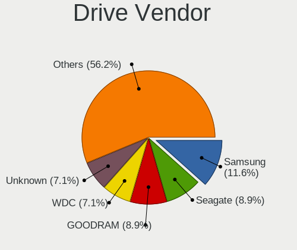
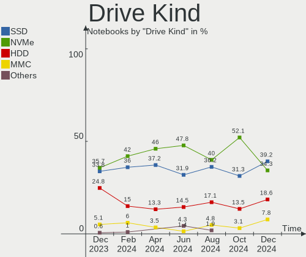
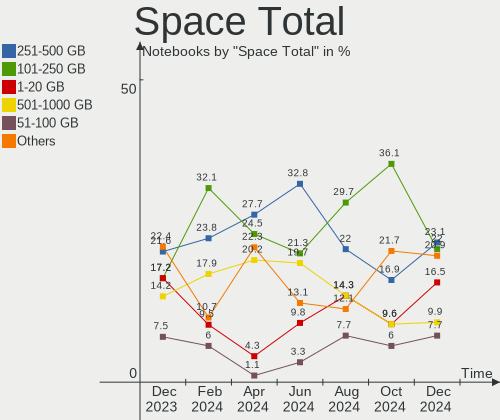
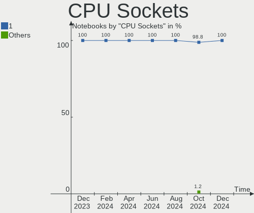
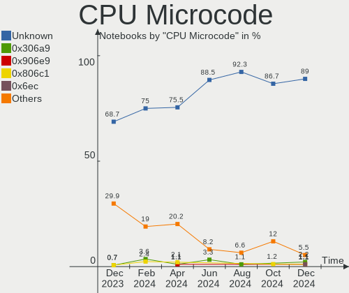
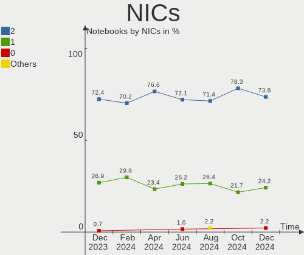
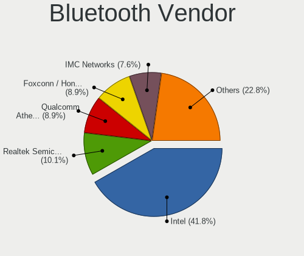
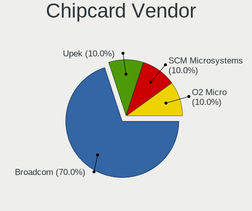

Linux in Poland - Hardware Trends (Notebooks)
---------------------------------------------

A project to identify most popular hardware characteristics and track their change
over time based on data collected by Linux users at https://Linux-Hardware.org.

Anyone can contribute to this report by the [hw-probe](https://github.com/linuxhw/hw-probe) tool:

    sudo -E hw-probe -all -upload

Period: Oct, 2023.

Contents
--------

* [ System ](#system)
  - [ OS                       ](#os)
  - [ OS Family                ](#os-family)
  - [ Kernel                   ](#kernel)
  - [ Kernel Family            ](#kernel-family)
  - [ Kernel Major Ver.        ](#kernel-major-ver)
  - [ Arch                     ](#arch)
  - [ DE                       ](#de)
  - [ Display Server           ](#display-server)
  - [ Display Manager          ](#display-manager)
  - [ OS Lang                  ](#os-lang)
  - [ Boot Mode                ](#boot-mode)
  - [ Filesystem               ](#filesystem)
  - [ Part. scheme             ](#part-scheme)
  - [ Dual Boot with Linux/BSD ](#dual-boot-with-linuxbsd)
  - [ Dual Boot (Win)          ](#dual-boot-win)

* [ Board ](#board)
  - [ Vendor                   ](#vendor)
  - [ Model                    ](#model)
  - [ Model Family             ](#model-family)
  - [ MFG Year                 ](#mfg-year)
  - [ Form Factor              ](#form-factor)
  - [ Secure Boot              ](#secure-boot)
  - [ Coreboot                 ](#coreboot)
  - [ RAM Size                 ](#ram-size)
  - [ RAM Used                 ](#ram-used)
  - [ Total Drives             ](#total-drives)
  - [ Has CD-ROM               ](#has-cd-rom)
  - [ Has Ethernet             ](#has-ethernet)
  - [ Has WiFi                 ](#has-wifi)
  - [ Has Bluetooth            ](#has-bluetooth)

* [ Location ](#location)
  - [ Country                  ](#country)
  - [ City                     ](#city)

* [ Drives ](#drives)
  - [ Drive Vendor             ](#drive-vendor)
  - [ Drive Model              ](#drive-model)
  - [ HDD Vendor               ](#hdd-vendor)
  - [ SSD Vendor               ](#ssd-vendor)
  - [ Drive Kind               ](#drive-kind)
  - [ Drive Connector          ](#drive-connector)
  - [ Drive Size               ](#drive-size)
  - [ Space Total              ](#space-total)
  - [ Space Used               ](#space-used)
  - [ Malfunc. Drives          ](#malfunc-drives)
  - [ Malfunc. Drive Vendor    ](#malfunc-drive-vendor)
  - [ Malfunc. HDD Vendor      ](#malfunc-hdd-vendor)
  - [ Malfunc. Drive Kind      ](#malfunc-drive-kind)
  - [ Failed Drives            ](#failed-drives)
  - [ Failed Drive Vendor      ](#failed-drive-vendor)
  - [ Drive Status             ](#drive-status)

* [ Storage controller ](#storage-controller)
  - [ Storage Vendor           ](#storage-vendor)
  - [ Storage Model            ](#storage-model)
  - [ Storage Kind             ](#storage-kind)

* [ Processor ](#processor)
  - [ CPU Vendor               ](#cpu-vendor)
  - [ CPU Model                ](#cpu-model)
  - [ CPU Model Family         ](#cpu-model-family)
  - [ CPU Cores                ](#cpu-cores)
  - [ CPU Sockets              ](#cpu-sockets)
  - [ CPU Threads              ](#cpu-threads)
  - [ CPU Op-Modes             ](#cpu-op-modes)
  - [ CPU Microcode            ](#cpu-microcode)
  - [ CPU Microarch            ](#cpu-microarch)

* [ Graphics ](#graphics)
  - [ GPU Vendor               ](#gpu-vendor)
  - [ GPU Model                ](#gpu-model)
  - [ GPU Combo                ](#gpu-combo)
  - [ GPU Driver               ](#gpu-driver)
  - [ GPU Memory               ](#gpu-memory)

* [ Monitor ](#monitor)
  - [ Monitor Vendor           ](#monitor-vendor)
  - [ Monitor Model            ](#monitor-model)
  - [ Monitor Resolution       ](#monitor-resolution)
  - [ Monitor Diagonal         ](#monitor-diagonal)
  - [ Monitor Width            ](#monitor-width)
  - [ Aspect Ratio             ](#aspect-ratio)
  - [ Monitor Area             ](#monitor-area)
  - [ Pixel Density            ](#pixel-density)
  - [ Multiple Monitors        ](#multiple-monitors)

* [ Network ](#network)
  - [ Net Controller Vendor    ](#net-controller-vendor)
  - [ Net Controller Model     ](#net-controller-model)
  - [ Wireless Vendor          ](#wireless-vendor)
  - [ Wireless Model           ](#wireless-model)
  - [ Ethernet Vendor          ](#ethernet-vendor)
  - [ Ethernet Model           ](#ethernet-model)
  - [ Net Controller Kind      ](#net-controller-kind)
  - [ Used Controller          ](#used-controller)
  - [ NICs                     ](#nics)
  - [ IPv6                     ](#ipv6)

* [ Bluetooth ](#bluetooth)
  - [ Bluetooth Vendor         ](#bluetooth-vendor)
  - [ Bluetooth Model          ](#bluetooth-model)

* [ Sound ](#sound)
  - [ Sound Vendor             ](#sound-vendor)
  - [ Sound Model              ](#sound-model)

* [ Memory ](#memory)
  - [ Memory Vendor            ](#memory-vendor)
  - [ Memory Model             ](#memory-model)
  - [ Memory Kind              ](#memory-kind)
  - [ Memory Form Factor       ](#memory-form-factor)
  - [ Memory Size              ](#memory-size)
  - [ Memory Speed             ](#memory-speed)

* [ Printers & scanners ](#printers--scanners)
  - [ Printer Vendor           ](#printer-vendor)
  - [ Printer Model            ](#printer-model)
  - [ Scanner Vendor           ](#scanner-vendor)
  - [ Scanner Model            ](#scanner-model)

* [ Camera ](#camera)
  - [ Camera Vendor            ](#camera-vendor)
  - [ Camera Model             ](#camera-model)

* [ Security ](#security)
  - [ Fingerprint Vendor       ](#fingerprint-vendor)
  - [ Fingerprint Model        ](#fingerprint-model)
  - [ Chipcard Vendor          ](#chipcard-vendor)
  - [ Chipcard Model           ](#chipcard-model)

* [ Unsupported ](#unsupported)
  - [ Unsupported Devices      ](#unsupported-devices)
  - [ Unsupported Device Types ](#unsupported-device-types)

System
------

OS
--

Installed operating systems

| Name                         | Notebooks | Percent |
|------------------------------|-----------|---------|
| Ubuntu 22.04                 | 9         | 11.84%  |
| Linux Mint 21.2              | 7         | 9.21%   |
| Arch Rolling                 | 7         | 9.21%   |
| Fedora 38                    | 6         | 7.89%   |
| Ubuntu 23.04                 | 4         | 5.26%   |
| OpenMandriva 23.08           | 4         | 5.26%   |
| Ubuntu 23.10                 | 3         | 3.95%   |
| openSUSE Tumbleweed-XXXXXXXX | 3         | 3.95%   |
| OpenMandriva 23.10           | 3         | 3.95%   |
| Debian 12                    | 3         | 3.95%   |
| Zorin 16                     | 2         | 2.63%   |
| Xero Rolling                 | 2         | 2.63%   |
| Pop!_OS 22.04                | 2         | 2.63%   |
| OpenMandriva 4.3             | 2         | 2.63%   |
| Xubuntu 22.04                | 1         | 1.32%   |
| SteamOS 3.6                  | 1         | 1.32%   |
| openSUSE Leap-15.5           | 1         | 1.32%   |
| OpenMandriva 23.90           | 1         | 1.32%   |
| OpenMandriva 23.09           | 1         | 1.32%   |
| OpenMandriva 23.03           | 1         | 1.32%   |
| MX 23                        | 1         | 1.32%   |
| Lubuntu 22.04                | 1         | 1.32%   |
| Linux Mint 21.1              | 1         | 1.32%   |
| Kubuntu 23.10                | 1         | 1.32%   |
| Kubuntu 23.04                | 1         | 1.32%   |
| Kubuntu 22.04                | 1         | 1.32%   |
| Kali 2023.3                  | 1         | 1.32%   |
| Fedora 39                    | 1         | 1.32%   |
| Fedora 37                    | 1         | 1.32%   |
| Fedora 34                    | 1         | 1.32%   |
| Endless 5.0.6                | 1         | 1.32%   |
| EndeavourOS Rolling          | 1         | 1.32%   |
| Artix Rolling                | 1         | 1.32%   |

OS Family
---------

OS without a version

| Name         | Notebooks | Percent |
|--------------|-----------|---------|
| Ubuntu       | 16        | 21.05%  |
| OpenMandriva | 12        | 15.79%  |
| Fedora       | 9         | 11.84%  |
| Linux Mint   | 8         | 10.53%  |
| Arch         | 7         | 9.21%   |
| openSUSE     | 4         | 5.26%   |
| Kubuntu      | 3         | 3.95%   |
| Debian       | 3         | 3.95%   |
| Zorin        | 2         | 2.63%   |
| Xero         | 2         | 2.63%   |
| Pop!_OS      | 2         | 2.63%   |
| Xubuntu      | 1         | 1.32%   |
| SteamOS      | 1         | 1.32%   |
| MX           | 1         | 1.32%   |
| Lubuntu      | 1         | 1.32%   |
| Kali         | 1         | 1.32%   |
| Endless      | 1         | 1.32%   |
| EndeavourOS  | 1         | 1.32%   |
| Artix        | 1         | 1.32%   |

Kernel
------

Version of the Linux kernel

| Version                    | Notebooks | Percent |
|----------------------------|-----------|---------|
| 6.2.0-34-generic           | 9         | 11.84%  |
| 6.4.11-desktop-1omv2390    | 5         | 6.58%   |
| 6.5.5-desktop-1omv2390     | 4         | 5.26%   |
| 6.5.8-arch1-1              | 3         | 3.95%   |
| 5.15.0-86-generic          | 3         | 3.95%   |
| 6.5.8-200.fc38.x86_64      | 2         | 2.63%   |
| 6.5.5-200.fc38.x86_64      | 2         | 2.63%   |
| 6.5.0-9-generic            | 2         | 2.63%   |
| 6.5.0-10-generic           | 2         | 2.63%   |
| 6.4.12-arch1-1             | 2         | 2.63%   |
| 6.2.0-33-generic           | 2         | 2.63%   |
| 6.2.0-26-generic           | 2         | 2.63%   |
| 6.1.0-13-amd64             | 2         | 2.63%   |
| 5.15.0-87-generic          | 2         | 2.63%   |
| 5.15.0-84-generic          | 2         | 2.63%   |
| 5.15.0-76-generic          | 2         | 2.63%   |
| 6.5.9-1-cachyos-lto        | 1         | 1.32%   |
| 6.5.7-200.fc38.x86_64      | 1         | 1.32%   |
| 6.5.6-arch2-1              | 1         | 1.32%   |
| 6.5.6-100.fc37.x86_64      | 1         | 1.32%   |
| 6.5.6-1-default            | 1         | 1.32%   |
| 6.5.5-zen1-1-zen           | 1         | 1.32%   |
| 6.5.5-hardened1-1-hardened | 1         | 1.32%   |
| 6.5.5-artix1-1             | 1         | 1.32%   |
| 6.5.4-arch2-1              | 1         | 1.32%   |
| 6.5.4-76060504-generic     | 1         | 1.32%   |
| 6.5.4-1-default            | 1         | 1.32%   |
| 6.5.3-1-default            | 1         | 1.32%   |
| 6.5.2-301.fc39.x86_64      | 1         | 1.32%   |
| 6.5.0-1003-oem             | 1         | 1.32%   |
| 6.4.6-76060406-generic     | 1         | 1.32%   |
| 6.4.15-200.fc38.x86_64     | 1         | 1.32%   |
| 6.3.0-kali1-amd64          | 1         | 1.32%   |
| 6.2.6-desktop-1omv2390     | 1         | 1.32%   |
| 6.2.0-35-generic           | 1         | 1.32%   |
| 6.1.52-valve2-1-neptune-61 | 1         | 1.32%   |
| 6.1.0-12-amd64             | 1         | 1.32%   |
| 6.1.0-10-amd64             | 1         | 1.32%   |
| 5.19.0-50-generic          | 1         | 1.32%   |
| 5.17.12-100.fc34.x86_64    | 1         | 1.32%   |

Kernel Family
-------------

Linux kernel without a distro release

| Version | Notebooks | Percent |
|---------|-----------|---------|
| 6.2.0   | 14        | 18.42%  |
| 5.15.0  | 12        | 15.79%  |
| 6.5.5   | 9         | 11.84%  |
| 6.5.8   | 5         | 6.58%   |
| 6.5.0   | 5         | 6.58%   |
| 6.4.11  | 5         | 6.58%   |
| 6.1.0   | 4         | 5.26%   |
| 6.5.6   | 3         | 3.95%   |
| 6.5.4   | 3         | 3.95%   |
| 6.4.12  | 2         | 2.63%   |
| 6.5.9   | 1         | 1.32%   |
| 6.5.7   | 1         | 1.32%   |
| 6.5.3   | 1         | 1.32%   |
| 6.5.2   | 1         | 1.32%   |
| 6.4.6   | 1         | 1.32%   |
| 6.4.15  | 1         | 1.32%   |
| 6.3.0   | 1         | 1.32%   |
| 6.2.6   | 1         | 1.32%   |
| 6.1.52  | 1         | 1.32%   |
| 5.19.0  | 1         | 1.32%   |
| 5.17.12 | 1         | 1.32%   |
| 5.16.7  | 1         | 1.32%   |
| 5.16.13 | 1         | 1.32%   |
| 5.14.21 | 1         | 1.32%   |

Kernel Major Ver.
-----------------

Linux kernel major version

| Version | Notebooks | Percent |
|---------|-----------|---------|
| 6.5     | 29        | 38.16%  |
| 6.2     | 15        | 19.74%  |
| 5.15    | 12        | 15.79%  |
| 6.4     | 9         | 11.84%  |
| 6.1     | 5         | 6.58%   |
| 5.16    | 2         | 2.63%   |
| 6.3     | 1         | 1.32%   |
| 5.19    | 1         | 1.32%   |
| 5.17    | 1         | 1.32%   |
| 5.14    | 1         | 1.32%   |

Arch
----

OS architecture (x86_64, i586, etc.)

| Name   | Notebooks | Percent |
|--------|-----------|---------|
| x86_64 | 76        | 100%    |

DE
--

Desktop Environment

| Name          | Notebooks | Percent |
|---------------|-----------|---------|
| GNOME         | 33        | 43.42%  |
| KDE5          | 23        | 30.26%  |
| X-Cinnamon    | 5         | 6.58%   |
| XFCE          | 4         | 5.26%   |
| LXQt          | 3         | 3.95%   |
| Unknown       | 3         | 3.95%   |
| MATE          | 2         | 2.63%   |
| Hyprland      | 1         | 1.32%   |
| Endless:GNOME | 1         | 1.32%   |
| Cinnamon      | 1         | 1.32%   |

Display Server
--------------

X11 or Wayland

| Name    | Notebooks | Percent |
|---------|-----------|---------|
| X11     | 41        | 53.95%  |
| Wayland | 34        | 44.74%  |
| Tty     | 1         | 1.32%   |

Display Manager
---------------

SDDM, LightDM, etc.

| Name    | Notebooks | Percent |
|---------|-----------|---------|
| SDDM    | 24        | 31.58%  |
| GDM3    | 18        | 23.68%  |
| Unknown | 18        | 23.68%  |
| LightDM | 12        | 15.79%  |
| GDM     | 4         | 5.26%   |

OS Lang
-------

Language

| Lang    | Notebooks | Percent |
|---------|-----------|---------|
| pl_PL   | 43        | 56.58%  |
| en_US   | 24        | 31.58%  |
| C       | 3         | 3.95%   |
| uk_UA   | 1         | 1.32%   |
| ru_RU   | 1         | 1.32%   |
| POSIX   | 1         | 1.32%   |
| en_GB   | 1         | 1.32%   |
| Default | 1         | 1.32%   |
| Unknown | 1         | 1.32%   |

Boot Mode
---------

EFI or BIOS

| Mode | Notebooks | Percent |
|------|-----------|---------|
| EFI  | 51        | 67.11%  |
| BIOS | 25        | 32.89%  |

Filesystem
----------

Type of filesystem

| Type    | Notebooks | Percent |
|---------|-----------|---------|
| Ext4    | 45        | 59.21%  |
| Tmpfs   | 11        | 14.47%  |
| Btrfs   | 11        | 14.47%  |
| Overlay | 6         | 7.89%   |
| Xfs     | 2         | 2.63%   |
| F2fs    | 1         | 1.32%   |

Part. scheme
------------

Scheme of partitioning

| Type    | Notebooks | Percent |
|---------|-----------|---------|
| GPT     | 51        | 67.11%  |
| Unknown | 17        | 22.37%  |
| MBR     | 8         | 10.53%  |

Dual Boot with Linux/BSD
------------------------

Hosting more than one Linux/BSD

| Dual boot | Notebooks | Percent |
|-----------|-----------|---------|
| No        | 65        | 85.53%  |
| Yes       | 11        | 14.47%  |

Dual Boot (Win)
---------------

Hosting Linux and Windows

| Dual boot | Notebooks | Percent |
|-----------|-----------|---------|
| No        | 53        | 69.74%  |
| Yes       | 23        | 30.26%  |

Board
-----

Vendor
------

Motherboard manufacturer

| Name                | Notebooks | Percent |
|---------------------|-----------|---------|
| Lenovo              | 18        | 23.68%  |
| Hewlett-Packard     | 16        | 21.05%  |
| Dell                | 14        | 18.42%  |
| ASUSTek Computer    | 8         | 10.53%  |
| MSI                 | 3         | 3.95%   |
| Apple               | 3         | 3.95%   |
| Acer                | 3         | 3.95%   |
| Samsung Electronics | 2         | 2.63%   |
| HUAWEI              | 2         | 2.63%   |
| Google              | 2         | 2.63%   |
| XIAOMI              | 1         | 1.32%   |
| Valve               | 1         | 1.32%   |
| Notebook            | 1         | 1.32%   |
| GPU Company         | 1         | 1.32%   |
| Unknown             | 1         | 1.32%   |

Model
-----

Motherboard model

| Name                                        | Notebooks | Percent |
|---------------------------------------------|-----------|---------|
| HP ProBook 6560b                            | 2         | 2.63%   |
| HP EliteBook 840 G5                         | 2         | 2.63%   |
| Dell Latitude 5440                          | 2         | 2.63%   |
| XIAOMI Redmi Book Pro 15 2023               | 1         | 1.32%   |
| Valve Jupiter                               | 1         | 1.32%   |
| Samsung 550P5C/550P7C                       | 1         | 1.32%   |
| Samsung 3570R/370R/470R/450R/510R/4450RV    | 1         | 1.32%   |
| Notebook P7xxDM(-G)                         | 1         | 1.32%   |
| MSI MS-1688                                 | 1         | 1.32%   |
| MSI GL75 9SE                                | 1         | 1.32%   |
| MSI GE72 6QF                                | 1         | 1.32%   |
| Lenovo ThinkPad X390 20Q1S5K400             | 1         | 1.32%   |
| Lenovo ThinkPad X270 W10DG 20K60014MX       | 1         | 1.32%   |
| Lenovo ThinkPad X1 Carbon Gen 10 21CBCTO1WW | 1         | 1.32%   |
| Lenovo ThinkPad T470s W10DG 20JTS1MR08      | 1         | 1.32%   |
| Lenovo ThinkPad T430u 3352A83               | 1         | 1.32%   |
| Lenovo ThinkPad T400 64757D7                | 1         | 1.32%   |
| Lenovo ThinkPad P1 Gen 6 21FV002HUS         | 1         | 1.32%   |
| Lenovo ThinkPad A485 20MVS0X62X             | 1         | 1.32%   |
| Lenovo Legion 5 Pro 16ITH6H 82JD            | 1         | 1.32%   |
| Lenovo Legion 5 15IAH7 82RC                 | 1         | 1.32%   |
| Lenovo Legion 5 15ARH7 82RE                 | 1         | 1.32%   |
| Lenovo IdeaPad Y700-15ISK 80NV              | 1         | 1.32%   |
| Lenovo IdeaPad Y580 20132                   | 1         | 1.32%   |
| Lenovo IdeaPad P500 20210                   | 1         | 1.32%   |
| Lenovo IdeaPad Gaming 3 15ACH6 82K2         | 1         | 1.32%   |
| Lenovo IdeaPad 320-15IKB 81BG               | 1         | 1.32%   |
| Lenovo IdeaPad 3 15ALC6 82KU                | 1         | 1.32%   |
| Lenovo G510 20238                           | 1         | 1.32%   |
| HUAWEI KLVL-WXX9                            | 1         | 1.32%   |
| HUAWEI HKD-WXX                              | 1         | 1.32%   |
| HP Pavilion Gaming Laptop 15-ec1xxx         | 1         | 1.32%   |
| HP Pavilion Gaming Laptop 15-cx0xxx         | 1         | 1.32%   |
| HP Pavilion Aero Laptop 13-be0xxx           | 1         | 1.32%   |
| HP Laptop 15s-eq2xxx                        | 1         | 1.32%   |
| HP Laptop 15s-eq0xxx                        | 1         | 1.32%   |
| HP Grunt                                    | 1         | 1.32%   |
| HP EliteBook 840 G2                         | 1         | 1.32%   |
| HP EliteBook 830 13 inch G10 Notebook PC    | 1         | 1.32%   |
| HP EliteBook 745 G4                         | 1         | 1.32%   |

Model Family
------------

Motherboard model prefix

| Name                   | Notebooks | Percent |
|------------------------|-----------|---------|
| Lenovo ThinkPad        | 8         | 10.53%  |
| Lenovo IdeaPad         | 6         | 7.89%   |
| HP EliteBook           | 6         | 7.89%   |
| Dell Latitude          | 6         | 7.89%   |
| Dell Inspiron          | 5         | 6.58%   |
| Lenovo Legion          | 3         | 3.95%   |
| HP Pavilion            | 3         | 3.95%   |
| Acer Aspire            | 3         | 3.95%   |
| HP ProBook             | 2         | 2.63%   |
| HP Laptop              | 2         | 2.63%   |
| Dell Precision         | 2         | 2.63%   |
| ASUS TUF               | 2         | 2.63%   |
| ASUS ASUS              | 2         | 2.63%   |
| XIAOMI Redmi           | 1         | 1.32%   |
| Valve Jupiter          | 1         | 1.32%   |
| Samsung 550P5C         | 1         | 1.32%   |
| Samsung 3570R          | 1         | 1.32%   |
| Notebook P7xxDM(-G)    | 1         | 1.32%   |
| MSI MS-1688            | 1         | 1.32%   |
| MSI GL75               | 1         | 1.32%   |
| MSI GE72               | 1         | 1.32%   |
| Lenovo G510            | 1         | 1.32%   |
| HUAWEI KLVL-WXX9       | 1         | 1.32%   |
| HUAWEI HKD-WXX         | 1         | 1.32%   |
| HP Grunt               | 1         | 1.32%   |
| HP Compaq              | 1         | 1.32%   |
| HP 250                 | 1         | 1.32%   |
| GPU Company GWTN156-11 | 1         | 1.32%   |
| Google Sasuke          | 1         | 1.32%   |
| Google Lindar          | 1         | 1.32%   |
| Dell XPS               | 1         | 1.32%   |
| ASUS X510UQ            | 1         | 1.32%   |
| ASUS VivoBook          | 1         | 1.32%   |
| ASUS ROG               | 1         | 1.32%   |
| ASUS K53SV             | 1         | 1.32%   |
| Apple MacBookPro4      | 1         | 1.32%   |
| Apple MacBookPro14     | 1         | 1.32%   |
| Apple MacBookAir5      | 1         | 1.32%   |
| Unknown                | 1         | 1.32%   |

MFG Year
--------

Motherboard manufacture year

| Year | Notebooks | Percent |
|------|-----------|---------|
| 2019 | 9         | 11.84%  |
| 2021 | 8         | 10.53%  |
| 2023 | 7         | 9.21%   |
| 2017 | 7         | 9.21%   |
| 2012 | 7         | 9.21%   |
| 2022 | 6         | 7.89%   |
| 2011 | 6         | 7.89%   |
| 2020 | 5         | 6.58%   |
| 2018 | 5         | 6.58%   |
| 2015 | 5         | 6.58%   |
| 2008 | 4         | 5.26%   |
| 2013 | 3         | 3.95%   |
| 2014 | 2         | 2.63%   |
| 2010 | 1         | 1.32%   |
| 2009 | 1         | 1.32%   |

Form Factor
-----------

Physical design of the computer

| Name     | Notebooks | Percent |
|----------|-----------|---------|
| Notebook | 76        | 100%    |

Secure Boot
-----------

Enabled or disabled

| State    | Notebooks | Percent |
|----------|-----------|---------|
| Disabled | 71        | 93.42%  |
| Enabled  | 5         | 6.58%   |

Coreboot
--------

Have coreboot on board

| Used | Notebooks | Percent |
|------|-----------|---------|
| No   | 73        | 96.05%  |
| Yes  | 3         | 3.95%   |

RAM Size
--------

Total RAM memory

| Size in GB  | Notebooks | Percent |
|-------------|-----------|---------|
| 4.01-8.0    | 25        | 32.89%  |
| 8.01-16.0   | 19        | 25%     |
| 3.01-4.0    | 12        | 15.79%  |
| 16.01-24.0  | 10        | 13.16%  |
| 32.01-64.0  | 7         | 9.21%   |
| 24.01-32.0  | 1         | 1.32%   |
| 2.01-3.0    | 1         | 1.32%   |
| 64.01-256.0 | 1         | 1.32%   |

RAM Used
--------

Used RAM memory

| Used GB   | Notebooks | Percent |
|-----------|-----------|---------|
| 2.01-3.0  | 26        | 34.21%  |
| 4.01-8.0  | 18        | 23.68%  |
| 1.01-2.0  | 15        | 19.74%  |
| 3.01-4.0  | 13        | 17.11%  |
| 8.01-16.0 | 2         | 2.63%   |
| 0.51-1.0  | 2         | 2.63%   |

Total Drives
------------

Number of drives on board

| Drives | Notebooks | Percent |
|--------|-----------|---------|
| 1      | 58        | 76.32%  |
| 2      | 16        | 21.05%  |
| 3      | 2         | 2.63%   |

Has CD-ROM
----------

Has CD-ROM on board

| Presented | Notebooks | Percent |
|-----------|-----------|---------|
| No        | 58        | 76.32%  |
| Yes       | 18        | 23.68%  |

Has Ethernet
------------

Has Ethernet on board

| Presented | Notebooks | Percent |
|-----------|-----------|---------|
| Yes       | 55        | 72.37%  |
| No        | 21        | 27.63%  |

Has WiFi
--------

Has WiFi module

| Presented | Notebooks | Percent |
|-----------|-----------|---------|
| Yes       | 76        | 100%    |

Has Bluetooth
-------------

Has Bluetooth module

| Presented | Notebooks | Percent |
|-----------|-----------|---------|
| Yes       | 64        | 84.21%  |
| No        | 12        | 15.79%  |

Location
--------

Country
-------

Geographic location (country)

| Country | Notebooks | Percent |
|---------|-----------|---------|
| Poland  | 76        | 100%    |

City
----

Geographic location (city)

| City                | Notebooks | Percent |
|---------------------|-----------|---------|
| Warsaw              | 18        | 23.68%  |
| Wroclaw             | 8         | 10.53%  |
| Krakow              | 8         | 10.53%  |
| Poznan              | 6         | 7.89%   |
| Katowice            | 3         | 3.95%   |
| Jaworzno            | 2         | 2.63%   |
| Żywiec             | 1         | 1.32%   |
| Zgierz              | 1         | 1.32%   |
| Wilczyce            | 1         | 1.32%   |
| Wagrowiec           | 1         | 1.32%   |
| Waganiec            | 1         | 1.32%   |
| Tomaszow Lubelski   | 1         | 1.32%   |
| Słupsk             | 1         | 1.32%   |
| Szczecin            | 1         | 1.32%   |
| Stopnica            | 1         | 1.32%   |
| Siedlce             | 1         | 1.32%   |
| Radomsko            | 1         | 1.32%   |
| Płock              | 1         | 1.32%   |
| Piaseczno           | 1         | 1.32%   |
| Ozarow Mazowiecki   | 1         | 1.32%   |
| Opole               | 1         | 1.32%   |
| Milicz              | 1         | 1.32%   |
| Michalowice         | 1         | 1.32%   |
| Lublin              | 1         | 1.32%   |
| Lodz                | 1         | 1.32%   |
| Lidzbark Warmiński | 1         | 1.32%   |
| Krynica-Zdroj       | 1         | 1.32%   |
| Kętrzyn            | 1         | 1.32%   |
| Głogów            | 1         | 1.32%   |
| Gliwice             | 1         | 1.32%   |
| Gdynia              | 1         | 1.32%   |
| Gdansk              | 1         | 1.32%   |
| Dabrowa Bialostocka | 1         | 1.32%   |
| Bytom               | 1         | 1.32%   |
| Bydgoszcz           | 1         | 1.32%   |
| Bielsko-Biala       | 1         | 1.32%   |
| Bialystok           | 1         | 1.32%   |

Drives
------

Drive Vendor
------------

Hard drive vendors

| Vendor                       | Notebooks | Drives | Percent |
|------------------------------|-----------|--------|---------|
| Samsung Electronics          | 14        | 15     | 15.05%  |
| SK hynix                     | 7         | 7      | 7.53%   |
| GOODRAM                      | 7         | 7      | 7.53%   |
| A-DATA Technology            | 7         | 7      | 7.53%   |
| Unknown                      | 6         | 7      | 6.45%   |
| Intel                        | 6         | 6      | 6.45%   |
| WDC                          | 5         | 5      | 5.38%   |
| Seagate                      | 5         | 5      | 5.38%   |
| SanDisk                      | 5         | 5      | 5.38%   |
| Toshiba                      | 4         | 4      | 4.3%    |
| Micron Technology            | 3         | 3      | 3.23%   |
| HGST                         | 3         | 3      | 3.23%   |
| Crucial                      | 3         | 3      | 3.23%   |
| Transcend                    | 2         | 2      | 2.15%   |
| Phison                       | 2         | 2      | 2.15%   |
| Kingston                     | 2         | 2      | 2.15%   |
| Apacer                       | 2         | 2      | 2.15%   |
| SSD 1TB                      | 1         | 1      | 1.08%   |
| SPCC                         | 1         | 1      | 1.08%   |
| Shenzhen Longsys Electronics | 1         | 2      | 1.08%   |
| Realtek                      | 1         | 1      | 1.08%   |
| Phison Electronics           | 1         | 1      | 1.08%   |
| OWC                          | 1         | 1      | 1.08%   |
| KIOXIA                       | 1         | 1      | 1.08%   |
| Hitachi                      | 1         | 1      | 1.08%   |
| Apple                        | 1         | 2      | 1.08%   |
| Unknown                      | 1         | 1      | 1.08%   |

Drive Model
-----------

Hard drive models

| Model                                              | Notebooks | Percent |
|----------------------------------------------------|-----------|---------|
| Unknown MMC Card  128GB                            | 3         | 3.16%   |
| Toshiba BG3 NVMe SSD Controller 128GB              | 2         | 2.11%   |
| SK hynix BC901 NVMe 512GB                          | 2         | 2.11%   |
| Seagate ST1000LM024 HN-M101MBB 1TB                 | 2         | 2.11%   |
| Samsung SSD 980 1TB                                | 2         | 2.11%   |
| Samsung NVMe SSD Controller PM9A1/PM9A3/980PRO 1TB | 2         | 2.11%   |
| Samsung MZVLQ512HBLU-00BH1 512GB                   | 2         | 2.11%   |
| Samsung MZALQ512HBLU-00BL2 512GB                   | 2         | 2.11%   |
| HGST HTS721010A9E630 1TB                           | 2         | 2.11%   |
| WDC WD6400BPVT-55HXZT3 640GB                       | 1         | 1.05%   |
| WDC WD5000LPVT-75G33T0 500GB                       | 1         | 1.05%   |
| WDC WD10SPCX-24HWST1 1TB                           | 1         | 1.05%   |
| WDC WD10JPVX-75JC3T0 1TB                           | 1         | 1.05%   |
| WDC PC SN520 SDAPNUW-512G-1032 512GB               | 1         | 1.05%   |
| Unknown SL16G  16GB                                | 1         | 1.05%   |
| Unknown MMC Card  64GB                             | 1         | 1.05%   |
| Unknown MMC Card  32GB                             | 1         | 1.05%   |
| Unknown BJTD4R  32GB                               | 1         | 1.05%   |
| Transcend TS480GMTS420S 480GB SSD                  | 1         | 1.05%   |
| Transcend TS256GMTS400S 256GB SSD                  | 1         | 1.05%   |
| Toshiba MQ01ABF050 500GB                           | 1         | 1.05%   |
| Toshiba MQ01ABD032 320GB                           | 1         | 1.05%   |
| SSD 1TB Disk 1TB                                   | 1         | 1.05%   |
| SPCC Solid State Disk 120GB                        | 1         | 1.05%   |
| SK hynix SKHynix_HFS001TEJ9X115N 1024GB            | 1         | 1.05%   |
| SK hynix SC311 SATA 256GB SSD                      | 1         | 1.05%   |
| SK hynix HFS128G3BTND-N210A 128GB SSD              | 1         | 1.05%   |
| SK hynix BC711 HFM512GD3JX013N 512GB               | 1         | 1.05%   |
| SK hynix BC711 HFM256GD3JX013N 256GB               | 1         | 1.05%   |
| Shenzhen Longsys Lexar SSD NM800PRO 1TB            | 1         | 1.05%   |
| Seagate ST92503010AS 250GB                         | 1         | 1.05%   |
| Seagate ST320LT007-9ZV142 320GB                    | 1         | 1.05%   |
| Seagate ST1000LM048-2E7172 1TB                     | 1         | 1.05%   |
| Sandisk WD PC SN740 SDDPTQE-2T00 2TB               | 1         | 1.05%   |
| Sandisk WD Blue SN550 NVMe SSD 1TB                 | 1         | 1.05%   |
| SanDisk Ultra II 240GB SSD                         | 1         | 1.05%   |
| SanDisk SD9SN8W-128G-1006 128GB SSD                | 1         | 1.05%   |
| SanDisk SD6SF1M128G 128GB SSD                      | 1         | 1.05%   |
| Samsung SSD PM871 M.2 2280 128GB                   | 1         | 1.05%   |
| Samsung SSD 980 PRO 250GB S5GZNF0R505406A          | 1         | 1.05%   |

HDD Vendor
----------

Hard disk drive vendors

| Vendor  | Notebooks | Drives | Percent |
|---------|-----------|--------|---------|
| Seagate | 5         | 5      | 33.33%  |
| WDC     | 4         | 4      | 26.67%  |
| HGST    | 3         | 3      | 20%     |
| Toshiba | 2         | 2      | 13.33%  |
| Hitachi | 1         | 1      | 6.67%   |

SSD Vendor
----------

Solid state drive vendors

| Vendor              | Notebooks | Drives | Percent |
|---------------------|-----------|--------|---------|
| A-DATA Technology   | 7         | 7      | 23.33%  |
| GOODRAM             | 6         | 6      | 20%     |
| SanDisk             | 3         | 3      | 10%     |
| Crucial             | 3         | 3      | 10%     |
| Transcend           | 2         | 2      | 6.67%   |
| SK hynix            | 2         | 2      | 6.67%   |
| Samsung Electronics | 2         | 2      | 6.67%   |
| SPCC                | 1         | 1      | 3.33%   |
| OWC                 | 1         | 1      | 3.33%   |
| Kingston            | 1         | 1      | 3.33%   |
| Intel               | 1         | 1      | 3.33%   |
| Apacer              | 1         | 1      | 3.33%   |

Drive Kind
----------

HDD or SSD

| Kind    | Notebooks | Drives | Percent |
|---------|-----------|--------|---------|
| NVMe    | 38        | 43     | 43.18%  |
| SSD     | 27        | 30     | 30.68%  |
| HDD     | 15        | 15     | 17.05%  |
| MMC     | 7         | 8      | 7.95%   |
| Unknown | 1         | 1      | 1.14%   |

Drive Connector
---------------

SATA, SAS, NVMe, etc.

| Type | Notebooks | Drives | Percent |
|------|-----------|--------|---------|
| SATA | 39        | 45     | 45.35%  |
| NVMe | 38        | 42     | 44.19%  |
| MMC  | 7         | 8      | 8.14%   |
| SAS  | 2         | 2      | 2.33%   |

Drive Size
----------

Size of hard drive

| Size in TB | Notebooks | Drives | Percent |
|------------|-----------|--------|---------|
| 0.01-0.5   | 28        | 30     | 68.29%  |
| 0.51-1.0   | 13        | 15     | 31.71%  |

Space Total
-----------

Amount of disk space available on the file system

| Size in GB | Notebooks | Percent |
|------------|-----------|---------|
| 251-500    | 19        | 25%     |
| 101-250    | 19        | 25%     |
| 501-1000   | 11        | 14.47%  |
| 1001-2000  | 7         | 9.21%   |
| 1-20       | 7         | 9.21%   |
| 51-100     | 5         | 6.58%   |
| 21-50      | 4         | 5.26%   |
| 2001-3000  | 3         | 3.95%   |
| Unknown    | 1         | 1.32%   |

Space Used
----------

Amount of used disk space

| Used GB   | Notebooks | Percent |
|-----------|-----------|---------|
| 1-20      | 32        | 42.11%  |
| 51-100    | 11        | 14.47%  |
| 251-500   | 8         | 10.53%  |
| 21-50     | 8         | 10.53%  |
| 101-250   | 8         | 10.53%  |
| 501-1000  | 6         | 7.89%   |
| 1001-2000 | 1         | 1.32%   |
| 0         | 1         | 1.32%   |
| Unknown   | 1         | 1.32%   |

Malfunc. Drives
---------------

Drive models with a malfunction

| Model                                 | Notebooks | Drives | Percent |
|---------------------------------------|-----------|--------|---------|
| SK hynix BC711 HFM512GD3JX013N 512GB  | 1         | 1      | 20%     |
| SanDisk SD9SN8W-128G-1006 128GB SSD   | 1         | 1      | 20%     |
| OWC Aura 2012 240GB SSD               | 1         | 1      | 20%     |
| Crucial CT1000MX500SSD4 1TB           | 1         | 1      | 20%     |
| A-DATA Technology SP900NS38 256GB SSD | 1         | 1      | 20%     |

Malfunc. Drive Vendor
---------------------

Vendors of faulty drives

| Vendor            | Notebooks | Drives | Percent |
|-------------------|-----------|--------|---------|
| SK hynix          | 1         | 1      | 20%     |
| SanDisk           | 1         | 1      | 20%     |
| OWC               | 1         | 1      | 20%     |
| Crucial           | 1         | 1      | 20%     |
| A-DATA Technology | 1         | 1      | 20%     |

Malfunc. HDD Vendor
-------------------

Vendors of faulty HDD drives

Zero info for selected period =(

Malfunc. Drive Kind
-------------------

Kinds of faulty drives

| Kind | Notebooks | Drives | Percent |
|------|-----------|--------|---------|
| SSD  | 4         | 4      | 80%     |
| NVMe | 1         | 1      | 20%     |

Failed Drives
-------------

Failed drive models

Zero info for selected period =(

Failed Drive Vendor
-------------------

Failed drive vendors

Zero info for selected period =(

Drive Status
------------

Number of failed and malfunc. drives

| Status   | Notebooks | Drives | Percent |
|----------|-----------|--------|---------|
| Works    | 40        | 49     | 50.63%  |
| Detected | 34        | 43     | 43.04%  |
| Malfunc  | 5         | 5      | 6.33%   |

Storage controller
------------------

Storage Vendor
--------------

Storage controller vendors

| Vendor                       | Notebooks | Percent |
|------------------------------|-----------|---------|
| Intel                        | 49        | 55.68%  |
| Samsung Electronics          | 12        | 13.64%  |
| SK hynix                     | 5         | 5.68%   |
| AMD                          | 5         | 5.68%   |
| Phison Electronics           | 4         | 4.55%   |
| Toshiba America Info Systems | 3         | 3.41%   |
| SanDisk                      | 3         | 3.41%   |
| Micron Technology            | 3         | 3.41%   |
| Silicon Motion               | 1         | 1.14%   |
| Shenzhen Longsys Electronics | 1         | 1.14%   |
| Kingston Technology Company  | 1         | 1.14%   |
| Apple                        | 1         | 1.14%   |

Storage Model
-------------

Storage controller models

| Model                                                                         | Notebooks | Percent |
|-------------------------------------------------------------------------------|-----------|---------|
| Intel 7 Series Chipset Family 6-port SATA Controller [AHCI mode]              | 7         | 7.45%   |
| Samsung NVMe SSD Controller 980 (DRAM-less)                                   | 6         | 6.38%   |
| Intel Sunrise Point-LP SATA Controller [AHCI mode]                            | 6         | 6.38%   |
| Intel 6 Series/C200 Series Chipset Family 6 port Mobile SATA AHCI Controller  | 5         | 5.32%   |
| AMD FCH SATA Controller [AHCI mode]                                           | 5         | 5.32%   |
| Samsung NVMe SSD Controller PM9A1/PM9A3/980PRO                                | 3         | 3.19%   |
| Intel Celeron/Pentium Silver Processor SATA Controller                        | 3         | 3.19%   |
| Intel 82801HM/HEM (ICH8M/ICH8M-E) SATA Controller [AHCI mode]                 | 3         | 3.19%   |
| Intel 82801HM/HEM (ICH8M/ICH8M-E) IDE Controller                              | 3         | 3.19%   |
| Intel 82801 Mobile SATA Controller [RAID mode]                                | 3         | 3.19%   |
| Intel 400 Series Chipset Family SATA AHCI Controller                          | 3         | 3.19%   |
| Toshiba America Info Systems BG3 x2 NVMe SSD Controller (DRAM-less)           | 2         | 2.13%   |
| SK hynix Gold P31/BC711/PC711 NVMe Solid State Drive                          | 2         | 2.13%   |
| SK hynix BC901 NVMe Solid State Drive (DRAM-less)                             | 2         | 2.13%   |
| Samsung NVMe SSD Controller SM951/PM951                                       | 2         | 2.13%   |
| Micron 2210 NVMe SSD [Cobain]                                                 | 2         | 2.13%   |
| Intel SSD 670p Series [Keystone Harbor]                                       | 2         | 2.13%   |
| Intel SSD 660P Series                                                         | 2         | 2.13%   |
| Intel Q170/Q150/B150/H170/H110/Z170/CM236 Chipset SATA Controller [AHCI Mode] | 2         | 2.13%   |
| Intel HM170/QM170 Chipset SATA Controller [AHCI Mode]                         | 2         | 2.13%   |
| Intel Cannon Lake Mobile PCH SATA AHCI Controller                             | 2         | 2.13%   |
| Toshiba America Info Systems XG6 NVMe SSD Controller                          | 1         | 1.06%   |
| SK hynix Platinum P41/PC801 NVMe Solid State Drive                            | 1         | 1.06%   |
| Silicon Motion SM2263EN/SM2263XT (DRAM-less) NVMe SSD Controllers             | 1         | 1.06%   |
| Shenzhen Longsys Lexar NM800 PRO NVME SSD                                     | 1         | 1.06%   |
| SanDisk WD Blue SN500 / PC SN520 x2 M.2 2280 NVMe SSD                         | 1         | 1.06%   |
| SanDisk Ultra 3D / WD Blue SN550 NVMe SSD                                     | 1         | 1.06%   |
| Sandisk PC SN740 NVMe SSD (DRAM-less)                                         | 1         | 1.06%   |
| Samsung NVMe SSD Controller SM981/PM981/PM983                                 | 1         | 1.06%   |
| Phison PS5021-E21 PCIe4 NVMe Controller (DRAM-less)                           | 1         | 1.06%   |
| Phison PS5013-E13 PCIe3 NVMe Controller (DRAM-less)                           | 1         | 1.06%   |
| Phison E18 PCIe4 NVMe Controller                                              | 1         | 1.06%   |
| Phison E12 NVMe Controller                                                    | 1         | 1.06%   |
| Micron 2200S NVMe SSD [Cassandra]                                             | 1         | 1.06%   |
| Kingston Company KC3000/FURY Renegade NVMe SSD E18                            | 1         | 1.06%   |
| Intel Wildcat Point-LP SATA Controller [AHCI Mode]                            | 1         | 1.06%   |
| Intel Volume Management Device NVMe RAID Controller                           | 1         | 1.06%   |
| Intel Tiger Lake-LP SATA Controller                                           | 1         | 1.06%   |
| Intel Tiger Lake SATA AHCI Controller                                         | 1         | 1.06%   |
| Intel SSD DC P4101/Pro 7600p/760p/E 6100p Series                              | 1         | 1.06%   |

Storage Kind
------------

Kind of storage controller (IDE, SATA, NVMe, SAS, ...)

| Kind | Notebooks | Percent |
|------|-----------|---------|
| SATA | 47        | 50.54%  |
| NVMe | 38        | 40.86%  |
| RAID | 4         | 4.3%    |
| IDE  | 4         | 4.3%    |

Processor
---------

CPU Vendor
----------

Processor vendors

| Vendor | Notebooks | Percent |
|--------|-----------|---------|
| Intel  | 59        | 77.63%  |
| AMD    | 17        | 22.37%  |

CPU Model
---------

Processor models

| Model                                    | Notebooks | Percent |
|------------------------------------------|-----------|---------|
| Intel Core i5-3210M CPU @ 2.50GHz        | 3         | 3.95%   |
| Intel Core i5-3230M CPU @ 2.60GHz        | 2         | 2.63%   |
| Intel Core i5-2430M CPU @ 2.40GHz        | 2         | 2.63%   |
| Intel Core i5-10300H CPU @ 2.50GHz       | 2         | 2.63%   |
| Intel 13th Gen Core i5-1345U             | 2         | 2.63%   |
| Intel 11th Gen Core i3-1115G4 @ 3.00GHz  | 2         | 2.63%   |
| Intel Pentium Silver N5030 CPU @ 1.10GHz | 1         | 1.32%   |
| Intel Pentium Silver N5000 CPU @ 1.10GHz | 1         | 1.32%   |
| Intel Pentium CPU N3540 @ 2.16GHz        | 1         | 1.32%   |
| Intel Pentium CPU 3560M @ 2.40GHz        | 1         | 1.32%   |
| Intel Core i7-9750H CPU @ 2.60GHz        | 1         | 1.32%   |
| Intel Core i7-6820HQ CPU @ 2.70GHz       | 1         | 1.32%   |
| Intel Core i7-6700K CPU @ 4.00GHz        | 1         | 1.32%   |
| Intel Core i7-6700HQ CPU @ 2.60GHz       | 1         | 1.32%   |
| Intel Core i7-6600U CPU @ 2.60GHz        | 1         | 1.32%   |
| Intel Core i7-6500U CPU @ 2.50GHz        | 1         | 1.32%   |
| Intel Core i7-4500U CPU @ 1.80GHz        | 1         | 1.32%   |
| Intel Core i7-3610QM CPU @ 2.30GHz       | 1         | 1.32%   |
| Intel Core i7-2760QM CPU @ 2.40GHz       | 1         | 1.32%   |
| Intel Core i7-10850H CPU @ 2.70GHz       | 1         | 1.32%   |
| Intel Core i5-8350U CPU @ 1.70GHz        | 1         | 1.32%   |
| Intel Core i5-8300H CPU @ 2.30GHz        | 1         | 1.32%   |
| Intel Core i5-8265U CPU @ 1.60GHz        | 1         | 1.32%   |
| Intel Core i5-8250U CPU @ 1.60GHz        | 1         | 1.32%   |
| Intel Core i5-7360U CPU @ 2.30GHz        | 1         | 1.32%   |
| Intel Core i5-7300U CPU @ 2.60GHz        | 1         | 1.32%   |
| Intel Core i5-7200U CPU @ 2.50GHz        | 1         | 1.32%   |
| Intel Core i5-6300U CPU @ 2.40GHz        | 1         | 1.32%   |
| Intel Core i5-6300HQ CPU @ 2.30GHz       | 1         | 1.32%   |
| Intel Core i5-6200U CPU @ 2.30GHz        | 1         | 1.32%   |
| Intel Core i5-5300U CPU @ 2.30GHz        | 1         | 1.32%   |
| Intel Core i5-3427U CPU @ 1.80GHz        | 1         | 1.32%   |
| Intel Core i5-2540M CPU @ 2.60GHz        | 1         | 1.32%   |
| Intel Core i5-2410M CPU @ 2.30GHz        | 1         | 1.32%   |
| Intel Core i5-1035G1 CPU @ 1.00GHz       | 1         | 1.32%   |
| Intel Core i3-3217U CPU @ 1.80GHz        | 1         | 1.32%   |
| Intel Core i3 CPU M 350 @ 2.27GHz        | 1         | 1.32%   |
| Intel Core 2 Duo CPU T9500 @ 2.60GHz     | 1         | 1.32%   |
| Intel Core 2 Duo CPU T9300 @ 2.50GHz     | 1         | 1.32%   |
| Intel Core 2 Duo CPU T7500 @ 2.20GHz     | 1         | 1.32%   |

CPU Model Family
----------------

Processor model prefix

| Model                | Notebooks | Percent |
|----------------------|-----------|---------|
| Intel Core i5        | 24        | 31.58%  |
| Other                | 12        | 15.79%  |
| Intel Core i7        | 10        | 13.16%  |
| AMD Ryzen 7          | 7         | 9.21%   |
| Intel Core 2 Duo     | 5         | 6.58%   |
| AMD Ryzen 5          | 5         | 6.58%   |
| Intel Celeron        | 3         | 3.95%   |
| Intel Pentium Silver | 2         | 2.63%   |
| Intel Pentium        | 2         | 2.63%   |
| Intel Core i3        | 2         | 2.63%   |
| AMD Ryzen 7 PRO      | 1         | 1.32%   |
| AMD Ryzen 3 PRO      | 1         | 1.32%   |
| AMD PRO A10          | 1         | 1.32%   |
| AMD A4               | 1         | 1.32%   |

CPU Cores
---------

Number of processor cores

| Number | Notebooks | Percent |
|--------|-----------|---------|
| 2      | 34        | 44.74%  |
| 4      | 23        | 30.26%  |
| 8      | 6         | 7.89%   |
| 6      | 5         | 6.58%   |
| 10     | 3         | 3.95%   |
| 14     | 2         | 2.63%   |
| 12     | 2         | 2.63%   |
| 1      | 1         | 1.32%   |

CPU Sockets
-----------

Number of sockets

| Number | Notebooks | Percent |
|--------|-----------|---------|
| 1      | 76        | 100%    |

CPU Threads
-----------

Threads per core (Hyper-Threading)

| Number | Notebooks | Percent |
|--------|-----------|---------|
| 2      | 59        | 77.63%  |
| 1      | 17        | 22.37%  |

CPU Op-Modes
------------

CPU Operation Modes (32-bit, 64-bit)

| Op mode        | Notebooks | Percent |
|----------------|-----------|---------|
| 32-bit, 64-bit | 76        | 100%    |

CPU Microcode
-------------

Microcode number

| Number     | Notebooks | Percent |
|------------|-----------|---------|
| Unknown    | 47        | 61.84%  |
| 0x306a9    | 5         | 6.58%   |
| 0x706a1    | 2         | 2.63%   |
| 0x506e3    | 2         | 2.63%   |
| 0x206a7    | 2         | 2.63%   |
| 0x0a50000c | 2         | 2.63%   |
| 0x08600106 | 2         | 2.63%   |
| 0x08108109 | 2         | 2.63%   |
| 0xa0652    | 1         | 1.32%   |
| 0x906ea    | 1         | 1.32%   |
| 0x806ec    | 1         | 1.32%   |
| 0x706e5    | 1         | 1.32%   |
| 0x706a8    | 1         | 1.32%   |
| 0x10676    | 1         | 1.32%   |
| 0x0a704103 | 1         | 1.32%   |
| 0x08608104 | 1         | 1.32%   |
| 0x08608103 | 1         | 1.32%   |
| 0x08108102 | 1         | 1.32%   |
| 0x06006705 | 1         | 1.32%   |
| 0x0600611a | 1         | 1.32%   |

CPU Microarch
-------------

Microarchitecture

| Name             | Notebooks | Percent |
|------------------|-----------|---------|
| Skylake          | 8         | 10.53%  |
| KabyLake         | 8         | 10.53%  |
| IvyBridge        | 8         | 10.53%  |
| SandyBridge      | 6         | 7.89%   |
| Alderlake Hybrid | 6         | 7.89%   |
| Unknown          | 6         | 7.89%   |
| Zen+             | 4         | 5.26%   |
| Zen 3            | 3         | 3.95%   |
| TigerLake        | 3         | 3.95%   |
| Penryn           | 3         | 3.95%   |
| Goldmont plus    | 3         | 3.95%   |
| CometLake        | 3         | 3.95%   |
| Zen 2            | 2         | 2.63%   |
| IceLake          | 2         | 2.63%   |
| Haswell          | 2         | 2.63%   |
| Excavator        | 2         | 2.63%   |
| Core             | 2         | 2.63%   |
| Zen              | 1         | 1.32%   |
| Westmere         | 1         | 1.32%   |
| Tremont          | 1         | 1.32%   |
| Silvermont       | 1         | 1.32%   |
| Broadwell        | 1         | 1.32%   |

Graphics
--------

GPU Vendor
----------

Vendors of graphics cards

| Vendor | Notebooks | Percent |
|--------|-----------|---------|
| Intel  | 55        | 51.4%   |
| Nvidia | 28        | 26.17%  |
| AMD    | 24        | 22.43%  |

GPU Model
---------

Graphics card models

| Model                                                                     | Notebooks | Percent |
|---------------------------------------------------------------------------|-----------|---------|
| Intel 3rd Gen Core processor Graphics Controller                          | 8         | 7.41%   |
| Intel 2nd Generation Core Processor Family Integrated Graphics Controller | 5         | 4.63%   |
| Intel Skylake GT2 [HD Graphics 520]                                       | 4         | 3.7%    |
| Intel Raptor Lake-P [Iris Xe Graphics]                                    | 4         | 3.7%    |
| AMD Picasso/Raven 2 [Radeon Vega Series / Radeon Vega Mobile Series]      | 4         | 3.7%    |
| Nvidia TU117M [GeForce GTX 1650 Mobile / Max-Q]                           | 3         | 2.78%   |
| Intel HD Graphics 530                                                     | 3         | 2.78%   |
| Intel CometLake-H GT2 [UHD Graphics]                                      | 3         | 2.78%   |
| Intel Alder Lake-P GT2 [Iris Xe Graphics]                                 | 3         | 2.78%   |
| AMD Cezanne [Radeon Vega Series / Radeon Vega Mobile Series]              | 3         | 2.78%   |
| Nvidia TU106M [GeForce RTX 2060 Mobile]                                   | 2         | 1.85%   |
| Nvidia GF117M [GeForce 610M/710M/810M/820M / GT 620M/625M/630M/720M]      | 2         | 1.85%   |
| Nvidia GF108M [GeForce GT 540M]                                           | 2         | 1.85%   |
| Nvidia GA107BM [GeForce RTX 3050 Ti Mobile]                               | 2         | 1.85%   |
| Intel UHD Graphics 620                                                    | 2         | 1.85%   |
| Intel Tiger Lake-LP GT2 [UHD Graphics G4]                                 | 2         | 1.85%   |
| Intel HD Graphics 620                                                     | 2         | 1.85%   |
| Intel GeminiLake [UHD Graphics 605]                                       | 2         | 1.85%   |
| Intel CoffeeLake-H GT2 [UHD Graphics 630]                                 | 2         | 1.85%   |
| AMD Renoir [Radeon RX Vega 6 (Ryzen 4000/5000 Mobile Series)]             | 2         | 1.85%   |
| AMD Lucienne                                                              | 2         | 1.85%   |
| Nvidia TU117M [GeForce GTX 1650 Ti Mobile]                                | 1         | 0.93%   |
| Nvidia TU116M [GeForce GTX 1660 Ti Mobile]                                | 1         | 0.93%   |
| Nvidia GP108M [GeForce MX150]                                             | 1         | 0.93%   |
| Nvidia GP107M [GeForce GTX 1050 Mobile]                                   | 1         | 0.93%   |
| Nvidia GN21-X11 [GeForce RTX 4090 Laptop GPU]                             | 1         | 0.93%   |
| Nvidia GM204M [GeForce GTX 970M]                                          | 1         | 0.93%   |
| Nvidia GM204M [GeForce GTX 960 OEM / 970M]                                | 1         | 0.93%   |
| Nvidia GM107M [GeForce GTX 960M]                                          | 1         | 0.93%   |
| Nvidia GM107GLM [Quadro M1200 Mobile]                                     | 1         | 0.93%   |
| Nvidia GK107M [GeForce GTX 660M]                                          | 1         | 0.93%   |
| Nvidia GF108M [GeForce GT 620M/630M/635M/640M LE]                         | 1         | 0.93%   |
| Nvidia GF104GLM [Quadro 3000M]                                            | 1         | 0.93%   |
| Nvidia GA107M [GeForce RTX 3050 Ti Mobile]                                | 1         | 0.93%   |
| Nvidia GA107M [GeForce RTX 3050 Mobile]                                   | 1         | 0.93%   |
| Nvidia GA106M [GeForce RTX 3060 Mobile / Max-Q]                           | 1         | 0.93%   |
| Nvidia GA106 [GeForce RTX 3060 Lite Hash Rate]                            | 1         | 0.93%   |
| Nvidia G84M [GeForce 8600M GT]                                            | 1         | 0.93%   |
| Intel WhiskeyLake-U GT2 [UHD Graphics 620]                                | 1         | 0.93%   |
| Intel TigerLake-LP GT2 [Iris Xe Graphics]                                 | 1         | 0.93%   |

GPU Combo
---------

Combinations of graphics cards

| Name           | Notebooks | Percent |
|----------------|-----------|---------|
| 1 x Intel      | 27        | 35.53%  |
| Intel + Nvidia | 19        | 25%     |
| 1 x AMD        | 12        | 15.79%  |
| Intel + AMD    | 6         | 7.89%   |
| AMD + Nvidia   | 6         | 7.89%   |
| 2 x Intel      | 3         | 3.95%   |
| 1 x Nvidia     | 3         | 3.95%   |

GPU Driver
----------

Free vs proprietary

| Driver      | Notebooks | Percent |
|-------------|-----------|---------|
| Free        | 58        | 76.32%  |
| Proprietary | 17        | 22.37%  |
| Unknown     | 1         | 1.32%   |

GPU Memory
----------

Total video memory

| Size in GB | Notebooks | Percent |
|------------|-----------|---------|
| Unknown    | 50        | 65.79%  |
| 0.01-0.5   | 8         | 10.53%  |
| 1.01-2.0   | 7         | 9.21%   |
| 3.01-4.0   | 4         | 5.26%   |
| 0.51-1.0   | 4         | 5.26%   |
| 5.01-6.0   | 3         | 3.95%   |

Monitor
-------

Monitor Vendor
--------------

Monitor vendors

| Vendor                  | Notebooks | Percent |
|-------------------------|-----------|---------|
| Chimei Innolux          | 14        | 16.67%  |
| LG Display              | 13        | 15.48%  |
| BOE                     | 10        | 11.9%   |
| AU Optronics            | 10        | 11.9%   |
| Samsung Electronics     | 8         | 9.52%   |
| PANDA                   | 4         | 4.76%   |
| Apple                   | 3         | 3.57%   |
| TMX                     | 2         | 2.38%   |
| InfoVision              | 2         | 2.38%   |
| Chi Mei Optoelectronics | 2         | 2.38%   |
| AOC                     | 2         | 2.38%   |
| Valve                   | 1         | 1.19%   |
| Unknown                 | 1         | 1.19%   |
| Sony                    | 1         | 1.19%   |
| Sharp                   | 1         | 1.19%   |
| Philips                 | 1         | 1.19%   |
| LGD                     | 1         | 1.19%   |
| LG Philips              | 1         | 1.19%   |
| Lenovo                  | 1         | 1.19%   |
| InnoLux Display         | 1         | 1.19%   |
| HKC                     | 1         | 1.19%   |
| Goldstar                | 1         | 1.19%   |
| Dell                    | 1         | 1.19%   |
| CSO                     | 1         | 1.19%   |
| CPT                     | 1         | 1.19%   |

Monitor Model
-------------

Monitor models

| Model                                                                 | Notebooks | Percent |
|-----------------------------------------------------------------------|-----------|---------|
| Chimei Innolux LCD Monitor CMN1521 1920x1080 344x193mm 15.5-inch      | 2         | 2.35%   |
| Chimei Innolux LCD Monitor CMN1416 1920x1080 309x173mm 13.9-inch      | 2         | 2.35%   |
| Valve ANX7530 U VLV3001 800x1280 100x150mm 7.1-inch                   | 1         | 1.18%   |
| Unknown LCD Monitor FFFF 2288x1287 2550x2550mm 142.0-inch             | 1         | 1.18%   |
| TMX TL156MDMP31-0 TMX2005 3200x2000 336x210mm 15.6-inch               | 1         | 1.18%   |
| TMX TL142GDXP02-0 TMX1420 2520x1680 300x200mm 14.2-inch               | 1         | 1.18%   |
| Sony TV SNY7A02 1360x768 576x324mm 26.0-inch                          | 1         | 1.18%   |
| Sharp LCD Monitor SHP1453 1920x1080 346x194mm 15.6-inch               | 1         | 1.18%   |
| Samsung Electronics S24C36x SAM7314 1920x1080 521x293mm 23.5-inch     | 1         | 1.18%   |
| Samsung Electronics LS49A950U SAM71CD 3840x1080 1190x340mm 48.7-inch  | 1         | 1.18%   |
| Samsung Electronics LS49A950U SAM71CC 3840x1080 1192x336mm 48.8-inch  | 1         | 1.18%   |
| Samsung Electronics LS27A600U SAM7174 2560x1440 597x337mm 27.0-inch   | 1         | 1.18%   |
| Samsung Electronics LCD Monitor SEC5448 1920x1080 344x194mm 15.5-inch | 1         | 1.18%   |
| Samsung Electronics LCD Monitor SEC324A 1366x768 344x194mm 15.5-inch  | 1         | 1.18%   |
| Samsung Electronics LCD Monitor SDC5441 1366x768 344x194mm 15.5-inch  | 1         | 1.18%   |
| Samsung Electronics LCD Monitor SDC4152 2880x1800 302x189mm 14.0-inch | 1         | 1.18%   |
| Samsung Electronics LCD Monitor S27C750                               | 1         | 1.18%   |
| Philips 190SW PHL086D 1440x900 408x255mm 18.9-inch                    | 1         | 1.18%   |
| PANDA LCD Monitor NCP0058 1920x1080 344x194mm 15.5-inch               | 1         | 1.18%   |
| PANDA LCD Monitor NCP0040 1920x1080 344x194mm 15.5-inch               | 1         | 1.18%   |
| PANDA LCD Monitor NCP002E 1920x1080 344x194mm 15.5-inch               | 1         | 1.18%   |
| PANDA LCD Monitor NCP002D 1920x1080 344x194mm 15.5-inch               | 1         | 1.18%   |
| LGD LCD Monitor 3840x1080                                             | 1         | 1.18%   |
| LG Philips LCD Monitor LPL0301 1280x800 331x207mm 15.4-inch           | 1         | 1.18%   |
| LG Display LCD Monitor LGD06B3 1920x1200 336x210mm 15.6-inch          | 1         | 1.18%   |
| LG Display LCD Monitor LGD06AD 2560x1600 286x179mm 13.3-inch          | 1         | 1.18%   |
| LG Display LCD Monitor LGD060A 1920x1080 294x165mm 13.3-inch          | 1         | 1.18%   |
| LG Display LCD Monitor LGD0599 1920x1080 309x174mm 14.0-inch          | 1         | 1.18%   |
| LG Display LCD Monitor LGD0533 1920x1080 344x194mm 15.5-inch          | 1         | 1.18%   |
| LG Display LCD Monitor LGD0521 1920x1080 309x174mm 14.0-inch          | 1         | 1.18%   |
| LG Display LCD Monitor LGD046C 1920x1080 380x210mm 17.1-inch          | 1         | 1.18%   |
| LG Display LCD Monitor LGD0469 1920x1080 382x215mm 17.3-inch          | 1         | 1.18%   |
| LG Display LCD Monitor LGD0335 1366x768 310x174mm 14.0-inch           | 1         | 1.18%   |
| LG Display LCD Monitor LGD02F1 1366x768 344x194mm 15.5-inch           | 1         | 1.18%   |
| LG Display LCD Monitor LGD02DF 1600x900 310x174mm 14.0-inch           | 1         | 1.18%   |
| LG Display LCD Monitor LGD02DC 1366x768 344x194mm 15.5-inch           | 1         | 1.18%   |
| LG Display LCD Monitor LGD01E9 1920x1080 345x194mm 15.6-inch          | 1         | 1.18%   |
| Lenovo LCD Monitor LEN4035 1280x800 303x189mm 14.1-inch               | 1         | 1.18%   |
| InnoLux Display BT156GW01 INL0007 1366x768 344x194mm 15.5-inch        | 1         | 1.18%   |
| InfoVision LCD Monitor IVO85DC 1920x1200 286x179mm 13.3-inch          | 1         | 1.18%   |

Monitor Resolution
------------------

Monitor screen resolution

| Resolution        | Notebooks | Percent |
|-------------------|-----------|---------|
| 1920x1080 (FHD)   | 40        | 48.78%  |
| 1366x768 (WXGA)   | 16        | 19.51%  |
| 2560x1600         | 3         | 3.66%   |
| 1920x1200 (WUXGA) | 3         | 3.66%   |
| 3840x1080         | 2         | 2.44%   |
| 2880x1800         | 2         | 2.44%   |
| 2560x1440 (QHD)   | 2         | 2.44%   |
| 1600x900 (HD+)    | 2         | 2.44%   |
| 1440x900 (WXGA+)  | 2         | 2.44%   |
| 1280x800 (WXGA)   | 2         | 2.44%   |
| 800x1280          | 1         | 1.22%   |
| 3840x2160 (4K)    | 1         | 1.22%   |
| 3200x2000         | 1         | 1.22%   |
| 2520x1680         | 1         | 1.22%   |
| 2288x1287         | 1         | 1.22%   |
| 2160x1440         | 1         | 1.22%   |
| 1360x768          | 1         | 1.22%   |
| Unknown           | 1         | 1.22%   |

Monitor Diagonal
----------------

Diagonal size in inches

| Inches  | Notebooks | Percent |
|---------|-----------|---------|
| 15      | 35        | 42.17%  |
| 13      | 13        | 15.66%  |
| 14      | 10        | 12.05%  |
| 17      | 6         | 7.23%   |
| 27      | 3         | 3.61%   |
| 21      | 3         | 3.61%   |
| 18      | 2         | 2.41%   |
| 16      | 2         | 2.41%   |
| 11      | 2         | 2.41%   |
| 142     | 1         | 1.2%    |
| 48      | 1         | 1.2%    |
| 32      | 1         | 1.2%    |
| 23      | 1         | 1.2%    |
| 12      | 1         | 1.2%    |
| 7       | 1         | 1.2%    |
| Unknown | 1         | 1.2%    |

Monitor Width
-------------

Physical width

| Width in mm    | Notebooks | Percent |
|----------------|-----------|---------|
| 301-350        | 50        | 60.24%  |
| 201-300        | 13        | 15.66%  |
| 351-400        | 6         | 7.23%   |
| 401-500        | 5         | 6.02%   |
| 501-600        | 4         | 4.82%   |
| More than 2000 | 1         | 1.2%    |
| 701-800        | 1         | 1.2%    |
| 1001-1500      | 1         | 1.2%    |
| 1-100          | 1         | 1.2%    |
| Unknown        | 1         | 1.2%    |

Aspect Ratio
------------

Proportional relationship between the width and the height

| Ratio   | Notebooks | Percent |
|---------|-----------|---------|
| 16/9    | 60        | 75.95%  |
| 16/10   | 13        | 16.46%  |
| 3/2     | 2         | 2.53%   |
| 32/9    | 1         | 1.27%   |
| 1.00    | 1         | 1.27%   |
| 0.67    | 1         | 1.27%   |
| Unknown | 1         | 1.27%   |

Monitor Area
------------

Area in inch²

| Area in inch² | Notebooks | Percent |
|----------------|-----------|---------|
| 101-110        | 35        | 42.17%  |
| 81-90          | 16        | 19.28%  |
| 71-80          | 6         | 7.23%   |
| 201-250        | 4         | 4.82%   |
| 121-130        | 4         | 4.82%   |
| 301-350        | 3         | 3.61%   |
| 51-60          | 2         | 2.41%   |
| 131-140        | 2         | 2.41%   |
| 111-120        | 2         | 2.41%   |
| More than 1000 | 1         | 1.2%    |
| 61-70          | 1         | 1.2%    |
| 351-500        | 1         | 1.2%    |
| 1-40           | 1         | 1.2%    |
| 151-200        | 1         | 1.2%    |
| 141-150        | 1         | 1.2%    |
| 501-1000       | 1         | 1.2%    |
| 91-100         | 1         | 1.2%    |
| Unknown        | 1         | 1.2%    |

Pixel Density
-------------

Pixels per inch

| Density       | Notebooks | Percent |
|---------------|-----------|---------|
| 121-160       | 39        | 46.99%  |
| 101-120       | 18        | 21.69%  |
| 161-240       | 12        | 14.46%  |
| 51-100        | 8         | 9.64%   |
| More than 240 | 3         | 3.61%   |
| 1-50          | 2         | 2.41%   |
| Unknown       | 1         | 1.2%    |

Multiple Monitors
-----------------

Total monitors connected

| Total | Notebooks | Percent |
|-------|-----------|---------|
| 1     | 64        | 84.21%  |
| 2     | 10        | 13.16%  |
| 3     | 1         | 1.32%   |
| 0     | 1         | 1.32%   |

Network
-------

Net Controller Vendor
---------------------

Controller vendors

| Vendor                            | Notebooks | Percent |
|-----------------------------------|-----------|---------|
| Intel                             | 40        | 33.06%  |
| Realtek Semiconductor             | 35        | 28.93%  |
| Qualcomm Atheros                  | 14        | 11.57%  |
| Broadcom                          | 11        | 9.09%   |
| MediaTek                          | 4         | 3.31%   |
| Marvell Technology Group          | 3         | 2.48%   |
| Xiaomi                            | 2         | 1.65%   |
| TP-Link                           | 2         | 1.65%   |
| Broadcom Limited                  | 2         | 1.65%   |
| ASIX Electronics                  | 2         | 1.65%   |
| Sierra Wireless                   | 1         | 0.83%   |
| Qualcomm Atheros Communications   | 1         | 0.83%   |
| Hewlett-Packard                   | 1         | 0.83%   |
| Ericsson Business Mobile Networks | 1         | 0.83%   |
| Dell                              | 1         | 0.83%   |
| Unknown                           | 1         | 0.83%   |

Net Controller Model
--------------------

Controller models

| Model                                                                         | Notebooks | Percent |
|-------------------------------------------------------------------------------|-----------|---------|
| Realtek RTL8111/8168/8411 PCI Express Gigabit Ethernet Controller             | 22        | 15.49%  |
| Realtek RTL8822CE 802.11ac PCIe Wireless Network Adapter                      | 7         | 4.93%   |
| Intel Wireless 8260                                                           | 5         | 3.52%   |
| Intel Wireless 8265 / 8275                                                    | 4         | 2.82%   |
| Intel Raptor Lake PCH CNVi WiFi                                               | 4         | 2.82%   |
| Broadcom BCM4313 802.11bgn Wireless Network Adapter                           | 4         | 2.82%   |
| Realtek RTL810xE PCI Express Fast Ethernet controller                         | 3         | 2.11%   |
| Qualcomm Atheros QCA6174 802.11ac Wireless Network Adapter                    | 3         | 2.11%   |
| MediaTek MT7921 802.11ax PCI Express Wireless Network Adapter                 | 3         | 2.11%   |
| Intel Alder Lake-P PCH CNVi WiFi                                              | 3         | 2.11%   |
| Realtek RTL8822BE 802.11a/b/g/n/ac WiFi adapter                               | 2         | 1.41%   |
| Realtek RTL8821CE 802.11ac PCIe Wireless Network Adapter                      | 2         | 1.41%   |
| Realtek RTL8152 Fast Ethernet Adapter                                         | 2         | 1.41%   |
| Qualcomm Atheros QCA9565 / AR9565 Wireless Network Adapter                    | 2         | 1.41%   |
| Qualcomm Atheros QCA9377 802.11ac Wireless Network Adapter                    | 2         | 1.41%   |
| Qualcomm Atheros Killer E2400 Gigabit Ethernet Controller                     | 2         | 1.41%   |
| Qualcomm Atheros AR9285 Wireless Network Adapter (PCI-Express)                | 2         | 1.41%   |
| Intel Wireless 3165                                                           | 2         | 1.41%   |
| Intel Wi-Fi 6 AX201                                                           | 2         | 1.41%   |
| Intel PRO/Wireless 5100 AGN [Shiloh] Network Connection                       | 2         | 1.41%   |
| Intel Ethernet Connection I219-LM                                             | 2         | 1.41%   |
| Intel Ethernet Connection (4) I219-LM                                         | 2         | 1.41%   |
| Intel Ethernet Connection (23) I219-LM                                        | 2         | 1.41%   |
| Intel Comet Lake PCH CNVi WiFi                                                | 2         | 1.41%   |
| Intel Centrino Advanced-N 6235                                                | 2         | 1.41%   |
| Intel 82579V Gigabit Network Connection                                       | 2         | 1.41%   |
| Intel 82579LM Gigabit Network Connection (Lewisville)                         | 2         | 1.41%   |
| ASIX AX88179 Gigabit Ethernet                                                 | 2         | 1.41%   |
| Xiaomi Mi/Redmi series (RNDIS)                                                | 1         | 0.7%    |
| Xiaomi Mi/Redmi series (RNDIS + ADB)                                          | 1         | 0.7%    |
| TP-Link TL-WN822N Version 4 RTL8192EU                                         | 1         | 0.7%    |
| TP-Link AC600 wireless Realtek RTL8811AU [Archer T2U Nano]                    | 1         | 0.7%    |
| Sierra Wireless EM7455                                                        | 1         | 0.7%    |
| Realtek RTL88x2bu [AC1200 Techkey]                                            | 1         | 0.7%    |
| Realtek RTL8852AE 802.11ax PCIe Wireless Network Adapter                      | 1         | 0.7%    |
| Realtek RTL8153 Gigabit Ethernet Adapter                                      | 1         | 0.7%    |
| Realtek 802.11n WLAN Adapter                                                  | 1         | 0.7%    |
| Qualcomm Atheros QCA8172 Fast Ethernet                                        | 1         | 0.7%    |
| Qualcomm Atheros TP-Link TL-WN322G v3 / TL-WN422G v2 802.11g [Atheros AR9271] | 1         | 0.7%    |
| Qualcomm Atheros AR9462 Wireless Network Adapter                              | 1         | 0.7%    |

Wireless Vendor
---------------

Wireless vendors

| Vendor                          | Notebooks | Percent |
|---------------------------------|-----------|---------|
| Intel                           | 37        | 45.12%  |
| Realtek Semiconductor           | 14        | 17.07%  |
| Qualcomm Atheros                | 11        | 13.41%  |
| Broadcom                        | 9         | 10.98%  |
| MediaTek                        | 4         | 4.88%   |
| TP-Link                         | 2         | 2.44%   |
| Sierra Wireless                 | 1         | 1.22%   |
| Qualcomm Atheros Communications | 1         | 1.22%   |
| Hewlett-Packard                 | 1         | 1.22%   |
| Broadcom Limited                | 1         | 1.22%   |
| Unknown                         | 1         | 1.22%   |

Wireless Model
--------------

Wireless models

| Model                                                                         | Notebooks | Percent |
|-------------------------------------------------------------------------------|-----------|---------|
| Realtek RTL8822CE 802.11ac PCIe Wireless Network Adapter                      | 7         | 8.54%   |
| Intel Wireless 8260                                                           | 5         | 6.1%    |
| Intel Wireless 8265 / 8275                                                    | 4         | 4.88%   |
| Intel Raptor Lake PCH CNVi WiFi                                               | 4         | 4.88%   |
| Broadcom BCM4313 802.11bgn Wireless Network Adapter                           | 4         | 4.88%   |
| Qualcomm Atheros QCA6174 802.11ac Wireless Network Adapter                    | 3         | 3.66%   |
| MediaTek MT7921 802.11ax PCI Express Wireless Network Adapter                 | 3         | 3.66%   |
| Intel Alder Lake-P PCH CNVi WiFi                                              | 3         | 3.66%   |
| Realtek RTL8822BE 802.11a/b/g/n/ac WiFi adapter                               | 2         | 2.44%   |
| Realtek RTL8821CE 802.11ac PCIe Wireless Network Adapter                      | 2         | 2.44%   |
| Qualcomm Atheros QCA9565 / AR9565 Wireless Network Adapter                    | 2         | 2.44%   |
| Qualcomm Atheros QCA9377 802.11ac Wireless Network Adapter                    | 2         | 2.44%   |
| Qualcomm Atheros AR9285 Wireless Network Adapter (PCI-Express)                | 2         | 2.44%   |
| Intel Wireless 3165                                                           | 2         | 2.44%   |
| Intel Wi-Fi 6 AX201                                                           | 2         | 2.44%   |
| Intel PRO/Wireless 5100 AGN [Shiloh] Network Connection                       | 2         | 2.44%   |
| Intel Comet Lake PCH CNVi WiFi                                                | 2         | 2.44%   |
| Intel Centrino Advanced-N 6235                                                | 2         | 2.44%   |
| TP-Link TL-WN822N Version 4 RTL8192EU                                         | 1         | 1.22%   |
| TP-Link AC600 wireless Realtek RTL8811AU [Archer T2U Nano]                    | 1         | 1.22%   |
| Sierra Wireless EM7455                                                        | 1         | 1.22%   |
| Realtek RTL88x2bu [AC1200 Techkey]                                            | 1         | 1.22%   |
| Realtek RTL8852AE 802.11ax PCIe Wireless Network Adapter                      | 1         | 1.22%   |
| Realtek 802.11n WLAN Adapter                                                  | 1         | 1.22%   |
| Qualcomm Atheros TP-Link TL-WN322G v3 / TL-WN422G v2 802.11g [Atheros AR9271] | 1         | 1.22%   |
| Qualcomm Atheros AR9462 Wireless Network Adapter                              | 1         | 1.22%   |
| Qualcomm Atheros AR9287 Wireless Network Adapter (PCI-Express)                | 1         | 1.22%   |
| MediaTek MT7922 802.11ax PCI Express Wireless Network Adapter                 | 1         | 1.22%   |
| Intel Wireless-AC 9260                                                        | 1         | 1.22%   |
| Intel Wireless 7265                                                           | 1         | 1.22%   |
| Intel Wireless 7260                                                           | 1         | 1.22%   |
| Intel Wireless 3160                                                           | 1         | 1.22%   |
| Intel Wi-Fi 6 AX201 160MHz                                                    | 1         | 1.22%   |
| Intel Tiger Lake PCH CNVi WiFi                                                | 1         | 1.22%   |
| Intel Dual Band Wireless-AC 3165 Plus Bluetooth                               | 1         | 1.22%   |
| Intel Centrino Wireless-N 2230                                                | 1         | 1.22%   |
| Intel Centrino Wireless-N 2200                                                | 1         | 1.22%   |
| Intel Cannon Point-LP CNVi [Wireless-AC]                                      | 1         | 1.22%   |
| Intel Cannon Lake PCH CNVi WiFi                                               | 1         | 1.22%   |
| HP lt4112 Gobi 4G Module Network Device                                       | 1         | 1.22%   |

Ethernet Vendor
---------------

Ethernet vendors

| Vendor                   | Notebooks | Percent |
|--------------------------|-----------|---------|
| Realtek Semiconductor    | 28        | 48.28%  |
| Intel                    | 14        | 24.14%  |
| Qualcomm Atheros         | 5         | 8.62%   |
| Marvell Technology Group | 3         | 5.17%   |
| Broadcom                 | 3         | 5.17%   |
| Xiaomi                   | 2         | 3.45%   |
| ASIX Electronics         | 2         | 3.45%   |
| Broadcom Limited         | 1         | 1.72%   |

Ethernet Model
--------------

Ethernet models

| Model                                                             | Notebooks | Percent |
|-------------------------------------------------------------------|-----------|---------|
| Realtek RTL8111/8168/8411 PCI Express Gigabit Ethernet Controller | 22        | 37.93%  |
| Realtek RTL810xE PCI Express Fast Ethernet controller             | 3         | 5.17%   |
| Realtek RTL8152 Fast Ethernet Adapter                             | 2         | 3.45%   |
| Qualcomm Atheros Killer E2400 Gigabit Ethernet Controller         | 2         | 3.45%   |
| Intel Ethernet Connection I219-LM                                 | 2         | 3.45%   |
| Intel Ethernet Connection (4) I219-LM                             | 2         | 3.45%   |
| Intel Ethernet Connection (23) I219-LM                            | 2         | 3.45%   |
| Intel 82579V Gigabit Network Connection                           | 2         | 3.45%   |
| Intel 82579LM Gigabit Network Connection (Lewisville)             | 2         | 3.45%   |
| ASIX AX88179 Gigabit Ethernet                                     | 2         | 3.45%   |
| Xiaomi Mi/Redmi series (RNDIS)                                    | 1         | 1.72%   |
| Xiaomi Mi/Redmi series (RNDIS + ADB)                              | 1         | 1.72%   |
| Realtek RTL8153 Gigabit Ethernet Adapter                          | 1         | 1.72%   |
| Qualcomm Atheros QCA8172 Fast Ethernet                            | 1         | 1.72%   |
| Qualcomm Atheros AR8161 Gigabit Ethernet                          | 1         | 1.72%   |
| Qualcomm Atheros AR8151 v2.0 Gigabit Ethernet                     | 1         | 1.72%   |
| Marvell Group 88E8058 PCI-E Gigabit Ethernet Controller           | 1         | 1.72%   |
| Marvell Group 88E8042 PCI-E Fast Ethernet Controller              | 1         | 1.72%   |
| Marvell Group 88E8040 PCI-E Fast Ethernet Controller              | 1         | 1.72%   |
| Intel Ethernet Connection (6) I219-V                              | 1         | 1.72%   |
| Intel Ethernet Connection (3) I218-LM                             | 1         | 1.72%   |
| Intel Ethernet Connection (11) I219-LM                            | 1         | 1.72%   |
| Intel 82567LM Gigabit Network Connection                          | 1         | 1.72%   |
| Broadcom NetXtreme BCM5761 Gigabit Ethernet PCIe                  | 1         | 1.72%   |
| Broadcom NetLink BCM5787M Gigabit Ethernet PCI Express            | 1         | 1.72%   |
| Broadcom NetLink BCM57785 Gigabit Ethernet PCIe                   | 1         | 1.72%   |
| Broadcom Limited NetXtreme BCM5762 Gigabit Ethernet PCIe          | 1         | 1.72%   |

Net Controller Kind
-------------------

Ethernet, WiFi or modem

| Kind     | Notebooks | Percent |
|----------|-----------|---------|
| WiFi     | 76        | 57.14%  |
| Ethernet | 55        | 41.35%  |
| Modem    | 2         | 1.5%    |

Used Controller
---------------

Currently used network controller

| Kind     | Notebooks | Percent |
|----------|-----------|---------|
| WiFi     | 65        | 90.28%  |
| Ethernet | 7         | 9.72%   |

NICs
----

Total network controllers on board

| Total | Notebooks | Percent |
|-------|-----------|---------|
| 2     | 50        | 65.79%  |
| 1     | 24        | 31.58%  |
| 3     | 1         | 1.32%   |
| 0     | 1         | 1.32%   |

IPv6
----

IPv6 vs IPv4

| Used | Notebooks | Percent |
|------|-----------|---------|
| No   | 66        | 86.84%  |
| Yes  | 10        | 13.16%  |

Bluetooth
---------

Bluetooth Vendor
----------------

Controller vendors

| Vendor                          | Notebooks | Percent |
|---------------------------------|-----------|---------|
| Intel                           | 31        | 48.44%  |
| Realtek Semiconductor           | 8         | 12.5%   |
| Qualcomm Atheros Communications | 6         | 9.38%   |
| IMC Networks                    | 5         | 7.81%   |
| Foxconn / Hon Hai               | 3         | 4.69%   |
| Lite-On Technology              | 2         | 3.13%   |
| Hewlett-Packard                 | 2         | 3.13%   |
| Apple                           | 2         | 3.13%   |
| Realtek                         | 1         | 1.56%   |
| MediaTek                        | 1         | 1.56%   |
| Foxconn International           | 1         | 1.56%   |
| Cambridge Silicon Radio         | 1         | 1.56%   |
| Broadcom                        | 1         | 1.56%   |

Bluetooth Model
---------------

Controller models

| Model                                               | Notebooks | Percent |
|-----------------------------------------------------|-----------|---------|
| Intel Bluetooth wireless interface                  | 15        | 23.44%  |
| Intel Bluetooth Device                              | 7         | 10.94%  |
| Intel AX201 Bluetooth                               | 6         | 9.38%   |
| Realtek Bluetooth Radio                             | 5         | 7.81%   |
| Realtek  Bluetooth 4.2 Adapter                      | 2         | 3.13%   |
| Qualcomm Atheros  Bluetooth Device                  | 2         | 3.13%   |
| Qualcomm Atheros QCA61x4 Bluetooth 4.0              | 2         | 3.13%   |
| IMC Networks Wireless_Device                        | 2         | 3.13%   |
| IMC Networks Bluetooth Radio                        | 2         | 3.13%   |
| HP Broadcom 2070 Bluetooth Combo                    | 2         | 3.13%   |
| Foxconn / Hon Hai Wireless_Device                   | 2         | 3.13%   |
| Realtek RTL8822BE Bluetooth 4.2 Adapter             | 1         | 1.56%   |
| Realtek Bluetooth Radio                             | 1         | 1.56%   |
| Qualcomm Atheros AR9462 Bluetooth                   | 1         | 1.56%   |
| Qualcomm Atheros AR3011 Bluetooth                   | 1         | 1.56%   |
| MediaTek Wireless_Device                            | 1         | 1.56%   |
| Lite-On Qualcomm Atheros QCA9377 Bluetooth          | 1         | 1.56%   |
| Lite-On BCM20702A0                                  | 1         | 1.56%   |
| Intel Wireless-AC 9260 Bluetooth Adapter            | 1         | 1.56%   |
| Intel Centrino Bluetooth Wireless Transceiver       | 1         | 1.56%   |
| Intel Bluetooth 9460/9560 Jefferson Peak (JfP)      | 1         | 1.56%   |
| IMC Networks Bluetooth Device                       | 1         | 1.56%   |
| Foxconn International BCM43142A0 Bluetooth module   | 1         | 1.56%   |
| Foxconn / Hon Hai Bluetooth USB Host Controller     | 1         | 1.56%   |
| Cambridge Silicon Radio Bluetooth Dongle (HCI mode) | 1         | 1.56%   |
| Broadcom BCM20702A0                                 | 1         | 1.56%   |
| Apple Built-in Bluetooth 2.0+EDR HCI                | 1         | 1.56%   |
| Apple Bluetooth HCI                                 | 1         | 1.56%   |

Sound
-----

Sound Vendor
------------

Sound card vendors

| Vendor                 | Notebooks | Percent |
|------------------------|-----------|---------|
| Intel                  | 59        | 58.42%  |
| AMD                    | 19        | 18.81%  |
| Nvidia                 | 18        | 17.82%  |
| GN Netcom              | 2         | 1.98%   |
| Hewlett-Packard        | 1         | 0.99%   |
| Generalplus Technology | 1         | 0.99%   |
| C-Media Electronics    | 1         | 0.99%   |

Sound Model
-----------

Sound card models

| Model                                                                      | Notebooks | Percent |
|----------------------------------------------------------------------------|-----------|---------|
| AMD Family 17h/19h HD Audio Controller                                     | 13        | 11.3%   |
| Intel Sunrise Point-LP HD Audio                                            | 9         | 7.83%   |
| Intel 7 Series/C216 Chipset Family High Definition Audio Controller        | 8         | 6.96%   |
| Intel 6 Series/C200 Series Chipset Family High Definition Audio Controller | 6         | 5.22%   |
| AMD Renoir Radeon High Definition Audio Controller                         | 6         | 5.22%   |
| Nvidia Audio device                                                        | 4         | 3.48%   |
| Intel Raptor Lake-P/U/H cAVS                                               | 4         | 3.48%   |
| Intel 82801H (ICH8 Family) HD Audio Controller                             | 4         | 3.48%   |
| Nvidia TU107 GeForce GTX 1650 High Definition Audio Controller             | 3         | 2.61%   |
| Nvidia GF108 High Definition Audio Controller                              | 3         | 2.61%   |
| Intel Tiger Lake-LP Smart Sound Technology Audio Controller                | 3         | 2.61%   |
| Intel Comet Lake PCH cAVS                                                  | 3         | 2.61%   |
| Intel Celeron/Pentium Silver Processor High Definition Audio               | 3         | 2.61%   |
| Intel Alder Lake PCH-P High Definition Audio Controller                    | 3         | 2.61%   |
| Intel 100 Series/C230 Series Chipset Family HD Audio Controller            | 3         | 2.61%   |
| AMD Rembrandt Radeon High Definition Audio Controller                      | 3         | 2.61%   |
| AMD Raven/Raven2/Fenghuang HDMI/DP Audio Controller                        | 3         | 2.61%   |
| Nvidia TU106 High Definition Audio Controller                              | 2         | 1.74%   |
| Nvidia GA106 High Definition Audio Controller                              | 2         | 1.74%   |
| Intel Cannon Lake PCH cAVS                                                 | 2         | 1.74%   |
| Nvidia TU116 High Definition Audio Controller                              | 1         | 0.87%   |
| Nvidia GP107GL High Definition Audio Controller                            | 1         | 0.87%   |
| Nvidia GM204 High Definition Audio Controller                              | 1         | 0.87%   |
| Nvidia GF104 High Definition Audio Controller                              | 1         | 0.87%   |
| Intel Xeon E3-1200 v3/4th Gen Core Processor HD Audio Controller           | 1         | 0.87%   |
| Intel Wildcat Point-LP High Definition Audio Controller                    | 1         | 0.87%   |
| Intel Tiger Lake-H HD Audio Controller                                     | 1         | 0.87%   |
| Intel Jasper Lake HD Audio                                                 | 1         | 0.87%   |
| Intel Ice Lake-LP Smart Sound Technology Audio Controller                  | 1         | 0.87%   |
| Intel Haswell-ULT HD Audio Controller                                      | 1         | 0.87%   |
| Intel CM238 HD Audio Controller                                            | 1         | 0.87%   |
| Intel Cannon Point-LP High Definition Audio Controller                     | 1         | 0.87%   |
| Intel Broadwell-U Audio Controller                                         | 1         | 0.87%   |
| Intel Atom Processor Z36xxx/Z37xxx Series High Definition Audio Controller | 1         | 0.87%   |
| Intel 82801I (ICH9 Family) HD Audio Controller                             | 1         | 0.87%   |
| Intel 8 Series/C220 Series Chipset High Definition Audio Controller        | 1         | 0.87%   |
| Intel 8 Series HD Audio Controller                                         | 1         | 0.87%   |
| Intel 5 Series/3400 Series Chipset High Definition Audio                   | 1         | 0.87%   |
| Hewlett-Packard USB Audio                                                  | 1         | 0.87%   |
| GN Netcom Jabra Evolve 75                                                  | 1         | 0.87%   |

Memory
------

Memory Vendor
-------------

Memory module vendors

| Vendor              | Notebooks | Percent |
|---------------------|-----------|---------|
| SK hynix            | 17        | 28.33%  |
| Samsung Electronics | 15        | 25%     |
| Kingston            | 10        | 16.67%  |
| Micron Technology   | 7         | 11.67%  |
| Crucial             | 3         | 5%      |
| A-DATA Technology   | 2         | 3.33%   |
| Unknown             | 1         | 1.67%   |
| Ramaxel Technology  | 1         | 1.67%   |
| Lexar               | 1         | 1.67%   |
| Corsair             | 1         | 1.67%   |
| ChangXin Memory     | 1         | 1.67%   |
| Unknown             | 1         | 1.67%   |

Memory Model
------------

Memory module models

| Model                                                        | Notebooks | Percent |
|--------------------------------------------------------------|-----------|---------|
| SK hynix RAM Module 8GB SODIMM DDR4 2400MT/s                 | 2         | 3.17%   |
| SK hynix RAM HMA81GS6AFR8N-UH 8GB SODIMM DDR4 2667MT/s       | 2         | 3.17%   |
| Unknown RAM Module 2GB SODIMM DDR2 667MT/s                   | 1         | 1.59%   |
| SK hynix RAM Module 4GB SODIMM DDR3 1600MT/s                 | 1         | 1.59%   |
| SK hynix RAM Module 4GB Row Of Chips LPDDR5 6400MT/s         | 1         | 1.59%   |
| SK hynix RAM HYMP125S64CP8-S6 2048MB SODIMM DDR 975MT/s      | 1         | 1.59%   |
| SK hynix RAM HMT451S6MFR8C-PB 4GB SODIMM DDR3 1600MT/s       | 1         | 1.59%   |
| SK hynix RAM HMT351S6BFR8C-H9 4GB SODIMM DDR3 1333MT/s       | 1         | 1.59%   |
| SK hynix RAM HMT325S6CFR8C-PB 2048MB SODIMM DDR3 1600MT/s    | 1         | 1.59%   |
| SK hynix RAM HMT112S6TFR8C-H9 1GB SODIMM DDR3 1333MT/s       | 1         | 1.59%   |
| SK hynix RAM HMAA1GS6CJR6N-XN 8GB SODIMM DDR4 3200MT/s       | 1         | 1.59%   |
| SK hynix RAM HMA851S6DJR6N-XN 4GB Row Of Chips DDR4 3200MT/s | 1         | 1.59%   |
| SK hynix RAM HMA851S6CJR6N-VK 4GB SODIMM DDR4 2667MT/s       | 1         | 1.59%   |
| SK hynix RAM HMA82GS6AFR8N-UH 16GB SODIMM DDR4 2667MT/s      | 1         | 1.59%   |
| SK hynix RAM HMA41GS6AFR8N-TF 8GB SODIMM DDR4 2667MT/s       | 1         | 1.59%   |
| SK hynix RAM 0000000000-00000 8GB SODIMM DDR4 2400MT/s       | 1         | 1.59%   |
| Samsung RAM Module 4GB Row Of Chips LPDDR4 2933MT/s          | 1         | 1.59%   |
| Samsung RAM M471B5673FH0-CF8 2GB SODIMM DDR3 1067MT/s        | 1         | 1.59%   |
| Samsung RAM M471B5273EB0-CK0 4GB SODIMM DDR3 4199MT/s        | 1         | 1.59%   |
| Samsung RAM M471B5273DH0-YK0 4GB SODIMM DDR3 1600MT/s        | 1         | 1.59%   |
| Samsung RAM M471B5273DH0-CK0 4GB SODIMM DDR3 1600MT/s        | 1         | 1.59%   |
| Samsung RAM M471B5173QH0-YK0 4GB SODIMM DDR3 1600MT/s        | 1         | 1.59%   |
| Samsung RAM M471B5173EB0-YK0 4GB SODIMM DDR3 1600MT/s        | 1         | 1.59%   |
| Samsung RAM M471B1G73BH0-YK0 8GB SODIMM DDR3 1600MT/s        | 1         | 1.59%   |
| Samsung RAM M471A5244CB0-CWE 4GB SODIMM DDR4 3200MT/s        | 1         | 1.59%   |
| Samsung RAM M471A5244BB0-CRC 4GB SODIMM DDR4 2667MT/s        | 1         | 1.59%   |
| Samsung RAM M471A5143DB0-CPB 4GB SODIMM DDR4 2133MT/s        | 1         | 1.59%   |
| Samsung RAM M471A1K43EB1-CWE 8GB SODIMM DDR4 3200MT/s        | 1         | 1.59%   |
| Samsung RAM M471A1K43CB1-CRC 8GB SODIMM DDR4 2667MT/s        | 1         | 1.59%   |
| Samsung RAM M471A1G44AB0-CWE 8GB Row Of Chips DDR4 3200MT/s  | 1         | 1.59%   |
| Samsung RAM M4 70T5663QZ3-CF7 2GB SODIMM DDR2 2048MT/s       | 1         | 1.59%   |
| Samsung RAM K4A8G165WC-BCTD 4GB SODIMM DDR4 2667MT/s         | 1         | 1.59%   |
| Samsung RAM K3LKCKC0BM-MGCP 4GB Row Of Chips LPDDR5 6400MT/s | 1         | 1.59%   |
| Ramaxel RAM RMT3160ED58E9W1600 4GB SODIMM DDR3 1600MT/s      | 1         | 1.59%   |
| Micron RAM Module 8GB SODIMM DDR4 2133MT/s                   | 1         | 1.59%   |
| Micron RAM Module 4GB SODIMM LPDDR3 2133MT/s                 | 1         | 1.59%   |
| Micron RAM 8KTF51264HZ-1G6N1 4096MB SODIMM DDR3 1600MT/s     | 1         | 1.59%   |
| Micron RAM 8ATF1G64HZ-3G2J1 8GB SODIMM DDR4 3200MT/s         | 1         | 1.59%   |
| Micron RAM 4ATF51264HZ-2G6E1 4GB SODIMM DDR4 2667MT/s        | 1         | 1.59%   |
| Micron RAM 16ATF2G64HZ-2G3E1 16GB SODIMM DDR4 2667MT/s       | 1         | 1.59%   |

Memory Kind
-----------

Memory module kinds

| Kind   | Notebooks | Percent |
|--------|-----------|---------|
| DDR4   | 28        | 53.85%  |
| DDR3   | 12        | 23.08%  |
| LPDDR5 | 3         | 5.77%   |
| DDR2   | 3         | 5.77%   |
| SDRAM  | 2         | 3.85%   |
| LPDDR4 | 2         | 3.85%   |
| LPDDR3 | 1         | 1.92%   |
| DDR5   | 1         | 1.92%   |

Memory Form Factor
------------------

Physical design of the memory module

| Name         | Notebooks | Percent |
|--------------|-----------|---------|
| SODIMM       | 46        | 88.46%  |
| Row Of Chips | 6         | 11.54%  |

Memory Size
-----------

Memory module size

| Size  | Notebooks | Percent |
|-------|-----------|---------|
| 8192  | 20        | 35.09%  |
| 4096  | 19        | 33.33%  |
| 16384 | 9         | 15.79%  |
| 2048  | 5         | 8.77%   |
| 1024  | 3         | 5.26%   |
| 32768 | 1         | 1.75%   |

Memory Speed
------------

Memory module speed

| Speed | Notebooks | Percent |
|-------|-----------|---------|
| 2667  | 11        | 19.64%  |
| 1600  | 11        | 19.64%  |
| 3200  | 9         | 16.07%  |
| 2133  | 6         | 10.71%  |
| 2400  | 5         | 8.93%   |
| 6400  | 3         | 5.36%   |
| 1333  | 2         | 3.57%   |
| 4800  | 1         | 1.79%   |
| 4199  | 1         | 1.79%   |
| 3733  | 1         | 1.79%   |
| 2933  | 1         | 1.79%   |
| 2048  | 1         | 1.79%   |
| 1067  | 1         | 1.79%   |
| 975   | 1         | 1.79%   |
| 800   | 1         | 1.79%   |
| 667   | 1         | 1.79%   |

Printers & scanners
-------------------

Printer Vendor
--------------

Printer device vendors

Zero info for selected period =(

Printer Model
-------------

Printer device models

Zero info for selected period =(

Scanner Vendor
--------------

Scanner device vendors

Zero info for selected period =(

Scanner Model
-------------

Scanner device models

Zero info for selected period =(

Camera
------

Camera Vendor
-------------

Camera device vendors

| Vendor                                 | Notebooks | Percent |
|----------------------------------------|-----------|---------|
| Chicony Electronics                    | 16        | 23.19%  |
| IMC Networks                           | 7         | 10.14%  |
| Realtek Semiconductor                  | 6         | 8.7%    |
| Sunplus Innovation Technology          | 5         | 7.25%   |
| Cheng Uei Precision Industry (Foxlink) | 5         | 7.25%   |
| Bison Electronics                      | 5         | 7.25%   |
| Microdia                               | 3         | 4.35%   |
| Apple                                  | 3         | 4.35%   |
| Syntek                                 | 2         | 2.9%    |
| Suyin                                  | 2         | 2.9%    |
| SunplusIT                              | 2         | 2.9%    |
| Sonix Technology                       | 2         | 2.9%    |
| Silicon Motion                         | 2         | 2.9%    |
| Quanta                                 | 2         | 2.9%    |
| Luxvisions Innotech Limited            | 2         | 2.9%    |
| Logitech                               | 1         | 1.45%   |
| Lite-On Technology                     | 1         | 1.45%   |
| Linux Foundation                       | 1         | 1.45%   |
| Lenovo                                 | 1         | 1.45%   |
| Intel                                  | 1         | 1.45%   |

Camera Model
------------

Camera device models

| Model                                                                      | Notebooks | Percent |
|----------------------------------------------------------------------------|-----------|---------|
| Chicony Integrated Camera                                                  | 4         | 5.8%    |
| Microdia Integrated_Webcam_HD                                              | 3         | 4.35%   |
| Chicony HP TrueVision HD Camera                                            | 3         | 4.35%   |
| Bison Integrated Camera                                                    | 3         | 4.35%   |
| Syntek Lenovo EasyCamera                                                   | 2         | 2.9%    |
| Sonix USB2.0 HD UVC WebCam                                                 | 2         | 2.9%    |
| Realtek Integrated_Webcam_FHD                                              | 2         | 2.9%    |
| Realtek Integrated Webcam HD                                               | 2         | 2.9%    |
| IMC Networks USB2.0 HD UVC WebCam                                          | 2         | 2.9%    |
| IMC Networks Integrated Camera                                             | 2         | 2.9%    |
| Chicony HP HD Camera                                                       | 2         | 2.9%    |
| Cheng Uei Precision Industry (Foxlink) HP Wide Vision HD Integrated Webcam | 2         | 2.9%    |
| Suyin Integrated_Webcam_HD                                                 | 1         | 1.45%   |
| Suyin 1.3M HD WebCam                                                       | 1         | 1.45%   |
| SunplusIT XiaoMi USB 2.0 Webcam                                            | 1         | 1.45%   |
| SunplusIT AEEVISION Camera                                                 | 1         | 1.45%   |
| Sunplus MTD Camera                                                         | 1         | 1.45%   |
| Sunplus Laptop_Integrated_Webcam_FHD                                       | 1         | 1.45%   |
| Sunplus HP HD Webcam [Fixed]                                               | 1         | 1.45%   |
| Sunplus HD WebCam                                                          | 1         | 1.45%   |
| Sunplus Dell Integrated Webcam                                             | 1         | 1.45%   |
| Silicon Motion WebCam SC-13HDL11939N                                       | 1         | 1.45%   |
| Silicon Motion WebCam SC-10HDD12636N                                       | 1         | 1.45%   |
| Realtek Integrated Webcam                                                  | 1         | 1.45%   |
| Realtek EasyCamera                                                         | 1         | 1.45%   |
| Quanta VGA WebCam                                                          | 1         | 1.45%   |
| Quanta HP TrueVision HD Camera                                             | 1         | 1.45%   |
| Luxvisions Innotech Limited USB Camera                                     | 1         | 1.45%   |
| Luxvisions Innotech Limited HP Wide Vision HD Camera                       | 1         | 1.45%   |
| Logitech HD Pro Webcam C920                                                | 1         | 1.45%   |
| Lite-On Integrated Camera                                                  | 1         | 1.45%   |
| Linux Foundation NexiGo N970P 4K Camera                                    | 1         | 1.45%   |
| Lenovo Integrated Webcam                                                   | 1         | 1.45%   |
| Intel RealSense 3D Camera (Front F200)                                     | 1         | 1.45%   |
| IMC Networks VGA UVC WebCam                                                | 1         | 1.45%   |
| IMC Networks USB 2.0 Camera                                                | 1         | 1.45%   |
| IMC Networks Lenovo EasyCamera                                             | 1         | 1.45%   |
| Chicony USB2.0 VGA UVC WebCam                                              | 1         | 1.45%   |
| Chicony Integrated HP HD Webcam                                            | 1         | 1.45%   |
| Chicony Integrated Camera (1280x720@30)                                    | 1         | 1.45%   |

Security
--------

Fingerprint Vendor
------------------

Fingerprint sensor vendors

| Vendor                     | Notebooks | Percent |
|----------------------------|-----------|---------|
| Synaptics                  | 5         | 31.25%  |
| Validity Sensors           | 4         | 25%     |
| Upek                       | 2         | 12.5%   |
| Shenzhen Goodix Technology | 2         | 12.5%   |
| LighTuning Technology      | 1         | 6.25%   |
| Elan Microelectronics      | 1         | 6.25%   |
| AuthenTec                  | 1         | 6.25%   |

Fingerprint Model
-----------------

Fingerprint sensor models

| Model                                                                      | Notebooks | Percent |
|----------------------------------------------------------------------------|-----------|---------|
| Upek Biometric Touchchip/Touchstrip Fingerprint Sensor                     | 2         | 12.5%   |
| Shenzhen Goodix  Fingerprint Device                                        | 2         | 12.5%   |
| Validity Sensors VFS495 Fingerprint Reader                                 | 1         | 6.25%   |
| Validity Sensors VFS471 Fingerprint Reader                                 | 1         | 6.25%   |
| Validity Sensors Synaptics WBDI                                            | 1         | 6.25%   |
| Validity Sensors Synaptics VFS7552 Touch Fingerprint Sensor with PurePrint | 1         | 6.25%   |
| Synaptics UWP WBDI Device                                                  | 1         | 6.25%   |
| Synaptics Prometheus MIS Touch Fingerprint Reader                          | 1         | 6.25%   |
| Synaptics Metallica MIS Touch Fingerprint Reader                           | 1         | 6.25%   |
| Synaptics FS7604 Touch Fingerprint Sensor with PurePrint                   | 1         | 6.25%   |
| Synaptics Fingerprint reader [HP G6]                                       | 1         | 6.25%   |
| LighTuning ES603 Swipe Fingerprint Sensor                                  | 1         | 6.25%   |
| Elan ELAN:ARM-M4                                                           | 1         | 6.25%   |
| AuthenTec AES2810                                                          | 1         | 6.25%   |

Chipcard Vendor
---------------

Chipcard module vendors

| Vendor      | Notebooks | Percent |
|-------------|-----------|---------|
| Broadcom    | 3         | 75%     |
| Alcor Micro | 1         | 25%     |

Chipcard Model
--------------

Chipcard module models

| Model                                          | Notebooks | Percent |
|------------------------------------------------|-----------|---------|
| Broadcom BCM5880 Secure Applications Processor | 2         | 50%     |
| Broadcom 58200                                 | 1         | 25%     |
| Alcor Micro AU9540 Smartcard Reader            | 1         | 25%     |

Unsupported
-----------

Unsupported Devices
-------------------

Total unsupported devices on board

| Total | Notebooks | Percent |
|-------|-----------|---------|
| 0     | 45        | 59.21%  |
| 1     | 24        | 31.58%  |
| 2     | 6         | 7.89%   |
| 3     | 1         | 1.32%   |

Unsupported Device Types
------------------------

Types of unsupported devices

| Type                  | Notebooks | Percent |
|-----------------------|-----------|---------|
| Fingerprint reader    | 16        | 42.11%  |
| Graphics card         | 6         | 15.79%  |
| Net/wireless          | 5         | 13.16%  |
| Multimedia controller | 4         | 10.53%  |
| Chipcard              | 4         | 10.53%  |
| Storage               | 2         | 5.26%   |
| Sound                 | 1         | 2.63%   |

