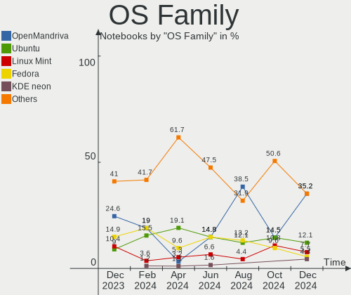
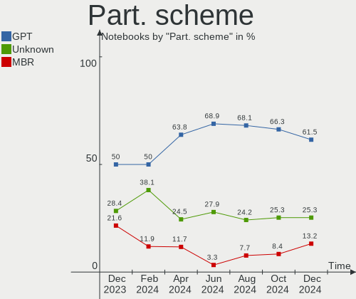
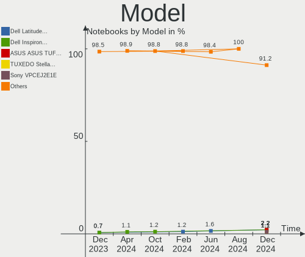
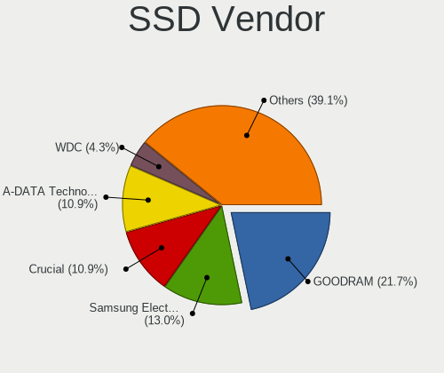
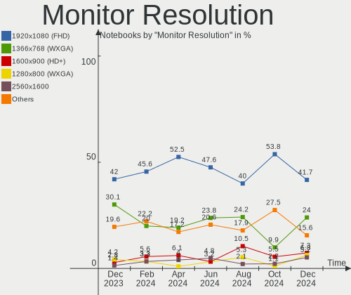

Linux in Poland - Hardware Trends (Notebooks)
---------------------------------------------

A project to identify most popular hardware characteristics and track their change
over time based on data collected by Linux users at https://Linux-Hardware.org.

Anyone can contribute to this report by the [hw-probe](https://github.com/linuxhw/hw-probe) tool:

    sudo -E hw-probe -all -upload

Period: Jul, 2023.

Contents
--------

* [ System ](#system)
  - [ OS                       ](#os)
  - [ OS Family                ](#os-family)
  - [ Kernel                   ](#kernel)
  - [ Kernel Family            ](#kernel-family)
  - [ Kernel Major Ver.        ](#kernel-major-ver)
  - [ Arch                     ](#arch)
  - [ DE                       ](#de)
  - [ Display Server           ](#display-server)
  - [ Display Manager          ](#display-manager)
  - [ OS Lang                  ](#os-lang)
  - [ Boot Mode                ](#boot-mode)
  - [ Filesystem               ](#filesystem)
  - [ Part. scheme             ](#part-scheme)
  - [ Dual Boot with Linux/BSD ](#dual-boot-with-linuxbsd)
  - [ Dual Boot (Win)          ](#dual-boot-win)

* [ Board ](#board)
  - [ Vendor                   ](#vendor)
  - [ Model                    ](#model)
  - [ Model Family             ](#model-family)
  - [ MFG Year                 ](#mfg-year)
  - [ Form Factor              ](#form-factor)
  - [ Secure Boot              ](#secure-boot)
  - [ Coreboot                 ](#coreboot)
  - [ RAM Size                 ](#ram-size)
  - [ RAM Used                 ](#ram-used)
  - [ Total Drives             ](#total-drives)
  - [ Has CD-ROM               ](#has-cd-rom)
  - [ Has Ethernet             ](#has-ethernet)
  - [ Has WiFi                 ](#has-wifi)
  - [ Has Bluetooth            ](#has-bluetooth)

* [ Location ](#location)
  - [ Country                  ](#country)
  - [ City                     ](#city)

* [ Drives ](#drives)
  - [ Drive Vendor             ](#drive-vendor)
  - [ Drive Model              ](#drive-model)
  - [ HDD Vendor               ](#hdd-vendor)
  - [ SSD Vendor               ](#ssd-vendor)
  - [ Drive Kind               ](#drive-kind)
  - [ Drive Connector          ](#drive-connector)
  - [ Drive Size               ](#drive-size)
  - [ Space Total              ](#space-total)
  - [ Space Used               ](#space-used)
  - [ Malfunc. Drives          ](#malfunc-drives)
  - [ Malfunc. Drive Vendor    ](#malfunc-drive-vendor)
  - [ Malfunc. HDD Vendor      ](#malfunc-hdd-vendor)
  - [ Malfunc. Drive Kind      ](#malfunc-drive-kind)
  - [ Failed Drives            ](#failed-drives)
  - [ Failed Drive Vendor      ](#failed-drive-vendor)
  - [ Drive Status             ](#drive-status)

* [ Storage controller ](#storage-controller)
  - [ Storage Vendor           ](#storage-vendor)
  - [ Storage Model            ](#storage-model)
  - [ Storage Kind             ](#storage-kind)

* [ Processor ](#processor)
  - [ CPU Vendor               ](#cpu-vendor)
  - [ CPU Model                ](#cpu-model)
  - [ CPU Model Family         ](#cpu-model-family)
  - [ CPU Cores                ](#cpu-cores)
  - [ CPU Sockets              ](#cpu-sockets)
  - [ CPU Threads              ](#cpu-threads)
  - [ CPU Op-Modes             ](#cpu-op-modes)
  - [ CPU Microcode            ](#cpu-microcode)
  - [ CPU Microarch            ](#cpu-microarch)

* [ Graphics ](#graphics)
  - [ GPU Vendor               ](#gpu-vendor)
  - [ GPU Model                ](#gpu-model)
  - [ GPU Combo                ](#gpu-combo)
  - [ GPU Driver               ](#gpu-driver)
  - [ GPU Memory               ](#gpu-memory)

* [ Monitor ](#monitor)
  - [ Monitor Vendor           ](#monitor-vendor)
  - [ Monitor Model            ](#monitor-model)
  - [ Monitor Resolution       ](#monitor-resolution)
  - [ Monitor Diagonal         ](#monitor-diagonal)
  - [ Monitor Width            ](#monitor-width)
  - [ Aspect Ratio             ](#aspect-ratio)
  - [ Monitor Area             ](#monitor-area)
  - [ Pixel Density            ](#pixel-density)
  - [ Multiple Monitors        ](#multiple-monitors)

* [ Network ](#network)
  - [ Net Controller Vendor    ](#net-controller-vendor)
  - [ Net Controller Model     ](#net-controller-model)
  - [ Wireless Vendor          ](#wireless-vendor)
  - [ Wireless Model           ](#wireless-model)
  - [ Ethernet Vendor          ](#ethernet-vendor)
  - [ Ethernet Model           ](#ethernet-model)
  - [ Net Controller Kind      ](#net-controller-kind)
  - [ Used Controller          ](#used-controller)
  - [ NICs                     ](#nics)
  - [ IPv6                     ](#ipv6)

* [ Bluetooth ](#bluetooth)
  - [ Bluetooth Vendor         ](#bluetooth-vendor)
  - [ Bluetooth Model          ](#bluetooth-model)

* [ Sound ](#sound)
  - [ Sound Vendor             ](#sound-vendor)
  - [ Sound Model              ](#sound-model)

* [ Memory ](#memory)
  - [ Memory Vendor            ](#memory-vendor)
  - [ Memory Model             ](#memory-model)
  - [ Memory Kind              ](#memory-kind)
  - [ Memory Form Factor       ](#memory-form-factor)
  - [ Memory Size              ](#memory-size)
  - [ Memory Speed             ](#memory-speed)

* [ Printers & scanners ](#printers--scanners)
  - [ Printer Vendor           ](#printer-vendor)
  - [ Printer Model            ](#printer-model)
  - [ Scanner Vendor           ](#scanner-vendor)
  - [ Scanner Model            ](#scanner-model)

* [ Camera ](#camera)
  - [ Camera Vendor            ](#camera-vendor)
  - [ Camera Model             ](#camera-model)

* [ Security ](#security)
  - [ Fingerprint Vendor       ](#fingerprint-vendor)
  - [ Fingerprint Model        ](#fingerprint-model)
  - [ Chipcard Vendor          ](#chipcard-vendor)
  - [ Chipcard Model           ](#chipcard-model)

* [ Unsupported ](#unsupported)
  - [ Unsupported Devices      ](#unsupported-devices)
  - [ Unsupported Device Types ](#unsupported-device-types)

System
------

OS
--

Installed operating systems

| Name                         | Notebooks | Percent |
|------------------------------|-----------|---------|
| Ubuntu 22.04                 | 6         | 8.33%   |
| Pop!_OS 22.04                | 6         | 8.33%   |
| OpenMandriva 23.03           | 6         | 8.33%   |
| Debian 12                    | 6         | 8.33%   |
| Fedora 38                    | 5         | 6.94%   |
| Linux Mint 21.1              | 4         | 5.56%   |
| Ubuntu 23.04                 | 3         | 4.17%   |
| OpenMandriva 23.07           | 3         | 4.17%   |
| Linux Mint 21.2              | 3         | 4.17%   |
| Arch Rolling                 | 3         | 4.17%   |
| Ubuntu 20.04                 | 2         | 2.78%   |
| OpenMandriva 23.01           | 2         | 2.78%   |
| MX 23                        | 2         | 2.78%   |
| Manjaro                      | 2         | 2.78%   |
| Xubuntu 22.04                | 1         | 1.39%   |
| Xubuntu 20.04                | 1         | 1.39%   |
| Ubuntu MATE 22.04            | 1         | 1.39%   |
| TUXEDO OS 22.04              | 1         | 1.39%   |
| ROSA 12.4                    | 1         | 1.39%   |
| ROSA 12.3                    | 1         | 1.39%   |
| openSUSE Tumbleweed-XXXXXXXX | 1         | 1.39%   |
| OpenMandriva 4.90            | 1         | 1.39%   |
| OpenMandriva 4.3             | 1         | 1.39%   |
| OpenMandriva 23.06           | 1         | 1.39%   |
| Nobara 38                    | 1         | 1.39%   |
| Nobara 37                    | 1         | 1.39%   |
| MX 21                        | 1         | 1.39%   |
| Manjaro 23.0.0               | 1         | 1.39%   |
| LMDE 5                       | 1         | 1.39%   |
| Linux Mint 20.3              | 1         | 1.39%   |
| KDE neon 22.04               | 1         | 1.39%   |
| Kali 2023.2                  | 1         | 1.39%   |
| EndeavourOS Rolling          | 1         | 1.39%   |

OS Family
---------

OS without a version

| Name         | Notebooks | Percent |
|--------------|-----------|---------|
| OpenMandriva | 14        | 19.44%  |
| Ubuntu       | 11        | 15.28%  |
| Linux Mint   | 8         | 11.11%  |
| Pop!_OS      | 6         | 8.33%   |
| Debian       | 6         | 8.33%   |
| Fedora       | 5         | 6.94%   |
| MX           | 3         | 4.17%   |
| Manjaro      | 3         | 4.17%   |
| Arch         | 3         | 4.17%   |
| Xubuntu      | 2         | 2.78%   |
| ROSA         | 2         | 2.78%   |
| Nobara       | 2         | 2.78%   |
| Ubuntu MATE  | 1         | 1.39%   |
| TUXEDO OS    | 1         | 1.39%   |
| openSUSE     | 1         | 1.39%   |
| LMDE         | 1         | 1.39%   |
| KDE neon     | 1         | 1.39%   |
| Kali         | 1         | 1.39%   |
| EndeavourOS  | 1         | 1.39%   |

Kernel
------

Version of the Linux kernel

| Version                            | Notebooks | Percent |
|------------------------------------|-----------|---------|
| 6.2.6-desktop-1omv2390             | 6         | 8.33%   |
| 6.2.6-76060206-generic             | 6         | 8.33%   |
| 5.19.0-46-generic                  | 5         | 6.94%   |
| 5.15.0-76-generic                  | 5         | 6.94%   |
| 6.3.5-desktop-3omv2390             | 4         | 5.56%   |
| 6.1.0-10-amd64                     | 4         | 5.56%   |
| 6.3.11-200.fc38.x86_64             | 3         | 4.17%   |
| 5.10.0-23-amd64                    | 3         | 4.17%   |
| 6.3.8-200.fc38.x86_64              | 2         | 2.78%   |
| 6.1.1-desktop-1omv2290             | 2         | 2.78%   |
| 5.19.0-32-generic                  | 2         | 2.78%   |
| 6.4.4-arch1-1                      | 1         | 1.39%   |
| 6.4.3-zen1-2-zen                   | 1         | 1.39%   |
| 6.4.3-1-default                    | 1         | 1.39%   |
| 6.4.2-arch1-1                      | 1         | 1.39%   |
| 6.3.12-204.fsync.fc38.x86_64       | 1         | 1.39%   |
| 6.3.12-204.fsync.fc37.x86_64       | 1         | 1.39%   |
| 6.3.11-2-MANJARO                   | 1         | 1.39%   |
| 6.3.0-kali1-amd64                  | 1         | 1.39%   |
| 6.3.0-2mx-ahs-amd64                | 1         | 1.39%   |
| 6.2.0-26-generic                   | 1         | 1.39%   |
| 6.2.0-25-generic                   | 1         | 1.39%   |
| 6.2.0-24-generic                   | 1         | 1.39%   |
| 6.2.0-23-generic                   | 1         | 1.39%   |
| 6.2.0-10011-tuxedo                 | 1         | 1.39%   |
| 6.1.39-1-lts                       | 1         | 1.39%   |
| 6.1.38-generic-1rosa2021.1-x86_64  | 1         | 1.39%   |
| 6.1.38-1-MANJARO                   | 1         | 1.39%   |
| 6.1.0-9-amd64                      | 1         | 1.39%   |
| 6.1.0-1015-oem                     | 1         | 1.39%   |
| 5.4.0-91-generic                   | 1         | 1.39%   |
| 5.4.0-152-generic                  | 1         | 1.39%   |
| 5.4.0-121-lowlatency               | 1         | 1.39%   |
| 5.19.0-45-generic                  | 1         | 1.39%   |
| 5.19.0-43-generic                  | 1         | 1.39%   |
| 5.18.12-desktop-3omv4090           | 1         | 1.39%   |
| 5.16.7-desktop-1omv4003            | 1         | 1.39%   |
| 5.15.75-generic-1rosa2021.1-x86_64 | 1         | 1.39%   |
| 5.15.0-67-generic                  | 1         | 1.39%   |
| 5.10.181-2-MANJARO                 | 1         | 1.39%   |

Kernel Family
-------------

Linux kernel without a distro release

| Version  | Notebooks | Percent |
|----------|-----------|---------|
| 6.2.6    | 12        | 16.67%  |
| 5.19.0   | 9         | 12.5%   |
| 6.1.0    | 6         | 8.33%   |
| 5.15.0   | 6         | 8.33%   |
| 6.2.0    | 5         | 6.94%   |
| 6.3.5    | 4         | 5.56%   |
| 6.3.11   | 4         | 5.56%   |
| 5.10.0   | 4         | 5.56%   |
| 5.4.0    | 3         | 4.17%   |
| 6.4.3    | 2         | 2.78%   |
| 6.3.8    | 2         | 2.78%   |
| 6.3.12   | 2         | 2.78%   |
| 6.3.0    | 2         | 2.78%   |
| 6.1.38   | 2         | 2.78%   |
| 6.1.1    | 2         | 2.78%   |
| 6.4.4    | 1         | 1.39%   |
| 6.4.2    | 1         | 1.39%   |
| 6.1.39   | 1         | 1.39%   |
| 5.18.12  | 1         | 1.39%   |
| 5.16.7   | 1         | 1.39%   |
| 5.15.75  | 1         | 1.39%   |
| 5.10.181 | 1         | 1.39%   |

Kernel Major Ver.
-----------------

Linux kernel major version

| Version | Notebooks | Percent |
|---------|-----------|---------|
| 6.2     | 17        | 23.61%  |
| 6.3     | 14        | 19.44%  |
| 6.1     | 11        | 15.28%  |
| 5.19    | 9         | 12.5%   |
| 5.15    | 7         | 9.72%   |
| 5.10    | 5         | 6.94%   |
| 6.4     | 4         | 5.56%   |
| 5.4     | 3         | 4.17%   |
| 5.18    | 1         | 1.39%   |
| 5.16    | 1         | 1.39%   |

Arch
----

OS architecture (x86_64, i586, etc.)

| Name   | Notebooks | Percent |
|--------|-----------|---------|
| x86_64 | 72        | 100%    |

DE
--

Desktop Environment

| Name            | Notebooks | Percent |
|-----------------|-----------|---------|
| GNOME           | 29        | 40.28%  |
| KDE5            | 21        | 29.17%  |
| XFCE            | 6         | 8.33%   |
| X-Cinnamon      | 6         | 8.33%   |
| MATE            | 4         | 5.56%   |
| LXQt            | 2         | 2.78%   |
| i3              | 1         | 1.39%   |
| Hyprland        | 1         | 1.39%   |
| GNOME Flashback | 1         | 1.39%   |
| Unknown         | 1         | 1.39%   |

Display Server
--------------

X11 or Wayland

| Name    | Notebooks | Percent |
|---------|-----------|---------|
| X11     | 51        | 70.83%  |
| Wayland | 20        | 27.78%  |
| Tty     | 1         | 1.39%   |

Display Manager
---------------

SDDM, LightDM, etc.

| Name    | Notebooks | Percent |
|---------|-----------|---------|
| SDDM    | 21        | 29.17%  |
| Unknown | 21        | 29.17%  |
| LightDM | 13        | 18.06%  |
| GDM3    | 11        | 15.28%  |
| GDM     | 6         | 8.33%   |

OS Lang
-------

Language

| Lang    | Notebooks | Percent |
|---------|-----------|---------|
| pl_PL   | 44        | 61.11%  |
| en_US   | 20        | 27.78%  |
| ru_RU   | 2         | 2.78%   |
| C       | 2         | 2.78%   |
| ru_UA   | 1         | 1.39%   |
| en_GB   | 1         | 1.39%   |
| en_DK   | 1         | 1.39%   |
| Unknown | 1         | 1.39%   |

Boot Mode
---------

EFI or BIOS

| Mode | Notebooks | Percent |
|------|-----------|---------|
| EFI  | 40        | 55.56%  |
| BIOS | 32        | 44.44%  |

Filesystem
----------

Type of filesystem

| Type    | Notebooks | Percent |
|---------|-----------|---------|
| Ext4    | 45        | 62.5%   |
| Btrfs   | 13        | 18.06%  |
| Tmpfs   | 7         | 9.72%   |
| Overlay | 5         | 6.94%   |
| Zfs     | 1         | 1.39%   |
| F2fs    | 1         | 1.39%   |

Part. scheme
------------

Scheme of partitioning

| Type    | Notebooks | Percent |
|---------|-----------|---------|
| GPT     | 46        | 63.89%  |
| Unknown | 20        | 27.78%  |
| MBR     | 6         | 8.33%   |

Dual Boot with Linux/BSD
------------------------

Hosting more than one Linux/BSD

| Dual boot | Notebooks | Percent |
|-----------|-----------|---------|
| No        | 56        | 77.78%  |
| Yes       | 16        | 22.22%  |

Dual Boot (Win)
---------------

Hosting Linux and Windows

| Dual boot | Notebooks | Percent |
|-----------|-----------|---------|
| No        | 56        | 77.78%  |
| Yes       | 16        | 22.22%  |

Board
-----

Vendor
------

Motherboard manufacturer

| Name                | Notebooks | Percent |
|---------------------|-----------|---------|
| Lenovo              | 20        | 27.78%  |
| Dell                | 12        | 16.67%  |
| Hewlett-Packard     | 10        | 13.89%  |
| ASUSTek Computer    | 10        | 13.89%  |
| Toshiba             | 3         | 4.17%   |
| Google              | 3         | 4.17%   |
| TUXEDO              | 2         | 2.78%   |
| MSI                 | 2         | 2.78%   |
| Acer                | 2         | 2.78%   |
| Timi                | 1         | 1.39%   |
| Teclast             | 1         | 1.39%   |
| Samsung Electronics | 1         | 1.39%   |
| Razer               | 1         | 1.39%   |
| Packard Bell        | 1         | 1.39%   |
| HUAWEI              | 1         | 1.39%   |
| Apple               | 1         | 1.39%   |
| AAEON               | 1         | 1.39%   |

Model
-----

Motherboard model

| Name                                             | Notebooks | Percent |
|--------------------------------------------------|-----------|---------|
| HP Pavilion Laptop 15-eh2xxx                     | 2         | 2.78%   |
| Google Relm                                      | 2         | 2.78%   |
| ASUS X555LJ                                      | 2         | 2.78%   |
| TUXEDO Stellaris AMD Gen3 (CZN)                  | 1         | 1.39%   |
| TUXEDO InfinityBook Pro Gen7 (MK2)               | 1         | 1.39%   |
| Toshiba Satellite S75-B                          | 1         | 1.39%   |
| Toshiba Satellite C50D-A-11G                     | 1         | 1.39%   |
| Toshiba PORTEGE M700                             | 1         | 1.39%   |
| Timi TM1701                                      | 1         | 1.39%   |
| Teclast F6 Pro                                   | 1         | 1.39%   |
| Samsung 350V5C/351V5C/3540VC/3440VC              | 1         | 1.39%   |
| Razer Blade 15 Base Model (Mid 2021) - RZ09-0410 | 1         | 1.39%   |
| Packard Bell EasyNote TSX66HR                    | 1         | 1.39%   |
| MSI PR601/VR603                                  | 1         | 1.39%   |
| MSI GE70 2QD                                     | 1         | 1.39%   |
| Lenovo Yoga 900-13ISK 80MK                       | 1         | 1.39%   |
| Lenovo Yoga 3 Pro-1370 80HE                      | 1         | 1.39%   |
| Lenovo ThinkPad X240 20AMS07T00                  | 1         | 1.39%   |
| Lenovo ThinkPad T495 20NKS0T101                  | 1         | 1.39%   |
| Lenovo ThinkPad T470s 20HGS01A00                 | 1         | 1.39%   |
| Lenovo ThinkPad T470 20HES0FA03                  | 1         | 1.39%   |
| Lenovo ThinkPad P15 Gen 1 20STS1J900             | 1         | 1.39%   |
| Lenovo ThinkPad L470 20J5S01S00                  | 1         | 1.39%   |
| Lenovo ThinkPad Edge 0578P6G                     | 1         | 1.39%   |
| Lenovo ThinkPad E15 Gen 3 20YG00A3PB             | 1         | 1.39%   |
| Lenovo ThinkPad E15 Gen 3 20YG003VPB             | 1         | 1.39%   |
| Lenovo ThinkPad E15 Gen 2 20T8000MPB             | 1         | 1.39%   |
| Lenovo ThinkPad A285 20MXS0AE00                  | 1         | 1.39%   |
| Lenovo Legion 5 15ACH6 82JW                      | 1         | 1.39%   |
| Lenovo IdeaPad Y700-15ISK 80NV                   | 1         | 1.39%   |
| Lenovo IdeaPad L340-15IRH Gaming 81LK            | 1         | 1.39%   |
| Lenovo IdeaPad 5 14ARE05 81YM                    | 1         | 1.39%   |
| Lenovo IdeaPad 320-17ABR 80YN                    | 1         | 1.39%   |
| Lenovo IdeaPad 100S-14IBR 80R9                   | 1         | 1.39%   |
| Lenovo G500s 20245                               | 1         | 1.39%   |
| HUAWEI HVY-WXX9                                  | 1         | 1.39%   |
| HP Pavilion HDX9200                              | 1         | 1.39%   |
| HP Pavilion Gaming Laptop 17-cd1xxx              | 1         | 1.39%   |
| HP Pavilion Gaming Laptop                        | 1         | 1.39%   |
| HP Laptop 14s-fq0xxx                             | 1         | 1.39%   |

Model Family
------------

Motherboard model prefix

| Name                  | Notebooks | Percent |
|-----------------------|-----------|---------|
| Lenovo ThinkPad       | 11        | 15.28%  |
| Dell Latitude         | 7         | 9.72%   |
| Lenovo IdeaPad        | 5         | 6.94%   |
| HP Pavilion           | 5         | 6.94%   |
| Dell Inspiron         | 4         | 5.56%   |
| Toshiba Satellite     | 2         | 2.78%   |
| Lenovo Yoga           | 2         | 2.78%   |
| Google Relm           | 2         | 2.78%   |
| ASUS X555LJ           | 2         | 2.78%   |
| Acer Aspire           | 2         | 2.78%   |
| TUXEDO Stellaris      | 1         | 1.39%   |
| TUXEDO InfinityBook   | 1         | 1.39%   |
| Toshiba PORTEGE       | 1         | 1.39%   |
| Timi TM1701           | 1         | 1.39%   |
| Teclast F6            | 1         | 1.39%   |
| Samsung 350V5C        | 1         | 1.39%   |
| Razer Blade           | 1         | 1.39%   |
| Packard Bell EasyNote | 1         | 1.39%   |
| MSI PR601             | 1         | 1.39%   |
| MSI GE70              | 1         | 1.39%   |
| Lenovo Legion         | 1         | 1.39%   |
| Lenovo G500s          | 1         | 1.39%   |
| HUAWEI HVY-WXX9       | 1         | 1.39%   |
| HP Laptop             | 1         | 1.39%   |
| HP Compaq             | 1         | 1.39%   |
| HP 650                | 1         | 1.39%   |
| HP 550                | 1         | 1.39%   |
| HP 255                | 1         | 1.39%   |
| Google Snappy         | 1         | 1.39%   |
| Dell XPS              | 1         | 1.39%   |
| ASUS ZenBook          | 1         | 1.39%   |
| ASUS X555LD           | 1         | 1.39%   |
| ASUS VivoBook         | 1         | 1.39%   |
| ASUS TUF              | 1         | 1.39%   |
| ASUS ROG              | 1         | 1.39%   |
| ASUS F7E              | 1         | 1.39%   |
| ASUS E200HA           | 1         | 1.39%   |
| ASUS 1011PX           | 1         | 1.39%   |
| Apple MacBookPro9     | 1         | 1.39%   |
| AAEON AEC-6637        | 1         | 1.39%   |

MFG Year
--------

Motherboard manufacture year

| Year | Notebooks | Percent |
|------|-----------|---------|
| 2021 | 10        | 13.89%  |
| 2019 | 8         | 11.11%  |
| 2020 | 7         | 9.72%   |
| 2015 | 7         | 9.72%   |
| 2013 | 7         | 9.72%   |
| 2008 | 7         | 9.72%   |
| 2017 | 6         | 8.33%   |
| 2014 | 4         | 5.56%   |
| 2012 | 4         | 5.56%   |
| 2022 | 3         | 4.17%   |
| 2018 | 3         | 4.17%   |
| 2023 | 2         | 2.78%   |
| 2011 | 2         | 2.78%   |
| 2016 | 1         | 1.39%   |
| 2010 | 1         | 1.39%   |

Form Factor
-----------

Physical design of the computer

| Name     | Notebooks | Percent |
|----------|-----------|---------|
| Notebook | 72        | 100%    |

Secure Boot
-----------

Enabled or disabled

| State    | Notebooks | Percent |
|----------|-----------|---------|
| Disabled | 67        | 93.06%  |
| Enabled  | 5         | 6.94%   |

Coreboot
--------

Have coreboot on board

| Used | Notebooks | Percent |
|------|-----------|---------|
| No   | 69        | 95.83%  |
| Yes  | 3         | 4.17%   |

RAM Size
--------

Total RAM memory

| Size in GB  | Notebooks | Percent |
|-------------|-----------|---------|
| 4.01-8.0    | 26        | 36.11%  |
| 16.01-24.0  | 14        | 19.44%  |
| 3.01-4.0    | 11        | 15.28%  |
| 8.01-16.0   | 9         | 12.5%   |
| 32.01-64.0  | 4         | 5.56%   |
| 64.01-256.0 | 3         | 4.17%   |
| 1.01-2.0    | 3         | 4.17%   |
| 2.01-3.0    | 1         | 1.39%   |
| 0.51-1.0    | 1         | 1.39%   |

RAM Used
--------

Used RAM memory

| Used GB   | Notebooks | Percent |
|-----------|-----------|---------|
| 1.01-2.0  | 21        | 29.17%  |
| 2.01-3.0  | 19        | 26.39%  |
| 4.01-8.0  | 17        | 23.61%  |
| 3.01-4.0  | 9         | 12.5%   |
| 8.01-16.0 | 4         | 5.56%   |
| 0.51-1.0  | 2         | 2.78%   |

Total Drives
------------

Number of drives on board

| Drives | Notebooks | Percent |
|--------|-----------|---------|
| 1      | 52        | 72.22%  |
| 2      | 20        | 27.78%  |

Has CD-ROM
----------

Has CD-ROM on board

| Presented | Notebooks | Percent |
|-----------|-----------|---------|
| No        | 54        | 75%     |
| Yes       | 18        | 25%     |

Has Ethernet
------------

Has Ethernet on board

| Presented | Notebooks | Percent |
|-----------|-----------|---------|
| Yes       | 51        | 70.83%  |
| No        | 21        | 29.17%  |

Has WiFi
--------

Has WiFi module

| Presented | Notebooks | Percent |
|-----------|-----------|---------|
| Yes       | 70        | 97.22%  |
| No        | 2         | 2.78%   |

Has Bluetooth
-------------

Has Bluetooth module

| Presented | Notebooks | Percent |
|-----------|-----------|---------|
| Yes       | 62        | 86.11%  |
| No        | 10        | 13.89%  |

Location
--------

Country
-------

Geographic location (country)

| Country | Notebooks | Percent |
|---------|-----------|---------|
| Poland  | 72        | 100%    |

City
----

Geographic location (city)

| City             | Notebooks | Percent |
|------------------|-----------|---------|
| Warsaw           | 22        | 30.56%  |
| Wroclaw          | 4         | 5.56%   |
| Katowice         | 4         | 5.56%   |
| Poznan           | 3         | 4.17%   |
| Zabrze           | 2         | 2.78%   |
| Legnica          | 2         | 2.78%   |
| Kielce           | 2         | 2.78%   |
| Grajewo          | 2         | 2.78%   |
| Bydgoszcz        | 2         | 2.78%   |
| Bialystok        | 2         | 2.78%   |
| Żory            | 1         | 1.39%   |
| Zielona Góra    | 1         | 1.39%   |
| Zabrowo          | 1         | 1.39%   |
| Wołomin         | 1         | 1.39%   |
| Turek            | 1         | 1.39%   |
| Sucha Beskidzka  | 1         | 1.39%   |
| Stargard         | 1         | 1.39%   |
| Sitno            | 1         | 1.39%   |
| Ryczowek         | 1         | 1.39%   |
| Rybnik           | 1         | 1.39%   |
| Pszczyna         | 1         | 1.39%   |
| Przeworsk        | 1         | 1.39%   |
| Otwock           | 1         | 1.39%   |
| Ostrołęka      | 1         | 1.39%   |
| Nysa             | 1         | 1.39%   |
| Malkinia Gorna   | 1         | 1.39%   |
| Lublin           | 1         | 1.39%   |
| Lodz             | 1         | 1.39%   |
| Krakow           | 1         | 1.39%   |
| Kedzierzyn-Kozle | 1         | 1.39%   |
| Kalisz           | 1         | 1.39%   |
| Jozefow          | 1         | 1.39%   |
| Gliwice          | 1         | 1.39%   |
| Gdansk           | 1         | 1.39%   |
| Dobra            | 1         | 1.39%   |
| Cieszyn          | 1         | 1.39%   |
| Chorzele         | 1         | 1.39%   |

Drives
------

Drive Vendor
------------

Hard drive vendors

| Vendor              | Notebooks | Drives | Percent |
|---------------------|-----------|--------|---------|
| Samsung Electronics | 14        | 15     | 16.28%  |
| WDC                 | 8         | 8      | 9.3%    |
| Seagate             | 8         | 8      | 9.3%    |
| Unknown             | 5         | 6      | 5.81%   |
| A-DATA Technology   | 5         | 5      | 5.81%   |
| SK hynix            | 4         | 4      | 4.65%   |
| SanDisk             | 4         | 4      | 4.65%   |
| GOODRAM             | 4         | 4      | 4.65%   |
| Crucial             | 4         | 4      | 4.65%   |
| Kingston            | 3         | 3      | 3.49%   |
| Intel               | 3         | 3      | 3.49%   |
| Hitachi             | 3         | 3      | 3.49%   |
| Toshiba             | 2         | 2      | 2.33%   |
| Silicon Motion      | 2         | 2      | 2.33%   |
| Micron Technology   | 2         | 2      | 2.33%   |
| China               | 2         | 2      | 2.33%   |
| Transcend           | 1         | 1      | 1.16%   |
| SPCC                | 1         | 1      | 1.16%   |
| Realtek             | 1         | 1      | 1.16%   |
| PNY                 | 1         | 1      | 1.16%   |
| Plextor             | 1         | 1      | 1.16%   |
| Patriot             | 1         | 1      | 1.16%   |
| Lenovo              | 1         | 1      | 1.16%   |
| KIOXIA              | 1         | 1      | 1.16%   |
| KingSpec            | 1         | 1      | 1.16%   |
| JMicron Technology  | 1         | 1      | 1.16%   |
| HGST                | 1         | 1      | 1.16%   |
| Fujitsu             | 1         | 1      | 1.16%   |
| Biostar             | 1         | 1      | 1.16%   |

Drive Model
-----------

Hard drive models

| Model                                                 | Notebooks | Percent |
|-------------------------------------------------------|-----------|---------|
| Seagate ST1000LM024 HN-M101MBB 1TB                    | 3         | 3.41%   |
| Samsung NVMe SSD Controller SM981/PM981/PM983 500GB   | 3         | 3.41%   |
| Samsung NVMe SSD Controller PM9A1/PM9A3/980PRO 1TB    | 3         | 3.41%   |
| GOODRAM SSDPR-CX400-256-G2 256GB                      | 2         | 2.27%   |
| A-DATA SU650 512GB SSD                                | 2         | 2.27%   |
| WDC WDS240G2G0A-00JH30 240GB SSD                      | 1         | 1.14%   |
| WDC WDS100T2B0C-00PXH0 1TB                            | 1         | 1.14%   |
| WDC WDS100T2B0B-00YS70 1TB SSD                        | 1         | 1.14%   |
| WDC WD10SPCX-24HWST1 1TB                              | 1         | 1.14%   |
| WDC WD10JPVT-75A1YT0 1TB                              | 1         | 1.14%   |
| WDC PC SN530 SDBPNPZ-512G-1006 512GB                  | 1         | 1.14%   |
| WDC PC SN530 NVMe 256GB                               | 1         | 1.14%   |
| WDC PC SN520 SDAPNUW-512G-1002 512GB                  | 1         | 1.14%   |
| Unknown MMC Card  32GB                                | 1         | 1.14%   |
| Unknown MMC Card  16GB                                | 1         | 1.14%   |
| Unknown MMC Card  128GB                               | 1         | 1.14%   |
| Unknown HBG4a2  32GB                                  | 1         | 1.14%   |
| Unknown DB4032  32GB                                  | 1         | 1.14%   |
| Unknown BJNB4R  32GB                                  | 1         | 1.14%   |
| Transcend TS1TSSD220Q 1TB                             | 1         | 1.14%   |
| Toshiba XG6 NVMe SSD Controller 512GB                 | 1         | 1.14%   |
| Toshiba KBG40ZNS256G NVMe 256GB                       | 1         | 1.14%   |
| SPCC Solid State Disk 64GB                            | 1         | 1.14%   |
| SK hynix SKHynix_HFS512GD9TNI-L2B0B 512GB             | 1         | 1.14%   |
| SK hynix SH920 mSATA 256GB SSD                        | 1         | 1.14%   |
| SK hynix HFS256G39TND-N210A 256GB SSD                 | 1         | 1.14%   |
| SK hynix BC711 NVMe 512GB                             | 1         | 1.14%   |
| Silicon Motion SM2263EN/SM2263XT SSD Controller 500GB | 1         | 1.14%   |
| Silicon Motion PCIe-8 SSD 512GB                       | 1         | 1.14%   |
| Seagate ST9250827AS 250GB                             | 1         | 1.14%   |
| Seagate ST9250410ASG 250GB                            | 1         | 1.14%   |
| Seagate ST500LT012-9WS142 500GB                       | 1         | 1.14%   |
| Seagate ST1000LX015-1U7172 1TB                        | 1         | 1.14%   |
| Seagate ST1000LM049-2GH172 1TB                        | 1         | 1.14%   |
| SanDisk SSD PLUS 480GB                                | 1         | 1.14%   |
| SanDisk SSD PLUS 240GB                                | 1         | 1.14%   |
| SanDisk SD9SN8W-128G-1006 128GB SSD                   | 1         | 1.14%   |
| SanDisk SD9SB8W1T001122 1TB SSD                       | 1         | 1.14%   |
| Samsung SSD SM841 2.5 7mm 128GB                       | 1         | 1.14%   |
| Samsung SSD 980 1TB                                   | 1         | 1.14%   |

HDD Vendor
----------

Hard disk drive vendors

| Vendor             | Notebooks | Drives | Percent |
|--------------------|-----------|--------|---------|
| Seagate            | 8         | 8      | 50%     |
| Hitachi            | 3         | 3      | 18.75%  |
| WDC                | 2         | 2      | 12.5%   |
| JMicron Technology | 1         | 1      | 6.25%   |
| HGST               | 1         | 1      | 6.25%   |
| Fujitsu            | 1         | 1      | 6.25%   |

SSD Vendor
----------

Solid state drive vendors

| Vendor              | Notebooks | Drives | Percent |
|---------------------|-----------|--------|---------|
| SanDisk             | 4         | 4      | 12.12%  |
| Crucial             | 4         | 4      | 12.12%  |
| A-DATA Technology   | 4         | 4      | 12.12%  |
| GOODRAM             | 3         | 3      | 9.09%   |
| WDC                 | 2         | 2      | 6.06%   |
| SK hynix            | 2         | 2      | 6.06%   |
| Samsung Electronics | 2         | 2      | 6.06%   |
| Micron Technology   | 2         | 2      | 6.06%   |
| China               | 2         | 2      | 6.06%   |
| Transcend           | 1         | 1      | 3.03%   |
| SPCC                | 1         | 1      | 3.03%   |
| PNY                 | 1         | 1      | 3.03%   |
| Plextor             | 1         | 1      | 3.03%   |
| Patriot             | 1         | 1      | 3.03%   |
| Kingston            | 1         | 1      | 3.03%   |
| KingSpec            | 1         | 1      | 3.03%   |
| Biostar             | 1         | 1      | 3.03%   |

Drive Kind
----------

HDD or SSD

| Kind | Notebooks | Drives | Percent |
|------|-----------|--------|---------|
| SSD  | 30        | 33     | 37.97%  |
| NVMe | 29        | 33     | 36.71%  |
| HDD  | 15        | 16     | 18.99%  |
| MMC  | 5         | 6      | 6.33%   |

Drive Connector
---------------

SATA, SAS, NVMe, etc.

| Type | Notebooks | Drives | Percent |
|------|-----------|--------|---------|
| SATA | 41        | 47     | 52.56%  |
| NVMe | 29        | 32     | 37.18%  |
| MMC  | 5         | 6      | 6.41%   |
| SAS  | 3         | 3      | 3.85%   |

Drive Size
----------

Size of hard drive

| Size in TB | Notebooks | Drives | Percent |
|------------|-----------|--------|---------|
| 0.01-0.5   | 26        | 30     | 59.09%  |
| 0.51-1.0   | 18        | 19     | 40.91%  |

Space Total
-----------

Amount of disk space available on the file system

| Size in GB | Notebooks | Percent |
|------------|-----------|---------|
| 101-250    | 24        | 33.33%  |
| 251-500    | 14        | 19.44%  |
| 1001-2000  | 8         | 11.11%  |
| 501-1000   | 8         | 11.11%  |
| 1-20       | 5         | 6.94%   |
| 21-50      | 4         | 5.56%   |
| 51-100     | 4         | 5.56%   |
| 2001-3000  | 3         | 4.17%   |
| Unknown    | 2         | 2.78%   |

Space Used
----------

Amount of used disk space

| Used GB   | Notebooks | Percent |
|-----------|-----------|---------|
| 1-20      | 28        | 38.89%  |
| 101-250   | 15        | 20.83%  |
| 21-50     | 11        | 15.28%  |
| 1001-2000 | 4         | 5.56%   |
| 501-1000  | 4         | 5.56%   |
| 51-100    | 4         | 5.56%   |
| 251-500   | 3         | 4.17%   |
| Unknown   | 2         | 2.78%   |
| 2001-3000 | 1         | 1.39%   |

Malfunc. Drives
---------------

Drive models with a malfunction

| Model                              | Notebooks | Drives | Percent |
|------------------------------------|-----------|--------|---------|
| Seagate ST9250827AS 250GB          | 1         | 1      | 11.11%  |
| Seagate ST9250410ASG 250GB         | 1         | 1      | 11.11%  |
| Seagate ST500LT012-9WS142 500GB    | 1         | 1      | 11.11%  |
| Seagate ST1000LM024 HN-M101MBB 1TB | 1         | 1      | 11.11%  |
| Hitachi HTS543225L9SA00 250GB      | 1         | 1      | 11.11%  |
| Fujitsu MHZ2120BH G2 120GB         | 1         | 1      | 11.11%  |
| Crucial CT256M550SSD1 256GB        | 1         | 1      | 11.11%  |
| Crucial CT1000MX500SSD4 1TB        | 1         | 1      | 11.11%  |
| China SATA3 512GB SSD              | 1         | 1      | 11.11%  |

Malfunc. Drive Vendor
---------------------

Vendors of faulty drives

| Vendor  | Notebooks | Drives | Percent |
|---------|-----------|--------|---------|
| Seagate | 4         | 4      | 44.44%  |
| Crucial | 2         | 2      | 22.22%  |
| Hitachi | 1         | 1      | 11.11%  |
| Fujitsu | 1         | 1      | 11.11%  |
| China   | 1         | 1      | 11.11%  |

Malfunc. HDD Vendor
-------------------

Vendors of faulty HDD drives

| Vendor  | Notebooks | Drives | Percent |
|---------|-----------|--------|---------|
| Seagate | 4         | 4      | 66.67%  |
| Hitachi | 1         | 1      | 16.67%  |
| Fujitsu | 1         | 1      | 16.67%  |

Malfunc. Drive Kind
-------------------

Kinds of faulty drives

| Kind | Notebooks | Drives | Percent |
|------|-----------|--------|---------|
| HDD  | 5         | 6      | 62.5%   |
| SSD  | 3         | 3      | 37.5%   |

Failed Drives
-------------

Failed drive models

Zero info for selected period =(

Failed Drive Vendor
-------------------

Failed drive vendors

Zero info for selected period =(

Drive Status
------------

Number of failed and malfunc. drives

| Status   | Notebooks | Drives | Percent |
|----------|-----------|--------|---------|
| Works    | 36        | 43     | 47.37%  |
| Detected | 32        | 36     | 42.11%  |
| Malfunc  | 8         | 9      | 10.53%  |

Storage controller
------------------

Storage Vendor
--------------

Storage controller vendors

| Vendor                       | Notebooks | Percent |
|------------------------------|-----------|---------|
| Intel                        | 43        | 54.43%  |
| Samsung Electronics          | 12        | 15.19%  |
| AMD                          | 6         | 7.59%   |
| SanDisk                      | 4         | 5.06%   |
| SK hynix                     | 2         | 2.53%   |
| Silicon Motion               | 2         | 2.53%   |
| KIOXIA                       | 2         | 2.53%   |
| Kingston Technology Company  | 2         | 2.53%   |
| Toshiba America Info Systems | 1         | 1.27%   |
| Silicon Image                | 1         | 1.27%   |
| Phison Electronics           | 1         | 1.27%   |
| Nvidia                       | 1         | 1.27%   |
| Lenovo                       | 1         | 1.27%   |
| ADATA Technology             | 1         | 1.27%   |

Storage Model
-------------

Storage controller models

| Model                                                                            | Notebooks | Percent |
|----------------------------------------------------------------------------------|-----------|---------|
| Intel 82801 Mobile SATA Controller [RAID mode]                                   | 6         | 7.06%   |
| Intel 7 Series Chipset Family 6-port SATA Controller [AHCI mode]                 | 6         | 7.06%   |
| AMD FCH SATA Controller [AHCI mode]                                              | 6         | 7.06%   |
| Samsung NVMe SSD Controller 980                                                  | 5         | 5.88%   |
| Intel Sunrise Point-LP SATA Controller [AHCI mode]                               | 5         | 5.88%   |
| Intel 82801HM/HEM (ICH8M/ICH8M-E) SATA Controller [AHCI mode]                    | 4         | 4.71%   |
| Intel 82801HM/HEM (ICH8M/ICH8M-E) IDE Controller                                 | 4         | 4.71%   |
| Intel 8 Series SATA Controller 1 [AHCI mode]                                     | 4         | 4.71%   |
| Samsung NVMe SSD Controller SM981/PM981/PM983                                    | 3         | 3.53%   |
| Samsung NVMe SSD Controller PM9A1/PM9A3/980PRO                                   | 3         | 3.53%   |
| SanDisk WD Blue SN550 NVMe SSD                                                   | 2         | 2.35%   |
| KIOXIA NVMe SSD Controller BG4 (DRAM-less)                                       | 2         | 2.35%   |
| Intel Wildcat Point-LP SATA Controller [AHCI Mode]                               | 2         | 2.35%   |
| Intel SSD 660P Series                                                            | 2         | 2.35%   |
| Intel HM170/QM170 Chipset SATA Controller [AHCI Mode]                            | 2         | 2.35%   |
| Intel Cannon Lake Mobile PCH SATA AHCI Controller                                | 2         | 2.35%   |
| Intel 8 Series/C220 Series Chipset Family 6-port SATA Controller 1 [AHCI mode]   | 2         | 2.35%   |
| Toshiba America Info Systems XG6 NVMe SSD Controller                             | 1         | 1.18%   |
| SK hynix PC611 NVMe Solid State Drive                                            | 1         | 1.18%   |
| SK hynix Gold P31/BC711/PC711 NVMe Solid State Drive                             | 1         | 1.18%   |
| Silicon Motion SM2263EN/SM2263XT (DRAM-less) NVMe SSD Controllers                | 1         | 1.18%   |
| Silicon Motion Non-Volatile memory controller                                    | 1         | 1.18%   |
| Silicon Image SiI 3531 [SATALink/SATARaid] Serial ATA Controller                 | 1         | 1.18%   |
| SanDisk WD Blue SN500 / PC SN520 NVMe SSD                                        | 1         | 1.18%   |
| SanDisk IX SN530 NVMe SSD (DRAM-less)                                            | 1         | 1.18%   |
| Samsung NVMe SSD Controller SM961/PM961/SM963                                    | 1         | 1.18%   |
| Phison PS5013 E13 NVMe Controller                                                | 1         | 1.18%   |
| Nvidia MCP78S [GeForce 8200] SATA Controller (non-AHCI mode)                     | 1         | 1.18%   |
| Nvidia MCP78S [GeForce 8200] IDE                                                 | 1         | 1.18%   |
| Lenovo LENSE30256GMSP34MEAT3TA                                                   | 1         | 1.18%   |
| Kingston Company NVMe Controller                                                 | 1         | 1.18%   |
| Kingston Company KC3000/Renegade NVMe SSD                                        | 1         | 1.18%   |
| Intel Volume Management Device NVMe RAID Controller                              | 1         | 1.18%   |
| Intel SSD DC P4101/Pro 7600p/760p/E 6100p Series                                 | 1         | 1.18%   |
| Intel NM10/ICH7 Family SATA Controller [AHCI mode]                               | 1         | 1.18%   |
| Intel Celeron/Pentium Silver Processor SATA Controller                           | 1         | 1.18%   |
| Intel Cannon Point-LP SATA Controller [AHCI Mode]                                | 1         | 1.18%   |
| Intel Atom/Celeron/Pentium Processor x5-E8000/J3xxx/N3xxx Series SATA Controller | 1         | 1.18%   |
| Intel 82801IBM/IEM (ICH9M/ICH9M-E) 4 port SATA Controller [AHCI mode]            | 1         | 1.18%   |
| Intel 6 Series/C200 Series Chipset Family 6 port Mobile SATA AHCI Controller     | 1         | 1.18%   |

Storage Kind
------------

Kind of storage controller (IDE, SATA, NVMe, SAS, ...)

| Kind | Notebooks | Percent |
|------|-----------|---------|
| SATA | 40        | 48.78%  |
| NVMe | 29        | 35.37%  |
| RAID | 8         | 9.76%   |
| IDE  | 5         | 6.1%    |

Processor
---------

CPU Vendor
----------

Processor vendors

| Vendor | Notebooks | Percent |
|--------|-----------|---------|
| Intel  | 53        | 73.61%  |
| AMD    | 19        | 26.39%  |

CPU Model
---------

Processor models

| Model                                    | Notebooks | Percent |
|------------------------------------------|-----------|---------|
| Intel Celeron CPU N3060 @ 1.60GHz        | 3         | 4.17%   |
| AMD Ryzen 5 4500U with Radeon Graphics   | 3         | 4.17%   |
| Intel Core i7-9750H CPU @ 2.60GHz        | 2         | 2.78%   |
| Intel Core i5-8250U CPU @ 1.60GHz        | 2         | 2.78%   |
| Intel Core i5-7300U CPU @ 2.60GHz        | 2         | 2.78%   |
| Intel Core i5-3210M CPU @ 2.50GHz        | 2         | 2.78%   |
| Intel Core i3-4030U CPU @ 1.90GHz        | 2         | 2.78%   |
| Intel 12th Gen Core i7-12700H            | 2         | 2.78%   |
| AMD Ryzen 5 4600H with Radeon Graphics   | 2         | 2.78%   |
| Intel Xeon W-10855M CPU @ 2.80GHz        | 1         | 1.39%   |
| Intel Pentium Silver N5000 CPU @ 1.10GHz | 1         | 1.39%   |
| Intel Pentium Dual CPU T3400 @ 2.16GHz   | 1         | 1.39%   |
| Intel Pentium CPU B980 @ 2.40GHz         | 1         | 1.39%   |
| Intel Pentium CPU 2020M @ 2.40GHz        | 1         | 1.39%   |
| Intel Core m3-7Y30 CPU @ 1.00GHz         | 1         | 1.39%   |
| Intel Core M-5Y71 CPU @ 1.20GHz          | 1         | 1.39%   |
| Intel Core i7-6700HQ CPU @ 2.60GHz       | 1         | 1.39%   |
| Intel Core i7-4710HQ CPU @ 2.50GHz       | 1         | 1.39%   |
| Intel Core i7-3610QM CPU @ 2.30GHz       | 1         | 1.39%   |
| Intel Core i7-3610QE CPU @ 2.30GHz       | 1         | 1.39%   |
| Intel Core i5-9300H CPU @ 2.40GHz        | 1         | 1.39%   |
| Intel Core i5-8265U CPU @ 1.60GHz        | 1         | 1.39%   |
| Intel Core i5-7200U CPU @ 2.50GHz        | 1         | 1.39%   |
| Intel Core i5-6300HQ CPU @ 2.30GHz       | 1         | 1.39%   |
| Intel Core i5-6200U CPU @ 2.30GHz        | 1         | 1.39%   |
| Intel Core i5-4310U CPU @ 2.00GHz        | 1         | 1.39%   |
| Intel Core i5-4300M CPU @ 2.60GHz        | 1         | 1.39%   |
| Intel Core i5-4210H CPU @ 2.90GHz        | 1         | 1.39%   |
| Intel Core i5-4200U CPU @ 1.60GHz        | 1         | 1.39%   |
| Intel Core i5-3340M CPU @ 2.70GHz        | 1         | 1.39%   |
| Intel Core i5-2410M CPU @ 2.30GHz        | 1         | 1.39%   |
| Intel Core i5-10300H CPU @ 2.50GHz       | 1         | 1.39%   |
| Intel Core i5 CPU M 560 @ 2.67GHz        | 1         | 1.39%   |
| Intel Core i3-8145U CPU @ 2.10GHz        | 1         | 1.39%   |
| Intel Core i3-5010U CPU @ 2.10GHz        | 1         | 1.39%   |
| Intel Core i3-4005U CPU @ 1.70GHz        | 1         | 1.39%   |
| Intel Core 2 Duo CPU T9600 @ 2.80GHz     | 1         | 1.39%   |
| Intel Core 2 Duo CPU T8100 @ 2.10GHz     | 1         | 1.39%   |
| Intel Core 2 Duo CPU T7250 @ 2.00GHz     | 1         | 1.39%   |
| Intel Core 2 Duo CPU T5750 @ 2.00GHz     | 1         | 1.39%   |

CPU Model Family
----------------

Processor model prefix

| Model                | Notebooks | Percent |
|----------------------|-----------|---------|
| Intel Core i5        | 19        | 26.39%  |
| AMD Ryzen 5          | 9         | 12.5%   |
| Other                | 6         | 8.33%   |
| Intel Core i7        | 6         | 8.33%   |
| Intel Core i3        | 5         | 6.94%   |
| Intel Celeron        | 5         | 6.94%   |
| Intel Core 2 Duo     | 4         | 5.56%   |
| AMD Ryzen 7          | 3         | 4.17%   |
| Intel Pentium        | 2         | 2.78%   |
| Intel Atom           | 2         | 2.78%   |
| Intel Xeon           | 1         | 1.39%   |
| Intel Pentium Silver | 1         | 1.39%   |
| Intel Pentium Dual   | 1         | 1.39%   |
| Intel Core m3        | 1         | 1.39%   |
| Intel Core M         | 1         | 1.39%   |
| AMD Sempron          | 1         | 1.39%   |
| AMD Ryzen 9          | 1         | 1.39%   |
| AMD Ryzen 5 PRO      | 1         | 1.39%   |
| AMD Ryzen 3 PRO      | 1         | 1.39%   |
| AMD E1               | 1         | 1.39%   |
| AMD A10              | 1         | 1.39%   |

CPU Cores
---------

Number of processor cores

| Number | Notebooks | Percent |
|--------|-----------|---------|
| 2      | 34        | 47.22%  |
| 4      | 17        | 23.61%  |
| 6      | 11        | 15.28%  |
| 8      | 5         | 6.94%   |
| 1      | 3         | 4.17%   |
| 14     | 2         | 2.78%   |

CPU Sockets
-----------

Number of sockets

| Number | Notebooks | Percent |
|--------|-----------|---------|
| 1      | 72        | 100%    |

CPU Threads
-----------

Threads per core (Hyper-Threading)

| Number | Notebooks | Percent |
|--------|-----------|---------|
| 2      | 49        | 68.06%  |
| 1      | 23        | 31.94%  |

CPU Op-Modes
------------

CPU Operation Modes (32-bit, 64-bit)

| Op mode        | Notebooks | Percent |
|----------------|-----------|---------|
| 32-bit, 64-bit | 72        | 100%    |

CPU Microcode
-------------

Microcode number

| Number     | Notebooks | Percent |
|------------|-----------|---------|
| Unknown    | 37        | 51.39%  |
| 0x6fd      | 3         | 4.17%   |
| 0x406c4    | 3         | 4.17%   |
| 0x306a9    | 3         | 4.17%   |
| 0x40651    | 2         | 2.78%   |
| 0x306c3    | 2         | 2.78%   |
| 0x0a50000d | 2         | 2.78%   |
| 0x08600106 | 2         | 2.78%   |
| 0xa0652    | 1         | 1.39%   |
| 0x906ea    | 1         | 1.39%   |
| 0x906a3    | 1         | 1.39%   |
| 0x806e9    | 1         | 1.39%   |
| 0x806c1    | 1         | 1.39%   |
| 0x706a1    | 1         | 1.39%   |
| 0x506e3    | 1         | 1.39%   |
| 0x306d4    | 1         | 1.39%   |
| 0x10676    | 1         | 1.39%   |
| 0x0a50000c | 1         | 1.39%   |
| 0x08608103 | 1         | 1.39%   |
| 0x08600104 | 1         | 1.39%   |
| 0x08108109 | 1         | 1.39%   |
| 0x08108102 | 1         | 1.39%   |
| 0x0810100b | 1         | 1.39%   |
| 0x06006705 | 1         | 1.39%   |
| 0x0600611a | 1         | 1.39%   |
| 0x05000119 | 1         | 1.39%   |

CPU Microarch
-------------

Microarchitecture

| Name             | Notebooks | Percent |
|------------------|-----------|---------|
| KabyLake         | 11        | 15.28%  |
| Haswell          | 8         | 11.11%  |
| Zen 2            | 6         | 8.33%   |
| IvyBridge        | 6         | 8.33%   |
| Zen 3            | 4         | 5.56%   |
| Silvermont       | 4         | 5.56%   |
| Core             | 4         | 5.56%   |
| Skylake          | 3         | 4.17%   |
| Unknown          | 3         | 4.17%   |
| Zen+             | 2         | 2.78%   |
| TigerLake        | 2         | 2.78%   |
| SandyBridge      | 2         | 2.78%   |
| Penryn           | 2         | 2.78%   |
| Excavator        | 2         | 2.78%   |
| CometLake        | 2         | 2.78%   |
| Broadwell        | 2         | 2.78%   |
| Zen              | 1         | 1.39%   |
| Westmere         | 1         | 1.39%   |
| K8 & K10 hybrid  | 1         | 1.39%   |
| Icelake          | 1         | 1.39%   |
| Goldmont plus    | 1         | 1.39%   |
| Goldmont         | 1         | 1.39%   |
| Bonnell          | 1         | 1.39%   |
| Bobcat           | 1         | 1.39%   |
| Alderlake Hybrid | 1         | 1.39%   |

Graphics
--------

GPU Vendor
----------

Vendors of graphics cards

| Vendor | Notebooks | Percent |
|--------|-----------|---------|
| Intel  | 52        | 54.17%  |
| Nvidia | 26        | 27.08%  |
| AMD    | 18        | 18.75%  |

GPU Model
---------

Graphics card models

| Model                                                                                    | Notebooks | Percent |
|------------------------------------------------------------------------------------------|-----------|---------|
| Intel 3rd Gen Core processor Graphics Controller                                         | 6         | 6.06%   |
| AMD Renoir                                                                               | 6         | 6.06%   |
| Intel Haswell-ULT Integrated Graphics Controller                                         | 5         | 5.05%   |
| Intel Atom/Celeron/Pentium Processor x5-E8000/J3xxx/N3xxx Integrated Graphics Controller | 4         | 4.04%   |
| Nvidia TU117M [GeForce GTX 1650 Mobile / Max-Q]                                          | 3         | 3.03%   |
| Nvidia GP108M [GeForce MX150]                                                            | 3         | 3.03%   |
| Intel HD Graphics 620                                                                    | 3         | 3.03%   |
| Intel CoffeeLake-H GT2 [UHD Graphics 630]                                                | 3         | 3.03%   |
| Intel 4th Gen Core Processor Integrated Graphics Controller                              | 3         | 3.03%   |
| Nvidia TU117M [GeForce GTX 1650 Ti Mobile]                                               | 2         | 2.02%   |
| Nvidia GM107M [GeForce GTX 960M]                                                         | 2         | 2.02%   |
| Nvidia GK208BM [GeForce 920M]                                                            | 2         | 2.02%   |
| Nvidia GF117M [GeForce 610M/710M/810M/820M / GT 620M/625M/630M/720M]                     | 2         | 2.02%   |
| Intel WhiskeyLake-U GT2 [UHD Graphics 620]                                               | 2         | 2.02%   |
| Intel UHD Graphics 620                                                                   | 2         | 2.02%   |
| Intel TigerLake-LP GT2 [Iris Xe Graphics]                                                | 2         | 2.02%   |
| Intel Mobile GM965/GL960 Integrated Graphics Controller (secondary)                      | 2         | 2.02%   |
| Intel Mobile GM965/GL960 Integrated Graphics Controller (primary)                        | 2         | 2.02%   |
| Intel Mobile 4 Series Chipset Integrated Graphics Controller                             | 2         | 2.02%   |
| Intel HD Graphics 530                                                                    | 2         | 2.02%   |
| Intel Alder Lake-P Integrated Graphics Controller                                        | 2         | 2.02%   |
| Intel 2nd Generation Core Processor Family Integrated Graphics Controller                | 2         | 2.02%   |
| AMD Picasso/Raven 2 [Radeon Vega Series / Radeon Vega Mobile Series]                     | 2         | 2.02%   |
| AMD Lucienne                                                                             | 2         | 2.02%   |
| AMD Barcelo                                                                              | 2         | 2.02%   |
| Nvidia TU117GLM [Quadro T2000 Mobile / Max-Q]                                            | 1         | 1.01%   |
| Nvidia GP107M [GeForce GTX 1050 3 GB Max-Q]                                              | 1         | 1.01%   |
| Nvidia GM107M [GeForce GTX 950M]                                                         | 1         | 1.01%   |
| Nvidia GK107M [GeForce GT 650M]                                                          | 1         | 1.01%   |
| Nvidia GF108M [GeForce GT 540M]                                                          | 1         | 1.01%   |
| Nvidia GA107M [GeForce RTX 3050 Ti Mobile]                                               | 1         | 1.01%   |
| Nvidia GA107BM [GeForce RTX 3050 Mobile]                                                 | 1         | 1.01%   |
| Nvidia GA104M [GeForce RTX 3080 Mobile / Max-Q 8GB/16GB]                                 | 1         | 1.01%   |
| Nvidia GA104M [GeForce RTX 3070 Mobile / Max-Q]                                          | 1         | 1.01%   |
| Nvidia GA104 [Geforce RTX 3070 Ti Laptop GPU]                                            | 1         | 1.01%   |
| Nvidia G92M [GeForce 8800M GTS]                                                          | 1         | 1.01%   |
| Nvidia C77 [GeForce 8200M G]                                                             | 1         | 1.01%   |
| Intel TigerLake-H GT1 [UHD Graphics]                                                     | 1         | 1.01%   |
| Intel Skylake GT2 [HD Graphics 520]                                                      | 1         | 1.01%   |
| Intel Mobile GME965/GLE960 Integrated Graphics Controller                                | 1         | 1.01%   |

GPU Combo
---------

Combinations of graphics cards

| Name           | Notebooks | Percent |
|----------------|-----------|---------|
| 1 x Intel      | 25        | 34.72%  |
| Intel + Nvidia | 20        | 27.78%  |
| 1 x AMD        | 13        | 18.06%  |
| 2 x Intel      | 4         | 5.56%   |
| 1 x Nvidia     | 4         | 5.56%   |
| Intel + AMD    | 2         | 2.78%   |
| AMD + Nvidia   | 2         | 2.78%   |
| Other          | 1         | 1.39%   |
| 2 x AMD        | 1         | 1.39%   |

GPU Driver
----------

Free vs proprietary

| Driver      | Notebooks | Percent |
|-------------|-----------|---------|
| Free        | 60        | 83.33%  |
| Proprietary | 11        | 15.28%  |
| Unknown     | 1         | 1.39%   |

GPU Memory
----------

Total video memory

| Size in GB | Notebooks | Percent |
|------------|-----------|---------|
| Unknown    | 43        | 59.72%  |
| 0.01-0.5   | 9         | 12.5%   |
| 1.01-2.0   | 8         | 11.11%  |
| 3.01-4.0   | 5         | 6.94%   |
| 0.51-1.0   | 3         | 4.17%   |
| 7.01-8.0   | 2         | 2.78%   |
| 2.01-3.0   | 1         | 1.39%   |
| 8.01-16.0  | 1         | 1.39%   |

Monitor
-------

Monitor Vendor
--------------

Monitor vendors

| Vendor              | Notebooks | Percent |
|---------------------|-----------|---------|
| AU Optronics        | 16        | 19.75%  |
| Chimei Innolux      | 15        | 18.52%  |
| LG Display          | 12        | 14.81%  |
| BOE                 | 12        | 14.81%  |
| Samsung Electronics | 7         | 8.64%   |
| PANDA               | 4         | 4.94%   |
| LG Philips          | 2         | 2.47%   |
| InfoVision          | 2         | 2.47%   |
| Iiyama              | 2         | 2.47%   |
| Goldstar            | 2         | 2.47%   |
| BenQ                | 2         | 2.47%   |
| Sunplus             | 1         | 1.23%   |
| Philips             | 1         | 1.23%   |
| Lenovo              | 1         | 1.23%   |
| Apple               | 1         | 1.23%   |
| Acer                | 1         | 1.23%   |

Monitor Model
-------------

Monitor models

| Model                                                                 | Notebooks | Percent |
|-----------------------------------------------------------------------|-----------|---------|
| PANDA LCD Monitor NCP002D 1920x1080 344x194mm 15.5-inch               | 2         | 2.47%   |
| InfoVision LCD Monitor IVO04E3 1366x768 277x156mm 12.5-inch           | 2         | 2.47%   |
| AU Optronics LCD Monitor AUO5799 1920x1080 344x194mm 15.5-inch        | 2         | 2.47%   |
| Sunplus TV SPV9107 1920x1440 408x255mm 18.9-inch                      | 1         | 1.23%   |
| Samsung Electronics S24R35xFZ SAM71A8 1920x1080 527x296mm 23.8-inch   | 1         | 1.23%   |
| Samsung Electronics LCD Monitor SEC3945 1280x800 331x207mm 15.4-inch  | 1         | 1.23%   |
| Samsung Electronics LCD Monitor SEC3451 1366x768 344x194mm 15.5-inch  | 1         | 1.23%   |
| Samsung Electronics LCD Monitor SEC3130 1024x600 220x130mm 10.1-inch  | 1         | 1.23%   |
| Samsung Electronics LCD Monitor SDC4652 1366x768 344x194mm 15.5-inch  | 1         | 1.23%   |
| Samsung Electronics LCD Monitor SDC434A 3200x1800 293x165mm 13.2-inch | 1         | 1.23%   |
| Samsung Electronics C24F390 SAM0D2C 1920x1080 521x293mm 23.5-inch     | 1         | 1.23%   |
| Philips PHL 275E1 PHLC20C 2560x1440 597x336mm 27.0-inch               | 1         | 1.23%   |
| PANDA LM156LF1L03 NCP001C 1920x1080 344x194mm 15.5-inch               | 1         | 1.23%   |
| PANDA LC133LF1L02 NCP0019 1920x1080 294x165mm 13.3-inch               | 1         | 1.23%   |
| LG Philips LP154WX4-TLCB LPL3101 1280x800 331x207mm 15.4-inch         | 1         | 1.23%   |
| LG Philips LCD Monitor LPL0050 1680x1050 433x271mm 20.1-inch          | 1         | 1.23%   |
| LG Display LCD Monitor LGD0ABC 1280x800 304x190mm 14.1-inch           | 1         | 1.23%   |
| LG Display LCD Monitor LGD06B3 1920x1200 336x210mm 15.6-inch          | 1         | 1.23%   |
| LG Display LCD Monitor LGD063F 1920x1080 382x215mm 17.3-inch          | 1         | 1.23%   |
| LG Display LCD Monitor LGD05FA 1920x1080 309x174mm 14.0-inch          | 1         | 1.23%   |
| LG Display LCD Monitor LGD0563 1920x1080 340x190mm 15.3-inch          | 1         | 1.23%   |
| LG Display LCD Monitor LGD0533 1920x1080 344x194mm 15.5-inch          | 1         | 1.23%   |
| LG Display LCD Monitor LGD04D9 3840x2160 344x194mm 15.5-inch          | 1         | 1.23%   |
| LG Display LCD Monitor LGD04B4 3200x1800 293x165mm 13.2-inch          | 1         | 1.23%   |
| LG Display LCD Monitor LGD045E 1366x768 310x174mm 14.0-inch           | 1         | 1.23%   |
| LG Display LCD Monitor LGD0395 1366x768 344x194mm 15.5-inch           | 1         | 1.23%   |
| LG Display LCD Monitor LGD034C 1366x768 293x165mm 13.2-inch           | 1         | 1.23%   |
| LG Display LCD Monitor LGD033A 1366x768 344x194mm 15.5-inch           | 1         | 1.23%   |
| Lenovo LCD Monitor LEN40A0 1366x768 309x174mm 14.0-inch               | 1         | 1.23%   |
| Iiyama PL2730H IVM663A 1920x1080 598x336mm 27.0-inch                  | 1         | 1.23%   |
| Iiyama PL2494H2 IVM617F 1920x1080 527x296mm 23.8-inch                 | 1         | 1.23%   |
| Goldstar M237WDP GSM5777 1920x1080 598x336mm 27.0-inch                | 1         | 1.23%   |
| Goldstar BK550Y GSM5B41 1920x1080 480x270mm 21.7-inch                 | 1         | 1.23%   |
| Chimei Innolux LCD Monitor CMN1737 1920x1080 381x214mm 17.2-inch      | 1         | 1.23%   |
| Chimei Innolux LCD Monitor CMN1735 1920x1080 382x215mm 17.3-inch      | 1         | 1.23%   |
| Chimei Innolux LCD Monitor CMN1734 1600x900 382x214mm 17.2-inch       | 1         | 1.23%   |
| Chimei Innolux LCD Monitor CMN1720 1920x1080 382x215mm 17.3-inch      | 1         | 1.23%   |
| Chimei Innolux LCD Monitor CMN15E7 1920x1080 344x193mm 15.5-inch      | 1         | 1.23%   |
| Chimei Innolux LCD Monitor CMN15B8 1366x768 340x190mm 15.3-inch       | 1         | 1.23%   |
| Chimei Innolux LCD Monitor CMN152A 2560x1440 344x193mm 15.5-inch      | 1         | 1.23%   |

Monitor Resolution
------------------

Monitor screen resolution

| Resolution         | Notebooks | Percent |
|--------------------|-----------|---------|
| 1920x1080 (FHD)    | 34        | 45.95%  |
| 1366x768 (WXGA)    | 20        | 27.03%  |
| 1280x800 (WXGA)    | 4         | 5.41%   |
| 2560x1440 (QHD)    | 3         | 4.05%   |
| 1600x900 (HD+)     | 3         | 4.05%   |
| 3200x1800 (QHD+)   | 2         | 2.7%    |
| 1920x1200 (WUXGA)  | 2         | 2.7%    |
| 3840x2160 (4K)     | 1         | 1.35%   |
| 2560x1600          | 1         | 1.35%   |
| 1680x1050 (WSXGA+) | 1         | 1.35%   |
| 1600x1200          | 1         | 1.35%   |
| 1440x900 (WXGA+)   | 1         | 1.35%   |
| 1024x600           | 1         | 1.35%   |

Monitor Diagonal
----------------

Diagonal size in inches

| Inches | Notebooks | Percent |
|--------|-----------|---------|
| 15     | 32        | 39.51%  |
| 14     | 10        | 12.35%  |
| 13     | 9         | 11.11%  |
| 17     | 7         | 8.64%   |
| 11     | 5         | 6.17%   |
| 23     | 4         | 4.94%   |
| 27     | 3         | 3.7%    |
| 12     | 3         | 3.7%    |
| 24     | 2         | 2.47%   |
| 16     | 2         | 2.47%   |
| 21     | 1         | 1.23%   |
| 20     | 1         | 1.23%   |
| 18     | 1         | 1.23%   |
| 10     | 1         | 1.23%   |

Monitor Width
-------------

Physical width

| Width in mm | Notebooks | Percent |
|-------------|-----------|---------|
| 301-350     | 47        | 58.02%  |
| 201-300     | 14        | 17.28%  |
| 501-600     | 9         | 11.11%  |
| 351-400     | 8         | 9.88%   |
| 401-500     | 3         | 3.7%    |

Aspect Ratio
------------

Proportional relationship between the width and the height

| Ratio | Notebooks | Percent |
|-------|-----------|---------|
| 16/9  | 63        | 86.3%   |
| 16/10 | 10        | 13.7%   |

Monitor Area
------------

Area in inch²

| Area in inch² | Notebooks | Percent |
|----------------|-----------|---------|
| 101-110        | 33        | 40.74%  |
| 81-90          | 15        | 18.52%  |
| 201-250        | 7         | 8.64%   |
| 121-130        | 6         | 7.41%   |
| 51-60          | 5         | 6.17%   |
| 71-80          | 4         | 4.94%   |
| 61-70          | 3         | 3.7%    |
| 301-350        | 3         | 3.7%    |
| 151-200        | 2         | 2.47%   |
| 41-50          | 1         | 1.23%   |
| 131-140        | 1         | 1.23%   |
| 111-120        | 1         | 1.23%   |

Pixel Density
-------------

Pixels per inch

| Density       | Notebooks | Percent |
|---------------|-----------|---------|
| 121-160       | 40        | 50%     |
| 101-120       | 21        | 26.25%  |
| 51-100        | 11        | 13.75%  |
| 161-240       | 5         | 6.25%   |
| More than 240 | 3         | 3.75%   |

Multiple Monitors
-----------------

Total monitors connected

| Total | Notebooks | Percent |
|-------|-----------|---------|
| 1     | 61        | 84.72%  |
| 2     | 10        | 13.89%  |
| 0     | 1         | 1.39%   |

Network
-------

Net Controller Vendor
---------------------

Controller vendors

| Vendor                            | Notebooks | Percent |
|-----------------------------------|-----------|---------|
| Intel                             | 43        | 37.72%  |
| Realtek Semiconductor             | 38        | 33.33%  |
| Qualcomm Atheros                  | 11        | 9.65%   |
| Broadcom                          | 4         | 3.51%   |
| ZTE WCDMA Technologies MSM        | 2         | 1.75%   |
| MediaTek                          | 2         | 1.75%   |
| Dell                              | 2         | 1.75%   |
| Broadcom Limited                  | 2         | 1.75%   |
| Texas Instruments                 | 1         | 0.88%   |
| Sigma Designs                     | 1         | 0.88%   |
| Ralink Technology                 | 1         | 0.88%   |
| Ralink                            | 1         | 0.88%   |
| Nvidia                            | 1         | 0.88%   |
| Marvell Technology Group          | 1         | 0.88%   |
| Fibocom                           | 1         | 0.88%   |
| Ericsson Business Mobile Networks | 1         | 0.88%   |
| Attansic Technology               | 1         | 0.88%   |
| ASIX Electronics                  | 1         | 0.88%   |

Net Controller Model
--------------------

Controller models

| Model                                                                   | Notebooks | Percent |
|-------------------------------------------------------------------------|-----------|---------|
| Realtek RTL8111/8168/8411 PCI Express Gigabit Ethernet Controller       | 27        | 20.45%  |
| Intel Wireless 8265 / 8275                                              | 5         | 3.79%   |
| Intel Wi-Fi 6 AX200                                                     | 5         | 3.79%   |
| Realtek RTL810xE PCI Express Fast Ethernet controller                   | 4         | 3.03%   |
| Realtek RTL8822CE 802.11ac PCIe Wireless Network Adapter                | 3         | 2.27%   |
| Realtek RTL8821CE 802.11ac PCIe Wireless Network Adapter                | 3         | 2.27%   |
| Qualcomm Atheros QCA9565 / AR9565 Wireless Network Adapter              | 3         | 2.27%   |
| Intel Wireless 7265                                                     | 3         | 2.27%   |
| Realtek RTL8852BE PCIe 802.11ax Wireless Network Controller             | 2         | 1.52%   |
| Qualcomm Atheros QCA9377 802.11ac Wireless Network Adapter              | 2         | 1.52%   |
| MediaTek MT7921 802.11ax PCI Express Wireless Network Adapter           | 2         | 1.52%   |
| Intel Wireless 8260                                                     | 2         | 1.52%   |
| Intel Wireless 7260                                                     | 2         | 1.52%   |
| Intel Wireless 3165                                                     | 2         | 1.52%   |
| Intel Wireless 3160                                                     | 2         | 1.52%   |
| Intel PRO/Wireless 4965 AG or AGN [Kedron] Network Connection           | 2         | 1.52%   |
| Intel Ethernet Connection I218-LM                                       | 2         | 1.52%   |
| Intel Ethernet Connection (4) I219-LM                                   | 2         | 1.52%   |
| Intel Comet Lake PCH CNVi WiFi                                          | 2         | 1.52%   |
| Intel Alder Lake-P PCH CNVi WiFi                                        | 2         | 1.52%   |
| Intel 82579LM Gigabit Network Connection (Lewisville)                   | 2         | 1.52%   |
| ZTE WCDMA MSM USB SCSI CD-ROM                                           | 1         | 0.76%   |
| ZTE WCDMA MSM DEMO Mobile Boardband                                     | 1         | 0.76%   |
| Texas Instruments CC2531 ZigBee                                         | 1         | 0.76%   |
| Sigma Designs Aeotec Z-Stick Gen5 (ZW090) - UZB                         | 1         | 0.76%   |
| Realtek USB 10/100/1G/2.5G LAN                                          | 1         | 0.76%   |
| Realtek RTL8852AE 802.11ax PCIe Wireless Network Adapter                | 1         | 0.76%   |
| Realtek RTL8822BE 802.11a/b/g/n/ac WiFi adapter                         | 1         | 0.76%   |
| Realtek RTL8821AE 802.11ac PCIe Wireless Network Adapter                | 1         | 0.76%   |
| Realtek RTL8153 Gigabit Ethernet Adapter                                | 1         | 0.76%   |
| Realtek RTL8125 2.5GbE Controller                                       | 1         | 0.76%   |
| Ralink RT2070 Wireless Adapter                                          | 1         | 0.76%   |
| Ralink RT3290 Wireless 802.11n 1T/1R PCIe                               | 1         | 0.76%   |
| Qualcomm Atheros QCA8172 Fast Ethernet                                  | 1         | 0.76%   |
| Qualcomm Atheros Killer E220x Gigabit Ethernet Controller               | 1         | 0.76%   |
| Qualcomm Atheros AR9485 Wireless Network Adapter                        | 1         | 0.76%   |
| Qualcomm Atheros AR9287 Wireless Network Adapter (PCI-Express)          | 1         | 0.76%   |
| Qualcomm Atheros AR9285 Wireless Network Adapter (PCI-Express)          | 1         | 0.76%   |
| Qualcomm Atheros AR242x / AR542x Wireless Network Adapter (PCI-Express) | 1         | 0.76%   |
| Nvidia MCP77 Ethernet                                                   | 1         | 0.76%   |

Wireless Vendor
---------------

Wireless vendors

| Vendor                            | Notebooks | Percent |
|-----------------------------------|-----------|---------|
| Intel                             | 41        | 56.16%  |
| Realtek Semiconductor             | 11        | 15.07%  |
| Qualcomm Atheros                  | 9         | 12.33%  |
| Broadcom                          | 3         | 4.11%   |
| MediaTek                          | 2         | 2.74%   |
| Broadcom Limited                  | 2         | 2.74%   |
| Ralink Technology                 | 1         | 1.37%   |
| Ralink                            | 1         | 1.37%   |
| Fibocom                           | 1         | 1.37%   |
| Ericsson Business Mobile Networks | 1         | 1.37%   |
| Dell                              | 1         | 1.37%   |

Wireless Model
--------------

Wireless models

| Model                                                                   | Notebooks | Percent |
|-------------------------------------------------------------------------|-----------|---------|
| Intel Wireless 8265 / 8275                                              | 5         | 6.85%   |
| Intel Wi-Fi 6 AX200                                                     | 5         | 6.85%   |
| Realtek RTL8822CE 802.11ac PCIe Wireless Network Adapter                | 3         | 4.11%   |
| Realtek RTL8821CE 802.11ac PCIe Wireless Network Adapter                | 3         | 4.11%   |
| Qualcomm Atheros QCA9565 / AR9565 Wireless Network Adapter              | 3         | 4.11%   |
| Intel Wireless 7265                                                     | 3         | 4.11%   |
| Realtek RTL8852BE PCIe 802.11ax Wireless Network Controller             | 2         | 2.74%   |
| Qualcomm Atheros QCA9377 802.11ac Wireless Network Adapter              | 2         | 2.74%   |
| MediaTek MT7921 802.11ax PCI Express Wireless Network Adapter           | 2         | 2.74%   |
| Intel Wireless 8260                                                     | 2         | 2.74%   |
| Intel Wireless 7260                                                     | 2         | 2.74%   |
| Intel Wireless 3165                                                     | 2         | 2.74%   |
| Intel Wireless 3160                                                     | 2         | 2.74%   |
| Intel PRO/Wireless 4965 AG or AGN [Kedron] Network Connection           | 2         | 2.74%   |
| Intel Comet Lake PCH CNVi WiFi                                          | 2         | 2.74%   |
| Intel Alder Lake-P PCH CNVi WiFi                                        | 2         | 2.74%   |
| Realtek RTL8852AE 802.11ax PCIe Wireless Network Adapter                | 1         | 1.37%   |
| Realtek RTL8822BE 802.11a/b/g/n/ac WiFi adapter                         | 1         | 1.37%   |
| Realtek RTL8821AE 802.11ac PCIe Wireless Network Adapter                | 1         | 1.37%   |
| Ralink RT2070 Wireless Adapter                                          | 1         | 1.37%   |
| Ralink RT3290 Wireless 802.11n 1T/1R PCIe                               | 1         | 1.37%   |
| Qualcomm Atheros AR9485 Wireless Network Adapter                        | 1         | 1.37%   |
| Qualcomm Atheros AR9287 Wireless Network Adapter (PCI-Express)          | 1         | 1.37%   |
| Qualcomm Atheros AR9285 Wireless Network Adapter (PCI-Express)          | 1         | 1.37%   |
| Qualcomm Atheros AR242x / AR542x Wireless Network Adapter (PCI-Express) | 1         | 1.37%   |
| Intel Wireless-AC 9260                                                  | 1         | 1.37%   |
| Intel WiFi Link 5100                                                    | 1         | 1.37%   |
| Intel Wi-Fi 6 AX210/AX211/AX411 160MHz                                  | 1         | 1.37%   |
| Intel Wi-Fi 6 AX201                                                     | 1         | 1.37%   |
| Intel Tiger Lake PCH CNVi WiFi                                          | 1         | 1.37%   |
| Intel PRO/Wireless 3945ABG [Golan] Network Connection                   | 1         | 1.37%   |
| Intel Dual Band Wireless-AC 3168NGW [Stone Peak]                        | 1         | 1.37%   |
| Intel Centrino Wireless-N 2230                                          | 1         | 1.37%   |
| Intel Centrino Wireless-N 135                                           | 1         | 1.37%   |
| Intel Centrino Wireless-N 1000 [Condor Peak]                            | 1         | 1.37%   |
| Intel Centrino Ultimate-N 6300                                          | 1         | 1.37%   |
| Intel Centrino Advanced-N 6235                                          | 1         | 1.37%   |
| Intel Cannon Point-LP CNVi [Wireless-AC]                                | 1         | 1.37%   |
| Intel Cannon Lake PCH CNVi WiFi                                         | 1         | 1.37%   |
| Fibocom L831-EAU-00                                                     | 1         | 1.37%   |

Ethernet Vendor
---------------

Ethernet vendors

| Vendor                     | Notebooks | Percent |
|----------------------------|-----------|---------|
| Realtek Semiconductor      | 34        | 60.71%  |
| Intel                      | 12        | 21.43%  |
| ZTE WCDMA Technologies MSM | 2         | 3.57%   |
| Qualcomm Atheros           | 2         | 3.57%   |
| Broadcom                   | 2         | 3.57%   |
| Nvidia                     | 1         | 1.79%   |
| Marvell Technology Group   | 1         | 1.79%   |
| Attansic Technology        | 1         | 1.79%   |
| ASIX Electronics           | 1         | 1.79%   |

Ethernet Model
--------------

Ethernet models

| Model                                                             | Notebooks | Percent |
|-------------------------------------------------------------------|-----------|---------|
| Realtek RTL8111/8168/8411 PCI Express Gigabit Ethernet Controller | 27        | 48.21%  |
| Realtek RTL810xE PCI Express Fast Ethernet controller             | 4         | 7.14%   |
| Intel Ethernet Connection I218-LM                                 | 2         | 3.57%   |
| Intel Ethernet Connection (4) I219-LM                             | 2         | 3.57%   |
| Intel 82579LM Gigabit Network Connection (Lewisville)             | 2         | 3.57%   |
| ZTE WCDMA MSM USB SCSI CD-ROM                                     | 1         | 1.79%   |
| ZTE WCDMA MSM DEMO Mobile Boardband                               | 1         | 1.79%   |
| Realtek USB 10/100/1G/2.5G LAN                                    | 1         | 1.79%   |
| Realtek RTL8153 Gigabit Ethernet Adapter                          | 1         | 1.79%   |
| Realtek RTL8125 2.5GbE Controller                                 | 1         | 1.79%   |
| Qualcomm Atheros QCA8172 Fast Ethernet                            | 1         | 1.79%   |
| Qualcomm Atheros Killer E220x Gigabit Ethernet Controller         | 1         | 1.79%   |
| Nvidia MCP77 Ethernet                                             | 1         | 1.79%   |
| Marvell Group 88E8055 PCI-E Gigabit Ethernet Controller           | 1         | 1.79%   |
| Intel Ethernet Connection I217-LM                                 | 1         | 1.79%   |
| Intel Ethernet Connection (4) I219-V                              | 1         | 1.79%   |
| Intel Ethernet Connection (11) I219-LM                            | 1         | 1.79%   |
| Intel 82567LM Gigabit Network Connection                          | 1         | 1.79%   |
| Intel 82566MM Gigabit Network Connection                          | 1         | 1.79%   |
| Intel 82562GT 10/100 Network Connection                           | 1         | 1.79%   |
| Broadcom NetXtreme BCM57765 Gigabit Ethernet PCIe                 | 1         | 1.79%   |
| Broadcom NetLink BCM57785 Gigabit Ethernet PCIe                   | 1         | 1.79%   |
| Attansic AR8152 v2.0 Fast Ethernet                                | 1         | 1.79%   |
| ASIX AX88179 Gigabit Ethernet                                     | 1         | 1.79%   |

Net Controller Kind
-------------------

Ethernet, WiFi or modem

| Kind     | Notebooks | Percent |
|----------|-----------|---------|
| WiFi     | 70        | 56.91%  |
| Ethernet | 51        | 41.46%  |
| Modem    | 2         | 1.63%   |

Used Controller
---------------

Currently used network controller

| Kind     | Notebooks | Percent |
|----------|-----------|---------|
| WiFi     | 59        | 80.82%  |
| Ethernet | 14        | 19.18%  |

NICs
----

Total network controllers on board

| Total | Notebooks | Percent |
|-------|-----------|---------|
| 2     | 47        | 65.28%  |
| 1     | 24        | 33.33%  |
| 3     | 1         | 1.39%   |

IPv6
----

IPv6 vs IPv4

| Used | Notebooks | Percent |
|------|-----------|---------|
| No   | 59        | 81.94%  |
| Yes  | 13        | 18.06%  |

Bluetooth
---------

Bluetooth Vendor
----------------

Controller vendors

| Vendor                          | Notebooks | Percent |
|---------------------------------|-----------|---------|
| Intel                           | 35        | 56.45%  |
| Realtek Semiconductor           | 9         | 14.52%  |
| Lite-On Technology              | 3         | 4.84%   |
| IMC Networks                    | 3         | 4.84%   |
| Foxconn / Hon Hai               | 3         | 4.84%   |
| Qualcomm Atheros Communications | 2         | 3.23%   |
| Broadcom                        | 2         | 3.23%   |
| Toshiba                         | 1         | 1.61%   |
| Ralink                          | 1         | 1.61%   |
| Hewlett-Packard                 | 1         | 1.61%   |
| Dell                            | 1         | 1.61%   |
| Apple                           | 1         | 1.61%   |

Bluetooth Model
---------------

Controller models

| Model                                           | Notebooks | Percent |
|-------------------------------------------------|-----------|---------|
| Intel Bluetooth wireless interface              | 16        | 25.81%  |
| Realtek Bluetooth Radio                         | 6         | 9.68%   |
| Intel AX201 Bluetooth                           | 5         | 8.06%   |
| Intel AX200 Bluetooth                           | 5         | 8.06%   |
| Intel Centrino Bluetooth Wireless Transceiver   | 3         | 4.84%   |
| Intel Bluetooth 9460/9560 Jefferson Peak (JfP)  | 2         | 3.23%   |
| IMC Networks Bluetooth Device                   | 2         | 3.23%   |
| Foxconn / Hon Hai MediaTek Bluetooth Adapter    | 2         | 3.23%   |
| Toshiba Bluetooth Device                        | 1         | 1.61%   |
| Realtek RTL8822BE Bluetooth 4.2 Adapter         | 1         | 1.61%   |
| Realtek RTL8821A Bluetooth                      | 1         | 1.61%   |
| Realtek  Bluetooth 4.2 Adapter                  | 1         | 1.61%   |
| Ralink RT3290 Bluetooth                         | 1         | 1.61%   |
| Qualcomm Atheros  Bluetooth Device              | 1         | 1.61%   |
| Qualcomm Atheros AR3012 Bluetooth 4.0           | 1         | 1.61%   |
| Lite-On Broadcom BCM43142A0 Bluetooth Device    | 1         | 1.61%   |
| Lite-On Bluetooth Radio                         | 1         | 1.61%   |
| Lite-On Bluetooth Device                        | 1         | 1.61%   |
| Intel Wireless-AC 9260 Bluetooth Adapter        | 1         | 1.61%   |
| Intel Wireless-AC 3168 Bluetooth                | 1         | 1.61%   |
| Intel Bluetooth Device                          | 1         | 1.61%   |
| Intel AX210 Bluetooth                           | 1         | 1.61%   |
| IMC Networks Bluetooth Radio                    | 1         | 1.61%   |
| HP Bluetooth 2.0 Interface [Broadcom BCM2045]   | 1         | 1.61%   |
| Foxconn / Hon Hai Broadcom BCM20702A1 Bluetooth | 1         | 1.61%   |
| Dell BCM20702A0 Bluetooth Module                | 1         | 1.61%   |
| Broadcom BCM43142 Bluetooth 4.0                 | 1         | 1.61%   |
| Broadcom BCM2045B (BDC-2.1)                     | 1         | 1.61%   |
| Apple Bluetooth USB Host Controller             | 1         | 1.61%   |

Sound
-----

Sound Vendor
------------

Sound card vendors

| Vendor              | Notebooks | Percent |
|---------------------|-----------|---------|
| Intel               | 52        | 59.09%  |
| AMD                 | 18        | 20.45%  |
| Nvidia              | 15        | 17.05%  |
| JMTek               | 1         | 1.14%   |
| GN Netcom           | 1         | 1.14%   |
| C-Media Electronics | 1         | 1.14%   |

Sound Model
-----------

Sound card models

| Model                                                                                             | Notebooks | Percent |
|---------------------------------------------------------------------------------------------------|-----------|---------|
| AMD Family 17h/19h HD Audio Controller                                                            | 14        | 12.61%  |
| AMD Renoir Radeon High Definition Audio Controller                                                | 9         | 8.11%   |
| Intel Sunrise Point-LP HD Audio                                                                   | 7         | 6.31%   |
| Intel 7 Series/C216 Chipset Family High Definition Audio Controller                               | 7         | 6.31%   |
| Nvidia TU107 GeForce GTX 1650 High Definition Audio Controller                                    | 6         | 5.41%   |
| Intel Haswell-ULT HD Audio Controller                                                             | 5         | 4.5%    |
| Intel 8 Series HD Audio Controller                                                                | 5         | 4.5%    |
| Intel 82801H (ICH8 Family) HD Audio Controller                                                    | 4         | 3.6%    |
| Nvidia GA104 High Definition Audio Controller                                                     | 3         | 2.7%    |
| Intel Xeon E3-1200 v3/4th Gen Core Processor HD Audio Controller                                  | 3         | 2.7%    |
| Intel Cannon Lake PCH cAVS                                                                        | 3         | 2.7%    |
| Intel Atom/Celeron/Pentium Processor x5-E8000/J3xxx/N3xxx Series High Definition Audio Controller | 3         | 2.7%    |
| Intel 8 Series/C220 Series Chipset High Definition Audio Controller                               | 3         | 2.7%    |
| Nvidia GK208 HDMI/DP Audio Controller                                                             | 2         | 1.8%    |
| Intel Wildcat Point-LP High Definition Audio Controller                                           | 2         | 1.8%    |
| Intel Tiger Lake-LP Smart Sound Technology Audio Controller                                       | 2         | 1.8%    |
| Intel Comet Lake PCH cAVS                                                                         | 2         | 1.8%    |
| Intel Cannon Point-LP High Definition Audio Controller                                            | 2         | 1.8%    |
| Intel Broadwell-U Audio Controller                                                                | 2         | 1.8%    |
| Intel Alder Lake PCH-P High Definition Audio Controller                                           | 2         | 1.8%    |
| Intel 82801I (ICH9 Family) HD Audio Controller                                                    | 2         | 1.8%    |
| Intel 100 Series/C230 Series Chipset Family HD Audio Controller                                   | 2         | 1.8%    |
| AMD Raven/Raven2/Fenghuang HDMI/DP Audio Controller                                               | 2         | 1.8%    |
| AMD Family 15h (Models 60h-6fh) Audio Controller                                                  | 2         | 1.8%    |
| Nvidia MCP72XE/MCP72P/MCP78U/MCP78S High Definition Audio                                         | 1         | 0.9%    |
| Nvidia GP107GL High Definition Audio Controller                                                   | 1         | 0.9%    |
| Nvidia GF108 High Definition Audio Controller                                                     | 1         | 0.9%    |
| Nvidia Audio device                                                                               | 1         | 0.9%    |
| JMTek USB PnP Audio Device                                                                        | 1         | 0.9%    |
| Intel Tiger Lake-H HD Audio Controller                                                            | 1         | 0.9%    |
| Intel NM10/ICH7 Family High Definition Audio Controller                                           | 1         | 0.9%    |
| Intel Celeron/Pentium Silver Processor High Definition Audio                                      | 1         | 0.9%    |
| Intel Celeron N3350/Pentium N4200/Atom E3900 Series Audio Cluster                                 | 1         | 0.9%    |
| Intel 6 Series/C200 Series Chipset Family High Definition Audio Controller                        | 1         | 0.9%    |
| Intel 5 Series/3400 Series Chipset High Definition Audio                                          | 1         | 0.9%    |
| GN Netcom Jabra EVOLVE LINK                                                                       | 1         | 0.9%    |
| C-Media Electronics NCX                                                                           | 1         | 0.9%    |
| AMD Wrestler HDMI Audio                                                                           | 1         | 0.9%    |
| AMD Kabini HDMI/DP Audio                                                                          | 1         | 0.9%    |
| AMD High Definition Audio Controller                                                              | 1         | 0.9%    |

Memory
------

Memory Vendor
-------------

Memory module vendors

| Vendor              | Notebooks | Percent |
|---------------------|-----------|---------|
| Samsung Electronics | 15        | 29.41%  |
| SK hynix            | 9         | 17.65%  |
| Micron Technology   | 8         | 15.69%  |
| Unknown             | 4         | 7.84%   |
| GOODRAM             | 4         | 7.84%   |
| Kingston            | 3         | 5.88%   |
| Crucial             | 3         | 5.88%   |
| Corsair             | 3         | 5.88%   |
| Ramaxel Technology  | 1         | 1.96%   |
| Nanya Technology    | 1         | 1.96%   |

Memory Model
------------

Memory module models

| Model                                                          | Notebooks | Percent |
|----------------------------------------------------------------|-----------|---------|
| Samsung RAM M471B5173DB0-YK0 4GB SODIMM DDR3 1600MT/s          | 3         | 5.45%   |
| Micron RAM 4ATF1G64HZ-3G2E1 8GB SODIMM DDR4 3200MT/s           | 2         | 3.64%   |
| GOODRAM RAM GR3200S464L22/16G 16GB SODIMM DDR4 3200MT/s        | 2         | 3.64%   |
| Unknown RAM Module 8GB SODIMM DDR3 1600MT/s                    | 1         | 1.82%   |
| Unknown RAM Module 4GB SODIMM DDR3 1600MT/s                    | 1         | 1.82%   |
| Unknown RAM Module 2GB SODIMM DDR2 667MT/s                     | 1         | 1.82%   |
| Unknown RAM Module 1GB SODIMM 667MT/s                          | 1         | 1.82%   |
| SK hynix RAM Module 2GB SODIMM DDR3 1600MT/s                   | 1         | 1.82%   |
| SK hynix RAM HYMP112S64CP6-Y5 1GB SODIMM DDR2 667MT/s          | 1         | 1.82%   |
| SK hynix RAM HMT41GS6BFR8A-PB 8GB SODIMM DDR3 1600MT/s         | 1         | 1.82%   |
| SK hynix RAM HMCG66MEBSA092N 8GB SODIMM DDR5 4800MT/s          | 1         | 1.82%   |
| SK hynix RAM HMA82GS6AFR8N-UH 16GB SODIMM DDR4 2667MT/s        | 1         | 1.82%   |
| SK hynix RAM HMA81GS6JJR8N-VK 8GB SODIMM DDR4 2667MT/s         | 1         | 1.82%   |
| SK hynix RAM HMA81GS6DJR8N-XN 8GB SODIMM DDR4 3200MT/s         | 1         | 1.82%   |
| SK hynix RAM HMA81GS6CJR8N-VK 8GB SODIMM DDR4 2667MT/s         | 1         | 1.82%   |
| SK hynix RAM HCNNNCPMMLXR-NEE 2GB Row Of Chips LPDDR4 4267MT/s | 1         | 1.82%   |
| SK hynix RAM 0000000000-00000 8GB SODIMM DDR4 2400MT/s         | 1         | 1.82%   |
| Samsung RAM Module 4GB SODIMM LPDDR3 1600MT/s                  | 1         | 1.82%   |
| Samsung RAM M471B5773EB0-CK0 2048MB SODIMM DDR3 1600MT/s       | 1         | 1.82%   |
| Samsung RAM M471B5273EB0-CK0 4GB SODIMM DDR3 4199MT/s          | 1         | 1.82%   |
| Samsung RAM M471B1G73QH0-YK0 8GB SODIMM DDR3 1867MT/s          | 1         | 1.82%   |
| Samsung RAM M471B1G73DB0-YK0 8GB SODIMM DDR3 1600MT/s          | 1         | 1.82%   |
| Samsung RAM M471A5244CB0-CWE 4GB SODIMM DDR4 3200MT/s          | 1         | 1.82%   |
| Samsung RAM M471A5244CB0-CTD 4GB SODIMM DDR4 3266MT/s          | 1         | 1.82%   |
| Samsung RAM M471A5244CB0-CRC 4GB SODIMM DDR4 2667MT/s          | 1         | 1.82%   |
| Samsung RAM M471A4G43AB1-CWE 32GB SODIMM DDR4 3200MT/s         | 1         | 1.82%   |
| Samsung RAM M471A2K43DB1-CTD 16GB SODIMM DDR4 2667MT/s         | 1         | 1.82%   |
| Samsung RAM M471A1K43DB1-CTD 8GB SODIMM DDR4 2667MT/s          | 1         | 1.82%   |
| Samsung RAM M4 70T5663QZ3-CE6 2GB SODIMM DDR2 667MT/s          | 1         | 1.82%   |
| Samsung RAM K4E6E304EC-EGCG 4GB Row Of Chips LPDDR3 2133MT/s   | 1         | 1.82%   |
| Ramaxel RAM RMT3170EF68F9W1600 4096MB SODIMM DDR3 1600MT/s     | 1         | 1.82%   |
| Nanya RAM NT4GC64B8HG0NS-DI 4GB SODIMM DDR3 1600MT/s           | 1         | 1.82%   |
| Nanya RAM NT4GC64B8HB0NS-CG 4GB SODIMM DDR3 1334MT/s           | 1         | 1.82%   |
| Micron RAM MT52L256M32D1PF107 2GB LPDDR3 1600MT/s              | 1         | 1.82%   |
| Micron RAM 8KTF51264HZ-1G6N1 4GB SODIMM DDR3 1600MT/s          | 1         | 1.82%   |
| Micron RAM 8ATF1G64HZ-3G2J1 8GB SODIMM DDR4 3200MT/s           | 1         | 1.82%   |
| Micron RAM 53E2G32D4NQ-046 4GB Row Of Chips LPDDR4 4267MT/s    | 1         | 1.82%   |
| Micron RAM 4ATS1G64HZ-2G6E1 8GB SODIMM DDR4 2667MT/s           | 1         | 1.82%   |
| Micron RAM 4ATF51264HZ-2G6E1 4GB SODIMM DDR4 2667MT/s          | 1         | 1.82%   |
| Kingston RAM MSI16D3LS1MNG/8G 8GB SODIMM DDR3 1600MT/s         | 1         | 1.82%   |

Memory Kind
-----------

Memory module kinds

| Kind    | Notebooks | Percent |
|---------|-----------|---------|
| DDR4    | 19        | 40.43%  |
| DDR3    | 15        | 31.91%  |
| DDR2    | 5         | 10.64%  |
| LPDDR3  | 3         | 6.38%   |
| LPDDR4  | 2         | 4.26%   |
| SDRAM   | 1         | 2.13%   |
| DDR5    | 1         | 2.13%   |
| Unknown | 1         | 2.13%   |

Memory Form Factor
------------------

Physical design of the memory module

| Name         | Notebooks | Percent |
|--------------|-----------|---------|
| SODIMM       | 42        | 91.3%   |
| Row Of Chips | 3         | 6.52%   |
| Unknown      | 1         | 2.17%   |

Memory Size
-----------

Memory module size

| Size  | Notebooks | Percent |
|-------|-----------|---------|
| 8192  | 17        | 34.69%  |
| 4096  | 14        | 28.57%  |
| 16384 | 7         | 14.29%  |
| 2048  | 6         | 12.24%  |
| 1024  | 3         | 6.12%   |
| 32768 | 2         | 4.08%   |

Memory Speed
------------

Memory module speed

| Speed | Notebooks | Percent |
|-------|-----------|---------|
| 1600  | 16        | 31.37%  |
| 3200  | 9         | 17.65%  |
| 2667  | 8         | 15.69%  |
| 667   | 5         | 9.8%    |
| 2400  | 3         | 5.88%   |
| 4267  | 2         | 3.92%   |
| 4800  | 1         | 1.96%   |
| 4199  | 1         | 1.96%   |
| 3266  | 1         | 1.96%   |
| 2933  | 1         | 1.96%   |
| 2133  | 1         | 1.96%   |
| 1334  | 1         | 1.96%   |
| 975   | 1         | 1.96%   |
| 800   | 1         | 1.96%   |

Printers & scanners
-------------------

Printer Vendor
--------------

Printer device vendors

Zero info for selected period =(

Printer Model
-------------

Printer device models

Zero info for selected period =(

Scanner Vendor
--------------

Scanner device vendors

Zero info for selected period =(

Scanner Model
-------------

Scanner device models

Zero info for selected period =(

Camera
------

Camera Vendor
-------------

Camera device vendors

| Vendor                                 | Notebooks | Percent |
|----------------------------------------|-----------|---------|
| Chicony Electronics                    | 19        | 30.16%  |
| Microdia                               | 8         | 12.7%   |
| IMC Networks                           | 8         | 12.7%   |
| Realtek Semiconductor                  | 4         | 6.35%   |
| Bison Electronics                      | 4         | 6.35%   |
| Syntek                                 | 3         | 4.76%   |
| Quanta                                 | 3         | 4.76%   |
| Sunplus Innovation Technology          | 2         | 3.17%   |
| Luxvisions Innotech Limited            | 2         | 3.17%   |
| Acer                                   | 2         | 3.17%   |
| Xiaomi                                 | 1         | 1.59%   |
| Suyin                                  | 1         | 1.59%   |
| Sunplus Technology                     | 1         | 1.59%   |
| Lenovo                                 | 1         | 1.59%   |
| Intel                                  | 1         | 1.59%   |
| Cheng Uei Precision Industry (Foxlink) | 1         | 1.59%   |
| Apple                                  | 1         | 1.59%   |
| Alcor Micro                            | 1         | 1.59%   |

Camera Model
------------

Camera device models

| Model                                               | Notebooks | Percent |
|-----------------------------------------------------|-----------|---------|
| Chicony Integrated Camera                           | 6         | 9.52%   |
| Microdia Integrated Webcam                          | 3         | 4.76%   |
| Chicony HP Wide Vision HD Camera                    | 3         | 4.76%   |
| Syntek Integrated Camera                            | 2         | 3.17%   |
| Quanta Chromebook HD Camera                         | 2         | 3.17%   |
| Microdia Laptop_Integrated_Webcam_HD                | 2         | 3.17%   |
| Microdia Integrated_Webcam_HD                       | 2         | 3.17%   |
| IMC Networks USB2.0 HD UVC WebCam                   | 2         | 3.17%   |
| Bison Integrated Camera                             | 2         | 3.17%   |
| Acer Lenovo EasyCamera                              | 2         | 3.17%   |
| Xiaomi Mi 9T Pro                                    | 1         | 1.59%   |
| Syntek EasyCamera                                   | 1         | 1.59%   |
| Suyin Acer CrystalEye Webcam                        | 1         | 1.59%   |
| Sunplus 1.3M WebCam                                 | 1         | 1.59%   |
| Sunplus Integrated_Webcam_HD                        | 1         | 1.59%   |
| Sunplus Integrated_Webcam_FHD                       | 1         | 1.59%   |
| Realtek USB2.0 VGA UVC WebCam                       | 1         | 1.59%   |
| Realtek USB Camera                                  | 1         | 1.59%   |
| Realtek Lenovo EasyCamera                           | 1         | 1.59%   |
| Realtek Integrated Webcam                           | 1         | 1.59%   |
| Quanta HP TrueVision HD Camera                      | 1         | 1.59%   |
| Microdia WebCam SC-13HDL12639P                      | 1         | 1.59%   |
| Luxvisions Innotech Limited Integrated Camera       | 1         | 1.59%   |
| Luxvisions Innotech Limited HP TrueVision HD Camera | 1         | 1.59%   |
| Lenovo Integrated Webcam [R5U877]                   | 1         | 1.59%   |
| Intel RealSense 3D Camera (Front F200)              | 1         | 1.59%   |
| IMC Networks USB2.0 HD IR UVC WebCam                | 1         | 1.59%   |
| IMC Networks USB Camera                             | 1         | 1.59%   |
| IMC Networks USB 2.0 UVC VGA WebCam                 | 1         | 1.59%   |
| IMC Networks TOSHIBA Web Camera - HD                | 1         | 1.59%   |
| IMC Networks Integrated Camera                      | 1         | 1.59%   |
| IMC Networks HD Camera                              | 1         | 1.59%   |
| Chicony Webcam                                      | 1         | 1.59%   |
| Chicony USB2.0 VGA UVC WebCam                       | 1         | 1.59%   |
| Chicony TOSHIBA Web Camera - HD                     | 1         | 1.59%   |
| Chicony Integrated IR Camera                        | 1         | 1.59%   |
| Chicony Integrated Camera (1280x720@30)             | 1         | 1.59%   |
| Chicony HP Truevision HD                            | 1         | 1.59%   |
| Chicony HD WebCam                                   | 1         | 1.59%   |
| Chicony HD User Facing                              | 1         | 1.59%   |

Security
--------

Fingerprint Vendor
------------------

Fingerprint sensor vendors

| Vendor                     | Notebooks | Percent |
|----------------------------|-----------|---------|
| Shenzhen Goodix Technology | 3         | 21.43%  |
| Elan Microelectronics      | 3         | 21.43%  |
| Validity Sensors           | 2         | 14.29%  |
| Synaptics                  | 2         | 14.29%  |
| AuthenTec                  | 2         | 14.29%  |
| Upek                       | 1         | 7.14%   |
| LighTuning Technology      | 1         | 7.14%   |

Fingerprint Model
-----------------

Fingerprint sensor models

| Model                                             | Notebooks | Percent |
|---------------------------------------------------|-----------|---------|
| Shenzhen Goodix  Fingerprint Device               | 3         | 21.43%  |
| Synaptics Prometheus MIS Touch Fingerprint Reader | 2         | 14.29%  |
| Elan ELAN:Fingerprint                             | 2         | 14.29%  |
| Validity Sensors VFS5011 Fingerprint Reader       | 1         | 7.14%   |
| Validity Sensors Synaptics WBDI                   | 1         | 7.14%   |
| Upek TCS5B Fingerprint sensor                     | 1         | 7.14%   |
| LighTuning EgisTec Touch Fingerprint Sensor       | 1         | 7.14%   |
| Elan ELAN:ARM-M4                                  | 1         | 7.14%   |
| AuthenTec AES2501 Fingerprint Sensor              | 1         | 7.14%   |
| AuthenTec AES1600                                 | 1         | 7.14%   |

Chipcard Vendor
---------------

Chipcard module vendors

| Vendor      | Notebooks | Percent |
|-------------|-----------|---------|
| Broadcom    | 4         | 66.67%  |
| Alcor Micro | 2         | 33.33%  |

Chipcard Model
--------------

Chipcard module models

| Model                                          | Notebooks | Percent |
|------------------------------------------------|-----------|---------|
| Broadcom BCM5880 Secure Applications Processor | 2         | 33.33%  |
| Broadcom 58200                                 | 2         | 33.33%  |
| Alcor Micro AU9540 Smartcard Reader            | 2         | 33.33%  |

Unsupported
-----------

Unsupported Devices
-------------------

Total unsupported devices on board

| Total | Notebooks | Percent |
|-------|-----------|---------|
| 0     | 46        | 63.89%  |
| 1     | 22        | 30.56%  |
| 2     | 3         | 4.17%   |
| 3     | 1         | 1.39%   |

Unsupported Device Types
------------------------

Types of unsupported devices

| Type                  | Notebooks | Percent |
|-----------------------|-----------|---------|
| Fingerprint reader    | 13        | 41.94%  |
| Graphics card         | 8         | 25.81%  |
| Chipcard              | 6         | 19.35%  |
| Multimedia controller | 3         | 9.68%   |
| Bluetooth             | 1         | 3.23%   |

