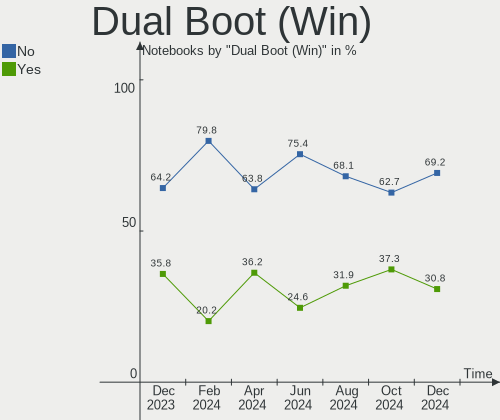
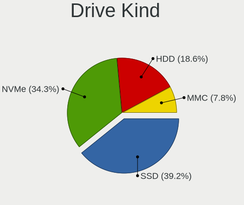
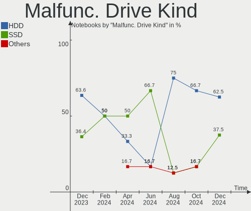
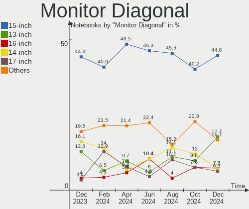
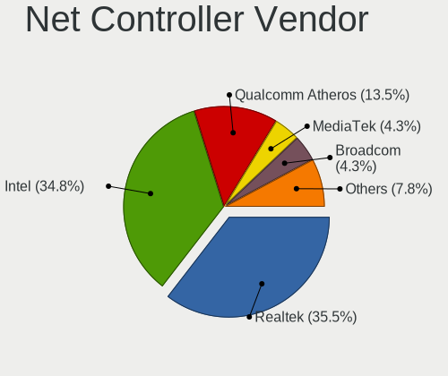
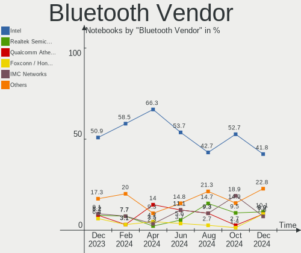
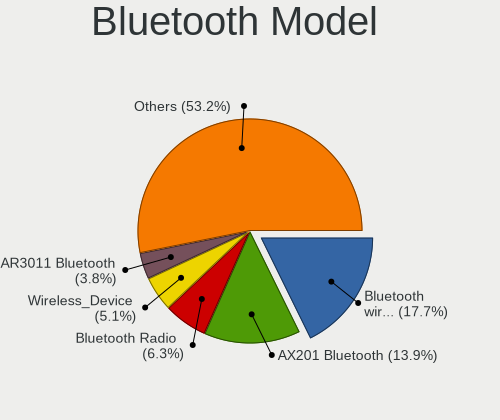

Linux in Poland - Hardware Trends (Notebooks)
---------------------------------------------

A project to identify most popular hardware characteristics and track their change
over time based on data collected by Linux users at https://Linux-Hardware.org.

Anyone can contribute to this report by the [hw-probe](https://github.com/linuxhw/hw-probe) tool:

    sudo -E hw-probe -all -upload

Period: Jan, 2024.

Contents
--------

* [ System ](#system)
  - [ OS                       ](#os)
  - [ OS Family                ](#os-family)
  - [ Kernel                   ](#kernel)
  - [ Kernel Family            ](#kernel-family)
  - [ Kernel Major Ver.        ](#kernel-major-ver)
  - [ Arch                     ](#arch)
  - [ DE                       ](#de)
  - [ Display Server           ](#display-server)
  - [ Display Manager          ](#display-manager)
  - [ OS Lang                  ](#os-lang)
  - [ Boot Mode                ](#boot-mode)
  - [ Filesystem               ](#filesystem)
  - [ Part. scheme             ](#part-scheme)
  - [ Dual Boot with Linux/BSD ](#dual-boot-with-linuxbsd)
  - [ Dual Boot (Win)          ](#dual-boot-win)

* [ Board ](#board)
  - [ Vendor                   ](#vendor)
  - [ Model                    ](#model)
  - [ Model Family             ](#model-family)
  - [ MFG Year                 ](#mfg-year)
  - [ Form Factor              ](#form-factor)
  - [ Secure Boot              ](#secure-boot)
  - [ Coreboot                 ](#coreboot)
  - [ RAM Size                 ](#ram-size)
  - [ RAM Used                 ](#ram-used)
  - [ Total Drives             ](#total-drives)
  - [ Has CD-ROM               ](#has-cd-rom)
  - [ Has Ethernet             ](#has-ethernet)
  - [ Has WiFi                 ](#has-wifi)
  - [ Has Bluetooth            ](#has-bluetooth)

* [ Location ](#location)
  - [ Country                  ](#country)
  - [ City                     ](#city)

* [ Drives ](#drives)
  - [ Drive Vendor             ](#drive-vendor)
  - [ Drive Model              ](#drive-model)
  - [ HDD Vendor               ](#hdd-vendor)
  - [ SSD Vendor               ](#ssd-vendor)
  - [ Drive Kind               ](#drive-kind)
  - [ Drive Connector          ](#drive-connector)
  - [ Drive Size               ](#drive-size)
  - [ Space Total              ](#space-total)
  - [ Space Used               ](#space-used)
  - [ Malfunc. Drives          ](#malfunc-drives)
  - [ Malfunc. Drive Vendor    ](#malfunc-drive-vendor)
  - [ Malfunc. HDD Vendor      ](#malfunc-hdd-vendor)
  - [ Malfunc. Drive Kind      ](#malfunc-drive-kind)
  - [ Failed Drives            ](#failed-drives)
  - [ Failed Drive Vendor      ](#failed-drive-vendor)
  - [ Drive Status             ](#drive-status)

* [ Storage controller ](#storage-controller)
  - [ Storage Vendor           ](#storage-vendor)
  - [ Storage Model            ](#storage-model)
  - [ Storage Kind             ](#storage-kind)

* [ Processor ](#processor)
  - [ CPU Vendor               ](#cpu-vendor)
  - [ CPU Model                ](#cpu-model)
  - [ CPU Model Family         ](#cpu-model-family)
  - [ CPU Cores                ](#cpu-cores)
  - [ CPU Sockets              ](#cpu-sockets)
  - [ CPU Threads              ](#cpu-threads)
  - [ CPU Op-Modes             ](#cpu-op-modes)
  - [ CPU Microcode            ](#cpu-microcode)
  - [ CPU Microarch            ](#cpu-microarch)

* [ Graphics ](#graphics)
  - [ GPU Vendor               ](#gpu-vendor)
  - [ GPU Model                ](#gpu-model)
  - [ GPU Combo                ](#gpu-combo)
  - [ GPU Driver               ](#gpu-driver)
  - [ GPU Memory               ](#gpu-memory)

* [ Monitor ](#monitor)
  - [ Monitor Vendor           ](#monitor-vendor)
  - [ Monitor Model            ](#monitor-model)
  - [ Monitor Resolution       ](#monitor-resolution)
  - [ Monitor Diagonal         ](#monitor-diagonal)
  - [ Monitor Width            ](#monitor-width)
  - [ Aspect Ratio             ](#aspect-ratio)
  - [ Monitor Area             ](#monitor-area)
  - [ Pixel Density            ](#pixel-density)
  - [ Multiple Monitors        ](#multiple-monitors)

* [ Network ](#network)
  - [ Net Controller Vendor    ](#net-controller-vendor)
  - [ Net Controller Model     ](#net-controller-model)
  - [ Wireless Vendor          ](#wireless-vendor)
  - [ Wireless Model           ](#wireless-model)
  - [ Ethernet Vendor          ](#ethernet-vendor)
  - [ Ethernet Model           ](#ethernet-model)
  - [ Net Controller Kind      ](#net-controller-kind)
  - [ Used Controller          ](#used-controller)
  - [ NICs                     ](#nics)
  - [ IPv6                     ](#ipv6)

* [ Bluetooth ](#bluetooth)
  - [ Bluetooth Vendor         ](#bluetooth-vendor)
  - [ Bluetooth Model          ](#bluetooth-model)

* [ Sound ](#sound)
  - [ Sound Vendor             ](#sound-vendor)
  - [ Sound Model              ](#sound-model)

* [ Memory ](#memory)
  - [ Memory Vendor            ](#memory-vendor)
  - [ Memory Model             ](#memory-model)
  - [ Memory Kind              ](#memory-kind)
  - [ Memory Form Factor       ](#memory-form-factor)
  - [ Memory Size              ](#memory-size)
  - [ Memory Speed             ](#memory-speed)

* [ Printers & scanners ](#printers--scanners)
  - [ Printer Vendor           ](#printer-vendor)
  - [ Printer Model            ](#printer-model)
  - [ Scanner Vendor           ](#scanner-vendor)
  - [ Scanner Model            ](#scanner-model)

* [ Camera ](#camera)
  - [ Camera Vendor            ](#camera-vendor)
  - [ Camera Model             ](#camera-model)

* [ Security ](#security)
  - [ Fingerprint Vendor       ](#fingerprint-vendor)
  - [ Fingerprint Model        ](#fingerprint-model)
  - [ Chipcard Vendor          ](#chipcard-vendor)
  - [ Chipcard Model           ](#chipcard-model)

* [ Unsupported ](#unsupported)
  - [ Unsupported Devices      ](#unsupported-devices)
  - [ Unsupported Device Types ](#unsupported-device-types)

System
------

OS
--

Installed operating systems

| Name                         | Notebooks | Percent |
|------------------------------|-----------|---------|
| Fedora 39                    | 10        | 11.49%  |
| Arch Rolling                 | 10        | 11.49%  |
| Ubuntu 22.04                 | 9         | 10.34%  |
| OpenMandriva 23.08           | 5         | 5.75%   |
| OpenMandriva 5.0             | 4         | 4.6%    |
| Ubuntu 23.10                 | 3         | 3.45%   |
| Debian 12                    | 3         | 3.45%   |
| Zorin 16                     | 2         | 2.3%    |
| ROSA 12.4                    | 2         | 2.3%    |
| Pop!_OS 22.04                | 2         | 2.3%    |
| OpenMandriva 24.01           | 2         | 2.3%    |
| Linux Mint 21.2              | 2         | 2.3%    |
| Lilidog 23                   | 2         | 2.3%    |
| Debian 11                    | 2         | 2.3%    |
| Debian                       | 2         | 2.3%    |
| Zorin 17                     | 1         | 1.15%   |
| Xubuntu 23.10                | 1         | 1.15%   |
| Xubuntu 20.04                | 1         | 1.15%   |
| Void Linux Rolling           | 1         | 1.15%   |
| Ubuntu 20.04                 | 1         | 1.15%   |
| SteamOS 3.5.7                | 1         | 1.15%   |
| SteamOS 3.5.13               | 1         | 1.15%   |
| Sparky 7.2                   | 1         | 1.15%   |
| ROSA R11.1                   | 1         | 1.15%   |
| Peppermint                   | 1         | 1.15%   |
| openSUSE Tumbleweed-XXXXXXXX | 1         | 1.15%   |
| OpenMandriva 23.11           | 1         | 1.15%   |
| OpenMandriva 23.03           | 1         | 1.15%   |
| MX 23                        | 1         | 1.15%   |
| Manjaro 23.1.3               | 1         | 1.15%   |
| Manjaro 23.0.1               | 1         | 1.15%   |
| LMDE 6                       | 1         | 1.15%   |
| Linux Mint 21.3              | 1         | 1.15%   |
| Linux Mint 21.1              | 1         | 1.15%   |
| Linux Mint 21                | 1         | 1.15%   |
| Linux Mint 20.3              | 1         | 1.15%   |
| Kubuntu 23.10                | 1         | 1.15%   |
| Kubuntu 22.04                | 1         | 1.15%   |
| Kali 2023.4                  | 1         | 1.15%   |
| EuroLinux 9.3                | 1         | 1.15%   |

OS Family
---------

OS without a version

| Name         | Notebooks | Percent |
|--------------|-----------|---------|
| Ubuntu       | 13        | 14.94%  |
| OpenMandriva | 13        | 14.94%  |
| Fedora       | 10        | 11.49%  |
| Arch         | 10        | 11.49%  |
| Debian       | 7         | 8.05%   |
| Linux Mint   | 6         | 6.9%    |
| Zorin        | 3         | 3.45%   |
| ROSA         | 3         | 3.45%   |
| Xubuntu      | 2         | 2.3%    |
| SteamOS      | 2         | 2.3%    |
| Pop!_OS      | 2         | 2.3%    |
| Manjaro      | 2         | 2.3%    |
| Lilidog      | 2         | 2.3%    |
| Kubuntu      | 2         | 2.3%    |
| Void Linux   | 1         | 1.15%   |
| Sparky       | 1         | 1.15%   |
| Peppermint   | 1         | 1.15%   |
| openSUSE     | 1         | 1.15%   |
| MX           | 1         | 1.15%   |
| LMDE         | 1         | 1.15%   |
| Kali         | 1         | 1.15%   |
| EuroLinux    | 1         | 1.15%   |
| EndeavourOS  | 1         | 1.15%   |
| ArcoLinux    | 1         | 1.15%   |

Kernel
------

Version of the Linux kernel

| Version                           | Notebooks | Percent |
|-----------------------------------|-----------|---------|
| 6.5.0-14-generic                  | 10        | 11.49%  |
| 5.15.0-91-generic                 | 8         | 9.2%    |
| 6.6.2-desktop-1omv2390            | 7         | 8.05%   |
| 6.1.0-17-amd64                    | 6         | 6.9%    |
| 6.4.11-desktop-1omv2390           | 5         | 5.75%   |
| 6.6.9-200.fc39.x86_64             | 4         | 4.6%    |
| 6.2.0-39-generic                  | 3         | 3.45%   |
| 6.6.9-arch1-1                     | 2         | 2.3%    |
| 6.6.9-amd64                       | 2         | 2.3%    |
| 6.6.8-arch1-1                     | 2         | 2.3%    |
| 6.6.13-200.fc39.x86_64            | 2         | 2.3%    |
| 6.5.0-15-generic                  | 2         | 2.3%    |
| 6.1.69-1-lts                      | 2         | 2.3%    |
| 6.7.1-arch1-1                     | 1         | 1.15%   |
| 6.7.0-zen3-1-zen                  | 1         | 1.15%   |
| 6.6.9_1                           | 1         | 1.15%   |
| 6.6.9-lqx1-1-lqx                  | 1         | 1.15%   |
| 6.6.8-200.fc39.x86_64             | 1         | 1.15%   |
| 6.6.7-arch1-1                     | 1         | 1.15%   |
| 6.6.7-666.rog.fc39.x86_64         | 1         | 1.15%   |
| 6.6.6-76060606-generic            | 1         | 1.15%   |
| 6.6.12-200.fc39.x86_64            | 1         | 1.15%   |
| 6.6.11-200.fc39.x86_64            | 1         | 1.15%   |
| 6.6.11-1-default                  | 1         | 1.15%   |
| 6.6.10-arch1-1                    | 1         | 1.15%   |
| 6.6.1-arch1-1                     | 1         | 1.15%   |
| 6.5.6-76060506-generic            | 1         | 1.15%   |
| 6.5.3-1-MANJARO                   | 1         | 1.15%   |
| 6.5.0-kali3-amd64                 | 1         | 1.15%   |
| 6.5.0-0.deb12.4-amd64             | 1         | 1.15%   |
| 6.2.6-desktop-1omv2390            | 1         | 1.15%   |
| 6.2.0-33-generic                  | 1         | 1.15%   |
| 6.2.0-26-generic                  | 1         | 1.15%   |
| 6.1.69-1-MANJARO                  | 1         | 1.15%   |
| 6.1.58-generic-1rosa2021.1-x86_64 | 1         | 1.15%   |
| 6.1.52-valve9-1-neptune-61        | 1         | 1.15%   |
| 6.1.52-valve14-1-neptune-61       | 1         | 1.15%   |
| 6.1.0-16-amd64                    | 1         | 1.15%   |
| 6.1.0-12-amd64                    | 1         | 1.15%   |
| 5.4.83-generic-2rosa-x86_64       | 1         | 1.15%   |

Kernel Family
-------------

Linux kernel without a distro release

| Version  | Notebooks | Percent |
|----------|-----------|---------|
| 6.5.0    | 14        | 16.09%  |
| 6.6.9    | 10        | 11.49%  |
| 5.15.0   | 9         | 10.34%  |
| 6.1.0    | 8         | 9.2%    |
| 6.6.2    | 7         | 8.05%   |
| 6.4.11   | 5         | 5.75%   |
| 6.2.0    | 5         | 5.75%   |
| 6.6.8    | 3         | 3.45%   |
| 6.1.69   | 3         | 3.45%   |
| 6.6.7    | 2         | 2.3%    |
| 6.6.13   | 2         | 2.3%    |
| 6.6.11   | 2         | 2.3%    |
| 6.1.52   | 2         | 2.3%    |
| 5.10.0   | 2         | 2.3%    |
| 6.7.1    | 1         | 1.15%   |
| 6.7.0    | 1         | 1.15%   |
| 6.6.6    | 1         | 1.15%   |
| 6.6.12   | 1         | 1.15%   |
| 6.6.10   | 1         | 1.15%   |
| 6.6.1    | 1         | 1.15%   |
| 6.5.6    | 1         | 1.15%   |
| 6.5.3    | 1         | 1.15%   |
| 6.2.6    | 1         | 1.15%   |
| 6.1.58   | 1         | 1.15%   |
| 5.4.83   | 1         | 1.15%   |
| 5.15.103 | 1         | 1.15%   |
| 5.14.0   | 1         | 1.15%   |

Kernel Major Ver.
-----------------

Linux kernel major version

| Version | Notebooks | Percent |
|---------|-----------|---------|
| 6.6     | 30        | 34.48%  |
| 6.5     | 16        | 18.39%  |
| 6.1     | 14        | 16.09%  |
| 5.15    | 10        | 11.49%  |
| 6.2     | 6         | 6.9%    |
| 6.4     | 5         | 5.75%   |
| 6.7     | 2         | 2.3%    |
| 5.10    | 2         | 2.3%    |
| 5.4     | 1         | 1.15%   |
| 5.14    | 1         | 1.15%   |

Arch
----

OS architecture (x86_64, i586, etc.)

| Name   | Notebooks | Percent |
|--------|-----------|---------|
| x86_64 | 85        | 97.7%   |
| i686   | 2         | 2.3%    |

DE
--

Desktop Environment

| Name             | Notebooks | Percent |
|------------------|-----------|---------|
| GNOME            | 39        | 44.83%  |
| KDE5             | 22        | 25.29%  |
| XFCE             | 11        | 12.64%  |
| X-Cinnamon       | 7         | 8.05%   |
| lightdm-xsession | 3         | 3.45%   |
| LXQt             | 2         | 2.3%    |
| i3               | 2         | 2.3%    |
| KDE              | 1         | 1.15%   |

Display Server
--------------

X11 or Wayland

| Name    | Notebooks | Percent |
|---------|-----------|---------|
| X11     | 44        | 50.57%  |
| Wayland | 42        | 48.28%  |
| Unknown | 1         | 1.15%   |

Display Manager
---------------

SDDM, LightDM, etc.

| Name    | Notebooks | Percent |
|---------|-----------|---------|
| Unknown | 27        | 31.03%  |
| LightDM | 19        | 21.84%  |
| SDDM    | 18        | 20.69%  |
| GDM3    | 16        | 18.39%  |
| GDM     | 7         | 8.05%   |

OS Lang
-------

Language

| Lang    | Notebooks | Percent |
|---------|-----------|---------|
| pl_PL   | 45        | 51.72%  |
| en_US   | 34        | 39.08%  |
| C       | 4         | 4.6%    |
| ru_UA   | 2         | 2.3%    |
| en_GB   | 1         | 1.15%   |
| Unknown | 1         | 1.15%   |

Boot Mode
---------

EFI or BIOS

| Mode | Notebooks | Percent |
|------|-----------|---------|
| EFI  | 47        | 54.02%  |
| BIOS | 40        | 45.98%  |

Filesystem
----------

Type of filesystem

| Type    | Notebooks | Percent |
|---------|-----------|---------|
| Ext4    | 53        | 60.92%  |
| Btrfs   | 16        | 18.39%  |
| Tmpfs   | 8         | 9.2%    |
| Overlay | 7         | 8.05%   |
| Zfs     | 1         | 1.15%   |
| Xfs     | 1         | 1.15%   |
| F2fs    | 1         | 1.15%   |

Part. scheme
------------

Scheme of partitioning

| Type    | Notebooks | Percent |
|---------|-----------|---------|
| GPT     | 50        | 57.47%  |
| Unknown | 25        | 28.74%  |
| MBR     | 12        | 13.79%  |

Dual Boot with Linux/BSD
------------------------

Hosting more than one Linux/BSD

| Dual boot | Notebooks | Percent |
|-----------|-----------|---------|
| No        | 79        | 90.8%   |
| Yes       | 8         | 9.2%    |

Dual Boot (Win)
---------------

Hosting Linux and Windows

| Dual boot | Notebooks | Percent |
|-----------|-----------|---------|
| No        | 63        | 72.41%  |
| Yes       | 24        | 27.59%  |

Board
-----

Vendor
------

Motherboard manufacturer

| Name                | Notebooks | Percent |
|---------------------|-----------|---------|
| Lenovo              | 25        | 28.74%  |
| Dell                | 16        | 18.39%  |
| Hewlett-Packard     | 14        | 16.09%  |
| Toshiba             | 7         | 8.05%   |
| ASUSTek Computer    | 6         | 6.9%    |
| Acer                | 5         | 5.75%   |
| Samsung Electronics | 3         | 3.45%   |
| Valve               | 2         | 2.3%    |
| Google              | 2         | 2.3%    |
| Apple               | 2         | 2.3%    |
| MSI                 | 1         | 1.15%   |
| mPTech              | 1         | 1.15%   |
| eMachines           | 1         | 1.15%   |
| Dream Machines      | 1         | 1.15%   |
| AMI                 | 1         | 1.15%   |

Model
-----

Motherboard model

| Name                                     | Notebooks | Percent |
|------------------------------------------|-----------|---------|
| Valve Jupiter                            | 2         | 2.3%    |
| Toshiba Satellite L40                    | 2         | 2.3%    |
| Toshiba Satellite C660                   | 1         | 1.15%   |
| Toshiba Satellite C650                   | 1         | 1.15%   |
| Toshiba Satellite C55-A-1H9              | 1         | 1.15%   |
| Toshiba Satellite A660                   | 1         | 1.15%   |
| Toshiba Satellite A200                   | 1         | 1.15%   |
| Samsung X420/X520                        | 1         | 1.15%   |
| Samsung 450R4E/450R5E/450R4V/450R5V      | 1         | 1.15%   |
| Samsung 350V5C/351V5C/3540VC/3440VC      | 1         | 1.15%   |
| MSI Stealth GS66 12UGS                   | 1         | 1.15%   |
| mPTech Techbite ZIN 3                    | 1         | 1.15%   |
| Lenovo V15-ADA 82C7                      | 1         | 1.15%   |
| Lenovo V15 G3 IAP CTO 83C4               | 1         | 1.15%   |
| Lenovo ThinkPad X220 Tablet 4299W26      | 1         | 1.15%   |
| Lenovo ThinkPad X1 Carbon 6th 20KG0022US | 1         | 1.15%   |
| Lenovo ThinkPad T570 20HAS0NU00          | 1         | 1.15%   |
| Lenovo ThinkPad T470s W10DG 20JTS1MR08   | 1         | 1.15%   |
| Lenovo ThinkPad T430 2349FC4             | 1         | 1.15%   |
| Lenovo ThinkPad T14 Gen 3 21AH00DFPB     | 1         | 1.15%   |
| Lenovo ThinkPad T14 Gen 1 20S1S8MX2H     | 1         | 1.15%   |
| Lenovo ThinkPad P50 20EQS3B30R           | 1         | 1.15%   |
| Lenovo ThinkPad P16v Gen 1 21FC000LPB    | 1         | 1.15%   |
| Lenovo ThinkPad L540 20AUA1E600          | 1         | 1.15%   |
| Lenovo ThinkPad L15 Gen 1 20U70046PB     | 1         | 1.15%   |
| Lenovo ThinkBook 16 G6 IRL 21KH          | 1         | 1.15%   |
| Lenovo ThinkBook 16 G6 ABP 21KK          | 1         | 1.15%   |
| Lenovo Legion Pro 5 16IRX8 82WK          | 1         | 1.15%   |
| Lenovo IdeaPad Y530                      | 1         | 1.15%   |
| Lenovo IdeaPad S340-14IIL 81VV           | 1         | 1.15%   |
| Lenovo IdeaPad 330-15IKB 81DE            | 1         | 1.15%   |
| Lenovo IdeaPad 3 15ADA05 81W1            | 1         | 1.15%   |
| Lenovo IdeaPad 100S-11IBY 80R2           | 1         | 1.15%   |
| Lenovo G580 20150                        | 1         | 1.15%   |
| Lenovo G510 20238                        | 1         | 1.15%   |
| Lenovo B590 20206                        | 1         | 1.15%   |
| Lenovo B50-70 20384                      | 1         | 1.15%   |
| HP ZBook 17 G6                           | 1         | 1.15%   |
| HP ZBook 15 G5                           | 1         | 1.15%   |
| HP Victus by Gaming Laptop 15-fa0xxx     | 1         | 1.15%   |

Model Family
------------

Motherboard model prefix

| Name                | Notebooks | Percent |
|---------------------|-----------|---------|
| Lenovo ThinkPad     | 11        | 12.64%  |
| Dell Latitude       | 10        | 11.49%  |
| Toshiba Satellite   | 7         | 8.05%   |
| Lenovo IdeaPad      | 5         | 5.75%   |
| Dell Inspiron       | 5         | 5.75%   |
| ASUS VivoBook       | 4         | 4.6%    |
| Acer Aspire         | 3         | 3.45%   |
| Valve Jupiter       | 2         | 2.3%    |
| Lenovo ThinkBook    | 2         | 2.3%    |
| HP ZBook            | 2         | 2.3%    |
| HP ProBook          | 2         | 2.3%    |
| HP Pavilion         | 2         | 2.3%    |
| HP EliteBook        | 2         | 2.3%    |
| HP Compaq           | 2         | 2.3%    |
| Samsung X420        | 1         | 1.15%   |
| Samsung 450R4E      | 1         | 1.15%   |
| Samsung 350V5C      | 1         | 1.15%   |
| MSI Stealth         | 1         | 1.15%   |
| mPTech Techbite     | 1         | 1.15%   |
| Lenovo V15-ADA      | 1         | 1.15%   |
| Lenovo V15          | 1         | 1.15%   |
| Lenovo Legion       | 1         | 1.15%   |
| Lenovo G580         | 1         | 1.15%   |
| Lenovo G510         | 1         | 1.15%   |
| Lenovo B590         | 1         | 1.15%   |
| Lenovo B50-70       | 1         | 1.15%   |
| HP Victus           | 1         | 1.15%   |
| HP Stream           | 1         | 1.15%   |
| HP 530              | 1         | 1.15%   |
| HP 250              | 1         | 1.15%   |
| Google Phaser360    | 1         | 1.15%   |
| Google Kefka        | 1         | 1.15%   |
| eMachines eME732ZG  | 1         | 1.15%   |
| Dream Machines NS5x | 1         | 1.15%   |
| Dell G3             | 1         | 1.15%   |
| ASUS Zenbook        | 1         | 1.15%   |
| ASUS X550VC         | 1         | 1.15%   |
| Apple MacBookPro11  | 1         | 1.15%   |
| Apple MacBookAir6   | 1         | 1.15%   |
| AMI Cherry          | 1         | 1.15%   |

MFG Year
--------

Motherboard manufacture year

| Year | Notebooks | Percent |
|------|-----------|---------|
| 2013 | 11        | 12.64%  |
| 2020 | 10        | 11.49%  |
| 2023 | 9         | 10.34%  |
| 2022 | 7         | 8.05%   |
| 2021 | 7         | 8.05%   |
| 2010 | 6         | 6.9%    |
| 2018 | 5         | 5.75%   |
| 2012 | 5         | 5.75%   |
| 2007 | 5         | 5.75%   |
| 2019 | 4         | 4.6%    |
| 2017 | 4         | 4.6%    |
| 2008 | 4         | 4.6%    |
| 2015 | 3         | 3.45%   |
| 2011 | 3         | 3.45%   |
| 2016 | 1         | 1.15%   |
| 2014 | 1         | 1.15%   |
| 2009 | 1         | 1.15%   |
| 2006 | 1         | 1.15%   |

Form Factor
-----------

Physical design of the computer

| Name     | Notebooks | Percent |
|----------|-----------|---------|
| Notebook | 87        | 100%    |

Secure Boot
-----------

Enabled or disabled

| State    | Notebooks | Percent |
|----------|-----------|---------|
| Disabled | 78        | 89.66%  |
| Enabled  | 9         | 10.34%  |

Coreboot
--------

Have coreboot on board

| Used | Notebooks | Percent |
|------|-----------|---------|
| No   | 85        | 97.7%   |
| Yes  | 2         | 2.3%    |

RAM Size
--------

Total RAM memory

| Size in GB  | Notebooks | Percent |
|-------------|-----------|---------|
| 4.01-8.0    | 20        | 22.99%  |
| 3.01-4.0    | 16        | 18.39%  |
| 16.01-24.0  | 15        | 17.24%  |
| 32.01-64.0  | 14        | 16.09%  |
| 8.01-16.0   | 12        | 13.79%  |
| 1.01-2.0    | 5         | 5.75%   |
| 24.01-32.0  | 2         | 2.3%    |
| 2.01-3.0    | 2         | 2.3%    |
| 64.01-256.0 | 1         | 1.15%   |

RAM Used
--------

Used RAM memory

| Used GB    | Notebooks | Percent |
|------------|-----------|---------|
| 1.01-2.0   | 25        | 28.74%  |
| 4.01-8.0   | 21        | 24.14%  |
| 2.01-3.0   | 16        | 18.39%  |
| 3.01-4.0   | 13        | 14.94%  |
| 0.51-1.0   | 6         | 6.9%    |
| 8.01-16.0  | 4         | 4.6%    |
| 24.01-32.0 | 1         | 1.15%   |
| 0.01-0.5   | 1         | 1.15%   |

Total Drives
------------

Number of drives on board

| Drives | Notebooks | Percent |
|--------|-----------|---------|
| 1      | 70        | 80.46%  |
| 2      | 15        | 17.24%  |
| 3      | 1         | 1.15%   |
| 0      | 1         | 1.15%   |

Has CD-ROM
----------

Has CD-ROM on board

| Presented | Notebooks | Percent |
|-----------|-----------|---------|
| No        | 61        | 70.11%  |
| Yes       | 26        | 29.89%  |

Has Ethernet
------------

Has Ethernet on board

| Presented | Notebooks | Percent |
|-----------|-----------|---------|
| Yes       | 65        | 74.71%  |
| No        | 22        | 25.29%  |

Has WiFi
--------

Has WiFi module

| Presented | Notebooks | Percent |
|-----------|-----------|---------|
| Yes       | 85        | 97.7%   |
| No        | 2         | 2.3%    |

Has Bluetooth
-------------

Has Bluetooth module

| Presented | Notebooks | Percent |
|-----------|-----------|---------|
| Yes       | 68        | 78.16%  |
| No        | 19        | 21.84%  |

Location
--------

Country
-------

Geographic location (country)

| Country | Notebooks | Percent |
|---------|-----------|---------|
| Poland  | 87        | 100%    |

City
----

Geographic location (city)

| City                | Notebooks | Percent |
|---------------------|-----------|---------|
| Warsaw              | 12        | 13.79%  |
| Krakow              | 9         | 10.34%  |
| Poznan              | 7         | 8.05%   |
| Gdansk              | 7         | 8.05%   |
| Wroclaw             | 4         | 4.6%    |
| Lodz                | 4         | 4.6%    |
| Gliwice             | 4         | 4.6%    |
| Katowice            | 3         | 3.45%   |
| Elblag              | 3         | 3.45%   |
| Zabrze              | 2         | 2.3%    |
| Szczecin            | 2         | 2.3%    |
| Kalisz              | 2         | 2.3%    |
| Gdynia              | 2         | 2.3%    |
| Częstochowa        | 2         | 2.3%    |
| Bytom               | 2         | 2.3%    |
| Będzin             | 2         | 2.3%    |
| Zduny               | 1         | 1.15%   |
| Wieruszow           | 1         | 1.15%   |
| Wieliczka           | 1         | 1.15%   |
| Turek               | 1         | 1.15%   |
| Tczew               | 1         | 1.15%   |
| Słupsk             | 1         | 1.15%   |
| Stoczek Łukowski   | 1         | 1.15%   |
| Sopot               | 1         | 1.15%   |
| Rybnik              | 1         | 1.15%   |
| Rumia               | 1         | 1.15%   |
| Poskwitow           | 1         | 1.15%   |
| Piaseczno           | 1         | 1.15%   |
| Nowe                | 1         | 1.15%   |
| Lubicz Dolny        | 1         | 1.15%   |
| Lubartow            | 1         | 1.15%   |
| Konstantynow Lodzki | 1         | 1.15%   |
| Knurow              | 1         | 1.15%   |
| Kielce              | 1         | 1.15%   |
| Czarna Białostocka | 1         | 1.15%   |
| Bydgoszcz           | 1         | 1.15%   |

Drives
------

Drive Vendor
------------

Hard drive vendors

| Vendor                    | Notebooks | Drives | Percent |
|---------------------------|-----------|--------|---------|
| Samsung Electronics       | 14        | 16     | 14.14%  |
| Unknown                   | 8         | 8      | 8.08%   |
| Sandisk                   | 8         | 8      | 8.08%   |
| Micron Technology         | 7         | 7      | 7.07%   |
| WDC                       | 6         | 6      | 6.06%   |
| Seagate                   | 6         | 6      | 6.06%   |
| SK hynix                  | 5         | 5      | 5.05%   |
| Crucial                   | 5         | 5      | 5.05%   |
| Toshiba                   | 4         | 4      | 4.04%   |
| Hitachi                   | 4         | 4      | 4.04%   |
| GOODRAM                   | 4         | 4      | 4.04%   |
| Kingston                  | 3         | 3      | 3.03%   |
| ADATA Technology          | 3         | 3      | 3.03%   |
| A-DATA Technology         | 3         | 3      | 3.03%   |
| LITEONIT                  | 2         | 2      | 2.02%   |
| Intel                     | 2         | 2      | 2.02%   |
| HGST                      | 2         | 2      | 2.02%   |
| Apple                     | 2         | 2      | 2.02%   |
| Unknown                   | 2         | 2      | 2.02%   |
| XSTAR                     | 1         | 1      | 1.01%   |
| Team                      | 1         | 1      | 1.01%   |
| PNY                       | 1         | 1      | 1.01%   |
| O2 Micro                  | 1         | 1      | 1.01%   |
| Micron/Crucial Technology | 1         | 1      | 1.01%   |
| Lexar                     | 1         | 1      | 1.01%   |
| Lenovo                    | 1         | 1      | 1.01%   |
| KIOXIA                    | 1         | 1      | 1.01%   |
| Biostar                   | 1         | 1      | 1.01%   |

Drive Model
-----------

Hard drive models

| Model                                               | Notebooks | Percent |
|-----------------------------------------------------|-----------|---------|
| Unknown MMC Card  32GB                              | 3         | 2.97%   |
| Samsung NVMe SSD Controller PM9A1/PM9A3/980PRO 2TB  | 3         | 2.97%   |
| Samsung NVMe SSD Controller SM961/PM961/SM963 256GB | 2         | 1.98%   |
| Samsung MZALQ256HBJD-00BL2 256GB                    | 2         | 1.98%   |
| Kingston SA400S37240G 240GB SSD                     | 2         | 1.98%   |
| GOODRAM SSDPR-CX400-512-G2 512GB                    | 2         | 1.98%   |
| ADATA LEGEND 710 1024GB                             | 2         | 1.98%   |
| Unknown                                             | 2         | 1.98%   |
| XSTAR SSD 128GB                                     | 1         | 0.99%   |
| WDC WD7500BPVX-16JC3T3 752GB                        | 1         | 0.99%   |
| WDC WD2500BEVT-22A23T0 250GB                        | 1         | 0.99%   |
| WDC WD1600BEVT-60ZCT0 160GB                         | 1         | 0.99%   |
| WDC WD10JPVX-75JC3T0 1TB                            | 1         | 0.99%   |
| WDC PC SN530 SDBPNPZ-256G-1002 256GB                | 1         | 0.99%   |
| WDC PC SN520 SDAPMUW-256G-1101 256GB                | 1         | 0.99%   |
| Unknown MMC Card  64GB                              | 1         | 0.99%   |
| Unknown MMC Card  512GB                             | 1         | 0.99%   |
| Unknown MMC Card  128GB                             | 1         | 0.99%   |
| Unknown DA4032  32GB                                | 1         | 0.99%   |
| Unknown BGND3R  32GB                                | 1         | 0.99%   |
| Toshiba MQ01ABD100M 1TB                             | 1         | 0.99%   |
| Toshiba MQ01ABD075 752GB                            | 1         | 0.99%   |
| Toshiba MK5076GSX 500GB                             | 1         | 0.99%   |
| Toshiba MK1646GSX 160GB                             | 1         | 0.99%   |
| Team L5 LITE SSD 240GB                              | 1         | 0.99%   |
| SK hynix SKHynix_HFS512GEJ9X162N 512GB              | 1         | 0.99%   |
| SK hynix SKHynix_HFS512GDE9X081N 512GB              | 1         | 0.99%   |
| SK hynix SKHynix_HFM512GDHTNI-87A0B 512GB           | 1         | 0.99%   |
| SK hynix SC311 SATA 256GB SSD                       | 1         | 0.99%   |
| SK hynix BC711 NVMe 512GB                           | 1         | 0.99%   |
| Seagate ST9500420AS 500GB                           | 1         | 0.99%   |
| Seagate ST9500325AS 500GB                           | 1         | 0.99%   |
| Seagate ST500LM000-1EJ162-SSHD 500GB                | 1         | 0.99%   |
| Seagate ST1000LM014-1EJ164 1TB                      | 1         | 0.99%   |
| Seagate ST1000LM 024 HN-M101MBB 1TB                 | 1         | 0.99%   |
| Seagate BUP Slim 120GB                              | 1         | 0.99%   |
| Sandisk WD_BLACK SN770M 1TB                         | 1         | 0.99%   |
| Sandisk WD PC SN740 SDDPMQD-512G-1101 512GB         | 1         | 0.99%   |
| Sandisk WD Black SN750 / PC SN730 NVMe SSD 512GB    | 1         | 0.99%   |
| Sandisk WD Black 2018/SN750 / PC SN720 NVMe SSD 1TB | 1         | 0.99%   |

HDD Vendor
----------

Hard disk drive vendors

| Vendor  | Notebooks | Drives | Percent |
|---------|-----------|--------|---------|
| Seagate | 6         | 6      | 30%     |
| WDC     | 4         | 4      | 20%     |
| Toshiba | 4         | 4      | 20%     |
| Hitachi | 4         | 4      | 20%     |
| HGST    | 2         | 2      | 10%     |

SSD Vendor
----------

Solid state drive vendors

| Vendor              | Notebooks | Drives | Percent |
|---------------------|-----------|--------|---------|
| Crucial             | 5         | 5      | 16.13%  |
| Samsung Electronics | 4         | 4      | 12.9%   |
| GOODRAM             | 4         | 4      | 12.9%   |
| Kingston            | 3         | 3      | 9.68%   |
| A-DATA Technology   | 3         | 3      | 9.68%   |
| SanDisk             | 2         | 2      | 6.45%   |
| LITEONIT            | 2         | 2      | 6.45%   |
| Apple               | 2         | 2      | 6.45%   |
| XSTAR               | 1         | 1      | 3.23%   |
| Team                | 1         | 1      | 3.23%   |
| SK hynix            | 1         | 1      | 3.23%   |
| PNY                 | 1         | 1      | 3.23%   |
| Micron Technology   | 1         | 1      | 3.23%   |
| Biostar             | 1         | 1      | 3.23%   |

Drive Kind
----------

HDD or SSD

| Kind | Notebooks | Drives | Percent |
|------|-----------|--------|---------|
| NVMe | 36        | 40     | 37.5%   |
| SSD  | 31        | 31     | 32.29%  |
| HDD  | 20        | 20     | 20.83%  |
| MMC  | 9         | 10     | 9.38%   |

Drive Connector
---------------

SATA, SAS, NVMe, etc.

| Type | Notebooks | Drives | Percent |
|------|-----------|--------|---------|
| SATA | 45        | 48     | 48.39%  |
| NVMe | 36        | 40     | 38.71%  |
| MMC  | 9         | 10     | 9.68%   |
| SAS  | 3         | 3      | 3.23%   |

Drive Size
----------

Size of hard drive

| Size in TB | Notebooks | Drives | Percent |
|------------|-----------|--------|---------|
| 0.01-0.5   | 33        | 35     | 67.35%  |
| 0.51-1.0   | 15        | 15     | 30.61%  |
| 1.01-2.0   | 1         | 1      | 2.04%   |

Space Total
-----------

Amount of disk space available on the file system

| Size in GB     | Notebooks | Percent |
|----------------|-----------|---------|
| 101-250        | 25        | 28.74%  |
| 251-500        | 17        | 19.54%  |
| 501-1000       | 17        | 19.54%  |
| 1-20           | 9         | 10.34%  |
| 21-50          | 6         | 6.9%    |
| 1001-2000      | 4         | 4.6%    |
| 51-100         | 4         | 4.6%    |
| More than 3000 | 2         | 2.3%    |
| Unknown        | 2         | 2.3%    |
| 2001-3000      | 1         | 1.15%   |

Space Used
----------

Amount of used disk space

| Used GB   | Notebooks | Percent |
|-----------|-----------|---------|
| 1-20      | 40        | 45.98%  |
| 101-250   | 13        | 14.94%  |
| 251-500   | 11        | 12.64%  |
| 21-50     | 11        | 12.64%  |
| 51-100    | 6         | 6.9%    |
| 501-1000  | 3         | 3.45%   |
| Unknown   | 2         | 2.3%    |
| 1001-2000 | 1         | 1.15%   |

Malfunc. Drives
---------------

Drive models with a malfunction

| Model                           | Notebooks | Drives | Percent |
|---------------------------------|-----------|--------|---------|
| WDC WD2500BEVT-22A23T0 250GB    | 1         | 1      | 9.09%   |
| WDC WD1600BEVT-60ZCT0 160GB     | 1         | 1      | 9.09%   |
| Toshiba MK1646GSX 160GB         | 1         | 1      | 9.09%   |
| Seagate ST9500325AS 500GB       | 1         | 1      | 9.09%   |
| Seagate ST1000LM014-1EJ164 1TB  | 1         | 1      | 9.09%   |
| Kingston SA400S37240G 240GB SSD | 1         | 1      | 9.09%   |
| Hitachi HTS545016B9A300 160GB   | 1         | 1      | 9.09%   |
| Hitachi HTS542516K9SA00 160GB   | 1         | 1      | 9.09%   |
| Hitachi HTS541680J9SA00 80GB    | 1         | 1      | 9.09%   |
| HGST HTS541010A9E680 1TB        | 1         | 1      | 9.09%   |
| Crucial CT1000MX500SSD4 1TB     | 1         | 1      | 9.09%   |

Malfunc. Drive Vendor
---------------------

Vendors of faulty drives

| Vendor   | Notebooks | Drives | Percent |
|----------|-----------|--------|---------|
| Hitachi  | 3         | 3      | 27.27%  |
| WDC      | 2         | 2      | 18.18%  |
| Seagate  | 2         | 2      | 18.18%  |
| Toshiba  | 1         | 1      | 9.09%   |
| Kingston | 1         | 1      | 9.09%   |
| HGST     | 1         | 1      | 9.09%   |
| Crucial  | 1         | 1      | 9.09%   |

Malfunc. HDD Vendor
-------------------

Vendors of faulty HDD drives

| Vendor  | Notebooks | Drives | Percent |
|---------|-----------|--------|---------|
| Hitachi | 3         | 3      | 33.33%  |
| WDC     | 2         | 2      | 22.22%  |
| Seagate | 2         | 2      | 22.22%  |
| Toshiba | 1         | 1      | 11.11%  |
| HGST    | 1         | 1      | 11.11%  |

Malfunc. Drive Kind
-------------------

Kinds of faulty drives

| Kind | Notebooks | Drives | Percent |
|------|-----------|--------|---------|
| HDD  | 9         | 9      | 81.82%  |
| SSD  | 2         | 2      | 18.18%  |

Failed Drives
-------------

Failed drive models

Zero info for selected period =(

Failed Drive Vendor
-------------------

Failed drive vendors

Zero info for selected period =(

Drive Status
------------

Number of failed and malfunc. drives

| Status   | Notebooks | Drives | Percent |
|----------|-----------|--------|---------|
| Detected | 39        | 46     | 44.32%  |
| Works    | 38        | 44     | 43.18%  |
| Malfunc  | 11        | 11     | 12.5%   |

Storage controller
------------------

Storage Vendor
--------------

Storage controller vendors

| Vendor                       | Notebooks | Percent |
|------------------------------|-----------|---------|
| Intel                        | 56        | 57.14%  |
| Samsung Electronics          | 12        | 12.24%  |
| Sandisk                      | 8         | 8.16%   |
| Micron Technology            | 6         | 6.12%   |
| SK hynix                     | 4         | 4.08%   |
| AMD                          | 3         | 3.06%   |
| ADATA Technology             | 3         | 3.06%   |
| Toshiba America Info Systems | 1         | 1.02%   |
| O2 Micro                     | 1         | 1.02%   |
| Micron/Crucial Technology    | 1         | 1.02%   |
| MAXIO Technology (Hangzhou)  | 1         | 1.02%   |
| Lenovo                       | 1         | 1.02%   |
| KIOXIA                       | 1         | 1.02%   |

Storage Model
-------------

Storage controller models

| Model                                                                                  | Notebooks | Percent |
|----------------------------------------------------------------------------------------|-----------|---------|
| Intel 7 Series Chipset Family 6-port SATA Controller [AHCI mode]                       | 8         | 7.62%   |
| Intel 82801 Mobile SATA Controller [RAID mode]                                         | 6         | 5.71%   |
| Samsung NVMe SSD Controller 980 (DRAM-less)                                            | 4         | 3.81%   |
| Intel 82801IBM/IEM (ICH9M/ICH9M-E) 4 port SATA Controller [AHCI mode]                  | 4         | 3.81%   |
| Intel 82801HM/HEM (ICH8M/ICH8M-E) SATA Controller [AHCI mode]                          | 4         | 3.81%   |
| Intel 8 Series SATA Controller 1 [AHCI mode]                                           | 4         | 3.81%   |
| Intel 6 Series/C200 Series Chipset Family 6 port Mobile SATA AHCI Controller           | 4         | 3.81%   |
| Samsung NVMe SSD Controller SM981/PM981/PM983                                          | 3         | 2.86%   |
| Samsung NVMe SSD Controller PM9A1/PM9A3/980PRO                                         | 3         | 2.86%   |
| Micron 3400 NVMe SSD [Hendrix]                                                         | 3         | 2.86%   |
| Intel Volume Management Device NVMe RAID Controller                                    | 3         | 2.86%   |
| Intel Sunrise Point-LP SATA Controller [AHCI mode]                                     | 3         | 2.86%   |
| Intel 82801HM/HEM (ICH8M/ICH8M-E) IDE Controller                                       | 3         | 2.86%   |
| Intel 5 Series/3400 Series Chipset 4 port SATA AHCI Controller                         | 3         | 2.86%   |
| SK hynix Gold P31/BC711/PC711 NVMe Solid State Drive                                   | 2         | 1.9%    |
| Sandisk WD PC SN740 NVMe SSD 512GB (DRAM-less)                                         | 2         | 1.9%    |
| Samsung NVMe SSD Controller SM961/PM961/SM963                                          | 2         | 1.9%    |
| Intel Celeron/Pentium Silver Processor SATA Controller                                 | 2         | 1.9%    |
| Intel Cannon Lake Mobile PCH SATA AHCI Controller                                      | 2         | 1.9%    |
| Intel 82801GBM/GHM (ICH7-M Family) SATA Controller [IDE mode]                          | 2         | 1.9%    |
| Intel 8 Series/C220 Series Chipset Family 6-port SATA Controller 1 [AHCI mode]         | 2         | 1.9%    |
| AMD FCH SATA Controller [AHCI mode]                                                    | 2         | 1.9%    |
| ADATA XPG GAMMIXS1 1L, XPG GAMMIX S5, LEGEND 710 / 740, SWORDFISH NVMe SSD (DRAM-less) | 2         | 1.9%    |
| Toshiba America Info Systems Toshiba America Info SATA controller                      | 1         | 0.95%   |
| SK hynix Platinum P41/PC801 NVMe Solid State Drive                                     | 1         | 0.95%   |
| SK hynix BC511 NVMe SSD                                                                | 1         | 0.95%   |
| Sandisk WD Black SN770M NVMe SSD (DRAM-less)                                           | 1         | 0.95%   |
| SanDisk Ultra 3D / WD Blue SN550 NVMe SSD                                              | 1         | 0.95%   |
| SanDisk PC SN520 x2 M.2 2242 NVMe SSD                                                  | 1         | 0.95%   |
| SanDisk IX SN530 NVMe SSD (DRAM-less)                                                  | 1         | 0.95%   |
| SanDisk Extreme Pro / WD Black SN750 / PC SN730 / Red SN700 NVMe SSD                   | 1         | 0.95%   |
| SanDisk Extreme Pro / WD Black 2018/SN750/PC SN720 NVMe SSD                            | 1         | 0.95%   |
| Samsung S4LN058A01[SSUBX] AHCI SSD Controller (Apple slot)                             | 1         | 0.95%   |
| O2 Micro FORESEE E2M2 NVMe SSD                                                         | 1         | 0.95%   |
| Micron/Crucial P5 Plus NVMe PCIe SSD                                                   | 1         | 0.95%   |
| Micron 2400 NVMe SSD (DRAM-less)                                                       | 1         | 0.95%   |
| Micron 2210 NVMe SSD [Cobain]                                                          | 1         | 0.95%   |
| Micron 2200S NVMe SSD [Cassandra]                                                      | 1         | 0.95%   |
| MAXIO (Hangzhou) NVMe SSD Controller MAP1202 (DRAM-less)                               | 1         | 0.95%   |
| Lenovo LENSE30512GMSP34MEAT3TA                                                         | 1         | 0.95%   |

Storage Kind
------------

Kind of storage controller (IDE, SATA, NVMe, SAS, ...)

| Kind | Notebooks | Percent |
|------|-----------|---------|
| SATA | 49        | 49%     |
| NVMe | 36        | 36%     |
| RAID | 9         | 9%      |
| IDE  | 6         | 6%      |

Processor
---------

CPU Vendor
----------

Processor vendors

| Vendor | Notebooks | Percent |
|--------|-----------|---------|
| Intel  | 76        | 87.36%  |
| AMD    | 11        | 12.64%  |

CPU Model
---------

Processor models

| Model                                         | Notebooks | Percent |
|-----------------------------------------------|-----------|---------|
| Intel Core i7-9750H CPU @ 2.60GHz             | 2         | 2.3%    |
| Intel Core i7-4600U CPU @ 2.10GHz             | 2         | 2.3%    |
| Intel Core i5-3230M CPU @ 2.60GHz             | 2         | 2.3%    |
| Intel Core i5-1035G1 CPU @ 1.00GHz            | 2         | 2.3%    |
| Intel Core i5 CPU M 460 @ 2.53GHz             | 2         | 2.3%    |
| Intel Core 2 Duo CPU T5450 @ 1.66GHz          | 2         | 2.3%    |
| Intel 13th Gen Core i7-13700H                 | 2         | 2.3%    |
| Intel 11th Gen Core i5-1135G7 @ 2.40GHz       | 2         | 2.3%    |
| AMD Ryzen 5 3500U with Radeon Vega Mobile Gfx | 2         | 2.3%    |
| AMD Custom APU 0405                           | 2         | 2.3%    |
| Intel Pentium Silver N5000 CPU @ 1.10GHz      | 1         | 1.15%   |
| Intel Pentium Dual-Core CPU T4500 @ 2.30GHz   | 1         | 1.15%   |
| Intel Pentium Dual CPU T3400 @ 2.16GHz        | 1         | 1.15%   |
| Intel Pentium Dual CPU T2330 @ 1.60GHz        | 1         | 1.15%   |
| Intel Pentium Dual CPU T2310 @ 1.46GHz        | 1         | 1.15%   |
| Intel Pentium CPU P6100 @ 2.00GHz             | 1         | 1.15%   |
| Intel Pentium CPU B960 @ 2.20GHz              | 1         | 1.15%   |
| Intel Genuine CPU U4100 @ 1.30GHz             | 1         | 1.15%   |
| Intel Core i7-8850H CPU @ 2.60GHz             | 1         | 1.15%   |
| Intel Core i7-8550U CPU @ 1.80GHz             | 1         | 1.15%   |
| Intel Core i7-6820HQ CPU @ 2.70GHz            | 1         | 1.15%   |
| Intel Core i7-6700HQ CPU @ 2.60GHz            | 1         | 1.15%   |
| Intel Core i7-6600U CPU @ 2.60GHz             | 1         | 1.15%   |
| Intel Core i7-6500U CPU @ 2.50GHz             | 1         | 1.15%   |
| Intel Core i7-4770HQ CPU @ 2.20GHz            | 1         | 1.15%   |
| Intel Core i7-4500U CPU @ 1.80GHz             | 1         | 1.15%   |
| Intel Core i7-2640M CPU @ 2.80GHz             | 1         | 1.15%   |
| Intel Core i7-10850H CPU @ 2.70GHz            | 1         | 1.15%   |
| Intel Core i5-9300H CPU @ 2.40GHz             | 1         | 1.15%   |
| Intel Core i5-8300H CPU @ 2.30GHz             | 1         | 1.15%   |
| Intel Core i5-8250U CPU @ 1.60GHz             | 1         | 1.15%   |
| Intel Core i5-7200U CPU @ 2.50GHz             | 1         | 1.15%   |
| Intel Core i5-4300U CPU @ 1.90GHz             | 1         | 1.15%   |
| Intel Core i5-4260U CPU @ 1.40GHz             | 1         | 1.15%   |
| Intel Core i5-4210U CPU @ 1.70GHz             | 1         | 1.15%   |
| Intel Core i5-4210M CPU @ 2.60GHz             | 1         | 1.15%   |
| Intel Core i5-3320M CPU @ 2.60GHz             | 1         | 1.15%   |
| Intel Core i5-3210M CPU @ 2.50GHz             | 1         | 1.15%   |
| Intel Core i5-2520M CPU @ 2.50GHz             | 1         | 1.15%   |
| Intel Core i5-2430M CPU @ 2.40GHz             | 1         | 1.15%   |

CPU Model Family
----------------

Processor model prefix

| Model                   | Notebooks | Percent |
|-------------------------|-----------|---------|
| Intel Core i5           | 20        | 22.99%  |
| Other                   | 18        | 20.69%  |
| Intel Core i7           | 14        | 16.09%  |
| Intel Celeron           | 7         | 8.05%   |
| Intel Core i3           | 4         | 4.6%    |
| AMD Ryzen 5             | 4         | 4.6%    |
| Intel Pentium Dual      | 3         | 3.45%   |
| Intel Core 2 Duo        | 3         | 3.45%   |
| AMD Ryzen 7             | 3         | 3.45%   |
| Intel Pentium           | 2         | 2.3%    |
| Intel Atom              | 2         | 2.3%    |
| Intel Pentium Silver    | 1         | 1.15%   |
| Intel Pentium Dual-Core | 1         | 1.15%   |
| Intel Genuine           | 1         | 1.15%   |
| Intel Core 2            | 1         | 1.15%   |
| Intel Celeron M         | 1         | 1.15%   |
| AMD Turion II Dual-Core | 1         | 1.15%   |
| AMD Ryzen 5 PRO         | 1         | 1.15%   |

CPU Cores
---------

Number of processor cores

| Number | Notebooks | Percent |
|--------|-----------|---------|
| 2      | 43        | 49.43%  |
| 4      | 22        | 25.29%  |
| 6      | 8         | 9.2%    |
| 8      | 5         | 5.75%   |
| 14     | 4         | 4.6%    |
| 12     | 2         | 2.3%    |
| 10     | 2         | 2.3%    |
| 1      | 1         | 1.15%   |

CPU Sockets
-----------

Number of sockets

| Number | Notebooks | Percent |
|--------|-----------|---------|
| 1      | 87        | 100%    |

CPU Threads
-----------

Threads per core (Hyper-Threading)

| Number | Notebooks | Percent |
|--------|-----------|---------|
| 2      | 63        | 72.41%  |
| 1      | 24        | 27.59%  |

CPU Op-Modes
------------

CPU Operation Modes (32-bit, 64-bit)

| Op mode        | Notebooks | Percent |
|----------------|-----------|---------|
| 32-bit, 64-bit | 86        | 98.85%  |
| 32-bit         | 1         | 1.15%   |

CPU Microcode
-------------

Microcode number

| Number     | Notebooks | Percent |
|------------|-----------|---------|
| Unknown    | 59        | 67.82%  |
| 0x6fd      | 2         | 2.3%    |
| 0x40651    | 2         | 2.3%    |
| 0x306a9    | 2         | 2.3%    |
| 0x20655    | 2         | 2.3%    |
| 0x0a50000d | 2         | 2.3%    |
| 0x08608103 | 2         | 2.3%    |
| 0x08108109 | 2         | 2.3%    |
| 0xa0652    | 1         | 1.15%   |
| 0x806ec    | 1         | 1.15%   |
| 0x806ea    | 1         | 1.15%   |
| 0x806c1    | 1         | 1.15%   |
| 0x706e5    | 1         | 1.15%   |
| 0x706a1    | 1         | 1.15%   |
| 0x6ec      | 1         | 1.15%   |
| 0x406c4    | 1         | 1.15%   |
| 0x306d4    | 1         | 1.15%   |
| 0x30678    | 1         | 1.15%   |
| 0x206a7    | 1         | 1.15%   |
| 0x1067a    | 1         | 1.15%   |
| 0x08600109 | 1         | 1.15%   |
| 0x08600106 | 1         | 1.15%   |

CPU Microarch
-------------

Microarchitecture

| Name             | Notebooks | Percent |
|------------------|-----------|---------|
| KabyLake         | 9         | 10.34%  |
| Haswell          | 9         | 10.34%  |
| IvyBridge        | 7         | 8.05%   |
| Alderlake Hybrid | 7         | 8.05%   |
| Unknown          | 7         | 8.05%   |
| Core             | 6         | 6.9%    |
| Westmere         | 5         | 5.75%   |
| TigerLake        | 5         | 5.75%   |
| SandyBridge      | 5         | 5.75%   |
| Skylake          | 4         | 4.6%    |
| Silvermont       | 4         | 4.6%    |
| Penryn           | 3         | 3.45%   |
| Icelake          | 3         | 3.45%   |
| Goldmont plus    | 3         | 3.45%   |
| Zen+             | 2         | 2.3%    |
| Zen 3            | 2         | 2.3%    |
| Zen 2            | 2         | 2.3%    |
| P6               | 1         | 1.15%   |
| K10              | 1         | 1.15%   |
| CometLake        | 1         | 1.15%   |
| Broadwell        | 1         | 1.15%   |

Graphics
--------

GPU Vendor
----------

Vendors of graphics cards

| Vendor | Notebooks | Percent |
|--------|-----------|---------|
| Intel  | 72        | 65.45%  |
| Nvidia | 21        | 19.09%  |
| AMD    | 17        | 15.45%  |

GPU Model
---------

Graphics card models

| Model                                                                                    | Notebooks | Percent |
|------------------------------------------------------------------------------------------|-----------|---------|
| Intel 3rd Gen Core processor Graphics Controller                                         | 7         | 6.14%   |
| Intel Haswell-ULT Integrated Graphics Controller                                         | 6         | 5.26%   |
| Intel TigerLake-LP GT2 [Iris Xe Graphics]                                                | 5         | 4.39%   |
| Intel CoffeeLake-H GT2 [UHD Graphics 630]                                                | 5         | 4.39%   |
| Intel 2nd Generation Core Processor Family Integrated Graphics Controller                | 5         | 4.39%   |
| Intel Core Processor Integrated Graphics Controller                                      | 4         | 3.51%   |
| Nvidia TU117M [GeForce GTX 1650 Mobile / Max-Q]                                          | 2         | 1.75%   |
| Nvidia GP107M [GeForce GTX 1050 Mobile]                                                  | 2         | 1.75%   |
| Nvidia GF117M [GeForce 610M/710M/810M/820M / GT 620M/625M/630M/720M]                     | 2         | 1.75%   |
| Intel UHD Graphics 620                                                                   | 2         | 1.75%   |
| Intel Skylake GT2 [HD Graphics 520]                                                      | 2         | 1.75%   |
| Intel Raptor Lake-P [Iris Xe Graphics]                                                   | 2         | 1.75%   |
| Intel Mobile GM965/GL960 Integrated Graphics Controller (secondary)                      | 2         | 1.75%   |
| Intel Mobile GM965/GL960 Integrated Graphics Controller (primary)                        | 2         | 1.75%   |
| Intel Mobile 945GM/GMS/GME, 943/940GML Express Integrated Graphics Controller            | 2         | 1.75%   |
| Intel Mobile 945GM/GMS, 943/940GML Express Integrated Graphics Controller                | 2         | 1.75%   |
| Intel Mobile 4 Series Chipset Integrated Graphics Controller                             | 2         | 1.75%   |
| Intel Iris Plus Graphics G1 (Ice Lake)                                                   | 2         | 1.75%   |
| Intel HD Graphics 530                                                                    | 2         | 1.75%   |
| Intel GeminiLake [UHD Graphics 600]                                                      | 2         | 1.75%   |
| Intel Atom/Celeron/Pentium Processor x5-E8000/J3xxx/N3xxx Integrated Graphics Controller | 2         | 1.75%   |
| Intel Atom Processor Z36xxx/Z37xxx Series Graphics & Display                             | 2         | 1.75%   |
| Intel Alder Lake-P GT2 [Iris Xe Graphics]                                                | 2         | 1.75%   |
| Intel 4th Gen Core Processor Integrated Graphics Controller                              | 2         | 1.75%   |
| AMD VanGogh [AMD Custom GPU 0405]                                                        | 2         | 1.75%   |
| AMD Renoir [Radeon RX Vega 6 (Ryzen 4000/5000 Mobile Series)]                            | 2         | 1.75%   |
| AMD Picasso/Raven 2 [Radeon Vega Series / Radeon Vega Mobile Series]                     | 2         | 1.75%   |
| AMD Lucienne                                                                             | 2         | 1.75%   |
| AMD Barcelo                                                                              | 2         | 1.75%   |
| Nvidia GT216M [GeForce GT 330M]                                                          | 1         | 0.88%   |
| Nvidia GP108M [GeForce MX330]                                                            | 1         | 0.88%   |
| Nvidia GP108M [GeForce MX150]                                                            | 1         | 0.88%   |
| Nvidia GP107M [GeForce MX150]                                                            | 1         | 0.88%   |
| Nvidia GP107GLM [Quadro P1000 Mobile]                                                    | 1         | 0.88%   |
| Nvidia GM107M [GeForce GTX 960M]                                                         | 1         | 0.88%   |
| Nvidia GM107GLM [Quadro M1000M]                                                          | 1         | 0.88%   |
| Nvidia GK208M [GeForce GT 740M]                                                          | 1         | 0.88%   |
| Nvidia GK107M [GeForce GT 750M]                                                          | 1         | 0.88%   |
| Nvidia GA107M [GeForce RTX 3050 Ti Mobile]                                               | 1         | 0.88%   |
| Nvidia GA107M [GeForce RTX 3050 Mobile]                                                  | 1         | 0.88%   |

GPU Combo
---------

Combinations of graphics cards

| Name           | Notebooks | Percent |
|----------------|-----------|---------|
| 1 x Intel      | 48        | 55.17%  |
| Intel + Nvidia | 19        | 21.84%  |
| 1 x AMD        | 13        | 14.94%  |
| Intel + AMD    | 3         | 3.45%   |
| 2 x Intel      | 2         | 2.3%    |
| 1 x Nvidia     | 1         | 1.15%   |
| AMD + Nvidia   | 1         | 1.15%   |

GPU Driver
----------

Free vs proprietary

| Driver      | Notebooks | Percent |
|-------------|-----------|---------|
| Free        | 80        | 91.95%  |
| Proprietary | 7         | 8.05%   |

GPU Memory
----------

Total video memory

| Size in GB | Notebooks | Percent |
|------------|-----------|---------|
| Unknown    | 64        | 73.56%  |
| 1.01-2.0   | 8         | 9.2%    |
| 0.01-0.5   | 7         | 8.05%   |
| 0.51-1.0   | 4         | 4.6%    |
| 3.01-4.0   | 3         | 3.45%   |
| 7.01-8.0   | 1         | 1.15%   |

Monitor
-------

Monitor Vendor
--------------

Monitor vendors

| Vendor                  | Notebooks | Percent |
|-------------------------|-----------|---------|
| LG Display              | 17        | 16.35%  |
| AU Optronics            | 16        | 15.38%  |
| Chimei Innolux          | 13        | 12.5%   |
| BOE                     | 12        | 11.54%  |
| Samsung Electronics     | 7         | 6.73%   |
| Chi Mei Optoelectronics | 5         | 4.81%   |
| LG Philips              | 4         | 3.85%   |
| PANDA                   | 3         | 2.88%   |
| Lenovo                  | 3         | 2.88%   |
| Iiyama                  | 3         | 2.88%   |
| Hewlett-Packard         | 3         | 2.88%   |
| InfoVision              | 2         | 1.92%   |
| Eizo                    | 2         | 1.92%   |
| Dell                    | 2         | 1.92%   |
| Apple                   | 2         | 1.92%   |
| Acer                    | 2         | 1.92%   |
| Valve                   | 1         | 0.96%   |
| STA                     | 1         | 0.96%   |
| Sony                    | 1         | 0.96%   |
| Sharp                   | 1         | 0.96%   |
| Philips                 | 1         | 0.96%   |
| KDC                     | 1         | 0.96%   |
| Goldstar                | 1         | 0.96%   |
| AOC                     | 1         | 0.96%   |

Monitor Model
-------------

Monitor models

| Model                                                                  | Notebooks | Percent |
|------------------------------------------------------------------------|-----------|---------|
| Chimei Innolux LCD Monitor CMN15E7 1920x1080 344x193mm 15.5-inch       | 4         | 3.77%   |
| LG Philips LCD Monitor LPLDC00 1280x800 331x207mm 15.4-inch            | 2         | 1.89%   |
| LG Display LCD Monitor LGD0563 1920x1080 344x194mm 15.5-inch           | 2         | 1.89%   |
| LG Display LCD Monitor LGD038E 1366x768 344x194mm 15.5-inch            | 2         | 1.89%   |
| Iiyama PL3293UH IVM761D 3840x2160 697x392mm 31.5-inch                  | 2         | 1.89%   |
| Chimei Innolux LCD Monitor CMN15F5 1920x1080 344x193mm 15.5-inch       | 2         | 1.89%   |
| Valve ANX7530 U VLV3001 800x1280 100x150mm 7.1-inch                    | 1         | 0.94%   |
| STA LCD Monitor STA0579 1920x1080 309x174mm 14.0-inch                  | 1         | 0.94%   |
| Sony TV SNY0801 1360x768                                               | 1         | 0.94%   |
| Sharp LQ156T1JW04 SHP153C 2560x1440 344x194mm 15.5-inch                | 1         | 0.94%   |
| Samsung Electronics LCD Monitor SEC5541 1366x768 344x193mm 15.5-inch   | 1         | 0.94%   |
| Samsung Electronics LCD Monitor SEC4445 1280x800 331x207mm 15.4-inch   | 1         | 0.94%   |
| Samsung Electronics LCD Monitor SEC3859 1366x768 293x165mm 13.2-inch   | 1         | 0.94%   |
| Samsung Electronics LCD Monitor SEC3641 1366x768 353x198mm 15.9-inch   | 1         | 0.94%   |
| Samsung Electronics LCD Monitor SEC3250 1366x768 309x174mm 14.0-inch   | 1         | 0.94%   |
| Samsung Electronics LCD Monitor SDC5441 1366x768 344x194mm 15.5-inch   | 1         | 0.94%   |
| Samsung Electronics LCD Monitor SAM0902 1920x1080 1020x570mm 46.0-inch | 1         | 0.94%   |
| Samsung Electronics LCD Monitor SAM07C5 1920x1080 890x500mm 40.2-inch  | 1         | 0.94%   |
| Philips PHL 241S4 PHL08D3 1920x1080 531x299mm 24.0-inch                | 1         | 0.94%   |
| PANDA LCD Monitor NCP0061 2560x1600 302x189mm 14.0-inch                | 1         | 0.94%   |
| PANDA LCD Monitor NCP0057 1920x1080 344x194mm 15.5-inch                | 1         | 0.94%   |
| PANDA LCD Monitor NCP0042 1920x1080 344x194mm 15.5-inch                | 1         | 0.94%   |
| LG Philips LCD Monitor LPLDD00 1280x800 331x207mm 15.4-inch            | 1         | 0.94%   |
| LG Philips LCD Monitor LPL00E0 1440x900 304x190mm 14.1-inch            | 1         | 0.94%   |
| LG Display LP156WH2-TLAA LGD0230 1366x768 344x194mm 15.5-inch          | 1         | 0.94%   |
| LG Display LCD Monitor LGD05F2 1920x1080 344x194mm 15.5-inch           | 1         | 0.94%   |
| LG Display LCD Monitor LGD05E6 1920x1080 344x194mm 15.5-inch           | 1         | 0.94%   |
| LG Display LCD Monitor LGD059E 1920x1080 382x215mm 17.3-inch           | 1         | 0.94%   |
| LG Display LCD Monitor LGD0404 1366x768 277x156mm 12.5-inch            | 1         | 0.94%   |
| LG Display LCD Monitor LGD03DC 1366x768 277x156mm 12.5-inch            | 1         | 0.94%   |
| LG Display LCD Monitor LGD03DB 1366x768 345x194mm 15.6-inch            | 1         | 0.94%   |
| LG Display LCD Monitor LGD0365 1600x900 382x215mm 17.3-inch            | 1         | 0.94%   |
| LG Display LCD Monitor LGD033B 1366x768 344x194mm 15.5-inch            | 1         | 0.94%   |
| LG Display LCD Monitor LGD033A 1366x768 344x194mm 15.5-inch            | 1         | 0.94%   |
| LG Display LCD Monitor LGD02F8 1366x768 310x170mm 13.9-inch            | 1         | 0.94%   |
| LG Display LCD Monitor LGD02D8 1366x768 277x156mm 12.5-inch            | 1         | 0.94%   |
| LG Display LCD Monitor LGD0250 1366x768 345x194mm 15.6-inch            | 1         | 0.94%   |
| LG Display LCD Monitor LGD024D 1366x768 294x166mm 13.3-inch            | 1         | 0.94%   |
| Lenovo Y25-25 LEN66AA 1920x1080 552x319mm 25.1-inch                    | 1         | 0.94%   |
| Lenovo LEN T27p-10 LEN61DA 3840x2160 600x340mm 27.2-inch               | 1         | 0.94%   |

Monitor Resolution
------------------

Monitor screen resolution

| Resolution         | Notebooks | Percent |
|--------------------|-----------|---------|
| 1920x1080 (FHD)    | 40        | 41.24%  |
| 1366x768 (WXGA)    | 27        | 27.84%  |
| 1280x800 (WXGA)    | 6         | 6.19%   |
| 3840x2160 (4K)     | 5         | 5.15%   |
| 1920x1200 (WUXGA)  | 5         | 5.15%   |
| 2560x1600          | 2         | 2.06%   |
| 2560x1440 (QHD)    | 2         | 2.06%   |
| 1600x900 (HD+)     | 2         | 2.06%   |
| 800x1280           | 1         | 1.03%   |
| 3440x1440          | 1         | 1.03%   |
| 2880x1800          | 1         | 1.03%   |
| 2240x1400          | 1         | 1.03%   |
| 1680x1050 (WSXGA+) | 1         | 1.03%   |
| 1440x900 (WXGA+)   | 1         | 1.03%   |
| 1360x768           | 1         | 1.03%   |
| 1280x1024 (SXGA)   | 1         | 1.03%   |

Monitor Diagonal
----------------

Diagonal size in inches

| Inches | Notebooks | Percent |
|--------|-----------|---------|
| 15     | 53        | 50%     |
| 14     | 11        | 10.38%  |
| 24     | 7         | 6.6%    |
| 27     | 5         | 4.72%   |
| 13     | 5         | 4.72%   |
| 16     | 4         | 3.77%   |
| 11     | 4         | 3.77%   |
| 23     | 3         | 2.83%   |
| 17     | 3         | 2.83%   |
| 12     | 3         | 2.83%   |
| 54     | 2         | 1.89%   |
| 31     | 2         | 1.89%   |
| 72     | 1         | 0.94%   |
| 34     | 1         | 0.94%   |
| 19     | 1         | 0.94%   |
| 7      | 1         | 0.94%   |

Monitor Width
-------------

Physical width

| Width in mm | Notebooks | Percent |
|-------------|-----------|---------|
| 301-350     | 68        | 64.76%  |
| 501-600     | 15        | 14.29%  |
| 201-300     | 10        | 9.52%   |
| 351-400     | 5         | 4.76%   |
| 601-700     | 2         | 1.9%    |
| 1001-1500   | 2         | 1.9%    |
| 701-800     | 1         | 0.95%   |
| 1501-2000   | 1         | 0.95%   |
| 1-100       | 1         | 0.95%   |

Aspect Ratio
------------

Proportional relationship between the width and the height

| Ratio | Notebooks | Percent |
|-------|-----------|---------|
| 16/9  | 73        | 77.66%  |
| 16/10 | 18        | 19.15%  |
| 5/4   | 1         | 1.06%   |
| 21/9  | 1         | 1.06%   |
| 0.67  | 1         | 1.06%   |

Monitor Area
------------

Area in inch²

| Area in inch² | Notebooks | Percent |
|----------------|-----------|---------|
| 101-110        | 53        | 50%     |
| 81-90          | 13        | 12.26%  |
| 201-250        | 8         | 7.55%   |
| 301-350        | 5         | 4.72%   |
| 51-60          | 4         | 3.77%   |
| 111-120        | 4         | 3.77%   |
| More than 1000 | 3         | 2.83%   |
| 71-80          | 3         | 2.83%   |
| 61-70          | 3         | 2.83%   |
| 351-500        | 3         | 2.83%   |
| 121-130        | 3         | 2.83%   |
| 251-300        | 2         | 1.89%   |
| 1-40           | 1         | 0.94%   |
| 151-200        | 1         | 0.94%   |

Pixel Density
-------------

Pixels per inch

| Density | Notebooks | Percent |
|---------|-----------|---------|
| 121-160 | 46        | 44.66%  |
| 51-100  | 23        | 22.33%  |
| 101-120 | 20        | 19.42%  |
| 161-240 | 11        | 10.68%  |
| 1-50    | 3         | 2.91%   |

Multiple Monitors
-----------------

Total monitors connected

| Total | Notebooks | Percent |
|-------|-----------|---------|
| 1     | 65        | 74.71%  |
| 2     | 19        | 21.84%  |
| 0     | 2         | 2.3%    |
| 3     | 1         | 1.15%   |

Network
-------

Net Controller Vendor
---------------------

Controller vendors

| Vendor                   | Notebooks | Percent |
|--------------------------|-----------|---------|
| Intel                    | 47        | 35.61%  |
| Realtek Semiconductor    | 37        | 28.03%  |
| Qualcomm Atheros         | 18        | 13.64%  |
| Broadcom                 | 9         | 6.82%   |
| MediaTek                 | 6         | 4.55%   |
| Broadcom Limited         | 6         | 4.55%   |
| Xiaomi                   | 2         | 1.52%   |
| TP-Link                  | 1         | 0.76%   |
| Sierra Wireless          | 1         | 0.76%   |
| Samsung Electronics      | 1         | 0.76%   |
| Marvell Technology Group | 1         | 0.76%   |
| Hewlett-Packard          | 1         | 0.76%   |
| Edimax Technology        | 1         | 0.76%   |
| ASIX Electronics         | 1         | 0.76%   |

Net Controller Model
--------------------

Controller models

| Model                                                                  | Notebooks | Percent |
|------------------------------------------------------------------------|-----------|---------|
| Realtek RTL8111/8168/8211/8411 PCI Express Gigabit Ethernet Controller | 22        | 14.01%  |
| MediaTek MT7921 802.11ax PCI Express Wireless Network Adapter          | 5         | 3.18%   |
| Intel Wireless 7260                                                    | 5         | 3.18%   |
| Intel Alder Lake-P PCH CNVi WiFi                                       | 5         | 3.18%   |
| Realtek RTL8153 Gigabit Ethernet Adapter                               | 4         | 2.55%   |
| Realtek RTL810xE PCI Express Fast Ethernet controller                  | 4         | 2.55%   |
| Qualcomm Atheros QCA6174 802.11ac Wireless Network Adapter             | 4         | 2.55%   |
| Qualcomm Atheros AR9485 Wireless Network Adapter                       | 4         | 2.55%   |
| Qualcomm Atheros QCA9565 / AR9565 Wireless Network Adapter             | 3         | 1.91%   |
| Qualcomm Atheros AR9285 Wireless Network Adapter (PCI-Express)         | 3         | 1.91%   |
| Intel Wireless 8265 / 8275                                             | 3         | 1.91%   |
| Intel Wireless 3165                                                    | 3         | 1.91%   |
| Intel Wi-Fi 6 AX201                                                    | 3         | 1.91%   |
| Intel Centrino Advanced-N 6205 [Taylor Peak]                           | 3         | 1.91%   |
| Intel Cannon Lake PCH CNVi WiFi                                        | 3         | 1.91%   |
| Intel 82579LM Gigabit Network Connection (Lewisville)                  | 3         | 1.91%   |
| Xiaomi Mi/Redmi series (RNDIS)                                         | 2         | 1.27%   |
| Realtek RTL8822CE 802.11ac PCIe Wireless Network Adapter               | 2         | 1.27%   |
| Realtek RTL8821CE 802.11ac PCIe Wireless Network Adapter               | 2         | 1.27%   |
| Realtek RTL8187B Wireless Adapter                                      | 2         | 1.27%   |
| Realtek RTL-8100/8101L/8139 PCI Fast Ethernet Adapter                  | 2         | 1.27%   |
| Qualcomm Atheros AR9287 Wireless Network Adapter (PCI-Express)         | 2         | 1.27%   |
| Qualcomm Atheros AR8162 Fast Ethernet                                  | 2         | 1.27%   |
| Intel Wireless 8260                                                    | 2         | 1.27%   |
| Intel Wi-Fi 6 AX200                                                    | 2         | 1.27%   |
| Intel Raptor Lake PCH CNVi WiFi                                        | 2         | 1.27%   |
| Intel Ethernet Connection I218-LM                                      | 2         | 1.27%   |
| Intel Ethernet Connection (7) I219-LM                                  | 2         | 1.27%   |
| Intel Centrino Advanced-N 6200                                         | 2         | 1.27%   |
| Broadcom BCM43142 802.11b/g/n                                          | 2         | 1.27%   |
| Broadcom BCM4311 802.11b/g WLAN                                        | 2         | 1.27%   |
| TP-Link 802.11ac NIC                                                   | 1         | 0.64%   |
| Sierra Wireless EM7455                                                 | 1         | 0.64%   |
| Samsung Galaxy series, misc. (tethering mode)                          | 1         | 0.64%   |
| Realtek RTL8852BE PCIe 802.11ax Wireless Network Controller            | 1         | 0.64%   |
| Realtek RTL8723BU 802.11b/g/n WLAN Adapter                             | 1         | 0.64%   |
| Realtek RTL8188CE 802.11b/g/n WiFi Adapter                             | 1         | 0.64%   |
| Realtek Killer E3000 2.5GbE Controller                                 | 1         | 0.64%   |
| Qualcomm Atheros QCA9377 802.11ac Wireless Network Adapter             | 1         | 0.64%   |
| Qualcomm Atheros QCA8171 Gigabit Ethernet                              | 1         | 0.64%   |

Wireless Vendor
---------------

Wireless vendors

| Vendor                | Notebooks | Percent |
|-----------------------|-----------|---------|
| Intel                 | 43        | 48.31%  |
| Qualcomm Atheros      | 17        | 19.1%   |
| Realtek Semiconductor | 9         | 10.11%  |
| Broadcom              | 8         | 8.99%   |
| MediaTek              | 6         | 6.74%   |
| Broadcom Limited      | 2         | 2.25%   |
| TP-Link               | 1         | 1.12%   |
| Sierra Wireless       | 1         | 1.12%   |
| Hewlett-Packard       | 1         | 1.12%   |
| Edimax Technology     | 1         | 1.12%   |

Wireless Model
--------------

Wireless models

| Model                                                          | Notebooks | Percent |
|----------------------------------------------------------------|-----------|---------|
| MediaTek MT7921 802.11ax PCI Express Wireless Network Adapter  | 5         | 5.62%   |
| Intel Wireless 7260                                            | 5         | 5.62%   |
| Intel Alder Lake-P PCH CNVi WiFi                               | 5         | 5.62%   |
| Qualcomm Atheros QCA6174 802.11ac Wireless Network Adapter     | 4         | 4.49%   |
| Qualcomm Atheros AR9485 Wireless Network Adapter               | 4         | 4.49%   |
| Qualcomm Atheros QCA9565 / AR9565 Wireless Network Adapter     | 3         | 3.37%   |
| Qualcomm Atheros AR9285 Wireless Network Adapter (PCI-Express) | 3         | 3.37%   |
| Intel Wireless 8265 / 8275                                     | 3         | 3.37%   |
| Intel Wireless 3165                                            | 3         | 3.37%   |
| Intel Wi-Fi 6 AX201                                            | 3         | 3.37%   |
| Intel Centrino Advanced-N 6205 [Taylor Peak]                   | 3         | 3.37%   |
| Intel Cannon Lake PCH CNVi WiFi                                | 3         | 3.37%   |
| Realtek RTL8822CE 802.11ac PCIe Wireless Network Adapter       | 2         | 2.25%   |
| Realtek RTL8821CE 802.11ac PCIe Wireless Network Adapter       | 2         | 2.25%   |
| Realtek RTL8187B Wireless Adapter                              | 2         | 2.25%   |
| Qualcomm Atheros AR9287 Wireless Network Adapter (PCI-Express) | 2         | 2.25%   |
| Intel Wireless 8260                                            | 2         | 2.25%   |
| Intel Wi-Fi 6 AX200                                            | 2         | 2.25%   |
| Intel Raptor Lake PCH CNVi WiFi                                | 2         | 2.25%   |
| Intel Centrino Advanced-N 6200                                 | 2         | 2.25%   |
| Broadcom BCM43142 802.11b/g/n                                  | 2         | 2.25%   |
| Broadcom BCM4311 802.11b/g WLAN                                | 2         | 2.25%   |
| TP-Link 802.11ac NIC                                           | 1         | 1.12%   |
| Sierra Wireless EM7455                                         | 1         | 1.12%   |
| Realtek RTL8852BE PCIe 802.11ax Wireless Network Controller    | 1         | 1.12%   |
| Realtek RTL8723BU 802.11b/g/n WLAN Adapter                     | 1         | 1.12%   |
| Realtek RTL8188CE 802.11b/g/n WiFi Adapter                     | 1         | 1.12%   |
| Qualcomm Atheros QCA9377 802.11ac Wireless Network Adapter     | 1         | 1.12%   |
| MediaTek MT7922 802.11ax PCI Express Wireless Network Adapter  | 1         | 1.12%   |
| Intel Wireless 7265                                            | 1         | 1.12%   |
| Intel Tiger Lake PCH CNVi WiFi                                 | 1         | 1.12%   |
| Intel Raptor Lake-S PCH CNVi WiFi                              | 1         | 1.12%   |
| Intel PRO/Wireless 5100 AGN [Shiloh] Network Connection        | 1         | 1.12%   |
| Intel PRO/Wireless 3945ABG [Golan] Network Connection          | 1         | 1.12%   |
| Intel Ice Lake-LP PCH CNVi WiFi                                | 1         | 1.12%   |
| Intel Gemini Lake PCH CNVi WiFi                                | 1         | 1.12%   |
| Intel Comet Lake PCH-LP CNVi WiFi                              | 1         | 1.12%   |
| Intel Comet Lake PCH CNVi WiFi                                 | 1         | 1.12%   |
| Intel Centrino Wireless-N 1030 [Rainbow Peak]                  | 1         | 1.12%   |
| HP lt4112 Gobi 4G Module Network Device                        | 1         | 1.12%   |

Ethernet Vendor
---------------

Ethernet vendors

| Vendor                   | Notebooks | Percent |
|--------------------------|-----------|---------|
| Realtek Semiconductor    | 32        | 47.76%  |
| Intel                    | 20        | 29.85%  |
| Qualcomm Atheros         | 4         | 5.97%   |
| Broadcom Limited         | 4         | 5.97%   |
| Xiaomi                   | 2         | 2.99%   |
| Broadcom                 | 2         | 2.99%   |
| Samsung Electronics      | 1         | 1.49%   |
| Marvell Technology Group | 1         | 1.49%   |
| ASIX Electronics         | 1         | 1.49%   |

Ethernet Model
--------------

Ethernet models

| Model                                                                  | Notebooks | Percent |
|------------------------------------------------------------------------|-----------|---------|
| Realtek RTL8111/8168/8211/8411 PCI Express Gigabit Ethernet Controller | 22        | 32.35%  |
| Realtek RTL8153 Gigabit Ethernet Adapter                               | 4         | 5.88%   |
| Realtek RTL810xE PCI Express Fast Ethernet controller                  | 4         | 5.88%   |
| Intel 82579LM Gigabit Network Connection (Lewisville)                  | 3         | 4.41%   |
| Xiaomi Mi/Redmi series (RNDIS)                                         | 2         | 2.94%   |
| Realtek RTL-8100/8101L/8139 PCI Fast Ethernet Adapter                  | 2         | 2.94%   |
| Qualcomm Atheros AR8162 Fast Ethernet                                  | 2         | 2.94%   |
| Intel Ethernet Connection I218-LM                                      | 2         | 2.94%   |
| Intel Ethernet Connection (7) I219-LM                                  | 2         | 2.94%   |
| Samsung Galaxy series, misc. (tethering mode)                          | 1         | 1.47%   |
| Realtek Killer E3000 2.5GbE Controller                                 | 1         | 1.47%   |
| Qualcomm Atheros QCA8171 Gigabit Ethernet                              | 1         | 1.47%   |
| Qualcomm Atheros AR8152 v1.1 Fast Ethernet                             | 1         | 1.47%   |
| Marvell Group 88E8072 PCI-E Gigabit Ethernet Controller                | 1         | 1.47%   |
| Intel Ethernet Connection I219-LM                                      | 1         | 1.47%   |
| Intel Ethernet Connection I217-V                                       | 1         | 1.47%   |
| Intel Ethernet Connection (4) I219-V                                   | 1         | 1.47%   |
| Intel Ethernet Connection (23) I219-V                                  | 1         | 1.47%   |
| Intel Ethernet Connection (2) I219-LM                                  | 1         | 1.47%   |
| Intel Ethernet Connection (16) I219-V                                  | 1         | 1.47%   |
| Intel Ethernet Connection (14) I219-LM                                 | 1         | 1.47%   |
| Intel Ethernet Connection (13) I219-LM                                 | 1         | 1.47%   |
| Intel Ethernet Connection (11) I219-LM                                 | 1         | 1.47%   |
| Intel Ethernet Connection (10) I219-LM                                 | 1         | 1.47%   |
| Intel 82577LM Gigabit Network Connection                               | 1         | 1.47%   |
| Intel 82562GT 10/100 Network Connection                                | 1         | 1.47%   |
| Intel 82562ET/EZ/GT/GZ - PRO/100 VE (LOM) Ethernet Controller Mobile   | 1         | 1.47%   |
| Broadcom NetXtreme BCM5752 Gigabit Ethernet PCI Express                | 1         | 1.47%   |
| Broadcom NetLink BCM57785 Gigabit Ethernet PCIe                        | 1         | 1.47%   |
| Broadcom Limited NetXtreme BCM57760 Gigabit Ethernet PCIe              | 1         | 1.47%   |
| Broadcom Limited NetXtreme BCM5761 Gigabit Ethernet PCIe               | 1         | 1.47%   |
| Broadcom Limited NetLink BCM5906M Fast Ethernet PCI Express            | 1         | 1.47%   |
| Broadcom Limited NetLink BCM57780 Gigabit Ethernet PCIe                | 1         | 1.47%   |
| ASIX AX88179 Gigabit Ethernet                                          | 1         | 1.47%   |

Net Controller Kind
-------------------

Ethernet, WiFi or modem

| Kind     | Notebooks | Percent |
|----------|-----------|---------|
| WiFi     | 85        | 56.67%  |
| Ethernet | 65        | 43.33%  |

Used Controller
---------------

Currently used network controller

| Kind     | Notebooks | Percent |
|----------|-----------|---------|
| WiFi     | 72        | 82.76%  |
| Ethernet | 15        | 17.24%  |

NICs
----

Total network controllers on board

| Total | Notebooks | Percent |
|-------|-----------|---------|
| 2     | 58        | 66.67%  |
| 1     | 26        | 29.89%  |
| 0     | 3         | 3.45%   |

IPv6
----

IPv6 vs IPv4

| Used | Notebooks | Percent |
|------|-----------|---------|
| No   | 74        | 85.06%  |
| Yes  | 13        | 14.94%  |

Bluetooth
---------

Bluetooth Vendor
----------------

Controller vendors

| Vendor                          | Notebooks | Percent |
|---------------------------------|-----------|---------|
| Intel                           | 33        | 48.53%  |
| IMC Networks                    | 8         | 11.76%  |
| Qualcomm Atheros Communications | 7         | 10.29%  |
| Foxconn / Hon Hai               | 4         | 5.88%   |
| Dell                            | 3         | 4.41%   |
| Broadcom                        | 3         | 4.41%   |
| Toshiba                         | 2         | 2.94%   |
| Hewlett-Packard                 | 2         | 2.94%   |
| Apple                           | 2         | 2.94%   |
| Realtek Semiconductor           | 1         | 1.47%   |
| Lite-On Technology              | 1         | 1.47%   |
| Foxconn International           | 1         | 1.47%   |
| Cambridge Silicon Radio         | 1         | 1.47%   |

Bluetooth Model
---------------

Controller models

| Model                                               | Notebooks | Percent |
|-----------------------------------------------------|-----------|---------|
| Intel Bluetooth wireless interface                  | 12        | 17.65%  |
| Intel Bluetooth Device                              | 7         | 10.29%  |
| Intel Bluetooth 9460/9560 Jefferson Peak (JfP)      | 6         | 8.82%   |
| Intel AX201 Bluetooth                               | 6         | 8.82%   |
| Qualcomm Atheros AR3012 Bluetooth 4.0               | 4         | 5.88%   |
| IMC Networks Bluetooth Radio                        | 4         | 5.88%   |
| IMC Networks Wireless_Device                        | 3         | 4.41%   |
| Qualcomm Atheros QCA61x4 Bluetooth 4.0              | 2         | 2.94%   |
| Intel AX200 Bluetooth                               | 2         | 2.94%   |
| Foxconn / Hon Hai Wireless_Device                   | 2         | 2.94%   |
| Dell DW375 Bluetooth Module                         | 2         | 2.94%   |
| Toshiba Integrated Bluetooth HCI                    | 1         | 1.47%   |
| Toshiba Bluetooth Device                            | 1         | 1.47%   |
| Realtek Bluetooth Radio                             | 1         | 1.47%   |
| Qualcomm Atheros  Bluetooth Device                  | 1         | 1.47%   |
| Lite-On Wireless_Device                             | 1         | 1.47%   |
| IMC Networks Atheros AR3012 Bluetooth 4.0 Adapter   | 1         | 1.47%   |
| HP Broadcom 2070 Bluetooth Combo                    | 1         | 1.47%   |
| HP Bluetooth 2.0 Interface [Broadcom BCM2045]       | 1         | 1.47%   |
| Foxconn International BCM43142A0 Bluetooth module   | 1         | 1.47%   |
| Foxconn / Hon Hai Broadcom BCM20702 Bluetooth       | 1         | 1.47%   |
| Foxconn / Hon Hai Acer Module                       | 1         | 1.47%   |
| Dell Wireless 350 Bluetooth                         | 1         | 1.47%   |
| Cambridge Silicon Radio Bluetooth Dongle (HCI mode) | 1         | 1.47%   |
| Broadcom BCM43142A0 Bluetooth Device                | 1         | 1.47%   |
| Broadcom BCM20702 Bluetooth 4.0 [ThinkPad]          | 1         | 1.47%   |
| Broadcom BCM2045B (BDC-2.1)                         | 1         | 1.47%   |
| Apple Bluetooth USB Host Controller                 | 1         | 1.47%   |
| Apple Bluetooth Host Controller                     | 1         | 1.47%   |

Sound
-----

Sound Vendor
------------

Sound card vendors

| Vendor                      | Notebooks | Percent |
|-----------------------------|-----------|---------|
| Intel                       | 74        | 72.55%  |
| AMD                         | 13        | 12.75%  |
| Nvidia                      | 7         | 6.86%   |
| Trust                       | 1         | 0.98%   |
| SteelSeries ApS             | 1         | 0.98%   |
| Sony                        | 1         | 0.98%   |
| Realtek Semiconductor       | 1         | 0.98%   |
| GN Netcom                   | 1         | 0.98%   |
| Earth Computer Technologies | 1         | 0.98%   |
| Digidesign                  | 1         | 0.98%   |
| ASUSTek Computer            | 1         | 0.98%   |

Sound Model
-----------

Sound card models

| Model                                                                                             | Notebooks | Percent |
|---------------------------------------------------------------------------------------------------|-----------|---------|
| Intel 7 Series/C216 Chipset Family High Definition Audio Controller                               | 8         | 6.61%   |
| AMD Family 17h/19h HD Audio Controller                                                            | 8         | 6.61%   |
| Intel Haswell-ULT HD Audio Controller                                                             | 6         | 4.96%   |
| Intel Alder Lake PCH-P High Definition Audio Controller                                           | 6         | 4.96%   |
| Intel 8 Series HD Audio Controller                                                                | 6         | 4.96%   |
| AMD Renoir Radeon High Definition Audio Controller                                                | 6         | 4.96%   |
| Intel Tiger Lake-LP Smart Sound Technology Audio Controller                                       | 5         | 4.13%   |
| Intel Sunrise Point-LP HD Audio                                                                   | 5         | 4.13%   |
| Intel Cannon Lake PCH cAVS                                                                        | 5         | 4.13%   |
| Intel 5 Series/3400 Series Chipset High Definition Audio                                          | 5         | 4.13%   |
| Intel 82801I (ICH9 Family) HD Audio Controller                                                    | 4         | 3.31%   |
| Intel 82801H (ICH8 Family) HD Audio Controller                                                    | 4         | 3.31%   |
| Intel 6 Series/C200 Series Chipset Family High Definition Audio Controller                        | 4         | 3.31%   |
| Intel Raptor Lake-P/U/H cAVS                                                                      | 3         | 2.48%   |
| Intel Celeron/Pentium Silver Processor High Definition Audio                                      | 3         | 2.48%   |
| Intel 8 Series/C220 Series Chipset High Definition Audio Controller                               | 3         | 2.48%   |
| Nvidia GP107GL High Definition Audio Controller                                                   | 2         | 1.65%   |
| Intel Xeon E3-1200 v3/4th Gen Core Processor HD Audio Controller                                  | 2         | 1.65%   |
| Intel NM10/ICH7 Family High Definition Audio Controller                                           | 2         | 1.65%   |
| Intel Ice Lake-LP Smart Sound Technology Audio Controller                                         | 2         | 1.65%   |
| Intel 100 Series/C230 Series Chipset Family HD Audio Controller                                   | 2         | 1.65%   |
| AMD Rembrandt Radeon High Definition Audio Controller                                             | 2         | 1.65%   |
| AMD Raven/Raven2/Fenghuang HDMI/DP Audio Controller                                               | 2         | 1.65%   |
| Trust GXT 232 Microphone                                                                          | 1         | 0.83%   |
| SteelSeries ApS SteelSeries Arctis 5                                                              | 1         | 0.83%   |
| Sony DualSense wireless controller (PS5)                                                          | 1         | 0.83%   |
| Realtek Semiconductor USB Audio                                                                   | 1         | 0.83%   |
| Nvidia TU107 GeForce GTX 1650 High Definition Audio Controller                                    | 1         | 0.83%   |
| Nvidia GT216 HDMI Audio Controller                                                                | 1         | 0.83%   |
| Nvidia GM107 High Definition Audio Controller [GeForce 940MX]                                     | 1         | 0.83%   |
| Nvidia GA104 High Definition Audio Controller                                                     | 1         | 0.83%   |
| Nvidia Audio device                                                                               | 1         | 0.83%   |
| Intel Wildcat Point-LP High Definition Audio Controller                                           | 1         | 0.83%   |
| Intel Tiger Lake-H HD Audio Controller                                                            | 1         | 0.83%   |
| Intel Raptor Lake High Definition Audio Controller                                                | 1         | 0.83%   |
| Intel Crystal Well HD Audio Controller                                                            | 1         | 0.83%   |
| Intel Comet Lake PCH-LP cAVS                                                                      | 1         | 0.83%   |
| Intel Comet Lake PCH cAVS                                                                         | 1         | 0.83%   |
| Intel Broadwell-U Audio Controller                                                                | 1         | 0.83%   |
| Intel Atom/Celeron/Pentium Processor x5-E8000/J3xxx/N3xxx Series High Definition Audio Controller | 1         | 0.83%   |

Memory
------

Memory Vendor
-------------

Memory module vendors

| Vendor              | Notebooks | Percent |
|---------------------|-----------|---------|
| Samsung Electronics | 19        | 25%     |
| SK hynix            | 18        | 23.68%  |
| Micron Technology   | 7         | 9.21%   |
| Kingston            | 7         | 9.21%   |
| Unknown             | 5         | 6.58%   |
| GOODRAM             | 5         | 6.58%   |
| Ramaxel Technology  | 4         | 5.26%   |
| Crucial             | 3         | 3.95%   |
| Elpida              | 2         | 2.63%   |
| Wilk                | 1         | 1.32%   |
| Nanya Technology    | 1         | 1.32%   |
| ff                  | 1         | 1.32%   |
| Corsair             | 1         | 1.32%   |
| ACPI Digital        | 1         | 1.32%   |
| 4ea5                | 1         | 1.32%   |

Memory Model
------------

Memory module models

| Model                                                            | Notebooks | Percent |
|------------------------------------------------------------------|-----------|---------|
| SK hynix RAM HMT451S6BFR8A-PB 4GB SODIMM DDR3 1600MT/s           | 2         | 2.38%   |
| SK hynix RAM HMT351S6CFR8C-H9 4GB SODIMM DDR3 1334MT/s           | 2         | 2.38%   |
| SK hynix RAM HMAA1GS6CJR6N-XN 8GB SODIMM DDR4 3200MT/s           | 2         | 2.38%   |
| Samsung RAM M471B5773CHS-CH9 2048MB SODIMM DDR3 4199MT/s         | 2         | 2.38%   |
| Samsung RAM M471B5173EB0-YK0 4GB SODIMM DDR3 1600MT/s            | 2         | 2.38%   |
| Samsung RAM M471A1G44AB0-CWE 8GB SODIMM DDR4 3200MT/s            | 2         | 2.38%   |
| Samsung RAM M425R2GA3BB0-CWMOD 16GB SODIMM DDR5 5600MT/s         | 2         | 2.38%   |
| Ramaxel RAM RMT3170ME68F9F1600 4GB SODIMM DDR3 1600MT/s          | 2         | 2.38%   |
| Micron RAM 4ATF1G64HZ-3G2F1 8GB SODIMM DDR4 3200MT/s             | 2         | 2.38%   |
| GOODRAM RAM GR3200S464L22/16G 16GB SODIMM DDR4 3200MT/s          | 2         | 2.38%   |
| Wilk RAM GR3200S464L22/16G 16GB SODIMM DDR4 3200MT/s             | 1         | 1.19%   |
| Unknown RAM Module 8GB SODIMM DDR3 1600MT/s                      | 1         | 1.19%   |
| Unknown RAM Module 4GB SODIMM DDR2 667MT/s                       | 1         | 1.19%   |
| Unknown RAM Module 2GB SODIMM DDR3 1333MT/s                      | 1         | 1.19%   |
| Unknown RAM Module 2GB SODIMM DDR2 800MT/s                       | 1         | 1.19%   |
| Unknown RAM Module 2GB SODIMM DDR2 667MT/s                       | 1         | 1.19%   |
| Unknown RAM Module 1GB SODIMM DDR2                               | 1         | 1.19%   |
| SK hynix RAM Module 4GB Row Of Chips LPDDR5 6400MT/s             | 1         | 1.19%   |
| SK hynix RAM Module 32GB SODIMM DDR4 2667MT/s                    | 1         | 1.19%   |
| SK hynix RAM HYMP512S64CP8-Y5 1GB SODIMM DDR2 1639MT/s           | 1         | 1.19%   |
| SK hynix RAM HMT451S6MFR8C-H9 4GB SODIMM DDR3 1333MT/s           | 1         | 1.19%   |
| SK hynix RAM HMT451S6AFR8A-PB 4GB SODIMM DDR3 1600MT/s           | 1         | 1.19%   |
| SK hynix RAM HMT325S6CFR8C-H9 2GB SODIMM DDR3 1334MT/s           | 1         | 1.19%   |
| SK hynix RAM HMAB2GS6AMR6N-XN 16GB SODIMM DDR4 3200MT/s          | 1         | 1.19%   |
| SK hynix RAM HMA851S6CJR6N-VK 4GB SODIMM DDR4 2667MT/s           | 1         | 1.19%   |
| SK hynix RAM HMA851S6AFR6N-UH 4GB SODIMM DDR4 2667MT/s           | 1         | 1.19%   |
| SK hynix RAM HMA82GS6DJR8N-XN 16GB SODIMM DDR4 3200MT/s          | 1         | 1.19%   |
| SK hynix RAM HMA81GS6DJR8N-XN 8GB SODIMM DDR4 3200MT/s           | 1         | 1.19%   |
| SK hynix RAM H9JCNNNCP3MLYR-N6E 2GB Row Of Chips LPDDR5 6400MT/s | 1         | 1.19%   |
| SK hynix RAM H9HCNNNCPMMLXR-NEE 8192MB SODIMM LPDDR4 4266MT/s    | 1         | 1.19%   |
| SK hynix RAM 0000000000-00000 8GB SODIMM DDR4 2400MT/s           | 1         | 1.19%   |
| Samsung RAM Module 16GB SODIMM DDR4 2667MT/s                     | 1         | 1.19%   |
| Samsung RAM M471B5773EB0-CK0 2048MB SODIMM DDR3 1600MT/s         | 1         | 1.19%   |
| Samsung RAM M471B5773CHS-CK0 2GB SODIMM DDR3 1600MT/s            | 1         | 1.19%   |
| Samsung RAM M471B5273EB0-CK0 4096MB SODIMM DDR3 4199MT/s         | 1         | 1.19%   |
| Samsung RAM M471B5273CH0-CH9 4GB SODIMM DDR3 1334MT/s            | 1         | 1.19%   |
| Samsung RAM M471B5173QH0-YK0 4096MB SODIMM DDR3 1600MT/s         | 1         | 1.19%   |
| Samsung RAM M471B2873FHS-CH9 1GB SODIMM DDR3 1334MT/s            | 1         | 1.19%   |
| Samsung RAM M471B1G73QH0-YK0 8GB SODIMM DDR3 1600MT/s            | 1         | 1.19%   |
| Samsung RAM M471B1G73DB0-YK0 8GB SODIMM DDR3 1600MT/s            | 1         | 1.19%   |

Memory Kind
-----------

Memory module kinds

| Kind   | Notebooks | Percent |
|--------|-----------|---------|
| DDR4   | 21        | 34.43%  |
| DDR3   | 21        | 34.43%  |
| DDR2   | 7         | 11.48%  |
| SDRAM  | 4         | 6.56%   |
| LPDDR4 | 3         | 4.92%   |
| DDR5   | 3         | 4.92%   |
| LPDDR5 | 2         | 3.28%   |

Memory Form Factor
------------------

Physical design of the memory module

| Name         | Notebooks | Percent |
|--------------|-----------|---------|
| SODIMM       | 51        | 89.47%  |
| Row Of Chips | 5         | 8.77%   |
| Unknown      | 1         | 1.75%   |

Memory Size
-----------

Memory module size

| Size  | Notebooks | Percent |
|-------|-----------|---------|
| 4096  | 21        | 32.31%  |
| 8192  | 15        | 23.08%  |
| 2048  | 11        | 16.92%  |
| 16384 | 9         | 13.85%  |
| 32768 | 5         | 7.69%   |
| 1024  | 4         | 6.15%   |

Memory Speed
------------

Memory module speed

| Speed   | Notebooks | Percent |
|---------|-----------|---------|
| 1600    | 13        | 19.4%   |
| 3200    | 12        | 17.91%  |
| 2667    | 8         | 11.94%  |
| 1334    | 6         | 8.96%   |
| 2400    | 4         | 5.97%   |
| 4199    | 3         | 4.48%   |
| 1333    | 3         | 4.48%   |
| 667     | 3         | 4.48%   |
| 6400    | 2         | 2.99%   |
| 5600    | 2         | 2.99%   |
| 1067    | 2         | 2.99%   |
| 800     | 2         | 2.99%   |
| 4800    | 1         | 1.49%   |
| 4266    | 1         | 1.49%   |
| 3266    | 1         | 1.49%   |
| 2133    | 1         | 1.49%   |
| 1639    | 1         | 1.49%   |
| 975     | 1         | 1.49%   |
| Unknown | 1         | 1.49%   |

Printers & scanners
-------------------

Printer Vendor
--------------

Printer device vendors

Zero info for selected period =(

Printer Model
-------------

Printer device models

Zero info for selected period =(

Scanner Vendor
--------------

Scanner device vendors

Zero info for selected period =(

Scanner Model
-------------

Scanner device models

Zero info for selected period =(

Camera
------

Camera Vendor
-------------

Camera device vendors

| Vendor                        | Notebooks | Percent |
|-------------------------------|-----------|---------|
| Chicony Electronics           | 24        | 33.8%   |
| Microdia                      | 7         | 9.86%   |
| Realtek Semiconductor         | 6         | 8.45%   |
| Bison Electronics             | 5         | 7.04%   |
| Syntek                        | 4         | 5.63%   |
| Sunplus Innovation Technology | 4         | 5.63%   |
| IMC Networks                  | 3         | 4.23%   |
| Sonix Technology              | 2         | 2.82%   |
| Quanta                        | 2         | 2.82%   |
| Logitech                      | 2         | 2.82%   |
| Acer                          | 2         | 2.82%   |
| Z-Star Microelectronics       | 1         | 1.41%   |
| USB Camera                    | 1         | 1.41%   |
| Suyin                         | 1         | 1.41%   |
| Shine-optics                  | 1         | 1.41%   |
| Ricoh                         | 1         | 1.41%   |
| Luxvisions Innotech Limited   | 1         | 1.41%   |
| Lite-On Technology            | 1         | 1.41%   |
| Importek                      | 1         | 1.41%   |
| Genesys Logic                 | 1         | 1.41%   |
| 8SSC21K12273V1SR33X2817       | 1         | 1.41%   |

Camera Model
------------

Camera device models

| Model                                                       | Notebooks | Percent |
|-------------------------------------------------------------|-----------|---------|
| Microdia Integrated_Webcam_HD                               | 5         | 6.85%   |
| Chicony Integrated Camera                                   | 5         | 6.85%   |
| Syntek Integrated Camera                                    | 4         | 5.48%   |
| Sunplus Integrated_Webcam_HD                                | 2         | 2.74%   |
| Realtek Lenovo EasyCamera                                   | 2         | 2.74%   |
| IMC Networks USB2.0 HD UVC WebCam                           | 2         | 2.74%   |
| Chicony HP HD Camera                                        | 2         | 2.74%   |
| Chicony HD User Facing                                      | 2         | 2.74%   |
| Acer Integrated Camera                                      | 2         | 2.74%   |
| Z-Star Webcam                                               | 1         | 1.37%   |
| USB Camera USB Camera                                       | 1         | 1.37%   |
| Suyin 1.3M WebCam (notebook emachines E730, Acer sub-brand) | 1         | 1.37%   |
| Sunplus Integrated_Webcam_FHD                               | 1         | 1.37%   |
| Sunplus FHD Camera Microphone                               | 1         | 1.37%   |
| Sonix USB2.0 HD UVC WebCam                                  | 1         | 1.37%   |
| Sonix USB2.0 FHD UVC WebCam                                 | 1         | 1.37%   |
| Shine-optics USB2.0 HD UVC WebCam                           | 1         | 1.37%   |
| Ricoh Laptop_Integrated_Webcam_FHD                          | 1         | 1.37%   |
| Realtek Integrated_Webcam_HD                                | 1         | 1.37%   |
| Realtek Integrated Webcam HD                                | 1         | 1.37%   |
| Realtek Integrated Webcam                                   | 1         | 1.37%   |
| Realtek HP Truevision HD                                    | 1         | 1.37%   |
| Quanta HP Webcam                                            | 1         | 1.37%   |
| Quanta HP HD Camera                                         | 1         | 1.37%   |
| Microdia WebCam SC-13HDL12639P                              | 1         | 1.37%   |
| Microdia Webcam SC-10HDD12636P                              | 1         | 1.37%   |
| Luxvisions Innotech Limited HP Wide Vision HD Camera        | 1         | 1.37%   |
| Logitech Webcam C270                                        | 1         | 1.37%   |
| Logitech HD Webcam C910                                     | 1         | 1.37%   |
| Lite-On EasyCamera 5M                                       | 1         | 1.37%   |
| Lite-On EasyCamera 1M                                       | 1         | 1.37%   |
| Importek Laptop Integrated Webcam                           | 1         | 1.37%   |
| IMC Networks Integrated Camera                              | 1         | 1.37%   |
| Genesys Logic Camera                                        | 1         | 1.37%   |
| Chicony USB2.0 HD UVC WebCam                                | 1         | 1.37%   |
| Chicony USB2.0 Camera                                       | 1         | 1.37%   |
| Chicony USB 2.0 Camera                                      | 1         | 1.37%   |
| Chicony TOSHIBA Web Camera - HD                             | 1         | 1.37%   |
| Chicony thinkpad t430s camera                               | 1         | 1.37%   |
| Chicony Lenovo Integrated Camera (0.3MP)                    | 1         | 1.37%   |

Security
--------

Fingerprint Vendor
------------------

Fingerprint sensor vendors

| Vendor                     | Notebooks | Percent |
|----------------------------|-----------|---------|
| Validity Sensors           | 8         | 50%     |
| Synaptics                  | 4         | 25%     |
| LighTuning Technology      | 2         | 12.5%   |
| Shenzhen Goodix Technology | 1         | 6.25%   |
| Elan Microelectronics      | 1         | 6.25%   |

Fingerprint Model
-----------------

Fingerprint sensor models

| Model                                                                      | Notebooks | Percent |
|----------------------------------------------------------------------------|-----------|---------|
| Validity Sensors VFS5011 Fingerprint Reader                                | 2         | 12.5%   |
| Validity Sensors VFS7500 Touch Fingerprint Sensor                          | 1         | 6.25%   |
| Validity Sensors VFS495 Fingerprint Reader                                 | 1         | 6.25%   |
| Validity Sensors VFS301 Fingerprint Reader                                 | 1         | 6.25%   |
| Validity Sensors Synaptics WBDI                                            | 1         | 6.25%   |
| Validity Sensors Synaptics VFS7552 Touch Fingerprint Sensor with PurePrint | 1         | 6.25%   |
| Validity Sensors Fingerprint scanner                                       | 1         | 6.25%   |
| Synaptics WBDI Fingerprint Reader USB 086                                  | 1         | 6.25%   |
| Synaptics Prometheus MIS Touch Fingerprint Reader                          | 1         | 6.25%   |
| Synaptics Metallica MIS Touch Fingerprint Reader                           | 1         | 6.25%   |
| Synaptics FS7604 Touch Fingerprint Sensor with PurePrint                   | 1         | 6.25%   |
| Shenzhen Goodix Fingerprint Reader                                         | 1         | 6.25%   |
| LighTuning Fingerprint Reader                                              | 1         | 6.25%   |
| LighTuning EgisTec Touch Fingerprint Sensor                                | 1         | 6.25%   |
| Elan ELAN:Fingerprint                                                      | 1         | 6.25%   |

Chipcard Vendor
---------------

Chipcard module vendors

| Vendor                | Notebooks | Percent |
|-----------------------|-----------|---------|
| Broadcom              | 7         | 58.33%  |
| Alcor Micro           | 2         | 16.67%  |
| O2 Micro              | 1         | 8.33%   |
| Lenovo                | 1         | 8.33%   |
| Gemalto (was Gemplus) | 1         | 8.33%   |

Chipcard Model
--------------

Chipcard module models

| Model                                                                        | Notebooks | Percent |
|------------------------------------------------------------------------------|-----------|---------|
| Broadcom 58200                                                               | 4         | 33.33%  |
| Broadcom BCM5880 Secure Applications Processor                               | 2         | 16.67%  |
| Alcor Micro AU9540 Smartcard Reader                                          | 2         | 16.67%  |
| O2 Micro Oz776 SmartCard Reader                                              | 1         | 8.33%   |
| Lenovo Integrated Smart Card Reader                                          | 1         | 8.33%   |
| Gemalto (was Gemplus) Compact Smart Card Reader Writer                       | 1         | 8.33%   |
| Broadcom BCM5880 Secure Applications Processor with fingerprint swipe sensor | 1         | 8.33%   |

Unsupported
-----------

Unsupported Devices
-------------------

Total unsupported devices on board

| Total | Notebooks | Percent |
|-------|-----------|---------|
| 0     | 45        | 51.72%  |
| 1     | 35        | 40.23%  |
| 2     | 6         | 6.9%    |
| 6     | 1         | 1.15%   |

Unsupported Device Types
------------------------

Types of unsupported devices

| Type                  | Notebooks | Percent |
|-----------------------|-----------|---------|
| Fingerprint reader    | 16        | 30.77%  |
| Graphics card         | 11        | 21.15%  |
| Chipcard              | 11        | 21.15%  |
| Net/wireless          | 4         | 7.69%   |
| Multimedia controller | 3         | 5.77%   |
| Camera                | 2         | 3.85%   |
| Bluetooth             | 2         | 3.85%   |
| Storage               | 1         | 1.92%   |
| Sound                 | 1         | 1.92%   |
| Firewire controller   | 1         | 1.92%   |

