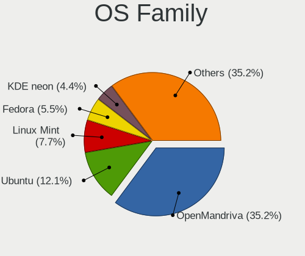
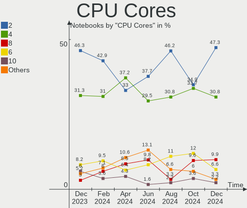
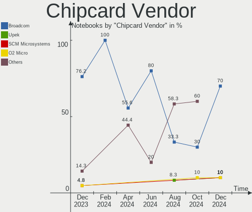
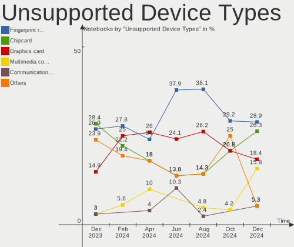

Linux in Poland - Hardware Trends (Notebooks)
---------------------------------------------

A project to identify most popular hardware characteristics and track their change
over time based on data collected by Linux users at https://Linux-Hardware.org.

Anyone can contribute to this report by the [hw-probe](https://github.com/linuxhw/hw-probe) tool:

    sudo -E hw-probe -all -upload

Period: Dec, 2023.

Contents
--------

* [ System ](#system)
  - [ OS                       ](#os)
  - [ OS Family                ](#os-family)
  - [ Kernel                   ](#kernel)
  - [ Kernel Family            ](#kernel-family)
  - [ Kernel Major Ver.        ](#kernel-major-ver)
  - [ Arch                     ](#arch)
  - [ DE                       ](#de)
  - [ Display Server           ](#display-server)
  - [ Display Manager          ](#display-manager)
  - [ OS Lang                  ](#os-lang)
  - [ Boot Mode                ](#boot-mode)
  - [ Filesystem               ](#filesystem)
  - [ Part. scheme             ](#part-scheme)
  - [ Dual Boot with Linux/BSD ](#dual-boot-with-linuxbsd)
  - [ Dual Boot (Win)          ](#dual-boot-win)

* [ Board ](#board)
  - [ Vendor                   ](#vendor)
  - [ Model                    ](#model)
  - [ Model Family             ](#model-family)
  - [ MFG Year                 ](#mfg-year)
  - [ Form Factor              ](#form-factor)
  - [ Secure Boot              ](#secure-boot)
  - [ Coreboot                 ](#coreboot)
  - [ RAM Size                 ](#ram-size)
  - [ RAM Used                 ](#ram-used)
  - [ Total Drives             ](#total-drives)
  - [ Has CD-ROM               ](#has-cd-rom)
  - [ Has Ethernet             ](#has-ethernet)
  - [ Has WiFi                 ](#has-wifi)
  - [ Has Bluetooth            ](#has-bluetooth)

* [ Location ](#location)
  - [ Country                  ](#country)
  - [ City                     ](#city)

* [ Drives ](#drives)
  - [ Drive Vendor             ](#drive-vendor)
  - [ Drive Model              ](#drive-model)
  - [ HDD Vendor               ](#hdd-vendor)
  - [ SSD Vendor               ](#ssd-vendor)
  - [ Drive Kind               ](#drive-kind)
  - [ Drive Connector          ](#drive-connector)
  - [ Drive Size               ](#drive-size)
  - [ Space Total              ](#space-total)
  - [ Space Used               ](#space-used)
  - [ Malfunc. Drives          ](#malfunc-drives)
  - [ Malfunc. Drive Vendor    ](#malfunc-drive-vendor)
  - [ Malfunc. HDD Vendor      ](#malfunc-hdd-vendor)
  - [ Malfunc. Drive Kind      ](#malfunc-drive-kind)
  - [ Failed Drives            ](#failed-drives)
  - [ Failed Drive Vendor      ](#failed-drive-vendor)
  - [ Drive Status             ](#drive-status)

* [ Storage controller ](#storage-controller)
  - [ Storage Vendor           ](#storage-vendor)
  - [ Storage Model            ](#storage-model)
  - [ Storage Kind             ](#storage-kind)

* [ Processor ](#processor)
  - [ CPU Vendor               ](#cpu-vendor)
  - [ CPU Model                ](#cpu-model)
  - [ CPU Model Family         ](#cpu-model-family)
  - [ CPU Cores                ](#cpu-cores)
  - [ CPU Sockets              ](#cpu-sockets)
  - [ CPU Threads              ](#cpu-threads)
  - [ CPU Op-Modes             ](#cpu-op-modes)
  - [ CPU Microcode            ](#cpu-microcode)
  - [ CPU Microarch            ](#cpu-microarch)

* [ Graphics ](#graphics)
  - [ GPU Vendor               ](#gpu-vendor)
  - [ GPU Model                ](#gpu-model)
  - [ GPU Combo                ](#gpu-combo)
  - [ GPU Driver               ](#gpu-driver)
  - [ GPU Memory               ](#gpu-memory)

* [ Monitor ](#monitor)
  - [ Monitor Vendor           ](#monitor-vendor)
  - [ Monitor Model            ](#monitor-model)
  - [ Monitor Resolution       ](#monitor-resolution)
  - [ Monitor Diagonal         ](#monitor-diagonal)
  - [ Monitor Width            ](#monitor-width)
  - [ Aspect Ratio             ](#aspect-ratio)
  - [ Monitor Area             ](#monitor-area)
  - [ Pixel Density            ](#pixel-density)
  - [ Multiple Monitors        ](#multiple-monitors)

* [ Network ](#network)
  - [ Net Controller Vendor    ](#net-controller-vendor)
  - [ Net Controller Model     ](#net-controller-model)
  - [ Wireless Vendor          ](#wireless-vendor)
  - [ Wireless Model           ](#wireless-model)
  - [ Ethernet Vendor          ](#ethernet-vendor)
  - [ Ethernet Model           ](#ethernet-model)
  - [ Net Controller Kind      ](#net-controller-kind)
  - [ Used Controller          ](#used-controller)
  - [ NICs                     ](#nics)
  - [ IPv6                     ](#ipv6)

* [ Bluetooth ](#bluetooth)
  - [ Bluetooth Vendor         ](#bluetooth-vendor)
  - [ Bluetooth Model          ](#bluetooth-model)

* [ Sound ](#sound)
  - [ Sound Vendor             ](#sound-vendor)
  - [ Sound Model              ](#sound-model)

* [ Memory ](#memory)
  - [ Memory Vendor            ](#memory-vendor)
  - [ Memory Model             ](#memory-model)
  - [ Memory Kind              ](#memory-kind)
  - [ Memory Form Factor       ](#memory-form-factor)
  - [ Memory Size              ](#memory-size)
  - [ Memory Speed             ](#memory-speed)

* [ Printers & scanners ](#printers--scanners)
  - [ Printer Vendor           ](#printer-vendor)
  - [ Printer Model            ](#printer-model)
  - [ Scanner Vendor           ](#scanner-vendor)
  - [ Scanner Model            ](#scanner-model)

* [ Camera ](#camera)
  - [ Camera Vendor            ](#camera-vendor)
  - [ Camera Model             ](#camera-model)

* [ Security ](#security)
  - [ Fingerprint Vendor       ](#fingerprint-vendor)
  - [ Fingerprint Model        ](#fingerprint-model)
  - [ Chipcard Vendor          ](#chipcard-vendor)
  - [ Chipcard Model           ](#chipcard-model)

* [ Unsupported ](#unsupported)
  - [ Unsupported Devices      ](#unsupported-devices)
  - [ Unsupported Device Types ](#unsupported-device-types)

System
------

OS
--

Installed operating systems

| Name                  | Notebooks | Percent |
|-----------------------|-----------|---------|
| Fedora 39             | 18        | 13.43%  |
| OpenMandriva 23.08    | 15        | 11.19%  |
| OpenMandriva 5.0      | 14        | 10.45%  |
| Debian 12             | 10        | 7.46%   |
| Linux Mint 21.2       | 9         | 6.72%   |
| Ubuntu 22.04          | 8         | 5.97%   |
| Arch Rolling          | 8         | 5.97%   |
| Zorin 17              | 4         | 2.99%   |
| Xero Rolling          | 3         | 2.24%   |
| SteamOS 3.5.7         | 3         | 2.24%   |
| Ubuntu 23.10          | 2         | 1.49%   |
| Ubuntu 20.04          | 2         | 1.49%   |
| ROSA R11.1            | 2         | 1.49%   |
| OpenMandriva 23.11    | 2         | 1.49%   |
| Manjaro 23.0.1        | 2         | 1.49%   |
| Linux Mint 20.3       | 2         | 1.49%   |
| Debian                | 2         | 1.49%   |
| Zorin 16              | 1         | 0.75%   |
| SteamOS 4             | 1         | 0.75%   |
| Sparky 7.2            | 1         | 0.75%   |
| Pardus 23.0           | 1         | 0.75%   |
| OpenMandriva 23.10    | 1         | 0.75%   |
| OpenMandriva 23.03    | 1         | 0.75%   |
| Nobara 38             | 1         | 0.75%   |
| NixOS 23.11           | 1         | 0.75%   |
| MX 23                 | 1         | 0.75%   |
| Manjaro 23.1.1        | 1         | 0.75%   |
| Makulu Bld-2022.08.19 | 1         | 0.75%   |
| Lubuntu 22.04         | 1         | 0.75%   |
| Linux Mint 21.1       | 1         | 0.75%   |
| Linux Mint 21         | 1         | 0.75%   |
| Linux Mint 20.2       | 1         | 0.75%   |
| Kubuntu 22.04         | 1         | 0.75%   |
| Kali 2023.4           | 1         | 0.75%   |
| Gentoo 2.14           | 1         | 0.75%   |
| Garuda Linux Rolling  | 1         | 0.75%   |
| Fedora 38             | 1         | 0.75%   |
| Fedora 36             | 1         | 0.75%   |
| EuroLinux 9.2         | 1         | 0.75%   |
| EndeavourOS Rolling   | 1         | 0.75%   |

OS Family
---------

OS without a version

| Name         | Notebooks | Percent |
|--------------|-----------|---------|
| OpenMandriva | 33        | 24.63%  |
| Fedora       | 20        | 14.93%  |
| Linux Mint   | 14        | 10.45%  |
| Ubuntu       | 12        | 8.96%   |
| Debian       | 12        | 8.96%   |
| Arch         | 8         | 5.97%   |
| Zorin        | 5         | 3.73%   |
| SteamOS      | 4         | 2.99%   |
| Xero         | 3         | 2.24%   |
| Manjaro      | 3         | 2.24%   |
| ROSA         | 2         | 1.49%   |
| Sparky       | 1         | 0.75%   |
| Pardus       | 1         | 0.75%   |
| Nobara       | 1         | 0.75%   |
| NixOS        | 1         | 0.75%   |
| MX           | 1         | 0.75%   |
| Makulu       | 1         | 0.75%   |
| Lubuntu      | 1         | 0.75%   |
| Kubuntu      | 1         | 0.75%   |
| Kali         | 1         | 0.75%   |
| Gentoo       | 1         | 0.75%   |
| Garuda Linux | 1         | 0.75%   |
| EuroLinux    | 1         | 0.75%   |
| EndeavourOS  | 1         | 0.75%   |
| CachyOS      | 1         | 0.75%   |
| BunsenLabs   | 1         | 0.75%   |
| blendOS      | 1         | 0.75%   |
| BigLinux     | 1         | 0.75%   |
| Artix        | 1         | 0.75%   |

Kernel
------

Version of the Linux kernel

| Version                         | Notebooks | Percent |
|---------------------------------|-----------|---------|
| 6.6.2-desktop-1omv2390          | 16        | 11.94%  |
| 6.4.11-desktop-1omv2390         | 14        | 10.45%  |
| 6.2.0-39-generic                | 8         | 5.97%   |
| 5.15.0-91-generic               | 8         | 5.97%   |
| 6.1.0-13-amd64                  | 7         | 5.22%   |
| 6.6.8-200.fc39.x86_64           | 6         | 4.48%   |
| 6.2.0-37-generic                | 6         | 4.48%   |
| 6.6.7-arch1-1                   | 4         | 2.99%   |
| 6.6.4-arch1-1                   | 3         | 2.24%   |
| 6.6.3-200.fc39.x86_64           | 3         | 2.24%   |
| 6.1.52-valve9-1-neptune-61      | 3         | 2.24%   |
| 6.6.8-arch1-1                   | 2         | 1.49%   |
| 6.6.7-200.fc39.x86_64           | 2         | 1.49%   |
| 6.6.4-200.fc39.x86_64           | 2         | 1.49%   |
| 6.6.3-arch1-1                   | 2         | 1.49%   |
| 6.6.2-201.fc39.x86_64           | 2         | 1.49%   |
| 6.5.3-1-MANJARO                 | 2         | 1.49%   |
| 6.5.0-9-generic                 | 2         | 1.49%   |
| 6.5.0-5-amd64                   | 2         | 1.49%   |
| 6.5.0-0.deb12.4-amd64           | 2         | 1.49%   |
| 6.1.0-16-amd64                  | 2         | 1.49%   |
| 5.15.0-89-generic               | 2         | 1.49%   |
| 6.7.0-rc5                       | 1         | 0.75%   |
| 6.6.8-2-MANJARO                 | 1         | 0.75%   |
| 6.6.7-zen1-1-zen                | 1         | 0.75%   |
| 6.6.7-666.rog.fc39.x86_64       | 1         | 0.75%   |
| 6.6.7-203.fsync.fc38.x86_64     | 1         | 0.75%   |
| 6.6.6-200.fc39.x86_64           | 1         | 0.75%   |
| 6.6.4-artix1-1                  | 1         | 0.75%   |
| 6.6.4                           | 1         | 0.75%   |
| 6.6.3-2.2-cachyos-sched-ext-lto | 1         | 0.75%   |
| 6.6.0-pf2                       | 1         | 0.75%   |
| 6.5.6-300.fc39.x86_64           | 1         | 0.75%   |
| 6.5.5-zen1-1-zen                | 1         | 0.75%   |
| 6.5.5-desktop-1omv2390          | 1         | 0.75%   |
| 6.5.0-kali3-amd64               | 1         | 0.75%   |
| 6.5.0-1009-oem                  | 1         | 0.75%   |
| 6.4.8-desktop-2omv2390          | 1         | 0.75%   |
| 6.4.12-zen1-1-zen               | 1         | 0.75%   |
| 6.4.0-4mx-ahs-amd64             | 1         | 0.75%   |

Kernel Family
-------------

Linux kernel without a distro release

| Version | Notebooks | Percent |
|---------|-----------|---------|
| 6.6.2   | 18        | 13.43%  |
| 6.2.0   | 15        | 11.19%  |
| 6.4.11  | 14        | 10.45%  |
| 5.15.0  | 13        | 9.7%    |
| 6.1.0   | 10        | 7.46%   |
| 6.6.8   | 9         | 6.72%   |
| 6.6.7   | 9         | 6.72%   |
| 6.5.0   | 8         | 5.97%   |
| 6.6.4   | 7         | 5.22%   |
| 6.6.3   | 6         | 4.48%   |
| 6.1.52  | 3         | 2.24%   |
| 6.5.5   | 2         | 1.49%   |
| 6.5.3   | 2         | 1.49%   |
| 5.4.0   | 2         | 1.49%   |
| 6.7.0   | 1         | 0.75%   |
| 6.6.6   | 1         | 0.75%   |
| 6.6.0   | 1         | 0.75%   |
| 6.5.6   | 1         | 0.75%   |
| 6.4.8   | 1         | 0.75%   |
| 6.4.12  | 1         | 0.75%   |
| 6.4.0   | 1         | 0.75%   |
| 6.3.13  | 1         | 0.75%   |
| 6.2.9   | 1         | 0.75%   |
| 6.2.6   | 1         | 0.75%   |
| 6.2.15  | 1         | 0.75%   |
| 6.1.64  | 1         | 0.75%   |
| 5.4.32  | 1         | 0.75%   |
| 5.14.0  | 1         | 0.75%   |
| 5.10.0  | 1         | 0.75%   |
| 4.15.0  | 1         | 0.75%   |

Kernel Major Ver.
-----------------

Linux kernel major version

| Version | Notebooks | Percent |
|---------|-----------|---------|
| 6.6     | 51        | 38.06%  |
| 6.2     | 18        | 13.43%  |
| 6.4     | 17        | 12.69%  |
| 6.1     | 14        | 10.45%  |
| 6.5     | 13        | 9.7%    |
| 5.15    | 13        | 9.7%    |
| 5.4     | 3         | 2.24%   |
| 6.7     | 1         | 0.75%   |
| 6.3     | 1         | 0.75%   |
| 5.14    | 1         | 0.75%   |
| 5.10    | 1         | 0.75%   |
| 4.15    | 1         | 0.75%   |

Arch
----

OS architecture (x86_64, i586, etc.)

| Name   | Notebooks | Percent |
|--------|-----------|---------|
| x86_64 | 133       | 99.25%  |
| i686   | 1         | 0.75%   |

DE
--

Desktop Environment

| Name            | Notebooks | Percent |
|-----------------|-----------|---------|
| KDE5            | 51        | 38.06%  |
| GNOME           | 44        | 32.84%  |
| X-Cinnamon      | 14        | 10.45%  |
| LXQt            | 5         | 3.73%   |
| Unknown         | 5         | 3.73%   |
| XFCE            | 3         | 2.24%   |
| MATE            | 2         | 1.49%   |
| sway            | 1         | 0.75%   |
| MakuluGameR     | 1         | 0.75%   |
| LXDE            | 1         | 0.75%   |
| KDE4            | 1         | 0.75%   |
| i3              | 1         | 0.75%   |
| Hyprland        | 1         | 0.75%   |
| GNUstep         | 1         | 0.75%   |
| GNOME Flashback | 1         | 0.75%   |
| gamescope       | 1         | 0.75%   |
| Cinnamon        | 1         | 0.75%   |

Display Server
--------------

X11 or Wayland

| Name    | Notebooks | Percent |
|---------|-----------|---------|
| Wayland | 73        | 54.48%  |
| X11     | 57        | 42.54%  |
| Unknown | 3         | 2.24%   |
| Tty     | 1         | 0.75%   |

Display Manager
---------------

SDDM, LightDM, etc.

| Name    | Notebooks | Percent |
|---------|-----------|---------|
| SDDM    | 45        | 33.58%  |
| Unknown | 44        | 32.84%  |
| LightDM | 20        | 14.93%  |
| GDM3    | 20        | 14.93%  |
| GDM     | 4         | 2.99%   |
| KDM     | 1         | 0.75%   |

OS Lang
-------

Language

| Lang        | Notebooks | Percent |
|-------------|-----------|---------|
| pl_PL       | 81        | 60.45%  |
| en_US       | 36        | 26.87%  |
| C           | 4         | 2.99%   |
| ru_RU       | 3         | 2.24%   |
| en_GB       | 3         | 2.24%   |
| uk_UA       | 2         | 1.49%   |
| ru_UA       | 1         | 0.75%   |
| es_ES       | 1         | 0.75%   |
| en_US.UTF.8 | 1         | 0.75%   |
| en_DK       | 1         | 0.75%   |
| Unknown     | 1         | 0.75%   |

Boot Mode
---------

EFI or BIOS

| Mode | Notebooks | Percent |
|------|-----------|---------|
| BIOS | 70        | 52.24%  |
| EFI  | 64        | 47.76%  |

Filesystem
----------

Type of filesystem

| Type     | Notebooks | Percent |
|----------|-----------|---------|
| Ext4     | 70        | 52.24%  |
| Btrfs    | 27        | 20.15%  |
| Overlay  | 22        | 16.42%  |
| Tmpfs    | 11        | 8.21%   |
| Xfs      | 2         | 1.49%   |
| F2fs     | 1         | 0.75%   |
| Bcachefs | 1         | 0.75%   |

Part. scheme
------------

Scheme of partitioning

| Type    | Notebooks | Percent |
|---------|-----------|---------|
| GPT     | 67        | 50%     |
| Unknown | 38        | 28.36%  |
| MBR     | 29        | 21.64%  |

Dual Boot with Linux/BSD
------------------------

Hosting more than one Linux/BSD

| Dual boot | Notebooks | Percent |
|-----------|-----------|---------|
| No        | 112       | 83.58%  |
| Yes       | 22        | 16.42%  |

Dual Boot (Win)
---------------

Hosting Linux and Windows

| Dual boot | Notebooks | Percent |
|-----------|-----------|---------|
| No        | 85        | 63.43%  |
| Yes       | 49        | 36.57%  |

Board
-----

Vendor
------

Motherboard manufacturer

| Name                | Notebooks | Percent |
|---------------------|-----------|---------|
| Lenovo              | 30        | 22.39%  |
| Dell                | 30        | 22.39%  |
| ASUSTek Computer    | 18        | 13.43%  |
| Hewlett-Packard     | 16        | 11.94%  |
| Acer                | 10        | 7.46%   |
| Samsung Electronics | 5         | 3.73%   |
| Valve               | 3         | 2.24%   |
| MSI                 | 3         | 2.24%   |
| Toshiba             | 2         | 1.49%   |
| HUAWEI              | 2         | 1.49%   |
| Google              | 2         | 1.49%   |
| Apple               | 2         | 1.49%   |
| TrekStor            | 1         | 0.75%   |
| STONE COMPUTERS     | 1         | 0.75%   |
| Packard Bell        | 1         | 0.75%   |
| Monster             | 1         | 0.75%   |
| Medion              | 1         | 0.75%   |
| Kiano               | 1         | 0.75%   |
| Hampoo              | 1         | 0.75%   |
| Gigabyte Technology | 1         | 0.75%   |
| Fujitsu Siemens     | 1         | 0.75%   |
| Fujitsu             | 1         | 0.75%   |
| Unknown             | 1         | 0.75%   |

Model
-----

Motherboard model

| Name                                        | Notebooks | Percent |
|---------------------------------------------|-----------|---------|
| Valve Jupiter                               | 2         | 1.49%   |
| Samsung R530/R730/R540                      | 2         | 1.49%   |
| Lenovo V14-IIL 82C4                         | 2         | 1.49%   |
| HP Laptop 15s-eq0xxx                        | 2         | 1.49%   |
| Dell Latitude E6440                         | 2         | 1.49%   |
| Dell Latitude 7440                          | 2         | 1.49%   |
| Dell Latitude 5400                          | 2         | 1.49%   |
| ASUS X555LJ                                 | 2         | 1.49%   |
| ASUS VivoBook_ASUSLaptop X421IAY_D413IA     | 2         | 1.49%   |
| ASUS 1215N                                  | 2         | 1.49%   |
| Acer Extensa 215-55                         | 2         | 1.49%   |
| Valve Galileo                               | 1         | 0.75%   |
| TrekStor Notebook Slim S130                 | 1         | 0.75%   |
| Toshiba Satellite L750                      | 1         | 0.75%   |
| Toshiba Satellite A660                      | 1         | 0.75%   |
| STONE COMPUTERS NOTCHA-286                  | 1         | 0.75%   |
| Samsung RV411/RV511/E3511/S3511/RV711/E3411 | 1         | 0.75%   |
| Samsung NC210/NC110                         | 1         | 0.75%   |
| Samsung 350V5C/351V5C/3540VC/3440VC         | 1         | 0.75%   |
| Packard Bell EasyNote TSX66HR               | 1         | 0.75%   |
| MSI Modern 15 B12M                          | 1         | 0.75%   |
| MSI GT70 2OC/2OD                            | 1         | 0.75%   |
| MSI GS70 2OD                                | 1         | 0.75%   |
| Monster ABRA A5 V13.4                       | 1         | 0.75%   |
| Medion E6214                                | 1         | 0.75%   |
| Lenovo Yoga Slim 6 14IAP8 82WU              | 1         | 0.75%   |
| Lenovo ThinkPad X250 20CLS8C000             | 1         | 0.75%   |
| Lenovo ThinkPad X1 Carbon 6th 20KH006MGE    | 1         | 0.75%   |
| Lenovo ThinkPad T500 20828WG                | 1         | 0.75%   |
| Lenovo ThinkPad T460s 20FAS06000            | 1         | 0.75%   |
| Lenovo ThinkPad T440p 20AWS4YE00            | 1         | 0.75%   |
| Lenovo ThinkPad T440p 20AWS4UD00            | 1         | 0.75%   |
| Lenovo ThinkPad T430 2349FC4                | 1         | 0.75%   |
| Lenovo ThinkPad T410 2522V3S                | 1         | 0.75%   |
| Lenovo ThinkPad T14s Gen 4 21F80015PB       | 1         | 0.75%   |
| Lenovo ThinkPad T14 Gen 3 21AH00DFPB        | 1         | 0.75%   |
| Lenovo ThinkPad T14 Gen 3 21AH00CSPB        | 1         | 0.75%   |
| Lenovo ThinkPad SL 2746E9G                  | 1         | 0.75%   |
| Lenovo ThinkPad L14 Gen 2 20X2S4DL00        | 1         | 0.75%   |
| Lenovo ThinkPad E470 20H1004UIG             | 1         | 0.75%   |

Model Family
------------

Motherboard model prefix

| Name                       | Notebooks | Percent |
|----------------------------|-----------|---------|
| Dell Latitude              | 22        | 16.42%  |
| Lenovo ThinkPad            | 15        | 11.19%  |
| Acer Aspire                | 6         | 4.48%   |
| HP EliteBook               | 5         | 3.73%   |
| Lenovo IdeaPad             | 4         | 2.99%   |
| HP Laptop                  | 4         | 2.99%   |
| Dell Precision             | 4         | 2.99%   |
| ASUS VivoBook              | 4         | 2.99%   |
| Dell Inspiron              | 3         | 2.24%   |
| ASUS ASUS                  | 3         | 2.24%   |
| Valve Jupiter              | 2         | 1.49%   |
| Toshiba Satellite          | 2         | 1.49%   |
| Samsung R530               | 2         | 1.49%   |
| Lenovo V14-IIL             | 2         | 1.49%   |
| Lenovo Legion              | 2         | 1.49%   |
| HP Pavilion                | 2         | 1.49%   |
| ASUS ZenBook               | 2         | 1.49%   |
| ASUS X555LJ                | 2         | 1.49%   |
| ASUS 1215N                 | 2         | 1.49%   |
| Acer Nitro                 | 2         | 1.49%   |
| Acer Extensa               | 2         | 1.49%   |
| Valve Galileo              | 1         | 0.75%   |
| TrekStor Notebook          | 1         | 0.75%   |
| STONE COMPUTERS NOTCHA-286 | 1         | 0.75%   |
| Samsung RV411              | 1         | 0.75%   |
| Samsung NC210              | 1         | 0.75%   |
| Samsung 350V5C             | 1         | 0.75%   |
| Packard Bell EasyNote      | 1         | 0.75%   |
| MSI Modern                 | 1         | 0.75%   |
| MSI GT70                   | 1         | 0.75%   |
| MSI GS70                   | 1         | 0.75%   |
| Monster ABRA               | 1         | 0.75%   |
| Medion E6214               | 1         | 0.75%   |
| Lenovo Yoga                | 1         | 0.75%   |
| Lenovo ThinkBook           | 1         | 0.75%   |
| Lenovo G585                | 1         | 0.75%   |
| Lenovo G570                | 1         | 0.75%   |
| Lenovo G50-80              | 1         | 0.75%   |
| Lenovo G50-30              | 1         | 0.75%   |
| Lenovo B590                | 1         | 0.75%   |

MFG Year
--------

Motherboard manufacture year

| Year | Notebooks | Percent |
|------|-----------|---------|
| 2023 | 18        | 13.43%  |
| 2019 | 13        | 9.7%    |
| 2011 | 13        | 9.7%    |
| 2012 | 10        | 7.46%   |
| 2010 | 10        | 7.46%   |
| 2022 | 9         | 6.72%   |
| 2020 | 9         | 6.72%   |
| 2013 | 9         | 6.72%   |
| 2018 | 7         | 5.22%   |
| 2016 | 7         | 5.22%   |
| 2021 | 6         | 4.48%   |
| 2017 | 5         | 3.73%   |
| 2015 | 5         | 3.73%   |
| 2008 | 5         | 3.73%   |
| 2014 | 4         | 2.99%   |
| 2007 | 2         | 1.49%   |
| 2009 | 1         | 0.75%   |
| 2006 | 1         | 0.75%   |

Form Factor
-----------

Physical design of the computer

| Name     | Notebooks | Percent |
|----------|-----------|---------|
| Notebook | 134       | 100%    |

Secure Boot
-----------

Enabled or disabled

| State    | Notebooks | Percent |
|----------|-----------|---------|
| Disabled | 129       | 96.27%  |
| Enabled  | 5         | 3.73%   |

Coreboot
--------

Have coreboot on board

| Used | Notebooks | Percent |
|------|-----------|---------|
| No   | 132       | 98.51%  |
| Yes  | 2         | 1.49%   |

RAM Size
--------

Total RAM memory

| Size in GB | Notebooks | Percent |
|------------|-----------|---------|
| 4.01-8.0   | 43        | 32.09%  |
| 3.01-4.0   | 29        | 21.64%  |
| 16.01-24.0 | 26        | 19.4%   |
| 8.01-16.0  | 19        | 14.18%  |
| 32.01-64.0 | 11        | 8.21%   |
| 24.01-32.0 | 2         | 1.49%   |
| 2.01-3.0   | 2         | 1.49%   |
| 1.01-2.0   | 1         | 0.75%   |
| 0.51-1.0   | 1         | 0.75%   |

RAM Used
--------

Used RAM memory

| Used GB   | Notebooks | Percent |
|-----------|-----------|---------|
| 1.01-2.0  | 42        | 31.34%  |
| 2.01-3.0  | 32        | 23.88%  |
| 4.01-8.0  | 27        | 20.15%  |
| 3.01-4.0  | 21        | 15.67%  |
| 0.51-1.0  | 9         | 6.72%   |
| 8.01-16.0 | 2         | 1.49%   |
| 0.01-0.5  | 1         | 0.75%   |

Total Drives
------------

Number of drives on board

| Drives | Notebooks | Percent |
|--------|-----------|---------|
| 1      | 98        | 73.13%  |
| 2      | 27        | 20.15%  |
| 3      | 6         | 4.48%   |
| 0      | 3         | 2.24%   |

Has CD-ROM
----------

Has CD-ROM on board

| Presented | Notebooks | Percent |
|-----------|-----------|---------|
| No        | 93        | 69.4%   |
| Yes       | 41        | 30.6%   |

Has Ethernet
------------

Has Ethernet on board

| Presented | Notebooks | Percent |
|-----------|-----------|---------|
| Yes       | 104       | 77.61%  |
| No        | 30        | 22.39%  |

Has WiFi
--------

Has WiFi module

| Presented | Notebooks | Percent |
|-----------|-----------|---------|
| Yes       | 134       | 100%    |

Has Bluetooth
-------------

Has Bluetooth module

| Presented | Notebooks | Percent |
|-----------|-----------|---------|
| Yes       | 110       | 82.09%  |
| No        | 24        | 17.91%  |

Location
--------

Country
-------

Geographic location (country)

| Country | Notebooks | Percent |
|---------|-----------|---------|
| Poland  | 134       | 100%    |

City
----

Geographic location (city)

| City                 | Notebooks | Percent |
|----------------------|-----------|---------|
| Warsaw               | 34        | 25.37%  |
| Poznan               | 13        | 9.7%    |
| Lodz                 | 7         | 5.22%   |
| Krakow               | 6         | 4.48%   |
| Wroclaw              | 5         | 3.73%   |
| Gmina Chełmiec      | 4         | 2.99%   |
| Szczecin             | 3         | 2.24%   |
| Lublin               | 3         | 2.24%   |
| Gdansk               | 3         | 2.24%   |
| Rybnik               | 2         | 1.49%   |
| Kraszew              | 2         | 1.49%   |
| Bydgoszcz            | 2         | 1.49%   |
| Bialystok            | 2         | 1.49%   |
| Adamowka             | 2         | 1.49%   |
| Zielona Góra        | 1         | 0.75%   |
| Zawiercie            | 1         | 0.75%   |
| Zabrze               | 1         | 0.75%   |
| Wodzisław Śląski  | 1         | 0.75%   |
| Torun                | 1         | 0.75%   |
| Tarnowskie Gory      | 1         | 0.75%   |
| Szamotuły           | 1         | 0.75%   |
| Swiebodzice          | 1         | 0.75%   |
| Swidnik              | 1         | 0.75%   |
| Subcarpathia         | 1         | 0.75%   |
| Stargard             | 1         | 0.75%   |
| Slawa                | 1         | 0.75%   |
| Sandomierz           | 1         | 0.75%   |
| Rzeszów             | 1         | 0.75%   |
| Pszczyna             | 1         | 0.75%   |
| Piotrkow Trybunalski | 1         | 0.75%   |
| Pionki               | 1         | 0.75%   |
| Ostróda             | 1         | 0.75%   |
| Olsztyn              | 1         | 0.75%   |
| Ogrodzieniec         | 1         | 0.75%   |
| Mińsk Mazowiecki    | 1         | 0.75%   |
| Mielec               | 1         | 0.75%   |
| Laki                 | 1         | 0.75%   |
| Krynica-Zdroj        | 1         | 0.75%   |
| Kołobrzeg           | 1         | 0.75%   |
| Koszalin             | 1         | 0.75%   |

Drives
------

Drive Vendor
------------

Hard drive vendors

| Vendor                      | Notebooks | Drives | Percent |
|-----------------------------|-----------|--------|---------|
| Samsung Electronics         | 25        | 26     | 15.24%  |
| WDC                         | 13        | 13     | 7.93%   |
| Sandisk                     | 13        | 13     | 7.93%   |
| Seagate                     | 12        | 12     | 7.32%   |
| GOODRAM                     | 11        | 11     | 6.71%   |
| Micron Technology           | 9         | 9      | 5.49%   |
| A-DATA Technology           | 9         | 9      | 5.49%   |
| Unknown                     | 7         | 8      | 4.27%   |
| Crucial                     | 7         | 7      | 4.27%   |
| Intel                       | 5         | 5      | 3.05%   |
| Hitachi                     | 5         | 5      | 3.05%   |
| Toshiba                     | 4         | 4      | 2.44%   |
| SK hynix                    | 4         | 4      | 2.44%   |
| PNY                         | 3         | 3      | 1.83%   |
| Phison Electronics          | 3         | 3      | 1.83%   |
| KIOXIA                      | 3         | 3      | 1.83%   |
| China                       | 3         | 3      | 1.83%   |
| Realtek Semiconductor       | 2         | 2      | 1.22%   |
| MAXIO Technology (Hangzhou) | 2         | 2      | 1.22%   |
| KIOXIA-EXCERIA              | 2         | 2      | 1.22%   |
| Kingston                    | 2         | 2      | 1.22%   |
| USB3.0                      | 1         | 1      | 0.61%   |
| Transcend                   | 1         | 1      | 0.61%   |
| SSD 1TB                     | 1         | 1      | 0.61%   |
| Silicon Motion              | 1         | 1      | 0.61%   |
| Realtek                     | 1         | 1      | 0.61%   |
| Plextor                     | 1         | 1      | 0.61%   |
| Phison                      | 1         | 1      | 0.61%   |
| Patriot                     | 1         | 1      | 0.61%   |
| Netac                       | 1         | 1      | 0.61%   |
| Micron/Crucial Technology   | 1         | 1      | 0.61%   |
| LITEONIT                    | 1         | 1      | 0.61%   |
| Lexar                       | 1         | 1      | 0.61%   |
| Kingston Technology Company | 1         | 1      | 0.61%   |
| KingSpec                    | 1         | 1      | 0.61%   |
| Initio                      | 1         | 1      | 0.61%   |
| HGST                        | 1         | 1      | 0.61%   |
| Apple                       | 1         | 1      | 0.61%   |
| Apacer                      | 1         | 1      | 0.61%   |
| ADATA Technology            | 1         | 1      | 0.61%   |

Drive Model
-----------

Hard drive models

| Model                                               | Notebooks | Percent |
|-----------------------------------------------------|-----------|---------|
| Samsung HM321HI 320GB                               | 6         | 3.61%   |
| Sandisk WD Blue SN550 NVMe SSD 1TB                  | 3         | 1.81%   |
| Intel SSD 660P Series 1TB                           | 3         | 1.81%   |
| GOODRAM SSDPR-CX400-256-G2 256GB                    | 3         | 1.81%   |
| WDC WD1600BEVT-75A23T0 160GB                        | 2         | 1.2%    |
| Unknown MMC Card  64GB                              | 2         | 1.2%    |
| Unknown MMC Card  32GB                              | 2         | 1.2%    |
| SK hynix BC511 512GB                                | 2         | 1.2%    |
| Seagate ST500LM012 HN-M500MBB 500GB                 | 2         | 1.2%    |
| Samsung NVMe SSD Controller SM981/PM981/PM983 512GB | 2         | 1.2%    |
| Samsung NVMe SSD Controller PM9A1/PM9A3/980PRO 2TB  | 2         | 1.2%    |
| Samsung MZALQ256HAJD-000L2 256GB                    | 2         | 1.2%    |
| Micron 2450_MTFDKBA512TFK 512GB                     | 2         | 1.2%    |
| MAXIO (Hangzhou) NVMe SSD Controller MAP1202 256GB  | 2         | 1.2%    |
| KIOXIA KBG50ZNS512G NVMe 512GB                      | 2         | 1.2%    |
| GOODRAM SSDPR-CX400-256 256GB                       | 2         | 1.2%    |
| China SSD 512GB                                     | 2         | 1.2%    |
| WDC WDS240G2G0A-00JH30 240GB SSD                    | 1         | 0.6%    |
| WDC WD7500BPVT-24HXZT1 752GB                        | 1         | 0.6%    |
| WDC WD7500BPKX-22HPJT0 752GB                        | 1         | 0.6%    |
| WDC WD6400BPVT-55HXZT3 640GB                        | 1         | 0.6%    |
| WDC WD5000LPCX-24C6HT0 500GB                        | 1         | 0.6%    |
| WDC WD3200BPVT-22ZEST0 320GB                        | 1         | 0.6%    |
| WDC WD3200BEKT-75PVMT1 320GB                        | 1         | 0.6%    |
| WDC WD2500BEVS-22UST0 250GB                         | 1         | 0.6%    |
| WDC WD1600BEVT-22ZCT0 160GB                         | 1         | 0.6%    |
| WDC WD10SPCX-24HWST1 1TB                            | 1         | 0.6%    |
| WDC WD10JPVX-08JC3T6 1TB                            | 1         | 0.6%    |
| USB3.0 Super Speed 1TB                              | 1         | 0.6%    |
| Unknown SDU1  32GB                                  | 1         | 0.6%    |
| Unknown MMC Card  512GB                             | 1         | 0.6%    |
| Unknown MMC Card  128GB                             | 1         | 0.6%    |
| Unknown hB8aP  32GB                                 | 1         | 0.6%    |
| Transcend TS240GMTS420S 240GB SSD                   | 1         | 0.6%    |
| Toshiba THNSNJ512GMCY 512GB SSD                     | 1         | 0.6%    |
| Toshiba THNSNJ512GCSU 512GB SSD                     | 1         | 0.6%    |
| Toshiba MQ01ABF050 500GB                            | 1         | 0.6%    |
| Toshiba MQ01ABD100 1TB                              | 1         | 0.6%    |
| SSD 1TB Disk 1TB                                    | 1         | 0.6%    |
| SK hynix HFS512GEJ9X125N 512GB                      | 1         | 0.6%    |

HDD Vendor
----------

Hard disk drive vendors

| Vendor              | Notebooks | Drives | Percent |
|---------------------|-----------|--------|---------|
| WDC                 | 12        | 12     | 30%     |
| Seagate             | 12        | 12     | 30%     |
| Samsung Electronics | 6         | 6      | 15%     |
| Hitachi             | 5         | 5      | 12.5%   |
| Toshiba             | 2         | 2      | 5%      |
| USB3.0              | 1         | 1      | 2.5%    |
| Initio              | 1         | 1      | 2.5%    |
| HGST                | 1         | 1      | 2.5%    |

SSD Vendor
----------

Solid state drive vendors

| Vendor              | Notebooks | Drives | Percent |
|---------------------|-----------|--------|---------|
| GOODRAM             | 10        | 10     | 17.86%  |
| A-DATA Technology   | 9         | 9      | 16.07%  |
| Samsung Electronics | 7         | 7      | 12.5%   |
| Crucial             | 7         | 7      | 12.5%   |
| SanDisk             | 3         | 3      | 5.36%   |
| PNY                 | 3         | 3      | 5.36%   |
| China               | 3         | 3      | 5.36%   |
| Toshiba             | 2         | 2      | 3.57%   |
| KIOXIA-EXCERIA      | 2         | 2      | 3.57%   |
| WDC                 | 1         | 1      | 1.79%   |
| Transcend           | 1         | 1      | 1.79%   |
| Plextor             | 1         | 1      | 1.79%   |
| Netac               | 1         | 1      | 1.79%   |
| Micron Technology   | 1         | 1      | 1.79%   |
| LITEONIT            | 1         | 1      | 1.79%   |
| Kingston            | 1         | 1      | 1.79%   |
| KingSpec            | 1         | 1      | 1.79%   |
| Apacer              | 1         | 1      | 1.79%   |
| Unknown             | 1         | 1      | 1.79%   |

Drive Kind
----------

HDD or SSD

| Kind    | Notebooks | Drives | Percent |
|---------|-----------|--------|---------|
| NVMe    | 56        | 60     | 35.9%   |
| SSD     | 52        | 56     | 33.33%  |
| HDD     | 39        | 40     | 25%     |
| MMC     | 8         | 9      | 5.13%   |
| Unknown | 1         | 1      | 0.64%   |

Drive Connector
---------------

SATA, SAS, NVMe, etc.

| Type | Notebooks | Drives | Percent |
|------|-----------|--------|---------|
| SATA | 77        | 86     | 50.66%  |
| NVMe | 56        | 59     | 36.84%  |
| SAS  | 11        | 12     | 7.24%   |
| MMC  | 8         | 9      | 5.26%   |

Drive Size
----------

Size of hard drive

| Size in TB | Notebooks | Drives | Percent |
|------------|-----------|--------|---------|
| 0.01-0.5   | 58        | 65     | 65.91%  |
| 0.51-1.0   | 28        | 29     | 31.82%  |
| 1.01-2.0   | 2         | 2      | 2.27%   |

Space Total
-----------

Amount of disk space available on the file system

| Size in GB     | Notebooks | Percent |
|----------------|-----------|---------|
| 251-500        | 28        | 20.9%   |
| 101-250        | 23        | 17.16%  |
| 1-20           | 23        | 17.16%  |
| 501-1000       | 19        | 14.18%  |
| 1001-2000      | 13        | 9.7%    |
| 51-100         | 10        | 7.46%   |
| Unknown        | 8         | 5.97%   |
| 21-50          | 6         | 4.48%   |
| 2001-3000      | 3         | 2.24%   |
| More than 3000 | 1         | 0.75%   |

Space Used
----------

Amount of used disk space

| Used GB   | Notebooks | Percent |
|-----------|-----------|---------|
| 1-20      | 57        | 42.54%  |
| 21-50     | 22        | 16.42%  |
| 101-250   | 15        | 11.19%  |
| 251-500   | 11        | 8.21%   |
| 501-1000  | 10        | 7.46%   |
| 51-100    | 9         | 6.72%   |
| Unknown   | 8         | 5.97%   |
| 1001-2000 | 2         | 1.49%   |

Malfunc. Drives
---------------

Drive models with a malfunction

| Model                               | Notebooks | Drives | Percent |
|-------------------------------------|-----------|--------|---------|
| WDC WDS240G2G0A-00JH30 240GB SSD    | 1         | 1      | 9.09%   |
| WDC WD1600BEVT-75A23T0 160GB        | 1         | 1      | 9.09%   |
| Seagate ST980811AS 80GB             | 1         | 1      | 9.09%   |
| Seagate ST9500325AS 500GB           | 1         | 1      | 9.09%   |
| Seagate ST500LM012 HN-M500MBB 500GB | 1         | 1      | 9.09%   |
| Samsung Electronics HM321HI 320GB   | 1         | 1      | 9.09%   |
| Hitachi HTS547564A9E384 640GB       | 1         | 1      | 9.09%   |
| Hitachi HTS541616J9SA00 160GB       | 1         | 1      | 9.09%   |
| Crucial CT1000MX500SSD4 1TB         | 1         | 1      | 9.09%   |
| A-DATA Technology SU800 256GB SSD   | 1         | 1      | 9.09%   |
| A-DATA Technology SU650 240GB SSD   | 1         | 1      | 9.09%   |

Malfunc. Drive Vendor
---------------------

Vendors of faulty drives

| Vendor              | Notebooks | Drives | Percent |
|---------------------|-----------|--------|---------|
| Seagate             | 3         | 3      | 27.27%  |
| WDC                 | 2         | 2      | 18.18%  |
| Hitachi             | 2         | 2      | 18.18%  |
| A-DATA Technology   | 2         | 2      | 18.18%  |
| Samsung Electronics | 1         | 1      | 9.09%   |
| Crucial             | 1         | 1      | 9.09%   |

Malfunc. HDD Vendor
-------------------

Vendors of faulty HDD drives

| Vendor              | Notebooks | Drives | Percent |
|---------------------|-----------|--------|---------|
| Seagate             | 3         | 3      | 42.86%  |
| Hitachi             | 2         | 2      | 28.57%  |
| WDC                 | 1         | 1      | 14.29%  |
| Samsung Electronics | 1         | 1      | 14.29%  |

Malfunc. Drive Kind
-------------------

Kinds of faulty drives

| Kind | Notebooks | Drives | Percent |
|------|-----------|--------|---------|
| HDD  | 7         | 7      | 63.64%  |
| SSD  | 4         | 4      | 36.36%  |

Failed Drives
-------------

Failed drive models

Zero info for selected period =(

Failed Drive Vendor
-------------------

Failed drive vendors

Zero info for selected period =(

Drive Status
------------

Number of failed and malfunc. drives

| Status   | Notebooks | Drives | Percent |
|----------|-----------|--------|---------|
| Works    | 68        | 76     | 47.22%  |
| Detected | 65        | 79     | 45.14%  |
| Malfunc  | 11        | 11     | 7.64%   |

Storage controller
------------------

Storage Vendor
--------------

Storage controller vendors

| Vendor                       | Notebooks | Percent |
|------------------------------|-----------|---------|
| Intel                        | 97        | 61.01%  |
| Samsung Electronics          | 13        | 8.18%   |
| SanDisk                      | 9         | 5.66%   |
| Micron Technology            | 8         | 5.03%   |
| AMD                          | 8         | 5.03%   |
| Phison Electronics           | 5         | 3.14%   |
| SK hynix                     | 4         | 2.52%   |
| KIOXIA                       | 3         | 1.89%   |
| Silicon Motion               | 2         | 1.26%   |
| Realtek Semiconductor        | 2         | 1.26%   |
| MAXIO Technology (Hangzhou)  | 2         | 1.26%   |
| Kingston Technology Company  | 2         | 1.26%   |
| Shenzhen Longsys Electronics | 1         | 0.63%   |
| Micron/Crucial Technology    | 1         | 0.63%   |
| Apple                        | 1         | 0.63%   |
| ADATA Technology             | 1         | 0.63%   |

Storage Model
-------------

Storage controller models

| Model                                                                          | Notebooks | Percent |
|--------------------------------------------------------------------------------|-----------|---------|
| Intel 82801 Mobile SATA Controller [RAID mode]                                 | 10        | 5.85%   |
| Intel Sunrise Point-LP SATA Controller [AHCI mode]                             | 9         | 5.26%   |
| Intel 6 Series/C200 Series Chipset Family 6 port Mobile SATA AHCI Controller   | 9         | 5.26%   |
| Intel Wildcat Point-LP SATA Controller [AHCI Mode]                             | 7         | 4.09%   |
| Intel Volume Management Device NVMe RAID Controller                            | 7         | 4.09%   |
| Intel 5 Series/3400 Series Chipset 4 port SATA AHCI Controller                 | 7         | 4.09%   |
| AMD FCH SATA Controller [AHCI mode]                                            | 7         | 4.09%   |
| Intel 8 Series/C220 Series Chipset Family 6-port SATA Controller 1 [AHCI mode] | 6         | 3.51%   |
| Samsung NVMe SSD Controller SM981/PM981/PM983                                  | 5         | 2.92%   |
| Samsung NVMe SSD Controller 980 (DRAM-less)                                    | 5         | 2.92%   |
| Intel 7 Series Chipset Family 6-port SATA Controller [AHCI mode]               | 5         | 2.92%   |
| Intel Celeron N3350/Pentium N4200/Atom E3900 Series SATA AHCI Controller       | 4         | 2.34%   |
| SanDisk Ultra 3D / WD Blue SN550 NVMe SSD                                      | 3         | 1.75%   |
| Samsung NVMe SSD Controller PM9A1/PM9A3/980PRO                                 | 3         | 1.75%   |
| Micron 2450 NVMe SSD [HendrixV] (DRAM-less)                                    | 3         | 1.75%   |
| Micron 2400 NVMe SSD (DRAM-less)                                               | 3         | 1.75%   |
| KIOXIA NVMe SSD Controller BG5 (DRAM-less)                                     | 3         | 1.75%   |
| Intel SSD 660P Series                                                          | 3         | 1.75%   |
| Intel NM10/ICH7 Family SATA Controller [AHCI mode]                             | 3         | 1.75%   |
| Intel Cannon Lake Mobile PCH SATA AHCI Controller                              | 3         | 1.75%   |
| Intel Alder Lake-P SATA AHCI Controller                                        | 3         | 1.75%   |
| Intel 82801HM/HEM (ICH8M/ICH8M-E) IDE Controller                               | 3         | 1.75%   |
| Intel 400 Series Chipset Family SATA AHCI Controller                           | 3         | 1.75%   |
| SK hynix BC511 NVMe SSD                                                        | 2         | 1.17%   |
| Silicon Motion SM2263EN/SM2263XT (DRAM-less) NVMe SSD Controllers              | 2         | 1.17%   |
| Realtek RTS5765DL NVMe SSD Controller (DRAM-less)                              | 2         | 1.17%   |
| Phison PS5013-E13 PCIe3 NVMe Controller (DRAM-less)                            | 2         | 1.17%   |
| MAXIO (Hangzhou) NVMe SSD Controller MAP1202                                   | 2         | 1.17%   |
| Kingston Company OM3PDP3 NVMe SSD                                              | 2         | 1.17%   |
| Intel Tiger Lake-LP SATA Controller                                            | 2         | 1.17%   |
| Intel SSD 670p Series [Keystone Harbor]                                        | 2         | 1.17%   |
| Intel Ice Lake-LP SATA Controller [AHCI mode]                                  | 2         | 1.17%   |
| Intel Celeron/Pentium Silver Processor SATA Controller                         | 2         | 1.17%   |
| Intel Cannon Point-LP SATA Controller [AHCI Mode]                              | 2         | 1.17%   |
| Intel 82801IBM/IEM (ICH9M/ICH9M-E) 4 port SATA Controller [AHCI mode]          | 2         | 1.17%   |
| Intel 82801HM/HEM (ICH8M/ICH8M-E) SATA Controller [IDE mode]                   | 2         | 1.17%   |
| SK hynix Platinum P41/PC801 NVMe Solid State Drive                             | 1         | 0.58%   |
| SK hynix Gold P31/BC711/PC711 NVMe Solid State Drive                           | 1         | 0.58%   |
| Shenzhen Longsys Non-Volatile memory controller                                | 1         | 0.58%   |
| Sandisk WD PC SN740 NVMe SSD 512GB (DRAM-less)                                 | 1         | 0.58%   |

Storage Kind
------------

Kind of storage controller (IDE, SATA, NVMe, SAS, ...)

| Kind | Notebooks | Percent |
|------|-----------|---------|
| SATA | 84        | 50.91%  |
| NVMe | 56        | 33.94%  |
| RAID | 19        | 11.52%  |
| IDE  | 6         | 3.64%   |

Processor
---------

CPU Vendor
----------

Processor vendors

| Vendor | Notebooks | Percent |
|--------|-----------|---------|
| Intel  | 113       | 84.33%  |
| AMD    | 21        | 15.67%  |

CPU Model
---------

Processor models

| Model                                    | Notebooks | Percent |
|------------------------------------------|-----------|---------|
| Intel 11th Gen Core i5-1135G7 @ 2.40GHz  | 5         | 3.73%   |
| Intel Core i5-7200U CPU @ 2.50GHz        | 3         | 2.24%   |
| Intel Core i5-5300U CPU @ 2.30GHz        | 3         | 2.24%   |
| Intel Core i5-3320M CPU @ 2.60GHz        | 3         | 2.24%   |
| Intel Core i3-2310M CPU @ 2.10GHz        | 3         | 2.24%   |
| Intel Core i3 CPU M 380 @ 2.53GHz        | 3         | 2.24%   |
| Intel Celeron CPU N3350 @ 1.10GHz        | 3         | 2.24%   |
| Intel 12th Gen Core i5-1235U             | 3         | 2.24%   |
| AMD Custom APU 0405                      | 3         | 2.24%   |
| Intel Core i7-6820HQ CPU @ 2.70GHz       | 2         | 1.49%   |
| Intel Core i7-5500U CPU @ 2.40GHz        | 2         | 1.49%   |
| Intel Core i7-2670QM CPU @ 2.20GHz       | 2         | 1.49%   |
| Intel Core i5-5200U CPU @ 2.20GHz        | 2         | 1.49%   |
| Intel Core i5-1035G1 CPU @ 1.00GHz       | 2         | 1.49%   |
| Intel Core i5-10300H CPU @ 2.50GHz       | 2         | 1.49%   |
| Intel Core i3-6100U CPU @ 2.30GHz        | 2         | 1.49%   |
| Intel Core 2 Duo CPU P8700 @ 2.53GHz     | 2         | 1.49%   |
| Intel Celeron N4000 CPU @ 1.10GHz        | 2         | 1.49%   |
| Intel Atom CPU D525 @ 1.80GHz            | 2         | 1.49%   |
| Intel 12th Gen Core i7-1255U             | 2         | 1.49%   |
| AMD Ryzen 5 4500U with Radeon Graphics   | 2         | 1.49%   |
| Intel Pentium Silver N5000 CPU @ 1.10GHz | 1         | 0.75%   |
| Intel Pentium Dual CPU T3400 @ 2.16GHz   | 1         | 0.75%   |
| Intel Pentium CPU N4200 @ 1.10GHz        | 1         | 0.75%   |
| Intel Pentium CPU N3540 @ 2.16GHz        | 1         | 0.75%   |
| Intel Pentium CPU B960 @ 2.20GHz         | 1         | 0.75%   |
| Intel Core i9-9880H CPU @ 2.30GHz        | 1         | 0.75%   |
| Intel Core i7-9750H CPU @ 2.60GHz        | 1         | 0.75%   |
| Intel Core i7-8750H CPU @ 2.20GHz        | 1         | 0.75%   |
| Intel Core i7-8650U CPU @ 1.90GHz        | 1         | 0.75%   |
| Intel Core i7-8550U CPU @ 1.80GHz        | 1         | 0.75%   |
| Intel Core i7-7500U CPU @ 2.70GHz        | 1         | 0.75%   |
| Intel Core i7-6500U CPU @ 2.50GHz        | 1         | 0.75%   |
| Intel Core i7-4810MQ CPU @ 2.80GHz       | 1         | 0.75%   |
| Intel Core i7-4700MQ CPU @ 2.40GHz       | 1         | 0.75%   |
| Intel Core i7-4700HQ CPU @ 2.40GHz       | 1         | 0.75%   |
| Intel Core i7-4610M CPU @ 3.00GHz        | 1         | 0.75%   |
| Intel Core i7-3610QM CPU @ 2.30GHz       | 1         | 0.75%   |
| Intel Core i7-2760QM CPU @ 2.40GHz       | 1         | 0.75%   |
| Intel Core i7-2620M CPU @ 2.70GHz        | 1         | 0.75%   |

CPU Model Family
----------------

Processor model prefix

| Model                | Notebooks | Percent |
|----------------------|-----------|---------|
| Intel Core i5        | 36        | 26.87%  |
| Other                | 25        | 18.66%  |
| Intel Core i7        | 21        | 15.67%  |
| Intel Core i3        | 11        | 8.21%   |
| AMD Ryzen 5          | 8         | 5.97%   |
| Intel Celeron        | 7         | 5.22%   |
| Intel Core 2 Duo     | 6         | 4.48%   |
| Intel Pentium        | 3         | 2.24%   |
| Intel Atom           | 3         | 2.24%   |
| AMD Ryzen 7          | 2         | 1.49%   |
| Intel Pentium Silver | 1         | 0.75%   |
| Intel Pentium Dual   | 1         | 0.75%   |
| Intel Core i9        | 1         | 0.75%   |
| Intel Core 2         | 1         | 0.75%   |
| AMD Ryzen 9          | 1         | 0.75%   |
| AMD Ryzen 7 PRO      | 1         | 0.75%   |
| AMD Ryzen 5 PRO      | 1         | 0.75%   |
| AMD Ryzen 3          | 1         | 0.75%   |
| AMD E1               | 1         | 0.75%   |
| AMD C-50             | 1         | 0.75%   |
| AMD A6               | 1         | 0.75%   |
| AMD A4               | 1         | 0.75%   |

CPU Cores
---------

Number of processor cores

| Number | Notebooks | Percent |
|--------|-----------|---------|
| 2      | 62        | 46.27%  |
| 4      | 42        | 31.34%  |
| 6      | 11        | 8.21%   |
| 10     | 8         | 5.97%   |
| 12     | 4         | 2.99%   |
| 8      | 4         | 2.99%   |
| 1      | 2         | 1.49%   |
| 14     | 1         | 0.75%   |

CPU Sockets
-----------

Number of sockets

| Number | Notebooks | Percent |
|--------|-----------|---------|
| 1      | 134       | 100%    |

CPU Threads
-----------

Threads per core (Hyper-Threading)

| Number | Notebooks | Percent |
|--------|-----------|---------|
| 2      | 106       | 79.1%   |
| 1      | 28        | 20.9%   |

CPU Op-Modes
------------

CPU Operation Modes (32-bit, 64-bit)

| Op mode        | Notebooks | Percent |
|----------------|-----------|---------|
| 32-bit, 64-bit | 134       | 100%    |

CPU Microcode
-------------

Microcode number

| Number     | Notebooks | Percent |
|------------|-----------|---------|
| Unknown    | 92        | 68.66%  |
| 0x306d4    | 4         | 2.99%   |
| 0x20655    | 4         | 2.99%   |
| 0x706a1    | 2         | 1.49%   |
| 0x506c9    | 2         | 1.49%   |
| 0x206a7    | 2         | 1.49%   |
| 0x0a704103 | 2         | 1.49%   |
| 0x08600106 | 2         | 1.49%   |
| 0x08108109 | 2         | 1.49%   |
| 0xb06a3    | 1         | 0.75%   |
| 0x906ea    | 1         | 0.75%   |
| 0x906a4    | 1         | 0.75%   |
| 0x806ec    | 1         | 0.75%   |
| 0x806ea    | 1         | 0.75%   |
| 0x806e9    | 1         | 0.75%   |
| 0x806c1    | 1         | 0.75%   |
| 0x706e5    | 1         | 0.75%   |
| 0x6fd      | 1         | 0.75%   |
| 0x406e3    | 1         | 0.75%   |
| 0x306c3    | 1         | 0.75%   |
| 0x306a9    | 1         | 0.75%   |
| 0x106ca    | 1         | 0.75%   |
| 0x0a704101 | 1         | 0.75%   |
| 0x0a50000d | 1         | 0.75%   |
| 0x0a50000c | 1         | 0.75%   |
| 0x0a404102 | 1         | 0.75%   |
| 0x08608103 | 1         | 0.75%   |
| 0x07000110 | 1         | 0.75%   |
| 0x06001116 | 1         | 0.75%   |
| 0x0500010d | 1         | 0.75%   |
| 0x05000028 | 1         | 0.75%   |

CPU Microarch
-------------

Microarchitecture

| Name             | Notebooks | Percent |
|------------------|-----------|---------|
| KabyLake         | 16        | 11.94%  |
| Alderlake Hybrid | 13        | 9.7%    |
| SandyBridge      | 11        | 8.21%   |
| Westmere         | 10        | 7.46%   |
| Unknown          | 9         | 6.72%   |
| TigerLake        | 8         | 5.97%   |
| Haswell          | 8         | 5.97%   |
| Skylake          | 7         | 5.22%   |
| Broadwell        | 7         | 5.22%   |
| IvyBridge        | 6         | 4.48%   |
| Core             | 5         | 3.73%   |
| Zen+             | 4         | 2.99%   |
| Goldmont plus    | 4         | 2.99%   |
| Goldmont         | 4         | 2.99%   |
| Zen 3            | 3         | 2.24%   |
| Penryn           | 3         | 2.24%   |
| IceLake          | 3         | 2.24%   |
| CometLake        | 3         | 2.24%   |
| Bonnell          | 3         | 2.24%   |
| Zen 2            | 2         | 1.49%   |
| Bobcat           | 2         | 1.49%   |
| Silvermont       | 1         | 0.75%   |
| Piledriver       | 1         | 0.75%   |
| Jaguar           | 1         | 0.75%   |

Graphics
--------

GPU Vendor
----------

Vendors of graphics cards

| Vendor | Notebooks | Percent |
|--------|-----------|---------|
| Intel  | 105       | 62.5%   |
| Nvidia | 33        | 19.64%  |
| AMD    | 30        | 17.86%  |

GPU Model
---------

Graphics card models

| Model                                                                         | Notebooks | Percent |
|-------------------------------------------------------------------------------|-----------|---------|
| Intel TigerLake-LP GT2 [Iris Xe Graphics]                                     | 8         | 4.65%   |
| Intel Core Processor Integrated Graphics Controller                           | 8         | 4.65%   |
| Intel 2nd Generation Core Processor Family Integrated Graphics Controller     | 8         | 4.65%   |
| Intel HD Graphics 5500                                                        | 7         | 4.07%   |
| Intel 4th Gen Core Processor Integrated Graphics Controller                   | 7         | 4.07%   |
| Intel 3rd Gen Core processor Graphics Controller                              | 6         | 3.49%   |
| Intel Skylake GT2 [HD Graphics 520]                                           | 4         | 2.33%   |
| Intel Mobile 4 Series Chipset Integrated Graphics Controller                  | 4         | 2.33%   |
| Intel HD Graphics 620                                                         | 4         | 2.33%   |
| Intel CoffeeLake-H GT2 [UHD Graphics 630]                                     | 4         | 2.33%   |
| Intel Alder Lake-UP3 GT2 [Iris Xe Graphics]                                   | 4         | 2.33%   |
| AMD Picasso/Raven 2 [Radeon Vega Series / Radeon Vega Mobile Series]          | 4         | 2.33%   |
| Nvidia TU117M [GeForce GTX 1650 Mobile / Max-Q]                               | 3         | 1.74%   |
| Intel UHD Graphics 620                                                        | 3         | 1.74%   |
| Intel Raptor Lake-P [Iris Xe Graphics]                                        | 3         | 1.74%   |
| Intel Mobile GM965/GL960 Integrated Graphics Controller (secondary)           | 3         | 1.74%   |
| Intel Mobile GM965/GL960 Integrated Graphics Controller (primary)             | 3         | 1.74%   |
| Intel Iris Plus Graphics G1 (Ice Lake)                                        | 3         | 1.74%   |
| Intel HD Graphics 530                                                         | 3         | 1.74%   |
| Intel HD Graphics 500                                                         | 3         | 1.74%   |
| Intel GeminiLake [UHD Graphics 600]                                           | 3         | 1.74%   |
| Intel CometLake-H GT2 [UHD Graphics]                                          | 3         | 1.74%   |
| Intel Atom Processor D4xx/D5xx/N4xx/N5xx Integrated Graphics Controller       | 3         | 1.74%   |
| AMD Phoenix1                                                                  | 3         | 1.74%   |
| Nvidia GT218M [ION 2]                                                         | 2         | 1.16%   |
| Nvidia GM107 [GeForce 940MX]                                                  | 2         | 1.16%   |
| Nvidia GK208BM [GeForce 920M]                                                 | 2         | 1.16%   |
| Nvidia GF108M [GeForce GT 525M]                                               | 2         | 1.16%   |
| Intel WhiskeyLake-U GT2 [UHD Graphics 620]                                    | 2         | 1.16%   |
| Intel Raptor Lake-P [UHD Graphics]                                            | 2         | 1.16%   |
| Intel Alder Lake-P GT2 [Iris Xe Graphics]                                     | 2         | 1.16%   |
| AMD VanGogh [AMD Custom GPU 0405]                                             | 2         | 1.16%   |
| AMD Sun XT [Radeon HD 8670A/8670M/8690M / R5 M330 / M430 / Radeon 520 Mobile] | 2         | 1.16%   |
| AMD Renoir [Radeon RX Vega 6 (Ryzen 4000/5000 Mobile Series)]                 | 2         | 1.16%   |
| AMD Barcelo                                                                   | 2         | 1.16%   |
| Nvidia TU117M [GeForce GTX 1650 Ti Mobile]                                    | 1         | 0.58%   |
| Nvidia GT218M [NVS 3100M]                                                     | 1         | 0.58%   |
| Nvidia GT216M [GeForce GT 330M]                                               | 1         | 0.58%   |
| Nvidia GT216GLM [Quadro FX 880M]                                              | 1         | 0.58%   |
| Nvidia GP107M [GeForce MX150]                                                 | 1         | 0.58%   |

GPU Combo
---------

Combinations of graphics cards

| Name                   | Notebooks | Percent |
|------------------------|-----------|---------|
| 1 x Intel              | 66        | 49.25%  |
| Intel + Nvidia         | 24        | 17.91%  |
| 1 x AMD                | 21        | 15.67%  |
| 2 x Intel              | 6         | 4.48%   |
| Intel + AMD            | 6         | 4.48%   |
| 1 x Nvidia             | 5         | 3.73%   |
| 2 x Intel + 1 x Nvidia | 2         | 1.49%   |
| AMD + Nvidia           | 2         | 1.49%   |
| Other                  | 1         | 0.75%   |
| 2 x AMD                | 1         | 0.75%   |

GPU Driver
----------

Free vs proprietary

| Driver      | Notebooks | Percent |
|-------------|-----------|---------|
| Free        | 120       | 89.55%  |
| Proprietary | 12        | 8.96%   |
| Unknown     | 2         | 1.49%   |

GPU Memory
----------

Total video memory

| Size in GB | Notebooks | Percent |
|------------|-----------|---------|
| Unknown    | 94        | 70.15%  |
| 1.01-2.0   | 14        | 10.45%  |
| 0.01-0.5   | 14        | 10.45%  |
| 3.01-4.0   | 5         | 3.73%   |
| 0.51-1.0   | 5         | 3.73%   |
| 7.01-8.0   | 1         | 0.75%   |
| 2.01-3.0   | 1         | 0.75%   |

Monitor
-------

Monitor Vendor
--------------

Monitor vendors

| Vendor                  | Notebooks | Percent |
|-------------------------|-----------|---------|
| AU Optronics            | 30        | 20.13%  |
| BOE                     | 24        | 16.11%  |
| LG Display              | 21        | 14.09%  |
| Chimei Innolux          | 21        | 14.09%  |
| Samsung Electronics     | 15        | 10.07%  |
| Lenovo                  | 6         | 4.03%   |
| Chi Mei Optoelectronics | 5         | 3.36%   |
| Goldstar                | 4         | 2.68%   |
| Valve                   | 3         | 2.01%   |
| Sharp                   | 3         | 2.01%   |
| PANDA                   | 3         | 2.01%   |
| NEC Computers           | 2         | 1.34%   |
| HannStar                | 2         | 1.34%   |
| Apple                   | 2         | 1.34%   |
| TMX                     | 1         | 0.67%   |
| Quanta Display          | 1         | 0.67%   |
| Iiyama                  | 1         | 0.67%   |
| Hewlett-Packard         | 1         | 0.67%   |
| Eizo                    | 1         | 0.67%   |
| AOC                     | 1         | 0.67%   |
| Ancor Communications    | 1         | 0.67%   |
| Acer                    | 1         | 0.67%   |

Monitor Model
-------------

Monitor models

| Model                                                                     | Notebooks | Percent |
|---------------------------------------------------------------------------|-----------|---------|
| Samsung Electronics LCD Monitor SEC5441 1366x768 344x194mm 15.5-inch      | 5         | 3.31%   |
| AU Optronics LCD Monitor AUO21ED 1920x1080 344x193mm 15.5-inch            | 4         | 2.65%   |
| Chimei Innolux LCD Monitor CMN14D4 1920x1080 309x173mm 13.9-inch          | 3         | 1.99%   |
| Valve ANX7530 U VLV3001 800x1280 100x150mm 7.1-inch                       | 2         | 1.32%   |
| LG Display LCD Monitor LGD045E 1366x768 310x174mm 14.0-inch               | 2         | 1.32%   |
| LG Display LCD Monitor LGD02DC 1366x768 344x194mm 15.5-inch               | 2         | 1.32%   |
| HannStar HSD121PHW1 HSD04B6 1366x768 270x150mm 12.2-inch                  | 2         | 1.32%   |
| Chimei Innolux LCD Monitor CMN15E7 1920x1080 344x193mm 15.5-inch          | 2         | 1.32%   |
| Chimei Innolux LCD Monitor CMN14FF 1920x1080 309x173mm 13.9-inch          | 2         | 1.32%   |
| Chi Mei Optoelectronics LCD Monitor CMO1720 1920x1080 380x210mm 17.1-inch | 2         | 1.32%   |
| BOE LCD Monitor BOE0A56 1920x1080 344x194mm 15.5-inch                     | 2         | 1.32%   |
| BOE LCD Monitor BOE0A2A 1920x1200 302x188mm 14.0-inch                     | 2         | 1.32%   |
| AU Optronics LCD Monitor AUO26EC 1366x768 344x193mm 15.5-inch             | 2         | 1.32%   |
| AU Optronics LCD Monitor AUO203D 1920x1080 309x174mm 14.0-inch            | 2         | 1.32%   |
| Valve ANX7530 U VLV3003 800x1280 100x160mm 7.4-inch                       | 1         | 0.66%   |
| TMX TL160ADMP03-0 TMX1603 2560x1600 345x215mm 16.0-inch                   | 1         | 0.66%   |
| Sharp LQ156M1JW30 SHP153F 1920x1080 344x194mm 15.5-inch                   | 1         | 0.66%   |
| Sharp LCD Monitor SHP1453 1920x1080 346x194mm 15.6-inch                   | 1         | 0.66%   |
| Sharp HDMI SHP1022 1920x1080 820x460mm 37.0-inch                          | 1         | 0.66%   |
| Samsung Electronics SMXL2370HD SAM0729 1920x1080 510x287mm 23.0-inch      | 1         | 0.66%   |
| Samsung Electronics LCD Monitor SEC5541 1366x768 344x193mm 15.5-inch      | 1         | 0.66%   |
| Samsung Electronics LCD Monitor SEC4945 1280x800 331x207mm 15.4-inch      | 1         | 0.66%   |
| Samsung Electronics LCD Monitor SEC3641 1366x768 353x198mm 15.9-inch      | 1         | 0.66%   |
| Samsung Electronics LCD Monitor SEC3242 1024x600 223x125mm 10.1-inch      | 1         | 0.66%   |
| Samsung Electronics LCD Monitor SEC3157 1280x800 303x190mm 14.1-inch      | 1         | 0.66%   |
| Samsung Electronics LCD Monitor SDC5441 1366x768 344x194mm 15.5-inch      | 1         | 0.66%   |
| Samsung Electronics LCD Monitor SDC4187 1920x1200 302x189mm 14.0-inch     | 1         | 0.66%   |
| Samsung Electronics LCD Monitor SDC4158 1920x1080 294x165mm 13.3-inch     | 1         | 0.66%   |
| Samsung Electronics LCD Monitor SAM0902 1920x1080 700x390mm 31.5-inch     | 1         | 0.66%   |
| Samsung Electronics F27G3xTF SAM710D 1920x1080 600x330mm 27.0-inch        | 1         | 0.66%   |
| Quanta Display LCD Monitor QDS004C 1280x800 331x207mm 15.4-inch           | 1         | 0.66%   |
| PANDA LCD Monitor NCP004D 1920x1080 344x194mm 15.5-inch                   | 1         | 0.66%   |
| PANDA LCD Monitor NCP0042 1920x1080 344x194mm 15.5-inch                   | 1         | 0.66%   |
| PANDA LCD Monitor NCP0040 1920x1080 344x194mm 15.5-inch                   | 1         | 0.66%   |
| NEC Computers EA244WMi NEC68D8 1920x1200 519x324mm 24.1-inch              | 1         | 0.66%   |
| NEC Computers EA244WMi NEC68D5 1920x1200 519x324mm 24.1-inch              | 1         | 0.66%   |
| NEC Computers EA244WMi NEC68D4 1920x1200 519x324mm 24.1-inch              | 1         | 0.66%   |
| LG Display LCD Monitor LGD06F7 1920x1200 302x189mm 14.0-inch              | 1         | 0.66%   |
| LG Display LCD Monitor LGD06E8 1920x1080 344x194mm 15.5-inch              | 1         | 0.66%   |
| LG Display LCD Monitor LGD065A 1920x1080 344x194mm 15.5-inch              | 1         | 0.66%   |

Monitor Resolution
------------------

Monitor screen resolution

| Resolution         | Notebooks | Percent |
|--------------------|-----------|---------|
| 1920x1080 (FHD)    | 60        | 41.96%  |
| 1366x768 (WXGA)    | 43        | 30.07%  |
| 1920x1200 (WUXGA)  | 13        | 9.09%   |
| 1280x800 (WXGA)    | 6         | 4.2%    |
| 2560x1440 (QHD)    | 4         | 2.8%    |
| 1600x900 (HD+)     | 4         | 2.8%    |
| 800x1280           | 3         | 2.1%    |
| 1440x900 (WXGA+)   | 3         | 2.1%    |
| 3840x2160 (4K)     | 2         | 1.4%    |
| 2560x1600          | 2         | 1.4%    |
| 2880x1800          | 1         | 0.7%    |
| 1680x1050 (WSXGA+) | 1         | 0.7%    |
| 1280x1024 (SXGA)   | 1         | 0.7%    |

Monitor Diagonal
----------------

Diagonal size in inches

| Inches | Notebooks | Percent |
|--------|-----------|---------|
| 15     | 66        | 44.3%   |
| 14     | 25        | 16.78%  |
| 13     | 19        | 12.75%  |
| 24     | 6         | 4.03%   |
| 17     | 5         | 3.36%   |
| 16     | 5         | 3.36%   |
| 27     | 4         | 2.68%   |
| 12     | 4         | 2.68%   |
| 23     | 3         | 2.01%   |
| 11     | 3         | 2.01%   |
| 7      | 3         | 2.01%   |
| 21     | 2         | 1.34%   |
| 54     | 1         | 0.67%   |
| 37     | 1         | 0.67%   |
| 31     | 1         | 0.67%   |
| 19     | 1         | 0.67%   |

Monitor Width
-------------

Physical width

| Width in mm | Notebooks | Percent |
|-------------|-----------|---------|
| 301-350     | 104       | 70.27%  |
| 501-600     | 13        | 8.78%   |
| 201-300     | 12        | 8.11%   |
| 351-400     | 11        | 7.43%   |
| 1-100       | 3         | 2.03%   |
| 401-500     | 2         | 1.35%   |
| 801-900     | 1         | 0.68%   |
| 601-700     | 1         | 0.68%   |
| 1001-1500   | 1         | 0.68%   |

Aspect Ratio
------------

Proportional relationship between the width and the height

| Ratio | Notebooks | Percent |
|-------|-----------|---------|
| 16/9  | 106       | 77.94%  |
| 16/10 | 25        | 18.38%  |
| 0.67  | 2         | 1.47%   |
| 5/4   | 1         | 0.74%   |
| 3/2   | 1         | 0.74%   |
| 0.62  | 1         | 0.74%   |

Monitor Area
------------

Area in inch²

| Area in inch² | Notebooks | Percent |
|----------------|-----------|---------|
| 101-110        | 66        | 44.3%   |
| 81-90          | 39        | 26.17%  |
| 201-250        | 7         | 4.7%    |
| 71-80          | 5         | 3.36%   |
| 121-130        | 5         | 3.36%   |
| 111-120        | 5         | 3.36%   |
| 61-70          | 4         | 2.68%   |
| 301-350        | 4         | 2.68%   |
| 251-300        | 4         | 2.68%   |
| 51-60          | 3         | 2.01%   |
| 1-40           | 3         | 2.01%   |
| More than 1000 | 1         | 0.67%   |
| 351-500        | 1         | 0.67%   |
| 151-200        | 1         | 0.67%   |
| 501-1000       | 1         | 0.67%   |

Pixel Density
-------------

Pixels per inch

| Density | Notebooks | Percent |
|---------|-----------|---------|
| 121-160 | 62        | 42.76%  |
| 101-120 | 39        | 26.9%   |
| 51-100  | 23        | 15.86%  |
| 161-240 | 20        | 13.79%  |
| 1-50    | 1         | 0.69%   |

Multiple Monitors
-----------------

Total monitors connected

| Total | Notebooks | Percent |
|-------|-----------|---------|
| 1     | 114       | 85.07%  |
| 2     | 16        | 11.94%  |
| 3     | 3         | 2.24%   |
| 0     | 1         | 0.75%   |

Network
-------

Net Controller Vendor
---------------------

Controller vendors

| Vendor                            | Notebooks | Percent |
|-----------------------------------|-----------|---------|
| Intel                             | 81        | 38.57%  |
| Realtek Semiconductor             | 58        | 27.62%  |
| Qualcomm Atheros                  | 23        | 10.95%  |
| Broadcom                          | 12        | 5.71%   |
| MediaTek                          | 10        | 4.76%   |
| TP-Link                           | 4         | 1.9%    |
| Samsung Electronics               | 3         | 1.43%   |
| Marvell Technology Group          | 3         | 1.43%   |
| Ericsson Business Mobile Networks | 3         | 1.43%   |
| Dell                              | 3         | 1.43%   |
| Qualcomm                          | 2         | 0.95%   |
| Hewlett-Packard                   | 2         | 0.95%   |
| ASIX Electronics                  | 2         | 0.95%   |
| Ralink                            | 1         | 0.48%   |
| Dresden Elektronik                | 1         | 0.48%   |
| Broadcom Limited                  | 1         | 0.48%   |
| Attansic Technology               | 1         | 0.48%   |

Net Controller Model
--------------------

Controller models

| Model                                                             | Notebooks | Percent |
|-------------------------------------------------------------------|-----------|---------|
| Realtek RTL8111/8168/8411 PCI Express Gigabit Ethernet Controller | 34        | 13.23%  |
| Realtek RTL810xE PCI Express Fast Ethernet controller             | 9         | 3.5%    |
| Intel Wi-Fi 6 AX201                                               | 7         | 2.72%   |
| Intel 82579LM Gigabit Network Connection (Lewisville)             | 7         | 2.72%   |
| Realtek RTL8822CE 802.11ac PCIe Wireless Network Adapter          | 6         | 2.33%   |
| Qualcomm Atheros AR9285 Wireless Network Adapter (PCI-Express)    | 6         | 2.33%   |
| Intel Wireless 8265 / 8275                                        | 6         | 2.33%   |
| Intel Alder Lake-P PCH CNVi WiFi                                  | 6         | 2.33%   |
| Intel Wireless 7260                                               | 5         | 1.95%   |
| Intel Wi-Fi 6 AX200                                               | 5         | 1.95%   |
| Intel Raptor Lake PCH CNVi WiFi                                   | 5         | 1.95%   |
| Intel Ethernet Connection I217-LM                                 | 5         | 1.95%   |
| Intel Centrino Advanced-N 6205 [Taylor Peak]                      | 5         | 1.95%   |
| Broadcom BCM4313 802.11bgn Wireless Network Adapter               | 5         | 1.95%   |
| Realtek RTL8821CE 802.11ac PCIe Wireless Network Adapter          | 4         | 1.56%   |
| Qualcomm Atheros QCA9377 802.11ac Wireless Network Adapter        | 4         | 1.56%   |
| Intel Ethernet Connection (3) I218-LM                             | 4         | 1.56%   |
| Realtek RTL8153 Gigabit Ethernet Adapter                          | 3         | 1.17%   |
| Qualcomm Atheros AR9485 Wireless Network Adapter                  | 3         | 1.17%   |
| MediaTek MT7921 802.11ax PCI Express Wireless Network Adapter     | 3         | 1.17%   |
| Intel Wireless 8260                                               | 3         | 1.17%   |
| Intel Wireless 7265                                               | 3         | 1.17%   |
| Intel Wireless 3165                                               | 3         | 1.17%   |
| Intel Cannon Lake PCH CNVi WiFi                                   | 3         | 1.17%   |
| Intel 82577LM Gigabit Network Connection                          | 3         | 1.17%   |
| Samsung Galaxy series, misc. (tethering mode)                     | 2         | 0.78%   |
| Realtek RTL8152 Fast Ethernet Adapter                             | 2         | 0.78%   |
| Qualcomm QCNFA765 Wireless Network Adapter                        | 2         | 0.78%   |
| Qualcomm Atheros Killer E220x Gigabit Ethernet Controller         | 2         | 0.78%   |
| Qualcomm Atheros AR9462 Wireless Network Adapter                  | 2         | 0.78%   |
| Qualcomm Atheros AR9287 Wireless Network Adapter (PCI-Express)    | 2         | 0.78%   |
| MediaTek Wi-Fi 6E MT7902 Wireless Network Adapter                 | 2         | 0.78%   |
| MediaTek MT7922 802.11ax PCI Express Wireless Network Adapter     | 2         | 0.78%   |
| MediaTek MT7630e 802.11bgn Wireless Network Adapter               | 2         | 0.78%   |
| Marvell Group 88E8040 PCI-E Fast Ethernet Controller              | 2         | 0.78%   |
| Intel PRO/Wireless 5100 AGN [Shiloh] Network Connection           | 2         | 0.78%   |
| Intel PRO/Wireless 4965 AG or AGN [Kedron] Network Connection     | 2         | 0.78%   |
| Intel PRO/Wireless 3945ABG [Golan] Network Connection             | 2         | 0.78%   |
| Intel Gemini Lake PCH CNVi WiFi                                   | 2         | 0.78%   |
| Intel Ethernet Connection (4) I219-V                              | 2         | 0.78%   |

Wireless Vendor
---------------

Wireless vendors

| Vendor                            | Notebooks | Percent |
|-----------------------------------|-----------|---------|
| Intel                             | 79        | 55.24%  |
| Qualcomm Atheros                  | 19        | 13.29%  |
| Realtek Semiconductor             | 16        | 11.19%  |
| MediaTek                          | 9         | 6.29%   |
| Broadcom                          | 8         | 5.59%   |
| TP-Link                           | 4         | 2.8%    |
| Qualcomm                          | 2         | 1.4%    |
| Ericsson Business Mobile Networks | 2         | 1.4%    |
| Ralink                            | 1         | 0.7%    |
| Hewlett-Packard                   | 1         | 0.7%    |
| Dell                              | 1         | 0.7%    |
| Broadcom Limited                  | 1         | 0.7%    |

Wireless Model
--------------

Wireless models

| Model                                                          | Notebooks | Percent |
|----------------------------------------------------------------|-----------|---------|
| Intel Wi-Fi 6 AX201                                            | 7         | 4.9%    |
| Realtek RTL8822CE 802.11ac PCIe Wireless Network Adapter       | 6         | 4.2%    |
| Qualcomm Atheros AR9285 Wireless Network Adapter (PCI-Express) | 6         | 4.2%    |
| Intel Wireless 8265 / 8275                                     | 6         | 4.2%    |
| Intel Alder Lake-P PCH CNVi WiFi                               | 6         | 4.2%    |
| Intel Wireless 7260                                            | 5         | 3.5%    |
| Intel Wi-Fi 6 AX200                                            | 5         | 3.5%    |
| Intel Raptor Lake PCH CNVi WiFi                                | 5         | 3.5%    |
| Intel Centrino Advanced-N 6205 [Taylor Peak]                   | 5         | 3.5%    |
| Broadcom BCM4313 802.11bgn Wireless Network Adapter            | 5         | 3.5%    |
| Realtek RTL8821CE 802.11ac PCIe Wireless Network Adapter       | 4         | 2.8%    |
| Qualcomm Atheros QCA9377 802.11ac Wireless Network Adapter     | 4         | 2.8%    |
| Qualcomm Atheros AR9485 Wireless Network Adapter               | 3         | 2.1%    |
| MediaTek MT7921 802.11ax PCI Express Wireless Network Adapter  | 3         | 2.1%    |
| Intel Wireless 8260                                            | 3         | 2.1%    |
| Intel Wireless 7265                                            | 3         | 2.1%    |
| Intel Wireless 3165                                            | 3         | 2.1%    |
| Intel Cannon Lake PCH CNVi WiFi                                | 3         | 2.1%    |
| Qualcomm QCNFA765 Wireless Network Adapter                     | 2         | 1.4%    |
| Qualcomm Atheros AR9462 Wireless Network Adapter               | 2         | 1.4%    |
| Qualcomm Atheros AR9287 Wireless Network Adapter (PCI-Express) | 2         | 1.4%    |
| MediaTek Wi-Fi 6E MT7902 Wireless Network Adapter              | 2         | 1.4%    |
| MediaTek MT7922 802.11ax PCI Express Wireless Network Adapter  | 2         | 1.4%    |
| MediaTek MT7630e 802.11bgn Wireless Network Adapter            | 2         | 1.4%    |
| Intel PRO/Wireless 5100 AGN [Shiloh] Network Connection        | 2         | 1.4%    |
| Intel PRO/Wireless 4965 AG or AGN [Kedron] Network Connection  | 2         | 1.4%    |
| Intel PRO/Wireless 3945ABG [Golan] Network Connection          | 2         | 1.4%    |
| Intel Gemini Lake PCH CNVi WiFi                                | 2         | 1.4%    |
| Intel Dual Band Wireless-AC 3168NGW [Stone Peak]               | 2         | 1.4%    |
| Intel Dual Band Wireless-AC 3165 Plus Bluetooth                | 2         | 1.4%    |
| Intel Comet Lake PCH CNVi WiFi                                 | 2         | 1.4%    |
| Intel Centrino Wireless-N 1030 [Rainbow Peak]                  | 2         | 1.4%    |
| Intel Centrino Ultimate-N 6300                                 | 2         | 1.4%    |
| Intel Centrino Advanced-N 6200                                 | 2         | 1.4%    |
| Intel Cannon Point-LP CNVi [Wireless-AC]                       | 2         | 1.4%    |
| Ericsson Business Mobile Networks N5321 gw                     | 2         | 1.4%    |
| TP-Link TL-WN821N Version 5 RTL8192EU                          | 1         | 0.7%    |
| TP-Link TL-WN722N v2/v3 [Realtek RTL8188EUS]                   | 1         | 0.7%    |
| TP-Link Archer T4U ver.3                                       | 1         | 0.7%    |
| TP-Link Archer T3U [Realtek RTL8812BU]                         | 1         | 0.7%    |

Ethernet Vendor
---------------

Ethernet vendors

| Vendor                   | Notebooks | Percent |
|--------------------------|-----------|---------|
| Realtek Semiconductor    | 49        | 45.37%  |
| Intel                    | 36        | 33.33%  |
| Qualcomm Atheros         | 7         | 6.48%   |
| Broadcom                 | 6         | 5.56%   |
| Samsung Electronics      | 3         | 2.78%   |
| Marvell Technology Group | 3         | 2.78%   |
| ASIX Electronics         | 2         | 1.85%   |
| MediaTek                 | 1         | 0.93%   |
| Attansic Technology      | 1         | 0.93%   |

Ethernet Model
--------------

Ethernet models

| Model                                                             | Notebooks | Percent |
|-------------------------------------------------------------------|-----------|---------|
| Realtek RTL8111/8168/8411 PCI Express Gigabit Ethernet Controller | 34        | 31.19%  |
| Realtek RTL810xE PCI Express Fast Ethernet controller             | 9         | 8.26%   |
| Intel 82579LM Gigabit Network Connection (Lewisville)             | 7         | 6.42%   |
| Intel Ethernet Connection I217-LM                                 | 5         | 4.59%   |
| Intel Ethernet Connection (3) I218-LM                             | 4         | 3.67%   |
| Realtek RTL8153 Gigabit Ethernet Adapter                          | 3         | 2.75%   |
| Intel 82577LM Gigabit Network Connection                          | 3         | 2.75%   |
| Samsung Galaxy series, misc. (tethering mode)                     | 2         | 1.83%   |
| Realtek RTL8152 Fast Ethernet Adapter                             | 2         | 1.83%   |
| Qualcomm Atheros Killer E220x Gigabit Ethernet Controller         | 2         | 1.83%   |
| Marvell Group 88E8040 PCI-E Fast Ethernet Controller              | 2         | 1.83%   |
| Intel Ethernet Connection (4) I219-V                              | 2         | 1.83%   |
| Intel Ethernet Connection (16) I219-V                             | 2         | 1.83%   |
| Intel 82567LM Gigabit Network Connection                          | 2         | 1.83%   |
| Broadcom NetLink BCM57785 Gigabit Ethernet PCIe                   | 2         | 1.83%   |
| ASIX AX88179 Gigabit Ethernet                                     | 2         | 1.83%   |
| Samsung Kiera                                                     | 1         | 0.92%   |
| Realtek RTL8125 2.5GbE Controller                                 | 1         | 0.92%   |
| Realtek Killer E2600 Gigabit Ethernet Controller                  | 1         | 0.92%   |
| Qualcomm Atheros Attansic L1 Gigabit Ethernet                     | 1         | 0.92%   |
| Qualcomm Atheros AR8161 Gigabit Ethernet                          | 1         | 0.92%   |
| Qualcomm Atheros AR8152 v2.0 Fast Ethernet                        | 1         | 0.92%   |
| Qualcomm Atheros AR8151 v2.0 Gigabit Ethernet                     | 1         | 0.92%   |
| Qualcomm Atheros AR8131 Gigabit Ethernet                          | 1         | 0.92%   |
| MediaTek M40Air_EEA                                               | 1         | 0.92%   |
| Marvell Group 88E8055 PCI-E Gigabit Ethernet Controller           | 1         | 0.92%   |
| Intel Ethernet Connection I219-LM                                 | 1         | 0.92%   |
| Intel Ethernet Connection I218-LM                                 | 1         | 0.92%   |
| Intel Ethernet Connection (6) I219-V                              | 1         | 0.92%   |
| Intel Ethernet Connection (6) I219-LM                             | 1         | 0.92%   |
| Intel Ethernet Connection (5) I219-LM                             | 1         | 0.92%   |
| Intel Ethernet Connection (4) I219-LM                             | 1         | 0.92%   |
| Intel Ethernet Connection (23) I219-V                             | 1         | 0.92%   |
| Intel Ethernet Connection (23) I219-LM                            | 1         | 0.92%   |
| Intel Ethernet Connection (13) I219-V                             | 1         | 0.92%   |
| Intel Ethernet Connection (11) I219-LM                            | 1         | 0.92%   |
| Intel 82567LF Gigabit Network Connection                          | 1         | 0.92%   |
| Broadcom NetXtreme BCM5764M Gigabit Ethernet PCIe                 | 1         | 0.92%   |
| Broadcom NetXtreme BCM5761e Gigabit Ethernet PCIe                 | 1         | 0.92%   |
| Broadcom NetXtreme BCM5755M Gigabit Ethernet PCI Express          | 1         | 0.92%   |

Net Controller Kind
-------------------

Ethernet, WiFi or modem

| Kind     | Notebooks | Percent |
|----------|-----------|---------|
| WiFi     | 134       | 55.14%  |
| Ethernet | 104       | 42.8%   |
| Modem    | 5         | 2.06%   |

Used Controller
---------------

Currently used network controller

| Kind     | Notebooks | Percent |
|----------|-----------|---------|
| WiFi     | 107       | 78.68%  |
| Ethernet | 29        | 21.32%  |

NICs
----

Total network controllers on board

| Total | Notebooks | Percent |
|-------|-----------|---------|
| 2     | 97        | 72.39%  |
| 1     | 36        | 26.87%  |
| 0     | 1         | 0.75%   |

IPv6
----

IPv6 vs IPv4

| Used | Notebooks | Percent |
|------|-----------|---------|
| No   | 121       | 90.3%   |
| Yes  | 13        | 9.7%    |

Bluetooth
---------

Bluetooth Vendor
----------------

Controller vendors

| Vendor                          | Notebooks | Percent |
|---------------------------------|-----------|---------|
| Intel                           | 56        | 50.91%  |
| IMC Networks                    | 10        | 9.09%   |
| Realtek Semiconductor           | 9         | 8.18%   |
| Qualcomm Atheros Communications | 9         | 8.18%   |
| Foxconn / Hon Hai               | 7         | 6.36%   |
| Dell                            | 7         | 6.36%   |
| Lite-On Technology              | 3         | 2.73%   |
| Broadcom                        | 3         | 2.73%   |
| Hewlett-Packard                 | 2         | 1.82%   |
| USI                             | 1         | 0.91%   |
| Taiyo Yuden                     | 1         | 0.91%   |
| Cambridge Silicon Radio         | 1         | 0.91%   |
| Apple                           | 1         | 0.91%   |

Bluetooth Model
---------------

Controller models

| Model                                               | Notebooks | Percent |
|-----------------------------------------------------|-----------|---------|
| Intel Bluetooth wireless interface                  | 21        | 19.09%  |
| Intel Bluetooth Device                              | 19        | 17.27%  |
| Intel Bluetooth 9460/9560 Jefferson Peak (JfP)      | 6         | 5.45%   |
| Realtek Bluetooth Radio                             | 5         | 4.55%   |
| Intel AX200 Bluetooth                               | 5         | 4.55%   |
| IMC Networks Wireless_Device                        | 5         | 4.55%   |
| Qualcomm Atheros AR3012 Bluetooth 4.0               | 4         | 3.64%   |
| Realtek  Bluetooth 4.2 Adapter                      | 3         | 2.73%   |
| Qualcomm Atheros  Bluetooth Device                  | 3         | 2.73%   |
| Dell DW375 Bluetooth Module                         | 3         | 2.73%   |
| Dell BCM20702A0 Bluetooth Module                    | 3         | 2.73%   |
| Qualcomm Atheros AR3011 Bluetooth                   | 2         | 1.82%   |
| Lite-On Qualcomm Atheros QCA9377 Bluetooth          | 2         | 1.82%   |
| Intel Centrino Advanced-N 6230 Bluetooth adapter    | 2         | 1.82%   |
| IMC Networks Bluetooth module                       | 2         | 1.82%   |
| IMC Networks 802.11ac WLAN Adapter                  | 2         | 1.82%   |
| Foxconn / Hon Hai Wireless_Device                   | 2         | 1.82%   |
| Foxconn / Hon Hai BT                                | 2         | 1.82%   |
| USI Bluetooth Device                                | 1         | 0.91%   |
| Taiyo Yuden Bluetooth Device (V2.0+EDR)             | 1         | 0.91%   |
| Realtek RTL8723B Bluetooth                          | 1         | 0.91%   |
| Lite-On Bluetooth Radio                             | 1         | 0.91%   |
| Intel Wireless-AC 9260 Bluetooth Adapter            | 1         | 0.91%   |
| Intel Wireless-AC 3168 Bluetooth                    | 1         | 0.91%   |
| Intel Centrino Bluetooth Wireless Transceiver       | 1         | 0.91%   |
| IMC Networks Bluetooth Radio                        | 1         | 0.91%   |
| HP Broadcom 2070 Bluetooth Combo                    | 1         | 0.91%   |
| HP Bluetooth 2.0 Interface [Broadcom BCM2045]       | 1         | 0.91%   |
| Foxconn / Hon Hai Broadcom Bluetooth 2.1 Device     | 1         | 0.91%   |
| Foxconn / Hon Hai Broadcom BCM20702 Bluetooth       | 1         | 0.91%   |
| Foxconn / Hon Hai Bluetooth USB Host Controller     | 1         | 0.91%   |
| Dell Wireless 355 Bluetooth                         | 1         | 0.91%   |
| Cambridge Silicon Radio Bluetooth Dongle (HCI mode) | 1         | 0.91%   |
| Broadcom Broadcom BCM2070 Bluetooth Device          | 1         | 0.91%   |
| Broadcom BCM20702 Bluetooth 4.0 [ThinkPad]          | 1         | 0.91%   |
| Broadcom BCM2045B (BDC-2.1) [Bluetooth Controller]  | 1         | 0.91%   |
| Apple Bluetooth Host Controller                     | 1         | 0.91%   |

Sound
-----

Sound Vendor
------------

Sound card vendors

| Vendor              | Notebooks | Percent |
|---------------------|-----------|---------|
| Intel               | 112       | 66.67%  |
| Nvidia              | 27        | 16.07%  |
| AMD                 | 23        | 13.69%  |
| Logitech            | 1         | 0.6%    |
| Kingston Technology | 1         | 0.6%    |
| GN Netcom           | 1         | 0.6%    |
| C-Media Electronics | 1         | 0.6%    |
| Apple               | 1         | 0.6%    |
| Unknown             | 1         | 0.6%    |

Sound Model
-----------

Sound card models

| Model                                                                      | Notebooks | Percent |
|----------------------------------------------------------------------------|-----------|---------|
| AMD Family 17h/19h HD Audio Controller                                     | 14        | 7%      |
| Intel Sunrise Point-LP HD Audio                                            | 11        | 5.5%    |
| Intel 6 Series/C200 Series Chipset Family High Definition Audio Controller | 10        | 5%      |
| Intel 5 Series/3400 Series Chipset High Definition Audio                   | 10        | 5%      |
| Intel Alder Lake PCH-P High Definition Audio Controller                    | 9         | 4.5%    |
| Intel Tiger Lake-LP Smart Sound Technology Audio Controller                | 8         | 4%      |
| Intel Wildcat Point-LP High Definition Audio Controller                    | 7         | 3.5%    |
| Intel Broadwell-U Audio Controller                                         | 7         | 3.5%    |
| Intel 8 Series/C220 Series Chipset High Definition Audio Controller        | 7         | 3.5%    |
| Intel 7 Series/C216 Chipset Family High Definition Audio Controller        | 7         | 3.5%    |
| AMD Rembrandt Radeon High Definition Audio Controller                      | 7         | 3.5%    |
| Intel Xeon E3-1200 v3/4th Gen Core Processor HD Audio Controller           | 6         | 3%      |
| Intel Raptor Lake-P/U/H cAVS                                               | 5         | 2.5%    |
| Intel Cannon Lake PCH cAVS                                                 | 5         | 2.5%    |
| AMD Renoir Radeon High Definition Audio Controller                         | 5         | 2.5%    |
| Nvidia TU107 GeForce GTX 1650 High Definition Audio Controller             | 4         | 2%      |
| Nvidia GF108 High Definition Audio Controller                              | 4         | 2%      |
| Intel NM10/ICH7 Family High Definition Audio Controller                    | 4         | 2%      |
| Intel Celeron/Pentium Silver Processor High Definition Audio               | 4         | 2%      |
| Intel Celeron N3350/Pentium N4200/Atom E3900 Series Audio Cluster          | 4         | 2%      |
| Intel 82801I (ICH9 Family) HD Audio Controller                             | 4         | 2%      |
| AMD Raven/Raven2/Fenghuang HDMI/DP Audio Controller                        | 4         | 2%      |
| Nvidia High Definition Audio Controller                                    | 3         | 1.5%    |
| Intel Ice Lake-LP Smart Sound Technology Audio Controller                  | 3         | 1.5%    |
| Intel Comet Lake PCH cAVS                                                  | 3         | 1.5%    |
| Intel 82801H (ICH8 Family) HD Audio Controller                             | 3         | 1.5%    |
| AMD FCH Azalia Controller                                                  | 3         | 1.5%    |
| Nvidia GT216 HDMI Audio Controller                                         | 2         | 1%      |
| Nvidia GP107GL High Definition Audio Controller                            | 2         | 1%      |
| Nvidia GM107 High Definition Audio Controller [GeForce 940MX]              | 2         | 1%      |
| Nvidia GK208 HDMI/DP Audio Controller                                      | 2         | 1%      |
| Nvidia GK106 HDMI Audio Controller                                         | 2         | 1%      |
| Nvidia Audio device                                                        | 2         | 1%      |
| Intel CM238 HD Audio Controller                                            | 2         | 1%      |
| Intel Cannon Point-LP High Definition Audio Controller                     | 2         | 1%      |
| AMD Wrestler HDMI Audio                                                    | 2         | 1%      |
| Nvidia GM206 High Definition Audio Controller                              | 1         | 0.5%    |
| Nvidia GK107 HDMI Audio Controller                                         | 1         | 0.5%    |
| Nvidia GF104 High Definition Audio Controller                              | 1         | 0.5%    |
| Nvidia GA106 High Definition Audio Controller                              | 1         | 0.5%    |

Memory
------

Memory Vendor
-------------

Memory module vendors

| Vendor              | Notebooks | Percent |
|---------------------|-----------|---------|
| Samsung Electronics | 26        | 24.3%   |
| SK hynix            | 23        | 21.5%   |
| Micron Technology   | 13        | 12.15%  |
| Kingston            | 10        | 9.35%   |
| Unknown             | 6         | 5.61%   |
| Nanya Technology    | 6         | 5.61%   |
| GOODRAM             | 6         | 5.61%   |
| Elpida              | 3         | 2.8%    |
| Crucial             | 2         | 1.87%   |
| Wilk                | 1         | 0.93%   |
| Unknown (ABCD)      | 1         | 0.93%   |
| Unknown (0x0E9D)    | 1         | 0.93%   |
| SHARETRONIC         | 1         | 0.93%   |
| Patriot             | 1         | 0.93%   |
| Innodisk            | 1         | 0.93%   |
| G.Skill             | 1         | 0.93%   |
| ff                  | 1         | 0.93%   |
| ASint Technology    | 1         | 0.93%   |
| 4ea5                | 1         | 0.93%   |
| 48spaces            | 1         | 0.93%   |
| Unknown             | 1         | 0.93%   |

Memory Model
------------

Memory module models

| Model                                                              | Notebooks | Percent |
|--------------------------------------------------------------------|-----------|---------|
| SK hynix RAM HMT41GS6BFR8A-PB 8GB SODIMM DDR3 1600MT/s             | 3         | 2.68%   |
| Nanya RAM NT4GC64B8HB0NS-CG 4GB SODIMM DDR3 1334MT/s               | 3         | 2.68%   |
| Unknown RAM Module 2GB SODIMM DDR3 800MT/s                         | 2         | 1.79%   |
| Unknown RAM Module 2GB SODIMM DDR2 667MT/s                         | 2         | 1.79%   |
| SK hynix RAM HMT451S6BFR8A-PB 4GB SODIMM DDR3 1600MT/s             | 2         | 1.79%   |
| SK hynix RAM HMCG66AGBSA092N 8GB SODIMM DDR5 5600MT/s              | 2         | 1.79%   |
| SK hynix RAM HMA81GS6AFR8N-UH 8GB SODIMM DDR4 2667MT/s             | 2         | 1.79%   |
| Samsung RAM M471B5673FH0-CH9 2048MB SODIMM DDR3 1334MT/s           | 2         | 1.79%   |
| Samsung RAM M471B5273CH0-CH9 4096MB SODIMM DDR3 1334MT/s           | 2         | 1.79%   |
| Samsung RAM M471B5173DB0-YK0 4GB SODIMM DDR3 1600MT/s              | 2         | 1.79%   |
| Samsung RAM M471A5244CB0-CWE 4GB SODIMM DDR4 3200MT/s              | 2         | 1.79%   |
| GOODRAM RAM GR2666S464L19/16G 16GB SODIMM DDR4 2667MT/s            | 2         | 1.79%   |
| GOODRAM RAM GR1600S3V64L11/8G 8GB SODIMM DDR3 1600MT/s             | 2         | 1.79%   |
| Elpida RAM EBJ41UF8BCS0-DJ-F 4GB SODIMM DDR3 1334MT/s              | 2         | 1.79%   |
| Wilk RAM GR3200S464L22S/8G 8GB SODIMM DDR4 3200MT/s                | 1         | 0.89%   |
| Unknown RAM Module 8GB SODIMM DDR3 1600MT/s                        | 1         | 0.89%   |
| Unknown RAM Module 1GB SODIMM DDR2 667MT/s                         | 1         | 0.89%   |
| Unknown RAM Module 1024MB SODIMM DDR2 333MT/s                      | 1         | 0.89%   |
| Unknown (ABCD) RAM 123456789012345678 2GB SODIMM LPDDR4 2400MT/s   | 1         | 0.89%   |
| Unknown (0x0E9D) RAM KINSOTIN16GB2666MHZ 16GB SODIMM DDR4 2667MT/s | 1         | 0.89%   |
| SK hynix RAM Module 8GB SODIMM DDR4 2400MT/s                       | 1         | 0.89%   |
| SK hynix RAM Module 16GB SODIMM DDR5 5600MT/s                      | 1         | 0.89%   |
| SK hynix RAM HMT451S6DFR8A-PB 4GB SODIMM DDR3 1600MT/s             | 1         | 0.89%   |
| SK hynix RAM HMT351S6CFR8C-H9 4GB SODIMM DDR3 1334MT/s             | 1         | 0.89%   |
| SK hynix RAM HMT351S6CFR8A-PB 4GB SODIMM DDR3 1600MT/s             | 1         | 0.89%   |
| SK hynix RAM HMT351S6BFR8C-H9 4GB SODIMM DDR3 1334MT/s             | 1         | 0.89%   |
| SK hynix RAM HMT325S6CFR8C-PB 2GB SODIMM DDR3 1600MT/s             | 1         | 0.89%   |
| SK hynix RAM HMT325S6CFR8C-H9 2GB SODIMM DDR3 1334MT/s             | 1         | 0.89%   |
| SK hynix RAM HMT325S6BFR8C-H9 2GB SODIMM DDR3 1600MT/s             | 1         | 0.89%   |
| SK hynix RAM HMAB2GS6CMR6N-XN 16GB SODIMM DDR4 3200MT/s            | 1         | 0.89%   |
| SK hynix RAM HMA851S6CJR6N-XN 4GB SODIMM DDR4 3200MT/s             | 1         | 0.89%   |
| SK hynix RAM HMA851S6CJR6N-VK 4GB SODIMM DDR4 2667MT/s             | 1         | 0.89%   |
| SK hynix RAM HMA851S6CJR6N-VK 4GB Row Of Chips DDR4 2667MT/s       | 1         | 0.89%   |
| SK hynix RAM H9JCNNNCP3MLYR-N6E 4GB SODIMM LPDDR5 6400MT/s         | 1         | 0.89%   |
| SK hynix RAM H58G56BK7BX068 4GB SODIMM LPDDR5 6400MT/s             | 1         | 0.89%   |
| SK hynix RAM 0000000000-00000 8GB SODIMM DDR4 2400MT/s             | 1         | 0.89%   |
| SHARETRONIC RAM Module 4GB SODIMM DDR3 800MT/s                     | 1         | 0.89%   |
| Samsung RAM U6E3S4AA-MGCR 1GB Row Of Chips LPDDR4 4267MT/s         | 1         | 0.89%   |
| Samsung RAM M471B5773EB0-CK0 2048MB SODIMM DDR3 1600MT/s           | 1         | 0.89%   |
| Samsung RAM M471B5773DH0-CH9 2048MB SODIMM DDR3 1600MT/s           | 1         | 0.89%   |

Memory Kind
-----------

Memory module kinds

| Kind   | Notebooks | Percent |
|--------|-----------|---------|
| DDR3   | 38        | 42.22%  |
| DDR4   | 29        | 32.22%  |
| DDR2   | 6         | 6.67%   |
| SDRAM  | 5         | 5.56%   |
| DDR5   | 5         | 5.56%   |
| LPDDR5 | 3         | 3.33%   |
| LPDDR4 | 3         | 3.33%   |
| LPDDR3 | 1         | 1.11%   |

Memory Form Factor
------------------

Physical design of the memory module

| Name         | Notebooks | Percent |
|--------------|-----------|---------|
| SODIMM       | 81        | 93.1%   |
| Row Of Chips | 5         | 5.75%   |
| Unknown      | 1         | 1.15%   |

Memory Size
-----------

Memory module size

| Size  | Notebooks | Percent |
|-------|-----------|---------|
| 4096  | 33        | 34.02%  |
| 8192  | 28        | 28.87%  |
| 2048  | 19        | 19.59%  |
| 16384 | 12        | 12.37%  |
| 1024  | 4         | 4.12%   |
| 32768 | 1         | 1.03%   |

Memory Speed
------------

Memory module speed

| Speed | Notebooks | Percent |
|-------|-----------|---------|
| 1600  | 27        | 27.55%  |
| 3200  | 11        | 11.22%  |
| 1334  | 10        | 10.2%   |
| 2667  | 9         | 9.18%   |
| 2400  | 8         | 8.16%   |
| 2133  | 5         | 5.1%    |
| 800   | 4         | 4.08%   |
| 667   | 4         | 4.08%   |
| 6400  | 3         | 3.06%   |
| 5600  | 3         | 3.06%   |
| 4199  | 3         | 3.06%   |
| 4800  | 2         | 2.04%   |
| 2048  | 2         | 2.04%   |
| 1067  | 2         | 2.04%   |
| 4267  | 1         | 1.02%   |
| 3266  | 1         | 1.02%   |
| 1333  | 1         | 1.02%   |
| 975   | 1         | 1.02%   |
| 333   | 1         | 1.02%   |

Printers & scanners
-------------------

Printer Vendor
--------------

Printer device vendors

Zero info for selected period =(

Printer Model
-------------

Printer device models

Zero info for selected period =(

Scanner Vendor
--------------

Scanner device vendors

Zero info for selected period =(

Scanner Model
-------------

Scanner device models

Zero info for selected period =(

Camera
------

Camera Vendor
-------------

Camera device vendors

| Vendor                                 | Notebooks | Percent |
|----------------------------------------|-----------|---------|
| Chicony Electronics                    | 23        | 19.83%  |
| Sunplus Innovation Technology          | 12        | 10.34%  |
| IMC Networks                           | 12        | 10.34%  |
| Microdia                               | 11        | 9.48%   |
| Bison Electronics                      | 11        | 9.48%   |
| Realtek Semiconductor                  | 9         | 7.76%   |
| Quanta                                 | 6         | 5.17%   |
| Lite-On Technology                     | 5         | 4.31%   |
| Luxvisions Innotech Limited            | 4         | 3.45%   |
| Sonix Technology                       | 3         | 2.59%   |
| Alcor Micro                            | 3         | 2.59%   |
| Syntek                                 | 2         | 1.72%   |
| Silicon Motion                         | 2         | 1.72%   |
| DigiTech                               | 2         | 1.72%   |
| Cheng Uei Precision Industry (Foxlink) | 2         | 1.72%   |
| Sunplus Technology                     | 1         | 0.86%   |
| Shinetech                              | 1         | 0.86%   |
| Ricoh                                  | 1         | 0.86%   |
| Logitech                               | 1         | 0.86%   |
| Lenovo                                 | 1         | 0.86%   |
| Intel                                  | 1         | 0.86%   |
| Cubeternet                             | 1         | 0.86%   |
| Apple                                  | 1         | 0.86%   |
| Acer                                   | 1         | 0.86%   |

Camera Model
------------

Camera device models

| Model                                               | Notebooks | Percent |
|-----------------------------------------------------|-----------|---------|
| Microdia Integrated_Webcam_HD                       | 4         | 3.45%   |
| IMC Networks USB2.0 HD UVC WebCam                   | 4         | 3.45%   |
| Sonix USB2.0 HD UVC WebCam                          | 3         | 2.59%   |
| Luxvisions Innotech Limited HP TrueVision HD Camera | 3         | 2.59%   |
| Lite-On Integrated Camera                           | 3         | 2.59%   |
| IMC Networks UVC VGA Webcam                         | 3         | 2.59%   |
| Chicony ACER HD User Facing                         | 3         | 2.59%   |
| Bison Integrated Camera                             | 3         | 2.59%   |
| Sunplus Laptop_Integrated_Webcam_HD                 | 2         | 1.72%   |
| Sunplus Integrated_Webcam_HD                        | 2         | 1.72%   |
| Sunplus Integrated_Webcam_FHD                       | 2         | 1.72%   |
| Silicon Motion WebCam SCB-0385N                     | 2         | 1.72%   |
| Realtek USB Camera                                  | 2         | 1.72%   |
| Microdia Integrated Webcam                          | 2         | 1.72%   |
| IMC Networks Integrated Camera                      | 2         | 1.72%   |
| DigiTech USB 2.0 PC Camera                          | 2         | 1.72%   |
| Chicony Integrated Camera                           | 2         | 1.72%   |
| Chicony HP HD Camera                                | 2         | 1.72%   |
| Chicony HD WebCam                                   | 2         | 1.72%   |
| Chicony HD User Facing                              | 2         | 1.72%   |
| Bison Lenovo Integrated Webcam                      | 2         | 1.72%   |
| Bison Integrated RGB Camera                         | 2         | 1.72%   |
| Alcor Micro USB 2.0 Camera                          | 2         | 1.72%   |
| Syntek Sonix 1.3MPixel USB 2.0 Camera               | 1         | 0.86%   |
| Syntek Integrated Camera                            | 1         | 0.86%   |
| Sunplus 1.3M WebCam                                 | 1         | 0.86%   |
| Sunplus Laptop_Integrated_Webcam_FHD                | 1         | 0.86%   |
| Sunplus Laptop Integrated Webcam HD                 | 1         | 0.86%   |
| Sunplus Integrated Webcam                           | 1         | 0.86%   |
| Sunplus HP HD Webcam [Fixed]                        | 1         | 0.86%   |
| Sunplus HesTongCamera                               | 1         | 0.86%   |
| Sunplus ASUS USB2.0 Webcam                          | 1         | 0.86%   |
| Shinetech USB2.0 FHD UVC WebCam                     | 1         | 0.86%   |
| Ricoh HD Webcam                                     | 1         | 0.86%   |
| Realtek Thronmax Stream Go Pro Webcam               | 1         | 0.86%   |
| Realtek Lenovo EasyCamera                           | 1         | 0.86%   |
| Realtek Integrated Webcam HD                        | 1         | 0.86%   |
| Realtek Integrated Webcam                           | 1         | 0.86%   |
| Realtek Integrated Camera                           | 1         | 0.86%   |
| Realtek HD WebCam                                   | 1         | 0.86%   |

Security
--------

Fingerprint Vendor
------------------

Fingerprint sensor vendors

| Vendor                | Notebooks | Percent |
|-----------------------|-----------|---------|
| Validity Sensors      | 6         | 33.33%  |
| Synaptics             | 5         | 27.78%  |
| Elan Microelectronics | 3         | 16.67%  |
| AuthenTec             | 3         | 16.67%  |
| LighTuning Technology | 1         | 5.56%   |

Fingerprint Model
-----------------

Fingerprint sensor models

| Model                                                                      | Notebooks | Percent |
|----------------------------------------------------------------------------|-----------|---------|
| Elan ELAN:Fingerprint                                                      | 3         | 16.67%  |
| AuthenTec AES2810                                                          | 2         | 11.11%  |
| Validity Sensors VFS7500 Touch Fingerprint Sensor                          | 1         | 5.56%   |
| Validity Sensors VFS5011 Fingerprint Reader                                | 1         | 5.56%   |
| Validity Sensors VFS495 Fingerprint Reader                                 | 1         | 5.56%   |
| Validity Sensors VFS471 Fingerprint Reader                                 | 1         | 5.56%   |
| Validity Sensors VFS 5011 fingerprint sensor                               | 1         | 5.56%   |
| Validity Sensors Synaptics VFS7552 Touch Fingerprint Sensor with PurePrint | 1         | 5.56%   |
| Synaptics UWP WBDI Device                                                  | 1         | 5.56%   |
| Synaptics UWP WBDI                                                         | 1         | 5.56%   |
| Synaptics Metallica MIS Touch Fingerprint Reader                           | 1         | 5.56%   |
| Synaptics FS7604 Touch Fingerprint Sensor with PurePrint                   | 1         | 5.56%   |
| Synaptics Fingerprint reader [HP G6]                                       | 1         | 5.56%   |
| LighTuning EgisTec Touch Fingerprint Sensor                                | 1         | 5.56%   |
| AuthenTec AES2501 Fingerprint Sensor                                       | 1         | 5.56%   |

Chipcard Vendor
---------------

Chipcard module vendors

| Vendor           | Notebooks | Percent |
|------------------|-----------|---------|
| Broadcom         | 16        | 76.19%  |
| Alcor Micro      | 2         | 9.52%   |
| SCM Microsystems | 1         | 4.76%   |
| O2 Micro         | 1         | 4.76%   |
| Lenovo           | 1         | 4.76%   |

Chipcard Model
--------------

Chipcard module models

| Model                                                                        | Notebooks | Percent |
|------------------------------------------------------------------------------|-----------|---------|
| Broadcom 58200                                                               | 6         | 28.57%  |
| Broadcom BCM5880 Secure Applications Processor                               | 5         | 23.81%  |
| Broadcom BCM5880 Secure Applications Processor with fingerprint swipe sensor | 4         | 19.05%  |
| Alcor Micro AU9540 Smartcard Reader                                          | 2         | 9.52%   |
| SCM Microsystems SCR3340 - ExpressCard54 Smart Card Reader                   | 1         | 4.76%   |
| O2 Micro OZ776 CCID Smartcard Reader                                         | 1         | 4.76%   |
| Lenovo Integrated Smart Card Reader                                          | 1         | 4.76%   |
| Broadcom 5880                                                                | 1         | 4.76%   |

Unsupported
-----------

Unsupported Devices
-------------------

Total unsupported devices on board

| Total | Notebooks | Percent |
|-------|-----------|---------|
| 0     | 82        | 61.19%  |
| 1     | 38        | 28.36%  |
| 2     | 9         | 6.72%   |
| 3     | 4         | 2.99%   |
| 4     | 1         | 0.75%   |

Unsupported Device Types
------------------------

Types of unsupported devices

| Type                     | Notebooks | Percent |
|--------------------------|-----------|---------|
| Chipcard                 | 19        | 27.54%  |
| Fingerprint reader       | 18        | 26.09%  |
| Graphics card            | 12        | 17.39%  |
| Net/wireless             | 6         | 8.7%    |
| Storage                  | 2         | 2.9%    |
| Sound                    | 2         | 2.9%    |
| Multimedia controller    | 2         | 2.9%    |
| Firewire controller      | 2         | 2.9%    |
| Communication controller | 2         | 2.9%    |
| Bluetooth                | 2         | 2.9%    |
| Card reader              | 1         | 1.45%   |
| Camera                   | 1         | 1.45%   |

