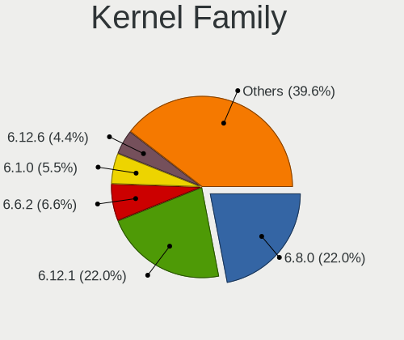
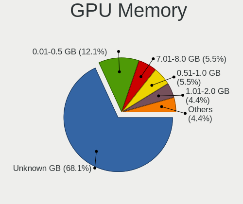
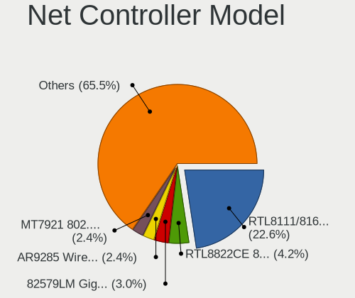
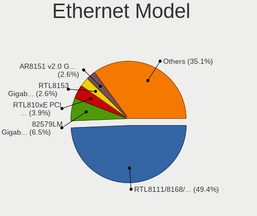
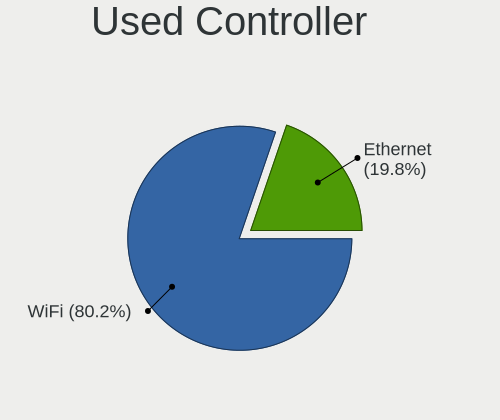
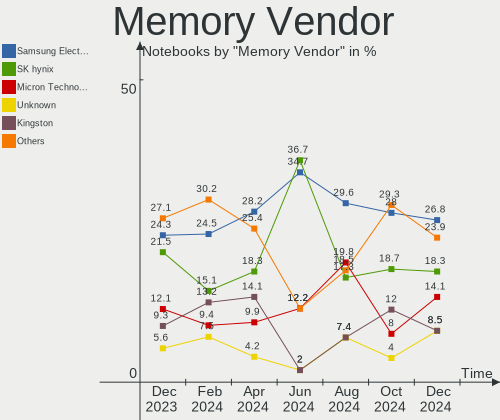
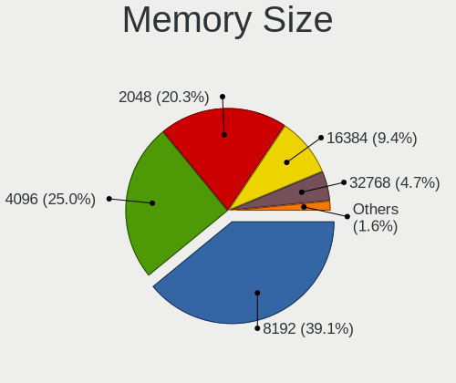
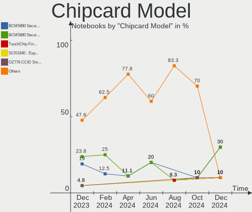

Linux in Poland - Hardware Trends (Notebooks)
---------------------------------------------

A project to identify most popular hardware characteristics and track their change
over time based on data collected by Linux users at https://Linux-Hardware.org.

Anyone can contribute to this report by the [hw-probe](https://github.com/linuxhw/hw-probe) tool:

    sudo -E hw-probe -all -upload

Contents
--------

* [ System ](#system)
  - [ OS                       ](#os)
  - [ OS Family                ](#os-family)
  - [ Kernel                   ](#kernel)
  - [ Kernel Family            ](#kernel-family)
  - [ Kernel Major Ver.        ](#kernel-major-ver)
  - [ Arch                     ](#arch)
  - [ DE                       ](#de)
  - [ Display Server           ](#display-server)
  - [ Display Manager          ](#display-manager)
  - [ OS Lang                  ](#os-lang)
  - [ Boot Mode                ](#boot-mode)
  - [ Filesystem               ](#filesystem)
  - [ Part. scheme             ](#part-scheme)
  - [ Dual Boot with Linux/BSD ](#dual-boot-with-linuxbsd)
  - [ Dual Boot (Win)          ](#dual-boot-win)

* [ Board ](#board)
  - [ Vendor                   ](#vendor)
  - [ Model                    ](#model)
  - [ Model Family             ](#model-family)
  - [ MFG Year                 ](#mfg-year)
  - [ Form Factor              ](#form-factor)
  - [ Secure Boot              ](#secure-boot)
  - [ Coreboot                 ](#coreboot)
  - [ RAM Size                 ](#ram-size)
  - [ RAM Used                 ](#ram-used)
  - [ Total Drives             ](#total-drives)
  - [ Has CD-ROM               ](#has-cd-rom)
  - [ Has Ethernet             ](#has-ethernet)
  - [ Has WiFi                 ](#has-wifi)
  - [ Has Bluetooth            ](#has-bluetooth)

* [ Location ](#location)
  - [ Country                  ](#country)
  - [ City                     ](#city)

* [ Drives ](#drives)
  - [ Drive Vendor             ](#drive-vendor)
  - [ Drive Model              ](#drive-model)
  - [ HDD Vendor               ](#hdd-vendor)
  - [ SSD Vendor               ](#ssd-vendor)
  - [ Drive Kind               ](#drive-kind)
  - [ Drive Connector          ](#drive-connector)
  - [ Drive Size               ](#drive-size)
  - [ Space Total              ](#space-total)
  - [ Space Used               ](#space-used)
  - [ Malfunc. Drives          ](#malfunc-drives)
  - [ Malfunc. Drive Vendor    ](#malfunc-drive-vendor)
  - [ Malfunc. HDD Vendor      ](#malfunc-hdd-vendor)
  - [ Malfunc. Drive Kind      ](#malfunc-drive-kind)
  - [ Failed Drives            ](#failed-drives)
  - [ Failed Drive Vendor      ](#failed-drive-vendor)
  - [ Drive Status             ](#drive-status)

* [ Storage controller ](#storage-controller)
  - [ Storage Vendor           ](#storage-vendor)
  - [ Storage Model            ](#storage-model)
  - [ Storage Kind             ](#storage-kind)

* [ Processor ](#processor)
  - [ CPU Vendor               ](#cpu-vendor)
  - [ CPU Model                ](#cpu-model)
  - [ CPU Model Family         ](#cpu-model-family)
  - [ CPU Cores                ](#cpu-cores)
  - [ CPU Sockets              ](#cpu-sockets)
  - [ CPU Threads              ](#cpu-threads)
  - [ CPU Op-Modes             ](#cpu-op-modes)
  - [ CPU Microcode            ](#cpu-microcode)
  - [ CPU Microarch            ](#cpu-microarch)

* [ Graphics ](#graphics)
  - [ GPU Vendor               ](#gpu-vendor)
  - [ GPU Model                ](#gpu-model)
  - [ GPU Combo                ](#gpu-combo)
  - [ GPU Driver               ](#gpu-driver)
  - [ GPU Memory               ](#gpu-memory)

* [ Monitor ](#monitor)
  - [ Monitor Vendor           ](#monitor-vendor)
  - [ Monitor Model            ](#monitor-model)
  - [ Monitor Resolution       ](#monitor-resolution)
  - [ Monitor Diagonal         ](#monitor-diagonal)
  - [ Monitor Width            ](#monitor-width)
  - [ Aspect Ratio             ](#aspect-ratio)
  - [ Monitor Area             ](#monitor-area)
  - [ Pixel Density            ](#pixel-density)
  - [ Multiple Monitors        ](#multiple-monitors)

* [ Network ](#network)
  - [ Net Controller Vendor    ](#net-controller-vendor)
  - [ Net Controller Model     ](#net-controller-model)
  - [ Wireless Vendor          ](#wireless-vendor)
  - [ Wireless Model           ](#wireless-model)
  - [ Ethernet Vendor          ](#ethernet-vendor)
  - [ Ethernet Model           ](#ethernet-model)
  - [ Net Controller Kind      ](#net-controller-kind)
  - [ Used Controller          ](#used-controller)
  - [ NICs                     ](#nics)
  - [ IPv6                     ](#ipv6)

* [ Bluetooth ](#bluetooth)
  - [ Bluetooth Vendor         ](#bluetooth-vendor)
  - [ Bluetooth Model          ](#bluetooth-model)

* [ Sound ](#sound)
  - [ Sound Vendor             ](#sound-vendor)
  - [ Sound Model              ](#sound-model)

* [ Memory ](#memory)
  - [ Memory Vendor            ](#memory-vendor)
  - [ Memory Model             ](#memory-model)
  - [ Memory Kind              ](#memory-kind)
  - [ Memory Form Factor       ](#memory-form-factor)
  - [ Memory Size              ](#memory-size)
  - [ Memory Speed             ](#memory-speed)

* [ Printers & scanners ](#printers--scanners)
  - [ Printer Vendor           ](#printer-vendor)
  - [ Printer Model            ](#printer-model)
  - [ Scanner Vendor           ](#scanner-vendor)
  - [ Scanner Model            ](#scanner-model)

* [ Camera ](#camera)
  - [ Camera Vendor            ](#camera-vendor)
  - [ Camera Model             ](#camera-model)

* [ Security ](#security)
  - [ Fingerprint Vendor       ](#fingerprint-vendor)
  - [ Fingerprint Model        ](#fingerprint-model)
  - [ Chipcard Vendor          ](#chipcard-vendor)
  - [ Chipcard Model           ](#chipcard-model)

* [ Unsupported ](#unsupported)
  - [ Unsupported Devices      ](#unsupported-devices)
  - [ Unsupported Device Types ](#unsupported-device-types)

System
------

OS
--

Installed operating systems

| Name                | Notebooks | Percent |
|---------------------|-----------|---------|
| Linux Mint 20.3     | 12        | 15%     |
| OpenMandriva 4.3    | 7         | 8.75%   |
| Ubuntu 21.10        | 6         | 7.5%    |
| Ubuntu 20.04        | 6         | 7.5%    |
| Manjaro 21.2.5      | 5         | 6.25%   |
| Fedora 35           | 4         | 5%      |
| Ubuntu 22.04        | 3         | 3.75%   |
| KDE neon 20.04      | 3         | 3.75%   |
| Fedora 36           | 3         | 3.75%   |
| Debian 11           | 3         | 3.75%   |
| Arch Rolling        | 3         | 3.75%   |
| Manjaro             | 2         | 2.5%    |
| Elementary 6.1      | 2         | 2.5%    |
| Xubuntu 20.04       | 1         | 1.25%   |
| Xubuntu 16.04       | 1         | 1.25%   |
| Ubuntu 18.04        | 1         | 1.25%   |
| Sparky 7            | 1         | 1.25%   |
| ROSA R11.1          | 1         | 1.25%   |
| Pop!_OS 21.10       | 1         | 1.25%   |
| Peppermint 11.2     | 1         | 1.25%   |
| NixOS 22.05         | 1         | 1.25%   |
| MX 21               | 1         | 1.25%   |
| LMDE 5              | 1         | 1.25%   |
| Kubuntu 21.10       | 1         | 1.25%   |
| Kubuntu 20.04       | 1         | 1.25%   |
| Kali 2022.1         | 1         | 1.25%   |
| Gentoo 2.7          | 1         | 1.25%   |
| Gentoo 2.6          | 1         | 1.25%   |
| Funtoo 2021-03-10   | 1         | 1.25%   |
| Fedora 37           | 1         | 1.25%   |
| Fedora 34           | 1         | 1.25%   |
| EndeavourOS Rolling | 1         | 1.25%   |
| Debian Unstable     | 1         | 1.25%   |
| ArcoLinux Rolling   | 1         | 1.25%   |

OS Family
---------

OS without a version

| Name         | Notebooks | Percent |
|--------------|-----------|---------|
| Ubuntu       | 16        | 20%     |
| Linux Mint   | 12        | 15%     |
| Fedora       | 9         | 11.25%  |
| OpenMandriva | 7         | 8.75%   |
| Manjaro      | 7         | 8.75%   |
| Debian       | 4         | 5%      |
| KDE neon     | 3         | 3.75%   |
| Arch         | 3         | 3.75%   |
| Xubuntu      | 2         | 2.5%    |
| Kubuntu      | 2         | 2.5%    |
| Gentoo       | 2         | 2.5%    |
| Elementary   | 2         | 2.5%    |
| Sparky       | 1         | 1.25%   |
| ROSA         | 1         | 1.25%   |
| Pop!_OS      | 1         | 1.25%   |
| Peppermint   | 1         | 1.25%   |
| NixOS        | 1         | 1.25%   |
| MX           | 1         | 1.25%   |
| LMDE         | 1         | 1.25%   |
| Kali         | 1         | 1.25%   |
| Funtoo       | 1         | 1.25%   |
| EndeavourOS  | 1         | 1.25%   |
| ArcoLinux    | 1         | 1.25%   |

Kernel
------

Version of the Linux kernel

| Version                             | Notebooks | Percent |
|-------------------------------------|-----------|---------|
| 5.13.0-39-generic                   | 14        | 17.5%   |
| 5.16.7-desktop-1omv4003             | 7         | 8.75%   |
| 5.10.0-13-amd64                     | 5         | 6.25%   |
| 5.4.0-109-generic                   | 4         | 5%      |
| 5.13.0-40-generic                   | 4         | 5%      |
| 5.4.0-107-generic                   | 3         | 3.75%   |
| 5.16.14-1-MANJARO                   | 3         | 3.75%   |
| 5.17.3-302.fc36.x86_64              | 2         | 2.5%    |
| 5.16.18-200.fc35.x86_64             | 2         | 2.5%    |
| 5.15.28-1-MANJARO                   | 2         | 2.5%    |
| 5.15.0-25-generic                   | 2         | 2.5%    |
| 5.13.0-27-generic                   | 2         | 2.5%    |
| 5.4.0-91-generic                    | 1         | 1.25%   |
| 5.4.0-60-generic                    | 1         | 1.25%   |
| 5.4.0-104-generic                   | 1         | 1.25%   |
| 5.18.0-0.rc2.23.fc37.x86_64         | 1         | 1.25%   |
| 5.17.5.ll48-1-lin-git+              | 1         | 1.25%   |
| 5.17.5-arch1-1                      | 1         | 1.25%   |
| 5.17.4-100.fc34.x86_64              | 1         | 1.25%   |
| 5.17.2-300.fc36.x86_64              | 1         | 1.25%   |
| 5.17.1-zen1-1-zen                   | 1         | 1.25%   |
| 5.17.1-arch1-1.1                    | 1         | 1.25%   |
| 5.17.0-247-tkg-pds                  | 1         | 1.25%   |
| 5.17.0-1-MANJARO                    | 1         | 1.25%   |
| 5.17.0-1-amd64                      | 1         | 1.25%   |
| 5.16.20-200.fc35.x86_64             | 1         | 1.25%   |
| 5.16.2-2-rt19-MANJARO               | 1         | 1.25%   |
| 5.16.19-76051619-generic            | 1         | 1.25%   |
| 5.16.18_p1-debian-sources           | 1         | 1.25%   |
| 5.16.16-200.fc35.x86_64             | 1         | 1.25%   |
| 5.16.15-051615-generic              | 1         | 1.25%   |
| 5.16.10-051610-generic              | 1         | 1.25%   |
| 5.16.0-kali7-amd64                  | 1         | 1.25%   |
| 5.15.32-gentoo-r1                   | 1         | 1.25%   |
| 5.15.32                             | 1         | 1.25%   |
| 5.15.26-gentoo                      | 1         | 1.25%   |
| 5.15.0-27-generic                   | 1         | 1.25%   |
| 5.14.0-trunk-amd64                  | 1         | 1.25%   |
| 5.14.0-1034-oem                     | 1         | 1.25%   |
| 5.10.0-11-amd64                     | 1         | 1.25%   |
| 4.4.0-223-generic                   | 1         | 1.25%   |
| 4.15.0-desktop-122.124.1rosa-x86_64 | 1         | 1.25%   |

Kernel Family
-------------

Linux kernel without a distro release

| Version | Notebooks | Percent |
|---------|-----------|---------|
| 5.13.0  | 20        | 25%     |
| 5.4.0   | 10        | 12.5%   |
| 5.16.7  | 7         | 8.75%   |
| 5.10.0  | 6         | 7.5%    |
| 5.17.0  | 3         | 3.75%   |
| 5.16.18 | 3         | 3.75%   |
| 5.16.14 | 3         | 3.75%   |
| 5.15.0  | 3         | 3.75%   |
| 5.17.5  | 2         | 2.5%    |
| 5.17.3  | 2         | 2.5%    |
| 5.17.1  | 2         | 2.5%    |
| 5.15.32 | 2         | 2.5%    |
| 5.15.28 | 2         | 2.5%    |
| 5.14.0  | 2         | 2.5%    |
| 5.18.0  | 1         | 1.25%   |
| 5.17.4  | 1         | 1.25%   |
| 5.17.2  | 1         | 1.25%   |
| 5.16.20 | 1         | 1.25%   |
| 5.16.2  | 1         | 1.25%   |
| 5.16.19 | 1         | 1.25%   |
| 5.16.16 | 1         | 1.25%   |
| 5.16.15 | 1         | 1.25%   |
| 5.16.10 | 1         | 1.25%   |
| 5.16.0  | 1         | 1.25%   |
| 5.15.26 | 1         | 1.25%   |
| 4.4.0   | 1         | 1.25%   |
| 4.15.0  | 1         | 1.25%   |

Kernel Major Ver.
-----------------

Linux kernel major version

| Version | Notebooks | Percent |
|---------|-----------|---------|
| 5.16    | 20        | 25%     |
| 5.13    | 20        | 25%     |
| 5.17    | 11        | 13.75%  |
| 5.4     | 10        | 12.5%   |
| 5.15    | 8         | 10%     |
| 5.10    | 6         | 7.5%    |
| 5.14    | 2         | 2.5%    |
| 5.18    | 1         | 1.25%   |
| 4.4     | 1         | 1.25%   |
| 4.15    | 1         | 1.25%   |

Arch
----

OS architecture (x86_64, i586, etc.)

| Name   | Notebooks | Percent |
|--------|-----------|---------|
| x86_64 | 80        | 100%    |

DE
--

Desktop Environment

| Name       | Notebooks | Percent |
|------------|-----------|---------|
| GNOME      | 30        | 37.5%   |
| KDE5       | 19        | 23.75%  |
| X-Cinnamon | 10        | 12.5%   |
| XFCE       | 9         | 11.25%  |
| Unknown    | 3         | 3.75%   |
| Pantheon   | 2         | 2.5%    |
| MATE       | 2         | 2.5%    |
| Trinity    | 1         | 1.25%   |
| LXQt       | 1         | 1.25%   |
| KDE4       | 1         | 1.25%   |
| DWM        | 1         | 1.25%   |
| awesome    | 1         | 1.25%   |

Display Server
--------------

X11 or Wayland

| Name    | Notebooks | Percent |
|---------|-----------|---------|
| X11     | 62        | 77.5%   |
| Wayland | 17        | 21.25%  |
| Unknown | 1         | 1.25%   |

Display Manager
---------------

SDDM, LightDM, etc.

| Name    | Notebooks | Percent |
|---------|-----------|---------|
| Unknown | 23        | 28.75%  |
| LightDM | 16        | 20%     |
| GDM     | 16        | 20%     |
| SDDM    | 14        | 17.5%   |
| GDM3    | 9         | 11.25%  |
| Ly      | 1         | 1.25%   |
| KDM     | 1         | 1.25%   |

OS Lang
-------

Language

| Lang    | Notebooks | Percent |
|---------|-----------|---------|
| pl_PL   | 47        | 58.75%  |
| en_US   | 24        | 30%     |
| en_GB   | 3         | 3.75%   |
| Unknown | 3         | 3.75%   |
| szl_PL  | 2         | 2.5%    |
| it_IT   | 1         | 1.25%   |

Boot Mode
---------

EFI or BIOS

| Mode | Notebooks | Percent |
|------|-----------|---------|
| EFI  | 46        | 57.5%   |
| BIOS | 34        | 42.5%   |

Filesystem
----------

Type of filesystem

| Type    | Notebooks | Percent |
|---------|-----------|---------|
| Ext4    | 61        | 76.25%  |
| Btrfs   | 7         | 8.75%   |
| Overlay | 6         | 7.5%    |
| Xfs     | 3         | 3.75%   |
| F2fs    | 2         | 2.5%    |
| Zfs     | 1         | 1.25%   |

Part. scheme
------------

Scheme of partitioning

| Type    | Notebooks | Percent |
|---------|-----------|---------|
| GPT     | 40        | 50%     |
| Unknown | 29        | 36.25%  |
| MBR     | 11        | 13.75%  |

Dual Boot with Linux/BSD
------------------------

Hosting more than one Linux/BSD

| Dual boot | Notebooks | Percent |
|-----------|-----------|---------|
| No        | 71        | 88.75%  |
| Yes       | 9         | 11.25%  |

Dual Boot (Win)
---------------

Hosting Linux and Windows

| Dual boot | Notebooks | Percent |
|-----------|-----------|---------|
| No        | 55        | 68.75%  |
| Yes       | 25        | 31.25%  |

Board
-----

Vendor
------

Motherboard manufacturer

| Name                | Notebooks | Percent |
|---------------------|-----------|---------|
| Lenovo              | 23        | 28.75%  |
| Dell                | 17        | 21.25%  |
| Hewlett-Packard     | 11        | 13.75%  |
| ASUSTek Computer    | 9         | 11.25%  |
| Acer                | 7         | 8.75%   |
| MSI                 | 3         | 3.75%   |
| HUAWEI              | 3         | 3.75%   |
| Apple               | 3         | 3.75%   |
| Samsung Electronics | 2         | 2.5%    |
| Toshiba             | 1         | 1.25%   |
| Sony                | 1         | 1.25%   |

Model
-----

Motherboard model

| Name                                  | Notebooks | Percent |
|---------------------------------------|-----------|---------|
| Lenovo Legion Y540-15IRH 81SX         | 2         | 2.5%    |
| HUAWEI HVY-WXX9                       | 2         | 2.5%    |
| HP Pavilion g6                        | 2         | 2.5%    |
| Dell Latitude 5480                    | 2         | 2.5%    |
| Toshiba Satellite A300                | 1         | 1.25%   |
| Sony VGN-FZ11M                        | 1         | 1.25%   |
| Samsung RC410/RC510/RC710             | 1         | 1.25%   |
| Samsung 350V5C/351V5C/3540VC/3440VC   | 1         | 1.25%   |
| MSI PE60 2QE                          | 1         | 1.25%   |
| MSI GF75 Thin 10UEK                   | 1         | 1.25%   |
| MSI GE60 2PC                          | 1         | 1.25%   |
| Lenovo Z51-70 80K6                    | 1         | 1.25%   |
| Lenovo Yoga S740-14IIL 81RS           | 1         | 1.25%   |
| Lenovo ThinkPad X270 W10DG 20K5S2VL00 | 1         | 1.25%   |
| Lenovo ThinkPad X260 20F5S4BY00       | 1         | 1.25%   |
| Lenovo ThinkPad X1 Extreme 20MFCTO1WW | 1         | 1.25%   |
| Lenovo ThinkPad T570 W10DG 20JXS01Y04 | 1         | 1.25%   |
| Lenovo ThinkPad T15 Gen 1 20S6002ERT  | 1         | 1.25%   |
| Lenovo ThinkPad T14 Gen 2a 20XK002UCK | 1         | 1.25%   |
| Lenovo ThinkPad Edge E430 3254CFG     | 1         | 1.25%   |
| Lenovo ThinkPad Edge E430 3254A8G     | 1         | 1.25%   |
| Lenovo ThinkPad E15 Gen 2 20T8004RPB  | 1         | 1.25%   |
| Lenovo Legion 7 16ACHg6 82N6          | 1         | 1.25%   |
| Lenovo Legion 5 15ACH6H 82JU          | 1         | 1.25%   |
| Lenovo IdeaPad Y700-17ISK 80Q0        | 1         | 1.25%   |
| Lenovo IdeaPad S540-15IWL GTX 81SW    | 1         | 1.25%   |
| Lenovo IdeaPad S540-14API 81NH        | 1         | 1.25%   |
| Lenovo IdeaPad 530S-14ARR 81H1        | 1         | 1.25%   |
| Lenovo G580 20150                     | 1         | 1.25%   |
| Lenovo G510 20238                     | 1         | 1.25%   |
| Lenovo G500 20236                     | 1         | 1.25%   |
| Lenovo 3000 V200 076472G              | 1         | 1.25%   |
| HUAWEI KLVL-WXX9                      | 1         | 1.25%   |
| HP ProBook 650 G1                     | 1         | 1.25%   |
| HP ProBook 6440b                      | 1         | 1.25%   |
| HP Pavilion ZV6100 (EE984EA#ABZ)      | 1         | 1.25%   |
| HP Pavilion 17                        | 1         | 1.25%   |
| HP EliteBook 8770w                    | 1         | 1.25%   |
| HP EliteBook 8440p                    | 1         | 1.25%   |
| HP EliteBook 840 G2                   | 1         | 1.25%   |
| HP 255 G7 Notebook PC                 | 1         | 1.25%   |
| Dell Precision 7510                   | 1         | 1.25%   |
| Dell MXG061                           | 1         | 1.25%   |
| Dell Latitude E6420                   | 1         | 1.25%   |
| Dell Latitude E4310                   | 1         | 1.25%   |
| Dell Latitude 7520                    | 1         | 1.25%   |
| Dell Latitude 5521                    | 1         | 1.25%   |
| Dell Latitude 5421                    | 1         | 1.25%   |
| Dell Latitude 5420                    | 1         | 1.25%   |
| Dell Latitude 3190                    | 1         | 1.25%   |
| Dell Inspiron MM061                   | 1         | 1.25%   |
| Dell Inspiron 5570                    | 1         | 1.25%   |
| Dell Inspiron 5515                    | 1         | 1.25%   |
| Dell Inspiron 3542                    | 1         | 1.25%   |
| Dell Inspiron 17 7000 Series 7746     | 1         | 1.25%   |
| Dell Inspiron 15-3567                 | 1         | 1.25%   |
| ASUS X71Vn                            | 1         | 1.25%   |
| ASUS X553MA                           | 1         | 1.25%   |
| ASUS X541UJ                           | 1         | 1.25%   |
| ASUS VivoBook E14 E402YA_E402YA       | 1         | 1.25%   |

Model Family
------------

Motherboard model prefix

| Name               | Notebooks | Percent |
|--------------------|-----------|---------|
| Lenovo ThinkPad    | 9         | 11.25%  |
| Dell Latitude      | 9         | 11.25%  |
| Dell Inspiron      | 6         | 7.5%    |
| Lenovo Legion      | 4         | 5%      |
| Lenovo IdeaPad     | 4         | 5%      |
| HP Pavilion        | 4         | 5%      |
| Acer Aspire        | 4         | 5%      |
| HP EliteBook       | 3         | 3.75%   |
| Acer Nitro         | 3         | 3.75%   |
| HUAWEI HVY-WXX9    | 2         | 2.5%    |
| HP ProBook         | 2         | 2.5%    |
| Toshiba Satellite  | 1         | 1.25%   |
| Sony VGN-FZ11M     | 1         | 1.25%   |
| Samsung RC410      | 1         | 1.25%   |
| Samsung 350V5C     | 1         | 1.25%   |
| MSI PE60           | 1         | 1.25%   |
| MSI GF75           | 1         | 1.25%   |
| MSI GE60           | 1         | 1.25%   |
| Lenovo Z51-70      | 1         | 1.25%   |
| Lenovo Yoga        | 1         | 1.25%   |
| Lenovo G580        | 1         | 1.25%   |
| Lenovo G510        | 1         | 1.25%   |
| Lenovo G500        | 1         | 1.25%   |
| Lenovo 3000        | 1         | 1.25%   |
| HUAWEI KLVL-WXX9   | 1         | 1.25%   |
| HP 255             | 1         | 1.25%   |
| Dell Precision     | 1         | 1.25%   |
| Dell MXG061        | 1         | 1.25%   |
| ASUS X71Vn         | 1         | 1.25%   |
| ASUS X553MA        | 1         | 1.25%   |
| ASUS X541UJ        | 1         | 1.25%   |
| ASUS VivoBook      | 1         | 1.25%   |
| ASUS UX303LAB      | 1         | 1.25%   |
| ASUS S551LB        | 1         | 1.25%   |
| ASUS ROG           | 1         | 1.25%   |
| ASUS N61Jv         | 1         | 1.25%   |
| ASUS ASUS          | 1         | 1.25%   |
| Apple MacBookPro12 | 1         | 1.25%   |
| Apple MacBookAir4  | 1         | 1.25%   |
| Apple MacBook3     | 1         | 1.25%   |
| Unknown            | 1         | 1.25%   |

MFG Year
--------

Motherboard manufacture year

| Year | Notebooks | Percent |
|------|-----------|---------|
| 2021 | 9         | 11.25%  |
| 2019 | 8         | 10%     |
| 2020 | 7         | 8.75%   |
| 2014 | 7         | 8.75%   |
| 2018 | 6         | 7.5%    |
| 2013 | 6         | 7.5%    |
| 2012 | 6         | 7.5%    |
| 2017 | 5         | 6.25%   |
| 2016 | 5         | 6.25%   |
| 2015 | 5         | 6.25%   |
| 2011 | 4         | 5%      |
| 2010 | 4         | 5%      |
| 2008 | 4         | 5%      |
| 2006 | 3         | 3.75%   |
| 2007 | 1         | 1.25%   |

Form Factor
-----------

Physical design of the computer

| Name     | Notebooks | Percent |
|----------|-----------|---------|
| Notebook | 80        | 100%    |

Secure Boot
-----------

Enabled or disabled

| State    | Notebooks | Percent |
|----------|-----------|---------|
| Disabled | 68        | 85%     |
| Enabled  | 12        | 15%     |

Coreboot
--------

Have coreboot on board

| Used | Notebooks | Percent |
|------|-----------|---------|
| No   | 80        | 100%    |

RAM Size
--------

Total RAM memory

| Size in GB  | Notebooks | Percent |
|-------------|-----------|---------|
| 8.01-16.0   | 22        | 27.5%   |
| 4.01-8.0    | 18        | 22.5%   |
| 3.01-4.0    | 16        | 20%     |
| 16.01-24.0  | 11        | 13.75%  |
| 32.01-64.0  | 8         | 10%     |
| 64.01-256.0 | 2         | 2.5%    |
| 1.01-2.0    | 2         | 2.5%    |
| 24.01-32.0  | 1         | 1.25%   |

RAM Used
--------

Used RAM memory

| Used GB    | Notebooks | Percent |
|------------|-----------|---------|
| 1.01-2.0   | 24        | 30%     |
| 2.01-3.0   | 19        | 23.75%  |
| 4.01-8.0   | 14        | 17.5%   |
| 8.01-16.0  | 9         | 11.25%  |
| 3.01-4.0   | 8         | 10%     |
| 0.51-1.0   | 3         | 3.75%   |
| 16.01-24.0 | 2         | 2.5%    |
| 0.01-0.5   | 1         | 1.25%   |

Total Drives
------------

Number of drives on board

| Drives | Notebooks | Percent |
|--------|-----------|---------|
| 1      | 63        | 78.75%  |
| 2      | 12        | 15%     |
| 3      | 4         | 5%      |
| 4      | 1         | 1.25%   |

Has CD-ROM
----------

Has CD-ROM on board

| Presented | Notebooks | Percent |
|-----------|-----------|---------|
| No        | 49        | 61.25%  |
| Yes       | 31        | 38.75%  |

Has Ethernet
------------

Has Ethernet on board

| Presented | Notebooks | Percent |
|-----------|-----------|---------|
| Yes       | 68        | 85%     |
| No        | 12        | 15%     |

Has WiFi
--------

Has WiFi module

| Presented | Notebooks | Percent |
|-----------|-----------|---------|
| Yes       | 80        | 100%    |

Has Bluetooth
-------------

Has Bluetooth module

| Presented | Notebooks | Percent |
|-----------|-----------|---------|
| Yes       | 71        | 88.75%  |
| No        | 9         | 11.25%  |

Location
--------

Country
-------

Geographic location (country)

| Country | Notebooks | Percent |
|---------|-----------|---------|
| Poland  | 80        | 100%    |

City
----

Geographic location (city)

| City                 | Notebooks | Percent |
|----------------------|-----------|---------|
| Warsaw               | 27        | 33.75%  |
| Wroclaw              | 5         | 6.25%   |
| Poznan               | 5         | 6.25%   |
| Krakow               | 3         | 3.75%   |
| Szczecin             | 2         | 2.5%    |
| Opole                | 2         | 2.5%    |
| Olesnica             | 2         | 2.5%    |
| Lodz                 | 2         | 2.5%    |
| Gdynia               | 2         | 2.5%    |
| Zadzim               | 1         | 1.25%   |
| Wieluń              | 1         | 1.25%   |
| Tarnowskie Gory      | 1         | 1.25%   |
| Słupsk              | 1         | 1.25%   |
| Stare Kozle          | 1         | 1.25%   |
| Skawina              | 1         | 1.25%   |
| Pabianice            | 1         | 1.25%   |
| Nowy Sącz           | 1         | 1.25%   |
| Male Rudy            | 1         | 1.25%   |
| Lublin               | 1         | 1.25%   |
| Krosno               | 1         | 1.25%   |
| Krasnystaw           | 1         | 1.25%   |
| Knurow               | 1         | 1.25%   |
| Klobuck              | 1         | 1.25%   |
| Kietrz               | 1         | 1.25%   |
| Kedzierzyn-Kozle     | 1         | 1.25%   |
| Katowice             | 1         | 1.25%   |
| Jarocin              | 1         | 1.25%   |
| Gorzów Wielkopolski | 1         | 1.25%   |
| Gniezno              | 1         | 1.25%   |
| Glucholazy           | 1         | 1.25%   |
| Gliwice              | 1         | 1.25%   |
| Dobrzen Wielki       | 1         | 1.25%   |
| Cieszyn              | 1         | 1.25%   |
| Chojnów             | 1         | 1.25%   |
| Bytom                | 1         | 1.25%   |
| Bydgoszcz            | 1         | 1.25%   |
| Bukowiec             | 1         | 1.25%   |
| Blachownia           | 1         | 1.25%   |
| Bielsko-Biala        | 1         | 1.25%   |

Drives
------

Drive Vendor
------------

Hard drive vendors

| Vendor                      | Notebooks | Drives | Percent |
|-----------------------------|-----------|--------|---------|
| Samsung Electronics         | 18        | 21     | 18%     |
| GOODRAM                     | 8         | 8      | 8%      |
| WDC                         | 7         | 8      | 7%      |
| SK Hynix                    | 7         | 7      | 7%      |
| Seagate                     | 6         | 6      | 6%      |
| SanDisk                     | 5         | 5      | 5%      |
| Hitachi                     | 5         | 5      | 5%      |
| A-DATA Technology           | 5         | 5      | 5%      |
| Unknown                     | 4         | 4      | 4%      |
| Crucial                     | 4         | 4      | 4%      |
| Toshiba                     | 3         | 3      | 3%      |
| KIOXIA                      | 3         | 3      | 3%      |
| PNY                         | 2         | 2      | 2%      |
| Micron Technology           | 2         | 2      | 2%      |
| Kingston                    | 2         | 2      | 2%      |
| HGST                        | 2         | 2      | 2%      |
| YMTC                        | 1         | 1      | 1%      |
| Yangtze Memory Technologies | 1         | 1      | 1%      |
| WDC WDS2                    | 1         | 1      | 1%      |
| Silicon Motion              | 1         | 1      | 1%      |
| Phison                      | 1         | 1      | 1%      |
| KIOXIA-EXCERIA              | 1         | 1      | 1%      |
| KINGBANK                    | 1         | 1      | 1%      |
| JMicron                     | 1         | 1      | 1%      |
| Intel                       | 1         | 1      | 1%      |
| HUAWEI                      | 1         | 1      | 1%      |
| HS-SSD-C100                 | 1         | 1      | 1%      |
| China                       | 1         | 2      | 1%      |
| BHT                         | 1         | 1      | 1%      |
| asmedia                     | 1         | 1      | 1%      |
| Apple                       | 1         | 1      | 1%      |
| Apacer                      | 1         | 1      | 1%      |
| ADATA SX                    | 1         | 1      | 1%      |

Drive Model
-----------

Hard drive models

| Model                                   | Notebooks | Percent |
|-----------------------------------------|-----------|---------|
| Samsung SSD 860 EVO 500GB               | 3         | 2.88%   |
| A-DATA SU800 256GB SSD                  | 3         | 2.88%   |
| WDC PC SN520 SDAPMUW-256G-1101 256GB    | 2         | 1.92%   |
| SK Hynix NVMe SSD Drive 512GB           | 2         | 1.92%   |
| Seagate ST1000LM024 HN-M101MBB 1TB      | 2         | 1.92%   |
| Samsung SSD 970 EVO Plus 500GB          | 2         | 1.92%   |
| HGST HTS721010A9E630 1TB                | 2         | 1.92%   |
| GOODRAM SSDPR-CX400-512 512GB           | 2         | 1.92%   |
| Crucial CT250MX500SSD1 250GB            | 2         | 1.92%   |
| YMTC PC005 512GB                        | 1         | 0.96%   |
| Yangtze Memory NVMe SSD Drive 512GB     | 1         | 0.96%   |
| WDC WDS2 40G2G0B-00EP 240GB SSD         | 1         | 0.96%   |
| WDC WDS100T2B0B-00YS70 1TB SSD          | 1         | 0.96%   |
| WDC WD5000LPVX-75V0TT0 500GB            | 1         | 0.96%   |
| WDC WD5000LPLX-60ZNTT1 500GB            | 1         | 0.96%   |
| WDC WD5000BEVT-22A0RT0 500GB            | 1         | 0.96%   |
| WDC WD30 EFRX-68EUZN0 3TB               | 1         | 0.96%   |
| WDC WD10JPCX-24UE4T0 1TB                | 1         | 0.96%   |
| Unknown SD128  128GB                    | 1         | 0.96%   |
| Unknown SC64G  64GB                     | 1         | 0.96%   |
| Unknown MMC Card  64GB                  | 1         | 0.96%   |
| Unknown EB2MW  32GB                     | 1         | 0.96%   |
| Toshiba MQ01ABD100 1TB                  | 1         | 0.96%   |
| Toshiba MK1246GSX 120GB                 | 1         | 0.96%   |
| Toshiba KSG60ZMV256G M.2 2280 256GB SSD | 1         | 0.96%   |
| SK Hynix SKHynix_HFS001TDE9X081N 1TB    | 1         | 0.96%   |
| SK Hynix SKHynix_HFM512GD3HX015N 512GB  | 1         | 0.96%   |
| SK Hynix PC711 NVMe 512GB               | 1         | 0.96%   |
| SK Hynix HFS256G32TND-N210A 256GB SSD   | 1         | 0.96%   |
| SK Hynix HFM512GDJTNG-8310A 512GB       | 1         | 0.96%   |
| Silicon Motion NVMe SSD Drive 256GB     | 1         | 0.96%   |
| Seagate ST9500325AS 500GB               | 1         | 0.96%   |
| Seagate ST320LM001 HN-M320MBB 320GB     | 1         | 0.96%   |
| Seagate ST1000LM048-2E7172 1TB          | 1         | 0.96%   |
| Seagate ST1000LM014-SSHD-8GB            | 1         | 0.96%   |
| SanDisk SSD PLUS 240GB                  | 1         | 0.96%   |
| SanDisk SDSSDHII240G 240GB              | 1         | 0.96%   |
| SanDisk SD9SN8W-128G-1006 128GB SSD     | 1         | 0.96%   |
| Sandisk NVMe SSD Drive 512GB            | 1         | 0.96%   |
| Sandisk NVMe SSD Drive 256GB            | 1         | 0.96%   |
| Samsung SSD PM871 2.5 7mm 512GB         | 1         | 0.96%   |
| Samsung SSD 980 500GB                   | 1         | 0.96%   |
| Samsung SSD 970 PRO 1TB                 | 1         | 0.96%   |
| Samsung SSD 970 EVO Plus 250GB          | 1         | 0.96%   |
| Samsung SSD 970 EVO 500GB               | 1         | 0.96%   |
| Samsung SSD 870 QVO 1TB                 | 1         | 0.96%   |
| Samsung SSD 860 EVO M.2 250GB           | 1         | 0.96%   |
| Samsung PSSD T7 500GB                   | 1         | 0.96%   |
| Samsung NVMe SSD Drive 512GB            | 1         | 0.96%   |
| Samsung MZVLB512HBJQ-000L7 512GB        | 1         | 0.96%   |
| Samsung MZVLB256HBHQ-000L2 256GB        | 1         | 0.96%   |
| Samsung MZVLB1T0HALR-000L7 1TB          | 1         | 0.96%   |
| Samsung MZNLN256HAJQ-000H1 256GB SSD    | 1         | 0.96%   |
| Samsung MZNLN128HAHQ-000H1 128GB SSD    | 1         | 0.96%   |
| Samsung MZMPC128HBFU-000L1 128GB SSD    | 1         | 0.96%   |
| Samsung HM321HI 320GB                   | 1         | 0.96%   |
| PNY CS3030 1000GB SSD                   | 1         | 0.96%   |
| PNY CS2130 1TB SSD                      | 1         | 0.96%   |
| Phison 311CD0512GB                      | 1         | 0.96%   |
| Micron MTFDHBA512TCK 512GB              | 1         | 0.96%   |

HDD Vendor
----------

Hard disk drive vendors

| Vendor              | Notebooks | Drives | Percent |
|---------------------|-----------|--------|---------|
| Seagate             | 6         | 6      | 27.27%  |
| WDC                 | 5         | 5      | 22.73%  |
| Hitachi             | 5         | 5      | 22.73%  |
| Toshiba             | 2         | 2      | 9.09%   |
| HGST                | 2         | 2      | 9.09%   |
| Samsung Electronics | 1         | 1      | 4.55%   |
| asmedia             | 1         | 1      | 4.55%   |

SSD Vendor
----------

Solid state drive vendors

| Vendor              | Notebooks | Drives | Percent |
|---------------------|-----------|--------|---------|
| Samsung Electronics | 9         | 10     | 20.45%  |
| GOODRAM             | 8         | 8      | 18.18%  |
| A-DATA Technology   | 5         | 5      | 11.36%  |
| Crucial             | 4         | 4      | 9.09%   |
| SanDisk             | 3         | 3      | 6.82%   |
| Kingston            | 2         | 2      | 4.55%   |
| WDC WDS2            | 1         | 1      | 2.27%   |
| WDC                 | 1         | 1      | 2.27%   |
| Toshiba             | 1         | 1      | 2.27%   |
| SK Hynix            | 1         | 1      | 2.27%   |
| Micron Technology   | 1         | 1      | 2.27%   |
| KIOXIA-EXCERIA      | 1         | 1      | 2.27%   |
| KINGBANK            | 1         | 1      | 2.27%   |
| JMicron             | 1         | 1      | 2.27%   |
| China               | 1         | 2      | 2.27%   |
| BHT                 | 1         | 1      | 2.27%   |
| Apple               | 1         | 1      | 2.27%   |
| Apacer              | 1         | 1      | 2.27%   |
| ADATA SX            | 1         | 1      | 2.27%   |

Drive Kind
----------

HDD or SSD

| Kind    | Notebooks | Drives | Percent |
|---------|-----------|--------|---------|
| SSD     | 40        | 46     | 42.11%  |
| NVMe    | 29        | 31     | 30.53%  |
| HDD     | 20        | 22     | 21.05%  |
| MMC     | 4         | 4      | 4.21%   |
| Unknown | 2         | 2      | 2.11%   |

Drive Connector
---------------

SATA, SAS, NVMe, etc.

| Type | Notebooks | Drives | Percent |
|------|-----------|--------|---------|
| SATA | 54        | 63     | 57.45%  |
| NVMe | 29        | 31     | 30.85%  |
| SAS  | 7         | 7      | 7.45%   |
| MMC  | 4         | 4      | 4.26%   |

Drive Size
----------

Size of hard drive

| Size in TB | Notebooks | Drives | Percent |
|------------|-----------|--------|---------|
| 0.01-0.5   | 42        | 46     | 68.85%  |
| 0.51-1.0   | 17        | 20     | 27.87%  |
| 2.01-3.0   | 1         | 1      | 1.64%   |
| 1.01-2.0   | 1         | 1      | 1.64%   |

Space Total
-----------

Amount of disk space available on the file system

| Size in GB     | Notebooks | Percent |
|----------------|-----------|---------|
| 101-250        | 30        | 37.5%   |
| 251-500        | 19        | 23.75%  |
| 501-1000       | 9         | 11.25%  |
| 1-20           | 6         | 7.5%    |
| 51-100         | 5         | 6.25%   |
| 1001-2000      | 4         | 5%      |
| Unknown        | 4         | 5%      |
| More than 3000 | 2         | 2.5%    |
| 21-50          | 1         | 1.25%   |

Space Used
----------

Amount of used disk space

| Used GB   | Notebooks | Percent |
|-----------|-----------|---------|
| 1-20      | 22        | 27.5%   |
| 51-100    | 22        | 27.5%   |
| 21-50     | 11        | 13.75%  |
| 101-250   | 10        | 12.5%   |
| 251-500   | 5         | 6.25%   |
| 501-1000  | 4         | 5%      |
| Unknown   | 4         | 5%      |
| 2001-3000 | 1         | 1.25%   |
| 1001-2000 | 1         | 1.25%   |

Malfunc. Drives
---------------

Drive models with a malfunction

| Model                                   | Notebooks | Drives | Percent |
|-----------------------------------------|-----------|--------|---------|
| WDC WD5000LPVX-75V0TT0 500GB            | 1         | 1      | 10%     |
| WDC WD5000LPLX-60ZNTT1 500GB            | 1         | 1      | 10%     |
| Toshiba MQ01ABD100 1TB                  | 1         | 1      | 10%     |
| Toshiba MK1246GSX 120GB                 | 1         | 1      | 10%     |
| Toshiba KSG60ZMV256G M.2 2280 256GB SSD | 1         | 1      | 10%     |
| Seagate ST1000LM024 HN-M101MBB 1TB      | 1         | 1      | 10%     |
| Seagate ST1000LM014-SSHD-8GB            | 1         | 1      | 10%     |
| Hitachi HTS541612J9SA00 120GB           | 1         | 1      | 10%     |
| asmedia ASMT1153e 1TB                   | 1         | 1      | 10%     |
| Apacer AS350 240GB SSD                  | 1         | 1      | 10%     |

Malfunc. Drive Vendor
---------------------

Vendors of faulty drives

| Vendor  | Notebooks | Drives | Percent |
|---------|-----------|--------|---------|
| Toshiba | 3         | 3      | 30%     |
| WDC     | 2         | 2      | 20%     |
| Seagate | 2         | 2      | 20%     |
| Hitachi | 1         | 1      | 10%     |
| asmedia | 1         | 1      | 10%     |
| Apacer  | 1         | 1      | 10%     |

Malfunc. HDD Vendor
-------------------

Vendors of faulty HDD drives

| Vendor  | Notebooks | Drives | Percent |
|---------|-----------|--------|---------|
| WDC     | 2         | 2      | 25%     |
| Toshiba | 2         | 2      | 25%     |
| Seagate | 2         | 2      | 25%     |
| Hitachi | 1         | 1      | 12.5%   |
| asmedia | 1         | 1      | 12.5%   |

Malfunc. Drive Kind
-------------------

Kinds of faulty drives

| Kind | Notebooks | Drives | Percent |
|------|-----------|--------|---------|
| HDD  | 8         | 8      | 80%     |
| SSD  | 2         | 2      | 20%     |

Failed Drives
-------------

Failed drive models

Zero info for selected period =(

Failed Drive Vendor
-------------------

Failed drive vendors

Zero info for selected period =(

Drive Status
------------

Number of failed and malfunc. drives

| Status   | Notebooks | Drives | Percent |
|----------|-----------|--------|---------|
| Works    | 45        | 52     | 50.56%  |
| Detected | 34        | 43     | 38.2%   |
| Malfunc  | 10        | 10     | 11.24%  |

Storage controller
------------------

Storage Vendor
--------------

Storage controller vendors

| Vendor                       | Notebooks | Percent |
|------------------------------|-----------|---------|
| Intel                        | 57        | 58.76%  |
| AMD                          | 10        | 10.31%  |
| Samsung Electronics          | 9         | 9.28%   |
| SK Hynix                     | 7         | 7.22%   |
| Sandisk                      | 3         | 3.09%   |
| Phison Electronics           | 3         | 3.09%   |
| Yangtze Memory Technologies  | 2         | 2.06%   |
| Toshiba America Info Systems | 2         | 2.06%   |
| Silicon Motion               | 1         | 1.03%   |
| Micron Technology            | 1         | 1.03%   |
| KIOXIA                       | 1         | 1.03%   |
| JMicron Technology           | 1         | 1.03%   |

Storage Model
-------------

Storage controller models

| Model                                                                          | Notebooks | Percent |
|--------------------------------------------------------------------------------|-----------|---------|
| Intel 7 Series Chipset Family 6-port SATA Controller [AHCI mode]               | 9         | 8.82%   |
| AMD FCH SATA Controller [AHCI mode]                                            | 9         | 8.82%   |
| Samsung NVMe SSD Controller SM981/PM981/PM983                                  | 8         | 7.84%   |
| Intel Sunrise Point-LP SATA Controller [AHCI mode]                             | 6         | 5.88%   |
| SK Hynix Gold P31 SSD                                                          | 5         | 4.9%    |
| Intel Wildcat Point-LP SATA Controller [AHCI Mode]                             | 4         | 3.92%   |
| Intel 82801HM/HEM (ICH8M/ICH8M-E) SATA Controller [AHCI mode]                  | 4         | 3.92%   |
| Intel 82801HM/HEM (ICH8M/ICH8M-E) IDE Controller                               | 4         | 3.92%   |
| Intel 8 Series SATA Controller 1 [AHCI mode]                                   | 4         | 3.92%   |
| Sandisk PC SN520 NVMe SSD                                                      | 3         | 2.94%   |
| Intel 8 Series/C220 Series Chipset Family 6-port SATA Controller 1 [AHCI mode] | 3         | 2.94%   |
| Yangtze Memory Non-Volatile memory controller                                  | 2         | 1.96%   |
| Toshiba America Info Systems XG6 NVMe SSD Controller                           | 2         | 1.96%   |
| SK Hynix BC501 NVMe Solid State Drive                                          | 2         | 1.96%   |
| Phison E12 NVMe Controller                                                     | 2         | 1.96%   |
| Intel Volume Management Device NVMe RAID Controller                            | 2         | 1.96%   |
| Intel Q170/Q150/B150/H170/H110/Z170/CM236 Chipset SATA Controller [AHCI Mode]  | 2         | 1.96%   |
| Intel Cannon Lake Mobile PCH SATA AHCI Controller                              | 2         | 1.96%   |
| Intel 82801GBM/GHM (ICH7-M Family) SATA Controller [IDE mode]                  | 2         | 1.96%   |
| Intel 82801 Mobile SATA Controller [RAID mode]                                 | 2         | 1.96%   |
| Intel 6 Series/C200 Series Chipset Family 6 port Mobile SATA AHCI Controller   | 2         | 1.96%   |
| Intel 5 Series/3400 Series Chipset 6 port SATA AHCI Controller                 | 2         | 1.96%   |
| Intel 5 Series/3400 Series Chipset 4 port SATA AHCI Controller                 | 2         | 1.96%   |
| Silicon Motion SM2263EN/SM2263XT SSD Controller                                | 1         | 0.98%   |
| Samsung NVMe SSD Controller 980                                                | 1         | 0.98%   |
| Phison PS5013 E13 NVMe Controller                                              | 1         | 0.98%   |
| Micron Non-Volatile memory controller                                          | 1         | 0.98%   |
| KIOXIA Non-Volatile memory controller                                          | 1         | 0.98%   |
| JMicron JMB360 AHCI Controller                                                 | 1         | 0.98%   |
| Intel Tiger Lake-LP SATA Controller [AHCI mode]                                | 1         | 0.98%   |
| Intel SATA Controller [RAID mode]                                              | 1         | 0.98%   |
| Intel Non-Volatile memory controller                                           | 1         | 0.98%   |
| Intel HM170/QM170 Chipset SATA Controller [AHCI Mode]                          | 1         | 0.98%   |
| Intel Celeron/Pentium Silver Processor SATA Controller                         | 1         | 0.98%   |
| Intel Cannon Point-LP SATA Controller [AHCI Mode]                              | 1         | 0.98%   |
| Intel Atom Processor E3800 Series SATA IDE Controller                          | 1         | 0.98%   |
| Intel 82801IBM/IEM (ICH9M/ICH9M-E) 4 port SATA Controller [AHCI mode]          | 1         | 0.98%   |
| Intel 500 Series Chipset Family SATA AHCI Controller                           | 1         | 0.98%   |
| Intel 5 Series/3400 Series Chipset 4 port SATA IDE Controller                  | 1         | 0.98%   |
| Intel 5 Series/3400 Series Chipset 2 port SATA IDE Controller                  | 1         | 0.98%   |
| Intel 400 Series Chipset Family SATA AHCI Controller                           | 1         | 0.98%   |
| AMD IXP SB4x0 IDE Controller                                                   | 1         | 0.98%   |

Storage Kind
------------

Kind of storage controller (IDE, SATA, NVMe, SAS, ...)

| Kind | Notebooks | Percent |
|------|-----------|---------|
| SATA | 56        | 56%     |
| NVMe | 30        | 30%     |
| IDE  | 9         | 9%      |
| RAID | 5         | 5%      |

Processor
---------

CPU Vendor
----------

Processor vendors

| Vendor | Notebooks | Percent |
|--------|-----------|---------|
| Intel  | 62        | 77.5%   |
| AMD    | 18        | 22.5%   |

CPU Model
---------

Processor models

| Model                                      | Notebooks | Percent |
|--------------------------------------------|-----------|---------|
| Intel Core i7-5500U CPU @ 2.40GHz          | 2         | 2.5%    |
| Intel Core i5-6300U CPU @ 2.40GHz          | 2         | 2.5%    |
| Intel Core i5-3230M CPU @ 2.60GHz          | 2         | 2.5%    |
| Intel Core i5-3210M CPU @ 2.50GHz          | 2         | 2.5%    |
| Intel Core i5 CPU M 520 @ 2.40GHz          | 2         | 2.5%    |
| Intel Core i3-4005U CPU @ 1.70GHz          | 2         | 2.5%    |
| Intel 11th Gen Core i7-1185G7 @ 3.00GHz    | 2         | 2.5%    |
| Intel 11th Gen Core i7-11850H @ 2.50GHz    | 2         | 2.5%    |
| AMD Ryzen 7 5800H with Radeon Graphics     | 2         | 2.5%    |
| AMD Ryzen 5 4600H with Radeon Graphics     | 2         | 2.5%    |
| Intel Xeon CPU E3-1535M v5 @ 2.90GHz       | 1         | 1.25%   |
| Intel Pentium Silver N5000 CPU @ 1.10GHz   | 1         | 1.25%   |
| Intel Core i7-9750H CPU @ 2.60GHz          | 1         | 1.25%   |
| Intel Core i7-8850H CPU @ 2.60GHz          | 1         | 1.25%   |
| Intel Core i7-8750H CPU @ 2.20GHz          | 1         | 1.25%   |
| Intel Core i7-8550U CPU @ 1.80GHz          | 1         | 1.25%   |
| Intel Core i7-7820HQ CPU @ 2.90GHz         | 1         | 1.25%   |
| Intel Core i7-6500U CPU @ 2.50GHz          | 1         | 1.25%   |
| Intel Core i7-5700HQ CPU @ 2.70GHz         | 1         | 1.25%   |
| Intel Core i7-4710HQ CPU @ 2.50GHz         | 1         | 1.25%   |
| Intel Core i7-4500U CPU @ 1.80GHz          | 1         | 1.25%   |
| Intel Core i7-3632QM CPU @ 2.20GHz         | 1         | 1.25%   |
| Intel Core i7-3630QM CPU @ 2.40GHz         | 1         | 1.25%   |
| Intel Core i7-10750H CPU @ 2.60GHz         | 1         | 1.25%   |
| Intel Core i7-1065G7 CPU @ 1.30GHz         | 1         | 1.25%   |
| Intel Core i7-10510U CPU @ 1.80GHz         | 1         | 1.25%   |
| Intel Core i5-9300HF CPU @ 2.40GHz         | 1         | 1.25%   |
| Intel Core i5-8265U CPU @ 1.60GHz          | 1         | 1.25%   |
| Intel Core i5-7440HQ CPU @ 2.80GHz         | 1         | 1.25%   |
| Intel Core i5-7200U CPU @ 2.50GHz          | 1         | 1.25%   |
| Intel Core i5-6300HQ CPU @ 2.30GHz         | 1         | 1.25%   |
| Intel Core i5-5300U CPU @ 2.30GHz          | 1         | 1.25%   |
| Intel Core i5-5257U CPU @ 2.70GHz          | 1         | 1.25%   |
| Intel Core i5-5200U CPU @ 2.20GHz          | 1         | 1.25%   |
| Intel Core i5-4210U CPU @ 1.70GHz          | 1         | 1.25%   |
| Intel Core i5-4210M CPU @ 2.60GHz          | 1         | 1.25%   |
| Intel Core i5-4200M CPU @ 2.50GHz          | 1         | 1.25%   |
| Intel Core i5-2557M CPU @ 1.70GHz          | 1         | 1.25%   |
| Intel Core i5-2520M CPU @ 2.50GHz          | 1         | 1.25%   |
| Intel Core i5 CPU M 480 @ 2.67GHz          | 1         | 1.25%   |
| Intel Core i3-7020U CPU @ 2.30GHz          | 1         | 1.25%   |
| Intel Core i3-6006U CPU @ 2.00GHz          | 1         | 1.25%   |
| Intel Core i3-3110M CPU @ 2.40GHz          | 1         | 1.25%   |
| Intel Core i3 CPU M 370 @ 2.40GHz          | 1         | 1.25%   |
| Intel Core i3 CPU M 330 @ 2.13GHz          | 1         | 1.25%   |
| Intel Core 2 Duo CPU T9400 @ 2.53GHz       | 1         | 1.25%   |
| Intel Core 2 Duo CPU T8300 @ 2.40GHz       | 1         | 1.25%   |
| Intel Core 2 Duo CPU T7500 @ 2.20GHz       | 1         | 1.25%   |
| Intel Core 2 Duo CPU T7100 @ 1.80GHz       | 1         | 1.25%   |
| Intel Core 2 Duo CPU T5550 @ 1.83GHz       | 1         | 1.25%   |
| Intel Core 2 CPU T7600 @ 2.33GHz           | 1         | 1.25%   |
| Intel Core 2 CPU T5600 @ 1.83GHz           | 1         | 1.25%   |
| Intel Celeron CPU N2830 @ 2.16GHz          | 1         | 1.25%   |
| Intel Celeron CPU B820 @ 1.70GHz           | 1         | 1.25%   |
| Intel Celeron CPU 1005M @ 1.90GHz          | 1         | 1.25%   |
| Intel 11th Gen Core i5-1135G7 @ 2.40GHz    | 1         | 1.25%   |
| AMD Ryzen 9 5900HX with Radeon Graphics    | 1         | 1.25%   |
| AMD Ryzen 7 PRO 5850U with Radeon Graphics | 1         | 1.25%   |
| AMD Ryzen 7 4800H with Radeon Graphics     | 1         | 1.25%   |
| AMD Ryzen 7 4700U with Radeon Graphics     | 1         | 1.25%   |

CPU Model Family
----------------

Processor model prefix

| Model                | Notebooks | Percent |
|----------------------|-----------|---------|
| Intel Core i5        | 22        | 27.5%   |
| Intel Core i7        | 16        | 20%     |
| Intel Core i3        | 7         | 8.75%   |
| AMD Ryzen 7          | 6         | 7.5%    |
| Other                | 5         | 6.25%   |
| Intel Core 2 Duo     | 5         | 6.25%   |
| AMD Ryzen 5          | 5         | 6.25%   |
| Intel Celeron        | 3         | 3.75%   |
| Intel Core 2         | 2         | 2.5%    |
| AMD A6               | 2         | 2.5%    |
| Intel Xeon           | 1         | 1.25%   |
| Intel Pentium Silver | 1         | 1.25%   |
| AMD Ryzen 9          | 1         | 1.25%   |
| AMD Ryzen 7 PRO      | 1         | 1.25%   |
| AMD E2               | 1         | 1.25%   |
| AMD Athlon 64        | 1         | 1.25%   |
| AMD A4               | 1         | 1.25%   |

CPU Cores
---------

Number of processor cores

| Number | Notebooks | Percent |
|--------|-----------|---------|
| 2      | 42        | 52.5%   |
| 4      | 22        | 27.5%   |
| 8      | 8         | 10%     |
| 6      | 7         | 8.75%   |
| 1      | 1         | 1.25%   |

CPU Sockets
-----------

Number of sockets

| Number | Notebooks | Percent |
|--------|-----------|---------|
| 1      | 80        | 100%    |

CPU Threads
-----------

Threads per core (Hyper-Threading)

| Number | Notebooks | Percent |
|--------|-----------|---------|
| 2      | 60        | 75%     |
| 1      | 20        | 25%     |

CPU Op-Modes
------------

CPU Operation Modes (32-bit, 64-bit)

| Op mode        | Notebooks | Percent |
|----------------|-----------|---------|
| 32-bit, 64-bit | 80        | 100%    |

CPU Microcode
-------------

Microcode number

| Number     | Notebooks | Percent |
|------------|-----------|---------|
| Unknown    | 10        | 12.5%   |
| 0x306a9    | 8         | 10%     |
| 0x906ea    | 3         | 3.75%   |
| 0x406e3    | 3         | 3.75%   |
| 0x40651    | 3         | 3.75%   |
| 0x306c3    | 3         | 3.75%   |
| 0x206a7    | 3         | 3.75%   |
| 0x20655    | 3         | 3.75%   |
| 0x08600106 | 3         | 3.75%   |
| 0x906e9    | 2         | 2.5%    |
| 0x806ec    | 2         | 2.5%    |
| 0x806d1    | 2         | 2.5%    |
| 0x806c1    | 2         | 2.5%    |
| 0x6fd      | 2         | 2.5%    |
| 0x6f6      | 2         | 2.5%    |
| 0x506e3    | 2         | 2.5%    |
| 0x306d4    | 2         | 2.5%    |
| 0x20652    | 2         | 2.5%    |
| 0x0a50000c | 2         | 2.5%    |
| 0x0a50000b | 2         | 2.5%    |
| 0x08108109 | 2         | 2.5%    |
| 0x0810100b | 2         | 2.5%    |
| 0x03000027 | 2         | 2.5%    |
| 0x906ed    | 1         | 1.25%   |
| 0x806ea    | 1         | 1.25%   |
| 0x806e9    | 1         | 1.25%   |
| 0x706e5    | 1         | 1.25%   |
| 0x706a1    | 1         | 1.25%   |
| 0x40671    | 1         | 1.25%   |
| 0x30678    | 1         | 1.25%   |
| 0x1067a    | 1         | 1.25%   |
| 0x10676    | 1         | 1.25%   |
| 0x08608103 | 1         | 1.25%   |
| 0x08600103 | 1         | 1.25%   |
| 0x07030106 | 1         | 1.25%   |
| 0x06006705 | 1         | 1.25%   |

CPU Microarch
-------------

Microarchitecture

| Name          | Notebooks | Percent |
|---------------|-----------|---------|
| KabyLake      | 11        | 13.75%  |
| IvyBridge     | 8         | 10%     |
| Haswell       | 7         | 8.75%   |
| Skylake       | 6         | 7.5%    |
| Broadwell     | 6         | 7.5%    |
| Westmere      | 5         | 6.25%   |
| Core          | 5         | 6.25%   |
| Zen 3         | 4         | 5%      |
| Zen 2         | 4         | 5%      |
| TigerLake     | 3         | 3.75%   |
| SandyBridge   | 3         | 3.75%   |
| Icelake       | 3         | 3.75%   |
| Zen+          | 2         | 2.5%    |
| Zen           | 2         | 2.5%    |
| Penryn        | 2         | 2.5%    |
| K10 Llano     | 2         | 2.5%    |
| Silvermont    | 1         | 1.25%   |
| Puma          | 1         | 1.25%   |
| K8 Hammer     | 1         | 1.25%   |
| Goldmont plus | 1         | 1.25%   |
| Excavator     | 1         | 1.25%   |
| CometLake     | 1         | 1.25%   |
| Unknown       | 1         | 1.25%   |

Graphics
--------

GPU Vendor
----------

Vendors of graphics cards

| Vendor | Notebooks | Percent |
|--------|-----------|---------|
| Intel  | 54        | 50%     |
| Nvidia | 29        | 26.85%  |
| AMD    | 25        | 23.15%  |

GPU Model
---------

Graphics card models

| Model                                                                                 | Notebooks | Percent |
|---------------------------------------------------------------------------------------|-----------|---------|
| Intel 3rd Gen Core processor Graphics Controller                                      | 7         | 6.25%   |
| Intel Core Processor Integrated Graphics Controller                                   | 5         | 4.46%   |
| Intel Skylake GT2 [HD Graphics 520]                                                   | 4         | 3.57%   |
| Intel HD Graphics 5500                                                                | 4         | 3.57%   |
| Intel Haswell-ULT Integrated Graphics Controller                                      | 4         | 3.57%   |
| AMD Renoir                                                                            | 4         | 3.57%   |
| AMD Cezanne                                                                           | 4         | 3.57%   |
| Nvidia GA106M [GeForce RTX 3060 Mobile / Max-Q]                                       | 3         | 2.68%   |
| Intel TigerLake-LP GT2 [Iris Xe Graphics]                                             | 3         | 2.68%   |
| Intel 4th Gen Core Processor Integrated Graphics Controller                           | 3         | 2.68%   |
| Intel 2nd Generation Core Processor Family Integrated Graphics Controller             | 3         | 2.68%   |
| Nvidia TU117M [GeForce GTX 1650 Mobile / Max-Q]                                       | 2         | 1.79%   |
| Nvidia GM108M [GeForce 930MX]                                                         | 2         | 1.79%   |
| Nvidia GM107M [GeForce GTX 960M]                                                      | 2         | 1.79%   |
| Intel TigerLake-H GT1 [UHD Graphics]                                                  | 2         | 1.79%   |
| Intel Mobile GM965/GL960 Integrated Graphics Controller (secondary)                   | 2         | 1.79%   |
| Intel Mobile GM965/GL960 Integrated Graphics Controller (primary)                     | 2         | 1.79%   |
| Intel HD Graphics 630                                                                 | 2         | 1.79%   |
| Intel CoffeeLake-H GT2 [UHD Graphics 630]                                             | 2         | 1.79%   |
| AMD Venus XTX [Radeon HD 8890M / R9 M275X/M375X]                                      | 2         | 1.79%   |
| AMD Raven Ridge [Radeon Vega Series / Radeon Vega Mobile Series]                      | 2         | 1.79%   |
| AMD Picasso/Raven 2 [Radeon Vega Series / Radeon Vega Mobile Series]                  | 2         | 1.79%   |
| Nvidia TU116M [GeForce GTX 1660 Ti Mobile]                                            | 1         | 0.89%   |
| Nvidia TU106M [GeForce RTX 2060 Mobile]                                               | 1         | 0.89%   |
| Nvidia GT218M [GeForce 315M]                                                          | 1         | 0.89%   |
| Nvidia GT216M [GeForce GT 325M]                                                       | 1         | 0.89%   |
| Nvidia GP108M [GeForce MX250]                                                         | 1         | 0.89%   |
| Nvidia GP107M [GeForce GTX 1050 Ti Mobile]                                            | 1         | 0.89%   |
| Nvidia GP107M [GeForce GTX 1050 Mobile]                                               | 1         | 0.89%   |
| Nvidia GM108M [GeForce 845M]                                                          | 1         | 0.89%   |
| Nvidia GM108M [GeForce 840M]                                                          | 1         | 0.89%   |
| Nvidia GM107M [GeForce GTX 850M]                                                      | 1         | 0.89%   |
| Nvidia GM107 [GeForce 940MX]                                                          | 1         | 0.89%   |
| Nvidia GK208M [GeForce GT 740M]                                                       | 1         | 0.89%   |
| Nvidia GK208BM [GeForce 920M]                                                         | 1         | 0.89%   |
| Nvidia GK104GLM [Quadro K3000M]                                                       | 1         | 0.89%   |
| Nvidia GF117M [GeForce 610M/710M/810M/820M / GT 620M/625M/630M/720M]                  | 1         | 0.89%   |
| Nvidia GF108M [GeForce GT 620M/630M/635M/640M LE]                                     | 1         | 0.89%   |
| Nvidia GA104M [GeForce RTX 3070 Mobile / Max-Q]                                       | 1         | 0.89%   |
| Nvidia G96CM [GeForce 9650M GT]                                                       | 1         | 0.89%   |
| Nvidia G86M [GeForce 8400M GT]                                                        | 1         | 0.89%   |
| Nvidia G71M [GeForce Go 7950 GTX]                                                     | 1         | 0.89%   |
| Intel WhiskeyLake-U GT2 [UHD Graphics 620]                                            | 1         | 0.89%   |
| Intel UHD Graphics 620                                                                | 1         | 0.89%   |
| Intel Kaby Lake-U GT2f HD 620 Graphics Controller                                     | 1         | 0.89%   |
| Intel Iris Plus Graphics G7                                                           | 1         | 0.89%   |
| Intel Iris Graphics 6100                                                              | 1         | 0.89%   |
| Intel HD Graphics P530                                                                | 1         | 0.89%   |
| Intel HD Graphics 620                                                                 | 1         | 0.89%   |
| Intel HD Graphics 5600                                                                | 1         | 0.89%   |
| Intel HD Graphics 530                                                                 | 1         | 0.89%   |
| Intel GeminiLake [UHD Graphics 605]                                                   | 1         | 0.89%   |
| Intel CometLake-U GT2 [UHD Graphics]                                                  | 1         | 0.89%   |
| Intel CometLake-H GT2 [UHD Graphics]                                                  | 1         | 0.89%   |
| Intel Atom Processor Z36xxx/Z37xxx Series Graphics & Display                          | 1         | 0.89%   |
| AMD Topaz XT [Radeon R7 M260/M265 / M340/M360 / M440/M445 / 530/535 / 620/625 Mobile] | 1         | 0.89%   |
| AMD Thames [Radeon HD 7500M/7600M Series]                                             | 1         | 0.89%   |
| AMD SuperSumo [Radeon HD 6480G]                                                       | 1         | 0.89%   |
| AMD Sun XT [Radeon HD 8670A/8670M/8690M / R5 M330 / M430 / Radeon 520 Mobile]         | 1         | 0.89%   |
| AMD Sumo [Radeon HD 6520G]                                                            | 1         | 0.89%   |

GPU Combo
---------

Combinations of graphics cards

| Name           | Notebooks | Percent |
|----------------|-----------|---------|
| 1 x Intel      | 30        | 37.5%   |
| Intel + Nvidia | 19        | 23.75%  |
| 1 x AMD        | 14        | 17.5%   |
| 1 x Nvidia     | 7         | 8.75%   |
| Intel + AMD    | 5         | 6.25%   |
| AMD + Nvidia   | 3         | 3.75%   |
| 2 x AMD        | 2         | 2.5%    |

GPU Driver
----------

Free vs proprietary

| Driver      | Notebooks | Percent |
|-------------|-----------|---------|
| Free        | 64        | 80%     |
| Proprietary | 15        | 18.75%  |
| Unknown     | 1         | 1.25%   |

GPU Memory
----------

Total video memory

| Size in GB | Notebooks | Percent |
|------------|-----------|---------|
| Unknown    | 40        | 50%     |
| 0.01-0.5   | 14        | 17.5%   |
| 1.01-2.0   | 12        | 15%     |
| 0.51-1.0   | 6         | 7.5%    |
| 3.01-4.0   | 5         | 6.25%   |
| 5.01-6.0   | 2         | 2.5%    |
| 7.01-8.0   | 1         | 1.25%   |

Monitor
-------

Monitor Vendor
--------------

Monitor vendors

| Vendor                  | Notebooks | Percent |
|-------------------------|-----------|---------|
| BOE                     | 17        | 16.35%  |
| AU Optronics            | 16        | 15.38%  |
| LG Display              | 13        | 12.5%   |
| Samsung Electronics     | 9         | 8.65%   |
| Chimei Innolux          | 9         | 8.65%   |
| Goldstar                | 6         | 5.77%   |
| Dell                    | 6         | 5.77%   |
| Lenovo                  | 4         | 3.85%   |
| Chi Mei Optoelectronics | 3         | 2.88%   |
| Philips                 | 2         | 1.92%   |
| Iiyama                  | 2         | 1.92%   |
| Apple                   | 2         | 1.92%   |
| Ancor Communications    | 2         | 1.92%   |
| Seiko/Epson             | 1         | 0.96%   |
| RTK                     | 1         | 0.96%   |
| PANDA                   | 1         | 0.96%   |
| LP133WP1-TJAA           | 1         | 0.96%   |
| LG Philips              | 1         | 0.96%   |
| InfoVision              | 1         | 0.96%   |
| HannStar                | 1         | 0.96%   |
| CSO                     | 1         | 0.96%   |
| BenQ                    | 1         | 0.96%   |
| Belinea                 | 1         | 0.96%   |
| ASUSTek Computer        | 1         | 0.96%   |
| AOC                     | 1         | 0.96%   |
| Unknown                 | 1         | 0.96%   |

Monitor Model
-------------

Monitor models

| Model                                                                    | Notebooks | Percent |
|--------------------------------------------------------------------------|-----------|---------|
| BOE LCD Monitor BOE06FB 1920x1080 344x194mm 15.5-inch                    | 3         | 2.75%   |
| Samsung Electronics LCD Monitor SEC5441 1366x768 309x174mm 14.0-inch     | 2         | 1.83%   |
| LG Display LCD Monitor LGD05EC 1920x1080 309x174mm 14.0-inch             | 2         | 1.83%   |
| LG Display LCD Monitor LGD0558 1920x1080 309x174mm 14.0-inch             | 2         | 1.83%   |
| Chimei Innolux LCD Monitor CMN15C4 1920x1080 344x193mm 15.5-inch         | 2         | 1.83%   |
| Chi Mei Optoelectronics LCD Monitor CMO15A7 1366x768 344x193mm 15.5-inch | 2         | 1.83%   |
| BOE LCD Monitor BOE091D 1920x1080 309x174mm 14.0-inch                    | 2         | 1.83%   |
| BOE LCD Monitor BOE0878 1920x1080 355x200mm 16.0-inch                    | 2         | 1.83%   |
| AU Optronics LCD Monitor AUO38ED 1920x1080 344x193mm 15.5-inch           | 2         | 1.83%   |
| Seiko/Epson LCD Monitor                                                  | 1         | 0.92%   |
| Samsung Electronics SyncMaster SAM0587 1920x1200 518x324mm 24.1-inch     | 1         | 0.92%   |
| Samsung Electronics LCD Monitor SEC544B 1600x900 382x215mm 17.3-inch     | 1         | 0.92%   |
| Samsung Electronics LCD Monitor SEC454C 1366x768 309x174mm 14.0-inch     | 1         | 0.92%   |
| Samsung Electronics LCD Monitor SEC4251 1366x768 344x194mm 15.5-inch     | 1         | 0.92%   |
| Samsung Electronics LCD Monitor SDC324C 1920x1080 344x194mm 15.5-inch    | 1         | 0.92%   |
| Samsung Electronics LCD Monitor SAM7103 3840x2160 700x390mm 31.5-inch    | 1         | 0.92%   |
| Samsung Electronics LCD Monitor SAM04FD 1280x720                         | 1         | 0.92%   |
| Samsung Electronics LC27G5xT SAM7079 2560x1440 597x336mm 27.0-inch       | 1         | 0.92%   |
| RTK FHD HDR RTK3B3A 1920x1080 344x195mm 15.6-inch                        | 1         | 0.92%   |
| Philips PHL BDM3470UP PHL08DA 3440x1440 800x335mm 34.1-inch              | 1         | 0.92%   |
| Philips PHL 273V7 PHLC156 1920x1080 598x336mm 27.0-inch                  | 1         | 0.92%   |
| PANDA LCD Monitor NCP0046 1920x1080 344x194mm 15.5-inch                  | 1         | 0.92%   |
| LP133WP1-TJAA Color LCD 9CDF 1440x900 286x179mm 13.3-inch                | 1         | 0.92%   |
| LG Philips LP154WX4-TLC8 LPL0120 1280x800 331x207mm 15.4-inch            | 1         | 0.92%   |
| LG Display LCD Monitor LGD05D8 1920x1080 344x194mm 15.5-inch             | 1         | 0.92%   |
| LG Display LCD Monitor LGD0590 1920x1080 344x194mm 15.5-inch             | 1         | 0.92%   |
| LG Display LCD Monitor LGD0541 1920x1080 344x194mm 15.5-inch             | 1         | 0.92%   |
| LG Display LCD Monitor LGD04B9 1920x1080 344x194mm 15.5-inch             | 1         | 0.92%   |
| LG Display LCD Monitor LGD03DE 1600x900 382x215mm 17.3-inch              | 1         | 0.92%   |
| LG Display LCD Monitor LGD033E 1366x768 309x174mm 14.0-inch              | 1         | 0.92%   |
| LG Display LCD Monitor LGD033A 1366x768 344x194mm 15.5-inch              | 1         | 0.92%   |
| LG Display LCD Monitor LGD02F2 1366x768 344x194mm 15.5-inch              | 1         | 0.92%   |
| LG Display LCD Monitor LGD0258 1600x900 345x194mm 15.6-inch              | 1         | 0.92%   |
| Lenovo T24i-10 LEN61A6 1920x1080 527x296mm 23.8-inch                     | 1         | 0.92%   |
| Lenovo Q27q-10 LEN65F4 2560x1440 597x336mm 27.0-inch                     | 1         | 0.92%   |
| Lenovo M14 LEN61DD 1920x1080 309x174mm 14.0-inch                         | 1         | 0.92%   |
| Lenovo LEN T32h-20 LEN61F1 2560x1440 698x393mm 31.5-inch                 | 1         | 0.92%   |
| Lenovo LCD Monitor LEN40BA 1920x1080 344x194mm 15.5-inch                 | 1         | 0.92%   |
| InfoVision LCD Monitor IVO04E5 1366x768 276x155mm 12.5-inch              | 1         | 0.92%   |
| Iiyama PLE481 IVM482B 1280x1024 380x300mm 19.1-inch                      | 1         | 0.92%   |
| Iiyama PL2595W IVM6144 1920x1200 535x339mm 24.9-inch                     | 1         | 0.92%   |
| Iiyama PL2595W IVM6143 1920x1200 535x339mm 24.9-inch                     | 1         | 0.92%   |
| HannStar HSD160PHW1 HSD0640 1366x768 353x199mm 16.0-inch                 | 1         | 0.92%   |
| Goldstar W1946 GSM4BCD 1360x768 406x229mm 18.4-inch                      | 1         | 0.92%   |
| Goldstar LG ULTRAWIDE GSM59F1 2560x1080 800x340mm 34.2-inch              | 1         | 0.92%   |
| Goldstar IPS FULLHD GSM5AB8 1920x1080 480x270mm 21.7-inch                | 1         | 0.92%   |
| Goldstar FULL HD GSM5AB9 1920x1080 480x270mm 21.7-inch                   | 1         | 0.92%   |
| Goldstar 32LG3000 GSM75EF 1920x1080 700x390mm 31.5-inch                  | 1         | 0.92%   |
| Goldstar 2D FHD TV GSM59C6 1920x1080 509x286mm 23.0-inch                 | 1         | 0.92%   |
| Dell U2415 DELA0BA 1920x1200 518x324mm 24.1-inch                         | 1         | 0.92%   |
| Dell U2412M DELA07B 1920x1200 518x324mm 24.1-inch                        | 1         | 0.92%   |
| Dell P2721Q DELF122 3840x2160 597x336mm 27.0-inch                        | 1         | 0.92%   |
| Dell P2419H DELD0DA 1920x1080 527x296mm 23.8-inch                        | 1         | 0.92%   |
| Dell P2311H DEL4066 1920x1080 510x290mm 23.1-inch                        | 1         | 0.92%   |
| Dell P2212H DELA07F 1920x1080 531x299mm 24.0-inch                        | 1         | 0.92%   |
| Dell P2212H DELA07E 1920x1080 531x299mm 24.0-inch                        | 1         | 0.92%   |
| Dell LCD Monitor U3818DW                                                 | 1         | 0.92%   |
| CSO LCD Monitor CSO1407 3840x2160 309x174mm 14.0-inch                    | 1         | 0.92%   |
| Chimei Innolux P140ZKA-BZ1 CMN8C03 2160x1440 296x197mm 14.0-inch         | 1         | 0.92%   |
| Chimei Innolux LCD Monitor CMN1735 1920x1080 382x215mm 17.3-inch         | 1         | 0.92%   |

Monitor Resolution
------------------

Monitor screen resolution

| Resolution        | Notebooks | Percent |
|-------------------|-----------|---------|
| 1920x1080 (FHD)   | 41        | 42.27%  |
| 1366x768 (WXGA)   | 22        | 22.68%  |
| 3840x2160 (4K)    | 7         | 7.22%   |
| 1600x900 (HD+)    | 5         | 5.15%   |
| 2560x1440 (QHD)   | 3         | 3.09%   |
| 1920x1200 (WUXGA) | 3         | 3.09%   |
| 1440x900 (WXGA+)  | 3         | 3.09%   |
| 1280x800 (WXGA)   | 3         | 3.09%   |
| 1280x1024 (SXGA)  | 2         | 2.06%   |
| Unknown           | 2         | 2.06%   |
| 6400x1600         | 1         | 1.03%   |
| 3440x1440         | 1         | 1.03%   |
| 2560x1600         | 1         | 1.03%   |
| 2560x1080         | 1         | 1.03%   |
| 2160x1440         | 1         | 1.03%   |
| 1360x768          | 1         | 1.03%   |

Monitor Diagonal
----------------

Diagonal size in inches

| Inches  | Notebooks | Percent |
|---------|-----------|---------|
| 15      | 40        | 38.46%  |
| 14      | 13        | 12.5%   |
| 17      | 8         | 7.69%   |
| 24      | 7         | 6.73%   |
| 13      | 7         | 6.73%   |
| 27      | 4         | 3.85%   |
| 31      | 3         | 2.88%   |
| 19      | 3         | 2.88%   |
| 16      | 3         | 2.88%   |
| 12      | 3         | 2.88%   |
| 34      | 2         | 1.92%   |
| 23      | 2         | 1.92%   |
| 21      | 2         | 1.92%   |
| Unknown | 2         | 1.92%   |
| 43      | 1         | 0.96%   |
| 25      | 1         | 0.96%   |
| 22      | 1         | 0.96%   |
| 18      | 1         | 0.96%   |
| 11      | 1         | 0.96%   |

Monitor Width
-------------

Physical width

| Width in mm | Notebooks | Percent |
|-------------|-----------|---------|
| 301-350     | 52        | 52.53%  |
| 501-600     | 13        | 13.13%  |
| 351-400     | 12        | 12.12%  |
| 201-300     | 9         | 9.09%   |
| 401-500     | 5         | 5.05%   |
| 601-700     | 3         | 3.03%   |
| 701-800     | 2         | 2.02%   |
| Unknown     | 2         | 2.02%   |
| 901-1000    | 1         | 1.01%   |

Aspect Ratio
------------

Proportional relationship between the width and the height

| Ratio   | Notebooks | Percent |
|---------|-----------|---------|
| 16/9    | 68        | 78.16%  |
| 16/10   | 11        | 12.64%  |
| 5/4     | 3         | 3.45%   |
| 21/9    | 2         | 2.3%    |
| Unknown | 2         | 2.3%    |
| 3/2     | 1         | 1.15%   |

Monitor Area
------------

Area in inch²

| Area in inch² | Notebooks | Percent |
|----------------|-----------|---------|
| 101-110        | 43        | 41.75%  |
| 81-90          | 18        | 17.48%  |
| 201-250        | 10        | 9.71%   |
| 121-130        | 6         | 5.83%   |
| 351-500        | 4         | 3.88%   |
| 301-350        | 4         | 3.88%   |
| 61-70          | 3         | 2.91%   |
| 251-300        | 3         | 2.91%   |
| 151-200        | 3         | 2.91%   |
| 71-80          | 2         | 1.94%   |
| 141-150        | 2         | 1.94%   |
| Unknown        | 2         | 1.94%   |
| 51-60          | 1         | 0.97%   |
| 131-140        | 1         | 0.97%   |
| 501-1000       | 1         | 0.97%   |

Pixel Density
-------------

Pixels per inch

| Density       | Notebooks | Percent |
|---------------|-----------|---------|
| 121-160       | 40        | 40%     |
| 51-100        | 27        | 27%     |
| 101-120       | 21        | 21%     |
| More than 240 | 5         | 5%      |
| 161-240       | 5         | 5%      |
| Unknown       | 2         | 2%      |

Multiple Monitors
-----------------

Total monitors connected

| Total | Notebooks | Percent |
|-------|-----------|---------|
| 1     | 56        | 70%     |
| 2     | 18        | 22.5%   |
| 3     | 5         | 6.25%   |
| 4     | 1         | 1.25%   |

Network
-------

Net Controller Vendor
---------------------

Controller vendors

| Vendor                   | Notebooks | Percent |
|--------------------------|-----------|---------|
| Intel                    | 43        | 31.39%  |
| Realtek Semiconductor    | 38        | 27.74%  |
| Qualcomm Atheros         | 22        | 16.06%  |
| Broadcom                 | 15        | 10.95%  |
| MEDIATEK                 | 4         | 2.92%   |
| Marvell Technology Group | 4         | 2.92%   |
| TP-Link                  | 2         | 1.46%   |
| Huawei Technologies      | 2         | 1.46%   |
| Dell                     | 2         | 1.46%   |
| Sierra Wireless          | 1         | 0.73%   |
| Ralink                   | 1         | 0.73%   |
| Broadcom Limited         | 1         | 0.73%   |
| ASUSTek Computer         | 1         | 0.73%   |
| AMD                      | 1         | 0.73%   |

Net Controller Model
--------------------

Controller models

| Model                                                                   | Notebooks | Percent |
|-------------------------------------------------------------------------|-----------|---------|
| Realtek RTL8111/8168/8411 PCI Express Gigabit Ethernet Controller       | 26        | 16.15%  |
| Realtek RTL810xE PCI Express Fast Ethernet controller                   | 8         | 4.97%   |
| Qualcomm Atheros QCA9377 802.11ac Wireless Network Adapter              | 5         | 3.11%   |
| Intel Wireless 8260                                                     | 5         | 3.11%   |
| Intel Wi-Fi 6 AX200                                                     | 4         | 2.48%   |
| Intel Cannon Lake PCH CNVi WiFi                                         | 4         | 2.48%   |
| Realtek RTL8153 Gigabit Ethernet Adapter                                | 3         | 1.86%   |
| Qualcomm Atheros QCA9565 / AR9565 Wireless Network Adapter              | 3         | 1.86%   |
| Qualcomm Atheros QCA6174 802.11ac Wireless Network Adapter              | 3         | 1.86%   |
| Qualcomm Atheros AR9485 Wireless Network Adapter                        | 3         | 1.86%   |
| MEDIATEK MT7921 802.11ax PCI Express Wireless Network Adapter           | 3         | 1.86%   |
| Intel Wireless 8265 / 8275                                              | 3         | 1.86%   |
| Intel Wireless 7265                                                     | 3         | 1.86%   |
| Intel Wireless 3160                                                     | 3         | 1.86%   |
| Intel Wi-Fi 6 AX201                                                     | 3         | 1.86%   |
| Intel PRO/Wireless 3945ABG [Golan] Network Connection                   | 3         | 1.86%   |
| Intel 82579LM Gigabit Network Connection (Lewisville)                   | 3         | 1.86%   |
| Broadcom BCM43142 802.11b/g/n                                           | 3         | 1.86%   |
| Realtek RTL8821CE 802.11ac PCIe Wireless Network Adapter                | 2         | 1.24%   |
| Realtek RTL8188CE 802.11b/g/n WiFi Adapter                              | 2         | 1.24%   |
| Qualcomm Atheros QCA8172 Fast Ethernet                                  | 2         | 1.24%   |
| Qualcomm Atheros Killer E220x Gigabit Ethernet Controller               | 2         | 1.24%   |
| Intel Tiger Lake PCH CNVi WiFi                                          | 2         | 1.24%   |
| Intel Ethernet Connection I219-LM                                       | 2         | 1.24%   |
| Intel Ethernet Connection (5) I219-LM                                   | 2         | 1.24%   |
| Intel Ethernet Connection (14) I219-LM                                  | 2         | 1.24%   |
| Intel Centrino Advanced-N 6205 [Taylor Peak]                            | 2         | 1.24%   |
| Broadcom BCM43228 802.11a/b/g/n                                         | 2         | 1.24%   |
| Broadcom BCM4313 802.11bgn Wireless Network Adapter                     | 2         | 1.24%   |
| TP-Link TL-WN821N Version 5 RTL8192EU                                   | 1         | 0.62%   |
| TP-Link TL-WN722N v2/v3 [Realtek RTL8188EUS]                            | 1         | 0.62%   |
| Sierra Wireless EM7455                                                  | 1         | 0.62%   |
| Realtek RTL88x2bu [AC1200 Techkey]                                      | 1         | 0.62%   |
| Realtek RTL8822CE 802.11ac PCIe Wireless Network Adapter                | 1         | 0.62%   |
| Realtek RTL-8100/8101L/8139 PCI Fast Ethernet Adapter                   | 1         | 0.62%   |
| Ralink RT3290 Wireless 802.11n 1T/1R PCIe                               | 1         | 0.62%   |
| Qualcomm Atheros AR928X Wireless Network Adapter (PCI-Express)          | 1         | 0.62%   |
| Qualcomm Atheros AR9285 Wireless Network Adapter (PCI-Express)          | 1         | 0.62%   |
| Qualcomm Atheros AR8162 Fast Ethernet                                   | 1         | 0.62%   |
| Qualcomm Atheros AR8131 Gigabit Ethernet                                | 1         | 0.62%   |
| Qualcomm Atheros AR242x / AR542x Wireless Network Adapter (PCI-Express) | 1         | 0.62%   |
| MediaTek Qstarz BT-Q1000XT                                              | 1         | 0.62%   |
| Marvell Group 88E8072 PCI-E Gigabit Ethernet Controller                 | 1         | 0.62%   |
| Marvell Group 88E8058 PCI-E Gigabit Ethernet Controller                 | 1         | 0.62%   |
| Marvell Group 88E8040T PCI-E Fast Ethernet Controller                   | 1         | 0.62%   |
| Marvell Group 88E8036 PCI-E Fast Ethernet Controller                    | 1         | 0.62%   |
| Intel PRO/Wireless 4965 AG or AGN [Kedron] Network Connection           | 1         | 0.62%   |
| Intel Ice Lake-LP PCH CNVi WiFi                                         | 1         | 0.62%   |
| Intel Ethernet Connection I219-V                                        | 1         | 0.62%   |
| Intel Ethernet Connection I217-V                                        | 1         | 0.62%   |
| Intel Ethernet Connection (7) I219-LM                                   | 1         | 0.62%   |
| Intel Ethernet Connection (3) I218-LM                                   | 1         | 0.62%   |
| Intel Ethernet Connection (2) I219-LM                                   | 1         | 0.62%   |
| Intel Ethernet Connection (13) I219-V                                   | 1         | 0.62%   |
| Intel Ethernet Connection (13) I219-LM                                  | 1         | 0.62%   |
| Intel Ethernet Connection (10) I219-V                                   | 1         | 0.62%   |
| Intel Comet Lake PCH-LP CNVi WiFi                                       | 1         | 0.62%   |
| Intel Comet Lake PCH CNVi WiFi                                          | 1         | 0.62%   |
| Intel Centrino Wireless-N 2230                                          | 1         | 0.62%   |
| Intel Centrino Wireless-N 135                                           | 1         | 0.62%   |

Wireless Vendor
---------------

Wireless vendors

| Vendor                | Notebooks | Percent |
|-----------------------|-----------|---------|
| Intel                 | 41        | 47.67%  |
| Qualcomm Atheros      | 17        | 19.77%  |
| Broadcom              | 12        | 13.95%  |
| Realtek Semiconductor | 6         | 6.98%   |
| MEDIATEK              | 3         | 3.49%   |
| TP-Link               | 2         | 2.33%   |
| Sierra Wireless       | 1         | 1.16%   |
| Ralink                | 1         | 1.16%   |
| Dell                  | 1         | 1.16%   |
| Broadcom Limited      | 1         | 1.16%   |
| ASUSTek Computer      | 1         | 1.16%   |

Wireless Model
--------------

Wireless models

| Model                                                                   | Notebooks | Percent |
|-------------------------------------------------------------------------|-----------|---------|
| Qualcomm Atheros QCA9377 802.11ac Wireless Network Adapter              | 5         | 5.81%   |
| Intel Wireless 8260                                                     | 5         | 5.81%   |
| Intel Wi-Fi 6 AX200                                                     | 4         | 4.65%   |
| Intel Cannon Lake PCH CNVi WiFi                                         | 4         | 4.65%   |
| Qualcomm Atheros QCA9565 / AR9565 Wireless Network Adapter              | 3         | 3.49%   |
| Qualcomm Atheros QCA6174 802.11ac Wireless Network Adapter              | 3         | 3.49%   |
| Qualcomm Atheros AR9485 Wireless Network Adapter                        | 3         | 3.49%   |
| MEDIATEK MT7921 802.11ax PCI Express Wireless Network Adapter           | 3         | 3.49%   |
| Intel Wireless 8265 / 8275                                              | 3         | 3.49%   |
| Intel Wireless 7265                                                     | 3         | 3.49%   |
| Intel Wireless 3160                                                     | 3         | 3.49%   |
| Intel Wi-Fi 6 AX201                                                     | 3         | 3.49%   |
| Intel PRO/Wireless 3945ABG [Golan] Network Connection                   | 3         | 3.49%   |
| Broadcom BCM43142 802.11b/g/n                                           | 3         | 3.49%   |
| Realtek RTL8821CE 802.11ac PCIe Wireless Network Adapter                | 2         | 2.33%   |
| Realtek RTL8188CE 802.11b/g/n WiFi Adapter                              | 2         | 2.33%   |
| Intel Tiger Lake PCH CNVi WiFi                                          | 2         | 2.33%   |
| Intel Centrino Advanced-N 6205 [Taylor Peak]                            | 2         | 2.33%   |
| Broadcom BCM43228 802.11a/b/g/n                                         | 2         | 2.33%   |
| Broadcom BCM4313 802.11bgn Wireless Network Adapter                     | 2         | 2.33%   |
| TP-Link TL-WN821N Version 5 RTL8192EU                                   | 1         | 1.16%   |
| TP-Link TL-WN722N v2/v3 [Realtek RTL8188EUS]                            | 1         | 1.16%   |
| Sierra Wireless EM7455                                                  | 1         | 1.16%   |
| Realtek RTL88x2bu [AC1200 Techkey]                                      | 1         | 1.16%   |
| Realtek RTL8822CE 802.11ac PCIe Wireless Network Adapter                | 1         | 1.16%   |
| Ralink RT3290 Wireless 802.11n 1T/1R PCIe                               | 1         | 1.16%   |
| Qualcomm Atheros AR928X Wireless Network Adapter (PCI-Express)          | 1         | 1.16%   |
| Qualcomm Atheros AR9285 Wireless Network Adapter (PCI-Express)          | 1         | 1.16%   |
| Qualcomm Atheros AR242x / AR542x Wireless Network Adapter (PCI-Express) | 1         | 1.16%   |
| Intel PRO/Wireless 4965 AG or AGN [Kedron] Network Connection           | 1         | 1.16%   |
| Intel Ice Lake-LP PCH CNVi WiFi                                         | 1         | 1.16%   |
| Intel Comet Lake PCH-LP CNVi WiFi                                       | 1         | 1.16%   |
| Intel Comet Lake PCH CNVi WiFi                                          | 1         | 1.16%   |
| Intel Centrino Wireless-N 2230                                          | 1         | 1.16%   |
| Intel Centrino Wireless-N 135                                           | 1         | 1.16%   |
| Intel Centrino Ultimate-N 6300                                          | 1         | 1.16%   |
| Intel Centrino Advanced-N 6200                                          | 1         | 1.16%   |
| Intel Cannon Point-LP CNVi [Wireless-AC]                                | 1         | 1.16%   |
| Dell DW5820e L850-GL                                                    | 1         | 1.16%   |
| Broadcom Limited BCM43142 802.11b/g/n                                   | 1         | 1.16%   |
| Broadcom BCM43602 802.11ac Wireless LAN SoC                             | 1         | 1.16%   |
| Broadcom BCM43224 802.11a/b/g/n                                         | 1         | 1.16%   |
| Broadcom BCM4321 802.11a/b/g/n                                          | 1         | 1.16%   |
| Broadcom BCM4318 [AirForce One 54g] 802.11g Wireless LAN Controller     | 1         | 1.16%   |
| Broadcom BCM4312 802.11b/g LP-PHY                                       | 1         | 1.16%   |
| ASUS 802.11ac NIC                                                       | 1         | 1.16%   |

Ethernet Vendor
---------------

Ethernet vendors

| Vendor                   | Notebooks | Percent |
|--------------------------|-----------|---------|
| Realtek Semiconductor    | 37        | 53.62%  |
| Intel                    | 18        | 26.09%  |
| Qualcomm Atheros         | 6         | 8.7%    |
| Marvell Technology Group | 4         | 5.8%    |
| Broadcom                 | 4         | 5.8%    |

Ethernet Model
--------------

Ethernet models

| Model                                                             | Notebooks | Percent |
|-------------------------------------------------------------------|-----------|---------|
| Realtek RTL8111/8168/8411 PCI Express Gigabit Ethernet Controller | 26        | 37.14%  |
| Realtek RTL810xE PCI Express Fast Ethernet controller             | 8         | 11.43%  |
| Realtek RTL8153 Gigabit Ethernet Adapter                          | 3         | 4.29%   |
| Intel 82579LM Gigabit Network Connection (Lewisville)             | 3         | 4.29%   |
| Qualcomm Atheros QCA8172 Fast Ethernet                            | 2         | 2.86%   |
| Qualcomm Atheros Killer E220x Gigabit Ethernet Controller         | 2         | 2.86%   |
| Intel Ethernet Connection I219-LM                                 | 2         | 2.86%   |
| Intel Ethernet Connection (5) I219-LM                             | 2         | 2.86%   |
| Intel Ethernet Connection (14) I219-LM                            | 2         | 2.86%   |
| Realtek RTL-8100/8101L/8139 PCI Fast Ethernet Adapter             | 1         | 1.43%   |
| Qualcomm Atheros AR8162 Fast Ethernet                             | 1         | 1.43%   |
| Qualcomm Atheros AR8131 Gigabit Ethernet                          | 1         | 1.43%   |
| Marvell Group 88E8072 PCI-E Gigabit Ethernet Controller           | 1         | 1.43%   |
| Marvell Group 88E8058 PCI-E Gigabit Ethernet Controller           | 1         | 1.43%   |
| Marvell Group 88E8040T PCI-E Fast Ethernet Controller             | 1         | 1.43%   |
| Marvell Group 88E8036 PCI-E Fast Ethernet Controller              | 1         | 1.43%   |
| Intel Ethernet Connection I219-V                                  | 1         | 1.43%   |
| Intel Ethernet Connection I217-V                                  | 1         | 1.43%   |
| Intel Ethernet Connection (7) I219-LM                             | 1         | 1.43%   |
| Intel Ethernet Connection (3) I218-LM                             | 1         | 1.43%   |
| Intel Ethernet Connection (2) I219-LM                             | 1         | 1.43%   |
| Intel Ethernet Connection (13) I219-V                             | 1         | 1.43%   |
| Intel Ethernet Connection (13) I219-LM                            | 1         | 1.43%   |
| Intel Ethernet Connection (10) I219-V                             | 1         | 1.43%   |
| Intel 82577LM Gigabit Network Connection                          | 1         | 1.43%   |
| Broadcom NetXtreme BCM5752 Gigabit Ethernet PCI Express           | 1         | 1.43%   |
| Broadcom NetLink BCM5906M Fast Ethernet PCI Express               | 1         | 1.43%   |
| Broadcom NetLink BCM57785 Gigabit Ethernet PCIe                   | 1         | 1.43%   |
| Broadcom BCM4401-B0 100Base-TX                                    | 1         | 1.43%   |

Net Controller Kind
-------------------

Ethernet, WiFi or modem

| Kind     | Notebooks | Percent |
|----------|-----------|---------|
| WiFi     | 80        | 51.95%  |
| Ethernet | 69        | 44.81%  |
| Modem    | 5         | 3.25%   |

Used Controller
---------------

Currently used network controller

| Kind     | Notebooks | Percent |
|----------|-----------|---------|
| WiFi     | 70        | 82.35%  |
| Ethernet | 15        | 17.65%  |

NICs
----

Total network controllers on board

| Total | Notebooks | Percent |
|-------|-----------|---------|
| 2     | 65        | 81.25%  |
| 1     | 14        | 17.5%   |
| 3     | 1         | 1.25%   |

IPv6
----

IPv6 vs IPv4

| Used | Notebooks | Percent |
|------|-----------|---------|
| No   | 74        | 92.5%   |
| Yes  | 6         | 7.5%    |

Bluetooth
---------

Bluetooth Vendor
----------------

Controller vendors

| Vendor                          | Notebooks | Percent |
|---------------------------------|-----------|---------|
| Intel                           | 31        | 43.66%  |
| Qualcomm Atheros Communications | 6         | 8.45%   |
| Lite-On Technology              | 6         | 8.45%   |
| Broadcom                        | 6         | 8.45%   |
| IMC Networks                    | 3         | 4.23%   |
| Dell                            | 3         | 4.23%   |
| Apple                           | 3         | 4.23%   |
| Realtek Semiconductor           | 2         | 2.82%   |
| Foxconn / Hon Hai               | 2         | 2.82%   |
| Cambridge Silicon Radio         | 2         | 2.82%   |
| Toshiba                         | 1         | 1.41%   |
| Realtek                         | 1         | 1.41%   |
| Ralink                          | 1         | 1.41%   |
| Hewlett-Packard                 | 1         | 1.41%   |
| Foxconn International           | 1         | 1.41%   |
| ASUSTek Computer                | 1         | 1.41%   |
| Alps Electric                   | 1         | 1.41%   |

Bluetooth Model
---------------

Controller models

| Model                                               | Notebooks | Percent |
|-----------------------------------------------------|-----------|---------|
| Intel Bluetooth wireless interface                  | 12        | 16.9%   |
| Intel AX201 Bluetooth                               | 8         | 11.27%  |
| Intel Bluetooth 9460/9560 Jefferson Peak (JfP)      | 5         | 7.04%   |
| Qualcomm Atheros  Bluetooth Device                  | 4         | 5.63%   |
| Intel AX200 Bluetooth                               | 4         | 5.63%   |
| Lite-On Bluetooth Device                            | 3         | 4.23%   |
| Lite-On Atheros AR3012 Bluetooth                    | 2         | 2.82%   |
| Intel Centrino Bluetooth Wireless Transceiver       | 2         | 2.82%   |
| Foxconn / Hon Hai Wireless_Device                   | 2         | 2.82%   |
| Dell DW375 Bluetooth Module                         | 2         | 2.82%   |
| Cambridge Silicon Radio Bluetooth Dongle (HCI mode) | 2         | 2.82%   |
| Broadcom HP Portable SoftSailing                    | 2         | 2.82%   |
| Toshiba Integrated Bluetooth HCI                    | 1         | 1.41%   |
| Realtek  Bluetooth 4.2 Adapter                      | 1         | 1.41%   |
| Realtek Bluetooth Radio                             | 1         | 1.41%   |
| Realtek Bluetooth Radio                             | 1         | 1.41%   |
| Ralink RT3290 Bluetooth                             | 1         | 1.41%   |
| Qualcomm Atheros Bluetooth USB Host Controller      | 1         | 1.41%   |
| Qualcomm Atheros AR3012 Bluetooth 4.0               | 1         | 1.41%   |
| Lite-On Broadcom BCM43142A0 Bluetooth Device        | 1         | 1.41%   |
| IMC Networks Wireless_Device                        | 1         | 1.41%   |
| IMC Networks Bluetooth USB Host Controller          | 1         | 1.41%   |
| IMC Networks Bluetooth Device                       | 1         | 1.41%   |
| HP Broadcom 2070 Bluetooth Combo                    | 1         | 1.41%   |
| Foxconn International BCM43142A0 Bluetooth module   | 1         | 1.41%   |
| Dell Wireless 355 Bluetooth                         | 1         | 1.41%   |
| Broadcom HP Portable Bumble Bee                     | 1         | 1.41%   |
| Broadcom BCM43142 Bluetooth 4.0                     | 1         | 1.41%   |
| Broadcom BCM2070 Bluetooth Device                   | 1         | 1.41%   |
| Broadcom BCM2045 Bluetooth                          | 1         | 1.41%   |
| ASUS BT-253 Bluetooth Adapter                       | 1         | 1.41%   |
| Apple Built-in Bluetooth 2.0+EDR HCI                | 1         | 1.41%   |
| Apple Bluetooth Host Controller                     | 1         | 1.41%   |
| Apple Bluetooth HCI                                 | 1         | 1.41%   |
| Alps Electric Bluetooth Controller (ALPS/UGPZ6)     | 1         | 1.41%   |

Sound
-----

Sound Vendor
------------

Sound card vendors

| Vendor                      | Notebooks | Percent |
|-----------------------------|-----------|---------|
| Intel                       | 62        | 56.88%  |
| AMD                         | 21        | 19.27%  |
| Nvidia                      | 15        | 13.76%  |
| Creative Technology         | 2         | 1.83%   |
| SteelSeries ApS             | 1         | 0.92%   |
| Samson Technologies         | 1         | 0.92%   |
| Realtek Semiconductor       | 1         | 0.92%   |
| Native Instruments          | 1         | 0.92%   |
| Logitech                    | 1         | 0.92%   |
| Hewlett-Packard             | 1         | 0.92%   |
| Focusrite-Novation          | 1         | 0.92%   |
| FiiO Electronics Technology | 1         | 0.92%   |
| fifinemicrophone.com        | 1         | 0.92%   |

Sound Model
-----------

Sound card models

| Model                                                                      | Notebooks | Percent |
|----------------------------------------------------------------------------|-----------|---------|
| AMD Family 17h/19h HD Audio Controller                                     | 11        | 8.15%   |
| Intel 7 Series/C216 Chipset Family High Definition Audio Controller        | 9         | 6.67%   |
| AMD Renoir Radeon High Definition Audio Controller                         | 8         | 5.93%   |
| Intel Sunrise Point-LP HD Audio                                            | 7         | 5.19%   |
| Intel Broadwell-U Audio Controller                                         | 6         | 4.44%   |
| Intel Wildcat Point-LP High Definition Audio Controller                    | 5         | 3.7%    |
| Intel 5 Series/3400 Series Chipset High Definition Audio                   | 5         | 3.7%    |
| Intel Haswell-ULT HD Audio Controller                                      | 4         | 2.96%   |
| Intel Cannon Lake PCH cAVS                                                 | 4         | 2.96%   |
| Intel 82801H (ICH8 Family) HD Audio Controller                             | 4         | 2.96%   |
| Intel 8 Series/C220 Series Chipset High Definition Audio Controller        | 4         | 2.96%   |
| Intel 8 Series HD Audio Controller                                         | 4         | 2.96%   |
| AMD Raven/Raven2/Fenghuang HDMI/DP Audio Controller                        | 4         | 2.96%   |
| Nvidia Audio device                                                        | 3         | 2.22%   |
| Intel Xeon E3-1200 v3/4th Gen Core Processor HD Audio Controller           | 3         | 2.22%   |
| Intel Tiger Lake-LP Smart Sound Technology Audio Controller                | 3         | 2.22%   |
| AMD FCH Azalia Controller                                                  | 3         | 2.22%   |
| Nvidia GP107GL High Definition Audio Controller                            | 2         | 1.48%   |
| Intel Tiger Lake-H HD Audio Controller                                     | 2         | 1.48%   |
| Intel NM10/ICH7 Family High Definition Audio Controller                    | 2         | 1.48%   |
| Intel CM238 HD Audio Controller                                            | 2         | 1.48%   |
| Intel 6 Series/C200 Series Chipset Family High Definition Audio Controller | 2         | 1.48%   |
| Intel 100 Series/C230 Series Chipset Family HD Audio Controller            | 2         | 1.48%   |
| AMD BeaverCreek HDMI Audio [Radeon HD 6500D and 6400G-6600G series]        | 2         | 1.48%   |
| SteelSeries ApS SteelSeries Arctis 7                                       | 1         | 0.74%   |
| Samson Technologies Q2U handheld mic with XLR                              | 1         | 0.74%   |
| Realtek Semiconductor USB Audio                                            | 1         | 0.74%   |
| Nvidia TU116 High Definition Audio Controller                              | 1         | 0.74%   |
| Nvidia TU107 GeForce GTX 1650 High Definition Audio Controller             | 1         | 0.74%   |
| Nvidia TU106 High Definition Audio Controller                              | 1         | 0.74%   |
| Nvidia High Definition Audio Controller                                    | 1         | 0.74%   |
| Nvidia GT216 HDMI Audio Controller                                         | 1         | 0.74%   |
| Nvidia GM107 High Definition Audio Controller [GeForce 940MX]              | 1         | 0.74%   |
| Nvidia GK208 HDMI/DP Audio Controller                                      | 1         | 0.74%   |
| Nvidia GK104 HDMI Audio Controller                                         | 1         | 0.74%   |
| Nvidia GF108 High Definition Audio Controller                              | 1         | 0.74%   |
| Nvidia GA104 High Definition Audio Controller                              | 1         | 0.74%   |
| Native Instruments KOMPLETE KONTROL M32                                    | 1         | 0.74%   |
| Logitech Logitech G PRO X Gaming Headset                                   | 1         | 0.74%   |
| Intel Ice Lake-LP Smart Sound Technology Audio Controller                  | 1         | 0.74%   |
| Intel Comet Lake PCH-LP cAVS                                               | 1         | 0.74%   |
| Intel Comet Lake PCH cAVS                                                  | 1         | 0.74%   |
| Intel Celeron/Pentium Silver Processor High Definition Audio               | 1         | 0.74%   |
| Intel Cannon Point-LP High Definition Audio Controller                     | 1         | 0.74%   |
| Intel Atom Processor Z36xxx/Z37xxx Series High Definition Audio Controller | 1         | 0.74%   |
| Intel 82801I (ICH9 Family) HD Audio Controller                             | 1         | 0.74%   |
| Hewlett-Packard X1000 Wireless Gaming Headset                              | 1         | 0.74%   |
| Focusrite-Novation Focusrite Scarlett 2i2 2nd Gen                          | 1         | 0.74%   |
| FiiO Electronics Technology K3                                             | 1         | 0.74%   |
| fifinemicrophone.com FIFINE Microphone                                     | 1         | 0.74%   |
| Creative Technology Sound Blaster Play! 3                                  | 1         | 0.74%   |
| Creative Technology SB X-Fi Surround 5.1 Pro                               | 1         | 0.74%   |
| AMD RV620 HDMI Audio [Radeon HD 3450/3470/3550/3570]                       | 1         | 0.74%   |
| AMD Oland/Hainan/Cape Verde/Pitcairn HDMI Audio [Radeon HD 7000 Series]    | 1         | 0.74%   |
| AMD Kabini HDMI/DP Audio                                                   | 1         | 0.74%   |
| AMD IXP SB400 AC'97 Audio Controller                                       | 1         | 0.74%   |
| AMD High Definition Audio Controller                                       | 1         | 0.74%   |
| AMD Family 15h (Models 60h-6fh) Audio Controller                           | 1         | 0.74%   |

Memory
------

Memory Vendor
-------------

Memory module vendors

| Vendor              | Notebooks | Percent |
|---------------------|-----------|---------|
| Samsung Electronics | 23        | 33.82%  |
| Micron Technology   | 9         | 13.24%  |
| SK Hynix            | 8         | 11.76%  |
| Unknown             | 5         | 7.35%   |
| Ramaxel Technology  | 5         | 7.35%   |
| Kingston            | 5         | 7.35%   |
| GOODRAM             | 5         | 7.35%   |
| Crucial             | 3         | 4.41%   |
| ELPIDA              | 2         | 2.94%   |
| PNY                 | 1         | 1.47%   |
| Nanya Technology    | 1         | 1.47%   |
| G.Skill             | 1         | 1.47%   |

Memory Model
------------

Memory module models

| Model                                                          | Notebooks | Percent |
|----------------------------------------------------------------|-----------|---------|
| Unknown RAM Module 2GB SODIMM DDR2 667MT/s                     | 3         | 4%      |
| Samsung RAM M471A1G44AB0-CWE 8GB SODIMM DDR4 3200MT/s          | 3         | 4%      |
| SK Hynix RAM HMA81GS6AFR8N-UH 8GB SODIMM DDR4 2667MT/s         | 2         | 2.67%   |
| Samsung RAM M471A5244CB0-CTD 4GB SODIMM DDR4 3266MT/s          | 2         | 2.67%   |
| Micron RAM 4ATF51264HZ-2G6E1 4096MB SODIMM DDR4 2667MT/s       | 2         | 2.67%   |
| Unknown RAM Module 2GB SODIMM DDR2                             | 1         | 1.33%   |
| Unknown RAM Module 256MB SODIMM DRAM                           | 1         | 1.33%   |
| Unknown RAM Module 1GB SODIMM DRAM                             | 1         | 1.33%   |
| Unknown RAM Module 1GB SODIMM DDR2 667MT/s                     | 1         | 1.33%   |
| SK Hynix RAM Module 2GB SODIMM DDR3 1333MT/s                   | 1         | 1.33%   |
| SK Hynix RAM HMT351S6CFR8C-PB 4GB SODIMM DDR3 1600MT/s         | 1         | 1.33%   |
| SK Hynix RAM HMT351S6BFR8C-H9 4096MB SODIMM DDR3 1333MT/s      | 1         | 1.33%   |
| SK Hynix RAM HMT325S6CFR8C-H9 2GB SODIMM DDR3 1334MT/s         | 1         | 1.33%   |
| SK Hynix RAM HMAA1GS6CJR6N-XN 8GB SODIMM DDR4 3200MT/s         | 1         | 1.33%   |
| SK Hynix RAM HMA81GS6MFR8N-UH 8192MB SODIMM DDR4 2400MT/s      | 1         | 1.33%   |
| SK Hynix RAM 0000000000-00000 8GB SODIMM DDR4 2400MT/s         | 1         | 1.33%   |
| Samsung RAM Module 8192MB SODIMM DDR3 1867MT/s                 | 1         | 1.33%   |
| Samsung RAM M471B5773EB0-CK0 2048MB SODIMM DDR3 1600MT/s       | 1         | 1.33%   |
| Samsung RAM M471B5773DH0-YK0 2GB SODIMM DDR3 1600MT/s          | 1         | 1.33%   |
| Samsung RAM M471B5773CHS-CF8 2GB SODIMM DDR3 1067MT/s          | 1         | 1.33%   |
| Samsung RAM M471B5273EB0-CK0 4GB SODIMM DDR3 4199MT/s          | 1         | 1.33%   |
| Samsung RAM M471B5273DH0-YK0 4096MB SODIMM DDR3 1600MT/s       | 1         | 1.33%   |
| Samsung RAM M471B5173QH0-YK0 4GB SODIMM DDR3 1600MT/s          | 1         | 1.33%   |
| Samsung RAM M471B5173DB0-YK0 4096MB SODIMM DDR3 1600MT/s       | 1         | 1.33%   |
| Samsung RAM M471A5244CB0-CRC 4096MB SODIMM DDR4 2667MT/s       | 1         | 1.33%   |
| Samsung RAM M471A5143DB0-CPB 4GB SODIMM DDR4 2133MT/s          | 1         | 1.33%   |
| Samsung RAM M471A4G43MB1-CTD 32GB SODIMM DDR4 2667MT/s         | 1         | 1.33%   |
| Samsung RAM M471A2K43EB1-CWE 16384MB SODIMM DDR4 3200MT/s      | 1         | 1.33%   |
| Samsung RAM M471A2K43CB1-CRC 16GB SODIMM DDR4 2667MT/s         | 1         | 1.33%   |
| Samsung RAM M471A2G44AM0-CWE 16GB SODIMM DDR4 3200MT/s         | 1         | 1.33%   |
| Samsung RAM M471A2G43BB2-CWE 16GB SODIMM DDR4 3200MT/s         | 1         | 1.33%   |
| Samsung RAM M471A1K43EB1-CWE 8192MB SODIMM DDR4 3200MT/s       | 1         | 1.33%   |
| Samsung RAM M471A1K43CB1-CRC 8GB SODIMM DDR4 2667MT/s          | 1         | 1.33%   |
| Samsung RAM M471A1K43BB0-CPB 8GB SODIMM DDR4 2133MT/s          | 1         | 1.33%   |
| Samsung RAM M471A1G44BB0-CWE 8GB SODIMM DDR4 3200MT/s          | 1         | 1.33%   |
| Samsung RAM M471A1G44AB0-CWE 8GB Row Of Chips DDR4 3200MT/s    | 1         | 1.33%   |
| Samsung RAM M4 70T5663EH3-CF7 2GB SODIMM DDR 975MT/s           | 1         | 1.33%   |
| Ramaxel RAM RMT3170ME68F9F1600 4GB SODIMM DDR3 1600MT/s        | 1         | 1.33%   |
| Ramaxel RAM RMT3160ED58E9W1600 4GB SODIMM DDR3 1600MT/s        | 1         | 1.33%   |
| Ramaxel RAM RMSA3320ME88HBF-3200 16GB SODIMM DDR4 3200MT/s     | 1         | 1.33%   |
| Ramaxel RAM RMSA3270ME86H9F-2666 4GB SODIMM DDR4 2667MT/s      | 1         | 1.33%   |
| Ramaxel RAM RMSA3260MB78HAF2400 8192MB SODIMM DDR4 2400MT/s    | 1         | 1.33%   |
| PNY RAM 8GBU1X08QJLL42-12-K 8GB SODIMM DDR4 3200MT/s           | 1         | 1.33%   |
| Nanya RAM NT4GC64B8HG0NS-CG 4096MB SODIMM DDR3 1334MT/s        | 1         | 1.33%   |
| Micron RAM Module 8GB Row Of Chips LPDDR4 3733MT/s             | 1         | 1.33%   |
| Micron RAM 8KTF51264HZ-1G6N1 4096MB SODIMM DDR3 1600MT/s       | 1         | 1.33%   |
| Micron RAM 8ATF1G64HZ-2G6E1 8192MB SODIMM DDR4 2667MT/s        | 1         | 1.33%   |
| Micron RAM 53E2G32D4NQ-046 4096MB Row Of Chips LPDDR4 4267MT/s | 1         | 1.33%   |
| Micron RAM 4ATS2G64HZ-3G2B1 16GB SODIMM DDR4 3200MT/s          | 1         | 1.33%   |
| Micron RAM 4ATF1G64HZ-3G2E2 8GB SODIMM DDR4 3200MT/s           | 1         | 1.33%   |
| Micron RAM 4ATF1G64HZ-3G2E1 8GB Row Of Chips DDR4 3200MT/s     | 1         | 1.33%   |
| Micron RAM 16ATF2G64HZ-2G3H1 16GB SODIMM DDR4 2400MT/s         | 1         | 1.33%   |
| Kingston RAM MSI16D3LS1KFG/8G 8GB SODIMM DDR3 1600MT/s         | 1         | 1.33%   |
| Kingston RAM KHX2133C11S3L/8G 8GB SODIMM DDR3 2133MT/s         | 1         | 1.33%   |
| Kingston RAM ACR26D4S9S8ME-8 8GB SODIMM DDR4 2667MT/s          | 1         | 1.33%   |
| Kingston RAM ACR24D4S7S1MB-4 4GB SODIMM DDR4 2133MT/s          | 1         | 1.33%   |
| Kingston RAM 9905428-435.A00LF 8GB SODIMM DDR3 1600MT/s        | 1         | 1.33%   |
| GOODRAM RAM GR3200S464L22/16G 16GB SODIMM DDR4 3200MT/s        | 1         | 1.33%   |
| GOODRAM RAM GR2400S464L17/16G 16GB SODIMM DDR4 2400MT/s        | 1         | 1.33%   |
| GOODRAM RAM GR1600S3V64L11S/4G 4GB SODIMM DDR3 1600MT/s        | 1         | 1.33%   |

Memory Kind
-----------

Memory module kinds

| Kind   | Notebooks | Percent |
|--------|-----------|---------|
| DDR4   | 28        | 50%     |
| DDR3   | 19        | 33.93%  |
| DDR2   | 4         | 7.14%   |
| SDRAM  | 2         | 3.57%   |
| LPDDR4 | 2         | 3.57%   |
| DRAM   | 1         | 1.79%   |

Memory Form Factor
------------------

Physical design of the memory module

| Name         | Notebooks | Percent |
|--------------|-----------|---------|
| SODIMM       | 51        | 92.73%  |
| Row Of Chips | 4         | 7.27%   |

Memory Size
-----------

Memory module size

| Size  | Notebooks | Percent |
|-------|-----------|---------|
| 8192  | 24        | 36.92%  |
| 4096  | 17        | 26.15%  |
| 2048  | 11        | 16.92%  |
| 16384 | 7         | 10.77%  |
| 32768 | 3         | 4.62%   |
| 1024  | 2         | 3.08%   |
| 256   | 1         | 1.54%   |

Memory Speed
------------

Memory module speed

| Speed   | Notebooks | Percent |
|---------|-----------|---------|
| 3200    | 14        | 22.58%  |
| 1600    | 13        | 20.97%  |
| 2667    | 9         | 14.52%  |
| 2400    | 4         | 6.45%   |
| 1334    | 4         | 6.45%   |
| 2133    | 3         | 4.84%   |
| 667     | 3         | 4.84%   |
| 3266    | 2         | 3.23%   |
| 1333    | 2         | 3.23%   |
| Unknown | 2         | 3.23%   |
| 4267    | 1         | 1.61%   |
| 4199    | 1         | 1.61%   |
| 3733    | 1         | 1.61%   |
| 2048    | 1         | 1.61%   |
| 1867    | 1         | 1.61%   |
| 1067    | 1         | 1.61%   |

Printers & scanners
-------------------

Printer Vendor
--------------

Printer device vendors

| Vendor          | Notebooks | Percent |
|-----------------|-----------|---------|
| Seiko Epson     | 1         | 50%     |
| Hewlett-Packard | 1         | 50%     |

Printer Model
-------------

Printer device models

| Model                 | Notebooks | Percent |
|-----------------------|-----------|---------|
| Seiko Epson AL-M310DN | 1         | 50%     |
| HP LaserJet 1018      | 1         | 50%     |

Scanner Vendor
--------------

Scanner device vendors

Zero info for selected period =(

Scanner Model
-------------

Scanner device models

Zero info for selected period =(

Camera
------

Camera Vendor
-------------

Camera device vendors

| Vendor                                 | Notebooks | Percent |
|----------------------------------------|-----------|---------|
| Chicony Electronics                    | 27        | 38.57%  |
| IMC Networks                           | 8         | 11.43%  |
| Sunplus Innovation Technology          | 7         | 10%     |
| Microdia                               | 7         | 10%     |
| Realtek Semiconductor                  | 5         | 7.14%   |
| Cheng Uei Precision Industry (Foxlink) | 4         | 5.71%   |
| Quanta                                 | 3         | 4.29%   |
| Ricoh                                  | 2         | 2.86%   |
| Z-Star Microelectronics                | 1         | 1.43%   |
| Syntek                                 | 1         | 1.43%   |
| Suyin                                  | 1         | 1.43%   |
| Hewlett-Packard                        | 1         | 1.43%   |
| DigiTech                               | 1         | 1.43%   |
| Apple                                  | 1         | 1.43%   |
| Acer                                   | 1         | 1.43%   |

Camera Model
------------

Camera device models

| Model                                                                    | Notebooks | Percent |
|--------------------------------------------------------------------------|-----------|---------|
| Chicony Integrated Camera                                                | 13        | 18.31%  |
| Sunplus Integrated_Webcam_HD                                             | 6         | 8.45%   |
| Microdia Integrated_Webcam_HD                                            | 4         | 5.63%   |
| Chicony HD WebCam                                                        | 3         | 4.23%   |
| Quanta HD User Facing                                                    | 2         | 2.82%   |
| IMC Networks USB2.0 VGA UVC WebCam                                       | 2         | 2.82%   |
| IMC Networks HD Camera                                                   | 2         | 2.82%   |
| Chicony Lenovo EasyCamera                                                | 2         | 2.82%   |
| Chicony HP Webcam [2 MP Macro]                                           | 2         | 2.82%   |
| Cheng Uei Precision Industry (Foxlink) HP Webcam-101                     | 2         | 2.82%   |
| Z-Star Laptop_Integrated_Webcam_2M                                       | 1         | 1.41%   |
| Syntek Lenovo EasyCamera                                                 | 1         | 1.41%   |
| Suyin Asus Integrated Webcam                                             | 1         | 1.41%   |
| Sunplus HP HD Webcam [Fixed]                                             | 1         | 1.41%   |
| Ricoh Visual Communication Camera VGP-VCC4 [R5U870]                      | 1         | 1.41%   |
| Ricoh Integrated Camera                                                  | 1         | 1.41%   |
| Realtek Thronmax Stream Go Pro Webcam                                    | 1         | 1.41%   |
| Realtek Lenovo EasyCamera                                                | 1         | 1.41%   |
| Realtek Integrated_Webcam_HD                                             | 1         | 1.41%   |
| Realtek Integrated Webcam                                                | 1         | 1.41%   |
| Realtek HP Truevision HD                                                 | 1         | 1.41%   |
| Quanta HD Webcam                                                         | 1         | 1.41%   |
| Microdia WebCam SC-13HDL12639P                                           | 1         | 1.41%   |
| Microdia USB 2.0 Camera                                                  | 1         | 1.41%   |
| Microdia Integrated HD Webcam                                            | 1         | 1.41%   |
| IMC Networks USB2.0 HD UVC WebCam                                        | 1         | 1.41%   |
| IMC Networks Integrated Camera                                           | 1         | 1.41%   |
| IMC Networks HP TrueVision HD Camera                                     | 1         | 1.41%   |
| IMC Networks 2M Integrated Webcam                                        | 1         | 1.41%   |
| HP Webcam HD 2300                                                        | 1         | 1.41%   |
| DigiTech WebCam SCB-1110M                                                | 1         | 1.41%   |
| Chicony USB2.0 VGA UVC WebCam                                            | 1         | 1.41%   |
| Chicony USB2.0 HD UVC WebCam                                             | 1         | 1.41%   |
| Chicony USB 2.0 Webcam Device                                            | 1         | 1.41%   |
| Chicony USB 2.0 Camera                                                   | 1         | 1.41%   |
| Chicony Integrated IR Camera                                             | 1         | 1.41%   |
| Chicony HP HD Webcam [Fixed]                                             | 1         | 1.41%   |
| Chicony HP HD Webcam                                                     | 1         | 1.41%   |
| Chicony 1.3 MPixel UVC Webcam                                            | 1         | 1.41%   |
| Cheng Uei Precision Industry (Foxlink) HP EliteBook integrated HD Webcam | 1         | 1.41%   |
| Cheng Uei Precision Industry (Foxlink) HD Camera                         | 1         | 1.41%   |
| Apple FaceTime Camera                                                    | 1         | 1.41%   |
| Acer BisonCam, NB Pro                                                    | 1         | 1.41%   |

Security
--------

Fingerprint Vendor
------------------

Fingerprint sensor vendors

| Vendor                     | Notebooks | Percent |
|----------------------------|-----------|---------|
| Validity Sensors           | 5         | 31.25%  |
| Shenzhen Goodix Technology | 5         | 31.25%  |
| Synaptics                  | 3         | 18.75%  |
| Upek                       | 2         | 12.5%   |
| AuthenTec                  | 1         | 6.25%   |

Fingerprint Model
-----------------

Fingerprint sensor models

| Model                                                  | Notebooks | Percent |
|--------------------------------------------------------|-----------|---------|
| Shenzhen Goodix  Fingerprint Device                    | 3         | 18.75%  |
| Validity Sensors VFS495 Fingerprint Reader             | 2         | 12.5%   |
| Upek Biometric Touchchip/Touchstrip Fingerprint Sensor | 2         | 12.5%   |
| Synaptics Prometheus MIS Touch Fingerprint Reader      | 2         | 12.5%   |
| Shenzhen Goodix Fingerprint Reader                     | 2         | 12.5%   |
| Validity Sensors VFS451 Fingerprint Reader             | 1         | 6.25%   |
| Validity Sensors VFS 5011 fingerprint sensor           | 1         | 6.25%   |
| Validity Sensors Synaptics WBDI                        | 1         | 6.25%   |
| Synaptics Metallica MIS Touch Fingerprint Reader       | 1         | 6.25%   |
| AuthenTec AES1600                                      | 1         | 6.25%   |

Chipcard Vendor
---------------

Chipcard module vendors

| Vendor      | Notebooks | Percent |
|-------------|-----------|---------|
| Broadcom    | 8         | 53.33%  |
| Alcor Micro | 6         | 40%     |
| O2 Micro    | 1         | 6.67%   |

Chipcard Model
--------------

Chipcard module models

| Model                                          | Notebooks | Percent |
|------------------------------------------------|-----------|---------|
| Alcor Micro AU9540 Smartcard Reader            | 6         | 40%     |
| Broadcom 58200                                 | 4         | 26.67%  |
| Broadcom BCM5880 Secure Applications Processor | 2         | 13.33%  |
| Broadcom 5880                                  | 2         | 13.33%  |
| O2 Micro Oz776 SmartCard Reader                | 1         | 6.67%   |

Unsupported
-----------

Unsupported Devices
-------------------

Total unsupported devices on board

| Total | Notebooks | Percent |
|-------|-----------|---------|
| 0     | 48        | 60%     |
| 1     | 21        | 26.25%  |
| 2     | 10        | 12.5%   |
| 4     | 1         | 1.25%   |

Unsupported Device Types
------------------------

Types of unsupported devices

| Type                     | Notebooks | Percent |
|--------------------------|-----------|---------|
| Fingerprint reader       | 16        | 35.56%  |
| Chipcard                 | 12        | 26.67%  |
| Net/wireless             | 3         | 6.67%   |
| Graphics card            | 3         | 6.67%   |
| Bluetooth                | 3         | 6.67%   |
| Storage                  | 2         | 4.44%   |
| Camera                   | 2         | 4.44%   |
| Multimedia controller    | 1         | 2.22%   |
| Modem                    | 1         | 2.22%   |
| Communication controller | 1         | 2.22%   |
| Card reader              | 1         | 2.22%   |

