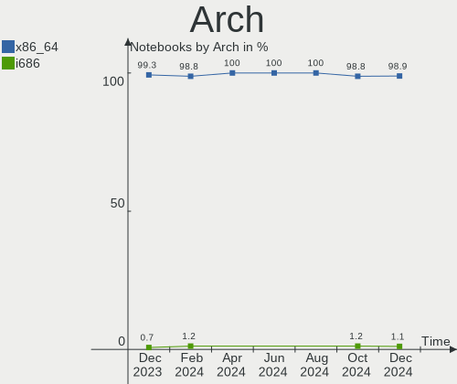
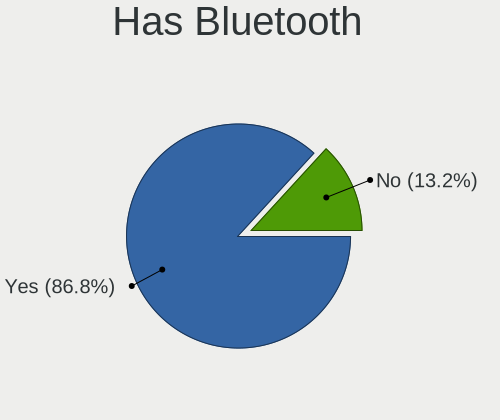
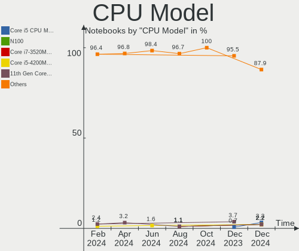
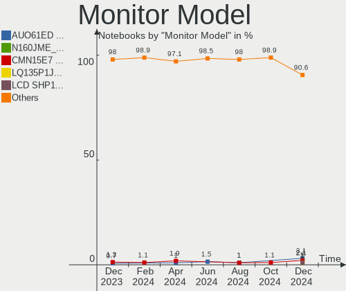
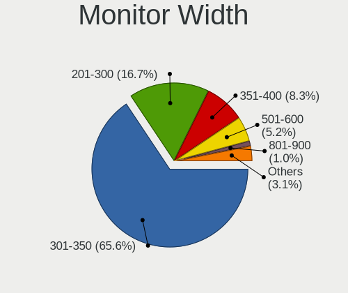
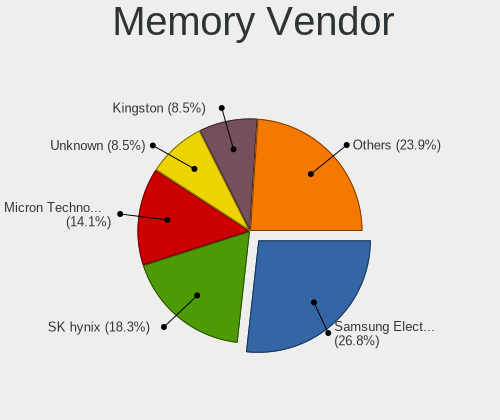
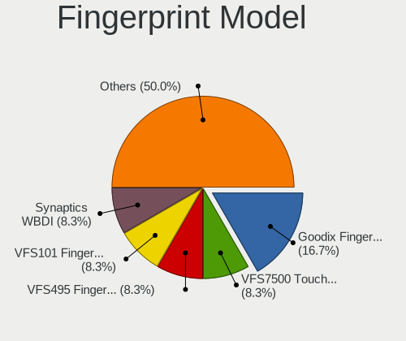

Linux in Poland - Hardware Trends (Notebooks)
---------------------------------------------

A project to identify most popular hardware characteristics and track their change
over time based on data collected by Linux users at https://Linux-Hardware.org.

Anyone can contribute to this report by the [hw-probe](https://github.com/linuxhw/hw-probe) tool:

    sudo -E hw-probe -all -upload

Period: Sep, 2022.

Contents
--------

* [ System ](#system)
  - [ OS                       ](#os)
  - [ OS Family                ](#os-family)
  - [ Kernel                   ](#kernel)
  - [ Kernel Family            ](#kernel-family)
  - [ Kernel Major Ver.        ](#kernel-major-ver)
  - [ Arch                     ](#arch)
  - [ DE                       ](#de)
  - [ Display Server           ](#display-server)
  - [ Display Manager          ](#display-manager)
  - [ OS Lang                  ](#os-lang)
  - [ Boot Mode                ](#boot-mode)
  - [ Filesystem               ](#filesystem)
  - [ Part. scheme             ](#part-scheme)
  - [ Dual Boot with Linux/BSD ](#dual-boot-with-linuxbsd)
  - [ Dual Boot (Win)          ](#dual-boot-win)

* [ Board ](#board)
  - [ Vendor                   ](#vendor)
  - [ Model                    ](#model)
  - [ Model Family             ](#model-family)
  - [ MFG Year                 ](#mfg-year)
  - [ Form Factor              ](#form-factor)
  - [ Secure Boot              ](#secure-boot)
  - [ Coreboot                 ](#coreboot)
  - [ RAM Size                 ](#ram-size)
  - [ RAM Used                 ](#ram-used)
  - [ Total Drives             ](#total-drives)
  - [ Has CD-ROM               ](#has-cd-rom)
  - [ Has Ethernet             ](#has-ethernet)
  - [ Has WiFi                 ](#has-wifi)
  - [ Has Bluetooth            ](#has-bluetooth)

* [ Location ](#location)
  - [ Country                  ](#country)
  - [ City                     ](#city)

* [ Drives ](#drives)
  - [ Drive Vendor             ](#drive-vendor)
  - [ Drive Model              ](#drive-model)
  - [ HDD Vendor               ](#hdd-vendor)
  - [ SSD Vendor               ](#ssd-vendor)
  - [ Drive Kind               ](#drive-kind)
  - [ Drive Connector          ](#drive-connector)
  - [ Drive Size               ](#drive-size)
  - [ Space Total              ](#space-total)
  - [ Space Used               ](#space-used)
  - [ Malfunc. Drives          ](#malfunc-drives)
  - [ Malfunc. Drive Vendor    ](#malfunc-drive-vendor)
  - [ Malfunc. HDD Vendor      ](#malfunc-hdd-vendor)
  - [ Malfunc. Drive Kind      ](#malfunc-drive-kind)
  - [ Failed Drives            ](#failed-drives)
  - [ Failed Drive Vendor      ](#failed-drive-vendor)
  - [ Drive Status             ](#drive-status)

* [ Storage controller ](#storage-controller)
  - [ Storage Vendor           ](#storage-vendor)
  - [ Storage Model            ](#storage-model)
  - [ Storage Kind             ](#storage-kind)

* [ Processor ](#processor)
  - [ CPU Vendor               ](#cpu-vendor)
  - [ CPU Model                ](#cpu-model)
  - [ CPU Model Family         ](#cpu-model-family)
  - [ CPU Cores                ](#cpu-cores)
  - [ CPU Sockets              ](#cpu-sockets)
  - [ CPU Threads              ](#cpu-threads)
  - [ CPU Op-Modes             ](#cpu-op-modes)
  - [ CPU Microcode            ](#cpu-microcode)
  - [ CPU Microarch            ](#cpu-microarch)

* [ Graphics ](#graphics)
  - [ GPU Vendor               ](#gpu-vendor)
  - [ GPU Model                ](#gpu-model)
  - [ GPU Combo                ](#gpu-combo)
  - [ GPU Driver               ](#gpu-driver)
  - [ GPU Memory               ](#gpu-memory)

* [ Monitor ](#monitor)
  - [ Monitor Vendor           ](#monitor-vendor)
  - [ Monitor Model            ](#monitor-model)
  - [ Monitor Resolution       ](#monitor-resolution)
  - [ Monitor Diagonal         ](#monitor-diagonal)
  - [ Monitor Width            ](#monitor-width)
  - [ Aspect Ratio             ](#aspect-ratio)
  - [ Monitor Area             ](#monitor-area)
  - [ Pixel Density            ](#pixel-density)
  - [ Multiple Monitors        ](#multiple-monitors)

* [ Network ](#network)
  - [ Net Controller Vendor    ](#net-controller-vendor)
  - [ Net Controller Model     ](#net-controller-model)
  - [ Wireless Vendor          ](#wireless-vendor)
  - [ Wireless Model           ](#wireless-model)
  - [ Ethernet Vendor          ](#ethernet-vendor)
  - [ Ethernet Model           ](#ethernet-model)
  - [ Net Controller Kind      ](#net-controller-kind)
  - [ Used Controller          ](#used-controller)
  - [ NICs                     ](#nics)
  - [ IPv6                     ](#ipv6)

* [ Bluetooth ](#bluetooth)
  - [ Bluetooth Vendor         ](#bluetooth-vendor)
  - [ Bluetooth Model          ](#bluetooth-model)

* [ Sound ](#sound)
  - [ Sound Vendor             ](#sound-vendor)
  - [ Sound Model              ](#sound-model)

* [ Memory ](#memory)
  - [ Memory Vendor            ](#memory-vendor)
  - [ Memory Model             ](#memory-model)
  - [ Memory Kind              ](#memory-kind)
  - [ Memory Form Factor       ](#memory-form-factor)
  - [ Memory Size              ](#memory-size)
  - [ Memory Speed             ](#memory-speed)

* [ Printers & scanners ](#printers--scanners)
  - [ Printer Vendor           ](#printer-vendor)
  - [ Printer Model            ](#printer-model)
  - [ Scanner Vendor           ](#scanner-vendor)
  - [ Scanner Model            ](#scanner-model)

* [ Camera ](#camera)
  - [ Camera Vendor            ](#camera-vendor)
  - [ Camera Model             ](#camera-model)

* [ Security ](#security)
  - [ Fingerprint Vendor       ](#fingerprint-vendor)
  - [ Fingerprint Model        ](#fingerprint-model)
  - [ Chipcard Vendor          ](#chipcard-vendor)
  - [ Chipcard Model           ](#chipcard-model)

* [ Unsupported ](#unsupported)
  - [ Unsupported Devices      ](#unsupported-devices)
  - [ Unsupported Device Types ](#unsupported-device-types)

System
------

OS
--

Installed operating systems

| Name                 | Notebooks | Percent |
|----------------------|-----------|---------|
| Ubuntu 22.04         | 21        | 28.77%  |
| OpenMandriva 4.3     | 8         | 10.96%  |
| Linux Mint 20.3      | 5         | 6.85%   |
| SteamOS 3.3.1        | 3         | 4.11%   |
| OpenMandriva 4.2     | 3         | 4.11%   |
| Fedora 36            | 3         | 4.11%   |
| Debian 11            | 3         | 4.11%   |
| Zorin 16             | 2         | 2.74%   |
| Ubuntu 20.04         | 2         | 2.74%   |
| OpenMandriva 4.50    | 2         | 2.74%   |
| Manjaro 22.0.0       | 2         | 2.74%   |
| Gentoo 2.8           | 2         | 2.74%   |
| Fedora 37            | 2         | 2.74%   |
| Arch Rolling         | 2         | 2.74%   |
| Ultramarine Linux 36 | 1         | 1.37%   |
| PureOS 10            | 1         | 1.37%   |
| Pop!_OS 22.04        | 1         | 1.37%   |
| OpenMandriva 4.90    | 1         | 1.37%   |
| MX 21                | 1         | 1.37%   |
| LinuxFX 11           | 1         | 1.37%   |
| Linux Mint 21        | 1         | 1.37%   |
| Kubuntu 22.04        | 1         | 1.37%   |
| Garuda Linux Soaring | 1         | 1.37%   |
| Garuda Linux         | 1         | 1.37%   |
| EndeavourOS Rolling  | 1         | 1.37%   |
| Elementary 6.1       | 1         | 1.37%   |
| Arch                 | 1         | 1.37%   |

OS Family
---------

OS without a version

| Name              | Notebooks | Percent |
|-------------------|-----------|---------|
| Ubuntu            | 23        | 31.51%  |
| OpenMandriva      | 14        | 19.18%  |
| Linux Mint        | 6         | 8.22%   |
| Fedora            | 5         | 6.85%   |
| SteamOS           | 3         | 4.11%   |
| Debian            | 3         | 4.11%   |
| Arch              | 3         | 4.11%   |
| Zorin             | 2         | 2.74%   |
| Manjaro           | 2         | 2.74%   |
| Gentoo            | 2         | 2.74%   |
| Garuda Linux      | 2         | 2.74%   |
| Ultramarine Linux | 1         | 1.37%   |
| PureOS            | 1         | 1.37%   |
| Pop!_OS           | 1         | 1.37%   |
| MX                | 1         | 1.37%   |
| LinuxFX           | 1         | 1.37%   |
| Kubuntu           | 1         | 1.37%   |
| EndeavourOS       | 1         | 1.37%   |
| Elementary        | 1         | 1.37%   |

Kernel
------

Version of the Linux kernel

| Version                                        | Notebooks | Percent |
|------------------------------------------------|-----------|---------|
| 5.15.0-47-generic                              | 13        | 17.81%  |
| 5.16.7-desktop-1omv4003                        | 8         | 10.96%  |
| 5.15.0-48-generic                              | 7         | 9.59%   |
| 5.15.0-43-generic                              | 4         | 5.48%   |
| 5.13.0-valve21.1-1-neptune-02211-gc54cda5a36f3 | 3         | 4.11%   |
| 5.10.14-desktop-1omv4002                       | 3         | 4.11%   |
| 5.10.0-17-amd64                                | 3         | 4.11%   |
| 5.4.0-126-generic                              | 2         | 2.74%   |
| 5.19.8-300.fc37.x86_64                         | 2         | 2.74%   |
| 5.19.8-200.fc36.x86_64                         | 2         | 2.74%   |
| 5.19.5-desktop-1omv4090                        | 2         | 2.74%   |
| 5.19.10-arch1-1                                | 2         | 2.74%   |
| 5.15.0-46-generic                              | 2         | 2.74%   |
| 6.0.0-1-MANJARO                                | 1         | 1.37%   |
| 5.4.0-125-generic                              | 1         | 1.37%   |
| 5.4.0-109-generic                              | 1         | 1.37%   |
| 5.19.6-xanmod1-1                               | 1         | 1.37%   |
| 5.19.6-lqx1-1-lqx                              | 1         | 1.37%   |
| 5.19.6-269-tkg-pds                             | 1         | 1.37%   |
| 5.19.6-200.fc36.x86_64                         | 1         | 1.37%   |
| 5.19.5-051905-generic                          | 1         | 1.37%   |
| 5.19.4-zen1-1-zen                              | 1         | 1.37%   |
| 5.19.4-arch1-g14-1                             | 1         | 1.37%   |
| 5.19.4-200.fc36.x86_64                         | 1         | 1.37%   |
| 5.19.10-gentoo                                 | 1         | 1.37%   |
| 5.19.0-76051900-generic                        | 1         | 1.37%   |
| 5.18.19-gentoo-r1                              | 1         | 1.37%   |
| 5.18.12-desktop-3omv4090                       | 1         | 1.37%   |
| 5.17.0-3mx-amd64                               | 1         | 1.37%   |
| 5.15.0-37-generic                              | 1         | 1.37%   |
| 5.14.0-1051-oem                                | 1         | 1.37%   |
| 5.11.0-44-generic                              | 1         | 1.37%   |
| 5.10.0-14-amd64                                | 1         | 1.37%   |

Kernel Family
-------------

Linux kernel without a distro release

| Version | Notebooks | Percent |
|---------|-----------|---------|
| 5.15.0  | 27        | 36.99%  |
| 5.16.7  | 8         | 10.96%  |
| 5.4.0   | 4         | 5.48%   |
| 5.19.8  | 4         | 5.48%   |
| 5.19.6  | 4         | 5.48%   |
| 5.10.0  | 4         | 5.48%   |
| 5.19.5  | 3         | 4.11%   |
| 5.19.4  | 3         | 4.11%   |
| 5.19.10 | 3         | 4.11%   |
| 5.13.0  | 3         | 4.11%   |
| 5.10.14 | 3         | 4.11%   |
| 6.0.0   | 1         | 1.37%   |
| 5.19.0  | 1         | 1.37%   |
| 5.18.19 | 1         | 1.37%   |
| 5.18.12 | 1         | 1.37%   |
| 5.17.0  | 1         | 1.37%   |
| 5.14.0  | 1         | 1.37%   |
| 5.11.0  | 1         | 1.37%   |

Kernel Major Ver.
-----------------

Linux kernel major version

| Version | Notebooks | Percent |
|---------|-----------|---------|
| 5.15    | 27        | 36.99%  |
| 5.19    | 18        | 24.66%  |
| 5.16    | 8         | 10.96%  |
| 5.10    | 7         | 9.59%   |
| 5.4     | 4         | 5.48%   |
| 5.13    | 3         | 4.11%   |
| 5.18    | 2         | 2.74%   |
| 6.0     | 1         | 1.37%   |
| 5.17    | 1         | 1.37%   |
| 5.14    | 1         | 1.37%   |
| 5.11    | 1         | 1.37%   |

Arch
----

OS architecture (x86_64, i586, etc.)

| Name   | Notebooks | Percent |
|--------|-----------|---------|
| x86_64 | 73        | 100%    |

DE
--

Desktop Environment

| Name       | Notebooks | Percent |
|------------|-----------|---------|
| GNOME      | 33        | 45.21%  |
| KDE5       | 23        | 31.51%  |
| X-Cinnamon | 6         | 8.22%   |
| XFCE       | 3         | 4.11%   |
| Pantheon   | 2         | 2.74%   |
| LXQt       | 2         | 2.74%   |
| trinity    | 1         | 1.37%   |
| i3         | 1         | 1.37%   |
| Deepin     | 1         | 1.37%   |
| awesome    | 1         | 1.37%   |

Display Server
--------------

X11 or Wayland

| Name    | Notebooks | Percent |
|---------|-----------|---------|
| X11     | 49        | 67.12%  |
| Wayland | 20        | 27.4%   |
| Tty     | 2         | 2.74%   |
| Unknown | 2         | 2.74%   |

Display Manager
---------------

SDDM, LightDM, etc.

| Name    | Notebooks | Percent |
|---------|-----------|---------|
| Unknown | 23        | 31.51%  |
| SDDM    | 22        | 30.14%  |
| GDM3    | 20        | 27.4%   |
| GDM     | 4         | 5.48%   |
| LightDM | 3         | 4.11%   |
| LXDM    | 1         | 1.37%   |

OS Lang
-------

Language

| Lang  | Notebooks | Percent |
|-------|-----------|---------|
| pl_PL | 36        | 49.32%  |
| en_US | 29        | 39.73%  |
| en_GB | 4         | 5.48%   |
| uk_UA | 1         | 1.37%   |
| it_IT | 1         | 1.37%   |
| en_IN | 1         | 1.37%   |
| de_DE | 1         | 1.37%   |

Boot Mode
---------

EFI or BIOS

| Mode | Notebooks | Percent |
|------|-----------|---------|
| EFI  | 43        | 58.9%   |
| BIOS | 30        | 41.1%   |

Filesystem
----------

Type of filesystem

| Type    | Notebooks | Percent |
|---------|-----------|---------|
| Ext4    | 46        | 63.01%  |
| Overlay | 11        | 15.07%  |
| Btrfs   | 9         | 12.33%  |
| Zfs     | 3         | 4.11%   |
| Xfs     | 2         | 2.74%   |
| XXXXX   | 1         | 1.37%   |
| F2fs    | 1         | 1.37%   |

Part. scheme
------------

Scheme of partitioning

| Type    | Notebooks | Percent |
|---------|-----------|---------|
| GPT     | 35        | 47.95%  |
| Unknown | 31        | 42.47%  |
| MBR     | 7         | 9.59%   |

Dual Boot with Linux/BSD
------------------------

Hosting more than one Linux/BSD

| Dual boot | Notebooks | Percent |
|-----------|-----------|---------|
| No        | 62        | 84.93%  |
| Yes       | 11        | 15.07%  |

Dual Boot (Win)
---------------

Hosting Linux and Windows

| Dual boot | Notebooks | Percent |
|-----------|-----------|---------|
| No        | 48        | 65.75%  |
| Yes       | 25        | 34.25%  |

Board
-----

Vendor
------

Motherboard manufacturer

| Name                | Notebooks | Percent |
|---------------------|-----------|---------|
| Lenovo              | 22        | 30.14%  |
| Dell                | 16        | 21.92%  |
| Hewlett-Packard     | 9         | 12.33%  |
| ASUSTek Computer    | 8         | 10.96%  |
| Toshiba             | 4         | 5.48%   |
| Valve               | 3         | 4.11%   |
| Samsung Electronics | 2         | 2.74%   |
| HUAWEI              | 2         | 2.74%   |
| Acer                | 2         | 2.74%   |
| MSI                 | 1         | 1.37%   |
| Gigabyte Technology | 1         | 1.37%   |
| Fujitsu             | 1         | 1.37%   |
| Framework           | 1         | 1.37%   |
| Apple               | 1         | 1.37%   |

Model
-----

Motherboard model

| Name                                                | Notebooks | Percent |
|-----------------------------------------------------|-----------|---------|
| Valve Jupiter                                       | 3         | 4.11%   |
| Dell Latitude E6330                                 | 3         | 4.11%   |
| Lenovo ThinkPad E15 Gen 2 20T8000MPB                | 2         | 2.74%   |
| Dell Inspiron 3451                                  | 2         | 2.74%   |
| Toshiba Satellite P205                              | 1         | 1.37%   |
| Toshiba Satellite L40                               | 1         | 1.37%   |
| Toshiba Satellite C850-1LK                          | 1         | 1.37%   |
| Toshiba PORTEGE Z30-A                               | 1         | 1.37%   |
| Samsung RC420/RC520/RC720                           | 1         | 1.37%   |
| Samsung 350V5C/351V5C/3540VC/3440VC                 | 1         | 1.37%   |
| MSI Creator Z17 A12UHST                             | 1         | 1.37%   |
| Lenovo ThinkPad Z16 Gen 1 21D40016PB                | 1         | 1.37%   |
| Lenovo ThinkPad X270 W10DG 20K5S2VL00               | 1         | 1.37%   |
| Lenovo ThinkPad X1 Extreme 20MFCTO1WW               | 1         | 1.37%   |
| Lenovo ThinkPad X1 Carbon 6th 20KGS7XP1C            | 1         | 1.37%   |
| Lenovo ThinkPad T420 4180MY7                        | 1         | 1.37%   |
| Lenovo ThinkPad T420 4180A32                        | 1         | 1.37%   |
| Lenovo ThinkPad T14 Gen 2i 20W1S30V0S               | 1         | 1.37%   |
| Lenovo ThinkPad T14 Gen 1 20UES08Q15                | 1         | 1.37%   |
| Lenovo ThinkPad SL500 27463ZG                       | 1         | 1.37%   |
| Lenovo ThinkPad L420 7829H86                        | 1         | 1.37%   |
| Lenovo ThinkPad Edge E430 3254A8G                   | 1         | 1.37%   |
| Lenovo ThinkPad E15 Gen 3 20YG003VRT                | 1         | 1.37%   |
| Lenovo ThinkBook 14-IIL 20SL                        | 1         | 1.37%   |
| Lenovo Legion 5 15ARH05H 82B1                       | 1         | 1.37%   |
| Lenovo IdeaPad S540-15IWL GTX 81SW                  | 1         | 1.37%   |
| Lenovo IdeaPad 320-15IKB 81BG                       | 1         | 1.37%   |
| Lenovo G580 20150                                   | 1         | 1.37%   |
| Lenovo G505s 20255                                  | 1         | 1.37%   |
| Lenovo G500s 20245                                  | 1         | 1.37%   |
| Lenovo G50-80 80E5                                  | 1         | 1.37%   |
| HUAWEI KPL-W0X                                      | 1         | 1.37%   |
| HUAWEI KLVL-WXX9                                    | 1         | 1.37%   |
| HP ZBook Firefly 15.6 inch G8 Mobile Workstation PC | 1         | 1.37%   |
| HP ZBook 15 G6                                      | 1         | 1.37%   |
| HP ProBook 470 G5                                   | 1         | 1.37%   |
| HP Pavilion Laptop 17-ar0xx                         | 1         | 1.37%   |
| HP Notebook                                         | 1         | 1.37%   |
| HP Laptop 17-cp0xxx                                 | 1         | 1.37%   |
| HP EliteBook 8440p                                  | 1         | 1.37%   |

Model Family
------------

Motherboard model prefix

| Name              | Notebooks | Percent |
|-------------------|-----------|---------|
| Lenovo ThinkPad   | 14        | 19.18%  |
| Dell Latitude     | 10        | 13.7%   |
| Dell Inspiron     | 5         | 6.85%   |
| ASUS ROG          | 4         | 5.48%   |
| Valve Jupiter     | 3         | 4.11%   |
| Toshiba Satellite | 3         | 4.11%   |
| Lenovo IdeaPad    | 2         | 2.74%   |
| HP ZBook          | 2         | 2.74%   |
| HP EliteBook      | 2         | 2.74%   |
| Toshiba PORTEGE   | 1         | 1.37%   |
| Samsung RC420     | 1         | 1.37%   |
| Samsung 350V5C    | 1         | 1.37%   |
| MSI Creator       | 1         | 1.37%   |
| Lenovo ThinkBook  | 1         | 1.37%   |
| Lenovo Legion     | 1         | 1.37%   |
| Lenovo G580       | 1         | 1.37%   |
| Lenovo G505s      | 1         | 1.37%   |
| Lenovo G500s      | 1         | 1.37%   |
| Lenovo G50-80     | 1         | 1.37%   |
| HUAWEI KPL-W0X    | 1         | 1.37%   |
| HUAWEI KLVL-WXX9  | 1         | 1.37%   |
| HP ProBook        | 1         | 1.37%   |
| HP Pavilion       | 1         | 1.37%   |
| HP Notebook       | 1         | 1.37%   |
| HP Laptop         | 1         | 1.37%   |
| HP 620            | 1         | 1.37%   |
| Gigabyte AORUS    | 1         | 1.37%   |
| Fujitsu LIFEBOOK  | 1         | 1.37%   |
| Framework Laptop  | 1         | 1.37%   |
| Dell Precision    | 1         | 1.37%   |
| ASUS Zenbook      | 1         | 1.37%   |
| ASUS VivoBook     | 1         | 1.37%   |
| ASUS GL502VSK     | 1         | 1.37%   |
| ASUS ASUS         | 1         | 1.37%   |
| Apple MacBook9    | 1         | 1.37%   |
| Acer P5WE0        | 1         | 1.37%   |
| Acer Aspire       | 1         | 1.37%   |

MFG Year
--------

Motherboard manufacture year

| Year | Notebooks | Percent |
|------|-----------|---------|
| 2021 | 9         | 12.33%  |
| 2020 | 9         | 12.33%  |
| 2022 | 8         | 10.96%  |
| 2019 | 6         | 8.22%   |
| 2012 | 6         | 8.22%   |
| 2011 | 6         | 8.22%   |
| 2018 | 5         | 6.85%   |
| 2017 | 5         | 6.85%   |
| 2014 | 5         | 6.85%   |
| 2013 | 5         | 6.85%   |
| 2010 | 4         | 5.48%   |
| 2015 | 2         | 2.74%   |
| 2007 | 2         | 2.74%   |
| 2008 | 1         | 1.37%   |

Form Factor
-----------

Physical design of the computer

| Name     | Notebooks | Percent |
|----------|-----------|---------|
| Notebook | 73        | 100%    |

Secure Boot
-----------

Enabled or disabled

| State    | Notebooks | Percent |
|----------|-----------|---------|
| Disabled | 69        | 94.52%  |
| Enabled  | 4         | 5.48%   |

Coreboot
--------

Have coreboot on board

| Used | Notebooks | Percent |
|------|-----------|---------|
| No   | 73        | 100%    |

RAM Size
--------

Total RAM memory

| Size in GB  | Notebooks | Percent |
|-------------|-----------|---------|
| 4.01-8.0    | 20        | 27.4%   |
| 8.01-16.0   | 20        | 27.4%   |
| 32.01-64.0  | 12        | 16.44%  |
| 3.01-4.0    | 8         | 10.96%  |
| 16.01-24.0  | 8         | 10.96%  |
| 64.01-256.0 | 2         | 2.74%   |
| 1.01-2.0    | 2         | 2.74%   |
| 2.01-3.0    | 1         | 1.37%   |

RAM Used
--------

Used RAM memory

| Used GB    | Notebooks | Percent |
|------------|-----------|---------|
| 1.01-2.0   | 22        | 30.14%  |
| 4.01-8.0   | 19        | 26.03%  |
| 3.01-4.0   | 11        | 15.07%  |
| 2.01-3.0   | 9         | 12.33%  |
| 8.01-16.0  | 8         | 10.96%  |
| 0.51-1.0   | 2         | 2.74%   |
| 16.01-24.0 | 1         | 1.37%   |
| 0.01-0.5   | 1         | 1.37%   |

Total Drives
------------

Number of drives on board

| Drives | Notebooks | Percent |
|--------|-----------|---------|
| 1      | 50        | 68.49%  |
| 2      | 18        | 24.66%  |
| 3      | 3         | 4.11%   |
| 4      | 1         | 1.37%   |
| 0      | 1         | 1.37%   |

Has CD-ROM
----------

Has CD-ROM on board

| Presented | Notebooks | Percent |
|-----------|-----------|---------|
| No        | 49        | 67.12%  |
| Yes       | 24        | 32.88%  |

Has Ethernet
------------

Has Ethernet on board

| Presented | Notebooks | Percent |
|-----------|-----------|---------|
| Yes       | 60        | 82.19%  |
| No        | 13        | 17.81%  |

Has WiFi
--------

Has WiFi module

| Presented | Notebooks | Percent |
|-----------|-----------|---------|
| Yes       | 73        | 100%    |

Has Bluetooth
-------------

Has Bluetooth module

| Presented | Notebooks | Percent |
|-----------|-----------|---------|
| Yes       | 56        | 76.71%  |
| No        | 17        | 23.29%  |

Location
--------

Country
-------

Geographic location (country)

| Country | Notebooks | Percent |
|---------|-----------|---------|
| Poland  | 73        | 100%    |

City
----

Geographic location (city)

| City               | Notebooks | Percent |
|--------------------|-----------|---------|
| Warsaw             | 19        | 26.03%  |
| Krakow             | 9         | 12.33%  |
| Wroclaw            | 4         | 5.48%   |
| Poznan             | 3         | 4.11%   |
| Gdansk             | 3         | 4.11%   |
| Mława             | 2         | 2.74%   |
| Cieszyn            | 2         | 2.74%   |
| Zielona Góra      | 1         | 1.37%   |
| Wola Rzedzinska    | 1         | 1.37%   |
| Wałbrzych         | 1         | 1.37%   |
| Szczecin           | 1         | 1.37%   |
| Swaty              | 1         | 1.37%   |
| Skarzysko-Kamienna | 1         | 1.37%   |
| Rzeszów           | 1         | 1.37%   |
| Ruda Śląska      | 1         | 1.37%   |
| Radomsko           | 1         | 1.37%   |
| Racibórz          | 1         | 1.37%   |
| Pruszków          | 1         | 1.37%   |
| Pionki             | 1         | 1.37%   |
| Pilica             | 1         | 1.37%   |
| Orzysz             | 1         | 1.37%   |
| Opole              | 1         | 1.37%   |
| Malbork            | 1         | 1.37%   |
| Lublin             | 1         | 1.37%   |
| Lomianki           | 1         | 1.37%   |
| Lodz               | 1         | 1.37%   |
| Kutno              | 1         | 1.37%   |
| Knurow             | 1         | 1.37%   |
| Katowice           | 1         | 1.37%   |
| Jejkowice          | 1         | 1.37%   |
| Gryfino            | 1         | 1.37%   |
| Gmina Widawa       | 1         | 1.37%   |
| Gdynia             | 1         | 1.37%   |
| Chorzów           | 1         | 1.37%   |
| Bytom Odrzanski    | 1         | 1.37%   |
| Bydgoszcz          | 1         | 1.37%   |
| Brzoskwinia        | 1         | 1.37%   |
| Bierzglin          | 1         | 1.37%   |

Drives
------

Drive Vendor
------------

Hard drive vendors

| Vendor                    | Notebooks | Drives | Percent |
|---------------------------|-----------|--------|---------|
| Samsung Electronics       | 15        | 17     | 16.3%   |
| Seagate                   | 9         | 10     | 9.78%   |
| WDC                       | 8         | 8      | 8.7%    |
| Unknown                   | 7         | 7      | 7.61%   |
| Toshiba                   | 6         | 6      | 6.52%   |
| Crucial                   | 6         | 6      | 6.52%   |
| Phison Electronics        | 4         | 4      | 4.35%   |
| Kingston                  | 4         | 4      | 4.35%   |
| Micron Technology         | 3         | 3      | 3.26%   |
| KIOXIA                    | 3         | 3      | 3.26%   |
| Intel                     | 3         | 4      | 3.26%   |
| GOODRAM                   | 3         | 3      | 3.26%   |
| SK hynix                  | 2         | 3      | 2.17%   |
| PNY                       | 2         | 2      | 2.17%   |
| Hitachi                   | 2         | 2      | 2.17%   |
| XPG                       | 1         | 1      | 1.09%   |
| UMIS                      | 1         | 1      | 1.09%   |
| Transcend                 | 1         | 1      | 1.09%   |
| Team                      | 1         | 1      | 1.09%   |
| SPCC                      | 1         | 1      | 1.09%   |
| SanDisk                   | 1         | 1      | 1.09%   |
| Ramaxel Technology        | 1         | 1      | 1.09%   |
| Plextor                   | 1         | 1      | 1.09%   |
| Patriot                   | 1         | 1      | 1.09%   |
| Micron/Crucial Technology | 1         | 1      | 1.09%   |
| KingFast                  | 1         | 1      | 1.09%   |
| Biostar                   | 1         | 1      | 1.09%   |
| Apple                     | 1         | 2      | 1.09%   |
| Apacer                    | 1         | 1      | 1.09%   |
| A-DATA Technology         | 1         | 1      | 1.09%   |

Drive Model
-----------

Hard drive models

| Model                                   | Notebooks | Percent |
|-----------------------------------------|-----------|---------|
| Phison PS5013 E13 NVMe Controller 512GB | 4         | 4.12%   |
| Unknown MMC Card  128GB                 | 3         | 3.09%   |
| Seagate ST500LT012-1DG142 500GB         | 2         | 2.06%   |
| Crucial CT1000MX500SSD1 1TB             | 2         | 2.06%   |
| XPG SX8200PNP-512GT-S 512GB             | 1         | 1.03%   |
| WDC WDS500G2B0A-00SM50 500GB SSD        | 1         | 1.03%   |
| WDC WDS250G2B0A-00SM50 250GB SSD        | 1         | 1.03%   |
| WDC WDS100T1X0E-00AFY0 1TB              | 1         | 1.03%   |
| WDC WD10JPCX-24UE4T0 1TB                | 1         | 1.03%   |
| WDC WD My Passport 264F 500GB           | 1         | 1.03%   |
| WDC PC SN730 NVMe 512GB                 | 1         | 1.03%   |
| WDC PC SN530 SDBPNPZ-512G-1114 512GB    | 1         | 1.03%   |
| WDC PC SN530 SDBPNPZ-512G-1002 512GB    | 1         | 1.03%   |
| Unknown xD/SD/M.S.                      | 1         | 1.03%   |
| Unknown USB DISK 3.2 250GB              | 1         | 1.03%   |
| Unknown SL16G  16GB                     | 1         | 1.03%   |
| Unknown SB128  128GB                    | 1         | 1.03%   |
| UMIS RPJTJ512MEE1OWX 512GB              | 1         | 1.03%   |
| Transcend TS256GMTS400S 256GB SSD       | 1         | 1.03%   |
| Toshiba THNSNJ256GMCU 256GB SSD         | 1         | 1.03%   |
| Toshiba NVMe SSD Drive 512GB            | 1         | 1.03%   |
| Toshiba MQ01ABD050 500GB                | 1         | 1.03%   |
| Toshiba MQ01ABD025VS 250GB              | 1         | 1.03%   |
| Toshiba MK6037GSX 64GB                  | 1         | 1.03%   |
| Toshiba MK2035GSS 200GB                 | 1         | 1.03%   |
| Team T253X2512G 512GB SSD               | 1         | 1.03%   |
| SPCC Solid State Disk 512GB             | 1         | 1.03%   |
| SK hynix NVMe SSD Drive 1024GB          | 1         | 1.03%   |
| SK hynix HFS256G39TNF-N3A0A 256GB SSD   | 1         | 1.03%   |
| SK hynix HFM001TD3JX013N 1024GB         | 1         | 1.03%   |
| Seagate ST500LT012-9WS142 500GB         | 1         | 1.03%   |
| Seagate ST500LM030-2E717D 500GB         | 1         | 1.03%   |
| Seagate ST320LT020-9YG142 320GB         | 1         | 1.03%   |
| Seagate ST1000LM035-1RK172 1TB          | 1         | 1.03%   |
| Seagate ST1000LM024 HN-M101MBB 1TB      | 1         | 1.03%   |
| Seagate ST1000LM014-1EJ164 1TB          | 1         | 1.03%   |
| Seagate Expansion Desk 2TB              | 1         | 1.03%   |
| Seagate Expansion 1TB                   | 1         | 1.03%   |
| SanDisk SSD PLUS 480GB                  | 1         | 1.03%   |
| Samsung SSD 980 500GB                   | 1         | 1.03%   |

HDD Vendor
----------

Hard disk drive vendors

| Vendor  | Notebooks | Drives | Percent |
|---------|-----------|--------|---------|
| Seagate | 9         | 10     | 56.25%  |
| Toshiba | 4         | 4      | 25%     |
| Hitachi | 2         | 2      | 12.5%   |
| WDC     | 1         | 1      | 6.25%   |

SSD Vendor
----------

Solid state drive vendors

| Vendor              | Notebooks | Drives | Percent |
|---------------------|-----------|--------|---------|
| Samsung Electronics | 5         | 7      | 16.13%  |
| Crucial             | 5         | 5      | 16.13%  |
| Kingston            | 3         | 3      | 9.68%   |
| GOODRAM             | 3         | 3      | 9.68%   |
| WDC                 | 2         | 2      | 6.45%   |
| PNY                 | 2         | 2      | 6.45%   |
| Transcend           | 1         | 1      | 3.23%   |
| Toshiba             | 1         | 1      | 3.23%   |
| Team                | 1         | 1      | 3.23%   |
| SPCC                | 1         | 1      | 3.23%   |
| SK hynix            | 1         | 1      | 3.23%   |
| SanDisk             | 1         | 1      | 3.23%   |
| Ramaxel Technology  | 1         | 1      | 3.23%   |
| Patriot             | 1         | 1      | 3.23%   |
| Micron Technology   | 1         | 1      | 3.23%   |
| Biostar             | 1         | 1      | 3.23%   |
| A-DATA Technology   | 1         | 1      | 3.23%   |

Drive Kind
----------

HDD or SSD

| Kind    | Notebooks | Drives | Percent |
|---------|-----------|--------|---------|
| NVMe    | 32        | 39     | 37.65%  |
| SSD     | 28        | 33     | 32.94%  |
| HDD     | 16        | 17     | 18.82%  |
| MMC     | 5         | 5      | 5.88%   |
| Unknown | 4         | 4      | 4.71%   |

Drive Connector
---------------

SATA, SAS, NVMe, etc.

| Type | Notebooks | Drives | Percent |
|------|-----------|--------|---------|
| SATA | 41        | 47     | 49.4%   |
| NVMe | 32        | 39     | 38.55%  |
| SAS  | 5         | 7      | 6.02%   |
| MMC  | 5         | 5      | 6.02%   |

Drive Size
----------

Size of hard drive

| Size in TB | Notebooks | Drives | Percent |
|------------|-----------|--------|---------|
| 0.01-0.5   | 29        | 32     | 64.44%  |
| 0.51-1.0   | 14        | 16     | 31.11%  |
| 3.01-4.0   | 1         | 1      | 2.22%   |
| 1.01-2.0   | 1         | 1      | 2.22%   |

Space Total
-----------

Amount of disk space available on the file system

| Size in GB     | Notebooks | Percent |
|----------------|-----------|---------|
| 251-500        | 17        | 23.29%  |
| 101-250        | 15        | 20.55%  |
| 1-20           | 13        | 17.81%  |
| 501-1000       | 9         | 12.33%  |
| 51-100         | 6         | 8.22%   |
| 1001-2000      | 4         | 5.48%   |
| Unknown        | 4         | 5.48%   |
| More than 3000 | 2         | 2.74%   |
| 21-50          | 2         | 2.74%   |
| 2001-3000      | 1         | 1.37%   |

Space Used
----------

Amount of used disk space

| Used GB   | Notebooks | Percent |
|-----------|-----------|---------|
| 1-20      | 28        | 38.36%  |
| 101-250   | 15        | 20.55%  |
| 21-50     | 8         | 10.96%  |
| 51-100    | 8         | 10.96%  |
| 251-500   | 4         | 5.48%   |
| Unknown   | 4         | 5.48%   |
| 501-1000  | 3         | 4.11%   |
| 1001-2000 | 2         | 2.74%   |
| 2001-3000 | 1         | 1.37%   |

Malfunc. Drives
---------------

Drive models with a malfunction

| Model                           | Notebooks | Drives | Percent |
|---------------------------------|-----------|--------|---------|
| Toshiba MK6037GSX 64GB          | 1         | 1      | 20%     |
| Seagate ST500LT012-9WS142 500GB | 1         | 1      | 20%     |
| Seagate ST1000LM035-1RK172 1TB  | 1         | 1      | 20%     |
| Seagate ST1000LM014-1EJ164 1TB  | 1         | 1      | 20%     |
| Hitachi HTS543225L9SA00 250GB   | 1         | 1      | 20%     |

Malfunc. Drive Vendor
---------------------

Vendors of faulty drives

| Vendor  | Notebooks | Drives | Percent |
|---------|-----------|--------|---------|
| Seagate | 3         | 3      | 60%     |
| Toshiba | 1         | 1      | 20%     |
| Hitachi | 1         | 1      | 20%     |

Malfunc. HDD Vendor
-------------------

Vendors of faulty HDD drives

| Vendor  | Notebooks | Drives | Percent |
|---------|-----------|--------|---------|
| Seagate | 3         | 3      | 60%     |
| Toshiba | 1         | 1      | 20%     |
| Hitachi | 1         | 1      | 20%     |

Malfunc. Drive Kind
-------------------

Kinds of faulty drives

| Kind | Notebooks | Drives | Percent |
|------|-----------|--------|---------|
| HDD  | 5         | 5      | 100%    |

Failed Drives
-------------

Failed drive models

Zero info for selected period =(

Failed Drive Vendor
-------------------

Failed drive vendors

Zero info for selected period =(

Drive Status
------------

Number of failed and malfunc. drives

| Status   | Notebooks | Drives | Percent |
|----------|-----------|--------|---------|
| Works    | 38        | 44     | 47.5%   |
| Detected | 37        | 49     | 46.25%  |
| Malfunc  | 5         | 5      | 6.25%   |

Storage controller
------------------

Storage Vendor
--------------

Storage controller vendors

| Vendor                       | Notebooks | Percent |
|------------------------------|-----------|---------|
| Intel                        | 47        | 54.02%  |
| Samsung Electronics          | 10        | 11.49%  |
| AMD                          | 7         | 8.05%   |
| Phison Electronics           | 5         | 5.75%   |
| SanDisk                      | 4         | 4.6%    |
| Toshiba America Info Systems | 3         | 3.45%   |
| Micron/Crucial Technology    | 2         | 2.3%    |
| Micron Technology            | 2         | 2.3%    |
| Union Memory (Shenzhen)      | 1         | 1.15%   |
| SK hynix                     | 1         | 1.15%   |
| Lite-On Technology           | 1         | 1.15%   |
| KIOXIA                       | 1         | 1.15%   |
| Kingston Technology Company  | 1         | 1.15%   |
| Apple                        | 1         | 1.15%   |
| ADATA Technology             | 1         | 1.15%   |

Storage Model
-------------

Storage controller models

| Model                                                                                  | Notebooks | Percent |
|----------------------------------------------------------------------------------------|-----------|---------|
| Intel 82801 Mobile SATA Controller [RAID mode]                                         | 8         | 8.79%   |
| AMD FCH SATA Controller [AHCI mode]                                                    | 7         | 7.69%   |
| Intel 7 Series Chipset Family 6-port SATA Controller [AHCI mode]                       | 6         | 6.59%   |
| Samsung NVMe SSD Controller 980                                                        | 4         | 4.4%    |
| Phison PS5013 E13 NVMe Controller                                                      | 4         | 4.4%    |
| Intel 6 Series/C200 Series Chipset Family 6 port Mobile SATA AHCI Controller           | 4         | 4.4%    |
| Toshiba America Info Systems XG6 NVMe SSD Controller                                   | 3         | 3.3%    |
| Samsung NVMe SSD Controller SM981/PM981/PM983                                          | 3         | 3.3%    |
| Samsung NVMe SSD Controller PM9A1/PM9A3/980PRO                                         | 3         | 3.3%    |
| Intel Wildcat Point-LP SATA Controller [AHCI Mode]                                     | 3         | 3.3%    |
| Intel Sunrise Point-LP SATA Controller [AHCI mode]                                     | 3         | 3.3%    |
| SanDisk WD Blue SN550 NVMe SSD                                                         | 2         | 2.2%    |
| Micron/Crucial Non-Volatile memory controller                                          | 2         | 2.2%    |
| Micron Non-Volatile memory controller                                                  | 2         | 2.2%    |
| Intel Volume Management Device NVMe RAID Controller                                    | 2         | 2.2%    |
| Intel Non-Volatile memory controller                                                   | 2         | 2.2%    |
| Intel Celeron/Pentium Silver Processor SATA Controller                                 | 2         | 2.2%    |
| Intel Atom Processor E3800 Series SATA AHCI Controller                                 | 2         | 2.2%    |
| Intel 82801IBM/IEM (ICH9M/ICH9M-E) 4 port SATA Controller [AHCI mode]                  | 2         | 2.2%    |
| Intel 82801HM/HEM (ICH8M/ICH8M-E) SATA Controller [AHCI mode]                          | 2         | 2.2%    |
| Intel 82801HM/HEM (ICH8M/ICH8M-E) IDE Controller                                       | 2         | 2.2%    |
| Intel 500 Series Chipset Family SATA AHCI Controller                                   | 2         | 2.2%    |
| Intel 5 Series/3400 Series Chipset 6 port SATA AHCI Controller                         | 2         | 2.2%    |
| Union Memory (Shenzhen) Non-Volatile memory controller                                 | 1         | 1.1%    |
| SK hynix Gold P31 SSD                                                                  | 1         | 1.1%    |
| SanDisk WD PC SN810 / Black SN850 NVMe SSD                                             | 1         | 1.1%    |
| SanDisk WD Black SN750 / PC SN730 NVMe SSD                                             | 1         | 1.1%    |
| Phison E7 NVMe Controller                                                              | 1         | 1.1%    |
| Lite-On Non-Volatile memory controller                                                 | 1         | 1.1%    |
| KIOXIA NVMe SSD Controller BG4                                                         | 1         | 1.1%    |
| Kingston Company OM3PDP3 NVMe SSD                                                      | 1         | 1.1%    |
| Intel SSD Pro 7600p/760p/E 6100p Series                                                | 1         | 1.1%    |
| Intel Ice Lake-LP SATA Controller [AHCI mode]                                          | 1         | 1.1%    |
| Intel HM170/QM170 Chipset SATA Controller [AHCI Mode]                                  | 1         | 1.1%    |
| Intel Cannon Point-LP SATA Controller [AHCI Mode]                                      | 1         | 1.1%    |
| Intel Cannon Lake Mobile PCH SATA AHCI Controller                                      | 1         | 1.1%    |
| Intel 8 Series SATA Controller 1 [AHCI mode]                                           | 1         | 1.1%    |
| Intel 6 Series/C200 Series Chipset Family Mobile SATA Controller (IDE mode, ports 4-5) | 1         | 1.1%    |
| Intel 6 Series/C200 Series Chipset Family Mobile SATA Controller (IDE mode, ports 0-3) | 1         | 1.1%    |
| Intel 400 Series Chipset Family SATA AHCI Controller                                   | 1         | 1.1%    |

Storage Kind
------------

Kind of storage controller (IDE, SATA, NVMe, SAS, ...)

| Kind | Notebooks | Percent |
|------|-----------|---------|
| SATA | 41        | 47.67%  |
| NVMe | 32        | 37.21%  |
| RAID | 10        | 11.63%  |
| IDE  | 3         | 3.49%   |

Processor
---------

CPU Vendor
----------

Processor vendors

| Vendor | Notebooks | Percent |
|--------|-----------|---------|
| Intel  | 53        | 72.6%   |
| AMD    | 20        | 27.4%   |

CPU Model
---------

Processor models

| Model                                    | Notebooks | Percent |
|------------------------------------------|-----------|---------|
| Intel Core i5-3340M CPU @ 2.70GHz        | 4         | 5.48%   |
| AMD Ryzen 7 4800H with Radeon Graphics   | 3         | 4.11%   |
| AMD Custom APU 0405                      | 3         | 4.11%   |
| Intel Core i7-9750H CPU @ 2.60GHz        | 2         | 2.74%   |
| Intel Core i7-8550U CPU @ 1.80GHz        | 2         | 2.74%   |
| Intel Core i5-8265U CPU @ 1.60GHz        | 2         | 2.74%   |
| Intel Celeron CPU N2840 @ 2.16GHz        | 2         | 2.74%   |
| Intel 12th Gen Core i9-12900H            | 2         | 2.74%   |
| Intel 11th Gen Core i7-1185G7 @ 3.00GHz  | 2         | 2.74%   |
| Intel 11th Gen Core i7-11800H @ 2.30GHz  | 2         | 2.74%   |
| AMD Ryzen 7 5700U with Radeon Graphics   | 2         | 2.74%   |
| AMD Ryzen 5 4500U with Radeon Graphics   | 2         | 2.74%   |
| Intel Pentium Silver N5000 CPU @ 1.10GHz | 1         | 1.37%   |
| Intel Pentium Dual CPU T2310 @ 1.46GHz   | 1         | 1.37%   |
| Intel Pentium CPU B940 @ 2.00GHz         | 1         | 1.37%   |
| Intel Pentium CPU 2020M @ 2.40GHz        | 1         | 1.37%   |
| Intel Core m5-6Y54 CPU @ 1.10GHz         | 1         | 1.37%   |
| Intel Core i7-8750H CPU @ 2.20GHz        | 1         | 1.37%   |
| Intel Core i7-8650U CPU @ 1.90GHz        | 1         | 1.37%   |
| Intel Core i7-7700HQ CPU @ 2.80GHz       | 1         | 1.37%   |
| Intel Core i7-6500U CPU @ 2.50GHz        | 1         | 1.37%   |
| Intel Core i7-4800MQ CPU @ 2.70GHz       | 1         | 1.37%   |
| Intel Core i7-4510U CPU @ 2.00GHz        | 1         | 1.37%   |
| Intel Core i7-3632QM CPU @ 2.20GHz       | 1         | 1.37%   |
| Intel Core i7-2640M CPU @ 2.80GHz        | 1         | 1.37%   |
| Intel Core i7-10870H CPU @ 2.20GHz       | 1         | 1.37%   |
| Intel Core i7-10850H CPU @ 2.70GHz       | 1         | 1.37%   |
| Intel Core i5-5300U CPU @ 2.30GHz        | 1         | 1.37%   |
| Intel Core i5-5200U CPU @ 2.20GHz        | 1         | 1.37%   |
| Intel Core i5-3210M CPU @ 2.50GHz        | 1         | 1.37%   |
| Intel Core i5-2540M CPU @ 2.60GHz        | 1         | 1.37%   |
| Intel Core i5-2520M CPU @ 2.50GHz        | 1         | 1.37%   |
| Intel Core i5-2410M CPU @ 2.30GHz        | 1         | 1.37%   |
| Intel Core i5-1035G1 CPU @ 1.00GHz       | 1         | 1.37%   |
| Intel Core i5 CPU M 540 @ 2.53GHz        | 1         | 1.37%   |
| Intel Core i5 CPU M 520 @ 2.40GHz        | 1         | 1.37%   |
| Intel Core i5 CPU M 460 @ 2.53GHz        | 1         | 1.37%   |
| Intel Core i3-5005U CPU @ 2.00GHz        | 1         | 1.37%   |
| Intel Core i3-3120M CPU @ 2.50GHz        | 1         | 1.37%   |
| Intel Core i3-2350M CPU @ 2.30GHz        | 1         | 1.37%   |

CPU Model Family
----------------

Processor model prefix

| Model                | Notebooks | Percent |
|----------------------|-----------|---------|
| Intel Core i5        | 16        | 21.92%  |
| Intel Core i7        | 14        | 19.18%  |
| Other                | 11        | 15.07%  |
| AMD Ryzen 7          | 7         | 9.59%   |
| Intel Core i3        | 4         | 5.48%   |
| AMD Ryzen 5          | 4         | 5.48%   |
| Intel Core 2 Duo     | 3         | 4.11%   |
| Intel Celeron        | 3         | 4.11%   |
| Intel Pentium        | 2         | 2.74%   |
| AMD A6               | 2         | 2.74%   |
| Intel Pentium Silver | 1         | 1.37%   |
| Intel Pentium Dual   | 1         | 1.37%   |
| Intel Core m5        | 1         | 1.37%   |
| AMD Ryzen 7 PRO      | 1         | 1.37%   |
| AMD Ryzen 5 PRO      | 1         | 1.37%   |
| AMD A8               | 1         | 1.37%   |
| AMD A10              | 1         | 1.37%   |

CPU Cores
---------

Number of processor cores

| Number | Notebooks | Percent |
|--------|-----------|---------|
| 2      | 32        | 43.84%  |
| 4      | 19        | 26.03%  |
| 8      | 12        | 16.44%  |
| 6      | 8         | 10.96%  |
| 14     | 2         | 2.74%   |

CPU Sockets
-----------

Number of sockets

| Number | Notebooks | Percent |
|--------|-----------|---------|
| 1      | 73        | 100%    |

CPU Threads
-----------

Threads per core (Hyper-Threading)

| Number | Notebooks | Percent |
|--------|-----------|---------|
| 2      | 59        | 80.82%  |
| 1      | 14        | 19.18%  |

CPU Op-Modes
------------

CPU Operation Modes (32-bit, 64-bit)

| Op mode        | Notebooks | Percent |
|----------------|-----------|---------|
| 32-bit, 64-bit | 73        | 100%    |

CPU Microcode
-------------

Microcode number

| Number     | Notebooks | Percent |
|------------|-----------|---------|
| Unknown    | 14        | 19.18%  |
| 0x206a7    | 7         | 9.59%   |
| 0x306a9    | 6         | 8.22%   |
| 0x806d1    | 3         | 4.11%   |
| 0x806c1    | 3         | 4.11%   |
| 0xa0652    | 2         | 2.74%   |
| 0x906ea    | 2         | 2.74%   |
| 0x906a3    | 2         | 2.74%   |
| 0x806ea    | 2         | 2.74%   |
| 0x706a1    | 2         | 2.74%   |
| 0x406e3    | 2         | 2.74%   |
| 0x306d4    | 2         | 2.74%   |
| 0x30678    | 2         | 2.74%   |
| 0x20655    | 2         | 2.74%   |
| 0x0a404102 | 2         | 2.74%   |
| 0x08608103 | 2         | 2.74%   |
| 0x08600106 | 2         | 2.74%   |
| 0x08600104 | 2         | 2.74%   |
| 0x08600103 | 2         | 2.74%   |
| 0x806ec    | 1         | 1.37%   |
| 0x806eb    | 1         | 1.37%   |
| 0x706e5    | 1         | 1.37%   |
| 0x6fd      | 1         | 1.37%   |
| 0x40651    | 1         | 1.37%   |
| 0x306c3    | 1         | 1.37%   |
| 0x20652    | 1         | 1.37%   |
| 0x1067a    | 1         | 1.37%   |
| 0x0a50000c | 1         | 1.37%   |
| 0x08101007 | 1         | 1.37%   |
| 0x07030105 | 1         | 1.37%   |
| 0x06006118 | 1         | 1.37%   |

CPU Microarch
-------------

Microarchitecture

| Name             | Notebooks | Percent |
|------------------|-----------|---------|
| KabyLake         | 9         | 12.33%  |
| IvyBridge        | 8         | 10.96%  |
| SandyBridge      | 7         | 9.59%   |
| Unknown          | 7         | 9.59%   |
| Zen 2            | 6         | 8.22%   |
| IceLake          | 4         | 5.48%   |
| Westmere         | 3         | 4.11%   |
| TigerLake        | 3         | 4.11%   |
| Core             | 3         | 4.11%   |
| Broadwell        | 3         | 4.11%   |
| Zen 3            | 2         | 2.74%   |
| Skylake          | 2         | 2.74%   |
| Silvermont       | 2         | 2.74%   |
| Puma             | 2         | 2.74%   |
| Haswell          | 2         | 2.74%   |
| Goldmont plus    | 2         | 2.74%   |
| CometLake        | 2         | 2.74%   |
| Alderlake Hybrid | 2         | 2.74%   |
| Zen              | 1         | 1.37%   |
| Piledriver       | 1         | 1.37%   |
| Penryn           | 1         | 1.37%   |
| Excavator        | 1         | 1.37%   |

Graphics
--------

GPU Vendor
----------

Vendors of graphics cards

| Vendor | Notebooks | Percent |
|--------|-----------|---------|
| Intel  | 51        | 54.84%  |
| AMD    | 24        | 25.81%  |
| Nvidia | 18        | 19.35%  |

GPU Model
---------

Graphics card models

| Model                                                                     | Notebooks | Percent |
|---------------------------------------------------------------------------|-----------|---------|
| Intel 3rd Gen Core processor Graphics Controller                          | 8         | 8.25%   |
| Intel 2nd Generation Core Processor Family Integrated Graphics Controller | 7         | 7.22%   |
| AMD Renoir                                                                | 6         | 6.19%   |
| Intel UHD Graphics 620                                                    | 3         | 3.09%   |
| Intel TigerLake-LP GT2 [Iris Xe Graphics]                                 | 3         | 3.09%   |
| Intel TigerLake-H GT1 [UHD Graphics]                                      | 3         | 3.09%   |
| Intel HD Graphics 5500                                                    | 3         | 3.09%   |
| Intel Core Processor Integrated Graphics Controller                       | 3         | 3.09%   |
| AMD VanGogh [AMD Custom GPU 0405]                                         | 3         | 3.09%   |
| Nvidia TU117M [GeForce GTX 1650 Mobile / Max-Q]                           | 2         | 2.06%   |
| Nvidia TU106M [GeForce RTX 2060 Mobile]                                   | 2         | 2.06%   |
| Nvidia GA104M [GeForce RTX 3070 Mobile / Max-Q]                           | 2         | 2.06%   |
| Nvidia GA103M [GeForce RTX 3080 Ti Mobile]                                | 2         | 2.06%   |
| Intel WhiskeyLake-U GT2 [UHD Graphics 620]                                | 2         | 2.06%   |
| Intel Mobile GM965/GL960 Integrated Graphics Controller (secondary)       | 2         | 2.06%   |
| Intel Mobile GM965/GL960 Integrated Graphics Controller (primary)         | 2         | 2.06%   |
| Intel Mobile 4 Series Chipset Integrated Graphics Controller              | 2         | 2.06%   |
| Intel CometLake-H GT2 [UHD Graphics]                                      | 2         | 2.06%   |
| Intel CoffeeLake-H GT2 [UHD Graphics 630]                                 | 2         | 2.06%   |
| Intel Atom Processor Z36xxx/Z37xxx Series Graphics & Display              | 2         | 2.06%   |
| Intel Alder Lake-P Integrated Graphics Controller                         | 2         | 2.06%   |
| AMD Rembrandt [Radeon 680M]                                               | 2         | 2.06%   |
| AMD Mullins [Radeon R4/R5 Graphics]                                       | 2         | 2.06%   |
| AMD Lucienne                                                              | 2         | 2.06%   |
| AMD Cezanne                                                               | 2         | 2.06%   |
| Nvidia TU117M [GeForce MX450]                                             | 1         | 1.03%   |
| Nvidia TU117GLM [T600 Mobile]                                             | 1         | 1.03%   |
| Nvidia TU117GLM [Quadro T500 Mobile]                                      | 1         | 1.03%   |
| Nvidia GP108M [GeForce MX150]                                             | 1         | 1.03%   |
| Nvidia GP107M [GeForce MX150]                                             | 1         | 1.03%   |
| Nvidia GP107M [GeForce GTX 1050 Ti Mobile]                                | 1         | 1.03%   |
| Nvidia GP104BM [GeForce GTX 1070 Mobile]                                  | 1         | 1.03%   |
| Nvidia GM108M [GeForce 930MX]                                             | 1         | 1.03%   |
| Nvidia GF119M [GeForce GT 520M]                                           | 1         | 1.03%   |
| Nvidia GA104M [GeForce RTX 3080 Mobile / Max-Q 8GB/16GB]                  | 1         | 1.03%   |
| Intel Skylake GT2 [HD Graphics 520]                                       | 1         | 1.03%   |
| Intel Iris Plus Graphics G1 (Ice Lake)                                    | 1         | 1.03%   |
| Intel HD Graphics 515                                                     | 1         | 1.03%   |
| Intel Haswell-ULT Integrated Graphics Controller                          | 1         | 1.03%   |
| Intel GeminiLake [UHD Graphics 605]                                       | 1         | 1.03%   |

GPU Combo
---------

Combinations of graphics cards

| Name           | Notebooks | Percent |
|----------------|-----------|---------|
| 1 x Intel      | 34        | 46.58%  |
| 1 x AMD        | 15        | 20.55%  |
| Intel + Nvidia | 13        | 17.81%  |
| Intel + AMD    | 4         | 5.48%   |
| AMD + Nvidia   | 3         | 4.11%   |
| 2 x AMD        | 2         | 2.74%   |
| 1 x Nvidia     | 2         | 2.74%   |

GPU Driver
----------

Free vs proprietary

| Driver      | Notebooks | Percent |
|-------------|-----------|---------|
| Free        | 61        | 83.56%  |
| Proprietary | 12        | 16.44%  |

GPU Memory
----------

Total video memory

| Size in GB | Notebooks | Percent |
|------------|-----------|---------|
| Unknown    | 51        | 69.86%  |
| 0.01-0.5   | 9         | 12.33%  |
| 0.51-1.0   | 5         | 6.85%   |
| 1.01-2.0   | 4         | 5.48%   |
| 7.01-8.0   | 2         | 2.74%   |
| 5.01-6.0   | 1         | 1.37%   |
| 3.01-4.0   | 1         | 1.37%   |

Monitor
-------

Monitor Vendor
--------------

Monitor vendors

| Vendor                  | Notebooks | Percent |
|-------------------------|-----------|---------|
| AU Optronics            | 18        | 19.35%  |
| BOE                     | 13        | 13.98%  |
| Samsung Electronics     | 10        | 10.75%  |
| LG Display              | 10        | 10.75%  |
| Chimei Innolux          | 10        | 10.75%  |
| Lenovo                  | 4         | 4.3%    |
| Goldstar                | 3         | 3.23%   |
| Dell                    | 3         | 3.23%   |
| Acer                    | 3         | 3.23%   |
| Sharp                   | 2         | 2.15%   |
| PANDA                   | 2         | 2.15%   |
| NEC Computers           | 2         | 2.15%   |
| ANX                     | 2         | 2.15%   |
| Vestel Elektronik       | 1         | 1.08%   |
| TMX                     | 1         | 1.08%   |
| Mi                      | 1         | 1.08%   |
| LG Philips              | 1         | 1.08%   |
| Fujitsu Siemens         | 1         | 1.08%   |
| Chi Mei Optoelectronics | 1         | 1.08%   |
| BenQ                    | 1         | 1.08%   |
| ASUSTek Computer        | 1         | 1.08%   |
| Apple                   | 1         | 1.08%   |
| AOC                     | 1         | 1.08%   |
| Analogix                | 1         | 1.08%   |

Monitor Model
-------------

Monitor models

| Model                                                                 | Notebooks | Percent |
|-----------------------------------------------------------------------|-----------|---------|
| Samsung Electronics LCD Monitor SEC5441 1366x768 353x198mm 15.9-inch  | 2         | 2.15%   |
| Samsung Electronics LCD Monitor SDC4652 1366x768 344x194mm 15.5-inch  | 2         | 2.15%   |
| LG Display LCD Monitor LGD034C 1366x768 293x165mm 13.2-inch           | 2         | 2.15%   |
| Lenovo LCD Monitor LEN40BA 1920x1080 344x194mm 15.5-inch              | 2         | 2.15%   |
| BOE LCD Monitor BOE0629 1366x768 309x173mm 13.9-inch                  | 2         | 2.15%   |
| ANX ANX7530 U ANX7539 800x1280                                        | 2         | 2.15%   |
| Vestel Elektronik 24W_LCD_TV VES3700 1920x1080 706x398mm 31.9-inch    | 1         | 1.08%   |
| TMX TL140VDXP10 TMX1485 1920x1200 301x188mm 14.0-inch                 | 1         | 1.08%   |
| Sharp LQ156M1JW25 SHP152C 1920x1080 344x194mm 15.5-inch               | 1         | 1.08%   |
| Sharp LQ156M1JW03 SHP14C5 1920x1080 344x194mm 15.5-inch               | 1         | 1.08%   |
| Samsung Electronics LCD Monitor SEC3847 1440x900 367x230mm 17.1-inch  | 1         | 1.08%   |
| Samsung Electronics LCD Monitor SEC3150 1366x768 344x193mm 15.5-inch  | 1         | 1.08%   |
| Samsung Electronics LCD Monitor SDC5441 1366x768 344x193mm 15.5-inch  | 1         | 1.08%   |
| Samsung Electronics LCD Monitor SDC4154 2880x1800 302x189mm 14.0-inch | 1         | 1.08%   |
| Samsung Electronics LCD Monitor SAM7103 3840x2160 700x390mm 31.5-inch | 1         | 1.08%   |
| Samsung Electronics C24F390 SAM0D2C 1920x1080 521x293mm 23.5-inch     | 1         | 1.08%   |
| PANDA LCD Monitor NCP0057 1920x1080 344x194mm 15.5-inch               | 1         | 1.08%   |
| PANDA LCD Monitor NCP004D 1920x1080 344x194mm 15.5-inch               | 1         | 1.08%   |
| NEC Computers EA244WMi NEC68D7 1920x1200 519x324mm 24.1-inch          | 1         | 1.08%   |
| NEC Computers EA244WMi NEC68D4 1920x1200 519x324mm 24.1-inch          | 1         | 1.08%   |
| Mi Monitor XMI3446 3440x1440 797x334mm 34.0-inch                      | 1         | 1.08%   |
| LG Philips LCD Monitor LPLDD00 1280x800 331x207mm 15.4-inch           | 1         | 1.08%   |
| LG Display LP156WH2-TLRA LGD026B 1366x768 344x194mm 15.5-inch         | 1         | 1.08%   |
| LG Display LCD Monitor LGD6616 1366x768 277x156mm 12.5-inch           | 1         | 1.08%   |
| LG Display LCD Monitor LGD0676 1920x1080 309x174mm 14.0-inch          | 1         | 1.08%   |
| LG Display LCD Monitor LGD0563 1920x1080 344x194mm 15.5-inch          | 1         | 1.08%   |
| LG Display LCD Monitor LGD033E 1366x768 309x174mm 14.0-inch           | 1         | 1.08%   |
| LG Display LCD Monitor LGD033A 1366x768 344x194mm 15.5-inch           | 1         | 1.08%   |
| LG Display LCD Monitor LGD02E2 1600x900 310x174mm 14.0-inch           | 1         | 1.08%   |
| LG Display LCD Monitor LGD01DA 1366x768 294x166mm 13.3-inch           | 1         | 1.08%   |
| Lenovo LEN T27p-10 LEN61DA 3840x2160 597x336mm 27.0-inch              | 1         | 1.08%   |
| Lenovo LCD Monitor LEN4050 1280x800 331x207mm 15.4-inch               | 1         | 1.08%   |
| Goldstar W1946 GSM4BCD 1360x768 406x229mm 18.4-inch                   | 1         | 1.08%   |
| Goldstar L1960TR GSM4B21 1280x1024 376x301mm 19.0-inch                | 1         | 1.08%   |
| Goldstar 2D FHD TV GSM59C6 1920x1080 509x286mm 23.0-inch              | 1         | 1.08%   |
| Fujitsu Siemens E22T-7 Pro FUS0883 1920x1080 476x268mm 21.5-inch      | 1         | 1.08%   |
| Dell U2414H DELA0A2 640x480 530x300mm 24.0-inch                       | 1         | 1.08%   |
| Dell S2721DGF DEL41D9 2560x1440 597x336mm 27.0-inch                   | 1         | 1.08%   |
| Dell P2317H DEL40F4 1920x1080 509x286mm 23.0-inch                     | 1         | 1.08%   |
| Chimei Innolux P140ZKA-BZ1 CMN8C03 2160x1440 296x197mm 14.0-inch      | 1         | 1.08%   |

Monitor Resolution
------------------

Monitor screen resolution

| Resolution        | Notebooks | Percent |
|-------------------|-----------|---------|
| 1920x1080 (FHD)   | 29        | 34.12%  |
| 1366x768 (WXGA)   | 26        | 30.59%  |
| 3840x2160 (4K)    | 4         | 4.71%   |
| 1920x1200 (WUXGA) | 4         | 4.71%   |
| 1600x900 (HD+)    | 4         | 4.71%   |
| 800x1280          | 3         | 3.53%   |
| 2560x1600         | 3         | 3.53%   |
| 2560x1440 (QHD)   | 2         | 2.35%   |
| 1280x800 (WXGA)   | 2         | 2.35%   |
| 3440x1440         | 1         | 1.18%   |
| 2880x1800         | 1         | 1.18%   |
| 2304x1440         | 1         | 1.18%   |
| 2256x1504         | 1         | 1.18%   |
| 2160x1440         | 1         | 1.18%   |
| 1440x900 (WXGA+)  | 1         | 1.18%   |
| 1360x768          | 1         | 1.18%   |
| 1280x1024 (SXGA)  | 1         | 1.18%   |

Monitor Diagonal
----------------

Diagonal size in inches

| Inches  | Notebooks | Percent |
|---------|-----------|---------|
| 15      | 34        | 36.56%  |
| 13      | 13        | 13.98%  |
| 14      | 11        | 11.83%  |
| 24      | 5         | 5.38%   |
| 23      | 5         | 5.38%   |
| 17      | 5         | 5.38%   |
| 27      | 3         | 3.23%   |
| 16      | 3         | 3.23%   |
| 12      | 3         | 3.23%   |
| Unknown | 3         | 3.23%   |
| 84      | 1         | 1.08%   |
| 43      | 1         | 1.08%   |
| 34      | 1         | 1.08%   |
| 26      | 1         | 1.08%   |
| 21      | 1         | 1.08%   |
| 19      | 1         | 1.08%   |
| 18      | 1         | 1.08%   |
| 11      | 1         | 1.08%   |

Monitor Width
-------------

Physical width

| Width in mm | Notebooks | Percent |
|-------------|-----------|---------|
| 301-350     | 52        | 55.91%  |
| 501-600     | 13        | 13.98%  |
| 201-300     | 11        | 11.83%  |
| 351-400     | 8         | 8.6%    |
| Unknown     | 3         | 3.23%   |
| 401-500     | 2         | 2.15%   |
| 701-800     | 1         | 1.08%   |
| 601-700     | 1         | 1.08%   |
| 1501-2000   | 1         | 1.08%   |
| 901-1000    | 1         | 1.08%   |

Aspect Ratio
------------

Proportional relationship between the width and the height

| Ratio | Notebooks | Percent |
|-------|-----------|---------|
| 16/9  | 59        | 75.64%  |
| 16/10 | 12        | 15.38%  |
| 0.62  | 3         | 3.85%   |
| 3/2   | 2         | 2.56%   |
| 5/4   | 1         | 1.28%   |
| 21/9  | 1         | 1.28%   |

Monitor Area
------------

Area in inch²

| Area in inch² | Notebooks | Percent |
|----------------|-----------|---------|
| 101-110        | 34        | 36.56%  |
| 81-90          | 19        | 20.43%  |
| 201-250        | 8         | 8.6%    |
| 71-80          | 5         | 5.38%   |
| 301-350        | 4         | 4.3%    |
| 121-130        | 4         | 4.3%    |
| 61-70          | 3         | 3.23%   |
| 111-120        | 3         | 3.23%   |
| Unknown        | 3         | 3.23%   |
| 251-300        | 2         | 2.15%   |
| 151-200        | 2         | 2.15%   |
| More than 1000 | 1         | 1.08%   |
| 51-60          | 1         | 1.08%   |
| 351-500        | 1         | 1.08%   |
| 141-150        | 1         | 1.08%   |
| 131-140        | 1         | 1.08%   |
| 501-1000       | 1         | 1.08%   |

Pixel Density
-------------

Pixels per inch

| Density       | Notebooks | Percent |
|---------------|-----------|---------|
| 121-160       | 35        | 38.89%  |
| 101-120       | 24        | 26.67%  |
| 51-100        | 18        | 20%     |
| 161-240       | 8         | 8.89%   |
| Unknown       | 3         | 3.33%   |
| More than 240 | 2         | 2.22%   |

Multiple Monitors
-----------------

Total monitors connected

| Total | Notebooks | Percent |
|-------|-----------|---------|
| 1     | 54        | 73.97%  |
| 2     | 18        | 24.66%  |
| 3     | 1         | 1.37%   |

Network
-------

Net Controller Vendor
---------------------

Controller vendors

| Vendor                            | Notebooks | Percent |
|-----------------------------------|-----------|---------|
| Intel                             | 45        | 38.46%  |
| Realtek Semiconductor             | 36        | 30.77%  |
| Qualcomm Atheros                  | 11        | 9.4%    |
| Dell                              | 4         | 3.42%   |
| Broadcom                          | 4         | 3.42%   |
| Huawei Technologies               | 3         | 2.56%   |
| Sierra Wireless                   | 2         | 1.71%   |
| Samsung Electronics               | 2         | 1.71%   |
| MediaTek                          | 2         | 1.71%   |
| DisplayLink                       | 2         | 1.71%   |
| TP-Link                           | 1         | 0.85%   |
| Qualcomm                          | 1         | 0.85%   |
| NetGear                           | 1         | 0.85%   |
| Lenovo                            | 1         | 0.85%   |
| Hewlett-Packard                   | 1         | 0.85%   |
| Ericsson Business Mobile Networks | 1         | 0.85%   |

Net Controller Model
--------------------

Controller models

| Model                                                             | Notebooks | Percent |
|-------------------------------------------------------------------|-----------|---------|
| Realtek RTL8111/8168/8411 PCI Express Gigabit Ethernet Controller | 19        | 13.1%   |
| Intel Wi-Fi 6 AX200                                               | 9         | 6.21%   |
| Realtek RTL810xE PCI Express Fast Ethernet controller             | 7         | 4.83%   |
| Realtek RTL8822CE 802.11ac PCIe Wireless Network Adapter          | 5         | 3.45%   |
| Intel Centrino Ultimate-N 6300                                    | 5         | 3.45%   |
| Intel 82579LM Gigabit Network Connection (Lewisville)             | 5         | 3.45%   |
| Qualcomm Atheros QCA9565 / AR9565 Wireless Network Adapter        | 4         | 2.76%   |
| Intel Wireless 8265 / 8275                                        | 4         | 2.76%   |
| Qualcomm Atheros AR9485 Wireless Network Adapter                  | 3         | 2.07%   |
| Intel Wireless 8260                                               | 3         | 2.07%   |
| Intel Wireless 3160                                               | 3         | 2.07%   |
| Intel 82577LM Gigabit Network Connection                          | 3         | 2.07%   |
| Dell DW5560 miniPCIe HSPA+ Mobile Broadband Modem                 | 3         | 2.07%   |
| Samsung Android USB Device                                        | 2         | 1.38%   |
| Realtek RTL8188CE 802.11b/g/n WiFi Adapter                        | 2         | 1.38%   |
| Realtek RTL8153 Gigabit Ethernet Adapter                          | 2         | 1.38%   |
| Realtek RTL8125 2.5GbE Controller                                 | 2         | 1.38%   |
| Qualcomm Atheros AR8162 Fast Ethernet                             | 2         | 1.38%   |
| Intel Wi-Fi 6 AX201                                               | 2         | 1.38%   |
| Intel Tiger Lake PCH CNVi WiFi                                    | 2         | 1.38%   |
| Intel Centrino Advanced-N 6205 [Taylor Peak]                      | 2         | 1.38%   |
| Intel Centrino Advanced-N 6200                                    | 2         | 1.38%   |
| Intel Alder Lake-P PCH CNVi WiFi                                  | 2         | 1.38%   |
| Huawei E353/E3131                                                 | 2         | 1.38%   |
| TP-Link UE300 10/100/1000 LAN (ethernet mode) [Realtek RTL8153]   | 1         | 0.69%   |
| Sierra Wireless EM7455                                            | 1         | 0.69%   |
| Sierra Wireless EM7305                                            | 1         | 0.69%   |
| Realtek RTL8852AE 802.11ax PCIe Wireless Network Adapter          | 1         | 0.69%   |
| Realtek RTL8821CE 802.11ac PCIe Wireless Network Adapter          | 1         | 0.69%   |
| Realtek RTL8821AE 802.11ac PCIe Wireless Network Adapter          | 1         | 0.69%   |
| Realtek RTL8191SEvA Wireless LAN Controller                       | 1         | 0.69%   |
| Realtek RTL8187B Wireless Adapter                                 | 1         | 0.69%   |
| Realtek RTL-8100/8101L/8139 PCI Fast Ethernet Adapter             | 1         | 0.69%   |
| Qualcomm QCNFA765 Wireless Network Adapter                        | 1         | 0.69%   |
| Qualcomm Atheros QCA9377 802.11ac Wireless Network Adapter        | 1         | 0.69%   |
| Qualcomm Atheros QCA8172 Fast Ethernet                            | 1         | 0.69%   |
| Qualcomm Atheros AR9462 Wireless Network Adapter                  | 1         | 0.69%   |
| NetGear WNA1000M 802.11bgn [Realtek RTL8188CUS]                   | 1         | 0.69%   |
| MediaTek WLAN controller                                          | 1         | 0.69%   |
| MediaTek MT7921 802.11ax PCI Express Wireless Network Adapter     | 1         | 0.69%   |

Wireless Vendor
---------------

Wireless vendors

| Vendor                | Notebooks | Percent |
|-----------------------|-----------|---------|
| Intel                 | 44        | 57.89%  |
| Realtek Semiconductor | 12        | 15.79%  |
| Qualcomm Atheros      | 9         | 11.84%  |
| Broadcom              | 4         | 5.26%   |
| Sierra Wireless       | 2         | 2.63%   |
| MediaTek              | 2         | 2.63%   |
| Qualcomm              | 1         | 1.32%   |
| NetGear               | 1         | 1.32%   |
| Hewlett-Packard       | 1         | 1.32%   |

Wireless Model
--------------

Wireless models

| Model                                                         | Notebooks | Percent |
|---------------------------------------------------------------|-----------|---------|
| Intel Wi-Fi 6 AX200                                           | 9         | 11.84%  |
| Realtek RTL8822CE 802.11ac PCIe Wireless Network Adapter      | 5         | 6.58%   |
| Intel Centrino Ultimate-N 6300                                | 5         | 6.58%   |
| Qualcomm Atheros QCA9565 / AR9565 Wireless Network Adapter    | 4         | 5.26%   |
| Intel Wireless 8265 / 8275                                    | 4         | 5.26%   |
| Qualcomm Atheros AR9485 Wireless Network Adapter              | 3         | 3.95%   |
| Intel Wireless 8260                                           | 3         | 3.95%   |
| Intel Wireless 3160                                           | 3         | 3.95%   |
| Realtek RTL8188CE 802.11b/g/n WiFi Adapter                    | 2         | 2.63%   |
| Intel Wi-Fi 6 AX201                                           | 2         | 2.63%   |
| Intel Tiger Lake PCH CNVi WiFi                                | 2         | 2.63%   |
| Intel Centrino Advanced-N 6205 [Taylor Peak]                  | 2         | 2.63%   |
| Intel Centrino Advanced-N 6200                                | 2         | 2.63%   |
| Intel Alder Lake-P PCH CNVi WiFi                              | 2         | 2.63%   |
| Sierra Wireless EM7455                                        | 1         | 1.32%   |
| Sierra Wireless EM7305                                        | 1         | 1.32%   |
| Realtek RTL8852AE 802.11ax PCIe Wireless Network Adapter      | 1         | 1.32%   |
| Realtek RTL8821CE 802.11ac PCIe Wireless Network Adapter      | 1         | 1.32%   |
| Realtek RTL8821AE 802.11ac PCIe Wireless Network Adapter      | 1         | 1.32%   |
| Realtek RTL8191SEvA Wireless LAN Controller                   | 1         | 1.32%   |
| Realtek RTL8187B Wireless Adapter                             | 1         | 1.32%   |
| Qualcomm QCNFA765 Wireless Network Adapter                    | 1         | 1.32%   |
| Qualcomm Atheros QCA9377 802.11ac Wireless Network Adapter    | 1         | 1.32%   |
| Qualcomm Atheros AR9462 Wireless Network Adapter              | 1         | 1.32%   |
| NetGear WNA1000M 802.11bgn [Realtek RTL8188CUS]               | 1         | 1.32%   |
| MediaTek WLAN controller                                      | 1         | 1.32%   |
| MediaTek MT7921 802.11ax PCI Express Wireless Network Adapter | 1         | 1.32%   |
| Intel Wireless 3165                                           | 1         | 1.32%   |
| Intel Wi-Fi 6 AX210/AX211/AX411 160MHz                        | 1         | 1.32%   |
| Intel PRO/Wireless 5100 AGN [Shiloh] Network Connection       | 1         | 1.32%   |
| Intel PRO/Wireless 3945ABG [Golan] Network Connection         | 1         | 1.32%   |
| Intel Ice Lake-LP PCH CNVi WiFi                               | 1         | 1.32%   |
| Intel Dual Band Wireless-AC 3168NGW [Stone Peak]              | 1         | 1.32%   |
| Intel Dual Band Wireless-AC 3165 Plus Bluetooth               | 1         | 1.32%   |
| Intel Comet Lake PCH CNVi WiFi                                | 1         | 1.32%   |
| Intel Cannon Point-LP CNVi [Wireless-AC]                      | 1         | 1.32%   |
| Intel Cannon Lake PCH CNVi WiFi                               | 1         | 1.32%   |
| HP lt4112 Gobi 4G Module Network Device                       | 1         | 1.32%   |
| Broadcom BCM4350 802.11ac Wireless Network Adapter            | 1         | 1.32%   |
| Broadcom BCM43227 802.11b/g/n                                 | 1         | 1.32%   |

Ethernet Vendor
---------------

Ethernet vendors

| Vendor                | Notebooks | Percent |
|-----------------------|-----------|---------|
| Realtek Semiconductor | 31        | 49.21%  |
| Intel                 | 19        | 30.16%  |
| Qualcomm Atheros      | 3         | 4.76%   |
| Samsung Electronics   | 2         | 3.17%   |
| Huawei Technologies   | 2         | 3.17%   |
| DisplayLink           | 2         | 3.17%   |
| Broadcom              | 2         | 3.17%   |
| TP-Link               | 1         | 1.59%   |
| Lenovo                | 1         | 1.59%   |

Ethernet Model
--------------

Ethernet models

| Model                                                             | Notebooks | Percent |
|-------------------------------------------------------------------|-----------|---------|
| Realtek RTL8111/8168/8411 PCI Express Gigabit Ethernet Controller | 19        | 30.16%  |
| Realtek RTL810xE PCI Express Fast Ethernet controller             | 7         | 11.11%  |
| Intel 82579LM Gigabit Network Connection (Lewisville)             | 5         | 7.94%   |
| Intel 82577LM Gigabit Network Connection                          | 3         | 4.76%   |
| Samsung Android USB Device                                        | 2         | 3.17%   |
| Realtek RTL8153 Gigabit Ethernet Adapter                          | 2         | 3.17%   |
| Realtek RTL8125 2.5GbE Controller                                 | 2         | 3.17%   |
| Qualcomm Atheros AR8162 Fast Ethernet                             | 2         | 3.17%   |
| Huawei E353/E3131                                                 | 2         | 3.17%   |
| TP-Link UE300 10/100/1000 LAN (ethernet mode) [Realtek RTL8153]   | 1         | 1.59%   |
| Realtek RTL-8100/8101L/8139 PCI Fast Ethernet Adapter             | 1         | 1.59%   |
| Qualcomm Atheros QCA8172 Fast Ethernet                            | 1         | 1.59%   |
| Lenovo ThinkPad TBT 3 Dock                                        | 1         | 1.59%   |
| Intel Ethernet Connection I219-V                                  | 1         | 1.59%   |
| Intel Ethernet Connection I218-V                                  | 1         | 1.59%   |
| Intel Ethernet Connection I217-LM                                 | 1         | 1.59%   |
| Intel Ethernet Connection (7) I219-V                              | 1         | 1.59%   |
| Intel Ethernet Connection (7) I219-LM                             | 1         | 1.59%   |
| Intel Ethernet Connection (4) I219-LM                             | 1         | 1.59%   |
| Intel Ethernet Connection (3) I218-LM                             | 1         | 1.59%   |
| Intel Ethernet Connection (14) I219-V                             | 1         | 1.59%   |
| Intel Ethernet Connection (14) I219-LM                            | 1         | 1.59%   |
| Intel Ethernet Connection (13) I219-LM                            | 1         | 1.59%   |
| Intel Ethernet Connection (11) I219-LM                            | 1         | 1.59%   |
| DisplayLink ThinkPad USB 3.0 Dock                                 | 1         | 1.59%   |
| DisplayLink Dell Universal Dock D6000                             | 1         | 1.59%   |
| Broadcom NetXtreme BCM5761 Gigabit Ethernet PCIe                  | 1         | 1.59%   |
| Broadcom NetLink BCM57785 Gigabit Ethernet PCIe                   | 1         | 1.59%   |

Net Controller Kind
-------------------

Ethernet, WiFi or modem

| Kind     | Notebooks | Percent |
|----------|-----------|---------|
| WiFi     | 73        | 52.9%   |
| Ethernet | 59        | 42.75%  |
| Modem    | 6         | 4.35%   |

Used Controller
---------------

Currently used network controller

| Kind     | Notebooks | Percent |
|----------|-----------|---------|
| WiFi     | 54        | 72%     |
| Ethernet | 21        | 28%     |

NICs
----

Total network controllers on board

| Total | Notebooks | Percent |
|-------|-----------|---------|
| 2     | 50        | 68.49%  |
| 1     | 22        | 30.14%  |
| 3     | 1         | 1.37%   |

IPv6
----

IPv6 vs IPv4

| Used | Notebooks | Percent |
|------|-----------|---------|
| No   | 61        | 83.56%  |
| Yes  | 12        | 16.44%  |

Bluetooth
---------

Bluetooth Vendor
----------------

Controller vendors

| Vendor                          | Notebooks | Percent |
|---------------------------------|-----------|---------|
| Intel                           | 30        | 53.57%  |
| IMC Networks                    | 5         | 8.93%   |
| Qualcomm Atheros Communications | 4         | 7.14%   |
| Dell                            | 4         | 7.14%   |
| Broadcom                        | 3         | 5.36%   |
| Realtek Semiconductor           | 2         | 3.57%   |
| Lite-On Technology              | 2         | 3.57%   |
| USI                             | 1         | 1.79%   |
| Toshiba                         | 1         | 1.79%   |
| Realtek                         | 1         | 1.79%   |
| Foxconn International           | 1         | 1.79%   |
| Askey Computer                  | 1         | 1.79%   |
| AboCom Systems                  | 1         | 1.79%   |

Bluetooth Model
---------------

Controller models

| Model                                              | Notebooks | Percent |
|----------------------------------------------------|-----------|---------|
| Intel Bluetooth wireless interface                 | 12        | 21.43%  |
| Intel AX200 Bluetooth                              | 7         | 12.5%   |
| Intel AX201 Bluetooth                              | 5         | 8.93%   |
| IMC Networks 802.11ac WLAN Adapter                 | 3         | 5.36%   |
| Realtek Bluetooth Radio                            | 2         | 3.57%   |
| Qualcomm Atheros AR3012 Bluetooth 4.0              | 2         | 3.57%   |
| Intel Bluetooth Device                             | 2         | 3.57%   |
| Intel Bluetooth 9460/9560 Jefferson Peak (JfP)     | 2         | 3.57%   |
| IMC Networks Wireless_Device                       | 2         | 3.57%   |
| Dell DW375 Bluetooth Module                        | 2         | 3.57%   |
| Dell BCM20702A0 Bluetooth Module                   | 2         | 3.57%   |
| Broadcom BCM2045B (BDC-2.1)                        | 2         | 3.57%   |
| USI Bluetooth Device                               | 1         | 1.79%   |
| Toshiba Atheros AR3012 Bluetooth                   | 1         | 1.79%   |
| Realtek Bluetooth Radio                            | 1         | 1.79%   |
| Qualcomm Atheros  Bluetooth Device                 | 1         | 1.79%   |
| Qualcomm Atheros AR9462 Bluetooth                  | 1         | 1.79%   |
| Lite-On Bluetooth Radio                            | 1         | 1.79%   |
| Lite-On Bluetooth Device                           | 1         | 1.79%   |
| Intel Wireless-AC 3168 Bluetooth                   | 1         | 1.79%   |
| Intel AX210 Bluetooth                              | 1         | 1.79%   |
| Foxconn International BCM43142A0 Bluetooth module  | 1         | 1.79%   |
| Broadcom BCM2045B (BDC-2.1) [Bluetooth Controller] | 1         | 1.79%   |
| Askey Bluetooth Device                             | 1         | 1.79%   |
| AboCom Systems Bluetooth dongle                    | 1         | 1.79%   |

Sound
-----

Sound Vendor
------------

Sound card vendors

| Vendor              | Notebooks | Percent |
|---------------------|-----------|---------|
| Intel               | 53        | 56.38%  |
| AMD                 | 20        | 21.28%  |
| Nvidia              | 11        | 11.7%   |
| Lenovo              | 2         | 2.13%   |
| GN Netcom           | 2         | 2.13%   |
| Plantronics         | 1         | 1.06%   |
| Logitech            | 1         | 1.06%   |
| Hewlett-Packard     | 1         | 1.06%   |
| DCMT Technology     | 1         | 1.06%   |
| Creative Technology | 1         | 1.06%   |
| C-Media Electronics | 1         | 1.06%   |

Sound Model
-----------

Sound card models

| Model                                                                      | Notebooks | Percent |
|----------------------------------------------------------------------------|-----------|---------|
| AMD Family 17h/19h HD Audio Controller                                     | 12        | 10.34%  |
| Intel 7 Series/C216 Chipset Family High Definition Audio Controller        | 9         | 7.76%   |
| AMD Renoir Radeon High Definition Audio Controller                         | 9         | 7.76%   |
| Intel 6 Series/C200 Series Chipset Family High Definition Audio Controller | 6         | 5.17%   |
| Intel Sunrise Point-LP HD Audio                                            | 5         | 4.31%   |
| AMD Rembrandt Radeon High Definition Audio Controller                      | 5         | 4.31%   |
| Nvidia GA104 High Definition Audio Controller                              | 3         | 2.59%   |
| Intel Wildcat Point-LP High Definition Audio Controller                    | 3         | 2.59%   |
| Intel Tiger Lake-LP Smart Sound Technology Audio Controller                | 3         | 2.59%   |
| Intel Tiger Lake-H HD Audio Controller                                     | 3         | 2.59%   |
| Intel Cannon Lake PCH cAVS                                                 | 3         | 2.59%   |
| Intel Broadwell-U Audio Controller                                         | 3         | 2.59%   |
| Intel 5 Series/3400 Series Chipset High Definition Audio                   | 3         | 2.59%   |
| AMD Kabini HDMI/DP Audio                                                   | 3         | 2.59%   |
| AMD FCH Azalia Controller                                                  | 3         | 2.59%   |
| Nvidia TU107 GeForce GTX 1650 High Definition Audio Controller             | 2         | 1.72%   |
| Nvidia TU106 High Definition Audio Controller                              | 2         | 1.72%   |
| Nvidia Audio device                                                        | 2         | 1.72%   |
| Intel Comet Lake PCH cAVS                                                  | 2         | 1.72%   |
| Intel Celeron/Pentium Silver Processor High Definition Audio               | 2         | 1.72%   |
| Intel Cannon Point-LP High Definition Audio Controller                     | 2         | 1.72%   |
| Intel Atom Processor Z36xxx/Z37xxx Series High Definition Audio Controller | 2         | 1.72%   |
| Intel Alder Lake PCH-P High Definition Audio Controller                    | 2         | 1.72%   |
| Intel 82801I (ICH9 Family) HD Audio Controller                             | 2         | 1.72%   |
| Intel 82801H (ICH8 Family) HD Audio Controller                             | 2         | 1.72%   |
| Plantronics Poly Blackwire 3325 Series                                     | 1         | 0.86%   |
| Plantronics C320                                                           | 1         | 0.86%   |
| Nvidia GP107GL High Definition Audio Controller                            | 1         | 0.86%   |
| Nvidia GP104 High Definition Audio Controller                              | 1         | 0.86%   |
| Logitech 960 Headset                                                       | 1         | 0.86%   |
| Lenovo ThinkPad Thunderbolt 3 Dock USB Audio                               | 1         | 0.86%   |
| Lenovo ThinkPad Dock USB Audio                                             | 1         | 0.86%   |
| Intel Xeon E3-1200 v3/4th Gen Core Processor HD Audio Controller           | 1         | 0.86%   |
| Intel Ice Lake-LP Smart Sound Technology Audio Controller                  | 1         | 0.86%   |
| Intel Haswell-ULT HD Audio Controller                                      | 1         | 0.86%   |
| Intel CM238 HD Audio Controller                                            | 1         | 0.86%   |
| Intel 8 Series/C220 Series Chipset High Definition Audio Controller        | 1         | 0.86%   |
| Intel 8 Series HD Audio Controller                                         | 1         | 0.86%   |
| Hewlett-Packard USB Audio                                                  | 1         | 0.86%   |
| GN Netcom Jabra Link 370                                                   | 1         | 0.86%   |

Memory
------

Memory Vendor
-------------

Memory module vendors

| Vendor              | Notebooks | Percent |
|---------------------|-----------|---------|
| Samsung Electronics | 23        | 35.94%  |
| SK hynix            | 14        | 21.88%  |
| Micron Technology   | 9         | 14.06%  |
| Kingston            | 8         | 12.5%   |
| Ramaxel Technology  | 3         | 4.69%   |
| Crucial             | 3         | 4.69%   |
| Unknown (8A02)      | 1         | 1.56%   |
| Unknown             | 1         | 1.56%   |
| Patriot             | 1         | 1.56%   |
| A-DATA Technology   | 1         | 1.56%   |

Memory Model
------------

Memory module models

| Model                                                       | Notebooks | Percent |
|-------------------------------------------------------------|-----------|---------|
| Samsung RAM M471A1G44AB0-CWE 8GB SODIMM DDR4 3200MT/s       | 4         | 5.97%   |
| Samsung RAM M471B5773DH0-CH9 2GB SODIMM DDR3 1600MT/s       | 3         | 4.48%   |
| SK hynix RAM HMT451S6AFR8A-PB 4GB SODIMM DDR3 1600MT/s      | 2         | 2.99%   |
| Samsung RAM M471B5173BH0-YK0 4GB SODIMM DDR3 1600MT/s       | 2         | 2.99%   |
| Samsung RAM M471A2G43AB2-CWE 16GB SODIMM DDR4 3200MT/s      | 2         | 2.99%   |
| Unknown RAM Module 8GB SODIMM DDR3 800MT/s                  | 1         | 1.49%   |
| Unknown (8A02) RAM DDR3 1600 8G 8GB SODIMM DDR3 1333MT/s    | 1         | 1.49%   |
| SK hynix RAM Module 32GB SODIMM DDR4 2667MT/s               | 1         | 1.49%   |
| SK hynix RAM HMT451S6MFR8C-H9 4GB SODIMM DDR3 1333MT/s      | 1         | 1.49%   |
| SK hynix RAM HMT451S6AFR8C-PB 4GB SODIMM DDR3 1600MT/s      | 1         | 1.49%   |
| SK hynix RAM HMT351S6CFR8C-PB 4GB SODIMM DDR3 1600MT/s      | 1         | 1.49%   |
| SK hynix RAM HMT351S6CFR8C-H9 4096MB SODIMM DDR3 1333MT/s   | 1         | 1.49%   |
| SK hynix RAM HMT351S6CFR8A-PB 4GB SODIMM DDR3 1600MT/s      | 1         | 1.49%   |
| SK hynix RAM HMT325S6CFR8C-H9 2GB SODIMM 1334MT/s           | 1         | 1.49%   |
| SK hynix RAM HMAB2GS6AMR6N-XN 16GB SODIMM DDR4 3200MT/s     | 1         | 1.49%   |
| SK hynix RAM HMAA1GS6CJR6N-XN 8GB SODIMM DDR4 3200MT/s      | 1         | 1.49%   |
| SK hynix RAM HMA81GS6CJR8N-XN 8GB SODIMM DDR4 3200MT/s      | 1         | 1.49%   |
| SK hynix RAM H9HCNNNCPMMLXR-NEE 8GB SODIMM LPDDR4 4266MT/s  | 1         | 1.49%   |
| SK hynix RAM 0000000000-00000 4GB SODIMM DDR4 2400MT/s      | 1         | 1.49%   |
| Samsung RAM Module 4GB SODIMM LPDDR3 1867MT/s               | 1         | 1.49%   |
| Samsung RAM M471B5773EB0-CK0 2048MB SODIMM DDR3 1600MT/s    | 1         | 1.49%   |
| Samsung RAM M471B5773DH0-CK0 2GB SODIMM DDR3 1600MT/s       | 1         | 1.49%   |
| Samsung RAM M471B5273EB0-CK0 4096MB SODIMM DDR3 4199MT/s    | 1         | 1.49%   |
| Samsung RAM M471B5173QH0-YK0 4GB SODIMM DDR3 1600MT/s       | 1         | 1.49%   |
| Samsung RAM M471B2873EH1-CF8 1GB SODIMM DDR3 1067MT/s       | 1         | 1.49%   |
| Samsung RAM M471A5244CB0-CTD 4GB SODIMM DDR4 3266MT/s       | 1         | 1.49%   |
| Samsung RAM M471A5244BB0-CRC 4GB Row Of Chips DDR4 2400MT/s | 1         | 1.49%   |
| Samsung RAM M471A2G43BB2-CWE 16GB SODIMM DDR4 3200MT/s      | 1         | 1.49%   |
| Samsung RAM M471A1K43EB1-CWE 8GB SODIMM DDR4 3200MT/s       | 1         | 1.49%   |
| Samsung RAM M471A1G44AB0-CWE 8GB Row Of Chips DDR4 3200MT/s | 1         | 1.49%   |
| Samsung RAM M425R4GA3BB0-CQKOD 32GB SODIMM DDR5 4800MT/s    | 1         | 1.49%   |
| Samsung RAM M425R2GA3BB0-CQKOL 16GB SODIMM DDR5 4800MT/s    | 1         | 1.49%   |
| Samsung RAM M425R1GB4BB0-CQKOL 8GB SODIMM DDR5 4800MT/s     | 1         | 1.49%   |
| Samsung RAM K4F8E304HB-MGCj 4GB SODIMM DDR4 2400MT/s        | 1         | 1.49%   |
| Ramaxel RAM RMT3170MN68F9F1600 4GB SODIMM DDR3 1600MT/s     | 1         | 1.49%   |
| Ramaxel RAM RMSA3300ME78HBF-2666 16GB SODIMM DDR4 2667MT/s  | 1         | 1.49%   |
| Ramaxel RAM RMSA3270ME86H9F-2666 4GB SODIMM DDR4 2667MT/s   | 1         | 1.49%   |
| Patriot RAM PSD34G13332S 4GB SODIMM DDR3 1334MT/s           | 1         | 1.49%   |
| Micron RAM MTC8C1084S1SC48BA1 16GB SODIMM 4800MT/s          | 1         | 1.49%   |
| Micron RAM MTC4C10163S1SC48BA1 8GB SODIMM DDR5 4800MT/s     | 1         | 1.49%   |

Memory Kind
-----------

Memory module kinds

| Kind   | Notebooks | Percent |
|--------|-----------|---------|
| DDR4   | 22        | 43.14%  |
| DDR3   | 20        | 39.22%  |
| DDR5   | 3         | 5.88%   |
| LPDDR4 | 2         | 3.92%   |
| LPDDR3 | 2         | 3.92%   |
| SDRAM  | 1         | 1.96%   |
| LPDDR5 | 1         | 1.96%   |

Memory Form Factor
------------------

Physical design of the memory module

| Name         | Notebooks | Percent |
|--------------|-----------|---------|
| SODIMM       | 47        | 94%     |
| Row Of Chips | 3         | 6%      |

Memory Size
-----------

Memory module size

| Size  | Notebooks | Percent |
|-------|-----------|---------|
| 4096  | 20        | 35.09%  |
| 8192  | 17        | 29.82%  |
| 16384 | 9         | 15.79%  |
| 2048  | 5         | 8.77%   |
| 32768 | 4         | 7.02%   |
| 1024  | 2         | 3.51%   |

Memory Speed
------------

Memory module speed

| Speed | Notebooks | Percent |
|-------|-----------|---------|
| 1600  | 16        | 27.12%  |
| 3200  | 15        | 25.42%  |
| 1333  | 5         | 8.47%   |
| 2667  | 4         | 6.78%   |
| 2400  | 4         | 6.78%   |
| 4800  | 3         | 5.08%   |
| 1334  | 3         | 5.08%   |
| 1067  | 2         | 3.39%   |
| 6400  | 1         | 1.69%   |
| 4266  | 1         | 1.69%   |
| 4199  | 1         | 1.69%   |
| 3266  | 1         | 1.69%   |
| 2133  | 1         | 1.69%   |
| 1867  | 1         | 1.69%   |
| 800   | 1         | 1.69%   |

Printers & scanners
-------------------

Printer Vendor
--------------

Printer device vendors

Zero info for selected period =(

Printer Model
-------------

Printer device models

Zero info for selected period =(

Scanner Vendor
--------------

Scanner device vendors

Zero info for selected period =(

Scanner Model
-------------

Scanner device models

Zero info for selected period =(

Camera
------

Camera Vendor
-------------

Camera device vendors

| Vendor                                 | Notebooks | Percent |
|----------------------------------------|-----------|---------|
| Chicony Electronics                    | 14        | 21.21%  |
| IMC Networks                           | 10        | 15.15%  |
| Microdia                               | 7         | 10.61%  |
| Acer                                   | 5         | 7.58%   |
| Realtek Semiconductor                  | 4         | 6.06%   |
| Cheng Uei Precision Industry (Foxlink) | 4         | 6.06%   |
| Logitech                               | 3         | 4.55%   |
| Suyin                                  | 2         | 3.03%   |
| Sunplus Innovation Technology          | 2         | 3.03%   |
| Quanta                                 | 2         | 3.03%   |
| Primax Electronics                     | 2         | 3.03%   |
| Luxvisions Innotech Limited            | 2         | 3.03%   |
| Lite-On Technology                     | 2         | 3.03%   |
| Syntek                                 | 1         | 1.52%   |
| Sunplus Technology                     | 1         | 1.52%   |
| Samsung Electronics                    | 1         | 1.52%   |
| Lenovo                                 | 1         | 1.52%   |
| DigiTech                               | 1         | 1.52%   |
| Creative Technology                    | 1         | 1.52%   |
| Apple                                  | 1         | 1.52%   |

Camera Model
------------

Camera device models

| Model                                                                    | Notebooks | Percent |
|--------------------------------------------------------------------------|-----------|---------|
| Chicony Integrated Camera                                                | 6         | 9.09%   |
| IMC Networks USB2.0 HD UVC WebCam                                        | 5         | 7.58%   |
| Microdia Integrated Webcam                                               | 4         | 6.06%   |
| IMC Networks Integrated Camera                                           | 4         | 6.06%   |
| Suyin Integrated_Webcam_HD                                               | 2         | 3.03%   |
| Realtek Integrated_Webcam_HD                                             | 2         | 3.03%   |
| Microdia Integrated_Webcam_HD                                            | 2         | 3.03%   |
| Lite-On HP HD Camera                                                     | 2         | 3.03%   |
| Chicony Lenovo EasyCamera                                                | 2         | 3.03%   |
| Syntek Lenovo EasyCamera                                                 | 1         | 1.52%   |
| Sunplus 1.3M WebCam                                                      | 1         | 1.52%   |
| Sunplus Integrated_Webcam_HD                                             | 1         | 1.52%   |
| Sunplus HK 1080P K20Pro                                                  | 1         | 1.52%   |
| Samsung Galaxy A5 (MTP)                                                  | 1         | 1.52%   |
| Realtek USB2.0 HD UVC WebCam                                             | 1         | 1.52%   |
| Realtek Integrated Webcam                                                | 1         | 1.52%   |
| Quanta USB2.0 HD UVC WebCam                                              | 1         | 1.52%   |
| Quanta hm1091_techfront                                                  | 1         | 1.52%   |
| Primax Villem                                                            | 1         | 1.52%   |
| Primax Dell Laptop Integrated Webcam 2Mpix                               | 1         | 1.52%   |
| Microdia WebCam SC-13HDL12639P                                           | 1         | 1.52%   |
| Luxvisions Innotech Limited Integrated Camera                            | 1         | 1.52%   |
| Luxvisions Innotech Limited HP HD Camera                                 | 1         | 1.52%   |
| Logitech Webcam C930e                                                    | 1         | 1.52%   |
| Logitech HD Pro Webcam C920                                              | 1         | 1.52%   |
| Logitech C920 PRO HD Webcam                                              | 1         | 1.52%   |
| Lenovo CNF7237&CNF7238                                                   | 1         | 1.52%   |
| IMC Networks USB2.0 VGA UVC WebCam                                       | 1         | 1.52%   |
| DigiTech WebCam SCB-1110M                                                | 1         | 1.52%   |
| Creative Live! Cam Sync 1080p                                            | 1         | 1.52%   |
| Chicony USB 2.0 Camera                                                   | 1         | 1.52%   |
| Chicony TOSHIBA Web Camera - FHD                                         | 1         | 1.52%   |
| Chicony HP Webcam [2 MP Macro]                                           | 1         | 1.52%   |
| Chicony HP Webcam                                                        | 1         | 1.52%   |
| Chicony HD User Facing                                                   | 1         | 1.52%   |
| Chicony FJ Camera                                                        | 1         | 1.52%   |
| Cheng Uei Precision Industry (Foxlink) HP Wide Vision HD Camera          | 1         | 1.52%   |
| Cheng Uei Precision Industry (Foxlink) HP True Vision HD Camera          | 1         | 1.52%   |
| Cheng Uei Precision Industry (Foxlink) HP EliteBook integrated HD Webcam | 1         | 1.52%   |
| Cheng Uei Precision Industry (Foxlink) HD Camera                         | 1         | 1.52%   |

Security
--------

Fingerprint Vendor
------------------

Fingerprint sensor vendors

| Vendor                     | Notebooks | Percent |
|----------------------------|-----------|---------|
| Synaptics                  | 6         | 42.86%  |
| Validity Sensors           | 3         | 21.43%  |
| Upek                       | 2         | 14.29%  |
| Shenzhen Goodix Technology | 1         | 7.14%   |
| LighTuning Technology      | 1         | 7.14%   |
| AuthenTec                  | 1         | 7.14%   |

Fingerprint Model
-----------------

Fingerprint sensor models

| Model                                                      | Notebooks | Percent |
|------------------------------------------------------------|-----------|---------|
| Upek Biometric Touchchip/Touchstrip Fingerprint Sensor     | 2         | 14.29%  |
| Synaptics Prometheus MIS Touch Fingerprint Reader          | 2         | 14.29%  |
| Synaptics Metallica MIS Touch Fingerprint Reader           | 2         | 14.29%  |
| Validity Sensors VFS495 Fingerprint Reader                 | 1         | 7.14%   |
| Validity Sensors VFS451 Fingerprint Reader                 | 1         | 7.14%   |
| Validity Sensors VFS Fingerprint sensor                    | 1         | 7.14%   |
| Synaptics  VFS7552 Touch Fingerprint Sensor with PurePrint | 1         | 7.14%   |
| Shenzhen Goodix Fingerprint Reader                         | 1         | 7.14%   |
| LighTuning EgisTec Touch Fingerprint Sensor                | 1         | 7.14%   |
| AuthenTec AES2550 Fingerprint Sensor                       | 1         | 7.14%   |
| Unknown                                                    | 1         | 7.14%   |

Chipcard Vendor
---------------

Chipcard module vendors

| Vendor                | Notebooks | Percent |
|-----------------------|-----------|---------|
| Broadcom              | 6         | 60%     |
| O2 Micro              | 2         | 20%     |
| Gemalto (was Gemplus) | 1         | 10%     |
| Alcor Micro           | 1         | 10%     |

Chipcard Model
--------------

Chipcard module models

| Model                                                                        | Notebooks | Percent |
|------------------------------------------------------------------------------|-----------|---------|
| Broadcom 58200                                                               | 3         | 30%     |
| O2 Micro OZ776 CCID Smartcard Reader                                         | 2         | 20%     |
| Broadcom BCM5880 Secure Applications Processor with fingerprint swipe sensor | 2         | 20%     |
| Gemalto (was Gemplus) Compact Smart Card Reader Writer                       | 1         | 10%     |
| Broadcom BCM5880 Secure Applications Processor                               | 1         | 10%     |
| Alcor Micro AU9540 Smartcard Reader                                          | 1         | 10%     |

Unsupported
-----------

Unsupported Devices
-------------------

Total unsupported devices on board

| Total | Notebooks | Percent |
|-------|-----------|---------|
| 0     | 44        | 60.27%  |
| 1     | 23        | 31.51%  |
| 2     | 5         | 6.85%   |
| 4     | 1         | 1.37%   |

Unsupported Device Types
------------------------

Types of unsupported devices

| Type                     | Notebooks | Percent |
|--------------------------|-----------|---------|
| Fingerprint reader       | 13        | 35.14%  |
| Chipcard                 | 8         | 21.62%  |
| Multimedia controller    | 5         | 13.51%  |
| Graphics card            | 3         | 8.11%   |
| Camera                   | 2         | 5.41%   |
| Storage                  | 1         | 2.7%    |
| Sound                    | 1         | 2.7%    |
| Net/wireless             | 1         | 2.7%    |
| Communication controller | 1         | 2.7%    |
| Card reader              | 1         | 2.7%    |
| Bluetooth                | 1         | 2.7%    |

