Linux in Poland - Hardware Trends (Notebooks)
---------------------------------------------

A project to identify most popular hardware characteristics and track their change
over time based on data collected by Linux users at https://Linux-Hardware.org.

Anyone can contribute to this report by the [hw-probe](https://github.com/linuxhw/hw-probe) tool:

    sudo -E hw-probe -all -upload

Period: Jan, 2023.

Contents
--------

* [ System ](#system)
  - [ OS                       ](#os)
  - [ OS Family                ](#os-family)
  - [ Kernel                   ](#kernel)
  - [ Kernel Family            ](#kernel-family)
  - [ Kernel Major Ver.        ](#kernel-major-ver)
  - [ Arch                     ](#arch)
  - [ DE                       ](#de)
  - [ Display Server           ](#display-server)
  - [ Display Manager          ](#display-manager)
  - [ OS Lang                  ](#os-lang)
  - [ Boot Mode                ](#boot-mode)
  - [ Filesystem               ](#filesystem)
  - [ Part. scheme             ](#part-scheme)
  - [ Dual Boot with Linux/BSD ](#dual-boot-with-linuxbsd)
  - [ Dual Boot (Win)          ](#dual-boot-win)

* [ Board ](#board)
  - [ Vendor                   ](#vendor)
  - [ Model                    ](#model)
  - [ Model Family             ](#model-family)
  - [ MFG Year                 ](#mfg-year)
  - [ Form Factor              ](#form-factor)
  - [ Secure Boot              ](#secure-boot)
  - [ Coreboot                 ](#coreboot)
  - [ RAM Size                 ](#ram-size)
  - [ RAM Used                 ](#ram-used)
  - [ Total Drives             ](#total-drives)
  - [ Has CD-ROM               ](#has-cd-rom)
  - [ Has Ethernet             ](#has-ethernet)
  - [ Has WiFi                 ](#has-wifi)
  - [ Has Bluetooth            ](#has-bluetooth)

* [ Location ](#location)
  - [ Country                  ](#country)
  - [ City                     ](#city)

* [ Drives ](#drives)
  - [ Drive Vendor             ](#drive-vendor)
  - [ Drive Model              ](#drive-model)
  - [ HDD Vendor               ](#hdd-vendor)
  - [ SSD Vendor               ](#ssd-vendor)
  - [ Drive Kind               ](#drive-kind)
  - [ Drive Connector          ](#drive-connector)
  - [ Drive Size               ](#drive-size)
  - [ Space Total              ](#space-total)
  - [ Space Used               ](#space-used)
  - [ Malfunc. Drives          ](#malfunc-drives)
  - [ Malfunc. Drive Vendor    ](#malfunc-drive-vendor)
  - [ Malfunc. HDD Vendor      ](#malfunc-hdd-vendor)
  - [ Malfunc. Drive Kind      ](#malfunc-drive-kind)
  - [ Failed Drives            ](#failed-drives)
  - [ Failed Drive Vendor      ](#failed-drive-vendor)
  - [ Drive Status             ](#drive-status)

* [ Storage controller ](#storage-controller)
  - [ Storage Vendor           ](#storage-vendor)
  - [ Storage Model            ](#storage-model)
  - [ Storage Kind             ](#storage-kind)

* [ Processor ](#processor)
  - [ CPU Vendor               ](#cpu-vendor)
  - [ CPU Model                ](#cpu-model)
  - [ CPU Model Family         ](#cpu-model-family)
  - [ CPU Cores                ](#cpu-cores)
  - [ CPU Sockets              ](#cpu-sockets)
  - [ CPU Threads              ](#cpu-threads)
  - [ CPU Op-Modes             ](#cpu-op-modes)
  - [ CPU Microcode            ](#cpu-microcode)
  - [ CPU Microarch            ](#cpu-microarch)

* [ Graphics ](#graphics)
  - [ GPU Vendor               ](#gpu-vendor)
  - [ GPU Model                ](#gpu-model)
  - [ GPU Combo                ](#gpu-combo)
  - [ GPU Driver               ](#gpu-driver)
  - [ GPU Memory               ](#gpu-memory)

* [ Monitor ](#monitor)
  - [ Monitor Vendor           ](#monitor-vendor)
  - [ Monitor Model            ](#monitor-model)
  - [ Monitor Resolution       ](#monitor-resolution)
  - [ Monitor Diagonal         ](#monitor-diagonal)
  - [ Monitor Width            ](#monitor-width)
  - [ Aspect Ratio             ](#aspect-ratio)
  - [ Monitor Area             ](#monitor-area)
  - [ Pixel Density            ](#pixel-density)
  - [ Multiple Monitors        ](#multiple-monitors)

* [ Network ](#network)
  - [ Net Controller Vendor    ](#net-controller-vendor)
  - [ Net Controller Model     ](#net-controller-model)
  - [ Wireless Vendor          ](#wireless-vendor)
  - [ Wireless Model           ](#wireless-model)
  - [ Ethernet Vendor          ](#ethernet-vendor)
  - [ Ethernet Model           ](#ethernet-model)
  - [ Net Controller Kind      ](#net-controller-kind)
  - [ Used Controller          ](#used-controller)
  - [ NICs                     ](#nics)
  - [ IPv6                     ](#ipv6)

* [ Bluetooth ](#bluetooth)
  - [ Bluetooth Vendor         ](#bluetooth-vendor)
  - [ Bluetooth Model          ](#bluetooth-model)

* [ Sound ](#sound)
  - [ Sound Vendor             ](#sound-vendor)
  - [ Sound Model              ](#sound-model)

* [ Memory ](#memory)
  - [ Memory Vendor            ](#memory-vendor)
  - [ Memory Model             ](#memory-model)
  - [ Memory Kind              ](#memory-kind)
  - [ Memory Form Factor       ](#memory-form-factor)
  - [ Memory Size              ](#memory-size)
  - [ Memory Speed             ](#memory-speed)

* [ Printers & scanners ](#printers--scanners)
  - [ Printer Vendor           ](#printer-vendor)
  - [ Printer Model            ](#printer-model)
  - [ Scanner Vendor           ](#scanner-vendor)
  - [ Scanner Model            ](#scanner-model)

* [ Camera ](#camera)
  - [ Camera Vendor            ](#camera-vendor)
  - [ Camera Model             ](#camera-model)

* [ Security ](#security)
  - [ Fingerprint Vendor       ](#fingerprint-vendor)
  - [ Fingerprint Model        ](#fingerprint-model)
  - [ Chipcard Vendor          ](#chipcard-vendor)
  - [ Chipcard Model           ](#chipcard-model)

* [ Unsupported ](#unsupported)
  - [ Unsupported Devices      ](#unsupported-devices)
  - [ Unsupported Device Types ](#unsupported-device-types)

System
------

OS
--

Installed operating systems

| Name                         | Notebooks | Percent |
|------------------------------|-----------|---------|
| OpenMandriva 23.01           | 27        | 22.31%  |
| Ubuntu 22.04                 | 12        | 9.92%   |
| Fedora 37                    | 11        | 9.09%   |
| Linux Mint 21.1              | 10        | 8.26%   |
| Ubuntu 22.10                 | 6         | 4.96%   |
| Kali 2022.4                  | 5         | 4.13%   |
| Zorin 16                     | 4         | 3.31%   |
| OpenMandriva 4.3             | 4         | 3.31%   |
| Debian 11                    | 4         | 3.31%   |
| Ubuntu 20.04                 | 3         | 2.48%   |
| Nobara 37                    | 3         | 2.48%   |
| openSUSE Tumbleweed-XXXXXXXX | 2         | 1.65%   |
| LMDE 5                       | 2         | 1.65%   |
| Kubuntu 22.04                | 2         | 1.65%   |
| Fedora 36                    | 2         | 1.65%   |
| Ubuntu Unity 22.04           | 1         | 0.83%   |
| Ubuntu MATE 22.04            | 1         | 0.83%   |
| Ubuntu 18.04                 | 1         | 0.83%   |
| ROSA 12.3                    | 1         | 0.83%   |
| Pop!_OS 22.04                | 1         | 0.83%   |
| Peppermint 10                | 1         | 0.83%   |
| Parrot 5.1                   | 1         | 0.83%   |
| OpenMandriva 22.12           | 1         | 0.83%   |
| MX 21                        | 1         | 0.83%   |
| Manjaro 22.0.1               | 1         | 0.83%   |
| Manjaro 22.0                 | 1         | 0.83%   |
| Manjaro                      | 1         | 0.83%   |
| Linux Mint 20.3              | 1         | 0.83%   |
| Linux Mint 20                | 1         | 0.83%   |
| Kubuntu 22.10                | 1         | 0.83%   |
| KDE neon 22.04               | 1         | 0.83%   |
| Gentoo 2.9                   | 1         | 0.83%   |
| Fedora 38                    | 1         | 0.83%   |
| Elementary 6.1               | 1         | 0.83%   |
| BunsenLabs 11                | 1         | 0.83%   |
| Blendos                      | 1         | 0.83%   |
| Artix Rolling                | 1         | 0.83%   |
| ArcoLinux                    | 1         | 0.83%   |
| Arch Rolling                 | 1         | 0.83%   |

OS Family
---------

OS without a version

| Name         | Notebooks | Percent |
|--------------|-----------|---------|
| OpenMandriva | 32        | 26.45%  |
| Ubuntu       | 22        | 18.18%  |
| Fedora       | 14        | 11.57%  |
| Linux Mint   | 12        | 9.92%   |
| Kali         | 5         | 4.13%   |
| Zorin        | 4         | 3.31%   |
| Debian       | 4         | 3.31%   |
| Nobara       | 3         | 2.48%   |
| Manjaro      | 3         | 2.48%   |
| Kubuntu      | 3         | 2.48%   |
| openSUSE     | 2         | 1.65%   |
| LMDE         | 2         | 1.65%   |
| Ubuntu Unity | 1         | 0.83%   |
| Ubuntu MATE  | 1         | 0.83%   |
| ROSA         | 1         | 0.83%   |
| Pop!_OS      | 1         | 0.83%   |
| Peppermint   | 1         | 0.83%   |
| Parrot       | 1         | 0.83%   |
| MX           | 1         | 0.83%   |
| KDE neon     | 1         | 0.83%   |
| Gentoo       | 1         | 0.83%   |
| Elementary   | 1         | 0.83%   |
| BunsenLabs   | 1         | 0.83%   |
| Blendos      | 1         | 0.83%   |
| Artix        | 1         | 0.83%   |
| ArcoLinux    | 1         | 0.83%   |
| Arch         | 1         | 0.83%   |

Kernel
------

Version of the Linux kernel

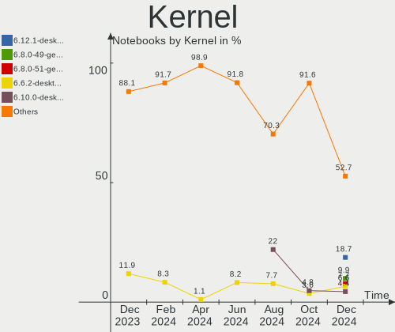

| Version                                            | Notebooks | Percent |
|----------------------------------------------------|-----------|---------|
| 6.1.1-desktop-1omv2290                             | 27        | 22.31%  |
| 5.15.0-58-generic                                  | 14        | 11.57%  |
| 5.15.0-57-generic                                  | 7         | 5.79%   |
| 5.15.0-56-generic                                  | 5         | 4.13%   |
| 5.19.0-29-generic                                  | 4         | 3.31%   |
| 5.16.7-desktop-1omv4003                            | 4         | 3.31%   |
| 5.10.0-20-amd64                                    | 4         | 3.31%   |
| 6.1.7-200.fc37.x86_64                              | 3         | 2.48%   |
| 6.0.0-kali6-amd64                                  | 3         | 2.48%   |
| 6.0.17-300.fc37.x86_64                             | 2         | 1.65%   |
| 5.4.0-136-generic                                  | 2         | 1.65%   |
| 5.19.0-21-generic                                  | 2         | 1.65%   |
| 5.10.0-21-amd64                                    | 2         | 1.65%   |
| 6.2.0-0.rc3.20230113gitd9fc1511728c.28.fc38.x86_64 | 1         | 0.83%   |
| 6.1.8-zen1-1-zen                                   | 1         | 0.83%   |
| 6.1.8-gentoo-dist                                  | 1         | 0.83%   |
| 6.1.8-200.fsync.fc37.x86_64                        | 1         | 0.83%   |
| 6.1.8-1-default                                    | 1         | 0.83%   |
| 6.1.7-1-MANJARO                                    | 1         | 0.83%   |
| 6.1.7-1-default                                    | 1         | 0.83%   |
| 6.1.6-artix1-1                                     | 1         | 0.83%   |
| 6.1.6-arch1-3                                      | 1         | 0.83%   |
| 6.1.6-arch1-1                                      | 1         | 0.83%   |
| 6.1.6-200.fc37.x86_64                              | 1         | 0.83%   |
| 6.1.6-060106-generic                               | 1         | 0.83%   |
| 6.1.5-200.fc37.x86_64                              | 1         | 0.83%   |
| 6.1.4-225.vanilla.1.fc36.x86_64                    | 1         | 0.83%   |
| 6.1.4-203.fsync.fc37.x86_64                        | 1         | 0.83%   |
| 6.1.1-1-MANJARO                                    | 1         | 0.83%   |
| 6.0.9-060009-generic                               | 1         | 0.83%   |
| 6.0.7-301.fc37.x86_64                              | 1         | 0.83%   |
| 6.0.18-300.fc37.x86_64                             | 1         | 0.83%   |
| 6.0.16-301.fsync.fc37.x86_64                       | 1         | 0.83%   |
| 6.0.16-300.fc37.x86_64                             | 1         | 0.83%   |
| 6.0.15-300.fc37.x86_64                             | 1         | 0.83%   |
| 6.0.15-200.fc36.x86_64                             | 1         | 0.83%   |
| 6.0.12-76060006-generic                            | 1         | 0.83%   |
| 6.0.10-desktop-2omv22090                           | 1         | 0.83%   |
| 6.0.0-kali3-amd64                                  | 1         | 0.83%   |
| 6.0.0-2parrot1-amd64                               | 1         | 0.83%   |

Kernel Family
-------------

Linux kernel without a distro release

| Version | Notebooks | Percent |
|---------|-----------|---------|
| 6.1.1   | 28        | 23.14%  |
| 5.15.0  | 28        | 23.14%  |
| 5.10.0  | 8         | 6.61%   |
| 6.0.0   | 6         | 4.96%   |
| 5.19.0  | 6         | 4.96%   |
| 6.1.7   | 5         | 4.13%   |
| 6.1.6   | 5         | 4.13%   |
| 6.1.8   | 4         | 3.31%   |
| 5.4.0   | 4         | 3.31%   |
| 5.16.7  | 4         | 3.31%   |
| 6.1.4   | 2         | 1.65%   |
| 6.0.17  | 2         | 1.65%   |
| 6.0.16  | 2         | 1.65%   |
| 6.0.15  | 2         | 1.65%   |
| 5.17.0  | 2         | 1.65%   |
| 5.11.0  | 2         | 1.65%   |
| 6.2.0   | 1         | 0.83%   |
| 6.1.5   | 1         | 0.83%   |
| 6.0.9   | 1         | 0.83%   |
| 6.0.7   | 1         | 0.83%   |
| 6.0.18  | 1         | 0.83%   |
| 6.0.12  | 1         | 0.83%   |
| 6.0.10  | 1         | 0.83%   |
| 5.15.85 | 1         | 0.83%   |
| 5.15.84 | 1         | 0.83%   |
| 5.15.75 | 1         | 0.83%   |
| 5.14.0  | 1         | 0.83%   |

Kernel Major Ver.
-----------------

Linux kernel major version

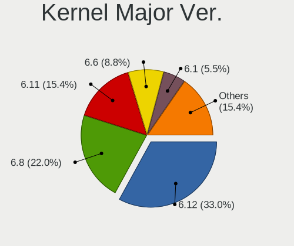

| Version | Notebooks | Percent |
|---------|-----------|---------|
| 6.1     | 45        | 37.19%  |
| 5.15    | 31        | 25.62%  |
| 6.0     | 17        | 14.05%  |
| 5.10    | 8         | 6.61%   |
| 5.19    | 6         | 4.96%   |
| 5.4     | 4         | 3.31%   |
| 5.16    | 4         | 3.31%   |
| 5.17    | 2         | 1.65%   |
| 5.11    | 2         | 1.65%   |
| 6.2     | 1         | 0.83%   |
| 5.14    | 1         | 0.83%   |

Arch
----

OS architecture (x86_64, i586, etc.)

| Name   | Notebooks | Percent |
|--------|-----------|---------|
| x86_64 | 120       | 99.17%  |
| i686   | 1         | 0.83%   |

DE
--

Desktop Environment

| Name       | Notebooks | Percent |
|------------|-----------|---------|
| KDE5       | 45        | 37.19%  |
| GNOME      | 44        | 36.36%  |
| X-Cinnamon | 12        | 9.92%   |
| XFCE       | 10        | 8.26%   |
| MATE       | 5         | 4.13%   |
| Unity      | 1         | 0.83%   |
| Pantheon   | 1         | 0.83%   |
| LXDE       | 1         | 0.83%   |
| Cinnamon   | 1         | 0.83%   |
| Unknown    | 1         | 0.83%   |

Display Server
--------------

X11 or Wayland

| Name    | Notebooks | Percent |
|---------|-----------|---------|
| X11     | 89        | 73.55%  |
| Wayland | 30        | 24.79%  |
| Tty     | 1         | 0.83%   |
| Unknown | 1         | 0.83%   |

Display Manager
---------------

SDDM, LightDM, etc.

| Name    | Notebooks | Percent |
|---------|-----------|---------|
| SDDM    | 36        | 29.75%  |
| Unknown | 29        | 23.97%  |
| LightDM | 24        | 19.83%  |
| GDM3    | 20        | 16.53%  |
| GDM     | 12        | 9.92%   |

OS Lang
-------

Language

| Lang    | Notebooks | Percent |
|---------|-----------|---------|
| pl_PL   | 82        | 67.77%  |
| en_US   | 31        | 25.62%  |
| ru_RU   | 2         | 1.65%   |
| en_GB   | 2         | 1.65%   |
| Unknown | 2         | 1.65%   |
| POSIX   | 1         | 0.83%   |
| C       | 1         | 0.83%   |

Boot Mode
---------

EFI or BIOS

| Mode | Notebooks | Percent |
|------|-----------|---------|
| EFI  | 67        | 55.37%  |
| BIOS | 54        | 44.63%  |

Filesystem
----------

Type of filesystem

| Type    | Notebooks | Percent |
|---------|-----------|---------|
| Ext4    | 66        | 54.55%  |
| Overlay | 33        | 27.27%  |
| Btrfs   | 20        | 16.53%  |
| F2fs    | 1         | 0.83%   |
| Ext3    | 1         | 0.83%   |

Part. scheme
------------

Scheme of partitioning

| Type    | Notebooks | Percent |
|---------|-----------|---------|
| GPT     | 68        | 56.2%   |
| Unknown | 29        | 23.97%  |
| MBR     | 24        | 19.83%  |

Dual Boot with Linux/BSD
------------------------

Hosting more than one Linux/BSD

| Dual boot | Notebooks | Percent |
|-----------|-----------|---------|
| No        | 98        | 80.99%  |
| Yes       | 23        | 19.01%  |

Dual Boot (Win)
---------------

Hosting Linux and Windows

| Dual boot | Notebooks | Percent |
|-----------|-----------|---------|
| No        | 80        | 66.12%  |
| Yes       | 41        | 33.88%  |

Board
-----

Vendor
------

Motherboard manufacturer

| Name                | Notebooks | Percent |
|---------------------|-----------|---------|
| Lenovo              | 30        | 24.79%  |
| Dell                | 24        | 19.83%  |
| Hewlett-Packard     | 16        | 13.22%  |
| ASUSTek Computer    | 15        | 12.4%   |
| Acer                | 10        | 8.26%   |
| MSI                 | 7         | 5.79%   |
| Samsung Electronics | 6         | 4.96%   |
| Apple               | 3         | 2.48%   |
| Chuwi               | 2         | 1.65%   |
| Toshiba             | 1         | 0.83%   |
| Sony                | 1         | 0.83%   |
| Kruger&Matz         | 1         | 0.83%   |
| Kiano               | 1         | 0.83%   |
| Gigabyte Technology | 1         | 0.83%   |
| Fujitsu             | 1         | 0.83%   |
| Alienware           | 1         | 0.83%   |
| Unknown             | 1         | 0.83%   |

Model
-----

Motherboard model

| Name                                                     | Notebooks | Percent |
|----------------------------------------------------------|-----------|---------|
| Dell Latitude E6520                                      | 2         | 1.65%   |
| Dell Latitude D630                                       | 2         | 1.65%   |
| Toshiba Satellite P750                                   | 1         | 0.83%   |
| Sony VPCEJ2S1E                                           | 1         | 0.83%   |
| Samsung SR700                                            | 1         | 0.83%   |
| Samsung R780/R778                                        | 1         | 0.83%   |
| Samsung R710                                             | 1         | 0.83%   |
| Samsung 550P5C/550P7C                                    | 1         | 0.83%   |
| Samsung 350V5C/351V5C/3540VC/3440VC                      | 1         | 0.83%   |
| Samsung 300E4A/300E5A/300E7A                             | 1         | 0.83%   |
| MSI PE60 6QE                                             | 1         | 0.83%   |
| MSI GT680R/GX680R/GT683R/GT683DXR/GT685R/GT687R/GX660DXR | 1         | 0.83%   |
| MSI GP76 Leopard 10UE                                    | 1         | 0.83%   |
| MSI GP65 Leopard 10SFK                                   | 1         | 0.83%   |
| MSI GL75 9SE                                             | 1         | 0.83%   |
| MSI GE70 2QD                                             | 1         | 0.83%   |
| MSI Creator Z17 A12UHST                                  | 1         | 0.83%   |
| Lenovo Z51-70 80K6                                       | 1         | 0.83%   |
| Lenovo ThinkPad X201 3626D15                             | 1         | 0.83%   |
| Lenovo ThinkPad X1 Extreme 20MFCTO1WW                    | 1         | 0.83%   |
| Lenovo ThinkPad X1 Carbon 3rd 20BTS33S01                 | 1         | 0.83%   |
| Lenovo ThinkPad T510 4384FF3                             | 1         | 0.83%   |
| Lenovo ThinkPad T500 2082BPG                             | 1         | 0.83%   |
| Lenovo ThinkPad T460s 20FAS5QW00                         | 1         | 0.83%   |
| Lenovo ThinkPad T460 20FMS0BX0T                          | 1         | 0.83%   |
| Lenovo ThinkPad T440p 20AWS24B00                         | 1         | 0.83%   |
| Lenovo ThinkPad R61 8918DEG                              | 1         | 0.83%   |
| Lenovo ThinkPad R500 2716W2K                             | 1         | 0.83%   |
| Lenovo ThinkPad P51 20HJS1EJ1B                           | 1         | 0.83%   |
| Lenovo ThinkPad E560 20EV000UUK                          | 1         | 0.83%   |
| Lenovo ThinkPad E480 20KN0064PB                          | 1         | 0.83%   |
| Lenovo S145-15API 81UT                                   | 1         | 0.83%   |
| Lenovo Legion Y740S-15IMH 81YX                           | 1         | 0.83%   |
| Lenovo Legion Y540-17IRH 81Q4                            | 1         | 0.83%   |
| Lenovo Legion Y540-15IRH-PG0 81SY                        | 1         | 0.83%   |
| Lenovo Legion Y530-15ICH 81FV                            | 1         | 0.83%   |
| Lenovo Legion 5 Pro 16ACH6H 82JQ                         | 1         | 0.83%   |
| Lenovo Legion 5 Pro 16ACH6 82JS                          | 1         | 0.83%   |
| Lenovo Legion 5 17ACH6H 82JY                             | 1         | 0.83%   |
| Lenovo Legion 5 17ACH6 82K0                              | 1         | 0.83%   |

Model Family
------------

Motherboard model prefix

| Name               | Notebooks | Percent |
|--------------------|-----------|---------|
| Dell Latitude      | 15        | 12.4%   |
| Lenovo ThinkPad    | 13        | 10.74%  |
| Lenovo Legion      | 8         | 6.61%   |
| Acer Aspire        | 5         | 4.13%   |
| Lenovo IdeaPad     | 4         | 3.31%   |
| HP ProBook         | 4         | 3.31%   |
| Dell Inspiron      | 4         | 3.31%   |
| HP EliteBook       | 3         | 2.48%   |
| ASUS ROG           | 3         | 2.48%   |
| HP Pavilion        | 2         | 1.65%   |
| HP OMEN            | 2         | 1.65%   |
| Dell XPS           | 2         | 1.65%   |
| Dell Precision     | 2         | 1.65%   |
| ASUS ZenBook       | 2         | 1.65%   |
| ASUS VivoBook      | 2         | 1.65%   |
| Acer Nitro         | 2         | 1.65%   |
| Toshiba Satellite  | 1         | 0.83%   |
| Sony VPCEJ2S1E     | 1         | 0.83%   |
| Samsung SR700      | 1         | 0.83%   |
| Samsung R780       | 1         | 0.83%   |
| Samsung R710       | 1         | 0.83%   |
| Samsung 550P5C     | 1         | 0.83%   |
| Samsung 350V5C     | 1         | 0.83%   |
| Samsung 300E4A     | 1         | 0.83%   |
| MSI PE60           | 1         | 0.83%   |
| MSI GT680R         | 1         | 0.83%   |
| MSI GP76           | 1         | 0.83%   |
| MSI GP65           | 1         | 0.83%   |
| MSI GL75           | 1         | 0.83%   |
| MSI GE70           | 1         | 0.83%   |
| MSI Creator        | 1         | 0.83%   |
| Lenovo Z51-70      | 1         | 0.83%   |
| Lenovo S145-15API  | 1         | 0.83%   |
| Lenovo G585        | 1         | 0.83%   |
| Lenovo G560        | 1         | 0.83%   |
| Lenovo G51-35      | 1         | 0.83%   |
| Kruger&Matz KM1406 | 1         | 0.83%   |
| Kiano Elegance     | 1         | 0.83%   |
| HP ZBook           | 1         | 0.83%   |
| HP Notebook        | 1         | 0.83%   |

MFG Year
--------

Motherboard manufacture year

| Year | Notebooks | Percent |
|------|-----------|---------|
| 2021 | 14        | 11.57%  |
| 2012 | 14        | 11.57%  |
| 2019 | 13        | 10.74%  |
| 2022 | 11        | 9.09%   |
| 2011 | 11        | 9.09%   |
| 2015 | 9         | 7.44%   |
| 2016 | 8         | 6.61%   |
| 2017 | 7         | 5.79%   |
| 2008 | 7         | 5.79%   |
| 2020 | 6         | 4.96%   |
| 2018 | 4         | 3.31%   |
| 2013 | 4         | 3.31%   |
| 2010 | 4         | 3.31%   |
| 2007 | 4         | 3.31%   |
| 2009 | 3         | 2.48%   |
| 2014 | 2         | 1.65%   |

Form Factor
-----------

Physical design of the computer

| Name     | Notebooks | Percent |
|----------|-----------|---------|
| Notebook | 121       | 100%    |

Secure Boot
-----------

Enabled or disabled

| State    | Notebooks | Percent |
|----------|-----------|---------|
| Disabled | 109       | 90.08%  |
| Enabled  | 12        | 9.92%   |

Coreboot
--------

Have coreboot on board

| Used | Notebooks | Percent |
|------|-----------|---------|
| No   | 121       | 100%    |

RAM Size
--------

Total RAM memory

| Size in GB  | Notebooks | Percent |
|-------------|-----------|---------|
| 4.01-8.0    | 34        | 28.1%   |
| 3.01-4.0    | 25        | 20.66%  |
| 16.01-24.0  | 23        | 19.01%  |
| 8.01-16.0   | 18        | 14.88%  |
| 32.01-64.0  | 14        | 11.57%  |
| 1.01-2.0    | 3         | 2.48%   |
| 2.01-3.0    | 2         | 1.65%   |
| 24.01-32.0  | 1         | 0.83%   |
| 64.01-256.0 | 1         | 0.83%   |

RAM Used
--------

Used RAM memory

| Used GB    | Notebooks | Percent |
|------------|-----------|---------|
| 1.01-2.0   | 47        | 38.84%  |
| 2.01-3.0   | 38        | 31.4%   |
| 4.01-8.0   | 19        | 15.7%   |
| 3.01-4.0   | 13        | 10.74%  |
| 0.51-1.0   | 2         | 1.65%   |
| 16.01-24.0 | 1         | 0.83%   |
| 8.01-16.0  | 1         | 0.83%   |

Total Drives
------------

Number of drives on board

| Drives | Notebooks | Percent |
|--------|-----------|---------|
| 1      | 90        | 74.38%  |
| 2      | 22        | 18.18%  |
| 3      | 8         | 6.61%   |
| 0      | 1         | 0.83%   |

Has CD-ROM
----------

Has CD-ROM on board

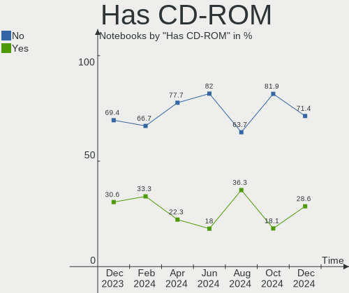

| Presented | Notebooks | Percent |
|-----------|-----------|---------|
| No        | 77        | 63.64%  |
| Yes       | 44        | 36.36%  |

Has Ethernet
------------

Has Ethernet on board

| Presented | Notebooks | Percent |
|-----------|-----------|---------|
| Yes       | 97        | 80.17%  |
| No        | 24        | 19.83%  |

Has WiFi
--------

Has WiFi module

| Presented | Notebooks | Percent |
|-----------|-----------|---------|
| Yes       | 118       | 97.52%  |
| No        | 3         | 2.48%   |

Has Bluetooth
-------------

Has Bluetooth module

| Presented | Notebooks | Percent |
|-----------|-----------|---------|
| Yes       | 96        | 79.34%  |
| No        | 25        | 20.66%  |

Location
--------

Country
-------

Geographic location (country)

| Country | Notebooks | Percent |
|---------|-----------|---------|
| Poland  | 121       | 100%    |

City
----

Geographic location (city)

| City                   | Notebooks | Percent |
|------------------------|-----------|---------|
| Warsaw                 | 31        | 25.62%  |
| Krakow                 | 9         | 7.44%   |
| Poznan                 | 7         | 5.79%   |
| Wroclaw                | 6         | 4.96%   |
| Katowice               | 5         | 4.13%   |
| Lodz                   | 4         | 3.31%   |
| Gdansk                 | 3         | 2.48%   |
| Sosnowiec              | 2         | 1.65%   |
| Rzeszów               | 2         | 1.65%   |
| Piaseczno              | 2         | 1.65%   |
| Lublin                 | 2         | 1.65%   |
| Gdynia                 | 2         | 1.65%   |
| Elblag                 | 2         | 1.65%   |
| Dabrowa Bialostocka    | 2         | 1.65%   |
| Zulawki                | 1         | 0.83%   |
| Zloczew                | 1         | 0.83%   |
| Zielonka               | 1         | 0.83%   |
| Zambrów               | 1         | 0.83%   |
| Zakroczym              | 1         | 0.83%   |
| Tychy                  | 1         | 0.83%   |
| Torun                  | 1         | 0.83%   |
| Tarnobrzeg             | 1         | 0.83%   |
| Szczyrk                | 1         | 0.83%   |
| Szamotuły             | 1         | 0.83%   |
| Stalowa Wola           | 1         | 0.83%   |
| Sopot                  | 1         | 0.83%   |
| Smolec                 | 1         | 0.83%   |
| Skierniewice           | 1         | 0.83%   |
| Siemianowice Śląskie | 1         | 0.83%   |
| Rybnik                 | 1         | 0.83%   |
| Radom                  | 1         | 0.83%   |
| Racibórz              | 1         | 0.83%   |
| Pruszków              | 1         | 0.83%   |
| Otwock                 | 1         | 0.83%   |
| Ostrówek              | 1         | 0.83%   |
| Mysłowice             | 1         | 0.83%   |
| Mogilno                | 1         | 0.83%   |
| Kutno                  | 1         | 0.83%   |
| Krzeszowice            | 1         | 0.83%   |
| Kostrzyn nad Odra      | 1         | 0.83%   |

Drives
------

Drive Vendor
------------

Hard drive vendors

| Vendor                      | Notebooks | Drives | Percent |
|-----------------------------|-----------|--------|---------|
| Samsung Electronics         | 23        | 27     | 15.44%  |
| Seagate                     | 16        | 16     | 10.74%  |
| WDC                         | 11        | 12     | 7.38%   |
| Unknown                     | 10        | 11     | 6.71%   |
| SanDisk                     | 8         | 8      | 5.37%   |
| Kingston                    | 8         | 8      | 5.37%   |
| Toshiba                     | 6         | 6      | 4.03%   |
| GOODRAM                     | 6         | 7      | 4.03%   |
| A-DATA Technology           | 6         | 6      | 4.03%   |
| SK hynix                    | 5         | 5      | 3.36%   |
| Micron Technology           | 5         | 5      | 3.36%   |
| Crucial                     | 5         | 5      | 3.36%   |
| Intel                       | 4         | 4      | 2.68%   |
| HGST                        | 4         | 4      | 2.68%   |
| Apacer                      | 3         | 4      | 2.01%   |
| LITEON                      | 2         | 2      | 1.34%   |
| Lexar                       | 2         | 2      | 1.34%   |
| KIOXIA                      | 2         | 2      | 1.34%   |
| Hitachi                     | 2         | 2      | 1.34%   |
| Union Memory (Shenzhen)     | 1         | 1      | 0.67%   |
| Transcend                   | 1         | 1      | 0.67%   |
| SSSTC                       | 1         | 1      | 0.67%   |
| SSDPR-CX                    | 1         | 1      | 0.67%   |
| SPCC                        | 1         | 1      | 0.67%   |
| Solid State Storage         | 1         | 1      | 0.67%   |
| Phison                      | 1         | 1      | 0.67%   |
| Patriot                     | 1         | 1      | 0.67%   |
| Netac                       | 1         | 1      | 0.67%   |
| Morebeck-N100               | 1         | 1      | 0.67%   |
| MAXIO Technology (Hangzhou) | 1         | 1      | 0.67%   |
| Lite-On Technology          | 1         | 1      | 0.67%   |
| KIOXIA-EXCERIA              | 1         | 1      | 0.67%   |
| KingSpec                    | 1         | 1      | 0.67%   |
| Intenso                     | 1         | 1      | 0.67%   |
| HS-SSD-C100                 | 1         | 1      | 0.67%   |
| HAGIWARA                    | 1         | 1      | 0.67%   |
| Fujitsu                     | 1         | 1      | 0.67%   |
| China                       | 1         | 1      | 0.67%   |
| Apple                       | 1         | 1      | 0.67%   |
| ADATA Technology            | 1         | 1      | 0.67%   |

Drive Model
-----------

Hard drive models

| Model                                               | Notebooks | Percent |
|-----------------------------------------------------|-----------|---------|
| Samsung SSD 980 500GB                               | 3         | 1.94%   |
| Crucial CT500MX500SSD1 500GB                        | 3         | 1.94%   |
| Unknown MMC Card  64GB                              | 2         | 1.29%   |
| Unknown MMC Card  32GB                              | 2         | 1.29%   |
| SK hynix HFM512GD3JX013N 512GB                      | 2         | 1.29%   |
| Seagate ST9500325AS 500GB                           | 2         | 1.29%   |
| Seagate ST1000LM035-1RK172 1TB                      | 2         | 1.29%   |
| Samsung NVMe SSD Controller SM981/PM981/PM983 500GB | 2         | 1.29%   |
| Samsung MZVLB1T0HBLR-000L2 1TB                      | 2         | 1.29%   |
| LITEON CV5-8Q256-HP 256GB SSD                       | 2         | 1.29%   |
| KIOXIA KBG40ZNS256G NVMe 256GB                      | 2         | 1.29%   |
| WDC WDS240G2G0B-00EPW0 240GB SSD                    | 1         | 0.65%   |
| WDC WDS240G2G0A-00JH30 240GB SSD                    | 1         | 0.65%   |
| WDC WD7500BPKT-00PK4T0 752GB                        | 1         | 0.65%   |
| WDC WD5000LPVT-22G33T0 500GB                        | 1         | 0.65%   |
| WDC WD5000LPCX-24C6HT0 500GB                        | 1         | 0.65%   |
| WDC WD5000BEVT-24A0RT0 500GB                        | 1         | 0.65%   |
| WDC WD10JPVX-75JC3T0 1TB                            | 1         | 0.65%   |
| WDC WD10JPVX-22JC3T0 1TB                            | 1         | 0.65%   |
| WDC WD10JPCX-24UE4T0 1TB                            | 1         | 0.65%   |
| WDC PC SN530 SDBPNPZ-512G-1014 512GB                | 1         | 0.65%   |
| WDC PC SN520 SDAPNUW-512G-1032 512GB                | 1         | 0.65%   |
| WDC PC SN520 SDAPMUW-512G-1101 512GB                | 1         | 0.65%   |
| Unknown SD32G  32GB                                 | 1         | 0.65%   |
| Unknown MMC Card  952MB                             | 1         | 0.65%   |
| Unknown MMC Card  393GB                             | 1         | 0.65%   |
| Unknown MMC Card  272GB                             | 1         | 0.65%   |
| Unknown MMC Card  128GB                             | 1         | 0.65%   |
| Unknown Externa 320GB                               | 1         | 0.65%   |
| Unknown 00000  2GB                                  | 1         | 0.65%   |
| Union Memory (Shenzhen) RPFTJ256PDD2MWX 256GB       | 1         | 0.65%   |
| Transcend TS240GMTS420S 240GB SSD                   | 1         | 0.65%   |
| Toshiba XG6 NVMe SSD Controller 512GB               | 1         | 0.65%   |
| Toshiba NVMe Controller 512GB                       | 1         | 0.65%   |
| Toshiba MQ04ABF100 1TB                              | 1         | 0.65%   |
| Toshiba MQ01ABD100 1TB                              | 1         | 0.65%   |
| Toshiba MK1252GSX 120GB                             | 1         | 0.65%   |
| Toshiba KBG40ZNS256G NVMe 256GB                     | 1         | 0.65%   |
| SSSTC CL1-3D512-Q11 NVMe 512GB                      | 1         | 0.65%   |
| SSDPR-CX 400-128-G2 128GB                           | 1         | 0.65%   |

HDD Vendor
----------

Hard disk drive vendors

| Vendor  | Notebooks | Drives | Percent |
|---------|-----------|--------|---------|
| Seagate | 16        | 16     | 48.48%  |
| WDC     | 7         | 7      | 21.21%  |
| HGST    | 4         | 4      | 12.12%  |
| Toshiba | 3         | 3      | 9.09%   |
| Hitachi | 2         | 2      | 6.06%   |
| Fujitsu | 1         | 1      | 3.03%   |

SSD Vendor
----------

Solid state drive vendors

| Vendor              | Notebooks | Drives | Percent |
|---------------------|-----------|--------|---------|
| GOODRAM             | 6         | 7      | 12.24%  |
| SanDisk             | 5         | 5      | 10.2%   |
| Samsung Electronics | 5         | 6      | 10.2%   |
| Kingston            | 5         | 5      | 10.2%   |
| Crucial             | 5         | 5      | 10.2%   |
| A-DATA Technology   | 5         | 5      | 10.2%   |
| WDC                 | 2         | 2      | 4.08%   |
| LITEON              | 2         | 2      | 4.08%   |
| Apacer              | 2         | 3      | 4.08%   |
| Transcend           | 1         | 1      | 2.04%   |
| Patriot             | 1         | 1      | 2.04%   |
| Netac               | 1         | 1      | 2.04%   |
| Morebeck-N100       | 1         | 1      | 2.04%   |
| Lexar               | 1         | 1      | 2.04%   |
| KIOXIA-EXCERIA      | 1         | 1      | 2.04%   |
| KingSpec            | 1         | 1      | 2.04%   |
| Intenso             | 1         | 1      | 2.04%   |
| Intel               | 1         | 1      | 2.04%   |
| HAGIWARA            | 1         | 1      | 2.04%   |
| China               | 1         | 1      | 2.04%   |
| Apple               | 1         | 1      | 2.04%   |

Drive Kind
----------

HDD or SSD

| Kind    | Notebooks | Drives | Percent |
|---------|-----------|--------|---------|
| NVMe    | 48        | 58     | 34.29%  |
| SSD     | 46        | 52     | 32.86%  |
| HDD     | 33        | 33     | 23.57%  |
| MMC     | 10        | 11     | 7.14%   |
| Unknown | 3         | 3      | 2.14%   |

Drive Connector
---------------

SATA, SAS, NVMe, etc.

| Type | Notebooks | Drives | Percent |
|------|-----------|--------|---------|
| SATA | 73        | 84     | 54.07%  |
| NVMe | 48        | 58     | 35.56%  |
| MMC  | 10        | 11     | 7.41%   |
| SAS  | 4         | 4      | 2.96%   |

Drive Size
----------

Size of hard drive

| Size in TB | Notebooks | Drives | Percent |
|------------|-----------|--------|---------|
| 0.01-0.5   | 57        | 61     | 72.15%  |
| 0.51-1.0   | 21        | 23     | 26.58%  |
| 1.01-2.0   | 1         | 1      | 1.27%   |

Space Total
-----------

Amount of disk space available on the file system

| Size in GB     | Notebooks | Percent |
|----------------|-----------|---------|
| 251-500        | 28        | 23.14%  |
| 1-20           | 20        | 16.53%  |
| 101-250        | 19        | 15.7%   |
| 501-1000       | 19        | 15.7%   |
| Unknown        | 10        | 8.26%   |
| 51-100         | 8         | 6.61%   |
| 21-50          | 7         | 5.79%   |
| 1001-2000      | 6         | 4.96%   |
| More than 3000 | 2         | 1.65%   |
| 2001-3000      | 2         | 1.65%   |

Space Used
----------

Amount of used disk space

| Used GB        | Notebooks | Percent |
|----------------|-----------|---------|
| 1-20           | 54        | 44.63%  |
| 21-50          | 18        | 14.88%  |
| 101-250        | 18        | 14.88%  |
| 51-100         | 10        | 8.26%   |
| Unknown        | 10        | 8.26%   |
| 251-500        | 6         | 4.96%   |
| 1001-2000      | 2         | 1.65%   |
| 501-1000       | 2         | 1.65%   |
| More than 3000 | 1         | 0.83%   |

Malfunc. Drives
---------------

Drive models with a malfunction

| Model                               | Notebooks | Drives | Percent |
|-------------------------------------|-----------|--------|---------|
| WDC WDS240G2G0A-00JH30 240GB SSD    | 1         | 1      | 6.67%   |
| WDC WD5000LPVT-22G33T0 500GB        | 1         | 1      | 6.67%   |
| WDC WD5000BEVT-24A0RT0 500GB        | 1         | 1      | 6.67%   |
| Toshiba MK1252GSX 120GB             | 1         | 1      | 6.67%   |
| Seagate ST9500423AS 500GB           | 1         | 1      | 6.67%   |
| Seagate ST9500325AS 500GB           | 1         | 1      | 6.67%   |
| Seagate ST9320325AS 320GB           | 1         | 1      | 6.67%   |
| Seagate ST500LT012-1DG142 500GB     | 1         | 1      | 6.67%   |
| SanDisk SD7TN3Q-256G-1006 256GB SSD | 1         | 1      | 6.67%   |
| Patriot Burst Elite 480GB SSD       | 1         | 1      | 6.67%   |
| Hitachi HTS543225L9A300 250GB       | 1         | 1      | 6.67%   |
| HGST HTS725032A7E630 320GB          | 1         | 1      | 6.67%   |
| Fujitsu MHY2080BH 80GB              | 1         | 1      | 6.67%   |
| Crucial CT1000MX500SSD4 1TB         | 1         | 1      | 6.67%   |
| A-DATA Technology SU750 256GB SSD   | 1         | 1      | 6.67%   |

Malfunc. Drive Vendor
---------------------

Vendors of faulty drives

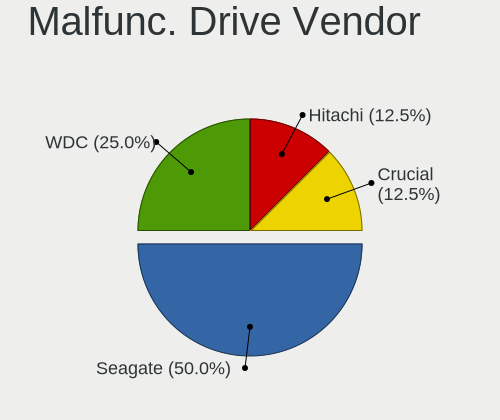

| Vendor            | Notebooks | Drives | Percent |
|-------------------|-----------|--------|---------|
| Seagate           | 4         | 4      | 26.67%  |
| WDC               | 3         | 3      | 20%     |
| Toshiba           | 1         | 1      | 6.67%   |
| SanDisk           | 1         | 1      | 6.67%   |
| Patriot           | 1         | 1      | 6.67%   |
| Hitachi           | 1         | 1      | 6.67%   |
| HGST              | 1         | 1      | 6.67%   |
| Fujitsu           | 1         | 1      | 6.67%   |
| Crucial           | 1         | 1      | 6.67%   |
| A-DATA Technology | 1         | 1      | 6.67%   |

Malfunc. HDD Vendor
-------------------

Vendors of faulty HDD drives

| Vendor  | Notebooks | Drives | Percent |
|---------|-----------|--------|---------|
| Seagate | 4         | 4      | 40%     |
| WDC     | 2         | 2      | 20%     |
| Toshiba | 1         | 1      | 10%     |
| Hitachi | 1         | 1      | 10%     |
| HGST    | 1         | 1      | 10%     |
| Fujitsu | 1         | 1      | 10%     |

Malfunc. Drive Kind
-------------------

Kinds of faulty drives

| Kind | Notebooks | Drives | Percent |
|------|-----------|--------|---------|
| HDD  | 10        | 10     | 66.67%  |
| SSD  | 5         | 5      | 33.33%  |

Failed Drives
-------------

Failed drive models

Zero info for selected period =(

Failed Drive Vendor
-------------------

Failed drive vendors

Zero info for selected period =(

Drive Status
------------

Number of failed and malfunc. drives

| Status   | Notebooks | Drives | Percent |
|----------|-----------|--------|---------|
| Works    | 64        | 77     | 50%     |
| Detected | 49        | 65     | 38.28%  |
| Malfunc  | 15        | 15     | 11.72%  |

Storage controller
------------------

Storage Vendor
--------------

Storage controller vendors

| Vendor                         | Notebooks | Percent |
|--------------------------------|-----------|---------|
| Intel                          | 84        | 56%     |
| Samsung Electronics            | 20        | 13.33%  |
| AMD                            | 13        | 8.67%   |
| SanDisk                        | 5         | 3.33%   |
| Micron Technology              | 5         | 3.33%   |
| SK hynix                       | 4         | 2.67%   |
| KIOXIA                         | 3         | 2%      |
| Kingston Technology Company    | 3         | 2%      |
| Toshiba America Info Systems   | 2         | 1.33%   |
| Phison Electronics             | 2         | 1.33%   |
| MAXIO Technology (Hangzhou)    | 2         | 1.33%   |
| ADATA Technology               | 2         | 1.33%   |
| Union Memory (Shenzhen)        | 1         | 0.67%   |
| Solid State Storage Technology | 1         | 0.67%   |
| Silicon Motion                 | 1         | 0.67%   |
| Nvidia                         | 1         | 0.67%   |
| Lite-On Technology             | 1         | 0.67%   |

Storage Model
-------------

Storage controller models

| Model                                                                                  | Notebooks | Percent |
|----------------------------------------------------------------------------------------|-----------|---------|
| AMD FCH SATA Controller [AHCI mode]                                                    | 11        | 6.75%   |
| Intel 7 Series Chipset Family 6-port SATA Controller [AHCI mode]                       | 8         | 4.91%   |
| Samsung NVMe SSD Controller PM9A1/PM9A3/980PRO                                         | 7         | 4.29%   |
| Samsung NVMe SSD Controller 980                                                        | 7         | 4.29%   |
| Intel Sunrise Point-LP SATA Controller [AHCI mode]                                     | 7         | 4.29%   |
| Intel 82801 Mobile SATA Controller [RAID mode]                                         | 7         | 4.29%   |
| Intel 6 Series/C200 Series Chipset Family 6 port Mobile SATA AHCI Controller           | 7         | 4.29%   |
| Intel Cannon Lake Mobile PCH SATA AHCI Controller                                      | 6         | 3.68%   |
| Samsung NVMe SSD Controller SM981/PM981/PM983                                          | 5         | 3.07%   |
| Micron Non-Volatile memory controller                                                  | 5         | 3.07%   |
| Intel Volume Management Device NVMe RAID Controller                                    | 5         | 3.07%   |
| Intel Wildcat Point-LP SATA Controller [AHCI Mode]                                     | 4         | 2.45%   |
| Intel 82801HM/HEM (ICH8M/ICH8M-E) IDE Controller                                       | 4         | 2.45%   |
| SK hynix Gold P31/PC711 NVMe Solid State Drive                                         | 3         | 1.84%   |
| KIOXIA NVMe SSD Controller BG4                                                         | 3         | 1.84%   |
| Kingston Company Company Non-Volatile memory controller                                | 3         | 1.84%   |
| Intel Celeron/Pentium Silver Processor SATA Controller                                 | 3         | 1.84%   |
| Intel 82801IBM/IEM (ICH9M/ICH9M-E) 4 port SATA Controller [AHCI mode]                  | 3         | 1.84%   |
| Intel 82801HM/HEM (ICH8M/ICH8M-E) SATA Controller [IDE mode]                           | 3         | 1.84%   |
| Intel 8 Series/C220 Series Chipset Family 6-port SATA Controller 1 [AHCI mode]         | 3         | 1.84%   |
| Intel 6 Series/C200 Series Chipset Family Mobile SATA Controller (IDE mode, ports 4-5) | 3         | 1.84%   |
| Intel 6 Series/C200 Series Chipset Family Mobile SATA Controller (IDE mode, ports 0-3) | 3         | 1.84%   |
| MAXIO (Hangzhou) NVMe SSD Controller MAP1202                                           | 2         | 1.23%   |
| Intel HM170/QM170 Chipset SATA Controller [AHCI Mode]                                  | 2         | 1.23%   |
| Intel Celeron N3350/Pentium N4200/Atom E3900 Series SATA AHCI Controller               | 2         | 1.23%   |
| Intel Cannon Point-LP SATA Controller [AHCI Mode]                                      | 2         | 1.23%   |
| Intel 82801IBM/IEM (ICH9M/ICH9M-E) 2 port SATA Controller [IDE mode]                   | 2         | 1.23%   |
| Intel 82801HM/HEM (ICH8M/ICH8M-E) SATA Controller [AHCI mode]                          | 2         | 1.23%   |
| Intel 5 Series/3400 Series Chipset 6 port SATA AHCI Controller                         | 2         | 1.23%   |
| Intel 5 Series/3400 Series Chipset 4 port SATA AHCI Controller                         | 2         | 1.23%   |
| Intel 400 Series Chipset Family SATA AHCI Controller                                   | 2         | 1.23%   |
| AMD SB7x0/SB8x0/SB9x0 SATA Controller [AHCI mode]                                      | 2         | 1.23%   |
| ADATA XPG SX8200 Pro PCIe Gen3x4 M.2 2280 Solid State Drive                            | 2         | 1.23%   |
| Union Memory (Shenzhen) Non-Volatile memory controller                                 | 1         | 0.61%   |
| Toshiba America Info Systems XG6 NVMe SSD Controller                                   | 1         | 0.61%   |
| Toshiba America Info Systems NVMe Controller                                           | 1         | 0.61%   |
| Solid State Storage Non-Volatile memory controller                                     | 1         | 0.61%   |
| SK hynix BC511                                                                         | 1         | 0.61%   |
| Silicon Motion SM2263EN/SM2263XT SSD Controller                                        | 1         | 0.61%   |
| SanDisk WD PC SN810 / Black SN850 NVMe SSD                                             | 1         | 0.61%   |

Storage Kind
------------

Kind of storage controller (IDE, SATA, NVMe, SAS, ...)

| Kind | Notebooks | Percent |
|------|-----------|---------|
| SATA | 77        | 51.68%  |
| NVMe | 48        | 32.21%  |
| RAID | 12        | 8.05%   |
| IDE  | 12        | 8.05%   |

Processor
---------

CPU Vendor
----------

Processor vendors

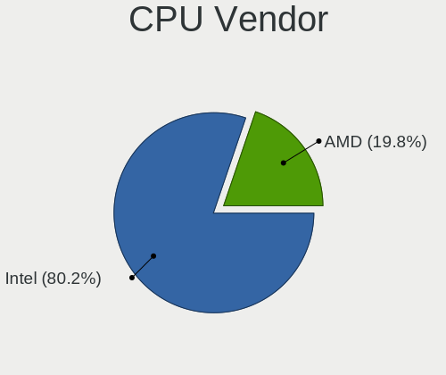

| Vendor | Notebooks | Percent |
|--------|-----------|---------|
| Intel  | 101       | 83.47%  |
| AMD    | 20        | 16.53%  |

CPU Model
---------

Processor models

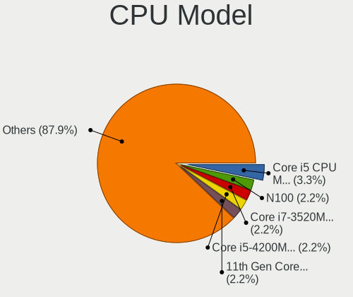

| Model                                    | Notebooks | Percent |
|------------------------------------------|-----------|---------|
| AMD Ryzen 7 5800H with Radeon Graphics   | 5         | 4.13%   |
| Intel Core i7-9750H CPU @ 2.60GHz        | 3         | 2.48%   |
| Intel Core i7-8750H CPU @ 2.20GHz        | 3         | 2.48%   |
| Intel Core i3-2350M CPU @ 2.30GHz        | 3         | 2.48%   |
| Intel Core i7-6700HQ CPU @ 2.60GHz       | 2         | 1.65%   |
| Intel Core i7-3740QM CPU @ 2.70GHz       | 2         | 1.65%   |
| Intel Core i7-10750H CPU @ 2.60GHz       | 2         | 1.65%   |
| Intel Core i5-8265U CPU @ 1.60GHz        | 2         | 1.65%   |
| Intel Core i5-8250U CPU @ 1.60GHz        | 2         | 1.65%   |
| Intel Core i5-6300U CPU @ 2.40GHz        | 2         | 1.65%   |
| Intel Core i5-3210M CPU @ 2.50GHz        | 2         | 1.65%   |
| Intel Core i5-2450M CPU @ 2.50GHz        | 2         | 1.65%   |
| Intel Core i5 CPU M 520 @ 2.40GHz        | 2         | 1.65%   |
| Intel Core 2 Duo CPU T9600 @ 2.80GHz     | 2         | 1.65%   |
| Intel Celeron CPU N3350 @ 1.10GHz        | 2         | 1.65%   |
| Intel Celeron CPU N3050 @ 1.60GHz        | 2         | 1.65%   |
| Intel 12th Gen Core i9-12900H            | 2         | 1.65%   |
| AMD Ryzen 7 6800H with Radeon Graphics   | 2         | 1.65%   |
| Intel Xeon CPU E3-1535M v6 @ 3.10GHz     | 1         | 0.83%   |
| Intel Pentium Silver N5000 CPU @ 1.10GHz | 1         | 0.83%   |
| Intel Pentium CPU P6100 @ 2.00GHz        | 1         | 0.83%   |
| Intel Pentium CPU N3530 @ 2.16GHz        | 1         | 0.83%   |
| Intel Pentium CPU 3825U @ 1.90GHz        | 1         | 0.83%   |
| Intel Core m3-8100Y CPU @ 1.10GHz        | 1         | 0.83%   |
| Intel Core i7-9850H CPU @ 2.60GHz        | 1         | 0.83%   |
| Intel Core i7-6600U CPU @ 2.60GHz        | 1         | 0.83%   |
| Intel Core i7-6500U CPU @ 2.50GHz        | 1         | 0.83%   |
| Intel Core i7-5500U CPU @ 2.40GHz        | 1         | 0.83%   |
| Intel Core i7-3630QM CPU @ 2.40GHz       | 1         | 0.83%   |
| Intel Core i7-3610QM CPU @ 2.30GHz       | 1         | 0.83%   |
| Intel Core i7-3520M CPU @ 2.90GHz        | 1         | 0.83%   |
| Intel Core i7-2760QM CPU @ 2.40GHz       | 1         | 0.83%   |
| Intel Core i7-2670QM CPU @ 2.20GHz       | 1         | 0.83%   |
| Intel Core i7-2620M CPU @ 2.70GHz        | 1         | 0.83%   |
| Intel Core i7-10875H CPU @ 2.30GHz       | 1         | 0.83%   |
| Intel Core i7-10870H CPU @ 2.20GHz       | 1         | 0.83%   |
| Intel Core i7-10510U CPU @ 1.80GHz       | 1         | 0.83%   |
| Intel Core i5-9300HF CPU @ 2.40GHz       | 1         | 0.83%   |
| Intel Core i5-7200U CPU @ 2.50GHz        | 1         | 0.83%   |
| Intel Core i5-6440HQ CPU @ 2.60GHz       | 1         | 0.83%   |

CPU Model Family
----------------

Processor model prefix

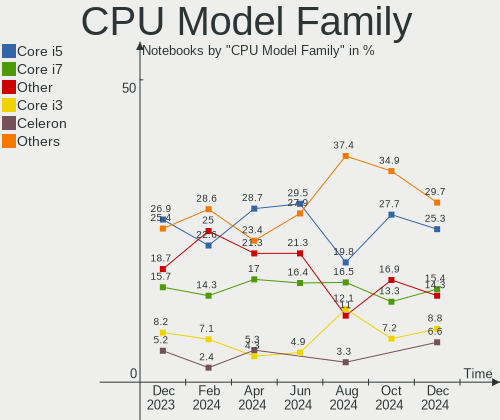

| Model                                | Notebooks | Percent |
|--------------------------------------|-----------|---------|
| Intel Core i5                        | 30        | 24.79%  |
| Intel Core i7                        | 25        | 20.66%  |
| Other                                | 13        | 10.74%  |
| Intel Core 2 Duo                     | 11        | 9.09%   |
| Intel Core i3                        | 10        | 8.26%   |
| AMD Ryzen 7                          | 9         | 7.44%   |
| Intel Celeron                        | 6         | 4.96%   |
| Intel Pentium                        | 3         | 2.48%   |
| AMD Ryzen 5                          | 3         | 2.48%   |
| AMD A6                               | 2         | 1.65%   |
| Intel Xeon                           | 1         | 0.83%   |
| Intel Pentium Silver                 | 1         | 0.83%   |
| Intel Core m3                        | 1         | 0.83%   |
| Intel Atom                           | 1         | 0.83%   |
| AMD Turion X2 Ultra Dual-Core Mobile | 1         | 0.83%   |
| AMD E2                               | 1         | 0.83%   |
| AMD E1                               | 1         | 0.83%   |
| AMD E                                | 1         | 0.83%   |
| AMD C-70                             | 1         | 0.83%   |

CPU Cores
---------

Number of processor cores

| Number | Notebooks | Percent |
|--------|-----------|---------|
| 2      | 64        | 52.89%  |
| 4      | 28        | 23.14%  |
| 6      | 12        | 9.92%   |
| 8      | 11        | 9.09%   |
| 14     | 3         | 2.48%   |
| 10     | 2         | 1.65%   |
| 12     | 1         | 0.83%   |

CPU Sockets
-----------

Number of sockets

| Number | Notebooks | Percent |
|--------|-----------|---------|
| 1      | 121       | 100%    |

CPU Threads
-----------

Threads per core (Hyper-Threading)

| Number | Notebooks | Percent |
|--------|-----------|---------|
| 2      | 89        | 73.55%  |
| 1      | 32        | 26.45%  |

CPU Op-Modes
------------

CPU Operation Modes (32-bit, 64-bit)

| Op mode        | Notebooks | Percent |
|----------------|-----------|---------|
| 32-bit, 64-bit | 121       | 100%    |

CPU Microcode
-------------

Microcode number

| Number     | Notebooks | Percent |
|------------|-----------|---------|
| Unknown    | 16        | 13.22%  |
| 0x206a7    | 10        | 8.26%   |
| 0x406e3    | 6         | 4.96%   |
| 0x906ea    | 5         | 4.13%   |
| 0x306a9    | 5         | 4.13%   |
| 0x0a50000c | 5         | 4.13%   |
| 0xa0652    | 4         | 3.31%   |
| 0x906a3    | 4         | 3.31%   |
| 0x20655    | 4         | 3.31%   |
| 0x1067a    | 4         | 3.31%   |
| 0x10676    | 4         | 3.31%   |
| 0x906ed    | 3         | 2.48%   |
| 0x806ec    | 3         | 2.48%   |
| 0x806c1    | 3         | 2.48%   |
| 0x6fd      | 3         | 2.48%   |
| 0x306d4    | 3         | 2.48%   |
| 0x306c3    | 3         | 2.48%   |
| 0x0500010d | 3         | 2.48%   |
| 0x906a4    | 2         | 1.65%   |
| 0x806e9    | 2         | 1.65%   |
| 0x806d1    | 2         | 1.65%   |
| 0x706a1    | 2         | 1.65%   |
| 0x506e3    | 2         | 1.65%   |
| 0x406c3    | 2         | 1.65%   |
| 0x0a404102 | 2         | 1.65%   |
| 0x06006705 | 2         | 1.65%   |
| 0x906e9    | 1         | 0.83%   |
| 0x806eb    | 1         | 0.83%   |
| 0x806c2    | 1         | 0.83%   |
| 0x706a8    | 1         | 0.83%   |
| 0x506c9    | 1         | 0.83%   |
| 0x40651    | 1         | 0.83%   |
| 0x30678    | 1         | 0.83%   |
| 0x20652    | 1         | 0.83%   |
| 0x106ca    | 1         | 0.83%   |
| 0x0a404101 | 1         | 0.83%   |
| 0x08608103 | 1         | 0.83%   |
| 0x08600106 | 1         | 0.83%   |
| 0x08108102 | 1         | 0.83%   |
| 0x0810100b | 1         | 0.83%   |

CPU Microarch
-------------

Microarchitecture

| Name             | Notebooks | Percent |
|------------------|-----------|---------|
| KabyLake         | 18        | 14.88%  |
| SandyBridge      | 13        | 10.74%  |
| IvyBridge        | 10        | 8.26%   |
| Skylake          | 9         | 7.44%   |
| Penryn           | 8         | 6.61%   |
| Unknown          | 6         | 4.96%   |
| Zen 3            | 5         | 4.13%   |
| Westmere         | 5         | 4.13%   |
| Haswell          | 5         | 4.13%   |
| CometLake        | 5         | 4.13%   |
| Alderlake Hybrid | 5         | 4.13%   |
| TigerLake        | 4         | 3.31%   |
| Broadwell        | 4         | 3.31%   |
| Bobcat           | 4         | 3.31%   |
| Silvermont       | 3         | 2.48%   |
| Goldmont plus    | 3         | 2.48%   |
| Core             | 3         | 2.48%   |
| Goldmont         | 2         | 1.65%   |
| Excavator        | 2         | 1.65%   |
| Zen+             | 1         | 0.83%   |
| Zen 2            | 1         | 0.83%   |
| Zen              | 1         | 0.83%   |
| Puma             | 1         | 0.83%   |
| K8 & K10 hybrid  | 1         | 0.83%   |
| Icelake          | 1         | 0.83%   |
| Bonnell          | 1         | 0.83%   |

Graphics
--------

GPU Vendor
----------

Vendors of graphics cards

| Vendor | Notebooks | Percent |
|--------|-----------|---------|
| Intel  | 84        | 51.85%  |
| Nvidia | 52        | 32.1%   |
| AMD    | 26        | 16.05%  |

GPU Model
---------

Graphics card models

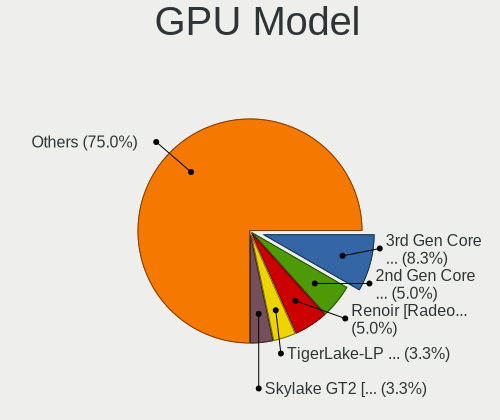

| Model                                                                                    | Notebooks | Percent |
|------------------------------------------------------------------------------------------|-----------|---------|
| Intel 2nd Generation Core Processor Family Integrated Graphics Controller                | 10        | 5.99%   |
| Intel 3rd Gen Core processor Graphics Controller                                         | 8         | 4.79%   |
| Intel Skylake GT2 [HD Graphics 520]                                                      | 6         | 3.59%   |
| Intel CoffeeLake-H GT2 [UHD Graphics 630]                                                | 6         | 3.59%   |
| Nvidia GA106M [GeForce RTX 3060 Mobile / Max-Q]                                          | 5         | 2.99%   |
| Intel CometLake-H GT2 [UHD Graphics]                                                     | 5         | 2.99%   |
| Intel TigerLake-LP GT2 [Iris Xe Graphics]                                                | 4         | 2.4%    |
| Intel Alder Lake-P Integrated Graphics Controller                                        | 4         | 2.4%    |
| Nvidia GF108M [GeForce GT 620M/630M/635M/640M LE]                                        | 3         | 1.8%    |
| Nvidia GA107M [GeForce RTX 3050 Mobile]                                                  | 3         | 1.8%    |
| Intel WhiskeyLake-U GT2 [UHD Graphics 620]                                               | 3         | 1.8%    |
| Intel HD Graphics 5500                                                                   | 3         | 1.8%    |
| Intel HD Graphics 530                                                                    | 3         | 1.8%    |
| Intel Core Processor Integrated Graphics Controller                                      | 3         | 1.8%    |
| Intel 4th Gen Core Processor Integrated Graphics Controller                              | 3         | 1.8%    |
| AMD Rembrandt [Radeon 680M]                                                              | 3         | 1.8%    |
| Nvidia TU117M [GeForce GTX 1650 Mobile / Max-Q]                                          | 2         | 1.2%    |
| Nvidia GP107M [GeForce GTX 1050 Ti Mobile]                                               | 2         | 1.2%    |
| Nvidia GM107M [GeForce GTX 950M]                                                         | 2         | 1.2%    |
| Nvidia GA103M [GeForce RTX 3080 Ti Mobile]                                               | 2         | 1.2%    |
| Intel UHD Graphics 620                                                                   | 2         | 1.2%    |
| Intel TigerLake-H GT1 [UHD Graphics]                                                     | 2         | 1.2%    |
| Intel Mobile GM965/GL960 Integrated Graphics Controller (secondary)                      | 2         | 1.2%    |
| Intel Mobile GM965/GL960 Integrated Graphics Controller (primary)                        | 2         | 1.2%    |
| Intel HD Graphics 500                                                                    | 2         | 1.2%    |
| Intel Haswell-ULT Integrated Graphics Controller                                         | 2         | 1.2%    |
| Intel GeminiLake [UHD Graphics 600]                                                      | 2         | 1.2%    |
| Intel CometLake-U GT2 [UHD Graphics]                                                     | 2         | 1.2%    |
| Intel Atom/Celeron/Pentium Processor x5-E8000/J3xxx/N3xxx Integrated Graphics Controller | 2         | 1.2%    |
| AMD Topaz XT [Radeon R7 M260/M265 / M340/M360 / M440/M445 / 530/535 / 620/625 Mobile]    | 2         | 1.2%    |
| AMD Thames [Radeon HD 7500M/7600M Series]                                                | 2         | 1.2%    |
| AMD Stoney [Radeon R2/R3/R4/R5 Graphics]                                                 | 2         | 1.2%    |
| AMD Cezanne [Radeon Vega Series / Radeon Vega Mobile Series]                             | 2         | 1.2%    |
| Nvidia TU117M                                                                            | 1         | 0.6%    |
| Nvidia TU117BM [GeForce GTX 1650 Mobile Refresh]                                         | 1         | 0.6%    |
| Nvidia TU116M [GeForce GTX 1660 Ti Mobile]                                               | 1         | 0.6%    |
| Nvidia TU106M [GeForce RTX 2070 Mobile / Max-Q Refresh]                                  | 1         | 0.6%    |
| Nvidia TU106M [GeForce RTX 2060 Mobile]                                                  | 1         | 0.6%    |
| Nvidia TU106GLM [Quadro RTX 3000 Mobile / Max-Q]                                         | 1         | 0.6%    |
| Nvidia GT218M [ION 2]                                                                    | 1         | 0.6%    |

GPU Combo
---------

Combinations of graphics cards

| Name           | Notebooks | Percent |
|----------------|-----------|---------|
| 1 x Intel      | 44        | 36.36%  |
| Intel + Nvidia | 31        | 25.62%  |
| 1 x Nvidia     | 17        | 14.05%  |
| 1 x AMD        | 14        | 11.57%  |
| Intel + AMD    | 7         | 5.79%   |
| AMD + Nvidia   | 3         | 2.48%   |
| 2 x Intel      | 2         | 1.65%   |
| 2 x AMD        | 2         | 1.65%   |
| 2 x Nvidia     | 1         | 0.83%   |

GPU Driver
----------

Free vs proprietary

| Driver      | Notebooks | Percent |
|-------------|-----------|---------|
| Free        | 101       | 83.47%  |
| Proprietary | 16        | 13.22%  |
| Unknown     | 4         | 3.31%   |

GPU Memory
----------

Total video memory

| Size in GB | Notebooks | Percent |
|------------|-----------|---------|
| Unknown    | 67        | 55.37%  |
| 0.01-0.5   | 20        | 16.53%  |
| 1.01-2.0   | 13        | 10.74%  |
| 3.01-4.0   | 7         | 5.79%   |
| 0.51-1.0   | 7         | 5.79%   |
| 5.01-6.0   | 4         | 3.31%   |
| 7.01-8.0   | 3         | 2.48%   |

Monitor
-------

Monitor Vendor
--------------

Monitor vendors

| Vendor                  | Notebooks | Percent |
|-------------------------|-----------|---------|
| Chimei Innolux          | 23        | 17.56%  |
| Samsung Electronics     | 19        | 14.5%   |
| BOE                     | 19        | 14.5%   |
| LG Display              | 16        | 12.21%  |
| AU Optronics            | 15        | 11.45%  |
| Lenovo                  | 5         | 3.82%   |
| Dell                    | 3         | 2.29%   |
| Chi Mei Optoelectronics | 3         | 2.29%   |
| Sharp                   | 2         | 1.53%   |
| Mi                      | 2         | 1.53%   |
| HannStar                | 2         | 1.53%   |
| Eizo                    | 2         | 1.53%   |
| CSO                     | 2         | 1.53%   |
| BenQ                    | 2         | 1.53%   |
| ASUSTek Computer        | 2         | 1.53%   |
| Apple                   | 2         | 1.53%   |
| TMX                     | 1         | 0.76%   |
| PANDA                   | 1         | 0.76%   |
| Panasonic               | 1         | 0.76%   |
| Nvidia                  | 1         | 0.76%   |
| LGD                     | 1         | 0.76%   |
| InfoVision              | 1         | 0.76%   |
| IBM                     | 1         | 0.76%   |
| HUAWEI                  | 1         | 0.76%   |
| Hewlett-Packard         | 1         | 0.76%   |
| Goldstar                | 1         | 0.76%   |
| CPT                     | 1         | 0.76%   |
| AOC                     | 1         | 0.76%   |

Monitor Model
-------------

Monitor models

| Model                                                                  | Notebooks | Percent |
|------------------------------------------------------------------------|-----------|---------|
| Samsung Electronics LCD Monitor SEC544B 1600x900 310x174mm 14.0-inch   | 2         | 1.53%   |
| Samsung Electronics LCD Monitor SEC5441 1366x768 344x194mm 15.5-inch   | 2         | 1.53%   |
| HannStar HSD121PHW1 HSD04B6 1366x768 270x150mm 12.2-inch               | 2         | 1.53%   |
| Chimei Innolux LCD Monitor CMN175C 1920x1080 381x214mm 17.2-inch       | 2         | 1.53%   |
| Chimei Innolux LCD Monitor CMN14D4 1920x1080 309x173mm 13.9-inch       | 2         | 1.53%   |
| AU Optronics LCD Monitor AUO26EC 1366x768 344x193mm 15.5-inch          | 2         | 1.53%   |
| TMX TL140VDXP10 TMX1485 1920x1200 301x188mm 14.0-inch                  | 1         | 0.76%   |
| Sharp LCD Monitor SHP14D7 1920x1200 366x229mm 17.0-inch                | 1         | 0.76%   |
| Sharp LCD Monitor SHP14AE 1920x1080 294x165mm 13.3-inch                | 1         | 0.76%   |
| Samsung Electronics U28E590 SAM0C4D 3840x2160 607x345mm 27.5-inch      | 1         | 0.76%   |
| Samsung Electronics SyncMaster SAM0523 1920x1080 477x268mm 21.5-inch   | 1         | 0.76%   |
| Samsung Electronics LCD Monitor SEC5541 1366x768 344x193mm 15.5-inch   | 1         | 0.76%   |
| Samsung Electronics LCD Monitor SEC5443 1920x1200 331x207mm 15.4-inch  | 1         | 0.76%   |
| Samsung Electronics LCD Monitor SEC3541 1366x768 309x174mm 14.0-inch   | 1         | 0.76%   |
| Samsung Electronics LCD Monitor SEC325A 1366x768 344x194mm 15.5-inch   | 1         | 0.76%   |
| Samsung Electronics LCD Monitor SEC324A 1366x768 344x194mm 15.5-inch   | 1         | 0.76%   |
| Samsung Electronics LCD Monitor SEC3157 1280x800 261x163mm 12.1-inch   | 1         | 0.76%   |
| Samsung Electronics LCD Monitor SEC3154 1600x900 382x215mm 17.3-inch   | 1         | 0.76%   |
| Samsung Electronics LCD Monitor SDC5344 1920x1080 344x194mm 15.5-inch  | 1         | 0.76%   |
| Samsung Electronics LCD Monitor SDC4253 1366x768 256x144mm 11.6-inch   | 1         | 0.76%   |
| Samsung Electronics LCD Monitor SDC4163 3456x2160 288x180mm 13.4-inch  | 1         | 0.76%   |
| Samsung Electronics LCD Monitor SAM0A7D 1920x1080 1060x626mm 48.5-inch | 1         | 0.76%   |
| Samsung Electronics LCD Monitor SAM0A7A 1920x1080 1060x626mm 48.5-inch | 1         | 0.76%   |
| Samsung Electronics 173HT02-T01 SEC5044 1920x1080 382x215mm 17.3-inch  | 1         | 0.76%   |
| PANDA LCD Monitor NCP004D 1920x1080 344x194mm 15.5-inch                | 1         | 0.76%   |
| Panasonic VVX14P048M00 MEI96A2 3000x2000 285x190mm 13.5-inch           | 1         | 0.76%   |
| Nvidia LCD Monitor NVD0A00 1440x900 320x200mm 14.9-inch                | 1         | 0.76%   |
| Mi Monitor XMI3446 3440x1440 797x334mm 34.0-inch                       | 1         | 0.76%   |
| Mi Monitor XMI2701 2560x1440 597x335mm 27.0-inch                       | 1         | 0.76%   |
| LGD LCD Monitor 1920x1080                                              | 1         | 0.76%   |
| LG Display LCD Monitor LGD068D 1920x1080 309x174mm 14.0-inch           | 1         | 0.76%   |
| LG Display LCD Monitor LGD05EC 1920x1080 309x174mm 14.0-inch           | 1         | 0.76%   |
| LG Display LCD Monitor LGD0590 1920x1080 344x194mm 15.5-inch           | 1         | 0.76%   |
| LG Display LCD Monitor LGD0573 1920x1080 344x194mm 15.5-inch           | 1         | 0.76%   |
| LG Display LCD Monitor LGD0563 1920x1080 344x194mm 15.5-inch           | 1         | 0.76%   |
| LG Display LCD Monitor LGD0558 1920x1080 309x174mm 14.0-inch           | 1         | 0.76%   |
| LG Display LCD Monitor LGD04E1 1366x768 344x194mm 15.5-inch            | 1         | 0.76%   |
| LG Display LCD Monitor LGD0418 2560x1440 310x174mm 14.0-inch           | 1         | 0.76%   |
| LG Display LCD Monitor LGD040A 1920x1080 309x175mm 14.0-inch           | 1         | 0.76%   |
| LG Display LCD Monitor LGD03DB 1366x768 345x194mm 15.6-inch            | 1         | 0.76%   |

Monitor Resolution
------------------

Monitor screen resolution

| Resolution         | Notebooks | Percent |
|--------------------|-----------|---------|
| 1920x1080 (FHD)    | 56        | 44.8%   |
| 1366x768 (WXGA)    | 27        | 21.6%   |
| 2560x1440 (QHD)    | 8         | 6.4%    |
| 1920x1200 (WUXGA)  | 7         | 5.6%    |
| 1600x900 (HD+)     | 5         | 4%      |
| 3840x2160 (4K)     | 4         | 3.2%    |
| 2560x1600          | 4         | 3.2%    |
| 1440x900 (WXGA+)   | 4         | 3.2%    |
| 1280x800 (WXGA)    | 4         | 3.2%    |
| 1680x1050 (WSXGA+) | 2         | 1.6%    |
| 3456x2160          | 1         | 0.8%    |
| 3440x1440          | 1         | 0.8%    |
| 2560x1080          | 1         | 0.8%    |
| 2160x1440          | 1         | 0.8%    |

Monitor Diagonal
----------------

Diagonal size in inches

| Inches  | Notebooks | Percent |
|---------|-----------|---------|
| 15      | 54        | 41.22%  |
| 17      | 22        | 16.79%  |
| 13      | 14        | 10.69%  |
| 14      | 12        | 9.16%   |
| 27      | 4         | 3.05%   |
| 24      | 3         | 2.29%   |
| 23      | 3         | 2.29%   |
| 16      | 3         | 2.29%   |
| 12      | 3         | 2.29%   |
| 11      | 3         | 2.29%   |
| 48      | 2         | 1.53%   |
| 34      | 2         | 1.53%   |
| 40      | 1         | 0.76%   |
| 32      | 1         | 0.76%   |
| 25      | 1         | 0.76%   |
| 22      | 1         | 0.76%   |
| 21      | 1         | 0.76%   |
| Unknown | 1         | 0.76%   |

Monitor Width
-------------

Physical width

| Width in mm | Notebooks | Percent |
|-------------|-----------|---------|
| 301-350     | 74        | 56.49%  |
| 351-400     | 25        | 19.08%  |
| 201-300     | 12        | 9.16%   |
| 501-600     | 10        | 7.63%   |
| 701-800     | 3         | 2.29%   |
| 401-500     | 2         | 1.53%   |
| 1001-1500   | 2         | 1.53%   |
| 801-900     | 1         | 0.76%   |
| 601-700     | 1         | 0.76%   |
| Unknown     | 1         | 0.76%   |

Aspect Ratio
------------

Proportional relationship between the width and the height

| Ratio   | Notebooks | Percent |
|---------|-----------|---------|
| 16/9    | 95        | 79.17%  |
| 16/10   | 20        | 16.67%  |
| 3/2     | 2         | 1.67%   |
| 21/9    | 2         | 1.67%   |
| Unknown | 1         | 0.83%   |

Monitor Area
------------

Area in inch²

| Area in inch² | Notebooks | Percent |
|----------------|-----------|---------|
| 101-110        | 54        | 41.22%  |
| 81-90          | 20        | 15.27%  |
| 121-130        | 19        | 14.5%   |
| 201-250        | 7         | 5.34%   |
| 71-80          | 5         | 3.82%   |
| 301-350        | 4         | 3.05%   |
| 61-70          | 3         | 2.29%   |
| 51-60          | 3         | 2.29%   |
| 351-500        | 3         | 2.29%   |
| 131-140        | 3         | 2.29%   |
| 111-120        | 3         | 2.29%   |
| More than 1000 | 2         | 1.53%   |
| 251-300        | 2         | 1.53%   |
| 501-1000       | 1         | 0.76%   |
| 91-100         | 1         | 0.76%   |
| Unknown        | 1         | 0.76%   |

Pixel Density
-------------

Pixels per inch

| Density       | Notebooks | Percent |
|---------------|-----------|---------|
| 121-160       | 63        | 48.84%  |
| 101-120       | 31        | 24.03%  |
| 51-100        | 16        | 12.4%   |
| 161-240       | 13        | 10.08%  |
| More than 240 | 3         | 2.33%   |
| 1-50          | 2         | 1.55%   |
| Unknown       | 1         | 0.78%   |

Multiple Monitors
-----------------

Total monitors connected

| Total | Notebooks | Percent |
|-------|-----------|---------|
| 1     | 97        | 80.17%  |
| 2     | 20        | 16.53%  |
| 0     | 4         | 3.31%   |

Network
-------

Net Controller Vendor
---------------------

Controller vendors

| Vendor                          | Notebooks | Percent |
|---------------------------------|-----------|---------|
| Intel                           | 75        | 38.46%  |
| Realtek Semiconductor           | 56        | 28.72%  |
| Qualcomm Atheros                | 20        | 10.26%  |
| Broadcom                        | 14        | 7.18%   |
| MediaTek                        | 8         | 4.1%    |
| Marvell Technology Group        | 4         | 2.05%   |
| Dell                            | 4         | 2.05%   |
| TP-Link                         | 2         | 1.03%   |
| Samsung Electronics             | 2         | 1.03%   |
| Broadcom Limited                | 2         | 1.03%   |
| ZTE WCDMA Technologies MSM      | 1         | 0.51%   |
| Xiaomi                          | 1         | 0.51%   |
| Qualcomm Atheros Communications | 1         | 0.51%   |
| OPPO Electronics                | 1         | 0.51%   |
| Nvidia                          | 1         | 0.51%   |
| Attansic Technology             | 1         | 0.51%   |
| ASIX Electronics                | 1         | 0.51%   |
| Apple                           | 1         | 0.51%   |

Net Controller Model
--------------------

Controller models

| Model                                                             | Notebooks | Percent |
|-------------------------------------------------------------------|-----------|---------|
| Realtek RTL8111/8168/8411 PCI Express Gigabit Ethernet Controller | 35        | 15.35%  |
| Realtek RTL810xE PCI Express Fast Ethernet controller             | 11        | 4.82%   |
| Qualcomm Atheros QCA9377 802.11ac Wireless Network Adapter        | 6         | 2.63%   |
| Intel Wireless 8265 / 8275                                        | 6         | 2.63%   |
| MediaTek MT7921 802.11ax PCI Express Wireless Network Adapter     | 5         | 2.19%   |
| Intel Comet Lake PCH CNVi WiFi                                    | 5         | 2.19%   |
| Intel Centrino Advanced-N 6205 [Taylor Peak]                      | 5         | 2.19%   |
| Intel Cannon Lake PCH CNVi WiFi                                   | 5         | 2.19%   |
| Intel Alder Lake-P PCH CNVi WiFi                                  | 5         | 2.19%   |
| Intel 82579LM Gigabit Network Connection (Lewisville)             | 5         | 2.19%   |
| Broadcom BCM4313 802.11bgn Wireless Network Adapter               | 5         | 2.19%   |
| Qualcomm Atheros AR9285 Wireless Network Adapter (PCI-Express)    | 4         | 1.75%   |
| Intel Wireless 8260                                               | 4         | 1.75%   |
| Intel Wireless 7260                                               | 4         | 1.75%   |
| Intel Wireless 3165                                               | 4         | 1.75%   |
| Realtek RTL8723BE PCIe Wireless Network Adapter                   | 3         | 1.32%   |
| Qualcomm Atheros AR9485 Wireless Network Adapter                  | 3         | 1.32%   |
| MediaTek WLAN controller                                          | 3         | 1.32%   |
| Intel Wireless 7265                                               | 3         | 1.32%   |
| Intel Wireless 3160                                               | 3         | 1.32%   |
| Intel Wi-Fi 6 AX200                                               | 3         | 1.32%   |
| Intel PRO/Wireless 3945ABG [Golan] Network Connection             | 3         | 1.32%   |
| Intel Ethernet Connection I219-LM                                 | 3         | 1.32%   |
| Intel Centrino Advanced-N 6200                                    | 3         | 1.32%   |
| Samsung Galaxy series, misc. (tethering mode)                     | 2         | 0.88%   |
| Realtek RTL8153 Gigabit Ethernet Adapter                          | 2         | 0.88%   |
| Realtek RTL8125 2.5GbE Controller                                 | 2         | 0.88%   |
| Realtek Killer E2600 Gigabit Ethernet Controller                  | 2         | 0.88%   |
| Marvell Group 88E8055 PCI-E Gigabit Ethernet Controller           | 2         | 0.88%   |
| Intel Wi-Fi 6 AX201                                               | 2         | 0.88%   |
| Intel PRO/Wireless 4965 AG or AGN [Kedron] Network Connection     | 2         | 0.88%   |
| Intel Ethernet Connection (5) I219-LM                             | 2         | 0.88%   |
| Intel Dual Band Wireless-AC 3165 Plus Bluetooth                   | 2         | 0.88%   |
| Intel Centrino Wireless-N 2230                                    | 2         | 0.88%   |
| Intel Centrino Wireless-N 130                                     | 2         | 0.88%   |
| Intel 82577LM Gigabit Network Connection                          | 2         | 0.88%   |
| Broadcom NetXtreme BCM5761 Gigabit Ethernet PCIe                  | 2         | 0.88%   |
| Broadcom NetXtreme BCM5755M Gigabit Ethernet PCI Express          | 2         | 0.88%   |
| Broadcom NetLink BCM5787M Gigabit Ethernet PCI Express            | 2         | 0.88%   |
| ZTE WCDMA MSM USB SCSI CD-ROM                                     | 1         | 0.44%   |

Wireless Vendor
---------------

Wireless vendors

| Vendor                          | Notebooks | Percent |
|---------------------------------|-----------|---------|
| Intel                           | 74        | 60.16%  |
| Qualcomm Atheros                | 17        | 13.82%  |
| Broadcom                        | 10        | 8.13%   |
| Realtek Semiconductor           | 8         | 6.5%    |
| MediaTek                        | 8         | 6.5%    |
| TP-Link                         | 2         | 1.63%   |
| Broadcom Limited                | 2         | 1.63%   |
| Qualcomm Atheros Communications | 1         | 0.81%   |
| Dell                            | 1         | 0.81%   |

Wireless Model
--------------

Wireless models

| Model                                                          | Notebooks | Percent |
|----------------------------------------------------------------|-----------|---------|
| Qualcomm Atheros QCA9377 802.11ac Wireless Network Adapter     | 6         | 4.88%   |
| Intel Wireless 8265 / 8275                                     | 6         | 4.88%   |
| MediaTek MT7921 802.11ax PCI Express Wireless Network Adapter  | 5         | 4.07%   |
| Intel Comet Lake PCH CNVi WiFi                                 | 5         | 4.07%   |
| Intel Centrino Advanced-N 6205 [Taylor Peak]                   | 5         | 4.07%   |
| Intel Cannon Lake PCH CNVi WiFi                                | 5         | 4.07%   |
| Intel Alder Lake-P PCH CNVi WiFi                               | 5         | 4.07%   |
| Broadcom BCM4313 802.11bgn Wireless Network Adapter            | 5         | 4.07%   |
| Qualcomm Atheros AR9285 Wireless Network Adapter (PCI-Express) | 4         | 3.25%   |
| Intel Wireless 8260                                            | 4         | 3.25%   |
| Intel Wireless 7260                                            | 4         | 3.25%   |
| Intel Wireless 3165                                            | 4         | 3.25%   |
| Realtek RTL8723BE PCIe Wireless Network Adapter                | 3         | 2.44%   |
| Qualcomm Atheros AR9485 Wireless Network Adapter               | 3         | 2.44%   |
| MediaTek WLAN controller                                       | 3         | 2.44%   |
| Intel Wireless 7265                                            | 3         | 2.44%   |
| Intel Wireless 3160                                            | 3         | 2.44%   |
| Intel Wi-Fi 6 AX200                                            | 3         | 2.44%   |
| Intel PRO/Wireless 3945ABG [Golan] Network Connection          | 3         | 2.44%   |
| Intel Centrino Advanced-N 6200                                 | 3         | 2.44%   |
| Intel Wi-Fi 6 AX201                                            | 2         | 1.63%   |
| Intel PRO/Wireless 4965 AG or AGN [Kedron] Network Connection  | 2         | 1.63%   |
| Intel Dual Band Wireless-AC 3165 Plus Bluetooth                | 2         | 1.63%   |
| Intel Centrino Wireless-N 2230                                 | 2         | 1.63%   |
| Intel Centrino Wireless-N 130                                  | 2         | 1.63%   |
| TP-Link TL-WN722N v2/v3 [Realtek RTL8188EUS]                   | 1         | 0.81%   |
| TP-Link Archer T3U [Realtek RTL8812BU]                         | 1         | 0.81%   |
| Realtek RTL8852AE 802.11ax PCIe Wireless Network Adapter       | 1         | 0.81%   |
| Realtek RTL8822CE 802.11ac PCIe Wireless Network Adapter       | 1         | 0.81%   |
| Realtek RTL8814AU 802.11a/b/g/n/ac Wireless Adapter            | 1         | 0.81%   |
| Realtek Realtek Network controller                             | 1         | 0.81%   |
| Realtek 802.11n WLAN Adapter                                   | 1         | 0.81%   |
| Qualcomm Atheros QCA9565 / AR9565 Wireless Network Adapter     | 1         | 0.81%   |
| Qualcomm Atheros QCA6174 802.11ac Wireless Network Adapter     | 1         | 0.81%   |
| Qualcomm Atheros AR9271 802.11n                                | 1         | 0.81%   |
| Qualcomm Atheros AR9462 Wireless Network Adapter               | 1         | 0.81%   |
| Qualcomm Atheros AR928X Wireless Network Adapter (PCI-Express) | 1         | 0.81%   |
| Intel WiFi Link 5100                                           | 1         | 0.81%   |
| Intel Wi-Fi 6 AX210/AX211/AX411 160MHz                         | 1         | 0.81%   |
| Intel Ultimate N WiFi Link 5300                                | 1         | 0.81%   |

Ethernet Vendor
---------------

Ethernet vendors

| Vendor                     | Notebooks | Percent |
|----------------------------|-----------|---------|
| Realtek Semiconductor      | 52        | 50.98%  |
| Intel                      | 27        | 26.47%  |
| Broadcom                   | 7         | 6.86%   |
| Marvell Technology Group   | 4         | 3.92%   |
| Qualcomm Atheros           | 3         | 2.94%   |
| Samsung Electronics        | 2         | 1.96%   |
| ZTE WCDMA Technologies MSM | 1         | 0.98%   |
| Xiaomi                     | 1         | 0.98%   |
| OPPO Electronics           | 1         | 0.98%   |
| Nvidia                     | 1         | 0.98%   |
| Attansic Technology        | 1         | 0.98%   |
| ASIX Electronics           | 1         | 0.98%   |
| Apple                      | 1         | 0.98%   |

Ethernet Model
--------------

Ethernet models

| Model                                                                          | Notebooks | Percent |
|--------------------------------------------------------------------------------|-----------|---------|
| Realtek RTL8111/8168/8411 PCI Express Gigabit Ethernet Controller              | 35        | 34.31%  |
| Realtek RTL810xE PCI Express Fast Ethernet controller                          | 11        | 10.78%  |
| Intel 82579LM Gigabit Network Connection (Lewisville)                          | 5         | 4.9%    |
| Intel Ethernet Connection I219-LM                                              | 3         | 2.94%   |
| Samsung Galaxy series, misc. (tethering mode)                                  | 2         | 1.96%   |
| Realtek RTL8153 Gigabit Ethernet Adapter                                       | 2         | 1.96%   |
| Realtek RTL8125 2.5GbE Controller                                              | 2         | 1.96%   |
| Realtek Killer E2600 Gigabit Ethernet Controller                               | 2         | 1.96%   |
| Marvell Group 88E8055 PCI-E Gigabit Ethernet Controller                        | 2         | 1.96%   |
| Intel Ethernet Connection (5) I219-LM                                          | 2         | 1.96%   |
| Intel 82577LM Gigabit Network Connection                                       | 2         | 1.96%   |
| Broadcom NetXtreme BCM5761 Gigabit Ethernet PCIe                               | 2         | 1.96%   |
| Broadcom NetXtreme BCM5755M Gigabit Ethernet PCI Express                       | 2         | 1.96%   |
| Broadcom NetLink BCM5787M Gigabit Ethernet PCI Express                         | 2         | 1.96%   |
| ZTE WCDMA MSM USB SCSI CD-ROM                                                  | 1         | 0.98%   |
| Xiaomi Mi/Redmi series (RNDIS)                                                 | 1         | 0.98%   |
| Qualcomm Atheros QCA8171 Gigabit Ethernet                                      | 1         | 0.98%   |
| Qualcomm Atheros Killer E220x Gigabit Ethernet Controller                      | 1         | 0.98%   |
| Qualcomm Atheros AR8151 v2.0 Gigabit Ethernet                                  | 1         | 0.98%   |
| OPPO SDM710-MTP _SN:2396E2D4                                                   | 1         | 0.98%   |
| Nvidia MCP79 Ethernet                                                          | 1         | 0.98%   |
| Marvell Group Yukon Optima 88E8059 [PCIe Gigabit Ethernet Controller with AVB] | 1         | 0.98%   |
| Marvell Group 88E8072 PCI-E Gigabit Ethernet Controller                        | 1         | 0.98%   |
| Intel Ethernet Controller I225-V                                               | 1         | 0.98%   |
| Intel Ethernet Connection I219-V                                               | 1         | 0.98%   |
| Intel Ethernet Connection I218-LM                                              | 1         | 0.98%   |
| Intel Ethernet Connection I217-V                                               | 1         | 0.98%   |
| Intel Ethernet Connection I217-LM                                              | 1         | 0.98%   |
| Intel Ethernet Connection (7) I219-V                                           | 1         | 0.98%   |
| Intel Ethernet Connection (7) I219-LM                                          | 1         | 0.98%   |
| Intel Ethernet Connection (3) I218-LM                                          | 1         | 0.98%   |
| Intel Ethernet Connection (16) I219-V                                          | 1         | 0.98%   |
| Intel Ethernet Connection (13) I219-V                                          | 1         | 0.98%   |
| Intel Ethernet Connection (10) I219-V                                          | 1         | 0.98%   |
| Intel 82579V Gigabit Network Connection                                        | 1         | 0.98%   |
| Intel 82567LM Gigabit Network Connection                                       | 1         | 0.98%   |
| Intel 82567LF Gigabit Network Connection                                       | 1         | 0.98%   |
| Intel 82566MC Gigabit Network Connection                                       | 1         | 0.98%   |
| Broadcom NetXtreme BCM57765 Gigabit Ethernet PCIe                              | 1         | 0.98%   |
| Attansic AR8152 v2.0 Fast Ethernet                                             | 1         | 0.98%   |

Net Controller Kind
-------------------

Ethernet, WiFi or modem

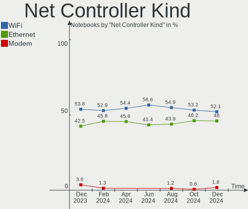

| Kind     | Notebooks | Percent |
|----------|-----------|---------|
| WiFi     | 118       | 54.13%  |
| Ethernet | 97        | 44.5%   |
| Modem    | 3         | 1.38%   |

Used Controller
---------------

Currently used network controller

| Kind     | Notebooks | Percent |
|----------|-----------|---------|
| WiFi     | 91        | 75.83%  |
| Ethernet | 29        | 24.17%  |

NICs
----

Total network controllers on board

| Total | Notebooks | Percent |
|-------|-----------|---------|
| 2     | 90        | 74.38%  |
| 1     | 30        | 24.79%  |
| 0     | 1         | 0.83%   |

IPv6
----

IPv6 vs IPv4

| Used | Notebooks | Percent |
|------|-----------|---------|
| No   | 101       | 83.47%  |
| Yes  | 20        | 16.53%  |

Bluetooth
---------

Bluetooth Vendor
----------------

Controller vendors

| Vendor                          | Notebooks | Percent |
|---------------------------------|-----------|---------|
| Intel                           | 45        | 46.39%  |
| Qualcomm Atheros Communications | 8         | 8.25%   |
| IMC Networks                    | 8         | 8.25%   |
| Broadcom                        | 8         | 8.25%   |
| Dell                            | 7         | 7.22%   |
| Realtek Semiconductor           | 5         | 5.15%   |
| Foxconn / Hon Hai               | 5         | 5.15%   |
| Lite-On Technology              | 4         | 4.12%   |
| Hewlett-Packard                 | 3         | 3.09%   |
| Apple                           | 3         | 3.09%   |
| TP-Link                         | 1         | 1.03%   |

Bluetooth Model
---------------

Controller models

| Model                                             | Notebooks | Percent |
|---------------------------------------------------|-----------|---------|
| Intel Bluetooth wireless interface                | 20        | 20.62%  |
| Intel Bluetooth Device                            | 12        | 12.37%  |
| Qualcomm Atheros  Bluetooth Device                | 5         | 5.15%   |
| Realtek Bluetooth Radio                           | 4         | 4.12%   |
| IMC Networks Wireless_Device                      | 4         | 4.12%   |
| Qualcomm Atheros AR3011 Bluetooth                 | 3         | 3.09%   |
| Lite-On Bluetooth Device                          | 3         | 3.09%   |
| Intel Centrino Bluetooth Wireless Transceiver     | 3         | 3.09%   |
| Intel Bluetooth 9460/9560 Jefferson Peak (JfP)    | 3         | 3.09%   |
| Intel AX200 Bluetooth                             | 3         | 3.09%   |
| Foxconn / Hon Hai Wireless_Device                 | 3         | 3.09%   |
| Dell DW375 Bluetooth Module                       | 3         | 3.09%   |
| Intel Centrino Advanced-N 6230 Bluetooth adapter  | 2         | 2.06%   |
| IMC Networks Atheros AR3012 Bluetooth 4.0 Adapter | 2         | 2.06%   |
| HP Bluetooth 2.0 Interface [Broadcom BCM2045]     | 2         | 2.06%   |
| Dell Wireless 360 Bluetooth                       | 2         | 2.06%   |
| Dell BCM20702A0 Bluetooth Module                  | 2         | 2.06%   |
| Broadcom BCM2045B (BDC-2.1)                       | 2         | 2.06%   |
| Apple Bluetooth USB Host Controller               | 2         | 2.06%   |
| TP-Link TPuLink UB500 Adapter                     | 1         | 1.03%   |
| Realtek RTL8723B Bluetooth                        | 1         | 1.03%   |
| Lite-On Bluetooth Radio                           | 1         | 1.03%   |
| Intel Wireless-AC 3168 Bluetooth                  | 1         | 1.03%   |
| Intel AX210 Bluetooth                             | 1         | 1.03%   |
| IMC Networks Bluetooth module                     | 1         | 1.03%   |
| IMC Networks Bluetooth Device                     | 1         | 1.03%   |
| HP Broadcom 2070 Bluetooth Combo                  | 1         | 1.03%   |
| Foxconn / Hon Hai Broadcom BCM20702 Bluetooth     | 1         | 1.03%   |
| Foxconn / Hon Hai Bluetooth Device                | 1         | 1.03%   |
| Broadcom HP Portable SoftSailing                  | 1         | 1.03%   |
| Broadcom HP Portable Bumble Bee                   | 1         | 1.03%   |
| Broadcom Bluetooth 2.1 Device                     | 1         | 1.03%   |
| Broadcom BCM43142A0 Bluetooth 4.0                 | 1         | 1.03%   |
| Broadcom BCM2045B (BDC-2) [Bluetooth Controller]  | 1         | 1.03%   |
| Broadcom BCM2045 Bluetooth                        | 1         | 1.03%   |
| Apple Bluetooth Host Controller                   | 1         | 1.03%   |

Sound
-----

Sound Vendor
------------

Sound card vendors

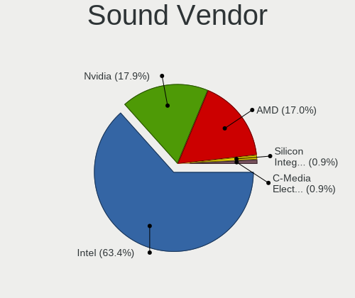

| Vendor              | Notebooks | Percent |
|---------------------|-----------|---------|
| Intel               | 99        | 60%     |
| Nvidia              | 38        | 23.03%  |
| AMD                 | 20        | 12.12%  |
| TTGK Technology     | 1         | 0.61%   |
| SteelSeries ApS     | 1         | 0.61%   |
| Plantronics         | 1         | 0.61%   |
| Logitech            | 1         | 0.61%   |
| Hewlett-Packard     | 1         | 0.61%   |
| Creative Technology | 1         | 0.61%   |
| C-Media Electronics | 1         | 0.61%   |
| Arylic              | 1         | 0.61%   |

Sound Model
-----------

Sound card models

| Model                                                                                             | Notebooks | Percent |
|---------------------------------------------------------------------------------------------------|-----------|---------|
| Intel 6 Series/C200 Series Chipset Family High Definition Audio Controller                        | 12        | 6.25%   |
| AMD Family 17h/19h HD Audio Controller                                                            | 12        | 6.25%   |
| Intel 7 Series/C216 Chipset Family High Definition Audio Controller                               | 11        | 5.73%   |
| Intel Sunrise Point-LP HD Audio                                                                   | 10        | 5.21%   |
| Intel Cannon Lake PCH cAVS                                                                        | 8         | 4.17%   |
| Nvidia GA106 High Definition Audio Controller                                                     | 5         | 2.6%    |
| Nvidia Audio device                                                                               | 5         | 2.6%    |
| Intel Comet Lake PCH cAVS                                                                         | 5         | 2.6%    |
| Intel Alder Lake PCH-P High Definition Audio Controller                                           | 5         | 2.6%    |
| Intel 82801I (ICH9 Family) HD Audio Controller                                                    | 5         | 2.6%    |
| Intel 82801H (ICH8 Family) HD Audio Controller                                                    | 5         | 2.6%    |
| Intel 5 Series/3400 Series Chipset High Definition Audio                                          | 5         | 2.6%    |
| Nvidia TU107 GeForce GTX 1650 High Definition Audio Controller                                    | 4         | 2.08%   |
| Nvidia GF108 High Definition Audio Controller                                                     | 4         | 2.08%   |
| Intel Wildcat Point-LP High Definition Audio Controller                                           | 4         | 2.08%   |
| Intel Tiger Lake-LP Smart Sound Technology Audio Controller                                       | 4         | 2.08%   |
| Intel Broadwell-U Audio Controller                                                                | 4         | 2.08%   |
| AMD Wrestler HDMI Audio                                                                           | 4         | 2.08%   |
| AMD FCH Azalia Controller                                                                         | 4         | 2.08%   |
| Nvidia TU106 High Definition Audio Controller                                                     | 3         | 1.56%   |
| Nvidia GP107GL High Definition Audio Controller                                                   | 3         | 1.56%   |
| Intel Xeon E3-1200 v3/4th Gen Core Processor HD Audio Controller                                  | 3         | 1.56%   |
| Intel Celeron/Pentium Silver Processor High Definition Audio                                      | 3         | 1.56%   |
| Intel Cannon Point-LP High Definition Audio Controller                                            | 3         | 1.56%   |
| Intel 8 Series/C220 Series Chipset High Definition Audio Controller                               | 3         | 1.56%   |
| AMD Renoir Radeon High Definition Audio Controller                                                | 3         | 1.56%   |
| Nvidia High Definition Audio Controller                                                           | 2         | 1.04%   |
| Nvidia GK208 HDMI/DP Audio Controller                                                             | 2         | 1.04%   |
| Nvidia GF119 HDMI Audio Controller                                                                | 2         | 1.04%   |
| Intel Tiger Lake-H HD Audio Controller                                                            | 2         | 1.04%   |
| Intel Haswell-ULT HD Audio Controller                                                             | 2         | 1.04%   |
| Intel Comet Lake PCH-LP cAVS                                                                      | 2         | 1.04%   |
| Intel CM238 HD Audio Controller                                                                   | 2         | 1.04%   |
| Intel Celeron N3350/Pentium N4200/Atom E3900 Series Audio Cluster                                 | 2         | 1.04%   |
| Intel Atom/Celeron/Pentium Processor x5-E8000/J3xxx/N3xxx Series High Definition Audio Controller | 2         | 1.04%   |
| Intel 8 Series HD Audio Controller                                                                | 2         | 1.04%   |
| Intel 100 Series/C230 Series Chipset Family HD Audio Controller                                   | 2         | 1.04%   |
| AMD SBx00 Azalia (Intel HDA)                                                                      | 2         | 1.04%   |
| AMD Rembrandt Radeon High Definition Audio Controller                                             | 2         | 1.04%   |
| AMD Raven/Raven2/Fenghuang HDMI/DP Audio Controller                                               | 2         | 1.04%   |

Memory
------

Memory Vendor
-------------

Memory module vendors

| Vendor              | Notebooks | Percent |
|---------------------|-----------|---------|
| SK hynix            | 29        | 28.16%  |
| Samsung Electronics | 19        | 18.45%  |
| Kingston            | 11        | 10.68%  |
| Micron Technology   | 10        | 9.71%   |
| Unknown             | 6         | 5.83%   |
| GOODRAM             | 5         | 4.85%   |
| Crucial             | 4         | 3.88%   |
| A-DATA Technology   | 3         | 2.91%   |
| Unknown             | 3         | 2.91%   |
| Wilk                | 2         | 1.94%   |
| Ramaxel Technology  | 2         | 1.94%   |
| Patriot             | 2         | 1.94%   |
| Nanya Technology    | 2         | 1.94%   |
| Unknown (ABCD)      | 1         | 0.97%   |
| Transcend           | 1         | 0.97%   |
| SHARETRONIC         | 1         | 0.97%   |
| G.Skill             | 1         | 0.97%   |
| Elpida              | 1         | 0.97%   |

Memory Model
------------

Memory module models

| Model                                                            | Notebooks | Percent |
|------------------------------------------------------------------|-----------|---------|
| Samsung RAM M471A1G44AB0-CWE 8GB SODIMM DDR4 3200MT/s            | 4         | 3.81%   |
| SK hynix RAM HYMP125S64CP8-S6 2GB SODIMM DDR 800MT/s             | 3         | 2.86%   |
| SK hynix RAM HMA81GS6JJR8N-VK 8GB SODIMM DDR4 2667MT/s           | 3         | 2.86%   |
| SK hynix RAM HMA81GS6AFR8N-UH 8192MB SODIMM DDR4 2667MT/s        | 3         | 2.86%   |
| Unknown                                                          | 3         | 2.86%   |
| Wilk RAM GR3200S464L22/16G 16GB SODIMM DDR4 3200MT/s             | 2         | 1.9%    |
| Unknown RAM Module 2GB SODIMM DDR2 667MT/s                       | 2         | 1.9%    |
| SK hynix RAM HMT451S6BFR8A-PB 4096MB SODIMM DDR3 1600MT/s        | 2         | 1.9%    |
| Samsung RAM M471A1K43CB1-CTD 8GB SODIMM DDR4 2667MT/s            | 2         | 1.9%    |
| Samsung RAM M425R1GB4BB0-CQKOL 8GB SODIMM DDR5 4800MT/s          | 2         | 1.9%    |
| Micron RAM 16JTF51264HZ-1G6M1 4GB SODIMM DDR3 1600MT/s           | 2         | 1.9%    |
| GOODRAM RAM GR3200S464L22/16G 16GB SODIMM DDR4 3200MT/s          | 2         | 1.9%    |
| Unknown RAM Module 4GB SODIMM DDR3                               | 1         | 0.95%   |
| Unknown RAM Module 4GB SODIMM DDR2 667MT/s                       | 1         | 0.95%   |
| Unknown RAM Module 2048MB SODIMM DDR3 800MT/s                    | 1         | 0.95%   |
| Unknown RAM Module 2048MB SODIMM DDR2 667MT/s                    | 1         | 0.95%   |
| Unknown (ABCD) RAM 123456789012345678 2GB SODIMM LPDDR4 2400MT/s | 1         | 0.95%   |
| Transcend RAM JM1333KSN-4G 4GB SODIMM DDR3 1334MT/s              | 1         | 0.95%   |
| SK hynix RAM HMT851S6AMR6R-PB N0 4GB Chip DDR3 1600MT/s          | 1         | 0.95%   |
| SK hynix RAM HMT451S6CFR6A-PB 4GB SODIMM DDR3 1600MT/s           | 1         | 0.95%   |
| SK hynix RAM HMT425S6AFR6A-PB 2GB SODIMM DDR3 1600MT/s           | 1         | 0.95%   |
| SK hynix RAM HMT41GS6MFR8C-PB 8GB SODIMM DDR3 1600MT/s           | 1         | 0.95%   |
| SK hynix RAM HMT351S6CFR8C-PB 4GB SODIMM DDR3 1600MT/s           | 1         | 0.95%   |
| SK hynix RAM HMT351S6CFR8C-H9 4GB SODIMM DDR3 1334MT/s           | 1         | 0.95%   |
| SK hynix RAM HMT351S6CFR8C-H9 4GB SODIMM DDR3 1333MT/s           | 1         | 0.95%   |
| SK hynix RAM HMT351S6BFR8C-H9 4GB SODIMM DDR3 1333MT/s           | 1         | 0.95%   |
| SK hynix RAM HMT325S6CFR8C-PB 2GB SODIMM DDR3 1333MT/s           | 1         | 0.95%   |
| SK hynix RAM HMA851S6CJR6N-XN 4GB SODIMM DDR4 3200MT/s           | 1         | 0.95%   |
| SK hynix RAM HMA851S6AFR6N-UH 4GB SODIMM DDR4 2667MT/s           | 1         | 0.95%   |
| SK hynix RAM HMA82GS6DJR8N-VK 16GB SODIMM DDR4 2667MT/s          | 1         | 0.95%   |
| SK hynix RAM HMA82GS6AFR8N-UH 16GB SODIMM DDR4 2667MT/s          | 1         | 0.95%   |
| SK hynix RAM HMA81GS6DJR8N-XN 8GB SODIMM DDR4 3200MT/s           | 1         | 0.95%   |
| SK hynix RAM HCNNNFAMMLXR-NEE 4GB Row Of Chips LPDDR4 4267MT/s   | 1         | 0.95%   |
| SK hynix RAM H9HCNNNCPMMLXR-NEE 8GB SODIMM LPDDR4 4266MT/s       | 1         | 0.95%   |
| SK hynix RAM H9CCNNNCLGALAR-NVD 8GB Row Of Chips LPDDR3 2133MT/s | 1         | 0.95%   |
| SK hynix RAM H5TC4G63CFR-PBA 2GB SODIMM DDR3 1600MT/s            | 1         | 0.95%   |
| SK hynix RAM 0000000000-00000 8GB SODIMM DDR4 2400MT/s           | 1         | 0.95%   |
| SHARETRONIC RAM Module 4GB SODIMM DDR3 800MT/s                   | 1         | 0.95%   |
| Samsung RAM Module 8GB SODIMM DDR4 3200MT/s                      | 1         | 0.95%   |
| Samsung RAM Module 2GB SODIMM DDR3 1067MT/s                      | 1         | 0.95%   |

Memory Kind
-----------

Memory module kinds

| Kind   | Notebooks | Percent |
|--------|-----------|---------|
| DDR4   | 33        | 37.93%  |
| DDR3   | 32        | 36.78%  |
| DDR2   | 7         | 8.05%   |
| LPDDR4 | 4         | 4.6%    |
| DDR5   | 4         | 4.6%    |
| SDRAM  | 3         | 3.45%   |
| LPDDR5 | 2         | 2.3%    |
| LPDDR3 | 2         | 2.3%    |

Memory Form Factor
------------------

Physical design of the memory module

| Name         | Notebooks | Percent |
|--------------|-----------|---------|
| SODIMM       | 78        | 92.86%  |
| Row Of Chips | 5         | 5.95%   |
| Chip         | 1         | 1.19%   |

Memory Size
-----------

Memory module size

| Size  | Notebooks | Percent |
|-------|-----------|---------|
| 8192  | 32        | 35.56%  |
| 4096  | 29        | 32.22%  |
| 16384 | 13        | 14.44%  |
| 2048  | 13        | 14.44%  |
| 32768 | 2         | 2.22%   |
| 1024  | 1         | 1.11%   |

Memory Speed
------------

Memory module speed

| Speed   | Notebooks | Percent |
|---------|-----------|---------|
| 1600    | 20        | 22.22%  |
| 3200    | 16        | 17.78%  |
| 2667    | 12        | 13.33%  |
| 2400    | 7         | 7.78%   |
| 1334    | 7         | 7.78%   |
| 4800    | 4         | 4.44%   |
| 667     | 4         | 4.44%   |
| 1067    | 3         | 3.33%   |
| 975     | 3         | 3.33%   |
| 6400    | 2         | 2.22%   |
| 2048    | 2         | 2.22%   |
| 1333    | 2         | 2.22%   |
| 800     | 2         | 2.22%   |
| 4267    | 1         | 1.11%   |
| 4266    | 1         | 1.11%   |
| 4199    | 1         | 1.11%   |
| 2133    | 1         | 1.11%   |
| 1867    | 1         | 1.11%   |
| Unknown | 1         | 1.11%   |

Printers & scanners
-------------------

Printer Vendor
--------------

Printer device vendors

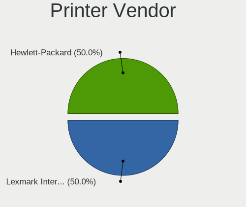

| Vendor              | Notebooks | Percent |
|---------------------|-----------|---------|
| Samsung Electronics | 1         | 100%    |

Printer Model
-------------

Printer device models

| Model                   | Notebooks | Percent |
|-------------------------|-----------|---------|
| Samsung SCX-3400 Series | 1         | 100%    |

Scanner Vendor
--------------

Scanner device vendors

Zero info for selected period =(

Scanner Model
-------------

Scanner device models

Zero info for selected period =(

Camera
------

Camera Vendor
-------------

Camera device vendors

| Vendor                                 | Notebooks | Percent |
|----------------------------------------|-----------|---------|
| Chicony Electronics                    | 25        | 23.36%  |
| Microdia                               | 12        | 11.21%  |
| Acer                                   | 12        | 11.21%  |
| IMC Networks                           | 10        | 9.35%   |
| Realtek Semiconductor                  | 8         | 7.48%   |
| Quanta                                 | 8         | 7.48%   |
| Z-Star Microelectronics                | 4         | 3.74%   |
| Lite-On Technology                     | 4         | 3.74%   |
| Suyin                                  | 3         | 2.8%    |
| Sunplus Innovation Technology          | 3         | 2.8%    |
| Silicon Motion                         | 3         | 2.8%    |
| Logitech                               | 3         | 2.8%    |
| Ricoh                                  | 2         | 1.87%   |
| Cheng Uei Precision Industry (Foxlink) | 2         | 1.87%   |
| Apple                                  | 2         | 1.87%   |
| Syntek                                 | 1         | 0.93%   |
| Sonix Technology                       | 1         | 0.93%   |
| MacroSilicon                           | 1         | 0.93%   |
| Luxvisions Innotech Limited            | 1         | 0.93%   |
| Lenovo                                 | 1         | 0.93%   |
| A4Tech                                 | 1         | 0.93%   |

Camera Model
------------

Camera device models

| Model                                   | Notebooks | Percent |
|-----------------------------------------|-----------|---------|
| Microdia Integrated_Webcam_HD           | 5         | 4.67%   |
| Chicony Integrated Camera               | 5         | 4.67%   |
| Quanta USB2.0 HD UVC WebCam             | 3         | 2.8%    |
| IMC Networks USB2.0 HD UVC WebCam       | 3         | 2.8%    |
| Acer Lenovo EasyCamera                  | 3         | 2.8%    |
| Z-Star Vega USB 2.0 Camera              | 2         | 1.87%   |
| Sunplus Laptop_Integrated_Webcam_FHD    | 2         | 1.87%   |
| Realtek Integrated_Webcam_HD            | 2         | 1.87%   |
| Realtek Integrated Webcam_HD            | 2         | 1.87%   |
| Microdia Integrated Webcam              | 2         | 1.87%   |
| Lite-On Integrated Camera               | 2         | 1.87%   |
| IMC Networks UVC VGA Webcam             | 2         | 1.87%   |
| IMC Networks Integrated Camera          | 2         | 1.87%   |
| Chicony VGA WebCam                      | 2         | 1.87%   |
| Chicony Integrated HP HD Webcam         | 2         | 1.87%   |
| Chicony Integrated Camera (1280x720@30) | 2         | 1.87%   |
| Chicony HD Webcam                       | 2         | 1.87%   |
| Acer Integrated Camera                  | 2         | 1.87%   |
| Acer HD Webcam                          | 2         | 1.87%   |
| Z-Star WebCam SCB-1900N                 | 1         | 0.93%   |
| Z-Star Laptop_Integrated_Webcam_2M      | 1         | 0.93%   |
| Syntek Integrated Camera                | 1         | 0.93%   |
| Suyin VGA Webcam                        | 1         | 0.93%   |
| Suyin HP Truevision HD                  | 1         | 0.93%   |
| Suyin HD WebCam                         | 1         | 0.93%   |
| Sunplus Integrated_Webcam_HD            | 1         | 0.93%   |
| Sonix USB2.0 HD UVC WebCam              | 1         | 0.93%   |
| Silicon Motion WebCam SC-13HDL11939N    | 1         | 0.93%   |
| Silicon Motion WebCam SC-0311139N       | 1         | 0.93%   |
| Silicon Motion 300k Pixel Camera        | 1         | 0.93%   |
| Ricoh Laptop_Integrated_Webcam_FHD      | 1         | 0.93%   |
| Ricoh Integrated Webcam                 | 1         | 0.93%   |
| Realtek USB2.0 VGA UVC WebCam           | 1         | 0.93%   |
| Realtek USB2.0 HD UVC WebCam            | 1         | 0.93%   |
| Realtek Integrated Webcam               | 1         | 0.93%   |
| Realtek EasyCamera                      | 1         | 0.93%   |
| Quanta VGA WebCam                       | 1         | 0.93%   |
| Quanta HP Wide Vision HD Camera         | 1         | 0.93%   |
| Quanta HD Webcam                        | 1         | 0.93%   |
| Quanta HD User Facing                   | 1         | 0.93%   |

Security
--------

Fingerprint Vendor
------------------

Fingerprint sensor vendors

| Vendor                     | Notebooks | Percent |
|----------------------------|-----------|---------|
| Validity Sensors           | 12        | 50%     |
| Upek                       | 3         | 12.5%   |
| Shenzhen Goodix Technology | 3         | 12.5%   |
| Synaptics                  | 2         | 8.33%   |
| Elan Microelectronics      | 2         | 8.33%   |
| LighTuning Technology      | 1         | 4.17%   |
| AuthenTec                  | 1         | 4.17%   |

Fingerprint Model
-----------------

Fingerprint sensor models

| Model                                                  | Notebooks | Percent |
|--------------------------------------------------------|-----------|---------|
| Validity Sensors VFS495 Fingerprint Reader             | 3         | 12.5%   |
| Upek Biometric Touchchip/Touchstrip Fingerprint Sensor | 3         | 12.5%   |
| Validity Sensors VFS5011 Fingerprint Reader            | 2         | 8.33%   |
| Elan ELAN:Fingerprint                                  | 2         | 8.33%   |
| Validity Sensors VFS7500 Touch Fingerprint Sensor      | 1         | 4.17%   |
| Validity Sensors VFS491                                | 1         | 4.17%   |
| Validity Sensors VFS471 Fingerprint Reader             | 1         | 4.17%   |
| Validity Sensors VFS101 Fingerprint Reader             | 1         | 4.17%   |
| Validity Sensors VFS 5011 fingerprint sensor           | 1         | 4.17%   |
| Validity Sensors Synaptics WBDI                        | 1         | 4.17%   |
| Validity Sensors Fingerprint scanner                   | 1         | 4.17%   |
| Synaptics Metallica MOH Touch Fingerprint Reader       | 1         | 4.17%   |
| Synaptics Metallica MIS Touch Fingerprint Reader       | 1         | 4.17%   |
| Shenzhen Goodix  FingerPrint Device                    | 1         | 4.17%   |
| Shenzhen Goodix Fingerprint Reader                     | 1         | 4.17%   |
| Shenzhen Goodix FingerPrint                            | 1         | 4.17%   |
| LighTuning EgisTec Touch Fingerprint Sensor            | 1         | 4.17%   |
| AuthenTec AES2810                                      | 1         | 4.17%   |

Chipcard Vendor
---------------

Chipcard module vendors

| Vendor      | Notebooks | Percent |
|-------------|-----------|---------|
| Broadcom    | 10        | 62.5%   |
| O2 Micro    | 3         | 18.75%  |
| Lenovo      | 2         | 12.5%   |
| Alcor Micro | 1         | 6.25%   |

Chipcard Model
--------------

Chipcard module models

| Model                                                                        | Notebooks | Percent |
|------------------------------------------------------------------------------|-----------|---------|
| Broadcom BCM5880 Secure Applications Processor                               | 4         | 25%     |
| Broadcom 58200                                                               | 4         | 25%     |
| O2 Micro OZ776 CCID Smartcard Reader                                         | 3         | 18.75%  |
| Lenovo Integrated Smart Card Reader                                          | 2         | 12.5%   |
| Broadcom BCM5880 Secure Applications Processor with fingerprint swipe sensor | 1         | 6.25%   |
| Broadcom 5880                                                                | 1         | 6.25%   |
| Alcor Micro AU9540 Smartcard Reader                                          | 1         | 6.25%   |

Unsupported
-----------

Unsupported Devices
-------------------

Total unsupported devices on board

| Total | Notebooks | Percent |
|-------|-----------|---------|
| 0     | 61        | 50.41%  |
| 1     | 46        | 38.02%  |
| 2     | 11        | 9.09%   |
| 3     | 3         | 2.48%   |

Unsupported Device Types
------------------------

Types of unsupported devices

| Type                     | Notebooks | Percent |
|--------------------------|-----------|---------|
| Fingerprint reader       | 24        | 32.43%  |
| Graphics card            | 18        | 24.32%  |
| Chipcard                 | 15        | 20.27%  |
| Net/wireless             | 5         | 6.76%   |
| Camera                   | 4         | 5.41%   |
| Storage                  | 3         | 4.05%   |
| Multimedia controller    | 3         | 4.05%   |
| Communication controller | 1         | 1.35%   |
| Bluetooth                | 1         | 1.35%   |

