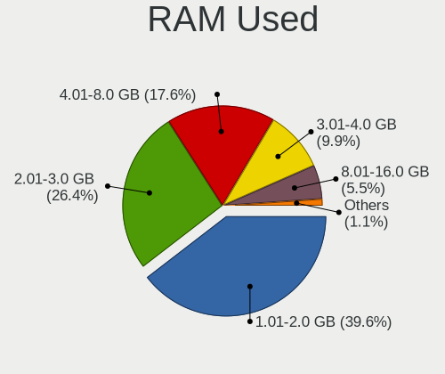
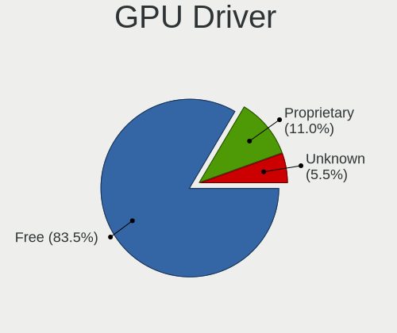
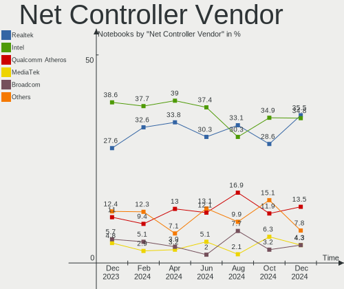
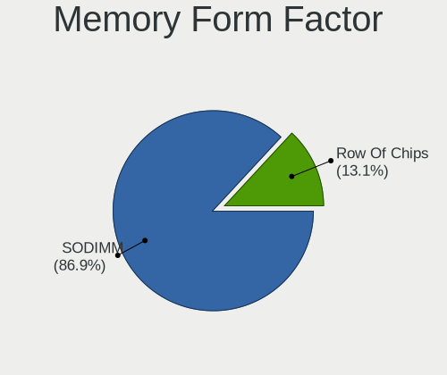

Linux in Poland - Hardware Trends (Notebooks)
---------------------------------------------

A project to identify most popular hardware characteristics and track their change
over time based on data collected by Linux users at https://Linux-Hardware.org.

Anyone can contribute to this report by the [hw-probe](https://github.com/linuxhw/hw-probe) tool:

    sudo -E hw-probe -all -upload

Period: Nov, 2023.

Contents
--------

* [ System ](#system)
  - [ OS                       ](#os)
  - [ OS Family                ](#os-family)
  - [ Kernel                   ](#kernel)
  - [ Kernel Family            ](#kernel-family)
  - [ Kernel Major Ver.        ](#kernel-major-ver)
  - [ Arch                     ](#arch)
  - [ DE                       ](#de)
  - [ Display Server           ](#display-server)
  - [ Display Manager          ](#display-manager)
  - [ OS Lang                  ](#os-lang)
  - [ Boot Mode                ](#boot-mode)
  - [ Filesystem               ](#filesystem)
  - [ Part. scheme             ](#part-scheme)
  - [ Dual Boot with Linux/BSD ](#dual-boot-with-linuxbsd)
  - [ Dual Boot (Win)          ](#dual-boot-win)

* [ Board ](#board)
  - [ Vendor                   ](#vendor)
  - [ Model                    ](#model)
  - [ Model Family             ](#model-family)
  - [ MFG Year                 ](#mfg-year)
  - [ Form Factor              ](#form-factor)
  - [ Secure Boot              ](#secure-boot)
  - [ Coreboot                 ](#coreboot)
  - [ RAM Size                 ](#ram-size)
  - [ RAM Used                 ](#ram-used)
  - [ Total Drives             ](#total-drives)
  - [ Has CD-ROM               ](#has-cd-rom)
  - [ Has Ethernet             ](#has-ethernet)
  - [ Has WiFi                 ](#has-wifi)
  - [ Has Bluetooth            ](#has-bluetooth)

* [ Location ](#location)
  - [ Country                  ](#country)
  - [ City                     ](#city)

* [ Drives ](#drives)
  - [ Drive Vendor             ](#drive-vendor)
  - [ Drive Model              ](#drive-model)
  - [ HDD Vendor               ](#hdd-vendor)
  - [ SSD Vendor               ](#ssd-vendor)
  - [ Drive Kind               ](#drive-kind)
  - [ Drive Connector          ](#drive-connector)
  - [ Drive Size               ](#drive-size)
  - [ Space Total              ](#space-total)
  - [ Space Used               ](#space-used)
  - [ Malfunc. Drives          ](#malfunc-drives)
  - [ Malfunc. Drive Vendor    ](#malfunc-drive-vendor)
  - [ Malfunc. HDD Vendor      ](#malfunc-hdd-vendor)
  - [ Malfunc. Drive Kind      ](#malfunc-drive-kind)
  - [ Failed Drives            ](#failed-drives)
  - [ Failed Drive Vendor      ](#failed-drive-vendor)
  - [ Drive Status             ](#drive-status)

* [ Storage controller ](#storage-controller)
  - [ Storage Vendor           ](#storage-vendor)
  - [ Storage Model            ](#storage-model)
  - [ Storage Kind             ](#storage-kind)

* [ Processor ](#processor)
  - [ CPU Vendor               ](#cpu-vendor)
  - [ CPU Model                ](#cpu-model)
  - [ CPU Model Family         ](#cpu-model-family)
  - [ CPU Cores                ](#cpu-cores)
  - [ CPU Sockets              ](#cpu-sockets)
  - [ CPU Threads              ](#cpu-threads)
  - [ CPU Op-Modes             ](#cpu-op-modes)
  - [ CPU Microcode            ](#cpu-microcode)
  - [ CPU Microarch            ](#cpu-microarch)

* [ Graphics ](#graphics)
  - [ GPU Vendor               ](#gpu-vendor)
  - [ GPU Model                ](#gpu-model)
  - [ GPU Combo                ](#gpu-combo)
  - [ GPU Driver               ](#gpu-driver)
  - [ GPU Memory               ](#gpu-memory)

* [ Monitor ](#monitor)
  - [ Monitor Vendor           ](#monitor-vendor)
  - [ Monitor Model            ](#monitor-model)
  - [ Monitor Resolution       ](#monitor-resolution)
  - [ Monitor Diagonal         ](#monitor-diagonal)
  - [ Monitor Width            ](#monitor-width)
  - [ Aspect Ratio             ](#aspect-ratio)
  - [ Monitor Area             ](#monitor-area)
  - [ Pixel Density            ](#pixel-density)
  - [ Multiple Monitors        ](#multiple-monitors)

* [ Network ](#network)
  - [ Net Controller Vendor    ](#net-controller-vendor)
  - [ Net Controller Model     ](#net-controller-model)
  - [ Wireless Vendor          ](#wireless-vendor)
  - [ Wireless Model           ](#wireless-model)
  - [ Ethernet Vendor          ](#ethernet-vendor)
  - [ Ethernet Model           ](#ethernet-model)
  - [ Net Controller Kind      ](#net-controller-kind)
  - [ Used Controller          ](#used-controller)
  - [ NICs                     ](#nics)
  - [ IPv6                     ](#ipv6)

* [ Bluetooth ](#bluetooth)
  - [ Bluetooth Vendor         ](#bluetooth-vendor)
  - [ Bluetooth Model          ](#bluetooth-model)

* [ Sound ](#sound)
  - [ Sound Vendor             ](#sound-vendor)
  - [ Sound Model              ](#sound-model)

* [ Memory ](#memory)
  - [ Memory Vendor            ](#memory-vendor)
  - [ Memory Model             ](#memory-model)
  - [ Memory Kind              ](#memory-kind)
  - [ Memory Form Factor       ](#memory-form-factor)
  - [ Memory Size              ](#memory-size)
  - [ Memory Speed             ](#memory-speed)

* [ Printers & scanners ](#printers--scanners)
  - [ Printer Vendor           ](#printer-vendor)
  - [ Printer Model            ](#printer-model)
  - [ Scanner Vendor           ](#scanner-vendor)
  - [ Scanner Model            ](#scanner-model)

* [ Camera ](#camera)
  - [ Camera Vendor            ](#camera-vendor)
  - [ Camera Model             ](#camera-model)

* [ Security ](#security)
  - [ Fingerprint Vendor       ](#fingerprint-vendor)
  - [ Fingerprint Model        ](#fingerprint-model)
  - [ Chipcard Vendor          ](#chipcard-vendor)
  - [ Chipcard Model           ](#chipcard-model)

* [ Unsupported ](#unsupported)
  - [ Unsupported Devices      ](#unsupported-devices)
  - [ Unsupported Device Types ](#unsupported-device-types)

System
------

OS
--

Installed operating systems

| Name                         | Notebooks | Percent |
|------------------------------|-----------|---------|
| Fedora 39                    | 10        | 10.53%  |
| Ubuntu 22.04                 | 9         | 9.47%   |
| Linux Mint 21.2              | 7         | 7.37%   |
| Debian 12                    | 7         | 7.37%   |
| OpenMandriva 5.0             | 5         | 5.26%   |
| OpenMandriva 23.08           | 5         | 5.26%   |
| Arch Rolling                 | 4         | 4.21%   |
| Zorin 16                     | 3         | 3.16%   |
| Pop!_OS 22.04                | 3         | 3.16%   |
| Manjaro 23.1.0               | 3         | 3.16%   |
| Fedora 38                    | 3         | 3.16%   |
| Xero Rolling                 | 2         | 2.11%   |
| Ubuntu 23.10                 | 2         | 2.11%   |
| SteamOS 3.5.5                | 2         | 2.11%   |
| OpenMandriva 23.03           | 2         | 2.11%   |
| EndeavourOS Rolling          | 2         | 2.11%   |
| Zorin 12                     | 1         | 1.05%   |
| Xubuntu 23.04                | 1         | 1.05%   |
| Ubuntu 20.04                 | 1         | 1.05%   |
| SteamOS 3.5.7                | 1         | 1.05%   |
| Pear OS                      | 1         | 1.05%   |
| Parrot 5.3                   | 1         | 1.05%   |
| Oracle Linux 9.2             | 1         | 1.05%   |
| openSUSE Tumbleweed-XXXXXXXX | 1         | 1.05%   |
| OpenMandriva 23.11           | 1         | 1.05%   |
| MX 23                        | 1         | 1.05%   |
| Manjaro 23.0.4               | 1         | 1.05%   |
| LMDE 6                       | 1         | 1.05%   |
| Linux Mint 21                | 1         | 1.05%   |
| Linux Mint 20.3              | 1         | 1.05%   |
| Linux Mint 20.2              | 1         | 1.05%   |
| Kubuntu 23.10                | 1         | 1.05%   |
| Kali 2023.4                  | 1         | 1.05%   |
| Gentoo 2.14                  | 1         | 1.05%   |
| Garuda Linux Soaring         | 1         | 1.05%   |
| Fedora 37                    | 1         | 1.05%   |
| Fedora 34                    | 1         | 1.05%   |
| Elementary 7.1               | 1         | 1.05%   |
| Elementary 6.1               | 1         | 1.05%   |
| Debian                       | 1         | 1.05%   |

OS Family
---------

OS without a version

| Name         | Notebooks | Percent |
|--------------|-----------|---------|
| Fedora       | 15        | 15.79%  |
| OpenMandriva | 13        | 13.68%  |
| Ubuntu       | 12        | 12.63%  |
| Linux Mint   | 10        | 10.53%  |
| Debian       | 8         | 8.42%   |
| Zorin        | 4         | 4.21%   |
| Manjaro      | 4         | 4.21%   |
| Arch         | 4         | 4.21%   |
| SteamOS      | 3         | 3.16%   |
| Pop!_OS      | 3         | 3.16%   |
| Xero         | 2         | 2.11%   |
| EndeavourOS  | 2         | 2.11%   |
| Elementary   | 2         | 2.11%   |
| Xubuntu      | 1         | 1.05%   |
| Pear OS      | 1         | 1.05%   |
| Parrot       | 1         | 1.05%   |
| Oracle Linux | 1         | 1.05%   |
| openSUSE     | 1         | 1.05%   |
| MX           | 1         | 1.05%   |
| LMDE         | 1         | 1.05%   |
| Kubuntu      | 1         | 1.05%   |
| Kali         | 1         | 1.05%   |
| Gentoo       | 1         | 1.05%   |
| Garuda Linux | 1         | 1.05%   |
| BigLinux     | 1         | 1.05%   |
| ArcoLinux    | 1         | 1.05%   |

Kernel
------

Version of the Linux kernel

| Version                    | Notebooks | Percent |
|----------------------------|-----------|---------|
| 6.2.0-36-generic           | 7         | 7.37%   |
| 6.6.2-desktop-1omv2390     | 6         | 6.32%   |
| 6.5.9-arch2-1              | 5         | 5.26%   |
| 6.5.11-300.fc39.x86_64     | 5         | 5.26%   |
| 6.4.11-desktop-1omv2390    | 5         | 5.26%   |
| 6.1.0-13-amd64             | 5         | 5.26%   |
| 5.15.0-88-generic          | 4         | 4.21%   |
| 6.5.0-10-generic           | 3         | 3.16%   |
| 6.2.0-37-generic           | 3         | 3.16%   |
| 6.6.2-arch1-1              | 2         | 2.11%   |
| 6.5.6-76060506-generic     | 2         | 2.11%   |
| 6.5.6-300.fc39.x86_64      | 2         | 2.11%   |
| 6.5.12-300.fc39.x86_64     | 2         | 2.11%   |
| 6.2.6-desktop-1omv2390     | 2         | 2.11%   |
| 6.1.52-valve7-1-neptune-61 | 2         | 2.11%   |
| 6.7.0-rc1                  | 1         | 1.05%   |
| 6.6.1-zen1-1-zen           | 1         | 1.05%   |
| 6.6.1-arch1-1              | 1         | 1.05%   |
| 6.6.1-1-MANJARO            | 1         | 1.05%   |
| 6.6.0-x64v4-xanmod1        | 1         | 1.05%   |
| 6.5.9-zen2-1-zen           | 1         | 1.05%   |
| 6.5.9-200.fc38.x86_64      | 1         | 1.05%   |
| 6.5.9-1-default            | 1         | 1.05%   |
| 6.5.8-200.fc38.x86_64      | 1         | 1.05%   |
| 6.5.7-060507-generic       | 1         | 1.05%   |
| 6.5.4-76060504-generic     | 1         | 1.05%   |
| 6.5.11-x64v3-xanmod1       | 1         | 1.05%   |
| 6.5.11-1-MANJARO           | 1         | 1.05%   |
| 6.5.10-300.fc39.x86_64     | 1         | 1.05%   |
| 6.5.10-200.fc38.x86_64     | 1         | 1.05%   |
| 6.5.0-kali3-amd64          | 1         | 1.05%   |
| 6.5.0-3-amd64              | 1         | 1.05%   |
| 6.5.0-1006-oem             | 1         | 1.05%   |
| 6.5.0-0.deb12.1-amd64      | 1         | 1.05%   |
| 6.3.0-2mx-ahs-amd64        | 1         | 1.05%   |
| 6.2.15-200.fc37.x86_64     | 1         | 1.05%   |
| 6.2.0-33-generic           | 1         | 1.05%   |
| 6.2.0-26-generic           | 1         | 1.05%   |
| 6.1.63-1-MANJARO           | 1         | 1.05%   |
| 6.1.61-1-lts               | 1         | 1.05%   |

Kernel Family
-------------

Linux kernel without a distro release

| Version | Notebooks | Percent |
|---------|-----------|---------|
| 6.2.0   | 12        | 12.63%  |
| 5.15.0  | 10        | 10.53%  |
| 6.6.2   | 8         | 8.42%   |
| 6.5.9   | 8         | 8.42%   |
| 6.5.11  | 7         | 7.37%   |
| 6.5.0   | 7         | 7.37%   |
| 6.1.0   | 7         | 7.37%   |
| 6.4.11  | 5         | 5.26%   |
| 6.5.6   | 4         | 4.21%   |
| 6.6.1   | 3         | 3.16%   |
| 6.1.52  | 3         | 3.16%   |
| 6.5.12  | 2         | 2.11%   |
| 6.5.10  | 2         | 2.11%   |
| 6.2.6   | 2         | 2.11%   |
| 6.7.0   | 1         | 1.05%   |
| 6.6.0   | 1         | 1.05%   |
| 6.5.8   | 1         | 1.05%   |
| 6.5.7   | 1         | 1.05%   |
| 6.5.4   | 1         | 1.05%   |
| 6.3.0   | 1         | 1.05%   |
| 6.2.15  | 1         | 1.05%   |
| 6.1.63  | 1         | 1.05%   |
| 6.1.61  | 1         | 1.05%   |
| 6.1.60  | 1         | 1.05%   |
| 6.1.55  | 1         | 1.05%   |
| 5.4.0   | 1         | 1.05%   |
| 5.17.12 | 1         | 1.05%   |
| 5.11.0  | 1         | 1.05%   |
| 4.15.0  | 1         | 1.05%   |

Kernel Major Ver.
-----------------

Linux kernel major version

| Version | Notebooks | Percent |
|---------|-----------|---------|
| 6.5     | 33        | 34.74%  |
| 6.2     | 15        | 15.79%  |
| 6.1     | 14        | 14.74%  |
| 6.6     | 12        | 12.63%  |
| 5.15    | 10        | 10.53%  |
| 6.4     | 5         | 5.26%   |
| 6.7     | 1         | 1.05%   |
| 6.3     | 1         | 1.05%   |
| 5.4     | 1         | 1.05%   |
| 5.17    | 1         | 1.05%   |
| 5.11    | 1         | 1.05%   |
| 4.15    | 1         | 1.05%   |

Arch
----

OS architecture (x86_64, i586, etc.)

| Name   | Notebooks | Percent |
|--------|-----------|---------|
| x86_64 | 93        | 97.89%  |
| i686   | 2         | 2.11%   |

DE
--

Desktop Environment

| Name       | Notebooks | Percent |
|------------|-----------|---------|
| GNOME      | 36        | 37.89%  |
| KDE5       | 31        | 32.63%  |
| X-Cinnamon | 8         | 8.42%   |
| XFCE       | 7         | 7.37%   |
| MATE       | 5         | 5.26%   |
| Pantheon   | 2         | 2.11%   |
| LXQt       | 2         | 2.11%   |
| Unknown    | 2         | 2.11%   |
| sway       | 1         | 1.05%   |
| i3         | 1         | 1.05%   |

Display Server
--------------

X11 or Wayland

| Name    | Notebooks | Percent |
|---------|-----------|---------|
| X11     | 54        | 56.84%  |
| Wayland | 39        | 41.05%  |
| Tty     | 1         | 1.05%   |
| Unknown | 1         | 1.05%   |

Display Manager
---------------

SDDM, LightDM, etc.

| Name    | Notebooks | Percent |
|---------|-----------|---------|
| Unknown | 35        | 36.84%  |
| SDDM    | 23        | 24.21%  |
| LightDM | 16        | 16.84%  |
| GDM3    | 13        | 13.68%  |
| GDM     | 8         | 8.42%   |

OS Lang
-------

Language

| Lang    | Notebooks | Percent |
|---------|-----------|---------|
| pl_PL   | 57        | 60%     |
| en_US   | 29        | 30.53%  |
| en_GB   | 4         | 4.21%   |
| C       | 3         | 3.16%   |
| ru_RU   | 1         | 1.05%   |
| Unknown | 1         | 1.05%   |

Boot Mode
---------

EFI or BIOS

| Mode | Notebooks | Percent |
|------|-----------|---------|
| EFI  | 59        | 62.11%  |
| BIOS | 36        | 37.89%  |

Filesystem
----------

Type of filesystem

| Type     | Notebooks | Percent |
|----------|-----------|---------|
| Ext4     | 54        | 56.84%  |
| Btrfs    | 22        | 23.16%  |
| Overlay  | 10        | 10.53%  |
| Tmpfs    | 7         | 7.37%   |
| Xfs      | 1         | 1.05%   |
| Bcachefs | 1         | 1.05%   |

Part. scheme
------------

Scheme of partitioning

| Type    | Notebooks | Percent |
|---------|-----------|---------|
| GPT     | 56        | 58.95%  |
| Unknown | 34        | 35.79%  |
| MBR     | 5         | 5.26%   |

Dual Boot with Linux/BSD
------------------------

Hosting more than one Linux/BSD

| Dual boot | Notebooks | Percent |
|-----------|-----------|---------|
| No        | 84        | 88.42%  |
| Yes       | 11        | 11.58%  |

Dual Boot (Win)
---------------

Hosting Linux and Windows

| Dual boot | Notebooks | Percent |
|-----------|-----------|---------|
| No        | 72        | 75.79%  |
| Yes       | 23        | 24.21%  |

Board
-----

Vendor
------

Motherboard manufacturer

| Name                | Notebooks | Percent |
|---------------------|-----------|---------|
| Lenovo              | 22        | 23.16%  |
| Dell                | 18        | 18.95%  |
| Hewlett-Packard     | 17        | 17.89%  |
| ASUSTek Computer    | 7         | 7.37%   |
| Acer                | 6         | 6.32%   |
| MSI                 | 4         | 4.21%   |
| Valve               | 3         | 3.16%   |
| Toshiba             | 3         | 3.16%   |
| Samsung Electronics | 3         | 3.16%   |
| HUAWEI              | 3         | 3.16%   |
| Fujitsu             | 2         | 2.11%   |
| Timi                | 1         | 1.05%   |
| Packard Bell        | 1         | 1.05%   |
| mPTech              | 1         | 1.05%   |
| Medion              | 1         | 1.05%   |
| Clevo               | 1         | 1.05%   |
| Chuwi               | 1         | 1.05%   |
| Apple               | 1         | 1.05%   |

Model
-----

Motherboard model

| Name                                        | Notebooks | Percent |
|---------------------------------------------|-----------|---------|
| Valve Jupiter                               | 3         | 3.16%   |
| Dell Latitude E6330                         | 2         | 2.11%   |
| Dell Latitude E5430 non-vPro                | 2         | 2.11%   |
| Acer Nitro AN515-54                         | 2         | 2.11%   |
| Toshiba Satellite L40                       | 1         | 1.05%   |
| Toshiba Satellite L300D                     | 1         | 1.05%   |
| Toshiba Satellite C660                      | 1         | 1.05%   |
| Timi A35S                                   | 1         | 1.05%   |
| Samsung RF510/RF410/RF710                   | 1         | 1.05%   |
| Samsung 350V5C/351V5C/3540VC/3440VC         | 1         | 1.05%   |
| Samsung 300V3A/300V4A/300V5A                | 1         | 1.05%   |
| Packard Bell EasyNote LJ65                  | 1         | 1.05%   |
| MSI Stealth GS66 12UGS                      | 1         | 1.05%   |
| MSI Modern 14 B11MO                         | 1         | 1.05%   |
| MSI GV62 7RE                                | 1         | 1.05%   |
| MSI Alpha 17 C7VG                           | 1         | 1.05%   |
| mPTech ARC 11.6 128GB HD                    | 1         | 1.05%   |
| Medion Akoya E1318T                         | 1         | 1.05%   |
| Lenovo Yoga Slim 7 Pro 14IAH7 82UT          | 1         | 1.05%   |
| Lenovo V14-IIL 82C4                         | 1         | 1.05%   |
| Lenovo ThinkPad X60 1707Y91                 | 1         | 1.05%   |
| Lenovo ThinkPad X1 Extreme 20MFCTO1WW       | 1         | 1.05%   |
| Lenovo ThinkPad X1 Carbon Gen 10 21CBCTO1WW | 1         | 1.05%   |
| Lenovo ThinkPad T520 4243PH3                | 1         | 1.05%   |
| Lenovo ThinkPad T460 20FMS3YT01             | 1         | 1.05%   |
| Lenovo ThinkPad L14 Gen 3 21C1005TPB        | 1         | 1.05%   |
| Lenovo ThinkPad E14 Gen 2 20TA000CPB        | 1         | 1.05%   |
| Lenovo ThinkBook 16 G4+ IAP 21CY            | 1         | 1.05%   |
| Lenovo Legion Y540-15IRH 81SX               | 1         | 1.05%   |
| Lenovo Legion 5 Pro 16ACH6H 82JQ            | 1         | 1.05%   |
| Lenovo Legion 5 15ACH6A 82NW                | 1         | 1.05%   |
| Lenovo IdeaPad Y700-15ISK 80NV              | 1         | 1.05%   |
| Lenovo IdeaPad S340-15IWL 81N8              | 1         | 1.05%   |
| Lenovo IdeaPad Gaming 3 15IAH7 82S9         | 1         | 1.05%   |
| Lenovo IdeaPad 5 14ARE05 81YM               | 1         | 1.05%   |
| Lenovo IdeaPad 330-17ICH 81FL               | 1         | 1.05%   |
| Lenovo IdeaPad 305-15IBD 80NJ               | 1         | 1.05%   |
| Lenovo IdeaPad 300-15ISK 80Q7               | 1         | 1.05%   |
| Lenovo B50-10 80QR                          | 1         | 1.05%   |
| Lenovo 80SY                                 | 1         | 1.05%   |

Model Family
------------

Motherboard model prefix

| Name                  | Notebooks | Percent |
|-----------------------|-----------|---------|
| Dell Latitude         | 10        | 10.53%  |
| Lenovo ThinkPad       | 7         | 7.37%   |
| Lenovo IdeaPad        | 7         | 7.37%   |
| HP EliteBook          | 5         | 5.26%   |
| Dell Inspiron         | 4         | 4.21%   |
| Acer Aspire           | 4         | 4.21%   |
| Valve Jupiter         | 3         | 3.16%   |
| Toshiba Satellite     | 3         | 3.16%   |
| Lenovo Legion         | 3         | 3.16%   |
| HP ProBook            | 3         | 3.16%   |
| HP Pavilion           | 3         | 3.16%   |
| HP ZBook              | 2         | 2.11%   |
| HP Laptop             | 2         | 2.11%   |
| Fujitsu LIFEBOOK      | 2         | 2.11%   |
| ASUS Zenbook          | 2         | 2.11%   |
| ASUS VivoBook         | 2         | 2.11%   |
| Acer Nitro            | 2         | 2.11%   |
| Timi A35S             | 1         | 1.05%   |
| Samsung RF510         | 1         | 1.05%   |
| Samsung 350V5C        | 1         | 1.05%   |
| Samsung 300V3A        | 1         | 1.05%   |
| Packard Bell EasyNote | 1         | 1.05%   |
| MSI Stealth           | 1         | 1.05%   |
| MSI Modern            | 1         | 1.05%   |
| MSI GV62              | 1         | 1.05%   |
| MSI Alpha             | 1         | 1.05%   |
| mPTech ARC            | 1         | 1.05%   |
| Medion Akoya          | 1         | 1.05%   |
| Lenovo Yoga           | 1         | 1.05%   |
| Lenovo V14-IIL        | 1         | 1.05%   |
| Lenovo ThinkBook      | 1         | 1.05%   |
| Lenovo B50-10         | 1         | 1.05%   |
| Lenovo 80SY           | 1         | 1.05%   |
| HUAWEI NBLB-WAX9N     | 1         | 1.05%   |
| HUAWEI KPL-W0X        | 1         | 1.05%   |
| HUAWEI BOD-WXX9       | 1         | 1.05%   |
| HP OMEN               | 1         | 1.05%   |
| HP 255                | 1         | 1.05%   |
| Dell XPS              | 1         | 1.05%   |
| Dell Venue            | 1         | 1.05%   |

MFG Year
--------

Motherboard manufacture year

| Year | Notebooks | Percent |
|------|-----------|---------|
| 2019 | 11        | 11.58%  |
| 2020 | 10        | 10.53%  |
| 2023 | 8         | 8.42%   |
| 2021 | 8         | 8.42%   |
| 2018 | 8         | 8.42%   |
| 2012 | 8         | 8.42%   |
| 2022 | 7         | 7.37%   |
| 2011 | 7         | 7.37%   |
| 2015 | 6         | 6.32%   |
| 2008 | 5         | 5.26%   |
| 2016 | 4         | 4.21%   |
| 2014 | 3         | 3.16%   |
| 2013 | 3         | 3.16%   |
| 2010 | 2         | 2.11%   |
| 2007 | 2         | 2.11%   |
| 2017 | 1         | 1.05%   |
| 2009 | 1         | 1.05%   |
| 2006 | 1         | 1.05%   |

Form Factor
-----------

Physical design of the computer

| Name     | Notebooks | Percent |
|----------|-----------|---------|
| Notebook | 95        | 100%    |

Secure Boot
-----------

Enabled or disabled

| State    | Notebooks | Percent |
|----------|-----------|---------|
| Disabled | 87        | 91.58%  |
| Enabled  | 8         | 8.42%   |

Coreboot
--------

Have coreboot on board

| Used | Notebooks | Percent |
|------|-----------|---------|
| No   | 95        | 100%    |

RAM Size
--------

Total RAM memory

| Size in GB  | Notebooks | Percent |
|-------------|-----------|---------|
| 8.01-16.0   | 23        | 24.21%  |
| 4.01-8.0    | 22        | 23.16%  |
| 3.01-4.0    | 17        | 17.89%  |
| 16.01-24.0  | 15        | 15.79%  |
| 32.01-64.0  | 11        | 11.58%  |
| 2.01-3.0    | 4         | 4.21%   |
| 24.01-32.0  | 1         | 1.05%   |
| 64.01-256.0 | 1         | 1.05%   |
| 1.01-2.0    | 1         | 1.05%   |

RAM Used
--------

Used RAM memory

| Used GB    | Notebooks | Percent |
|------------|-----------|---------|
| 1.01-2.0   | 27        | 28.42%  |
| 2.01-3.0   | 20        | 21.05%  |
| 4.01-8.0   | 18        | 18.95%  |
| 3.01-4.0   | 17        | 17.89%  |
| 8.01-16.0  | 7         | 7.37%   |
| 0.51-1.0   | 3         | 3.16%   |
| 24.01-32.0 | 1         | 1.05%   |
| 16.01-24.0 | 1         | 1.05%   |
| 0.01-0.5   | 1         | 1.05%   |

Total Drives
------------

Number of drives on board

| Drives | Notebooks | Percent |
|--------|-----------|---------|
| 1      | 68        | 71.58%  |
| 2      | 26        | 27.37%  |
| 4      | 1         | 1.05%   |

Has CD-ROM
----------

Has CD-ROM on board

| Presented | Notebooks | Percent |
|-----------|-----------|---------|
| No        | 66        | 69.47%  |
| Yes       | 29        | 30.53%  |

Has Ethernet
------------

Has Ethernet on board

| Presented | Notebooks | Percent |
|-----------|-----------|---------|
| Yes       | 74        | 77.89%  |
| No        | 21        | 22.11%  |

Has WiFi
--------

Has WiFi module

| Presented | Notebooks | Percent |
|-----------|-----------|---------|
| Yes       | 93        | 97.89%  |
| No        | 2         | 2.11%   |

Has Bluetooth
-------------

Has Bluetooth module

| Presented | Notebooks | Percent |
|-----------|-----------|---------|
| Yes       | 76        | 80%     |
| No        | 19        | 20%     |

Location
--------

Country
-------

Geographic location (country)

| Country | Notebooks | Percent |
|---------|-----------|---------|
| Poland  | 95        | 100%    |

City
----

Geographic location (city)

| City                   | Notebooks | Percent |
|------------------------|-----------|---------|
| Warsaw                 | 20        | 21.05%  |
| Wroclaw                | 6         | 6.32%   |
| Krakow                 | 6         | 6.32%   |
| Poznan                 | 5         | 5.26%   |
| Lodz                   | 4         | 4.21%   |
| Gdansk                 | 4         | 4.21%   |
| Gliwice                | 3         | 3.16%   |
| Gdynia                 | 3         | 3.16%   |
| Elblag                 | 3         | 3.16%   |
| Szczecin               | 2         | 2.11%   |
| Lublin                 | 2         | 2.11%   |
| Kielce                 | 2         | 2.11%   |
| Katowice               | 2         | 2.11%   |
| Zlotow                 | 1         | 1.05%   |
| Zambrów               | 1         | 1.05%   |
| Tarnowskie Gory        | 1         | 1.05%   |
| Słupsk                | 1         | 1.05%   |
| Swidnik                | 1         | 1.05%   |
| Swidnica               | 1         | 1.05%   |
| Starogard Gdański     | 1         | 1.05%   |
| Stargard               | 1         | 1.05%   |
| Smogorzow              | 1         | 1.05%   |
| Siemianowice Śląskie | 1         | 1.05%   |
| Pszczyna               | 1         | 1.05%   |
| Nowy Sącz             | 1         | 1.05%   |
| Nadarzyn               | 1         | 1.05%   |
| Mysłowice             | 1         | 1.05%   |
| Mielec                 | 1         | 1.05%   |
| Marklowice             | 1         | 1.05%   |
| Koszalin               | 1         | 1.05%   |
| Kostrzyn               | 1         | 1.05%   |
| Kolbuszowa             | 1         | 1.05%   |
| Imielin                | 1         | 1.05%   |
| Grodzisk Mazowiecki    | 1         | 1.05%   |
| Golczewo               | 1         | 1.05%   |
| Falenty Nowe           | 1         | 1.05%   |
| Dzierzoniow            | 1         | 1.05%   |
| Debica                 | 1         | 1.05%   |
| Częstochowa           | 1         | 1.05%   |
| Czarna Białostocka    | 1         | 1.05%   |

Drives
------

Drive Vendor
------------

Hard drive vendors

| Vendor                      | Notebooks | Drives | Percent |
|-----------------------------|-----------|--------|---------|
| Samsung Electronics         | 22        | 24     | 18.33%  |
| Seagate                     | 11        | 12     | 9.17%   |
| Crucial                     | 8         | 8      | 6.67%   |
| WDC                         | 7         | 7      | 5.83%   |
| Micron Technology           | 7         | 7      | 5.83%   |
| Intel                       | 7         | 7      | 5.83%   |
| Unknown                     | 5         | 5      | 4.17%   |
| SanDisk                     | 5         | 5      | 4.17%   |
| Kingston                    | 5         | 5      | 4.17%   |
| GOODRAM                     | 5         | 5      | 4.17%   |
| A-DATA Technology           | 5         | 5      | 4.17%   |
| SK hynix                    | 4         | 4      | 3.33%   |
| KIOXIA                      | 4         | 4      | 3.33%   |
| Toshiba                     | 3         | 3      | 2.5%    |
| Lexar                       | 2         | 2      | 1.67%   |
| Kingston Technology Company | 2         | 2      | 1.67%   |
| Hitachi                     | 2         | 2      | 1.67%   |
| Union Memory (Shenzhen)     | 1         | 1      | 0.83%   |
| Union Memory                | 1         | 1      | 0.83%   |
| SPCC M.2                    | 1         | 1      | 0.83%   |
| SPCC                        | 1         | 1      | 0.83%   |
| PNY                         | 1         | 1      | 0.83%   |
| Plextor                     | 1         | 1      | 0.83%   |
| Patriot                     | 1         | 1      | 0.83%   |
| O2 Micro                    | 1         | 1      | 0.83%   |
| Micron/Crucial Technology   | 1         | 1      | 0.83%   |
| Kingchuxing                 | 1         | 1      | 0.83%   |
| HGST                        | 1         | 1      | 0.83%   |
| Fujitsu                     | 1         | 1      | 0.83%   |
| China                       | 1         | 1      | 0.83%   |
| Apacer                      | 1         | 1      | 0.83%   |
| ADATA Technology            | 1         | 1      | 0.83%   |
| Unknown                     | 1         | 1      | 0.83%   |

Drive Model
-----------

Hard drive models

| Model                                               | Notebooks | Percent |
|-----------------------------------------------------|-----------|---------|
| Samsung NVMe SSD Controller SM981/PM981/PM983 250GB | 3         | 2.46%   |
| Unknown MMC Card  512GB                             | 2         | 1.64%   |
| Seagate ST9500423AS 500GB                           | 2         | 1.64%   |
| Seagate ST500LT012-1DG142 500GB                     | 2         | 1.64%   |
| Seagate ST500LM000-1EJ162 500GB                     | 2         | 1.64%   |
| Samsung SSD 870 EVO 500GB                           | 2         | 1.64%   |
| Samsung MZVLQ512HBLU-00B07 512GB                    | 2         | 1.64%   |
| Micron 3400_MTFDKBA1T0TFH 1TB                       | 2         | 1.64%   |
| Micron 2200_MTFDHBA512TCK 512GB                     | 2         | 1.64%   |
| Kingston Company OM3PDP3 NVMe SSD 256GB             | 2         | 1.64%   |
| GOODRAM SSDPR-CX400-256-G2 256GB                    | 2         | 1.64%   |
| Crucial CT500MX500SSD1 500GB                        | 2         | 1.64%   |
| Crucial CT250BX100SSD1 250GB                        | 2         | 1.64%   |
| WDC WDS480G2G0B-00EPW0 480GB SSD                    | 1         | 0.82%   |
| WDC WDS240G2G0C-00AJM0 240GB                        | 1         | 0.82%   |
| WDC WD7500BPVX-16JC3T3 752GB                        | 1         | 0.82%   |
| WDC WD1600BEVT-22A23T0 160GB                        | 1         | 0.82%   |
| WDC WD10SPZX-24Z10T0 1TB                            | 1         | 0.82%   |
| WDC WD10SPZX-24Z10 1TB                              | 1         | 0.82%   |
| WDC WD10SPCX-24HWST1 1TB                            | 1         | 0.82%   |
| Unknown MMC128  128GB                               | 1         | 0.82%   |
| Unknown MMC Card  64GB                              | 1         | 0.82%   |
| Unknown MMC Card  256GB                             | 1         | 0.82%   |
| Union Memory UMIS RPJTJ256MEE1OWX 256GB             | 1         | 0.82%   |
| Union Memory (Shenzhen) UMIS RPJTJ512MGE1QDQ 512GB  | 1         | 0.82%   |
| Toshiba XG6 NVMe SSD Controller 512GB               | 1         | 0.82%   |
| Toshiba THNSNK128GVN8 M.2 2280 128GB SSD            | 1         | 0.82%   |
| Toshiba KXG60ZNV256G 256GB                          | 1         | 0.82%   |
| SPCC Solid State Disk 240GB                         | 1         | 0.82%   |
| SPCC M.2 PCIe SSD 512GB                             | 1         | 0.82%   |
| SK hynix HFS001TEJ9X108N 1TB                        | 1         | 0.82%   |
| SK hynix HFM512GD3JX013N 512GB                      | 1         | 0.82%   |
| SK hynix BC711 HFM512GD3JX013N 512GB                | 1         | 0.82%   |
| SK hynix BC501 NVMe Solid State Drive 512GB         | 1         | 0.82%   |
| Seagate ST9500420AS 500GB                           | 1         | 0.82%   |
| Seagate ST9500325AS 500GB                           | 1         | 0.82%   |
| Seagate ST320LM001 HN-M320MBB 320GB                 | 1         | 0.82%   |
| Seagate ST1000LM035-1RK172 1TB                      | 1         | 0.82%   |
| Seagate Expansion 1TB                               | 1         | 0.82%   |
| Seagate Basic 4TB                                   | 1         | 0.82%   |

HDD Vendor
----------

Hard disk drive vendors

| Vendor  | Notebooks | Drives | Percent |
|---------|-----------|--------|---------|
| Seagate | 11        | 11     | 55%     |
| WDC     | 5         | 5      | 25%     |
| Hitachi | 2         | 2      | 10%     |
| HGST    | 1         | 1      | 5%      |
| Fujitsu | 1         | 1      | 5%      |

SSD Vendor
----------

Solid state drive vendors

| Vendor              | Notebooks | Drives | Percent |
|---------------------|-----------|--------|---------|
| Samsung Electronics | 8         | 8      | 19.05%  |
| Crucial             | 8         | 8      | 19.05%  |
| GOODRAM             | 5         | 5      | 11.9%   |
| A-DATA Technology   | 5         | 5      | 11.9%   |
| Kingston            | 4         | 4      | 9.52%   |
| SanDisk             | 3         | 3      | 7.14%   |
| WDC                 | 1         | 1      | 2.38%   |
| Toshiba             | 1         | 1      | 2.38%   |
| SPCC M.2            | 1         | 1      | 2.38%   |
| SPCC                | 1         | 1      | 2.38%   |
| PNY                 | 1         | 1      | 2.38%   |
| Plextor             | 1         | 1      | 2.38%   |
| Patriot             | 1         | 1      | 2.38%   |
| Intel               | 1         | 1      | 2.38%   |
| China               | 1         | 1      | 2.38%   |

Drive Kind
----------

HDD or SSD

| Kind    | Notebooks | Drives | Percent |
|---------|-----------|--------|---------|
| NVMe    | 47        | 53     | 41.96%  |
| SSD     | 37        | 42     | 33.04%  |
| HDD     | 20        | 20     | 17.86%  |
| MMC     | 5         | 5      | 4.46%   |
| Unknown | 3         | 3      | 2.68%   |

Drive Connector
---------------

SATA, SAS, NVMe, etc.

| Type | Notebooks | Drives | Percent |
|------|-----------|--------|---------|
| SATA | 51        | 60     | 47.66%  |
| NVMe | 47        | 53     | 43.93%  |
| MMC  | 5         | 5      | 4.67%   |
| SAS  | 4         | 5      | 3.74%   |

Drive Size
----------

Size of hard drive

| Size in TB | Notebooks | Drives | Percent |
|------------|-----------|--------|---------|
| 0.01-0.5   | 39        | 46     | 72.22%  |
| 0.51-1.0   | 13        | 14     | 24.07%  |
| 1.01-2.0   | 2         | 2      | 3.7%    |

Space Total
-----------

Amount of disk space available on the file system

| Size in GB     | Notebooks | Percent |
|----------------|-----------|---------|
| 251-500        | 23        | 24.21%  |
| 101-250        | 23        | 24.21%  |
| 501-1000       | 15        | 15.79%  |
| 1-20           | 12        | 12.63%  |
| 1001-2000      | 6         | 6.32%   |
| 51-100         | 5         | 5.26%   |
| Unknown        | 5         | 5.26%   |
| 21-50          | 3         | 3.16%   |
| 2001-3000      | 2         | 2.11%   |
| More than 3000 | 1         | 1.05%   |

Space Used
----------

Amount of used disk space

| Used GB        | Notebooks | Percent |
|----------------|-----------|---------|
| 1-20           | 34        | 35.79%  |
| 51-100         | 18        | 18.95%  |
| 21-50          | 15        | 15.79%  |
| 101-250        | 11        | 11.58%  |
| 251-500        | 5         | 5.26%   |
| Unknown        | 5         | 5.26%   |
| 501-1000       | 4         | 4.21%   |
| 1001-2000      | 2         | 2.11%   |
| More than 3000 | 1         | 1.05%   |

Malfunc. Drives
---------------

Drive models with a malfunction

| Model                           | Notebooks | Drives | Percent |
|---------------------------------|-----------|--------|---------|
| Seagate ST9500423AS 500GB       | 1         | 1      | 20%     |
| Seagate ST500LT012-1DG142 500GB | 1         | 1      | 20%     |
| Intel SSDSA2M080G2GC 80GB       | 1         | 1      | 20%     |
| Hitachi HTS542525K9SA00 250GB   | 1         | 1      | 20%     |
| Fujitsu MHY2160BH 160GB         | 1         | 1      | 20%     |

Malfunc. Drive Vendor
---------------------

Vendors of faulty drives

| Vendor  | Notebooks | Drives | Percent |
|---------|-----------|--------|---------|
| Seagate | 2         | 2      | 40%     |
| Intel   | 1         | 1      | 20%     |
| Hitachi | 1         | 1      | 20%     |
| Fujitsu | 1         | 1      | 20%     |

Malfunc. HDD Vendor
-------------------

Vendors of faulty HDD drives

| Vendor  | Notebooks | Drives | Percent |
|---------|-----------|--------|---------|
| Seagate | 2         | 2      | 50%     |
| Hitachi | 1         | 1      | 25%     |
| Fujitsu | 1         | 1      | 25%     |

Malfunc. Drive Kind
-------------------

Kinds of faulty drives

| Kind | Notebooks | Drives | Percent |
|------|-----------|--------|---------|
| HDD  | 4         | 4      | 80%     |
| SSD  | 1         | 1      | 20%     |

Failed Drives
-------------

Failed drive models

Zero info for selected period =(

Failed Drive Vendor
-------------------

Failed drive vendors

Zero info for selected period =(

Drive Status
------------

Number of failed and malfunc. drives

| Status   | Notebooks | Drives | Percent |
|----------|-----------|--------|---------|
| Detected | 47        | 62     | 47.47%  |
| Works    | 47        | 56     | 47.47%  |
| Malfunc  | 5         | 5      | 5.05%   |

Storage controller
------------------

Storage Vendor
--------------

Storage controller vendors

| Vendor                       | Notebooks | Percent |
|------------------------------|-----------|---------|
| Intel                        | 61        | 50.83%  |
| Samsung Electronics          | 15        | 12.5%   |
| AMD                          | 12        | 10%     |
| Micron Technology            | 7         | 5.83%   |
| SK hynix                     | 4         | 3.33%   |
| Toshiba America Info Systems | 3         | 2.5%    |
| SanDisk                      | 3         | 2.5%    |
| KIOXIA                       | 3         | 2.5%    |
| Kingston Technology Company  | 3         | 2.5%    |
| Union Memory (Shenzhen)      | 2         | 1.67%   |
| Silicon Motion               | 2         | 1.67%   |
| Shenzhen Longsys Electronics | 2         | 1.67%   |
| O2 Micro                     | 1         | 0.83%   |
| Micron/Crucial Technology    | 1         | 0.83%   |
| ADATA Technology             | 1         | 0.83%   |

Storage Model
-------------

Storage controller models

| Model                                                                          | Notebooks | Percent |
|--------------------------------------------------------------------------------|-----------|---------|
| AMD FCH SATA Controller [AHCI mode]                                            | 9         | 6.98%   |
| Samsung NVMe SSD Controller 980 (DRAM-less)                                    | 7         | 5.43%   |
| Intel Sunrise Point-LP SATA Controller [AHCI mode]                             | 7         | 5.43%   |
| Intel 7 Series Chipset Family 6-port SATA Controller [AHCI mode]               | 7         | 5.43%   |
| Intel Volume Management Device NVMe RAID Controller                            | 6         | 4.65%   |
| Intel 82801 Mobile SATA Controller [RAID mode]                                 | 6         | 4.65%   |
| Intel Cannon Lake Mobile PCH SATA AHCI Controller                              | 5         | 3.88%   |
| Samsung NVMe SSD Controller SM981/PM981/PM983                                  | 4         | 3.1%    |
| Samsung NVMe SSD Controller PM9A1/PM9A3/980PRO                                 | 4         | 3.1%    |
| Intel SSD 660P Series                                                          | 4         | 3.1%    |
| Intel 6 Series/C200 Series Chipset Family 6 port Mobile SATA AHCI Controller   | 4         | 3.1%    |
| Toshiba America Info Systems XG6 NVMe SSD Controller                           | 3         | 2.33%   |
| Micron 3400 NVMe SSD [Hendrix]                                                 | 3         | 2.33%   |
| Intel 82801HM/HEM (ICH8M/ICH8M-E) SATA Controller [IDE mode]                   | 3         | 2.33%   |
| Intel 82801HM/HEM (ICH8M/ICH8M-E) IDE Controller                               | 3         | 2.33%   |
| SK hynix Gold P31/BC711/PC711 NVMe Solid State Drive                           | 2         | 1.55%   |
| Silicon Motion SM2263EN/SM2263XT (DRAM-less) NVMe SSD Controllers              | 2         | 1.55%   |
| Micron 2200S NVMe SSD [Cassandra]                                              | 2         | 1.55%   |
| KIOXIA NVMe SSD Controller BG5 (DRAM-less)                                     | 2         | 1.55%   |
| Kingston Company OM3PDP3 NVMe SSD                                              | 2         | 1.55%   |
| Intel Ice Lake-LP SATA Controller [AHCI mode]                                  | 2         | 1.55%   |
| Intel HM170/QM170 Chipset SATA Controller [AHCI Mode]                          | 2         | 1.55%   |
| Intel 8 Series/C220 Series Chipset Family 6-port SATA Controller 1 [AHCI mode] | 2         | 1.55%   |
| Intel 8 Series SATA Controller 1 [AHCI mode]                                   | 2         | 1.55%   |
| Intel 5 Series/3400 Series Chipset 4 port SATA AHCI Controller                 | 2         | 1.55%   |
| Union Memory (Shenzhen) AM630 PCIe 4.0 x4 NVMe SSD Controller                  | 1         | 0.78%   |
| Union Memory (Shenzhen) AM620 PCIe 3.0 NVMe SSD 256GB                          | 1         | 0.78%   |
| SK hynix BC901 NVMe Solid State Drive (DRAM-less)                              | 1         | 0.78%   |
| SK hynix BC501 NVMe Solid State Drive                                          | 1         | 0.78%   |
| Shenzhen Longsys Lexar NM800 PRO NVME SSD                                      | 1         | 0.78%   |
| Shenzhen Longsys Lexar NM760 NVME SSD (DRAM-less)                              | 1         | 0.78%   |
| SanDisk WD Green SN350 240GB (DRAM-less) / SN560E NVMe SSD                     | 1         | 0.78%   |
| SanDisk Ultra 3D / WD Blue SN570 NVMe SSD (DRAM-less)                          | 1         | 0.78%   |
| SanDisk Extreme Pro / WD Black 2018/SN750/PC SN720 NVMe SSD                    | 1         | 0.78%   |
| O2 Micro FORESEE E2M2 NVMe SSD                                                 | 1         | 0.78%   |
| Micron/Crucial P5 Plus NVMe PCIe SSD                                           | 1         | 0.78%   |
| Micron 2400 NVMe SSD (DRAM-less)                                               | 1         | 0.78%   |
| Micron 2210 NVMe SSD [Cobain]                                                  | 1         | 0.78%   |
| KIOXIA NVMe SSD Controller BG4 (DRAM-less)                                     | 1         | 0.78%   |
| Kingston Company KC3000/FURY Renegade NVMe SSD E18                             | 1         | 0.78%   |

Storage Kind
------------

Kind of storage controller (IDE, SATA, NVMe, SAS, ...)

| Kind | Notebooks | Percent |
|------|-----------|---------|
| SATA | 54        | 44.63%  |
| NVMe | 48        | 39.67%  |
| RAID | 12        | 9.92%   |
| IDE  | 7         | 5.79%   |

Processor
---------

CPU Vendor
----------

Processor vendors

| Vendor | Notebooks | Percent |
|--------|-----------|---------|
| Intel  | 72        | 75.79%  |
| AMD    | 23        | 24.21%  |

CPU Model
---------

Processor models

| Model                                       | Notebooks | Percent |
|---------------------------------------------|-----------|---------|
| Intel Core i5-3320M CPU @ 2.60GHz           | 3         | 3.16%   |
| Intel 12th Gen Core i5-1235U                | 3         | 3.16%   |
| Intel 11th Gen Core i7-1165G7 @ 2.80GHz     | 3         | 3.16%   |
| AMD Ryzen 7 5800H with Radeon Graphics      | 3         | 3.16%   |
| AMD Custom APU 0405                         | 3         | 3.16%   |
| Intel Core i7-6500U CPU @ 2.50GHz           | 2         | 2.11%   |
| Intel Core i5-8300H CPU @ 2.30GHz           | 2         | 2.11%   |
| Intel Core i5-3230M CPU @ 2.60GHz           | 2         | 2.11%   |
| Intel Core i5-1035G1 CPU @ 1.00GHz          | 2         | 2.11%   |
| Intel Core i3-2350M CPU @ 2.30GHz           | 2         | 2.11%   |
| Intel Core i3-2310M CPU @ 2.10GHz           | 2         | 2.11%   |
| Intel 12th Gen Core i7-12700H               | 2         | 2.11%   |
| Intel 11th Gen Core i5-1135G7 @ 2.40GHz     | 2         | 2.11%   |
| AMD Ryzen 5 5600H with Radeon Graphics      | 2         | 2.11%   |
| Intel Pentium Dual-Core CPU T4500 @ 2.30GHz | 1         | 1.05%   |
| Intel Pentium Dual CPU T2370 @ 1.73GHz      | 1         | 1.05%   |
| Intel Pentium Dual CPU T2310 @ 1.46GHz      | 1         | 1.05%   |
| Intel Pentium CPU P6200 @ 2.13GHz           | 1         | 1.05%   |
| Intel Pentium CPU P6100 @ 2.00GHz           | 1         | 1.05%   |
| Intel Pentium CPU N4200 @ 1.10GHz           | 1         | 1.05%   |
| Intel N100                                  | 1         | 1.05%   |
| Intel Genuine CPU T2300 @ 1.66GHz           | 1         | 1.05%   |
| Intel Core i7-9750H CPU @ 2.60GHz           | 1         | 1.05%   |
| Intel Core i7-8750H CPU @ 2.20GHz           | 1         | 1.05%   |
| Intel Core i7-6700HQ CPU @ 2.60GHz          | 1         | 1.05%   |
| Intel Core i7-4810MQ CPU @ 2.80GHz          | 1         | 1.05%   |
| Intel Core i7-4710HQ CPU @ 2.50GHz          | 1         | 1.05%   |
| Intel Core i7-4600U CPU @ 2.10GHz           | 1         | 1.05%   |
| Intel Core i7-3520M CPU @ 2.90GHz           | 1         | 1.05%   |
| Intel Core i5-9300HF CPU @ 2.40GHz          | 1         | 1.05%   |
| Intel Core i5-9300H CPU @ 2.40GHz           | 1         | 1.05%   |
| Intel Core i5-8265U CPU @ 1.60GHz           | 1         | 1.05%   |
| Intel Core i5-8250U CPU @ 1.60GHz           | 1         | 1.05%   |
| Intel Core i5-7300HQ CPU @ 2.50GHz          | 1         | 1.05%   |
| Intel Core i5-7200U CPU @ 2.50GHz           | 1         | 1.05%   |
| Intel Core i5-6300U CPU @ 2.40GHz           | 1         | 1.05%   |
| Intel Core i5-6300HQ CPU @ 2.30GHz          | 1         | 1.05%   |
| Intel Core i5-6200U CPU @ 2.30GHz           | 1         | 1.05%   |
| Intel Core i5-5200U CPU @ 2.20GHz           | 1         | 1.05%   |
| Intel Core i5-4300Y CPU @ 1.60GHz           | 1         | 1.05%   |

CPU Model Family
----------------

Processor model prefix

| Model                   | Notebooks | Percent |
|-------------------------|-----------|---------|
| Intel Core i5           | 25        | 26.32%  |
| Other                   | 21        | 22.11%  |
| Intel Core i7           | 9         | 9.47%   |
| Intel Core i3           | 9         | 9.47%   |
| AMD Ryzen 7             | 6         | 6.32%   |
| AMD Ryzen 5             | 6         | 6.32%   |
| Intel Pentium           | 3         | 3.16%   |
| Intel Core 2 Duo        | 3         | 3.16%   |
| Intel Pentium Dual      | 2         | 2.11%   |
| Intel Celeron           | 2         | 2.11%   |
| Intel Pentium Dual-Core | 1         | 1.05%   |
| Intel Genuine           | 1         | 1.05%   |
| AMD Turion II Dual-Core | 1         | 1.05%   |
| AMD Ryzen 9             | 1         | 1.05%   |
| AMD Ryzen 5 PRO         | 1         | 1.05%   |
| AMD Ryzen 3 PRO         | 1         | 1.05%   |
| AMD Athlon X2           | 1         | 1.05%   |
| AMD A6                  | 1         | 1.05%   |
| AMD A4                  | 1         | 1.05%   |

CPU Cores
---------

Number of processor cores

| Number | Notebooks | Percent |
|--------|-----------|---------|
| 2      | 42        | 44.21%  |
| 4      | 31        | 32.63%  |
| 8      | 6         | 6.32%   |
| 6      | 6         | 6.32%   |
| 10     | 5         | 5.26%   |
| 14     | 3         | 3.16%   |
| 16     | 1         | 1.05%   |
| 12     | 1         | 1.05%   |

CPU Sockets
-----------

Number of sockets

| Number | Notebooks | Percent |
|--------|-----------|---------|
| 1      | 95        | 100%    |

CPU Threads
-----------

Threads per core (Hyper-Threading)

| Number | Notebooks | Percent |
|--------|-----------|---------|
| 2      | 73        | 76.84%  |
| 1      | 22        | 23.16%  |

CPU Op-Modes
------------

CPU Operation Modes (32-bit, 64-bit)

| Op mode        | Notebooks | Percent |
|----------------|-----------|---------|
| 32-bit, 64-bit | 94        | 98.95%  |
| 32-bit         | 1         | 1.05%   |

CPU Microcode
-------------

Microcode number

| Number     | Notebooks | Percent |
|------------|-----------|---------|
| Unknown    | 62        | 65.26%  |
| 0x0a50000c | 3         | 3.16%   |
| 0x08600106 | 3         | 3.16%   |
| 0x08108109 | 3         | 3.16%   |
| 0x506e3    | 2         | 2.11%   |
| 0x0a50000d | 2         | 2.11%   |
| 0x906ed    | 1         | 1.05%   |
| 0x906ea    | 1         | 1.05%   |
| 0x906a4    | 1         | 1.05%   |
| 0x806ea    | 1         | 1.05%   |
| 0x806e9    | 1         | 1.05%   |
| 0x706e5    | 1         | 1.05%   |
| 0x6fb      | 1         | 1.05%   |
| 0x6e8      | 1         | 1.05%   |
| 0x406e3    | 1         | 1.05%   |
| 0x306a9    | 1         | 1.05%   |
| 0x30678    | 1         | 1.05%   |
| 0x206a7    | 1         | 1.05%   |
| 0x1067a    | 1         | 1.05%   |
| 0x0a601203 | 1         | 1.05%   |
| 0x0a404102 | 1         | 1.05%   |
| 0x08101007 | 1         | 1.05%   |
| 0x0700010f | 1         | 1.05%   |
| 0x06006705 | 1         | 1.05%   |
| 0x03000027 | 1         | 1.05%   |
| 0x02000057 | 1         | 1.05%   |

CPU Microarch
-------------

Microarchitecture

| Name             | Notebooks | Percent |
|------------------|-----------|---------|
| KabyLake         | 13        | 13.68%  |
| IvyBridge        | 8         | 8.42%   |
| TigerLake        | 7         | 7.37%   |
| Skylake          | 7         | 7.37%   |
| Alderlake Hybrid | 7         | 7.37%   |
| Unknown          | 7         | 7.37%   |
| SandyBridge      | 6         | 6.32%   |
| Zen 3            | 5         | 5.26%   |
| Zen 2            | 4         | 4.21%   |
| Haswell          | 4         | 4.21%   |
| Core             | 4         | 4.21%   |
| Zen+             | 3         | 3.16%   |
| Westmere         | 3         | 3.16%   |
| Penryn           | 2         | 2.11%   |
| IceLake          | 2         | 2.11%   |
| Zen              | 1         | 1.05%   |
| Silvermont       | 1         | 1.05%   |
| P6               | 1         | 1.05%   |
| K8 & K10 hybrid  | 1         | 1.05%   |
| K10 Llano        | 1         | 1.05%   |
| K10              | 1         | 1.05%   |
| Jaguar           | 1         | 1.05%   |
| Gracemont        | 1         | 1.05%   |
| Goldmont plus    | 1         | 1.05%   |
| Goldmont         | 1         | 1.05%   |
| Excavator        | 1         | 1.05%   |
| CometLake        | 1         | 1.05%   |
| Broadwell        | 1         | 1.05%   |

Graphics
--------

GPU Vendor
----------

Vendors of graphics cards

| Vendor | Notebooks | Percent |
|--------|-----------|---------|
| Intel  | 68        | 57.63%  |
| AMD    | 26        | 22.03%  |
| Nvidia | 24        | 20.34%  |

GPU Model
---------

Graphics card models

| Model                                                                         | Notebooks | Percent |
|-------------------------------------------------------------------------------|-----------|---------|
| Intel 3rd Gen Core processor Graphics Controller                              | 8         | 6.45%   |
| Intel TigerLake-LP GT2 [Iris Xe Graphics]                                     | 6         | 4.84%   |
| Intel 2nd Generation Core Processor Family Integrated Graphics Controller     | 6         | 4.84%   |
| Intel Skylake GT2 [HD Graphics 520]                                           | 5         | 4.03%   |
| Intel Alder Lake-UP3 GT2 [Iris Xe Graphics]                                   | 5         | 4.03%   |
| Nvidia GA107M [GeForce RTX 3050 Mobile]                                       | 4         | 3.23%   |
| Intel Mobile GM965/GL960 Integrated Graphics Controller (secondary)           | 4         | 3.23%   |
| Intel Mobile GM965/GL960 Integrated Graphics Controller (primary)             | 4         | 3.23%   |
| Intel CoffeeLake-H GT2 [UHD Graphics 630]                                     | 4         | 3.23%   |
| Intel Alder Lake-P GT2 [Iris Xe Graphics]                                     | 4         | 3.23%   |
| AMD Renoir [Radeon RX Vega 6 (Ryzen 4000/5000 Mobile Series)]                 | 4         | 3.23%   |
| AMD Cezanne [Radeon Vega Series / Radeon Vega Mobile Series]                  | 4         | 3.23%   |
| AMD VanGogh [AMD Custom GPU 0405]                                             | 3         | 2.42%   |
| AMD Picasso/Raven 2 [Radeon Vega Series / Radeon Vega Mobile Series]          | 3         | 2.42%   |
| Nvidia TU117M [GeForce GTX 1650 Mobile / Max-Q]                               | 2         | 1.61%   |
| Nvidia GM107M [GeForce GTX 960M]                                              | 2         | 1.61%   |
| Intel WhiskeyLake-U GT2 [UHD Graphics 620]                                    | 2         | 1.61%   |
| Intel UHD Graphics 620                                                        | 2         | 1.61%   |
| Intel Iris Plus Graphics G1 (Ice Lake)                                        | 2         | 1.61%   |
| Intel HD Graphics 530                                                         | 2         | 1.61%   |
| Intel Core Processor Integrated Graphics Controller                           | 2         | 1.61%   |
| Intel 4th Gen Core Processor Integrated Graphics Controller                   | 2         | 1.61%   |
| Nvidia TU117M [GeForce GTX 1650 Ti Mobile]                                    | 1         | 0.81%   |
| Nvidia TU116M [GeForce GTX 1660 Ti Mobile]                                    | 1         | 0.81%   |
| Nvidia TU106M [GeForce RTX 2060 Mobile]                                       | 1         | 0.81%   |
| Nvidia GT218M [GeForce G210M]                                                 | 1         | 0.81%   |
| Nvidia GT216M [GeForce GT 330M]                                               | 1         | 0.81%   |
| Nvidia GP107M [GeForce GTX 1050 Ti Mobile]                                    | 1         | 0.81%   |
| Nvidia GP107M [GeForce GTX 1050 Mobile]                                       | 1         | 0.81%   |
| Nvidia GP107M [GeForce GTX 1050 3 GB Max-Q]                                   | 1         | 0.81%   |
| Nvidia GM107M [GeForce GTX 850M]                                              | 1         | 0.81%   |
| Nvidia GM107 [GeForce 940MX]                                                  | 1         | 0.81%   |
| Nvidia GK104GLM [Quadro K4100M]                                               | 1         | 0.81%   |
| Nvidia GF119M [NVS 4200M]                                                     | 1         | 0.81%   |
| Nvidia GF119M [GeForce GT 520MX]                                              | 1         | 0.81%   |
| Nvidia GF117M [GeForce 610M/710M/810M/820M / GT 620M/625M/630M/720M]          | 1         | 0.81%   |
| Nvidia GA104 [Geforce RTX 3070 Ti Laptop GPU]                                 | 1         | 0.81%   |
| Nvidia AD106M [GeForce RTX 4070 Max-Q / Mobile]                               | 1         | 0.81%   |
| Intel Tiger Lake-LP GT2 [UHD Graphics G4]                                     | 1         | 0.81%   |
| Intel Mobile 945GM/GMS/GME, 943/940GML Express Integrated Graphics Controller | 1         | 0.81%   |

GPU Combo
---------

Combinations of graphics cards

| Name           | Notebooks | Percent |
|----------------|-----------|---------|
| 1 x Intel      | 47        | 49.47%  |
| 1 x AMD        | 17        | 17.89%  |
| Intel + Nvidia | 15        | 15.79%  |
| AMD + Nvidia   | 5         | 5.26%   |
| 1 x Nvidia     | 4         | 4.21%   |
| 2 x Intel      | 3         | 3.16%   |
| Intel + AMD    | 3         | 3.16%   |
| 2 x AMD        | 1         | 1.05%   |

GPU Driver
----------

Free vs proprietary

| Driver      | Notebooks | Percent |
|-------------|-----------|---------|
| Free        | 81        | 85.26%  |
| Proprietary | 12        | 12.63%  |
| Unknown     | 2         | 2.11%   |

GPU Memory
----------

Total video memory

| Size in GB | Notebooks | Percent |
|------------|-----------|---------|
| Unknown    | 67        | 70.53%  |
| 0.01-0.5   | 11        | 11.58%  |
| 1.01-2.0   | 8         | 8.42%   |
| 3.01-4.0   | 4         | 4.21%   |
| 0.51-1.0   | 3         | 3.16%   |
| 7.01-8.0   | 1         | 1.05%   |
| 5.01-6.0   | 1         | 1.05%   |

Monitor
-------

Monitor Vendor
--------------

Monitor vendors

| Vendor                  | Notebooks | Percent |
|-------------------------|-----------|---------|
| BOE                     | 18        | 15.79%  |
| AU Optronics            | 16        | 14.04%  |
| LG Display              | 15        | 13.16%  |
| Samsung Electronics     | 14        | 12.28%  |
| Chimei Innolux          | 14        | 12.28%  |
| Sharp                   | 4         | 3.51%   |
| Iiyama                  | 4         | 3.51%   |
| Dell                    | 4         | 3.51%   |
| Valve                   | 3         | 2.63%   |
| Goldstar                | 3         | 2.63%   |
| CSO                     | 3         | 2.63%   |
| Lenovo                  | 2         | 1.75%   |
| Hewlett-Packard         | 2         | 1.75%   |
| BenQ                    | 2         | 1.75%   |
| Acer                    | 2         | 1.75%   |
| Quanta Display          | 1         | 0.88%   |
| Mi                      | 1         | 0.88%   |
| LG Philips              | 1         | 0.88%   |
| KDB                     | 1         | 0.88%   |
| InfoVision              | 1         | 0.88%   |
| Chi Mei Optoelectronics | 1         | 0.88%   |
| ASUSTek Computer        | 1         | 0.88%   |
| Apple                   | 1         | 0.88%   |

Monitor Model
-------------

Monitor models

| Model                                                                 | Notebooks | Percent |
|-----------------------------------------------------------------------|-----------|---------|
| Valve ANX7530 U VLV3001 800x1280 100x150mm 7.1-inch                   | 3         | 2.56%   |
| Samsung Electronics LCD Monitor SEC5441 1366x768 309x174mm 14.0-inch  | 2         | 1.71%   |
| Samsung Electronics LCD Monitor SDC3652 1366x768 344x194mm 15.5-inch  | 2         | 1.71%   |
| Chimei Innolux LCD Monitor CMN15C4 1920x1080 344x193mm 15.5-inch      | 2         | 1.71%   |
| BOE LCD Monitor BOE08D7 1920x1080 309x174mm 14.0-inch                 | 2         | 1.71%   |
| BOE LCD Monitor BOE0687 1920x1080 344x193mm 15.5-inch                 | 2         | 1.71%   |
| AU Optronics LCD Monitor AUO403D 1920x1080 309x174mm 14.0-inch        | 2         | 1.71%   |
| Sharp LQ156T1JW04 SHP153C 2560x1440 344x194mm 15.5-inch               | 1         | 0.85%   |
| Sharp LQ156M1JW01 SHP14C3 1920x1080 344x194mm 15.5-inch               | 1         | 0.85%   |
| Sharp LCD SHP1099 1280x720 890x500mm 40.2-inch                        | 1         | 0.85%   |
| Sharp LCD Monitor SHP1518 1920x1200 366x229mm 17.0-inch               | 1         | 0.85%   |
| Samsung Electronics LCD Monitor SEC3741 1280x800 331x207mm 15.4-inch  | 1         | 0.85%   |
| Samsung Electronics LCD Monitor SEC324A 1366x768 344x194mm 15.5-inch  | 1         | 0.85%   |
| Samsung Electronics LCD Monitor SEC3157 1280x800 303x190mm 14.1-inch  | 1         | 0.85%   |
| Samsung Electronics LCD Monitor SEC3152 1366x768 344x194mm 15.5-inch  | 1         | 0.85%   |
| Samsung Electronics LCD Monitor SDC5441 1366x768 344x194mm 15.5-inch  | 1         | 0.85%   |
| Samsung Electronics LCD Monitor SDC4C48 1920x1080 309x174mm 14.0-inch | 1         | 0.85%   |
| Samsung Electronics LCD Monitor SDC4180 2880x1620 344x194mm 15.5-inch | 1         | 0.85%   |
| Samsung Electronics LCD Monitor SDC4161 1920x1080 344x194mm 15.5-inch | 1         | 0.85%   |
| Samsung Electronics LCD Monitor SDC4158 1920x1080 294x165mm 13.3-inch | 1         | 0.85%   |
| Samsung Electronics LCD Monitor SDC4150 3456x2160 336x210mm 15.6-inch | 1         | 0.85%   |
| Samsung Electronics LC27G5xT SAM7079 2560x1440 597x336mm 27.0-inch    | 1         | 0.85%   |
| Quanta Display LCD Monitor QDS002E 1280x800 261x163mm 12.1-inch       | 1         | 0.85%   |
| Mi Monitor XMI3446 3440x1440 797x334mm 34.0-inch                      | 1         | 0.85%   |
| LG Philips LCD Monitor LPLDD00 1280x800 331x207mm 15.4-inch           | 1         | 0.85%   |
| LG Display LP156WH2-TLAA LGD0230 1366x768 344x194mm 15.5-inch         | 1         | 0.85%   |
| LG Display LCD Monitor LGD0734 1920x1080 344x194mm 15.5-inch          | 1         | 0.85%   |
| LG Display LCD Monitor LGD0701 1920x1200 345x215mm 16.0-inch          | 1         | 0.85%   |
| LG Display LCD Monitor LGD0618 1920x1080 344x194mm 15.5-inch          | 1         | 0.85%   |
| LG Display LCD Monitor LGD05FE 1920x1080 344x194mm 15.5-inch          | 1         | 0.85%   |
| LG Display LCD Monitor LGD059E 1920x1080 382x215mm 17.3-inch          | 1         | 0.85%   |
| LG Display LCD Monitor LGD0533 1920x1080 344x194mm 15.5-inch          | 1         | 0.85%   |
| LG Display LCD Monitor LGD0506 1366x768 344x194mm 15.5-inch           | 1         | 0.85%   |
| LG Display LCD Monitor LGD04BD 1366x768 344x194mm 15.5-inch           | 1         | 0.85%   |
| LG Display LCD Monitor LGD034C 1366x768 293x165mm 13.2-inch           | 1         | 0.85%   |
| LG Display LCD Monitor LGD033E 1366x768 309x174mm 14.0-inch           | 1         | 0.85%   |
| LG Display LCD Monitor LGD0303 1600x900 382x215mm 17.3-inch           | 1         | 0.85%   |
| LG Display LCD Monitor LGD02DF 1600x900 310x174mm 14.0-inch           | 1         | 0.85%   |
| LG Display LCD Monitor LGD02DC 1366x768 344x194mm 15.5-inch           | 1         | 0.85%   |
| LG Display LCD Monitor LGD01CA 1600x900 382x215mm 17.3-inch           | 1         | 0.85%   |

Monitor Resolution
------------------

Monitor screen resolution

| Resolution         | Notebooks | Percent |
|--------------------|-----------|---------|
| 1920x1080 (FHD)    | 50        | 46.3%   |
| 1366x768 (WXGA)    | 23        | 21.3%   |
| 2560x1440 (QHD)    | 6         | 5.56%   |
| 1600x900 (HD+)     | 6         | 5.56%   |
| 1920x1200 (WUXGA)  | 4         | 3.7%    |
| 1280x800 (WXGA)    | 4         | 3.7%    |
| 800x1280           | 3         | 2.78%   |
| 3840x2160 (4K)     | 3         | 2.78%   |
| 3456x2160          | 1         | 0.93%   |
| 3440x1440          | 1         | 0.93%   |
| 2880x1800          | 1         | 0.93%   |
| 2880x1620          | 1         | 0.93%   |
| 2560x1600          | 1         | 0.93%   |
| 2560x1080          | 1         | 0.93%   |
| 1920x540           | 1         | 0.93%   |
| 1680x1050 (WSXGA+) | 1         | 0.93%   |
| 1440x900 (WXGA+)   | 1         | 0.93%   |

Monitor Diagonal
----------------

Diagonal size in inches

| Inches | Notebooks | Percent |
|--------|-----------|---------|
| 15     | 47        | 40.87%  |
| 14     | 13        | 11.3%   |
| 13     | 13        | 11.3%   |
| 17     | 9         | 7.83%   |
| 27     | 6         | 5.22%   |
| 24     | 6         | 5.22%   |
| 16     | 3         | 2.61%   |
| 7      | 3         | 2.61%   |
| 34     | 2         | 1.74%   |
| 31     | 2         | 1.74%   |
| 23     | 2         | 1.74%   |
| 21     | 2         | 1.74%   |
| 12     | 2         | 1.74%   |
| 40     | 1         | 0.87%   |
| 22     | 1         | 0.87%   |
| 18     | 1         | 0.87%   |
| 11     | 1         | 0.87%   |
| 10     | 1         | 0.87%   |

Monitor Width
-------------

Physical width

| Width in mm | Notebooks | Percent |
|-------------|-----------|---------|
| 301-350     | 68        | 59.13%  |
| 501-600     | 14        | 12.17%  |
| 351-400     | 11        | 9.57%   |
| 201-300     | 10        | 8.7%    |
| 401-500     | 4         | 3.48%   |
| 1-100       | 3         | 2.61%   |
| 701-800     | 2         | 1.74%   |
| 601-700     | 2         | 1.74%   |
| 801-900     | 1         | 0.87%   |

Aspect Ratio
------------

Proportional relationship between the width and the height

| Ratio | Notebooks | Percent |
|-------|-----------|---------|
| 16/9  | 80        | 80.81%  |
| 16/10 | 14        | 14.14%  |
| 0.67  | 3         | 3.03%   |
| 21/9  | 2         | 2.02%   |

Monitor Area
------------

Area in inch²

| Area in inch² | Notebooks | Percent |
|----------------|-----------|---------|
| 101-110        | 47        | 41.23%  |
| 81-90          | 21        | 18.42%  |
| 121-130        | 9         | 7.89%   |
| 201-250        | 7         | 6.14%   |
| 301-350        | 6         | 5.26%   |
| 71-80          | 5         | 4.39%   |
| 351-500        | 4         | 3.51%   |
| 1-40           | 3         | 2.63%   |
| 111-120        | 3         | 2.63%   |
| 61-70          | 2         | 1.75%   |
| 251-300        | 2         | 1.75%   |
| 51-60          | 1         | 0.88%   |
| 41-50          | 1         | 0.88%   |
| 151-200        | 1         | 0.88%   |
| 141-150        | 1         | 0.88%   |
| 501-1000       | 1         | 0.88%   |

Pixel Density
-------------

Pixels per inch

| Density       | Notebooks | Percent |
|---------------|-----------|---------|
| 121-160       | 51        | 45.13%  |
| 101-120       | 29        | 25.66%  |
| 51-100        | 17        | 15.04%  |
| 161-240       | 13        | 11.5%   |
| More than 240 | 2         | 1.77%   |
| 1-50          | 1         | 0.88%   |

Multiple Monitors
-----------------

Total monitors connected

| Total | Notebooks | Percent |
|-------|-----------|---------|
| 1     | 74        | 77.89%  |
| 2     | 16        | 16.84%  |
| 3     | 4         | 4.21%   |
| 0     | 1         | 1.05%   |

Network
-------

Net Controller Vendor
---------------------

Controller vendors

| Vendor                   | Notebooks | Percent |
|--------------------------|-----------|---------|
| Intel                    | 58        | 40%     |
| Realtek Semiconductor    | 49        | 33.79%  |
| Qualcomm Atheros         | 11        | 7.59%   |
| Broadcom                 | 9         | 6.21%   |
| MediaTek                 | 2         | 1.38%   |
| Marvell Technology Group | 2         | 1.38%   |
| Lenovo                   | 2         | 1.38%   |
| Dell                     | 2         | 1.38%   |
| ASIX Electronics         | 2         | 1.38%   |
| ZyXEL Communications     | 1         | 0.69%   |
| Xiaomi                   | 1         | 0.69%   |
| Qualcomm Technologies    | 1         | 0.69%   |
| OPPO Electronics         | 1         | 0.69%   |
| Motorola PCS             | 1         | 0.69%   |
| Huawei Technologies      | 1         | 0.69%   |
| Hewlett-Packard          | 1         | 0.69%   |
| ASUSTek Computer         | 1         | 0.69%   |

Net Controller Model
--------------------

Controller models

| Model                                                             | Notebooks | Percent |
|-------------------------------------------------------------------|-----------|---------|
| Realtek RTL8111/8168/8411 PCI Express Gigabit Ethernet Controller | 30        | 16.67%  |
| Intel Wi-Fi 6 AX200                                               | 9         | 5%      |
| Intel Alder Lake-P PCH CNVi WiFi                                  | 8         | 4.44%   |
| Intel Wi-Fi 6 AX201                                               | 7         | 3.89%   |
| Intel 82579LM Gigabit Network Connection (Lewisville)             | 7         | 3.89%   |
| Realtek RTL8822CE 802.11ac PCIe Wireless Network Adapter          | 6         | 3.33%   |
| Realtek RTL810xE PCI Express Fast Ethernet controller             | 6         | 3.33%   |
| Intel Centrino Advanced-N 6205 [Taylor Peak]                      | 5         | 2.78%   |
| Qualcomm Atheros QCA9377 802.11ac Wireless Network Adapter        | 4         | 2.22%   |
| Realtek RTL8821CE 802.11ac PCIe Wireless Network Adapter          | 3         | 1.67%   |
| Realtek RTL8723BE PCIe Wireless Network Adapter                   | 3         | 1.67%   |
| Intel Wireless 3165                                               | 3         | 1.67%   |
| Broadcom BCM4313 802.11bgn Wireless Network Adapter               | 3         | 1.67%   |
| Realtek RTL8188CE 802.11b/g/n WiFi Adapter                        | 2         | 1.11%   |
| Realtek RTL8125 2.5GbE Controller                                 | 2         | 1.11%   |
| Qualcomm Atheros AR9285 Wireless Network Adapter (PCI-Express)    | 2         | 1.11%   |
| Intel Wireless 8265 / 8275                                        | 2         | 1.11%   |
| Intel Wireless 8260                                               | 2         | 1.11%   |
| Intel Wireless 7260                                               | 2         | 1.11%   |
| Intel PRO/Wireless 3945ABG [Golan] Network Connection             | 2         | 1.11%   |
| Intel Ethernet Connection (16) I219-V                             | 2         | 1.11%   |
| Intel Centrino Ultimate-N 6300                                    | 2         | 1.11%   |
| Intel Cannon Lake PCH CNVi WiFi                                   | 2         | 1.11%   |
| Broadcom NetXtreme BCM5761 Gigabit Ethernet PCIe                  | 2         | 1.11%   |
| ZyXEL 802.11ax WLAN Adapter                                       | 1         | 0.56%   |
| Xiaomi Mi/Redmi series (RNDIS)                                    | 1         | 0.56%   |
| Realtek RTL8852BE PCIe 802.11ax Wireless Network Controller       | 1         | 0.56%   |
| Realtek RTL8852AE 802.11ax PCIe Wireless Network Adapter          | 1         | 0.56%   |
| Realtek RTL8192EU 802.11b/g/n WLAN Adapter                        | 1         | 0.56%   |
| Realtek RTL8187B Wireless Adapter                                 | 1         | 0.56%   |
| Realtek RTL8153 Gigabit Ethernet Adapter                          | 1         | 0.56%   |
| Realtek RTL8152 Fast Ethernet Adapter                             | 1         | 0.56%   |
| Realtek RTL-8100/8101L/8139 PCI Fast Ethernet Adapter             | 1         | 0.56%   |
| Realtek Killer E3000 2.5GbE Controller                            | 1         | 0.56%   |
| Realtek 802.11n WLAN Adapter                                      | 1         | 0.56%   |
| Realtek 802.11ax WLAN Adapter                                     | 1         | 0.56%   |
| Qualcomm Network controller                                       | 1         | 0.56%   |
| Qualcomm Atheros QCA8171 Gigabit Ethernet                         | 1         | 0.56%   |
| Qualcomm Atheros QCA6174 802.11ac Wireless Network Adapter        | 1         | 0.56%   |
| Qualcomm Atheros AR9485 Wireless Network Adapter                  | 1         | 0.56%   |

Wireless Vendor
---------------

Wireless vendors

| Vendor                | Notebooks | Percent |
|-----------------------|-----------|---------|
| Intel                 | 57        | 58.16%  |
| Realtek Semiconductor | 20        | 20.41%  |
| Qualcomm Atheros      | 10        | 10.2%   |
| Broadcom              | 6         | 6.12%   |
| MediaTek              | 2         | 2.04%   |
| ZyXEL Communications  | 1         | 1.02%   |
| Dell                  | 1         | 1.02%   |
| ASUSTek Computer      | 1         | 1.02%   |

Wireless Model
--------------

Wireless models

| Model                                                          | Notebooks | Percent |
|----------------------------------------------------------------|-----------|---------|
| Intel Wi-Fi 6 AX200                                            | 9         | 9.18%   |
| Intel Alder Lake-P PCH CNVi WiFi                               | 8         | 8.16%   |
| Intel Wi-Fi 6 AX201                                            | 7         | 7.14%   |
| Realtek RTL8822CE 802.11ac PCIe Wireless Network Adapter       | 6         | 6.12%   |
| Intel Centrino Advanced-N 6205 [Taylor Peak]                   | 5         | 5.1%    |
| Qualcomm Atheros QCA9377 802.11ac Wireless Network Adapter     | 4         | 4.08%   |
| Realtek RTL8821CE 802.11ac PCIe Wireless Network Adapter       | 3         | 3.06%   |
| Realtek RTL8723BE PCIe Wireless Network Adapter                | 3         | 3.06%   |
| Intel Wireless 3165                                            | 3         | 3.06%   |
| Broadcom BCM4313 802.11bgn Wireless Network Adapter            | 3         | 3.06%   |
| Realtek RTL8188CE 802.11b/g/n WiFi Adapter                     | 2         | 2.04%   |
| Qualcomm Atheros AR9285 Wireless Network Adapter (PCI-Express) | 2         | 2.04%   |
| Intel Wireless 8265 / 8275                                     | 2         | 2.04%   |
| Intel Wireless 8260                                            | 2         | 2.04%   |
| Intel Wireless 7260                                            | 2         | 2.04%   |
| Intel PRO/Wireless 3945ABG [Golan] Network Connection          | 2         | 2.04%   |
| Intel Centrino Ultimate-N 6300                                 | 2         | 2.04%   |
| Intel Cannon Lake PCH CNVi WiFi                                | 2         | 2.04%   |
| ZyXEL 802.11ax WLAN Adapter                                    | 1         | 1.02%   |
| Realtek RTL8852BE PCIe 802.11ax Wireless Network Controller    | 1         | 1.02%   |
| Realtek RTL8852AE 802.11ax PCIe Wireless Network Adapter       | 1         | 1.02%   |
| Realtek RTL8192EU 802.11b/g/n WLAN Adapter                     | 1         | 1.02%   |
| Realtek RTL8187B Wireless Adapter                              | 1         | 1.02%   |
| Realtek 802.11n WLAN Adapter                                   | 1         | 1.02%   |
| Realtek 802.11ax WLAN Adapter                                  | 1         | 1.02%   |
| Qualcomm Atheros QCA6174 802.11ac Wireless Network Adapter     | 1         | 1.02%   |
| Qualcomm Atheros AR9485 Wireless Network Adapter               | 1         | 1.02%   |
| Qualcomm Atheros AR9462 Wireless Network Adapter               | 1         | 1.02%   |
| Qualcomm Atheros AR928X Wireless Network Adapter (PCI-Express) | 1         | 1.02%   |
| MediaTek MT7922 802.11ax PCI Express Wireless Network Adapter  | 1         | 1.02%   |
| MediaTek MT7921 802.11ax PCI Express Wireless Network Adapter  | 1         | 1.02%   |
| Intel Wireless-AC 9260                                         | 1         | 1.02%   |
| Intel Wireless 7265                                            | 1         | 1.02%   |
| Intel Wireless 3160                                            | 1         | 1.02%   |
| Intel WiFi Link 5100                                           | 1         | 1.02%   |
| Intel PRO/Wireless 4965 AG or AGN [Kedron] Network Connection  | 1         | 1.02%   |
| Intel Dual Band Wireless-AC 3168NGW [Stone Peak]               | 1         | 1.02%   |
| Intel Dual Band Wireless-AC 3165 Plus Bluetooth                | 1         | 1.02%   |
| Intel Comet Lake PCH-LP CNVi WiFi                              | 1         | 1.02%   |
| Intel Comet Lake PCH CNVi WiFi                                 | 1         | 1.02%   |

Ethernet Vendor
---------------

Ethernet vendors

| Vendor                   | Notebooks | Percent |
|--------------------------|-----------|---------|
| Realtek Semiconductor    | 41        | 52.56%  |
| Intel                    | 20        | 25.64%  |
| Broadcom                 | 5         | 6.41%   |
| Qualcomm Atheros         | 2         | 2.56%   |
| Marvell Technology Group | 2         | 2.56%   |
| Lenovo                   | 2         | 2.56%   |
| ASIX Electronics         | 2         | 2.56%   |
| Xiaomi                   | 1         | 1.28%   |
| OPPO Electronics         | 1         | 1.28%   |
| Motorola PCS             | 1         | 1.28%   |
| Huawei Technologies      | 1         | 1.28%   |

Ethernet Model
--------------

Ethernet models

| Model                                                                          | Notebooks | Percent |
|--------------------------------------------------------------------------------|-----------|---------|
| Realtek RTL8111/8168/8411 PCI Express Gigabit Ethernet Controller              | 30        | 37.97%  |
| Intel 82579LM Gigabit Network Connection (Lewisville)                          | 7         | 8.86%   |
| Realtek RTL810xE PCI Express Fast Ethernet controller                          | 6         | 7.59%   |
| Realtek RTL8125 2.5GbE Controller                                              | 2         | 2.53%   |
| Intel Ethernet Connection (16) I219-V                                          | 2         | 2.53%   |
| Broadcom NetXtreme BCM5761 Gigabit Ethernet PCIe                               | 2         | 2.53%   |
| Xiaomi Mi/Redmi series (RNDIS)                                                 | 1         | 1.27%   |
| Realtek RTL8153 Gigabit Ethernet Adapter                                       | 1         | 1.27%   |
| Realtek RTL8152 Fast Ethernet Adapter                                          | 1         | 1.27%   |
| Realtek RTL-8100/8101L/8139 PCI Fast Ethernet Adapter                          | 1         | 1.27%   |
| Realtek Killer E3000 2.5GbE Controller                                         | 1         | 1.27%   |
| Qualcomm Atheros QCA8171 Gigabit Ethernet                                      | 1         | 1.27%   |
| Qualcomm Atheros AR8151 v2.0 Gigabit Ethernet                                  | 1         | 1.27%   |
| OPPO RMX3623                                                                   | 1         | 1.27%   |
| Motorola PCS moto g62 5G                                                       | 1         | 1.27%   |
| Marvell Group Yukon Optima 88E8059 [PCIe Gigabit Ethernet Controller with AVB] | 1         | 1.27%   |
| Marvell Group 88E8058 PCI-E Gigabit Ethernet Controller                        | 1         | 1.27%   |
| Lenovo ThinkPad TBT 3 Dock                                                     | 1         | 1.27%   |
| Lenovo ThinkPad Dock Ethernet [Realtek RTL8153B]                               | 1         | 1.27%   |
| Intel Ethernet Connection I219-LM                                              | 1         | 1.27%   |
| Intel Ethernet Connection I218-LM                                              | 1         | 1.27%   |
| Intel Ethernet Connection I217-LM                                              | 1         | 1.27%   |
| Intel Ethernet Connection (7) I219-V                                           | 1         | 1.27%   |
| Intel Ethernet Connection (7) I219-LM                                          | 1         | 1.27%   |
| Intel Ethernet Connection (6) I219-V                                           | 1         | 1.27%   |
| Intel Ethernet Connection (4) I219-LM                                          | 1         | 1.27%   |
| Intel Ethernet Connection (16) I219-LM                                         | 1         | 1.27%   |
| Intel Ethernet Connection (13) I219-LM                                         | 1         | 1.27%   |
| Intel 82573L Gigabit Ethernet Controller                                       | 1         | 1.27%   |
| Intel 82567LM Gigabit Network Connection                                       | 1         | 1.27%   |
| Huawei MAR-LX1M                                                                | 1         | 1.27%   |
| Broadcom NetXtreme BCM5755M Gigabit Ethernet PCI Express                       | 1         | 1.27%   |
| Broadcom NetLink BCM5784M Gigabit Ethernet PCIe                                | 1         | 1.27%   |
| Broadcom NetLink BCM57785 Gigabit Ethernet PCIe                                | 1         | 1.27%   |
| ASIX AX88772B                                                                  | 1         | 1.27%   |
| ASIX AX88179 Gigabit Ethernet                                                  | 1         | 1.27%   |

Net Controller Kind
-------------------

Ethernet, WiFi or modem

| Kind     | Notebooks | Percent |
|----------|-----------|---------|
| WiFi     | 93        | 54.71%  |
| Ethernet | 74        | 43.53%  |
| Modem    | 2         | 1.18%   |
| Unknown  | 1         | 0.59%   |

Used Controller
---------------

Currently used network controller

| Kind     | Notebooks | Percent |
|----------|-----------|---------|
| WiFi     | 71        | 74.74%  |
| Ethernet | 24        | 25.26%  |

NICs
----

Total network controllers on board

| Total | Notebooks | Percent |
|-------|-----------|---------|
| 2     | 67        | 70.53%  |
| 1     | 27        | 28.42%  |
| 0     | 1         | 1.05%   |

IPv6
----

IPv6 vs IPv4

| Used | Notebooks | Percent |
|------|-----------|---------|
| No   | 84        | 88.42%  |
| Yes  | 11        | 11.58%  |

Bluetooth
---------

Bluetooth Vendor
----------------

Controller vendors

| Vendor                          | Notebooks | Percent |
|---------------------------------|-----------|---------|
| Intel                           | 42        | 55.26%  |
| Realtek Semiconductor           | 8         | 10.53%  |
| Lite-On Technology              | 5         | 6.58%   |
| IMC Networks                    | 5         | 6.58%   |
| Qualcomm Atheros Communications | 4         | 5.26%   |
| Dell                            | 3         | 3.95%   |
| Broadcom                        | 3         | 3.95%   |
| Foxconn / Hon Hai               | 2         | 2.63%   |
| Hewlett-Packard                 | 1         | 1.32%   |
| Chicony Electronics             | 1         | 1.32%   |
| Cambridge Silicon Radio         | 1         | 1.32%   |
| Apple                           | 1         | 1.32%   |

Bluetooth Model
---------------

Controller models

| Model                                               | Notebooks | Percent |
|-----------------------------------------------------|-----------|---------|
| Intel Bluetooth wireless interface                  | 11        | 14.47%  |
| Intel AX201 Bluetooth                               | 11        | 14.47%  |
| Intel AX200 Bluetooth                               | 9         | 11.84%  |
| Intel Bluetooth Device                              | 5         | 6.58%   |
| Realtek Bluetooth Radio                             | 4         | 5.26%   |
| IMC Networks Bluetooth Radio                        | 4         | 5.26%   |
| Realtek  Bluetooth 4.2 Adapter                      | 3         | 3.95%   |
| Intel Bluetooth 9460/9560 Jefferson Peak (JfP)      | 3         | 3.95%   |
| Qualcomm Atheros  Bluetooth Device                  | 2         | 2.63%   |
| Lite-On Qualcomm Atheros QCA9377 Bluetooth          | 2         | 2.63%   |
| Dell BCM20702A0 Bluetooth Module                    | 2         | 2.63%   |
| Realtek 802.11ac WLAN Adapter                       | 1         | 1.32%   |
| Qualcomm Atheros QCA61x4 Bluetooth 4.0              | 1         | 1.32%   |
| Qualcomm Atheros AR3012 Bluetooth 4.0               | 1         | 1.32%   |
| Lite-On Broadcom BCM43142A0 Bluetooth Device        | 1         | 1.32%   |
| Lite-On Bluetooth Radio                             | 1         | 1.32%   |
| Lite-On Bluetooth Device                            | 1         | 1.32%   |
| Intel Wireless-AC 9260 Bluetooth Adapter            | 1         | 1.32%   |
| Intel Wireless-AC 3168 Bluetooth                    | 1         | 1.32%   |
| Intel Centrino Advanced-N 6230 Bluetooth adapter    | 1         | 1.32%   |
| IMC Networks Wireless_Device                        | 1         | 1.32%   |
| HP Broadcom 2070 Bluetooth Combo                    | 1         | 1.32%   |
| Foxconn / Hon Hai Wireless_Device                   | 1         | 1.32%   |
| Foxconn / Hon Hai Bluetooth Device                  | 1         | 1.32%   |
| Dell DW375 Bluetooth Module                         | 1         | 1.32%   |
| Chicony Bluetooth (RTL8723BE)                       | 1         | 1.32%   |
| Cambridge Silicon Radio Bluetooth Dongle (HCI mode) | 1         | 1.32%   |
| Broadcom HP Portable SoftSailing                    | 1         | 1.32%   |
| Broadcom BCM2070 Bluetooth Device                   | 1         | 1.32%   |
| Broadcom BCM2045B (BDC-2.1)                         | 1         | 1.32%   |
| Apple Bluetooth HCI                                 | 1         | 1.32%   |

Sound
-----

Sound Vendor
------------

Sound card vendors

| Vendor              | Notebooks | Percent |
|---------------------|-----------|---------|
| Intel               | 72        | 59.5%   |
| AMD                 | 23        | 19.01%  |
| Nvidia              | 16        | 13.22%  |
| Lenovo              | 2         | 1.65%   |
| GN Netcom           | 2         | 1.65%   |
| Texas Instruments   | 1         | 0.83%   |
| M-Audio             | 1         | 0.83%   |
| Lotoo               | 1         | 0.83%   |
| JMTek               | 1         | 0.83%   |
| Hewlett-Packard     | 1         | 0.83%   |
| C-Media Electronics | 1         | 0.83%   |

Sound Model
-----------

Sound card models

| Model                                                                      | Notebooks | Percent |
|----------------------------------------------------------------------------|-----------|---------|
| AMD Family 17h/19h HD Audio Controller                                     | 15        | 10.64%  |
| Intel Alder Lake PCH-P High Definition Audio Controller                    | 9         | 6.38%   |
| Intel 7 Series/C216 Chipset Family High Definition Audio Controller        | 9         | 6.38%   |
| Intel Sunrise Point-LP HD Audio                                            | 8         | 5.67%   |
| Intel Tiger Lake-LP Smart Sound Technology Audio Controller                | 7         | 4.96%   |
| Intel Cannon Lake PCH cAVS                                                 | 6         | 4.26%   |
| AMD Renoir Radeon High Definition Audio Controller                         | 6         | 4.26%   |
| Intel 6 Series/C200 Series Chipset Family High Definition Audio Controller | 5         | 3.55%   |
| AMD Rembrandt Radeon High Definition Audio Controller                      | 5         | 3.55%   |
| Intel 82801H (ICH8 Family) HD Audio Controller                             | 4         | 2.84%   |
| Nvidia TU107 GeForce GTX 1650 High Definition Audio Controller             | 3         | 2.13%   |
| Nvidia Audio device                                                        | 3         | 2.13%   |
| Intel 5 Series/3400 Series Chipset High Definition Audio                   | 3         | 2.13%   |
| AMD Raven/Raven2/Fenghuang HDMI/DP Audio Controller                        | 3         | 2.13%   |
| Nvidia GP107GL High Definition Audio Controller                            | 2         | 1.42%   |
| Intel Ice Lake-LP Smart Sound Technology Audio Controller                  | 2         | 1.42%   |
| Intel Haswell-ULT HD Audio Controller                                      | 2         | 1.42%   |
| Intel Cannon Point-LP High Definition Audio Controller                     | 2         | 1.42%   |
| Intel 82801I (ICH9 Family) HD Audio Controller                             | 2         | 1.42%   |
| Intel 8 Series/C220 Series Chipset High Definition Audio Controller        | 2         | 1.42%   |
| Intel 8 Series HD Audio Controller                                         | 2         | 1.42%   |
| Intel 100 Series/C230 Series Chipset Family HD Audio Controller            | 2         | 1.42%   |
| AMD SBx00 Azalia (Intel HDA)                                               | 2         | 1.42%   |
| AMD FCH Azalia Controller                                                  | 2         | 1.42%   |
| Texas Instruments PCM2902 Audio Codec                                      | 1         | 0.71%   |
| Nvidia TU116 High Definition Audio Controller                              | 1         | 0.71%   |
| Nvidia TU106 High Definition Audio Controller                              | 1         | 0.71%   |
| Nvidia High Definition Audio Controller                                    | 1         | 0.71%   |
| Nvidia GT216 HDMI Audio Controller                                         | 1         | 0.71%   |
| Nvidia GM107 High Definition Audio Controller [GeForce 940MX]              | 1         | 0.71%   |
| Nvidia GK104 HDMI Audio Controller                                         | 1         | 0.71%   |
| Nvidia GF119 HDMI Audio Controller                                         | 1         | 0.71%   |
| Nvidia GA104 High Definition Audio Controller                              | 1         | 0.71%   |
| M-Audio M-Audio Fast Track MKII                                            | 1         | 0.71%   |
| Lotoo PAW-S2                                                               | 1         | 0.71%   |
| Lenovo ThinkPad Thunderbolt 3 Dock USB Audio                               | 1         | 0.71%   |
| Lenovo ThinkPad Dock Audio                                                 | 1         | 0.71%   |
| JMTek Speedlink PnP Sound Device                                           | 1         | 0.71%   |
| Intel Xeon E3-1200 v3/4th Gen Core Processor HD Audio Controller           | 1         | 0.71%   |
| Intel Wildcat Point-LP High Definition Audio Controller                    | 1         | 0.71%   |

Memory
------

Memory Vendor
-------------

Memory module vendors

| Vendor              | Notebooks | Percent |
|---------------------|-----------|---------|
| Samsung Electronics | 22        | 31.43%  |
| SK hynix            | 19        | 27.14%  |
| Micron Technology   | 8         | 11.43%  |
| Kingston            | 8         | 11.43%  |
| Unknown             | 3         | 4.29%   |
| Crucial             | 3         | 4.29%   |
| Elpida              | 2         | 2.86%   |
| Unknown (ABCD)      | 1         | 1.43%   |
| Netlist             | 1         | 1.43%   |
| GOODRAM             | 1         | 1.43%   |
| G.Skill             | 1         | 1.43%   |
| A-DATA Technology   | 1         | 1.43%   |

Memory Model
------------

Memory module models

| Model                                                            | Notebooks | Percent |
|------------------------------------------------------------------|-----------|---------|
| SK hynix RAM Module 8GB SODIMM DDR4 2667MT/s                     | 2         | 2.7%    |
| SK hynix RAM HMA81GS6AFR8N-UH 8GB SODIMM DDR4 2667MT/s           | 2         | 2.7%    |
| Samsung RAM M471A5244CB0-CTD 4GB SODIMM DDR4 3266MT/s            | 2         | 2.7%    |
| Samsung RAM M471A1K43DB1-CTD 8GB SODIMM DDR4 2667MT/s            | 2         | 2.7%    |
| Samsung RAM M471A1G44AB0-CWE 8GB SODIMM DDR4 3200MT/s            | 2         | 2.7%    |
| Unknown RAM Module 8GB SODIMM DDR3 1600MT/s                      | 1         | 1.35%   |
| Unknown RAM Module 4GB SODIMM DDR3 1600MT/s                      | 1         | 1.35%   |
| Unknown RAM Module 2GB SODIMM DDR2 533MT/s                       | 1         | 1.35%   |
| Unknown (ABCD) RAM 123456789012345678 2GB SODIMM LPDDR4 2400MT/s | 1         | 1.35%   |
| SK hynix RAM Module 8GB SODIMM DDR4 2133MT/s                     | 1         | 1.35%   |
| SK hynix RAM Module 32GB SODIMM DDR4 2667MT/s                    | 1         | 1.35%   |
| SK hynix RAM HMT451S6BFR8A-PB 4GB SODIMM DDR3 1600MT/s           | 1         | 1.35%   |
| SK hynix RAM HMT451S6AFR8A-PB 4GB SODIMM DDR3 1600MT/s           | 1         | 1.35%   |
| SK hynix RAM HMT351S6CFR8C-PB 4GB SODIMM DDR3 1600MT/s           | 1         | 1.35%   |
| SK hynix RAM HMT351S6CFR8C-H9 4GB SODIMM DDR3 1333MT/s           | 1         | 1.35%   |
| SK hynix RAM HMT351S6BFR8C-H9 4GB SODIMM DDR3 1333MT/s           | 1         | 1.35%   |
| SK hynix RAM HMT325S6CFR8C-PB 2GB SODIMM DDR3 1600MT/s           | 1         | 1.35%   |
| SK hynix RAM HMCG78MEBSA092N 16GB SODIMM DDR5 4800MT/s           | 1         | 1.35%   |
| SK hynix RAM HMCG66MEBSA095N 8GB SODIMM DDR5 4800MT/s            | 1         | 1.35%   |
| SK hynix RAM HMCG66AGBSA092N 8GB SODIMM DDR5 5600MT/s            | 1         | 1.35%   |
| SK hynix RAM HMAA2GS6CJR8N-XN 16GB SODIMM DDR4 3200MT/s          | 1         | 1.35%   |
| SK hynix RAM HMA851S6CJR6N-VK 4GB SODIMM DDR4 2667MT/s           | 1         | 1.35%   |
| SK hynix RAM HMA81GS6CJR8N-XN 8192MB SODIMM DDR4 3200MT/s        | 1         | 1.35%   |
| SK hynix RAM HMA81GS6AFR8N-UH 8GB SODIMM DDR4 2400MT/s           | 1         | 1.35%   |
| SK hynix RAM HMA41GS6AFR8N-TF 8192MB SODIMM DDR4 2133MT/s        | 1         | 1.35%   |
| SK hynix RAM H9JCNNNFA5MLYR-N6E 8GB SODIMM LPDDR5 6400MT/s       | 1         | 1.35%   |
| Samsung RAM UBE3D4AA-MGCR 2GB Row Of Chips LPDDR4 4267MT/s       | 1         | 1.35%   |
| Samsung RAM Module 8GB SODIMM DDR4 3200MT/s                      | 1         | 1.35%   |
| Samsung RAM M471B5773EB0-CK0 2048MB SODIMM DDR3 1600MT/s         | 1         | 1.35%   |
| Samsung RAM M471B5773CHS-CH9 2GB SODIMM DDR3 4199MT/s            | 1         | 1.35%   |
| Samsung RAM M471B5273EB0-CK0 4096MB SODIMM DDR3 4199MT/s         | 1         | 1.35%   |
| Samsung RAM M471B5273DH0-CH9 4GB SODIMM DDR3 1334MT/s            | 1         | 1.35%   |
| Samsung RAM M471B5173EB0-YK0 4GB SODIMM DDR3 1600MT/s            | 1         | 1.35%   |
| Samsung RAM M471B2873FHS-CH9 1GB SODIMM DDR3 1334MT/s            | 1         | 1.35%   |
| Samsung RAM M471B1G73DB0-YK0 8GB SODIMM DDR3 1600MT/s            | 1         | 1.35%   |
| Samsung RAM M471A5143DB0-CPB 4GB SODIMM DDR4 2133MT/s            | 1         | 1.35%   |
| Samsung RAM M471A4G43AB1-CWE 32GB SODIMM DDR4 3200MT/s           | 1         | 1.35%   |
| Samsung RAM M471A2G43BB2-CWE 16GB SODIMM DDR4 3200MT/s           | 1         | 1.35%   |
| Samsung RAM M471A1G44BB0-CWE 8GB SODIMM DDR4 3200MT/s            | 1         | 1.35%   |
| Samsung RAM M471A1G44AB0-CWE 8GB Row Of Chips DDR4 3200MT/s      | 1         | 1.35%   |

Memory Kind
-----------

Memory module kinds

| Kind   | Notebooks | Percent |
|--------|-----------|---------|
| DDR4   | 29        | 48.33%  |
| DDR3   | 14        | 23.33%  |
| LPDDR5 | 5         | 8.33%   |
| DDR2   | 4         | 6.67%   |
| SDRAM  | 3         | 5%      |
| DDR5   | 3         | 5%      |
| LPDDR4 | 2         | 3.33%   |

Memory Form Factor
------------------

Physical design of the memory module

| Name         | Notebooks | Percent |
|--------------|-----------|---------|
| SODIMM       | 51        | 87.93%  |
| Row Of Chips | 7         | 12.07%  |

Memory Size
-----------

Memory module size

| Size  | Notebooks | Percent |
|-------|-----------|---------|
| 8192  | 33        | 51.56%  |
| 4096  | 14        | 21.88%  |
| 2048  | 9         | 14.06%  |
| 16384 | 6         | 9.38%   |
| 32768 | 2         | 3.13%   |

Memory Speed
------------

Memory module speed

| Speed | Notebooks | Percent |
|-------|-----------|---------|
| 3200  | 11        | 16.67%  |
| 2667  | 11        | 16.67%  |
| 1600  | 10        | 15.15%  |
| 2400  | 7         | 10.61%  |
| 6400  | 5         | 7.58%   |
| 2133  | 4         | 6.06%   |
| 1334  | 3         | 4.55%   |
| 4800  | 2         | 3.03%   |
| 4199  | 2         | 3.03%   |
| 3266  | 2         | 3.03%   |
| 667   | 2         | 3.03%   |
| 5600  | 1         | 1.52%   |
| 4267  | 1         | 1.52%   |
| 2048  | 1         | 1.52%   |
| 1867  | 1         | 1.52%   |
| 1333  | 1         | 1.52%   |
| 800   | 1         | 1.52%   |
| 533   | 1         | 1.52%   |

Printers & scanners
-------------------

Printer Vendor
--------------

Printer device vendors

Zero info for selected period =(

Printer Model
-------------

Printer device models

Zero info for selected period =(

Scanner Vendor
--------------

Scanner device vendors

Zero info for selected period =(

Scanner Model
-------------

Scanner device models

Zero info for selected period =(

Camera
------

Camera Vendor
-------------

Camera device vendors

| Vendor                                 | Notebooks | Percent |
|----------------------------------------|-----------|---------|
| Chicony Electronics                    | 18        | 21.69%  |
| Microdia                               | 11        | 13.25%  |
| Realtek Semiconductor                  | 8         | 9.64%   |
| Quanta                                 | 7         | 8.43%   |
| IMC Networks                           | 7         | 8.43%   |
| Bison Electronics                      | 5         | 6.02%   |
| Syntek                                 | 3         | 3.61%   |
| Sunplus Innovation Technology          | 3         | 3.61%   |
| Cheng Uei Precision Industry (Foxlink) | 3         | 3.61%   |
| Sonix Technology                       | 2         | 2.41%   |
| Silicon Motion                         | 2         | 2.41%   |
| Luxvisions Innotech Limited            | 2         | 2.41%   |
| Lite-On Technology                     | 2         | 2.41%   |
| Trust                                  | 1         | 1.2%    |
| Suyin                                  | 1         | 1.2%    |
| Ricoh                                  | 1         | 1.2%    |
| Primax Electronics                     | 1         | 1.2%    |
| Logitech                               | 1         | 1.2%    |
| Intel                                  | 1         | 1.2%    |
| Apple                                  | 1         | 1.2%    |
| Alpha Imaging Technology               | 1         | 1.2%    |
| ALi                                    | 1         | 1.2%    |
| Acer                                   | 1         | 1.2%    |

Camera Model
------------

Camera device models

| Model                                             | Notebooks | Percent |
|---------------------------------------------------|-----------|---------|
| Chicony Integrated Camera                         | 6         | 7.23%   |
| Realtek Integrated Webcam                         | 3         | 3.61%   |
| Microdia Integrated Webcam                        | 3         | 3.61%   |
| Chicony HP HD Camera                              | 3         | 3.61%   |
| Syntek Integrated Camera                          | 2         | 2.41%   |
| Sunplus HD WebCam                                 | 2         | 2.41%   |
| Realtek USB Camera                                | 2         | 2.41%   |
| Microdia Integrated_Webcam_HD                     | 2         | 2.41%   |
| IMC Networks USB2.0 HD UVC WebCam                 | 2         | 2.41%   |
| IMC Networks Integrated Camera                    | 2         | 2.41%   |
| Chicony FJ Camera                                 | 2         | 2.41%   |
| Bison HD Webcam                                   | 2         | 2.41%   |
| Trust Full HD Webcam                              | 1         | 1.2%    |
| Syntek Lenovo EasyCamera                          | 1         | 1.2%    |
| Suyin Acer/HP Integrated Webcam [CN0314]          | 1         | 1.2%    |
| Sunplus Laptop_Integrated_Webcam_FHD              | 1         | 1.2%    |
| Sonix USB2.0 HD UVC WebCam                        | 1         | 1.2%    |
| Sonix USB2.0 FHD UVC WebCam                       | 1         | 1.2%    |
| Silicon Motion WebCam SCB-1100N                   | 1         | 1.2%    |
| Silicon Motion WebCam SCB-0370N                   | 1         | 1.2%    |
| Ricoh Laptop_Integrated_Webcam_FHD                | 1         | 1.2%    |
| Realtek Laptop_Integrated_Webcam_HD               | 1         | 1.2%    |
| Realtek Integrated Webcam HD                      | 1         | 1.2%    |
| Realtek HD WebCam                                 | 1         | 1.2%    |
| Quanta VGA WebCam                                 | 1         | 1.2%    |
| Quanta HP Wide Vision HD Camera                   | 1         | 1.2%    |
| Quanta HP Webcam                                  | 1         | 1.2%    |
| Quanta HP TrueVision HD Camera                    | 1         | 1.2%    |
| Quanta HP HD Camera                               | 1         | 1.2%    |
| Quanta hm1091_techfront                           | 1         | 1.2%    |
| Quanta HD User Facing                             | 1         | 1.2%    |
| Primax webcam                                     | 1         | 1.2%    |
| Microdia WebCam SC-13HDL12639P                    | 1         | 1.2%    |
| Microdia Sonix USB 2.0 Camera                     | 1         | 1.2%    |
| Microdia Lenovo EasyCamera                        | 1         | 1.2%    |
| Microdia Laptop_Integrated_Webcam_E4HD            | 1         | 1.2%    |
| Microdia Integrated_Webcam_FHD                    | 1         | 1.2%    |
| Microdia Dell Integrated HD Webcam                | 1         | 1.2%    |
| Luxvisions Innotech Limited Integrated RGB Camera | 1         | 1.2%    |
| Luxvisions Innotech Limited HP HD Camera          | 1         | 1.2%    |

Security
--------

Fingerprint Vendor
------------------

Fingerprint sensor vendors

| Vendor                             | Notebooks | Percent |
|------------------------------------|-----------|---------|
| Synaptics                          | 7         | 41.18%  |
| Validity Sensors                   | 6         | 35.29%  |
| Shenzhen Goodix Technology         | 1         | 5.88%   |
| Realtek USB2.0 Finger Print Bridge | 1         | 5.88%   |
| LighTuning Technology              | 1         | 5.88%   |
| Elan Microelectronics              | 1         | 5.88%   |

Fingerprint Model
-----------------

Fingerprint sensor models

| Model                                                           | Notebooks | Percent |
|-----------------------------------------------------------------|-----------|---------|
| Synaptics Fingerprint reader [HP G6]                            | 3         | 17.65%  |
| Validity Sensors VFS5011 Fingerprint Reader                     | 2         | 11.76%  |
| Validity Sensors VFS495 Fingerprint Reader                      | 1         | 5.88%   |
| Validity Sensors VFS491                                         | 1         | 5.88%   |
| Validity Sensors VFS471 Fingerprint Reader                      | 1         | 5.88%   |
| Validity Sensors VFS301 Fingerprint Reader                      | 1         | 5.88%   |
| Synaptics WBDI Fingerprint Reader USB 086                       | 1         | 5.88%   |
| Synaptics UWP WBDI Device                                       | 1         | 5.88%   |
| Synaptics Metallica MIS Touch Fingerprint Reader                | 1         | 5.88%   |
| Synaptics FS7604 Touch Fingerprint Sensor with PurePrint        | 1         | 5.88%   |
| Shenzhen Goodix  FingerPrint Device                             | 1         | 5.88%   |
| Realtek USB2.0 Finger Print Bridge FocalTech Fingerprint Device | 1         | 5.88%   |
| LighTuning ES603 Swipe Fingerprint Sensor                       | 1         | 5.88%   |
| Elan ELAN:Fingerprint                                           | 1         | 5.88%   |

Chipcard Vendor
---------------

Chipcard module vendors

| Vendor                | Notebooks | Percent |
|-----------------------|-----------|---------|
| Broadcom              | 4         | 44.44%  |
| Alcor Micro           | 3         | 33.33%  |
| O2 Micro              | 1         | 11.11%  |
| Gemalto (was Gemplus) | 1         | 11.11%  |

Chipcard Model
--------------

Chipcard module models

| Model                                                  | Notebooks | Percent |
|--------------------------------------------------------|-----------|---------|
| Broadcom BCM5880 Secure Applications Processor         | 3         | 33.33%  |
| Alcor Micro AU9540 Smartcard Reader                    | 3         | 33.33%  |
| O2 Micro OZ776 CCID Smartcard Reader                   | 1         | 11.11%  |
| Gemalto (was Gemplus) Compact Smart Card Reader Writer | 1         | 11.11%  |
| Broadcom 5880                                          | 1         | 11.11%  |

Unsupported
-----------

Unsupported Devices
-------------------

Total unsupported devices on board

| Total | Notebooks | Percent |
|-------|-----------|---------|
| 0     | 56        | 58.95%  |
| 1     | 31        | 32.63%  |
| 2     | 5         | 5.26%   |
| 3     | 2         | 2.11%   |
| 6     | 1         | 1.05%   |

Unsupported Device Types
------------------------

Types of unsupported devices

| Type                | Notebooks | Percent |
|---------------------|-----------|---------|
| Fingerprint reader  | 17        | 33.33%  |
| Graphics card       | 12        | 23.53%  |
| Chipcard            | 8         | 15.69%  |
| Net/wireless        | 7         | 13.73%  |
| Camera              | 2         | 3.92%   |
| Storage             | 1         | 1.96%   |
| Sound               | 1         | 1.96%   |
| Flash memory        | 1         | 1.96%   |
| Firewire controller | 1         | 1.96%   |
| Bluetooth           | 1         | 1.96%   |

