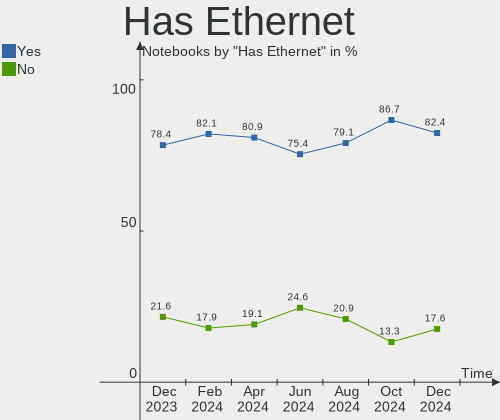
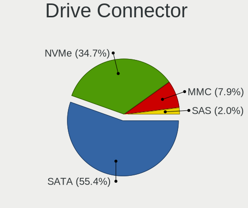
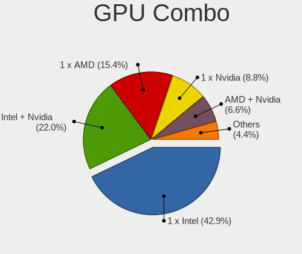
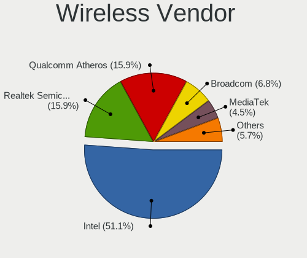

Linux in Poland - Hardware Trends (Notebooks)
---------------------------------------------

A project to identify most popular hardware characteristics and track their change
over time based on data collected by Linux users at https://Linux-Hardware.org.

Anyone can contribute to this report by the [hw-probe](https://github.com/linuxhw/hw-probe) tool:

    sudo -E hw-probe -all -upload

Period: Sep, 2023.

Contents
--------

* [ System ](#system)
  - [ OS                       ](#os)
  - [ OS Family                ](#os-family)
  - [ Kernel                   ](#kernel)
  - [ Kernel Family            ](#kernel-family)
  - [ Kernel Major Ver.        ](#kernel-major-ver)
  - [ Arch                     ](#arch)
  - [ DE                       ](#de)
  - [ Display Server           ](#display-server)
  - [ Display Manager          ](#display-manager)
  - [ OS Lang                  ](#os-lang)
  - [ Boot Mode                ](#boot-mode)
  - [ Filesystem               ](#filesystem)
  - [ Part. scheme             ](#part-scheme)
  - [ Dual Boot with Linux/BSD ](#dual-boot-with-linuxbsd)
  - [ Dual Boot (Win)          ](#dual-boot-win)

* [ Board ](#board)
  - [ Vendor                   ](#vendor)
  - [ Model                    ](#model)
  - [ Model Family             ](#model-family)
  - [ MFG Year                 ](#mfg-year)
  - [ Form Factor              ](#form-factor)
  - [ Secure Boot              ](#secure-boot)
  - [ Coreboot                 ](#coreboot)
  - [ RAM Size                 ](#ram-size)
  - [ RAM Used                 ](#ram-used)
  - [ Total Drives             ](#total-drives)
  - [ Has CD-ROM               ](#has-cd-rom)
  - [ Has Ethernet             ](#has-ethernet)
  - [ Has WiFi                 ](#has-wifi)
  - [ Has Bluetooth            ](#has-bluetooth)

* [ Location ](#location)
  - [ Country                  ](#country)
  - [ City                     ](#city)

* [ Drives ](#drives)
  - [ Drive Vendor             ](#drive-vendor)
  - [ Drive Model              ](#drive-model)
  - [ HDD Vendor               ](#hdd-vendor)
  - [ SSD Vendor               ](#ssd-vendor)
  - [ Drive Kind               ](#drive-kind)
  - [ Drive Connector          ](#drive-connector)
  - [ Drive Size               ](#drive-size)
  - [ Space Total              ](#space-total)
  - [ Space Used               ](#space-used)
  - [ Malfunc. Drives          ](#malfunc-drives)
  - [ Malfunc. Drive Vendor    ](#malfunc-drive-vendor)
  - [ Malfunc. HDD Vendor      ](#malfunc-hdd-vendor)
  - [ Malfunc. Drive Kind      ](#malfunc-drive-kind)
  - [ Failed Drives            ](#failed-drives)
  - [ Failed Drive Vendor      ](#failed-drive-vendor)
  - [ Drive Status             ](#drive-status)

* [ Storage controller ](#storage-controller)
  - [ Storage Vendor           ](#storage-vendor)
  - [ Storage Model            ](#storage-model)
  - [ Storage Kind             ](#storage-kind)

* [ Processor ](#processor)
  - [ CPU Vendor               ](#cpu-vendor)
  - [ CPU Model                ](#cpu-model)
  - [ CPU Model Family         ](#cpu-model-family)
  - [ CPU Cores                ](#cpu-cores)
  - [ CPU Sockets              ](#cpu-sockets)
  - [ CPU Threads              ](#cpu-threads)
  - [ CPU Op-Modes             ](#cpu-op-modes)
  - [ CPU Microcode            ](#cpu-microcode)
  - [ CPU Microarch            ](#cpu-microarch)

* [ Graphics ](#graphics)
  - [ GPU Vendor               ](#gpu-vendor)
  - [ GPU Model                ](#gpu-model)
  - [ GPU Combo                ](#gpu-combo)
  - [ GPU Driver               ](#gpu-driver)
  - [ GPU Memory               ](#gpu-memory)

* [ Monitor ](#monitor)
  - [ Monitor Vendor           ](#monitor-vendor)
  - [ Monitor Model            ](#monitor-model)
  - [ Monitor Resolution       ](#monitor-resolution)
  - [ Monitor Diagonal         ](#monitor-diagonal)
  - [ Monitor Width            ](#monitor-width)
  - [ Aspect Ratio             ](#aspect-ratio)
  - [ Monitor Area             ](#monitor-area)
  - [ Pixel Density            ](#pixel-density)
  - [ Multiple Monitors        ](#multiple-monitors)

* [ Network ](#network)
  - [ Net Controller Vendor    ](#net-controller-vendor)
  - [ Net Controller Model     ](#net-controller-model)
  - [ Wireless Vendor          ](#wireless-vendor)
  - [ Wireless Model           ](#wireless-model)
  - [ Ethernet Vendor          ](#ethernet-vendor)
  - [ Ethernet Model           ](#ethernet-model)
  - [ Net Controller Kind      ](#net-controller-kind)
  - [ Used Controller          ](#used-controller)
  - [ NICs                     ](#nics)
  - [ IPv6                     ](#ipv6)

* [ Bluetooth ](#bluetooth)
  - [ Bluetooth Vendor         ](#bluetooth-vendor)
  - [ Bluetooth Model          ](#bluetooth-model)

* [ Sound ](#sound)
  - [ Sound Vendor             ](#sound-vendor)
  - [ Sound Model              ](#sound-model)

* [ Memory ](#memory)
  - [ Memory Vendor            ](#memory-vendor)
  - [ Memory Model             ](#memory-model)
  - [ Memory Kind              ](#memory-kind)
  - [ Memory Form Factor       ](#memory-form-factor)
  - [ Memory Size              ](#memory-size)
  - [ Memory Speed             ](#memory-speed)

* [ Printers & scanners ](#printers--scanners)
  - [ Printer Vendor           ](#printer-vendor)
  - [ Printer Model            ](#printer-model)
  - [ Scanner Vendor           ](#scanner-vendor)
  - [ Scanner Model            ](#scanner-model)

* [ Camera ](#camera)
  - [ Camera Vendor            ](#camera-vendor)
  - [ Camera Model             ](#camera-model)

* [ Security ](#security)
  - [ Fingerprint Vendor       ](#fingerprint-vendor)
  - [ Fingerprint Model        ](#fingerprint-model)
  - [ Chipcard Vendor          ](#chipcard-vendor)
  - [ Chipcard Model           ](#chipcard-model)

* [ Unsupported ](#unsupported)
  - [ Unsupported Devices      ](#unsupported-devices)
  - [ Unsupported Device Types ](#unsupported-device-types)

System
------

OS
--

Installed operating systems

| Name                         | Notebooks | Percent |
|------------------------------|-----------|---------|
| Ubuntu 22.04                 | 15        | 20.83%  |
| OpenMandriva 23.03           | 5         | 6.94%   |
| Fedora 38                    | 5         | 6.94%   |
| Linux Mint 21.2              | 4         | 5.56%   |
| Debian 12                    | 4         | 5.56%   |
| Arch Rolling                 | 4         | 5.56%   |
| Zorin 16                     | 3         | 4.17%   |
| OpenMandriva 23.08           | 3         | 4.17%   |
| Xero Rolling                 | 2         | 2.78%   |
| Linux Mint 21.1              | 2         | 2.78%   |
| Kubuntu 22.04                | 2         | 2.78%   |
| Ubuntu 23.04                 | 1         | 1.39%   |
| Ubuntu 20.04                 | 1         | 1.39%   |
| SteamOS 3.5                  | 1         | 1.39%   |
| Pop!_OS 22.04                | 1         | 1.39%   |
| openSUSE Tumbleweed-XXXXXXXX | 1         | 1.39%   |
| OpenMandriva 23.09           | 1         | 1.39%   |
| OpenMandriva 23.01           | 1         | 1.39%   |
| MX 23                        | 1         | 1.39%   |
| Manjaro 23.0.2               | 1         | 1.39%   |
| Manjaro 23.0.1               | 1         | 1.39%   |
| LMDE 6                       | 1         | 1.39%   |
| LMDE 5                       | 1         | 1.39%   |
| Linux Mint 20.3              | 1         | 1.39%   |
| Linux Mint 19.3              | 1         | 1.39%   |
| KDE neon 22.04               | 1         | 1.39%   |
| Kali 2023.3                  | 1         | 1.39%   |
| Gentoo 2.14                  | 1         | 1.39%   |
| Garuda Linux Soaring         | 1         | 1.39%   |
| Funtoo                       | 1         | 1.39%   |
| Endless 5.0.6                | 1         | 1.39%   |
| Debian 11                    | 1         | 1.39%   |
| ArcoLinux Rolling            | 1         | 1.39%   |
| AlmaLinux 9.2                | 1         | 1.39%   |

OS Family
---------

OS without a version

| Name         | Notebooks | Percent |
|--------------|-----------|---------|
| Ubuntu       | 17        | 23.61%  |
| OpenMandriva | 10        | 13.89%  |
| Linux Mint   | 8         | 11.11%  |
| Fedora       | 5         | 6.94%   |
| Debian       | 5         | 6.94%   |
| Arch         | 4         | 5.56%   |
| Zorin        | 3         | 4.17%   |
| Xero         | 2         | 2.78%   |
| Manjaro      | 2         | 2.78%   |
| LMDE         | 2         | 2.78%   |
| Kubuntu      | 2         | 2.78%   |
| SteamOS      | 1         | 1.39%   |
| Pop!_OS      | 1         | 1.39%   |
| openSUSE     | 1         | 1.39%   |
| MX           | 1         | 1.39%   |
| KDE neon     | 1         | 1.39%   |
| Kali         | 1         | 1.39%   |
| Gentoo       | 1         | 1.39%   |
| Garuda Linux | 1         | 1.39%   |
| Funtoo       | 1         | 1.39%   |
| Endless      | 1         | 1.39%   |
| ArcoLinux    | 1         | 1.39%   |
| AlmaLinux    | 1         | 1.39%   |

Kernel
------

Version of the Linux kernel

| Version                      | Notebooks | Percent |
|------------------------------|-----------|---------|
| 6.2.0-33-generic             | 8         | 11.11%  |
| 6.2.6-desktop-1omv2390       | 5         | 6.94%   |
| 6.1.0-12-amd64               | 5         | 6.94%   |
| 6.4.12-arch1-1               | 4         | 5.56%   |
| 5.15.0-84-generic            | 4         | 5.56%   |
| 6.4.11-desktop-1omv2390      | 3         | 4.17%   |
| 5.15.0-83-generic            | 3         | 4.17%   |
| 6.4.15-200.fc38.x86_64       | 2         | 2.78%   |
| 6.4.13-200.fc38.x86_64       | 2         | 2.78%   |
| 6.2.0-32-generic             | 2         | 2.78%   |
| 6.2.0-31-generic             | 2         | 2.78%   |
| 5.4.0-162-generic            | 2         | 2.78%   |
| 5.15.0-82-generic            | 2         | 2.78%   |
| 6.5.5-200.fc38.x86_64        | 1         | 1.39%   |
| 6.5.4-hardened1-1-hardened   | 1         | 1.39%   |
| 6.5.3-zen1-1-zen             | 1         | 1.39%   |
| 6.5.3-desktop-1omv2390       | 1         | 1.39%   |
| 6.5.3-1-default              | 1         | 1.39%   |
| 6.5.0-1003-oem               | 1         | 1.39%   |
| 6.4.6-76060406-generic       | 1         | 1.39%   |
| 6.4.13-gentoo                | 1         | 1.39%   |
| 6.4.0-kali3-amd64            | 1         | 1.39%   |
| 6.4.0-1mx-ahs-amd64          | 1         | 1.39%   |
| 6.3.11_p1-debian-sources     | 1         | 1.39%   |
| 6.2.0-26-generic             | 1         | 1.39%   |
| 6.2.0-20-generic             | 1         | 1.39%   |
| 6.1.53-1-MANJARO             | 1         | 1.39%   |
| 6.1.53-1-lts                 | 1         | 1.39%   |
| 6.1.51-1-MANJARO             | 1         | 1.39%   |
| 6.1.50-1-lts                 | 1         | 1.39%   |
| 6.1.43-valve1-1-neptune-61   | 1         | 1.39%   |
| 6.1.1-desktop-1omv2290       | 1         | 1.39%   |
| 5.4.0-150-generic            | 1         | 1.39%   |
| 5.19.0-41-generic            | 1         | 1.39%   |
| 5.19.0-32-generic            | 1         | 1.39%   |
| 5.15.0-56-generic            | 1         | 1.39%   |
| 5.15.0-47-generic            | 1         | 1.39%   |
| 5.15.0-25-generic            | 1         | 1.39%   |
| 5.14.0-284.30.1.el9_2.x86_64 | 1         | 1.39%   |
| 5.10.0-25-amd64              | 1         | 1.39%   |

Kernel Family
-------------

Linux kernel without a distro release

| Version | Notebooks | Percent |
|---------|-----------|---------|
| 6.2.0   | 14        | 19.44%  |
| 5.15.0  | 12        | 16.67%  |
| 6.2.6   | 5         | 6.94%   |
| 6.1.0   | 5         | 6.94%   |
| 6.4.12  | 4         | 5.56%   |
| 6.5.3   | 3         | 4.17%   |
| 6.4.13  | 3         | 4.17%   |
| 6.4.11  | 3         | 4.17%   |
| 5.4.0   | 3         | 4.17%   |
| 6.4.15  | 2         | 2.78%   |
| 6.4.0   | 2         | 2.78%   |
| 6.1.53  | 2         | 2.78%   |
| 5.19.0  | 2         | 2.78%   |
| 5.10.0  | 2         | 2.78%   |
| 6.5.5   | 1         | 1.39%   |
| 6.5.4   | 1         | 1.39%   |
| 6.5.0   | 1         | 1.39%   |
| 6.4.6   | 1         | 1.39%   |
| 6.3.11  | 1         | 1.39%   |
| 6.1.51  | 1         | 1.39%   |
| 6.1.50  | 1         | 1.39%   |
| 6.1.43  | 1         | 1.39%   |
| 6.1.1   | 1         | 1.39%   |
| 5.14.0  | 1         | 1.39%   |

Kernel Major Ver.
-----------------

Linux kernel major version

| Version | Notebooks | Percent |
|---------|-----------|---------|
| 6.2     | 19        | 26.39%  |
| 6.4     | 15        | 20.83%  |
| 5.15    | 12        | 16.67%  |
| 6.1     | 11        | 15.28%  |
| 6.5     | 6         | 8.33%   |
| 5.4     | 3         | 4.17%   |
| 5.19    | 2         | 2.78%   |
| 5.10    | 2         | 2.78%   |
| 6.3     | 1         | 1.39%   |
| 5.14    | 1         | 1.39%   |

Arch
----

OS architecture (x86_64, i586, etc.)

| Name   | Notebooks | Percent |
|--------|-----------|---------|
| x86_64 | 72        | 100%    |

DE
--

Desktop Environment

| Name          | Notebooks | Percent |
|---------------|-----------|---------|
| GNOME         | 31        | 43.06%  |
| KDE5          | 19        | 26.39%  |
| X-Cinnamon    | 8         | 11.11%  |
| XFCE          | 7         | 9.72%   |
| LXQt          | 3         | 4.17%   |
| Endless:GNOME | 1         | 1.39%   |
| Cinnamon      | 1         | 1.39%   |
| Budgie        | 1         | 1.39%   |
| Unknown       | 1         | 1.39%   |

Display Server
--------------

X11 or Wayland

| Name    | Notebooks | Percent |
|---------|-----------|---------|
| X11     | 43        | 59.72%  |
| Wayland | 29        | 40.28%  |

Display Manager
---------------

SDDM, LightDM, etc.

| Name    | Notebooks | Percent |
|---------|-----------|---------|
| GDM3    | 18        | 25%     |
| SDDM    | 17        | 23.61%  |
| Unknown | 17        | 23.61%  |
| LightDM | 14        | 19.44%  |
| GDM     | 5         | 6.94%   |
| Ly      | 1         | 1.39%   |

OS Lang
-------

Language

| Lang    | Notebooks | Percent |
|---------|-----------|---------|
| pl_PL   | 37        | 51.39%  |
| en_US   | 26        | 36.11%  |
| en_GB   | 3         | 4.17%   |
| ru_RU   | 2         | 2.78%   |
| C       | 2         | 2.78%   |
| be_BY   | 1         | 1.39%   |
| Unknown | 1         | 1.39%   |

Boot Mode
---------

EFI or BIOS

| Mode | Notebooks | Percent |
|------|-----------|---------|
| EFI  | 44        | 61.11%  |
| BIOS | 28        | 38.89%  |

Filesystem
----------

Type of filesystem

| Type    | Notebooks | Percent |
|---------|-----------|---------|
| Ext4    | 40        | 55.56%  |
| Tmpfs   | 10        | 13.89%  |
| Overlay | 9         | 12.5%   |
| Btrfs   | 9         | 12.5%   |
| Zfs     | 2         | 2.78%   |
| Xfs     | 2         | 2.78%   |

Part. scheme
------------

Scheme of partitioning

| Type    | Notebooks | Percent |
|---------|-----------|---------|
| GPT     | 48        | 66.67%  |
| Unknown | 17        | 23.61%  |
| MBR     | 7         | 9.72%   |

Dual Boot with Linux/BSD
------------------------

Hosting more than one Linux/BSD

| Dual boot | Notebooks | Percent |
|-----------|-----------|---------|
| No        | 60        | 83.33%  |
| Yes       | 12        | 16.67%  |

Dual Boot (Win)
---------------

Hosting Linux and Windows

| Dual boot | Notebooks | Percent |
|-----------|-----------|---------|
| No        | 49        | 68.06%  |
| Yes       | 23        | 31.94%  |

Board
-----

Vendor
------

Motherboard manufacturer

| Name             | Notebooks | Percent |
|------------------|-----------|---------|
| Lenovo           | 25        | 34.72%  |
| Hewlett-Packard  | 14        | 19.44%  |
| Dell             | 13        | 18.06%  |
| ASUSTek Computer | 7         | 9.72%   |
| Acer             | 3         | 4.17%   |
| HUAWEI           | 2         | 2.78%   |
| Google           | 2         | 2.78%   |
| XIAOMI           | 1         | 1.39%   |
| Valve            | 1         | 1.39%   |
| Prestigio        | 1         | 1.39%   |
| LG Electronics   | 1         | 1.39%   |
| IGEL Technology  | 1         | 1.39%   |
| Unknown          | 1         | 1.39%   |

Model
-----

Motherboard model

| Name                                  | Notebooks | Percent |
|---------------------------------------|-----------|---------|
| HP ProBook 6560b                      | 2         | 2.78%   |
| HP Pavilion Aero Laptop 13-be0xxx     | 2         | 2.78%   |
| HP Notebook                           | 2         | 2.78%   |
| Dell Latitude 5421                    | 2         | 2.78%   |
| XIAOMI Redmi Book Pro 15 2023         | 1         | 1.39%   |
| Valve Jupiter                         | 1         | 1.39%   |
| Prestigio Smartbook PSB116A           | 1         | 1.39%   |
| LG 15Z990-U.AAS5U1                    | 1         | 1.39%   |
| Lenovo Z51-70 80K6                    | 1         | 1.39%   |
| Lenovo ThinkPad X301 2774LEG          | 1         | 1.39%   |
| Lenovo ThinkPad X280 20KESAA400       | 1         | 1.39%   |
| Lenovo ThinkPad X270 20HMS0DF00       | 1         | 1.39%   |
| Lenovo ThinkPad T590 20N5S31U02       | 1         | 1.39%   |
| Lenovo ThinkPad T480s 20L8S77U15      | 1         | 1.39%   |
| Lenovo ThinkPad T470 W10DG 20JNS05Y00 | 1         | 1.39%   |
| Lenovo ThinkPad T460 20FN003LMS       | 1         | 1.39%   |
| Lenovo ThinkPad T430 2349HNU          | 1         | 1.39%   |
| Lenovo ThinkPad S5-S540 20B30064MH    | 1         | 1.39%   |
| Lenovo ThinkPad P15v Gen 3 21D80006PB | 1         | 1.39%   |
| Lenovo ThinkPad L390 20NSS04400       | 1         | 1.39%   |
| Lenovo ThinkPad E580 20KS001RUK       | 1         | 1.39%   |
| Lenovo ThinkPad E15 Gen 2 20T8000MPB  | 1         | 1.39%   |
| Lenovo ThinkPad 13 2nd Gen 20J2S0TE00 | 1         | 1.39%   |
| Lenovo Legion Y540-17IRH 81Q4         | 1         | 1.39%   |
| Lenovo Legion 5 Pro 16ITH6H 82JD      | 1         | 1.39%   |
| Lenovo Legion 5 15ACH6H 82JU          | 1         | 1.39%   |
| Lenovo IdeaPad Y700-15ISK 80NV        | 1         | 1.39%   |
| Lenovo IdeaPad Y530                   | 1         | 1.39%   |
| Lenovo IdeaPad 5 Pro 14ACN6 82L7      | 1         | 1.39%   |
| Lenovo IdeaPad 320-15ISK 80XH         | 1         | 1.39%   |
| Lenovo IdeaPad 300-15ISK 80Q7         | 1         | 1.39%   |
| Lenovo IdeaPad 3 15ALC6 82KU          | 1         | 1.39%   |
| Lenovo G565 20071                     | 1         | 1.39%   |
| IGEL M330C                            | 1         | 1.39%   |
| HUAWEI KLVL-WXXW                      | 1         | 1.39%   |
| HUAWEI KLVL-WXX9                      | 1         | 1.39%   |
| HP ProBook 6470b                      | 1         | 1.39%   |
| HP OMEN by Laptop 15-ce0xx            | 1         | 1.39%   |
| HP G72                                | 1         | 1.39%   |
| HP EliteBook 840 G3                   | 1         | 1.39%   |

Model Family
------------

Motherboard model prefix

| Name                | Notebooks | Percent |
|---------------------|-----------|---------|
| Lenovo ThinkPad     | 14        | 19.44%  |
| Dell Latitude       | 7         | 9.72%   |
| Lenovo IdeaPad      | 6         | 8.33%   |
| Lenovo Legion       | 3         | 4.17%   |
| HP ProBook          | 3         | 4.17%   |
| HP EliteBook        | 3         | 4.17%   |
| Dell Precision      | 3         | 4.17%   |
| ASUS VivoBook       | 3         | 4.17%   |
| HP Pavilion         | 2         | 2.78%   |
| HP Notebook         | 2         | 2.78%   |
| Dell Inspiron       | 2         | 2.78%   |
| Acer Nitro          | 2         | 2.78%   |
| XIAOMI Redmi        | 1         | 1.39%   |
| Valve Jupiter       | 1         | 1.39%   |
| Prestigio Smartbook | 1         | 1.39%   |
| LG 15Z990-U.AAS5U1  | 1         | 1.39%   |
| Lenovo Z51-70       | 1         | 1.39%   |
| Lenovo G565         | 1         | 1.39%   |
| IGEL M330C          | 1         | 1.39%   |
| HUAWEI KLVL-WXXW    | 1         | 1.39%   |
| HUAWEI KLVL-WXX9    | 1         | 1.39%   |
| HP OMEN             | 1         | 1.39%   |
| HP G72              | 1         | 1.39%   |
| HP 620              | 1         | 1.39%   |
| HP 250              | 1         | 1.39%   |
| Google Phaser360    | 1         | 1.39%   |
| Google Blorb        | 1         | 1.39%   |
| Dell System         | 1         | 1.39%   |
| ASUS ZenBook        | 1         | 1.39%   |
| ASUS P553UJ         | 1         | 1.39%   |
| ASUS K55VJ          | 1         | 1.39%   |
| ASUS ASUS           | 1         | 1.39%   |
| Acer Aspire         | 1         | 1.39%   |
| Unknown             | 1         | 1.39%   |

MFG Year
--------

Motherboard manufacture year

| Year    | Notebooks | Percent |
|---------|-----------|---------|
| 2018    | 11        | 15.28%  |
| 2021    | 9         | 12.5%   |
| 2019    | 7         | 9.72%   |
| 2020    | 5         | 6.94%   |
| 2017    | 5         | 6.94%   |
| 2011    | 5         | 6.94%   |
| 2023    | 4         | 5.56%   |
| 2022    | 4         | 5.56%   |
| 2016    | 4         | 5.56%   |
| 2015    | 4         | 5.56%   |
| 2012    | 3         | 4.17%   |
| 2010    | 3         | 4.17%   |
| 2014    | 2         | 2.78%   |
| 2013    | 2         | 2.78%   |
| 2009    | 2         | 2.78%   |
| 2008    | 1         | 1.39%   |
| Unknown | 1         | 1.39%   |

Form Factor
-----------

Physical design of the computer

| Name     | Notebooks | Percent |
|----------|-----------|---------|
| Notebook | 72        | 100%    |

Secure Boot
-----------

Enabled or disabled

| State    | Notebooks | Percent |
|----------|-----------|---------|
| Disabled | 66        | 91.67%  |
| Enabled  | 6         | 8.33%   |

Coreboot
--------

Have coreboot on board

| Used | Notebooks | Percent |
|------|-----------|---------|
| No   | 70        | 97.22%  |
| Yes  | 2         | 2.78%   |

RAM Size
--------

Total RAM memory

| Size in GB  | Notebooks | Percent |
|-------------|-----------|---------|
| 4.01-8.0    | 22        | 30.56%  |
| 8.01-16.0   | 15        | 20.83%  |
| 16.01-24.0  | 12        | 16.67%  |
| 32.01-64.0  | 8         | 11.11%  |
| 3.01-4.0    | 8         | 11.11%  |
| 24.01-32.0  | 3         | 4.17%   |
| 1.01-2.0    | 2         | 2.78%   |
| 2.01-3.0    | 1         | 1.39%   |
| 64.01-256.0 | 1         | 1.39%   |

RAM Used
--------

Used RAM memory

| Used GB    | Notebooks | Percent |
|------------|-----------|---------|
| 2.01-3.0   | 23        | 31.94%  |
| 4.01-8.0   | 18        | 25%     |
| 1.01-2.0   | 13        | 18.06%  |
| 3.01-4.0   | 8         | 11.11%  |
| 8.01-16.0  | 6         | 8.33%   |
| 0.51-1.0   | 3         | 4.17%   |
| 16.01-24.0 | 1         | 1.39%   |

Total Drives
------------

Number of drives on board

| Drives | Notebooks | Percent |
|--------|-----------|---------|
| 1      | 56        | 77.78%  |
| 2      | 12        | 16.67%  |
| 3      | 4         | 5.56%   |

Has CD-ROM
----------

Has CD-ROM on board

| Presented | Notebooks | Percent |
|-----------|-----------|---------|
| No        | 51        | 70.83%  |
| Yes       | 21        | 29.17%  |

Has Ethernet
------------

Has Ethernet on board

| Presented | Notebooks | Percent |
|-----------|-----------|---------|
| Yes       | 58        | 80.56%  |
| No        | 14        | 19.44%  |

Has WiFi
--------

Has WiFi module

| Presented | Notebooks | Percent |
|-----------|-----------|---------|
| Yes       | 69        | 95.83%  |
| No        | 3         | 4.17%   |

Has Bluetooth
-------------

Has Bluetooth module

| Presented | Notebooks | Percent |
|-----------|-----------|---------|
| Yes       | 60        | 83.33%  |
| No        | 12        | 16.67%  |

Location
--------

Country
-------

Geographic location (country)

| Country | Notebooks | Percent |
|---------|-----------|---------|
| Poland  | 72        | 100%    |

City
----

Geographic location (city)

| City               | Notebooks | Percent |
|--------------------|-----------|---------|
| Warsaw             | 14        | 19.44%  |
| Krakow             | 9         | 12.5%   |
| Wroclaw            | 5         | 6.94%   |
| Poznan             | 5         | 6.94%   |
| Katowice           | 5         | 6.94%   |
| Gdansk             | 5         | 6.94%   |
| Rzeszów           | 2         | 2.78%   |
| Gdynia             | 2         | 2.78%   |
| Bydgoszcz          | 2         | 2.78%   |
| Żywiec            | 1         | 1.39%   |
| Zgierz             | 1         | 1.39%   |
| Zduny              | 1         | 1.39%   |
| Władysławowo     | 1         | 1.39%   |
| Wronki             | 1         | 1.39%   |
| Tarnowskie Gory    | 1         | 1.39%   |
| Szczecin           | 1         | 1.39%   |
| Starogard Gdański | 1         | 1.39%   |
| Sosnowiec          | 1         | 1.39%   |
| Siedlce            | 1         | 1.39%   |
| Sidzina            | 1         | 1.39%   |
| Pila               | 1         | 1.39%   |
| Nowogard           | 1         | 1.39%   |
| Maslow             | 1         | 1.39%   |
| Krosno             | 1         | 1.39%   |
| Kramsk             | 1         | 1.39%   |
| Jaworzno           | 1         | 1.39%   |
| Halinow            | 1         | 1.39%   |
| Cieszyn            | 1         | 1.39%   |
| Cekcyn             | 1         | 1.39%   |
| Bytom              | 1         | 1.39%   |
| Brzeg              | 1         | 1.39%   |
| Bialystok          | 1         | 1.39%   |

Drives
------

Drive Vendor
------------

Hard drive vendors

| Vendor                       | Notebooks | Drives | Percent |
|------------------------------|-----------|--------|---------|
| Samsung Electronics          | 19        | 21     | 21.11%  |
| WDC                          | 7         | 8      | 7.78%   |
| Seagate                      | 7         | 7      | 7.78%   |
| GOODRAM                      | 6         | 6      | 6.67%   |
| Unknown                      | 5         | 5      | 5.56%   |
| SK hynix                     | 5         | 5      | 5.56%   |
| Kingston                     | 4         | 4      | 4.44%   |
| Intel                        | 4         | 4      | 4.44%   |
| Toshiba                      | 3         | 3      | 3.33%   |
| SanDisk                      | 3         | 3      | 3.33%   |
| Phison Electronics           | 3         | 3      | 3.33%   |
| Hitachi                      | 3         | 3      | 3.33%   |
| A-DATA Technology            | 3         | 3      | 3.33%   |
| Micron Technology            | 2         | 2      | 2.22%   |
| Crucial                      | 2         | 2      | 2.22%   |
| Apacer                       | 2         | 2      | 2.22%   |
| Union Memory                 | 1         | 1      | 1.11%   |
| Team                         | 1         | 1      | 1.11%   |
| SSDPR-CX                     | 1         | 1      | 1.11%   |
| Shenzhen Longsys Electronics | 1         | 1      | 1.11%   |
| POLION                       | 1         | 1      | 1.11%   |
| Phison                       | 1         | 1      | 1.11%   |
| LITEON                       | 1         | 1      | 1.11%   |
| Lexar                        | 1         | 1      | 1.11%   |
| KIOXIA                       | 1         | 1      | 1.11%   |
| Gigabyte Technology          | 1         | 1      | 1.11%   |
| ADATA Technology             | 1         | 1      | 1.11%   |
| Unknown                      | 1         | 1      | 1.11%   |

Drive Model
-----------

Hard drive models

| Model                                               | Notebooks | Percent |
|-----------------------------------------------------|-----------|---------|
| Samsung NVMe SSD Controller SM981/PM981/PM983 256GB | 5         | 5.43%   |
| GOODRAM SSDPR-CX400-256-G2 256GB                    | 3         | 3.26%   |
| Unknown MMC Card  128GB                             | 2         | 2.17%   |
| Seagate ST1000LM024 HN-M101MBB 1TB                  | 2         | 2.17%   |
| Seagate ST1000LM014-SSHD-8GB                        | 2         | 2.17%   |
| Samsung MZALQ512HBLU-00BL2 512GB                    | 2         | 2.17%   |
| Phison E12 NVMe Controller 2TB                      | 2         | 2.17%   |
| Kingston SA400S37240G 240GB SSD                     | 2         | 2.17%   |
| GOODRAM SSDPR-CX400-01T-G2 1024GB                   | 2         | 2.17%   |
| WDC WDS240G2G0B-00EPW0 240GB SSD                    | 1         | 1.09%   |
| WDC WDS240G2G0A-00JH30 240GB SSD                    | 1         | 1.09%   |
| WDC WDS100T2B0B-00YS70 1TB SSD                      | 1         | 1.09%   |
| WDC WD10SPZX-75Z10T2 1TB                            | 1         | 1.09%   |
| WDC WD10SPCX-24HWST1 1TB                            | 1         | 1.09%   |
| WDC WD10JPVX-22JC3T0 1TB                            | 1         | 1.09%   |
| WDC WD10JPCX-24UE4T0 1TB                            | 1         | 1.09%   |
| WDC PC SN530 SDBPNPZ-512G-1014 512GB                | 1         | 1.09%   |
| Unknown MMC Card  64GB                              | 1         | 1.09%   |
| Unknown MMC Card  2GB                               | 1         | 1.09%   |
| Unknown DA4032  32GB                                | 1         | 1.09%   |
| Union Memory UMIS RPJTJ512MEE1OWX 512GB             | 1         | 1.09%   |
| Toshiba THNS064GG2BAAA-NonFDE 64GB SSD              | 1         | 1.09%   |
| Toshiba MQ01ABD050 500GB                            | 1         | 1.09%   |
| Toshiba KXG60ZNV512G NVMe 512GB                     | 1         | 1.09%   |
| Team T253X2001T 1TB SSD                             | 1         | 1.09%   |
| SSDPR-CX 400-512 512GB                              | 1         | 1.09%   |
| SK hynix SKHynix_HFS512GDE9X081N 512GB              | 1         | 1.09%   |
| SK hynix HFM512GD3JX013N 512GB                      | 1         | 1.09%   |
| SK hynix BC711 NVMe 512GB                           | 1         | 1.09%   |
| SK hynix BC711 HFM512GD3JX013N 512GB                | 1         | 1.09%   |
| SK hynix BC501 NVMe Solid State Drive 512GB         | 1         | 1.09%   |
| Shenzhen Longsys Lexar SSD NM620 1TB                | 1         | 1.09%   |
| Seagate ST500LT012-1DG142 500GB                     | 1         | 1.09%   |
| Seagate ST320LT007-9ZV142 320GB                     | 1         | 1.09%   |
| Seagate Basic 1TB                                   | 1         | 1.09%   |
| Sandisk WD Blue SN550 NVMe SSD 512GB                | 1         | 1.09%   |
| SanDisk SD8SBAT256G1002 256GB SSD                   | 1         | 1.09%   |
| SanDisk DF4032  32GB                                | 1         | 1.09%   |
| Samsung SSD PM810 TM 128GB                          | 1         | 1.09%   |
| Samsung SSD 980 PRO 2TB S69ENX0W634632T             | 1         | 1.09%   |

HDD Vendor
----------

Hard disk drive vendors

| Vendor              | Notebooks | Drives | Percent |
|---------------------|-----------|--------|---------|
| Seagate             | 6         | 6      | 40%     |
| WDC                 | 4         | 4      | 26.67%  |
| Hitachi             | 3         | 3      | 20%     |
| Toshiba             | 1         | 1      | 6.67%   |
| Samsung Electronics | 1         | 1      | 6.67%   |

SSD Vendor
----------

Solid state drive vendors

| Vendor              | Notebooks | Drives | Percent |
|---------------------|-----------|--------|---------|
| GOODRAM             | 6         | 6      | 19.35%  |
| Samsung Electronics | 4         | 5      | 12.9%   |
| Kingston            | 4         | 4      | 12.9%   |
| WDC                 | 3         | 3      | 9.68%   |
| A-DATA Technology   | 3         | 3      | 9.68%   |
| Micron Technology   | 2         | 2      | 6.45%   |
| Crucial             | 2         | 2      | 6.45%   |
| Toshiba             | 1         | 1      | 3.23%   |
| Team                | 1         | 1      | 3.23%   |
| SanDisk             | 1         | 1      | 3.23%   |
| POLION              | 1         | 1      | 3.23%   |
| LITEON              | 1         | 1      | 3.23%   |
| Intel               | 1         | 1      | 3.23%   |
| Apacer              | 1         | 1      | 3.23%   |

Drive Kind
----------

HDD or SSD

| Kind    | Notebooks | Drives | Percent |
|---------|-----------|--------|---------|
| NVMe    | 33        | 37     | 38.82%  |
| SSD     | 29        | 32     | 34.12%  |
| HDD     | 14        | 15     | 16.47%  |
| MMC     | 7         | 7      | 8.24%   |
| Unknown | 2         | 2      | 2.35%   |

Drive Connector
---------------

SATA, SAS, NVMe, etc.

| Type | Notebooks | Drives | Percent |
|------|-----------|--------|---------|
| SATA | 39        | 45     | 47.56%  |
| NVMe | 33        | 37     | 40.24%  |
| MMC  | 7         | 7      | 8.54%   |
| SAS  | 3         | 4      | 3.66%   |

Drive Size
----------

Size of hard drive

| Size in TB | Notebooks | Drives | Percent |
|------------|-----------|--------|---------|
| 0.01-0.5   | 26        | 29     | 60.47%  |
| 0.51-1.0   | 15        | 16     | 34.88%  |
| 1.01-2.0   | 2         | 2      | 4.65%   |

Space Total
-----------

Amount of disk space available on the file system

| Size in GB     | Notebooks | Percent |
|----------------|-----------|---------|
| 251-500        | 19        | 26.39%  |
| 101-250        | 19        | 26.39%  |
| 1-20           | 9         | 12.5%   |
| 51-100         | 6         | 8.33%   |
| 1001-2000      | 5         | 6.94%   |
| 501-1000       | 5         | 6.94%   |
| Unknown        | 4         | 5.56%   |
| 21-50          | 2         | 2.78%   |
| 2001-3000      | 2         | 2.78%   |
| More than 3000 | 1         | 1.39%   |

Space Used
----------

Amount of used disk space

| Used GB   | Notebooks | Percent |
|-----------|-----------|---------|
| 1-20      | 25        | 34.72%  |
| 101-250   | 14        | 19.44%  |
| 21-50     | 12        | 16.67%  |
| 51-100    | 9         | 12.5%   |
| 251-500   | 4         | 5.56%   |
| Unknown   | 4         | 5.56%   |
| 501-1000  | 2         | 2.78%   |
| 2001-3000 | 1         | 1.39%   |
| 1001-2000 | 1         | 1.39%   |

Malfunc. Drives
---------------

Drive models with a malfunction

| Model                                               | Notebooks | Drives | Percent |
|-----------------------------------------------------|-----------|--------|---------|
| Seagate ST1000LM014-SSHD-8GB                        | 2         | 2      | 22.22%  |
| SK hynix BC711 HFM512GD3JX013N 512GB                | 1         | 1      | 11.11%  |
| Samsung Electronics SSD PM810 TM 128GB              | 1         | 1      | 11.11%  |
| POLION SSD 240GB                                    | 1         | 1      | 11.11%  |
| Micron Technology MTFDDAV512MBF-1AN15ABHA 512GB SSD | 1         | 1      | 11.11%  |
| Micron Technology MTFDDAV256TDL-1AW1ZABHA 256GB SSD | 1         | 1      | 11.11%  |
| Kingston SA400S37240G 240GB SSD                     | 1         | 1      | 11.11%  |
| Hitachi HTS725032A9A364 320GB                       | 1         | 1      | 11.11%  |

Malfunc. Drive Vendor
---------------------

Vendors of faulty drives

| Vendor              | Notebooks | Drives | Percent |
|---------------------|-----------|--------|---------|
| Seagate             | 2         | 2      | 22.22%  |
| Micron Technology   | 2         | 2      | 22.22%  |
| SK hynix            | 1         | 1      | 11.11%  |
| Samsung Electronics | 1         | 1      | 11.11%  |
| POLION              | 1         | 1      | 11.11%  |
| Kingston            | 1         | 1      | 11.11%  |
| Hitachi             | 1         | 1      | 11.11%  |

Malfunc. HDD Vendor
-------------------

Vendors of faulty HDD drives

| Vendor  | Notebooks | Drives | Percent |
|---------|-----------|--------|---------|
| Seagate | 2         | 2      | 66.67%  |
| Hitachi | 1         | 1      | 33.33%  |

Malfunc. Drive Kind
-------------------

Kinds of faulty drives

| Kind | Notebooks | Drives | Percent |
|------|-----------|--------|---------|
| SSD  | 5         | 5      | 55.56%  |
| HDD  | 3         | 3      | 33.33%  |
| NVMe | 1         | 1      | 11.11%  |

Failed Drives
-------------

Failed drive models

Zero info for selected period =(

Failed Drive Vendor
-------------------

Failed drive vendors

Zero info for selected period =(

Drive Status
------------

Number of failed and malfunc. drives

| Status   | Notebooks | Drives | Percent |
|----------|-----------|--------|---------|
| Works    | 35        | 42     | 46.05%  |
| Detected | 32        | 42     | 42.11%  |
| Malfunc  | 9         | 9      | 11.84%  |

Storage controller
------------------

Storage Vendor
--------------

Storage controller vendors

| Vendor                       | Notebooks | Percent |
|------------------------------|-----------|---------|
| Intel                        | 42        | 49.41%  |
| Samsung Electronics          | 14        | 16.47%  |
| AMD                          | 9         | 10.59%  |
| SK hynix                     | 5         | 5.88%   |
| Phison Electronics           | 5         | 5.88%   |
| Shenzhen Longsys Electronics | 2         | 2.35%   |
| SanDisk                      | 2         | 2.35%   |
| VIA Technologies             | 1         | 1.18%   |
| Union Memory (Shenzhen)      | 1         | 1.18%   |
| Toshiba America Info Systems | 1         | 1.18%   |
| Silicon Motion               | 1         | 1.18%   |
| KIOXIA                       | 1         | 1.18%   |
| ADATA Technology             | 1         | 1.18%   |

Storage Model
-------------

Storage controller models

| Model                                                                        | Notebooks | Percent |
|------------------------------------------------------------------------------|-----------|---------|
| Intel Sunrise Point-LP SATA Controller [AHCI mode]                           | 8         | 9.09%   |
| AMD FCH SATA Controller [AHCI mode]                                          | 8         | 9.09%   |
| Samsung NVMe SSD Controller SM981/PM981/PM983                                | 6         | 6.82%   |
| Intel 6 Series/C200 Series Chipset Family 6 port Mobile SATA AHCI Controller | 5         | 5.68%   |
| SK hynix Gold P31/BC711/PC711 NVMe Solid State Drive                         | 4         | 4.55%   |
| Samsung NVMe SSD Controller 980                                              | 4         | 4.55%   |
| Intel Wildcat Point-LP SATA Controller [AHCI Mode]                           | 4         | 4.55%   |
| Intel 82801 Mobile SATA Controller [RAID mode]                               | 4         | 4.55%   |
| Samsung NVMe SSD Controller PM9A1/PM9A3/980PRO                               | 3         | 3.41%   |
| Intel 82801IBM/IEM (ICH9M/ICH9M-E) 4 port SATA Controller [AHCI mode]        | 3         | 3.41%   |
| Intel 7 Series Chipset Family 6-port SATA Controller [AHCI mode]             | 3         | 3.41%   |
| Shenzhen Longsys Lexar NM620 NVME SSD (DRAM-less)                            | 2         | 2.27%   |
| SanDisk WD Blue SN550 NVMe SSD                                               | 2         | 2.27%   |
| Phison PS5013 E13 NVMe Controller                                            | 2         | 2.27%   |
| Phison E12 NVMe Controller                                                   | 2         | 2.27%   |
| Intel Volume Management Device NVMe RAID Controller                          | 2         | 2.27%   |
| Intel SSD 670p Series [Keystone Harbor]                                      | 2         | 2.27%   |
| Intel HM170/QM170 Chipset SATA Controller [AHCI Mode]                        | 2         | 2.27%   |
| Intel Celeron/Pentium Silver Processor SATA Controller                       | 2         | 2.27%   |
| Intel Cannon Lake Mobile PCH SATA AHCI Controller                            | 2         | 2.27%   |
| VIA VX900 Series Serial-ATA Controller                                       | 1         | 1.14%   |
| Union Memory (Shenzhen) AM620 PCIe 3.0 NVMe SSD 512GB                        | 1         | 1.14%   |
| Toshiba America Info Systems XG6 NVMe SSD Controller                         | 1         | 1.14%   |
| SK hynix BC501 NVMe Solid State Drive                                        | 1         | 1.14%   |
| Silicon Motion SM2263EN/SM2263XT (DRAM-less) NVMe SSD Controllers            | 1         | 1.14%   |
| Samsung NVMe SSD Controller SM961/PM961/SM963                                | 1         | 1.14%   |
| Phison E16 PCIe4 NVMe Controller                                             | 1         | 1.14%   |
| KIOXIA NVMe SSD Controller BG5 (DRAM-less)                                   | 1         | 1.14%   |
| Intel Tiger Lake SATA AHCI Controller                                        | 1         | 1.14%   |
| Intel SSD DC P4101/Pro 7600p/760p/E 6100p Series                             | 1         | 1.14%   |
| Intel Cannon Point-LP SATA Controller [AHCI Mode]                            | 1         | 1.14%   |
| Intel 82801IBM/IEM (ICH9M/ICH9M-E) 2 port SATA Controller [IDE mode]         | 1         | 1.14%   |
| Intel 8 Series SATA Controller 1 [AHCI mode]                                 | 1         | 1.14%   |
| Intel 5 Series/3400 Series Chipset 4 port SATA AHCI Controller               | 1         | 1.14%   |
| Intel 400 Series Chipset Family SATA AHCI Controller                         | 1         | 1.14%   |
| AMD SB7x0/SB8x0/SB9x0 SATA Controller [IDE mode]                             | 1         | 1.14%   |
| AMD SB7x0/SB8x0/SB9x0 IDE Controller                                         | 1         | 1.14%   |
| ADATA LEGEND 960 NVMe SSD                                                    | 1         | 1.14%   |

Storage Kind
------------

Kind of storage controller (IDE, SATA, NVMe, SAS, ...)

| Kind | Notebooks | Percent |
|------|-----------|---------|
| SATA | 43        | 50.59%  |
| NVMe | 33        | 38.82%  |
| RAID | 6         | 7.06%   |
| IDE  | 3         | 3.53%   |

Processor
---------

CPU Vendor
----------

Processor vendors

| Vendor       | Notebooks | Percent |
|--------------|-----------|---------|
| Intel        | 54        | 75%     |
| AMD          | 17        | 23.61%  |
| CentaurHauls | 1         | 1.39%   |

CPU Model
---------

Processor models

| Model                                         | Notebooks | Percent |
|-----------------------------------------------|-----------|---------|
| Intel Core i7-6500U CPU @ 2.50GHz             | 3         | 4.17%   |
| Intel Pentium CPU 3825U @ 1.90GHz             | 2         | 2.78%   |
| Intel Core i5-8350U CPU @ 1.70GHz             | 2         | 2.78%   |
| Intel Core i5-8265U CPU @ 1.60GHz             | 2         | 2.78%   |
| Intel Core i5-5200U CPU @ 2.20GHz             | 2         | 2.78%   |
| Intel Core i5-3320M CPU @ 2.60GHz             | 2         | 2.78%   |
| Intel Core 2 Duo CPU U9400 @ 1.40GHz          | 2         | 2.78%   |
| Intel Celeron N4020 CPU @ 1.10GHz             | 2         | 2.78%   |
| AMD Ryzen 5 5600U with Radeon Graphics        | 2         | 2.78%   |
| AMD Ryzen 5 4600H with Radeon Graphics        | 2         | 2.78%   |
| AMD Ryzen 5 2500U with Radeon Vega Mobile Gfx | 2         | 2.78%   |
| Intel Pentium CPU P6100 @ 2.00GHz             | 1         | 1.39%   |
| Intel Core i7-9750H CPU @ 2.60GHz             | 1         | 1.39%   |
| Intel Core i7-8850H CPU @ 2.60GHz             | 1         | 1.39%   |
| Intel Core i7-8650U CPU @ 1.90GHz             | 1         | 1.39%   |
| Intel Core i7-8550U CPU @ 1.80GHz             | 1         | 1.39%   |
| Intel Core i7-7700HQ CPU @ 2.80GHz            | 1         | 1.39%   |
| Intel Core i7-4810MQ CPU @ 2.80GHz            | 1         | 1.39%   |
| Intel Core i7-4500U CPU @ 1.80GHz             | 1         | 1.39%   |
| Intel Core i7-3610QM CPU @ 2.30GHz            | 1         | 1.39%   |
| Intel Core i7-2820QM CPU @ 2.30GHz            | 1         | 1.39%   |
| Intel Core i5-8365U CPU @ 1.60GHz             | 1         | 1.39%   |
| Intel Core i5-8250U CPU @ 1.60GHz             | 1         | 1.39%   |
| Intel Core i5-7300U CPU @ 2.60GHz             | 1         | 1.39%   |
| Intel Core i5-6300U CPU @ 2.40GHz             | 1         | 1.39%   |
| Intel Core i5-6300HQ CPU @ 2.30GHz            | 1         | 1.39%   |
| Intel Core i5-6200U CPU @ 2.30GHz             | 1         | 1.39%   |
| Intel Core i5-2540M CPU @ 2.60GHz             | 1         | 1.39%   |
| Intel Core i5-2410M CPU @ 2.30GHz             | 1         | 1.39%   |
| Intel Core i5-10300H CPU @ 2.50GHz            | 1         | 1.39%   |
| Intel Core i3-7100U CPU @ 2.40GHz             | 1         | 1.39%   |
| Intel Core i3-7020U CPU @ 2.30GHz             | 1         | 1.39%   |
| Intel Core i3-6100U CPU @ 2.30GHz             | 1         | 1.39%   |
| Intel Core i3-6006U CPU @ 2.00GHz             | 1         | 1.39%   |
| Intel Core i3-2350M CPU @ 2.30GHz             | 1         | 1.39%   |
| Intel Core 2 Duo CPU T9600 @ 2.80GHz          | 1         | 1.39%   |
| Intel Core 2 Duo CPU T6570 @ 2.10GHz          | 1         | 1.39%   |
| Intel Celeron N4100 CPU @ 1.10GHz             | 1         | 1.39%   |
| Intel Celeron N4000 CPU @ 1.10GHz             | 1         | 1.39%   |
| Intel Celeron CPU B840 @ 1.90GHz              | 1         | 1.39%   |

CPU Model Family
----------------

Processor model prefix

| Model                 | Notebooks | Percent |
|-----------------------|-----------|---------|
| Intel Core i5         | 17        | 23.61%  |
| Intel Core i7         | 12        | 16.67%  |
| AMD Ryzen 5           | 9         | 12.5%   |
| Other                 | 8         | 11.11%  |
| Intel Core i3         | 5         | 6.94%   |
| Intel Celeron         | 5         | 6.94%   |
| Intel Core 2 Duo      | 4         | 5.56%   |
| Intel Pentium         | 3         | 4.17%   |
| AMD Ryzen 7           | 3         | 4.17%   |
| AMD Ryzen 3 PRO       | 2         | 2.78%   |
| Intel Atom            | 1         | 1.39%   |
| CentaurHauls VIA Eden | 1         | 1.39%   |
| AMD Athlon II         | 1         | 1.39%   |
| AMD A8                | 1         | 1.39%   |

CPU Cores
---------

Number of processor cores

| Number | Notebooks | Percent |
|--------|-----------|---------|
| 2      | 31        | 43.06%  |
| 4      | 23        | 31.94%  |
| 6      | 10        | 13.89%  |
| 8      | 5         | 6.94%   |
| 14     | 1         | 1.39%   |
| 10     | 1         | 1.39%   |
| 1      | 1         | 1.39%   |

CPU Sockets
-----------

Number of sockets

| Number | Notebooks | Percent |
|--------|-----------|---------|
| 1      | 72        | 100%    |

CPU Threads
-----------

Threads per core (Hyper-Threading)

| Number | Notebooks | Percent |
|--------|-----------|---------|
| 2      | 52        | 72.22%  |
| 1      | 19        | 26.39%  |
| 4      | 1         | 1.39%   |

CPU Op-Modes
------------

CPU Operation Modes (32-bit, 64-bit)

| Op mode        | Notebooks | Percent |
|----------------|-----------|---------|
| 32-bit, 64-bit | 72        | 100%    |

CPU Microcode
-------------

Microcode number

| Number     | Notebooks | Percent |
|------------|-----------|---------|
| Unknown    | 39        | 54.17%  |
| 0x306d4    | 3         | 4.17%   |
| 0x306a9    | 3         | 4.17%   |
| 0x806e9    | 2         | 2.78%   |
| 0x806d1    | 2         | 2.78%   |
| 0x706a8    | 2         | 2.78%   |
| 0x1067a    | 2         | 2.78%   |
| 0x08600103 | 2         | 2.78%   |
| 0x906ea    | 1         | 1.39%   |
| 0x906a4    | 1         | 1.39%   |
| 0x806ea    | 1         | 1.39%   |
| 0x706a1    | 1         | 1.39%   |
| 0x506e3    | 1         | 1.39%   |
| 0x406e3    | 1         | 1.39%   |
| 0x40651    | 1         | 1.39%   |
| 0x30678    | 1         | 1.39%   |
| 0x20655    | 1         | 1.39%   |
| 0x0a704103 | 1         | 1.39%   |
| 0x0a50000d | 1         | 1.39%   |
| 0x0a50000c | 1         | 1.39%   |
| 0x08608103 | 1         | 1.39%   |
| 0x08600106 | 1         | 1.39%   |
| 0x08108109 | 1         | 1.39%   |
| 0x08101016 | 1         | 1.39%   |
| 0x08101007 | 1         | 1.39%   |

CPU Microarch
-------------

Microarchitecture

| Name             | Notebooks | Percent |
|------------------|-----------|---------|
| KabyLake         | 14        | 19.44%  |
| Skylake          | 8         | 11.11%  |
| Unknown          | 6         | 8.33%   |
| SandyBridge      | 5         | 6.94%   |
| Zen 3            | 4         | 5.56%   |
| Penryn           | 4         | 5.56%   |
| Goldmont plus    | 4         | 5.56%   |
| Broadwell        | 4         | 5.56%   |
| Zen 2            | 3         | 4.17%   |
| Zen              | 3         | 4.17%   |
| IvyBridge        | 3         | 4.17%   |
| TigerLake        | 2         | 2.78%   |
| Icelake          | 2         | 2.78%   |
| Haswell          | 2         | 2.78%   |
| Alderlake Hybrid | 2         | 2.78%   |
| Zen+             | 1         | 1.39%   |
| Westmere         | 1         | 1.39%   |
| Silvermont       | 1         | 1.39%   |
| Piledriver       | 1         | 1.39%   |
| K10              | 1         | 1.39%   |
| CometLake        | 1         | 1.39%   |

Graphics
--------

GPU Vendor
----------

Vendors of graphics cards

| Vendor           | Notebooks | Percent |
|------------------|-----------|---------|
| Intel            | 51        | 53.68%  |
| AMD              | 24        | 25.26%  |
| Nvidia           | 19        | 20%     |
| VIA Technologies | 1         | 1.05%   |

GPU Model
---------

Graphics card models

| Model                                                                         | Notebooks | Percent |
|-------------------------------------------------------------------------------|-----------|---------|
| Intel Skylake GT2 [HD Graphics 520]                                           | 6         | 6.19%   |
| Intel UHD Graphics 620                                                        | 5         | 5.15%   |
| Intel 2nd Generation Core Processor Family Integrated Graphics Controller     | 5         | 5.15%   |
| Intel GeminiLake [UHD Graphics 600]                                           | 4         | 4.12%   |
| AMD Cezanne [Radeon Vega Series / Radeon Vega Mobile Series]                  | 4         | 4.12%   |
| Intel WhiskeyLake-U GT2 [UHD Graphics 620]                                    | 3         | 3.09%   |
| Intel TigerLake-H GT1 [UHD Graphics]                                          | 3         | 3.09%   |
| Intel Mobile 4 Series Chipset Integrated Graphics Controller                  | 3         | 3.09%   |
| Intel HD Graphics 620                                                         | 3         | 3.09%   |
| Intel 3rd Gen Core processor Graphics Controller                              | 3         | 3.09%   |
| AMD Sun XT [Radeon HD 8670A/8670M/8690M / R5 M330 / M430 / Radeon 520 Mobile] | 3         | 3.09%   |
| AMD Renoir                                                                    | 3         | 3.09%   |
| AMD Raven Ridge [Radeon Vega Series / Radeon Vega Mobile Series]              | 3         | 3.09%   |
| AMD Lucienne                                                                  | 3         | 3.09%   |
| Nvidia TU117M                                                                 | 2         | 2.06%   |
| Nvidia GA106M [GeForce RTX 3060 Mobile / Max-Q]                               | 2         | 2.06%   |
| Intel TigerLake-LP GT2 [Iris Xe Graphics]                                     | 2         | 2.06%   |
| Intel HD Graphics 5500                                                        | 2         | 2.06%   |
| Intel HD Graphics                                                             | 2         | 2.06%   |
| AMD Park [Mobility Radeon HD 5430/5450/5470]                                  | 2         | 2.06%   |
| VIA Technologies VX900 Graphics [Chrome9 HD]                                  | 1         | 1.03%   |
| Nvidia TU117M [GeForce MX450]                                                 | 1         | 1.03%   |
| Nvidia TU117GLM [T600 Laptop GPU]                                             | 1         | 1.03%   |
| Nvidia TU116M [GeForce GTX 1660 Ti Mobile]                                    | 1         | 1.03%   |
| Nvidia GP107M [GeForce GTX 1050 Mobile]                                       | 1         | 1.03%   |
| Nvidia GP107GLM [Quadro P1000 Mobile]                                         | 1         | 1.03%   |
| Nvidia GM108M [GeForce MX130]                                                 | 1         | 1.03%   |
| Nvidia GM108M [GeForce 920MX]                                                 | 1         | 1.03%   |
| Nvidia GM107M [GeForce GTX 960M]                                              | 1         | 1.03%   |
| Nvidia GK208BM [GeForce 920M]                                                 | 1         | 1.03%   |
| Nvidia GK106GLM [Quadro K2100M]                                               | 1         | 1.03%   |
| Nvidia GK104GLM [Quadro K4000M]                                               | 1         | 1.03%   |
| Nvidia GF117M [GeForce 610M/710M/810M/820M / GT 620M/625M/630M/720M]          | 1         | 1.03%   |
| Nvidia GF108M [GeForce GT 635M]                                               | 1         | 1.03%   |
| Nvidia GF108M [GeForce GT 525M]                                               | 1         | 1.03%   |
| Nvidia G96CM [GeForce 9600M GS]                                               | 1         | 1.03%   |
| Intel HD Graphics 630                                                         | 1         | 1.03%   |
| Intel HD Graphics 530                                                         | 1         | 1.03%   |
| Intel HD Graphics 520                                                         | 1         | 1.03%   |
| Intel Haswell-ULT Integrated Graphics Controller                              | 1         | 1.03%   |

GPU Combo
---------

Combinations of graphics cards

| Name           | Notebooks | Percent |
|----------------|-----------|---------|
| 1 x Intel      | 28        | 38.89%  |
| Intel + Nvidia | 14        | 19.44%  |
| 1 x AMD        | 13        | 18.06%  |
| Intel + AMD    | 6         | 8.33%   |
| 1 x Nvidia     | 3         | 4.17%   |
| 2 x Intel      | 2         | 2.78%   |
| 2 x AMD        | 2         | 2.78%   |
| AMD + Nvidia   | 2         | 2.78%   |
| Other          | 1         | 1.39%   |
| 1 x VIA        | 1         | 1.39%   |

GPU Driver
----------

Free vs proprietary

| Driver      | Notebooks | Percent |
|-------------|-----------|---------|
| Free        | 63        | 87.5%   |
| Proprietary | 8         | 11.11%  |
| Unknown     | 1         | 1.39%   |

GPU Memory
----------

Total video memory

| Size in GB | Notebooks | Percent |
|------------|-----------|---------|
| Unknown    | 46        | 63.89%  |
| 0.01-0.5   | 8         | 11.11%  |
| 1.01-2.0   | 6         | 8.33%   |
| 3.01-4.0   | 5         | 6.94%   |
| 0.51-1.0   | 5         | 6.94%   |
| 5.01-6.0   | 2         | 2.78%   |

Monitor
-------

Monitor Vendor
--------------

Monitor vendors

| Vendor                  | Notebooks | Percent |
|-------------------------|-----------|---------|
| AU Optronics            | 20        | 22.73%  |
| BOE                     | 16        | 18.18%  |
| LG Display              | 11        | 12.5%   |
| Chimei Innolux          | 10        | 11.36%  |
| Samsung Electronics     | 8         | 9.09%   |
| Dell                    | 3         | 3.41%   |
| Sharp                   | 2         | 2.27%   |
| Philips                 | 2         | 2.27%   |
| Lenovo                  | 2         | 2.27%   |
| InfoVision              | 2         | 2.27%   |
| Goldstar                | 2         | 2.27%   |
| Chi Mei Optoelectronics | 2         | 2.27%   |
| BenQ                    | 2         | 2.27%   |
| Valve                   | 1         | 1.14%   |
| TMX                     | 1         | 1.14%   |
| PANDA                   | 1         | 1.14%   |
| Iiyama                  | 1         | 1.14%   |
| Eizo                    | 1         | 1.14%   |
| CSO                     | 1         | 1.14%   |

Monitor Model
-------------

Monitor models

| Model                                                                 | Notebooks | Percent |
|-----------------------------------------------------------------------|-----------|---------|
| Chimei Innolux LCD Monitor CMN15C4 1920x1080 344x193mm 15.5-inch      | 2         | 2.27%   |
| BOE LCD Monitor BOE0893 2160x1440 296x197mm 14.0-inch                 | 2         | 2.27%   |
| BOE LCD Monitor BOE069C 1920x1080 344x193mm 15.5-inch                 | 2         | 2.27%   |
| AU Optronics LCD Monitor AUO6496 1920x1200 286x178mm 13.3-inch        | 2         | 2.27%   |
| Valve ANX7530 U VLV3001 800x1280 100x150mm 7.1-inch                   | 1         | 1.14%   |
| TMX TL156MDMP31-0 TMX2005 3200x2000 336x210mm 15.6-inch               | 1         | 1.14%   |
| Sharp LCD SHP1099 1280x720 890x500mm 40.2-inch                        | 1         | 1.14%   |
| Sharp LCD Monitor SHP148D 3840x2160 344x194mm 15.5-inch               | 1         | 1.14%   |
| Samsung Electronics SyncMaster SAM01B7 1280x1024 338x270mm 17.0-inch  | 1         | 1.14%   |
| Samsung Electronics S24F350 SAM0D20 1920x1080 521x293mm 23.5-inch     | 1         | 1.14%   |
| Samsung Electronics S24E650 SAM0CB8 1920x1080 521x293mm 23.5-inch     | 1         | 1.14%   |
| Samsung Electronics LCD Monitor SEC5441 1366x768 344x194mm 15.5-inch  | 1         | 1.14%   |
| Samsung Electronics LCD Monitor SEC345A 1366x768 309x174mm 14.0-inch  | 1         | 1.14%   |
| Samsung Electronics LCD Monitor SDC4E51 1366x768 344x194mm 15.5-inch  | 1         | 1.14%   |
| Samsung Electronics LCD Monitor SDC4158 1920x1080 294x165mm 13.3-inch | 1         | 1.14%   |
| Samsung Electronics LCD Monitor SAM7103 3840x2160 700x390mm 31.5-inch | 1         | 1.14%   |
| Philips PHL 273V7 PHLC156 1920x1080 600x340mm 27.2-inch               | 1         | 1.14%   |
| Philips PHL 243V5 PHLC0D1 1920x1080 521x293mm 23.5-inch               | 1         | 1.14%   |
| PANDA LCD Monitor NCP004D 1920x1080 344x194mm 15.5-inch               | 1         | 1.14%   |
| LG Display LP156WH2-TLRA LGD026B 1366x768 344x194mm 15.5-inch         | 1         | 1.14%   |
| LG Display LCD Monitor LGD05A8 1920x1080 344x194mm 15.5-inch          | 1         | 1.14%   |
| LG Display LCD Monitor LGD0590 1920x1080 344x194mm 15.5-inch          | 1         | 1.14%   |
| LG Display LCD Monitor LGD0573 1920x1080 344x194mm 15.5-inch          | 1         | 1.14%   |
| LG Display LCD Monitor LGD0533 1920x1080 344x194mm 15.5-inch          | 1         | 1.14%   |
| LG Display LCD Monitor LGD04BD 1366x768 344x194mm 15.5-inch           | 1         | 1.14%   |
| LG Display LCD Monitor LGD04A4 1920x1080 309x174mm 14.0-inch          | 1         | 1.14%   |
| LG Display LCD Monitor LGD046F 1920x1080 345x194mm 15.6-inch          | 1         | 1.14%   |
| LG Display LCD Monitor LGD03B8 1366x768 310x174mm 14.0-inch           | 1         | 1.14%   |
| LG Display LCD Monitor LGD0303 1600x900 382x215mm 17.3-inch           | 1         | 1.14%   |
| LG Display LCD Monitor LGD02F1 1366x768 344x194mm 15.5-inch           | 1         | 1.14%   |
| Lenovo LCD Monitor LEN40BA 1920x1080 344x194mm 15.5-inch              | 1         | 1.14%   |
| Lenovo LCD Monitor LEN4074 1440x900 287x180mm 13.3-inch               | 1         | 1.14%   |
| InfoVision LCD Monitor IVO057D 1920x1080 309x174mm 14.0-inch          | 1         | 1.14%   |
| InfoVision LCD Monitor IVO0533 1366x768 293x165mm 13.2-inch           | 1         | 1.14%   |
| Iiyama PL2474H IVM6146 1920x1080 521x293mm 23.5-inch                  | 1         | 1.14%   |
| Goldstar ULTRAGEAR GSM5B80 2560x1440 597x336mm 27.0-inch              | 1         | 1.14%   |
| Goldstar L1718S GSM443C 1280x1024 338x270mm 17.0-inch                 | 1         | 1.14%   |
| Eizo MX191 ENC2117 1280x1024 376x301mm 19.0-inch                      | 1         | 1.14%   |
| Dell U2414H DELA0A4 1920x1080 527x296mm 23.8-inch                     | 1         | 1.14%   |
| Dell U2312HM DEL4072 1920x1080 510x287mm 23.0-inch                    | 1         | 1.14%   |

Monitor Resolution
------------------

Monitor screen resolution

| Resolution        | Notebooks | Percent |
|-------------------|-----------|---------|
| 1920x1080 (FHD)   | 40        | 51.28%  |
| 1366x768 (WXGA)   | 17        | 21.79%  |
| 3840x2160 (4K)    | 3         | 3.85%   |
| 1920x1200 (WUXGA) | 3         | 3.85%   |
| 2560x1440 (QHD)   | 2         | 2.56%   |
| 2160x1440         | 2         | 2.56%   |
| 1600x900 (HD+)    | 2         | 2.56%   |
| 1280x1024 (SXGA)  | 2         | 2.56%   |
| 800x1280          | 1         | 1.28%   |
| 3200x2000         | 1         | 1.28%   |
| 2560x1600         | 1         | 1.28%   |
| 2240x1400         | 1         | 1.28%   |
| 1920x540          | 1         | 1.28%   |
| 1440x900 (WXGA+)  | 1         | 1.28%   |
| 1280x800 (WXGA)   | 1         | 1.28%   |

Monitor Diagonal
----------------

Diagonal size in inches

| Inches | Notebooks | Percent |
|--------|-----------|---------|
| 15     | 37        | 43.53%  |
| 13     | 14        | 16.47%  |
| 14     | 10        | 11.76%  |
| 17     | 5         | 5.88%   |
| 23     | 4         | 4.71%   |
| 27     | 3         | 3.53%   |
| 12     | 2         | 2.35%   |
| 11     | 2         | 2.35%   |
| 43     | 1         | 1.18%   |
| 40     | 1         | 1.18%   |
| 31     | 1         | 1.18%   |
| 24     | 1         | 1.18%   |
| 21     | 1         | 1.18%   |
| 19     | 1         | 1.18%   |
| 16     | 1         | 1.18%   |
| 7      | 1         | 1.18%   |

Monitor Width
-------------

Physical width

| Width in mm | Notebooks | Percent |
|-------------|-----------|---------|
| 301-350     | 51        | 60.71%  |
| 201-300     | 14        | 16.67%  |
| 501-600     | 8         | 9.52%   |
| 351-400     | 6         | 7.14%   |
| 801-900     | 1         | 1.19%   |
| 601-700     | 1         | 1.19%   |
| 401-500     | 1         | 1.19%   |
| 901-1000    | 1         | 1.19%   |
| 1-100       | 1         | 1.19%   |

Aspect Ratio
------------

Proportional relationship between the width and the height

| Ratio | Notebooks | Percent |
|-------|-----------|---------|
| 16/9  | 60        | 82.19%  |
| 16/10 | 8         | 10.96%  |
| 5/4   | 2         | 2.74%   |
| 3/2   | 2         | 2.74%   |
| 0.67  | 1         | 1.37%   |

Monitor Area
------------

Area in inch²

| Area in inch² | Notebooks | Percent |
|----------------|-----------|---------|
| 101-110        | 37        | 43.02%  |
| 81-90          | 16        | 18.6%   |
| 71-80          | 8         | 9.3%    |
| 201-250        | 5         | 5.81%   |
| 121-130        | 4         | 4.65%   |
| 301-350        | 3         | 3.49%   |
| 61-70          | 2         | 2.33%   |
| 51-60          | 2         | 2.33%   |
| 151-200        | 2         | 2.33%   |
| 501-1000       | 2         | 2.33%   |
| 351-500        | 1         | 1.16%   |
| 1-40           | 1         | 1.16%   |
| 141-150        | 1         | 1.16%   |
| 111-120        | 1         | 1.16%   |
| 91-100         | 1         | 1.16%   |

Pixel Density
-------------

Pixels per inch

| Density       | Notebooks | Percent |
|---------------|-----------|---------|
| 121-160       | 37        | 44.58%  |
| 101-120       | 16        | 19.28%  |
| 161-240       | 14        | 16.87%  |
| 51-100        | 13        | 15.66%  |
| More than 240 | 2         | 2.41%   |
| 1-50          | 1         | 1.2%    |

Multiple Monitors
-----------------

Total monitors connected

| Total | Notebooks | Percent |
|-------|-----------|---------|
| 1     | 56        | 77.78%  |
| 2     | 12        | 16.67%  |
| 3     | 2         | 2.78%   |
| 0     | 2         | 2.78%   |

Network
-------

Net Controller Vendor
---------------------

Controller vendors

| Vendor                            | Notebooks | Percent |
|-----------------------------------|-----------|---------|
| Intel                             | 46        | 40.35%  |
| Realtek Semiconductor             | 40        | 35.09%  |
| Qualcomm Atheros                  | 9         | 7.89%   |
| Broadcom                          | 5         | 4.39%   |
| Samsung Electronics               | 2         | 1.75%   |
| MediaTek                          | 2         | 1.75%   |
| Dell                              | 2         | 1.75%   |
| Broadcom Limited                  | 2         | 1.75%   |
| ASIX Electronics                  | 2         | 1.75%   |
| Xiaomi                            | 1         | 0.88%   |
| TP-Link                           | 1         | 0.88%   |
| Ericsson Business Mobile Networks | 1         | 0.88%   |
| Unknown                           | 1         | 0.88%   |

Net Controller Model
--------------------

Controller models

| Model                                                             | Notebooks | Percent |
|-------------------------------------------------------------------|-----------|---------|
| Realtek RTL8111/8168/8411 PCI Express Gigabit Ethernet Controller | 24        | 17.02%  |
| Intel Wireless 8265 / 8275                                        | 7         | 4.96%   |
| Realtek RTL8822CE 802.11ac PCIe Wireless Network Adapter          | 5         | 3.55%   |
| Realtek RTL8153 Gigabit Ethernet Adapter                          | 5         | 3.55%   |
| Realtek RTL810xE PCI Express Fast Ethernet controller             | 5         | 3.55%   |
| Qualcomm Atheros QCA9377 802.11ac Wireless Network Adapter        | 4         | 2.84%   |
| Intel Wireless 8260                                               | 4         | 2.84%   |
| Intel Ethernet Connection (4) I219-LM                             | 4         | 2.84%   |
| Realtek RTL8852AE 802.11ax PCIe Wireless Network Adapter          | 3         | 2.13%   |
| Intel Tiger Lake PCH CNVi WiFi                                    | 3         | 2.13%   |
| Intel Dual Band Wireless-AC 3165 Plus Bluetooth                   | 3         | 2.13%   |
| Intel Cannon Point-LP CNVi [Wireless-AC]                          | 3         | 2.13%   |
| Intel 82579LM Gigabit Network Connection (Lewisville)             | 3         | 2.13%   |
| Broadcom BCM4313 802.11bgn Wireless Network Adapter               | 3         | 2.13%   |
| Qualcomm Atheros AR9462 Wireless Network Adapter                  | 2         | 1.42%   |
| MediaTek MT7921 802.11ax PCI Express Wireless Network Adapter     | 2         | 1.42%   |
| Intel Wireless-AC 9260                                            | 2         | 1.42%   |
| Intel Wireless 7260                                               | 2         | 1.42%   |
| Intel Wi-Fi 6 AX210/AX211/AX411 160MHz                            | 2         | 1.42%   |
| Intel Wi-Fi 6 AX200                                               | 2         | 1.42%   |
| Intel Gemini Lake PCH CNVi WiFi                                   | 2         | 1.42%   |
| Intel Ethernet Connection I219-V                                  | 2         | 1.42%   |
| Intel Ethernet Connection (14) I219-LM                            | 2         | 1.42%   |
| Intel Centrino Advanced-N 6205 [Taylor Peak]                      | 2         | 1.42%   |
| Intel Alder Lake-P PCH CNVi WiFi                                  | 2         | 1.42%   |
| Intel 82579V Gigabit Network Connection                           | 2         | 1.42%   |
| Intel 82567LM Gigabit Network Connection                          | 2         | 1.42%   |
| ASIX AX88179 Gigabit Ethernet                                     | 2         | 1.42%   |
| Xiaomi Mi/Redmi series (RNDIS + ADB)                              | 1         | 0.71%   |
| TP-Link 802.11ac WLAN Adapter                                     | 1         | 0.71%   |
| Samsung GT-I9070 (network tethering, USB debugging enabled)       | 1         | 0.71%   |
| Samsung Galaxy series, misc. (tethering mode)                     | 1         | 0.71%   |
| Realtek RTL8723BE PCIe Wireless Network Adapter                   | 1         | 0.71%   |
| Realtek RTL8191SEvA Wireless LAN Controller                       | 1         | 0.71%   |
| Realtek Killer E2600 Gigabit Ethernet Controller                  | 1         | 0.71%   |
| Qualcomm Atheros QCA8171 Gigabit Ethernet                         | 1         | 0.71%   |
| Qualcomm Atheros QCA6174 802.11ac Wireless Network Adapter        | 1         | 0.71%   |
| Qualcomm Atheros AR9485 Wireless Network Adapter                  | 1         | 0.71%   |
| Qualcomm Atheros AR9285 Wireless Network Adapter (PCI-Express)    | 1         | 0.71%   |
| Qualcomm Atheros AR8152 v1.1 Fast Ethernet                        | 1         | 0.71%   |

Wireless Vendor
---------------

Wireless vendors

| Vendor                | Notebooks | Percent |
|-----------------------|-----------|---------|
| Intel                 | 44        | 60.27%  |
| Realtek Semiconductor | 10        | 13.7%   |
| Qualcomm Atheros      | 9         | 12.33%  |
| Broadcom              | 5         | 6.85%   |
| MediaTek              | 2         | 2.74%   |
| Dell                  | 2         | 2.74%   |
| TP-Link               | 1         | 1.37%   |

Wireless Model
--------------

Wireless models

| Model                                                          | Notebooks | Percent |
|----------------------------------------------------------------|-----------|---------|
| Intel Wireless 8265 / 8275                                     | 7         | 9.59%   |
| Realtek RTL8822CE 802.11ac PCIe Wireless Network Adapter       | 5         | 6.85%   |
| Qualcomm Atheros QCA9377 802.11ac Wireless Network Adapter     | 4         | 5.48%   |
| Intel Wireless 8260                                            | 4         | 5.48%   |
| Realtek RTL8852AE 802.11ax PCIe Wireless Network Adapter       | 3         | 4.11%   |
| Intel Tiger Lake PCH CNVi WiFi                                 | 3         | 4.11%   |
| Intel Dual Band Wireless-AC 3165 Plus Bluetooth                | 3         | 4.11%   |
| Intel Cannon Point-LP CNVi [Wireless-AC]                       | 3         | 4.11%   |
| Broadcom BCM4313 802.11bgn Wireless Network Adapter            | 3         | 4.11%   |
| Qualcomm Atheros AR9462 Wireless Network Adapter               | 2         | 2.74%   |
| MediaTek MT7921 802.11ax PCI Express Wireless Network Adapter  | 2         | 2.74%   |
| Intel Wireless-AC 9260                                         | 2         | 2.74%   |
| Intel Wireless 7260                                            | 2         | 2.74%   |
| Intel Wi-Fi 6 AX210/AX211/AX411 160MHz                         | 2         | 2.74%   |
| Intel Wi-Fi 6 AX200                                            | 2         | 2.74%   |
| Intel Gemini Lake PCH CNVi WiFi                                | 2         | 2.74%   |
| Intel Centrino Advanced-N 6205 [Taylor Peak]                   | 2         | 2.74%   |
| Intel Alder Lake-P PCH CNVi WiFi                               | 2         | 2.74%   |
| TP-Link 802.11ac WLAN Adapter                                  | 1         | 1.37%   |
| Realtek RTL8723BE PCIe Wireless Network Adapter                | 1         | 1.37%   |
| Realtek RTL8191SEvA Wireless LAN Controller                    | 1         | 1.37%   |
| Qualcomm Atheros QCA6174 802.11ac Wireless Network Adapter     | 1         | 1.37%   |
| Qualcomm Atheros AR9485 Wireless Network Adapter               | 1         | 1.37%   |
| Qualcomm Atheros AR9285 Wireless Network Adapter (PCI-Express) | 1         | 1.37%   |
| Intel Wireless 7265                                            | 1         | 1.37%   |
| Intel Wireless 3165                                            | 1         | 1.37%   |
| Intel Wireless 3160                                            | 1         | 1.37%   |
| Intel WiFi Link 5100                                           | 1         | 1.37%   |
| Intel Wi-Fi 6 AX201                                            | 1         | 1.37%   |
| Intel Ultimate N WiFi Link 5300                                | 1         | 1.37%   |
| Intel PRO/Wireless 5100 AGN [Shiloh] Network Connection        | 1         | 1.37%   |
| Intel Centrino Wireless-N 1030 [Rainbow Peak]                  | 1         | 1.37%   |
| Intel Centrino Ultimate-N 6300                                 | 1         | 1.37%   |
| Intel Cannon Lake PCH CNVi WiFi                                | 1         | 1.37%   |
| Dell Wireless 5630 (EVDO-HSPA) Mobile Broadband Mini-Card      | 1         | 1.37%   |
| Dell DW5820e L850-GL                                           | 1         | 1.37%   |
| Broadcom BCM43228 802.11a/b/g/n                                | 1         | 1.37%   |
| Broadcom BCM43142 802.11b/g/n                                  | 1         | 1.37%   |

Ethernet Vendor
---------------

Ethernet vendors

| Vendor                | Notebooks | Percent |
|-----------------------|-----------|---------|
| Realtek Semiconductor | 34        | 52.31%  |
| Intel                 | 22        | 33.85%  |
| Samsung Electronics   | 2         | 3.08%   |
| Qualcomm Atheros      | 2         | 3.08%   |
| Broadcom Limited      | 2         | 3.08%   |
| ASIX Electronics      | 2         | 3.08%   |
| Xiaomi                | 1         | 1.54%   |

Ethernet Model
--------------

Ethernet models

| Model                                                             | Notebooks | Percent |
|-------------------------------------------------------------------|-----------|---------|
| Realtek RTL8111/8168/8411 PCI Express Gigabit Ethernet Controller | 24        | 36.36%  |
| Realtek RTL8153 Gigabit Ethernet Adapter                          | 5         | 7.58%   |
| Realtek RTL810xE PCI Express Fast Ethernet controller             | 5         | 7.58%   |
| Intel Ethernet Connection (4) I219-LM                             | 4         | 6.06%   |
| Intel 82579LM Gigabit Network Connection (Lewisville)             | 3         | 4.55%   |
| Intel Ethernet Connection I219-V                                  | 2         | 3.03%   |
| Intel Ethernet Connection (14) I219-LM                            | 2         | 3.03%   |
| Intel 82579V Gigabit Network Connection                           | 2         | 3.03%   |
| Intel 82567LM Gigabit Network Connection                          | 2         | 3.03%   |
| ASIX AX88179 Gigabit Ethernet                                     | 2         | 3.03%   |
| Xiaomi Mi/Redmi series (RNDIS + ADB)                              | 1         | 1.52%   |
| Samsung GT-I9070 (network tethering, USB debugging enabled)       | 1         | 1.52%   |
| Samsung Galaxy series, misc. (tethering mode)                     | 1         | 1.52%   |
| Realtek Killer E2600 Gigabit Ethernet Controller                  | 1         | 1.52%   |
| Qualcomm Atheros QCA8171 Gigabit Ethernet                         | 1         | 1.52%   |
| Qualcomm Atheros AR8152 v1.1 Fast Ethernet                        | 1         | 1.52%   |
| Intel Ethernet Connection I219-LM                                 | 1         | 1.52%   |
| Intel Ethernet Connection I217-LM                                 | 1         | 1.52%   |
| Intel Ethernet Connection (6) I219-V                              | 1         | 1.52%   |
| Intel Ethernet Connection (6) I219-LM                             | 1         | 1.52%   |
| Intel Ethernet Connection (4) I219-V                              | 1         | 1.52%   |
| Intel Ethernet Connection (16) I219-V                             | 1         | 1.52%   |
| Intel Ethernet Connection (16) I219-LM                            | 1         | 1.52%   |
| Broadcom Limited NetXtreme BCM5761 Gigabit Ethernet PCIe          | 1         | 1.52%   |
| Broadcom Limited NetLink BCM5906M Fast Ethernet PCI Express       | 1         | 1.52%   |

Net Controller Kind
-------------------

Ethernet, WiFi or modem

| Kind     | Notebooks | Percent |
|----------|-----------|---------|
| WiFi     | 70        | 53.44%  |
| Ethernet | 59        | 45.04%  |
| Modem    | 1         | 0.76%   |
| Unknown  | 1         | 0.76%   |

Used Controller
---------------

Currently used network controller

| Kind     | Notebooks | Percent |
|----------|-----------|---------|
| WiFi     | 59        | 83.1%   |
| Ethernet | 12        | 16.9%   |

NICs
----

Total network controllers on board

| Total | Notebooks | Percent |
|-------|-----------|---------|
| 2     | 53        | 73.61%  |
| 1     | 18        | 25%     |
| 0     | 1         | 1.39%   |

IPv6
----

IPv6 vs IPv4

| Used | Notebooks | Percent |
|------|-----------|---------|
| No   | 60        | 83.33%  |
| Yes  | 12        | 16.67%  |

Bluetooth
---------

Bluetooth Vendor
----------------

Controller vendors

| Vendor                          | Notebooks | Percent |
|---------------------------------|-----------|---------|
| Intel                           | 34        | 55.74%  |
| Realtek Semiconductor           | 6         | 9.84%   |
| IMC Networks                    | 6         | 9.84%   |
| Broadcom                        | 4         | 6.56%   |
| Foxconn / Hon Hai               | 3         | 4.92%   |
| Realtek                         | 2         | 3.28%   |
| Lite-On Technology              | 2         | 3.28%   |
| Qualcomm Atheros Communications | 1         | 1.64%   |
| MediaTek                        | 1         | 1.64%   |
| Hewlett-Packard                 | 1         | 1.64%   |
| Dell                            | 1         | 1.64%   |

Bluetooth Model
---------------

Controller models

| Model                                              | Notebooks | Percent |
|----------------------------------------------------|-----------|---------|
| Intel Bluetooth wireless interface                 | 16        | 26.23%  |
| Realtek Bluetooth Radio                            | 6         | 9.84%   |
| Intel Bluetooth 9460/9560 Jefferson Peak (JfP)     | 6         | 9.84%   |
| Intel AX201 Bluetooth                              | 4         | 6.56%   |
| IMC Networks Bluetooth Device                      | 3         | 4.92%   |
| Realtek Bluetooth Radio                            | 2         | 3.28%   |
| Lite-On Bluetooth Device                           | 2         | 3.28%   |
| Intel Wireless-AC 9260 Bluetooth Adapter           | 2         | 3.28%   |
| Intel Bluetooth Device                             | 2         | 3.28%   |
| Intel AX210 Bluetooth                              | 2         | 3.28%   |
| Qualcomm Atheros  Bluetooth Device                 | 1         | 1.64%   |
| MediaTek Wireless_Device                           | 1         | 1.64%   |
| Intel Centrino Advanced-N 6230 Bluetooth adapter   | 1         | 1.64%   |
| Intel AX200 Bluetooth                              | 1         | 1.64%   |
| IMC Networks Wireless_Device                       | 1         | 1.64%   |
| IMC Networks Bluetooth Radio                       | 1         | 1.64%   |
| IMC Networks Atheros AR3012 Bluetooth 4.0 Adapter  | 1         | 1.64%   |
| HP Broadcom 2070 Bluetooth Combo                   | 1         | 1.64%   |
| Foxconn / Hon Hai MediaTek Bluetooth Adapter       | 1         | 1.64%   |
| Foxconn / Hon Hai Broadcom Bluetooth 2.1 Device    | 1         | 1.64%   |
| Foxconn / Hon Hai Bluetooth Device                 | 1         | 1.64%   |
| Dell DW375 Bluetooth Module                        | 1         | 1.64%   |
| Broadcom HP Portable SoftSailing                   | 1         | 1.64%   |
| Broadcom BCM43142A0 Bluetooth 4.0                  | 1         | 1.64%   |
| Broadcom BCM2046 Bluetooth Device                  | 1         | 1.64%   |
| Broadcom BCM2045B (BDC-2.1) [Bluetooth Controller] | 1         | 1.64%   |

Sound
-----

Sound Vendor
------------

Sound card vendors

| Vendor                | Notebooks | Percent |
|-----------------------|-----------|---------|
| Intel                 | 53        | 59.55%  |
| AMD                   | 19        | 21.35%  |
| Nvidia                | 11        | 12.36%  |
| Logitech              | 2         | 2.25%   |
| VIA Technologies      | 1         | 1.12%   |
| Realtek Semiconductor | 1         | 1.12%   |
| Dell                  | 1         | 1.12%   |
| Creative Technology   | 1         | 1.12%   |

Sound Model
-----------

Sound card models

| Model                                                                      | Notebooks | Percent |
|----------------------------------------------------------------------------|-----------|---------|
| Intel Sunrise Point-LP HD Audio                                            | 15        | 13.89%  |
| AMD Family 17h/19h HD Audio Controller                                     | 14        | 12.96%  |
| AMD Renoir Radeon High Definition Audio Controller                         | 8         | 7.41%   |
| Intel 6 Series/C200 Series Chipset Family High Definition Audio Controller | 5         | 4.63%   |
| Intel Wildcat Point-LP High Definition Audio Controller                    | 4         | 3.7%    |
| Intel Celeron/Pentium Silver Processor High Definition Audio               | 4         | 3.7%    |
| Intel Broadwell-U Audio Controller                                         | 4         | 3.7%    |
| Intel 82801I (ICH9 Family) HD Audio Controller                             | 4         | 3.7%    |
| AMD Raven/Raven2/Fenghuang HDMI/DP Audio Controller                        | 4         | 3.7%    |
| Intel Tiger Lake-H HD Audio Controller                                     | 3         | 2.78%   |
| Intel Cannon Point-LP High Definition Audio Controller                     | 3         | 2.78%   |
| Intel 7 Series/C216 Chipset Family High Definition Audio Controller        | 3         | 2.78%   |
| Nvidia TU107 GeForce GTX 1650 High Definition Audio Controller             | 2         | 1.85%   |
| Nvidia GF108 High Definition Audio Controller                              | 2         | 1.85%   |
| Nvidia GA106 High Definition Audio Controller                              | 2         | 1.85%   |
| Intel Tiger Lake-LP Smart Sound Technology Audio Controller                | 2         | 1.85%   |
| Intel Cannon Lake PCH cAVS                                                 | 2         | 1.85%   |
| Intel Alder Lake PCH-P High Definition Audio Controller                    | 2         | 1.85%   |
| AMD Rembrandt Radeon High Definition Audio Controller                      | 2         | 1.85%   |
| VIA Technologies VX900/VT8xxx High Definition Audio Controller             | 1         | 0.93%   |
| VIA Technologies High Definition Audio Controller                          | 1         | 0.93%   |
| Realtek Semiconductor USB Audio                                            | 1         | 0.93%   |
| Nvidia TU116 High Definition Audio Controller                              | 1         | 0.93%   |
| Nvidia GP107GL High Definition Audio Controller                            | 1         | 0.93%   |
| Nvidia GK208 HDMI/DP Audio Controller                                      | 1         | 0.93%   |
| Nvidia GK106 HDMI Audio Controller                                         | 1         | 0.93%   |
| Nvidia GK104 HDMI Audio Controller                                         | 1         | 0.93%   |
| Logitech PRO                                                               | 1         | 0.93%   |
| Logitech H600 [Wireless Headset]                                           | 1         | 0.93%   |
| Intel Haswell-ULT HD Audio Controller                                      | 1         | 0.93%   |
| Intel Comet Lake PCH cAVS                                                  | 1         | 0.93%   |
| Intel CM238 HD Audio Controller                                            | 1         | 0.93%   |
| Intel 8 Series/C220 Series Chipset High Definition Audio Controller        | 1         | 0.93%   |
| Intel 8 Series HD Audio Controller                                         | 1         | 0.93%   |
| Intel 5 Series/3400 Series Chipset High Definition Audio                   | 1         | 0.93%   |
| Intel 100 Series/C230 Series Chipset Family HD Audio Controller            | 1         | 0.93%   |
| Dell C2722DE                                                               | 1         | 0.93%   |
| Creative Technology SB X-Fi Surround 5.1 Pro                               | 1         | 0.93%   |
| AMD Trinity HDMI Audio Controller                                          | 1         | 0.93%   |
| AMD SBx00 Azalia (Intel HDA)                                               | 1         | 0.93%   |

Memory
------

Memory Vendor
-------------

Memory module vendors

| Vendor              | Notebooks | Percent |
|---------------------|-----------|---------|
| Samsung Electronics | 24        | 36.92%  |
| SK hynix            | 14        | 21.54%  |
| Unknown             | 4         | 6.15%   |
| Micron Technology   | 4         | 6.15%   |
| GOODRAM             | 4         | 6.15%   |
| Crucial             | 4         | 6.15%   |
| Kingston            | 3         | 4.62%   |
| ff                  | 2         | 3.08%   |
| 4ea5                | 2         | 3.08%   |
| Ramaxel Technology  | 1         | 1.54%   |
| Nanya Technology    | 1         | 1.54%   |
| Elpida              | 1         | 1.54%   |
| Unknown             | 1         | 1.54%   |

Memory Model
------------

Memory module models

| Model                                                        | Notebooks | Percent |
|--------------------------------------------------------------|-----------|---------|
| SK hynix RAM HMT41GS6BFR8A-PB 8GB SODIMM DDR3 1600MT/s       | 3         | 4.17%   |
| Samsung RAM M471A1G44AB0-CWE 8GB SODIMM DDR4 3200MT/s        | 3         | 4.17%   |
| SK hynix RAM HMT451S6BFR8A-PB 4GB SODIMM DDR3 1600MT/s       | 2         | 2.78%   |
| SK hynix RAM HMA81GS6AFR8N-UH 8GB SODIMM DDR4 2667MT/s       | 2         | 2.78%   |
| Samsung RAM M471A5244CB0-CWE 4GB SODIMM DDR4 3200MT/s        | 2         | 2.78%   |
| Samsung RAM M471A1K43EB1-CWE 8GB SODIMM DDR4 3200MT/s        | 2         | 2.78%   |
| Samsung RAM M471A1K43CB1-CRC 8GB SODIMM DDR4 2667MT/s        | 2         | 2.78%   |
| Samsung RAM M471A1K43BB1-CRC 8GB SODIMM DDR4 2667MT/s        | 2         | 2.78%   |
| Samsung RAM K4F8E304HB-MGCJ 1GB LPDDR4 2400MT/s              | 2         | 2.78%   |
| ff RAM K4F8E304HB-MGCJ 1GB LPDDR4 2400MT/s                   | 2         | 2.78%   |
| 4ea5 RAM K4F8E304HB-MGCJ 1GB LPDDR4 2400MT/s                 | 2         | 2.78%   |
| Unknown RAM Module 4GB SODIMM DDR4 2400MT/s                  | 1         | 1.39%   |
| Unknown RAM Module 4GB SODIMM DDR2 667MT/s                   | 1         | 1.39%   |
| Unknown RAM Module 2GB SODIMM DDR2 667MT/s                   | 1         | 1.39%   |
| Unknown RAM Module 2GB DIMM DDR3 1333MT/s                    | 1         | 1.39%   |
| Unknown RAM MEM-DOWN 8192MB SODIMM DDR4 2400MT/s             | 1         | 1.39%   |
| SK hynix RAM HMT451S6MFR8C-H9 4GB SODIMM DDR3 1333MT/s       | 1         | 1.39%   |
| SK hynix RAM HMT112S6AFP8C-G7N0 1GB SODIMM DDR3 1066MT/s     | 1         | 1.39%   |
| SK hynix RAM HMAA2GS6AJR8N-XN 16GB SODIMM DDR4 3200MT/s      | 1         | 1.39%   |
| SK hynix RAM HMAA1GS6CJR6N-XN 8GB Row Of Chips DDR4 3200MT/s | 1         | 1.39%   |
| SK hynix RAM HMA851S6DJR6N-XN 4GB Row Of Chips DDR4 3200MT/s | 1         | 1.39%   |
| SK hynix RAM HMA851S6CJR6N-VK 4096MB SODIMM DDR4 2667MT/s    | 1         | 1.39%   |
| SK hynix RAM HMA41GS6AFR8N-TF 8GB SODIMM DDR4 2667MT/s       | 1         | 1.39%   |
| Samsung RAM Module 8192MB SODIMM DDR4 2133MT/s               | 1         | 1.39%   |
| Samsung RAM M471B5773CHS-CH9 2GB SODIMM DDR3 4199MT/s        | 1         | 1.39%   |
| Samsung RAM M471B5673FH0-CF8 2GB SODIMM DDR3 1067MT/s        | 1         | 1.39%   |
| Samsung RAM M471B5273EB0-CK0 4GB SODIMM DDR3 4199MT/s        | 1         | 1.39%   |
| Samsung RAM M471B5273DH0-CH9 4GB SODIMM DDR3 1334MT/s        | 1         | 1.39%   |
| Samsung RAM M471B5273CH0-CH9 4GB SODIMM DDR3 1334MT/s        | 1         | 1.39%   |
| Samsung RAM M471B5173QH0-YK0 4GB SODIMM DDR3 1600MT/s        | 1         | 1.39%   |
| Samsung RAM M471B2873FHS-CH9 1GB SODIMM DDR3 1334MT/s        | 1         | 1.39%   |
| Samsung RAM M471B1G73EB0-YK0 8GB SODIMM DDR3 1600MT/s        | 1         | 1.39%   |
| Samsung RAM M471A5244CB0-CTD 4GB SODIMM DDR4 3266MT/s        | 1         | 1.39%   |
| Samsung RAM M471A5244CB0-CRC 4GB SODIMM DDR4 2667MT/s        | 1         | 1.39%   |
| Samsung RAM M471A5143DB0-CPB 4GB SODIMM DDR4 2133MT/s        | 1         | 1.39%   |
| Samsung RAM M471A4G43AB1-CWE 32GB SODIMM DDR4 3200MT/s       | 1         | 1.39%   |
| Samsung RAM M471A2K43DB1-CTD 16GB SODIMM DDR4 2667MT/s       | 1         | 1.39%   |
| Samsung RAM M471A1K43BB1-CTD 8GB SODIMM DDR4 2667MT/s        | 1         | 1.39%   |
| Samsung RAM M471A1G44AB0-CTD 8GB Row Of Chips DDR4 2667MT/s  | 1         | 1.39%   |
| Ramaxel RAM RMT1970ED48E8F1066 2GB SODIMM DDR3 1067MT/s      | 1         | 1.39%   |

Memory Kind
-----------

Memory module kinds

| Kind   | Notebooks | Percent |
|--------|-----------|---------|
| DDR4   | 29        | 58%     |
| DDR3   | 15        | 30%     |
| SDRAM  | 2         | 4%      |
| LPDDR4 | 2         | 4%      |
| LPDDR5 | 1         | 2%      |
| DDR2   | 1         | 2%      |

Memory Form Factor
------------------

Physical design of the memory module

| Name         | Notebooks | Percent |
|--------------|-----------|---------|
| SODIMM       | 43        | 86%     |
| Row Of Chips | 4         | 8%      |
| Unknown      | 2         | 4%      |
| DIMM         | 1         | 2%      |

Memory Size
-----------

Memory module size

| Size  | Notebooks | Percent |
|-------|-----------|---------|
| 8192  | 23        | 38.98%  |
| 4096  | 16        | 27.12%  |
| 16384 | 10        | 16.95%  |
| 2048  | 4         | 6.78%   |
| 32768 | 3         | 5.08%   |
| 1024  | 3         | 5.08%   |

Memory Speed
------------

Memory module speed

| Speed | Notebooks | Percent |
|-------|-----------|---------|
| 3200  | 13        | 23.64%  |
| 2667  | 11        | 20%     |
| 1600  | 8         | 14.55%  |
| 2400  | 6         | 10.91%  |
| 1334  | 5         | 9.09%   |
| 2133  | 3         | 5.45%   |
| 4199  | 2         | 3.64%   |
| 1333  | 2         | 3.64%   |
| 6400  | 1         | 1.82%   |
| 3266  | 1         | 1.82%   |
| 1067  | 1         | 1.82%   |
| 1066  | 1         | 1.82%   |
| 667   | 1         | 1.82%   |

Printers & scanners
-------------------

Printer Vendor
--------------

Printer device vendors

| Vendor                | Notebooks | Percent |
|-----------------------|-----------|---------|
| Lexmark International | 1         | 50%     |
| Hewlett-Packard       | 1         | 50%     |

Printer Model
-------------

Printer device models

| Model                        | Notebooks | Percent |
|------------------------------|-----------|---------|
| Lexmark International E260dn | 1         | 50%     |
| HP Deskjet 3540 series       | 1         | 50%     |

Scanner Vendor
--------------

Scanner device vendors

Zero info for selected period =(

Scanner Model
-------------

Scanner device models

Zero info for selected period =(

Camera
------

Camera Vendor
-------------

Camera device vendors

| Vendor                                 | Notebooks | Percent |
|----------------------------------------|-----------|---------|
| Chicony Electronics                    | 20        | 32.26%  |
| Sunplus Innovation Technology          | 6         | 9.68%   |
| Bison Electronics                      | 6         | 9.68%   |
| Quanta                                 | 4         | 6.45%   |
| Realtek Semiconductor                  | 3         | 4.84%   |
| Lite-On Technology                     | 3         | 4.84%   |
| Cheng Uei Precision Industry (Foxlink) | 3         | 4.84%   |
| Syntek                                 | 2         | 3.23%   |
| Ricoh                                  | 2         | 3.23%   |
| Intel                                  | 2         | 3.23%   |
| Acer                                   | 2         | 3.23%   |
| Suyin                                  | 1         | 1.61%   |
| SunplusIT                              | 1         | 1.61%   |
| Sonix Technology                       | 1         | 1.61%   |
| Microdia                               | 1         | 1.61%   |
| Luxvisions Innotech Limited            | 1         | 1.61%   |
| Logitech                               | 1         | 1.61%   |
| Lenovo                                 | 1         | 1.61%   |
| IMC Networks                           | 1         | 1.61%   |
| Alcor Micro                            | 1         | 1.61%   |

Camera Model
------------

Camera device models

| Model                                                                      | Notebooks | Percent |
|----------------------------------------------------------------------------|-----------|---------|
| Chicony Integrated Camera                                                  | 7         | 11.11%  |
| Sunplus Integrated_Webcam_HD                                               | 3         | 4.76%   |
| Lite-On Integrated Camera                                                  | 3         | 4.76%   |
| Ricoh Laptop_Integrated_Webcam_FHD                                         | 2         | 3.17%   |
| Intel RealSense 3D Camera (Front F200)                                     | 2         | 3.17%   |
| Chicony USB2.0 VGA UVC WebCam                                              | 2         | 3.17%   |
| Chicony HP Wide Vision HD Camera                                           | 2         | 3.17%   |
| Chicony HP Truevision HD                                                   | 2         | 3.17%   |
| Bison SunplusIT Integrated Camera                                          | 2         | 3.17%   |
| Bison Integrated Camera                                                    | 2         | 3.17%   |
| Syntek Lenovo EasyCamera                                                   | 1         | 1.59%   |
| Syntek Integrated Camera                                                   | 1         | 1.59%   |
| Suyin HD WebCam                                                            | 1         | 1.59%   |
| SunplusIT XiaoMi USB 2.0 Webcam                                            | 1         | 1.59%   |
| Sunplus Integrated_Webcam_FHD                                              | 1         | 1.59%   |
| Sunplus HP HD Webcam [Fixed]                                               | 1         | 1.59%   |
| Sunplus Asus Webcam                                                        | 1         | 1.59%   |
| Sonix USB2.0 HD UVC WebCam                                                 | 1         | 1.59%   |
| Realtek Integrated_Webcam_HD                                               | 1         | 1.59%   |
| Realtek Integrated Webcam HD                                               | 1         | 1.59%   |
| Realtek HP Wide Vision HD Camera                                           | 1         | 1.59%   |
| Quanta USB2.0 VGA UVC WebCam                                               | 1         | 1.59%   |
| Quanta USB2.0 HD UVC WebCam                                                | 1         | 1.59%   |
| Quanta HD Webcam                                                           | 1         | 1.59%   |
| Quanta HD User Facing                                                      | 1         | 1.59%   |
| Microdia Integrated_Webcam_HD                                              | 1         | 1.59%   |
| Luxvisions Innotech Limited HP TrueVision HD Camera                        | 1         | 1.59%   |
| Logitech Webcam C270                                                       | 1         | 1.59%   |
| Lenovo UVC Camera                                                          | 1         | 1.59%   |
| IMC Networks USB2.0 VGA UVC WebCam                                         | 1         | 1.59%   |
| Chicony LG Camera                                                          | 1         | 1.59%   |
| Chicony Integrated IR Camera                                               | 1         | 1.59%   |
| Chicony Integrated HP HD Webcam                                            | 1         | 1.59%   |
| Chicony Integrated Camera (1280x720@30)                                    | 1         | 1.59%   |
| Chicony HP HD Camera                                                       | 1         | 1.59%   |
| Chicony HD WebCam                                                          | 1         | 1.59%   |
| Chicony HD User Facing                                                     | 1         | 1.59%   |
| Chicony EasyCamera 5M                                                      | 1         | 1.59%   |
| Cheng Uei Precision Industry (Foxlink) HP Wide Vision HD Integrated Webcam | 1         | 1.59%   |
| Cheng Uei Precision Industry (Foxlink) HP HD Camera                        | 1         | 1.59%   |

Security
--------

Fingerprint Vendor
------------------

Fingerprint sensor vendors

| Vendor                     | Notebooks | Percent |
|----------------------------|-----------|---------|
| Validity Sensors           | 5         | 31.25%  |
| Synaptics                  | 5         | 31.25%  |
| Shenzhen Goodix Technology | 3         | 18.75%  |
| Elan Microelectronics      | 2         | 12.5%   |
| AuthenTec                  | 1         | 6.25%   |

Fingerprint Model
-----------------

Fingerprint sensor models

| Model                                             | Notebooks | Percent |
|---------------------------------------------------|-----------|---------|
| Shenzhen Goodix  FingerPrint Device               | 3         | 18.75%  |
| Validity Sensors VFS5011 Fingerprint Reader       | 2         | 12.5%   |
| Synaptics Metallica MIS Touch Fingerprint Reader  | 2         | 12.5%   |
| Elan ELAN:ARM-M4                                  | 2         | 12.5%   |
| Validity Sensors VFS471 Fingerprint Reader        | 1         | 6.25%   |
| Validity Sensors VFS 5011 fingerprint sensor      | 1         | 6.25%   |
| Validity Sensors Synaptics WBDI                   | 1         | 6.25%   |
| Synaptics Prometheus MIS Touch Fingerprint Reader | 1         | 6.25%   |
| Synaptics Metallica MOH Touch Fingerprint Reader  | 1         | 6.25%   |
| Synaptics Fingerprint reader [HP G6]              | 1         | 6.25%   |
| AuthenTec AES2810                                 | 1         | 6.25%   |

Chipcard Vendor
---------------

Chipcard module vendors

| Vendor      | Notebooks | Percent |
|-------------|-----------|---------|
| Broadcom    | 6         | 66.67%  |
| Alcor Micro | 3         | 33.33%  |

Chipcard Model
--------------

Chipcard module models

| Model                                                                        | Notebooks | Percent |
|------------------------------------------------------------------------------|-----------|---------|
| Broadcom 58200                                                               | 3         | 33.33%  |
| Alcor Micro AU9540 Smartcard Reader                                          | 3         | 33.33%  |
| Broadcom BCM5880 Secure Applications Processor                               | 2         | 22.22%  |
| Broadcom BCM5880 Secure Applications Processor with fingerprint swipe sensor | 1         | 11.11%  |

Unsupported
-----------

Unsupported Devices
-------------------

Total unsupported devices on board

| Total | Notebooks | Percent |
|-------|-----------|---------|
| 0     | 44        | 61.11%  |
| 1     | 23        | 31.94%  |
| 2     | 5         | 6.94%   |

Unsupported Device Types
------------------------

Types of unsupported devices

| Type                  | Notebooks | Percent |
|-----------------------|-----------|---------|
| Fingerprint reader    | 14        | 38.89%  |
| Chipcard              | 8         | 22.22%  |
| Graphics card         | 5         | 13.89%  |
| Multimedia controller | 3         | 8.33%   |
| Storage               | 2         | 5.56%   |
| Bluetooth             | 2         | 5.56%   |
| Network               | 1         | 2.78%   |
| Net/wireless          | 1         | 2.78%   |

