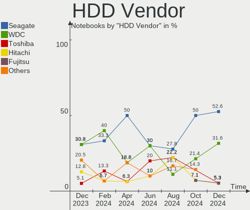
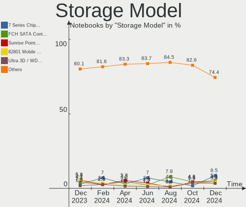
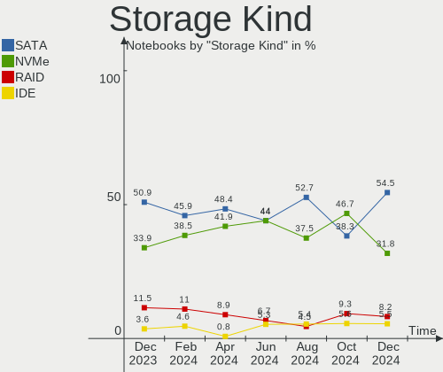
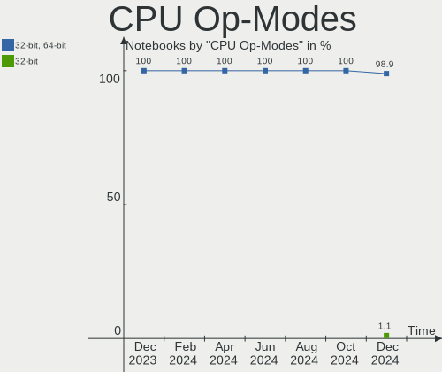
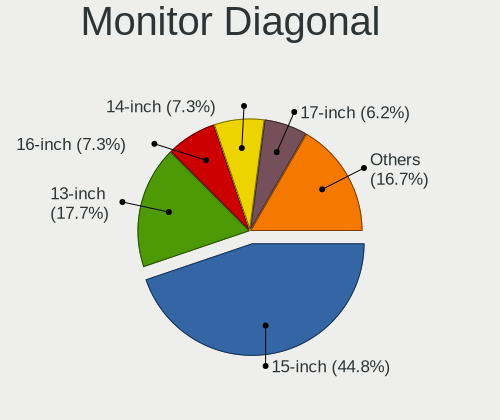
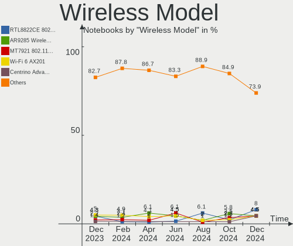
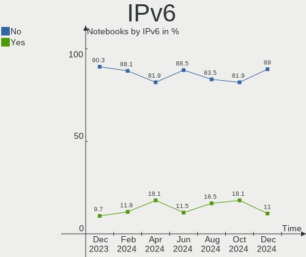
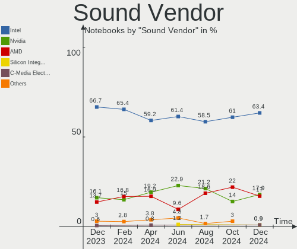
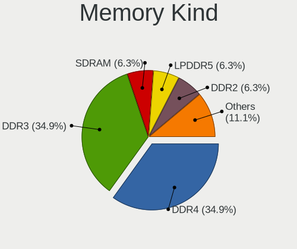
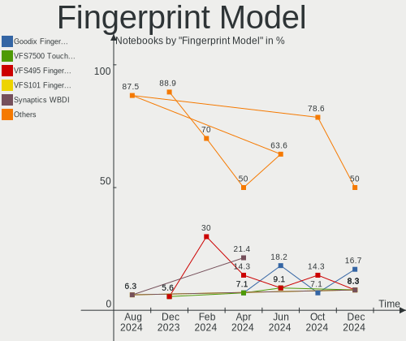

Linux in Poland - Hardware Trends (Notebooks)
---------------------------------------------

A project to identify most popular hardware characteristics and track their change
over time based on data collected by Linux users at https://Linux-Hardware.org.

Anyone can contribute to this report by the [hw-probe](https://github.com/linuxhw/hw-probe) tool:

    sudo -E hw-probe -all -upload

Period: Mar, 2023.

Contents
--------

* [ System ](#system)
  - [ OS                       ](#os)
  - [ OS Family                ](#os-family)
  - [ Kernel                   ](#kernel)
  - [ Kernel Family            ](#kernel-family)
  - [ Kernel Major Ver.        ](#kernel-major-ver)
  - [ Arch                     ](#arch)
  - [ DE                       ](#de)
  - [ Display Server           ](#display-server)
  - [ Display Manager          ](#display-manager)
  - [ OS Lang                  ](#os-lang)
  - [ Boot Mode                ](#boot-mode)
  - [ Filesystem               ](#filesystem)
  - [ Part. scheme             ](#part-scheme)
  - [ Dual Boot with Linux/BSD ](#dual-boot-with-linuxbsd)
  - [ Dual Boot (Win)          ](#dual-boot-win)

* [ Board ](#board)
  - [ Vendor                   ](#vendor)
  - [ Model                    ](#model)
  - [ Model Family             ](#model-family)
  - [ MFG Year                 ](#mfg-year)
  - [ Form Factor              ](#form-factor)
  - [ Secure Boot              ](#secure-boot)
  - [ Coreboot                 ](#coreboot)
  - [ RAM Size                 ](#ram-size)
  - [ RAM Used                 ](#ram-used)
  - [ Total Drives             ](#total-drives)
  - [ Has CD-ROM               ](#has-cd-rom)
  - [ Has Ethernet             ](#has-ethernet)
  - [ Has WiFi                 ](#has-wifi)
  - [ Has Bluetooth            ](#has-bluetooth)

* [ Location ](#location)
  - [ Country                  ](#country)
  - [ City                     ](#city)

* [ Drives ](#drives)
  - [ Drive Vendor             ](#drive-vendor)
  - [ Drive Model              ](#drive-model)
  - [ HDD Vendor               ](#hdd-vendor)
  - [ SSD Vendor               ](#ssd-vendor)
  - [ Drive Kind               ](#drive-kind)
  - [ Drive Connector          ](#drive-connector)
  - [ Drive Size               ](#drive-size)
  - [ Space Total              ](#space-total)
  - [ Space Used               ](#space-used)
  - [ Malfunc. Drives          ](#malfunc-drives)
  - [ Malfunc. Drive Vendor    ](#malfunc-drive-vendor)
  - [ Malfunc. HDD Vendor      ](#malfunc-hdd-vendor)
  - [ Malfunc. Drive Kind      ](#malfunc-drive-kind)
  - [ Failed Drives            ](#failed-drives)
  - [ Failed Drive Vendor      ](#failed-drive-vendor)
  - [ Drive Status             ](#drive-status)

* [ Storage controller ](#storage-controller)
  - [ Storage Vendor           ](#storage-vendor)
  - [ Storage Model            ](#storage-model)
  - [ Storage Kind             ](#storage-kind)

* [ Processor ](#processor)
  - [ CPU Vendor               ](#cpu-vendor)
  - [ CPU Model                ](#cpu-model)
  - [ CPU Model Family         ](#cpu-model-family)
  - [ CPU Cores                ](#cpu-cores)
  - [ CPU Sockets              ](#cpu-sockets)
  - [ CPU Threads              ](#cpu-threads)
  - [ CPU Op-Modes             ](#cpu-op-modes)
  - [ CPU Microcode            ](#cpu-microcode)
  - [ CPU Microarch            ](#cpu-microarch)

* [ Graphics ](#graphics)
  - [ GPU Vendor               ](#gpu-vendor)
  - [ GPU Model                ](#gpu-model)
  - [ GPU Combo                ](#gpu-combo)
  - [ GPU Driver               ](#gpu-driver)
  - [ GPU Memory               ](#gpu-memory)

* [ Monitor ](#monitor)
  - [ Monitor Vendor           ](#monitor-vendor)
  - [ Monitor Model            ](#monitor-model)
  - [ Monitor Resolution       ](#monitor-resolution)
  - [ Monitor Diagonal         ](#monitor-diagonal)
  - [ Monitor Width            ](#monitor-width)
  - [ Aspect Ratio             ](#aspect-ratio)
  - [ Monitor Area             ](#monitor-area)
  - [ Pixel Density            ](#pixel-density)
  - [ Multiple Monitors        ](#multiple-monitors)

* [ Network ](#network)
  - [ Net Controller Vendor    ](#net-controller-vendor)
  - [ Net Controller Model     ](#net-controller-model)
  - [ Wireless Vendor          ](#wireless-vendor)
  - [ Wireless Model           ](#wireless-model)
  - [ Ethernet Vendor          ](#ethernet-vendor)
  - [ Ethernet Model           ](#ethernet-model)
  - [ Net Controller Kind      ](#net-controller-kind)
  - [ Used Controller          ](#used-controller)
  - [ NICs                     ](#nics)
  - [ IPv6                     ](#ipv6)

* [ Bluetooth ](#bluetooth)
  - [ Bluetooth Vendor         ](#bluetooth-vendor)
  - [ Bluetooth Model          ](#bluetooth-model)

* [ Sound ](#sound)
  - [ Sound Vendor             ](#sound-vendor)
  - [ Sound Model              ](#sound-model)

* [ Memory ](#memory)
  - [ Memory Vendor            ](#memory-vendor)
  - [ Memory Model             ](#memory-model)
  - [ Memory Kind              ](#memory-kind)
  - [ Memory Form Factor       ](#memory-form-factor)
  - [ Memory Size              ](#memory-size)
  - [ Memory Speed             ](#memory-speed)

* [ Printers & scanners ](#printers--scanners)
  - [ Printer Vendor           ](#printer-vendor)
  - [ Printer Model            ](#printer-model)
  - [ Scanner Vendor           ](#scanner-vendor)
  - [ Scanner Model            ](#scanner-model)

* [ Camera ](#camera)
  - [ Camera Vendor            ](#camera-vendor)
  - [ Camera Model             ](#camera-model)

* [ Security ](#security)
  - [ Fingerprint Vendor       ](#fingerprint-vendor)
  - [ Fingerprint Model        ](#fingerprint-model)
  - [ Chipcard Vendor          ](#chipcard-vendor)
  - [ Chipcard Model           ](#chipcard-model)

* [ Unsupported ](#unsupported)
  - [ Unsupported Devices      ](#unsupported-devices)
  - [ Unsupported Device Types ](#unsupported-device-types)

System
------

OS
--

Installed operating systems

| Name                         | Notebooks | Percent |
|------------------------------|-----------|---------|
| Ubuntu 22.04                 | 19        | 15.32%  |
| Linux Mint 21.1              | 17        | 13.71%  |
| OpenMandriva 23.01           | 12        | 9.68%   |
| OpenMandriva 23.03           | 11        | 8.87%   |
| Fedora 37                    | 9         | 7.26%   |
| Arch Rolling                 | 5         | 4.03%   |
| Ubuntu 22.10                 | 4         | 3.23%   |
| OpenMandriva 4.3             | 4         | 3.23%   |
| Zorin 16                     | 3         | 2.42%   |
| LMDE 5                       | 3         | 2.42%   |
| Linux Mint 21                | 3         | 2.42%   |
| Linux Mint 20.3              | 3         | 2.42%   |
| Elementary 7                 | 3         | 2.42%   |
| Debian 11                    | 3         | 2.42%   |
| Kali 2023.1                  | 2         | 1.61%   |
| Debian 10                    | 2         | 1.61%   |
| Debian                       | 2         | 1.61%   |
| Xero Rolling                 | 1         | 0.81%   |
| Ubuntu MATE 22.04            | 1         | 0.81%   |
| SteamOS 4                    | 1         | 0.81%   |
| SteamOS 3.4.6                | 1         | 0.81%   |
| Pop!_OS 22.04                | 1         | 0.81%   |
| Pop!_OS 20.04                | 1         | 0.81%   |
| openSUSE Tumbleweed-XXXXXXXX | 1         | 0.81%   |
| OpenMandriva 4.2             | 1         | 0.81%   |
| NixOS 22.11                  | 1         | 0.81%   |
| MX 21                        | 1         | 0.81%   |
| Manjaro 22.0.5               | 1         | 0.81%   |
| Kubuntu 22.04                | 1         | 0.81%   |
| KDE neon 22.04               | 1         | 0.81%   |
| Fedora 38                    | 1         | 0.81%   |
| EuroLinux 8.7                | 1         | 0.81%   |
| EndeavourOS Rolling          | 1         | 0.81%   |
| Debian 12                    | 1         | 0.81%   |
| BlackPanther 18.1            | 1         | 0.81%   |
| ArcoLinux Rolling            | 1         | 0.81%   |

OS Family
---------

OS without a version

| Name         | Notebooks | Percent |
|--------------|-----------|---------|
| OpenMandriva | 28        | 22.58%  |
| Ubuntu       | 23        | 18.55%  |
| Linux Mint   | 23        | 18.55%  |
| Fedora       | 10        | 8.06%   |
| Debian       | 8         | 6.45%   |
| Arch         | 5         | 4.03%   |
| Zorin        | 3         | 2.42%   |
| LMDE         | 3         | 2.42%   |
| Elementary   | 3         | 2.42%   |
| SteamOS      | 2         | 1.61%   |
| Pop!_OS      | 2         | 1.61%   |
| Kali         | 2         | 1.61%   |
| Xero         | 1         | 0.81%   |
| Ubuntu MATE  | 1         | 0.81%   |
| openSUSE     | 1         | 0.81%   |
| NixOS        | 1         | 0.81%   |
| MX           | 1         | 0.81%   |
| Manjaro      | 1         | 0.81%   |
| Kubuntu      | 1         | 0.81%   |
| KDE neon     | 1         | 0.81%   |
| EuroLinux    | 1         | 0.81%   |
| EndeavourOS  | 1         | 0.81%   |
| BlackPanther | 1         | 0.81%   |
| ArcoLinux    | 1         | 0.81%   |

Kernel
------

Version of the Linux kernel

| Version                    | Notebooks | Percent |
|----------------------------|-----------|---------|
| 5.19.0-35-generic          | 19        | 15.32%  |
| 6.1.1-desktop-1omv2290     | 11        | 8.87%   |
| 5.15.0-67-generic          | 11        | 8.87%   |
| 6.2.6-desktop-1omv2390     | 9         | 7.26%   |
| 5.15.0-56-generic          | 5         | 4.03%   |
| 6.2.2-060202-generic       | 3         | 2.42%   |
| 6.1.18-200.fc37.x86_64     | 3         | 2.42%   |
| 6.1.14-200.fc37.x86_64     | 3         | 2.42%   |
| 5.4.0-144-generic          | 3         | 2.42%   |
| 5.19.0-32-generic          | 3         | 2.42%   |
| 5.16.7-desktop-1omv4003    | 3         | 2.42%   |
| 5.10.0-21-amd64            | 3         | 2.42%   |
| 6.2.6-arch1-1              | 2         | 1.61%   |
| 6.2.2-desktop-1omv2390     | 2         | 1.61%   |
| 6.1.15-200.fc37.x86_64     | 2         | 1.61%   |
| 6.1.0-kali5-amd64          | 2         | 1.61%   |
| 6.1.0-6-amd64              | 2         | 1.61%   |
| 5.19.0-38-generic          | 2         | 1.61%   |
| 5.15.0-69-generic          | 2         | 1.61%   |
| 6.2.8-arch1-1              | 1         | 0.81%   |
| 6.2.7-200.fc37.x86_64      | 1         | 0.81%   |
| 6.2.7                      | 1         | 0.81%   |
| 6.2.6-zen1-1-zen           | 1         | 0.81%   |
| 6.2.6-300.fc38.x86_64      | 1         | 0.81%   |
| 6.2.5-arch1-1              | 1         | 0.81%   |
| 6.2.5-060205-generic       | 1         | 0.81%   |
| 6.2.2-arch1-1              | 1         | 0.81%   |
| 6.2.1-desktop-1omv2390     | 1         | 0.81%   |
| 6.2.1-arch1-1.1            | 1         | 0.81%   |
| 6.2.0-1-default            | 1         | 0.81%   |
| 6.1.9-arch1-1              | 1         | 0.81%   |
| 6.1.19-1-MANJARO           | 1         | 0.81%   |
| 6.1.15-1-liquorix-amd64    | 1         | 0.81%   |
| 6.1.12-valve2-1-neptune-61 | 1         | 0.81%   |
| 6.1.12-1.el8.elrepo.x86_64 | 1         | 0.81%   |
| 6.1.11-76060111-generic    | 1         | 0.81%   |
| 6.1.0-5-amd64              | 1         | 0.81%   |
| 6.1.0-4mx-amd64            | 1         | 0.81%   |
| 5.6.14-desktop-2bP         | 1         | 0.81%   |
| 5.4.0-139-generic          | 1         | 0.81%   |

Kernel Family
-------------

Linux kernel without a distro release

| Version | Notebooks | Percent |
|---------|-----------|---------|
| 5.19.0  | 26        | 20.97%  |
| 5.15.0  | 20        | 16.13%  |
| 6.2.6   | 13        | 10.48%  |
| 6.1.1   | 11        | 8.87%   |
| 6.2.2   | 6         | 4.84%   |
| 6.1.0   | 6         | 4.84%   |
| 5.10.0  | 6         | 4.84%   |
| 5.4.0   | 4         | 3.23%   |
| 6.1.18  | 3         | 2.42%   |
| 6.1.15  | 3         | 2.42%   |
| 6.1.14  | 3         | 2.42%   |
| 5.16.7  | 3         | 2.42%   |
| 6.2.7   | 2         | 1.61%   |
| 6.2.5   | 2         | 1.61%   |
| 6.2.1   | 2         | 1.61%   |
| 6.1.12  | 2         | 1.61%   |
| 6.2.8   | 1         | 0.81%   |
| 6.2.0   | 1         | 0.81%   |
| 6.1.9   | 1         | 0.81%   |
| 6.1.19  | 1         | 0.81%   |
| 6.1.11  | 1         | 0.81%   |
| 5.6.14  | 1         | 0.81%   |
| 5.3.5   | 1         | 0.81%   |
| 5.2.5   | 1         | 0.81%   |
| 5.16.15 | 1         | 0.81%   |
| 5.16.13 | 1         | 0.81%   |
| 5.13.0  | 1         | 0.81%   |
| 5.11.12 | 1         | 0.81%   |

Kernel Major Ver.
-----------------

Linux kernel major version

| Version | Notebooks | Percent |
|---------|-----------|---------|
| 6.1     | 31        | 25%     |
| 6.2     | 27        | 21.77%  |
| 5.19    | 26        | 20.97%  |
| 5.15    | 20        | 16.13%  |
| 5.10    | 6         | 4.84%   |
| 5.16    | 5         | 4.03%   |
| 5.4     | 4         | 3.23%   |
| 5.6     | 1         | 0.81%   |
| 5.3     | 1         | 0.81%   |
| 5.2     | 1         | 0.81%   |
| 5.13    | 1         | 0.81%   |
| 5.11    | 1         | 0.81%   |

Arch
----

OS architecture (x86_64, i586, etc.)

| Name   | Notebooks | Percent |
|--------|-----------|---------|
| x86_64 | 123       | 99.19%  |
| i686   | 1         | 0.81%   |

DE
--

Desktop Environment

| Name       | Notebooks | Percent |
|------------|-----------|---------|
| GNOME      | 44        | 35.48%  |
| KDE5       | 35        | 28.23%  |
| X-Cinnamon | 22        | 17.74%  |
| MATE       | 8         | 6.45%   |
| XFCE       | 5         | 4.03%   |
| Pantheon   | 3         | 2.42%   |
| LXQt       | 3         | 2.42%   |
| LXDE       | 2         | 1.61%   |
| Cinnamon   | 1         | 0.81%   |
| Unknown    | 1         | 0.81%   |

Display Server
--------------

X11 or Wayland

| Name    | Notebooks | Percent |
|---------|-----------|---------|
| X11     | 95        | 76.61%  |
| Wayland | 28        | 22.58%  |
| Tty     | 1         | 0.81%   |

Display Manager
---------------

SDDM, LightDM, etc.

| Name    | Notebooks | Percent |
|---------|-----------|---------|
| SDDM    | 33        | 26.61%  |
| Unknown | 29        | 23.39%  |
| GDM3    | 28        | 22.58%  |
| LightDM | 20        | 16.13%  |
| GDM     | 12        | 9.68%   |
| NODM    | 2         | 1.61%   |

OS Lang
-------

Language

| Lang    | Notebooks | Percent |
|---------|-----------|---------|
| pl_PL   | 71        | 57.26%  |
| en_US   | 45        | 36.29%  |
| C       | 3         | 2.42%   |
| en_GB   | 2         | 1.61%   |
| ru_RU   | 1         | 0.81%   |
| es_AR   | 1         | 0.81%   |
| Unknown | 1         | 0.81%   |

Boot Mode
---------

EFI or BIOS

| Mode | Notebooks | Percent |
|------|-----------|---------|
| EFI  | 68        | 54.84%  |
| BIOS | 56        | 45.16%  |

Filesystem
----------

Type of filesystem

| Type    | Notebooks | Percent |
|---------|-----------|---------|
| Ext4    | 82        | 66.13%  |
| Overlay | 18        | 14.52%  |
| Btrfs   | 17        | 13.71%  |
| Xfs     | 3         | 2.42%   |
| Rootfs  | 2         | 1.61%   |
| Zfs     | 1         | 0.81%   |
| F2fs    | 1         | 0.81%   |

Part. scheme
------------

Scheme of partitioning

| Type    | Notebooks | Percent |
|---------|-----------|---------|
| GPT     | 81        | 65.32%  |
| Unknown | 29        | 23.39%  |
| MBR     | 14        | 11.29%  |

Dual Boot with Linux/BSD
------------------------

Hosting more than one Linux/BSD

| Dual boot | Notebooks | Percent |
|-----------|-----------|---------|
| No        | 98        | 79.03%  |
| Yes       | 26        | 20.97%  |

Dual Boot (Win)
---------------

Hosting Linux and Windows

| Dual boot | Notebooks | Percent |
|-----------|-----------|---------|
| No        | 80        | 64.52%  |
| Yes       | 44        | 35.48%  |

Board
-----

Vendor
------

Motherboard manufacturer

| Name                | Notebooks | Percent |
|---------------------|-----------|---------|
| Lenovo              | 36        | 29.03%  |
| Hewlett-Packard     | 22        | 17.74%  |
| Dell                | 22        | 17.74%  |
| ASUSTek Computer    | 12        | 9.68%   |
| Acer                | 5         | 4.03%   |
| Toshiba             | 4         | 3.23%   |
| Sony                | 3         | 2.42%   |
| Samsung Electronics | 3         | 2.42%   |
| MSI                 | 3         | 2.42%   |
| Kiano               | 3         | 2.42%   |
| HUAWEI              | 3         | 2.42%   |
| Valve               | 1         | 0.81%   |
| Notebook            | 1         | 0.81%   |
| IGEL Technology     | 1         | 0.81%   |
| GPD                 | 1         | 0.81%   |
| Google              | 1         | 0.81%   |
| Fujitsu             | 1         | 0.81%   |
| Apple               | 1         | 0.81%   |
| Unknown             | 1         | 0.81%   |

Model
-----

Motherboard model

| Name                                       | Notebooks | Percent |
|--------------------------------------------|-----------|---------|
| Kiano Elegance 14.2                        | 3         | 2.42%   |
| Lenovo G570 20079                          | 2         | 1.61%   |
| Lenovo G50-80 80E5                         | 2         | 1.61%   |
| HUAWEI KPL-W0X                             | 2         | 1.61%   |
| HP Pavilion dv6                            | 2         | 1.61%   |
| HP EliteBook 830 G5                        | 2         | 1.61%   |
| HP 250 G6 Notebook PC                      | 2         | 1.61%   |
| Dell Latitude E6530                        | 2         | 1.61%   |
| Dell Latitude E6440                        | 2         | 1.61%   |
| Valve Jupiter                              | 1         | 0.81%   |
| Toshiba Satellite Pro A50-C                | 1         | 0.81%   |
| Toshiba Satellite L40                      | 1         | 0.81%   |
| Toshiba Satellite C855-12N                 | 1         | 0.81%   |
| Toshiba QOSMIO X500                        | 1         | 0.81%   |
| Sony VPCEH1S1E                             | 1         | 0.81%   |
| Sony VGN-BX61VN                            | 1         | 0.81%   |
| Sony SVE1512M6ESI                          | 1         | 0.81%   |
| Samsung 950XED                             | 1         | 0.81%   |
| Samsung 355V4C/356V4C/3445VC/3545VC        | 1         | 0.81%   |
| Samsung 300E4A/300E5A/300E7A               | 1         | 0.81%   |
| Notebook NS50_70MU                         | 1         | 0.81%   |
| MSI MS-7C02                                | 1         | 0.81%   |
| MSI Creator Z17 A12UHST                    | 1         | 0.81%   |
| MSI Creator Z16 A11UET                     | 1         | 0.81%   |
| Lenovo Y520-15IKBN 80WK                    | 1         | 0.81%   |
| Lenovo ThinkPad Z16 Gen 1 21D4002UGE       | 1         | 0.81%   |
| Lenovo ThinkPad X301 2776LEG               | 1         | 0.81%   |
| Lenovo ThinkPad X250 20CLS47P00            | 1         | 0.81%   |
| Lenovo ThinkPad X240 20AMS0XP0S            | 1         | 0.81%   |
| Lenovo ThinkPad X1 Carbon Gen 9 20XW007YPB | 1         | 0.81%   |
| Lenovo ThinkPad W520 4282PQ7               | 1         | 0.81%   |
| Lenovo ThinkPad T61 7661BM5                | 1         | 0.81%   |
| Lenovo ThinkPad T520 4243RP3               | 1         | 0.81%   |
| Lenovo ThinkPad T480s 20L8S2B500           | 1         | 0.81%   |
| Lenovo ThinkPad T480s 20L7S0YA00           | 1         | 0.81%   |
| Lenovo ThinkPad T470p 20J7S0QK00           | 1         | 0.81%   |
| Lenovo ThinkPad T440p 20AWS37F00           | 1         | 0.81%   |
| Lenovo ThinkPad T440p 20AWS19P0C           | 1         | 0.81%   |
| Lenovo ThinkPad T430 2349HNU               | 1         | 0.81%   |
| Lenovo ThinkPad T420 4177R3U               | 1         | 0.81%   |

Model Family
------------

Motherboard model prefix

| Name               | Notebooks | Percent |
|--------------------|-----------|---------|
| Lenovo ThinkPad    | 17        | 13.71%  |
| Dell Latitude      | 15        | 12.1%   |
| Lenovo IdeaPad     | 8         | 6.45%   |
| HP EliteBook       | 5         | 4.03%   |
| HP Pavilion        | 4         | 3.23%   |
| Toshiba Satellite  | 3         | 2.42%   |
| Lenovo Legion      | 3         | 2.42%   |
| Kiano Elegance     | 3         | 2.42%   |
| HP Laptop          | 3         | 2.42%   |
| Acer Aspire        | 3         | 2.42%   |
| MSI Creator        | 2         | 1.61%   |
| Lenovo G570        | 2         | 1.61%   |
| Lenovo G50-80      | 2         | 1.61%   |
| HUAWEI KPL-W0X     | 2         | 1.61%   |
| HP ProBook         | 2         | 1.61%   |
| HP 250             | 2         | 1.61%   |
| Dell Precision     | 2         | 1.61%   |
| ASUS ASUS          | 2         | 1.61%   |
| Valve Jupiter      | 1         | 0.81%   |
| Toshiba QOSMIO     | 1         | 0.81%   |
| Sony VPCEH1S1E     | 1         | 0.81%   |
| Sony VGN-BX61VN    | 1         | 0.81%   |
| Sony SVE1512M6ESI  | 1         | 0.81%   |
| Samsung 950XED     | 1         | 0.81%   |
| Samsung 355V4C     | 1         | 0.81%   |
| Samsung 300E4A     | 1         | 0.81%   |
| Notebook NS50      | 1         | 0.81%   |
| MSI MS-7C02        | 1         | 0.81%   |
| Lenovo Y520-15IKBN | 1         | 0.81%   |
| Lenovo ThinkBook   | 1         | 0.81%   |
| Lenovo G580        | 1         | 0.81%   |
| Lenovo G510        | 1         | 0.81%   |
| IGEL H830C         | 1         | 0.81%   |
| HUAWEI NBLK-WAX9X  | 1         | 0.81%   |
| HP ZBook           | 1         | 0.81%   |
| HP OMEN            | 1         | 0.81%   |
| HP Notebook        | 1         | 0.81%   |
| HP ENVY            | 1         | 0.81%   |
| HP Compaq          | 1         | 0.81%   |
| HP 15              | 1         | 0.81%   |

MFG Year
--------

Motherboard manufacture year

| Year | Notebooks | Percent |
|------|-----------|---------|
| 2018 | 15        | 12.1%   |
| 2022 | 13        | 10.48%  |
| 2013 | 12        | 9.68%   |
| 2019 | 10        | 8.06%   |
| 2012 | 10        | 8.06%   |
| 2011 | 10        | 8.06%   |
| 2021 | 9         | 7.26%   |
| 2020 | 9         | 7.26%   |
| 2017 | 9         | 7.26%   |
| 2014 | 5         | 4.03%   |
| 2007 | 5         | 4.03%   |
| 2015 | 4         | 3.23%   |
| 2010 | 4         | 3.23%   |
| 2009 | 3         | 2.42%   |
| 2008 | 3         | 2.42%   |
| 2016 | 2         | 1.61%   |
| 2006 | 1         | 0.81%   |

Form Factor
-----------

Physical design of the computer

| Name     | Notebooks | Percent |
|----------|-----------|---------|
| Notebook | 124       | 100%    |

Secure Boot
-----------

Enabled or disabled

| State    | Notebooks | Percent |
|----------|-----------|---------|
| Disabled | 113       | 91.13%  |
| Enabled  | 11        | 8.87%   |

Coreboot
--------

Have coreboot on board

| Used | Notebooks | Percent |
|------|-----------|---------|
| No   | 123       | 99.19%  |
| Yes  | 1         | 0.81%   |

RAM Size
--------

Total RAM memory

| Size in GB  | Notebooks | Percent |
|-------------|-----------|---------|
| 3.01-4.0    | 29        | 23.39%  |
| 4.01-8.0    | 26        | 20.97%  |
| 16.01-24.0  | 25        | 20.16%  |
| 8.01-16.0   | 23        | 18.55%  |
| 32.01-64.0  | 12        | 9.68%   |
| 24.01-32.0  | 3         | 2.42%   |
| 2.01-3.0    | 2         | 1.61%   |
| 64.01-256.0 | 2         | 1.61%   |
| 1.01-2.0    | 2         | 1.61%   |

RAM Used
--------

Used RAM memory

| Used GB    | Notebooks | Percent |
|------------|-----------|---------|
| 1.01-2.0   | 41        | 33.06%  |
| 4.01-8.0   | 29        | 23.39%  |
| 2.01-3.0   | 26        | 20.97%  |
| 3.01-4.0   | 13        | 10.48%  |
| 8.01-16.0  | 7         | 5.65%   |
| 0.51-1.0   | 7         | 5.65%   |
| 16.01-24.0 | 1         | 0.81%   |

Total Drives
------------

Number of drives on board

| Drives | Notebooks | Percent |
|--------|-----------|---------|
| 1      | 78        | 62.9%   |
| 2      | 41        | 33.06%  |
| 3      | 3         | 2.42%   |
| 4      | 1         | 0.81%   |
| 0      | 1         | 0.81%   |

Has CD-ROM
----------

Has CD-ROM on board

| Presented | Notebooks | Percent |
|-----------|-----------|---------|
| No        | 81        | 65.32%  |
| Yes       | 43        | 34.68%  |

Has Ethernet
------------

Has Ethernet on board

| Presented | Notebooks | Percent |
|-----------|-----------|---------|
| Yes       | 105       | 84.68%  |
| No        | 19        | 15.32%  |

Has WiFi
--------

Has WiFi module

| Presented | Notebooks | Percent |
|-----------|-----------|---------|
| Yes       | 123       | 99.19%  |
| No        | 1         | 0.81%   |

Has Bluetooth
-------------

Has Bluetooth module

| Presented | Notebooks | Percent |
|-----------|-----------|---------|
| Yes       | 99        | 79.84%  |
| No        | 25        | 20.16%  |

Location
--------

Country
-------

Geographic location (country)

| Country | Notebooks | Percent |
|---------|-----------|---------|
| Poland  | 124       | 100%    |

City
----

Geographic location (city)

| City                  | Notebooks | Percent |
|-----------------------|-----------|---------|
| Warsaw                | 30        | 24.19%  |
| Krakow                | 9         | 7.26%   |
| Wroclaw               | 8         | 6.45%   |
| Poznan                | 6         | 4.84%   |
| Lodz                  | 4         | 3.23%   |
| Gdansk                | 4         | 3.23%   |
| Katowice              | 3         | 2.42%   |
| Gliwice               | 3         | 2.42%   |
| Torun                 | 2         | 1.61%   |
| Siedlce               | 2         | 1.61%   |
| Płock                | 2         | 1.61%   |
| Kielce                | 2         | 1.61%   |
| Grodzisk Wielkopolski | 2         | 1.61%   |
| Elblag                | 2         | 1.61%   |
| Bydgoszcz             | 2         | 1.61%   |
| Brzesko               | 2         | 1.61%   |
| Bełchatów           | 2         | 1.61%   |
| Żory                 | 1         | 0.81%   |
| Zlotow                | 1         | 0.81%   |
| Zielona Góra         | 1         | 0.81%   |
| Zgierz                | 1         | 0.81%   |
| Wieliczka             | 1         | 0.81%   |
| Tarnowskie Gory       | 1         | 0.81%   |
| Świnoujście         | 1         | 0.81%   |
| Sosnowiec             | 1         | 0.81%   |
| Siniarzewo            | 1         | 0.81%   |
| Rzeszów              | 1         | 0.81%   |
| Rybnik                | 1         | 0.81%   |
| Rumia                 | 1         | 0.81%   |
| Rudawa                | 1         | 0.81%   |
| Rabka-Zdroj           | 1         | 0.81%   |
| Polanow               | 1         | 0.81%   |
| Pilchowice            | 1         | 0.81%   |
| Opole                 | 1         | 0.81%   |
| Ogrodzieniec          | 1         | 0.81%   |
| Mokrzyska             | 1         | 0.81%   |
| Lusowko               | 1         | 0.81%   |
| Lukow                 | 1         | 0.81%   |
| Lublin                | 1         | 0.81%   |
| Legnica               | 1         | 0.81%   |

Drives
------

Drive Vendor
------------

Hard drive vendors

| Vendor                   | Notebooks | Drives | Percent |
|--------------------------|-----------|--------|---------|
| Samsung Electronics      | 25        | 27     | 14.79%  |
| Seagate                  | 16        | 16     | 9.47%   |
| GOODRAM                  | 15        | 15     | 8.88%   |
| Sandisk                  | 13        | 13     | 7.69%   |
| WDC                      | 11        | 11     | 6.51%   |
| Micron Technology        | 9         | 9      | 5.33%   |
| Toshiba                  | 8         | 8      | 4.73%   |
| Kingston                 | 8         | 8      | 4.73%   |
| A-DATA Technology        | 8         | 8      | 4.73%   |
| Crucial                  | 6         | 6      | 3.55%   |
| Unknown                  | 5         | 5      | 2.96%   |
| SK hynix                 | 5         | 5      | 2.96%   |
| Transcend                | 4         | 4      | 2.37%   |
| Intel                    | 4         | 4      | 2.37%   |
| Hitachi                  | 4         | 4      | 2.37%   |
| PNY                      | 3         | 3      | 1.78%   |
| KIOXIA                   | 2         | 2      | 1.18%   |
| HGST                     | 2         | 2      | 1.18%   |
| Apacer                   | 2         | 2      | 1.18%   |
| XPG                      | 1         | 1      | 0.59%   |
| Union Memory (Shenzhen)  | 1         | 1      | 0.59%   |
| UMIS                     | 1         | 1      | 0.59%   |
| Silicon Motion           | 1         | 1      | 0.59%   |
| Realtek                  | 1         | 1      | 0.59%   |
| Plextor                  | 1         | 1      | 0.59%   |
| Patriot                  | 1         | 1      | 0.59%   |
| Micron_1                 | 1         | 1      | 0.59%   |
| LITEONIT                 | 1         | 1      | 0.59%   |
| LITEON E                 | 1         | 1      | 0.59%   |
| LITEON                   | 1         | 1      | 0.59%   |
| KingSpec                 | 1         | 1      | 0.59%   |
| HS-SSD-C100              | 1         | 1      | 0.59%   |
| Fujitsu                  | 1         | 1      | 0.59%   |
| China                    | 1         | 1      | 0.59%   |
| Biwin Storage Technology | 1         | 1      | 0.59%   |
| ASMT                     | 1         | 1      | 0.59%   |
| Apple                    | 1         | 1      | 0.59%   |
| Unknown                  | 1         | 1      | 0.59%   |

Drive Model
-----------

Hard drive models

| Model                                               | Notebooks | Percent |
|-----------------------------------------------------|-----------|---------|
| Samsung SSD 860 EVO 500GB                           | 4         | 2.34%   |
| Samsung NVMe SSD Controller SM981/PM981/PM983 250GB | 4         | 2.34%   |
| Transcend TS240GMTS420S 240GB SSD                   | 3         | 1.75%   |
| Seagate ST500LT012-1DG142 500GB                     | 3         | 1.75%   |
| SanDisk DF4032  32GB                                | 3         | 1.75%   |
| Kingston SA400S37240G 240GB SSD                     | 3         | 1.75%   |
| GOODRAM SSDPR-CL100-120-G3 120GB                    | 3         | 1.75%   |
| WDC WD3200BPVT-22JJ5T0 320GB                        | 2         | 1.17%   |
| Toshiba MQ01ABF050 500GB                            | 2         | 1.17%   |
| Seagate ST9500325AS 500GB                           | 2         | 1.17%   |
| Seagate ST1000LM024 HN-M101MBB 1TB                  | 2         | 1.17%   |
| Micron 2450_MTFDKBA1T0TFK 1TB                       | 2         | 1.17%   |
| Intel SSDPEKNU512GZ 512GB                           | 2         | 1.17%   |
| GOODRAM SSDPR-CX400-512-G2 512GB                    | 2         | 1.17%   |
| GOODRAM SSDPR-CX400-256-G2 256GB                    | 2         | 1.17%   |
| GOODRAM SSDPR-CL100-960-G3 960GB                    | 2         | 1.17%   |
| A-DATA SU800 256GB SSD                              | 2         | 1.17%   |
| XPG GAMMIX S70 BLADE 1TB                            | 1         | 0.58%   |
| WDC WDS500G2B0A-00SM50 500GB SSD                    | 1         | 0.58%   |
| WDC WD7500BPKT-22PK4T0 752GB                        | 1         | 0.58%   |
| WDC WD6400BPVT-55HXZT2 640GB                        | 1         | 0.58%   |
| WDC WD3200BPVT-22ZEST0 320GB                        | 1         | 0.58%   |
| WDC WD30EZRX-22D8PB0 3TB                            | 1         | 0.58%   |
| WDC WD10SPCX-24HWST1 1TB                            | 1         | 0.58%   |
| WDC WD10JPVX-22JC3T0 1TB                            | 1         | 0.58%   |
| WDC WD10JPCX-24UE4T0 1TB                            | 1         | 0.58%   |
| WDC PC SN810 NVMe 2048GB                            | 1         | 0.58%   |
| Unknown SM32G  32GB                                 | 1         | 0.58%   |
| Unknown SD256  256GB                                | 1         | 0.58%   |
| Unknown MMC Card  4GB                               | 1         | 0.58%   |
| Unknown MMC Card  32GB                              | 1         | 0.58%   |
| Unknown HCG8a4  64GB                                | 1         | 0.58%   |
| Union Memory (Shenzhen) RPFTJ256PDD2MWX 256GB       | 1         | 0.58%   |
| UMIS RPFTJ256PDD2MWX 256GB                          | 1         | 0.58%   |
| Transcend TS480GMTS420S 480GB SSD                   | 1         | 0.58%   |
| Toshiba XG6 NVMe SSD Controller 512GB               | 1         | 0.58%   |
| Toshiba THNSNJ128GCSU 128GB SSD                     | 1         | 0.58%   |
| Toshiba MQ01ACF050 500GB                            | 1         | 0.58%   |
| Toshiba MQ01ABD100 1TB                              | 1         | 0.58%   |
| Toshiba MK3265GSXN 320GB                            | 1         | 0.58%   |

HDD Vendor
----------

Hard disk drive vendors

| Vendor  | Notebooks | Drives | Percent |
|---------|-----------|--------|---------|
| Seagate | 15        | 15     | 39.47%  |
| WDC     | 9         | 9      | 23.68%  |
| Toshiba | 5         | 5      | 13.16%  |
| Hitachi | 4         | 4      | 10.53%  |
| HGST    | 2         | 2      | 5.26%   |
| Fujitsu | 1         | 1      | 2.63%   |
| ASMT    | 1         | 1      | 2.63%   |
| Apple   | 1         | 1      | 2.63%   |

SSD Vendor
----------

Solid state drive vendors

| Vendor              | Notebooks | Drives | Percent |
|---------------------|-----------|--------|---------|
| GOODRAM             | 15        | 15     | 20%     |
| Samsung Electronics | 12        | 12     | 16%     |
| A-DATA Technology   | 8         | 8      | 10.67%  |
| Kingston            | 6         | 6      | 8%      |
| Crucial             | 6         | 6      | 8%      |
| SanDisk             | 5         | 5      | 6.67%   |
| Transcend           | 4         | 4      | 5.33%   |
| SK hynix            | 2         | 2      | 2.67%   |
| PNY                 | 2         | 2      | 2.67%   |
| Micron Technology   | 2         | 2      | 2.67%   |
| Apacer              | 2         | 2      | 2.67%   |
| WDC                 | 1         | 1      | 1.33%   |
| Toshiba             | 1         | 1      | 1.33%   |
| Plextor             | 1         | 1      | 1.33%   |
| Patriot             | 1         | 1      | 1.33%   |
| Micron_1            | 1         | 1      | 1.33%   |
| LITEONIT            | 1         | 1      | 1.33%   |
| LITEON E            | 1         | 1      | 1.33%   |
| LITEON              | 1         | 1      | 1.33%   |
| KingSpec            | 1         | 1      | 1.33%   |
| HS-SSD-C100         | 1         | 1      | 1.33%   |
| China               | 1         | 1      | 1.33%   |

Drive Kind
----------

HDD or SSD

| Kind    | Notebooks | Drives | Percent |
|---------|-----------|--------|---------|
| SSD     | 67        | 75     | 43.51%  |
| NVMe    | 42        | 48     | 27.27%  |
| HDD     | 35        | 38     | 22.73%  |
| MMC     | 8         | 8      | 5.19%   |
| Unknown | 2         | 2      | 1.3%    |

Drive Connector
---------------

SATA, SAS, NVMe, etc.

| Type | Notebooks | Drives | Percent |
|------|-----------|--------|---------|
| SATA | 86        | 105    | 58.5%   |
| NVMe | 42        | 47     | 28.57%  |
| SAS  | 11        | 11     | 7.48%   |
| MMC  | 8         | 8      | 5.44%   |

Drive Size
----------

Size of hard drive

| Size in TB | Notebooks | Drives | Percent |
|------------|-----------|--------|---------|
| 0.01-0.5   | 73        | 81     | 70.19%  |
| 0.51-1.0   | 25        | 25     | 24.04%  |
| 1.01-2.0   | 5         | 5      | 4.81%   |
| 2.01-3.0   | 1         | 2      | 0.96%   |

Space Total
-----------

Amount of disk space available on the file system

| Size in GB     | Notebooks | Percent |
|----------------|-----------|---------|
| 101-250        | 34        | 27.42%  |
| 251-500        | 27        | 21.77%  |
| 1-20           | 19        | 15.32%  |
| 501-1000       | 15        | 12.1%   |
| 51-100         | 8         | 6.45%   |
| 1001-2000      | 7         | 5.65%   |
| Unknown        | 6         | 4.84%   |
| More than 3000 | 4         | 3.23%   |
| 2001-3000      | 3         | 2.42%   |
| 21-50          | 1         | 0.81%   |

Space Used
----------

Amount of used disk space

| Used GB        | Notebooks | Percent |
|----------------|-----------|---------|
| 1-20           | 43        | 34.68%  |
| 51-100         | 22        | 17.74%  |
| 21-50          | 19        | 15.32%  |
| 101-250        | 16        | 12.9%   |
| 501-1000       | 8         | 6.45%   |
| Unknown        | 6         | 4.84%   |
| 251-500        | 5         | 4.03%   |
| 1001-2000      | 3         | 2.42%   |
| More than 3000 | 1         | 0.81%   |
| 2001-3000      | 1         | 0.81%   |

Malfunc. Drives
---------------

Drive models with a malfunction

| Model                                                           | Notebooks | Drives | Percent |
|-----------------------------------------------------------------|-----------|--------|---------|
| WDC WD7500BPKT-22PK4T0 752GB                                    | 1         | 1      | 5.56%   |
| Toshiba MK3265GSXN 320GB                                        | 1         | 1      | 5.56%   |
| Seagate ST9750423AS 752GB                                       | 1         | 1      | 5.56%   |
| Seagate ST9500325AS 500GB                                       | 1         | 1      | 5.56%   |
| Seagate ST500LT012-1DG142 500GB                                 | 1         | 1      | 5.56%   |
| Seagate ST500LM012 HN-M500MBB 500GB                             | 1         | 1      | 5.56%   |
| SanDisk SD9TN8W-256G-1006 256GB SSD                             | 1         | 1      | 5.56%   |
| SanDisk SD7SB2Q512G1001 512GB SSD                               | 1         | 1      | 5.56%   |
| Samsung Electronics NVMe SSD Controller SM981/PM981/PM983 250GB | 1         | 1      | 5.56%   |
| Micron Technology 1100 SATA 512GB SSD                           | 1         | 1      | 5.56%   |
| Kingston SUV500MS240G 240GB SSD                                 | 1         | 1      | 5.56%   |
| Kingston SA400S37480G 480GB SSD                                 | 1         | 1      | 5.56%   |
| KingSpec NT-256 256GB SSD                                       | 1         | 1      | 5.56%   |
| Hitachi HTS725050A9A364 500GB                                   | 1         | 1      | 5.56%   |
| Hitachi HTS545050A7E380 500GB                                   | 1         | 1      | 5.56%   |
| Crucial CT1000MX500SSD4 1TB                                     | 1         | 1      | 5.56%   |
| China SATA3 512GB SSD                                           | 1         | 1      | 5.56%   |
| A-DATA Technology SP900 64GB SSD                                | 1         | 1      | 5.56%   |

Malfunc. Drive Vendor
---------------------

Vendors of faulty drives

| Vendor              | Notebooks | Drives | Percent |
|---------------------|-----------|--------|---------|
| Seagate             | 4         | 4      | 22.22%  |
| SanDisk             | 2         | 2      | 11.11%  |
| Kingston            | 2         | 2      | 11.11%  |
| Hitachi             | 2         | 2      | 11.11%  |
| WDC                 | 1         | 1      | 5.56%   |
| Toshiba             | 1         | 1      | 5.56%   |
| Samsung Electronics | 1         | 1      | 5.56%   |
| Micron Technology   | 1         | 1      | 5.56%   |
| KingSpec            | 1         | 1      | 5.56%   |
| Crucial             | 1         | 1      | 5.56%   |
| China               | 1         | 1      | 5.56%   |
| A-DATA Technology   | 1         | 1      | 5.56%   |

Malfunc. HDD Vendor
-------------------

Vendors of faulty HDD drives

| Vendor  | Notebooks | Drives | Percent |
|---------|-----------|--------|---------|
| Seagate | 4         | 4      | 50%     |
| Hitachi | 2         | 2      | 25%     |
| WDC     | 1         | 1      | 12.5%   |
| Toshiba | 1         | 1      | 12.5%   |

Malfunc. Drive Kind
-------------------

Kinds of faulty drives

| Kind | Notebooks | Drives | Percent |
|------|-----------|--------|---------|
| SSD  | 9         | 9      | 50%     |
| HDD  | 8         | 8      | 44.44%  |
| NVMe | 1         | 1      | 5.56%   |

Failed Drives
-------------

Failed drive models

Zero info for selected period =(

Failed Drive Vendor
-------------------

Failed drive vendors

Zero info for selected period =(

Drive Status
------------

Number of failed and malfunc. drives

| Status   | Notebooks | Drives | Percent |
|----------|-----------|--------|---------|
| Works    | 72        | 84     | 51.8%   |
| Detected | 49        | 69     | 35.25%  |
| Malfunc  | 18        | 18     | 12.95%  |

Storage controller
------------------

Storage Vendor
--------------

Storage controller vendors

| Vendor                       | Notebooks | Percent |
|------------------------------|-----------|---------|
| Intel                        | 86        | 60.56%  |
| Samsung Electronics          | 14        | 9.86%   |
| AMD                          | 14        | 9.86%   |
| Micron Technology            | 7         | 4.93%   |
| Sandisk                      | 5         | 3.52%   |
| SK hynix                     | 3         | 2.11%   |
| Union Memory (Shenzhen)      | 2         | 1.41%   |
| Toshiba America Info Systems | 2         | 1.41%   |
| KIOXIA                       | 2         | 1.41%   |
| Kingston Technology Company  | 2         | 1.41%   |
| Silicon Motion               | 1         | 0.7%    |
| Phison Electronics           | 1         | 0.7%    |
| JMicron Technology           | 1         | 0.7%    |
| Biwin Storage Technology     | 1         | 0.7%    |
| ADATA Technology             | 1         | 0.7%    |

Storage Model
-------------

Storage controller models

| Model                                                                          | Notebooks | Percent |
|--------------------------------------------------------------------------------|-----------|---------|
| AMD FCH SATA Controller [AHCI mode]                                            | 13        | 8.44%   |
| Intel 6 Series/C200 Series Chipset Family 6 port Mobile SATA AHCI Controller   | 12        | 7.79%   |
| Intel 82801 Mobile SATA Controller [RAID mode]                                 | 9         | 5.84%   |
| Micron NVMe Storage Controller                                                 | 7         | 4.55%   |
| Intel Wildcat Point-LP SATA Controller [AHCI Mode]                             | 7         | 4.55%   |
| Intel Celeron N3350/Pentium N4200/Atom E3900 Series SATA AHCI Controller       | 6         | 3.9%    |
| Intel 7 Series Chipset Family 6-port SATA Controller [AHCI mode]               | 6         | 3.9%    |
| Samsung NVMe SSD Controller SM981/PM981/PM983                                  | 5         | 3.25%   |
| Intel Volume Management Device NVMe RAID Controller                            | 5         | 3.25%   |
| Intel Sunrise Point-LP SATA Controller [AHCI mode]                             | 5         | 3.25%   |
| Intel 8 Series/C220 Series Chipset Family 6-port SATA Controller 1 [AHCI mode] | 5         | 3.25%   |
| Samsung NVMe SSD Controller PM9A1/PM9A3/980PRO                                 | 4         | 2.6%    |
| Samsung NVMe SSD Controller 980                                                | 4         | 2.6%    |
| Intel 82801IBM/IEM (ICH9M/ICH9M-E) 4 port SATA Controller [AHCI mode]          | 4         | 2.6%    |
| Intel 82801HM/HEM (ICH8M/ICH8M-E) SATA Controller [AHCI mode]                  | 4         | 2.6%    |
| Intel 82801HM/HEM (ICH8M/ICH8M-E) IDE Controller                               | 4         | 2.6%    |
| Intel Cannon Lake Mobile PCH SATA AHCI Controller                              | 3         | 1.95%   |
| Intel 5 Series/3400 Series Chipset 4 port SATA AHCI Controller                 | 3         | 1.95%   |
| Union Memory (Shenzhen) Non-Volatile memory controller                         | 2         | 1.3%    |
| SK hynix Gold P31/PC711 NVMe Solid State Drive                                 | 2         | 1.3%    |
| SanDisk WD PC SN810 / Black SN850 NVMe SSD                                     | 2         | 1.3%    |
| KIOXIA NVMe SSD Controller BG4                                                 | 2         | 1.3%    |
| Kingston Company Company Non-Volatile memory controller                        | 2         | 1.3%    |
| Intel SSD 660P Series                                                          | 2         | 1.3%    |
| Intel Non-Volatile memory controller                                           | 2         | 1.3%    |
| Intel HM170/QM170 Chipset SATA Controller [AHCI Mode]                          | 2         | 1.3%    |
| Intel Atom Processor E3800 Series SATA AHCI Controller                         | 2         | 1.3%    |
| Intel 8 Series SATA Controller 1 [AHCI mode]                                   | 2         | 1.3%    |
| Intel 7 Series Chipset Family 4-port SATA Controller [IDE mode]                | 2         | 1.3%    |
| Intel 7 Series Chipset Family 2-port SATA Controller [IDE mode]                | 2         | 1.3%    |
| Intel 400 Series Chipset Family SATA AHCI Controller                           | 2         | 1.3%    |
| Toshiba America Info Systems XG6 NVMe SSD Controller                           | 1         | 0.65%   |
| Toshiba America Info Systems XG5 NVMe SSD Controller                           | 1         | 0.65%   |
| SK hynix BC511                                                                 | 1         | 0.65%   |
| Silicon Motion SM2263EN/SM2263XT SSD Controller                                | 1         | 0.65%   |
| Sandisk Western Digital WD Black SN850X NVMe SSD                               | 1         | 0.65%   |
| SanDisk WD Blue SN550 NVMe SSD                                                 | 1         | 0.65%   |
| SanDisk WD Black SN750 / PC SN730 NVMe SSD                                     | 1         | 0.65%   |
| Sandisk Non-Volatile memory controller                                         | 1         | 0.65%   |
| Samsung NVMe SSD Controller SM961/PM961/SM963                                  | 1         | 0.65%   |

Storage Kind
------------

Kind of storage controller (IDE, SATA, NVMe, SAS, ...)

| Kind | Notebooks | Percent |
|------|-----------|---------|
| SATA | 82        | 56.16%  |
| NVMe | 42        | 28.77%  |
| RAID | 14        | 9.59%   |
| IDE  | 8         | 5.48%   |

Processor
---------

CPU Vendor
----------

Processor vendors

| Vendor | Notebooks | Percent |
|--------|-----------|---------|
| Intel  | 101       | 81.45%  |
| AMD    | 23        | 18.55%  |

CPU Model
---------

Processor models

| Model                                         | Notebooks | Percent |
|-----------------------------------------------|-----------|---------|
| Intel Celeron CPU N3350 @ 1.10GHz             | 6         | 4.84%   |
| Intel Core i7-8650U CPU @ 1.90GHz             | 5         | 4.03%   |
| Intel Core i5-5200U CPU @ 2.20GHz             | 4         | 3.23%   |
| Intel Core i5-2430M CPU @ 2.40GHz             | 3         | 2.42%   |
| AMD Ryzen 7 5800H with Radeon Graphics        | 3         | 2.42%   |
| Intel Core i7-7820HQ CPU @ 2.90GHz            | 2         | 1.61%   |
| Intel Core i7-4710MQ CPU @ 2.50GHz            | 2         | 1.61%   |
| Intel Core i7-4710HQ CPU @ 2.50GHz            | 2         | 1.61%   |
| Intel Core i7-2760QM CPU @ 2.40GHz            | 2         | 1.61%   |
| Intel Core i5-8300H CPU @ 2.30GHz             | 2         | 1.61%   |
| Intel Core i5-6200U CPU @ 2.30GHz             | 2         | 1.61%   |
| Intel Core i5-4300M CPU @ 2.60GHz             | 2         | 1.61%   |
| Intel Core i5-3320M CPU @ 2.60GHz             | 2         | 1.61%   |
| Intel Core i3-6006U CPU @ 2.00GHz             | 2         | 1.61%   |
| Intel Core i3-2310M CPU @ 2.10GHz             | 2         | 1.61%   |
| Intel 12th Gen Core i7-1260P                  | 2         | 1.61%   |
| Intel 11th Gen Core i7-1165G7 @ 2.80GHz       | 2         | 1.61%   |
| Intel 11th Gen Core i5-1135G7 @ 2.40GHz       | 2         | 1.61%   |
| AMD Ryzen 5 4600H with Radeon Graphics        | 2         | 1.61%   |
| AMD Ryzen 5 3500U with Radeon Vega Mobile Gfx | 2         | 1.61%   |
| AMD Ryzen 5 2500U with Radeon Vega Mobile Gfx | 2         | 1.61%   |
| Intel Pentium Silver N5000 CPU @ 1.10GHz      | 1         | 0.81%   |
| Intel Pentium Dual CPU T3200 @ 2.00GHz        | 1         | 0.81%   |
| Intel Pentium Dual CPU T2310 @ 1.46GHz        | 1         | 0.81%   |
| Intel Pentium CPU U5400 @ 1.20GHz             | 1         | 0.81%   |
| Intel Pentium CPU P6200 @ 2.13GHz             | 1         | 0.81%   |
| Intel Pentium CPU P6000 @ 1.87GHz             | 1         | 0.81%   |
| Intel Pentium CPU N4200 @ 1.10GHz             | 1         | 0.81%   |
| Intel Pentium CPU 2117U @ 1.80GHz             | 1         | 0.81%   |
| Intel Core i7-9750H CPU @ 2.60GHz             | 1         | 0.81%   |
| Intel Core i7-6700HQ CPU @ 2.60GHz            | 1         | 0.81%   |
| Intel Core i7-5500U CPU @ 2.40GHz             | 1         | 0.81%   |
| Intel Core i7-4702MQ CPU @ 2.20GHz            | 1         | 0.81%   |
| Intel Core i7-3740QM CPU @ 2.70GHz            | 1         | 0.81%   |
| Intel Core i7-3610QM CPU @ 2.30GHz            | 1         | 0.81%   |
| Intel Core i7-2720QM CPU @ 2.20GHz            | 1         | 0.81%   |
| Intel Core i7-10850H CPU @ 2.70GHz            | 1         | 0.81%   |
| Intel Core i7-10510U CPU @ 1.80GHz            | 1         | 0.81%   |
| Intel Core i7 CPU Q 720 @ 1.60GHz             | 1         | 0.81%   |
| Intel Core i5-9300H CPU @ 2.40GHz             | 1         | 0.81%   |

CPU Model Family
----------------

Processor model prefix

| Model                   | Notebooks | Percent |
|-------------------------|-----------|---------|
| Intel Core i5           | 29        | 23.39%  |
| Intel Core i7           | 23        | 18.55%  |
| Other                   | 15        | 12.1%   |
| Intel Celeron           | 10        | 8.06%   |
| Intel Core i3           | 9         | 7.26%   |
| AMD Ryzen 5             | 9         | 7.26%   |
| Intel Core 2 Duo        | 7         | 5.65%   |
| AMD Ryzen 7             | 6         | 4.84%   |
| Intel Pentium           | 5         | 4.03%   |
| AMD A10                 | 4         | 3.23%   |
| Intel Pentium Dual      | 2         | 1.61%   |
| AMD Ryzen 7 PRO         | 2         | 1.61%   |
| Intel Pentium Silver    | 1         | 0.81%   |
| Intel Core 2            | 1         | 0.81%   |
| AMD Athlon II Dual-Core | 1         | 0.81%   |

CPU Cores
---------

Number of processor cores

| Number | Notebooks | Percent |
|--------|-----------|---------|
| 2      | 59        | 47.58%  |
| 4      | 45        | 36.29%  |
| 8      | 9         | 7.26%   |
| 6      | 6         | 4.84%   |
| 12     | 2         | 1.61%   |
| 16     | 1         | 0.81%   |
| 14     | 1         | 0.81%   |
| 10     | 1         | 0.81%   |

CPU Sockets
-----------

Number of sockets

| Number | Notebooks | Percent |
|--------|-----------|---------|
| 1      | 124       | 100%    |

CPU Threads
-----------

Threads per core (Hyper-Threading)

| Number | Notebooks | Percent |
|--------|-----------|---------|
| 2      | 95        | 76.61%  |
| 1      | 29        | 23.39%  |

CPU Op-Modes
------------

CPU Operation Modes (32-bit, 64-bit)

| Op mode        | Notebooks | Percent |
|----------------|-----------|---------|
| 32-bit, 64-bit | 124       | 100%    |

CPU Microcode
-------------

Microcode number

| Number     | Notebooks | Percent |
|------------|-----------|---------|
| Unknown    | 48        | 38.71%  |
| 0x206a7    | 8         | 6.45%   |
| 0x306c3    | 6         | 4.84%   |
| 0x306a9    | 5         | 4.03%   |
| 0x906a3    | 4         | 3.23%   |
| 0x506c9    | 4         | 3.23%   |
| 0x306d4    | 4         | 3.23%   |
| 0x0a50000c | 4         | 3.23%   |
| 0x806ea    | 3         | 2.42%   |
| 0x806c1    | 3         | 2.42%   |
| 0x406e3    | 3         | 2.42%   |
| 0x6fd      | 2         | 1.61%   |
| 0x40651    | 2         | 1.61%   |
| 0x1067a    | 2         | 1.61%   |
| 0x08101007 | 2         | 1.61%   |
| 0x0600611a | 2         | 1.61%   |
| 0x06001119 | 2         | 1.61%   |
| 0xa0652    | 1         | 0.81%   |
| 0x906ea    | 1         | 0.81%   |
| 0x906a4    | 1         | 0.81%   |
| 0x90672    | 1         | 0.81%   |
| 0x806ec    | 1         | 0.81%   |
| 0x706a1    | 1         | 0.81%   |
| 0x6fb      | 1         | 0.81%   |
| 0x6fa      | 1         | 0.81%   |
| 0x6f6      | 1         | 0.81%   |
| 0x30678    | 1         | 0.81%   |
| 0x20655    | 1         | 0.81%   |
| 0x20652    | 1         | 0.81%   |
| 0x10676    | 1         | 0.81%   |
| 0x0a50000d | 1         | 0.81%   |
| 0x0a404102 | 1         | 0.81%   |
| 0x0a404101 | 1         | 0.81%   |
| 0x08a00006 | 1         | 0.81%   |
| 0x08608102 | 1         | 0.81%   |
| 0x08600106 | 1         | 0.81%   |
| 0x08108109 | 1         | 0.81%   |

CPU Microarch
-------------

Microarchitecture

| Name             | Notebooks | Percent |
|------------------|-----------|---------|
| SandyBridge      | 15        | 12.1%   |
| KabyLake         | 15        | 12.1%   |
| Haswell          | 10        | 8.06%   |
| TigerLake        | 7         | 5.65%   |
| IvyBridge        | 7         | 5.65%   |
| Goldmont         | 7         | 5.65%   |
| Broadwell        | 7         | 5.65%   |
| Core             | 6         | 4.84%   |
| Alderlake Hybrid | 6         | 4.84%   |
| Unknown          | 6         | 4.84%   |
| Zen 3            | 5         | 4.03%   |
| Skylake          | 5         | 4.03%   |
| Zen 2            | 4         | 3.23%   |
| Penryn           | 4         | 3.23%   |
| Westmere         | 3         | 2.42%   |
| Silvermont       | 3         | 2.42%   |
| CometLake        | 3         | 2.42%   |
| Zen+             | 2         | 1.61%   |
| Zen              | 2         | 1.61%   |
| Piledriver       | 2         | 1.61%   |
| Excavator        | 2         | 1.61%   |
| Nehalem          | 1         | 0.81%   |
| K10              | 1         | 0.81%   |
| Goldmont plus    | 1         | 0.81%   |

Graphics
--------

GPU Vendor
----------

Vendors of graphics cards

| Vendor | Notebooks | Percent |
|--------|-----------|---------|
| Intel  | 93        | 56.02%  |
| Nvidia | 39        | 23.49%  |
| AMD    | 34        | 20.48%  |

GPU Model
---------

Graphics card models

| Model                                                                                 | Notebooks | Percent |
|---------------------------------------------------------------------------------------|-----------|---------|
| Intel 2nd Generation Core Processor Family Integrated Graphics Controller             | 12        | 6.86%   |
| Intel UHD Graphics 620                                                                | 7         | 4%      |
| Intel TigerLake-LP GT2 [Iris Xe Graphics]                                             | 7         | 4%      |
| Intel HD Graphics 5500                                                                | 7         | 4%      |
| Intel 4th Gen Core Processor Integrated Graphics Controller                           | 7         | 4%      |
| Intel HD Graphics 500                                                                 | 6         | 3.43%   |
| Intel 3rd Gen Core processor Graphics Controller                                      | 6         | 3.43%   |
| Intel Mobile GM965/GL960 Integrated Graphics Controller (secondary)                   | 4         | 2.29%   |
| Intel Mobile GM965/GL960 Integrated Graphics Controller (primary)                     | 4         | 2.29%   |
| Intel CoffeeLake-H GT2 [UHD Graphics 630]                                             | 4         | 2.29%   |
| Intel Alder Lake-P Integrated Graphics Controller                                     | 4         | 2.29%   |
| AMD Sun XT [Radeon HD 8670A/8670M/8690M / R5 M330 / M430 / Radeon 520 Mobile]         | 4         | 2.29%   |
| AMD Cezanne [Radeon Vega Series / Radeon Vega Mobile Series]                          | 4         | 2.29%   |
| Nvidia GF117M [GeForce 610M/710M/810M/820M / GT 620M/625M/630M/720M]                  | 3         | 1.71%   |
| Intel Skylake GT2 [HD Graphics 520]                                                   | 3         | 1.71%   |
| Intel HD Graphics 630                                                                 | 3         | 1.71%   |
| Intel Core Processor Integrated Graphics Controller                                   | 3         | 1.71%   |
| Intel CometLake-H GT2 [UHD Graphics]                                                  | 3         | 1.71%   |
| AMD Topaz XT [Radeon R7 M260/M265 / M340/M360 / M440/M445 / 530/535 / 620/625 Mobile] | 3         | 1.71%   |
| AMD Renoir                                                                            | 3         | 1.71%   |
| Nvidia TU117M [GeForce GTX 1650 Mobile / Max-Q]                                       | 2         | 1.14%   |
| Nvidia TU117M                                                                         | 2         | 1.14%   |
| Nvidia GP107M [GeForce GTX 1050 Ti Mobile]                                            | 2         | 1.14%   |
| Nvidia GA106M [GeForce RTX 3060 Mobile / Max-Q]                                       | 2         | 1.14%   |
| Intel Mobile 4 Series Chipset Integrated Graphics Controller                          | 2         | 1.14%   |
| Intel Haswell-ULT Integrated Graphics Controller                                      | 2         | 1.14%   |
| Intel Atom Processor Z36xxx/Z37xxx Series Graphics & Display                          | 2         | 1.14%   |
| AMD Wani [Radeon R5/R6/R7 Graphics]                                                   | 2         | 1.14%   |
| AMD Seymour [Radeon HD 6400M/7400M Series]                                            | 2         | 1.14%   |
| AMD Robson CE [Radeon HD 6370M/7370M]                                                 | 2         | 1.14%   |
| AMD Rembrandt [Radeon 680M]                                                           | 2         | 1.14%   |
| AMD Raven Ridge [Radeon Vega Series / Radeon Vega Mobile Series]                      | 2         | 1.14%   |
| AMD Picasso/Raven 2 [Radeon Vega Series / Radeon Vega Mobile Series]                  | 2         | 1.14%   |
| Nvidia TU117M [GeForce GTX 1650 Ti Mobile]                                            | 1         | 0.57%   |
| Nvidia TU117BM [GeForce GTX 1650 Mobile Refresh]                                      | 1         | 0.57%   |
| Nvidia TU106M [GeForce RTX 2060 Mobile]                                               | 1         | 0.57%   |
| Nvidia GT218M [GeForce 310M]                                                          | 1         | 0.57%   |
| Nvidia GT216M [GeForce GT 240M]                                                       | 1         | 0.57%   |
| Nvidia GT215M [GeForce GTS 250M]                                                      | 1         | 0.57%   |
| Nvidia GP107M [GeForce GTX 1050 Mobile]                                               | 1         | 0.57%   |

GPU Combo
---------

Combinations of graphics cards

| Name           | Notebooks | Percent |
|----------------|-----------|---------|
| 1 x Intel      | 53        | 42.74%  |
| Intel + Nvidia | 25        | 20.16%  |
| 1 x AMD        | 13        | 10.48%  |
| Intel + AMD    | 11        | 8.87%   |
| 1 x Nvidia     | 8         | 6.45%   |
| AMD + Nvidia   | 6         | 4.84%   |
| 2 x AMD        | 4         | 3.23%   |
| 2 x Intel      | 3         | 2.42%   |
| Other          | 1         | 0.81%   |

GPU Driver
----------

Free vs proprietary

| Driver      | Notebooks | Percent |
|-------------|-----------|---------|
| Free        | 105       | 84.68%  |
| Proprietary | 16        | 12.9%   |
| Unknown     | 3         | 2.42%   |

GPU Memory
----------

Total video memory

| Size in GB | Notebooks | Percent |
|------------|-----------|---------|
| Unknown    | 81        | 65.32%  |
| 1.01-2.0   | 14        | 11.29%  |
| 0.51-1.0   | 11        | 8.87%   |
| 0.01-0.5   | 10        | 8.06%   |
| 3.01-4.0   | 7         | 5.65%   |
| 5.01-6.0   | 1         | 0.81%   |

Monitor
-------

Monitor Vendor
--------------

Monitor vendors

| Vendor                  | Notebooks | Percent |
|-------------------------|-----------|---------|
| AU Optronics            | 27        | 18.37%  |
| LG Display              | 19        | 12.93%  |
| Chimei Innolux          | 18        | 12.24%  |
| Samsung Electronics     | 17        | 11.56%  |
| BOE                     | 17        | 11.56%  |
| Dell                    | 7         | 4.76%   |
| Lenovo                  | 4         | 2.72%   |
| Chi Mei Optoelectronics | 4         | 2.72%   |
| MSI                     | 3         | 2.04%   |
| Hewlett-Packard         | 3         | 2.04%   |
| Goldstar                | 3         | 2.04%   |
| AOC                     | 3         | 2.04%   |
| Sharp                   | 2         | 1.36%   |
| Philips                 | 2         | 1.36%   |
| Mi                      | 2         | 1.36%   |
| LG Philips              | 2         | 1.36%   |
| Eizo                    | 2         | 1.36%   |
| CSO                     | 2         | 1.36%   |
| Valve                   | 1         | 0.68%   |
| Sony                    | 1         | 0.68%   |
| PANDA                   | 1         | 0.68%   |
| Panasonic               | 1         | 0.68%   |
| LGD                     | 1         | 0.68%   |
| InfoVision              | 1         | 0.68%   |
| Iiyama                  | 1         | 0.68%   |
| BenQ                    | 1         | 0.68%   |
| ASUSTek Computer        | 1         | 0.68%   |
| Acer                    | 1         | 0.68%   |

Monitor Model
-------------

Monitor models

| Model                                                                 | Notebooks | Percent |
|-----------------------------------------------------------------------|-----------|---------|
| BOE LCD Monitor BOE06DF 1920x1080 309x173mm 13.9-inch                 | 3         | 2%      |
| Mi Monitor XMI3446 3440x1440 797x334mm 34.0-inch                      | 2         | 1.33%   |
| LG Display LCD Monitor LGD033A 1366x768 344x194mm 15.5-inch           | 2         | 1.33%   |
| LG Display LCD Monitor LGD02DC 1366x768 344x194mm 15.5-inch           | 2         | 1.33%   |
| Lenovo LCD Monitor LEN40B1 1600x900 344x194mm 15.5-inch               | 2         | 1.33%   |
| Eizo S2243W ENC2139 1920x1200 474x297mm 22.0-inch                     | 2         | 1.33%   |
| BOE LCD Monitor BOE083C 1920x1080 309x173mm 13.9-inch                 | 2         | 1.33%   |
| BOE LCD Monitor BOE06E2 1920x1080 309x173mm 13.9-inch                 | 2         | 1.33%   |
| AOC 24G2W1G5 AOC2402 1920x1080 527x296mm 23.8-inch                    | 2         | 1.33%   |
| Valve ANX7530 U VLV3001 800x1280 100x150mm 7.1-inch                   | 1         | 0.67%   |
| Sony TV SNYE903 1920x1080                                             | 1         | 0.67%   |
| Sony TV *00 SNYF903 3840x2160 1085x610mm 49.0-inch                    | 1         | 0.67%   |
| Sharp LCD Monitor SHP14AE 1920x1080 294x165mm 13.3-inch               | 1         | 0.67%   |
| Sharp LCD Monitor SHP1497 1920x1080 309x174mm 14.0-inch               | 1         | 0.67%   |
| Samsung Electronics LCD Monitor SEC5641 1366x768 344x193mm 15.5-inch  | 1         | 0.67%   |
| Samsung Electronics LCD Monitor SEC524D 1366x768 353x198mm 15.9-inch  | 1         | 0.67%   |
| Samsung Electronics LCD Monitor SEC3945 1280x800 331x207mm 15.4-inch  | 1         | 0.67%   |
| Samsung Electronics LCD Monitor SEC3651 1366x768 344x194mm 15.5-inch  | 1         | 0.67%   |
| Samsung Electronics LCD Monitor SEC3448 1920x1080 409x230mm 18.5-inch | 1         | 0.67%   |
| Samsung Electronics LCD Monitor SEC324A 1366x768 344x194mm 15.5-inch  | 1         | 0.67%   |
| Samsung Electronics LCD Monitor SEC3046 1366x768 344x193mm 15.5-inch  | 1         | 0.67%   |
| Samsung Electronics LCD Monitor SDC5441 1366x768 309x174mm 14.0-inch  | 1         | 0.67%   |
| Samsung Electronics LCD Monitor SDC4E51 1366x768 344x194mm 15.5-inch  | 1         | 0.67%   |
| Samsung Electronics LCD Monitor SDC4C48 1920x1080 309x174mm 14.0-inch | 1         | 0.67%   |
| Samsung Electronics LCD Monitor SDC4951 1366x768 344x194mm 15.5-inch  | 1         | 0.67%   |
| Samsung Electronics LCD Monitor SDC416D 2880x1800 312x195mm 14.5-inch | 1         | 0.67%   |
| Samsung Electronics LCD Monitor SDC4164 3840x2400 344x215mm 16.0-inch | 1         | 0.67%   |
| Samsung Electronics LCD Monitor SDC4159 1920x1080 344x194mm 15.5-inch | 1         | 0.67%   |
| Samsung Electronics LCD Monitor SDC3752 1920x1080 344x194mm 15.5-inch | 1         | 0.67%   |
| Samsung Electronics LCD Monitor SDC324C 1920x1080 344x194mm 15.5-inch | 1         | 0.67%   |
| Samsung Electronics C24F390 SAM0D2C 1920x1080 521x293mm 23.5-inch     | 1         | 0.67%   |
| Philips PHL 245E1 PHLC20B 2560x1440 527x296mm 23.8-inch               | 1         | 0.67%   |
| Philips PHL 223V5 PHLC0CF 1920x1080 477x268mm 21.5-inch               | 1         | 0.67%   |
| PANDA LCD Monitor NCP004D 1920x1080 344x194mm 15.5-inch               | 1         | 0.67%   |
| Panasonic TV MEIA296 3840x2160 698x392mm 31.5-inch                    | 1         | 0.67%   |
| MSI MP271Q MSI30A3 2560x1440 597x336mm 27.0-inch                      | 1         | 0.67%   |
| MSI MP271 MSI30A2 1920x1080 598x336mm 27.0-inch                       | 1         | 0.67%   |
| MSI MP242 MSI30A1 1920x1080 527x296mm 23.8-inch                       | 1         | 0.67%   |
| LGD LCD Monitor 1920x1080                                             | 1         | 0.67%   |
| LG Philips LCD Monitor LPLDD00 1280x800 331x207mm 15.4-inch           | 1         | 0.67%   |

Monitor Resolution
------------------

Monitor screen resolution

| Resolution         | Notebooks | Percent |
|--------------------|-----------|---------|
| 1920x1080 (FHD)    | 60        | 43.17%  |
| 1366x768 (WXGA)    | 37        | 26.62%  |
| 1600x900 (HD+)     | 8         | 5.76%   |
| 2560x1440 (QHD)    | 7         | 5.04%   |
| 1920x1200 (WUXGA)  | 6         | 4.32%   |
| 3440x1440          | 4         | 2.88%   |
| 1280x800 (WXGA)    | 4         | 2.88%   |
| 2560x1600          | 3         | 2.16%   |
| 3840x2400          | 2         | 1.44%   |
| 3840x2160 (4K)     | 2         | 1.44%   |
| 1440x900 (WXGA+)   | 2         | 1.44%   |
| 800x1280           | 1         | 0.72%   |
| 2880x1800          | 1         | 0.72%   |
| 2560x1080          | 1         | 0.72%   |
| 1680x1050 (WSXGA+) | 1         | 0.72%   |

Monitor Diagonal
----------------

Diagonal size in inches

| Inches  | Notebooks | Percent |
|---------|-----------|---------|
| 15      | 62        | 41.33%  |
| 13      | 20        | 13.33%  |
| 14      | 13        | 8.67%   |
| 27      | 7         | 4.67%   |
| 24      | 7         | 4.67%   |
| 23      | 6         | 4%      |
| 17      | 6         | 4%      |
| 34      | 5         | 3.33%   |
| 16      | 4         | 2.67%   |
| 22      | 3         | 2%      |
| 21      | 3         | 2%      |
| 11      | 3         | 2%      |
| 25      | 2         | 1.33%   |
| 18      | 2         | 1.33%   |
| 12      | 2         | 1.33%   |
| 84      | 1         | 0.67%   |
| 72      | 1         | 0.67%   |
| 65      | 1         | 0.67%   |
| 7       | 1         | 0.67%   |
| Unknown | 1         | 0.67%   |

Monitor Width
-------------

Physical width

| Width in mm | Notebooks | Percent |
|-------------|-----------|---------|
| 301-350     | 92        | 62.59%  |
| 501-600     | 19        | 12.93%  |
| 201-300     | 11        | 7.48%   |
| 401-500     | 8         | 5.44%   |
| 351-400     | 7         | 4.76%   |
| 701-800     | 5         | 3.4%    |
| 1501-2000   | 2         | 1.36%   |
| 1001-1500   | 1         | 0.68%   |
| 1-100       | 1         | 0.68%   |
| Unknown     | 1         | 0.68%   |

Aspect Ratio
------------

Proportional relationship between the width and the height

| Ratio   | Notebooks | Percent |
|---------|-----------|---------|
| 16/9    | 104       | 80.62%  |
| 16/10   | 18        | 13.95%  |
| 21/9    | 5         | 3.88%   |
| 0.67    | 1         | 0.78%   |
| Unknown | 1         | 0.78%   |

Monitor Area
------------

Area in inch²

| Area in inch² | Notebooks | Percent |
|----------------|-----------|---------|
| 101-110        | 62        | 41.89%  |
| 81-90          | 26        | 17.57%  |
| 201-250        | 16        | 10.81%  |
| 301-350        | 7         | 4.73%   |
| 71-80          | 6         | 4.05%   |
| 121-130        | 6         | 4.05%   |
| 351-500        | 5         | 3.38%   |
| 251-300        | 4         | 2.7%    |
| 111-120        | 4         | 2.7%    |
| 51-60          | 3         | 2.03%   |
| More than 1000 | 2         | 1.35%   |
| 61-70          | 2         | 1.35%   |
| 141-150        | 2         | 1.35%   |
| 1-40           | 1         | 0.68%   |
| 91-100         | 1         | 0.68%   |
| Unknown        | 1         | 0.68%   |

Pixel Density
-------------

Pixels per inch

| Density       | Notebooks | Percent |
|---------------|-----------|---------|
| 121-160       | 54        | 37.24%  |
| 101-120       | 49        | 33.79%  |
| 51-100        | 26        | 17.93%  |
| 161-240       | 12        | 8.28%   |
| More than 240 | 2         | 1.38%   |
| 1-50          | 1         | 0.69%   |
| Unknown       | 1         | 0.69%   |

Multiple Monitors
-----------------

Total monitors connected

| Total | Notebooks | Percent |
|-------|-----------|---------|
| 1     | 91        | 73.39%  |
| 2     | 25        | 20.16%  |
| 0     | 5         | 4.03%   |
| 3     | 2         | 1.61%   |
| 4     | 1         | 0.81%   |

Network
-------

Net Controller Vendor
---------------------

Controller vendors

| Vendor                          | Notebooks | Percent |
|---------------------------------|-----------|---------|
| Intel                           | 71        | 36.98%  |
| Realtek Semiconductor           | 67        | 34.9%   |
| Qualcomm Atheros                | 20        | 10.42%  |
| Broadcom                        | 10        | 5.21%   |
| MediaTek                        | 5         | 2.6%    |
| Dell                            | 5         | 2.6%    |
| NetGear                         | 2         | 1.04%   |
| Uniden                          | 1         | 0.52%   |
| TP-Link                         | 1         | 0.52%   |
| Ralink                          | 1         | 0.52%   |
| Qualcomm Atheros Communications | 1         | 0.52%   |
| Qualcomm                        | 1         | 0.52%   |
| Marvell Technology Group        | 1         | 0.52%   |
| JMicron Technology              | 1         | 0.52%   |
| Edimax Technology               | 1         | 0.52%   |
| Broadcom Limited                | 1         | 0.52%   |
| ASUSTek Computer                | 1         | 0.52%   |
| ASIX Electronics                | 1         | 0.52%   |
| Allwinner Technology            | 1         | 0.52%   |

Net Controller Model
--------------------

Controller models

| Model                                                             | Notebooks | Percent |
|-------------------------------------------------------------------|-----------|---------|
| Realtek RTL8111/8168/8411 PCI Express Gigabit Ethernet Controller | 38        | 15.51%  |
| Intel Wireless 8265 / 8275                                        | 11        | 4.49%   |
| Realtek RTL810xE PCI Express Fast Ethernet controller             | 9         | 3.67%   |
| Qualcomm Atheros AR9285 Wireless Network Adapter (PCI-Express)    | 9         | 3.67%   |
| Realtek RTL8822CE 802.11ac PCIe Wireless Network Adapter          | 8         | 3.27%   |
| Intel 82579LM Gigabit Network Connection (Lewisville)             | 8         | 3.27%   |
| Realtek RTL8153 Gigabit Ethernet Adapter                          | 6         | 2.45%   |
| Intel Ethernet Connection (4) I219-LM                             | 6         | 2.45%   |
| Intel Wireless 7260                                               | 5         | 2.04%   |
| Intel Wi-Fi 6 AX201                                               | 5         | 2.04%   |
| Intel Centrino Advanced-N 6205 [Taylor Peak]                      | 5         | 2.04%   |
| Intel Alder Lake-P PCH CNVi WiFi                                  | 5         | 2.04%   |
| Realtek RTL8723BU 802.11b/g/n WLAN Adapter                        | 4         | 1.63%   |
| Intel Wi-Fi 6 AX210/AX211/AX411 160MHz                            | 4         | 1.63%   |
| Intel Wi-Fi 6 AX200                                               | 4         | 1.63%   |
| Intel Ethernet Connection I217-LM                                 | 4         | 1.63%   |
| Realtek RTL8723BE PCIe Wireless Network Adapter                   | 3         | 1.22%   |
| Realtek RTL8152 Fast Ethernet Adapter                             | 3         | 1.22%   |
| Qualcomm Atheros AR9485 Wireless Network Adapter                  | 3         | 1.22%   |
| Qualcomm Atheros AR8131 Gigabit Ethernet                          | 3         | 1.22%   |
| MediaTek MT7921 802.11ax PCI Express Wireless Network Adapter     | 3         | 1.22%   |
| Intel Wireless 7265                                               | 3         | 1.22%   |
| Intel Dual Band Wireless-AC 3168NGW [Stone Peak]                  | 3         | 1.22%   |
| Intel Cannon Lake PCH CNVi WiFi                                   | 3         | 1.22%   |
| Broadcom BCM4313 802.11bgn Wireless Network Adapter               | 3         | 1.22%   |
| Realtek RTL8821CE 802.11ac PCIe Wireless Network Adapter          | 2         | 0.82%   |
| Realtek RTL8821AE 802.11ac PCIe Wireless Network Adapter          | 2         | 0.82%   |
| Realtek RTL8125 2.5GbE Controller                                 | 2         | 0.82%   |
| Qualcomm Atheros AR8152 v2.0 Fast Ethernet                        | 2         | 0.82%   |
| NetGear LB1120-100NAS                                             | 2         | 0.82%   |
| Intel Wireless 8260                                               | 2         | 0.82%   |
| Intel Wireless 3160                                               | 2         | 0.82%   |
| Intel PRO/Wireless 4965 AG or AGN [Kedron] Network Connection     | 2         | 0.82%   |
| Intel PRO/Wireless 3945ABG [Golan] Network Connection             | 2         | 0.82%   |
| Intel Ethernet Connection I218-LM                                 | 2         | 0.82%   |
| Intel Ethernet Connection (5) I219-LM                             | 2         | 0.82%   |
| Intel Ethernet Connection (16) I219-V                             | 2         | 0.82%   |
| Intel Dual Band Wireless-AC 3165 Plus Bluetooth                   | 2         | 0.82%   |
| Intel Comet Lake PCH CNVi WiFi                                    | 2         | 0.82%   |
| Intel Centrino Ultimate-N 6300                                    | 2         | 0.82%   |

Wireless Vendor
---------------

Wireless vendors

| Vendor                          | Notebooks | Percent |
|---------------------------------|-----------|---------|
| Intel                           | 71        | 53.79%  |
| Realtek Semiconductor           | 23        | 17.42%  |
| Qualcomm Atheros                | 16        | 12.12%  |
| Broadcom                        | 7         | 5.3%    |
| Dell                            | 5         | 3.79%   |
| MediaTek                        | 4         | 3.03%   |
| TP-Link                         | 1         | 0.76%   |
| Ralink                          | 1         | 0.76%   |
| Qualcomm Atheros Communications | 1         | 0.76%   |
| Qualcomm                        | 1         | 0.76%   |
| Edimax Technology               | 1         | 0.76%   |
| ASUSTek Computer                | 1         | 0.76%   |

Wireless Model
--------------

Wireless models

| Model                                                          | Notebooks | Percent |
|----------------------------------------------------------------|-----------|---------|
| Intel Wireless 8265 / 8275                                     | 11        | 8.33%   |
| Qualcomm Atheros AR9285 Wireless Network Adapter (PCI-Express) | 9         | 6.82%   |
| Realtek RTL8822CE 802.11ac PCIe Wireless Network Adapter       | 8         | 6.06%   |
| Intel Wireless 7260                                            | 5         | 3.79%   |
| Intel Wi-Fi 6 AX201                                            | 5         | 3.79%   |
| Intel Centrino Advanced-N 6205 [Taylor Peak]                   | 5         | 3.79%   |
| Intel Alder Lake-P PCH CNVi WiFi                               | 5         | 3.79%   |
| Realtek RTL8723BU 802.11b/g/n WLAN Adapter                     | 4         | 3.03%   |
| Intel Wi-Fi 6 AX210/AX211/AX411 160MHz                         | 4         | 3.03%   |
| Intel Wi-Fi 6 AX200                                            | 4         | 3.03%   |
| Realtek RTL8723BE PCIe Wireless Network Adapter                | 3         | 2.27%   |
| Qualcomm Atheros AR9485 Wireless Network Adapter               | 3         | 2.27%   |
| MediaTek MT7921 802.11ax PCI Express Wireless Network Adapter  | 3         | 2.27%   |
| Intel Wireless 7265                                            | 3         | 2.27%   |
| Intel Dual Band Wireless-AC 3168NGW [Stone Peak]               | 3         | 2.27%   |
| Intel Cannon Lake PCH CNVi WiFi                                | 3         | 2.27%   |
| Broadcom BCM4313 802.11bgn Wireless Network Adapter            | 3         | 2.27%   |
| Realtek RTL8821CE 802.11ac PCIe Wireless Network Adapter       | 2         | 1.52%   |
| Realtek RTL8821AE 802.11ac PCIe Wireless Network Adapter       | 2         | 1.52%   |
| Intel Wireless 8260                                            | 2         | 1.52%   |
| Intel Wireless 3160                                            | 2         | 1.52%   |
| Intel PRO/Wireless 4965 AG or AGN [Kedron] Network Connection  | 2         | 1.52%   |
| Intel PRO/Wireless 3945ABG [Golan] Network Connection          | 2         | 1.52%   |
| Intel Dual Band Wireless-AC 3165 Plus Bluetooth                | 2         | 1.52%   |
| Intel Comet Lake PCH CNVi WiFi                                 | 2         | 1.52%   |
| Intel Centrino Ultimate-N 6300                                 | 2         | 1.52%   |
| Intel Centrino Advanced-N 6235                                 | 2         | 1.52%   |
| Dell Hub of E-Port Replicator                                  | 2         | 1.52%   |
| Dell DW5811e Snapdragon™ X7 LTE                           | 2         | 1.52%   |
| Broadcom BCM43142 802.11b/g/n                                  | 2         | 1.52%   |
| TP-Link Archer T3U [Realtek RTL8812BU]                         | 1         | 0.76%   |
| Realtek RTL8812AU 802.11a/b/g/n/ac 2T2R DB WLAN Adapter        | 1         | 0.76%   |
| Realtek RTL8723AE PCIe Wireless Network Adapter                | 1         | 0.76%   |
| Realtek RTL8191SEvB Wireless LAN Controller                    | 1         | 0.76%   |
| Realtek RTL8187B Wireless Adapter                              | 1         | 0.76%   |
| Ralink RT3290 Wireless 802.11n 1T/1R PCIe                      | 1         | 0.76%   |
| Qualcomm QCNFA765 Wireless Network Adapter                     | 1         | 0.76%   |
| Qualcomm Atheros QCA6174 802.11ac Wireless Network Adapter     | 1         | 0.76%   |
| Qualcomm Atheros AR9271 802.11n                                | 1         | 0.76%   |
| Qualcomm Atheros AR9462 Wireless Network Adapter               | 1         | 0.76%   |

Ethernet Vendor
---------------

Ethernet vendors

| Vendor                   | Notebooks | Percent |
|--------------------------|-----------|---------|
| Realtek Semiconductor    | 56        | 51.85%  |
| Intel                    | 32        | 29.63%  |
| Qualcomm Atheros         | 8         | 7.41%   |
| Broadcom                 | 5         | 4.63%   |
| NetGear                  | 2         | 1.85%   |
| MediaTek                 | 1         | 0.93%   |
| Marvell Technology Group | 1         | 0.93%   |
| JMicron Technology       | 1         | 0.93%   |
| Broadcom Limited         | 1         | 0.93%   |
| ASIX Electronics         | 1         | 0.93%   |

Ethernet Model
--------------

Ethernet models

| Model                                                             | Notebooks | Percent |
|-------------------------------------------------------------------|-----------|---------|
| Realtek RTL8111/8168/8411 PCI Express Gigabit Ethernet Controller | 38        | 34.23%  |
| Realtek RTL810xE PCI Express Fast Ethernet controller             | 9         | 8.11%   |
| Intel 82579LM Gigabit Network Connection (Lewisville)             | 8         | 7.21%   |
| Realtek RTL8153 Gigabit Ethernet Adapter                          | 6         | 5.41%   |
| Intel Ethernet Connection (4) I219-LM                             | 6         | 5.41%   |
| Intel Ethernet Connection I217-LM                                 | 4         | 3.6%    |
| Realtek RTL8152 Fast Ethernet Adapter                             | 3         | 2.7%    |
| Qualcomm Atheros AR8131 Gigabit Ethernet                          | 3         | 2.7%    |
| Realtek RTL8125 2.5GbE Controller                                 | 2         | 1.8%    |
| Qualcomm Atheros AR8152 v2.0 Fast Ethernet                        | 2         | 1.8%    |
| NetGear LB1120-100NAS                                             | 2         | 1.8%    |
| Intel Ethernet Connection I218-LM                                 | 2         | 1.8%    |
| Intel Ethernet Connection (5) I219-LM                             | 2         | 1.8%    |
| Intel Ethernet Connection (16) I219-V                             | 2         | 1.8%    |
| Realtek RTL-8100/8101L/8139 PCI Fast Ethernet Adapter             | 1         | 0.9%    |
| Qualcomm Atheros QCA8172 Fast Ethernet                            | 1         | 0.9%    |
| Qualcomm Atheros AR8162 Fast Ethernet                             | 1         | 0.9%    |
| Qualcomm Atheros AR8161 Gigabit Ethernet                          | 1         | 0.9%    |
| MediaTek KINGKONG_MINI                                            | 1         | 0.9%    |
| Marvell Group 88E8055 PCI-E Gigabit Ethernet Controller           | 1         | 0.9%    |
| JMicron JMC250 PCI Express Gigabit Ethernet Controller            | 1         | 0.9%    |
| Intel Ethernet Connection I219-V                                  | 1         | 0.9%    |
| Intel Ethernet Connection (4) I219-V                              | 1         | 0.9%    |
| Intel Ethernet Connection (3) I218-LM                             | 1         | 0.9%    |
| Intel Ethernet Connection (17) I219-LM                            | 1         | 0.9%    |
| Intel Ethernet Connection (13) I219-LM                            | 1         | 0.9%    |
| Intel Ethernet Connection (11) I219-LM                            | 1         | 0.9%    |
| Intel Ethernet Connection (10) I219-LM                            | 1         | 0.9%    |
| Intel 82566MM Gigabit Network Connection                          | 1         | 0.9%    |
| Broadcom NetXtreme BCM57765 Gigabit Ethernet PCIe                 | 1         | 0.9%    |
| Broadcom NetXtreme BCM57760 Gigabit Ethernet PCIe                 | 1         | 0.9%    |
| Broadcom NetXtreme BCM5752 Gigabit Ethernet PCI Express           | 1         | 0.9%    |
| Broadcom NetLink BCM5787M Gigabit Ethernet PCI Express            | 1         | 0.9%    |
| Broadcom NetLink BCM57780 Gigabit Ethernet PCIe                   | 1         | 0.9%    |
| Broadcom Limited NetXtreme BCM5755M Gigabit Ethernet PCI Express  | 1         | 0.9%    |
| ASIX AX88179 Gigabit Ethernet                                     | 1         | 0.9%    |

Net Controller Kind
-------------------

Ethernet, WiFi or modem

| Kind     | Notebooks | Percent |
|----------|-----------|---------|
| WiFi     | 123       | 53.71%  |
| Ethernet | 104       | 45.41%  |
| Modem    | 1         | 0.44%   |
| Unknown  | 1         | 0.44%   |

Used Controller
---------------

Currently used network controller

| Kind     | Notebooks | Percent |
|----------|-----------|---------|
| WiFi     | 98        | 79.03%  |
| Ethernet | 26        | 20.97%  |

NICs
----

Total network controllers on board

| Total | Notebooks | Percent |
|-------|-----------|---------|
| 2     | 96        | 77.42%  |
| 1     | 23        | 18.55%  |
| 0     | 5         | 4.03%   |

IPv6
----

IPv6 vs IPv4

| Used | Notebooks | Percent |
|------|-----------|---------|
| No   | 104       | 83.87%  |
| Yes  | 20        | 16.13%  |

Bluetooth
---------

Bluetooth Vendor
----------------

Controller vendors

| Vendor                          | Notebooks | Percent |
|---------------------------------|-----------|---------|
| Intel                           | 52        | 51.49%  |
| Realtek Semiconductor           | 13        | 12.87%  |
| Broadcom                        | 6         | 5.94%   |
| Qualcomm Atheros Communications | 5         | 4.95%   |
| Foxconn / Hon Hai               | 4         | 3.96%   |
| ASUSTek Computer                | 4         | 3.96%   |
| Lite-On Technology              | 3         | 2.97%   |
| IMC Networks                    | 3         | 2.97%   |
| Toshiba                         | 2         | 1.98%   |
| Dell                            | 2         | 1.98%   |
| USI                             | 1         | 0.99%   |
| Realtek                         | 1         | 0.99%   |
| Ralink                          | 1         | 0.99%   |
| Cambridge Silicon Radio         | 1         | 0.99%   |
| Askey Computer                  | 1         | 0.99%   |
| Apple                           | 1         | 0.99%   |
| Alps Electric                   | 1         | 0.99%   |

Bluetooth Model
---------------

Controller models

| Model                                               | Notebooks | Percent |
|-----------------------------------------------------|-----------|---------|
| Intel Bluetooth wireless interface                  | 23        | 22.77%  |
| Realtek Bluetooth Radio                             | 9         | 8.91%   |
| Intel AX201 Bluetooth                               | 8         | 7.92%   |
| Qualcomm Atheros AR3011 Bluetooth                   | 4         | 3.96%   |
| Intel Bluetooth Device                              | 4         | 3.96%   |
| Intel AX210 Bluetooth                               | 4         | 3.96%   |
| Intel AX200 Bluetooth                               | 4         | 3.96%   |
| Intel Wireless-AC 3168 Bluetooth                    | 3         | 2.97%   |
| Intel Bluetooth 9460/9560 Jefferson Peak (JfP)      | 3         | 2.97%   |
| Realtek RTL8821A Bluetooth                          | 2         | 1.98%   |
| Intel Centrino Bluetooth Wireless Transceiver       | 2         | 1.98%   |
| Broadcom BCM2045B (BDC-2.1)                         | 2         | 1.98%   |
| ASUS BT-253 Bluetooth Adapter                       | 2         | 1.98%   |
| ASUS ASUS USB-BT500                                 | 2         | 1.98%   |
| USI Bluetooth Device                                | 1         | 0.99%   |
| Toshiba RT Bluetooth Radio                          | 1         | 0.99%   |
| Toshiba Askey for                                   | 1         | 0.99%   |
| Realtek RTL8723B Bluetooth                          | 1         | 0.99%   |
| Realtek  Bluetooth 4.2 Adapter                      | 1         | 0.99%   |
| Realtek Bluetooth Radio                             | 1         | 0.99%   |
| Ralink RT3290 Bluetooth                             | 1         | 0.99%   |
| Qualcomm Atheros AR3012 Bluetooth 4.0               | 1         | 0.99%   |
| Lite-On Wireless_Device                             | 1         | 0.99%   |
| Lite-On Broadcom BCM43142A0 Bluetooth Device        | 1         | 0.99%   |
| Lite-On Atheros AR3012 Bluetooth                    | 1         | 0.99%   |
| Intel Centrino Advanced-N 6230 Bluetooth adapter    | 1         | 0.99%   |
| IMC Networks Wireless_Device                        | 1         | 0.99%   |
| IMC Networks Bluetooth Radio                        | 1         | 0.99%   |
| IMC Networks Atheros AR3012 Bluetooth 4.0 Adapter   | 1         | 0.99%   |
| Foxconn / Hon Hai Wireless_Device                   | 1         | 0.99%   |
| Foxconn / Hon Hai Broadcom Bluetooth 2.1 Device     | 1         | 0.99%   |
| Foxconn / Hon Hai Broadcom BCM20702 Bluetooth       | 1         | 0.99%   |
| Foxconn / Hon Hai Bluetooth USB Host Controller     | 1         | 0.99%   |
| Dell Wireless 360 Bluetooth                         | 1         | 0.99%   |
| Dell Wireless 350 Bluetooth                         | 1         | 0.99%   |
| Cambridge Silicon Radio Bluetooth Dongle (HCI mode) | 1         | 0.99%   |
| Broadcom HP Portable Valentine                      | 1         | 0.99%   |
| Broadcom HP Portable SoftSailing                    | 1         | 0.99%   |
| Broadcom BCM20702 Bluetooth 4.0 [ThinkPad]          | 1         | 0.99%   |
| Broadcom BCM2045B (BDC-2) [Bluetooth Controller]    | 1         | 0.99%   |

Sound
-----

Sound Vendor
------------

Sound card vendors

| Vendor                    | Notebooks | Percent |
|---------------------------|-----------|---------|
| Intel                     | 101       | 61.59%  |
| AMD                       | 25        | 15.24%  |
| Nvidia                    | 22        | 13.41%  |
| Realtek Semiconductor     | 2         | 1.22%   |
| Hewlett-Packard           | 2         | 1.22%   |
| Creative Technology       | 2         | 1.22%   |
| C-Media Electronics       | 2         | 1.22%   |
| Turtle Beach              | 1         | 0.61%   |
| THX                       | 1         | 0.61%   |
| Sony                      | 1         | 0.61%   |
| Sennheiser Communications | 1         | 0.61%   |
| Kingston Technology       | 1         | 0.61%   |
| GN Netcom                 | 1         | 0.61%   |
| Generalplus Technology    | 1         | 0.61%   |
| EDIFIER                   | 1         | 0.61%   |

Sound Model
-----------

Sound card models

| Model                                                                      | Notebooks | Percent |
|----------------------------------------------------------------------------|-----------|---------|
| AMD Family 17h/19h HD Audio Controller                                     | 16        | 8.12%   |
| Intel 6 Series/C200 Series Chipset Family High Definition Audio Controller | 12        | 6.09%   |
| Intel Sunrise Point-LP HD Audio                                            | 11        | 5.58%   |
| Intel 7 Series/C216 Chipset Family High Definition Audio Controller        | 10        | 5.08%   |
| Intel Xeon E3-1200 v3/4th Gen Core Processor HD Audio Controller           | 7         | 3.55%   |
| Intel Wildcat Point-LP High Definition Audio Controller                    | 7         | 3.55%   |
| Intel Tiger Lake-LP Smart Sound Technology Audio Controller                | 7         | 3.55%   |
| Intel Celeron N3350/Pentium N4200/Atom E3900 Series Audio Cluster          | 7         | 3.55%   |
| Intel Broadwell-U Audio Controller                                         | 7         | 3.55%   |
| Intel 8 Series/C220 Series Chipset High Definition Audio Controller        | 7         | 3.55%   |
| Nvidia TU107 GeForce GTX 1650 High Definition Audio Controller             | 6         | 3.05%   |
| Intel Alder Lake PCH-P High Definition Audio Controller                    | 5         | 2.54%   |
| Intel 82801H (ICH8 Family) HD Audio Controller                             | 5         | 2.54%   |
| Intel Cannon Lake PCH cAVS                                                 | 4         | 2.03%   |
| Intel 82801I (ICH9 Family) HD Audio Controller                             | 4         | 2.03%   |
| Intel 5 Series/3400 Series Chipset High Definition Audio                   | 4         | 2.03%   |
| AMD Renoir Radeon High Definition Audio Controller                         | 4         | 2.03%   |
| AMD Raven/Raven2/Fenghuang HDMI/DP Audio Controller                        | 4         | 2.03%   |
| Nvidia Audio device                                                        | 3         | 1.52%   |
| Intel Haswell-ULT HD Audio Controller                                      | 3         | 1.52%   |
| Intel Comet Lake PCH cAVS                                                  | 3         | 1.52%   |
| Intel CM238 HD Audio Controller                                            | 3         | 1.52%   |
| Intel 8 Series HD Audio Controller                                         | 3         | 1.52%   |
| AMD Rembrandt Radeon High Definition Audio Controller                      | 3         | 1.52%   |
| Nvidia High Definition Audio Controller                                    | 2         | 1.02%   |
| Nvidia GA106 High Definition Audio Controller                              | 2         | 1.02%   |
| Intel Atom Processor Z36xxx/Z37xxx Series High Definition Audio Controller | 2         | 1.02%   |
| AMD Turks HDMI Audio [Radeon HD 6500/6600 / 6700M Series]                  | 2         | 1.02%   |
| AMD Trinity HDMI Audio Controller                                          | 2         | 1.02%   |
| AMD Kabini HDMI/DP Audio                                                   | 2         | 1.02%   |
| AMD FCH Azalia Controller                                                  | 2         | 1.02%   |
| AMD Family 15h (Models 60h-6fh) Audio Controller                           | 2         | 1.02%   |
| Turtle Beach Ear Force Stealth 500P CHAT                                   | 1         | 0.51%   |
| THX Onyx USB Amplifier                                                     | 1         | 0.51%   |
| Sony DualSense wireless controller (PS5)                                   | 1         | 0.51%   |
| Sennheiser Communications SP 20 for Lync                                   | 1         | 0.51%   |
| Realtek Semiconductor USB Audio                                            | 1         | 0.51%   |
| Realtek Semiconductor Realtek Audio USB                                    | 1         | 0.51%   |
| Nvidia TU106 High Definition Audio Controller                              | 1         | 0.51%   |
| Nvidia GT216 HDMI Audio Controller                                         | 1         | 0.51%   |

Memory
------

Memory Vendor
-------------

Memory module vendors

| Vendor              | Notebooks | Percent |
|---------------------|-----------|---------|
| Samsung Electronics | 30        | 28.3%   |
| SK hynix            | 21        | 19.81%  |
| Micron Technology   | 15        | 14.15%  |
| GOODRAM             | 9         | 8.49%   |
| Unknown             | 6         | 5.66%   |
| Kingston            | 6         | 5.66%   |
| Unknown (ABCD)      | 3         | 2.83%   |
| Ramaxel Technology  | 3         | 2.83%   |
| Crucial             | 3         | 2.83%   |
| Elpida              | 2         | 1.89%   |
| Team                | 1         | 0.94%   |
| Qimonda             | 1         | 0.94%   |
| Patriot             | 1         | 0.94%   |
| fef5                | 1         | 0.94%   |
| Corsair             | 1         | 0.94%   |
| ASint Technology    | 1         | 0.94%   |
| 8CFD000080AD        | 1         | 0.94%   |
| Unknown             | 1         | 0.94%   |

Memory Model
------------

Memory module models

| Model                                                            | Notebooks | Percent |
|------------------------------------------------------------------|-----------|---------|
| Unknown (ABCD) RAM 123456789012345678 2GB SODIMM LPDDR4 2400MT/s | 3         | 2.68%   |
| Samsung RAM M471B5173EB0-YK0 4GB SODIMM DDR3 1600MT/s            | 3         | 2.68%   |
| Samsung RAM M471B1G73QH0-YK0 8GB SODIMM DDR3 1867MT/s            | 3         | 2.68%   |
| Micron RAM 4ATF1G64HZ-3G2E2 8GB SODIMM DDR4 3200MT/s             | 3         | 2.68%   |
| Unknown RAM Module 2GB SODIMM DDR2 667MT/s                       | 2         | 1.79%   |
| SK hynix RAM HMT451S6AFR8A-PB 4GB SODIMM DDR3 1600MT/s           | 2         | 1.79%   |
| SK hynix RAM HMT41GS6BFR8A-PB 8GB SODIMM DDR3 1600MT/s           | 2         | 1.79%   |
| SK hynix RAM HMA81GS6AFR8N-UH 8GB SODIMM DDR4 2667MT/s           | 2         | 1.79%   |
| Samsung RAM Module 8GB SODIMM DDR4 2400MT/s                      | 2         | 1.79%   |
| Samsung RAM M471B5273DH0-CH9 4GB SODIMM DDR3 1334MT/s            | 2         | 1.79%   |
| Samsung RAM M471A5244CB0-CRC 4GB SODIMM DDR4 2667MT/s            | 2         | 1.79%   |
| Samsung RAM M471A1G44BB0-CWE 8GB SODIMM DDR4 3200MT/s            | 2         | 1.79%   |
| GOODRAM RAM GR3200S464L22S/8G 8GB SODIMM DDR4 3200MT/s           | 2         | 1.79%   |
| GOODRAM RAM GR3200S464L22/16G 16GB SODIMM DDR4 3200MT/s          | 2         | 1.79%   |
| Unknown RAM Module 4GB SODIMM DDR3                               | 1         | 0.89%   |
| Unknown RAM Module 2GB SODIMM DDR3                               | 1         | 0.89%   |
| Unknown RAM Module 2GB SODIMM DDR2 800MT/s                       | 1         | 0.89%   |
| Unknown RAM Module 1GB SODIMM DDR2                               | 1         | 0.89%   |
| Team RAM TEAMGROUP-SD4-3200 32GB SODIMM DDR4 3200MT/s            | 1         | 0.89%   |
| SK hynix RAM Module 8GB SODIMM DDR4 2133MT/s                     | 1         | 0.89%   |
| SK hynix RAM Module 32GB SODIMM DDR4 3200MT/s                    | 1         | 0.89%   |
| SK hynix RAM Module 2GB SODIMM DDR3 1600MT/s                     | 1         | 0.89%   |
| SK hynix RAM Module 16GB SODIMM DDR4 3200MT/s                    | 1         | 0.89%   |
| SK hynix RAM HMT451S6BFR8A-PB 4GB SODIMM DDR3 1600MT/s           | 1         | 0.89%   |
| SK hynix RAM HMT351S6CFR8C-PB 4GB SODIMM DDR3 1600MT/s           | 1         | 0.89%   |
| SK hynix RAM HMT351S6CFR8C-H9 4GB SODIMM DDR3 1334MT/s           | 1         | 0.89%   |
| SK hynix RAM HMT351S6CFR8C-H9 4096MB SODIMM DDR3 1333MT/s        | 1         | 0.89%   |
| SK hynix RAM HMT325S6CFR8C-PB 2GB SODIMM DDR3 1600MT/s           | 1         | 0.89%   |
| SK hynix RAM HMT325S6CFR8C-H9 2GB SODIMM DDR3 1334MT/s           | 1         | 0.89%   |
| SK hynix RAM HMT325S6BFR8C-H9 2GB SODIMM DDR3 1600MT/s           | 1         | 0.89%   |
| SK hynix RAM HMAB2GS6CMR6N-XN 16GB SODIMM DDR4 3200MT/s          | 1         | 0.89%   |
| SK hynix RAM HMAA1GS6CJR6N-XN 8GB SODIMM DDR4 3200MT/s           | 1         | 0.89%   |
| SK hynix RAM HMA851S6JJR6N-VK 4GB SODIMM DDR4 2667MT/s           | 1         | 0.89%   |
| SK hynix RAM HMA851S6AFR6N-UH 4GB SODIMM DDR4 2667MT/s           | 1         | 0.89%   |
| SK hynix RAM HMA81GS6DJR8N-XN 8GB SODIMM DDR4 3200MT/s           | 1         | 0.89%   |
| SK hynix RAM H9JCNNNCP3MLYR-N6E 4GB SODIMM LPDDR5 6400MT/s       | 1         | 0.89%   |
| SK hynix RAM 0000000000-00000 8GB SODIMM DDR4 2400MT/s           | 1         | 0.89%   |
| Samsung RAM Module 2GB Row Of Chips LPDDR4 4267MT/s              | 1         | 0.89%   |
| Samsung RAM M471B5673FH0-CH9 2GB SODIMM DDR3 1334MT/s            | 1         | 0.89%   |
| Samsung RAM M471B5273EB0-CK0 4GB SODIMM DDR3 4199MT/s            | 1         | 0.89%   |

Memory Kind
-----------

Memory module kinds

| Kind    | Notebooks | Percent |
|---------|-----------|---------|
| DDR4    | 35        | 39.77%  |
| DDR3    | 29        | 32.95%  |
| LPDDR4  | 7         | 7.95%   |
| DDR2    | 5         | 5.68%   |
| SDRAM   | 4         | 4.55%   |
| LPDDR5  | 3         | 3.41%   |
| DDR5    | 3         | 3.41%   |
| Unknown | 2         | 2.27%   |

Memory Form Factor
------------------

Physical design of the memory module

| Name            | Notebooks | Percent |
|-----------------|-----------|---------|
| SODIMM          | 79        | 89.77%  |
| Row Of Chips    | 7         | 7.95%   |
| Proprietary Car | 1         | 1.14%   |
| Unknown         | 1         | 1.14%   |

Memory Size
-----------

Memory module size

| Size   | Notebooks | Percent |
|--------|-----------|---------|
| 8192   | 35        | 36.08%  |
| 4096   | 23        | 23.71%  |
| 2048   | 16        | 16.49%  |
| 16384  | 14        | 14.43%  |
| 32768  | 4         | 4.12%   |
| 1024   | 4         | 4.12%   |
| 131072 | 1         | 1.03%   |

Memory Speed
------------

Memory module speed

| Speed   | Notebooks | Percent |
|---------|-----------|---------|
| 1600    | 21        | 22.34%  |
| 3200    | 18        | 19.15%  |
| 2400    | 13        | 13.83%  |
| 2667    | 12        | 12.77%  |
| 1334    | 6         | 6.38%   |
| 6400    | 3         | 3.19%   |
| 4800    | 3         | 3.19%   |
| 667     | 3         | 3.19%   |
| Unknown | 3         | 3.19%   |
| 4267    | 2         | 2.13%   |
| 4199    | 2         | 2.13%   |
| 2048    | 2         | 2.13%   |
| 1333    | 2         | 2.13%   |
| 8400    | 1         | 1.06%   |
| 2133    | 1         | 1.06%   |
| 1066    | 1         | 1.06%   |
| 800     | 1         | 1.06%   |

Printers & scanners
-------------------

Printer Vendor
--------------

Printer device vendors

| Vendor              | Notebooks | Percent |
|---------------------|-----------|---------|
| Samsung Electronics | 1         | 50%     |
| Hewlett-Packard     | 1         | 50%     |

Printer Model
-------------

Printer device models

| Model                           | Notebooks | Percent |
|---------------------------------|-----------|---------|
| Samsung M2020 Series            | 1         | 50%     |
| HP Ink Tank Wireless 410 series | 1         | 50%     |

Scanner Vendor
--------------

Scanner device vendors

Zero info for selected period =(

Scanner Model
-------------

Scanner device models

Zero info for selected period =(

Camera
------

Camera Vendor
-------------

Camera device vendors

| Vendor                                 | Notebooks | Percent |
|----------------------------------------|-----------|---------|
| Chicony Electronics                    | 22        | 18.33%  |
| Microdia                               | 16        | 13.33%  |
| Realtek Semiconductor                  | 10        | 8.33%   |
| Syntek                                 | 9         | 7.5%    |
| IMC Networks                           | 8         | 6.67%   |
| Acer                                   | 8         | 6.67%   |
| Sunplus Innovation Technology          | 7         | 5.83%   |
| Suyin                                  | 6         | 5%      |
| Quanta                                 | 5         | 4.17%   |
| Cheng Uei Precision Industry (Foxlink) | 4         | 3.33%   |
| Alcor Micro                            | 4         | 3.33%   |
| Logitech                               | 3         | 2.5%    |
| Lite-On Technology                     | 3         | 2.5%    |
| Sonix Technology                       | 2         | 1.67%   |
| Luxvisions Innotech Limited            | 2         | 1.67%   |
| Bison Electronics                      | 2         | 1.67%   |
| Apple                                  | 2         | 1.67%   |
| SunplusIT                              | 1         | 0.83%   |
| Silicon Motion                         | 1         | 0.83%   |
| Ricoh                                  | 1         | 0.83%   |
| Razer USA                              | 1         | 0.83%   |
| Lenovo                                 | 1         | 0.83%   |
| Intel                                  | 1         | 0.83%   |
| Alpha Imaging Technology               | 1         | 0.83%   |

Camera Model
------------

Camera device models

| Model                                                       | Notebooks | Percent |
|-------------------------------------------------------------|-----------|---------|
| Syntek Integrated Camera                                    | 6         | 5%      |
| Microdia Integrated_Webcam_HD                               | 6         | 5%      |
| Alcor Micro USB 2.0 Camera                                  | 4         | 3.33%   |
| Syntek EasyCamera                                           | 3         | 2.5%    |
| Chicony Lenovo EasyCamera                                   | 3         | 2.5%    |
| Chicony Integrated Camera                                   | 3         | 2.5%    |
| Sunplus Laptop Integrated WebCam HD                         | 2         | 1.67%   |
| Sonix USB2.0 HD UVC WebCam                                  | 2         | 1.67%   |
| Realtek Lenovo EasyCamera                                   | 2         | 1.67%   |
| Realtek Integrated Webcam                                   | 2         | 1.67%   |
| Quanta HP TrueVision HD Camera                              | 2         | 1.67%   |
| Quanta hm1091_techfront                                     | 2         | 1.67%   |
| Luxvisions Innotech Limited HP HD Camera                    | 2         | 1.67%   |
| IMC Networks USB2.0 HD UVC WebCam                           | 2         | 1.67%   |
| Chicony Lenovo Integrated Camera (0.3MP)                    | 2         | 1.67%   |
| Chicony HP HD Camera                                        | 2         | 1.67%   |
| Acer SunplusIT Integrated Camera                            | 2         | 1.67%   |
| Acer SunplusIT INC. Integrated Camera                       | 2         | 1.67%   |
| Suyin UVC 1.3MPixel WebCam                                  | 1         | 0.83%   |
| Suyin Sony Visual Communication Camera                      | 1         | 0.83%   |
| Suyin HP TrueVision HD Integrated Webcam                    | 1         | 0.83%   |
| Suyin HP TrueVision HD                                      | 1         | 0.83%   |
| Suyin HP Integrated Webcam                                  | 1         | 0.83%   |
| Suyin 1.3M WebCam (notebook emachines E730, Acer sub-brand) | 1         | 0.83%   |
| SunplusIT 1080p FHD Camera                                  | 1         | 0.83%   |
| Sunplus Laptop_Integrated_Webcam_HD                         | 1         | 0.83%   |
| Sunplus Laptop_Integrated_Webcam_FHD                        | 1         | 0.83%   |
| Sunplus Integrated_Webcam_HD                                | 1         | 0.83%   |
| Sunplus Integrated_Webcam_FHD                               | 1         | 0.83%   |
| Sunplus HD WebCam                                           | 1         | 0.83%   |
| Silicon Motion WebCam SC-0311139N                           | 1         | 0.83%   |
| Ricoh Visual Communication Camera VGP-VCC6 [R5U870]         | 1         | 0.83%   |
| Realtek USB Camera                                          | 1         | 0.83%   |
| Realtek Integrated_Webcam_HD                                | 1         | 0.83%   |
| Realtek Integrated Camera                                   | 1         | 0.83%   |
| Realtek HP Webcam                                           | 1         | 0.83%   |
| Realtek HP Truevision HD integrated webcam                  | 1         | 0.83%   |
| Realtek 5M WebCam                                           | 1         | 0.83%   |
| Razer USA Razer Kiyo Pro                                    | 1         | 0.83%   |
| Quanta HP HD Camera                                         | 1         | 0.83%   |

Security
--------

Fingerprint Vendor
------------------

Fingerprint sensor vendors

| Vendor                             | Notebooks | Percent |
|------------------------------------|-----------|---------|
| Validity Sensors                   | 6         | 28.57%  |
| Synaptics                          | 6         | 28.57%  |
| AuthenTec                          | 3         | 14.29%  |
| STMicroelectronics                 | 2         | 9.52%   |
| Shenzhen Goodix Technology         | 2         | 9.52%   |
| Upek                               | 1         | 4.76%   |
| Realtek USB2.0 Finger Print Bridge | 1         | 4.76%   |

Fingerprint Model
-----------------

Fingerprint sensor models

| Model                                                                      | Notebooks | Percent |
|----------------------------------------------------------------------------|-----------|---------|
| Synaptics FS7604 Touch Fingerprint Sensor with PurePrint                   | 3         | 14.29%  |
| Synaptics Metallica MIS Touch Fingerprint Reader                           | 2         | 9.52%   |
| STMicroelectronics Fingerprint Reader                                      | 2         | 9.52%   |
| Shenzhen Goodix  FingerPrint Device                                        | 2         | 9.52%   |
| Validity Sensors VFS495 Fingerprint Reader                                 | 1         | 4.76%   |
| Validity Sensors VFS491                                                    | 1         | 4.76%   |
| Validity Sensors VFS 5011 fingerprint sensor                               | 1         | 4.76%   |
| Validity Sensors Synaptics WBDI                                            | 1         | 4.76%   |
| Validity Sensors Synaptics VFS7552 Touch Fingerprint Sensor with PurePrint | 1         | 4.76%   |
| Validity Sensors Fingerprint scanner                                       | 1         | 4.76%   |
| Upek Biometric Touchchip/Touchstrip Fingerprint Sensor                     | 1         | 4.76%   |
| Synaptics UWP WBDI Device                                                  | 1         | 4.76%   |
| Realtek USB2.0 Finger Print Bridge FocalTech Fingerprint Device            | 1         | 4.76%   |
| AuthenTec Fingerprint Sensor                                               | 1         | 4.76%   |
| AuthenTec AES2810                                                          | 1         | 4.76%   |
| AuthenTec AES2550 Fingerprint Sensor                                       | 1         | 4.76%   |

Chipcard Vendor
---------------

Chipcard module vendors

| Vendor                | Notebooks | Percent |
|-----------------------|-----------|---------|
| Broadcom              | 12        | 70.59%  |
| O2 Micro              | 2         | 11.76%  |
| Alcor Micro           | 2         | 11.76%  |
| Gemalto (was Gemplus) | 1         | 5.88%   |

Chipcard Model
--------------

Chipcard module models

| Model                                                                        | Notebooks | Percent |
|------------------------------------------------------------------------------|-----------|---------|
| Broadcom BCM5880 Secure Applications Processor with fingerprint swipe sensor | 4         | 23.53%  |
| Broadcom 5880                                                                | 3         | 17.65%  |
| Broadcom 58200                                                               | 3         | 17.65%  |
| Broadcom BCM5880 Secure Applications Processor                               | 2         | 11.76%  |
| Alcor Micro AU9540 Smartcard Reader                                          | 2         | 11.76%  |
| O2 Micro Oz776 SmartCard Reader                                              | 1         | 5.88%   |
| O2 Micro OZ776 CCID Smartcard Reader                                         | 1         | 5.88%   |
| Gemalto (was Gemplus) Compact Smart Card Reader Writer                       | 1         | 5.88%   |

Unsupported
-----------

Unsupported Devices
-------------------

Total unsupported devices on board

| Total | Notebooks | Percent |
|-------|-----------|---------|
| 0     | 67        | 54.03%  |
| 1     | 44        | 35.48%  |
| 2     | 12        | 9.68%   |
| 3     | 1         | 0.81%   |

Unsupported Device Types
------------------------

Types of unsupported devices

| Type                     | Notebooks | Percent |
|--------------------------|-----------|---------|
| Fingerprint reader       | 21        | 30.88%  |
| Graphics card            | 15        | 22.06%  |
| Chipcard                 | 14        | 20.59%  |
| Camera                   | 4         | 5.88%   |
| Bluetooth                | 4         | 5.88%   |
| Net/wireless             | 3         | 4.41%   |
| Storage                  | 2         | 2.94%   |
| Communication controller | 2         | 2.94%   |
| Unclassified device      | 1         | 1.47%   |
| Network                  | 1         | 1.47%   |
| Multimedia controller    | 1         | 1.47%   |

