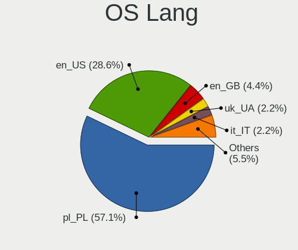
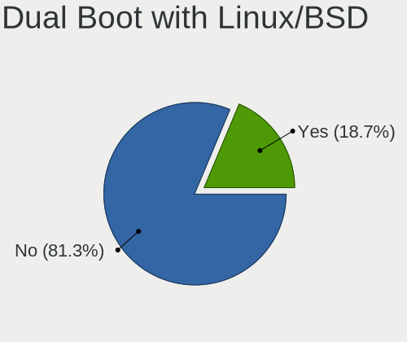
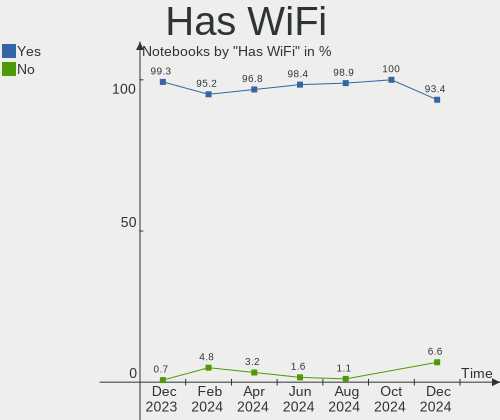
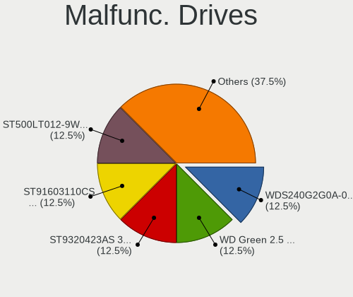
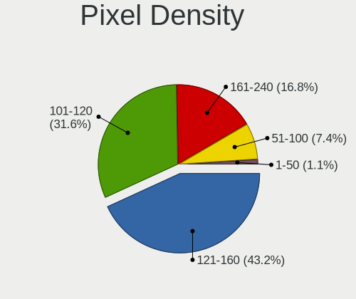
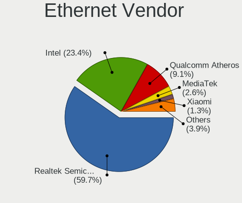
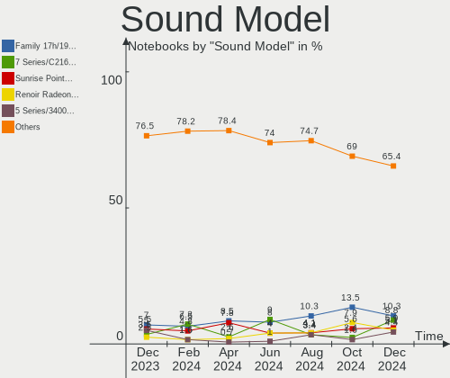

Linux in Poland - Hardware Trends (Notebooks)
---------------------------------------------

A project to identify most popular hardware characteristics and track their change
over time based on data collected by Linux users at https://Linux-Hardware.org.

Anyone can contribute to this report by the [hw-probe](https://github.com/linuxhw/hw-probe) tool:

    sudo -E hw-probe -all -upload

Period: Jun, 2022.

Contents
--------

* [ System ](#system)
  - [ OS                       ](#os)
  - [ OS Family                ](#os-family)
  - [ Kernel                   ](#kernel)
  - [ Kernel Family            ](#kernel-family)
  - [ Kernel Major Ver.        ](#kernel-major-ver)
  - [ Arch                     ](#arch)
  - [ DE                       ](#de)
  - [ Display Server           ](#display-server)
  - [ Display Manager          ](#display-manager)
  - [ OS Lang                  ](#os-lang)
  - [ Boot Mode                ](#boot-mode)
  - [ Filesystem               ](#filesystem)
  - [ Part. scheme             ](#part-scheme)
  - [ Dual Boot with Linux/BSD ](#dual-boot-with-linuxbsd)
  - [ Dual Boot (Win)          ](#dual-boot-win)

* [ Board ](#board)
  - [ Vendor                   ](#vendor)
  - [ Model                    ](#model)
  - [ Model Family             ](#model-family)
  - [ MFG Year                 ](#mfg-year)
  - [ Form Factor              ](#form-factor)
  - [ Secure Boot              ](#secure-boot)
  - [ Coreboot                 ](#coreboot)
  - [ RAM Size                 ](#ram-size)
  - [ RAM Used                 ](#ram-used)
  - [ Total Drives             ](#total-drives)
  - [ Has CD-ROM               ](#has-cd-rom)
  - [ Has Ethernet             ](#has-ethernet)
  - [ Has WiFi                 ](#has-wifi)
  - [ Has Bluetooth            ](#has-bluetooth)

* [ Location ](#location)
  - [ Country                  ](#country)
  - [ City                     ](#city)

* [ Drives ](#drives)
  - [ Drive Vendor             ](#drive-vendor)
  - [ Drive Model              ](#drive-model)
  - [ HDD Vendor               ](#hdd-vendor)
  - [ SSD Vendor               ](#ssd-vendor)
  - [ Drive Kind               ](#drive-kind)
  - [ Drive Connector          ](#drive-connector)
  - [ Drive Size               ](#drive-size)
  - [ Space Total              ](#space-total)
  - [ Space Used               ](#space-used)
  - [ Malfunc. Drives          ](#malfunc-drives)
  - [ Malfunc. Drive Vendor    ](#malfunc-drive-vendor)
  - [ Malfunc. HDD Vendor      ](#malfunc-hdd-vendor)
  - [ Malfunc. Drive Kind      ](#malfunc-drive-kind)
  - [ Failed Drives            ](#failed-drives)
  - [ Failed Drive Vendor      ](#failed-drive-vendor)
  - [ Drive Status             ](#drive-status)

* [ Storage controller ](#storage-controller)
  - [ Storage Vendor           ](#storage-vendor)
  - [ Storage Model            ](#storage-model)
  - [ Storage Kind             ](#storage-kind)

* [ Processor ](#processor)
  - [ CPU Vendor               ](#cpu-vendor)
  - [ CPU Model                ](#cpu-model)
  - [ CPU Model Family         ](#cpu-model-family)
  - [ CPU Cores                ](#cpu-cores)
  - [ CPU Sockets              ](#cpu-sockets)
  - [ CPU Threads              ](#cpu-threads)
  - [ CPU Op-Modes             ](#cpu-op-modes)
  - [ CPU Microcode            ](#cpu-microcode)
  - [ CPU Microarch            ](#cpu-microarch)

* [ Graphics ](#graphics)
  - [ GPU Vendor               ](#gpu-vendor)
  - [ GPU Model                ](#gpu-model)
  - [ GPU Combo                ](#gpu-combo)
  - [ GPU Driver               ](#gpu-driver)
  - [ GPU Memory               ](#gpu-memory)

* [ Monitor ](#monitor)
  - [ Monitor Vendor           ](#monitor-vendor)
  - [ Monitor Model            ](#monitor-model)
  - [ Monitor Resolution       ](#monitor-resolution)
  - [ Monitor Diagonal         ](#monitor-diagonal)
  - [ Monitor Width            ](#monitor-width)
  - [ Aspect Ratio             ](#aspect-ratio)
  - [ Monitor Area             ](#monitor-area)
  - [ Pixel Density            ](#pixel-density)
  - [ Multiple Monitors        ](#multiple-monitors)

* [ Network ](#network)
  - [ Net Controller Vendor    ](#net-controller-vendor)
  - [ Net Controller Model     ](#net-controller-model)
  - [ Wireless Vendor          ](#wireless-vendor)
  - [ Wireless Model           ](#wireless-model)
  - [ Ethernet Vendor          ](#ethernet-vendor)
  - [ Ethernet Model           ](#ethernet-model)
  - [ Net Controller Kind      ](#net-controller-kind)
  - [ Used Controller          ](#used-controller)
  - [ NICs                     ](#nics)
  - [ IPv6                     ](#ipv6)

* [ Bluetooth ](#bluetooth)
  - [ Bluetooth Vendor         ](#bluetooth-vendor)
  - [ Bluetooth Model          ](#bluetooth-model)

* [ Sound ](#sound)
  - [ Sound Vendor             ](#sound-vendor)
  - [ Sound Model              ](#sound-model)

* [ Memory ](#memory)
  - [ Memory Vendor            ](#memory-vendor)
  - [ Memory Model             ](#memory-model)
  - [ Memory Kind              ](#memory-kind)
  - [ Memory Form Factor       ](#memory-form-factor)
  - [ Memory Size              ](#memory-size)
  - [ Memory Speed             ](#memory-speed)

* [ Printers & scanners ](#printers--scanners)
  - [ Printer Vendor           ](#printer-vendor)
  - [ Printer Model            ](#printer-model)
  - [ Scanner Vendor           ](#scanner-vendor)
  - [ Scanner Model            ](#scanner-model)

* [ Camera ](#camera)
  - [ Camera Vendor            ](#camera-vendor)
  - [ Camera Model             ](#camera-model)

* [ Security ](#security)
  - [ Fingerprint Vendor       ](#fingerprint-vendor)
  - [ Fingerprint Model        ](#fingerprint-model)
  - [ Chipcard Vendor          ](#chipcard-vendor)
  - [ Chipcard Model           ](#chipcard-model)

* [ Unsupported ](#unsupported)
  - [ Unsupported Devices      ](#unsupported-devices)
  - [ Unsupported Device Types ](#unsupported-device-types)

System
------

OS
--

Installed operating systems

| Name                 | Notebooks | Percent |
|----------------------|-----------|---------|
| OpenMandriva 4.2     | 7         | 9.86%   |
| Fedora 36            | 7         | 9.86%   |
| Ubuntu 20.04         | 6         | 8.45%   |
| OpenMandriva 4.3     | 6         | 8.45%   |
| Ubuntu 22.04         | 4         | 5.63%   |
| LMDE 5               | 3         | 4.23%   |
| Linux Mint 20.3      | 3         | 4.23%   |
| Arch Rolling         | 3         | 4.23%   |
| Xubuntu 20.04        | 2         | 2.82%   |
| Ubuntu 18.04         | 2         | 2.82%   |
| Debian 11            | 2         | 2.82%   |
| Debian 10            | 2         | 2.82%   |
| ArcoLinux Rolling    | 2         | 2.82%   |
| Zorin 15             | 1         | 1.41%   |
| ROSA 12.2            | 1         | 1.41%   |
| Pop!_OS 22.04        | 1         | 1.41%   |
| MX 21                | 1         | 1.41%   |
| Manjaro 21.3.1       | 1         | 1.41%   |
| Manjaro 21.3.0       | 1         | 1.41%   |
| Manjaro 21.2.6       | 1         | 1.41%   |
| Manjaro              | 1         | 1.41%   |
| LinuxFX 11           | 1         | 1.41%   |
| Linux Mint 20.1      | 1         | 1.41%   |
| Kubuntu 22.04        | 1         | 1.41%   |
| Kubuntu 11.1         | 1         | 1.41%   |
| Kali 2022.2          | 1         | 1.41%   |
| Kali 2022.1          | 1         | 1.41%   |
| Guix                 | 1         | 1.41%   |
| Gentoo 2.8           | 1         | 1.41%   |
| Garuda Linux Soaring | 1         | 1.41%   |
| Elementary 6.1       | 1         | 1.41%   |
| Devuan 4             | 1         | 1.41%   |
| Debian Testing       | 1         | 1.41%   |
| CentOS 7             | 1         | 1.41%   |
| Arch                 | 1         | 1.41%   |

OS Family
---------

OS without a version

| Name         | Notebooks | Percent |
|--------------|-----------|---------|
| OpenMandriva | 13        | 18.31%  |
| Ubuntu       | 12        | 16.9%   |
| Fedora       | 7         | 9.86%   |
| Debian       | 5         | 7.04%   |
| Manjaro      | 4         | 5.63%   |
| Linux Mint   | 4         | 5.63%   |
| Arch         | 4         | 5.63%   |
| LMDE         | 3         | 4.23%   |
| Xubuntu      | 2         | 2.82%   |
| Kubuntu      | 2         | 2.82%   |
| Kali         | 2         | 2.82%   |
| ArcoLinux    | 2         | 2.82%   |
| Zorin        | 1         | 1.41%   |
| ROSA         | 1         | 1.41%   |
| Pop!_OS      | 1         | 1.41%   |
| MX           | 1         | 1.41%   |
| LinuxFX      | 1         | 1.41%   |
| Guix         | 1         | 1.41%   |
| Gentoo       | 1         | 1.41%   |
| Garuda Linux | 1         | 1.41%   |
| Elementary   | 1         | 1.41%   |
| Devuan       | 1         | 1.41%   |
| CentOS       | 1         | 1.41%   |

Kernel
------

Version of the Linux kernel

| Version                            | Notebooks | Percent |
|------------------------------------|-----------|---------|
| 5.10.14-desktop-1omv4002           | 7         | 9.86%   |
| 5.16.7-desktop-1omv4003            | 6         | 8.45%   |
| 5.13.0-48-generic                  | 4         | 5.63%   |
| 5.18.5-200.fc36.x86_64             | 3         | 4.23%   |
| 5.15.0-33-generic                  | 3         | 4.23%   |
| 5.13.0-51-generic                  | 3         | 4.23%   |
| 5.10.0-15-amd64                    | 3         | 4.23%   |
| 5.15.0-37-generic                  | 2         | 2.82%   |
| 5.10.0-14-amd64                    | 2         | 2.82%   |
| 5.9.0-050900-generic               | 1         | 1.41%   |
| 5.4.0-91-generic                   | 1         | 1.41%   |
| 5.4.0-120-generic                  | 1         | 1.41%   |
| 5.4.0-117-generic                  | 1         | 1.41%   |
| 5.4.0-113-lowlatency               | 1         | 1.41%   |
| 5.18.8                             | 1         | 1.41%   |
| 5.18.7-lqx1-2-lqx                  | 1         | 1.41%   |
| 5.18.5-arch1-1                     | 1         | 1.41%   |
| 5.18.3-arch1-g14-1                 | 1         | 1.41%   |
| 5.18.3-arch1-1                     | 1         | 1.41%   |
| 5.18.3-261-tkg-bmq                 | 1         | 1.41%   |
| 5.18.3-1-MANJARO                   | 1         | 1.41%   |
| 5.18.1-arch1-1                     | 1         | 1.41%   |
| 5.18.0-g95ff72a6c129               | 1         | 1.41%   |
| 5.18.0-0.bpo.1-amd64               | 1         | 1.41%   |
| 5.17.7-xanmod1-MANJARO             | 1         | 1.41%   |
| 5.17.5-76051705-generic            | 1         | 1.41%   |
| 5.17.5-300.fc36.x86_64             | 1         | 1.41%   |
| 5.17.13-300.fc36.x86_64            | 1         | 1.41%   |
| 5.17.12-300.fc36.x86_64            | 1         | 1.41%   |
| 5.17.0-kali3-amd64                 | 1         | 1.41%   |
| 5.17.0-1-amd64                     | 1         | 1.41%   |
| 5.16.9-200.rog.fc35.x86_64         | 1         | 1.41%   |
| 5.16.10-arch1-1                    | 1         | 1.41%   |
| 5.16.0-kali7-amd64                 | 1         | 1.41%   |
| 5.16.0-6mx-amd64                   | 1         | 1.41%   |
| 5.15.45-1-lts                      | 1         | 1.41%   |
| 5.15.41-1-MANJARO                  | 1         | 1.41%   |
| 5.15.0-40-generic                  | 1         | 1.41%   |
| 5.15.0-35-generic                  | 1         | 1.41%   |
| 5.13.0-44-generic                  | 1         | 1.41%   |
| 5.13.0-41-generic                  | 1         | 1.41%   |
| 5.10.74-generic-2rosa2021.1-x86_64 | 1         | 1.41%   |
| 4.19.0-19-amd64                    | 1         | 1.41%   |
| 4.19.0-16-amd64                    | 1         | 1.41%   |
| 4.15.0-188-generic                 | 1         | 1.41%   |
| 4.15.0-184-generic                 | 1         | 1.41%   |
| 3.10.0-1160.66.1.el7.x86_64        | 1         | 1.41%   |

Kernel Family
-------------

Linux kernel without a distro release

| Version | Notebooks | Percent |
|---------|-----------|---------|
| 5.13.0  | 9         | 12.68%  |
| 5.15.0  | 7         | 9.86%   |
| 5.10.14 | 7         | 9.86%   |
| 5.16.7  | 6         | 8.45%   |
| 5.10.0  | 5         | 7.04%   |
| 5.4.0   | 4         | 5.63%   |
| 5.18.5  | 4         | 5.63%   |
| 5.18.3  | 4         | 5.63%   |
| 5.18.0  | 2         | 2.82%   |
| 5.17.5  | 2         | 2.82%   |
| 5.17.0  | 2         | 2.82%   |
| 5.16.0  | 2         | 2.82%   |
| 4.19.0  | 2         | 2.82%   |
| 4.15.0  | 2         | 2.82%   |
| 5.9.0   | 1         | 1.41%   |
| 5.18.8  | 1         | 1.41%   |
| 5.18.7  | 1         | 1.41%   |
| 5.18.1  | 1         | 1.41%   |
| 5.17.7  | 1         | 1.41%   |
| 5.17.13 | 1         | 1.41%   |
| 5.17.12 | 1         | 1.41%   |
| 5.16.9  | 1         | 1.41%   |
| 5.16.10 | 1         | 1.41%   |
| 5.15.45 | 1         | 1.41%   |
| 5.15.41 | 1         | 1.41%   |
| 5.10.74 | 1         | 1.41%   |
| 3.10.0  | 1         | 1.41%   |

Kernel Major Ver.
-----------------

Linux kernel major version

| Version | Notebooks | Percent |
|---------|-----------|---------|
| 5.18    | 13        | 18.31%  |
| 5.10    | 13        | 18.31%  |
| 5.16    | 10        | 14.08%  |
| 5.15    | 9         | 12.68%  |
| 5.13    | 9         | 12.68%  |
| 5.17    | 7         | 9.86%   |
| 5.4     | 4         | 5.63%   |
| 4.19    | 2         | 2.82%   |
| 4.15    | 2         | 2.82%   |
| 5.9     | 1         | 1.41%   |
| 3.10    | 1         | 1.41%   |

Arch
----

OS architecture (x86_64, i586, etc.)

| Name   | Notebooks | Percent |
|--------|-----------|---------|
| x86_64 | 70        | 98.59%  |
| i686   | 1         | 1.41%   |

DE
--

Desktop Environment

| Name          | Notebooks | Percent |
|---------------|-----------|---------|
| KDE5          | 23        | 32.39%  |
| GNOME         | 22        | 30.99%  |
| XFCE          | 6         | 8.45%   |
| X-Cinnamon    | 6         | 8.45%   |
| Unknown       | 6         | 8.45%   |
| sway          | 1         | 1.41%   |
| stumpwm       | 1         | 1.41%   |
| qtile         | 1         | 1.41%   |
| Pantheon      | 1         | 1.41%   |
| GNOME Classic | 1         | 1.41%   |
| Deepin        | 1         | 1.41%   |
| Cinnamon      | 1         | 1.41%   |
| awesome       | 1         | 1.41%   |

Display Server
--------------

X11 or Wayland

| Name    | Notebooks | Percent |
|---------|-----------|---------|
| X11     | 53        | 74.65%  |
| Wayland | 14        | 19.72%  |
| Unknown | 3         | 4.23%   |
| Tty     | 1         | 1.41%   |

Display Manager
---------------

SDDM, LightDM, etc.

| Name    | Notebooks | Percent |
|---------|-----------|---------|
| SDDM    | 21        | 29.58%  |
| Unknown | 21        | 29.58%  |
| GDM     | 11        | 15.49%  |
| LightDM | 10        | 14.08%  |
| GDM3    | 7         | 9.86%   |
| SLiM    | 1         | 1.41%   |

OS Lang
-------

Language

| Lang    | Notebooks | Percent |
|---------|-----------|---------|
| pl_PL   | 41        | 57.75%  |
| en_US   | 23        | 32.39%  |
| Unknown | 4         | 5.63%   |
| en_IE   | 1         | 1.41%   |
| en_GB   | 1         | 1.41%   |
| C.UTF8  | 1         | 1.41%   |

Boot Mode
---------

EFI or BIOS

| Mode | Notebooks | Percent |
|------|-----------|---------|
| BIOS | 36        | 50.7%   |
| EFI  | 35        | 49.3%   |

Filesystem
----------

Type of filesystem

| Type     | Notebooks | Percent |
|----------|-----------|---------|
| Ext4     | 50        | 70.42%  |
| Btrfs    | 10        | 14.08%  |
| Overlay  | 5         | 7.04%   |
| Xfs      | 3         | 4.23%   |
| F2fs     | 1         | 1.41%   |
| Ext2     | 1         | 1.41%   |
| Bcachefs | 1         | 1.41%   |

Part. scheme
------------

Scheme of partitioning

| Type    | Notebooks | Percent |
|---------|-----------|---------|
| GPT     | 28        | 39.44%  |
| Unknown | 28        | 39.44%  |
| MBR     | 15        | 21.13%  |

Dual Boot with Linux/BSD
------------------------

Hosting more than one Linux/BSD

| Dual boot | Notebooks | Percent |
|-----------|-----------|---------|
| No        | 59        | 83.1%   |
| Yes       | 12        | 16.9%   |

Dual Boot (Win)
---------------

Hosting Linux and Windows

| Dual boot | Notebooks | Percent |
|-----------|-----------|---------|
| No        | 53        | 74.65%  |
| Yes       | 18        | 25.35%  |

Board
-----

Vendor
------

Motherboard manufacturer

| Name                | Notebooks | Percent |
|---------------------|-----------|---------|
| Lenovo              | 20        | 28.17%  |
| Dell                | 20        | 28.17%  |
| Hewlett-Packard     | 10        | 14.08%  |
| Acer                | 7         | 9.86%   |
| ASUSTek Computer    | 6         | 8.45%   |
| MSI                 | 2         | 2.82%   |
| Samsung Electronics | 1         | 1.41%   |
| mPTech              | 1         | 1.41%   |
| Getac               | 1         | 1.41%   |
| Fujitsu             | 1         | 1.41%   |
| Framework           | 1         | 1.41%   |
| Unknown             | 1         | 1.41%   |

Model
-----

Motherboard model

| Name                                    | Notebooks | Percent |
|-----------------------------------------|-----------|---------|
| Dell Inspiron 3451                      | 6         | 8.45%   |
| HP Pavilion Laptop 14-dv0xxx            | 2         | 2.82%   |
| Samsung 355V4C/356V4C/3445VC/3545VC     | 1         | 1.41%   |
| MSI PR601/VR603                         | 1         | 1.41%   |
| MSI Bravo 17 A4DDR                      | 1         | 1.41%   |
| mPTech ARC 11.6 128GB HD                | 1         | 1.41%   |
| Lenovo ThinkPad T530 2429B68            | 1         | 1.41%   |
| Lenovo ThinkPad T530 23923MG            | 1         | 1.41%   |
| Lenovo ThinkPad T500 2241A87            | 1         | 1.41%   |
| Lenovo ThinkPad T470 20HES07J00         | 1         | 1.41%   |
| Lenovo ThinkPad T450 20BUS0QT04         | 1         | 1.41%   |
| Lenovo ThinkPad T420 4180MY7            | 1         | 1.41%   |
| Lenovo ThinkPad T14 Gen 2i 20W1S21R02   | 1         | 1.41%   |
| Lenovo ThinkPad P50 20EQS3B30R          | 1         | 1.41%   |
| Lenovo ThinkPad P17 Gen 1 20SQS01Y00    | 1         | 1.41%   |
| Lenovo ThinkPad P14s Gen 2a 21A00003PB  | 1         | 1.41%   |
| Lenovo M490s 20214                      | 1         | 1.41%   |
| Lenovo Legion Y540-15IRH 81SX           | 1         | 1.41%   |
| Lenovo Legion 5 Pro 16ACH6H 82JQ        | 1         | 1.41%   |
| Lenovo IdeaPad Z570 HuronRiver Platform | 1         | 1.41%   |
| Lenovo IdeaPad Y700-15ISK 80NV          | 1         | 1.41%   |
| Lenovo IdeaPad S145-14AST 81ST          | 1         | 1.41%   |
| Lenovo IdeaPad 5 15ITL05 82FG           | 1         | 1.41%   |
| Lenovo G580 20150                       | 1         | 1.41%   |
| Lenovo G50-30 80G0                      | 1         | 1.41%   |
| Lenovo B570e HuronRiver Platform        | 1         | 1.41%   |
| HP ZBook Studio G3                      | 1         | 1.41%   |
| HP ProBook 450 G5                       | 1         | 1.41%   |
| HP Pavilion Notebook                    | 1         | 1.41%   |
| HP Pavilion Gaming Laptop 15-ec1xxx     | 1         | 1.41%   |
| HP Pavilion dv6700                      | 1         | 1.41%   |
| HP EliteBook 850 G8 Notebook PC         | 1         | 1.41%   |
| HP EliteBook 850 G3                     | 1         | 1.41%   |
| HP EliteBook 850 G2                     | 1         | 1.41%   |
| Getac B300-X                            | 1         | 1.41%   |
| Fujitsu FMVA0800C                       | 1         | 1.41%   |
| Framework Laptop                        | 1         | 1.41%   |
| Dell Precision 5550                     | 1         | 1.41%   |
| Dell Latitude E6430s                    | 1         | 1.41%   |
| Dell Latitude E6430                     | 1         | 1.41%   |
| Dell Latitude E6420                     | 1         | 1.41%   |
| Dell Latitude E5470                     | 1         | 1.41%   |
| Dell Latitude E5450                     | 1         | 1.41%   |
| Dell Latitude D420                      | 1         | 1.41%   |
| Dell Latitude 5511                      | 1         | 1.41%   |
| Dell Latitude 5421                      | 1         | 1.41%   |
| Dell Latitude 5310                      | 1         | 1.41%   |
| Dell Latitude 3420                      | 1         | 1.41%   |
| Dell Latitude 3190                      | 1         | 1.41%   |
| Dell Inspiron M5040                     | 1         | 1.41%   |
| Dell Inspiron 5749                      | 1         | 1.41%   |
| ASUS X751LK                             | 1         | 1.41%   |
| ASUS TUF Gaming FX504GE_FX80GE          | 1         | 1.41%   |
| ASUS ROG Zephyrus G14 GA401QM_GA401QM   | 1         | 1.41%   |
| ASUS ROG Strix G533QS_G533QS            | 1         | 1.41%   |
| ASUS K53BR                              | 1         | 1.41%   |
| ASUS 1005P                              | 1         | 1.41%   |
| Acer TravelMate 5760                    | 1         | 1.41%   |
| Acer Swift SF314-42                     | 1         | 1.41%   |
| Acer Nitro AN515-54                     | 1         | 1.41%   |

Model Family
------------

Motherboard model prefix

| Name              | Notebooks | Percent |
|-------------------|-----------|---------|
| Dell Latitude     | 11        | 15.49%  |
| Lenovo ThinkPad   | 10        | 14.08%  |
| Dell Inspiron     | 8         | 11.27%  |
| HP Pavilion       | 5         | 7.04%   |
| Lenovo IdeaPad    | 4         | 5.63%   |
| Acer Aspire       | 4         | 5.63%   |
| HP EliteBook      | 3         | 4.23%   |
| Lenovo Legion     | 2         | 2.82%   |
| ASUS ROG          | 2         | 2.82%   |
| Samsung 355V4C    | 1         | 1.41%   |
| MSI PR601         | 1         | 1.41%   |
| MSI Bravo         | 1         | 1.41%   |
| mPTech ARC        | 1         | 1.41%   |
| Lenovo M490s      | 1         | 1.41%   |
| Lenovo G580       | 1         | 1.41%   |
| Lenovo G50-30     | 1         | 1.41%   |
| Lenovo B570e      | 1         | 1.41%   |
| HP ZBook          | 1         | 1.41%   |
| HP ProBook        | 1         | 1.41%   |
| Getac B300-X      | 1         | 1.41%   |
| Fujitsu FMVA0800C | 1         | 1.41%   |
| Framework Laptop  | 1         | 1.41%   |
| Dell Precision    | 1         | 1.41%   |
| ASUS X751LK       | 1         | 1.41%   |
| ASUS TUF          | 1         | 1.41%   |
| ASUS K53BR        | 1         | 1.41%   |
| ASUS 1005P        | 1         | 1.41%   |
| Acer TravelMate   | 1         | 1.41%   |
| Acer Swift        | 1         | 1.41%   |
| Acer Nitro        | 1         | 1.41%   |
| Unknown           | 1         | 1.41%   |

MFG Year
--------

Motherboard manufacture year

| Year | Notebooks | Percent |
|------|-----------|---------|
| 2021 | 12        | 16.9%   |
| 2014 | 10        | 14.08%  |
| 2020 | 8         | 11.27%  |
| 2011 | 8         | 11.27%  |
| 2012 | 6         | 8.45%   |
| 2015 | 5         | 7.04%   |
| 2019 | 4         | 5.63%   |
| 2017 | 4         | 5.63%   |
| 2016 | 3         | 4.23%   |
| 2013 | 3         | 4.23%   |
| 2008 | 3         | 4.23%   |
| 2009 | 2         | 2.82%   |
| 2018 | 1         | 1.41%   |
| 2007 | 1         | 1.41%   |
| 2006 | 1         | 1.41%   |

Form Factor
-----------

Physical design of the computer

| Name     | Notebooks | Percent |
|----------|-----------|---------|
| Notebook | 71        | 100%    |

Secure Boot
-----------

Enabled or disabled

| State    | Notebooks | Percent |
|----------|-----------|---------|
| Disabled | 67        | 94.37%  |
| Enabled  | 4         | 5.63%   |

Coreboot
--------

Have coreboot on board

| Used | Notebooks | Percent |
|------|-----------|---------|
| No   | 71        | 100%    |

RAM Size
--------

Total RAM memory

| Size in GB  | Notebooks | Percent |
|-------------|-----------|---------|
| 4.01-8.0    | 17        | 23.94%  |
| 3.01-4.0    | 15        | 21.13%  |
| 32.01-64.0  | 12        | 16.9%   |
| 16.01-24.0  | 10        | 14.08%  |
| 8.01-16.0   | 10        | 14.08%  |
| 64.01-256.0 | 3         | 4.23%   |
| 2.01-3.0    | 2         | 2.82%   |
| 24.01-32.0  | 1         | 1.41%   |
| 1.01-2.0    | 1         | 1.41%   |

RAM Used
--------

Used RAM memory

| Used GB    | Notebooks | Percent |
|------------|-----------|---------|
| 1.01-2.0   | 27        | 38.03%  |
| 3.01-4.0   | 14        | 19.72%  |
| 4.01-8.0   | 12        | 16.9%   |
| 2.01-3.0   | 9         | 12.68%  |
| 8.01-16.0  | 6         | 8.45%   |
| 24.01-32.0 | 1         | 1.41%   |
| 0.51-1.0   | 1         | 1.41%   |
| 0.01-0.5   | 1         | 1.41%   |

Total Drives
------------

Number of drives on board

| Drives | Notebooks | Percent |
|--------|-----------|---------|
| 1      | 51        | 71.83%  |
| 2      | 18        | 25.35%  |
| 3      | 1         | 1.41%   |
| 0      | 1         | 1.41%   |

Has CD-ROM
----------

Has CD-ROM on board

| Presented | Notebooks | Percent |
|-----------|-----------|---------|
| No        | 50        | 70.42%  |
| Yes       | 21        | 29.58%  |

Has Ethernet
------------

Has Ethernet on board

| Presented | Notebooks | Percent |
|-----------|-----------|---------|
| Yes       | 62        | 87.32%  |
| No        | 9         | 12.68%  |

Has WiFi
--------

Has WiFi module

| Presented | Notebooks | Percent |
|-----------|-----------|---------|
| Yes       | 70        | 98.59%  |
| No        | 1         | 1.41%   |

Has Bluetooth
-------------

Has Bluetooth module

| Presented | Notebooks | Percent |
|-----------|-----------|---------|
| Yes       | 59        | 83.1%   |
| No        | 12        | 16.9%   |

Location
--------

Country
-------

Geographic location (country)

| Country | Notebooks | Percent |
|---------|-----------|---------|
| Poland  | 71        | 100%    |

City
----

Geographic location (city)

| City               | Notebooks | Percent |
|--------------------|-----------|---------|
| Warsaw             | 18        | 25.35%  |
| Krakow             | 12        | 16.9%   |
| Wroclaw            | 5         | 7.04%   |
| Skierniewice       | 4         | 5.63%   |
| Poznan             | 3         | 4.23%   |
| Lodz               | 3         | 4.23%   |
| Katowice           | 3         | 4.23%   |
| Gdansk             | 2         | 2.82%   |
| Zgierz             | 1         | 1.41%   |
| Zator              | 1         | 1.41%   |
| Włocławek        | 1         | 1.41%   |
| Tarnów            | 1         | 1.41%   |
| Szarwark           | 1         | 1.41%   |
| Starachowice       | 1         | 1.41%   |
| Śliwice           | 1         | 1.41%   |
| Skarzysko-Kamienna | 1         | 1.41%   |
| Radwanice          | 1         | 1.41%   |
| Olsztyn            | 1         | 1.41%   |
| Niepolomice        | 1         | 1.41%   |
| Mysłowice         | 1         | 1.41%   |
| Malbork            | 1         | 1.41%   |
| Lublin             | 1         | 1.41%   |
| Janikowo           | 1         | 1.41%   |
| Gdynia             | 1         | 1.41%   |
| Częstochowa       | 1         | 1.41%   |
| Cieszyn            | 1         | 1.41%   |
| Ciechocinek        | 1         | 1.41%   |
| Bytom              | 1         | 1.41%   |
| Bojszowy           | 1         | 1.41%   |

Drives
------

Drive Vendor
------------

Hard drive vendors

| Vendor                      | Notebooks | Drives | Percent |
|-----------------------------|-----------|--------|---------|
| Seagate                     | 18        | 18     | 20.93%  |
| Samsung Electronics         | 9         | 9      | 10.47%  |
| WDC                         | 7         | 7      | 8.14%   |
| SK hynix                    | 7         | 7      | 8.14%   |
| Intel                       | 5         | 5      | 5.81%   |
| Unknown                     | 4         | 4      | 4.65%   |
| SanDisk                     | 4         | 4      | 4.65%   |
| Goodram                     | 4         | 4      | 4.65%   |
| SPCC                        | 3         | 3      | 3.49%   |
| Crucial                     | 3         | 3      | 3.49%   |
| A-DATA Technology           | 3         | 3      | 3.49%   |
| Toshiba                     | 2         | 2      | 2.33%   |
| PNY                         | 2         | 2      | 2.33%   |
| Micron Technology           | 2         | 2      | 2.33%   |
| Kingston                    | 2         | 2      | 2.33%   |
| Verbatim                    | 1         | 1      | 1.16%   |
| Union Memory                | 1         | 1      | 1.16%   |
| sobetter                    | 1         | 1      | 1.16%   |
| Plextor                     | 1         | 1      | 1.16%   |
| Patriot                     | 1         | 1      | 1.16%   |
| MAXIO Technology (Hangzhou) | 1         | 1      | 1.16%   |
| LITEONIT                    | 1         | 1      | 1.16%   |
| LITEON                      | 1         | 1      | 1.16%   |
| KIOXIA                      | 1         | 1      | 1.16%   |
| Hitachi                     | 1         | 1      | 1.16%   |
| Corsair                     | 1         | 1      | 1.16%   |

Drive Model
-----------

Hard drive models

| Model                                 | Notebooks | Percent |
|---------------------------------------|-----------|---------|
| Seagate ST500LT012-1DG142 500GB       | 6         | 6.98%   |
| Seagate ST1000LM035-1RK172 1TB        | 3         | 3.49%   |
| Intel NVMe SSD Drive 512GB            | 3         | 3.49%   |
| Goodram SSDPR-CX400-256-G2 256GB      | 2         | 2.33%   |
| WDC WDS500G2B0A-00SM50 500GB SSD      | 1         | 1.16%   |
| WDC WDS100T3X0C-00SJG0 1TB            | 1         | 1.16%   |
| WDC WD5000BPVT-22HXZT1 500GB          | 1         | 1.16%   |
| WDC WD3200BPVT-24JJ5T0 320GB          | 1         | 1.16%   |
| WDC WD10SPCX-24HWST1 1TB              | 1         | 1.16%   |
| WDC WD10 TPVT-65HT5T0 1TB             | 1         | 1.16%   |
| WDC PC SN520 SDAPNUW-512G-1014 512GB  | 1         | 1.16%   |
| Verbatim Vi550 S3 SSD 128GB           | 1         | 1.16%   |
| Unknown USB DISK 3.2 1TB              | 1         | 1.16%   |
| Unknown SD128  128GB                  | 1         | 1.16%   |
| Unknown MMC Card  64GB                | 1         | 1.16%   |
| Unknown MMC Card  128GB               | 1         | 1.16%   |
| Union Memory RTOTJ128VGD2EYX 128GB    | 1         | 1.16%   |
| Toshiba NVMe SSD Drive 512GB          | 1         | 1.16%   |
| Toshiba MK6008GAH 64GB                | 1         | 1.16%   |
| SPCC Solid State Disk 512GB           | 1         | 1.16%   |
| SPCC Solid State Disk 256GB           | 1         | 1.16%   |
| SPCC Solid State Disk 240GB           | 1         | 1.16%   |
| sobetter Ext 1TB                      | 1         | 1.16%   |
| SK hynix SKHynix_HFS001TDE9X081N 1TB  | 1         | 1.16%   |
| SK hynix NVMe SSD Drive 512GB         | 1         | 1.16%   |
| SK hynix NVMe SSD Drive 1TB           | 1         | 1.16%   |
| SK hynix NVMe SSD Drive 1024GB        | 1         | 1.16%   |
| SK hynix HFM512GDJTNI-82A0A 512GB     | 1         | 1.16%   |
| SK hynix HFM001TD3JX013N 1TB          | 1         | 1.16%   |
| SK hynix BC711 NVMe 256GB             | 1         | 1.16%   |
| Seagate ST9500325AS 500GB             | 1         | 1.16%   |
| Seagate ST9320423AS 320GB             | 1         | 1.16%   |
| Seagate ST9250315AS 250GB             | 1         | 1.16%   |
| Seagate ST500LT012-9WS142 500GB       | 1         | 1.16%   |
| Seagate ST500LM000-SSHD-8GB           | 1         | 1.16%   |
| Seagate ST320LT007-9ZV142 320GB       | 1         | 1.16%   |
| Seagate ST250LT007-9ZV14C 250GB       | 1         | 1.16%   |
| Seagate ST1000LM024 HN-M101MBB 1TB    | 1         | 1.16%   |
| Seagate ST1000LM014-1EJ164-SSHD 1TB   | 1         | 1.16%   |
| SanDisk X400 M.2 2280 256GB SSD       | 1         | 1.16%   |
| SanDisk SD9SN8W-128G-1006 128GB SSD   | 1         | 1.16%   |
| SanDisk SD8TN8U512G1001 512GB SSD     | 1         | 1.16%   |
| SanDisk SD6PP4M-256G-1006 256GB SSD   | 1         | 1.16%   |
| Samsung SSD 980 1TB                   | 1         | 1.16%   |
| Samsung SSD 970 EVO Plus 2TB          | 1         | 1.16%   |
| Samsung SSD 870 EVO 1TB               | 1         | 1.16%   |
| Samsung SSD 850 EVO 500GB             | 1         | 1.16%   |
| Samsung NVMe SSD Drive 1024GB         | 1         | 1.16%   |
| Samsung MZVLQ512HALU-000H1 512GB      | 1         | 1.16%   |
| Samsung MZNLN256HCHP-000H1 256GB SSD  | 1         | 1.16%   |
| Samsung MZ7TE256HMHP-000L2 256GB SSD  | 1         | 1.16%   |
| Samsung MZ7LN256HCHP-000L7 256GB SSD  | 1         | 1.16%   |
| PNY CS900 120GB SSD                   | 1         | 1.16%   |
| PNY CS3040 1TB SSD                    | 1         | 1.16%   |
| Plextor PX-256S2G 256GB SSD           | 1         | 1.16%   |
| Patriot P200 2TB SSD                  | 1         | 1.16%   |
| Micron 5100_MTFDDAK480TCC 480GB SSD   | 1         | 1.16%   |
| Micron 1100_MTFDDAK256TBN 256GB SSD   | 1         | 1.16%   |
| MAXIO (Hangzhou) NVMe SSD Drive 2TB   | 1         | 1.16%   |
| LITEONIT LCS-128M6S 2.5 7mm 128GB SSD | 1         | 1.16%   |

HDD Vendor
----------

Hard disk drive vendors

| Vendor  | Notebooks | Drives | Percent |
|---------|-----------|--------|---------|
| Seagate | 18        | 18     | 75%     |
| WDC     | 4         | 4      | 16.67%  |
| Toshiba | 1         | 1      | 4.17%   |
| Hitachi | 1         | 1      | 4.17%   |

SSD Vendor
----------

Solid state drive vendors

| Vendor              | Notebooks | Drives | Percent |
|---------------------|-----------|--------|---------|
| Samsung Electronics | 5         | 5      | 14.71%  |
| SanDisk             | 4         | 4      | 11.76%  |
| Goodram             | 4         | 4      | 11.76%  |
| SPCC                | 3         | 3      | 8.82%   |
| A-DATA Technology   | 3         | 3      | 8.82%   |
| Micron Technology   | 2         | 2      | 5.88%   |
| Kingston            | 2         | 2      | 5.88%   |
| Crucial             | 2         | 2      | 5.88%   |
| WDC                 | 1         | 1      | 2.94%   |
| Verbatim            | 1         | 1      | 2.94%   |
| Union Memory        | 1         | 1      | 2.94%   |
| PNY                 | 1         | 1      | 2.94%   |
| Plextor             | 1         | 1      | 2.94%   |
| Patriot             | 1         | 1      | 2.94%   |
| LITEONIT            | 1         | 1      | 2.94%   |
| LITEON              | 1         | 1      | 2.94%   |
| Intel               | 1         | 1      | 2.94%   |

Drive Kind
----------

HDD or SSD

| Kind    | Notebooks | Drives | Percent |
|---------|-----------|--------|---------|
| SSD     | 32        | 34     | 39.02%  |
| HDD     | 24        | 24     | 29.27%  |
| NVMe    | 21        | 23     | 25.61%  |
| MMC     | 3         | 3      | 3.66%   |
| Unknown | 2         | 2      | 2.44%   |

Drive Connector
---------------

SATA, SAS, NVMe, etc.

| Type | Notebooks | Drives | Percent |
|------|-----------|--------|---------|
| SATA | 50        | 57     | 64.94%  |
| NVMe | 21        | 23     | 27.27%  |
| SAS  | 3         | 3      | 3.9%    |
| MMC  | 3         | 3      | 3.9%    |

Drive Size
----------

Size of hard drive

| Size in TB | Notebooks | Drives | Percent |
|------------|-----------|--------|---------|
| 0.01-0.5   | 40        | 44     | 74.07%  |
| 0.51-1.0   | 13        | 13     | 24.07%  |
| 1.01-2.0   | 1         | 1      | 1.85%   |

Space Total
-----------

Amount of disk space available on the file system

| Size in GB     | Notebooks | Percent |
|----------------|-----------|---------|
| 101-250        | 25        | 35.21%  |
| 251-500        | 13        | 18.31%  |
| 501-1000       | 12        | 16.9%   |
| 1001-2000      | 7         | 9.86%   |
| 1-20           | 5         | 7.04%   |
| Unknown        | 3         | 4.23%   |
| 21-50          | 2         | 2.82%   |
| 51-100         | 2         | 2.82%   |
| More than 3000 | 1         | 1.41%   |
| 2001-3000      | 1         | 1.41%   |

Space Used
----------

Amount of used disk space

| Used GB   | Notebooks | Percent |
|-----------|-----------|---------|
| 1-20      | 29        | 40.85%  |
| 101-250   | 11        | 15.49%  |
| 251-500   | 8         | 11.27%  |
| 21-50     | 7         | 9.86%   |
| 51-100    | 7         | 9.86%   |
| 501-1000  | 4         | 5.63%   |
| Unknown   | 3         | 4.23%   |
| 2001-3000 | 1         | 1.41%   |
| 1001-2000 | 1         | 1.41%   |

Malfunc. Drives
---------------

Drive models with a malfunction

| Model                               | Notebooks | Drives | Percent |
|-------------------------------------|-----------|--------|---------|
| WDC WD10 TPVT-65HT5T0 1TB           | 1         | 1      | 16.67%  |
| Toshiba MK6008GAH 64GB              | 1         | 1      | 16.67%  |
| Seagate ST500LT012-9WS142 500GB     | 1         | 1      | 16.67%  |
| SanDisk SD9SN8W-128G-1006 128GB SSD | 1         | 1      | 16.67%  |
| Patriot P200 2TB SSD                | 1         | 1      | 16.67%  |
| Intel SSDSCKKF256H6 SATA 256GB      | 1         | 1      | 16.67%  |

Malfunc. Drive Vendor
---------------------

Vendors of faulty drives

| Vendor  | Notebooks | Drives | Percent |
|---------|-----------|--------|---------|
| WDC     | 1         | 1      | 16.67%  |
| Toshiba | 1         | 1      | 16.67%  |
| Seagate | 1         | 1      | 16.67%  |
| SanDisk | 1         | 1      | 16.67%  |
| Patriot | 1         | 1      | 16.67%  |
| Intel   | 1         | 1      | 16.67%  |

Malfunc. HDD Vendor
-------------------

Vendors of faulty HDD drives

| Vendor  | Notebooks | Drives | Percent |
|---------|-----------|--------|---------|
| WDC     | 1         | 1      | 33.33%  |
| Toshiba | 1         | 1      | 33.33%  |
| Seagate | 1         | 1      | 33.33%  |

Malfunc. Drive Kind
-------------------

Kinds of faulty drives

| Kind | Notebooks | Drives | Percent |
|------|-----------|--------|---------|
| SSD  | 3         | 3      | 50%     |
| HDD  | 3         | 3      | 50%     |

Failed Drives
-------------

Failed drive models

Zero info for selected period =(

Failed Drive Vendor
-------------------

Failed drive vendors

Zero info for selected period =(

Drive Status
------------

Number of failed and malfunc. drives

| Status   | Notebooks | Drives | Percent |
|----------|-----------|--------|---------|
| Works    | 41        | 45     | 53.25%  |
| Detected | 30        | 35     | 38.96%  |
| Malfunc  | 6         | 6      | 7.79%   |

Storage controller
------------------

Storage Vendor
--------------

Storage controller vendors

| Vendor                       | Notebooks | Percent |
|------------------------------|-----------|---------|
| Intel                        | 55        | 66.27%  |
| AMD                          | 8         | 9.64%   |
| SK hynix                     | 7         | 8.43%   |
| Samsung Electronics          | 4         | 4.82%   |
| Toshiba America Info Systems | 2         | 2.41%   |
| SanDisk                      | 2         | 2.41%   |
| Phison Electronics           | 2         | 2.41%   |
| Micron/Crucial Technology    | 1         | 1.2%    |
| MAXIO Technology (Hangzhou)  | 1         | 1.2%    |
| Marvell Technology Group     | 1         | 1.2%    |

Storage Model
-------------

Storage controller models

| Model                                                                          | Notebooks | Percent |
|--------------------------------------------------------------------------------|-----------|---------|
| Intel 7 Series Chipset Family 6-port SATA Controller [AHCI mode]               | 8         | 8.89%   |
| Intel Atom Processor E3800 Series SATA AHCI Controller                         | 7         | 7.78%   |
| Intel Volume Management Device NVMe RAID Controller                            | 6         | 6.67%   |
| AMD FCH SATA Controller [AHCI mode]                                            | 6         | 6.67%   |
| Intel 6 Series/C200 Series Chipset Family 6 port Mobile SATA AHCI Controller   | 5         | 5.56%   |
| SK hynix Gold P31 SSD                                                          | 4         | 4.44%   |
| Intel Sunrise Point-LP SATA Controller [AHCI mode]                             | 4         | 4.44%   |
| Intel Wildcat Point-LP SATA Controller [AHCI Mode]                             | 3         | 3.33%   |
| Intel 82801IBM/IEM (ICH9M/ICH9M-E) 4 port SATA Controller [AHCI mode]          | 3         | 3.33%   |
| Toshiba America Info Systems XG6 NVMe SSD Controller                           | 2         | 2.22%   |
| SK hynix Non-Volatile memory controller                                        | 2         | 2.22%   |
| Samsung NVMe SSD Controller SM981/PM981/PM983                                  | 2         | 2.22%   |
| Samsung NVMe SSD Controller 980                                                | 2         | 2.22%   |
| Phison E16 PCIe4 NVMe Controller                                               | 2         | 2.22%   |
| Intel Tiger Lake-LP SATA Controller [AHCI mode]                                | 2         | 2.22%   |
| Intel SSD 660P Series                                                          | 2         | 2.22%   |
| Intel Q170/Q150/B150/H170/H110/Z170/CM236 Chipset SATA Controller [AHCI Mode]  | 2         | 2.22%   |
| Intel Non-Volatile memory controller                                           | 2         | 2.22%   |
| Intel Celeron/Pentium Silver Processor SATA Controller                         | 2         | 2.22%   |
| Intel Cannon Lake Mobile PCH SATA AHCI Controller                              | 2         | 2.22%   |
| Intel 82801HM/HEM (ICH8M/ICH8M-E) SATA Controller [AHCI mode]                  | 2         | 2.22%   |
| Intel 82801HM/HEM (ICH8M/ICH8M-E) IDE Controller                               | 2         | 2.22%   |
| Intel 82801 Mobile SATA Controller [RAID mode]                                 | 2         | 2.22%   |
| AMD SB7x0/SB8x0/SB9x0 SATA Controller [AHCI mode]                              | 2         | 2.22%   |
| SK hynix BC511                                                                 | 1         | 1.11%   |
| SanDisk WD Blue SN500 / PC SN520 NVMe SSD                                      | 1         | 1.11%   |
| SanDisk WD Black SN750 / PC SN730 NVMe SSD                                     | 1         | 1.11%   |
| Micron/Crucial NVMe Controller                                                 | 1         | 1.11%   |
| MAXIO (Hangzhou) NVMe SSD Controller MAP1001                                   | 1         | 1.11%   |
| Marvell Group 88SS9183 PCIe SSD Controller                                     | 1         | 1.11%   |
| Intel NM10/ICH7 Family SATA Controller [IDE mode]                              | 1         | 1.11%   |
| Intel HM170/QM170 Chipset SATA Controller [AHCI Mode]                          | 1         | 1.11%   |
| Intel 82801G (ICH7 Family) IDE Controller                                      | 1         | 1.11%   |
| Intel 8 Series/C220 Series Chipset Family 6-port SATA Controller 1 [AHCI mode] | 1         | 1.11%   |
| Intel 8 Series SATA Controller 1 [AHCI mode]                                   | 1         | 1.11%   |
| Intel 5 Series/3400 Series Chipset 6 port SATA AHCI Controller                 | 1         | 1.11%   |
| Intel 400 Series Chipset Family SATA AHCI Controller                           | 1         | 1.11%   |
| AMD SB7x0/SB8x0/SB9x0 IDE Controller                                           | 1         | 1.11%   |

Storage Kind
------------

Kind of storage controller (IDE, SATA, NVMe, SAS, ...)

| Kind | Notebooks | Percent |
|------|-----------|---------|
| SATA | 54        | 61.36%  |
| NVMe | 21        | 23.86%  |
| RAID | 8         | 9.09%   |
| IDE  | 5         | 5.68%   |

Processor
---------

CPU Vendor
----------

Processor vendors

| Vendor | Notebooks | Percent |
|--------|-----------|---------|
| Intel  | 60        | 84.51%  |
| AMD    | 11        | 15.49%  |

CPU Model
---------

Processor models

| Model                                        | Notebooks | Percent |
|----------------------------------------------|-----------|---------|
| Intel Celeron CPU N2840 @ 2.16GHz            | 6         | 8.45%   |
| Intel Core i5-6200U CPU @ 2.30GHz            | 3         | 4.23%   |
| Intel Core i5-3320M CPU @ 2.60GHz            | 3         | 4.23%   |
| Intel 11th Gen Core i7-1165G7 @ 2.80GHz      | 3         | 4.23%   |
| Intel 11th Gen Core i5-1135G7 @ 2.40GHz      | 3         | 4.23%   |
| Intel Core i7-9750H CPU @ 2.60GHz            | 2         | 2.82%   |
| Intel Core i7-6820HQ CPU @ 2.70GHz           | 2         | 2.82%   |
| Intel Core i5-7200U CPU @ 2.50GHz            | 2         | 2.82%   |
| Intel Core i5-5300U CPU @ 2.30GHz            | 2         | 2.82%   |
| Intel Core i5-5200U CPU @ 2.20GHz            | 2         | 2.82%   |
| Intel Core i3-2330M CPU @ 2.20GHz            | 2         | 2.82%   |
| AMD Ryzen 7 5800H with Radeon Graphics       | 2         | 2.82%   |
| AMD E-450 APU with Radeon HD Graphics        | 2         | 2.82%   |
| Intel Xeon W-10855M CPU @ 2.80GHz            | 1         | 1.41%   |
| Intel Pentium Silver N5000 CPU @ 1.10GHz     | 1         | 1.41%   |
| Intel Pentium Dual CPU T3400 @ 2.16GHz       | 1         | 1.41%   |
| Intel Pentium CPU N3540 @ 2.16GHz            | 1         | 1.41%   |
| Intel Pentium CPU B950 @ 2.10GHz             | 1         | 1.41%   |
| Intel Pentium CPU 2020M @ 2.40GHz            | 1         | 1.41%   |
| Intel Core i7-6700HQ CPU @ 2.60GHz           | 1         | 1.41%   |
| Intel Core i7-4510U CPU @ 2.00GHz            | 1         | 1.41%   |
| Intel Core i7-3537U CPU @ 2.00GHz            | 1         | 1.41%   |
| Intel Core i7-2640M CPU @ 2.80GHz            | 1         | 1.41%   |
| Intel Core i7-10850H CPU @ 2.70GHz           | 1         | 1.41%   |
| Intel Core i7-10750H CPU @ 2.60GHz           | 1         | 1.41%   |
| Intel Core i7-10610U CPU @ 1.80GHz           | 1         | 1.41%   |
| Intel Core i7 CPU L 620 @ 2.00GHz            | 1         | 1.41%   |
| Intel Core i5-8300H CPU @ 2.30GHz            | 1         | 1.41%   |
| Intel Core i5-8250U CPU @ 1.60GHz            | 1         | 1.41%   |
| Intel Core i5-2540M CPU @ 2.60GHz            | 1         | 1.41%   |
| Intel Core i3-3217U CPU @ 1.80GHz            | 1         | 1.41%   |
| Intel Core i3-3120M CPU @ 2.50GHz            | 1         | 1.41%   |
| Intel Core Duo CPU U2500 @ 1.20GHz           | 1         | 1.41%   |
| Intel Core 2 Duo CPU T9500 @ 2.60GHz         | 1         | 1.41%   |
| Intel Core 2 Duo CPU T7700 @ 2.40GHz         | 1         | 1.41%   |
| Intel Core 2 Duo CPU T6600 @ 2.20GHz         | 1         | 1.41%   |
| Intel Core 2 Duo CPU P8400 @ 2.26GHz         | 1         | 1.41%   |
| Intel Celeron N4020 CPU @ 1.10GHz            | 1         | 1.41%   |
| Intel Celeron CPU 2950M @ 2.00GHz            | 1         | 1.41%   |
| Intel Celeron CPU 1007U @ 1.50GHz            | 1         | 1.41%   |
| Intel Atom CPU N450 @ 1.66GHz                | 1         | 1.41%   |
| Intel 11th Gen Core i7-1185G7 @ 3.00GHz      | 1         | 1.41%   |
| Intel 11th Gen Core i7-11850H @ 2.50GHz      | 1         | 1.41%   |
| AMD Ryzen 9 5900HS with Radeon Graphics      | 1         | 1.41%   |
| AMD Ryzen 7 PRO 5850U with Radeon Graphics   | 1         | 1.41%   |
| AMD Ryzen 7 4800H with Radeon Graphics       | 1         | 1.41%   |
| AMD Ryzen 5 4600H with Radeon Graphics       | 1         | 1.41%   |
| AMD Ryzen 5 4500U with Radeon Graphics       | 1         | 1.41%   |
| AMD A6-9225 RADEON R4, 5 COMPUTE CORES 2C+3G | 1         | 1.41%   |
| AMD A10-4600M APU with Radeon HD Graphics    | 1         | 1.41%   |

CPU Model Family
----------------

Processor model prefix

| Model                | Notebooks | Percent |
|----------------------|-----------|---------|
| Intel Core i5        | 15        | 21.13%  |
| Intel Core i7        | 12        | 16.9%   |
| Intel Celeron        | 9         | 12.68%  |
| Other                | 8         | 11.27%  |
| Intel Core i3        | 4         | 5.63%   |
| Intel Core 2 Duo     | 4         | 5.63%   |
| Intel Pentium        | 3         | 4.23%   |
| AMD Ryzen 7          | 3         | 4.23%   |
| AMD Ryzen 5          | 2         | 2.82%   |
| AMD E                | 2         | 2.82%   |
| Intel Xeon           | 1         | 1.41%   |
| Intel Pentium Silver | 1         | 1.41%   |
| Intel Pentium Dual   | 1         | 1.41%   |
| Intel Core Duo       | 1         | 1.41%   |
| Intel Atom           | 1         | 1.41%   |
| AMD Ryzen 9          | 1         | 1.41%   |
| AMD Ryzen 7 PRO      | 1         | 1.41%   |
| AMD A6               | 1         | 1.41%   |
| AMD A10              | 1         | 1.41%   |

CPU Cores
---------

Number of processor cores

| Number | Notebooks | Percent |
|--------|-----------|---------|
| 2      | 42        | 59.15%  |
| 4      | 15        | 21.13%  |
| 6      | 7         | 9.86%   |
| 8      | 6         | 8.45%   |
| 1      | 1         | 1.41%   |

CPU Sockets
-----------

Number of sockets

| Number | Notebooks | Percent |
|--------|-----------|---------|
| 1      | 71        | 100%    |

CPU Threads
-----------

Threads per core (Hyper-Threading)

| Number | Notebooks | Percent |
|--------|-----------|---------|
| 2      | 48        | 67.61%  |
| 1      | 23        | 32.39%  |

CPU Op-Modes
------------

CPU Operation Modes (32-bit, 64-bit)

| Op mode        | Notebooks | Percent |
|----------------|-----------|---------|
| 32-bit, 64-bit | 69        | 97.18%  |
| 32-bit         | 1         | 1.41%   |
| Unknown        | 1         | 1.41%   |

CPU Microcode
-------------

Microcode number

| Number     | Notebooks | Percent |
|------------|-----------|---------|
| Unknown    | 10        | 14.08%  |
| 0x806c1    | 7         | 9.86%   |
| 0x306a9    | 7         | 9.86%   |
| 0x30678    | 7         | 9.86%   |
| 0x206a7    | 4         | 5.63%   |
| 0x906ea    | 3         | 4.23%   |
| 0x306d4    | 3         | 4.23%   |
| 0x0a50000c | 3         | 4.23%   |
| 0x806e9    | 2         | 2.82%   |
| 0x506e3    | 2         | 2.82%   |
| 0x406e3    | 2         | 2.82%   |
| 0x10676    | 2         | 2.82%   |
| 0xa0652    | 1         | 1.41%   |
| 0x806ec    | 1         | 1.41%   |
| 0x806ea    | 1         | 1.41%   |
| 0x806d1    | 1         | 1.41%   |
| 0x706a8    | 1         | 1.41%   |
| 0x706a1    | 1         | 1.41%   |
| 0x6fd      | 1         | 1.41%   |
| 0x6fb      | 1         | 1.41%   |
| 0x6ec      | 1         | 1.41%   |
| 0x40651    | 1         | 1.41%   |
| 0x306c3    | 1         | 1.41%   |
| 0x20655    | 1         | 1.41%   |
| 0x106ca    | 1         | 1.41%   |
| 0x0a50000b | 1         | 1.41%   |
| 0x08600104 | 1         | 1.41%   |
| 0x08600102 | 1         | 1.41%   |
| 0x06001119 | 1         | 1.41%   |
| 0x05000119 | 1         | 1.41%   |
| 0x0500010d | 1         | 1.41%   |

CPU Microarch
-------------

Microarchitecture

| Name          | Notebooks | Percent |
|---------------|-----------|---------|
| IvyBridge     | 8         | 11.27%  |
| TigerLake     | 7         | 9.86%   |
| Silvermont    | 7         | 9.86%   |
| KabyLake      | 7         | 9.86%   |
| Skylake       | 6         | 8.45%   |
| SandyBridge   | 5         | 7.04%   |
| Zen 3         | 4         | 5.63%   |
| Broadwell     | 4         | 5.63%   |
| Zen 2         | 3         | 4.23%   |
| Penryn        | 3         | 4.23%   |
| CometLake     | 3         | 4.23%   |
| Haswell       | 2         | 2.82%   |
| Goldmont plus | 2         | 2.82%   |
| Core          | 2         | 2.82%   |
| Bobcat        | 2         | 2.82%   |
| Westmere      | 1         | 1.41%   |
| Piledriver    | 1         | 1.41%   |
| P6            | 1         | 1.41%   |
| Icelake       | 1         | 1.41%   |
| Excavator     | 1         | 1.41%   |
| Bonnell       | 1         | 1.41%   |

Graphics
--------

GPU Vendor
----------

Vendors of graphics cards

| Vendor | Notebooks | Percent |
|--------|-----------|---------|
| Intel  | 55        | 61.11%  |
| Nvidia | 24        | 26.67%  |
| AMD    | 11        | 12.22%  |

GPU Model
---------

Graphics card models

| Model                                                                         | Notebooks | Percent |
|-------------------------------------------------------------------------------|-----------|---------|
| Intel 3rd Gen Core processor Graphics Controller                              | 8         | 8.51%   |
| Intel TigerLake-LP GT2 [Iris Xe Graphics]                                     | 7         | 7.45%   |
| Intel Atom Processor Z36xxx/Z37xxx Series Graphics & Display                  | 7         | 7.45%   |
| Intel HD Graphics 5500                                                        | 4         | 4.26%   |
| Intel 2nd Generation Core Processor Family Integrated Graphics Controller     | 4         | 4.26%   |
| Intel Skylake GT2 [HD Graphics 520]                                           | 3         | 3.19%   |
| Intel HD Graphics 530                                                         | 3         | 3.19%   |
| AMD Renoir                                                                    | 3         | 3.19%   |
| AMD Cezanne                                                                   | 3         | 3.19%   |
| Nvidia GF117M [GeForce 610M/710M/810M/820M / GT 620M/625M/630M/720M]          | 2         | 2.13%   |
| Intel Mobile 4 Series Chipset Integrated Graphics Controller                  | 2         | 2.13%   |
| Intel HD Graphics 620                                                         | 2         | 2.13%   |
| Intel CometLake-H GT2 [UHD Graphics]                                          | 2         | 2.13%   |
| Intel CoffeeLake-H GT2 [UHD Graphics 630]                                     | 2         | 2.13%   |
| AMD Wrestler [Radeon HD 6320]                                                 | 2         | 2.13%   |
| Nvidia TU117M [GeForce GTX 1650 Ti Mobile]                                    | 1         | 1.06%   |
| Nvidia TU117M [GeForce GTX 1650 Mobile / Max-Q]                               | 1         | 1.06%   |
| Nvidia TU117GLM [Quadro T1000 Mobile]                                         | 1         | 1.06%   |
| Nvidia TU116M [GeForce GTX 1660 Ti Mobile]                                    | 1         | 1.06%   |
| Nvidia TU104GLM [Quadro RTX 4000 Mobile / Max-Q]                              | 1         | 1.06%   |
| Nvidia GT216M [GeForce GT 240M]                                               | 1         | 1.06%   |
| Nvidia GP107M [GeForce MX150]                                                 | 1         | 1.06%   |
| Nvidia GP107M [GeForce GTX 1050 Ti Mobile]                                    | 1         | 1.06%   |
| Nvidia GM108M [GeForce 940M]                                                  | 1         | 1.06%   |
| Nvidia GM108M [GeForce 940MX]                                                 | 1         | 1.06%   |
| Nvidia GM108M [GeForce 930MX]                                                 | 1         | 1.06%   |
| Nvidia GM108M [GeForce 840M]                                                  | 1         | 1.06%   |
| Nvidia GM107M [GeForce GTX 960M]                                              | 1         | 1.06%   |
| Nvidia GM107M [GeForce GTX 850M]                                              | 1         | 1.06%   |
| Nvidia GM107GLM [Quadro M1000M]                                               | 1         | 1.06%   |
| Nvidia GK208M [GeForce GT 740M]                                               | 1         | 1.06%   |
| Nvidia GF119M [NVS 4200M]                                                     | 1         | 1.06%   |
| Nvidia GF108M [GeForce GT 540M]                                               | 1         | 1.06%   |
| Nvidia GA106M [GeForce RTX 3060 Mobile / Max-Q]                               | 1         | 1.06%   |
| Nvidia GA104M [GeForce RTX 3080 Mobile / Max-Q 8GB/16GB]                      | 1         | 1.06%   |
| Nvidia GA104M [GeForce RTX 3070 Mobile / Max-Q]                               | 1         | 1.06%   |
| Nvidia G86M [GeForce 8400M GS]                                                | 1         | 1.06%   |
| Intel UHD Graphics 620                                                        | 1         | 1.06%   |
| Intel TigerLake-H GT1 [UHD Graphics]                                          | 1         | 1.06%   |
| Intel Mobile 945GM/GMS/GME, 943/940GML Express Integrated Graphics Controller | 1         | 1.06%   |
| Intel Mobile 945GM/GMS, 943/940GML Express Integrated Graphics Controller     | 1         | 1.06%   |
| Intel Haswell-ULT Integrated Graphics Controller                              | 1         | 1.06%   |
| Intel Haswell Integrated Graphics Controller                                  | 1         | 1.06%   |
| Intel GeminiLake [UHD Graphics 605]                                           | 1         | 1.06%   |
| Intel GeminiLake [UHD Graphics 600]                                           | 1         | 1.06%   |
| Intel Core Processor Integrated Graphics Controller                           | 1         | 1.06%   |
| Intel CometLake-U GT2 [UHD Graphics]                                          | 1         | 1.06%   |
| Intel Comet Lake-H WS GT2 Integrated UHD Graphics Controller                  | 1         | 1.06%   |
| Intel Atom Processor D4xx/D5xx/N4xx/N5xx Integrated Graphics Controller       | 1         | 1.06%   |
| AMD Trinity [Radeon HD 7660G]                                                 | 1         | 1.06%   |
| AMD Thames [Radeon HD 7500M/7600M Series]                                     | 1         | 1.06%   |
| AMD Stoney [Radeon R2/R3/R4/R5 Graphics]                                      | 1         | 1.06%   |
| AMD Seymour [Radeon HD 6400M/7400M Series]                                    | 1         | 1.06%   |
| AMD RV620/M82 [Mobility Radeon HD 3450/3470]                                  | 1         | 1.06%   |
| AMD Navi 14 [Radeon RX 5500/5500M / Pro 5500M]                                | 1         | 1.06%   |

GPU Combo
---------

Combinations of graphics cards

| Name           | Notebooks | Percent |
|----------------|-----------|---------|
| 1 x Intel      | 38        | 53.52%  |
| Intel + Nvidia | 16        | 22.54%  |
| 1 x Nvidia     | 5         | 7.04%   |
| 1 x AMD        | 5         | 7.04%   |
| 2 x AMD        | 3         | 4.23%   |
| AMD + Nvidia   | 3         | 4.23%   |
| 2 x Intel      | 1         | 1.41%   |

GPU Driver
----------

Free vs proprietary

| Driver      | Notebooks | Percent |
|-------------|-----------|---------|
| Free        | 58        | 81.69%  |
| Proprietary | 12        | 16.9%   |
| Unknown     | 1         | 1.41%   |

GPU Memory
----------

Total video memory

| Size in GB | Notebooks | Percent |
|------------|-----------|---------|
| Unknown    | 50        | 70.42%  |
| 0.01-0.5   | 9         | 12.68%  |
| 1.01-2.0   | 5         | 7.04%   |
| 3.01-4.0   | 3         | 4.23%   |
| 0.51-1.0   | 2         | 2.82%   |
| 7.01-8.0   | 1         | 1.41%   |
| 5.01-6.0   | 1         | 1.41%   |

Monitor
-------

Monitor Vendor
--------------

Monitor vendors

| Vendor                  | Notebooks | Percent |
|-------------------------|-----------|---------|
| AU Optronics            | 13        | 14.94%  |
| LG Display              | 12        | 13.79%  |
| Chimei Innolux          | 11        | 12.64%  |
| BOE                     | 10        | 11.49%  |
| Samsung Electronics     | 8         | 9.2%    |
| Dell                    | 5         | 5.75%   |
| Philips                 | 4         | 4.6%    |
| Sharp                   | 3         | 3.45%   |
| Lenovo                  | 3         | 3.45%   |
| Goldstar                | 3         | 3.45%   |
| Chi Mei Optoelectronics | 3         | 3.45%   |
| Seiko/Epson             | 2         | 2.3%    |
| Iiyama                  | 2         | 2.3%    |
| Unknown                 | 1         | 1.15%   |
| TMX                     | 1         | 1.15%   |
| Panasonic               | 1         | 1.15%   |
| KDB                     | 1         | 1.15%   |
| Hewlett-Packard         | 1         | 1.15%   |
| HannStar                | 1         | 1.15%   |
| CSO                     | 1         | 1.15%   |
| Ancor Communications    | 1         | 1.15%   |

Monitor Model
-------------

Monitor models

| Model                                                                   | Notebooks | Percent |
|-------------------------------------------------------------------------|-----------|---------|
| BOE LCD Monitor BOE0629 1366x768 309x173mm 13.9-inch                    | 6         | 6.59%   |
| LG Display LCD Monitor LGD02DC 1366x768 344x194mm 15.5-inch             | 2         | 2.2%    |
| Lenovo LCD Monitor LEN40B1 1600x900 344x194mm 15.5-inch                 | 2         | 2.2%    |
| AU Optronics LCD Monitor AUO61ED 1920x1080 344x194mm 15.5-inch          | 2         | 2.2%    |
| AU Optronics LCD Monitor AUO35ED 1920x1080 344x193mm 15.5-inch          | 2         | 2.2%    |
| Unknown LCD Monitor CSO 2560x1600                                       | 1         | 1.1%    |
| TMX TL140BDXP01-0 TMX1400 2560x1440 310x174mm 14.0-inch                 | 1         | 1.1%    |
| Sharp LQ156M1JW25 SHP152C 1920x1080 344x194mm 15.5-inch                 | 1         | 1.1%    |
| Sharp LCD Monitor SHP1542 1920x1080 309x174mm 14.0-inch                 | 1         | 1.1%    |
| Sharp LCD Monitor SHP14D0 3840x2400 336x210mm 15.6-inch                 | 1         | 1.1%    |
| Seiko/Epson LCD Monitor 1280x800                                        | 1         | 1.1%    |
| Seiko/Epson LCD Monitor                                                 | 1         | 1.1%    |
| Samsung Electronics SMS27A650 SAM082D 1920x1080 598x336mm 27.0-inch     | 1         | 1.1%    |
| Samsung Electronics LCD Monitor SEC5441 1366x768 344x194mm 15.5-inch    | 1         | 1.1%    |
| Samsung Electronics LCD Monitor SEC3945 1280x800 331x207mm 15.4-inch    | 1         | 1.1%    |
| Samsung Electronics LCD Monitor SEC3157 1280x800 261x163mm 12.1-inch    | 1         | 1.1%    |
| Samsung Electronics LCD Monitor SDC4852 1366x768 344x194mm 15.5-inch    | 1         | 1.1%    |
| Samsung Electronics LCD Monitor SDC3752 1920x1080 344x194mm 15.5-inch   | 1         | 1.1%    |
| Samsung Electronics LCD Monitor SAM0FEE 3840x2160 1872x1053mm 84.6-inch | 1         | 1.1%    |
| Samsung Electronics LCD Monitor SAM0A7D 1920x1080 1060x626mm 48.5-inch  | 1         | 1.1%    |
| Philips PHL 499P9 PHL092A 3840x1080 1193x336mm 48.8-inch                | 1         | 1.1%    |
| Philips PHL 288E2 PHLC231 3840x2160 621x341mm 27.9-inch                 | 1         | 1.1%    |
| Philips PHL 243V7 PHLC155 1920x1080 527x296mm 23.8-inch                 | 1         | 1.1%    |
| Philips PHL 243V5 PHLC002 1920x1080 521x293mm 23.5-inch                 | 1         | 1.1%    |
| Panasonic TV MEIC329 1920x1080 698x392mm 31.5-inch                      | 1         | 1.1%    |
| LG Display LCD Monitor LGD05DB 1920x1080 294x165mm 13.3-inch            | 1         | 1.1%    |
| LG Display LCD Monitor LGD05BE 1920x1080 382x215mm 17.3-inch            | 1         | 1.1%    |
| LG Display LCD Monitor LGD0563 1920x1080 344x194mm 15.5-inch            | 1         | 1.1%    |
| LG Display LCD Monitor LGD0532 1920x1080 344x194mm 15.5-inch            | 1         | 1.1%    |
| LG Display LCD Monitor LGD0521 1920x1080 309x174mm 14.0-inch            | 1         | 1.1%    |
| LG Display LCD Monitor LGD0490 1920x1080 309x174mm 14.0-inch            | 1         | 1.1%    |
| LG Display LCD Monitor LGD046F 1920x1080 344x194mm 15.5-inch            | 1         | 1.1%    |
| LG Display LCD Monitor LGD033E 1366x768 309x174mm 14.0-inch             | 1         | 1.1%    |
| LG Display LCD Monitor LGD033A 1366x768 344x194mm 15.5-inch             | 1         | 1.1%    |
| LG Display LCD Monitor LGD01CA 1600x900 382x215mm 17.3-inch             | 1         | 1.1%    |
| Lenovo LCD Monitor LEN4053 1680x1050 331x207mm 15.4-inch                | 1         | 1.1%    |
| KDB LCD Monitor KDB1130 1366x768 256x144mm 11.6-inch                    | 1         | 1.1%    |
| Iiyama PL2530H IVM6133 1920x1080 540x300mm 24.3-inch                    | 1         | 1.1%    |
| Iiyama PL2530H IVM6132 1920x1080 540x300mm 24.3-inch                    | 1         | 1.1%    |
| Iiyama PL2440HS IVM615E 1920x1080 527x296mm 23.8-inch                   | 1         | 1.1%    |
| Hewlett-Packard Z23i HWP3091 1920x1080 509x286mm 23.0-inch              | 1         | 1.1%    |
| Hewlett-Packard E240 HWP3264 1920x1080 527x296mm 23.8-inch              | 1         | 1.1%    |
| HannStar LCD Monitor HSD03E9 1024x600 220x129mm 10.0-inch               | 1         | 1.1%    |
| Goldstar W1934 GSM4B7A 1440x900 410x256mm 19.0-inch                     | 1         | 1.1%    |
| Goldstar ULTRAWIDE GSM76FC 3840x1600 874x366mm 37.3-inch                | 1         | 1.1%    |
| Goldstar ULTRAWIDE GSM59F1 2560x1080 673x284mm 28.8-inch                | 1         | 1.1%    |
| Dell U2415 DELA0BA 1920x1200 518x324mm 24.1-inch                        | 1         | 1.1%    |
| Dell U2412M DELA07B 1920x1200 518x324mm 24.1-inch                       | 1         | 1.1%    |
| Dell U2412M DELA07A 1920x1200 518x324mm 24.1-inch                       | 1         | 1.1%    |
| Dell S2721DGF DEL41D9 2560x1440 597x336mm 27.0-inch                     | 1         | 1.1%    |
| Dell P2723QE DELF13B 3840x2160 597x336mm 27.0-inch                      | 1         | 1.1%    |
| Dell LCD Monitor P2419HC 3286x1080                                      | 1         | 1.1%    |
| Dell LCD Monitor P2419H                                                 | 1         | 1.1%    |
| CSO LCD Monitor CSO1407 3840x2160 309x174mm 14.0-inch                   | 1         | 1.1%    |
| Chimei Innolux LCD Monitor CMN1734 1600x900 382x214mm 17.2-inch         | 1         | 1.1%    |
| Chimei Innolux LCD Monitor CMN15E8 1920x1080 340x190mm 15.3-inch        | 1         | 1.1%    |
| Chimei Innolux LCD Monitor CMN15BF 1366x768 344x194mm 15.5-inch         | 1         | 1.1%    |
| Chimei Innolux LCD Monitor CMN15BE 1366x768 344x194mm 15.5-inch         | 1         | 1.1%    |
| Chimei Innolux LCD Monitor CMN1521 1920x1080 344x193mm 15.5-inch        | 1         | 1.1%    |
| Chimei Innolux LCD Monitor CMN14FF 1920x1080 309x173mm 13.9-inch        | 1         | 1.1%    |

Monitor Resolution
------------------

Monitor screen resolution

| Resolution         | Notebooks | Percent |
|--------------------|-----------|---------|
| 1920x1080 (FHD)    | 31        | 39.24%  |
| 1366x768 (WXGA)    | 20        | 25.32%  |
| 1600x900 (HD+)     | 6         | 7.59%   |
| 3840x2160 (4K)     | 5         | 6.33%   |
| 2560x1440 (QHD)    | 2         | 2.53%   |
| 1440x900 (WXGA+)   | 2         | 2.53%   |
| 1280x800 (WXGA)    | 2         | 2.53%   |
| 3840x2400          | 1         | 1.27%   |
| 3840x1600          | 1         | 1.27%   |
| 3840x1080          | 1         | 1.27%   |
| 3286x1080          | 1         | 1.27%   |
| 2560x1600          | 1         | 1.27%   |
| 2560x1080          | 1         | 1.27%   |
| 2256x1504          | 1         | 1.27%   |
| 1920x1200 (WUXGA)  | 1         | 1.27%   |
| 1680x1050 (WSXGA+) | 1         | 1.27%   |
| 1024x600           | 1         | 1.27%   |
| Unknown            | 1         | 1.27%   |

Monitor Diagonal
----------------

Diagonal size in inches

| Inches  | Notebooks | Percent |
|---------|-----------|---------|
| 15      | 32        | 37.65%  |
| 13      | 13        | 15.29%  |
| 14      | 11        | 12.94%  |
| 17      | 5         | 5.88%   |
| 27      | 4         | 4.71%   |
| 24      | 4         | 4.71%   |
| 23      | 3         | 3.53%   |
| Unknown | 3         | 3.53%   |
| 48      | 2         | 2.35%   |
| 11      | 2         | 2.35%   |
| 84      | 1         | 1.18%   |
| 37      | 1         | 1.18%   |
| 34      | 1         | 1.18%   |
| 31      | 1         | 1.18%   |
| 19      | 1         | 1.18%   |
| 10      | 1         | 1.18%   |

Monitor Width
-------------

Physical width

| Width in mm | Notebooks | Percent |
|-------------|-----------|---------|
| 301-350     | 53        | 62.35%  |
| 501-600     | 10        | 11.76%  |
| 351-400     | 6         | 7.06%   |
| 201-300     | 5         | 5.88%   |
| Unknown     | 3         | 3.53%   |
| 601-700     | 2         | 2.35%   |
| 1001-1500   | 2         | 2.35%   |
| 801-900     | 1         | 1.18%   |
| 701-800     | 1         | 1.18%   |
| 401-500     | 1         | 1.18%   |
| 1501-2000   | 1         | 1.18%   |

Aspect Ratio
------------

Proportional relationship between the width and the height

| Ratio   | Notebooks | Percent |
|---------|-----------|---------|
| 16/9    | 60        | 81.08%  |
| 16/10   | 7         | 9.46%   |
| Unknown | 3         | 4.05%   |
| 21/9    | 2         | 2.7%    |
| 32/9    | 1         | 1.35%   |
| 3/2     | 1         | 1.35%   |

Monitor Area
------------

Area in inch²

| Area in inch² | Notebooks | Percent |
|----------------|-----------|---------|
| 101-110        | 32        | 37.65%  |
| 81-90          | 23        | 27.06%  |
| 121-130        | 5         | 5.88%   |
| 301-350        | 4         | 4.71%   |
| 201-250        | 4         | 4.71%   |
| 351-500        | 3         | 3.53%   |
| 251-300        | 3         | 3.53%   |
| Unknown        | 3         | 3.53%   |
| More than 1000 | 2         | 2.35%   |
| 51-60          | 2         | 2.35%   |
| 71-80          | 1         | 1.18%   |
| 41-50          | 1         | 1.18%   |
| 151-200        | 1         | 1.18%   |
| 501-1000       | 1         | 1.18%   |

Pixel Density
-------------

Pixels per inch

| Density       | Notebooks | Percent |
|---------------|-----------|---------|
| 121-160       | 34        | 40%     |
| 101-120       | 24        | 28.24%  |
| 51-100        | 17        | 20%     |
| 161-240       | 4         | 4.71%   |
| Unknown       | 3         | 3.53%   |
| More than 240 | 2         | 2.35%   |
| 1-50          | 1         | 1.18%   |

Multiple Monitors
-----------------

Total monitors connected

| Total | Notebooks | Percent |
|-------|-----------|---------|
| 1     | 51        | 71.83%  |
| 2     | 12        | 16.9%   |
| 3     | 6         | 8.45%   |
| 0     | 2         | 2.82%   |

Network
-------

Net Controller Vendor
---------------------

Controller vendors

| Vendor                            | Notebooks | Percent |
|-----------------------------------|-----------|---------|
| Intel                             | 43        | 38.05%  |
| Realtek Semiconductor             | 30        | 26.55%  |
| Qualcomm Atheros                  | 17        | 15.04%  |
| Broadcom                          | 9         | 7.96%   |
| Huawei Technologies               | 6         | 5.31%   |
| Dell                              | 3         | 2.65%   |
| TP-Link                           | 1         | 0.88%   |
| MediaTek                          | 1         | 0.88%   |
| HTC (High Tech Computer)          | 1         | 0.88%   |
| HMD Global                        | 1         | 0.88%   |
| Ericsson Business Mobile Networks | 1         | 0.88%   |

Net Controller Model
--------------------

Controller models

| Model                                                                                         | Notebooks | Percent |
|-----------------------------------------------------------------------------------------------|-----------|---------|
| Realtek RTL8111/8168/8411 PCI Express Gigabit Ethernet Controller                             | 19        | 13.57%  |
| Qualcomm Atheros QCA9565 / AR9565 Wireless Network Adapter                                    | 9         | 6.43%   |
| Intel Wireless 8260                                                                           | 6         | 4.29%   |
| Intel 82579LM Gigabit Network Connection (Lewisville)                                         | 6         | 4.29%   |
| Huawei E353/E3131                                                                             | 6         | 4.29%   |
| Realtek RTL810xE PCI Express Fast Ethernet controller                                         | 5         | 3.57%   |
| Intel Wi-Fi 6 AX201                                                                           | 5         | 3.57%   |
| Qualcomm Atheros AR9285 Wireless Network Adapter (PCI-Express)                                | 4         | 2.86%   |
| Intel Wi-Fi 6 AX200                                                                           | 4         | 2.86%   |
| Intel Centrino Advanced-N 6205 [Taylor Peak]                                                  | 4         | 2.86%   |
| Broadcom BCM43142 802.11b/g/n                                                                 | 4         | 2.86%   |
| Intel Wireless 7265                                                                           | 3         | 2.14%   |
| Intel Ethernet Connection (3) I218-LM                                                         | 3         | 2.14%   |
| Intel Comet Lake PCH CNVi WiFi                                                                | 3         | 2.14%   |
| Intel Cannon Lake PCH CNVi WiFi                                                               | 3         | 2.14%   |
| Realtek RTL8822CE 802.11ac PCIe Wireless Network Adapter                                      | 2         | 1.43%   |
| Realtek RTL8153 Gigabit Ethernet Adapter                                                      | 2         | 1.43%   |
| Qualcomm Atheros AR9462 Wireless Network Adapter                                              | 2         | 1.43%   |
| Intel Wireless 8265 / 8275                                                                    | 2         | 1.43%   |
| Intel Ethernet Connection (2) I219-LM                                                         | 2         | 1.43%   |
| Intel Ethernet Connection (11) I219-LM                                                        | 2         | 1.43%   |
| Intel Centrino Ultimate-N 6300                                                                | 2         | 1.43%   |
| Broadcom NetXtreme BCM57786 Gigabit Ethernet PCIe                                             | 2         | 1.43%   |
| TP-Link TL-WN722N v2/v3 [Realtek RTL8188EUS]                                                  | 1         | 0.71%   |
| Realtek RTL8852AE 802.11ax PCIe Wireless Network Adapter                                      | 1         | 0.71%   |
| Realtek RTL8822BE 802.11a/b/g/n/ac WiFi adapter                                               | 1         | 0.71%   |
| Realtek RTL8821CE 802.11ac PCIe Wireless Network Adapter                                      | 1         | 0.71%   |
| Realtek Realtek 8812AU/8821AU 802.11ac WLAN Adapter [USB Wireless Dual-Band Adapter 2.4/5Ghz] | 1         | 0.71%   |
| Realtek 802.11n WLAN Adapter                                                                  | 1         | 0.71%   |
| Qualcomm Atheros AR9485 Wireless Network Adapter                                              | 1         | 0.71%   |
| Qualcomm Atheros AR8162 Fast Ethernet                                                         | 1         | 0.71%   |
| Qualcomm Atheros AR8151 v2.0 Gigabit Ethernet                                                 | 1         | 0.71%   |
| Qualcomm Atheros AR8132 Fast Ethernet                                                         | 1         | 0.71%   |
| MediaTek MT7921 802.11ax PCI Express Wireless Network Adapter                                 | 1         | 0.71%   |
| Intel WiFi Link 5100                                                                          | 1         | 0.71%   |
| Intel Wi-Fi 6 AX210/AX211/AX411 160MHz                                                        | 1         | 0.71%   |
| Intel Tiger Lake PCH CNVi WiFi                                                                | 1         | 0.71%   |
| Intel PRO/Wireless 5100 AGN [Shiloh] Network Connection                                       | 1         | 0.71%   |
| Intel PRO/Wireless 4965 AG or AGN [Kedron] Network Connection                                 | 1         | 0.71%   |
| Intel PRO/Wireless 3945ABG [Golan] Network Connection                                         | 1         | 0.71%   |
| Intel Ethernet Connection I219-V                                                              | 1         | 0.71%   |
| Intel Ethernet Connection I219-LM                                                             | 1         | 0.71%   |
| Intel Ethernet Connection (4) I219-V                                                          | 1         | 0.71%   |
| Intel Ethernet Connection (14) I219-LM                                                        | 1         | 0.71%   |
| Intel Ethernet Connection (13) I219-V                                                         | 1         | 0.71%   |
| Intel Ethernet Connection (13) I219-LM                                                        | 1         | 0.71%   |
| Intel Ethernet Connection (10) I219-LM                                                        | 1         | 0.71%   |
| Intel Dual Band Wireless-AC 3168NGW [Stone Peak]                                              | 1         | 0.71%   |
| Intel Comet Lake PCH-LP CNVi WiFi                                                             | 1         | 0.71%   |
| Intel Centrino Wireless-N 2230                                                                | 1         | 0.71%   |
| Intel Centrino Wireless-N 1000 [Condor Peak]                                                  | 1         | 0.71%   |
| Intel Centrino Advanced-N 6200                                                                | 1         | 0.71%   |
| Intel 82577LM Gigabit Network Connection                                                      | 1         | 0.71%   |
| Intel 82567LM Gigabit Network Connection                                                      | 1         | 0.71%   |
| HTC (High Tech Computer) Desire HD (modem mode)                                               | 1         | 0.71%   |
| HMD Global SDM439-QRD _SN:609DB907                                                            | 1         | 0.71%   |
| Ericsson Business Mobile Networks F5521gw                                                     | 1         | 0.71%   |
| Dell Wireless 5809e Gobi™ 4G LTE Mobile Broadband Card                                   | 1         | 0.71%   |
| Dell DW5820e L850-GL                                                                          | 1         | 0.71%   |
| Dell DW5550                                                                                   | 1         | 0.71%   |

Wireless Vendor
---------------

Wireless vendors

| Vendor                | Notebooks | Percent |
|-----------------------|-----------|---------|
| Intel                 | 43        | 58.11%  |
| Qualcomm Atheros      | 16        | 21.62%  |
| Realtek Semiconductor | 7         | 9.46%   |
| Broadcom              | 4         | 5.41%   |
| Dell                  | 2         | 2.7%    |
| TP-Link               | 1         | 1.35%   |
| MediaTek              | 1         | 1.35%   |

Wireless Model
--------------

Wireless models

| Model                                                                                         | Notebooks | Percent |
|-----------------------------------------------------------------------------------------------|-----------|---------|
| Qualcomm Atheros QCA9565 / AR9565 Wireless Network Adapter                                    | 9         | 12.16%  |
| Intel Wireless 8260                                                                           | 6         | 8.11%   |
| Intel Wi-Fi 6 AX201                                                                           | 5         | 6.76%   |
| Qualcomm Atheros AR9285 Wireless Network Adapter (PCI-Express)                                | 4         | 5.41%   |
| Intel Wi-Fi 6 AX200                                                                           | 4         | 5.41%   |
| Intel Centrino Advanced-N 6205 [Taylor Peak]                                                  | 4         | 5.41%   |
| Broadcom BCM43142 802.11b/g/n                                                                 | 4         | 5.41%   |
| Intel Wireless 7265                                                                           | 3         | 4.05%   |
| Intel Comet Lake PCH CNVi WiFi                                                                | 3         | 4.05%   |
| Intel Cannon Lake PCH CNVi WiFi                                                               | 3         | 4.05%   |
| Realtek RTL8822CE 802.11ac PCIe Wireless Network Adapter                                      | 2         | 2.7%    |
| Qualcomm Atheros AR9462 Wireless Network Adapter                                              | 2         | 2.7%    |
| Intel Wireless 8265 / 8275                                                                    | 2         | 2.7%    |
| Intel Centrino Ultimate-N 6300                                                                | 2         | 2.7%    |
| TP-Link TL-WN722N v2/v3 [Realtek RTL8188EUS]                                                  | 1         | 1.35%   |
| Realtek RTL8852AE 802.11ax PCIe Wireless Network Adapter                                      | 1         | 1.35%   |
| Realtek RTL8822BE 802.11a/b/g/n/ac WiFi adapter                                               | 1         | 1.35%   |
| Realtek RTL8821CE 802.11ac PCIe Wireless Network Adapter                                      | 1         | 1.35%   |
| Realtek Realtek 8812AU/8821AU 802.11ac WLAN Adapter [USB Wireless Dual-Band Adapter 2.4/5Ghz] | 1         | 1.35%   |
| Realtek 802.11n WLAN Adapter                                                                  | 1         | 1.35%   |
| Qualcomm Atheros AR9485 Wireless Network Adapter                                              | 1         | 1.35%   |
| MediaTek MT7921 802.11ax PCI Express Wireless Network Adapter                                 | 1         | 1.35%   |
| Intel WiFi Link 5100                                                                          | 1         | 1.35%   |
| Intel Wi-Fi 6 AX210/AX211/AX411 160MHz                                                        | 1         | 1.35%   |
| Intel Tiger Lake PCH CNVi WiFi                                                                | 1         | 1.35%   |
| Intel PRO/Wireless 5100 AGN [Shiloh] Network Connection                                       | 1         | 1.35%   |
| Intel PRO/Wireless 4965 AG or AGN [Kedron] Network Connection                                 | 1         | 1.35%   |
| Intel PRO/Wireless 3945ABG [Golan] Network Connection                                         | 1         | 1.35%   |
| Intel Dual Band Wireless-AC 3168NGW [Stone Peak]                                              | 1         | 1.35%   |
| Intel Comet Lake PCH-LP CNVi WiFi                                                             | 1         | 1.35%   |
| Intel Centrino Wireless-N 2230                                                                | 1         | 1.35%   |
| Intel Centrino Wireless-N 1000 [Condor Peak]                                                  | 1         | 1.35%   |
| Intel Centrino Advanced-N 6200                                                                | 1         | 1.35%   |
| Dell Wireless 5809e Gobi™ 4G LTE Mobile Broadband Card                                   | 1         | 1.35%   |
| Dell DW5820e L850-GL                                                                          | 1         | 1.35%   |

Ethernet Vendor
---------------

Ethernet vendors

| Vendor                | Notebooks | Percent |
|-----------------------|-----------|---------|
| Realtek Semiconductor | 26        | 41.27%  |
| Intel                 | 22        | 34.92%  |
| Huawei Technologies   | 6         | 9.52%   |
| Broadcom              | 5         | 7.94%   |
| Qualcomm Atheros      | 3         | 4.76%   |
| HMD Global            | 1         | 1.59%   |

Ethernet Model
--------------

Ethernet models

| Model                                                             | Notebooks | Percent |
|-------------------------------------------------------------------|-----------|---------|
| Realtek RTL8111/8168/8411 PCI Express Gigabit Ethernet Controller | 19        | 30.16%  |
| Intel 82579LM Gigabit Network Connection (Lewisville)             | 6         | 9.52%   |
| Huawei E353/E3131                                                 | 6         | 9.52%   |
| Realtek RTL810xE PCI Express Fast Ethernet controller             | 5         | 7.94%   |
| Intel Ethernet Connection (3) I218-LM                             | 3         | 4.76%   |
| Realtek RTL8153 Gigabit Ethernet Adapter                          | 2         | 3.17%   |
| Intel Ethernet Connection (2) I219-LM                             | 2         | 3.17%   |
| Intel Ethernet Connection (11) I219-LM                            | 2         | 3.17%   |
| Broadcom NetXtreme BCM57786 Gigabit Ethernet PCIe                 | 2         | 3.17%   |
| Qualcomm Atheros AR8162 Fast Ethernet                             | 1         | 1.59%   |
| Qualcomm Atheros AR8151 v2.0 Gigabit Ethernet                     | 1         | 1.59%   |
| Qualcomm Atheros AR8132 Fast Ethernet                             | 1         | 1.59%   |
| Intel Ethernet Connection I219-V                                  | 1         | 1.59%   |
| Intel Ethernet Connection I219-LM                                 | 1         | 1.59%   |
| Intel Ethernet Connection (4) I219-V                              | 1         | 1.59%   |
| Intel Ethernet Connection (14) I219-LM                            | 1         | 1.59%   |
| Intel Ethernet Connection (13) I219-V                             | 1         | 1.59%   |
| Intel Ethernet Connection (13) I219-LM                            | 1         | 1.59%   |
| Intel Ethernet Connection (10) I219-LM                            | 1         | 1.59%   |
| Intel 82577LM Gigabit Network Connection                          | 1         | 1.59%   |
| Intel 82567LM Gigabit Network Connection                          | 1         | 1.59%   |
| HMD Global SDM439-QRD _SN:609DB907                                | 1         | 1.59%   |
| Broadcom NetXtreme BCM5752 Gigabit Ethernet PCI Express           | 1         | 1.59%   |
| Broadcom NetLink BCM5787M Gigabit Ethernet PCI Express            | 1         | 1.59%   |
| Broadcom NetLink BCM5784M Gigabit Ethernet PCIe                   | 1         | 1.59%   |

Net Controller Kind
-------------------

Ethernet, WiFi or modem

| Kind     | Notebooks | Percent |
|----------|-----------|---------|
| WiFi     | 70        | 51.85%  |
| Ethernet | 62        | 45.93%  |
| Modem    | 3         | 2.22%   |

Used Controller
---------------

Currently used network controller

| Kind     | Notebooks | Percent |
|----------|-----------|---------|
| WiFi     | 52        | 71.23%  |
| Ethernet | 21        | 28.77%  |

NICs
----

Total network controllers on board

| Total | Notebooks | Percent |
|-------|-----------|---------|
| 2     | 52        | 73.24%  |
| 1     | 17        | 23.94%  |
| 3     | 1         | 1.41%   |
| 0     | 1         | 1.41%   |

IPv6
----

IPv6 vs IPv4

| Used | Notebooks | Percent |
|------|-----------|---------|
| No   | 65        | 91.55%  |
| Yes  | 6         | 8.45%   |

Bluetooth
---------

Bluetooth Vendor
----------------

Controller vendors

| Vendor                          | Notebooks | Percent |
|---------------------------------|-----------|---------|
| Intel                           | 29        | 48.33%  |
| Qualcomm Atheros Communications | 10        | 16.67%  |
| Realtek Semiconductor           | 5         | 8.33%   |
| Broadcom                        | 3         | 5%      |
| Lite-On Technology              | 2         | 3.33%   |
| Foxconn International           | 2         | 3.33%   |
| Dell                            | 2         | 3.33%   |
| Integrated System Solution      | 1         | 1.67%   |
| IMC Networks                    | 1         | 1.67%   |
| Hewlett-Packard                 | 1         | 1.67%   |
| Fujitsu                         | 1         | 1.67%   |
| Foxconn / Hon Hai               | 1         | 1.67%   |
| Cambridge Silicon Radio         | 1         | 1.67%   |
| ASUSTek Computer                | 1         | 1.67%   |

Bluetooth Model
---------------

Controller models

| Model                                               | Notebooks | Percent |
|-----------------------------------------------------|-----------|---------|
| Intel Bluetooth wireless interface                  | 11        | 18.33%  |
| Intel Bluetooth Device                              | 9         | 15%     |
| Qualcomm Atheros  Bluetooth Device                  | 7         | 11.67%  |
| Realtek Bluetooth Radio                             | 4         | 6.67%   |
| Intel AX200 Bluetooth                               | 4         | 6.67%   |
| Intel Bluetooth 9460/9560 Jefferson Peak (JfP)      | 3         | 5%      |
| Lite-On Atheros AR3012 Bluetooth                    | 2         | 3.33%   |
| Foxconn International BCM43142A0 Bluetooth module   | 2         | 3.33%   |
| Realtek  Bluetooth 4.2 Adapter                      | 1         | 1.67%   |
| Qualcomm Atheros AR9462 Bluetooth                   | 1         | 1.67%   |
| Qualcomm Atheros AR3012 Bluetooth 4.0               | 1         | 1.67%   |
| Qualcomm Atheros AR3011 Bluetooth                   | 1         | 1.67%   |
| Intel Wireless-AC 3168 Bluetooth                    | 1         | 1.67%   |
| Intel AX210 Bluetooth                               | 1         | 1.67%   |
| Integrated System Solution Bluetooth Device         | 1         | 1.67%   |
| IMC Networks Wireless_Device                        | 1         | 1.67%   |
| HP Bluetooth 2.0 Interface [Broadcom BCM2045]       | 1         | 1.67%   |
| Fujitsu Bluetooth Device                            | 1         | 1.67%   |
| Foxconn / Hon Hai Broadcom Bluetooth 2.1 Device     | 1         | 1.67%   |
| Dell DW375 Bluetooth Module                         | 1         | 1.67%   |
| Dell BCM20702A0 Bluetooth Module                    | 1         | 1.67%   |
| Cambridge Silicon Radio Bluetooth Dongle (HCI mode) | 1         | 1.67%   |
| Broadcom BCM43142A0 Bluetooth 4.0                   | 1         | 1.67%   |
| Broadcom BCM43142 Bluetooth 4.0                     | 1         | 1.67%   |
| Broadcom BCM2045B (BDC-2.1)                         | 1         | 1.67%   |
| ASUS Broadcom BCM20702A0 Bluetooth                  | 1         | 1.67%   |

Sound
-----

Sound Vendor
------------

Sound card vendors

| Vendor                | Notebooks | Percent |
|-----------------------|-----------|---------|
| Intel                 | 60        | 69.77%  |
| Nvidia                | 11        | 12.79%  |
| AMD                   | 11        | 12.79%  |
| C-Media Electronics   | 2         | 2.33%   |
| Yamaha                | 1         | 1.16%   |
| Realtek Semiconductor | 1         | 1.16%   |

Sound Model
-----------

Sound card models

| Model                                                                      | Notebooks | Percent |
|----------------------------------------------------------------------------|-----------|---------|
| Intel 7 Series/C216 Chipset Family High Definition Audio Controller        | 8         | 8%      |
| Intel Tiger Lake-LP Smart Sound Technology Audio Controller                | 7         | 7%      |
| Intel Atom Processor Z36xxx/Z37xxx Series High Definition Audio Controller | 7         | 7%      |
| Intel Sunrise Point-LP HD Audio                                            | 6         | 6%      |
| AMD Family 17h/19h HD Audio Controller                                     | 6         | 6%      |
| Intel 6 Series/C200 Series Chipset Family High Definition Audio Controller | 5         | 5%      |
| Intel Wildcat Point-LP High Definition Audio Controller                    | 4         | 4%      |
| Intel Broadwell-U Audio Controller                                         | 4         | 4%      |
| Intel Comet Lake PCH cAVS                                                  | 3         | 3%      |
| Intel Cannon Lake PCH cAVS                                                 | 3         | 3%      |
| Intel 82801I (ICH9 Family) HD Audio Controller                             | 3         | 3%      |
| Intel 100 Series/C230 Series Chipset Family HD Audio Controller            | 3         | 3%      |
| AMD Renoir Radeon High Definition Audio Controller                         | 3         | 3%      |
| Nvidia TU107 GeForce GTX 1650 High Definition Audio Controller             | 2         | 2%      |
| Nvidia GA104 High Definition Audio Controller                              | 2         | 2%      |
| Intel NM10/ICH7 Family High Definition Audio Controller                    | 2         | 2%      |
| Intel Celeron/Pentium Silver Processor High Definition Audio               | 2         | 2%      |
| Intel 82801H (ICH8 Family) HD Audio Controller                             | 2         | 2%      |
| AMD Wrestler HDMI Audio                                                    | 2         | 2%      |
| AMD SBx00 Azalia (Intel HDA)                                               | 2         | 2%      |
| Yamaha Steinberg UR22mkII                                                  | 1         | 1%      |
| Realtek Semiconductor USB Audio                                            | 1         | 1%      |
| Nvidia TU116 High Definition Audio Controller                              | 1         | 1%      |
| Nvidia TU104 HD Audio Controller                                           | 1         | 1%      |
| Nvidia GT216 HDMI Audio Controller                                         | 1         | 1%      |
| Nvidia GM107 High Definition Audio Controller [GeForce 940MX]              | 1         | 1%      |
| Nvidia GF119 HDMI Audio Controller                                         | 1         | 1%      |
| Nvidia GF108 High Definition Audio Controller                              | 1         | 1%      |
| Nvidia Audio device                                                        | 1         | 1%      |
| Intel Xeon E3-1200 v3/4th Gen Core Processor HD Audio Controller           | 1         | 1%      |
| Intel Tiger Lake-H HD Audio Controller                                     | 1         | 1%      |
| Intel Haswell-ULT HD Audio Controller                                      | 1         | 1%      |
| Intel Comet Lake PCH-LP cAVS                                               | 1         | 1%      |
| Intel 8 Series/C220 Series Chipset High Definition Audio Controller        | 1         | 1%      |
| Intel 8 Series HD Audio Controller                                         | 1         | 1%      |
| Intel 5 Series/3400 Series Chipset High Definition Audio                   | 1         | 1%      |
| C-Media Electronics USB Audio Device                                       | 1         | 1%      |
| C-Media Electronics Blue Snowball                                          | 1         | 1%      |
| AMD Trinity HDMI Audio Controller                                          | 1         | 1%      |
| AMD RV620 HDMI Audio [Radeon HD 3450/3470/3550/3570]                       | 1         | 1%      |
| AMD Navi 10 HDMI Audio                                                     | 1         | 1%      |
| AMD High Definition Audio Controller                                       | 1         | 1%      |
| AMD FCH Azalia Controller                                                  | 1         | 1%      |
| AMD Family 15h (Models 60h-6fh) Audio Controller                           | 1         | 1%      |

Memory
------

Memory Vendor
-------------

Memory module vendors

| Vendor                       | Notebooks | Percent |
|------------------------------|-----------|---------|
| Samsung Electronics          | 23        | 38.98%  |
| SK hynix                     | 12        | 20.34%  |
| Goodram                      | 4         | 6.78%   |
| A-DATA Technology            | 4         | 6.78%   |
| Micron Technology            | 3         | 5.08%   |
| Kingston                     | 3         | 5.08%   |
| Crucial                      | 3         | 5.08%   |
| Unknown                      | 2         | 3.39%   |
| Patriot                      | 2         | 3.39%   |
| Wilk                         | 1         | 1.69%   |
| Patriot Memory (PDP Systems) | 1         | 1.69%   |
| Unknown                      | 1         | 1.69%   |

Memory Model
------------

Memory module models

| Model                                                                    | Notebooks | Percent |
|--------------------------------------------------------------------------|-----------|---------|
| Samsung RAM M471B5173BH0-YK0 4GB SODIMM DDR3 1600MT/s                    | 6         | 9.68%   |
| Samsung RAM M471A2G43AB2-CWE 16GB SODIMM DDR4 3200MT/s                   | 3         | 4.84%   |
| Unknown RAM Module 2GB SODIMM DDR2 667MT/s                               | 2         | 3.23%   |
| Samsung RAM M471B1G73QH0-YK0 8GB SODIMM DDR3 1600MT/s                    | 2         | 3.23%   |
| Samsung RAM M471B1G73DB0-YK0 8GB SODIMM DDR3 1600MT/s                    | 2         | 3.23%   |
| Wilk RAM GR3200S464L22/16G 16384MB SODIMM DDR4 3200MT/s                  | 1         | 1.61%   |
| SK hynix RAM Module 8GB SODIMM DDR4 2133MT/s                             | 1         | 1.61%   |
| SK hynix RAM Module 4GB SODIMM DDR3 1600MT/s                             | 1         | 1.61%   |
| SK hynix RAM HMT41GS6BFR8A-PB 8GB SODIMM DDR3 1600MT/s                   | 1         | 1.61%   |
| SK hynix RAM HMT351S6CFR8C-PB 4GB SODIMM DDR3 1600MT/s                   | 1         | 1.61%   |
| SK hynix RAM HMT351S6CFR8C-H9 4GB SODIMM DDR3 1333MT/s                   | 1         | 1.61%   |
| SK hynix RAM HMT351S6CFR8A-PB 4096MB SODIMM DDR3 1600MT/s                | 1         | 1.61%   |
| SK hynix RAM HMT351S6BFR8C-H9 4GB SODIMM DDR3 1333MT/s                   | 1         | 1.61%   |
| SK hynix RAM HMT325S6BFR8C-H9 2GB SODIMM DDR3 1333MT/s                   | 1         | 1.61%   |
| SK hynix RAM HMAB2GS6AMR6N-XN 16GB SODIMM DDR4 3200MT/s                  | 1         | 1.61%   |
| SK hynix RAM HMA851S6AFR6N-UH 4GB SODIMM DDR4 2667MT/s                   | 1         | 1.61%   |
| SK hynix RAM HMA41GS6AFR8N-TF 8GB SODIMM DDR4 2667MT/s                   | 1         | 1.61%   |
| SK hynix RAM H9HCNNNCPMALHR-NEE 8GB SODIMM LPDDR4 4266MT/s               | 1         | 1.61%   |
| SK hynix RAM 0000000000-00000 8GB SODIMM DDR4 2400MT/s                   | 1         | 1.61%   |
| Samsung RAM Module 8GB SODIMM DDR4 2400MT/s                              | 1         | 1.61%   |
| Samsung RAM Module 8GB SODIMM DDR4 2133MT/s                              | 1         | 1.61%   |
| Samsung RAM M471B5773DH0-CH9 2GB SODIMM DDR3 1600MT/s                    | 1         | 1.61%   |
| Samsung RAM M471B5273EB0-CK0 4GB SODIMM DDR3 4199MT/s                    | 1         | 1.61%   |
| Samsung RAM M471B5273DH0-CH9 4GB SODIMM DDR3 1334MT/s                    | 1         | 1.61%   |
| Samsung RAM M471B5173DB0-YK0 4GB SODIMM DDR3 1600MT/s                    | 1         | 1.61%   |
| Samsung RAM M471B5173CB0-YK0 4GB SODIMM DDR3 1600MT/s                    | 1         | 1.61%   |
| Samsung RAM M471A2G44AM0-CWE 16384MB SODIMM DDR4 3200MT/s                | 1         | 1.61%   |
| Samsung RAM M471A2G43BB2-CWE 16GB SODIMM DDR4 3200MT/s                   | 1         | 1.61%   |
| Samsung RAM M471A1K43CB1-CTD 8GB SODIMM DDR4 2667MT/s                    | 1         | 1.61%   |
| Samsung RAM M471A1K43BB1-CRC 8GB SODIMM DDR4 2667MT/s                    | 1         | 1.61%   |
| Samsung RAM M471A1G44AB0-CWE 8192MB SODIMM DDR4 3200MT/s                 | 1         | 1.61%   |
| Patriot RAM PSD432G32002S 32GB SODIMM DDR4 3200MT/s                      | 1         | 1.61%   |
| Patriot RAM PSD34G13332S 4GB SODIMM DDR3 1334MT/s                        | 1         | 1.61%   |
| Patriot Memory (PDP Systems) RAM PSD432G32002S 32GB SODIMM DDR4 3200MT/s | 1         | 1.61%   |
| Micron RAM Module 16384MB SODIMM DDR4 3200MT/s                           | 1         | 1.61%   |
| Micron RAM 16JTF51264HZ-1G6M1 4GB SODIMM DDR3 1600MT/s                   | 1         | 1.61%   |
| Micron RAM 16ATF1G64HZ-2G1B1 8192MB SODIMM DDR4 2133MT/s                 | 1         | 1.61%   |
| Kingston RAM ACR16D3LS1KFG/4G 4096MB SODIMM DDR3 1600MT/s                | 1         | 1.61%   |
| Kingston RAM 99U5428-069.A00LF 8192MB SODIMM DDR3 1600MT/s               | 1         | 1.61%   |
| Kingston RAM 9905700-011.A00G 8GB SODIMM DDR4 2400MT/s                   | 1         | 1.61%   |
| Goodram RAM GR2666S464L19/16G 16GB SODIMM DDR4 2667MT/s                  | 1         | 1.61%   |
| Goodram RAM GR2133S464L15S/8G 8GB SODIMM DDR4 2133MT/s                   | 1         | 1.61%   |
| Goodram RAM GR2133S464L15S/4G 4GB SODIMM DDR4 2133MT/s                   | 1         | 1.61%   |
| Goodram RAM GR1600S3V64L11/8G 8GB SODIMM DDR3 1600MT/s                   | 1         | 1.61%   |
| Crucial RAM CT32G4SFD832A.M16FF 32GB SODIMM DDR4 3200MT/s                | 1         | 1.61%   |
| Crucial RAM CT16G4SFD8266.M16FJ 16GB SODIMM DDR4 2667MT/s                | 1         | 1.61%   |
| Crucial RAM CT102464BF160B.M16 8GB SODIMM DDR3 1600MT/s                  | 1         | 1.61%   |
| A-DATA RAM Module 16GB SODIMM DDR4 2667MT/s                              | 1         | 1.61%   |
| A-DATA RAM DOVF1B163GEG 2GB SODIMM DDR 667MT/s                           | 1         | 1.61%   |
| A-DATA RAM AM1U16BC4P2-B19H 4096MB SODIMM DDR3 1600MT/s                  | 1         | 1.61%   |
| A-DATA RAM AD73I1B1672EG 2GB SODIMM DDR3 4199MT/s                        | 1         | 1.61%   |
| Unknown                                                                  | 1         | 1.61%   |

Memory Kind
-----------

Memory module kinds

| Kind   | Notebooks | Percent |
|--------|-----------|---------|
| DDR4   | 21        | 43.75%  |
| DDR3   | 20        | 41.67%  |
| SDRAM  | 2         | 4.17%   |
| LPDDR4 | 2         | 4.17%   |
| DDR2   | 2         | 4.17%   |
| DDR    | 1         | 2.08%   |

Memory Form Factor
------------------

Physical design of the memory module

| Name   | Notebooks | Percent |
|--------|-----------|---------|
| SODIMM | 46        | 97.87%  |
| Chip   | 1         | 2.13%   |

Memory Size
-----------

Memory module size

| Size  | Notebooks | Percent |
|-------|-----------|---------|
| 8192  | 16        | 32%     |
| 4096  | 16        | 32%     |
| 16384 | 9         | 18%     |
| 2048  | 5         | 10%     |
| 32768 | 3         | 6%      |
| 512   | 1         | 2%      |

Memory Speed
------------

Memory module speed

| Speed | Notebooks | Percent |
|-------|-----------|---------|
| 1600  | 16        | 29.09%  |
| 3200  | 10        | 18.18%  |
| 2667  | 9         | 16.36%  |
| 2133  | 5         | 9.09%   |
| 2400  | 3         | 5.45%   |
| 1333  | 3         | 5.45%   |
| 667   | 3         | 5.45%   |
| 4199  | 2         | 3.64%   |
| 1334  | 2         | 3.64%   |
| 4266  | 1         | 1.82%   |
| 533   | 1         | 1.82%   |

Printers & scanners
-------------------

Printer Vendor
--------------

Printer device vendors

Zero info for selected period =(

Printer Model
-------------

Printer device models

Zero info for selected period =(

Scanner Vendor
--------------

Scanner device vendors

Zero info for selected period =(

Scanner Model
-------------

Scanner device models

Zero info for selected period =(

Camera
------

Camera Vendor
-------------

Camera device vendors

| Vendor                                 | Notebooks | Percent |
|----------------------------------------|-----------|---------|
| Chicony Electronics                    | 18        | 27.27%  |
| Suyin                                  | 8         | 12.12%  |
| Microdia                               | 7         | 10.61%  |
| Realtek Semiconductor                  | 6         | 9.09%   |
| Sunplus Innovation Technology          | 4         | 6.06%   |
| IMC Networks                           | 4         | 6.06%   |
| Acer                                   | 4         | 6.06%   |
| Quanta                                 | 3         | 4.55%   |
| Luxvisions Innotech Limited            | 2         | 3.03%   |
| Lite-On Technology                     | 2         | 3.03%   |
| Cheng Uei Precision Industry (Foxlink) | 2         | 3.03%   |
| Syntek                                 | 1         | 1.52%   |
| Logitech                               | 1         | 1.52%   |
| Intel                                  | 1         | 1.52%   |
| Creative Technology                    | 1         | 1.52%   |
| Apple                                  | 1         | 1.52%   |
| Alcor Micro                            | 1         | 1.52%   |

Camera Model
------------

Camera device models

| Model                                                                    | Notebooks | Percent |
|--------------------------------------------------------------------------|-----------|---------|
| Suyin Integrated_Webcam_HD                                               | 6         | 9.09%   |
| Chicony Integrated Camera                                                | 6         | 9.09%   |
| Realtek Integrated_Webcam_HD                                             | 3         | 4.55%   |
| Microdia Integrated_Webcam_HD                                            | 3         | 4.55%   |
| IMC Networks Integrated Camera                                           | 2         | 3.03%   |
| Chicony Lenovo EasyCamera                                                | 2         | 3.03%   |
| Syntek Integrated Camera                                                 | 1         | 1.52%   |
| Suyin Integrated Webcam                                                  | 1         | 1.52%   |
| Suyin Acer/HP Integrated Webcam [CN0314]                                 | 1         | 1.52%   |
| Sunplus Laptop_Integrated_Webcam_FHD                                     | 1         | 1.52%   |
| Sunplus Laptop Integrated Webcam HD                                      | 1         | 1.52%   |
| Sunplus HD WebCam                                                        | 1         | 1.52%   |
| Sunplus FHD Camera Microphone                                            | 1         | 1.52%   |
| Realtek USB Camera                                                       | 1         | 1.52%   |
| Realtek Lenovo easy camera                                               | 1         | 1.52%   |
| Realtek Integrated Webcam                                                | 1         | 1.52%   |
| Quanta HP TrueVision HD Camera                                           | 1         | 1.52%   |
| Quanta HD Webcam                                                         | 1         | 1.52%   |
| Quanta HD User Facing                                                    | 1         | 1.52%   |
| Microdia WebCam SC-13HDL12639P                                           | 1         | 1.52%   |
| Microdia Sonix USB 2.0 Camera                                            | 1         | 1.52%   |
| Microdia Laptop_Integrated_Webcam_1.3M                                   | 1         | 1.52%   |
| Microdia Dell Integrated HD Webcam                                       | 1         | 1.52%   |
| Luxvisions Innotech Limited HP Wide Vision HD Camera                     | 1         | 1.52%   |
| Luxvisions Innotech Limited HP HD Camera                                 | 1         | 1.52%   |
| Logitech C920 PRO HD Webcam                                              | 1         | 1.52%   |
| Lite-On Integrated Camera                                                | 1         | 1.52%   |
| Lite-On HP HD Camera                                                     | 1         | 1.52%   |
| Intel RealSense 3D Camera (Front F200)                                   | 1         | 1.52%   |
| IMC Networks USB2.0 HD UVC WebCam                                        | 1         | 1.52%   |
| IMC Networks Integrated Webcam                                           | 1         | 1.52%   |
| Creative Live! Cam Sync 1080p                                            | 1         | 1.52%   |
| Chicony VGA 24fps UVC Webcam                                             | 1         | 1.52%   |
| Chicony Integrated Camera [ThinkPad]                                     | 1         | 1.52%   |
| Chicony HP Wide Vision HD Camera                                         | 1         | 1.52%   |
| Chicony HP Truevision HD                                                 | 1         | 1.52%   |
| Chicony HP HD Camera                                                     | 1         | 1.52%   |
| Chicony HD WebCam (Acer)                                                 | 1         | 1.52%   |
| Chicony HD WebCam                                                        | 1         | 1.52%   |
| Chicony FJ Camera                                                        | 1         | 1.52%   |
| Chicony CNFA078                                                          | 1         | 1.52%   |
| Chicony 2M UVC Webcam                                                    | 1         | 1.52%   |
| Cheng Uei Precision Industry (Foxlink) HP HD Camera                      | 1         | 1.52%   |
| Cheng Uei Precision Industry (Foxlink) HP EliteBook integrated HD Webcam | 1         | 1.52%   |
| Apple iPhone 5/5C/5S/6/SE                                                | 1         | 1.52%   |
| Alcor Micro Acer Integrated Webcam                                       | 1         | 1.52%   |
| Acer Lenovo EasyCamera                                                   | 1         | 1.52%   |
| Acer Integrated Camera                                                   | 1         | 1.52%   |
| Acer HD Webcam                                                           | 1         | 1.52%   |
| Acer BisonCam NB Pro 1300                                                | 1         | 1.52%   |

Security
--------

Fingerprint Vendor
------------------

Fingerprint sensor vendors

| Vendor                     | Notebooks | Percent |
|----------------------------|-----------|---------|
| Validity Sensors           | 5         | 31.25%  |
| Synaptics                  | 4         | 25%     |
| AuthenTec                  | 3         | 18.75%  |
| Upek                       | 2         | 12.5%   |
| Shenzhen Goodix Technology | 1         | 6.25%   |
| LighTuning Technology      | 1         | 6.25%   |

Fingerprint Model
-----------------

Fingerprint sensor models

| Model                                                  | Notebooks | Percent |
|--------------------------------------------------------|-----------|---------|
| Validity Sensors VFS495 Fingerprint Reader             | 3         | 18.75%  |
| Synaptics Prometheus MIS Touch Fingerprint Reader      | 3         | 18.75%  |
| Upek Biometric Touchchip/Touchstrip Fingerprint Sensor | 2         | 12.5%   |
| Validity Sensors VFS7500 Touch Fingerprint Sensor      | 1         | 6.25%   |
| Validity Sensors Synaptics WBDI                        | 1         | 6.25%   |
| Shenzhen Goodix  FingerPrint Device                    | 1         | 6.25%   |
| LighTuning Fingerprint Reader                          | 1         | 6.25%   |
| AuthenTec AES2810                                      | 1         | 6.25%   |
| AuthenTec AES2550 Fingerprint Sensor                   | 1         | 6.25%   |
| AuthenTec AES2501 Fingerprint Sensor                   | 1         | 6.25%   |
| Unknown                                                | 1         | 6.25%   |

Chipcard Vendor
---------------

Chipcard module vendors

| Vendor      | Notebooks | Percent |
|-------------|-----------|---------|
| Broadcom    | 7         | 53.85%  |
| Alcor Micro | 3         | 23.08%  |
| Upek        | 1         | 7.69%   |
| O2 Micro    | 1         | 7.69%   |
| Lenovo      | 1         | 7.69%   |

Chipcard Model
--------------

Chipcard module models

| Model                                                                        | Notebooks | Percent |
|------------------------------------------------------------------------------|-----------|---------|
| Broadcom BCM5880 Secure Applications Processor with fingerprint swipe sensor | 3         | 23.08%  |
| Broadcom 58200                                                               | 3         | 23.08%  |
| Alcor Micro AU9540 Smartcard Reader                                          | 2         | 15.38%  |
| Upek TouchChip Fingerprint Coprocessor (WBF advanced mode)                   | 1         | 7.69%   |
| O2 Micro Oz776 SmartCard Reader                                              | 1         | 7.69%   |
| Lenovo Integrated Smart Card Reader                                          | 1         | 7.69%   |
| Broadcom BCM5880 Secure Applications Processor                               | 1         | 7.69%   |
| Alcor Micro EMV Smartcard Reader                                             | 1         | 7.69%   |

Unsupported
-----------

Unsupported Devices
-------------------

Total unsupported devices on board

| Total | Notebooks | Percent |
|-------|-----------|---------|
| 0     | 38        | 53.52%  |
| 1     | 28        | 39.44%  |
| 2     | 3         | 4.23%   |
| 5     | 1         | 1.41%   |
| 4     | 1         | 1.41%   |

Unsupported Device Types
------------------------

Types of unsupported devices

| Type                     | Notebooks | Percent |
|--------------------------|-----------|---------|
| Fingerprint reader       | 15        | 36.59%  |
| Chipcard                 | 9         | 21.95%  |
| Graphics card            | 5         | 12.2%   |
| Sound                    | 2         | 4.88%   |
| Communication controller | 2         | 4.88%   |
| Bluetooth                | 2         | 4.88%   |
| Storage/raid             | 1         | 2.44%   |
| Storage                  | 1         | 2.44%   |
| Net/wireless             | 1         | 2.44%   |
| Multimedia controller    | 1         | 2.44%   |
| Firewire controller      | 1         | 2.44%   |
| Dvb card                 | 1         | 2.44%   |

