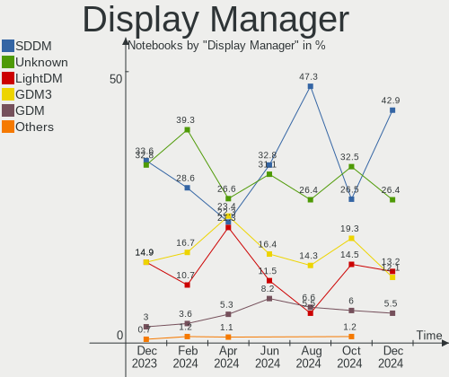
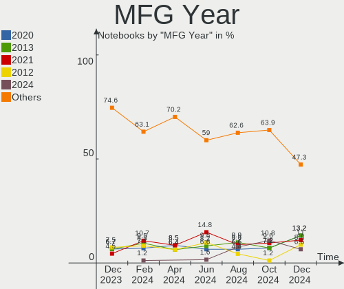
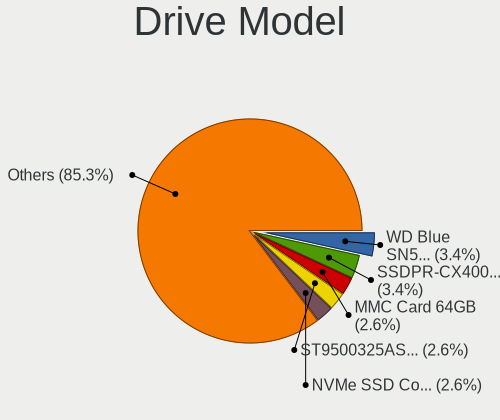
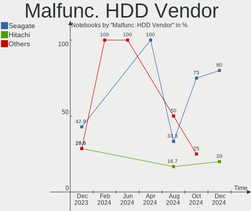
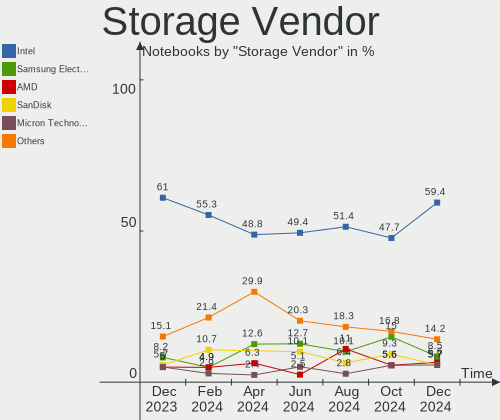
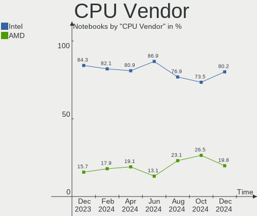
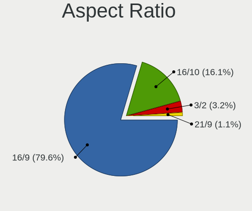
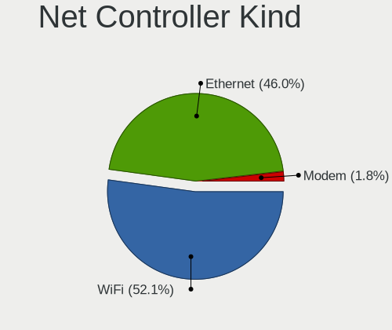

Linux in Poland - Hardware Trends (Notebooks)
---------------------------------------------

A project to identify most popular hardware characteristics and track their change
over time based on data collected by Linux users at https://Linux-Hardware.org.

Anyone can contribute to this report by the [hw-probe](https://github.com/linuxhw/hw-probe) tool:

    sudo -E hw-probe -all -upload

Period: Aug, 2023.

Contents
--------

* [ System ](#system)
  - [ OS                       ](#os)
  - [ OS Family                ](#os-family)
  - [ Kernel                   ](#kernel)
  - [ Kernel Family            ](#kernel-family)
  - [ Kernel Major Ver.        ](#kernel-major-ver)
  - [ Arch                     ](#arch)
  - [ DE                       ](#de)
  - [ Display Server           ](#display-server)
  - [ Display Manager          ](#display-manager)
  - [ OS Lang                  ](#os-lang)
  - [ Boot Mode                ](#boot-mode)
  - [ Filesystem               ](#filesystem)
  - [ Part. scheme             ](#part-scheme)
  - [ Dual Boot with Linux/BSD ](#dual-boot-with-linuxbsd)
  - [ Dual Boot (Win)          ](#dual-boot-win)

* [ Board ](#board)
  - [ Vendor                   ](#vendor)
  - [ Model                    ](#model)
  - [ Model Family             ](#model-family)
  - [ MFG Year                 ](#mfg-year)
  - [ Form Factor              ](#form-factor)
  - [ Secure Boot              ](#secure-boot)
  - [ Coreboot                 ](#coreboot)
  - [ RAM Size                 ](#ram-size)
  - [ RAM Used                 ](#ram-used)
  - [ Total Drives             ](#total-drives)
  - [ Has CD-ROM               ](#has-cd-rom)
  - [ Has Ethernet             ](#has-ethernet)
  - [ Has WiFi                 ](#has-wifi)
  - [ Has Bluetooth            ](#has-bluetooth)

* [ Location ](#location)
  - [ Country                  ](#country)
  - [ City                     ](#city)

* [ Drives ](#drives)
  - [ Drive Vendor             ](#drive-vendor)
  - [ Drive Model              ](#drive-model)
  - [ HDD Vendor               ](#hdd-vendor)
  - [ SSD Vendor               ](#ssd-vendor)
  - [ Drive Kind               ](#drive-kind)
  - [ Drive Connector          ](#drive-connector)
  - [ Drive Size               ](#drive-size)
  - [ Space Total              ](#space-total)
  - [ Space Used               ](#space-used)
  - [ Malfunc. Drives          ](#malfunc-drives)
  - [ Malfunc. Drive Vendor    ](#malfunc-drive-vendor)
  - [ Malfunc. HDD Vendor      ](#malfunc-hdd-vendor)
  - [ Malfunc. Drive Kind      ](#malfunc-drive-kind)
  - [ Failed Drives            ](#failed-drives)
  - [ Failed Drive Vendor      ](#failed-drive-vendor)
  - [ Drive Status             ](#drive-status)

* [ Storage controller ](#storage-controller)
  - [ Storage Vendor           ](#storage-vendor)
  - [ Storage Model            ](#storage-model)
  - [ Storage Kind             ](#storage-kind)

* [ Processor ](#processor)
  - [ CPU Vendor               ](#cpu-vendor)
  - [ CPU Model                ](#cpu-model)
  - [ CPU Model Family         ](#cpu-model-family)
  - [ CPU Cores                ](#cpu-cores)
  - [ CPU Sockets              ](#cpu-sockets)
  - [ CPU Threads              ](#cpu-threads)
  - [ CPU Op-Modes             ](#cpu-op-modes)
  - [ CPU Microcode            ](#cpu-microcode)
  - [ CPU Microarch            ](#cpu-microarch)

* [ Graphics ](#graphics)
  - [ GPU Vendor               ](#gpu-vendor)
  - [ GPU Model                ](#gpu-model)
  - [ GPU Combo                ](#gpu-combo)
  - [ GPU Driver               ](#gpu-driver)
  - [ GPU Memory               ](#gpu-memory)

* [ Monitor ](#monitor)
  - [ Monitor Vendor           ](#monitor-vendor)
  - [ Monitor Model            ](#monitor-model)
  - [ Monitor Resolution       ](#monitor-resolution)
  - [ Monitor Diagonal         ](#monitor-diagonal)
  - [ Monitor Width            ](#monitor-width)
  - [ Aspect Ratio             ](#aspect-ratio)
  - [ Monitor Area             ](#monitor-area)
  - [ Pixel Density            ](#pixel-density)
  - [ Multiple Monitors        ](#multiple-monitors)

* [ Network ](#network)
  - [ Net Controller Vendor    ](#net-controller-vendor)
  - [ Net Controller Model     ](#net-controller-model)
  - [ Wireless Vendor          ](#wireless-vendor)
  - [ Wireless Model           ](#wireless-model)
  - [ Ethernet Vendor          ](#ethernet-vendor)
  - [ Ethernet Model           ](#ethernet-model)
  - [ Net Controller Kind      ](#net-controller-kind)
  - [ Used Controller          ](#used-controller)
  - [ NICs                     ](#nics)
  - [ IPv6                     ](#ipv6)

* [ Bluetooth ](#bluetooth)
  - [ Bluetooth Vendor         ](#bluetooth-vendor)
  - [ Bluetooth Model          ](#bluetooth-model)

* [ Sound ](#sound)
  - [ Sound Vendor             ](#sound-vendor)
  - [ Sound Model              ](#sound-model)

* [ Memory ](#memory)
  - [ Memory Vendor            ](#memory-vendor)
  - [ Memory Model             ](#memory-model)
  - [ Memory Kind              ](#memory-kind)
  - [ Memory Form Factor       ](#memory-form-factor)
  - [ Memory Size              ](#memory-size)
  - [ Memory Speed             ](#memory-speed)

* [ Printers & scanners ](#printers--scanners)
  - [ Printer Vendor           ](#printer-vendor)
  - [ Printer Model            ](#printer-model)
  - [ Scanner Vendor           ](#scanner-vendor)
  - [ Scanner Model            ](#scanner-model)

* [ Camera ](#camera)
  - [ Camera Vendor            ](#camera-vendor)
  - [ Camera Model             ](#camera-model)

* [ Security ](#security)
  - [ Fingerprint Vendor       ](#fingerprint-vendor)
  - [ Fingerprint Model        ](#fingerprint-model)
  - [ Chipcard Vendor          ](#chipcard-vendor)
  - [ Chipcard Model           ](#chipcard-model)

* [ Unsupported ](#unsupported)
  - [ Unsupported Devices      ](#unsupported-devices)
  - [ Unsupported Device Types ](#unsupported-device-types)

System
------

OS
--

Installed operating systems

| Name                         | Notebooks | Percent |
|------------------------------|-----------|---------|
| Ubuntu 22.04                 | 9         | 12.16%  |
| OpenMandriva 23.08           | 7         | 9.46%   |
| Fedora 38                    | 7         | 9.46%   |
| OpenMandriva 23.03           | 6         | 8.11%   |
| Linux Mint 21.2              | 5         | 6.76%   |
| Debian 12                    | 3         | 4.05%   |
| Zorin 16                     | 2         | 2.7%    |
| SteamOS 3.4.8                | 2         | 2.7%    |
| Pop!_OS 22.04                | 2         | 2.7%    |
| openSUSE Leap-15.5           | 2         | 2.7%    |
| MX 23                        | 2         | 2.7%    |
| Kubuntu 22.04                | 2         | 2.7%    |
| Xubuntu 22.04                | 1         | 1.35%   |
| Xero Rolling                 | 1         | 1.35%   |
| Ubuntu MATE 22.04            | 1         | 1.35%   |
| Ubuntu 23.04                 | 1         | 1.35%   |
| Ubuntu 22.10                 | 1         | 1.35%   |
| Ubuntu 20.04                 | 1         | 1.35%   |
| ROSA 12.4                    | 1         | 1.35%   |
| risiOS 38                    | 1         | 1.35%   |
| openSUSE Tumbleweed-XXXXXXXX | 1         | 1.35%   |
| OpenMandriva 4.3             | 1         | 1.35%   |
| Manjaro 23.0.0               | 1         | 1.35%   |
| Manjaro                      | 1         | 1.35%   |
| Lubuntu 20.04                | 1         | 1.35%   |
| LMDE 5                       | 1         | 1.35%   |
| Linux Mint 21                | 1         | 1.35%   |
| Kubuntu 23.04                | 1         | 1.35%   |
| Kali 2023.3                  | 1         | 1.35%   |
| Gentoo 2.14                  | 1         | 1.35%   |
| Fedora 37                    | 1         | 1.35%   |
| Fedora 36                    | 1         | 1.35%   |
| EuroLinux 8.8                | 1         | 1.35%   |
| EndeavourOS Rolling          | 1         | 1.35%   |
| Elementary 7                 | 1         | 1.35%   |
| Debian                       | 1         | 1.35%   |
| Arch Rolling                 | 1         | 1.35%   |

OS Family
---------

OS without a version

| Name         | Notebooks | Percent |
|--------------|-----------|---------|
| OpenMandriva | 14        | 18.92%  |
| Ubuntu       | 12        | 16.22%  |
| Fedora       | 9         | 12.16%  |
| Linux Mint   | 6         | 8.11%   |
| Debian       | 4         | 5.41%   |
| openSUSE     | 3         | 4.05%   |
| Kubuntu      | 3         | 4.05%   |
| Zorin        | 2         | 2.7%    |
| SteamOS      | 2         | 2.7%    |
| Pop!_OS      | 2         | 2.7%    |
| MX           | 2         | 2.7%    |
| Manjaro      | 2         | 2.7%    |
| Xubuntu      | 1         | 1.35%   |
| Xero         | 1         | 1.35%   |
| Ubuntu MATE  | 1         | 1.35%   |
| ROSA         | 1         | 1.35%   |
| risiOS       | 1         | 1.35%   |
| Lubuntu      | 1         | 1.35%   |
| LMDE         | 1         | 1.35%   |
| Kali         | 1         | 1.35%   |
| Gentoo       | 1         | 1.35%   |
| EuroLinux    | 1         | 1.35%   |
| EndeavourOS  | 1         | 1.35%   |
| Elementary   | 1         | 1.35%   |
| Arch         | 1         | 1.35%   |

Kernel
------

Version of the Linux kernel

| Version                           | Notebooks | Percent |
|-----------------------------------|-----------|---------|
| 6.2.0-26-generic                  | 7         | 9.46%   |
| 6.2.6-desktop-1omv2390            | 6         | 8.11%   |
| 5.15.0-79-generic                 | 5         | 6.76%   |
| 6.4.11-desktop-1omv2390           | 4         | 5.41%   |
| 5.15.0-78-generic                 | 4         | 5.41%   |
| 6.4.8-desktop-2omv2390            | 3         | 4.05%   |
| 6.1.0-10-amd64                    | 3         | 4.05%   |
| 6.4.7-200.fc38.x86_64             | 2         | 2.7%    |
| 6.4.6-76060406-generic            | 2         | 2.7%    |
| 6.4.11-arch2-1                    | 2         | 2.7%    |
| 6.2.9-300.fc38.x86_64             | 2         | 2.7%    |
| 5.19.0-46-generic                 | 2         | 2.7%    |
| 5.15.0-82-generic                 | 2         | 2.7%    |
| 5.13.0-valve36-1-neptune          | 2         | 2.7%    |
| 6.4.8-1-default                   | 1         | 1.35%   |
| 6.4.4-gentoo                      | 1         | 1.35%   |
| 6.4.12-arch1-1                    | 1         | 1.35%   |
| 6.4.12-200.fc38.x86_64            | 1         | 1.35%   |
| 6.4.11-200.fc38.x86_64            | 1         | 1.35%   |
| 6.4.10-cb2.0.fc38.x86_64          | 1         | 1.35%   |
| 6.4.10-200.fc38.x86_64            | 1         | 1.35%   |
| 6.4.0-kali3-amd64                 | 1         | 1.35%   |
| 6.4.0-2-amd64                     | 1         | 1.35%   |
| 6.2.16-6-pve                      | 1         | 1.35%   |
| 6.2.15-200.fc37.x86_64            | 1         | 1.35%   |
| 6.2.0-31-generic                  | 1         | 1.35%   |
| 6.2.0-27-generic                  | 1         | 1.35%   |
| 6.2.0-1009-lowlatency             | 1         | 1.35%   |
| 6.1.44-1-MANJARO                  | 1         | 1.35%   |
| 6.1.41-1-MANJARO                  | 1         | 1.35%   |
| 6.1.20-generic-2rosa2021.1-x86_64 | 1         | 1.35%   |
| 6.1.0-11-amd64                    | 1         | 1.35%   |
| 5.19.0-50-generic                 | 1         | 1.35%   |
| 5.19.0-41-generic                 | 1         | 1.35%   |
| 5.19.0-35-generic                 | 1         | 1.35%   |
| 5.18.17-200.fc36.x86_64           | 1         | 1.35%   |
| 5.16.7-desktop-1omv4003           | 1         | 1.35%   |
| 5.14.21-150500.55.19-default      | 1         | 1.35%   |
| 5.14.21-150500.55.12-default      | 1         | 1.35%   |
| 5.14.0-1050-oem                   | 1         | 1.35%   |

Kernel Family
-------------

Linux kernel without a distro release

| Version | Notebooks | Percent |
|---------|-----------|---------|
| 5.15.0  | 11        | 14.86%  |
| 6.2.0   | 10        | 13.51%  |
| 6.4.11  | 7         | 9.46%   |
| 6.2.6   | 6         | 8.11%   |
| 5.19.0  | 5         | 6.76%   |
| 6.4.8   | 4         | 5.41%   |
| 6.1.0   | 4         | 5.41%   |
| 6.4.7   | 2         | 2.7%    |
| 6.4.6   | 2         | 2.7%    |
| 6.4.12  | 2         | 2.7%    |
| 6.4.10  | 2         | 2.7%    |
| 6.4.0   | 2         | 2.7%    |
| 6.2.9   | 2         | 2.7%    |
| 5.14.21 | 2         | 2.7%    |
| 5.13.0  | 2         | 2.7%    |
| 6.4.4   | 1         | 1.35%   |
| 6.2.16  | 1         | 1.35%   |
| 6.2.15  | 1         | 1.35%   |
| 6.1.44  | 1         | 1.35%   |
| 6.1.41  | 1         | 1.35%   |
| 6.1.20  | 1         | 1.35%   |
| 5.18.17 | 1         | 1.35%   |
| 5.16.7  | 1         | 1.35%   |
| 5.14.0  | 1         | 1.35%   |
| 5.10.0  | 1         | 1.35%   |
| 4.18.0  | 1         | 1.35%   |

Kernel Major Ver.
-----------------

Linux kernel major version

| Version | Notebooks | Percent |
|---------|-----------|---------|
| 6.4     | 22        | 29.73%  |
| 6.2     | 20        | 27.03%  |
| 5.15    | 11        | 14.86%  |
| 6.1     | 7         | 9.46%   |
| 5.19    | 5         | 6.76%   |
| 5.14    | 3         | 4.05%   |
| 5.13    | 2         | 2.7%    |
| 5.18    | 1         | 1.35%   |
| 5.16    | 1         | 1.35%   |
| 5.10    | 1         | 1.35%   |
| 4.18    | 1         | 1.35%   |

Arch
----

OS architecture (x86_64, i586, etc.)

| Name   | Notebooks | Percent |
|--------|-----------|---------|
| x86_64 | 74        | 100%    |

DE
--

Desktop Environment

| Name       | Notebooks | Percent |
|------------|-----------|---------|
| GNOME      | 30        | 40.54%  |
| KDE5       | 26        | 35.14%  |
| XFCE       | 6         | 8.11%   |
| X-Cinnamon | 5         | 6.76%   |
| MATE       | 2         | 2.7%    |
| Pantheon   | 1         | 1.35%   |
| LXQt       | 1         | 1.35%   |
| LXDE       | 1         | 1.35%   |
| Hyprland   | 1         | 1.35%   |
| Unknown    | 1         | 1.35%   |

Display Server
--------------

X11 or Wayland

| Name    | Notebooks | Percent |
|---------|-----------|---------|
| X11     | 46        | 62.16%  |
| Wayland | 26        | 35.14%  |
| Tty     | 2         | 2.7%    |

Display Manager
---------------

SDDM, LightDM, etc.

| Name    | Notebooks | Percent |
|---------|-----------|---------|
| SDDM    | 23        | 31.08%  |
| Unknown | 21        | 28.38%  |
| GDM3    | 14        | 18.92%  |
| LightDM | 12        | 16.22%  |
| GDM     | 4         | 5.41%   |

OS Lang
-------

Language

| Lang  | Notebooks | Percent |
|-------|-----------|---------|
| pl_PL | 37        | 50%     |
| en_US | 32        | 43.24%  |
| ru_RU | 2         | 2.7%    |
| ru_UA | 1         | 1.35%   |
| en_GB | 1         | 1.35%   |
| C     | 1         | 1.35%   |

Boot Mode
---------

EFI or BIOS

| Mode | Notebooks | Percent |
|------|-----------|---------|
| EFI  | 50        | 67.57%  |
| BIOS | 24        | 32.43%  |

Filesystem
----------

Type of filesystem

| Type    | Notebooks | Percent |
|---------|-----------|---------|
| Ext4    | 44        | 59.46%  |
| Btrfs   | 14        | 18.92%  |
| Overlay | 10        | 13.51%  |
| Tmpfs   | 5         | 6.76%   |
| Xfs     | 1         | 1.35%   |

Part. scheme
------------

Scheme of partitioning

| Type    | Notebooks | Percent |
|---------|-----------|---------|
| GPT     | 46        | 62.16%  |
| Unknown | 20        | 27.03%  |
| MBR     | 8         | 10.81%  |

Dual Boot with Linux/BSD
------------------------

Hosting more than one Linux/BSD

| Dual boot | Notebooks | Percent |
|-----------|-----------|---------|
| No        | 60        | 81.08%  |
| Yes       | 14        | 18.92%  |

Dual Boot (Win)
---------------

Hosting Linux and Windows

| Dual boot | Notebooks | Percent |
|-----------|-----------|---------|
| No        | 47        | 63.51%  |
| Yes       | 27        | 36.49%  |

Board
-----

Vendor
------

Motherboard manufacturer

| Name                | Notebooks | Percent |
|---------------------|-----------|---------|
| Lenovo              | 27        | 36.49%  |
| Dell                | 17        | 22.97%  |
| Hewlett-Packard     | 11        | 14.86%  |
| ASUSTek Computer    | 6         | 8.11%   |
| Acer                | 3         | 4.05%   |
| Valve               | 2         | 2.7%    |
| Samsung Electronics | 2         | 2.7%    |
| Gigabyte Technology | 2         | 2.7%    |
| mPTech              | 1         | 1.35%   |
| Kiano               | 1         | 1.35%   |
| Google              | 1         | 1.35%   |
| Fujitsu             | 1         | 1.35%   |

Model
-----

Motherboard model

| Name                                    | Notebooks | Percent |
|-----------------------------------------|-----------|---------|
| Valve Jupiter                           | 2         | 2.7%    |
| Lenovo IdeaPad Z570 HuronRiver Platform | 2         | 2.7%    |
| Lenovo G50-80 80E5                      | 2         | 2.7%    |
| Gigabyte RC14UD                         | 2         | 2.7%    |
| Samsung RF511/RF411/RF711               | 1         | 1.35%   |
| Samsung 530U4E/540U4E                   | 1         | 1.35%   |
| mPTech ARC 11.6 128GB HD                | 1         | 1.35%   |
| Lenovo Yoga Slim 7 Pro 14IAH7 82UT      | 1         | 1.35%   |
| Lenovo ThinkPad T470p 20J60014PB        | 1         | 1.35%   |
| Lenovo ThinkPad T470 20HES07J00         | 1         | 1.35%   |
| Lenovo ThinkPad T430s 2356LPG           | 1         | 1.35%   |
| Lenovo ThinkPad L480 20LTS6S904         | 1         | 1.35%   |
| Lenovo ThinkPad L15 Gen 1 20U8S2E900    | 1         | 1.35%   |
| Lenovo ThinkPad E560 20EV000UUK         | 1         | 1.35%   |
| Lenovo ThinkPad E520 1143CWG            | 1         | 1.35%   |
| Lenovo Legion Y530-15ICH 81FV           | 1         | 1.35%   |
| Lenovo Legion 5 Pro 16ACH6 82JS         | 1         | 1.35%   |
| Lenovo Legion 5 15IAH7H 82RB            | 1         | 1.35%   |
| Lenovo Legion 5 15IAH7 82RC             | 1         | 1.35%   |
| Lenovo Legion 5 15ARH05H 82B1           | 1         | 1.35%   |
| Lenovo Legion 5 15ARH05 82B5            | 1         | 1.35%   |
| Lenovo IdeaPad Gaming 3 15ACH6 82K2     | 1         | 1.35%   |
| Lenovo IdeaPad 330-15IKB 81DC           | 1         | 1.35%   |
| Lenovo IdeaPad 300-15ISK 80Q7           | 1         | 1.35%   |
| Lenovo G580 20150                       | 1         | 1.35%   |
| Lenovo G580                             | 1         | 1.35%   |
| Lenovo G570 20079                       | 1         | 1.35%   |
| Lenovo G505s 20255                      | 1         | 1.35%   |
| Lenovo G50-45 80E3                      | 1         | 1.35%   |
| Lenovo B570e HuronRiver Platform        | 1         | 1.35%   |
| Kiano Elegance 14.2                     | 1         | 1.35%   |
| HP ZBook 15 G3                          | 1         | 1.35%   |
| HP ProBook 645 G1                       | 1         | 1.35%   |
| HP ProBook 4530s                        | 1         | 1.35%   |
| HP ProBook 450 G6                       | 1         | 1.35%   |
| HP Pavilion Gaming Laptop 15-cx0xxx     | 1         | 1.35%   |
| HP Pavilion dv7                         | 1         | 1.35%   |
| HP Laptop 14-df0xxx                     | 1         | 1.35%   |
| HP EliteBook 850 G8 Notebook PC         | 1         | 1.35%   |
| HP EliteBook 845 G9                     | 1         | 1.35%   |

Model Family
------------

Motherboard model prefix

| Name              | Notebooks | Percent |
|-------------------|-----------|---------|
| Dell Latitude     | 8         | 10.81%  |
| Lenovo ThinkPad   | 7         | 9.46%   |
| Lenovo Legion     | 6         | 8.11%   |
| Lenovo IdeaPad    | 5         | 6.76%   |
| Dell XPS          | 4         | 5.41%   |
| HP ProBook        | 3         | 4.05%   |
| HP EliteBook      | 3         | 4.05%   |
| ASUS ASUS         | 3         | 4.05%   |
| Valve Jupiter     | 2         | 2.7%    |
| Lenovo G580       | 2         | 2.7%    |
| Lenovo G50-80     | 2         | 2.7%    |
| HP Pavilion       | 2         | 2.7%    |
| Gigabyte RC14UD   | 2         | 2.7%    |
| Dell Vostro       | 2         | 2.7%    |
| Dell Inspiron     | 2         | 2.7%    |
| Acer Aspire       | 2         | 2.7%    |
| Samsung RF511     | 1         | 1.35%   |
| Samsung 530U4E    | 1         | 1.35%   |
| mPTech ARC        | 1         | 1.35%   |
| Lenovo Yoga       | 1         | 1.35%   |
| Lenovo G570       | 1         | 1.35%   |
| Lenovo G505s      | 1         | 1.35%   |
| Lenovo G50-45     | 1         | 1.35%   |
| Lenovo B570e      | 1         | 1.35%   |
| Kiano Elegance    | 1         | 1.35%   |
| HP ZBook          | 1         | 1.35%   |
| HP Laptop         | 1         | 1.35%   |
| HP Compaq         | 1         | 1.35%   |
| Google Kip        | 1         | 1.35%   |
| Fujitsu FMVA0800C | 1         | 1.35%   |
| Dell Venue        | 1         | 1.35%   |
| ASUS TUF          | 1         | 1.35%   |
| ASUS ROG          | 1         | 1.35%   |
| ASUS GL552VW      | 1         | 1.35%   |
| Acer Predator     | 1         | 1.35%   |

MFG Year
--------

Motherboard manufacture year

| Year | Notebooks | Percent |
|------|-----------|---------|
| 2022 | 10        | 13.51%  |
| 2018 | 10        | 13.51%  |
| 2021 | 9         | 12.16%  |
| 2011 | 8         | 10.81%  |
| 2020 | 6         | 8.11%   |
| 2015 | 5         | 6.76%   |
| 2014 | 4         | 5.41%   |
| 2012 | 4         | 5.41%   |
| 2017 | 3         | 4.05%   |
| 2013 | 3         | 4.05%   |
| 2023 | 2         | 2.7%    |
| 2019 | 2         | 2.7%    |
| 2016 | 2         | 2.7%    |
| 2008 | 2         | 2.7%    |
| 2007 | 2         | 2.7%    |
| 2009 | 1         | 1.35%   |
| 2006 | 1         | 1.35%   |

Form Factor
-----------

Physical design of the computer

| Name     | Notebooks | Percent |
|----------|-----------|---------|
| Notebook | 74        | 100%    |

Secure Boot
-----------

Enabled or disabled

| State    | Notebooks | Percent |
|----------|-----------|---------|
| Disabled | 67        | 90.54%  |
| Enabled  | 7         | 9.46%   |

Coreboot
--------

Have coreboot on board

| Used | Notebooks | Percent |
|------|-----------|---------|
| No   | 73        | 98.65%  |
| Yes  | 1         | 1.35%   |

RAM Size
--------

Total RAM memory

| Size in GB  | Notebooks | Percent |
|-------------|-----------|---------|
| 16.01-24.0  | 22        | 29.73%  |
| 4.01-8.0    | 13        | 17.57%  |
| 32.01-64.0  | 13        | 17.57%  |
| 8.01-16.0   | 13        | 17.57%  |
| 3.01-4.0    | 9         | 12.16%  |
| 1.01-2.0    | 2         | 2.7%    |
| 2.01-3.0    | 1         | 1.35%   |
| 64.01-256.0 | 1         | 1.35%   |

RAM Used
--------

Used RAM memory

| Used GB    | Notebooks | Percent |
|------------|-----------|---------|
| 2.01-3.0   | 22        | 29.73%  |
| 1.01-2.0   | 20        | 27.03%  |
| 4.01-8.0   | 15        | 20.27%  |
| 3.01-4.0   | 10        | 13.51%  |
| 16.01-24.0 | 3         | 4.05%   |
| 8.01-16.0  | 3         | 4.05%   |
| 24.01-32.0 | 1         | 1.35%   |

Total Drives
------------

Number of drives on board

| Drives | Notebooks | Percent |
|--------|-----------|---------|
| 1      | 44        | 59.46%  |
| 2      | 29        | 39.19%  |
| 3      | 1         | 1.35%   |

Has CD-ROM
----------

Has CD-ROM on board

| Presented | Notebooks | Percent |
|-----------|-----------|---------|
| No        | 52        | 70.27%  |
| Yes       | 22        | 29.73%  |

Has Ethernet
------------

Has Ethernet on board

| Presented | Notebooks | Percent |
|-----------|-----------|---------|
| Yes       | 59        | 79.73%  |
| No        | 15        | 20.27%  |

Has WiFi
--------

Has WiFi module

| Presented | Notebooks | Percent |
|-----------|-----------|---------|
| Yes       | 74        | 100%    |

Has Bluetooth
-------------

Has Bluetooth module

| Presented | Notebooks | Percent |
|-----------|-----------|---------|
| Yes       | 64        | 86.49%  |
| No        | 10        | 13.51%  |

Location
--------

Country
-------

Geographic location (country)

| Country | Notebooks | Percent |
|---------|-----------|---------|
| Poland  | 74        | 100%    |

City
----

Geographic location (city)

| City                | Notebooks | Percent |
|---------------------|-----------|---------|
| Warsaw              | 13        | 17.57%  |
| Krakow              | 9         | 12.16%  |
| Lodz                | 6         | 8.11%   |
| Poznan              | 5         | 6.76%   |
| Wroclaw             | 4         | 5.41%   |
| Lublin              | 3         | 4.05%   |
| Zabrze              | 2         | 2.7%    |
| Gliwice             | 2         | 2.7%    |
| Gdansk              | 2         | 2.7%    |
| Zary                | 1         | 1.35%   |
| Tarnobrzeg          | 1         | 1.35%   |
| Swidnica            | 1         | 1.35%   |
| Starogard Gdański  | 1         | 1.35%   |
| Radwanice           | 1         | 1.35%   |
| Piaseczno           | 1         | 1.35%   |
| Ozimek              | 1         | 1.35%   |
| Osobnica            | 1         | 1.35%   |
| Osielsko            | 1         | 1.35%   |
| Nowogard            | 1         | 1.35%   |
| Nadarzyn            | 1         | 1.35%   |
| Mysłowice          | 1         | 1.35%   |
| Myslenice           | 1         | 1.35%   |
| Murowana Goslina    | 1         | 1.35%   |
| Marki               | 1         | 1.35%   |
| Kutno               | 1         | 1.35%   |
| Konin               | 1         | 1.35%   |
| Kolaczyce           | 1         | 1.35%   |
| Kielczow            | 1         | 1.35%   |
| Kety                | 1         | 1.35%   |
| Jastrowie           | 1         | 1.35%   |
| Jablon              | 1         | 1.35%   |
| Grodzisk Mazowiecki | 1         | 1.35%   |
| Gdynia              | 1         | 1.35%   |
| Debica              | 1         | 1.35%   |
| Częstochowa        | 1         | 1.35%   |
| Bielsko-Biala       | 1         | 1.35%   |
| Bialystok           | 1         | 1.35%   |

Drives
------

Drive Vendor
------------

Hard drive vendors

| Vendor                         | Notebooks | Drives | Percent |
|--------------------------------|-----------|--------|---------|
| Samsung Electronics            | 20        | 21     | 19.23%  |
| Seagate                        | 11        | 11     | 10.58%  |
| WDC                            | 6         | 6      | 5.77%   |
| Unknown                        | 6         | 6      | 5.77%   |
| SK hynix                       | 6         | 6      | 5.77%   |
| SanDisk                        | 5         | 6      | 4.81%   |
| Hitachi                        | 5         | 5      | 4.81%   |
| GOODRAM                        | 5         | 5      | 4.81%   |
| Toshiba                        | 4         | 4      | 3.85%   |
| Micron Technology              | 3         | 3      | 2.88%   |
| Kingston                       | 3         | 3      | 2.88%   |
| Team                           | 2         | 2      | 1.92%   |
| Silicon Motion                 | 2         | 2      | 1.92%   |
| Phison                         | 2         | 2      | 1.92%   |
| Intel                          | 2         | 2      | 1.92%   |
| Crucial                        | 2         | 2      | 1.92%   |
| China                          | 2         | 2      | 1.92%   |
| A-DATA Technology              | 2         | 2      | 1.92%   |
| Unknown                        | 2         | 2      | 1.92%   |
| Verbatim                       | 1         | 1      | 0.96%   |
| USB                            | 1         | 1      | 0.96%   |
| Solid State Storage Technology | 1         | 1      | 0.96%   |
| Shenzhen Longsys Electronics   | 1         | 1      | 0.96%   |
| Realtek                        | 1         | 1      | 0.96%   |
| PNY                            | 1         | 1      | 0.96%   |
| Phison Electronics             | 1         | 1      | 0.96%   |
| Patriot                        | 1         | 1      | 0.96%   |
| O2 Micro                       | 1         | 1      | 0.96%   |
| LITEON                         | 1         | 1      | 0.96%   |
| KingDian                       | 1         | 1      | 0.96%   |
| Kingchuxing                    | 1         | 1      | 0.96%   |
| Corsair                        | 1         | 1      | 0.96%   |
| ADATA Technology               | 1         | 1      | 0.96%   |

Drive Model
-----------

Hard drive models

| Model                                                 | Notebooks | Percent |
|-------------------------------------------------------|-----------|---------|
| Seagate ST1000LM024 HN-M101MBB 1TB                    | 3         | 2.86%   |
| Samsung NVMe SSD Controller SM981/PM981/PM983 500GB   | 3         | 2.86%   |
| GOODRAM SSDPR-CX400-256-G2 256GB                      | 3         | 2.86%   |
| SK hynix BC511 512GB                                  | 2         | 1.9%    |
| Samsung SSD 980 1TB                                   | 2         | 1.9%    |
| Samsung MZAL4512HBLU-00BL2 512GB                      | 2         | 1.9%    |
| Phison ESR512GTLCW-E6GBTNB4 512GB                     | 2         | 1.9%    |
| Micron 2200V_MTFDHBA512TCK 512GB                      | 2         | 1.9%    |
| Unknown                                               | 2         | 1.9%    |
| WDC WDS250G2X0C-00L350 250GB                          | 1         | 0.95%   |
| WDC WD7500BPKT-00PK4T0 752GB                          | 1         | 0.95%   |
| WDC WD5000LUCT-63RC2Y0 500GB                          | 1         | 0.95%   |
| WDC WD3200BEVT-80A0RT0 320GB                          | 1         | 0.95%   |
| WDC WD10JPVX-22JC3T0 1TB                              | 1         | 0.95%   |
| WDC PC SN730 SDBQNTY-512G-1001 512GB                  | 1         | 0.95%   |
| Verbatim Vi550 S3 SSD 128GB                           | 1         | 0.95%   |
| USB 3.1 512GB                                         | 1         | 0.95%   |
| Unknown USD00  64GB                                   | 1         | 0.95%   |
| Unknown SLD32G  32GB                                  | 1         | 0.95%   |
| Unknown MMC Card  512GB                               | 1         | 0.95%   |
| Unknown MMC Card  16GB                                | 1         | 0.95%   |
| Unknown MMC Card  128GB                               | 1         | 0.95%   |
| Unknown AGND3R  16GB                                  | 1         | 0.95%   |
| Toshiba MQ01ABF050 500GB                              | 1         | 0.95%   |
| Toshiba MK2561GSYN 250GB                              | 1         | 0.95%   |
| Toshiba KXG50ZNV256G 256GB                            | 1         | 0.95%   |
| Toshiba KBG40ZNT512G MEMORY 512GB                     | 1         | 0.95%   |
| Team TEAML5Lite3D480G 480GB SSD                       | 1         | 0.95%   |
| Team L7 EVO SSD 240GB                                 | 1         | 0.95%   |
| Solid State Storage CL4-3D512-Q11 NVMe SSSTC 512GB    | 1         | 0.95%   |
| SK hynix SKHynix_HFM256GDHTNI-87A0B 256GB             | 1         | 0.95%   |
| SK hynix PC401 NVMe 256GB                             | 1         | 0.95%   |
| SK hynix BC711 NVMe 512GB                             | 1         | 0.95%   |
| SK hynix BC711 HFM512GD3JX013N 512GB                  | 1         | 0.95%   |
| Silicon Motion SM2263EN/SM2263XT SSD Controller 256GB | 1         | 0.95%   |
| Silicon Motion SM2262/SM2262EN SSD Controller 1024GB  | 1         | 0.95%   |
| Shenzhen Longsys Lexar SSD NM800PRO 1TB               | 1         | 0.95%   |
| Seagate ST980811AS 80GB                               | 1         | 0.95%   |
| Seagate ST9750423AS 752GB                             | 1         | 0.95%   |
| Seagate ST250LT0 21-1AF14C 250GB                      | 1         | 0.95%   |

HDD Vendor
----------

Hard disk drive vendors

| Vendor  | Notebooks | Drives | Percent |
|---------|-----------|--------|---------|
| Seagate | 10        | 10     | 45.45%  |
| Hitachi | 5         | 5      | 22.73%  |
| WDC     | 4         | 4      | 18.18%  |
| Toshiba | 2         | 2      | 9.09%   |
| USB     | 1         | 1      | 4.55%   |

SSD Vendor
----------

Solid state drive vendors

| Vendor              | Notebooks | Drives | Percent |
|---------------------|-----------|--------|---------|
| Samsung Electronics | 6         | 7      | 20.69%  |
| GOODRAM             | 5         | 5      | 17.24%  |
| SanDisk             | 3         | 3      | 10.34%  |
| Team                | 2         | 2      | 6.9%    |
| Crucial             | 2         | 2      | 6.9%    |
| China               | 2         | 2      | 6.9%    |
| A-DATA Technology   | 2         | 2      | 6.9%    |
| Verbatim            | 1         | 1      | 3.45%   |
| PNY                 | 1         | 1      | 3.45%   |
| Patriot             | 1         | 1      | 3.45%   |
| LITEON              | 1         | 1      | 3.45%   |
| Kingston            | 1         | 1      | 3.45%   |
| KingDian            | 1         | 1      | 3.45%   |
| Corsair             | 1         | 1      | 3.45%   |

Drive Kind
----------

HDD or SSD

| Kind    | Notebooks | Drives | Percent |
|---------|-----------|--------|---------|
| NVMe    | 37        | 44     | 38.95%  |
| SSD     | 26        | 30     | 27.37%  |
| HDD     | 22        | 22     | 23.16%  |
| MMC     | 7         | 7      | 7.37%   |
| Unknown | 3         | 3      | 3.16%   |

Drive Connector
---------------

SATA, SAS, NVMe, etc.

| Type | Notebooks | Drives | Percent |
|------|-----------|--------|---------|
| SATA | 41        | 48     | 44.57%  |
| NVMe | 37        | 43     | 40.22%  |
| SAS  | 7         | 8      | 7.61%   |
| MMC  | 7         | 7      | 7.61%   |

Drive Size
----------

Size of hard drive

| Size in TB | Notebooks | Drives | Percent |
|------------|-----------|--------|---------|
| 0.01-0.5   | 30        | 35     | 63.83%  |
| 0.51-1.0   | 14        | 14     | 29.79%  |
| 1.01-2.0   | 2         | 2      | 4.26%   |
| 4.01-10.0  | 1         | 1      | 2.13%   |

Space Total
-----------

Amount of disk space available on the file system

| Size in GB     | Notebooks | Percent |
|----------------|-----------|---------|
| 101-250        | 21        | 28.38%  |
| 251-500        | 12        | 16.22%  |
| 51-100         | 12        | 16.22%  |
| 1-20           | 9         | 12.16%  |
| 501-1000       | 8         | 10.81%  |
| 1001-2000      | 5         | 6.76%   |
| More than 3000 | 3         | 4.05%   |
| 21-50          | 2         | 2.7%    |
| Unknown        | 2         | 2.7%    |

Space Used
----------

Amount of used disk space

| Used GB        | Notebooks | Percent |
|----------------|-----------|---------|
| 1-20           | 31        | 41.89%  |
| 101-250        | 15        | 20.27%  |
| 21-50          | 10        | 13.51%  |
| 51-100         | 8         | 10.81%  |
| 251-500        | 4         | 5.41%   |
| 501-1000       | 2         | 2.7%    |
| Unknown        | 2         | 2.7%    |
| More than 3000 | 1         | 1.35%   |
| 2001-3000      | 1         | 1.35%   |

Malfunc. Drives
---------------

Drive models with a malfunction

| Model                                                           | Notebooks | Drives | Percent |
|-----------------------------------------------------------------|-----------|--------|---------|
| WDC WD3200BEVT-80A0RT0 320GB                                    | 1         | 1      | 16.67%  |
| Seagate ST9750423AS 752GB                                       | 1         | 1      | 16.67%  |
| Samsung Electronics NVMe SSD Controller SM981/PM981/PM983 500GB | 1         | 1      | 16.67%  |
| Hitachi HTS727575A9E364 752GB                                   | 1         | 1      | 16.67%  |
| Hitachi HTS541680J9SA00 80GB                                    | 1         | 1      | 16.67%  |
| Hitachi HTS541060G9SA00 64GB                                    | 1         | 1      | 16.67%  |

Malfunc. Drive Vendor
---------------------

Vendors of faulty drives

| Vendor              | Notebooks | Drives | Percent |
|---------------------|-----------|--------|---------|
| Hitachi             | 3         | 3      | 50%     |
| WDC                 | 1         | 1      | 16.67%  |
| Seagate             | 1         | 1      | 16.67%  |
| Samsung Electronics | 1         | 1      | 16.67%  |

Malfunc. HDD Vendor
-------------------

Vendors of faulty HDD drives

| Vendor  | Notebooks | Drives | Percent |
|---------|-----------|--------|---------|
| Hitachi | 3         | 3      | 60%     |
| WDC     | 1         | 1      | 20%     |
| Seagate | 1         | 1      | 20%     |

Malfunc. Drive Kind
-------------------

Kinds of faulty drives

| Kind | Notebooks | Drives | Percent |
|------|-----------|--------|---------|
| HDD  | 5         | 5      | 83.33%  |
| NVMe | 1         | 1      | 16.67%  |

Failed Drives
-------------

Failed drive models

Zero info for selected period =(

Failed Drive Vendor
-------------------

Failed drive vendors

Zero info for selected period =(

Drive Status
------------

Number of failed and malfunc. drives

| Status   | Notebooks | Drives | Percent |
|----------|-----------|--------|---------|
| Works    | 43        | 55     | 51.19%  |
| Detected | 35        | 45     | 41.67%  |
| Malfunc  | 6         | 6      | 7.14%   |

Storage controller
------------------

Storage Vendor
--------------

Storage controller vendors

| Vendor                         | Notebooks | Percent |
|--------------------------------|-----------|---------|
| Intel                          | 47        | 49.47%  |
| Samsung Electronics            | 13        | 13.68%  |
| AMD                            | 9         | 9.47%   |
| SK hynix                       | 6         | 6.32%   |
| SanDisk                        | 4         | 4.21%   |
| Phison Electronics             | 3         | 3.16%   |
| Micron Technology              | 3         | 3.16%   |
| Silicon Motion                 | 2         | 2.11%   |
| Kingston Technology Company    | 2         | 2.11%   |
| Toshiba America Info Systems   | 1         | 1.05%   |
| Solid State Storage Technology | 1         | 1.05%   |
| Shenzhen Longsys Electronics   | 1         | 1.05%   |
| O2 Micro                       | 1         | 1.05%   |
| KIOXIA                         | 1         | 1.05%   |
| ADATA Technology               | 1         | 1.05%   |

Storage Model
-------------

Storage controller models

| Model                                                                          | Notebooks | Percent |
|--------------------------------------------------------------------------------|-----------|---------|
| AMD FCH SATA Controller [AHCI mode]                                            | 9         | 9%      |
| Intel 6 Series/C200 Series Chipset Family 6 port Mobile SATA AHCI Controller   | 7         | 7%      |
| Samsung NVMe SSD Controller 980                                                | 6         | 6%      |
| Intel Volume Management Device NVMe RAID Controller                            | 5         | 5%      |
| Intel Sunrise Point-LP SATA Controller [AHCI mode]                             | 5         | 5%      |
| Intel Cannon Lake Mobile PCH SATA AHCI Controller                              | 4         | 4%      |
| Intel 7 Series Chipset Family 6-port SATA Controller [AHCI mode]               | 4         | 4%      |
| SK hynix BC511 NVMe SSD                                                        | 3         | 3%      |
| Samsung NVMe SSD Controller SM981/PM981/PM983                                  | 3         | 3%      |
| Intel 82801 Mobile SATA Controller [RAID mode]                                 | 3         | 3%      |
| SK hynix Gold P31/BC711/PC711 NVMe Solid State Drive                           | 2         | 2%      |
| SanDisk WD Blue SN570 NVMe SSD 1TB                                             | 2         | 2%      |
| Samsung NVMe SSD Controller PM9B1                                              | 2         | 2%      |
| Samsung NVMe SSD Controller PM9A1/PM9A3/980PRO                                 | 2         | 2%      |
| Phison E16 PCIe4 NVMe Controller                                               | 2         | 2%      |
| Micron 2200S NVMe SSD [Cassandra]                                              | 2         | 2%      |
| Intel Wildcat Point-LP SATA Controller [AHCI Mode]                             | 2         | 2%      |
| Intel SSD 670p Series [Keystone Harbor]                                        | 2         | 2%      |
| Intel 82801HM/HEM (ICH8M/ICH8M-E) IDE Controller                               | 2         | 2%      |
| Intel 8 Series/C220 Series Chipset Family 6-port SATA Controller 1 [AHCI mode] | 2         | 2%      |
| Toshiba America Info Systems XG5 NVMe SSD Controller                           | 1         | 1%      |
| Solid State Storage CL4-8D512 NVMe SSD M.2 (DRAM-less)                         | 1         | 1%      |
| SK hynix PC401 NVMe Solid State Drive 256GB                                    | 1         | 1%      |
| Silicon Motion SM2263EN/SM2263XT (DRAM-less) NVMe SSD Controllers              | 1         | 1%      |
| Silicon Motion SM2262/SM2262EN SSD Controller                                  | 1         | 1%      |
| Shenzhen Longsys Lexar NM800 PRO NVME SSD                                      | 1         | 1%      |
| SanDisk WD Black SN750 / PC SN730 NVMe SSD                                     | 1         | 1%      |
| SanDisk WD Black 2018/SN750 / PC SN720 NVMe SSD                                | 1         | 1%      |
| Phison E12 NVMe Controller                                                     | 1         | 1%      |
| O2 Micro FORESEE E2M2 NVMe SSD                                                 | 1         | 1%      |
| Micron 2300 NVMe SSD [Santana]                                                 | 1         | 1%      |
| KIOXIA NVMe SSD Controller BG4 (DRAM-less)                                     | 1         | 1%      |
| Kingston Company OM8PCP Design-In PCIe 3 NVMe SSD (DRAM-less)                  | 1         | 1%      |
| Kingston Company KC3000/Renegade NVMe SSD                                      | 1         | 1%      |
| Intel Tiger Lake-LP SATA Controller                                            | 1         | 1%      |
| Intel Q170/Q150/B150/H170/H110/Z170/CM236 Chipset SATA Controller [AHCI Mode]  | 1         | 1%      |
| Intel Ice Lake-LP SATA Controller [AHCI mode]                                  | 1         | 1%      |
| Intel HM170/QM170 Chipset SATA Controller [AHCI Mode]                          | 1         | 1%      |
| Intel Celeron/Pentium Silver Processor SATA Controller                         | 1         | 1%      |
| Intel Celeron N3350/Pentium N4200/Atom E3900 Series SATA AHCI Controller       | 1         | 1%      |

Storage Kind
------------

Kind of storage controller (IDE, SATA, NVMe, SAS, ...)

| Kind | Notebooks | Percent |
|------|-----------|---------|
| SATA | 43        | 46.24%  |
| NVMe | 36        | 38.71%  |
| RAID | 8         | 8.6%    |
| IDE  | 6         | 6.45%   |

Processor
---------

CPU Vendor
----------

Processor vendors

| Vendor | Notebooks | Percent |
|--------|-----------|---------|
| Intel  | 58        | 78.38%  |
| AMD    | 16        | 21.62%  |

CPU Model
---------

Processor models

| Model                                       | Notebooks | Percent |
|---------------------------------------------|-----------|---------|
| Intel Core i7-6700HQ CPU @ 2.60GHz          | 2         | 2.7%    |
| Intel Core i5-8300H CPU @ 2.30GHz           | 2         | 2.7%    |
| Intel Core i5-8250U CPU @ 1.60GHz           | 2         | 2.7%    |
| Intel Core i5-3210M CPU @ 2.50GHz           | 2         | 2.7%    |
| Intel 12th Gen Core i7-12700H               | 2         | 2.7%    |
| Intel 12th Gen Core i5-12500H               | 2         | 2.7%    |
| Intel 11th Gen Core i5-1155G7 @ 2.50GHz     | 2         | 2.7%    |
| AMD Ryzen 5 4600H with Radeon Graphics      | 2         | 2.7%    |
| AMD Custom APU 0405                         | 2         | 2.7%    |
| Intel Pentium Dual-Core CPU T4300 @ 2.10GHz | 1         | 1.35%   |
| Intel Pentium CPU B960 @ 2.20GHz            | 1         | 1.35%   |
| Intel Pentium CPU B950 @ 2.10GHz            | 1         | 1.35%   |
| Intel Core i7-8750H CPU @ 2.20GHz           | 1         | 1.35%   |
| Intel Core i7-7700HQ CPU @ 2.80GHz          | 1         | 1.35%   |
| Intel Core i7-6500U CPU @ 2.50GHz           | 1         | 1.35%   |
| Intel Core i7-5500U CPU @ 2.40GHz           | 1         | 1.35%   |
| Intel Core i7-4810MQ CPU @ 2.80GHz          | 1         | 1.35%   |
| Intel Core i7-3520M CPU @ 2.90GHz           | 1         | 1.35%   |
| Intel Core i7-2630QM CPU @ 2.00GHz          | 1         | 1.35%   |
| Intel Core i5-9300H CPU @ 2.40GHz           | 1         | 1.35%   |
| Intel Core i5-8350U CPU @ 1.70GHz           | 1         | 1.35%   |
| Intel Core i5-8265U CPU @ 1.60GHz           | 1         | 1.35%   |
| Intel Core i5-7200U CPU @ 2.50GHz           | 1         | 1.35%   |
| Intel Core i5-6300HQ CPU @ 2.30GHz          | 1         | 1.35%   |
| Intel Core i5-6200U CPU @ 2.30GHz           | 1         | 1.35%   |
| Intel Core i5-5200U CPU @ 2.20GHz           | 1         | 1.35%   |
| Intel Core i5-4300Y CPU @ 1.60GHz           | 1         | 1.35%   |
| Intel Core i5-4300M CPU @ 2.60GHz           | 1         | 1.35%   |
| Intel Core i5-3337U CPU @ 1.80GHz           | 1         | 1.35%   |
| Intel Core i5-2520M CPU @ 2.50GHz           | 1         | 1.35%   |
| Intel Core i5-2410M CPU @ 2.30GHz           | 1         | 1.35%   |
| Intel Core i5-1035G1 CPU @ 1.00GHz          | 1         | 1.35%   |
| Intel Core i3-8130U CPU @ 2.20GHz           | 1         | 1.35%   |
| Intel Core i3-7020U CPU @ 2.30GHz           | 1         | 1.35%   |
| Intel Core i3-6100U CPU @ 2.30GHz           | 1         | 1.35%   |
| Intel Core i3-2370M CPU @ 2.40GHz           | 1         | 1.35%   |
| Intel Core i3-2350M CPU @ 2.30GHz           | 1         | 1.35%   |
| Intel Core i3-2330M CPU @ 2.20GHz           | 1         | 1.35%   |
| Intel Core 2 Duo CPU T8300 @ 2.40GHz        | 1         | 1.35%   |
| Intel Core 2 Duo CPU T5870 @ 2.00GHz        | 1         | 1.35%   |

CPU Model Family
----------------

Processor model prefix

| Model                   | Notebooks | Percent |
|-------------------------|-----------|---------|
| Intel Core i5           | 19        | 25.68%  |
| Other                   | 15        | 20.27%  |
| Intel Core i7           | 9         | 12.16%  |
| Intel Core i3           | 6         | 8.11%   |
| Intel Celeron           | 4         | 5.41%   |
| AMD Ryzen 7             | 4         | 5.41%   |
| Intel Core 2 Duo        | 3         | 4.05%   |
| AMD Ryzen 5             | 3         | 4.05%   |
| AMD A8                  | 3         | 4.05%   |
| Intel Pentium           | 2         | 2.7%    |
| AMD Ryzen 5 PRO         | 2         | 2.7%    |
| Intel Pentium Dual-Core | 1         | 1.35%   |
| Intel Core 2            | 1         | 1.35%   |
| AMD Ryzen 7 PRO         | 1         | 1.35%   |
| AMD A6                  | 1         | 1.35%   |

CPU Cores
---------

Number of processor cores

| Number | Notebooks | Percent |
|--------|-----------|---------|
| 2      | 32        | 43.24%  |
| 4      | 24        | 32.43%  |
| 6      | 8         | 10.81%  |
| 8      | 4         | 5.41%   |
| 12     | 3         | 4.05%   |
| 14     | 2         | 2.7%    |
| 10     | 1         | 1.35%   |

CPU Sockets
-----------

Number of sockets

| Number | Notebooks | Percent |
|--------|-----------|---------|
| 1      | 74        | 100%    |

CPU Threads
-----------

Threads per core (Hyper-Threading)

| Number | Notebooks | Percent |
|--------|-----------|---------|
| 2      | 60        | 81.08%  |
| 1      | 14        | 18.92%  |

CPU Op-Modes
------------

CPU Operation Modes (32-bit, 64-bit)

| Op mode        | Notebooks | Percent |
|----------------|-----------|---------|
| 32-bit, 64-bit | 74        | 100%    |

CPU Microcode
-------------

Microcode number

| Number     | Notebooks | Percent |
|------------|-----------|---------|
| Unknown    | 41        | 55.41%  |
| 0x206a7    | 3         | 4.05%   |
| 0x806ea    | 2         | 2.7%    |
| 0x0a50000c | 2         | 2.7%    |
| 0x906e9    | 1         | 1.35%   |
| 0x906a3    | 1         | 1.35%   |
| 0x806ec    | 1         | 1.35%   |
| 0x806e9    | 1         | 1.35%   |
| 0x806d1    | 1         | 1.35%   |
| 0x806c2    | 1         | 1.35%   |
| 0x806c1    | 1         | 1.35%   |
| 0x706e5    | 1         | 1.35%   |
| 0x6fd      | 1         | 1.35%   |
| 0x6f2      | 1         | 1.35%   |
| 0x506e3    | 1         | 1.35%   |
| 0x506c9    | 1         | 1.35%   |
| 0x306d4    | 1         | 1.35%   |
| 0x306c3    | 1         | 1.35%   |
| 0x306a9    | 1         | 1.35%   |
| 0x1067a    | 1         | 1.35%   |
| 0x0a50000d | 1         | 1.35%   |
| 0x0a404102 | 1         | 1.35%   |
| 0x0a404101 | 1         | 1.35%   |
| 0x08600106 | 1         | 1.35%   |
| 0x08600104 | 1         | 1.35%   |
| 0x08600103 | 1         | 1.35%   |
| 0x07030105 | 1         | 1.35%   |
| 0x0600111f | 1         | 1.35%   |
| 0x06001119 | 1         | 1.35%   |
| 0x03000027 | 1         | 1.35%   |

CPU Microarch
-------------

Microarchitecture

| Name             | Notebooks | Percent |
|------------------|-----------|---------|
| KabyLake         | 12        | 16.22%  |
| SandyBridge      | 9         | 12.16%  |
| Skylake          | 6         | 8.11%   |
| Alderlake Hybrid | 6         | 8.11%   |
| TigerLake        | 5         | 6.76%   |
| Unknown          | 5         | 6.76%   |
| Zen 2            | 4         | 5.41%   |
| IvyBridge        | 4         | 5.41%   |
| Zen 3            | 3         | 4.05%   |
| Penryn           | 3         | 4.05%   |
| Haswell          | 3         | 4.05%   |
| Piledriver       | 2         | 2.7%    |
| IceLake          | 2         | 2.7%    |
| Core             | 2         | 2.7%    |
| Broadwell        | 2         | 2.7%    |
| Zen+             | 1         | 1.35%   |
| Silvermont       | 1         | 1.35%   |
| Puma             | 1         | 1.35%   |
| K10 Llano        | 1         | 1.35%   |
| Goldmont plus    | 1         | 1.35%   |
| Goldmont         | 1         | 1.35%   |

Graphics
--------

GPU Vendor
----------

Vendors of graphics cards

| Vendor | Notebooks | Percent |
|--------|-----------|---------|
| Intel  | 56        | 54.37%  |
| Nvidia | 26        | 25.24%  |
| AMD    | 21        | 20.39%  |

GPU Model
---------

Graphics card models

| Model                                                                         | Notebooks | Percent |
|-------------------------------------------------------------------------------|-----------|---------|
| Intel 2nd Generation Core Processor Family Integrated Graphics Controller     | 9         | 8.41%   |
| Intel TigerLake-LP GT2 [Iris Xe Graphics]                                     | 5         | 4.67%   |
| Intel Alder Lake-P Integrated Graphics Controller                             | 5         | 4.67%   |
| Intel UHD Graphics 620                                                        | 4         | 3.74%   |
| Intel CoffeeLake-H GT2 [UHD Graphics 630]                                     | 4         | 3.74%   |
| Intel 3rd Gen Core processor Graphics Controller                              | 4         | 3.74%   |
| Intel Skylake GT2 [HD Graphics 520]                                           | 3         | 2.8%    |
| AMD Renoir                                                                    | 3         | 2.8%    |
| Nvidia TU116M [GeForce GTX 1660 Ti Mobile]                                    | 2         | 1.87%   |
| Nvidia GP107M [GeForce GTX 1050 Ti Mobile]                                    | 2         | 1.87%   |
| Nvidia GF117M [GeForce 610M/710M/810M/820M / GT 620M/625M/630M/720M]          | 2         | 1.87%   |
| Nvidia GF108M [GeForce GT 540M]                                               | 2         | 1.87%   |
| Nvidia GA107M [GeForce RTX 3050 Ti Mobile]                                    | 2         | 1.87%   |
| Nvidia GA107BM [GeForce RTX 3050 Ti Mobile]                                   | 2         | 1.87%   |
| Intel TigerLake-H GT1 [UHD Graphics]                                          | 2         | 1.87%   |
| Intel Mobile GM965/GL960 Integrated Graphics Controller (secondary)           | 2         | 1.87%   |
| Intel Mobile GM965/GL960 Integrated Graphics Controller (primary)             | 2         | 1.87%   |
| Intel Mobile 4 Series Chipset Integrated Graphics Controller                  | 2         | 1.87%   |
| Intel HD Graphics 620                                                         | 2         | 1.87%   |
| Intel HD Graphics 5500                                                        | 2         | 1.87%   |
| Intel HD Graphics 530                                                         | 2         | 1.87%   |
| Intel 4th Gen Core Processor Integrated Graphics Controller                   | 2         | 1.87%   |
| AMD VanGogh [AMD Custom GPU 0405]                                             | 2         | 1.87%   |
| AMD Sun XT [Radeon HD 8670A/8670M/8690M / R5 M330 / M430 / Radeon 520 Mobile] | 2         | 1.87%   |
| AMD Rembrandt [Radeon 680M]                                                   | 2         | 1.87%   |
| AMD Cezanne [Radeon Vega Series / Radeon Vega Mobile Series]                  | 2         | 1.87%   |
| Nvidia TU117M [GeForce MX450]                                                 | 1         | 0.93%   |
| Nvidia TU117M [GeForce GTX 1650 Ti Mobile]                                    | 1         | 0.93%   |
| Nvidia TU117M [GeForce GTX 1650 Mobile / Max-Q]                               | 1         | 0.93%   |
| Nvidia TU117M                                                                 | 1         | 0.93%   |
| Nvidia TU106M [GeForce RTX 2060 Mobile]                                       | 1         | 0.93%   |
| Nvidia GP107M [GeForce GTX 1050 Mobile]                                       | 1         | 0.93%   |
| Nvidia GP106BM [GeForce GTX 1060 Mobile 6GB]                                  | 1         | 0.93%   |
| Nvidia GM108M [GeForce MX110]                                                 | 1         | 0.93%   |
| Nvidia GM108M [GeForce 940MX]                                                 | 1         | 0.93%   |
| Nvidia GM107M [GeForce GTX 960M]                                              | 1         | 0.93%   |
| Nvidia GM107GLM [Quadro M1000M]                                               | 1         | 0.93%   |
| Nvidia GF119M [GeForce 610M]                                                  | 1         | 0.93%   |
| Nvidia GA107M [GeForce RTX 3050 Mobile]                                       | 1         | 0.93%   |
| Nvidia GA106M [GeForce RTX 3060 Mobile / Max-Q]                               | 1         | 0.93%   |

GPU Combo
---------

Combinations of graphics cards

| Name           | Notebooks | Percent |
|----------------|-----------|---------|
| 1 x Intel      | 31        | 41.89%  |
| Intel + Nvidia | 18        | 24.32%  |
| 1 x AMD        | 8         | 10.81%  |
| Intel + AMD    | 5         | 6.76%   |
| AMD + Nvidia   | 5         | 6.76%   |
| 1 x Nvidia     | 3         | 4.05%   |
| 2 x Intel      | 2         | 2.7%    |
| 2 x AMD        | 2         | 2.7%    |

GPU Driver
----------

Free vs proprietary

| Driver      | Notebooks | Percent |
|-------------|-----------|---------|
| Free        | 62        | 83.78%  |
| Proprietary | 12        | 16.22%  |

GPU Memory
----------

Total video memory

| Size in GB | Notebooks | Percent |
|------------|-----------|---------|
| Unknown    | 46        | 62.16%  |
| 3.01-4.0   | 9         | 12.16%  |
| 1.01-2.0   | 7         | 9.46%   |
| 0.51-1.0   | 7         | 9.46%   |
| 0.01-0.5   | 5         | 6.76%   |

Monitor
-------

Monitor Vendor
--------------

Monitor vendors

| Vendor                  | Notebooks | Percent |
|-------------------------|-----------|---------|
| Samsung Electronics     | 17        | 19.77%  |
| BOE                     | 16        | 18.6%   |
| AU Optronics            | 15        | 17.44%  |
| LG Display              | 9         | 10.47%  |
| Chimei Innolux          | 7         | 8.14%   |
| Sharp                   | 3         | 3.49%   |
| Valve                   | 2         | 2.33%   |
| PANDA                   | 2         | 2.33%   |
| Lenovo                  | 2         | 2.33%   |
| Iiyama                  | 2         | 2.33%   |
| Dell                    | 2         | 2.33%   |
| CSO                     | 2         | 2.33%   |
| Philips                 | 1         | 1.16%   |
| LG Philips              | 1         | 1.16%   |
| InfoVision              | 1         | 1.16%   |
| Goldstar                | 1         | 1.16%   |
| Chi Mei Optoelectronics | 1         | 1.16%   |
| Apple                   | 1         | 1.16%   |
| Ancor Communications    | 1         | 1.16%   |

Monitor Model
-------------

Monitor models

| Model                                                                 | Notebooks | Percent |
|-----------------------------------------------------------------------|-----------|---------|
| Valve ANX7530 U VLV3001 800x1280 100x150mm 7.1-inch                   | 2         | 2.3%    |
| Samsung Electronics LCD Monitor SEC4252 1366x768 344x194mm 15.5-inch  | 2         | 2.3%    |
| Samsung Electronics LCD Monitor SDC4C48 1920x1080 344x194mm 15.5-inch | 2         | 2.3%    |
| AU Optronics LCD Monitor AUO623D 1920x1080 309x174mm 14.0-inch        | 2         | 2.3%    |
| AU Optronics LCD Monitor AUO21ED 1920x1080 344x193mm 15.5-inch        | 2         | 2.3%    |
| Sharp LCD SHP1099 1280x720 890x500mm 40.2-inch                        | 1         | 1.15%   |
| Sharp LCD Monitor SHP14FA 3840x2400 288x180mm 13.4-inch               | 1         | 1.15%   |
| Sharp LCD Monitor SHP149A 1920x1080 344x194mm 15.5-inch               | 1         | 1.15%   |
| Samsung Electronics SyncMaster SAM04E5 1920x1080 477x268mm 21.5-inch  | 1         | 1.15%   |
| Samsung Electronics S24C36x SAM7314 1920x1080 521x293mm 23.5-inch     | 1         | 1.15%   |
| Samsung Electronics LCD Monitor SEC5442 1440x900 303x190mm 14.1-inch  | 1         | 1.15%   |
| Samsung Electronics LCD Monitor SEC5341 1366x768 344x193mm 15.5-inch  | 1         | 1.15%   |
| Samsung Electronics LCD Monitor SEC3945 1280x800 331x207mm 15.4-inch  | 1         | 1.15%   |
| Samsung Electronics LCD Monitor SEC364A 1366x768 344x194mm 15.5-inch  | 1         | 1.15%   |
| Samsung Electronics LCD Monitor SEC3354 1600x900 382x215mm 17.3-inch  | 1         | 1.15%   |
| Samsung Electronics LCD Monitor SEC3245 1280x800 331x207mm 15.4-inch  | 1         | 1.15%   |
| Samsung Electronics LCD Monitor SEC3157 1280x800 303x190mm 14.1-inch  | 1         | 1.15%   |
| Samsung Electronics LCD Monitor SEC3046 1366x768 344x193mm 15.5-inch  | 1         | 1.15%   |
| Samsung Electronics LCD Monitor SDC4852 1366x768 344x194mm 15.5-inch  | 1         | 1.15%   |
| Samsung Electronics LCD Monitor SDC4163 3456x2160 288x180mm 13.4-inch | 1         | 1.15%   |
| Samsung Electronics C27F390 SAM0D32 1920x1080 598x336mm 27.0-inch     | 1         | 1.15%   |
| Philips PHL 243V7 PHLC155 1920x1080 527x296mm 23.8-inch               | 1         | 1.15%   |
| PANDA LCD Monitor NCP004D 1920x1080 344x194mm 15.5-inch               | 1         | 1.15%   |
| PANDA LCD Monitor NCP0036 1920x1080 344x194mm 15.5-inch               | 1         | 1.15%   |
| LG Philips LCD Monitor LPLBD00 1280x800 331x207mm 15.4-inch           | 1         | 1.15%   |
| LG Display LCD Monitor LGD06FA 1920x1200 302x189mm 14.0-inch          | 1         | 1.15%   |
| LG Display LCD Monitor LGD06B3 1920x1200 336x210mm 15.6-inch          | 1         | 1.15%   |
| LG Display LCD Monitor LGD0620 1920x1080 382x215mm 17.3-inch          | 1         | 1.15%   |
| LG Display LCD Monitor LGD0521 1920x1080 309x174mm 14.0-inch          | 1         | 1.15%   |
| LG Display LCD Monitor LGD04BD 1366x768 344x194mm 15.5-inch           | 1         | 1.15%   |
| LG Display LCD Monitor LGD046F 1920x1080 345x194mm 15.6-inch          | 1         | 1.15%   |
| LG Display LCD Monitor LGD0468 1366x768 344x194mm 15.5-inch           | 1         | 1.15%   |
| LG Display LCD Monitor LGD033A 1366x768 344x194mm 15.5-inch           | 1         | 1.15%   |
| LG Display LCD Monitor LGD02DC 1366x768 344x194mm 15.5-inch           | 1         | 1.15%   |
| Lenovo P27q-20 LEN61EA 2560x1440 609x349mm 27.6-inch                  | 1         | 1.15%   |
| Lenovo P27h-20 LEN61E9 2560x1440 609x349mm 27.6-inch                  | 1         | 1.15%   |
| Lenovo LCD Monitor LEN40B0 1366x768 345x194mm 15.6-inch               | 1         | 1.15%   |
| InfoVision LCD Monitor IVO8C78 1920x1080 309x174mm 14.0-inch          | 1         | 1.15%   |
| Iiyama PL2530H IVM6132 1920x1080 544x303mm 24.5-inch                  | 1         | 1.15%   |
| Iiyama PL2475HD IVM6108 1920x1080 521x293mm 23.5-inch                 | 1         | 1.15%   |

Monitor Resolution
------------------

Monitor screen resolution

| Resolution         | Notebooks | Percent |
|--------------------|-----------|---------|
| 1920x1080 (FHD)    | 39        | 48.15%  |
| 1366x768 (WXGA)    | 19        | 23.46%  |
| 2560x1440 (QHD)    | 3         | 3.7%    |
| 1600x900 (HD+)     | 3         | 3.7%    |
| 800x1280           | 2         | 2.47%   |
| 2880x1800          | 2         | 2.47%   |
| 1920x1200 (WUXGA)  | 2         | 2.47%   |
| 1440x900 (WXGA+)   | 2         | 2.47%   |
| 1280x800 (WXGA)    | 2         | 2.47%   |
| 3840x2400          | 1         | 1.23%   |
| 3840x2160 (4K)     | 1         | 1.23%   |
| 3456x2160          | 1         | 1.23%   |
| 2560x1600          | 1         | 1.23%   |
| 2560x1080          | 1         | 1.23%   |
| 1920x540           | 1         | 1.23%   |
| 1680x1050 (WSXGA+) | 1         | 1.23%   |

Monitor Diagonal
----------------

Diagonal size in inches

| Inches | Notebooks | Percent |
|--------|-----------|---------|
| 15     | 42        | 48.84%  |
| 14     | 11        | 12.79%  |
| 13     | 10        | 11.63%  |
| 17     | 5         | 5.81%   |
| 24     | 3         | 3.49%   |
| 23     | 3         | 3.49%   |
| 40     | 2         | 2.33%   |
| 18     | 2         | 2.33%   |
| 7      | 2         | 2.33%   |
| 34     | 1         | 1.16%   |
| 27     | 1         | 1.16%   |
| 21     | 1         | 1.16%   |
| 20     | 1         | 1.16%   |
| 16     | 1         | 1.16%   |
| 11     | 1         | 1.16%   |

Monitor Width
-------------

Physical width

| Width in mm | Notebooks | Percent |
|-------------|-----------|---------|
| 301-350     | 60        | 69.77%  |
| 501-600     | 6         | 6.98%   |
| 351-400     | 5         | 5.81%   |
| 201-300     | 5         | 5.81%   |
| 401-500     | 4         | 4.65%   |
| 801-900     | 2         | 2.33%   |
| 1-100       | 2         | 2.33%   |
| 701-800     | 1         | 1.16%   |
| 601-700     | 1         | 1.16%   |

Aspect Ratio
------------

Proportional relationship between the width and the height

| Ratio | Notebooks | Percent |
|-------|-----------|---------|
| 16/9  | 63        | 79.75%  |
| 16/10 | 13        | 16.46%  |
| 0.67  | 2         | 2.53%   |
| 21/9  | 1         | 1.27%   |

Monitor Area
------------

Area in inch²

| Area in inch² | Notebooks | Percent |
|----------------|-----------|---------|
| 101-110        | 41        | 47.67%  |
| 81-90          | 17        | 19.77%  |
| 201-250        | 5         | 5.81%   |
| 71-80          | 4         | 4.65%   |
| 121-130        | 4         | 4.65%   |
| 1-40           | 2         | 2.33%   |
| 251-300        | 2         | 2.33%   |
| 141-150        | 2         | 2.33%   |
| 501-1000       | 2         | 2.33%   |
| 51-60          | 1         | 1.16%   |
| 351-500        | 1         | 1.16%   |
| 301-350        | 1         | 1.16%   |
| 151-200        | 1         | 1.16%   |
| 131-140        | 1         | 1.16%   |
| 111-120        | 1         | 1.16%   |
| 91-100         | 1         | 1.16%   |

Pixel Density
-------------

Pixels per inch

| Density       | Notebooks | Percent |
|---------------|-----------|---------|
| 121-160       | 35        | 40.7%   |
| 101-120       | 24        | 27.91%  |
| 51-100        | 14        | 16.28%  |
| 161-240       | 9         | 10.47%  |
| More than 240 | 3         | 3.49%   |
| 1-50          | 1         | 1.16%   |

Multiple Monitors
-----------------

Total monitors connected

| Total | Notebooks | Percent |
|-------|-----------|---------|
| 1     | 62        | 83.78%  |
| 2     | 11        | 14.86%  |
| 3     | 1         | 1.35%   |

Network
-------

Net Controller Vendor
---------------------

Controller vendors

| Vendor                | Notebooks | Percent |
|-----------------------|-----------|---------|
| Realtek Semiconductor | 44        | 36.97%  |
| Intel                 | 44        | 36.97%  |
| Qualcomm Atheros      | 13        | 10.92%  |
| Broadcom              | 8         | 6.72%   |
| TP-Link               | 2         | 1.68%   |
| MediaTek              | 2         | 1.68%   |
| Dell                  | 2         | 1.68%   |
| Sierra Wireless       | 1         | 0.84%   |
| Samsung Electronics   | 1         | 0.84%   |
| Broadcom Limited      | 1         | 0.84%   |
| ASUSTek Computer      | 1         | 0.84%   |

Net Controller Model
--------------------

Controller models

| Model                                                                   | Notebooks | Percent |
|-------------------------------------------------------------------------|-----------|---------|
| Realtek RTL8111/8168/8411 PCI Express Gigabit Ethernet Controller       | 34        | 23.94%  |
| Intel Alder Lake-P PCH CNVi WiFi                                        | 6         | 4.23%   |
| Realtek RTL8822CE 802.11ac PCIe Wireless Network Adapter                | 5         | 3.52%   |
| Intel Wi-Fi 6 AX201                                                     | 5         | 3.52%   |
| Qualcomm Atheros AR9285 Wireless Network Adapter (PCI-Express)          | 4         | 2.82%   |
| Intel Wireless 8265 / 8275                                              | 4         | 2.82%   |
| Intel Wi-Fi 6 AX200                                                     | 3         | 2.11%   |
| Intel Dual Band Wireless-AC 3165 Plus Bluetooth                         | 3         | 2.11%   |
| Intel Centrino Wireless-N 1000 [Condor Peak]                            | 3         | 2.11%   |
| Realtek RTL8852AE 802.11ax PCIe Wireless Network Adapter                | 2         | 1.41%   |
| Realtek RTL8822BE 802.11a/b/g/n/ac WiFi adapter                         | 2         | 1.41%   |
| Realtek RTL8723BU 802.11b/g/n WLAN Adapter                              | 2         | 1.41%   |
| Realtek RTL8723BE PCIe Wireless Network Adapter                         | 2         | 1.41%   |
| Realtek RTL8153 Gigabit Ethernet Adapter                                | 2         | 1.41%   |
| Realtek RTL810xE PCI Express Fast Ethernet controller                   | 2         | 1.41%   |
| Qualcomm Atheros QCA6174 802.11ac Wireless Network Adapter              | 2         | 1.41%   |
| Qualcomm Atheros AR8162 Fast Ethernet                                   | 2         | 1.41%   |
| MediaTek MT7921 802.11ax PCI Express Wireless Network Adapter           | 2         | 1.41%   |
| Intel Wireless 7265                                                     | 2         | 1.41%   |
| Intel Wireless 3165                                                     | 2         | 1.41%   |
| Intel Tiger Lake PCH CNVi WiFi                                          | 2         | 1.41%   |
| Intel PRO/Wireless 3945ABG [Golan] Network Connection                   | 2         | 1.41%   |
| Intel Ethernet Connection (4) I219-V                                    | 2         | 1.41%   |
| Intel 82579LM Gigabit Network Connection (Lewisville)                   | 2         | 1.41%   |
| Broadcom BCM43228 802.11a/b/g/n                                         | 2         | 1.41%   |
| Broadcom BCM4313 802.11bgn Wireless Network Adapter                     | 2         | 1.41%   |
| TP-Link TL-WN823N v2/v3 [Realtek RTL8192EU]                             | 1         | 0.7%    |
| TP-Link Archer T4U ver.3                                                | 1         | 0.7%    |
| Sierra Wireless EM7455                                                  | 1         | 0.7%    |
| Samsung Galaxy series, misc. (tethering mode)                           | 1         | 0.7%    |
| Realtek RTL8152 Fast Ethernet Adapter                                   | 1         | 0.7%    |
| Qualcomm Atheros QCA9565 / AR9565 Wireless Network Adapter              | 1         | 0.7%    |
| Qualcomm Atheros QCA9377 802.11ac Wireless Network Adapter              | 1         | 0.7%    |
| Qualcomm Atheros QCA8172 Fast Ethernet                                  | 1         | 0.7%    |
| Qualcomm Atheros Killer E2400 Gigabit Ethernet Controller               | 1         | 0.7%    |
| Qualcomm Atheros AR9462 Wireless Network Adapter                        | 1         | 0.7%    |
| Qualcomm Atheros AR928X Wireless Network Adapter (PCI-Express)          | 1         | 0.7%    |
| Qualcomm Atheros AR8152 v2.0 Fast Ethernet                              | 1         | 0.7%    |
| Qualcomm Atheros AR8132 Fast Ethernet                                   | 1         | 0.7%    |
| Qualcomm Atheros AR242x / AR542x Wireless Network Adapter (PCI-Express) | 1         | 0.7%    |

Wireless Vendor
---------------

Wireless vendors

| Vendor                | Notebooks | Percent |
|-----------------------|-----------|---------|
| Intel                 | 43        | 54.43%  |
| Realtek Semiconductor | 13        | 16.46%  |
| Qualcomm Atheros      | 11        | 13.92%  |
| Broadcom              | 4         | 5.06%   |
| TP-Link               | 2         | 2.53%   |
| MediaTek              | 2         | 2.53%   |
| Sierra Wireless       | 1         | 1.27%   |
| Dell                  | 1         | 1.27%   |
| Broadcom Limited      | 1         | 1.27%   |
| ASUSTek Computer      | 1         | 1.27%   |

Wireless Model
--------------

Wireless models

| Model                                                                   | Notebooks | Percent |
|-------------------------------------------------------------------------|-----------|---------|
| Intel Alder Lake-P PCH CNVi WiFi                                        | 6         | 7.59%   |
| Realtek RTL8822CE 802.11ac PCIe Wireless Network Adapter                | 5         | 6.33%   |
| Intel Wi-Fi 6 AX201                                                     | 5         | 6.33%   |
| Qualcomm Atheros AR9285 Wireless Network Adapter (PCI-Express)          | 4         | 5.06%   |
| Intel Wireless 8265 / 8275                                              | 4         | 5.06%   |
| Intel Wi-Fi 6 AX200                                                     | 3         | 3.8%    |
| Intel Dual Band Wireless-AC 3165 Plus Bluetooth                         | 3         | 3.8%    |
| Intel Centrino Wireless-N 1000 [Condor Peak]                            | 3         | 3.8%    |
| Realtek RTL8852AE 802.11ax PCIe Wireless Network Adapter                | 2         | 2.53%   |
| Realtek RTL8822BE 802.11a/b/g/n/ac WiFi adapter                         | 2         | 2.53%   |
| Realtek RTL8723BU 802.11b/g/n WLAN Adapter                              | 2         | 2.53%   |
| Realtek RTL8723BE PCIe Wireless Network Adapter                         | 2         | 2.53%   |
| Qualcomm Atheros QCA6174 802.11ac Wireless Network Adapter              | 2         | 2.53%   |
| MediaTek MT7921 802.11ax PCI Express Wireless Network Adapter           | 2         | 2.53%   |
| Intel Wireless 7265                                                     | 2         | 2.53%   |
| Intel Wireless 3165                                                     | 2         | 2.53%   |
| Intel Tiger Lake PCH CNVi WiFi                                          | 2         | 2.53%   |
| Intel PRO/Wireless 3945ABG [Golan] Network Connection                   | 2         | 2.53%   |
| Broadcom BCM43228 802.11a/b/g/n                                         | 2         | 2.53%   |
| Broadcom BCM4313 802.11bgn Wireless Network Adapter                     | 2         | 2.53%   |
| TP-Link TL-WN823N v2/v3 [Realtek RTL8192EU]                             | 1         | 1.27%   |
| TP-Link Archer T4U ver.3                                                | 1         | 1.27%   |
| Sierra Wireless EM7455                                                  | 1         | 1.27%   |
| Qualcomm Atheros QCA9565 / AR9565 Wireless Network Adapter              | 1         | 1.27%   |
| Qualcomm Atheros QCA9377 802.11ac Wireless Network Adapter              | 1         | 1.27%   |
| Qualcomm Atheros AR9462 Wireless Network Adapter                        | 1         | 1.27%   |
| Qualcomm Atheros AR928X Wireless Network Adapter (PCI-Express)          | 1         | 1.27%   |
| Qualcomm Atheros AR242x / AR542x Wireless Network Adapter (PCI-Express) | 1         | 1.27%   |
| Intel Wireless 8260                                                     | 1         | 1.27%   |
| Intel Wireless 7260                                                     | 1         | 1.27%   |
| Intel Wireless 3160                                                     | 1         | 1.27%   |
| Intel WiFi Link 5100                                                    | 1         | 1.27%   |
| Intel Wi-Fi 6 AX210/AX211/AX411 160MHz                                  | 1         | 1.27%   |
| Intel Ice Lake-LP PCH CNVi WiFi                                         | 1         | 1.27%   |
| Intel Centrino Wireless-N 2230                                          | 1         | 1.27%   |
| Intel Centrino Ultimate-N 6300                                          | 1         | 1.27%   |
| Intel Centrino Advanced-N 6235                                          | 1         | 1.27%   |
| Intel Cannon Point-LP CNVi [Wireless-AC]                                | 1         | 1.27%   |
| Intel Cannon Lake PCH CNVi WiFi                                         | 1         | 1.27%   |
| Dell DW5811e Snapdragon™ X7 LTE                                    | 1         | 1.27%   |

Ethernet Vendor
---------------

Ethernet vendors

| Vendor                | Notebooks | Percent |
|-----------------------|-----------|---------|
| Realtek Semiconductor | 39        | 62.9%   |
| Intel                 | 12        | 19.35%  |
| Qualcomm Atheros      | 6         | 9.68%   |
| Broadcom              | 4         | 6.45%   |
| Samsung Electronics   | 1         | 1.61%   |

Ethernet Model
--------------

Ethernet models

| Model                                                             | Notebooks | Percent |
|-------------------------------------------------------------------|-----------|---------|
| Realtek RTL8111/8168/8411 PCI Express Gigabit Ethernet Controller | 34        | 54.84%  |
| Realtek RTL8153 Gigabit Ethernet Adapter                          | 2         | 3.23%   |
| Realtek RTL810xE PCI Express Fast Ethernet controller             | 2         | 3.23%   |
| Qualcomm Atheros AR8162 Fast Ethernet                             | 2         | 3.23%   |
| Intel Ethernet Connection (4) I219-V                              | 2         | 3.23%   |
| Intel 82579LM Gigabit Network Connection (Lewisville)             | 2         | 3.23%   |
| Samsung Galaxy series, misc. (tethering mode)                     | 1         | 1.61%   |
| Realtek RTL8152 Fast Ethernet Adapter                             | 1         | 1.61%   |
| Qualcomm Atheros QCA8172 Fast Ethernet                            | 1         | 1.61%   |
| Qualcomm Atheros Killer E2400 Gigabit Ethernet Controller         | 1         | 1.61%   |
| Qualcomm Atheros AR8152 v2.0 Fast Ethernet                        | 1         | 1.61%   |
| Qualcomm Atheros AR8132 Fast Ethernet                             | 1         | 1.61%   |
| Intel Ethernet Connection I219-V                                  | 1         | 1.61%   |
| Intel Ethernet Connection I217-LM                                 | 1         | 1.61%   |
| Intel Ethernet Connection (5) I219-V                              | 1         | 1.61%   |
| Intel Ethernet Connection (4) I219-LM                             | 1         | 1.61%   |
| Intel Ethernet Connection (2) I219-LM                             | 1         | 1.61%   |
| Intel Ethernet Connection (16) I219-LM                            | 1         | 1.61%   |
| Intel Ethernet Connection (14) I219-LM                            | 1         | 1.61%   |
| Intel 82567LM Gigabit Network Connection                          | 1         | 1.61%   |
| Broadcom NetXtreme BCM57762 Gigabit Ethernet PCIe                 | 1         | 1.61%   |
| Broadcom NetXtreme BCM5755M Gigabit Ethernet PCI Express          | 1         | 1.61%   |
| Broadcom NetXtreme BCM5753M Gigabit Ethernet PCI Express          | 1         | 1.61%   |
| Broadcom NetLink BCM5906M Fast Ethernet PCI Express               | 1         | 1.61%   |

Net Controller Kind
-------------------

Ethernet, WiFi or modem

| Kind     | Notebooks | Percent |
|----------|-----------|---------|
| WiFi     | 75        | 55.56%  |
| Ethernet | 59        | 43.7%   |
| Modem    | 1         | 0.74%   |

Used Controller
---------------

Currently used network controller

| Kind     | Notebooks | Percent |
|----------|-----------|---------|
| WiFi     | 63        | 80.77%  |
| Ethernet | 15        | 19.23%  |

NICs
----

Total network controllers on board

| Total | Notebooks | Percent |
|-------|-----------|---------|
| 2     | 56        | 75.68%  |
| 1     | 15        | 20.27%  |
| 0     | 2         | 2.7%    |
| 3     | 1         | 1.35%   |

IPv6
----

IPv6 vs IPv4

| Used | Notebooks | Percent |
|------|-----------|---------|
| No   | 66        | 89.19%  |
| Yes  | 8         | 10.81%  |

Bluetooth
---------

Bluetooth Vendor
----------------

Controller vendors

| Vendor                          | Notebooks | Percent |
|---------------------------------|-----------|---------|
| Intel                           | 35        | 54.69%  |
| Realtek Semiconductor           | 7         | 10.94%  |
| Qualcomm Atheros Communications | 7         | 10.94%  |
| IMC Networks                    | 5         | 7.81%   |
| Foxconn / Hon Hai               | 5         | 7.81%   |
| Broadcom                        | 2         | 3.13%   |
| Dell                            | 1         | 1.56%   |
| Cambridge Silicon Radio         | 1         | 1.56%   |
| Unknown                         | 1         | 1.56%   |

Bluetooth Model
---------------

Controller models

| Model                                               | Notebooks | Percent |
|-----------------------------------------------------|-----------|---------|
| Intel Bluetooth wireless interface                  | 13        | 20.31%  |
| Intel AX201 Bluetooth                               | 7         | 10.94%  |
| Intel Bluetooth Device                              | 6         | 9.38%   |
| Realtek Bluetooth Radio                             | 5         | 7.81%   |
| IMC Networks Bluetooth Radio                        | 4         | 6.25%   |
| Qualcomm Atheros AR3011 Bluetooth                   | 3         | 4.69%   |
| Intel Bluetooth 9460/9560 Jefferson Peak (JfP)      | 3         | 4.69%   |
| Intel AX200 Bluetooth                               | 3         | 4.69%   |
| Foxconn / Hon Hai Broadcom Bluetooth 2.1 Device     | 3         | 4.69%   |
| Realtek  Bluetooth 4.2 Adapter                      | 2         | 3.13%   |
| Qualcomm Atheros QCA61x4 Bluetooth 4.0              | 2         | 3.13%   |
| Intel Centrino Bluetooth Wireless Transceiver       | 2         | 3.13%   |
| Qualcomm Atheros  Bluetooth Device                  | 1         | 1.56%   |
| Qualcomm Atheros AR3012 Bluetooth 4.0               | 1         | 1.56%   |
| Intel AX210 Bluetooth                               | 1         | 1.56%   |
| IMC Networks Wireless_Device                        | 1         | 1.56%   |
| Foxconn / Hon Hai MediaTek Bluetooth Adapter        | 1         | 1.56%   |
| Foxconn / Hon Hai Broadcom BCM20702 Bluetooth       | 1         | 1.56%   |
| Dell Wireless 360 Bluetooth                         | 1         | 1.56%   |
| Cambridge Silicon Radio Bluetooth Dongle (HCI mode) | 1         | 1.56%   |
| Broadcom HP Portable Bumble Bee                     | 1         | 1.56%   |
| Broadcom BCM2070 Bluetooth Device                   | 1         | 1.56%   |
| Unknown                                             | 1         | 1.56%   |

Sound
-----

Sound Vendor
------------

Sound card vendors

| Vendor                | Notebooks | Percent |
|-----------------------|-----------|---------|
| Intel                 | 58        | 60.42%  |
| Nvidia                | 16        | 16.67%  |
| AMD                   | 15        | 15.63%  |
| Sony                  | 1         | 1.04%   |
| Realtek Semiconductor | 1         | 1.04%   |
| Plantronics           | 1         | 1.04%   |
| Lenovo                | 1         | 1.04%   |
| Hewlett-Packard       | 1         | 1.04%   |
| Conexant Systems      | 1         | 1.04%   |
| ASUSTek Computer      | 1         | 1.04%   |

Sound Model
-----------

Sound card models

| Model                                                                      | Notebooks | Percent |
|----------------------------------------------------------------------------|-----------|---------|
| Intel Sunrise Point-LP HD Audio                                            | 9         | 8.18%   |
| AMD Family 17h/19h HD Audio Controller                                     | 9         | 8.18%   |
| Intel 6 Series/C200 Series Chipset Family High Definition Audio Controller | 8         | 7.27%   |
| Intel Alder Lake PCH-P High Definition Audio Controller                    | 6         | 5.45%   |
| Intel Tiger Lake-LP Smart Sound Technology Audio Controller                | 5         | 4.55%   |
| Intel 7 Series/C216 Chipset Family High Definition Audio Controller        | 5         | 4.55%   |
| Nvidia Audio device                                                        | 4         | 3.64%   |
| Intel Cannon Lake PCH cAVS                                                 | 4         | 3.64%   |
| AMD Renoir Radeon High Definition Audio Controller                         | 4         | 3.64%   |
| AMD FCH Azalia Controller                                                  | 4         | 3.64%   |
| Intel 100 Series/C230 Series Chipset Family HD Audio Controller            | 3         | 2.73%   |
| AMD Rembrandt Radeon High Definition Audio Controller                      | 3         | 2.73%   |
| Nvidia TU116 High Definition Audio Controller                              | 2         | 1.82%   |
| Nvidia TU107 GeForce GTX 1650 High Definition Audio Controller             | 2         | 1.82%   |
| Nvidia GP107GL High Definition Audio Controller                            | 2         | 1.82%   |
| Nvidia GF108 High Definition Audio Controller                              | 2         | 1.82%   |
| Intel Xeon E3-1200 v3/4th Gen Core Processor HD Audio Controller           | 2         | 1.82%   |
| Intel Wildcat Point-LP High Definition Audio Controller                    | 2         | 1.82%   |
| Intel Tiger Lake-H HD Audio Controller                                     | 2         | 1.82%   |
| Intel Broadwell-U Audio Controller                                         | 2         | 1.82%   |
| Intel 82801I (ICH9 Family) HD Audio Controller                             | 2         | 1.82%   |
| Intel 82801H (ICH8 Family) HD Audio Controller                             | 2         | 1.82%   |
| Intel 8 Series/C220 Series Chipset High Definition Audio Controller        | 2         | 1.82%   |
| AMD Trinity HDMI Audio Controller                                          | 2         | 1.82%   |
| Sony Wireless Headset                                                      | 1         | 0.91%   |
| Realtek Semiconductor USB Audio                                            | 1         | 0.91%   |
| Plantronics Poly Blackwire 3320 Series                                     | 1         | 0.91%   |
| Nvidia TU106 High Definition Audio Controller                              | 1         | 0.91%   |
| Nvidia GP106 High Definition Audio Controller                              | 1         | 0.91%   |
| Nvidia GM107 High Definition Audio Controller [GeForce 940MX]              | 1         | 0.91%   |
| Nvidia GA106 High Definition Audio Controller                              | 1         | 0.91%   |
| Lenovo ThinkPad Dock USB Audio                                             | 1         | 0.91%   |
| Intel NM10/ICH7 Family High Definition Audio Controller                    | 1         | 0.91%   |
| Intel Ice Lake-LP Smart Sound Technology Audio Controller                  | 1         | 0.91%   |
| Intel Haswell-ULT HD Audio Controller                                      | 1         | 0.91%   |
| Intel CM238 HD Audio Controller                                            | 1         | 0.91%   |
| Intel Celeron/Pentium Silver Processor High Definition Audio               | 1         | 0.91%   |
| Intel Celeron N3350/Pentium N4200/Atom E3900 Series Audio Cluster          | 1         | 0.91%   |
| Intel Cannon Point-LP High Definition Audio Controller                     | 1         | 0.91%   |
| Intel Atom Processor Z36xxx/Z37xxx Series High Definition Audio Controller | 1         | 0.91%   |

Memory
------

Memory Vendor
-------------

Memory module vendors

| Vendor              | Notebooks | Percent |
|---------------------|-----------|---------|
| Samsung Electronics | 19        | 28.79%  |
| SK hynix            | 13        | 19.7%   |
| Kingston            | 6         | 9.09%   |
| GOODRAM             | 6         | 9.09%   |
| Crucial             | 5         | 7.58%   |
| Micron Technology   | 4         | 6.06%   |
| Ramaxel Technology  | 3         | 4.55%   |
| A-DATA Technology   | 3         | 4.55%   |
| Unknown (ABCD)      | 2         | 3.03%   |
| Unknown             | 2         | 3.03%   |
| Transcend           | 1         | 1.52%   |
| Nanya Technology    | 1         | 1.52%   |
| Unknown             | 1         | 1.52%   |

Memory Model
------------

Memory module models

| Model                                                                     | Notebooks | Percent |
|---------------------------------------------------------------------------|-----------|---------|
| GOODRAM RAM GR3200S464L22/16G 16GB SODIMM DDR4 3200MT/s                   | 3         | 4%      |
| SK hynix RAM HYMP125S64CP8-S6 2GB SODIMM DDR 975MT/s                      | 2         | 2.67%   |
| SK hynix RAM HMT451S6BFR8A-PB 4GB SODIMM DDR3 1600MT/s                    | 2         | 2.67%   |
| SK hynix RAM HMT351S6CFR8C-PB 4GB SODIMM DDR3 1600MT/s                    | 2         | 2.67%   |
| Samsung RAM M471B5273DH0-CH9 4GB SODIMM DDR3 1334MT/s                     | 2         | 2.67%   |
| Samsung RAM M471B5273CH0-CH9 4GB SODIMM DDR3 1334MT/s                     | 2         | 2.67%   |
| Samsung RAM M471B5173EB0-YK0 4GB SODIMM DDR3 1600MT/s                     | 2         | 2.67%   |
| Samsung RAM M471A1K43DB1-CWE 8GB SODIMM DDR4 3200MT/s                     | 2         | 2.67%   |
| Samsung RAM M471A1G44AB0-CWE 8GB SODIMM DDR4 3200MT/s                     | 2         | 2.67%   |
| Micron RAM 16KTF1G64HZ-1G6E1 8GB SODIMM DDR3 1600MT/s                     | 2         | 2.67%   |
| Kingston RAM 9905700-122.A00G 16GB SODIMM DDR4 3200MT/s                   | 2         | 2.67%   |
| Unknown RAM Module 2GB Row Of Chips LPDDR4 4267MT/s                       | 1         | 1.33%   |
| Unknown RAM Module 1GB DIMM DDR3 1600MT/s                                 | 1         | 1.33%   |
| Unknown (ABCD) RAM 123456789012345678 4GB SODIMM LPDDR4 2400MT/s          | 1         | 1.33%   |
| Unknown (ABCD) RAM 123456789012345678 2GB DIMM LPDDR4 2400MT/s            | 1         | 1.33%   |
| Transcend RAM JM488Q643A-6 1GB SODIMM DDR2 667MT/s                        | 1         | 1.33%   |
| SK hynix RAM Module 8GB SODIMM DDR4 2133MT/s                              | 1         | 1.33%   |
| SK hynix RAM Module 16GB SODIMM DDR4 3200MT/s                             | 1         | 1.33%   |
| SK hynix RAM HYMP512S64BP8-Y5 1GB SODIMM DDR2 667MT/s                     | 1         | 1.33%   |
| SK hynix RAM HMT41GS6BFR8A-PB 8192MB SODIMM DDR3 1600MT/s                 | 1         | 1.33%   |
| SK hynix RAM HMT351S6CFR8C-H9 4096MB SODIMM DDR3 1333MT/s                 | 1         | 1.33%   |
| SK hynix RAM HMT351S6BFR8C-H9 4GB SODIMM DDR3 1333MT/s                    | 1         | 1.33%   |
| SK hynix RAM HMT325S6EFR8C-PB 2GB SODIMM DDR3 1600MT/s                    | 1         | 1.33%   |
| SK hynix RAM HMAG68EXNSA051N 8GB SODIMM DDR4 3200MT/s                     | 1         | 1.33%   |
| SK hynix RAM HMAA2GS6CJR8N-XN 16GB SODIMM DDR4 3200MT/s                   | 1         | 1.33%   |
| SK hynix RAM 0E0E0E0E0E0E0E0E0E0E0E0E0E0E0E0E0E0E 2GB SODIMM DDR2 800MT/s | 1         | 1.33%   |
| Samsung RAM Module 8GB SODIMM DDR3 1600MT/s                               | 1         | 1.33%   |
| Samsung RAM Module 16GB SODIMM DDR4 3200MT/s                              | 1         | 1.33%   |
| Samsung RAM M471B5674QH0-YK0 2048MB SODIMM DDR3 1600MT/s                  | 1         | 1.33%   |
| Samsung RAM M471B5273DH0-CK0 4GB SODIMM DDR3 1600MT/s                     | 1         | 1.33%   |
| Samsung RAM M471B1G73QH0-YK0 8GB SODIMM DDR3 1867MT/s                     | 1         | 1.33%   |
| Samsung RAM M471B1G73EB0-YK0 8GB SODIMM DDR3 1600MT/s                     | 1         | 1.33%   |
| Samsung RAM M471B1G73DB0-YK0 8GB SODIMM DDR3 1600MT/s                     | 1         | 1.33%   |
| Samsung RAM M471A2K43EB1-CWE 16GB SODIMM DDR4 3200MT/s                    | 1         | 1.33%   |
| Samsung RAM M471A2G43BB2-CWE 16GB SODIMM DDR4 3200MT/s                    | 1         | 1.33%   |
| Samsung RAM M471A1K43CB1-CRC 8GB SODIMM DDR4 2667MT/s                     | 1         | 1.33%   |
| Samsung RAM M471A1K43BB1-CRC 8GB SODIMM DDR4 2667MT/s                     | 1         | 1.33%   |
| Samsung RAM M425R1GB4BB0-CQKOL 8GB SODIMM DDR5 4800MT/s                   | 1         | 1.33%   |
| Samsung RAM M4 70T2864QZ3-CF7 1GB SODIMM DDR2 2048MT/s                    | 1         | 1.33%   |
| Ramaxel RAM RMT3170MN68F9F1600 4GB SODIMM DDR3 1600MT/s                   | 1         | 1.33%   |

Memory Kind
-----------

Memory module kinds

| Kind   | Notebooks | Percent |
|--------|-----------|---------|
| DDR4   | 21        | 41.18%  |
| DDR3   | 18        | 35.29%  |
| DDR2   | 4         | 7.84%   |
| LPDDR4 | 3         | 5.88%   |
| DDR5   | 3         | 5.88%   |
| SDRAM  | 1         | 1.96%   |
| LPDDR5 | 1         | 1.96%   |

Memory Form Factor
------------------

Physical design of the memory module

| Name         | Notebooks | Percent |
|--------------|-----------|---------|
| SODIMM       | 46        | 93.88%  |
| Row Of Chips | 2         | 4.08%   |
| DIMM         | 1         | 2.04%   |

Memory Size
-----------

Memory module size

| Size  | Notebooks | Percent |
|-------|-----------|---------|
| 8192  | 21        | 35%     |
| 16384 | 15        | 25%     |
| 4096  | 12        | 20%     |
| 2048  | 8         | 13.33%  |
| 1024  | 3         | 5%      |
| 32768 | 1         | 1.67%   |

Memory Speed
------------

Memory module speed

| Speed | Notebooks | Percent |
|-------|-----------|---------|
| 1600  | 16        | 27.12%  |
| 3200  | 14        | 23.73%  |
| 2400  | 6         | 10.17%  |
| 2667  | 4         | 6.78%   |
| 4800  | 3         | 5.08%   |
| 2133  | 3         | 5.08%   |
| 1334  | 3         | 5.08%   |
| 1333  | 3         | 5.08%   |
| 975   | 2         | 3.39%   |
| 6400  | 1         | 1.69%   |
| 4267  | 1         | 1.69%   |
| 2048  | 1         | 1.69%   |
| 800   | 1         | 1.69%   |
| 667   | 1         | 1.69%   |

Printers & scanners
-------------------

Printer Vendor
--------------

Printer device vendors

Zero info for selected period =(

Printer Model
-------------

Printer device models

Zero info for selected period =(

Scanner Vendor
--------------

Scanner device vendors

Zero info for selected period =(

Scanner Model
-------------

Scanner device models

Zero info for selected period =(

Camera
------

Camera Vendor
-------------

Camera device vendors

| Vendor                        | Notebooks | Percent |
|-------------------------------|-----------|---------|
| Chicony Electronics           | 13        | 20.31%  |
| Realtek Semiconductor         | 10        | 15.63%  |
| Microdia                      | 8         | 12.5%   |
| Bison Electronics             | 6         | 9.38%   |
| Luxvisions Innotech Limited   | 4         | 6.25%   |
| Sunplus Innovation Technology | 3         | 4.69%   |
| Quanta                        | 3         | 4.69%   |
| Acer                          | 3         | 4.69%   |
| Syntek                        | 2         | 3.13%   |
| Sonix Technology              | 2         | 3.13%   |
| Silicon Motion                | 2         | 3.13%   |
| IMC Networks                  | 2         | 3.13%   |
| Suyin                         | 1         | 1.56%   |
| Lite-On Technology            | 1         | 1.56%   |
| icSpring                      | 1         | 1.56%   |
| Denron                        | 1         | 1.56%   |
| Apple                         | 1         | 1.56%   |
| Alpha Imaging Technology      | 1         | 1.56%   |

Camera Model
------------

Camera device models

| Model                                             | Notebooks | Percent |
|---------------------------------------------------|-----------|---------|
| Microdia Integrated_Webcam_HD                     | 5         | 7.69%   |
| Chicony Lenovo EasyCamera                         | 3         | 4.62%   |
| Syntek Integrated Camera                          | 2         | 3.08%   |
| Sonix USB2.0 HD UVC WebCam                        | 2         | 3.08%   |
| Realtek Integrated_Webcam_HD                      | 2         | 3.08%   |
| Realtek Integrated Webcam HD                      | 2         | 3.08%   |
| Microdia Integrated Webcam                        | 2         | 3.08%   |
| Luxvisions Innotech Limited HP HD Camera          | 2         | 3.08%   |
| Chicony USB2.0 Camera                             | 2         | 3.08%   |
| Chicony HP HD Camera                              | 2         | 3.08%   |
| Bison Lenovo Integrated Webcam                    | 2         | 3.08%   |
| Bison Integrated Camera                           | 2         | 3.08%   |
| Acer Lenovo EasyCamera                            | 2         | 3.08%   |
| Suyin HP TrueVision HD                            | 1         | 1.54%   |
| Sunplus Laptop Integrated Webcam FHD              | 1         | 1.54%   |
| Sunplus Integrated_Webcam_HD                      | 1         | 1.54%   |
| Sunplus HP HD Webcam [Fixed]                      | 1         | 1.54%   |
| Silicon Motion WebCam SCB-1100N                   | 1         | 1.54%   |
| Silicon Motion WebCam SC-10HDP12631N              | 1         | 1.54%   |
| Realtek USB Camera                                | 1         | 1.54%   |
| Realtek Lenovo EasyCamera                         | 1         | 1.54%   |
| Realtek Integrated Webcam                         | 1         | 1.54%   |
| Realtek Integrated Camera                         | 1         | 1.54%   |
| Realtek HD WebCam                                 | 1         | 1.54%   |
| Realtek EasyCamera                                | 1         | 1.54%   |
| Quanta HP Wide Vision HD Camera                   | 1         | 1.54%   |
| Quanta HP TrueVision HD Webcam                    | 1         | 1.54%   |
| Quanta HP TrueVision HD Camera                    | 1         | 1.54%   |
| Microdia Webcam Vitade AF                         | 1         | 1.54%   |
| Microdia Laptop_Integrated_Webcam_E4HD            | 1         | 1.54%   |
| Luxvisions Innotech Limited Integrated RGB Camera | 1         | 1.54%   |
| Luxvisions Innotech Limited HP 5MP Camera         | 1         | 1.54%   |
| Lite-On Integrated Camera                         | 1         | 1.54%   |
| IMC Networks USB2.0 HD UVC WebCam                 | 1         | 1.54%   |
| IMC Networks Integrated Camera                    | 1         | 1.54%   |
| icSpring camera                                   | 1         | 1.54%   |
| Denron 2M Front Camera                            | 1         | 1.54%   |
| Chicony thinkpad t430s camera                     | 1         | 1.54%   |
| Chicony Lenovo Integrated Camera                  | 1         | 1.54%   |
| Chicony Integrated Camera (1280x720@30)           | 1         | 1.54%   |

Security
--------

Fingerprint Vendor
------------------

Fingerprint sensor vendors

| Vendor                     | Notebooks | Percent |
|----------------------------|-----------|---------|
| Validity Sensors           | 5         | 50%     |
| Synaptics                  | 4         | 40%     |
| Shenzhen Goodix Technology | 1         | 10%     |

Fingerprint Model
-----------------

Fingerprint sensor models

| Model                                                    | Notebooks | Percent |
|----------------------------------------------------------|-----------|---------|
| Validity Sensors Synaptics WBDI                          | 2         | 20%     |
| Synaptics FS7604 Touch Fingerprint Sensor with PurePrint | 2         | 20%     |
| Validity Sensors VFS5011 Fingerprint Reader              | 1         | 10%     |
| Validity Sensors VFS495 Fingerprint Reader               | 1         | 10%     |
| Validity Sensors Fingerprint scanner                     | 1         | 10%     |
| Synaptics Metallica MIS Touch Fingerprint Reader         | 1         | 10%     |
| Synaptics Fingerprint reader [HP G6]                     | 1         | 10%     |
| Shenzhen Goodix FingerPrint                              | 1         | 10%     |

Chipcard Vendor
---------------

Chipcard module vendors

| Vendor      | Notebooks | Percent |
|-------------|-----------|---------|
| Broadcom    | 5         | 62.5%   |
| Upek        | 1         | 12.5%   |
| O2 Micro    | 1         | 12.5%   |
| Alcor Micro | 1         | 12.5%   |

Chipcard Model
--------------

Chipcard module models

| Model                                                      | Notebooks | Percent |
|------------------------------------------------------------|-----------|---------|
| Broadcom BCM5880 Secure Applications Processor             | 2         | 25%     |
| Broadcom 58200                                             | 2         | 25%     |
| Upek TouchChip Fingerprint Coprocessor (WBF advanced mode) | 1         | 12.5%   |
| O2 Micro OZ776 CCID Smartcard Reader                       | 1         | 12.5%   |
| Broadcom 5880                                              | 1         | 12.5%   |
| Alcor Micro AU9540 Smartcard Reader                        | 1         | 12.5%   |

Unsupported
-----------

Unsupported Devices
-------------------

Total unsupported devices on board

| Total | Notebooks | Percent |
|-------|-----------|---------|
| 0     | 48        | 64.86%  |
| 1     | 19        | 25.68%  |
| 2     | 7         | 9.46%   |

Unsupported Device Types
------------------------

Types of unsupported devices

| Type                     | Notebooks | Percent |
|--------------------------|-----------|---------|
| Fingerprint reader       | 10        | 30.3%   |
| Graphics card            | 8         | 24.24%  |
| Chipcard                 | 7         | 21.21%  |
| Storage/ide              | 1         | 3.03%   |
| Storage                  | 1         | 3.03%   |
| Sound                    | 1         | 3.03%   |
| Net/wireless             | 1         | 3.03%   |
| Net/ethernet             | 1         | 3.03%   |
| Multimedia controller    | 1         | 3.03%   |
| Modem                    | 1         | 3.03%   |
| Communication controller | 1         | 3.03%   |

