Linux in Poland - Hardware Trends (Notebooks)
---------------------------------------------

A project to identify most popular hardware characteristics and track their change
over time based on data collected by Linux users at https://Linux-Hardware.org.

Anyone can contribute to this report by the [hw-probe](https://github.com/linuxhw/hw-probe) tool:

    sudo -E hw-probe -all -upload

Period: Apr, 2024.

Contents
--------

* [ System ](#system)
  - [ OS                       ](#os)
  - [ OS Family                ](#os-family)
  - [ Kernel                   ](#kernel)
  - [ Kernel Family            ](#kernel-family)
  - [ Kernel Major Ver.        ](#kernel-major-ver)
  - [ Arch                     ](#arch)
  - [ DE                       ](#de)
  - [ Display Server           ](#display-server)
  - [ Display Manager          ](#display-manager)
  - [ OS Lang                  ](#os-lang)
  - [ Boot Mode                ](#boot-mode)
  - [ Filesystem               ](#filesystem)
  - [ Part. scheme             ](#part-scheme)
  - [ Dual Boot with Linux/BSD ](#dual-boot-with-linuxbsd)
  - [ Dual Boot (Win)          ](#dual-boot-win)

* [ Board ](#board)
  - [ Vendor                   ](#vendor)
  - [ Model                    ](#model)
  - [ Model Family             ](#model-family)
  - [ MFG Year                 ](#mfg-year)
  - [ Form Factor              ](#form-factor)
  - [ Secure Boot              ](#secure-boot)
  - [ Coreboot                 ](#coreboot)
  - [ RAM Size                 ](#ram-size)
  - [ RAM Used                 ](#ram-used)
  - [ Total Drives             ](#total-drives)
  - [ Has CD-ROM               ](#has-cd-rom)
  - [ Has Ethernet             ](#has-ethernet)
  - [ Has WiFi                 ](#has-wifi)
  - [ Has Bluetooth            ](#has-bluetooth)

* [ Location ](#location)
  - [ Country                  ](#country)
  - [ City                     ](#city)

* [ Drives ](#drives)
  - [ Drive Vendor             ](#drive-vendor)
  - [ Drive Model              ](#drive-model)
  - [ HDD Vendor               ](#hdd-vendor)
  - [ SSD Vendor               ](#ssd-vendor)
  - [ Drive Kind               ](#drive-kind)
  - [ Drive Connector          ](#drive-connector)
  - [ Drive Size               ](#drive-size)
  - [ Space Total              ](#space-total)
  - [ Space Used               ](#space-used)
  - [ Malfunc. Drives          ](#malfunc-drives)
  - [ Malfunc. Drive Vendor    ](#malfunc-drive-vendor)
  - [ Malfunc. HDD Vendor      ](#malfunc-hdd-vendor)
  - [ Malfunc. Drive Kind      ](#malfunc-drive-kind)
  - [ Failed Drives            ](#failed-drives)
  - [ Failed Drive Vendor      ](#failed-drive-vendor)
  - [ Drive Status             ](#drive-status)

* [ Storage controller ](#storage-controller)
  - [ Storage Vendor           ](#storage-vendor)
  - [ Storage Model            ](#storage-model)
  - [ Storage Kind             ](#storage-kind)

* [ Processor ](#processor)
  - [ CPU Vendor               ](#cpu-vendor)
  - [ CPU Model                ](#cpu-model)
  - [ CPU Model Family         ](#cpu-model-family)
  - [ CPU Cores                ](#cpu-cores)
  - [ CPU Sockets              ](#cpu-sockets)
  - [ CPU Threads              ](#cpu-threads)
  - [ CPU Op-Modes             ](#cpu-op-modes)
  - [ CPU Microcode            ](#cpu-microcode)
  - [ CPU Microarch            ](#cpu-microarch)

* [ Graphics ](#graphics)
  - [ GPU Vendor               ](#gpu-vendor)
  - [ GPU Model                ](#gpu-model)
  - [ GPU Combo                ](#gpu-combo)
  - [ GPU Driver               ](#gpu-driver)
  - [ GPU Memory               ](#gpu-memory)

* [ Monitor ](#monitor)
  - [ Monitor Vendor           ](#monitor-vendor)
  - [ Monitor Model            ](#monitor-model)
  - [ Monitor Resolution       ](#monitor-resolution)
  - [ Monitor Diagonal         ](#monitor-diagonal)
  - [ Monitor Width            ](#monitor-width)
  - [ Aspect Ratio             ](#aspect-ratio)
  - [ Monitor Area             ](#monitor-area)
  - [ Pixel Density            ](#pixel-density)
  - [ Multiple Monitors        ](#multiple-monitors)

* [ Network ](#network)
  - [ Net Controller Vendor    ](#net-controller-vendor)
  - [ Net Controller Model     ](#net-controller-model)
  - [ Wireless Vendor          ](#wireless-vendor)
  - [ Wireless Model           ](#wireless-model)
  - [ Ethernet Vendor          ](#ethernet-vendor)
  - [ Ethernet Model           ](#ethernet-model)
  - [ Net Controller Kind      ](#net-controller-kind)
  - [ Used Controller          ](#used-controller)
  - [ NICs                     ](#nics)
  - [ IPv6                     ](#ipv6)

* [ Bluetooth ](#bluetooth)
  - [ Bluetooth Vendor         ](#bluetooth-vendor)
  - [ Bluetooth Model          ](#bluetooth-model)

* [ Sound ](#sound)
  - [ Sound Vendor             ](#sound-vendor)
  - [ Sound Model              ](#sound-model)

* [ Memory ](#memory)
  - [ Memory Vendor            ](#memory-vendor)
  - [ Memory Model             ](#memory-model)
  - [ Memory Kind              ](#memory-kind)
  - [ Memory Form Factor       ](#memory-form-factor)
  - [ Memory Size              ](#memory-size)
  - [ Memory Speed             ](#memory-speed)

* [ Printers & scanners ](#printers--scanners)
  - [ Printer Vendor           ](#printer-vendor)
  - [ Printer Model            ](#printer-model)
  - [ Scanner Vendor           ](#scanner-vendor)
  - [ Scanner Model            ](#scanner-model)

* [ Camera ](#camera)
  - [ Camera Vendor            ](#camera-vendor)
  - [ Camera Model             ](#camera-model)

* [ Security ](#security)
  - [ Fingerprint Vendor       ](#fingerprint-vendor)
  - [ Fingerprint Model        ](#fingerprint-model)
  - [ Chipcard Vendor          ](#chipcard-vendor)
  - [ Chipcard Model           ](#chipcard-model)

* [ Unsupported ](#unsupported)
  - [ Unsupported Devices      ](#unsupported-devices)
  - [ Unsupported Device Types ](#unsupported-device-types)

System
------

OS
--

Installed operating systems

| Name                         | Notebooks | Percent |
|------------------------------|-----------|---------|
| Debian 12                    | 10        | 10.64%  |
| Ubuntu 22.04                 | 8         | 8.51%   |
| Ubuntu 23.10                 | 5         | 5.32%   |
| Ubuntu 24.04                 | 4         | 4.26%   |
| Fedora 40                    | 4         | 4.26%   |
| Fedora 39                    | 4         | 4.26%   |
| Arch Rolling                 | 4         | 4.26%   |
| Pop!_OS 22.04                | 3         | 3.19%   |
| openSUSE Tumbleweed-XXXXXXXX | 3         | 3.19%   |
| openSUSE Leap-15.5           | 3         | 3.19%   |
| Linux Mint 21.3              | 3         | 3.19%   |
| Gentoo 2.14                  | 3         | 3.19%   |
| ArcoLinux Rolling            | 3         | 3.19%   |
| Zorin 17                     | 2         | 2.13%   |
| Lubuntu 23.10                | 2         | 2.13%   |
| Lilidog 23                   | 2         | 2.13%   |
| EndeavourOS Rolling          | 2         | 2.13%   |
| Debian                       | 2         | 2.13%   |
| Ubuntu MATE 22.04            | 1         | 1.06%   |
| Ubuntu 18.04                 | 1         | 1.06%   |
| SteamOS 3.5.19               | 1         | 1.06%   |
| Sparky 7.3                   | 1         | 1.06%   |
| ROSA 12.5                    | 1         | 1.06%   |
| Pikaos 3                     | 1         | 1.06%   |
| OpenMandriva 5.0             | 1         | 1.06%   |
| OpenMandriva 23.08           | 1         | 1.06%   |
| OpenMandriva 23.03           | 1         | 1.06%   |
| NixOS 24.05                  | 1         | 1.06%   |
| NixOS 23.11                  | 1         | 1.06%   |
| MX 23                        | 1         | 1.06%   |
| Manjaro 23.1.3               | 1         | 1.06%   |
| LMDE 6                       | 1         | 1.06%   |
| Linux Mint 21.2              | 1         | 1.06%   |
| Linux Mint 20.3              | 1         | 1.06%   |
| Kubuntu 23.10                | 1         | 1.06%   |
| Kubuntu 22.04                | 1         | 1.06%   |
| KDE neon 22.04               | 1         | 1.06%   |
| Kali 2023.3                  | 1         | 1.06%   |
| Gentoo 2.15                  | 1         | 1.06%   |
| Garuda Linux Soaring         | 1         | 1.06%   |

OS Family
---------

OS without a version

| Name         | Notebooks | Percent |
|--------------|-----------|---------|
| Ubuntu       | 18        | 19.15%  |
| Debian       | 12        | 12.77%  |
| Fedora       | 9         | 9.57%   |
| openSUSE     | 6         | 6.38%   |
| Linux Mint   | 5         | 5.32%   |
| Gentoo       | 4         | 4.26%   |
| Arch         | 4         | 4.26%   |
| Pop!_OS      | 3         | 3.19%   |
| OpenMandriva | 3         | 3.19%   |
| ArcoLinux    | 3         | 3.19%   |
| Zorin        | 2         | 2.13%   |
| NixOS        | 2         | 2.13%   |
| Lubuntu      | 2         | 2.13%   |
| Lilidog      | 2         | 2.13%   |
| Kubuntu      | 2         | 2.13%   |
| EndeavourOS  | 2         | 2.13%   |
| Ubuntu MATE  | 1         | 1.06%   |
| SteamOS      | 1         | 1.06%   |
| Sparky       | 1         | 1.06%   |
| ROSA         | 1         | 1.06%   |
| Pikaos       | 1         | 1.06%   |
| MX           | 1         | 1.06%   |
| Manjaro      | 1         | 1.06%   |
| LMDE         | 1         | 1.06%   |
| KDE neon     | 1         | 1.06%   |
| Kali         | 1         | 1.06%   |
| Garuda Linux | 1         | 1.06%   |
| Elementary   | 1         | 1.06%   |
| Devuan       | 1         | 1.06%   |
| Clear Linux  | 1         | 1.06%   |
| BigLinux     | 1         | 1.06%   |

Kernel
------

Version of the Linux kernel

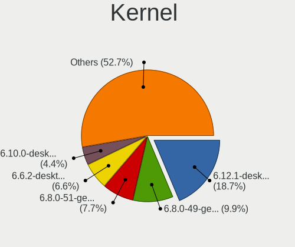

| Version                             | Notebooks | Percent |
|-------------------------------------|-----------|---------|
| 6.1.0-18-amd64                      | 9         | 9.57%   |
| 6.5.0-27-generic                    | 7         | 7.45%   |
| 6.5.0-28-generic                    | 5         | 5.32%   |
| 6.5.0-26-generic                    | 5         | 5.32%   |
| 6.1.0-20-amd64                      | 4         | 4.26%   |
| 6.8.7-300.fc40.x86_64               | 3         | 3.19%   |
| 6.8.0-76060800daily20240311-generic | 3         | 3.19%   |
| 6.8.0-31-generic                    | 3         | 3.19%   |
| 5.14.21-150500.55.52-default        | 3         | 3.19%   |
| 6.8.2-arch2-1                       | 2         | 2.13%   |
| 6.6.15-amd64                        | 2         | 2.13%   |
| 5.15.0-100-generic                  | 2         | 2.13%   |
| 6.8.7-zen1-1-zen                    | 1         | 1.06%   |
| 6.8.7-gentoo                        | 1         | 1.06%   |
| 6.8.7-200.fc39.x86_64               | 1         | 1.06%   |
| 6.8.7-1-default                     | 1         | 1.06%   |
| 6.8.6-xanmod1                       | 1         | 1.06%   |
| 6.8.6-arch1-1                       | 1         | 1.06%   |
| 6.8.6-200.fc39.x86_64               | 1         | 1.06%   |
| 6.8.5-zen1-1-zen                    | 1         | 1.06%   |
| 6.8.5-gentoo-r1-x86_64              | 1         | 1.06%   |
| 6.8.5-301.fc40.x86_64               | 1         | 1.06%   |
| 6.8.4-zen1-1-zen                    | 1         | 1.06%   |
| 6.8.4-rc1-1-default                 | 1         | 1.06%   |
| 6.8.4-arch1-1                       | 1         | 1.06%   |
| 6.8.4-100.fc38.x86_64               | 1         | 1.06%   |
| 6.8.4-1-MANJARO                     | 1         | 1.06%   |
| 6.8.3-pikaos                        | 1         | 1.06%   |
| 6.8.2-1-default                     | 1         | 1.06%   |
| 6.8.0-22-generic                    | 1         | 1.06%   |
| 6.7.9-amd64                         | 1         | 1.06%   |
| 6.7.9-200.fc39.x86_64               | 1         | 1.06%   |
| 6.7.9-1414.native                   | 1         | 1.06%   |
| 6.7.10-200.fc39.x86_64              | 1         | 1.06%   |
| 6.6.6-ext73-106.6-intelstandard     | 1         | 1.06%   |
| 6.6.29-1-lts                        | 1         | 1.06%   |
| 6.6.28-2-lts                        | 1         | 1.06%   |
| 6.6.28-1-lts                        | 1         | 1.06%   |
| 6.6.2-desktop-1omv2390              | 1         | 1.06%   |
| 6.6.19-1-MANJARO                    | 1         | 1.06%   |

Kernel Family
-------------

Linux kernel without a distro release

| Version | Notebooks | Percent |
|---------|-----------|---------|
| 6.5.0   | 20        | 21.28%  |
| 6.1.0   | 14        | 14.89%  |
| 6.8.7   | 7         | 7.45%   |
| 6.8.0   | 7         | 7.45%   |
| 5.15.0  | 6         | 6.38%   |
| 6.8.4   | 5         | 5.32%   |
| 6.8.6   | 3         | 3.19%   |
| 6.8.5   | 3         | 3.19%   |
| 6.8.2   | 3         | 3.19%   |
| 6.7.9   | 3         | 3.19%   |
| 5.14.21 | 3         | 3.19%   |
| 6.6.28  | 2         | 2.13%   |
| 6.6.15  | 2         | 2.13%   |
| 6.6.13  | 2         | 2.13%   |
| 6.8.3   | 1         | 1.06%   |
| 6.7.10  | 1         | 1.06%   |
| 6.6.6   | 1         | 1.06%   |
| 6.6.29  | 1         | 1.06%   |
| 6.6.2   | 1         | 1.06%   |
| 6.6.19  | 1         | 1.06%   |
| 6.6.12  | 1         | 1.06%   |
| 6.4.11  | 1         | 1.06%   |
| 6.3.0   | 1         | 1.06%   |
| 6.2.6   | 1         | 1.06%   |
| 6.1.84  | 1         | 1.06%   |
| 6.1.81  | 1         | 1.06%   |
| 6.1.52  | 1         | 1.06%   |
| 5.4.0   | 1         | 1.06%   |

Kernel Major Ver.
-----------------

Linux kernel major version

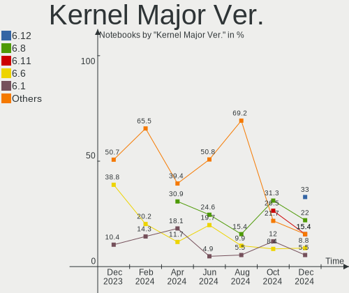

| Version | Notebooks | Percent |
|---------|-----------|---------|
| 6.8     | 29        | 30.85%  |
| 6.5     | 20        | 21.28%  |
| 6.1     | 17        | 18.09%  |
| 6.6     | 11        | 11.7%   |
| 5.15    | 6         | 6.38%   |
| 6.7     | 4         | 4.26%   |
| 5.14    | 3         | 3.19%   |
| 6.4     | 1         | 1.06%   |
| 6.3     | 1         | 1.06%   |
| 6.2     | 1         | 1.06%   |
| 5.4     | 1         | 1.06%   |

Arch
----

OS architecture (x86_64, i586, etc.)

| Name   | Notebooks | Percent |
|--------|-----------|---------|
| x86_64 | 94        | 100%    |

DE
--

Desktop Environment

| Name       | Notebooks | Percent |
|------------|-----------|---------|
| GNOME      | 39        | 41.49%  |
| KDE5       | 17        | 18.09%  |
| XFCE       | 11        | 11.7%   |
| X-Cinnamon | 6         | 6.38%   |
| KDE6       | 5         | 5.32%   |
| LXQt       | 3         | 3.19%   |
| Trinity    | 2         | 2.13%   |
| openbox    | 2         | 2.13%   |
| KDE        | 2         | 2.13%   |
| Unknown    | 2         | 2.13%   |
| Pantheon   | 1         | 1.06%   |
| MATE       | 1         | 1.06%   |
| i3         | 1         | 1.06%   |
| Hyprland   | 1         | 1.06%   |
| DWM        | 1         | 1.06%   |

Display Server
--------------

X11 or Wayland

| Name    | Notebooks | Percent |
|---------|-----------|---------|
| X11     | 50        | 53.19%  |
| Wayland | 40        | 42.55%  |
| Unknown | 4         | 4.26%   |

Display Manager
---------------

SDDM, LightDM, etc.

| Name    | Notebooks | Percent |
|---------|-----------|---------|
| Unknown | 25        | 26.6%   |
| GDM3    | 22        | 23.4%   |
| SDDM    | 21        | 22.34%  |
| LightDM | 20        | 21.28%  |
| GDM     | 5         | 5.32%   |
| GREETD  | 1         | 1.06%   |

OS Lang
-------

Language

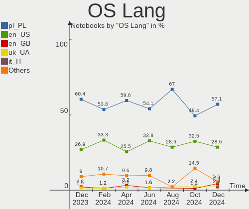

| Lang    | Notebooks | Percent |
|---------|-----------|---------|
| pl_PL   | 56        | 59.57%  |
| en_US   | 24        | 25.53%  |
| en_GB   | 3         | 3.19%   |
| Unknown | 3         | 3.19%   |
| uk_UA   | 2         | 2.13%   |
| C       | 2         | 2.13%   |
| ru_RU   | 1         | 1.06%   |
| POSIX   | 1         | 1.06%   |
| en_IE   | 1         | 1.06%   |
| en_DK   | 1         | 1.06%   |

Boot Mode
---------

EFI or BIOS

| Mode | Notebooks | Percent |
|------|-----------|---------|
| EFI  | 52        | 55.32%  |
| BIOS | 42        | 44.68%  |

Filesystem
----------

Type of filesystem

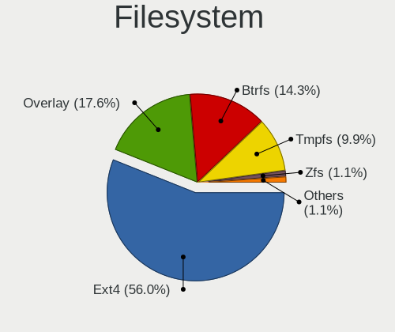

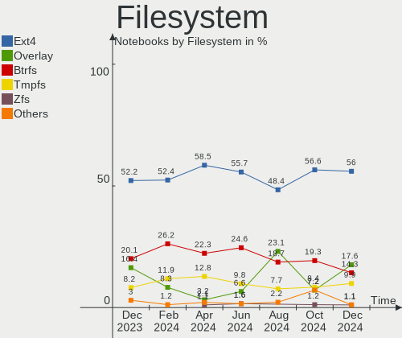

| Type    | Notebooks | Percent |
|---------|-----------|---------|
| Ext4    | 55        | 58.51%  |
| Btrfs   | 21        | 22.34%  |
| Tmpfs   | 12        | 12.77%  |
| Overlay | 3         | 3.19%   |
| Zfs     | 1         | 1.06%   |
| F2fs    | 1         | 1.06%   |
| Unknown | 1         | 1.06%   |

Part. scheme
------------

Scheme of partitioning

| Type    | Notebooks | Percent |
|---------|-----------|---------|
| GPT     | 60        | 63.83%  |
| Unknown | 23        | 24.47%  |
| MBR     | 11        | 11.7%   |

Dual Boot with Linux/BSD
------------------------

Hosting more than one Linux/BSD

| Dual boot | Notebooks | Percent |
|-----------|-----------|---------|
| No        | 77        | 81.91%  |
| Yes       | 17        | 18.09%  |

Dual Boot (Win)
---------------

Hosting Linux and Windows

| Dual boot | Notebooks | Percent |
|-----------|-----------|---------|
| No        | 60        | 63.83%  |
| Yes       | 34        | 36.17%  |

Board
-----

Vendor
------

Motherboard manufacturer

| Name                | Notebooks | Percent |
|---------------------|-----------|---------|
| Lenovo              | 29        | 30.85%  |
| Dell                | 15        | 15.96%  |
| Hewlett-Packard     | 12        | 12.77%  |
| ASUSTek Computer    | 12        | 12.77%  |
| Acer                | 6         | 6.38%   |
| MSI                 | 4         | 4.26%   |
| HUAWEI              | 3         | 3.19%   |
| Samsung Electronics | 2         | 2.13%   |
| Apple               | 2         | 2.13%   |
| Valve               | 1         | 1.06%   |
| Toshiba             | 1         | 1.06%   |
| System76            | 1         | 1.06%   |
| Sony                | 1         | 1.06%   |
| Panasonic Connect   | 1         | 1.06%   |
| Notebook            | 1         | 1.06%   |
| Maxcom              | 1         | 1.06%   |
| Google              | 1         | 1.06%   |
| Unknown             | 1         | 1.06%   |

Model
-----

Motherboard model

| Name                                       | Notebooks | Percent |
|--------------------------------------------|-----------|---------|
| Lenovo Legion Slim 5 16APH8 82Y9           | 2         | 2.13%   |
| Lenovo Legion 5 15ARH05H 82B1              | 2         | 2.13%   |
| Valve Jupiter                              | 1         | 1.06%   |
| Toshiba Satellite C850D-11C                | 1         | 1.06%   |
| System76 Galago Pro                        | 1         | 1.06%   |
| Sony VPCEH3K1E                             | 1         | 1.06%   |
| Samsung 350V5C/351V5C/3540VC/3440VC        | 1         | 1.06%   |
| Samsung 300E4A/300E5A/300E7A/3430EA/3530EA | 1         | 1.06%   |
| Panasonic Connect CFSR4-1                  | 1         | 1.06%   |
| Notebook P7xxDM2(-G)                       | 1         | 1.06%   |
| MSI Katana GF66 11UE                       | 1         | 1.06%   |
| MSI GT62VR 6RE                             | 1         | 1.06%   |
| MSI GL65 9SC                               | 1         | 1.06%   |
| MSI GF63 8RD                               | 1         | 1.06%   |
| Maxcom mBook14                             | 1         | 1.06%   |
| Lenovo Y520-15IKBN 80WK                    | 1         | 1.06%   |
| Lenovo ThinkPad X270 20K5S1A524            | 1         | 1.06%   |
| Lenovo ThinkPad T580 20LAS8HJ20            | 1         | 1.06%   |
| Lenovo ThinkPad T570 20HAS03W00            | 1         | 1.06%   |
| Lenovo ThinkPad T480 20L6SAYX00            | 1         | 1.06%   |
| Lenovo ThinkPad T430 2349FC4               | 1         | 1.06%   |
| Lenovo ThinkPad T14 Gen 3 21AH00DFPB       | 1         | 1.06%   |
| Lenovo ThinkPad P50 20EQS3B30R             | 1         | 1.06%   |
| Lenovo ThinkPad P16 Gen 2 21FA000VPB       | 1         | 1.06%   |
| Lenovo ThinkPad L580 20LW000UPB            | 1         | 1.06%   |
| Lenovo ThinkPad E15 Gen 2 20T8000VPB       | 1         | 1.06%   |
| Lenovo ThinkPad E15 Gen 2 20T8000MPB       | 1         | 1.06%   |
| Lenovo ThinkPad E15 20RD001FPB             | 1         | 1.06%   |
| Lenovo ThinkBook 16p Gen 4 21J8            | 1         | 1.06%   |
| Lenovo Legion Y540-15IRH 81SX              | 1         | 1.06%   |
| Lenovo Legion 5 Pro 16ACH6 82JS            | 1         | 1.06%   |
| Lenovo IdeaPad Y700-15ISK 80NV             | 1         | 1.06%   |
| Lenovo IdeaPad 510S-13ISK 80SJ             | 1         | 1.06%   |
| Lenovo IdeaPad 3 17IML05 81WC              | 1         | 1.06%   |
| Lenovo IdeaPad 3 15ITL6 82H8               | 1         | 1.06%   |
| Lenovo IdeaPad 110-15IBR 80T7              | 1         | 1.06%   |
| Lenovo IdeaPad 100-15IBD 80QQ              | 1         | 1.06%   |
| Lenovo G70-70 80HW                         | 1         | 1.06%   |
| Lenovo G500s 20245                         | 1         | 1.06%   |
| Lenovo G50-45 80E3                         | 1         | 1.06%   |

Model Family
------------

Motherboard model prefix

| Name                      | Notebooks | Percent |
|---------------------------|-----------|---------|
| Lenovo ThinkPad           | 12        | 12.77%  |
| Lenovo Legion             | 6         | 6.38%   |
| Lenovo IdeaPad            | 6         | 6.38%   |
| HP EliteBook              | 5         | 5.32%   |
| Dell Latitude             | 4         | 4.26%   |
| Dell Inspiron             | 4         | 4.26%   |
| HP Pavilion               | 3         | 3.19%   |
| ASUS ASUS                 | 3         | 3.19%   |
| Acer Aspire               | 3         | 3.19%   |
| HP ProBook                | 2         | 2.13%   |
| Dell Precision            | 2         | 2.13%   |
| Dell G15                  | 2         | 2.13%   |
| Acer Nitro                | 2         | 2.13%   |
| Valve Jupiter             | 1         | 1.06%   |
| Toshiba Satellite         | 1         | 1.06%   |
| System76 Galago           | 1         | 1.06%   |
| Sony VPCEH3K1E            | 1         | 1.06%   |
| Samsung 350V5C            | 1         | 1.06%   |
| Samsung 300E4A            | 1         | 1.06%   |
| Panasonic Connect CFSR4-1 | 1         | 1.06%   |
| Notebook P7xxDM2(-G)      | 1         | 1.06%   |
| MSI Katana                | 1         | 1.06%   |
| MSI GT62VR                | 1         | 1.06%   |
| MSI GL65                  | 1         | 1.06%   |
| MSI GF63                  | 1         | 1.06%   |
| Maxcom mBook14            | 1         | 1.06%   |
| Lenovo Y520-15IKBN        | 1         | 1.06%   |
| Lenovo ThinkBook          | 1         | 1.06%   |
| Lenovo G70-70             | 1         | 1.06%   |
| Lenovo G500s              | 1         | 1.06%   |
| Lenovo G50-45             | 1         | 1.06%   |
| HUAWEI KPL-W0X            | 1         | 1.06%   |
| HUAWEI KLVF-XX            | 1         | 1.06%   |
| HUAWEI BOD-WXX9           | 1         | 1.06%   |
| HP OMEN                   | 1         | 1.06%   |
| HP ENVY                   | 1         | 1.06%   |
| Google Gnawty             | 1         | 1.06%   |
| Dell Vostro               | 1         | 1.06%   |
| Dell System               | 1         | 1.06%   |
| Dell Studio               | 1         | 1.06%   |

MFG Year
--------

Motherboard manufacture year

| Year | Notebooks | Percent |
|------|-----------|---------|
| 2023 | 14        | 14.89%  |
| 2018 | 11        | 11.7%   |
| 2021 | 8         | 8.51%   |
| 2020 | 8         | 8.51%   |
| 2011 | 8         | 8.51%   |
| 2016 | 7         | 7.45%   |
| 2014 | 7         | 7.45%   |
| 2022 | 6         | 6.38%   |
| 2013 | 6         | 6.38%   |
| 2012 | 6         | 6.38%   |
| 2017 | 4         | 4.26%   |
| 2015 | 4         | 4.26%   |
| 2019 | 2         | 2.13%   |
| 2010 | 1         | 1.06%   |
| 2009 | 1         | 1.06%   |
| 2008 | 1         | 1.06%   |

Form Factor
-----------

Physical design of the computer

| Name     | Notebooks | Percent |
|----------|-----------|---------|
| Notebook | 94        | 100%    |

Secure Boot
-----------

Enabled or disabled

| State    | Notebooks | Percent |
|----------|-----------|---------|
| Disabled | 89        | 94.68%  |
| Enabled  | 5         | 5.32%   |

Coreboot
--------

Have coreboot on board

| Used | Notebooks | Percent |
|------|-----------|---------|
| No   | 93        | 98.94%  |
| Yes  | 1         | 1.06%   |

RAM Size
--------

Total RAM memory

| Size in GB  | Notebooks | Percent |
|-------------|-----------|---------|
| 16.01-24.0  | 27        | 28.72%  |
| 4.01-8.0    | 25        | 26.6%   |
| 32.01-64.0  | 13        | 13.83%  |
| 8.01-16.0   | 12        | 12.77%  |
| 3.01-4.0    | 10        | 10.64%  |
| 64.01-256.0 | 4         | 4.26%   |
| 24.01-32.0  | 3         | 3.19%   |

RAM Used
--------

Used RAM memory

| Used GB    | Notebooks | Percent |
|------------|-----------|---------|
| 2.01-3.0   | 28        | 29.79%  |
| 1.01-2.0   | 27        | 28.72%  |
| 4.01-8.0   | 15        | 15.96%  |
| 3.01-4.0   | 12        | 12.77%  |
| 8.01-16.0  | 7         | 7.45%   |
| 0.51-1.0   | 3         | 3.19%   |
| 16.01-24.0 | 2         | 2.13%   |

Total Drives
------------

Number of drives on board

| Drives | Notebooks | Percent |
|--------|-----------|---------|
| 1      | 65        | 69.15%  |
| 2      | 26        | 27.66%  |
| 3      | 2         | 2.13%   |
| 4      | 1         | 1.06%   |

Has CD-ROM
----------

Has CD-ROM on board

| Presented | Notebooks | Percent |
|-----------|-----------|---------|
| No        | 73        | 77.66%  |
| Yes       | 21        | 22.34%  |

Has Ethernet
------------

Has Ethernet on board

| Presented | Notebooks | Percent |
|-----------|-----------|---------|
| Yes       | 76        | 80.85%  |
| No        | 18        | 19.15%  |

Has WiFi
--------

Has WiFi module

| Presented | Notebooks | Percent |
|-----------|-----------|---------|
| Yes       | 93        | 98.94%  |
| No        | 1         | 1.06%   |

Has Bluetooth
-------------

Has Bluetooth module

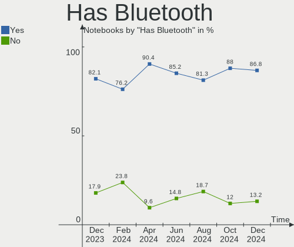

| Presented | Notebooks | Percent |
|-----------|-----------|---------|
| Yes       | 85        | 90.43%  |
| No        | 9         | 9.57%   |

Location
--------

Country
-------

Geographic location (country)

| Country | Notebooks | Percent |
|---------|-----------|---------|
| Poland  | 94        | 100%    |

City
----

Geographic location (city)

| City                 | Notebooks | Percent |
|----------------------|-----------|---------|
| Warsaw               | 23        | 24.47%  |
| Poznan               | 8         | 8.51%   |
| Wroclaw              | 5         | 5.32%   |
| Lodz                 | 5         | 5.32%   |
| Gdansk               | 5         | 5.32%   |
| Katowice             | 4         | 4.26%   |
| Krakow               | 3         | 3.19%   |
| Gliwice              | 3         | 3.19%   |
| Szczecin             | 2         | 2.13%   |
| Sosnowiec            | 2         | 2.13%   |
| Oleszyce             | 2         | 2.13%   |
| Jaworzno             | 2         | 2.13%   |
| Gdynia               | 2         | 2.13%   |
| Elblag               | 2         | 2.13%   |
| Zaczernie            | 1         | 1.06%   |
| Zabrze               | 1         | 1.06%   |
| Wroblew              | 1         | 1.06%   |
| Wachock              | 1         | 1.06%   |
| Swilcza              | 1         | 1.06%   |
| Sierpc               | 1         | 1.06%   |
| Reda                 | 1         | 1.06%   |
| Radom                | 1         | 1.06%   |
| Płock               | 1         | 1.06%   |
| Prejlowo             | 1         | 1.06%   |
| Ostrów Wielkopolski | 1         | 1.06%   |
| Nowy Sącz           | 1         | 1.06%   |
| Mińsk Mazowiecki    | 1         | 1.06%   |
| Lublin               | 1         | 1.06%   |
| Lniano               | 1         | 1.06%   |
| Krynica-Zdroj        | 1         | 1.06%   |
| Konin                | 1         | 1.06%   |
| Jablonna             | 1         | 1.06%   |
| Grajewo              | 1         | 1.06%   |
| Czarna Białostocka  | 1         | 1.06%   |
| Cieszyn              | 1         | 1.06%   |
| Bytom                | 1         | 1.06%   |
| Bydgoszcz            | 1         | 1.06%   |
| Bochnia              | 1         | 1.06%   |
| Bielsko-Biala        | 1         | 1.06%   |
| Bazany               | 1         | 1.06%   |

Drives
------

Drive Vendor
------------

Hard drive vendors

| Vendor                         | Notebooks | Drives | Percent |
|--------------------------------|-----------|--------|---------|
| Samsung Electronics            | 21        | 23     | 17.07%  |
| Sandisk                        | 14        | 16     | 11.38%  |
| GOODRAM                        | 9         | 9      | 7.32%   |
| Seagate                        | 8         | 8      | 6.5%    |
| WDC                            | 7         | 7      | 5.69%   |
| SK hynix                       | 7         | 7      | 5.69%   |
| Micron Technology              | 5         | 5      | 4.07%   |
| Crucial                        | 5         | 5      | 4.07%   |
| Toshiba                        | 4         | 4      | 3.25%   |
| A-DATA Technology              | 4         | 4      | 3.25%   |
| Unknown                        | 3         | 4      | 2.44%   |
| Silicon Motion                 | 3         | 3      | 2.44%   |
| Intel                          | 3         | 3      | 2.44%   |
| Shenzhen Longsys Electronics   | 2         | 3      | 1.63%   |
| Phison Electronics             | 2         | 2      | 1.63%   |
| Patriot                        | 2         | 2      | 1.63%   |
| MAXIO Technology (Hangzhou)    | 2         | 2      | 1.63%   |
| Kingston                       | 2         | 2      | 1.63%   |
| HGST                           | 2         | 2      | 1.63%   |
| Union Memory                   | 1         | 1      | 0.81%   |
| Transcend                      | 1         | 1      | 0.81%   |
| SPCC Sol                       | 1         | 1      | 0.81%   |
| SPCC                           | 1         | 1      | 0.81%   |
| Solid State Storage Technology | 1         | 1      | 0.81%   |
| Realtek Semiconductor          | 1         | 1      | 0.81%   |
| PNY                            | 1         | 1      | 0.81%   |
| Phison                         | 1         | 1      | 0.81%   |
| Netac                          | 1         | 1      | 0.81%   |
| KIOXIA                         | 1         | 1      | 0.81%   |
| Kingston Technology Company    | 1         | 1      | 0.81%   |
| KingSpec                       | 1         | 1      | 0.81%   |
| Hitachi                        | 1         | 1      | 0.81%   |
| Hikvision                      | 1         | 1      | 0.81%   |
| China                          | 1         | 1      | 0.81%   |
| Apple                          | 1         | 1      | 0.81%   |
| ADATA Technology               | 1         | 1      | 0.81%   |
| Unknown                        | 1         | 1      | 0.81%   |

Drive Model
-----------

Hard drive models

| Model                                              | Notebooks | Percent |
|----------------------------------------------------|-----------|---------|
| Samsung NVMe SSD Controller SM981/PM981/PM983 1TB  | 4         | 3.13%   |
| Samsung SSD 980 500GB                              | 3         | 2.34%   |
| GOODRAM SSDPR-CX400-256-G2 256GB                   | 3         | 2.34%   |
| WDC WD5000LPVX-22V0TT0 500GB                       | 2         | 1.56%   |
| Unknown MMC Card  16GB                             | 2         | 1.56%   |
| SK hynix SKHynix_HFS512GEJ9X115N 512GB             | 2         | 1.56%   |
| Silicon Motion SM2262/SM2262EN SSD Controller 2TB  | 2         | 1.56%   |
| Shenzhen Longsys Lexar SSD NM710 2TB               | 2         | 1.56%   |
| Seagate ST9500325AS 500GB                          | 2         | 1.56%   |
| Seagate ST1000LM024 HN-M101MBB 1TB                 | 2         | 1.56%   |
| Sandisk WD Blue SN550 NVMe SSD 2TB                 | 2         | 1.56%   |
| Samsung PM991 NVMe 256GB                           | 2         | 1.56%   |
| Intel SSDPEKNU512GZ 512GB                          | 2         | 1.56%   |
| HGST HTS721010A9E630 1TB                           | 2         | 1.56%   |
| WDC WDS480G2G0B-00EPW0 480GB SSD                   | 1         | 0.78%   |
| WDC WDS250G1B0A-00H9H0 250GB SSD                   | 1         | 0.78%   |
| WDC WDS100T2B0C-00PXH0 1TB                         | 1         | 0.78%   |
| WDC WD10SPZX-75Z10T3 1TB                           | 1         | 0.78%   |
| WDC WD Green 2.5 1000GB                            | 1         | 0.78%   |
| Unknown MMC Card  7GB                              | 1         | 0.78%   |
| Unknown MMC Card  1GB                              | 1         | 0.78%   |
| Union Memory UMIS RPJTJ512MEE1OWX 512GB            | 1         | 0.78%   |
| Transcend TS256GMTS430S 256GB SSD                  | 1         | 0.78%   |
| Toshiba XG6 NVMe SSD Controller 1024GB             | 1         | 0.78%   |
| Toshiba Q300 Pro. 256GB SSD                        | 1         | 0.78%   |
| Toshiba MQ01ABD100 1TB                             | 1         | 0.78%   |
| Toshiba KBG30ZMV256G 256GB                         | 1         | 0.78%   |
| SPCC Solid State Disk 512GB                        | 1         | 0.78%   |
| SPCC Sol id State Disk 128GB SSD                   | 1         | 0.78%   |
| Solid State Storage CL4-3D512-Q11 NVMe SSSTC 512GB | 1         | 0.78%   |
| SK hynix SKHynix_HFM512GDHTNI-87A0B 512GB          | 1         | 0.78%   |
| SK hynix SC300 M.2 2280 128GB SSD                  | 1         | 0.78%   |
| SK hynix BC901 NVMe 1024GB                         | 1         | 0.78%   |
| SK hynix BC711 NVMe 256GB                          | 1         | 0.78%   |
| SK hynix BC711 HFM512GD3JX013N 512GB               | 1         | 0.78%   |
| Silicon Motion PCIe-8 SSD 512GB                    | 1         | 0.78%   |
| Seagate ST31000528AS 1TB                           | 1         | 0.78%   |
| Seagate ST2000LM007-1R8174 2TB                     | 1         | 0.78%   |
| Seagate ST1000LM035-1RK172 1TB                     | 1         | 0.78%   |
| Seagate Expansion 2TB                              | 1         | 0.78%   |

HDD Vendor
----------

Hard disk drive vendors

| Vendor              | Notebooks | Drives | Percent |
|---------------------|-----------|--------|---------|
| Seagate             | 8         | 8      | 50%     |
| WDC                 | 3         | 3      | 18.75%  |
| HGST                | 2         | 2      | 12.5%   |
| Toshiba             | 1         | 1      | 6.25%   |
| Samsung Electronics | 1         | 1      | 6.25%   |
| Hitachi             | 1         | 1      | 6.25%   |

SSD Vendor
----------

Solid state drive vendors

| Vendor              | Notebooks | Drives | Percent |
|---------------------|-----------|--------|---------|
| GOODRAM             | 9         | 9      | 20%     |
| Samsung Electronics | 5         | 5      | 11.11%  |
| Crucial             | 5         | 5      | 11.11%  |
| SanDisk             | 4         | 4      | 8.89%   |
| WDC                 | 3         | 3      | 6.67%   |
| Patriot             | 2         | 2      | 4.44%   |
| Micron Technology   | 2         | 2      | 4.44%   |
| A-DATA Technology   | 2         | 2      | 4.44%   |
| Transcend           | 1         | 1      | 2.22%   |
| Toshiba             | 1         | 1      | 2.22%   |
| SPCC Sol            | 1         | 1      | 2.22%   |
| SPCC                | 1         | 1      | 2.22%   |
| SK hynix            | 1         | 1      | 2.22%   |
| PNY                 | 1         | 1      | 2.22%   |
| Netac               | 1         | 1      | 2.22%   |
| Kingston            | 1         | 1      | 2.22%   |
| KingSpec            | 1         | 1      | 2.22%   |
| Intel               | 1         | 1      | 2.22%   |
| Hikvision           | 1         | 1      | 2.22%   |
| China               | 1         | 1      | 2.22%   |
| Apple               | 1         | 1      | 2.22%   |

Drive Kind
----------

HDD or SSD

| Kind | Notebooks | Drives | Percent |
|------|-----------|--------|---------|
| NVMe | 52        | 63     | 46.02%  |
| SSD  | 42        | 45     | 37.17%  |
| HDD  | 15        | 16     | 13.27%  |
| MMC  | 4         | 5      | 3.54%   |

Drive Connector
---------------

SATA, SAS, NVMe, etc.

| Type | Notebooks | Drives | Percent |
|------|-----------|--------|---------|
| NVMe | 52        | 63     | 47.71%  |
| SATA | 49        | 57     | 44.95%  |
| SAS  | 4         | 4      | 3.67%   |
| MMC  | 4         | 5      | 3.67%   |

Drive Size
----------

Size of hard drive

| Size in TB | Notebooks | Drives | Percent |
|------------|-----------|--------|---------|
| 0.01-0.5   | 33        | 36     | 57.89%  |
| 0.51-1.0   | 21        | 22     | 36.84%  |
| 1.01-2.0   | 3         | 3      | 5.26%   |

Space Total
-----------

Amount of disk space available on the file system

| Size in GB     | Notebooks | Percent |
|----------------|-----------|---------|
| 251-500        | 26        | 27.66%  |
| 101-250        | 23        | 24.47%  |
| 501-1000       | 19        | 20.21%  |
| 1001-2000      | 10        | 10.64%  |
| 1-20           | 4         | 4.26%   |
| Unknown        | 4         | 4.26%   |
| 21-50          | 3         | 3.19%   |
| More than 3000 | 2         | 2.13%   |
| 2001-3000      | 2         | 2.13%   |
| 51-100         | 1         | 1.06%   |

Space Used
----------

Amount of used disk space

| Used GB   | Notebooks | Percent |
|-----------|-----------|---------|
| 1-20      | 29        | 30.85%  |
| 21-50     | 17        | 18.09%  |
| 251-500   | 13        | 13.83%  |
| 101-250   | 12        | 12.77%  |
| 51-100    | 10        | 10.64%  |
| 501-1000  | 6         | 6.38%   |
| Unknown   | 4         | 4.26%   |
| 2001-3000 | 2         | 2.13%   |
| 1001-2000 | 1         | 1.06%   |

Malfunc. Drives
---------------

Drive models with a malfunction

| Model                                                         | Notebooks | Drives | Percent |
|---------------------------------------------------------------|-----------|--------|---------|
| Solid State Storage Technology CL4-3D512-Q11 NVMe SSSTC 512GB | 1         | 1      | 16.67%  |
| Seagate ST31000528AS 1TB                                      | 1         | 1      | 16.67%  |
| Seagate ST1000LM035-1RK172 1TB                                | 1         | 1      | 16.67%  |
| SanDisk SSD PLUS 480GB                                        | 1         | 1      | 16.67%  |
| Samsung Electronics SSD 870 EVO 500GB                         | 1         | 1      | 16.67%  |
| Crucial CT1000MX500SSD4 1TB                                   | 1         | 1      | 16.67%  |

Malfunc. Drive Vendor
---------------------

Vendors of faulty drives

| Vendor                         | Notebooks | Drives | Percent |
|--------------------------------|-----------|--------|---------|
| Seagate                        | 2         | 2      | 33.33%  |
| Solid State Storage Technology | 1         | 1      | 16.67%  |
| SanDisk                        | 1         | 1      | 16.67%  |
| Samsung Electronics            | 1         | 1      | 16.67%  |
| Crucial                        | 1         | 1      | 16.67%  |

Malfunc. HDD Vendor
-------------------

Vendors of faulty HDD drives

| Vendor  | Notebooks | Drives | Percent |
|---------|-----------|--------|---------|
| Seagate | 2         | 2      | 100%    |

Malfunc. Drive Kind
-------------------

Kinds of faulty drives

| Kind | Notebooks | Drives | Percent |
|------|-----------|--------|---------|
| SSD  | 3         | 3      | 50%     |
| HDD  | 2         | 2      | 33.33%  |
| NVMe | 1         | 1      | 16.67%  |

Failed Drives
-------------

Failed drive models

Zero info for selected period =(

Failed Drive Vendor
-------------------

Failed drive vendors

Zero info for selected period =(

Drive Status
------------

Number of failed and malfunc. drives

| Status   | Notebooks | Drives | Percent |
|----------|-----------|--------|---------|
| Works    | 52        | 67     | 51.49%  |
| Detected | 43        | 56     | 42.57%  |
| Malfunc  | 6         | 6      | 5.94%   |

Storage controller
------------------

Storage Vendor
--------------

Storage controller vendors

| Vendor                         | Notebooks | Percent |
|--------------------------------|-----------|---------|
| Intel                          | 62        | 48.82%  |
| Samsung Electronics            | 16        | 12.6%   |
| SanDisk                        | 11        | 8.66%   |
| AMD                            | 8         | 6.3%    |
| SK hynix                       | 6         | 4.72%   |
| Silicon Motion                 | 3         | 2.36%   |
| Phison Electronics             | 3         | 2.36%   |
| Micron Technology              | 3         | 2.36%   |
| ADATA Technology               | 3         | 2.36%   |
| Toshiba America Info Systems   | 2         | 1.57%   |
| Shenzhen Longsys Electronics   | 2         | 1.57%   |
| MAXIO Technology (Hangzhou)    | 2         | 1.57%   |
| Kingston Technology Company    | 2         | 1.57%   |
| Union Memory (Shenzhen)        | 1         | 0.79%   |
| Solid State Storage Technology | 1         | 0.79%   |
| Realtek Semiconductor          | 1         | 0.79%   |
| KIOXIA                         | 1         | 0.79%   |

Storage Model
-------------

Storage controller models

| Model                                                                                  | Notebooks | Percent |
|----------------------------------------------------------------------------------------|-----------|---------|
| Samsung NVMe SSD Controller 980 (DRAM-less)                                            | 8         | 6.06%   |
| Intel 6 Series/C200 Series Chipset Family 6 port Mobile SATA AHCI Controller           | 8         | 6.06%   |
| Intel Volume Management Device NVMe RAID Controller                                    | 7         | 5.3%    |
| Intel Sunrise Point-LP SATA Controller [AHCI mode]                                     | 7         | 5.3%    |
| AMD FCH SATA Controller [AHCI mode]                                                    | 6         | 4.55%   |
| Samsung NVMe SSD Controller SM981/PM981/PM983                                          | 5         | 3.79%   |
| Intel Cannon Lake Mobile PCH SATA AHCI Controller                                      | 4         | 3.03%   |
| Intel 8 Series SATA Controller 1 [AHCI mode]                                           | 4         | 3.03%   |
| Intel 7 Series Chipset Family 6-port SATA Controller [AHCI mode]                       | 4         | 3.03%   |
| SanDisk WD Black SN770 / PC SN740 256GB / PC SN560 (DRAM-less) NVMe SSD                | 3         | 2.27%   |
| Samsung NVMe SSD Controller PM9A1/PM9A3/980PRO                                         | 3         | 2.27%   |
| Intel 82801 Mobile SATA Controller [RAID mode]                                         | 3         | 2.27%   |
| SK hynix Platinum P41/PC801 NVMe Solid State Drive                                     | 2         | 1.52%   |
| SK hynix Gold P31/BC711/PC711 NVMe Solid State Drive                                   | 2         | 1.52%   |
| Silicon Motion SM2262/SM2262EN SSD Controller                                          | 2         | 1.52%   |
| Shenzhen Longsys Lexar NM790 NVME SSD (DRAM-less)                                      | 2         | 1.52%   |
| SanDisk Ultra 3D / WD Blue SN550 NVMe SSD                                              | 2         | 1.52%   |
| Phison E12 NVMe Controller                                                             | 2         | 1.52%   |
| Intel Tiger Lake-LP SATA Controller                                                    | 2         | 1.52%   |
| Intel Tiger Lake SATA AHCI Controller                                                  | 2         | 1.52%   |
| Intel SSD 670p Series [Keystone Harbor]                                                | 2         | 1.52%   |
| Intel Q170/Q150/B150/H170/H110/Z170/CM236 Chipset SATA Controller [AHCI Mode]          | 2         | 1.52%   |
| Intel HM170/QM170 Chipset SATA Controller [AHCI Mode]                                  | 2         | 1.52%   |
| Intel Comet Lake SATA AHCI Controller                                                  | 2         | 1.52%   |
| Intel Celeron/Pentium Silver Processor SATA Controller                                 | 2         | 1.52%   |
| Intel Atom/Celeron/Pentium Processor x5-E8000/J3xxx/N3xxx Series SATA Controller       | 2         | 1.52%   |
| Intel Atom Processor E3800 Series SATA AHCI Controller                                 | 2         | 1.52%   |
| Intel Alder Lake-P SATA AHCI Controller                                                | 2         | 1.52%   |
| Intel 8 Series/C220 Series Chipset Family 6-port SATA Controller 1 [AHCI mode]         | 2         | 1.52%   |
| AMD FCH SATA Controller [IDE mode]                                                     | 2         | 1.52%   |
| ADATA XPG GAMMIXS1 1L, XPG GAMMIX S5, LEGEND 710 / 740, SWORDFISH NVMe SSD (DRAM-less) | 2         | 1.52%   |
| Union Memory (Shenzhen) AM620 PCIe 3.0 NVMe SSD 512GB                                  | 1         | 0.76%   |
| Toshiba America Info Systems XG6 NVMe SSD Controller                                   | 1         | 0.76%   |
| Toshiba America Info Systems BG3 x2 NVMe SSD Controller (DRAM-less)                    | 1         | 0.76%   |
| Solid State Storage CL4-8D512 NVMe SSD M.2 (DRAM-less)                                 | 1         | 0.76%   |
| SK hynix BC901 NVMe Solid State Drive (DRAM-less)                                      | 1         | 0.76%   |
| SK hynix BC511 NVMe SSD                                                                | 1         | 0.76%   |
| Silicon Motion Non-Volatile memory controller                                          | 1         | 0.76%   |
| SanDisk WD PC SN810 / Black SN850 NVMe SSD                                             | 1         | 0.76%   |
| SanDisk WD Green SN350 240GB (DRAM-less) / SN560E NVMe SSD                             | 1         | 0.76%   |

Storage Kind
------------

Kind of storage controller (IDE, SATA, NVMe, SAS, ...)

| Kind | Notebooks | Percent |
|------|-----------|---------|
| SATA | 60        | 48.39%  |
| NVMe | 52        | 41.94%  |
| RAID | 11        | 8.87%   |
| IDE  | 1         | 0.81%   |

Processor
---------

CPU Vendor
----------

Processor vendors

| Vendor | Notebooks | Percent |
|--------|-----------|---------|
| Intel  | 76        | 80.85%  |
| AMD    | 18        | 19.15%  |

CPU Model
---------

Processor models

| Model                                       | Notebooks | Percent |
|---------------------------------------------|-----------|---------|
| Intel Core i5-7200U CPU @ 2.50GHz           | 3         | 3.19%   |
| Intel Celeron CPU N2840 @ 2.16GHz           | 3         | 3.19%   |
| Intel 12th Gen Core i5-12500H               | 3         | 3.19%   |
| Intel 11th Gen Core i5-1135G7 @ 2.40GHz     | 3         | 3.19%   |
| Intel Core i7-8550U CPU @ 1.80GHz           | 2         | 2.13%   |
| Intel Core i7-2670QM CPU @ 2.20GHz          | 2         | 2.13%   |
| Intel Core i5-6200U CPU @ 2.30GHz           | 2         | 2.13%   |
| Intel Core i5-3210M CPU @ 2.50GHz           | 2         | 2.13%   |
| Intel Core i5-10210U CPU @ 1.60GHz          | 2         | 2.13%   |
| Intel 12th Gen Core i7-1255U                | 2         | 2.13%   |
| AMD Ryzen 7 6800H with Radeon Graphics      | 2         | 2.13%   |
| AMD Ryzen 7 4800H with Radeon Graphics      | 2         | 2.13%   |
| AMD Ryzen 5 4500U with Radeon Graphics      | 2         | 2.13%   |
| Intel Pentium Silver N5000 CPU @ 1.10GHz    | 1         | 1.06%   |
| Intel Pentium Dual-Core CPU T4200 @ 2.00GHz | 1         | 1.06%   |
| Intel Pentium CPU N3700 @ 1.60GHz           | 1         | 1.06%   |
| Intel Pentium CPU N3530 @ 2.16GHz           | 1         | 1.06%   |
| Intel Pentium CPU B950 @ 2.10GHz            | 1         | 1.06%   |
| Intel Core i7-8750H CPU @ 2.20GHz           | 1         | 1.06%   |
| Intel Core i7-8650U CPU @ 1.90GHz           | 1         | 1.06%   |
| Intel Core i7-6820HQ CPU @ 2.70GHz          | 1         | 1.06%   |
| Intel Core i7-6700HQ CPU @ 2.60GHz          | 1         | 1.06%   |
| Intel Core i7-6700 CPU @ 3.40GHz            | 1         | 1.06%   |
| Intel Core i7-6600U CPU @ 2.60GHz           | 1         | 1.06%   |
| Intel Core i7-6500U CPU @ 2.50GHz           | 1         | 1.06%   |
| Intel Core i7-4870HQ CPU @ 2.50GHz          | 1         | 1.06%   |
| Intel Core i7-4800MQ CPU @ 2.70GHz          | 1         | 1.06%   |
| Intel Core i7-4510U CPU @ 2.00GHz           | 1         | 1.06%   |
| Intel Core i7-3630QM CPU @ 2.40GHz          | 1         | 1.06%   |
| Intel Core i7 CPU Q 720 @ 1.60GHz           | 1         | 1.06%   |
| Intel Core i5-9300HF CPU @ 2.40GHz          | 1         | 1.06%   |
| Intel Core i5-9300H CPU @ 2.40GHz           | 1         | 1.06%   |
| Intel Core i5-8300H CPU @ 2.30GHz           | 1         | 1.06%   |
| Intel Core i5-8265U CPU @ 1.60GHz           | 1         | 1.06%   |
| Intel Core i5-8250U CPU @ 1.60GHz           | 1         | 1.06%   |
| Intel Core i5-7300HQ CPU @ 2.50GHz          | 1         | 1.06%   |
| Intel Core i5-6300U CPU @ 2.40GHz           | 1         | 1.06%   |
| Intel Core i5-6300HQ CPU @ 2.30GHz          | 1         | 1.06%   |
| Intel Core i5-5300U CPU @ 2.30GHz           | 1         | 1.06%   |
| Intel Core i5-4300U CPU @ 1.90GHz           | 1         | 1.06%   |

CPU Model Family
----------------

Processor model prefix

| Model                   | Notebooks | Percent |
|-------------------------|-----------|---------|
| Intel Core i5           | 27        | 28.72%  |
| Other                   | 20        | 21.28%  |
| Intel Core i7           | 16        | 17.02%  |
| AMD Ryzen 7             | 6         | 6.38%   |
| Intel Celeron           | 5         | 5.32%   |
| AMD Ryzen 5             | 5         | 5.32%   |
| Intel Core i3           | 4         | 4.26%   |
| Intel Pentium           | 3         | 3.19%   |
| AMD A6                  | 2         | 2.13%   |
| Intel Pentium Silver    | 1         | 1.06%   |
| Intel Pentium Dual-Core | 1         | 1.06%   |
| AMD Ryzen 9             | 1         | 1.06%   |
| AMD Ryzen 3             | 1         | 1.06%   |
| AMD E1                  | 1         | 1.06%   |
| AMD A4                  | 1         | 1.06%   |

CPU Cores
---------

Number of processor cores

| Number | Notebooks | Percent |
|--------|-----------|---------|
| 4      | 35        | 37.23%  |
| 2      | 31        | 32.98%  |
| 8      | 8         | 8.51%   |
| 12     | 6         | 6.38%   |
| 6      | 6         | 6.38%   |
| 10     | 4         | 4.26%   |
| 1      | 2         | 2.13%   |
| 20     | 1         | 1.06%   |
| 14     | 1         | 1.06%   |

CPU Sockets
-----------

Number of sockets

| Number | Notebooks | Percent |
|--------|-----------|---------|
| 1      | 94        | 100%    |

CPU Threads
-----------

Threads per core (Hyper-Threading)

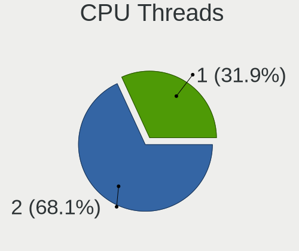

| Number | Notebooks | Percent |
|--------|-----------|---------|
| 2      | 73        | 77.66%  |
| 1      | 21        | 22.34%  |

CPU Op-Modes
------------

CPU Operation Modes (32-bit, 64-bit)

| Op mode        | Notebooks | Percent |
|----------------|-----------|---------|
| 32-bit, 64-bit | 94        | 100%    |

CPU Microcode
-------------

Microcode number

| Number     | Notebooks | Percent |
|------------|-----------|---------|
| Unknown    | 71        | 75.53%  |
| 0x206a7    | 3         | 3.19%   |
| 0x806c1    | 2         | 2.13%   |
| 0x906ea    | 1         | 1.06%   |
| 0x906e9    | 1         | 1.06%   |
| 0x806ec    | 1         | 1.06%   |
| 0x706a1    | 1         | 1.06%   |
| 0x506e3    | 1         | 1.06%   |
| 0x406e3    | 1         | 1.06%   |
| 0x406c3    | 1         | 1.06%   |
| 0x40661    | 1         | 1.06%   |
| 0x306d4    | 1         | 1.06%   |
| 0x306a9    | 1         | 1.06%   |
| 0x30678    | 1         | 1.06%   |
| 0x0a704104 | 1         | 1.06%   |
| 0x08600106 | 1         | 1.06%   |
| 0x08600104 | 1         | 1.06%   |
| 0x08600103 | 1         | 1.06%   |
| 0x07030105 | 1         | 1.06%   |
| 0x06001119 | 1         | 1.06%   |
| 0x0500010d | 1         | 1.06%   |

CPU Microarch
-------------

Microarchitecture

| Name             | Notebooks | Percent |
|------------------|-----------|---------|
| KabyLake         | 15        | 15.96%  |
| Skylake          | 9         | 9.57%   |
| Alderlake Hybrid | 9         | 9.57%   |
| Unknown          | 9         | 9.57%   |
| SandyBridge      | 8         | 8.51%   |
| Haswell          | 7         | 7.45%   |
| Silvermont       | 6         | 6.38%   |
| TigerLake        | 5         | 5.32%   |
| Zen 2            | 4         | 4.26%   |
| IvyBridge        | 4         | 4.26%   |
| Zen 3            | 2         | 2.13%   |
| Icelake          | 2         | 2.13%   |
| Goldmont plus    | 2         | 2.13%   |
| CometLake        | 2         | 2.13%   |
| Broadwell        | 2         | 2.13%   |
| Zen+             | 1         | 1.06%   |
| Zen              | 1         | 1.06%   |
| Puma             | 1         | 1.06%   |
| Piledriver       | 1         | 1.06%   |
| Penryn           | 1         | 1.06%   |
| Nehalem          | 1         | 1.06%   |
| K10 Llano        | 1         | 1.06%   |
| Bobcat           | 1         | 1.06%   |

Graphics
--------

GPU Vendor
----------

Vendors of graphics cards

| Vendor | Notebooks | Percent |
|--------|-----------|---------|
| Intel  | 71        | 54.2%   |
| Nvidia | 36        | 27.48%  |
| AMD    | 24        | 18.32%  |

GPU Model
---------

Graphics card models

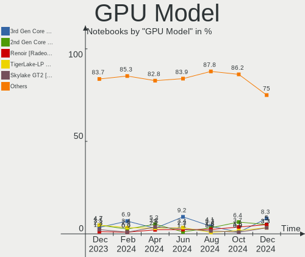

| Model                                                                                    | Notebooks | Percent |
|------------------------------------------------------------------------------------------|-----------|---------|
| Intel 2nd Generation Core Processor Family Integrated Graphics Controller                | 7         | 5.22%   |
| Intel Skylake GT2 [HD Graphics 520]                                                      | 5         | 3.73%   |
| Intel Alder Lake-P GT2 [Iris Xe Graphics]                                                | 5         | 3.73%   |
| Nvidia TU116M [GeForce GTX 1660 Ti Mobile]                                               | 4         | 2.99%   |
| Intel UHD Graphics 620                                                                   | 4         | 2.99%   |
| Intel TigerLake-LP GT2 [Iris Xe Graphics]                                                | 4         | 2.99%   |
| Intel Haswell-ULT Integrated Graphics Controller                                         | 4         | 2.99%   |
| Intel Atom Processor Z36xxx/Z37xxx Series Graphics & Display                             | 4         | 2.99%   |
| Intel 3rd Gen Core processor Graphics Controller                                         | 4         | 2.99%   |
| Nvidia GF117M [GeForce 610M/710M/810M/820M / GT 620M/625M/630M/720M]                     | 3         | 2.24%   |
| Nvidia GF108M [GeForce GT 540M]                                                          | 3         | 2.24%   |
| Nvidia GA107M [GeForce RTX 3050 Mobile]                                                  | 3         | 2.24%   |
| Intel Raptor Lake-P [Iris Xe Graphics]                                                   | 3         | 2.24%   |
| Intel HD Graphics 620                                                                    | 3         | 2.24%   |
| Intel CoffeeLake-H GT2 [UHD Graphics 630]                                                | 3         | 2.24%   |
| Intel Alder Lake-UP3 GT2 [Iris Xe Graphics]                                              | 3         | 2.24%   |
| AMD Renoir [Radeon RX Vega 6 (Ryzen 4000/5000 Mobile Series)]                            | 3         | 2.24%   |
| AMD Rembrandt [Radeon 680M]                                                              | 3         | 2.24%   |
| Nvidia GP107M [GeForce GTX 1050 Mobile]                                                  | 2         | 1.49%   |
| Nvidia AD107M [GeForce RTX 4060 Max-Q / Mobile]                                          | 2         | 1.49%   |
| Nvidia AD107M [GeForce RTX 4050 Max-Q / Mobile]                                          | 2         | 1.49%   |
| Intel TigerLake-H GT1 [UHD Graphics]                                                     | 2         | 1.49%   |
| Intel HD Graphics 5500                                                                   | 2         | 1.49%   |
| Intel HD Graphics 530                                                                    | 2         | 1.49%   |
| Intel CometLake-U GT2 [UHD Graphics]                                                     | 2         | 1.49%   |
| Intel Atom/Celeron/Pentium Processor x5-E8000/J3xxx/N3xxx Integrated Graphics Controller | 2         | 1.49%   |
| Intel 4th Gen Core Processor Integrated Graphics Controller                              | 2         | 1.49%   |
| AMD Venus XT [Radeon HD 8870M / R9 M270X/M370X]                                          | 2         | 1.49%   |
| AMD Sun XT [Radeon HD 8670A/8670M/8690M / R5 M330 / M430 / Radeon 520 Mobile]            | 2         | 1.49%   |
| AMD Seymour [Radeon HD 6400M/7400M Series]                                               | 2         | 1.49%   |
| AMD Phoenix1                                                                             | 2         | 1.49%   |
| Nvidia TU117M [GeForce GTX 1650 Mobile / Max-Q]                                          | 1         | 0.75%   |
| Nvidia TU117GLM [T600 Mobile]                                                            | 1         | 0.75%   |
| Nvidia GP107M [GeForce GTX 1050 Ti Max-Q]                                                | 1         | 0.75%   |
| Nvidia GP106BM [GeForce GTX 1060 Mobile 6GB]                                             | 1         | 0.75%   |
| Nvidia GP104M [GeForce GTX 1070 Mobile]                                                  | 1         | 0.75%   |
| Nvidia GM108M [GeForce 920MX]                                                            | 1         | 0.75%   |
| Nvidia GM107M [GeForce GTX 960M]                                                         | 1         | 0.75%   |
| Nvidia GM107GLM [Quadro M1000M]                                                          | 1         | 0.75%   |
| Nvidia GF119M [GeForce GT 520MX]                                                         | 1         | 0.75%   |

GPU Combo
---------

Combinations of graphics cards

| Name           | Notebooks | Percent |
|----------------|-----------|---------|
| 1 x Intel      | 39        | 41.49%  |
| Intel + Nvidia | 23        | 24.47%  |
| 1 x AMD        | 10        | 10.64%  |
| 1 x Nvidia     | 7         | 7.45%   |
| Intel + AMD    | 6         | 6.38%   |
| AMD + Nvidia   | 5         | 5.32%   |
| 2 x AMD        | 3         | 3.19%   |
| 2 x Intel      | 1         | 1.06%   |

GPU Driver
----------

Free vs proprietary

| Driver      | Notebooks | Percent |
|-------------|-----------|---------|
| Free        | 75        | 79.79%  |
| Proprietary | 15        | 15.96%  |
| Unknown     | 4         | 4.26%   |

GPU Memory
----------

Total video memory

| Size in GB | Notebooks | Percent |
|------------|-----------|---------|
| Unknown    | 71        | 75.53%  |
| 0.01-0.5   | 7         | 7.45%   |
| 0.51-1.0   | 5         | 5.32%   |
| 3.01-4.0   | 4         | 4.26%   |
| 1.01-2.0   | 4         | 4.26%   |
| 5.01-6.0   | 2         | 2.13%   |
| 8.01-16.0  | 1         | 1.06%   |

Monitor
-------

Monitor Vendor
--------------

Monitor vendors

| Vendor                  | Notebooks | Percent |
|-------------------------|-----------|---------|
| AU Optronics            | 26        | 25.24%  |
| BOE                     | 18        | 17.48%  |
| LG Display              | 15        | 14.56%  |
| Samsung Electronics     | 10        | 9.71%   |
| Chimei Innolux          | 9         | 8.74%   |
| Dell                    | 6         | 5.83%   |
| Chi Mei Optoelectronics | 4         | 3.88%   |
| Lenovo                  | 3         | 2.91%   |
| PANDA                   | 2         | 1.94%   |
| ASUSTek Computer        | 2         | 1.94%   |
| Apple                   | 2         | 1.94%   |
| Valve                   | 1         | 0.97%   |
| InfoVision              | 1         | 0.97%   |
| Iiyama                  | 1         | 0.97%   |
| HannStar                | 1         | 0.97%   |
| Goldstar                | 1         | 0.97%   |
| AOC                     | 1         | 0.97%   |

Monitor Model
-------------

Monitor models

| Model                                                                    | Notebooks | Percent |
|--------------------------------------------------------------------------|-----------|---------|
| Samsung Electronics LCD Monitor SEC5441 1366x768 344x194mm 15.5-inch     | 2         | 1.92%   |
| PANDA LCD Monitor NCP004D 1920x1080 344x194mm 15.5-inch                  | 2         | 1.92%   |
| Lenovo LCD Monitor LEN40BA 1920x1080 344x194mm 15.5-inch                 | 2         | 1.92%   |
| Chimei Innolux LCD Monitor CMN15E7 1920x1080 344x193mm 15.5-inch         | 2         | 1.92%   |
| Chimei Innolux LCD Monitor CMN1132 1366x768 256x144mm 11.6-inch          | 2         | 1.92%   |
| Chi Mei Optoelectronics LCD Monitor CMO15A7 1366x768 344x193mm 15.5-inch | 2         | 1.92%   |
| AU Optronics LCD Monitor AUO4599 1920x1080 344x194mm 15.5-inch           | 2         | 1.92%   |
| AU Optronics LCD Monitor AUO119E 1600x900 382x214mm 17.2-inch            | 2         | 1.92%   |
| Valve ANX7530 U VLV3001 800x1280 100x150mm 7.1-inch                      | 1         | 0.96%   |
| Samsung Electronics SyncMaster SAM036A 1920x1080                         | 1         | 0.96%   |
| Samsung Electronics LCD Monitor SEC544B 1600x900 310x174mm 14.0-inch     | 1         | 0.96%   |
| Samsung Electronics LCD Monitor SEC364D 1600x900 382x214mm 17.2-inch     | 1         | 0.96%   |
| Samsung Electronics LCD Monitor SEC324A 1366x768 344x194mm 15.5-inch     | 1         | 0.96%   |
| Samsung Electronics LCD Monitor SDC4852 1366x768 344x194mm 15.5-inch     | 1         | 0.96%   |
| Samsung Electronics LCD Monitor SDC4652 1366x768 344x194mm 15.5-inch     | 1         | 0.96%   |
| Samsung Electronics LCD Monitor SDC417C 2880x1800 344x215mm 16.0-inch    | 1         | 0.96%   |
| Samsung Electronics C27HG7x SAM0E15 2560x1440 598x336mm 27.0-inch        | 1         | 0.96%   |
| LG Display LCD Monitor LGD7001 1366x768 344x194mm 15.5-inch              | 1         | 0.96%   |
| LG Display LCD Monitor LGD0738 1920x1080 344x194mm 15.5-inch             | 1         | 0.96%   |
| LG Display LCD Monitor LGD069A 1920x1080 344x194mm 15.5-inch             | 1         | 0.96%   |
| LG Display LCD Monitor LGD05FE 1920x1080 344x194mm 15.5-inch             | 1         | 0.96%   |
| LG Display LCD Monitor LGD05D8 1920x1080 344x194mm 15.5-inch             | 1         | 0.96%   |
| LG Display LCD Monitor LGD0590 1920x1080 344x194mm 15.5-inch             | 1         | 0.96%   |
| LG Display LCD Monitor LGD0541 1920x1080 344x194mm 15.5-inch             | 1         | 0.96%   |
| LG Display LCD Monitor LGD04D4 3840x2160 344x194mm 15.5-inch             | 1         | 0.96%   |
| LG Display LCD Monitor LGD048C 1920x1080 294x165mm 13.3-inch             | 1         | 0.96%   |
| LG Display LCD Monitor LGD0469 1920x1080 382x215mm 17.3-inch             | 1         | 0.96%   |
| LG Display LCD Monitor LGD0454 1366x768 310x174mm 14.0-inch              | 1         | 0.96%   |
| LG Display LCD Monitor LGD033A 1366x768 344x194mm 15.5-inch              | 1         | 0.96%   |
| LG Display LCD Monitor LGD032C 1920x1080 344x194mm 15.5-inch             | 1         | 0.96%   |
| LG Display LCD Monitor LGD02F2 1366x768 344x194mm 15.5-inch              | 1         | 0.96%   |
| LG Display LCD Monitor LGD02D9 1920x1080 344x194mm 15.5-inch             | 1         | 0.96%   |
| Lenovo LEN T27p-10 LEN61DA 3840x2160 600x340mm 27.2-inch                 | 1         | 0.96%   |
| InfoVision LCD Monitor IVO3D41 1920x1080 344x194mm 15.5-inch             | 1         | 0.96%   |
| Iiyama PL3461WQ IVM7614 3440x1440 800x335mm 34.1-inch                    | 1         | 0.96%   |
| HannStar LCD Monitor HSD0001 1920x1080 309x174mm 14.0-inch               | 1         | 0.96%   |
| Goldstar 42LG3000 GSM75EF 1920x1080 700x390mm 31.5-inch                  | 1         | 0.96%   |
| Dell U3821DW DELA1AE 3840x1600 880x367mm 37.5-inch                       | 1         | 0.96%   |
| Dell U2424HE DELA237 1920x1080 527x296mm 23.8-inch                       | 1         | 0.96%   |
| Dell U2424H DELA233 1920x1080 527x296mm 23.8-inch                        | 1         | 0.96%   |

Monitor Resolution
------------------

Monitor screen resolution

| Resolution        | Notebooks | Percent |
|-------------------|-----------|---------|
| 1920x1080 (FHD)   | 52        | 52.53%  |
| 1366x768 (WXGA)   | 19        | 19.19%  |
| 1600x900 (HD+)    | 6         | 6.06%   |
| 3840x2160 (4K)    | 4         | 4.04%   |
| 2560x1600         | 4         | 4.04%   |
| 2560x1440 (QHD)   | 3         | 3.03%   |
| 1920x1200 (WUXGA) | 3         | 3.03%   |
| 2880x1800         | 2         | 2.02%   |
| 800x1280          | 1         | 1.01%   |
| 3840x1600         | 1         | 1.01%   |
| 3440x1440         | 1         | 1.01%   |
| 2160x1440         | 1         | 1.01%   |
| 1920x1280         | 1         | 1.01%   |
| 1280x800 (WXGA)   | 1         | 1.01%   |

Monitor Diagonal
----------------

Diagonal size in inches

| Inches  | Notebooks | Percent |
|---------|-----------|---------|
| 15      | 50        | 48.54%  |
| 13      | 10        | 9.71%   |
| 17      | 8         | 7.77%   |
| 14      | 7         | 6.8%    |
| 16      | 6         | 5.83%   |
| 27      | 5         | 4.85%   |
| 12      | 4         | 3.88%   |
| 24      | 3         | 2.91%   |
| 23      | 2         | 1.94%   |
| 11      | 2         | 1.94%   |
| 37      | 1         | 0.97%   |
| 34      | 1         | 0.97%   |
| 31      | 1         | 0.97%   |
| 18      | 1         | 0.97%   |
| 7       | 1         | 0.97%   |
| Unknown | 1         | 0.97%   |

Monitor Width
-------------

Physical width

| Width in mm | Notebooks | Percent |
|-------------|-----------|---------|
| 301-350     | 65        | 63.11%  |
| 201-300     | 12        | 11.65%  |
| 501-600     | 10        | 9.71%   |
| 351-400     | 10        | 9.71%   |
| 801-900     | 1         | 0.97%   |
| 701-800     | 1         | 0.97%   |
| 601-700     | 1         | 0.97%   |
| 401-500     | 1         | 0.97%   |
| 1-100       | 1         | 0.97%   |
| Unknown     | 1         | 0.97%   |

Aspect Ratio
------------

Proportional relationship between the width and the height

| Ratio | Notebooks | Percent |
|-------|-----------|---------|
| 16/9  | 80        | 83.33%  |
| 16/10 | 11        | 11.46%  |
| 3/2   | 2         | 2.08%   |
| 21/9  | 2         | 2.08%   |
| 0.67  | 1         | 1.04%   |

Monitor Area
------------

Area in inch²

| Area in inch² | Notebooks | Percent |
|----------------|-----------|---------|
| 101-110        | 50        | 48.54%  |
| 81-90          | 13        | 12.62%  |
| 121-130        | 7         | 6.8%    |
| 111-120        | 6         | 5.83%   |
| 301-350        | 5         | 4.85%   |
| 71-80          | 4         | 3.88%   |
| 61-70          | 4         | 3.88%   |
| 201-250        | 4         | 3.88%   |
| 51-60          | 2         | 1.94%   |
| 351-500        | 2         | 1.94%   |
| 1-40           | 1         | 0.97%   |
| 251-300        | 1         | 0.97%   |
| 141-150        | 1         | 0.97%   |
| 131-140        | 1         | 0.97%   |
| 501-1000       | 1         | 0.97%   |
| Unknown        | 1         | 0.97%   |

Pixel Density
-------------

Pixels per inch

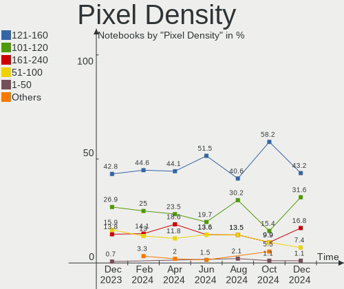

| Density       | Notebooks | Percent |
|---------------|-----------|---------|
| 121-160       | 45        | 44.12%  |
| 101-120       | 24        | 23.53%  |
| 161-240       | 19        | 18.63%  |
| 51-100        | 12        | 11.76%  |
| More than 240 | 1         | 0.98%   |
| Unknown       | 1         | 0.98%   |

Multiple Monitors
-----------------

Total monitors connected

| Total | Notebooks | Percent |
|-------|-----------|---------|
| 1     | 81        | 86.17%  |
| 2     | 9         | 9.57%   |
| 3     | 2         | 2.13%   |
| 0     | 2         | 2.13%   |

Network
-------

Net Controller Vendor
---------------------

Controller vendors

| Vendor                | Notebooks | Percent |
|-----------------------|-----------|---------|
| Intel                 | 60        | 38.96%  |
| Realtek Semiconductor | 52        | 33.77%  |
| Qualcomm Atheros      | 20        | 12.99%  |
| Broadcom              | 6         | 3.9%    |
| MediaTek              | 5         | 3.25%   |
| Sierra Wireless       | 2         | 1.3%    |
| Hewlett-Packard       | 2         | 1.3%    |
| Broadcom Limited      | 2         | 1.3%    |
| Xiaomi                | 1         | 0.65%   |
| Ralink Technology     | 1         | 0.65%   |
| ICS Advent            | 1         | 0.65%   |
| HMD Global            | 1         | 0.65%   |
| FIBOCOM               | 1         | 0.65%   |

Net Controller Model
--------------------

Controller models

| Model                                                                        | Notebooks | Percent |
|------------------------------------------------------------------------------|-----------|---------|
| Realtek RTL8111/8168/8211/8411 PCI Express Gigabit Ethernet Controller       | 40        | 21.98%  |
| Intel Wireless 8265 / 8275                                                   | 9         | 4.95%   |
| Intel Alder Lake-P PCH CNVi WiFi                                             | 7         | 3.85%   |
| Realtek RTL810xE PCI Express Fast Ethernet controller                        | 6         | 3.3%    |
| Qualcomm Atheros AR9285 Wireless Network Adapter (PCI-Express)               | 6         | 3.3%    |
| Intel Wi-Fi 6 AX200                                                          | 6         | 3.3%    |
| Qualcomm Atheros QCA9565 / AR9565 Wireless Network Adapter                   | 5         | 2.75%   |
| Intel Wireless 8260                                                          | 5         | 2.75%   |
| Intel Wi-Fi 6 AX201                                                          | 4         | 2.2%    |
| Intel Raptor Lake PCH CNVi WiFi                                              | 4         | 2.2%    |
| Intel Ethernet Connection (4) I219-V                                         | 4         | 2.2%    |
| Realtek RTL8153 Gigabit Ethernet Adapter                                     | 3         | 1.65%   |
| Qualcomm Atheros QCA9377 802.11ac Wireless Network Adapter                   | 3         | 1.65%   |
| Intel Ethernet Connection (4) I219-LM                                        | 3         | 1.65%   |
| Intel Cannon Lake PCH CNVi WiFi                                              | 3         | 1.65%   |
| Realtek RTL8188CE 802.11b/g/n WiFi Adapter                                   | 2         | 1.1%    |
| Qualcomm Atheros Killer E2400 Gigabit Ethernet Controller                    | 2         | 1.1%    |
| Qualcomm Atheros AR9485 Wireless Network Adapter                             | 2         | 1.1%    |
| Qualcomm Atheros AR8151 v2.0 Gigabit Ethernet                                | 2         | 1.1%    |
| MediaTek MT7922 802.11ax PCI Express Wireless Network Adapter                | 2         | 1.1%    |
| MediaTek MT7921 802.11ax PCI Express Wireless Network Adapter                | 2         | 1.1%    |
| Intel Wireless 7260                                                          | 2         | 1.1%    |
| Intel Wireless 3165                                                          | 2         | 1.1%    |
| Intel Wi-Fi 6E(802.11ax) AX210/AX1675* 2x2 [Typhoon Peak]                    | 2         | 1.1%    |
| Intel Tiger Lake PCH CNVi WiFi                                               | 2         | 1.1%    |
| Intel Ethernet Connection I217-LM                                            | 2         | 1.1%    |
| Intel Comet Lake PCH-LP CNVi WiFi                                            | 2         | 1.1%    |
| Intel Comet Lake PCH CNVi WiFi                                               | 2         | 1.1%    |
| Broadcom BCM43142 802.11b/g/n                                                | 2         | 1.1%    |
| Xiaomi Mi/Redmi series (RNDIS)                                               | 1         | 0.55%   |
| Sierra Wireless Sierra Wireless EM7431 Qualcomm Snapdragon™ X16 LTE-A | 1         | 0.55%   |
| Sierra Wireless EM7455                                                       | 1         | 0.55%   |
| Realtek USB 10/100/1G/2.5G LAN                                               | 1         | 0.55%   |
| Realtek RTL8822CE 802.11ac PCIe Wireless Network Adapter                     | 1         | 0.55%   |
| Realtek RTL8822BE 802.11a/b/g/n/ac WiFi adapter                              | 1         | 0.55%   |
| Realtek RTL8821CE 802.11ac PCIe Wireless Network Adapter                     | 1         | 0.55%   |
| Realtek RTL8188EE Wireless Network Adapter                                   | 1         | 0.55%   |
| Realtek Killer E2600 GbE Controller                                          | 1         | 0.55%   |
| Realtek 802.11ac NIC                                                         | 1         | 0.55%   |
| Ralink RT2870/RT3070 Wireless Adapter                                        | 1         | 0.55%   |

Wireless Vendor
---------------

Wireless vendors

| Vendor                | Notebooks | Percent |
|-----------------------|-----------|---------|
| Intel                 | 59        | 59%     |
| Qualcomm Atheros      | 17        | 17%     |
| Realtek Semiconductor | 7         | 7%      |
| MediaTek              | 5         | 5%      |
| Broadcom              | 5         | 5%      |
| Sierra Wireless       | 2         | 2%      |
| Broadcom Limited      | 2         | 2%      |
| Ralink Technology     | 1         | 1%      |
| Hewlett-Packard       | 1         | 1%      |
| FIBOCOM               | 1         | 1%      |

Wireless Model
--------------

Wireless models

| Model                                                                        | Notebooks | Percent |
|------------------------------------------------------------------------------|-----------|---------|
| Intel Wireless 8265 / 8275                                                   | 9         | 9%      |
| Intel Alder Lake-P PCH CNVi WiFi                                             | 7         | 7%      |
| Qualcomm Atheros AR9285 Wireless Network Adapter (PCI-Express)               | 6         | 6%      |
| Intel Wi-Fi 6 AX200                                                          | 6         | 6%      |
| Qualcomm Atheros QCA9565 / AR9565 Wireless Network Adapter                   | 5         | 5%      |
| Intel Wireless 8260                                                          | 5         | 5%      |
| Intel Wi-Fi 6 AX201                                                          | 4         | 4%      |
| Intel Raptor Lake PCH CNVi WiFi                                              | 4         | 4%      |
| Qualcomm Atheros QCA9377 802.11ac Wireless Network Adapter                   | 3         | 3%      |
| Intel Cannon Lake PCH CNVi WiFi                                              | 3         | 3%      |
| Realtek RTL8188CE 802.11b/g/n WiFi Adapter                                   | 2         | 2%      |
| Qualcomm Atheros AR9485 Wireless Network Adapter                             | 2         | 2%      |
| MediaTek MT7922 802.11ax PCI Express Wireless Network Adapter                | 2         | 2%      |
| MediaTek MT7921 802.11ax PCI Express Wireless Network Adapter                | 2         | 2%      |
| Intel Wireless 7260                                                          | 2         | 2%      |
| Intel Wireless 3165                                                          | 2         | 2%      |
| Intel Wi-Fi 6E(802.11ax) AX210/AX1675* 2x2 [Typhoon Peak]                    | 2         | 2%      |
| Intel Tiger Lake PCH CNVi WiFi                                               | 2         | 2%      |
| Intel Comet Lake PCH-LP CNVi WiFi                                            | 2         | 2%      |
| Intel Comet Lake PCH CNVi WiFi                                               | 2         | 2%      |
| Broadcom BCM43142 802.11b/g/n                                                | 2         | 2%      |
| Sierra Wireless Sierra Wireless EM7431 Qualcomm Snapdragon™ X16 LTE-A | 1         | 1%      |
| Sierra Wireless EM7455                                                       | 1         | 1%      |
| Realtek RTL8822CE 802.11ac PCIe Wireless Network Adapter                     | 1         | 1%      |
| Realtek RTL8822BE 802.11a/b/g/n/ac WiFi adapter                              | 1         | 1%      |
| Realtek RTL8821CE 802.11ac PCIe Wireless Network Adapter                     | 1         | 1%      |
| Realtek RTL8188EE Wireless Network Adapter                                   | 1         | 1%      |
| Realtek 802.11ac NIC                                                         | 1         | 1%      |
| Ralink RT2870/RT3070 Wireless Adapter                                        | 1         | 1%      |
| Qualcomm Atheros QCA6174 802.11ac Wireless Network Adapter                   | 1         | 1%      |
| MediaTek Wi-Fi 6E MT7902 Wireless Network Adapter                            | 1         | 1%      |
| Intel Wireless 7265                                                          | 1         | 1%      |
| Intel Raptor Lake-S PCH CNVi WiFi                                            | 1         | 1%      |
| Intel Gemini Lake PCH CNVi WiFi                                              | 1         | 1%      |
| Intel Centrino Wireless-N 135                                                | 1         | 1%      |
| Intel Centrino Wireless-N 130                                                | 1         | 1%      |
| Intel Centrino Wireless-N 1030 [Rainbow Peak]                                | 1         | 1%      |
| Intel Centrino Advanced-N 6235                                               | 1         | 1%      |
| Intel Centrino Advanced-N 6230 [Rainbow Peak]                                | 1         | 1%      |
| Intel Centrino Advanced-N 6205 [Taylor Peak]                                 | 1         | 1%      |

Ethernet Vendor
---------------

Ethernet vendors

| Vendor                | Notebooks | Percent |
|-----------------------|-----------|---------|
| Realtek Semiconductor | 50        | 61.73%  |
| Intel                 | 18        | 22.22%  |
| Qualcomm Atheros      | 7         | 8.64%   |
| Broadcom              | 2         | 2.47%   |
| Xiaomi                | 1         | 1.23%   |
| ICS Advent            | 1         | 1.23%   |
| HMD Global            | 1         | 1.23%   |
| Hewlett-Packard       | 1         | 1.23%   |

Ethernet Model
--------------

Ethernet models

| Model                                                                  | Notebooks | Percent |
|------------------------------------------------------------------------|-----------|---------|
| Realtek RTL8111/8168/8211/8411 PCI Express Gigabit Ethernet Controller | 40        | 48.78%  |
| Realtek RTL810xE PCI Express Fast Ethernet controller                  | 6         | 7.32%   |
| Intel Ethernet Connection (4) I219-V                                   | 4         | 4.88%   |
| Realtek RTL8153 Gigabit Ethernet Adapter                               | 3         | 3.66%   |
| Intel Ethernet Connection (4) I219-LM                                  | 3         | 3.66%   |
| Qualcomm Atheros Killer E2400 Gigabit Ethernet Controller              | 2         | 2.44%   |
| Qualcomm Atheros AR8151 v2.0 Gigabit Ethernet                          | 2         | 2.44%   |
| Intel Ethernet Connection I217-LM                                      | 2         | 2.44%   |
| Xiaomi Mi/Redmi series (RNDIS)                                         | 1         | 1.22%   |
| Realtek USB 10/100/1G/2.5G LAN                                         | 1         | 1.22%   |
| Realtek Killer E2600 GbE Controller                                    | 1         | 1.22%   |
| Qualcomm Atheros QCA8172 Fast Ethernet                                 | 1         | 1.22%   |
| Qualcomm Atheros QCA8171 Gigabit Ethernet                              | 1         | 1.22%   |
| Qualcomm Atheros AR8121/AR8113/AR8114 Gigabit or Fast Ethernet         | 1         | 1.22%   |
| Intel Ethernet Connection I219-V                                       | 1         | 1.22%   |
| Intel Ethernet Connection I219-LM                                      | 1         | 1.22%   |
| Intel Ethernet Connection I218-LM                                      | 1         | 1.22%   |
| Intel Ethernet Connection (23) I219-V                                  | 1         | 1.22%   |
| Intel Ethernet Connection (23) I219-LM                                 | 1         | 1.22%   |
| Intel Ethernet Connection (2) I219-LM                                  | 1         | 1.22%   |
| Intel Ethernet Connection (16) I219-V                                  | 1         | 1.22%   |
| Intel Ethernet Connection (14) I219-V                                  | 1         | 1.22%   |
| Intel 82579LM Gigabit Network Connection (Lewisville)                  | 1         | 1.22%   |
| ICS Advent 10/100M LAN                                                 | 1         | 1.22%   |
| HMD Global Nokia 8.3 5G                                                | 1         | 1.22%   |
| HP lt4120 Snapdragon X5 LTE                                            | 1         | 1.22%   |
| Broadcom NetXtreme BCM57786 Gigabit Ethernet PCIe                      | 1         | 1.22%   |
| Broadcom NetXtreme BCM57765 Gigabit Ethernet PCIe                      | 1         | 1.22%   |

Net Controller Kind
-------------------

Ethernet, WiFi or modem

| Kind     | Notebooks | Percent |
|----------|-----------|---------|
| WiFi     | 94        | 54.97%  |
| Ethernet | 77        | 45.03%  |

Used Controller
---------------

Currently used network controller

| Kind     | Notebooks | Percent |
|----------|-----------|---------|
| WiFi     | 80        | 80%     |
| Ethernet | 20        | 20%     |

NICs
----

Total network controllers on board

| Total | Notebooks | Percent |
|-------|-----------|---------|
| 2     | 72        | 76.6%   |
| 1     | 22        | 23.4%   |

IPv6
----

IPv6 vs IPv4

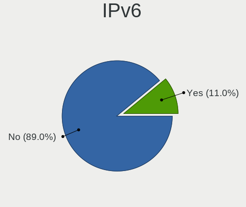

| Used | Notebooks | Percent |
|------|-----------|---------|
| No   | 77        | 81.91%  |
| Yes  | 17        | 18.09%  |

Bluetooth
---------

Bluetooth Vendor
----------------

Controller vendors

| Vendor                          | Notebooks | Percent |
|---------------------------------|-----------|---------|
| Intel                           | 57        | 66.28%  |
| Qualcomm Atheros Communications | 12        | 13.95%  |
| Foxconn / Hon Hai               | 4         | 4.65%   |
| IMC Networks                    | 3         | 3.49%   |
| Realtek Semiconductor           | 2         | 2.33%   |
| Lite-On Technology              | 2         | 2.33%   |
| Broadcom                        | 2         | 2.33%   |
| Apple                           | 2         | 2.33%   |
| Foxconn International           | 1         | 1.16%   |
| Dell                            | 1         | 1.16%   |

Bluetooth Model
---------------

Controller models

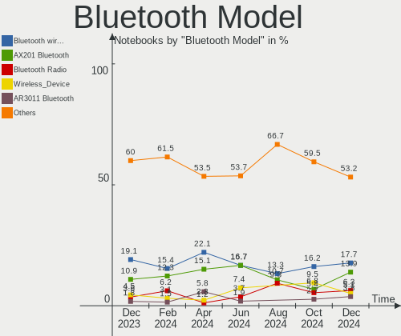

| Model                                             | Notebooks | Percent |
|---------------------------------------------------|-----------|---------|
| Intel Bluetooth Device                            | 14        | 16.28%  |
| Intel AX201 Bluetooth                             | 13        | 15.12%  |
| Intel AX211 Bluetooth                             | 8         | 9.3%    |
| Qualcomm Atheros AR3011 Bluetooth                 | 5         | 5.81%   |
| Intel Bluetooth wireless interface                | 5         | 5.81%   |
| Intel Bluetooth 9460/9560 Jefferson Peak (JfP)    | 5         | 5.81%   |
| Intel AX200 Bluetooth                             | 5         | 5.81%   |
| Qualcomm Atheros  Bluetooth Device                | 4         | 4.65%   |
| Intel Centrino Advanced-N 6230 Bluetooth adapter  | 3         | 3.49%   |
| Realtek Bluetooth Radio                           | 2         | 2.33%   |
| Qualcomm Atheros AR3012 Bluetooth 4.0             | 2         | 2.33%   |
| Intel Centrino Bluetooth Wireless Transceiver     | 2         | 2.33%   |
| Intel AX210 Bluetooth                             | 2         | 2.33%   |
| IMC Networks Wireless_Device                      | 2         | 2.33%   |
| Foxconn / Hon Hai Wireless_Device                 | 2         | 2.33%   |
| Qualcomm Atheros QCA61x4 Bluetooth 4.0            | 1         | 1.16%   |
| Lite-On Broadcom BCM43142A0 Bluetooth Device      | 1         | 1.16%   |
| Lite-On Atheros AR3012 Bluetooth                  | 1         | 1.16%   |
| IMC Networks Bluetooth Radio                      | 1         | 1.16%   |
| Foxconn International BCM43142A0 Bluetooth module | 1         | 1.16%   |
| Foxconn / Hon Hai MediaTek Bluetooth Adapter      | 1         | 1.16%   |
| Foxconn / Hon Hai Bluetooth Device                | 1         | 1.16%   |
| Dell Broadcom BCM20702A0 Bluetooth                | 1         | 1.16%   |
| Broadcom BCM43142 Bluetooth 4.0                   | 1         | 1.16%   |
| Broadcom BCM20702 Bluetooth 4.0 [ThinkPad]        | 1         | 1.16%   |
| Apple Bluetooth USB Host Controller               | 1         | 1.16%   |
| Apple Bluetooth Host Controller                   | 1         | 1.16%   |

Sound
-----

Sound Vendor
------------

Sound card vendors

| Vendor              | Notebooks | Percent |
|---------------------|-----------|---------|
| Intel               | 77        | 59.23%  |
| Nvidia              | 25        | 19.23%  |
| AMD                 | 22        | 16.92%  |
| M-Audio             | 1         | 0.77%   |
| Logitech            | 1         | 0.77%   |
| Lenovo              | 1         | 0.77%   |
| Focusrite-Novation  | 1         | 0.77%   |
| C-Media Electronics | 1         | 0.77%   |
| Unknown             | 1         | 0.77%   |

Sound Model
-----------

Sound card models

| Model                                                                                             | Notebooks | Percent |
|---------------------------------------------------------------------------------------------------|-----------|---------|
| AMD Family 17h/19h HD Audio Controller                                                            | 13        | 8.5%    |
| Intel Sunrise Point-LP HD Audio                                                                   | 12        | 7.84%   |
| Nvidia Audio device                                                                               | 11        | 7.19%   |
| Intel Alder Lake PCH-P High Definition Audio Controller                                           | 8         | 5.23%   |
| Intel 6 Series/C200 Series Chipset Family High Definition Audio Controller                        | 8         | 5.23%   |
| AMD Rembrandt Radeon High Definition Audio Controller                                             | 6         | 3.92%   |
| Intel Tiger Lake-LP Smart Sound Technology Audio Controller                                       | 5         | 3.27%   |
| Nvidia TU116 High Definition Audio Controller                                                     | 4         | 2.61%   |
| Nvidia GF108 High Definition Audio Controller                                                     | 4         | 2.61%   |
| Intel Raptor Lake-P/U/H cAVS                                                                      | 4         | 2.61%   |
| Intel Haswell-ULT HD Audio Controller                                                             | 4         | 2.61%   |
| Intel Cannon Lake PCH cAVS                                                                        | 4         | 2.61%   |
| Intel Atom Processor Z36xxx/Z37xxx Series High Definition Audio Controller                        | 4         | 2.61%   |
| Intel 8 Series HD Audio Controller                                                                | 4         | 2.61%   |
| Intel 7 Series/C216 Chipset Family High Definition Audio Controller                               | 4         | 2.61%   |
| Intel 100 Series/C230 Series Chipset Family HD Audio Controller                                   | 4         | 2.61%   |
| AMD FCH Azalia Controller                                                                         | 4         | 2.61%   |
| Intel 8 Series/C220 Series Chipset High Definition Audio Controller                               | 3         | 1.96%   |
| AMD Renoir Radeon High Definition Audio Controller                                                | 3         | 1.96%   |
| AMD Oland/Hainan/Cape Verde/Pitcairn HDMI Audio [Radeon HD 7000 Series]                           | 3         | 1.96%   |
| Intel Xeon E3-1200 v3/4th Gen Core Processor HD Audio Controller                                  | 2         | 1.31%   |
| Intel Wildcat Point-LP High Definition Audio Controller                                           | 2         | 1.31%   |
| Intel Tiger Lake-H HD Audio Controller                                                            | 2         | 1.31%   |
| Intel Comet Lake PCH-LP cAVS                                                                      | 2         | 1.31%   |
| Intel Comet Lake PCH cAVS                                                                         | 2         | 1.31%   |
| Intel Celeron/Pentium Silver Processor High Definition Audio                                      | 2         | 1.31%   |
| Intel Broadwell-U Audio Controller                                                                | 2         | 1.31%   |
| Intel Atom/Celeron/Pentium Processor x5-E8000/J3xxx/N3xxx Series High Definition Audio Controller | 2         | 1.31%   |
| AMD Raven/Raven2/Fenghuang HDMI/DP Audio Controller                                               | 2         | 1.31%   |
| Nvidia GP107GL High Definition Audio Controller                                                   | 1         | 0.65%   |
| Nvidia GP106 High Definition Audio Controller                                                     | 1         | 0.65%   |
| Nvidia GP104 High Definition Audio Controller                                                     | 1         | 0.65%   |
| Nvidia GM107 High Definition Audio Controller [GeForce 940MX]                                     | 1         | 0.65%   |
| Nvidia GF119 HDMI Audio Controller                                                                | 1         | 0.65%   |
| Nvidia GA106 High Definition Audio Controller                                                     | 1         | 0.65%   |
| M-Audio Keystation 61                                                                             | 1         | 0.65%   |
| Logitech G432 Gaming Headset                                                                      | 1         | 0.65%   |
| Lenovo ThinkPad Thunderbolt 4 Dock USB Audio                                                      | 1         | 0.65%   |
| Intel Raptor Lake High Definition Audio Controller                                                | 1         | 0.65%   |
| Intel CM238 HD Audio Controller                                                                   | 1         | 0.65%   |

Memory
------

Memory Vendor
-------------

Memory module vendors

| Vendor              | Notebooks | Percent |
|---------------------|-----------|---------|
| Samsung Electronics | 20        | 28.17%  |
| SK hynix            | 13        | 18.31%  |
| Kingston            | 10        | 14.08%  |
| Micron Technology   | 7         | 9.86%   |
| Crucial             | 5         | 7.04%   |
| Unknown             | 3         | 4.23%   |
| GOODRAM             | 3         | 4.23%   |
| Ramaxel Technology  | 2         | 2.82%   |
| Unknown             | 2         | 2.82%   |
| Unknown (ABCD)      | 1         | 1.41%   |
| Unknown (0x0E9D)    | 1         | 1.41%   |
| Kllisre             | 1         | 1.41%   |
| Elpida              | 1         | 1.41%   |
| Corsair             | 1         | 1.41%   |
| ChangXin Memory     | 1         | 1.41%   |

Memory Model
------------

Memory module models

| Model                                                              | Notebooks | Percent |
|--------------------------------------------------------------------|-----------|---------|
| SK hynix RAM HMT451S6BFR8A-PB 4GB SODIMM DDR3 1600MT/s             | 2         | 2.5%    |
| SK hynix RAM HMA81GS6AFR8N-UH 8GB SODIMM DDR4 2667MT/s             | 2         | 2.5%    |
| Samsung RAM M471A5244CB0-CWE 4GB Row Of Chips DDR4 3200MT/s        | 2         | 2.5%    |
| Samsung RAM M471A1G44AB0-CWE 8192MB SODIMM DDR4 3200MT/s           | 2         | 2.5%    |
| Unknown                                                            | 2         | 2.5%    |
| Unknown RAM Module 8GB SODIMM DDR3 1333MT/s                        | 1         | 1.25%   |
| Unknown RAM Module 4GB SODIMM DDR3                                 | 1         | 1.25%   |
| Unknown RAM Module 2GB SODIMM DDR3                                 | 1         | 1.25%   |
| Unknown RAM Module 2GB SODIMM DDR2 667MT/s                         | 1         | 1.25%   |
| Unknown (ABCD) RAM 123456789012345678 2GB SODIMM LPDDR4 2400MT/s   | 1         | 1.25%   |
| Unknown (0x0E9D) RAM KINSOTIN16GB2666MHZ 16GB SODIMM DDR4 2667MT/s | 1         | 1.25%   |
| SK hynix RAM Module 8GB SODIMM DDR4 2133MT/s                       | 1         | 1.25%   |
| SK hynix RAM Module 8GB SODIMM DDR3 1600MT/s                       | 1         | 1.25%   |
| SK hynix RAM HMT41GS6BFR8A-PB 8GB SODIMM DDR3 1600MT/s             | 1         | 1.25%   |
| SK hynix RAM HMT351S6BFR8C-H9 4GB SODIMM DDR3 1333MT/s             | 1         | 1.25%   |
| SK hynix RAM HMCG88AEBSA095N 32GB SODIMM DDR5 4800MT/s             | 1         | 1.25%   |
| SK hynix RAM HMAG68EXNSA051N 8GB SODIMM DDR4 3200MT/s              | 1         | 1.25%   |
| SK hynix RAM HMAA1GS6CJR6N-XN 8GB SODIMM DDR4 3200MT/s             | 1         | 1.25%   |
| SK hynix RAM HMA82GS6JJR8N-VK 16GB SODIMM DDR4 2667MT/s            | 1         | 1.25%   |
| SK hynix RAM HMA81GS6CJR8N-VK 8GB SODIMM DDR4 2667MT/s             | 1         | 1.25%   |
| SK hynix RAM 0000000000-00000 8GB SODIMM DDR4 2400MT/s             | 1         | 1.25%   |
| Samsung RAM Module 8GB SODIMM DDR4 2133MT/s                        | 1         | 1.25%   |
| Samsung RAM Module 2GB Row Of Chips LPDDR4 4267MT/s                | 1         | 1.25%   |
| Samsung RAM Module 16GB SODIMM DDR5 5600MT/s                       | 1         | 1.25%   |
| Samsung RAM M471B5773EB0-CK0 2048MB SODIMM DDR3 1600MT/s           | 1         | 1.25%   |
| Samsung RAM M471B5273EB0-CK0 4096MB SODIMM DDR3 4199MT/s           | 1         | 1.25%   |
| Samsung RAM M471B5273DH0-CH9 4GB SODIMM DDR3 1334MT/s              | 1         | 1.25%   |
| Samsung RAM M471B5273CM0-CH9 4GB SODIMM DDR3 1334MT/s              | 1         | 1.25%   |
| Samsung RAM M471B5273CH0-CH9 4GB SODIMM DDR3 1334MT/s              | 1         | 1.25%   |
| Samsung RAM M471B5173EB0-YK0 4GB SODIMM DDR3 1600MT/s              | 1         | 1.25%   |
| Samsung RAM M471B5173BH0-CK0 4GB SODIMM DDR3 1600MT/s              | 1         | 1.25%   |
| Samsung RAM M471A2K43DB1-CTD 16GB SODIMM DDR4 2667MT/s             | 1         | 1.25%   |
| Samsung RAM M471A2K43CB1-CTD 16GB SODIMM DDR4 8400MT/s             | 1         | 1.25%   |
| Samsung RAM M471A2K43CB1-CRC 16GB SODIMM DDR4 2667MT/s             | 1         | 1.25%   |
| Samsung RAM M471A2K43AB1-CTD 16GB SODIMM DDR4 2667MT/s             | 1         | 1.25%   |
| Samsung RAM M471A2G43AB2-CWE 16GB SODIMM DDR4 3200MT/s             | 1         | 1.25%   |
| Samsung RAM M471A1K43EB1-CWE 8GB SODIMM DDR4 3200MT/s              | 1         | 1.25%   |
| Samsung RAM M471A1K43DB1-CWE 8GB SODIMM DDR4 3200MT/s              | 1         | 1.25%   |
| Samsung RAM M471A1K43CB1-CTD 8GB SODIMM DDR4 2667MT/s              | 1         | 1.25%   |
| Samsung RAM M425R4GA3BB0-CWMOL 32GB SODIMM DDR5 5600MT/s           | 1         | 1.25%   |

Memory Kind
-----------

Memory module kinds

| Kind   | Notebooks | Percent |
|--------|-----------|---------|
| DDR4   | 35        | 55.56%  |
| DDR3   | 14        | 22.22%  |
| DDR5   | 8         | 12.7%   |
| LPDDR4 | 3         | 4.76%   |
| SDRAM  | 1         | 1.59%   |
| LPDDR5 | 1         | 1.59%   |
| DDR2   | 1         | 1.59%   |

Memory Form Factor
------------------

Physical design of the memory module

| Name         | Notebooks | Percent |
|--------------|-----------|---------|
| SODIMM       | 58        | 90.63%  |
| Row Of Chips | 6         | 9.38%   |

Memory Size
-----------

Memory module size

| Size  | Notebooks | Percent |
|-------|-----------|---------|
| 8192  | 26        | 37.68%  |
| 4096  | 17        | 24.64%  |
| 16384 | 16        | 23.19%  |
| 32768 | 5         | 7.25%   |
| 2048  | 4         | 5.8%    |
| 1024  | 1         | 1.45%   |

Memory Speed
------------

Memory module speed

| Speed   | Notebooks | Percent |
|---------|-----------|---------|
| 3200    | 15        | 22.06%  |
| 2667    | 14        | 20.59%  |
| 1600    | 8         | 11.76%  |
| 2400    | 6         | 8.82%   |
| 5600    | 5         | 7.35%   |
| 2133    | 4         | 5.88%   |
| 4800    | 3         | 4.41%   |
| 1334    | 3         | 4.41%   |
| 1333    | 3         | 4.41%   |
| 8400    | 1         | 1.47%   |
| 6400    | 1         | 1.47%   |
| 4267    | 1         | 1.47%   |
| 4199    | 1         | 1.47%   |
| 3733    | 1         | 1.47%   |
| 667     | 1         | 1.47%   |
| Unknown | 1         | 1.47%   |

Printers & scanners
-------------------

Printer Vendor
--------------

Printer device vendors

Zero info for selected period =(

Printer Model
-------------

Printer device models

Zero info for selected period =(

Scanner Vendor
--------------

Scanner device vendors

Zero info for selected period =(

Scanner Model
-------------

Scanner device models

Zero info for selected period =(

Camera
------

Camera Vendor
-------------

Camera device vendors

| Vendor                                 | Notebooks | Percent |
|----------------------------------------|-----------|---------|
| Chicony Electronics                    | 21        | 25%     |
| Microdia                               | 8         | 9.52%   |
| Realtek Semiconductor                  | 7         | 8.33%   |
| Quanta                                 | 7         | 8.33%   |
| Sunplus Innovation Technology          | 6         | 7.14%   |
| Lite-On Technology                     | 5         | 5.95%   |
| IMC Networks                           | 5         | 5.95%   |
| Luxvisions Innotech Limited            | 4         | 4.76%   |
| Bison Electronics                      | 4         | 4.76%   |
| Syntek                                 | 3         | 3.57%   |
| Acer                                   | 3         | 3.57%   |
| Suyin                                  | 2         | 2.38%   |
| Sonix Technology                       | 2         | 2.38%   |
| Alcor Micro                            | 2         | 2.38%   |
| TXD                                    | 1         | 1.19%   |
| Silicon Motion                         | 1         | 1.19%   |
| MacroSilicon                           | 1         | 1.19%   |
| Cheng Uei Precision Industry (Foxlink) | 1         | 1.19%   |
| Apple                                  | 1         | 1.19%   |

Camera Model
------------

Camera device models

| Model                                             | Notebooks | Percent |
|---------------------------------------------------|-----------|---------|
| Microdia Integrated_Webcam_HD                     | 6         | 7.06%   |
| Chicony Integrated Camera                         | 6         | 7.06%   |
| Syntek Integrated Camera                          | 3         | 3.53%   |
| Sonix USB2.0 HD UVC WebCam                        | 2         | 2.35%   |
| Realtek EasyCamera                                | 2         | 2.35%   |
| Quanta HP Wide Vision HD Camera                   | 2         | 2.35%   |
| Luxvisions Innotech Limited Integrated Camera     | 2         | 2.35%   |
| Lite-On HP HD Webcam                              | 2         | 2.35%   |
| Lite-On HP HD Camera                              | 2         | 2.35%   |
| IMC Networks Integrated Camera                    | 2         | 2.35%   |
| Chicony Integrated Camera (1280x720@30)           | 2         | 2.35%   |
| Chicony ACER HD User Facing                       | 2         | 2.35%   |
| Bison SunplusIT Integrated Camera                 | 2         | 2.35%   |
| Acer Lenovo EasyCamera                            | 2         | 2.35%   |
| TXD HD Camera                                     | 1         | 1.18%   |
| Suyin Sony Visual Communication Camera            | 1         | 1.18%   |
| Suyin HD WebCam                                   | 1         | 1.18%   |
| Sunplus Laptop_Integrated_Webcam_HD               | 1         | 1.18%   |
| Sunplus Laptop Integrated Webcam HD               | 1         | 1.18%   |
| Sunplus Integrated_Webcam_HD                      | 1         | 1.18%   |
| Sunplus Integrated_Webcam_FHD                     | 1         | 1.18%   |
| Sunplus HesTongCamera                             | 1         | 1.18%   |
| Sunplus ASUS Webcam                               | 1         | 1.18%   |
| Silicon Motion WebCam SC-0311139N                 | 1         | 1.18%   |
| Realtek Lenovo EasyCamera                         | 1         | 1.18%   |
| Realtek Integrated_Webcam_HD                      | 1         | 1.18%   |
| Realtek Integrated Webcam HD                      | 1         | 1.18%   |
| Realtek Integrated Webcam                         | 1         | 1.18%   |
| Realtek Acer 640 x 480 laptop camera              | 1         | 1.18%   |
| Quanta ov9734_techfront_camera                    | 1         | 1.18%   |
| Quanta Laptop_Integrated_Webcam_2HDM              | 1         | 1.18%   |
| Quanta HP HD Camera                               | 1         | 1.18%   |
| Quanta hm1091_techfront                           | 1         | 1.18%   |
| Quanta HD Webcam                                  | 1         | 1.18%   |
| Microdia WebCam SC-13HDL12639P                    | 1         | 1.18%   |
| Microdia Integrated Webcam                        | 1         | 1.18%   |
| MacroSilicon MiraBox Capture                      | 1         | 1.18%   |
| Luxvisions Innotech Limited Integrated RGB Camera | 1         | 1.18%   |
| Luxvisions Innotech Limited HP 5MP Camera         | 1         | 1.18%   |
| Lite-On HP Wide Vision HD Camera                  | 1         | 1.18%   |

Security
--------

Fingerprint Vendor
------------------

Fingerprint sensor vendors

| Vendor                             | Notebooks | Percent |
|------------------------------------|-----------|---------|
| Validity Sensors                   | 7         | 50%     |
| Synaptics                          | 5         | 35.71%  |
| Shenzhen Goodix Technology         | 1         | 7.14%   |
| Realtek USB2.0 Finger Print Bridge | 1         | 7.14%   |

Fingerprint Model
-----------------

Fingerprint sensor models

| Model                                                           | Notebooks | Percent |
|-----------------------------------------------------------------|-----------|---------|
| Validity Sensors Synaptics WBDI                                 | 3         | 21.43%  |
| Validity Sensors VFS495 Fingerprint Reader                      | 2         | 14.29%  |
| Synaptics Metallica MIS Touch Fingerprint Reader                | 2         | 14.29%  |
| Validity Sensors VFS7500 Touch Fingerprint Sensor               | 1         | 7.14%   |
| Validity Sensors Fingerprint scanner                            | 1         | 7.14%   |
| Synaptics WBDI Device                                           | 1         | 7.14%   |
| Synaptics UWP WBDI                                              | 1         | 7.14%   |
| Synaptics FS7604 Touch Fingerprint Sensor with PurePrint        | 1         | 7.14%   |
| Shenzhen Goodix  Fingerprint Device                             | 1         | 7.14%   |
| Realtek USB2.0 Finger Print Bridge FocalTech Fingerprint Device | 1         | 7.14%   |

Chipcard Vendor
---------------

Chipcard module vendors

| Vendor      | Notebooks | Percent |
|-------------|-----------|---------|
| Broadcom    | 5         | 55.56%  |
| Alcor Micro | 3         | 33.33%  |
| Lenovo      | 1         | 11.11%  |

Chipcard Model
--------------

Chipcard module models

| Model                                                                        | Notebooks | Percent |
|------------------------------------------------------------------------------|-----------|---------|
| Broadcom 58200                                                               | 3         | 33.33%  |
| Alcor Micro AU9540 Smartcard Reader                                          | 3         | 33.33%  |
| Lenovo Integrated Smart Card Reader                                          | 1         | 11.11%  |
| Broadcom BCM5880 Secure Applications Processor with fingerprint swipe sensor | 1         | 11.11%  |
| Broadcom BCM5880 Secure Applications Processor                               | 1         | 11.11%  |

Unsupported
-----------

Unsupported Devices
-------------------

Total unsupported devices on board

| Total | Notebooks | Percent |
|-------|-----------|---------|
| 0     | 53        | 56.38%  |
| 1     | 32        | 34.04%  |
| 2     | 8         | 8.51%   |
| 3     | 1         | 1.06%   |

Unsupported Device Types
------------------------

Types of unsupported devices

| Type                     | Notebooks | Percent |
|--------------------------|-----------|---------|
| Graphics card            | 14        | 27.45%  |
| Fingerprint reader       | 12        | 23.53%  |
| Chipcard                 | 9         | 17.65%  |
| Multimedia controller    | 5         | 9.8%    |
| Net/wireless             | 4         | 7.84%   |
| Communication controller | 2         | 3.92%   |
| Camera                   | 2         | 3.92%   |
| Bluetooth                | 2         | 3.92%   |
| Sound                    | 1         | 1.96%   |

