Linux in Poland - Hardware Trends (Notebooks)
---------------------------------------------

A project to identify most popular hardware characteristics and track their change
over time based on data collected by Linux users at https://Linux-Hardware.org.

Anyone can contribute to this report by the [hw-probe](https://github.com/linuxhw/hw-probe) tool:

    sudo -E hw-probe -all -upload

Period: Apr, 2023.

Contents
--------

* [ System ](#system)
  - [ OS                       ](#os)
  - [ OS Family                ](#os-family)
  - [ Kernel                   ](#kernel)
  - [ Kernel Family            ](#kernel-family)
  - [ Kernel Major Ver.        ](#kernel-major-ver)
  - [ Arch                     ](#arch)
  - [ DE                       ](#de)
  - [ Display Server           ](#display-server)
  - [ Display Manager          ](#display-manager)
  - [ OS Lang                  ](#os-lang)
  - [ Boot Mode                ](#boot-mode)
  - [ Filesystem               ](#filesystem)
  - [ Part. scheme             ](#part-scheme)
  - [ Dual Boot with Linux/BSD ](#dual-boot-with-linuxbsd)
  - [ Dual Boot (Win)          ](#dual-boot-win)

* [ Board ](#board)
  - [ Vendor                   ](#vendor)
  - [ Model                    ](#model)
  - [ Model Family             ](#model-family)
  - [ MFG Year                 ](#mfg-year)
  - [ Form Factor              ](#form-factor)
  - [ Secure Boot              ](#secure-boot)
  - [ Coreboot                 ](#coreboot)
  - [ RAM Size                 ](#ram-size)
  - [ RAM Used                 ](#ram-used)
  - [ Total Drives             ](#total-drives)
  - [ Has CD-ROM               ](#has-cd-rom)
  - [ Has Ethernet             ](#has-ethernet)
  - [ Has WiFi                 ](#has-wifi)
  - [ Has Bluetooth            ](#has-bluetooth)

* [ Location ](#location)
  - [ Country                  ](#country)
  - [ City                     ](#city)

* [ Drives ](#drives)
  - [ Drive Vendor             ](#drive-vendor)
  - [ Drive Model              ](#drive-model)
  - [ HDD Vendor               ](#hdd-vendor)
  - [ SSD Vendor               ](#ssd-vendor)
  - [ Drive Kind               ](#drive-kind)
  - [ Drive Connector          ](#drive-connector)
  - [ Drive Size               ](#drive-size)
  - [ Space Total              ](#space-total)
  - [ Space Used               ](#space-used)
  - [ Malfunc. Drives          ](#malfunc-drives)
  - [ Malfunc. Drive Vendor    ](#malfunc-drive-vendor)
  - [ Malfunc. HDD Vendor      ](#malfunc-hdd-vendor)
  - [ Malfunc. Drive Kind      ](#malfunc-drive-kind)
  - [ Failed Drives            ](#failed-drives)
  - [ Failed Drive Vendor      ](#failed-drive-vendor)
  - [ Drive Status             ](#drive-status)

* [ Storage controller ](#storage-controller)
  - [ Storage Vendor           ](#storage-vendor)
  - [ Storage Model            ](#storage-model)
  - [ Storage Kind             ](#storage-kind)

* [ Processor ](#processor)
  - [ CPU Vendor               ](#cpu-vendor)
  - [ CPU Model                ](#cpu-model)
  - [ CPU Model Family         ](#cpu-model-family)
  - [ CPU Cores                ](#cpu-cores)
  - [ CPU Sockets              ](#cpu-sockets)
  - [ CPU Threads              ](#cpu-threads)
  - [ CPU Op-Modes             ](#cpu-op-modes)
  - [ CPU Microcode            ](#cpu-microcode)
  - [ CPU Microarch            ](#cpu-microarch)

* [ Graphics ](#graphics)
  - [ GPU Vendor               ](#gpu-vendor)
  - [ GPU Model                ](#gpu-model)
  - [ GPU Combo                ](#gpu-combo)
  - [ GPU Driver               ](#gpu-driver)
  - [ GPU Memory               ](#gpu-memory)

* [ Monitor ](#monitor)
  - [ Monitor Vendor           ](#monitor-vendor)
  - [ Monitor Model            ](#monitor-model)
  - [ Monitor Resolution       ](#monitor-resolution)
  - [ Monitor Diagonal         ](#monitor-diagonal)
  - [ Monitor Width            ](#monitor-width)
  - [ Aspect Ratio             ](#aspect-ratio)
  - [ Monitor Area             ](#monitor-area)
  - [ Pixel Density            ](#pixel-density)
  - [ Multiple Monitors        ](#multiple-monitors)

* [ Network ](#network)
  - [ Net Controller Vendor    ](#net-controller-vendor)
  - [ Net Controller Model     ](#net-controller-model)
  - [ Wireless Vendor          ](#wireless-vendor)
  - [ Wireless Model           ](#wireless-model)
  - [ Ethernet Vendor          ](#ethernet-vendor)
  - [ Ethernet Model           ](#ethernet-model)
  - [ Net Controller Kind      ](#net-controller-kind)
  - [ Used Controller          ](#used-controller)
  - [ NICs                     ](#nics)
  - [ IPv6                     ](#ipv6)

* [ Bluetooth ](#bluetooth)
  - [ Bluetooth Vendor         ](#bluetooth-vendor)
  - [ Bluetooth Model          ](#bluetooth-model)

* [ Sound ](#sound)
  - [ Sound Vendor             ](#sound-vendor)
  - [ Sound Model              ](#sound-model)

* [ Memory ](#memory)
  - [ Memory Vendor            ](#memory-vendor)
  - [ Memory Model             ](#memory-model)
  - [ Memory Kind              ](#memory-kind)
  - [ Memory Form Factor       ](#memory-form-factor)
  - [ Memory Size              ](#memory-size)
  - [ Memory Speed             ](#memory-speed)

* [ Printers & scanners ](#printers--scanners)
  - [ Printer Vendor           ](#printer-vendor)
  - [ Printer Model            ](#printer-model)
  - [ Scanner Vendor           ](#scanner-vendor)
  - [ Scanner Model            ](#scanner-model)

* [ Camera ](#camera)
  - [ Camera Vendor            ](#camera-vendor)
  - [ Camera Model             ](#camera-model)

* [ Security ](#security)
  - [ Fingerprint Vendor       ](#fingerprint-vendor)
  - [ Fingerprint Model        ](#fingerprint-model)
  - [ Chipcard Vendor          ](#chipcard-vendor)
  - [ Chipcard Model           ](#chipcard-model)

* [ Unsupported ](#unsupported)
  - [ Unsupported Devices      ](#unsupported-devices)
  - [ Unsupported Device Types ](#unsupported-device-types)

System
------

OS
--

Installed operating systems

| Name                         | Notebooks | Percent |
|------------------------------|-----------|---------|
| OpenMandriva 23.03           | 19        | 16.81%  |
| Debian 11                    | 12        | 10.62%  |
| Linux Mint 21.1              | 11        | 9.73%   |
| Ubuntu 22.04                 | 10        | 8.85%   |
| Fedora 38                    | 6         | 5.31%   |
| Pop!_OS 22.04                | 4         | 3.54%   |
| Fedora 37                    | 4         | 3.54%   |
| Ubuntu 22.10                 | 3         | 2.65%   |
| Ubuntu 20.04                 | 3         | 2.65%   |
| OpenMandriva 23.01           | 3         | 2.65%   |
| Manjaro 22.1.0               | 3         | 2.65%   |
| Arch Rolling                 | 3         | 2.65%   |
| Zorin 16                     | 2         | 1.77%   |
| Xubuntu 22.04                | 2         | 1.77%   |
| ROSA R11.1                   | 2         | 1.77%   |
| openSUSE Tumbleweed-XXXXXXXX | 2         | 1.77%   |
| Kubuntu 22.04                | 2         | 1.77%   |
| Kali 2023.1                  | 2         | 1.77%   |
| EndeavourOS Rolling          | 2         | 1.77%   |
| Debian 12                    | 2         | 1.77%   |
| Ubuntu Unity 16.04           | 1         | 0.88%   |
| Ubuntu Budgie 22.04          | 1         | 0.88%   |
| Ubuntu 23.04                 | 1         | 0.88%   |
| SteamOS 3.4.6                | 1         | 0.88%   |
| SteamOS                      | 1         | 0.88%   |
| ROSA 12.4                    | 1         | 0.88%   |
| ROSA 12.1                    | 1         | 0.88%   |
| Rocky Linux 9.1              | 1         | 0.88%   |
| OpenMandriva 4.3             | 1         | 0.88%   |
| MX 21                        | 1         | 0.88%   |
| LMDE 5                       | 1         | 0.88%   |
| Linux Mint 19.1              | 1         | 0.88%   |
| Kubuntu 23.04                | 1         | 0.88%   |
| KDE neon 22.04               | 1         | 0.88%   |
| Garuda Linux Soaring         | 1         | 0.88%   |
| blendOS                      | 1         | 0.88%   |

OS Family
---------

OS without a version

| Name          | Notebooks | Percent |
|---------------|-----------|---------|
| OpenMandriva  | 23        | 20.35%  |
| Ubuntu        | 17        | 15.04%  |
| Debian        | 14        | 12.39%  |
| Linux Mint    | 12        | 10.62%  |
| Fedora        | 10        | 8.85%   |
| ROSA          | 4         | 3.54%   |
| Pop!_OS       | 4         | 3.54%   |
| Manjaro       | 3         | 2.65%   |
| Kubuntu       | 3         | 2.65%   |
| Arch          | 3         | 2.65%   |
| Zorin         | 2         | 1.77%   |
| Xubuntu       | 2         | 1.77%   |
| SteamOS       | 2         | 1.77%   |
| openSUSE      | 2         | 1.77%   |
| Kali          | 2         | 1.77%   |
| EndeavourOS   | 2         | 1.77%   |
| Ubuntu Unity  | 1         | 0.88%   |
| Ubuntu Budgie | 1         | 0.88%   |
| Rocky Linux   | 1         | 0.88%   |
| MX            | 1         | 0.88%   |
| LMDE          | 1         | 0.88%   |
| KDE neon      | 1         | 0.88%   |
| Garuda Linux  | 1         | 0.88%   |
| blendOS       | 1         | 0.88%   |

Kernel
------

Version of the Linux kernel

| Version                           | Notebooks | Percent |
|-----------------------------------|-----------|---------|
| 6.2.6-desktop-1omv2390            | 19        | 16.81%  |
| 6.1.0-0.deb11.5-amd64             | 10        | 8.85%   |
| 5.19.0-38-generic                 | 9         | 7.96%   |
| 5.15.0-69-generic                 | 9         | 7.96%   |
| 5.15.0-56-generic                 | 8         | 7.08%   |
| 6.2.11-300.fc38.x86_64            | 6         | 5.31%   |
| 5.19.0-40-generic                 | 4         | 3.54%   |
| 6.2.6-76060206-generic            | 3         | 2.65%   |
| 6.1.1-desktop-1omv2290            | 3         | 2.65%   |
| 6.2.12-arch1-1                    | 2         | 1.77%   |
| 6.1.0-7-amd64                     | 2         | 1.77%   |
| 5.10.0-21-amd64                   | 2         | 1.77%   |
| 6.2.9-zen1-1-zen                  | 1         | 0.88%   |
| 6.2.9-200.fc37.x86_64             | 1         | 0.88%   |
| 6.2.9-1-default                   | 1         | 0.88%   |
| 6.2.8-200.fc37.x86_64             | 1         | 0.88%   |
| 6.2.8-1-MANJARO                   | 1         | 0.88%   |
| 6.2.13-zen-1-zen                  | 1         | 0.88%   |
| 6.2.13-arch1-1                    | 1         | 0.88%   |
| 6.2.12-1.el9.elrepo.x86_64        | 1         | 0.88%   |
| 6.2.11-arch1-1                    | 1         | 0.88%   |
| 6.2.11-060211-generic             | 1         | 0.88%   |
| 6.2.10-arch1-1                    | 1         | 0.88%   |
| 6.2.10-200.fc37.x86_64            | 1         | 0.88%   |
| 6.2.10-1-default                  | 1         | 0.88%   |
| 6.2.10-060210-generic             | 1         | 0.88%   |
| 6.2.0-76060200-generic            | 1         | 0.88%   |
| 6.2.0-20-generic                  | 1         | 0.88%   |
| 6.1.22-1-MANJARO                  | 1         | 0.88%   |
| 6.1.20-generic-2rosa2021.1-x86_64 | 1         | 0.88%   |
| 6.1.18-200.fc37.x86_64            | 1         | 0.88%   |
| 6.1.0-kali5-amd64                 | 1         | 0.88%   |
| 6.1.0-4mx-amd64                   | 1         | 0.88%   |
| 6.0.12                            | 1         | 0.88%   |
| 6.0.0-kali6-amd64                 | 1         | 0.88%   |
| 5.4.32-generic-2rosa-x86_64       | 1         | 0.88%   |
| 5.4.0-147-generic                 | 1         | 0.88%   |
| 5.19.0-35-generic                 | 1         | 0.88%   |
| 5.16.13-desktop-1omv4003          | 1         | 0.88%   |
| 5.15.93-1-lts                     | 1         | 0.88%   |

Kernel Family
-------------

Linux kernel without a distro release

| Version  | Notebooks | Percent |
|----------|-----------|---------|
| 6.2.6    | 22        | 19.47%  |
| 5.15.0   | 19        | 16.81%  |
| 6.1.0    | 14        | 12.39%  |
| 5.19.0   | 14        | 12.39%  |
| 6.2.11   | 8         | 7.08%   |
| 6.2.10   | 4         | 3.54%   |
| 6.2.9    | 3         | 2.65%   |
| 6.2.12   | 3         | 2.65%   |
| 6.1.1    | 3         | 2.65%   |
| 6.2.8    | 2         | 1.77%   |
| 6.2.13   | 2         | 1.77%   |
| 6.2.0    | 2         | 1.77%   |
| 5.10.0   | 2         | 1.77%   |
| 4.15.0   | 2         | 1.77%   |
| 6.1.22   | 1         | 0.88%   |
| 6.1.20   | 1         | 0.88%   |
| 6.1.18   | 1         | 0.88%   |
| 6.0.12   | 1         | 0.88%   |
| 6.0.0    | 1         | 0.88%   |
| 5.4.32   | 1         | 0.88%   |
| 5.4.0    | 1         | 0.88%   |
| 5.16.13  | 1         | 0.88%   |
| 5.15.93  | 1         | 0.88%   |
| 5.14.0   | 1         | 0.88%   |
| 5.13.0   | 1         | 0.88%   |
| 5.10.74  | 1         | 0.88%   |
| 5.10.178 | 1         | 0.88%   |

Kernel Major Ver.
-----------------

Linux kernel major version

| Version | Notebooks | Percent |
|---------|-----------|---------|
| 6.2     | 46        | 40.71%  |
| 6.1     | 20        | 17.7%   |
| 5.15    | 20        | 17.7%   |
| 5.19    | 14        | 12.39%  |
| 5.10    | 4         | 3.54%   |
| 6.0     | 2         | 1.77%   |
| 5.4     | 2         | 1.77%   |
| 4.15    | 2         | 1.77%   |
| 5.16    | 1         | 0.88%   |
| 5.14    | 1         | 0.88%   |
| 5.13    | 1         | 0.88%   |

Arch
----

OS architecture (x86_64, i586, etc.)

| Name   | Notebooks | Percent |
|--------|-----------|---------|
| x86_64 | 111       | 98.23%  |
| i686   | 2         | 1.77%   |

DE
--

Desktop Environment

| Name            | Notebooks | Percent |
|-----------------|-----------|---------|
| KDE5            | 43        | 38.05%  |
| GNOME           | 38        | 33.63%  |
| XFCE            | 13        | 11.5%   |
| MATE            | 7         | 6.19%   |
| X-Cinnamon      | 4         | 3.54%   |
| LXQt            | 2         | 1.77%   |
| Unity           | 1         | 0.88%   |
| ratflow         | 1         | 0.88%   |
| KDE4            | 1         | 0.88%   |
| i3              | 1         | 0.88%   |
| GNOME Flashback | 1         | 0.88%   |
| Budgie          | 1         | 0.88%   |

Display Server
--------------

X11 or Wayland

| Name        | Notebooks | Percent |
|-------------|-----------|---------|
| X11         | 91        | 80.53%  |
| Wayland     | 21        | 18.58%  |
| Unspecified | 1         | 0.88%   |

Display Manager
---------------

SDDM, LightDM, etc.

| Name    | Notebooks | Percent |
|---------|-----------|---------|
| SDDM    | 39        | 34.51%  |
| Unknown | 22        | 19.47%  |
| LightDM | 21        | 18.58%  |
| GDM3    | 18        | 15.93%  |
| GDM     | 11        | 9.73%   |
| SU      | 1         | 0.88%   |
| KDM     | 1         | 0.88%   |

OS Lang
-------

Language

| Lang  | Notebooks | Percent |
|-------|-----------|---------|
| pl_PL | 63        | 55.75%  |
| en_US | 32        | 28.32%  |
| C     | 8         | 7.08%   |
| en_GB | 4         | 3.54%   |
| uk_UA | 2         | 1.77%   |
| ru_UA | 1         | 0.88%   |
| ru_RU | 1         | 0.88%   |
| en_IE | 1         | 0.88%   |
| de_DE | 1         | 0.88%   |

Boot Mode
---------

EFI or BIOS

| Mode | Notebooks | Percent |
|------|-----------|---------|
| EFI  | 69        | 61.06%  |
| BIOS | 44        | 38.94%  |

Filesystem
----------

Type of filesystem

| Type    | Notebooks | Percent |
|---------|-----------|---------|
| Ext4    | 73        | 64.6%   |
| Overlay | 18        | 15.93%  |
| Btrfs   | 18        | 15.93%  |
| Tmpfs   | 2         | 1.77%   |
| Xfs     | 1         | 0.88%   |
| F2fs    | 1         | 0.88%   |

Part. scheme
------------

Scheme of partitioning

| Type    | Notebooks | Percent |
|---------|-----------|---------|
| GPT     | 77        | 68.14%  |
| Unknown | 22        | 19.47%  |
| MBR     | 14        | 12.39%  |

Dual Boot with Linux/BSD
------------------------

Hosting more than one Linux/BSD

| Dual boot | Notebooks | Percent |
|-----------|-----------|---------|
| No        | 94        | 83.19%  |
| Yes       | 19        | 16.81%  |

Dual Boot (Win)
---------------

Hosting Linux and Windows

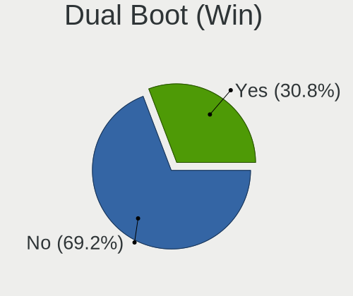

| Dual boot | Notebooks | Percent |
|-----------|-----------|---------|
| No        | 74        | 65.49%  |
| Yes       | 39        | 34.51%  |

Board
-----

Vendor
------

Motherboard manufacturer

| Name                | Notebooks | Percent |
|---------------------|-----------|---------|
| Lenovo              | 30        | 26.55%  |
| Hewlett-Packard     | 23        | 20.35%  |
| Dell                | 20        | 17.7%   |
| ASUSTek Computer    | 10        | 8.85%   |
| Acer                | 9         | 7.96%   |
| Samsung Electronics | 5         | 4.42%   |
| Toshiba             | 3         | 2.65%   |
| MSI                 | 2         | 1.77%   |
| Gigabyte Technology | 2         | 1.77%   |
| Valve               | 1         | 0.88%   |
| Timi                | 1         | 0.88%   |
| Medion              | 1         | 0.88%   |
| Kruger&Matz         | 1         | 0.88%   |
| Kiano               | 1         | 0.88%   |
| HUAWEI              | 1         | 0.88%   |
| Google              | 1         | 0.88%   |
| Fujitsu Siemens     | 1         | 0.88%   |
| eMachines           | 1         | 0.88%   |

Model
-----

Motherboard model

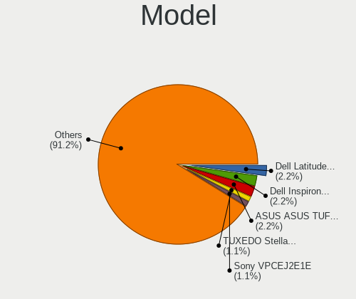

| Name                                        | Notebooks | Percent |
|---------------------------------------------|-----------|---------|
| HP Pavilion Gaming Laptop 15-ec2xxx         | 4         | 3.54%   |
| HP Pavilion Gaming Laptop 15-ec1xxx         | 3         | 2.65%   |
| Lenovo Legion 5 Pro 16ACH6 82JS             | 2         | 1.77%   |
| HP Laptop 15-db1xxx                         | 2         | 1.77%   |
| Dell Inspiron 5559                          | 2         | 1.77%   |
| ASUS ROG Strix G513QY_G513QY                | 2         | 1.77%   |
| Valve Jupiter                               | 1         | 0.88%   |
| Toshiba Satellite L750D                     | 1         | 0.88%   |
| Toshiba Satellite C855-12N                  | 1         | 0.88%   |
| Toshiba Satellite C50-A                     | 1         | 0.88%   |
| Timi Redmi Book Pro 15 2022                 | 1         | 0.88%   |
| Samsung R510/P510                           | 1         | 0.88%   |
| Samsung 730U3E/740U3E                       | 1         | 0.88%   |
| Samsung 400B4C/400B5C/200B4C/200B5C         | 1         | 0.88%   |
| Samsung 350V5C/351V5C/3540VC/3440VC         | 1         | 0.88%   |
| Samsung 300E4A/300E5A/300E7A                | 1         | 0.88%   |
| MSI GP76 Leopard 10UE                       | 1         | 0.88%   |
| MSI Creator Z17 A12UHST                     | 1         | 0.88%   |
| Medion X681X                                | 1         | 0.88%   |
| Lenovo Z51-70 80K6                          | 1         | 0.88%   |
| Lenovo Y50-70 20378                         | 1         | 0.88%   |
| Lenovo ThinkPad X220 4291LR6                | 1         | 0.88%   |
| Lenovo ThinkPad X220 4291AY8                | 1         | 0.88%   |
| Lenovo ThinkPad X200 7459KM3                | 1         | 0.88%   |
| Lenovo ThinkPad X1 Carbon Gen 10 21CCS72200 | 1         | 0.88%   |
| Lenovo ThinkPad X1 Carbon 3460CLG           | 1         | 0.88%   |
| Lenovo ThinkPad T480s 20L8SF1X00            | 1         | 0.88%   |
| Lenovo ThinkPad T480 20L5S12H00             | 1         | 0.88%   |
| Lenovo ThinkPad T470 20HES0FA03             | 1         | 0.88%   |
| Lenovo ThinkPad T450 20BUS0QT04             | 1         | 0.88%   |
| Lenovo ThinkPad T430 2349HNU                | 1         | 0.88%   |
| Lenovo ThinkPad E15 Gen 4 21E600DWPB        | 1         | 0.88%   |
| Lenovo ThinkPad E15 Gen 2 20TD00GSPB        | 1         | 0.88%   |
| Lenovo ThinkPad E14 Gen 4 21E300ESPB        | 1         | 0.88%   |
| Lenovo ThinkPad E14 Gen 2 20T6000TPB        | 1         | 0.88%   |
| Lenovo ThinkBook 15 G3 ACL 21A4             | 1         | 0.88%   |
| Lenovo Legion Y530-15ICH 81FV               | 1         | 0.88%   |
| Lenovo Legion 5 15IAH7 82RC                 | 1         | 0.88%   |
| Lenovo IdeaPad Z570 HuronRiver Platform     | 1         | 0.88%   |
| Lenovo IdeaPad S540-14IWL 81ND              | 1         | 0.88%   |

Model Family
------------

Motherboard model prefix

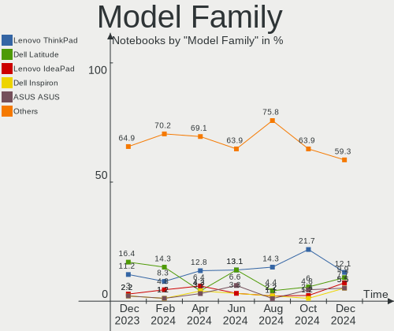

| Name               | Notebooks | Percent |
|--------------------|-----------|---------|
| Lenovo ThinkPad    | 14        | 12.39%  |
| Dell Latitude      | 9         | 7.96%   |
| HP Pavilion        | 8         | 7.08%   |
| Acer Aspire        | 6         | 5.31%   |
| Dell Inspiron      | 5         | 4.42%   |
| Lenovo Legion      | 4         | 3.54%   |
| Lenovo IdeaPad     | 4         | 3.54%   |
| HP EliteBook       | 4         | 3.54%   |
| ASUS ASUS          | 4         | 3.54%   |
| Toshiba Satellite  | 3         | 2.65%   |
| HP ProBook         | 3         | 2.65%   |
| HP Laptop          | 3         | 2.65%   |
| Dell Precision     | 3         | 2.65%   |
| HP 255             | 2         | 1.77%   |
| ASUS ROG           | 2         | 1.77%   |
| Valve Jupiter      | 1         | 0.88%   |
| Timi Redmi         | 1         | 0.88%   |
| Samsung R510       | 1         | 0.88%   |
| Samsung 730U3E     | 1         | 0.88%   |
| Samsung 400B4C     | 1         | 0.88%   |
| Samsung 350V5C     | 1         | 0.88%   |
| Samsung 300E4A     | 1         | 0.88%   |
| MSI GP76           | 1         | 0.88%   |
| MSI Creator        | 1         | 0.88%   |
| Medion X681X       | 1         | 0.88%   |
| Lenovo Z51-70      | 1         | 0.88%   |
| Lenovo Y50-70      | 1         | 0.88%   |
| Lenovo ThinkBook   | 1         | 0.88%   |
| Lenovo G700        | 1         | 0.88%   |
| Lenovo G560        | 1         | 0.88%   |
| Lenovo G50-80      | 1         | 0.88%   |
| Lenovo G50-70      | 1         | 0.88%   |
| Lenovo B50-80      | 1         | 0.88%   |
| Kruger&Matz KM1406 | 1         | 0.88%   |
| Kiano Elegance     | 1         | 0.88%   |
| HUAWEI HVY-WXX9    | 1         | 0.88%   |
| HP Stream          | 1         | 0.88%   |
| HP Compaq          | 1         | 0.88%   |
| HP 620             | 1         | 0.88%   |
| Google Cyan        | 1         | 0.88%   |

MFG Year
--------

Motherboard manufacture year

| Year | Notebooks | Percent |
|------|-----------|---------|
| 2021 | 14        | 12.39%  |
| 2022 | 13        | 11.5%   |
| 2020 | 13        | 11.5%   |
| 2012 | 9         | 7.96%   |
| 2011 | 9         | 7.96%   |
| 2019 | 8         | 7.08%   |
| 2015 | 8         | 7.08%   |
| 2013 | 8         | 7.08%   |
| 2018 | 6         | 5.31%   |
| 2009 | 5         | 4.42%   |
| 2017 | 4         | 3.54%   |
| 2016 | 3         | 2.65%   |
| 2010 | 3         | 2.65%   |
| 2008 | 3         | 2.65%   |
| 2006 | 3         | 2.65%   |
| 2014 | 2         | 1.77%   |
| 2023 | 1         | 0.88%   |
| 2007 | 1         | 0.88%   |

Form Factor
-----------

Physical design of the computer

| Name     | Notebooks | Percent |
|----------|-----------|---------|
| Notebook | 113       | 100%    |

Secure Boot
-----------

Enabled or disabled

| State    | Notebooks | Percent |
|----------|-----------|---------|
| Disabled | 104       | 92.04%  |
| Enabled  | 9         | 7.96%   |

Coreboot
--------

Have coreboot on board

| Used | Notebooks | Percent |
|------|-----------|---------|
| No   | 112       | 99.12%  |
| Yes  | 1         | 0.88%   |

RAM Size
--------

Total RAM memory

| Size in GB  | Notebooks | Percent |
|-------------|-----------|---------|
| 4.01-8.0    | 32        | 28.32%  |
| 16.01-24.0  | 19        | 16.81%  |
| 3.01-4.0    | 18        | 15.93%  |
| 8.01-16.0   | 15        | 13.27%  |
| 32.01-64.0  | 14        | 12.39%  |
| 64.01-256.0 | 6         | 5.31%   |
| 24.01-32.0  | 4         | 3.54%   |
| 2.01-3.0    | 2         | 1.77%   |
| 1.01-2.0    | 2         | 1.77%   |
| 0.51-1.0    | 1         | 0.88%   |

RAM Used
--------

Used RAM memory

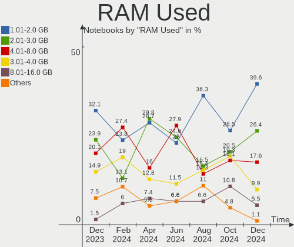

| Used GB    | Notebooks | Percent |
|------------|-----------|---------|
| 4.01-8.0   | 35        | 30.97%  |
| 1.01-2.0   | 33        | 29.2%   |
| 2.01-3.0   | 15        | 13.27%  |
| 3.01-4.0   | 13        | 11.5%   |
| 0.51-1.0   | 10        | 8.85%   |
| 8.01-16.0  | 5         | 4.42%   |
| 16.01-24.0 | 2         | 1.77%   |

Total Drives
------------

Number of drives on board

| Drives | Notebooks | Percent |
|--------|-----------|---------|
| 1      | 83        | 73.45%  |
| 2      | 26        | 23.01%  |
| 3      | 4         | 3.54%   |

Has CD-ROM
----------

Has CD-ROM on board

| Presented | Notebooks | Percent |
|-----------|-----------|---------|
| No        | 81        | 71.68%  |
| Yes       | 32        | 28.32%  |

Has Ethernet
------------

Has Ethernet on board

| Presented | Notebooks | Percent |
|-----------|-----------|---------|
| Yes       | 96        | 84.96%  |
| No        | 17        | 15.04%  |

Has WiFi
--------

Has WiFi module

| Presented | Notebooks | Percent |
|-----------|-----------|---------|
| Yes       | 113       | 100%    |

Has Bluetooth
-------------

Has Bluetooth module

| Presented | Notebooks | Percent |
|-----------|-----------|---------|
| Yes       | 95        | 84.07%  |
| No        | 18        | 15.93%  |

Location
--------

Country
-------

Geographic location (country)

| Country | Notebooks | Percent |
|---------|-----------|---------|
| Poland  | 113       | 100%    |

City
----

Geographic location (city)

| City                 | Notebooks | Percent |
|----------------------|-----------|---------|
| Warsaw               | 27        | 23.89%  |
| Poznan               | 12        | 10.62%  |
| Chorzele             | 9         | 7.96%   |
| Wroclaw              | 7         | 6.19%   |
| Lodz                 | 6         | 5.31%   |
| Krakow               | 6         | 5.31%   |
| Gdansk               | 4         | 3.54%   |
| Zabrze               | 2         | 1.77%   |
| Sosnowiec            | 2         | 1.77%   |
| Opole                | 2         | 1.77%   |
| Lublin               | 2         | 1.77%   |
| Kutno                | 2         | 1.77%   |
| Zgorzelec            | 1         | 0.88%   |
| Wloszczowa           | 1         | 0.88%   |
| Wadowice             | 1         | 0.88%   |
| Torun                | 1         | 0.88%   |
| Tarnówka            | 1         | 0.88%   |
| Szczecin             | 1         | 0.88%   |
| Smolec               | 1         | 0.88%   |
| Rzeszów             | 1         | 0.88%   |
| Rybnik               | 1         | 0.88%   |
| Ruda Śląska        | 1         | 0.88%   |
| Radwanice            | 1         | 0.88%   |
| Radom                | 1         | 0.88%   |
| Płock               | 1         | 0.88%   |
| Praga Północ       | 1         | 0.88%   |
| Piotrkow Trybunalski | 1         | 0.88%   |
| Piaseczno            | 1         | 0.88%   |
| Nowy Staw            | 1         | 0.88%   |
| Mszczonów           | 1         | 0.88%   |
| Lutynia              | 1         | 0.88%   |
| Lomianki             | 1         | 0.88%   |
| Kielce               | 1         | 0.88%   |
| Katowice             | 1         | 0.88%   |
| Kartuzy              | 1         | 0.88%   |
| Kamienna Gora        | 1         | 0.88%   |
| Hyżne               | 1         | 0.88%   |
| Gliwice              | 1         | 0.88%   |
| Gdynia               | 1         | 0.88%   |
| Elblag               | 1         | 0.88%   |

Drives
------

Drive Vendor
------------

Hard drive vendors

| Vendor                       | Notebooks | Drives | Percent |
|------------------------------|-----------|--------|---------|
| Samsung Electronics          | 22        | 22     | 15.71%  |
| Intel                        | 11        | 11     | 7.86%   |
| WDC                          | 9         | 9      | 6.43%   |
| Seagate                      | 9         | 9      | 6.43%   |
| Toshiba                      | 8         | 8      | 5.71%   |
| SK hynix                     | 8         | 8      | 5.71%   |
| GOODRAM                      | 7         | 7      | 5%      |
| Unknown                      | 6         | 7      | 4.29%   |
| Micron Technology            | 5         | 5      | 3.57%   |
| A-DATA Technology            | 5         | 5      | 3.57%   |
| SanDisk                      | 4         | 4      | 2.86%   |
| Phison Electronics           | 4         | 4      | 2.86%   |
| Kingston                     | 4         | 5      | 2.86%   |
| Hitachi                      | 4         | 4      | 2.86%   |
| Crucial                      | 4         | 4      | 2.86%   |
| Patriot                      | 3         | 3      | 2.14%   |
| KIOXIA                       | 3         | 3      | 2.14%   |
| SPCC                         | 2         | 2      | 1.43%   |
| Silicon Motion               | 2         | 2      | 1.43%   |
| Shenzhen Longsys Electronics | 2         | 2      | 1.43%   |
| PNY                          | 2         | 2      | 1.43%   |
| Micron/Crucial Technology    | 2         | 2      | 1.43%   |
| ADATA Technology             | 2         | 2      | 1.43%   |
| Verbatim                     | 1         | 1      | 0.71%   |
| Transcend                    | 1         | 1      | 0.71%   |
| POLION                       | 1         | 1      | 0.71%   |
| Phison                       | 1         | 1      | 0.71%   |
| LITEON                       | 1         | 1      | 0.71%   |
| Lexar                        | 1         | 1      | 0.71%   |
| Kingchuxing                  | 1         | 2      | 0.71%   |
| HGST                         | 1         | 1      | 0.71%   |
| Gigabyte Technology          | 1         | 1      | 0.71%   |
| Fujitsu                      | 1         | 1      | 0.71%   |
| Biostar                      | 1         | 1      | 0.71%   |
| ADplus                       | 1         | 1      | 0.71%   |

Drive Model
-----------

Hard drive models

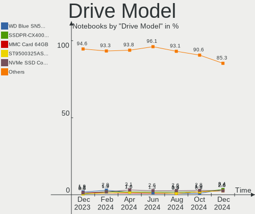

| Model                                                             | Notebooks | Percent |
|-------------------------------------------------------------------|-----------|---------|
| SK hynix PC711 HFS512GDE9X073N 512GB                              | 4         | 2.8%    |
| Intel SSDPEKNW512G8H 512GB                                        | 4         | 2.8%    |
| Unknown MMC Card  32GB                                            | 3         | 2.1%    |
| Samsung SSD 980 1TB                                               | 3         | 2.1%    |
| Intel SSDPEKNU512GZ 512GB                                         | 3         | 2.1%    |
| A-DATA SU650 256GB SSD                                            | 3         | 2.1%    |
| WDC WDS240G2G0B-00EPW0 240GB SSD                                  | 2         | 1.4%    |
| Unknown MMC Card  64GB                                            | 2         | 1.4%    |
| Unknown MMC Card  512GB                                           | 2         | 1.4%    |
| Toshiba MQ04ABF100 1TB                                            | 2         | 1.4%    |
| Samsung SSD 980 500GB                                             | 2         | 1.4%    |
| Samsung SSD 850 EVO 250GB                                         | 2         | 1.4%    |
| Samsung NVMe SSD Controller SM981/PM981/PM983 1TB                 | 2         | 1.4%    |
| Phison PS5013 E13 NVMe Controller 500GB                           | 2         | 1.4%    |
| KIOXIA KBG50ZNV512G 512GB                                         | 2         | 1.4%    |
| Hitachi HTS545050B9A300 500GB                                     | 2         | 1.4%    |
| GOODRAM SSDPR-CL100-120-G3 120GB                                  | 2         | 1.4%    |
| ADATA XPG SX8200 Pro PCIe Gen3x4 M.2 2280 Solid State Drive 512GB | 2         | 1.4%    |
| WDC WDS500G2B0A-00SM50 500GB SSD                                  | 1         | 0.7%    |
| WDC WD7500BPKT-00PK4T0 752GB                                      | 1         | 0.7%    |
| WDC WD3200LPVX-22V0TT0 320GB                                      | 1         | 0.7%    |
| WDC WD10SPZX-24Z10T0 1TB                                          | 1         | 0.7%    |
| WDC PC SN730 SDBPNTY-256G-1006 256GB                              | 1         | 0.7%    |
| WDC PC SN720 SDAQNTW-512G-1001 512GB                              | 1         | 0.7%    |
| WDC PC SN530 SDBPNPZ-512G-1006 512GB                              | 1         | 0.7%    |
| Verbatim Vi550 S3 SSD 128GB                                       | 1         | 0.7%    |
| Transcend TS240GMTS420S 240GB SSD                                 | 1         | 0.7%    |
| Toshiba MQ02ABD100H 1TB                                           | 1         | 0.7%    |
| Toshiba MQ01ABF050 500GB                                          | 1         | 0.7%    |
| Toshiba MQ01ABD100 1TB                                            | 1         | 0.7%    |
| Toshiba MQ01ABD050 500GB                                          | 1         | 0.7%    |
| Toshiba MK6475GSX 640GB                                           | 1         | 0.7%    |
| Toshiba MK1234GSX 120GB                                           | 1         | 0.7%    |
| SPCC Solid State Disk 128GB                                       | 1         | 0.7%    |
| SPCC Solid State Disk 120GB                                       | 1         | 0.7%    |
| SK hynix SH920 2.5 7MM 512GB SSD                                  | 1         | 0.7%    |
| SK hynix SC401 SATA 256GB SSD                                     | 1         | 0.7%    |
| SK hynix BC711 HFM256GD3JX013N 256GB                              | 1         | 0.7%    |
| SK hynix BC511 HFM512GDJTNI-82A0A 512GB                           | 1         | 0.7%    |
| Silicon Motion SM2263EN/SM2263XT SSD Controller 1024GB            | 1         | 0.7%    |

HDD Vendor
----------

Hard disk drive vendors

| Vendor  | Notebooks | Drives | Percent |
|---------|-----------|--------|---------|
| Seagate | 9         | 9      | 34.62%  |
| Toshiba | 8         | 8      | 30.77%  |
| Hitachi | 4         | 4      | 15.38%  |
| WDC     | 3         | 3      | 11.54%  |
| HGST    | 1         | 1      | 3.85%   |
| Fujitsu | 1         | 1      | 3.85%   |

SSD Vendor
----------

Solid state drive vendors

| Vendor              | Notebooks | Drives | Percent |
|---------------------|-----------|--------|---------|
| Samsung Electronics | 8         | 8      | 16.67%  |
| GOODRAM             | 7         | 7      | 14.58%  |
| A-DATA Technology   | 5         | 5      | 10.42%  |
| Crucial             | 4         | 4      | 8.33%   |
| WDC                 | 3         | 3      | 6.25%   |
| Patriot             | 3         | 3      | 6.25%   |
| SPCC                | 2         | 2      | 4.17%   |
| SK hynix            | 2         | 2      | 4.17%   |
| PNY                 | 2         | 2      | 4.17%   |
| Micron Technology   | 2         | 2      | 4.17%   |
| Intel               | 2         | 2      | 4.17%   |
| Verbatim            | 1         | 1      | 2.08%   |
| Transcend           | 1         | 1      | 2.08%   |
| POLION              | 1         | 1      | 2.08%   |
| Phison              | 1         | 1      | 2.08%   |
| LITEON              | 1         | 1      | 2.08%   |
| Kingston            | 1         | 1      | 2.08%   |
| Kingchuxing         | 1         | 1      | 2.08%   |
| Biostar             | 1         | 1      | 2.08%   |

Drive Kind
----------

HDD or SSD

| Kind    | Notebooks | Drives | Percent |
|---------|-----------|--------|---------|
| NVMe    | 51        | 59     | 39.23%  |
| SSD     | 45        | 48     | 34.62%  |
| HDD     | 25        | 26     | 19.23%  |
| MMC     | 7         | 8      | 5.38%   |
| Unknown | 2         | 2      | 1.54%   |

Drive Connector
---------------

SATA, SAS, NVMe, etc.

| Type | Notebooks | Drives | Percent |
|------|-----------|--------|---------|
| SATA | 62        | 72     | 50%     |
| NVMe | 51        | 59     | 41.13%  |
| MMC  | 7         | 8      | 5.65%   |
| SAS  | 4         | 4      | 3.23%   |

Drive Size
----------

Size of hard drive

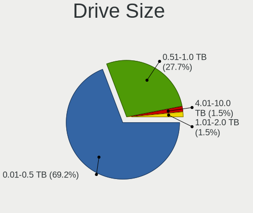

| Size in TB | Notebooks | Drives | Percent |
|------------|-----------|--------|---------|
| 0.01-0.5   | 53        | 57     | 75.71%  |
| 0.51-1.0   | 15        | 15     | 21.43%  |
| 3.01-4.0   | 1         | 1      | 1.43%   |
| 1.01-2.0   | 1         | 1      | 1.43%   |

Space Total
-----------

Amount of disk space available on the file system

| Size in GB     | Notebooks | Percent |
|----------------|-----------|---------|
| 101-250        | 32        | 28.32%  |
| 251-500        | 19        | 16.81%  |
| 501-1000       | 18        | 15.93%  |
| 51-100         | 15        | 13.27%  |
| 1-20           | 13        | 11.5%   |
| 1001-2000      | 5         | 4.42%   |
| 2001-3000      | 4         | 3.54%   |
| Unknown        | 3         | 2.65%   |
| More than 3000 | 2         | 1.77%   |
| 21-50          | 2         | 1.77%   |

Space Used
----------

Amount of used disk space

| Used GB        | Notebooks | Percent |
|----------------|-----------|---------|
| 1-20           | 43        | 38.05%  |
| 101-250        | 21        | 18.58%  |
| 21-50          | 15        | 13.27%  |
| 51-100         | 14        | 12.39%  |
| 251-500        | 6         | 5.31%   |
| 501-1000       | 6         | 5.31%   |
| 1001-2000      | 4         | 3.54%   |
| Unknown        | 3         | 2.65%   |
| More than 3000 | 1         | 0.88%   |

Malfunc. Drives
---------------

Drive models with a malfunction

| Model                                | Notebooks | Drives | Percent |
|--------------------------------------|-----------|--------|---------|
| SK hynix PC711 HFS512GDE9X073N 512GB | 4         | 4      | 36.36%  |
| WDC WD3200LPVX-22V0TT0 320GB         | 1         | 1      | 9.09%   |
| SK hynix SH920 2.5 7MM 512GB SSD     | 1         | 1      | 9.09%   |
| SK hynix SC401 SATA 256GB SSD        | 1         | 1      | 9.09%   |
| SK hynix BC711 HFM256GD3JX013N 256GB | 1         | 1      | 9.09%   |
| Seagate ST1000LM014-1EJ164 1TB       | 1         | 1      | 9.09%   |
| Hitachi HTS547575A9E384 752GB        | 1         | 1      | 9.09%   |
| Crucial CT1000MX500SSD4 1TB          | 1         | 1      | 9.09%   |

Malfunc. Drive Vendor
---------------------

Vendors of faulty drives

| Vendor   | Notebooks | Drives | Percent |
|----------|-----------|--------|---------|
| SK hynix | 7         | 7      | 63.64%  |
| WDC      | 1         | 1      | 9.09%   |
| Seagate  | 1         | 1      | 9.09%   |
| Hitachi  | 1         | 1      | 9.09%   |
| Crucial  | 1         | 1      | 9.09%   |

Malfunc. HDD Vendor
-------------------

Vendors of faulty HDD drives

| Vendor  | Notebooks | Drives | Percent |
|---------|-----------|--------|---------|
| WDC     | 1         | 1      | 33.33%  |
| Seagate | 1         | 1      | 33.33%  |
| Hitachi | 1         | 1      | 33.33%  |

Malfunc. Drive Kind
-------------------

Kinds of faulty drives

| Kind | Notebooks | Drives | Percent |
|------|-----------|--------|---------|
| NVMe | 5         | 5      | 45.45%  |
| SSD  | 3         | 3      | 27.27%  |
| HDD  | 3         | 3      | 27.27%  |

Failed Drives
-------------

Failed drive models

Zero info for selected period =(

Failed Drive Vendor
-------------------

Failed drive vendors

Zero info for selected period =(

Drive Status
------------

Number of failed and malfunc. drives

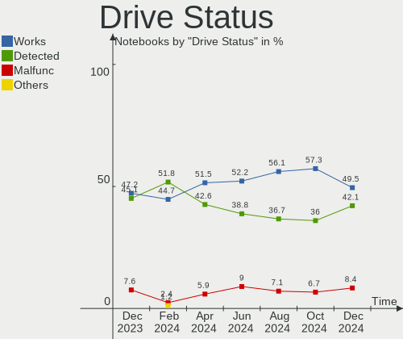

| Status   | Notebooks | Drives | Percent |
|----------|-----------|--------|---------|
| Works    | 72        | 84     | 60%     |
| Detected | 37        | 48     | 30.83%  |
| Malfunc  | 11        | 11     | 9.17%   |

Storage controller
------------------

Storage Vendor
--------------

Storage controller vendors

| Vendor                       | Notebooks | Percent |
|------------------------------|-----------|---------|
| Intel                        | 63        | 46.67%  |
| AMD                          | 21        | 15.56%  |
| Samsung Electronics          | 14        | 10.37%  |
| SK hynix                     | 6         | 4.44%   |
| SanDisk                      | 6         | 4.44%   |
| Phison Electronics           | 5         | 3.7%    |
| Micron Technology            | 3         | 2.22%   |
| Kingston Technology Company  | 3         | 2.22%   |
| Silicon Motion               | 2         | 1.48%   |
| Shenzhen Longsys Electronics | 2         | 1.48%   |
| Micron/Crucial Technology    | 2         | 1.48%   |
| KIOXIA                       | 2         | 1.48%   |
| ADATA Technology             | 2         | 1.48%   |
| VIA Technologies             | 1         | 0.74%   |
| Toshiba America Info Systems | 1         | 0.74%   |
| Nvidia                       | 1         | 0.74%   |
| MAXIO Technology (Hangzhou)  | 1         | 0.74%   |

Storage Model
-------------

Storage controller models

| Model                                                                        | Notebooks | Percent |
|------------------------------------------------------------------------------|-----------|---------|
| AMD FCH SATA Controller [AHCI mode]                                          | 18        | 12.86%  |
| Intel 7 Series Chipset Family 6-port SATA Controller [AHCI mode]             | 9         | 6.43%   |
| Samsung NVMe SSD Controller 980                                              | 7         | 5%      |
| Intel 6 Series/C200 Series Chipset Family 6 port Mobile SATA AHCI Controller | 7         | 5%      |
| Intel 82801IBM/IEM (ICH9M/ICH9M-E) 4 port SATA Controller [AHCI mode]        | 6         | 4.29%   |
| SK hynix Gold P31/PC711 NVMe Solid State Drive                               | 5         | 3.57%   |
| Intel Wildcat Point-LP SATA Controller [AHCI Mode]                           | 5         | 3.57%   |
| Intel SSD 660P Series                                                        | 5         | 3.57%   |
| Intel Non-Volatile memory controller                                         | 4         | 2.86%   |
| Samsung NVMe SSD Controller SM981/PM981/PM983                                | 3         | 2.14%   |
| Samsung NVMe SSD Controller PM9A1/PM9A3/980PRO                               | 3         | 2.14%   |
| Micron NVMe Storage Controller                                               | 3         | 2.14%   |
| Kingston Company Company Non-Volatile memory controller                      | 3         | 2.14%   |
| Intel Volume Management Device NVMe RAID Controller                          | 3         | 2.14%   |
| Intel HM170/QM170 Chipset SATA Controller [AHCI Mode]                        | 3         | 2.14%   |
| Intel 8 Series SATA Controller 1 [AHCI mode]                                 | 3         | 2.14%   |
| AMD SB7x0/SB8x0/SB9x0 SATA Controller [AHCI mode]                            | 3         | 2.14%   |
| SanDisk WD Blue SN550 NVMe SSD                                               | 2         | 1.43%   |
| Phison PS5013 E13 NVMe Controller                                            | 2         | 1.43%   |
| Phison E16 PCIe4 NVMe Controller                                             | 2         | 1.43%   |
| Micron/Crucial NVMe Storage Controller                                       | 2         | 1.43%   |
| KIOXIA Non-Volatile memory controller                                        | 2         | 1.43%   |
| Intel Sunrise Point-LP SATA Controller [AHCI mode]                           | 2         | 1.43%   |
| Intel Celeron/Pentium Silver Processor SATA Controller                       | 2         | 1.43%   |
| Intel 82801GBM/GHM (ICH7-M Family) SATA Controller [IDE mode]                | 2         | 1.43%   |
| Intel 82801 Mobile SATA Controller [RAID mode]                               | 2         | 1.43%   |
| ADATA XPG SX8200 Pro PCIe Gen3x4 M.2 2280 Solid State Drive                  | 2         | 1.43%   |
| VIA VT82C586A/B/VT82C686/A/B/VT823x/A/C PIPC Bus Master IDE                  | 1         | 0.71%   |
| VIA VT8237A SATA 2-Port Controller                                           | 1         | 0.71%   |
| Toshiba America Info Systems XG6 NVMe SSD Controller                         | 1         | 0.71%   |
| SK hynix BC511                                                               | 1         | 0.71%   |
| Silicon Motion SM2263EN/SM2263XT SSD Controller                              | 1         | 0.71%   |
| Silicon Motion Non-Volatile memory controller                                | 1         | 0.71%   |
| Shenzhen Longsys Non-Volatile memory controller                              | 1         | 0.71%   |
| Shenzhen Longsys Electronics Non-Volatile memory controller                  | 1         | 0.71%   |
| SanDisk WD Black SN750 / PC SN730 NVMe SSD                                   | 1         | 0.71%   |
| SanDisk WD Black 2018/SN750 / PC SN720 NVMe SSD                              | 1         | 0.71%   |
| SanDisk NVMe Controller                                                      | 1         | 0.71%   |
| Sandisk Non-Volatile memory controller                                       | 1         | 0.71%   |
| Samsung NVMe SSD Controller PM9B1                                            | 1         | 0.71%   |

Storage Kind
------------

Kind of storage controller (IDE, SATA, NVMe, SAS, ...)

| Kind | Notebooks | Percent |
|------|-----------|---------|
| SATA | 66        | 50.77%  |
| NVMe | 51        | 39.23%  |
| IDE  | 7         | 5.38%   |
| RAID | 6         | 4.62%   |

Processor
---------

CPU Vendor
----------

Processor vendors

| Vendor | Notebooks | Percent |
|--------|-----------|---------|
| Intel  | 79        | 69.91%  |
| AMD    | 34        | 30.09%  |

CPU Model
---------

Processor models

| Model                                         | Notebooks | Percent |
|-----------------------------------------------|-----------|---------|
| AMD Ryzen 5 5600H with Radeon Graphics        | 5         | 4.42%   |
| AMD Ryzen 5 4600H with Radeon Graphics        | 4         | 3.54%   |
| AMD Ryzen 5 3500U with Radeon Vega Mobile Gfx | 4         | 3.54%   |
| Intel Core i5-8350U CPU @ 1.70GHz             | 3         | 2.65%   |
| Intel 11th Gen Core i5-1135G7 @ 2.40GHz       | 3         | 2.65%   |
| Intel Pentium Dual-Core CPU T4200 @ 2.00GHz   | 2         | 1.77%   |
| Intel Core i7-7700HQ CPU @ 2.80GHz            | 2         | 1.77%   |
| Intel Core i5-5300U CPU @ 2.30GHz             | 2         | 1.77%   |
| Intel Core i5-5200U CPU @ 2.20GHz             | 2         | 1.77%   |
| Intel Core i5-3230M CPU @ 2.60GHz             | 2         | 1.77%   |
| Intel Core i5-2520M CPU @ 2.50GHz             | 2         | 1.77%   |
| Intel 12th Gen Core i5-12500H                 | 2         | 1.77%   |
| Intel 12th Gen Core i5-1235U                  | 2         | 1.77%   |
| AMD Ryzen 9 5980HX with Radeon Graphics       | 2         | 1.77%   |
| AMD Ryzen 7 6800H with Radeon Graphics        | 2         | 1.77%   |
| AMD E-450 APU with Radeon HD Graphics         | 2         | 1.77%   |
| Intel Xeon W-10885M CPU @ 2.40GHz             | 1         | 0.88%   |
| Intel Pentium Silver N5000 CPU @ 1.10GHz      | 1         | 0.88%   |
| Intel Pentium CPU P6100 @ 2.00GHz             | 1         | 0.88%   |
| Intel Pentium CPU N3710 @ 1.60GHz             | 1         | 0.88%   |
| Intel Genuine CPU T2050 @ 1.60GHz             | 1         | 0.88%   |
| Intel Core i7-6500U CPU @ 2.50GHz             | 1         | 0.88%   |
| Intel Core i7-5500U CPU @ 2.40GHz             | 1         | 0.88%   |
| Intel Core i7-4810MQ CPU @ 2.80GHz            | 1         | 0.88%   |
| Intel Core i7-4720HQ CPU @ 2.60GHz            | 1         | 0.88%   |
| Intel Core i7-3667U CPU @ 2.00GHz             | 1         | 0.88%   |
| Intel Core i7-3630QM CPU @ 2.40GHz            | 1         | 0.88%   |
| Intel Core i7-3540M CPU @ 3.00GHz             | 1         | 0.88%   |
| Intel Core i7-3520M CPU @ 2.90GHz             | 1         | 0.88%   |
| Intel Core i7-2620M CPU @ 2.70GHz             | 1         | 0.88%   |
| Intel Core i7-10875H CPU @ 2.30GHz            | 1         | 0.88%   |
| Intel Core i7-10870H CPU @ 2.20GHz            | 1         | 0.88%   |
| Intel Core i7-10610U CPU @ 1.80GHz            | 1         | 0.88%   |
| Intel Core i5-8300H CPU @ 2.30GHz             | 1         | 0.88%   |
| Intel Core i5-8265U CPU @ 1.60GHz             | 1         | 0.88%   |
| Intel Core i5-7300U CPU @ 2.60GHz             | 1         | 0.88%   |
| Intel Core i5-7300HQ CPU @ 2.50GHz            | 1         | 0.88%   |
| Intel Core i5-6440HQ CPU @ 2.60GHz            | 1         | 0.88%   |
| Intel Core i5-6200U CPU @ 2.30GHz             | 1         | 0.88%   |
| Intel Core i5-4300Y CPU @ 1.60GHz             | 1         | 0.88%   |

CPU Model Family
----------------

Processor model prefix

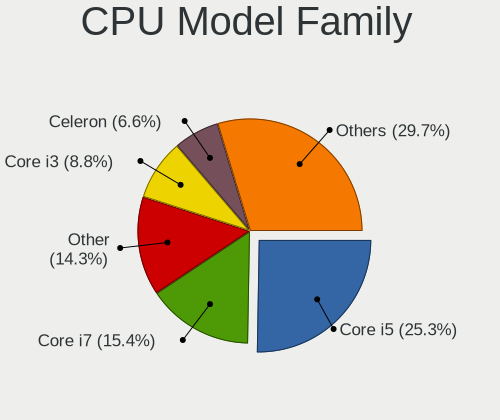

| Model                   | Notebooks | Percent |
|-------------------------|-----------|---------|
| Intel Core i5           | 26        | 23.01%  |
| AMD Ryzen 5             | 16        | 14.16%  |
| Other                   | 15        | 13.27%  |
| Intel Core i7           | 14        | 12.39%  |
| Intel Celeron           | 7         | 6.19%   |
| Intel Core 2 Duo        | 5         | 4.42%   |
| AMD Ryzen 7             | 5         | 4.42%   |
| Intel Core i3           | 3         | 2.65%   |
| Intel Pentium Dual-Core | 2         | 1.77%   |
| Intel Pentium           | 2         | 1.77%   |
| AMD Ryzen 9             | 2         | 1.77%   |
| AMD E                   | 2         | 1.77%   |
| Intel Xeon              | 1         | 0.88%   |
| Intel Pentium Silver    | 1         | 0.88%   |
| Intel Genuine           | 1         | 0.88%   |
| Intel Core Duo          | 1         | 0.88%   |
| Intel Core 2            | 1         | 0.88%   |
| Intel Celeron Dual-Core | 1         | 0.88%   |
| AMD Ryzen 7 PRO         | 1         | 0.88%   |
| AMD Ryzen 3             | 1         | 0.88%   |
| AMD E1                  | 1         | 0.88%   |
| AMD C-70                | 1         | 0.88%   |
| AMD C-60                | 1         | 0.88%   |
| AMD A8                  | 1         | 0.88%   |
| AMD A6                  | 1         | 0.88%   |
| AMD A4                  | 1         | 0.88%   |

CPU Cores
---------

Number of processor cores

| Number | Notebooks | Percent |
|--------|-----------|---------|
| 2      | 51        | 45.13%  |
| 4      | 28        | 24.78%  |
| 8      | 13        | 11.5%   |
| 6      | 12        | 10.62%  |
| 12     | 3         | 2.65%   |
| 10     | 3         | 2.65%   |
| 1      | 2         | 1.77%   |
| 14     | 1         | 0.88%   |

CPU Sockets
-----------

Number of sockets

| Number | Notebooks | Percent |
|--------|-----------|---------|
| 1      | 113       | 100%    |

CPU Threads
-----------

Threads per core (Hyper-Threading)

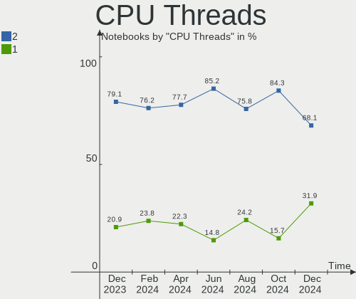

| Number | Notebooks | Percent |
|--------|-----------|---------|
| 2      | 82        | 72.57%  |
| 1      | 31        | 27.43%  |

CPU Op-Modes
------------

CPU Operation Modes (32-bit, 64-bit)

| Op mode        | Notebooks | Percent |
|----------------|-----------|---------|
| 32-bit, 64-bit | 111       | 98.23%  |
| 32-bit         | 2         | 1.77%   |

CPU Microcode
-------------

Microcode number

| Number     | Notebooks | Percent |
|------------|-----------|---------|
| Unknown    | 56        | 49.56%  |
| 0x206a7    | 7         | 6.19%   |
| 0x306a9    | 5         | 4.42%   |
| 0x1067a    | 4         | 3.54%   |
| 0x306d4    | 3         | 2.65%   |
| 0x0a50000c | 3         | 2.65%   |
| 0x906a3    | 2         | 1.77%   |
| 0x706a1    | 2         | 1.77%   |
| 0x0a404101 | 2         | 1.77%   |
| 0x08600106 | 2         | 1.77%   |
| 0x08108102 | 2         | 1.77%   |
| 0x05000101 | 2         | 1.77%   |
| 0xa0652    | 1         | 0.88%   |
| 0x906a4    | 1         | 0.88%   |
| 0x806ec    | 1         | 0.88%   |
| 0x806ea    | 1         | 0.88%   |
| 0x806c1    | 1         | 0.88%   |
| 0x6ec      | 1         | 0.88%   |
| 0x506e3    | 1         | 0.88%   |
| 0x406e3    | 1         | 0.88%   |
| 0x406c4    | 1         | 0.88%   |
| 0x40651    | 1         | 0.88%   |
| 0x306c3    | 1         | 0.88%   |
| 0x30673    | 1         | 0.88%   |
| 0x20655    | 1         | 0.88%   |
| 0x10676    | 1         | 0.88%   |
| 0x0a50000d | 1         | 0.88%   |
| 0x0a404102 | 1         | 0.88%   |
| 0x08608103 | 1         | 0.88%   |
| 0x08600104 | 1         | 0.88%   |
| 0x06006705 | 1         | 0.88%   |
| 0x0600111f | 1         | 0.88%   |
| 0x06001119 | 1         | 0.88%   |
| 0x05000119 | 1         | 0.88%   |
| 0x0500010d | 1         | 0.88%   |

CPU Microarch
-------------

Microarchitecture

| Name             | Notebooks | Percent |
|------------------|-----------|---------|
| KabyLake         | 11        | 9.73%   |
| Zen 3            | 10        | 8.85%   |
| IvyBridge        | 9         | 7.96%   |
| SandyBridge      | 8         | 7.08%   |
| Penryn           | 8         | 7.08%   |
| Alderlake Hybrid | 7         | 6.19%   |
| Unknown          | 7         | 6.19%   |
| Zen 2            | 6         | 5.31%   |
| Zen+             | 5         | 4.42%   |
| Haswell          | 5         | 4.42%   |
| Broadwell        | 5         | 4.42%   |
| Bobcat           | 5         | 4.42%   |
| TigerLake        | 4         | 3.54%   |
| Silvermont       | 4         | 3.54%   |
| Skylake          | 3         | 2.65%   |
| CometLake        | 3         | 2.65%   |
| Westmere         | 2         | 1.77%   |
| Piledriver       | 2         | 1.77%   |
| P6               | 2         | 1.77%   |
| Goldmont plus    | 2         | 1.77%   |
| Core             | 2         | 1.77%   |
| Icelake          | 1         | 0.88%   |
| Goldmont         | 1         | 0.88%   |
| Excavator        | 1         | 0.88%   |

Graphics
--------

GPU Vendor
----------

Vendors of graphics cards

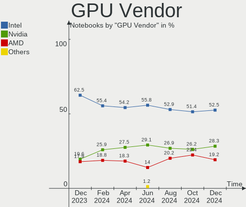

| Vendor           | Notebooks | Percent |
|------------------|-----------|---------|
| Intel            | 74        | 48.68%  |
| AMD              | 42        | 27.63%  |
| Nvidia           | 35        | 23.03%  |
| VIA Technologies | 1         | 0.66%   |

GPU Model
---------

Graphics card models

| Model                                                                                    | Notebooks | Percent |
|------------------------------------------------------------------------------------------|-----------|---------|
| Intel 3rd Gen Core processor Graphics Controller                                         | 9         | 5.7%    |
| AMD Cezanne [Radeon Vega Series / Radeon Vega Mobile Series]                             | 8         | 5.06%   |
| Intel 2nd Generation Core Processor Family Integrated Graphics Controller                | 7         | 4.43%   |
| Intel Mobile 4 Series Chipset Integrated Graphics Controller                             | 6         | 3.8%    |
| AMD Renoir                                                                               | 6         | 3.8%    |
| Intel HD Graphics 5500                                                                   | 5         | 3.16%   |
| AMD Picasso/Raven 2 [Radeon Vega Series / Radeon Vega Mobile Series]                     | 5         | 3.16%   |
| Nvidia TU117M [GeForce GTX 1650 Ti Mobile]                                               | 4         | 2.53%   |
| Nvidia TU117M                                                                            | 4         | 2.53%   |
| Intel TigerLake-LP GT2 [Iris Xe Graphics]                                                | 4         | 2.53%   |
| Intel Alder Lake-P Integrated Graphics Controller                                        | 4         | 2.53%   |
| AMD Sun XT [Radeon HD 8670A/8670M/8690M / R5 M330 / M430 / Radeon 520 Mobile]            | 4         | 2.53%   |
| Nvidia GA106M [GeForce RTX 3060 Mobile / Max-Q]                                          | 3         | 1.9%    |
| Intel UHD Graphics 620                                                                   | 3         | 1.9%    |
| Intel HD Graphics 630                                                                    | 3         | 1.9%    |
| Intel Atom/Celeron/Pentium Processor x5-E8000/J3xxx/N3xxx Integrated Graphics Controller | 3         | 1.9%    |
| AMD Rembrandt [Radeon 680M]                                                              | 3         | 1.9%    |
| Nvidia GP107M [GeForce GTX 1050 Ti Mobile]                                               | 2         | 1.27%   |
| Nvidia GP107M [GeForce GTX 1050 Mobile]                                                  | 2         | 1.27%   |
| Nvidia GA107M [GeForce RTX 3050 Mobile]                                                  | 2         | 1.27%   |
| Nvidia GA107BM [GeForce RTX 3050 Ti Mobile]                                              | 2         | 1.27%   |
| Intel TigerLake-H GT1 [UHD Graphics]                                                     | 2         | 1.27%   |
| Intel Skylake GT2 [HD Graphics 520]                                                      | 2         | 1.27%   |
| Intel Mobile 945GM/GMS/GME, 943/940GML Express Integrated Graphics Controller            | 2         | 1.27%   |
| Intel Mobile 945GM/GMS, 943/940GML Express Integrated Graphics Controller                | 2         | 1.27%   |
| Intel Haswell-ULT Integrated Graphics Controller                                         | 2         | 1.27%   |
| Intel CometLake-U GT2 [UHD Graphics]                                                     | 2         | 1.27%   |
| Intel CometLake-H GT2 [UHD Graphics]                                                     | 2         | 1.27%   |
| Intel Alder Lake-UP3 GT2 [Iris Xe Graphics]                                              | 2         | 1.27%   |
| Intel 4th Gen Core Processor Integrated Graphics Controller                              | 2         | 1.27%   |
| AMD Wrestler [Radeon HD 6320]                                                            | 2         | 1.27%   |
| AMD Navi 22 [Radeon RX 6700/6700 XT/6750 XT / 6800M/6850M XT]                            | 2         | 1.27%   |
| VIA Technologies CN896/VN896/P4M900 [Chrome 9 HC]                                        | 1         | 0.63%   |
| Nvidia TU117M [GeForce GTX 1650 Mobile / Max-Q]                                          | 1         | 0.63%   |
| Nvidia TU116M [GeForce GTX 1660 Ti Mobile]                                               | 1         | 0.63%   |
| Nvidia TU106GLM [Quadro RTX 3000 Mobile / Max-Q]                                         | 1         | 0.63%   |
| Nvidia GM107M [GeForce GTX 960M]                                                         | 1         | 0.63%   |
| Nvidia GK208BM [GeForce 920M]                                                            | 1         | 0.63%   |
| Nvidia GK104GLM [Quadro K5100M]                                                          | 1         | 0.63%   |
| Nvidia GF119M [GeForce GT 520MX]                                                         | 1         | 0.63%   |

GPU Combo
---------

Combinations of graphics cards

| Name           | Notebooks | Percent |
|----------------|-----------|---------|
| 1 x Intel      | 41        | 36.28%  |
| Intel + Nvidia | 20        | 17.7%   |
| 1 x AMD        | 20        | 17.7%   |
| AMD + Nvidia   | 10        | 8.85%   |
| Intel + AMD    | 9         | 7.96%   |
| 1 x Nvidia     | 5         | 4.42%   |
| 2 x Intel      | 4         | 3.54%   |
| 2 x AMD        | 3         | 2.65%   |
| 1 x VIA        | 1         | 0.88%   |

GPU Driver
----------

Free vs proprietary

| Driver      | Notebooks | Percent |
|-------------|-----------|---------|
| Free        | 90        | 79.65%  |
| Proprietary | 21        | 18.58%  |
| Unknown     | 2         | 1.77%   |

GPU Memory
----------

Total video memory

| Size in GB | Notebooks | Percent |
|------------|-----------|---------|
| Unknown    | 68        | 60.18%  |
| 0.01-0.5   | 15        | 13.27%  |
| 3.01-4.0   | 11        | 9.73%   |
| 1.01-2.0   | 9         | 7.96%   |
| 0.51-1.0   | 6         | 5.31%   |
| 8.01-16.0  | 2         | 1.77%   |
| 7.01-8.0   | 1         | 0.88%   |
| 5.01-6.0   | 1         | 0.88%   |

Monitor
-------

Monitor Vendor
--------------

Monitor vendors

| Vendor                  | Notebooks | Percent |
|-------------------------|-----------|---------|
| Chimei Innolux          | 25        | 18.66%  |
| LG Display              | 22        | 16.42%  |
| AU Optronics            | 21        | 15.67%  |
| BOE                     | 16        | 11.94%  |
| Samsung Electronics     | 14        | 10.45%  |
| BenQ                    | 6         | 4.48%   |
| PANDA                   | 5         | 3.73%   |
| Goldstar                | 5         | 3.73%   |
| Sharp                   | 3         | 2.24%   |
| Dell                    | 3         | 2.24%   |
| Lenovo                  | 2         | 1.49%   |
| Chi Mei Optoelectronics | 2         | 1.49%   |
| Valve                   | 1         | 0.75%   |
| TMX                     | 1         | 0.75%   |
| Philips                 | 1         | 0.75%   |
| LG Philips              | 1         | 0.75%   |
| L                       | 1         | 0.75%   |
| InfoVision              | 1         | 0.75%   |
| Iiyama                  | 1         | 0.75%   |
| CPT                     | 1         | 0.75%   |
| BOE Technology Group    | 1         | 0.75%   |
| ADI                     | 1         | 0.75%   |

Monitor Model
-------------

Monitor models

| Model                                                                   | Notebooks | Percent |
|-------------------------------------------------------------------------|-----------|---------|
| LG Display LCD Monitor LGD06E8 1920x1080 344x194mm 15.5-inch            | 4         | 2.88%   |
| PANDA LCD Monitor NCP004D 1920x1080 344x194mm 15.5-inch                 | 3         | 2.16%   |
| LG Display LCD Monitor LGD02DC 1366x768 344x194mm 15.5-inch             | 3         | 2.16%   |
| Goldstar FHD GSM5BC9 1920x1080 480x270mm 21.7-inch                      | 3         | 2.16%   |
| BOE LCD Monitor BOE0687 1920x1080 344x193mm 15.5-inch                   | 3         | 2.16%   |
| BenQ GW2470 BNQ78E4 1920x1080 527x296mm 23.8-inch                       | 3         | 2.16%   |
| Samsung Electronics LCD Monitor SEC3047 1366x768 277x156mm 12.5-inch    | 2         | 1.44%   |
| PANDA LCD Monitor NCP0058 1920x1080 344x194mm 15.5-inch                 | 2         | 1.44%   |
| Dell P2212H DELA07F 1920x1080 531x299mm 24.0-inch                       | 2         | 1.44%   |
| Chimei Innolux LCD Monitor CMN15C4 1920x1080 344x193mm 15.5-inch        | 2         | 1.44%   |
| Chimei Innolux LCD Monitor CMN1540 2560x1440 344x193mm 15.5-inch        | 2         | 1.44%   |
| Chimei Innolux LCD Monitor CMN1521 1920x1080 344x193mm 15.5-inch        | 2         | 1.44%   |
| Valve ANX7530 U VLV3001 800x1280 100x150mm 7.1-inch                     | 1         | 0.72%   |
| TMX TL156MDMP11-0 TMX1560 3200x2000 336x210mm 15.6-inch                 | 1         | 0.72%   |
| Sharp LQ156M1JW03 SHP155D 1920x1080 344x194mm 15.5-inch                 | 1         | 0.72%   |
| Sharp LCD Monitor SHP14D0 3840x2400 336x210mm 15.6-inch                 | 1         | 0.72%   |
| Sharp HDMI SHP1048 1920x1080 890x500mm 40.2-inch                        | 1         | 0.72%   |
| Samsung Electronics U28E590 SAM0C4D 3840x2160 607x345mm 27.5-inch       | 1         | 0.72%   |
| Samsung Electronics SyncMaster SAM0428 1680x1050 459x296mm 21.5-inch    | 1         | 0.72%   |
| Samsung Electronics LS28AG700N SAM7177 3840x2160 632x360mm 28.6-inch    | 1         | 0.72%   |
| Samsung Electronics LCD Monitor SEC3945 1280x800 331x207mm 15.4-inch    | 1         | 0.72%   |
| Samsung Electronics LCD Monitor SEC3449 1366x768 309x174mm 14.0-inch    | 1         | 0.72%   |
| Samsung Electronics LCD Monitor SEC3157 1280x800 303x190mm 14.1-inch    | 1         | 0.72%   |
| Samsung Electronics LCD Monitor SEC3046 1366x768 344x193mm 15.5-inch    | 1         | 0.72%   |
| Samsung Electronics LCD Monitor SDC5441 1366x768 344x193mm 15.5-inch    | 1         | 0.72%   |
| Samsung Electronics LCD Monitor SDC4C48 1920x1080 344x194mm 15.5-inch   | 1         | 0.72%   |
| Samsung Electronics LCD Monitor SDC416B 3840x2400 344x215mm 16.0-inch   | 1         | 0.72%   |
| Samsung Electronics LCD Monitor SAM0DF6 3840x2160 1872x1053mm 84.6-inch | 1         | 0.72%   |
| Samsung Electronics LCD Monitor SAM0D3E 3840x2160 1020x570mm 46.0-inch  | 1         | 0.72%   |
| Samsung Electronics C27F390 SAM0D32 1920x1080 598x336mm 27.0-inch       | 1         | 0.72%   |
| Philips PHL 272P7V PHL0902 3840x2160 597x336mm 27.0-inch                | 1         | 0.72%   |
| LG Philips LCD Monitor LPL00E0 1440x900 304x190mm 14.1-inch             | 1         | 0.72%   |
| LG Display LP156WH2-TLRA LGD026B 1366x768 344x194mm 15.5-inch           | 1         | 0.72%   |
| LG Display LCD Monitor LGDD801 1366x768 344x194mm 15.5-inch             | 1         | 0.72%   |
| LG Display LCD Monitor LGD05EC 1920x1080 309x174mm 14.0-inch            | 1         | 0.72%   |
| LG Display LCD Monitor LGD0558 1920x1080 309x174mm 14.0-inch            | 1         | 0.72%   |
| LG Display LCD Monitor LGD0521 1920x1080 309x174mm 14.0-inch            | 1         | 0.72%   |
| LG Display LCD Monitor LGD044F 1920x1080 345x194mm 15.6-inch            | 1         | 0.72%   |
| LG Display LCD Monitor LGD03D9 1366x768 345x194mm 15.6-inch             | 1         | 0.72%   |
| LG Display LCD Monitor LGD03B8 1366x768 310x174mm 14.0-inch             | 1         | 0.72%   |

Monitor Resolution
------------------

Monitor screen resolution

| Resolution         | Notebooks | Percent |
|--------------------|-----------|---------|
| 1920x1080 (FHD)    | 57        | 46.34%  |
| 1366x768 (WXGA)    | 34        | 27.64%  |
| 3840x2160 (4K)     | 6         | 4.88%   |
| 1600x900 (HD+)     | 6         | 4.88%   |
| 1280x800 (WXGA)    | 4         | 3.25%   |
| 3840x2400          | 2         | 1.63%   |
| 2560x1600          | 2         | 1.63%   |
| 2560x1440 (QHD)    | 2         | 1.63%   |
| 1680x1050 (WSXGA+) | 2         | 1.63%   |
| 1440x900 (WXGA+)   | 2         | 1.63%   |
| 800x1280           | 1         | 0.81%   |
| 5120x1600          | 1         | 0.81%   |
| 3200x2000          | 1         | 0.81%   |
| 1920x1200 (WUXGA)  | 1         | 0.81%   |
| 1280x1024 (SXGA)   | 1         | 0.81%   |
| Unknown            | 1         | 0.81%   |

Monitor Diagonal
----------------

Diagonal size in inches

| Inches  | Notebooks | Percent |
|---------|-----------|---------|
| 15      | 55        | 41.04%  |
| 14      | 15        | 11.19%  |
| 13      | 13        | 9.7%    |
| 17      | 10        | 7.46%   |
| 24      | 8         | 5.97%   |
| 12      | 7         | 5.22%   |
| 21      | 5         | 3.73%   |
| 11      | 5         | 3.73%   |
| 27      | 3         | 2.24%   |
| 16      | 3         | 2.24%   |
| 84      | 1         | 0.75%   |
| 60      | 1         | 0.75%   |
| 46      | 1         | 0.75%   |
| 40      | 1         | 0.75%   |
| 34      | 1         | 0.75%   |
| 28      | 1         | 0.75%   |
| 23      | 1         | 0.75%   |
| 18      | 1         | 0.75%   |
| 7       | 1         | 0.75%   |
| Unknown | 1         | 0.75%   |

Monitor Width
-------------

Physical width

| Width in mm | Notebooks | Percent |
|-------------|-----------|---------|
| 301-350     | 80        | 60.15%  |
| 201-300     | 16        | 12.03%  |
| 501-600     | 11        | 8.27%   |
| 351-400     | 11        | 8.27%   |
| 401-500     | 6         | 4.51%   |
| 601-700     | 2         | 1.5%    |
| 1001-1500   | 2         | 1.5%    |
| 801-900     | 1         | 0.75%   |
| 701-800     | 1         | 0.75%   |
| 1501-2000   | 1         | 0.75%   |
| 1-100       | 1         | 0.75%   |
| Unknown     | 1         | 0.75%   |

Aspect Ratio
------------

Proportional relationship between the width and the height

| Ratio   | Notebooks | Percent |
|---------|-----------|---------|
| 16/9    | 98        | 84.48%  |
| 16/10   | 12        | 10.34%  |
| 3/2     | 2         | 1.72%   |
| 6/5     | 1         | 0.86%   |
| 21/9    | 1         | 0.86%   |
| 0.67    | 1         | 0.86%   |
| Unknown | 1         | 0.86%   |

Monitor Area
------------

Area in inch²

| Area in inch² | Notebooks | Percent |
|----------------|-----------|---------|
| 101-110        | 56        | 41.79%  |
| 81-90          | 24        | 17.91%  |
| 201-250        | 12        | 8.96%   |
| 121-130        | 8         | 5.97%   |
| 61-70          | 7         | 5.22%   |
| 51-60          | 5         | 3.73%   |
| 71-80          | 4         | 2.99%   |
| 301-350        | 3         | 2.24%   |
| 131-140        | 3         | 2.24%   |
| More than 1000 | 2         | 1.49%   |
| 351-500        | 2         | 1.49%   |
| 251-300        | 2         | 1.49%   |
| 501-1000       | 2         | 1.49%   |
| 1-40           | 1         | 0.75%   |
| 141-150        | 1         | 0.75%   |
| 111-120        | 1         | 0.75%   |
| Unknown        | 1         | 0.75%   |

Pixel Density
-------------

Pixels per inch

| Density       | Notebooks | Percent |
|---------------|-----------|---------|
| 121-160       | 69        | 51.49%  |
| 101-120       | 33        | 24.63%  |
| 51-100        | 19        | 14.18%  |
| 161-240       | 8         | 5.97%   |
| More than 240 | 3         | 2.24%   |
| 1-50          | 1         | 0.75%   |
| Unknown       | 1         | 0.75%   |

Multiple Monitors
-----------------

Total monitors connected

| Total | Notebooks | Percent |
|-------|-----------|---------|
| 1     | 85        | 75.22%  |
| 2     | 22        | 19.47%  |
| 3     | 3         | 2.65%   |
| 0     | 3         | 2.65%   |

Network
-------

Net Controller Vendor
---------------------

Controller vendors

| Vendor                            | Notebooks | Percent |
|-----------------------------------|-----------|---------|
| Realtek Semiconductor             | 64        | 35.16%  |
| Intel                             | 54        | 29.67%  |
| Qualcomm Atheros                  | 21        | 11.54%  |
| Broadcom                          | 8         | 4.4%    |
| MediaTek                          | 6         | 3.3%    |
| Broadcom Limited                  | 5         | 2.75%   |
| Ralink                            | 4         | 2.2%    |
| Dell                              | 3         | 1.65%   |
| ZTE WCDMA Technologies MSM        | 2         | 1.1%    |
| Ralink Technology                 | 2         | 1.1%    |
| Hewlett-Packard                   | 2         | 1.1%    |
| Ericsson Business Mobile Networks | 2         | 1.1%    |
| ASIX Electronics                  | 2         | 1.1%    |
| VIA Technologies                  | 1         | 0.55%   |
| TP-Link                           | 1         | 0.55%   |
| Marvell Technology Group          | 1         | 0.55%   |
| Lenovo                            | 1         | 0.55%   |
| Huawei Technologies               | 1         | 0.55%   |
| HTC (High Tech Computer)          | 1         | 0.55%   |
| Fibocom                           | 1         | 0.55%   |

Net Controller Model
--------------------

Controller models

| Model                                                             | Notebooks | Percent |
|-------------------------------------------------------------------|-----------|---------|
| Realtek RTL8111/8168/8411 PCI Express Gigabit Ethernet Controller | 47        | 20.7%   |
| Realtek RTL810xE PCI Express Fast Ethernet controller             | 9         | 3.96%   |
| Realtek RTL8822CE 802.11ac PCIe Wireless Network Adapter          | 7         | 3.08%   |
| Intel 82579LM Gigabit Network Connection (Lewisville)             | 7         | 3.08%   |
| Intel Wireless 3160                                               | 6         | 2.64%   |
| Intel Alder Lake-P PCH CNVi WiFi                                  | 6         | 2.64%   |
| MediaTek MT7921 802.11ax PCI Express Wireless Network Adapter     | 5         | 2.2%    |
| Intel Wireless 8265 / 8275                                        | 5         | 2.2%    |
| Intel Centrino Advanced-N 6205 [Taylor Peak]                      | 5         | 2.2%    |
| Realtek RTL8852AE 802.11ax PCIe Wireless Network Adapter          | 4         | 1.76%   |
| Qualcomm Atheros QCA6174 802.11ac Wireless Network Adapter        | 4         | 1.76%   |
| Intel Wireless 7265                                               | 4         | 1.76%   |
| Intel Ethernet Connection (4) I219-LM                             | 4         | 1.76%   |
| Realtek RTL8852BE PCIe 802.11ax Wireless Network Controller       | 3         | 1.32%   |
| Realtek RTL8821CE 802.11ac PCIe Wireless Network Adapter          | 3         | 1.32%   |
| Ralink RT3290 Wireless 802.11n 1T/1R PCIe                         | 3         | 1.32%   |
| Qualcomm Atheros QCA9377 802.11ac Wireless Network Adapter        | 3         | 1.32%   |
| Qualcomm Atheros AR9485 Wireless Network Adapter                  | 3         | 1.32%   |
| Qualcomm Atheros AR8152 v2.0 Fast Ethernet                        | 3         | 1.32%   |
| Intel Wi-Fi 6 AX201                                               | 3         | 1.32%   |
| Intel Wi-Fi 6 AX200                                               | 3         | 1.32%   |
| Intel Ethernet Connection (16) I219-V                             | 3         | 1.32%   |
| Intel Comet Lake PCH CNVi WiFi                                    | 3         | 1.32%   |
| Broadcom BCM4313 802.11bgn Wireless Network Adapter               | 3         | 1.32%   |
| ZTE WCDMA MSM DEMO Mobile Boardband                               | 2         | 0.88%   |
| Realtek RTL8822BE 802.11a/b/g/n/ac WiFi adapter                   | 2         | 0.88%   |
| Realtek RTL8153 Gigabit Ethernet Adapter                          | 2         | 0.88%   |
| Qualcomm Atheros QCA9565 / AR9565 Wireless Network Adapter        | 2         | 0.88%   |
| Qualcomm Atheros AR9285 Wireless Network Adapter (PCI-Express)    | 2         | 0.88%   |
| Intel PRO/Wireless 3945ABG [Golan] Network Connection             | 2         | 0.88%   |
| Intel Ethernet Connection (3) I218-LM                             | 2         | 0.88%   |
| Intel Comet Lake PCH-LP CNVi WiFi                                 | 2         | 0.88%   |
| Intel Centrino Ultimate-N 6300                                    | 2         | 0.88%   |
| Intel Centrino Advanced-N 6235                                    | 2         | 0.88%   |
| Intel 82567LM Gigabit Network Connection                          | 2         | 0.88%   |
| Broadcom BCM43142 802.11b/g/n                                     | 2         | 0.88%   |
| VIA VT6102/VT6103 [Rhine-II]                                      | 1         | 0.44%   |
| TP-Link Archer T3U [Realtek RTL8812BU]                            | 1         | 0.44%   |
| Realtek RTL8723BU 802.11b/g/n WLAN Adapter                        | 1         | 0.44%   |
| Realtek RTL8723AE PCIe Wireless Network Adapter                   | 1         | 0.44%   |

Wireless Vendor
---------------

Wireless vendors

| Vendor                | Notebooks | Percent |
|-----------------------|-----------|---------|
| Intel                 | 50        | 42.02%  |
| Realtek Semiconductor | 26        | 21.85%  |
| Qualcomm Atheros      | 19        | 15.97%  |
| Broadcom              | 7         | 5.88%   |
| MediaTek              | 6         | 5.04%   |
| Ralink                | 4         | 3.36%   |
| Ralink Technology     | 2         | 1.68%   |
| Broadcom Limited      | 2         | 1.68%   |
| TP-Link               | 1         | 0.84%   |
| Fibocom               | 1         | 0.84%   |
| Dell                  | 1         | 0.84%   |

Wireless Model
--------------

Wireless models

| Model                                                          | Notebooks | Percent |
|----------------------------------------------------------------|-----------|---------|
| Realtek RTL8822CE 802.11ac PCIe Wireless Network Adapter       | 7         | 5.88%   |
| Intel Wireless 3160                                            | 6         | 5.04%   |
| Intel Alder Lake-P PCH CNVi WiFi                               | 6         | 5.04%   |
| MediaTek MT7921 802.11ax PCI Express Wireless Network Adapter  | 5         | 4.2%    |
| Intel Wireless 8265 / 8275                                     | 5         | 4.2%    |
| Intel Centrino Advanced-N 6205 [Taylor Peak]                   | 5         | 4.2%    |
| Realtek RTL8852AE 802.11ax PCIe Wireless Network Adapter       | 4         | 3.36%   |
| Qualcomm Atheros QCA6174 802.11ac Wireless Network Adapter     | 4         | 3.36%   |
| Intel Wireless 7265                                            | 4         | 3.36%   |
| Realtek RTL8852BE PCIe 802.11ax Wireless Network Controller    | 3         | 2.52%   |
| Realtek RTL8821CE 802.11ac PCIe Wireless Network Adapter       | 3         | 2.52%   |
| Ralink RT3290 Wireless 802.11n 1T/1R PCIe                      | 3         | 2.52%   |
| Qualcomm Atheros QCA9377 802.11ac Wireless Network Adapter     | 3         | 2.52%   |
| Qualcomm Atheros AR9485 Wireless Network Adapter               | 3         | 2.52%   |
| Intel Wi-Fi 6 AX201                                            | 3         | 2.52%   |
| Intel Wi-Fi 6 AX200                                            | 3         | 2.52%   |
| Intel Comet Lake PCH CNVi WiFi                                 | 3         | 2.52%   |
| Broadcom BCM4313 802.11bgn Wireless Network Adapter            | 3         | 2.52%   |
| Realtek RTL8822BE 802.11a/b/g/n/ac WiFi adapter                | 2         | 1.68%   |
| Qualcomm Atheros QCA9565 / AR9565 Wireless Network Adapter     | 2         | 1.68%   |
| Qualcomm Atheros AR9285 Wireless Network Adapter (PCI-Express) | 2         | 1.68%   |
| Intel PRO/Wireless 3945ABG [Golan] Network Connection          | 2         | 1.68%   |
| Intel Comet Lake PCH-LP CNVi WiFi                              | 2         | 1.68%   |
| Intel Centrino Ultimate-N 6300                                 | 2         | 1.68%   |
| Intel Centrino Advanced-N 6235                                 | 2         | 1.68%   |
| Broadcom BCM43142 802.11b/g/n                                  | 2         | 1.68%   |
| TP-Link Archer T3U [Realtek RTL8812BU]                         | 1         | 0.84%   |
| Realtek RTL8723BU 802.11b/g/n WLAN Adapter                     | 1         | 0.84%   |
| Realtek RTL8723AE PCIe Wireless Network Adapter                | 1         | 0.84%   |
| Realtek RTL8191SEvB Wireless LAN Controller                    | 1         | 0.84%   |
| Realtek RTL8191SEvA Wireless LAN Controller                    | 1         | 0.84%   |
| Realtek RTL8188EUS 802.11n Wireless Network Adapter            | 1         | 0.84%   |
| Realtek 802.11n WLAN Adapter                                   | 1         | 0.84%   |
| Realtek 802.11ac NIC                                           | 1         | 0.84%   |
| Ralink RT2870/RT3070 Wireless Adapter                          | 1         | 0.84%   |
| Ralink MT7610U ("Archer T2U" 2.4G+5G WLAN Adapter              | 1         | 0.84%   |
| Ralink RT2790 Wireless 802.11n 1T/2R PCIe                      | 1         | 0.84%   |
| Qualcomm Atheros AR9462 Wireless Network Adapter               | 1         | 0.84%   |
| Qualcomm Atheros AR9287 Wireless Network Adapter (PCI-Express) | 1         | 0.84%   |
| Qualcomm Atheros AR5212 802.11abg NIC                          | 1         | 0.84%   |

Ethernet Vendor
---------------

Ethernet vendors

| Vendor                     | Notebooks | Percent |
|----------------------------|-----------|---------|
| Realtek Semiconductor      | 58        | 57.43%  |
| Intel                      | 23        | 22.77%  |
| Qualcomm Atheros           | 6         | 5.94%   |
| Broadcom Limited           | 3         | 2.97%   |
| ZTE WCDMA Technologies MSM | 2         | 1.98%   |
| Broadcom                   | 2         | 1.98%   |
| ASIX Electronics           | 2         | 1.98%   |
| VIA Technologies           | 1         | 0.99%   |
| Marvell Technology Group   | 1         | 0.99%   |
| Lenovo                     | 1         | 0.99%   |
| HTC (High Tech Computer)   | 1         | 0.99%   |
| Hewlett-Packard            | 1         | 0.99%   |

Ethernet Model
--------------

Ethernet models

| Model                                                             | Notebooks | Percent |
|-------------------------------------------------------------------|-----------|---------|
| Realtek RTL8111/8168/8411 PCI Express Gigabit Ethernet Controller | 47        | 46.08%  |
| Realtek RTL810xE PCI Express Fast Ethernet controller             | 9         | 8.82%   |
| Intel 82579LM Gigabit Network Connection (Lewisville)             | 7         | 6.86%   |
| Intel Ethernet Connection (4) I219-LM                             | 4         | 3.92%   |
| Qualcomm Atheros AR8152 v2.0 Fast Ethernet                        | 3         | 2.94%   |
| Intel Ethernet Connection (16) I219-V                             | 3         | 2.94%   |
| ZTE WCDMA MSM DEMO Mobile Boardband                               | 2         | 1.96%   |
| Realtek RTL8153 Gigabit Ethernet Adapter                          | 2         | 1.96%   |
| Intel Ethernet Connection (3) I218-LM                             | 2         | 1.96%   |
| Intel 82567LM Gigabit Network Connection                          | 2         | 1.96%   |
| VIA VT6102/VT6103 [Rhine-II]                                      | 1         | 0.98%   |
| Realtek RTL8125 2.5GbE Controller                                 | 1         | 0.98%   |
| Qualcomm Atheros QCA8172 Fast Ethernet                            | 1         | 0.98%   |
| Qualcomm Atheros QCA8171 Gigabit Ethernet                         | 1         | 0.98%   |
| Qualcomm Atheros AR8121/AR8113/AR8114 Gigabit or Fast Ethernet    | 1         | 0.98%   |
| Marvell Group 88E8055 PCI-E Gigabit Ethernet Controller           | 1         | 0.98%   |
| Lenovo USB-C Dock Ethernet                                        | 1         | 0.98%   |
| Intel Ethernet Controller I225-V                                  | 1         | 0.98%   |
| Intel Ethernet Connection I217-LM                                 | 1         | 0.98%   |
| Intel Ethernet Connection (2) I219-LM                             | 1         | 0.98%   |
| Intel Ethernet Connection (11) I219-LM                            | 1         | 0.98%   |
| Intel 82579V Gigabit Network Connection                           | 1         | 0.98%   |
| HTC (High Tech Computer) Desire HD (modem mode)                   | 1         | 0.98%   |
| HP lt4120 Snapdragon X5 LTE                                       | 1         | 0.98%   |
| Broadcom NetXtreme BCM5752 Gigabit Ethernet PCI Express           | 1         | 0.98%   |
| Broadcom Limited NetXtreme BCM5764M Gigabit Ethernet PCIe         | 1         | 0.98%   |
| Broadcom Limited NetXtreme BCM5755M Gigabit Ethernet PCI Express  | 1         | 0.98%   |
| Broadcom Limited NetLink BCM57780 Gigabit Ethernet PCIe           | 1         | 0.98%   |
| Broadcom BCM4401-B0 100Base-TX                                    | 1         | 0.98%   |
| ASIX AX88772B                                                     | 1         | 0.98%   |
| ASIX AX88179 Gigabit Ethernet                                     | 1         | 0.98%   |

Net Controller Kind
-------------------

Ethernet, WiFi or modem

| Kind     | Notebooks | Percent |
|----------|-----------|---------|
| WiFi     | 113       | 52.56%  |
| Ethernet | 96        | 44.65%  |
| Modem    | 6         | 2.79%   |

Used Controller
---------------

Currently used network controller

| Kind     | Notebooks | Percent |
|----------|-----------|---------|
| WiFi     | 95        | 81.2%   |
| Ethernet | 22        | 18.8%   |

NICs
----

Total network controllers on board

| Total | Notebooks | Percent |
|-------|-----------|---------|
| 2     | 92        | 81.42%  |
| 1     | 19        | 16.81%  |
| 0     | 2         | 1.77%   |

IPv6
----

IPv6 vs IPv4

| Used | Notebooks | Percent |
|------|-----------|---------|
| No   | 102       | 90.27%  |
| Yes  | 11        | 9.73%   |

Bluetooth
---------

Bluetooth Vendor
----------------

Controller vendors

| Vendor                          | Notebooks | Percent |
|---------------------------------|-----------|---------|
| Intel                           | 38        | 39.58%  |
| Realtek Semiconductor           | 14        | 14.58%  |
| Qualcomm Atheros Communications | 9         | 9.38%   |
| IMC Networks                    | 7         | 7.29%   |
| Dell                            | 5         | 5.21%   |
| Broadcom                        | 5         | 5.21%   |
| Foxconn / Hon Hai               | 4         | 4.17%   |
| Ralink                          | 3         | 3.13%   |
| Lite-On Technology              | 3         | 3.13%   |
| Toshiba                         | 2         | 2.08%   |
| Cambridge Silicon Radio         | 2         | 2.08%   |
| Realtek                         | 1         | 1.04%   |
| Opticis                         | 1         | 1.04%   |
| Hewlett-Packard                 | 1         | 1.04%   |
| Foxconn International           | 1         | 1.04%   |

Bluetooth Model
---------------

Controller models

| Model                                               | Notebooks | Percent |
|-----------------------------------------------------|-----------|---------|
| Intel Bluetooth wireless interface                  | 17        | 17.71%  |
| Realtek Bluetooth Radio                             | 10        | 10.42%  |
| Intel AX201 Bluetooth                               | 9         | 9.38%   |
| Qualcomm Atheros  Bluetooth Device                  | 6         | 6.25%   |
| Intel Bluetooth Device                              | 5         | 5.21%   |
| Realtek  Bluetooth 4.2 Adapter                      | 4         | 4.17%   |
| IMC Networks Wireless_Device                        | 4         | 4.17%   |
| Ralink RT3290 Bluetooth                             | 3         | 3.13%   |
| Lite-On Bluetooth Device                            | 3         | 3.13%   |
| Intel AX200 Bluetooth                               | 3         | 3.13%   |
| IMC Networks Bluetooth Radio                        | 3         | 3.13%   |
| Qualcomm Atheros AR3012 Bluetooth 4.0               | 2         | 2.08%   |
| Intel Centrino Bluetooth Wireless Transceiver       | 2         | 2.08%   |
| Foxconn / Hon Hai Wireless_Device                   | 2         | 2.08%   |
| Dell BCM20702A0 Bluetooth Module                    | 2         | 2.08%   |
| Cambridge Silicon Radio Bluetooth Dongle (HCI mode) | 2         | 2.08%   |
| Broadcom BCM20702 Bluetooth 4.0 [ThinkPad]          | 2         | 2.08%   |
| Toshiba RT Bluetooth Radio                          | 1         | 1.04%   |
| Toshiba Bluetooth Device                            | 1         | 1.04%   |
| Realtek 802.11ac WLAN Adapter                       | 1         | 1.04%   |
| Qualcomm Atheros AR3011 Bluetooth                   | 1         | 1.04%   |
| Opticis Bluetooth Radio                             | 1         | 1.04%   |
| Intel Centrino Advanced-N 6230 Bluetooth adapter    | 1         | 1.04%   |
| Intel AX210 Bluetooth                               | 1         | 1.04%   |
| HP Broadcom 2070 Bluetooth Combo                    | 1         | 1.04%   |
| Foxconn International BCM43142A0 Bluetooth module   | 1         | 1.04%   |
| Foxconn / Hon Hai Broadcom Bluetooth 2.1 Device     | 1         | 1.04%   |
| Foxconn / Hon Hai Broadcom BCM20702A1 Bluetooth     | 1         | 1.04%   |
| Dell Wireless 360 Bluetooth                         | 1         | 1.04%   |
| Dell Wireless 350 Bluetooth                         | 1         | 1.04%   |
| Dell DW375 Bluetooth Module                         | 1         | 1.04%   |
| Broadcom BCM43142A0 Bluetooth 4.0                   | 1         | 1.04%   |
| Broadcom BCM2070 Bluetooth 2.1 + EDR                | 1         | 1.04%   |
| Broadcom BCM2045B (BDC-2.1) [Bluetooth Controller]  | 1         | 1.04%   |

Sound
-----

Sound Vendor
------------

Sound card vendors

| Vendor                  | Notebooks | Percent |
|-------------------------|-----------|---------|
| Intel                   | 77        | 52.03%  |
| AMD                     | 34        | 22.97%  |
| Nvidia                  | 28        | 18.92%  |
| C-Media Electronics     | 3         | 2.03%   |
| VIA Technologies        | 1         | 0.68%   |
| Lenovo                  | 1         | 0.68%   |
| Hewlett-Packard         | 1         | 0.68%   |
| Generalplus Technology  | 1         | 0.68%   |
| BEHRINGER International | 1         | 0.68%   |
| ASUSTek Computer        | 1         | 0.68%   |

Sound Model
-----------

Sound card models

| Model                                                                                             | Notebooks | Percent |
|---------------------------------------------------------------------------------------------------|-----------|---------|
| AMD Family 17h/19h HD Audio Controller                                                            | 23        | 12.64%  |
| Intel 7 Series/C216 Chipset Family High Definition Audio Controller                               | 10        | 5.49%   |
| Nvidia TU107 GeForce GTX 1650 High Definition Audio Controller                                    | 8         | 4.4%    |
| Intel Alder Lake PCH-P High Definition Audio Controller                                           | 8         | 4.4%    |
| AMD Renoir Radeon High Definition Audio Controller                                                | 8         | 4.4%    |
| Intel 82801I (ICH9 Family) HD Audio Controller                                                    | 7         | 3.85%   |
| Intel 6 Series/C200 Series Chipset Family High Definition Audio Controller                        | 7         | 3.85%   |
| Nvidia Audio device                                                                               | 6         | 3.3%    |
| Intel Sunrise Point-LP HD Audio                                                                   | 6         | 3.3%    |
| Intel Wildcat Point-LP High Definition Audio Controller                                           | 5         | 2.75%   |
| Intel Broadwell-U Audio Controller                                                                | 5         | 2.75%   |
| AMD Wrestler HDMI Audio                                                                           | 5         | 2.75%   |
| Intel Tiger Lake-LP Smart Sound Technology Audio Controller                                       | 4         | 2.2%    |
| AMD Raven/Raven2/Fenghuang HDMI/DP Audio Controller                                               | 4         | 2.2%    |
| AMD FCH Azalia Controller                                                                         | 4         | 2.2%    |
| Nvidia GP107GL High Definition Audio Controller                                                   | 3         | 1.65%   |
| Nvidia GA106 High Definition Audio Controller                                                     | 3         | 1.65%   |
| Intel Haswell-ULT HD Audio Controller                                                             | 3         | 1.65%   |
| Intel Comet Lake PCH cAVS                                                                         | 3         | 1.65%   |
| Intel CM238 HD Audio Controller                                                                   | 3         | 1.65%   |
| Intel Atom/Celeron/Pentium Processor x5-E8000/J3xxx/N3xxx Series High Definition Audio Controller | 3         | 1.65%   |
| Intel 8 Series HD Audio Controller                                                                | 3         | 1.65%   |
| AMD SBx00 Azalia (Intel HDA)                                                                      | 3         | 1.65%   |
| AMD Rembrandt Radeon High Definition Audio Controller                                             | 3         | 1.65%   |
| Intel Xeon E3-1200 v3/4th Gen Core Processor HD Audio Controller                                  | 2         | 1.1%    |
| Intel Tiger Lake-H HD Audio Controller                                                            | 2         | 1.1%    |
| Intel NM10/ICH7 Family High Definition Audio Controller                                           | 2         | 1.1%    |
| Intel Comet Lake PCH-LP cAVS                                                                      | 2         | 1.1%    |
| Intel Celeron/Pentium Silver Processor High Definition Audio                                      | 2         | 1.1%    |
| Intel 8 Series/C220 Series Chipset High Definition Audio Controller                               | 2         | 1.1%    |
| Intel 5 Series/3400 Series Chipset High Definition Audio                                          | 2         | 1.1%    |
| AMD Trinity HDMI Audio Controller                                                                 | 2         | 1.1%    |
| AMD Navi 21/23 HDMI/DP Audio Controller                                                           | 2         | 1.1%    |
| VIA Technologies VX900/VT8xxx High Definition Audio Controller                                    | 1         | 0.55%   |
| Nvidia TU116 High Definition Audio Controller                                                     | 1         | 0.55%   |
| Nvidia TU106 High Definition Audio Controller                                                     | 1         | 0.55%   |
| Nvidia MCP79 High Definition Audio                                                                | 1         | 0.55%   |
| Nvidia GK208 HDMI/DP Audio Controller                                                             | 1         | 0.55%   |
| Nvidia GK104 HDMI Audio Controller                                                                | 1         | 0.55%   |
| Nvidia GF116 High Definition Audio Controller                                                     | 1         | 0.55%   |

Memory
------

Memory Vendor
-------------

Memory module vendors

| Vendor              | Notebooks | Percent |
|---------------------|-----------|---------|
| Samsung Electronics | 29        | 28.16%  |
| SK hynix            | 19        | 18.45%  |
| Micron Technology   | 14        | 13.59%  |
| GOODRAM             | 11        | 10.68%  |
| Kingston            | 7         | 6.8%    |
| Crucial             | 5         | 4.85%   |
| Ramaxel Technology  | 4         | 3.88%   |
| Unknown             | 3         | 2.91%   |
| Elpida              | 3         | 2.91%   |
| Nanya Technology    | 2         | 1.94%   |
| Wilk                | 1         | 0.97%   |
| Unknown (ABCD)      | 1         | 0.97%   |
| Silicon Power       | 1         | 0.97%   |
| Corsair             | 1         | 0.97%   |
| 48spaces            | 1         | 0.97%   |
| Unknown             | 1         | 0.97%   |

Memory Model
------------

Memory module models

| Model                                                            | Notebooks | Percent |
|------------------------------------------------------------------|-----------|---------|
| GOODRAM RAM GR3200S464L22/32G 32GB SODIMM DDR4 3200MT/s          | 4         | 3.51%   |
| Samsung RAM M471B5173QH0-YK0 4GB SODIMM DDR3 1600MT/s            | 3         | 2.63%   |
| Samsung RAM M471B5173EB0-YK0 4GB SODIMM DDR3 1600MT/s            | 3         | 2.63%   |
| Samsung RAM M471B5173DB0-YK0 4GB SODIMM DDR3 1600MT/s            | 3         | 2.63%   |
| GOODRAM RAM GR3200S464L22/16G 16GB SODIMM DDR4 3200MT/s          | 3         | 2.63%   |
| GOODRAM RAM GR2666S464L19/16G 16GB SODIMM DDR4 2667MT/s          | 3         | 2.63%   |
| Unknown RAM Module 2GB SODIMM DDR2 667MT/s                       | 2         | 1.75%   |
| Unknown RAM Module 1GB SODIMM DDR2 667MT/s                       | 2         | 1.75%   |
| SK hynix RAM HMT451S6AFR8A-PB 4GB SODIMM DDR3 1600MT/s           | 2         | 1.75%   |
| SK hynix RAM HMT351S6BFR8C-H9 4GB SODIMM DDR3 1333MT/s           | 2         | 1.75%   |
| SK hynix RAM HMA82GS6DJR8N-XN 16GB SODIMM DDR4 3200MT/s          | 2         | 1.75%   |
| Kingston RAM KNWMX1-ETB 4GB SODIMM DDR3 1600MT/s                 | 2         | 1.75%   |
| Wilk RAM GR3200S464L22/16G 16GB SODIMM DDR4 3200MT/s             | 1         | 0.88%   |
| Unknown RAM Module 4GB SODIMM 800MT/s                            | 1         | 0.88%   |
| Unknown (ABCD) RAM 123456789012345678 3GB SODIMM LPDDR4 2400MT/s | 1         | 0.88%   |
| SK hynix RAM Module 16GB SODIMM DDR4 3200MT/s                    | 1         | 0.88%   |
| SK hynix RAM HYMP564S64CP6-C4 512MB SODIMM DDR 533MT/s           | 1         | 0.88%   |
| SK hynix RAM HMT451S6BFR8A-PB 4GB SODIMM DDR3 1600MT/s           | 1         | 0.88%   |
| SK hynix RAM HMT41GS6BFR8A-PB 8GB SODIMM DDR3 1600MT/s           | 1         | 0.88%   |
| SK hynix RAM HMT351S6CFR8C-H9 4GB SODIMM DDR3 1334MT/s           | 1         | 0.88%   |
| SK hynix RAM HMT325S6CFR8C-PB 2048MB SODIMM DDR3 1600MT/s        | 1         | 0.88%   |
| SK hynix RAM HMT325S6BFR8C-H9 2GB SODIMM DDR3 1334MT/s           | 1         | 0.88%   |
| SK hynix RAM HMAA1GS6CMR6N-XN 8GB SODIMM DDR4 3200MT/s           | 1         | 0.88%   |
| SK hynix RAM HMAA1GS6CJR6N-XN 8GB SODIMM DDR4 3200MT/s           | 1         | 0.88%   |
| SK hynix RAM HMA851S6CJR6N-VK 4GB SODIMM DDR4 2667MT/s           | 1         | 0.88%   |
| SK hynix RAM HMA81GS6JJR8N-VK 8GB SODIMM DDR4 2667MT/s           | 1         | 0.88%   |
| SK hynix RAM HMA81GS6DJR8N-VK 8GB SODIMM DDR4 2667MT/s           | 1         | 0.88%   |
| SK hynix RAM H9JCNNNFA5MLYR-N6E 8GB SODIMM LPDDR5 6400MT/s       | 1         | 0.88%   |
| SK hynix RAM H9JCNNNCP3MLYR-N6E 4GB Row Of Chips LPDDR5 6400MT/s | 1         | 0.88%   |
| SK hynix RAM 0000000000-00000 8GB SODIMM DDR4 2400MT/s           | 1         | 0.88%   |
| Silicon Power RAM SP016GBSFU320F02 16GB SODIMM DDR4 3200MT/s     | 1         | 0.88%   |
| Samsung RAM Module 4GB SODIMM DDR3 1600MT/s                      | 1         | 0.88%   |
| Samsung RAM M471B5773CHS-CH9 2GB SODIMM DDR3 4199MT/s            | 1         | 0.88%   |
| Samsung RAM M471B5673FH0-CF8 2GB SODIMM DDR3 1067MT/s            | 1         | 0.88%   |
| Samsung RAM M471B5673EH1-CF8 2GB SODIMM DDR3 4199MT/s            | 1         | 0.88%   |
| Samsung RAM M471B5273EB0-CK0 4096MB SODIMM DDR3 4199MT/s         | 1         | 0.88%   |
| Samsung RAM M471B5273DH0-CK0 4GB SODIMM DDR3 1600MT/s            | 1         | 0.88%   |
| Samsung RAM M471B5273DH0-CH9 4GB SODIMM DDR3 1334MT/s            | 1         | 0.88%   |
| Samsung RAM M471B5273CH0-CH9 4GB SODIMM DDR3 1334MT/s            | 1         | 0.88%   |
| Samsung RAM M471B5173CB0-YK0 4GB SODIMM DDR3 1600MT/s            | 1         | 0.88%   |

Memory Kind
-----------

Memory module kinds

| Kind    | Notebooks | Percent |
|---------|-----------|---------|
| DDR4    | 37        | 42.05%  |
| DDR3    | 35        | 39.77%  |
| SDRAM   | 4         | 4.55%   |
| LPDDR5  | 3         | 3.41%   |
| DDR2    | 3         | 3.41%   |
| DDR5    | 2         | 2.27%   |
| Unknown | 2         | 2.27%   |
| LPDDR4  | 1         | 1.14%   |
| DDR     | 1         | 1.14%   |

Memory Form Factor
------------------

Physical design of the memory module

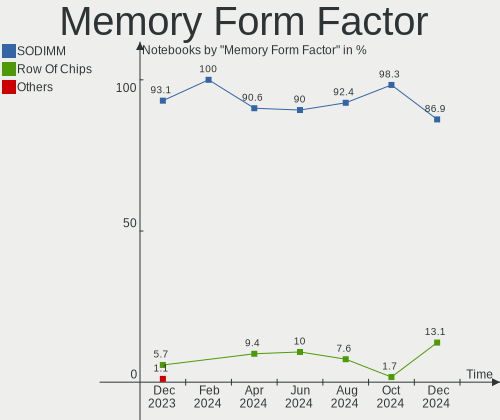

| Name         | Notebooks | Percent |
|--------------|-----------|---------|
| SODIMM       | 83        | 96.51%  |
| Row Of Chips | 3         | 3.49%   |

Memory Size
-----------

Memory module size

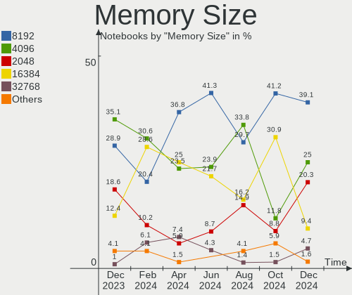

| Size  | Notebooks | Percent |
|-------|-----------|---------|
| 4096  | 33        | 34.02%  |
| 8192  | 28        | 28.87%  |
| 16384 | 15        | 15.46%  |
| 2048  | 11        | 11.34%  |
| 32768 | 6         | 6.19%   |
| 1024  | 3         | 3.09%   |
| 512   | 1         | 1.03%   |

Memory Speed
------------

Memory module speed

| Speed | Notebooks | Percent |
|-------|-----------|---------|
| 1600  | 27        | 28.72%  |
| 3200  | 21        | 22.34%  |
| 2667  | 12        | 12.77%  |
| 2400  | 7         | 7.45%   |
| 1334  | 5         | 5.32%   |
| 6400  | 3         | 3.19%   |
| 4199  | 3         | 3.19%   |
| 800   | 3         | 3.19%   |
| 4800  | 2         | 2.13%   |
| 1333  | 2         | 2.13%   |
| 667   | 2         | 2.13%   |
| 3266  | 1         | 1.06%   |
| 2133  | 1         | 1.06%   |
| 2048  | 1         | 1.06%   |
| 1777  | 1         | 1.06%   |
| 1067  | 1         | 1.06%   |
| 1066  | 1         | 1.06%   |
| 533   | 1         | 1.06%   |

Printers & scanners
-------------------

Printer Vendor
--------------

Printer device vendors

Zero info for selected period =(

Printer Model
-------------

Printer device models

Zero info for selected period =(

Scanner Vendor
--------------

Scanner device vendors

Zero info for selected period =(

Scanner Model
-------------

Scanner device models

Zero info for selected period =(

Camera
------

Camera Vendor
-------------

Camera device vendors

| Vendor                                 | Notebooks | Percent |
|----------------------------------------|-----------|---------|
| Chicony Electronics                    | 16        | 15.69%  |
| Realtek Semiconductor                  | 13        | 12.75%  |
| Quanta                                 | 12        | 11.76%  |
| Bison Electronics                      | 8         | 7.84%   |
| IMC Networks                           | 6         | 5.88%   |
| Suyin                                  | 5         | 4.9%    |
| Sunplus Innovation Technology          | 5         | 4.9%    |
| Silicon Motion                         | 5         | 4.9%    |
| Acer                                   | 5         | 4.9%    |
| Cheng Uei Precision Industry (Foxlink) | 4         | 3.92%   |
| Microdia                               | 3         | 2.94%   |
| Luxvisions Innotech Limited            | 3         | 2.94%   |
| Syntek                                 | 2         | 1.96%   |
| Sonix Technology                       | 2         | 1.96%   |
| Samsung Electronics                    | 2         | 1.96%   |
| Z-Star Microelectronics                | 1         | 0.98%   |
| Ricoh                                  | 1         | 0.98%   |
| Primax Electronics                     | 1         | 0.98%   |
| Microsoft                              | 1         | 0.98%   |
| Logitech                               | 1         | 0.98%   |
| Lite-On Technology                     | 1         | 0.98%   |
| Intel                                  | 1         | 0.98%   |
| Apple                                  | 1         | 0.98%   |
| Alpha Imaging Technology               | 1         | 0.98%   |
| ALi                                    | 1         | 0.98%   |
| Alcor Micro                            | 1         | 0.98%   |

Camera Model
------------

Camera device models

| Model                                               | Notebooks | Percent |
|-----------------------------------------------------|-----------|---------|
| Quanta HP TrueVision HD Camera                      | 8         | 7.84%   |
| Realtek Integrated_Webcam_HD                        | 5         | 4.9%    |
| Chicony Integrated Camera                           | 4         | 3.92%   |
| Realtek Integrated Webcam                           | 3         | 2.94%   |
| IMC Networks USB2.0 HD UVC WebCam                   | 3         | 2.94%   |
| IMC Networks Integrated Camera                      | 3         | 2.94%   |
| Chicony HD WebCam                                   | 3         | 2.94%   |
| Bison Integrated Camera                             | 3         | 2.94%   |
| Syntek Integrated Camera                            | 2         | 1.96%   |
| Suyin HP TrueVision HD Integrated Webcam            | 2         | 1.96%   |
| Sonix USB2.0 HD UVC WebCam                          | 2         | 1.96%   |
| Samsung Galaxy series, misc. (MTP mode)             | 2         | 1.96%   |
| Quanta HP HD Camera                                 | 2         | 1.96%   |
| Luxvisions Innotech Limited HP TrueVision HD Camera | 2         | 1.96%   |
| Acer Integrated Camera                              | 2         | 1.96%   |
| Z-Star Vega USB 2.0 Camera                          | 1         | 0.98%   |
| Suyin Integrated_Webcam_HD                          | 1         | 0.98%   |
| Suyin Asus Integrated Webcam                        | 1         | 0.98%   |
| Suyin Acer/HP Integrated Webcam [CN0314]            | 1         | 0.98%   |
| Sunplus XiaoMi USB 2.0 Webcam                       | 1         | 0.98%   |
| Sunplus Laptop_Integrated_Webcam_HD                 | 1         | 0.98%   |
| Sunplus Integrated_Webcam_HD                        | 1         | 0.98%   |
| Sunplus Integrated Webcam                           | 1         | 0.98%   |
| Sunplus Dell Integrated Webcam                      | 1         | 0.98%   |
| Silicon Motion WebCam SC-13HDN10939N                | 1         | 0.98%   |
| Silicon Motion WebCam SC-10HDP12631N                | 1         | 0.98%   |
| Silicon Motion WebCam SC-0311139N                   | 1         | 0.98%   |
| Silicon Motion Lenovo EasyCamera                    | 1         | 0.98%   |
| Silicon Motion 300k Pixel Camera                    | 1         | 0.98%   |
| Ricoh Laptop_Integrated_Webcam_FHD                  | 1         | 0.98%   |
| Realtek Lenovo EasyCamera                           | 1         | 0.98%   |
| Realtek Integrated Webcam HD                        | 1         | 0.98%   |
| Realtek HP Truevision HD                            | 1         | 0.98%   |
| Realtek HD WebCam                                   | 1         | 0.98%   |
| Realtek EasyCamera                                  | 1         | 0.98%   |
| Quanta USB2.0 HD UVC WebCam                         | 1         | 0.98%   |
| Quanta Acer FHD User Facing                         | 1         | 0.98%   |
| Primax Villem                                       | 1         | 0.98%   |
| Microsoft LifeCam Studio                            | 1         | 0.98%   |
| Microdia WebCam SC-13HDL12639P                      | 1         | 0.98%   |

Security
--------

Fingerprint Vendor
------------------

Fingerprint sensor vendors

| Vendor                     | Notebooks | Percent |
|----------------------------|-----------|---------|
| Shenzhen Goodix Technology | 5         | 35.71%  |
| Validity Sensors           | 4         | 28.57%  |
| Synaptics                  | 3         | 21.43%  |
| Elan Microelectronics      | 1         | 7.14%   |
| AuthenTec                  | 1         | 7.14%   |

Fingerprint Model
-----------------

Fingerprint sensor models

| Model                                                     | Notebooks | Percent |
|-----------------------------------------------------------|-----------|---------|
| Shenzhen Goodix  FingerPrint Device                       | 3         | 21.43%  |
| Synaptics Metallica MIS Touch Fingerprint Reader          | 2         | 14.29%  |
| Validity Sensors VFS5011 Fingerprint Reader               | 1         | 7.14%   |
| Validity Sensors VFS495 Fingerprint Reader                | 1         | 7.14%   |
| Validity Sensors VFS491                                   | 1         | 7.14%   |
| Validity Sensors Synaptics WBDI                           | 1         | 7.14%   |
| Synaptics  FS7604 Touch Fingerprint Sensor with PurePrint | 1         | 7.14%   |
| Shenzhen Goodix Fingerprint Reader                        | 1         | 7.14%   |
| Shenzhen Goodix FingerPrint                               | 1         | 7.14%   |
| Elan ELAN:Fingerprint                                     | 1         | 7.14%   |
| AuthenTec Fingerprint Sensor                              | 1         | 7.14%   |

Chipcard Vendor
---------------

Chipcard module vendors

| Vendor      | Notebooks | Percent |
|-------------|-----------|---------|
| Broadcom    | 8         | 61.54%  |
| O2 Micro    | 2         | 15.38%  |
| Alcor Micro | 2         | 15.38%  |
| Upek        | 1         | 7.69%   |

Chipcard Model
--------------

Chipcard module models

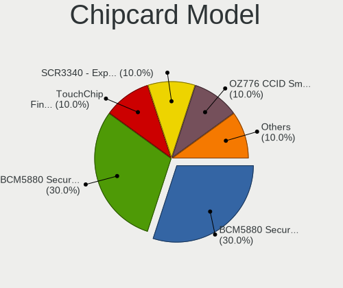

| Model                                                                        | Notebooks | Percent |
|------------------------------------------------------------------------------|-----------|---------|
| Broadcom BCM5880 Secure Applications Processor with fingerprint swipe sensor | 2         | 15.38%  |
| Broadcom BCM5880 Secure Applications Processor                               | 2         | 15.38%  |
| Broadcom 5880                                                                | 2         | 15.38%  |
| Broadcom 58200                                                               | 2         | 15.38%  |
| Alcor Micro AU9540 Smartcard Reader                                          | 2         | 15.38%  |
| Upek TouchChip Fingerprint Coprocessor (WBF advanced mode)                   | 1         | 7.69%   |
| O2 Micro Oz776 SmartCard Reader                                              | 1         | 7.69%   |
| O2 Micro OZ776 CCID Smartcard Reader                                         | 1         | 7.69%   |

Unsupported
-----------

Unsupported Devices
-------------------

Total unsupported devices on board

| Total | Notebooks | Percent |
|-------|-----------|---------|
| 0     | 70        | 61.95%  |
| 1     | 35        | 30.97%  |
| 2     | 8         | 7.08%   |

Unsupported Device Types
------------------------

Types of unsupported devices

| Type                     | Notebooks | Percent |
|--------------------------|-----------|---------|
| Fingerprint reader       | 14        | 28%     |
| Graphics card            | 12        | 24%     |
| Chipcard                 | 11        | 22%     |
| Bluetooth                | 3         | 6%      |
| Net/wireless             | 2         | 4%      |
| Multimedia controller    | 2         | 4%      |
| Camera                   | 2         | 4%      |
| Storage                  | 1         | 2%      |
| Modem                    | 1         | 2%      |
| Communication controller | 1         | 2%      |
| Card reader              | 1         | 2%      |

