Linux in Poland - Hardware Trends (Notebooks)
---------------------------------------------

A project to identify most popular hardware characteristics and track their change
over time based on data collected by Linux users at https://Linux-Hardware.org.

Anyone can contribute to this report by the [hw-probe](https://github.com/linuxhw/hw-probe) tool:

    sudo -E hw-probe -all -upload

Period: Jun, 2023.

Contents
--------

* [ System ](#system)
  - [ OS                       ](#os)
  - [ OS Family                ](#os-family)
  - [ Kernel                   ](#kernel)
  - [ Kernel Family            ](#kernel-family)
  - [ Kernel Major Ver.        ](#kernel-major-ver)
  - [ Arch                     ](#arch)
  - [ DE                       ](#de)
  - [ Display Server           ](#display-server)
  - [ Display Manager          ](#display-manager)
  - [ OS Lang                  ](#os-lang)
  - [ Boot Mode                ](#boot-mode)
  - [ Filesystem               ](#filesystem)
  - [ Part. scheme             ](#part-scheme)
  - [ Dual Boot with Linux/BSD ](#dual-boot-with-linuxbsd)
  - [ Dual Boot (Win)          ](#dual-boot-win)

* [ Board ](#board)
  - [ Vendor                   ](#vendor)
  - [ Model                    ](#model)
  - [ Model Family             ](#model-family)
  - [ MFG Year                 ](#mfg-year)
  - [ Form Factor              ](#form-factor)
  - [ Secure Boot              ](#secure-boot)
  - [ Coreboot                 ](#coreboot)
  - [ RAM Size                 ](#ram-size)
  - [ RAM Used                 ](#ram-used)
  - [ Total Drives             ](#total-drives)
  - [ Has CD-ROM               ](#has-cd-rom)
  - [ Has Ethernet             ](#has-ethernet)
  - [ Has WiFi                 ](#has-wifi)
  - [ Has Bluetooth            ](#has-bluetooth)

* [ Location ](#location)
  - [ Country                  ](#country)
  - [ City                     ](#city)

* [ Drives ](#drives)
  - [ Drive Vendor             ](#drive-vendor)
  - [ Drive Model              ](#drive-model)
  - [ HDD Vendor               ](#hdd-vendor)
  - [ SSD Vendor               ](#ssd-vendor)
  - [ Drive Kind               ](#drive-kind)
  - [ Drive Connector          ](#drive-connector)
  - [ Drive Size               ](#drive-size)
  - [ Space Total              ](#space-total)
  - [ Space Used               ](#space-used)
  - [ Malfunc. Drives          ](#malfunc-drives)
  - [ Malfunc. Drive Vendor    ](#malfunc-drive-vendor)
  - [ Malfunc. HDD Vendor      ](#malfunc-hdd-vendor)
  - [ Malfunc. Drive Kind      ](#malfunc-drive-kind)
  - [ Failed Drives            ](#failed-drives)
  - [ Failed Drive Vendor      ](#failed-drive-vendor)
  - [ Drive Status             ](#drive-status)

* [ Storage controller ](#storage-controller)
  - [ Storage Vendor           ](#storage-vendor)
  - [ Storage Model            ](#storage-model)
  - [ Storage Kind             ](#storage-kind)

* [ Processor ](#processor)
  - [ CPU Vendor               ](#cpu-vendor)
  - [ CPU Model                ](#cpu-model)
  - [ CPU Model Family         ](#cpu-model-family)
  - [ CPU Cores                ](#cpu-cores)
  - [ CPU Sockets              ](#cpu-sockets)
  - [ CPU Threads              ](#cpu-threads)
  - [ CPU Op-Modes             ](#cpu-op-modes)
  - [ CPU Microcode            ](#cpu-microcode)
  - [ CPU Microarch            ](#cpu-microarch)

* [ Graphics ](#graphics)
  - [ GPU Vendor               ](#gpu-vendor)
  - [ GPU Model                ](#gpu-model)
  - [ GPU Combo                ](#gpu-combo)
  - [ GPU Driver               ](#gpu-driver)
  - [ GPU Memory               ](#gpu-memory)

* [ Monitor ](#monitor)
  - [ Monitor Vendor           ](#monitor-vendor)
  - [ Monitor Model            ](#monitor-model)
  - [ Monitor Resolution       ](#monitor-resolution)
  - [ Monitor Diagonal         ](#monitor-diagonal)
  - [ Monitor Width            ](#monitor-width)
  - [ Aspect Ratio             ](#aspect-ratio)
  - [ Monitor Area             ](#monitor-area)
  - [ Pixel Density            ](#pixel-density)
  - [ Multiple Monitors        ](#multiple-monitors)

* [ Network ](#network)
  - [ Net Controller Vendor    ](#net-controller-vendor)
  - [ Net Controller Model     ](#net-controller-model)
  - [ Wireless Vendor          ](#wireless-vendor)
  - [ Wireless Model           ](#wireless-model)
  - [ Ethernet Vendor          ](#ethernet-vendor)
  - [ Ethernet Model           ](#ethernet-model)
  - [ Net Controller Kind      ](#net-controller-kind)
  - [ Used Controller          ](#used-controller)
  - [ NICs                     ](#nics)
  - [ IPv6                     ](#ipv6)

* [ Bluetooth ](#bluetooth)
  - [ Bluetooth Vendor         ](#bluetooth-vendor)
  - [ Bluetooth Model          ](#bluetooth-model)

* [ Sound ](#sound)
  - [ Sound Vendor             ](#sound-vendor)
  - [ Sound Model              ](#sound-model)

* [ Memory ](#memory)
  - [ Memory Vendor            ](#memory-vendor)
  - [ Memory Model             ](#memory-model)
  - [ Memory Kind              ](#memory-kind)
  - [ Memory Form Factor       ](#memory-form-factor)
  - [ Memory Size              ](#memory-size)
  - [ Memory Speed             ](#memory-speed)

* [ Printers & scanners ](#printers--scanners)
  - [ Printer Vendor           ](#printer-vendor)
  - [ Printer Model            ](#printer-model)
  - [ Scanner Vendor           ](#scanner-vendor)
  - [ Scanner Model            ](#scanner-model)

* [ Camera ](#camera)
  - [ Camera Vendor            ](#camera-vendor)
  - [ Camera Model             ](#camera-model)

* [ Security ](#security)
  - [ Fingerprint Vendor       ](#fingerprint-vendor)
  - [ Fingerprint Model        ](#fingerprint-model)
  - [ Chipcard Vendor          ](#chipcard-vendor)
  - [ Chipcard Model           ](#chipcard-model)

* [ Unsupported ](#unsupported)
  - [ Unsupported Devices      ](#unsupported-devices)
  - [ Unsupported Device Types ](#unsupported-device-types)

System
------

OS
--

Installed operating systems

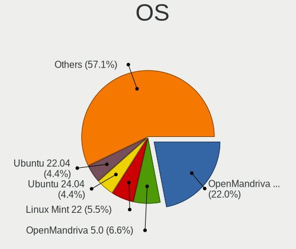

| Name                | Notebooks | Percent |
|---------------------|-----------|---------|
| Ubuntu 22.04        | 10        | 15.15%  |
| Fedora 38           | 8         | 12.12%  |
| OpenMandriva 23.03  | 5         | 7.58%   |
| Ubuntu 23.04        | 4         | 6.06%   |
| Arch Rolling        | 4         | 6.06%   |
| OpenMandriva 23.06  | 3         | 4.55%   |
| ArcoLinux Rolling   | 3         | 4.55%   |
| Zorin 16            | 2         | 3.03%   |
| Xubuntu 22.04       | 2         | 3.03%   |
| SteamOS 3.4.8       | 2         | 3.03%   |
| Linux Mint 21.1     | 2         | 3.03%   |
| EndeavourOS Rolling | 2         | 3.03%   |
| Debian 11           | 2         | 3.03%   |
| Zorin 15            | 1         | 1.52%   |
| Ubuntu 22.10        | 1         | 1.52%   |
| Ubuntu 20.04        | 1         | 1.52%   |
| SteamOS 3.4         | 1         | 1.52%   |
| PureOS 10.0         | 1         | 1.52%   |
| OpenMandriva 4.90   | 1         | 1.52%   |
| OpenMandriva 23.01  | 1         | 1.52%   |
| MX 23               | 1         | 1.52%   |
| MX 21               | 1         | 1.52%   |
| Manjaro             | 1         | 1.52%   |
| LMDE 5              | 1         | 1.52%   |
| Kubuntu 23.04       | 1         | 1.52%   |
| Kali 2023.2         | 1         | 1.52%   |
| Gentoo 2.13         | 1         | 1.52%   |
| Endless 4.0.14      | 1         | 1.52%   |
| Debian 12           | 1         | 1.52%   |
| ChimeraOS 42        | 1         | 1.52%   |

OS Family
---------

OS without a version

| Name         | Notebooks | Percent |
|--------------|-----------|---------|
| Ubuntu       | 16        | 24.24%  |
| OpenMandriva | 10        | 15.15%  |
| Fedora       | 8         | 12.12%  |
| Arch         | 4         | 6.06%   |
| Zorin        | 3         | 4.55%   |
| SteamOS      | 3         | 4.55%   |
| Debian       | 3         | 4.55%   |
| ArcoLinux    | 3         | 4.55%   |
| Xubuntu      | 2         | 3.03%   |
| MX           | 2         | 3.03%   |
| Linux Mint   | 2         | 3.03%   |
| EndeavourOS  | 2         | 3.03%   |
| PureOS       | 1         | 1.52%   |
| Manjaro      | 1         | 1.52%   |
| LMDE         | 1         | 1.52%   |
| Kubuntu      | 1         | 1.52%   |
| Kali         | 1         | 1.52%   |
| Gentoo       | 1         | 1.52%   |
| Endless      | 1         | 1.52%   |
| ChimeraOS    | 1         | 1.52%   |

Kernel
------

Version of the Linux kernel

| Version                                | Notebooks | Percent |
|----------------------------------------|-----------|---------|
| 6.2.6-desktop-1omv2390                 | 5         | 7.58%   |
| 5.19.0-45-generic                      | 5         | 7.58%   |
| 6.2.0-20-generic                       | 4         | 6.06%   |
| 5.19.0-43-generic                      | 4         | 6.06%   |
| 6.3.7-arch1-1                          | 3         | 4.55%   |
| 6.3.5-desktop-3omv2390                 | 3         | 4.55%   |
| 5.10.0-23-amd64                        | 3         | 4.55%   |
| 6.3.8-200.fc38.x86_64                  | 2         | 3.03%   |
| 6.3.4-201.fc38.x86_64                  | 2         | 3.03%   |
| 6.1.0-9-amd64                          | 2         | 3.03%   |
| 5.15.0-76-generic                      | 2         | 3.03%   |
| 5.15.0-73-generic                      | 2         | 3.03%   |
| 5.13.0-valve36-1-neptune               | 2         | 3.03%   |
| 6.3.8-zen1-1-zen                       | 1         | 1.52%   |
| 6.3.8-4-MANJARO                        | 1         | 1.52%   |
| 6.3.7-200.fc38.x86_64                  | 1         | 1.52%   |
| 6.3.6-zen1-1-zen                       | 1         | 1.52%   |
| 6.3.6-arch1-1                          | 1         | 1.52%   |
| 6.3.6-200.fc38.x86_64                  | 1         | 1.52%   |
| 6.3.5-arch1-1                          | 1         | 1.52%   |
| 6.3.5-200.fc38.x86_64                  | 1         | 1.52%   |
| 6.3.4-arch1-1                          | 1         | 1.52%   |
| 6.2.9-300.fc38.x86_64                  | 1         | 1.52%   |
| 6.2.8-arch1-1                          | 1         | 1.52%   |
| 6.2.0-23-generic                       | 1         | 1.52%   |
| 6.1.31-gentoo-x86_64                   | 1         | 1.52%   |
| 6.1.27-1-lts                           | 1         | 1.52%   |
| 6.1.1-desktop-1omv2290                 | 1         | 1.52%   |
| 6.1.0-kali9-amd64                      | 1         | 1.52%   |
| 5.4.0-66-generic                       | 1         | 1.52%   |
| 5.4.0-152-generic                      | 1         | 1.52%   |
| 5.19.0-46-generic                      | 1         | 1.52%   |
| 5.19.0-42-generic                      | 1         | 1.52%   |
| 5.19.0-32-generic                      | 1         | 1.52%   |
| 5.18.12-desktop-3omv4090               | 1         | 1.52%   |
| 5.18.1-arch1_testHoloISO_20220606.1811 | 1         | 1.52%   |
| 5.14.0-1051-oem                        | 1         | 1.52%   |
| 5.11.0-35-generic                      | 1         | 1.52%   |
| 5.10.0-22-amd64                        | 1         | 1.52%   |
| 5.10.0-15-amd64                        | 1         | 1.52%   |

Kernel Family
-------------

Linux kernel without a distro release

| Version | Notebooks | Percent |
|---------|-----------|---------|
| 5.19.0  | 12        | 18.18%  |
| 6.3.5   | 5         | 7.58%   |
| 6.2.6   | 5         | 7.58%   |
| 6.2.0   | 5         | 7.58%   |
| 5.10.0  | 5         | 7.58%   |
| 6.3.8   | 4         | 6.06%   |
| 6.3.7   | 4         | 6.06%   |
| 5.15.0  | 4         | 6.06%   |
| 6.3.6   | 3         | 4.55%   |
| 6.3.4   | 3         | 4.55%   |
| 6.1.0   | 3         | 4.55%   |
| 5.4.0   | 2         | 3.03%   |
| 5.13.0  | 2         | 3.03%   |
| 6.2.9   | 1         | 1.52%   |
| 6.2.8   | 1         | 1.52%   |
| 6.1.31  | 1         | 1.52%   |
| 6.1.27  | 1         | 1.52%   |
| 6.1.1   | 1         | 1.52%   |
| 5.18.12 | 1         | 1.52%   |
| 5.18.1  | 1         | 1.52%   |
| 5.14.0  | 1         | 1.52%   |
| 5.11.0  | 1         | 1.52%   |

Kernel Major Ver.
-----------------

Linux kernel major version

| Version | Notebooks | Percent |
|---------|-----------|---------|
| 6.3     | 19        | 28.79%  |
| 6.2     | 12        | 18.18%  |
| 5.19    | 12        | 18.18%  |
| 6.1     | 6         | 9.09%   |
| 5.10    | 5         | 7.58%   |
| 5.15    | 4         | 6.06%   |
| 5.4     | 2         | 3.03%   |
| 5.18    | 2         | 3.03%   |
| 5.13    | 2         | 3.03%   |
| 5.14    | 1         | 1.52%   |
| 5.11    | 1         | 1.52%   |

Arch
----

OS architecture (x86_64, i586, etc.)

| Name   | Notebooks | Percent |
|--------|-----------|---------|
| x86_64 | 66        | 100%    |

DE
--

Desktop Environment

| Name       | Notebooks | Percent |
|------------|-----------|---------|
| GNOME      | 26        | 39.39%  |
| KDE5       | 21        | 31.82%  |
| XFCE       | 10        | 15.15%  |
| MATE       | 3         | 4.55%   |
| X-Cinnamon | 2         | 3.03%   |
| Hyprland   | 1         | 1.52%   |
| Cinnamon   | 1         | 1.52%   |
| awesome    | 1         | 1.52%   |
| Unknown    | 1         | 1.52%   |

Display Server
--------------

X11 or Wayland

| Name    | Notebooks | Percent |
|---------|-----------|---------|
| X11     | 42        | 63.64%  |
| Wayland | 22        | 33.33%  |
| Tty     | 2         | 3.03%   |

Display Manager
---------------

SDDM, LightDM, etc.

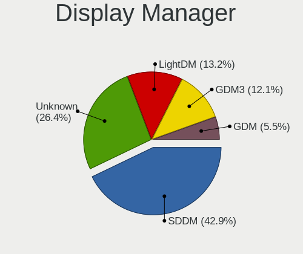

| Name    | Notebooks | Percent |
|---------|-----------|---------|
| GDM3    | 17        | 25.76%  |
| Unknown | 17        | 25.76%  |
| SDDM    | 16        | 24.24%  |
| LightDM | 12        | 18.18%  |
| GDM     | 4         | 6.06%   |

OS Lang
-------

Language

| Lang        | Notebooks | Percent |
|-------------|-----------|---------|
| pl_PL       | 34        | 51.52%  |
| en_US       | 28        | 42.42%  |
| en_GB       | 2         | 3.03%   |
| en_US.utf-8 | 1         | 1.52%   |
| Unknown     | 1         | 1.52%   |

Boot Mode
---------

EFI or BIOS

| Mode | Notebooks | Percent |
|------|-----------|---------|
| EFI  | 38        | 57.58%  |
| BIOS | 28        | 42.42%  |

Filesystem
----------

Type of filesystem

| Type    | Notebooks | Percent |
|---------|-----------|---------|
| Ext4    | 34        | 51.52%  |
| Btrfs   | 14        | 21.21%  |
| Tmpfs   | 9         | 13.64%  |
| Overlay | 8         | 12.12%  |
| F2fs    | 1         | 1.52%   |

Part. scheme
------------

Scheme of partitioning

| Type    | Notebooks | Percent |
|---------|-----------|---------|
| GPT     | 41        | 62.12%  |
| Unknown | 16        | 24.24%  |
| MBR     | 9         | 13.64%  |

Dual Boot with Linux/BSD
------------------------

Hosting more than one Linux/BSD

| Dual boot | Notebooks | Percent |
|-----------|-----------|---------|
| No        | 55        | 83.33%  |
| Yes       | 11        | 16.67%  |

Dual Boot (Win)
---------------

Hosting Linux and Windows

| Dual boot | Notebooks | Percent |
|-----------|-----------|---------|
| No        | 50        | 75.76%  |
| Yes       | 16        | 24.24%  |

Board
-----

Vendor
------

Motherboard manufacturer

| Name                | Notebooks | Percent |
|---------------------|-----------|---------|
| Lenovo              | 19        | 28.79%  |
| Hewlett-Packard     | 8         | 12.12%  |
| Dell                | 8         | 12.12%  |
| ASUSTek Computer    | 7         | 10.61%  |
| Toshiba             | 5         | 7.58%   |
| Acer                | 4         | 6.06%   |
| Valve               | 2         | 3.03%   |
| HUAWEI              | 2         | 3.03%   |
| STONE COMPUTERS     | 1         | 1.52%   |
| Samsung Electronics | 1         | 1.52%   |
| Razer               | 1         | 1.52%   |
| Panasonic           | 1         | 1.52%   |
| Packard Bell        | 1         | 1.52%   |
| Notebook            | 1         | 1.52%   |
| MSI                 | 1         | 1.52%   |
| Google              | 1         | 1.52%   |
| Fujitsu             | 1         | 1.52%   |
| eMachines           | 1         | 1.52%   |
| Apple               | 1         | 1.52%   |

Model
-----

Motherboard model

| Name                                                                                     | Notebooks | Percent |
|------------------------------------------------------------------------------------------|-----------|---------|
| Valve Jupiter                                                                            | 2         | 3.03%   |
| HP EliteBook 820 G2                                                                      | 2         | 3.03%   |
| Acer Swift SF314-43                                                                      | 2         | 3.03%   |
| Toshiba TECRA R950                                                                       | 1         | 1.52%   |
| Toshiba Satellite Pro C70-B                                                              | 1         | 1.52%   |
| Toshiba Satellite L650                                                                   | 1         | 1.52%   |
| Toshiba Satellite L40                                                                    | 1         | 1.52%   |
| Toshiba Satellite A300                                                                   | 1         | 1.52%   |
| STONE COMPUTERS NOTCHA-286                                                               | 1         | 1.52%   |
| Samsung 355V4C/355V4X/355V5C/355V5X/356V4C/356V4X/356V5C/356V5X/3445VC/3445VX/3545VC/354 | 1         | 1.52%   |
| Razer Blade Stealth 13 (Early 2020) - RZ09-0310                                          | 1         | 1.52%   |
| Panasonic CF-53ASCZGFG                                                                   | 1         | 1.52%   |
| Packard Bell EasyNote TK85                                                               | 1         | 1.52%   |
| Notebook NV4xPZ                                                                          | 1         | 1.52%   |
| MSI GE62 6QC                                                                             | 1         | 1.52%   |
| Lenovo Y50-70 20378                                                                      | 1         | 1.52%   |
| Lenovo ThinkPad T490 20N20032US                                                          | 1         | 1.52%   |
| Lenovo ThinkPad T470s W10DG 20JTS1MR08                                                   | 1         | 1.52%   |
| Lenovo ThinkPad T430s 23554L7                                                            | 1         | 1.52%   |
| Lenovo ThinkPad T430 2349HNU                                                             | 1         | 1.52%   |
| Lenovo ThinkPad T430 2347BS4                                                             | 1         | 1.52%   |
| Lenovo ThinkPad L490 20Q5002DMH                                                          | 1         | 1.52%   |
| Lenovo ThinkPad L470 20J5S01S00                                                          | 1         | 1.52%   |
| Lenovo ThinkPad L390 20NSS04400                                                          | 1         | 1.52%   |
| Lenovo ThinkPad E15 Gen 2 20TD00GSPB                                                     | 1         | 1.52%   |
| Lenovo Legion Y740-17IRHg 81UJ                                                           | 1         | 1.52%   |
| Lenovo Legion 5 15ACH6 82JW                                                              | 1         | 1.52%   |
| Lenovo IdeaPad 5 Pro 16ARH7 82SN                                                         | 1         | 1.52%   |
| Lenovo IdeaPad 100S-14IBR 80R9                                                           | 1         | 1.52%   |
| Lenovo IdeaPad 100-15IBY 80MJ                                                            | 1         | 1.52%   |
| Lenovo G500s 20245                                                                       | 1         | 1.52%   |
| Lenovo B570 HuronRiver Platform                                                          | 1         | 1.52%   |
| Lenovo B51-80 80LM                                                                       | 1         | 1.52%   |
| Lenovo B50-70 20384                                                                      | 1         | 1.52%   |
| HUAWEI NBLB-WAX9N                                                                        | 1         | 1.52%   |
| HUAWEI KLVL-WXX9                                                                         | 1         | 1.52%   |
| HP Stream Laptop 14-ds0xxx                                                               | 1         | 1.52%   |
| HP Pavilion dv2                                                                          | 1         | 1.52%   |
| HP Notebook                                                                              | 1         | 1.52%   |
| HP Laptop 15-dw1xxx                                                                      | 1         | 1.52%   |

Model Family
------------

Motherboard model prefix

| Name                       | Notebooks | Percent |
|----------------------------|-----------|---------|
| Lenovo ThinkPad            | 9         | 13.64%  |
| Dell Latitude              | 5         | 7.58%   |
| Toshiba Satellite          | 4         | 6.06%   |
| Lenovo IdeaPad             | 3         | 4.55%   |
| HP EliteBook               | 3         | 4.55%   |
| Valve Jupiter              | 2         | 3.03%   |
| Lenovo Legion              | 2         | 3.03%   |
| ASUS TUF                   | 2         | 3.03%   |
| ASUS ASUS                  | 2         | 3.03%   |
| Acer Swift                 | 2         | 3.03%   |
| Toshiba TECRA              | 1         | 1.52%   |
| STONE COMPUTERS NOTCHA-286 | 1         | 1.52%   |
| Samsung 355V4C             | 1         | 1.52%   |
| Razer Blade                | 1         | 1.52%   |
| Panasonic CF-53ASCZGFG     | 1         | 1.52%   |
| Packard Bell EasyNote      | 1         | 1.52%   |
| Notebook NV4xPZ            | 1         | 1.52%   |
| MSI GE62                   | 1         | 1.52%   |
| Lenovo Y50-70              | 1         | 1.52%   |
| Lenovo G500s               | 1         | 1.52%   |
| Lenovo B570                | 1         | 1.52%   |
| Lenovo B51-80              | 1         | 1.52%   |
| Lenovo B50-70              | 1         | 1.52%   |
| HUAWEI NBLB-WAX9N          | 1         | 1.52%   |
| HUAWEI KLVL-WXX9           | 1         | 1.52%   |
| HP Stream                  | 1         | 1.52%   |
| HP Pavilion                | 1         | 1.52%   |
| HP Notebook                | 1         | 1.52%   |
| HP Laptop                  | 1         | 1.52%   |
| HP 255                     | 1         | 1.52%   |
| Google Blorb               | 1         | 1.52%   |
| Fujitsu CELSIUS            | 1         | 1.52%   |
| eMachines eME732ZG         | 1         | 1.52%   |
| Dell XPS                   | 1         | 1.52%   |
| Dell Precision             | 1         | 1.52%   |
| Dell Inspiron              | 1         | 1.52%   |
| ASUS VivoBook              | 1         | 1.52%   |
| ASUS K54C                  | 1         | 1.52%   |
| ASUS K52N                  | 1         | 1.52%   |
| Apple MacBookPro7          | 1         | 1.52%   |

MFG Year
--------

Motherboard manufacture year

| Year | Notebooks | Percent |
|------|-----------|---------|
| 2019 | 10        | 15.15%  |
| 2021 | 6         | 9.09%   |
| 2020 | 6         | 9.09%   |
| 2022 | 5         | 7.58%   |
| 2015 | 5         | 7.58%   |
| 2012 | 5         | 7.58%   |
| 2010 | 5         | 7.58%   |
| 2017 | 4         | 6.06%   |
| 2014 | 4         | 6.06%   |
| 2016 | 3         | 4.55%   |
| 2011 | 3         | 4.55%   |
| 2018 | 2         | 3.03%   |
| 2013 | 2         | 3.03%   |
| 2008 | 2         | 3.03%   |
| 2023 | 1         | 1.52%   |
| 2009 | 1         | 1.52%   |
| 2007 | 1         | 1.52%   |
| 2006 | 1         | 1.52%   |

Form Factor
-----------

Physical design of the computer

| Name     | Notebooks | Percent |
|----------|-----------|---------|
| Notebook | 66        | 100%    |

Secure Boot
-----------

Enabled or disabled

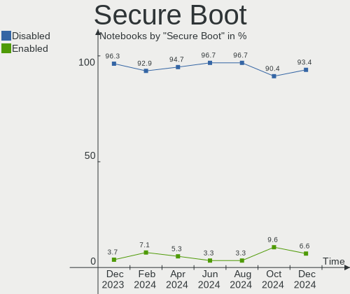

| State    | Notebooks | Percent |
|----------|-----------|---------|
| Disabled | 62        | 93.94%  |
| Enabled  | 4         | 6.06%   |

Coreboot
--------

Have coreboot on board

| Used | Notebooks | Percent |
|------|-----------|---------|
| No   | 65        | 98.48%  |
| Yes  | 1         | 1.52%   |

RAM Size
--------

Total RAM memory

| Size in GB | Notebooks | Percent |
|------------|-----------|---------|
| 4.01-8.0   | 21        | 31.82%  |
| 8.01-16.0  | 17        | 25.76%  |
| 3.01-4.0   | 10        | 15.15%  |
| 16.01-24.0 | 8         | 12.12%  |
| 32.01-64.0 | 5         | 7.58%   |
| 1.01-2.0   | 4         | 6.06%   |
| 2.01-3.0   | 1         | 1.52%   |

RAM Used
--------

Used RAM memory

| Used GB   | Notebooks | Percent |
|-----------|-----------|---------|
| 1.01-2.0  | 25        | 37.88%  |
| 2.01-3.0  | 16        | 24.24%  |
| 4.01-8.0  | 14        | 21.21%  |
| 3.01-4.0  | 8         | 12.12%  |
| 0.51-1.0  | 2         | 3.03%   |
| 8.01-16.0 | 1         | 1.52%   |

Total Drives
------------

Number of drives on board

| Drives | Notebooks | Percent |
|--------|-----------|---------|
| 1      | 53        | 80.3%   |
| 2      | 10        | 15.15%  |
| 3      | 2         | 3.03%   |
| 0      | 1         | 1.52%   |

Has CD-ROM
----------

Has CD-ROM on board

| Presented | Notebooks | Percent |
|-----------|-----------|---------|
| No        | 44        | 66.67%  |
| Yes       | 22        | 33.33%  |

Has Ethernet
------------

Has Ethernet on board

| Presented | Notebooks | Percent |
|-----------|-----------|---------|
| Yes       | 50        | 75.76%  |
| No        | 16        | 24.24%  |

Has WiFi
--------

Has WiFi module

| Presented | Notebooks | Percent |
|-----------|-----------|---------|
| Yes       | 66        | 100%    |

Has Bluetooth
-------------

Has Bluetooth module

| Presented | Notebooks | Percent |
|-----------|-----------|---------|
| Yes       | 52        | 78.79%  |
| No        | 14        | 21.21%  |

Location
--------

Country
-------

Geographic location (country)

| Country | Notebooks | Percent |
|---------|-----------|---------|
| Poland  | 66        | 100%    |

City
----

Geographic location (city)

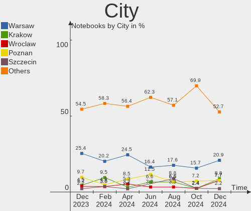

| City            | Notebooks | Percent |
|-----------------|-----------|---------|
| Warsaw          | 14        | 21.21%  |
| Krakow          | 5         | 7.58%   |
| Gdansk          | 5         | 7.58%   |
| Wroclaw         | 4         | 6.06%   |
| Żory           | 2         | 3.03%   |
| Poznan          | 2         | 3.03%   |
| Otwock          | 2         | 3.03%   |
| Katowice        | 2         | 3.03%   |
| Zielona Góra   | 1         | 1.52%   |
| Zawiercie       | 1         | 1.52%   |
| Zabrze          | 1         | 1.52%   |
| Tarnowskie Gory | 1         | 1.52%   |
| Szczecin        | 1         | 1.52%   |
| Sucha Beskidzka | 1         | 1.52%   |
| Stargard        | 1         | 1.52%   |
| Srokowo         | 1         | 1.52%   |
| Skierniewice    | 1         | 1.52%   |
| Sieciechowice   | 1         | 1.52%   |
| Ruda Śląska   | 1         | 1.52%   |
| Racibórz       | 1         | 1.52%   |
| Płock          | 1         | 1.52%   |
| Przeworsk       | 1         | 1.52%   |
| Polczyn-Zdroj   | 1         | 1.52%   |
| Pogorze         | 1         | 1.52%   |
| Piaseczno       | 1         | 1.52%   |
| Orzesze         | 1         | 1.52%   |
| Olsztyn         | 1         | 1.52%   |
| Niszczewice     | 1         | 1.52%   |
| Michalowice     | 1         | 1.52%   |
| Lubin           | 1         | 1.52%   |
| Lubartow        | 1         | 1.52%   |
| Legionowo       | 1         | 1.52%   |
| Kramsk          | 1         | 1.52%   |
| Kielce          | 1         | 1.52%   |
| Grajewo         | 1         | 1.52%   |
| Elblag          | 1         | 1.52%   |
| Chorzów        | 1         | 1.52%   |
| Bydgoszcz       | 1         | 1.52%   |

Drives
------

Drive Vendor
------------

Hard drive vendors

| Vendor                      | Notebooks | Drives | Percent |
|-----------------------------|-----------|--------|---------|
| Samsung Electronics         | 13        | 14     | 17.11%  |
| Crucial                     | 7         | 7      | 9.21%   |
| Toshiba                     | 6         | 6      | 7.89%   |
| Sandisk                     | 5         | 5      | 6.58%   |
| Kingston                    | 5         | 5      | 6.58%   |
| WDC                         | 4         | 5      | 5.26%   |
| Unknown                     | 4         | 4      | 5.26%   |
| Micron Technology           | 4         | 4      | 5.26%   |
| A-DATA Technology           | 4         | 4      | 5.26%   |
| Seagate                     | 3         | 3      | 3.95%   |
| Hitachi                     | 3         | 3      | 3.95%   |
| GOODRAM                     | 3         | 3      | 3.95%   |
| SK hynix                    | 2         | 2      | 2.63%   |
| KIOXIA                      | 2         | 2      | 2.63%   |
| Intel                       | 2         | 2      | 2.63%   |
| Gigabyte Technology         | 2         | 2      | 2.63%   |
| Transcend                   | 1         | 1      | 1.32%   |
| Silicon Motion              | 1         | 1      | 1.32%   |
| Kingston Technology Company | 1         | 1      | 1.32%   |
| HGST                        | 1         | 1      | 1.32%   |
| China                       | 1         | 1      | 1.32%   |
| BHT                         | 1         | 1      | 1.32%   |
| ADATA Technology            | 1         | 1      | 1.32%   |

Drive Model
-----------

Hard drive models

| Model                                               | Notebooks | Percent |
|-----------------------------------------------------|-----------|---------|
| Samsung NVMe SSD Controller SM981/PM981/PM983 250GB | 4         | 5.19%   |
| Sandisk WD Blue SN550 NVMe SSD 1TB                  | 2         | 2.6%    |
| Gigabyte GP-GSTFS31120GNTD 120GB SSD                | 2         | 2.6%    |
| Crucial CT500MX500SSD1 500GB                        | 2         | 2.6%    |
| Crucial CT120BX500SSD1 120GB                        | 2         | 2.6%    |
| A-DATA SU800 256GB SSD                              | 2         | 2.6%    |
| WDC WD3200BPVT-24JJ5T0 320GB                        | 1         | 1.3%    |
| WDC WD3200BEVT-80A0RT0 320GB                        | 1         | 1.3%    |
| WDC WD10JUCT-63CYNY0 1TB                            | 1         | 1.3%    |
| WDC WD10JUCT-61CYNY0 1TB                            | 1         | 1.3%    |
| Unknown MMC Card  64GB                              | 1         | 1.3%    |
| Unknown MMC Card  512GB                             | 1         | 1.3%    |
| Unknown MMC Card  128GB                             | 1         | 1.3%    |
| Unknown DB4032  32GB                                | 1         | 1.3%    |
| Transcend TS120GMTS420S 120GB SSD                   | 1         | 1.3%    |
| Toshiba XG6 NVMe SSD Controller 2TB                 | 1         | 1.3%    |
| Toshiba THNSNF256GCSS 256GB SSD                     | 1         | 1.3%    |
| Toshiba THNSNF128GCSS 128GB SSD                     | 1         | 1.3%    |
| Toshiba MQ04ABF100 1TB                              | 1         | 1.3%    |
| Toshiba MQ01ABD050 500GB                            | 1         | 1.3%    |
| Toshiba KXG6AZNV256G 256GB                          | 1         | 1.3%    |
| SK hynix SC311 SATA 256GB SSD                       | 1         | 1.3%    |
| SK hynix HFM256GD3JX016N 256GB                      | 1         | 1.3%    |
| Silicon Motion SM2262/SM2262EN SSD Controller 480GB | 1         | 1.3%    |
| Seagate ST500LT012-1DG142 500GB                     | 1         | 1.3%    |
| Seagate ST500LM000-SSHD-8GB                         | 1         | 1.3%    |
| Seagate ST2000LM015-2E8174 2TB                      | 1         | 1.3%    |
| Sandisk WD Black SN850 1TB                          | 1         | 1.3%    |
| SanDisk SDSSDP128G 128GB                            | 1         | 1.3%    |
| SanDisk SDSSDH3500G 500GB                           | 1         | 1.3%    |
| Samsung SSD 990 PRO 2TB                             | 1         | 1.3%    |
| Samsung SSD 980 1TB                                 | 1         | 1.3%    |
| Samsung SSD 960 EVO 250GB                           | 1         | 1.3%    |
| Samsung SSD 860 EVO 500GB                           | 1         | 1.3%    |
| Samsung SSD 860 EVO 500G                            | 1         | 1.3%    |
| Samsung SSD 850 EVO 1TB                             | 1         | 1.3%    |
| Samsung MZVLQ256HAJD-000H1 256GB                    | 1         | 1.3%    |
| Samsung MZALQ512HBLU-00BL1 512GB                    | 1         | 1.3%    |
| Samsung MZ9LQ512HBLU-00BVL 512GB                    | 1         | 1.3%    |
| Samsung MZ7LN256HCHP-00000 256GB SSD                | 1         | 1.3%    |

HDD Vendor
----------

Hard disk drive vendors

| Vendor  | Notebooks | Drives | Percent |
|---------|-----------|--------|---------|
| WDC     | 4         | 5      | 30.77%  |
| Seagate | 3         | 3      | 23.08%  |
| Hitachi | 3         | 3      | 23.08%  |
| Toshiba | 2         | 2      | 15.38%  |
| HGST    | 1         | 1      | 7.69%   |

SSD Vendor
----------

Solid state drive vendors

| Vendor              | Notebooks | Drives | Percent |
|---------------------|-----------|--------|---------|
| Crucial             | 7         | 7      | 24.14%  |
| Samsung Electronics | 3         | 4      | 10.34%  |
| Kingston            | 3         | 3      | 10.34%  |
| GOODRAM             | 3         | 3      | 10.34%  |
| A-DATA Technology   | 3         | 3      | 10.34%  |
| Toshiba             | 2         | 2      | 6.9%    |
| SanDisk             | 2         | 2      | 6.9%    |
| Gigabyte Technology | 2         | 2      | 6.9%    |
| Transcend           | 1         | 1      | 3.45%   |
| SK hynix            | 1         | 1      | 3.45%   |
| China               | 1         | 1      | 3.45%   |
| BHT                 | 1         | 1      | 3.45%   |

Drive Kind
----------

HDD or SSD

| Kind | Notebooks | Drives | Percent |
|------|-----------|--------|---------|
| NVMe | 29        | 30     | 39.19%  |
| SSD  | 28        | 30     | 37.84%  |
| HDD  | 13        | 14     | 17.57%  |
| MMC  | 4         | 4      | 5.41%   |

Drive Connector
---------------

SATA, SAS, NVMe, etc.

| Type | Notebooks | Drives | Percent |
|------|-----------|--------|---------|
| SATA | 38        | 42     | 52.78%  |
| NVMe | 29        | 30     | 40.28%  |
| MMC  | 4         | 4      | 5.56%   |
| SAS  | 1         | 2      | 1.39%   |

Drive Size
----------

Size of hard drive

| Size in TB | Notebooks | Drives | Percent |
|------------|-----------|--------|---------|
| 0.01-0.5   | 30        | 32     | 73.17%  |
| 0.51-1.0   | 10        | 11     | 24.39%  |
| 1.01-2.0   | 1         | 1      | 2.44%   |

Space Total
-----------

Amount of disk space available on the file system

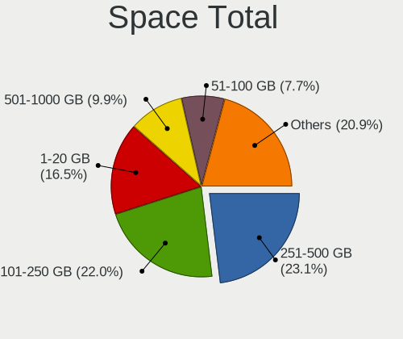

| Size in GB     | Notebooks | Percent |
|----------------|-----------|---------|
| 251-500        | 20        | 30.3%   |
| 101-250        | 17        | 25.76%  |
| 1-20           | 8         | 12.12%  |
| 501-1000       | 5         | 7.58%   |
| 51-100         | 5         | 7.58%   |
| 21-50          | 3         | 4.55%   |
| Unknown        | 3         | 4.55%   |
| 2001-3000      | 2         | 3.03%   |
| 1001-2000      | 2         | 3.03%   |
| More than 3000 | 1         | 1.52%   |

Space Used
----------

Amount of used disk space

| Used GB  | Notebooks | Percent |
|----------|-----------|---------|
| 1-20     | 28        | 42.42%  |
| 51-100   | 11        | 16.67%  |
| 251-500  | 8         | 12.12%  |
| 101-250  | 8         | 12.12%  |
| 21-50    | 5         | 7.58%   |
| Unknown  | 3         | 4.55%   |
| 501-1000 | 2         | 3.03%   |
| 0        | 1         | 1.52%   |

Malfunc. Drives
---------------

Drive models with a malfunction

| Model                         | Notebooks | Drives | Percent |
|-------------------------------|-----------|--------|---------|
| Hitachi HTS543232A7A384 320GB | 1         | 1      | 33.33%  |
| Hitachi HTS543225L9SA00 250GB | 1         | 1      | 33.33%  |
| Crucial CT1000MX500SSD4 1TB   | 1         | 1      | 33.33%  |

Malfunc. Drive Vendor
---------------------

Vendors of faulty drives

| Vendor  | Notebooks | Drives | Percent |
|---------|-----------|--------|---------|
| Hitachi | 2         | 2      | 66.67%  |
| Crucial | 1         | 1      | 33.33%  |

Malfunc. HDD Vendor
-------------------

Vendors of faulty HDD drives

| Vendor  | Notebooks | Drives | Percent |
|---------|-----------|--------|---------|
| Hitachi | 2         | 2      | 100%    |

Malfunc. Drive Kind
-------------------

Kinds of faulty drives

| Kind | Notebooks | Drives | Percent |
|------|-----------|--------|---------|
| HDD  | 2         | 2      | 66.67%  |
| SSD  | 1         | 1      | 33.33%  |

Failed Drives
-------------

Failed drive models

Zero info for selected period =(

Failed Drive Vendor
-------------------

Failed drive vendors

Zero info for selected period =(

Drive Status
------------

Number of failed and malfunc. drives

| Status   | Notebooks | Drives | Percent |
|----------|-----------|--------|---------|
| Works    | 33        | 41     | 50.77%  |
| Detected | 29        | 34     | 44.62%  |
| Malfunc  | 3         | 3      | 4.62%   |

Storage controller
------------------

Storage Vendor
--------------

Storage controller vendors

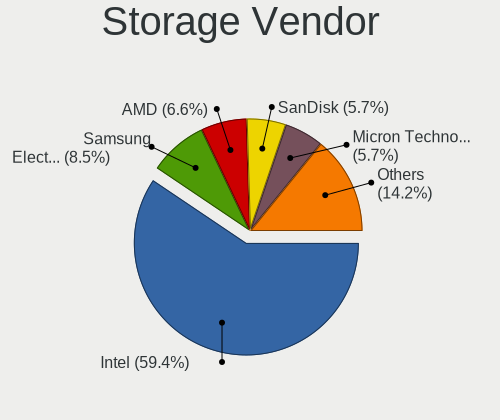

| Vendor                       | Notebooks | Percent |
|------------------------------|-----------|---------|
| Intel                        | 42        | 51.22%  |
| AMD                          | 11        | 13.41%  |
| Samsung Electronics          | 10        | 12.2%   |
| Micron Technology            | 4         | 4.88%   |
| SanDisk                      | 3         | 3.66%   |
| Kingston Technology Company  | 3         | 3.66%   |
| Toshiba America Info Systems | 2         | 2.44%   |
| KIOXIA                       | 2         | 2.44%   |
| ADATA Technology             | 2         | 2.44%   |
| SK hynix                     | 1         | 1.22%   |
| Silicon Motion               | 1         | 1.22%   |
| Nvidia                       | 1         | 1.22%   |

Storage Model
-------------

Storage controller models

| Model                                                                            | Notebooks | Percent |
|----------------------------------------------------------------------------------|-----------|---------|
| AMD FCH SATA Controller [AHCI mode]                                              | 9         | 10.34%  |
| Intel 7 Series Chipset Family 6-port SATA Controller [AHCI mode]                 | 5         | 5.75%   |
| Samsung NVMe SSD Controller SM981/PM981/PM983                                    | 4         | 4.6%    |
| Samsung NVMe SSD Controller 980                                                  | 4         | 4.6%    |
| Intel Sunrise Point-LP SATA Controller [AHCI mode]                               | 4         | 4.6%    |
| Micron NVMe Storage Controller                                                   | 3         | 3.45%   |
| Intel Wildcat Point-LP SATA Controller [AHCI Mode]                               | 3         | 3.45%   |
| Toshiba America Info Systems XG6 NVMe SSD Controller                             | 2         | 2.3%    |
| SanDisk WD Blue SN550 NVMe SSD                                                   | 2         | 2.3%    |
| KIOXIA NVMe SSD Controller BG4                                                   | 2         | 2.3%    |
| Kingston Company OM3PDP3 NVMe SSD                                                | 2         | 2.3%    |
| Intel Cannon Lake Mobile PCH SATA AHCI Controller                                | 2         | 2.3%    |
| Intel 82801IBM/IEM (ICH9M/ICH9M-E) 4 port SATA Controller [AHCI mode]            | 2         | 2.3%    |
| Intel 82801 Mobile SATA Controller [RAID mode]                                   | 2         | 2.3%    |
| Intel 8 Series/C220 Series Chipset Family 6-port SATA Controller 1 [AHCI mode]   | 2         | 2.3%    |
| Intel 8 Series SATA Controller 1 [AHCI mode]                                     | 2         | 2.3%    |
| Intel 6 Series/C200 Series Chipset Family 6 port Mobile SATA AHCI Controller     | 2         | 2.3%    |
| Intel 5 Series/3400 Series Chipset 4 port SATA AHCI Controller                   | 2         | 2.3%    |
| SK hynix Gold P31/BC711/PC711 NVMe Solid State Drive                             | 1         | 1.15%   |
| Silicon Motion SM2262/SM2262EN SSD Controller                                    | 1         | 1.15%   |
| SanDisk WD PC SN810 / Black SN850 NVMe SSD                                       | 1         | 1.15%   |
| Samsung NVMe SSD Controller SM961/PM961/SM963                                    | 1         | 1.15%   |
| Samsung Electronics Non-Volatile memory controller                               | 1         | 1.15%   |
| Nvidia MCP89 SATA Controller (AHCI mode)                                         | 1         | 1.15%   |
| Micron 2200S NVMe SSD                                                            | 1         | 1.15%   |
| Kingston Company Company Non-Volatile memory controller                          | 1         | 1.15%   |
| Intel Volume Management Device NVMe RAID Controller                              | 1         | 1.15%   |
| Intel Tiger Lake-LP SATA Controller                                              | 1         | 1.15%   |
| Intel SSD 660P Series                                                            | 1         | 1.15%   |
| Intel Q170/Q150/B150/H170/H110/Z170/CM236 Chipset SATA Controller [AHCI Mode]    | 1         | 1.15%   |
| Intel Non-Volatile memory controller                                             | 1         | 1.15%   |
| Intel HM170/QM170 Chipset SATA Controller [AHCI Mode]                            | 1         | 1.15%   |
| Intel Comet Lake SATA AHCI Controller                                            | 1         | 1.15%   |
| Intel Celeron/Pentium Silver Processor SATA Controller                           | 1         | 1.15%   |
| Intel Celeron N3350/Pentium N4200/Atom E3900 Series SATA AHCI Controller         | 1         | 1.15%   |
| Intel Cannon Point-LP SATA Controller [AHCI Mode]                                | 1         | 1.15%   |
| Intel Atom/Celeron/Pentium Processor x5-E8000/J3xxx/N3xxx Series SATA Controller | 1         | 1.15%   |
| Intel Atom Processor E3800 Series SATA AHCI Controller                           | 1         | 1.15%   |
| Intel 82801HM/HEM (ICH8M/ICH8M-E) SATA Controller [AHCI mode]                    | 1         | 1.15%   |
| Intel 82801HM/HEM (ICH8M/ICH8M-E) IDE Controller                                 | 1         | 1.15%   |

Storage Kind
------------

Kind of storage controller (IDE, SATA, NVMe, SAS, ...)

| Kind | Notebooks | Percent |
|------|-----------|---------|
| SATA | 47        | 55.95%  |
| NVMe | 29        | 34.52%  |
| IDE  | 5         | 5.95%   |
| RAID | 3         | 3.57%   |

Processor
---------

CPU Vendor
----------

Processor vendors

| Vendor | Notebooks | Percent |
|--------|-----------|---------|
| Intel  | 49        | 74.24%  |
| AMD    | 17        | 25.76%  |

CPU Model
---------

Processor models

| Model                                    | Notebooks | Percent |
|------------------------------------------|-----------|---------|
| Intel Core i5-8265U CPU @ 1.60GHz        | 3         | 4.55%   |
| Intel Core i5-5200U CPU @ 2.20GHz        | 2         | 3.03%   |
| Intel Core i5-4210U CPU @ 1.70GHz        | 2         | 3.03%   |
| Intel Core i5-3320M CPU @ 2.60GHz        | 2         | 3.03%   |
| Intel Core i3-10110U CPU @ 2.10GHz       | 2         | 3.03%   |
| AMD Custom APU 0405                      | 2         | 3.03%   |
| Intel Pentium Silver N5000 CPU @ 1.10GHz | 1         | 1.52%   |
| Intel Pentium Gold 7505 @ 2.00GHz        | 1         | 1.52%   |
| Intel Pentium Dual CPU T2310 @ 1.46GHz   | 1         | 1.52%   |
| Intel Pentium CPU B960 @ 2.20GHz         | 1         | 1.52%   |
| Intel Pentium CPU 4405U @ 2.10GHz        | 1         | 1.52%   |
| Intel Pentium CPU 2020M @ 2.40GHz        | 1         | 1.52%   |
| Intel Core i7-9750H CPU @ 2.60GHz        | 1         | 1.52%   |
| Intel Core i7-8750H CPU @ 2.20GHz        | 1         | 1.52%   |
| Intel Core i7-7820HQ CPU @ 2.90GHz       | 1         | 1.52%   |
| Intel Core i7-6700HQ CPU @ 2.60GHz       | 1         | 1.52%   |
| Intel Core i7-6600U CPU @ 2.60GHz        | 1         | 1.52%   |
| Intel Core i7-4810MQ CPU @ 2.80GHz       | 1         | 1.52%   |
| Intel Core i7-4800MQ CPU @ 2.70GHz       | 1         | 1.52%   |
| Intel Core i7-3612QM CPU @ 2.10GHz       | 1         | 1.52%   |
| Intel Core i7-1065G7 CPU @ 1.30GHz       | 1         | 1.52%   |
| Intel Core i7 CPU M 620 @ 2.67GHz        | 1         | 1.52%   |
| Intel Core i5-7200U CPU @ 2.50GHz        | 1         | 1.52%   |
| Intel Core i5-5300U CPU @ 2.30GHz        | 1         | 1.52%   |
| Intel Core i5-4210H CPU @ 2.90GHz        | 1         | 1.52%   |
| Intel Core i5-3340M CPU @ 2.70GHz        | 1         | 1.52%   |
| Intel Core i5-2520M CPU @ 2.50GHz        | 1         | 1.52%   |
| Intel Core i5-10300H CPU @ 2.50GHz       | 1         | 1.52%   |
| Intel Core i5 CPU M 460 @ 2.53GHz        | 1         | 1.52%   |
| Intel Core i3-8145U CPU @ 2.10GHz        | 1         | 1.52%   |
| Intel Core i3-6100U CPU @ 2.30GHz        | 1         | 1.52%   |
| Intel Core i3-2330M CPU @ 2.20GHz        | 1         | 1.52%   |
| Intel Core i3 CPU M 380 @ 2.53GHz        | 1         | 1.52%   |
| Intel Core 2 Duo CPU T6400 @ 2.00GHz     | 1         | 1.52%   |
| Intel Core 2 Duo CPU P8800 @ 2.66GHz     | 1         | 1.52%   |
| Intel Core 2 Duo CPU P8700 @ 2.53GHz     | 1         | 1.52%   |
| Intel Core 2 CPU T7200 @ 2.00GHz         | 1         | 1.52%   |
| Intel Celeron N4020 CPU @ 1.10GHz        | 1         | 1.52%   |
| Intel Celeron CPU N3350 @ 1.10GHz        | 1         | 1.52%   |
| Intel Celeron CPU N3060 @ 1.60GHz        | 1         | 1.52%   |

CPU Model Family
----------------

Processor model prefix

| Model                | Notebooks | Percent |
|----------------------|-----------|---------|
| Intel Core i5        | 16        | 24.24%  |
| Intel Core i7        | 10        | 15.15%  |
| Intel Core i3        | 6         | 9.09%   |
| Other                | 5         | 7.58%   |
| AMD Ryzen 7          | 5         | 7.58%   |
| Intel Celeron        | 4         | 6.06%   |
| AMD Ryzen 5          | 4         | 6.06%   |
| Intel Pentium        | 3         | 4.55%   |
| Intel Core 2 Duo     | 3         | 4.55%   |
| Intel Pentium Silver | 1         | 1.52%   |
| Intel Pentium Gold   | 1         | 1.52%   |
| Intel Pentium Dual   | 1         | 1.52%   |
| Intel Core 2         | 1         | 1.52%   |
| AMD V120             | 1         | 1.52%   |
| AMD Ryzen 7 PRO      | 1         | 1.52%   |
| AMD E2               | 1         | 1.52%   |
| AMD Athlon Neo       | 1         | 1.52%   |
| AMD A6               | 1         | 1.52%   |
| AMD A4               | 1         | 1.52%   |

CPU Cores
---------

Number of processor cores

| Number | Notebooks | Percent |
|--------|-----------|---------|
| 2      | 35        | 53.03%  |
| 4      | 18        | 27.27%  |
| 8      | 5         | 7.58%   |
| 6      | 5         | 7.58%   |
| 1      | 2         | 3.03%   |
| 12     | 1         | 1.52%   |

CPU Sockets
-----------

Number of sockets

| Number | Notebooks | Percent |
|--------|-----------|---------|
| 1      | 66        | 100%    |

CPU Threads
-----------

Threads per core (Hyper-Threading)

| Number | Notebooks | Percent |
|--------|-----------|---------|
| 2      | 49        | 74.24%  |
| 1      | 17        | 25.76%  |

CPU Op-Modes
------------

CPU Operation Modes (32-bit, 64-bit)

| Op mode        | Notebooks | Percent |
|----------------|-----------|---------|
| 32-bit, 64-bit | 66        | 100%    |

CPU Microcode
-------------

Microcode number

| Number     | Notebooks | Percent |
|------------|-----------|---------|
| Unknown    | 33        | 50%     |
| 0x806ec    | 3         | 4.55%   |
| 0x306a9    | 3         | 4.55%   |
| 0x906ea    | 2         | 3.03%   |
| 0x306d4    | 2         | 3.03%   |
| 0x1067a    | 2         | 3.03%   |
| 0x0a404101 | 2         | 3.03%   |
| 0x08608102 | 2         | 3.03%   |
| 0x806eb    | 1         | 1.52%   |
| 0x806c1    | 1         | 1.52%   |
| 0x706a1    | 1         | 1.52%   |
| 0x506e3    | 1         | 1.52%   |
| 0x406e3    | 1         | 1.52%   |
| 0x406c4    | 1         | 1.52%   |
| 0x306c3    | 1         | 1.52%   |
| 0x206a7    | 1         | 1.52%   |
| 0x20655    | 1         | 1.52%   |
| 0x0a50000c | 1         | 1.52%   |
| 0x08600106 | 1         | 1.52%   |
| 0x08600103 | 1         | 1.52%   |
| 0x08108102 | 1         | 1.52%   |
| 0x07030105 | 1         | 1.52%   |
| 0x06006705 | 1         | 1.52%   |
| 0x0500010d | 1         | 1.52%   |
| 0x010000c8 | 1         | 1.52%   |

CPU Microarch
-------------

Microarchitecture

| Name             | Notebooks | Percent |
|------------------|-----------|---------|
| KabyLake         | 10        | 15.15%  |
| Unknown          | 6         | 9.09%   |
| IvyBridge        | 5         | 7.58%   |
| Haswell          | 5         | 7.58%   |
| Skylake          | 4         | 6.06%   |
| Westmere         | 3         | 4.55%   |
| TigerLake        | 3         | 4.55%   |
| SandyBridge      | 3         | 4.55%   |
| Penryn           | 3         | 4.55%   |
| Broadwell        | 3         | 4.55%   |
| Zen+             | 2         | 3.03%   |
| Zen 3            | 2         | 3.03%   |
| Zen 2            | 2         | 3.03%   |
| Silvermont       | 2         | 3.03%   |
| Goldmont plus    | 2         | 3.03%   |
| Core             | 2         | 3.03%   |
| Puma             | 1         | 1.52%   |
| K8 Hammer        | 1         | 1.52%   |
| K10              | 1         | 1.52%   |
| IceLake          | 1         | 1.52%   |
| Goldmont         | 1         | 1.52%   |
| Excavator        | 1         | 1.52%   |
| CometLake        | 1         | 1.52%   |
| Bobcat           | 1         | 1.52%   |
| Alderlake Hybrid | 1         | 1.52%   |

Graphics
--------

GPU Vendor
----------

Vendors of graphics cards

| Vendor | Notebooks | Percent |
|--------|-----------|---------|
| Intel  | 42        | 51.22%  |
| AMD    | 24        | 29.27%  |
| Nvidia | 16        | 19.51%  |

GPU Model
---------

Graphics card models

| Model                                                                         | Notebooks | Percent |
|-------------------------------------------------------------------------------|-----------|---------|
| Intel WhiskeyLake-U GT2 [UHD Graphics 620]                                    | 4         | 4.76%   |
| Intel 3rd Gen Core processor Graphics Controller                              | 4         | 4.76%   |
| Intel HD Graphics 5500                                                        | 3         | 3.57%   |
| Intel 4th Gen Core Processor Integrated Graphics Controller                   | 3         | 3.57%   |
| Intel 2nd Generation Core Processor Family Integrated Graphics Controller     | 3         | 3.57%   |
| Nvidia TU117M [GeForce GTX 1650 Ti Mobile]                                    | 2         | 2.38%   |
| Nvidia GM107M [GeForce GTX 960M]                                              | 2         | 2.38%   |
| Intel TigerLake-LP GT2 [Iris Xe Graphics]                                     | 2         | 2.38%   |
| Intel Skylake GT2 [HD Graphics 520]                                           | 2         | 2.38%   |
| Intel Haswell-ULT Integrated Graphics Controller                              | 2         | 2.38%   |
| Intel CometLake-U GT2 [UHD Graphics]                                          | 2         | 2.38%   |
| AMD VanGogh [AMD Custom GPU 0405]                                             | 2         | 2.38%   |
| AMD RV620/M82 [Mobility Radeon HD 3450/3470]                                  | 2         | 2.38%   |
| AMD Renoir                                                                    | 2         | 2.38%   |
| AMD Rembrandt [Radeon 680M]                                                   | 2         | 2.38%   |
| AMD Picasso/Raven 2 [Radeon Vega Series / Radeon Vega Mobile Series]          | 2         | 2.38%   |
| AMD Madison [Mobility Radeon HD 5650/5750 / 6530M/6550M]                      | 2         | 2.38%   |
| AMD Lucienne                                                                  | 2         | 2.38%   |
| Nvidia TU117M [GeForce GTX 1650 Mobile / Max-Q]                               | 1         | 1.19%   |
| Nvidia TU117M                                                                 | 1         | 1.19%   |
| Nvidia TU106M [GeForce RTX 2060 Mobile]                                       | 1         | 1.19%   |
| Nvidia TU106BM [GeForce RTX 2070 Mobile / Max-Q]                              | 1         | 1.19%   |
| Nvidia MCP89 [GeForce 320M]                                                   | 1         | 1.19%   |
| Nvidia GP107M [GeForce GTX 1050 Ti Mobile]                                    | 1         | 1.19%   |
| Nvidia GM107GLM [Quadro M1200 Mobile]                                         | 1         | 1.19%   |
| Nvidia GK106GLM [Quadro K2100M]                                               | 1         | 1.19%   |
| Nvidia GF119M [GeForce GT 520M]                                               | 1         | 1.19%   |
| Nvidia GF117M [GeForce 610M/710M/810M/820M / GT 620M/625M/630M/720M]          | 1         | 1.19%   |
| Nvidia GA107M [GeForce RTX 3050 Ti Mobile]                                    | 1         | 1.19%   |
| Nvidia GA107BM [GeForce RTX 3050 Mobile]                                      | 1         | 1.19%   |
| Intel Tiger Lake-LP GT2 [UHD Graphics G4]                                     | 1         | 1.19%   |
| Intel Mobile GM965/GL960 Integrated Graphics Controller (secondary)           | 1         | 1.19%   |
| Intel Mobile GM965/GL960 Integrated Graphics Controller (primary)             | 1         | 1.19%   |
| Intel Mobile 945GM/GMS/GME, 943/940GML Express Integrated Graphics Controller | 1         | 1.19%   |
| Intel Mobile 945GM/GMS, 943/940GML Express Integrated Graphics Controller     | 1         | 1.19%   |
| Intel Mobile 4 Series Chipset Integrated Graphics Controller                  | 1         | 1.19%   |
| Intel Iris Plus Graphics G7                                                   | 1         | 1.19%   |
| Intel HD Graphics 630                                                         | 1         | 1.19%   |
| Intel HD Graphics 620                                                         | 1         | 1.19%   |
| Intel HD Graphics 530                                                         | 1         | 1.19%   |

GPU Combo
---------

Combinations of graphics cards

| Name           | Notebooks | Percent |
|----------------|-----------|---------|
| 1 x Intel      | 30        | 45.45%  |
| 1 x AMD        | 17        | 25.76%  |
| Intel + Nvidia | 9         | 13.64%  |
| AMD + Nvidia   | 4         | 6.06%   |
| 1 x Nvidia     | 3         | 4.55%   |
| Intel + AMD    | 3         | 4.55%   |

GPU Driver
----------

Free vs proprietary

| Driver      | Notebooks | Percent |
|-------------|-----------|---------|
| Free        | 58        | 87.88%  |
| Proprietary | 7         | 10.61%  |
| Unknown     | 1         | 1.52%   |

GPU Memory
----------

Total video memory

| Size in GB | Notebooks | Percent |
|------------|-----------|---------|
| Unknown    | 38        | 57.58%  |
| 0.01-0.5   | 12        | 18.18%  |
| 0.51-1.0   | 7         | 10.61%  |
| 1.01-2.0   | 5         | 7.58%   |
| 3.01-4.0   | 2         | 3.03%   |
| 7.01-8.0   | 1         | 1.52%   |
| 5.01-6.0   | 1         | 1.52%   |

Monitor
-------

Monitor Vendor
--------------

Monitor vendors

| Vendor                  | Notebooks | Percent |
|-------------------------|-----------|---------|
| AU Optronics            | 12        | 16.9%   |
| LG Display              | 10        | 14.08%  |
| Chimei Innolux          | 9         | 12.68%  |
| BOE                     | 9         | 12.68%  |
| Samsung Electronics     | 5         | 7.04%   |
| PANDA                   | 4         | 5.63%   |
| Sharp                   | 3         | 4.23%   |
| LG Philips              | 3         | 4.23%   |
| Dell                    | 3         | 4.23%   |
| Valve                   | 2         | 2.82%   |
| Hewlett-Packard         | 2         | 2.82%   |
| Chi Mei Optoelectronics | 2         | 2.82%   |
| Toshiba                 | 1         | 1.41%   |
| Philips                 | 1         | 1.41%   |
| MSI                     | 1         | 1.41%   |
| Mi                      | 1         | 1.41%   |
| InfoVision              | 1         | 1.41%   |
| CSO                     | 1         | 1.41%   |
| Apple                   | 1         | 1.41%   |

Monitor Model
-------------

Monitor models

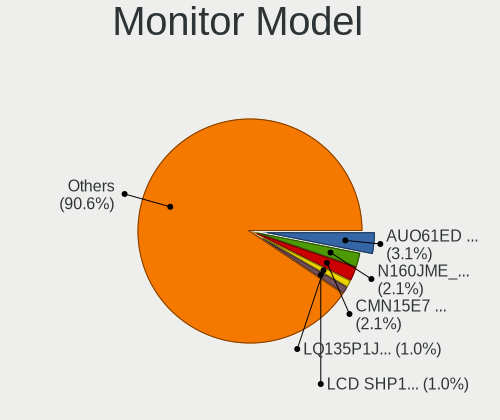

| Model                                                                 | Notebooks | Percent |
|-----------------------------------------------------------------------|-----------|---------|
| Chimei Innolux LCD Monitor CMN14D4 1920x1080 309x173mm 13.9-inch      | 3         | 4.23%   |
| Valve ANX7530 U VLV3001 800x1280 100x150mm 7.1-inch                   | 2         | 2.82%   |
| PANDA LCD Monitor NCP004D 1920x1080 344x194mm 15.5-inch               | 2         | 2.82%   |
| Toshiba Internal LCD TOS5092 1600x900 344x193mm 15.5-inch             | 1         | 1.41%   |
| Sharp LQ133M1JW46 SHP14F2 1920x1080 294x165mm 13.3-inch               | 1         | 1.41%   |
| Sharp LCD Monitor SHP148D 3840x2160 344x194mm 15.5-inch               | 1         | 1.41%   |
| Sharp LCD Monitor SHP1476 3840x2160 346x194mm 15.6-inch               | 1         | 1.41%   |
| Samsung Electronics LCD Monitor SEC324C 1600x900 310x174mm 14.0-inch  | 1         | 1.41%   |
| Samsung Electronics LCD Monitor SDC4A52 1366x768 344x194mm 15.5-inch  | 1         | 1.41%   |
| Samsung Electronics LCD Monitor SDC4652 1366x768 344x194mm 15.5-inch  | 1         | 1.41%   |
| Samsung Electronics LCD Monitor SAM7103 3840x2160 700x390mm 31.5-inch | 1         | 1.41%   |
| Samsung Electronics LC24RG50 SAM0F90 1920x1080 532x304mm 24.1-inch    | 1         | 1.41%   |
| Philips LCD Monitor PHL4650 1280x768 530x398mm 26.1-inch              | 1         | 1.41%   |
| PANDA LCD Monitor NCP0036 1920x1080 344x194mm 15.5-inch               | 1         | 1.41%   |
| PANDA LCD Monitor NCP002D 1920x1080 344x194mm 15.5-inch               | 1         | 1.41%   |
| MSI MAG342CQR MSI3DB6 3440x1440 797x333mm 34.0-inch                   | 1         | 1.41%   |
| Mi Monitor XMI23C3 1920x1080 527x293mm 23.7-inch                      | 1         | 1.41%   |
| LG Philips LP154WX4-TLC8 LPL0120 1280x800 331x207mm 15.4-inch         | 1         | 1.41%   |
| LG Philips LCD Monitor LPLDD00 1280x800 331x207mm 15.4-inch           | 1         | 1.41%   |
| LG Philips LCD Monitor LPL00E0 1440x900 304x190mm 14.1-inch           | 1         | 1.41%   |
| LG Display LCD Monitor LGD068D 1920x1080 309x174mm 14.0-inch          | 1         | 1.41%   |
| LG Display LCD Monitor LGD063C 1920x1080 309x174mm 14.0-inch          | 1         | 1.41%   |
| LG Display LCD Monitor LGD048A 1920x1080 276x156mm 12.5-inch          | 1         | 1.41%   |
| LG Display LCD Monitor LGD045E 1366x768 309x174mm 14.0-inch           | 1         | 1.41%   |
| LG Display LCD Monitor LGD044F 1920x1080 345x194mm 15.6-inch          | 1         | 1.41%   |
| LG Display LCD Monitor LGD040F 1920x1080 345x194mm 15.6-inch          | 1         | 1.41%   |
| LG Display LCD Monitor LGD03B8 1366x768 310x174mm 14.0-inch           | 1         | 1.41%   |
| LG Display LCD Monitor LGD0335 1366x768 310x174mm 14.0-inch           | 1         | 1.41%   |
| LG Display LCD Monitor LGD02DC 1366x768 344x194mm 15.5-inch           | 1         | 1.41%   |
| LG Display LCD Monitor LGD0250 1366x768 345x194mm 15.6-inch           | 1         | 1.41%   |
| InfoVision LCD Monitor IVO3D41 1920x1080 344x194mm 15.5-inch          | 1         | 1.41%   |
| Hewlett-Packard LA2405 HWP284B 1920x1200 518x324mm 24.1-inch          | 1         | 1.41%   |
| Hewlett-Packard 2310 HWP288E 1920x1080 510x287mm 23.0-inch            | 1         | 1.41%   |
| Dell U2312HM DEL4072 1920x1080 510x287mm 23.0-inch                    | 1         | 1.41%   |
| Dell P2721Q DELF125 3840x2160 597x336mm 27.0-inch                     | 1         | 1.41%   |
| Dell P2414H DELA09C 1920x1080 527x297mm 23.8-inch                     | 1         | 1.41%   |
| CSO LCD Monitor CSO160C 2560x1600 344x215mm 16.0-inch                 | 1         | 1.41%   |
| Chimei Innolux LCD Monitor CMN15E7 1920x1080 344x193mm 15.5-inch      | 1         | 1.41%   |
| Chimei Innolux LCD Monitor CMN15D2 1920x1080 344x193mm 15.5-inch      | 1         | 1.41%   |
| Chimei Innolux LCD Monitor CMN15BD 1366x768 344x194mm 15.5-inch       | 1         | 1.41%   |

Monitor Resolution
------------------

Monitor screen resolution

| Resolution        | Notebooks | Percent |
|-------------------|-----------|---------|
| 1920x1080 (FHD)   | 30        | 44.78%  |
| 1366x768 (WXGA)   | 17        | 25.37%  |
| 3840x2160 (4K)    | 4         | 5.97%   |
| 1280x800 (WXGA)   | 4         | 5.97%   |
| 1600x900 (HD+)    | 3         | 4.48%   |
| 800x1280          | 2         | 2.99%   |
| 1440x900 (WXGA+)  | 2         | 2.99%   |
| 3440x1440         | 1         | 1.49%   |
| 2560x1600         | 1         | 1.49%   |
| 2160x1440         | 1         | 1.49%   |
| 1920x1200 (WUXGA) | 1         | 1.49%   |
| 1280x768          | 1         | 1.49%   |

Monitor Diagonal
----------------

Diagonal size in inches

| Inches | Notebooks | Percent |
|--------|-----------|---------|
| 15     | 31        | 43.66%  |
| 14     | 10        | 14.08%  |
| 13     | 10        | 14.08%  |
| 24     | 3         | 4.23%   |
| 23     | 3         | 4.23%   |
| 17     | 3         | 4.23%   |
| 12     | 3         | 4.23%   |
| 34     | 2         | 2.82%   |
| 7      | 2         | 2.82%   |
| 43     | 1         | 1.41%   |
| 27     | 1         | 1.41%   |
| 16     | 1         | 1.41%   |
| 11     | 1         | 1.41%   |

Monitor Width
-------------

Physical width

| Width in mm | Notebooks | Percent |
|-------------|-----------|---------|
| 301-350     | 47        | 66.2%   |
| 201-300     | 8         | 11.27%  |
| 501-600     | 7         | 9.86%   |
| 351-400     | 4         | 5.63%   |
| 701-800     | 2         | 2.82%   |
| 1-100       | 2         | 2.82%   |
| 901-1000    | 1         | 1.41%   |

Aspect Ratio
------------

Proportional relationship between the width and the height

| Ratio | Notebooks | Percent |
|-------|-----------|---------|
| 16/9  | 53        | 81.54%  |
| 16/10 | 7         | 10.77%  |
| 3/2   | 2         | 3.08%   |
| 0.67  | 2         | 3.08%   |
| 21/9  | 1         | 1.54%   |

Monitor Area
------------

Area in inch²

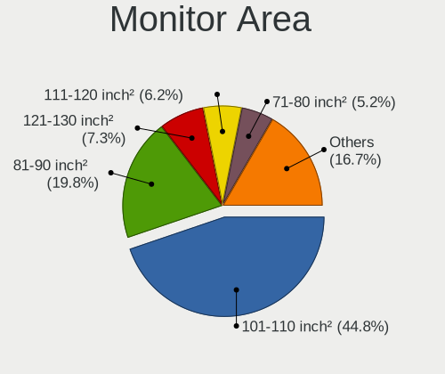

| Area in inch² | Notebooks | Percent |
|----------------|-----------|---------|
| 101-110        | 31        | 43.66%  |
| 81-90          | 18        | 25.35%  |
| 201-250        | 4         | 5.63%   |
| 61-70          | 3         | 4.23%   |
| 121-130        | 3         | 4.23%   |
| 71-80          | 2         | 2.82%   |
| 1-40           | 2         | 2.82%   |
| 251-300        | 2         | 2.82%   |
| 501-1000       | 2         | 2.82%   |
| 51-60          | 1         | 1.41%   |
| 351-500        | 1         | 1.41%   |
| 301-350        | 1         | 1.41%   |
| 111-120        | 1         | 1.41%   |

Pixel Density
-------------

Pixels per inch

| Density       | Notebooks | Percent |
|---------------|-----------|---------|
| 121-160       | 31        | 44.93%  |
| 101-120       | 18        | 26.09%  |
| 51-100        | 10        | 14.49%  |
| 161-240       | 7         | 10.14%  |
| More than 240 | 2         | 2.9%    |
| 1-50          | 1         | 1.45%   |

Multiple Monitors
-----------------

Total monitors connected

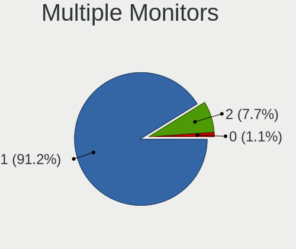

| Total | Notebooks | Percent |
|-------|-----------|---------|
| 1     | 57        | 86.36%  |
| 2     | 8         | 12.12%  |
| 0     | 1         | 1.52%   |

Network
-------

Net Controller Vendor
---------------------

Controller vendors

| Vendor                            | Notebooks | Percent |
|-----------------------------------|-----------|---------|
| Realtek Semiconductor             | 33        | 34.02%  |
| Intel                             | 32        | 32.99%  |
| Qualcomm Atheros                  | 13        | 13.4%   |
| Broadcom                          | 5         | 5.15%   |
| MediaTek                          | 4         | 4.12%   |
| TP-Link                           | 2         | 2.06%   |
| Broadcom Limited                  | 2         | 2.06%   |
| Sierra Wireless                   | 1         | 1.03%   |
| JMicron Technology                | 1         | 1.03%   |
| Hewlett-Packard                   | 1         | 1.03%   |
| Fibocom                           | 1         | 1.03%   |
| Ericsson Business Mobile Networks | 1         | 1.03%   |
| ASIX Electronics                  | 1         | 1.03%   |

Net Controller Model
--------------------

Controller models

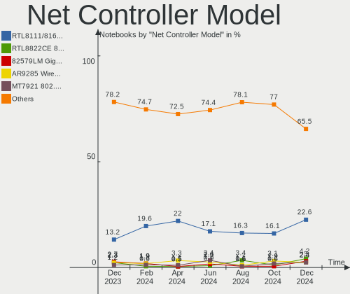

| Model                                                             | Notebooks | Percent |
|-------------------------------------------------------------------|-----------|---------|
| Realtek RTL8111/8168/8411 PCI Express Gigabit Ethernet Controller | 17        | 13.82%  |
| Realtek RTL8822CE 802.11ac PCIe Wireless Network Adapter          | 6         | 4.88%   |
| Realtek RTL810xE PCI Express Fast Ethernet controller             | 6         | 4.88%   |
| MediaTek MT7921 802.11ax PCI Express Wireless Network Adapter     | 4         | 3.25%   |
| Intel Centrino Advanced-N 6205 [Taylor Peak]                      | 4         | 3.25%   |
| Intel 82579LM Gigabit Network Connection (Lewisville)             | 4         | 3.25%   |
| Realtek RTL8821CE 802.11ac PCIe Wireless Network Adapter          | 3         | 2.44%   |
| Realtek RTL8723BE PCIe Wireless Network Adapter                   | 3         | 2.44%   |
| Qualcomm Atheros AR9485 Wireless Network Adapter                  | 3         | 2.44%   |
| Qualcomm Atheros AR9285 Wireless Network Adapter (PCI-Express)    | 3         | 2.44%   |
| Intel Wireless 8265 / 8275                                        | 3         | 2.44%   |
| Intel Ethernet Connection (6) I219-V                              | 3         | 2.44%   |
| Qualcomm Atheros QCA9377 802.11ac Wireless Network Adapter        | 2         | 1.63%   |
| Intel Wireless 8260                                               | 2         | 1.63%   |
| Intel Wireless 3165                                               | 2         | 1.63%   |
| Intel Wireless 3160                                               | 2         | 1.63%   |
| Intel Wi-Fi 6 AX201                                               | 2         | 1.63%   |
| Intel Ethernet Connection I217-LM                                 | 2         | 1.63%   |
| Intel Ethernet Connection (3) I218-LM                             | 2         | 1.63%   |
| Intel Cannon Point-LP CNVi [Wireless-AC]                          | 2         | 1.63%   |
| Broadcom BCM4322 802.11a/b/g/n Wireless LAN Controller            | 2         | 1.63%   |
| TP-Link TL-WN823N v2/v3 [Realtek RTL8192EU]                       | 1         | 0.81%   |
| TP-Link 802.11ac WLAN Adapter                                     | 1         | 0.81%   |
| Sierra Wireless EM7455                                            | 1         | 0.81%   |
| Realtek RTL8852BE PCIe 802.11ax Wireless Network Controller       | 1         | 0.81%   |
| Realtek RTL8852AE 802.11ax PCIe Wireless Network Adapter          | 1         | 0.81%   |
| Realtek RTL8191SEvB Wireless LAN Controller                       | 1         | 0.81%   |
| Realtek RTL8187B Wireless Adapter                                 | 1         | 0.81%   |
| Realtek RTL8153 Gigabit Ethernet Adapter                          | 1         | 0.81%   |
| Realtek RTL-8100/8101L/8139 PCI Fast Ethernet Adapter             | 1         | 0.81%   |
| Realtek Killer E2600 Gigabit Ethernet Controller                  | 1         | 0.81%   |
| Qualcomm Atheros QCA8172 Fast Ethernet                            | 1         | 0.81%   |
| Qualcomm Atheros QCA6174 802.11ac Wireless Network Adapter        | 1         | 0.81%   |
| Qualcomm Atheros Killer E2400 Gigabit Ethernet Controller         | 1         | 0.81%   |
| Qualcomm Atheros AR9287 Wireless Network Adapter (PCI-Express)    | 1         | 0.81%   |
| Qualcomm Atheros AR8152 v1.1 Fast Ethernet                        | 1         | 0.81%   |
| Qualcomm Atheros AR8151 v2.0 Gigabit Ethernet                     | 1         | 0.81%   |
| JMicron JMC250 PCI Express Gigabit Ethernet Controller            | 1         | 0.81%   |
| Intel Wireless-AC 9260                                            | 1         | 0.81%   |
| Intel Wireless 7265                                               | 1         | 0.81%   |

Wireless Vendor
---------------

Wireless vendors

| Vendor                | Notebooks | Percent |
|-----------------------|-----------|---------|
| Intel                 | 31        | 43.66%  |
| Realtek Semiconductor | 16        | 22.54%  |
| Qualcomm Atheros      | 10        | 14.08%  |
| MediaTek              | 4         | 5.63%   |
| Broadcom              | 4         | 5.63%   |
| TP-Link               | 2         | 2.82%   |
| Sierra Wireless       | 1         | 1.41%   |
| Hewlett-Packard       | 1         | 1.41%   |
| Fibocom               | 1         | 1.41%   |
| Broadcom Limited      | 1         | 1.41%   |

Wireless Model
--------------

Wireless models

| Model                                                          | Notebooks | Percent |
|----------------------------------------------------------------|-----------|---------|
| Realtek RTL8822CE 802.11ac PCIe Wireless Network Adapter       | 6         | 8.45%   |
| MediaTek MT7921 802.11ax PCI Express Wireless Network Adapter  | 4         | 5.63%   |
| Intel Centrino Advanced-N 6205 [Taylor Peak]                   | 4         | 5.63%   |
| Realtek RTL8821CE 802.11ac PCIe Wireless Network Adapter       | 3         | 4.23%   |
| Realtek RTL8723BE PCIe Wireless Network Adapter                | 3         | 4.23%   |
| Qualcomm Atheros AR9485 Wireless Network Adapter               | 3         | 4.23%   |
| Qualcomm Atheros AR9285 Wireless Network Adapter (PCI-Express) | 3         | 4.23%   |
| Intel Wireless 8265 / 8275                                     | 3         | 4.23%   |
| Qualcomm Atheros QCA9377 802.11ac Wireless Network Adapter     | 2         | 2.82%   |
| Intel Wireless 8260                                            | 2         | 2.82%   |
| Intel Wireless 3165                                            | 2         | 2.82%   |
| Intel Wireless 3160                                            | 2         | 2.82%   |
| Intel Wi-Fi 6 AX201                                            | 2         | 2.82%   |
| Intel Cannon Point-LP CNVi [Wireless-AC]                       | 2         | 2.82%   |
| Broadcom BCM4322 802.11a/b/g/n Wireless LAN Controller         | 2         | 2.82%   |
| TP-Link TL-WN823N v2/v3 [Realtek RTL8192EU]                    | 1         | 1.41%   |
| TP-Link 802.11ac WLAN Adapter                                  | 1         | 1.41%   |
| Sierra Wireless EM7455                                         | 1         | 1.41%   |
| Realtek RTL8852BE PCIe 802.11ax Wireless Network Controller    | 1         | 1.41%   |
| Realtek RTL8852AE 802.11ax PCIe Wireless Network Adapter       | 1         | 1.41%   |
| Realtek RTL8191SEvB Wireless LAN Controller                    | 1         | 1.41%   |
| Realtek RTL8187B Wireless Adapter                              | 1         | 1.41%   |
| Qualcomm Atheros QCA6174 802.11ac Wireless Network Adapter     | 1         | 1.41%   |
| Qualcomm Atheros AR9287 Wireless Network Adapter (PCI-Express) | 1         | 1.41%   |
| Intel Wireless-AC 9260                                         | 1         | 1.41%   |
| Intel Wireless 7265                                            | 1         | 1.41%   |
| Intel Wireless 7260                                            | 1         | 1.41%   |
| Intel WiFi Link 5100                                           | 1         | 1.41%   |
| Intel Wi-Fi 6 AX200                                            | 1         | 1.41%   |
| Intel Ultimate N WiFi Link 5300                                | 1         | 1.41%   |
| Intel Ice Lake-LP PCH CNVi WiFi                                | 1         | 1.41%   |
| Intel Gemini Lake PCH CNVi WiFi                                | 1         | 1.41%   |
| Intel Dual Band Wireless-AC 3165 Plus Bluetooth                | 1         | 1.41%   |
| Intel Comet Lake PCH-LP CNVi WiFi                              | 1         | 1.41%   |
| Intel Centrino Wireless-N 135                                  | 1         | 1.41%   |
| Intel Centrino Advanced-N 6235                                 | 1         | 1.41%   |
| Intel Cannon Lake PCH CNVi WiFi                                | 1         | 1.41%   |
| Intel Alder Lake-P PCH CNVi WiFi                               | 1         | 1.41%   |
| HP lt4112 Gobi 4G Module Network Device                        | 1         | 1.41%   |
| Fibocom L831-EAU-00                                            | 1         | 1.41%   |

Ethernet Vendor
---------------

Ethernet vendors

| Vendor                | Notebooks | Percent |
|-----------------------|-----------|---------|
| Realtek Semiconductor | 26        | 50.98%  |
| Intel                 | 15        | 29.41%  |
| Qualcomm Atheros      | 4         | 7.84%   |
| Broadcom              | 3         | 5.88%   |
| JMicron Technology    | 1         | 1.96%   |
| Broadcom Limited      | 1         | 1.96%   |
| ASIX Electronics      | 1         | 1.96%   |

Ethernet Model
--------------

Ethernet models

| Model                                                             | Notebooks | Percent |
|-------------------------------------------------------------------|-----------|---------|
| Realtek RTL8111/8168/8411 PCI Express Gigabit Ethernet Controller | 17        | 33.33%  |
| Realtek RTL810xE PCI Express Fast Ethernet controller             | 6         | 11.76%  |
| Intel 82579LM Gigabit Network Connection (Lewisville)             | 4         | 7.84%   |
| Intel Ethernet Connection (6) I219-V                              | 3         | 5.88%   |
| Intel Ethernet Connection I217-LM                                 | 2         | 3.92%   |
| Intel Ethernet Connection (3) I218-LM                             | 2         | 3.92%   |
| Realtek RTL8153 Gigabit Ethernet Adapter                          | 1         | 1.96%   |
| Realtek RTL-8100/8101L/8139 PCI Fast Ethernet Adapter             | 1         | 1.96%   |
| Realtek Killer E2600 Gigabit Ethernet Controller                  | 1         | 1.96%   |
| Qualcomm Atheros QCA8172 Fast Ethernet                            | 1         | 1.96%   |
| Qualcomm Atheros Killer E2400 Gigabit Ethernet Controller         | 1         | 1.96%   |
| Qualcomm Atheros AR8152 v1.1 Fast Ethernet                        | 1         | 1.96%   |
| Qualcomm Atheros AR8151 v2.0 Gigabit Ethernet                     | 1         | 1.96%   |
| JMicron JMC250 PCI Express Gigabit Ethernet Controller            | 1         | 1.96%   |
| Intel Ethernet Connection I219-LM                                 | 1         | 1.96%   |
| Intel Ethernet Connection (4) I219-V                              | 1         | 1.96%   |
| Intel Ethernet Connection (13) I219-LM                            | 1         | 1.96%   |
| Intel 82567LM Gigabit Network Connection                          | 1         | 1.96%   |
| Broadcom NetXtreme BCM5764M Gigabit Ethernet PCIe                 | 1         | 1.96%   |
| Broadcom NetXtreme BCM5752 Gigabit Ethernet PCI Express           | 1         | 1.96%   |
| Broadcom NetLink BCM57780 Gigabit Ethernet PCIe                   | 1         | 1.96%   |
| Broadcom Limited NetLink BCM57780 Gigabit Ethernet PCIe           | 1         | 1.96%   |
| ASIX AX88179 Gigabit Ethernet                                     | 1         | 1.96%   |

Net Controller Kind
-------------------

Ethernet, WiFi or modem

| Kind     | Notebooks | Percent |
|----------|-----------|---------|
| WiFi     | 66        | 56.41%  |
| Ethernet | 50        | 42.74%  |
| Modem    | 1         | 0.85%   |

Used Controller
---------------

Currently used network controller

| Kind     | Notebooks | Percent |
|----------|-----------|---------|
| WiFi     | 56        | 81.16%  |
| Ethernet | 13        | 18.84%  |

NICs
----

Total network controllers on board

| Total | Notebooks | Percent |
|-------|-----------|---------|
| 2     | 48        | 72.73%  |
| 1     | 18        | 27.27%  |

IPv6
----

IPv6 vs IPv4

| Used | Notebooks | Percent |
|------|-----------|---------|
| No   | 54        | 81.82%  |
| Yes  | 12        | 18.18%  |

Bluetooth
---------

Bluetooth Vendor
----------------

Controller vendors

| Vendor                          | Notebooks | Percent |
|---------------------------------|-----------|---------|
| Intel                           | 24        | 46.15%  |
| IMC Networks                    | 7         | 13.46%  |
| Realtek Semiconductor           | 6         | 11.54%  |
| Qualcomm Atheros Communications | 4         | 7.69%   |
| Lite-On Technology              | 3         | 5.77%   |
| Toshiba                         | 2         | 3.85%   |
| Foxconn / Hon Hai               | 2         | 3.85%   |
| Realtek                         | 1         | 1.92%   |
| Chicony Electronics             | 1         | 1.92%   |
| Apple                           | 1         | 1.92%   |
| Alps Electric                   | 1         | 1.92%   |

Bluetooth Model
---------------

Controller models

| Model                                           | Notebooks | Percent |
|-------------------------------------------------|-----------|---------|
| Intel Bluetooth wireless interface              | 12        | 23.08%  |
| IMC Networks Bluetooth Radio                    | 5         | 9.62%   |
| Realtek Bluetooth Radio                         | 4         | 7.69%   |
| Intel Bluetooth 9460/9560 Jefferson Peak (JfP)  | 4         | 7.69%   |
| Intel AX201 Bluetooth                           | 4         | 7.69%   |
| Qualcomm Atheros  Bluetooth Device              | 2         | 3.85%   |
| Qualcomm Atheros AR3012 Bluetooth 4.0           | 2         | 3.85%   |
| Lite-On Wireless_Device                         | 2         | 3.85%   |
| Intel Centrino Bluetooth Wireless Transceiver   | 2         | 3.85%   |
| IMC Networks Wireless_Device                    | 2         | 3.85%   |
| Toshiba Integrated Bluetooth HCI                | 1         | 1.92%   |
| Toshiba BCM43142A0                              | 1         | 1.92%   |
| Realtek RTL8723B Bluetooth                      | 1         | 1.92%   |
| Realtek  Bluetooth 4.2 Adapter                  | 1         | 1.92%   |
| Realtek Bluetooth Radio                         | 1         | 1.92%   |
| Lite-On Qualcomm Atheros QCA9377 Bluetooth      | 1         | 1.92%   |
| Intel Wireless-AC 9260 Bluetooth Adapter        | 1         | 1.92%   |
| Intel AX200 Bluetooth                           | 1         | 1.92%   |
| Foxconn / Hon Hai Broadcom Bluetooth 2.1 Device | 1         | 1.92%   |
| Foxconn / Hon Hai BCM20702A0                    | 1         | 1.92%   |
| Chicony Bluetooth (RTL8723BE)                   | 1         | 1.92%   |
| Apple Bluetooth Host Controller                 | 1         | 1.92%   |
| Alps Electric UGTZ4 Bluetooth                   | 1         | 1.92%   |

Sound
-----

Sound Vendor
------------

Sound card vendors

| Vendor              | Notebooks | Percent |
|---------------------|-----------|---------|
| Intel               | 48        | 59.26%  |
| AMD                 | 21        | 25.93%  |
| Nvidia              | 9         | 11.11%  |
| GN Netcom           | 1         | 1.23%   |
| Creative Technology | 1         | 1.23%   |
| ASUSTek Computer    | 1         | 1.23%   |

Sound Model
-----------

Sound card models

| Model                                                                                             | Notebooks | Percent |
|---------------------------------------------------------------------------------------------------|-----------|---------|
| AMD Family 17h/19h HD Audio Controller                                                            | 9         | 9.09%   |
| Intel 7 Series/C216 Chipset Family High Definition Audio Controller                               | 5         | 5.05%   |
| Intel Sunrise Point-LP HD Audio                                                                   | 4         | 4.04%   |
| Intel Cannon Point-LP High Definition Audio Controller                                            | 4         | 4.04%   |
| AMD Renoir Radeon High Definition Audio Controller                                                | 4         | 4.04%   |
| Nvidia TU107 GeForce GTX 1650 High Definition Audio Controller                                    | 3         | 3.03%   |
| Intel Xeon E3-1200 v3/4th Gen Core Processor HD Audio Controller                                  | 3         | 3.03%   |
| Intel Wildcat Point-LP High Definition Audio Controller                                           | 3         | 3.03%   |
| Intel Tiger Lake-LP Smart Sound Technology Audio Controller                                       | 3         | 3.03%   |
| Intel Broadwell-U Audio Controller                                                                | 3         | 3.03%   |
| Intel 8 Series/C220 Series Chipset High Definition Audio Controller                               | 3         | 3.03%   |
| Intel 6 Series/C200 Series Chipset Family High Definition Audio Controller                        | 3         | 3.03%   |
| Intel 5 Series/3400 Series Chipset High Definition Audio                                          | 3         | 3.03%   |
| AMD Rembrandt Radeon High Definition Audio Controller                                             | 3         | 3.03%   |
| Nvidia TU106 High Definition Audio Controller                                                     | 2         | 2.02%   |
| Nvidia Audio device                                                                               | 2         | 2.02%   |
| Intel Haswell-ULT HD Audio Controller                                                             | 2         | 2.02%   |
| Intel Comet Lake PCH-LP cAVS                                                                      | 2         | 2.02%   |
| Intel Celeron/Pentium Silver Processor High Definition Audio                                      | 2         | 2.02%   |
| Intel Cannon Lake PCH cAVS                                                                        | 2         | 2.02%   |
| Intel 82801I (ICH9 Family) HD Audio Controller                                                    | 2         | 2.02%   |
| Intel 8 Series HD Audio Controller                                                                | 2         | 2.02%   |
| AMD SBx00 Azalia (Intel HDA)                                                                      | 2         | 2.02%   |
| AMD RV620 HDMI Audio [Radeon HD 3450/3470/3550/3570]                                              | 2         | 2.02%   |
| AMD Redwood HDMI Audio [Radeon HD 5000 Series]                                                    | 2         | 2.02%   |
| AMD FCH Azalia Controller                                                                         | 2         | 2.02%   |
| Nvidia MCP89 High Definition Audio                                                                | 1         | 1.01%   |
| Nvidia GM107 High Definition Audio Controller [GeForce 940MX]                                     | 1         | 1.01%   |
| Intel NM10/ICH7 Family High Definition Audio Controller                                           | 1         | 1.01%   |
| Intel Ice Lake-LP Smart Sound Technology Audio Controller                                         | 1         | 1.01%   |
| Intel Comet Lake PCH cAVS                                                                         | 1         | 1.01%   |
| Intel CM238 HD Audio Controller                                                                   | 1         | 1.01%   |
| Intel Celeron N3350/Pentium N4200/Atom E3900 Series Audio Cluster                                 | 1         | 1.01%   |
| Intel Atom/Celeron/Pentium Processor x5-E8000/J3xxx/N3xxx Series High Definition Audio Controller | 1         | 1.01%   |
| Intel Atom Processor Z36xxx/Z37xxx Series High Definition Audio Controller                        | 1         | 1.01%   |
| Intel Alder Lake PCH-P High Definition Audio Controller                                           | 1         | 1.01%   |
| Intel 82801H (ICH8 Family) HD Audio Controller                                                    | 1         | 1.01%   |
| Intel 100 Series/C230 Series Chipset Family HD Audio Controller                                   | 1         | 1.01%   |
| GN Netcom Jabra EVOLVE LINK                                                                       | 1         | 1.01%   |
| Creative Technology SB X-Fi Surround 5.1 Pro                                                      | 1         | 1.01%   |

Memory
------

Memory Vendor
-------------

Memory module vendors

| Vendor              | Notebooks | Percent |
|---------------------|-----------|---------|
| Samsung Electronics | 16        | 29.63%  |
| SK hynix            | 10        | 18.52%  |
| Micron Technology   | 10        | 18.52%  |
| Unknown             | 3         | 5.56%   |
| Ramaxel Technology  | 3         | 5.56%   |
| Kingston            | 3         | 5.56%   |
| GOODRAM             | 2         | 3.7%    |
| Transcend           | 1         | 1.85%   |
| PUSKILL             | 1         | 1.85%   |
| ff                  | 1         | 1.85%   |
| Elpida              | 1         | 1.85%   |
| Crucial             | 1         | 1.85%   |
| 4ea5                | 1         | 1.85%   |
| Unknown             | 1         | 1.85%   |

Memory Model
------------

Memory module models

| Model                                                                     | Notebooks | Percent |
|---------------------------------------------------------------------------|-----------|---------|
| Samsung RAM M471B5273CH0-CH9 4GB SODIMM DDR3 1334MT/s                     | 2         | 3.51%   |
| Samsung RAM M471B5173EB0-YK0 4096MB SODIMM DDR3 1600MT/s                  | 2         | 3.51%   |
| Micron RAM 8ATF1G64HZ-3G2J1 8GB SODIMM DDR4 3200MT/s                      | 2         | 3.51%   |
| Unknown RAM Module 8GB SODIMM DDR3 1600MT/s                               | 1         | 1.75%   |
| Unknown RAM Module 4GB SODIMM DDR3 1600MT/s                               | 1         | 1.75%   |
| Unknown RAM Module 2GB SODIMM DDR2 800MT/s                                | 1         | 1.75%   |
| Transcend RAM JM3200HSE-16G 16GB SODIMM DDR4 3200MT/s                     | 1         | 1.75%   |
| SK hynix RAM Module 2GB SODIMM DDR3 1600MT/s                              | 1         | 1.75%   |
| SK hynix RAM HMT451S6BFR8A-PB 4GB SODIMM DDR3 1600MT/s                    | 1         | 1.75%   |
| SK hynix RAM HMT351S6CFR8C-PB 4GB SODIMM DDR3 1600MT/s                    | 1         | 1.75%   |
| SK hynix RAM HMT351S6CFR8C-H9 4GB SODIMM DDR3 1334MT/s                    | 1         | 1.75%   |
| SK hynix RAM HMT325S6CFR8C-H9 2GB SODIMM DDR3 1333MT/s                    | 1         | 1.75%   |
| SK hynix RAM HMAA2GS6AJR8N-XN 16GB SODIMM DDR4 3200MT/s                   | 1         | 1.75%   |
| SK hynix RAM HMA81GS6JJR8N-VK 8GB SODIMM DDR4 2667MT/s                    | 1         | 1.75%   |
| SK hynix RAM H9HCNNNBKMMLXR-NEE 4GB SODIMM LPDDR4 4266MT/s                | 1         | 1.75%   |
| SK hynix RAM 232323232323232323232323232323232323 1GB SODIMM DDR2 800MT/s | 1         | 1.75%   |
| SK hynix RAM 0000000000-00000 8GB SODIMM DDR4 2400MT/s                    | 1         | 1.75%   |
| Samsung RAM Module 16GB SODIMM DDR4 3200MT/s                              | 1         | 1.75%   |
| Samsung RAM M471B5173DB0-YK0 4GB SODIMM DDR3 1600MT/s                     | 1         | 1.75%   |
| Samsung RAM M471A5244CB0-CWE 4GB SODIMM DDR4 3200MT/s                     | 1         | 1.75%   |
| Samsung RAM M471A5244BB0-CRC 4GB SODIMM DDR4 2667MT/s                     | 1         | 1.75%   |
| Samsung RAM M471A1K43DB1-CTD 8GB SODIMM DDR4 2667MT/s                     | 1         | 1.75%   |
| Samsung RAM M471A1K43CB1-CRC 8GB SODIMM DDR4 2667MT/s                     | 1         | 1.75%   |
| Samsung RAM M471A1K43BB1-CTD 8192MB SODIMM DDR4 2667MT/s                  | 1         | 1.75%   |
| Samsung RAM M471A1K43BB0-CPB 8192MB SODIMM DDR4 2133MT/s                  | 1         | 1.75%   |
| Samsung RAM M471A1G44AB0-CWE 8GB SODIMM DDR4 3200MT/s                     | 1         | 1.75%   |
| Samsung RAM M425R1GB4BB0-CQKOL 8GB SODIMM DDR5 4800MT/s                   | 1         | 1.75%   |
| Samsung RAM M4 70T5267AZ3-CF7 4GB SODIMM DDR2 800MT/s                     | 1         | 1.75%   |
| Samsung RAM M4 70T2864QZ3-CF7 1GB SODIMM DDR2 2048MT/s                    | 1         | 1.75%   |
| Samsung RAM K4UBE3D4AA-MGCL 8GB Row Of Chips LPDDR4 4267MT/s              | 1         | 1.75%   |
| Samsung RAM K4F8E304HB-MGCJ 1GB 2400MT/s                                  | 1         | 1.75%   |
| Samsung RAM 030303030303030303030303030303030303 2GB SODIMM DDR2 800MT/s  | 1         | 1.75%   |
| Ramaxel RAM RMT3160ED58E9W1600 4GB SODIMM DDR3 1600MT/s                   | 1         | 1.75%   |
| Ramaxel RAM RMT3020EC58E9F1333 4GB SODIMM DDR3 4199MT/s                   | 1         | 1.75%   |
| Ramaxel RAM RMSA3260ME78HAF-2666 8GB SODIMM DDR4 2667MT/s                 | 1         | 1.75%   |
| PUSKILL RAM PJ16TFK512M8 8GB SODIMM DDR4 2400MT/s                         | 1         | 1.75%   |
| Micron RAM MT62F1G32D4DR-031 WT 4GB Row Of Chips LPDDR5 6400MT/s          | 1         | 1.75%   |
| Micron RAM MT53E1G32D2NP-046 8GB SODIMM LPDDR4 4266MT/s                   | 1         | 1.75%   |
| Micron RAM 8KTF51264HZ-1G6E1 4GB SODIMM DDR3 1600MT/s                     | 1         | 1.75%   |
| Micron RAM 8ATF1G64HZ-2G6E1 8GB SODIMM DDR4 2667MT/s                      | 1         | 1.75%   |

Memory Kind
-----------

Memory module kinds

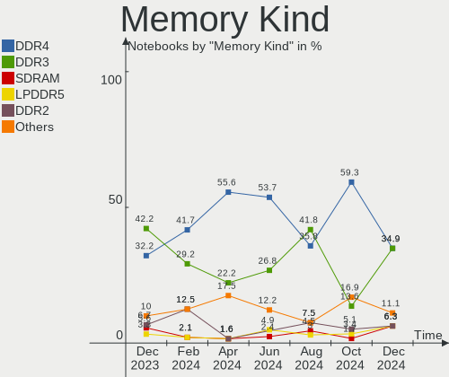

| Kind   | Notebooks | Percent |
|--------|-----------|---------|
| DDR4   | 20        | 45.45%  |
| DDR3   | 13        | 29.55%  |
| LPDDR4 | 4         | 9.09%   |
| DDR2   | 3         | 6.82%   |
| SDRAM  | 2         | 4.55%   |
| LPDDR5 | 1         | 2.27%   |
| DDR5   | 1         | 2.27%   |

Memory Form Factor
------------------

Physical design of the memory module

| Name         | Notebooks | Percent |
|--------------|-----------|---------|
| SODIMM       | 38        | 90.48%  |
| Row Of Chips | 3         | 7.14%   |
| Unknown      | 1         | 2.38%   |

Memory Size
-----------

Memory module size

| Size  | Notebooks | Percent |
|-------|-----------|---------|
| 8192  | 17        | 39.53%  |
| 4096  | 14        | 32.56%  |
| 16384 | 6         | 13.95%  |
| 2048  | 4         | 9.3%    |
| 1024  | 2         | 4.65%   |

Memory Speed
------------

Memory module speed

| Speed | Notebooks | Percent |
|-------|-----------|---------|
| 3200  | 10        | 21.28%  |
| 1600  | 10        | 21.28%  |
| 2667  | 7         | 14.89%  |
| 2400  | 3         | 6.38%   |
| 1334  | 3         | 6.38%   |
| 800   | 3         | 6.38%   |
| 4266  | 2         | 4.26%   |
| 1067  | 2         | 4.26%   |
| 6400  | 1         | 2.13%   |
| 4800  | 1         | 2.13%   |
| 4267  | 1         | 2.13%   |
| 4199  | 1         | 2.13%   |
| 2133  | 1         | 2.13%   |
| 2048  | 1         | 2.13%   |
| 1333  | 1         | 2.13%   |

Printers & scanners
-------------------

Printer Vendor
--------------

Printer device vendors

Zero info for selected period =(

Printer Model
-------------

Printer device models

Zero info for selected period =(

Scanner Vendor
--------------

Scanner device vendors

Zero info for selected period =(

Scanner Model
-------------

Scanner device models

Zero info for selected period =(

Camera
------

Camera Vendor
-------------

Camera device vendors

| Vendor                                 | Notebooks | Percent |
|----------------------------------------|-----------|---------|
| Chicony Electronics                    | 13        | 25%     |
| IMC Networks                           | 10        | 19.23%  |
| Bison Electronics                      | 5         | 9.62%   |
| Microdia                               | 4         | 7.69%   |
| Acer                                   | 4         | 7.69%   |
| Quanta                                 | 3         | 5.77%   |
| Syntek                                 | 2         | 3.85%   |
| Sonix Technology                       | 2         | 3.85%   |
| Realtek Semiconductor                  | 2         | 3.85%   |
| Suyin                                  | 1         | 1.92%   |
| Sunplus Innovation Technology          | 1         | 1.92%   |
| Silicon Motion                         | 1         | 1.92%   |
| Luxvisions Innotech Limited            | 1         | 1.92%   |
| Importek                               | 1         | 1.92%   |
| Cheng Uei Precision Industry (Foxlink) | 1         | 1.92%   |
| Apple                                  | 1         | 1.92%   |

Camera Model
------------

Camera device models

| Model                                                                    | Notebooks | Percent |
|--------------------------------------------------------------------------|-----------|---------|
| IMC Networks Integrated Camera                                           | 3         | 5.77%   |
| Chicony HD User Facing                                                   | 3         | 5.77%   |
| Bison Integrated Camera                                                  | 3         | 5.77%   |
| Syntek Integrated Camera                                                 | 2         | 3.85%   |
| Sonix USB2.0 HD UVC WebCam                                               | 2         | 3.85%   |
| Microdia Integrated_Webcam_HD                                            | 2         | 3.85%   |
| IMC Networks USB2.0 HD UVC WebCam                                        | 2         | 3.85%   |
| IMC Networks HD Camera                                                   | 2         | 3.85%   |
| Acer Lenovo EasyCamera                                                   | 2         | 3.85%   |
| Acer Integrated Camera                                                   | 2         | 3.85%   |
| Suyin 1.3M WebCam (notebook emachines E730, Acer sub-brand)              | 1         | 1.92%   |
| Sunplus FHD Camera Microphone                                            | 1         | 1.92%   |
| Silicon Motion WebCam SC-13HDL11939N                                     | 1         | 1.92%   |
| Realtek Lenovo EasyCamera                                                | 1         | 1.92%   |
| Realtek Integrated Webcam                                                | 1         | 1.92%   |
| Quanta HP Webcam                                                         | 1         | 1.92%   |
| Quanta HP HD Camera                                                      | 1         | 1.92%   |
| Quanta HD User Facing                                                    | 1         | 1.92%   |
| Microdia Sonix USB 2.0 Camera                                            | 1         | 1.92%   |
| Microdia Integrated Webcam                                               | 1         | 1.92%   |
| Luxvisions Innotech Limited HP TrueVision HD Camera                      | 1         | 1.92%   |
| Importek TOSHIBA Web Camera - HD                                         | 1         | 1.92%   |
| IMC Networks UVC VGA Webcam                                              | 1         | 1.92%   |
| IMC Networks USB2.0 VGA UVC WebCam                                       | 1         | 1.92%   |
| IMC Networks Integrated Webcam                                           | 1         | 1.92%   |
| Chicony VGA WebCam                                                       | 1         | 1.92%   |
| Chicony USB2.0 Camera                                                    | 1         | 1.92%   |
| Chicony USB 2.0 Camera                                                   | 1         | 1.92%   |
| Chicony TOSHIBA Web Camera - HD                                          | 1         | 1.92%   |
| Chicony ThinkPad T490 Webcam                                             | 1         | 1.92%   |
| Chicony Lenovo EasyCamera                                                | 1         | 1.92%   |
| Chicony Integrated Camera (1280x720@30)                                  | 1         | 1.92%   |
| Chicony HP Webcam                                                        | 1         | 1.92%   |
| Chicony HP Truevision HD                                                 | 1         | 1.92%   |
| Chicony HP HD Webcam                                                     | 1         | 1.92%   |
| Cheng Uei Precision Industry (Foxlink) HP EliteBook integrated HD Webcam | 1         | 1.92%   |
| Bison Lenovo Integrated Webcam                                           | 1         | 1.92%   |
| Bison Lenovo EasyCamera                                                  | 1         | 1.92%   |
| Apple Built-in iSight                                                    | 1         | 1.92%   |

Security
--------

Fingerprint Vendor
------------------

Fingerprint sensor vendors

| Vendor                     | Notebooks | Percent |
|----------------------------|-----------|---------|
| Validity Sensors           | 5         | 45.45%  |
| Shenzhen Goodix Technology | 3         | 27.27%  |
| Synaptics                  | 2         | 18.18%  |
| AuthenTec                  | 1         | 9.09%   |

Fingerprint Model
-----------------

Fingerprint sensor models

| Model                                                     | Notebooks | Percent |
|-----------------------------------------------------------|-----------|---------|
| Validity Sensors VFS5011 Fingerprint Reader               | 3         | 27.27%  |
| Validity Sensors VFS495 Fingerprint Reader                | 2         | 18.18%  |
| Shenzhen Goodix  FingerPrint Device                       | 2         | 18.18%  |
| Synaptics  FS7604 Touch Fingerprint Sensor with PurePrint | 1         | 9.09%   |
| Synaptics Prometheus MIS Touch Fingerprint Reader         | 1         | 9.09%   |
| Shenzhen Goodix Fingerprint Reader                        | 1         | 9.09%   |
| AuthenTec Fingerprint Sensor                              | 1         | 9.09%   |

Chipcard Vendor
---------------

Chipcard module vendors

| Vendor                | Notebooks | Percent |
|-----------------------|-----------|---------|
| Broadcom              | 3         | 33.33%  |
| O2 Micro              | 2         | 22.22%  |
| Upek                  | 1         | 11.11%  |
| Gemalto (was Gemplus) | 1         | 11.11%  |
| Clay Logic            | 1         | 11.11%  |
| Alcor Micro           | 1         | 11.11%  |

Chipcard Model
--------------

Chipcard module models

| Model                                                                        | Notebooks | Percent |
|------------------------------------------------------------------------------|-----------|---------|
| Broadcom BCM5880 Secure Applications Processor with fingerprint swipe sensor | 2         | 22.22%  |
| Upek TouchChip Fingerprint Coprocessor (WBF advanced mode)                   | 1         | 11.11%  |
| O2 Micro Oz776 SmartCard Reader                                              | 1         | 11.11%  |
| O2 Micro OZ776 CCID Smartcard Reader                                         | 1         | 11.11%  |
| Gemalto (was Gemplus) Compact Smart Card Reader Writer                       | 1         | 11.11%  |
| Clay Logic Nitrokey Pro                                                      | 1         | 11.11%  |
| Broadcom 58200                                                               | 1         | 11.11%  |
| Alcor Micro AU9540 Smartcard Reader                                          | 1         | 11.11%  |

Unsupported
-----------

Unsupported Devices
-------------------

Total unsupported devices on board

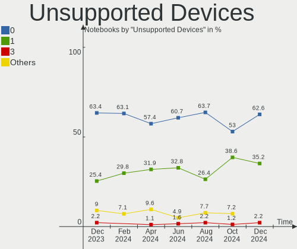

| Total | Notebooks | Percent |
|-------|-----------|---------|
| 0     | 42        | 63.64%  |
| 1     | 20        | 30.3%   |
| 2     | 4         | 6.06%   |

Unsupported Device Types
------------------------

Types of unsupported devices

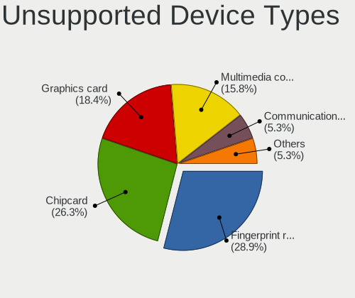

| Type               | Notebooks | Percent |
|--------------------|-----------|---------|
| Fingerprint reader | 11        | 39.29%  |
| Graphics card      | 8         | 28.57%  |
| Chipcard           | 6         | 21.43%  |
| Net/wireless       | 2         | 7.14%   |
| Net/ethernet       | 1         | 3.57%   |

