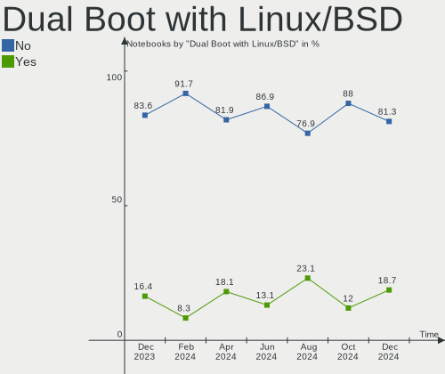
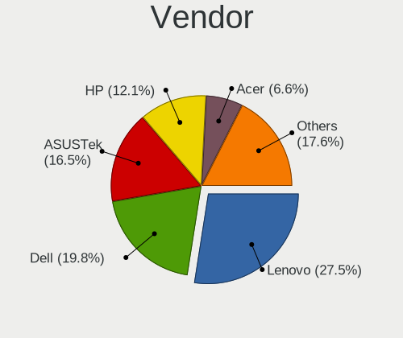
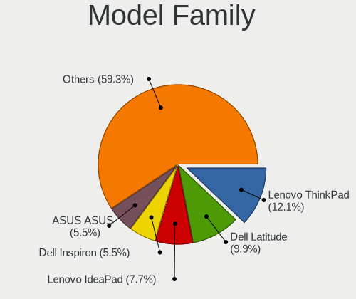
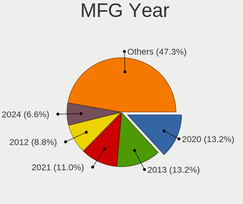
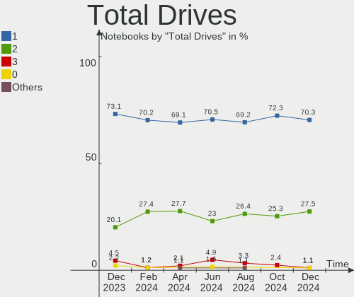
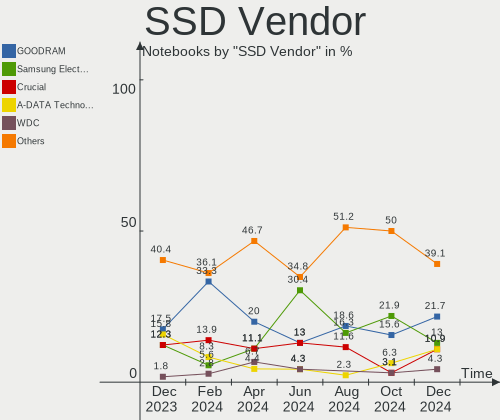
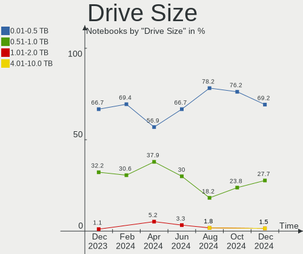
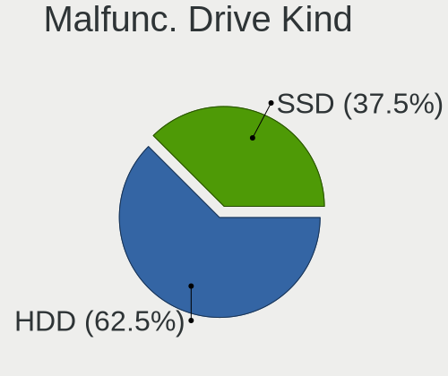
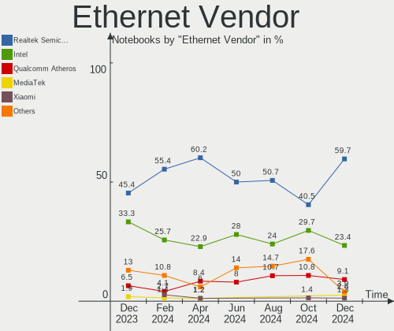
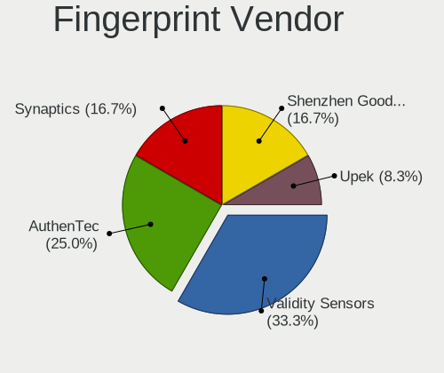

Linux in Poland - Hardware Trends (Notebooks)
---------------------------------------------

A project to identify most popular hardware characteristics and track their change
over time based on data collected by Linux users at https://Linux-Hardware.org.

Anyone can contribute to this report by the [hw-probe](https://github.com/linuxhw/hw-probe) tool:

    sudo -E hw-probe -all -upload

Contents
--------

* [ System ](#system)
  - [ OS                       ](#os)
  - [ OS Family                ](#os-family)
  - [ Kernel                   ](#kernel)
  - [ Kernel Family            ](#kernel-family)
  - [ Kernel Major Ver.        ](#kernel-major-ver)
  - [ Arch                     ](#arch)
  - [ DE                       ](#de)
  - [ Display Server           ](#display-server)
  - [ Display Manager          ](#display-manager)
  - [ OS Lang                  ](#os-lang)
  - [ Boot Mode                ](#boot-mode)
  - [ Filesystem               ](#filesystem)
  - [ Part. scheme             ](#part-scheme)
  - [ Dual Boot with Linux/BSD ](#dual-boot-with-linuxbsd)
  - [ Dual Boot (Win)          ](#dual-boot-win)

* [ Board ](#board)
  - [ Vendor                   ](#vendor)
  - [ Model                    ](#model)
  - [ Model Family             ](#model-family)
  - [ MFG Year                 ](#mfg-year)
  - [ Form Factor              ](#form-factor)
  - [ Secure Boot              ](#secure-boot)
  - [ Coreboot                 ](#coreboot)
  - [ RAM Size                 ](#ram-size)
  - [ RAM Used                 ](#ram-used)
  - [ Total Drives             ](#total-drives)
  - [ Has CD-ROM               ](#has-cd-rom)
  - [ Has Ethernet             ](#has-ethernet)
  - [ Has WiFi                 ](#has-wifi)
  - [ Has Bluetooth            ](#has-bluetooth)

* [ Location ](#location)
  - [ Country                  ](#country)
  - [ City                     ](#city)

* [ Drives ](#drives)
  - [ Drive Vendor             ](#drive-vendor)
  - [ Drive Model              ](#drive-model)
  - [ HDD Vendor               ](#hdd-vendor)
  - [ SSD Vendor               ](#ssd-vendor)
  - [ Drive Kind               ](#drive-kind)
  - [ Drive Connector          ](#drive-connector)
  - [ Drive Size               ](#drive-size)
  - [ Space Total              ](#space-total)
  - [ Space Used               ](#space-used)
  - [ Malfunc. Drives          ](#malfunc-drives)
  - [ Malfunc. Drive Vendor    ](#malfunc-drive-vendor)
  - [ Malfunc. HDD Vendor      ](#malfunc-hdd-vendor)
  - [ Malfunc. Drive Kind      ](#malfunc-drive-kind)
  - [ Failed Drives            ](#failed-drives)
  - [ Failed Drive Vendor      ](#failed-drive-vendor)
  - [ Drive Status             ](#drive-status)

* [ Storage controller ](#storage-controller)
  - [ Storage Vendor           ](#storage-vendor)
  - [ Storage Model            ](#storage-model)
  - [ Storage Kind             ](#storage-kind)

* [ Processor ](#processor)
  - [ CPU Vendor               ](#cpu-vendor)
  - [ CPU Model                ](#cpu-model)
  - [ CPU Model Family         ](#cpu-model-family)
  - [ CPU Cores                ](#cpu-cores)
  - [ CPU Sockets              ](#cpu-sockets)
  - [ CPU Threads              ](#cpu-threads)
  - [ CPU Op-Modes             ](#cpu-op-modes)
  - [ CPU Microcode            ](#cpu-microcode)
  - [ CPU Microarch            ](#cpu-microarch)

* [ Graphics ](#graphics)
  - [ GPU Vendor               ](#gpu-vendor)
  - [ GPU Model                ](#gpu-model)
  - [ GPU Combo                ](#gpu-combo)
  - [ GPU Driver               ](#gpu-driver)
  - [ GPU Memory               ](#gpu-memory)

* [ Monitor ](#monitor)
  - [ Monitor Vendor           ](#monitor-vendor)
  - [ Monitor Model            ](#monitor-model)
  - [ Monitor Resolution       ](#monitor-resolution)
  - [ Monitor Diagonal         ](#monitor-diagonal)
  - [ Monitor Width            ](#monitor-width)
  - [ Aspect Ratio             ](#aspect-ratio)
  - [ Monitor Area             ](#monitor-area)
  - [ Pixel Density            ](#pixel-density)
  - [ Multiple Monitors        ](#multiple-monitors)

* [ Network ](#network)
  - [ Net Controller Vendor    ](#net-controller-vendor)
  - [ Net Controller Model     ](#net-controller-model)
  - [ Wireless Vendor          ](#wireless-vendor)
  - [ Wireless Model           ](#wireless-model)
  - [ Ethernet Vendor          ](#ethernet-vendor)
  - [ Ethernet Model           ](#ethernet-model)
  - [ Net Controller Kind      ](#net-controller-kind)
  - [ Used Controller          ](#used-controller)
  - [ NICs                     ](#nics)
  - [ IPv6                     ](#ipv6)

* [ Bluetooth ](#bluetooth)
  - [ Bluetooth Vendor         ](#bluetooth-vendor)
  - [ Bluetooth Model          ](#bluetooth-model)

* [ Sound ](#sound)
  - [ Sound Vendor             ](#sound-vendor)
  - [ Sound Model              ](#sound-model)

* [ Memory ](#memory)
  - [ Memory Vendor            ](#memory-vendor)
  - [ Memory Model             ](#memory-model)
  - [ Memory Kind              ](#memory-kind)
  - [ Memory Form Factor       ](#memory-form-factor)
  - [ Memory Size              ](#memory-size)
  - [ Memory Speed             ](#memory-speed)

* [ Printers & scanners ](#printers--scanners)
  - [ Printer Vendor           ](#printer-vendor)
  - [ Printer Model            ](#printer-model)
  - [ Scanner Vendor           ](#scanner-vendor)
  - [ Scanner Model            ](#scanner-model)

* [ Camera ](#camera)
  - [ Camera Vendor            ](#camera-vendor)
  - [ Camera Model             ](#camera-model)

* [ Security ](#security)
  - [ Fingerprint Vendor       ](#fingerprint-vendor)
  - [ Fingerprint Model        ](#fingerprint-model)
  - [ Chipcard Vendor          ](#chipcard-vendor)
  - [ Chipcard Model           ](#chipcard-model)

* [ Unsupported ](#unsupported)
  - [ Unsupported Devices      ](#unsupported-devices)
  - [ Unsupported Device Types ](#unsupported-device-types)

System
------

OS
--

Installed operating systems

| Name                         | Notebooks | Percent |
|------------------------------|-----------|---------|
| Ubuntu 22.04                 | 10        | 11.9%   |
| Linux Mint 20.3              | 7         | 8.33%   |
| Ubuntu 20.04                 | 6         | 7.14%   |
| OpenMandriva 4.3             | 6         | 7.14%   |
| OpenMandriva 4.2             | 6         | 7.14%   |
| Fedora 36                    | 5         | 5.95%   |
| Zorin 16                     | 4         | 4.76%   |
| Debian 11                    | 4         | 4.76%   |
| Pop!_OS 22.04                | 3         | 3.57%   |
| Arch                         | 3         | 3.57%   |
| Xubuntu 20.04                | 2         | 2.38%   |
| ROSA 12.2                    | 2         | 2.38%   |
| openSUSE Tumbleweed-XXXXXXXX | 2         | 2.38%   |
| Manjaro 21.2.6               | 2         | 2.38%   |
| Lubuntu 22.04                | 2         | 2.38%   |
| Linux Mint 20.1              | 2         | 2.38%   |
| Linux Lite 5.8               | 2         | 2.38%   |
| Kali 2022.2                  | 2         | 2.38%   |
| Arch Rolling                 | 2         | 2.38%   |
| Xero Rolling                 | 1         | 1.19%   |
| Ubuntu 18.04                 | 1         | 1.19%   |
| Ubuntu 16.04                 | 1         | 1.19%   |
| MX 21                        | 1         | 1.19%   |
| Manjaro                      | 1         | 1.19%   |
| Gentoo 2.7                   | 1         | 1.19%   |
| Gentoo 2.6                   | 1         | 1.19%   |
| Garuda Linux                 | 1         | 1.19%   |
| Endless 4.0.6                | 1         | 1.19%   |
| Debian 10                    | 1         | 1.19%   |
| BlackPanther 18.1            | 1         | 1.19%   |
| ArcoLinux                    | 1         | 1.19%   |

OS Family
---------

OS without a version

| Name         | Notebooks | Percent |
|--------------|-----------|---------|
| Ubuntu       | 18        | 21.43%  |
| OpenMandriva | 12        | 14.29%  |
| Linux Mint   | 9         | 10.71%  |
| Fedora       | 5         | 5.95%   |
| Debian       | 5         | 5.95%   |
| Arch         | 5         | 5.95%   |
| Zorin        | 4         | 4.76%   |
| Pop!_OS      | 3         | 3.57%   |
| Manjaro      | 3         | 3.57%   |
| Xubuntu      | 2         | 2.38%   |
| ROSA         | 2         | 2.38%   |
| openSUSE     | 2         | 2.38%   |
| Lubuntu      | 2         | 2.38%   |
| Linux Lite   | 2         | 2.38%   |
| Kali         | 2         | 2.38%   |
| Gentoo       | 2         | 2.38%   |
| Xero         | 1         | 1.19%   |
| MX           | 1         | 1.19%   |
| Garuda Linux | 1         | 1.19%   |
| Endless      | 1         | 1.19%   |
| BlackPanther | 1         | 1.19%   |
| ArcoLinux    | 1         | 1.19%   |

Kernel
------

Version of the Linux kernel

| Version                            | Notebooks | Percent |
|------------------------------------|-----------|---------|
| 5.15.0-27-generic                  | 7         | 8.33%   |
| 5.16.7-desktop-1omv4003            | 6         | 7.14%   |
| 5.4.0-109-generic                  | 5         | 5.95%   |
| 5.13.0-40-generic                  | 5         | 5.95%   |
| 5.10.14-desktop-1omv4002           | 4         | 4.76%   |
| 5.17.5-arch1-1                     | 3         | 3.57%   |
| 5.13.0-44-generic                  | 3         | 3.57%   |
| 5.4.0-113-generic                  | 2         | 2.38%   |
| 5.17.9-arch1-1                     | 2         | 2.38%   |
| 5.17.7-300.fc36.x86_64             | 2         | 2.38%   |
| 5.17.4-1-default                   | 2         | 2.38%   |
| 5.16.19-76051619-generic           | 2         | 2.38%   |
| 5.15.32-gentoo-r1                  | 2         | 2.38%   |
| 5.15.0-33-generic                  | 2         | 2.38%   |
| 5.15.0-30-generic                  | 2         | 2.38%   |
| 5.11.12-desktop-1omv4002           | 2         | 2.38%   |
| 5.10.74-generic-2rosa2021.1-x86_64 | 2         | 2.38%   |
| 5.10.0-14-amd64                    | 2         | 2.38%   |
| 5.4.0-91-generic                   | 1         | 1.19%   |
| 5.4.0-60-generic                   | 1         | 1.19%   |
| 5.4.0-110-generic                  | 1         | 1.19%   |
| 5.4.0-107-generic                  | 1         | 1.19%   |
| 5.4.0-104-generic                  | 1         | 1.19%   |
| 5.18.0-051800rc1-generic           | 1         | 1.19%   |
| 5.17.9-zen1-1-zen                  | 1         | 1.19%   |
| 5.17.9-300.fc36.x86_64             | 1         | 1.19%   |
| 5.17.7-arch1-1                     | 1         | 1.19%   |
| 5.17.6-1-MANJARO                   | 1         | 1.19%   |
| 5.17.5-arch1-2                     | 1         | 1.19%   |
| 5.17.5-76051705-generic            | 1         | 1.19%   |
| 5.17.5-301.fsync.fc36.x86_64       | 1         | 1.19%   |
| 5.17.11-300.fc36.x86_64            | 1         | 1.19%   |
| 5.17.1-3-rt17-MANJARO              | 1         | 1.19%   |
| 5.17.0-kali2-amd64                 | 1         | 1.19%   |
| 5.16.0-kali7-amd64                 | 1         | 1.19%   |
| 5.16.0-6mx-amd64                   | 1         | 1.19%   |
| 5.15.32-1-MANJARO                  | 1         | 1.19%   |
| 5.13.0-41-generic                  | 1         | 1.19%   |
| 5.13.0-28-generic                  | 1         | 1.19%   |
| 5.13.0-27-generic                  | 1         | 1.19%   |
| 5.11.0-38-generic                  | 1         | 1.19%   |
| 5.11.0-35-generic                  | 1         | 1.19%   |
| 5.10.0-13-amd64                    | 1         | 1.19%   |
| 5.10.0-13-686                      | 1         | 1.19%   |
| 4.19.0-20-amd64                    | 1         | 1.19%   |
| 4.18.16-desktop-1bP                | 1         | 1.19%   |
| 4.10.0-28-generic                  | 1         | 1.19%   |

Kernel Family
-------------

Linux kernel without a distro release

| Version | Notebooks | Percent |
|---------|-----------|---------|
| 5.4.0   | 12        | 14.29%  |
| 5.15.0  | 11        | 13.1%   |
| 5.13.0  | 11        | 13.1%   |
| 5.17.5  | 6         | 7.14%   |
| 5.16.7  | 6         | 7.14%   |
| 5.17.9  | 4         | 4.76%   |
| 5.10.14 | 4         | 4.76%   |
| 5.10.0  | 4         | 4.76%   |
| 5.17.7  | 3         | 3.57%   |
| 5.15.32 | 3         | 3.57%   |
| 5.17.4  | 2         | 2.38%   |
| 5.16.19 | 2         | 2.38%   |
| 5.16.0  | 2         | 2.38%   |
| 5.11.12 | 2         | 2.38%   |
| 5.11.0  | 2         | 2.38%   |
| 5.10.74 | 2         | 2.38%   |
| 5.18.0  | 1         | 1.19%   |
| 5.17.6  | 1         | 1.19%   |
| 5.17.11 | 1         | 1.19%   |
| 5.17.1  | 1         | 1.19%   |
| 5.17.0  | 1         | 1.19%   |
| 4.19.0  | 1         | 1.19%   |
| 4.18.16 | 1         | 1.19%   |
| 4.10.0  | 1         | 1.19%   |

Kernel Major Ver.
-----------------

Linux kernel major version

| Version | Notebooks | Percent |
|---------|-----------|---------|
| 5.17    | 19        | 22.62%  |
| 5.15    | 14        | 16.67%  |
| 5.4     | 12        | 14.29%  |
| 5.13    | 11        | 13.1%   |
| 5.16    | 10        | 11.9%   |
| 5.10    | 10        | 11.9%   |
| 5.11    | 4         | 4.76%   |
| 5.18    | 1         | 1.19%   |
| 4.19    | 1         | 1.19%   |
| 4.18    | 1         | 1.19%   |
| 4.10    | 1         | 1.19%   |

Arch
----

OS architecture (x86_64, i586, etc.)

| Name   | Notebooks | Percent |
|--------|-----------|---------|
| x86_64 | 83        | 98.81%  |
| i686   | 1         | 1.19%   |

DE
--

Desktop Environment

| Name       | Notebooks | Percent |
|------------|-----------|---------|
| GNOME      | 34        | 40.48%  |
| KDE5       | 23        | 27.38%  |
| XFCE       | 11        | 13.1%   |
| X-Cinnamon | 4         | 4.76%   |
| MATE       | 3         | 3.57%   |
| LXQt       | 3         | 3.57%   |
| Unknown    | 3         | 3.57%   |
| Cinnamon   | 2         | 2.38%   |
| i3         | 1         | 1.19%   |

Display Server
--------------

X11 or Wayland

| Name    | Notebooks | Percent |
|---------|-----------|---------|
| X11     | 62        | 73.81%  |
| Wayland | 20        | 23.81%  |
| Tty     | 2         | 2.38%   |

Display Manager
---------------

SDDM, LightDM, etc.

| Name    | Notebooks | Percent |
|---------|-----------|---------|
| Unknown | 24        | 28.57%  |
| SDDM    | 21        | 25%     |
| LightDM | 16        | 19.05%  |
| GDM3    | 13        | 15.48%  |
| GDM     | 10        | 11.9%   |

OS Lang
-------

Language

| Lang    | Notebooks | Percent |
|---------|-----------|---------|
| pl_PL   | 47        | 55.95%  |
| en_US   | 26        | 30.95%  |
| en_GB   | 4         | 4.76%   |
| C       | 3         | 3.57%   |
| Unknown | 2         | 2.38%   |
| ru_RU   | 1         | 1.19%   |
| es_ES   | 1         | 1.19%   |

Boot Mode
---------

EFI or BIOS

| Mode | Notebooks | Percent |
|------|-----------|---------|
| BIOS | 43        | 51.19%  |
| EFI  | 41        | 48.81%  |

Filesystem
----------

Type of filesystem

| Type    | Notebooks | Percent |
|---------|-----------|---------|
| Ext4    | 61        | 72.62%  |
| Overlay | 10        | 11.9%   |
| Btrfs   | 9         | 10.71%  |
| Zfs     | 2         | 2.38%   |
| F2fs    | 2         | 2.38%   |

Part. scheme
------------

Scheme of partitioning

| Type    | Notebooks | Percent |
|---------|-----------|---------|
| GPT     | 39        | 46.43%  |
| Unknown | 31        | 36.9%   |
| MBR     | 14        | 16.67%  |

Dual Boot with Linux/BSD
------------------------

Hosting more than one Linux/BSD

| Dual boot | Notebooks | Percent |
|-----------|-----------|---------|
| No        | 70        | 83.33%  |
| Yes       | 14        | 16.67%  |

Dual Boot (Win)
---------------

Hosting Linux and Windows

| Dual boot | Notebooks | Percent |
|-----------|-----------|---------|
| No        | 63        | 75%     |
| Yes       | 21        | 25%     |

Board
-----

Vendor
------

Motherboard manufacturer

| Name                | Notebooks | Percent |
|---------------------|-----------|---------|
| Lenovo              | 19        | 22.62%  |
| Hewlett-Packard     | 19        | 22.62%  |
| Dell                | 19        | 22.62%  |
| ASUSTek Computer    | 9         | 10.71%  |
| Sony                | 3         | 3.57%   |
| Samsung Electronics | 3         | 3.57%   |
| Acer                | 3         | 3.57%   |
| Toshiba             | 2         | 2.38%   |
| Apple               | 2         | 2.38%   |
| Packard Bell        | 1         | 1.19%   |
| MSI                 | 1         | 1.19%   |
| HUAWEI              | 1         | 1.19%   |
| Google              | 1         | 1.19%   |
| Fujitsu             | 1         | 1.19%   |

Model
-----

Motherboard model

| Name                                       | Notebooks | Percent |
|--------------------------------------------|-----------|---------|
| Dell Inspiron 3451                         | 4         | 4.76%   |
| Samsung 350V5C/351V5C/3540VC/3440VC        | 2         | 2.38%   |
| HP 250 G8 Notebook PC                      | 2         | 2.38%   |
| Dell MXG061                                | 2         | 2.38%   |
| Toshiba Satellite L750D                    | 1         | 1.19%   |
| Toshiba Satellite C55t-C                   | 1         | 1.19%   |
| Sony VPCEE3S1E                             | 1         | 1.19%   |
| Sony VGN-NR32L_S                           | 1         | 1.19%   |
| Sony VGN-FW51MF_H                          | 1         | 1.19%   |
| Samsung 300V3A/300V4A/300V5A/200A4B/200A5B | 1         | 1.19%   |
| Packard Bell EasyNote ENTF71BM             | 1         | 1.19%   |
| MSI GP76 Leopard 10UE                      | 1         | 1.19%   |
| Lenovo Z50-70 20354                        | 1         | 1.19%   |
| Lenovo Yoga Slim 9 14ITL5 82D1             | 1         | 1.19%   |
| Lenovo Yoga 300-11IBY 80M0                 | 1         | 1.19%   |
| Lenovo V15-IIL 82C5                        | 1         | 1.19%   |
| Lenovo ThinkPad X200 7458WAY               | 1         | 1.19%   |
| Lenovo ThinkPad X1 Carbon Gen 8 20U90046PB | 1         | 1.19%   |
| Lenovo ThinkPad T61 7661BM5                | 1         | 1.19%   |
| Lenovo ThinkPad T500 2241W2B               | 1         | 1.19%   |
| Lenovo ThinkPad T470 W10DG 20JNS0GH0C      | 1         | 1.19%   |
| Lenovo ThinkPad T430 2349AK5               | 1         | 1.19%   |
| Lenovo ThinkPad T14 Gen 1 20UD003RPB       | 1         | 1.19%   |
| Lenovo ThinkPad Edge E430 3254A8G          | 1         | 1.19%   |
| Lenovo IdeaPad Z500 20202                  | 1         | 1.19%   |
| Lenovo IdeaPad S540-15IWL GTX 81SW         | 1         | 1.19%   |
| Lenovo IdeaPad S540-14API 81NH             | 1         | 1.19%   |
| Lenovo IdeaPad 3 15ITL6 82H8               | 1         | 1.19%   |
| Lenovo IdeaPad 100-15IBY 80MJ              | 1         | 1.19%   |
| Lenovo G510 20238                          | 1         | 1.19%   |
| Lenovo G50-70 20351                        | 1         | 1.19%   |
| HUAWEI NBLK-WAX9X                          | 1         | 1.19%   |
| HP ProBook 6475b                           | 1         | 1.19%   |
| HP ProBook 4530s                           | 1         | 1.19%   |
| HP Pavilion ZV6100 (EE984EA#ABZ)           | 1         | 1.19%   |
| HP Pavilion Laptop 15-eg0xxx               | 1         | 1.19%   |
| HP Pavilion Laptop 14-dv0xxx               | 1         | 1.19%   |
| HP Pavilion 15                             | 1         | 1.19%   |
| HP OMEN Laptop 15-en0xxx                   | 1         | 1.19%   |
| HP OMEN by Laptop 16-c0xxx                 | 1         | 1.19%   |
| HP EliteBook 8570w                         | 1         | 1.19%   |
| HP EliteBook 850 G8 Notebook PC            | 1         | 1.19%   |
| HP EliteBook 850 G6                        | 1         | 1.19%   |
| HP EliteBook 8440p                         | 1         | 1.19%   |
| HP EliteBook 840 G1                        | 1         | 1.19%   |
| HP EliteBook 820 G3                        | 1         | 1.19%   |
| HP EliteBook 820 G1                        | 1         | 1.19%   |
| HP Compaq 6510b (KE135EA#AKD)              | 1         | 1.19%   |
| HP 250 G4 Notebook PC                      | 1         | 1.19%   |
| Google Relm                                | 1         | 1.19%   |
| Fujitsu LIFEBOOK S751                      | 1         | 1.19%   |
| Dell Vostro 1440                           | 1         | 1.19%   |
| Dell Precision 7530                        | 1         | 1.19%   |
| Dell Latitude E6230                        | 1         | 1.19%   |
| Dell Latitude E6220                        | 1         | 1.19%   |
| Dell Latitude 5580                         | 1         | 1.19%   |
| Dell Latitude 5511                         | 1         | 1.19%   |
| Dell Latitude 5490                         | 1         | 1.19%   |
| Dell Latitude 5310                         | 1         | 1.19%   |
| Dell Latitude 3190                         | 1         | 1.19%   |

Model Family
------------

Motherboard model prefix

| Name                  | Notebooks | Percent |
|-----------------------|-----------|---------|
| Lenovo ThinkPad       | 8         | 9.52%   |
| Dell Inspiron         | 8         | 9.52%   |
| HP EliteBook          | 7         | 8.33%   |
| Dell Latitude         | 7         | 8.33%   |
| Lenovo IdeaPad        | 5         | 5.95%   |
| HP Pavilion           | 4         | 4.76%   |
| HP 250                | 3         | 3.57%   |
| ASUS ASUS             | 3         | 3.57%   |
| Toshiba Satellite     | 2         | 2.38%   |
| Samsung 350V5C        | 2         | 2.38%   |
| Lenovo Yoga           | 2         | 2.38%   |
| HP ProBook            | 2         | 2.38%   |
| HP OMEN               | 2         | 2.38%   |
| Dell MXG061           | 2         | 2.38%   |
| Sony VPCEE3S1E        | 1         | 1.19%   |
| Sony VGN-NR32L        | 1         | 1.19%   |
| Sony VGN-FW51MF       | 1         | 1.19%   |
| Samsung 300V3A        | 1         | 1.19%   |
| Packard Bell EasyNote | 1         | 1.19%   |
| MSI GP76              | 1         | 1.19%   |
| Lenovo Z50-70         | 1         | 1.19%   |
| Lenovo V15-IIL        | 1         | 1.19%   |
| Lenovo G510           | 1         | 1.19%   |
| Lenovo G50-70         | 1         | 1.19%   |
| HUAWEI NBLK-WAX9X     | 1         | 1.19%   |
| HP Compaq             | 1         | 1.19%   |
| Google Relm           | 1         | 1.19%   |
| Fujitsu LIFEBOOK      | 1         | 1.19%   |
| Dell Vostro           | 1         | 1.19%   |
| Dell Precision        | 1         | 1.19%   |
| ASUS X705UAP          | 1         | 1.19%   |
| ASUS X580VD           | 1         | 1.19%   |
| ASUS X550CL           | 1         | 1.19%   |
| ASUS VivoBook         | 1         | 1.19%   |
| ASUS TUF              | 1         | 1.19%   |
| ASUS N76VZ            | 1         | 1.19%   |
| Apple MacBookPro8     | 1         | 1.19%   |
| Apple MacBookPro7     | 1         | 1.19%   |
| Acer Nitro            | 1         | 1.19%   |
| Acer Extensa          | 1         | 1.19%   |
| Acer Aspire           | 1         | 1.19%   |

MFG Year
--------

Motherboard manufacture year

| Year | Notebooks | Percent |
|------|-----------|---------|
| 2020 | 11        | 13.1%   |
| 2012 | 10        | 11.9%   |
| 2013 | 9         | 10.71%  |
| 2021 | 8         | 9.52%   |
| 2014 | 8         | 9.52%   |
| 2019 | 7         | 8.33%   |
| 2011 | 6         | 7.14%   |
| 2017 | 4         | 4.76%   |
| 2015 | 4         | 4.76%   |
| 2018 | 3         | 3.57%   |
| 2010 | 3         | 3.57%   |
| 2008 | 3         | 3.57%   |
| 2006 | 3         | 3.57%   |
| 2007 | 2         | 2.38%   |
| 2022 | 1         | 1.19%   |
| 2016 | 1         | 1.19%   |
| 2009 | 1         | 1.19%   |

Form Factor
-----------

Physical design of the computer

| Name     | Notebooks | Percent |
|----------|-----------|---------|
| Notebook | 84        | 100%    |

Secure Boot
-----------

Enabled or disabled

| State    | Notebooks | Percent |
|----------|-----------|---------|
| Disabled | 77        | 91.67%  |
| Enabled  | 7         | 8.33%   |

Coreboot
--------

Have coreboot on board

| Used | Notebooks | Percent |
|------|-----------|---------|
| No   | 82        | 97.62%  |
| Yes  | 2         | 2.38%   |

RAM Size
--------

Total RAM memory

| Size in GB | Notebooks | Percent |
|------------|-----------|---------|
| 4.01-8.0   | 30        | 35.71%  |
| 3.01-4.0   | 22        | 26.19%  |
| 16.01-24.0 | 10        | 11.9%   |
| 32.01-64.0 | 9         | 10.71%  |
| 8.01-16.0  | 9         | 10.71%  |
| 2.01-3.0   | 2         | 2.38%   |
| 24.01-32.0 | 1         | 1.19%   |
| 1.01-2.0   | 1         | 1.19%   |

RAM Used
--------

Used RAM memory

| Used GB   | Notebooks | Percent |
|-----------|-----------|---------|
| 1.01-2.0  | 27        | 32.14%  |
| 2.01-3.0  | 23        | 27.38%  |
| 4.01-8.0  | 12        | 14.29%  |
| 3.01-4.0  | 9         | 10.71%  |
| 0.51-1.0  | 8         | 9.52%   |
| 8.01-16.0 | 3         | 3.57%   |
| 0.01-0.5  | 2         | 2.38%   |

Total Drives
------------

Number of drives on board

| Drives | Notebooks | Percent |
|--------|-----------|---------|
| 1      | 67        | 79.76%  |
| 2      | 14        | 16.67%  |
| 3      | 3         | 3.57%   |

Has CD-ROM
----------

Has CD-ROM on board

| Presented | Notebooks | Percent |
|-----------|-----------|---------|
| No        | 53        | 63.1%   |
| Yes       | 31        | 36.9%   |

Has Ethernet
------------

Has Ethernet on board

| Presented | Notebooks | Percent |
|-----------|-----------|---------|
| Yes       | 73        | 86.9%   |
| No        | 11        | 13.1%   |

Has WiFi
--------

Has WiFi module

| Presented | Notebooks | Percent |
|-----------|-----------|---------|
| Yes       | 84        | 100%    |

Has Bluetooth
-------------

Has Bluetooth module

| Presented | Notebooks | Percent |
|-----------|-----------|---------|
| Yes       | 75        | 89.29%  |
| No        | 9         | 10.71%  |

Location
--------

Country
-------

Geographic location (country)

| Country | Notebooks | Percent |
|---------|-----------|---------|
| Poland  | 84        | 100%    |

City
----

Geographic location (city)

| City                   | Notebooks | Percent |
|------------------------|-----------|---------|
| Warsaw                 | 20        | 23.81%  |
| Poznan                 | 7         | 8.33%   |
| Krakow                 | 7         | 8.33%   |
| Wroclaw                | 6         | 7.14%   |
| Gdansk                 | 5         | 5.95%   |
| Torun                  | 2         | 2.38%   |
| Przeclaw               | 2         | 2.38%   |
| Pabianice              | 2         | 2.38%   |
| Ostrzeszow             | 2         | 2.38%   |
| Katowice               | 2         | 2.38%   |
| Ciechocinek            | 2         | 2.38%   |
| Wołomin               | 1         | 1.19%   |
| Wilkszyn               | 1         | 1.19%   |
| Świnoujście          | 1         | 1.19%   |
| Siemianowice Śląskie | 1         | 1.19%   |
| Rumia                  | 1         | 1.19%   |
| Ruda Śląska          | 1         | 1.19%   |
| Puszczykowo            | 1         | 1.19%   |
| Piekary Slaskie        | 1         | 1.19%   |
| Otwock                 | 1         | 1.19%   |
| Nowy Sącz             | 1         | 1.19%   |
| Mszana Dolna           | 1         | 1.19%   |
| Mogilno                | 1         | 1.19%   |
| Miedzyrzecze Dolne     | 1         | 1.19%   |
| Lublin                 | 1         | 1.19%   |
| Lodz                   | 1         | 1.19%   |
| Libiaz                 | 1         | 1.19%   |
| Kołobrzeg             | 1         | 1.19%   |
| Konin                  | 1         | 1.19%   |
| Kielce                 | 1         | 1.19%   |
| Jozefoslaw             | 1         | 1.19%   |
| Gorzów Wielkopolski   | 1         | 1.19%   |
| Gora Kalwaria          | 1         | 1.19%   |
| Dąbrowa Górnicza     | 1         | 1.19%   |
| Częstochowa           | 1         | 1.19%   |
| Cieszyn                | 1         | 1.19%   |
| Chybie                 | 1         | 1.19%   |
| Chorzów               | 1         | 1.19%   |

Drives
------

Drive Vendor
------------

Hard drive vendors

| Vendor              | Notebooks | Drives | Percent |
|---------------------|-----------|--------|---------|
| Samsung Electronics | 20        | 22     | 20%     |
| Seagate             | 15        | 15     | 15%     |
| SanDisk             | 8         | 8      | 8%      |
| Unknown             | 7         | 8      | 7%      |
| Toshiba             | 6         | 6      | 6%      |
| GOODRAM             | 5         | 5      | 5%      |
| Crucial             | 5         | 5      | 5%      |
| Intel               | 4         | 4      | 4%      |
| WDC                 | 3         | 3      | 3%      |
| SK Hynix            | 3         | 3      | 3%      |
| Patriot             | 3         | 3      | 3%      |
| Micron Technology   | 3         | 3      | 3%      |
| SPCC                | 2         | 2      | 2%      |
| Kingston            | 2         | 2      | 2%      |
| Hitachi             | 2         | 2      | 2%      |
| HGST                | 2         | 2      | 2%      |
| A-DATA Technology   | 2         | 2      | 2%      |
| USB3.0              | 1         | 1      | 1%      |
| PNY                 | 1         | 1      | 1%      |
| Lite-On             | 1         | 1      | 1%      |
| HS-SSD-C100         | 1         | 1      | 1%      |
| HPE                 | 1         | 2      | 1%      |
| Corsair             | 1         | 1      | 1%      |
| China               | 1         | 2      | 1%      |
| Apacer              | 1         | 1      | 1%      |

Drive Model
-----------

Hard drive models

| Model                                     | Notebooks | Percent |
|-------------------------------------------|-----------|---------|
| Seagate ST500LT012-1DG142 500GB           | 6         | 5.83%   |
| Unknown MMC Card  64GB                    | 2         | 1.94%   |
| Toshiba MQ01ABD100 1TB                    | 2         | 1.94%   |
| Seagate ST1000LM035-1RK172 1TB            | 2         | 1.94%   |
| Seagate ST1000LM024 HN-M101MBB 1TB        | 2         | 1.94%   |
| Seagate Expansion 4TB                     | 2         | 1.94%   |
| Sandisk NVMe SSD Drive 256GB              | 2         | 1.94%   |
| Samsung SSD 980 1TB                       | 2         | 1.94%   |
| Samsung SSD 860 EVO 500GB                 | 2         | 1.94%   |
| Samsung MZVLQ512HALU-000H1 512GB          | 2         | 1.94%   |
| Micron MTFDDAK256MAM-1K12 256GB SSD       | 2         | 1.94%   |
| Intel SSDPEKNW512G8H 512GB                | 2         | 1.94%   |
| Intel NVMe SSD Drive 512GB                | 2         | 1.94%   |
| Crucial CT525MX300SSD1 528GB              | 2         | 1.94%   |
| WDC WD6400BPVT-60HXZT1 640GB              | 1         | 0.97%   |
| WDC PC SN520 SDAPNUW-512G-1014 512GB      | 1         | 0.97%   |
| WDC PC SN520 SDAPMUW-512G-1101 512GB      | 1         | 0.97%   |
| USB3.0 Super Speed 240GB                  | 1         | 0.97%   |
| Unknown SD32G  32GB                       | 1         | 0.97%   |
| Unknown SD08G  8GB                        | 1         | 0.97%   |
| Unknown MMC Card  7GB                     | 1         | 0.97%   |
| Unknown MMC Card  4GB                     | 1         | 0.97%   |
| Unknown HAG4a2  16GB                      | 1         | 0.97%   |
| Unknown ASTC  32GB                        | 1         | 0.97%   |
| Toshiba MK6475GSX 640GB                   | 1         | 0.97%   |
| Toshiba MK2546GSX 200 200GB               | 1         | 0.97%   |
| Toshiba MK1646GSX 160GB                   | 1         | 0.97%   |
| Toshiba KBG40ZNS256G NVMe 256GB           | 1         | 0.97%   |
| SPCC Solid State Disk 512GB               | 1         | 0.97%   |
| SPCC Solid State Disk 120GB               | 1         | 0.97%   |
| SK Hynix SKHynix_HFM256GDHTNI-87A0B 256GB | 1         | 0.97%   |
| SK Hynix SC210 2.5 7MM 128GB SSD          | 1         | 0.97%   |
| SK Hynix NVMe SSD Drive 512GB             | 1         | 0.97%   |
| Seagate ST9320421ASG 320GB                | 1         | 0.97%   |
| Seagate ST500LM000-SSHD-8GB               | 1         | 0.97%   |
| Seagate ST1000LM014-SSHD-8GB              | 1         | 0.97%   |
| SanDisk X400 2.5 7MM 256GB SSD            | 1         | 0.97%   |
| SanDisk SDSSDA240G 240GB                  | 1         | 0.97%   |
| SanDisk SDSA6MM-016G-1006 16GB SSD        | 1         | 0.97%   |
| SanDisk SD9SN8W-128G-1006 128GB SSD       | 1         | 0.97%   |
| SanDisk SD8SBAT256G1122 256GB SSD         | 1         | 0.97%   |
| Sandisk NVMe SSD Drive 512GB              | 1         | 0.97%   |
| Samsung SSD PM810 2.5 7mm 128GB           | 1         | 0.97%   |
| Samsung SSD 970 PRO 1TB                   | 1         | 0.97%   |
| Samsung SSD 860 PRO 256GB                 | 1         | 0.97%   |
| Samsung SSD 860 EVO 250GB                 | 1         | 0.97%   |
| Samsung PSSD T7 500GB                     | 1         | 0.97%   |
| Samsung NVMe SSD Drive 512GB              | 1         | 0.97%   |
| Samsung NVMe SSD Drive 256GB              | 1         | 0.97%   |
| Samsung NVMe SSD Drive 1024GB             | 1         | 0.97%   |
| Samsung MZVLB512HBJQ-000L7 512GB          | 1         | 0.97%   |
| Samsung MZVLB512HAJQ-00000 512GB          | 1         | 0.97%   |
| Samsung MZVLB256HBHQ-000L2 256GB          | 1         | 0.97%   |
| Samsung MZVLB1T0HBLR-000L2 1TB            | 1         | 0.97%   |
| Samsung MZMPC128HBFU-000L1 128GB SSD      | 1         | 0.97%   |
| Samsung MZALQ256HBJD-00BL2 256GB          | 1         | 0.97%   |
| Samsung HN-M500MBB 500GB                  | 1         | 0.97%   |
| Samsung HM500JI 500GB                     | 1         | 0.97%   |
| PNY CS900 240GB SSD                       | 1         | 0.97%   |
| Patriot P200 2TB SSD                      | 1         | 0.97%   |

HDD Vendor
----------

Hard disk drive vendors

| Vendor              | Notebooks | Drives | Percent |
|---------------------|-----------|--------|---------|
| Seagate             | 15        | 15     | 55.56%  |
| Toshiba             | 5         | 5      | 18.52%  |
| Samsung Electronics | 2         | 2      | 7.41%   |
| Hitachi             | 2         | 2      | 7.41%   |
| HGST                | 2         | 2      | 7.41%   |
| WDC                 | 1         | 1      | 3.7%    |

SSD Vendor
----------

Solid state drive vendors

| Vendor              | Notebooks | Drives | Percent |
|---------------------|-----------|--------|---------|
| Samsung Electronics | 6         | 7      | 16.67%  |
| SanDisk             | 5         | 5      | 13.89%  |
| GOODRAM             | 5         | 5      | 13.89%  |
| Crucial             | 5         | 5      | 13.89%  |
| Patriot             | 3         | 3      | 8.33%   |
| SPCC                | 2         | 2      | 5.56%   |
| Micron Technology   | 2         | 2      | 5.56%   |
| A-DATA Technology   | 2         | 2      | 5.56%   |
| USB3.0              | 1         | 1      | 2.78%   |
| SK Hynix            | 1         | 1      | 2.78%   |
| PNY                 | 1         | 1      | 2.78%   |
| HS-SSD-C100         | 1         | 1      | 2.78%   |
| China               | 1         | 2      | 2.78%   |
| Apacer              | 1         | 1      | 2.78%   |

Drive Kind
----------

HDD or SSD

| Kind    | Notebooks | Drives | Percent |
|---------|-----------|--------|---------|
| SSD     | 35        | 38     | 35.71%  |
| NVMe    | 28        | 30     | 28.57%  |
| HDD     | 27        | 27     | 27.55%  |
| MMC     | 7         | 8      | 7.14%   |
| Unknown | 1         | 2      | 1.02%   |

Drive Connector
---------------

SATA, SAS, NVMe, etc.

| Type | Notebooks | Drives | Percent |
|------|-----------|--------|---------|
| SATA | 56        | 63     | 58.95%  |
| NVMe | 28        | 30     | 29.47%  |
| MMC  | 7         | 8      | 7.37%   |
| SAS  | 4         | 4      | 4.21%   |

Drive Size
----------

Size of hard drive

| Size in TB | Notebooks | Drives | Percent |
|------------|-----------|--------|---------|
| 0.01-0.5   | 38        | 41     | 63.33%  |
| 0.51-1.0   | 19        | 21     | 31.67%  |
| 3.01-4.0   | 2         | 2      | 3.33%   |
| 1.01-2.0   | 1         | 1      | 1.67%   |

Space Total
-----------

Amount of disk space available on the file system

| Size in GB     | Notebooks | Percent |
|----------------|-----------|---------|
| 251-500        | 22        | 26.19%  |
| 101-250        | 18        | 21.43%  |
| 501-1000       | 10        | 11.9%   |
| 1-20           | 7         | 8.33%   |
| Unknown        | 7         | 8.33%   |
| 51-100         | 6         | 7.14%   |
| 21-50          | 5         | 5.95%   |
| 1001-2000      | 4         | 4.76%   |
| 2001-3000      | 3         | 3.57%   |
| More than 3000 | 2         | 2.38%   |

Space Used
----------

Amount of used disk space

| Used GB   | Notebooks | Percent |
|-----------|-----------|---------|
| 1-20      | 40        | 47.62%  |
| 21-50     | 11        | 13.1%   |
| 51-100    | 7         | 8.33%   |
| Unknown   | 7         | 8.33%   |
| 251-500   | 6         | 7.14%   |
| 101-250   | 6         | 7.14%   |
| 1001-2000 | 4         | 4.76%   |
| 501-1000  | 2         | 2.38%   |
| 2001-3000 | 1         | 1.19%   |

Malfunc. Drives
---------------

Drive models with a malfunction

| Model                                       | Notebooks | Drives | Percent |
|---------------------------------------------|-----------|--------|---------|
| Toshiba MK2546GSX 200 200GB                 | 1         | 1      | 11.11%  |
| SK Hynix SC210 2.5 7MM 128GB SSD            | 1         | 1      | 11.11%  |
| Seagate ST9320421ASG 320GB                  | 1         | 1      | 11.11%  |
| Seagate ST500LM000-SSHD-8GB                 | 1         | 1      | 11.11%  |
| SanDisk SD8SBAT256G1122 256GB SSD           | 1         | 1      | 11.11%  |
| Samsung Electronics SSD PM810 2.5 7mm 128GB | 1         | 1      | 11.11%  |
| Patriot P200 2TB SSD                        | 1         | 1      | 11.11%  |
| HGST HTS541010A9E680 1TB                    | 1         | 1      | 11.11%  |
| Crucial CT525MX300SSD1 528GB                | 1         | 1      | 11.11%  |

Malfunc. Drive Vendor
---------------------

Vendors of faulty drives

| Vendor              | Notebooks | Drives | Percent |
|---------------------|-----------|--------|---------|
| Seagate             | 2         | 2      | 22.22%  |
| Toshiba             | 1         | 1      | 11.11%  |
| SK Hynix            | 1         | 1      | 11.11%  |
| SanDisk             | 1         | 1      | 11.11%  |
| Samsung Electronics | 1         | 1      | 11.11%  |
| Patriot             | 1         | 1      | 11.11%  |
| HGST                | 1         | 1      | 11.11%  |
| Crucial             | 1         | 1      | 11.11%  |

Malfunc. HDD Vendor
-------------------

Vendors of faulty HDD drives

| Vendor  | Notebooks | Drives | Percent |
|---------|-----------|--------|---------|
| Seagate | 2         | 2      | 50%     |
| Toshiba | 1         | 1      | 25%     |
| HGST    | 1         | 1      | 25%     |

Malfunc. Drive Kind
-------------------

Kinds of faulty drives

| Kind | Notebooks | Drives | Percent |
|------|-----------|--------|---------|
| SSD  | 5         | 5      | 55.56%  |
| HDD  | 4         | 4      | 44.44%  |

Failed Drives
-------------

Failed drive models

Zero info for selected period =(

Failed Drive Vendor
-------------------

Failed drive vendors

Zero info for selected period =(

Drive Status
------------

Number of failed and malfunc. drives

| Status   | Notebooks | Drives | Percent |
|----------|-----------|--------|---------|
| Works    | 43        | 45     | 47.25%  |
| Detected | 39        | 51     | 42.86%  |
| Malfunc  | 9         | 9      | 9.89%   |

Storage controller
------------------

Storage Vendor
--------------

Storage controller vendors

| Vendor                      | Notebooks | Percent |
|-----------------------------|-----------|---------|
| Intel                       | 64        | 65.31%  |
| Samsung Electronics         | 12        | 12.24%  |
| AMD                         | 8         | 8.16%   |
| Sandisk                     | 5         | 5.1%    |
| SK Hynix                    | 2         | 2.04%   |
| Kingston Technology Company | 2         | 2.04%   |
| Phison Electronics          | 1         | 1.02%   |
| Nvidia                      | 1         | 1.02%   |
| Micron Technology           | 1         | 1.02%   |
| Lite-On Technology          | 1         | 1.02%   |
| KIOXIA                      | 1         | 1.02%   |

Storage Model
-------------

Storage controller models

| Model                                                                                  | Notebooks | Percent |
|----------------------------------------------------------------------------------------|-----------|---------|
| Intel 7 Series Chipset Family 6-port SATA Controller [AHCI mode]                       | 9         | 8.11%   |
| Intel Atom Processor E3800 Series SATA AHCI Controller                                 | 7         | 6.31%   |
| Samsung NVMe SSD Controller SM981/PM981/PM983                                          | 6         | 5.41%   |
| Intel Volume Management Device NVMe RAID Controller                                    | 6         | 5.41%   |
| Intel 8 Series SATA Controller 1 [AHCI mode]                                           | 6         | 5.41%   |
| Samsung NVMe SSD Controller 980                                                        | 5         | 4.5%    |
| AMD FCH SATA Controller [AHCI mode]                                                    | 5         | 4.5%    |
| Intel Sunrise Point-LP SATA Controller [AHCI mode]                                     | 4         | 3.6%    |
| Intel SSD 660P Series                                                                  | 4         | 3.6%    |
| Intel 82801HM/HEM (ICH8M/ICH8M-E) IDE Controller                                       | 4         | 3.6%    |
| Intel 82801 Mobile SATA Controller [RAID mode]                                         | 4         | 3.6%    |
| Intel 6 Series/C200 Series Chipset Family 6 port Mobile SATA AHCI Controller           | 4         | 3.6%    |
| Intel 82801IBM/IEM (ICH9M/ICH9M-E) 4 port SATA Controller [AHCI mode]                  | 3         | 2.7%    |
| Intel 82801HM/HEM (ICH8M/ICH8M-E) SATA Controller [AHCI mode]                          | 3         | 2.7%    |
| Sandisk PC SN520 NVMe SSD                                                              | 2         | 1.8%    |
| Kingston Company Company Non-Volatile memory controller                                | 2         | 1.8%    |
| Intel Tiger Lake-LP SATA Controller [AHCI mode]                                        | 2         | 1.8%    |
| Intel Cannon Point-LP SATA Controller [AHCI Mode]                                      | 2         | 1.8%    |
| Intel Cannon Lake Mobile PCH SATA AHCI Controller                                      | 2         | 1.8%    |
| Intel 82801GBM/GHM (ICH7-M Family) SATA Controller [IDE mode]                          | 2         | 1.8%    |
| AMD SB7x0/SB8x0/SB9x0 SATA Controller [AHCI mode]                                      | 2         | 1.8%    |
| SK Hynix Gold P31 SSD                                                                  | 1         | 0.9%    |
| SK Hynix BC511                                                                         | 1         | 0.9%    |
| Sandisk WD Blue SN550 NVMe SSD                                                         | 1         | 0.9%    |
| Sandisk WD Blue SN500 / PC SN520 NVMe SSD                                              | 1         | 0.9%    |
| Sandisk Non-Volatile memory controller                                                 | 1         | 0.9%    |
| Samsung NVMe SSD Controller SM961/PM961/SM963                                          | 1         | 0.9%    |
| Phison E16 PCIe4 NVMe Controller                                                       | 1         | 0.9%    |
| Nvidia MCP89 SATA Controller (AHCI mode)                                               | 1         | 0.9%    |
| Micron Non-Volatile memory controller                                                  | 1         | 0.9%    |
| Lite-On Non-Volatile memory controller                                                 | 1         | 0.9%    |
| KIOXIA Non-Volatile memory controller                                                  | 1         | 0.9%    |
| Intel Wildcat Point-LP SATA Controller [AHCI Mode]                                     | 1         | 0.9%    |
| Intel Ice Lake-LP SATA Controller [AHCI mode]                                          | 1         | 0.9%    |
| Intel Celeron/Pentium Silver Processor SATA Controller                                 | 1         | 0.9%    |
| Intel Atom/Celeron/Pentium Processor x5-E8000/J3xxx/N3xxx Series SATA Controller       | 1         | 0.9%    |
| Intel 82801HM/HEM (ICH8M/ICH8M-E) SATA Controller [IDE mode]                           | 1         | 0.9%    |
| Intel 8 Series/C220 Series Chipset Family 6-port SATA Controller 1 [AHCI mode]         | 1         | 0.9%    |
| Intel 7 Series Chipset Family 4-port SATA Controller [IDE mode]                        | 1         | 0.9%    |
| Intel 7 Series Chipset Family 2-port SATA Controller [IDE mode]                        | 1         | 0.9%    |
| Intel 6 Series/C200 Series Chipset Family Mobile SATA Controller (IDE mode, ports 4-5) | 1         | 0.9%    |
| Intel 6 Series/C200 Series Chipset Family Mobile SATA Controller (IDE mode, ports 0-3) | 1         | 0.9%    |
| Intel 5 Series/3400 Series Chipset 6 port SATA AHCI Controller                         | 1         | 0.9%    |
| Intel 5 Series/3400 Series Chipset 4 port SATA IDE Controller                          | 1         | 0.9%    |
| Intel 5 Series/3400 Series Chipset 2 port SATA IDE Controller                          | 1         | 0.9%    |
| Intel 400 Series Chipset Family SATA AHCI Controller                                   | 1         | 0.9%    |
| AMD SB7x0/SB8x0/SB9x0 IDE Controller                                                   | 1         | 0.9%    |
| AMD IXP SB4x0 IDE Controller                                                           | 1         | 0.9%    |

Storage Kind
------------

Kind of storage controller (IDE, SATA, NVMe, SAS, ...)

| Kind | Notebooks | Percent |
|------|-----------|---------|
| SATA | 57        | 53.77%  |
| NVMe | 28        | 26.42%  |
| IDE  | 11        | 10.38%  |
| RAID | 10        | 9.43%   |

Processor
---------

CPU Vendor
----------

Processor vendors

| Vendor | Notebooks | Percent |
|--------|-----------|---------|
| Intel  | 71        | 84.52%  |
| AMD    | 13        | 15.48%  |

CPU Model
---------

Processor models

| Model                                         | Notebooks | Percent |
|-----------------------------------------------|-----------|---------|
| Intel Celeron CPU N2840 @ 2.16GHz             | 5         | 5.95%   |
| Intel Core i5-1035G1 CPU @ 1.00GHz            | 3         | 3.57%   |
| Intel 11th Gen Core i7-1165G7 @ 2.80GHz       | 3         | 3.57%   |
| Intel Core i5-8265U CPU @ 1.60GHz             | 2         | 2.38%   |
| Intel Core i5-4200U CPU @ 1.60GHz             | 2         | 2.38%   |
| Intel Core i5-3320M CPU @ 2.60GHz             | 2         | 2.38%   |
| Intel Core i5-3210M CPU @ 2.50GHz             | 2         | 2.38%   |
| Intel Core i5-2520M CPU @ 2.50GHz             | 2         | 2.38%   |
| Intel Core i3-2310M CPU @ 2.10GHz             | 2         | 2.38%   |
| Intel 11th Gen Core i5-1135G7 @ 2.40GHz       | 2         | 2.38%   |
| AMD Ryzen 7 5800H with Radeon Graphics        | 2         | 2.38%   |
| AMD Ryzen 5 3500U with Radeon Vega Mobile Gfx | 2         | 2.38%   |
| Intel Pentium Silver N5000 CPU @ 1.10GHz      | 1         | 1.19%   |
| Intel Pentium Dual CPU T2390 @ 1.86GHz        | 1         | 1.19%   |
| Intel Pentium CPU N3700 @ 1.60GHz             | 1         | 1.19%   |
| Intel Pentium CPU N3540 @ 2.16GHz             | 1         | 1.19%   |
| Intel Pentium CPU 4405U @ 2.10GHz             | 1         | 1.19%   |
| Intel Pentium CPU 2117U @ 1.80GHz             | 1         | 1.19%   |
| Intel Pentium 3558U @ 1.70GHz                 | 1         | 1.19%   |
| Intel Core i7-9750H CPU @ 2.60GHz             | 1         | 1.19%   |
| Intel Core i7-8850H CPU @ 2.60GHz             | 1         | 1.19%   |
| Intel Core i7-7700HQ CPU @ 2.80GHz            | 1         | 1.19%   |
| Intel Core i7-7600U CPU @ 2.80GHz             | 1         | 1.19%   |
| Intel Core i7-4500U CPU @ 1.80GHz             | 1         | 1.19%   |
| Intel Core i7-3740QM CPU @ 2.70GHz            | 1         | 1.19%   |
| Intel Core i7-3632QM CPU @ 2.20GHz            | 1         | 1.19%   |
| Intel Core i7-3610QM CPU @ 2.30GHz            | 1         | 1.19%   |
| Intel Core i7-3517U CPU @ 1.90GHz             | 1         | 1.19%   |
| Intel Core i7-2760QM CPU @ 2.40GHz            | 1         | 1.19%   |
| Intel Core i7-10870H CPU @ 2.20GHz            | 1         | 1.19%   |
| Intel Core i7-10850H CPU @ 2.70GHz            | 1         | 1.19%   |
| Intel Core i7-10610U CPU @ 1.80GHz            | 1         | 1.19%   |
| Intel Core i7-10510U CPU @ 1.80GHz            | 1         | 1.19%   |
| Intel Core i5-8300H CPU @ 2.30GHz             | 1         | 1.19%   |
| Intel Core i5-8250U CPU @ 1.60GHz             | 1         | 1.19%   |
| Intel Core i5-6300U CPU @ 2.40GHz             | 1         | 1.19%   |
| Intel Core i5-6200U CPU @ 2.30GHz             | 1         | 1.19%   |
| Intel Core i5-4210U CPU @ 1.70GHz             | 1         | 1.19%   |
| Intel Core i5 CPU M 520 @ 2.40GHz             | 1         | 1.19%   |
| Intel Core i3-8145U CPU @ 2.10GHz             | 1         | 1.19%   |
| Intel Core i3-5020U CPU @ 2.20GHz             | 1         | 1.19%   |
| Intel Core i3-4030U CPU @ 1.90GHz             | 1         | 1.19%   |
| Intel Core i3-4000M CPU @ 2.40GHz             | 1         | 1.19%   |
| Intel Core i3-3110M CPU @ 2.40GHz             | 1         | 1.19%   |
| Intel Core i3 CPU M 380 @ 2.53GHz             | 1         | 1.19%   |
| Intel Core 2 Duo CPU T8300 @ 2.40GHz          | 1         | 1.19%   |
| Intel Core 2 Duo CPU T7700 @ 2.40GHz          | 1         | 1.19%   |
| Intel Core 2 Duo CPU T7300 @ 2.00GHz          | 1         | 1.19%   |
| Intel Core 2 Duo CPU P8700 @ 2.53GHz          | 1         | 1.19%   |
| Intel Core 2 Duo CPU P8600 @ 2.40GHz          | 1         | 1.19%   |
| Intel Core 2 Duo CPU P8400 @ 2.26GHz          | 1         | 1.19%   |
| Intel Core 2 CPU T7600 @ 2.33GHz              | 1         | 1.19%   |
| Intel Core 2 CPU T7200 @ 2.00GHz              | 1         | 1.19%   |
| Intel Core 2 CPU P8400 @ 2.26GHz              | 1         | 1.19%   |
| Intel Celeron CPU N3060 @ 1.60GHz             | 1         | 1.19%   |
| Intel Celeron CPU N2830 @ 2.16GHz             | 1         | 1.19%   |
| Intel 11th Gen Core i5-11300H @ 3.10GHz       | 1         | 1.19%   |
| Intel 11th Gen Core i3-1115G4 @ 3.00GHz       | 1         | 1.19%   |
| AMD Ryzen 7 PRO 4750U with Radeon Graphics    | 1         | 1.19%   |
| AMD Ryzen 7 4800H with Radeon Graphics        | 1         | 1.19%   |

CPU Model Family
----------------

Processor model prefix

| Model                | Notebooks | Percent |
|----------------------|-----------|---------|
| Intel Core i5        | 19        | 22.62%  |
| Intel Core i7        | 14        | 16.67%  |
| Intel Core i3        | 8         | 9.52%   |
| Other                | 7         | 8.33%   |
| Intel Celeron        | 7         | 8.33%   |
| Intel Core 2 Duo     | 6         | 7.14%   |
| Intel Pentium        | 5         | 5.95%   |
| Intel Core 2         | 3         | 3.57%   |
| AMD Ryzen 7          | 3         | 3.57%   |
| AMD Ryzen 5          | 3         | 3.57%   |
| Intel Pentium Silver | 1         | 1.19%   |
| Intel Pentium Dual   | 1         | 1.19%   |
| AMD Ryzen 7 PRO      | 1         | 1.19%   |
| AMD Phenom II        | 1         | 1.19%   |
| AMD E                | 1         | 1.19%   |
| AMD Athlon 64        | 1         | 1.19%   |
| AMD A8               | 1         | 1.19%   |
| AMD A6               | 1         | 1.19%   |
| AMD A10              | 1         | 1.19%   |

CPU Cores
---------

Number of processor cores

| Number | Notebooks | Percent |
|--------|-----------|---------|
| 2      | 47        | 55.95%  |
| 4      | 26        | 30.95%  |
| 8      | 5         | 5.95%   |
| 6      | 4         | 4.76%   |
| 3      | 1         | 1.19%   |
| 1      | 1         | 1.19%   |

CPU Sockets
-----------

Number of sockets

| Number | Notebooks | Percent |
|--------|-----------|---------|
| 1      | 84        | 100%    |

CPU Threads
-----------

Threads per core (Hyper-Threading)

| Number | Notebooks | Percent |
|--------|-----------|---------|
| 2      | 58        | 69.05%  |
| 1      | 26        | 30.95%  |

CPU Op-Modes
------------

CPU Operation Modes (32-bit, 64-bit)

| Op mode        | Notebooks | Percent |
|----------------|-----------|---------|
| 32-bit, 64-bit | 84        | 100%    |

CPU Microcode
-------------

Microcode number

| Number     | Notebooks | Percent |
|------------|-----------|---------|
| Unknown    | 11        | 13.1%   |
| 0x306a9    | 9         | 10.71%  |
| 0x806c1    | 7         | 8.33%   |
| 0x30678    | 7         | 8.33%   |
| 0x806ec    | 5         | 5.95%   |
| 0x206a7    | 5         | 5.95%   |
| 0x40651    | 4         | 4.76%   |
| 0x906ea    | 3         | 3.57%   |
| 0x706e5    | 3         | 3.57%   |
| 0x406e3    | 3         | 3.57%   |
| 0xa0652    | 2         | 2.38%   |
| 0x6f6      | 2         | 2.38%   |
| 0x20655    | 2         | 2.38%   |
| 0x0a50000c | 2         | 2.38%   |
| 0x06001119 | 2         | 2.38%   |
| 0x906e9    | 1         | 1.19%   |
| 0x806ea    | 1         | 1.19%   |
| 0x806e9    | 1         | 1.19%   |
| 0x706a1    | 1         | 1.19%   |
| 0x6fd      | 1         | 1.19%   |
| 0x6fb      | 1         | 1.19%   |
| 0x6fa      | 1         | 1.19%   |
| 0x406c4    | 1         | 1.19%   |
| 0x306d4    | 1         | 1.19%   |
| 0x306c3    | 1         | 1.19%   |
| 0x1067a    | 1         | 1.19%   |
| 0x10676    | 1         | 1.19%   |
| 0x08600106 | 1         | 1.19%   |
| 0x08600103 | 1         | 1.19%   |
| 0x08108109 | 1         | 1.19%   |
| 0x05000119 | 1         | 1.19%   |
| 0x010000c8 | 1         | 1.19%   |

CPU Microarch
-------------

Microarchitecture

| Name          | Notebooks | Percent |
|---------------|-----------|---------|
| KabyLake      | 11        | 13.1%   |
| IvyBridge     | 10        | 11.9%   |
| Silvermont    | 9         | 10.71%  |
| TigerLake     | 7         | 8.33%   |
| Haswell       | 7         | 8.33%   |
| SandyBridge   | 5         | 5.95%   |
| Penryn        | 5         | 5.95%   |
| Core          | 5         | 5.95%   |
| Zen 2         | 3         | 3.57%   |
| Skylake       | 3         | 3.57%   |
| IceLake       | 3         | 3.57%   |
| Zen+          | 2         | 2.38%   |
| Zen 3         | 2         | 2.38%   |
| Westmere      | 2         | 2.38%   |
| Piledriver    | 2         | 2.38%   |
| CometLake     | 2         | 2.38%   |
| Puma          | 1         | 1.19%   |
| K8 Hammer     | 1         | 1.19%   |
| K10           | 1         | 1.19%   |
| Goldmont plus | 1         | 1.19%   |
| Broadwell     | 1         | 1.19%   |
| Bobcat        | 1         | 1.19%   |

Graphics
--------

GPU Vendor
----------

Vendors of graphics cards

| Vendor | Notebooks | Percent |
|--------|-----------|---------|
| Intel  | 65        | 60.19%  |
| Nvidia | 22        | 20.37%  |
| AMD    | 21        | 19.44%  |

GPU Model
---------

Graphics card models

| Model                                                                                    | Notebooks | Percent |
|------------------------------------------------------------------------------------------|-----------|---------|
| Intel 3rd Gen Core processor Graphics Controller                                         | 9         | 7.96%   |
| Intel Atom Processor Z36xxx/Z37xxx Series Graphics & Display                             | 7         | 6.19%   |
| Intel TigerLake-LP GT2 [Iris Xe Graphics]                                                | 6         | 5.31%   |
| Intel Haswell-ULT Integrated Graphics Controller                                         | 6         | 5.31%   |
| Intel 2nd Generation Core Processor Family Integrated Graphics Controller                | 5         | 4.42%   |
| Intel Mobile GM965/GL960 Integrated Graphics Controller (secondary)                      | 4         | 3.54%   |
| Intel Mobile GM965/GL960 Integrated Graphics Controller (primary)                        | 4         | 3.54%   |
| Intel WhiskeyLake-U GT2 [UHD Graphics 620]                                               | 3         | 2.65%   |
| Intel Iris Plus Graphics G1 (Ice Lake)                                                   | 3         | 2.65%   |
| AMD Renoir                                                                               | 3         | 2.65%   |
| Nvidia TU117M [GeForce GTX 1650 Mobile / Max-Q]                                          | 2         | 1.77%   |
| Nvidia TU116M [GeForce GTX 1660 Ti Mobile]                                               | 2         | 1.77%   |
| Nvidia GM108M [GeForce 840M]                                                             | 2         | 1.77%   |
| Nvidia GA106M [GeForce RTX 3060 Mobile / Max-Q]                                          | 2         | 1.77%   |
| Intel Skylake GT2 [HD Graphics 520]                                                      | 2         | 1.77%   |
| Intel Mobile 4 Series Chipset Integrated Graphics Controller                             | 2         | 1.77%   |
| Intel Core Processor Integrated Graphics Controller                                      | 2         | 1.77%   |
| Intel CometLake-U GT2 [UHD Graphics]                                                     | 2         | 1.77%   |
| Intel CometLake-H GT2 [UHD Graphics]                                                     | 2         | 1.77%   |
| Intel CoffeeLake-H GT2 [UHD Graphics 630]                                                | 2         | 1.77%   |
| Intel Atom/Celeron/Pentium Processor x5-E8000/J3xxx/N3xxx Integrated Graphics Controller | 2         | 1.77%   |
| AMD Thames [Radeon HD 7500M/7600M Series]                                                | 2         | 1.77%   |
| AMD Seymour [Radeon HD 6400M/7400M Series]                                               | 2         | 1.77%   |
| AMD Picasso/Raven 2 [Radeon Vega Series / Radeon Vega Mobile Series]                     | 2         | 1.77%   |
| AMD Cezanne                                                                              | 2         | 1.77%   |
| Nvidia TU117M [GeForce MX450]                                                            | 1         | 0.88%   |
| Nvidia MCP89 [GeForce 320M]                                                              | 1         | 0.88%   |
| Nvidia GP107M [GeForce MX150]                                                            | 1         | 0.88%   |
| Nvidia GP107M [GeForce GTX 1050 Ti Mobile]                                               | 1         | 0.88%   |
| Nvidia GP107M [GeForce GTX 1050 Mobile]                                                  | 1         | 0.88%   |
| Nvidia GP107GLM [Quadro P2000 Mobile]                                                    | 1         | 0.88%   |
| Nvidia GM108M [GeForce 930MX]                                                            | 1         | 0.88%   |
| Nvidia GK208M [GeForce GT 740M]                                                          | 1         | 0.88%   |
| Nvidia GK107M [GeForce GT 650M]                                                          | 1         | 0.88%   |
| Nvidia GK107GLM [Quadro K2000M]                                                          | 1         | 0.88%   |
| Nvidia GF117M [GeForce 610M/710M/810M/820M / GT 620M/625M/630M/720M]                     | 1         | 0.88%   |
| Nvidia GA107M [GeForce RTX 3050 Mobile]                                                  | 1         | 0.88%   |
| Nvidia G84GLM [Quadro FX 1600M]                                                          | 1         | 0.88%   |
| Nvidia G71M [GeForce Go 7950 GTX]                                                        | 1         | 0.88%   |
| Intel UHD Graphics 620                                                                   | 1         | 0.88%   |
| Intel Tiger Lake UHD Graphics                                                            | 1         | 0.88%   |
| Intel HD Graphics 630                                                                    | 1         | 0.88%   |
| Intel HD Graphics 620                                                                    | 1         | 0.88%   |
| Intel HD Graphics 5500                                                                   | 1         | 0.88%   |
| Intel HD Graphics 510                                                                    | 1         | 0.88%   |
| Intel GeminiLake [UHD Graphics 605]                                                      | 1         | 0.88%   |
| Intel 4th Gen Core Processor Integrated Graphics Controller                              | 1         | 0.88%   |
| AMD Wrestler [Radeon HD 6320]                                                            | 1         | 0.88%   |
| AMD Whistler [Radeon HD 6730M/6770M/7690M XT]                                            | 1         | 0.88%   |
| AMD Trinity [Radeon HD 7640G]                                                            | 1         | 0.88%   |
| AMD Sun LE [Radeon HD 8550M / R5 M230]                                                   | 1         | 0.88%   |
| AMD RV730/M96 [Mobility Radeon HD 4650/5165]                                             | 1         | 0.88%   |
| AMD RV710/M92 [Mobility Radeon HD 4530/4570/545v]                                        | 1         | 0.88%   |
| AMD RS480M [Mobility Radeon Xpress 200]                                                  | 1         | 0.88%   |
| AMD Richland [Radeon HD 8610G]                                                           | 1         | 0.88%   |
| AMD Navi 23 [Radeon RX 6600/6600 XT/6600M]                                               | 1         | 0.88%   |
| AMD Mullins [Radeon R4/R5 Graphics]                                                      | 1         | 0.88%   |
| AMD Mars [Radeon HD 8730M]                                                               | 1         | 0.88%   |

GPU Combo
---------

Combinations of graphics cards

| Name           | Notebooks | Percent |
|----------------|-----------|---------|
| 1 x Intel      | 44        | 52.38%  |
| Intel + Nvidia | 14        | 16.67%  |
| 1 x AMD        | 10        | 11.9%   |
| Intel + AMD    | 7         | 8.33%   |
| 1 x Nvidia     | 5         | 5.95%   |
| AMD + Nvidia   | 3         | 3.57%   |
| 2 x AMD        | 1         | 1.19%   |

GPU Driver
----------

Free vs proprietary

| Driver      | Notebooks | Percent |
|-------------|-----------|---------|
| Free        | 69        | 82.14%  |
| Proprietary | 12        | 14.29%  |
| Unknown     | 3         | 3.57%   |

GPU Memory
----------

Total video memory

| Size in GB | Notebooks | Percent |
|------------|-----------|---------|
| Unknown    | 57        | 67.86%  |
| 1.01-2.0   | 9         | 10.71%  |
| 0.01-0.5   | 7         | 8.33%   |
| 0.51-1.0   | 5         | 5.95%   |
| 3.01-4.0   | 4         | 4.76%   |
| 7.01-8.0   | 1         | 1.19%   |
| 5.01-6.0   | 1         | 1.19%   |

Monitor
-------

Monitor Vendor
--------------

Monitor vendors

| Vendor                  | Notebooks | Percent |
|-------------------------|-----------|---------|
| LG Display              | 21        | 21%     |
| BOE                     | 17        | 17%     |
| AU Optronics            | 12        | 12%     |
| Chimei Innolux          | 11        | 11%     |
| Samsung Electronics     | 10        | 10%     |
| Chi Mei Optoelectronics | 5         | 5%      |
| Lenovo                  | 4         | 4%      |
| Goldstar                | 4         | 4%      |
| Hewlett-Packard         | 2         | 2%      |
| AOC                     | 2         | 2%      |
| ViewSonic               | 1         | 1%      |
| Vestel Elektronik       | 1         | 1%      |
| Sony                    | 1         | 1%      |
| Philips                 | 1         | 1%      |
| PANDA                   | 1         | 1%      |
| Panasonic               | 1         | 1%      |
| Medion                  | 1         | 1%      |
| LPL                     | 1         | 1%      |
| Eizo                    | 1         | 1%      |
| Dell                    | 1         | 1%      |
| ADI                     | 1         | 1%      |
| Acer                    | 1         | 1%      |

Monitor Model
-------------

Monitor models

| Model                                                                 | Notebooks | Percent |
|-----------------------------------------------------------------------|-----------|---------|
| BOE LCD Monitor BOE0629 1366x768 309x173mm 13.9-inch                  | 4         | 4%      |
| Hewlett-Packard E232 HWP327A 1920x1080 509x286mm 23.0-inch            | 2         | 2%      |
| Chimei Innolux LCD Monitor CMN1526 1920x1080 344x193mm 15.5-inch      | 2         | 2%      |
| ViewSonic VA2718-FHD VSCD839 1920x1080 598x336mm 27.0-inch            | 1         | 1%      |
| Vestel Elektronik 22W_LCD_TV VES3700 1920x540                         | 1         | 1%      |
| Sony SDM-HS75 SNY2400 1280x1024 338x270mm 17.0-inch                   | 1         | 1%      |
| Samsung Electronics LCD Monitor SEC3541 1366x768 309x174mm 14.0-inch  | 1         | 1%      |
| Samsung Electronics LCD Monitor SEC324C 1600x900 310x174mm 14.0-inch  | 1         | 1%      |
| Samsung Electronics LCD Monitor SEC324A 1366x768 344x194mm 15.5-inch  | 1         | 1%      |
| Samsung Electronics LCD Monitor SEC3155 1920x1200 367x230mm 17.1-inch | 1         | 1%      |
| Samsung Electronics LCD Monitor SDC4852 1366x768 344x194mm 15.5-inch  | 1         | 1%      |
| Samsung Electronics LCD Monitor SDC4752 1366x768 344x194mm 15.5-inch  | 1         | 1%      |
| Samsung Electronics LCD Monitor SDC4552 1366x768 344x194mm 15.5-inch  | 1         | 1%      |
| Samsung Electronics LCD Monitor SDC4161 1920x1080 344x194mm 15.5-inch | 1         | 1%      |
| Samsung Electronics LCD Monitor SAM7103 3840x2160 700x390mm 31.5-inch | 1         | 1%      |
| Samsung Electronics LCD Monitor SAM07E8 1280x720 950x540mm 43.0-inch  | 1         | 1%      |
| Philips PHL 499P9 PHL092A 3840x1080 1193x336mm 48.8-inch              | 1         | 1%      |
| PANDA LCD Monitor NCP004D 1920x1080 344x194mm 15.5-inch               | 1         | 1%      |
| Panasonic TV MEIA296 1360x768                                         | 1         | 1%      |
| Medion MD20328 MED3941 1600x900 462x272mm 21.1-inch                   | 1         | 1%      |
| LPL LCD Monitor 1920x1200                                             | 1         | 1%      |
| LG Display LCD Monitor LGDD901 1366x768 344x194mm 15.5-inch           | 1         | 1%      |
| LG Display LCD Monitor LGD6616 1366x768 277x156mm 12.5-inch           | 1         | 1%      |
| LG Display LCD Monitor LGD062E 1920x1080 344x194mm 15.5-inch          | 1         | 1%      |
| LG Display LCD Monitor LGD0618 1920x1080 344x194mm 15.5-inch          | 1         | 1%      |
| LG Display LCD Monitor LGD05FE 1920x1080 344x194mm 15.5-inch          | 1         | 1%      |
| LG Display LCD Monitor LGD05EC 1920x1080 309x174mm 14.0-inch          | 1         | 1%      |
| LG Display LCD Monitor LGD05E6 1920x1080 344x194mm 15.5-inch          | 1         | 1%      |
| LG Display LCD Monitor LGD05DB 1920x1080 294x165mm 13.3-inch          | 1         | 1%      |
| LG Display LCD Monitor LGD0563 1920x1080 344x194mm 15.5-inch          | 1         | 1%      |
| LG Display LCD Monitor LGD0540 1920x1080 340x190mm 15.3-inch          | 1         | 1%      |
| LG Display LCD Monitor LGD0521 1920x1080 309x174mm 14.0-inch          | 1         | 1%      |
| LG Display LCD Monitor LGD0468 1366x768 344x194mm 15.5-inch           | 1         | 1%      |
| LG Display LCD Monitor LGD0465 1366x768 344x194mm 15.5-inch           | 1         | 1%      |
| LG Display LCD Monitor LGD045C 1366x768 345x194mm 15.6-inch           | 1         | 1%      |
| LG Display LCD Monitor LGD03AB 1366x768 344x194mm 15.5-inch           | 1         | 1%      |
| LG Display LCD Monitor LGD039F 1366x768 345x194mm 15.6-inch           | 1         | 1%      |
| LG Display LCD Monitor LGD036C 1366x768 277x156mm 12.5-inch           | 1         | 1%      |
| LG Display LCD Monitor LGD0365 1600x900 382x215mm 17.3-inch           | 1         | 1%      |
| LG Display LCD Monitor LGD033E 1366x768 309x174mm 14.0-inch           | 1         | 1%      |
| LG Display LCD Monitor LGD02DC 1366x768 344x194mm 15.5-inch           | 1         | 1%      |
| LG Display LCD Monitor LGD0259 1920x1080 345x194mm 15.6-inch          | 1         | 1%      |
| Lenovo LEN LT2452pwC LEN1144 1920x1200 518x324mm 24.1-inch            | 1         | 1%      |
| Lenovo LCD Monitor LEN4053 1680x1050 331x207mm 15.4-inch              | 1         | 1%      |
| Lenovo LCD Monitor LEN4010 1280x800 261x163mm 12.1-inch               | 1         | 1%      |
| Lenovo L2251x Wide LEN0A12 1680x1050 474x296mm 22.0-inch              | 1         | 1%      |
| Goldstar W2234 GSM56B8 1680x1050 474x296mm 22.0-inch                  | 1         | 1%      |
| Goldstar W1946 GSM4BCD 1360x768 406x229mm 18.4-inch                   | 1         | 1%      |
| Goldstar ULTRAWIDE GSM59F1 2560x1080 673x284mm 28.8-inch              | 1         | 1%      |
| Goldstar HDR WQHD GSM7755 3440x1440 820x346mm 35.0-inch               | 1         | 1%      |
| Eizo S2243W ENC2139 1920x1200 474x297mm 22.0-inch                     | 1         | 1%      |
| Dell P2210 DEL404C 1680x1050 474x296mm 22.0-inch                      | 1         | 1%      |
| Chimei Innolux LCD Monitor CMN176E 1920x1080 381x214mm 17.2-inch      | 1         | 1%      |
| Chimei Innolux LCD Monitor CMN15D5 1920x1080 344x193mm 15.5-inch      | 1         | 1%      |
| Chimei Innolux LCD Monitor CMN15C4 1920x1080 344x193mm 15.5-inch      | 1         | 1%      |
| Chimei Innolux LCD Monitor CMN15AB 1366x768 344x193mm 15.5-inch       | 1         | 1%      |
| Chimei Innolux LCD Monitor CMN14FF 1920x1080 309x173mm 13.9-inch      | 1         | 1%      |
| Chimei Innolux LCD Monitor CMN14C9 1920x1080 309x173mm 13.9-inch      | 1         | 1%      |
| Chimei Innolux LCD Monitor CMN1469 1366x768 309x174mm 14.0-inch       | 1         | 1%      |
| Chimei Innolux LCD Monitor CMN1242 1920x1080 276x155mm 12.5-inch      | 1         | 1%      |

Monitor Resolution
------------------

Monitor screen resolution

| Resolution         | Notebooks | Percent |
|--------------------|-----------|---------|
| 1920x1080 (FHD)    | 35        | 37.23%  |
| 1366x768 (WXGA)    | 30        | 31.91%  |
| 3840x2160 (4K)     | 5         | 5.32%   |
| 1600x900 (HD+)     | 5         | 5.32%   |
| 1680x1050 (WSXGA+) | 4         | 4.26%   |
| 1280x800 (WXGA)    | 4         | 4.26%   |
| 1920x1200 (WUXGA)  | 3         | 3.19%   |
| 1280x1024 (SXGA)   | 2         | 2.13%   |
| 3840x1080          | 1         | 1.06%   |
| 3440x1440          | 1         | 1.06%   |
| 2560x1440 (QHD)    | 1         | 1.06%   |
| 2560x1080          | 1         | 1.06%   |
| 1360x768           | 1         | 1.06%   |
| 1280x720 (HD)      | 1         | 1.06%   |

Monitor Diagonal
----------------

Diagonal size in inches

| Inches  | Notebooks | Percent |
|---------|-----------|---------|
| 15      | 43        | 43%     |
| 14      | 11        | 11%     |
| 13      | 8         | 8%      |
| 17      | 7         | 7%      |
| 22      | 5         | 5%      |
| 12      | 5         | 5%      |
| 23      | 3         | 3%      |
| 11      | 3         | 3%      |
| 84      | 2         | 2%      |
| 43      | 2         | 2%      |
| 27      | 2         | 2%      |
| 16      | 2         | 2%      |
| 48      | 1         | 1%      |
| 35      | 1         | 1%      |
| 34      | 1         | 1%      |
| 24      | 1         | 1%      |
| 21      | 1         | 1%      |
| 18      | 1         | 1%      |
| Unknown | 1         | 1%      |

Monitor Width
-------------

Physical width

| Width in mm | Notebooks | Percent |
|-------------|-----------|---------|
| 301-350     | 60        | 61.22%  |
| 201-300     | 9         | 9.18%   |
| 351-400     | 8         | 8.16%   |
| 401-500     | 7         | 7.14%   |
| 501-600     | 6         | 6.12%   |
| 1501-2000   | 2         | 2.04%   |
| 901-1000    | 2         | 2.04%   |
| 801-900     | 1         | 1.02%   |
| 701-800     | 1         | 1.02%   |
| 1001-1500   | 1         | 1.02%   |
| Unknown     | 1         | 1.02%   |

Aspect Ratio
------------

Proportional relationship between the width and the height

| Ratio   | Notebooks | Percent |
|---------|-----------|---------|
| 16/9    | 72        | 80.9%   |
| 16/10   | 11        | 12.36%  |
| 21/9    | 2         | 2.25%   |
| 6/5     | 1         | 1.12%   |
| 5/4     | 1         | 1.12%   |
| 32/9    | 1         | 1.12%   |
| Unknown | 1         | 1.12%   |

Monitor Area
------------

Area in inch²

| Area in inch² | Notebooks | Percent |
|----------------|-----------|---------|
| 101-110        | 44        | 44%     |
| 81-90          | 18        | 18%     |
| 201-250        | 8         | 8%      |
| 61-70          | 5         | 5%      |
| 121-130        | 5         | 5%      |
| 51-60          | 3         | 3%      |
| 501-1000       | 3         | 3%      |
| More than 1000 | 2         | 2%      |
| 351-500        | 2         | 2%      |
| 301-350        | 2         | 2%      |
| 141-150        | 2         | 2%      |
| 131-140        | 2         | 2%      |
| 71-80          | 1         | 1%      |
| 251-300        | 1         | 1%      |
| 151-200        | 1         | 1%      |
| Unknown        | 1         | 1%      |

Pixel Density
-------------

Pixels per inch

| Density       | Notebooks | Percent |
|---------------|-----------|---------|
| 121-160       | 42        | 43.3%   |
| 101-120       | 27        | 27.84%  |
| 51-100        | 22        | 22.68%  |
| 161-240       | 3         | 3.09%   |
| More than 240 | 1         | 1.03%   |
| 1-50          | 1         | 1.03%   |
| Unknown       | 1         | 1.03%   |

Multiple Monitors
-----------------

Total monitors connected

| Total | Notebooks | Percent |
|-------|-----------|---------|
| 1     | 61        | 72.62%  |
| 2     | 21        | 25%     |
| 0     | 2         | 2.38%   |

Network
-------

Net Controller Vendor
---------------------

Controller vendors

| Vendor                            | Notebooks | Percent |
|-----------------------------------|-----------|---------|
| Intel                             | 45        | 32.61%  |
| Realtek Semiconductor             | 40        | 28.99%  |
| Qualcomm Atheros                  | 20        | 14.49%  |
| Broadcom                          | 10        | 7.25%   |
| Huawei Technologies               | 6         | 4.35%   |
| Dell                              | 3         | 2.17%   |
| Broadcom Limited                  | 3         | 2.17%   |
| MEDIATEK                          | 2         | 1.45%   |
| Marvell Technology Group          | 2         | 1.45%   |
| TP-Link                           | 1         | 0.72%   |
| Ralink                            | 1         | 0.72%   |
| HTC (High Tech Computer)          | 1         | 0.72%   |
| Hewlett-Packard                   | 1         | 0.72%   |
| Ericsson Business Mobile Networks | 1         | 0.72%   |
| ASUSTek Computer                  | 1         | 0.72%   |
| AMD                               | 1         | 0.72%   |

Net Controller Model
--------------------

Controller models

| Model                                                                   | Notebooks | Percent |
|-------------------------------------------------------------------------|-----------|---------|
| Realtek RTL8111/8168/8411 PCI Express Gigabit Ethernet Controller       | 25        | 14.45%  |
| Realtek RTL810xE PCI Express Fast Ethernet controller                   | 8         | 4.62%   |
| Qualcomm Atheros QCA9565 / AR9565 Wireless Network Adapter              | 8         | 4.62%   |
| Qualcomm Atheros AR9485 Wireless Network Adapter                        | 6         | 3.47%   |
| Intel Wi-Fi 6 AX201                                                     | 6         | 3.47%   |
| Realtek RTL8822CE 802.11ac PCIe Wireless Network Adapter                | 5         | 2.89%   |
| Intel 82579LM Gigabit Network Connection (Lewisville)                   | 5         | 2.89%   |
| Huawei E353/E3131                                                       | 5         | 2.89%   |
| Intel Wireless 8265 / 8275                                              | 4         | 2.31%   |
| Realtek RTL8723BE PCIe Wireless Network Adapter                         | 3         | 1.73%   |
| Qualcomm Atheros AR9285 Wireless Network Adapter (PCI-Express)          | 3         | 1.73%   |
| Intel Wi-Fi 6 AX200                                                     | 3         | 1.73%   |
| Intel Centrino Advanced-N 6205 [Taylor Peak]                            | 3         | 1.73%   |
| Realtek RTL8188EUS 802.11n Wireless Network Adapter                     | 2         | 1.16%   |
| Realtek RTL8153 Gigabit Ethernet Adapter                                | 2         | 1.16%   |
| Qualcomm Atheros QCA9377 802.11ac Wireless Network Adapter              | 2         | 1.16%   |
| MEDIATEK MT7921 802.11ax PCI Express Wireless Network Adapter           | 2         | 1.16%   |
| Intel Wireless 8260                                                     | 2         | 1.16%   |
| Intel Wireless 7260                                                     | 2         | 1.16%   |
| Intel Wireless 3160                                                     | 2         | 1.16%   |
| Intel PRO/Wireless 4965 AG or AGN [Kedron] Network Connection           | 2         | 1.16%   |
| Intel PRO/Wireless 3945ABG [Golan] Network Connection                   | 2         | 1.16%   |
| Intel Ethernet Connection I218-LM                                       | 2         | 1.16%   |
| Intel Ethernet Connection (4) I219-LM                                   | 2         | 1.16%   |
| Intel Comet Lake PCH-LP CNVi WiFi                                       | 2         | 1.16%   |
| Intel Comet Lake PCH CNVi WiFi                                          | 2         | 1.16%   |
| Intel Centrino Wireless-N 2230                                          | 2         | 1.16%   |
| Intel Cannon Lake PCH CNVi WiFi                                         | 2         | 1.16%   |
| Intel 82567LM Gigabit Network Connection                                | 2         | 1.16%   |
| Dell DW5550                                                             | 2         | 1.16%   |
| Broadcom NetXtreme BCM5752 Gigabit Ethernet PCI Express                 | 2         | 1.16%   |
| Broadcom BCM43228 802.11a/b/g/n                                         | 2         | 1.16%   |
| TP-Link TL-WN823N v2/v3 [Realtek RTL8192EU]                             | 1         | 0.58%   |
| Realtek RTL8852AE 802.11ax PCIe Wireless Network Adapter                | 1         | 0.58%   |
| Realtek RTL8821CE 802.11ac PCIe Wireless Network Adapter                | 1         | 0.58%   |
| Realtek RTL8814AU 802.11a/b/g/n/ac Wireless Adapter                     | 1         | 0.58%   |
| Realtek RTL8188SU 802.11n WLAN Adapter                                  | 1         | 0.58%   |
| Realtek RTL8188CE 802.11b/g/n WiFi Adapter                              | 1         | 0.58%   |
| Realtek RTL-8100/8101L/8139 PCI Fast Ethernet Adapter                   | 1         | 0.58%   |
| Ralink RT3290 Wireless 802.11n 1T/1R PCIe                               | 1         | 0.58%   |
| Qualcomm Atheros QCA8172 Fast Ethernet                                  | 1         | 0.58%   |
| Qualcomm Atheros AR8161 Gigabit Ethernet                                | 1         | 0.58%   |
| Qualcomm Atheros AR8152 v2.0 Fast Ethernet                              | 1         | 0.58%   |
| Qualcomm Atheros AR242x / AR542x Wireless Network Adapter (PCI-Express) | 1         | 0.58%   |
| Marvell Group 88E8055 PCI-E Gigabit Ethernet Controller                 | 1         | 0.58%   |
| Marvell Group 88E8039 PCI-E Fast Ethernet Controller                    | 1         | 0.58%   |
| Intel Wireless-AC 9260                                                  | 1         | 0.58%   |
| Intel Wireless 7265                                                     | 1         | 0.58%   |
| Intel WiFi Link 5100                                                    | 1         | 0.58%   |
| Intel Ultimate N WiFi Link 5300                                         | 1         | 0.58%   |
| Intel PRO/Wireless 5100 AGN [Shiloh] Network Connection                 | 1         | 0.58%   |
| Intel Ethernet Controller I225-V                                        | 1         | 0.58%   |
| Intel Ethernet Connection I219-V                                        | 1         | 0.58%   |
| Intel Ethernet Connection I219-LM                                       | 1         | 0.58%   |
| Intel Ethernet Connection (7) I219-LM                                   | 1         | 0.58%   |
| Intel Ethernet Connection (6) I219-V                                    | 1         | 0.58%   |
| Intel Ethernet Connection (13) I219-V                                   | 1         | 0.58%   |
| Intel Ethernet Connection (11) I219-LM                                  | 1         | 0.58%   |
| Intel Ethernet Connection (10) I219-V                                   | 1         | 0.58%   |
| Intel Ethernet Connection (10) I219-LM                                  | 1         | 0.58%   |

Wireless Vendor
---------------

Wireless vendors

| Vendor                | Notebooks | Percent |
|-----------------------|-----------|---------|
| Intel                 | 42        | 46.15%  |
| Qualcomm Atheros      | 20        | 21.98%  |
| Realtek Semiconductor | 14        | 15.38%  |
| Broadcom              | 7         | 7.69%   |
| MEDIATEK              | 2         | 2.2%    |
| Broadcom Limited      | 2         | 2.2%    |
| TP-Link               | 1         | 1.1%    |
| Ralink                | 1         | 1.1%    |
| Dell                  | 1         | 1.1%    |
| ASUSTek Computer      | 1         | 1.1%    |

Wireless Model
--------------

Wireless models

| Model                                                                   | Notebooks | Percent |
|-------------------------------------------------------------------------|-----------|---------|
| Qualcomm Atheros QCA9565 / AR9565 Wireless Network Adapter              | 8         | 8.7%    |
| Qualcomm Atheros AR9485 Wireless Network Adapter                        | 6         | 6.52%   |
| Intel Wi-Fi 6 AX201                                                     | 6         | 6.52%   |
| Realtek RTL8822CE 802.11ac PCIe Wireless Network Adapter                | 5         | 5.43%   |
| Intel Wireless 8265 / 8275                                              | 4         | 4.35%   |
| Realtek RTL8723BE PCIe Wireless Network Adapter                         | 3         | 3.26%   |
| Qualcomm Atheros AR9285 Wireless Network Adapter (PCI-Express)          | 3         | 3.26%   |
| Intel Wi-Fi 6 AX200                                                     | 3         | 3.26%   |
| Intel Centrino Advanced-N 6205 [Taylor Peak]                            | 3         | 3.26%   |
| Realtek RTL8188EUS 802.11n Wireless Network Adapter                     | 2         | 2.17%   |
| Qualcomm Atheros QCA9377 802.11ac Wireless Network Adapter              | 2         | 2.17%   |
| MEDIATEK MT7921 802.11ax PCI Express Wireless Network Adapter           | 2         | 2.17%   |
| Intel Wireless 8260                                                     | 2         | 2.17%   |
| Intel Wireless 7260                                                     | 2         | 2.17%   |
| Intel Wireless 3160                                                     | 2         | 2.17%   |
| Intel PRO/Wireless 4965 AG or AGN [Kedron] Network Connection           | 2         | 2.17%   |
| Intel PRO/Wireless 3945ABG [Golan] Network Connection                   | 2         | 2.17%   |
| Intel Comet Lake PCH-LP CNVi WiFi                                       | 2         | 2.17%   |
| Intel Comet Lake PCH CNVi WiFi                                          | 2         | 2.17%   |
| Intel Centrino Wireless-N 2230                                          | 2         | 2.17%   |
| Intel Cannon Lake PCH CNVi WiFi                                         | 2         | 2.17%   |
| Broadcom BCM43228 802.11a/b/g/n                                         | 2         | 2.17%   |
| TP-Link TL-WN823N v2/v3 [Realtek RTL8192EU]                             | 1         | 1.09%   |
| Realtek RTL8852AE 802.11ax PCIe Wireless Network Adapter                | 1         | 1.09%   |
| Realtek RTL8821CE 802.11ac PCIe Wireless Network Adapter                | 1         | 1.09%   |
| Realtek RTL8814AU 802.11a/b/g/n/ac Wireless Adapter                     | 1         | 1.09%   |
| Realtek RTL8188SU 802.11n WLAN Adapter                                  | 1         | 1.09%   |
| Realtek RTL8188CE 802.11b/g/n WiFi Adapter                              | 1         | 1.09%   |
| Ralink RT3290 Wireless 802.11n 1T/1R PCIe                               | 1         | 1.09%   |
| Qualcomm Atheros AR242x / AR542x Wireless Network Adapter (PCI-Express) | 1         | 1.09%   |
| Intel Wireless-AC 9260                                                  | 1         | 1.09%   |
| Intel Wireless 7265                                                     | 1         | 1.09%   |
| Intel WiFi Link 5100                                                    | 1         | 1.09%   |
| Intel Ultimate N WiFi Link 5300                                         | 1         | 1.09%   |
| Intel PRO/Wireless 5100 AGN [Shiloh] Network Connection                 | 1         | 1.09%   |
| Intel Centrino Wireless-N 130                                           | 1         | 1.09%   |
| Intel Centrino Ultimate-N 6300                                          | 1         | 1.09%   |
| Intel Cannon Point-LP CNVi [Wireless-AC]                                | 1         | 1.09%   |
| Dell DW5820e L850-GL                                                    | 1         | 1.09%   |
| Broadcom Limited BCM4313 802.11bgn Wireless Network Adapter             | 1         | 1.09%   |
| Broadcom Limited BCM4312 802.11b/g LP-PHY                               | 1         | 1.09%   |
| Broadcom BCM4331 802.11a/b/g/n                                          | 1         | 1.09%   |
| Broadcom BCM4322 802.11a/b/g/n Wireless LAN Controller                  | 1         | 1.09%   |
| Broadcom BCM4318 [AirForce One 54g] 802.11g Wireless LAN Controller     | 1         | 1.09%   |
| Broadcom BCM43142 802.11b/g/n                                           | 1         | 1.09%   |
| Broadcom BCM4313 802.11bgn Wireless Network Adapter                     | 1         | 1.09%   |
| ASUS 802.11ac NIC                                                       | 1         | 1.09%   |

Ethernet Vendor
---------------

Ethernet vendors

| Vendor                   | Notebooks | Percent |
|--------------------------|-----------|---------|
| Realtek Semiconductor    | 36        | 47.37%  |
| Intel                    | 22        | 28.95%  |
| Huawei Technologies      | 6         | 7.89%   |
| Broadcom                 | 5         | 6.58%   |
| Qualcomm Atheros         | 3         | 3.95%   |
| Marvell Technology Group | 2         | 2.63%   |
| HTC (High Tech Computer) | 1         | 1.32%   |
| Broadcom Limited         | 1         | 1.32%   |

Ethernet Model
--------------

Ethernet models

| Model                                                             | Notebooks | Percent |
|-------------------------------------------------------------------|-----------|---------|
| Realtek RTL8111/8168/8411 PCI Express Gigabit Ethernet Controller | 25        | 32.89%  |
| Realtek RTL810xE PCI Express Fast Ethernet controller             | 8         | 10.53%  |
| Intel 82579LM Gigabit Network Connection (Lewisville)             | 5         | 6.58%   |
| Huawei E353/E3131                                                 | 5         | 6.58%   |
| Realtek RTL8153 Gigabit Ethernet Adapter                          | 2         | 2.63%   |
| Intel Ethernet Connection I218-LM                                 | 2         | 2.63%   |
| Intel Ethernet Connection (4) I219-LM                             | 2         | 2.63%   |
| Intel 82567LM Gigabit Network Connection                          | 2         | 2.63%   |
| Broadcom NetXtreme BCM5752 Gigabit Ethernet PCI Express           | 2         | 2.63%   |
| Realtek RTL-8100/8101L/8139 PCI Fast Ethernet Adapter             | 1         | 1.32%   |
| Qualcomm Atheros QCA8172 Fast Ethernet                            | 1         | 1.32%   |
| Qualcomm Atheros AR8161 Gigabit Ethernet                          | 1         | 1.32%   |
| Qualcomm Atheros AR8152 v2.0 Fast Ethernet                        | 1         | 1.32%   |
| Marvell Group 88E8055 PCI-E Gigabit Ethernet Controller           | 1         | 1.32%   |
| Marvell Group 88E8039 PCI-E Fast Ethernet Controller              | 1         | 1.32%   |
| Intel Ethernet Controller I225-V                                  | 1         | 1.32%   |
| Intel Ethernet Connection I219-V                                  | 1         | 1.32%   |
| Intel Ethernet Connection I219-LM                                 | 1         | 1.32%   |
| Intel Ethernet Connection (7) I219-LM                             | 1         | 1.32%   |
| Intel Ethernet Connection (6) I219-V                              | 1         | 1.32%   |
| Intel Ethernet Connection (13) I219-V                             | 1         | 1.32%   |
| Intel Ethernet Connection (11) I219-LM                            | 1         | 1.32%   |
| Intel Ethernet Connection (10) I219-V                             | 1         | 1.32%   |
| Intel Ethernet Connection (10) I219-LM                            | 1         | 1.32%   |
| Intel 82577LM Gigabit Network Connection                          | 1         | 1.32%   |
| Intel 82566MM Gigabit Network Connection                          | 1         | 1.32%   |
| Huawei MAR-LX1A                                                   | 1         | 1.32%   |
| HTC (High Tech Computer) UMI HAMMER                               | 1         | 1.32%   |
| Broadcom NetXtreme BCM57765 Gigabit Ethernet PCIe                 | 1         | 1.32%   |
| Broadcom NetXtreme BCM5764M Gigabit Ethernet PCIe                 | 1         | 1.32%   |
| Broadcom NetLink BCM5787M Gigabit Ethernet PCI Express            | 1         | 1.32%   |
| Broadcom Limited NetLink BCM5787M Gigabit Ethernet PCI Express    | 1         | 1.32%   |

Net Controller Kind
-------------------

Ethernet, WiFi or modem

| Kind     | Notebooks | Percent |
|----------|-----------|---------|
| WiFi     | 84        | 51.85%  |
| Ethernet | 73        | 45.06%  |
| Modem    | 5         | 3.09%   |

Used Controller
---------------

Currently used network controller

| Kind     | Notebooks | Percent |
|----------|-----------|---------|
| WiFi     | 67        | 78.82%  |
| Ethernet | 18        | 21.18%  |

NICs
----

Total network controllers on board

| Total | Notebooks | Percent |
|-------|-----------|---------|
| 2     | 66        | 78.57%  |
| 1     | 17        | 20.24%  |
| 3     | 1         | 1.19%   |

IPv6
----

IPv6 vs IPv4

| Used | Notebooks | Percent |
|------|-----------|---------|
| No   | 74        | 88.1%   |
| Yes  | 10        | 11.9%   |

Bluetooth
---------

Bluetooth Vendor
----------------

Controller vendors

| Vendor                          | Notebooks | Percent |
|---------------------------------|-----------|---------|
| Intel                           | 29        | 38.16%  |
| Qualcomm Atheros Communications | 11        | 14.47%  |
| Realtek Semiconductor           | 7         | 9.21%   |
| Broadcom                        | 7         | 9.21%   |
| IMC Networks                    | 6         | 7.89%   |
| Dell                            | 3         | 3.95%   |
| Lite-On Technology              | 2         | 2.63%   |
| Foxconn / Hon Hai               | 2         | 2.63%   |
| Cambridge Silicon Radio         | 2         | 2.63%   |
| Apple                           | 2         | 2.63%   |
| Toshiba                         | 1         | 1.32%   |
| Realtek                         | 1         | 1.32%   |
| Ralink                          | 1         | 1.32%   |
| Hewlett-Packard                 | 1         | 1.32%   |
| Chicony Electronics             | 1         | 1.32%   |

Bluetooth Model
---------------

Controller models

| Model                                                                               | Notebooks | Percent |
|-------------------------------------------------------------------------------------|-----------|---------|
| Intel Bluetooth wireless interface                                                  | 10        | 13.16%  |
| Intel AX201 Bluetooth                                                               | 9         | 11.84%  |
| Qualcomm Atheros  Bluetooth Device                                                  | 6         | 7.89%   |
| Realtek Bluetooth Radio                                                             | 4         | 5.26%   |
| Intel Bluetooth 9460/9560 Jefferson Peak (JfP)                                      | 4         | 5.26%   |
| Intel AX200 Bluetooth                                                               | 3         | 3.95%   |
| Realtek 802.11ac WLAN Adapter                                                       | 2         | 2.63%   |
| Qualcomm Atheros AR3012 Bluetooth 4.0                                               | 2         | 2.63%   |
| Qualcomm Atheros AR3011 Bluetooth                                                   | 2         | 2.63%   |
| Lite-On Atheros AR3012 Bluetooth                                                    | 2         | 2.63%   |
| Intel Centrino Bluetooth Wireless Transceiver                                       | 2         | 2.63%   |
| IMC Networks Bluetooth Device                                                       | 2         | 2.63%   |
| IMC Networks Atheros AR3012 Bluetooth 4.0 Adapter                                   | 2         | 2.63%   |
| Dell Wireless 355 Bluetooth                                                         | 2         | 2.63%   |
| Cambridge Silicon Radio Bluetooth Dongle (HCI mode)                                 | 2         | 2.63%   |
| Broadcom HP Portable SoftSailing                                                    | 2         | 2.63%   |
| Apple Bluetooth Host Controller                                                     | 2         | 2.63%   |
| Toshiba BCM43142A0                                                                  | 1         | 1.32%   |
| Realtek RTL8723B Bluetooth                                                          | 1         | 1.32%   |
| Realtek Bluetooth Radio                                                             | 1         | 1.32%   |
| Ralink RT3290 Bluetooth                                                             | 1         | 1.32%   |
| Qualcomm Atheros Bluetooth USB Host Controller                                      | 1         | 1.32%   |
| Intel Wireless-AC 9260 Bluetooth Adapter                                            | 1         | 1.32%   |
| IMC Networks Wireless_Device                                                        | 1         | 1.32%   |
| IMC Networks Bluetooth Radio                                                        | 1         | 1.32%   |
| HP Bluetooth 2.0 Interface [Broadcom BCM2045]                                       | 1         | 1.32%   |
| Foxconn / Hon Hai Wireless_Device                                                   | 1         | 1.32%   |
| Foxconn / Hon Hai Foxconn T77H114 BCM2070 [Single-Chip Bluetooth 2.1 + EDR Adapter] | 1         | 1.32%   |
| Dell DW375 Bluetooth Module                                                         | 1         | 1.32%   |
| Chicony Bluetooth Radio                                                             | 1         | 1.32%   |
| Broadcom HP Portable Bumble Bee                                                     | 1         | 1.32%   |
| Broadcom BCM20702 Bluetooth 4.0 [ThinkPad]                                          | 1         | 1.32%   |
| Broadcom BCM2070 Bluetooth 2.1 + EDR                                                | 1         | 1.32%   |
| Broadcom BCM2045B (BDC-2.1) [Bluetooth Controller]                                  | 1         | 1.32%   |
| Broadcom BCM2045B (BDC-2) [Bluetooth Controller]                                    | 1         | 1.32%   |

Sound
-----

Sound Vendor
------------

Sound card vendors

| Vendor                      | Notebooks | Percent |
|-----------------------------|-----------|---------|
| Intel                       | 70        | 68.63%  |
| AMD                         | 15        | 14.71%  |
| Nvidia                      | 10        | 9.8%    |
| Creative Technology         | 2         | 1.96%   |
| Logitech                    | 1         | 0.98%   |
| Jieli Technology            | 1         | 0.98%   |
| Focusrite-Novation          | 1         | 0.98%   |
| Earth Computer Technologies | 1         | 0.98%   |
| Digidesign                  | 1         | 0.98%   |

Sound Model
-----------

Sound card models

| Model                                                                                             | Notebooks | Percent |
|---------------------------------------------------------------------------------------------------|-----------|---------|
| Intel 7 Series/C216 Chipset Family High Definition Audio Controller                               | 10        | 8.2%    |
| Intel Tiger Lake-LP Smart Sound Technology Audio Controller                                       | 7         | 5.74%   |
| Intel Atom Processor Z36xxx/Z37xxx Series High Definition Audio Controller                        | 7         | 5.74%   |
| AMD Family 17h/19h HD Audio Controller                                                            | 7         | 5.74%   |
| Intel Haswell-ULT HD Audio Controller                                                             | 6         | 4.92%   |
| Intel 8 Series HD Audio Controller                                                                | 6         | 4.92%   |
| Intel Sunrise Point-LP HD Audio                                                                   | 5         | 4.1%    |
| Intel 6 Series/C200 Series Chipset Family High Definition Audio Controller                        | 5         | 4.1%    |
| Intel 82801H (ICH8 Family) HD Audio Controller                                                    | 4         | 3.28%   |
| AMD Renoir Radeon High Definition Audio Controller                                                | 4         | 3.28%   |
| Intel Ice Lake-LP Smart Sound Technology Audio Controller                                         | 3         | 2.46%   |
| Intel Cannon Point-LP High Definition Audio Controller                                            | 3         | 2.46%   |
| Intel Cannon Lake PCH cAVS                                                                        | 3         | 2.46%   |
| Intel 82801I (ICH9 Family) HD Audio Controller                                                    | 3         | 2.46%   |
| AMD FCH Azalia Controller                                                                         | 3         | 2.46%   |
| Nvidia TU116 High Definition Audio Controller                                                     | 2         | 1.64%   |
| Nvidia TU107 GeForce GTX 1650 High Definition Audio Controller                                    | 2         | 1.64%   |
| Nvidia GK107 HDMI Audio Controller                                                                | 2         | 1.64%   |
| Nvidia Audio device                                                                               | 2         | 1.64%   |
| Intel NM10/ICH7 Family High Definition Audio Controller                                           | 2         | 1.64%   |
| Intel Comet Lake PCH-LP cAVS                                                                      | 2         | 1.64%   |
| Intel Comet Lake PCH cAVS                                                                         | 2         | 1.64%   |
| Intel Atom/Celeron/Pentium Processor x5-E8000/J3xxx/N3xxx Series High Definition Audio Controller | 2         | 1.64%   |
| Intel 5 Series/3400 Series Chipset High Definition Audio                                          | 2         | 1.64%   |
| AMD Trinity HDMI Audio Controller                                                                 | 2         | 1.64%   |
| AMD SBx00 Azalia (Intel HDA)                                                                      | 2         | 1.64%   |
| AMD RV710/730 HDMI Audio [Radeon HD 4000 series]                                                  | 2         | 1.64%   |
| AMD Raven/Raven2/Fenghuang HDMI/DP Audio Controller                                               | 2         | 1.64%   |
| Nvidia MCP89 High Definition Audio                                                                | 1         | 0.82%   |
| Nvidia GP107GL High Definition Audio Controller                                                   | 1         | 0.82%   |
| Logitech 960 Headset                                                                              | 1         | 0.82%   |
| Jieli Technology UACDemoV1.0                                                                      | 1         | 0.82%   |
| Intel Xeon E3-1200 v3/4th Gen Core Processor HD Audio Controller                                  | 1         | 0.82%   |
| Intel Wildcat Point-LP High Definition Audio Controller                                           | 1         | 0.82%   |
| Intel CM238 HD Audio Controller                                                                   | 1         | 0.82%   |
| Intel Celeron/Pentium Silver Processor High Definition Audio                                      | 1         | 0.82%   |
| Intel Broadwell-U Audio Controller                                                                | 1         | 0.82%   |
| Intel 8 Series/C220 Series Chipset High Definition Audio Controller                               | 1         | 0.82%   |
| Focusrite-Novation Scarlett Solo (3rd Gen.)                                                       | 1         | 0.82%   |
| Earth Computer Technologies USB Microphone                                                        | 1         | 0.82%   |
| Digidesign Mbox 2                                                                                 | 1         | 0.82%   |
| Creative Technology Sound Blaster Play! 3                                                         | 1         | 0.82%   |
| Creative Technology SB X-Fi Surround 5.1 Pro                                                      | 1         | 0.82%   |
| AMD Wrestler HDMI Audio                                                                           | 1         | 0.82%   |
| AMD Turks HDMI Audio [Radeon HD 6500/6600 / 6700M Series]                                         | 1         | 0.82%   |
| AMD Navi 21/23 HDMI/DP Audio Controller                                                           | 1         | 0.82%   |
| AMD Kabini HDMI/DP Audio                                                                          | 1         | 0.82%   |
| AMD IXP SB400 AC'97 Audio Controller                                                              | 1         | 0.82%   |

Memory
------

Memory Vendor
-------------

Memory module vendors

| Vendor              | Notebooks | Percent |
|---------------------|-----------|---------|
| Samsung Electronics | 26        | 38.81%  |
| SK Hynix            | 10        | 14.93%  |
| Micron Technology   | 8         | 11.94%  |
| Unknown             | 4         | 5.97%   |
| GOODRAM             | 4         | 5.97%   |
| Kingston            | 3         | 4.48%   |
| Crucial             | 3         | 4.48%   |
| Wilk                | 2         | 2.99%   |
| Ramaxel Technology  | 2         | 2.99%   |
| Nanya Technology    | 2         | 2.99%   |
| Patriot             | 1         | 1.49%   |
| Elpida              | 1         | 1.49%   |
| Unknown             | 1         | 1.49%   |

Memory Model
------------

Memory module models

| Model                                                        | Notebooks | Percent |
|--------------------------------------------------------------|-----------|---------|
| Samsung RAM M471B5173BH0-YK0 4GB SODIMM DDR3 1600MT/s        | 4         | 5.19%   |
| Samsung RAM M471B5173DB0-YK0 4GB SODIMM DDR3 1600MT/s        | 3         | 3.9%    |
| Wilk RAM GR3200S464L22S/8G 8192MB SODIMM DDR4 3200MT/s       | 2         | 2.6%    |
| SK Hynix RAM HMT451S6AFR8A-PB 4GB SODIMM DDR3 1600MT/s       | 2         | 2.6%    |
| Samsung RAM M471B5773DH0-CH9 2GB SODIMM DDR3 1600MT/s        | 2         | 2.6%    |
| Micron RAM 16JSF51264HZ-1G4D1 4GB SODIMM DDR3 1334MT/s       | 2         | 2.6%    |
| Unknown RAM Module 2GB SODIMM DDR3                           | 1         | 1.3%    |
| Unknown RAM Module 2GB SODIMM DDR2 667MT/s                   | 1         | 1.3%    |
| Unknown RAM Module 2GB SODIMM DDR2                           | 1         | 1.3%    |
| Unknown RAM Module 256MB SODIMM DRAM                         | 1         | 1.3%    |
| Unknown RAM Module 1GB SODIMM DRAM                           | 1         | 1.3%    |
| Unknown RAM Module 1GB SODIMM DDR2                           | 1         | 1.3%    |
| SK Hynix RAM HMT425S6AFR6A-PB 2GB SODIMM DDR3 1600MT/s       | 1         | 1.3%    |
| SK Hynix RAM HMT351S6EFR8A-PB 4096MB SODIMM DDR3 1600MT/s    | 1         | 1.3%    |
| SK Hynix RAM HMT351S6CFR8C-PB 4GB SODIMM DDR3 1600MT/s       | 1         | 1.3%    |
| SK Hynix RAM HMAA1GS6CJR6N-XN 8GB SODIMM DDR4 3200MT/s       | 1         | 1.3%    |
| SK Hynix RAM HMA851S6CJR6N-VK 4GB Row Of Chips DDR4 2667MT/s | 1         | 1.3%    |
| SK Hynix RAM HMA81GS6JJR8N-VK 8GB SODIMM DDR4 2667MT/s       | 1         | 1.3%    |
| SK Hynix RAM HMA81GS6CJR8N-XN 8192MB SODIMM DDR4 3200MT/s    | 1         | 1.3%    |
| SK Hynix RAM HMA81GS6AFR8N-UH 8GB SODIMM DDR4 2667MT/s       | 1         | 1.3%    |
| SK Hynix RAM H9CCNNN8GTMLAR-NUD 2GB LPDDR3 1600MT/s          | 1         | 1.3%    |
| SK Hynix RAM 0000000000-00000 8GB SODIMM DDR4 2400MT/s       | 1         | 1.3%    |
| Samsung RAM Module 8GB SODIMM DDR4 2133MT/s                  | 1         | 1.3%    |
| Samsung RAM Module 8GB Row Of Chips LPDDR3 2133MT/s          | 1         | 1.3%    |
| Samsung RAM Module 4096MB SODIMM DDR3 1333MT/s               | 1         | 1.3%    |
| Samsung RAM Module 16GB SODIMM DDR4 3200MT/s                 | 1         | 1.3%    |
| Samsung RAM Module 16GB SODIMM DDR4 2667MT/s                 | 1         | 1.3%    |
| Samsung RAM M471B5773EB0-CK0 2GB SODIMM DDR3 1600MT/s        | 1         | 1.3%    |
| Samsung RAM M471B5773CHS-CH9 2GB SODIMM DDR3 4199MT/s        | 1         | 1.3%    |
| Samsung RAM M471B5273EB0-CK0 4GB SODIMM DDR3 4199MT/s        | 1         | 1.3%    |
| Samsung RAM M471B5273CH0-CK0 4GB SODIMM DDR3 1600MT/s        | 1         | 1.3%    |
| Samsung RAM M471B5273CH0-CH9 4GB SODIMM DDR3 1334MT/s        | 1         | 1.3%    |
| Samsung RAM M471B5173EB0-YK0 4GB SODIMM DDR3 1600MT/s        | 1         | 1.3%    |
| Samsung RAM M471B1G73DB0-YK0 8192MB SODIMM DDR3 1600MT/s     | 1         | 1.3%    |
| Samsung RAM M471A5244CB0-CWE 4GB SODIMM DDR4 3200MT/s        | 1         | 1.3%    |
| Samsung RAM M471A5244CB0-CWE 4GB Row Of Chips DDR4 3200MT/s  | 1         | 1.3%    |
| Samsung RAM M471A5244CB0-CTD 4GB SODIMM DDR4 3266MT/s        | 1         | 1.3%    |
| Samsung RAM M471A5244CB0-CTD 4GB Row Of Chips DDR4 2667MT/s  | 1         | 1.3%    |
| Samsung RAM M471A2K43DB1-CWE 16GB SODIMM DDR4 3200MT/s       | 1         | 1.3%    |
| Samsung RAM M471A1K43DB1-CWE 8GB SODIMM DDR4 3200MT/s        | 1         | 1.3%    |
| Samsung RAM M471A1K43DB1-CTD 8GB SODIMM DDR4 2667MT/s        | 1         | 1.3%    |
| Samsung RAM M471A1K43CB1-CTD 8GB SODIMM DDR4 2667MT/s        | 1         | 1.3%    |
| Samsung RAM M471A1G44AB0-CWE 8GB SODIMM DDR4 3200MT/s        | 1         | 1.3%    |
| Ramaxel RAM RMT3160ED58E9W1600 4GB SODIMM DDR3 1600MT/s      | 1         | 1.3%    |
| Ramaxel RAM RMSA3270ME86H9F-2666 4GB SODIMM DDR4 2667MT/s    | 1         | 1.3%    |
| Patriot RAM 3000 C18 Series 16384MB SODIMM DDR4 2667MT/s     | 1         | 1.3%    |
| Nanya RAM NT8GA64D88CX3S-JR 8GB SODIMM DDR4 3200MT/s         | 1         | 1.3%    |
| Nanya RAM NT4GC64B8HG0NS-DI 4GB SODIMM DDR3 1600MT/s         | 1         | 1.3%    |
| Micron RAM Module 2048MB SODIMM DDR3 1333MT/s                | 1         | 1.3%    |
| Micron RAM Module 16GB SODIMM DDR4 3200MT/s                  | 1         | 1.3%    |
| Micron RAM Module 16384MB SODIMM DDR4 3200MT/s               | 1         | 1.3%    |
| Micron RAM 8KTF51264HZ-1G6E1 4GB SODIMM DDR3 1600MT/s        | 1         | 1.3%    |
| Micron RAM 8ATF2G64HZ-3G2E1 16GB SODIMM DDR4 3200MT/s        | 1         | 1.3%    |
| Micron RAM 53D1G64D4NW-046 2GB Row Of Chips LPDDR4 4267MT/s  | 1         | 1.3%    |
| Micron RAM 16KTF1G64HZ-1G6E1 8192MB SODIMM DDR3 1600MT/s     | 1         | 1.3%    |
| Kingston RAM HP16D3LS1KBG/4G 4096MB SODIMM DDR3 1600MT/s     | 1         | 1.3%    |
| Kingston RAM CBD16D3LS1KBG/4G 4GB SODIMM DDR3 1600MT/s       | 1         | 1.3%    |
| Kingston RAM 9905700-026.A00G 8192MB SODIMM DDR4 2667MT/s    | 1         | 1.3%    |
| Kingston RAM 9905630-066.A00G 16384MB SODIMM DDR4 2667MT/s   | 1         | 1.3%    |
| GOODRAM RAM GR3200S464L22/16G 16GB SODIMM DDR4 3200MT/s      | 1         | 1.3%    |

Memory Kind
-----------

Memory module kinds

| Kind   | Notebooks | Percent |
|--------|-----------|---------|
| DDR3   | 26        | 45.61%  |
| DDR4   | 23        | 40.35%  |
| SDRAM  | 2         | 3.51%   |
| LPDDR3 | 2         | 3.51%   |
| DDR2   | 2         | 3.51%   |
| LPDDR4 | 1         | 1.75%   |
| DRAM   | 1         | 1.75%   |

Memory Form Factor
------------------

Physical design of the memory module

| Name         | Notebooks | Percent |
|--------------|-----------|---------|
| SODIMM       | 51        | 89.47%  |
| Row Of Chips | 5         | 8.77%   |
| Unknown      | 1         | 1.75%   |

Memory Size
-----------

Memory module size

| Size  | Notebooks | Percent |
|-------|-----------|---------|
| 4096  | 24        | 36.92%  |
| 8192  | 16        | 24.62%  |
| 2048  | 12        | 18.46%  |
| 16384 | 9         | 13.85%  |
| 1024  | 2         | 3.08%   |
| 32768 | 1         | 1.54%   |
| 256   | 1         | 1.54%   |

Memory Speed
------------

Memory module speed

| Speed   | Notebooks | Percent |
|---------|-----------|---------|
| 1600    | 21        | 35%     |
| 3200    | 12        | 20%     |
| 2667    | 10        | 16.67%  |
| 1334    | 3         | 5%      |
| Unknown | 3         | 5%      |
| 4199    | 2         | 3.33%   |
| 2400    | 2         | 3.33%   |
| 2133    | 2         | 3.33%   |
| 1333    | 2         | 3.33%   |
| 4267    | 1         | 1.67%   |
| 3266    | 1         | 1.67%   |
| 667     | 1         | 1.67%   |

Printers & scanners
-------------------

Printer Vendor
--------------

Printer device vendors

| Vendor          | Notebooks | Percent |
|-----------------|-----------|---------|
| Seiko Epson     | 1         | 50%     |
| Hewlett-Packard | 1         | 50%     |

Printer Model
-------------

Printer device models

| Model                           | Notebooks | Percent |
|---------------------------------|-----------|---------|
| Seiko Epson AL-M310DN           | 1         | 50%     |
| HP Ink Tank Wireless 410 series | 1         | 50%     |

Scanner Vendor
--------------

Scanner device vendors

Zero info for selected period =(

Scanner Model
-------------

Scanner device models

Zero info for selected period =(

Camera
------

Camera Vendor
-------------

Camera device vendors

| Vendor                        | Notebooks | Percent |
|-------------------------------|-----------|---------|
| Chicony Electronics           | 13        | 18.57%  |
| IMC Networks                  | 12        | 17.14%  |
| Microdia                      | 8         | 11.43%  |
| Suyin                         | 6         | 8.57%   |
| Sunplus Innovation Technology | 4         | 5.71%   |
| Realtek Semiconductor         | 4         | 5.71%   |
| Acer                          | 4         | 5.71%   |
| Silicon Motion                | 3         | 4.29%   |
| Quanta                        | 3         | 4.29%   |
| Luxvisions Innotech Limited   | 3         | 4.29%   |
| Apple                         | 3         | 4.29%   |
| Syntek                        | 2         | 2.86%   |
| Primax Electronics            | 2         | 2.86%   |
| Ricoh                         | 1         | 1.43%   |
| Logitech                      | 1         | 1.43%   |
| Lenovo                        | 1         | 1.43%   |

Camera Model
------------

Camera device models

| Model                                                | Notebooks | Percent |
|------------------------------------------------------|-----------|---------|
| IMC Networks USB2.0 HD UVC WebCam                    | 6         | 8.57%   |
| Suyin Integrated_Webcam_HD                           | 4         | 5.71%   |
| Microdia Integrated_Webcam_HD                        | 4         | 5.71%   |
| IMC Networks Integrated Camera                       | 3         | 4.29%   |
| Sunplus Integrated_Webcam_HD                         | 2         | 2.86%   |
| Primax HP HD Webcam [Fixed]                          | 2         | 2.86%   |
| Luxvisions Innotech Limited HP Wide Vision HD Camera | 2         | 2.86%   |
| Chicony Lenovo EasyCamera                            | 2         | 2.86%   |
| Chicony Integrated Camera                            | 2         | 2.86%   |
| Chicony HP Wide Vision HD Camera                     | 2         | 2.86%   |
| Chicony HP HD Webcam                                 | 2         | 2.86%   |
| Acer Integrated Camera                               | 2         | 2.86%   |
| Syntek Lenovo EasyCamera                             | 1         | 1.43%   |
| Syntek Integrated Camera                             | 1         | 1.43%   |
| Suyin Laptop_Integrated_Webcam_HD                    | 1         | 1.43%   |
| Suyin HP Truevision HD                               | 1         | 1.43%   |
| Sunplus Laptop_Integrated_Webcam_HD                  | 1         | 1.43%   |
| Sunplus Asus Webcam                                  | 1         | 1.43%   |
| Silicon Motion WebCam SCB-1100N                      | 1         | 1.43%   |
| Silicon Motion WebCam SC-13HDL11939N                 | 1         | 1.43%   |
| Silicon Motion SM731 Camera                          | 1         | 1.43%   |
| Ricoh Sony Vaio Integrated Webcam                    | 1         | 1.43%   |
| Realtek Lenovo EasyCamera                            | 1         | 1.43%   |
| Realtek Integrated_Webcam_HD                         | 1         | 1.43%   |
| Realtek Integrated Webcam                            | 1         | 1.43%   |
| Realtek Acer 640 x 480 laptop camera                 | 1         | 1.43%   |
| Quanta Sony Visual Communication Camera              | 1         | 1.43%   |
| Quanta HD Webcam                                     | 1         | 1.43%   |
| Quanta Chromebook HD Camera                          | 1         | 1.43%   |
| Microdia WebCam SC-13HDL12639P                       | 1         | 1.43%   |
| Microdia HP Webcam                                   | 1         | 1.43%   |
| Microdia Dell Laptop Integrated Webcam HD            | 1         | 1.43%   |
| Microdia Dell Integrated HD Webcam                   | 1         | 1.43%   |
| Luxvisions Innotech Limited HP HD Camera             | 1         | 1.43%   |
| Logitech Webcam C930e                                | 1         | 1.43%   |
| Lenovo UVC Camera                                    | 1         | 1.43%   |
| IMC Networks USB2.0 VGA UVC WebCam                   | 1         | 1.43%   |
| IMC Networks ov9734_azurewave_camera                 | 1         | 1.43%   |
| IMC Networks HP TrueVision HD Camera                 | 1         | 1.43%   |
| Chicony USB2.0 HD UVC WebCam                         | 1         | 1.43%   |
| Chicony Integrated HP HD Webcam                      | 1         | 1.43%   |
| Chicony HP Webcam [2 MP Macro]                       | 1         | 1.43%   |
| Chicony HP HD Camera                                 | 1         | 1.43%   |
| Chicony CNF9055 Toshiba Webcam                       | 1         | 1.43%   |
| Apple iPhone 5/5C/5S/6/SE                            | 1         | 1.43%   |
| Apple FaceTime HD Camera                             | 1         | 1.43%   |
| Apple Built-in iSight                                | 1         | 1.43%   |
| Acer Lenovo EasyCamera                               | 1         | 1.43%   |
| Acer HD Webcam                                       | 1         | 1.43%   |

Security
--------

Fingerprint Vendor
------------------

Fingerprint sensor vendors

| Vendor                     | Notebooks | Percent |
|----------------------------|-----------|---------|
| Validity Sensors           | 5         | 31.25%  |
| Synaptics                  | 4         | 25%     |
| Shenzhen Goodix Technology | 4         | 25%     |
| Upek                       | 1         | 6.25%   |
| STMicroelectronics         | 1         | 6.25%   |
| AuthenTec                  | 1         | 6.25%   |

Fingerprint Model
-----------------

Fingerprint sensor models

| Model                                                      | Notebooks | Percent |
|------------------------------------------------------------|-----------|---------|
| Validity Sensors VFS495 Fingerprint Reader                 | 2         | 12.5%   |
| Validity Sensors VFS491                                    | 2         | 12.5%   |
| Synaptics Prometheus MIS Touch Fingerprint Reader          | 2         | 12.5%   |
| Shenzhen Goodix  Fingerprint Device                        | 2         | 12.5%   |
| Shenzhen Goodix Fingerprint Reader                         | 2         | 12.5%   |
| Validity Sensors VFS451 Fingerprint Reader                 | 1         | 6.25%   |
| Upek Biometric Touchchip/Touchstrip Fingerprint Sensor     | 1         | 6.25%   |
| Synaptics  VFS7552 Touch Fingerprint Sensor with PurePrint | 1         | 6.25%   |
| STMicroelectronics Fingerprint Reader                      | 1         | 6.25%   |
| AuthenTec AES2810                                          | 1         | 6.25%   |
| Unknown                                                    | 1         | 6.25%   |

Chipcard Vendor
---------------

Chipcard module vendors

| Vendor      | Notebooks | Percent |
|-------------|-----------|---------|
| Broadcom    | 7         | 63.64%  |
| O2 Micro    | 3         | 27.27%  |
| Alcor Micro | 1         | 9.09%   |

Chipcard Model
--------------

Chipcard module models

| Model                                                                        | Notebooks | Percent |
|------------------------------------------------------------------------------|-----------|---------|
| Broadcom 5880                                                                | 3         | 27.27%  |
| O2 Micro Oz776 SmartCard Reader                                              | 2         | 18.18%  |
| Broadcom 58200                                                               | 2         | 18.18%  |
| O2 Micro OZ776 CCID Smartcard Reader                                         | 1         | 9.09%   |
| Broadcom BCM5880 Secure Applications Processor with fingerprint swipe sensor | 1         | 9.09%   |
| Broadcom BCM5880 Secure Applications Processor                               | 1         | 9.09%   |
| Alcor Micro AU9540 Smartcard Reader                                          | 1         | 9.09%   |

Unsupported
-----------

Unsupported Devices
-------------------

Total unsupported devices on board

| Total | Notebooks | Percent |
|-------|-----------|---------|
| 0     | 43        | 51.19%  |
| 1     | 31        | 36.9%   |
| 2     | 8         | 9.52%   |
| 3     | 2         | 2.38%   |

Unsupported Device Types
------------------------

Types of unsupported devices

| Type                     | Notebooks | Percent |
|--------------------------|-----------|---------|
| Fingerprint reader       | 16        | 30.77%  |
| Graphics card            | 12        | 23.08%  |
| Chipcard                 | 11        | 21.15%  |
| Net/wireless             | 5         | 9.62%   |
| Communication controller | 2         | 3.85%   |
| Bluetooth                | 2         | 3.85%   |
| Storage                  | 1         | 1.92%   |
| Multimedia controller    | 1         | 1.92%   |
| Modem                    | 1         | 1.92%   |
| Dvb card                 | 1         | 1.92%   |

