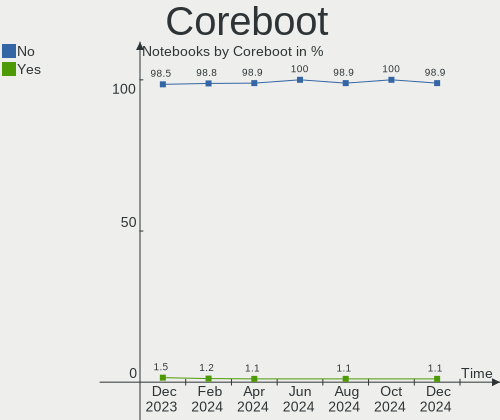
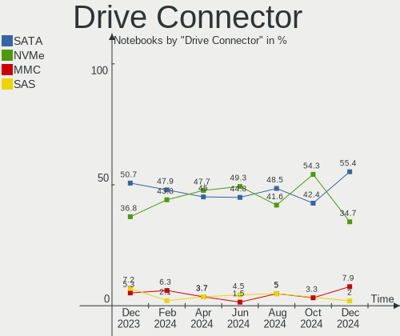
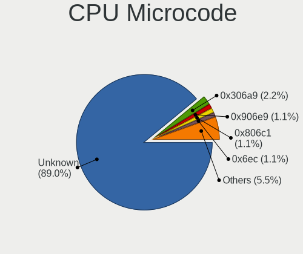

Linux in Poland - Hardware Trends (Notebooks)
---------------------------------------------

A project to identify most popular hardware characteristics and track their change
over time based on data collected by Linux users at https://Linux-Hardware.org.

Anyone can contribute to this report by the [hw-probe](https://github.com/linuxhw/hw-probe) tool:

    sudo -E hw-probe -all -upload

Period: Dec, 2022.

Contents
--------

* [ System ](#system)
  - [ OS                       ](#os)
  - [ OS Family                ](#os-family)
  - [ Kernel                   ](#kernel)
  - [ Kernel Family            ](#kernel-family)
  - [ Kernel Major Ver.        ](#kernel-major-ver)
  - [ Arch                     ](#arch)
  - [ DE                       ](#de)
  - [ Display Server           ](#display-server)
  - [ Display Manager          ](#display-manager)
  - [ OS Lang                  ](#os-lang)
  - [ Boot Mode                ](#boot-mode)
  - [ Filesystem               ](#filesystem)
  - [ Part. scheme             ](#part-scheme)
  - [ Dual Boot with Linux/BSD ](#dual-boot-with-linuxbsd)
  - [ Dual Boot (Win)          ](#dual-boot-win)

* [ Board ](#board)
  - [ Vendor                   ](#vendor)
  - [ Model                    ](#model)
  - [ Model Family             ](#model-family)
  - [ MFG Year                 ](#mfg-year)
  - [ Form Factor              ](#form-factor)
  - [ Secure Boot              ](#secure-boot)
  - [ Coreboot                 ](#coreboot)
  - [ RAM Size                 ](#ram-size)
  - [ RAM Used                 ](#ram-used)
  - [ Total Drives             ](#total-drives)
  - [ Has CD-ROM               ](#has-cd-rom)
  - [ Has Ethernet             ](#has-ethernet)
  - [ Has WiFi                 ](#has-wifi)
  - [ Has Bluetooth            ](#has-bluetooth)

* [ Location ](#location)
  - [ Country                  ](#country)
  - [ City                     ](#city)

* [ Drives ](#drives)
  - [ Drive Vendor             ](#drive-vendor)
  - [ Drive Model              ](#drive-model)
  - [ HDD Vendor               ](#hdd-vendor)
  - [ SSD Vendor               ](#ssd-vendor)
  - [ Drive Kind               ](#drive-kind)
  - [ Drive Connector          ](#drive-connector)
  - [ Drive Size               ](#drive-size)
  - [ Space Total              ](#space-total)
  - [ Space Used               ](#space-used)
  - [ Malfunc. Drives          ](#malfunc-drives)
  - [ Malfunc. Drive Vendor    ](#malfunc-drive-vendor)
  - [ Malfunc. HDD Vendor      ](#malfunc-hdd-vendor)
  - [ Malfunc. Drive Kind      ](#malfunc-drive-kind)
  - [ Failed Drives            ](#failed-drives)
  - [ Failed Drive Vendor      ](#failed-drive-vendor)
  - [ Drive Status             ](#drive-status)

* [ Storage controller ](#storage-controller)
  - [ Storage Vendor           ](#storage-vendor)
  - [ Storage Model            ](#storage-model)
  - [ Storage Kind             ](#storage-kind)

* [ Processor ](#processor)
  - [ CPU Vendor               ](#cpu-vendor)
  - [ CPU Model                ](#cpu-model)
  - [ CPU Model Family         ](#cpu-model-family)
  - [ CPU Cores                ](#cpu-cores)
  - [ CPU Sockets              ](#cpu-sockets)
  - [ CPU Threads              ](#cpu-threads)
  - [ CPU Op-Modes             ](#cpu-op-modes)
  - [ CPU Microcode            ](#cpu-microcode)
  - [ CPU Microarch            ](#cpu-microarch)

* [ Graphics ](#graphics)
  - [ GPU Vendor               ](#gpu-vendor)
  - [ GPU Model                ](#gpu-model)
  - [ GPU Combo                ](#gpu-combo)
  - [ GPU Driver               ](#gpu-driver)
  - [ GPU Memory               ](#gpu-memory)

* [ Monitor ](#monitor)
  - [ Monitor Vendor           ](#monitor-vendor)
  - [ Monitor Model            ](#monitor-model)
  - [ Monitor Resolution       ](#monitor-resolution)
  - [ Monitor Diagonal         ](#monitor-diagonal)
  - [ Monitor Width            ](#monitor-width)
  - [ Aspect Ratio             ](#aspect-ratio)
  - [ Monitor Area             ](#monitor-area)
  - [ Pixel Density            ](#pixel-density)
  - [ Multiple Monitors        ](#multiple-monitors)

* [ Network ](#network)
  - [ Net Controller Vendor    ](#net-controller-vendor)
  - [ Net Controller Model     ](#net-controller-model)
  - [ Wireless Vendor          ](#wireless-vendor)
  - [ Wireless Model           ](#wireless-model)
  - [ Ethernet Vendor          ](#ethernet-vendor)
  - [ Ethernet Model           ](#ethernet-model)
  - [ Net Controller Kind      ](#net-controller-kind)
  - [ Used Controller          ](#used-controller)
  - [ NICs                     ](#nics)
  - [ IPv6                     ](#ipv6)

* [ Bluetooth ](#bluetooth)
  - [ Bluetooth Vendor         ](#bluetooth-vendor)
  - [ Bluetooth Model          ](#bluetooth-model)

* [ Sound ](#sound)
  - [ Sound Vendor             ](#sound-vendor)
  - [ Sound Model              ](#sound-model)

* [ Memory ](#memory)
  - [ Memory Vendor            ](#memory-vendor)
  - [ Memory Model             ](#memory-model)
  - [ Memory Kind              ](#memory-kind)
  - [ Memory Form Factor       ](#memory-form-factor)
  - [ Memory Size              ](#memory-size)
  - [ Memory Speed             ](#memory-speed)

* [ Printers & scanners ](#printers--scanners)
  - [ Printer Vendor           ](#printer-vendor)
  - [ Printer Model            ](#printer-model)
  - [ Scanner Vendor           ](#scanner-vendor)
  - [ Scanner Model            ](#scanner-model)

* [ Camera ](#camera)
  - [ Camera Vendor            ](#camera-vendor)
  - [ Camera Model             ](#camera-model)

* [ Security ](#security)
  - [ Fingerprint Vendor       ](#fingerprint-vendor)
  - [ Fingerprint Model        ](#fingerprint-model)
  - [ Chipcard Vendor          ](#chipcard-vendor)
  - [ Chipcard Model           ](#chipcard-model)

* [ Unsupported ](#unsupported)
  - [ Unsupported Devices      ](#unsupported-devices)
  - [ Unsupported Device Types ](#unsupported-device-types)

System
------

OS
--

Installed operating systems

| Name                | Notebooks | Percent |
|---------------------|-----------|---------|
| Ubuntu 22.04        | 11        | 13.92%  |
| Linux Mint 21       | 8         | 10.13%  |
| Debian 11           | 7         | 8.86%   |
| Ubuntu 22.10        | 6         | 7.59%   |
| OpenMandriva 4.3    | 6         | 7.59%   |
| Kubuntu 22.04       | 4         | 5.06%   |
| Pop!_OS 22.04       | 2         | 2.53%   |
| OpenMandriva 22.12  | 2         | 2.53%   |
| Nobara 36           | 2         | 2.53%   |
| MX 21               | 2         | 2.53%   |
| Manjaro 22.0.0      | 2         | 2.53%   |
| Linux Mint 21.1     | 2         | 2.53%   |
| Kali 2022.4         | 2         | 2.53%   |
| Fedora 37           | 2         | 2.53%   |
| Debian              | 2         | 2.53%   |
| Zorin 16            | 1         | 1.27%   |
| Xubuntu 22.04       | 1         | 1.27%   |
| Ubuntu Unity 20.04  | 1         | 1.27%   |
| Ubuntu Unity 16.04  | 1         | 1.27%   |
| Ubuntu MATE 22.04   | 1         | 1.27%   |
| Ubuntu Budgie 22.04 | 1         | 1.27%   |
| Ubuntu 20.04        | 1         | 1.27%   |
| SteamOS 3.3.2       | 1         | 1.27%   |
| Pop!_OS 20.04       | 1         | 1.27%   |
| OpenMandriva 4.90   | 1         | 1.27%   |
| OpenMandriva 4.50   | 1         | 1.27%   |
| OpenMandriva 4.2    | 1         | 1.27%   |
| Manjaro             | 1         | 1.27%   |
| Lubuntu 22.04       | 1         | 1.27%   |
| LMDE 5              | 1         | 1.27%   |
| Linux Mint 20.3     | 1         | 1.27%   |
| Gentoo 2.9          | 1         | 1.27%   |
| Clear Linux 36010   | 1         | 1.27%   |
| Arch Rolling        | 1         | 1.27%   |

OS Family
---------

OS without a version

| Name          | Notebooks | Percent |
|---------------|-----------|---------|
| Ubuntu        | 18        | 22.78%  |
| OpenMandriva  | 11        | 13.92%  |
| Linux Mint    | 11        | 13.92%  |
| Debian        | 9         | 11.39%  |
| Kubuntu       | 4         | 5.06%   |
| Pop!_OS       | 3         | 3.8%    |
| Manjaro       | 3         | 3.8%    |
| Ubuntu Unity  | 2         | 2.53%   |
| Nobara        | 2         | 2.53%   |
| MX            | 2         | 2.53%   |
| Kali          | 2         | 2.53%   |
| Fedora        | 2         | 2.53%   |
| Zorin         | 1         | 1.27%   |
| Xubuntu       | 1         | 1.27%   |
| Ubuntu MATE   | 1         | 1.27%   |
| Ubuntu Budgie | 1         | 1.27%   |
| SteamOS       | 1         | 1.27%   |
| Lubuntu       | 1         | 1.27%   |
| LMDE          | 1         | 1.27%   |
| Gentoo        | 1         | 1.27%   |
| Clear Linux   | 1         | 1.27%   |
| Arch          | 1         | 1.27%   |

Kernel
------

Version of the Linux kernel

| Version                      | Notebooks | Percent |
|------------------------------|-----------|---------|
| 5.15.0-56-generic            | 25        | 31.65%  |
| 5.16.7-desktop-1omv4003      | 6         | 7.59%   |
| 5.10.0-20-amd64              | 4         | 5.06%   |
| 5.19.0-26-generic            | 3         | 3.8%    |
| 5.10.0-19-amd64              | 3         | 3.8%    |
| 6.0.11-1-MANJARO             | 2         | 2.53%   |
| 6.0.10-desktop-2omv22090     | 2         | 2.53%   |
| 6.0.0-kali3-amd64            | 2         | 2.53%   |
| 5.15.0-43-generic            | 2         | 2.53%   |
| 6.0.7-301.fc37.x86_64        | 1         | 1.27%   |
| 6.0.6-76060006-generic       | 1         | 1.27%   |
| 6.0.13-201.fsync.fc36.x86_64 | 1         | 1.27%   |
| 6.0.12-gentoo-dist           | 1         | 1.27%   |
| 6.0.12-76060006-generic      | 1         | 1.27%   |
| 6.0.12-300.fc37.x86_64       | 1         | 1.27%   |
| 6.0.11-zen1-1-zen            | 1         | 1.27%   |
| 6.0.11-x64v2-xanmod1         | 1         | 1.27%   |
| 6.0.11-x64v1-xanmod1         | 1         | 1.27%   |
| 6.0.10-201.fc36.x86_64       | 1         | 1.27%   |
| 6.0.0-6-amd64                | 1         | 1.27%   |
| 6.0.0-5-amd64                | 1         | 1.27%   |
| 6.0.0-5-686                  | 1         | 1.27%   |
| 5.4.0-135-generic            | 1         | 1.27%   |
| 5.19.5-desktop-1omv4090      | 1         | 1.27%   |
| 5.19.0-27-generic            | 1         | 1.27%   |
| 5.19.0-21-generic            | 1         | 1.27%   |
| 5.18.12-desktop-3omv4090     | 1         | 1.27%   |
| 5.17.5-76051705-generic      | 1         | 1.27%   |
| 5.17.0-3mx-amd64             | 1         | 1.27%   |
| 5.17.0-1025-oem              | 1         | 1.27%   |
| 5.17.0-1020-oem              | 1         | 1.27%   |
| 5.16.13-1132.native          | 1         | 1.27%   |
| 5.15.81-1-MANJARO            | 1         | 1.27%   |
| 5.15.0-53-generic            | 1         | 1.27%   |
| 5.15.0-25-generic            | 1         | 1.27%   |
| 5.13.0-valve21.3-1-neptune   | 1         | 1.27%   |
| 5.10.157                     | 1         | 1.27%   |
| 5.10.14-desktop-1omv4002     | 1         | 1.27%   |
| 4.4.0-210-generic            | 1         | 1.27%   |

Kernel Family
-------------

Linux kernel without a distro release

| Version  | Notebooks | Percent |
|----------|-----------|---------|
| 5.15.0   | 29        | 36.71%  |
| 5.10.0   | 7         | 8.86%   |
| 5.16.7   | 6         | 7.59%   |
| 6.0.11   | 5         | 6.33%   |
| 6.0.0    | 5         | 6.33%   |
| 5.19.0   | 5         | 6.33%   |
| 6.0.12   | 3         | 3.8%    |
| 6.0.10   | 3         | 3.8%    |
| 5.17.0   | 3         | 3.8%    |
| 6.0.7    | 1         | 1.27%   |
| 6.0.6    | 1         | 1.27%   |
| 6.0.13   | 1         | 1.27%   |
| 5.4.0    | 1         | 1.27%   |
| 5.19.5   | 1         | 1.27%   |
| 5.18.12  | 1         | 1.27%   |
| 5.17.5   | 1         | 1.27%   |
| 5.16.13  | 1         | 1.27%   |
| 5.15.81  | 1         | 1.27%   |
| 5.13.0   | 1         | 1.27%   |
| 5.10.157 | 1         | 1.27%   |
| 5.10.14  | 1         | 1.27%   |
| 4.4.0    | 1         | 1.27%   |

Kernel Major Ver.
-----------------

Linux kernel major version

| Version | Notebooks | Percent |
|---------|-----------|---------|
| 5.15    | 30        | 37.97%  |
| 6.0     | 19        | 24.05%  |
| 5.10    | 9         | 11.39%  |
| 5.16    | 7         | 8.86%   |
| 5.19    | 6         | 7.59%   |
| 5.17    | 4         | 5.06%   |
| 5.4     | 1         | 1.27%   |
| 5.18    | 1         | 1.27%   |
| 5.13    | 1         | 1.27%   |
| 4.4     | 1         | 1.27%   |

Arch
----

OS architecture (x86_64, i586, etc.)

| Name   | Notebooks | Percent |
|--------|-----------|---------|
| x86_64 | 78        | 98.73%  |
| i686   | 1         | 1.27%   |

DE
--

Desktop Environment

| Name       | Notebooks | Percent |
|------------|-----------|---------|
| GNOME      | 32        | 40.51%  |
| KDE5       | 19        | 24.05%  |
| XFCE       | 11        | 13.92%  |
| X-Cinnamon | 7         | 8.86%   |
| MATE       | 4         | 5.06%   |
| Unity      | 2         | 2.53%   |
| Budgie     | 2         | 2.53%   |
| LXQt       | 1         | 1.27%   |
| Unknown    | 1         | 1.27%   |

Display Server
--------------

X11 or Wayland

| Name    | Notebooks | Percent |
|---------|-----------|---------|
| X11     | 55        | 69.62%  |
| Wayland | 23        | 29.11%  |
| Tty     | 1         | 1.27%   |

Display Manager
---------------

SDDM, LightDM, etc.

| Name    | Notebooks | Percent |
|---------|-----------|---------|
| LightDM | 20        | 25.32%  |
| Unknown | 20        | 25.32%  |
| SDDM    | 16        | 20.25%  |
| GDM3    | 16        | 20.25%  |
| GDM     | 7         | 8.86%   |

OS Lang
-------

Language

| Lang  | Notebooks | Percent |
|-------|-----------|---------|
| pl_PL | 40        | 50.63%  |
| en_US | 29        | 36.71%  |
| en_GB | 5         | 6.33%   |
| ru_RU | 2         | 2.53%   |
| C     | 2         | 2.53%   |
| ru_UA | 1         | 1.27%   |

Boot Mode
---------

EFI or BIOS

| Mode | Notebooks | Percent |
|------|-----------|---------|
| EFI  | 48        | 60.76%  |
| BIOS | 31        | 39.24%  |

Filesystem
----------

Type of filesystem

| Type    | Notebooks | Percent |
|---------|-----------|---------|
| Ext4    | 55        | 69.62%  |
| Overlay | 13        | 16.46%  |
| Btrfs   | 10        | 12.66%  |
| F2fs    | 1         | 1.27%   |

Part. scheme
------------

Scheme of partitioning

| Type    | Notebooks | Percent |
|---------|-----------|---------|
| GPT     | 49        | 62.03%  |
| Unknown | 18        | 22.78%  |
| MBR     | 12        | 15.19%  |

Dual Boot with Linux/BSD
------------------------

Hosting more than one Linux/BSD

| Dual boot | Notebooks | Percent |
|-----------|-----------|---------|
| No        | 67        | 84.81%  |
| Yes       | 12        | 15.19%  |

Dual Boot (Win)
---------------

Hosting Linux and Windows

| Dual boot | Notebooks | Percent |
|-----------|-----------|---------|
| No        | 53        | 67.09%  |
| Yes       | 26        | 32.91%  |

Board
-----

Vendor
------

Motherboard manufacturer

| Name                | Notebooks | Percent |
|---------------------|-----------|---------|
| Dell                | 22        | 27.85%  |
| Lenovo              | 16        | 20.25%  |
| Hewlett-Packard     | 11        | 13.92%  |
| ASUSTek Computer    | 7         | 8.86%   |
| Samsung Electronics | 3         | 3.8%    |
| MSI                 | 3         | 3.8%    |
| Google              | 3         | 3.8%    |
| Apple               | 3         | 3.8%    |
| Acer                | 2         | 2.53%   |
| Valve               | 1         | 1.27%   |
| Toshiba             | 1         | 1.27%   |
| Sony                | 1         | 1.27%   |
| Panasonic           | 1         | 1.27%   |
| HUAWEI              | 1         | 1.27%   |
| GPU Company         | 1         | 1.27%   |
| GMKtec              | 1         | 1.27%   |
| Gigabyte Technology | 1         | 1.27%   |
| Fujitsu             | 1         | 1.27%   |

Model
-----

Motherboard model

| Name                                 | Notebooks | Percent |
|--------------------------------------|-----------|---------|
| Lenovo Y50-70 20378                  | 2         | 2.53%   |
| HP Pavilion dv7                      | 2         | 2.53%   |
| Dell Latitude 5411                   | 2         | 2.53%   |
| Valve Jupiter                        | 1         | 1.27%   |
| Toshiba Satellite L650               | 1         | 1.27%   |
| Sony SVE1112M1EB                     | 1         | 1.27%   |
| Samsung 350V5C/351V5C/3540VC/3440VC  | 1         | 1.27%   |
| Samsung 305E4A/305E5A/305E7A         | 1         | 1.27%   |
| Samsung 270E5G/270E5U                | 1         | 1.27%   |
| Panasonic CFMX4-1                    | 1         | 1.27%   |
| MSI Vector GP76 12UGS                | 1         | 1.27%   |
| MSI GF63 Thin 9RCX                   | 1         | 1.27%   |
| MSI Creator Z17 A12UHST              | 1         | 1.27%   |
| Lenovo Y520-15IKBN 80WK              | 1         | 1.27%   |
| Lenovo ThinkPad T530 24295XU         | 1         | 1.27%   |
| Lenovo ThinkPad T430 23472Y0         | 1         | 1.27%   |
| Lenovo ThinkPad R61 8918DEG          | 1         | 1.27%   |
| Lenovo ThinkPad L15 Gen 1 20U70004PB | 1         | 1.27%   |
| Lenovo ThinkPad L14 Gen 1 20U50008PB | 1         | 1.27%   |
| Lenovo ThinkBook 15 G2 ITL 20VE      | 1         | 1.27%   |
| Lenovo ThinkBook 14 G2 ITL 20VD      | 1         | 1.27%   |
| Lenovo Legion Y530-15ICH 81FV        | 1         | 1.27%   |
| Lenovo Legion 5 15ACH6H 82JU         | 1         | 1.27%   |
| Lenovo IdeaPad Y510P 20217           | 1         | 1.27%   |
| Lenovo IdeaPad 3 15ITL6 82H8         | 1         | 1.27%   |
| Lenovo IdeaPad 100-15IBD 80QQ        | 1         | 1.27%   |
| Lenovo G770 20089                    | 1         | 1.27%   |
| HUAWEI HVY-WXX9                      | 1         | 1.27%   |
| HP ProBook 450 G7                    | 1         | 1.27%   |
| HP Pavilion Aero Laptop 13-be0xxx    | 1         | 1.27%   |
| HP OMEN Laptop 15-ek0xxx             | 1         | 1.27%   |
| HP EliteBook 8470p                   | 1         | 1.27%   |
| HP EliteBook 830 G6                  | 1         | 1.27%   |
| HP EliteBook 820 G3                  | 1         | 1.27%   |
| HP EliteBook 745 G5                  | 1         | 1.27%   |
| HP EliteBook 745 G3                  | 1         | 1.27%   |
| HP 255 G7 Notebook PC                | 1         | 1.27%   |
| GPU Company GWTN141-10               | 1         | 1.27%   |
| Google Ultima                        | 1         | 1.27%   |
| Google Lars                          | 1         | 1.27%   |

Model Family
------------

Motherboard model prefix

| Name                   | Notebooks | Percent |
|------------------------|-----------|---------|
| Dell Latitude          | 11        | 13.92%  |
| Lenovo ThinkPad        | 5         | 6.33%   |
| HP EliteBook           | 5         | 6.33%   |
| Lenovo IdeaPad         | 3         | 3.8%    |
| HP Pavilion            | 3         | 3.8%    |
| Dell Vostro            | 3         | 3.8%    |
| Dell Inspiron          | 3         | 3.8%    |
| Lenovo Y50-70          | 2         | 2.53%   |
| Lenovo ThinkBook       | 2         | 2.53%   |
| Lenovo Legion          | 2         | 2.53%   |
| Dell XPS               | 2         | 2.53%   |
| Dell G15               | 2         | 2.53%   |
| Acer Nitro             | 2         | 2.53%   |
| Valve Jupiter          | 1         | 1.27%   |
| Toshiba Satellite      | 1         | 1.27%   |
| Sony SVE1112M1EB       | 1         | 1.27%   |
| Samsung 350V5C         | 1         | 1.27%   |
| Samsung 305E4A         | 1         | 1.27%   |
| Samsung 270E5G         | 1         | 1.27%   |
| Panasonic CFMX4-1      | 1         | 1.27%   |
| MSI Vector             | 1         | 1.27%   |
| MSI GF63               | 1         | 1.27%   |
| MSI Creator            | 1         | 1.27%   |
| Lenovo Y520-15IKBN     | 1         | 1.27%   |
| Lenovo G770            | 1         | 1.27%   |
| HUAWEI HVY-WXX9        | 1         | 1.27%   |
| HP ProBook             | 1         | 1.27%   |
| HP OMEN                | 1         | 1.27%   |
| HP 255                 | 1         | 1.27%   |
| GPU Company GWTN141-10 | 1         | 1.27%   |
| Google Ultima          | 1         | 1.27%   |
| Google Lars            | 1         | 1.27%   |
| Google Glimmer         | 1         | 1.27%   |
| GMKtec NucBox5         | 1         | 1.27%   |
| Gigabyte MMLP3AP-00    | 1         | 1.27%   |
| Fujitsu LIFEBOOK       | 1         | 1.27%   |
| Dell Precision         | 1         | 1.27%   |
| ASUS X555LJ            | 1         | 1.27%   |
| ASUS X550LD            | 1         | 1.27%   |
| ASUS TUF               | 1         | 1.27%   |

MFG Year
--------

Motherboard manufacture year

| Year | Notebooks | Percent |
|------|-----------|---------|
| 2020 | 12        | 15.19%  |
| 2021 | 9         | 11.39%  |
| 2022 | 7         | 8.86%   |
| 2017 | 7         | 8.86%   |
| 2011 | 7         | 8.86%   |
| 2019 | 6         | 7.59%   |
| 2013 | 6         | 7.59%   |
| 2014 | 5         | 6.33%   |
| 2015 | 4         | 5.06%   |
| 2012 | 4         | 5.06%   |
| 2018 | 3         | 3.8%    |
| 2016 | 2         | 2.53%   |
| 2010 | 2         | 2.53%   |
| 2008 | 2         | 2.53%   |
| 2009 | 1         | 1.27%   |
| 2007 | 1         | 1.27%   |
| 2004 | 1         | 1.27%   |

Form Factor
-----------

Physical design of the computer

| Name     | Notebooks | Percent |
|----------|-----------|---------|
| Notebook | 79        | 100%    |

Secure Boot
-----------

Enabled or disabled

| State    | Notebooks | Percent |
|----------|-----------|---------|
| Disabled | 75        | 94.94%  |
| Enabled  | 4         | 5.06%   |

Coreboot
--------

Have coreboot on board

| Used | Notebooks | Percent |
|------|-----------|---------|
| No   | 76        | 96.2%   |
| Yes  | 3         | 3.8%    |

RAM Size
--------

Total RAM memory

| Size in GB  | Notebooks | Percent |
|-------------|-----------|---------|
| 4.01-8.0    | 26        | 32.91%  |
| 8.01-16.0   | 16        | 20.25%  |
| 16.01-24.0  | 13        | 16.46%  |
| 3.01-4.0    | 11        | 13.92%  |
| 32.01-64.0  | 10        | 12.66%  |
| 2.01-3.0    | 1         | 1.27%   |
| 64.01-256.0 | 1         | 1.27%   |
| 1.01-2.0    | 1         | 1.27%   |

RAM Used
--------

Used RAM memory

| Used GB    | Notebooks | Percent |
|------------|-----------|---------|
| 1.01-2.0   | 26        | 32.91%  |
| 2.01-3.0   | 17        | 21.52%  |
| 3.01-4.0   | 12        | 15.19%  |
| 4.01-8.0   | 11        | 13.92%  |
| 8.01-16.0  | 6         | 7.59%   |
| 0.51-1.0   | 5         | 6.33%   |
| 24.01-32.0 | 1         | 1.27%   |
| 16.01-24.0 | 1         | 1.27%   |

Total Drives
------------

Number of drives on board

| Drives | Notebooks | Percent |
|--------|-----------|---------|
| 1      | 65        | 82.28%  |
| 2      | 14        | 17.72%  |

Has CD-ROM
----------

Has CD-ROM on board

| Presented | Notebooks | Percent |
|-----------|-----------|---------|
| No        | 60        | 75.95%  |
| Yes       | 19        | 24.05%  |

Has Ethernet
------------

Has Ethernet on board

| Presented | Notebooks | Percent |
|-----------|-----------|---------|
| Yes       | 65        | 82.28%  |
| No        | 14        | 17.72%  |

Has WiFi
--------

Has WiFi module

| Presented | Notebooks | Percent |
|-----------|-----------|---------|
| Yes       | 79        | 100%    |

Has Bluetooth
-------------

Has Bluetooth module

| Presented | Notebooks | Percent |
|-----------|-----------|---------|
| Yes       | 63        | 79.75%  |
| No        | 16        | 20.25%  |

Location
--------

Country
-------

Geographic location (country)

| Country | Notebooks | Percent |
|---------|-----------|---------|
| Poland  | 79        | 100%    |

City
----

Geographic location (city)

| City                   | Notebooks | Percent |
|------------------------|-----------|---------|
| Warsaw                 | 22        | 27.85%  |
| Lodz                   | 6         | 7.59%   |
| Krakow                 | 6         | 7.59%   |
| Poznan                 | 5         | 6.33%   |
| Wroclaw                | 3         | 3.8%    |
| Katowice               | 3         | 3.8%    |
| Gdansk                 | 3         | 3.8%    |
| Ruda Śląska          | 2         | 2.53%   |
| Lublin                 | 2         | 2.53%   |
| Elblag                 | 2         | 2.53%   |
| Zlotow                 | 1         | 1.27%   |
| Zdunska Wola           | 1         | 1.27%   |
| Wojkowice              | 1         | 1.27%   |
| Tychy                  | 1         | 1.27%   |
| Tuczno                 | 1         | 1.27%   |
| Tomaszow Lubelski      | 1         | 1.27%   |
| Szerzyny               | 1         | 1.27%   |
| Szczawnica             | 1         | 1.27%   |
| Swidnik                | 1         | 1.27%   |
| Suchy Las              | 1         | 1.27%   |
| Slawa                  | 1         | 1.27%   |
| Siemianowice Śląskie | 1         | 1.27%   |
| Radziechowy            | 1         | 1.27%   |
| Płock                 | 1         | 1.27%   |
| Otwock                 | 1         | 1.27%   |
| Olsztyn                | 1         | 1.27%   |
| Namyslow               | 1         | 1.27%   |
| Mirzec                 | 1         | 1.27%   |
| Legnica                | 1         | 1.27%   |
| Kozminek               | 1         | 1.27%   |
| Grodzisk Mazowiecki    | 1         | 1.27%   |
| Dąbrowa Górnicza     | 1         | 1.27%   |
| Bydgoszcz              | 1         | 1.27%   |
| Borek Wielkopolski     | 1         | 1.27%   |
| Bolszewo               | 1         | 1.27%   |

Drives
------

Drive Vendor
------------

Hard drive vendors

| Vendor                    | Notebooks | Drives | Percent |
|---------------------------|-----------|--------|---------|
| Samsung Electronics       | 16        | 17     | 16.84%  |
| Seagate                   | 10        | 10     | 10.53%  |
| GOODRAM                   | 8         | 8      | 8.42%   |
| Kingston                  | 6         | 6      | 6.32%   |
| WDC                       | 5         | 5      | 5.26%   |
| Unknown                   | 5         | 6      | 5.26%   |
| Toshiba                   | 4         | 4      | 4.21%   |
| SK hynix                  | 4         | 4      | 4.21%   |
| Silicon Motion            | 3         | 3      | 3.16%   |
| SanDisk                   | 3         | 3      | 3.16%   |
| Micron Technology         | 3         | 3      | 3.16%   |
| Intel                     | 3         | 3      | 3.16%   |
| Crucial                   | 3         | 3      | 3.16%   |
| Phison Electronics        | 2         | 2      | 2.11%   |
| KIOXIA                    | 2         | 2      | 2.11%   |
| Hitachi                   | 2         | 2      | 2.11%   |
| Apple                     | 2         | 2      | 2.11%   |
| A-DATA Technology         | 2         | 2      | 2.11%   |
| Unknown                   | 2         | 2      | 2.11%   |
| W800SH                    | 1         | 1      | 1.05%   |
| PNY                       | 1         | 1      | 1.05%   |
| Netac                     | 1         | 1      | 1.05%   |
| Micron/Crucial Technology | 1         | 1      | 1.05%   |
| Lexar                     | 1         | 1      | 1.05%   |
| JMicron Technology        | 1         | 1      | 1.05%   |
| HGST                      | 1         | 1      | 1.05%   |
| Fujitsu                   | 1         | 1      | 1.05%   |
| Fanxiang                  | 1         | 1      | 1.05%   |
| ADATA Technology          | 1         | 1      | 1.05%   |

Drive Model
-----------

Hard drive models

| Model                                                  | Notebooks | Percent |
|--------------------------------------------------------|-----------|---------|
| SK hynix BC711 NVMe 512GB                              | 2         | 2.06%   |
| Seagate ST500LT012-1DG142 500GB                        | 2         | 2.06%   |
| Seagate ST1000LM024 HN-M101MBB 1TB                     | 2         | 2.06%   |
| Samsung MZALQ512HALU-000L2 512GB                       | 2         | 2.06%   |
| GOODRAM SSDPR-CX300-120 120GB                          | 2         | 2.06%   |
| Unknown                                                | 2         | 2.06%   |
| WDC WD5000BPVT-24HXZT3 500GB                           | 1         | 1.03%   |
| WDC WD3200BPVT-22ZEST0 320GB                           | 1         | 1.03%   |
| WDC WD3200BEKT-60V5T1 320GB                            | 1         | 1.03%   |
| WDC PC SN730 SDBQNTY-512G-1001 512GB                   | 1         | 1.03%   |
| WDC PC SN530 SDBPNPZ-512G-1014 512GB                   | 1         | 1.03%   |
| W800SH 512GB SSD                                       | 1         | 1.03%   |
| Unknown SEM16G  16GB                                   | 1         | 1.03%   |
| Unknown SDW16G  16GB                                   | 1         | 1.03%   |
| Unknown MMC Card  952MB                                | 1         | 1.03%   |
| Unknown MMC Card  7GB                                  | 1         | 1.03%   |
| Unknown MMC Card  64GB                                 | 1         | 1.03%   |
| Unknown HCG4a2  64GB                                   | 1         | 1.03%   |
| Toshiba MQ04ABF100 1TB                                 | 1         | 1.03%   |
| Toshiba MQ01ABD100 1TB                                 | 1         | 1.03%   |
| Toshiba MQ01ABD050 500GB                               | 1         | 1.03%   |
| Toshiba KBG40ZNS256G NVMe 256GB                        | 1         | 1.03%   |
| SK hynix SC313 SATA 256GB SSD                          | 1         | 1.03%   |
| SK hynix BC711 NVMe 256GB                              | 1         | 1.03%   |
| Silicon Motion SM2263EN/SM2263XT SSD Controller 1024GB | 1         | 1.03%   |
| Silicon Motion SM2262/SM2262EN SSD Controller 2TB      | 1         | 1.03%   |
| Silicon Motion PCIe-8 SSD 512GB                        | 1         | 1.03%   |
| Seagate ST9500325AS 500GB                              | 1         | 1.03%   |
| Seagate ST1000LM049-2GH172 1TB                         | 1         | 1.03%   |
| Seagate ST1000LM035-1RK172 1TB                         | 1         | 1.03%   |
| Seagate Expansion 4TB                                  | 1         | 1.03%   |
| Seagate BUP Slim BK 1TB                                | 1         | 1.03%   |
| Seagate Backup+ Hub BK 8TB                             | 1         | 1.03%   |
| SanDisk SD8SN8U-256G-1006 256GB SSD                    | 1         | 1.03%   |
| Sandisk PC SN530 NVMe WDC 512GB                        | 1         | 1.03%   |
| SanDisk NVMe SSD Drive 2TB                             | 1         | 1.03%   |
| Samsung SSD 980 500GB                                  | 1         | 1.03%   |
| Samsung SSD 980 1TB                                    | 1         | 1.03%   |
| Samsung SSD 970 EVO Plus 500GB                         | 1         | 1.03%   |
| Samsung SSD 970 EVO Plus 2TB                           | 1         | 1.03%   |

HDD Vendor
----------

Hard disk drive vendors

| Vendor  | Notebooks | Drives | Percent |
|---------|-----------|--------|---------|
| Seagate | 10        | 10     | 50%     |
| WDC     | 3         | 3      | 15%     |
| Toshiba | 3         | 3      | 15%     |
| Hitachi | 2         | 2      | 10%     |
| HGST    | 1         | 1      | 5%      |
| Fujitsu | 1         | 1      | 5%      |

SSD Vendor
----------

Solid state drive vendors

| Vendor              | Notebooks | Drives | Percent |
|---------------------|-----------|--------|---------|
| GOODRAM             | 8         | 8      | 28.57%  |
| Samsung Electronics | 3         | 3      | 10.71%  |
| Kingston            | 3         | 3      | 10.71%  |
| Crucial             | 3         | 3      | 10.71%  |
| W800SH              | 1         | 1      | 3.57%   |
| SK hynix            | 1         | 1      | 3.57%   |
| SanDisk             | 1         | 1      | 3.57%   |
| Netac               | 1         | 1      | 3.57%   |
| Micron Technology   | 1         | 1      | 3.57%   |
| JMicron Technology  | 1         | 1      | 3.57%   |
| Intel               | 1         | 1      | 3.57%   |
| Fanxiang            | 1         | 1      | 3.57%   |
| Apple               | 1         | 1      | 3.57%   |
| A-DATA Technology   | 1         | 1      | 3.57%   |
| Unknown             | 1         | 1      | 3.57%   |

Drive Kind
----------

HDD or SSD

| Kind | Notebooks | Drives | Percent |
|------|-----------|--------|---------|
| NVMe | 39        | 42     | 42.39%  |
| SSD  | 27        | 28     | 29.35%  |
| HDD  | 20        | 20     | 21.74%  |
| MMC  | 6         | 7      | 6.52%   |

Drive Connector
---------------

SATA, SAS, NVMe, etc.

| Type | Notebooks | Drives | Percent |
|------|-----------|--------|---------|
| SATA | 40        | 43     | 44.94%  |
| NVMe | 39        | 42     | 43.82%  |
| MMC  | 6         | 7      | 6.74%   |
| SAS  | 4         | 5      | 4.49%   |

Drive Size
----------

Size of hard drive

| Size in TB | Notebooks | Drives | Percent |
|------------|-----------|--------|---------|
| 0.01-0.5   | 31        | 33     | 67.39%  |
| 0.51-1.0   | 13        | 13     | 28.26%  |
| 3.01-4.0   | 1         | 1      | 2.17%   |
| 4.01-10.0  | 1         | 1      | 2.17%   |

Space Total
-----------

Amount of disk space available on the file system

| Size in GB     | Notebooks | Percent |
|----------------|-----------|---------|
| 251-500        | 23        | 29.11%  |
| 101-250        | 22        | 27.85%  |
| 1-20           | 9         | 11.39%  |
| 501-1000       | 8         | 10.13%  |
| 1001-2000      | 7         | 8.86%   |
| 51-100         | 5         | 6.33%   |
| 21-50          | 2         | 2.53%   |
| More than 3000 | 1         | 1.27%   |
| 2001-3000      | 1         | 1.27%   |
| Unknown        | 1         | 1.27%   |

Space Used
----------

Amount of used disk space

| Used GB        | Notebooks | Percent |
|----------------|-----------|---------|
| 1-20           | 33        | 41.77%  |
| 101-250        | 14        | 17.72%  |
| 51-100         | 12        | 15.19%  |
| 21-50          | 10        | 12.66%  |
| 501-1000       | 4         | 5.06%   |
| 1001-2000      | 3         | 3.8%    |
| More than 3000 | 1         | 1.27%   |
| 251-500        | 1         | 1.27%   |
| Unknown        | 1         | 1.27%   |

Malfunc. Drives
---------------

Drive models with a malfunction

| Model                             | Notebooks | Drives | Percent |
|-----------------------------------|-----------|--------|---------|
| WDC WD5000BPVT-24HXZT3 500GB      | 1         | 1      | 20%     |
| WDC WD3200BPVT-22ZEST0 320GB      | 1         | 1      | 20%     |
| Seagate ST9500325AS 500GB         | 1         | 1      | 20%     |
| Crucial CT1000MX500SSD4 1TB       | 1         | 1      | 20%     |
| A-DATA Technology SP900 128GB SSD | 1         | 1      | 20%     |

Malfunc. Drive Vendor
---------------------

Vendors of faulty drives

| Vendor            | Notebooks | Drives | Percent |
|-------------------|-----------|--------|---------|
| WDC               | 2         | 2      | 40%     |
| Seagate           | 1         | 1      | 20%     |
| Crucial           | 1         | 1      | 20%     |
| A-DATA Technology | 1         | 1      | 20%     |

Malfunc. HDD Vendor
-------------------

Vendors of faulty HDD drives

| Vendor  | Notebooks | Drives | Percent |
|---------|-----------|--------|---------|
| WDC     | 2         | 2      | 66.67%  |
| Seagate | 1         | 1      | 33.33%  |

Malfunc. Drive Kind
-------------------

Kinds of faulty drives

| Kind | Notebooks | Drives | Percent |
|------|-----------|--------|---------|
| HDD  | 3         | 3      | 60%     |
| SSD  | 2         | 2      | 40%     |

Failed Drives
-------------

Failed drive models

Zero info for selected period =(

Failed Drive Vendor
-------------------

Failed drive vendors

Zero info for selected period =(

Drive Status
------------

Number of failed and malfunc. drives

| Status   | Notebooks | Drives | Percent |
|----------|-----------|--------|---------|
| Works    | 45        | 50     | 56.25%  |
| Detected | 30        | 42     | 37.5%   |
| Malfunc  | 5         | 5      | 6.25%   |

Storage controller
------------------

Storage Vendor
--------------

Storage controller vendors

| Vendor                       | Notebooks | Percent |
|------------------------------|-----------|---------|
| Intel                        | 55        | 53.92%  |
| Samsung Electronics          | 15        | 14.71%  |
| AMD                          | 7         | 6.86%   |
| SanDisk                      | 4         | 3.92%   |
| SK hynix                     | 3         | 2.94%   |
| Silicon Motion               | 3         | 2.94%   |
| Phison Electronics           | 3         | 2.94%   |
| Kingston Technology Company  | 3         | 2.94%   |
| Micron Technology            | 2         | 1.96%   |
| KIOXIA                       | 2         | 1.96%   |
| ADATA Technology             | 2         | 1.96%   |
| Toshiba America Info Systems | 1         | 0.98%   |
| Shenzhen Longsys Electronics | 1         | 0.98%   |
| Micron/Crucial Technology    | 1         | 0.98%   |

Storage Model
-------------

Storage controller models

| Model                                                                          | Notebooks | Percent |
|--------------------------------------------------------------------------------|-----------|---------|
| AMD FCH SATA Controller [AHCI mode]                                            | 7         | 6.6%    |
| Samsung NVMe SSD Controller 980                                                | 6         | 5.66%   |
| Samsung NVMe SSD Controller SM981/PM981/PM983                                  | 5         | 4.72%   |
| Intel Tiger Lake-LP SATA Controller                                            | 5         | 4.72%   |
| Intel 7 Series Chipset Family 6-port SATA Controller [AHCI mode]               | 5         | 4.72%   |
| Intel 6 Series/C200 Series Chipset Family 6 port Mobile SATA AHCI Controller   | 5         | 4.72%   |
| Intel Volume Management Device NVMe RAID Controller                            | 4         | 3.77%   |
| Intel Sunrise Point-LP SATA Controller [AHCI mode]                             | 4         | 3.77%   |
| Intel Cannon Lake Mobile PCH SATA AHCI Controller                              | 4         | 3.77%   |
| SK hynix Gold P31/PC711 NVMe Solid State Drive                                 | 3         | 2.83%   |
| Intel Wildcat Point-LP SATA Controller [AHCI Mode]                             | 3         | 2.83%   |
| Intel 8 Series/C220 Series Chipset Family 6-port SATA Controller 1 [AHCI mode] | 3         | 2.83%   |
| Intel 5 Series/3400 Series Chipset 4 port SATA AHCI Controller                 | 3         | 2.83%   |
| SanDisk Non-Volatile memory controller                                         | 2         | 1.89%   |
| Samsung NVMe SSD Controller SM961/PM961/SM963                                  | 2         | 1.89%   |
| Phison NVMe Storage Controller                                                 | 2         | 1.89%   |
| Micron Non-Volatile memory controller                                          | 2         | 1.89%   |
| KIOXIA NVMe SSD Controller BG4                                                 | 2         | 1.89%   |
| Kingston Company A2000 NVMe SSD                                                | 2         | 1.89%   |
| Intel Q170/Q150/B150/H170/H110/Z170/CM236 Chipset SATA Controller [AHCI Mode]  | 2         | 1.89%   |
| Intel Non-Volatile memory controller                                           | 2         | 1.89%   |
| Intel HM170/QM170 Chipset SATA Controller [AHCI Mode]                          | 2         | 1.89%   |
| Intel Cannon Point-LP SATA Controller [AHCI Mode]                              | 2         | 1.89%   |
| Intel 82801 Mobile SATA Controller [RAID mode]                                 | 2         | 1.89%   |
| Intel 8 Series SATA Controller 1 [AHCI mode]                                   | 2         | 1.89%   |
| Intel 5 Series/3400 Series Chipset 6 port SATA AHCI Controller                 | 2         | 1.89%   |
| Intel 400 Series Chipset Family SATA AHCI Controller                           | 2         | 1.89%   |
| ADATA XPG SX8200 Pro PCIe Gen3x4 M.2 2280 Solid State Drive                    | 2         | 1.89%   |
| Toshiba America Info Systems XG6 NVMe SSD Controller                           | 1         | 0.94%   |
| Silicon Motion SM2263EN/SM2263XT SSD Controller                                | 1         | 0.94%   |
| Silicon Motion SM2262/SM2262EN SSD Controller                                  | 1         | 0.94%   |
| Silicon Motion Non-Volatile memory controller                                  | 1         | 0.94%   |
| Shenzhen Longsys Electronics Non-Volatile memory controller                    | 1         | 0.94%   |
| SanDisk WD Blue SN550 NVMe SSD                                                 | 1         | 0.94%   |
| SanDisk WD Black SN750 / PC SN730 NVMe SSD                                     | 1         | 0.94%   |
| Samsung NVMe SSD Controller PM9A1/PM9A3/980PRO                                 | 1         | 0.94%   |
| Samsung Apple PCIe SSD                                                         | 1         | 0.94%   |
| Phison E12 NVMe Controller                                                     | 1         | 0.94%   |
| Micron/Crucial P2 NVMe PCIe SSD                                                | 1         | 0.94%   |
| Kingston Company U-SNS8154P3 NVMe SSD                                          | 1         | 0.94%   |

Storage Kind
------------

Kind of storage controller (IDE, SATA, NVMe, SAS, ...)

| Kind | Notebooks | Percent |
|------|-----------|---------|
| SATA | 57        | 54.81%  |
| NVMe | 39        | 37.5%   |
| RAID | 6         | 5.77%   |
| IDE  | 2         | 1.92%   |

Processor
---------

CPU Vendor
----------

Processor vendors

| Vendor | Notebooks | Percent |
|--------|-----------|---------|
| Intel  | 66        | 83.54%  |
| AMD    | 13        | 16.46%  |

CPU Model
---------

Processor models

| Model                                    | Notebooks | Percent |
|------------------------------------------|-----------|---------|
| Intel 11th Gen Core i5-1135G7 @ 2.40GHz  | 5         | 6.33%   |
| Intel Core i7-8750H CPU @ 2.20GHz        | 2         | 2.53%   |
| Intel Core i7-7700HQ CPU @ 2.80GHz       | 2         | 2.53%   |
| Intel Core i7-4720HQ CPU @ 2.60GHz       | 2         | 2.53%   |
| Intel Core i7-3520M CPU @ 2.90GHz        | 2         | 2.53%   |
| Intel Core i7-10850H CPU @ 2.70GHz       | 2         | 2.53%   |
| Intel Core i5-3210M CPU @ 2.50GHz        | 2         | 2.53%   |
| Intel Core i5-2520M CPU @ 2.50GHz        | 2         | 2.53%   |
| AMD Ryzen 5 4600H with Radeon Graphics   | 2         | 2.53%   |
| Intel Xeon CPU E3-1505M v6 @ 3.00GHz     | 1         | 1.27%   |
| Intel Pentium Silver N5000 CPU @ 1.10GHz | 1         | 1.27%   |
| Intel Pentium M processor 1600MHz        | 1         | 1.27%   |
| Intel Pentium CPU P6200 @ 2.13GHz        | 1         | 1.27%   |
| Intel Pentium CPU P6000 @ 1.87GHz        | 1         | 1.27%   |
| Intel Core i7-8550U CPU @ 1.80GHz        | 1         | 1.27%   |
| Intel Core i7-6820HQ CPU @ 2.70GHz       | 1         | 1.27%   |
| Intel Core i7-2630QM CPU @ 2.00GHz       | 1         | 1.27%   |
| Intel Core i7-10870H CPU @ 2.20GHz       | 1         | 1.27%   |
| Intel Core i7-10610U CPU @ 1.80GHz       | 1         | 1.27%   |
| Intel Core i7-10510U CPU @ 1.80GHz       | 1         | 1.27%   |
| Intel Core i5-9300H CPU @ 2.40GHz        | 1         | 1.27%   |
| Intel Core i5-8365U CPU @ 1.60GHz        | 1         | 1.27%   |
| Intel Core i5-8300H CPU @ 2.30GHz        | 1         | 1.27%   |
| Intel Core i5-8250U CPU @ 1.60GHz        | 1         | 1.27%   |
| Intel Core i5-7360U CPU @ 2.30GHz        | 1         | 1.27%   |
| Intel Core i5-6300U CPU @ 2.40GHz        | 1         | 1.27%   |
| Intel Core i5-6200U CPU @ 2.30GHz        | 1         | 1.27%   |
| Intel Core i5-5300U CPU @ 2.30GHz        | 1         | 1.27%   |
| Intel Core i5-5257U CPU @ 2.70GHz        | 1         | 1.27%   |
| Intel Core i5-5200U CPU @ 2.20GHz        | 1         | 1.27%   |
| Intel Core i5-4310U CPU @ 2.00GHz        | 1         | 1.27%   |
| Intel Core i5-4278U CPU @ 2.60GHz        | 1         | 1.27%   |
| Intel Core i5-4210U CPU @ 1.70GHz        | 1         | 1.27%   |
| Intel Core i5-4200M CPU @ 2.50GHz        | 1         | 1.27%   |
| Intel Core i5-3320M CPU @ 2.60GHz        | 1         | 1.27%   |
| Intel Core i5-2450M CPU @ 2.50GHz        | 1         | 1.27%   |
| Intel Core i5-2430M CPU @ 2.40GHz        | 1         | 1.27%   |
| Intel Core i5-10300H CPU @ 2.50GHz       | 1         | 1.27%   |
| Intel Core i5 CPU M 580 @ 2.67GHz        | 1         | 1.27%   |
| Intel Core i5 CPU M 560 @ 2.67GHz        | 1         | 1.27%   |

CPU Model Family
----------------

Processor model prefix

| Model                | Notebooks | Percent |
|----------------------|-----------|---------|
| Intel Core i5        | 24        | 30.38%  |
| Intel Core i7        | 16        | 20.25%  |
| Other                | 11        | 13.92%  |
| AMD Ryzen 5          | 6         | 7.59%   |
| Intel Core i3        | 5         | 6.33%   |
| Intel Celeron        | 5         | 6.33%   |
| Intel Pentium        | 2         | 2.53%   |
| Intel Xeon           | 1         | 1.27%   |
| Intel Pentium Silver | 1         | 1.27%   |
| Intel Pentium M      | 1         | 1.27%   |
| Intel Core 2 Duo     | 1         | 1.27%   |
| AMD Ryzen 7 PRO      | 1         | 1.27%   |
| AMD Ryzen 7          | 1         | 1.27%   |
| AMD Ryzen 5 PRO      | 1         | 1.27%   |
| AMD PRO A10          | 1         | 1.27%   |
| AMD E2               | 1         | 1.27%   |
| AMD A6               | 1         | 1.27%   |

CPU Cores
---------

Number of processor cores

| Number | Notebooks | Percent |
|--------|-----------|---------|
| 2      | 34        | 43.04%  |
| 4      | 28        | 35.44%  |
| 6      | 10        | 12.66%  |
| 8      | 3         | 3.8%    |
| 14     | 2         | 2.53%   |
| 1      | 2         | 2.53%   |

CPU Sockets
-----------

Number of sockets

| Number | Notebooks | Percent |
|--------|-----------|---------|
| 1      | 79        | 100%    |

CPU Threads
-----------

Threads per core (Hyper-Threading)

| Number | Notebooks | Percent |
|--------|-----------|---------|
| 2      | 64        | 81.01%  |
| 1      | 14        | 17.72%  |
| 8      | 1         | 1.27%   |

CPU Op-Modes
------------

CPU Operation Modes (32-bit, 64-bit)

| Op mode        | Notebooks | Percent |
|----------------|-----------|---------|
| 32-bit, 64-bit | 78        | 98.73%  |
| 32-bit         | 1         | 1.27%   |

CPU Microcode
-------------

Microcode number

| Number     | Notebooks | Percent |
|------------|-----------|---------|
| Unknown    | 18        | 22.78%  |
| 0x806c1    | 5         | 6.33%   |
| 0x806ec    | 4         | 5.06%   |
| 0x306a9    | 4         | 5.06%   |
| 0x206a7    | 4         | 5.06%   |
| 0xa0652    | 3         | 3.8%    |
| 0x906ea    | 3         | 3.8%    |
| 0x40651    | 3         | 3.8%    |
| 0x306d4    | 3         | 3.8%    |
| 0x08600106 | 3         | 3.8%    |
| 0x906e9    | 2         | 2.53%   |
| 0x806ea    | 2         | 2.53%   |
| 0x406e3    | 2         | 2.53%   |
| 0x306c3    | 2         | 2.53%   |
| 0x30678    | 2         | 2.53%   |
| 0x20655    | 2         | 2.53%   |
| 0x0a50000c | 2         | 2.53%   |
| 0x906c0    | 1         | 1.27%   |
| 0x906a3    | 1         | 1.27%   |
| 0x806e9    | 1         | 1.27%   |
| 0x706a1    | 1         | 1.27%   |
| 0x695      | 1         | 1.27%   |
| 0x506e3    | 1         | 1.27%   |
| 0x406c3    | 1         | 1.27%   |
| 0x20652    | 1         | 1.27%   |
| 0x10676    | 1         | 1.27%   |
| 0x0a50000d | 1         | 1.27%   |
| 0x08600103 | 1         | 1.27%   |
| 0x08108109 | 1         | 1.27%   |
| 0x08101016 | 1         | 1.27%   |
| 0x0500010d | 1         | 1.27%   |
| 0x03000025 | 1         | 1.27%   |

CPU Microarch
-------------

Microarchitecture

| Name             | Notebooks | Percent |
|------------------|-----------|---------|
| KabyLake         | 14        | 17.72%  |
| TigerLake        | 7         | 8.86%   |
| Haswell          | 7         | 8.86%   |
| IvyBridge        | 6         | 7.59%   |
| Westmere         | 5         | 6.33%   |
| SandyBridge      | 5         | 6.33%   |
| Zen 2            | 4         | 5.06%   |
| Skylake          | 4         | 5.06%   |
| CometLake        | 4         | 5.06%   |
| Broadwell        | 4         | 5.06%   |
| Zen 3            | 3         | 3.8%    |
| Silvermont       | 3         | 3.8%    |
| Unknown          | 3         | 3.8%    |
| Zen+             | 1         | 1.27%   |
| Zen              | 1         | 1.27%   |
| Tremont          | 1         | 1.27%   |
| Penryn           | 1         | 1.27%   |
| P6               | 1         | 1.27%   |
| K10 Llano        | 1         | 1.27%   |
| Goldmont plus    | 1         | 1.27%   |
| Excavator        | 1         | 1.27%   |
| Bobcat           | 1         | 1.27%   |
| Alderlake Hybrid | 1         | 1.27%   |

Graphics
--------

GPU Vendor
----------

Vendors of graphics cards

| Vendor | Notebooks | Percent |
|--------|-----------|---------|
| Intel  | 65        | 58.56%  |
| Nvidia | 27        | 24.32%  |
| AMD    | 19        | 17.12%  |

GPU Model
---------

Graphics card models

| Model                                                                     | Notebooks | Percent |
|---------------------------------------------------------------------------|-----------|---------|
| Intel TigerLake-LP GT2 [Iris Xe Graphics]                                 | 6         | 5.36%   |
| Intel 3rd Gen Core processor Graphics Controller                          | 6         | 5.36%   |
| Intel Core Processor Integrated Graphics Controller                       | 5         | 4.46%   |
| Intel 2nd Generation Core Processor Family Integrated Graphics Controller | 5         | 4.46%   |
| Nvidia GP107M [GeForce GTX 1050 Ti Mobile]                                | 4         | 3.57%   |
| Intel Haswell-ULT Integrated Graphics Controller                          | 4         | 3.57%   |
| Intel CometLake-H GT2 [UHD Graphics]                                      | 4         | 3.57%   |
| Intel CoffeeLake-H GT2 [UHD Graphics 630]                                 | 4         | 3.57%   |
| AMD Renoir                                                                | 4         | 3.57%   |
| Nvidia GA107M [GeForce RTX 3050 Mobile]                                   | 3         | 2.68%   |
| Intel HD Graphics 5500                                                    | 3         | 2.68%   |
| Intel 4th Gen Core Processor Integrated Graphics Controller               | 3         | 2.68%   |
| Intel WhiskeyLake-U GT2 [UHD Graphics 620]                                | 2         | 1.79%   |
| Intel UHD Graphics 620                                                    | 2         | 1.79%   |
| Intel Skylake GT2 [HD Graphics 520]                                       | 2         | 1.79%   |
| Intel HD Graphics 630                                                     | 2         | 1.79%   |
| Intel CometLake-U GT2 [UHD Graphics]                                      | 2         | 1.79%   |
| Intel Atom Processor Z36xxx/Z37xxx Series Graphics & Display              | 2         | 1.79%   |
| Intel Alder Lake-P Integrated Graphics Controller                         | 2         | 1.79%   |
| AMD Cezanne [Radeon Vega Series / Radeon Vega Mobile Series]              | 2         | 1.79%   |
| Nvidia TU117M                                                             | 1         | 0.89%   |
| Nvidia TU116M [GeForce GTX 1660 Ti Mobile]                                | 1         | 0.89%   |
| Nvidia GP108M [GeForce MX250]                                             | 1         | 0.89%   |
| Nvidia GP108M [GeForce MX150]                                             | 1         | 0.89%   |
| Nvidia GP107M [GeForce GTX 1050 Ti Max-Q]                                 | 1         | 0.89%   |
| Nvidia GP107M [GeForce GTX 1050 Mobile]                                   | 1         | 0.89%   |
| Nvidia GM108M [GeForce 920MX]                                             | 1         | 0.89%   |
| Nvidia GM107M [GeForce GTX 960M]                                          | 1         | 0.89%   |
| Nvidia GM107GLM [Quadro M620 Mobile]                                      | 1         | 0.89%   |
| Nvidia GK208BM [GeForce 920M]                                             | 1         | 0.89%   |
| Nvidia GK107M [GeForce GT 755M]                                           | 1         | 0.89%   |
| Nvidia GF119M [NVS 4200M]                                                 | 1         | 0.89%   |
| Nvidia GF117M [GeForce 610M/710M/810M/820M / GT 620M/625M/630M/720M]      | 1         | 0.89%   |
| Nvidia GF116M [GeForce GT 555M/635M]                                      | 1         | 0.89%   |
| Nvidia GF108M [NVS 5400M]                                                 | 1         | 0.89%   |
| Nvidia GF108M [GeForce GT 420M]                                           | 1         | 0.89%   |
| Nvidia GA106M [GeForce RTX 3060 Mobile / Max-Q]                           | 1         | 0.89%   |
| Nvidia GA104 [Geforce RTX 3070 Ti Laptop GPU]                             | 1         | 0.89%   |
| Nvidia GA103M [GeForce RTX 3080 Ti Mobile]                                | 1         | 0.89%   |
| Nvidia G86M [Quadro NVS 140M]                                             | 1         | 0.89%   |

GPU Combo
---------

Combinations of graphics cards

| Name                     | Notebooks | Percent |
|--------------------------|-----------|---------|
| 1 x Intel                | 36        | 45.57%  |
| Intel + Nvidia           | 22        | 27.85%  |
| 1 x AMD                  | 9         | 11.39%  |
| Intel + AMD              | 6         | 7.59%   |
| 1 x Nvidia               | 2         | 2.53%   |
| AMD + Nvidia             | 2         | 2.53%   |
| 2 x AMD                  | 1         | 1.27%   |
| Intel + AMD + 1 x Nvidia | 1         | 1.27%   |

GPU Driver
----------

Free vs proprietary

| Driver      | Notebooks | Percent |
|-------------|-----------|---------|
| Free        | 68        | 86.08%  |
| Proprietary | 9         | 11.39%  |
| Unknown     | 2         | 2.53%   |

GPU Memory
----------

Total video memory

| Size in GB | Notebooks | Percent |
|------------|-----------|---------|
| Unknown    | 53        | 67.09%  |
| 0.01-0.5   | 8         | 10.13%  |
| 1.01-2.0   | 7         | 8.86%   |
| 3.01-4.0   | 4         | 5.06%   |
| 0.51-1.0   | 4         | 5.06%   |
| 5.01-6.0   | 2         | 2.53%   |
| 7.01-8.0   | 1         | 1.27%   |

Monitor
-------

Monitor Vendor
--------------

Monitor vendors

| Vendor                  | Notebooks | Percent |
|-------------------------|-----------|---------|
| AU Optronics            | 22        | 22.92%  |
| LG Display              | 14        | 14.58%  |
| BOE                     | 13        | 13.54%  |
| Samsung Electronics     | 9         | 9.38%   |
| Chimei Innolux          | 7         | 7.29%   |
| Dell                    | 5         | 5.21%   |
| Iiyama                  | 3         | 3.13%   |
| Chi Mei Optoelectronics | 3         | 3.13%   |
| PANDA                   | 2         | 2.08%   |
| Lenovo                  | 2         | 2.08%   |
| Apple                   | 2         | 2.08%   |
| AOC                     | 2         | 2.08%   |
| Acer                    | 2         | 2.08%   |
| Sharp                   | 1         | 1.04%   |
| Philips                 | 1         | 1.04%   |
| NEC Computers           | 1         | 1.04%   |
| MSI                     | 1         | 1.04%   |
| Mi                      | 1         | 1.04%   |
| JDI                     | 1         | 1.04%   |
| IBM                     | 1         | 1.04%   |
| Goldstar                | 1         | 1.04%   |
| Ancor Communications    | 1         | 1.04%   |
| Analogix                | 1         | 1.04%   |

Monitor Model
-------------

Monitor models

| Model                                                                  | Notebooks | Percent |
|------------------------------------------------------------------------|-----------|---------|
| Samsung Electronics LCD Monitor SEC544B 1600x900 382x214mm 17.2-inch   | 2         | 2.02%   |
| LG Display LCD Monitor LGD0590 1920x1080 344x194mm 15.5-inch           | 2         | 2.02%   |
| LG Display LCD Monitor LGD044F 1920x1080 345x194mm 15.6-inch           | 2         | 2.02%   |
| Iiyama PL2740HS IVM6663 1920x1080 598x336mm 27.0-inch                  | 2         | 2.02%   |
| Iiyama PL2740HS IVM6662 1920x1080 598x336mm 27.0-inch                  | 2         | 2.02%   |
| AU Optronics LCD Monitor AUO213D 1920x1080 309x173mm 13.9-inch         | 2         | 2.02%   |
| Sharp LCD Monitor SHP149A 1920x1080 344x194mm 15.5-inch                | 1         | 1.01%   |
| Samsung Electronics U28E590 SAM0C4D 3840x2160 607x345mm 27.5-inch      | 1         | 1.01%   |
| Samsung Electronics S27F350 SAM0D22 1920x1080 600x340mm 27.2-inch      | 1         | 1.01%   |
| Samsung Electronics LCD Monitor SEC5442 1440x900 331x207mm 15.4-inch   | 1         | 1.01%   |
| Samsung Electronics LCD Monitor SEC384A 1366x768 344x194mm 15.5-inch   | 1         | 1.01%   |
| Samsung Electronics LCD Monitor SEC3541 1366x768 309x174mm 14.0-inch   | 1         | 1.01%   |
| Samsung Electronics LCD Monitor SEC3252 1600x900 344x194mm 15.5-inch   | 1         | 1.01%   |
| Samsung Electronics LCD Monitor SAM0A7D 1920x1080 1060x626mm 48.5-inch | 1         | 1.01%   |
| Philips FTV PHL04C3 1920x1080 1440x810mm 65.0-inch                     | 1         | 1.01%   |
| PANDA LCD Monitor NCP004D 1920x1080 344x194mm 15.5-inch                | 1         | 1.01%   |
| PANDA LCD Monitor NCP0036 1920x1080 344x194mm 15.5-inch                | 1         | 1.01%   |
| NEC Computers EA223WM NEC6890 1680x1050 474x296mm 22.0-inch            | 1         | 1.01%   |
| MSI G27C4 MSI3CA9 1920x1080 598x336mm 27.0-inch                        | 1         | 1.01%   |
| Mi Monitor XMI3445 3440x1440 797x334mm 34.0-inch                       | 1         | 1.01%   |
| LG Display LCD Monitor LGD068B 1920x1080 309x174mm 14.0-inch           | 1         | 1.01%   |
| LG Display LCD Monitor LGD062E 1920x1080 344x194mm 15.5-inch           | 1         | 1.01%   |
| LG Display LCD Monitor LGD05FE 1920x1080 344x194mm 15.5-inch           | 1         | 1.01%   |
| LG Display LCD Monitor LGD05F1 1920x1080 309x174mm 14.0-inch           | 1         | 1.01%   |
| LG Display LCD Monitor LGD05DB 1920x1080 294x165mm 13.3-inch           | 1         | 1.01%   |
| LG Display LCD Monitor LGD0468 1366x768 344x194mm 15.5-inch            | 1         | 1.01%   |
| LG Display LCD Monitor LGD03DB 1366x768 345x194mm 15.6-inch            | 1         | 1.01%   |
| LG Display LCD Monitor LGD0306 1600x900 310x174mm 14.0-inch            | 1         | 1.01%   |
| LG Display LCD Monitor LGD02DF 1600x900 310x174mm 14.0-inch            | 1         | 1.01%   |
| LG Display LCD Monitor LGD01E9 1920x1080 345x194mm 15.6-inch           | 1         | 1.01%   |
| Lenovo Q27q-10 LEN65F4 2560x1440 597x336mm 27.0-inch                   | 1         | 1.01%   |
| Lenovo LCD Monitor LEN40BA 1920x1080 344x194mm 15.5-inch               | 1         | 1.01%   |
| JDI LAM125M007D JDI1402 1920x1080 277x156mm 12.5-inch                  | 1         | 1.01%   |
| Iiyama PL2280H IVM5620 1920x1080 477x268mm 21.5-inch                   | 1         | 1.01%   |
| IBM LCD Monitor IBM2887 1680x1050 331x207mm 15.4-inch                  | 1         | 1.01%   |
| Goldstar ULTRAWIDE GSM59F1 2560x1080 798x334mm 34.1-inch               | 1         | 1.01%   |
| Dell U4919DW DELA10F 3840x1080 1198x337mm 49.0-inch                    | 1         | 1.01%   |
| Dell U2515H DELD070 2560x1440 553x311mm 25.0-inch                      | 1         | 1.01%   |
| Dell U2413 DELF046 1920x1200 518x324mm 24.1-inch                       | 1         | 1.01%   |
| Dell U2412M DELA07A 1920x1200 518x324mm 24.1-inch                      | 1         | 1.01%   |

Monitor Resolution
------------------

Monitor screen resolution

| Resolution         | Notebooks | Percent |
|--------------------|-----------|---------|
| 1920x1080 (FHD)    | 46        | 52.87%  |
| 1366x768 (WXGA)    | 15        | 17.24%  |
| 1600x900 (HD+)     | 8         | 9.2%    |
| 2560x1440 (QHD)    | 3         | 3.45%   |
| 1920x1200 (WUXGA)  | 3         | 3.45%   |
| 3840x2160 (4K)     | 2         | 2.3%    |
| 2560x1600          | 2         | 2.3%    |
| 1680x1050 (WSXGA+) | 2         | 2.3%    |
| 800x1280           | 1         | 1.15%   |
| 3840x1080          | 1         | 1.15%   |
| 3440x1440          | 1         | 1.15%   |
| 2880x1800          | 1         | 1.15%   |
| 2560x1080          | 1         | 1.15%   |
| 1440x900 (WXGA+)   | 1         | 1.15%   |

Monitor Diagonal
----------------

Diagonal size in inches

| Inches  | Notebooks | Percent |
|---------|-----------|---------|
| 15      | 36        | 37.5%   |
| 13      | 12        | 12.5%   |
| 14      | 10        | 10.42%  |
| 17      | 8         | 8.33%   |
| 27      | 7         | 7.29%   |
| 24      | 3         | 3.13%   |
| 23      | 3         | 3.13%   |
| 21      | 3         | 3.13%   |
| 11      | 3         | 3.13%   |
| 34      | 2         | 2.08%   |
| 12      | 2         | 2.08%   |
| 65      | 1         | 1.04%   |
| 49      | 1         | 1.04%   |
| 48      | 1         | 1.04%   |
| 25      | 1         | 1.04%   |
| 22      | 1         | 1.04%   |
| 16      | 1         | 1.04%   |
| Unknown | 1         | 1.04%   |

Monitor Width
-------------

Physical width

| Width in mm | Notebooks | Percent |
|-------------|-----------|---------|
| 301-350     | 52        | 54.74%  |
| 501-600     | 12        | 12.63%  |
| 201-300     | 11        | 11.58%  |
| 351-400     | 9         | 9.47%   |
| 401-500     | 4         | 4.21%   |
| 1001-1500   | 3         | 3.16%   |
| 701-800     | 2         | 2.11%   |
| 601-700     | 1         | 1.05%   |
| Unknown     | 1         | 1.05%   |

Aspect Ratio
------------

Proportional relationship between the width and the height

| Ratio | Notebooks | Percent |
|-------|-----------|---------|
| 16/9  | 69        | 84.15%  |
| 16/10 | 9         | 10.98%  |
| 21/9  | 2         | 2.44%   |
| 32/9  | 1         | 1.22%   |
| 0.62  | 1         | 1.22%   |

Monitor Area
------------

Area in inch²

| Area in inch² | Notebooks | Percent |
|----------------|-----------|---------|
| 101-110        | 36        | 37.5%   |
| 81-90          | 17        | 17.71%  |
| 301-350        | 7         | 7.29%   |
| 201-250        | 7         | 7.29%   |
| 121-130        | 6         | 6.25%   |
| 71-80          | 5         | 5.21%   |
| 51-60          | 3         | 3.13%   |
| 251-300        | 3         | 3.13%   |
| More than 1000 | 2         | 2.08%   |
| 61-70          | 2         | 2.08%   |
| 351-500        | 2         | 2.08%   |
| 131-140        | 2         | 2.08%   |
| 151-200        | 1         | 1.04%   |
| 501-1000       | 1         | 1.04%   |
| 91-100         | 1         | 1.04%   |
| Unknown        | 1         | 1.04%   |

Pixel Density
-------------

Pixels per inch

| Density       | Notebooks | Percent |
|---------------|-----------|---------|
| 121-160       | 49        | 51.04%  |
| 101-120       | 20        | 20.83%  |
| 51-100        | 17        | 17.71%  |
| 161-240       | 6         | 6.25%   |
| 1-50          | 2         | 2.08%   |
| More than 240 | 1         | 1.04%   |
| Unknown       | 1         | 1.04%   |

Multiple Monitors
-----------------

Total monitors connected

| Total | Notebooks | Percent |
|-------|-----------|---------|
| 1     | 58        | 73.42%  |
| 2     | 15        | 18.99%  |
| 3     | 3         | 3.8%    |
| 0     | 2         | 2.53%   |
| 4     | 1         | 1.27%   |

Network
-------

Net Controller Vendor
---------------------

Controller vendors

| Vendor                | Notebooks | Percent |
|-----------------------|-----------|---------|
| Intel                 | 53        | 39.85%  |
| Realtek Semiconductor | 42        | 31.58%  |
| Qualcomm Atheros      | 16        | 12.03%  |
| Broadcom              | 6         | 4.51%   |
| Dell                  | 4         | 3.01%   |
| Broadcom Limited      | 3         | 2.26%   |
| MediaTek              | 2         | 1.5%    |
| Hewlett-Packard       | 2         | 1.5%    |
| Xiaomi                | 1         | 0.75%   |
| Sigma Designs         | 1         | 0.75%   |
| Samsung Electronics   | 1         | 0.75%   |
| Huawei Technologies   | 1         | 0.75%   |
| ASIX Electronics      | 1         | 0.75%   |

Net Controller Model
--------------------

Controller models

| Model                                                             | Notebooks | Percent |
|-------------------------------------------------------------------|-----------|---------|
| Realtek RTL8111/8168/8411 PCI Express Gigabit Ethernet Controller | 28        | 17.61%  |
| Intel Wi-Fi 6 AX201                                               | 6         | 3.77%   |
| Intel Wi-Fi 6 AX200                                               | 6         | 3.77%   |
| Intel 82579LM Gigabit Network Connection (Lewisville)             | 5         | 3.14%   |
| Realtek RTL8153 Gigabit Ethernet Adapter                          | 4         | 2.52%   |
| Intel Wireless 8265 / 8275                                        | 4         | 2.52%   |
| Intel Wireless 7265                                               | 4         | 2.52%   |
| Intel Comet Lake PCH CNVi WiFi                                    | 4         | 2.52%   |
| Realtek RTL810xE PCI Express Fast Ethernet controller             | 3         | 1.89%   |
| Qualcomm Atheros QCA9565 / AR9565 Wireless Network Adapter        | 3         | 1.89%   |
| Qualcomm Atheros AR9485 Wireless Network Adapter                  | 3         | 1.89%   |
| Qualcomm Atheros AR9285 Wireless Network Adapter (PCI-Express)    | 3         | 1.89%   |
| Intel Centrino Advanced-N 6205 [Taylor Peak]                      | 3         | 1.89%   |
| Realtek RTL8852AE 802.11ax PCIe Wireless Network Adapter          | 2         | 1.26%   |
| Realtek RTL8125 2.5GbE Controller                                 | 2         | 1.26%   |
| Qualcomm Atheros QCA6174 802.11ac Wireless Network Adapter        | 2         | 1.26%   |
| Intel Wireless 8260                                               | 2         | 1.26%   |
| Intel Wireless 3165                                               | 2         | 1.26%   |
| Intel Ethernet Connection (11) I219-LM                            | 2         | 1.26%   |
| Intel Dual Band Wireless-AC 3165 Plus Bluetooth                   | 2         | 1.26%   |
| Intel Comet Lake PCH-LP CNVi WiFi                                 | 2         | 1.26%   |
| Intel Centrino Wireless-N 1030 [Rainbow Peak]                     | 2         | 1.26%   |
| Intel Centrino Ultimate-N 6300                                    | 2         | 1.26%   |
| Intel Cannon Lake PCH CNVi WiFi                                   | 2         | 1.26%   |
| Intel Alder Lake-P PCH CNVi WiFi                                  | 2         | 1.26%   |
| Dell DW5820e L850-GL                                              | 2         | 1.26%   |
| Broadcom Limited BCM4352 802.11ac Wireless Network Adapter        | 2         | 1.26%   |
| Broadcom BCM4313 802.11bgn Wireless Network Adapter               | 2         | 1.26%   |
| Xiaomi Mi/Redmi series (RNDIS + ADB)                              | 1         | 0.63%   |
| Sigma Designs Aeotec Z-Stick Gen5 (ZW090) - UZB                   | 1         | 0.63%   |
| Samsung GT-I9070 (network tethering, USB debugging enabled)       | 1         | 0.63%   |
| Realtek RTL8822CE 802.11ac PCIe Wireless Network Adapter          | 1         | 0.63%   |
| Realtek RTL8821CE 802.11ac PCIe Wireless Network Adapter          | 1         | 0.63%   |
| Realtek RTL8723BE PCIe Wireless Network Adapter                   | 1         | 0.63%   |
| Realtek RTL8723AE PCIe Wireless Network Adapter                   | 1         | 0.63%   |
| Realtek RTL8152 Fast Ethernet Adapter                             | 1         | 0.63%   |
| Realtek Realtek Ethernet controller                               | 1         | 0.63%   |
| Realtek Killer E2600 Gigabit Ethernet Controller                  | 1         | 0.63%   |
| Realtek 802.11n WLAN Adapter                                      | 1         | 0.63%   |
| Qualcomm Atheros QCA9377 802.11ac Wireless Network Adapter        | 1         | 0.63%   |

Wireless Vendor
---------------

Wireless vendors

| Vendor                | Notebooks | Percent |
|-----------------------|-----------|---------|
| Intel                 | 50        | 60.24%  |
| Qualcomm Atheros      | 13        | 15.66%  |
| Realtek Semiconductor | 7         | 8.43%   |
| Broadcom              | 5         | 6.02%   |
| Dell                  | 3         | 3.61%   |
| Broadcom Limited      | 3         | 3.61%   |
| MediaTek              | 2         | 2.41%   |

Wireless Model
--------------

Wireless models

| Model                                                          | Notebooks | Percent |
|----------------------------------------------------------------|-----------|---------|
| Intel Wi-Fi 6 AX201                                            | 6         | 7.23%   |
| Intel Wi-Fi 6 AX200                                            | 6         | 7.23%   |
| Intel Wireless 8265 / 8275                                     | 4         | 4.82%   |
| Intel Wireless 7265                                            | 4         | 4.82%   |
| Intel Comet Lake PCH CNVi WiFi                                 | 4         | 4.82%   |
| Qualcomm Atheros QCA9565 / AR9565 Wireless Network Adapter     | 3         | 3.61%   |
| Qualcomm Atheros AR9485 Wireless Network Adapter               | 3         | 3.61%   |
| Qualcomm Atheros AR9285 Wireless Network Adapter (PCI-Express) | 3         | 3.61%   |
| Intel Centrino Advanced-N 6205 [Taylor Peak]                   | 3         | 3.61%   |
| Realtek RTL8852AE 802.11ax PCIe Wireless Network Adapter       | 2         | 2.41%   |
| Qualcomm Atheros QCA6174 802.11ac Wireless Network Adapter     | 2         | 2.41%   |
| Intel Wireless 8260                                            | 2         | 2.41%   |
| Intel Wireless 3165                                            | 2         | 2.41%   |
| Intel Dual Band Wireless-AC 3165 Plus Bluetooth                | 2         | 2.41%   |
| Intel Comet Lake PCH-LP CNVi WiFi                              | 2         | 2.41%   |
| Intel Centrino Wireless-N 1030 [Rainbow Peak]                  | 2         | 2.41%   |
| Intel Centrino Ultimate-N 6300                                 | 2         | 2.41%   |
| Intel Cannon Lake PCH CNVi WiFi                                | 2         | 2.41%   |
| Intel Alder Lake-P PCH CNVi WiFi                               | 2         | 2.41%   |
| Dell DW5820e L850-GL                                           | 2         | 2.41%   |
| Broadcom Limited BCM4352 802.11ac Wireless Network Adapter     | 2         | 2.41%   |
| Broadcom BCM4313 802.11bgn Wireless Network Adapter            | 2         | 2.41%   |
| Realtek RTL8822CE 802.11ac PCIe Wireless Network Adapter       | 1         | 1.2%    |
| Realtek RTL8821CE 802.11ac PCIe Wireless Network Adapter       | 1         | 1.2%    |
| Realtek RTL8723BE PCIe Wireless Network Adapter                | 1         | 1.2%    |
| Realtek RTL8723AE PCIe Wireless Network Adapter                | 1         | 1.2%    |
| Realtek 802.11n WLAN Adapter                                   | 1         | 1.2%    |
| Qualcomm Atheros QCA9377 802.11ac Wireless Network Adapter     | 1         | 1.2%    |
| Qualcomm Atheros AR9462 Wireless Network Adapter               | 1         | 1.2%    |
| MediaTek MT7921K (RZ608) Wi-Fi 6E 80MHz                        | 1         | 1.2%    |
| MediaTek MT7921 802.11ax PCI Express Wireless Network Adapter  | 1         | 1.2%    |
| Intel Wireless 7260                                            | 1         | 1.2%    |
| Intel PRO/Wireless LAN 2100 3B Mini PCI Adapter                | 1         | 1.2%    |
| Intel PRO/Wireless 4965 AG or AGN [Kedron] Network Connection  | 1         | 1.2%    |
| Intel Centrino Wireless-N 2230                                 | 1         | 1.2%    |
| Intel Centrino Wireless-N 1000 [Condor Peak]                   | 1         | 1.2%    |
| Intel Centrino Advanced-N 6200                                 | 1         | 1.2%    |
| Intel Cannon Point-LP CNVi [Wireless-AC]                       | 1         | 1.2%    |
| Dell DW5811e Snapdragon™ X7 LTE                           | 1         | 1.2%    |
| Broadcom Limited BCM4360 802.11ac Wireless Network Adapter     | 1         | 1.2%    |

Ethernet Vendor
---------------

Ethernet vendors

| Vendor                | Notebooks | Percent |
|-----------------------|-----------|---------|
| Realtek Semiconductor | 40        | 56.34%  |
| Intel                 | 21        | 29.58%  |
| Qualcomm Atheros      | 5         | 7.04%   |
| Xiaomi                | 1         | 1.41%   |
| Samsung Electronics   | 1         | 1.41%   |
| Huawei Technologies   | 1         | 1.41%   |
| Broadcom              | 1         | 1.41%   |
| ASIX Electronics      | 1         | 1.41%   |

Ethernet Model
--------------

Ethernet models

| Model                                                             | Notebooks | Percent |
|-------------------------------------------------------------------|-----------|---------|
| Realtek RTL8111/8168/8411 PCI Express Gigabit Ethernet Controller | 28        | 39.44%  |
| Intel 82579LM Gigabit Network Connection (Lewisville)             | 5         | 7.04%   |
| Realtek RTL8153 Gigabit Ethernet Adapter                          | 4         | 5.63%   |
| Realtek RTL810xE PCI Express Fast Ethernet controller             | 3         | 4.23%   |
| Realtek RTL8125 2.5GbE Controller                                 | 2         | 2.82%   |
| Intel Ethernet Connection (11) I219-LM                            | 2         | 2.82%   |
| Xiaomi Mi/Redmi series (RNDIS + ADB)                              | 1         | 1.41%   |
| Samsung GT-I9070 (network tethering, USB debugging enabled)       | 1         | 1.41%   |
| Realtek RTL8152 Fast Ethernet Adapter                             | 1         | 1.41%   |
| Realtek Realtek Ethernet controller                               | 1         | 1.41%   |
| Realtek Killer E2600 Gigabit Ethernet Controller                  | 1         | 1.41%   |
| Qualcomm Atheros QCA8171 Gigabit Ethernet                         | 1         | 1.41%   |
| Qualcomm Atheros AR8152 v2.0 Fast Ethernet                        | 1         | 1.41%   |
| Qualcomm Atheros AR8152 v1.1 Fast Ethernet                        | 1         | 1.41%   |
| Qualcomm Atheros AR8151 v2.0 Gigabit Ethernet                     | 1         | 1.41%   |
| Qualcomm Atheros AR8131 Gigabit Ethernet                          | 1         | 1.41%   |
| Intel Ethernet Controller I225-V                                  | 1         | 1.41%   |
| Intel Ethernet Connection I219-V                                  | 1         | 1.41%   |
| Intel Ethernet Connection I218-LM                                 | 1         | 1.41%   |
| Intel Ethernet Connection (6) I219-LM                             | 1         | 1.41%   |
| Intel Ethernet Connection (5) I219-LM                             | 1         | 1.41%   |
| Intel Ethernet Connection (4) I219-LM                             | 1         | 1.41%   |
| Intel Ethernet Connection (3) I218-LM                             | 1         | 1.41%   |
| Intel Ethernet Connection (2) I219-LM                             | 1         | 1.41%   |
| Intel Ethernet Connection (13) I219-LM                            | 1         | 1.41%   |
| Intel Ethernet Connection (10) I219-LM                            | 1         | 1.41%   |
| Intel 82801DB PRO/100 VM (MOB) Ethernet Controller                | 1         | 1.41%   |
| Intel 82579V Gigabit Network Connection                           | 1         | 1.41%   |
| Intel 82577LM Gigabit Network Connection                          | 1         | 1.41%   |
| Intel 82566MC Gigabit Network Connection                          | 1         | 1.41%   |
| Huawei E353/E3131                                                 | 1         | 1.41%   |
| Broadcom NetXtreme BCM5762 Gigabit Ethernet PCIe                  | 1         | 1.41%   |
| ASIX AX88179 Gigabit Ethernet                                     | 1         | 1.41%   |

Net Controller Kind
-------------------

Ethernet, WiFi or modem

| Kind     | Notebooks | Percent |
|----------|-----------|---------|
| WiFi     | 79        | 53.02%  |
| Ethernet | 65        | 43.62%  |
| Modem    | 4         | 2.68%   |
| Unknown  | 1         | 0.67%   |

Used Controller
---------------

Currently used network controller

| Kind     | Notebooks | Percent |
|----------|-----------|---------|
| WiFi     | 66        | 78.57%  |
| Ethernet | 18        | 21.43%  |

NICs
----

Total network controllers on board

| Total | Notebooks | Percent |
|-------|-----------|---------|
| 2     | 61        | 77.22%  |
| 1     | 18        | 22.78%  |

IPv6
----

IPv6 vs IPv4

| Used | Notebooks | Percent |
|------|-----------|---------|
| No   | 70        | 88.61%  |
| Yes  | 9         | 11.39%  |

Bluetooth
---------

Bluetooth Vendor
----------------

Controller vendors

| Vendor                          | Notebooks | Percent |
|---------------------------------|-----------|---------|
| Intel                           | 37        | 58.73%  |
| Qualcomm Atheros Communications | 7         | 11.11%  |
| Realtek Semiconductor           | 4         | 6.35%   |
| IMC Networks                    | 4         | 6.35%   |
| Foxconn / Hon Hai               | 4         | 6.35%   |
| Broadcom                        | 2         | 3.17%   |
| Apple                           | 2         | 3.17%   |
| MediaTek                        | 1         | 1.59%   |
| Lite-On Technology              | 1         | 1.59%   |
| Dell                            | 1         | 1.59%   |

Bluetooth Model
---------------

Controller models

| Model                                            | Notebooks | Percent |
|--------------------------------------------------|-----------|---------|
| Intel Bluetooth wireless interface               | 12        | 19.05%  |
| Intel AX201 Bluetooth                            | 9         | 14.29%  |
| Intel Bluetooth 9460/9560 Jefferson Peak (JfP)   | 6         | 9.52%   |
| Intel AX200 Bluetooth                            | 5         | 7.94%   |
| Qualcomm Atheros  Bluetooth Device               | 4         | 6.35%   |
| Qualcomm Atheros AR3012 Bluetooth 4.0            | 3         | 4.76%   |
| Realtek Bluetooth Radio                          | 2         | 3.17%   |
| Intel Centrino Advanced-N 6230 Bluetooth adapter | 2         | 3.17%   |
| Intel Bluetooth Device                           | 2         | 3.17%   |
| Foxconn / Hon Hai BCM20702A0                     | 2         | 3.17%   |
| Apple Bluetooth Host Controller                  | 2         | 3.17%   |
| Realtek RTL8723B Bluetooth                       | 1         | 1.59%   |
| Realtek  Bluetooth 4.2 Adapter                   | 1         | 1.59%   |
| MediaTek Wireless_Device                         | 1         | 1.59%   |
| Lite-On Broadcom BCM43142A0 Bluetooth Device     | 1         | 1.59%   |
| Intel Centrino Bluetooth Wireless Transceiver    | 1         | 1.59%   |
| IMC Networks Wireless_Device                     | 1         | 1.59%   |
| IMC Networks Bluetooth Radio                     | 1         | 1.59%   |
| IMC Networks Bluetooth Device                    | 1         | 1.59%   |
| IMC Networks Bluetooth                           | 1         | 1.59%   |
| Foxconn / Hon Hai Broadcom Bluetooth 2.1 Device  | 1         | 1.59%   |
| Foxconn / Hon Hai Bluetooth USB Host Controller  | 1         | 1.59%   |
| Dell DW375 Bluetooth Module                      | 1         | 1.59%   |
| Broadcom BCM20702 Bluetooth 4.0 [ThinkPad]       | 1         | 1.59%   |
| Broadcom BCM2045B (BDC-2) [Bluetooth Controller] | 1         | 1.59%   |

Sound
-----

Sound Vendor
------------

Sound card vendors

| Vendor                                       | Notebooks | Percent |
|----------------------------------------------|-----------|---------|
| Intel                                        | 66        | 61.11%  |
| Nvidia                                       | 17        | 15.74%  |
| AMD                                          | 15        | 13.89%  |
| Realtek Semiconductor                        | 2         | 1.85%   |
| Plantronics                                  | 2         | 1.85%   |
| C-Media Electronics                          | 2         | 1.85%   |
| Zoran Co. Personal Media Division (Nogatech) | 1         | 0.93%   |
| Thesycon Systemsoftware & Consulting         | 1         | 0.93%   |
| Logitech                                     | 1         | 0.93%   |
| BEHRINGER International                      | 1         | 0.93%   |

Sound Model
-----------

Sound card models

| Model                                                                      | Notebooks | Percent |
|----------------------------------------------------------------------------|-----------|---------|
| AMD Family 17h/19h HD Audio Controller                                     | 8         | 6.25%   |
| Intel Tiger Lake-LP Smart Sound Technology Audio Controller                | 7         | 5.47%   |
| Intel Sunrise Point-LP HD Audio                                            | 6         | 4.69%   |
| Intel 7 Series/C216 Chipset Family High Definition Audio Controller        | 6         | 4.69%   |
| Intel 6 Series/C200 Series Chipset Family High Definition Audio Controller | 5         | 3.91%   |
| Intel 5 Series/3400 Series Chipset High Definition Audio                   | 5         | 3.91%   |
| AMD Renoir Radeon High Definition Audio Controller                         | 5         | 3.91%   |
| Nvidia Audio device                                                        | 4         | 3.13%   |
| Intel Wildcat Point-LP High Definition Audio Controller                    | 4         | 3.13%   |
| Intel Haswell-ULT HD Audio Controller                                      | 4         | 3.13%   |
| Intel Comet Lake PCH cAVS                                                  | 4         | 3.13%   |
| Intel Cannon Lake PCH cAVS                                                 | 4         | 3.13%   |
| Intel Broadwell-U Audio Controller                                         | 4         | 3.13%   |
| Intel 8 Series HD Audio Controller                                         | 4         | 3.13%   |
| Nvidia GP107GL High Definition Audio Controller                            | 3         | 2.34%   |
| Intel Xeon E3-1200 v3/4th Gen Core Processor HD Audio Controller           | 3         | 2.34%   |
| Intel CM238 HD Audio Controller                                            | 3         | 2.34%   |
| Intel 8 Series/C220 Series Chipset High Definition Audio Controller        | 3         | 2.34%   |
| Realtek Semiconductor USB Audio                                            | 2         | 1.56%   |
| Nvidia GF108 High Definition Audio Controller                              | 2         | 1.56%   |
| Intel Comet Lake PCH-LP cAVS                                               | 2         | 1.56%   |
| Intel Cannon Point-LP High Definition Audio Controller                     | 2         | 1.56%   |
| Intel Atom Processor Z36xxx/Z37xxx Series High Definition Audio Controller | 2         | 1.56%   |
| Intel Alder Lake PCH-P High Definition Audio Controller                    | 2         | 1.56%   |
| AMD Raven/Raven2/Fenghuang HDMI/DP Audio Controller                        | 2         | 1.56%   |
| AMD FCH Azalia Controller                                                  | 2         | 1.56%   |
| Zoran Co. Personal Media Division (Nogatech) USB Audio and HID             | 1         | 0.78%   |
| Thesycon Systemsoftware & Consulting SMSL USB AUDIO                        | 1         | 0.78%   |
| Plantronics Blackwire 3225 Series                                          | 1         | 0.78%   |
| Plantronics Blackwire 3220 Series                                          | 1         | 0.78%   |
| Nvidia TU116 High Definition Audio Controller                              | 1         | 0.78%   |
| Nvidia TU107 GeForce GTX 1650 High Definition Audio Controller             | 1         | 0.78%   |
| Nvidia GK208 HDMI/DP Audio Controller                                      | 1         | 0.78%   |
| Nvidia GK107 HDMI Audio Controller                                         | 1         | 0.78%   |
| Nvidia GF119 HDMI Audio Controller                                         | 1         | 0.78%   |
| Nvidia GF116 High Definition Audio Controller                              | 1         | 0.78%   |
| Nvidia GA106 High Definition Audio Controller                              | 1         | 0.78%   |
| Nvidia GA104 High Definition Audio Controller                              | 1         | 0.78%   |
| Logitech H600 [Wireless Headset]                                           | 1         | 0.78%   |
| Intel Tiger Lake-H HD Audio Controller                                     | 1         | 0.78%   |

Memory
------

Memory Vendor
-------------

Memory module vendors

| Vendor              | Notebooks | Percent |
|---------------------|-----------|---------|
| Samsung Electronics | 25        | 36.76%  |
| SK hynix            | 18        | 26.47%  |
| Micron Technology   | 7         | 10.29%  |
| Kingston            | 6         | 8.82%   |
| GOODRAM             | 4         | 5.88%   |
| Unknown             | 3         | 4.41%   |
| Wilk                | 1         | 1.47%   |
| Unknown (768A)      | 1         | 1.47%   |
| Elpida              | 1         | 1.47%   |
| Crucial             | 1         | 1.47%   |
| A-DATA Technology   | 1         | 1.47%   |

Memory Model
------------

Memory module models

| Model                                                      | Notebooks | Percent |
|------------------------------------------------------------|-----------|---------|
| Samsung RAM M471A2K43DB1-CWE 16GB SODIMM DDR4 3200MT/s     | 4         | 5.41%   |
| SK hynix RAM HMT425S6AFR6A-PB 2GB SODIMM DDR3 3200MT/s     | 2         | 2.7%    |
| SK hynix RAM HMA81GS6JJR8N-VK 8GB SODIMM DDR4 2667MT/s     | 2         | 2.7%    |
| Samsung RAM M471B5773CHS-CH9 2GB SODIMM DDR3 4199MT/s      | 2         | 2.7%    |
| Samsung RAM M471B5273DH0-CK0 4GB SODIMM DDR3 1600MT/s      | 2         | 2.7%    |
| Samsung RAM M471B5273DH0-CH9 4096MB SODIMM DDR3 1334MT/s   | 2         | 2.7%    |
| Samsung RAM M471A1G44AB0-CWE 8GB SODIMM DDR4 3200MT/s      | 2         | 2.7%    |
| Micron RAM 4ATF1G64HZ-3G2E1 8GB Row Of Chips DDR4 3200MT/s | 2         | 2.7%    |
| Wilk RAM GR3200S464L22/16G 16GB SODIMM DDR4 3200MT/s       | 1         | 1.35%   |
| Unknown RAM Module 4GB SODIMM DDR3                         | 1         | 1.35%   |
| Unknown RAM Module 2GB SODIMM DDR2 667MT/s                 | 1         | 1.35%   |
| Unknown RAM Module 1GB SODIMM SDRAM                        | 1         | 1.35%   |
| Unknown (768A) RAM Module 16GB SODIMM DDR4 2667MT/s        | 1         | 1.35%   |
| SK hynix RAM Module 8GB Row Of Chips LPDDR4 3733MT/s       | 1         | 1.35%   |
| SK hynix RAM Module 4GB SODIMM DDR3 1600MT/s               | 1         | 1.35%   |
| SK hynix RAM Module 16GB SODIMM DDR4 2667MT/s              | 1         | 1.35%   |
| SK hynix RAM HMT451S6AFR8C-PB 4GB SODIMM DDR3 1600MT/s     | 1         | 1.35%   |
| SK hynix RAM HMT451S6AFR8A-PB 4GB SODIMM DDR3 1600MT/s     | 1         | 1.35%   |
| SK hynix RAM HMT41GS6AFR8A-PB 8GB SODIMM DDR3 1600MT/s     | 1         | 1.35%   |
| SK hynix RAM HMT351S6EFR8C-PB 4GB SODIMM DDR3 1600MT/s     | 1         | 1.35%   |
| SK hynix RAM HMAA2GS6CJR8N-XN 16GB SODIMM DDR4 3200MT/s    | 1         | 1.35%   |
| SK hynix RAM HMAA1GS6CJR6N-XN 8GB SODIMM DDR4 3200MT/s     | 1         | 1.35%   |
| SK hynix RAM HMA851S6AFR6N-UH 2GB SODIMM LPDDR4 2667MT/s   | 1         | 1.35%   |
| SK hynix RAM HMA82GS6DJR8N-XN 16GB SODIMM DDR4 3200MT/s    | 1         | 1.35%   |
| SK hynix RAM HMA81GS6DJR8N-XN 8GB SODIMM DDR4 3200MT/s     | 1         | 1.35%   |
| SK hynix RAM HMA81GS6CJR8N-VK 8GB SODIMM DDR4 2667MT/s     | 1         | 1.35%   |
| SK hynix RAM HMA41GS6AFR8N-TF 8GB SODIMM DDR4 2667MT/s     | 1         | 1.35%   |
| SK hynix RAM H9CCNNN8JTBLAR-NUD 2GB LPDDR3 1867MT/s        | 1         | 1.35%   |
| SK hynix RAM 0000000000-00000 8GB SODIMM DDR4 2400MT/s     | 1         | 1.35%   |
| Samsung RAM Module 8GB SODIMM DDR4 2400MT/s                | 1         | 1.35%   |
| Samsung RAM Module 4GB SODIMM DDR3 1600MT/s                | 1         | 1.35%   |
| Samsung RAM M471B5773EB0-CK0 2048MB SODIMM DDR3 1600MT/s   | 1         | 1.35%   |
| Samsung RAM M471B5773DH0-CH9 2GB SODIMM DDR3 1600MT/s      | 1         | 1.35%   |
| Samsung RAM M471B5273EB0-CK0 4096MB SODIMM DDR3 4199MT/s   | 1         | 1.35%   |
| Samsung RAM M471B5273CH0-CH9 4GB SODIMM DDR3 1334MT/s      | 1         | 1.35%   |
| Samsung RAM M471B5173QH0-YK0 4GB SODIMM DDR3 1600MT/s      | 1         | 1.35%   |
| Samsung RAM M471B5173BH0-YK0 4GB SODIMM DDR3 1600MT/s      | 1         | 1.35%   |
| Samsung RAM M471B2873FHS-CF8 1GB SODIMM DDR3 1067MT/s      | 1         | 1.35%   |
| Samsung RAM M471A5143SB1-CRC 4GB SODIMM DDR4 2400MT/s      | 1         | 1.35%   |
| Samsung RAM M471A5143EB0-CPB 4GB SODIMM DDR4 2133MT/s      | 1         | 1.35%   |

Memory Kind
-----------

Memory module kinds

| Kind   | Notebooks | Percent |
|--------|-----------|---------|
| DDR4   | 28        | 47.46%  |
| DDR3   | 19        | 32.2%   |
| SDRAM  | 4         | 6.78%   |
| LPDDR4 | 3         | 5.08%   |
| LPDDR3 | 3         | 5.08%   |
| DDR5   | 1         | 1.69%   |
| DDR2   | 1         | 1.69%   |

Memory Form Factor
------------------

Physical design of the memory module

| Name         | Notebooks | Percent |
|--------------|-----------|---------|
| SODIMM       | 50        | 87.72%  |
| Row Of Chips | 5         | 8.77%   |
| Unknown      | 2         | 3.51%   |

Memory Size
-----------

Memory module size

| Size  | Notebooks | Percent |
|-------|-----------|---------|
| 8192  | 20        | 32.79%  |
| 4096  | 18        | 29.51%  |
| 16384 | 11        | 18.03%  |
| 2048  | 9         | 14.75%  |
| 1024  | 2         | 3.28%   |
| 32768 | 1         | 1.64%   |

Memory Speed
------------

Memory module speed

| Speed   | Notebooks | Percent |
|---------|-----------|---------|
| 3200    | 18        | 29.51%  |
| 1600    | 13        | 21.31%  |
| 2667    | 10        | 16.39%  |
| 2400    | 4         | 6.56%   |
| 4199    | 3         | 4.92%   |
| 1867    | 3         | 4.92%   |
| 2133    | 2         | 3.28%   |
| 1334    | 2         | 3.28%   |
| Unknown | 2         | 3.28%   |
| 4800    | 1         | 1.64%   |
| 3733    | 1         | 1.64%   |
| 1067    | 1         | 1.64%   |
| 667     | 1         | 1.64%   |

Printers & scanners
-------------------

Printer Vendor
--------------

Printer device vendors

Zero info for selected period =(

Printer Model
-------------

Printer device models

Zero info for selected period =(

Scanner Vendor
--------------

Scanner device vendors

Zero info for selected period =(

Scanner Model
-------------

Scanner device models

Zero info for selected period =(

Camera
------

Camera Vendor
-------------

Camera device vendors

| Vendor                                 | Notebooks | Percent |
|----------------------------------------|-----------|---------|
| Acer                                   | 10        | 14.93%  |
| Realtek Semiconductor                  | 8         | 11.94%  |
| Microdia                               | 8         | 11.94%  |
| Chicony Electronics                    | 8         | 11.94%  |
| Sunplus Innovation Technology          | 7         | 10.45%  |
| IMC Networks                           | 5         | 7.46%   |
| Quanta                                 | 4         | 5.97%   |
| Syntek                                 | 3         | 4.48%   |
| Lite-On Technology                     | 3         | 4.48%   |
| Cheng Uei Precision Industry (Foxlink) | 3         | 4.48%   |
| Suyin                                  | 2         | 2.99%   |
| Z-Star Microelectronics                | 1         | 1.49%   |
| Sonix Technology                       | 1         | 1.49%   |
| Silicon Motion                         | 1         | 1.49%   |
| Ricoh                                  | 1         | 1.49%   |
| Logitech                               | 1         | 1.49%   |
| Generalplus Technology                 | 1         | 1.49%   |

Camera Model
------------

Camera device models

| Model                                | Notebooks | Percent |
|--------------------------------------|-----------|---------|
| Microdia Integrated_Webcam_HD        | 5         | 7.46%   |
| Acer Integrated Camera               | 4         | 5.97%   |
| Sunplus Integrated_Webcam_HD         | 3         | 4.48%   |
| Realtek Integrated_Webcam_HD         | 3         | 4.48%   |
| Lite-On HP HD Camera                 | 3         | 4.48%   |
| Syntek Lenovo EasyCamera             | 2         | 2.99%   |
| Microdia Integrated Webcam           | 2         | 2.99%   |
| Chicony Integrated Camera            | 2         | 2.99%   |
| Z-Star WebCam SC-03FFL11739P         | 1         | 1.49%   |
| Syntek Integrated Camera             | 1         | 1.49%   |
| Suyin Lenovo EasyCamera              | 1         | 1.49%   |
| Suyin Integrated_Webcam_HD           | 1         | 1.49%   |
| Sunplus Laptop_Integrated_Webcam_FHD | 1         | 1.49%   |
| Sunplus Integrated Webcam            | 1         | 1.49%   |
| Sunplus HP HD Webcam [Fixed]         | 1         | 1.49%   |
| Sunplus Asus Webcam                  | 1         | 1.49%   |
| Sonix USB2.0 HD UVC WebCam           | 1         | 1.49%   |
| Silicon Motion WebCam SC-10HDD12636N | 1         | 1.49%   |
| Ricoh USB2.0 Camera                  | 1         | 1.49%   |
| Realtek USB2.0 camera                | 1         | 1.49%   |
| Realtek USB Camera                   | 1         | 1.49%   |
| Realtek Integrated Webcam_HD         | 1         | 1.49%   |
| Realtek Integrated Webcam            | 1         | 1.49%   |
| Realtek EasyCamera                   | 1         | 1.49%   |
| Quanta Laptop_Integrated_Webcam_2HDM | 1         | 1.49%   |
| Quanta HP Wide Vision HD Camera      | 1         | 1.49%   |
| Quanta HP Webcam                     | 1         | 1.49%   |
| Quanta HD Webcam                     | 1         | 1.49%   |
| Microdia WebCam SC-13HDL12639P       | 1         | 1.49%   |
| Logitech QuickCam Pro 9000           | 1         | 1.49%   |
| IMC Networks USB2.0 HD UVC WebCam    | 1         | 1.49%   |
| IMC Networks Lenovo EasyCamera       | 1         | 1.49%   |
| IMC Networks Integrated Webcam       | 1         | 1.49%   |
| IMC Networks Integrated Camera       | 1         | 1.49%   |
| IMC Networks HD Camera               | 1         | 1.49%   |
| Generalplus 2K HD Camera             | 1         | 1.49%   |
| Chicony USB2.0 VGA UVC WebCam        | 1         | 1.49%   |
| Chicony Thinkpad T430 camera         | 1         | 1.49%   |
| Chicony HP HD Camera                 | 1         | 1.49%   |
| Chicony HD WebCam                    | 1         | 1.49%   |

Security
--------

Fingerprint Vendor
------------------

Fingerprint sensor vendors

| Vendor                     | Notebooks | Percent |
|----------------------------|-----------|---------|
| Validity Sensors           | 2         | 25%     |
| Synaptics                  | 2         | 25%     |
| Shenzhen Goodix Technology | 2         | 25%     |
| Upek                       | 1         | 12.5%   |
| Elan Microelectronics      | 1         | 12.5%   |

Fingerprint Model
-----------------

Fingerprint sensor models

| Model                                                                      | Notebooks | Percent |
|----------------------------------------------------------------------------|-----------|---------|
| Validity Sensors Synaptics VFS7552 Touch Fingerprint Sensor with PurePrint | 1         | 12.5%   |
| Validity Sensors Fingerprint scanner                                       | 1         | 12.5%   |
| Upek Biometric Touchchip/Touchstrip Fingerprint Sensor                     | 1         | 12.5%   |
| Synaptics  FS7604 Touch Fingerprint Sensor with PurePrint                  | 1         | 12.5%   |
| Shenzhen Goodix  Fingerprint Device                                        | 1         | 12.5%   |
| Shenzhen Goodix Fingerprint Reader                                         | 1         | 12.5%   |
| Elan ELAN:ARM-M4                                                           | 1         | 12.5%   |
| Unknown                                                                    | 1         | 12.5%   |

Chipcard Vendor
---------------

Chipcard module vendors

| Vendor      | Notebooks | Percent |
|-------------|-----------|---------|
| Broadcom    | 7         | 58.33%  |
| Upek        | 2         | 16.67%  |
| Alcor Micro | 2         | 16.67%  |
| O2 Micro    | 1         | 8.33%   |

Chipcard Model
--------------

Chipcard module models

| Model                                                                        | Notebooks | Percent |
|------------------------------------------------------------------------------|-----------|---------|
| Broadcom 58200                                                               | 4         | 33.33%  |
| Upek TouchChip Fingerprint Coprocessor (WBF advanced mode)                   | 2         | 16.67%  |
| Broadcom BCM5880 Secure Applications Processor                               | 2         | 16.67%  |
| Alcor Micro AU9540 Smartcard Reader                                          | 2         | 16.67%  |
| O2 Micro OZ776 CCID Smartcard Reader                                         | 1         | 8.33%   |
| Broadcom BCM5880 Secure Applications Processor with fingerprint swipe sensor | 1         | 8.33%   |

Unsupported
-----------

Unsupported Devices
-------------------

Total unsupported devices on board

| Total | Notebooks | Percent |
|-------|-----------|---------|
| 0     | 49        | 62.03%  |
| 1     | 23        | 29.11%  |
| 2     | 5         | 6.33%   |
| 3     | 2         | 2.53%   |

Unsupported Device Types
------------------------

Types of unsupported devices

| Type                  | Notebooks | Percent |
|-----------------------|-----------|---------|
| Chipcard              | 12        | 30.77%  |
| Graphics card         | 10        | 25.64%  |
| Fingerprint reader    | 8         | 20.51%  |
| Multimedia controller | 3         | 7.69%   |
| Net/wireless          | 2         | 5.13%   |
| Camera                | 2         | 5.13%   |
| Storage               | 1         | 2.56%   |
| Modem                 | 1         | 2.56%   |

