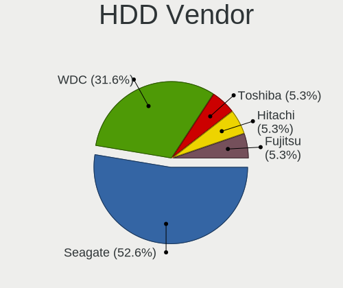
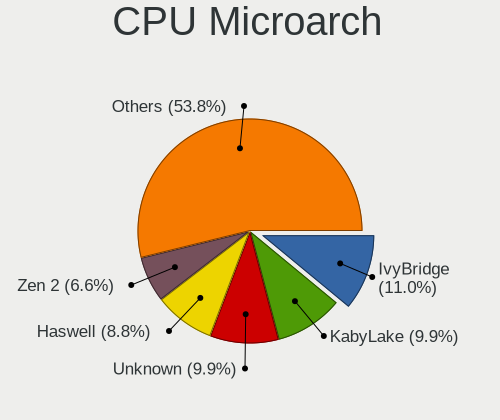
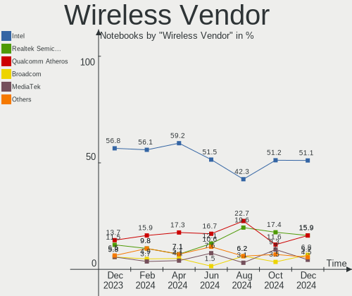
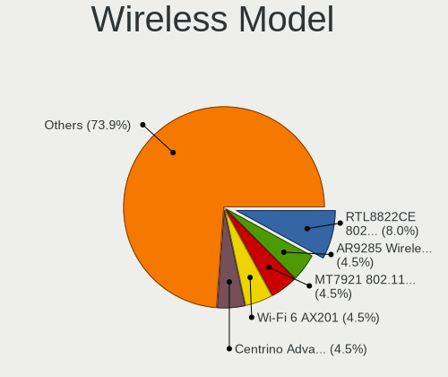
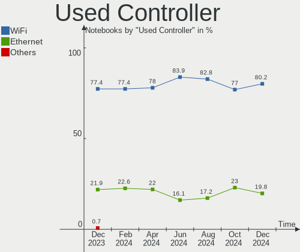

Linux in Poland - Hardware Trends (Notebooks)
---------------------------------------------

A project to identify most popular hardware characteristics and track their change
over time based on data collected by Linux users at https://Linux-Hardware.org.

Anyone can contribute to this report by the [hw-probe](https://github.com/linuxhw/hw-probe) tool:

    sudo -E hw-probe -all -upload

Period: Feb, 2023.

Contents
--------

* [ System ](#system)
  - [ OS                       ](#os)
  - [ OS Family                ](#os-family)
  - [ Kernel                   ](#kernel)
  - [ Kernel Family            ](#kernel-family)
  - [ Kernel Major Ver.        ](#kernel-major-ver)
  - [ Arch                     ](#arch)
  - [ DE                       ](#de)
  - [ Display Server           ](#display-server)
  - [ Display Manager          ](#display-manager)
  - [ OS Lang                  ](#os-lang)
  - [ Boot Mode                ](#boot-mode)
  - [ Filesystem               ](#filesystem)
  - [ Part. scheme             ](#part-scheme)
  - [ Dual Boot with Linux/BSD ](#dual-boot-with-linuxbsd)
  - [ Dual Boot (Win)          ](#dual-boot-win)

* [ Board ](#board)
  - [ Vendor                   ](#vendor)
  - [ Model                    ](#model)
  - [ Model Family             ](#model-family)
  - [ MFG Year                 ](#mfg-year)
  - [ Form Factor              ](#form-factor)
  - [ Secure Boot              ](#secure-boot)
  - [ Coreboot                 ](#coreboot)
  - [ RAM Size                 ](#ram-size)
  - [ RAM Used                 ](#ram-used)
  - [ Total Drives             ](#total-drives)
  - [ Has CD-ROM               ](#has-cd-rom)
  - [ Has Ethernet             ](#has-ethernet)
  - [ Has WiFi                 ](#has-wifi)
  - [ Has Bluetooth            ](#has-bluetooth)

* [ Location ](#location)
  - [ Country                  ](#country)
  - [ City                     ](#city)

* [ Drives ](#drives)
  - [ Drive Vendor             ](#drive-vendor)
  - [ Drive Model              ](#drive-model)
  - [ HDD Vendor               ](#hdd-vendor)
  - [ SSD Vendor               ](#ssd-vendor)
  - [ Drive Kind               ](#drive-kind)
  - [ Drive Connector          ](#drive-connector)
  - [ Drive Size               ](#drive-size)
  - [ Space Total              ](#space-total)
  - [ Space Used               ](#space-used)
  - [ Malfunc. Drives          ](#malfunc-drives)
  - [ Malfunc. Drive Vendor    ](#malfunc-drive-vendor)
  - [ Malfunc. HDD Vendor      ](#malfunc-hdd-vendor)
  - [ Malfunc. Drive Kind      ](#malfunc-drive-kind)
  - [ Failed Drives            ](#failed-drives)
  - [ Failed Drive Vendor      ](#failed-drive-vendor)
  - [ Drive Status             ](#drive-status)

* [ Storage controller ](#storage-controller)
  - [ Storage Vendor           ](#storage-vendor)
  - [ Storage Model            ](#storage-model)
  - [ Storage Kind             ](#storage-kind)

* [ Processor ](#processor)
  - [ CPU Vendor               ](#cpu-vendor)
  - [ CPU Model                ](#cpu-model)
  - [ CPU Model Family         ](#cpu-model-family)
  - [ CPU Cores                ](#cpu-cores)
  - [ CPU Sockets              ](#cpu-sockets)
  - [ CPU Threads              ](#cpu-threads)
  - [ CPU Op-Modes             ](#cpu-op-modes)
  - [ CPU Microcode            ](#cpu-microcode)
  - [ CPU Microarch            ](#cpu-microarch)

* [ Graphics ](#graphics)
  - [ GPU Vendor               ](#gpu-vendor)
  - [ GPU Model                ](#gpu-model)
  - [ GPU Combo                ](#gpu-combo)
  - [ GPU Driver               ](#gpu-driver)
  - [ GPU Memory               ](#gpu-memory)

* [ Monitor ](#monitor)
  - [ Monitor Vendor           ](#monitor-vendor)
  - [ Monitor Model            ](#monitor-model)
  - [ Monitor Resolution       ](#monitor-resolution)
  - [ Monitor Diagonal         ](#monitor-diagonal)
  - [ Monitor Width            ](#monitor-width)
  - [ Aspect Ratio             ](#aspect-ratio)
  - [ Monitor Area             ](#monitor-area)
  - [ Pixel Density            ](#pixel-density)
  - [ Multiple Monitors        ](#multiple-monitors)

* [ Network ](#network)
  - [ Net Controller Vendor    ](#net-controller-vendor)
  - [ Net Controller Model     ](#net-controller-model)
  - [ Wireless Vendor          ](#wireless-vendor)
  - [ Wireless Model           ](#wireless-model)
  - [ Ethernet Vendor          ](#ethernet-vendor)
  - [ Ethernet Model           ](#ethernet-model)
  - [ Net Controller Kind      ](#net-controller-kind)
  - [ Used Controller          ](#used-controller)
  - [ NICs                     ](#nics)
  - [ IPv6                     ](#ipv6)

* [ Bluetooth ](#bluetooth)
  - [ Bluetooth Vendor         ](#bluetooth-vendor)
  - [ Bluetooth Model          ](#bluetooth-model)

* [ Sound ](#sound)
  - [ Sound Vendor             ](#sound-vendor)
  - [ Sound Model              ](#sound-model)

* [ Memory ](#memory)
  - [ Memory Vendor            ](#memory-vendor)
  - [ Memory Model             ](#memory-model)
  - [ Memory Kind              ](#memory-kind)
  - [ Memory Form Factor       ](#memory-form-factor)
  - [ Memory Size              ](#memory-size)
  - [ Memory Speed             ](#memory-speed)

* [ Printers & scanners ](#printers--scanners)
  - [ Printer Vendor           ](#printer-vendor)
  - [ Printer Model            ](#printer-model)
  - [ Scanner Vendor           ](#scanner-vendor)
  - [ Scanner Model            ](#scanner-model)

* [ Camera ](#camera)
  - [ Camera Vendor            ](#camera-vendor)
  - [ Camera Model             ](#camera-model)

* [ Security ](#security)
  - [ Fingerprint Vendor       ](#fingerprint-vendor)
  - [ Fingerprint Model        ](#fingerprint-model)
  - [ Chipcard Vendor          ](#chipcard-vendor)
  - [ Chipcard Model           ](#chipcard-model)

* [ Unsupported ](#unsupported)
  - [ Unsupported Devices      ](#unsupported-devices)
  - [ Unsupported Device Types ](#unsupported-device-types)

System
------

OS
--

Installed operating systems

| Name                         | Notebooks | Percent |
|------------------------------|-----------|---------|
| Ubuntu 22.04                 | 21        | 18.58%  |
| Fedora 37                    | 14        | 12.39%  |
| OpenMandriva 23.01           | 10        | 8.85%   |
| Ubuntu 22.10                 | 6         | 5.31%   |
| Linux Mint 21.1              | 6         | 5.31%   |
| Debian 11                    | 5         | 4.42%   |
| Arch Rolling                 | 4         | 3.54%   |
| Ubuntu 20.04                 | 3         | 2.65%   |
| SteamOS 3.4.4                | 3         | 2.65%   |
| Pop!_OS 22.04                | 3         | 2.65%   |
| openSUSE Tumbleweed-XXXXXXXX | 3         | 2.65%   |
| OpenMandriva 4.3             | 3         | 2.65%   |
| Zorin 16                     | 2         | 1.77%   |
| OpenMandriva 4.2             | 2         | 1.77%   |
| MX 21                        | 2         | 1.77%   |
| Kubuntu 22.04                | 2         | 1.77%   |
| KDE neon 22.04               | 2         | 1.77%   |
| ArcoLinux Rolling            | 2         | 1.77%   |
| Xubuntu 22.10                | 1         | 0.88%   |
| Xubuntu 22.04                | 1         | 0.88%   |
| Ubuntu Unity 16.04           | 1         | 0.88%   |
| TUXEDO OS 22.04              | 1         | 0.88%   |
| SteamOS 3.5                  | 1         | 0.88%   |
| ROSA R11.1                   | 1         | 0.88%   |
| ROSA 12.3                    | 1         | 0.88%   |
| Rocky Linux 9.1              | 1         | 0.88%   |
| RHEL 8                       | 1         | 0.88%   |
| Nobara 37                    | 1         | 0.88%   |
| Manjaro 22.0.3               | 1         | 0.88%   |
| Manjaro 22.0.2               | 1         | 0.88%   |
| Lubuntu 22.04                | 1         | 0.88%   |
| Linux Mint 20.3              | 1         | 0.88%   |
| Kali 2022.4                  | 1         | 0.88%   |
| Gentoo 2.13                  | 1         | 0.88%   |
| Endless 4.0.13               | 1         | 0.88%   |
| Elementary 7                 | 1         | 0.88%   |
| Debian                       | 1         | 0.88%   |
| antiX 22                     | 1         | 0.88%   |

OS Family
---------

OS without a version

| Name         | Notebooks | Percent |
|--------------|-----------|---------|
| Ubuntu       | 30        | 26.55%  |
| OpenMandriva | 15        | 13.27%  |
| Fedora       | 14        | 12.39%  |
| Linux Mint   | 7         | 6.19%   |
| Debian       | 6         | 5.31%   |
| SteamOS      | 4         | 3.54%   |
| Arch         | 4         | 3.54%   |
| Pop!_OS      | 3         | 2.65%   |
| openSUSE     | 3         | 2.65%   |
| Zorin        | 2         | 1.77%   |
| Xubuntu      | 2         | 1.77%   |
| ROSA         | 2         | 1.77%   |
| MX           | 2         | 1.77%   |
| Manjaro      | 2         | 1.77%   |
| Kubuntu      | 2         | 1.77%   |
| KDE neon     | 2         | 1.77%   |
| ArcoLinux    | 2         | 1.77%   |
| Ubuntu Unity | 1         | 0.88%   |
| TUXEDO OS    | 1         | 0.88%   |
| Rocky Linux  | 1         | 0.88%   |
| RHEL         | 1         | 0.88%   |
| Nobara       | 1         | 0.88%   |
| Lubuntu      | 1         | 0.88%   |
| Kali         | 1         | 0.88%   |
| Gentoo       | 1         | 0.88%   |
| Endless      | 1         | 0.88%   |
| Elementary   | 1         | 0.88%   |
| antiX        | 1         | 0.88%   |

Kernel
------

Version of the Linux kernel

| Version                            | Notebooks | Percent |
|------------------------------------|-----------|---------|
| 5.15.0-58-generic                  | 13        | 11.5%   |
| 5.15.0-60-generic                  | 12        | 10.62%  |
| 5.19.0-32-generic                  | 10        | 8.85%   |
| 6.1.1-desktop-1omv2290             | 8         | 7.08%   |
| 6.1.10-200.fc37.x86_64             | 5         | 4.42%   |
| 5.19.0-31-generic                  | 5         | 4.42%   |
| 5.10.0-21-amd64                    | 5         | 4.42%   |
| 5.16.7-desktop-1omv4003            | 3         | 2.65%   |
| 5.13.0-valve36-1-neptune           | 3         | 2.65%   |
| 6.1.9-200.fc37.x86_64              | 2         | 1.77%   |
| 6.1.8-200.fc37.x86_64              | 2         | 1.77%   |
| 6.1.4-desktop-1omv2301             | 2         | 1.77%   |
| 6.1.12-arch1-1                     | 2         | 1.77%   |
| 6.1.11-200.fc37.x86_64             | 2         | 1.77%   |
| 6.0.7-301.fc37.x86_64              | 2         | 1.77%   |
| 6.0.12-76060006-generic            | 2         | 1.77%   |
| 6.2.1-arch1-1                      | 1         | 0.88%   |
| 6.1.9-1-MANJARO                    | 1         | 0.88%   |
| 6.1.8-202.fsync.fc37.x86_64        | 1         | 0.88%   |
| 6.1.12-200.fc37.x86_64             | 1         | 0.88%   |
| 6.1.12-1-default                   | 1         | 0.88%   |
| 6.1.12-1-ck                        | 1         | 0.88%   |
| 6.1.11-arch1-1                     | 1         | 0.88%   |
| 6.1.11-76060111-generic            | 1         | 0.88%   |
| 6.1.11-1-MANJARO                   | 1         | 0.88%   |
| 6.1.10-5-default                   | 1         | 0.88%   |
| 6.1.10-1-default                   | 1         | 0.88%   |
| 6.1.0-3-amd64                      | 1         | 0.88%   |
| 6.1.0-1009-tuxedo                  | 1         | 0.88%   |
| 6.0.0-kali6-amd64                  | 1         | 0.88%   |
| 6.0.0-6mx-amd64                    | 1         | 0.88%   |
| 5.19.0-29-generic                  | 1         | 0.88%   |
| 5.19.0-28-generic                  | 1         | 0.88%   |
| 5.17.0-1020-oem                    | 1         | 0.88%   |
| 5.16.0-0.bpo.4-amd64               | 1         | 0.88%   |
| 5.15.94-1-lts                      | 1         | 0.88%   |
| 5.15.88-gentoo                     | 1         | 0.88%   |
| 5.15.75-generic-1rosa2021.1-x86_64 | 1         | 0.88%   |
| 5.15.0-58-lowlatency               | 1         | 0.88%   |
| 5.15.0-43-generic                  | 1         | 0.88%   |

Kernel Family
-------------

Linux kernel without a distro release

| Version  | Notebooks | Percent |
|----------|-----------|---------|
| 5.15.0   | 27        | 23.89%  |
| 5.19.0   | 17        | 15.04%  |
| 6.1.1    | 8         | 7.08%   |
| 6.1.10   | 7         | 6.19%   |
| 6.1.12   | 5         | 4.42%   |
| 6.1.11   | 5         | 4.42%   |
| 5.10.0   | 5         | 4.42%   |
| 5.13.0   | 4         | 3.54%   |
| 6.1.9    | 3         | 2.65%   |
| 6.1.8    | 3         | 2.65%   |
| 5.16.7   | 3         | 2.65%   |
| 5.14.0   | 3         | 2.65%   |
| 6.1.4    | 2         | 1.77%   |
| 6.1.0    | 2         | 1.77%   |
| 6.0.7    | 2         | 1.77%   |
| 6.0.12   | 2         | 1.77%   |
| 6.0.0    | 2         | 1.77%   |
| 6.2.1    | 1         | 0.88%   |
| 5.17.0   | 1         | 0.88%   |
| 5.16.0   | 1         | 0.88%   |
| 5.15.94  | 1         | 0.88%   |
| 5.15.88  | 1         | 0.88%   |
| 5.15.75  | 1         | 0.88%   |
| 5.11.12  | 1         | 0.88%   |
| 5.11.0   | 1         | 0.88%   |
| 5.10.142 | 1         | 0.88%   |
| 5.10.14  | 1         | 0.88%   |
| 4.9.155  | 1         | 0.88%   |
| 4.18.0   | 1         | 0.88%   |
| 4.15.0   | 1         | 0.88%   |

Kernel Major Ver.
-----------------

Linux kernel major version

| Version | Notebooks | Percent |
|---------|-----------|---------|
| 6.1     | 35        | 30.97%  |
| 5.15    | 30        | 26.55%  |
| 5.19    | 17        | 15.04%  |
| 5.10    | 7         | 6.19%   |
| 6.0     | 6         | 5.31%   |
| 5.16    | 4         | 3.54%   |
| 5.13    | 4         | 3.54%   |
| 5.14    | 3         | 2.65%   |
| 5.11    | 2         | 1.77%   |
| 6.2     | 1         | 0.88%   |
| 5.17    | 1         | 0.88%   |
| 4.9     | 1         | 0.88%   |
| 4.18    | 1         | 0.88%   |
| 4.15    | 1         | 0.88%   |

Arch
----

OS architecture (x86_64, i586, etc.)

| Name   | Notebooks | Percent |
|--------|-----------|---------|
| x86_64 | 112       | 99.12%  |
| i686   | 1         | 0.88%   |

DE
--

Desktop Environment

| Name            | Notebooks | Percent |
|-----------------|-----------|---------|
| GNOME           | 59        | 52.21%  |
| KDE5            | 32        | 28.32%  |
| XFCE            | 7         | 6.19%   |
| X-Cinnamon      | 4         | 3.54%   |
| MATE            | 2         | 1.77%   |
| Hyprland        | 2         | 1.77%   |
| Unknown         | 2         | 1.77%   |
| Unity           | 1         | 0.88%   |
| Pantheon        | 1         | 0.88%   |
| LXQt            | 1         | 0.88%   |
| icewm           | 1         | 0.88%   |
| GNOME Flashback | 1         | 0.88%   |

Display Server
--------------

X11 or Wayland

| Name    | Notebooks | Percent |
|---------|-----------|---------|
| X11     | 70        | 61.95%  |
| Wayland | 40        | 35.4%   |
| Unknown | 3         | 2.65%   |

Display Manager
---------------

SDDM, LightDM, etc.

| Name    | Notebooks | Percent |
|---------|-----------|---------|
| Unknown | 42        | 37.17%  |
| GDM3    | 28        | 24.78%  |
| SDDM    | 25        | 22.12%  |
| LightDM | 11        | 9.73%   |
| GDM     | 6         | 5.31%   |
| SLIMSKI | 1         | 0.88%   |

OS Lang
-------

Language

| Lang    | Notebooks | Percent |
|---------|-----------|---------|
| pl_PL   | 54        | 47.79%  |
| en_US   | 51        | 45.13%  |
| en_GB   | 2         | 1.77%   |
| C       | 2         | 1.77%   |
| Unknown | 2         | 1.77%   |
| uk_UA   | 1         | 0.88%   |
| hu_HU   | 1         | 0.88%   |

Boot Mode
---------

EFI or BIOS

| Mode | Notebooks | Percent |
|------|-----------|---------|
| EFI  | 59        | 52.21%  |
| BIOS | 54        | 47.79%  |

Filesystem
----------

Type of filesystem

| Type    | Notebooks | Percent |
|---------|-----------|---------|
| Ext4    | 77        | 68.14%  |
| Btrfs   | 21        | 18.58%  |
| Overlay | 10        | 8.85%   |
| Zfs     | 2         | 1.77%   |
| Xfs     | 2         | 1.77%   |
| F2fs    | 1         | 0.88%   |

Part. scheme
------------

Scheme of partitioning

| Type    | Notebooks | Percent |
|---------|-----------|---------|
| GPT     | 57        | 50.44%  |
| Unknown | 41        | 36.28%  |
| MBR     | 15        | 13.27%  |

Dual Boot with Linux/BSD
------------------------

Hosting more than one Linux/BSD

| Dual boot | Notebooks | Percent |
|-----------|-----------|---------|
| No        | 102       | 90.27%  |
| Yes       | 11        | 9.73%   |

Dual Boot (Win)
---------------

Hosting Linux and Windows

| Dual boot | Notebooks | Percent |
|-----------|-----------|---------|
| No        | 89        | 78.76%  |
| Yes       | 24        | 21.24%  |

Board
-----

Vendor
------

Motherboard manufacturer

| Name                      | Notebooks | Percent |
|---------------------------|-----------|---------|
| Lenovo                    | 33        | 29.2%   |
| Dell                      | 21        | 18.58%  |
| Hewlett-Packard           | 13        | 11.5%   |
| ASUSTek Computer          | 11        | 9.73%   |
| Acer                      | 6         | 5.31%   |
| Apple                     | 5         | 4.42%   |
| Valve                     | 4         | 3.54%   |
| MSI                       | 4         | 3.54%   |
| Samsung Electronics       | 2         | 1.77%   |
| Fujitsu                   | 2         | 1.77%   |
| TrekStor                  | 1         | 0.88%   |
| Toshiba                   | 1         | 0.88%   |
| Timi                      | 1         | 0.88%   |
| Sony                      | 1         | 0.88%   |
| Schenker                  | 1         | 0.88%   |
| RTD Embedded Technologies | 1         | 0.88%   |
| Notebook                  | 1         | 0.88%   |
| Medion                    | 1         | 0.88%   |
| GPU Company               | 1         | 0.88%   |
| Google                    | 1         | 0.88%   |
| Gigabyte Technology       | 1         | 0.88%   |
| Unknown                   | 1         | 0.88%   |

Model
-----

Motherboard model

| Name                                   | Notebooks | Percent |
|----------------------------------------|-----------|---------|
| Valve Jupiter                          | 4         | 3.54%   |
| Unknown                                | 3         | 2.65%   |
| Lenovo G510 20238                      | 2         | 1.77%   |
| HP Notebook                            | 2         | 1.77%   |
| Dell Latitude 5511                     | 2         | 1.77%   |
| Apple MacBookPro8,1                    | 2         | 1.77%   |
| TrekStor Surfbook W2                   | 1         | 0.88%   |
| Toshiba Satellite L750                 | 1         | 0.88%   |
| Timi TM1613                            | 1         | 0.88%   |
| Sony VGN-FZ31M                         | 1         | 0.88%   |
| Schenker VISION (E22)                  | 1         | 0.88%   |
| Samsung 530U3C/530U4C/532U3C           | 1         | 0.88%   |
| Samsung 350V5C/351V5C/3540VC/3440VC    | 1         | 0.88%   |
| RTD Embedded CMA34CR                   | 1         | 0.88%   |
| Notebook NS50_70MU                     | 1         | 0.88%   |
| MSI MS-7C02                            | 1         | 0.88%   |
| MSI GV62 7RD                           | 1         | 0.88%   |
| MSI GL65 9SD                           | 1         | 0.88%   |
| MSI Creator Z17 A12UHST                | 1         | 0.88%   |
| Medion Akoya THE TOUCH 10              | 1         | 0.88%   |
| Lenovo Yoga710-14ISK 80TY              | 1         | 0.88%   |
| Lenovo Yoga 3 Pro-1370 80HE            | 1         | 0.88%   |
| Lenovo Y50-70 20378                    | 1         | 0.88%   |
| Lenovo ThinkPad X1 Extreme 20MFCTO1WW  | 1         | 0.88%   |
| Lenovo ThinkPad T61 7661BM5            | 1         | 0.88%   |
| Lenovo ThinkPad T530 2429MY2           | 1         | 0.88%   |
| Lenovo ThinkPad T470s 20HGS1LM0H       | 1         | 0.88%   |
| Lenovo ThinkPad T430 2347BS4           | 1         | 0.88%   |
| Lenovo ThinkPad T410s 2924W3S          | 1         | 0.88%   |
| Lenovo ThinkPad T15 Gen 1 20S6CTO1WW   | 1         | 0.88%   |
| Lenovo ThinkPad R61 8933W4S            | 1         | 0.88%   |
| Lenovo ThinkPad R500 2716W2K           | 1         | 0.88%   |
| Lenovo ThinkPad P14s Gen 2a 21A00003PB | 1         | 0.88%   |
| Lenovo ThinkPad L14 Gen 1 20U5004JPB   | 1         | 0.88%   |
| Lenovo ThinkPad L13 20R30006PB         | 1         | 0.88%   |
| Lenovo ThinkPad E560 20EV000UUK        | 1         | 0.88%   |
| Lenovo ThinkPad E15 Gen 2 20T8004RPB   | 1         | 0.88%   |
| Lenovo ThinkBook 15 G3 ACL 21A4        | 1         | 0.88%   |
| Lenovo ThinkBook 14s-IWL 20RM          | 1         | 0.88%   |
| Lenovo ThinkBook 14 G2 ITL 20VD        | 1         | 0.88%   |

Model Family
------------

Motherboard model prefix

| Name                  | Notebooks | Percent |
|-----------------------|-----------|---------|
| Lenovo ThinkPad       | 14        | 12.39%  |
| Dell Latitude         | 14        | 12.39%  |
| Lenovo IdeaPad        | 6         | 5.31%   |
| Acer Aspire           | 6         | 5.31%   |
| Valve Jupiter         | 4         | 3.54%   |
| HP EliteBook          | 4         | 3.54%   |
| ASUS VivoBook         | 4         | 3.54%   |
| Lenovo ThinkBook      | 3         | 2.65%   |
| Lenovo Legion         | 3         | 2.65%   |
| Dell Vostro           | 3         | 2.65%   |
| Apple MacBookPro8     | 3         | 2.65%   |
| Unknown               | 3         | 2.65%   |
| Lenovo G510           | 2         | 1.77%   |
| HP ZBook              | 2         | 1.77%   |
| HP ProBook            | 2         | 1.77%   |
| HP Notebook           | 2         | 1.77%   |
| Fujitsu LIFEBOOK      | 2         | 1.77%   |
| TrekStor Surfbook     | 1         | 0.88%   |
| Toshiba Satellite     | 1         | 0.88%   |
| Timi TM1613           | 1         | 0.88%   |
| Sony VGN-FZ31M        | 1         | 0.88%   |
| Schenker VISION       | 1         | 0.88%   |
| Samsung 530U3C        | 1         | 0.88%   |
| Samsung 350V5C        | 1         | 0.88%   |
| RTD Embedded CMA34CR  | 1         | 0.88%   |
| Notebook NS50         | 1         | 0.88%   |
| MSI MS-7C02           | 1         | 0.88%   |
| MSI GV62              | 1         | 0.88%   |
| MSI GL65              | 1         | 0.88%   |
| MSI Creator           | 1         | 0.88%   |
| Medion Akoya          | 1         | 0.88%   |
| Lenovo Yoga710-14ISK  | 1         | 0.88%   |
| Lenovo Yoga           | 1         | 0.88%   |
| Lenovo Y50-70         | 1         | 0.88%   |
| Lenovo G50-80         | 1         | 0.88%   |
| Lenovo B570e          | 1         | 0.88%   |
| HP 620                | 1         | 0.88%   |
| GPU Company GWTN141-4 | 1         | 0.88%   |
| Google Lillipup       | 1         | 0.88%   |
| Gigabyte MMLP5AP-00   | 1         | 0.88%   |

MFG Year
--------

Motherboard manufacture year

| Year | Notebooks | Percent |
|------|-----------|---------|
| 2020 | 14        | 12.39%  |
| 2021 | 11        | 9.73%   |
| 2019 | 10        | 8.85%   |
| 2014 | 10        | 8.85%   |
| 2011 | 10        | 8.85%   |
| 2022 | 9         | 7.96%   |
| 2017 | 7         | 6.19%   |
| 2015 | 7         | 6.19%   |
| 2016 | 6         | 5.31%   |
| 2012 | 6         | 5.31%   |
| 2018 | 5         | 4.42%   |
| 2013 | 5         | 4.42%   |
| 2007 | 5         | 4.42%   |
| 2023 | 2         | 1.77%   |
| 2010 | 2         | 1.77%   |
| 2009 | 2         | 1.77%   |
| 2008 | 2         | 1.77%   |

Form Factor
-----------

Physical design of the computer

| Name     | Notebooks | Percent |
|----------|-----------|---------|
| Notebook | 113       | 100%    |

Secure Boot
-----------

Enabled or disabled

| State    | Notebooks | Percent |
|----------|-----------|---------|
| Disabled | 104       | 92.04%  |
| Enabled  | 9         | 7.96%   |

Coreboot
--------

Have coreboot on board

| Used | Notebooks | Percent |
|------|-----------|---------|
| No   | 112       | 99.12%  |
| Yes  | 1         | 0.88%   |

RAM Size
--------

Total RAM memory

| Size in GB  | Notebooks | Percent |
|-------------|-----------|---------|
| 4.01-8.0    | 29        | 25.66%  |
| 8.01-16.0   | 22        | 19.47%  |
| 16.01-24.0  | 20        | 17.7%   |
| 3.01-4.0    | 19        | 16.81%  |
| 32.01-64.0  | 13        | 11.5%   |
| 1.01-2.0    | 4         | 3.54%   |
| 64.01-256.0 | 3         | 2.65%   |
| 24.01-32.0  | 2         | 1.77%   |
| 0.51-1.0    | 1         | 0.88%   |

RAM Used
--------

Used RAM memory

| Used GB    | Notebooks | Percent |
|------------|-----------|---------|
| 1.01-2.0   | 31        | 27.43%  |
| 4.01-8.0   | 28        | 24.78%  |
| 2.01-3.0   | 27        | 23.89%  |
| 3.01-4.0   | 15        | 13.27%  |
| 8.01-16.0  | 8         | 7.08%   |
| 0.51-1.0   | 3         | 2.65%   |
| 16.01-24.0 | 1         | 0.88%   |

Total Drives
------------

Number of drives on board

| Drives | Notebooks | Percent |
|--------|-----------|---------|
| 1      | 80        | 70.8%   |
| 2      | 27        | 23.89%  |
| 3      | 4         | 3.54%   |
| 4      | 1         | 0.88%   |
| 0      | 1         | 0.88%   |

Has CD-ROM
----------

Has CD-ROM on board

| Presented | Notebooks | Percent |
|-----------|-----------|---------|
| No        | 82        | 72.57%  |
| Yes       | 31        | 27.43%  |

Has Ethernet
------------

Has Ethernet on board

| Presented | Notebooks | Percent |
|-----------|-----------|---------|
| Yes       | 94        | 83.19%  |
| No        | 19        | 16.81%  |

Has WiFi
--------

Has WiFi module

| Presented | Notebooks | Percent |
|-----------|-----------|---------|
| Yes       | 106       | 93.81%  |
| No        | 7         | 6.19%   |

Has Bluetooth
-------------

Has Bluetooth module

| Presented | Notebooks | Percent |
|-----------|-----------|---------|
| Yes       | 98        | 86.73%  |
| No        | 15        | 13.27%  |

Location
--------

Country
-------

Geographic location (country)

| Country | Notebooks | Percent |
|---------|-----------|---------|
| Poland  | 113       | 100%    |

City
----

Geographic location (city)

| City                   | Notebooks | Percent |
|------------------------|-----------|---------|
| Warsaw                 | 27        | 23.89%  |
| Krakow                 | 13        | 11.5%   |
| Wroclaw                | 7         | 6.19%   |
| Poznan                 | 7         | 6.19%   |
| Gdansk                 | 5         | 4.42%   |
| Lodz                   | 3         | 2.65%   |
| Kielce                 | 3         | 2.65%   |
| Elblag                 | 3         | 2.65%   |
| Mielec                 | 2         | 1.77%   |
| Gorzów Wielkopolski   | 2         | 1.77%   |
| Żyrardów             | 1         | 0.88%   |
| Zielona Góra          | 1         | 0.88%   |
| Zawadzkie              | 1         | 0.88%   |
| Zarnowiec              | 1         | 0.88%   |
| Turawa                 | 1         | 0.88%   |
| Tarnów                | 1         | 0.88%   |
| Sławno                | 1         | 0.88%   |
| Swidnica               | 1         | 0.88%   |
| Sulechow               | 1         | 0.88%   |
| Strzelce Krajenskie    | 1         | 0.88%   |
| Stromiec               | 1         | 0.88%   |
| Stare Kozle            | 1         | 0.88%   |
| Skawina                | 1         | 0.88%   |
| Siemianowice Śląskie | 1         | 0.88%   |
| Rzeszów               | 1         | 0.88%   |
| Przemysl               | 1         | 0.88%   |
| Piaseczno              | 1         | 0.88%   |
| Olsztyn                | 1         | 0.88%   |
| Mysłowice             | 1         | 0.88%   |
| Mogilno                | 1         | 0.88%   |
| Mierzecice             | 1         | 0.88%   |
| Lublin                 | 1         | 0.88%   |
| Lubaczow               | 1         | 0.88%   |
| Lezajsk                | 1         | 0.88%   |
| Leszno                 | 1         | 0.88%   |
| Ksieze Pole            | 1         | 0.88%   |
| Koszalin               | 1         | 0.88%   |
| Kopki                  | 1         | 0.88%   |
| Klobuck                | 1         | 0.88%   |
| Katowice               | 1         | 0.88%   |

Drives
------

Drive Vendor
------------

Hard drive vendors

| Vendor                      | Notebooks | Drives | Percent |
|-----------------------------|-----------|--------|---------|
| Samsung Electronics         | 25        | 26     | 16.67%  |
| Unknown                     | 11        | 11     | 7.33%   |
| Toshiba                     | 11        | 11     | 7.33%   |
| Seagate                     | 11        | 11     | 7.33%   |
| Sandisk                     | 11        | 11     | 7.33%   |
| WDC                         | 10        | 10     | 6.67%   |
| SK hynix                    | 8         | 8      | 5.33%   |
| Kingston                    | 7         | 7      | 4.67%   |
| GOODRAM                     | 6         | 6      | 4%      |
| Crucial                     | 6         | 6      | 4%      |
| Hitachi                     | 5         | 5      | 3.33%   |
| Intel                       | 4         | 4      | 2.67%   |
| Kingston Technology Company | 3         | 3      | 2%      |
| Realtek                     | 2         | 2      | 1.33%   |
| Phison Electronics          | 2         | 2      | 1.33%   |
| Micron Technology           | 2         | 2      | 1.33%   |
| Apple                       | 2         | 2      | 1.33%   |
| ADATA Technology            | 2         | 2      | 1.33%   |
| Unknown                     | 2         | 2      | 1.33%   |
| Transcend                   | 1         | 1      | 0.67%   |
| SPCC                        | 1         | 1      | 0.67%   |
| RENICE                      | 1         | 1      | 0.67%   |
| Ramaxel Technology          | 1         | 1      | 0.67%   |
| POLION                      | 1         | 1      | 0.67%   |
| Plextor                     | 1         | 1      | 0.67%   |
| OWC                         | 1         | 1      | 0.67%   |
| OCZ                         | 1         | 1      | 0.67%   |
| Micron/Crucial Technology   | 1         | 1      | 0.67%   |
| MAXIO Technology (Hangzhou) | 1         | 1      | 0.67%   |
| LITEON                      | 1         | 1      | 0.67%   |
| Lexar                       | 1         | 1      | 0.67%   |
| Lenovo                      | 1         | 1      | 0.67%   |
| KIOXIA                      | 1         | 1      | 0.67%   |
| HUAWEI                      | 1         | 1      | 0.67%   |
| HS-SSD-C100                 | 1         | 1      | 0.67%   |
| Fujitsu                     | 1         | 1      | 0.67%   |
| China                       | 1         | 1      | 0.67%   |
| ASMT                        | 1         | 1      | 0.67%   |
| A-DATA Technology           | 1         | 1      | 0.67%   |

Drive Model
-----------

Hard drive models

| Model                                                           | Notebooks | Percent |
|-----------------------------------------------------------------|-----------|---------|
| Samsung NVMe SSD Controller SM981/PM981/PM983 250GB             | 5         | 3.33%   |
| Unknown MMC Card  32GB                                          | 4         | 2.67%   |
| Unknown MMC Card  512GB                                         | 3         | 2%      |
| WDC WD5000LPCX-24C6HT0 500GB                                    | 2         | 1.33%   |
| Toshiba MQ01ABD100 1TB                                          | 2         | 1.33%   |
| SK hynix BC511 512GB                                            | 2         | 1.33%   |
| Sandisk WD Blue SN500 / PC SN520 NVMe SSD 256GB                 | 2         | 1.33%   |
| Sandisk WD Black SN750 / PC SN730 NVMe SSD 512GB                | 2         | 1.33%   |
| Samsung SSD 980 500GB                                           | 2         | 1.33%   |
| Samsung NVMe SSD Controller SM951/PM951 256GB                   | 2         | 1.33%   |
| Phison PS5013 E13 NVMe Controller 500GB                         | 2         | 1.33%   |
| Kingston Company OM3PDP3 NVMe SSD 512GB                         | 2         | 1.33%   |
| Intel SSDPEKNU512GZ 512GB                                       | 2         | 1.33%   |
| Hitachi HTS543216L9SA00 160GB                                   | 2         | 1.33%   |
| GOODRAM SSDPR-CX400-256 256GB                                   | 2         | 1.33%   |
| ADATA XPG SX8200 Pro PCIe Gen3x4 M.2 2280 Solid State Drive 2TB | 2         | 1.33%   |
| Unknown                                                         | 2         | 1.33%   |
| WDC WDS250G2B0B-00YS70 250GB SSD                                | 1         | 0.67%   |
| WDC WDS240G2G0B-00EPW0 240GB SSD                                | 1         | 0.67%   |
| WDC WDS240G2G0A-00JH30 240GB SSD                                | 1         | 0.67%   |
| WDC WD30EZRX-22D8PB0 3TB                                        | 1         | 0.67%   |
| WDC WD10SPZX-75Z10T2 1TB                                        | 1         | 0.67%   |
| WDC WD10SPZX-21Z10T0 1TB                                        | 1         | 0.67%   |
| WDC WD10 JPCX-24UE4T0 1TB                                       | 1         | 0.67%   |
| WDC WD Blue SA510 M.2 2280 1000GB SSD                           | 1         | 0.67%   |
| Unknown SD/MMC/MS PRO 16GB                                      | 1         | 0.67%   |
| Unknown MMC Card  64GB                                          | 1         | 0.67%   |
| Unknown MMC Card  16GB                                          | 1         | 0.67%   |
| Unknown MMC Card  128GB                                         | 1         | 0.67%   |
| Transcend TS120GMTS420S 120GB SSD                               | 1         | 0.67%   |
| Toshiba THNSNJ256G8NY 256GB SSD                                 | 1         | 0.67%   |
| Toshiba THNSNC128GAMJ 128GB SSD                                 | 1         | 0.67%   |
| Toshiba MQ01ABF050 500GB                                        | 1         | 0.67%   |
| Toshiba MQ01ABD050 500GB                                        | 1         | 0.67%   |
| Toshiba MK7559GSXF 752GB                                        | 1         | 0.67%   |
| Toshiba MK5075GSX 500GB                                         | 1         | 0.67%   |
| Toshiba MK2555GSXF 250GB                                        | 1         | 0.67%   |
| Toshiba KBG40ZNS256G NVMe 256GB                                 | 1         | 0.67%   |
| Toshiba BG3 NVMe SSD Controller 256GB                           | 1         | 0.67%   |
| SPCC M.2 SSD 512GB                                              | 1         | 0.67%   |

HDD Vendor
----------

Hard disk drive vendors

| Vendor              | Notebooks | Drives | Percent |
|---------------------|-----------|--------|---------|
| Seagate             | 11        | 11     | 33.33%  |
| Toshiba             | 7         | 7      | 21.21%  |
| WDC                 | 6         | 6      | 18.18%  |
| Hitachi             | 5         | 5      | 15.15%  |
| Unknown             | 1         | 1      | 3.03%   |
| Samsung Electronics | 1         | 1      | 3.03%   |
| Fujitsu             | 1         | 1      | 3.03%   |
| ASMT                | 1         | 1      | 3.03%   |

SSD Vendor
----------

Solid state drive vendors

| Vendor              | Notebooks | Drives | Percent |
|---------------------|-----------|--------|---------|
| Samsung Electronics | 8         | 8      | 16.33%  |
| Crucial             | 6         | 6      | 12.24%  |
| Kingston            | 5         | 5      | 10.2%   |
| GOODRAM             | 5         | 5      | 10.2%   |
| WDC                 | 4         | 4      | 8.16%   |
| SanDisk             | 4         | 4      | 8.16%   |
| Toshiba             | 2         | 2      | 4.08%   |
| Apple               | 2         | 2      | 4.08%   |
| Transcend           | 1         | 1      | 2.04%   |
| SPCC                | 1         | 1      | 2.04%   |
| RENICE              | 1         | 1      | 2.04%   |
| Ramaxel Technology  | 1         | 1      | 2.04%   |
| POLION              | 1         | 1      | 2.04%   |
| Plextor             | 1         | 1      | 2.04%   |
| OWC                 | 1         | 1      | 2.04%   |
| OCZ                 | 1         | 1      | 2.04%   |
| LITEON              | 1         | 1      | 2.04%   |
| HS-SSD-C100         | 1         | 1      | 2.04%   |
| China               | 1         | 1      | 2.04%   |
| A-DATA Technology   | 1         | 1      | 2.04%   |
| Unknown             | 1         | 1      | 2.04%   |

Drive Kind
----------

HDD or SSD

| Kind    | Notebooks | Drives | Percent |
|---------|-----------|--------|---------|
| NVMe    | 50        | 57     | 37.31%  |
| SSD     | 42        | 49     | 31.34%  |
| HDD     | 30        | 33     | 22.39%  |
| MMC     | 10        | 10     | 7.46%   |
| Unknown | 2         | 2      | 1.49%   |

Drive Connector
---------------

SATA, SAS, NVMe, etc.

| Type | Notebooks | Drives | Percent |
|------|-----------|--------|---------|
| SATA | 65        | 75     | 48.15%  |
| NVMe | 50        | 55     | 37.04%  |
| SAS  | 10        | 11     | 7.41%   |
| MMC  | 10        | 10     | 7.41%   |

Drive Size
----------

Size of hard drive

| Size in TB | Notebooks | Drives | Percent |
|------------|-----------|--------|---------|
| 0.01-0.5   | 48        | 55     | 64.86%  |
| 0.51-1.0   | 21        | 21     | 28.38%  |
| 1.01-2.0   | 3         | 3      | 4.05%   |
| 2.01-3.0   | 2         | 3      | 2.7%    |

Space Total
-----------

Amount of disk space available on the file system

| Size in GB     | Notebooks | Percent |
|----------------|-----------|---------|
| 101-250        | 29        | 25.66%  |
| 251-500        | 24        | 21.24%  |
| 501-1000       | 21        | 18.58%  |
| 1-20           | 12        | 10.62%  |
| Unknown        | 8         | 7.08%   |
| 51-100         | 7         | 6.19%   |
| 2001-3000      | 5         | 4.42%   |
| 1001-2000      | 4         | 3.54%   |
| 21-50          | 2         | 1.77%   |
| More than 3000 | 1         | 0.88%   |

Space Used
----------

Amount of used disk space

| Used GB   | Notebooks | Percent |
|-----------|-----------|---------|
| 1-20      | 37        | 32.74%  |
| 101-250   | 22        | 19.47%  |
| 21-50     | 15        | 13.27%  |
| 51-100    | 13        | 11.5%   |
| 251-500   | 10        | 8.85%   |
| Unknown   | 8         | 7.08%   |
| 501-1000  | 6         | 5.31%   |
| 2001-3000 | 1         | 0.88%   |
| 1001-2000 | 1         | 0.88%   |

Malfunc. Drives
---------------

Drive models with a malfunction

| Model                             | Notebooks | Drives | Percent |
|-----------------------------------|-----------|--------|---------|
| Toshiba MK7559GSXF 752GB          | 1         | 1      | 9.09%   |
| Toshiba MK5075GSX 500GB           | 1         | 1      | 9.09%   |
| Seagate ST500LT012-1DG142 500GB   | 1         | 1      | 9.09%   |
| Seagate ST320LT020-9YG142 320GB   | 1         | 1      | 9.09%   |
| Samsung Electronics HM121HI 120GB | 1         | 1      | 9.09%   |
| RENICE X2 64GB SSD                | 1         | 1      | 9.09%   |
| Kingston SMS200S3120G 120GB SSD   | 1         | 1      | 9.09%   |
| Hitachi HTS547564A9E384 640GB     | 1         | 1      | 9.09%   |
| Crucial CT1000MX500SSD4 1TB       | 1         | 1      | 9.09%   |
| China SSD 512GB                   | 1         | 1      | 9.09%   |
| Apple SSD TS064E 64GB             | 1         | 1      | 9.09%   |

Malfunc. Drive Vendor
---------------------

Vendors of faulty drives

| Vendor              | Notebooks | Drives | Percent |
|---------------------|-----------|--------|---------|
| Toshiba             | 2         | 2      | 18.18%  |
| Seagate             | 2         | 2      | 18.18%  |
| Samsung Electronics | 1         | 1      | 9.09%   |
| RENICE              | 1         | 1      | 9.09%   |
| Kingston            | 1         | 1      | 9.09%   |
| Hitachi             | 1         | 1      | 9.09%   |
| Crucial             | 1         | 1      | 9.09%   |
| China               | 1         | 1      | 9.09%   |
| Apple               | 1         | 1      | 9.09%   |

Malfunc. HDD Vendor
-------------------

Vendors of faulty HDD drives

| Vendor              | Notebooks | Drives | Percent |
|---------------------|-----------|--------|---------|
| Toshiba             | 2         | 2      | 33.33%  |
| Seagate             | 2         | 2      | 33.33%  |
| Samsung Electronics | 1         | 1      | 16.67%  |
| Hitachi             | 1         | 1      | 16.67%  |

Malfunc. Drive Kind
-------------------

Kinds of faulty drives

| Kind | Notebooks | Drives | Percent |
|------|-----------|--------|---------|
| HDD  | 6         | 6      | 54.55%  |
| SSD  | 5         | 5      | 45.45%  |

Failed Drives
-------------

Failed drive models

Zero info for selected period =(

Failed Drive Vendor
-------------------

Failed drive vendors

Zero info for selected period =(

Drive Status
------------

Number of failed and malfunc. drives

| Status   | Notebooks | Drives | Percent |
|----------|-----------|--------|---------|
| Detected | 60        | 83     | 50.85%  |
| Works    | 47        | 57     | 39.83%  |
| Malfunc  | 11        | 11     | 9.32%   |

Storage controller
------------------

Storage Vendor
--------------

Storage controller vendors

| Vendor                       | Notebooks | Percent |
|------------------------------|-----------|---------|
| Intel                        | 77        | 54.61%  |
| Samsung Electronics          | 16        | 11.35%  |
| AMD                          | 12        | 8.51%   |
| SK hynix                     | 8         | 5.67%   |
| SanDisk                      | 7         | 4.96%   |
| Kingston Technology Company  | 5         | 3.55%   |
| Toshiba America Info Systems | 2         | 1.42%   |
| Phison Electronics           | 2         | 1.42%   |
| Micron Technology            | 2         | 1.42%   |
| KIOXIA                       | 2         | 1.42%   |
| ADATA Technology             | 2         | 1.42%   |
| Silicon Motion               | 1         | 0.71%   |
| Shenzhen Longsys Electronics | 1         | 0.71%   |
| Nvidia                       | 1         | 0.71%   |
| Micron/Crucial Technology    | 1         | 0.71%   |
| MAXIO Technology (Hangzhou)  | 1         | 0.71%   |
| Lenovo                       | 1         | 0.71%   |

Storage Model
-------------

Storage controller models

| Model                                                                          | Notebooks | Percent |
|--------------------------------------------------------------------------------|-----------|---------|
| AMD FCH SATA Controller [AHCI mode]                                            | 11        | 7.24%   |
| Intel Sunrise Point-LP SATA Controller [AHCI mode]                             | 10        | 6.58%   |
| Intel 7 Series Chipset Family 6-port SATA Controller [AHCI mode]               | 9         | 5.92%   |
| Intel 6 Series/C200 Series Chipset Family 6 port Mobile SATA AHCI Controller   | 7         | 4.61%   |
| Samsung NVMe SSD Controller SM981/PM981/PM983                                  | 6         | 3.95%   |
| Intel Wildcat Point-LP SATA Controller [AHCI Mode]                             | 6         | 3.95%   |
| SK hynix Gold P31/PC711 NVMe Solid State Drive                                 | 5         | 3.29%   |
| Samsung NVMe SSD Controller PM9A1/PM9A3/980PRO                                 | 4         | 2.63%   |
| Samsung NVMe SSD Controller 980                                                | 4         | 2.63%   |
| Intel Volume Management Device NVMe RAID Controller                            | 4         | 2.63%   |
| Intel 82801HM/HEM (ICH8M/ICH8M-E) IDE Controller                               | 4         | 2.63%   |
| Intel 82801 Mobile SATA Controller [RAID mode]                                 | 4         | 2.63%   |
| Intel 8 Series/C220 Series Chipset Family 6-port SATA Controller 1 [AHCI mode] | 4         | 2.63%   |
| Intel Cannon Point-LP SATA Controller [AHCI Mode]                              | 3         | 1.97%   |
| Intel Cannon Lake Mobile PCH SATA AHCI Controller                              | 3         | 1.97%   |
| Intel 82801HM/HEM (ICH8M/ICH8M-E) SATA Controller [AHCI mode]                  | 3         | 1.97%   |
| SK hynix BC511                                                                 | 2         | 1.32%   |
| SanDisk WD Blue SN500 / PC SN520 NVMe SSD                                      | 2         | 1.32%   |
| SanDisk WD Black SN750 / PC SN730 NVMe SSD                                     | 2         | 1.32%   |
| SanDisk Non-Volatile memory controller                                         | 2         | 1.32%   |
| Samsung NVMe SSD Controller SM951/PM951                                        | 2         | 1.32%   |
| Phison PS5013 E13 NVMe Controller                                              | 2         | 1.32%   |
| Micron Non-Volatile memory controller                                          | 2         | 1.32%   |
| Kingston Company Company Non-Volatile memory controller                        | 2         | 1.32%   |
| Kingston Company OM3PDP3 NVMe SSD                                              | 2         | 1.32%   |
| Intel Tiger Lake-LP SATA Controller                                            | 2         | 1.32%   |
| Intel Q170/Q150/B150/H170/H110/Z170/CM236 Chipset SATA Controller [AHCI Mode]  | 2         | 1.32%   |
| Intel Non-Volatile memory controller                                           | 2         | 1.32%   |
| Intel Atom Processor E3800 Series SATA AHCI Controller                         | 2         | 1.32%   |
| Intel 82801IBM/IEM (ICH9M/ICH9M-E) 4 port SATA Controller [AHCI mode]          | 2         | 1.32%   |
| Intel 8 Series SATA Controller 1 [AHCI mode]                                   | 2         | 1.32%   |
| Intel 400 Series Chipset Family SATA AHCI Controller                           | 2         | 1.32%   |
| ADATA XPG SX8200 Pro PCIe Gen3x4 M.2 2280 Solid State Drive                    | 2         | 1.32%   |
| Toshiba America Info Systems Toshiba America Info SATA controller              | 1         | 0.66%   |
| Toshiba America Info Systems BG3 NVMe SSD Controller                           | 1         | 0.66%   |
| SK hynix BC501 NVMe Solid State Drive                                          | 1         | 0.66%   |
| Silicon Motion SM2263EN/SM2263XT SSD Controller                                | 1         | 0.66%   |
| Shenzhen Longsys Electronics Non-Volatile memory controller                    | 1         | 0.66%   |
| SanDisk WD Blue SN550 NVMe SSD                                                 | 1         | 0.66%   |
| Nvidia MCP67 IDE Controller                                                    | 1         | 0.66%   |

Storage Kind
------------

Kind of storage controller (IDE, SATA, NVMe, SAS, ...)

| Kind | Notebooks | Percent |
|------|-----------|---------|
| SATA | 77        | 53.47%  |
| NVMe | 50        | 34.72%  |
| IDE  | 9         | 6.25%   |
| RAID | 8         | 5.56%   |

Processor
---------

CPU Vendor
----------

Processor vendors

| Vendor | Notebooks | Percent |
|--------|-----------|---------|
| Intel  | 91        | 80.53%  |
| AMD    | 22        | 19.47%  |

CPU Model
---------

Processor models

| Model                                    | Notebooks | Percent |
|------------------------------------------|-----------|---------|
| Intel 11th Gen Core i5-1135G7 @ 2.40GHz  | 5         | 4.42%   |
| Intel Core i5-6200U CPU @ 2.30GHz        | 4         | 3.54%   |
| AMD Custom APU 0405                      | 4         | 3.54%   |
| Intel Core i5-8265U CPU @ 1.60GHz        | 3         | 2.65%   |
| Intel Core i7-9750H CPU @ 2.60GHz        | 2         | 1.77%   |
| Intel Core i7-6500U CPU @ 2.50GHz        | 2         | 1.77%   |
| Intel Core i7-3610QM CPU @ 2.30GHz       | 2         | 1.77%   |
| Intel Core i7-10850H CPU @ 2.70GHz       | 2         | 1.77%   |
| Intel Core i5-3317U CPU @ 1.70GHz        | 2         | 1.77%   |
| Intel Core 2 Duo CPU T7300 @ 2.00GHz     | 2         | 1.77%   |
| Intel Core 2 Duo CPU T7250 @ 2.00GHz     | 2         | 1.77%   |
| AMD Ryzen 7 5800H with Radeon Graphics   | 2         | 1.77%   |
| AMD Ryzen 5 4500U with Radeon Graphics   | 2         | 1.77%   |
| Intel Pentium Silver N5000 CPU @ 1.10GHz | 1         | 0.88%   |
| Intel Pentium CPU 3825U @ 1.90GHz        | 1         | 0.88%   |
| Intel Core M-5Y71 CPU @ 1.20GHz          | 1         | 0.88%   |
| Intel Core i7-8850H CPU @ 2.60GHz        | 1         | 0.88%   |
| Intel Core i7-8750H CPU @ 2.20GHz        | 1         | 0.88%   |
| Intel Core i7-8565U CPU @ 1.80GHz        | 1         | 0.88%   |
| Intel Core i7-8550U CPU @ 1.80GHz        | 1         | 0.88%   |
| Intel Core i7-7700HQ CPU @ 2.80GHz       | 1         | 0.88%   |
| Intel Core i7-7600U CPU @ 2.80GHz        | 1         | 0.88%   |
| Intel Core i7-6820HQ CPU @ 2.70GHz       | 1         | 0.88%   |
| Intel Core i7-5500U CPU @ 2.40GHz        | 1         | 0.88%   |
| Intel Core i7-4710HQ CPU @ 2.50GHz       | 1         | 0.88%   |
| Intel Core i7-4702MQ CPU @ 2.20GHz       | 1         | 0.88%   |
| Intel Core i7-3612QM CPU @ 2.10GHz       | 1         | 0.88%   |
| Intel Core i7-3612QE CPU @ 2.10GHz       | 1         | 0.88%   |
| Intel Core i7-2720QM CPU @ 2.20GHz       | 1         | 0.88%   |
| Intel Core i7-2630QM CPU @ 2.00GHz       | 1         | 0.88%   |
| Intel Core i7-2620M CPU @ 2.70GHz        | 1         | 0.88%   |
| Intel Core i7-10510U CPU @ 1.80GHz       | 1         | 0.88%   |
| Intel Core i5-8350U CPU @ 1.70GHz        | 1         | 0.88%   |
| Intel Core i5-8250U CPU @ 1.60GHz        | 1         | 0.88%   |
| Intel Core i5-7200U CPU @ 2.50GHz        | 1         | 0.88%   |
| Intel Core i5-6440HQ CPU @ 2.60GHz       | 1         | 0.88%   |
| Intel Core i5-6300U CPU @ 2.40GHz        | 1         | 0.88%   |
| Intel Core i5-5300U CPU @ 2.30GHz        | 1         | 0.88%   |
| Intel Core i5-5200U CPU @ 2.20GHz        | 1         | 0.88%   |
| Intel Core i5-4260U CPU @ 1.40GHz        | 1         | 0.88%   |

CPU Model Family
----------------

Processor model prefix

| Model                | Notebooks | Percent |
|----------------------|-----------|---------|
| Intel Core i5        | 30        | 26.55%  |
| Intel Core i7        | 24        | 21.24%  |
| Other                | 18        | 15.93%  |
| Intel Core 2 Duo     | 7         | 6.19%   |
| Intel Celeron        | 7         | 6.19%   |
| AMD Ryzen 5          | 6         | 5.31%   |
| Intel Core i3        | 4         | 3.54%   |
| AMD Ryzen 7          | 4         | 3.54%   |
| Intel Atom           | 2         | 1.77%   |
| Intel Pentium Silver | 1         | 0.88%   |
| Intel Pentium        | 1         | 0.88%   |
| Intel Core M         | 1         | 0.88%   |
| AMD Ryzen 9          | 1         | 0.88%   |
| AMD Ryzen 7 PRO      | 1         | 0.88%   |
| AMD Ryzen 5 PRO      | 1         | 0.88%   |
| AMD Ryzen 3          | 1         | 0.88%   |
| AMD E                | 1         | 0.88%   |
| AMD Athlon 64 X2     | 1         | 0.88%   |
| AMD A8               | 1         | 0.88%   |
| AMD A6               | 1         | 0.88%   |

CPU Cores
---------

Number of processor cores

| Number | Notebooks | Percent |
|--------|-----------|---------|
| 2      | 50        | 44.25%  |
| 4      | 38        | 33.63%  |
| 6      | 13        | 11.5%   |
| 8      | 6         | 5.31%   |
| 14     | 2         | 1.77%   |
| 1      | 2         | 1.77%   |
| 12     | 1         | 0.88%   |
| 10     | 1         | 0.88%   |

CPU Sockets
-----------

Number of sockets

| Number | Notebooks | Percent |
|--------|-----------|---------|
| 1      | 113       | 100%    |

CPU Threads
-----------

Threads per core (Hyper-Threading)

| Number | Notebooks | Percent |
|--------|-----------|---------|
| 2      | 90        | 79.65%  |
| 1      | 23        | 20.35%  |

CPU Op-Modes
------------

CPU Operation Modes (32-bit, 64-bit)

| Op mode        | Notebooks | Percent |
|----------------|-----------|---------|
| 32-bit, 64-bit | 112       | 99.12%  |
| 32-bit         | 1         | 0.88%   |

CPU Microcode
-------------

Microcode number

| Number     | Notebooks | Percent |
|------------|-----------|---------|
| Unknown    | 33        | 29.2%   |
| 0x806c1    | 9         | 7.96%   |
| 0x306a9    | 9         | 7.96%   |
| 0x206a7    | 6         | 5.31%   |
| 0x806ec    | 5         | 4.42%   |
| 0x306d4    | 4         | 3.54%   |
| 0x0a50000c | 4         | 3.54%   |
| 0x906a3    | 3         | 2.65%   |
| 0x406e3    | 3         | 2.65%   |
| 0x40651    | 3         | 2.65%   |
| 0x306c3    | 3         | 2.65%   |
| 0x30678    | 3         | 2.65%   |
| 0xa0652    | 2         | 1.77%   |
| 0x906ea    | 2         | 1.77%   |
| 0x6fd      | 2         | 1.77%   |
| 0x1067a    | 2         | 1.77%   |
| 0x08600106 | 2         | 1.77%   |
| 0x08600103 | 2         | 1.77%   |
| 0x906e9    | 1         | 0.88%   |
| 0x806eb    | 1         | 0.88%   |
| 0x806e9    | 1         | 0.88%   |
| 0x806d1    | 1         | 0.88%   |
| 0x706e5    | 1         | 0.88%   |
| 0x706a1    | 1         | 0.88%   |
| 0x6fb      | 1         | 0.88%   |
| 0x6fa      | 1         | 0.88%   |
| 0x506e3    | 1         | 0.88%   |
| 0x106c2    | 1         | 0.88%   |
| 0x08608103 | 1         | 0.88%   |
| 0x08108109 | 1         | 0.88%   |
| 0x08101007 | 1         | 0.88%   |
| 0x07030106 | 1         | 0.88%   |
| 0x06003109 | 1         | 0.88%   |
| 0x05000028 | 1         | 0.88%   |

CPU Microarch
-------------

Microarchitecture

| Name             | Notebooks | Percent |
|------------------|-----------|---------|
| KabyLake         | 16        | 14.16%  |
| SandyBridge      | 10        | 8.85%   |
| TigerLake        | 9         | 7.96%   |
| Skylake          | 9         | 7.96%   |
| IvyBridge        | 9         | 7.96%   |
| Haswell          | 7         | 6.19%   |
| Unknown          | 7         | 6.19%   |
| Zen 2            | 6         | 5.31%   |
| Broadwell        | 6         | 5.31%   |
| Zen 3            | 5         | 4.42%   |
| Silvermont       | 5         | 4.42%   |
| Core             | 4         | 3.54%   |
| Penryn           | 3         | 2.65%   |
| Alderlake Hybrid | 3         | 2.65%   |
| Westmere         | 2         | 1.77%   |
| Icelake          | 2         | 1.77%   |
| CometLake        | 2         | 1.77%   |
| Zen+             | 1         | 0.88%   |
| Zen              | 1         | 0.88%   |
| Steamroller      | 1         | 0.88%   |
| Puma             | 1         | 0.88%   |
| K8 Hammer        | 1         | 0.88%   |
| Goldmont plus    | 1         | 0.88%   |
| Bonnell          | 1         | 0.88%   |
| Bobcat           | 1         | 0.88%   |

Graphics
--------

GPU Vendor
----------

Vendors of graphics cards

| Vendor | Notebooks | Percent |
|--------|-----------|---------|
| Intel  | 89        | 61.38%  |
| AMD    | 30        | 20.69%  |
| Nvidia | 26        | 17.93%  |

GPU Model
---------

Graphics card models

| Model                                                                                    | Notebooks | Percent |
|------------------------------------------------------------------------------------------|-----------|---------|
| Intel 2nd Generation Core Processor Family Integrated Graphics Controller                | 10        | 6.71%   |
| Intel 3rd Gen Core processor Graphics Controller                                         | 9         | 6.04%   |
| Intel TigerLake-LP GT2 [Iris Xe Graphics]                                                | 7         | 4.7%    |
| Intel Skylake GT2 [HD Graphics 520]                                                      | 7         | 4.7%    |
| AMD Renoir                                                                               | 5         | 3.36%   |
| Intel WhiskeyLake-U GT2 [UHD Graphics 620]                                               | 4         | 2.68%   |
| Intel HD Graphics 5500                                                                   | 4         | 2.68%   |
| Intel 4th Gen Core Processor Integrated Graphics Controller                              | 4         | 2.68%   |
| AMD VanGogh [AMD Custom GPU 0405]                                                        | 4         | 2.68%   |
| AMD Cezanne [Radeon Vega Series / Radeon Vega Mobile Series]                             | 4         | 2.68%   |
| Nvidia GM108M [GeForce 940MX]                                                            | 3         | 2.01%   |
| Intel UHD Graphics 620                                                                   | 3         | 2.01%   |
| Intel Mobile GM965/GL960 Integrated Graphics Controller (secondary)                      | 3         | 2.01%   |
| Intel Mobile GM965/GL960 Integrated Graphics Controller (primary)                        | 3         | 2.01%   |
| Intel Mobile 4 Series Chipset Integrated Graphics Controller                             | 3         | 2.01%   |
| Intel Haswell-ULT Integrated Graphics Controller                                         | 3         | 2.01%   |
| Intel CoffeeLake-H GT2 [UHD Graphics 630]                                                | 3         | 2.01%   |
| Intel Atom Processor Z36xxx/Z37xxx Series Graphics & Display                             | 3         | 2.01%   |
| Intel Alder Lake-P Integrated Graphics Controller                                        | 3         | 2.01%   |
| Nvidia GF119M [NVS 4200M]                                                                | 2         | 1.34%   |
| Intel HD Graphics 620                                                                    | 2         | 1.34%   |
| Intel HD Graphics 530                                                                    | 2         | 1.34%   |
| Intel Core Processor Integrated Graphics Controller                                      | 2         | 1.34%   |
| Intel CometLake-U GT2 [UHD Graphics]                                                     | 2         | 1.34%   |
| Intel CometLake-H GT2 [UHD Graphics]                                                     | 2         | 1.34%   |
| Intel Atom/Celeron/Pentium Processor x5-E8000/J3xxx/N3xxx Integrated Graphics Controller | 2         | 1.34%   |
| AMD Sun XT [Radeon HD 8670A/8670M/8690M / R5 M330 / M430 / Radeon 520 Mobile]            | 2         | 1.34%   |
| AMD Jet PRO [Radeon R5 M230 / R7 M260DX / Radeon 520/610 Mobile]                         | 2         | 1.34%   |
| Nvidia TU116M [GeForce GTX 1660 Ti Mobile]                                               | 1         | 0.67%   |
| Nvidia TU106M [GeForce RTX 2060 Mobile]                                                  | 1         | 0.67%   |
| Nvidia GP108M [GeForce MX330]                                                            | 1         | 0.67%   |
| Nvidia GP108M [GeForce MX150]                                                            | 1         | 0.67%   |
| Nvidia GP107M [GeForce MX150]                                                            | 1         | 0.67%   |
| Nvidia GP107M [GeForce GTX 1050 Ti Mobile]                                               | 1         | 0.67%   |
| Nvidia GP107M [GeForce GTX 1050 Mobile]                                                  | 1         | 0.67%   |
| Nvidia GM108M [GeForce MX130]                                                            | 1         | 0.67%   |
| Nvidia GM107M [GeForce GTX 860M]                                                         | 1         | 0.67%   |
| Nvidia GK208BM [GeForce 920M]                                                            | 1         | 0.67%   |
| Nvidia GF117M [GeForce 610M/710M/810M/820M / GT 620M/625M/630M/720M]                     | 1         | 0.67%   |
| Nvidia GF108M [GeForce GT 635M]                                                          | 1         | 0.67%   |

GPU Combo
---------

Combinations of graphics cards

| Name           | Notebooks | Percent |
|----------------|-----------|---------|
| 1 x Intel      | 58        | 51.33%  |
| Intel + Nvidia | 20        | 17.7%   |
| 1 x AMD        | 17        | 15.04%  |
| Intel + AMD    | 10        | 8.85%   |
| 1 x Nvidia     | 4         | 3.54%   |
| AMD + Nvidia   | 2         | 1.77%   |
| 2 x Intel      | 1         | 0.88%   |
| 2 x AMD        | 1         | 0.88%   |

GPU Driver
----------

Free vs proprietary

| Driver      | Notebooks | Percent |
|-------------|-----------|---------|
| Free        | 97        | 85.84%  |
| Proprietary | 14        | 12.39%  |
| Unknown     | 2         | 1.77%   |

GPU Memory
----------

Total video memory

| Size in GB | Notebooks | Percent |
|------------|-----------|---------|
| Unknown    | 87        | 76.99%  |
| 0.01-0.5   | 9         | 7.96%   |
| 1.01-2.0   | 6         | 5.31%   |
| 0.51-1.0   | 6         | 5.31%   |
| 3.01-4.0   | 4         | 3.54%   |
| 8.01-16.0  | 1         | 0.88%   |

Monitor
-------

Monitor Vendor
--------------

Monitor vendors

| Vendor                  | Notebooks | Percent |
|-------------------------|-----------|---------|
| AU Optronics            | 22        | 16.67%  |
| LG Display              | 16        | 12.12%  |
| Samsung Electronics     | 15        | 11.36%  |
| BOE                     | 12        | 9.09%   |
| Chimei Innolux          | 11        | 8.33%   |
| Dell                    | 9         | 6.82%   |
| Apple                   | 5         | 3.79%   |
| Valve                   | 4         | 3.03%   |
| Chi Mei Optoelectronics | 4         | 3.03%   |
| Lenovo                  | 3         | 2.27%   |
| InfoVision              | 3         | 2.27%   |
| Goldstar                | 3         | 2.27%   |
| CSO                     | 3         | 2.27%   |
| Sony                    | 2         | 1.52%   |
| Philips                 | 2         | 1.52%   |
| PANDA                   | 2         | 1.52%   |
| Iiyama                  | 2         | 1.52%   |
| Eizo                    | 2         | 1.52%   |
| Acer                    | 2         | 1.52%   |
| Sharp                   | 1         | 0.76%   |
| Seiko/Epson             | 1         | 0.76%   |
| NEC Computers           | 1         | 0.76%   |
| MSI                     | 1         | 0.76%   |
| IBM                     | 1         | 0.76%   |
| Hewlett-Packard         | 1         | 0.76%   |
| HannStar                | 1         | 0.76%   |
| BOE Technology Group    | 1         | 0.76%   |
| BenQ                    | 1         | 0.76%   |
| AOC                     | 1         | 0.76%   |

Monitor Model
-------------

Monitor models

| Model                                                                    | Notebooks | Percent |
|--------------------------------------------------------------------------|-----------|---------|
| Valve ANX7530 U VLV3001 800x1280 100x150mm 7.1-inch                      | 4         | 2.94%   |
| Dell P2417H DELA0DB 1920x1080 527x296mm 23.8-inch                        | 2         | 1.47%   |
| Chimei Innolux LCD Monitor CMN14D4 1920x1080 309x173mm 13.9-inch         | 2         | 1.47%   |
| Chi Mei Optoelectronics LCD Monitor CMO15A7 1366x768 344x193mm 15.5-inch | 2         | 1.47%   |
| Sony TV SNYE903 1920x1080                                                | 1         | 0.74%   |
| Sony TV *00 SNYF903 3840x2160 1085x610mm 49.0-inch                       | 1         | 0.74%   |
| Sony BW8 MS_9001 1600x2560 113x181mm 8.4-inch                            | 1         | 0.74%   |
| Sharp LCD Monitor SHP1548 1920x1200 288x180mm 13.4-inch                  | 1         | 0.74%   |
| Seiko/Epson LCD Monitor                                                  | 1         | 0.74%   |
| Samsung Electronics U28E590 SAM0C4D 3840x2160 607x345mm 27.5-inch        | 1         | 0.74%   |
| Samsung Electronics S24E650 SAM0CB8 1920x1080 521x293mm 23.5-inch        | 1         | 0.74%   |
| Samsung Electronics LCD Monitor SEC5441 1366x768 293x165mm 13.2-inch     | 1         | 0.74%   |
| Samsung Electronics LCD Monitor SEC4252 1366x768 344x194mm 15.5-inch     | 1         | 0.74%   |
| Samsung Electronics LCD Monitor SEC3046 1366x768 344x193mm 15.5-inch     | 1         | 0.74%   |
| Samsung Electronics LCD Monitor SDC8648 1920x1080 276x155mm 12.5-inch    | 1         | 0.74%   |
| Samsung Electronics LCD Monitor SDC5344 1920x1080 344x194mm 15.5-inch    | 1         | 0.74%   |
| Samsung Electronics LCD Monitor SDC4D42 1366x768 309x174mm 14.0-inch     | 1         | 0.74%   |
| Samsung Electronics LCD Monitor SDC4C51 1366x768 344x194mm 15.5-inch     | 1         | 0.74%   |
| Samsung Electronics LCD Monitor SDC4852 1366x768 344x194mm 15.5-inch     | 1         | 0.74%   |
| Samsung Electronics LCD Monitor SDC434A 3200x1800 293x165mm 13.2-inch    | 1         | 0.74%   |
| Samsung Electronics LCD Monitor SDC4259 1920x1080 293x165mm 13.2-inch    | 1         | 0.74%   |
| Samsung Electronics LCD Monitor SDC4161 1920x1080 344x194mm 15.5-inch    | 1         | 0.74%   |
| Samsung Electronics LCD Monitor SDC3654 1600x900 382x215mm 17.3-inch     | 1         | 0.74%   |
| Samsung Electronics C27F390 SAM0D32 1920x1080 598x336mm 27.0-inch        | 1         | 0.74%   |
| Philips PHL 245E1 PHLC20B 2560x1440 527x296mm 23.8-inch                  | 1         | 0.74%   |
| Philips PHL 243V7 PHLC155 1920x1080 527x296mm 23.8-inch                  | 1         | 0.74%   |
| PANDA LCD Monitor NCP0063 1920x1080 344x194mm 15.5-inch                  | 1         | 0.74%   |
| PANDA LCD Monitor NCP004D 1920x1080 344x194mm 15.5-inch                  | 1         | 0.74%   |
| NEC Computers LCD92VM NEC665A 1280x1024 376x301mm 19.0-inch              | 1         | 0.74%   |
| MSI MP271Q MSI30A3 2560x1440 597x336mm 27.0-inch                         | 1         | 0.74%   |
| LG Display LP156WH2-TLRA LGD026B 1366x768 344x194mm 15.5-inch            | 1         | 0.74%   |
| LG Display LCD Monitor LGD068D 1920x1080 309x174mm 14.0-inch             | 1         | 0.74%   |
| LG Display LCD Monitor LGD065A 1920x1080 344x194mm 15.5-inch             | 1         | 0.74%   |
| LG Display LCD Monitor LGD05E6 1920x1080 344x194mm 15.5-inch             | 1         | 0.74%   |
| LG Display LCD Monitor LGD0573 1920x1080 344x194mm 15.5-inch             | 1         | 0.74%   |
| LG Display LCD Monitor LGD0558 1920x1080 309x174mm 14.0-inch             | 1         | 0.74%   |
| LG Display LCD Monitor LGD048A 1920x1080 276x156mm 12.5-inch             | 1         | 0.74%   |
| LG Display LCD Monitor LGD046F 1920x1080 344x194mm 15.5-inch             | 1         | 0.74%   |
| LG Display LCD Monitor LGD033A 1366x768 344x194mm 15.5-inch              | 1         | 0.74%   |
| LG Display LCD Monitor LGD0335 1366x768 310x174mm 14.0-inch              | 1         | 0.74%   |

Monitor Resolution
------------------

Monitor screen resolution

| Resolution         | Notebooks | Percent |
|--------------------|-----------|---------|
| 1920x1080 (FHD)    | 56        | 45.9%   |
| 1366x768 (WXGA)    | 23        | 18.85%  |
| 3840x2160 (4K)     | 6         | 4.92%   |
| 1280x800 (WXGA)    | 6         | 4.92%   |
| 800x1280           | 4         | 3.28%   |
| 2560x1600          | 4         | 3.28%   |
| 2560x1440 (QHD)    | 4         | 3.28%   |
| 1600x900 (HD+)     | 4         | 3.28%   |
| 2560x1080          | 2         | 1.64%   |
| 1920x1200 (WUXGA)  | 2         | 1.64%   |
| 1680x1050 (WSXGA+) | 2         | 1.64%   |
| 1440x900 (WXGA+)   | 2         | 1.64%   |
| Unknown            | 2         | 1.64%   |
| 5120x1600          | 1         | 0.82%   |
| 3440x1440          | 1         | 0.82%   |
| 3200x1800 (QHD+)   | 1         | 0.82%   |
| 2880x1800          | 1         | 0.82%   |
| 1280x1024 (SXGA)   | 1         | 0.82%   |

Monitor Diagonal
----------------

Diagonal size in inches

| Inches  | Notebooks | Percent |
|---------|-----------|---------|
| 15      | 50        | 37.31%  |
| 13      | 18        | 13.43%  |
| 14      | 14        | 10.45%  |
| 27      | 8         | 5.97%   |
| 24      | 8         | 5.97%   |
| 23      | 6         | 4.48%   |
| 17      | 5         | 3.73%   |
| 7       | 4         | 2.99%   |
| 34      | 3         | 2.24%   |
| 12      | 3         | 2.24%   |
| 11      | 3         | 2.24%   |
| 21      | 2         | 1.49%   |
| Unknown | 2         | 1.49%   |
| 72      | 1         | 0.75%   |
| 65      | 1         | 0.75%   |
| 40      | 1         | 0.75%   |
| 22      | 1         | 0.75%   |
| 19      | 1         | 0.75%   |
| 16      | 1         | 0.75%   |
| 10      | 1         | 0.75%   |
| 8       | 1         | 0.75%   |

Monitor Width
-------------

Physical width

| Width in mm | Notebooks | Percent |
|-------------|-----------|---------|
| 301-350     | 70        | 53.85%  |
| 201-300     | 19        | 14.62%  |
| 501-600     | 17        | 13.08%  |
| 351-400     | 7         | 5.38%   |
| 1-100       | 4         | 3.08%   |
| 701-800     | 3         | 2.31%   |
| 401-500     | 3         | 2.31%   |
| Unknown     | 2         | 1.54%   |
| 801-900     | 1         | 0.77%   |
| 601-700     | 1         | 0.77%   |
| 1501-2000   | 1         | 0.77%   |
| 101-200     | 1         | 0.77%   |
| 1001-1500   | 1         | 0.77%   |

Aspect Ratio
------------

Proportional relationship between the width and the height

| Ratio   | Notebooks | Percent |
|---------|-----------|---------|
| 16/9    | 85        | 75.89%  |
| 16/10   | 16        | 14.29%  |
| 0.67    | 4         | 3.57%   |
| 21/9    | 3         | 2.68%   |
| Unknown | 2         | 1.79%   |
| 5/4     | 1         | 0.89%   |
| 0.62    | 1         | 0.89%   |

Monitor Area
------------

Area in inch²

| Area in inch² | Notebooks | Percent |
|----------------|-----------|---------|
| 101-110        | 50        | 37.88%  |
| 81-90          | 21        | 15.91%  |
| 201-250        | 15        | 11.36%  |
| 71-80          | 11        | 8.33%   |
| 301-350        | 8         | 6.06%   |
| 1-40           | 5         | 3.79%   |
| 121-130        | 4         | 3.03%   |
| 61-70          | 3         | 2.27%   |
| 51-60          | 3         | 2.27%   |
| 351-500        | 3         | 2.27%   |
| Unknown        | 2         | 1.52%   |
| More than 1000 | 1         | 0.76%   |
| 41-50          | 1         | 0.76%   |
| 251-300        | 1         | 0.76%   |
| 151-200        | 1         | 0.76%   |
| 131-140        | 1         | 0.76%   |
| 111-120        | 1         | 0.76%   |
| 501-1000       | 1         | 0.76%   |

Pixel Density
-------------

Pixels per inch

| Density       | Notebooks | Percent |
|---------------|-----------|---------|
| 121-160       | 54        | 41.86%  |
| 101-120       | 29        | 22.48%  |
| 51-100        | 23        | 17.83%  |
| 161-240       | 16        | 12.4%   |
| More than 240 | 4         | 3.1%    |
| Unknown       | 2         | 1.55%   |
| 1-50          | 1         | 0.78%   |

Multiple Monitors
-----------------

Total monitors connected

| Total | Notebooks | Percent |
|-------|-----------|---------|
| 1     | 84        | 74.34%  |
| 2     | 21        | 18.58%  |
| 0     | 4         | 3.54%   |
| 3     | 3         | 2.65%   |
| 4     | 1         | 0.88%   |

Network
-------

Net Controller Vendor
---------------------

Controller vendors

| Vendor                   | Notebooks | Percent |
|--------------------------|-----------|---------|
| Intel                    | 67        | 37.85%  |
| Realtek Semiconductor    | 53        | 29.94%  |
| Qualcomm Atheros         | 18        | 10.17%  |
| Broadcom                 | 12        | 6.78%   |
| MediaTek                 | 6         | 3.39%   |
| Dell                     | 5         | 2.82%   |
| Samsung Electronics      | 2         | 1.13%   |
| DisplayLink              | 2         | 1.13%   |
| Broadcom Limited         | 2         | 1.13%   |
| ASIX Electronics         | 2         | 1.13%   |
| TP-Link                  | 1         | 0.56%   |
| Sweex                    | 1         | 0.56%   |
| Nvidia                   | 1         | 0.56%   |
| NetGear                  | 1         | 0.56%   |
| Marvell Technology Group | 1         | 0.56%   |
| JMicron Technology       | 1         | 0.56%   |
| Huawei Technologies      | 1         | 0.56%   |
| Hewlett-Packard          | 1         | 0.56%   |

Net Controller Model
--------------------

Controller models

| Model                                                             | Notebooks | Percent |
|-------------------------------------------------------------------|-----------|---------|
| Realtek RTL8111/8168/8411 PCI Express Gigabit Ethernet Controller | 38        | 17.59%  |
| Realtek RTL810xE PCI Express Fast Ethernet controller             | 8         | 3.7%    |
| Intel Wi-Fi 6 AX201                                               | 8         | 3.7%    |
| Intel Wireless 8265 / 8275                                        | 7         | 3.24%   |
| MediaTek MT7921 802.11ax PCI Express Wireless Network Adapter     | 6         | 2.78%   |
| Realtek RTL8822CE 802.11ac PCIe Wireless Network Adapter          | 5         | 2.31%   |
| Qualcomm Atheros AR9285 Wireless Network Adapter (PCI-Express)    | 4         | 1.85%   |
| Intel Wireless 8260                                               | 4         | 1.85%   |
| Intel Wireless 3160                                               | 4         | 1.85%   |
| Intel Wi-Fi 6 AX200                                               | 4         | 1.85%   |
| Intel Alder Lake-P PCH CNVi WiFi                                  | 4         | 1.85%   |
| Intel 82579LM Gigabit Network Connection (Lewisville)             | 4         | 1.85%   |
| Broadcom BCM43142 802.11b/g/n                                     | 4         | 1.85%   |
| Realtek RTL8723BE PCIe Wireless Network Adapter                   | 3         | 1.39%   |
| Qualcomm Atheros QCA6174 802.11ac Wireless Network Adapter        | 3         | 1.39%   |
| Intel Dual Band Wireless-AC 3168NGW [Stone Peak]                  | 3         | 1.39%   |
| Intel Centrino Advanced-N 6205 [Taylor Peak]                      | 3         | 1.39%   |
| Intel Cannon Point-LP CNVi [Wireless-AC]                          | 3         | 1.39%   |
| Intel Cannon Lake PCH CNVi WiFi                                   | 3         | 1.39%   |
| Broadcom NetXtreme BCM57765 Gigabit Ethernet PCIe                 | 3         | 1.39%   |
| Broadcom BCM4331 802.11a/b/g/n                                    | 3         | 1.39%   |
| Realtek RTL8153 Gigabit Ethernet Adapter                          | 2         | 0.93%   |
| Qualcomm Atheros QCA9377 802.11ac Wireless Network Adapter        | 2         | 0.93%   |
| Qualcomm Atheros AR9485 Wireless Network Adapter                  | 2         | 0.93%   |
| Qualcomm Atheros AR8162 Fast Ethernet                             | 2         | 0.93%   |
| Intel Wireless 7260                                               | 2         | 0.93%   |
| Intel Wireless 3165                                               | 2         | 0.93%   |
| Intel PRO/Wireless 4965 AG or AGN [Kedron] Network Connection     | 2         | 0.93%   |
| Intel Ethernet Connection I219-V                                  | 2         | 0.93%   |
| Intel Ethernet Connection (7) I219-LM                             | 2         | 0.93%   |
| Intel Ethernet Connection (4) I219-LM                             | 2         | 0.93%   |
| Intel Ethernet Connection (3) I218-LM                             | 2         | 0.93%   |
| Intel Ethernet Connection (11) I219-LM                            | 2         | 0.93%   |
| Intel Ethernet Connection (10) I219-V                             | 2         | 0.93%   |
| Intel Dual Band Wireless-AC 3165 Plus Bluetooth                   | 2         | 0.93%   |
| Intel Comet Lake PCH-LP CNVi WiFi                                 | 2         | 0.93%   |
| Intel Comet Lake PCH CNVi WiFi                                    | 2         | 0.93%   |
| Intel Centrino Wireless-N 1030 [Rainbow Peak]                     | 2         | 0.93%   |
| Intel Centrino Advanced-N 6200                                    | 2         | 0.93%   |
| Dell DW5811e Snapdragon™ X7 LTE                              | 2         | 0.93%   |

Wireless Vendor
---------------

Wireless vendors

| Vendor                | Notebooks | Percent |
|-----------------------|-----------|---------|
| Intel                 | 66        | 59.46%  |
| Qualcomm Atheros      | 14        | 12.61%  |
| Realtek Semiconductor | 11        | 9.91%   |
| Broadcom              | 10        | 9.01%   |
| Dell                  | 3         | 2.7%    |
| MediaTek              | 2         | 1.8%    |
| Broadcom Limited      | 2         | 1.8%    |
| TP-Link               | 1         | 0.9%    |
| Sweex                 | 1         | 0.9%    |
| Hewlett-Packard       | 1         | 0.9%    |

Wireless Model
--------------

Wireless models

| Model                                                                   | Notebooks | Percent |
|-------------------------------------------------------------------------|-----------|---------|
| Intel Wi-Fi 6 AX201                                                     | 8         | 7.21%   |
| Intel Wireless 8265 / 8275                                              | 7         | 6.31%   |
| Realtek RTL8822CE 802.11ac PCIe Wireless Network Adapter                | 5         | 4.5%    |
| Qualcomm Atheros AR9285 Wireless Network Adapter (PCI-Express)          | 4         | 3.6%    |
| Intel Wireless 8260                                                     | 4         | 3.6%    |
| Intel Wireless 3160                                                     | 4         | 3.6%    |
| Intel Wi-Fi 6 AX200                                                     | 4         | 3.6%    |
| Intel Alder Lake-P PCH CNVi WiFi                                        | 4         | 3.6%    |
| Broadcom BCM43142 802.11b/g/n                                           | 4         | 3.6%    |
| Realtek RTL8723BE PCIe Wireless Network Adapter                         | 3         | 2.7%    |
| Qualcomm Atheros QCA6174 802.11ac Wireless Network Adapter              | 3         | 2.7%    |
| Intel Dual Band Wireless-AC 3168NGW [Stone Peak]                        | 3         | 2.7%    |
| Intel Centrino Advanced-N 6205 [Taylor Peak]                            | 3         | 2.7%    |
| Intel Cannon Point-LP CNVi [Wireless-AC]                                | 3         | 2.7%    |
| Intel Cannon Lake PCH CNVi WiFi                                         | 3         | 2.7%    |
| Broadcom BCM4331 802.11a/b/g/n                                          | 3         | 2.7%    |
| Qualcomm Atheros QCA9377 802.11ac Wireless Network Adapter              | 2         | 1.8%    |
| Qualcomm Atheros AR9485 Wireless Network Adapter                        | 2         | 1.8%    |
| MediaTek MT7921 802.11ax PCI Express Wireless Network Adapter           | 2         | 1.8%    |
| Intel Wireless 7260                                                     | 2         | 1.8%    |
| Intel Wireless 3165                                                     | 2         | 1.8%    |
| Intel PRO/Wireless 4965 AG or AGN [Kedron] Network Connection           | 2         | 1.8%    |
| Intel Dual Band Wireless-AC 3165 Plus Bluetooth                         | 2         | 1.8%    |
| Intel Comet Lake PCH-LP CNVi WiFi                                       | 2         | 1.8%    |
| Intel Comet Lake PCH CNVi WiFi                                          | 2         | 1.8%    |
| Intel Centrino Wireless-N 1030 [Rainbow Peak]                           | 2         | 1.8%    |
| Intel Centrino Advanced-N 6200                                          | 2         | 1.8%    |
| Dell DW5811e Snapdragon™ X7 LTE                                    | 2         | 1.8%    |
| TP-Link Archer T9UH v1 [Realtek RTL8814AU]                              | 1         | 0.9%    |
| Sweex LW154 802.11bgn (1x1:1) Wireless Adapter [Realtek RTL8188SU]      | 1         | 0.9%    |
| Realtek RTL8852AE 802.11ax PCIe Wireless Network Adapter                | 1         | 0.9%    |
| Realtek RTL8723AE PCIe Wireless Network Adapter                         | 1         | 0.9%    |
| Realtek RTL8191SEvA Wireless LAN Controller                             | 1         | 0.9%    |
| Qualcomm Atheros AR9462 Wireless Network Adapter                        | 1         | 0.9%    |
| Qualcomm Atheros AR5212 802.11abg NIC                                   | 1         | 0.9%    |
| Qualcomm Atheros AR242x / AR542x Wireless Network Adapter (PCI-Express) | 1         | 0.9%    |
| Intel Wireless 7265                                                     | 1         | 0.9%    |
| Intel WiFi Link 5100                                                    | 1         | 0.9%    |
| Intel Ice Lake-LP PCH CNVi WiFi                                         | 1         | 0.9%    |
| Intel Centrino Wireless-N 2230                                          | 1         | 0.9%    |

Ethernet Vendor
---------------

Ethernet vendors

| Vendor                   | Notebooks | Percent |
|--------------------------|-----------|---------|
| Realtek Semiconductor    | 48        | 48%     |
| Intel                    | 28        | 28%     |
| Qualcomm Atheros         | 6         | 6%      |
| Broadcom                 | 5         | 5%      |
| MediaTek                 | 4         | 4%      |
| DisplayLink              | 2         | 2%      |
| ASIX Electronics         | 2         | 2%      |
| Samsung Electronics      | 1         | 1%      |
| Nvidia                   | 1         | 1%      |
| NetGear                  | 1         | 1%      |
| Marvell Technology Group | 1         | 1%      |
| JMicron Technology       | 1         | 1%      |

Ethernet Model
--------------

Ethernet models

| Model                                                             | Notebooks | Percent |
|-------------------------------------------------------------------|-----------|---------|
| Realtek RTL8111/8168/8411 PCI Express Gigabit Ethernet Controller | 38        | 37.62%  |
| Realtek RTL810xE PCI Express Fast Ethernet controller             | 8         | 7.92%   |
| MediaTek MT7921 802.11ax PCI Express Wireless Network Adapter     | 4         | 3.96%   |
| Intel 82579LM Gigabit Network Connection (Lewisville)             | 4         | 3.96%   |
| Broadcom NetXtreme BCM57765 Gigabit Ethernet PCIe                 | 3         | 2.97%   |
| Realtek RTL8153 Gigabit Ethernet Adapter                          | 2         | 1.98%   |
| Qualcomm Atheros AR8162 Fast Ethernet                             | 2         | 1.98%   |
| Intel Ethernet Connection I219-V                                  | 2         | 1.98%   |
| Intel Ethernet Connection (7) I219-LM                             | 2         | 1.98%   |
| Intel Ethernet Connection (4) I219-LM                             | 2         | 1.98%   |
| Intel Ethernet Connection (3) I218-LM                             | 2         | 1.98%   |
| Intel Ethernet Connection (11) I219-LM                            | 2         | 1.98%   |
| Intel Ethernet Connection (10) I219-V                             | 2         | 1.98%   |
| Broadcom NetLink BCM5787M Gigabit Ethernet PCI Express            | 2         | 1.98%   |
| ASIX AX88179 Gigabit Ethernet                                     | 2         | 1.98%   |
| Samsung Galaxy series, misc. (tethering mode)                     | 1         | 0.99%   |
| Realtek RTL8152 Fast Ethernet Adapter                             | 1         | 0.99%   |
| Qualcomm Atheros QCA8171 Gigabit Ethernet                         | 1         | 0.99%   |
| Qualcomm Atheros AR8161 Gigabit Ethernet                          | 1         | 0.99%   |
| Qualcomm Atheros AR8152 v2.0 Fast Ethernet                        | 1         | 0.99%   |
| Qualcomm Atheros AR8132 Fast Ethernet                             | 1         | 0.99%   |
| Nvidia MCP67 Ethernet                                             | 1         | 0.99%   |
| NetGear LB1120-100NAS                                             | 1         | 0.99%   |
| Marvell Group 88E8036 PCI-E Fast Ethernet Controller              | 1         | 0.99%   |
| JMicron JMC250 PCI Express Gigabit Ethernet Controller            | 1         | 0.99%   |
| Intel Ethernet Connection I219-LM                                 | 1         | 0.99%   |
| Intel Ethernet Connection I217-LM                                 | 1         | 0.99%   |
| Intel Ethernet Connection (7) I219-V                              | 1         | 0.99%   |
| Intel Ethernet Connection (6) I219-LM                             | 1         | 0.99%   |
| Intel Ethernet Connection (5) I219-LM                             | 1         | 0.99%   |
| Intel Ethernet Connection (2) I219-LM                             | 1         | 0.99%   |
| Intel Ethernet Connection (16) I219-V                             | 1         | 0.99%   |
| Intel Ethernet Connection (13) I219-V                             | 1         | 0.99%   |
| Intel 82577LM Gigabit Network Connection                          | 1         | 0.99%   |
| Intel 82574L Gigabit Network Connection                           | 1         | 0.99%   |
| Intel 82567LM Gigabit Network Connection                          | 1         | 0.99%   |
| Intel 82566MM Gigabit Network Connection                          | 1         | 0.99%   |
| DisplayLink ThinkPad USB 3.0 Ultra Dock                           | 1         | 0.99%   |
| DisplayLink Quad Video Dock                                       | 1         | 0.99%   |

Net Controller Kind
-------------------

Ethernet, WiFi or modem

| Kind     | Notebooks | Percent |
|----------|-----------|---------|
| WiFi     | 106       | 51.96%  |
| Ethernet | 94        | 46.08%  |
| Modem    | 4         | 1.96%   |

Used Controller
---------------

Currently used network controller

| Kind     | Notebooks | Percent |
|----------|-----------|---------|
| WiFi     | 89        | 77.39%  |
| Ethernet | 26        | 22.61%  |

NICs
----

Total network controllers on board

| Total | Notebooks | Percent |
|-------|-----------|---------|
| 2     | 85        | 75.22%  |
| 1     | 26        | 23.01%  |
| 3     | 1         | 0.88%   |
| 0     | 1         | 0.88%   |

IPv6
----

IPv6 vs IPv4

| Used | Notebooks | Percent |
|------|-----------|---------|
| No   | 106       | 93.81%  |
| Yes  | 7         | 6.19%   |

Bluetooth
---------

Bluetooth Vendor
----------------

Controller vendors

| Vendor                          | Notebooks | Percent |
|---------------------------------|-----------|---------|
| Intel                           | 52        | 53.06%  |
| IMC Networks                    | 8         | 8.16%   |
| Foxconn / Hon Hai               | 8         | 8.16%   |
| Qualcomm Atheros Communications | 6         | 6.12%   |
| Apple                           | 5         | 5.1%    |
| Realtek Semiconductor           | 4         | 4.08%   |
| Broadcom                        | 4         | 4.08%   |
| Lite-On Technology              | 3         | 3.06%   |
| Dell                            | 3         | 3.06%   |
| ASUSTek Computer                | 2         | 2.04%   |
| Foxconn International           | 1         | 1.02%   |
| Cambridge Silicon Radio         | 1         | 1.02%   |
| Alps Electric                   | 1         | 1.02%   |

Bluetooth Model
---------------

Controller models

| Model                                               | Notebooks | Percent |
|-----------------------------------------------------|-----------|---------|
| Intel Bluetooth wireless interface                  | 21        | 21.21%  |
| Intel AX201 Bluetooth                               | 11        | 11.11%  |
| Intel Bluetooth 9460/9560 Jefferson Peak (JfP)      | 6         | 6.06%   |
| Intel AX200 Bluetooth                               | 4         | 4.04%   |
| IMC Networks Bluetooth Radio                        | 4         | 4.04%   |
| Foxconn / Hon Hai Wireless_Device                   | 4         | 4.04%   |
| Realtek Bluetooth Radio                             | 3         | 3.03%   |
| Qualcomm Atheros  Bluetooth Device                  | 3         | 3.03%   |
| Intel Wireless-AC 3168 Bluetooth                    | 3         | 3.03%   |
| Intel Bluetooth Device                              | 3         | 3.03%   |
| Apple Bluetooth Host Controller                     | 3         | 3.03%   |
| Qualcomm Atheros AR3012 Bluetooth 4.0               | 2         | 2.02%   |
| Intel Centrino Bluetooth Wireless Transceiver       | 2         | 2.02%   |
| Intel Centrino Advanced-N 6230 Bluetooth adapter    | 2         | 2.02%   |
| IMC Networks Wireless_Device                        | 2         | 2.02%   |
| Dell DW375 Bluetooth Module                         | 2         | 2.02%   |
| Realtek RTL8723B Bluetooth                          | 1         | 1.01%   |
| Qualcomm Atheros AR3011 Bluetooth                   | 1         | 1.01%   |
| Lite-On Qualcomm Atheros QCA9377 Bluetooth          | 1         | 1.01%   |
| Lite-On Bluetooth Radio                             | 1         | 1.01%   |
| Lite-On Bluetooth Device                            | 1         | 1.01%   |
| IMC Networks Bluetooth module                       | 1         | 1.01%   |
| IMC Networks Bluetooth                              | 1         | 1.01%   |
| Foxconn International BCM43142A0 Bluetooth module   | 1         | 1.01%   |
| Foxconn / Hon Hai Broadcom Bluetooth 2.1 Device     | 1         | 1.01%   |
| Foxconn / Hon Hai Broadcom BCM20702 Bluetooth       | 1         | 1.01%   |
| Foxconn / Hon Hai Bluetooth Device                  | 1         | 1.01%   |
| Foxconn / Hon Hai BCM20702A0                        | 1         | 1.01%   |
| Dell Wireless 360 Bluetooth                         | 1         | 1.01%   |
| Cambridge Silicon Radio Bluetooth Dongle (HCI mode) | 1         | 1.01%   |
| Broadcom BCM43142A0 Bluetooth Device                | 1         | 1.01%   |
| Broadcom BCM43142A0 Bluetooth 4.0                   | 1         | 1.01%   |
| Broadcom BCM20702 Bluetooth 4.0 [ThinkPad]          | 1         | 1.01%   |
| Broadcom BCM2045B (BDC-2) [Bluetooth Controller]    | 1         | 1.01%   |
| ASUS BT-270 Bluetooth Adapter                       | 1         | 1.01%   |
| ASUS Broadcom Bluetooth 2.1                         | 1         | 1.01%   |
| ASUS Broadcom BCM20702A0 Bluetooth                  | 1         | 1.01%   |
| Apple Built-in Bluetooth 2.0+EDR HCI                | 1         | 1.01%   |
| Apple Bluetooth USB Host Controller                 | 1         | 1.01%   |
| Alps Electric Bluetooth Adapter                     | 1         | 1.01%   |

Sound
-----

Sound Vendor
------------

Sound card vendors

| Vendor                 | Notebooks | Percent |
|------------------------|-----------|---------|
| Intel                  | 89        | 66.92%  |
| AMD                    | 22        | 16.54%  |
| Nvidia                 | 14        | 10.53%  |
| C-Media Electronics    | 2         | 1.5%    |
| Turtle Beach           | 1         | 0.75%   |
| TTGK Technology        | 1         | 0.75%   |
| Logitech               | 1         | 0.75%   |
| Lenovo                 | 1         | 0.75%   |
| Generalplus Technology | 1         | 0.75%   |
| DCMT Technology        | 1         | 0.75%   |

Sound Model
-----------

Sound card models

| Model                                                                      | Notebooks | Percent |
|----------------------------------------------------------------------------|-----------|---------|
| AMD Family 17h/19h HD Audio Controller                                     | 13        | 8.07%   |
| Intel Sunrise Point-LP HD Audio                                            | 12        | 7.45%   |
| Intel 6 Series/C200 Series Chipset Family High Definition Audio Controller | 10        | 6.21%   |
| Intel Tiger Lake-LP Smart Sound Technology Audio Controller                | 9         | 5.59%   |
| Intel 7 Series/C216 Chipset Family High Definition Audio Controller        | 8         | 4.97%   |
| AMD Renoir Radeon High Definition Audio Controller                         | 8         | 4.97%   |
| Intel Wildcat Point-LP High Definition Audio Controller                    | 6         | 3.73%   |
| Intel Broadwell-U Audio Controller                                         | 6         | 3.73%   |
| Intel Xeon E3-1200 v3/4th Gen Core Processor HD Audio Controller           | 4         | 2.48%   |
| Intel Cannon Point-LP High Definition Audio Controller                     | 4         | 2.48%   |
| Intel Cannon Lake PCH cAVS                                                 | 4         | 2.48%   |
| Intel Alder Lake PCH-P High Definition Audio Controller                    | 4         | 2.48%   |
| Intel 82801H (ICH8 Family) HD Audio Controller                             | 4         | 2.48%   |
| Intel 8 Series/C220 Series Chipset High Definition Audio Controller        | 4         | 2.48%   |
| AMD Rembrandt Radeon High Definition Audio Controller                      | 4         | 2.48%   |
| Nvidia GF108 High Definition Audio Controller                              | 3         | 1.86%   |
| Nvidia Audio device                                                        | 3         | 1.86%   |
| Intel Haswell-ULT HD Audio Controller                                      | 3         | 1.86%   |
| Intel Atom Processor Z36xxx/Z37xxx Series High Definition Audio Controller | 3         | 1.86%   |
| Intel 82801I (ICH9 Family) HD Audio Controller                             | 3         | 1.86%   |
| Intel 8 Series HD Audio Controller                                         | 3         | 1.86%   |
| Nvidia GF119 HDMI Audio Controller                                         | 2         | 1.24%   |
| Intel Comet Lake PCH-LP cAVS                                               | 2         | 1.24%   |
| Intel Comet Lake PCH cAVS                                                  | 2         | 1.24%   |
| Intel CM238 HD Audio Controller                                            | 2         | 1.24%   |
| Intel 5 Series/3400 Series Chipset High Definition Audio                   | 2         | 1.24%   |
| AMD Raven/Raven2/Fenghuang HDMI/DP Audio Controller                        | 2         | 1.24%   |
| AMD FCH Azalia Controller                                                  | 2         | 1.24%   |
| Turtle Beach Ear Force Stealth 500P CHAT                                   | 1         | 0.62%   |
| TTGK Technology Audio                                                      | 1         | 0.62%   |
| Nvidia TU116 High Definition Audio Controller                              | 1         | 0.62%   |
| Nvidia TU106 High Definition Audio Controller                              | 1         | 0.62%   |
| Nvidia MCP67 High Definition Audio                                         | 1         | 0.62%   |
| Nvidia GP107GL High Definition Audio Controller                            | 1         | 0.62%   |
| Nvidia GK208 HDMI/DP Audio Controller                                      | 1         | 0.62%   |
| Nvidia GA106 High Definition Audio Controller                              | 1         | 0.62%   |
| Logitech 960 Headset                                                       | 1         | 0.62%   |
| Lenovo ThinkPad Dock USB Audio                                             | 1         | 0.62%   |
| Intel US15W/US15X/US15L/UL11L SCH [Poulsbo] HD Audio Controller            | 1         | 0.62%   |
| Intel Tiger Lake-H HD Audio Controller                                     | 1         | 0.62%   |

Memory
------

Memory Vendor
-------------

Memory module vendors

| Vendor                       | Notebooks | Percent |
|------------------------------|-----------|---------|
| Samsung Electronics          | 19        | 27.94%  |
| SK hynix                     | 14        | 20.59%  |
| Micron Technology            | 10        | 14.71%  |
| GOODRAM                      | 6         | 8.82%   |
| Unknown                      | 5         | 7.35%   |
| Kingston                     | 5         | 7.35%   |
| Crucial                      | 4         | 5.88%   |
| Patriot Memory (PDP Systems) | 1         | 1.47%   |
| Patriot                      | 1         | 1.47%   |
| Elpida                       | 1         | 1.47%   |
| Corsair                      | 1         | 1.47%   |
| Unknown                      | 1         | 1.47%   |

Memory Model
------------

Memory module models

| Model                                                                    | Notebooks | Percent |
|--------------------------------------------------------------------------|-----------|---------|
| Samsung RAM M471B5173DB0-YK0 4GB SODIMM DDR3 1600MT/s                    | 3         | 4.23%   |
| Unknown RAM Module 1GB SODIMM DDR2                                       | 2         | 2.82%   |
| Samsung RAM M471B5173EB0-YK0 4GB SODIMM DDR3 1600MT/s                    | 2         | 2.82%   |
| Micron RAM 16KTF1G64HZ-1G6E1 8GB SODIMM DDR3 1600MT/s                    | 2         | 2.82%   |
| Unknown RAM Module 4GB SODIMM DDR3 1600MT/s                              | 1         | 1.41%   |
| Unknown RAM Module 4GB SODIMM DDR3 1333MT/s                              | 1         | 1.41%   |
| Unknown RAM Module 2GB SODIMM DDR2 667MT/s                               | 1         | 1.41%   |
| SK hynix RAM Module 8GB SODIMM DDR4 2133MT/s                             | 1         | 1.41%   |
| SK hynix RAM Module 1GB Row Of Chips LPDDR4 3733MT/s                     | 1         | 1.41%   |
| SK hynix RAM Module 16GB SODIMM DDR4 3200MT/s                            | 1         | 1.41%   |
| SK hynix RAM HMT451S6BFR8A-PB 4GB SODIMM DDR3 1600MT/s                   | 1         | 1.41%   |
| SK hynix RAM HMT451S6AFR8A-PB 4GB SODIMM DDR3 1600MT/s                   | 1         | 1.41%   |
| SK hynix RAM HMT351S6CFR8A-H9 4GB SODIMM DDR3 1333MT/s                   | 1         | 1.41%   |
| SK hynix RAM HMAB2GS6AMR6N-XN 16GB SODIMM DDR4 3200MT/s                  | 1         | 1.41%   |
| SK hynix RAM HMAA4GS6AJR8N-XN 32GB SODIMM DDR4 3200MT/s                  | 1         | 1.41%   |
| SK hynix RAM HMAA1GS6CJR6N-XN 8GB Row Of Chips DDR4 3200MT/s             | 1         | 1.41%   |
| SK hynix RAM HMA851S6CJR6N-XN 4GB SODIMM DDR4 3200MT/s                   | 1         | 1.41%   |
| SK hynix RAM HMA82GS6CJR8N-VK 16GB SODIMM DDR4 2667MT/s                  | 1         | 1.41%   |
| SK hynix RAM HMA81GS6DJR8N-XN 8GB SODIMM DDR4 3200MT/s                   | 1         | 1.41%   |
| SK hynix RAM HMA81GS6CJR8N-VK 8GB SODIMM DDR4 2667MT/s                   | 1         | 1.41%   |
| SK hynix RAM 0000000000-00000 8GB SODIMM DDR4 2400MT/s                   | 1         | 1.41%   |
| Samsung RAM UBE3D4AA-MGCR 2GB Row Of Chips LPDDR4 4267MT/s               | 1         | 1.41%   |
| Samsung RAM Module 4GB SODIMM DDR3 1333MT/s                              | 1         | 1.41%   |
| Samsung RAM Module 4GB Row Of Chips LPDDR4 4267MT/s                      | 1         | 1.41%   |
| Samsung RAM Module 2GB SODIMM DDR3 1333MT/s                              | 1         | 1.41%   |
| Samsung RAM M471B5773EB0-CK0 2048MB SODIMM DDR3 1600MT/s                 | 1         | 1.41%   |
| Samsung RAM M471B5273EB0-CK0 4096MB SODIMM DDR3 4199MT/s                 | 1         | 1.41%   |
| Samsung RAM M471B5273CH0-CH9 4GB SODIMM DDR3 1334MT/s                    | 1         | 1.41%   |
| Samsung RAM M471A5244CB0-CTD 4GB SODIMM DDR4 3266MT/s                    | 1         | 1.41%   |
| Samsung RAM M471A2K43DB1-CWE 16GB SODIMM DDR4 3200MT/s                   | 1         | 1.41%   |
| Samsung RAM M471A2G44AM0-CWE 16GB SODIMM DDR4 3200MT/s                   | 1         | 1.41%   |
| Samsung RAM M471A2G43AB2-CWE 16GB SODIMM DDR4 3200MT/s                   | 1         | 1.41%   |
| Samsung RAM M471A1K43CB1-CRC 8GB SODIMM DDR4 2667MT/s                    | 1         | 1.41%   |
| Samsung RAM M471A1K43BB0-CPB 8192MB SODIMM DDR4 2133MT/s                 | 1         | 1.41%   |
| Samsung RAM M471A1G44AB0-CWE 8GB SODIMM DDR4 3200MT/s                    | 1         | 1.41%   |
| Samsung RAM M425R4GA3BB0-CQKOD 32GB SODIMM DDR5 4800MT/s                 | 1         | 1.41%   |
| Samsung RAM M4 70T5663EH3-CF7 2GB SODIMM DDR 975MT/s                     | 1         | 1.41%   |
| Patriot RAM PSD34G13332S 4GB SODIMM DDR3 1334MT/s                        | 1         | 1.41%   |
| Patriot Memory (PDP Systems) RAM PSD432G32002S 32GB SODIMM DDR4 3200MT/s | 1         | 1.41%   |
| Micron RAM Module 8GB SODIMM DDR4 2667MT/s                               | 1         | 1.41%   |

Memory Kind
-----------

Memory module kinds

| Kind   | Notebooks | Percent |
|--------|-----------|---------|
| DDR4   | 26        | 43.33%  |
| DDR3   | 24        | 40%     |
| LPDDR4 | 3         | 5%      |
| DDR2   | 3         | 5%      |
| SDRAM  | 2         | 3.33%   |
| LPDDR5 | 1         | 1.67%   |
| DDR5   | 1         | 1.67%   |

Memory Form Factor
------------------

Physical design of the memory module

| Name         | Notebooks | Percent |
|--------------|-----------|---------|
| SODIMM       | 54        | 91.53%  |
| Row Of Chips | 5         | 8.47%   |

Memory Size
-----------

Memory module size

| Size  | Notebooks | Percent |
|-------|-----------|---------|
| 4096  | 22        | 34.38%  |
| 8192  | 19        | 29.69%  |
| 16384 | 12        | 18.75%  |
| 2048  | 5         | 7.81%   |
| 32768 | 3         | 4.69%   |
| 1024  | 3         | 4.69%   |

Memory Speed
------------

Memory module speed

| Speed   | Notebooks | Percent |
|---------|-----------|---------|
| 1600    | 18        | 29.03%  |
| 3200    | 16        | 25.81%  |
| 2667    | 6         | 9.68%   |
| 1333    | 5         | 8.06%   |
| 4267    | 2         | 3.23%   |
| 2400    | 2         | 3.23%   |
| 2133    | 2         | 3.23%   |
| 1334    | 2         | 3.23%   |
| Unknown | 2         | 3.23%   |
| 6400    | 1         | 1.61%   |
| 4800    | 1         | 1.61%   |
| 4199    | 1         | 1.61%   |
| 3733    | 1         | 1.61%   |
| 3266    | 1         | 1.61%   |
| 2048    | 1         | 1.61%   |
| 667     | 1         | 1.61%   |

Printers & scanners
-------------------

Printer Vendor
--------------

Printer device vendors

Zero info for selected period =(

Printer Model
-------------

Printer device models

Zero info for selected period =(

Scanner Vendor
--------------

Scanner device vendors

Zero info for selected period =(

Scanner Model
-------------

Scanner device models

Zero info for selected period =(

Camera
------

Camera Vendor
-------------

Camera device vendors

| Vendor                                 | Notebooks | Percent |
|----------------------------------------|-----------|---------|
| Chicony Electronics                    | 19        | 19.59%  |
| IMC Networks                           | 13        | 13.4%   |
| Realtek Semiconductor                  | 12        | 12.37%  |
| Acer                                   | 12        | 12.37%  |
| Quanta                                 | 7         | 7.22%   |
| Microdia                               | 5         | 5.15%   |
| Apple                                  | 4         | 4.12%   |
| Ricoh                                  | 3         | 3.09%   |
| Cheng Uei Precision Industry (Foxlink) | 3         | 3.09%   |
| Suyin                                  | 2         | 2.06%   |
| Sunplus Innovation Technology          | 2         | 2.06%   |
| Samsung Electronics                    | 2         | 2.06%   |
| Logitech                               | 2         | 2.06%   |
| Lite-On Technology                     | 2         | 2.06%   |
| WaveRider Communications               | 1         | 1.03%   |
| Syntek                                 | 1         | 1.03%   |
| Sonix Technology                       | 1         | 1.03%   |
| Silicon Motion                         | 1         | 1.03%   |
| Primax Electronics                     | 1         | 1.03%   |
| Luxvisions Innotech Limited            | 1         | 1.03%   |
| Lenovo                                 | 1         | 1.03%   |
| Importek                               | 1         | 1.03%   |
| Alcor Micro                            | 1         | 1.03%   |

Camera Model
------------

Camera device models

| Model                                               | Notebooks | Percent |
|-----------------------------------------------------|-----------|---------|
| Realtek Integrated_Webcam_HD                        | 5         | 5.15%   |
| IMC Networks Integrated Camera                      | 4         | 4.12%   |
| Chicony Integrated Camera                           | 4         | 4.12%   |
| Acer Lenovo EasyCamera                              | 4         | 4.12%   |
| Acer Integrated Camera                              | 4         | 4.12%   |
| IMC Networks USB2.0 HD UVC WebCam                   | 3         | 3.09%   |
| IMC Networks Lenovo EasyCamera                      | 3         | 3.09%   |
| Apple FaceTime HD Camera                            | 3         | 3.09%   |
| Samsung Galaxy A5 (MTP)                             | 2         | 2.06%   |
| Realtek Integrated Webcam_HD                        | 2         | 2.06%   |
| Realtek Integrated Webcam                           | 2         | 2.06%   |
| Quanta HP HD Camera                                 | 2         | 2.06%   |
| Microdia Integrated_Webcam_HD                       | 2         | 2.06%   |
| Chicony FJ Camera                                   | 2         | 2.06%   |
| WaveRider USB 2.0 Camera                            | 1         | 1.03%   |
| Syntek Integrated Camera                            | 1         | 1.03%   |
| Suyin Integrated_Webcam_HD                          | 1         | 1.03%   |
| Suyin Acer CrystalEye Webcam                        | 1         | 1.03%   |
| Sunplus Laptop_Integrated_Webcam_FHD                | 1         | 1.03%   |
| Sunplus Dell Integrated HD Webcam                   | 1         | 1.03%   |
| Sonix USB2.0 HD UVC WebCam                          | 1         | 1.03%   |
| Silicon Motion WebCam SC-13HDL12131N                | 1         | 1.03%   |
| Ricoh Visual Communication Camera VGP-VCC8 [R5U870] | 1         | 1.03%   |
| Ricoh Laptop_Integrated_Webcam_FHD                  | 1         | 1.03%   |
| Ricoh Integrated Webcam                             | 1         | 1.03%   |
| Realtek USB Camera                                  | 1         | 1.03%   |
| Realtek HD WebCam                                   | 1         | 1.03%   |
| Realtek EasyCamera                                  | 1         | 1.03%   |
| Quanta WEBCAM                                       | 1         | 1.03%   |
| Quanta VGA WebCam                                   | 1         | 1.03%   |
| Quanta USB2.0 VGA UVC WebCam                        | 1         | 1.03%   |
| Quanta USB2.0 HD UVC WebCam                         | 1         | 1.03%   |
| Quanta HD User Facing                               | 1         | 1.03%   |
| Primax Villem                                       | 1         | 1.03%   |
| Microdia WebCam SC-13HDL12639P                      | 1         | 1.03%   |
| Microdia Integrated_Webcam_2M                       | 1         | 1.03%   |
| Microdia HP Webcam                                  | 1         | 1.03%   |
| Luxvisions Innotech Limited HP HD Camera            | 1         | 1.03%   |
| Logitech Webcam C270                                | 1         | 1.03%   |
| Logitech HD Pro Webcam C920                         | 1         | 1.03%   |

Security
--------

Fingerprint Vendor
------------------

Fingerprint sensor vendors

| Vendor                     | Notebooks | Percent |
|----------------------------|-----------|---------|
| Validity Sensors           | 7         | 36.84%  |
| Shenzhen Goodix Technology | 5         | 26.32%  |
| Synaptics                  | 3         | 15.79%  |
| Elan Microelectronics      | 2         | 10.53%  |
| Upek                       | 1         | 5.26%   |
| STMicroelectronics         | 1         | 5.26%   |

Fingerprint Model
-----------------

Fingerprint sensor models

| Model                                                                      | Notebooks | Percent |
|----------------------------------------------------------------------------|-----------|---------|
| Validity Sensors VFS495 Fingerprint Reader                                 | 3         | 15.79%  |
| Shenzhen Goodix  FingerPrint Device                                        | 3         | 15.79%  |
| Validity Sensors VFS5011 Fingerprint Reader                                | 2         | 10.53%  |
| Shenzhen Goodix Fingerprint Reader                                         | 2         | 10.53%  |
| Elan ELAN:Fingerprint                                                      | 2         | 10.53%  |
| Validity Sensors Synaptics WBDI                                            | 1         | 5.26%   |
| Validity Sensors Synaptics VFS7552 Touch Fingerprint Sensor with PurePrint | 1         | 5.26%   |
| Upek Biometric Touchchip/Touchstrip Fingerprint Sensor                     | 1         | 5.26%   |
| Synaptics Prometheus MIS Touch Fingerprint Reader                          | 1         | 5.26%   |
| Synaptics Metallica MIS Touch Fingerprint Reader                           | 1         | 5.26%   |
| STMicroelectronics Fingerprint Reader                                      | 1         | 5.26%   |
| Unknown                                                                    | 1         | 5.26%   |

Chipcard Vendor
---------------

Chipcard module vendors

| Vendor      | Notebooks | Percent |
|-------------|-----------|---------|
| Broadcom    | 11        | 57.89%  |
| Alcor Micro | 4         | 21.05%  |
| O2 Micro    | 2         | 10.53%  |
| Upek        | 1         | 5.26%   |
| Lenovo      | 1         | 5.26%   |

Chipcard Model
--------------

Chipcard module models

| Model                                                                        | Notebooks | Percent |
|------------------------------------------------------------------------------|-----------|---------|
| Broadcom 5880                                                                | 4         | 21.05%  |
| Broadcom 58200                                                               | 4         | 21.05%  |
| Alcor Micro AU9540 Smartcard Reader                                          | 4         | 21.05%  |
| O2 Micro OZ776 CCID Smartcard Reader                                         | 2         | 10.53%  |
| Broadcom BCM5880 Secure Applications Processor                               | 2         | 10.53%  |
| Upek TouchChip Fingerprint Coprocessor (WBF advanced mode)                   | 1         | 5.26%   |
| Lenovo Integrated Smart Card Reader                                          | 1         | 5.26%   |
| Broadcom BCM5880 Secure Applications Processor with fingerprint swipe sensor | 1         | 5.26%   |

Unsupported
-----------

Unsupported Devices
-------------------

Total unsupported devices on board

| Total | Notebooks | Percent |
|-------|-----------|---------|
| 0     | 65        | 57.52%  |
| 1     | 37        | 32.74%  |
| 2     | 8         | 7.08%   |
| 3     | 3         | 2.65%   |

Unsupported Device Types
------------------------

Types of unsupported devices

| Type                     | Notebooks | Percent |
|--------------------------|-----------|---------|
| Fingerprint reader       | 19        | 31.67%  |
| Chipcard                 | 14        | 23.33%  |
| Graphics card            | 11        | 18.33%  |
| Multimedia controller    | 6         | 10%     |
| Net/wireless             | 5         | 8.33%   |
| Storage                  | 2         | 3.33%   |
| Communication controller | 1         | 1.67%   |
| Card reader              | 1         | 1.67%   |
| Bluetooth                | 1         | 1.67%   |

