Linux in Poland - Hardware Trends
---------------------------------

A project to identify most popular hardware characteristics and track their change
over time based on data collected by Linux users at https://Linux-Hardware.org.

Anyone can contribute to this report by the [hw-probe](https://github.com/linuxhw/hw-probe) tool:

    sudo -E hw-probe -all -upload

This is a report for all computer types. See also reports for [desktops](/Location/Poland/Desktop/README.md) and [notebooks](/Location/Poland/Notebook/README.md).

Period: Dec, 2025.

Contents
--------

* [ System ](#system)
  - [ OS                       ](#os)
  - [ OS Family                ](#os-family)
  - [ Kernel                   ](#kernel)
  - [ Kernel Family            ](#kernel-family)
  - [ Kernel Major Ver.        ](#kernel-major-ver)
  - [ Arch                     ](#arch)
  - [ DE                       ](#de)
  - [ Display Server           ](#display-server)
  - [ Display Manager          ](#display-manager)
  - [ OS Lang                  ](#os-lang)
  - [ Boot Mode                ](#boot-mode)
  - [ Filesystem               ](#filesystem)
  - [ Part. scheme             ](#part-scheme)
  - [ Dual Boot with Linux/BSD ](#dual-boot-with-linuxbsd)
  - [ Dual Boot (Win)          ](#dual-boot-win)

* [ Board ](#board)
  - [ Vendor                   ](#vendor)
  - [ Model                    ](#model)
  - [ Model Family             ](#model-family)
  - [ MFG Year                 ](#mfg-year)
  - [ Form Factor              ](#form-factor)
  - [ Secure Boot              ](#secure-boot)
  - [ Coreboot                 ](#coreboot)
  - [ RAM Size                 ](#ram-size)
  - [ RAM Used                 ](#ram-used)
  - [ Total Drives             ](#total-drives)
  - [ Has CD-ROM               ](#has-cd-rom)
  - [ Has Ethernet             ](#has-ethernet)
  - [ Has WiFi                 ](#has-wifi)
  - [ Has Bluetooth            ](#has-bluetooth)

* [ Location ](#location)
  - [ Country                  ](#country)
  - [ City                     ](#city)

* [ Drives ](#drives)
  - [ Drive Vendor             ](#drive-vendor)
  - [ Drive Model              ](#drive-model)
  - [ HDD Vendor               ](#hdd-vendor)
  - [ SSD Vendor               ](#ssd-vendor)
  - [ Drive Kind               ](#drive-kind)
  - [ Drive Connector          ](#drive-connector)
  - [ Drive Size               ](#drive-size)
  - [ Space Total              ](#space-total)
  - [ Space Used               ](#space-used)
  - [ Malfunc. Drives          ](#malfunc-drives)
  - [ Malfunc. Drive Vendor    ](#malfunc-drive-vendor)
  - [ Malfunc. HDD Vendor      ](#malfunc-hdd-vendor)
  - [ Malfunc. Drive Kind      ](#malfunc-drive-kind)
  - [ Failed Drives            ](#failed-drives)
  - [ Failed Drive Vendor      ](#failed-drive-vendor)
  - [ Drive Status             ](#drive-status)

* [ Storage controller ](#storage-controller)
  - [ Storage Vendor           ](#storage-vendor)
  - [ Storage Model            ](#storage-model)
  - [ Storage Kind             ](#storage-kind)

* [ Processor ](#processor)
  - [ CPU Vendor               ](#cpu-vendor)
  - [ CPU Model                ](#cpu-model)
  - [ CPU Model Family         ](#cpu-model-family)
  - [ CPU Cores                ](#cpu-cores)
  - [ CPU Sockets              ](#cpu-sockets)
  - [ CPU Threads              ](#cpu-threads)
  - [ CPU Op-Modes             ](#cpu-op-modes)
  - [ CPU Microcode            ](#cpu-microcode)
  - [ CPU Microarch            ](#cpu-microarch)

* [ Graphics ](#graphics)
  - [ GPU Vendor               ](#gpu-vendor)
  - [ GPU Model                ](#gpu-model)
  - [ GPU Combo                ](#gpu-combo)
  - [ GPU Driver               ](#gpu-driver)
  - [ GPU Memory               ](#gpu-memory)

* [ Monitor ](#monitor)
  - [ Monitor Vendor           ](#monitor-vendor)
  - [ Monitor Model            ](#monitor-model)
  - [ Monitor Resolution       ](#monitor-resolution)
  - [ Monitor Diagonal         ](#monitor-diagonal)
  - [ Monitor Width            ](#monitor-width)
  - [ Aspect Ratio             ](#aspect-ratio)
  - [ Monitor Area             ](#monitor-area)
  - [ Pixel Density            ](#pixel-density)
  - [ Multiple Monitors        ](#multiple-monitors)

* [ Network ](#network)
  - [ Net Controller Vendor    ](#net-controller-vendor)
  - [ Net Controller Model     ](#net-controller-model)
  - [ Wireless Vendor          ](#wireless-vendor)
  - [ Wireless Model           ](#wireless-model)
  - [ Ethernet Vendor          ](#ethernet-vendor)
  - [ Ethernet Model           ](#ethernet-model)
  - [ Net Controller Kind      ](#net-controller-kind)
  - [ Used Controller          ](#used-controller)
  - [ NICs                     ](#nics)
  - [ IPv6                     ](#ipv6)

* [ Bluetooth ](#bluetooth)
  - [ Bluetooth Vendor         ](#bluetooth-vendor)
  - [ Bluetooth Model          ](#bluetooth-model)

* [ Sound ](#sound)
  - [ Sound Vendor             ](#sound-vendor)
  - [ Sound Model              ](#sound-model)

* [ Memory ](#memory)
  - [ Memory Vendor            ](#memory-vendor)
  - [ Memory Model             ](#memory-model)
  - [ Memory Kind              ](#memory-kind)
  - [ Memory Form Factor       ](#memory-form-factor)
  - [ Memory Size              ](#memory-size)
  - [ Memory Speed             ](#memory-speed)

* [ Printers & scanners ](#printers--scanners)
  - [ Printer Vendor           ](#printer-vendor)
  - [ Printer Model            ](#printer-model)
  - [ Scanner Vendor           ](#scanner-vendor)
  - [ Scanner Model            ](#scanner-model)

* [ Camera ](#camera)
  - [ Camera Vendor            ](#camera-vendor)
  - [ Camera Model             ](#camera-model)

* [ Security ](#security)
  - [ Fingerprint Vendor       ](#fingerprint-vendor)
  - [ Fingerprint Model        ](#fingerprint-model)
  - [ Chipcard Vendor          ](#chipcard-vendor)
  - [ Chipcard Model           ](#chipcard-model)

* [ Unsupported ](#unsupported)
  - [ Unsupported Devices      ](#unsupported-devices)
  - [ Unsupported Device Types ](#unsupported-device-types)

System
------

OS
--

Installed operating systems

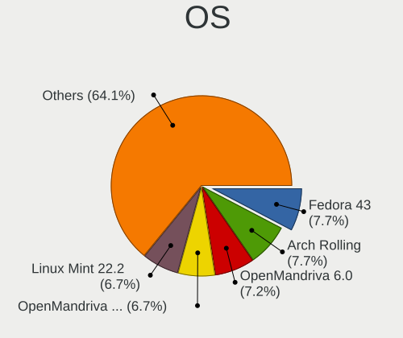

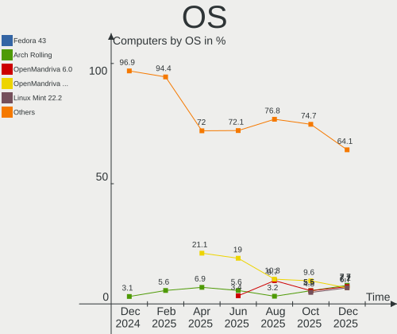

| Name                         | Computers | Percent |
|------------------------------|-----------|---------|
| Fedora 43                    | 15        | 7.69%   |
| Arch Rolling                 | 15        | 7.69%   |
| OpenMandriva 6.0             | 14        | 7.18%   |
| OpenMandriva 25.90           | 13        | 6.67%   |
| Linux Mint 22.2              | 13        | 6.67%   |
| Debian 13                    | 11        | 5.64%   |
| Zorin 18                     | 10        | 5.13%   |
| Ubuntu 24.04                 | 10        | 5.13%   |
| Bazzite 43                   | 10        | 5.13%   |
| CachyOS Rolling              | 7         | 3.59%   |
| OpenMandriva 25.11           | 6         | 3.08%   |
| Ubuntu 25.10                 | 5         | 2.56%   |
| Gentoo 2.18                  | 5         | 2.56%   |
| Pop!_OS 24.04                | 4         | 2.05%   |
| NixOS 26.05                  | 4         | 2.05%   |
| EndeavourOS Rolling          | 3         | 1.54%   |
| SteamOS 3.7.17               | 2         | 1.03%   |
| Salix 15.0                   | 2         | 1.03%   |
| Pop!_OS 22.04                | 2         | 1.03%   |
| org.kde.Platform 5.15-21.08  | 2         | 1.03%   |
| openSUSE Tumbleweed-XXXXXXXX | 2         | 1.03%   |
| OpenMandriva 25.06           | 2         | 1.03%   |
| OpenMandriva 24.12           | 2         | 1.03%   |
| Nobara 43                    | 2         | 1.03%   |
| NixOS 25.11                  | 2         | 1.03%   |
| Linux Mint 21.3              | 2         | 1.03%   |
| Kubuntu 25.10                | 2         | 1.03%   |
| Garuda Linux Soaring         | 2         | 1.03%   |
| Debian 12                    | 2         | 1.03%   |
| CachyOS                      | 2         | 1.03%   |
| Zorin 17                     | 1         | 0.51%   |
| Xubuntu 24.04                | 1         | 0.51%   |
| Ubuntu MATE 24.04            | 1         | 0.51%   |
| Ubuntu 24.10                 | 1         | 0.51%   |
| Ubuntu 22.04                 | 1         | 0.51%   |
| NixOS 25.05                  | 1         | 0.51%   |
| MX 21                        | 1         | 0.51%   |
| Manjaro 25.1.0               | 1         | 0.51%   |
| Manjaro 25.0.3               | 1         | 0.51%   |
| Lubuntu 25.04                | 1         | 0.51%   |

OS Family
---------

OS without a version

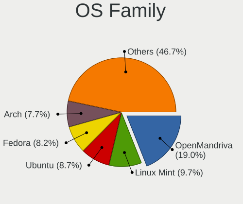

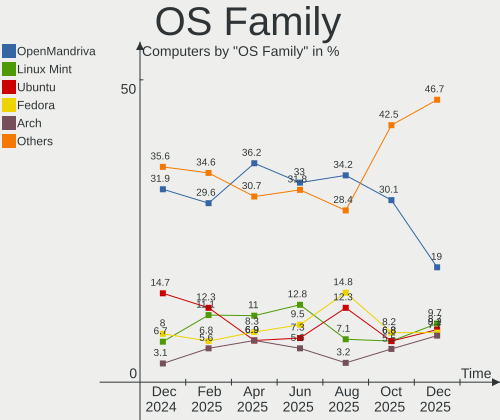

| Name             | Computers | Percent |
|------------------|-----------|---------|
| OpenMandriva     | 37        | 18.97%  |
| Linux Mint       | 19        | 9.74%   |
| Ubuntu           | 17        | 8.72%   |
| Fedora           | 16        | 8.21%   |
| Arch             | 15        | 7.69%   |
| Debian           | 13        | 6.67%   |
| Zorin            | 11        | 5.64%   |
| Bazzite          | 10        | 5.13%   |
| CachyOS          | 9         | 4.62%   |
| NixOS            | 7         | 3.59%   |
| Pop!_OS          | 6         | 3.08%   |
| Gentoo           | 5         | 2.56%   |
| Kubuntu          | 4         | 2.05%   |
| Garuda Linux     | 3         | 1.54%   |
| EndeavourOS      | 3         | 1.54%   |
| SteamOS          | 2         | 1.03%   |
| Salix            | 2         | 1.03%   |
| org.kde.Platform | 2         | 1.03%   |
| openSUSE         | 2         | 1.03%   |
| Nobara           | 2         | 1.03%   |
| Manjaro          | 2         | 1.03%   |
| Lubuntu          | 2         | 1.03%   |
| Xubuntu          | 1         | 0.51%   |
| Ubuntu MATE      | 1         | 0.51%   |
| MX               | 1         | 0.51%   |
| LMDE             | 1         | 0.51%   |
| Bluefin          | 1         | 0.51%   |
| Aeon             | 1         | 0.51%   |

Kernel
------

Version of the Linux kernel

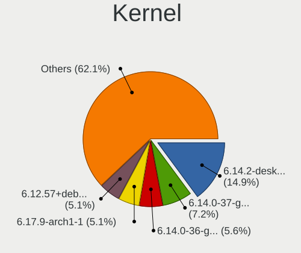

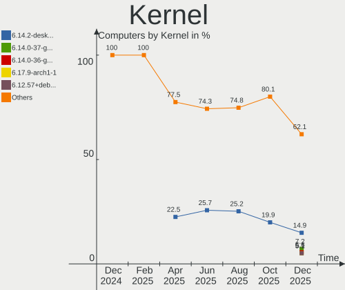

| Version                                     | Computers | Percent |
|---------------------------------------------|-----------|---------|
| 6.14.2-desktop-3omv2590                     | 29        | 14.87%  |
| 6.14.0-37-generic                           | 14        | 7.18%   |
| 6.14.0-36-generic                           | 11        | 5.64%   |
| 6.17.9-arch1-1                              | 10        | 5.13%   |
| 6.12.57+deb13-amd64                         | 10        | 5.13%   |
| 6.17.7-ba19.fc43.x86_64                     | 6         | 3.08%   |
| 6.17.12-300.fc43.x86_64                     | 6         | 3.08%   |
| 6.18.0-desktop-1omv2590                     | 5         | 2.56%   |
| 6.8.0-90-generic                            | 4         | 2.05%   |
| 6.8.0-88-generic                            | 4         | 2.05%   |
| 6.17.9-76061709-generic                     | 4         | 2.05%   |
| 6.17.9-2-cachyos                            | 4         | 2.05%   |
| 6.18.0-3-cachyos                            | 3         | 1.54%   |
| 6.17.7-ba20.fc43.x86_64                     | 3         | 1.54%   |
| 6.17.1-300.fc43.x86_64                      | 3         | 1.54%   |
| 6.17.0-7-generic                            | 3         | 1.54%   |
| 6.18.2-zen2-1-zen                           | 2         | 1.03%   |
| 6.18.0-2-default                            | 2         | 1.03%   |
| 6.18.0-2-cachyos                            | 2         | 1.03%   |
| 6.18.0                                      | 2         | 1.03%   |
| 6.17.9-300.fc43.x86_64                      | 2         | 1.03%   |
| 6.17.8-arch1-1                              | 2         | 1.03%   |
| 6.17.4-76061704-generic                     | 2         | 1.03%   |
| 6.17.11-300.fc43.x86_64                     | 2         | 1.03%   |
| 6.17.10-300.fc43.x86_64                     | 2         | 1.03%   |
| 6.17.0-6-generic                            | 2         | 1.03%   |
| 6.14.0-33-generic                           | 2         | 1.03%   |
| 6.12.58-gentoo                              | 2         | 1.03%   |
| 6.12.48+deb13-amd64                         | 2         | 1.03%   |
| 6.12.1-desktop-1omv2490                     | 2         | 1.03%   |
| 6.11.11-valve24-2-neptune-611-gfd0dd251480d | 2         | 1.03%   |
| 6.1.0-41-amd64                              | 2         | 1.03%   |
| 5.15.63                                     | 2         | 1.03%   |
| 5.15.0-161-generic                          | 2         | 1.03%   |
| 6.8.0-86-generic                            | 1         | 0.51%   |
| 6.8.0-60-generic                            | 1         | 0.51%   |
| 6.8.0-52-generic                            | 1         | 0.51%   |
| 6.5.0-17-generic                            | 1         | 0.51%   |
| 6.18.2-arch2-1                              | 1         | 0.51%   |
| 6.18.1-zen1-2-zen                           | 1         | 0.51%   |

Kernel Family
-------------

Linux kernel without a distro release

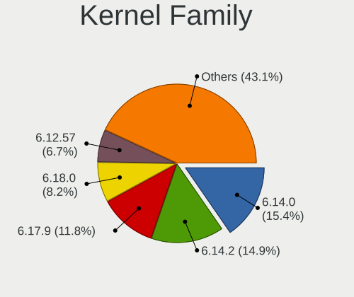

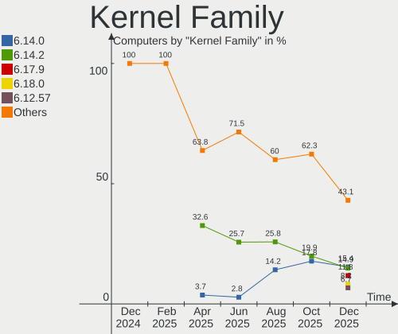

| Version | Computers | Percent |
|---------|-----------|---------|
| 6.14.0  | 30        | 15.38%  |
| 6.14.2  | 29        | 14.87%  |
| 6.17.9  | 23        | 11.79%  |
| 6.18.0  | 16        | 8.21%   |
| 6.12.57 | 13        | 6.67%   |
| 6.8.0   | 11        | 5.64%   |
| 6.17.7  | 11        | 5.64%   |
| 6.17.12 | 7         | 3.59%   |
| 6.17.0  | 7         | 3.59%   |
| 6.17.8  | 4         | 2.05%   |
| 5.15.0  | 4         | 2.05%   |
| 6.18.2  | 3         | 1.54%   |
| 6.18.1  | 3         | 1.54%   |
| 6.17.1  | 3         | 1.54%   |
| 6.17.4  | 2         | 1.03%   |
| 6.17.11 | 2         | 1.03%   |
| 6.17.10 | 2         | 1.03%   |
| 6.12.59 | 2         | 1.03%   |
| 6.12.58 | 2         | 1.03%   |
| 6.12.48 | 2         | 1.03%   |
| 6.12.1  | 2         | 1.03%   |
| 6.11.11 | 2         | 1.03%   |
| 6.11.0  | 2         | 1.03%   |
| 6.1.0   | 2         | 1.03%   |
| 5.15.63 | 2         | 1.03%   |
| 6.5.0   | 1         | 0.51%   |
| 6.17.13 | 1         | 0.51%   |
| 6.12.62 | 1         | 0.51%   |
| 6.12.61 | 1         | 0.51%   |
| 6.12.47 | 1         | 0.51%   |
| 6.12.41 | 1         | 0.51%   |
| 6.12.28 | 1         | 0.51%   |
| 5.18.0  | 1         | 0.51%   |
| 4.14.83 | 1         | 0.51%   |

Kernel Major Ver.
-----------------

Linux kernel major version

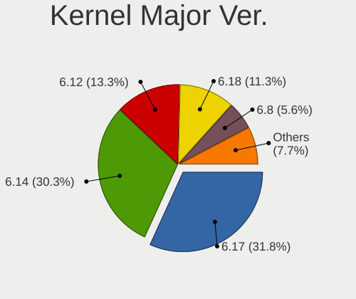

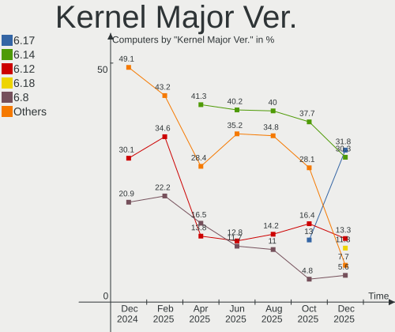

| Version | Computers | Percent |
|---------|-----------|---------|
| 6.17    | 62        | 31.79%  |
| 6.14    | 59        | 30.26%  |
| 6.12    | 26        | 13.33%  |
| 6.18    | 22        | 11.28%  |
| 6.8     | 11        | 5.64%   |
| 5.15    | 6         | 3.08%   |
| 6.11    | 4         | 2.05%   |
| 6.1     | 2         | 1.03%   |
| 6.5     | 1         | 0.51%   |
| 5.18    | 1         | 0.51%   |
| 4.14    | 1         | 0.51%   |

Arch
----

OS architecture (x86_64, i586, etc.)

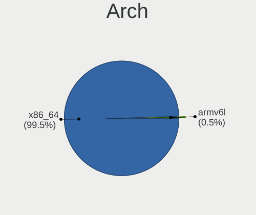

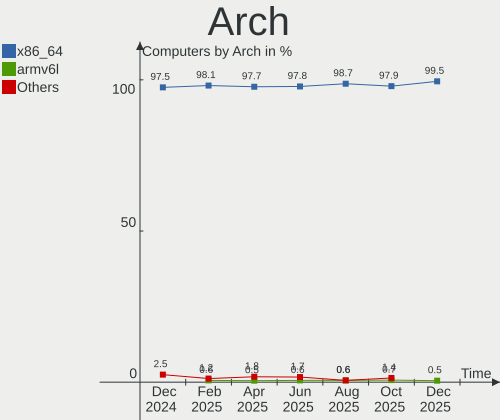

| Name   | Computers | Percent |
|--------|-----------|---------|
| x86_64 | 194       | 99.49%  |
| armv6l | 1         | 0.51%   |

DE
--

Desktop Environment

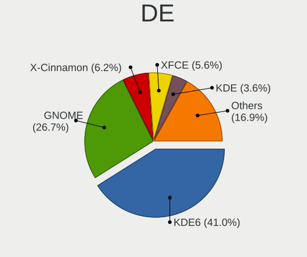

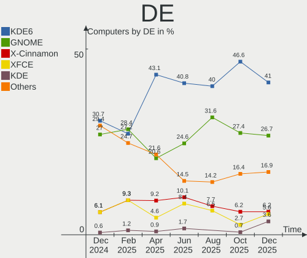

| Name       | Computers | Percent |
|------------|-----------|---------|
| KDE6       | 80        | 41.03%  |
| GNOME      | 52        | 26.67%  |
| X-Cinnamon | 12        | 6.15%   |
| XFCE       | 11        | 5.64%   |
| KDE        | 7         | 3.59%   |
| MATE       | 6         | 3.08%   |
| LXQt       | 4         | 2.05%   |
| Hyprland   | 4         | 2.05%   |
| COSMIC     | 4         | 2.05%   |
| Unknown    | 4         | 2.05%   |
| niri       | 3         | 1.54%   |
| KDE5       | 3         | 1.54%   |
| TDE        | 1         | 0.51%   |
| Pantheon   | 1         | 0.51%   |
| LXDE       | 1         | 0.51%   |
| KDE4       | 1         | 0.51%   |
| i3         | 1         | 0.51%   |

Display Server
--------------

X11 or Wayland

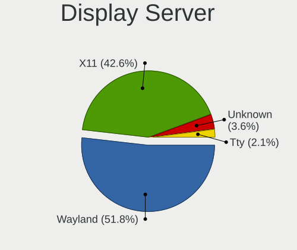

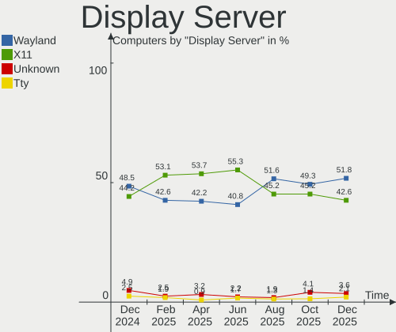

| Name    | Computers | Percent |
|---------|-----------|---------|
| Wayland | 101       | 51.79%  |
| X11     | 83        | 42.56%  |
| Unknown | 7         | 3.59%   |
| Tty     | 4         | 2.05%   |

Display Manager
---------------

SDDM, LightDM, etc.

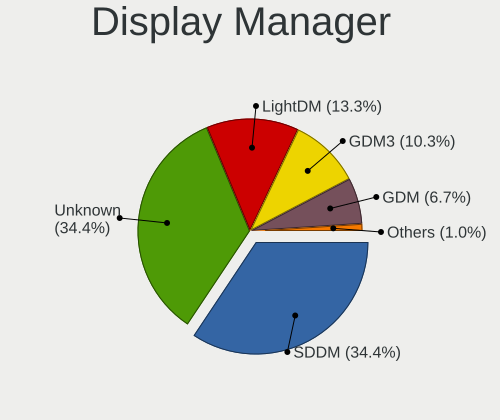

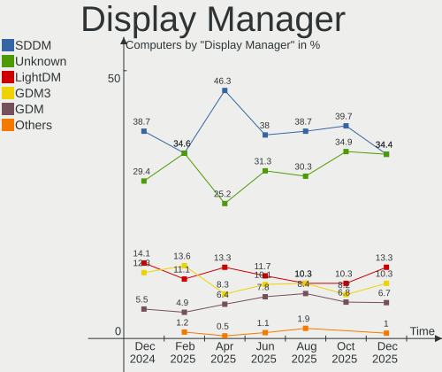

| Name    | Computers | Percent |
|---------|-----------|---------|
| SDDM    | 67        | 34.36%  |
| Unknown | 67        | 34.36%  |
| LightDM | 26        | 13.33%  |
| GDM3    | 20        | 10.26%  |
| GDM     | 13        | 6.67%   |
| GREETD  | 2         | 1.03%   |

OS Lang
-------

Language

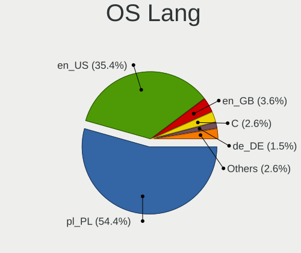

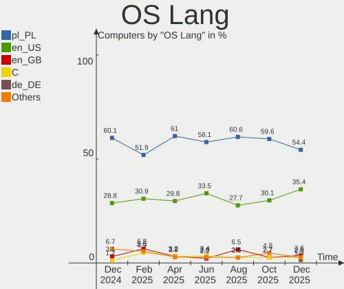

| Lang       | Computers | Percent |
|------------|-----------|---------|
| pl_PL      | 106       | 54.36%  |
| en_US      | 69        | 35.38%  |
| en_GB      | 7         | 3.59%   |
| C          | 5         | 2.56%   |
| de_DE      | 3         | 1.54%   |
| it_IT      | 2         | 1.03%   |
| en_US.UTF8 | 1         | 0.51%   |
| en_IE      | 1         | 0.51%   |
| Unknown    | 1         | 0.51%   |

Boot Mode
---------

EFI or BIOS

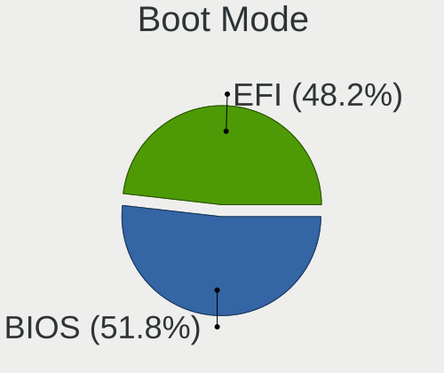

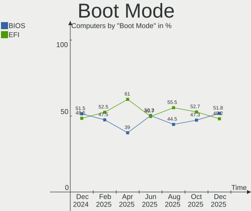

| Mode | Computers | Percent |
|------|-----------|---------|
| BIOS | 101       | 51.79%  |
| EFI  | 94        | 48.21%  |

Filesystem
----------

Type of filesystem

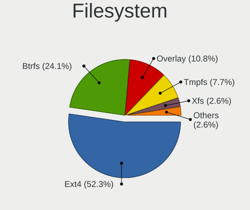

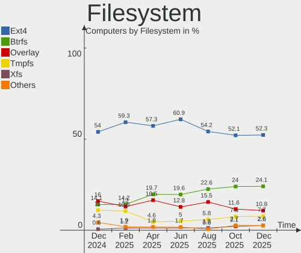

| Type    | Computers | Percent |
|---------|-----------|---------|
| Ext4    | 102       | 52.31%  |
| Btrfs   | 47        | 24.1%   |
| Overlay | 21        | 10.77%  |
| Tmpfs   | 15        | 7.69%   |
| Xfs     | 5         | 2.56%   |
| Zfs     | 3         | 1.54%   |
| F2fs    | 2         | 1.03%   |

Part. scheme
------------

Scheme of partitioning

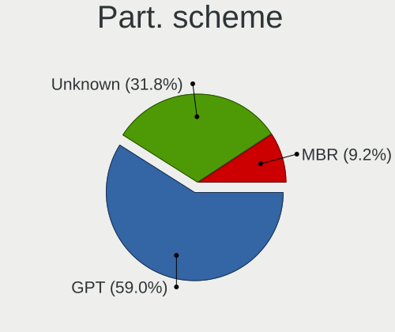

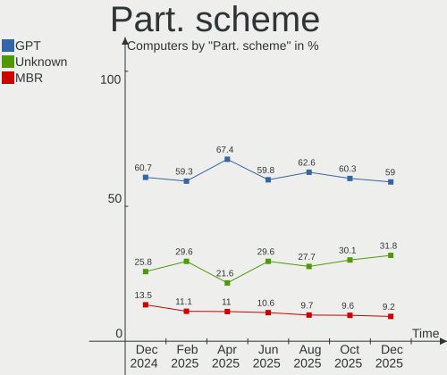

| Type    | Computers | Percent |
|---------|-----------|---------|
| GPT     | 115       | 58.97%  |
| Unknown | 62        | 31.79%  |
| MBR     | 18        | 9.23%   |

Dual Boot with Linux/BSD
------------------------

Hosting more than one Linux/BSD

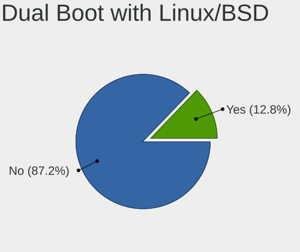

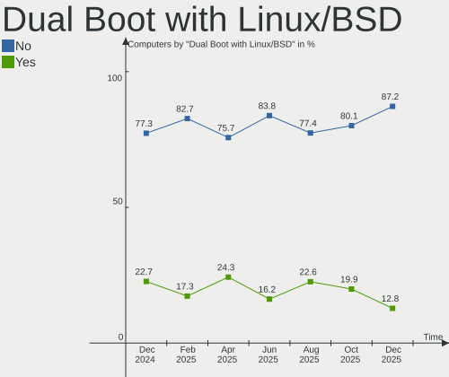

| Dual boot | Computers | Percent |
|-----------|-----------|---------|
| No        | 170       | 87.18%  |
| Yes       | 25        | 12.82%  |

Dual Boot (Win)
---------------

Hosting Linux and Windows

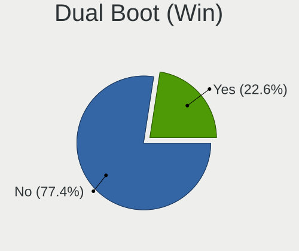

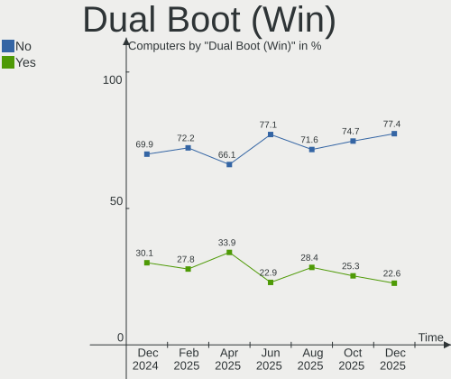

| Dual boot | Computers | Percent |
|-----------|-----------|---------|
| No        | 151       | 77.44%  |
| Yes       | 44        | 22.56%  |

Board
-----

Vendor
------

Motherboard manufacturer

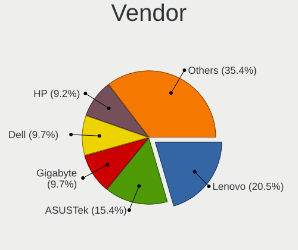

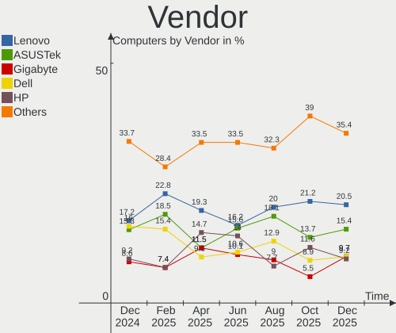

| Name                                 | Computers | Percent |
|--------------------------------------|-----------|---------|
| Lenovo                               | 40        | 20.51%  |
| ASUSTek Computer                     | 30        | 15.38%  |
| Gigabyte Technology                  | 19        | 9.74%   |
| Dell                                 | 19        | 9.74%   |
| Hewlett-Packard                      | 18        | 9.23%   |
| MSI                                  | 16        | 8.21%   |
| ASRock                               | 11        | 5.64%   |
| Acer                                 | 8         | 4.1%    |
| HUAWEI                               | 6         | 3.08%   |
| Samsung Electronics                  | 4         | 2.05%   |
| Google                               | 3         | 1.54%   |
| Shenzhen Meigao Electronic Equipment | 2         | 1.03%   |
| Fujitsu Siemens                      | 2         | 1.03%   |
| Apple                                | 2         | 1.03%   |
| Valve                                | 1         | 0.51%   |
| TUXEDO                               | 1         | 0.51%   |
| Toshiba                              | 1         | 0.51%   |
| Sony                                 | 1         | 0.51%   |
| Raspberry Pi Foundation              | 1         | 0.51%   |
| Medion                               | 1         | 0.51%   |
| LG Electronics                       | 1         | 0.51%   |
| Intel                                | 1         | 0.51%   |
| GMKtec                               | 1         | 0.51%   |
| Getac                                | 1         | 0.51%   |
| Fujitsu                              | 1         | 0.51%   |
| Framework                            | 1         | 0.51%   |
| Dream Machines                       | 1         | 0.51%   |
| Chuwi                                | 1         | 0.51%   |
| Unknown                              | 1         | 0.51%   |

Model
-----

Motherboard model

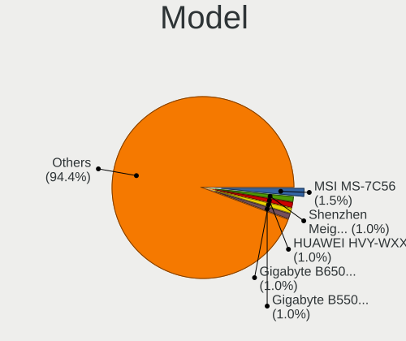

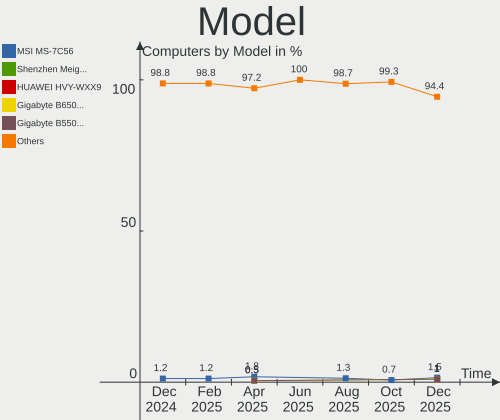

| Name                                           | Computers | Percent |
|------------------------------------------------|-----------|---------|
| MSI MS-7C56                                    | 3         | 1.54%   |
| Shenzhen Meigao Electronic Equipment AI Series | 2         | 1.03%   |
| HUAWEI HVY-WXX9                                | 2         | 1.03%   |
| Gigabyte B650 EAGLE AX                         | 2         | 1.03%   |
| Gigabyte B550 GAMING X V2                      | 2         | 1.03%   |
| Dell Precision 5510                            | 2         | 1.03%   |
| Dell OptiPlex 780                              | 2         | 1.03%   |
| Valve Jupiter                                  | 1         | 0.51%   |
| TUXEDO InfinityBook S Gen8                     | 1         | 0.51%   |
| Toshiba PORTEGE Z30-E                          | 1         | 0.51%   |
| Sony VPCEB3M1E                                 | 1         | 0.51%   |
| Samsung RV411/RV511/E3511/S3511/RV711/E3411    | 1         | 0.51%   |
| Samsung 355V4C/356V4C/3445VC/3545VC            | 1         | 0.51%   |
| Samsung 350V5C/351V5C/3540VC/3440VC            | 1         | 0.51%   |
| Samsung 300E5EV/300E4EV/270E5EV/270E4EV        | 1         | 0.51%   |
| RPi Raspberry Pi Zero W Rev 1.1                | 1         | 0.51%   |
| MSI Thin 15 B12VE                              | 1         | 0.51%   |
| MSI MS-7E61                                    | 1         | 0.51%   |
| MSI MS-7E47                                    | 1         | 0.51%   |
| MSI MS-7E27                                    | 1         | 0.51%   |
| MSI MS-7E10                                    | 1         | 0.51%   |
| MSI MS-7D52                                    | 1         | 0.51%   |
| MSI MS-7C91                                    | 1         | 0.51%   |
| MSI MS-7C71                                    | 1         | 0.51%   |
| MSI MS-7C35                                    | 1         | 0.51%   |
| MSI MS-7B89                                    | 1         | 0.51%   |
| MSI MS-7B10                                    | 1         | 0.51%   |
| MSI MS-7887                                    | 1         | 0.51%   |
| MSI GF63 Thin 10UD                             | 1         | 0.51%   |
| Medion Akoya E7226T                            | 1         | 0.51%   |
| LG 16Z90R-G.AAM7U1                             | 1         | 0.51%   |
| Lenovo Yoga 9 2-in-1 14ILL10 83LC              | 1         | 0.51%   |
| Lenovo Yoga 7 2-in-1 16AKP10 83JU              | 1         | 0.51%   |
| Lenovo Yoga 7 2-in-1 14AKP10 83JR              | 1         | 0.51%   |
| Lenovo V15 G3 IAP CTO 83C4                     | 1         | 0.51%   |
| Lenovo ThinkPad X9-15 Gen 1 21Q6CTO1WW         | 1         | 0.51%   |
| Lenovo ThinkPad X200 7459ZMU                   | 1         | 0.51%   |
| Lenovo ThinkPad X1 Carbon 7th 20QES3HS00       | 1         | 0.51%   |
| Lenovo ThinkPad T520 4242A85                   | 1         | 0.51%   |
| Lenovo ThinkPad T500 2241VCM                   | 1         | 0.51%   |

Model Family
------------

Motherboard model prefix

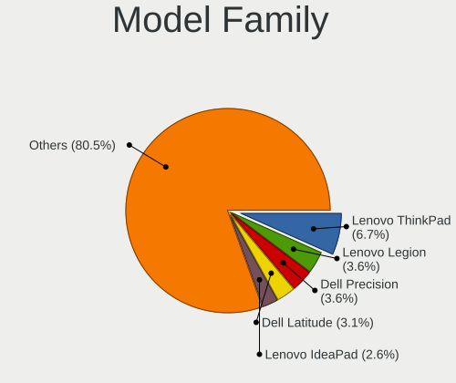

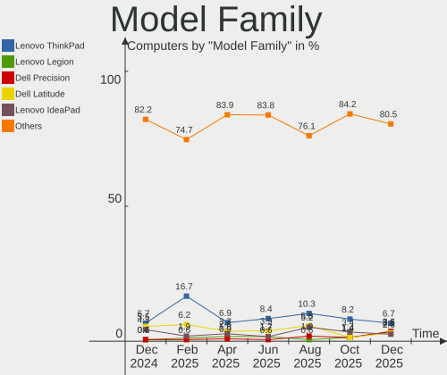

| Name                                    | Computers | Percent |
|-----------------------------------------|-----------|---------|
| Lenovo ThinkPad                         | 13        | 6.67%   |
| Lenovo Legion                           | 7         | 3.59%   |
| Dell Precision                          | 7         | 3.59%   |
| Dell Latitude                           | 6         | 3.08%   |
| Lenovo IdeaPad                          | 5         | 2.56%   |
| ASUS ASUS                               | 5         | 2.56%   |
| Acer Aspire                             | 5         | 2.56%   |
| ASUS PRIME                              | 4         | 2.05%   |
| MSI MS-7C56                             | 3         | 1.54%   |
| Lenovo Yoga                             | 3         | 1.54%   |
| HP Victus                               | 3         | 1.54%   |
| HP ProBook                              | 3         | 1.54%   |
| HP EliteBook                            | 3         | 1.54%   |
| HP Compaq                               | 3         | 1.54%   |
| Gigabyte B650                           | 3         | 1.54%   |
| ASUS TUF                                | 3         | 1.54%   |
| Shenzhen Meigao Electronic Equipment AI | 2         | 1.03%   |
| Lenovo ThinkBook                        | 2         | 1.03%   |
| Lenovo LOQ                              | 2         | 1.03%   |
| HUAWEI HVY-WXX9                         | 2         | 1.03%   |
| HP ProDesk                              | 2         | 1.03%   |
| Gigabyte B550                           | 2         | 1.03%   |
| Fujitsu Siemens ESPRIMO                 | 2         | 1.03%   |
| Dell OptiPlex                           | 2         | 1.03%   |
| Dell Inspiron                           | 2         | 1.03%   |
| ASUS VivoBook                           | 2         | 1.03%   |
| ASUS ROG                                | 2         | 1.03%   |
| ASUS ProArt                             | 2         | 1.03%   |
| ASRock B850M                            | 2         | 1.03%   |
| ASRock B650M                            | 2         | 1.03%   |
| ASRock B550M                            | 2         | 1.03%   |
| Valve Jupiter                           | 1         | 0.51%   |
| TUXEDO InfinityBook                     | 1         | 0.51%   |
| Toshiba PORTEGE                         | 1         | 0.51%   |
| Sony VPCEB3M1E                          | 1         | 0.51%   |
| Samsung RV411                           | 1         | 0.51%   |
| Samsung 355V4C                          | 1         | 0.51%   |
| Samsung 350V5C                          | 1         | 0.51%   |
| Samsung 300E5EV                         | 1         | 0.51%   |
| RPi Raspberry                           | 1         | 0.51%   |

MFG Year
--------

Motherboard manufacture year

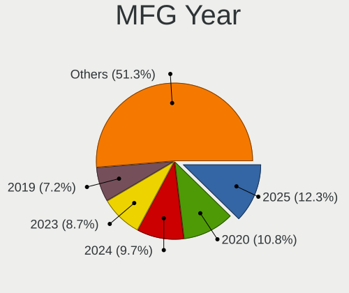

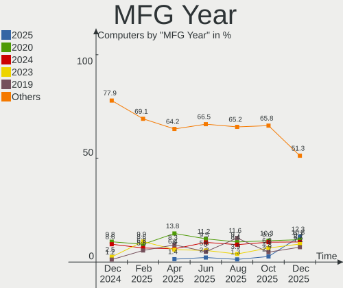

| Year    | Computers | Percent |
|---------|-----------|---------|
| 2025    | 24        | 12.31%  |
| 2020    | 21        | 10.77%  |
| 2024    | 19        | 9.74%   |
| 2023    | 17        | 8.72%   |
| 2019    | 14        | 7.18%   |
| 2011    | 14        | 7.18%   |
| 2018    | 13        | 6.67%   |
| 2013    | 10        | 5.13%   |
| 2021    | 9         | 4.62%   |
| 2012    | 9         | 4.62%   |
| 2010    | 7         | 3.59%   |
| 2017    | 6         | 3.08%   |
| 2015    | 6         | 3.08%   |
| 2008    | 6         | 3.08%   |
| 2022    | 5         | 2.56%   |
| 2014    | 5         | 2.56%   |
| 2016    | 4         | 2.05%   |
| 2009    | 3         | 1.54%   |
| 2007    | 2         | 1.03%   |
| Unknown | 1         | 0.51%   |

Form Factor
-----------

Physical design of the computer

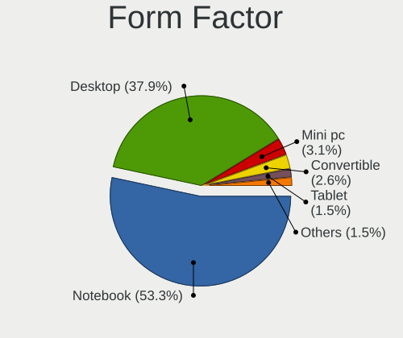

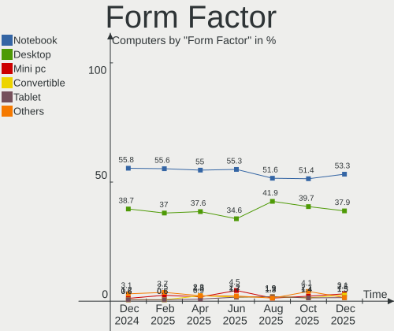

| Name           | Computers | Percent |
|----------------|-----------|---------|
| Notebook       | 104       | 53.33%  |
| Desktop        | 74        | 37.95%  |
| Mini pc        | 6         | 3.08%   |
| Convertible    | 5         | 2.56%   |
| Tablet         | 3         | 1.54%   |
| All in one     | 2         | 1.03%   |
| System on chip | 1         | 0.51%   |

Secure Boot
-----------

Enabled or disabled

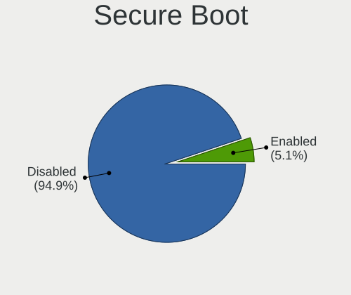

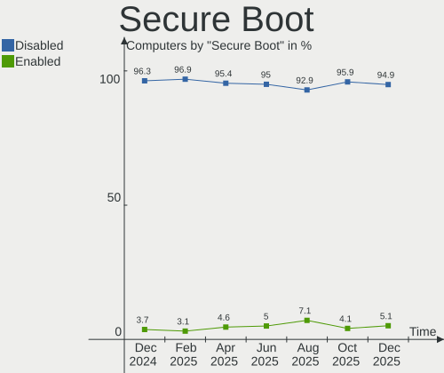

| State    | Computers | Percent |
|----------|-----------|---------|
| Disabled | 185       | 94.87%  |
| Enabled  | 10        | 5.13%   |

Coreboot
--------

Have coreboot on board

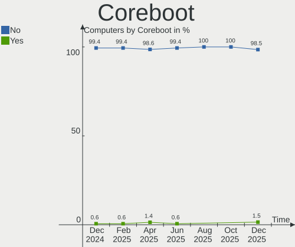

| Used | Computers | Percent |
|------|-----------|---------|
| No   | 192       | 98.46%  |
| Yes  | 3         | 1.54%   |

RAM Size
--------

Total RAM memory

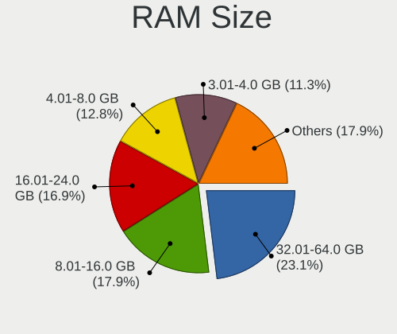

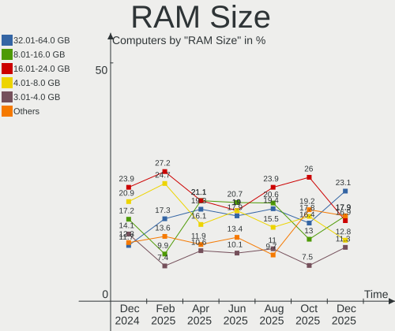

| Size in GB  | Computers | Percent |
|-------------|-----------|---------|
| 32.01-64.0  | 45        | 23.08%  |
| 8.01-16.0   | 35        | 17.95%  |
| 16.01-24.0  | 33        | 16.92%  |
| 4.01-8.0    | 25        | 12.82%  |
| 3.01-4.0    | 22        | 11.28%  |
| 64.01-256.0 | 18        | 9.23%   |
| 24.01-32.0  | 14        | 7.18%   |
| 2.01-3.0    | 2         | 1.03%   |
| 0.01-0.5    | 1         | 0.51%   |

RAM Used
--------

Used RAM memory

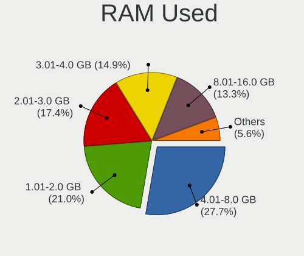

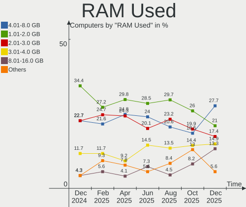

| Used GB     | Computers | Percent |
|-------------|-----------|---------|
| 4.01-8.0    | 54        | 27.69%  |
| 1.01-2.0    | 41        | 21.03%  |
| 2.01-3.0    | 34        | 17.44%  |
| 3.01-4.0    | 29        | 14.87%  |
| 8.01-16.0   | 26        | 13.33%  |
| 16.01-24.0  | 4         | 2.05%   |
| 24.01-32.0  | 3         | 1.54%   |
| 64.01-256.0 | 2         | 1.03%   |
| 32.01-64.0  | 1         | 0.51%   |
| 0.01-0.5    | 1         | 0.51%   |

Total Drives
------------

Number of drives on board

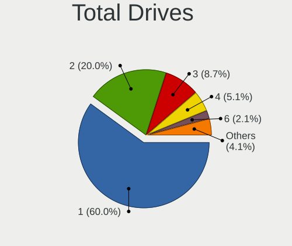

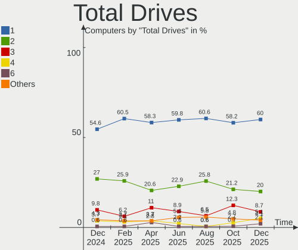

| Drives | Computers | Percent |
|--------|-----------|---------|
| 1      | 117       | 60%     |
| 2      | 39        | 20%     |
| 3      | 17        | 8.72%   |
| 4      | 10        | 5.13%   |
| 6      | 4         | 2.05%   |
| 5      | 4         | 2.05%   |
| 0      | 3         | 1.54%   |
| 7      | 1         | 0.51%   |

Has CD-ROM
----------

Has CD-ROM on board

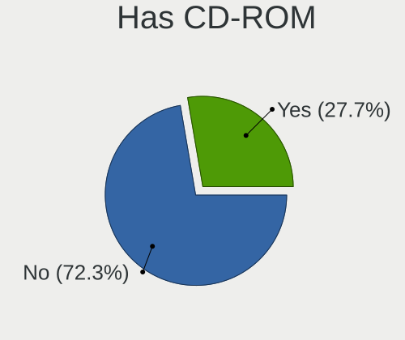

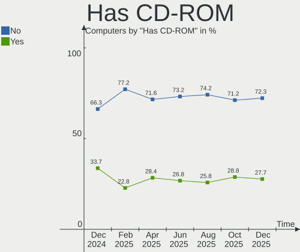

| Presented | Computers | Percent |
|-----------|-----------|---------|
| No        | 141       | 72.31%  |
| Yes       | 54        | 27.69%  |

Has Ethernet
------------

Has Ethernet on board

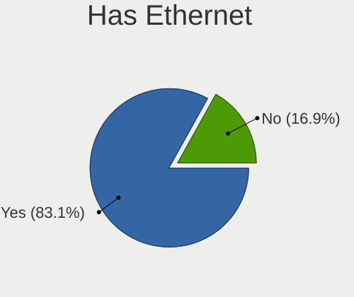

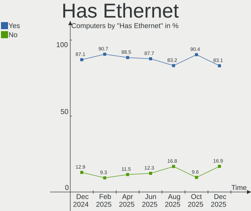

| Presented | Computers | Percent |
|-----------|-----------|---------|
| Yes       | 162       | 83.08%  |
| No        | 33        | 16.92%  |

Has WiFi
--------

Has WiFi module

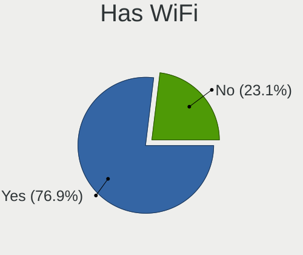

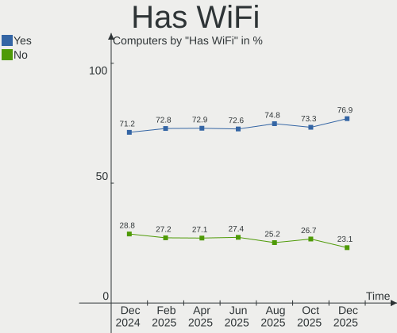

| Presented | Computers | Percent |
|-----------|-----------|---------|
| Yes       | 150       | 76.92%  |
| No        | 45        | 23.08%  |

Has Bluetooth
-------------

Has Bluetooth module

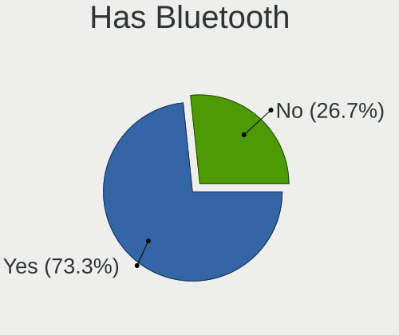

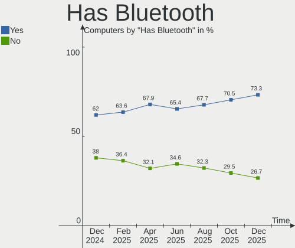

| Presented | Computers | Percent |
|-----------|-----------|---------|
| Yes       | 143       | 73.33%  |
| No        | 52        | 26.67%  |

Location
--------

Country
-------

Geographic location (country)

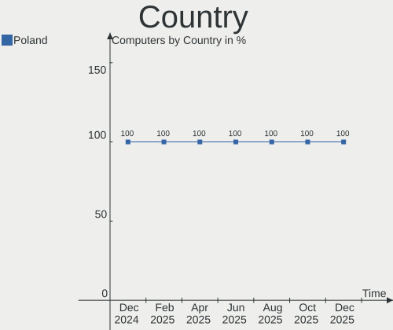

| Country | Computers | Percent |
|---------|-----------|---------|
| Poland  | 195       | 100%    |

City
----

Geographic location (city)

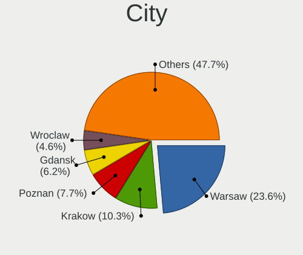

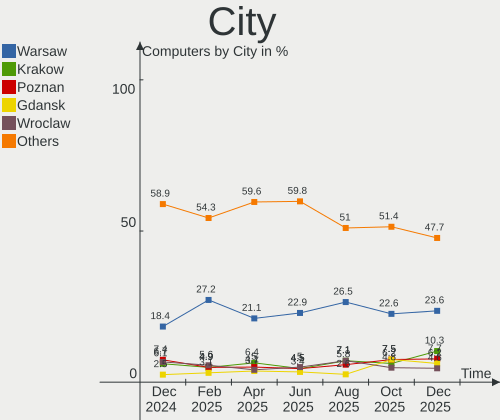

| City              | Computers | Percent |
|-------------------|-----------|---------|
| Warsaw            | 46        | 23.59%  |
| Krakow            | 20        | 10.26%  |
| Poznan            | 15        | 7.69%   |
| Gdansk            | 12        | 6.15%   |
| Wroclaw           | 9         | 4.62%   |
| Lodz              | 5         | 2.56%   |
| Częstochowa      | 4         | 2.05%   |
| Tychy             | 3         | 1.54%   |
| Torun             | 3         | 1.54%   |
| Rzeszów          | 3         | 1.54%   |
| Lublin            | 3         | 1.54%   |
| Bydgoszcz         | 3         | 1.54%   |
| Ruda Śląska     | 2         | 1.03%   |
| Pruszków         | 2         | 1.03%   |
| Konin             | 2         | 1.03%   |
| Kielce            | 2         | 1.03%   |
| Katowice          | 2         | 1.03%   |
| Chorzów          | 2         | 1.03%   |
| Bialystok         | 2         | 1.03%   |
| Żyrardów        | 1         | 0.51%   |
| Zielona Góra     | 1         | 0.51%   |
| Wołomin          | 1         | 0.51%   |
| Tyczyn            | 1         | 0.51%   |
| Trzebusz          | 1         | 0.51%   |
| Szczecinek        | 1         | 0.51%   |
| Szczecin          | 1         | 0.51%   |
| Swidnik           | 1         | 0.51%   |
| Suwałki          | 1         | 0.51%   |
| Stargard          | 1         | 0.51%   |
| Sosnowiec         | 1         | 0.51%   |
| Solarnia          | 1         | 0.51%   |
| Sierpc            | 1         | 0.51%   |
| Rybnik            | 1         | 0.51%   |
| Pyzowka           | 1         | 0.51%   |
| Pstragowa         | 1         | 0.51%   |
| Przasnysz         | 1         | 0.51%   |
| Piekary Slaskie   | 1         | 0.51%   |
| Pawlowice         | 1         | 0.51%   |
| Paledzie          | 1         | 0.51%   |
| Ozarow Mazowiecki | 1         | 0.51%   |

Drives
------

Drive Vendor
------------

Hard drive vendors

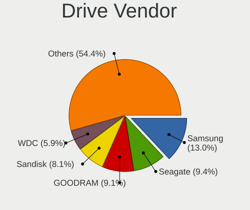

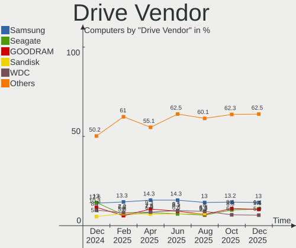

| Vendor                         | Computers | Drives | Percent |
|--------------------------------|-----------|--------|---------|
| Samsung Electronics            | 40        | 48     | 13.03%  |
| Seagate                        | 29        | 31     | 9.45%   |
| GOODRAM                        | 28        | 31     | 9.12%   |
| Sandisk                        | 25        | 27     | 8.14%   |
| WDC                            | 18        | 22     | 5.86%   |
| Micron Technology              | 13        | 14     | 4.23%   |
| Toshiba                        | 11        | 12     | 3.58%   |
| Crucial                        | 10        | 12     | 3.26%   |
| A-DATA Technology              | 10        | 12     | 3.26%   |
| Kingston                       | 9         | 9      | 2.93%   |
| ADATA Technology               | 9         | 10     | 2.93%   |
| Unknown                        | 8         | 9      | 2.61%   |
| Shenzhen Longsys Electronics   | 8         | 8      | 2.61%   |
| Phison Electronics             | 8         | 9      | 2.61%   |
| MAXIO Technology (Hangzhou)    | 8         | 10     | 2.61%   |
| SK hynix                       | 7         | 7      | 2.28%   |
| Hitachi                        | 7         | 9      | 2.28%   |
| Micron/Crucial Technology      | 6         | 7      | 1.95%   |
| Kingston Technology Company    | 6         | 7      | 1.95%   |
| KIOXIA                         | 5         | 8      | 1.63%   |
| Intel                          | 4         | 4      | 1.3%    |
| SPCC                           | 3         | 3      | 0.98%   |
| Realtek Semiconductor          | 3         | 3      | 0.98%   |
| PNY                            | 2         | 2      | 0.65%   |
| Patriot                        | 2         | 2      | 0.65%   |
| Lexar                          | 2         | 2      | 0.65%   |
| KIOXIA-EXCERIA                 | 2         | 2      | 0.65%   |
| HGST                           | 2         | 2      | 0.65%   |
| Unknown                        | 2         | 3      | 0.65%   |
| Yangtze Memory Technologies    | 1         | 1      | 0.33%   |
| Viper                          | 1         | 1      | 0.33%   |
| Verbatim                       | 1         | 1      | 0.33%   |
| Union Memory (Shenzhen)        | 1         | 1      | 0.33%   |
| Transcend                      | 1         | 1      | 0.33%   |
| T-FORCE                        | 1         | 1      | 0.33%   |
| Synology                       | 1         | 1      | 0.33%   |
| Solid State Storage Technology | 1         | 1      | 0.33%   |
| Silicon Motion                 | 1         | 1      | 0.33%   |
| Plextor                        | 1         | 1      | 0.33%   |
| Phison                         | 1         | 1      | 0.33%   |

Drive Model
-----------

Hard drive models

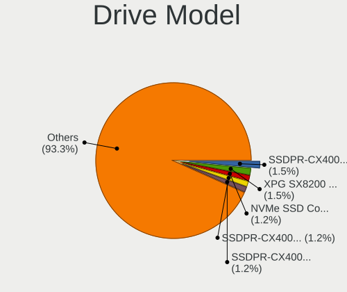

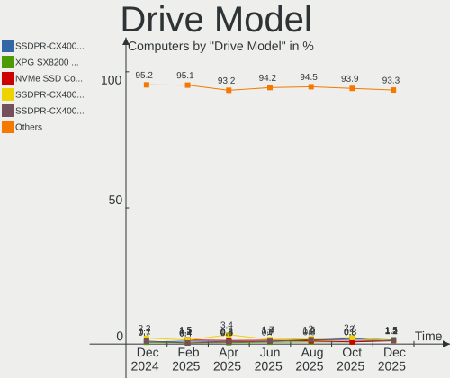

| Model                                                                   | Computers | Percent |
|-------------------------------------------------------------------------|-----------|---------|
| GOODRAM SSDPR-CX400-256-G2 256GB                                        | 5         | 1.52%   |
| ADATA XPG SX8200 Pro PCIe Gen3x4 M.2 2280 Solid State Drive 1024GB      | 5         | 1.52%   |
| MAXIO (Hangzhou) NVMe SSD Controller MAP1202 2TB                        | 4         | 1.21%   |
| GOODRAM SSDPR-CX400-512-G2 512GB                                        | 4         | 1.21%   |
| GOODRAM SSDPR-CX400-01T-G2 1TB                                          | 4         | 1.21%   |
| Sandisk WD Black SN770 / PC SN740 256GB / PC SN560 (DRAM-less) NVMe SSD | 3         | 0.91%   |
| Phison E12 NVMe Controller 1TB                                          | 3         | 0.91%   |
| GOODRAM SSDPR-CX400-02T-G2 2TB                                          | 3         | 0.91%   |
| Unknown MMC Card  512GB                                                 | 2         | 0.61%   |
| Unknown MMC Card  16GB                                                  | 2         | 0.61%   |
| Toshiba HDWD120 2TB                                                     | 2         | 0.61%   |
| SPCC Solid State Disk 1TB                                               | 2         | 0.61%   |
| SK hynix PVC10 NVMe Solid State Drive (DRAM-less) 1TB                   | 2         | 0.61%   |
| SK hynix BC511 512GB                                                    | 2         | 0.61%   |
| Shenzhen Longsys Lexar SSD NM620 1TB                                    | 2         | 0.61%   |
| Seagate ST9500325AS 500GB                                               | 2         | 0.61%   |
| Seagate ST2000DM008-2FR102 2TB                                          | 2         | 0.61%   |
| Seagate ST1000LM048-2E7172 1TB                                          | 2         | 0.61%   |
| Seagate ST1000LM014-1EJ164 1TB                                          | 2         | 0.61%   |
| Seagate Expansion 2TB                                                   | 2         | 0.61%   |
| Sandisk WD_BLACK SN770 2TB                                              | 2         | 0.61%   |
| Sandisk WD_BLACK SN7100 2TB                                             | 2         | 0.61%   |
| Sandisk WD Blue SN5000 2TB                                              | 2         | 0.61%   |
| Sandisk WD Black 2018/SN750 / PC SN720 NVMe SSD 512GB                   | 2         | 0.61%   |
| Samsung SSD 990 PRO 1TB                                                 | 2         | 0.61%   |
| Samsung SSD 9100 PRO 2TB                                                | 2         | 0.61%   |
| Samsung SSD 850 EVO 250GB                                               | 2         | 0.61%   |
| Samsung NVMe SSD Controller SM981/PM981/PM983 1TB                       | 2         | 0.61%   |
| Samsung NVMe SSD Controller PM9C1a (DRAM-less) 1TB                      | 2         | 0.61%   |
| Samsung NVMe SSD Controller 980 (DRAM-less) 256GB                       | 2         | 0.61%   |
| Samsung HD502HJ 500GB                                                   | 2         | 0.61%   |
| Phison PS5027-E27T PCIe4 NVMe Controller (DRAM-less) 1TB                | 2         | 0.61%   |
| Patriot Burst 480GB SSD                                                 | 2         | 0.61%   |
| Micron/Crucial CT2000P3PSSD8 2TB                                        | 2         | 0.61%   |
| Micron/Crucial CT1000E100SSD8 1TB                                       | 2         | 0.61%   |
| MAXIO (Hangzhou) NVMe SSD Controller MAP1202 (DRAM-less) 512GB          | 2         | 0.61%   |
| Kingston Company KC3000/FURY Renegade NVMe SSD [E18] 2TB                | 2         | 0.61%   |
| Kingston SV300S37A120G 120GB SSD                                        | 2         | 0.61%   |
| Kingston SFYRS1000G 1TB                                                 | 2         | 0.61%   |
| GOODRAM SSDPR-CX300-120 120GB                                           | 2         | 0.61%   |

HDD Vendor
----------

Hard disk drive vendors

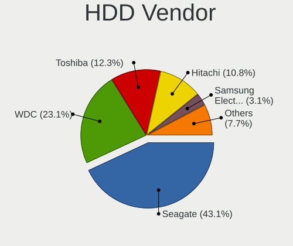

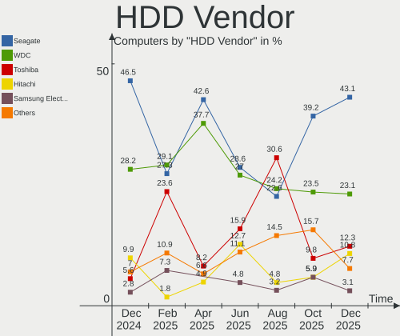

| Vendor              | Computers | Drives | Percent |
|---------------------|-----------|--------|---------|
| Seagate             | 28        | 30     | 43.08%  |
| WDC                 | 15        | 19     | 23.08%  |
| Toshiba             | 8         | 9      | 12.31%  |
| Hitachi             | 7         | 9      | 10.77%  |
| Samsung Electronics | 2         | 2      | 3.08%   |
| HGST                | 2         | 2      | 3.08%   |
| Synology            | 1         | 1      | 1.54%   |
| Intenso             | 1         | 1      | 1.54%   |
| IB-AC703            | 1         | 1      | 1.54%   |

SSD Vendor
----------

Solid state drive vendors

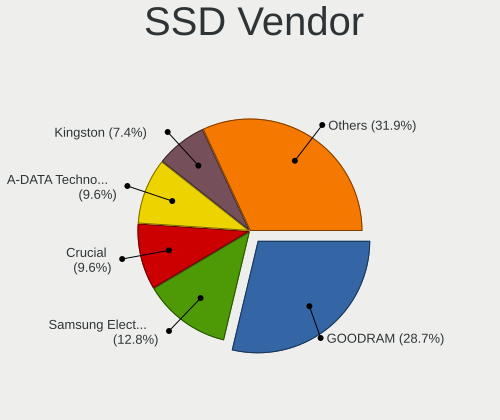

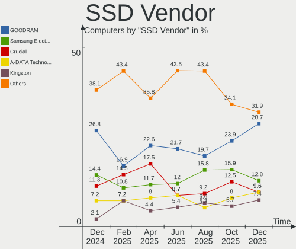

| Vendor              | Computers | Drives | Percent |
|---------------------|-----------|--------|---------|
| GOODRAM             | 27        | 30     | 28.72%  |
| Samsung Electronics | 12        | 12     | 12.77%  |
| Crucial             | 9         | 11     | 9.57%   |
| A-DATA Technology   | 9         | 10     | 9.57%   |
| Kingston            | 7         | 7      | 7.45%   |
| Micron Technology   | 6         | 7      | 6.38%   |
| SPCC                | 3         | 3      | 3.19%   |
| Toshiba             | 2         | 2      | 2.13%   |
| SanDisk             | 2         | 2      | 2.13%   |
| PNY                 | 2         | 2      | 2.13%   |
| Patriot             | 2         | 2      | 2.13%   |
| Lexar               | 2         | 2      | 2.13%   |
| KIOXIA-EXCERIA      | 2         | 2      | 2.13%   |
| WDC                 | 1         | 1      | 1.06%   |
| Verbatim            | 1         | 1      | 1.06%   |
| Transcend           | 1         | 1      | 1.06%   |
| T-FORCE             | 1         | 1      | 1.06%   |
| Plextor             | 1         | 1      | 1.06%   |
| Neo Forza           | 1         | 1      | 1.06%   |
| Intel               | 1         | 1      | 1.06%   |
| Gigabyte Technology | 1         | 1      | 1.06%   |
| China               | 1         | 1      | 1.06%   |

Drive Kind
----------

HDD or SSD

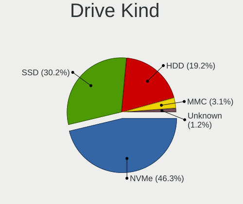

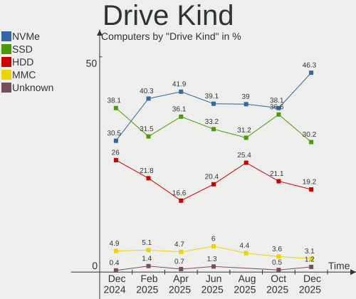

| Kind    | Computers | Drives | Percent |
|---------|-----------|--------|---------|
| NVMe    | 118       | 158    | 46.27%  |
| SSD     | 77        | 101    | 30.2%   |
| HDD     | 49        | 74     | 19.22%  |
| MMC     | 8         | 9      | 3.14%   |
| Unknown | 3         | 3      | 1.18%   |

Drive Connector
---------------

SATA, SAS, NVMe, etc.

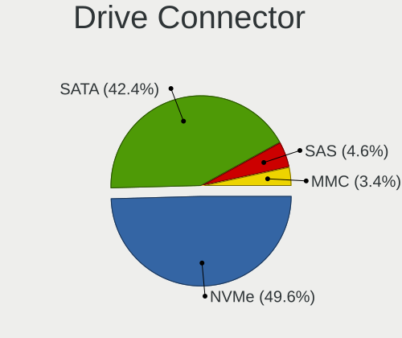

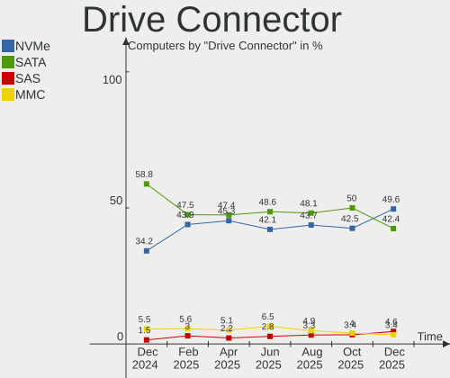

| Type | Computers | Drives | Percent |
|------|-----------|--------|---------|
| NVMe | 118       | 158    | 49.58%  |
| SATA | 101       | 167    | 42.44%  |
| SAS  | 11        | 11     | 4.62%   |
| MMC  | 8         | 9      | 3.36%   |

Drive Size
----------

Size of hard drive

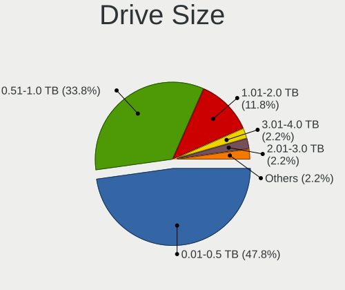

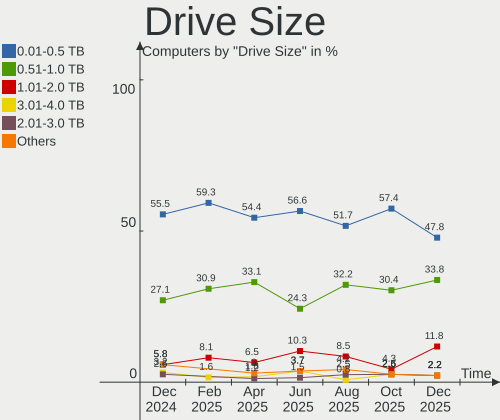

| Size in TB | Computers | Drives | Percent |
|------------|-----------|--------|---------|
| 0.01-0.5   | 65        | 84     | 47.79%  |
| 0.51-1.0   | 46        | 57     | 33.82%  |
| 1.01-2.0   | 16        | 16     | 11.76%  |
| 3.01-4.0   | 3         | 8      | 2.21%   |
| 2.01-3.0   | 3         | 6      | 2.21%   |
| 4.01-10.0  | 2         | 2      | 1.47%   |
| 10.01-20.0 | 1         | 2      | 0.74%   |

Space Total
-----------

Amount of disk space available on the file system

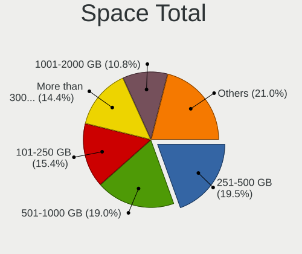

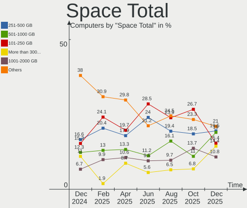

| Size in GB     | Computers | Percent |
|----------------|-----------|---------|
| 251-500        | 38        | 19.49%  |
| 501-1000       | 37        | 18.97%  |
| 101-250        | 30        | 15.38%  |
| More than 3000 | 28        | 14.36%  |
| 1001-2000      | 21        | 10.77%  |
| 1-20           | 16        | 8.21%   |
| Unknown        | 13        | 6.67%   |
| 2001-3000      | 8         | 4.1%    |
| 51-100         | 3         | 1.54%   |
| 21-50          | 1         | 0.51%   |

Space Used
----------

Amount of used disk space

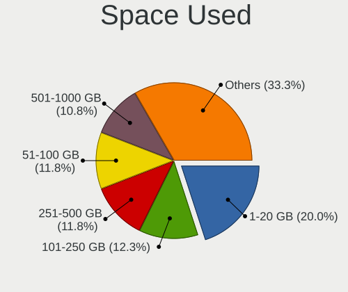

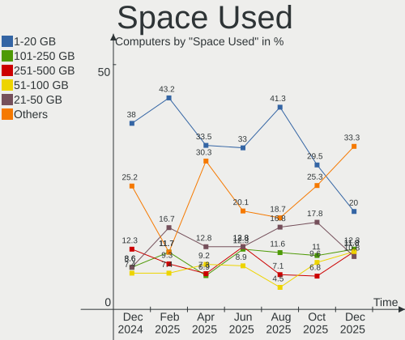

| Used GB        | Computers | Percent |
|----------------|-----------|---------|
| 1-20           | 39        | 20%     |
| 101-250        | 24        | 12.31%  |
| 251-500        | 23        | 11.79%  |
| 51-100         | 23        | 11.79%  |
| 21-50          | 21        | 10.77%  |
| 501-1000       | 21        | 10.77%  |
| 1001-2000      | 15        | 7.69%   |
| Unknown        | 13        | 6.67%   |
| More than 3000 | 7         | 3.59%   |
| 2001-3000      | 6         | 3.08%   |
| 0              | 3         | 1.54%   |

Malfunc. Drives
---------------

Drive models with a malfunction

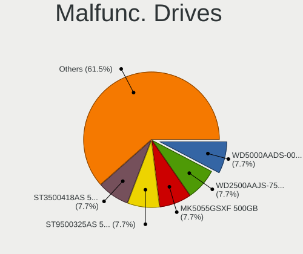

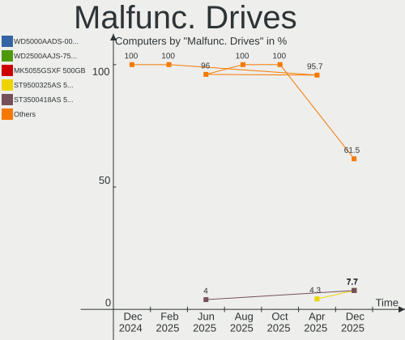

| Model                                                         | Computers | Drives | Percent |
|---------------------------------------------------------------|-----------|--------|---------|
| WDC WD5000AADS-00S9B0 500GB                                   | 1         | 1      | 7.69%   |
| WDC WD2500AAJS-75M0A0 249GB                                   | 1         | 1      | 7.69%   |
| Toshiba MK5055GSXF 500GB                                      | 1         | 1      | 7.69%   |
| Seagate ST9500325AS 500GB                                     | 1         | 1      | 7.69%   |
| Seagate ST3500418AS 500GB                                     | 1         | 1      | 7.69%   |
| Seagate ST2000DM008-2FR102 2TB                                | 1         | 1      | 7.69%   |
| Sandisk WD_BLACK SN770 2TB                                    | 1         | 1      | 7.69%   |
| Samsung Electronics NVMe SSD Controller 980 (DRAM-less) 256GB | 1         | 1      | 7.69%   |
| Neo Forza NFS011SA356-6007200 256GB SSD                       | 1         | 1      | 7.69%   |
| Micron Technology MTFDDAK256MAM-1K12 256GB SSD                | 1         | 1      | 7.69%   |
| Micron Technology MTFDDAK256MAM-1K1 256GB SSD                 | 1         | 1      | 7.69%   |
| Intel SSDSC2KW240H6 240GB                                     | 1         | 1      | 7.69%   |
| Hitachi HTS547575A9E384 752GB                                 | 1         | 1      | 7.69%   |

Malfunc. Drive Vendor
---------------------

Vendors of faulty drives

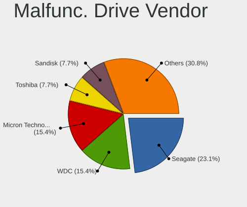

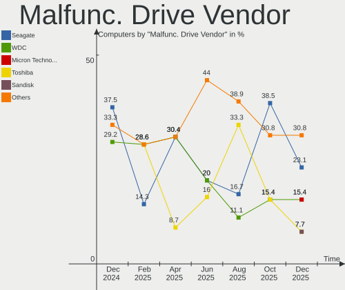

| Vendor              | Computers | Drives | Percent |
|---------------------|-----------|--------|---------|
| Seagate             | 3         | 3      | 23.08%  |
| WDC                 | 2         | 2      | 15.38%  |
| Micron Technology   | 2         | 2      | 15.38%  |
| Toshiba             | 1         | 1      | 7.69%   |
| Sandisk             | 1         | 1      | 7.69%   |
| Samsung Electronics | 1         | 1      | 7.69%   |
| Neo Forza           | 1         | 1      | 7.69%   |
| Intel               | 1         | 1      | 7.69%   |
| Hitachi             | 1         | 1      | 7.69%   |

Malfunc. HDD Vendor
-------------------

Vendors of faulty HDD drives

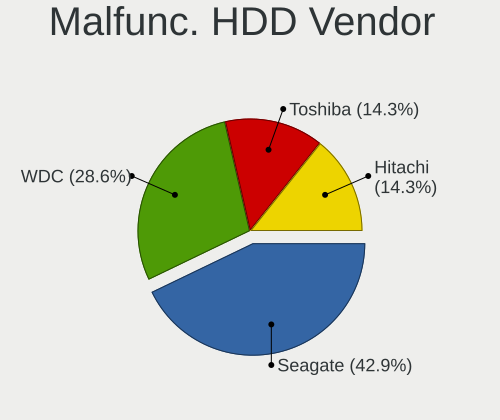

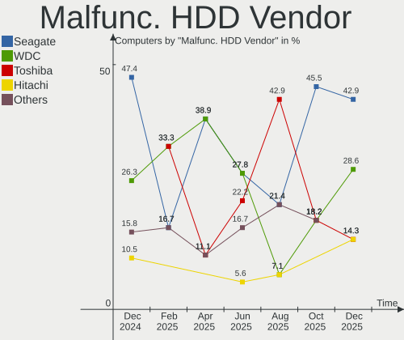

| Vendor  | Computers | Drives | Percent |
|---------|-----------|--------|---------|
| Seagate | 3         | 3      | 42.86%  |
| WDC     | 2         | 2      | 28.57%  |
| Toshiba | 1         | 1      | 14.29%  |
| Hitachi | 1         | 1      | 14.29%  |

Malfunc. Drive Kind
-------------------

Kinds of faulty drives

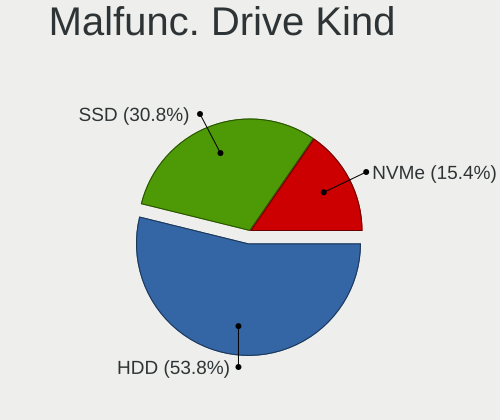

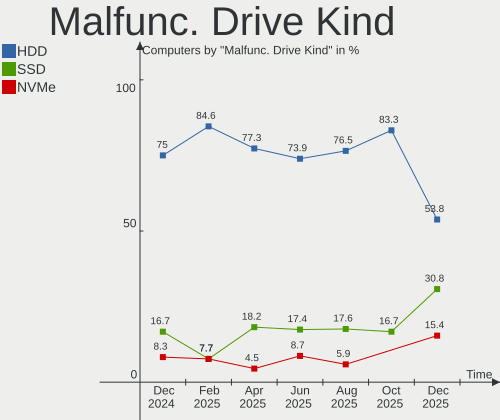

| Kind | Computers | Drives | Percent |
|------|-----------|--------|---------|
| HDD  | 7         | 7      | 53.85%  |
| SSD  | 4         | 4      | 30.77%  |
| NVMe | 2         | 2      | 15.38%  |

Failed Drives
-------------

Failed drive models

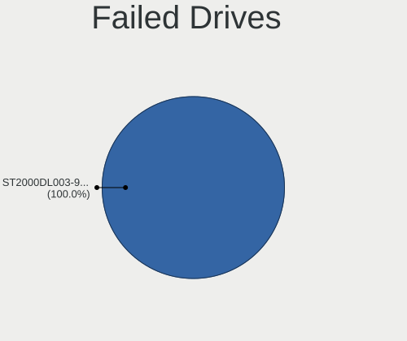

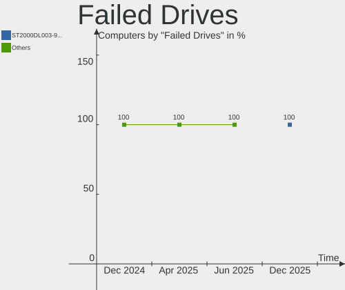

| Model                          | Computers | Drives | Percent |
|--------------------------------|-----------|--------|---------|
| Seagate ST2000DL003-9VT166 2TB | 1         | 1      | 100%    |

Failed Drive Vendor
-------------------

Failed drive vendors

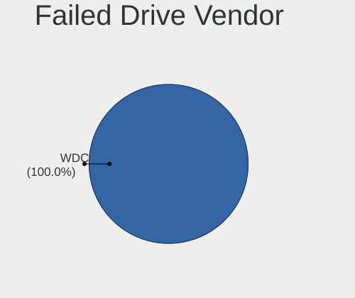

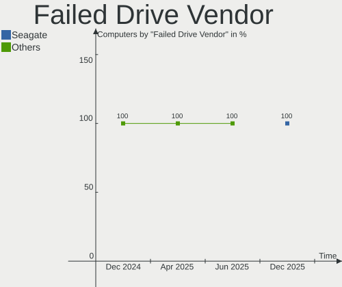

| Vendor  | Computers | Drives | Percent |
|---------|-----------|--------|---------|
| Seagate | 1         | 1      | 100%    |

Drive Status
------------

Number of failed and malfunc. drives

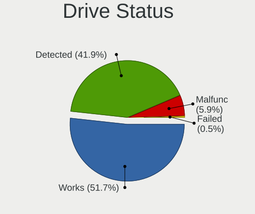

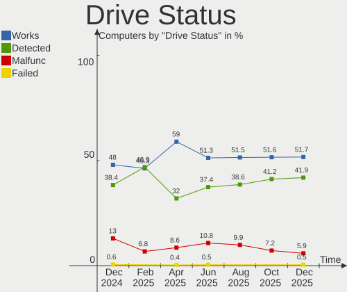

| Status   | Computers | Drives | Percent |
|----------|-----------|--------|---------|
| Works    | 105       | 171    | 51.72%  |
| Detected | 85        | 160    | 41.87%  |
| Malfunc  | 12        | 13     | 5.91%   |
| Failed   | 1         | 1      | 0.49%   |

Storage controller
------------------

Storage Vendor
--------------

Storage controller vendors

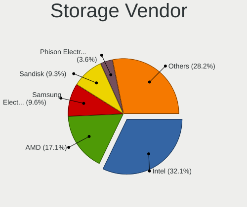

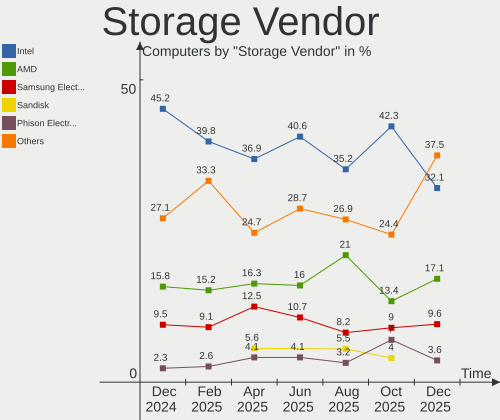

| Vendor                                  | Computers | Percent |
|-----------------------------------------|-----------|---------|
| Intel                                   | 90        | 32.14%  |
| AMD                                     | 48        | 17.14%  |
| Samsung Electronics                     | 27        | 9.64%   |
| Sandisk                                 | 26        | 9.29%   |
| Phison Electronics                      | 10        | 3.57%   |
| ADATA Technology                        | 10        | 3.57%   |
| Shenzhen Longsys Electronics            | 8         | 2.86%   |
| Kingston Technology Company             | 8         | 2.86%   |
| SK hynix                                | 7         | 2.5%    |
| Micron Technology                       | 7         | 2.5%    |
| MAXIO Technology (Hangzhou)             | 7         | 2.5%    |
| Micron/Crucial Technology               | 6         | 2.14%   |
| KIOXIA                                  | 5         | 1.79%   |
| ASMedia Technology                      | 4         | 1.43%   |
| Realtek Semiconductor                   | 3         | 1.07%   |
| JMicron Technology                      | 2         | 0.71%   |
| Yangtze Memory Technologies             | 1         | 0.36%   |
| Toshiba America Info Systems            | 1         | 0.36%   |
| Solid State Storage Technology          | 1         | 0.36%   |
| Silicon Motion                          | 1         | 0.36%   |
| Shenzhen Wodposit Electronics           | 1         | 0.36%   |
| Shenzhen Unionmemory Information System | 1         | 0.36%   |
| Seagate Technology                      | 1         | 0.36%   |
| Nvidia                                  | 1         | 0.36%   |
| Marvell Technology Group                | 1         | 0.36%   |
| LSI Logic / Symbios Logic               | 1         | 0.36%   |
| Lite-On Technology                      | 1         | 0.36%   |
| INNOGRIT                                | 1         | 0.36%   |

Storage Model
-------------

Storage controller models

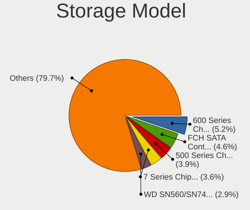

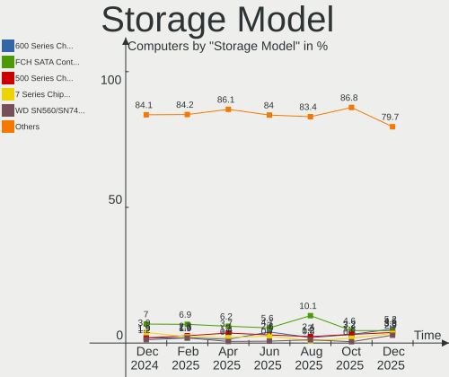

| Model                                                                                                              | Computers | Percent |
|--------------------------------------------------------------------------------------------------------------------|-----------|---------|
| AMD 600 Series Chipset SATA Controller                                                                             | 16        | 5.23%   |
| AMD FCH SATA Controller [AHCI mode]                                                                                | 14        | 4.58%   |
| AMD 500 Series Chipset SATA Controller                                                                             | 12        | 3.92%   |
| Intel 7 Series Chipset Family 6-port SATA Controller [AHCI mode]                                                   | 11        | 3.59%   |
| SanDisk WD SN560/SN740/SN770/SN5000 NVMe SSD                                                                       | 9         | 2.94%   |
| Intel 82801 Mobile SATA Controller [RAID mode]                                                                     | 7         | 2.29%   |
| AMD 400 Series Chipset SATA Controller                                                                             | 7         | 2.29%   |
| Samsung NVMe SSD Controller PM9C1a (DRAM-less)                                                                     | 6         | 1.96%   |
| Samsung NVMe SSD Controller 980 (DRAM-less)                                                                        | 6         | 1.96%   |
| MAXIO (Hangzhou) NVMe SSD Controller MAP1202 (DRAM-less)                                                           | 5         | 1.63%   |
| ADATA XPG SX8200 Pro PCIe Gen3x4 M.2 2280 Solid State Drive                                                        | 5         | 1.63%   |
| Samsung NVMe SSD Controller SM981/PM981/PM983                                                                      | 4         | 1.31%   |
| Samsung NVMe SSD Controller S4LV008[Pascal]                                                                        | 4         | 1.31%   |
| Samsung NVMe SSD 9100 PRO [PM9E1]                                                                                  | 4         | 1.31%   |
| Kingston Company KC3000/FURY Renegade NVMe SSD [E18]                                                               | 4         | 1.31%   |
| Intel SATA Controller [RAID mode]                                                                                  | 4         | 1.31%   |
| Intel Comet Lake SATA AHCI Controller                                                                              | 4         | 1.31%   |
| Intel 8 Series/C220 Series Chipset Family 6-port SATA Controller 1 [AHCI mode]                                     | 4         | 1.31%   |
| Intel 8 Series SATA Controller 1 [AHCI mode]                                                                       | 4         | 1.31%   |
| Intel 6 Series/C200 Series Chipset Family 6 port Mobile SATA AHCI Controller                                       | 4         | 1.31%   |
| Intel 5 Series/3400 Series Chipset 4 port SATA AHCI Controller                                                     | 4         | 1.31%   |
| Intel 200 Series PCH SATA controller [AHCI mode]                                                                   | 4         | 1.31%   |
| SK hynix PVC10 NVMe Solid State Drive (DRAM-less)                                                                  | 3         | 0.98%   |
| Shenzhen Longsys Lexar NM790 / Patriot Viper VP4300 Lite NVMe SSD (DRAM-less)                                      | 3         | 0.98%   |
| Shenzhen Longsys Lexar NM610 PRO NVME SSD (DRAM-less)                                                              | 3         | 0.98%   |
| Samsung NVMe SSD Controller PM9A1/PM9A3/980PRO                                                                     | 3         | 0.98%   |
| Realtek RTS5765DL NVMe SSD Controller (DRAM-less)                                                                  | 3         | 0.98%   |
| Phison PS5027-E27T PCIe4 NVMe Controller (DRAM-less)                                                               | 3         | 0.98%   |
| Phison PS5021-E21 PCIe4 NVMe Controller (DRAM-less)                                                                | 3         | 0.98%   |
| Phison E12 NVMe Controller                                                                                         | 3         | 0.98%   |
| Intel Sunrise Point-LP SATA Controller [AHCI mode]                                                                 | 3         | 0.98%   |
| Intel Alder Lake-P SATA AHCI Controller                                                                            | 3         | 0.98%   |
| Intel 6 Series/C200 Series Chipset Family 6 port Desktop SATA AHCI Controller                                      | 3         | 0.98%   |
| ASMedia ASM1061/ASM1062 Serial ATA Controller                                                                      | 3         | 0.98%   |
| SK hynix BC511 NVMe SSD                                                                                            | 2         | 0.65%   |
| Shenzhen Longsys FORESEE XP1000 / Lexar Professional CFexpress Type B Gold series, NM620 PCIe NVME SSD (DRAM-less) | 2         | 0.65%   |
| Sandisk WD_BLACK SN7100/WD PC SN7100S M.2 2280 NVMe SSD (DRAM-less)                                                | 2         | 0.65%   |
| Sandisk WD PC SN5000S M.2 2280 NVMe SSD (DRAM-less)                                                                | 2         | 0.65%   |
| Sandisk WD Black SN850X NVMe SSD                                                                                   | 2         | 0.65%   |
| SanDisk Extreme Pro / WD Black SN750 / PC SN730 / Red SN700 NVMe SSD                                               | 2         | 0.65%   |

Storage Kind
------------

Kind of storage controller (IDE, SATA, NVMe, SAS, ...)

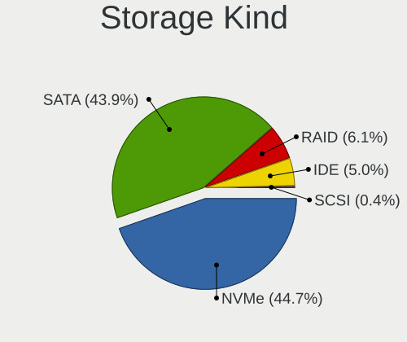

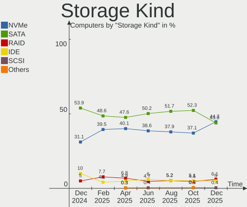

| Kind | Computers | Percent |
|------|-----------|---------|
| NVMe | 117       | 44.66%  |
| SATA | 115       | 43.89%  |
| RAID | 16        | 6.11%   |
| IDE  | 13        | 4.96%   |
| SCSI | 1         | 0.38%   |

Processor
---------

CPU Vendor
----------

Processor vendors

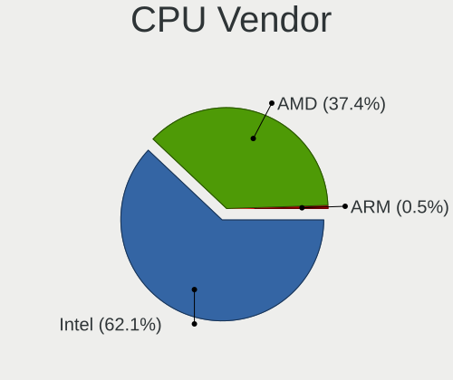

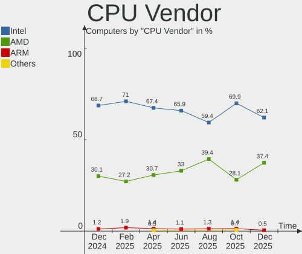

| Vendor | Computers | Percent |
|--------|-----------|---------|
| Intel  | 121       | 62.05%  |
| AMD    | 73        | 37.44%  |
| ARM    | 1         | 0.51%   |

CPU Model
---------

Processor models

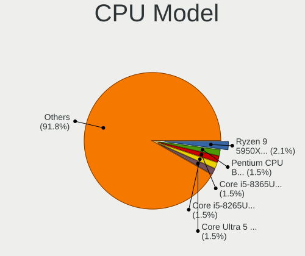

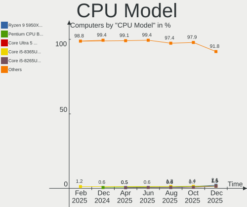

| Model                                   | Computers | Percent |
|-----------------------------------------|-----------|---------|
| AMD Ryzen 9 5950X 16-Core Processor     | 4         | 2.05%   |
| Intel Pentium CPU B960 @ 2.20GHz        | 3         | 1.54%   |
| Intel Core Ultra 5 125H                 | 3         | 1.54%   |
| Intel Core i5-8365U CPU @ 1.60GHz       | 3         | 1.54%   |
| Intel Core i5-8265U CPU @ 1.60GHz       | 3         | 1.54%   |
| AMD Ryzen 7 260 w/ Radeon 780M Graphics | 3         | 1.54%   |
| AMD Ryzen 5 5600X 6-Core Processor      | 3         | 1.54%   |
| AMD Ryzen 5 4600H with Radeon Graphics  | 3         | 1.54%   |
| Intel Core Ultra 7 155H                 | 2         | 1.03%   |
| Intel Core i7-8550U CPU @ 1.80GHz       | 2         | 1.03%   |
| Intel Core i5-8400 CPU @ 2.80GHz        | 2         | 1.03%   |
| Intel Core i5-8250U CPU @ 1.60GHz       | 2         | 1.03%   |
| Intel Core i5-7200U CPU @ 2.50GHz       | 2         | 1.03%   |
| Intel Core i5-1035G1 CPU @ 1.00GHz      | 2         | 1.03%   |
| Intel Core i3-2120 CPU @ 3.30GHz        | 2         | 1.03%   |
| Intel Core i3 CPU M 380 @ 2.53GHz       | 2         | 1.03%   |
| Intel Core 2 Duo CPU P8700 @ 2.53GHz    | 2         | 1.03%   |
| Intel 12th Gen Core i5-12450HX          | 2         | 1.03%   |
| AMD Ryzen Z1 Extreme                    | 2         | 1.03%   |
| AMD Ryzen AI 9 HX 370 w/ Radeon 890M    | 2         | 1.03%   |
| AMD Ryzen AI 7 350 w/ Radeon 860M       | 2         | 1.03%   |
| AMD Ryzen 9 9950X3D 16-Core Processor   | 2         | 1.03%   |
| AMD Ryzen 9 5900X 12-Core Processor     | 2         | 1.03%   |
| AMD Ryzen 7 9700X 8-Core Processor      | 2         | 1.03%   |
| AMD Ryzen 7 7700 8-Core Processor       | 2         | 1.03%   |
| AMD Ryzen 7 5800X3D 8-Core Processor    | 2         | 1.03%   |
| AMD Ryzen 7 5700X 8-Core Processor      | 2         | 1.03%   |
| AMD Ryzen 7 5700G with Radeon Graphics  | 2         | 1.03%   |
| AMD Ryzen 7 3800X 8-Core Processor      | 2         | 1.03%   |
| AMD Ryzen 5 5500                        | 2         | 1.03%   |
| Intel Xeon W-2125 CPU @ 4.00GHz         | 1         | 0.51%   |
| Intel Xeon CPU X5675 @ 3.07GHz          | 1         | 0.51%   |
| Intel Xeon CPU E5-2695 v3 @ 2.30GHz     | 1         | 0.51%   |
| Intel Xeon CPU E3-1505M v5 @ 2.80GHz    | 1         | 0.51%   |
| Intel Pentium Dual CPU T2310 @ 1.46GHz  | 1         | 0.51%   |
| Intel Pentium CPU N4200 @ 1.10GHz       | 1         | 0.51%   |
| Intel Pentium CPU N3520 @ 2.16GHz       | 1         | 0.51%   |
| Intel Pentium CPU 2020M @ 2.40GHz       | 1         | 0.51%   |
| Intel N150                              | 1         | 0.51%   |
| Intel N100                              | 1         | 0.51%   |

CPU Model Family
----------------

Processor model prefix

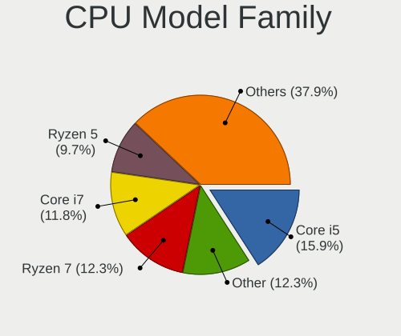

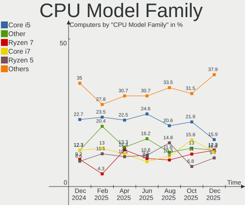

| Model              | Computers | Percent |
|--------------------|-----------|---------|
| Intel Core i5      | 31        | 15.9%   |
| Other              | 24        | 12.31%  |
| AMD Ryzen 7        | 24        | 12.31%  |
| Intel Core i7      | 23        | 11.79%  |
| AMD Ryzen 5        | 19        | 9.74%   |
| Intel Core i3      | 16        | 8.21%   |
| AMD Ryzen 9        | 13        | 6.67%   |
| Intel Core         | 11        | 5.64%   |
| Intel Pentium      | 6         | 3.08%   |
| Intel Core 2 Duo   | 5         | 2.56%   |
| Intel Xeon         | 4         | 2.05%   |
| Intel Celeron      | 4         | 2.05%   |
| Intel Core i9      | 2         | 1.03%   |
| AMD Ryzen 5 PRO    | 2         | 1.03%   |
| Intel Pentium Dual | 1         | 0.51%   |
| Intel Core 2 Quad  | 1         | 0.51%   |
| Intel Core 2       | 1         | 0.51%   |
| ARM BCM            | 1         | 0.51%   |
| AMD Ryzen 3        | 1         | 0.51%   |
| AMD Phenom II X4   | 1         | 0.51%   |
| AMD Phenom II X2   | 1         | 0.51%   |
| AMD Phenom         | 1         | 0.51%   |
| AMD Athlon II X4   | 1         | 0.51%   |
| AMD A6             | 1         | 0.51%   |
| AMD A4             | 1         | 0.51%   |

CPU Cores
---------

Number of processor cores

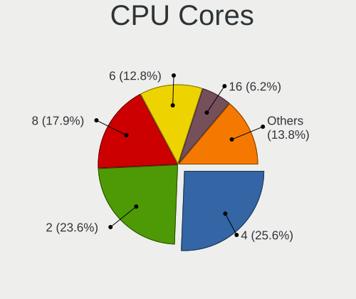

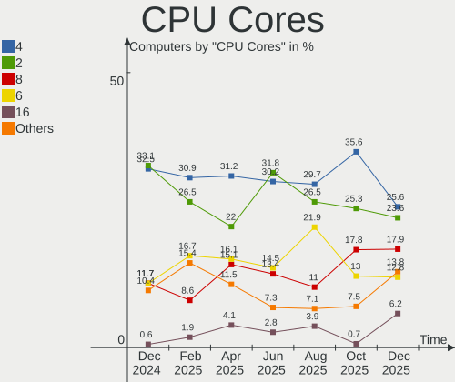

| Number | Computers | Percent |
|--------|-----------|---------|
| 4      | 50        | 25.64%  |
| 2      | 46        | 23.59%  |
| 8      | 35        | 17.95%  |
| 6      | 25        | 12.82%  |
| 16     | 12        | 6.15%   |
| 12     | 12        | 6.15%   |
| 14     | 5         | 2.56%   |
| 10     | 5         | 2.56%   |
| 24     | 2         | 1.03%   |
| 20     | 1         | 0.51%   |
| 3      | 1         | 0.51%   |
| 1      | 1         | 0.51%   |

CPU Sockets
-----------

Number of sockets

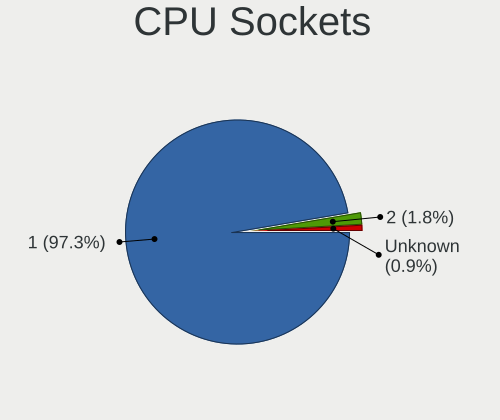

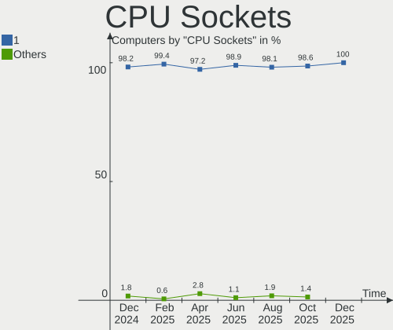

| Number | Computers | Percent |
|--------|-----------|---------|
| 1      | 195       | 100%    |

CPU Threads
-----------

Threads per core (Hyper-Threading)

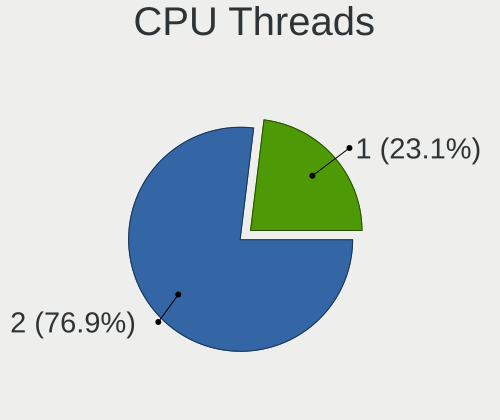

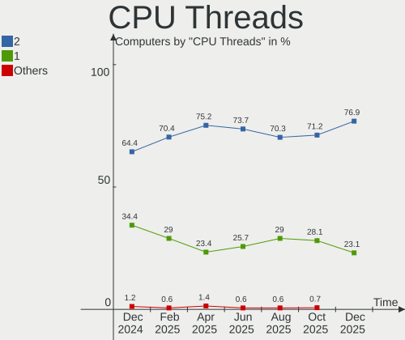

| Number | Computers | Percent |
|--------|-----------|---------|
| 2      | 150       | 76.92%  |
| 1      | 45        | 23.08%  |

CPU Op-Modes
------------

CPU Operation Modes (32-bit, 64-bit)

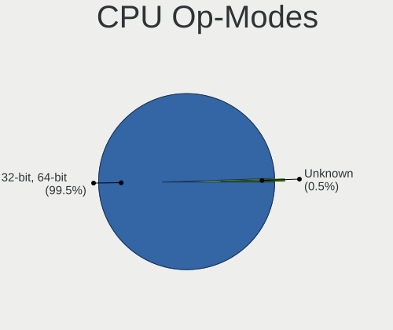

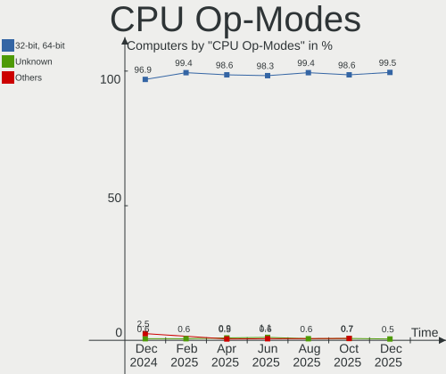

| Op mode        | Computers | Percent |
|----------------|-----------|---------|
| 32-bit, 64-bit | 194       | 99.49%  |
| Unknown        | 1         | 0.51%   |

CPU Microcode
-------------

Microcode number

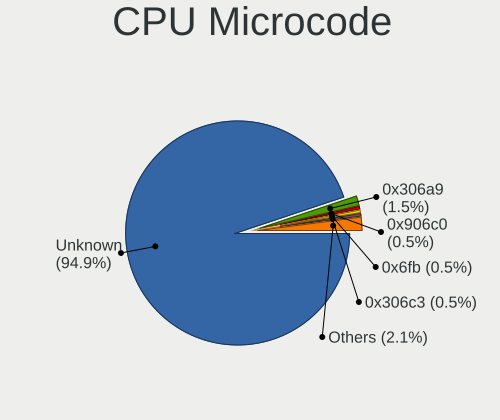

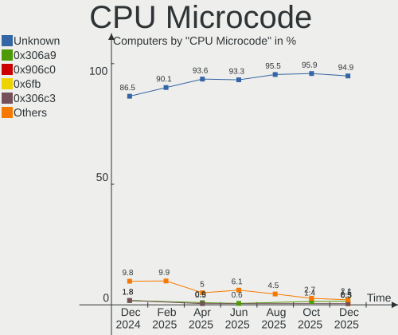

| Number     | Computers | Percent |
|------------|-----------|---------|
| Unknown    | 185       | 94.87%  |
| 0x306a9    | 3         | 1.54%   |
| 0x906c0    | 1         | 0.51%   |
| 0x6fb      | 1         | 0.51%   |
| 0x306c3    | 1         | 0.51%   |
| 0x20655    | 1         | 0.51%   |
| 0x1067a    | 1         | 0.51%   |
| 0x0b600037 | 1         | 0.51%   |
| 0x0b204037 | 1         | 0.51%   |

CPU Microarch
-------------

Microarchitecture

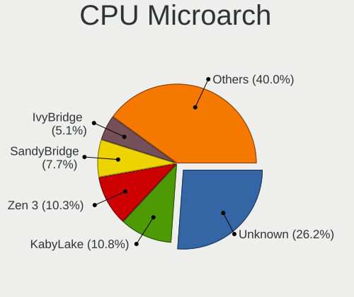

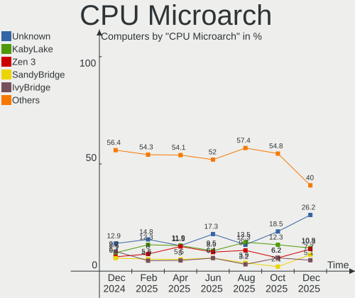

| Name              | Computers | Percent |
|-------------------|-----------|---------|
| Unknown           | 51        | 26.15%  |
| KabyLake          | 21        | 10.77%  |
| Zen 3             | 20        | 10.26%  |
| SandyBridge       | 15        | 7.69%   |
| IvyBridge         | 10        | 5.13%   |
| Haswell           | 9         | 4.62%   |
| Zen 2             | 7         | 3.59%   |
| Westmere          | 7         | 3.59%   |
| Skylake           | 6         | 3.08%   |
| Alderlake Hybrid  | 6         | 3.08%   |
| Penryn            | 5         | 2.56%   |
| Meteorlake Hybrid | 4         | 2.05%   |
| K10               | 4         | 2.05%   |
| CometLake         | 4         | 2.05%   |
| Zen+              | 3         | 1.54%   |
| Silvermont        | 3         | 1.54%   |
| Lunarlake Hybrid  | 3         | 1.54%   |
| IceLake           | 3         | 1.54%   |
| Core              | 3         | 1.54%   |
| TigerLake         | 2         | 1.03%   |
| Piledriver        | 2         | 1.03%   |
| Nehalem           | 2         | 1.03%   |
| Zen               | 1         | 0.51%   |
| Tremont           | 1         | 0.51%   |
| Goldmont plus     | 1         | 0.51%   |
| Goldmont          | 1         | 0.51%   |
| Broadwell         | 1         | 0.51%   |

Graphics
--------

GPU Vendor
----------

Vendors of graphics cards

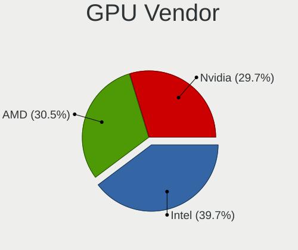

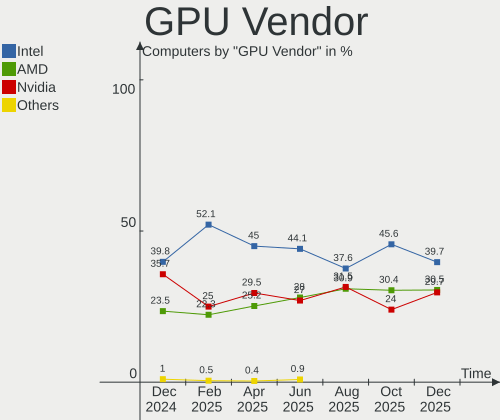

| Vendor | Computers | Percent |
|--------|-----------|---------|
| Intel  | 95        | 39.75%  |
| AMD    | 73        | 30.54%  |
| Nvidia | 71        | 29.71%  |

GPU Model
---------

Graphics card models

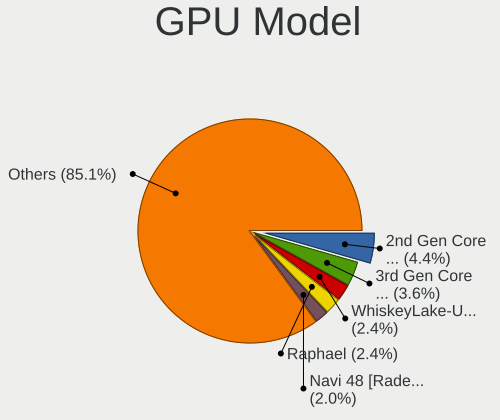

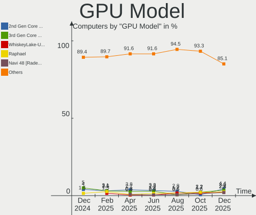

| Model                                                                     | Computers | Percent |
|---------------------------------------------------------------------------|-----------|---------|
| Intel 2nd Generation Core Processor Family Integrated Graphics Controller | 11        | 4.44%   |
| Intel 3rd Gen Core processor Graphics Controller                          | 9         | 3.63%   |
| Intel WhiskeyLake-U GT2 [UHD Graphics 620]                                | 6         | 2.42%   |
| AMD Raphael                                                               | 6         | 2.42%   |
| AMD Navi 48 [Radeon RX 9070/9070 XT/9070 GRE]                             | 5         | 2.02%   |
| AMD Navi 23 [Radeon RX 6600/6600 XT/6600M]                                | 5         | 2.02%   |
| AMD Granite Ridge [Radeon Graphics]                                       | 5         | 2.02%   |
| Nvidia GF117M [GeForce 610M/710M/810M/820M / GT 620M/625M/630M/720M]      | 4         | 1.61%   |
| Nvidia GB206M [GeForce RTX 5060 Max-Q / Mobile]                           | 4         | 1.61%   |
| Intel Meteor Lake-P [Intel Arc Graphics]                                  | 4         | 1.61%   |
| Intel Kaby Lake-R GT2 [UHD Graphics 620]                                  | 4         | 1.61%   |
| Intel Haswell-ULT Integrated Graphics Controller                          | 4         | 1.61%   |
| AMD Renoir [Radeon Vega Series / Radeon Vega Mobile Series]               | 4         | 1.61%   |
| AMD Phoenix1                                                              | 4         | 1.61%   |
| AMD HawkPoint1                                                            | 4         | 1.61%   |
| Nvidia AD107M [GeForce RTX 4050 Max-Q / Mobile]                           | 3         | 1.21%   |
| Intel Meteor Lake-P [Intel Graphics]                                      | 3         | 1.21%   |
| Intel Kaby Lake-U GT2 [HD Graphics 620]                                   | 3         | 1.21%   |
| Intel Iris Plus Graphics G1 (Ice Lake)                                    | 3         | 1.21%   |
| Intel Atom Processor Z36xxx/Z37xxx Series Graphics & Display              | 3         | 1.21%   |
| AMD Strix [Radeon 880M / 890M]                                            | 3         | 1.21%   |
| AMD Navi 22 [Radeon RX 6700/6700 XT/6750 XT / 6800M/6850M XT]             | 3         | 1.21%   |
| AMD Cezanne [Radeon Vega Series / Radeon Vega Mobile Series]              | 3         | 1.21%   |
| Nvidia GP108 [GeForce GT 1030]                                            | 2         | 0.81%   |
| Nvidia GM107GLM [Quadro M1000M]                                           | 2         | 0.81%   |
| Nvidia GA106 [GeForce RTX 3060 Lite Hash Rate]                            | 2         | 0.81%   |
| Nvidia GA102 [GeForce RTX 3090]                                           | 2         | 0.81%   |
| Nvidia AD107M [GeForce RTX 4060 Max-Q / Mobile]                           | 2         | 0.81%   |
| Nvidia AD106 [GeForce RTX 4060 Ti 16GB]                                   | 2         | 0.81%   |
| Intel TigerLake-LP GT2 [Iris Xe Graphics]                                 | 2         | 0.81%   |
| Intel Raptor Lake-S UHD Graphics                                          | 2         | 0.81%   |
| Intel Raptor Lake-P [UHD Graphics]                                        | 2         | 0.81%   |
| Intel Raptor Lake-P [Iris Xe Graphics]                                    | 2         | 0.81%   |
| Intel Mobile 4 Series Chipset Integrated Graphics Controller              | 2         | 0.81%   |
| Intel Lunar Lake [Intel Arc Graphics 130V / 140V]                         | 2         | 0.81%   |
| Intel Core Processor Integrated Graphics Controller                       | 2         | 0.81%   |
| Intel CometLake-U GT2 [UHD Graphics]                                      | 2         | 0.81%   |
| Intel Battlemage G21 [Arc B580]                                           | 2         | 0.81%   |
| Intel Alder Lake-UP3 GT2 [Iris Xe Graphics]                               | 2         | 0.81%   |
| Intel Alder Lake-S [UHD Graphics]                                         | 2         | 0.81%   |

GPU Combo
---------

Combinations of graphics cards

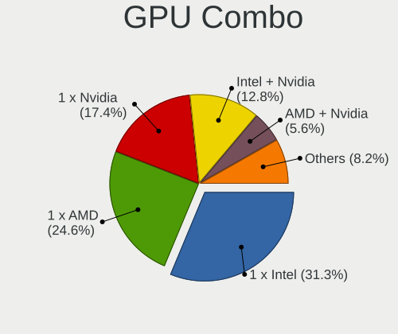

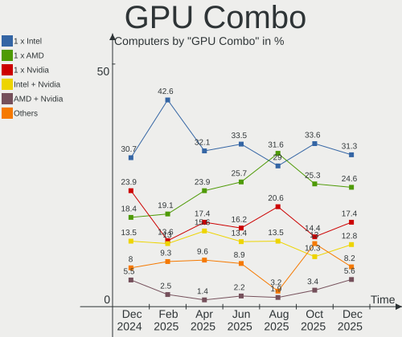

| Name           | Computers | Percent |
|----------------|-----------|---------|
| 1 x Intel      | 61        | 31.28%  |
| 1 x AMD        | 48        | 24.62%  |
| 1 x Nvidia     | 34        | 17.44%  |
| Intel + Nvidia | 25        | 12.82%  |
| AMD + Nvidia   | 11        | 5.64%   |
| 2 x AMD        | 8         | 4.1%    |
| Intel + AMD    | 5         | 2.56%   |
| 2 x Intel      | 2         | 1.03%   |
| Other          | 1         | 0.51%   |

GPU Driver
----------

Free vs proprietary

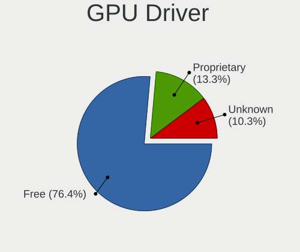

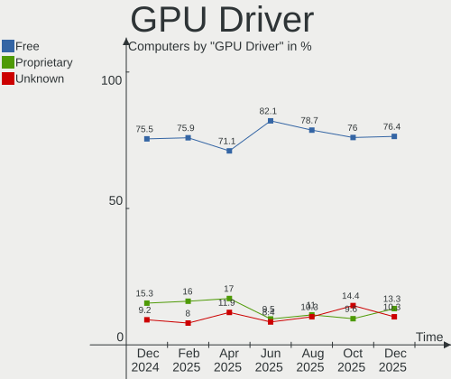

| Driver      | Computers | Percent |
|-------------|-----------|---------|
| Free        | 149       | 76.41%  |
| Proprietary | 26        | 13.33%  |
| Unknown     | 20        | 10.26%  |

GPU Memory
----------

Total video memory

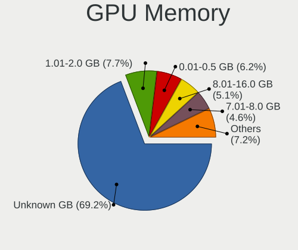

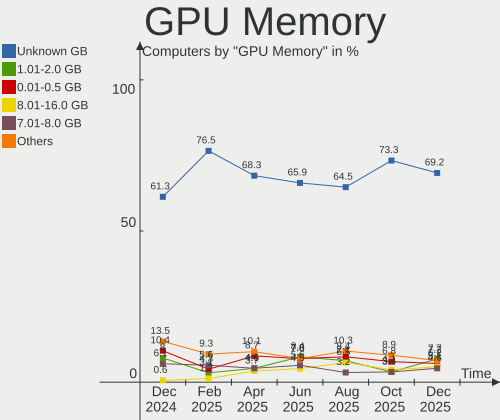

| Size in GB | Computers | Percent |
|------------|-----------|---------|
| Unknown    | 135       | 69.23%  |
| 1.01-2.0   | 15        | 7.69%   |
| 0.01-0.5   | 12        | 6.15%   |
| 8.01-16.0  | 10        | 5.13%   |
| 7.01-8.0   | 9         | 4.62%   |
| 3.01-4.0   | 6         | 3.08%   |
| 0.51-1.0   | 5         | 2.56%   |
| 16.01-24.0 | 2         | 1.03%   |
| 2.01-3.0   | 1         | 0.51%   |

Monitor
-------

Monitor Vendor
--------------

Monitor vendors

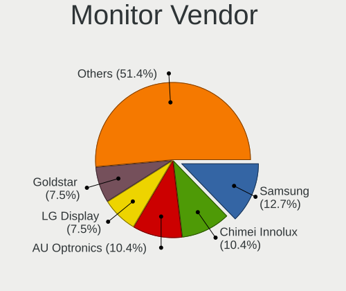

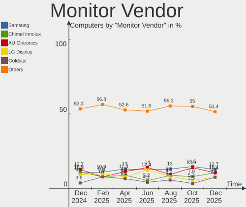

| Vendor                  | Computers | Percent |
|-------------------------|-----------|---------|
| Samsung Electronics     | 27        | 12.74%  |
| Chimei Innolux          | 22        | 10.38%  |
| AU Optronics            | 22        | 10.38%  |
| LG Display              | 16        | 7.55%   |
| Goldstar                | 16        | 7.55%   |
| Dell                    | 13        | 6.13%   |
| BOE                     | 13        | 6.13%   |
| Lenovo                  | 6         | 2.83%   |
| MSI                     | 5         | 2.36%   |
| Iiyama                  | 5         | 2.36%   |
| ASUSTek Computer        | 5         | 2.36%   |
| Philips                 | 4         | 1.89%   |
| NEC Computers           | 4         | 1.89%   |
| Hewlett-Packard         | 4         | 1.89%   |
| Chi Mei Optoelectronics | 4         | 1.89%   |
| AOC                     | 4         | 1.89%   |
| Gigabyte Technology     | 3         | 1.42%   |
| EDO                     | 3         | 1.42%   |
| CSW                     | 3         | 1.42%   |
| Ancor Communications    | 3         | 1.42%   |
| Sony                    | 2         | 0.94%   |
| Sharp                   | 2         | 0.94%   |
| Eizo                    | 2         | 0.94%   |
| BenQ                    | 2         | 0.94%   |
| Apple                   | 2         | 0.94%   |
| Acer                    | 2         | 0.94%   |
| VXN                     | 1         | 0.47%   |
| Vestel Elektronik       | 1         | 0.47%   |
| Vestel                  | 1         | 0.47%   |
| Valve                   | 1         | 0.47%   |
| Unknown (XXX)           | 1         | 0.47%   |
| Unknown                 | 1         | 0.47%   |
| TMX                     | 1         | 0.47%   |
| TMA                     | 1         | 0.47%   |
| RTK                     | 1         | 0.47%   |
| PANDA                   | 1         | 0.47%   |
| Onkyo                   | 1         | 0.47%   |
| InfoVision              | 1         | 0.47%   |
| Idek Iiyama             | 1         | 0.47%   |
| Fujitsu Siemens         | 1         | 0.47%   |

Monitor Model
-------------

Monitor models

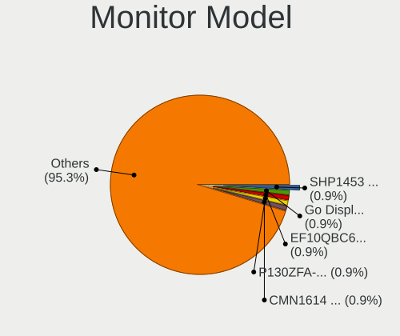

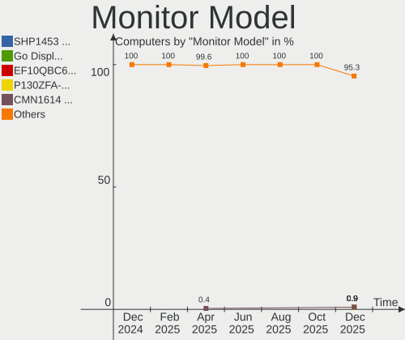

| Model                                                                    | Computers | Percent |
|--------------------------------------------------------------------------|-----------|---------|
| Sharp LCD Monitor SHP1453 1920x1080 346x194mm 15.6-inch                  | 2         | 0.93%   |
| Lenovo Go Display LEN0001 1600x2560 120x190mm 8.8-inch                   | 2         | 0.93%   |
| EDO EF10QBC64.C EDO4245                                                  | 2         | 0.93%   |
| Chimei Innolux P130ZFA-BA1 CMN8201 2160x1440 275x183mm 13.0-inch         | 2         | 0.93%   |
| Chimei Innolux LCD Monitor CMN1614 1920x1200 344x215mm 16.0-inch         | 2         | 0.93%   |
| Chimei Innolux LCD Monitor CMN1132 1366x768 256x144mm 11.6-inch          | 2         | 0.93%   |
| Chi Mei Optoelectronics LCD Monitor CMO15A7 1366x768 344x193mm 15.5-inch | 2         | 0.93%   |
| AU Optronics LCD Monitor AUO7EAD 1920x1080 344x193mm 15.5-inch           | 2         | 0.93%   |
| VXN VisN236HUZ15 VXN1421                                                 | 1         | 0.47%   |
| Vestel LCD Monitor 40FHD_LCD_TV 1920x1080                                | 1         | 0.47%   |
| Vestel Elektronik 40UHD_LCD_TV VES3700 3840x2160 880x500mm 39.8-inch     | 1         | 0.47%   |
| Valve ANX7530 U VLV3001 800x1280 100x150mm 7.1-inch                      | 1         | 0.47%   |
| Unknown LCD Monitor FFFF 2288x1287 2550x2550mm 142.0-inch                | 1         | 0.47%   |
| Unknown (XXX) Beyond TV XXX2851 3840x2160 1209x680mm 54.6-inch           | 1         | 0.47%   |
| TMX LCD Monitor TMX1350 2520x1680 284x189mm 13.4-inch                    | 1         | 0.47%   |
| TMA TL160ADMP20 TMA2039 2560x1600 345x215mm 16.0-inch                    | 1         | 0.47%   |
| Sony TV SNY2C02 1920x1080 886x498mm 40.0-inch                            | 1         | 0.47%   |
| Sony Nvidia Defaul t Flat Panel SNY05FA 1366x768 309x174mm 14.0-inch     | 1         | 0.47%   |
| Samsung Electronics U28E590 SAM0C4D 3840x2160 607x345mm 27.5-inch        | 1         | 0.47%   |
| Samsung Electronics SyncMaster SAM059A 1920x1080 477x268mm 21.5-inch     | 1         | 0.47%   |
| Samsung Electronics SyncMaster SAM0598 1360x768 410x230mm 18.5-inch      | 1         | 0.47%   |
| Samsung Electronics SyncMaster SAM0587 1920x1200 518x324mm 24.1-inch     | 1         | 0.47%   |
| Samsung Electronics SyncMaster SAM016A 1280x1024 376x301mm 19.0-inch     | 1         | 0.47%   |
| Samsung Electronics SyncMaster SAM011E 1280x1024 338x270mm 17.0-inch     | 1         | 0.47%   |
| Samsung Electronics SA300/SA350 SAM0849 1920x1080 477x268mm 21.5-inch    | 1         | 0.47%   |
| Samsung Electronics S27C31x SAM7312 1920x1080 597x336mm 27.0-inch        | 1         | 0.47%   |
| Samsung Electronics S24D330 SAM0D92 1920x1080 531x299mm 24.0-inch        | 1         | 0.47%   |
| Samsung Electronics S22B300 SAM08C8 1920x1080 477x268mm 21.5-inch        | 1         | 0.47%   |
| Samsung Electronics S22B300 SAM08AC 1920x1080 477x268mm 21.5-inch        | 1         | 0.47%   |
| Samsung Electronics LCD Monitor SEC5441 1280x800 331x207mm 15.4-inch     | 1         | 0.47%   |
| Samsung Electronics LCD Monitor SEC4252 1366x768 344x194mm 15.5-inch     | 1         | 0.47%   |
| Samsung Electronics LCD Monitor SEC3633 1280x800 331x207mm 15.4-inch     | 1         | 0.47%   |
| Samsung Electronics LCD Monitor SEC314C 1920x1080 344x194mm 15.5-inch    | 1         | 0.47%   |
| Samsung Electronics LCD Monitor SDC4E51 1366x768 344x194mm 15.5-inch     | 1         | 0.47%   |
| Samsung Electronics LCD Monitor SDC4752 1366x768 344x194mm 15.5-inch     | 1         | 0.47%   |
| Samsung Electronics LCD Monitor SDC4208 1920x1200 302x189mm 14.0-inch    | 1         | 0.47%   |
| Samsung Electronics LCD Monitor SDC419D 2880x1800 302x189mm 14.0-inch    | 1         | 0.47%   |
| Samsung Electronics LCD Monitor SAM0FA6 3840x2160 1872x1053mm 84.6-inch  | 1         | 0.47%   |
| Samsung Electronics LCD Monitor SAM0F0B 3840x2160 1872x1053mm 84.6-inch  | 1         | 0.47%   |
| Samsung Electronics LCD Monitor SAM0E33 1920x1080 1210x680mm 54.6-inch   | 1         | 0.47%   |

Monitor Resolution
------------------

Monitor screen resolution

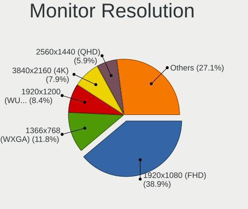

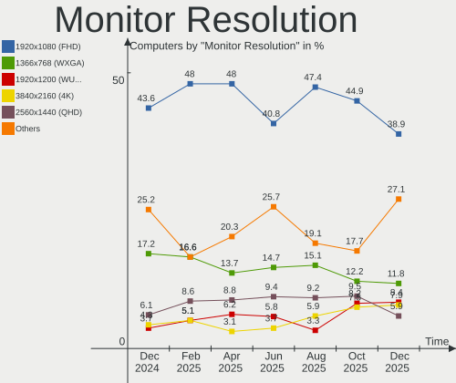

| Resolution         | Computers | Percent |
|--------------------|-----------|---------|
| 1920x1080 (FHD)    | 79        | 38.92%  |
| 1366x768 (WXGA)    | 24        | 11.82%  |
| 1920x1200 (WUXGA)  | 17        | 8.37%   |
| 3840x2160 (4K)     | 16        | 7.88%   |
| 2560x1440 (QHD)    | 12        | 5.91%   |
| Unknown            | 9         | 4.43%   |
| 1600x900 (HD+)     | 7         | 3.45%   |
| 2560x1600          | 4         | 1.97%   |
| 1280x800 (WXGA)    | 4         | 1.97%   |
| 3440x1440          | 3         | 1.48%   |
| 3840x1200          | 2         | 0.99%   |
| 3840x1080          | 2         | 0.99%   |
| 2560x1080          | 2         | 0.99%   |
| 2288x1287          | 2         | 0.99%   |
| 2160x1440          | 2         | 0.99%   |
| 1680x1050 (WSXGA+) | 2         | 0.99%   |
| 1360x768           | 2         | 0.99%   |
| 1280x1024 (SXGA)   | 2         | 0.99%   |
| 800x1280           | 1         | 0.49%   |
| 3840x2560          | 1         | 0.49%   |
| 3840x2400          | 1         | 0.49%   |
| 3840x1600          | 1         | 0.49%   |
| 3200x2000          | 1         | 0.49%   |
| 2880x1800          | 1         | 0.49%   |
| 2520x1680          | 1         | 0.49%   |
| 2256x1504          | 1         | 0.49%   |
| 2240x1400          | 1         | 0.49%   |
| 1600x1200          | 1         | 0.49%   |
| 1440x900 (WXGA+)   | 1         | 0.49%   |
| 1024x768 (XGA)     | 1         | 0.49%   |

Monitor Diagonal
----------------

Diagonal size in inches

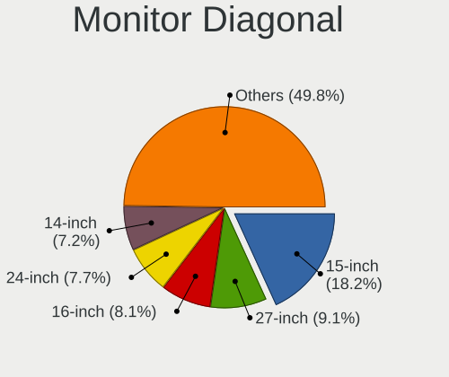

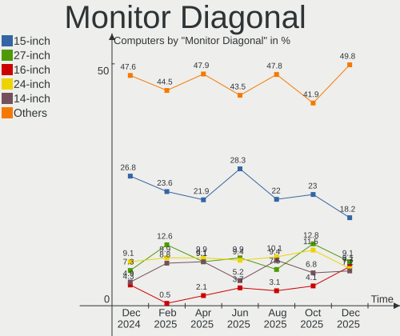

| Inches  | Computers | Percent |
|---------|-----------|---------|
| 15      | 38        | 18.18%  |
| 27      | 19        | 9.09%   |
| 16      | 17        | 8.13%   |
| 24      | 16        | 7.66%   |
| 14      | 15        | 7.18%   |
| 21      | 12        | 5.74%   |
| 13      | 12        | 5.74%   |
| 17      | 11        | 5.26%   |
| 23      | 10        | 4.78%   |
| Unknown | 9         | 4.31%   |
| 31      | 7         | 3.35%   |
| 12      | 5         | 2.39%   |
| 11      | 4         | 1.91%   |
| 84      | 3         | 1.44%   |
| 34      | 3         | 1.44%   |
| 19      | 3         | 1.44%   |
| 49      | 2         | 0.96%   |
| 43      | 2         | 0.96%   |
| 28      | 2         | 0.96%   |
| 22      | 2         | 0.96%   |
| 18      | 2         | 0.96%   |
| 8       | 2         | 0.96%   |
| 142     | 1         | 0.48%   |
| 65      | 1         | 0.48%   |
| 63      | 1         | 0.48%   |
| 60      | 1         | 0.48%   |
| 55      | 1         | 0.48%   |
| 54      | 1         | 0.48%   |
| 40      | 1         | 0.48%   |
| 37      | 1         | 0.48%   |
| 32      | 1         | 0.48%   |
| 26      | 1         | 0.48%   |
| 25      | 1         | 0.48%   |
| 20      | 1         | 0.48%   |
| 7       | 1         | 0.48%   |

Monitor Width
-------------

Physical width

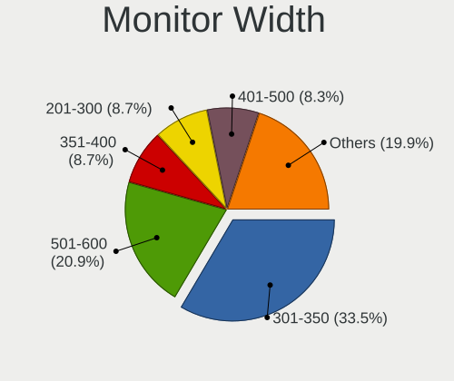

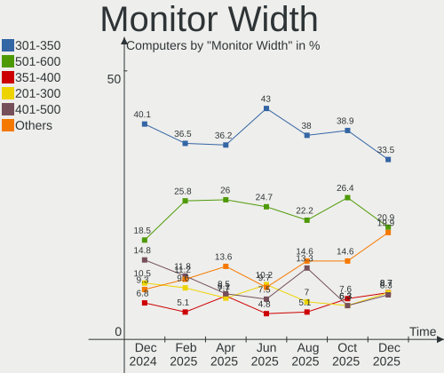

| Width in mm    | Computers | Percent |
|----------------|-----------|---------|
| 301-350        | 69        | 33.5%   |
| 501-600        | 43        | 20.87%  |
| 351-400        | 18        | 8.74%   |
| 201-300        | 18        | 8.74%   |
| 401-500        | 17        | 8.25%   |
| 601-700        | 10        | 4.85%   |
| 1001-1500      | 9         | 4.37%   |
| Unknown        | 9         | 4.37%   |
| 701-800        | 4         | 1.94%   |
| 1501-2000      | 3         | 1.46%   |
| 801-900        | 2         | 0.97%   |
| 101-200        | 2         | 0.97%   |
| More than 2000 | 1         | 0.49%   |
| 1-100          | 1         | 0.49%   |

Aspect Ratio
------------

Proportional relationship between the width and the height

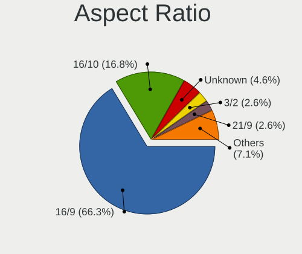

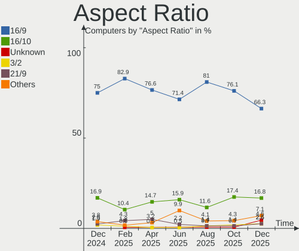

| Ratio   | Computers | Percent |
|---------|-----------|---------|
| 16/9    | 130       | 66.33%  |
| 16/10   | 33        | 16.84%  |
| Unknown | 9         | 4.59%   |
| 3/2     | 5         | 2.55%   |
| 21/9    | 5         | 2.55%   |
| 5/4     | 4         | 2.04%   |
| 4/3     | 2         | 1.02%   |
| 32/9    | 2         | 1.02%   |
| 3.20    | 2         | 1.02%   |
| 0.63    | 2         | 1.02%   |
| 1.00    | 1         | 0.51%   |
| 0.67    | 1         | 0.51%   |

Monitor Area
------------

Area in inch²

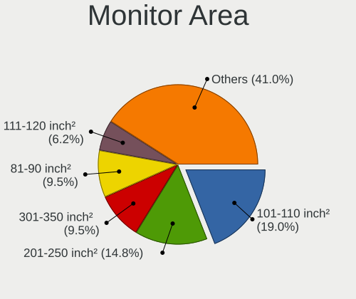

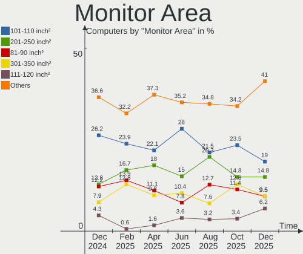

| Area in inch² | Computers | Percent |
|----------------|-----------|---------|
| 101-110        | 40        | 19.05%  |
| 201-250        | 31        | 14.76%  |
| 81-90          | 20        | 9.52%   |
| 301-350        | 20        | 9.52%   |
| 111-120        | 13        | 6.19%   |
| 351-500        | 12        | 5.71%   |
| 251-300        | 11        | 5.24%   |
| More than 1000 | 9         | 4.29%   |
| 121-130        | 9         | 4.29%   |
| Unknown        | 9         | 4.29%   |
| 71-80          | 7         | 3.33%   |
| 501-1000       | 6         | 2.86%   |
| 61-70          | 5         | 2.38%   |
| 151-200        | 5         | 2.38%   |
| 51-60          | 4         | 1.9%    |
| 1-40           | 3         | 1.43%   |
| 141-150        | 3         | 1.43%   |
| 131-140        | 2         | 0.95%   |
| 91-100         | 1         | 0.48%   |

Pixel Density
-------------

Pixels per inch

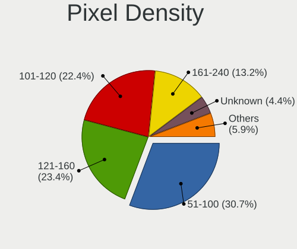

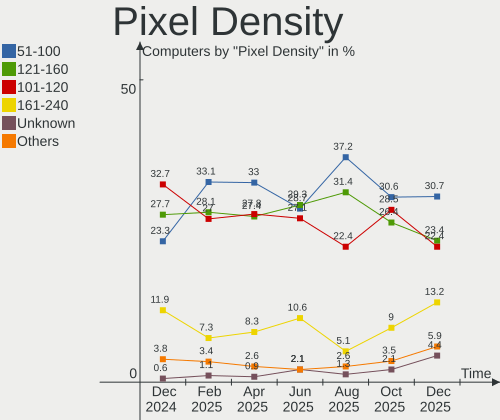

| Density       | Computers | Percent |
|---------------|-----------|---------|
| 51-100        | 63        | 30.73%  |
| 121-160       | 48        | 23.41%  |
| 101-120       | 46        | 22.44%  |
| 161-240       | 27        | 13.17%  |
| Unknown       | 9         | 4.39%   |
| More than 240 | 6         | 2.93%   |
| 1-50          | 6         | 2.93%   |

Multiple Monitors
-----------------

Total monitors connected

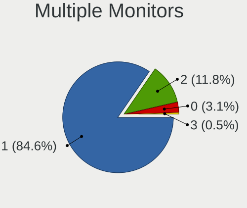

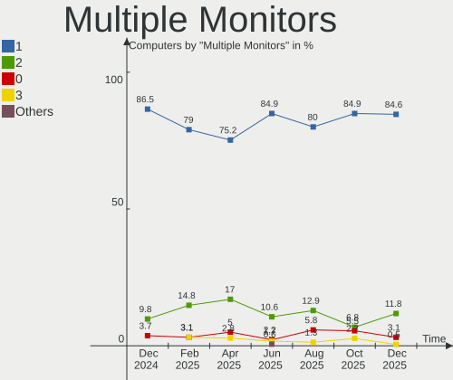

| Total | Computers | Percent |
|-------|-----------|---------|
| 1     | 165       | 84.62%  |
| 2     | 23        | 11.79%  |
| 0     | 6         | 3.08%   |
| 3     | 1         | 0.51%   |

Network
-------

Net Controller Vendor
---------------------

Controller vendors

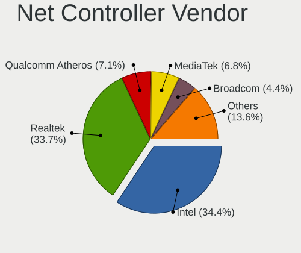

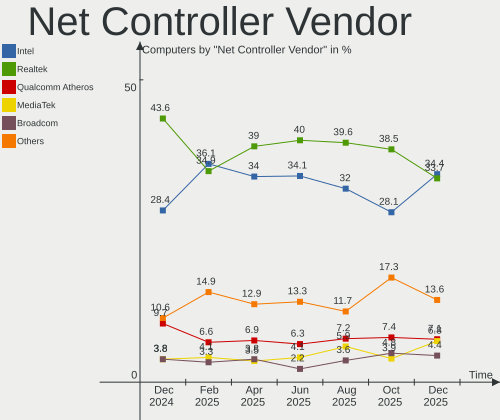

| Vendor                            | Computers | Percent |
|-----------------------------------|-----------|---------|
| Intel                             | 101       | 34.35%  |
| Realtek Semiconductor             | 99        | 33.67%  |
| Qualcomm Atheros                  | 21        | 7.14%   |
| MediaTek                          | 20        | 6.8%    |
| Broadcom                          | 13        | 4.42%   |
| Qualcomm Technologies             | 6         | 2.04%   |
| TP-Link                           | 4         | 1.36%   |
| Broadcom Limited                  | 4         | 1.36%   |
| Aquantia                          | 4         | 1.36%   |
| ASIX Electronics                  | 3         | 1.02%   |
| Sierra Wireless                   | 2         | 0.68%   |
| Samsung Electronics               | 2         | 0.68%   |
| Marvell Technology Group          | 2         | 0.68%   |
| Shenzhen Goodix Technology        | 1         | 0.34%   |
| Ralink Technology                 | 1         | 0.34%   |
| Nvidia                            | 1         | 0.34%   |
| NetXen Incorporated               | 1         | 0.34%   |
| Microsoft                         | 1         | 0.34%   |
| Mellanox Technologies             | 1         | 0.34%   |
| ICS Advent                        | 1         | 0.34%   |
| Huawei Technologies               | 1         | 0.34%   |
| Hewlett-Packard                   | 1         | 0.34%   |
| Fibocom                           | 1         | 0.34%   |
| Ericsson Business Mobile Networks | 1         | 0.34%   |
| DisplayLink                       | 1         | 0.34%   |
| D-Link                            | 1         | 0.34%   |

Net Controller Model
--------------------

Controller models

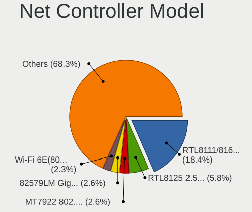

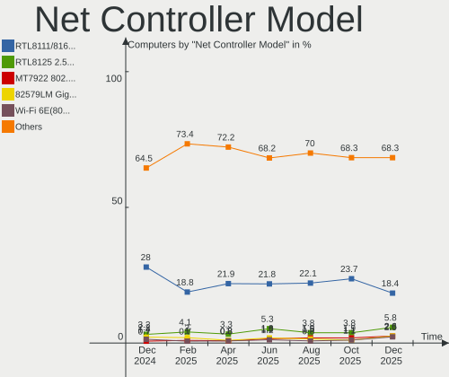

| Model                                                                           | Computers | Percent |
|---------------------------------------------------------------------------------|-----------|---------|
| Realtek RTL8111/8168/8211/8411 PCI Express Gigabit Ethernet Controller          | 64        | 18.44%  |
| Realtek RTL8125 2.5GbE Controller                                               | 20        | 5.76%   |
| MediaTek MT7922 802.11ax PCI Express Wireless Network Adapter                   | 9         | 2.59%   |
| Intel 82579LM Gigabit Network Connection (Lewisville)                           | 9         | 2.59%   |
| Intel Wi-Fi 6E(802.11ax) AX210/AX1675* 2x2 [Typhoon Peak]                       | 8         | 2.31%   |
| Intel Meteor Lake PCH CNVi WiFi                                                 | 7         | 2.02%   |
| Qualcomm Atheros AR9485 Wireless Network Adapter                                | 6         | 1.73%   |
| Intel Wi-Fi 6 AX200                                                             | 6         | 1.73%   |
| Intel Cannon Point-LP CNVi [Wireless-AC]                                        | 6         | 1.73%   |
| Realtek RTL8153 Gigabit Ethernet Adapter                                        | 5         | 1.44%   |
| Realtek RTL810xE PCI Express Fast Ethernet controller                           | 5         | 1.44%   |
| Qualcomm WCN785x Wi-Fi 7(802.11be) 320MHz 2x2 [FastConnect 7800]                | 5         | 1.44%   |
| MediaTek MT7925 802.11be 160MHz 2x2 PCIe Wireless Network Adapter [Filogic 360] | 5         | 1.44%   |
| Intel Wireless 8265 / 8275                                                      | 5         | 1.44%   |
| Realtek RTL8852BE PCIe 802.11ax Wireless Network Controller                     | 4         | 1.15%   |
| Realtek RTL8126 5GbE Controller                                                 | 4         | 1.15%   |
| Intel Wireless 8260                                                             | 4         | 1.15%   |
| Intel Centrino Ultimate-N 6300                                                  | 4         | 1.15%   |
| Intel Centrino Advanced-N 6205 [Taylor Peak]                                    | 4         | 1.15%   |
| Intel Alder Lake-P PCH CNVi WiFi                                                | 4         | 1.15%   |
| TP-Link AC600 wireless Realtek RTL8811AU [Archer T2U Nano]                      | 3         | 0.86%   |
| Realtek RTL8852CE PCIe 802.11ax Wireless Network Controller                     | 3         | 0.86%   |
| Intel Wireless 7260                                                             | 3         | 0.86%   |
| Intel Wi-Fi 5(802.11ac) Wireless-AC 9x6x [Thunder Peak]                         | 3         | 0.86%   |
| Intel Raptor Lake PCH CNVi WiFi                                                 | 3         | 0.86%   |
| Intel Ethernet Controller I226-V                                                | 3         | 0.86%   |
| Intel Ethernet Connection (6) I219-LM                                           | 3         | 0.86%   |
| Intel Ethernet Connection (2) I219-V                                            | 3         | 0.86%   |
| Intel Comet Lake PCH CNVi WiFi                                                  | 3         | 0.86%   |
| Intel Centrino Wireless-N 1030 [Rainbow Peak]                                   | 3         | 0.86%   |
| ASIX AX88179 Gigabit Ethernet                                                   | 3         | 0.86%   |
| Samsung Galaxy series, misc. (tethering mode)                                   | 2         | 0.58%   |
| Realtek RTL8822CE 802.11ac PCIe Wireless Network Adapter                        | 2         | 0.58%   |
| Realtek RTL8188EUS 802.11n Wireless Network Adapter                             | 2         | 0.58%   |
| Qualcomm Atheros QCA9565 / AR9565 Wireless Network Adapter                      | 2         | 0.58%   |
| Qualcomm Atheros QCA9377 802.11ac Wireless Network Adapter                      | 2         | 0.58%   |
| Qualcomm Atheros QCA8172 Fast Ethernet                                          | 2         | 0.58%   |
| Qualcomm Atheros AR9285 Wireless Network Adapter (PCI-Express)                  | 2         | 0.58%   |
| Qualcomm Atheros AR8151 v2.0 Gigabit Ethernet                                   | 2         | 0.58%   |
| Intel Wireless 7265                                                             | 2         | 0.58%   |

Wireless Vendor
---------------

Wireless vendors

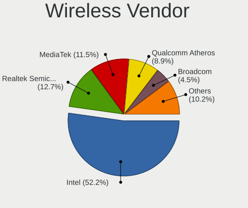

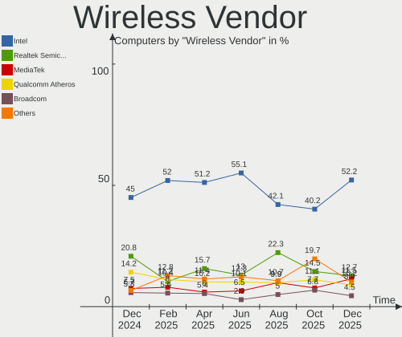

| Vendor                | Computers | Percent |
|-----------------------|-----------|---------|
| Intel                 | 82        | 52.23%  |
| Realtek Semiconductor | 20        | 12.74%  |
| MediaTek              | 18        | 11.46%  |
| Qualcomm Atheros      | 14        | 8.92%   |
| Broadcom              | 7         | 4.46%   |
| Qualcomm Technologies | 5         | 3.18%   |
| TP-Link               | 4         | 2.55%   |
| Sierra Wireless       | 2         | 1.27%   |
| Ralink Technology     | 1         | 0.64%   |
| Microsoft             | 1         | 0.64%   |
| Fibocom               | 1         | 0.64%   |
| D-Link                | 1         | 0.64%   |
| Broadcom Limited      | 1         | 0.64%   |

Wireless Model
--------------

Wireless models

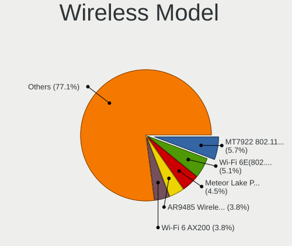

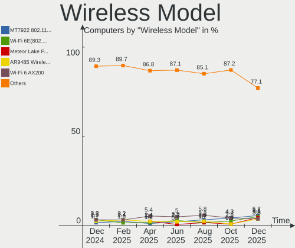

| Model                                                                           | Computers | Percent |
|---------------------------------------------------------------------------------|-----------|---------|
| MediaTek MT7922 802.11ax PCI Express Wireless Network Adapter                   | 9         | 5.73%   |
| Intel Wi-Fi 6E(802.11ax) AX210/AX1675* 2x2 [Typhoon Peak]                       | 8         | 5.1%    |
| Intel Meteor Lake PCH CNVi WiFi                                                 | 7         | 4.46%   |
| Qualcomm Atheros AR9485 Wireless Network Adapter                                | 6         | 3.82%   |
| Intel Wi-Fi 6 AX200                                                             | 6         | 3.82%   |
| Intel Cannon Point-LP CNVi [Wireless-AC]                                        | 6         | 3.82%   |
| Intel Wireless 8265 / 8275                                                      | 5         | 3.18%   |
| Qualcomm WCN785x Wi-Fi 7(802.11be) 320MHz 2x2 [FastConnect 7800]                | 4         | 2.55%   |
| MediaTek MT7925 802.11be 160MHz 2x2 PCIe Wireless Network Adapter [Filogic 360] | 4         | 2.55%   |
| Intel Wireless 8260                                                             | 4         | 2.55%   |
| Intel Centrino Ultimate-N 6300                                                  | 4         | 2.55%   |
| Intel Centrino Advanced-N 6205 [Taylor Peak]                                    | 4         | 2.55%   |
| Intel Alder Lake-P PCH CNVi WiFi                                                | 4         | 2.55%   |
| TP-Link AC600 wireless Realtek RTL8811AU [Archer T2U Nano]                      | 3         | 1.91%   |
| Realtek RTL8852CE PCIe 802.11ax Wireless Network Controller                     | 3         | 1.91%   |
| Realtek RTL8852BE PCIe 802.11ax Wireless Network Controller                     | 3         | 1.91%   |
| Intel Wireless 7260                                                             | 3         | 1.91%   |
| Intel Wi-Fi 5(802.11ac) Wireless-AC 9x6x [Thunder Peak]                         | 3         | 1.91%   |
| Intel Raptor Lake PCH CNVi WiFi                                                 | 3         | 1.91%   |
| Intel Comet Lake PCH CNVi WiFi                                                  | 3         | 1.91%   |
| Intel Centrino Wireless-N 1030 [Rainbow Peak]                                   | 3         | 1.91%   |
| Realtek RTL8822CE 802.11ac PCIe Wireless Network Adapter                        | 2         | 1.27%   |
| Realtek RTL8188EUS 802.11n Wireless Network Adapter                             | 2         | 1.27%   |
| Qualcomm Atheros QCA9565 / AR9565 Wireless Network Adapter                      | 2         | 1.27%   |
| Qualcomm Atheros QCA9377 802.11ac Wireless Network Adapter                      | 2         | 1.27%   |
| Qualcomm Atheros AR9285 Wireless Network Adapter (PCI-Express)                  | 2         | 1.27%   |
| Intel Wireless 7265                                                             | 2         | 1.27%   |
| Intel PRO/Wireless 5100 AGN [Shiloh] Network Connection                         | 2         | 1.27%   |
| Intel Comet Lake PCH-LP CNVi WiFi                                               | 2         | 1.27%   |
| Intel Alder Lake-N PCH CNVi WiFi                                                | 2         | 1.27%   |
| Broadcom BCM4313 802.11bgn Wireless Network Adapter                             | 2         | 1.27%   |
| TP-Link TL-WN722N v2/v3 [Realtek RTL8188EUS]                                    | 1         | 0.64%   |
| Sierra Wireless Sierra Wireless EM7511 Qualcomm Snapdragon X16 LTE-A            | 1         | 0.64%   |
| Sierra Wireless MC7710                                                          | 1         | 0.64%   |
| Realtek RTL8922AE 802.11be PCIe Wireless Network Adapter                        | 1         | 0.64%   |
| Realtek RTL8852BE-VT PCIe 802.11ax Wireless Network Controller                  | 1         | 0.64%   |
| Realtek RTL8852AE 802.11ax PCIe Wireless Network Adapter                        | 1         | 0.64%   |
| Realtek RTL8822BE 802.11a/b/g/n/ac WiFi adapter                                 | 1         | 0.64%   |
| Realtek RTL8821CE 802.11ac PCIe Wireless Network Adapter                        | 1         | 0.64%   |
| Realtek RTL8723BE PCIe Wireless Network Adapter                                 | 1         | 0.64%   |

Ethernet Vendor
---------------

Ethernet vendors

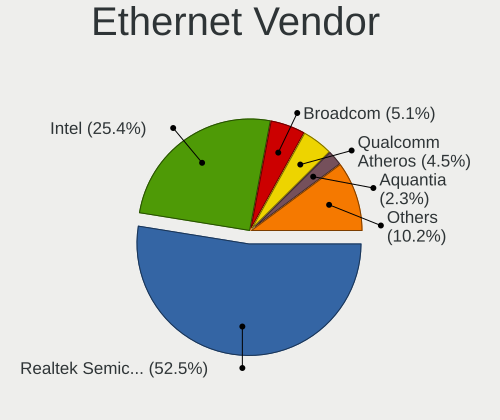

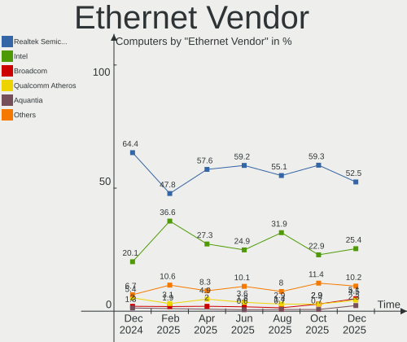

| Vendor                   | Computers | Percent |
|--------------------------|-----------|---------|
| Realtek Semiconductor    | 93        | 52.54%  |
| Intel                    | 45        | 25.42%  |
| Broadcom                 | 9         | 5.08%   |
| Qualcomm Atheros         | 8         | 4.52%   |
| Aquantia                 | 4         | 2.26%   |
| Broadcom Limited         | 3         | 1.69%   |
| ASIX Electronics         | 3         | 1.69%   |
| Samsung Electronics      | 2         | 1.13%   |
| Marvell Technology Group | 2         | 1.13%   |
| Qualcomm Technologies    | 1         | 0.56%   |
| Nvidia                   | 1         | 0.56%   |
| NetXen Incorporated      | 1         | 0.56%   |
| Mellanox Technologies    | 1         | 0.56%   |
| MediaTek                 | 1         | 0.56%   |
| ICS Advent               | 1         | 0.56%   |
| Huawei Technologies      | 1         | 0.56%   |
| DisplayLink              | 1         | 0.56%   |

Ethernet Model
--------------

Ethernet models

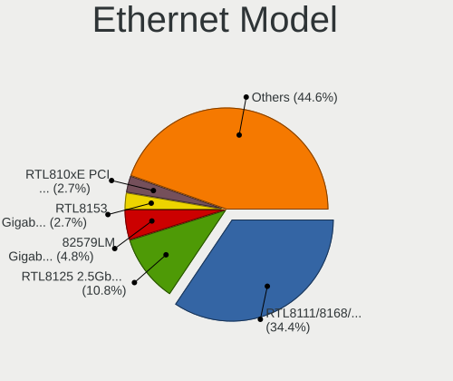

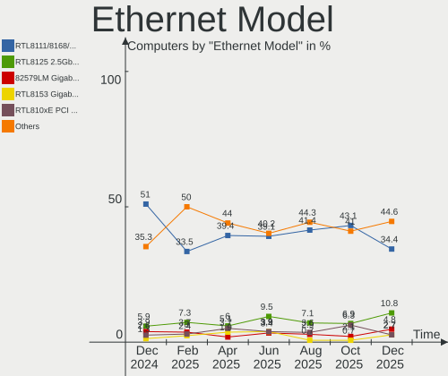

| Model                                                                           | Computers | Percent |
|---------------------------------------------------------------------------------|-----------|---------|
| Realtek RTL8111/8168/8211/8411 PCI Express Gigabit Ethernet Controller          | 64        | 34.41%  |
| Realtek RTL8125 2.5GbE Controller                                               | 20        | 10.75%  |
| Intel 82579LM Gigabit Network Connection (Lewisville)                           | 9         | 4.84%   |
| Realtek RTL8153 Gigabit Ethernet Adapter                                        | 5         | 2.69%   |
| Realtek RTL810xE PCI Express Fast Ethernet controller                           | 5         | 2.69%   |
| Realtek RTL8126 5GbE Controller                                                 | 4         | 2.15%   |
| Intel Ethernet Controller I226-V                                                | 3         | 1.61%   |
| Intel Ethernet Connection (6) I219-LM                                           | 3         | 1.61%   |
| Intel Ethernet Connection (2) I219-V                                            | 3         | 1.61%   |
| ASIX AX88179 Gigabit Ethernet                                                   | 3         | 1.61%   |
| Samsung Galaxy series, misc. (tethering mode)                                   | 2         | 1.08%   |
| Qualcomm Atheros QCA8172 Fast Ethernet                                          | 2         | 1.08%   |
| Qualcomm Atheros AR8151 v2.0 Gigabit Ethernet                                   | 2         | 1.08%   |
| Intel I211 Gigabit Network Connection                                           | 2         | 1.08%   |
| Intel Ethernet Connection (4) I219-V                                            | 2         | 1.08%   |
| Intel Ethernet Connection (18) I219-LM                                          | 2         | 1.08%   |
| Intel 82567LM-3 Gigabit Network Connection                                      | 2         | 1.08%   |
| Intel 82567LM Gigabit Network Connection                                        | 2         | 1.08%   |
| Broadcom NetXtreme BCM5761 Gigabit Ethernet PCIe                                | 2         | 1.08%   |
| Broadcom NetLink BCM57780 Gigabit Ethernet PCIe                                 | 2         | 1.08%   |
| Broadcom Limited NetLink BCM5906M Fast Ethernet PCI Express                     | 2         | 1.08%   |
| Aquantia AQtion AQC113CS NBase-T/IEEE 802.3an Ethernet Controller [Antigua 10G] | 2         | 1.08%   |
| Realtek RTL8852BE PCIe 802.11ax Wireless Network Controller                     | 1         | 0.54%   |
| Realtek Killer E2600 GbE Controller                                             | 1         | 0.54%   |
| Qualcomm WCN785x Wi-Fi 7(802.11be) 320MHz 2x2 [FastConnect 7800]                | 1         | 0.54%   |
| Qualcomm Atheros Killer E2500 Gigabit Ethernet Controller                       | 1         | 0.54%   |
| Qualcomm Atheros Killer E220x Gigabit Ethernet Controller                       | 1         | 0.54%   |
| Qualcomm Atheros AR8162 Fast Ethernet                                           | 1         | 0.54%   |
| Qualcomm Atheros AR8152 v2.0 Fast Ethernet                                      | 1         | 0.54%   |
| Nvidia MCP65 Ethernet                                                           | 1         | 0.54%   |
| NetXen Incorporated NX3031 Multifunction 1/10-Gigabit Server Adapter            | 1         | 0.54%   |
| Mellanox MT27500 Family [ConnectX-3]                                            | 1         | 0.54%   |
| MediaTek MT7925 802.11be 160MHz 2x2 PCIe Wireless Network Adapter [Filogic 360] | 1         | 0.54%   |
| Marvell Group Yukon Optima 88E8059 [PCIe Gigabit Ethernet Controller with AVB]  | 1         | 0.54%   |
| Marvell Group 88E8056 PCI-E Gigabit Ethernet Controller                         | 1         | 0.54%   |
| Intel Ethernet Controller I226-LM                                               | 1         | 0.54%   |
| Intel Ethernet Controller I225-V                                                | 1         | 0.54%   |
| Intel Ethernet Controller 10-Gigabit X540-AT2                                   | 1         | 0.54%   |
| Intel Ethernet Connection I219-LM                                               | 1         | 0.54%   |
| Intel Ethernet Connection I217-V                                                | 1         | 0.54%   |

Net Controller Kind
-------------------

Ethernet, WiFi or modem

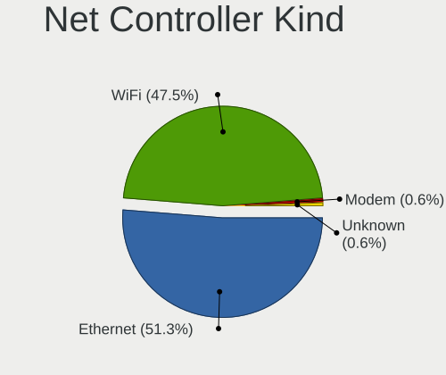

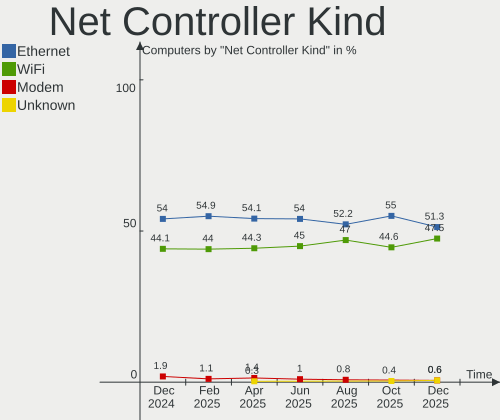

| Kind     | Computers | Percent |
|----------|-----------|---------|
| Ethernet | 162       | 51.27%  |
| WiFi     | 150       | 47.47%  |
| Modem    | 2         | 0.63%   |
| Unknown  | 2         | 0.63%   |

Used Controller
---------------

Currently used network controller

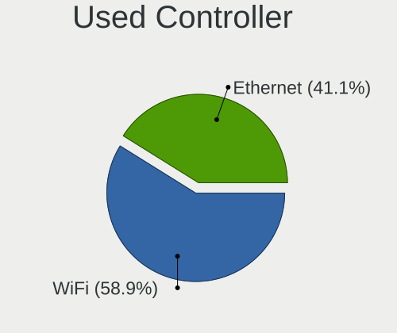

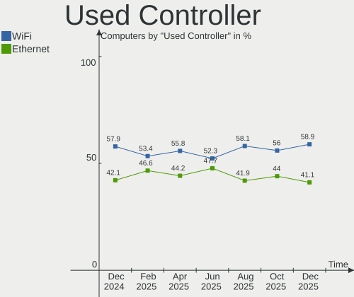

| Kind     | Computers | Percent |
|----------|-----------|---------|
| WiFi     | 116       | 58.88%  |
| Ethernet | 81        | 41.12%  |

NICs
----

Total network controllers on board

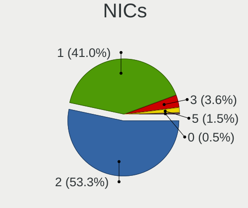

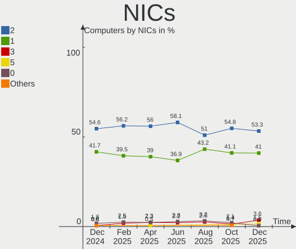

| Total | Computers | Percent |
|-------|-----------|---------|
| 2     | 104       | 53.33%  |
| 1     | 80        | 41.03%  |
| 3     | 7         | 3.59%   |
| 5     | 3         | 1.54%   |
| 0     | 1         | 0.51%   |

IPv6
----

IPv6 vs IPv4

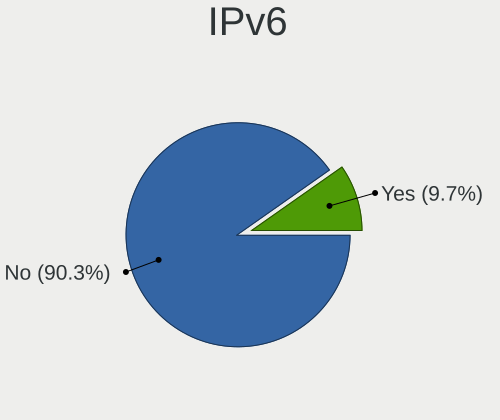

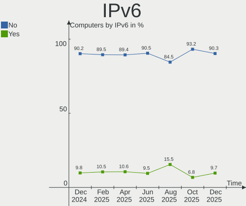

| Used | Computers | Percent |
|------|-----------|---------|
| No   | 176       | 90.26%  |
| Yes  | 19        | 9.74%   |

Bluetooth
---------

Bluetooth Vendor
----------------

Controller vendors

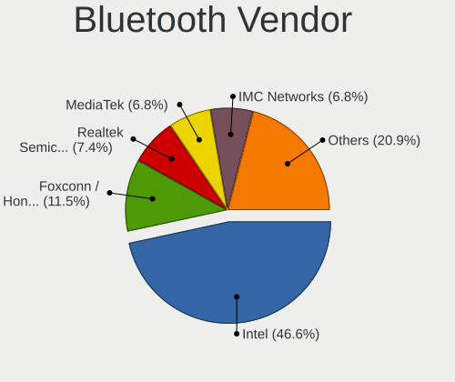

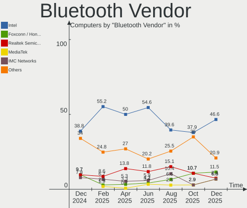

| Vendor                          | Computers | Percent |
|---------------------------------|-----------|---------|
| Intel                           | 69        | 46.62%  |
| Foxconn / Hon Hai               | 17        | 11.49%  |
| Realtek Semiconductor           | 11        | 7.43%   |
| MediaTek                        | 10        | 6.76%   |
| IMC Networks                    | 10        | 6.76%   |
| Broadcom                        | 6         | 4.05%   |
| Qualcomm Atheros Communications | 5         | 3.38%   |
| Cambridge Silicon Radio         | 4         | 2.7%    |
| TP-Link                         | 2         | 1.35%   |
| Quectel Wireless Solutions      | 2         | 1.35%   |
| Dell                            | 2         | 1.35%   |
| ASUSTek Computer                | 2         | 1.35%   |
| Apple                           | 2         | 1.35%   |
| USI                             | 1         | 0.68%   |
| Realtek                         | 1         | 0.68%   |
| Lite-On Technology              | 1         | 0.68%   |
| Integrated System Solution      | 1         | 0.68%   |
| Foxconn International           | 1         | 0.68%   |
| Unknown                         | 1         | 0.68%   |

Bluetooth Model
---------------

Controller models

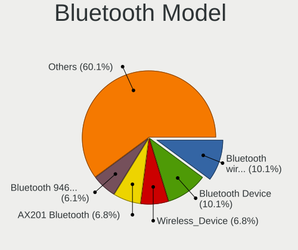

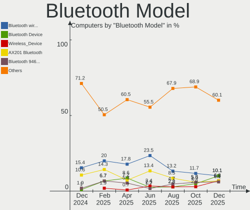

| Model                                                        | Computers | Percent |
|--------------------------------------------------------------|-----------|---------|
| Intel Bluetooth wireless interface                           | 15        | 10.14%  |
| Intel Bluetooth Device                                       | 15        | 10.14%  |
| MediaTek Wireless_Device                                     | 10        | 6.76%   |
| Intel AX201 Bluetooth                                        | 10        | 6.76%   |
| Intel Bluetooth 9460/9560 Jefferson Peak (JfP)               | 9         | 6.08%   |
| Realtek Bluetooth Radio                                      | 8         | 5.41%   |
| Intel AX210 Bluetooth                                        | 8         | 5.41%   |
| Foxconn / Hon Hai Wireless_Device                            | 7         | 4.73%   |
| Intel AX200 Bluetooth                                        | 6         | 4.05%   |
| IMC Networks Bluetooth Radio                                 | 6         | 4.05%   |
| Foxconn / Hon Hai Bluetooth Device                           | 5         | 3.38%   |
| Cambridge Silicon Radio Bluetooth Dongle (HCI mode)          | 4         | 2.7%    |
| Qualcomm Atheros AR3012 Bluetooth 4.0                        | 3         | 2.03%   |
| Intel Wireless-AC 9260 Bluetooth Adapter                     | 3         | 2.03%   |
| TP-Link TP-T@- UB500 Adapter                                 | 2         | 1.35%   |
| Realtek Bluetooth 5.3 Radio                                  | 2         | 1.35%   |
| Qualcomm Atheros  Bluetooth Device                           | 2         | 1.35%   |
| IMC Networks Wireless_Device                                 | 2         | 1.35%   |
| Foxconn / Hon Hai BCM20702A0                                 | 2         | 1.35%   |
| Broadcom HP Portable SoftSailing                             | 2         | 1.35%   |
| USI Bluetooth Device                                         | 1         | 0.68%   |
| Realtek RTL8822BE Bluetooth 4.2 Adapter                      | 1         | 0.68%   |
| Realtek Bluetooth Radio                                      | 1         | 0.68%   |
| Quectel Wireless Solutions Wireless_Device                   | 1         | 0.68%   |
| Quectel Wireless Solutions Quectel Wireless Bluetooth Device | 1         | 0.68%   |
| Lite-On Atheros AR3012 Bluetooth                             | 1         | 0.68%   |
| Intel Centrino Bluetooth Wireless Transceiver                | 1         | 0.68%   |
| Intel Centrino Advanced-N 6230 Bluetooth adapter             | 1         | 0.68%   |
| Intel Bluetooth                                              | 1         | 0.68%   |
| Integrated System Solution Bluetooth Device                  | 1         | 0.68%   |
| IMC Networks Bluetooth Device                                | 1         | 0.68%   |
| IMC Networks Atheros AR3012 Bluetooth 4.0 Adapter            | 1         | 0.68%   |
| Foxconn International BCM43142A0 Bluetooth module            | 1         | 0.68%   |
| Foxconn / Hon Hai MediaTek Bluetooth Adapter                 | 1         | 0.68%   |
| Foxconn / Hon Hai Broadcom Bluetooth 2.1 Device              | 1         | 0.68%   |
| Foxconn / Hon Hai Broadcom BCM20702 Bluetooth                | 1         | 0.68%   |
| Dell DW375 Bluetooth Module                                  | 1         | 0.68%   |
| Dell BCM20702A0 Bluetooth Module                             | 1         | 0.68%   |
| Broadcom BCM20702A0 Bluetooth 4.0                            | 1         | 0.68%   |
| Broadcom BCM2045B (BDC-2.1) [Bluetooth Controller]           | 1         | 0.68%   |

Sound
-----

Sound Vendor
------------

Sound card vendors

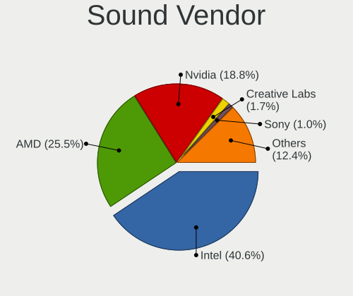

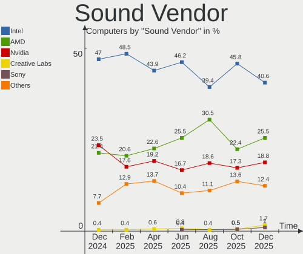

| Vendor                                       | Computers | Percent |
|----------------------------------------------|-----------|---------|
| Intel                                        | 121       | 40.6%   |
| AMD                                          | 76        | 25.5%   |
| Nvidia                                       | 56        | 18.79%  |
| Creative Labs                                | 5         | 1.68%   |
| Sony                                         | 3         | 1.01%   |
| Kingston Technology                          | 3         | 1.01%   |
| Creative Technology                          | 3         | 1.01%   |
| Realtek Semiconductor                        | 2         | 0.67%   |
| Micro Star International                     | 2         | 0.67%   |
| Logitech                                     | 2         | 0.67%   |
| FiiO Electronics Technology                  | 2         | 0.67%   |
| C-Media Electronics                          | 2         | 0.67%   |
| Zoran Co. Personal Media Division (Nogatech) | 1         | 0.34%   |
| XMOS                                         | 1         | 0.34%   |
| Trust                                        | 1         | 0.34%   |
| SteelSeries ApS                              | 1         | 0.34%   |
| Solum Voice S Onyx White                     | 1         | 0.34%   |
| SM950T Microphone                            | 1         | 0.34%   |
| SM900T Microphone                            | 1         | 0.34%   |
| RME                                          | 1         | 0.34%   |
| Razer USA                                    | 1         | 0.34%   |
| MV-SILICON                                   | 1         | 0.34%   |
| Medeli Electronics                           | 1         | 0.34%   |
| KTMICRO                                      | 1         | 0.34%   |
| JMTek                                        | 1         | 0.34%   |
| GYROCOM C&C                                  | 1         | 0.34%   |
| GN Netcom                                    | 1         | 0.34%   |
| Focusrite-Novation                           | 1         | 0.34%   |
| Endorfy Solum Mic                            | 1         | 0.34%   |
| Elgato Systems                               | 1         | 0.34%   |
| bestechnic                                   | 1         | 0.34%   |
| Audio-Technica                               | 1         | 0.34%   |
| ASUSTek Computer                             | 1         | 0.34%   |

Sound Model
-----------

Sound card models

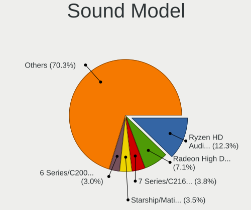

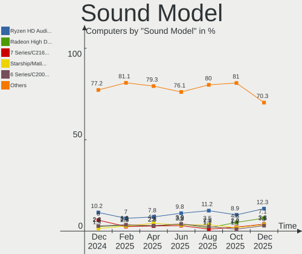

| Model                                                                                           | Computers | Percent |
|-------------------------------------------------------------------------------------------------|-----------|---------|
| AMD Ryzen HD Audio Controller                                                                   | 45        | 12.26%  |
| AMD Radeon High Definition Audio Controller                                                     | 26        | 7.08%   |
| Intel 7 Series/C216 Chipset Family High Definition Audio Controller                             | 14        | 3.81%   |
| AMD Starship/Matisse HD Audio Controller                                                        | 13        | 3.54%   |
| Intel 6 Series/C200 Series Chipset Family High Definition Audio Controller                      | 11        | 3%      |
| AMD Renoir/Cezanne HDMI/DP Audio Controller                                                     | 11        | 3%      |
| AMD Navi 21/23 HDMI/DP Audio Controller                                                         | 10        | 2.72%   |
| Intel Sunrise Point-LP HD Audio                                                                 | 8         | 2.18%   |
| Intel Meteor Lake-P HD Audio Controller                                                         | 7         | 1.91%   |
| Intel 5 Series/3400 Series Chipset High Definition Audio                                        | 7         | 1.91%   |
| AMD Navi 48 HDMI/DP Audio Controller                                                            | 7         | 1.91%   |
| Intel Cannon Point-LP High Definition Audio Controller                                          | 6         | 1.63%   |
| Nvidia AD107 High Definition Audio Controller                                                   | 5         | 1.36%   |
| Intel Alder Lake PCH-P High Definition Audio Controller                                         | 5         | 1.36%   |
| Intel 200 Series PCH HD Audio                                                                   | 5         | 1.36%   |
| AMD Navi 31 HDMI/DP Audio                                                                       | 5         | 1.36%   |
| Nvidia GB206 High Definition Audio Controller                                                   | 4         | 1.09%   |
| Intel Raptor Lake-P/U/H cAVS                                                                    | 4         | 1.09%   |
| Intel Haswell-ULT HD Audio Controller                                                           | 4         | 1.09%   |
| Intel Comet Lake PCH cAVS                                                                       | 4         | 1.09%   |
| Intel 82801I (ICH9 Family) HD Audio Controller                                                  | 4         | 1.09%   |
| Intel 8 Series HD Audio Controller                                                              | 4         | 1.09%   |
| Intel 100 Series/C230 Series Chipset Family HD Audio Controller                                 | 4         | 1.09%   |
| Nvidia GF119 HDMI Audio Controller                                                              | 3         | 0.82%   |
| Nvidia GA106 High Definition Audio Controller                                                   | 3         | 0.82%   |
| Nvidia GA102 High Definition Audio Controller                                                   | 3         | 0.82%   |
| Nvidia AD106M High Definition Audio Controller                                                  | 3         | 0.82%   |
| Nvidia AD104 High Definition Audio Controller                                                   | 3         | 0.82%   |
| Intel Ice Lake-LP Smart Sound Technology Audio Controller                                       | 3         | 0.82%   |
| Intel Atom Processor Z36xxx/Z37xxx Series High Definition Audio Controller                      | 3         | 0.82%   |
| Intel Alder Lake-S HD Audio Controller                                                          | 3         | 0.82%   |
| Intel 8 Series/C220 Series Chipset High Definition Audio Controller                             | 3         | 0.82%   |
| Creative Labs CA0132 Sound Core3D [Sound Blaster Recon3D / Z-Series / Sound BlasterX AE-5 Plus] | 3         | 0.82%   |
| AMD SBx00 Azalia (Intel HDA)                                                                    | 3         | 0.82%   |
| AMD Raven/Raven2/Fenghuang HDMI/DP Audio Controller                                             | 3         | 0.82%   |
| Sony DualSense wireless controller (PS5)                                                        | 2         | 0.54%   |
| Nvidia TU107 GeForce GTX 1650 High Definition Audio Controller                                  | 2         | 0.54%   |
| Nvidia TU104 HD Audio Controller                                                                | 2         | 0.54%   |
| Nvidia High Definition Audio Controller                                                         | 2         | 0.54%   |
| Nvidia GP108 High Definition Audio Controller                                                   | 2         | 0.54%   |

Memory
------

Memory Vendor
-------------

Memory module vendors

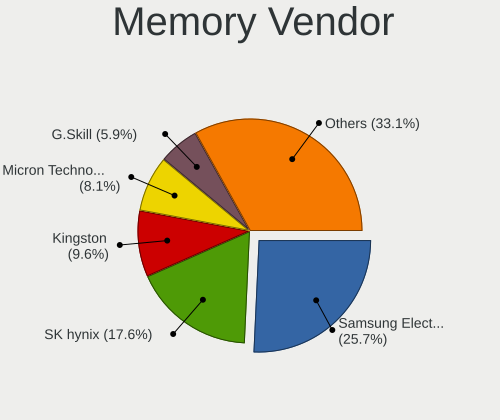

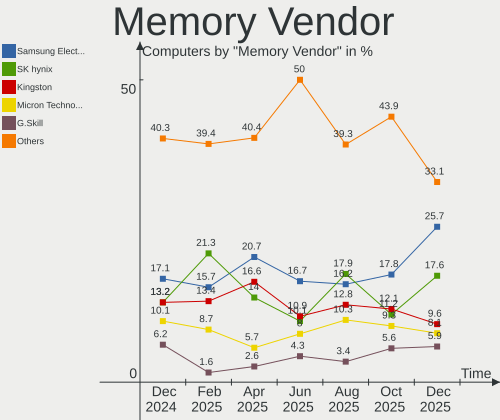

| Vendor                       | Computers | Percent |
|------------------------------|-----------|---------|
| Samsung Electronics          | 35        | 25.74%  |
| SK hynix                     | 24        | 17.65%  |
| Kingston                     | 13        | 9.56%   |
| Micron Technology            | 11        | 8.09%   |
| G.Skill                      | 8         | 5.88%   |
| Unknown                      | 8         | 5.88%   |
| Unknown                      | 7         | 5.15%   |
| Corsair                      | 6         | 4.41%   |
| GOODRAM                      | 4         | 2.94%   |
| Elpida                       | 4         | 2.94%   |
| A-DATA Technology            | 4         | 2.94%   |
| Wilk Elektronik              | 3         | 2.21%   |
| Ramaxel Technology           | 3         | 2.21%   |
| Crucial                      | 2         | 1.47%   |
| Patriot Memory (PDP Systems) | 1         | 0.74%   |
| Patriot                      | 1         | 0.74%   |
| Nanya Technology             | 1         | 0.74%   |
| Lexar                        | 1         | 0.74%   |

Memory Model
------------

Memory module models

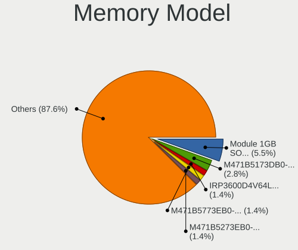

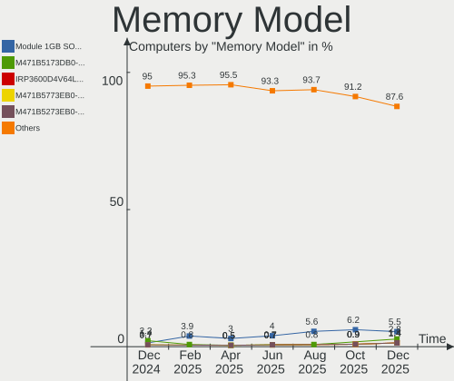

| Model                                                            | Computers | Percent |
|------------------------------------------------------------------|-----------|---------|
| Unknown                                                          | 8         | 5.52%   |
| Samsung RAM M471B5173DB0-YK0 4GB SODIMM DDR3 1600MT/s            | 4         | 2.76%   |
| Wilk Elektronik RAM IRP3600D4V64L18/16G 16GiB DIMM DDR4 3600MT/s | 2         | 1.38%   |
| Samsung RAM M471B5773EB0-CK0 2048MB SODIMM DDR3 1600MT/s         | 2         | 1.38%   |
| Samsung RAM M471B5273EB0-CK0 4GB SODIMM DDR3 4199MT/s            | 2         | 1.38%   |
| Samsung RAM M471B5273DH0-CK0 4GB SODIMM DDR3 2400MT/s            | 2         | 1.38%   |
| Samsung RAM M425R4GA3BB0-CQKOL 32GB SODIMM DDR5 4800MT/s         | 2         | 1.38%   |
| Micron RAM 8ATF1G64HZ-3G2J1 8GB SODIMM DDR4 3200MT/s             | 2         | 1.38%   |
| Wilk Elektronik RAM IRP3600D4V64L18S/8G 8GB DIMM DDR4 3666MT/s   | 1         | 0.69%   |
| Unknown RAM Module 4GB DIMM 1600MT/s                             | 1         | 0.69%   |
| Unknown RAM Module 4GB DIMM 1066MT/s                             | 1         | 0.69%   |
| Unknown RAM Module 2GB DIMM DDR3 1067MT/s                        | 1         | 0.69%   |
| Unknown RAM Module 2GB DIMM DDR2 800MT/s                         | 1         | 0.69%   |
| Unknown RAM Module 2GB DIMM DDR2 667MT/s                         | 1         | 0.69%   |
| Unknown RAM Module 2GB DIMM 667MT/s                              | 1         | 0.69%   |
| Unknown RAM Module 2GB DIMM 1066MT/s                             | 1         | 0.69%   |
| Unknown RAM 3733 C17 Series 8192MB DIMM DDR4 2133MT/s            | 1         | 0.69%   |
| SK hynix RAM Module 4GB SODIMM DDR3 1600MT/s                     | 1         | 0.69%   |
| SK hynix RAM Module 4GB Row Of Chips LPDDR4 2933MT/s             | 1         | 0.69%   |
| SK hynix RAM Module 16GB SODIMM DDR4 2133MT/s                    | 1         | 0.69%   |
| SK hynix RAM HMT451S6BFR8A-PB 4GB SODIMM DDR3 1600MT/s           | 1         | 0.69%   |
| SK hynix RAM HMT451S6AFR8A-H9 4GB SODIMM DDR3 1333MT/s           | 1         | 0.69%   |
| SK hynix RAM HMT425S6AFR6A-PB 2GB SODIMM DDR3 3200MT/s           | 1         | 0.69%   |
| SK hynix RAM HMT41GS6BFR8C-PB 8GB SODIMM DDR3 1600MT/s           | 1         | 0.69%   |
| SK hynix RAM HMT41GS6BFR8A-PB 8GB SODIMM DDR3 2667MT/s           | 1         | 0.69%   |
| SK hynix RAM HMT41GS6AFR8A-PB 8GiB SODIMM DDR3 2667MT/s          | 1         | 0.69%   |
| SK hynix RAM HMT351S6CFR8C-PB 4GB SODIMM DDR3 1600MT/s           | 1         | 0.69%   |
| SK hynix RAM HMT351S6CFR8C-H9 4GB SODIMM DDR3 1334MT/s           | 1         | 0.69%   |
| SK hynix RAM HMT351S6BFR8C-H9 4GB SODIMM 1334MT/s                | 1         | 0.69%   |
| SK hynix RAM HMT325U6CFR8C-H9 2GB DIMM DDR3 1600MT/s             | 1         | 0.69%   |
| SK hynix RAM HMT325U6CFR8C-H9 2GB DIMM DDR3 1333MT/s             | 1         | 0.69%   |
| SK hynix RAM HMT31GR7BFR4A-H9 8GB DIMM DDR3 1333MT/s             | 1         | 0.69%   |
| SK hynix RAM HMCG78AGBSA095N 16GB SODIMM DDR5 5600MT/s           | 1         | 0.69%   |
| SK hynix RAM HMAA8GL7CPR4N-VK 64GB DIMM DDR4 2666MT/s            | 1         | 0.69%   |
| SK hynix RAM HMAA1GS6C.R8N-VK 8GiB SODIMM DDR4 2667MT/s          | 1         | 0.69%   |
| SK hynix RAM HMA82GS6MFR8N-TF 16GB SODIMM DDR4 2133MT/s          | 1         | 0.69%   |
| SK hynix RAM HMA82GS6JJR8N-VK 16GB SODIMM DDR4 2667MT/s          | 1         | 0.69%   |
| SK hynix RAM HMA81GU6CJR8N-VK 8GB DIMM DDR4 2667MT/s             | 1         | 0.69%   |
| SK hynix RAM HMA81GS6DJR8N-VK 8GB SODIMM DDR4 2667MT/s           | 1         | 0.69%   |
| SK hynix RAM HMA81GS6AFR8N-UH 8GB SODIMM DDR4 3200MT/s           | 1         | 0.69%   |

Memory Kind
-----------

Memory module kinds

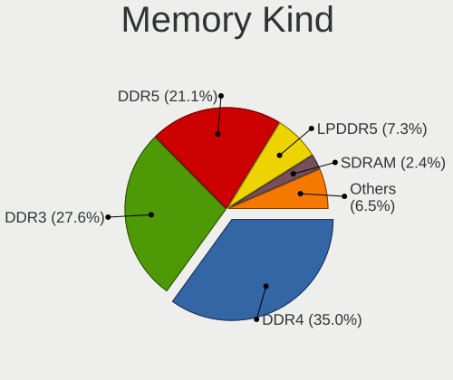

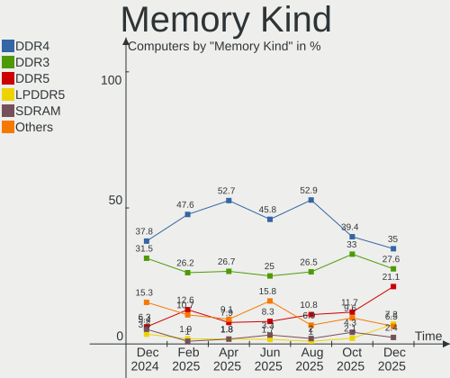

| Kind    | Computers | Percent |
|---------|-----------|---------|
| DDR4    | 43        | 34.96%  |
| DDR3    | 34        | 27.64%  |
| DDR5    | 26        | 21.14%  |
| LPDDR5  | 9         | 7.32%   |
| SDRAM   | 3         | 2.44%   |
| Unknown | 3         | 2.44%   |
| LPDDR4  | 2         | 1.63%   |
| DDR2    | 2         | 1.63%   |
| LPDDR3  | 1         | 0.81%   |

Memory Form Factor
------------------

Physical design of the memory module

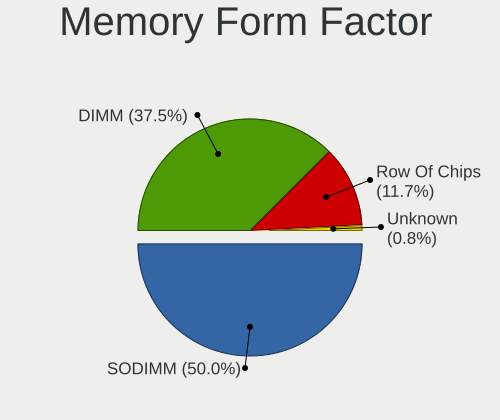

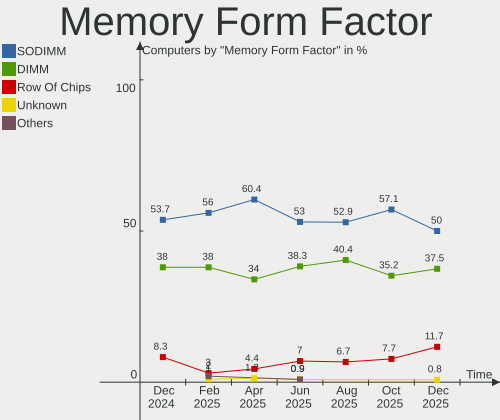

| Name         | Computers | Percent |
|--------------|-----------|---------|
| SODIMM       | 60        | 50%     |
| DIMM         | 45        | 37.5%   |
| Row Of Chips | 14        | 11.67%  |
| Unknown      | 1         | 0.83%   |

Memory Size
-----------

Memory module size

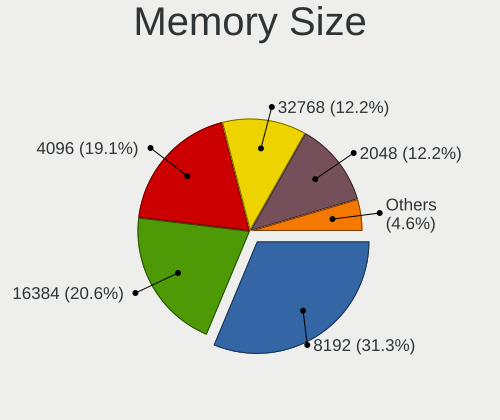

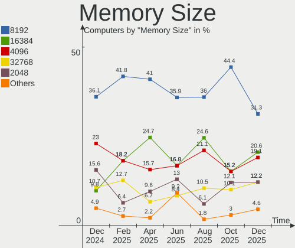

| Size  | Computers | Percent |
|-------|-----------|---------|
| 8192  | 41        | 31.3%   |
| 16384 | 27        | 20.61%  |
| 4096  | 25        | 19.08%  |
| 32768 | 16        | 12.21%  |
| 2048  | 16        | 12.21%  |
| 65536 | 2         | 1.53%   |
| 1024  | 2         | 1.53%   |
| 49152 | 1         | 0.76%   |
| 12288 | 1         | 0.76%   |

Memory Speed
------------

Memory module speed

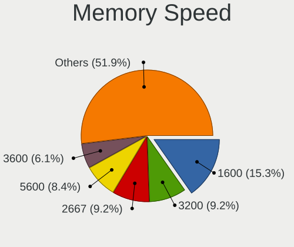

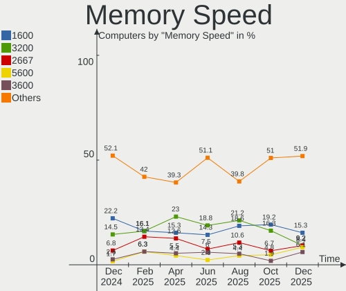

| Speed | Computers | Percent |
|-------|-----------|---------|
| 1600  | 20        | 15.27%  |
| 3200  | 12        | 9.16%   |
| 2667  | 12        | 9.16%   |
| 5600  | 11        | 8.4%    |
| 3600  | 8         | 6.11%   |
| 1333  | 8         | 6.11%   |
| 6000  | 6         | 4.58%   |
| 4800  | 6         | 4.58%   |
| 2400  | 5         | 3.82%   |
| 1067  | 4         | 3.05%   |
| 7467  | 3         | 2.29%   |
| 2133  | 3         | 2.29%   |
| 1334  | 3         | 2.29%   |
| 8533  | 2         | 1.53%   |
| 6400  | 2         | 1.53%   |
| 4199  | 2         | 1.53%   |
| 3733  | 2         | 1.53%   |
| 1066  | 2         | 1.53%   |
| 667   | 2         | 1.53%   |
| 8000  | 1         | 0.76%   |
| 7500  | 1         | 0.76%   |
| 7200  | 1         | 0.76%   |
| 6200  | 1         | 0.76%   |
| 5900  | 1         | 0.76%   |
| 5200  | 1         | 0.76%   |
| 4400  | 1         | 0.76%   |
| 4267  | 1         | 0.76%   |
| 4000  | 1         | 0.76%   |
| 3933  | 1         | 0.76%   |
| 3800  | 1         | 0.76%   |
| 3666  | 1         | 0.76%   |
| 3467  | 1         | 0.76%   |
| 2933  | 1         | 0.76%   |
| 2666  | 1         | 0.76%   |
| 1867  | 1         | 0.76%   |
| 1866  | 1         | 0.76%   |
| 800   | 1         | 0.76%   |

Printers & scanners
-------------------

Printer Vendor
--------------

Printer device vendors

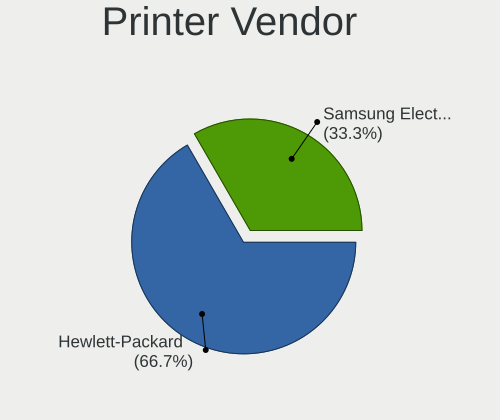

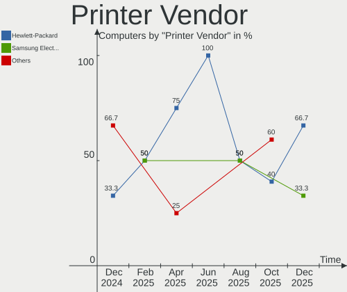

| Vendor              | Computers | Percent |
|---------------------|-----------|---------|
| Hewlett-Packard     | 2         | 66.67%  |
| Samsung Electronics | 1         | 33.33%  |

Printer Model
-------------

Printer device models

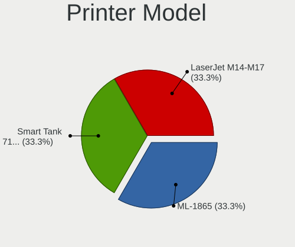

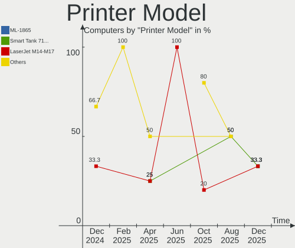

| Model                        | Computers | Percent |
|------------------------------|-----------|---------|
| Samsung ML-1865              | 1         | 33.33%  |
| HP Smart Tank 710-720 series | 1         | 33.33%  |
| HP LaserJet M14-M17          | 1         | 33.33%  |

Scanner Vendor
--------------

Scanner device vendors

Zero info for selected period =(

Scanner Model
-------------

Scanner device models

Zero info for selected period =(

Camera
------

Camera Vendor
-------------

Camera device vendors

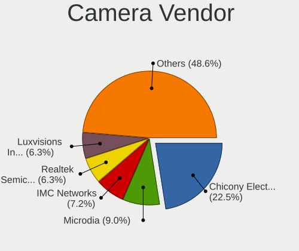

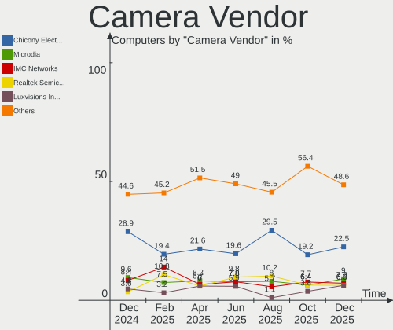

| Vendor                                 | Computers | Percent |
|----------------------------------------|-----------|---------|
| Chicony Electronics                    | 25        | 22.52%  |
| Microdia                               | 10        | 9.01%   |
| IMC Networks                           | 8         | 7.21%   |
| Realtek Semiconductor                  | 7         | 6.31%   |
| Luxvisions Innotech Limited            | 7         | 6.31%   |
| Bison Electronics                      | 7         | 6.31%   |
| Sunplus Innovation Technology          | 5         | 4.5%    |
| Syntek                                 | 4         | 3.6%    |
| Logitech                               | 4         | 3.6%    |
| Silicon Motion                         | 3         | 2.7%    |
| Shinetech                              | 3         | 2.7%    |
| Ricoh                                  | 3         | 2.7%    |
| Quanta                                 | 3         | 2.7%    |
| Cheng Uei Precision Industry (Foxlink) | 3         | 2.7%    |
| Suyin                                  | 2         | 1.8%    |
| Shine-optics                           | 2         | 1.8%    |
| Lenovo                                 | 2         | 1.8%    |
| Apple                                  | 2         | 1.8%    |
| SunplusIT                              | 1         | 0.9%    |
| Sonix Technology                       | 1         | 0.9%    |
| SenseTek                               | 1         | 0.9%    |
| Samsung Electronics                    | 1         | 0.9%    |
| Microsoft                              | 1         | 0.9%    |
| Jieli Technology                       | 1         | 0.9%    |
| Elgato Systems                         | 1         | 0.9%    |
| Creative Technology                    | 1         | 0.9%    |
| BillionPixels                          | 1         | 0.9%    |
| ALi                                    | 1         | 0.9%    |
| Acer                                   | 1         | 0.9%    |

Camera Model
------------

Camera device models

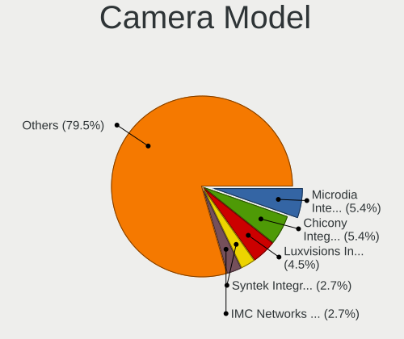

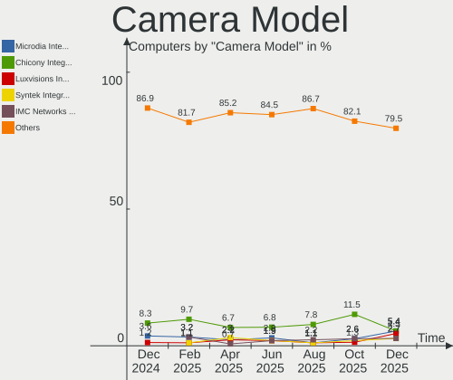

| Model                                         | Computers | Percent |
|-----------------------------------------------|-----------|---------|
| Microdia Integrated_Webcam_HD                 | 6         | 5.36%   |
| Chicony Integrated Camera                     | 6         | 5.36%   |
| Luxvisions Innotech Limited Integrated Camera | 5         | 4.46%   |
| Syntek Integrated Camera                      | 3         | 2.68%   |
| IMC Networks Integrated Camera                | 3         | 2.68%   |
| Bison SunplusIT Integrated Camera             | 3         | 2.68%   |
| Shine-optics USB2.0 HD UVC WebCam             | 2         | 1.79%   |
| Realtek Integrated Webcam                     | 2         | 1.79%   |
| IMC Networks HD Camera                        | 2         | 1.79%   |
| Chicony USB2.0 HD UVC WebCam                  | 2         | 1.79%   |
| Chicony HD WebCam                             | 2         | 1.79%   |
| Chicony ACER HD User Facing                   | 2         | 1.79%   |
| Bison Integrated Camera                       | 2         | 1.79%   |
| Syntek Lenovo EasyCamera                      | 1         | 0.89%   |
| Suyin Lenovo EasyCamera                       | 1         | 0.89%   |
| Suyin Integrated_Webcam_HD                    | 1         | 0.89%   |
| SunplusIT HD Webcam                           | 1         | 0.89%   |
| Sunplus Lenovo EasyCamera                     | 1         | 0.89%   |
| Sunplus HP X Camera                           | 1         | 0.89%   |
| Sunplus HD WebCam                             | 1         | 0.89%   |
| Sunplus Full HD webcam                        | 1         | 0.89%   |
| Sunplus Asus Webcam                           | 1         | 0.89%   |
| Sonix GIGABYTE FHD CAMERA                     | 1         | 0.89%   |
| Silicon Motion WebCam SC-13HDL11939N          | 1         | 0.89%   |
| Silicon Motion WebCam SC-10HDD12636N          | 1         | 0.89%   |
| Silicon Motion WebCam SC-0311139N             | 1         | 0.89%   |
| ShineTech USB2.0 HD UVC WebCam                | 1         | 0.89%   |
| Shinetech USB2.0 FHD UVC WebCam               | 1         | 0.89%   |
| Shinetech ASUS FHD webcam                     | 1         | 0.89%   |
| SenseTek FHD Camera                           | 1         | 0.89%   |
| Samsung Galaxy series, misc. (MTP mode)       | 1         | 0.89%   |
| Ricoh Laptop_Integrated_Webcam_FHD            | 1         | 0.89%   |
| Ricoh HD Webcam                               | 1         | 0.89%   |
| Ricoh Dell Laptop Integrated Webcam           | 1         | 0.89%   |
| Realtek USB2.0 VGA UVC WebCam                 | 1         | 0.89%   |
| Realtek USB Camera                            | 1         | 0.89%   |
| Realtek Thronmax StreamGo Webcam              | 1         | 0.89%   |
| Realtek Lenovo EasyCamera                     | 1         | 0.89%   |
| Realtek Integrated_Webcam_HD                  | 1         | 0.89%   |
| Quanta HP Wide Vision HD Camera               | 1         | 0.89%   |

Security
--------

Fingerprint Vendor
------------------

Fingerprint sensor vendors

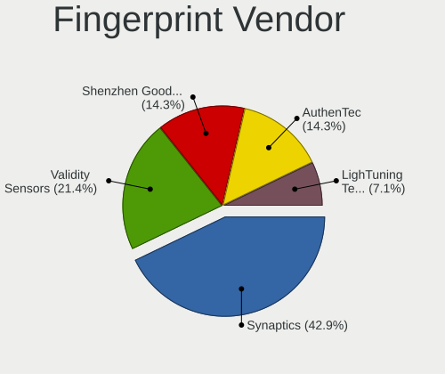

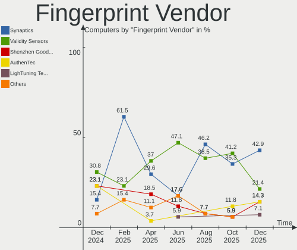

| Vendor                     | Computers | Percent |
|----------------------------|-----------|---------|
| Synaptics                  | 6         | 42.86%  |
| Validity Sensors           | 3         | 21.43%  |
| Shenzhen Goodix Technology | 2         | 14.29%  |
| AuthenTec                  | 2         | 14.29%  |
| LighTuning Technology      | 1         | 7.14%   |

Fingerprint Model
-----------------

Fingerprint sensor models

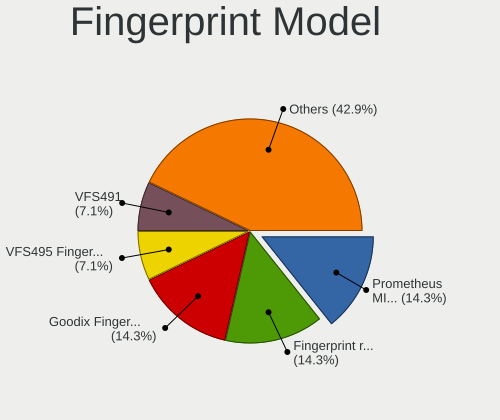

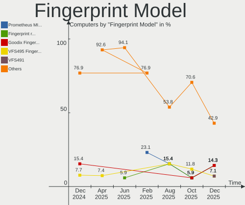

| Model                                             | Computers | Percent |
|---------------------------------------------------|-----------|---------|
| Synaptics Prometheus MIS Touch Fingerprint Reader | 2         | 14.29%  |
| Synaptics Fingerprint reader [HP G6]              | 2         | 14.29%  |
| Shenzhen Goodix  Fingerprint Device               | 2         | 14.29%  |
| Validity Sensors VFS495 Fingerprint Reader        | 1         | 7.14%   |
| Validity Sensors VFS491                           | 1         | 7.14%   |
| Validity Sensors VFS471 Fingerprint Reader        | 1         | 7.14%   |
| Synaptics WBDI Fingerprint Reader USB 102         | 1         | 7.14%   |
| Synaptics UWP WBDI Device                         | 1         | 7.14%   |
| LighTuning EgisTec Touch Fingerprint Sensor       | 1         | 7.14%   |
| AuthenTec AES2810                                 | 1         | 7.14%   |
| AuthenTec AES2501 Fingerprint Sensor              | 1         | 7.14%   |

Chipcard Vendor
---------------

Chipcard module vendors

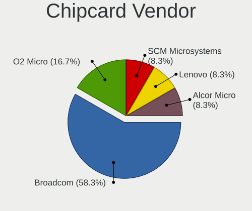

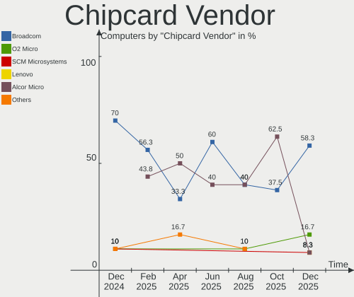

| Vendor           | Computers | Percent |
|------------------|-----------|---------|
| Broadcom         | 7         | 58.33%  |
| O2 Micro         | 2         | 16.67%  |
| SCM Microsystems | 1         | 8.33%   |
| Lenovo           | 1         | 8.33%   |
| Alcor Micro      | 1         | 8.33%   |

Chipcard Model
--------------

Chipcard module models

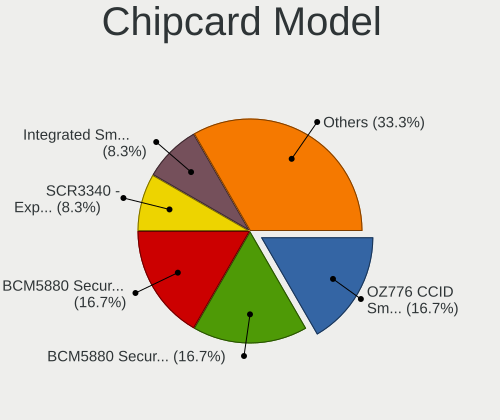

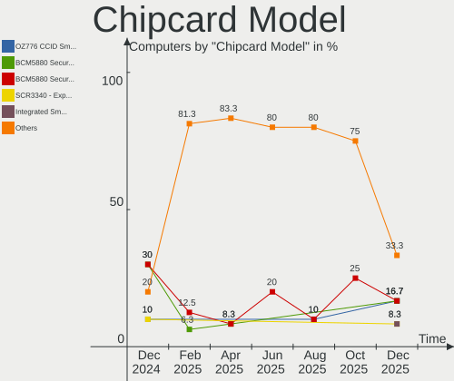

| Model                                                                        | Computers | Percent |
|------------------------------------------------------------------------------|-----------|---------|
| O2 Micro OZ776 CCID Smartcard Reader                                         | 2         | 16.67%  |
| Broadcom BCM5880 Secure Applications Processor with fingerprint swipe sensor | 2         | 16.67%  |
| Broadcom BCM5880 Secure Applications Processor                               | 2         | 16.67%  |
| SCM Microsystems SCR3340 - ExpressCard54 Smart Card Reader                   | 1         | 8.33%   |
| Lenovo Integrated Smart Card Reader                                          | 1         | 8.33%   |
| Broadcom BCM58200 ControlVault 3 (FingerPrint sensor + Contacted SmartCard)  | 1         | 8.33%   |
| Broadcom 5880                                                                | 1         | 8.33%   |
| Broadcom 58200                                                               | 1         | 8.33%   |
| Alcor Micro AU9540 Smartcard Reader                                          | 1         | 8.33%   |

Unsupported
-----------

Unsupported Devices
-------------------

Total unsupported devices on board

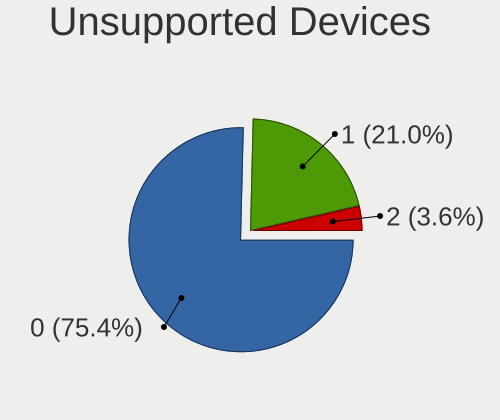

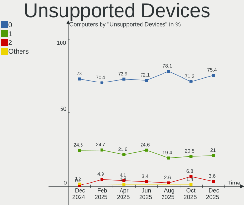

| Total | Computers | Percent |
|-------|-----------|---------|
| 0     | 147       | 75.38%  |
| 1     | 41        | 21.03%  |
| 2     | 7         | 3.59%   |

Unsupported Device Types
------------------------

Types of unsupported devices

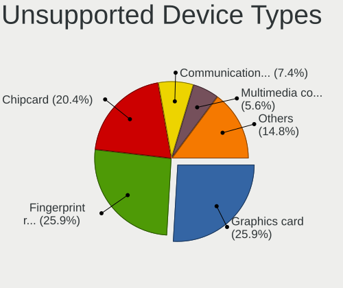

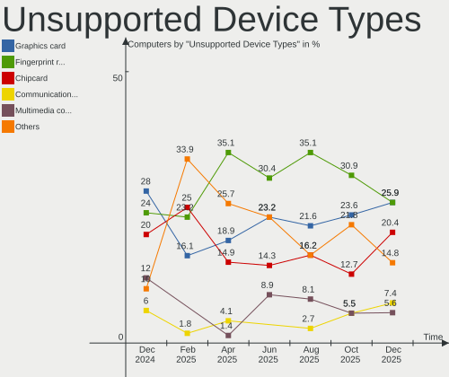

| Type                     | Computers | Percent |
|--------------------------|-----------|---------|
| Graphics card            | 14        | 25.93%  |
| Fingerprint reader       | 14        | 25.93%  |
| Chipcard                 | 11        | 20.37%  |
| Communication controller | 4         | 7.41%   |
| Multimedia controller    | 3         | 5.56%   |
| Network                  | 2         | 3.7%    |
| Net/wireless             | 2         | 3.7%    |
| Unassigned class         | 1         | 1.85%   |
| Storage/ide              | 1         | 1.85%   |
| Storage                  | 1         | 1.85%   |
| Bluetooth                | 1         | 1.85%   |

