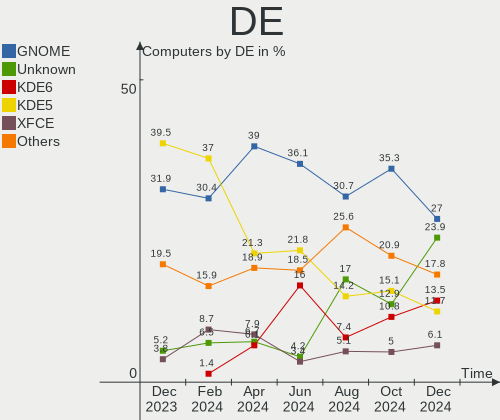
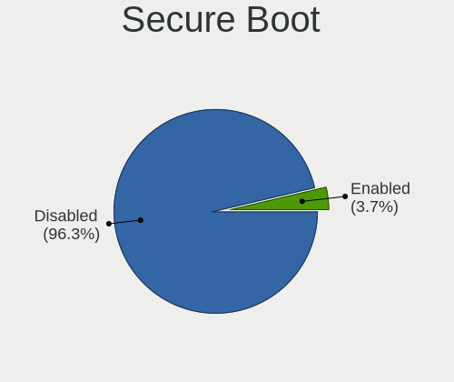
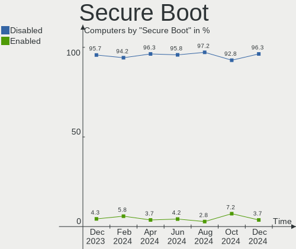
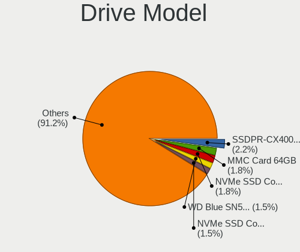
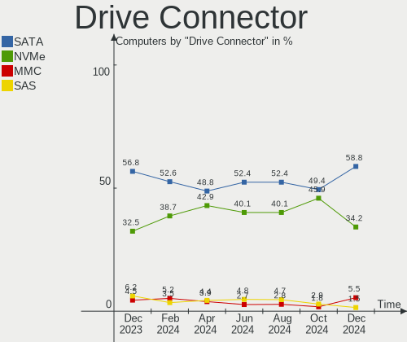
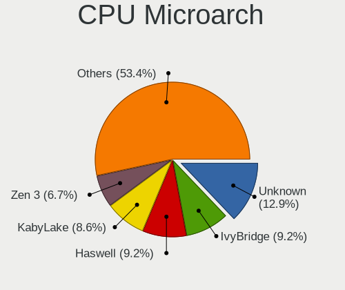
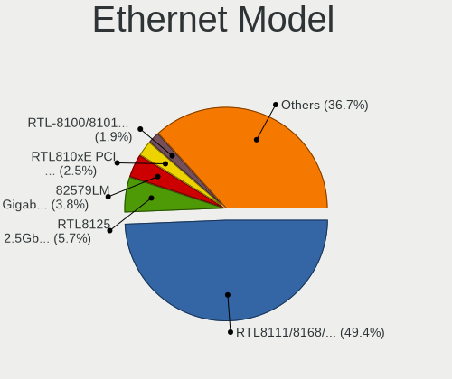
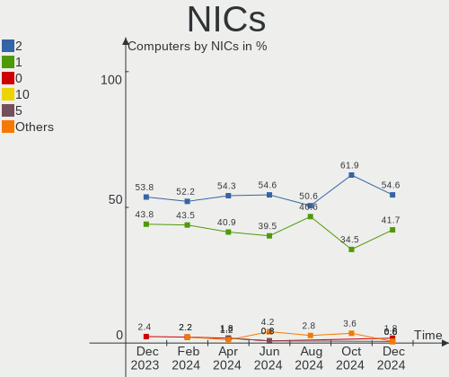

Linux in Poland - Hardware Trends
---------------------------------

A project to identify most popular hardware characteristics and track their change
over time based on data collected by Linux users at https://Linux-Hardware.org.

Anyone can contribute to this report by the [hw-probe](https://github.com/linuxhw/hw-probe) tool:

    sudo -E hw-probe -all -upload

This is a report for all computer types. See also reports for [desktops](/Location/Poland/Desktop/README.md) and [notebooks](/Location/Poland/Notebook/README.md).

Period: Sep, 2023.

Contents
--------

* [ System ](#system)
  - [ OS                       ](#os)
  - [ OS Family                ](#os-family)
  - [ Kernel                   ](#kernel)
  - [ Kernel Family            ](#kernel-family)
  - [ Kernel Major Ver.        ](#kernel-major-ver)
  - [ Arch                     ](#arch)
  - [ DE                       ](#de)
  - [ Display Server           ](#display-server)
  - [ Display Manager          ](#display-manager)
  - [ OS Lang                  ](#os-lang)
  - [ Boot Mode                ](#boot-mode)
  - [ Filesystem               ](#filesystem)
  - [ Part. scheme             ](#part-scheme)
  - [ Dual Boot with Linux/BSD ](#dual-boot-with-linuxbsd)
  - [ Dual Boot (Win)          ](#dual-boot-win)

* [ Board ](#board)
  - [ Vendor                   ](#vendor)
  - [ Model                    ](#model)
  - [ Model Family             ](#model-family)
  - [ MFG Year                 ](#mfg-year)
  - [ Form Factor              ](#form-factor)
  - [ Secure Boot              ](#secure-boot)
  - [ Coreboot                 ](#coreboot)
  - [ RAM Size                 ](#ram-size)
  - [ RAM Used                 ](#ram-used)
  - [ Total Drives             ](#total-drives)
  - [ Has CD-ROM               ](#has-cd-rom)
  - [ Has Ethernet             ](#has-ethernet)
  - [ Has WiFi                 ](#has-wifi)
  - [ Has Bluetooth            ](#has-bluetooth)

* [ Location ](#location)
  - [ Country                  ](#country)
  - [ City                     ](#city)

* [ Drives ](#drives)
  - [ Drive Vendor             ](#drive-vendor)
  - [ Drive Model              ](#drive-model)
  - [ HDD Vendor               ](#hdd-vendor)
  - [ SSD Vendor               ](#ssd-vendor)
  - [ Drive Kind               ](#drive-kind)
  - [ Drive Connector          ](#drive-connector)
  - [ Drive Size               ](#drive-size)
  - [ Space Total              ](#space-total)
  - [ Space Used               ](#space-used)
  - [ Malfunc. Drives          ](#malfunc-drives)
  - [ Malfunc. Drive Vendor    ](#malfunc-drive-vendor)
  - [ Malfunc. HDD Vendor      ](#malfunc-hdd-vendor)
  - [ Malfunc. Drive Kind      ](#malfunc-drive-kind)
  - [ Failed Drives            ](#failed-drives)
  - [ Failed Drive Vendor      ](#failed-drive-vendor)
  - [ Drive Status             ](#drive-status)

* [ Storage controller ](#storage-controller)
  - [ Storage Vendor           ](#storage-vendor)
  - [ Storage Model            ](#storage-model)
  - [ Storage Kind             ](#storage-kind)

* [ Processor ](#processor)
  - [ CPU Vendor               ](#cpu-vendor)
  - [ CPU Model                ](#cpu-model)
  - [ CPU Model Family         ](#cpu-model-family)
  - [ CPU Cores                ](#cpu-cores)
  - [ CPU Sockets              ](#cpu-sockets)
  - [ CPU Threads              ](#cpu-threads)
  - [ CPU Op-Modes             ](#cpu-op-modes)
  - [ CPU Microcode            ](#cpu-microcode)
  - [ CPU Microarch            ](#cpu-microarch)

* [ Graphics ](#graphics)
  - [ GPU Vendor               ](#gpu-vendor)
  - [ GPU Model                ](#gpu-model)
  - [ GPU Combo                ](#gpu-combo)
  - [ GPU Driver               ](#gpu-driver)
  - [ GPU Memory               ](#gpu-memory)

* [ Monitor ](#monitor)
  - [ Monitor Vendor           ](#monitor-vendor)
  - [ Monitor Model            ](#monitor-model)
  - [ Monitor Resolution       ](#monitor-resolution)
  - [ Monitor Diagonal         ](#monitor-diagonal)
  - [ Monitor Width            ](#monitor-width)
  - [ Aspect Ratio             ](#aspect-ratio)
  - [ Monitor Area             ](#monitor-area)
  - [ Pixel Density            ](#pixel-density)
  - [ Multiple Monitors        ](#multiple-monitors)

* [ Network ](#network)
  - [ Net Controller Vendor    ](#net-controller-vendor)
  - [ Net Controller Model     ](#net-controller-model)
  - [ Wireless Vendor          ](#wireless-vendor)
  - [ Wireless Model           ](#wireless-model)
  - [ Ethernet Vendor          ](#ethernet-vendor)
  - [ Ethernet Model           ](#ethernet-model)
  - [ Net Controller Kind      ](#net-controller-kind)
  - [ Used Controller          ](#used-controller)
  - [ NICs                     ](#nics)
  - [ IPv6                     ](#ipv6)

* [ Bluetooth ](#bluetooth)
  - [ Bluetooth Vendor         ](#bluetooth-vendor)
  - [ Bluetooth Model          ](#bluetooth-model)

* [ Sound ](#sound)
  - [ Sound Vendor             ](#sound-vendor)
  - [ Sound Model              ](#sound-model)

* [ Memory ](#memory)
  - [ Memory Vendor            ](#memory-vendor)
  - [ Memory Model             ](#memory-model)
  - [ Memory Kind              ](#memory-kind)
  - [ Memory Form Factor       ](#memory-form-factor)
  - [ Memory Size              ](#memory-size)
  - [ Memory Speed             ](#memory-speed)

* [ Printers & scanners ](#printers--scanners)
  - [ Printer Vendor           ](#printer-vendor)
  - [ Printer Model            ](#printer-model)
  - [ Scanner Vendor           ](#scanner-vendor)
  - [ Scanner Model            ](#scanner-model)

* [ Camera ](#camera)
  - [ Camera Vendor            ](#camera-vendor)
  - [ Camera Model             ](#camera-model)

* [ Security ](#security)
  - [ Fingerprint Vendor       ](#fingerprint-vendor)
  - [ Fingerprint Model        ](#fingerprint-model)
  - [ Chipcard Vendor          ](#chipcard-vendor)
  - [ Chipcard Model           ](#chipcard-model)

* [ Unsupported ](#unsupported)
  - [ Unsupported Devices      ](#unsupported-devices)
  - [ Unsupported Device Types ](#unsupported-device-types)

System
------

OS
--

Installed operating systems

| Name                         | Computers | Percent |
|------------------------------|-----------|---------|
| Ubuntu 22.04                 | 18        | 13.64%  |
| OpenMandriva 23.08           | 12        | 9.09%   |
| Fedora 38                    | 12        | 9.09%   |
| Linux Mint 21.2              | 9         | 6.82%   |
| Debian 12                    | 8         | 6.06%   |
| OpenMandriva 23.03           | 7         | 5.3%    |
| Arch Rolling                 | 6         | 4.55%   |
| Gentoo 2.14                  | 5         | 3.79%   |
| Zorin 16                     | 4         | 3.03%   |
| Xero Rolling                 | 3         | 2.27%   |
| Ubuntu 23.04                 | 3         | 2.27%   |
| Ubuntu 20.04                 | 3         | 2.27%   |
| OpenMandriva 23.09           | 3         | 2.27%   |
| Pop!_OS 22.04                | 2         | 1.52%   |
| OpenMandriva 23.01           | 2         | 1.52%   |
| MX 23                        | 2         | 1.52%   |
| Linux Mint 21.1              | 2         | 1.52%   |
| Kubuntu 22.04                | 2         | 1.52%   |
| Kali 2023.3                  | 2         | 1.52%   |
| Ubuntu Unity 22.04           | 1         | 0.76%   |
| SteamOS 3.5                  | 1         | 0.76%   |
| SLED 15.5                    | 1         | 0.76%   |
| Raspbian 12                  | 1         | 0.76%   |
| openSUSE Tumbleweed-XXXXXXXX | 1         | 0.76%   |
| openSUSE Microos-XXXXXXXX    | 1         | 0.76%   |
| openSUSE Leap-15.5           | 1         | 0.76%   |
| OpenMandriva 4.3             | 1         | 0.76%   |
| Manjaro 23.0.2               | 1         | 0.76%   |
| Manjaro 23.0.1               | 1         | 0.76%   |
| Manjaro 18.0                 | 1         | 0.76%   |
| Manjaro                      | 1         | 0.76%   |
| Lubuntu 22.04                | 1         | 0.76%   |
| LMDE 6                       | 1         | 0.76%   |
| LMDE 5                       | 1         | 0.76%   |
| Linux Mint 20.3              | 1         | 0.76%   |
| Linux Mint 19.3              | 1         | 0.76%   |
| Kubuntu 23.04                | 1         | 0.76%   |
| KDE neon 22.04               | 1         | 0.76%   |
| Garuda Linux Soaring         | 1         | 0.76%   |
| Funtoo                       | 1         | 0.76%   |

OS Family
---------

OS without a version

| Name         | Computers | Percent |
|--------------|-----------|---------|
| OpenMandriva | 25        | 18.94%  |
| Ubuntu       | 24        | 18.18%  |
| Linux Mint   | 13        | 9.85%   |
| Fedora       | 12        | 9.09%   |
| Debian       | 9         | 6.82%   |
| Arch         | 6         | 4.55%   |
| Gentoo       | 5         | 3.79%   |
| Zorin        | 4         | 3.03%   |
| Manjaro      | 4         | 3.03%   |
| Xero         | 3         | 2.27%   |
| openSUSE     | 3         | 2.27%   |
| Kubuntu      | 3         | 2.27%   |
| Pop!_OS      | 2         | 1.52%   |
| MX           | 2         | 1.52%   |
| LMDE         | 2         | 1.52%   |
| Kali         | 2         | 1.52%   |
| Ubuntu Unity | 1         | 0.76%   |
| SteamOS      | 1         | 0.76%   |
| SLED         | 1         | 0.76%   |
| Raspbian     | 1         | 0.76%   |
| Lubuntu      | 1         | 0.76%   |
| KDE neon     | 1         | 0.76%   |
| Garuda Linux | 1         | 0.76%   |
| Funtoo       | 1         | 0.76%   |
| Endless      | 1         | 0.76%   |
| EndeavourOS  | 1         | 0.76%   |
| CentOS       | 1         | 0.76%   |
| ArcoLinux    | 1         | 0.76%   |
| AlmaLinux    | 1         | 0.76%   |

Kernel
------

Version of the Linux kernel

| Version                    | Computers | Percent |
|----------------------------|-----------|---------|
| 6.2.0-33-generic           | 12        | 9.09%   |
| 6.4.11-desktop-1omv2390    | 11        | 8.33%   |
| 5.15.0-83-generic          | 8         | 6.06%   |
| 6.2.6-desktop-1omv2390     | 7         | 5.3%    |
| 5.15.0-84-generic          | 7         | 5.3%    |
| 6.4.12-arch1-1             | 6         | 4.55%   |
| 6.1.0-12-amd64             | 6         | 4.55%   |
| 6.4.15-200.fc38.x86_64     | 4         | 3.03%   |
| 5.15.0-82-generic          | 4         | 3.03%   |
| 6.5.5-200.fc38.x86_64      | 3         | 2.27%   |
| 6.5.3-desktop-1omv2390     | 3         | 2.27%   |
| 6.4.0-0.deb12.2-amd64      | 3         | 2.27%   |
| 6.2.0-32-generic           | 3         | 2.27%   |
| 6.1.46-gentoo              | 3         | 2.27%   |
| 5.4.0-162-generic          | 3         | 2.27%   |
| 6.4.6-76060406-generic     | 2         | 1.52%   |
| 6.4.13-200.fc38.x86_64     | 2         | 1.52%   |
| 6.4.0-kali3-amd64          | 2         | 1.52%   |
| 6.2.9-300.fc38.x86_64      | 2         | 1.52%   |
| 6.2.0-31-generic           | 2         | 1.52%   |
| 6.1.1-desktop-1omv2290     | 2         | 1.52%   |
| 6.5.4-hardened1-1-hardened | 1         | 0.76%   |
| 6.5.3-zen1-1-zen           | 1         | 0.76%   |
| 6.5.3-arch1-1              | 1         | 0.76%   |
| 6.5.3-1-default            | 1         | 0.76%   |
| 6.5.0-1003-oem             | 1         | 0.76%   |
| 6.4.8-desktop-2omv2390     | 1         | 0.76%   |
| 6.4.4-1-default            | 1         | 0.76%   |
| 6.4.14-200.fc38.x86_64     | 1         | 0.76%   |
| 6.4.13-gentoo              | 1         | 0.76%   |
| 6.4.0-1mx-ahs-amd64        | 1         | 0.76%   |
| 6.3.11_p1-debian-sources   | 1         | 0.76%   |
| 6.2.0-26-generic           | 1         | 0.76%   |
| 6.2.0-20-generic           | 1         | 0.76%   |
| 6.1.53-1-MANJARO           | 1         | 0.76%   |
| 6.1.53-1-lts               | 1         | 0.76%   |
| 6.1.51-1-MANJARO           | 1         | 0.76%   |
| 6.1.50-gentoo              | 1         | 0.76%   |
| 6.1.50-1-lts               | 1         | 0.76%   |
| 6.1.47-1-lts               | 1         | 0.76%   |

Kernel Family
-------------

Linux kernel without a distro release

| Version  | Computers | Percent |
|----------|-----------|---------|
| 5.15.0   | 22        | 16.67%  |
| 6.2.0    | 19        | 14.39%  |
| 6.4.11   | 11        | 8.33%   |
| 6.2.6    | 7         | 5.3%    |
| 6.1.0    | 7         | 5.3%    |
| 6.5.3    | 6         | 4.55%   |
| 6.4.12   | 6         | 4.55%   |
| 6.4.0    | 6         | 4.55%   |
| 6.4.15   | 4         | 3.03%   |
| 5.4.0    | 4         | 3.03%   |
| 6.5.5    | 3         | 2.27%   |
| 6.4.13   | 3         | 2.27%   |
| 6.1.46   | 3         | 2.27%   |
| 6.4.6    | 2         | 1.52%   |
| 6.2.9    | 2         | 1.52%   |
| 6.1.53   | 2         | 1.52%   |
| 6.1.50   | 2         | 1.52%   |
| 6.1.1    | 2         | 1.52%   |
| 5.19.0   | 2         | 1.52%   |
| 5.14.21  | 2         | 1.52%   |
| 5.14.0   | 2         | 1.52%   |
| 5.10.0   | 2         | 1.52%   |
| 6.5.4    | 1         | 0.76%   |
| 6.5.0    | 1         | 0.76%   |
| 6.4.8    | 1         | 0.76%   |
| 6.4.4    | 1         | 0.76%   |
| 6.4.14   | 1         | 0.76%   |
| 6.3.11   | 1         | 0.76%   |
| 6.1.51   | 1         | 0.76%   |
| 6.1.47   | 1         | 0.76%   |
| 6.1.43   | 1         | 0.76%   |
| 6.1.21   | 1         | 0.76%   |
| 5.16.7   | 1         | 0.76%   |
| 5.15.131 | 1         | 0.76%   |
| 4.19.0   | 1         | 0.76%   |

Kernel Major Ver.
-----------------

Linux kernel major version

| Version | Computers | Percent |
|---------|-----------|---------|
| 6.4     | 35        | 26.52%  |
| 6.2     | 28        | 21.21%  |
| 5.15    | 23        | 17.42%  |
| 6.1     | 20        | 15.15%  |
| 6.5     | 11        | 8.33%   |
| 5.4     | 4         | 3.03%   |
| 5.14    | 4         | 3.03%   |
| 5.19    | 2         | 1.52%   |
| 5.10    | 2         | 1.52%   |
| 6.3     | 1         | 0.76%   |
| 5.16    | 1         | 0.76%   |
| 4.19    | 1         | 0.76%   |

Arch
----

OS architecture (x86_64, i586, etc.)

| Name   | Computers | Percent |
|--------|-----------|---------|
| x86_64 | 131       | 99.24%  |
| armv6l | 1         | 0.76%   |

DE
--

Desktop Environment

| Name          | Computers | Percent |
|---------------|-----------|---------|
| GNOME         | 52        | 39.39%  |
| KDE5          | 35        | 26.52%  |
| XFCE          | 13        | 9.85%   |
| X-Cinnamon    | 11        | 8.33%   |
| Unknown       | 7         | 5.3%    |
| LXQt          | 5         | 3.79%   |
| MATE          | 4         | 3.03%   |
| Unity         | 1         | 0.76%   |
| LXDE          | 1         | 0.76%   |
| Endless:GNOME | 1         | 0.76%   |
| Cinnamon      | 1         | 0.76%   |
| Budgie        | 1         | 0.76%   |

Display Server
--------------

X11 or Wayland

| Name    | Computers | Percent |
|---------|-----------|---------|
| X11     | 75        | 56.82%  |
| Wayland | 52        | 39.39%  |
| Unknown | 3         | 2.27%   |
| Tty     | 2         | 1.52%   |

Display Manager
---------------

SDDM, LightDM, etc.

| Name    | Computers | Percent |
|---------|-----------|---------|
| Unknown | 35        | 26.52%  |
| SDDM    | 32        | 24.24%  |
| LightDM | 26        | 19.7%   |
| GDM3    | 23        | 17.42%  |
| GDM     | 15        | 11.36%  |
| Ly      | 1         | 0.76%   |

OS Lang
-------

Language

| Lang    | Computers | Percent |
|---------|-----------|---------|
| pl_PL   | 79        | 59.85%  |
| en_US   | 40        | 30.3%   |
| en_GB   | 4         | 3.03%   |
| C       | 3         | 2.27%   |
| ru_RU   | 2         | 1.52%   |
| POSIX   | 2         | 1.52%   |
| be_BY   | 1         | 0.76%   |
| Unknown | 1         | 0.76%   |

Boot Mode
---------

EFI or BIOS

| Mode | Computers | Percent |
|------|-----------|---------|
| EFI  | 73        | 55.3%   |
| BIOS | 59        | 44.7%   |

Filesystem
----------

Type of filesystem

| Type    | Computers | Percent |
|---------|-----------|---------|
| Ext4    | 70        | 53.03%  |
| Overlay | 20        | 15.15%  |
| Btrfs   | 18        | 13.64%  |
| Tmpfs   | 14        | 10.61%  |
| F2fs    | 4         | 3.03%   |
| Zfs     | 3         | 2.27%   |
| Xfs     | 3         | 2.27%   |

Part. scheme
------------

Scheme of partitioning

| Type    | Computers | Percent |
|---------|-----------|---------|
| GPT     | 83        | 62.88%  |
| Unknown | 28        | 21.21%  |
| MBR     | 21        | 15.91%  |

Dual Boot with Linux/BSD
------------------------

Hosting more than one Linux/BSD

| Dual boot | Computers | Percent |
|-----------|-----------|---------|
| No        | 107       | 81.06%  |
| Yes       | 25        | 18.94%  |

Dual Boot (Win)
---------------

Hosting Linux and Windows

| Dual boot | Computers | Percent |
|-----------|-----------|---------|
| No        | 93        | 70.45%  |
| Yes       | 39        | 29.55%  |

Board
-----

Vendor
------

Motherboard manufacturer

| Name                    | Computers | Percent |
|-------------------------|-----------|---------|
| Lenovo                  | 28        | 21.21%  |
| ASUSTek Computer        | 23        | 17.42%  |
| Hewlett-Packard         | 18        | 13.64%  |
| Dell                    | 18        | 13.64%  |
| Gigabyte Technology     | 12        | 9.09%   |
| MSI                     | 5         | 3.79%   |
| Acer                    | 5         | 3.79%   |
| ASRock                  | 4         | 3.03%   |
| HUAWEI                  | 2         | 1.52%   |
| Google                  | 2         | 1.52%   |
| Fujitsu                 | 2         | 1.52%   |
| Unknown                 | 2         | 1.52%   |
| XIAOMI                  | 1         | 0.76%   |
| Valve                   | 1         | 0.76%   |
| Toshiba                 | 1         | 0.76%   |
| Raspberry Pi Foundation | 1         | 0.76%   |
| Prestigio               | 1         | 0.76%   |
| Medion                  | 1         | 0.76%   |
| LG Electronics          | 1         | 0.76%   |
| Intel                   | 1         | 0.76%   |
| IGEL Technology         | 1         | 0.76%   |
| Huanan                  | 1         | 0.76%   |
| Apple                   | 1         | 0.76%   |

Model
-----

Motherboard model

| Name                                  | Computers | Percent |
|---------------------------------------|-----------|---------|
| HP ProBook 6560b                      | 2         | 1.52%   |
| HP Pavilion Aero Laptop 13-be0xxx     | 2         | 1.52%   |
| HP Notebook                           | 2         | 1.52%   |
| Gigabyte X570 GAMING X                | 2         | 1.52%   |
| Dell Latitude 5421                    | 2         | 1.52%   |
| Unknown                               | 2         | 1.52%   |
| XIAOMI Redmi Book Pro 15 2023         | 1         | 0.76%   |
| Valve Jupiter                         | 1         | 0.76%   |
| Toshiba 4810360                       | 1         | 0.76%   |
| RPi Raspberry Pi Zero W Rev 1.1       | 1         | 0.76%   |
| Prestigio Smartbook PSB116A           | 1         | 0.76%   |
| MSI MS-7D77                           | 1         | 0.76%   |
| MSI MS-7B79                           | 1         | 0.76%   |
| MSI MS-7B10                           | 1         | 0.76%   |
| MSI MS-7966                           | 1         | 0.76%   |
| MSI MS-7583                           | 1         | 0.76%   |
| Medion MS-7848                        | 1         | 0.76%   |
| LG 15Z990-U.AAS5U1                    | 1         | 0.76%   |
| Lenovo Z51-70 80K6                    | 1         | 0.76%   |
| Lenovo ThinkPad X301 2774LEG          | 1         | 0.76%   |
| Lenovo ThinkPad X280 20KESAA400       | 1         | 0.76%   |
| Lenovo ThinkPad X270 20HMS0DF00       | 1         | 0.76%   |
| Lenovo ThinkPad T590 20N5S31U02       | 1         | 0.76%   |
| Lenovo ThinkPad T480s 20L8S77U15      | 1         | 0.76%   |
| Lenovo ThinkPad T470 W10DG 20JNS05Y00 | 1         | 0.76%   |
| Lenovo ThinkPad T460 20FN003LMS       | 1         | 0.76%   |
| Lenovo ThinkPad T430 2349HNU          | 1         | 0.76%   |
| Lenovo ThinkPad S5-S540 20B30064MH    | 1         | 0.76%   |
| Lenovo ThinkPad P15v Gen 3 21D80006PB | 1         | 0.76%   |
| Lenovo ThinkPad L390 20NSS04400       | 1         | 0.76%   |
| Lenovo ThinkPad E580 20KS001RUK       | 1         | 0.76%   |
| Lenovo ThinkPad E15 Gen 2 20T8000MPB  | 1         | 0.76%   |
| Lenovo ThinkPad 13 2nd Gen 20J2S0TE00 | 1         | 0.76%   |
| Lenovo ThinkCentre M83 10AHS0X60C     | 1         | 0.76%   |
| Lenovo ThinkCentre M720q 10T8SM5N05   | 1         | 0.76%   |
| Lenovo ThinkCentre M720q 10T7004BPB   | 1         | 0.76%   |
| Lenovo Legion Y540-17IRH 81Q4         | 1         | 0.76%   |
| Lenovo Legion 5 Pro 16ITH6H 82JD      | 1         | 0.76%   |
| Lenovo Legion 5 15ACH6H 82JU          | 1         | 0.76%   |
| Lenovo IdeaPad Y700-15ISK 80NV        | 1         | 0.76%   |

Model Family
------------

Motherboard model prefix

| Name                | Computers | Percent |
|---------------------|-----------|---------|
| Lenovo ThinkPad     | 14        | 10.61%  |
| Dell Latitude       | 7         | 5.3%    |
| Lenovo IdeaPad      | 6         | 4.55%   |
| ASUS PRIME          | 6         | 4.55%   |
| Lenovo ThinkCentre  | 3         | 2.27%   |
| Lenovo Legion       | 3         | 2.27%   |
| HP ProBook          | 3         | 2.27%   |
| HP EliteBook        | 3         | 2.27%   |
| HP Compaq           | 3         | 2.27%   |
| Dell Precision      | 3         | 2.27%   |
| Dell PowerEdge      | 3         | 2.27%   |
| ASUS VivoBook       | 3         | 2.27%   |
| HP Pavilion         | 2         | 1.52%   |
| HP Notebook         | 2         | 1.52%   |
| Gigabyte X570       | 2         | 1.52%   |
| Dell OptiPlex       | 2         | 1.52%   |
| Dell Inspiron       | 2         | 1.52%   |
| Acer Nitro          | 2         | 1.52%   |
| Unknown             | 2         | 1.52%   |
| XIAOMI Redmi        | 1         | 0.76%   |
| Valve Jupiter       | 1         | 0.76%   |
| Toshiba 4810360     | 1         | 0.76%   |
| RPi Raspberry       | 1         | 0.76%   |
| Prestigio Smartbook | 1         | 0.76%   |
| MSI MS-7D77         | 1         | 0.76%   |
| MSI MS-7B79         | 1         | 0.76%   |
| MSI MS-7B10         | 1         | 0.76%   |
| MSI MS-7966         | 1         | 0.76%   |
| MSI MS-7583         | 1         | 0.76%   |
| Medion MS-7848      | 1         | 0.76%   |
| LG 15Z990-U.AAS5U1  | 1         | 0.76%   |
| Lenovo Z51-70       | 1         | 0.76%   |
| Lenovo G565         | 1         | 0.76%   |
| Intel NUC13ANHi5    | 1         | 0.76%   |
| IGEL M330C          | 1         | 0.76%   |
| HUAWEI KLVL-WXXW    | 1         | 0.76%   |
| HUAWEI KLVL-WXX9    | 1         | 0.76%   |
| Huanan X99-TF       | 1         | 0.76%   |
| HP Z420             | 1         | 0.76%   |
| HP OMEN             | 1         | 0.76%   |

MFG Year
--------

Motherboard manufacture year

| Year    | Computers | Percent |
|---------|-----------|---------|
| 2018    | 19        | 14.39%  |
| 2020    | 13        | 9.85%   |
| 2019    | 12        | 9.09%   |
| 2021    | 10        | 7.58%   |
| 2017    | 10        | 7.58%   |
| 2012    | 9         | 6.82%   |
| 2014    | 8         | 6.06%   |
| 2015    | 7         | 5.3%    |
| 2011    | 7         | 5.3%    |
| 2023    | 6         | 4.55%   |
| 2022    | 6         | 4.55%   |
| 2010    | 6         | 4.55%   |
| 2009    | 5         | 3.79%   |
| 2016    | 4         | 3.03%   |
| 2013    | 4         | 3.03%   |
| 2008    | 2         | 1.52%   |
| 2007    | 2         | 1.52%   |
| Unknown | 2         | 1.52%   |

Form Factor
-----------

Physical design of the computer

| Name           | Computers | Percent |
|----------------|-----------|---------|
| Notebook       | 72        | 54.55%  |
| Desktop        | 53        | 40.15%  |
| Mini pc        | 3         | 2.27%   |
| Server         | 2         | 1.52%   |
| System on chip | 1         | 0.76%   |
| All in one     | 1         | 0.76%   |

Secure Boot
-----------

Enabled or disabled

| State    | Computers | Percent |
|----------|-----------|---------|
| Disabled | 125       | 94.7%   |
| Enabled  | 7         | 5.3%    |

Coreboot
--------

Have coreboot on board

| Used | Computers | Percent |
|------|-----------|---------|
| No   | 130       | 98.48%  |
| Yes  | 2         | 1.52%   |

RAM Size
--------

Total RAM memory

| Size in GB  | Computers | Percent |
|-------------|-----------|---------|
| 4.01-8.0    | 32        | 24.24%  |
| 8.01-16.0   | 24        | 18.18%  |
| 32.01-64.0  | 23        | 17.42%  |
| 16.01-24.0  | 23        | 17.42%  |
| 3.01-4.0    | 12        | 9.09%   |
| 64.01-256.0 | 8         | 6.06%   |
| 24.01-32.0  | 4         | 3.03%   |
| 1.01-2.0    | 4         | 3.03%   |
| 2.01-3.0    | 1         | 0.76%   |
| 0.01-0.5    | 1         | 0.76%   |

RAM Used
--------

Used RAM memory

| Used GB    | Computers | Percent |
|------------|-----------|---------|
| 2.01-3.0   | 39        | 29.55%  |
| 1.01-2.0   | 32        | 24.24%  |
| 4.01-8.0   | 26        | 19.7%   |
| 3.01-4.0   | 14        | 10.61%  |
| 8.01-16.0  | 10        | 7.58%   |
| 0.51-1.0   | 7         | 5.3%    |
| 16.01-24.0 | 3         | 2.27%   |
| 0.01-0.5   | 1         | 0.76%   |

Total Drives
------------

Number of drives on board

| Drives | Computers | Percent |
|--------|-----------|---------|
| 1      | 77        | 58.33%  |
| 2      | 25        | 18.94%  |
| 3      | 17        | 12.88%  |
| 4      | 5         | 3.79%   |
| 5      | 4         | 3.03%   |
| 0      | 3         | 2.27%   |
| 6      | 1         | 0.76%   |

Has CD-ROM
----------

Has CD-ROM on board

| Presented | Computers | Percent |
|-----------|-----------|---------|
| No        | 85        | 64.39%  |
| Yes       | 47        | 35.61%  |

Has Ethernet
------------

Has Ethernet on board

| Presented | Computers | Percent |
|-----------|-----------|---------|
| Yes       | 116       | 87.88%  |
| No        | 16        | 12.12%  |

Has WiFi
--------

Has WiFi module

| Presented | Computers | Percent |
|-----------|-----------|---------|
| Yes       | 86        | 65.15%  |
| No        | 46        | 34.85%  |

Has Bluetooth
-------------

Has Bluetooth module

| Presented | Computers | Percent |
|-----------|-----------|---------|
| Yes       | 75        | 56.82%  |
| No        | 57        | 43.18%  |

Location
--------

Country
-------

Geographic location (country)

| Country | Computers | Percent |
|---------|-----------|---------|
| Poland  | 132       | 100%    |

City
----

Geographic location (city)

| City               | Computers | Percent |
|--------------------|-----------|---------|
| Warsaw             | 29        | 21.97%  |
| Krakow             | 11        | 8.33%   |
| Wroclaw            | 10        | 7.58%   |
| Katowice           | 8         | 6.06%   |
| Gdansk             | 7         | 5.3%    |
| Poznan             | 5         | 3.79%   |
| Ruda Śląska      | 4         | 3.03%   |
| Gdynia             | 3         | 2.27%   |
| Torun              | 2         | 1.52%   |
| Szczecin           | 2         | 1.52%   |
| Rzeszów           | 2         | 1.52%   |
| Lublin             | 2         | 1.52%   |
| Cieszyn            | 2         | 1.52%   |
| Bytom              | 2         | 1.52%   |
| Bydgoszcz          | 2         | 1.52%   |
| Żywiec            | 1         | 0.76%   |
| Zukowo             | 1         | 0.76%   |
| Zgierz             | 1         | 0.76%   |
| Zduny              | 1         | 0.76%   |
| Zagorz             | 1         | 0.76%   |
| Władysławowo     | 1         | 0.76%   |
| Wronki             | 1         | 0.76%   |
| Tychy              | 1         | 0.76%   |
| Trzcianka          | 1         | 0.76%   |
| Tarnowskie Gory    | 1         | 0.76%   |
| Tarnów            | 1         | 0.76%   |
| Słupsk            | 1         | 0.76%   |
| Stary Sacz         | 1         | 0.76%   |
| Starogard Gdański | 1         | 0.76%   |
| Sosnowiec          | 1         | 0.76%   |
| Skierniewice       | 1         | 0.76%   |
| Siedlce            | 1         | 0.76%   |
| Sidzina            | 1         | 0.76%   |
| Radom              | 1         | 0.76%   |
| Pila               | 1         | 0.76%   |
| Ozarow Mazowiecki  | 1         | 0.76%   |
| Otwock             | 1         | 0.76%   |
| Opole              | 1         | 0.76%   |
| Nowogard           | 1         | 0.76%   |
| Mysłowice         | 1         | 0.76%   |

Drives
------

Drive Vendor
------------

Hard drive vendors

| Vendor                       | Computers | Drives | Percent |
|------------------------------|-----------|--------|---------|
| Samsung Electronics          | 33        | 39     | 17.01%  |
| WDC                          | 21        | 25     | 10.82%  |
| Seagate                      | 20        | 26     | 10.31%  |
| GOODRAM                      | 18        | 25     | 9.28%   |
| Toshiba                      | 10        | 10     | 5.15%   |
| A-DATA Technology            | 9         | 9      | 4.64%   |
| Crucial                      | 8         | 8      | 4.12%   |
| Unknown                      | 7         | 7      | 3.61%   |
| SK hynix                     | 6         | 6      | 3.09%   |
| Phison Electronics           | 6         | 7      | 3.09%   |
| Kingston                     | 6         | 6      | 3.09%   |
| Hitachi                      | 6         | 8      | 3.09%   |
| SanDisk                      | 5         | 5      | 2.58%   |
| SPCC                         | 4         | 5      | 2.06%   |
| Intel                        | 4         | 4      | 2.06%   |
| ADATA Technology             | 4         | 4      | 2.06%   |
| China                        | 3         | 4      | 1.55%   |
| POLION                       | 2         | 2      | 1.03%   |
| Micron Technology            | 2         | 2      | 1.03%   |
| Apacer                       | 2         | 2      | 1.03%   |
| Unknown                      | 2         | 2      | 1.03%   |
| XPG                          | 1         | 1      | 0.52%   |
| Union Memory                 | 1         | 1      | 0.52%   |
| Team                         | 1         | 1      | 0.52%   |
| SSDPR-CX                     | 1         | 1      | 0.52%   |
| Shenzhen Longsys Electronics | 1         | 1      | 0.52%   |
| PNY                          | 1         | 1      | 0.52%   |
| Phison                       | 1         | 1      | 0.52%   |
| Patriot                      | 1         | 1      | 0.52%   |
| Micron/Crucial Technology    | 1         | 1      | 0.52%   |
| LITEON                       | 1         | 1      | 0.52%   |
| Lexar                        | 1         | 1      | 0.52%   |
| KIOXIA                       | 1         | 1      | 0.52%   |
| Kingchuxing                  | 1         | 1      | 0.52%   |
| Innodisk                     | 1         | 1      | 0.52%   |
| HGST                         | 1         | 1      | 0.52%   |
| Gigabyte Technology          | 1         | 1      | 0.52%   |

Drive Model
-----------

Hard drive models

| Model                                               | Computers | Percent |
|-----------------------------------------------------|-----------|---------|
| Samsung NVMe SSD Controller SM981/PM981/PM983 256GB | 6         | 2.82%   |
| Phison E12 NVMe Controller 2TB                      | 4         | 1.88%   |
| GOODRAM SSDPR-CX400-256-G2 256GB                    | 4         | 1.88%   |
| SPCC Solid State Disk 512GB                         | 3         | 1.41%   |
| Samsung SSD 980 500GB                               | 3         | 1.41%   |
| Samsung SSD 850 EVO 250GB                           | 3         | 1.41%   |
| Samsung NVMe SSD Controller PM9A1/PM9A3/980PRO 1TB  | 3         | 1.41%   |
| GOODRAM IRP-SSDPR-S25C-256 256GB                    | 3         | 1.41%   |
| WDC WD1001FALS-00J7B0 1TB                           | 2         | 0.94%   |
| Unknown MMC Card  128GB                             | 2         | 0.94%   |
| Toshiba HDWD110 1TB                                 | 2         | 0.94%   |
| Toshiba DT01ACA100 1TB                              | 2         | 0.94%   |
| Seagate ST1000LM024 HN-M101MBB 1TB                  | 2         | 0.94%   |
| Seagate ST1000LM014-SSHD-8GB                        | 2         | 0.94%   |
| Samsung SSD 870 EVO 500GB                           | 2         | 0.94%   |
| Samsung SSD 870 EVO 250GB                           | 2         | 0.94%   |
| Samsung MZALQ512HBLU-00BL2 512GB                    | 2         | 0.94%   |
| Phison PS5013 E13 NVMe Controller 512GB             | 2         | 0.94%   |
| Kingston SA400S37240G 240GB SSD                     | 2         | 0.94%   |
| GOODRAM SSDPR-CX400-01T-G2 1024GB                   | 2         | 0.94%   |
| GOODRAM SSDPR-CL100-480-G2 480GB                    | 2         | 0.94%   |
| GOODRAM IR-SSDPR-P34B-02T-80 2TB                    | 2         | 0.94%   |
| Crucial CT500MX500SSD1 500GB                        | 2         | 0.94%   |
| Crucial CT240BX500SSD1 240GB                        | 2         | 0.94%   |
| Unknown                                             | 2         | 0.94%   |
| XPG GAMMIX S5 256GB                                 | 1         | 0.47%   |
| WDC WDS240G2G0B-00EPW0 240GB SSD                    | 1         | 0.47%   |
| WDC WDS240G2G0A-00JH30 240GB SSD                    | 1         | 0.47%   |
| WDC WDS100T2B0B-00YS70 1TB SSD                      | 1         | 0.47%   |
| WDC WD5002AALX-32Z3A0 500GB                         | 1         | 0.47%   |
| WDC WD5000BEVT-22A0RT0 500GB                        | 1         | 0.47%   |
| WDC WD30EFRX-68EUZN0 3TB                            | 1         | 0.47%   |
| WDC WD2500AAKX-00ERMA0 250GB                        | 1         | 0.47%   |
| WDC WD20NPVX-00EA4T0 2TB                            | 1         | 0.47%   |
| WDC WD20EZRZ-00Z5HB0 2TB                            | 1         | 0.47%   |
| WDC WD20EZRX-00DC0B0 2TB                            | 1         | 0.47%   |
| WDC WD20EZRX-00D8PB0 2TB                            | 1         | 0.47%   |
| WDC WD20EFRX-68AX9N0 2TB                            | 1         | 0.47%   |
| WDC WD20EARS-00MVWB0 2TB                            | 1         | 0.47%   |
| WDC WD10SPZX-75Z10T2 1TB                            | 1         | 0.47%   |

HDD Vendor
----------

Hard disk drive vendors

| Vendor              | Computers | Drives | Percent |
|---------------------|-----------|--------|---------|
| Seagate             | 19        | 25     | 35.85%  |
| WDC                 | 18        | 21     | 33.96%  |
| Toshiba             | 7         | 7      | 13.21%  |
| Hitachi             | 6         | 8      | 11.32%  |
| Unknown             | 1         | 1      | 1.89%   |
| Samsung Electronics | 1         | 1      | 1.89%   |
| HGST                | 1         | 1      | 1.89%   |

SSD Vendor
----------

Solid state drive vendors

| Vendor              | Computers | Drives | Percent |
|---------------------|-----------|--------|---------|
| GOODRAM             | 18        | 21     | 23.38%  |
| Samsung Electronics | 13        | 15     | 16.88%  |
| Crucial             | 8         | 8      | 10.39%  |
| A-DATA Technology   | 7         | 7      | 9.09%   |
| Kingston            | 4         | 4      | 5.19%   |
| WDC                 | 3         | 3      | 3.9%    |
| SPCC                | 3         | 4      | 3.9%    |
| SanDisk             | 3         | 3      | 3.9%    |
| China               | 3         | 4      | 3.9%    |
| POLION              | 2         | 2      | 2.6%    |
| Micron Technology   | 2         | 2      | 2.6%    |
| Toshiba             | 1         | 1      | 1.3%    |
| Team                | 1         | 1      | 1.3%    |
| SK hynix            | 1         | 1      | 1.3%    |
| PNY                 | 1         | 1      | 1.3%    |
| Patriot             | 1         | 1      | 1.3%    |
| LITEON              | 1         | 1      | 1.3%    |
| Kingchuxing         | 1         | 1      | 1.3%    |
| Intel               | 1         | 1      | 1.3%    |
| Innodisk            | 1         | 1      | 1.3%    |
| Apacer              | 1         | 1      | 1.3%    |
| Unknown             | 1         | 1      | 1.3%    |

Drive Kind
----------

HDD or SSD

| Kind    | Computers | Drives | Percent |
|---------|-----------|--------|---------|
| SSD     | 69        | 84     | 39.66%  |
| NVMe    | 54        | 64     | 31.03%  |
| HDD     | 41        | 64     | 23.56%  |
| MMC     | 8         | 8      | 4.6%    |
| Unknown | 2         | 2      | 1.15%   |

Drive Connector
---------------

SATA, SAS, NVMe, etc.

| Type | Computers | Drives | Percent |
|------|-----------|--------|---------|
| SATA | 87        | 140    | 55.41%  |
| NVMe | 54        | 64     | 34.39%  |
| SAS  | 8         | 10     | 5.1%    |
| MMC  | 8         | 8      | 5.1%    |

Drive Size
----------

Size of hard drive

| Size in TB | Computers | Drives | Percent |
|------------|-----------|--------|---------|
| 0.01-0.5   | 59        | 70     | 48.76%  |
| 0.51-1.0   | 43        | 54     | 35.54%  |
| 1.01-2.0   | 11        | 13     | 9.09%   |
| 3.01-4.0   | 2         | 2      | 1.65%   |
| 2.01-3.0   | 2         | 4      | 1.65%   |
| 10.01-20.0 | 2         | 3      | 1.65%   |
| 4.01-10.0  | 2         | 2      | 1.65%   |

Space Total
-----------

Amount of disk space available on the file system

| Size in GB     | Computers | Percent |
|----------------|-----------|---------|
| 251-500        | 30        | 22.73%  |
| 101-250        | 28        | 21.21%  |
| 501-1000       | 16        | 12.12%  |
| 1-20           | 15        | 11.36%  |
| 1001-2000      | 13        | 9.85%   |
| 51-100         | 8         | 6.06%   |
| Unknown        | 8         | 6.06%   |
| More than 3000 | 7         | 5.3%    |
| 21-50          | 4         | 3.03%   |
| 2001-3000      | 3         | 2.27%   |

Space Used
----------

Amount of used disk space

| Used GB        | Computers | Percent |
|----------------|-----------|---------|
| 1-20           | 46        | 34.85%  |
| 101-250        | 25        | 18.94%  |
| 21-50          | 17        | 12.88%  |
| 51-100         | 12        | 9.09%   |
| 251-500        | 11        | 8.33%   |
| Unknown        | 8         | 6.06%   |
| 501-1000       | 5         | 3.79%   |
| More than 3000 | 3         | 2.27%   |
| 1001-2000      | 3         | 2.27%   |
| 2001-3000      | 2         | 1.52%   |

Malfunc. Drives
---------------

Drive models with a malfunction

| Model                                               | Computers | Drives | Percent |
|-----------------------------------------------------|-----------|--------|---------|
| Seagate ST1000LM014-SSHD-8GB                        | 2         | 2      | 10.53%  |
| WDC WD20NPVX-00EA4T0 2TB                            | 1         | 1      | 5.26%   |
| WDC WD20EARS-00MVWB0 2TB                            | 1         | 1      | 5.26%   |
| WDC WD10EARS-00Y5B1 1TB                             | 1         | 1      | 5.26%   |
| SPCC M.2 PCIe SSD 512GB                             | 1         | 1      | 5.26%   |
| SK hynix BC711 HFM512GD3JX013N 512GB                | 1         | 1      | 5.26%   |
| Seagate ST9160827AS 160GB                           | 1         | 1      | 5.26%   |
| Seagate ST6000VN0033-2EE110 6TB                     | 1         | 1      | 5.26%   |
| Samsung Electronics SSD PM810 TM 128GB              | 1         | 1      | 5.26%   |
| Samsung Electronics SSD 870 EVO 1TB                 | 1         | 1      | 5.26%   |
| POLION SSD 240GB                                    | 1         | 1      | 5.26%   |
| Micron Technology MTFDDAV512MBF-1AN15ABHA 512GB SSD | 1         | 1      | 5.26%   |
| Micron Technology MTFDDAV256TDL-1AW1ZABHA 256GB SSD | 1         | 1      | 5.26%   |
| Kingston SA400S37240G 240GB SSD                     | 1         | 1      | 5.26%   |
| Hitachi HTS725032A9A364 320GB                       | 1         | 1      | 5.26%   |
| Crucial CT250BX100SSD1 250GB                        | 1         | 1      | 5.26%   |
| China SSD 120GB                                     | 1         | 1      | 5.26%   |
| A-DATA Technology SU800 512GB SSD                   | 1         | 1      | 5.26%   |

Malfunc. Drive Vendor
---------------------

Vendors of faulty drives

| Vendor              | Computers | Drives | Percent |
|---------------------|-----------|--------|---------|
| Seagate             | 4         | 4      | 22.22%  |
| WDC                 | 2         | 3      | 11.11%  |
| Samsung Electronics | 2         | 2      | 11.11%  |
| Micron Technology   | 2         | 2      | 11.11%  |
| SPCC                | 1         | 1      | 5.56%   |
| SK hynix            | 1         | 1      | 5.56%   |
| POLION              | 1         | 1      | 5.56%   |
| Kingston            | 1         | 1      | 5.56%   |
| Hitachi             | 1         | 1      | 5.56%   |
| Crucial             | 1         | 1      | 5.56%   |
| China               | 1         | 1      | 5.56%   |
| A-DATA Technology   | 1         | 1      | 5.56%   |

Malfunc. HDD Vendor
-------------------

Vendors of faulty HDD drives

| Vendor  | Computers | Drives | Percent |
|---------|-----------|--------|---------|
| Seagate | 4         | 4      | 57.14%  |
| WDC     | 2         | 3      | 28.57%  |
| Hitachi | 1         | 1      | 14.29%  |

Malfunc. Drive Kind
-------------------

Kinds of faulty drives

| Kind | Computers | Drives | Percent |
|------|-----------|--------|---------|
| SSD  | 9         | 9      | 50%     |
| HDD  | 7         | 8      | 38.89%  |
| NVMe | 2         | 2      | 11.11%  |

Failed Drives
-------------

Failed drive models

Zero info for selected period =(

Failed Drive Vendor
-------------------

Failed drive vendors

Zero info for selected period =(

Drive Status
------------

Number of failed and malfunc. drives

| Status   | Computers | Drives | Percent |
|----------|-----------|--------|---------|
| Works    | 74        | 119    | 51.75%  |
| Detected | 51        | 84     | 35.66%  |
| Malfunc  | 18        | 19     | 12.59%  |

Storage controller
------------------

Storage Vendor
--------------

Storage controller vendors

| Vendor                       | Computers | Percent |
|------------------------------|-----------|---------|
| Intel                        | 81        | 46.55%  |
| AMD                          | 28        | 16.09%  |
| Samsung Electronics          | 20        | 11.49%  |
| Phison Electronics           | 10        | 5.75%   |
| ADATA Technology             | 7         | 4.02%   |
| SK hynix                     | 5         | 2.87%   |
| JMicron Technology           | 4         | 2.3%    |
| Toshiba America Info Systems | 2         | 1.15%   |
| Shenzhen Longsys Electronics | 2         | 1.15%   |
| SanDisk                      | 2         | 1.15%   |
| Marvell Technology Group     | 2         | 1.15%   |
| Kingston Technology Company  | 2         | 1.15%   |
| ASMedia Technology           | 2         | 1.15%   |
| VIA Technologies             | 1         | 0.57%   |
| Union Memory (Shenzhen)      | 1         | 0.57%   |
| Silicon Motion               | 1         | 0.57%   |
| Realtek Semiconductor        | 1         | 0.57%   |
| Micron/Crucial Technology    | 1         | 0.57%   |
| LSI Logic / Symbios Logic    | 1         | 0.57%   |
| KIOXIA                       | 1         | 0.57%   |

Storage Model
-------------

Storage controller models

| Model                                                                          | Computers | Percent |
|--------------------------------------------------------------------------------|-----------|---------|
| AMD FCH SATA Controller [AHCI mode]                                            | 18        | 9.23%   |
| Samsung NVMe SSD Controller SM981/PM981/PM983                                  | 8         | 4.1%    |
| Intel Sunrise Point-LP SATA Controller [AHCI mode]                             | 8         | 4.1%    |
| Samsung NVMe SSD Controller 980                                                | 7         | 3.59%   |
| Phison E12 NVMe Controller                                                     | 6         | 3.08%   |
| Samsung NVMe SSD Controller PM9A1/PM9A3/980PRO                                 | 5         | 2.56%   |
| Intel 8 Series/C220 Series Chipset Family 6-port SATA Controller 1 [AHCI mode] | 5         | 2.56%   |
| Intel 6 Series/C200 Series Chipset Family 6 port Mobile SATA AHCI Controller   | 5         | 2.56%   |
| AMD 400 Series Chipset SATA Controller                                         | 5         | 2.56%   |
| SK hynix Gold P31/BC711/PC711 NVMe Solid State Drive                           | 4         | 2.05%   |
| Intel Wildcat Point-LP SATA Controller [AHCI Mode]                             | 4         | 2.05%   |
| Intel Q170/Q150/B150/H170/H110/Z170/CM236 Chipset SATA Controller [AHCI Mode]  | 4         | 2.05%   |
| Intel 82801 Mobile SATA Controller [RAID mode]                                 | 4         | 2.05%   |
| AMD SB7x0/SB8x0/SB9x0 IDE Controller                                           | 4         | 2.05%   |
| Phison PS5013 E13 NVMe Controller                                              | 3         | 1.54%   |
| JMicron JMB363 SATA/IDE Controller                                             | 3         | 1.54%   |
| Intel Cannon Lake PCH SATA AHCI Controller                                     | 3         | 1.54%   |
| Intel 82801IBM/IEM (ICH9M/ICH9M-E) 4 port SATA Controller [AHCI mode]          | 3         | 1.54%   |
| Intel 7 Series Chipset Family 6-port SATA Controller [AHCI mode]               | 3         | 1.54%   |
| Intel 6 Series/C200 Series Chipset Family 6 port Desktop SATA AHCI Controller  | 3         | 1.54%   |
| Intel 200 Series PCH SATA controller [AHCI mode]                               | 3         | 1.54%   |
| AMD SB7x0/SB8x0/SB9x0 SATA Controller [IDE mode]                               | 3         | 1.54%   |
| ADATA XPG SX8200 Pro PCIe Gen3x4 M.2 2280 Solid State Drive                    | 3         | 1.54%   |
| ADATA ADATA XPG GAMMIXS1 1L Media (256 GB SSD)                                 | 3         | 1.54%   |
| Shenzhen Longsys Lexar NM620 NVME SSD (DRAM-less)                              | 2         | 1.03%   |
| SanDisk WD Blue SN550 NVMe SSD                                                 | 2         | 1.03%   |
| Kingston Company KC3000/Renegade NVMe SSD                                      | 2         | 1.03%   |
| Intel Volume Management Device NVMe RAID Controller                            | 2         | 1.03%   |
| Intel SSD 670p Series [Keystone Harbor]                                        | 2         | 1.03%   |
| Intel NM10/ICH7 Family SATA Controller [IDE mode]                              | 2         | 1.03%   |
| Intel HM170/QM170 Chipset SATA Controller [AHCI Mode]                          | 2         | 1.03%   |
| Intel Celeron/Pentium Silver Processor SATA Controller                         | 2         | 1.03%   |
| Intel Cannon Lake Mobile PCH SATA AHCI Controller                              | 2         | 1.03%   |
| Intel C600/X79 series chipset 6-Port SATA AHCI Controller                      | 2         | 1.03%   |
| Intel 9 Series Chipset Family SATA Controller [AHCI Mode]                      | 2         | 1.03%   |
| Intel 7 Series/C210 Series Chipset Family 6-port SATA Controller [AHCI mode]   | 2         | 1.03%   |
| Intel 400 Series Chipset Family SATA AHCI Controller                           | 2         | 1.03%   |
| AMD 500 Series Chipset SATA Controller                                         | 2         | 1.03%   |
| VIA VX900 Series Serial-ATA Controller                                         | 1         | 0.51%   |
| Union Memory (Shenzhen) AM620 PCIe 3.0 NVMe SSD 512GB                          | 1         | 0.51%   |

Storage Kind
------------

Kind of storage controller (IDE, SATA, NVMe, SAS, ...)

| Kind | Computers | Percent |
|------|-----------|---------|
| SATA | 93        | 54.07%  |
| NVMe | 54        | 31.4%   |
| IDE  | 14        | 8.14%   |
| RAID | 10        | 5.81%   |
| SAS  | 1         | 0.58%   |

Processor
---------

CPU Vendor
----------

Processor vendors

| Vendor       | Computers | Percent |
|--------------|-----------|---------|
| Intel        | 94        | 71.21%  |
| AMD          | 36        | 27.27%  |
| CentaurHauls | 1         | 0.76%   |
| ARM          | 1         | 0.76%   |

CPU Model
---------

Processor models

| Model                                         | Computers | Percent |
|-----------------------------------------------|-----------|---------|
| Intel Core i7-6500U CPU @ 2.50GHz             | 3         | 2.27%   |
| Intel Pentium CPU 3825U @ 1.90GHz             | 2         | 1.52%   |
| Intel Core i5-8350U CPU @ 1.70GHz             | 2         | 1.52%   |
| Intel Core i5-8265U CPU @ 1.60GHz             | 2         | 1.52%   |
| Intel Core i5-5200U CPU @ 2.20GHz             | 2         | 1.52%   |
| Intel Core i5-3320M CPU @ 2.60GHz             | 2         | 1.52%   |
| Intel Core i3-3220 CPU @ 3.30GHz              | 2         | 1.52%   |
| Intel Core 2 Duo CPU U9400 @ 1.40GHz          | 2         | 1.52%   |
| Intel Celeron N4020 CPU @ 1.10GHz             | 2         | 1.52%   |
| AMD Ryzen 7 3700X 8-Core Processor            | 2         | 1.52%   |
| AMD Ryzen 5 5600U with Radeon Graphics        | 2         | 1.52%   |
| AMD Ryzen 5 4600H with Radeon Graphics        | 2         | 1.52%   |
| AMD Ryzen 5 2600 Six-Core Processor           | 2         | 1.52%   |
| AMD Ryzen 5 2500U with Radeon Vega Mobile Gfx | 2         | 1.52%   |
| Intel Xeon Silver 4114 CPU @ 2.20GHz          | 1         | 0.76%   |
| Intel Xeon CPU X5680 @ 3.33GHz                | 1         | 0.76%   |
| Intel Xeon CPU E5-2678 v3 @ 2.50GHz           | 1         | 0.76%   |
| Intel Xeon CPU E5-2670 0 @ 2.60GHz            | 1         | 0.76%   |
| Intel Xeon CPU E5-1680 v2 @ 3.00GHz           | 1         | 0.76%   |
| Intel Xeon CPU E3-1225 v5 @ 3.30GHz           | 1         | 0.76%   |
| Intel Pentium D CPU 3.40GHz                   | 1         | 0.76%   |
| Intel Pentium CPU P6100 @ 2.00GHz             | 1         | 0.76%   |
| Intel Pentium CPU G3220 @ 3.00GHz             | 1         | 0.76%   |
| Intel N100                                    | 1         | 0.76%   |
| Intel Core i7-9750H CPU @ 2.60GHz             | 1         | 0.76%   |
| Intel Core i7-8850H CPU @ 2.60GHz             | 1         | 0.76%   |
| Intel Core i7-8700K CPU @ 3.70GHz             | 1         | 0.76%   |
| Intel Core i7-8650U CPU @ 1.90GHz             | 1         | 0.76%   |
| Intel Core i7-8550U CPU @ 1.80GHz             | 1         | 0.76%   |
| Intel Core i7-8086K CPU @ 4.00GHz             | 1         | 0.76%   |
| Intel Core i7-7700HQ CPU @ 2.80GHz            | 1         | 0.76%   |
| Intel Core i7-6700K CPU @ 4.00GHz             | 1         | 0.76%   |
| Intel Core i7-6700 CPU @ 3.40GHz              | 1         | 0.76%   |
| Intel Core i7-5930K CPU @ 3.50GHz             | 1         | 0.76%   |
| Intel Core i7-4810MQ CPU @ 2.80GHz            | 1         | 0.76%   |
| Intel Core i7-4790 CPU @ 3.60GHz              | 1         | 0.76%   |
| Intel Core i7-4500U CPU @ 1.80GHz             | 1         | 0.76%   |
| Intel Core i7-3610QM CPU @ 2.30GHz            | 1         | 0.76%   |
| Intel Core i7-2820QM CPU @ 2.30GHz            | 1         | 0.76%   |
| Intel Core i7-2600K CPU @ 3.40GHz             | 1         | 0.76%   |

CPU Model Family
----------------

Processor model prefix

| Model                 | Computers | Percent |
|-----------------------|-----------|---------|
| Intel Core i5         | 27        | 20.45%  |
| Intel Core i7         | 21        | 15.91%  |
| AMD Ryzen 5           | 15        | 11.36%  |
| Other                 | 11        | 8.33%   |
| Intel Core i3         | 11        | 8.33%   |
| AMD Ryzen 7           | 8         | 6.06%   |
| Intel Celeron         | 6         | 4.55%   |
| Intel Xeon            | 5         | 3.79%   |
| Intel Pentium         | 4         | 3.03%   |
| Intel Core 2 Duo      | 4         | 3.03%   |
| Intel Core 2 Quad     | 3         | 2.27%   |
| AMD Ryzen 9           | 2         | 1.52%   |
| AMD Ryzen 3 PRO       | 2         | 1.52%   |
| AMD A8                | 2         | 1.52%   |
| Intel Xeon Silver     | 1         | 0.76%   |
| Intel Pentium D       | 1         | 0.76%   |
| Intel Atom            | 1         | 0.76%   |
| CentaurHauls VIA Eden | 1         | 0.76%   |
| ARM BCM               | 1         | 0.76%   |
| AMD Phenom II X4      | 1         | 0.76%   |
| AMD Phenom II X2      | 1         | 0.76%   |
| AMD GX                | 1         | 0.76%   |
| AMD FX                | 1         | 0.76%   |
| AMD Athlon II X4      | 1         | 0.76%   |
| AMD Athlon II         | 1         | 0.76%   |

CPU Cores
---------

Number of processor cores

| Number | Computers | Percent |
|--------|-----------|---------|
| 4      | 46        | 34.85%  |
| 2      | 42        | 31.82%  |
| 6      | 21        | 15.91%  |
| 8      | 11        | 8.33%   |
| 12     | 5         | 3.79%   |
| 16     | 2         | 1.52%   |
| 1      | 2         | 1.52%   |
| 20     | 1         | 0.76%   |
| 14     | 1         | 0.76%   |
| 10     | 1         | 0.76%   |

CPU Sockets
-----------

Number of sockets

| Number | Computers | Percent |
|--------|-----------|---------|
| 1      | 129       | 97.73%  |
| 2      | 3         | 2.27%   |

CPU Threads
-----------

Threads per core (Hyper-Threading)

| Number | Computers | Percent |
|--------|-----------|---------|
| 2      | 89        | 67.42%  |
| 1      | 42        | 31.82%  |
| 4      | 1         | 0.76%   |

CPU Op-Modes
------------

CPU Operation Modes (32-bit, 64-bit)

| Op mode        | Computers | Percent |
|----------------|-----------|---------|
| 32-bit, 64-bit | 131       | 99.24%  |
| Unknown        | 1         | 0.76%   |

CPU Microcode
-------------

Microcode number

| Number     | Computers | Percent |
|------------|-----------|---------|
| Unknown    | 72        | 54.55%  |
| 0x306c3    | 4         | 3.03%   |
| 0x306a9    | 4         | 3.03%   |
| 0x306d4    | 3         | 2.27%   |
| 0x206a7    | 3         | 2.27%   |
| 0x0a50000d | 3         | 2.27%   |
| 0x906ea    | 2         | 1.52%   |
| 0x806e9    | 2         | 1.52%   |
| 0x806d1    | 2         | 1.52%   |
| 0x706a8    | 2         | 1.52%   |
| 0x506e3    | 2         | 1.52%   |
| 0x1067a    | 2         | 1.52%   |
| 0x08600103 | 2         | 1.52%   |
| 0x08108109 | 2         | 1.52%   |
| 0x0800820d | 2         | 1.52%   |
| 0xa0653    | 1         | 0.76%   |
| 0x906e9    | 1         | 0.76%   |
| 0x906a4    | 1         | 0.76%   |
| 0x806ea    | 1         | 0.76%   |
| 0x706a1    | 1         | 0.76%   |
| 0x406e3    | 1         | 0.76%   |
| 0x40651    | 1         | 0.76%   |
| 0x306e4    | 1         | 0.76%   |
| 0x30678    | 1         | 0.76%   |
| 0x20655    | 1         | 0.76%   |
| 0x106e5    | 1         | 0.76%   |
| 0x0a704103 | 1         | 0.76%   |
| 0x0a601203 | 1         | 0.76%   |
| 0x0a50000c | 1         | 0.76%   |
| 0x0a201016 | 1         | 0.76%   |
| 0x08701030 | 1         | 0.76%   |
| 0x08701021 | 1         | 0.76%   |
| 0x08701013 | 1         | 0.76%   |
| 0x08608103 | 1         | 0.76%   |
| 0x08600106 | 1         | 0.76%   |
| 0x08101016 | 1         | 0.76%   |
| 0x08101007 | 1         | 0.76%   |
| 0x0700010b | 1         | 0.76%   |
| 0x06000817 | 1         | 0.76%   |
| 0x010000c8 | 1         | 0.76%   |

CPU Microarch
-------------

Microarchitecture

| Name             | Computers | Percent |
|------------------|-----------|---------|
| KabyLake         | 20        | 15.15%  |
| Skylake          | 14        | 10.61%  |
| Haswell          | 11        | 8.33%   |
| SandyBridge      | 9         | 6.82%   |
| Zen 2            | 8         | 6.06%   |
| IvyBridge        | 8         | 6.06%   |
| Unknown          | 8         | 6.06%   |
| Zen 3            | 7         | 5.3%    |
| Penryn           | 6         | 4.55%   |
| Zen+             | 5         | 3.79%   |
| K10              | 4         | 3.03%   |
| Goldmont plus    | 4         | 3.03%   |
| Broadwell        | 4         | 3.03%   |
| Alderlake Hybrid | 4         | 3.03%   |
| Zen              | 3         | 2.27%   |
| Piledriver       | 3         | 2.27%   |
| Westmere         | 2         | 1.52%   |
| TigerLake        | 2         | 1.52%   |
| Icelake          | 2         | 1.52%   |
| CometLake        | 2         | 1.52%   |
| Silvermont       | 1         | 0.76%   |
| NetBurst         | 1         | 0.76%   |
| Nehalem          | 1         | 0.76%   |
| Jaguar           | 1         | 0.76%   |
| Gracemont        | 1         | 0.76%   |
| Core             | 1         | 0.76%   |

Graphics
--------

GPU Vendor
----------

Vendors of graphics cards

| Vendor                     | Computers | Percent |
|----------------------------|-----------|---------|
| Intel                      | 69        | 44.52%  |
| Nvidia                     | 42        | 27.1%   |
| AMD                        | 41        | 26.45%  |
| Matrox Electronics Systems | 2         | 1.29%   |
| VIA Technologies           | 1         | 0.65%   |

GPU Model
---------

Graphics card models

| Model                                                                         | Computers | Percent |
|-------------------------------------------------------------------------------|-----------|---------|
| Intel Skylake GT2 [HD Graphics 520]                                           | 6         | 3.8%    |
| Intel 2nd Generation Core Processor Family Integrated Graphics Controller     | 6         | 3.8%    |
| Intel UHD Graphics 620                                                        | 5         | 3.16%   |
| AMD Cezanne [Radeon Vega Series / Radeon Vega Mobile Series]                  | 5         | 3.16%   |
| Intel Xeon E3-1200 v3/4th Gen Core Processor Integrated Graphics Controller   | 4         | 2.53%   |
| Intel GeminiLake [UHD Graphics 600]                                           | 4         | 2.53%   |
| AMD Ellesmere [Radeon RX 470/480/570/570X/580/580X/590]                       | 4         | 2.53%   |
| Intel Xeon E3-1200 v2/3rd Gen Core processor Graphics Controller              | 3         | 1.9%    |
| Intel WhiskeyLake-U GT2 [UHD Graphics 620]                                    | 3         | 1.9%    |
| Intel TigerLake-H GT1 [UHD Graphics]                                          | 3         | 1.9%    |
| Intel Mobile 4 Series Chipset Integrated Graphics Controller                  | 3         | 1.9%    |
| Intel HD Graphics 620                                                         | 3         | 1.9%    |
| Intel HD Graphics 530                                                         | 3         | 1.9%    |
| Intel 3rd Gen Core processor Graphics Controller                              | 3         | 1.9%    |
| AMD Sun XT [Radeon HD 8670A/8670M/8690M / R5 M330 / M430 / Radeon 520 Mobile] | 3         | 1.9%    |
| AMD Renoir                                                                    | 3         | 1.9%    |
| AMD Raven Ridge [Radeon Vega Series / Radeon Vega Mobile Series]              | 3         | 1.9%    |
| AMD Lucienne                                                                  | 3         | 1.9%    |
| Nvidia TU117M                                                                 | 2         | 1.27%   |
| Nvidia TU116 [GeForce GTX 1660]                                               | 2         | 1.27%   |
| Nvidia GP108 [GeForce GT 1030]                                                | 2         | 1.27%   |
| Nvidia GK208B [GeForce GT 710]                                                | 2         | 1.27%   |
| Nvidia GA106M [GeForce RTX 3060 Mobile / Max-Q]                               | 2         | 1.27%   |
| Intel TigerLake-LP GT2 [Iris Xe Graphics]                                     | 2         | 1.27%   |
| Intel HD Graphics 5500                                                        | 2         | 1.27%   |
| Intel HD Graphics                                                             | 2         | 1.27%   |
| Intel CoffeeLake-S GT2 [UHD Graphics 630]                                     | 2         | 1.27%   |
| Intel 4th Generation Core Processor Family Integrated Graphics Controller     | 2         | 1.27%   |
| AMD Picasso/Raven 2 [Radeon Vega Series / Radeon Vega Mobile Series]          | 2         | 1.27%   |
| AMD Park [Mobility Radeon HD 5430/5450/5470]                                  | 2         | 1.27%   |
| AMD Cedar [Radeon HD 5000/6000/7350/8350 Series]                              | 2         | 1.27%   |
| VIA Technologies VX900 Graphics [Chrome9 HD]                                  | 1         | 0.63%   |
| Nvidia TU117M [GeForce MX450]                                                 | 1         | 0.63%   |
| Nvidia TU117GLM [T600 Laptop GPU]                                             | 1         | 0.63%   |
| Nvidia TU116M [GeForce GTX 1660 Ti Mobile]                                    | 1         | 0.63%   |
| Nvidia TU116 [GeForce GTX 1660 SUPER]                                         | 1         | 0.63%   |
| Nvidia TU104 [GeForce RTX 2080 Rev. A]                                        | 1         | 0.63%   |
| Nvidia TU102 [GeForce RTX 2080 Ti Rev. A]                                     | 1         | 0.63%   |
| Nvidia GP107M [GeForce GTX 1050 Mobile]                                       | 1         | 0.63%   |
| Nvidia GP107GLM [Quadro P1000 Mobile]                                         | 1         | 0.63%   |

GPU Combo
---------

Combinations of graphics cards

| Name           | Computers | Percent |
|----------------|-----------|---------|
| 1 x Intel      | 46        | 34.85%  |
| 1 x AMD        | 29        | 21.97%  |
| 1 x Nvidia     | 25        | 18.94%  |
| Intel + Nvidia | 14        | 10.61%  |
| Intel + AMD    | 6         | 4.55%   |
| AMD + Nvidia   | 3         | 2.27%   |
| Other          | 2         | 1.52%   |
| 2 x Intel      | 2         | 1.52%   |
| 2 x AMD        | 2         | 1.52%   |
| 1 x Matrox     | 2         | 1.52%   |
| 1 x VIA        | 1         | 0.76%   |

GPU Driver
----------

Free vs proprietary

| Driver      | Computers | Percent |
|-------------|-----------|---------|
| Free        | 106       | 80.3%   |
| Proprietary | 21        | 15.91%  |
| Unknown     | 5         | 3.79%   |

GPU Memory
----------

Total video memory

| Size in GB | Computers | Percent |
|------------|-----------|---------|
| Unknown    | 78        | 59.09%  |
| 1.01-2.0   | 12        | 9.09%   |
| 0.01-0.5   | 12        | 9.09%   |
| 0.51-1.0   | 10        | 7.58%   |
| 3.01-4.0   | 8         | 6.06%   |
| 5.01-6.0   | 5         | 3.79%   |
| 7.01-8.0   | 3         | 2.27%   |
| 2.01-3.0   | 2         | 1.52%   |
| 8.01-16.0  | 2         | 1.52%   |

Monitor
-------

Monitor Vendor
--------------

Monitor vendors

| Vendor                  | Computers | Percent |
|-------------------------|-----------|---------|
| Samsung Electronics     | 20        | 13.07%  |
| AU Optronics            | 20        | 13.07%  |
| BOE                     | 16        | 10.46%  |
| Goldstar                | 12        | 7.84%   |
| LG Display              | 11        | 7.19%   |
| Chimei Innolux          | 10        | 6.54%   |
| Dell                    | 8         | 5.23%   |
| Philips                 | 6         | 3.92%   |
| BenQ                    | 6         | 3.92%   |
| Hewlett-Packard         | 5         | 3.27%   |
| AOC                     | 5         | 3.27%   |
| Lenovo                  | 3         | 1.96%   |
| Iiyama                  | 3         | 1.96%   |
| Eizo                    | 3         | 1.96%   |
| Sony                    | 2         | 1.31%   |
| Sharp                   | 2         | 1.31%   |
| NEC Computers           | 2         | 1.31%   |
| LG Electronics          | 2         | 1.31%   |
| InfoVision              | 2         | 1.31%   |
| Fujitsu Siemens         | 2         | 1.31%   |
| Chi Mei Optoelectronics | 2         | 1.31%   |
| Valve                   | 1         | 0.65%   |
| Unknown                 | 1         | 0.65%   |
| TMX                     | 1         | 0.65%   |
| TGC                     | 1         | 0.65%   |
| PANDA                   | 1         | 0.65%   |
| OEM                     | 1         | 0.65%   |
| NXG                     | 1         | 0.65%   |
| HannStar                | 1         | 0.65%   |
| CSO                     | 1         | 0.65%   |
| Belinea                 | 1         | 0.65%   |
| Acer                    | 1         | 0.65%   |

Monitor Model
-------------

Monitor models

| Model                                                                  | Computers | Percent |
|------------------------------------------------------------------------|-----------|---------|
| Samsung Electronics SyncMaster SAM059A 1920x1080 477x268mm 21.5-inch   | 2         | 1.31%   |
| Goldstar ULTRAGEAR GSM5B80 2560x1440 597x336mm 27.0-inch               | 2         | 1.31%   |
| Goldstar LG ULTRAGEAR GSM5BD3 2560x1440 700x390mm 31.5-inch            | 2         | 1.31%   |
| Chimei Innolux LCD Monitor CMN15C4 1920x1080 344x193mm 15.5-inch       | 2         | 1.31%   |
| BOE LCD Monitor BOE0893 2160x1440 296x197mm 14.0-inch                  | 2         | 1.31%   |
| BOE LCD Monitor BOE069C 1920x1080 344x193mm 15.5-inch                  | 2         | 1.31%   |
| BenQ GL2460 BNQ78CE 1920x1080 531x299mm 24.0-inch                      | 2         | 1.31%   |
| AU Optronics LCD Monitor AUO6496 1920x1200 286x178mm 13.3-inch         | 2         | 1.31%   |
| AOC 24V2W1G5 AOC2402 1920x1080 527x296mm 23.8-inch                     | 2         | 1.31%   |
| AOC 2460G4 AOC2460 1920x1080 531x299mm 24.0-inch                       | 2         | 1.31%   |
| Valve ANX7530 U VLV3001 800x1280 100x150mm 7.1-inch                    | 1         | 0.65%   |
| Unknown LCD Monitor FFFF 2288x1287 2550x2550mm 142.0-inch              | 1         | 0.65%   |
| TMX TL156MDMP31-0 TMX2005 3200x2000 336x210mm 15.6-inch                | 1         | 0.65%   |
| TGC 48205LG TGC4820 1024x768 304x228mm 15.0-inch                       | 1         | 0.65%   |
| Sony TV SNY3002 1920x1080 710x400mm 32.1-inch                          | 1         | 0.65%   |
| Sony LCD Monitor TV                                                    | 1         | 0.65%   |
| Sharp LCD SHP1099 1280x720 890x500mm 40.2-inch                         | 1         | 0.65%   |
| Sharp LCD Monitor SHP148D 3840x2160 344x194mm 15.5-inch                | 1         | 0.65%   |
| Samsung Electronics SyncMaster SAM0302 1680x1050 459x296mm 21.5-inch   | 1         | 0.65%   |
| Samsung Electronics SyncMaster SAM027D 1680x1050 430x270mm 20.0-inch   | 1         | 0.65%   |
| Samsung Electronics SyncMaster SAM0259 1280x1024 376x301mm 19.0-inch   | 1         | 0.65%   |
| Samsung Electronics SyncMaster SAM01D0 1600x1200 432x324mm 21.3-inch   | 1         | 0.65%   |
| Samsung Electronics SyncMaster SAM01B7 1280x1024 338x270mm 17.0-inch   | 1         | 0.65%   |
| Samsung Electronics S24F350 SAM0D20 1920x1080 521x293mm 23.5-inch      | 1         | 0.65%   |
| Samsung Electronics S24E650 SAM0CB8 1920x1080 521x293mm 23.5-inch      | 1         | 0.65%   |
| Samsung Electronics S24C36x SAM7314 1920x1080 521x293mm 23.5-inch      | 1         | 0.65%   |
| Samsung Electronics S22B300 SAM08C8 1920x1080 477x268mm 21.5-inch      | 1         | 0.65%   |
| Samsung Electronics LCD Monitor SEC5441 1366x768 344x194mm 15.5-inch   | 1         | 0.65%   |
| Samsung Electronics LCD Monitor SEC345A 1366x768 309x174mm 14.0-inch   | 1         | 0.65%   |
| Samsung Electronics LCD Monitor SDC4E51 1366x768 344x194mm 15.5-inch   | 1         | 0.65%   |
| Samsung Electronics LCD Monitor SDC4158 1920x1080 294x165mm 13.3-inch  | 1         | 0.65%   |
| Samsung Electronics LCD Monitor SAM7103 3840x2160 700x390mm 31.5-inch  | 1         | 0.65%   |
| Samsung Electronics LCD Monitor SAM0A7D 1920x1080 1060x626mm 48.5-inch | 1         | 0.65%   |
| Samsung Electronics LCD Monitor SAM0669 1920x1080                      | 1         | 0.65%   |
| Samsung Electronics LCD Monitor SAM04FB 1920x1080                      | 1         | 0.65%   |
| Samsung Electronics C24F390 SAM0D2C 1920x1080 521x293mm 23.5-inch      | 1         | 0.65%   |
| Philips PHL BDM3270 PHL08E7 2560x1440 708x398mm 32.0-inch              | 1         | 0.65%   |
| Philips PHL 273V7 PHLC156 1920x1080 600x340mm 27.2-inch                | 1         | 0.65%   |
| Philips PHL 243V5 PHLC0D1 1920x1080 521x293mm 23.5-inch                | 1         | 0.65%   |
| Philips FTV PHL01EA 1920x1080 1440x810mm 65.0-inch                     | 1         | 0.65%   |

Monitor Resolution
------------------

Monitor screen resolution

| Resolution         | Computers | Percent |
|--------------------|-----------|---------|
| 1920x1080 (FHD)    | 65        | 47.79%  |
| 1366x768 (WXGA)    | 18        | 13.24%  |
| 2560x1440 (QHD)    | 10        | 7.35%   |
| 1280x1024 (SXGA)   | 6         | 4.41%   |
| 3840x2160 (4K)     | 5         | 3.68%   |
| 1920x1200 (WUXGA)  | 5         | 3.68%   |
| 1680x1050 (WSXGA+) | 4         | 2.94%   |
| 1440x900 (WXGA+)   | 3         | 2.21%   |
| 2160x1440          | 2         | 1.47%   |
| 1920x540           | 2         | 1.47%   |
| 1600x900 (HD+)     | 2         | 1.47%   |
| 1024x768 (XGA)     | 2         | 1.47%   |
| 800x1280           | 1         | 0.74%   |
| 3840x1080          | 1         | 0.74%   |
| 3440x1440          | 1         | 0.74%   |
| 3200x2000          | 1         | 0.74%   |
| 2560x1600          | 1         | 0.74%   |
| 2560x1080          | 1         | 0.74%   |
| 2288x1287          | 1         | 0.74%   |
| 2240x1400          | 1         | 0.74%   |
| 1600x1200          | 1         | 0.74%   |
| 1280x960           | 1         | 0.74%   |
| 1280x800 (WXGA)    | 1         | 0.74%   |
| Unknown            | 1         | 0.74%   |

Monitor Diagonal
----------------

Diagonal size in inches

| Inches  | Computers | Percent |
|---------|-----------|---------|
| 15      | 39        | 27.08%  |
| 13      | 14        | 9.72%   |
| 24      | 13        | 9.03%   |
| 21      | 11        | 7.64%   |
| 14      | 10        | 6.94%   |
| 23      | 9         | 6.25%   |
| 17      | 7         | 4.86%   |
| 27      | 6         | 4.17%   |
| 19      | 5         | 3.47%   |
| Unknown | 5         | 3.47%   |
| 31      | 4         | 2.78%   |
| 34      | 2         | 1.39%   |
| 22      | 2         | 1.39%   |
| 12      | 2         | 1.39%   |
| 11      | 2         | 1.39%   |
| 142     | 1         | 0.69%   |
| 72      | 1         | 0.69%   |
| 65      | 1         | 0.69%   |
| 48      | 1         | 0.69%   |
| 46      | 1         | 0.69%   |
| 43      | 1         | 0.69%   |
| 40      | 1         | 0.69%   |
| 32      | 1         | 0.69%   |
| 25      | 1         | 0.69%   |
| 20      | 1         | 0.69%   |
| 18      | 1         | 0.69%   |
| 16      | 1         | 0.69%   |
| 7       | 1         | 0.69%   |

Monitor Width
-------------

Physical width

| Width in mm    | Computers | Percent |
|----------------|-----------|---------|
| 301-350        | 55        | 38.73%  |
| 501-600        | 29        | 20.42%  |
| 401-500        | 15        | 10.56%  |
| 201-300        | 14        | 9.86%   |
| 351-400        | 9         | 6.34%   |
| Unknown        | 5         | 3.52%   |
| 601-700        | 4         | 2.82%   |
| 701-800        | 3         | 2.11%   |
| 1001-1500      | 3         | 2.11%   |
| More than 2000 | 1         | 0.7%    |
| 801-900        | 1         | 0.7%    |
| 1501-2000      | 1         | 0.7%    |
| 901-1000       | 1         | 0.7%    |
| 1-100          | 1         | 0.7%    |

Aspect Ratio
------------

Proportional relationship between the width and the height

| Ratio   | Computers | Percent |
|---------|-----------|---------|
| 16/9    | 90        | 69.77%  |
| 16/10   | 19        | 14.73%  |
| 5/4     | 7         | 5.43%   |
| 4/3     | 3         | 2.33%   |
| 3/2     | 3         | 2.33%   |
| Unknown | 3         | 2.33%   |
| 21/9    | 2         | 1.55%   |
| 1.00    | 1         | 0.78%   |
| 0.67    | 1         | 0.78%   |

Monitor Area
------------

Area in inch²

| Area in inch² | Computers | Percent |
|----------------|-----------|---------|
| 101-110        | 39        | 27.27%  |
| 201-250        | 24        | 16.78%  |
| 81-90          | 16        | 11.19%  |
| 71-80          | 8         | 5.59%   |
| 251-300        | 8         | 5.59%   |
| 151-200        | 8         | 5.59%   |
| 351-500        | 7         | 4.9%    |
| 301-350        | 6         | 4.2%    |
| Unknown        | 5         | 3.5%    |
| More than 1000 | 4         | 2.8%    |
| 141-150        | 4         | 2.8%    |
| 121-130        | 4         | 2.8%    |
| 501-1000       | 3         | 2.1%    |
| 61-70          | 2         | 1.4%    |
| 51-60          | 2         | 1.4%    |
| 1-40           | 1         | 0.7%    |
| 111-120        | 1         | 0.7%    |
| 91-100         | 1         | 0.7%    |

Pixel Density
-------------

Pixels per inch

| Density       | Computers | Percent |
|---------------|-----------|---------|
| 51-100        | 48        | 34.29%  |
| 121-160       | 37        | 26.43%  |
| 101-120       | 29        | 20.71%  |
| 161-240       | 14        | 10%     |
| 1-50          | 5         | 3.57%   |
| Unknown       | 5         | 3.57%   |
| More than 240 | 2         | 1.43%   |

Multiple Monitors
-----------------

Total monitors connected

| Total | Computers | Percent |
|-------|-----------|---------|
| 1     | 101       | 76.52%  |
| 2     | 20        | 15.15%  |
| 0     | 7         | 5.3%    |
| 3     | 3         | 2.27%   |
| 4     | 1         | 0.76%   |

Network
-------

Net Controller Vendor
---------------------

Controller vendors

| Vendor                            | Computers | Percent |
|-----------------------------------|-----------|---------|
| Realtek Semiconductor             | 77        | 40.31%  |
| Intel                             | 65        | 34.03%  |
| Qualcomm Atheros                  | 14        | 7.33%   |
| Broadcom                          | 10        | 5.24%   |
| TP-Link                           | 3         | 1.57%   |
| MediaTek                          | 3         | 1.57%   |
| Broadcom Limited                  | 3         | 1.57%   |
| Xiaomi                            | 2         | 1.05%   |
| Samsung Electronics               | 2         | 1.05%   |
| Ralink Technology                 | 2         | 1.05%   |
| Dell                              | 2         | 1.05%   |
| ASIX Electronics                  | 2         | 1.05%   |
| Ralink                            | 1         | 0.52%   |
| QinHeng Electronics               | 1         | 0.52%   |
| PEAK-System Technik               | 1         | 0.52%   |
| Ericsson Business Mobile Networks | 1         | 0.52%   |
| ASUSTek Computer                  | 1         | 0.52%   |
| Unknown                           | 1         | 0.52%   |

Net Controller Model
--------------------

Controller models

| Model                                                             | Computers | Percent |
|-------------------------------------------------------------------|-----------|---------|
| Realtek RTL8111/8168/8411 PCI Express Gigabit Ethernet Controller | 57        | 25.22%  |
| Intel Wireless 8265 / 8275                                        | 8         | 3.54%   |
| Intel 82579LM Gigabit Network Connection (Lewisville)             | 7         | 3.1%    |
| Realtek RTL8822CE 802.11ac PCIe Wireless Network Adapter          | 5         | 2.21%   |
| Realtek RTL8153 Gigabit Ethernet Adapter                          | 5         | 2.21%   |
| Realtek RTL810xE PCI Express Fast Ethernet controller             | 5         | 2.21%   |
| Qualcomm Atheros QCA9377 802.11ac Wireless Network Adapter        | 4         | 1.77%   |
| Intel Wireless 8260                                               | 4         | 1.77%   |
| Intel Ethernet Connection I217-LM                                 | 4         | 1.77%   |
| Intel Ethernet Connection (4) I219-LM                             | 4         | 1.77%   |
| Realtek RTL8852AE 802.11ax PCIe Wireless Network Adapter          | 3         | 1.33%   |
| Realtek RTL8125 2.5GbE Controller                                 | 3         | 1.33%   |
| Qualcomm Atheros QCA6174 802.11ac Wireless Network Adapter        | 3         | 1.33%   |
| Intel Wireless-AC 9260                                            | 3         | 1.33%   |
| Intel Tiger Lake PCH CNVi WiFi                                    | 3         | 1.33%   |
| Intel Dual Band Wireless-AC 3165 Plus Bluetooth                   | 3         | 1.33%   |
| Intel Cannon Point-LP CNVi [Wireless-AC]                          | 3         | 1.33%   |
| Intel 82579V Gigabit Network Connection                           | 3         | 1.33%   |
| Broadcom BCM4313 802.11bgn Wireless Network Adapter               | 3         | 1.33%   |
| Qualcomm Atheros AR9462 Wireless Network Adapter                  | 2         | 0.88%   |
| MediaTek MT7921 802.11ax PCI Express Wireless Network Adapter     | 2         | 0.88%   |
| Intel Wireless 7265                                               | 2         | 0.88%   |
| Intel Wireless 7260                                               | 2         | 0.88%   |
| Intel Wi-Fi 6 AX210/AX211/AX411 160MHz                            | 2         | 0.88%   |
| Intel Wi-Fi 6 AX200                                               | 2         | 0.88%   |
| Intel Gemini Lake PCH CNVi WiFi                                   | 2         | 0.88%   |
| Intel Ethernet Connection I219-V                                  | 2         | 0.88%   |
| Intel Ethernet Connection (7) I219-V                              | 2         | 0.88%   |
| Intel Ethernet Connection (14) I219-LM                            | 2         | 0.88%   |
| Intel Centrino Advanced-N 6205 [Taylor Peak]                      | 2         | 0.88%   |
| Intel Alder Lake-P PCH CNVi WiFi                                  | 2         | 0.88%   |
| Intel 82567LM Gigabit Network Connection                          | 2         | 0.88%   |
| Broadcom NetXtreme BCM5720 Gigabit Ethernet PCIe                  | 2         | 0.88%   |
| ASIX AX88179 Gigabit Ethernet                                     | 2         | 0.88%   |
| Xiaomi Mi/Redmi series (RNDIS)                                    | 1         | 0.44%   |
| Xiaomi Mi/Redmi series (RNDIS + ADB)                              | 1         | 0.44%   |
| TP-Link Archer T4U ver.3                                          | 1         | 0.44%   |
| TP-Link AC600 wireless Realtek RTL8811AU [Archer T2U Nano]        | 1         | 0.44%   |
| TP-Link 802.11ac WLAN Adapter                                     | 1         | 0.44%   |
| Samsung GT-I9070 (network tethering, USB debugging enabled)       | 1         | 0.44%   |

Wireless Vendor
---------------

Wireless vendors

| Vendor                | Computers | Percent |
|-----------------------|-----------|---------|
| Intel                 | 48        | 53.33%  |
| Realtek Semiconductor | 13        | 14.44%  |
| Qualcomm Atheros      | 11        | 12.22%  |
| Broadcom              | 6         | 6.67%   |
| TP-Link               | 3         | 3.33%   |
| MediaTek              | 3         | 3.33%   |
| Ralink Technology     | 2         | 2.22%   |
| Dell                  | 2         | 2.22%   |
| Ralink                | 1         | 1.11%   |
| ASUSTek Computer      | 1         | 1.11%   |

Wireless Model
--------------

Wireless models

| Model                                                          | Computers | Percent |
|----------------------------------------------------------------|-----------|---------|
| Intel Wireless 8265 / 8275                                     | 8         | 8.79%   |
| Realtek RTL8822CE 802.11ac PCIe Wireless Network Adapter       | 5         | 5.49%   |
| Qualcomm Atheros QCA9377 802.11ac Wireless Network Adapter     | 4         | 4.4%    |
| Intel Wireless 8260                                            | 4         | 4.4%    |
| Realtek RTL8852AE 802.11ax PCIe Wireless Network Adapter       | 3         | 3.3%    |
| Qualcomm Atheros QCA6174 802.11ac Wireless Network Adapter     | 3         | 3.3%    |
| Intel Wireless-AC 9260                                         | 3         | 3.3%    |
| Intel Tiger Lake PCH CNVi WiFi                                 | 3         | 3.3%    |
| Intel Dual Band Wireless-AC 3165 Plus Bluetooth                | 3         | 3.3%    |
| Intel Cannon Point-LP CNVi [Wireless-AC]                       | 3         | 3.3%    |
| Broadcom BCM4313 802.11bgn Wireless Network Adapter            | 3         | 3.3%    |
| Qualcomm Atheros AR9462 Wireless Network Adapter               | 2         | 2.2%    |
| MediaTek MT7921 802.11ax PCI Express Wireless Network Adapter  | 2         | 2.2%    |
| Intel Wireless 7265                                            | 2         | 2.2%    |
| Intel Wireless 7260                                            | 2         | 2.2%    |
| Intel Wi-Fi 6 AX210/AX211/AX411 160MHz                         | 2         | 2.2%    |
| Intel Wi-Fi 6 AX200                                            | 2         | 2.2%    |
| Intel Gemini Lake PCH CNVi WiFi                                | 2         | 2.2%    |
| Intel Centrino Advanced-N 6205 [Taylor Peak]                   | 2         | 2.2%    |
| Intel Alder Lake-P PCH CNVi WiFi                               | 2         | 2.2%    |
| TP-Link Archer T4U ver.3                                       | 1         | 1.1%    |
| TP-Link AC600 wireless Realtek RTL8811AU [Archer T2U Nano]     | 1         | 1.1%    |
| TP-Link 802.11ac WLAN Adapter                                  | 1         | 1.1%    |
| Realtek RTL8821CE 802.11ac PCIe Wireless Network Adapter       | 1         | 1.1%    |
| Realtek RTL8723BE PCIe Wireless Network Adapter                | 1         | 1.1%    |
| Realtek RTL8192EE PCIe Wireless Network Adapter                | 1         | 1.1%    |
| Realtek RTL8191SEvA Wireless LAN Controller                    | 1         | 1.1%    |
| Realtek RTL8188FTV 802.11b/g/n 1T1R 2.4G WLAN Adapter          | 1         | 1.1%    |
| Realtek 802.11ac NIC                                           | 1         | 1.1%    |
| Ralink RT5370 Wireless Adapter                                 | 1         | 1.1%    |
| Ralink RT2870/RT3070 Wireless Adapter                          | 1         | 1.1%    |
| Ralink RT2561/RT61 802.11g PCI                                 | 1         | 1.1%    |
| Qualcomm Atheros AR9485 Wireless Network Adapter               | 1         | 1.1%    |
| Qualcomm Atheros AR9285 Wireless Network Adapter (PCI-Express) | 1         | 1.1%    |
| MediaTek MT7922 802.11ax PCI Express Wireless Network Adapter  | 1         | 1.1%    |
| Intel Wireless 3165                                            | 1         | 1.1%    |
| Intel Wireless 3160                                            | 1         | 1.1%    |
| Intel WiFi Link 5100                                           | 1         | 1.1%    |
| Intel Wi-Fi 6 AX201                                            | 1         | 1.1%    |
| Intel Ultimate N WiFi Link 5300                                | 1         | 1.1%    |

Ethernet Vendor
---------------

Ethernet vendors

| Vendor                | Computers | Percent |
|-----------------------|-----------|---------|
| Realtek Semiconductor | 71        | 55.04%  |
| Intel                 | 39        | 30.23%  |
| Qualcomm Atheros      | 6         | 4.65%   |
| Broadcom              | 4         | 3.1%    |
| Broadcom Limited      | 3         | 2.33%   |
| Xiaomi                | 2         | 1.55%   |
| Samsung Electronics   | 2         | 1.55%   |
| ASIX Electronics      | 2         | 1.55%   |

Ethernet Model
--------------

Ethernet models

| Model                                                                         | Computers | Percent |
|-------------------------------------------------------------------------------|-----------|---------|
| Realtek RTL8111/8168/8411 PCI Express Gigabit Ethernet Controller             | 57        | 43.51%  |
| Intel 82579LM Gigabit Network Connection (Lewisville)                         | 7         | 5.34%   |
| Realtek RTL8153 Gigabit Ethernet Adapter                                      | 5         | 3.82%   |
| Realtek RTL810xE PCI Express Fast Ethernet controller                         | 5         | 3.82%   |
| Intel Ethernet Connection I217-LM                                             | 4         | 3.05%   |
| Intel Ethernet Connection (4) I219-LM                                         | 4         | 3.05%   |
| Realtek RTL8125 2.5GbE Controller                                             | 3         | 2.29%   |
| Intel 82579V Gigabit Network Connection                                       | 3         | 2.29%   |
| Intel Ethernet Connection I219-V                                              | 2         | 1.53%   |
| Intel Ethernet Connection (7) I219-V                                          | 2         | 1.53%   |
| Intel Ethernet Connection (14) I219-LM                                        | 2         | 1.53%   |
| Intel 82567LM Gigabit Network Connection                                      | 2         | 1.53%   |
| Broadcom NetXtreme BCM5720 Gigabit Ethernet PCIe                              | 2         | 1.53%   |
| ASIX AX88179 Gigabit Ethernet                                                 | 2         | 1.53%   |
| Xiaomi Mi/Redmi series (RNDIS)                                                | 1         | 0.76%   |
| Xiaomi Mi/Redmi series (RNDIS + ADB)                                          | 1         | 0.76%   |
| Samsung GT-I9070 (network tethering, USB debugging enabled)                   | 1         | 0.76%   |
| Samsung Galaxy series, misc. (tethering mode)                                 | 1         | 0.76%   |
| Realtek RTL8169 PCI Gigabit Ethernet Controller                               | 1         | 0.76%   |
| Realtek Killer E2600 Gigabit Ethernet Controller                              | 1         | 0.76%   |
| Qualcomm Atheros QCA8171 Gigabit Ethernet                                     | 1         | 0.76%   |
| Qualcomm Atheros Killer E2500 Gigabit Ethernet Controller                     | 1         | 0.76%   |
| Qualcomm Atheros Killer E2400 Gigabit Ethernet Controller                     | 1         | 0.76%   |
| Qualcomm Atheros Attansic L1 Gigabit Ethernet                                 | 1         | 0.76%   |
| Qualcomm Atheros AR8152 v1.1 Fast Ethernet                                    | 1         | 0.76%   |
| Qualcomm Atheros AR8151 v2.0 Gigabit Ethernet                                 | 1         | 0.76%   |
| Intel I211 Gigabit Network Connection                                         | 1         | 0.76%   |
| Intel Ethernet Controller I226-V                                              | 1         | 0.76%   |
| Intel Ethernet Connection I219-LM                                             | 1         | 0.76%   |
| Intel Ethernet Connection (6) I219-V                                          | 1         | 0.76%   |
| Intel Ethernet Connection (6) I219-LM                                         | 1         | 0.76%   |
| Intel Ethernet Connection (4) I219-V                                          | 1         | 0.76%   |
| Intel Ethernet Connection (2) I219-V                                          | 1         | 0.76%   |
| Intel Ethernet Connection (2) I219-LM                                         | 1         | 0.76%   |
| Intel Ethernet Connection (2) I218-V                                          | 1         | 0.76%   |
| Intel Ethernet Connection (16) I219-V                                         | 1         | 0.76%   |
| Intel Ethernet Connection (16) I219-LM                                        | 1         | 0.76%   |
| Intel 82599ES 10-Gigabit SFI/SFP+ Network Connection                          | 1         | 0.76%   |
| Intel 82574L Gigabit Network Connection                                       | 1         | 0.76%   |
| Intel 82571EB/82571GB Gigabit Ethernet Controller D0/D1 (copper applications) | 1         | 0.76%   |

Net Controller Kind
-------------------

Ethernet, WiFi or modem

| Kind     | Computers | Percent |
|----------|-----------|---------|
| Ethernet | 117       | 56.25%  |
| WiFi     | 87        | 41.83%  |
| Modem    | 2         | 0.96%   |
| Unknown  | 2         | 0.96%   |

Used Controller
---------------

Currently used network controller

| Kind     | Computers | Percent |
|----------|-----------|---------|
| WiFi     | 69        | 53.49%  |
| Ethernet | 60        | 46.51%  |

NICs
----

Total network controllers on board

| Total | Computers | Percent |
|-------|-----------|---------|
| 2     | 64        | 48.48%  |
| 1     | 58        | 43.94%  |
| 4     | 3         | 2.27%   |
| 3     | 3         | 2.27%   |
| 0     | 2         | 1.52%   |
| 7     | 1         | 0.76%   |
| 6     | 1         | 0.76%   |

IPv6
----

IPv6 vs IPv4

| Used | Computers | Percent |
|------|-----------|---------|
| No   | 117       | 88.64%  |
| Yes  | 15        | 11.36%  |

Bluetooth
---------

Bluetooth Vendor
----------------

Controller vendors

| Vendor                          | Computers | Percent |
|---------------------------------|-----------|---------|
| Intel                           | 38        | 50%     |
| Realtek Semiconductor           | 7         | 9.21%   |
| IMC Networks                    | 6         | 7.89%   |
| Realtek                         | 4         | 5.26%   |
| Broadcom                        | 4         | 5.26%   |
| Lite-On Technology              | 3         | 3.95%   |
| Foxconn / Hon Hai               | 3         | 3.95%   |
| TP-Link                         | 2         | 2.63%   |
| Qualcomm Atheros Communications | 2         | 2.63%   |
| Cambridge Silicon Radio         | 2         | 2.63%   |
| MediaTek                        | 1         | 1.32%   |
| Hewlett-Packard                 | 1         | 1.32%   |
| Dell                            | 1         | 1.32%   |
| ASUSTek Computer                | 1         | 1.32%   |
| Apple                           | 1         | 1.32%   |

Bluetooth Model
---------------

Controller models

| Model                                               | Computers | Percent |
|-----------------------------------------------------|-----------|---------|
| Intel Bluetooth wireless interface                  | 18        | 23.68%  |
| Realtek Bluetooth Radio                             | 7         | 9.21%   |
| Intel Bluetooth 9460/9560 Jefferson Peak (JfP)      | 6         | 7.89%   |
| Realtek Bluetooth Radio                             | 4         | 5.26%   |
| Intel AX201 Bluetooth                               | 4         | 5.26%   |
| Lite-On Bluetooth Device                            | 3         | 3.95%   |
| Intel Wireless-AC 9260 Bluetooth Adapter            | 3         | 3.95%   |
| Intel Bluetooth Device                              | 3         | 3.95%   |
| IMC Networks Bluetooth Device                       | 3         | 3.95%   |
| TP-Link UB5A Adapter                                | 2         | 2.63%   |
| Intel AX210 Bluetooth                               | 2         | 2.63%   |
| Cambridge Silicon Radio Bluetooth Dongle (HCI mode) | 2         | 2.63%   |
| Qualcomm Atheros  Bluetooth Device                  | 1         | 1.32%   |
| Qualcomm Atheros QCA61x4 Bluetooth 4.0              | 1         | 1.32%   |
| MediaTek Wireless_Device                            | 1         | 1.32%   |
| Intel Centrino Advanced-N 6230 Bluetooth adapter    | 1         | 1.32%   |
| Intel AX200 Bluetooth                               | 1         | 1.32%   |
| IMC Networks Wireless_Device                        | 1         | 1.32%   |
| IMC Networks Bluetooth Radio                        | 1         | 1.32%   |
| IMC Networks Atheros AR3012 Bluetooth 4.0 Adapter   | 1         | 1.32%   |
| HP Broadcom 2070 Bluetooth Combo                    | 1         | 1.32%   |
| Foxconn / Hon Hai MediaTek Bluetooth Adapter        | 1         | 1.32%   |
| Foxconn / Hon Hai Broadcom Bluetooth 2.1 Device     | 1         | 1.32%   |
| Foxconn / Hon Hai Bluetooth Device                  | 1         | 1.32%   |
| Dell DW375 Bluetooth Module                         | 1         | 1.32%   |
| Broadcom HP Portable SoftSailing                    | 1         | 1.32%   |
| Broadcom BCM43142A0 Bluetooth 4.0                   | 1         | 1.32%   |
| Broadcom BCM2046 Bluetooth Device                   | 1         | 1.32%   |
| Broadcom BCM2045B (BDC-2.1) [Bluetooth Controller]  | 1         | 1.32%   |
| ASUS Qualcomm Bluetooth 4.1                         | 1         | 1.32%   |
| Apple Built-in Bluetooth 2.0+EDR HCI                | 1         | 1.32%   |

Sound
-----

Sound Vendor
------------

Sound card vendors

| Vendor                                       | Computers | Percent |
|----------------------------------------------|-----------|---------|
| Intel                                        | 90        | 48.13%  |
| AMD                                          | 44        | 23.53%  |
| Nvidia                                       | 33        | 17.65%  |
| Logitech                                     | 3         | 1.6%    |
| Creative Labs                                | 3         | 1.6%    |
| C-Media Electronics                          | 3         | 1.6%    |
| SteelSeries ApS                              | 2         | 1.07%   |
| Creative Technology                          | 2         | 1.07%   |
| Zoran Co. Personal Media Division (Nogatech) | 1         | 0.53%   |
| VIA Technologies                             | 1         | 0.53%   |
| Thesycon Systemsoftware & Consulting         | 1         | 0.53%   |
| Solid State System                           | 1         | 0.53%   |
| Realtek Semiconductor                        | 1         | 0.53%   |
| Micro Star International                     | 1         | 0.53%   |
| Dell                                         | 1         | 0.53%   |

Sound Model
-----------

Sound card models

| Model                                                                      | Computers | Percent |
|----------------------------------------------------------------------------|-----------|---------|
| AMD Family 17h/19h HD Audio Controller                                     | 18        | 8.07%   |
| Intel Sunrise Point-LP HD Audio                                            | 15        | 6.73%   |
| AMD Renoir Radeon High Definition Audio Controller                         | 10        | 4.48%   |
| Intel 6 Series/C200 Series Chipset Family High Definition Audio Controller | 9         | 4.04%   |
| Intel Xeon E3-1200 v3/4th Gen Core Processor HD Audio Controller           | 6         | 2.69%   |
| Intel 7 Series/C216 Chipset Family High Definition Audio Controller        | 6         | 2.69%   |
| Intel 100 Series/C230 Series Chipset Family HD Audio Controller            | 6         | 2.69%   |
| AMD Starship/Matisse HD Audio Controller                                   | 6         | 2.69%   |
| Intel Cannon Lake PCH cAVS                                                 | 5         | 2.24%   |
| Intel 82801I (ICH9 Family) HD Audio Controller                             | 5         | 2.24%   |
| Intel 8 Series/C220 Series Chipset High Definition Audio Controller        | 5         | 2.24%   |
| AMD SBx00 Azalia (Intel HDA)                                               | 5         | 2.24%   |
| AMD Raven/Raven2/Fenghuang HDMI/DP Audio Controller                        | 5         | 2.24%   |
| Nvidia TU116 High Definition Audio Controller                              | 4         | 1.79%   |
| Nvidia GK208 HDMI/DP Audio Controller                                      | 4         | 1.79%   |
| Intel Wildcat Point-LP High Definition Audio Controller                    | 4         | 1.79%   |
| Intel Celeron/Pentium Silver Processor High Definition Audio               | 4         | 1.79%   |
| Intel Broadwell-U Audio Controller                                         | 4         | 1.79%   |
| AMD Ellesmere HDMI Audio [Radeon RX 470/480 / 570/580/590]                 | 4         | 1.79%   |
| Nvidia GA106 High Definition Audio Controller                              | 3         | 1.35%   |
| Intel Tiger Lake-H HD Audio Controller                                     | 3         | 1.35%   |
| Intel Cannon Point-LP High Definition Audio Controller                     | 3         | 1.35%   |
| Intel 200 Series PCH HD Audio                                              | 3         | 1.35%   |
| AMD Rembrandt Radeon High Definition Audio Controller                      | 3         | 1.35%   |
| AMD FCH Azalia Controller                                                  | 3         | 1.35%   |
| AMD Family 17h (Models 00h-0fh) HD Audio Controller                        | 3         | 1.35%   |
| AMD Cedar HDMI Audio [Radeon HD 5400/6300/7300 Series]                     | 3         | 1.35%   |
| Nvidia TU107 GeForce GTX 1650 High Definition Audio Controller             | 2         | 0.9%    |
| Nvidia GP108 High Definition Audio Controller                              | 2         | 0.9%    |
| Nvidia GP106 High Definition Audio Controller                              | 2         | 0.9%    |
| Nvidia GK104 HDMI Audio Controller                                         | 2         | 0.9%    |
| Nvidia GF114 HDMI Audio Controller                                         | 2         | 0.9%    |
| Nvidia GF108 High Definition Audio Controller                              | 2         | 0.9%    |
| Intel Tiger Lake-LP Smart Sound Technology Audio Controller                | 2         | 0.9%    |
| Intel NM10/ICH7 Family High Definition Audio Controller                    | 2         | 0.9%    |
| Intel C610/X99 series chipset HD Audio Controller                          | 2         | 0.9%    |
| Intel Alder Lake PCH-P High Definition Audio Controller                    | 2         | 0.9%    |
| Intel 9 Series Chipset Family HD Audio Controller                          | 2         | 0.9%    |
| Intel 5 Series/3400 Series Chipset High Definition Audio                   | 2         | 0.9%    |
| AMD Trinity HDMI Audio Controller                                          | 2         | 0.9%    |

Memory
------

Memory Vendor
-------------

Memory module vendors

| Vendor              | Computers | Percent |
|---------------------|-----------|---------|
| Samsung Electronics | 28        | 24.78%  |
| SK hynix            | 20        | 17.7%   |
| Unknown             | 10        | 8.85%   |
| Kingston            | 9         | 7.96%   |
| G.Skill             | 9         | 7.96%   |
| Micron Technology   | 7         | 6.19%   |
| GOODRAM             | 7         | 6.19%   |
| Corsair             | 5         | 4.42%   |
| Crucial             | 4         | 3.54%   |
| Nanya Technology    | 2         | 1.77%   |
| ff                  | 2         | 1.77%   |
| Elpida              | 2         | 1.77%   |
| 4ea5                | 2         | 1.77%   |
| Unknown (0x0E9D)    | 1         | 0.88%   |
| Silicon Power       | 1         | 0.88%   |
| Ramaxel Technology  | 1         | 0.88%   |
| KingFast            | 1         | 0.88%   |
| A-DATA Technology   | 1         | 0.88%   |
| Unknown             | 1         | 0.88%   |

Memory Model
------------

Memory module models

| Model                                                              | Computers | Percent |
|--------------------------------------------------------------------|-----------|---------|
| SK hynix RAM HMT41GS6BFR8A-PB 8GB SODIMM DDR3 1600MT/s             | 3         | 2.38%   |
| Samsung RAM M471A1G44AB0-CWE 8GB SODIMM DDR4 3200MT/s              | 3         | 2.38%   |
| SK hynix RAM HMT451S6BFR8A-PB 4GB SODIMM DDR3 1600MT/s             | 2         | 1.59%   |
| SK hynix RAM HMA81GS6AFR8N-UH 8GB SODIMM DDR4 2667MT/s             | 2         | 1.59%   |
| Samsung RAM M471A5244CB0-CWE 4GB SODIMM DDR4 3200MT/s              | 2         | 1.59%   |
| Samsung RAM M471A1K43EB1-CWE 8GB SODIMM DDR4 3200MT/s              | 2         | 1.59%   |
| Samsung RAM M471A1K43CB1-CRC 8GB SODIMM DDR4 2667MT/s              | 2         | 1.59%   |
| Samsung RAM M471A1K43BB1-CRC 8GB SODIMM DDR4 2667MT/s              | 2         | 1.59%   |
| Samsung RAM K4F8E304HB-MGCJ 1GB LPDDR4 2400MT/s                    | 2         | 1.59%   |
| Kingston RAM KHX3200C16D4/8GX 8GB DIMM DDR4 3600MT/s               | 2         | 1.59%   |
| G.Skill RAM F4-3600C18-32GVK 32GB DIMM DDR4 3600MT/s               | 2         | 1.59%   |
| G.Skill RAM F4-3200C16-8GVKB 8GB DIMM DDR4 3866MT/s                | 2         | 1.59%   |
| ff RAM K4F8E304HB-MGCJ 1GB LPDDR4 2400MT/s                         | 2         | 1.59%   |
| 4ea5 RAM K4F8E304HB-MGCJ 1GB LPDDR4 2400MT/s                       | 2         | 1.59%   |
| Unknown RAM Module 4GB SODIMM DDR4 2400MT/s                        | 1         | 0.79%   |
| Unknown RAM Module 4GB SODIMM DDR2 667MT/s                         | 1         | 0.79%   |
| Unknown RAM Module 4GB DIMM 400MT/s                                | 1         | 0.79%   |
| Unknown RAM Module 4GB DIMM 1333MT/s                               | 1         | 0.79%   |
| Unknown RAM Module 2GB SODIMM DDR2 667MT/s                         | 1         | 0.79%   |
| Unknown RAM Module 2GB DIMM DDR3 1333MT/s                          | 1         | 0.79%   |
| Unknown RAM Module 2GB DIMM DDR2 800MT/s                           | 1         | 0.79%   |
| Unknown RAM Module 2GB DIMM DDR2 667MT/s                           | 1         | 0.79%   |
| Unknown RAM Module 2GB DIMM 800MT/s                                | 1         | 0.79%   |
| Unknown RAM Module 2GB DIMM 1333MT/s                               | 1         | 0.79%   |
| Unknown RAM MEM-DOWN 8192MB SODIMM DDR4 2400MT/s                   | 1         | 0.79%   |
| Unknown (0x0E9D) RAM KINSOTIN16GB2666MHZ 16GB SODIMM DDR4 2667MT/s | 1         | 0.79%   |
| SK hynix RAM HMT451S6MFR8C-H9 4GB SODIMM DDR3 1333MT/s             | 1         | 0.79%   |
| SK hynix RAM HMT425U6EFR6A-PB 2GB DIMM DDR3 1333MT/s               | 1         | 0.79%   |
| SK hynix RAM HMT325U6EFR8C-PB 2GB DIMM DDR3 1600MT/s               | 1         | 0.79%   |
| SK hynix RAM HMT31GR7BFR4A-H9 8GB DIMM DDR3 1333MT/s               | 1         | 0.79%   |
| SK hynix RAM HMT125U6DFR8C-H9 2GB DIMM DDR3 1333MT/s               | 1         | 0.79%   |
| SK hynix RAM HMT112S6AFP8C-G7N0 1GB SODIMM DDR3 1066MT/s           | 1         | 0.79%   |
| SK hynix RAM HMAA2GS6AJR8N-XN 16GB SODIMM DDR4 3200MT/s            | 1         | 0.79%   |
| SK hynix RAM HMAA1GS6CJR6N-XN 8GB Row Of Chips DDR4 3200MT/s       | 1         | 0.79%   |
| SK hynix RAM HMA851S6DJR6N-XN 4GB Row Of Chips DDR4 3200MT/s       | 1         | 0.79%   |
| SK hynix RAM HMA851S6CJR6N-VK 4096MB SODIMM DDR4 2667MT/s          | 1         | 0.79%   |
| SK hynix RAM HMA851S6AFR6N-UH 4GB SODIMM DDR4 2667MT/s             | 1         | 0.79%   |
| SK hynix RAM HMA81GS6CJR8N-VK 8GB SODIMM DDR4 2667MT/s             | 1         | 0.79%   |
| SK hynix RAM HMA41GS6AFR8N-TF 8GB SODIMM DDR4 2667MT/s             | 1         | 0.79%   |
| Silicon Power RAM SP016GXLZU320BSA 16384MB DIMM DDR4 2666MT/s      | 1         | 0.79%   |

Memory Kind
-----------

Memory module kinds

| Kind    | Computers | Percent |
|---------|-----------|---------|
| DDR4    | 49        | 50.52%  |
| DDR3    | 30        | 30.93%  |
| SDRAM   | 4         | 4.12%   |
| Unknown | 4         | 4.12%   |
| LPDDR4  | 3         | 3.09%   |
| DDR2    | 3         | 3.09%   |
| DDR5    | 2         | 2.06%   |
| LPDDR5  | 1         | 1.03%   |
| DRAM    | 1         | 1.03%   |

Memory Form Factor
------------------

Physical design of the memory module

| Name         | Computers | Percent |
|--------------|-----------|---------|
| SODIMM       | 48        | 50.53%  |
| DIMM         | 41        | 43.16%  |
| Row Of Chips | 4         | 4.21%   |
| Unknown      | 2         | 2.11%   |

Memory Size
-----------

Memory module size

| Size  | Computers | Percent |
|-------|-----------|---------|
| 8192  | 37        | 34.58%  |
| 4096  | 25        | 23.36%  |
| 16384 | 22        | 20.56%  |
| 2048  | 13        | 12.15%  |
| 32768 | 7         | 6.54%   |
| 1024  | 3         | 2.8%    |

Memory Speed
------------

Memory module speed

| Speed | Computers | Percent |
|-------|-----------|---------|
| 1600  | 17        | 16.19%  |
| 3200  | 15        | 14.29%  |
| 2667  | 14        | 13.33%  |
| 3600  | 10        | 9.52%   |
| 1333  | 10        | 9.52%   |
| 2400  | 7         | 6.67%   |
| 2133  | 5         | 4.76%   |
| 1334  | 5         | 4.76%   |
| 4199  | 2         | 1.9%    |
| 3866  | 2         | 1.9%    |
| 1866  | 2         | 1.9%    |
| 800   | 2         | 1.9%    |
| 667   | 2         | 1.9%    |
| 6400  | 1         | 0.95%   |
| 6000  | 1         | 0.95%   |
| 4800  | 1         | 0.95%   |
| 4000  | 1         | 0.95%   |
| 3266  | 1         | 0.95%   |
| 2866  | 1         | 0.95%   |
| 2666  | 1         | 0.95%   |
| 1867  | 1         | 0.95%   |
| 1800  | 1         | 0.95%   |
| 1067  | 1         | 0.95%   |
| 1066  | 1         | 0.95%   |
| 400   | 1         | 0.95%   |

Printers & scanners
-------------------

Printer Vendor
--------------

Printer device vendors

| Vendor                | Computers | Percent |
|-----------------------|-----------|---------|
| Hewlett-Packard       | 2         | 66.67%  |
| Lexmark International | 1         | 33.33%  |

Printer Model
-------------

Printer device models

| Model                        | Computers | Percent |
|------------------------------|-----------|---------|
| Lexmark International E260dn | 1         | 33.33%  |
| HP LaserJet M14-M17          | 1         | 33.33%  |
| HP Deskjet 3540 series       | 1         | 33.33%  |

Scanner Vendor
--------------

Scanner device vendors

| Vendor | Computers | Percent |
|--------|-----------|---------|
| Canon  | 1         | 100%    |

Scanner Model
-------------

Scanner device models

| Model                   | Computers | Percent |
|-------------------------|-----------|---------|
| Canon CanoScan LiDE 110 | 1         | 100%    |

Camera
------

Camera Vendor
-------------

Camera device vendors

| Vendor                                 | Computers | Percent |
|----------------------------------------|-----------|---------|
| Chicony Electronics                    | 20        | 27.78%  |
| Sunplus Innovation Technology          | 6         | 8.33%   |
| Bison Electronics                      | 6         | 8.33%   |
| Quanta                                 | 4         | 5.56%   |
| Microdia                               | 4         | 5.56%   |
| Logitech                               | 4         | 5.56%   |
| Realtek Semiconductor                  | 3         | 4.17%   |
| Lite-On Technology                     | 3         | 4.17%   |
| Cheng Uei Precision Industry (Foxlink) | 3         | 4.17%   |
| Syntek                                 | 2         | 2.78%   |
| Ricoh                                  | 2         | 2.78%   |
| Intel                                  | 2         | 2.78%   |
| Acer                                   | 2         | 2.78%   |
| Trust                                  | 1         | 1.39%   |
| Suyin                                  | 1         | 1.39%   |
| SunplusIT                              | 1         | 1.39%   |
| Sonix Technology                       | 1         | 1.39%   |
| MacroSilicon                           | 1         | 1.39%   |
| Luxvisions Innotech Limited            | 1         | 1.39%   |
| Lenovo                                 | 1         | 1.39%   |
| Jieli Technology                       | 1         | 1.39%   |
| IMC Networks                           | 1         | 1.39%   |
| Hewlett-Packard                        | 1         | 1.39%   |
| Alcor Micro                            | 1         | 1.39%   |

Camera Model
------------

Camera device models

| Model                                               | Computers | Percent |
|-----------------------------------------------------|-----------|---------|
| Chicony Integrated Camera                           | 7         | 9.59%   |
| Sunplus Integrated_Webcam_HD                        | 3         | 4.11%   |
| Logitech Webcam C270                                | 3         | 4.11%   |
| Lite-On Integrated Camera                           | 3         | 4.11%   |
| Ricoh Laptop_Integrated_Webcam_FHD                  | 2         | 2.74%   |
| Microdia USB 2.0 Camera                             | 2         | 2.74%   |
| Intel RealSense 3D Camera (Front F200)              | 2         | 2.74%   |
| Chicony USB2.0 VGA UVC WebCam                       | 2         | 2.74%   |
| Chicony HP Wide Vision HD Camera                    | 2         | 2.74%   |
| Chicony HP Truevision HD                            | 2         | 2.74%   |
| Bison SunplusIT Integrated Camera                   | 2         | 2.74%   |
| Bison Integrated Camera                             | 2         | 2.74%   |
| Trust USB Camera                                    | 1         | 1.37%   |
| Syntek Lenovo EasyCamera                            | 1         | 1.37%   |
| Syntek Integrated Camera                            | 1         | 1.37%   |
| Suyin HD WebCam                                     | 1         | 1.37%   |
| SunplusIT XiaoMi USB 2.0 Webcam                     | 1         | 1.37%   |
| Sunplus Integrated_Webcam_FHD                       | 1         | 1.37%   |
| Sunplus HP HD Webcam [Fixed]                        | 1         | 1.37%   |
| Sunplus Asus Webcam                                 | 1         | 1.37%   |
| Sonix USB2.0 HD UVC WebCam                          | 1         | 1.37%   |
| Realtek Integrated_Webcam_HD                        | 1         | 1.37%   |
| Realtek Integrated Webcam HD                        | 1         | 1.37%   |
| Realtek HP Wide Vision HD Camera                    | 1         | 1.37%   |
| Quanta USB2.0 VGA UVC WebCam                        | 1         | 1.37%   |
| Quanta USB2.0 HD UVC WebCam                         | 1         | 1.37%   |
| Quanta HD Webcam                                    | 1         | 1.37%   |
| Quanta HD User Facing                               | 1         | 1.37%   |
| Microdia Integrated_Webcam_HD                       | 1         | 1.37%   |
| Microdia Camera                                     | 1         | 1.37%   |
| MacroSilicon USB3. 0 capture                        | 1         | 1.37%   |
| Luxvisions Innotech Limited HP TrueVision HD Camera | 1         | 1.37%   |
| Logitech Webcam C170                                | 1         | 1.37%   |
| Lenovo UVC Camera                                   | 1         | 1.37%   |
| Jieli USB PHY 2.0                                   | 1         | 1.37%   |
| IMC Networks USB2.0 VGA UVC WebCam                  | 1         | 1.37%   |
| HP Webcam HD 2300                                   | 1         | 1.37%   |
| Chicony LG Camera                                   | 1         | 1.37%   |
| Chicony Integrated IR Camera                        | 1         | 1.37%   |
| Chicony Integrated HP HD Webcam                     | 1         | 1.37%   |

Security
--------

Fingerprint Vendor
------------------

Fingerprint sensor vendors

| Vendor                     | Computers | Percent |
|----------------------------|-----------|---------|
| Validity Sensors           | 5         | 31.25%  |
| Synaptics                  | 5         | 31.25%  |
| Shenzhen Goodix Technology | 3         | 18.75%  |
| Elan Microelectronics      | 2         | 12.5%   |
| AuthenTec                  | 1         | 6.25%   |

Fingerprint Model
-----------------

Fingerprint sensor models

| Model                                             | Computers | Percent |
|---------------------------------------------------|-----------|---------|
| Shenzhen Goodix  FingerPrint Device               | 3         | 18.75%  |
| Validity Sensors VFS5011 Fingerprint Reader       | 2         | 12.5%   |
| Synaptics Metallica MIS Touch Fingerprint Reader  | 2         | 12.5%   |
| Elan ELAN:ARM-M4                                  | 2         | 12.5%   |
| Validity Sensors VFS471 Fingerprint Reader        | 1         | 6.25%   |
| Validity Sensors VFS 5011 fingerprint sensor      | 1         | 6.25%   |
| Validity Sensors Synaptics WBDI                   | 1         | 6.25%   |
| Synaptics Prometheus MIS Touch Fingerprint Reader | 1         | 6.25%   |
| Synaptics Metallica MOH Touch Fingerprint Reader  | 1         | 6.25%   |
| Synaptics Fingerprint reader [HP G6]              | 1         | 6.25%   |
| AuthenTec AES2810                                 | 1         | 6.25%   |

Chipcard Vendor
---------------

Chipcard module vendors

| Vendor      | Computers | Percent |
|-------------|-----------|---------|
| Broadcom    | 6         | 66.67%  |
| Alcor Micro | 3         | 33.33%  |

Chipcard Model
--------------

Chipcard module models

| Model                                                                        | Computers | Percent |
|------------------------------------------------------------------------------|-----------|---------|
| Broadcom 58200                                                               | 3         | 33.33%  |
| Alcor Micro AU9540 Smartcard Reader                                          | 3         | 33.33%  |
| Broadcom BCM5880 Secure Applications Processor                               | 2         | 22.22%  |
| Broadcom BCM5880 Secure Applications Processor with fingerprint swipe sensor | 1         | 11.11%  |

Unsupported
-----------

Unsupported Devices
-------------------

Total unsupported devices on board

| Total | Computers | Percent |
|-------|-----------|---------|
| 0     | 93        | 70.45%  |
| 1     | 32        | 24.24%  |
| 2     | 5         | 3.79%   |
| 5     | 1         | 0.76%   |
| 3     | 1         | 0.76%   |

Unsupported Device Types
------------------------

Types of unsupported devices

| Type                     | Computers | Percent |
|--------------------------|-----------|---------|
| Fingerprint reader       | 14        | 27.45%  |
| Graphics card            | 10        | 19.61%  |
| Chipcard                 | 8         | 15.69%  |
| Multimedia controller    | 4         | 7.84%   |
| Unassigned class         | 3         | 5.88%   |
| Communication controller | 3         | 5.88%   |
| Storage                  | 2         | 3.92%   |
| Network                  | 2         | 3.92%   |
| Bluetooth                | 2         | 3.92%   |
| Storage/ide              | 1         | 1.96%   |
| Net/wireless             | 1         | 1.96%   |
| Firewire controller      | 1         | 1.96%   |

