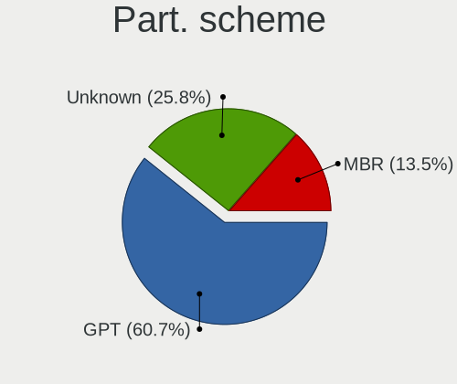
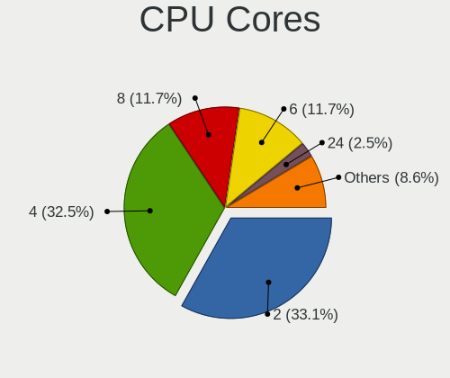
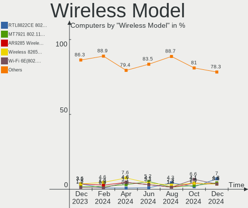
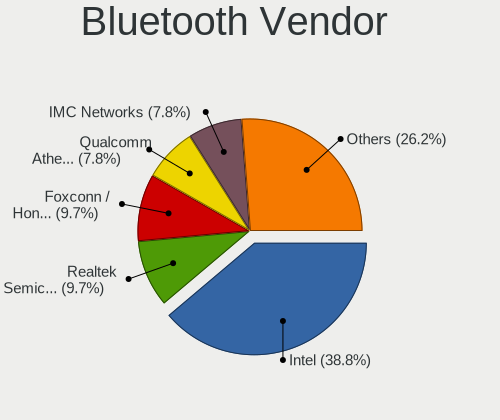
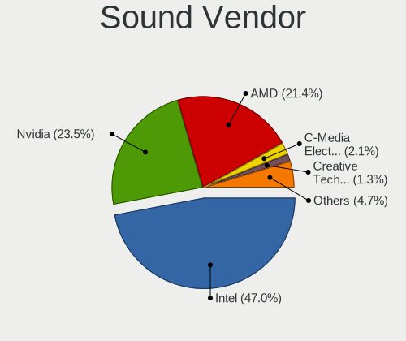
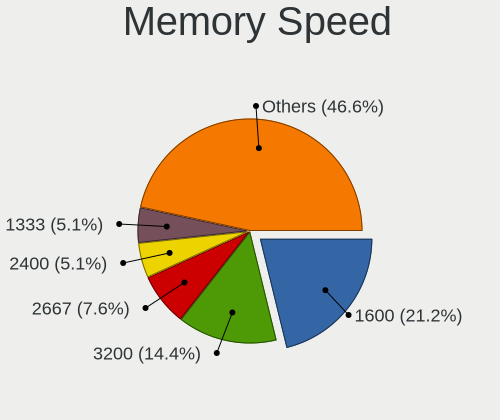
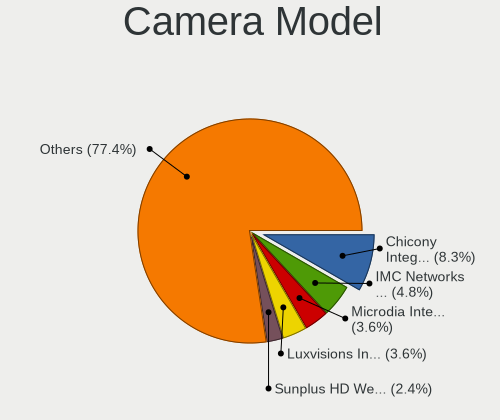
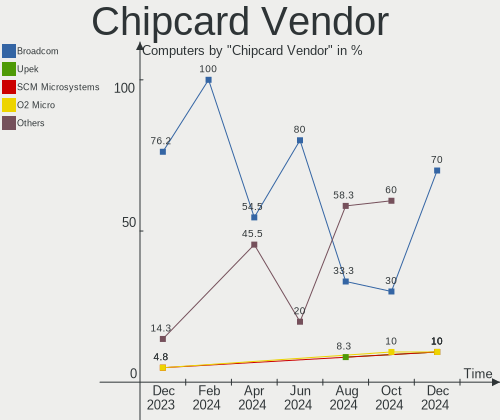
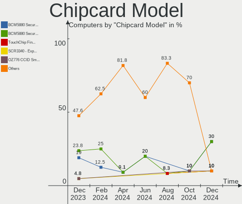

Linux in Poland - Hardware Trends
---------------------------------

A project to identify most popular hardware characteristics and track their change
over time based on data collected by Linux users at https://Linux-Hardware.org.

Anyone can contribute to this report by the [hw-probe](https://github.com/linuxhw/hw-probe) tool:

    sudo -E hw-probe -all -upload

This is a report for all computer types. See also reports for [desktops](/Location/Poland/Desktop/README.md) and [notebooks](/Location/Poland/Notebook/README.md).

Period: Nov, 2022.

Contents
--------

* [ System ](#system)
  - [ OS                       ](#os)
  - [ OS Family                ](#os-family)
  - [ Kernel                   ](#kernel)
  - [ Kernel Family            ](#kernel-family)
  - [ Kernel Major Ver.        ](#kernel-major-ver)
  - [ Arch                     ](#arch)
  - [ DE                       ](#de)
  - [ Display Server           ](#display-server)
  - [ Display Manager          ](#display-manager)
  - [ OS Lang                  ](#os-lang)
  - [ Boot Mode                ](#boot-mode)
  - [ Filesystem               ](#filesystem)
  - [ Part. scheme             ](#part-scheme)
  - [ Dual Boot with Linux/BSD ](#dual-boot-with-linuxbsd)
  - [ Dual Boot (Win)          ](#dual-boot-win)

* [ Board ](#board)
  - [ Vendor                   ](#vendor)
  - [ Model                    ](#model)
  - [ Model Family             ](#model-family)
  - [ MFG Year                 ](#mfg-year)
  - [ Form Factor              ](#form-factor)
  - [ Secure Boot              ](#secure-boot)
  - [ Coreboot                 ](#coreboot)
  - [ RAM Size                 ](#ram-size)
  - [ RAM Used                 ](#ram-used)
  - [ Total Drives             ](#total-drives)
  - [ Has CD-ROM               ](#has-cd-rom)
  - [ Has Ethernet             ](#has-ethernet)
  - [ Has WiFi                 ](#has-wifi)
  - [ Has Bluetooth            ](#has-bluetooth)

* [ Location ](#location)
  - [ Country                  ](#country)
  - [ City                     ](#city)

* [ Drives ](#drives)
  - [ Drive Vendor             ](#drive-vendor)
  - [ Drive Model              ](#drive-model)
  - [ HDD Vendor               ](#hdd-vendor)
  - [ SSD Vendor               ](#ssd-vendor)
  - [ Drive Kind               ](#drive-kind)
  - [ Drive Connector          ](#drive-connector)
  - [ Drive Size               ](#drive-size)
  - [ Space Total              ](#space-total)
  - [ Space Used               ](#space-used)
  - [ Malfunc. Drives          ](#malfunc-drives)
  - [ Malfunc. Drive Vendor    ](#malfunc-drive-vendor)
  - [ Malfunc. HDD Vendor      ](#malfunc-hdd-vendor)
  - [ Malfunc. Drive Kind      ](#malfunc-drive-kind)
  - [ Failed Drives            ](#failed-drives)
  - [ Failed Drive Vendor      ](#failed-drive-vendor)
  - [ Drive Status             ](#drive-status)

* [ Storage controller ](#storage-controller)
  - [ Storage Vendor           ](#storage-vendor)
  - [ Storage Model            ](#storage-model)
  - [ Storage Kind             ](#storage-kind)

* [ Processor ](#processor)
  - [ CPU Vendor               ](#cpu-vendor)
  - [ CPU Model                ](#cpu-model)
  - [ CPU Model Family         ](#cpu-model-family)
  - [ CPU Cores                ](#cpu-cores)
  - [ CPU Sockets              ](#cpu-sockets)
  - [ CPU Threads              ](#cpu-threads)
  - [ CPU Op-Modes             ](#cpu-op-modes)
  - [ CPU Microcode            ](#cpu-microcode)
  - [ CPU Microarch            ](#cpu-microarch)

* [ Graphics ](#graphics)
  - [ GPU Vendor               ](#gpu-vendor)
  - [ GPU Model                ](#gpu-model)
  - [ GPU Combo                ](#gpu-combo)
  - [ GPU Driver               ](#gpu-driver)
  - [ GPU Memory               ](#gpu-memory)

* [ Monitor ](#monitor)
  - [ Monitor Vendor           ](#monitor-vendor)
  - [ Monitor Model            ](#monitor-model)
  - [ Monitor Resolution       ](#monitor-resolution)
  - [ Monitor Diagonal         ](#monitor-diagonal)
  - [ Monitor Width            ](#monitor-width)
  - [ Aspect Ratio             ](#aspect-ratio)
  - [ Monitor Area             ](#monitor-area)
  - [ Pixel Density            ](#pixel-density)
  - [ Multiple Monitors        ](#multiple-monitors)

* [ Network ](#network)
  - [ Net Controller Vendor    ](#net-controller-vendor)
  - [ Net Controller Model     ](#net-controller-model)
  - [ Wireless Vendor          ](#wireless-vendor)
  - [ Wireless Model           ](#wireless-model)
  - [ Ethernet Vendor          ](#ethernet-vendor)
  - [ Ethernet Model           ](#ethernet-model)
  - [ Net Controller Kind      ](#net-controller-kind)
  - [ Used Controller          ](#used-controller)
  - [ NICs                     ](#nics)
  - [ IPv6                     ](#ipv6)

* [ Bluetooth ](#bluetooth)
  - [ Bluetooth Vendor         ](#bluetooth-vendor)
  - [ Bluetooth Model          ](#bluetooth-model)

* [ Sound ](#sound)
  - [ Sound Vendor             ](#sound-vendor)
  - [ Sound Model              ](#sound-model)

* [ Memory ](#memory)
  - [ Memory Vendor            ](#memory-vendor)
  - [ Memory Model             ](#memory-model)
  - [ Memory Kind              ](#memory-kind)
  - [ Memory Form Factor       ](#memory-form-factor)
  - [ Memory Size              ](#memory-size)
  - [ Memory Speed             ](#memory-speed)

* [ Printers & scanners ](#printers--scanners)
  - [ Printer Vendor           ](#printer-vendor)
  - [ Printer Model            ](#printer-model)
  - [ Scanner Vendor           ](#scanner-vendor)
  - [ Scanner Model            ](#scanner-model)

* [ Camera ](#camera)
  - [ Camera Vendor            ](#camera-vendor)
  - [ Camera Model             ](#camera-model)

* [ Security ](#security)
  - [ Fingerprint Vendor       ](#fingerprint-vendor)
  - [ Fingerprint Model        ](#fingerprint-model)
  - [ Chipcard Vendor          ](#chipcard-vendor)
  - [ Chipcard Model           ](#chipcard-model)

* [ Unsupported ](#unsupported)
  - [ Unsupported Devices      ](#unsupported-devices)
  - [ Unsupported Device Types ](#unsupported-device-types)

System
------

OS
--

Installed operating systems

| Name                         | Computers | Percent |
|------------------------------|-----------|---------|
| Ubuntu 22.04                 | 19        | 13.57%  |
| OpenMandriva 4.3             | 11        | 7.86%   |
| Fedora 37                    | 9         | 6.43%   |
| Debian 11                    | 9         | 6.43%   |
| Arch Rolling                 | 8         | 5.71%   |
| Ubuntu 22.10                 | 6         | 4.29%   |
| Ubuntu 20.04                 | 6         | 4.29%   |
| Linux Mint 21                | 6         | 4.29%   |
| Pop!_OS 22.04                | 4         | 2.86%   |
| OpenMandriva 4.50            | 4         | 2.86%   |
| Manjaro 22.0.0               | 4         | 2.86%   |
| openSUSE Tumbleweed-XXXXXXXX | 3         | 2.14%   |
| OpenMandriva 4.2             | 3         | 2.14%   |
| Lubuntu 22.04                | 3         | 2.14%   |
| Gentoo 2.9                   | 3         | 2.14%   |
| Zorin 16                     | 2         | 1.43%   |
| Xubuntu 22.04                | 2         | 1.43%   |
| ROSA R11.1                   | 2         | 1.43%   |
| ROSA 12.3                    | 2         | 1.43%   |
| Nobara 36                    | 2         | 1.43%   |
| MX 21                        | 2         | 1.43%   |
| Manjaro                      | 2         | 1.43%   |
| Kubuntu 22.10                | 2         | 1.43%   |
| Kubuntu 22.04                | 2         | 1.43%   |
| KDE neon 22.04               | 2         | 1.43%   |
| Fedora 36                    | 2         | 1.43%   |
| Fedora 35                    | 2         | 1.43%   |
| Ubuntu 18.04                 | 1         | 0.71%   |
| SteamOS 3.4                  | 1         | 0.71%   |
| SteamOS 3.3.2                | 1         | 0.71%   |
| risiOS 36                    | 1         | 0.71%   |
| Raspbian 11                  | 1         | 0.71%   |
| LMDE 5                       | 1         | 0.71%   |
| Linux Mint 20.3              | 1         | 0.71%   |
| Kubuntu 21.10                | 1         | 0.71%   |
| Kubuntu 20.10                | 1         | 0.71%   |
| Gentoo 2.8                   | 1         | 0.71%   |
| Garuda Linux Soaring         | 1         | 0.71%   |
| Fedora 34                    | 1         | 0.71%   |
| EuroLinux 8.7                | 1         | 0.71%   |

OS Family
---------

OS without a version

| Name         | Computers | Percent |
|--------------|-----------|---------|
| Ubuntu       | 32        | 22.86%  |
| OpenMandriva | 18        | 12.86%  |
| Fedora       | 14        | 10%     |
| Debian       | 10        | 7.14%   |
| Arch         | 8         | 5.71%   |
| Linux Mint   | 7         | 5%      |
| Manjaro      | 6         | 4.29%   |
| Kubuntu      | 6         | 4.29%   |
| ROSA         | 4         | 2.86%   |
| Pop!_OS      | 4         | 2.86%   |
| Gentoo       | 4         | 2.86%   |
| openSUSE     | 3         | 2.14%   |
| Lubuntu      | 3         | 2.14%   |
| Zorin        | 2         | 1.43%   |
| Xubuntu      | 2         | 1.43%   |
| SteamOS      | 2         | 1.43%   |
| Nobara       | 2         | 1.43%   |
| MX           | 2         | 1.43%   |
| KDE neon     | 2         | 1.43%   |
| Clear Linux  | 2         | 1.43%   |
| risiOS       | 1         | 0.71%   |
| Raspbian     | 1         | 0.71%   |
| LMDE         | 1         | 0.71%   |
| Garuda Linux | 1         | 0.71%   |
| EuroLinux    | 1         | 0.71%   |
| EndeavourOS  | 1         | 0.71%   |
| Elementary   | 1         | 0.71%   |

Kernel
------

Version of the Linux kernel

| Version                            | Computers | Percent |
|------------------------------------|-----------|---------|
| 5.15.0-53-generic                  | 16        | 11.43%  |
| 5.15.0-52-generic                  | 16        | 11.43%  |
| 5.16.7-desktop-1omv4003            | 10        | 7.14%   |
| 5.19.0-23-generic                  | 6         | 4.29%   |
| 5.10.0-19-amd64                    | 6         | 4.29%   |
| 5.15.0-43-generic                  | 4         | 2.86%   |
| 6.0.9-arch1-1                      | 3         | 2.14%   |
| 6.0.9-300.fc37.x86_64              | 3         | 2.14%   |
| 6.0.8-1-default                    | 3         | 2.14%   |
| 6.0.7-arch1-1                      | 3         | 2.14%   |
| 6.0.7-301.fc37.x86_64              | 3         | 2.14%   |
| 5.10.14-desktop-1omv4002           | 3         | 2.14%   |
| 6.0.8-300.fc37.x86_64              | 2         | 1.43%   |
| 6.0.8-100.fc35.x86_64              | 2         | 1.43%   |
| 6.0.8-1-MANJARO                    | 2         | 1.43%   |
| 6.0.6-76060006-generic             | 2         | 1.43%   |
| 5.4.83-generic-2rosa-x86_64        | 2         | 1.43%   |
| 5.4.0-132-generic                  | 2         | 1.43%   |
| 5.19.5-desktop-1omv4090            | 2         | 1.43%   |
| 5.19.12-desktop-2omv4090           | 2         | 1.43%   |
| 5.19.0-0.deb11.2-amd64             | 2         | 1.43%   |
| 5.15.75-gentoo                     | 2         | 1.43%   |
| 5.15.75-generic-1rosa2021.1-x86_64 | 2         | 1.43%   |
| 5.15.0-50-generic                  | 2         | 1.43%   |
| 6.0.9-zen1-1-zen                   | 1         | 0.71%   |
| 6.0.9-200.fc36.x86_64              | 1         | 0.71%   |
| 6.0.8-zen1-1-zen                   | 1         | 0.71%   |
| 6.0.8-x64v1-xanmod1                | 1         | 0.71%   |
| 6.0.8-lqx1-1-lqx                   | 1         | 0.71%   |
| 6.0.8-060008-generic               | 1         | 0.71%   |
| 6.0.7-gentoo-dist                  | 1         | 0.71%   |
| 6.0.7-200.fc36.x86_64              | 1         | 0.71%   |
| 6.0.7-1207.native                  | 1         | 0.71%   |
| 6.0.6-gentoo                       | 1         | 0.71%   |
| 6.0.6-arch1-1                      | 1         | 0.71%   |
| 6.0.5-201.fsync.fc36.x86_64        | 1         | 0.71%   |
| 6.0.5-200.fc36.x86_64              | 1         | 0.71%   |
| 6.0.3-76060003-generic             | 1         | 0.71%   |
| 6.0.10-201.fc36.x86_64             | 1         | 0.71%   |
| 6.0.0-4mx-rt-amd64                 | 1         | 0.71%   |

Kernel Family
-------------

Linux kernel without a distro release

| Version | Computers | Percent |
|---------|-----------|---------|
| 5.15.0  | 39        | 27.86%  |
| 6.0.8   | 13        | 9.29%   |
| 5.19.0  | 10        | 7.14%   |
| 5.16.7  | 10        | 7.14%   |
| 6.0.7   | 9         | 6.43%   |
| 5.10.0  | 9         | 6.43%   |
| 6.0.9   | 8         | 5.71%   |
| 6.0.6   | 4         | 2.86%   |
| 5.15.75 | 4         | 2.86%   |
| 5.15.78 | 3         | 2.14%   |
| 5.13.0  | 3         | 2.14%   |
| 5.10.14 | 3         | 2.14%   |
| 6.0.5   | 2         | 1.43%   |
| 6.0.0   | 2         | 1.43%   |
| 5.4.83  | 2         | 1.43%   |
| 5.4.0   | 2         | 1.43%   |
| 5.19.5  | 2         | 1.43%   |
| 5.19.12 | 2         | 1.43%   |
| 5.16.13 | 2         | 1.43%   |
| 6.0.3   | 1         | 0.71%   |
| 6.0.10  | 1         | 0.71%   |
| 5.8.0   | 1         | 0.71%   |
| 5.19.16 | 1         | 0.71%   |
| 5.17.0  | 1         | 0.71%   |
| 5.15.76 | 1         | 0.71%   |
| 5.15.61 | 1         | 0.71%   |
| 5.14.21 | 1         | 0.71%   |
| 5.14.0  | 1         | 0.71%   |
| 5.11.12 | 1         | 0.71%   |
| 4.18.0  | 1         | 0.71%   |

Kernel Major Ver.
-----------------

Linux kernel major version

| Version | Computers | Percent |
|---------|-----------|---------|
| 5.15    | 48        | 34.29%  |
| 6.0     | 40        | 28.57%  |
| 5.19    | 15        | 10.71%  |
| 5.16    | 12        | 8.57%   |
| 5.10    | 12        | 8.57%   |
| 5.4     | 4         | 2.86%   |
| 5.13    | 3         | 2.14%   |
| 5.14    | 2         | 1.43%   |
| 5.8     | 1         | 0.71%   |
| 5.17    | 1         | 0.71%   |
| 5.11    | 1         | 0.71%   |
| 4.18    | 1         | 0.71%   |

Arch
----

OS architecture (x86_64, i586, etc.)

| Name   | Computers | Percent |
|--------|-----------|---------|
| x86_64 | 139       | 99.29%  |
| armv6l | 1         | 0.71%   |

DE
--

Desktop Environment

| Name          | Computers | Percent |
|---------------|-----------|---------|
| GNOME         | 58        | 41.43%  |
| KDE5          | 50        | 35.71%  |
| XFCE          | 9         | 6.43%   |
| X-Cinnamon    | 6         | 4.29%   |
| LXQt          | 4         | 2.86%   |
| i3            | 4         | 2.86%   |
| MATE          | 3         | 2.14%   |
| Unknown       | 2         | 1.43%   |
| Unity         | 1         | 0.71%   |
| Pantheon      | 1         | 0.71%   |
| KDE           | 1         | 0.71%   |
| GNOME Classic | 1         | 0.71%   |

Display Server
--------------

X11 or Wayland

| Name    | Computers | Percent |
|---------|-----------|---------|
| X11     | 94        | 67.14%  |
| Wayland | 39        | 27.86%  |
| Unknown | 5         | 3.57%   |
| Tty     | 2         | 1.43%   |

Display Manager
---------------

SDDM, LightDM, etc.

| Name    | Computers | Percent |
|---------|-----------|---------|
| SDDM    | 45        | 32.14%  |
| Unknown | 44        | 31.43%  |
| GDM3    | 25        | 17.86%  |
| LightDM | 14        | 10%     |
| GDM     | 12        | 8.57%   |

OS Lang
-------

Language

| Lang  | Computers | Percent |
|-------|-----------|---------|
| pl_PL | 78        | 55.71%  |
| en_US | 52        | 37.14%  |
| en_GB | 3         | 2.14%   |
| C     | 3         | 2.14%   |
| fr_FR | 1         | 0.71%   |
| en_AG | 1         | 0.71%   |
| de_DE | 1         | 0.71%   |
| aa_DJ | 1         | 0.71%   |

Boot Mode
---------

EFI or BIOS

| Mode | Computers | Percent |
|------|-----------|---------|
| EFI  | 73        | 52.14%  |
| BIOS | 67        | 47.86%  |

Filesystem
----------

Type of filesystem

| Type    | Computers | Percent |
|---------|-----------|---------|
| Ext4    | 90        | 64.29%  |
| Btrfs   | 24        | 17.14%  |
| Overlay | 19        | 13.57%  |
| F2fs    | 4         | 2.86%   |
| Zfs     | 2         | 1.43%   |
| Xfs     | 1         | 0.71%   |

Part. scheme
------------

Scheme of partitioning

| Type    | Computers | Percent |
|---------|-----------|---------|
| GPT     | 77        | 55%     |
| Unknown | 39        | 27.86%  |
| MBR     | 24        | 17.14%  |

Dual Boot with Linux/BSD
------------------------

Hosting more than one Linux/BSD

| Dual boot | Computers | Percent |
|-----------|-----------|---------|
| No        | 115       | 82.14%  |
| Yes       | 25        | 17.86%  |

Dual Boot (Win)
---------------

Hosting Linux and Windows

| Dual boot | Computers | Percent |
|-----------|-----------|---------|
| No        | 95        | 67.86%  |
| Yes       | 45        | 32.14%  |

Board
-----

Vendor
------

Motherboard manufacturer

| Name                    | Computers | Percent |
|-------------------------|-----------|---------|
| Dell                    | 25        | 17.86%  |
| Lenovo                  | 23        | 16.43%  |
| Hewlett-Packard         | 23        | 16.43%  |
| ASUSTek Computer        | 16        | 11.43%  |
| MSI                     | 15        | 10.71%  |
| Gigabyte Technology     | 10        | 7.14%   |
| Acer                    | 5         | 3.57%   |
| Valve                   | 3         | 2.14%   |
| Intel                   | 3         | 2.14%   |
| HUAWEI                  | 3         | 2.14%   |
| ASRock                  | 3         | 2.14%   |
| Samsung Electronics     | 2         | 1.43%   |
| Fujitsu                 | 2         | 1.43%   |
| Toshiba                 | 1         | 0.71%   |
| Raspberry Pi Foundation | 1         | 0.71%   |
| MACHINIST               | 1         | 0.71%   |
| Kruger&Matz             | 1         | 0.71%   |
| Foxconn                 | 1         | 0.71%   |
| Apple                   | 1         | 0.71%   |
| Unknown                 | 1         | 0.71%   |

Model
-----

Motherboard model

| Name                                       | Computers | Percent |
|--------------------------------------------|-----------|---------|
| Valve Jupiter                              | 3         | 2.14%   |
| Dell Latitude E6540                        | 3         | 2.14%   |
| HP EliteBook 850 G8 Notebook PC            | 2         | 1.43%   |
| Dell OptiPlex 755                          | 2         | 1.43%   |
| Unknown                                    | 2         | 1.43%   |
| Toshiba Satellite P300                     | 1         | 0.71%   |
| Samsung 300V3A/300V4A/300V5A/200A4B/200A5B | 1         | 0.71%   |
| Samsung 300E4A/300E5A/300E7A               | 1         | 0.71%   |
| RPi Raspberry Pi Zero W Rev 1.1            | 1         | 0.71%   |
| MSI Stealth GS77 12UGS                     | 1         | 0.71%   |
| MSI MS-7D46                                | 1         | 0.71%   |
| MSI MS-7D25                                | 1         | 0.71%   |
| MSI MS-7D20                                | 1         | 0.71%   |
| MSI MS-7C52                                | 1         | 0.71%   |
| MSI MS-7C02                                | 1         | 0.71%   |
| MSI MS-7B93                                | 1         | 0.71%   |
| MSI MS-7B84                                | 1         | 0.71%   |
| MSI MS-7B78                                | 1         | 0.71%   |
| MSI MS-7B00                                | 1         | 0.71%   |
| MSI MS-7A38                                | 1         | 0.71%   |
| MSI MS-7A34                                | 1         | 0.71%   |
| MSI MS-7816                                | 1         | 0.71%   |
| MSI Modern 15 A5M                          | 1         | 0.71%   |
| MSI Creator Z17 A12UHST                    | 1         | 0.71%   |
| MACHINIST X99-D8-MAX V1.0                  | 1         | 0.71%   |
| Lenovo ThinkPad Yoga 370 20JJS1DU05        | 1         | 0.71%   |
| Lenovo ThinkPad T430 23498M7               | 1         | 0.71%   |
| Lenovo ThinkPad T14 Gen 3 21AH0082PB       | 1         | 0.71%   |
| Lenovo ThinkPad T14 Gen 1 20S1S5MX1J       | 1         | 0.71%   |
| Lenovo ThinkPad P53 20QQS2CY00             | 1         | 0.71%   |
| Lenovo ThinkPad P53 20QNS00Y00             | 1         | 0.71%   |
| Lenovo ThinkPad L480 20LS001AMC            | 1         | 0.71%   |
| Lenovo ThinkPad L14 Gen 1 20U5004KPB       | 1         | 0.71%   |
| Lenovo ThinkPad L14 Gen 1 20U50001PB       | 1         | 0.71%   |
| Lenovo ThinkPad E15 Gen 2 20T8000MPB       | 1         | 0.71%   |
| Lenovo ThinkCentre M72e 3267B69            | 1         | 0.71%   |
| Lenovo ThinkBook 15 G2 ITL 20VE            | 1         | 0.71%   |
| Lenovo ThinkBook 14 G2 ITL 20VD            | 1         | 0.71%   |
| Lenovo S145-15API 81UT                     | 1         | 0.71%   |
| Lenovo Legion Y540-15IRH 81SX              | 1         | 0.71%   |

Model Family
------------

Motherboard model prefix

| Name                 | Computers | Percent |
|----------------------|-----------|---------|
| Dell Latitude        | 13        | 9.29%   |
| Lenovo ThinkPad      | 10        | 7.14%   |
| HP EliteBook         | 6         | 4.29%   |
| Lenovo IdeaPad       | 5         | 3.57%   |
| HP ProBook           | 5         | 3.57%   |
| Dell Inspiron        | 5         | 3.57%   |
| ASUS TUF             | 4         | 2.86%   |
| Acer Aspire          | 4         | 2.86%   |
| Valve Jupiter        | 3         | 2.14%   |
| HP Pavilion          | 3         | 2.14%   |
| Lenovo ThinkBook     | 2         | 1.43%   |
| Gigabyte B550        | 2         | 1.43%   |
| Fujitsu CELSIUS      | 2         | 1.43%   |
| Dell Vostro          | 2         | 1.43%   |
| Dell OptiPlex        | 2         | 1.43%   |
| ASUS VivoBook        | 2         | 1.43%   |
| Unknown              | 2         | 1.43%   |
| Toshiba Satellite    | 1         | 0.71%   |
| Samsung 300V3A       | 1         | 0.71%   |
| Samsung 300E4A       | 1         | 0.71%   |
| RPi Raspberry        | 1         | 0.71%   |
| MSI Stealth          | 1         | 0.71%   |
| MSI MS-7D46          | 1         | 0.71%   |
| MSI MS-7D25          | 1         | 0.71%   |
| MSI MS-7D20          | 1         | 0.71%   |
| MSI MS-7C52          | 1         | 0.71%   |
| MSI MS-7C02          | 1         | 0.71%   |
| MSI MS-7B93          | 1         | 0.71%   |
| MSI MS-7B84          | 1         | 0.71%   |
| MSI MS-7B78          | 1         | 0.71%   |
| MSI MS-7B00          | 1         | 0.71%   |
| MSI MS-7A38          | 1         | 0.71%   |
| MSI MS-7A34          | 1         | 0.71%   |
| MSI MS-7816          | 1         | 0.71%   |
| MSI Modern           | 1         | 0.71%   |
| MSI Creator          | 1         | 0.71%   |
| MACHINIST X99-D8-MAX | 1         | 0.71%   |
| Lenovo ThinkCentre   | 1         | 0.71%   |
| Lenovo S145-15API    | 1         | 0.71%   |
| Lenovo Legion        | 1         | 0.71%   |

MFG Year
--------

Motherboard manufacture year

| Year    | Computers | Percent |
|---------|-----------|---------|
| 2020    | 19        | 13.57%  |
| 2021    | 18        | 12.86%  |
| 2019    | 14        | 10%     |
| 2022    | 12        | 8.57%   |
| 2012    | 11        | 7.86%   |
| 2014    | 10        | 7.14%   |
| 2017    | 9         | 6.43%   |
| 2011    | 9         | 6.43%   |
| 2018    | 8         | 5.71%   |
| 2015    | 6         | 4.29%   |
| 2013    | 6         | 4.29%   |
| 2010    | 5         | 3.57%   |
| 2008    | 5         | 3.57%   |
| 2007    | 3         | 2.14%   |
| 2016    | 2         | 1.43%   |
| 2009    | 2         | 1.43%   |
| Unknown | 1         | 0.71%   |

Form Factor
-----------

Physical design of the computer

| Name           | Computers | Percent |
|----------------|-----------|---------|
| Notebook       | 88        | 62.86%  |
| Desktop        | 49        | 35%     |
| System on chip | 1         | 0.71%   |
| Convertible    | 1         | 0.71%   |
| Mini pc        | 1         | 0.71%   |

Secure Boot
-----------

Enabled or disabled

| State    | Computers | Percent |
|----------|-----------|---------|
| Disabled | 130       | 92.86%  |
| Enabled  | 10        | 7.14%   |

Coreboot
--------

Have coreboot on board

| Used | Computers | Percent |
|------|-----------|---------|
| No   | 140       | 100%    |

RAM Size
--------

Total RAM memory

| Size in GB  | Computers | Percent |
|-------------|-----------|---------|
| 32.01-64.0  | 30        | 21.43%  |
| 16.01-24.0  | 30        | 21.43%  |
| 8.01-16.0   | 27        | 19.29%  |
| 4.01-8.0    | 26        | 18.57%  |
| 3.01-4.0    | 18        | 12.86%  |
| 24.01-32.0  | 3         | 2.14%   |
| 64.01-256.0 | 2         | 1.43%   |
| 1.01-2.0    | 2         | 1.43%   |
| 2.01-3.0    | 1         | 0.71%   |
| 0.01-0.5    | 1         | 0.71%   |

RAM Used
--------

Used RAM memory

| Used GB    | Computers | Percent |
|------------|-----------|---------|
| 1.01-2.0   | 42        | 30%     |
| 4.01-8.0   | 29        | 20.71%  |
| 2.01-3.0   | 29        | 20.71%  |
| 3.01-4.0   | 20        | 14.29%  |
| 8.01-16.0  | 10        | 7.14%   |
| 0.51-1.0   | 4         | 2.86%   |
| 24.01-32.0 | 2         | 1.43%   |
| 16.01-24.0 | 2         | 1.43%   |
| 0.01-0.5   | 2         | 1.43%   |

Total Drives
------------

Number of drives on board

| Drives | Computers | Percent |
|--------|-----------|---------|
| 1      | 81        | 57.86%  |
| 2      | 41        | 29.29%  |
| 4      | 7         | 5%      |
| 3      | 6         | 4.29%   |
| 6      | 2         | 1.43%   |
| 5      | 2         | 1.43%   |
| 0      | 1         | 0.71%   |

Has CD-ROM
----------

Has CD-ROM on board

| Presented | Computers | Percent |
|-----------|-----------|---------|
| No        | 101       | 72.14%  |
| Yes       | 39        | 27.86%  |

Has Ethernet
------------

Has Ethernet on board

| Presented | Computers | Percent |
|-----------|-----------|---------|
| Yes       | 118       | 84.29%  |
| No        | 22        | 15.71%  |

Has WiFi
--------

Has WiFi module

| Presented | Computers | Percent |
|-----------|-----------|---------|
| Yes       | 109       | 77.86%  |
| No        | 31        | 22.14%  |

Has Bluetooth
-------------

Has Bluetooth module

| Presented | Computers | Percent |
|-----------|-----------|---------|
| Yes       | 88        | 62.86%  |
| No        | 52        | 37.14%  |

Location
--------

Country
-------

Geographic location (country)

| Country | Computers | Percent |
|---------|-----------|---------|
| Poland  | 140       | 100%    |

City
----

Geographic location (city)

| City                 | Computers | Percent |
|----------------------|-----------|---------|
| Warsaw               | 27        | 19.29%  |
| Krakow               | 12        | 8.57%   |
| Wroclaw              | 7         | 5%      |
| Lodz                 | 7         | 5%      |
| Gdansk               | 5         | 3.57%   |
| Poznan               | 4         | 2.86%   |
| Bialystok            | 4         | 2.86%   |
| Tarnów              | 3         | 2.14%   |
| Kedzierzyn-Kozle     | 3         | 2.14%   |
| Katowice             | 3         | 2.14%   |
| Janikowo             | 3         | 2.14%   |
| Bytom                | 3         | 2.14%   |
| Wodzisław Śląski  | 2         | 1.43%   |
| Supraśl             | 2         | 1.43%   |
| Gdynia               | 2         | 1.43%   |
| Buczkowice           | 2         | 1.43%   |
| Bielsko-Biala        | 2         | 1.43%   |
| Żywiec              | 1         | 0.71%   |
| Zielona Góra        | 1         | 0.71%   |
| Zawiercie            | 1         | 0.71%   |
| Wykroty              | 1         | 0.71%   |
| Witkowo              | 1         | 0.71%   |
| Wielbark             | 1         | 0.71%   |
| Szerzyny             | 1         | 0.71%   |
| Szczecin             | 1         | 0.71%   |
| Sosnowiec            | 1         | 0.71%   |
| Sompolno             | 1         | 0.71%   |
| Rzeszów             | 1         | 0.71%   |
| Rumia                | 1         | 0.71%   |
| Ruda Śląska        | 1         | 0.71%   |
| Robercin             | 1         | 0.71%   |
| Radom                | 1         | 0.71%   |
| Piaseczno            | 1         | 0.71%   |
| Ostrołęka          | 1         | 0.71%   |
| Ostrów Wielkopolski | 1         | 0.71%   |
| Ostrow Lubelski      | 1         | 0.71%   |
| Opalenica            | 1         | 0.71%   |
| Olsztyn              | 1         | 0.71%   |
| Olszanka             | 1         | 0.71%   |
| Moczkowo             | 1         | 0.71%   |

Drives
------

Drive Vendor
------------

Hard drive vendors

| Vendor                         | Computers | Drives | Percent |
|--------------------------------|-----------|--------|---------|
| Samsung Electronics            | 41        | 44     | 19.62%  |
| GOODRAM                        | 22        | 24     | 10.53%  |
| WDC                            | 18        | 20     | 8.61%   |
| Seagate                        | 16        | 18     | 7.66%   |
| Sandisk                        | 11        | 11     | 5.26%   |
| Crucial                        | 10        | 11     | 4.78%   |
| Unknown                        | 8         | 10     | 3.83%   |
| Toshiba                        | 8         | 8      | 3.83%   |
| SK hynix                       | 7         | 7      | 3.35%   |
| Kingston                       | 6         | 7      | 2.87%   |
| Intel                          | 6         | 6      | 2.87%   |
| A-DATA Technology              | 6         | 6      | 2.87%   |
| Hitachi                        | 5         | 7      | 2.39%   |
| SPCC                           | 4         | 4      | 1.91%   |
| Micron Technology              | 4         | 4      | 1.91%   |
| Silicon Motion                 | 3         | 3      | 1.44%   |
| Phison Electronics             | 3         | 4      | 1.44%   |
| KIOXIA                         | 3         | 3      | 1.44%   |
| Kingston Technology Company    | 3         | 3      | 1.44%   |
| HGST                           | 3         | 3      | 1.44%   |
| LITEONIT                       | 2         | 2      | 0.96%   |
| Unknown                        | 2         | 2      | 0.96%   |
| V Series                       | 1         | 1      | 0.48%   |
| Union Memory                   | 1         | 1      | 0.48%   |
| UMIS                           | 1         | 1      | 0.48%   |
| StoreJet                       | 1         | 1      | 0.48%   |
| Solid State Storage Technology | 1         | 1      | 0.48%   |
| Ramaxel Technology             | 1         | 1      | 0.48%   |
| Phison                         | 1         | 1      | 0.48%   |
| Patriot                        | 1         | 1      | 0.48%   |
| Netac                          | 1         | 1      | 0.48%   |
| Micron/Crucial Technology      | 1         | 1      | 0.48%   |
| JMicron Technology             | 1         | 1      | 0.48%   |
| Hewlett-Packard                | 1         | 1      | 0.48%   |
| Gigabyte Technology            | 1         | 1      | 0.48%   |
| Corsair                        | 1         | 1      | 0.48%   |
| China                          | 1         | 1      | 0.48%   |
| Apple                          | 1         | 2      | 0.48%   |
| Apacer                         | 1         | 1      | 0.48%   |
| ADATA Technology               | 1         | 1      | 0.48%   |

Drive Model
-----------

Hard drive models

| Model                                               | Computers | Percent |
|-----------------------------------------------------|-----------|---------|
| Seagate ST1000DM010-2EP102 1TB                      | 4         | 1.81%   |
| Samsung SSD 980 500GB                               | 4         | 1.81%   |
| Samsung NVMe SSD Controller SM981/PM981/PM983 1TB   | 4         | 1.81%   |
| Crucial CT1000MX500SSD1 1TB                         | 4         | 1.81%   |
| Kingston SA400S37240G 240GB SSD                     | 3         | 1.36%   |
| GOODRAM SSDPR-CX400-512-G2 512GB                    | 3         | 1.36%   |
| Crucial CT500MX500SSD1 500GB                        | 3         | 1.36%   |
| WDC WD10JPCX-24UE4T0 1TB                            | 2         | 0.9%    |
| Unknown MMC Card  16GB                              | 2         | 0.9%    |
| Toshiba MQ01ABD100 1TB                              | 2         | 0.9%    |
| SPCC Solid State Disk 240GB                         | 2         | 0.9%    |
| Sandisk WD Blue SN570 1TB                           | 2         | 0.9%    |
| Samsung SSD 870 EVO 500GB                           | 2         | 0.9%    |
| Samsung SSD 850 PRO 256GB                           | 2         | 0.9%    |
| Samsung NVMe SSD Controller SM961/PM961/SM963 250GB | 2         | 0.9%    |
| Samsung MZVL22T0HBLB-00BTW 2TB                      | 2         | 0.9%    |
| Samsung HD502HI 500GB                               | 2         | 0.9%    |
| Phison E12 NVMe Controller 2TB                      | 2         | 0.9%    |
| Kingston Company OM3PDP3 NVMe SSD 256GB             | 2         | 0.9%    |
| GOODRAM SSDPR-CX400-128 128GB                       | 2         | 0.9%    |
| GOODRAM SSDPR-CL100-480-G2 480GB                    | 2         | 0.9%    |
| GOODRAM SSD 120GB                                   | 2         | 0.9%    |
| Crucial CT240BX200SSD1 240GB                        | 2         | 0.9%    |
| Unknown                                             | 2         | 0.9%    |
| WDC WDS100T2B0C-00PXH0 1TB                          | 1         | 0.45%   |
| WDC WDS100T2B0B-00YS70 1TB SSD                      | 1         | 0.45%   |
| WDC WD5003ABYZ-011FA0 500GB                         | 1         | 0.45%   |
| WDC WD5000LUCT-63C26Y0 500GB                        | 1         | 0.45%   |
| WDC WD5000LPLX-08ZNTT0 500GB                        | 1         | 0.45%   |
| WDC WD5000BPKT-60PK4T0 500GB                        | 1         | 0.45%   |
| WDC WD3200BPVT-22JJ5T0 320GB                        | 1         | 0.45%   |
| WDC WD30EFRX-68N32N0 3TB                            | 1         | 0.45%   |
| WDC WD2500JS-55NCB1 250GB                           | 1         | 0.45%   |
| WDC WD2500AAKX-753CA1 250GB                         | 1         | 0.45%   |
| WDC WD10PURX-64E5EY0 1TB                            | 1         | 0.45%   |
| WDC WD10JPVX-22JC3T0 1TB                            | 1         | 0.45%   |
| WDC WD10JFCX-68N6GN0 1TB                            | 1         | 0.45%   |
| WDC WD10EZRZ-00HTKB0 1TB                            | 1         | 0.45%   |
| WDC WD10EARS-00Y5B1 1TB                             | 1         | 0.45%   |
| WDC WD1003FZEX-00K3CA0 1TB                          | 1         | 0.45%   |

HDD Vendor
----------

Hard disk drive vendors

| Vendor              | Computers | Drives | Percent |
|---------------------|-----------|--------|---------|
| Seagate             | 16        | 18     | 31.37%  |
| WDC                 | 14        | 16     | 27.45%  |
| Toshiba             | 6         | 6      | 11.76%  |
| Samsung Electronics | 6         | 6      | 11.76%  |
| Hitachi             | 5         | 7      | 9.8%    |
| HGST                | 3         | 3      | 5.88%   |
| Unknown             | 1         | 1      | 1.96%   |

SSD Vendor
----------

Solid state drive vendors

| Vendor              | Computers | Drives | Percent |
|---------------------|-----------|--------|---------|
| GOODRAM             | 21        | 23     | 29.17%  |
| Samsung Electronics | 10        | 10     | 13.89%  |
| Crucial             | 10        | 11     | 13.89%  |
| Kingston            | 5         | 6      | 6.94%   |
| SPCC                | 4         | 4      | 5.56%   |
| SanDisk             | 3         | 3      | 4.17%   |
| A-DATA Technology   | 3         | 3      | 4.17%   |
| SK hynix            | 2         | 2      | 2.78%   |
| LITEONIT            | 2         | 2      | 2.78%   |
| WDC                 | 1         | 1      | 1.39%   |
| V Series            | 1         | 1      | 1.39%   |
| Toshiba             | 1         | 1      | 1.39%   |
| StoreJet            | 1         | 1      | 1.39%   |
| Ramaxel Technology  | 1         | 1      | 1.39%   |
| Patriot             | 1         | 1      | 1.39%   |
| Netac               | 1         | 1      | 1.39%   |
| Intel               | 1         | 1      | 1.39%   |
| Hewlett-Packard     | 1         | 1      | 1.39%   |
| Gigabyte Technology | 1         | 1      | 1.39%   |
| China               | 1         | 1      | 1.39%   |
| Apacer              | 1         | 1      | 1.39%   |

Drive Kind
----------

HDD or SSD

| Kind    | Computers | Drives | Percent |
|---------|-----------|--------|---------|
| NVMe    | 69        | 81     | 37.5%   |
| SSD     | 62        | 76     | 33.7%   |
| HDD     | 43        | 57     | 23.37%  |
| MMC     | 7         | 7      | 3.8%    |
| Unknown | 3         | 5      | 1.63%   |

Drive Connector
---------------

SATA, SAS, NVMe, etc.

| Type | Computers | Drives | Percent |
|------|-----------|--------|---------|
| SATA | 84        | 128    | 50%     |
| NVMe | 69        | 81     | 41.07%  |
| SAS  | 8         | 10     | 4.76%   |
| MMC  | 7         | 7      | 4.17%   |

Drive Size
----------

Size of hard drive

| Size in TB | Computers | Drives | Percent |
|------------|-----------|--------|---------|
| 0.01-0.5   | 70        | 87     | 62.5%   |
| 0.51-1.0   | 33        | 35     | 29.46%  |
| 2.01-3.0   | 3         | 5      | 2.68%   |
| 3.01-4.0   | 2         | 2      | 1.79%   |
| 1.01-2.0   | 2         | 2      | 1.79%   |
| 10.01-20.0 | 1         | 1      | 0.89%   |
| 4.01-10.0  | 1         | 1      | 0.89%   |

Space Total
-----------

Amount of disk space available on the file system

| Size in GB     | Computers | Percent |
|----------------|-----------|---------|
| 251-500        | 35        | 25%     |
| 101-250        | 33        | 23.57%  |
| 1-20           | 20        | 14.29%  |
| 501-1000       | 20        | 14.29%  |
| 1001-2000      | 10        | 7.14%   |
| 51-100         | 7         | 5%      |
| Unknown        | 5         | 3.57%   |
| More than 3000 | 4         | 2.86%   |
| 21-50          | 3         | 2.14%   |
| 2001-3000      | 3         | 2.14%   |

Space Used
----------

Amount of used disk space

| Used GB        | Computers | Percent |
|----------------|-----------|---------|
| 1-20           | 48        | 34.29%  |
| 21-50          | 24        | 17.14%  |
| 101-250        | 19        | 13.57%  |
| 51-100         | 16        | 11.43%  |
| 251-500        | 14        | 10%     |
| 501-1000       | 8         | 5.71%   |
| Unknown        | 5         | 3.57%   |
| More than 3000 | 4         | 2.86%   |
| 1001-2000      | 2         | 1.43%   |

Malfunc. Drives
---------------

Drive models with a malfunction

| Model                                 | Computers | Drives | Percent |
|---------------------------------------|-----------|--------|---------|
| WDC WD5000LUCT-63C26Y0 500GB          | 1         | 1      | 10%     |
| WDC WD2500AAKX-753CA1 250GB           | 1         | 1      | 10%     |
| WDC WD10JPVX-22JC3T0 1TB              | 1         | 1      | 10%     |
| WDC WD10JFCX-68N6GN0 1TB              | 1         | 1      | 10%     |
| Seagate ST9500325AS 500GB             | 1         | 1      | 10%     |
| Seagate ST500LT012-9WS142 500GB       | 1         | 1      | 10%     |
| Samsung Electronics HM250HI 250GB     | 1         | 1      | 10%     |
| Samsung Electronics HD256GM 250GB     | 1         | 1      | 10%     |
| LITEONIT LCT-256M3S 2.5 7mm 256GB SSD | 1         | 1      | 10%     |
| Hitachi HTS725050A9A364 500GB         | 1         | 1      | 10%     |

Malfunc. Drive Vendor
---------------------

Vendors of faulty drives

| Vendor              | Computers | Drives | Percent |
|---------------------|-----------|--------|---------|
| WDC                 | 4         | 4      | 40%     |
| Seagate             | 2         | 2      | 20%     |
| Samsung Electronics | 2         | 2      | 20%     |
| LITEONIT            | 1         | 1      | 10%     |
| Hitachi             | 1         | 1      | 10%     |

Malfunc. HDD Vendor
-------------------

Vendors of faulty HDD drives

| Vendor              | Computers | Drives | Percent |
|---------------------|-----------|--------|---------|
| WDC                 | 4         | 4      | 44.44%  |
| Seagate             | 2         | 2      | 22.22%  |
| Samsung Electronics | 2         | 2      | 22.22%  |
| Hitachi             | 1         | 1      | 11.11%  |

Malfunc. Drive Kind
-------------------

Kinds of faulty drives

| Kind | Computers | Drives | Percent |
|------|-----------|--------|---------|
| HDD  | 9         | 9      | 90%     |
| SSD  | 1         | 1      | 10%     |

Failed Drives
-------------

Failed drive models

Zero info for selected period =(

Failed Drive Vendor
-------------------

Failed drive vendors

Zero info for selected period =(

Drive Status
------------

Number of failed and malfunc. drives

| Status   | Computers | Drives | Percent |
|----------|-----------|--------|---------|
| Works    | 78        | 119    | 52%     |
| Detected | 62        | 97     | 41.33%  |
| Malfunc  | 10        | 10     | 6.67%   |

Storage controller
------------------

Storage Vendor
--------------

Storage controller vendors

| Vendor                         | Computers | Percent |
|--------------------------------|-----------|---------|
| Intel                          | 81        | 42.63%  |
| AMD                            | 32        | 16.84%  |
| Samsung Electronics            | 27        | 14.21%  |
| SanDisk                        | 11        | 5.79%   |
| Phison Electronics             | 6         | 3.16%   |
| SK hynix                       | 5         | 2.63%   |
| Silicon Motion                 | 4         | 2.11%   |
| Micron Technology              | 4         | 2.11%   |
| KIOXIA                         | 4         | 2.11%   |
| Kingston Technology Company    | 4         | 2.11%   |
| ASMedia Technology             | 3         | 1.58%   |
| ADATA Technology               | 3         | 1.58%   |
| Union Memory (Shenzhen)        | 2         | 1.05%   |
| Solid State Storage Technology | 1         | 0.53%   |
| Micron/Crucial Technology      | 1         | 0.53%   |
| JMicron Technology             | 1         | 0.53%   |
| Apple                          | 1         | 0.53%   |

Storage Model
-------------

Storage controller models

| Model                                                                          | Computers | Percent |
|--------------------------------------------------------------------------------|-----------|---------|
| AMD FCH SATA Controller [AHCI mode]                                            | 18        | 8.57%   |
| Samsung NVMe SSD Controller SM981/PM981/PM983                                  | 13        | 6.19%   |
| Samsung NVMe SSD Controller 980                                                | 9         | 4.29%   |
| Intel Sunrise Point-LP SATA Controller [AHCI mode]                             | 9         | 4.29%   |
| Intel 6 Series/C200 Series Chipset Family 6 port Mobile SATA AHCI Controller   | 8         | 3.81%   |
| Intel Volume Management Device NVMe RAID Controller                            | 7         | 3.33%   |
| Intel 7 Series Chipset Family 6-port SATA Controller [AHCI mode]               | 6         | 2.86%   |
| AMD 500 Series Chipset SATA Controller                                         | 6         | 2.86%   |
| AMD 400 Series Chipset SATA Controller                                         | 6         | 2.86%   |
| SK hynix Gold P31/PC711 NVMe Solid State Drive                                 | 4         | 1.9%    |
| SanDisk Non-Volatile memory controller                                         | 4         | 1.9%    |
| Phison E12 NVMe Controller                                                     | 4         | 1.9%    |
| Micron Non-Volatile memory controller                                          | 4         | 1.9%    |
| Intel 82801 Mobile SATA Controller [RAID mode]                                 | 4         | 1.9%    |
| Intel 6 Series/C200 Series Chipset Family 6 port Desktop SATA AHCI Controller  | 4         | 1.9%    |
| Intel 5 Series/3400 Series Chipset 6 port SATA AHCI Controller                 | 4         | 1.9%    |
| Samsung NVMe SSD Controller PM9A1/PM9A3/980PRO                                 | 3         | 1.43%   |
| Intel Tiger Lake-LP SATA Controller                                            | 3         | 1.43%   |
| Intel Cannon Lake Mobile PCH SATA AHCI Controller                              | 3         | 1.43%   |
| Intel 9 Series Chipset Family SATA Controller [AHCI Mode]                      | 3         | 1.43%   |
| Intel 8 Series/C220 Series Chipset Family 6-port SATA Controller 1 [AHCI mode] | 3         | 1.43%   |
| ASMedia ASM1062 Serial ATA Controller                                          | 3         | 1.43%   |
| AMD SB7x0/SB8x0/SB9x0 SATA Controller [AHCI mode]                              | 3         | 1.43%   |
| AMD 300 Series Chipset SATA Controller                                         | 3         | 1.43%   |
| Union Memory (Shenzhen) Non-Volatile memory controller                         | 2         | 0.95%   |
| Silicon Motion Non-Volatile memory controller                                  | 2         | 0.95%   |
| SanDisk WD Blue SN570 NVMe SSD                                                 | 2         | 0.95%   |
| SanDisk PC SN520 NVMe SSD                                                      | 2         | 0.95%   |
| Samsung NVMe SSD Controller SM961/PM961/SM963                                  | 2         | 0.95%   |
| Phison PS5013 E13 NVMe Controller                                              | 2         | 0.95%   |
| KIOXIA NVMe SSD Controller BG4                                                 | 2         | 0.95%   |
| Kingston Company OM3PDP3 NVMe SSD                                              | 2         | 0.95%   |
| Intel SSD 600P Series                                                          | 2         | 0.95%   |
| Intel Non-Volatile memory controller                                           | 2         | 0.95%   |
| Intel HM170/QM170 Chipset SATA Controller [AHCI Mode]                          | 2         | 0.95%   |
| Intel Alder Lake-S PCH SATA Controller [AHCI Mode]                             | 2         | 0.95%   |
| Intel 82Q35 Express PT IDER Controller                                         | 2         | 0.95%   |
| Intel 82801IR/IO/IH (ICH9R/DO/DH) 6 port SATA Controller [AHCI mode]           | 2         | 0.95%   |
| Intel 82801IBM/IEM (ICH9M/ICH9M-E) 4 port SATA Controller [AHCI mode]          | 2         | 0.95%   |
| Intel 8 Series SATA Controller 1 [AHCI mode]                                   | 2         | 0.95%   |

Storage Kind
------------

Kind of storage controller (IDE, SATA, NVMe, SAS, ...)

| Kind | Computers | Percent |
|------|-----------|---------|
| SATA | 98        | 52.13%  |
| NVMe | 69        | 36.7%   |
| RAID | 12        | 6.38%   |
| IDE  | 9         | 4.79%   |

Processor
---------

CPU Vendor
----------

Processor vendors

| Vendor | Computers | Percent |
|--------|-----------|---------|
| Intel  | 92        | 65.71%  |
| AMD    | 47        | 33.57%  |
| ARM    | 1         | 0.71%   |

CPU Model
---------

Processor models

| Model                                       | Computers | Percent |
|---------------------------------------------|-----------|---------|
| AMD Ryzen 5 5600H with Radeon Graphics      | 5         | 3.57%   |
| Intel Core i5-7200U CPU @ 2.50GHz           | 3         | 2.14%   |
| Intel Core i5-2520M CPU @ 2.50GHz           | 3         | 2.14%   |
| Intel 11th Gen Core i7-1165G7 @ 2.80GHz     | 3         | 2.14%   |
| AMD Ryzen 5 5600G with Radeon Graphics      | 3         | 2.14%   |
| AMD Ryzen 5 2600 Six-Core Processor         | 3         | 2.14%   |
| AMD Custom APU 0405                         | 3         | 2.14%   |
| Intel Core i7-9750H CPU @ 2.60GHz           | 2         | 1.43%   |
| Intel Core i7-4800MQ CPU @ 2.70GHz          | 2         | 1.43%   |
| Intel Core i7-10610U CPU @ 1.80GHz          | 2         | 1.43%   |
| Intel Core i5-8250U CPU @ 1.60GHz           | 2         | 1.43%   |
| Intel Core i5-3230M CPU @ 2.60GHz           | 2         | 1.43%   |
| Intel Core i5-10400F CPU @ 2.90GHz          | 2         | 1.43%   |
| Intel Core i3-2350M CPU @ 2.30GHz           | 2         | 1.43%   |
| Intel 12th Gen Core i9-12900H               | 2         | 1.43%   |
| AMD Ryzen 7 7700X 8-Core Processor          | 2         | 1.43%   |
| AMD Ryzen 5 4600H with Radeon Graphics      | 2         | 1.43%   |
| AMD Ryzen 5 3600 6-Core Processor           | 2         | 1.43%   |
| Intel Xeon CPU X5672 @ 3.20GHz              | 1         | 0.71%   |
| Intel Xeon CPU X3430 @ 2.40GHz              | 1         | 0.71%   |
| Intel Xeon CPU E5-2696 v4 @ 2.20GHz         | 1         | 0.71%   |
| Intel Pentium Dual-Core CPU E5700 @ 3.00GHz | 1         | 0.71%   |
| Intel Pentium Dual CPU T3200 @ 2.00GHz      | 1         | 0.71%   |
| Intel Pentium CPU N4200 @ 1.10GHz           | 1         | 0.71%   |
| Intel Pentium CPU G3420 @ 3.20GHz           | 1         | 0.71%   |
| Intel Pentium CPU B960 @ 2.20GHz            | 1         | 0.71%   |
| Intel Pentium CPU 2020M @ 2.40GHz           | 1         | 0.71%   |
| Intel Core i9-9880H CPU @ 2.30GHz           | 1         | 0.71%   |
| Intel Core i7-9850H CPU @ 2.60GHz           | 1         | 0.71%   |
| Intel Core i7-8809G CPU @ 3.10GHz           | 1         | 0.71%   |
| Intel Core i7-8700K CPU @ 3.70GHz           | 1         | 0.71%   |
| Intel Core i7-8550U CPU @ 1.80GHz           | 1         | 0.71%   |
| Intel Core i7-6700HQ CPU @ 2.60GHz          | 1         | 0.71%   |
| Intel Core i7-6600U CPU @ 2.60GHz           | 1         | 0.71%   |
| Intel Core i7-6500U CPU @ 2.50GHz           | 1         | 0.71%   |
| Intel Core i7-4790K CPU @ 4.00GHz           | 1         | 0.71%   |
| Intel Core i7-4790 CPU @ 3.60GHz            | 1         | 0.71%   |
| Intel Core i7-4702MQ CPU @ 2.20GHz          | 1         | 0.71%   |
| Intel Core i7-4600U CPU @ 2.10GHz           | 1         | 0.71%   |
| Intel Core i7-3770 CPU @ 3.40GHz            | 1         | 0.71%   |

CPU Model Family
----------------

Processor model prefix

| Model                   | Computers | Percent |
|-------------------------|-----------|---------|
| Intel Core i5           | 30        | 21.43%  |
| Intel Core i7           | 23        | 16.43%  |
| AMD Ryzen 5             | 22        | 15.71%  |
| Other                   | 16        | 11.43%  |
| Intel Core i3           | 8         | 5.71%   |
| AMD Ryzen 7             | 7         | 5%      |
| Intel Pentium           | 4         | 2.86%   |
| Intel Xeon              | 3         | 2.14%   |
| Intel Core 2 Duo        | 3         | 2.14%   |
| Intel Celeron           | 2         | 1.43%   |
| AMD Ryzen 9             | 2         | 1.43%   |
| AMD Ryzen 5 PRO         | 2         | 1.43%   |
| AMD A8                  | 2         | 1.43%   |
| Intel Pentium Dual-Core | 1         | 0.71%   |
| Intel Pentium Dual      | 1         | 0.71%   |
| Intel Core i9           | 1         | 0.71%   |
| Intel Core 2 Quad       | 1         | 0.71%   |
| Intel Celeron M         | 1         | 0.71%   |
| Intel Atom              | 1         | 0.71%   |
| ARM BCM                 | 1         | 0.71%   |
| AMD Ryzen 7 PRO         | 1         | 0.71%   |
| AMD Ryzen 3             | 1         | 0.71%   |
| AMD Phenom II X6        | 1         | 0.71%   |
| AMD Phenom II X4        | 1         | 0.71%   |
| AMD GX                  | 1         | 0.71%   |
| AMD C-60                | 1         | 0.71%   |
| AMD Athlon X2           | 1         | 0.71%   |
| AMD A6                  | 1         | 0.71%   |
| AMD A10                 | 1         | 0.71%   |

CPU Cores
---------

Number of processor cores

| Number | Computers | Percent |
|--------|-----------|---------|
| 2      | 45        | 32.14%  |
| 4      | 44        | 31.43%  |
| 6      | 29        | 20.71%  |
| 8      | 10        | 7.14%   |
| 12     | 5         | 3.57%   |
| 14     | 3         | 2.14%   |
| 1      | 2         | 1.43%   |
| 44     | 1         | 0.71%   |
| 16     | 1         | 0.71%   |

CPU Sockets
-----------

Number of sockets

| Number | Computers | Percent |
|--------|-----------|---------|
| 1      | 138       | 98.57%  |
| 2      | 2         | 1.43%   |

CPU Threads
-----------

Threads per core (Hyper-Threading)

| Number | Computers | Percent |
|--------|-----------|---------|
| 2      | 111       | 79.29%  |
| 1      | 29        | 20.71%  |

CPU Op-Modes
------------

CPU Operation Modes (32-bit, 64-bit)

| Op mode        | Computers | Percent |
|----------------|-----------|---------|
| 32-bit, 64-bit | 139       | 99.29%  |
| Unknown        | 1         | 0.71%   |

CPU Microcode
-------------

Microcode number

| Number     | Computers | Percent |
|------------|-----------|---------|
| Unknown    | 39        | 27.86%  |
| 0x0a50000c | 10        | 7.14%   |
| 0x306c3    | 8         | 5.71%   |
| 0x306a9    | 7         | 5%      |
| 0x206a7    | 6         | 4.29%   |
| 0x906a3    | 5         | 3.57%   |
| 0x806ec    | 4         | 2.86%   |
| 0x806e9    | 4         | 2.86%   |
| 0x806c1    | 4         | 2.86%   |
| 0x6fd      | 3         | 2.14%   |
| 0x406e3    | 3         | 2.14%   |
| 0xa0653    | 2         | 1.43%   |
| 0x906ea    | 2         | 1.43%   |
| 0x806ea    | 2         | 1.43%   |
| 0x506e3    | 2         | 1.43%   |
| 0x20655    | 2         | 1.43%   |
| 0x1067a    | 2         | 1.43%   |
| 0x0a201016 | 2         | 1.43%   |
| 0x08600106 | 2         | 1.43%   |
| 0x08600103 | 2         | 1.43%   |
| 0x0800820d | 2         | 1.43%   |
| 0x06003106 | 2         | 1.43%   |
| 0xb0671    | 1         | 0.71%   |
| 0x906e9    | 1         | 0.71%   |
| 0x90672    | 1         | 0.71%   |
| 0x806d1    | 1         | 0.71%   |
| 0x706a1    | 1         | 0.71%   |
| 0x506c9    | 1         | 0.71%   |
| 0x406f1    | 1         | 0.71%   |
| 0x30678    | 1         | 0.71%   |
| 0x106ca    | 1         | 0.71%   |
| 0x0a601201 | 1         | 0.71%   |
| 0x0a50000d | 1         | 0.71%   |
| 0x0a20120a | 1         | 0.71%   |
| 0x08900201 | 1         | 0.71%   |
| 0x08701021 | 1         | 0.71%   |
| 0x08701013 | 1         | 0.71%   |
| 0x08608103 | 1         | 0.71%   |
| 0x08108102 | 1         | 0.71%   |
| 0x08101016 | 1         | 0.71%   |

CPU Microarch
-------------

Microarchitecture

| Name             | Computers | Percent |
|------------------|-----------|---------|
| KabyLake         | 21        | 15%     |
| Zen 3            | 15        | 10.71%  |
| SandyBridge      | 11        | 7.86%   |
| Haswell          | 10        | 7.14%   |
| IvyBridge        | 9         | 6.43%   |
| Zen 2            | 8         | 5.71%   |
| Skylake          | 7         | 5%      |
| Alderlake Hybrid | 7         | 5%      |
| Unknown          | 7         | 5%      |
| Zen+             | 6         | 4.29%   |
| TigerLake        | 5         | 3.57%   |
| Core             | 5         | 3.57%   |
| Westmere         | 4         | 2.86%   |
| CometLake        | 4         | 2.86%   |
| Zen              | 3         | 2.14%   |
| Steamroller      | 2         | 1.43%   |
| Penryn           | 2         | 1.43%   |
| K10              | 2         | 1.43%   |
| Silvermont       | 1         | 0.71%   |
| Puma             | 1         | 0.71%   |
| Piledriver       | 1         | 0.71%   |
| Nehalem          | 1         | 0.71%   |
| K8 & K10 hybrid  | 1         | 0.71%   |
| Jaguar           | 1         | 0.71%   |
| Icelake          | 1         | 0.71%   |
| Goldmont plus    | 1         | 0.71%   |
| Goldmont         | 1         | 0.71%   |
| Broadwell        | 1         | 0.71%   |
| Bonnell          | 1         | 0.71%   |
| Bobcat           | 1         | 0.71%   |

Graphics
--------

GPU Vendor
----------

Vendors of graphics cards

| Vendor | Computers | Percent |
|--------|-----------|---------|
| Intel  | 74        | 42.77%  |
| AMD    | 59        | 34.1%   |
| Nvidia | 40        | 23.12%  |

GPU Model
---------

Graphics card models

| Model                                                                         | Computers | Percent |
|-------------------------------------------------------------------------------|-----------|---------|
| AMD Cezanne [Radeon Vega Series / Radeon Vega Mobile Series]                  | 11        | 6.21%   |
| Intel 2nd Generation Core Processor Family Integrated Graphics Controller     | 9         | 5.08%   |
| Intel 3rd Gen Core processor Graphics Controller                              | 6         | 3.39%   |
| AMD Renoir                                                                    | 6         | 3.39%   |
| Intel TigerLake-LP GT2 [Iris Xe Graphics]                                     | 5         | 2.82%   |
| Intel CoffeeLake-H GT2 [UHD Graphics 630]                                     | 5         | 2.82%   |
| Intel Alder Lake-P Integrated Graphics Controller                             | 5         | 2.82%   |
| Intel UHD Graphics 620                                                        | 4         | 2.26%   |
| Intel Skylake GT2 [HD Graphics 520]                                           | 4         | 2.26%   |
| Intel HD Graphics 620                                                         | 4         | 2.26%   |
| Intel 4th Gen Core Processor Integrated Graphics Controller                   | 4         | 2.26%   |
| AMD Sun XT [Radeon HD 8670A/8670M/8690M / R5 M330 / M430 / Radeon 520 Mobile] | 4         | 2.26%   |
| Intel Xeon E3-1200 v3/4th Gen Core Processor Integrated Graphics Controller   | 3         | 1.69%   |
| Intel CometLake-U GT2 [UHD Graphics]                                          | 3         | 1.69%   |
| AMD VanGogh [AMD Custom GPU 0405]                                             | 3         | 1.69%   |
| AMD Mars XTX [Radeon HD 8790M]                                                | 3         | 1.69%   |
| AMD Ellesmere [Radeon RX 470/480/570/570X/580/580X/590]                       | 3         | 1.69%   |
| Nvidia TU117M [GeForce GTX 1650 Mobile / Max-Q]                               | 2         | 1.13%   |
| Nvidia TU116M [GeForce GTX 1660 Ti Mobile]                                    | 2         | 1.13%   |
| Nvidia GP106 [GeForce GTX 1060 6GB]                                           | 2         | 1.13%   |
| Nvidia GM107M [GeForce GTX 960M]                                              | 2         | 1.13%   |
| Nvidia GF119M [GeForce GT 520MX]                                              | 2         | 1.13%   |
| Nvidia GA107M [GeForce RTX 3050 Mobile]                                       | 2         | 1.13%   |
| Intel HD Graphics 530                                                         | 2         | 1.13%   |
| Intel Haswell-ULT Integrated Graphics Controller                              | 2         | 1.13%   |
| Intel Core Processor Integrated Graphics Controller                           | 2         | 1.13%   |
| AMD Raven Ridge [Radeon Vega Series / Radeon Vega Mobile Series]              | 2         | 1.13%   |
| AMD Raphael                                                                   | 2         | 1.13%   |
| AMD Picasso/Raven 2 [Radeon Vega Series / Radeon Vega Mobile Series]          | 2         | 1.13%   |
| AMD Cedar [Radeon HD 5000/6000/7350/8350 Series]                              | 2         | 1.13%   |
| AMD Baffin [Radeon RX 550 640SP / RX 560/560X]                                | 2         | 1.13%   |
| Nvidia TU117GLM [Quadro T2000 Mobile / Max-Q]                                 | 1         | 0.56%   |
| Nvidia TU104GLM [Quadro RTX 4000 Mobile / Max-Q]                              | 1         | 0.56%   |
| Nvidia TU102 [GeForce RTX 2080 Ti Rev. A]                                     | 1         | 0.56%   |
| Nvidia GT218 [GeForce 210]                                                    | 1         | 0.56%   |
| Nvidia GP108M [GeForce MX150]                                                 | 1         | 0.56%   |
| Nvidia GP107M [GeForce GTX 1050 3 GB Max-Q]                                   | 1         | 0.56%   |
| Nvidia GP106M [GeForce GTX 1060 Mobile]                                       | 1         | 0.56%   |
| Nvidia GP106 [GeForce GTX 1060 3GB]                                           | 1         | 0.56%   |
| Nvidia GP104 [GeForce GTX 1070]                                               | 1         | 0.56%   |

GPU Combo
---------

Combinations of graphics cards

| Name           | Computers | Percent |
|----------------|-----------|---------|
| 1 x Intel      | 45        | 32.14%  |
| 1 x AMD        | 40        | 28.57%  |
| 1 x Nvidia     | 18        | 12.86%  |
| Intel + Nvidia | 17        | 12.14%  |
| Intel + AMD    | 11        | 7.86%   |
| AMD + Nvidia   | 5         | 3.57%   |
| 2 x AMD        | 3         | 2.14%   |
| Other          | 1         | 0.71%   |

GPU Driver
----------

Free vs proprietary

| Driver      | Computers | Percent |
|-------------|-----------|---------|
| Free        | 114       | 81.43%  |
| Proprietary | 23        | 16.43%  |
| Unknown     | 3         | 2.14%   |

GPU Memory
----------

Total video memory

| Size in GB | Computers | Percent |
|------------|-----------|---------|
| Unknown    | 74        | 52.86%  |
| 0.01-0.5   | 23        | 16.43%  |
| 1.01-2.0   | 14        | 10%     |
| 0.51-1.0   | 11        | 7.86%   |
| 3.01-4.0   | 6         | 4.29%   |
| 7.01-8.0   | 4         | 2.86%   |
| 2.01-3.0   | 3         | 2.14%   |
| 8.01-16.0  | 3         | 2.14%   |
| 5.01-6.0   | 2         | 1.43%   |

Monitor
-------

Monitor Vendor
--------------

Monitor vendors

| Vendor                  | Computers | Percent |
|-------------------------|-----------|---------|
| Samsung Electronics     | 23        | 13.22%  |
| AU Optronics            | 22        | 12.64%  |
| Chimei Innolux          | 16        | 9.2%    |
| BOE                     | 15        | 8.62%   |
| LG Display              | 14        | 8.05%   |
| Goldstar                | 14        | 8.05%   |
| Iiyama                  | 12        | 6.9%    |
| Dell                    | 7         | 4.02%   |
| Hewlett-Packard         | 6         | 3.45%   |
| Chi Mei Optoelectronics | 4         | 2.3%    |
| Acer                    | 4         | 2.3%    |
| Philips                 | 3         | 1.72%   |
| Lenovo                  | 3         | 1.72%   |
| Valve                   | 2         | 1.15%   |
| Sharp                   | 2         | 1.15%   |
| MSI                     | 2         | 1.15%   |
| Mi                      | 2         | 1.15%   |
| Hitachi                 | 2         | 1.15%   |
| Gateway                 | 2         | 1.15%   |
| Fujitsu Siemens         | 2         | 1.15%   |
| Sony                    | 1         | 0.57%   |
| Seiko/Epson             | 1         | 0.57%   |
| PANDA                   | 1         | 0.57%   |
| Medion                  | 1         | 0.57%   |
| InfoVision              | 1         | 0.57%   |
| Gigabyte Technology     | 1         | 0.57%   |
| Eizo                    | 1         | 0.57%   |
| DEX                     | 1         | 0.57%   |
| CPT                     | 1         | 0.57%   |
| BenQ                    | 1         | 0.57%   |
| ASUSTek Computer        | 1         | 0.57%   |
| Arnos Instruments       | 1         | 0.57%   |
| Apple                   | 1         | 0.57%   |
| Ancor Communications    | 1         | 0.57%   |
| Analogix                | 1         | 0.57%   |
| AMW                     | 1         | 0.57%   |
| Unknown                 | 1         | 0.57%   |

Monitor Model
-------------

Monitor models

| Model                                                                   | Computers | Percent |
|-------------------------------------------------------------------------|-----------|---------|
| Iiyama PL2740HS IVM6663 1920x1080 598x336mm 27.0-inch                   | 3         | 1.62%   |
| Iiyama PL2740HS IVM6662 1920x1080 598x336mm 27.0-inch                   | 3         | 1.62%   |
| Goldstar LG ULTRAWIDE GSM59F1 2560x1080 670x280mm 28.6-inch             | 3         | 1.62%   |
| AU Optronics LCD Monitor AUO403D 1920x1080 309x173mm 13.9-inch          | 3         | 1.62%   |
| Valve ANX7530 U VLV3001 800x1280 100x150mm 7.1-inch                     | 2         | 1.08%   |
| Samsung Electronics LCD Monitor SEC544B 1600x900 310x174mm 14.0-inch    | 2         | 1.08%   |
| Samsung Electronics LCD Monitor SEC324A 1366x768 344x194mm 15.5-inch    | 2         | 1.08%   |
| Philips PHL 276E8V PHLC18F 3840x2160 597x336mm 27.0-inch                | 2         | 1.08%   |
| Iiyama PL2530H IVM6133 1920x1080 544x303mm 24.5-inch                    | 2         | 1.08%   |
| Iiyama PL2530H IVM6132 1920x1080 540x300mm 24.3-inch                    | 2         | 1.08%   |
| AU Optronics LCD Monitor AUOA08B 1920x1080 344x193mm 15.5-inch          | 2         | 1.08%   |
| AU Optronics LCD Monitor AUO46EC 1366x768 344x193mm 15.5-inch           | 2         | 1.08%   |
| AU Optronics LCD Monitor AUO21ED 1920x1080 344x193mm 15.5-inch          | 2         | 1.08%   |
| Sony TV SNY3002 1920x1080 886x498mm 40.0-inch                           | 1         | 0.54%   |
| Sharp LCD Monitor SHP147B 1920x1080 290x170mm 13.2-inch                 | 1         | 0.54%   |
| Sharp LCD Monitor SHP143E 3840x2160 346x194mm 15.6-inch                 | 1         | 0.54%   |
| Seiko/Epson LCD Monitor 3286x1080                                       | 1         | 0.54%   |
| Samsung Electronics U28E590 SAM0C4D 3840x2160 610x350mm 27.7-inch       | 1         | 0.54%   |
| Samsung Electronics T24C300 SAM0A9B 1920x1080 530x300mm 24.0-inch       | 1         | 0.54%   |
| Samsung Electronics SyncMaster SAM01D0 1600x1200 432x324mm 21.3-inch    | 1         | 0.54%   |
| Samsung Electronics SyncMaster SAM0194 1280x1024 376x301mm 19.0-inch    | 1         | 0.54%   |
| Samsung Electronics SA300/SA350 SAM078F 1920x1080 477x268mm 21.5-inch   | 1         | 0.54%   |
| Samsung Electronics S27R65 SAM1045 1920x1080 598x336mm 27.0-inch        | 1         | 0.54%   |
| Samsung Electronics S24D330 SAM0D92 1920x1080 531x299mm 24.0-inch       | 1         | 0.54%   |
| Samsung Electronics S24C650 SAM0B15 1920x1200 520x320mm 24.0-inch       | 1         | 0.54%   |
| Samsung Electronics S22B300 SAM08C8 1920x1080 477x268mm 21.5-inch       | 1         | 0.54%   |
| Samsung Electronics LCD Monitor SEC5244 1600x900 360x210mm 16.4-inch    | 1         | 0.54%   |
| Samsung Electronics LCD Monitor SEC4545 1280x800 331x207mm 15.4-inch    | 1         | 0.54%   |
| Samsung Electronics LCD Monitor SEC324C 1600x900 310x174mm 14.0-inch    | 1         | 0.54%   |
| Samsung Electronics LCD Monitor SEC3155 1366x768 293x165mm 13.2-inch    | 1         | 0.54%   |
| Samsung Electronics LCD Monitor SDC4161 1920x1080 344x194mm 15.5-inch   | 1         | 0.54%   |
| Samsung Electronics LCD Monitor SDC4154 2880x1800 302x189mm 14.0-inch   | 1         | 0.54%   |
| Samsung Electronics LCD Monitor SAM7017 3840x2160 1872x1053mm 84.6-inch | 1         | 0.54%   |
| Samsung Electronics LCD Monitor SAM0A7A 1920x1080 1060x626mm 48.5-inch  | 1         | 0.54%   |
| Samsung Electronics LCD Monitor SAM067C 1920x1080                       | 1         | 0.54%   |
| Samsung Electronics LCD Monitor C34H89x 6880x1440                       | 1         | 0.54%   |
| Samsung Electronics C34H89x SAM0E25 3440x1440 800x330mm 34.1-inch       | 1         | 0.54%   |
| Philips PHL 499P9 PHL092A 3840x1080 1193x336mm 48.8-inch                | 1         | 0.54%   |
| PANDA LCD Monitor NCP002D 1920x1080 344x194mm 15.5-inch                 | 1         | 0.54%   |
| MSI MP271Q MSI30A3 2560x1440 597x336mm 27.0-inch                        | 1         | 0.54%   |

Monitor Resolution
------------------

Monitor screen resolution

| Resolution         | Computers | Percent |
|--------------------|-----------|---------|
| 1920x1080 (FHD)    | 71        | 44.94%  |
| 1366x768 (WXGA)    | 17        | 10.76%  |
| 1600x900 (HD+)     | 9         | 5.7%    |
| 2560x1440 (QHD)    | 8         | 5.06%   |
| 3840x2160 (4K)     | 7         | 4.43%   |
| 1920x1200 (WUXGA)  | 7         | 4.43%   |
| 3440x1440          | 6         | 3.8%    |
| 1280x1024 (SXGA)   | 5         | 3.16%   |
| 2560x1080          | 4         | 2.53%   |
| 1680x1050 (WSXGA+) | 4         | 2.53%   |
| 800x1280           | 3         | 1.9%    |
| 1440x900 (WXGA+)   | 3         | 1.9%    |
| 2880x1800          | 2         | 1.27%   |
| 1360x768           | 2         | 1.27%   |
| Unknown            | 2         | 1.27%   |
| 6880x1440          | 1         | 0.63%   |
| 3840x1080          | 1         | 0.63%   |
| 3286x1080          | 1         | 0.63%   |
| 2560x1600          | 1         | 0.63%   |
| 2240x1400          | 1         | 0.63%   |
| 1600x1200          | 1         | 0.63%   |
| 1280x800 (WXGA)    | 1         | 0.63%   |
| 1024x768 (XGA)     | 1         | 0.63%   |

Monitor Diagonal
----------------

Diagonal size in inches

| Inches  | Computers | Percent |
|---------|-----------|---------|
| 15      | 40        | 23.39%  |
| 13      | 18        | 10.53%  |
| 27      | 16        | 9.36%   |
| 14      | 14        | 8.19%   |
| 24      | 13        | 7.6%    |
| 17      | 11        | 6.43%   |
| 34      | 10        | 5.85%   |
| 23      | 10        | 5.85%   |
| Unknown | 9         | 5.26%   |
| 21      | 7         | 4.09%   |
| 16      | 4         | 2.34%   |
| 18      | 3         | 1.75%   |
| 48      | 2         | 1.17%   |
| 22      | 2         | 1.17%   |
| 20      | 2         | 1.17%   |
| 19      | 2         | 1.17%   |
| 7       | 2         | 1.17%   |
| 84      | 1         | 0.58%   |
| 72      | 1         | 0.58%   |
| 40      | 1         | 0.58%   |
| 31      | 1         | 0.58%   |
| 12      | 1         | 0.58%   |
| 11      | 1         | 0.58%   |

Monitor Width
-------------

Physical width

| Width in mm | Computers | Percent |
|-------------|-----------|---------|
| 301-350     | 64        | 39.02%  |
| 501-600     | 32        | 19.51%  |
| 401-500     | 15        | 9.15%   |
| 351-400     | 15        | 9.15%   |
| 701-800     | 10        | 6.1%    |
| 201-300     | 9         | 5.49%   |
| Unknown     | 9         | 5.49%   |
| 801-900     | 2         | 1.22%   |
| 601-700     | 2         | 1.22%   |
| 1501-2000   | 2         | 1.22%   |
| 1001-1500   | 2         | 1.22%   |
| 1-100       | 2         | 1.22%   |

Aspect Ratio
------------

Proportional relationship between the width and the height

| Ratio   | Computers | Percent |
|---------|-----------|---------|
| 16/9    | 105       | 69.08%  |
| 16/10   | 23        | 15.13%  |
| 21/9    | 10        | 6.58%   |
| Unknown | 5         | 3.29%   |
| 4/3     | 3         | 1.97%   |
| 5/4     | 2         | 1.32%   |
| 0.67    | 2         | 1.32%   |
| 32/9    | 1         | 0.66%   |
| 0.62    | 1         | 0.66%   |

Monitor Area
------------

Area in inch²

| Area in inch² | Computers | Percent |
|----------------|-----------|---------|
| 101-110        | 41        | 24.26%  |
| 81-90          | 25        | 14.79%  |
| 201-250        | 21        | 12.43%  |
| 301-350        | 16        | 9.47%   |
| 351-500        | 11        | 6.51%   |
| 251-300        | 9         | 5.33%   |
| Unknown        | 9         | 5.33%   |
| 71-80          | 6         | 3.55%   |
| 151-200        | 6         | 3.55%   |
| 121-130        | 6         | 3.55%   |
| 131-140        | 4         | 2.37%   |
| More than 1000 | 3         | 1.78%   |
| 141-150        | 3         | 1.78%   |
| 1-40           | 2         | 1.18%   |
| 111-120        | 2         | 1.18%   |
| 501-1000       | 2         | 1.18%   |
| 61-70          | 1         | 0.59%   |
| 51-60          | 1         | 0.59%   |
| 91-100         | 1         | 0.59%   |

Pixel Density
-------------

Pixels per inch

| Density       | Computers | Percent |
|---------------|-----------|---------|
| 121-160       | 50        | 30.67%  |
| 51-100        | 49        | 30.06%  |
| 101-120       | 37        | 22.7%   |
| 161-240       | 13        | 7.98%   |
| Unknown       | 9         | 5.52%   |
| More than 240 | 4         | 2.45%   |
| 1-50          | 1         | 0.61%   |

Multiple Monitors
-----------------

Total monitors connected

| Total | Computers | Percent |
|-------|-----------|---------|
| 1     | 105       | 75%     |
| 2     | 25        | 17.86%  |
| 3     | 6         | 4.29%   |
| 0     | 2         | 1.43%   |
| 6     | 1         | 0.71%   |
| 5     | 1         | 0.71%   |

Network
-------

Net Controller Vendor
---------------------

Controller vendors

| Vendor                          | Computers | Percent |
|---------------------------------|-----------|---------|
| Intel                           | 75        | 35.05%  |
| Realtek Semiconductor           | 72        | 33.64%  |
| Qualcomm Atheros                | 17        | 7.94%   |
| Broadcom                        | 16        | 7.48%   |
| MediaTek                        | 9         | 4.21%   |
| TP-Link                         | 7         | 3.27%   |
| Dell                            | 5         | 2.34%   |
| Huawei Technologies             | 4         | 1.87%   |
| Hewlett-Packard                 | 2         | 0.93%   |
| Ralink Technology               | 1         | 0.47%   |
| Qualcomm Atheros Communications | 1         | 0.47%   |
| Marvell Technology Group        | 1         | 0.47%   |
| Lenovo                          | 1         | 0.47%   |
| Broadcom Limited                | 1         | 0.47%   |
| ASIX Electronics                | 1         | 0.47%   |
| Afatech                         | 1         | 0.47%   |

Net Controller Model
--------------------

Controller models

| Model                                                             | Computers | Percent |
|-------------------------------------------------------------------|-----------|---------|
| Realtek RTL8111/8168/8411 PCI Express Gigabit Ethernet Controller | 47        | 18.88%  |
| Intel Wi-Fi 6 AX200                                               | 12        | 4.82%   |
| Intel Wireless 8265 / 8275                                        | 8         | 3.21%   |
| Realtek RTL8125 2.5GbE Controller                                 | 7         | 2.81%   |
| Intel 82579LM Gigabit Network Connection (Lewisville)             | 7         | 2.81%   |
| Realtek RTL8153 Gigabit Ethernet Adapter                          | 5         | 2.01%   |
| Intel Wi-Fi 6 AX201                                               | 5         | 2.01%   |
| Broadcom BCM4313 802.11bgn Wireless Network Adapter               | 5         | 2.01%   |
| Realtek RTL810xE PCI Express Fast Ethernet controller             | 4         | 1.61%   |
| Qualcomm Atheros QCA9377 802.11ac Wireless Network Adapter        | 4         | 1.61%   |
| Intel Centrino Ultimate-N 6300                                    | 4         | 1.61%   |
| Intel Alder Lake-P PCH CNVi WiFi                                  | 4         | 1.61%   |
| Broadcom BCM43228 802.11a/b/g/n                                   | 4         | 1.61%   |
| Realtek RTL8822CE 802.11ac PCIe Wireless Network Adapter          | 3         | 1.2%    |
| MediaTek MT7921K (RZ608) Wi-Fi 6E 80MHz                           | 3         | 1.2%    |
| MediaTek MT7921 802.11ax PCI Express Wireless Network Adapter     | 3         | 1.2%    |
| Intel Wireless 3165                                               | 3         | 1.2%    |
| Intel Wi-Fi 6 AX210/AX211/AX411 160MHz                            | 3         | 1.2%    |
| Intel I211 Gigabit Network Connection                             | 3         | 1.2%    |
| Intel Ethernet Controller I225-V                                  | 3         | 1.2%    |
| Intel Ethernet Connection (4) I219-LM                             | 3         | 1.2%    |
| Intel Ethernet Connection (10) I219-LM                            | 3         | 1.2%    |
| Intel Comet Lake PCH-LP CNVi WiFi                                 | 3         | 1.2%    |
| TP-Link TL-WN722N v2/v3 [Realtek RTL8188EUS]                      | 2         | 0.8%    |
| Realtek RTL8852AE 802.11ax PCIe Wireless Network Adapter          | 2         | 0.8%    |
| Realtek RTL8821CE 802.11ac PCIe Wireless Network Adapter          | 2         | 0.8%    |
| Qualcomm Atheros AR9485 Wireless Network Adapter                  | 2         | 0.8%    |
| Qualcomm Atheros AR8151 v2.0 Gigabit Ethernet                     | 2         | 0.8%    |
| MediaTek MT7922 802.11ax PCI Express Wireless Network Adapter     | 2         | 0.8%    |
| Intel Wireless 8260                                               | 2         | 0.8%    |
| Intel Ethernet Connection I219-LM                                 | 2         | 0.8%    |
| Intel Ethernet Connection I217-LM                                 | 2         | 0.8%    |
| Intel Ethernet Connection (7) I219-LM                             | 2         | 0.8%    |
| Intel Dual Band Wireless-AC 3165 Plus Bluetooth                   | 2         | 0.8%    |
| Intel Centrino Wireless-N 130                                     | 2         | 0.8%    |
| Intel Centrino Advanced-N 6205 [Taylor Peak]                      | 2         | 0.8%    |
| Intel Cannon Lake PCH CNVi WiFi                                   | 2         | 0.8%    |
| Intel 82579V Gigabit Network Connection                           | 2         | 0.8%    |
| Intel 82566DM-2 Gigabit Network Connection                        | 2         | 0.8%    |
| Huawei E353/E3131                                                 | 2         | 0.8%    |

Wireless Vendor
---------------

Wireless vendors

| Vendor                          | Computers | Percent |
|---------------------------------|-----------|---------|
| Intel                           | 59        | 50%     |
| Broadcom                        | 14        | 11.86%  |
| Realtek Semiconductor           | 12        | 10.17%  |
| Qualcomm Atheros                | 11        | 9.32%   |
| MediaTek                        | 9         | 7.63%   |
| TP-Link                         | 7         | 5.93%   |
| Dell                            | 3         | 2.54%   |
| Ralink Technology               | 1         | 0.85%   |
| Qualcomm Atheros Communications | 1         | 0.85%   |
| Hewlett-Packard                 | 1         | 0.85%   |

Wireless Model
--------------

Wireless models

| Model                                                          | Computers | Percent |
|----------------------------------------------------------------|-----------|---------|
| Intel Wi-Fi 6 AX200                                            | 12        | 10.17%  |
| Intel Wireless 8265 / 8275                                     | 8         | 6.78%   |
| Intel Wi-Fi 6 AX201                                            | 5         | 4.24%   |
| Broadcom BCM4313 802.11bgn Wireless Network Adapter            | 5         | 4.24%   |
| Qualcomm Atheros QCA9377 802.11ac Wireless Network Adapter     | 4         | 3.39%   |
| Intel Centrino Ultimate-N 6300                                 | 4         | 3.39%   |
| Intel Alder Lake-P PCH CNVi WiFi                               | 4         | 3.39%   |
| Broadcom BCM43228 802.11a/b/g/n                                | 4         | 3.39%   |
| Realtek RTL8822CE 802.11ac PCIe Wireless Network Adapter       | 3         | 2.54%   |
| MediaTek MT7921K (RZ608) Wi-Fi 6E 80MHz                        | 3         | 2.54%   |
| MediaTek MT7921 802.11ax PCI Express Wireless Network Adapter  | 3         | 2.54%   |
| Intel Wireless 3165                                            | 3         | 2.54%   |
| Intel Wi-Fi 6 AX210/AX211/AX411 160MHz                         | 3         | 2.54%   |
| Intel Comet Lake PCH-LP CNVi WiFi                              | 3         | 2.54%   |
| TP-Link TL-WN722N v2/v3 [Realtek RTL8188EUS]                   | 2         | 1.69%   |
| Realtek RTL8852AE 802.11ax PCIe Wireless Network Adapter       | 2         | 1.69%   |
| Realtek RTL8821CE 802.11ac PCIe Wireless Network Adapter       | 2         | 1.69%   |
| Qualcomm Atheros AR9485 Wireless Network Adapter               | 2         | 1.69%   |
| MediaTek MT7922 802.11ax PCI Express Wireless Network Adapter  | 2         | 1.69%   |
| Intel Wireless 8260                                            | 2         | 1.69%   |
| Intel Dual Band Wireless-AC 3165 Plus Bluetooth                | 2         | 1.69%   |
| Intel Centrino Wireless-N 130                                  | 2         | 1.69%   |
| Intel Centrino Advanced-N 6205 [Taylor Peak]                   | 2         | 1.69%   |
| Intel Cannon Lake PCH CNVi WiFi                                | 2         | 1.69%   |
| TP-Link TL-WN822N Version 4 RTL8192EU                          | 1         | 0.85%   |
| TP-Link TL-WN821N v5/v6 [RTL8192EU]                            | 1         | 0.85%   |
| TP-Link Archer T3U [Realtek RTL8812BU]                         | 1         | 0.85%   |
| TP-Link Archer T2U PLUS [RTL8821AU]                            | 1         | 0.85%   |
| TP-Link 802.11ac NIC                                           | 1         | 0.85%   |
| Realtek RTL88x2bu [AC1200 Techkey]                             | 1         | 0.85%   |
| Realtek RTL8812AE 802.11ac PCIe Wireless Network Adapter       | 1         | 0.85%   |
| Realtek RTL8723BE PCIe Wireless Network Adapter                | 1         | 0.85%   |
| Realtek 802.11n WLAN Adapter                                   | 1         | 0.85%   |
| Realtek 802.11ac NIC                                           | 1         | 0.85%   |
| Ralink RT5370 Wireless Adapter                                 | 1         | 0.85%   |
| Qualcomm Atheros QCA9565 / AR9565 Wireless Network Adapter     | 1         | 0.85%   |
| Qualcomm Atheros QCA6174 802.11ac Wireless Network Adapter     | 1         | 0.85%   |
| Qualcomm Atheros AR9271 802.11n                                | 1         | 0.85%   |
| Qualcomm Atheros AR9462 Wireless Network Adapter               | 1         | 0.85%   |
| Qualcomm Atheros AR9285 Wireless Network Adapter (PCI-Express) | 1         | 0.85%   |

Ethernet Vendor
---------------

Ethernet vendors

| Vendor                   | Computers | Percent |
|--------------------------|-----------|---------|
| Realtek Semiconductor    | 67        | 53.17%  |
| Intel                    | 41        | 32.54%  |
| Qualcomm Atheros         | 8         | 6.35%   |
| Huawei Technologies      | 4         | 3.17%   |
| Broadcom                 | 2         | 1.59%   |
| Marvell Technology Group | 1         | 0.79%   |
| Lenovo                   | 1         | 0.79%   |
| Broadcom Limited         | 1         | 0.79%   |
| ASIX Electronics         | 1         | 0.79%   |

Ethernet Model
--------------

Ethernet models

| Model                                                             | Computers | Percent |
|-------------------------------------------------------------------|-----------|---------|
| Realtek RTL8111/8168/8411 PCI Express Gigabit Ethernet Controller | 47        | 37.01%  |
| Realtek RTL8125 2.5GbE Controller                                 | 7         | 5.51%   |
| Intel 82579LM Gigabit Network Connection (Lewisville)             | 7         | 5.51%   |
| Realtek RTL8153 Gigabit Ethernet Adapter                          | 5         | 3.94%   |
| Realtek RTL810xE PCI Express Fast Ethernet controller             | 4         | 3.15%   |
| Intel I211 Gigabit Network Connection                             | 3         | 2.36%   |
| Intel Ethernet Controller I225-V                                  | 3         | 2.36%   |
| Intel Ethernet Connection (4) I219-LM                             | 3         | 2.36%   |
| Intel Ethernet Connection (10) I219-LM                            | 3         | 2.36%   |
| Qualcomm Atheros AR8151 v2.0 Gigabit Ethernet                     | 2         | 1.57%   |
| Intel Ethernet Connection I219-LM                                 | 2         | 1.57%   |
| Intel Ethernet Connection I217-LM                                 | 2         | 1.57%   |
| Intel Ethernet Connection (7) I219-LM                             | 2         | 1.57%   |
| Intel 82579V Gigabit Network Connection                           | 2         | 1.57%   |
| Intel 82566DM-2 Gigabit Network Connection                        | 2         | 1.57%   |
| Huawei E353/E3131                                                 | 2         | 1.57%   |
| Realtek RTL8169 PCI Gigabit Ethernet Controller                   | 1         | 0.79%   |
| Realtek RTL8152 Fast Ethernet Adapter                             | 1         | 0.79%   |
| Realtek RTL-8100/8101L/8139 PCI Fast Ethernet Adapter             | 1         | 0.79%   |
| Realtek Realtek Ethernet controller                               | 1         | 0.79%   |
| Realtek Killer E3000 2.5GbE Controller                            | 1         | 0.79%   |
| Qualcomm Atheros QCA8171 Gigabit Ethernet                         | 1         | 0.79%   |
| Qualcomm Atheros Killer E2400 Gigabit Ethernet Controller         | 1         | 0.79%   |
| Qualcomm Atheros AR8162 Fast Ethernet                             | 1         | 0.79%   |
| Qualcomm Atheros AR8152 v2.0 Fast Ethernet                        | 1         | 0.79%   |
| Qualcomm Atheros AR8152 v1.1 Fast Ethernet                        | 1         | 0.79%   |
| Qualcomm Atheros AR8121/AR8113/AR8114 Gigabit or Fast Ethernet    | 1         | 0.79%   |
| Marvell Group 88E8040T PCI-E Fast Ethernet Controller             | 1         | 0.79%   |
| Lenovo ThinkPad Lan                                               | 1         | 0.79%   |
| Intel Ethernet Connection I218-LM                                 | 1         | 0.79%   |
| Intel Ethernet Connection (4) I219-V                              | 1         | 0.79%   |
| Intel Ethernet Connection (2) I219-V                              | 1         | 0.79%   |
| Intel Ethernet Connection (2) I219-LM                             | 1         | 0.79%   |
| Intel Ethernet Connection (2) I218-V                              | 1         | 0.79%   |
| Intel Ethernet Connection (17) I219-V                             | 1         | 0.79%   |
| Intel Ethernet Connection (16) I219-V                             | 1         | 0.79%   |
| Intel Ethernet Connection (14) I219-V                             | 1         | 0.79%   |
| Intel Ethernet Connection (13) I219-V                             | 1         | 0.79%   |
| Intel Ethernet Connection (12) I219-V                             | 1         | 0.79%   |
| Intel 82578DM Gigabit Network Connection                          | 1         | 0.79%   |

Net Controller Kind
-------------------

Ethernet, WiFi or modem

| Kind     | Computers | Percent |
|----------|-----------|---------|
| Ethernet | 118       | 51.08%  |
| WiFi     | 109       | 47.19%  |
| Modem    | 3         | 1.3%    |
| Unknown  | 1         | 0.43%   |

Used Controller
---------------

Currently used network controller

| Kind     | Computers | Percent |
|----------|-----------|---------|
| WiFi     | 86        | 59.31%  |
| Ethernet | 59        | 40.69%  |

NICs
----

Total network controllers on board

| Total | Computers | Percent |
|-------|-----------|---------|
| 2     | 79        | 56.43%  |
| 1     | 59        | 42.14%  |
| 0     | 2         | 1.43%   |

IPv6
----

IPv6 vs IPv4

| Used | Computers | Percent |
|------|-----------|---------|
| No   | 120       | 85.71%  |
| Yes  | 20        | 14.29%  |

Bluetooth
---------

Bluetooth Vendor
----------------

Controller vendors

| Vendor                          | Computers | Percent |
|---------------------------------|-----------|---------|
| Intel                           | 46        | 51.69%  |
| Cambridge Silicon Radio         | 8         | 8.99%   |
| IMC Networks                    | 7         | 7.87%   |
| Realtek Semiconductor           | 5         | 5.62%   |
| Broadcom                        | 5         | 5.62%   |
| Qualcomm Atheros Communications | 4         | 4.49%   |
| MediaTek                        | 3         | 3.37%   |
| Foxconn / Hon Hai               | 3         | 3.37%   |
| Hewlett-Packard                 | 2         | 2.25%   |
| Dell                            | 2         | 2.25%   |
| TP-Link                         | 1         | 1.12%   |
| Toshiba                         | 1         | 1.12%   |
| Foxconn International           | 1         | 1.12%   |
| ASUSTek Computer                | 1         | 1.12%   |

Bluetooth Model
---------------

Controller models

| Model                                               | Computers | Percent |
|-----------------------------------------------------|-----------|---------|
| Intel Bluetooth wireless interface                  | 15        | 16.85%  |
| Intel AX200 Bluetooth                               | 10        | 11.24%  |
| Intel AX201 Bluetooth                               | 9         | 10.11%  |
| Cambridge Silicon Radio Bluetooth Dongle (HCI mode) | 8         | 8.99%   |
| Realtek Bluetooth Radio                             | 5         | 5.62%   |
| IMC Networks Bluetooth Radio                        | 4         | 4.49%   |
| Qualcomm Atheros  Bluetooth Device                  | 3         | 3.37%   |
| MediaTek Wireless_Device                            | 3         | 3.37%   |
| Intel Centrino Advanced-N 6230 Bluetooth adapter    | 3         | 3.37%   |
| Intel Bluetooth Device                              | 3         | 3.37%   |
| Intel AX210 Bluetooth                               | 3         | 3.37%   |
| Intel Bluetooth 9460/9560 Jefferson Peak (JfP)      | 2         | 2.25%   |
| IMC Networks Wireless_Device                        | 2         | 2.25%   |
| HP Broadcom 2070 Bluetooth Combo                    | 2         | 2.25%   |
| Foxconn / Hon Hai Wireless_Device                   | 2         | 2.25%   |
| Broadcom HP Portable SoftSailing                    | 2         | 2.25%   |
| Broadcom HP Portable Bumble Bee                     | 2         | 2.25%   |
| TP-Link UB500 Adapter                               | 1         | 1.12%   |
| Toshiba Integrated Bluetooth HCI                    | 1         | 1.12%   |
| Qualcomm Atheros QCA61x4 Bluetooth 4.0              | 1         | 1.12%   |
| Intel Wireless-AC 3168 Bluetooth                    | 1         | 1.12%   |
| IMC Networks BCM20702A0                             | 1         | 1.12%   |
| Foxconn International BCM43142A0 Bluetooth module   | 1         | 1.12%   |
| Foxconn / Hon Hai Bluetooth Device                  | 1         | 1.12%   |
| Dell DW375 Bluetooth Module                         | 1         | 1.12%   |
| Dell BCM20702A0 Bluetooth Module                    | 1         | 1.12%   |
| Broadcom BCM20703A1 Bluetooth 4.1 + LE              | 1         | 1.12%   |
| ASUS ASUS USB-BT500                                 | 1         | 1.12%   |

Sound
-----

Sound Vendor
------------

Sound card vendors

| Vendor              | Computers | Percent |
|---------------------|-----------|---------|
| Intel               | 89        | 45.88%  |
| AMD                 | 55        | 28.35%  |
| Nvidia              | 29        | 14.95%  |
| Kingston Technology | 3         | 1.55%   |
| C-Media Electronics | 3         | 1.55%   |
| GN Netcom           | 2         | 1.03%   |
| Creative Technology | 2         | 1.03%   |
| SteelSeries ApS     | 1         | 0.52%   |
| SAVITECH            | 1         | 0.52%   |
| RODE Microphones    | 1         | 0.52%   |
| Mark of the Unicorn | 1         | 0.52%   |
| Logitech            | 1         | 0.52%   |
| JMTek               | 1         | 0.52%   |
| GYROCOM C&C         | 1         | 0.52%   |
| Creative Labs       | 1         | 0.52%   |
| Cambridge Audio     | 1         | 0.52%   |
| AudioQuest          | 1         | 0.52%   |
| ASUSTek Computer    | 1         | 0.52%   |

Sound Model
-----------

Sound card models

| Model                                                                      | Computers | Percent |
|----------------------------------------------------------------------------|-----------|---------|
| AMD Family 17h/19h HD Audio Controller                                     | 22        | 9.28%   |
| AMD Renoir Radeon High Definition Audio Controller                         | 17        | 7.17%   |
| Intel Sunrise Point-LP HD Audio                                            | 13        | 5.49%   |
| Intel 6 Series/C200 Series Chipset Family High Definition Audio Controller | 12        | 5.06%   |
| Intel 7 Series/C216 Chipset Family High Definition Audio Controller        | 8         | 3.38%   |
| Intel Xeon E3-1200 v3/4th Gen Core Processor HD Audio Controller           | 7         | 2.95%   |
| Intel Cannon Lake PCH cAVS                                                 | 6         | 2.53%   |
| AMD Starship/Matisse HD Audio Controller                                   | 6         | 2.53%   |
| Intel Tiger Lake-LP Smart Sound Technology Audio Controller                | 5         | 2.11%   |
| Intel Alder Lake PCH-P High Definition Audio Controller                    | 5         | 2.11%   |
| Intel 8 Series/C220 Series Chipset High Definition Audio Controller        | 5         | 2.11%   |
| AMD Rembrandt Radeon High Definition Audio Controller                      | 5         | 2.11%   |
| AMD FCH Azalia Controller                                                  | 5         | 2.11%   |
| Nvidia GP106 High Definition Audio Controller                              | 4         | 1.69%   |
| Intel 82801I (ICH9 Family) HD Audio Controller                             | 4         | 1.69%   |
| Intel 5 Series/3400 Series Chipset High Definition Audio                   | 4         | 1.69%   |
| AMD SBx00 Azalia (Intel HDA)                                               | 4         | 1.69%   |
| AMD Raven/Raven2/Fenghuang HDMI/DP Audio Controller                        | 4         | 1.69%   |
| AMD Navi 21/23 HDMI/DP Audio Controller                                    | 4         | 1.69%   |
| AMD Family 17h (Models 00h-0fh) HD Audio Controller                        | 4         | 1.69%   |
| Nvidia Audio device                                                        | 3         | 1.27%   |
| Intel NM10/ICH7 Family High Definition Audio Controller                    | 3         | 1.27%   |
| Intel Comet Lake PCH-LP cAVS                                               | 3         | 1.27%   |
| Intel 9 Series Chipset Family HD Audio Controller                          | 3         | 1.27%   |
| Intel 100 Series/C230 Series Chipset Family HD Audio Controller            | 3         | 1.27%   |
| AMD Ellesmere HDMI Audio [Radeon RX 470/480 / 570/580/590]                 | 3         | 1.27%   |
| Nvidia TU116 High Definition Audio Controller                              | 2         | 0.84%   |
| Nvidia TU107 GeForce GTX 1650 High Definition Audio Controller             | 2         | 0.84%   |
| Nvidia GK208 HDMI/DP Audio Controller                                      | 2         | 0.84%   |
| Nvidia GK104 HDMI Audio Controller                                         | 2         | 0.84%   |
| Nvidia GF119 HDMI Audio Controller                                         | 2         | 0.84%   |
| Nvidia GA104 High Definition Audio Controller                              | 2         | 0.84%   |
| Kingston Technology HyperX 7.1 Audio                                       | 2         | 0.84%   |
| Intel Haswell-ULT HD Audio Controller                                      | 2         | 0.84%   |
| Intel Comet Lake PCH-V cAVS                                                | 2         | 0.84%   |
| Intel Audio device                                                         | 2         | 0.84%   |
| Intel 8 Series HD Audio Controller                                         | 2         | 0.84%   |
| AMD Oland/Hainan/Cape Verde/Pitcairn HDMI Audio [Radeon HD 7000 Series]    | 2         | 0.84%   |
| AMD Kaveri HDMI/DP Audio Controller                                        | 2         | 0.84%   |
| AMD Cedar HDMI Audio [Radeon HD 5400/6300/7300 Series]                     | 2         | 0.84%   |

Memory
------

Memory Vendor
-------------

Memory module vendors

| Vendor              | Computers | Percent |
|---------------------|-----------|---------|
| Samsung Electronics | 24        | 22.86%  |
| SK hynix            | 14        | 13.33%  |
| Micron Technology   | 13        | 12.38%  |
| Kingston            | 9         | 8.57%   |
| GOODRAM             | 6         | 5.71%   |
| Unknown             | 5         | 4.76%   |
| Unknown             | 5         | 4.76%   |
| Crucial             | 4         | 3.81%   |
| A-DATA Technology   | 4         | 3.81%   |
| Nanya Technology    | 3         | 2.86%   |
| G.Skill             | 3         | 2.86%   |
| Apacer              | 3         | 2.86%   |
| Wilk Elektronik     | 2         | 1.9%    |
| Wilk                | 2         | 1.9%    |
| Ramaxel Technology  | 2         | 1.9%    |
| Patriot             | 2         | 1.9%    |
| Corsair             | 2         | 1.9%    |
| Qimonda             | 1         | 0.95%   |
| KingFast            | 1         | 0.95%   |

Memory Model
------------

Memory module models

| Model                                                           | Computers | Percent |
|-----------------------------------------------------------------|-----------|---------|
| Unknown                                                         | 5         | 4.55%   |
| Wilk Elektronik RAM IRP3600D4V64L18/16G 16GB DIMM DDR4 3600MT/s | 2         | 1.82%   |
| Samsung RAM M471B5173DB0-YK0 4096MB SODIMM DDR3 1600MT/s        | 2         | 1.82%   |
| Samsung RAM M471A2K43DB1-CWE 16GB SODIMM DDR4 3200MT/s          | 2         | 1.82%   |
| Samsung RAM M471A1K43EB1-CWE 8GB SODIMM DDR4 3200MT/s           | 2         | 1.82%   |
| Samsung RAM M471A1G44AB0-CWE 8GB SODIMM DDR4 3200MT/s           | 2         | 1.82%   |
| Samsung RAM M378B5173QH0-CK0 4096MB DIMM DDR3 1600MT/s          | 2         | 1.82%   |
| Patriot RAM 3200 C16 Series 16GB DIMM DDR4 3200MT/s             | 2         | 1.82%   |
| Kingston RAM KF2666C15S4/16G 16GB SODIMM DDR4 2667MT/s          | 2         | 1.82%   |
| Wilk RAM IRX2666D464L16S/8G 8GB DIMM DDR4 2133MT/s              | 1         | 0.91%   |
| Wilk RAM GR3200S464L22S/16G 16GB SODIMM DDR4 3200MT/s           | 1         | 0.91%   |
| Unknown RAM Module 8GB SODIMM DDR3 800MT/s                      | 1         | 0.91%   |
| Unknown RAM Module 2GB SODIMM DDR2 667MT/s                      | 1         | 0.91%   |
| Unknown RAM Module 2GB DIMM DDR3 800MT/s                        | 1         | 0.91%   |
| Unknown RAM Module 2GB DIMM DDR2 667MT/s                        | 1         | 0.91%   |
| Unknown RAM Module 2GB DIMM 400MT/s                             | 1         | 0.91%   |
| Unknown RAM Module 1GB SODIMM DDR2 667MT/s                      | 1         | 0.91%   |
| SK hynix RAM HMT451U6BFR8C-PB 4GB DIMM DDR3 1600MT/s            | 1         | 0.91%   |
| SK hynix RAM HMT451U6AFR8A-PB 4GB DIMM DDR3 1600MT/s            | 1         | 0.91%   |
| SK hynix RAM HMT451S6AFR8A-PB 4GB SODIMM DDR3 1600MT/s          | 1         | 0.91%   |
| SK hynix RAM HMT41GS6AFR8A-PB 8GB SODIMM DDR3 1600MT/s          | 1         | 0.91%   |
| SK hynix RAM HMT351U7CFR8A-H9 4GB DIMM DDR3 1333MT/s            | 1         | 0.91%   |
| SK hynix RAM HMT351S6BFR8C-H9 4GB SODIMM DDR3 1333MT/s          | 1         | 0.91%   |
| SK hynix RAM HMCG78MEBSA095N 16GB SODIMM DDR5 4800MT/s          | 1         | 0.91%   |
| SK hynix RAM HMAB2GS6CMR6N-XN 16GB SODIMM DDR4 3200MT/s         | 1         | 0.91%   |
| SK hynix RAM HMAA2GS6CJR8N-XN 16GB SODIMM DDR4 3200MT/s         | 1         | 0.91%   |
| SK hynix RAM HMA851S6AFR6N-UH 4GB SODIMM DDR4 2667MT/s          | 1         | 0.91%   |
| SK hynix RAM HMA82GS6JJR8N-VK 16GB SODIMM DDR4 2667MT/s         | 1         | 0.91%   |
| SK hynix RAM HMA81GS6JJR8N-VK 8GB SODIMM DDR4 2667MT/s          | 1         | 0.91%   |
| SK hynix RAM HMA81GS6DJR8N-XN 8GB SODIMM DDR4 3200MT/s          | 1         | 0.91%   |
| SK hynix RAM H9HCNNNCPMMLXR-NEE 8GB SODIMM LPDDR4 4266MT/s      | 1         | 0.91%   |
| Samsung RAM Module 8GB SODIMM DDR4 2133MT/s                     | 1         | 0.91%   |
| Samsung RAM Module 16GB SODIMM DDR4 3200MT/s                    | 1         | 0.91%   |
| Samsung RAM M471B5773CHS-CH9 2048MB SODIMM DDR3 4199MT/s        | 1         | 0.91%   |
| Samsung RAM M471B5673FH0-CH9 2GB SODIMM DDR3 1334MT/s           | 1         | 0.91%   |
| Samsung RAM M471B5673FH0-CF8 2GB SODIMM DDR3 1067MT/s           | 1         | 0.91%   |
| Samsung RAM M471B5673EH1-CF8 2GB SODIMM DDR3 4199MT/s           | 1         | 0.91%   |
| Samsung RAM M471B5273DH0-CK0 4GB SODIMM DDR3 1600MT/s           | 1         | 0.91%   |
| Samsung RAM M471B5273DH0-CH9 4GB SODIMM DDR3 1334MT/s           | 1         | 0.91%   |
| Samsung RAM M471B5273CH0-CH9 4GB SODIMM DDR3 1334MT/s           | 1         | 0.91%   |

Memory Kind
-----------

Memory module kinds

| Kind    | Computers | Percent |
|---------|-----------|---------|
| DDR4    | 50        | 55.56%  |
| DDR3    | 26        | 28.89%  |
| DDR5    | 5         | 5.56%   |
| SDRAM   | 3         | 3.33%   |
| LPDDR4  | 2         | 2.22%   |
| DDR2    | 2         | 2.22%   |
| LPDDR3  | 1         | 1.11%   |
| Unknown | 1         | 1.11%   |

Memory Form Factor
------------------

Physical design of the memory module

| Name         | Computers | Percent |
|--------------|-----------|---------|
| SODIMM       | 59        | 67.82%  |
| DIMM         | 26        | 29.89%  |
| Row Of Chips | 2         | 2.3%    |

Memory Size
-----------

Memory module size

| Size  | Computers | Percent |
|-------|-----------|---------|
| 8192  | 33        | 33.67%  |
| 16384 | 28        | 28.57%  |
| 4096  | 20        | 20.41%  |
| 2048  | 9         | 9.18%   |
| 32768 | 6         | 6.12%   |
| 1024  | 2         | 2.04%   |

Memory Speed
------------

Memory module speed

| Speed | Computers | Percent |
|-------|-----------|---------|
| 3200  | 25        | 26.04%  |
| 1600  | 14        | 14.58%  |
| 2667  | 11        | 11.46%  |
| 2133  | 7         | 7.29%   |
| 1334  | 6         | 6.25%   |
| 2400  | 5         | 5.21%   |
| 4800  | 4         | 4.17%   |
| 3600  | 3         | 3.13%   |
| 1333  | 3         | 3.13%   |
| 4199  | 2         | 2.08%   |
| 3000  | 2         | 2.08%   |
| 1866  | 2         | 2.08%   |
| 800   | 2         | 2.08%   |
| 667   | 2         | 2.08%   |
| 5600  | 1         | 1.04%   |
| 4266  | 1         | 1.04%   |
| 3466  | 1         | 1.04%   |
| 3400  | 1         | 1.04%   |
| 2048  | 1         | 1.04%   |
| 1067  | 1         | 1.04%   |
| 1066  | 1         | 1.04%   |
| 400   | 1         | 1.04%   |

Printers & scanners
-------------------

Printer Vendor
--------------

Printer device vendors

| Vendor          | Computers | Percent |
|-----------------|-----------|---------|
| Hewlett-Packard | 1         | 100%    |

Printer Model
-------------

Printer device models

| Model               | Computers | Percent |
|---------------------|-----------|---------|
| HP LaserJet M14-M17 | 1         | 100%    |

Scanner Vendor
--------------

Scanner device vendors

| Vendor | Computers | Percent |
|--------|-----------|---------|
| Canon  | 1         | 100%    |

Scanner Model
-------------

Scanner device models

| Model                   | Computers | Percent |
|-------------------------|-----------|---------|
| Canon CanoScan LiDE 110 | 1         | 100%    |

Camera
------

Camera Vendor
-------------

Camera device vendors

| Vendor                                 | Computers | Percent |
|----------------------------------------|-----------|---------|
| Chicony Electronics                    | 19        | 21.35%  |
| Microdia                               | 12        | 13.48%  |
| Acer                                   | 8         | 8.99%   |
| IMC Networks                           | 7         | 7.87%   |
| Realtek Semiconductor                  | 6         | 6.74%   |
| Logitech                               | 6         | 6.74%   |
| Sunplus Innovation Technology          | 5         | 5.62%   |
| Syntek                                 | 4         | 4.49%   |
| Quanta                                 | 4         | 4.49%   |
| Suyin                                  | 3         | 3.37%   |
| Silicon Motion                         | 3         | 3.37%   |
| Cheng Uei Precision Industry (Foxlink) | 3         | 3.37%   |
| Luxvisions Innotech Limited            | 2         | 2.25%   |
| Lite-On Technology                     | 2         | 2.25%   |
| Sonix Technology                       | 1         | 1.12%   |
| Samsung Electronics                    | 1         | 1.12%   |
| Primax Electronics                     | 1         | 1.12%   |
| Creative Technology                    | 1         | 1.12%   |
| ALi                                    | 1         | 1.12%   |

Camera Model
------------

Camera device models

| Model                                    | Computers | Percent |
|------------------------------------------|-----------|---------|
| Microdia Integrated_Webcam_HD            | 5         | 5.62%   |
| Chicony Integrated Camera                | 5         | 5.62%   |
| IMC Networks USB2.0 HD UVC WebCam        | 4         | 4.49%   |
| Microdia Integrated Webcam               | 3         | 3.37%   |
| Acer Integrated Camera                   | 3         | 3.37%   |
| Syntek Integrated Camera                 | 2         | 2.25%   |
| Sunplus Integrated_Webcam_HD             | 2         | 2.25%   |
| Realtek Integrated_Webcam_HD             | 2         | 2.25%   |
| Quanta hm1091_techfront                  | 2         | 2.25%   |
| Luxvisions Innotech Limited HP HD Camera | 2         | 2.25%   |
| Logitech Webcam C270                     | 2         | 2.25%   |
| Lite-On Integrated Camera                | 2         | 2.25%   |
| IMC Networks Integrated Camera           | 2         | 2.25%   |
| Chicony Integrated HP HD Webcam          | 2         | 2.25%   |
| Chicony HD WebCam                        | 2         | 2.25%   |
| Acer FHD Camera                          | 2         | 2.25%   |
| Syntek Lenovo EasyCamera                 | 1         | 1.12%   |
| Syntek EasyCamera                        | 1         | 1.12%   |
| Suyin UVC 1.3MPixel WebCam               | 1         | 1.12%   |
| Suyin Integrated_Webcam_HD               | 1         | 1.12%   |
| Suyin HP TrueVision HD Integrated Webcam | 1         | 1.12%   |
| Sunplus Laptop_Integrated_Webcam_FHD     | 1         | 1.12%   |
| Sunplus HD WebCam                        | 1         | 1.12%   |
| Sunplus ASUS Webcam                      | 1         | 1.12%   |
| Sonix USB2.0 HD UVC WebCam               | 1         | 1.12%   |
| Silicon Motion WebCam SCB-1100N          | 1         | 1.12%   |
| Silicon Motion WebCam SC-0311139N        | 1         | 1.12%   |
| Silicon Motion 300k Pixel Camera         | 1         | 1.12%   |
| Samsung Galaxy series, misc. (MTP mode)  | 1         | 1.12%   |
| Realtek USB Camera                       | 1         | 1.12%   |
| Realtek Integrated_Webcam_FHD            | 1         | 1.12%   |
| Realtek Integrated Webcam_HD             | 1         | 1.12%   |
| Realtek Integrated Webcam HD             | 1         | 1.12%   |
| Quanta HP Wide Vision HD Camera          | 1         | 1.12%   |
| Quanta HP HD Camera                      | 1         | 1.12%   |
| Primax HP HD Webcam [Fixed]              | 1         | 1.12%   |
| Microdia USB 2.0 Camera                  | 1         | 1.12%   |
| Microdia Laptop_Integrated_Webcam_E4HD   | 1         | 1.12%   |
| Microdia Integrated_Webcam_FHD           | 1         | 1.12%   |
| Microdia 1.3 MPixel Integrated Webcam    | 1         | 1.12%   |

Security
--------

Fingerprint Vendor
------------------

Fingerprint sensor vendors

| Vendor                     | Computers | Percent |
|----------------------------|-----------|---------|
| Validity Sensors           | 8         | 38.1%   |
| Synaptics                  | 7         | 33.33%  |
| Shenzhen Goodix Technology | 4         | 19.05%  |
| LighTuning Technology      | 1         | 4.76%   |
| Elan Microelectronics      | 1         | 4.76%   |

Fingerprint Model
-----------------

Fingerprint sensor models

| Model                                             | Computers | Percent |
|---------------------------------------------------|-----------|---------|
| Synaptics Prometheus MIS Touch Fingerprint Reader | 3         | 14.29%  |
| Unknown                                           | 3         | 14.29%  |
| Validity Sensors VFS471 Fingerprint Reader        | 2         | 9.52%   |
| Shenzhen Goodix  FingerPrint Device               | 2         | 9.52%   |
| Shenzhen Goodix Fingerprint Reader                | 2         | 9.52%   |
| Validity Sensors VFS5011 Fingerprint Reader       | 1         | 4.76%   |
| Validity Sensors VFS495 Fingerprint Reader        | 1         | 4.76%   |
| Validity Sensors VFS491                           | 1         | 4.76%   |
| Validity Sensors VFS451 Fingerprint Reader        | 1         | 4.76%   |
| Validity Sensors Synaptics WBDI                   | 1         | 4.76%   |
| Validity Sensors Fingerprint scanner              | 1         | 4.76%   |
| Synaptics  WBDI                                   | 1         | 4.76%   |
| LighTuning EgisTec Touch Fingerprint Sensor       | 1         | 4.76%   |
| Elan ELAN:ARM-M4                                  | 1         | 4.76%   |

Chipcard Vendor
---------------

Chipcard module vendors

| Vendor      | Computers | Percent |
|-------------|-----------|---------|
| Broadcom    | 7         | 63.64%  |
| Alcor Micro | 3         | 27.27%  |
| Upek        | 1         | 9.09%   |

Chipcard Model
--------------

Chipcard module models

| Model                                                                        | Computers | Percent |
|------------------------------------------------------------------------------|-----------|---------|
| Broadcom 5880                                                                | 3         | 27.27%  |
| Alcor Micro AU9540 Smartcard Reader                                          | 3         | 27.27%  |
| Broadcom 58200                                                               | 2         | 18.18%  |
| Upek TouchChip Fingerprint Coprocessor (WBF advanced mode)                   | 1         | 9.09%   |
| Broadcom BCM5880 Secure Applications Processor with fingerprint swipe sensor | 1         | 9.09%   |
| Broadcom BCM5880 Secure Applications Processor                               | 1         | 9.09%   |

Unsupported
-----------

Unsupported Devices
-------------------

Total unsupported devices on board

| Total | Computers | Percent |
|-------|-----------|---------|
| 0     | 93        | 66.43%  |
| 1     | 37        | 26.43%  |
| 2     | 7         | 5%      |
| 3     | 2         | 1.43%   |
| 7     | 1         | 0.71%   |

Unsupported Device Types
------------------------

Types of unsupported devices

| Type                     | Computers | Percent |
|--------------------------|-----------|---------|
| Fingerprint reader       | 20        | 33.9%   |
| Net/wireless             | 12        | 20.34%  |
| Chipcard                 | 9         | 15.25%  |
| Graphics card            | 8         | 13.56%  |
| Storage                  | 3         | 5.08%   |
| Communication controller | 3         | 5.08%   |
| Unassigned class         | 1         | 1.69%   |
| Multimedia controller    | 1         | 1.69%   |
| Camera                   | 1         | 1.69%   |
| Bluetooth                | 1         | 1.69%   |

