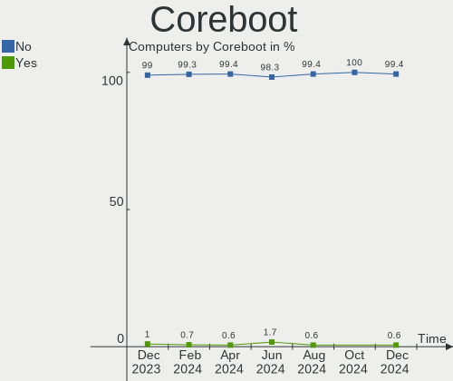
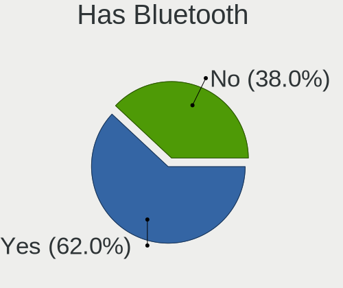
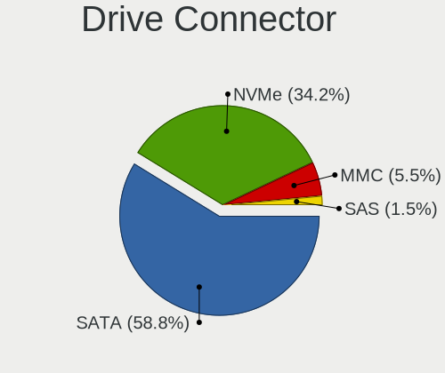
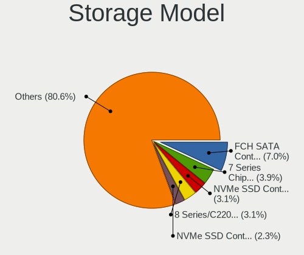
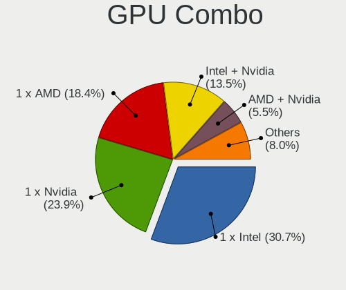
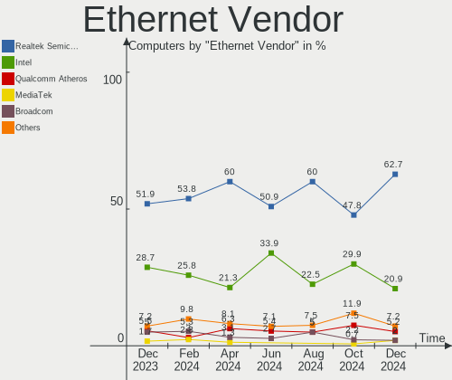
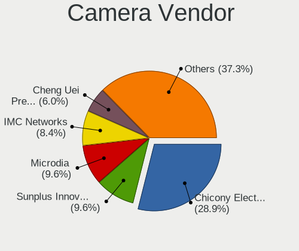

Linux in Poland - Hardware Trends
---------------------------------

A project to identify most popular hardware characteristics and track their change
over time based on data collected by Linux users at https://Linux-Hardware.org.

Anyone can contribute to this report by the [hw-probe](https://github.com/linuxhw/hw-probe) tool:

    sudo -E hw-probe -all -upload

This is a report for all computer types. See also reports for [desktops](/Location/Poland/Desktop/README.md) and [notebooks](/Location/Poland/Notebook/README.md).

Period: Feb, 2023.

Contents
--------

* [ System ](#system)
  - [ OS                       ](#os)
  - [ OS Family                ](#os-family)
  - [ Kernel                   ](#kernel)
  - [ Kernel Family            ](#kernel-family)
  - [ Kernel Major Ver.        ](#kernel-major-ver)
  - [ Arch                     ](#arch)
  - [ DE                       ](#de)
  - [ Display Server           ](#display-server)
  - [ Display Manager          ](#display-manager)
  - [ OS Lang                  ](#os-lang)
  - [ Boot Mode                ](#boot-mode)
  - [ Filesystem               ](#filesystem)
  - [ Part. scheme             ](#part-scheme)
  - [ Dual Boot with Linux/BSD ](#dual-boot-with-linuxbsd)
  - [ Dual Boot (Win)          ](#dual-boot-win)

* [ Board ](#board)
  - [ Vendor                   ](#vendor)
  - [ Model                    ](#model)
  - [ Model Family             ](#model-family)
  - [ MFG Year                 ](#mfg-year)
  - [ Form Factor              ](#form-factor)
  - [ Secure Boot              ](#secure-boot)
  - [ Coreboot                 ](#coreboot)
  - [ RAM Size                 ](#ram-size)
  - [ RAM Used                 ](#ram-used)
  - [ Total Drives             ](#total-drives)
  - [ Has CD-ROM               ](#has-cd-rom)
  - [ Has Ethernet             ](#has-ethernet)
  - [ Has WiFi                 ](#has-wifi)
  - [ Has Bluetooth            ](#has-bluetooth)

* [ Location ](#location)
  - [ Country                  ](#country)
  - [ City                     ](#city)

* [ Drives ](#drives)
  - [ Drive Vendor             ](#drive-vendor)
  - [ Drive Model              ](#drive-model)
  - [ HDD Vendor               ](#hdd-vendor)
  - [ SSD Vendor               ](#ssd-vendor)
  - [ Drive Kind               ](#drive-kind)
  - [ Drive Connector          ](#drive-connector)
  - [ Drive Size               ](#drive-size)
  - [ Space Total              ](#space-total)
  - [ Space Used               ](#space-used)
  - [ Malfunc. Drives          ](#malfunc-drives)
  - [ Malfunc. Drive Vendor    ](#malfunc-drive-vendor)
  - [ Malfunc. HDD Vendor      ](#malfunc-hdd-vendor)
  - [ Malfunc. Drive Kind      ](#malfunc-drive-kind)
  - [ Failed Drives            ](#failed-drives)
  - [ Failed Drive Vendor      ](#failed-drive-vendor)
  - [ Drive Status             ](#drive-status)

* [ Storage controller ](#storage-controller)
  - [ Storage Vendor           ](#storage-vendor)
  - [ Storage Model            ](#storage-model)
  - [ Storage Kind             ](#storage-kind)

* [ Processor ](#processor)
  - [ CPU Vendor               ](#cpu-vendor)
  - [ CPU Model                ](#cpu-model)
  - [ CPU Model Family         ](#cpu-model-family)
  - [ CPU Cores                ](#cpu-cores)
  - [ CPU Sockets              ](#cpu-sockets)
  - [ CPU Threads              ](#cpu-threads)
  - [ CPU Op-Modes             ](#cpu-op-modes)
  - [ CPU Microcode            ](#cpu-microcode)
  - [ CPU Microarch            ](#cpu-microarch)

* [ Graphics ](#graphics)
  - [ GPU Vendor               ](#gpu-vendor)
  - [ GPU Model                ](#gpu-model)
  - [ GPU Combo                ](#gpu-combo)
  - [ GPU Driver               ](#gpu-driver)
  - [ GPU Memory               ](#gpu-memory)

* [ Monitor ](#monitor)
  - [ Monitor Vendor           ](#monitor-vendor)
  - [ Monitor Model            ](#monitor-model)
  - [ Monitor Resolution       ](#monitor-resolution)
  - [ Monitor Diagonal         ](#monitor-diagonal)
  - [ Monitor Width            ](#monitor-width)
  - [ Aspect Ratio             ](#aspect-ratio)
  - [ Monitor Area             ](#monitor-area)
  - [ Pixel Density            ](#pixel-density)
  - [ Multiple Monitors        ](#multiple-monitors)

* [ Network ](#network)
  - [ Net Controller Vendor    ](#net-controller-vendor)
  - [ Net Controller Model     ](#net-controller-model)
  - [ Wireless Vendor          ](#wireless-vendor)
  - [ Wireless Model           ](#wireless-model)
  - [ Ethernet Vendor          ](#ethernet-vendor)
  - [ Ethernet Model           ](#ethernet-model)
  - [ Net Controller Kind      ](#net-controller-kind)
  - [ Used Controller          ](#used-controller)
  - [ NICs                     ](#nics)
  - [ IPv6                     ](#ipv6)

* [ Bluetooth ](#bluetooth)
  - [ Bluetooth Vendor         ](#bluetooth-vendor)
  - [ Bluetooth Model          ](#bluetooth-model)

* [ Sound ](#sound)
  - [ Sound Vendor             ](#sound-vendor)
  - [ Sound Model              ](#sound-model)

* [ Memory ](#memory)
  - [ Memory Vendor            ](#memory-vendor)
  - [ Memory Model             ](#memory-model)
  - [ Memory Kind              ](#memory-kind)
  - [ Memory Form Factor       ](#memory-form-factor)
  - [ Memory Size              ](#memory-size)
  - [ Memory Speed             ](#memory-speed)

* [ Printers & scanners ](#printers--scanners)
  - [ Printer Vendor           ](#printer-vendor)
  - [ Printer Model            ](#printer-model)
  - [ Scanner Vendor           ](#scanner-vendor)
  - [ Scanner Model            ](#scanner-model)

* [ Camera ](#camera)
  - [ Camera Vendor            ](#camera-vendor)
  - [ Camera Model             ](#camera-model)

* [ Security ](#security)
  - [ Fingerprint Vendor       ](#fingerprint-vendor)
  - [ Fingerprint Model        ](#fingerprint-model)
  - [ Chipcard Vendor          ](#chipcard-vendor)
  - [ Chipcard Model           ](#chipcard-model)

* [ Unsupported ](#unsupported)
  - [ Unsupported Devices      ](#unsupported-devices)
  - [ Unsupported Device Types ](#unsupported-device-types)

System
------

OS
--

Installed operating systems

| Name                         | Computers | Percent |
|------------------------------|-----------|---------|
| Ubuntu 22.04                 | 33        | 17.74%  |
| OpenMandriva 23.01           | 23        | 12.37%  |
| Fedora 37                    | 15        | 8.06%   |
| Linux Mint 21.1              | 13        | 6.99%   |
| Ubuntu 22.10                 | 8         | 4.3%    |
| OpenMandriva 4.3             | 8         | 4.3%    |
| Debian 11                    | 8         | 4.3%    |
| Pop!_OS 22.04                | 7         | 3.76%   |
| Arch Rolling                 | 7         | 3.76%   |
| KDE neon 22.04               | 6         | 3.23%   |
| Zorin 16                     | 5         | 2.69%   |
| Kubuntu 22.04                | 5         | 2.69%   |
| Ubuntu 20.04                 | 4         | 2.15%   |
| Gentoo 2.9                   | 4         | 2.15%   |
| SteamOS 3.4.4                | 3         | 1.61%   |
| openSUSE Tumbleweed-XXXXXXXX | 3         | 1.61%   |
| ArcoLinux Rolling            | 3         | 1.61%   |
| ROSA R11.1                   | 2         | 1.08%   |
| OpenMandriva 4.2             | 2         | 1.08%   |
| MX 21                        | 2         | 1.08%   |
| Manjaro                      | 2         | 1.08%   |
| Linux Mint 20.3              | 2         | 1.08%   |
| Xubuntu 22.10                | 1         | 0.54%   |
| Xubuntu 22.04                | 1         | 0.54%   |
| Ubuntu Unity 16.04           | 1         | 0.54%   |
| TUXEDO OS 22.04              | 1         | 0.54%   |
| SteamOS 3.5                  | 1         | 0.54%   |
| ROSA 12.3                    | 1         | 0.54%   |
| Rocky Linux 9.1              | 1         | 0.54%   |
| RHEL 8                       | 1         | 0.54%   |
| Raspbian 11                  | 1         | 0.54%   |
| OpenMandriva 4.50            | 1         | 0.54%   |
| Nobara 37                    | 1         | 0.54%   |
| Manjaro 22.0.3               | 1         | 0.54%   |
| Manjaro 22.0.2               | 1         | 0.54%   |
| Lubuntu 22.04                | 1         | 0.54%   |
| Kali 2022.4                  | 1         | 0.54%   |
| Gentoo 2.13                  | 1         | 0.54%   |
| Fedora 36                    | 1         | 0.54%   |
| Endless 4.0.13               | 1         | 0.54%   |

OS Family
---------

OS without a version

| Name         | Computers | Percent |
|--------------|-----------|---------|
| Ubuntu       | 45        | 24.19%  |
| OpenMandriva | 34        | 18.28%  |
| Fedora       | 16        | 8.6%    |
| Linux Mint   | 15        | 8.06%   |
| Debian       | 9         | 4.84%   |
| Pop!_OS      | 7         | 3.76%   |
| Arch         | 7         | 3.76%   |
| KDE neon     | 6         | 3.23%   |
| Zorin        | 5         | 2.69%   |
| Kubuntu      | 5         | 2.69%   |
| Gentoo       | 5         | 2.69%   |
| SteamOS      | 4         | 2.15%   |
| Manjaro      | 4         | 2.15%   |
| ROSA         | 3         | 1.61%   |
| openSUSE     | 3         | 1.61%   |
| ArcoLinux    | 3         | 1.61%   |
| Xubuntu      | 2         | 1.08%   |
| MX           | 2         | 1.08%   |
| Ubuntu Unity | 1         | 0.54%   |
| TUXEDO OS    | 1         | 0.54%   |
| Rocky Linux  | 1         | 0.54%   |
| RHEL         | 1         | 0.54%   |
| Raspbian     | 1         | 0.54%   |
| Nobara       | 1         | 0.54%   |
| Lubuntu      | 1         | 0.54%   |
| Kali         | 1         | 0.54%   |
| Endless      | 1         | 0.54%   |
| Elementary   | 1         | 0.54%   |
| antiX        | 1         | 0.54%   |

Kernel
------

Version of the Linux kernel

| Version                          | Computers | Percent |
|----------------------------------|-----------|---------|
| 5.15.0-60-generic                | 20        | 10.75%  |
| 5.15.0-58-generic                | 19        | 10.22%  |
| 6.1.1-desktop-1omv2290           | 16        | 8.6%    |
| 5.19.0-32-generic                | 16        | 8.6%    |
| 5.10.0-21-amd64                  | 7         | 3.76%   |
| 6.1.4-desktop-1omv2301           | 6         | 3.23%   |
| 6.0.12-76060006-generic          | 6         | 3.23%   |
| 5.15.0-43-generic                | 6         | 3.23%   |
| 6.1.10-200.fc37.x86_64           | 5         | 2.69%   |
| 5.19.0-31-generic                | 5         | 2.69%   |
| 5.16.7-desktop-1omv4003          | 4         | 2.15%   |
| 5.16.13-desktop-1omv4003         | 4         | 2.15%   |
| 5.15.88-gentoo                   | 4         | 2.15%   |
| 6.1.9-200.fc37.x86_64            | 3         | 1.61%   |
| 5.13.0-valve36-1-neptune         | 3         | 1.61%   |
| 6.1.8-200.fc37.x86_64            | 2         | 1.08%   |
| 6.1.12-arch1-1                   | 2         | 1.08%   |
| 6.1.11-arch1-1                   | 2         | 1.08%   |
| 6.1.11-200.fc37.x86_64           | 2         | 1.08%   |
| 6.0.7-301.fc37.x86_64            | 2         | 1.08%   |
| 5.15.0-58-lowlatency             | 2         | 1.08%   |
| 4.9.155-nrj-desktop-1rosa-x86_64 | 2         | 1.08%   |
| 6.2.1-arch1-1                    | 1         | 0.54%   |
| 6.1.9-arch1-1.1                  | 1         | 0.54%   |
| 6.1.9-1-MANJARO                  | 1         | 0.54%   |
| 6.1.8-arch1-1                    | 1         | 0.54%   |
| 6.1.8-202.fsync.fc37.x86_64      | 1         | 0.54%   |
| 6.1.8-100.fc36.x86_64            | 1         | 0.54%   |
| 6.1.4-arch1-1                    | 1         | 0.54%   |
| 6.1.13-x64v3-rt7-xanmod1         | 1         | 0.54%   |
| 6.1.12-gentoo                    | 1         | 0.54%   |
| 6.1.12-200.fc37.x86_64           | 1         | 0.54%   |
| 6.1.12-1-MANJARO                 | 1         | 0.54%   |
| 6.1.12-1-default                 | 1         | 0.54%   |
| 6.1.12-1-ck                      | 1         | 0.54%   |
| 6.1.11-desktop-1omv2390          | 1         | 0.54%   |
| 6.1.11-76060111-generic          | 1         | 0.54%   |
| 6.1.11-1-MANJARO                 | 1         | 0.54%   |
| 6.1.10-lqx1-1-lqx                | 1         | 0.54%   |
| 6.1.10-5-default                 | 1         | 0.54%   |

Kernel Family
-------------

Linux kernel without a distro release

| Version  | Computers | Percent |
|----------|-----------|---------|
| 5.15.0   | 48        | 25.81%  |
| 5.19.0   | 25        | 13.44%  |
| 6.1.1    | 16        | 8.6%    |
| 6.1.10   | 8         | 4.3%    |
| 6.1.4    | 7         | 3.76%   |
| 6.1.12   | 7         | 3.76%   |
| 6.1.11   | 7         | 3.76%   |
| 5.10.0   | 7         | 3.76%   |
| 6.0.12   | 6         | 3.23%   |
| 6.1.9    | 5         | 2.69%   |
| 6.1.8    | 5         | 2.69%   |
| 5.16.7   | 4         | 2.15%   |
| 5.16.13  | 4         | 2.15%   |
| 5.15.88  | 4         | 2.15%   |
| 5.13.0   | 4         | 2.15%   |
| 5.14.0   | 3         | 1.61%   |
| 6.1.0    | 2         | 1.08%   |
| 6.0.7    | 2         | 1.08%   |
| 6.0.0    | 2         | 1.08%   |
| 5.4.0    | 2         | 1.08%   |
| 4.9.155  | 2         | 1.08%   |
| 6.2.1    | 1         | 0.54%   |
| 6.1.13   | 1         | 0.54%   |
| 5.19.5   | 1         | 0.54%   |
| 5.19.17  | 1         | 0.54%   |
| 5.17.0   | 1         | 0.54%   |
| 5.16.0   | 1         | 0.54%   |
| 5.15.94  | 1         | 0.54%   |
| 5.15.85  | 1         | 0.54%   |
| 5.15.84  | 1         | 0.54%   |
| 5.15.75  | 1         | 0.54%   |
| 5.11.12  | 1         | 0.54%   |
| 5.11.0   | 1         | 0.54%   |
| 5.10.142 | 1         | 0.54%   |
| 5.10.14  | 1         | 0.54%   |
| 4.18.0   | 1         | 0.54%   |
| 4.15.0   | 1         | 0.54%   |

Kernel Major Ver.
-----------------

Linux kernel major version

| Version | Computers | Percent |
|---------|-----------|---------|
| 6.1     | 58        | 31.18%  |
| 5.15    | 56        | 30.11%  |
| 5.19    | 27        | 14.52%  |
| 6.0     | 10        | 5.38%   |
| 5.16    | 9         | 4.84%   |
| 5.10    | 9         | 4.84%   |
| 5.13    | 4         | 2.15%   |
| 5.14    | 3         | 1.61%   |
| 5.4     | 2         | 1.08%   |
| 5.11    | 2         | 1.08%   |
| 4.9     | 2         | 1.08%   |
| 6.2     | 1         | 0.54%   |
| 5.17    | 1         | 0.54%   |
| 4.18    | 1         | 0.54%   |
| 4.15    | 1         | 0.54%   |

Arch
----

OS architecture (x86_64, i586, etc.)

| Name   | Computers | Percent |
|--------|-----------|---------|
| x86_64 | 184       | 98.92%  |
| i686   | 1         | 0.54%   |
| armv6l | 1         | 0.54%   |

DE
--

Desktop Environment

| Name            | Computers | Percent |
|-----------------|-----------|---------|
| GNOME           | 86        | 46.24%  |
| KDE5            | 59        | 31.72%  |
| XFCE            | 10        | 5.38%   |
| X-Cinnamon      | 7         | 3.76%   |
| MATE            | 7         | 3.76%   |
| Unknown         | 7         | 3.76%   |
| Hyprland        | 2         | 1.08%   |
| xmonad          | 1         | 0.54%   |
| Unity           | 1         | 0.54%   |
| Pantheon        | 1         | 0.54%   |
| LXQt            | 1         | 0.54%   |
| KDE4            | 1         | 0.54%   |
| icewm           | 1         | 0.54%   |
| gnome-xorg      | 1         | 0.54%   |
| GNOME Flashback | 1         | 0.54%   |

Display Server
--------------

X11 or Wayland

| Name    | Computers | Percent |
|---------|-----------|---------|
| X11     | 126       | 67.74%  |
| Wayland | 53        | 28.49%  |
| Unknown | 6         | 3.23%   |
| Tty     | 1         | 0.54%   |

Display Manager
---------------

SDDM, LightDM, etc.

| Name    | Computers | Percent |
|---------|-----------|---------|
| Unknown | 66        | 35.48%  |
| SDDM    | 48        | 25.81%  |
| GDM3    | 42        | 22.58%  |
| LightDM | 17        | 9.14%   |
| GDM     | 9         | 4.84%   |
| SLIMSKI | 1         | 0.54%   |
| SLiM    | 1         | 0.54%   |
| LXDM    | 1         | 0.54%   |
| KDM     | 1         | 0.54%   |

OS Lang
-------

Language

| Lang        | Computers | Percent |
|-------------|-----------|---------|
| pl_PL       | 97        | 52.15%  |
| en_US       | 74        | 39.78%  |
| Unknown     | 4         | 2.15%   |
| C           | 3         | 1.61%   |
| en_GB       | 2         | 1.08%   |
| uk_UA       | 1         | 0.54%   |
| ru_RU       | 1         | 0.54%   |
| hu_HU       | 1         | 0.54%   |
| en_US.utf-8 | 1         | 0.54%   |
| en_SE       | 1         | 0.54%   |
| en_AG       | 1         | 0.54%   |

Boot Mode
---------

EFI or BIOS

| Mode | Computers | Percent |
|------|-----------|---------|
| BIOS | 99        | 53.23%  |
| EFI  | 87        | 46.77%  |

Filesystem
----------

Type of filesystem

| Type    | Computers | Percent |
|---------|-----------|---------|
| Ext4    | 131       | 70.43%  |
| Btrfs   | 26        | 13.98%  |
| Overlay | 18        | 9.68%   |
| F2fs    | 5         | 2.69%   |
| Zfs     | 2         | 1.08%   |
| Xfs     | 2         | 1.08%   |
| Jfs     | 1         | 0.54%   |
| Unknown | 1         | 0.54%   |

Part. scheme
------------

Scheme of partitioning

| Type    | Computers | Percent |
|---------|-----------|---------|
| GPT     | 97        | 52.15%  |
| Unknown | 63        | 33.87%  |
| MBR     | 26        | 13.98%  |

Dual Boot with Linux/BSD
------------------------

Hosting more than one Linux/BSD

| Dual boot | Computers | Percent |
|-----------|-----------|---------|
| No        | 155       | 83.33%  |
| Yes       | 31        | 16.67%  |

Dual Boot (Win)
---------------

Hosting Linux and Windows

| Dual boot | Computers | Percent |
|-----------|-----------|---------|
| No        | 144       | 77.42%  |
| Yes       | 42        | 22.58%  |

Board
-----

Vendor
------

Motherboard manufacturer

| Name                      | Computers | Percent |
|---------------------------|-----------|---------|
| Lenovo                    | 34        | 18.28%  |
| Dell                      | 31        | 16.67%  |
| ASUSTek Computer          | 23        | 12.37%  |
| Gigabyte Technology       | 21        | 11.29%  |
| Hewlett-Packard           | 18        | 9.68%   |
| MSI                       | 13        | 6.99%   |
| ASRock                    | 7         | 3.76%   |
| Acer                      | 7         | 3.76%   |
| Apple                     | 6         | 3.23%   |
| Valve                     | 4         | 2.15%   |
| Fujitsu                   | 4         | 2.15%   |
| Samsung Electronics       | 2         | 1.08%   |
| Foxconn                   | 2         | 1.08%   |
| TrekStor                  | 1         | 0.54%   |
| Toshiba                   | 1         | 0.54%   |
| Timi                      | 1         | 0.54%   |
| Sony                      | 1         | 0.54%   |
| Schenker                  | 1         | 0.54%   |
| RTD Embedded Technologies | 1         | 0.54%   |
| Raspberry Pi Foundation   | 1         | 0.54%   |
| Notebook                  | 1         | 0.54%   |
| Medion                    | 1         | 0.54%   |
| Intel                     | 1         | 0.54%   |
| Huanan                    | 1         | 0.54%   |
| GPU Company               | 1         | 0.54%   |
| Google                    | 1         | 0.54%   |
| Unknown                   | 1         | 0.54%   |

Model
-----

Motherboard model

| Name                                   | Computers | Percent |
|----------------------------------------|-----------|---------|
| Valve Jupiter                          | 4         | 2.15%   |
| Unknown                                | 3         | 1.61%   |
| Lenovo G510 20238                      | 2         | 1.08%   |
| HP Notebook                            | 2         | 1.08%   |
| HP Compaq Elite 8300 SFF               | 2         | 1.08%   |
| Dell Wyse 5070 Thin Client             | 2         | 1.08%   |
| Dell OptiPlex 755                      | 2         | 1.08%   |
| Dell Latitude 5511                     | 2         | 1.08%   |
| ASUS M3A78-CM                          | 2         | 1.08%   |
| Apple MacBookPro8,1                    | 2         | 1.08%   |
| TrekStor Surfbook W2                   | 1         | 0.54%   |
| Toshiba Satellite L750                 | 1         | 0.54%   |
| Timi TM1613                            | 1         | 0.54%   |
| Sony VGN-FZ31M                         | 1         | 0.54%   |
| Schenker VISION (E22)                  | 1         | 0.54%   |
| Samsung 530U3C/530U4C/532U3C           | 1         | 0.54%   |
| Samsung 350V5C/351V5C/3540VC/3440VC    | 1         | 0.54%   |
| RTD Embedded CMA34CR                   | 1         | 0.54%   |
| RPi Raspberry Pi Zero W Rev 1.1        | 1         | 0.54%   |
| Notebook NS50_70MU                     | 1         | 0.54%   |
| MSI MS-7D25                            | 1         | 0.54%   |
| MSI MS-7C89                            | 1         | 0.54%   |
| MSI MS-7C02                            | 1         | 0.54%   |
| MSI MS-7B17                            | 1         | 0.54%   |
| MSI MS-7A38                            | 1         | 0.54%   |
| MSI MS-7A37                            | 1         | 0.54%   |
| MSI MS-7885                            | 1         | 0.54%   |
| MSI MS-7592                            | 1         | 0.54%   |
| MSI MS-7235                            | 1         | 0.54%   |
| MSI H310 Gaming Codex S (MS-B927)      | 1         | 0.54%   |
| MSI GV62 7RD                           | 1         | 0.54%   |
| MSI GL65 9SD                           | 1         | 0.54%   |
| MSI Creator Z17 A12UHST                | 1         | 0.54%   |
| Medion Akoya THE TOUCH 10              | 1         | 0.54%   |
| Lenovo Yoga710-14ISK 80TY              | 1         | 0.54%   |
| Lenovo Yoga 3 Pro-1370 80HE            | 1         | 0.54%   |
| Lenovo Y50-70 20378                    | 1         | 0.54%   |
| Lenovo ThinkPad X1 Yoga 1st 20FQS08F01 | 1         | 0.54%   |
| Lenovo ThinkPad X1 Extreme 20MFCTO1WW  | 1         | 0.54%   |
| Lenovo ThinkPad T61 7661BM5            | 1         | 0.54%   |

Model Family
------------

Motherboard model prefix

| Name                 | Computers | Percent |
|----------------------|-----------|---------|
| Lenovo ThinkPad      | 15        | 8.06%   |
| Dell Latitude        | 14        | 7.53%   |
| Lenovo IdeaPad       | 6         | 3.23%   |
| Acer Aspire          | 6         | 3.23%   |
| Dell OptiPlex        | 5         | 2.69%   |
| Valve Jupiter        | 4         | 2.15%   |
| HP EliteBook         | 4         | 2.15%   |
| ASUS VivoBook        | 4         | 2.15%   |
| ASUS PRIME           | 4         | 2.15%   |
| Lenovo ThinkBook     | 3         | 1.61%   |
| Lenovo Legion        | 3         | 1.61%   |
| Dell Vostro          | 3         | 1.61%   |
| Apple MacBookPro8    | 3         | 1.61%   |
| Unknown              | 3         | 1.61%   |
| Lenovo G510          | 2         | 1.08%   |
| HP ZBook             | 2         | 1.08%   |
| HP ProBook           | 2         | 1.08%   |
| HP Notebook          | 2         | 1.08%   |
| HP Compaq            | 2         | 1.08%   |
| Fujitsu LIFEBOOK     | 2         | 1.08%   |
| Fujitsu ESPRIMO      | 2         | 1.08%   |
| Dell Wyse            | 2         | 1.08%   |
| Dell Precision       | 2         | 1.08%   |
| Dell PowerEdge       | 2         | 1.08%   |
| ASUS ROG             | 2         | 1.08%   |
| ASUS M3A78-CM        | 2         | 1.08%   |
| TrekStor Surfbook    | 1         | 0.54%   |
| Toshiba Satellite    | 1         | 0.54%   |
| Timi TM1613          | 1         | 0.54%   |
| Sony VGN-FZ31M       | 1         | 0.54%   |
| Schenker VISION      | 1         | 0.54%   |
| Samsung 530U3C       | 1         | 0.54%   |
| Samsung 350V5C       | 1         | 0.54%   |
| RTD Embedded CMA34CR | 1         | 0.54%   |
| RPi Raspberry        | 1         | 0.54%   |
| Notebook NS50        | 1         | 0.54%   |
| MSI MS-7D25          | 1         | 0.54%   |
| MSI MS-7C89          | 1         | 0.54%   |
| MSI MS-7C02          | 1         | 0.54%   |
| MSI MS-7B17          | 1         | 0.54%   |

MFG Year
--------

Motherboard manufacture year

| Year    | Computers | Percent |
|---------|-----------|---------|
| 2020    | 18        | 9.68%   |
| 2018    | 15        | 8.06%   |
| 2011    | 15        | 8.06%   |
| 2022    | 14        | 7.53%   |
| 2021    | 14        | 7.53%   |
| 2017    | 14        | 7.53%   |
| 2014    | 14        | 7.53%   |
| 2019    | 13        | 6.99%   |
| 2012    | 12        | 6.45%   |
| 2015    | 11        | 5.91%   |
| 2016    | 9         | 4.84%   |
| 2009    | 7         | 3.76%   |
| 2007    | 7         | 3.76%   |
| 2013    | 6         | 3.23%   |
| 2010    | 6         | 3.23%   |
| 2008    | 6         | 3.23%   |
| 2023    | 3         | 1.61%   |
| 2006    | 1         | 0.54%   |
| Unknown | 1         | 0.54%   |

Form Factor
-----------

Physical design of the computer

| Name           | Computers | Percent |
|----------------|-----------|---------|
| Notebook       | 113       | 60.75%  |
| Desktop        | 63        | 33.87%  |
| Server         | 3         | 1.61%   |
| Convertible    | 2         | 1.08%   |
| Mini pc        | 2         | 1.08%   |
| System on chip | 1         | 0.54%   |
| Tablet         | 1         | 0.54%   |
| All in one     | 1         | 0.54%   |

Secure Boot
-----------

Enabled or disabled

| State    | Computers | Percent |
|----------|-----------|---------|
| Disabled | 175       | 94.09%  |
| Enabled  | 11        | 5.91%   |

Coreboot
--------

Have coreboot on board

| Used | Computers | Percent |
|------|-----------|---------|
| No   | 185       | 99.46%  |
| Yes  | 1         | 0.54%   |

RAM Size
--------

Total RAM memory

| Size in GB  | Computers | Percent |
|-------------|-----------|---------|
| 4.01-8.0    | 43        | 23.12%  |
| 16.01-24.0  | 36        | 19.35%  |
| 8.01-16.0   | 33        | 17.74%  |
| 32.01-64.0  | 28        | 15.05%  |
| 3.01-4.0    | 28        | 15.05%  |
| 64.01-256.0 | 7         | 3.76%   |
| 1.01-2.0    | 5         | 2.69%   |
| 24.01-32.0  | 4         | 2.15%   |
| 0.51-1.0    | 1         | 0.54%   |
| 0.01-0.5    | 1         | 0.54%   |

RAM Used
--------

Used RAM memory

| Used GB    | Computers | Percent |
|------------|-----------|---------|
| 1.01-2.0   | 52        | 27.96%  |
| 2.01-3.0   | 51        | 27.42%  |
| 4.01-8.0   | 38        | 20.43%  |
| 3.01-4.0   | 23        | 12.37%  |
| 8.01-16.0  | 13        | 6.99%   |
| 0.51-1.0   | 6         | 3.23%   |
| 16.01-24.0 | 2         | 1.08%   |
| 0.01-0.5   | 1         | 0.54%   |

Total Drives
------------

Number of drives on board

| Drives | Computers | Percent |
|--------|-----------|---------|
| 1      | 107       | 57.53%  |
| 2      | 50        | 26.88%  |
| 3      | 15        | 8.06%   |
| 4      | 7         | 3.76%   |
| 5      | 3         | 1.61%   |
| 6      | 2         | 1.08%   |
| 0      | 2         | 1.08%   |

Has CD-ROM
----------

Has CD-ROM on board

| Presented | Computers | Percent |
|-----------|-----------|---------|
| No        | 120       | 64.52%  |
| Yes       | 66        | 35.48%  |

Has Ethernet
------------

Has Ethernet on board

| Presented | Computers | Percent |
|-----------|-----------|---------|
| Yes       | 165       | 88.71%  |
| No        | 21        | 11.29%  |

Has WiFi
--------

Has WiFi module

| Presented | Computers | Percent |
|-----------|-----------|---------|
| Yes       | 135       | 72.58%  |
| No        | 51        | 27.42%  |

Has Bluetooth
-------------

Has Bluetooth module

| Presented | Computers | Percent |
|-----------|-----------|---------|
| Yes       | 117       | 62.9%   |
| No        | 69        | 37.1%   |

Location
--------

Country
-------

Geographic location (country)

| Country | Computers | Percent |
|---------|-----------|---------|
| Poland  | 186       | 100%    |

City
----

Geographic location (city)

| City                 | Computers | Percent |
|----------------------|-----------|---------|
| Warsaw               | 39        | 20.97%  |
| Krakow               | 17        | 9.14%   |
| Poznan               | 10        | 5.38%   |
| Wroclaw              | 8         | 4.3%    |
| Gdansk               | 7         | 3.76%   |
| Lodz                 | 5         | 2.69%   |
| Bialystok            | 5         | 2.69%   |
| Katowice             | 4         | 2.15%   |
| Kielce               | 3         | 1.61%   |
| Elblag               | 3         | 1.61%   |
| Bydgoszcz            | 3         | 1.61%   |
| Tarnów              | 2         | 1.08%   |
| Przemysl             | 2         | 1.08%   |
| Piaseczno            | 2         | 1.08%   |
| Mysłowice           | 2         | 1.08%   |
| Mielec               | 2         | 1.08%   |
| Mazancowice          | 2         | 1.08%   |
| Lublin               | 2         | 1.08%   |
| Jaworzno             | 2         | 1.08%   |
| Gorzów Wielkopolski | 2         | 1.08%   |
| Gdynia               | 2         | 1.08%   |
| Bytom                | 2         | 1.08%   |
| Brzostek             | 2         | 1.08%   |
| Żyrardów           | 1         | 0.54%   |
| Zukowo               | 1         | 0.54%   |
| Zielona Góra        | 1         | 0.54%   |
| Zawadzkie            | 1         | 0.54%   |
| Zarnowiec            | 1         | 0.54%   |
| Wozniki              | 1         | 0.54%   |
| Walcz                | 1         | 0.54%   |
| Turawa               | 1         | 0.54%   |
| Tarnowskie Gory      | 1         | 0.54%   |
| Sławno              | 1         | 0.54%   |
| Szczecin             | 1         | 0.54%   |
| Świętochłowice    | 1         | 0.54%   |
| Swiebodzice          | 1         | 0.54%   |
| Swidnica             | 1         | 0.54%   |
| Sulechow             | 1         | 0.54%   |
| Strzelce Krajenskie  | 1         | 0.54%   |
| Stromiec             | 1         | 0.54%   |

Drives
------

Drive Vendor
------------

Hard drive vendors

| Vendor                      | Computers | Drives | Percent |
|-----------------------------|-----------|--------|---------|
| Samsung Electronics         | 35        | 43     | 12.5%   |
| Seagate                     | 33        | 41     | 11.79%  |
| GOODRAM                     | 24        | 25     | 8.57%   |
| WDC                         | 22        | 25     | 7.86%   |
| Toshiba                     | 21        | 22     | 7.5%    |
| SanDisk                     | 16        | 17     | 5.71%   |
| Kingston                    | 16        | 17     | 5.71%   |
| Unknown                     | 15        | 15     | 5.36%   |
| Crucial                     | 14        | 15     | 5%      |
| SK hynix                    | 8         | 8      | 2.86%   |
| Hitachi                     | 8         | 10     | 2.86%   |
| Phison Electronics          | 5         | 5      | 1.79%   |
| Intel                       | 5         | 5      | 1.79%   |
| A-DATA Technology           | 5         | 5      | 1.79%   |
| Patriot                     | 3         | 3      | 1.07%   |
| Micron Technology           | 3         | 3      | 1.07%   |
| Kingston Technology Company | 3         | 3      | 1.07%   |
| Fujitsu                     | 3         | 3      | 1.07%   |
| XPG                         | 2         | 2      | 0.71%   |
| SPCC                        | 2         | 3      | 0.71%   |
| Silicon Motion              | 2         | 2      | 0.71%   |
| Realtek                     | 2         | 2      | 0.71%   |
| Micron/Crucial Technology   | 2         | 2      | 0.71%   |
| Lexar                       | 2         | 2      | 0.71%   |
| HS-SSD-C100                 | 2         | 2      | 0.71%   |
| HGST                        | 2         | 2      | 0.71%   |
| Apple                       | 2         | 2      | 0.71%   |
| ADATA Technology            | 2         | 2      | 0.71%   |
| Unknown                     | 2         | 2      | 0.71%   |
| Transcend                   | 1         | 1      | 0.36%   |
| RENICE                      | 1         | 1      | 0.36%   |
| Realtek Semiconductor       | 1         | 1      | 0.36%   |
| Ramaxel Technology          | 1         | 1      | 0.36%   |
| POLION                      | 1         | 1      | 0.36%   |
| PNY                         | 1         | 1      | 0.36%   |
| Plextor                     | 1         | 1      | 0.36%   |
| OWC                         | 1         | 1      | 0.36%   |
| OCZ                         | 1         | 1      | 0.36%   |
| Maxtor                      | 1         | 1      | 0.36%   |
| MAXIO Technology (Hangzhou) | 1         | 1      | 0.36%   |

Drive Model
-----------

Hard drive models

| Model                                                           | Computers | Percent |
|-----------------------------------------------------------------|-----------|---------|
| Samsung NVMe SSD Controller SM981/PM981/PM983 250GB             | 6         | 2.01%   |
| Unknown MMC Card  32GB                                          | 4         | 1.34%   |
| Unknown MMC Card  16GB                                          | 4         | 1.34%   |
| Phison PS5013 E13 NVMe Controller 500GB                         | 4         | 1.34%   |
| GOODRAM SSDPR-CX400-512-G2 512GB                                | 4         | 1.34%   |
| GOODRAM SSDPR-CX400-256 256GB                                   | 4         | 1.34%   |
| Unknown MMC Card  512GB                                         | 3         | 1.01%   |
| Sandisk WD Black SN750 / PC SN730 NVMe SSD 512GB                | 3         | 1.01%   |
| Samsung SSD 980 1TB                                             | 3         | 1.01%   |
| Kingston SKC3000S1024G 1024GB                                   | 3         | 1.01%   |
| GOODRAM SSDPR-CL100-480-G2 480GB                                | 3         | 1.01%   |
| Crucial CT240BX500SSD1 240GB                                    | 3         | 1.01%   |
| WDC WD5000LPCX-24C6HT0 500GB                                    | 2         | 0.67%   |
| WDC WD20EFRX-68EUZN0 2TB                                        | 2         | 0.67%   |
| Unknown MMC Card  64GB                                          | 2         | 0.67%   |
| Toshiba MQ01ABD100 1TB                                          | 2         | 0.67%   |
| Toshiba HDWD130 3TB                                             | 2         | 0.67%   |
| Toshiba HDWD110 1TB                                             | 2         | 0.67%   |
| SK hynix BC511 512GB                                            | 2         | 0.67%   |
| Seagate ST500LM021-1KJ152 500GB                                 | 2         | 0.67%   |
| Seagate ST1000DM003-1CH162 1TB                                  | 2         | 0.67%   |
| Seagate Expansion 1TB                                           | 2         | 0.67%   |
| Sandisk WD Blue SN500 / PC SN520 NVMe SSD 256GB                 | 2         | 0.67%   |
| Samsung SSD 980 500GB                                           | 2         | 0.67%   |
| Samsung NVMe SSD Controller SM951/PM951 256GB                   | 2         | 0.67%   |
| Patriot Burst 480GB SSD                                         | 2         | 0.67%   |
| Kingston Company OM3PDP3 NVMe SSD 512GB                         | 2         | 0.67%   |
| Kingston SNVS500G 500GB                                         | 2         | 0.67%   |
| Intel SSDPEKNU512GZ 512GB                                       | 2         | 0.67%   |
| Hitachi HTS543216L9SA00 160GB                                   | 2         | 0.67%   |
| GOODRAM SSDPR-CX400-512 512GB                                   | 2         | 0.67%   |
| GOODRAM SSDPR-CX400-128-G2 128GB                                | 2         | 0.67%   |
| GOODRAM SSDPR-CX300-120 120GB                                   | 2         | 0.67%   |
| Crucial CT500MX500SSD1 500GB                                    | 2         | 0.67%   |
| Crucial CT1000MX500SSD1 1TB                                     | 2         | 0.67%   |
| ADATA XPG SX8200 Pro PCIe Gen3x4 M.2 2280 Solid State Drive 2TB | 2         | 0.67%   |
| Unknown                                                         | 2         | 0.67%   |
| XPG SPECTRIX S40G 4TB                                           | 1         | 0.34%   |
| XPG GAMMIX S11 Pro 512GB                                        | 1         | 0.34%   |
| WDC WDS250G2B0B-00YS70 250GB SSD                                | 1         | 0.34%   |

HDD Vendor
----------

Hard disk drive vendors

| Vendor              | Computers | Drives | Percent |
|---------------------|-----------|--------|---------|
| Seagate             | 33        | 39     | 38.37%  |
| WDC                 | 17        | 20     | 19.77%  |
| Toshiba             | 15        | 16     | 17.44%  |
| Hitachi             | 8         | 10     | 9.3%    |
| Samsung Electronics | 5         | 5      | 5.81%   |
| Fujitsu             | 3         | 3      | 3.49%   |
| HGST                | 2         | 2      | 2.33%   |
| Unknown             | 1         | 1      | 1.16%   |
| Maxtor              | 1         | 1      | 1.16%   |
| ASMT                | 1         | 1      | 1.16%   |

SSD Vendor
----------

Solid state drive vendors

| Vendor              | Computers | Drives | Percent |
|---------------------|-----------|--------|---------|
| GOODRAM             | 22        | 23     | 22.92%  |
| Samsung Electronics | 14        | 15     | 14.58%  |
| Crucial             | 13        | 14     | 13.54%  |
| Kingston            | 9         | 9      | 9.38%   |
| SanDisk             | 5         | 5      | 5.21%   |
| WDC                 | 4         | 4      | 4.17%   |
| A-DATA Technology   | 4         | 4      | 4.17%   |
| Toshiba             | 3         | 3      | 3.13%   |
| Patriot             | 3         | 3      | 3.13%   |
| SPCC                | 2         | 3      | 2.08%   |
| Apple               | 2         | 2      | 2.08%   |
| Transcend           | 1         | 1      | 1.04%   |
| RENICE              | 1         | 1      | 1.04%   |
| Ramaxel Technology  | 1         | 1      | 1.04%   |
| POLION              | 1         | 1      | 1.04%   |
| PNY                 | 1         | 1      | 1.04%   |
| Plextor             | 1         | 1      | 1.04%   |
| OWC                 | 1         | 1      | 1.04%   |
| OCZ                 | 1         | 1      | 1.04%   |
| Micron Technology   | 1         | 1      | 1.04%   |
| LITEON              | 1         | 1      | 1.04%   |
| Lexar               | 1         | 1      | 1.04%   |
| Intel               | 1         | 1      | 1.04%   |
| HS-SSD-C100         | 1         | 1      | 1.04%   |
| China               | 1         | 1      | 1.04%   |
| Unknown             | 1         | 1      | 1.04%   |

Drive Kind
----------

HDD or SSD

| Kind    | Computers | Drives | Percent |
|---------|-----------|--------|---------|
| SSD     | 87        | 100    | 35.22%  |
| NVMe    | 72        | 92     | 29.15%  |
| HDD     | 71        | 98     | 28.74%  |
| MMC     | 14        | 14     | 5.67%   |
| Unknown | 3         | 3      | 1.21%   |

Drive Connector
---------------

SATA, SAS, NVMe, etc.

| Type | Computers | Drives | Percent |
|------|-----------|--------|---------|
| SATA | 126       | 189    | 56%     |
| NVMe | 72        | 90     | 32%     |
| MMC  | 14        | 14     | 6.22%   |
| SAS  | 13        | 14     | 5.78%   |

Drive Size
----------

Size of hard drive

| Size in TB | Computers | Drives | Percent |
|------------|-----------|--------|---------|
| 0.01-0.5   | 96        | 119    | 58.54%  |
| 0.51-1.0   | 46        | 49     | 28.05%  |
| 1.01-2.0   | 10        | 13     | 6.1%    |
| 2.01-3.0   | 6         | 10     | 3.66%   |
| 3.01-4.0   | 4         | 5      | 2.44%   |
| 10.01-20.0 | 1         | 1      | 0.61%   |
| 4.01-10.0  | 1         | 1      | 0.61%   |

Space Total
-----------

Amount of disk space available on the file system

| Size in GB     | Computers | Percent |
|----------------|-----------|---------|
| 101-250        | 47        | 25.27%  |
| 501-1000       | 34        | 18.28%  |
| 251-500        | 32        | 17.2%   |
| 1-20           | 21        | 11.29%  |
| 51-100         | 13        | 6.99%   |
| 1001-2000      | 12        | 6.45%   |
| Unknown        | 11        | 5.91%   |
| 2001-3000      | 6         | 3.23%   |
| More than 3000 | 5         | 2.69%   |
| 21-50          | 5         | 2.69%   |

Space Used
----------

Amount of used disk space

| Used GB        | Computers | Percent |
|----------------|-----------|---------|
| 1-20           | 64        | 34.41%  |
| 101-250        | 33        | 17.74%  |
| 21-50          | 29        | 15.59%  |
| 51-100         | 18        | 9.68%   |
| 251-500        | 15        | 8.06%   |
| Unknown        | 11        | 5.91%   |
| 501-1000       | 10        | 5.38%   |
| 2001-3000      | 3         | 1.61%   |
| More than 3000 | 2         | 1.08%   |
| 1001-2000      | 1         | 0.54%   |

Malfunc. Drives
---------------

Drive models with a malfunction

| Model                             | Computers | Drives | Percent |
|-----------------------------------|-----------|--------|---------|
| WDC WD5000AAKS-00V1A0 500GB       | 1         | 1      | 4.17%   |
| Toshiba MK7559GSXF 752GB          | 1         | 1      | 4.17%   |
| Toshiba MK5075GSX 500GB           | 1         | 1      | 4.17%   |
| Seagate ST500LT012-1DG142 500GB   | 1         | 1      | 4.17%   |
| Seagate ST3500630AS 500GB         | 1         | 1      | 4.17%   |
| Seagate ST3250310AS 250GB         | 1         | 1      | 4.17%   |
| Seagate ST320LT020-9YG142 320GB   | 1         | 1      | 4.17%   |
| Seagate ST3160023A 160GB          | 1         | 1      | 4.17%   |
| Seagate ST2000DX002-2DV164 2TB    | 1         | 1      | 4.17%   |
| Seagate ST1000DX001-1CM162 1TB    | 1         | 1      | 4.17%   |
| Samsung Electronics HM500LI 500GB | 1         | 1      | 4.17%   |
| Samsung Electronics HM121HI 120GB | 1         | 1      | 4.17%   |
| Samsung Electronics HD103UJ 1TB   | 1         | 1      | 4.17%   |
| Samsung Electronics HD080HJ 80GB  | 1         | 1      | 4.17%   |
| RENICE X2 64GB SSD                | 1         | 1      | 4.17%   |
| Maxtor 6Y080M0 82GB               | 1         | 1      | 4.17%   |
| Kingston SMS200S3120G 120GB SSD   | 1         | 1      | 4.17%   |
| Hitachi HUA723020ALA641 2TB       | 1         | 1      | 4.17%   |
| Hitachi HTS547564A9E384 640GB     | 1         | 1      | 4.17%   |
| Hitachi HTS541616J9SA00 160GB     | 1         | 1      | 4.17%   |
| Crucial CT1000MX500SSD4 1TB       | 1         | 1      | 4.17%   |
| China SSD 512GB                   | 1         | 1      | 4.17%   |
| Apple SSD TS064E 64GB             | 1         | 1      | 4.17%   |
| A-DATA Technology SX900 128GB SSD | 1         | 1      | 4.17%   |

Malfunc. Drive Vendor
---------------------

Vendors of faulty drives

| Vendor              | Computers | Drives | Percent |
|---------------------|-----------|--------|---------|
| Seagate             | 7         | 7      | 29.17%  |
| Samsung Electronics | 4         | 4      | 16.67%  |
| Hitachi             | 3         | 3      | 12.5%   |
| Toshiba             | 2         | 2      | 8.33%   |
| WDC                 | 1         | 1      | 4.17%   |
| RENICE              | 1         | 1      | 4.17%   |
| Maxtor              | 1         | 1      | 4.17%   |
| Kingston            | 1         | 1      | 4.17%   |
| Crucial             | 1         | 1      | 4.17%   |
| China               | 1         | 1      | 4.17%   |
| Apple               | 1         | 1      | 4.17%   |
| A-DATA Technology   | 1         | 1      | 4.17%   |

Malfunc. HDD Vendor
-------------------

Vendors of faulty HDD drives

| Vendor              | Computers | Drives | Percent |
|---------------------|-----------|--------|---------|
| Seagate             | 7         | 7      | 38.89%  |
| Samsung Electronics | 4         | 4      | 22.22%  |
| Hitachi             | 3         | 3      | 16.67%  |
| Toshiba             | 2         | 2      | 11.11%  |
| WDC                 | 1         | 1      | 5.56%   |
| Maxtor              | 1         | 1      | 5.56%   |

Malfunc. Drive Kind
-------------------

Kinds of faulty drives

| Kind | Computers | Drives | Percent |
|------|-----------|--------|---------|
| HDD  | 15        | 18     | 71.43%  |
| SSD  | 6         | 6      | 28.57%  |

Failed Drives
-------------

Failed drive models

Zero info for selected period =(

Failed Drive Vendor
-------------------

Failed drive vendors

Zero info for selected period =(

Drive Status
------------

Number of failed and malfunc. drives

| Status   | Computers | Drives | Percent |
|----------|-----------|--------|---------|
| Detected | 93        | 152    | 46.5%   |
| Works    | 86        | 131    | 43%     |
| Malfunc  | 21        | 24     | 10.5%   |

Storage controller
------------------

Storage Vendor
--------------

Storage controller vendors

| Vendor                       | Computers | Percent |
|------------------------------|-----------|---------|
| Intel                        | 128       | 51%     |
| AMD                          | 31        | 12.35%  |
| Samsung Electronics          | 20        | 7.97%   |
| SanDisk                      | 12        | 4.78%   |
| Kingston Technology Company  | 10        | 3.98%   |
| SK hynix                     | 8         | 3.19%   |
| Phison Electronics           | 7         | 2.79%   |
| JMicron Technology           | 5         | 1.99%   |
| ADATA Technology             | 4         | 1.59%   |
| Toshiba America Info Systems | 3         | 1.2%    |
| Silicon Motion               | 3         | 1.2%    |
| Micron/Crucial Technology    | 3         | 1.2%    |
| LSI Logic / Symbios Logic    | 3         | 1.2%    |
| Micron Technology            | 2         | 0.8%    |
| KIOXIA                       | 2         | 0.8%    |
| ASMedia Technology           | 2         | 0.8%    |
| VIA Technologies             | 1         | 0.4%    |
| Shenzhen Longsys Electronics | 1         | 0.4%    |
| Seagate Technology           | 1         | 0.4%    |
| Realtek Semiconductor        | 1         | 0.4%    |
| Nvidia                       | 1         | 0.4%    |
| MAXIO Technology (Hangzhou)  | 1         | 0.4%    |
| Lite-On Technology           | 1         | 0.4%    |
| Lenovo                       | 1         | 0.4%    |

Storage Model
-------------

Storage controller models

| Model                                                                          | Computers | Percent |
|--------------------------------------------------------------------------------|-----------|---------|
| AMD FCH SATA Controller [AHCI mode]                                            | 18        | 6.14%   |
| Intel Sunrise Point-LP SATA Controller [AHCI mode]                             | 11        | 3.75%   |
| Intel 7 Series Chipset Family 6-port SATA Controller [AHCI mode]               | 9         | 3.07%   |
| Samsung NVMe SSD Controller SM981/PM981/PM983                                  | 8         | 2.73%   |
| Intel 8 Series/C220 Series Chipset Family 6-port SATA Controller 1 [AHCI mode] | 7         | 2.39%   |
| Intel 6 Series/C200 Series Chipset Family 6 port Mobile SATA AHCI Controller   | 7         | 2.39%   |
| AMD SB7x0/SB8x0/SB9x0 IDE Controller                                           | 7         | 2.39%   |
| Samsung NVMe SSD Controller 980                                                | 6         | 2.05%   |
| Kingston Company Company Non-Volatile memory controller                        | 6         | 2.05%   |
| Intel Wildcat Point-LP SATA Controller [AHCI Mode]                             | 6         | 2.05%   |
| Intel Q170/Q150/B150/H170/H110/Z170/CM236 Chipset SATA Controller [AHCI Mode]  | 6         | 2.05%   |
| AMD 400 Series Chipset SATA Controller                                         | 6         | 2.05%   |
| SK hynix Gold P31/PC711 NVMe Solid State Drive                                 | 5         | 1.71%   |
| Samsung NVMe SSD Controller PM9A1/PM9A3/980PRO                                 | 5         | 1.71%   |
| Intel Volume Management Device NVMe RAID Controller                            | 5         | 1.71%   |
| Intel Alder Lake-S PCH SATA Controller [AHCI Mode]                             | 5         | 1.71%   |
| Intel 200 Series PCH SATA controller [AHCI mode]                               | 5         | 1.71%   |
| AMD SB7x0/SB8x0/SB9x0 SATA Controller [IDE mode]                               | 5         | 1.71%   |
| Phison PS5013 E13 NVMe Controller                                              | 4         | 1.37%   |
| JMicron JMB363 SATA/IDE Controller                                             | 4         | 1.37%   |
| Intel NM10/ICH7 Family SATA Controller [IDE mode]                              | 4         | 1.37%   |
| Intel 82801HM/HEM (ICH8M/ICH8M-E) IDE Controller                               | 4         | 1.37%   |
| Intel 82801 Mobile SATA Controller [RAID mode]                                 | 4         | 1.37%   |
| ADATA XPG SX8200 Pro PCIe Gen3x4 M.2 2280 Solid State Drive                    | 4         | 1.37%   |
| Silicon Motion SM2263EN/SM2263XT SSD Controller                                | 3         | 1.02%   |
| SanDisk WD Black SN750 / PC SN730 NVMe SSD                                     | 3         | 1.02%   |
| Intel Celeron/Pentium Silver Processor SATA Controller                         | 3         | 1.02%   |
| Intel Cannon Point-LP SATA Controller [AHCI Mode]                              | 3         | 1.02%   |
| Intel Cannon Lake Mobile PCH SATA AHCI Controller                              | 3         | 1.02%   |
| Intel 82801HM/HEM (ICH8M/ICH8M-E) SATA Controller [AHCI mode]                  | 3         | 1.02%   |
| Intel 82801G (ICH7 Family) IDE Controller                                      | 3         | 1.02%   |
| Intel 7 Series/C210 Series Chipset Family 6-port SATA Controller [AHCI mode]   | 3         | 1.02%   |
| Intel 6 Series/C200 Series Chipset Family 6 port Desktop SATA AHCI Controller  | 3         | 1.02%   |
| Intel 400 Series Chipset Family SATA AHCI Controller                           | 3         | 1.02%   |
| AMD SB7x0/SB8x0/SB9x0 SATA Controller [AHCI mode]                              | 3         | 1.02%   |
| SK hynix BC511                                                                 | 2         | 0.68%   |
| SanDisk WD Blue SN570 NVMe SSD                                                 | 2         | 0.68%   |
| SanDisk WD Blue SN550 NVMe SSD                                                 | 2         | 0.68%   |
| SanDisk WD Blue SN500 / PC SN520 NVMe SSD                                      | 2         | 0.68%   |
| SanDisk Non-Volatile memory controller                                         | 2         | 0.68%   |

Storage Kind
------------

Kind of storage controller (IDE, SATA, NVMe, SAS, ...)

| Kind | Computers | Percent |
|------|-----------|---------|
| SATA | 135       | 54.22%  |
| NVMe | 72        | 28.92%  |
| IDE  | 28        | 11.24%  |
| RAID | 12        | 4.82%   |
| SAS  | 1         | 0.4%    |
| SCSI | 1         | 0.4%    |

Processor
---------

CPU Vendor
----------

Processor vendors

| Vendor | Computers | Percent |
|--------|-----------|---------|
| Intel  | 144       | 77.42%  |
| AMD    | 41        | 22.04%  |
| ARM    | 1         | 0.54%   |

CPU Model
---------

Processor models

| Model                                    | Computers | Percent |
|------------------------------------------|-----------|---------|
| Intel 11th Gen Core i5-1135G7 @ 2.40GHz  | 5         | 2.69%   |
| Intel Core i5-6200U CPU @ 2.30GHz        | 4         | 2.15%   |
| AMD Custom APU 0405                      | 4         | 2.15%   |
| Intel Core i5-8265U CPU @ 1.60GHz        | 3         | 1.61%   |
| AMD Phenom II X4 955 Processor           | 3         | 1.61%   |
| Intel Xeon CPU E5-2630 v3 @ 2.40GHz      | 2         | 1.08%   |
| Intel Core i7-9750H CPU @ 2.60GHz        | 2         | 1.08%   |
| Intel Core i7-8565U CPU @ 1.80GHz        | 2         | 1.08%   |
| Intel Core i7-6500U CPU @ 2.50GHz        | 2         | 1.08%   |
| Intel Core i7-3610QM CPU @ 2.30GHz       | 2         | 1.08%   |
| Intel Core i7-10850H CPU @ 2.70GHz       | 2         | 1.08%   |
| Intel Core i5-6300U CPU @ 2.40GHz        | 2         | 1.08%   |
| Intel Core i5-3470 CPU @ 3.20GHz         | 2         | 1.08%   |
| Intel Core i5-3317U CPU @ 1.70GHz        | 2         | 1.08%   |
| Intel Core i5-10400 CPU @ 2.90GHz        | 2         | 1.08%   |
| Intel Core 2 Duo CPU T7300 @ 2.00GHz     | 2         | 1.08%   |
| Intel Core 2 Duo CPU T7250 @ 2.00GHz     | 2         | 1.08%   |
| Intel Core 2 Duo CPU E8500 @ 3.16GHz     | 2         | 1.08%   |
| Intel Atom x5-Z8350 CPU @ 1.44GHz        | 2         | 1.08%   |
| AMD Ryzen 7 5800H with Radeon Graphics   | 2         | 1.08%   |
| AMD Ryzen 5 4500U with Radeon Graphics   | 2         | 1.08%   |
| AMD Ryzen 5 1600 Six-Core Processor      | 2         | 1.08%   |
| AMD E-350 Processor                      | 2         | 1.08%   |
| Intel Xeon CPU X3460 @ 2.80GHz           | 1         | 0.54%   |
| Intel Xeon CPU X3450 @ 2.67GHz           | 1         | 0.54%   |
| Intel Xeon CPU E5-2696 v3 @ 2.30GHz      | 1         | 0.54%   |
| Intel Xeon CPU E31240 @ 3.30GHz          | 1         | 0.54%   |
| Intel Xeon CPU E3-1240L v5 @ 2.10GHz     | 1         | 0.54%   |
| Intel Xeon CPU E3-1220 V2 @ 3.10GHz      | 1         | 0.54%   |
| Intel Pentium Silver N5000 CPU @ 1.10GHz | 1         | 0.54%   |
| Intel Pentium Silver J5005 CPU @ 1.50GHz | 1         | 0.54%   |
| Intel Pentium Gold G5400 CPU @ 3.70GHz   | 1         | 0.54%   |
| Intel Pentium Dual CPU E2200 @ 2.20GHz   | 1         | 0.54%   |
| Intel Pentium CPU G3260 @ 3.30GHz        | 1         | 0.54%   |
| Intel Pentium CPU 3825U @ 1.90GHz        | 1         | 0.54%   |
| Intel Core M-5Y71 CPU @ 1.20GHz          | 1         | 0.54%   |
| Intel Core i7-9700K CPU @ 3.60GHz        | 1         | 0.54%   |
| Intel Core i7-8850H CPU @ 2.60GHz        | 1         | 0.54%   |
| Intel Core i7-8750H CPU @ 2.20GHz        | 1         | 0.54%   |
| Intel Core i7-8550U CPU @ 1.80GHz        | 1         | 0.54%   |

CPU Model Family
----------------

Processor model prefix

| Model                | Computers | Percent |
|----------------------|-----------|---------|
| Intel Core i5        | 45        | 24.19%  |
| Intel Core i7        | 31        | 16.67%  |
| Other                | 23        | 12.37%  |
| Intel Core 2 Duo     | 12        | 6.45%   |
| AMD Ryzen 5          | 12        | 6.45%   |
| Intel Celeron        | 10        | 5.38%   |
| Intel Xeon           | 8         | 4.3%    |
| Intel Core i3        | 6         | 3.23%   |
| AMD Ryzen 7          | 6         | 3.23%   |
| AMD Phenom II X4     | 5         | 2.69%   |
| Intel Atom           | 3         | 1.61%   |
| AMD Ryzen 9          | 3         | 1.61%   |
| Intel Pentium Silver | 2         | 1.08%   |
| Intel Pentium        | 2         | 1.08%   |
| Intel Core 2 Quad    | 2         | 1.08%   |
| AMD Ryzen 3          | 2         | 1.08%   |
| AMD E                | 2         | 1.08%   |
| AMD A8               | 2         | 1.08%   |
| Intel Pentium Gold   | 1         | 0.54%   |
| Intel Pentium Dual   | 1         | 0.54%   |
| Intel Core M         | 1         | 0.54%   |
| Intel Core 2         | 1         | 0.54%   |
| ARM BCM              | 1         | 0.54%   |
| AMD Ryzen 7 PRO      | 1         | 0.54%   |
| AMD Ryzen 5 PRO      | 1         | 0.54%   |
| AMD Athlon II X2     | 1         | 0.54%   |
| AMD Athlon 64 X2     | 1         | 0.54%   |
| AMD A6               | 1         | 0.54%   |

CPU Cores
---------

Number of processor cores

| Number  | Computers | Percent |
|---------|-----------|---------|
| 4       | 71        | 38.17%  |
| 2       | 64        | 34.41%  |
| 6       | 25        | 13.44%  |
| 8       | 11        | 5.91%   |
| 16      | 3         | 1.61%   |
| 12      | 3         | 1.61%   |
| 1       | 3         | 1.61%   |
| 14      | 2         | 1.08%   |
| 10      | 2         | 1.08%   |
| 18      | 1         | 0.54%   |
| Unknown | 1         | 0.54%   |

CPU Sockets
-----------

Number of sockets

| Number | Computers | Percent |
|--------|-----------|---------|
| 1      | 186       | 100%    |

CPU Threads
-----------

Threads per core (Hyper-Threading)

| Number  | Computers | Percent |
|---------|-----------|---------|
| 2       | 123       | 66.13%  |
| 1       | 62        | 33.33%  |
| Unknown | 1         | 0.54%   |

CPU Op-Modes
------------

CPU Operation Modes (32-bit, 64-bit)

| Op mode        | Computers | Percent |
|----------------|-----------|---------|
| 32-bit, 64-bit | 184       | 98.92%  |
| 32-bit         | 1         | 0.54%   |
| Unknown        | 1         | 0.54%   |

CPU Microcode
-------------

Microcode number

| Number     | Computers | Percent |
|------------|-----------|---------|
| Unknown    | 57        | 30.65%  |
| 0x306a9    | 11        | 5.91%   |
| 0x806c1    | 9         | 4.84%   |
| 0x206a7    | 8         | 4.3%    |
| 0x306c3    | 7         | 3.76%   |
| 0x1067a    | 6         | 3.23%   |
| 0x906ea    | 5         | 2.69%   |
| 0x806ec    | 5         | 2.69%   |
| 0x506e3    | 4         | 2.15%   |
| 0x406e3    | 4         | 2.15%   |
| 0x306d4    | 4         | 2.15%   |
| 0x0a50000c | 4         | 2.15%   |
| 0x906a3    | 3         | 1.61%   |
| 0x6fd      | 3         | 1.61%   |
| 0x40651    | 3         | 1.61%   |
| 0x30678    | 3         | 1.61%   |
| 0x0800820d | 3         | 1.61%   |
| 0xa0653    | 2         | 1.08%   |
| 0xa0652    | 2         | 1.08%   |
| 0x806eb    | 2         | 1.08%   |
| 0x706a1    | 2         | 1.08%   |
| 0x6fb      | 2         | 1.08%   |
| 0x506c9    | 2         | 1.08%   |
| 0x306f2    | 2         | 1.08%   |
| 0x08600106 | 2         | 1.08%   |
| 0x08600103 | 2         | 1.08%   |
| 0x010000db | 2         | 1.08%   |
| 0xb06f2    | 1         | 0.54%   |
| 0xb0671    | 1         | 0.54%   |
| 0x906ed    | 1         | 0.54%   |
| 0x906e9    | 1         | 0.54%   |
| 0x90672    | 1         | 0.54%   |
| 0x806e9    | 1         | 0.54%   |
| 0x806d1    | 1         | 0.54%   |
| 0x706e5    | 1         | 0.54%   |
| 0x6fa      | 1         | 0.54%   |
| 0x6f6      | 1         | 0.54%   |
| 0x106e5    | 1         | 0.54%   |
| 0x106c2    | 1         | 0.54%   |
| 0x0a601203 | 1         | 0.54%   |

CPU Microarch
-------------

Microarchitecture

| Name             | Computers | Percent |
|------------------|-----------|---------|
| KabyLake         | 23        | 12.37%  |
| Haswell          | 16        | 8.6%    |
| Skylake          | 14        | 7.53%   |
| SandyBridge      | 14        | 7.53%   |
| IvyBridge        | 13        | 6.99%   |
| Unknown          | 12        | 6.45%   |
| Zen 3            | 9         | 4.84%   |
| TigerLake        | 9         | 4.84%   |
| Penryn           | 8         | 4.3%    |
| Core             | 8         | 4.3%    |
| Zen 2            | 7         | 3.76%   |
| Silvermont       | 6         | 3.23%   |
| K10              | 6         | 3.23%   |
| Broadwell        | 6         | 3.23%   |
| Zen+             | 5         | 2.69%   |
| CometLake        | 5         | 2.69%   |
| Alderlake Hybrid | 5         | 2.69%   |
| Goldmont plus    | 3         | 1.61%   |
| Zen              | 2         | 1.08%   |
| Westmere         | 2         | 1.08%   |
| Steamroller      | 2         | 1.08%   |
| Nehalem          | 2         | 1.08%   |
| Icelake          | 2         | 1.08%   |
| Goldmont         | 2         | 1.08%   |
| Bobcat           | 2         | 1.08%   |
| Puma             | 1         | 0.54%   |
| K8 Hammer        | 1         | 0.54%   |
| Bonnell          | 1         | 0.54%   |

Graphics
--------

GPU Vendor
----------

Vendors of graphics cards

| Vendor                     | Computers | Percent |
|----------------------------|-----------|---------|
| Intel                      | 116       | 51.79%  |
| Nvidia                     | 55        | 24.55%  |
| AMD                        | 49        | 21.88%  |
| Matrox Electronics Systems | 3         | 1.34%   |
| ASPEED Technology          | 1         | 0.45%   |

GPU Model
---------

Graphics card models

| Model                                                                                    | Computers | Percent |
|------------------------------------------------------------------------------------------|-----------|---------|
| Intel 2nd Generation Core Processor Family Integrated Graphics Controller                | 13        | 5.68%   |
| Intel 3rd Gen Core processor Graphics Controller                                         | 9         | 3.93%   |
| Intel Skylake GT2 [HD Graphics 520]                                                      | 8         | 3.49%   |
| Intel TigerLake-LP GT2 [Iris Xe Graphics]                                                | 7         | 3.06%   |
| Intel WhiskeyLake-U GT2 [UHD Graphics 620]                                               | 5         | 2.18%   |
| Intel HD Graphics 530                                                                    | 5         | 2.18%   |
| AMD Renoir                                                                               | 5         | 2.18%   |
| AMD Cezanne [Radeon Vega Series / Radeon Vega Mobile Series]                             | 5         | 2.18%   |
| Intel Xeon E3-1200 v3/4th Gen Core Processor Integrated Graphics Controller              | 4         | 1.75%   |
| Intel HD Graphics 5500                                                                   | 4         | 1.75%   |
| Intel 4th Gen Core Processor Integrated Graphics Controller                              | 4         | 1.75%   |
| AMD VanGogh [AMD Custom GPU 0405]                                                        | 4         | 1.75%   |
| Nvidia GP107 [GeForce GTX 1050 Ti]                                                       | 3         | 1.31%   |
| Nvidia GM108M [GeForce 940MX]                                                            | 3         | 1.31%   |
| Intel UHD Graphics 620                                                                   | 3         | 1.31%   |
| Intel Mobile GM965/GL960 Integrated Graphics Controller (secondary)                      | 3         | 1.31%   |
| Intel Mobile GM965/GL960 Integrated Graphics Controller (primary)                        | 3         | 1.31%   |
| Intel Mobile 4 Series Chipset Integrated Graphics Controller                             | 3         | 1.31%   |
| Intel Haswell-ULT Integrated Graphics Controller                                         | 3         | 1.31%   |
| Intel CoffeeLake-H GT2 [UHD Graphics 630]                                                | 3         | 1.31%   |
| Intel Atom/Celeron/Pentium Processor x5-E8000/J3xxx/N3xxx Integrated Graphics Controller | 3         | 1.31%   |
| Intel Atom Processor Z36xxx/Z37xxx Series Graphics & Display                             | 3         | 1.31%   |
| Intel Alder Lake-P Integrated Graphics Controller                                        | 3         | 1.31%   |
| AMD Ellesmere [Radeon RX 470/480/570/570X/580/580X/590]                                  | 3         | 1.31%   |
| Nvidia GM107 [GeForce GTX 750 Ti]                                                        | 2         | 0.87%   |
| Nvidia GF119M [NVS 4200M]                                                                | 2         | 0.87%   |
| Nvidia GF108 [GeForce GT 630]                                                            | 2         | 0.87%   |
| Nvidia G94 [GeForce 9600 GT]                                                             | 2         | 0.87%   |
| Matrox Electronics Systems MGA G200eW WPCM450                                            | 2         | 0.87%   |
| Intel HD Graphics 620                                                                    | 2         | 0.87%   |
| Intel HD Graphics 500                                                                    | 2         | 0.87%   |
| Intel GeminiLake [UHD Graphics 605]                                                      | 2         | 0.87%   |
| Intel Core Processor Integrated Graphics Controller                                      | 2         | 0.87%   |
| Intel CometLake-U GT2 [UHD Graphics]                                                     | 2         | 0.87%   |
| Intel CometLake-H GT2 [UHD Graphics]                                                     | 2         | 0.87%   |
| Intel AlderLake-S GT1                                                                    | 2         | 0.87%   |
| Intel 82Q35 Express Integrated Graphics Controller                                       | 2         | 0.87%   |
| AMD Wrestler [Radeon HD 6310]                                                            | 2         | 0.87%   |
| AMD Sun XT [Radeon HD 8670A/8670M/8690M / R5 M330 / M430 / Radeon 520 Mobile]            | 2         | 0.87%   |
| AMD RS780C [Radeon 3100]                                                                 | 2         | 0.87%   |

GPU Combo
---------

Combinations of graphics cards

| Name           | Computers | Percent |
|----------------|-----------|---------|
| 1 x Intel      | 79        | 42.47%  |
| 1 x AMD        | 35        | 18.82%  |
| 1 x Nvidia     | 30        | 16.13%  |
| Intel + Nvidia | 22        | 11.83%  |
| Intel + AMD    | 10        | 5.38%   |
| 1 x Matrox     | 3         | 1.61%   |
| 2 x AMD        | 2         | 1.08%   |
| AMD + Nvidia   | 2         | 1.08%   |
| Other          | 1         | 0.54%   |
| 2 x Intel      | 1         | 0.54%   |
| 1 x ASPEED     | 1         | 0.54%   |

GPU Driver
----------

Free vs proprietary

| Driver      | Computers | Percent |
|-------------|-----------|---------|
| Free        | 156       | 83.87%  |
| Proprietary | 25        | 13.44%  |
| Unknown     | 5         | 2.69%   |

GPU Memory
----------

Total video memory

| Size in GB | Computers | Percent |
|------------|-----------|---------|
| Unknown    | 129       | 69.35%  |
| 0.01-0.5   | 15        | 8.06%   |
| 0.51-1.0   | 12        | 6.45%   |
| 1.01-2.0   | 11        | 5.91%   |
| 7.01-8.0   | 8         | 4.3%    |
| 3.01-4.0   | 8         | 4.3%    |
| 8.01-16.0  | 2         | 1.08%   |
| 5.01-6.0   | 1         | 0.54%   |

Monitor
-------

Monitor Vendor
--------------

Monitor vendors

| Vendor                  | Computers | Percent |
|-------------------------|-----------|---------|
| Samsung Electronics     | 25        | 12.5%   |
| AU Optronics            | 24        | 12%     |
| LG Display              | 16        | 8%      |
| Dell                    | 15        | 7.5%    |
| BOE                     | 12        | 6%      |
| Chimei Innolux          | 11        | 5.5%    |
| Goldstar                | 10        | 5%      |
| Philips                 | 6         | 3%      |
| Iiyama                  | 6         | 3%      |
| Eizo                    | 6         | 3%      |
| Apple                   | 6         | 3%      |
| AOC                     | 6         | 3%      |
| Acer                    | 6         | 3%      |
| Hewlett-Packard         | 5         | 2.5%    |
| Valve                   | 4         | 2%      |
| Chi Mei Optoelectronics | 4         | 2%      |
| Ancor Communications    | 4         | 2%      |
| Sony                    | 3         | 1.5%    |
| MSI                     | 3         | 1.5%    |
| Lenovo                  | 3         | 1.5%    |
| InfoVision              | 3         | 1.5%    |
| CSO                     | 3         | 1.5%    |
| PANDA                   | 2         | 1%      |
| NEC Computers           | 2         | 1%      |
| IBM                     | 2         | 1%      |
| BenQ                    | 2         | 1%      |
| Xiaomi                  | 1         | 0.5%    |
| Toshiba                 | 1         | 0.5%    |
| Sharp                   | 1         | 0.5%    |
| Seiko/Epson             | 1         | 0.5%    |
| RTK                     | 1         | 0.5%    |
| Idek Iiyama             | 1         | 0.5%    |
| HannStar                | 1         | 0.5%    |
| Gateway                 | 1         | 0.5%    |
| Fujitsu Siemens         | 1         | 0.5%    |
| BOE Technology Group    | 1         | 0.5%    |
| ASUSTek Computer        | 1         | 0.5%    |

Monitor Model
-------------

Monitor models

| Model                                                                    | Computers | Percent |
|--------------------------------------------------------------------------|-----------|---------|
| Valve ANX7530 U VLV3001 800x1280 100x150mm 7.1-inch                      | 4         | 1.93%   |
| Philips PHL 243V7 PHLC155 1920x1080 527x296mm 23.8-inch                  | 2         | 0.97%   |
| Iiyama PLE2003WSV IVM5398 1680x1050 434x270mm 20.1-inch                  | 2         | 0.97%   |
| Dell P2417H DELA0DB 1920x1080 527x296mm 23.8-inch                        | 2         | 0.97%   |
| Dell P2212H DELA07F 1920x1080 531x299mm 24.0-inch                        | 2         | 0.97%   |
| Chimei Innolux LCD Monitor CMN14D4 1920x1080 309x173mm 13.9-inch         | 2         | 0.97%   |
| Chi Mei Optoelectronics LCD Monitor CMO15A7 1366x768 344x193mm 15.5-inch | 2         | 0.97%   |
| AOC 27G2G4 AOC2702 1920x1080 598x336mm 27.0-inch                         | 2         | 0.97%   |
| AOC 24B2W1G5 AOC2402 1920x1080 527x296mm 23.8-inch                       | 2         | 0.97%   |
| Xiaomi Mi TV XMD00E2 3840x2160 800x450mm 36.1-inch                       | 1         | 0.48%   |
| Toshiba 32FPDEU-DA20 TOS2237 1920x540                                    | 1         | 0.48%   |
| Sony TV SNYE903 1920x1080                                                | 1         | 0.48%   |
| Sony TV SNY9600 1920x540 735x420mm 33.3-inch                             | 1         | 0.48%   |
| Sony TV *00 SNYF903 3840x2160 1085x610mm 49.0-inch                       | 1         | 0.48%   |
| Sony BW8 MS_9001 1600x2560 113x181mm 8.4-inch                            | 1         | 0.48%   |
| Sharp LCD Monitor SHP1548 1920x1200 288x180mm 13.4-inch                  | 1         | 0.48%   |
| Seiko/Epson LCD Monitor                                                  | 1         | 0.48%   |
| Samsung Electronics U28E590 SAM0C4D 3840x2160 607x345mm 27.5-inch        | 1         | 0.48%   |
| Samsung Electronics SyncMaster SAM059A 1920x1080 477x268mm 21.5-inch     | 1         | 0.48%   |
| Samsung Electronics SyncMaster SAM00D2 1280x1024 338x270mm 17.0-inch     | 1         | 0.48%   |
| Samsung Electronics SMBX2235 SAM0700 1920x1080 477x268mm 21.5-inch       | 1         | 0.48%   |
| Samsung Electronics S27E650 SAM0CC9 1920x1080 598x336mm 27.0-inch        | 1         | 0.48%   |
| Samsung Electronics S24E650 SAM0CB8 1920x1080 521x293mm 23.5-inch        | 1         | 0.48%   |
| Samsung Electronics S24D300 SAM0B43 1920x1080 531x299mm 24.0-inch        | 1         | 0.48%   |
| Samsung Electronics S22B300 SAM08C8 1920x1080 477x268mm 21.5-inch        | 1         | 0.48%   |
| Samsung Electronics S22B150 SAM08A3 1920x1080 477x268mm 21.5-inch        | 1         | 0.48%   |
| Samsung Electronics LCD Monitor SEC5441 1366x768 293x165mm 13.2-inch     | 1         | 0.48%   |
| Samsung Electronics LCD Monitor SEC4252 1366x768 344x194mm 15.5-inch     | 1         | 0.48%   |
| Samsung Electronics LCD Monitor SEC3046 1366x768 344x193mm 15.5-inch     | 1         | 0.48%   |
| Samsung Electronics LCD Monitor SDC8648 1920x1080 276x155mm 12.5-inch    | 1         | 0.48%   |
| Samsung Electronics LCD Monitor SDC5344 1920x1080 344x194mm 15.5-inch    | 1         | 0.48%   |
| Samsung Electronics LCD Monitor SDC4D42 1366x768 309x174mm 14.0-inch     | 1         | 0.48%   |
| Samsung Electronics LCD Monitor SDC4C51 1366x768 344x194mm 15.5-inch     | 1         | 0.48%   |
| Samsung Electronics LCD Monitor SDC4852 1366x768 344x194mm 15.5-inch     | 1         | 0.48%   |
| Samsung Electronics LCD Monitor SDC434A 3200x1800 293x165mm 13.2-inch    | 1         | 0.48%   |
| Samsung Electronics LCD Monitor SDC4259 1920x1080 293x165mm 13.2-inch    | 1         | 0.48%   |
| Samsung Electronics LCD Monitor SDC4161 1920x1080 344x194mm 15.5-inch    | 1         | 0.48%   |
| Samsung Electronics LCD Monitor SDC3654 1600x900 382x215mm 17.3-inch     | 1         | 0.48%   |
| Samsung Electronics LCD Monitor S24D300 1920x1080                        | 1         | 0.48%   |
| Samsung Electronics EPSON PJ SECA519 1920x1080                           | 1         | 0.48%   |

Monitor Resolution
------------------

Monitor screen resolution

| Resolution         | Computers | Percent |
|--------------------|-----------|---------|
| 1920x1080 (FHD)    | 88        | 46.32%  |
| 1366x768 (WXGA)    | 25        | 13.16%  |
| 3840x2160 (4K)     | 11        | 5.79%   |
| 2560x1440 (QHD)    | 9         | 4.74%   |
| 1680x1050 (WSXGA+) | 8         | 4.21%   |
| 1280x800 (WXGA)    | 6         | 3.16%   |
| 1280x1024 (SXGA)   | 6         | 3.16%   |
| 800x1280           | 4         | 2.11%   |
| 3440x1440          | 4         | 2.11%   |
| 2560x1600          | 4         | 2.11%   |
| 1920x1200 (WUXGA)  | 4         | 2.11%   |
| 1600x900 (HD+)     | 4         | 2.11%   |
| 1440x900 (WXGA+)   | 4         | 2.11%   |
| Unknown            | 4         | 2.11%   |
| 2560x1080          | 2         | 1.05%   |
| 1920x540           | 2         | 1.05%   |
| 5760x1080          | 1         | 0.53%   |
| 5120x1600          | 1         | 0.53%   |
| 4480x1440          | 1         | 0.53%   |
| 3200x1800 (QHD+)   | 1         | 0.53%   |
| 2880x1800          | 1         | 0.53%   |

Monitor Diagonal
----------------

Diagonal size in inches

| Inches  | Computers | Percent |
|---------|-----------|---------|
| 15      | 50        | 24.75%  |
| 13      | 20        | 9.9%    |
| 27      | 18        | 8.91%   |
| 24      | 17        | 8.42%   |
| 14      | 15        | 7.43%   |
| 23      | 13        | 6.44%   |
| 21      | 13        | 6.44%   |
| Unknown | 9         | 4.46%   |
| 17      | 7         | 3.47%   |
| 34      | 6         | 2.97%   |
| 19      | 6         | 2.97%   |
| 22      | 5         | 2.48%   |
| 7       | 4         | 1.98%   |
| 12      | 3         | 1.49%   |
| 11      | 3         | 1.49%   |
| 20      | 2         | 0.99%   |
| 72      | 1         | 0.5%    |
| 65      | 1         | 0.5%    |
| 57      | 1         | 0.5%    |
| 40      | 1         | 0.5%    |
| 36      | 1         | 0.5%    |
| 33      | 1         | 0.5%    |
| 25      | 1         | 0.5%    |
| 18      | 1         | 0.5%    |
| 16      | 1         | 0.5%    |
| 10      | 1         | 0.5%    |
| 8       | 1         | 0.5%    |

Monitor Width
-------------

Physical width

| Width in mm | Computers | Percent |
|-------------|-----------|---------|
| 301-350     | 74        | 38.14%  |
| 501-600     | 43        | 22.16%  |
| 401-500     | 21        | 10.82%  |
| 201-300     | 20        | 10.31%  |
| 351-400     | 10        | 5.15%   |
| Unknown     | 9         | 4.64%   |
| 701-800     | 8         | 4.12%   |
| 1-100       | 4         | 2.06%   |
| 801-900     | 1         | 0.52%   |
| 601-700     | 1         | 0.52%   |
| 1501-2000   | 1         | 0.52%   |
| 101-200     | 1         | 0.52%   |
| 1001-1500   | 1         | 0.52%   |

Aspect Ratio
------------

Proportional relationship between the width and the height

| Ratio   | Computers | Percent |
|---------|-----------|---------|
| 16/9    | 123       | 70.29%  |
| 16/10   | 26        | 14.86%  |
| Unknown | 7         | 4%      |
| 5/4     | 6         | 3.43%   |
| 21/9    | 6         | 3.43%   |
| 0.67    | 4         | 2.29%   |
| 32/9    | 1         | 0.57%   |
| 0.62    | 1         | 0.57%   |
| 0.56    | 1         | 0.57%   |

Monitor Area
------------

Area in inch²

| Area in inch² | Computers | Percent |
|----------------|-----------|---------|
| 101-110        | 50        | 25.13%  |
| 201-250        | 40        | 20.1%   |
| 81-90          | 23        | 11.56%  |
| 301-350        | 18        | 9.05%   |
| 71-80          | 12        | 6.03%   |
| 151-200        | 10        | 5.03%   |
| Unknown        | 9         | 4.52%   |
| 351-500        | 7         | 3.52%   |
| 1-40           | 5         | 2.51%   |
| 251-300        | 5         | 2.51%   |
| 121-130        | 4         | 2.01%   |
| 61-70          | 3         | 1.51%   |
| 51-60          | 3         | 1.51%   |
| 141-150        | 3         | 1.51%   |
| More than 1000 | 2         | 1.01%   |
| 501-1000       | 2         | 1.01%   |
| 41-50          | 1         | 0.5%    |
| 131-140        | 1         | 0.5%    |
| 111-120        | 1         | 0.5%    |

Pixel Density
-------------

Pixels per inch

| Density       | Computers | Percent |
|---------------|-----------|---------|
| 51-100        | 59        | 30.1%   |
| 121-160       | 57        | 29.08%  |
| 101-120       | 48        | 24.49%  |
| 161-240       | 16        | 8.16%   |
| Unknown       | 9         | 4.59%   |
| More than 240 | 5         | 2.55%   |
| 1-50          | 2         | 1.02%   |

Multiple Monitors
-----------------

Total monitors connected

| Total | Computers | Percent |
|-------|-----------|---------|
| 1     | 141       | 75.81%  |
| 2     | 32        | 17.2%   |
| 0     | 8         | 4.3%    |
| 3     | 4         | 2.15%   |
| 4     | 1         | 0.54%   |

Network
-------

Net Controller Vendor
---------------------

Controller vendors

| Vendor                          | Computers | Percent |
|---------------------------------|-----------|---------|
| Realtek Semiconductor           | 101       | 36.59%  |
| Intel                           | 96        | 34.78%  |
| Qualcomm Atheros                | 23        | 8.33%   |
| Broadcom                        | 15        | 5.43%   |
| MediaTek                        | 7         | 2.54%   |
| Dell                            | 6         | 2.17%   |
| TP-Link                         | 3         | 1.09%   |
| ASIX Electronics                | 3         | 1.09%   |
| Samsung Electronics             | 2         | 0.72%   |
| Ralink Technology               | 2         | 0.72%   |
| Ralink                          | 2         | 0.72%   |
| DisplayLink                     | 2         | 0.72%   |
| Broadcom Limited                | 2         | 0.72%   |
| Sweex                           | 1         | 0.36%   |
| Research In Motion              | 1         | 0.36%   |
| Qualcomm Atheros Communications | 1         | 0.36%   |
| QinHeng Electronics             | 1         | 0.36%   |
| Nvidia                          | 1         | 0.36%   |
| NetGear                         | 1         | 0.36%   |
| Marvell Technology Group        | 1         | 0.36%   |
| Loupedeck                       | 1         | 0.36%   |
| JMicron Technology              | 1         | 0.36%   |
| Huawei Technologies             | 1         | 0.36%   |
| Hewlett-Packard                 | 1         | 0.36%   |
| D-Link                          | 1         | 0.36%   |

Net Controller Model
--------------------

Controller models

| Model                                                             | Computers | Percent |
|-------------------------------------------------------------------|-----------|---------|
| Realtek RTL8111/8168/8411 PCI Express Gigabit Ethernet Controller | 77        | 23.77%  |
| Realtek RTL810xE PCI Express Fast Ethernet controller             | 9         | 2.78%   |
| Intel Wi-Fi 6 AX201                                               | 8         | 2.47%   |
| Intel Wireless 8265 / 8275                                        | 7         | 2.16%   |
| Intel 82579LM Gigabit Network Connection (Lewisville)             | 7         | 2.16%   |
| MediaTek MT7921 802.11ax PCI Express Wireless Network Adapter     | 6         | 1.85%   |
| Realtek RTL8822CE 802.11ac PCIe Wireless Network Adapter          | 5         | 1.54%   |
| Qualcomm Atheros AR9285 Wireless Network Adapter (PCI-Express)    | 5         | 1.54%   |
| Intel Wireless 8260                                               | 5         | 1.54%   |
| Intel Wi-Fi 6 AX200                                               | 5         | 1.54%   |
| Intel Wireless 3160                                               | 4         | 1.23%   |
| Intel Dual Band Wireless-AC 3168NGW [Stone Peak]                  | 4         | 1.23%   |
| Intel Cannon Point-LP CNVi [Wireless-AC]                          | 4         | 1.23%   |
| Intel Cannon Lake PCH CNVi WiFi                                   | 4         | 1.23%   |
| Intel Alder Lake-P PCH CNVi WiFi                                  | 4         | 1.23%   |
| Broadcom NetXtreme BCM57765 Gigabit Ethernet PCIe                 | 4         | 1.23%   |
| Broadcom BCM43142 802.11b/g/n                                     | 4         | 1.23%   |
| Realtek RTL8723BE PCIe Wireless Network Adapter                   | 3         | 0.93%   |
| Realtek RTL8188EUS 802.11n Wireless Network Adapter               | 3         | 0.93%   |
| Realtek RTL8153 Gigabit Ethernet Adapter                          | 3         | 0.93%   |
| Qualcomm Atheros QCA6174 802.11ac Wireless Network Adapter        | 3         | 0.93%   |
| Intel Ethernet Connection (2) I219-V                              | 3         | 0.93%   |
| Intel Centrino Advanced-N 6205 [Taylor Peak]                      | 3         | 0.93%   |
| Broadcom BCM4331 802.11a/b/g/n                                    | 3         | 0.93%   |
| ASIX AX88179 Gigabit Ethernet                                     | 3         | 0.93%   |
| Realtek RTL88x2bu [AC1200 Techkey]                                | 2         | 0.62%   |
| Realtek RTL8125 2.5GbE Controller                                 | 2         | 0.62%   |
| Qualcomm Atheros QCA9377 802.11ac Wireless Network Adapter        | 2         | 0.62%   |
| Qualcomm Atheros AR9485 Wireless Network Adapter                  | 2         | 0.62%   |
| Qualcomm Atheros AR8162 Fast Ethernet                             | 2         | 0.62%   |
| Intel Wireless 7265                                               | 2         | 0.62%   |
| Intel Wireless 7260                                               | 2         | 0.62%   |
| Intel Wireless 3165                                               | 2         | 0.62%   |
| Intel PRO/Wireless 4965 AG or AGN [Kedron] Network Connection     | 2         | 0.62%   |
| Intel Ethernet Controller I225-V                                  | 2         | 0.62%   |
| Intel Ethernet Connection I219-V                                  | 2         | 0.62%   |
| Intel Ethernet Connection I219-LM                                 | 2         | 0.62%   |
| Intel Ethernet Connection I217-LM                                 | 2         | 0.62%   |
| Intel Ethernet Connection (7) I219-V                              | 2         | 0.62%   |
| Intel Ethernet Connection (7) I219-LM                             | 2         | 0.62%   |

Wireless Vendor
---------------

Wireless vendors

| Vendor                          | Computers | Percent |
|---------------------------------|-----------|---------|
| Intel                           | 74        | 52.48%  |
| Realtek Semiconductor           | 20        | 14.18%  |
| Qualcomm Atheros                | 18        | 12.77%  |
| Broadcom                        | 10        | 7.09%   |
| TP-Link                         | 3         | 2.13%   |
| MediaTek                        | 3         | 2.13%   |
| Dell                            | 3         | 2.13%   |
| Ralink Technology               | 2         | 1.42%   |
| Ralink                          | 2         | 1.42%   |
| Broadcom Limited                | 2         | 1.42%   |
| Sweex                           | 1         | 0.71%   |
| Qualcomm Atheros Communications | 1         | 0.71%   |
| Hewlett-Packard                 | 1         | 0.71%   |
| D-Link                          | 1         | 0.71%   |

Wireless Model
--------------

Wireless models

| Model                                                              | Computers | Percent |
|--------------------------------------------------------------------|-----------|---------|
| Intel Wi-Fi 6 AX201                                                | 8         | 5.67%   |
| Intel Wireless 8265 / 8275                                         | 7         | 4.96%   |
| Realtek RTL8822CE 802.11ac PCIe Wireless Network Adapter           | 5         | 3.55%   |
| Qualcomm Atheros AR9285 Wireless Network Adapter (PCI-Express)     | 5         | 3.55%   |
| Intel Wireless 8260                                                | 5         | 3.55%   |
| Intel Wi-Fi 6 AX200                                                | 5         | 3.55%   |
| Intel Wireless 3160                                                | 4         | 2.84%   |
| Intel Dual Band Wireless-AC 3168NGW [Stone Peak]                   | 4         | 2.84%   |
| Intel Cannon Point-LP CNVi [Wireless-AC]                           | 4         | 2.84%   |
| Intel Cannon Lake PCH CNVi WiFi                                    | 4         | 2.84%   |
| Intel Alder Lake-P PCH CNVi WiFi                                   | 4         | 2.84%   |
| Broadcom BCM43142 802.11b/g/n                                      | 4         | 2.84%   |
| Realtek RTL8723BE PCIe Wireless Network Adapter                    | 3         | 2.13%   |
| Realtek RTL8188EUS 802.11n Wireless Network Adapter                | 3         | 2.13%   |
| Qualcomm Atheros QCA6174 802.11ac Wireless Network Adapter         | 3         | 2.13%   |
| Intel Centrino Advanced-N 6205 [Taylor Peak]                       | 3         | 2.13%   |
| Broadcom BCM4331 802.11a/b/g/n                                     | 3         | 2.13%   |
| Realtek RTL88x2bu [AC1200 Techkey]                                 | 2         | 1.42%   |
| Qualcomm Atheros QCA9377 802.11ac Wireless Network Adapter         | 2         | 1.42%   |
| Qualcomm Atheros AR9485 Wireless Network Adapter                   | 2         | 1.42%   |
| MediaTek MT7921 802.11ax PCI Express Wireless Network Adapter      | 2         | 1.42%   |
| Intel Wireless 7265                                                | 2         | 1.42%   |
| Intel Wireless 7260                                                | 2         | 1.42%   |
| Intel Wireless 3165                                                | 2         | 1.42%   |
| Intel PRO/Wireless 4965 AG or AGN [Kedron] Network Connection      | 2         | 1.42%   |
| Intel Dual Band Wireless-AC 3165 Plus Bluetooth                    | 2         | 1.42%   |
| Intel Comet Lake PCH-LP CNVi WiFi                                  | 2         | 1.42%   |
| Intel Comet Lake PCH CNVi WiFi                                     | 2         | 1.42%   |
| Intel Centrino Wireless-N 1030 [Rainbow Peak]                      | 2         | 1.42%   |
| Intel Centrino Advanced-N 6200                                     | 2         | 1.42%   |
| Dell DW5811e Snapdragon™ X7 LTE                               | 2         | 1.42%   |
| TP-Link TL-WN821N v5/v6 [RTL8192EU]                                | 1         | 0.71%   |
| TP-Link Archer T9UH v1 [Realtek RTL8814AU]                         | 1         | 0.71%   |
| TP-Link Archer T4UH v2 [Realtek RTL8812AU]                         | 1         | 0.71%   |
| Sweex LW154 802.11bgn (1x1:1) Wireless Adapter [Realtek RTL8188SU] | 1         | 0.71%   |
| Realtek RTL8852AE 802.11ax PCIe Wireless Network Adapter           | 1         | 0.71%   |
| Realtek RTL8723AE PCIe Wireless Network Adapter                    | 1         | 0.71%   |
| Realtek RTL8192EU 802.11b/g/n WLAN Adapter                         | 1         | 0.71%   |
| Realtek RTL8192CU 802.11n WLAN Adapter                             | 1         | 0.71%   |
| Realtek RTL8191SEvA Wireless LAN Controller                        | 1         | 0.71%   |

Ethernet Vendor
---------------

Ethernet vendors

| Vendor                   | Computers | Percent |
|--------------------------|-----------|---------|
| Realtek Semiconductor    | 92        | 52.57%  |
| Intel                    | 52        | 29.71%  |
| Broadcom                 | 8         | 4.57%   |
| Qualcomm Atheros         | 7         | 4%      |
| MediaTek                 | 4         | 2.29%   |
| ASIX Electronics         | 3         | 1.71%   |
| DisplayLink              | 2         | 1.14%   |
| Samsung Electronics      | 1         | 0.57%   |
| Research In Motion       | 1         | 0.57%   |
| Nvidia                   | 1         | 0.57%   |
| NetGear                  | 1         | 0.57%   |
| Marvell Technology Group | 1         | 0.57%   |
| JMicron Technology       | 1         | 0.57%   |
| Dell                     | 1         | 0.57%   |

Ethernet Model
--------------

Ethernet models

| Model                                                             | Computers | Percent |
|-------------------------------------------------------------------|-----------|---------|
| Realtek RTL8111/8168/8411 PCI Express Gigabit Ethernet Controller | 77        | 43.5%   |
| Realtek RTL810xE PCI Express Fast Ethernet controller             | 9         | 5.08%   |
| Intel 82579LM Gigabit Network Connection (Lewisville)             | 7         | 3.95%   |
| MediaTek MT7921 802.11ax PCI Express Wireless Network Adapter     | 4         | 2.26%   |
| Broadcom NetXtreme BCM57765 Gigabit Ethernet PCIe                 | 4         | 2.26%   |
| Realtek RTL8153 Gigabit Ethernet Adapter                          | 3         | 1.69%   |
| Intel Ethernet Connection (2) I219-V                              | 3         | 1.69%   |
| ASIX AX88179 Gigabit Ethernet                                     | 3         | 1.69%   |
| Realtek RTL8125 2.5GbE Controller                                 | 2         | 1.13%   |
| Qualcomm Atheros AR8162 Fast Ethernet                             | 2         | 1.13%   |
| Intel Ethernet Controller I225-V                                  | 2         | 1.13%   |
| Intel Ethernet Connection I219-V                                  | 2         | 1.13%   |
| Intel Ethernet Connection I219-LM                                 | 2         | 1.13%   |
| Intel Ethernet Connection I217-LM                                 | 2         | 1.13%   |
| Intel Ethernet Connection (7) I219-V                              | 2         | 1.13%   |
| Intel Ethernet Connection (7) I219-LM                             | 2         | 1.13%   |
| Intel Ethernet Connection (4) I219-LM                             | 2         | 1.13%   |
| Intel Ethernet Connection (3) I218-LM                             | 2         | 1.13%   |
| Intel Ethernet Connection (2) I219-LM                             | 2         | 1.13%   |
| Intel Ethernet Connection (11) I219-LM                            | 2         | 1.13%   |
| Intel Ethernet Connection (10) I219-V                             | 2         | 1.13%   |
| Intel 82566DM-2 Gigabit Network Connection                        | 2         | 1.13%   |
| Broadcom NetLink BCM5787M Gigabit Ethernet PCI Express            | 2         | 1.13%   |
| Samsung Galaxy series, misc. (tethering mode)                     | 1         | 0.56%   |
| Research In Motion BlackBerry                                     | 1         | 0.56%   |
| Realtek RTL8152 Fast Ethernet Adapter                             | 1         | 0.56%   |
| Realtek RTL-8110SC/8169SC Gigabit Ethernet                        | 1         | 0.56%   |
| Realtek RTL-8100/8101L/8139 PCI Fast Ethernet Adapter             | 1         | 0.56%   |
| Qualcomm Atheros QCA8171 Gigabit Ethernet                         | 1         | 0.56%   |
| Qualcomm Atheros AR8161 Gigabit Ethernet                          | 1         | 0.56%   |
| Qualcomm Atheros AR8152 v2.0 Fast Ethernet                        | 1         | 0.56%   |
| Qualcomm Atheros AR8132 Fast Ethernet                             | 1         | 0.56%   |
| Qualcomm Atheros AR8121/AR8113/AR8114 Gigabit or Fast Ethernet    | 1         | 0.56%   |
| Nvidia MCP67 Ethernet                                             | 1         | 0.56%   |
| NetGear LB1120-100NAS                                             | 1         | 0.56%   |
| Marvell Group 88E8036 PCI-E Fast Ethernet Controller              | 1         | 0.56%   |
| JMicron JMC250 PCI Express Gigabit Ethernet Controller            | 1         | 0.56%   |
| Intel I350 Gigabit Network Connection                             | 1         | 0.56%   |
| Intel I211 Gigabit Network Connection                             | 1         | 0.56%   |
| Intel I210 Gigabit Network Connection                             | 1         | 0.56%   |

Net Controller Kind
-------------------

Ethernet, WiFi or modem

| Kind     | Computers | Percent |
|----------|-----------|---------|
| Ethernet | 164       | 53.77%  |
| WiFi     | 135       | 44.26%  |
| Modem    | 6         | 1.97%   |

Used Controller
---------------

Currently used network controller

| Kind     | Computers | Percent |
|----------|-----------|---------|
| WiFi     | 107       | 57.53%  |
| Ethernet | 79        | 42.47%  |

NICs
----

Total network controllers on board

| Total | Computers | Percent |
|-------|-----------|---------|
| 2     | 102       | 54.84%  |
| 1     | 78        | 41.94%  |
| 0     | 3         | 1.61%   |
| 3     | 2         | 1.08%   |
| 4     | 1         | 0.54%   |

IPv6
----

IPv6 vs IPv4

| Used | Computers | Percent |
|------|-----------|---------|
| No   | 173       | 93.01%  |
| Yes  | 13        | 6.99%   |

Bluetooth
---------

Bluetooth Vendor
----------------

Controller vendors

| Vendor                          | Computers | Percent |
|---------------------------------|-----------|---------|
| Intel                           | 59        | 50.43%  |
| IMC Networks                    | 9         | 7.69%   |
| Foxconn / Hon Hai               | 8         | 6.84%   |
| Cambridge Silicon Radio         | 8         | 6.84%   |
| Qualcomm Atheros Communications | 6         | 5.13%   |
| Apple                           | 6         | 5.13%   |
| Realtek Semiconductor           | 5         | 4.27%   |
| Broadcom                        | 4         | 3.42%   |
| Lite-On Technology              | 3         | 2.56%   |
| Dell                            | 3         | 2.56%   |
| ASUSTek Computer                | 2         | 1.71%   |
| TP-Link                         | 1         | 0.85%   |
| Foxconn International           | 1         | 0.85%   |
| Conwise Technology              | 1         | 0.85%   |
| Alps Electric                   | 1         | 0.85%   |

Bluetooth Model
---------------

Controller models

| Model                                               | Computers | Percent |
|-----------------------------------------------------|-----------|---------|
| Intel Bluetooth wireless interface                  | 22        | 18.64%  |
| Intel AX201 Bluetooth                               | 11        | 9.32%   |
| Intel Bluetooth 9460/9560 Jefferson Peak (JfP)      | 9         | 7.63%   |
| Cambridge Silicon Radio Bluetooth Dongle (HCI mode) | 8         | 6.78%   |
| Intel AX200 Bluetooth                               | 5         | 4.24%   |
| Realtek Bluetooth Radio                             | 4         | 3.39%   |
| Intel Wireless-AC 3168 Bluetooth                    | 4         | 3.39%   |
| IMC Networks Bluetooth Radio                        | 4         | 3.39%   |
| Foxconn / Hon Hai Wireless_Device                   | 4         | 3.39%   |
| Qualcomm Atheros  Bluetooth Device                  | 3         | 2.54%   |
| Intel Bluetooth Device                              | 3         | 2.54%   |
| IMC Networks Wireless_Device                        | 3         | 2.54%   |
| Apple Bluetooth Host Controller                     | 3         | 2.54%   |
| Qualcomm Atheros AR3012 Bluetooth 4.0               | 2         | 1.69%   |
| Intel Centrino Bluetooth Wireless Transceiver       | 2         | 1.69%   |
| Intel Centrino Advanced-N 6230 Bluetooth adapter    | 2         | 1.69%   |
| Dell DW375 Bluetooth Module                         | 2         | 1.69%   |
| Apple Built-in Bluetooth 2.0+EDR HCI                | 2         | 1.69%   |
| TP-Link TPuLink UB500 Adapter                       | 1         | 0.85%   |
| Realtek RTL8723B Bluetooth                          | 1         | 0.85%   |
| Qualcomm Atheros AR3011 Bluetooth                   | 1         | 0.85%   |
| Lite-On Qualcomm Atheros QCA9377 Bluetooth          | 1         | 0.85%   |
| Lite-On Bluetooth Radio                             | 1         | 0.85%   |
| Lite-On Bluetooth Device                            | 1         | 0.85%   |
| Intel AX210 Bluetooth                               | 1         | 0.85%   |
| IMC Networks Bluetooth module                       | 1         | 0.85%   |
| IMC Networks Bluetooth                              | 1         | 0.85%   |
| Foxconn International BCM43142A0 Bluetooth module   | 1         | 0.85%   |
| Foxconn / Hon Hai Broadcom Bluetooth 2.1 Device     | 1         | 0.85%   |
| Foxconn / Hon Hai Broadcom BCM20702 Bluetooth       | 1         | 0.85%   |
| Foxconn / Hon Hai Bluetooth Device                  | 1         | 0.85%   |
| Foxconn / Hon Hai BCM20702A0                        | 1         | 0.85%   |
| Dell Wireless 360 Bluetooth                         | 1         | 0.85%   |
| Conwise CW6622                                      | 1         | 0.85%   |
| Broadcom BCM43142A0 Bluetooth Device                | 1         | 0.85%   |
| Broadcom BCM43142A0 Bluetooth 4.0                   | 1         | 0.85%   |
| Broadcom BCM20702 Bluetooth 4.0 [ThinkPad]          | 1         | 0.85%   |
| Broadcom BCM2045B (BDC-2) [Bluetooth Controller]    | 1         | 0.85%   |
| ASUS BT-270 Bluetooth Adapter                       | 1         | 0.85%   |
| ASUS Broadcom Bluetooth 2.1                         | 1         | 0.85%   |

Sound
-----

Sound Vendor
------------

Sound card vendors

| Vendor                 | Computers | Percent |
|------------------------|-----------|---------|
| Intel                  | 135       | 55.56%  |
| AMD                    | 46        | 18.93%  |
| Nvidia                 | 40        | 16.46%  |
| Logitech               | 3         | 1.23%   |
| C-Media Electronics    | 3         | 1.23%   |
| GN Netcom              | 2         | 0.82%   |
| Generalplus Technology | 2         | 0.82%   |
| Creative Labs          | 2         | 0.82%   |
| USB MICROPHONE         | 1         | 0.41%   |
| Turtle Beach           | 1         | 0.41%   |
| TTGK Technology        | 1         | 0.41%   |
| Sony                   | 1         | 0.41%   |
| SM900 Microphon        | 1         | 0.41%   |
| M-Audio                | 1         | 0.41%   |
| Lenovo                 | 1         | 0.41%   |
| Kingston Technology    | 1         | 0.41%   |
| DCMT Technology        | 1         | 0.41%   |
| Creative Technology    | 1         | 0.41%   |

Sound Model
-----------

Sound card models

| Model                                                                      | Computers | Percent |
|----------------------------------------------------------------------------|-----------|---------|
| AMD Family 17h/19h HD Audio Controller                                     | 17        | 5.92%   |
| Intel Sunrise Point-LP HD Audio                                            | 13        | 4.53%   |
| Intel 6 Series/C200 Series Chipset Family High Definition Audio Controller | 13        | 4.53%   |
| Intel 7 Series/C216 Chipset Family High Definition Audio Controller        | 12        | 4.18%   |
| AMD Renoir Radeon High Definition Audio Controller                         | 10        | 3.48%   |
| Intel Tiger Lake-LP Smart Sound Technology Audio Controller                | 9         | 3.14%   |
| Intel Xeon E3-1200 v3/4th Gen Core Processor HD Audio Controller           | 8         | 2.79%   |
| AMD SBx00 Azalia (Intel HDA)                                               | 8         | 2.79%   |
| Intel 8 Series/C220 Series Chipset High Definition Audio Controller        | 7         | 2.44%   |
| Nvidia GF108 High Definition Audio Controller                              | 6         | 2.09%   |
| Intel Wildcat Point-LP High Definition Audio Controller                    | 6         | 2.09%   |
| Intel Broadwell-U Audio Controller                                         | 6         | 2.09%   |
| Intel 82801I (ICH9 Family) HD Audio Controller                             | 6         | 2.09%   |
| Intel Cannon Point-LP High Definition Audio Controller                     | 5         | 1.74%   |
| Intel Cannon Lake PCH cAVS                                                 | 5         | 1.74%   |
| Intel Alder Lake-S HD Audio Controller                                     | 5         | 1.74%   |
| Intel 82801H (ICH8 Family) HD Audio Controller                             | 5         | 1.74%   |
| Nvidia TU116 High Definition Audio Controller                              | 4         | 1.39%   |
| Nvidia GP107GL High Definition Audio Controller                            | 4         | 1.39%   |
| Intel NM10/ICH7 Family High Definition Audio Controller                    | 4         | 1.39%   |
| Intel Alder Lake PCH-P High Definition Audio Controller                    | 4         | 1.39%   |
| Intel 200 Series PCH HD Audio                                              | 4         | 1.39%   |
| Intel 100 Series/C230 Series Chipset Family HD Audio Controller            | 4         | 1.39%   |
| AMD Starship/Matisse HD Audio Controller                                   | 4         | 1.39%   |
| AMD Rembrandt Radeon High Definition Audio Controller                      | 4         | 1.39%   |
| AMD Navi 21/23 HDMI/DP Audio Controller                                    | 4         | 1.39%   |
| AMD Ellesmere HDMI Audio [Radeon RX 470/480 / 570/580/590]                 | 4         | 1.39%   |
| Nvidia TU106 High Definition Audio Controller                              | 3         | 1.05%   |
| Nvidia GK208 HDMI/DP Audio Controller                                      | 3         | 1.05%   |
| Nvidia Audio device                                                        | 3         | 1.05%   |
| Intel Haswell-ULT HD Audio Controller                                      | 3         | 1.05%   |
| Intel Celeron/Pentium Silver Processor High Definition Audio               | 3         | 1.05%   |
| Intel C610/X99 series chipset HD Audio Controller                          | 3         | 1.05%   |
| Intel Atom Processor Z36xxx/Z37xxx Series High Definition Audio Controller | 3         | 1.05%   |
| Intel 8 Series HD Audio Controller                                         | 3         | 1.05%   |
| Intel 5 Series/3400 Series Chipset High Definition Audio                   | 3         | 1.05%   |
| AMD Raven/Raven2/Fenghuang HDMI/DP Audio Controller                        | 3         | 1.05%   |
| AMD FCH Azalia Controller                                                  | 3         | 1.05%   |
| AMD Family 17h (Models 00h-0fh) HD Audio Controller                        | 3         | 1.05%   |
| Nvidia GM107 High Definition Audio Controller [GeForce 940MX]              | 2         | 0.7%    |

Memory
------

Memory Vendor
-------------

Memory module vendors

| Vendor                       | Computers | Percent |
|------------------------------|-----------|---------|
| Samsung Electronics          | 25        | 20.33%  |
| SK hynix                     | 22        | 17.89%  |
| Unknown                      | 19        | 15.45%  |
| GOODRAM                      | 12        | 9.76%   |
| Micron Technology            | 11        | 8.94%   |
| Kingston                     | 11        | 8.94%   |
| Crucial                      | 5         | 4.07%   |
| Corsair                      | 5         | 4.07%   |
| Patriot Memory (PDP Systems) | 2         | 1.63%   |
| Elpida                       | 2         | 1.63%   |
| A-DATA Technology            | 2         | 1.63%   |
| Unknown                      | 2         | 1.63%   |
| Wilk                         | 1         | 0.81%   |
| Silicon Power                | 1         | 0.81%   |
| Patriot                      | 1         | 0.81%   |
| Lexar                        | 1         | 0.81%   |
| G.Skill                      | 1         | 0.81%   |

Memory Model
------------

Memory module models

| Model                                                        | Computers | Percent |
|--------------------------------------------------------------|-----------|---------|
| Samsung RAM M471B5173DB0-YK0 4GB SODIMM DDR3 1600MT/s        | 3         | 2.29%   |
| GOODRAM RAM GR1600D364L11/8G 8GB DIMM DDR3 1600MT/s          | 3         | 2.29%   |
| Unknown RAM Module 4GB DIMM 1333MT/s                         | 2         | 1.53%   |
| Unknown RAM Module 2GB DIMM DDR2 667MT/s                     | 2         | 1.53%   |
| Unknown RAM Module 2GB DIMM 800MT/s                          | 2         | 1.53%   |
| Unknown RAM Module 2GB DIMM 1333MT/s                         | 2         | 1.53%   |
| Unknown RAM Module 1GB SODIMM DDR2                           | 2         | 1.53%   |
| Samsung RAM M471B5173EB0-YK0 4GB SODIMM DDR3 1600MT/s        | 2         | 1.53%   |
| Micron RAM 16KTF1G64HZ-1G6E1 8GB SODIMM DDR3 1600MT/s        | 2         | 1.53%   |
| Kingston RAM KF3200C16D4/32GX 32GB DIMM DDR4 3266MT/s        | 2         | 1.53%   |
| Kingston RAM KF3200C16D4/16GX 16GB DIMM DDR4 3200MT/s        | 2         | 1.53%   |
| GOODRAM RAM GY1600D364L9S/4G 4GB DIMM DDR3 1600MT/s          | 2         | 1.53%   |
| Unknown                                                      | 2         | 1.53%   |
| Wilk RAM GX3236D464S/8GSBS1 8192MB DIMM DDR4 3467MT/s        | 1         | 0.76%   |
| Unknown RAM Module 8GB DIMM DDR3 1600MT/s                    | 1         | 0.76%   |
| Unknown RAM Module 8GB DIMM DDR3 1333MT/s                    | 1         | 0.76%   |
| Unknown RAM Module 4GB SODIMM DDR3 1600MT/s                  | 1         | 0.76%   |
| Unknown RAM Module 4GB SODIMM DDR3 1333MT/s                  | 1         | 0.76%   |
| Unknown RAM Module 4GB DIMM DDR3 1333MT/s                    | 1         | 0.76%   |
| Unknown RAM Module 4GB DIMM 667MT/s                          | 1         | 0.76%   |
| Unknown RAM Module 2GB SODIMM DDR2 667MT/s                   | 1         | 0.76%   |
| Unknown RAM Module 2GB DIMM DDR 800MT/s                      | 1         | 0.76%   |
| Unknown RAM Module 2048MB DIMM DDR 800MT/s                   | 1         | 0.76%   |
| Unknown RAM Module 1GB DIMM DDR                              | 1         | 0.76%   |
| Unknown RAM Module 1GB DIMM 800MT/s                          | 1         | 0.76%   |
| SK hynix RAM Module 8GB SODIMM DDR4 2133MT/s                 | 1         | 0.76%   |
| SK hynix RAM Module 4GB SODIMM DDR3 1600MT/s                 | 1         | 0.76%   |
| SK hynix RAM Module 1GB Row Of Chips LPDDR4 3733MT/s         | 1         | 0.76%   |
| SK hynix RAM Module 16GB SODIMM DDR4 3200MT/s                | 1         | 0.76%   |
| SK hynix RAM HMT451U7AFR8A-PB 4GB DIMM DDR3 1600MT/s         | 1         | 0.76%   |
| SK hynix RAM HMT451U6BFR8A-PB 4GB DIMM DDR3 1648MT/s         | 1         | 0.76%   |
| SK hynix RAM HMT451S6BFR8A-PB 4GB SODIMM DDR3 1600MT/s       | 1         | 0.76%   |
| SK hynix RAM HMT451S6AFR8A-PB 4GB SODIMM DDR3 1600MT/s       | 1         | 0.76%   |
| SK hynix RAM HMT41GS6BFR8A-PB 8GB SODIMM DDR3 1600MT/s       | 1         | 0.76%   |
| SK hynix RAM HMT351U6BFR8C-H9 4GB DIMM DDR3 1333MT/s         | 1         | 0.76%   |
| SK hynix RAM HMT351S6CFR8A-H9 4GB SODIMM DDR3 1333MT/s       | 1         | 0.76%   |
| SK hynix RAM HMAB2GS6AMR6N-XN 16GB SODIMM DDR4 3200MT/s      | 1         | 0.76%   |
| SK hynix RAM HMAA4GS6AJR8N-XN 32GB SODIMM DDR4 3200MT/s      | 1         | 0.76%   |
| SK hynix RAM HMAA1GS6CJR6N-XN 8GB Row Of Chips DDR4 3200MT/s | 1         | 0.76%   |
| SK hynix RAM HMA851S6CJR6N-XN 4GB SODIMM DDR4 3200MT/s       | 1         | 0.76%   |

Memory Kind
-----------

Memory module kinds

| Kind    | Computers | Percent |
|---------|-----------|---------|
| DDR4    | 45        | 42.45%  |
| DDR3    | 38        | 35.85%  |
| Unknown | 8         | 7.55%   |
| DDR2    | 5         | 4.72%   |
| LPDDR4  | 3         | 2.83%   |
| SDRAM   | 2         | 1.89%   |
| DDR     | 2         | 1.89%   |
| LPDDR5  | 1         | 0.94%   |
| LPDDR3  | 1         | 0.94%   |
| DDR5    | 1         | 0.94%   |

Memory Form Factor
------------------

Physical design of the memory module

| Name         | Computers | Percent |
|--------------|-----------|---------|
| SODIMM       | 58        | 54.72%  |
| DIMM         | 42        | 39.62%  |
| Row Of Chips | 5         | 4.72%   |
| Chip         | 1         | 0.94%   |

Memory Size
-----------

Memory module size

| Size  | Computers | Percent |
|-------|-----------|---------|
| 4096  | 38        | 32.2%   |
| 8192  | 33        | 27.97%  |
| 16384 | 22        | 18.64%  |
| 2048  | 13        | 11.02%  |
| 32768 | 7         | 5.93%   |
| 1024  | 5         | 4.24%   |

Memory Speed
------------

Memory module speed

| Speed   | Computers | Percent |
|---------|-----------|---------|
| 1600    | 27        | 23.89%  |
| 3200    | 22        | 19.47%  |
| 1333    | 12        | 10.62%  |
| 2667    | 7         | 6.19%   |
| 2133    | 5         | 4.42%   |
| 800     | 4         | 3.54%   |
| 667     | 4         | 3.54%   |
| 3266    | 3         | 2.65%   |
| 2400    | 3         | 2.65%   |
| 1334    | 3         | 2.65%   |
| Unknown | 3         | 2.65%   |
| 4267    | 2         | 1.77%   |
| 3600    | 2         | 1.77%   |
| 3000    | 2         | 1.77%   |
| 6400    | 1         | 0.88%   |
| 4800    | 1         | 0.88%   |
| 4199    | 1         | 0.88%   |
| 3866    | 1         | 0.88%   |
| 3733    | 1         | 0.88%   |
| 3467    | 1         | 0.88%   |
| 3466    | 1         | 0.88%   |
| 3400    | 1         | 0.88%   |
| 2666    | 1         | 0.88%   |
| 2200    | 1         | 0.88%   |
| 2048    | 1         | 0.88%   |
| 1867    | 1         | 0.88%   |
| 1866    | 1         | 0.88%   |
| 1648    | 1         | 0.88%   |

Printers & scanners
-------------------

Printer Vendor
--------------

Printer device vendors

| Vendor          | Computers | Percent |
|-----------------|-----------|---------|
| Hewlett-Packard | 3         | 75%     |
| Zebra           | 1         | 25%     |

Printer Model
-------------

Printer device models

| Model                    | Computers | Percent |
|--------------------------|-----------|---------|
| Zebra LP2824             | 1         | 25%     |
| HP LaserJet P2015 series | 1         | 25%     |
| HP LaserJet M14-M17      | 1         | 25%     |
| HP Deskjet 1510          | 1         | 25%     |

Scanner Vendor
--------------

Scanner device vendors

| Vendor | Computers | Percent |
|--------|-----------|---------|
| Canon  | 1         | 100%    |

Scanner Model
-------------

Scanner device models

| Model                   | Computers | Percent |
|-------------------------|-----------|---------|
| Canon CanoScan LiDE 110 | 1         | 100%    |

Camera
------

Camera Vendor
-------------

Camera device vendors

| Vendor                                 | Computers | Percent |
|----------------------------------------|-----------|---------|
| Chicony Electronics                    | 19        | 17.59%  |
| IMC Networks                           | 14        | 12.96%  |
| Realtek Semiconductor                  | 12        | 11.11%  |
| Acer                                   | 12        | 11.11%  |
| Quanta                                 | 8         | 7.41%   |
| Microdia                               | 6         | 5.56%   |
| Apple                                  | 6         | 5.56%   |
| Logitech                               | 4         | 3.7%    |
| Samsung Electronics                    | 3         | 2.78%   |
| Ricoh                                  | 3         | 2.78%   |
| Cheng Uei Precision Industry (Foxlink) | 3         | 2.78%   |
| Suyin                                  | 2         | 1.85%   |
| Sunplus Innovation Technology          | 2         | 1.85%   |
| Lite-On Technology                     | 2         | 1.85%   |
| WaveRider Communications               | 1         | 0.93%   |
| Syntek                                 | 1         | 0.93%   |
| Sonix Technology                       | 1         | 0.93%   |
| Silicon Motion                         | 1         | 0.93%   |
| Razer USA                              | 1         | 0.93%   |
| Primax Electronics                     | 1         | 0.93%   |
| Luxvisions Innotech Limited            | 1         | 0.93%   |
| Lenovo                                 | 1         | 0.93%   |
| Importek                               | 1         | 0.93%   |
| Creative Technology                    | 1         | 0.93%   |
| ARC International                      | 1         | 0.93%   |
| Alcor Micro                            | 1         | 0.93%   |

Camera Model
------------

Camera device models

| Model                                               | Computers | Percent |
|-----------------------------------------------------|-----------|---------|
| Realtek Integrated_Webcam_HD                        | 5         | 4.63%   |
| IMC Networks Integrated Camera                      | 5         | 4.63%   |
| Chicony Integrated Camera                           | 4         | 3.7%    |
| Acer Lenovo EasyCamera                              | 4         | 3.7%    |
| Acer Integrated Camera                              | 4         | 3.7%    |
| IMC Networks USB2.0 HD UVC WebCam                   | 3         | 2.78%   |
| IMC Networks Lenovo EasyCamera                      | 3         | 2.78%   |
| Apple FaceTime HD Camera                            | 3         | 2.78%   |
| Samsung Galaxy A5 (MTP)                             | 2         | 1.85%   |
| Realtek Integrated Webcam_HD                        | 2         | 1.85%   |
| Realtek Integrated Webcam                           | 2         | 1.85%   |
| Quanta HP HD Camera                                 | 2         | 1.85%   |
| Microdia Integrated_Webcam_HD                       | 2         | 1.85%   |
| Chicony FJ Camera                                   | 2         | 1.85%   |
| Apple FaceTime HD Camera (Built-in)                 | 2         | 1.85%   |
| WaveRider USB 2.0 Camera                            | 1         | 0.93%   |
| Syntek Integrated Camera                            | 1         | 0.93%   |
| Suyin Integrated_Webcam_HD                          | 1         | 0.93%   |
| Suyin Acer CrystalEye Webcam                        | 1         | 0.93%   |
| Sunplus Laptop_Integrated_Webcam_FHD                | 1         | 0.93%   |
| Sunplus Dell Integrated HD Webcam                   | 1         | 0.93%   |
| Sonix USB2.0 HD UVC WebCam                          | 1         | 0.93%   |
| Silicon Motion WebCam SC-13HDL12131N                | 1         | 0.93%   |
| Samsung Galaxy (PTP mode)                           | 1         | 0.93%   |
| Ricoh Visual Communication Camera VGP-VCC8 [R5U870] | 1         | 0.93%   |
| Ricoh Laptop_Integrated_Webcam_FHD                  | 1         | 0.93%   |
| Ricoh Integrated Webcam                             | 1         | 0.93%   |
| Realtek USB Camera                                  | 1         | 0.93%   |
| Realtek HD WebCam                                   | 1         | 0.93%   |
| Realtek EasyCamera                                  | 1         | 0.93%   |
| Razer USA Razer Kiyo                                | 1         | 0.93%   |
| Quanta WEBCAM                                       | 1         | 0.93%   |
| Quanta VGA WebCam                                   | 1         | 0.93%   |
| Quanta USB2.0 VGA UVC WebCam                        | 1         | 0.93%   |
| Quanta USB2.0 HD UVC WebCam                         | 1         | 0.93%   |
| Quanta HP Wide Vision FHD Camera                    | 1         | 0.93%   |
| Quanta HD User Facing                               | 1         | 0.93%   |
| Primax Villem                                       | 1         | 0.93%   |
| Microdia WebCam SC-13HDL12639P                      | 1         | 0.93%   |
| Microdia USB 2.0 Camera                             | 1         | 0.93%   |

Security
--------

Fingerprint Vendor
------------------

Fingerprint sensor vendors

| Vendor                     | Computers | Percent |
|----------------------------|-----------|---------|
| Validity Sensors           | 7         | 35%     |
| Shenzhen Goodix Technology | 5         | 25%     |
| Synaptics                  | 4         | 20%     |
| Elan Microelectronics      | 2         | 10%     |
| Upek                       | 1         | 5%      |
| STMicroelectronics         | 1         | 5%      |

Fingerprint Model
-----------------

Fingerprint sensor models

| Model                                                                      | Computers | Percent |
|----------------------------------------------------------------------------|-----------|---------|
| Validity Sensors VFS495 Fingerprint Reader                                 | 3         | 15%     |
| Shenzhen Goodix  FingerPrint Device                                        | 3         | 15%     |
| Validity Sensors VFS5011 Fingerprint Reader                                | 2         | 10%     |
| Shenzhen Goodix Fingerprint Reader                                         | 2         | 10%     |
| Elan ELAN:Fingerprint                                                      | 2         | 10%     |
| Unknown                                                                    | 2         | 10%     |
| Validity Sensors Synaptics WBDI                                            | 1         | 5%      |
| Validity Sensors Synaptics VFS7552 Touch Fingerprint Sensor with PurePrint | 1         | 5%      |
| Upek Biometric Touchchip/Touchstrip Fingerprint Sensor                     | 1         | 5%      |
| Synaptics Prometheus MIS Touch Fingerprint Reader                          | 1         | 5%      |
| Synaptics Metallica MIS Touch Fingerprint Reader                           | 1         | 5%      |
| STMicroelectronics Fingerprint Reader                                      | 1         | 5%      |

Chipcard Vendor
---------------

Chipcard module vendors

| Vendor      | Computers | Percent |
|-------------|-----------|---------|
| Broadcom    | 11        | 57.89%  |
| Alcor Micro | 4         | 21.05%  |
| O2 Micro    | 2         | 10.53%  |
| Upek        | 1         | 5.26%   |
| Lenovo      | 1         | 5.26%   |

Chipcard Model
--------------

Chipcard module models

| Model                                                                        | Computers | Percent |
|------------------------------------------------------------------------------|-----------|---------|
| Broadcom 5880                                                                | 4         | 21.05%  |
| Broadcom 58200                                                               | 4         | 21.05%  |
| Alcor Micro AU9540 Smartcard Reader                                          | 4         | 21.05%  |
| O2 Micro OZ776 CCID Smartcard Reader                                         | 2         | 10.53%  |
| Broadcom BCM5880 Secure Applications Processor                               | 2         | 10.53%  |
| Upek TouchChip Fingerprint Coprocessor (WBF advanced mode)                   | 1         | 5.26%   |
| Lenovo Integrated Smart Card Reader                                          | 1         | 5.26%   |
| Broadcom BCM5880 Secure Applications Processor with fingerprint swipe sensor | 1         | 5.26%   |

Unsupported
-----------

Unsupported Devices
-------------------

Total unsupported devices on board

| Total | Computers | Percent |
|-------|-----------|---------|
| 0     | 126       | 67.74%  |
| 1     | 43        | 23.12%  |
| 2     | 14        | 7.53%   |
| 3     | 3         | 1.61%   |

Unsupported Device Types
------------------------

Types of unsupported devices

| Type                     | Computers | Percent |
|--------------------------|-----------|---------|
| Fingerprint reader       | 20        | 26.32%  |
| Chipcard                 | 14        | 18.42%  |
| Graphics card            | 13        | 17.11%  |
| Net/wireless             | 8         | 10.53%  |
| Multimedia controller    | 7         | 9.21%   |
| Communication controller | 5         | 6.58%   |
| Unassigned class         | 4         | 5.26%   |
| Storage                  | 2         | 2.63%   |
| Modem                    | 1         | 1.32%   |
| Card reader              | 1         | 1.32%   |
| Bluetooth                | 1         | 1.32%   |

