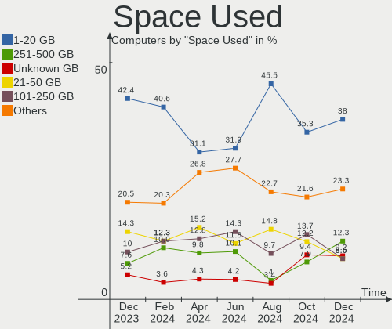
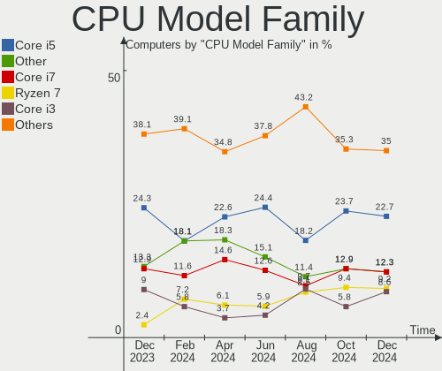
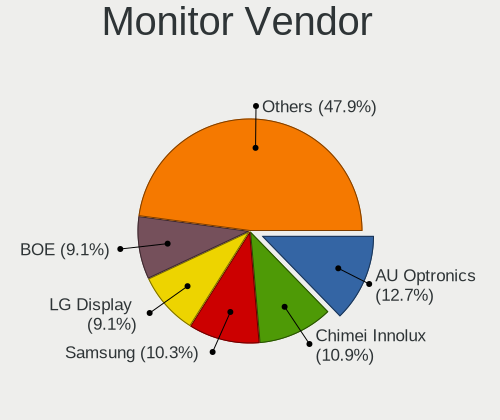
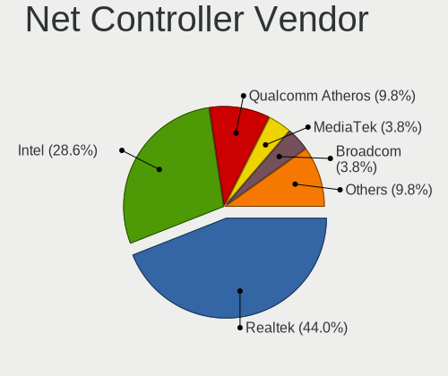
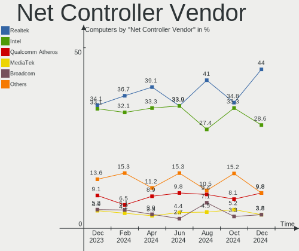
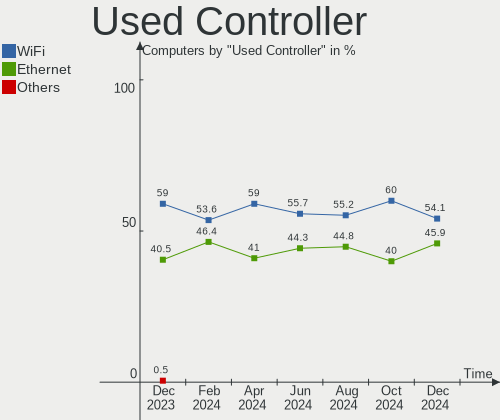
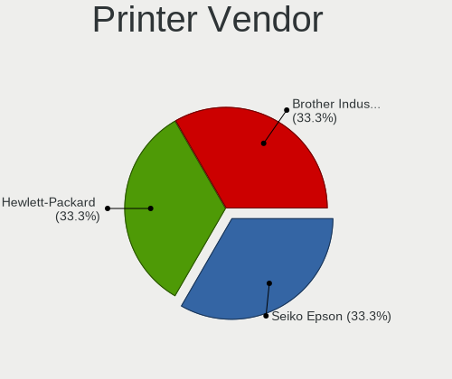
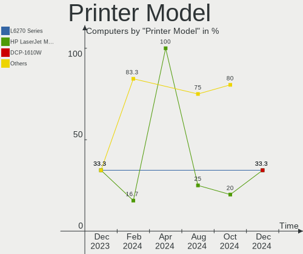
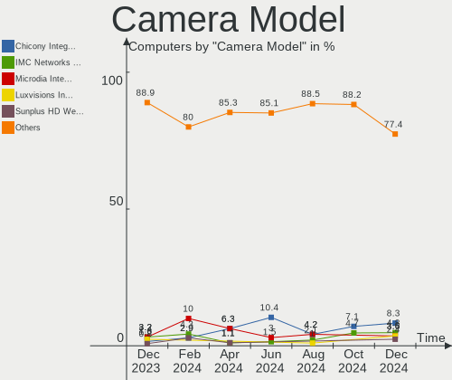

Linux in Poland - Hardware Trends
---------------------------------

A project to identify most popular hardware characteristics and track their change
over time based on data collected by Linux users at https://Linux-Hardware.org.

Anyone can contribute to this report by the [hw-probe](https://github.com/linuxhw/hw-probe) tool:

    sudo -E hw-probe -all -upload

This is a report for all computer types. See also reports for [desktops](/Location/Poland/Desktop/README.md) and [notebooks](/Location/Poland/Notebook/README.md).

Period: Jun, 2023.

Contents
--------

* [ System ](#system)
  - [ OS                       ](#os)
  - [ OS Family                ](#os-family)
  - [ Kernel                   ](#kernel)
  - [ Kernel Family            ](#kernel-family)
  - [ Kernel Major Ver.        ](#kernel-major-ver)
  - [ Arch                     ](#arch)
  - [ DE                       ](#de)
  - [ Display Server           ](#display-server)
  - [ Display Manager          ](#display-manager)
  - [ OS Lang                  ](#os-lang)
  - [ Boot Mode                ](#boot-mode)
  - [ Filesystem               ](#filesystem)
  - [ Part. scheme             ](#part-scheme)
  - [ Dual Boot with Linux/BSD ](#dual-boot-with-linuxbsd)
  - [ Dual Boot (Win)          ](#dual-boot-win)

* [ Board ](#board)
  - [ Vendor                   ](#vendor)
  - [ Model                    ](#model)
  - [ Model Family             ](#model-family)
  - [ MFG Year                 ](#mfg-year)
  - [ Form Factor              ](#form-factor)
  - [ Secure Boot              ](#secure-boot)
  - [ Coreboot                 ](#coreboot)
  - [ RAM Size                 ](#ram-size)
  - [ RAM Used                 ](#ram-used)
  - [ Total Drives             ](#total-drives)
  - [ Has CD-ROM               ](#has-cd-rom)
  - [ Has Ethernet             ](#has-ethernet)
  - [ Has WiFi                 ](#has-wifi)
  - [ Has Bluetooth            ](#has-bluetooth)

* [ Location ](#location)
  - [ Country                  ](#country)
  - [ City                     ](#city)

* [ Drives ](#drives)
  - [ Drive Vendor             ](#drive-vendor)
  - [ Drive Model              ](#drive-model)
  - [ HDD Vendor               ](#hdd-vendor)
  - [ SSD Vendor               ](#ssd-vendor)
  - [ Drive Kind               ](#drive-kind)
  - [ Drive Connector          ](#drive-connector)
  - [ Drive Size               ](#drive-size)
  - [ Space Total              ](#space-total)
  - [ Space Used               ](#space-used)
  - [ Malfunc. Drives          ](#malfunc-drives)
  - [ Malfunc. Drive Vendor    ](#malfunc-drive-vendor)
  - [ Malfunc. HDD Vendor      ](#malfunc-hdd-vendor)
  - [ Malfunc. Drive Kind      ](#malfunc-drive-kind)
  - [ Failed Drives            ](#failed-drives)
  - [ Failed Drive Vendor      ](#failed-drive-vendor)
  - [ Drive Status             ](#drive-status)

* [ Storage controller ](#storage-controller)
  - [ Storage Vendor           ](#storage-vendor)
  - [ Storage Model            ](#storage-model)
  - [ Storage Kind             ](#storage-kind)

* [ Processor ](#processor)
  - [ CPU Vendor               ](#cpu-vendor)
  - [ CPU Model                ](#cpu-model)
  - [ CPU Model Family         ](#cpu-model-family)
  - [ CPU Cores                ](#cpu-cores)
  - [ CPU Sockets              ](#cpu-sockets)
  - [ CPU Threads              ](#cpu-threads)
  - [ CPU Op-Modes             ](#cpu-op-modes)
  - [ CPU Microcode            ](#cpu-microcode)
  - [ CPU Microarch            ](#cpu-microarch)

* [ Graphics ](#graphics)
  - [ GPU Vendor               ](#gpu-vendor)
  - [ GPU Model                ](#gpu-model)
  - [ GPU Combo                ](#gpu-combo)
  - [ GPU Driver               ](#gpu-driver)
  - [ GPU Memory               ](#gpu-memory)

* [ Monitor ](#monitor)
  - [ Monitor Vendor           ](#monitor-vendor)
  - [ Monitor Model            ](#monitor-model)
  - [ Monitor Resolution       ](#monitor-resolution)
  - [ Monitor Diagonal         ](#monitor-diagonal)
  - [ Monitor Width            ](#monitor-width)
  - [ Aspect Ratio             ](#aspect-ratio)
  - [ Monitor Area             ](#monitor-area)
  - [ Pixel Density            ](#pixel-density)
  - [ Multiple Monitors        ](#multiple-monitors)

* [ Network ](#network)
  - [ Net Controller Vendor    ](#net-controller-vendor)
  - [ Net Controller Model     ](#net-controller-model)
  - [ Wireless Vendor          ](#wireless-vendor)
  - [ Wireless Model           ](#wireless-model)
  - [ Ethernet Vendor          ](#ethernet-vendor)
  - [ Ethernet Model           ](#ethernet-model)
  - [ Net Controller Kind      ](#net-controller-kind)
  - [ Used Controller          ](#used-controller)
  - [ NICs                     ](#nics)
  - [ IPv6                     ](#ipv6)

* [ Bluetooth ](#bluetooth)
  - [ Bluetooth Vendor         ](#bluetooth-vendor)
  - [ Bluetooth Model          ](#bluetooth-model)

* [ Sound ](#sound)
  - [ Sound Vendor             ](#sound-vendor)
  - [ Sound Model              ](#sound-model)

* [ Memory ](#memory)
  - [ Memory Vendor            ](#memory-vendor)
  - [ Memory Model             ](#memory-model)
  - [ Memory Kind              ](#memory-kind)
  - [ Memory Form Factor       ](#memory-form-factor)
  - [ Memory Size              ](#memory-size)
  - [ Memory Speed             ](#memory-speed)

* [ Printers & scanners ](#printers--scanners)
  - [ Printer Vendor           ](#printer-vendor)
  - [ Printer Model            ](#printer-model)
  - [ Scanner Vendor           ](#scanner-vendor)
  - [ Scanner Model            ](#scanner-model)

* [ Camera ](#camera)
  - [ Camera Vendor            ](#camera-vendor)
  - [ Camera Model             ](#camera-model)

* [ Security ](#security)
  - [ Fingerprint Vendor       ](#fingerprint-vendor)
  - [ Fingerprint Model        ](#fingerprint-model)
  - [ Chipcard Vendor          ](#chipcard-vendor)
  - [ Chipcard Model           ](#chipcard-model)

* [ Unsupported ](#unsupported)
  - [ Unsupported Devices      ](#unsupported-devices)
  - [ Unsupported Device Types ](#unsupported-device-types)

System
------

OS
--

Installed operating systems

| Name                | Computers | Percent |
|---------------------|-----------|---------|
| Ubuntu 22.04        | 14        | 11.67%  |
| Fedora 38           | 14        | 11.67%  |
| OpenMandriva 23.03  | 6         | 5%      |
| ArcoLinux Rolling   | 6         | 5%      |
| Arch Rolling        | 6         | 5%      |
| Zorin 16            | 5         | 4.17%   |
| Linux Mint 21.1     | 5         | 4.17%   |
| Debian 11           | 5         | 4.17%   |
| Xubuntu 22.04       | 4         | 3.33%   |
| Ubuntu 23.04        | 4         | 3.33%   |
| Gentoo 2.13         | 4         | 3.33%   |
| Debian 12           | 4         | 3.33%   |
| Pop!_OS 22.04       | 3         | 2.5%    |
| OpenMandriva 23.06  | 3         | 2.5%    |
| Kali 2023.2         | 3         | 2.5%    |
| Ubuntu 22.10        | 2         | 1.67%   |
| Ubuntu 20.04        | 2         | 1.67%   |
| SteamOS 3.4.8       | 2         | 1.67%   |
| OpenMandriva 23.01  | 2         | 1.67%   |
| EndeavourOS Rolling | 2         | 1.67%   |
| Zorin 15            | 1         | 0.83%   |
| Ubuntu Unity 20.04  | 1         | 0.83%   |
| SteamOS 3.4         | 1         | 0.83%   |
| ROSA 12.4           | 1         | 0.83%   |
| Raspbian 12         | 1         | 0.83%   |
| PureOS 10.0         | 1         | 0.83%   |
| Peppermint 10       | 1         | 0.83%   |
| Oracle Linux 8.7    | 1         | 0.83%   |
| OpenMandriva 4.90   | 1         | 0.83%   |
| OpenMandriva 4.3    | 1         | 0.83%   |
| OpenMandriva 23.90  | 1         | 0.83%   |
| Nobara 37           | 1         | 0.83%   |
| MX 23               | 1         | 0.83%   |
| MX 21               | 1         | 0.83%   |
| Manjaro             | 1         | 0.83%   |
| LMDE 5              | 1         | 0.83%   |
| Linux Mint 21       | 1         | 0.83%   |
| Linux Mint 20.2     | 1         | 0.83%   |
| Kubuntu 23.04       | 1         | 0.83%   |
| EuroLinux 9.2       | 1         | 0.83%   |

OS Family
---------

OS without a version

| Name         | Computers | Percent |
|--------------|-----------|---------|
| Ubuntu       | 22        | 18.33%  |
| OpenMandriva | 14        | 11.67%  |
| Fedora       | 14        | 11.67%  |
| Debian       | 9         | 7.5%    |
| Linux Mint   | 7         | 5.83%   |
| Zorin        | 6         | 5%      |
| ArcoLinux    | 6         | 5%      |
| Arch         | 6         | 5%      |
| Xubuntu      | 4         | 3.33%   |
| Gentoo       | 4         | 3.33%   |
| SteamOS      | 3         | 2.5%    |
| Pop!_OS      | 3         | 2.5%    |
| Kali         | 3         | 2.5%    |
| MX           | 2         | 1.67%   |
| EndeavourOS  | 2         | 1.67%   |
| Ubuntu Unity | 1         | 0.83%   |
| ROSA         | 1         | 0.83%   |
| Raspbian     | 1         | 0.83%   |
| PureOS       | 1         | 0.83%   |
| Peppermint   | 1         | 0.83%   |
| Oracle Linux | 1         | 0.83%   |
| Nobara       | 1         | 0.83%   |
| Manjaro      | 1         | 0.83%   |
| LMDE         | 1         | 0.83%   |
| Kubuntu      | 1         | 0.83%   |
| EuroLinux    | 1         | 0.83%   |
| Endless      | 1         | 0.83%   |
| ChimeraOS    | 1         | 0.83%   |
| Archcraft    | 1         | 0.83%   |
| Android      | 1         | 0.83%   |

Kernel
------

Version of the Linux kernel

| Version                     | Computers | Percent |
|-----------------------------|-----------|---------|
| 5.19.0-43-generic           | 9         | 7.5%    |
| 6.2.6-desktop-1omv2390      | 6         | 5%      |
| 5.19.0-45-generic           | 6         | 5%      |
| 5.15.0-73-generic           | 6         | 5%      |
| 6.1.0-9-amd64               | 5         | 4.17%   |
| 6.3.5-desktop-3omv2390      | 4         | 3.33%   |
| 6.3.4-201.fc38.x86_64       | 4         | 3.33%   |
| 6.2.0-20-generic            | 4         | 3.33%   |
| 5.10.0-23-amd64             | 4         | 3.33%   |
| 6.3.7-arch1-1               | 3         | 2.5%    |
| 6.3.7-200.fc38.x86_64       | 3         | 2.5%    |
| 6.3.6-arch1-1               | 3         | 2.5%    |
| 6.1.28-gentoo               | 3         | 2.5%    |
| 6.3.8-arch1-1               | 2         | 1.67%   |
| 6.3.8-200.fc38.x86_64       | 2         | 1.67%   |
| 6.3.6-200.fc38.x86_64       | 2         | 1.67%   |
| 6.3.3-arch1-1               | 2         | 1.67%   |
| 6.2.6-76060206-generic      | 2         | 1.67%   |
| 6.1.1-desktop-1omv2290      | 2         | 1.67%   |
| 6.1.0-kali9-amd64           | 2         | 1.67%   |
| 5.4.0-152-generic           | 2         | 1.67%   |
| 5.15.0-76-generic           | 2         | 1.67%   |
| 5.15.0-75-generic           | 2         | 1.67%   |
| 5.13.0-valve36-1-neptune    | 2         | 1.67%   |
| 6.3.8-zen1-1-zen            | 1         | 0.83%   |
| 6.3.8-4-MANJARO             | 1         | 0.83%   |
| 6.3.7-200.fsync.fc37.x86_64 | 1         | 0.83%   |
| 6.3.7-060307-generic        | 1         | 0.83%   |
| 6.3.6-zen1-1-zen            | 1         | 0.83%   |
| 6.3.5-arch1-1               | 1         | 0.83%   |
| 6.3.5-200.fc38.x86_64       | 1         | 0.83%   |
| 6.3.4-arch1-1               | 1         | 0.83%   |
| 6.2.9-300.fc38.x86_64       | 1         | 0.83%   |
| 6.2.8-arch1-1               | 1         | 0.83%   |
| 6.2.15-300.fc38.x86_64      | 1         | 0.83%   |
| 6.2.0-23-generic            | 1         | 0.83%   |
| 6.1.31-gentoo-x86_64        | 1         | 0.83%   |
| 6.1.30-sunxi                | 1         | 0.83%   |
| 6.1.27-1-lts                | 1         | 0.83%   |
| 6.1.21+                     | 1         | 0.83%   |

Kernel Family
-------------

Linux kernel without a distro release

| Version  | Computers | Percent |
|----------|-----------|---------|
| 5.19.0   | 19        | 15.83%  |
| 5.15.0   | 11        | 9.17%   |
| 6.3.7    | 8         | 6.67%   |
| 6.2.6    | 8         | 6.67%   |
| 6.1.0    | 7         | 5.83%   |
| 6.3.8    | 6         | 5%      |
| 6.3.6    | 6         | 5%      |
| 6.3.5    | 6         | 5%      |
| 5.10.0   | 6         | 5%      |
| 6.3.4    | 5         | 4.17%   |
| 6.2.0    | 5         | 4.17%   |
| 5.4.0    | 5         | 4.17%   |
| 6.1.28   | 3         | 2.5%    |
| 6.3.3    | 2         | 1.67%   |
| 6.1.1    | 2         | 1.67%   |
| 5.14.0   | 2         | 1.67%   |
| 5.13.0   | 2         | 1.67%   |
| 6.2.9    | 1         | 0.83%   |
| 6.2.8    | 1         | 0.83%   |
| 6.2.15   | 1         | 0.83%   |
| 6.1.31   | 1         | 0.83%   |
| 6.1.30   | 1         | 0.83%   |
| 6.1.27   | 1         | 0.83%   |
| 6.1.21   | 1         | 0.83%   |
| 5.4.17   | 1         | 0.83%   |
| 5.18.12  | 1         | 0.83%   |
| 5.18.1   | 1         | 0.83%   |
| 5.16.13  | 1         | 0.83%   |
| 5.15.83  | 1         | 0.83%   |
| 5.15.103 | 1         | 0.83%   |
| 5.11.0   | 1         | 0.83%   |
| 5.10.78  | 1         | 0.83%   |
| 4.9.117  | 1         | 0.83%   |
| 3.1.10   | 1         | 0.83%   |

Kernel Major Ver.
-----------------

Linux kernel major version

| Version | Computers | Percent |
|---------|-----------|---------|
| 6.3     | 33        | 27.5%   |
| 5.19    | 19        | 15.83%  |
| 6.2     | 16        | 13.33%  |
| 6.1     | 16        | 13.33%  |
| 5.15    | 13        | 10.83%  |
| 5.10    | 7         | 5.83%   |
| 5.4     | 6         | 5%      |
| 5.18    | 2         | 1.67%   |
| 5.14    | 2         | 1.67%   |
| 5.13    | 2         | 1.67%   |
| 5.16    | 1         | 0.83%   |
| 5.11    | 1         | 0.83%   |
| 4.9     | 1         | 0.83%   |
| 3.1     | 1         | 0.83%   |

Arch
----

OS architecture (x86_64, i586, etc.)

| Name    | Computers | Percent |
|---------|-----------|---------|
| x86_64  | 114       | 95%     |
| armv7l  | 4         | 3.33%   |
| armv6l  | 1         | 0.83%   |
| aarch64 | 1         | 0.83%   |

DE
--

Desktop Environment

| Name       | Computers | Percent |
|------------|-----------|---------|
| GNOME      | 44        | 36.67%  |
| KDE5       | 29        | 24.17%  |
| XFCE       | 18        | 15%     |
| Unknown    | 10        | 8.33%   |
| X-Cinnamon | 6         | 5%      |
| MATE       | 5         | 4.17%   |
| Cinnamon   | 2         | 1.67%   |
| Unity      | 1         | 0.83%   |
| openbox    | 1         | 0.83%   |
| LXQt       | 1         | 0.83%   |
| LXDE       | 1         | 0.83%   |
| Hyprland   | 1         | 0.83%   |
| awesome    | 1         | 0.83%   |

Display Server
--------------

X11 or Wayland

| Name    | Computers | Percent |
|---------|-----------|---------|
| X11     | 78        | 65%     |
| Wayland | 30        | 25%     |
| Unknown | 8         | 6.67%   |
| Tty     | 4         | 3.33%   |

Display Manager
---------------

SDDM, LightDM, etc.

| Name    | Computers | Percent |
|---------|-----------|---------|
| Unknown | 40        | 33.33%  |
| SDDM    | 26        | 21.67%  |
| LightDM | 24        | 20%     |
| GDM3    | 24        | 20%     |
| GDM     | 5         | 4.17%   |
| LXDM    | 1         | 0.83%   |

OS Lang
-------

Language

| Lang        | Computers | Percent |
|-------------|-----------|---------|
| pl_PL       | 66        | 55%     |
| en_US       | 42        | 35%     |
| en_GB       | 4         | 3.33%   |
| C           | 4         | 3.33%   |
| Unknown     | 2         | 1.67%   |
| en_US.utf-8 | 1         | 0.83%   |
| de_DE       | 1         | 0.83%   |

Boot Mode
---------

EFI or BIOS

| Mode | Computers | Percent |
|------|-----------|---------|
| EFI  | 62        | 51.67%  |
| BIOS | 58        | 48.33%  |

Filesystem
----------

Type of filesystem

| Type    | Computers | Percent |
|---------|-----------|---------|
| Ext4    | 67        | 55.83%  |
| Btrfs   | 22        | 18.33%  |
| Tmpfs   | 13        | 10.83%  |
| Overlay | 9         | 7.5%    |
| F2fs    | 5         | 4.17%   |
| Xfs     | 2         | 1.67%   |
| Zfs     | 1         | 0.83%   |
| Unknown | 1         | 0.83%   |

Part. scheme
------------

Scheme of partitioning

| Type    | Computers | Percent |
|---------|-----------|---------|
| GPT     | 71        | 59.17%  |
| Unknown | 33        | 27.5%   |
| MBR     | 16        | 13.33%  |

Dual Boot with Linux/BSD
------------------------

Hosting more than one Linux/BSD

| Dual boot | Computers | Percent |
|-----------|-----------|---------|
| No        | 97        | 80.83%  |
| Yes       | 23        | 19.17%  |

Dual Boot (Win)
---------------

Hosting Linux and Windows

| Dual boot | Computers | Percent |
|-----------|-----------|---------|
| No        | 97        | 80.83%  |
| Yes       | 23        | 19.17%  |

Board
-----

Vendor
------

Motherboard manufacturer

| Name                    | Computers | Percent |
|-------------------------|-----------|---------|
| Lenovo                  | 20        | 16.67%  |
| ASUSTek Computer        | 17        | 14.17%  |
| Hewlett-Packard         | 15        | 12.5%   |
| Dell                    | 11        | 9.17%   |
| MSI                     | 10        | 8.33%   |
| Gigabyte Technology     | 9         | 7.5%    |
| Toshiba                 | 5         | 4.17%   |
| ASRock                  | 4         | 3.33%   |
| Acer                    | 4         | 3.33%   |
| Raspberry Pi Foundation | 3         | 2.5%    |
| Valve                   | 2         | 1.67%   |
| HUAWEI                  | 2         | 1.67%   |
| Fujitsu                 | 2         | 1.67%   |
| Unknown                 | 2         | 1.67%   |
| Xunlong                 | 1         | 0.83%   |
| Supermicro              | 1         | 0.83%   |
| STONE COMPUTERS         | 1         | 0.83%   |
| Samsung Electronics     | 1         | 0.83%   |
| Razer                   | 1         | 0.83%   |
| Panasonic               | 1         | 0.83%   |
| Packard Bell            | 1         | 0.83%   |
| Notebook                | 1         | 0.83%   |
| Medion                  | 1         | 0.83%   |
| Intel                   | 1         | 0.83%   |
| Google                  | 1         | 0.83%   |
| eMachines               | 1         | 0.83%   |
| Biostar                 | 1         | 0.83%   |
| Apple                   | 1         | 0.83%   |

Model
-----

Motherboard model

| Name                                                                                     | Computers | Percent |
|------------------------------------------------------------------------------------------|-----------|---------|
| HP t620 Quad Core TC                                                                     | 3         | 2.5%    |
| Valve Jupiter                                                                            | 2         | 1.67%   |
| MSI MS-7816                                                                              | 2         | 1.67%   |
| HP EliteBook 820 G2                                                                      | 2         | 1.67%   |
| ASUS M3A78-CM                                                                            | 2         | 1.67%   |
| Acer Swift SF314-43                                                                      | 2         | 1.67%   |
| Unknown                                                                                  | 2         | 1.67%   |
| Xunlong Orange Pi PC                                                                     | 1         | 0.83%   |
| Toshiba TECRA R950                                                                       | 1         | 0.83%   |
| Toshiba Satellite Pro C70-B                                                              | 1         | 0.83%   |
| Toshiba Satellite L650                                                                   | 1         | 0.83%   |
| Toshiba Satellite L40                                                                    | 1         | 0.83%   |
| Toshiba Satellite A300                                                                   | 1         | 0.83%   |
| Supermicro X8DTU                                                                         | 1         | 0.83%   |
| STONE COMPUTERS NOTCHA-286                                                               | 1         | 0.83%   |
| Samsung 355V4C/355V4X/355V5C/355V5X/356V4C/356V4X/356V5C/356V5X/3445VC/3445VX/3545VC/354 | 1         | 0.83%   |
| Razer Blade Stealth 13 (Early 2020) - RZ09-0310                                          | 1         | 0.83%   |
| RPi Raspberry Pi Zero W Rev 1.1                                                          | 1         | 0.83%   |
| RPi Raspberry Pi 3 Model B Rev 1.2                                                       | 1         | 0.83%   |
| RPi Raspberry Pi                                                                         | 1         | 0.83%   |
| Panasonic CF-53ASCZGFG                                                                   | 1         | 0.83%   |
| Packard Bell EasyNote TK85                                                               | 1         | 0.83%   |
| Notebook NV4xPZ                                                                          | 1         | 0.83%   |
| MSI OPTIMUS                                                                              | 1         | 0.83%   |
| MSI MS-7C91                                                                              | 1         | 0.83%   |
| MSI MS-7C52                                                                              | 1         | 0.83%   |
| MSI MS-7C02                                                                              | 1         | 0.83%   |
| MSI MS-7B85                                                                              | 1         | 0.83%   |
| MSI MS-7B79                                                                              | 1         | 0.83%   |
| MSI MS-7B17                                                                              | 1         | 0.83%   |
| MSI GE62 6QC                                                                             | 1         | 0.83%   |
| Medion G24                                                                               | 1         | 0.83%   |
| Lenovo Y50-70 20378                                                                      | 1         | 0.83%   |
| Lenovo ThinkPad T490 20N20032US                                                          | 1         | 0.83%   |
| Lenovo ThinkPad T470s W10DG 20JTS1MR08                                                   | 1         | 0.83%   |
| Lenovo ThinkPad T430s 23554L7                                                            | 1         | 0.83%   |
| Lenovo ThinkPad T430 2349HNU                                                             | 1         | 0.83%   |
| Lenovo ThinkPad T430 2347BS4                                                             | 1         | 0.83%   |
| Lenovo ThinkPad L490 20Q5002DMH                                                          | 1         | 0.83%   |
| Lenovo ThinkPad L470 20J5S01S00                                                          | 1         | 0.83%   |

Model Family
------------

Motherboard model prefix

| Name                       | Computers | Percent |
|----------------------------|-----------|---------|
| Lenovo ThinkPad            | 9         | 7.5%    |
| Dell Latitude              | 6         | 5%      |
| Toshiba Satellite          | 4         | 3.33%   |
| RPi Raspberry              | 3         | 2.5%    |
| Lenovo IdeaPad             | 3         | 2.5%    |
| HP t620                    | 3         | 2.5%    |
| HP EliteBook               | 3         | 2.5%    |
| Valve Jupiter              | 2         | 1.67%   |
| MSI MS-7816                | 2         | 1.67%   |
| Lenovo Legion              | 2         | 1.67%   |
| HP Pavilion                | 2         | 1.67%   |
| ASUS TUF                   | 2         | 1.67%   |
| ASUS M3A78-CM              | 2         | 1.67%   |
| ASUS ASUS                  | 2         | 1.67%   |
| Acer Swift                 | 2         | 1.67%   |
| Unknown                    | 2         | 1.67%   |
| Xunlong Orange             | 1         | 0.83%   |
| Toshiba TECRA              | 1         | 0.83%   |
| Supermicro X8DTU           | 1         | 0.83%   |
| STONE COMPUTERS NOTCHA-286 | 1         | 0.83%   |
| Samsung 355V4C             | 1         | 0.83%   |
| Razer Blade                | 1         | 0.83%   |
| Panasonic CF-53ASCZGFG     | 1         | 0.83%   |
| Packard Bell EasyNote      | 1         | 0.83%   |
| Notebook NV4xPZ            | 1         | 0.83%   |
| MSI OPTIMUS                | 1         | 0.83%   |
| MSI MS-7C91                | 1         | 0.83%   |
| MSI MS-7C52                | 1         | 0.83%   |
| MSI MS-7C02                | 1         | 0.83%   |
| MSI MS-7B85                | 1         | 0.83%   |
| MSI MS-7B79                | 1         | 0.83%   |
| MSI MS-7B17                | 1         | 0.83%   |
| MSI GE62                   | 1         | 0.83%   |
| Medion G24                 | 1         | 0.83%   |
| Lenovo Y50-70              | 1         | 0.83%   |
| Lenovo ThinkCentre         | 1         | 0.83%   |
| Lenovo G500s               | 1         | 0.83%   |
| Lenovo B570                | 1         | 0.83%   |
| Lenovo B51-80              | 1         | 0.83%   |
| Lenovo B50-70              | 1         | 0.83%   |

MFG Year
--------

Motherboard manufacture year

| Year    | Computers | Percent |
|---------|-----------|---------|
| 2019    | 13        | 10.83%  |
| 2014    | 11        | 9.17%   |
| 2021    | 10        | 8.33%   |
| 2018    | 10        | 8.33%   |
| 2012    | 9         | 7.5%    |
| 2013    | 8         | 6.67%   |
| 2022    | 7         | 5.83%   |
| 2020    | 7         | 5.83%   |
| 2015    | 7         | 5.83%   |
| 2010    | 7         | 5.83%   |
| 2017    | 6         | 5%      |
| 2011    | 5         | 4.17%   |
| Unknown | 5         | 4.17%   |
| 2016    | 4         | 3.33%   |
| 2008    | 4         | 3.33%   |
| 2023    | 2         | 1.67%   |
| 2009    | 2         | 1.67%   |
| 2007    | 2         | 1.67%   |
| 2006    | 1         | 0.83%   |

Form Factor
-----------

Physical design of the computer

| Name           | Computers | Percent |
|----------------|-----------|---------|
| Notebook       | 66        | 55%     |
| Desktop        | 42        | 35%     |
| System on chip | 5         | 4.17%   |
| All in one     | 2         | 1.67%   |
| Phone          | 1         | 0.83%   |
| Tablet         | 1         | 0.83%   |
| Convertible    | 1         | 0.83%   |
| Mini pc        | 1         | 0.83%   |
| Server         | 1         | 0.83%   |

Secure Boot
-----------

Enabled or disabled

| State    | Computers | Percent |
|----------|-----------|---------|
| Disabled | 115       | 95.83%  |
| Enabled  | 5         | 4.17%   |

Coreboot
--------

Have coreboot on board

| Used | Computers | Percent |
|------|-----------|---------|
| No   | 119       | 99.17%  |
| Yes  | 1         | 0.83%   |

RAM Size
--------

Total RAM memory

| Size in GB  | Computers | Percent |
|-------------|-----------|---------|
| 4.01-8.0    | 29        | 24.17%  |
| 8.01-16.0   | 23        | 19.17%  |
| 16.01-24.0  | 21        | 17.5%   |
| 3.01-4.0    | 19        | 15.83%  |
| 32.01-64.0  | 11        | 9.17%   |
| 1.01-2.0    | 5         | 4.17%   |
| 0.51-1.0    | 4         | 3.33%   |
| 64.01-256.0 | 3         | 2.5%    |
| 24.01-32.0  | 2         | 1.67%   |
| 2.01-3.0    | 2         | 1.67%   |
| 0.01-0.5    | 1         | 0.83%   |

RAM Used
--------

Used RAM memory

| Used GB     | Computers | Percent |
|-------------|-----------|---------|
| 1.01-2.0    | 40        | 33.33%  |
| 2.01-3.0    | 29        | 24.17%  |
| 4.01-8.0    | 24        | 20%     |
| 3.01-4.0    | 11        | 9.17%   |
| 0.51-1.0    | 5         | 4.17%   |
| 8.01-16.0   | 4         | 3.33%   |
| 0.01-0.5    | 4         | 3.33%   |
| 64.01-256.0 | 1         | 0.83%   |
| 16.01-24.0  | 1         | 0.83%   |
| Unknown     | 1         | 0.83%   |

Total Drives
------------

Number of drives on board

| Drives | Computers | Percent |
|--------|-----------|---------|
| 1      | 71        | 59.17%  |
| 2      | 29        | 24.17%  |
| 3      | 13        | 10.83%  |
| 6      | 2         | 1.67%   |
| 4      | 2         | 1.67%   |
| 0      | 2         | 1.67%   |
| 5      | 1         | 0.83%   |

Has CD-ROM
----------

Has CD-ROM on board

| Presented | Computers | Percent |
|-----------|-----------|---------|
| No        | 79        | 65.83%  |
| Yes       | 41        | 34.17%  |

Has Ethernet
------------

Has Ethernet on board

| Presented | Computers | Percent |
|-----------|-----------|---------|
| Yes       | 99        | 82.5%   |
| No        | 21        | 17.5%   |

Has WiFi
--------

Has WiFi module

| Presented | Computers | Percent |
|-----------|-----------|---------|
| Yes       | 86        | 71.67%  |
| No        | 34        | 28.33%  |

Has Bluetooth
-------------

Has Bluetooth module

| Presented | Computers | Percent |
|-----------|-----------|---------|
| Yes       | 72        | 60%     |
| No        | 48        | 40%     |

Location
--------

Country
-------

Geographic location (country)

| Country | Computers | Percent |
|---------|-----------|---------|
| Poland  | 120       | 100%    |

City
----

Geographic location (city)

| City                   | Computers | Percent |
|------------------------|-----------|---------|
| Warsaw                 | 27        | 22.5%   |
| Gdansk                 | 10        | 8.33%   |
| Wroclaw                | 8         | 6.67%   |
| Poznan                 | 6         | 5%      |
| Krakow                 | 6         | 5%      |
| Żory                  | 2         | 1.67%   |
| Szczecin               | 2         | 1.67%   |
| Otwock                 | 2         | 1.67%   |
| Katowice               | 2         | 1.67%   |
| Dymaczewo Stare        | 2         | 1.67%   |
| Zielona Góra          | 1         | 0.83%   |
| Zawiercie              | 1         | 0.83%   |
| Zagorz                 | 1         | 0.83%   |
| Żagań                | 1         | 0.83%   |
| Zabrze                 | 1         | 0.83%   |
| Wojnicz                | 1         | 0.83%   |
| Wieluń                | 1         | 0.83%   |
| Wałbrzych             | 1         | 0.83%   |
| Torun                  | 1         | 0.83%   |
| Tarnowskie Gory        | 1         | 0.83%   |
| Sucha Beskidzka        | 1         | 0.83%   |
| Stargard               | 1         | 0.83%   |
| Starachowice           | 1         | 0.83%   |
| Srokowo                | 1         | 0.83%   |
| Skierniewice           | 1         | 0.83%   |
| Skawina                | 1         | 0.83%   |
| Siemiatycze            | 1         | 0.83%   |
| Siemianowice Śląskie | 1         | 0.83%   |
| Sieciechowice          | 1         | 0.83%   |
| Rybnik                 | 1         | 0.83%   |
| Ruda Śląska          | 1         | 0.83%   |
| Racibórz              | 1         | 0.83%   |
| Płock                 | 1         | 0.83%   |
| Przeworsk              | 1         | 0.83%   |
| Prochowice             | 1         | 0.83%   |
| Polczyn-Zdroj          | 1         | 0.83%   |
| Pogorze                | 1         | 0.83%   |
| Piaseczno              | 1         | 0.83%   |
| Ozarow Mazowiecki      | 1         | 0.83%   |
| Orzesze                | 1         | 0.83%   |

Drives
------

Drive Vendor
------------

Hard drive vendors

| Vendor                      | Computers | Drives | Percent |
|-----------------------------|-----------|--------|---------|
| Samsung Electronics         | 21        | 24     | 12%     |
| GOODRAM                     | 18        | 18     | 10.29%  |
| WDC                         | 16        | 19     | 9.14%   |
| Crucial                     | 14        | 15     | 8%      |
| Unknown                     | 12        | 16     | 6.86%   |
| Seagate                     | 12        | 12     | 6.86%   |
| Toshiba                     | 10        | 10     | 5.71%   |
| SanDisk                     | 10        | 11     | 5.71%   |
| Kingston                    | 7         | 7      | 4%      |
| A-DATA Technology           | 7         | 8      | 4%      |
| Hitachi                     | 5         | 7      | 2.86%   |
| Micron Technology           | 4         | 4      | 2.29%   |
| Patriot                     | 3         | 3      | 1.71%   |
| SPCC                        | 2         | 3      | 1.14%   |
| SK hynix                    | 2         | 2      | 1.14%   |
| Realtek Semiconductor       | 2         | 2      | 1.14%   |
| PNY                         | 2         | 2      | 1.14%   |
| Plextor                     | 2         | 2      | 1.14%   |
| KIOXIA                      | 2         | 2      | 1.14%   |
| Intel                       | 2         | 2      | 1.14%   |
| Gigabyte Technology         | 2         | 2      | 1.14%   |
| China                       | 2         | 2      | 1.14%   |
| ADATA Technology            | 2         | 2      | 1.14%   |
| Transcend                   | 1         | 1      | 0.57%   |
| Team                        | 1         | 1      | 0.57%   |
| Silicon Motion              | 1         | 1      | 0.57%   |
| Phison Electronics          | 1         | 1      | 0.57%   |
| Phison                      | 1         | 1      | 0.57%   |
| OCZ                         | 1         | 1      | 0.57%   |
| LITEON                      | 1         | 1      | 0.57%   |
| Lite-On Technology          | 1         | 1      | 0.57%   |
| Lexar                       | 1         | 1      | 0.57%   |
| Kingston Technology Company | 1         | 1      | 0.57%   |
| Intenso                     | 1         | 1      | 0.57%   |
| HGST                        | 1         | 1      | 0.57%   |
| EXRAM                       | 1         | 1      | 0.57%   |
| Corsair                     | 1         | 1      | 0.57%   |
| BHT                         | 1         | 1      | 0.57%   |
| Apacer                      | 1         | 1      | 0.57%   |

Drive Model
-----------

Hard drive models

| Model                                               | Computers | Percent |
|-----------------------------------------------------|-----------|---------|
| Samsung NVMe SSD Controller SM981/PM981/PM983 250GB | 5         | 2.69%   |
| Crucial CT500MX500SSD1 500GB                        | 5         | 2.69%   |
| Unknown MMC Card  16GB                              | 4         | 2.15%   |
| Crucial CT240BX500SSD1 240GB                        | 4         | 2.15%   |
| GOODRAM SSDPR-CX400-512-G2 512GB                    | 3         | 1.61%   |
| GOODRAM SSDPR-CX400-01T-G2 1024GB                   | 3         | 1.61%   |
| WDC WD20EZRZ-00Z5HB0 2TB                            | 2         | 1.08%   |
| WDC WD10SMZW-11Y0TS0 1TB                            | 2         | 1.08%   |
| WDC WD10EFRX-68FYTN0 1TB                            | 2         | 1.08%   |
| Unknown MMC Card  64GB                              | 2         | 1.08%   |
| Seagate ST1000DM010-2EP102 1TB                      | 2         | 1.08%   |
| Sandisk WD Blue SN550 NVMe SSD 1TB                  | 2         | 1.08%   |
| SanDisk SDSSDP128G 128GB                            | 2         | 1.08%   |
| Samsung SSD 860 EVO 500GB                           | 2         | 1.08%   |
| Realtek RTS5763DL NVMe SSD Controller 512GB         | 2         | 1.08%   |
| Kingston SA400S37480G 480GB SSD                     | 2         | 1.08%   |
| GOODRAM SSDPR-CX400-256-G2 256GB                    | 2         | 1.08%   |
| GOODRAM SSDPR-CL100-480-G2 480GB                    | 2         | 1.08%   |
| Gigabyte GP-GSTFS31120GNTD 120GB SSD                | 2         | 1.08%   |
| Crucial CT120BX500SSD1 120GB                        | 2         | 1.08%   |
| A-DATA SU800 256GB SSD                              | 2         | 1.08%   |
| WDC WD5000AVDS-63U7B1 500GB                         | 1         | 0.54%   |
| WDC WD5000AAKX-07U6AA1 500GB                        | 1         | 0.54%   |
| WDC WD3200BPVT-24JJ5T0 320GB                        | 1         | 0.54%   |
| WDC WD3200BEVT-80A0RT0 320GB                        | 1         | 0.54%   |
| WDC WD15EARS-00J2GB0 1TB                            | 1         | 0.54%   |
| WDC WD10PURX-64D85Y0 1TB                            | 1         | 0.54%   |
| WDC WD10JUCT-63CYNY0 1TB                            | 1         | 0.54%   |
| WDC WD10JUCT-61CYNY0 1TB                            | 1         | 0.54%   |
| WDC WD10JPCX-24UE4T0 1TB                            | 1         | 0.54%   |
| WDC WD10EZEX-22BN5A0 1TB                            | 1         | 0.54%   |
| WDC WD10EZEX-00KUWA0 1TB                            | 1         | 0.54%   |
| WDC PC SN530 NVMe 512GB                             | 1         | 0.54%   |
| Unknown USD00  8GB                                  | 1         | 0.54%   |
| Unknown SD/MMC 2GB                                  | 1         | 0.54%   |
| Unknown SC32G  32GB                                 | 1         | 0.54%   |
| Unknown MMC Card  512GB                             | 1         | 0.54%   |
| Unknown MMC Card  128GB                             | 1         | 0.54%   |
| Unknown MMC Card                                    | 1         | 0.54%   |
| Unknown M.S./M.S.Pro/HG 16GB                        | 1         | 0.54%   |

HDD Vendor
----------

Hard disk drive vendors

| Vendor              | Computers | Drives | Percent |
|---------------------|-----------|--------|---------|
| WDC                 | 15        | 18     | 37.5%   |
| Seagate             | 12        | 12     | 30%     |
| Toshiba             | 6         | 6      | 15%     |
| Hitachi             | 5         | 7      | 12.5%   |
| Samsung Electronics | 1         | 1      | 2.5%    |
| HGST                | 1         | 1      | 2.5%    |

SSD Vendor
----------

Solid state drive vendors

| Vendor              | Computers | Drives | Percent |
|---------------------|-----------|--------|---------|
| GOODRAM             | 18        | 18     | 23.38%  |
| Crucial             | 14        | 15     | 18.18%  |
| Samsung Electronics | 7         | 8      | 9.09%   |
| SanDisk             | 6         | 7      | 7.79%   |
| A-DATA Technology   | 5         | 6      | 6.49%   |
| Kingston            | 4         | 4      | 5.19%   |
| Patriot             | 3         | 3      | 3.9%    |
| Toshiba             | 2         | 2      | 2.6%    |
| SPCC                | 2         | 3      | 2.6%    |
| Plextor             | 2         | 2      | 2.6%    |
| Gigabyte Technology | 2         | 2      | 2.6%    |
| China               | 2         | 2      | 2.6%    |
| Transcend           | 1         | 1      | 1.3%    |
| Team                | 1         | 1      | 1.3%    |
| SK hynix            | 1         | 1      | 1.3%    |
| PNY                 | 1         | 1      | 1.3%    |
| OCZ                 | 1         | 1      | 1.3%    |
| LITEON              | 1         | 1      | 1.3%    |
| Lexar               | 1         | 1      | 1.3%    |
| Intenso             | 1         | 1      | 1.3%    |
| BHT                 | 1         | 1      | 1.3%    |
| Apacer              | 1         | 1      | 1.3%    |

Drive Kind
----------

HDD or SSD

| Kind    | Computers | Drives | Percent |
|---------|-----------|--------|---------|
| SSD     | 65        | 82     | 41.14%  |
| NVMe    | 44        | 47     | 27.85%  |
| HDD     | 36        | 45     | 22.78%  |
| MMC     | 11        | 13     | 6.96%   |
| Unknown | 2         | 4      | 1.27%   |

Drive Connector
---------------

SATA, SAS, NVMe, etc.

| Type | Computers | Drives | Percent |
|------|-----------|--------|---------|
| SATA | 83        | 125    | 58.87%  |
| NVMe | 44        | 47     | 31.21%  |
| MMC  | 11        | 13     | 7.8%    |
| SAS  | 3         | 6      | 2.13%   |

Drive Size
----------

Size of hard drive

| Size in TB | Computers | Drives | Percent |
|------------|-----------|--------|---------|
| 0.01-0.5   | 63        | 77     | 58.88%  |
| 0.51-1.0   | 31        | 35     | 28.97%  |
| 1.01-2.0   | 7         | 7      | 6.54%   |
| 3.01-4.0   | 2         | 2      | 1.87%   |
| 4.01-10.0  | 2         | 2      | 1.87%   |
| 2.01-3.0   | 1         | 3      | 0.93%   |
| 10.01-20.0 | 1         | 1      | 0.93%   |

Space Total
-----------

Amount of disk space available on the file system

| Size in GB     | Computers | Percent |
|----------------|-----------|---------|
| 251-500        | 33        | 27.5%   |
| 101-250        | 28        | 23.33%  |
| 501-1000       | 14        | 11.67%  |
| 1-20           | 12        | 10%     |
| More than 3000 | 6         | 5%      |
| 21-50          | 6         | 5%      |
| 51-100         | 6         | 5%      |
| 2001-3000      | 5         | 4.17%   |
| 1001-2000      | 5         | 4.17%   |
| Unknown        | 5         | 4.17%   |

Space Used
----------

Amount of used disk space

| Used GB        | Computers | Percent |
|----------------|-----------|---------|
| 1-20           | 47        | 39.17%  |
| 51-100         | 16        | 13.33%  |
| 251-500        | 14        | 11.67%  |
| 21-50          | 14        | 11.67%  |
| 101-250        | 11        | 9.17%   |
| 501-1000       | 5         | 4.17%   |
| Unknown        | 5         | 4.17%   |
| More than 3000 | 3         | 2.5%    |
| 2001-3000      | 3         | 2.5%    |
| 1001-2000      | 1         | 0.83%   |
| 0              | 1         | 0.83%   |

Malfunc. Drives
---------------

Drive models with a malfunction

| Model                             | Computers | Drives | Percent |
|-----------------------------------|-----------|--------|---------|
| Samsung Electronics HD753LJ 752GB | 1         | 1      | 14.29%  |
| Patriot Blast 240GB SSD           | 1         | 1      | 14.29%  |
| LITEON CV8-8E128-HP 128GB SSD     | 1         | 1      | 14.29%  |
| Hitachi HTS543232A7A384 320GB     | 1         | 1      | 14.29%  |
| Hitachi HTS543225L9SA00 250GB     | 1         | 1      | 14.29%  |
| Crucial CT1000MX500SSD4 1TB       | 1         | 1      | 14.29%  |
| China SATA SSD 16GB               | 1         | 1      | 14.29%  |

Malfunc. Drive Vendor
---------------------

Vendors of faulty drives

| Vendor              | Computers | Drives | Percent |
|---------------------|-----------|--------|---------|
| Hitachi             | 2         | 2      | 28.57%  |
| Samsung Electronics | 1         | 1      | 14.29%  |
| Patriot             | 1         | 1      | 14.29%  |
| LITEON              | 1         | 1      | 14.29%  |
| Crucial             | 1         | 1      | 14.29%  |
| China               | 1         | 1      | 14.29%  |

Malfunc. HDD Vendor
-------------------

Vendors of faulty HDD drives

| Vendor              | Computers | Drives | Percent |
|---------------------|-----------|--------|---------|
| Hitachi             | 2         | 2      | 66.67%  |
| Samsung Electronics | 1         | 1      | 33.33%  |

Malfunc. Drive Kind
-------------------

Kinds of faulty drives

| Kind | Computers | Drives | Percent |
|------|-----------|--------|---------|
| SSD  | 4         | 4      | 57.14%  |
| HDD  | 3         | 3      | 42.86%  |

Failed Drives
-------------

Failed drive models

Zero info for selected period =(

Failed Drive Vendor
-------------------

Failed drive vendors

Zero info for selected period =(

Drive Status
------------

Number of failed and malfunc. drives

| Status   | Computers | Drives | Percent |
|----------|-----------|--------|---------|
| Works    | 60        | 91     | 48.39%  |
| Detected | 57        | 93     | 45.97%  |
| Malfunc  | 7         | 7      | 5.65%   |

Storage controller
------------------

Storage Vendor
--------------

Storage controller vendors

| Vendor                       | Computers | Percent |
|------------------------------|-----------|---------|
| Intel                        | 74        | 50.68%  |
| AMD                          | 25        | 17.12%  |
| Samsung Electronics          | 15        | 10.27%  |
| SanDisk                      | 5         | 3.42%   |
| Micron Technology            | 4         | 2.74%   |
| Kingston Technology Company  | 4         | 2.74%   |
| ADATA Technology             | 4         | 2.74%   |
| Phison Electronics           | 3         | 2.05%   |
| Toshiba America Info Systems | 2         | 1.37%   |
| Realtek Semiconductor        | 2         | 1.37%   |
| KIOXIA                       | 2         | 1.37%   |
| SK hynix                     | 1         | 0.68%   |
| Silicon Motion               | 1         | 0.68%   |
| Nvidia                       | 1         | 0.68%   |
| Marvell Technology Group     | 1         | 0.68%   |
| Lite-On Technology           | 1         | 0.68%   |
| ASMedia Technology           | 1         | 0.68%   |

Storage Model
-------------

Storage controller models

| Model                                                                          | Computers | Percent |
|--------------------------------------------------------------------------------|-----------|---------|
| AMD FCH SATA Controller [AHCI mode]                                            | 17        | 10.63%  |
| Intel 8 Series/C220 Series Chipset Family 6-port SATA Controller 1 [AHCI mode] | 11        | 6.88%   |
| Samsung NVMe SSD Controller SM981/PM981/PM983                                  | 6         | 3.75%   |
| Intel 7 Series Chipset Family 6-port SATA Controller [AHCI mode]               | 5         | 3.13%   |
| Samsung NVMe SSD Controller 980                                                | 4         | 2.5%    |
| Intel Sunrise Point-LP SATA Controller [AHCI mode]                             | 4         | 2.5%    |
| AMD 400 Series Chipset SATA Controller                                         | 4         | 2.5%    |
| Micron NVMe Storage Controller                                                 | 3         | 1.88%   |
| Intel Wildcat Point-LP SATA Controller [AHCI Mode]                             | 3         | 1.88%   |
| Intel Q170/Q150/B150/H170/H110/Z170/CM236 Chipset SATA Controller [AHCI Mode]  | 3         | 1.88%   |
| Intel NM10/ICH7 Family SATA Controller [IDE mode]                              | 3         | 1.88%   |
| Intel Cannon Lake PCH SATA AHCI Controller                                     | 3         | 1.88%   |
| Intel 7 Series/C210 Series Chipset Family 6-port SATA Controller [AHCI mode]   | 3         | 1.88%   |
| Intel 6 Series/C200 Series Chipset Family 6 port Desktop SATA AHCI Controller  | 3         | 1.88%   |
| Toshiba America Info Systems XG6 NVMe SSD Controller                           | 2         | 1.25%   |
| SanDisk WD Blue SN550 NVMe SSD                                                 | 2         | 1.25%   |
| Samsung NVMe SSD Controller SM961/PM961/SM963                                  | 2         | 1.25%   |
| Samsung NVMe SSD Controller PM9A1/PM9A3/980PRO                                 | 2         | 1.25%   |
| Realtek RTS5763DL NVMe SSD Controller                                          | 2         | 1.25%   |
| KIOXIA NVMe SSD Controller BG4                                                 | 2         | 1.25%   |
| Kingston Company OM3PDP3 NVMe SSD                                              | 2         | 1.25%   |
| Intel Celeron/Pentium Silver Processor SATA Controller                         | 2         | 1.25%   |
| Intel Cannon Lake Mobile PCH SATA AHCI Controller                              | 2         | 1.25%   |
| Intel Atom Processor E3800 Series SATA AHCI Controller                         | 2         | 1.25%   |
| Intel 9 Series Chipset Family SATA Controller [AHCI Mode]                      | 2         | 1.25%   |
| Intel 82801IBM/IEM (ICH9M/ICH9M-E) 4 port SATA Controller [AHCI mode]          | 2         | 1.25%   |
| Intel 82801G (ICH7 Family) IDE Controller                                      | 2         | 1.25%   |
| Intel 82801 Mobile SATA Controller [RAID mode]                                 | 2         | 1.25%   |
| Intel 8 Series SATA Controller 1 [AHCI mode]                                   | 2         | 1.25%   |
| Intel 6 Series/C200 Series Chipset Family 6 port Mobile SATA AHCI Controller   | 2         | 1.25%   |
| Intel 500 Series Chipset Family SATA AHCI Controller                           | 2         | 1.25%   |
| Intel 5 Series/3400 Series Chipset 4 port SATA AHCI Controller                 | 2         | 1.25%   |
| Intel 200 Series PCH SATA controller [AHCI mode]                               | 2         | 1.25%   |
| AMD SB7x0/SB8x0/SB9x0 SATA Controller [IDE mode]                               | 2         | 1.25%   |
| AMD SB7x0/SB8x0/SB9x0 SATA Controller [AHCI mode]                              | 2         | 1.25%   |
| AMD SB7x0/SB8x0/SB9x0 IDE Controller                                           | 2         | 1.25%   |
| ADATA XPG SX8200 Pro PCIe Gen3x4 M.2 2280 Solid State Drive                    | 2         | 1.25%   |
| SK hynix Gold P31/BC711/PC711 NVMe Solid State Drive                           | 1         | 0.63%   |
| Silicon Motion SM2262/SM2262EN SSD Controller                                  | 1         | 0.63%   |
| SanDisk WD PC SN810 / Black SN850 NVMe SSD                                     | 1         | 0.63%   |

Storage Kind
------------

Kind of storage controller (IDE, SATA, NVMe, SAS, ...)

| Kind | Computers | Percent |
|------|-----------|---------|
| SATA | 90        | 61.22%  |
| NVMe | 44        | 29.93%  |
| IDE  | 10        | 6.8%    |
| RAID | 3         | 2.04%   |

Processor
---------

CPU Vendor
----------

Processor vendors

| Vendor | Computers | Percent |
|--------|-----------|---------|
| Intel  | 83        | 69.17%  |
| AMD    | 31        | 25.83%  |
| ARM    | 6         | 5%      |

CPU Model
---------

Processor models

| Model                                    | Computers | Percent |
|------------------------------------------|-----------|---------|
| Intel Core i5-8265U CPU @ 1.60GHz        | 3         | 2.5%    |
| ARM BCM2835 Processor                    | 3         | 2.5%    |
| AMD GX-415GA SOC with Radeon HD Graphics | 3         | 2.5%    |
| Intel Core i7-4790 CPU @ 3.60GHz         | 2         | 1.67%   |
| Intel Core i5-5200U CPU @ 2.20GHz        | 2         | 1.67%   |
| Intel Core i5-4210U CPU @ 1.70GHz        | 2         | 1.67%   |
| Intel Core i5-3320M CPU @ 2.60GHz        | 2         | 1.67%   |
| Intel Core i3-4160 CPU @ 3.60GHz         | 2         | 1.67%   |
| Intel Core i3-4150 CPU @ 3.50GHz         | 2         | 1.67%   |
| Intel Core i3-10110U CPU @ 2.10GHz       | 2         | 1.67%   |
| Intel 11th Gen Core i7-1185G7 @ 3.00GHz  | 2         | 1.67%   |
| AMD Ryzen 5 2600 Six-Core Processor      | 2         | 1.67%   |
| AMD Phenom II X4 955 Processor           | 2         | 1.67%   |
| AMD Custom APU 0405                      | 2         | 1.67%   |
| Intel Xeon CPU E5649 @ 2.53GHz           | 1         | 0.83%   |
| Intel Pentium Silver N5000 CPU @ 1.10GHz | 1         | 0.83%   |
| Intel Pentium Silver J5005 CPU @ 1.50GHz | 1         | 0.83%   |
| Intel Pentium Gold G6400 CPU @ 4.00GHz   | 1         | 0.83%   |
| Intel Pentium Gold 7505 @ 2.00GHz        | 1         | 0.83%   |
| Intel Pentium Dual CPU T2310 @ 1.46GHz   | 1         | 0.83%   |
| Intel Pentium CPU J2900 @ 2.41GHz        | 1         | 0.83%   |
| Intel Pentium CPU G3220 @ 3.00GHz        | 1         | 0.83%   |
| Intel Pentium CPU B960 @ 2.20GHz         | 1         | 0.83%   |
| Intel Pentium CPU 4405U @ 2.10GHz        | 1         | 0.83%   |
| Intel Pentium CPU 2020M @ 2.40GHz        | 1         | 0.83%   |
| Intel Core i7-9750H CPU @ 2.60GHz        | 1         | 0.83%   |
| Intel Core i7-9700K CPU @ 3.60GHz        | 1         | 0.83%   |
| Intel Core i7-8750H CPU @ 2.20GHz        | 1         | 0.83%   |
| Intel Core i7-7820HQ CPU @ 2.90GHz       | 1         | 0.83%   |
| Intel Core i7-6700HQ CPU @ 2.60GHz       | 1         | 0.83%   |
| Intel Core i7-6600U CPU @ 2.60GHz        | 1         | 0.83%   |
| Intel Core i7-4810MQ CPU @ 2.80GHz       | 1         | 0.83%   |
| Intel Core i7-4800MQ CPU @ 2.70GHz       | 1         | 0.83%   |
| Intel Core i7-4790K CPU @ 4.00GHz        | 1         | 0.83%   |
| Intel Core i7-4770K CPU @ 3.50GHz        | 1         | 0.83%   |
| Intel Core i7-3770K CPU @ 3.50GHz        | 1         | 0.83%   |
| Intel Core i7-3770 CPU @ 3.40GHz         | 1         | 0.83%   |
| Intel Core i7-3612QM CPU @ 2.10GHz       | 1         | 0.83%   |
| Intel Core i7-2600K CPU @ 3.40GHz        | 1         | 0.83%   |
| Intel Core i7-1065G7 CPU @ 1.30GHz       | 1         | 0.83%   |

CPU Model Family
----------------

Processor model prefix

| Model                | Computers | Percent |
|----------------------|-----------|---------|
| Intel Core i5        | 24        | 20%     |
| Intel Core i7        | 18        | 15%     |
| Intel Core i3        | 12        | 10%     |
| AMD Ryzen 5          | 8         | 6.67%   |
| AMD Ryzen 7          | 7         | 5.83%   |
| Other                | 6         | 5%      |
| Intel Celeron        | 6         | 5%      |
| Intel Pentium        | 5         | 4.17%   |
| Intel Core 2 Quad    | 3         | 2.5%    |
| Intel Core 2 Duo     | 3         | 2.5%    |
| ARM BCM              | 3         | 2.5%    |
| AMD GX               | 3         | 2.5%    |
| Intel Pentium Silver | 2         | 1.67%   |
| Intel Pentium Gold   | 2         | 1.67%   |
| AMD Phenom II X4     | 2         | 1.67%   |
| Intel Xeon           | 1         | 0.83%   |
| Intel Pentium Dual   | 1         | 0.83%   |
| Intel Core 2         | 1         | 0.83%   |
| Intel Atom           | 1         | 0.83%   |
| ARM ARMv7            | 1         | 0.83%   |
| ARM Allwinner        | 1         | 0.83%   |
| ARM AArch64          | 1         | 0.83%   |
| AMD V120             | 1         | 0.83%   |
| AMD Ryzen 9          | 1         | 0.83%   |
| AMD Ryzen 7 PRO      | 1         | 0.83%   |
| AMD Ryzen 3          | 1         | 0.83%   |
| AMD FX               | 1         | 0.83%   |
| AMD E2               | 1         | 0.83%   |
| AMD Athlon Neo       | 1         | 0.83%   |
| AMD A6               | 1         | 0.83%   |
| AMD A4               | 1         | 0.83%   |

CPU Cores
---------

Number of processor cores

| Number  | Computers | Percent |
|---------|-----------|---------|
| 4       | 49        | 40.83%  |
| 2       | 45        | 37.5%   |
| 6       | 10        | 8.33%   |
| 8       | 8         | 6.67%   |
| 12      | 3         | 2.5%    |
| 1       | 3         | 2.5%    |
| 3       | 1         | 0.83%   |
| Unknown | 1         | 0.83%   |

CPU Sockets
-----------

Number of sockets

| Number  | Computers | Percent |
|---------|-----------|---------|
| 1       | 117       | 97.5%   |
| 2       | 2         | 1.67%   |
| Unknown | 1         | 0.83%   |

CPU Threads
-----------

Threads per core (Hyper-Threading)

| Number  | Computers | Percent |
|---------|-----------|---------|
| 2       | 74        | 61.67%  |
| 1       | 45        | 37.5%   |
| Unknown | 1         | 0.83%   |

CPU Op-Modes
------------

CPU Operation Modes (32-bit, 64-bit)

| Op mode        | Computers | Percent |
|----------------|-----------|---------|
| 32-bit, 64-bit | 114       | 95%     |
| Unknown        | 6         | 5%      |

CPU Microcode
-------------

Microcode number

| Number     | Computers | Percent |
|------------|-----------|---------|
| Unknown    | 61        | 50.83%  |
| 0x306c3    | 7         | 5.83%   |
| 0x306a9    | 6         | 5%      |
| 0x906ea    | 3         | 2.5%    |
| 0x806ec    | 3         | 2.5%    |
| 0x0800820d | 3         | 2.5%    |
| 0x806c1    | 2         | 1.67%   |
| 0x506e3    | 2         | 1.67%   |
| 0x306d4    | 2         | 1.67%   |
| 0x1067a    | 2         | 1.67%   |
| 0x0a404101 | 2         | 1.67%   |
| 0x08608102 | 2         | 1.67%   |
| 0x0700010b | 2         | 1.67%   |
| 0x806eb    | 1         | 0.83%   |
| 0x706a1    | 1         | 0.83%   |
| 0x6fb      | 1         | 0.83%   |
| 0x6f7      | 1         | 0.83%   |
| 0x406e3    | 1         | 0.83%   |
| 0x406c4    | 1         | 0.83%   |
| 0x30673    | 1         | 0.83%   |
| 0x206c2    | 1         | 0.83%   |
| 0x206a7    | 1         | 0.83%   |
| 0x20655    | 1         | 0.83%   |
| 0x0a601203 | 1         | 0.83%   |
| 0x0a50000c | 1         | 0.83%   |
| 0x08701021 | 1         | 0.83%   |
| 0x08600106 | 1         | 0.83%   |
| 0x08600103 | 1         | 0.83%   |
| 0x08108102 | 1         | 0.83%   |
| 0x07030105 | 1         | 0.83%   |
| 0x07000110 | 1         | 0.83%   |
| 0x06006705 | 1         | 0.83%   |
| 0x06000629 | 1         | 0.83%   |
| 0x0500010d | 1         | 0.83%   |
| 0x010000db | 1         | 0.83%   |
| 0x010000c8 | 1         | 0.83%   |

CPU Microarch
-------------

Microarchitecture

| Name             | Computers | Percent |
|------------------|-----------|---------|
| Haswell          | 16        | 13.33%  |
| KabyLake         | 15        | 12.5%   |
| Unknown          | 13        | 10.83%  |
| IvyBridge        | 10        | 8.33%   |
| Skylake          | 6         | 5%      |
| Zen+             | 5         | 4.17%   |
| Zen 3            | 4         | 3.33%   |
| Zen 2            | 4         | 3.33%   |
| Westmere         | 4         | 3.33%   |
| TigerLake        | 4         | 3.33%   |
| Silvermont       | 4         | 3.33%   |
| SandyBridge      | 4         | 3.33%   |
| Penryn           | 4         | 3.33%   |
| Core             | 4         | 3.33%   |
| K10              | 3         | 2.5%    |
| Jaguar           | 3         | 2.5%    |
| Goldmont plus    | 3         | 2.5%    |
| CometLake        | 3         | 2.5%    |
| Broadwell        | 3         | 2.5%    |
| Puma             | 1         | 0.83%   |
| K8 Hammer        | 1         | 0.83%   |
| IceLake          | 1         | 0.83%   |
| Goldmont         | 1         | 0.83%   |
| Excavator        | 1         | 0.83%   |
| Bulldozer        | 1         | 0.83%   |
| Bobcat           | 1         | 0.83%   |
| Alderlake Hybrid | 1         | 0.83%   |

Graphics
--------

GPU Vendor
----------

Vendors of graphics cards

| Vendor                     | Computers | Percent |
|----------------------------|-----------|---------|
| Intel                      | 58        | 43.94%  |
| AMD                        | 40        | 30.3%   |
| Nvidia                     | 33        | 25%     |
| Matrox Electronics Systems | 1         | 0.76%   |

GPU Model
---------

Graphics card models

| Model                                                                       | Computers | Percent |
|-----------------------------------------------------------------------------|-----------|---------|
| Intel WhiskeyLake-U GT2 [UHD Graphics 620]                                  | 4         | 2.96%   |
| Intel 3rd Gen Core processor Graphics Controller                            | 4         | 2.96%   |
| Nvidia GM204 [GeForce GTX 970]                                              | 3         | 2.22%   |
| Intel TigerLake-LP GT2 [Iris Xe Graphics]                                   | 3         | 2.22%   |
| Intel HD Graphics 5500                                                      | 3         | 2.22%   |
| Intel Atom Processor Z36xxx/Z37xxx Series Graphics & Display                | 3         | 2.22%   |
| Intel 4th Generation Core Processor Family Integrated Graphics Controller   | 3         | 2.22%   |
| Intel 4th Gen Core Processor Integrated Graphics Controller                 | 3         | 2.22%   |
| Intel 2nd Generation Core Processor Family Integrated Graphics Controller   | 3         | 2.22%   |
| AMD Renoir                                                                  | 3         | 2.22%   |
| AMD Kabini [Radeon HD 8330E]                                                | 3         | 2.22%   |
| AMD Ellesmere [Radeon RX 470/480/570/570X/580/580X/590]                     | 3         | 2.22%   |
| Nvidia TU117M [GeForce GTX 1650 Ti Mobile]                                  | 2         | 1.48%   |
| Nvidia TU116 [GeForce GTX 1660 SUPER]                                       | 2         | 1.48%   |
| Nvidia GP107 [GeForce GTX 1050 Ti]                                          | 2         | 1.48%   |
| Nvidia GM107M [GeForce GTX 960M]                                            | 2         | 1.48%   |
| Intel Xeon E3-1200 v3/4th Gen Core Processor Integrated Graphics Controller | 2         | 1.48%   |
| Intel Skylake GT2 [HD Graphics 520]                                         | 2         | 1.48%   |
| Intel HD Graphics 630                                                       | 2         | 1.48%   |
| Intel HD Graphics 530                                                       | 2         | 1.48%   |
| Intel Haswell-ULT Integrated Graphics Controller                            | 2         | 1.48%   |
| Intel GeminiLake [UHD Graphics 605]                                         | 2         | 1.48%   |
| Intel CometLake-U GT2 [UHD Graphics]                                        | 2         | 1.48%   |
| AMD VanGogh [AMD Custom GPU 0405]                                           | 2         | 1.48%   |
| AMD RV620/M82 [Mobility Radeon HD 3450/3470]                                | 2         | 1.48%   |
| AMD RS780C [Radeon 3100]                                                    | 2         | 1.48%   |
| AMD Rembrandt [Radeon 680M]                                                 | 2         | 1.48%   |
| AMD Picasso/Raven 2 [Radeon Vega Series / Radeon Vega Mobile Series]        | 2         | 1.48%   |
| AMD Madison [Mobility Radeon HD 5650/5750 / 6530M/6550M]                    | 2         | 1.48%   |
| AMD Lucienne                                                                | 2         | 1.48%   |
| Nvidia TU117M [GeForce GTX 1650 Mobile / Max-Q]                             | 1         | 0.74%   |
| Nvidia TU117M                                                               | 1         | 0.74%   |
| Nvidia TU117 [GeForce GTX 1650]                                             | 1         | 0.74%   |
| Nvidia TU106M [GeForce RTX 2060 Mobile]                                     | 1         | 0.74%   |
| Nvidia TU106BM [GeForce RTX 2070 Mobile / Max-Q]                            | 1         | 0.74%   |
| Nvidia TU106 [GeForce RTX 2060 Rev. A]                                      | 1         | 0.74%   |
| Nvidia TU104 [GeForce RTX 2070 SUPER]                                       | 1         | 0.74%   |
| Nvidia MCP89 [GeForce 320M]                                                 | 1         | 0.74%   |
| Nvidia GT218 [GeForce 210]                                                  | 1         | 0.74%   |
| Nvidia GP108 [GeForce GT 1030]                                              | 1         | 0.74%   |

GPU Combo
---------

Combinations of graphics cards

| Name           | Computers | Percent |
|----------------|-----------|---------|
| 1 x Intel      | 44        | 36.67%  |
| 1 x AMD        | 32        | 26.67%  |
| 1 x Nvidia     | 19        | 15.83%  |
| Intel + Nvidia | 10        | 8.33%   |
| Other          | 6         | 5%      |
| AMD + Nvidia   | 4         | 3.33%   |
| Intel + AMD    | 3         | 2.5%    |
| 2 x AMD        | 1         | 0.83%   |
| 1 x Matrox     | 1         | 0.83%   |

GPU Driver
----------

Free vs proprietary

| Driver      | Computers | Percent |
|-------------|-----------|---------|
| Free        | 93        | 77.5%   |
| Proprietary | 19        | 15.83%  |
| Unknown     | 8         | 6.67%   |

GPU Memory
----------

Total video memory

| Size in GB | Computers | Percent |
|------------|-----------|---------|
| Unknown    | 69        | 57.5%   |
| 0.01-0.5   | 15        | 12.5%   |
| 0.51-1.0   | 12        | 10%     |
| 1.01-2.0   | 8         | 6.67%   |
| 3.01-4.0   | 6         | 5%      |
| 7.01-8.0   | 4         | 3.33%   |
| 5.01-6.0   | 4         | 3.33%   |
| 2.01-3.0   | 1         | 0.83%   |
| 8.01-16.0  | 1         | 0.83%   |

Monitor
-------

Monitor Vendor
--------------

Monitor vendors

| Vendor                  | Computers | Percent |
|-------------------------|-----------|---------|
| Samsung Electronics     | 13        | 10.83%  |
| AU Optronics            | 13        | 10.83%  |
| LG Display              | 10        | 8.33%   |
| Chimei Innolux          | 9         | 7.5%    |
| BOE                     | 9         | 7.5%    |
| Dell                    | 7         | 5.83%   |
| Philips                 | 6         | 5%      |
| Goldstar                | 6         | 5%      |
| AOC                     | 5         | 4.17%   |
| PANDA                   | 4         | 3.33%   |
| Iiyama                  | 4         | 3.33%   |
| Hewlett-Packard         | 4         | 3.33%   |
| Sharp                   | 3         | 2.5%    |
| LG Philips              | 3         | 2.5%    |
| Lenovo                  | 3         | 2.5%    |
| Valve                   | 2         | 1.67%   |
| NEC Computers           | 2         | 1.67%   |
| MSI                     | 2         | 1.67%   |
| Chi Mei Optoelectronics | 2         | 1.67%   |
| BenQ                    | 2         | 1.67%   |
| Unknown                 | 1         | 0.83%   |
| Toshiba                 | 1         | 0.83%   |
| RTK                     | 1         | 0.83%   |
| Mi                      | 1         | 0.83%   |
| InfoVision              | 1         | 0.83%   |
| Fujitsu Siemens         | 1         | 0.83%   |
| ECS                     | 1         | 0.83%   |
| CSO                     | 1         | 0.83%   |
| Apple                   | 1         | 0.83%   |
| Ancor Communications    | 1         | 0.83%   |
| Acer                    | 1         | 0.83%   |

Monitor Model
-------------

Monitor models

| Model                                                                  | Computers | Percent |
|------------------------------------------------------------------------|-----------|---------|
| Lenovo P24h-10 LEN61AE 2560x1440 530x300mm 24.0-inch                   | 3         | 2.48%   |
| Chimei Innolux LCD Monitor CMN14D4 1920x1080 309x173mm 13.9-inch       | 3         | 2.48%   |
| Valve ANX7530 U VLV3001 800x1280 100x150mm 7.1-inch                    | 2         | 1.65%   |
| Philips FTV PHL04C3 1920x1080 1440x810mm 65.0-inch                     | 2         | 1.65%   |
| PANDA LCD Monitor NCP004D 1920x1080 344x194mm 15.5-inch                | 2         | 1.65%   |
| AOC 24B2W1G5 AOC2402 1920x1080 527x296mm 23.8-inch                     | 2         | 1.65%   |
| Unknown LCD Monitor FFFF 2288x1287 2550x2550mm 142.0-inch              | 1         | 0.83%   |
| Toshiba Internal LCD TOS5092 1600x900 344x193mm 15.5-inch              | 1         | 0.83%   |
| Sharp LQ133M1JW46 SHP14F2 1920x1080 294x165mm 13.3-inch                | 1         | 0.83%   |
| Sharp LCD Monitor SHP148D 3840x2160 344x194mm 15.5-inch                | 1         | 0.83%   |
| Sharp LCD Monitor SHP1476 3840x2160 346x194mm 15.6-inch                | 1         | 0.83%   |
| Samsung Electronics U32J59x SAM0F35 3840x2160 697x392mm 31.5-inch      | 1         | 0.83%   |
| Samsung Electronics U32H85x SAM0E3C 3840x2160 697x392mm 31.5-inch      | 1         | 0.83%   |
| Samsung Electronics SyncMaster SAM059A 1920x1080 477x268mm 21.5-inch   | 1         | 0.83%   |
| Samsung Electronics SyncMaster SAM0428 1680x1050 459x296mm 21.5-inch   | 1         | 0.83%   |
| Samsung Electronics SyncMaster SAM03E5 1680x1050 474x296mm 22.0-inch   | 1         | 0.83%   |
| Samsung Electronics SyncMaster SAM0234 1280x1024 376x301mm 19.0-inch   | 1         | 0.83%   |
| Samsung Electronics S22B300 SAM08C8 1920x1080 477x268mm 21.5-inch      | 1         | 0.83%   |
| Samsung Electronics LCD Monitor SEC324C 1600x900 310x174mm 14.0-inch   | 1         | 0.83%   |
| Samsung Electronics LCD Monitor SDC4A52 1366x768 344x194mm 15.5-inch   | 1         | 0.83%   |
| Samsung Electronics LCD Monitor SDC4652 1366x768 344x194mm 15.5-inch   | 1         | 0.83%   |
| Samsung Electronics LCD Monitor SAM7103 3840x2160 700x390mm 31.5-inch  | 1         | 0.83%   |
| Samsung Electronics LCD Monitor SAM7003 3840x2160 1420x800mm 64.2-inch | 1         | 0.83%   |
| Samsung Electronics LC24RG50 SAM0F90 1920x1080 532x304mm 24.1-inch     | 1         | 0.83%   |
| RTK LCD Monitor RTK1D1A 1920x1080 1020x570mm 46.0-inch                 | 1         | 0.83%   |
| Philips PHL 273V7 PHLC156 1920x1080 598x336mm 27.0-inch                | 1         | 0.83%   |
| Philips PHL 243V7 PHLC155 1920x1080 527x296mm 23.8-inch                | 1         | 0.83%   |
| Philips PhilipsTV (5) PHL14CA 1360x768 708x398mm 32.0-inch             | 1         | 0.83%   |
| Philips LCD Monitor PHL4650 1280x768 530x398mm 26.1-inch               | 1         | 0.83%   |
| PANDA LCD Monitor NCP0036 1920x1080 344x194mm 15.5-inch                | 1         | 0.83%   |
| PANDA LCD Monitor NCP002D 1920x1080 344x194mm 15.5-inch                | 1         | 0.83%   |
| NEC Computers EA223WM NEC6890 1680x1050 474x296mm 22.0-inch            | 1         | 0.83%   |
| NEC Computers E224Wi NEC6950 1920x1080 476x267mm 21.5-inch             | 1         | 0.83%   |
| MSI MAG342CQR MSI3DB6 3440x1440 797x333mm 34.0-inch                    | 1         | 0.83%   |
| MSI G32C4 MSI3DA6 1920x1080 698x393mm 31.5-inch                        | 1         | 0.83%   |
| Mi Monitor XMI23C3 1920x1080 527x293mm 23.7-inch                       | 1         | 0.83%   |
| LG Philips LP154WX4-TLC8 LPL0120 1280x800 331x207mm 15.4-inch          | 1         | 0.83%   |
| LG Philips LCD Monitor LPLDD00 1280x800 331x207mm 15.4-inch            | 1         | 0.83%   |
| LG Philips LCD Monitor LPL00E0 1440x900 304x190mm 14.1-inch            | 1         | 0.83%   |
| LG Display LCD Monitor LGD068D 1920x1080 309x174mm 14.0-inch           | 1         | 0.83%   |

Monitor Resolution
------------------

Monitor screen resolution

| Resolution         | Computers | Percent |
|--------------------|-----------|---------|
| 1920x1080 (FHD)    | 50        | 43.86%  |
| 1366x768 (WXGA)    | 17        | 14.91%  |
| 3840x2160 (4K)     | 10        | 8.77%   |
| 2560x1440 (QHD)    | 9         | 7.89%   |
| 1440x900 (WXGA+)   | 4         | 3.51%   |
| 1280x800 (WXGA)    | 4         | 3.51%   |
| 1680x1050 (WSXGA+) | 3         | 2.63%   |
| 1600x900 (HD+)     | 3         | 2.63%   |
| 800x1280           | 2         | 1.75%   |
| 3440x1440          | 2         | 1.75%   |
| 2560x1600          | 2         | 1.75%   |
| 2560x1080          | 1         | 0.88%   |
| 2288x1287          | 1         | 0.88%   |
| 2160x1440          | 1         | 0.88%   |
| 1920x1200 (WUXGA)  | 1         | 0.88%   |
| 1600x1200          | 1         | 0.88%   |
| 1360x768           | 1         | 0.88%   |
| 1280x768           | 1         | 0.88%   |
| 1280x1024 (SXGA)   | 1         | 0.88%   |

Monitor Diagonal
----------------

Diagonal size in inches

| Inches | Computers | Percent |
|--------|-----------|---------|
| 15     | 31        | 26.05%  |
| 24     | 12        | 10.08%  |
| 14     | 11        | 9.24%   |
| 13     | 10        | 8.4%    |
| 27     | 8         | 6.72%   |
| 21     | 8         | 6.72%   |
| 23     | 6         | 5.04%   |
| 31     | 4         | 3.36%   |
| 34     | 3         | 2.52%   |
| 19     | 3         | 2.52%   |
| 17     | 3         | 2.52%   |
| 12     | 3         | 2.52%   |
| 65     | 2         | 1.68%   |
| 22     | 2         | 1.68%   |
| 7      | 2         | 1.68%   |
| 142    | 1         | 0.84%   |
| 84     | 1         | 0.84%   |
| 46     | 1         | 0.84%   |
| 43     | 1         | 0.84%   |
| 33     | 1         | 0.84%   |
| 32     | 1         | 0.84%   |
| 29     | 1         | 0.84%   |
| 25     | 1         | 0.84%   |
| 20     | 1         | 0.84%   |
| 16     | 1         | 0.84%   |
| 11     | 1         | 0.84%   |

Monitor Width
-------------

Physical width

| Width in mm    | Computers | Percent |
|----------------|-----------|---------|
| 301-350        | 48        | 40.34%  |
| 501-600        | 26        | 21.85%  |
| 401-500        | 12        | 10.08%  |
| 201-300        | 8         | 6.72%   |
| 601-700        | 6         | 5.04%   |
| 351-400        | 6         | 5.04%   |
| 701-800        | 5         | 4.2%    |
| 1001-1500      | 3         | 2.52%   |
| 1-100          | 2         | 1.68%   |
| More than 2000 | 1         | 0.84%   |
| 1501-2000      | 1         | 0.84%   |
| 901-1000       | 1         | 0.84%   |

Aspect Ratio
------------

Proportional relationship between the width and the height

| Ratio | Computers | Percent |
|-------|-----------|---------|
| 16/9  | 87        | 78.38%  |
| 16/10 | 12        | 10.81%  |
| 3/2   | 3         | 2.7%    |
| 21/9  | 3         | 2.7%    |
| 5/4   | 2         | 1.8%    |
| 0.67  | 2         | 1.8%    |
| 4/3   | 1         | 0.9%    |
| 1.00  | 1         | 0.9%    |

Monitor Area
------------

Area in inch²

| Area in inch² | Computers | Percent |
|----------------|-----------|---------|
| 101-110        | 31        | 26.27%  |
| 201-250        | 21        | 17.8%   |
| 81-90          | 19        | 16.1%   |
| 301-350        | 9         | 7.63%   |
| 351-500        | 8         | 6.78%   |
| 151-200        | 6         | 5.08%   |
| 251-300        | 5         | 4.24%   |
| More than 1000 | 4         | 3.39%   |
| 61-70          | 3         | 2.54%   |
| 121-130        | 3         | 2.54%   |
| 501-1000       | 3         | 2.54%   |
| 71-80          | 2         | 1.69%   |
| 1-40           | 2         | 1.69%   |
| 51-60          | 1         | 0.85%   |
| 111-120        | 1         | 0.85%   |

Pixel Density
-------------

Pixels per inch

| Density       | Computers | Percent |
|---------------|-----------|---------|
| 121-160       | 36        | 30.77%  |
| 51-100        | 36        | 30.77%  |
| 101-120       | 29        | 24.79%  |
| 161-240       | 8         | 6.84%   |
| 1-50          | 6         | 5.13%   |
| More than 240 | 2         | 1.71%   |

Multiple Monitors
-----------------

Total monitors connected

| Total | Computers | Percent |
|-------|-----------|---------|
| 1     | 101       | 84.17%  |
| 2     | 12        | 10%     |
| 0     | 6         | 5%      |
| 3     | 1         | 0.83%   |

Network
-------

Net Controller Vendor
---------------------

Controller vendors

| Vendor                            | Computers | Percent |
|-----------------------------------|-----------|---------|
| Realtek Semiconductor             | 63        | 39.38%  |
| Intel                             | 49        | 30.63%  |
| Qualcomm Atheros                  | 18        | 11.25%  |
| Broadcom                          | 7         | 4.38%   |
| TP-Link                           | 5         | 3.13%   |
| MediaTek                          | 5         | 3.13%   |
| Microchip Technology              | 2         | 1.25%   |
| Broadcom Limited                  | 2         | 1.25%   |
| Sierra Wireless                   | 1         | 0.63%   |
| Ralink Technology                 | 1         | 0.63%   |
| Qualcomm Atheros Communications   | 1         | 0.63%   |
| OPPO Electronics                  | 1         | 0.63%   |
| JMicron Technology                | 1         | 0.63%   |
| Hewlett-Packard                   | 1         | 0.63%   |
| Fibocom                           | 1         | 0.63%   |
| Ericsson Business Mobile Networks | 1         | 0.63%   |
| ASIX Electronics                  | 1         | 0.63%   |

Net Controller Model
--------------------

Controller models

| Model                                                             | Computers | Percent |
|-------------------------------------------------------------------|-----------|---------|
| Realtek RTL8111/8168/8411 PCI Express Gigabit Ethernet Controller | 45        | 22.96%  |
| Realtek RTL810xE PCI Express Fast Ethernet controller             | 7         | 3.57%   |
| Realtek RTL8822CE 802.11ac PCIe Wireless Network Adapter          | 6         | 3.06%   |
| Intel 82579LM Gigabit Network Connection (Lewisville)             | 6         | 3.06%   |
| Realtek RTL8821CE 802.11ac PCIe Wireless Network Adapter          | 4         | 2.04%   |
| MediaTek MT7921 802.11ax PCI Express Wireless Network Adapter     | 4         | 2.04%   |
| Intel Centrino Advanced-N 6205 [Taylor Peak]                      | 4         | 2.04%   |
| Realtek RTL8723BE PCIe Wireless Network Adapter                   | 3         | 1.53%   |
| Qualcomm Atheros AR9485 Wireless Network Adapter                  | 3         | 1.53%   |
| Qualcomm Atheros AR9285 Wireless Network Adapter (PCI-Express)    | 3         | 1.53%   |
| Intel Wireless 8265 / 8275                                        | 3         | 1.53%   |
| Intel Wi-Fi 6 AX210/AX211/AX411 160MHz                            | 3         | 1.53%   |
| Intel Ethernet Connection (6) I219-V                              | 3         | 1.53%   |
| TP-Link 802.11ac WLAN Adapter                                     | 2         | 1.02%   |
| TP-Link 802.11ac NIC                                              | 2         | 1.02%   |
| Realtek RTL8153 Gigabit Ethernet Adapter                          | 2         | 1.02%   |
| Qualcomm Atheros QCA9377 802.11ac Wireless Network Adapter        | 2         | 1.02%   |
| Qualcomm Atheros Killer E2400 Gigabit Ethernet Controller         | 2         | 1.02%   |
| Qualcomm Atheros AR9287 Wireless Network Adapter (PCI-Express)    | 2         | 1.02%   |
| Qualcomm Atheros AR8151 v2.0 Gigabit Ethernet                     | 2         | 1.02%   |
| Microchip SMSC9512/9514 Fast Ethernet Adapter                     | 2         | 1.02%   |
| Intel Wireless-AC 9260                                            | 2         | 1.02%   |
| Intel Wireless 8260                                               | 2         | 1.02%   |
| Intel Wireless 7265                                               | 2         | 1.02%   |
| Intel Wireless 7260                                               | 2         | 1.02%   |
| Intel Wireless 3165                                               | 2         | 1.02%   |
| Intel Wireless 3160                                               | 2         | 1.02%   |
| Intel Wi-Fi 6 AX201                                               | 2         | 1.02%   |
| Intel Wi-Fi 6 AX200                                               | 2         | 1.02%   |
| Intel I211 Gigabit Network Connection                             | 2         | 1.02%   |
| Intel Ethernet Connection I217-LM                                 | 2         | 1.02%   |
| Intel Ethernet Connection (3) I218-LM                             | 2         | 1.02%   |
| Intel Cannon Point-LP CNVi [Wireless-AC]                          | 2         | 1.02%   |
| Intel Cannon Lake PCH CNVi WiFi                                   | 2         | 1.02%   |
| Broadcom BCM4322 802.11a/b/g/n Wireless LAN Controller            | 2         | 1.02%   |
| TP-Link TL-WN823N v2/v3 [Realtek RTL8192EU]                       | 1         | 0.51%   |
| Sierra Wireless EM7455                                            | 1         | 0.51%   |
| Realtek RTL8852BE PCIe 802.11ax Wireless Network Controller       | 1         | 0.51%   |
| Realtek RTL8852AE 802.11ax PCIe Wireless Network Adapter          | 1         | 0.51%   |
| Realtek RTL8814AU 802.11a/b/g/n/ac Wireless Adapter               | 1         | 0.51%   |

Wireless Vendor
---------------

Wireless vendors

| Vendor                          | Computers | Percent |
|---------------------------------|-----------|---------|
| Intel                           | 39        | 42.86%  |
| Realtek Semiconductor           | 19        | 20.88%  |
| Qualcomm Atheros                | 11        | 12.09%  |
| Broadcom                        | 6         | 6.59%   |
| TP-Link                         | 5         | 5.49%   |
| MediaTek                        | 5         | 5.49%   |
| Sierra Wireless                 | 1         | 1.1%    |
| Ralink Technology               | 1         | 1.1%    |
| Qualcomm Atheros Communications | 1         | 1.1%    |
| Hewlett-Packard                 | 1         | 1.1%    |
| Fibocom                         | 1         | 1.1%    |
| Broadcom Limited                | 1         | 1.1%    |

Wireless Model
--------------

Wireless models

| Model                                                                                | Computers | Percent |
|--------------------------------------------------------------------------------------|-----------|---------|
| Realtek RTL8822CE 802.11ac PCIe Wireless Network Adapter                             | 6         | 6.59%   |
| Realtek RTL8821CE 802.11ac PCIe Wireless Network Adapter                             | 4         | 4.4%    |
| MediaTek MT7921 802.11ax PCI Express Wireless Network Adapter                        | 4         | 4.4%    |
| Intel Centrino Advanced-N 6205 [Taylor Peak]                                         | 4         | 4.4%    |
| Realtek RTL8723BE PCIe Wireless Network Adapter                                      | 3         | 3.3%    |
| Qualcomm Atheros AR9485 Wireless Network Adapter                                     | 3         | 3.3%    |
| Qualcomm Atheros AR9285 Wireless Network Adapter (PCI-Express)                       | 3         | 3.3%    |
| Intel Wireless 8265 / 8275                                                           | 3         | 3.3%    |
| Intel Wi-Fi 6 AX210/AX211/AX411 160MHz                                               | 3         | 3.3%    |
| TP-Link 802.11ac WLAN Adapter                                                        | 2         | 2.2%    |
| TP-Link 802.11ac NIC                                                                 | 2         | 2.2%    |
| Qualcomm Atheros QCA9377 802.11ac Wireless Network Adapter                           | 2         | 2.2%    |
| Qualcomm Atheros AR9287 Wireless Network Adapter (PCI-Express)                       | 2         | 2.2%    |
| Intel Wireless-AC 9260                                                               | 2         | 2.2%    |
| Intel Wireless 8260                                                                  | 2         | 2.2%    |
| Intel Wireless 7265                                                                  | 2         | 2.2%    |
| Intel Wireless 7260                                                                  | 2         | 2.2%    |
| Intel Wireless 3165                                                                  | 2         | 2.2%    |
| Intel Wireless 3160                                                                  | 2         | 2.2%    |
| Intel Wi-Fi 6 AX201                                                                  | 2         | 2.2%    |
| Intel Wi-Fi 6 AX200                                                                  | 2         | 2.2%    |
| Intel Cannon Point-LP CNVi [Wireless-AC]                                             | 2         | 2.2%    |
| Intel Cannon Lake PCH CNVi WiFi                                                      | 2         | 2.2%    |
| Broadcom BCM4322 802.11a/b/g/n Wireless LAN Controller                               | 2         | 2.2%    |
| TP-Link TL-WN823N v2/v3 [Realtek RTL8192EU]                                          | 1         | 1.1%    |
| Sierra Wireless EM7455                                                               | 1         | 1.1%    |
| Realtek RTL8852BE PCIe 802.11ax Wireless Network Controller                          | 1         | 1.1%    |
| Realtek RTL8852AE 802.11ax PCIe Wireless Network Adapter                             | 1         | 1.1%    |
| Realtek RTL8814AU 802.11a/b/g/n/ac Wireless Adapter                                  | 1         | 1.1%    |
| Realtek RTL8192CE PCIe Wireless Network Adapter                                      | 1         | 1.1%    |
| Realtek RTL8191SEvB Wireless LAN Controller                                          | 1         | 1.1%    |
| Realtek RTL8187B Wireless Adapter                                                    | 1         | 1.1%    |
| Ralink RT2501/RT2573 Wireless Adapter                                                | 1         | 1.1%    |
| Qualcomm Atheros QCA6174 802.11ac Wireless Network Adapter                           | 1         | 1.1%    |
| Qualcomm Atheros TP-Link TL-WN821N v3 / TL-WN822N v2 802.11n [Atheros AR7010+AR9287] | 1         | 1.1%    |
| MediaTek MT7922 802.11ax PCI Express Wireless Network Adapter                        | 1         | 1.1%    |
| Intel WiFi Link 5100                                                                 | 1         | 1.1%    |
| Intel Ultimate N WiFi Link 5300                                                      | 1         | 1.1%    |
| Intel Ice Lake-LP PCH CNVi WiFi                                                      | 1         | 1.1%    |
| Intel Gemini Lake PCH CNVi WiFi                                                      | 1         | 1.1%    |

Ethernet Vendor
---------------

Ethernet vendors

| Vendor                | Computers | Percent |
|-----------------------|-----------|---------|
| Realtek Semiconductor | 56        | 54.9%   |
| Intel                 | 28        | 27.45%  |
| Qualcomm Atheros      | 9         | 8.82%   |
| Broadcom              | 3         | 2.94%   |
| Microchip Technology  | 2         | 1.96%   |
| OPPO Electronics      | 1         | 0.98%   |
| JMicron Technology    | 1         | 0.98%   |
| Broadcom Limited      | 1         | 0.98%   |
| ASIX Electronics      | 1         | 0.98%   |

Ethernet Model
--------------

Ethernet models

| Model                                                             | Computers | Percent |
|-------------------------------------------------------------------|-----------|---------|
| Realtek RTL8111/8168/8411 PCI Express Gigabit Ethernet Controller | 45        | 43.27%  |
| Realtek RTL810xE PCI Express Fast Ethernet controller             | 7         | 6.73%   |
| Intel 82579LM Gigabit Network Connection (Lewisville)             | 6         | 5.77%   |
| Intel Ethernet Connection (6) I219-V                              | 3         | 2.88%   |
| Realtek RTL8153 Gigabit Ethernet Adapter                          | 2         | 1.92%   |
| Qualcomm Atheros Killer E2400 Gigabit Ethernet Controller         | 2         | 1.92%   |
| Qualcomm Atheros AR8151 v2.0 Gigabit Ethernet                     | 2         | 1.92%   |
| Microchip SMSC9512/9514 Fast Ethernet Adapter                     | 2         | 1.92%   |
| Intel I211 Gigabit Network Connection                             | 2         | 1.92%   |
| Intel Ethernet Connection I217-LM                                 | 2         | 1.92%   |
| Intel Ethernet Connection (3) I218-LM                             | 2         | 1.92%   |
| Realtek RTL8125 2.5GbE Controller                                 | 1         | 0.96%   |
| Realtek RTL-8100/8101L/8139 PCI Fast Ethernet Adapter             | 1         | 0.96%   |
| Realtek Killer E2600 Gigabit Ethernet Controller                  | 1         | 0.96%   |
| Qualcomm Atheros QCA8172 Fast Ethernet                            | 1         | 0.96%   |
| Qualcomm Atheros QCA8171 Gigabit Ethernet                         | 1         | 0.96%   |
| Qualcomm Atheros Killer E220x Gigabit Ethernet Controller         | 1         | 0.96%   |
| Qualcomm Atheros AR8152 v1.1 Fast Ethernet                        | 1         | 0.96%   |
| Qualcomm Atheros AR8131 Gigabit Ethernet                          | 1         | 0.96%   |
| OPPO CPH2411                                                      | 1         | 0.96%   |
| JMicron JMC250 PCI Express Gigabit Ethernet Controller            | 1         | 0.96%   |
| Intel Ethernet Controller I225-V                                  | 1         | 0.96%   |
| Intel Ethernet Connection I219-LM                                 | 1         | 0.96%   |
| Intel Ethernet Connection I217-V                                  | 1         | 0.96%   |
| Intel Ethernet Connection (7) I219-V                              | 1         | 0.96%   |
| Intel Ethernet Connection (7) I219-LM                             | 1         | 0.96%   |
| Intel Ethernet Connection (5) I219-LM                             | 1         | 0.96%   |
| Intel Ethernet Connection (4) I219-V                              | 1         | 0.96%   |
| Intel Ethernet Connection (2) I219-V                              | 1         | 0.96%   |
| Intel Ethernet Connection (14) I219-V                             | 1         | 0.96%   |
| Intel Ethernet Connection (13) I219-LM                            | 1         | 0.96%   |
| Intel 82579V Gigabit Network Connection                           | 1         | 0.96%   |
| Intel 82576 Gigabit Network Connection                            | 1         | 0.96%   |
| Intel 82571EB Gigabit Ethernet Controller                         | 1         | 0.96%   |
| Intel 82567LM Gigabit Network Connection                          | 1         | 0.96%   |
| Broadcom NetXtreme BCM5764M Gigabit Ethernet PCIe                 | 1         | 0.96%   |
| Broadcom NetXtreme BCM5752 Gigabit Ethernet PCI Express           | 1         | 0.96%   |
| Broadcom NetLink BCM57780 Gigabit Ethernet PCIe                   | 1         | 0.96%   |
| Broadcom Limited NetLink BCM57780 Gigabit Ethernet PCIe           | 1         | 0.96%   |
| ASIX AX88179 Gigabit Ethernet                                     | 1         | 0.96%   |

Net Controller Kind
-------------------

Ethernet, WiFi or modem

| Kind     | Computers | Percent |
|----------|-----------|---------|
| Ethernet | 99        | 53.23%  |
| WiFi     | 86        | 46.24%  |
| Modem    | 1         | 0.54%   |

Used Controller
---------------

Currently used network controller

| Kind     | Computers | Percent |
|----------|-----------|---------|
| WiFi     | 70        | 58.33%  |
| Ethernet | 50        | 41.67%  |

NICs
----

Total network controllers on board

| Total | Computers | Percent |
|-------|-----------|---------|
| 2     | 61        | 50.83%  |
| 1     | 50        | 41.67%  |
| 0     | 7         | 5.83%   |
| 6     | 1         | 0.83%   |
| 3     | 1         | 0.83%   |

IPv6
----

IPv6 vs IPv4

| Used | Computers | Percent |
|------|-----------|---------|
| No   | 102       | 85%     |
| Yes  | 18        | 15%     |

Bluetooth
---------

Bluetooth Vendor
----------------

Controller vendors

| Vendor                          | Computers | Percent |
|---------------------------------|-----------|---------|
| Intel                           | 32        | 44.44%  |
| Realtek Semiconductor           | 7         | 9.72%   |
| IMC Networks                    | 7         | 9.72%   |
| Cambridge Silicon Radio         | 6         | 8.33%   |
| Qualcomm Atheros Communications | 4         | 5.56%   |
| Lite-On Technology              | 3         | 4.17%   |
| Foxconn / Hon Hai               | 3         | 4.17%   |
| TP-Link                         | 2         | 2.78%   |
| Toshiba                         | 2         | 2.78%   |
| Realtek                         | 2         | 2.78%   |
| Chicony Electronics             | 1         | 1.39%   |
| Apple                           | 1         | 1.39%   |
| Alps Electric                   | 1         | 1.39%   |
| Unknown                         | 1         | 1.39%   |

Bluetooth Model
---------------

Controller models

| Model                                               | Computers | Percent |
|-----------------------------------------------------|-----------|---------|
| Intel Bluetooth wireless interface                  | 14        | 19.44%  |
| Cambridge Silicon Radio Bluetooth Dongle (HCI mode) | 6         | 8.33%   |
| Realtek Bluetooth Radio                             | 5         | 6.94%   |
| Intel Bluetooth 9460/9560 Jefferson Peak (JfP)      | 5         | 6.94%   |
| IMC Networks Bluetooth Radio                        | 5         | 6.94%   |
| Intel AX201 Bluetooth                               | 4         | 5.56%   |
| Intel AX210 Bluetooth                               | 3         | 4.17%   |
| TP-Link UB500 Adapter                               | 2         | 2.78%   |
| Realtek Bluetooth Radio                             | 2         | 2.78%   |
| Qualcomm Atheros  Bluetooth Device                  | 2         | 2.78%   |
| Qualcomm Atheros AR3012 Bluetooth 4.0               | 2         | 2.78%   |
| Lite-On Wireless_Device                             | 2         | 2.78%   |
| Intel Wireless-AC 9260 Bluetooth Adapter            | 2         | 2.78%   |
| Intel Centrino Bluetooth Wireless Transceiver       | 2         | 2.78%   |
| Intel AX200 Bluetooth                               | 2         | 2.78%   |
| IMC Networks Wireless_Device                        | 2         | 2.78%   |
| Toshiba Integrated Bluetooth HCI                    | 1         | 1.39%   |
| Toshiba BCM43142A0                                  | 1         | 1.39%   |
| Realtek RTL8723B Bluetooth                          | 1         | 1.39%   |
| Realtek  Bluetooth 4.2 Adapter                      | 1         | 1.39%   |
| Lite-On Qualcomm Atheros QCA9377 Bluetooth          | 1         | 1.39%   |
| Foxconn / Hon Hai Wireless_Device                   | 1         | 1.39%   |
| Foxconn / Hon Hai Broadcom Bluetooth 2.1 Device     | 1         | 1.39%   |
| Foxconn / Hon Hai BCM20702A0                        | 1         | 1.39%   |
| Chicony Bluetooth (RTL8723BE)                       | 1         | 1.39%   |
| Apple Bluetooth Host Controller                     | 1         | 1.39%   |
| Alps Electric UGTZ4 Bluetooth                       | 1         | 1.39%   |
| Unknown                                             | 1         | 1.39%   |

Sound
-----

Sound Vendor
------------

Sound card vendors

| Vendor                | Computers | Percent |
|-----------------------|-----------|---------|
| Intel                 | 80        | 48.19%  |
| AMD                   | 40        | 24.1%   |
| Nvidia                | 26        | 15.66%  |
| Trust                 | 3         | 1.81%   |
| Creative Technology   | 3         | 1.81%   |
| ASUSTek Computer      | 2         | 1.2%    |
| Yamaha                | 1         | 0.6%    |
| SAVITECH              | 1         | 0.6%    |
| ROCCAT                | 1         | 0.6%    |
| Realtek Semiconductor | 1         | 0.6%    |
| Razer USA             | 1         | 0.6%    |
| QinHeng Electronics   | 1         | 0.6%    |
| JMTek                 | 1         | 0.6%    |
| GN Netcom             | 1         | 0.6%    |
| Creative Labs         | 1         | 0.6%    |
| C-Media Electronics   | 1         | 0.6%    |
| AOKEO                 | 1         | 0.6%    |
| Afatech               | 1         | 0.6%    |

Sound Model
-----------

Sound card models

| Model                                                                      | Computers | Percent |
|----------------------------------------------------------------------------|-----------|---------|
| Intel 8 Series/C220 Series Chipset High Definition Audio Controller        | 12        | 6.12%   |
| AMD Family 17h/19h HD Audio Controller                                     | 10        | 5.1%    |
| Intel Xeon E3-1200 v3/4th Gen Core Processor HD Audio Controller           | 8         | 4.08%   |
| Intel 7 Series/C216 Chipset Family High Definition Audio Controller        | 8         | 4.08%   |
| Intel 6 Series/C200 Series Chipset Family High Definition Audio Controller | 6         | 3.06%   |
| Intel Cannon Lake PCH cAVS                                                 | 5         | 2.55%   |
| AMD Renoir Radeon High Definition Audio Controller                         | 5         | 2.55%   |
| AMD FCH Azalia Controller                                                  | 5         | 2.55%   |
| Nvidia TU107 GeForce GTX 1650 High Definition Audio Controller             | 4         | 2.04%   |
| Intel Tiger Lake-LP Smart Sound Technology Audio Controller                | 4         | 2.04%   |
| Intel Sunrise Point-LP HD Audio                                            | 4         | 2.04%   |
| Intel NM10/ICH7 Family High Definition Audio Controller                    | 4         | 2.04%   |
| Intel Cannon Point-LP High Definition Audio Controller                     | 4         | 2.04%   |
| AMD SBx00 Azalia (Intel HDA)                                               | 4         | 2.04%   |
| AMD Rembrandt Radeon High Definition Audio Controller                      | 4         | 2.04%   |
| AMD Kabini HDMI/DP Audio                                                   | 4         | 2.04%   |
| Nvidia TU106 High Definition Audio Controller                              | 3         | 1.53%   |
| Nvidia GM204 High Definition Audio Controller                              | 3         | 1.53%   |
| Intel Wildcat Point-LP High Definition Audio Controller                    | 3         | 1.53%   |
| Intel Celeron/Pentium Silver Processor High Definition Audio               | 3         | 1.53%   |
| Intel Broadwell-U Audio Controller                                         | 3         | 1.53%   |
| Intel 5 Series/3400 Series Chipset High Definition Audio                   | 3         | 1.53%   |
| Intel 100 Series/C230 Series Chipset Family HD Audio Controller            | 3         | 1.53%   |
| AMD Family 17h (Models 00h-0fh) HD Audio Controller                        | 3         | 1.53%   |
| AMD Ellesmere HDMI Audio [Radeon RX 470/480 / 570/580/590]                 | 3         | 1.53%   |
| Nvidia TU116 High Definition Audio Controller                              | 2         | 1.02%   |
| Nvidia GP107GL High Definition Audio Controller                            | 2         | 1.02%   |
| Nvidia Audio device                                                        | 2         | 1.02%   |
| Intel Smart Sound Technology (SST) Audio Controller                        | 2         | 1.02%   |
| Intel Haswell-ULT HD Audio Controller                                      | 2         | 1.02%   |
| Intel Comet Lake PCH-LP cAVS                                               | 2         | 1.02%   |
| Intel Atom Processor Z36xxx/Z37xxx Series High Definition Audio Controller | 2         | 1.02%   |
| Intel 9 Series Chipset Family HD Audio Controller                          | 2         | 1.02%   |
| Intel 82801I (ICH9 Family) HD Audio Controller                             | 2         | 1.02%   |
| Intel 8 Series HD Audio Controller                                         | 2         | 1.02%   |
| Intel 200 Series PCH HD Audio                                              | 2         | 1.02%   |
| AMD Starship/Matisse HD Audio Controller                                   | 2         | 1.02%   |
| AMD RV620 HDMI Audio [Radeon HD 3450/3470/3550/3570]                       | 2         | 1.02%   |
| AMD Redwood HDMI Audio [Radeon HD 5000 Series]                             | 2         | 1.02%   |
| AMD Oland/Hainan/Cape Verde/Pitcairn HDMI Audio [Radeon HD 7000 Series]    | 2         | 1.02%   |

Memory
------

Memory Vendor
-------------

Memory module vendors

| Vendor              | Computers | Percent |
|---------------------|-----------|---------|
| SK hynix            | 20        | 22.47%  |
| Samsung Electronics | 20        | 22.47%  |
| Micron Technology   | 13        | 14.61%  |
| Kingston            | 8         | 8.99%   |
| Unknown             | 6         | 6.74%   |
| G.Skill             | 4         | 4.49%   |
| Ramaxel Technology  | 3         | 3.37%   |
| GOODRAM             | 2         | 2.25%   |
| Crucial             | 2         | 2.25%   |
| Wilk                | 1         | 1.12%   |
| Transcend           | 1         | 1.12%   |
| PUSKILL             | 1         | 1.12%   |
| Nanya Technology    | 1         | 1.12%   |
| ff                  | 1         | 1.12%   |
| Elpida              | 1         | 1.12%   |
| Corsair             | 1         | 1.12%   |
| A-DATA Technology   | 1         | 1.12%   |
| A Force             | 1         | 1.12%   |
| 4ea5                | 1         | 1.12%   |
| Unknown             | 1         | 1.12%   |

Memory Model
------------

Memory module models

| Model                                                                     | Computers | Percent |
|---------------------------------------------------------------------------|-----------|---------|
| Unknown RAM Module 2GB DIMM DDR2 667MT/s                                  | 2         | 2.17%   |
| SK hynix RAM HMT451S6BFR8A-PB 4GB SODIMM DDR3 1600MT/s                    | 2         | 2.17%   |
| Samsung RAM M471B5273CH0-CH9 4GB SODIMM DDR3 1334MT/s                     | 2         | 2.17%   |
| Samsung RAM M471B5173EB0-YK0 4096MB SODIMM DDR3 1600MT/s                  | 2         | 2.17%   |
| Samsung RAM M471B5173DB0-YK0 4GB SODIMM DDR3 1600MT/s                     | 2         | 2.17%   |
| Micron RAM 8ATF1G64HZ-3G2J1 8GB SODIMM DDR4 3200MT/s                      | 2         | 2.17%   |
| Wilk RAM GR2400D464L17S/8G 8GB DIMM DDR4 2400MT/s                         | 1         | 1.09%   |
| Unknown RAM Module 8GB SODIMM DDR3 1600MT/s                               | 1         | 1.09%   |
| Unknown RAM Module 4GB SODIMM DDR3 1600MT/s                               | 1         | 1.09%   |
| Unknown RAM Module 2GB SODIMM DDR2 800MT/s                                | 1         | 1.09%   |
| Unknown RAM 3600 C18 Series 16GB DIMM DDR4 2933MT/s                       | 1         | 1.09%   |
| Transcend RAM JM3200HSE-16G 16GB SODIMM DDR4 3200MT/s                     | 1         | 1.09%   |
| SK hynix RAM Module 2GB SODIMM DDR3 1600MT/s                              | 1         | 1.09%   |
| SK hynix RAM Module 16GB SODIMM DDR4 2667MT/s                             | 1         | 1.09%   |
| SK hynix RAM HMT451U6AFR8A-PB 4096MB DIMM DDR3 1600MT/s                   | 1         | 1.09%   |
| SK hynix RAM HMT451S6AFR8A-PB 4GB SODIMM DDR3 1600MT/s                    | 1         | 1.09%   |
| SK hynix RAM HMT351U6CFR8C-PB 4GB DIMM DDR3 1800MT/s                      | 1         | 1.09%   |
| SK hynix RAM HMT351S6CFR8C-PB 4GB SODIMM DDR3 1600MT/s                    | 1         | 1.09%   |
| SK hynix RAM HMT351S6CFR8C-H9 4GB SODIMM DDR3 1334MT/s                    | 1         | 1.09%   |
| SK hynix RAM HMT325S6CFR8C-H9 2GB SODIMM DDR3 1333MT/s                    | 1         | 1.09%   |
| SK hynix RAM HMT31GR7BFR4A-H9 8192MB DIMM 1333MT/s                        | 1         | 1.09%   |
| SK hynix RAM HMT125U6TFR8C-H9 2GB DIMM DDR3 1333MT/s                      | 1         | 1.09%   |
| SK hynix RAM HMAA2GS6AJR8N-XN 16GB SODIMM DDR4 3200MT/s                   | 1         | 1.09%   |
| SK hynix RAM HMA851S6AFR6N-UH 4GB SODIMM DDR4 2667MT/s                    | 1         | 1.09%   |
| SK hynix RAM HMA81GS6JJR8N-VK 8GB SODIMM DDR4 2667MT/s                    | 1         | 1.09%   |
| SK hynix RAM HCNNNFAMMLXR-NEE 4GB Row Of Chips LPDDR4 4267MT/s            | 1         | 1.09%   |
| SK hynix RAM H9HCNNNBKMMLXR-NEE 4GB SODIMM LPDDR4 4266MT/s                | 1         | 1.09%   |
| SK hynix RAM H5TC4G63AFR_PBA 2GB SODIMM DDR3 1600MT/s                     | 1         | 1.09%   |
| SK hynix RAM 232323232323232323232323232323232323 1GB SODIMM DDR2 800MT/s | 1         | 1.09%   |
| SK hynix RAM 0000000000-00000 8GB SODIMM DDR4 2400MT/s                    | 1         | 1.09%   |
| Samsung RAM Module 16GB SODIMM DDR4 3200MT/s                              | 1         | 1.09%   |
| Samsung RAM M471B5173BH0-CK0 4GB DIMM DDR3 1600MT/s                       | 1         | 1.09%   |
| Samsung RAM M471A5244CB0-CWE 4GB SODIMM DDR4 3200MT/s                     | 1         | 1.09%   |
| Samsung RAM M471A5244BB0-CRC 4GB SODIMM DDR4 2667MT/s                     | 1         | 1.09%   |
| Samsung RAM M471A1K43DB1-CTD 8GB SODIMM DDR4 2667MT/s                     | 1         | 1.09%   |
| Samsung RAM M471A1K43CB1-CRC 8GB SODIMM DDR4 2667MT/s                     | 1         | 1.09%   |
| Samsung RAM M471A1K43BB1-CTD 8192MB SODIMM DDR4 2667MT/s                  | 1         | 1.09%   |
| Samsung RAM M471A1K43BB0-CPB 8192MB SODIMM DDR4 2133MT/s                  | 1         | 1.09%   |
| Samsung RAM M471A1G44AB0-CWE 8GB SODIMM DDR4 3200MT/s                     | 1         | 1.09%   |
| Samsung RAM M425R1GB4BB0-CQKOL 8GB SODIMM DDR5 4800MT/s                   | 1         | 1.09%   |

Memory Kind
-----------

Memory module kinds

| Kind   | Computers | Percent |
|--------|-----------|---------|
| DDR4   | 30        | 40%     |
| DDR3   | 29        | 38.67%  |
| LPDDR4 | 6         | 8%      |
| DDR2   | 5         | 6.67%   |
| SDRAM  | 2         | 2.67%   |
| DDR5   | 2         | 2.67%   |
| LPDDR5 | 1         | 1.33%   |

Memory Form Factor
------------------

Physical design of the memory module

| Name         | Computers | Percent |
|--------------|-----------|---------|
| SODIMM       | 44        | 60.27%  |
| DIMM         | 24        | 32.88%  |
| Row Of Chips | 4         | 5.48%   |
| Unknown      | 1         | 1.37%   |

Memory Size
-----------

Memory module size

| Size  | Computers | Percent |
|-------|-----------|---------|
| 8192  | 26        | 34.67%  |
| 4096  | 25        | 33.33%  |
| 16384 | 10        | 13.33%  |
| 2048  | 8         | 10.67%  |
| 32768 | 4         | 5.33%   |
| 1024  | 2         | 2.67%   |

Memory Speed
------------

Memory module speed

| Speed | Computers | Percent |
|-------|-----------|---------|
| 1600  | 22        | 27.5%   |
| 3200  | 11        | 13.75%  |
| 2667  | 9         | 11.25%  |
| 3600  | 4         | 5%      |
| 2400  | 4         | 5%      |
| 1334  | 3         | 3.75%   |
| 1333  | 3         | 3.75%   |
| 800   | 3         | 3.75%   |
| 4800  | 2         | 2.5%    |
| 4267  | 2         | 2.5%    |
| 4266  | 2         | 2.5%    |
| 3000  | 2         | 2.5%    |
| 2133  | 2         | 2.5%    |
| 1067  | 2         | 2.5%    |
| 667   | 2         | 2.5%    |
| 6400  | 1         | 1.25%   |
| 4199  | 1         | 1.25%   |
| 3933  | 1         | 1.25%   |
| 2048  | 1         | 1.25%   |
| 1867  | 1         | 1.25%   |
| 1866  | 1         | 1.25%   |
| 1800  | 1         | 1.25%   |

Printers & scanners
-------------------

Printer Vendor
--------------

Printer device vendors

| Vendor          | Computers | Percent |
|-----------------|-----------|---------|
| Hewlett-Packard | 1         | 100%    |

Printer Model
-------------

Printer device models

| Model               | Computers | Percent |
|---------------------|-----------|---------|
| HP LaserJet M14-M17 | 1         | 100%    |

Scanner Vendor
--------------

Scanner device vendors

| Vendor | Computers | Percent |
|--------|-----------|---------|
| Canon  | 2         | 100%    |

Scanner Model
-------------

Scanner device models

| Model                   | Computers | Percent |
|-------------------------|-----------|---------|
| Canon CanoScan LiDE 210 | 1         | 50%     |
| Canon CanoScan LiDE 110 | 1         | 50%     |

Camera
------

Camera Vendor
-------------

Camera device vendors

| Vendor                                 | Computers | Percent |
|----------------------------------------|-----------|---------|
| Chicony Electronics                    | 14        | 24.14%  |
| IMC Networks                           | 10        | 17.24%  |
| Microdia                               | 6         | 10.34%  |
| Bison Electronics                      | 5         | 8.62%   |
| Acer                                   | 4         | 6.9%    |
| Quanta                                 | 3         | 5.17%   |
| Syntek                                 | 2         | 3.45%   |
| Sonix Technology                       | 2         | 3.45%   |
| Realtek Semiconductor                  | 2         | 3.45%   |
| Logitech                               | 2         | 3.45%   |
| Suyin                                  | 1         | 1.72%   |
| Sunplus Innovation Technology          | 1         | 1.72%   |
| Silicon Motion                         | 1         | 1.72%   |
| Microsoft                              | 1         | 1.72%   |
| Luxvisions Innotech Limited            | 1         | 1.72%   |
| Importek                               | 1         | 1.72%   |
| Cheng Uei Precision Industry (Foxlink) | 1         | 1.72%   |
| Apple                                  | 1         | 1.72%   |

Camera Model
------------

Camera device models

| Model                                                       | Computers | Percent |
|-------------------------------------------------------------|-----------|---------|
| IMC Networks Integrated Camera                              | 3         | 5.17%   |
| Chicony HD User Facing                                      | 3         | 5.17%   |
| Bison Integrated Camera                                     | 3         | 5.17%   |
| Syntek Integrated Camera                                    | 2         | 3.45%   |
| Sonix USB2.0 HD UVC WebCam                                  | 2         | 3.45%   |
| Microdia Integrated_Webcam_HD                               | 2         | 3.45%   |
| IMC Networks USB2.0 HD UVC WebCam                           | 2         | 3.45%   |
| IMC Networks HD Camera                                      | 2         | 3.45%   |
| Acer Lenovo EasyCamera                                      | 2         | 3.45%   |
| Acer Integrated Camera                                      | 2         | 3.45%   |
| Suyin 1.3M WebCam (notebook emachines E730, Acer sub-brand) | 1         | 1.72%   |
| Sunplus FHD Camera Microphone                               | 1         | 1.72%   |
| Silicon Motion WebCam SC-13HDL11939N                        | 1         | 1.72%   |
| Realtek Lenovo EasyCamera                                   | 1         | 1.72%   |
| Realtek Integrated Webcam                                   | 1         | 1.72%   |
| Quanta HP Webcam                                            | 1         | 1.72%   |
| Quanta HP HD Camera                                         | 1         | 1.72%   |
| Quanta HD User Facing                                       | 1         | 1.72%   |
| Microsoft LifeCam HD-3000                                   | 1         | 1.72%   |
| Microdia Sonix USB 2.0 Camera                               | 1         | 1.72%   |
| Microdia REDRAGON Live Camera Audio                         | 1         | 1.72%   |
| Microdia PC-LM1E                                            | 1         | 1.72%   |
| Microdia Integrated Webcam                                  | 1         | 1.72%   |
| Luxvisions Innotech Limited HP TrueVision HD Camera         | 1         | 1.72%   |
| Logitech Webcam C170                                        | 1         | 1.72%   |
| Logitech HD Webcam C510                                     | 1         | 1.72%   |
| Importek TOSHIBA Web Camera - HD                            | 1         | 1.72%   |
| IMC Networks UVC VGA Webcam                                 | 1         | 1.72%   |
| IMC Networks USB2.0 VGA UVC WebCam                          | 1         | 1.72%   |
| IMC Networks Integrated Webcam                              | 1         | 1.72%   |
| Chicony VGA WebCam                                          | 1         | 1.72%   |
| Chicony USB2.0 Camera                                       | 1         | 1.72%   |
| Chicony USB 2.0 Camera                                      | 1         | 1.72%   |
| Chicony TOSHIBA Web Camera - HD                             | 1         | 1.72%   |
| Chicony ThinkPad T490 Webcam                                | 1         | 1.72%   |
| Chicony Lenovo EasyCamera                                   | 1         | 1.72%   |
| Chicony Integrated Camera (1280x720@30)                     | 1         | 1.72%   |
| Chicony HP Webcam                                           | 1         | 1.72%   |
| Chicony HP Truevision HD                                    | 1         | 1.72%   |
| Chicony HP High Definition 1MP Webcam                       | 1         | 1.72%   |

Security
--------

Fingerprint Vendor
------------------

Fingerprint sensor vendors

| Vendor                     | Computers | Percent |
|----------------------------|-----------|---------|
| Validity Sensors           | 5         | 45.45%  |
| Shenzhen Goodix Technology | 3         | 27.27%  |
| Synaptics                  | 2         | 18.18%  |
| AuthenTec                  | 1         | 9.09%   |

Fingerprint Model
-----------------

Fingerprint sensor models

| Model                                                     | Computers | Percent |
|-----------------------------------------------------------|-----------|---------|
| Validity Sensors VFS5011 Fingerprint Reader               | 3         | 27.27%  |
| Validity Sensors VFS495 Fingerprint Reader                | 2         | 18.18%  |
| Shenzhen Goodix  FingerPrint Device                       | 2         | 18.18%  |
| Synaptics  FS7604 Touch Fingerprint Sensor with PurePrint | 1         | 9.09%   |
| Synaptics Prometheus MIS Touch Fingerprint Reader         | 1         | 9.09%   |
| Shenzhen Goodix Fingerprint Reader                        | 1         | 9.09%   |
| AuthenTec Fingerprint Sensor                              | 1         | 9.09%   |

Chipcard Vendor
---------------

Chipcard module vendors

| Vendor                | Computers | Percent |
|-----------------------|-----------|---------|
| Broadcom              | 4         | 40%     |
| O2 Micro              | 2         | 20%     |
| Upek                  | 1         | 10%     |
| Gemalto (was Gemplus) | 1         | 10%     |
| Clay Logic            | 1         | 10%     |
| Alcor Micro           | 1         | 10%     |

Chipcard Model
--------------

Chipcard module models

| Model                                                                        | Computers | Percent |
|------------------------------------------------------------------------------|-----------|---------|
| Broadcom BCM5880 Secure Applications Processor with fingerprint swipe sensor | 2         | 20%     |
| Broadcom 58200                                                               | 2         | 20%     |
| Upek TouchChip Fingerprint Coprocessor (WBF advanced mode)                   | 1         | 10%     |
| O2 Micro Oz776 SmartCard Reader                                              | 1         | 10%     |
| O2 Micro OZ776 CCID Smartcard Reader                                         | 1         | 10%     |
| Gemalto (was Gemplus) Compact Smart Card Reader Writer                       | 1         | 10%     |
| Clay Logic Nitrokey Pro                                                      | 1         | 10%     |
| Alcor Micro AU9540 Smartcard Reader                                          | 1         | 10%     |

Unsupported
-----------

Unsupported Devices
-------------------

Total unsupported devices on board

| Total | Computers | Percent |
|-------|-----------|---------|
| 0     | 93        | 77.5%   |
| 1     | 22        | 18.33%  |
| 2     | 5         | 4.17%   |

Unsupported Device Types
------------------------

Types of unsupported devices

| Type                  | Computers | Percent |
|-----------------------|-----------|---------|
| Fingerprint reader    | 11        | 34.38%  |
| Graphics card         | 9         | 28.13%  |
| Chipcard              | 7         | 21.88%  |
| Net/wireless          | 3         | 9.38%   |
| Net/ethernet          | 1         | 3.13%   |
| Multimedia controller | 1         | 3.13%   |

